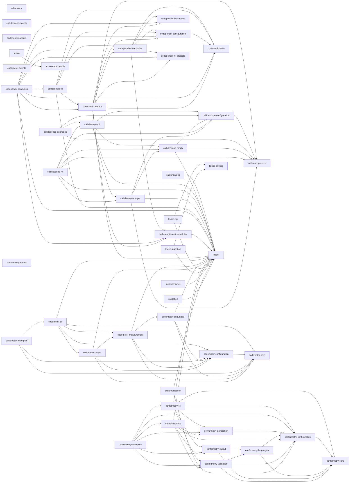

# 🧑‍💻 Codebase

[](https://github.com/Organizzolini/codebase/releases/latest)
[](https://github.com/Organizzolini/codebase/actions/workflows/continuous-integration.yml)
[](https://github.com/Organizzolini/codebase/actions/workflows/continuous-deployment.yml)
[](https://github.com/Organizzolini/codebase/actions/workflows/continuous-compliance.yml)
[](LICENSE)

[](https://nx.dev)
[](https://www.typescriptlang.org/)
[](https://pnpm.io/)
[](https://nodejs.org/)
[](https://www.python.org/)
[](https://docs.astral.sh/uv/)
[](https://hatch.pypa.io/)
[](https://jupyter.org/)
[](https://pandas.pydata.org/)
[](https://react.dev/)
[](https://tanstack.com/start)
[](https://ui.shadcn.com/)
[](https://radix-ui.com/)
[](https://tailwindcss.com/)
[](https://lucide.dev/)
[](https://recharts.org/)
[](https://zod.dev/)
[](https://vitejs.dev/)
[](https://swc.rs/)
[](https://vitest.dev/)
[](https://testing-library.com/)
[](https://fakerjs.dev/)
[](https://nestjs.com/)
[](https://nest-commander.jaymcdoniel.dev/)
[](https://expressjs.com/)
[](https://graphql.org/)
[](https://www.apollographql.com/docs/apollo-server)
[](https://typeorm.io/)
[](https://www.postgresql.org/)
[](https://www.sqlite.org/)
[](https://testcontainers.com/)
[](https://getpino.io/)
[](https://cheerio.js.org/)
[](https://remark.js.org/)
[](https://www.astro.com/swisseph/)
[](https://mermaid.js.org/)
[](https://api-extractor.com/)
[](https://python.langchain.com/)
[](https://langchain-ai.github.io/langgraph/)
[](https://ollama.com/)
[](https://openwebui.com/)
[](https://docs.searxng.org/)
[](https://docs.pydantic.dev/)
[](https://docs.pytest.org/)
[](https://microsoft.github.io/pyright/)
[](https://docs.astral.sh/ty/)
[](https://eslint.org/)
[](https://oxc.rs/docs/guide/usage/linter)
[](https://prettier.io/)
[](https://oxc.rs/docs/guide/usage/formatter)
[](https://stylelint.io/)
[](https://docs.astral.sh/ruff/)
[](https://github.com/DavidAnson/markdownlint-cli2)
[](https://cspell.org/)
[](https://www.shellcheck.net/)
[](https://sqlfluff.com/)
[](https://squawkhq.com/)
[](https://yamllint.readthedocs.io/)
[](https://github.com/kynan/nbstripout)
[](https://knip.dev/)
[](https://github.com/jendrikseipp/vulture)
[](https://docs.fallow.tools)
[](https://github.com/kucherenko/jscpd)
[](https://github.com/sverweij/dependency-cruiser)
[](https://syncpack.dev/)
[](https://github.com/QuiiBz/sherif)
[](https://github.com/plantain-00/type-coverage)
[](https://gitleaks.io/)
[](https://trivy.dev/)
[](https://bandit.readthedocs.io/)
[](https://github.com/davglass/license-checker)
[](https://typicode.github.io/husky/)
[](https://github.com/lint-staged/lint-staged)
[](https://commitlint.js.org/)
[](https://www.conventionalcommits.org/)
[](https://gitmoji.dev/)
[](https://semantic-release.gitbook.io/)
[](https://github.com/features/actions)
[](https://docs.github.com/en/code-security/dependabot)
[](https://www.docker.com/)
[](https://containers.dev/)
[](https://helm.sh/)
[](https://kubernetes.io/)
[](https://www.terraform.io/)
[](https://www.linode.com/products/kubernetes/)
[](https://claude.com/claude-code)
[](https://github.com/features/copilot)

## 💽 Projects

**🔮 [affirmancy](applications/affirmancy)** - Python LangChain + Ollama affirmation generator (LangGraph ReAct agent, SearxNG)\
<details>
<summary><strong>🛰️ caelundas</strong> - Swiss Ephemeris calendar generator that turns astronomical events into an `.ics` file</summary>

&nbsp;&nbsp;&nbsp;&nbsp;**[caelundas-cli](applications/caelundas/caelundas-cli)** - Command-line application that detects astronomical events with Swiss Ephemeris and writes them to an `.ics` file

</details>

<details>
<summary><strong>🔭 callidescope</strong> - Call stack tracing toolchain that follows control flow through injected dependencies and reports where a stack got too deep</summary>

&nbsp;&nbsp;&nbsp;&nbsp;**[callidescope-agents](packages/ic-suite/callidescope/callidescope-agents)** - Agent skills for the callidescope toolchain, published and installed back from the lockfile like any other vendored skill\
&nbsp;&nbsp;&nbsp;&nbsp;**[callidescope-cli](packages/ic-suite/callidescope/callidescope-cli)** [](https://www.npmjs.com/package/@callidescope/cli) - Command-line host that builds the call graph with the TypeScript compiler API, resolves NestJS injected dependencies, and reports the deepest stack below every entry point\
&nbsp;&nbsp;&nbsp;&nbsp;**[callidescope-configuration](packages/ic-suite/callidescope/callidescope-configuration)** [](https://www.npmjs.com/package/@callidescope/configuration) - Reads `callidescope.config.ts` for entry-point rules, depth and breadth limits, exclusion globs, and output destinations\
&nbsp;&nbsp;&nbsp;&nbsp;**[callidescope-core](packages/ic-suite/callidescope/callidescope-core)** [](https://www.npmjs.com/package/@callidescope/core) - The contracts leaf: the call graph, stack, frame, and finding vocabulary every other callidescope package speaks, holding no service and no NestJS module\
&nbsp;&nbsp;&nbsp;&nbsp;**[callidescope-examples](packages/ic-suite/callidescope/callidescope-examples)** - A small codebase built to be traced, carrying one worked example per rule, finding, and output the toolchain has\
&nbsp;&nbsp;&nbsp;&nbsp;**[callidescope-graph](packages/ic-suite/callidescope/callidescope-graph)** [](https://www.npmjs.com/package/@callidescope/graph) - Builds the call graph from traced TypeScript source and measures its depth and breadth\
&nbsp;&nbsp;&nbsp;&nbsp;**[callidescope-nx](packages/ic-suite/callidescope/callidescope-nx)** [](https://www.npmjs.com/package/@callidescope/nx) - Nx plugin inferring per-project `trace`, `depth`, and `breadth` targets that follow the Nx dependency graph, keeping every Nx dependency out of the packages that trace\
&nbsp;&nbsp;&nbsp;&nbsp;**[callidescope-output](packages/ic-suite/callidescope/callidescope-output)** [](https://www.npmjs.com/package/@callidescope/output) - Renders call-graph findings into markdown, mermaid, and JSON output formats

</details>

<details>
<summary><strong>🕸️ codependix</strong> - Dependency graph export toolchain that reads what each project depends on, renders it as JSON and Markdown diagrams, and gates the rules those graphs are judged against</summary>

&nbsp;&nbsp;&nbsp;&nbsp;**[codependix-agents](packages/ic-suite/codependix/codependix-agents)** - Agent skills for the codependix toolchain, installable by any workspace that uses codependix\
&nbsp;&nbsp;&nbsp;&nbsp;**[codependix-boundaries](packages/ic-suite/codependix/codependix-boundaries)** [](https://www.npmjs.com/package/@codependix/boundaries) - Builds each level's graph for a workspace, judges it against the declared rules, and reports the edges and cycles that break them\
&nbsp;&nbsp;&nbsp;&nbsp;**[codependix-cli](packages/ic-suite/codependix/codependix-cli)** [](https://www.npmjs.com/package/@codependix/cli) - Command-line host that exports a project's Nx, NestJS, and file-level dependency graphs as JSON and Markdown anchor blocks, and gates the rules over them\
&nbsp;&nbsp;&nbsp;&nbsp;**[codependix-configuration](packages/ic-suite/codependix/codependix-configuration)** [](https://www.npmjs.com/package/@codependix/configuration) - Reads `codependix.config.ts`, resolves the command line over it, and produces one resolved run configuration\
&nbsp;&nbsp;&nbsp;&nbsp;**[codependix-core](packages/ic-suite/codependix/codependix-core)** [](https://www.npmjs.com/package/@codependix/core) - The contracts leaf: the run and result vocabulary every other codependix package states its types in\
&nbsp;&nbsp;&nbsp;&nbsp;**[codependix-examples](packages/ic-suite/codependix/codependix-examples)** - Sixteen subjects built to be graphed, each carrying the guide codependix renders from it\
&nbsp;&nbsp;&nbsp;&nbsp;**[codependix-file-imports](packages/ic-suite/codependix/codependix-file-imports)** [](https://www.npmjs.com/package/@codependix/file-imports) - Builds a project's file-level import graph — a `typescript` module walking its own `ts.Program`, and a `python` module parsing `import`/`from ... import` statements\
&nbsp;&nbsp;&nbsp;&nbsp;**[codependix-nestjs-modules](packages/ic-suite/codependix/codependix-nestjs-modules)** [](https://www.npmjs.com/package/@codependix/nestjs-modules) - Explores a NestJS project's container and builds its module graph\
&nbsp;&nbsp;&nbsp;&nbsp;**[codependix-nx-projects](packages/ic-suite/codependix/codependix-nx-projects)** [](https://www.npmjs.com/package/@codependix/nx-projects) - Builds a project's one-hop Nx dependency neighborhood from the Nx project graph\
&nbsp;&nbsp;&nbsp;&nbsp;**[codependix-output](packages/ic-suite/codependix/codependix-output)** [](https://www.npmjs.com/package/@codependix/output) - Renders every graph as JSON, Markdown, and mermaid, routes each to its configured destination, and splices anchor blocks into place

</details>

<details>
<summary><strong>⏲️ codometer</strong> - Repository measurement toolchain that counts a codebase and reports what it found</summary>

&nbsp;&nbsp;&nbsp;&nbsp;**[codometer-agents](packages/ic-suite/codometer/codometer-agents)** - Agent skills for the codometer toolchain, published and installed back from the lockfile like any other vendored skill\
&nbsp;&nbsp;&nbsp;&nbsp;**[codometer-cli](packages/ic-suite/codometer/codometer-cli)** [](https://www.npmjs.com/package/@codometer/cli) - Command-line host that measures TypeScript, JavaScript, Python, JSON, markdown, and Jupyter notebooks, then writes the badge block in this README, a JSON report, or both\
&nbsp;&nbsp;&nbsp;&nbsp;**[codometer-configuration](packages/ic-suite/codometer/codometer-configuration)** [](https://www.npmjs.com/package/@codometer/configuration) - Reads `codometer.config.ts` for exclusion globs, output destinations and their render/write callbacks, and the Python interpreter, and reads the command line that runs over it\
&nbsp;&nbsp;&nbsp;&nbsp;**[codometer-core](packages/ic-suite/codometer/codometer-core)** [](https://www.npmjs.com/package/@codometer/core) - The contracts leaf: the statistics and report vocabulary a measurement produces, and the errors a configuration is refused with\
&nbsp;&nbsp;&nbsp;&nbsp;**[codometer-examples](packages/ic-suite/codometer/codometer-examples)** - A sample corpus with known contents and one runnable example per thing codometer does, with tests that assert every number the guides quote\
&nbsp;&nbsp;&nbsp;&nbsp;**[codometer-languages](packages/ic-suite/codometer/codometer-languages)** [](https://www.npmjs.com/package/@codometer/languages) - Every input language analyzer codometer measures, behind one `analyze()` call\
&nbsp;&nbsp;&nbsp;&nbsp;**[codometer-measurement](packages/ic-suite/codometer/codometer-measurement)** [](https://www.npmjs.com/package/@codometer/measurement) - Finds the files a run measures, counts their size and whatever a configuration declares its own counters for, and holds every metric to its declared limit\
&nbsp;&nbsp;&nbsp;&nbsp;**[codometer-output](packages/ic-suite/codometer/codometer-output)** [](https://www.npmjs.com/package/@codometer/output) - Every codometer output format - JSON reports, README badges, and the pull request change report - plus the destinations a run writes them to

</details>

<details>
<summary><strong>👔 conformetry</strong> - Template-driven code generation and conformance validation toolchain</summary>

&nbsp;&nbsp;&nbsp;&nbsp;**[conformetry-agents](packages/ic-suite/conformetry/conformetry-agents)** - Agent skills for the conformetry toolchain, published and installed back from the lockfile like any other vendored skill\
&nbsp;&nbsp;&nbsp;&nbsp;**[conformetry-cli](packages/ic-suite/conformetry/conformetry-cli)** [](https://www.npmjs.com/package/@conformetry/cli) - Command-line host that expands globs, prompts for inputs, and runs generation and validation\
&nbsp;&nbsp;&nbsp;&nbsp;**[conformetry-configuration](packages/ic-suite/conformetry/conformetry-configuration)** [](https://www.npmjs.com/package/@conformetry/configuration) - Configuration loading, template and instance discovery, generator input resolution, and the placeholder rendering every template path needs\
&nbsp;&nbsp;&nbsp;&nbsp;**[conformetry-core](packages/ic-suite/conformetry/conformetry-core)** [](https://www.npmjs.com/package/@conformetry/core) - Contracts leaf: difference, score, inventory, and language validator types, and nothing executable\
&nbsp;&nbsp;&nbsp;&nbsp;**[conformetry-examples](packages/ic-suite/conformetry/conformetry-examples)** - Eleven runnable examples of the toolchain, each with its own configuration, template, instances, and guide, executed by CI so the guides cannot rot\
&nbsp;&nbsp;&nbsp;&nbsp;**[conformetry-generation](packages/ic-suite/conformetry/conformetry-generation)** [](https://www.npmjs.com/package/@conformetry/generation) - Scaffold file generation, rendering each template through the configuration layer\
&nbsp;&nbsp;&nbsp;&nbsp;**[conformetry-languages](packages/ic-suite/conformetry/conformetry-languages)** [](https://www.npmjs.com/package/@conformetry/languages) - Every language conformetry compares files with, as modules of one package, plus the resolution that picks them, the text fallback, the extension-agnostic existence pass, and the difference and scoring primitives they share\
&nbsp;&nbsp;&nbsp;&nbsp;**[conformetry-nx](packages/ic-suite/conformetry/conformetry-nx)** [](https://www.npmjs.com/package/@conformetry/nx) - Nx plugin host with generators, executors, and the emitted-plugin bootstrap\
&nbsp;&nbsp;&nbsp;&nbsp;**[conformetry-output](packages/ic-suite/conformetry/conformetry-output)** [](https://www.npmjs.com/package/@conformetry/output) - Every render target: the validation report and the template and instance inventory\
&nbsp;&nbsp;&nbsp;&nbsp;**[conformetry-validation](packages/ic-suite/conformetry/conformetry-validation)** [](https://www.npmjs.com/package/@conformetry/validation) - Validation orchestration, language routing, and finding deduplication

</details>

<details>
<summary><strong>🐺 lexico</strong> - Latin-English dictionary suite: the web application, its components, its schema, and the ingestion that fills it</summary>

&nbsp;&nbsp;&nbsp;&nbsp;**[lexico](applications/lexico)** - TanStack Start SSR dictionary web application\
&nbsp;&nbsp;&nbsp;&nbsp;**[lexico-api](applications/lexico-api)** - NestJS GraphQL API exposing Latin dictionary, literature, and Relay cursor-based search\
&nbsp;&nbsp;&nbsp;&nbsp;**[lexico-components](packages/lexico-components)** - Shared React component library using shadcn/ui and Radix primitives\
&nbsp;&nbsp;&nbsp;&nbsp;**[lexico-entities](packages/lexico-entities)** - TypeORM entities, migrations, and grammatical enumerations for the dictionary and literature schema\
&nbsp;&nbsp;&nbsp;&nbsp;**[lexico-ingestion](applications/lexico-ingestion)** - NestJS CLI that scrapes and loads dictionary, literature, and etymology sources

</details>

**🪵 [logger](packages/logger)** - Shared pino-backed NestJS `LoggerService` and `LoggerModule`

<details>
<summary><strong>🏺 meanderaw</strong> - Greek meander (key/fret) applications that enumerate, measure, and classify meander patterns</summary>

&nbsp;&nbsp;&nbsp;&nbsp;**[meanderaw-cli](applications/meanderaw/meanderaw-cli)** - CLI that enumerates Greek meander (key/fret) patterns into a Postgres database, measuring and classifying each by its Code

</details>

**🧑‍💻 [JimmyPaolini](applications/JimmyPaolini)** - GitHub profile site\
**↔️ [synchronization](tools/synchronization)** - NestJS CLI that regenerates the workspace's derived configuration and documentation, and fails CI when they drift\
**✅ [validation](tools/validation)** - NestJS CLI for the repository's one-sided checks, the ones with a check and no write, such as the pull request metadata gate

## 📖 Documentation

### Getting Started & Workflow

- [Contributing Guide](.github/CONTRIBUTING.md) - **Start here.** Local and dev container setup, the commands to run, code standards, branch and commit conventions, pull requests, and releases
- [AGENTS.md](AGENTS.md) - Commands, project layout, conventions, code quality gates, and git workflow
- [Release Process](documentation/development/release-process.md) - Automated semantic versioning and changelogs

### Architecture & Systems

- [CI/CD Workflows](.github/workflows) - GitHub Actions workflows and the shared `setup-codebase` composite action
- [Infrastructure](infrastructure/README.md) - Helm charts, Terraform, and the Kubernetes deployment pipeline
- [Dev Container](.devcontainer/README.md) - Containerized development environment
- [Scripts](scripts/README.md) - Local setup and maintenance scripts

### Conventions & Guidelines

Conventions live in [AGENTS.md](AGENTS.md) and the agent skills below, which are the single sources of truth. Every project also has its own `AGENTS.md` with project-specific patterns.

**🤖 Agent Skills (Domain Knowledge)**
Skills are specialized instruction files used by our automated agents, but they also serve as excellent deep-dive documentation for human developers.

- [View all Skills](.agents/skills) - Complete index of available skills
- **Languages:** [TypeScript](.agents/skills/write-typescript/SKILL.md) / [React](.agents/skills/write-react/SKILL.md) / [Python](.agents/skills/write-python/SKILL.md) / [Comments](.agents/skills/write-comments/SKILL.md)
- **Quality:** [Validate Code](.agents/skills/validate-code/SKILL.md) / [Testing Strategy](.agents/skills/testing-strategy/SKILL.md) / [Testing Mocks](.agents/skills/testing-mocks/SKILL.md) / [Error Handling](.agents/skills/handle-errors/SKILL.md)
- **Workflows:** [Git Commits](.agents/skills/commit-code/SKILL.md) / [PR Management](.agents/skills/create-pull-request/SKILL.md) / [Branch Naming](.agents/skills/checkout-branch/SKILL.md)
- **Tooling:** [Nx Workspaces](.agents/skills/nx-workspace/SKILL.md) / [Generators](.agents/skills/nx-generate/SKILL.md) / [Task Running](.agents/skills/nx-run-tasks/SKILL.md)
- **Triage:** [Failing CI](.agents/skills/triage-integration/SKILL.md) / [Rejected Commits](.agents/skills/triage-integration/SKILL.md) / [Spell Check](.agents/skills/spell-check/SKILL.md)

Other important files include [CHANGELOG.md](CHANGELOG.md) and [SECURITY.md](.github/SECURITY.md).

## 👔 Conformetry

Template-driven code generation and conformance validation, templates synced from [configuration/conformetry.config.ts](configuration/conformetry.config.ts) by `nx run synchronization:conformetry-generators:write`.

<!-- conformetry:start -->
| Template | Description |
| -------- | ----------- |
| `jupyter-notebook-application` | A standalone Python application template with a Jupyter notebook entry point, pytest/pyright/ruff tooling, and a shared uv workspace venv |
| `nestjs-command-project` | A standalone NestJS CLI application template built on nest-commander, for a new command-line tool in applications/, packages/, or tools/ |
| `nestjs-graphql-application` | A standalone NestJS GraphQL API application template, for a new backend service exposing a GraphQL schema over HTTP |
| `nestjs-service-project` | A standalone NestJS library package template for internal workspace code shared across projects, with no CLI entry point or HTTP server |
| `nestjs-command-module` | A nest-commander command module template — command, module, constants, types, and unit test — for an existing NestJS command-line project |
| `nestjs-dataloader-module` | A GraphQL dataloader module template — dataloader, module, types, and unit test — for batching lookups inside an existing NestJS project |
| `nestjs-graphql-module` | A GraphQL module template — resolver, entities, args/input types, factories, constants, and unit test — for an existing NestJS project |
| `nestjs-service-file` | A service and unit test file template for an existing NestJS module, without the surrounding module files |
| `nestjs-resolver-file` | A resolver and unit test file template for an existing NestJS module, without the surrounding module files |
| `nestjs-service-module` | A plain service module template — module, service, constants, types, and unit test — for an existing NestJS project |
| `react-component` | A React component and test file template for an existing React project |
<!-- conformetry:end -->

## 🕸️ Codependix

The workspace's dependency graph, exported by [codependix](packages/ic-suite/codependix/codependix-cli), regenerated by `nx run codebase:codependix:write`.

<!-- codependix:start name="codependix-nx-projects" -->


_Dashed edges are dependencies Nx inferred from configuration rather than from code._
<!-- codependix:end name="codependix-nx-projects" -->

### NestJS Module Graph

<!-- codependix:start name="codependix-nestjs-modules" -->
```mermaid
graph LR
  module_caelundas_cli_AnnualSolarCycleModule["caelundas-cli/AnnualSolarCycleModule"]
  module_caelundas_cli_AspectsModule["caelundas-cli/AspectsModule"]
  module_caelundas_cli_AspectsUtilitiesModule["caelundas-cli/AspectsUtilitiesModule"]
  module_caelundas_cli_CaelundasModule["caelundas-cli/CaelundasModule"]
  module_caelundas_cli_CalendarModule["caelundas-cli/CalendarModule"]
  module_caelundas_cli_ConfigModule["caelundas-cli/ConfigModule"]
  module_caelundas_cli_DailyCyclesModule["caelundas-cli/DailyCyclesModule"]
  module_caelundas_cli_DatetimeModule["caelundas-cli/DatetimeModule"]
  module_caelundas_cli_DiscoveryModule["caelundas-cli/DiscoveryModule"]
  module_caelundas_cli_EclipsesModule["caelundas-cli/EclipsesModule"]
  module_caelundas_cli_EphemerisModule["caelundas-cli/EphemerisModule"]
  module_caelundas_cli_IngressesModule["caelundas-cli/IngressesModule"]
  module_caelundas_cli_InputModule["caelundas-cli/InputModule"]
  module_caelundas_cli_LoggerModule["caelundas-cli/LoggerModule"]
  module_caelundas_cli_MainModule["caelundas-cli/MainModule"]
  module_caelundas_cli_MajorAspectsModule["caelundas-cli/MajorAspectsModule"]
  module_caelundas_cli_MathModule["caelundas-cli/MathModule"]
  module_caelundas_cli_MinorAspectsModule["caelundas-cli/MinorAspectsModule"]
  module_caelundas_cli_MonthlyLunarCycleModule["caelundas-cli/MonthlyLunarCycleModule"]
  module_caelundas_cli_PerfectiveModule["caelundas-cli/PerfectiveModule"]
  module_caelundas_cli_PhasesModule["caelundas-cli/PhasesModule"]
  module_caelundas_cli_ProgressiveModule["caelundas-cli/ProgressiveModule"]
  module_caelundas_cli_ProgressiveUtilitiesModule["caelundas-cli/ProgressiveUtilitiesModule"]
  module_caelundas_cli_QuadrupleAspectsModule["caelundas-cli/QuadrupleAspectsModule"]
  module_caelundas_cli_QuintupleAspectsModule["caelundas-cli/QuintupleAspectsModule"]
  module_caelundas_cli_RetrogradesModule["caelundas-cli/RetrogradesModule"]
  module_caelundas_cli_SextupleAspectsModule["caelundas-cli/SextupleAspectsModule"]
  module_caelundas_cli_SpecialtyAspectsModule["caelundas-cli/SpecialtyAspectsModule"]
  module_caelundas_cli_StelliumModule["caelundas-cli/StelliumModule"]
  module_caelundas_cli_TripleAspectsModule["caelundas-cli/TripleAspectsModule"]
  module_caelundas_cli_TwilightsModule["caelundas-cli/TwilightsModule"]
  module_callidescope_cli_AddressLookupModule["callidescope-cli/AddressLookupModule"]
  module_callidescope_cli_AddressReportModule["callidescope-cli/AddressReportModule"]
  module_callidescope_cli_BreadthModule["callidescope-cli/BreadthModule"]
  module_callidescope_cli_CallablesModule["callidescope-cli/CallablesModule"]
  module_callidescope_cli_CallidescopeModule["callidescope-cli/CallidescopeModule"]
  module_callidescope_cli_ClassesModule["callidescope-cli/ClassesModule"]
  module_callidescope_cli_ConfigModule["callidescope-cli/ConfigModule"]
  module_callidescope_cli_ConfigurationFileModule["callidescope-cli/ConfigurationFileModule"]
  module_callidescope_cli_ConfigurationModule["callidescope-cli/ConfigurationModule"]
  module_callidescope_cli_DepthModule["callidescope-cli/DepthModule"]
  module_callidescope_cli_DiscoveryModule["callidescope-cli/DiscoveryModule"]
  module_callidescope_cli_DocumentationModule["callidescope-cli/DocumentationModule"]
  module_callidescope_cli_EdgesModule["callidescope-cli/EdgesModule"]
  module_callidescope_cli_EntriesModule["callidescope-cli/EntriesModule"]
  module_callidescope_cli_FlagResolutionModule["callidescope-cli/FlagResolutionModule"]
  module_callidescope_cli_GraphModule["callidescope-cli/GraphModule"]
  module_callidescope_cli_InputModule["callidescope-cli/InputModule"]
  module_callidescope_cli_LimitsModule["callidescope-cli/LimitsModule"]
  module_callidescope_cli_LoggerModule["callidescope-cli/LoggerModule"]
  module_callidescope_cli_MainModule["callidescope-cli/MainModule"]
  module_callidescope_cli_OutputJsonModule["callidescope-cli/OutputJsonModule"]
  module_callidescope_cli_OutputMarkdownModule["callidescope-cli/OutputMarkdownModule"]
  module_callidescope_cli_ProgramModule["callidescope-cli/ProgramModule"]
  module_callidescope_cli_ProjectReportsModule["callidescope-cli/ProjectReportsModule"]
  module_callidescope_cli_ReportFindingsModule["callidescope-cli/ReportFindingsModule"]
  module_callidescope_cli_ReportModule["callidescope-cli/ReportModule"]
  module_callidescope_cli_RunPlanModule["callidescope-cli/RunPlanModule"]
  module_callidescope_cli_SignaturesModule["callidescope-cli/SignaturesModule"]
  module_callidescope_cli_WorkspaceModule["callidescope-cli/WorkspaceModule"]
  module_callidescope_cli_WriteDestinationsModule["callidescope-cli/WriteDestinationsModule"]
  module_callidescope_configuration_ConfigurationFileModule["callidescope-configuration/ConfigurationFileModule"]
  module_callidescope_configuration_ConfigurationModule["callidescope-configuration/ConfigurationModule"]
  module_callidescope_configuration_FlagResolutionModule["callidescope-configuration/FlagResolutionModule"]
  module_callidescope_configuration_InputModule["callidescope-configuration/InputModule"]
  module_callidescope_configuration_RunPlanModule["callidescope-configuration/RunPlanModule"]
  module_callidescope_core_CallidescopeCoreModule["callidescope-core/CallidescopeCoreModule"]
  module_callidescope_graph_CallablesModule["callidescope-graph/CallablesModule"]
  module_callidescope_graph_ClassesModule["callidescope-graph/ClassesModule"]
  module_callidescope_graph_DocumentationModule["callidescope-graph/DocumentationModule"]
  module_callidescope_graph_EdgesModule["callidescope-graph/EdgesModule"]
  module_callidescope_graph_EntriesModule["callidescope-graph/EntriesModule"]
  module_callidescope_graph_GraphModule["callidescope-graph/GraphModule"]
  module_callidescope_graph_LoggerModule["callidescope-graph/LoggerModule"]
  module_callidescope_graph_ProgramModule["callidescope-graph/ProgramModule"]
  module_callidescope_graph_SignaturesModule["callidescope-graph/SignaturesModule"]
  module_callidescope_graph_WorkspaceModule["callidescope-graph/WorkspaceModule"]
  module_callidescope_nx_AddressLookupModule["callidescope-nx/AddressLookupModule"]
  module_callidescope_nx_AddressModule["callidescope-nx/AddressModule"]
  module_callidescope_nx_AddressReportModule["callidescope-nx/AddressReportModule"]
  module_callidescope_nx_CallablesModule["callidescope-nx/CallablesModule"]
  module_callidescope_nx_CallidescopeModule["callidescope-nx/CallidescopeModule"]
  module_callidescope_nx_ClassesModule["callidescope-nx/ClassesModule"]
  module_callidescope_nx_ConfigurationFileModule["callidescope-nx/ConfigurationFileModule"]
  module_callidescope_nx_ConfigurationModule["callidescope-nx/ConfigurationModule"]
  module_callidescope_nx_DocumentationModule["callidescope-nx/DocumentationModule"]
  module_callidescope_nx_EdgesModule["callidescope-nx/EdgesModule"]
  module_callidescope_nx_EntriesModule["callidescope-nx/EntriesModule"]
  module_callidescope_nx_FlagResolutionModule["callidescope-nx/FlagResolutionModule"]
  module_callidescope_nx_GraphModule["callidescope-nx/GraphModule"]
  module_callidescope_nx_InputModule["callidescope-nx/InputModule"]
  module_callidescope_nx_LoggerModule["callidescope-nx/LoggerModule"]
  module_callidescope_nx_MainModule["callidescope-nx/MainModule"]
  module_callidescope_nx_OptionsModule["callidescope-nx/OptionsModule"]
  module_callidescope_nx_OutputJsonModule["callidescope-nx/OutputJsonModule"]
  module_callidescope_nx_OutputMarkdownModule["callidescope-nx/OutputMarkdownModule"]
  module_callidescope_nx_PluginModule["callidescope-nx/PluginModule"]
  module_callidescope_nx_ProgramModule["callidescope-nx/ProgramModule"]
  module_callidescope_nx_ProjectReportsModule["callidescope-nx/ProjectReportsModule"]
  module_callidescope_nx_ProjectsModule["callidescope-nx/ProjectsModule"]
  module_callidescope_nx_ReportFindingsModule["callidescope-nx/ReportFindingsModule"]
  module_callidescope_nx_ReportModule["callidescope-nx/ReportModule"]
  module_callidescope_nx_RunConfigurationModule["callidescope-nx/RunConfigurationModule"]
  module_callidescope_nx_RunPlanModule["callidescope-nx/RunPlanModule"]
  module_callidescope_nx_SignaturesModule["callidescope-nx/SignaturesModule"]
  module_callidescope_nx_WorkspaceModule["callidescope-nx/WorkspaceModule"]
  module_callidescope_nx_WriteDestinationsModule["callidescope-nx/WriteDestinationsModule"]
  module_callidescope_output_AddressReportModule["callidescope-output/AddressReportModule"]
  module_callidescope_output_CallablesModule["callidescope-output/CallablesModule"]
  module_callidescope_output_ClassesModule["callidescope-output/ClassesModule"]
  module_callidescope_output_DocumentationModule["callidescope-output/DocumentationModule"]
  module_callidescope_output_EdgesModule["callidescope-output/EdgesModule"]
  module_callidescope_output_GraphModule["callidescope-output/GraphModule"]
  module_callidescope_output_LoggerModule["callidescope-output/LoggerModule"]
  module_callidescope_output_OutputJsonModule["callidescope-output/OutputJsonModule"]
  module_callidescope_output_OutputMarkdownModule["callidescope-output/OutputMarkdownModule"]
  module_callidescope_output_ProgramModule["callidescope-output/ProgramModule"]
  module_callidescope_output_ProjectReportsModule["callidescope-output/ProjectReportsModule"]
  module_callidescope_output_ReportFindingsModule["callidescope-output/ReportFindingsModule"]
  module_callidescope_output_ReportModule["callidescope-output/ReportModule"]
  module_callidescope_output_SignaturesModule["callidescope-output/SignaturesModule"]
  module_callidescope_output_WorkspaceModule["callidescope-output/WorkspaceModule"]
  module_callidescope_output_WriteDestinationsModule["callidescope-output/WriteDestinationsModule"]
  module_codependix_boundaries_BoundariesModule["codependix-boundaries/BoundariesModule"]
  module_codependix_boundaries_BoundaryCheckModule["codependix-boundaries/BoundaryCheckModule"]
  module_codependix_boundaries_ConfigurationModule["codependix-boundaries/ConfigurationModule"]
  module_codependix_boundaries_InputModule["codependix-boundaries/InputModule"]
  module_codependix_boundaries_LoggerModule["codependix-boundaries/LoggerModule"]
  module_codependix_boundaries_ModuleGraphModule["codependix-boundaries/ModuleGraphModule"]
  module_codependix_boundaries_NeighborhoodModule["codependix-boundaries/NeighborhoodModule"]
  module_codependix_boundaries_NestjsProjectModule["codependix-boundaries/NestjsProjectModule"]
  module_codependix_boundaries_OverrideResolutionModule["codependix-boundaries/OverrideResolutionModule"]
  module_codependix_boundaries_PythonModule["codependix-boundaries/PythonModule"]
  module_codependix_boundaries_RunContextModule["codependix-boundaries/RunContextModule"]
  module_codependix_boundaries_TypescriptModule["codependix-boundaries/TypescriptModule"]
  module_codependix_boundaries_WorkspaceGraphModule["codependix-boundaries/WorkspaceGraphModule"]
  module_codependix_cli_AnchorsModule["codependix-cli/AnchorsModule"]
  module_codependix_cli_BoundariesModule["codependix-cli/BoundariesModule"]
  module_codependix_cli_BoundaryCheckModule["codependix-cli/BoundaryCheckModule"]
  module_codependix_cli_CombinedOutputModule["codependix-cli/CombinedOutputModule"]
  module_codependix_cli_ConfigModule["codependix-cli/ConfigModule"]
  module_codependix_cli_ConfigurationModule["codependix-cli/ConfigurationModule"]
  module_codependix_cli_DeliveryModule["codependix-cli/DeliveryModule"]
  module_codependix_cli_DiscoveryModule["codependix-cli/DiscoveryModule"]
  module_codependix_cli_FileImportsWorkspaceGraphModule["codependix-cli/FileImportsWorkspaceGraphModule"]
  module_codependix_cli_GraphRunModule["codependix-cli/GraphRunModule"]
  module_codependix_cli_InputModule["codependix-cli/InputModule"]
  module_codependix_cli_LoggerModule["codependix-cli/LoggerModule"]
  module_codependix_cli_MainModule["codependix-cli/MainModule"]
  module_codependix_cli_MapModule["codependix-cli/MapModule"]
  module_codependix_cli_ModuleGraphModule["codependix-cli/ModuleGraphModule"]
  module_codependix_cli_NeighborhoodModule["codependix-cli/NeighborhoodModule"]
  module_codependix_cli_NestjsModulesWorkspaceGraphModule["codependix-cli/NestjsModulesWorkspaceGraphModule"]
  module_codependix_cli_NestjsProjectModule["codependix-cli/NestjsProjectModule"]
  module_codependix_cli_OverrideResolutionModule["codependix-cli/OverrideResolutionModule"]
  module_codependix_cli_PathModule["codependix-cli/PathModule"]
  module_codependix_cli_PathQueryModule["codependix-cli/PathQueryModule"]
  module_codependix_cli_ProjectGraphsModule["codependix-cli/ProjectGraphsModule"]
  module_codependix_cli_PythonImportsModule["codependix-cli/PythonImportsModule"]
  module_codependix_cli_PythonModule["codependix-cli/PythonModule"]
  module_codependix_cli_ReportingModule["codependix-cli/ReportingModule"]
  module_codependix_cli_RunContextModule["codependix-cli/RunContextModule"]
  module_codependix_cli_TypescriptModule["codependix-cli/TypescriptModule"]
  module_codependix_cli_WorkspaceGraphModule["codependix-cli/WorkspaceGraphModule"]
  module_codependix_cli_WorkspaceGraphsModule["codependix-cli/WorkspaceGraphsModule"]
  module_codependix_configuration_ConfigurationModule["codependix-configuration/ConfigurationModule"]
  module_codependix_configuration_InputModule["codependix-configuration/InputModule"]
  module_codependix_configuration_OverrideResolutionModule["codependix-configuration/OverrideResolutionModule"]
  module_codependix_core_CodependixCoreModule["codependix-core/CodependixCoreModule"]
  module_codependix_file_imports_FileImportsWorkspaceGraphModule["codependix-file-imports/FileImportsWorkspaceGraphModule"]
  module_codependix_file_imports_PythonModule["codependix-file-imports/PythonModule"]
  module_codependix_file_imports_TypescriptModule["codependix-file-imports/TypescriptModule"]
  module_codependix_nestjs_modules_LoggerModule["codependix-nestjs-modules/LoggerModule"]
  module_codependix_nestjs_modules_ModuleGraphModule["codependix-nestjs-modules/ModuleGraphModule"]
  module_codependix_nestjs_modules_NestjsModulesWorkspaceGraphModule["codependix-nestjs-modules/NestjsModulesWorkspaceGraphModule"]
  module_codependix_nestjs_modules_NestjsProjectModule["codependix-nestjs-modules/NestjsProjectModule"]
  module_codependix_nx_projects_NeighborhoodModule["codependix-nx-projects/NeighborhoodModule"]
  module_codependix_nx_projects_WorkspaceGraphModule["codependix-nx-projects/WorkspaceGraphModule"]
  module_codependix_output_AnchorsModule["codependix-output/AnchorsModule"]
  module_codependix_output_BoundariesModule["codependix-output/BoundariesModule"]
  module_codependix_output_BoundaryCheckModule["codependix-output/BoundaryCheckModule"]
  module_codependix_output_CombinedOutputModule["codependix-output/CombinedOutputModule"]
  module_codependix_output_ConfigurationModule["codependix-output/ConfigurationModule"]
  module_codependix_output_DeliveryModule["codependix-output/DeliveryModule"]
  module_codependix_output_FileImportsWorkspaceGraphModule["codependix-output/FileImportsWorkspaceGraphModule"]
  module_codependix_output_GraphRunModule["codependix-output/GraphRunModule"]
  module_codependix_output_InputModule["codependix-output/InputModule"]
  module_codependix_output_LoggerModule["codependix-output/LoggerModule"]
  module_codependix_output_ModuleGraphModule["codependix-output/ModuleGraphModule"]
  module_codependix_output_NeighborhoodModule["codependix-output/NeighborhoodModule"]
  module_codependix_output_NestjsModulesWorkspaceGraphModule["codependix-output/NestjsModulesWorkspaceGraphModule"]
  module_codependix_output_NestjsProjectModule["codependix-output/NestjsProjectModule"]
  module_codependix_output_OverrideResolutionModule["codependix-output/OverrideResolutionModule"]
  module_codependix_output_PathQueryModule["codependix-output/PathQueryModule"]
  module_codependix_output_ProjectGraphsModule["codependix-output/ProjectGraphsModule"]
  module_codependix_output_PythonImportsModule["codependix-output/PythonImportsModule"]
  module_codependix_output_PythonModule["codependix-output/PythonModule"]
  module_codependix_output_ReportingModule["codependix-output/ReportingModule"]
  module_codependix_output_TypescriptModule["codependix-output/TypescriptModule"]
  module_codependix_output_WorkspaceGraphModule["codependix-output/WorkspaceGraphModule"]
  module_codependix_output_WorkspaceGraphsModule["codependix-output/WorkspaceGraphsModule"]
  module_codometer_cli_ChangesModule["codometer-cli/ChangesModule"]
  module_codometer_cli_CommentsModule["codometer-cli/CommentsModule"]
  module_codometer_cli_ConfigModule["codometer-cli/ConfigModule"]
  module_codometer_cli_ConfigurationListingModule["codometer-cli/ConfigurationListingModule"]
  module_codometer_cli_ConfigurationModule["codometer-cli/ConfigurationModule"]
  module_codometer_cli_CssModule["codometer-cli/CssModule"]
  module_codometer_cli_CustomizationModule["codometer-cli/CustomizationModule"]
  module_codometer_cli_DeliveryModule["codometer-cli/DeliveryModule"]
  module_codometer_cli_DestinationsModule["codometer-cli/DestinationsModule"]
  module_codometer_cli_DiscoveryModule["codometer-cli/DiscoveryModule"]
  module_codometer_cli_DocumentsModule["codometer-cli/DocumentsModule"]
  module_codometer_cli_HclModule["codometer-cli/HclModule"]
  module_codometer_cli_InputsModule["codometer-cli/InputsModule"]
  module_codometer_cli_JsonModule["codometer-cli/JsonModule"]
  module_codometer_cli_JupyterModule["codometer-cli/JupyterModule"]
  module_codometer_cli_LanguagesModule["codometer-cli/LanguagesModule"]
  module_codometer_cli_LimitsModule["codometer-cli/LimitsModule"]
  module_codometer_cli_LoggerModule["codometer-cli/LoggerModule"]
  module_codometer_cli_MainModule["codometer-cli/MainModule"]
  module_codometer_cli_MarkdownModule["codometer-cli/MarkdownModule"]
  module_codometer_cli_MeasureModule["codometer-cli/MeasureModule"]
  module_codometer_cli_PythonModule["codometer-cli/PythonModule"]
  module_codometer_cli_RenderModule["codometer-cli/RenderModule"]
  module_codometer_cli_ReportModule["codometer-cli/ReportModule"]
  module_codometer_cli_ShellModule["codometer-cli/ShellModule"]
  module_codometer_cli_SizeModule["codometer-cli/SizeModule"]
  module_codometer_cli_SqlModule["codometer-cli/SqlModule"]
  module_codometer_cli_TomlModule["codometer-cli/TomlModule"]
  module_codometer_cli_TypescriptModule["codometer-cli/TypescriptModule"]
  module_codometer_cli_YamlModule["codometer-cli/YamlModule"]
  module_codometer_configuration_ConfigurationModule["codometer-configuration/ConfigurationModule"]
  module_codometer_core_CodometerCoreModule["codometer-core/CodometerCoreModule"]
  module_codometer_languages_CommentsModule["codometer-languages/CommentsModule"]
  module_codometer_languages_CssModule["codometer-languages/CssModule"]
  module_codometer_languages_HclModule["codometer-languages/HclModule"]
  module_codometer_languages_JsonModule["codometer-languages/JsonModule"]
  module_codometer_languages_JupyterModule["codometer-languages/JupyterModule"]
  module_codometer_languages_LanguagesModule["codometer-languages/LanguagesModule"]
  module_codometer_languages_LoggerModule["codometer-languages/LoggerModule"]
  module_codometer_languages_MarkdownModule["codometer-languages/MarkdownModule"]
  module_codometer_languages_PythonModule["codometer-languages/PythonModule"]
  module_codometer_languages_ShellModule["codometer-languages/ShellModule"]
  module_codometer_languages_SqlModule["codometer-languages/SqlModule"]
  module_codometer_languages_TomlModule["codometer-languages/TomlModule"]
  module_codometer_languages_TypescriptModule["codometer-languages/TypescriptModule"]
  module_codometer_languages_YamlModule["codometer-languages/YamlModule"]
  module_codometer_measurement_CommentsModule["codometer-measurement/CommentsModule"]
  module_codometer_measurement_ConfigurationModule["codometer-measurement/ConfigurationModule"]
  module_codometer_measurement_CssModule["codometer-measurement/CssModule"]
  module_codometer_measurement_CustomizationModule["codometer-measurement/CustomizationModule"]
  module_codometer_measurement_DiscoveryModule["codometer-measurement/DiscoveryModule"]
  module_codometer_measurement_HclModule["codometer-measurement/HclModule"]
  module_codometer_measurement_InputsModule["codometer-measurement/InputsModule"]
  module_codometer_measurement_JsonModule["codometer-measurement/JsonModule"]
  module_codometer_measurement_JupyterModule["codometer-measurement/JupyterModule"]
  module_codometer_measurement_LanguagesModule["codometer-measurement/LanguagesModule"]
  module_codometer_measurement_LimitsModule["codometer-measurement/LimitsModule"]
  module_codometer_measurement_LoggerModule["codometer-measurement/LoggerModule"]
  module_codometer_measurement_MarkdownModule["codometer-measurement/MarkdownModule"]
  module_codometer_measurement_MeasureModule["codometer-measurement/MeasureModule"]
  module_codometer_measurement_PythonModule["codometer-measurement/PythonModule"]
  module_codometer_measurement_ShellModule["codometer-measurement/ShellModule"]
  module_codometer_measurement_SizeModule["codometer-measurement/SizeModule"]
  module_codometer_measurement_SqlModule["codometer-measurement/SqlModule"]
  module_codometer_measurement_TomlModule["codometer-measurement/TomlModule"]
  module_codometer_measurement_TypescriptModule["codometer-measurement/TypescriptModule"]
  module_codometer_measurement_YamlModule["codometer-measurement/YamlModule"]
  module_codometer_output_ChangesModule["codometer-output/ChangesModule"]
  module_codometer_output_ConfigurationListingModule["codometer-output/ConfigurationListingModule"]
  module_codometer_output_ConfigurationModule["codometer-output/ConfigurationModule"]
  module_codometer_output_DeliveryModule["codometer-output/DeliveryModule"]
  module_codometer_output_DestinationsModule["codometer-output/DestinationsModule"]
  module_codometer_output_DiscoveryModule["codometer-output/DiscoveryModule"]
  module_codometer_output_DocumentsModule["codometer-output/DocumentsModule"]
  module_codometer_output_JsonModule["codometer-output/JsonModule"]
  module_codometer_output_LoggerModule["codometer-output/LoggerModule"]
  module_codometer_output_MarkdownModule["codometer-output/MarkdownModule"]
  module_codometer_output_RenderModule["codometer-output/RenderModule"]
  module_codometer_output_ReportModule["codometer-output/ReportModule"]
  module_conformetry_cli_ConfigModule["conformetry-cli/ConfigModule"]
  module_conformetry_cli_ConfigurationModule["conformetry-cli/ConfigurationModule"]
  module_conformetry_cli_DifferencesModule["conformetry-cli/DifferencesModule"]
  module_conformetry_cli_DiscoveryModule["conformetry-cli/DiscoveryModule"]
  module_conformetry_cli_FilesModule["conformetry-cli/FilesModule"]
  module_conformetry_cli_GenerateModule["conformetry-cli/GenerateModule"]
  module_conformetry_cli_GenerationModule["conformetry-cli/GenerationModule"]
  module_conformetry_cli_InputModule["conformetry-cli/InputModule"]
  module_conformetry_cli_InstanceDiscoveryModule["conformetry-cli/InstanceDiscoveryModule"]
  module_conformetry_cli_InstanceGroupModule["conformetry-cli/InstanceGroupModule"]
  module_conformetry_cli_InstancesModule["conformetry-cli/InstancesModule"]
  module_conformetry_cli_InventoryModule["conformetry-cli/InventoryModule"]
  module_conformetry_cli_JsonModule["conformetry-cli/JsonModule"]
  module_conformetry_cli_JupyterModule["conformetry-cli/JupyterModule"]
  module_conformetry_cli_LanguagesModule["conformetry-cli/LanguagesModule"]
  module_conformetry_cli_LoggerModule["conformetry-cli/LoggerModule"]
  module_conformetry_cli_MainModule["conformetry-cli/MainModule"]
  module_conformetry_cli_MarkdownModule["conformetry-cli/MarkdownModule"]
  module_conformetry_cli_PythonModule["conformetry-cli/PythonModule"]
  module_conformetry_cli_RenderingModule["conformetry-cli/RenderingModule"]
  module_conformetry_cli_ReportingModule["conformetry-cli/ReportingModule"]
  module_conformetry_cli_RunnerModule["conformetry-cli/RunnerModule"]
  module_conformetry_cli_ScoringModule["conformetry-cli/ScoringModule"]
  module_conformetry_cli_TemplateDiscoveryModule["conformetry-cli/TemplateDiscoveryModule"]
  module_conformetry_cli_TemplatesModule["conformetry-cli/TemplatesModule"]
  module_conformetry_cli_TextModule["conformetry-cli/TextModule"]
  module_conformetry_cli_TypescriptModule["conformetry-cli/TypescriptModule"]
  module_conformetry_cli_ValidateModule["conformetry-cli/ValidateModule"]
  module_conformetry_cli_ValidationModule["conformetry-cli/ValidationModule"]
  module_conformetry_configuration_ConfigurationModule["conformetry-configuration/ConfigurationModule"]
  module_conformetry_configuration_InputModule["conformetry-configuration/InputModule"]
  module_conformetry_configuration_InstanceDiscoveryModule["conformetry-configuration/InstanceDiscoveryModule"]
  module_conformetry_configuration_InstanceGroupModule["conformetry-configuration/InstanceGroupModule"]
  module_conformetry_configuration_RenderingModule["conformetry-configuration/RenderingModule"]
  module_conformetry_configuration_TemplateDiscoveryModule["conformetry-configuration/TemplateDiscoveryModule"]
  module_conformetry_core_ConformetryCoreModule["conformetry-core/ConformetryCoreModule"]
  module_conformetry_generation_ConfigurationModule["conformetry-generation/ConfigurationModule"]
  module_conformetry_generation_GenerationModule["conformetry-generation/GenerationModule"]
  module_conformetry_generation_InputModule["conformetry-generation/InputModule"]
  module_conformetry_generation_InstanceDiscoveryModule["conformetry-generation/InstanceDiscoveryModule"]
  module_conformetry_generation_InstanceGroupModule["conformetry-generation/InstanceGroupModule"]
  module_conformetry_generation_RenderingModule["conformetry-generation/RenderingModule"]
  module_conformetry_generation_TemplateDiscoveryModule["conformetry-generation/TemplateDiscoveryModule"]
  module_conformetry_languages_ConfigurationModule["conformetry-languages/ConfigurationModule"]
  module_conformetry_languages_DifferencesModule["conformetry-languages/DifferencesModule"]
  module_conformetry_languages_FilesModule["conformetry-languages/FilesModule"]
  module_conformetry_languages_InputModule["conformetry-languages/InputModule"]
  module_conformetry_languages_InstanceDiscoveryModule["conformetry-languages/InstanceDiscoveryModule"]
  module_conformetry_languages_InstanceGroupModule["conformetry-languages/InstanceGroupModule"]
  module_conformetry_languages_JsonModule["conformetry-languages/JsonModule"]
  module_conformetry_languages_JupyterModule["conformetry-languages/JupyterModule"]
  module_conformetry_languages_LanguagesModule["conformetry-languages/LanguagesModule"]
  module_conformetry_languages_MarkdownModule["conformetry-languages/MarkdownModule"]
  module_conformetry_languages_PythonModule["conformetry-languages/PythonModule"]
  module_conformetry_languages_RenderingModule["conformetry-languages/RenderingModule"]
  module_conformetry_languages_ScoringModule["conformetry-languages/ScoringModule"]
  module_conformetry_languages_TemplateDiscoveryModule["conformetry-languages/TemplateDiscoveryModule"]
  module_conformetry_languages_TextModule["conformetry-languages/TextModule"]
  module_conformetry_languages_TypescriptModule["conformetry-languages/TypescriptModule"]
  module_conformetry_nx_AdapterModule["conformetry-nx/AdapterModule"]
  module_conformetry_nx_ConfigurationModule["conformetry-nx/ConfigurationModule"]
  module_conformetry_nx_DifferencesModule["conformetry-nx/DifferencesModule"]
  module_conformetry_nx_FilesModule["conformetry-nx/FilesModule"]
  module_conformetry_nx_GenerationModule["conformetry-nx/GenerationModule"]
  module_conformetry_nx_GeneratorModule["conformetry-nx/GeneratorModule"]
  module_conformetry_nx_InputModule["conformetry-nx/InputModule"]
  module_conformetry_nx_InstanceDiscoveryModule["conformetry-nx/InstanceDiscoveryModule"]
  module_conformetry_nx_InstanceGroupModule["conformetry-nx/InstanceGroupModule"]
  module_conformetry_nx_InstancesModule["conformetry-nx/InstancesModule"]
  module_conformetry_nx_JsonModule["conformetry-nx/JsonModule"]
  module_conformetry_nx_JupyterModule["conformetry-nx/JupyterModule"]
  module_conformetry_nx_LanguagesModule["conformetry-nx/LanguagesModule"]
  module_conformetry_nx_LoggerModule["conformetry-nx/LoggerModule"]
  module_conformetry_nx_MainModule["conformetry-nx/MainModule"]
  module_conformetry_nx_MarkdownModule["conformetry-nx/MarkdownModule"]
  module_conformetry_nx_OptionsModule["conformetry-nx/OptionsModule"]
  module_conformetry_nx_PathsModule["conformetry-nx/PathsModule"]
  module_conformetry_nx_PluginModule["conformetry-nx/PluginModule"]
  module_conformetry_nx_ProjectsModule["conformetry-nx/ProjectsModule"]
  module_conformetry_nx_PythonModule["conformetry-nx/PythonModule"]
  module_conformetry_nx_RenderingModule["conformetry-nx/RenderingModule"]
  module_conformetry_nx_ReportingModule["conformetry-nx/ReportingModule"]
  module_conformetry_nx_RunnerModule["conformetry-nx/RunnerModule"]
  module_conformetry_nx_ScopeModule["conformetry-nx/ScopeModule"]
  module_conformetry_nx_ScoringModule["conformetry-nx/ScoringModule"]
  module_conformetry_nx_TemplateDiscoveryModule["conformetry-nx/TemplateDiscoveryModule"]
  module_conformetry_nx_TextModule["conformetry-nx/TextModule"]
  module_conformetry_nx_TypescriptModule["conformetry-nx/TypescriptModule"]
  module_conformetry_nx_ValidationModule["conformetry-nx/ValidationModule"]
  module_conformetry_output_InventoryModule["conformetry-output/InventoryModule"]
  module_conformetry_output_ReportingModule["conformetry-output/ReportingModule"]
  module_conformetry_output_ScoringModule["conformetry-output/ScoringModule"]
  module_conformetry_validation_ConfigurationModule["conformetry-validation/ConfigurationModule"]
  module_conformetry_validation_DifferencesModule["conformetry-validation/DifferencesModule"]
  module_conformetry_validation_FilesModule["conformetry-validation/FilesModule"]
  module_conformetry_validation_InputModule["conformetry-validation/InputModule"]
  module_conformetry_validation_InstanceDiscoveryModule["conformetry-validation/InstanceDiscoveryModule"]
  module_conformetry_validation_InstanceGroupModule["conformetry-validation/InstanceGroupModule"]
  module_conformetry_validation_JsonModule["conformetry-validation/JsonModule"]
  module_conformetry_validation_JupyterModule["conformetry-validation/JupyterModule"]
  module_conformetry_validation_LanguagesModule["conformetry-validation/LanguagesModule"]
  module_conformetry_validation_MarkdownModule["conformetry-validation/MarkdownModule"]
  module_conformetry_validation_PythonModule["conformetry-validation/PythonModule"]
  module_conformetry_validation_RenderingModule["conformetry-validation/RenderingModule"]
  module_conformetry_validation_RunnerModule["conformetry-validation/RunnerModule"]
  module_conformetry_validation_ScoringModule["conformetry-validation/ScoringModule"]
  module_conformetry_validation_TemplateDiscoveryModule["conformetry-validation/TemplateDiscoveryModule"]
  module_conformetry_validation_TextModule["conformetry-validation/TextModule"]
  module_conformetry_validation_TypescriptModule["conformetry-validation/TypescriptModule"]
  module_conformetry_validation_ValidationModule["conformetry-validation/ValidationModule"]
  module_lexico_api_DatabaseModule["lexico-api/DatabaseModule"]
  module_lexico_api_GraphQLModule["lexico-api/GraphQLModule"]
  module_lexico_api_GraphQLSchemaBuilderModule["lexico-api/GraphQLSchemaBuilderModule"]
  module_lexico_api_HealthModule["lexico-api/HealthModule"]
  module_lexico_api_LexemesModule["lexico-api/LexemesModule"]
  module_lexico_api_LexicoApiModule["lexico-api/LexicoApiModule"]
  module_lexico_api_LiteratureModule["lexico-api/LiteratureModule"]
  module_lexico_api_LoggerModule["lexico-api/LoggerModule"]
  module_lexico_api_MacronsModule["lexico-api/MacronsModule"]
  module_lexico_api_SearchModule["lexico-api/SearchModule"]
  module_lexico_api_TypeOrmModule["lexico-api/TypeOrmModule"]
  module_lexico_api_WordsModule["lexico-api/WordsModule"]
  module_lexico_entities_DatabaseModule["lexico-entities/DatabaseModule"]
  module_lexico_entities_EntitiesModule["lexico-entities/EntitiesModule"]
  module_lexico_entities_TypeOrmModule["lexico-entities/TypeOrmModule"]
  module_lexico_ingestion_ClearModule["lexico-ingestion/ClearModule"]
  module_lexico_ingestion_ConfigModule["lexico-ingestion/ConfigModule"]
  module_lexico_ingestion_CorpusScriptorumEcclesiasticorumLatinorumModule["lexico-ingestion/CorpusScriptorumEcclesiasticorumLatinorumModule"]
  module_lexico_ingestion_DatabaseModule["lexico-ingestion/DatabaseModule"]
  module_lexico_ingestion_DictionaryModule["lexico-ingestion/DictionaryModule"]
  module_lexico_ingestion_DiscoveryModule["lexico-ingestion/DiscoveryModule"]
  module_lexico_ingestion_EpigraphikDatenbankClaussSlabyModule["lexico-ingestion/EpigraphikDatenbankClaussSlabyModule"]
  module_lexico_ingestion_EtymologyModule["lexico-ingestion/EtymologyModule"]
  module_lexico_ingestion_FormsModule["lexico-ingestion/FormsModule"]
  module_lexico_ingestion_LatinLibraryModule["lexico-ingestion/LatinLibraryModule"]
  module_lexico_ingestion_LexemesModule["lexico-ingestion/LexemesModule"]
  module_lexico_ingestion_LexicoIngestionModule["lexico-ingestion/LexicoIngestionModule"]
  module_lexico_ingestion_LibraryModule["lexico-ingestion/LibraryModule"]
  module_lexico_ingestion_LiteratureModule["lexico-ingestion/LiteratureModule"]
  module_lexico_ingestion_LoggerModule["lexico-ingestion/LoggerModule"]
  module_lexico_ingestion_MainModule["lexico-ingestion/MainModule"]
  module_lexico_ingestion_ManualModule["lexico-ingestion/ManualModule"]
  module_lexico_ingestion_NumeralsModule["lexico-ingestion/NumeralsModule"]
  module_lexico_ingestion_PartOfSpeechModule["lexico-ingestion/PartOfSpeechModule"]
  module_lexico_ingestion_PerseusModule["lexico-ingestion/PerseusModule"]
  module_lexico_ingestion_PrincipalPartsModule["lexico-ingestion/PrincipalPartsModule"]
  module_lexico_ingestion_PronunciationModule["lexico-ingestion/PronunciationModule"]
  module_lexico_ingestion_TranslationsModule["lexico-ingestion/TranslationsModule"]
  module_lexico_ingestion_TypeOrmModule["lexico-ingestion/TypeOrmModule"]
  module_lexico_ingestion_WiktionaryModule["lexico-ingestion/WiktionaryModule"]
  module_lexico_ingestion_WordsModule["lexico-ingestion/WordsModule"]
  module_logger_LoggerModule["logger/LoggerModule"]
  module_meanderaw_cli_CharacteristicsModule["meanderaw-cli/CharacteristicsModule"]
  module_meanderaw_cli_ClassificationModule["meanderaw-cli/ClassificationModule"]
  module_meanderaw_cli_CodeModule["meanderaw-cli/CodeModule"]
  module_meanderaw_cli_CompoundUtilitiesModule["meanderaw-cli/CompoundUtilitiesModule"]
  module_meanderaw_cli_ConfigModule["meanderaw-cli/ConfigModule"]
  module_meanderaw_cli_ConnectivityModule["meanderaw-cli/ConnectivityModule"]
  module_meanderaw_cli_CornerCharacteristicsModule["meanderaw-cli/CornerCharacteristicsModule"]
  module_meanderaw_cli_CorpusModule["meanderaw-cli/CorpusModule"]
  module_meanderaw_cli_CrossCharacteristicsModule["meanderaw-cli/CrossCharacteristicsModule"]
  module_meanderaw_cli_DatabaseModule["meanderaw-cli/DatabaseModule"]
  module_meanderaw_cli_DiscoveryModule["meanderaw-cli/DiscoveryModule"]
  module_meanderaw_cli_DrawingModule["meanderaw-cli/DrawingModule"]
  module_meanderaw_cli_DrawModule["meanderaw-cli/DrawModule"]
  module_meanderaw_cli_EmbeddedCharacteristicsModule["meanderaw-cli/EmbeddedCharacteristicsModule"]
  module_meanderaw_cli_EndCharacteristicsModule["meanderaw-cli/EndCharacteristicsModule"]
  module_meanderaw_cli_EnumerationModule["meanderaw-cli/EnumerationModule"]
  module_meanderaw_cli_FamilyCharacteristicsModule["meanderaw-cli/FamilyCharacteristicsModule"]
  module_meanderaw_cli_ForkCharacteristicsModule["meanderaw-cli/ForkCharacteristicsModule"]
  module_meanderaw_cli_GeometryModule["meanderaw-cli/GeometryModule"]
  module_meanderaw_cli_GraphModule["meanderaw-cli/GraphModule"]
  module_meanderaw_cli_LetterCharacteristicsModule["meanderaw-cli/LetterCharacteristicsModule"]
  module_meanderaw_cli_LoggerModule["meanderaw-cli/LoggerModule"]
  module_meanderaw_cli_MainModule["meanderaw-cli/MainModule"]
  module_meanderaw_cli_MatrixModule["meanderaw-cli/MatrixModule"]
  module_meanderaw_cli_PathUtilitiesModule["meanderaw-cli/PathUtilitiesModule"]
  module_meanderaw_cli_PointCharacteristicsModule["meanderaw-cli/PointCharacteristicsModule"]
  module_meanderaw_cli_RectangleCharacteristicsModule["meanderaw-cli/RectangleCharacteristicsModule"]
  module_meanderaw_cli_RunCharacteristicsModule["meanderaw-cli/RunCharacteristicsModule"]
  module_meanderaw_cli_StructureCharacteristicsModule["meanderaw-cli/StructureCharacteristicsModule"]
  module_meanderaw_cli_SubmatrixUtilitiesModule["meanderaw-cli/SubmatrixUtilitiesModule"]
  module_meanderaw_cli_SvgModule["meanderaw-cli/SvgModule"]
  module_meanderaw_cli_SymmetryModule["meanderaw-cli/SymmetryModule"]
  module_meanderaw_cli_TileCrossingCharacteristicsModule["meanderaw-cli/TileCrossingCharacteristicsModule"]
  module_meanderaw_cli_TileModule["meanderaw-cli/TileModule"]
  module_meanderaw_cli_TopologyCharacteristicsModule["meanderaw-cli/TopologyCharacteristicsModule"]
  module_meanderaw_cli_TurnCharacteristicsModule["meanderaw-cli/TurnCharacteristicsModule"]
  module_meanderaw_cli_TypeOrmModule["meanderaw-cli/TypeOrmModule"]
  module_synchronization_ConfigModule["synchronization/ConfigModule"]
  module_synchronization_ConfigurationModule["synchronization/ConfigurationModule"]
  module_synchronization_ConformetryGeneratorsModule["synchronization/ConformetryGeneratorsModule"]
  module_synchronization_ConventionalConfigModule["synchronization/ConventionalConfigModule"]
  module_synchronization_DevcontainerConfigurationModule["synchronization/DevcontainerConfigurationModule"]
  module_synchronization_DiscoveryModule["synchronization/DiscoveryModule"]
  module_synchronization_InputModule["synchronization/InputModule"]
  module_synchronization_InstanceDiscoveryModule["synchronization/InstanceDiscoveryModule"]
  module_synchronization_InstanceGroupModule["synchronization/InstanceGroupModule"]
  module_synchronization_IssueLabelsModule["synchronization/IssueLabelsModule"]
  module_synchronization_LoggerModule["synchronization/LoggerModule"]
  module_synchronization_MainModule["synchronization/MainModule"]
  module_synchronization_PackageManifestsModule["synchronization/PackageManifestsModule"]
  module_synchronization_PullRequestLabelsModule["synchronization/PullRequestLabelsModule"]
  module_synchronization_PullRequestTemplateModule["synchronization/PullRequestTemplateModule"]
  module_synchronization_RenderingModule["synchronization/RenderingModule"]
  module_synchronization_SkillExclusionsModule["synchronization/SkillExclusionsModule"]
  module_synchronization_SynchronizationModule["synchronization/SynchronizationModule"]
  module_synchronization_TemplateDiscoveryModule["synchronization/TemplateDiscoveryModule"]
  module_validation_AuditGovernanceModule["validation/AuditGovernanceModule"]
  module_validation_CatalogManifestsModule["validation/CatalogManifestsModule"]
  module_validation_ConfigModule["validation/ConfigModule"]
  module_validation_DiscoveryModule["validation/DiscoveryModule"]
  module_validation_IssueMetadataModule["validation/IssueMetadataModule"]
  module_validation_LockfileModule["validation/LockfileModule"]
  module_validation_LoggerModule["validation/LoggerModule"]
  module_validation_MainModule["validation/MainModule"]
  module_validation_PublishablePackagesModule["validation/PublishablePackagesModule"]
  module_validation_PullRequestBodyModule["validation/PullRequestBodyModule"]
  module_validation_PullRequestMetadataModule["validation/PullRequestMetadataModule"]
  module_validation_PullRequestReleaseSignificanceModule["validation/PullRequestReleaseSignificanceModule"]
  module_validation_ReadmeProjectsModule["validation/ReadmeProjectsModule"]
  module_caelundas_cli_AnnualSolarCycleModule --> module_caelundas_cli_EphemerisModule
  module_caelundas_cli_AnnualSolarCycleModule --> module_caelundas_cli_MathModule
  module_caelundas_cli_AnnualSolarCycleModule --> module_caelundas_cli_ProgressiveUtilitiesModule
  module_caelundas_cli_AspectsModule --> module_caelundas_cli_MajorAspectsModule
  module_caelundas_cli_AspectsModule --> module_caelundas_cli_MinorAspectsModule
  module_caelundas_cli_AspectsModule --> module_caelundas_cli_QuadrupleAspectsModule
  module_caelundas_cli_AspectsModule --> module_caelundas_cli_QuintupleAspectsModule
  module_caelundas_cli_AspectsModule --> module_caelundas_cli_SextupleAspectsModule
  module_caelundas_cli_AspectsModule --> module_caelundas_cli_SpecialtyAspectsModule
  module_caelundas_cli_AspectsModule --> module_caelundas_cli_StelliumModule
  module_caelundas_cli_AspectsModule --> module_caelundas_cli_TripleAspectsModule
  module_caelundas_cli_AspectsUtilitiesModule --> module_caelundas_cli_EphemerisModule
  module_caelundas_cli_AspectsUtilitiesModule --> module_caelundas_cli_MathModule
  module_caelundas_cli_CaelundasModule --> module_caelundas_cli_AnnualSolarCycleModule
  module_caelundas_cli_CaelundasModule --> module_caelundas_cli_AspectsModule
  module_caelundas_cli_CaelundasModule --> module_caelundas_cli_CalendarModule
  module_caelundas_cli_CaelundasModule --> module_caelundas_cli_DailyCyclesModule
  module_caelundas_cli_CaelundasModule --> module_caelundas_cli_EclipsesModule
  module_caelundas_cli_CaelundasModule --> module_caelundas_cli_EphemerisModule
  module_caelundas_cli_CaelundasModule --> module_caelundas_cli_IngressesModule
  module_caelundas_cli_CaelundasModule --> module_caelundas_cli_InputModule
  module_caelundas_cli_CaelundasModule --> module_caelundas_cli_MajorAspectsModule
  module_caelundas_cli_CaelundasModule --> module_caelundas_cli_MathModule
  module_caelundas_cli_CaelundasModule --> module_caelundas_cli_MinorAspectsModule
  module_caelundas_cli_CaelundasModule --> module_caelundas_cli_MonthlyLunarCycleModule
  module_caelundas_cli_CaelundasModule --> module_caelundas_cli_PerfectiveModule
  module_caelundas_cli_CaelundasModule --> module_caelundas_cli_PhasesModule
  module_caelundas_cli_CaelundasModule --> module_caelundas_cli_ProgressiveModule
  module_caelundas_cli_CaelundasModule --> module_caelundas_cli_QuadrupleAspectsModule
  module_caelundas_cli_CaelundasModule --> module_caelundas_cli_QuintupleAspectsModule
  module_caelundas_cli_CaelundasModule --> module_caelundas_cli_RetrogradesModule
  module_caelundas_cli_CaelundasModule --> module_caelundas_cli_SextupleAspectsModule
  module_caelundas_cli_CaelundasModule --> module_caelundas_cli_SpecialtyAspectsModule
  module_caelundas_cli_CaelundasModule --> module_caelundas_cli_StelliumModule
  module_caelundas_cli_CaelundasModule --> module_caelundas_cli_TripleAspectsModule
  module_caelundas_cli_CaelundasModule --> module_caelundas_cli_TwilightsModule
  module_caelundas_cli_DailyCyclesModule --> module_caelundas_cli_CalendarModule
  module_caelundas_cli_DailyCyclesModule --> module_caelundas_cli_EphemerisModule
  module_caelundas_cli_DailyCyclesModule --> module_caelundas_cli_MathModule
  module_caelundas_cli_EclipsesModule --> module_caelundas_cli_EphemerisModule
  module_caelundas_cli_EclipsesModule --> module_caelundas_cli_MathModule
  module_caelundas_cli_EclipsesModule --> module_caelundas_cli_ProgressiveUtilitiesModule
  module_caelundas_cli_EphemerisModule --> module_caelundas_cli_MathModule
  module_caelundas_cli_IngressesModule --> module_caelundas_cli_EphemerisModule
  module_caelundas_cli_MainModule --> module_caelundas_cli_CaelundasModule
  module_caelundas_cli_MainModule --> module_caelundas_cli_DiscoveryModule
  module_caelundas_cli_MajorAspectsModule --> module_caelundas_cli_AspectsUtilitiesModule
  module_caelundas_cli_MajorAspectsModule --> module_caelundas_cli_EphemerisModule
  module_caelundas_cli_MajorAspectsModule --> module_caelundas_cli_ProgressiveUtilitiesModule
  module_caelundas_cli_MinorAspectsModule --> module_caelundas_cli_AspectsUtilitiesModule
  module_caelundas_cli_MinorAspectsModule --> module_caelundas_cli_EphemerisModule
  module_caelundas_cli_MinorAspectsModule --> module_caelundas_cli_ProgressiveUtilitiesModule
  module_caelundas_cli_MonthlyLunarCycleModule --> module_caelundas_cli_CalendarModule
  module_caelundas_cli_MonthlyLunarCycleModule --> module_caelundas_cli_EphemerisModule
  module_caelundas_cli_PerfectiveModule --> module_caelundas_cli_AnnualSolarCycleModule
  module_caelundas_cli_PerfectiveModule --> module_caelundas_cli_AspectsModule
  module_caelundas_cli_PerfectiveModule --> module_caelundas_cli_DailyCyclesModule
  module_caelundas_cli_PerfectiveModule --> module_caelundas_cli_DatetimeModule
  module_caelundas_cli_PerfectiveModule --> module_caelundas_cli_EclipsesModule
  module_caelundas_cli_PerfectiveModule --> module_caelundas_cli_EphemerisModule
  module_caelundas_cli_PerfectiveModule --> module_caelundas_cli_IngressesModule
  module_caelundas_cli_PerfectiveModule --> module_caelundas_cli_MonthlyLunarCycleModule
  module_caelundas_cli_PerfectiveModule --> module_caelundas_cli_PhasesModule
  module_caelundas_cli_PerfectiveModule --> module_caelundas_cli_RetrogradesModule
  module_caelundas_cli_PerfectiveModule --> module_caelundas_cli_TwilightsModule
  module_caelundas_cli_PhasesModule --> module_caelundas_cli_EphemerisModule
  module_caelundas_cli_PhasesModule --> module_caelundas_cli_MathModule
  module_caelundas_cli_PhasesModule --> module_caelundas_cli_ProgressiveUtilitiesModule
  module_caelundas_cli_ProgressiveModule --> module_caelundas_cli_AnnualSolarCycleModule
  module_caelundas_cli_ProgressiveModule --> module_caelundas_cli_AspectsModule
  module_caelundas_cli_ProgressiveModule --> module_caelundas_cli_EclipsesModule
  module_caelundas_cli_ProgressiveModule --> module_caelundas_cli_IngressesModule
  module_caelundas_cli_ProgressiveModule --> module_caelundas_cli_MonthlyLunarCycleModule
  module_caelundas_cli_ProgressiveModule --> module_caelundas_cli_PhasesModule
  module_caelundas_cli_ProgressiveModule --> module_caelundas_cli_RetrogradesModule
  module_caelundas_cli_ProgressiveModule --> module_caelundas_cli_TwilightsModule
  module_caelundas_cli_QuadrupleAspectsModule --> module_caelundas_cli_AspectsUtilitiesModule
  module_caelundas_cli_QuintupleAspectsModule --> module_caelundas_cli_AspectsUtilitiesModule
  module_caelundas_cli_QuintupleAspectsModule --> module_caelundas_cli_MathModule
  module_caelundas_cli_RetrogradesModule --> module_caelundas_cli_EphemerisModule
  module_caelundas_cli_RetrogradesModule --> module_caelundas_cli_MathModule
  module_caelundas_cli_RetrogradesModule --> module_caelundas_cli_ProgressiveUtilitiesModule
  module_caelundas_cli_SextupleAspectsModule --> module_caelundas_cli_AspectsUtilitiesModule
  module_caelundas_cli_SextupleAspectsModule --> module_caelundas_cli_MathModule
  module_caelundas_cli_SpecialtyAspectsModule --> module_caelundas_cli_AspectsUtilitiesModule
  module_caelundas_cli_SpecialtyAspectsModule --> module_caelundas_cli_EphemerisModule
  module_caelundas_cli_SpecialtyAspectsModule --> module_caelundas_cli_ProgressiveUtilitiesModule
  module_caelundas_cli_StelliumModule --> module_caelundas_cli_AspectsUtilitiesModule
  module_caelundas_cli_TripleAspectsModule --> module_caelundas_cli_AspectsUtilitiesModule
  module_caelundas_cli_TwilightsModule --> module_caelundas_cli_EphemerisModule
  module_caelundas_cli_TwilightsModule --> module_caelundas_cli_MathModule
  module_caelundas_cli_TwilightsModule --> module_caelundas_cli_ProgressiveUtilitiesModule
  module_callidescope_cli_AddressLookupModule --> module_callidescope_cli_CallablesModule
  module_callidescope_cli_AddressLookupModule --> module_callidescope_cli_CallidescopeModule
  module_callidescope_cli_AddressLookupModule --> module_callidescope_cli_ConfigurationModule
  module_callidescope_cli_AddressReportModule --> module_callidescope_cli_ReportModule
  module_callidescope_cli_BreadthModule --> module_callidescope_cli_AddressLookupModule
  module_callidescope_cli_BreadthModule --> module_callidescope_cli_AddressReportModule
  module_callidescope_cli_BreadthModule --> module_callidescope_cli_ConfigurationModule
  module_callidescope_cli_BreadthModule --> module_callidescope_cli_GraphModule
  module_callidescope_cli_CallablesModule --> module_callidescope_cli_ProgramModule
  module_callidescope_cli_CallablesModule --> module_callidescope_cli_WorkspaceModule
  module_callidescope_cli_CallidescopeModule --> module_callidescope_cli_CallablesModule
  module_callidescope_cli_CallidescopeModule --> module_callidescope_cli_ClassesModule
  module_callidescope_cli_CallidescopeModule --> module_callidescope_cli_ConfigurationModule
  module_callidescope_cli_CallidescopeModule --> module_callidescope_cli_EdgesModule
  module_callidescope_cli_CallidescopeModule --> module_callidescope_cli_EntriesModule
  module_callidescope_cli_CallidescopeModule --> module_callidescope_cli_GraphModule
  module_callidescope_cli_CallidescopeModule --> module_callidescope_cli_OutputJsonModule
  module_callidescope_cli_CallidescopeModule --> module_callidescope_cli_OutputMarkdownModule
  module_callidescope_cli_CallidescopeModule --> module_callidescope_cli_ProgramModule
  module_callidescope_cli_CallidescopeModule --> module_callidescope_cli_ProjectReportsModule
  module_callidescope_cli_CallidescopeModule --> module_callidescope_cli_ReportFindingsModule
  module_callidescope_cli_CallidescopeModule --> module_callidescope_cli_ReportModule
  module_callidescope_cli_CallidescopeModule --> module_callidescope_cli_WorkspaceModule
  module_callidescope_cli_CallidescopeModule --> module_callidescope_cli_WriteDestinationsModule
  module_callidescope_cli_ConfigurationModule --> module_callidescope_cli_ConfigurationFileModule
  module_callidescope_cli_ConfigurationModule --> module_callidescope_cli_InputModule
  module_callidescope_cli_ConfigurationModule --> module_callidescope_cli_RunPlanModule
  module_callidescope_cli_DepthModule --> module_callidescope_cli_AddressLookupModule
  module_callidescope_cli_DepthModule --> module_callidescope_cli_AddressReportModule
  module_callidescope_cli_DepthModule --> module_callidescope_cli_ConfigurationModule
  module_callidescope_cli_DepthModule --> module_callidescope_cli_GraphModule
  module_callidescope_cli_EdgesModule --> module_callidescope_cli_CallablesModule
  module_callidescope_cli_EdgesModule --> module_callidescope_cli_ClassesModule
  module_callidescope_cli_EdgesModule --> module_callidescope_cli_ProgramModule
  module_callidescope_cli_EdgesModule --> module_callidescope_cli_WorkspaceModule
  module_callidescope_cli_EntriesModule --> module_callidescope_cli_CallablesModule
  module_callidescope_cli_GraphModule --> module_callidescope_cli_DocumentationModule
  module_callidescope_cli_GraphModule --> module_callidescope_cli_EdgesModule
  module_callidescope_cli_GraphModule --> module_callidescope_cli_SignaturesModule
  module_callidescope_cli_LimitsModule --> module_callidescope_cli_ConfigurationModule
  module_callidescope_cli_LimitsModule --> module_callidescope_cli_WorkspaceModule
  module_callidescope_cli_MainModule --> module_callidescope_cli_BreadthModule
  module_callidescope_cli_MainModule --> module_callidescope_cli_CallidescopeModule
  module_callidescope_cli_MainModule --> module_callidescope_cli_ConfigurationModule
  module_callidescope_cli_MainModule --> module_callidescope_cli_DepthModule
  module_callidescope_cli_MainModule --> module_callidescope_cli_DiscoveryModule
  module_callidescope_cli_MainModule --> module_callidescope_cli_LimitsModule
  module_callidescope_cli_ProgramModule --> module_callidescope_cli_WorkspaceModule
  module_callidescope_cli_ProjectReportsModule --> module_callidescope_cli_GraphModule
  module_callidescope_cli_ProjectReportsModule --> module_callidescope_cli_SignaturesModule
  module_callidescope_cli_RunPlanModule --> module_callidescope_cli_FlagResolutionModule
  module_callidescope_cli_WriteDestinationsModule --> module_callidescope_cli_OutputJsonModule
  module_callidescope_cli_WriteDestinationsModule --> module_callidescope_cli_OutputMarkdownModule
  module_callidescope_cli_WriteDestinationsModule --> module_callidescope_cli_ReportModule
  module_callidescope_configuration_ConfigurationModule --> module_callidescope_configuration_ConfigurationFileModule
  module_callidescope_configuration_ConfigurationModule --> module_callidescope_configuration_InputModule
  module_callidescope_configuration_ConfigurationModule --> module_callidescope_configuration_RunPlanModule
  module_callidescope_configuration_RunPlanModule --> module_callidescope_configuration_FlagResolutionModule
  module_callidescope_graph_CallablesModule --> module_callidescope_graph_ProgramModule
  module_callidescope_graph_CallablesModule --> module_callidescope_graph_WorkspaceModule
  module_callidescope_graph_EdgesModule --> module_callidescope_graph_CallablesModule
  module_callidescope_graph_EdgesModule --> module_callidescope_graph_ClassesModule
  module_callidescope_graph_EdgesModule --> module_callidescope_graph_ProgramModule
  module_callidescope_graph_EdgesModule --> module_callidescope_graph_WorkspaceModule
  module_callidescope_graph_EntriesModule --> module_callidescope_graph_CallablesModule
  module_callidescope_graph_GraphModule --> module_callidescope_graph_DocumentationModule
  module_callidescope_graph_GraphModule --> module_callidescope_graph_EdgesModule
  module_callidescope_graph_GraphModule --> module_callidescope_graph_SignaturesModule
  module_callidescope_graph_ProgramModule --> module_callidescope_graph_WorkspaceModule
  module_callidescope_nx_AddressLookupModule --> module_callidescope_nx_CallablesModule
  module_callidescope_nx_AddressLookupModule --> module_callidescope_nx_CallidescopeModule
  module_callidescope_nx_AddressLookupModule --> module_callidescope_nx_ConfigurationModule
  module_callidescope_nx_AddressModule --> module_callidescope_nx_AddressLookupModule
  module_callidescope_nx_AddressModule --> module_callidescope_nx_AddressReportModule
  module_callidescope_nx_AddressModule --> module_callidescope_nx_GraphModule
  module_callidescope_nx_AddressReportModule --> module_callidescope_nx_ReportModule
  module_callidescope_nx_CallablesModule --> module_callidescope_nx_ProgramModule
  module_callidescope_nx_CallablesModule --> module_callidescope_nx_WorkspaceModule
  module_callidescope_nx_CallidescopeModule --> module_callidescope_nx_CallablesModule
  module_callidescope_nx_CallidescopeModule --> module_callidescope_nx_ClassesModule
  module_callidescope_nx_CallidescopeModule --> module_callidescope_nx_ConfigurationModule
  module_callidescope_nx_CallidescopeModule --> module_callidescope_nx_EdgesModule
  module_callidescope_nx_CallidescopeModule --> module_callidescope_nx_EntriesModule
  module_callidescope_nx_CallidescopeModule --> module_callidescope_nx_GraphModule
  module_callidescope_nx_CallidescopeModule --> module_callidescope_nx_OutputJsonModule
  module_callidescope_nx_CallidescopeModule --> module_callidescope_nx_OutputMarkdownModule
  module_callidescope_nx_CallidescopeModule --> module_callidescope_nx_ProgramModule
  module_callidescope_nx_CallidescopeModule --> module_callidescope_nx_ProjectReportsModule
  module_callidescope_nx_CallidescopeModule --> module_callidescope_nx_ReportFindingsModule
  module_callidescope_nx_CallidescopeModule --> module_callidescope_nx_ReportModule
  module_callidescope_nx_CallidescopeModule --> module_callidescope_nx_WorkspaceModule
  module_callidescope_nx_CallidescopeModule --> module_callidescope_nx_WriteDestinationsModule
  module_callidescope_nx_ConfigurationModule --> module_callidescope_nx_ConfigurationFileModule
  module_callidescope_nx_ConfigurationModule --> module_callidescope_nx_InputModule
  module_callidescope_nx_ConfigurationModule --> module_callidescope_nx_RunPlanModule
  module_callidescope_nx_EdgesModule --> module_callidescope_nx_CallablesModule
  module_callidescope_nx_EdgesModule --> module_callidescope_nx_ClassesModule
  module_callidescope_nx_EdgesModule --> module_callidescope_nx_ProgramModule
  module_callidescope_nx_EdgesModule --> module_callidescope_nx_WorkspaceModule
  module_callidescope_nx_EntriesModule --> module_callidescope_nx_CallablesModule
  module_callidescope_nx_GraphModule --> module_callidescope_nx_DocumentationModule
  module_callidescope_nx_GraphModule --> module_callidescope_nx_EdgesModule
  module_callidescope_nx_GraphModule --> module_callidescope_nx_SignaturesModule
  module_callidescope_nx_MainModule --> module_callidescope_nx_AddressModule
  module_callidescope_nx_MainModule --> module_callidescope_nx_PluginModule
  module_callidescope_nx_PluginModule --> module_callidescope_nx_CallidescopeModule
  module_callidescope_nx_PluginModule --> module_callidescope_nx_ConfigurationModule
  module_callidescope_nx_PluginModule --> module_callidescope_nx_OptionsModule
  module_callidescope_nx_PluginModule --> module_callidescope_nx_ProjectReportsModule
  module_callidescope_nx_PluginModule --> module_callidescope_nx_ProjectsModule
  module_callidescope_nx_PluginModule --> module_callidescope_nx_ReportModule
  module_callidescope_nx_PluginModule --> module_callidescope_nx_RunConfigurationModule
  module_callidescope_nx_PluginModule --> module_callidescope_nx_WorkspaceModule
  module_callidescope_nx_ProgramModule --> module_callidescope_nx_WorkspaceModule
  module_callidescope_nx_ProjectReportsModule --> module_callidescope_nx_GraphModule
  module_callidescope_nx_ProjectReportsModule --> module_callidescope_nx_SignaturesModule
  module_callidescope_nx_RunConfigurationModule --> module_callidescope_nx_ConfigurationModule
  module_callidescope_nx_RunConfigurationModule --> module_callidescope_nx_OptionsModule
  module_callidescope_nx_RunPlanModule --> module_callidescope_nx_FlagResolutionModule
  module_callidescope_nx_WriteDestinationsModule --> module_callidescope_nx_OutputJsonModule
  module_callidescope_nx_WriteDestinationsModule --> module_callidescope_nx_OutputMarkdownModule
  module_callidescope_nx_WriteDestinationsModule --> module_callidescope_nx_ReportModule
  module_callidescope_output_AddressReportModule --> module_callidescope_output_ReportModule
  module_callidescope_output_CallablesModule --> module_callidescope_output_ProgramModule
  module_callidescope_output_CallablesModule --> module_callidescope_output_WorkspaceModule
  module_callidescope_output_EdgesModule --> module_callidescope_output_CallablesModule
  module_callidescope_output_EdgesModule --> module_callidescope_output_ClassesModule
  module_callidescope_output_EdgesModule --> module_callidescope_output_ProgramModule
  module_callidescope_output_EdgesModule --> module_callidescope_output_WorkspaceModule
  module_callidescope_output_GraphModule --> module_callidescope_output_DocumentationModule
  module_callidescope_output_GraphModule --> module_callidescope_output_EdgesModule
  module_callidescope_output_GraphModule --> module_callidescope_output_SignaturesModule
  module_callidescope_output_ProgramModule --> module_callidescope_output_WorkspaceModule
  module_callidescope_output_ProjectReportsModule --> module_callidescope_output_GraphModule
  module_callidescope_output_ProjectReportsModule --> module_callidescope_output_SignaturesModule
  module_callidescope_output_WriteDestinationsModule --> module_callidescope_output_OutputJsonModule
  module_callidescope_output_WriteDestinationsModule --> module_callidescope_output_OutputMarkdownModule
  module_callidescope_output_WriteDestinationsModule --> module_callidescope_output_ReportModule
  module_codependix_boundaries_BoundaryCheckModule --> module_codependix_boundaries_BoundariesModule
  module_codependix_boundaries_BoundaryCheckModule --> module_codependix_boundaries_ModuleGraphModule
  module_codependix_boundaries_BoundaryCheckModule --> module_codependix_boundaries_NestjsProjectModule
  module_codependix_boundaries_BoundaryCheckModule --> module_codependix_boundaries_PythonModule
  module_codependix_boundaries_BoundaryCheckModule --> module_codependix_boundaries_TypescriptModule
  module_codependix_boundaries_BoundaryCheckModule --> module_codependix_boundaries_WorkspaceGraphModule
  module_codependix_boundaries_ConfigurationModule --> module_codependix_boundaries_InputModule
  module_codependix_boundaries_ConfigurationModule --> module_codependix_boundaries_OverrideResolutionModule
  module_codependix_boundaries_RunContextModule --> module_codependix_boundaries_ConfigurationModule
  module_codependix_boundaries_RunContextModule --> module_codependix_boundaries_NeighborhoodModule
  module_codependix_boundaries_WorkspaceGraphModule --> module_codependix_boundaries_NeighborhoodModule
  module_codependix_cli_BoundaryCheckModule --> module_codependix_cli_BoundariesModule
  module_codependix_cli_BoundaryCheckModule --> module_codependix_cli_ModuleGraphModule
  module_codependix_cli_BoundaryCheckModule --> module_codependix_cli_NestjsProjectModule
  module_codependix_cli_BoundaryCheckModule --> module_codependix_cli_PythonModule
  module_codependix_cli_BoundaryCheckModule --> module_codependix_cli_TypescriptModule
  module_codependix_cli_BoundaryCheckModule --> module_codependix_cli_WorkspaceGraphModule
  module_codependix_cli_CombinedOutputModule --> module_codependix_cli_AnchorsModule
  module_codependix_cli_ConfigurationModule --> module_codependix_cli_InputModule
  module_codependix_cli_ConfigurationModule --> module_codependix_cli_OverrideResolutionModule
  module_codependix_cli_DeliveryModule --> module_codependix_cli_AnchorsModule
  module_codependix_cli_GraphRunModule --> module_codependix_cli_NeighborhoodModule
  module_codependix_cli_GraphRunModule --> module_codependix_cli_ProjectGraphsModule
  module_codependix_cli_GraphRunModule --> module_codependix_cli_PythonImportsModule
  module_codependix_cli_GraphRunModule --> module_codependix_cli_WorkspaceGraphsModule
  module_codependix_cli_MainModule --> module_codependix_cli_DiscoveryModule
  module_codependix_cli_MainModule --> module_codependix_cli_MapModule
  module_codependix_cli_MainModule --> module_codependix_cli_PathModule
  module_codependix_cli_MapModule --> module_codependix_cli_BoundaryCheckModule
  module_codependix_cli_MapModule --> module_codependix_cli_CombinedOutputModule
  module_codependix_cli_MapModule --> module_codependix_cli_ConfigurationModule
  module_codependix_cli_MapModule --> module_codependix_cli_GraphRunModule
  module_codependix_cli_MapModule --> module_codependix_cli_ReportingModule
  module_codependix_cli_MapModule --> module_codependix_cli_RunContextModule
  module_codependix_cli_PathModule --> module_codependix_cli_ConfigurationModule
  module_codependix_cli_PathModule --> module_codependix_cli_PathQueryModule
  module_codependix_cli_PathModule --> module_codependix_cli_ReportingModule
  module_codependix_cli_PathModule --> module_codependix_cli_RunContextModule
  module_codependix_cli_PathQueryModule --> module_codependix_cli_FileImportsWorkspaceGraphModule
  module_codependix_cli_PathQueryModule --> module_codependix_cli_ModuleGraphModule
  module_codependix_cli_PathQueryModule --> module_codependix_cli_NestjsModulesWorkspaceGraphModule
  module_codependix_cli_PathQueryModule --> module_codependix_cli_NestjsProjectModule
  module_codependix_cli_PathQueryModule --> module_codependix_cli_PythonModule
  module_codependix_cli_PathQueryModule --> module_codependix_cli_TypescriptModule
  module_codependix_cli_PathQueryModule --> module_codependix_cli_WorkspaceGraphModule
  module_codependix_cli_ProjectGraphsModule --> module_codependix_cli_ConfigurationModule
  module_codependix_cli_ProjectGraphsModule --> module_codependix_cli_DeliveryModule
  module_codependix_cli_ProjectGraphsModule --> module_codependix_cli_ModuleGraphModule
  module_codependix_cli_ProjectGraphsModule --> module_codependix_cli_NeighborhoodModule
  module_codependix_cli_ProjectGraphsModule --> module_codependix_cli_NestjsProjectModule
  module_codependix_cli_ProjectGraphsModule --> module_codependix_cli_TypescriptModule
  module_codependix_cli_PythonImportsModule --> module_codependix_cli_ConfigurationModule
  module_codependix_cli_PythonImportsModule --> module_codependix_cli_DeliveryModule
  module_codependix_cli_PythonImportsModule --> module_codependix_cli_PythonModule
  module_codependix_cli_ReportingModule --> module_codependix_cli_BoundaryCheckModule
  module_codependix_cli_RunContextModule --> module_codependix_cli_ConfigurationModule
  module_codependix_cli_RunContextModule --> module_codependix_cli_NeighborhoodModule
  module_codependix_cli_WorkspaceGraphModule --> module_codependix_cli_NeighborhoodModule
  module_codependix_cli_WorkspaceGraphsModule --> module_codependix_cli_ConfigurationModule
  module_codependix_cli_WorkspaceGraphsModule --> module_codependix_cli_DeliveryModule
  module_codependix_cli_WorkspaceGraphsModule --> module_codependix_cli_FileImportsWorkspaceGraphModule
  module_codependix_cli_WorkspaceGraphsModule --> module_codependix_cli_ModuleGraphModule
  module_codependix_cli_WorkspaceGraphsModule --> module_codependix_cli_NestjsModulesWorkspaceGraphModule
  module_codependix_cli_WorkspaceGraphsModule --> module_codependix_cli_NestjsProjectModule
  module_codependix_cli_WorkspaceGraphsModule --> module_codependix_cli_PythonModule
  module_codependix_cli_WorkspaceGraphsModule --> module_codependix_cli_TypescriptModule
  module_codependix_cli_WorkspaceGraphsModule --> module_codependix_cli_WorkspaceGraphModule
  module_codependix_configuration_ConfigurationModule --> module_codependix_configuration_InputModule
  module_codependix_configuration_ConfigurationModule --> module_codependix_configuration_OverrideResolutionModule
  module_codependix_nx_projects_WorkspaceGraphModule --> module_codependix_nx_projects_NeighborhoodModule
  module_codependix_output_BoundaryCheckModule --> module_codependix_output_BoundariesModule
  module_codependix_output_BoundaryCheckModule --> module_codependix_output_ModuleGraphModule
  module_codependix_output_BoundaryCheckModule --> module_codependix_output_NestjsProjectModule
  module_codependix_output_BoundaryCheckModule --> module_codependix_output_PythonModule
  module_codependix_output_BoundaryCheckModule --> module_codependix_output_TypescriptModule
  module_codependix_output_BoundaryCheckModule --> module_codependix_output_WorkspaceGraphModule
  module_codependix_output_CombinedOutputModule --> module_codependix_output_AnchorsModule
  module_codependix_output_ConfigurationModule --> module_codependix_output_InputModule
  module_codependix_output_ConfigurationModule --> module_codependix_output_OverrideResolutionModule
  module_codependix_output_DeliveryModule --> module_codependix_output_AnchorsModule
  module_codependix_output_GraphRunModule --> module_codependix_output_NeighborhoodModule
  module_codependix_output_GraphRunModule --> module_codependix_output_ProjectGraphsModule
  module_codependix_output_GraphRunModule --> module_codependix_output_PythonImportsModule
  module_codependix_output_GraphRunModule --> module_codependix_output_WorkspaceGraphsModule
  module_codependix_output_PathQueryModule --> module_codependix_output_FileImportsWorkspaceGraphModule
  module_codependix_output_PathQueryModule --> module_codependix_output_ModuleGraphModule
  module_codependix_output_PathQueryModule --> module_codependix_output_NestjsModulesWorkspaceGraphModule
  module_codependix_output_PathQueryModule --> module_codependix_output_NestjsProjectModule
  module_codependix_output_PathQueryModule --> module_codependix_output_PythonModule
  module_codependix_output_PathQueryModule --> module_codependix_output_TypescriptModule
  module_codependix_output_PathQueryModule --> module_codependix_output_WorkspaceGraphModule
  module_codependix_output_ProjectGraphsModule --> module_codependix_output_ConfigurationModule
  module_codependix_output_ProjectGraphsModule --> module_codependix_output_DeliveryModule
  module_codependix_output_ProjectGraphsModule --> module_codependix_output_ModuleGraphModule
  module_codependix_output_ProjectGraphsModule --> module_codependix_output_NeighborhoodModule
  module_codependix_output_ProjectGraphsModule --> module_codependix_output_NestjsProjectModule
  module_codependix_output_ProjectGraphsModule --> module_codependix_output_TypescriptModule
  module_codependix_output_PythonImportsModule --> module_codependix_output_ConfigurationModule
  module_codependix_output_PythonImportsModule --> module_codependix_output_DeliveryModule
  module_codependix_output_PythonImportsModule --> module_codependix_output_PythonModule
  module_codependix_output_ReportingModule --> module_codependix_output_BoundaryCheckModule
  module_codependix_output_WorkspaceGraphModule --> module_codependix_output_NeighborhoodModule
  module_codependix_output_WorkspaceGraphsModule --> module_codependix_output_ConfigurationModule
  module_codependix_output_WorkspaceGraphsModule --> module_codependix_output_DeliveryModule
  module_codependix_output_WorkspaceGraphsModule --> module_codependix_output_FileImportsWorkspaceGraphModule
  module_codependix_output_WorkspaceGraphsModule --> module_codependix_output_ModuleGraphModule
  module_codependix_output_WorkspaceGraphsModule --> module_codependix_output_NestjsModulesWorkspaceGraphModule
  module_codependix_output_WorkspaceGraphsModule --> module_codependix_output_NestjsProjectModule
  module_codependix_output_WorkspaceGraphsModule --> module_codependix_output_PythonModule
  module_codependix_output_WorkspaceGraphsModule --> module_codependix_output_TypescriptModule
  module_codependix_output_WorkspaceGraphsModule --> module_codependix_output_WorkspaceGraphModule
  module_codometer_cli_ChangesModule --> module_codometer_cli_ChangesModule
  module_codometer_cli_ChangesModule --> module_codometer_cli_ConfigurationModule
  module_codometer_cli_ChangesModule --> module_codometer_cli_DocumentsModule
  module_codometer_cli_ChangesModule --> module_codometer_cli_RenderModule
  module_codometer_cli_ConfigurationListingModule --> module_codometer_cli_ConfigurationModule
  module_codometer_cli_ConfigurationListingModule --> module_codometer_cli_DiscoveryModule
  module_codometer_cli_ConfigurationModule --> module_codometer_cli_ConfigurationListingModule
  module_codometer_cli_ConfigurationModule --> module_codometer_cli_ConfigurationModule
  module_codometer_cli_DeliveryModule --> module_codometer_cli_JsonModule
  module_codometer_cli_DeliveryModule --> module_codometer_cli_MarkdownModule
  module_codometer_cli_JupyterModule --> module_codometer_cli_JsonModule
  module_codometer_cli_JupyterModule --> module_codometer_cli_MarkdownModule
  module_codometer_cli_JupyterModule --> module_codometer_cli_PythonModule
  module_codometer_cli_LanguagesModule --> module_codometer_cli_CommentsModule
  module_codometer_cli_LanguagesModule --> module_codometer_cli_CssModule
  module_codometer_cli_LanguagesModule --> module_codometer_cli_HclModule
  module_codometer_cli_LanguagesModule --> module_codometer_cli_JsonModule
  module_codometer_cli_LanguagesModule --> module_codometer_cli_JupyterModule
  module_codometer_cli_LanguagesModule --> module_codometer_cli_MarkdownModule
  module_codometer_cli_LanguagesModule --> module_codometer_cli_PythonModule
  module_codometer_cli_LanguagesModule --> module_codometer_cli_ShellModule
  module_codometer_cli_LanguagesModule --> module_codometer_cli_SqlModule
  module_codometer_cli_LanguagesModule --> module_codometer_cli_TomlModule
  module_codometer_cli_LanguagesModule --> module_codometer_cli_TypescriptModule
  module_codometer_cli_LanguagesModule --> module_codometer_cli_YamlModule
  module_codometer_cli_MainModule --> module_codometer_cli_ChangesModule
  module_codometer_cli_MainModule --> module_codometer_cli_ConfigurationModule
  module_codometer_cli_MainModule --> module_codometer_cli_ConfigurationModule
  module_codometer_cli_MainModule --> module_codometer_cli_DiscoveryModule
  module_codometer_cli_MainModule --> module_codometer_cli_DiscoveryModule
  module_codometer_cli_MainModule --> module_codometer_cli_JsonModule
  module_codometer_cli_MainModule --> module_codometer_cli_MarkdownModule
  module_codometer_cli_MainModule --> module_codometer_cli_MeasureModule
  module_codometer_cli_MeasureModule --> module_codometer_cli_ConfigurationModule
  module_codometer_cli_MeasureModule --> module_codometer_cli_ConfigurationModule
  module_codometer_cli_MeasureModule --> module_codometer_cli_CustomizationModule
  module_codometer_cli_MeasureModule --> module_codometer_cli_DeliveryModule
  module_codometer_cli_MeasureModule --> module_codometer_cli_DestinationsModule
  module_codometer_cli_MeasureModule --> module_codometer_cli_DiscoveryModule
  module_codometer_cli_MeasureModule --> module_codometer_cli_InputsModule
  module_codometer_cli_MeasureModule --> module_codometer_cli_LanguagesModule
  module_codometer_cli_MeasureModule --> module_codometer_cli_LimitsModule
  module_codometer_cli_MeasureModule --> module_codometer_cli_MeasureModule
  module_codometer_cli_MeasureModule --> module_codometer_cli_ReportModule
  module_codometer_cli_MeasureModule --> module_codometer_cli_SizeModule
  module_codometer_cli_TypescriptModule --> module_codometer_cli_CommentsModule
  module_codometer_languages_JupyterModule --> module_codometer_languages_JsonModule
  module_codometer_languages_JupyterModule --> module_codometer_languages_MarkdownModule
  module_codometer_languages_JupyterModule --> module_codometer_languages_PythonModule
  module_codometer_languages_LanguagesModule --> module_codometer_languages_CommentsModule
  module_codometer_languages_LanguagesModule --> module_codometer_languages_CssModule
  module_codometer_languages_LanguagesModule --> module_codometer_languages_HclModule
  module_codometer_languages_LanguagesModule --> module_codometer_languages_JsonModule
  module_codometer_languages_LanguagesModule --> module_codometer_languages_JupyterModule
  module_codometer_languages_LanguagesModule --> module_codometer_languages_MarkdownModule
  module_codometer_languages_LanguagesModule --> module_codometer_languages_PythonModule
  module_codometer_languages_LanguagesModule --> module_codometer_languages_ShellModule
  module_codometer_languages_LanguagesModule --> module_codometer_languages_SqlModule
  module_codometer_languages_LanguagesModule --> module_codometer_languages_TomlModule
  module_codometer_languages_LanguagesModule --> module_codometer_languages_TypescriptModule
  module_codometer_languages_LanguagesModule --> module_codometer_languages_YamlModule
  module_codometer_languages_TypescriptModule --> module_codometer_languages_CommentsModule
  module_codometer_measurement_JupyterModule --> module_codometer_measurement_JsonModule
  module_codometer_measurement_JupyterModule --> module_codometer_measurement_MarkdownModule
  module_codometer_measurement_JupyterModule --> module_codometer_measurement_PythonModule
  module_codometer_measurement_LanguagesModule --> module_codometer_measurement_CommentsModule
  module_codometer_measurement_LanguagesModule --> module_codometer_measurement_CssModule
  module_codometer_measurement_LanguagesModule --> module_codometer_measurement_HclModule
  module_codometer_measurement_LanguagesModule --> module_codometer_measurement_JsonModule
  module_codometer_measurement_LanguagesModule --> module_codometer_measurement_JupyterModule
  module_codometer_measurement_LanguagesModule --> module_codometer_measurement_MarkdownModule
  module_codometer_measurement_LanguagesModule --> module_codometer_measurement_PythonModule
  module_codometer_measurement_LanguagesModule --> module_codometer_measurement_ShellModule
  module_codometer_measurement_LanguagesModule --> module_codometer_measurement_SqlModule
  module_codometer_measurement_LanguagesModule --> module_codometer_measurement_TomlModule
  module_codometer_measurement_LanguagesModule --> module_codometer_measurement_TypescriptModule
  module_codometer_measurement_LanguagesModule --> module_codometer_measurement_YamlModule
  module_codometer_measurement_MeasureModule --> module_codometer_measurement_ConfigurationModule
  module_codometer_measurement_MeasureModule --> module_codometer_measurement_CustomizationModule
  module_codometer_measurement_MeasureModule --> module_codometer_measurement_DiscoveryModule
  module_codometer_measurement_MeasureModule --> module_codometer_measurement_InputsModule
  module_codometer_measurement_MeasureModule --> module_codometer_measurement_LanguagesModule
  module_codometer_measurement_MeasureModule --> module_codometer_measurement_LimitsModule
  module_codometer_measurement_MeasureModule --> module_codometer_measurement_SizeModule
  module_codometer_measurement_TypescriptModule --> module_codometer_measurement_CommentsModule
  module_codometer_output_ConfigurationListingModule --> module_codometer_output_ConfigurationModule
  module_codometer_output_ConfigurationListingModule --> module_codometer_output_DiscoveryModule
  module_codometer_output_DeliveryModule --> module_codometer_output_JsonModule
  module_codometer_output_DeliveryModule --> module_codometer_output_MarkdownModule
  module_conformetry_cli_ConfigurationModule --> module_conformetry_cli_InputModule
  module_conformetry_cli_ConfigurationModule --> module_conformetry_cli_InstanceDiscoveryModule
  module_conformetry_cli_ConfigurationModule --> module_conformetry_cli_InstanceGroupModule
  module_conformetry_cli_ConfigurationModule --> module_conformetry_cli_RenderingModule
  module_conformetry_cli_ConfigurationModule --> module_conformetry_cli_TemplateDiscoveryModule
  module_conformetry_cli_FilesModule --> module_conformetry_cli_ConfigurationModule
  module_conformetry_cli_FilesModule --> module_conformetry_cli_DifferencesModule
  module_conformetry_cli_GenerateModule --> module_conformetry_cli_ConfigurationModule
  module_conformetry_cli_GenerateModule --> module_conformetry_cli_GenerationModule
  module_conformetry_cli_GenerationModule --> module_conformetry_cli_ConfigurationModule
  module_conformetry_cli_InstanceDiscoveryModule --> module_conformetry_cli_InstanceGroupModule
  module_conformetry_cli_InstanceDiscoveryModule --> module_conformetry_cli_RenderingModule
  module_conformetry_cli_InstanceDiscoveryModule --> module_conformetry_cli_TemplateDiscoveryModule
  module_conformetry_cli_InstancesModule --> module_conformetry_cli_ConfigurationModule
  module_conformetry_cli_InstancesModule --> module_conformetry_cli_InventoryModule
  module_conformetry_cli_JsonModule --> module_conformetry_cli_ScoringModule
  module_conformetry_cli_JupyterModule --> module_conformetry_cli_JsonModule
  module_conformetry_cli_JupyterModule --> module_conformetry_cli_MarkdownModule
  module_conformetry_cli_JupyterModule --> module_conformetry_cli_PythonModule
  module_conformetry_cli_LanguagesModule --> module_conformetry_cli_JsonModule
  module_conformetry_cli_LanguagesModule --> module_conformetry_cli_JupyterModule
  module_conformetry_cli_LanguagesModule --> module_conformetry_cli_MarkdownModule
  module_conformetry_cli_LanguagesModule --> module_conformetry_cli_PythonModule
  module_conformetry_cli_LanguagesModule --> module_conformetry_cli_TextModule
  module_conformetry_cli_LanguagesModule --> module_conformetry_cli_TypescriptModule
  module_conformetry_cli_MainModule --> module_conformetry_cli_DiscoveryModule
  module_conformetry_cli_MainModule --> module_conformetry_cli_GenerateModule
  module_conformetry_cli_MainModule --> module_conformetry_cli_InstancesModule
  module_conformetry_cli_MainModule --> module_conformetry_cli_TemplatesModule
  module_conformetry_cli_MainModule --> module_conformetry_cli_ValidateModule
  module_conformetry_cli_MarkdownModule --> module_conformetry_cli_ScoringModule
  module_conformetry_cli_PythonModule --> module_conformetry_cli_DifferencesModule
  module_conformetry_cli_PythonModule --> module_conformetry_cli_ScoringModule
  module_conformetry_cli_ReportingModule --> module_conformetry_cli_ScoringModule
  module_conformetry_cli_TemplateDiscoveryModule --> module_conformetry_cli_RenderingModule
  module_conformetry_cli_TemplatesModule --> module_conformetry_cli_ConfigurationModule
  module_conformetry_cli_TemplatesModule --> module_conformetry_cli_InventoryModule
  module_conformetry_cli_TypescriptModule --> module_conformetry_cli_ScoringModule
  module_conformetry_cli_ValidateModule --> module_conformetry_cli_ConfigurationModule
  module_conformetry_cli_ValidateModule --> module_conformetry_cli_ReportingModule
  module_conformetry_cli_ValidateModule --> module_conformetry_cli_ValidationModule
  module_conformetry_cli_ValidationModule --> module_conformetry_cli_ConfigurationModule
  module_conformetry_cli_ValidationModule --> module_conformetry_cli_FilesModule
  module_conformetry_cli_ValidationModule --> module_conformetry_cli_LanguagesModule
  module_conformetry_cli_ValidationModule --> module_conformetry_cli_RunnerModule
  module_conformetry_cli_ValidationModule --> module_conformetry_cli_ScoringModule
  module_conformetry_configuration_ConfigurationModule --> module_conformetry_configuration_InputModule
  module_conformetry_configuration_ConfigurationModule --> module_conformetry_configuration_InstanceDiscoveryModule
  module_conformetry_configuration_ConfigurationModule --> module_conformetry_configuration_InstanceGroupModule
  module_conformetry_configuration_ConfigurationModule --> module_conformetry_configuration_RenderingModule
  module_conformetry_configuration_ConfigurationModule --> module_conformetry_configuration_TemplateDiscoveryModule
  module_conformetry_configuration_InstanceDiscoveryModule --> module_conformetry_configuration_InstanceGroupModule
  module_conformetry_configuration_InstanceDiscoveryModule --> module_conformetry_configuration_RenderingModule
  module_conformetry_configuration_InstanceDiscoveryModule --> module_conformetry_configuration_TemplateDiscoveryModule
  module_conformetry_configuration_TemplateDiscoveryModule --> module_conformetry_configuration_RenderingModule
  module_conformetry_generation_ConfigurationModule --> module_conformetry_generation_InputModule
  module_conformetry_generation_ConfigurationModule --> module_conformetry_generation_InstanceDiscoveryModule
  module_conformetry_generation_ConfigurationModule --> module_conformetry_generation_InstanceGroupModule
  module_conformetry_generation_ConfigurationModule --> module_conformetry_generation_RenderingModule
  module_conformetry_generation_ConfigurationModule --> module_conformetry_generation_TemplateDiscoveryModule
  module_conformetry_generation_GenerationModule --> module_conformetry_generation_ConfigurationModule
  module_conformetry_generation_InstanceDiscoveryModule --> module_conformetry_generation_InstanceGroupModule
  module_conformetry_generation_InstanceDiscoveryModule --> module_conformetry_generation_RenderingModule
  module_conformetry_generation_InstanceDiscoveryModule --> module_conformetry_generation_TemplateDiscoveryModule
  module_conformetry_generation_TemplateDiscoveryModule --> module_conformetry_generation_RenderingModule
  module_conformetry_languages_ConfigurationModule --> module_conformetry_languages_InputModule
  module_conformetry_languages_ConfigurationModule --> module_conformetry_languages_InstanceDiscoveryModule
  module_conformetry_languages_ConfigurationModule --> module_conformetry_languages_InstanceGroupModule
  module_conformetry_languages_ConfigurationModule --> module_conformetry_languages_RenderingModule
  module_conformetry_languages_ConfigurationModule --> module_conformetry_languages_TemplateDiscoveryModule
  module_conformetry_languages_FilesModule --> module_conformetry_languages_ConfigurationModule
  module_conformetry_languages_FilesModule --> module_conformetry_languages_DifferencesModule
  module_conformetry_languages_InstanceDiscoveryModule --> module_conformetry_languages_InstanceGroupModule
  module_conformetry_languages_InstanceDiscoveryModule --> module_conformetry_languages_RenderingModule
  module_conformetry_languages_InstanceDiscoveryModule --> module_conformetry_languages_TemplateDiscoveryModule
  module_conformetry_languages_JsonModule --> module_conformetry_languages_ScoringModule
  module_conformetry_languages_JupyterModule --> module_conformetry_languages_JsonModule
  module_conformetry_languages_JupyterModule --> module_conformetry_languages_MarkdownModule
  module_conformetry_languages_JupyterModule --> module_conformetry_languages_PythonModule
  module_conformetry_languages_LanguagesModule --> module_conformetry_languages_JsonModule
  module_conformetry_languages_LanguagesModule --> module_conformetry_languages_JupyterModule
  module_conformetry_languages_LanguagesModule --> module_conformetry_languages_MarkdownModule
  module_conformetry_languages_LanguagesModule --> module_conformetry_languages_PythonModule
  module_conformetry_languages_LanguagesModule --> module_conformetry_languages_TextModule
  module_conformetry_languages_LanguagesModule --> module_conformetry_languages_TypescriptModule
  module_conformetry_languages_MarkdownModule --> module_conformetry_languages_ScoringModule
  module_conformetry_languages_PythonModule --> module_conformetry_languages_DifferencesModule
  module_conformetry_languages_PythonModule --> module_conformetry_languages_ScoringModule
  module_conformetry_languages_TemplateDiscoveryModule --> module_conformetry_languages_RenderingModule
  module_conformetry_languages_TypescriptModule --> module_conformetry_languages_ScoringModule
  module_conformetry_nx_ConfigurationModule --> module_conformetry_nx_InputModule
  module_conformetry_nx_ConfigurationModule --> module_conformetry_nx_InstanceDiscoveryModule
  module_conformetry_nx_ConfigurationModule --> module_conformetry_nx_InstanceGroupModule
  module_conformetry_nx_ConfigurationModule --> module_conformetry_nx_RenderingModule
  module_conformetry_nx_ConfigurationModule --> module_conformetry_nx_TemplateDiscoveryModule
  module_conformetry_nx_FilesModule --> module_conformetry_nx_ConfigurationModule
  module_conformetry_nx_FilesModule --> module_conformetry_nx_DifferencesModule
  module_conformetry_nx_GenerationModule --> module_conformetry_nx_ConfigurationModule
  module_conformetry_nx_GeneratorModule --> module_conformetry_nx_ConfigurationModule
  module_conformetry_nx_GeneratorModule --> module_conformetry_nx_ScopeModule
  module_conformetry_nx_InstanceDiscoveryModule --> module_conformetry_nx_InstanceGroupModule
  module_conformetry_nx_InstanceDiscoveryModule --> module_conformetry_nx_RenderingModule
  module_conformetry_nx_InstanceDiscoveryModule --> module_conformetry_nx_TemplateDiscoveryModule
  module_conformetry_nx_InstancesModule --> module_conformetry_nx_ConfigurationModule
  module_conformetry_nx_InstancesModule --> module_conformetry_nx_ScopeModule
  module_conformetry_nx_JsonModule --> module_conformetry_nx_ScoringModule
  module_conformetry_nx_JupyterModule --> module_conformetry_nx_JsonModule
  module_conformetry_nx_JupyterModule --> module_conformetry_nx_MarkdownModule
  module_conformetry_nx_JupyterModule --> module_conformetry_nx_PythonModule
  module_conformetry_nx_LanguagesModule --> module_conformetry_nx_JsonModule
  module_conformetry_nx_LanguagesModule --> module_conformetry_nx_JupyterModule
  module_conformetry_nx_LanguagesModule --> module_conformetry_nx_MarkdownModule
  module_conformetry_nx_LanguagesModule --> module_conformetry_nx_PythonModule
  module_conformetry_nx_LanguagesModule --> module_conformetry_nx_TextModule
  module_conformetry_nx_LanguagesModule --> module_conformetry_nx_TypescriptModule
  module_conformetry_nx_MainModule --> module_conformetry_nx_GeneratorModule
  module_conformetry_nx_MainModule --> module_conformetry_nx_PluginModule
  module_conformetry_nx_MarkdownModule --> module_conformetry_nx_ScoringModule
  module_conformetry_nx_PathsModule --> module_conformetry_nx_ConfigurationModule
  module_conformetry_nx_PathsModule --> module_conformetry_nx_InstancesModule
  module_conformetry_nx_PathsModule --> module_conformetry_nx_ScopeModule
  module_conformetry_nx_PluginModule --> module_conformetry_nx_AdapterModule
  module_conformetry_nx_PluginModule --> module_conformetry_nx_ConfigurationModule
  module_conformetry_nx_PluginModule --> module_conformetry_nx_GenerationModule
  module_conformetry_nx_PluginModule --> module_conformetry_nx_GeneratorModule
  module_conformetry_nx_PluginModule --> module_conformetry_nx_InstancesModule
  module_conformetry_nx_PluginModule --> module_conformetry_nx_OptionsModule
  module_conformetry_nx_PluginModule --> module_conformetry_nx_PathsModule
  module_conformetry_nx_PluginModule --> module_conformetry_nx_ProjectsModule
  module_conformetry_nx_PluginModule --> module_conformetry_nx_ReportingModule
  module_conformetry_nx_PluginModule --> module_conformetry_nx_ScopeModule
  module_conformetry_nx_PluginModule --> module_conformetry_nx_ValidationModule
  module_conformetry_nx_PythonModule --> module_conformetry_nx_DifferencesModule
  module_conformetry_nx_PythonModule --> module_conformetry_nx_ScoringModule
  module_conformetry_nx_ReportingModule --> module_conformetry_nx_ScoringModule
  module_conformetry_nx_ScopeModule --> module_conformetry_nx_ConfigurationModule
  module_conformetry_nx_TemplateDiscoveryModule --> module_conformetry_nx_RenderingModule
  module_conformetry_nx_TypescriptModule --> module_conformetry_nx_ScoringModule
  module_conformetry_nx_ValidationModule --> module_conformetry_nx_ConfigurationModule
  module_conformetry_nx_ValidationModule --> module_conformetry_nx_FilesModule
  module_conformetry_nx_ValidationModule --> module_conformetry_nx_LanguagesModule
  module_conformetry_nx_ValidationModule --> module_conformetry_nx_RunnerModule
  module_conformetry_nx_ValidationModule --> module_conformetry_nx_ScoringModule
  module_conformetry_output_ReportingModule --> module_conformetry_output_ScoringModule
  module_conformetry_validation_ConfigurationModule --> module_conformetry_validation_InputModule
  module_conformetry_validation_ConfigurationModule --> module_conformetry_validation_InstanceDiscoveryModule
  module_conformetry_validation_ConfigurationModule --> module_conformetry_validation_InstanceGroupModule
  module_conformetry_validation_ConfigurationModule --> module_conformetry_validation_RenderingModule
  module_conformetry_validation_ConfigurationModule --> module_conformetry_validation_TemplateDiscoveryModule
  module_conformetry_validation_FilesModule --> module_conformetry_validation_ConfigurationModule
  module_conformetry_validation_FilesModule --> module_conformetry_validation_DifferencesModule
  module_conformetry_validation_InstanceDiscoveryModule --> module_conformetry_validation_InstanceGroupModule
  module_conformetry_validation_InstanceDiscoveryModule --> module_conformetry_validation_RenderingModule
  module_conformetry_validation_InstanceDiscoveryModule --> module_conformetry_validation_TemplateDiscoveryModule
  module_conformetry_validation_JsonModule --> module_conformetry_validation_ScoringModule
  module_conformetry_validation_JupyterModule --> module_conformetry_validation_JsonModule
  module_conformetry_validation_JupyterModule --> module_conformetry_validation_MarkdownModule
  module_conformetry_validation_JupyterModule --> module_conformetry_validation_PythonModule
  module_conformetry_validation_LanguagesModule --> module_conformetry_validation_JsonModule
  module_conformetry_validation_LanguagesModule --> module_conformetry_validation_JupyterModule
  module_conformetry_validation_LanguagesModule --> module_conformetry_validation_MarkdownModule
  module_conformetry_validation_LanguagesModule --> module_conformetry_validation_PythonModule
  module_conformetry_validation_LanguagesModule --> module_conformetry_validation_TextModule
  module_conformetry_validation_LanguagesModule --> module_conformetry_validation_TypescriptModule
  module_conformetry_validation_MarkdownModule --> module_conformetry_validation_ScoringModule
  module_conformetry_validation_PythonModule --> module_conformetry_validation_DifferencesModule
  module_conformetry_validation_PythonModule --> module_conformetry_validation_ScoringModule
  module_conformetry_validation_TemplateDiscoveryModule --> module_conformetry_validation_RenderingModule
  module_conformetry_validation_TypescriptModule --> module_conformetry_validation_ScoringModule
  module_conformetry_validation_ValidationModule --> module_conformetry_validation_ConfigurationModule
  module_conformetry_validation_ValidationModule --> module_conformetry_validation_FilesModule
  module_conformetry_validation_ValidationModule --> module_conformetry_validation_LanguagesModule
  module_conformetry_validation_ValidationModule --> module_conformetry_validation_RunnerModule
  module_conformetry_validation_ValidationModule --> module_conformetry_validation_ScoringModule
  module_lexico_api_DatabaseModule --> module_lexico_api_TypeOrmModule
  module_lexico_api_GraphQLModule --> module_lexico_api_GraphQLSchemaBuilderModule
  module_lexico_api_LexemesModule --> module_lexico_api_TypeOrmModule
  module_lexico_api_LexicoApiModule --> module_lexico_api_DatabaseModule
  module_lexico_api_LexicoApiModule --> module_lexico_api_GraphQLModule
  module_lexico_api_LexicoApiModule --> module_lexico_api_HealthModule
  module_lexico_api_LexicoApiModule --> module_lexico_api_LexemesModule
  module_lexico_api_LexicoApiModule --> module_lexico_api_LiteratureModule
  module_lexico_api_LexicoApiModule --> module_lexico_api_SearchModule
  module_lexico_api_LexicoApiModule --> module_lexico_api_WordsModule
  module_lexico_api_LiteratureModule --> module_lexico_api_TypeOrmModule
  module_lexico_api_SearchModule --> module_lexico_api_MacronsModule
  module_lexico_api_SearchModule --> module_lexico_api_TypeOrmModule
  module_lexico_api_WordsModule --> module_lexico_api_TypeOrmModule
  module_lexico_entities_DatabaseModule --> module_lexico_entities_TypeOrmModule
  module_lexico_ingestion_ClearModule --> module_lexico_ingestion_DatabaseModule
  module_lexico_ingestion_ClearModule --> module_lexico_ingestion_TypeOrmModule
  module_lexico_ingestion_DatabaseModule --> module_lexico_ingestion_TypeOrmModule
  module_lexico_ingestion_DictionaryModule --> module_lexico_ingestion_FormsModule
  module_lexico_ingestion_DictionaryModule --> module_lexico_ingestion_LexemesModule
  module_lexico_ingestion_DictionaryModule --> module_lexico_ingestion_ManualModule
  module_lexico_ingestion_DictionaryModule --> module_lexico_ingestion_PrincipalPartsModule
  module_lexico_ingestion_DictionaryModule --> module_lexico_ingestion_PronunciationModule
  module_lexico_ingestion_DictionaryModule --> module_lexico_ingestion_TranslationsModule
  module_lexico_ingestion_DictionaryModule --> module_lexico_ingestion_WordsModule
  module_lexico_ingestion_FormsModule --> module_lexico_ingestion_TypeOrmModule
  module_lexico_ingestion_FormsModule --> module_lexico_ingestion_WordsModule
  module_lexico_ingestion_LexemesModule --> module_lexico_ingestion_EtymologyModule
  module_lexico_ingestion_LexemesModule --> module_lexico_ingestion_FormsModule
  module_lexico_ingestion_LexemesModule --> module_lexico_ingestion_PartOfSpeechModule
  module_lexico_ingestion_LexemesModule --> module_lexico_ingestion_PrincipalPartsModule
  module_lexico_ingestion_LexemesModule --> module_lexico_ingestion_PronunciationModule
  module_lexico_ingestion_LexemesModule --> module_lexico_ingestion_TranslationsModule
  module_lexico_ingestion_LexemesModule --> module_lexico_ingestion_TypeOrmModule
  module_lexico_ingestion_LexemesModule --> module_lexico_ingestion_WordsModule
  module_lexico_ingestion_LexicoIngestionModule --> module_lexico_ingestion_ClearModule
  module_lexico_ingestion_LexicoIngestionModule --> module_lexico_ingestion_CorpusScriptorumEcclesiasticorumLatinorumModule
  module_lexico_ingestion_LexicoIngestionModule --> module_lexico_ingestion_DatabaseModule
  module_lexico_ingestion_LexicoIngestionModule --> module_lexico_ingestion_DictionaryModule
  module_lexico_ingestion_LexicoIngestionModule --> module_lexico_ingestion_EpigraphikDatenbankClaussSlabyModule
  module_lexico_ingestion_LexicoIngestionModule --> module_lexico_ingestion_LatinLibraryModule
  module_lexico_ingestion_LexicoIngestionModule --> module_lexico_ingestion_LibraryModule
  module_lexico_ingestion_LexicoIngestionModule --> module_lexico_ingestion_LiteratureModule
  module_lexico_ingestion_LexicoIngestionModule --> module_lexico_ingestion_ManualModule
  module_lexico_ingestion_LexicoIngestionModule --> module_lexico_ingestion_PerseusModule
  module_lexico_ingestion_LexicoIngestionModule --> module_lexico_ingestion_WiktionaryModule
  module_lexico_ingestion_LexicoIngestionModule --> module_lexico_ingestion_WordsModule
  module_lexico_ingestion_LiteratureModule --> module_lexico_ingestion_DatabaseModule
  module_lexico_ingestion_LiteratureModule --> module_lexico_ingestion_NumeralsModule
  module_lexico_ingestion_LiteratureModule --> module_lexico_ingestion_TypeOrmModule
  module_lexico_ingestion_MainModule --> module_lexico_ingestion_DiscoveryModule
  module_lexico_ingestion_MainModule --> module_lexico_ingestion_LexicoIngestionModule
  module_lexico_ingestion_ManualModule --> module_lexico_ingestion_NumeralsModule
  module_lexico_ingestion_ManualModule --> module_lexico_ingestion_TypeOrmModule
  module_lexico_ingestion_ManualModule --> module_lexico_ingestion_WordsModule
  module_lexico_ingestion_PrincipalPartsModule --> module_lexico_ingestion_TypeOrmModule
  module_lexico_ingestion_PronunciationModule --> module_lexico_ingestion_TypeOrmModule
  module_lexico_ingestion_TranslationsModule --> module_lexico_ingestion_TypeOrmModule
  module_lexico_ingestion_WiktionaryModule --> module_lexico_ingestion_TypeOrmModule
  module_lexico_ingestion_WordsModule --> module_lexico_ingestion_TypeOrmModule
  module_meanderaw_cli_CharacteristicsModule --> module_meanderaw_cli_CodeModule
  module_meanderaw_cli_CharacteristicsModule --> module_meanderaw_cli_CornerCharacteristicsModule
  module_meanderaw_cli_CharacteristicsModule --> module_meanderaw_cli_CrossCharacteristicsModule
  module_meanderaw_cli_CharacteristicsModule --> module_meanderaw_cli_DiscoveryModule
  module_meanderaw_cli_CharacteristicsModule --> module_meanderaw_cli_EmbeddedCharacteristicsModule
  module_meanderaw_cli_CharacteristicsModule --> module_meanderaw_cli_EndCharacteristicsModule
  module_meanderaw_cli_CharacteristicsModule --> module_meanderaw_cli_FamilyCharacteristicsModule
  module_meanderaw_cli_CharacteristicsModule --> module_meanderaw_cli_ForkCharacteristicsModule
  module_meanderaw_cli_CharacteristicsModule --> module_meanderaw_cli_LetterCharacteristicsModule
  module_meanderaw_cli_CharacteristicsModule --> module_meanderaw_cli_MatrixModule
  module_meanderaw_cli_CharacteristicsModule --> module_meanderaw_cli_PointCharacteristicsModule
  module_meanderaw_cli_CharacteristicsModule --> module_meanderaw_cli_RectangleCharacteristicsModule
  module_meanderaw_cli_CharacteristicsModule --> module_meanderaw_cli_RunCharacteristicsModule
  module_meanderaw_cli_CharacteristicsModule --> module_meanderaw_cli_StructureCharacteristicsModule
  module_meanderaw_cli_CharacteristicsModule --> module_meanderaw_cli_TileCrossingCharacteristicsModule
  module_meanderaw_cli_CharacteristicsModule --> module_meanderaw_cli_TopologyCharacteristicsModule
  module_meanderaw_cli_CharacteristicsModule --> module_meanderaw_cli_TurnCharacteristicsModule
  module_meanderaw_cli_CodeModule --> module_meanderaw_cli_SymmetryModule
  module_meanderaw_cli_CompoundUtilitiesModule --> module_meanderaw_cli_CrossCharacteristicsModule
  module_meanderaw_cli_CompoundUtilitiesModule --> module_meanderaw_cli_ForkCharacteristicsModule
  module_meanderaw_cli_ConnectivityModule --> module_meanderaw_cli_GraphModule
  module_meanderaw_cli_CornerCharacteristicsModule --> module_meanderaw_cli_SubmatrixUtilitiesModule
  module_meanderaw_cli_CorpusModule --> module_meanderaw_cli_CharacteristicsModule
  module_meanderaw_cli_CorpusModule --> module_meanderaw_cli_ClassificationModule
  module_meanderaw_cli_CorpusModule --> module_meanderaw_cli_CodeModule
  module_meanderaw_cli_CorpusModule --> module_meanderaw_cli_DatabaseModule
  module_meanderaw_cli_CorpusModule --> module_meanderaw_cli_EnumerationModule
  module_meanderaw_cli_CrossCharacteristicsModule --> module_meanderaw_cli_SubmatrixUtilitiesModule
  module_meanderaw_cli_DatabaseModule --> module_meanderaw_cli_TypeOrmModule
  module_meanderaw_cli_DatabaseModule --> module_meanderaw_cli_TypeOrmModule
  module_meanderaw_cli_DrawingModule --> module_meanderaw_cli_CodeModule
  module_meanderaw_cli_DrawingModule --> module_meanderaw_cli_GeometryModule
  module_meanderaw_cli_DrawingModule --> module_meanderaw_cli_SvgModule
  module_meanderaw_cli_DrawModule --> module_meanderaw_cli_CharacteristicsModule
  module_meanderaw_cli_DrawModule --> module_meanderaw_cli_ClassificationModule
  module_meanderaw_cli_DrawModule --> module_meanderaw_cli_CodeModule
  module_meanderaw_cli_DrawModule --> module_meanderaw_cli_CorpusModule
  module_meanderaw_cli_DrawModule --> module_meanderaw_cli_DatabaseModule
  module_meanderaw_cli_DrawModule --> module_meanderaw_cli_DrawingModule
  module_meanderaw_cli_DrawModule --> module_meanderaw_cli_EnumerationModule
  module_meanderaw_cli_DrawModule --> module_meanderaw_cli_GeometryModule
  module_meanderaw_cli_DrawModule --> module_meanderaw_cli_SymmetryModule
  module_meanderaw_cli_EmbeddedCharacteristicsModule --> module_meanderaw_cli_SubmatrixUtilitiesModule
  module_meanderaw_cli_EndCharacteristicsModule --> module_meanderaw_cli_ConnectivityModule
  module_meanderaw_cli_EnumerationModule --> module_meanderaw_cli_CodeModule
  module_meanderaw_cli_EnumerationModule --> module_meanderaw_cli_SymmetryModule
  module_meanderaw_cli_EnumerationModule --> module_meanderaw_cli_TileModule
  module_meanderaw_cli_FamilyCharacteristicsModule --> module_meanderaw_cli_CompoundUtilitiesModule
  module_meanderaw_cli_FamilyCharacteristicsModule --> module_meanderaw_cli_CrossCharacteristicsModule
  module_meanderaw_cli_FamilyCharacteristicsModule --> module_meanderaw_cli_EmbeddedCharacteristicsModule
  module_meanderaw_cli_FamilyCharacteristicsModule --> module_meanderaw_cli_EndCharacteristicsModule
  module_meanderaw_cli_FamilyCharacteristicsModule --> module_meanderaw_cli_ForkCharacteristicsModule
  module_meanderaw_cli_FamilyCharacteristicsModule --> module_meanderaw_cli_PointCharacteristicsModule
  module_meanderaw_cli_FamilyCharacteristicsModule --> module_meanderaw_cli_RunCharacteristicsModule
  module_meanderaw_cli_FamilyCharacteristicsModule --> module_meanderaw_cli_StructureCharacteristicsModule
  module_meanderaw_cli_FamilyCharacteristicsModule --> module_meanderaw_cli_TileCrossingCharacteristicsModule
  module_meanderaw_cli_FamilyCharacteristicsModule --> module_meanderaw_cli_TopologyCharacteristicsModule
  module_meanderaw_cli_FamilyCharacteristicsModule --> module_meanderaw_cli_TurnCharacteristicsModule
  module_meanderaw_cli_ForkCharacteristicsModule --> module_meanderaw_cli_SubmatrixUtilitiesModule
  module_meanderaw_cli_LetterCharacteristicsModule --> module_meanderaw_cli_SubmatrixUtilitiesModule
  module_meanderaw_cli_MainModule --> module_meanderaw_cli_ClassificationModule
  module_meanderaw_cli_MainModule --> module_meanderaw_cli_DiscoveryModule
  module_meanderaw_cli_MainModule --> module_meanderaw_cli_DrawingModule
  module_meanderaw_cli_MainModule --> module_meanderaw_cli_DrawModule
  module_meanderaw_cli_MainModule --> module_meanderaw_cli_MatrixModule
  module_meanderaw_cli_MatrixModule --> module_meanderaw_cli_CodeModule
  module_meanderaw_cli_PointCharacteristicsModule --> module_meanderaw_cli_SubmatrixUtilitiesModule
  module_meanderaw_cli_RectangleCharacteristicsModule --> module_meanderaw_cli_SubmatrixUtilitiesModule
  module_meanderaw_cli_StructureCharacteristicsModule --> module_meanderaw_cli_CompoundUtilitiesModule
  module_meanderaw_cli_StructureCharacteristicsModule --> module_meanderaw_cli_TopologyCharacteristicsModule
  module_meanderaw_cli_SymmetryModule --> module_meanderaw_cli_TileModule
  module_meanderaw_cli_TileCrossingCharacteristicsModule --> module_meanderaw_cli_ConnectivityModule
  module_meanderaw_cli_TopologyCharacteristicsModule --> module_meanderaw_cli_ConnectivityModule
  module_meanderaw_cli_TurnCharacteristicsModule --> module_meanderaw_cli_ConnectivityModule
  module_meanderaw_cli_TurnCharacteristicsModule --> module_meanderaw_cli_PathUtilitiesModule
  module_meanderaw_cli_TurnCharacteristicsModule --> module_meanderaw_cli_PointCharacteristicsModule
  module_synchronization_ConfigurationModule --> module_synchronization_InputModule
  module_synchronization_ConfigurationModule --> module_synchronization_InstanceDiscoveryModule
  module_synchronization_ConfigurationModule --> module_synchronization_InstanceGroupModule
  module_synchronization_ConfigurationModule --> module_synchronization_RenderingModule
  module_synchronization_ConfigurationModule --> module_synchronization_TemplateDiscoveryModule
  module_synchronization_ConformetryGeneratorsModule --> module_synchronization_ConfigurationModule
  module_synchronization_InstanceDiscoveryModule --> module_synchronization_InstanceGroupModule
  module_synchronization_InstanceDiscoveryModule --> module_synchronization_RenderingModule
  module_synchronization_InstanceDiscoveryModule --> module_synchronization_TemplateDiscoveryModule
  module_synchronization_MainModule --> module_synchronization_DiscoveryModule
  module_synchronization_MainModule --> module_synchronization_IssueLabelsModule
  module_synchronization_MainModule --> module_synchronization_SynchronizationModule
  module_synchronization_SynchronizationModule --> module_synchronization_ConformetryGeneratorsModule
  module_synchronization_SynchronizationModule --> module_synchronization_ConventionalConfigModule
  module_synchronization_SynchronizationModule --> module_synchronization_DevcontainerConfigurationModule
  module_synchronization_SynchronizationModule --> module_synchronization_PackageManifestsModule
  module_synchronization_SynchronizationModule --> module_synchronization_PullRequestLabelsModule
  module_synchronization_SynchronizationModule --> module_synchronization_PullRequestTemplateModule
  module_synchronization_SynchronizationModule --> module_synchronization_SkillExclusionsModule
  module_synchronization_TemplateDiscoveryModule --> module_synchronization_RenderingModule
  module_validation_MainModule --> module_validation_AuditGovernanceModule
  module_validation_MainModule --> module_validation_CatalogManifestsModule
  module_validation_MainModule --> module_validation_DiscoveryModule
  module_validation_MainModule --> module_validation_IssueMetadataModule
  module_validation_MainModule --> module_validation_LockfileModule
  module_validation_MainModule --> module_validation_PublishablePackagesModule
  module_validation_MainModule --> module_validation_PullRequestBodyModule
  module_validation_MainModule --> module_validation_PullRequestMetadataModule
  module_validation_MainModule --> module_validation_PullRequestReleaseSignificanceModule
  module_validation_MainModule --> module_validation_ReadmeProjectsModule
```
<!-- codependix:end name="codependix-nestjs-modules" -->

### File Imports

<!-- codependix:start name="codependix-file-imports" -->
```mermaid
graph LR
  file_affirmancy__vulture_whitelist_py["affirmancy/.vulture_whitelist.py"]
  file_affirmancy_src___init___py["affirmancy/src/__init__.py"]
  file_affirmancy_src_grammars_py["affirmancy/src/grammars.py"]
  file_affirmancy_src_models_py["affirmancy/src/models.py"]
  file_affirmancy_src_output_py["affirmancy/src/output.py"]
  file_affirmancy_src_prompts_py["affirmancy/src/prompts.py"]
  file_affirmancy_src_subjects_py["affirmancy/src/subjects.py"]
  file_affirmancy_testing___init___py["affirmancy/testing/__init__.py"]
  file_affirmancy_testing_test_grammars_py["affirmancy/testing/test_grammars.py"]
  file_affirmancy_testing_test_models_py["affirmancy/testing/test_models.py"]
  file_affirmancy_testing_test_output_py["affirmancy/testing/test_output.py"]
  file_affirmancy_testing_test_prompts_py["affirmancy/testing/test_prompts.py"]
  file_affirmancy_testing_test_subjects_py["affirmancy/testing/test_subjects.py"]
  file_caelundas_cli_callidescope_config_ts["caelundas-cli/callidescope.config.ts"]
  file_caelundas_cli_codependix_config_ts["caelundas-cli/codependix.config.ts"]
  file_caelundas_cli_codometer_config_ts["caelundas-cli/codometer.config.ts"]
  file_caelundas_cli_eslint_config_ts["caelundas-cli/eslint.config.ts"]
  file_caelundas_cli_scripts_download_ephemeris_ts["caelundas-cli/scripts/download-ephemeris.ts"]
  file_caelundas_cli_src_constants_ts["caelundas-cli/src/constants.ts"]
  file_caelundas_cli_src_main_end_to_end_test_ts["caelundas-cli/src/main.end-to-end.test.ts"]
  file_caelundas_cli_src_main_module_ts["caelundas-cli/src/main.module.ts"]
  file_caelundas_cli_src_main_ts["caelundas-cli/src/main.ts"]
  file_caelundas_cli_src_main_unit_test_ts["caelundas-cli/src/main.unit.test.ts"]
  file_caelundas_cli_src_modules_annual_solar_cycle_annual_solar_cycle_events_service_ts["caelundas-cli/src/modules/annual-solar-cycle/annual-solar-cycle-events.service.ts"]
  file_caelundas_cli_src_modules_annual_solar_cycle_annual_solar_cycle_events_service_unit_test_ts["caelundas-cli/src/modules/annual-solar-cycle/annual-solar-cycle-events.service.unit.test.ts"]
  file_caelundas_cli_src_modules_annual_solar_cycle_annual_solar_cycle_constants_ts["caelundas-cli/src/modules/annual-solar-cycle/annual-solar-cycle.constants.ts"]
  file_caelundas_cli_src_modules_annual_solar_cycle_annual_solar_cycle_module_ts["caelundas-cli/src/modules/annual-solar-cycle/annual-solar-cycle.module.ts"]
  file_caelundas_cli_src_modules_annual_solar_cycle_annual_solar_cycle_service_ts["caelundas-cli/src/modules/annual-solar-cycle/annual-solar-cycle.service.ts"]
  file_caelundas_cli_src_modules_annual_solar_cycle_annual_solar_cycle_service_unit_test_ts["caelundas-cli/src/modules/annual-solar-cycle/annual-solar-cycle.service.unit.test.ts"]
  file_caelundas_cli_src_modules_annual_solar_cycle_annual_solar_cycle_types_ts["caelundas-cli/src/modules/annual-solar-cycle/annual-solar-cycle.types.ts"]
  file_caelundas_cli_src_modules_aspects_aspect_calculation_support_service_ts["caelundas-cli/src/modules/aspects/aspect-calculation-support.service.ts"]
  file_caelundas_cli_src_modules_aspects_aspect_calculation_support_service_unit_test_ts["caelundas-cli/src/modules/aspects/aspect-calculation-support.service.unit.test.ts"]
  file_caelundas_cli_src_modules_aspects_aspect_ephemeris_service_ts["caelundas-cli/src/modules/aspects/aspect-ephemeris.service.ts"]
  file_caelundas_cli_src_modules_aspects_aspect_ephemeris_service_unit_test_ts["caelundas-cli/src/modules/aspects/aspect-ephemeris.service.unit.test.ts"]
  file_caelundas_cli_src_modules_aspects_aspect_event_formatting_service_ts["caelundas-cli/src/modules/aspects/aspect-event-formatting.service.ts"]
  file_caelundas_cli_src_modules_aspects_aspect_event_formatting_service_unit_test_ts["caelundas-cli/src/modules/aspects/aspect-event-formatting.service.unit.test.ts"]
  file_caelundas_cli_src_modules_aspects_aspect_graph_service_ts["caelundas-cli/src/modules/aspects/aspect-graph.service.ts"]
  file_caelundas_cli_src_modules_aspects_aspect_graph_service_unit_test_ts["caelundas-cli/src/modules/aspects/aspect-graph.service.unit.test.ts"]
  file_caelundas_cli_src_modules_aspects_aspect_phase_emoji_service_ts["caelundas-cli/src/modules/aspects/aspect-phase-emoji.service.ts"]
  file_caelundas_cli_src_modules_aspects_aspect_phase_emoji_service_unit_test_ts["caelundas-cli/src/modules/aspects/aspect-phase-emoji.service.unit.test.ts"]
  file_caelundas_cli_src_modules_aspects_aspects_utilities_module_ts["caelundas-cli/src/modules/aspects/aspects-utilities.module.ts"]
  file_caelundas_cli_src_modules_aspects_aspects_utilities_service_ts["caelundas-cli/src/modules/aspects/aspects-utilities.service.ts"]
  file_caelundas_cli_src_modules_aspects_aspects_utilities_service_unit_test_ts["caelundas-cli/src/modules/aspects/aspects-utilities.service.unit.test.ts"]
  file_caelundas_cli_src_modules_aspects_aspects_constants_ts["caelundas-cli/src/modules/aspects/aspects.constants.ts"]
  file_caelundas_cli_src_modules_aspects_aspects_module_ts["caelundas-cli/src/modules/aspects/aspects.module.ts"]
  file_caelundas_cli_src_modules_aspects_aspects_service_ts["caelundas-cli/src/modules/aspects/aspects.service.ts"]
  file_caelundas_cli_src_modules_aspects_aspects_service_unit_test_ts["caelundas-cli/src/modules/aspects/aspects.service.unit.test.ts"]
  file_caelundas_cli_src_modules_aspects_aspects_types_ts["caelundas-cli/src/modules/aspects/aspects.types.ts"]
  file_caelundas_cli_src_modules_aspects_compound_phase_service_ts["caelundas-cli/src/modules/aspects/compound-phase.service.ts"]
  file_caelundas_cli_src_modules_aspects_compound_phase_service_unit_test_ts["caelundas-cli/src/modules/aspects/compound-phase.service.unit.test.ts"]
  file_caelundas_cli_src_modules_aspects_progressive_compound_event_service_ts["caelundas-cli/src/modules/aspects/progressive-compound-event.service.ts"]
  file_caelundas_cli_src_modules_aspects_progressive_compound_event_service_unit_test_ts["caelundas-cli/src/modules/aspects/progressive-compound-event.service.unit.test.ts"]
  file_caelundas_cli_src_modules_caelundas_caelundas_command_ts["caelundas-cli/src/modules/caelundas/caelundas.command.ts"]
  file_caelundas_cli_src_modules_caelundas_caelundas_command_unit_test_ts["caelundas-cli/src/modules/caelundas/caelundas.command.unit.test.ts"]
  file_caelundas_cli_src_modules_caelundas_caelundas_constants_ts["caelundas-cli/src/modules/caelundas/caelundas.constants.ts"]
  file_caelundas_cli_src_modules_caelundas_caelundas_module_ts["caelundas-cli/src/modules/caelundas/caelundas.module.ts"]
  file_caelundas_cli_src_modules_caelundas_caelundas_module_unit_test_ts["caelundas-cli/src/modules/caelundas/caelundas.module.unit.test.ts"]
  file_caelundas_cli_src_modules_caelundas_caelundas_types_ts["caelundas-cli/src/modules/caelundas/caelundas.types.ts"]
  file_caelundas_cli_src_modules_caelundas_caelundas_types_unit_test_ts["caelundas-cli/src/modules/caelundas/caelundas.types.unit.test.ts"]
  file_caelundas_cli_src_modules_caelundas_caelundas_utilities_ts["caelundas-cli/src/modules/caelundas/caelundas.utilities.ts"]
  file_caelundas_cli_src_modules_caelundas_symbol_caelundas_constants_ts["caelundas-cli/src/modules/caelundas/symbol-caelundas.constants.ts"]
  file_caelundas_cli_src_modules_calendar_calendar_constants_ts["caelundas-cli/src/modules/calendar/calendar.constants.ts"]
  file_caelundas_cli_src_modules_calendar_calendar_module_ts["caelundas-cli/src/modules/calendar/calendar.module.ts"]
  file_caelundas_cli_src_modules_calendar_calendar_service_ts["caelundas-cli/src/modules/calendar/calendar.service.ts"]
  file_caelundas_cli_src_modules_calendar_calendar_service_unit_test_ts["caelundas-cli/src/modules/calendar/calendar.service.unit.test.ts"]
  file_caelundas_cli_src_modules_calendar_calendar_types_ts["caelundas-cli/src/modules/calendar/calendar.types.ts"]
  file_caelundas_cli_src_modules_daily_cycles_daily_cycles_builder_service_ts["caelundas-cli/src/modules/daily-cycles/daily-cycles-builder.service.ts"]
  file_caelundas_cli_src_modules_daily_cycles_daily_cycles_builder_service_unit_test_ts["caelundas-cli/src/modules/daily-cycles/daily-cycles-builder.service.unit.test.ts"]
  file_caelundas_cli_src_modules_daily_cycles_daily_cycles_constants_ts["caelundas-cli/src/modules/daily-cycles/daily-cycles.constants.ts"]
  file_caelundas_cli_src_modules_daily_cycles_daily_cycles_module_ts["caelundas-cli/src/modules/daily-cycles/daily-cycles.module.ts"]
  file_caelundas_cli_src_modules_daily_cycles_daily_cycles_service_ts["caelundas-cli/src/modules/daily-cycles/daily-cycles.service.ts"]
  file_caelundas_cli_src_modules_daily_cycles_daily_cycles_service_unit_test_ts["caelundas-cli/src/modules/daily-cycles/daily-cycles.service.unit.test.ts"]
  file_caelundas_cli_src_modules_daily_cycles_daily_cycles_types_ts["caelundas-cli/src/modules/daily-cycles/daily-cycles.types.ts"]
  file_caelundas_cli_src_modules_datetime_datetime_constants_ts["caelundas-cli/src/modules/datetime/datetime.constants.ts"]
  file_caelundas_cli_src_modules_datetime_datetime_module_ts["caelundas-cli/src/modules/datetime/datetime.module.ts"]
  file_caelundas_cli_src_modules_datetime_datetime_service_ts["caelundas-cli/src/modules/datetime/datetime.service.ts"]
  file_caelundas_cli_src_modules_datetime_datetime_service_unit_test_ts["caelundas-cli/src/modules/datetime/datetime.service.unit.test.ts"]
  file_caelundas_cli_src_modules_datetime_datetime_types_ts["caelundas-cli/src/modules/datetime/datetime.types.ts"]
  file_caelundas_cli_src_modules_eclipses_eclipse_calculation_service_ts["caelundas-cli/src/modules/eclipses/eclipse-calculation.service.ts"]
  file_caelundas_cli_src_modules_eclipses_eclipse_calculation_service_unit_test_ts["caelundas-cli/src/modules/eclipses/eclipse-calculation.service.unit.test.ts"]
  file_caelundas_cli_src_modules_eclipses_eclipse_event_service_ts["caelundas-cli/src/modules/eclipses/eclipse-event.service.ts"]
  file_caelundas_cli_src_modules_eclipses_eclipse_event_service_unit_test_ts["caelundas-cli/src/modules/eclipses/eclipse-event.service.unit.test.ts"]
  file_caelundas_cli_src_modules_eclipses_eclipse_geometry_service_ts["caelundas-cli/src/modules/eclipses/eclipse-geometry.service.ts"]
  file_caelundas_cli_src_modules_eclipses_eclipse_geometry_service_unit_test_ts["caelundas-cli/src/modules/eclipses/eclipse-geometry.service.unit.test.ts"]
  file_caelundas_cli_src_modules_eclipses_eclipse_topocentric_service_ts["caelundas-cli/src/modules/eclipses/eclipse-topocentric.service.ts"]
  file_caelundas_cli_src_modules_eclipses_eclipse_topocentric_service_unit_test_ts["caelundas-cli/src/modules/eclipses/eclipse-topocentric.service.unit.test.ts"]
  file_caelundas_cli_src_modules_eclipses_eclipses_constants_ts["caelundas-cli/src/modules/eclipses/eclipses.constants.ts"]
  file_caelundas_cli_src_modules_eclipses_eclipses_module_ts["caelundas-cli/src/modules/eclipses/eclipses.module.ts"]
  file_caelundas_cli_src_modules_eclipses_eclipses_service_ts["caelundas-cli/src/modules/eclipses/eclipses.service.ts"]
  file_caelundas_cli_src_modules_eclipses_eclipses_service_unit_test_ts["caelundas-cli/src/modules/eclipses/eclipses.service.unit.test.ts"]
  file_caelundas_cli_src_modules_eclipses_eclipses_types_ts["caelundas-cli/src/modules/eclipses/eclipses.types.ts"]
  file_caelundas_cli_src_modules_ephemeris_ephemeris_aggregation_service_ts["caelundas-cli/src/modules/ephemeris/ephemeris-aggregation.service.ts"]
  file_caelundas_cli_src_modules_ephemeris_ephemeris_aggregation_service_unit_test_ts["caelundas-cli/src/modules/ephemeris/ephemeris-aggregation.service.unit.test.ts"]
  file_caelundas_cli_src_modules_ephemeris_ephemeris_constants_service_ts["caelundas-cli/src/modules/ephemeris/ephemeris-constants.service.ts"]
  file_caelundas_cli_src_modules_ephemeris_ephemeris_constants_service_unit_test_ts["caelundas-cli/src/modules/ephemeris/ephemeris-constants.service.unit.test.ts"]
  file_caelundas_cli_src_modules_ephemeris_ephemeris_coordinate_service_ts["caelundas-cli/src/modules/ephemeris/ephemeris-coordinate.service.ts"]
  file_caelundas_cli_src_modules_ephemeris_ephemeris_coordinate_service_unit_test_ts["caelundas-cli/src/modules/ephemeris/ephemeris-coordinate.service.unit.test.ts"]
  file_caelundas_cli_src_modules_ephemeris_ephemeris_horizon_service_ts["caelundas-cli/src/modules/ephemeris/ephemeris-horizon.service.ts"]
  file_caelundas_cli_src_modules_ephemeris_ephemeris_horizon_service_unit_test_ts["caelundas-cli/src/modules/ephemeris/ephemeris-horizon.service.unit.test.ts"]
  file_caelundas_cli_src_modules_ephemeris_ephemeris_phenomena_service_ts["caelundas-cli/src/modules/ephemeris/ephemeris-phenomena.service.ts"]
  file_caelundas_cli_src_modules_ephemeris_ephemeris_phenomena_service_unit_test_ts["caelundas-cli/src/modules/ephemeris/ephemeris-phenomena.service.unit.test.ts"]
  file_caelundas_cli_src_modules_ephemeris_ephemeris_time_service_ts["caelundas-cli/src/modules/ephemeris/ephemeris-time.service.ts"]
  file_caelundas_cli_src_modules_ephemeris_ephemeris_time_service_unit_test_ts["caelundas-cli/src/modules/ephemeris/ephemeris-time.service.unit.test.ts"]
  file_caelundas_cli_src_modules_ephemeris_ephemeris_constants_ts["caelundas-cli/src/modules/ephemeris/ephemeris.constants.ts"]
  file_caelundas_cli_src_modules_ephemeris_ephemeris_constants_unit_test_ts["caelundas-cli/src/modules/ephemeris/ephemeris.constants.unit.test.ts"]
  file_caelundas_cli_src_modules_ephemeris_ephemeris_module_ts["caelundas-cli/src/modules/ephemeris/ephemeris.module.ts"]
  file_caelundas_cli_src_modules_ephemeris_ephemeris_service_ts["caelundas-cli/src/modules/ephemeris/ephemeris.service.ts"]
  file_caelundas_cli_src_modules_ephemeris_ephemeris_service_unit_test_ts["caelundas-cli/src/modules/ephemeris/ephemeris.service.unit.test.ts"]
  file_caelundas_cli_src_modules_ephemeris_ephemeris_types_ts["caelundas-cli/src/modules/ephemeris/ephemeris.types.ts"]
  file_caelundas_cli_src_modules_ephemeris_ephemeris_types_unit_test_ts["caelundas-cli/src/modules/ephemeris/ephemeris.types.unit.test.ts"]
  file_caelundas_cli_src_modules_ephemeris_internal_ephemeris_types_ts["caelundas-cli/src/modules/ephemeris/internal-ephemeris.types.ts"]
  file_caelundas_cli_src_modules_ingresses_ingresses_composer_service_ts["caelundas-cli/src/modules/ingresses/ingresses-composer.service.ts"]
  file_caelundas_cli_src_modules_ingresses_ingresses_composer_service_unit_test_ts["caelundas-cli/src/modules/ingresses/ingresses-composer.service.unit.test.ts"]
  file_caelundas_cli_src_modules_ingresses_ingresses_constants_ts["caelundas-cli/src/modules/ingresses/ingresses.constants.ts"]
  file_caelundas_cli_src_modules_ingresses_ingresses_module_ts["caelundas-cli/src/modules/ingresses/ingresses.module.ts"]
  file_caelundas_cli_src_modules_ingresses_ingresses_service_integration_test_ts["caelundas-cli/src/modules/ingresses/ingresses.service.integration.test.ts"]
  file_caelundas_cli_src_modules_ingresses_ingresses_service_ts["caelundas-cli/src/modules/ingresses/ingresses.service.ts"]
  file_caelundas_cli_src_modules_ingresses_ingresses_service_unit_test_ts["caelundas-cli/src/modules/ingresses/ingresses.service.unit.test.ts"]
  file_caelundas_cli_src_modules_ingresses_ingresses_types_ts["caelundas-cli/src/modules/ingresses/ingresses.types.ts"]
  file_caelundas_cli_src_modules_input_input_constants_ts["caelundas-cli/src/modules/input/input.constants.ts"]
  file_caelundas_cli_src_modules_input_input_module_ts["caelundas-cli/src/modules/input/input.module.ts"]
  file_caelundas_cli_src_modules_input_input_service_ts["caelundas-cli/src/modules/input/input.service.ts"]
  file_caelundas_cli_src_modules_input_input_service_unit_test_ts["caelundas-cli/src/modules/input/input.service.unit.test.ts"]
  file_caelundas_cli_src_modules_input_input_types_ts["caelundas-cli/src/modules/input/input.types.ts"]
  file_caelundas_cli_src_modules_major_aspects_major_aspect_event_service_ts["caelundas-cli/src/modules/major-aspects/major-aspect-event.service.ts"]
  file_caelundas_cli_src_modules_major_aspects_major_aspect_event_service_unit_test_ts["caelundas-cli/src/modules/major-aspects/major-aspect-event.service.unit.test.ts"]
  file_caelundas_cli_src_modules_major_aspects_major_aspect_progressive_service_ts["caelundas-cli/src/modules/major-aspects/major-aspect-progressive.service.ts"]
  file_caelundas_cli_src_modules_major_aspects_major_aspect_progressive_service_unit_test_ts["caelundas-cli/src/modules/major-aspects/major-aspect-progressive.service.unit.test.ts"]
  file_caelundas_cli_src_modules_major_aspects_major_aspects_constants_ts["caelundas-cli/src/modules/major-aspects/major-aspects.constants.ts"]
  file_caelundas_cli_src_modules_major_aspects_major_aspects_module_ts["caelundas-cli/src/modules/major-aspects/major-aspects.module.ts"]
  file_caelundas_cli_src_modules_major_aspects_major_aspects_service_integration_test_ts["caelundas-cli/src/modules/major-aspects/major-aspects.service.integration.test.ts"]
  file_caelundas_cli_src_modules_major_aspects_major_aspects_service_ts["caelundas-cli/src/modules/major-aspects/major-aspects.service.ts"]
  file_caelundas_cli_src_modules_major_aspects_major_aspects_service_unit_test_ts["caelundas-cli/src/modules/major-aspects/major-aspects.service.unit.test.ts"]
  file_caelundas_cli_src_modules_major_aspects_major_aspects_types_ts["caelundas-cli/src/modules/major-aspects/major-aspects.types.ts"]
  file_caelundas_cli_src_modules_math_math_constants_ts["caelundas-cli/src/modules/math/math.constants.ts"]
  file_caelundas_cli_src_modules_math_math_module_ts["caelundas-cli/src/modules/math/math.module.ts"]
  file_caelundas_cli_src_modules_math_math_service_ts["caelundas-cli/src/modules/math/math.service.ts"]
  file_caelundas_cli_src_modules_math_math_service_unit_test_ts["caelundas-cli/src/modules/math/math.service.unit.test.ts"]
  file_caelundas_cli_src_modules_math_math_types_ts["caelundas-cli/src/modules/math/math.types.ts"]
  file_caelundas_cli_src_modules_minor_aspects_minor_aspects_composer_service_ts["caelundas-cli/src/modules/minor-aspects/minor-aspects-composer.service.ts"]
  file_caelundas_cli_src_modules_minor_aspects_minor_aspects_composer_service_unit_test_ts["caelundas-cli/src/modules/minor-aspects/minor-aspects-composer.service.unit.test.ts"]
  file_caelundas_cli_src_modules_minor_aspects_minor_aspects_event_service_ts["caelundas-cli/src/modules/minor-aspects/minor-aspects-event.service.ts"]
  file_caelundas_cli_src_modules_minor_aspects_minor_aspects_event_service_unit_test_ts["caelundas-cli/src/modules/minor-aspects/minor-aspects-event.service.unit.test.ts"]
  file_caelundas_cli_src_modules_minor_aspects_minor_aspects_progressive_service_ts["caelundas-cli/src/modules/minor-aspects/minor-aspects-progressive.service.ts"]
  file_caelundas_cli_src_modules_minor_aspects_minor_aspects_progressive_service_unit_test_ts["caelundas-cli/src/modules/minor-aspects/minor-aspects-progressive.service.unit.test.ts"]
  file_caelundas_cli_src_modules_minor_aspects_minor_aspects_constants_ts["caelundas-cli/src/modules/minor-aspects/minor-aspects.constants.ts"]
  file_caelundas_cli_src_modules_minor_aspects_minor_aspects_module_ts["caelundas-cli/src/modules/minor-aspects/minor-aspects.module.ts"]
  file_caelundas_cli_src_modules_minor_aspects_minor_aspects_service_integration_test_ts["caelundas-cli/src/modules/minor-aspects/minor-aspects.service.integration.test.ts"]
  file_caelundas_cli_src_modules_minor_aspects_minor_aspects_service_ts["caelundas-cli/src/modules/minor-aspects/minor-aspects.service.ts"]
  file_caelundas_cli_src_modules_minor_aspects_minor_aspects_service_unit_test_ts["caelundas-cli/src/modules/minor-aspects/minor-aspects.service.unit.test.ts"]
  file_caelundas_cli_src_modules_minor_aspects_minor_aspects_types_ts["caelundas-cli/src/modules/minor-aspects/minor-aspects.types.ts"]
  file_caelundas_cli_src_modules_monthly_lunar_cycle_monthly_lunar_cycle_constants_ts["caelundas-cli/src/modules/monthly-lunar-cycle/monthly-lunar-cycle.constants.ts"]
  file_caelundas_cli_src_modules_monthly_lunar_cycle_monthly_lunar_cycle_module_ts["caelundas-cli/src/modules/monthly-lunar-cycle/monthly-lunar-cycle.module.ts"]
  file_caelundas_cli_src_modules_monthly_lunar_cycle_monthly_lunar_cycle_service_integration_test_ts["caelundas-cli/src/modules/monthly-lunar-cycle/monthly-lunar-cycle.service.integration.test.ts"]
  file_caelundas_cli_src_modules_monthly_lunar_cycle_monthly_lunar_cycle_service_ts["caelundas-cli/src/modules/monthly-lunar-cycle/monthly-lunar-cycle.service.ts"]
  file_caelundas_cli_src_modules_monthly_lunar_cycle_monthly_lunar_cycle_service_unit_test_ts["caelundas-cli/src/modules/monthly-lunar-cycle/monthly-lunar-cycle.service.unit.test.ts"]
  file_caelundas_cli_src_modules_monthly_lunar_cycle_monthly_lunar_cycle_types_ts["caelundas-cli/src/modules/monthly-lunar-cycle/monthly-lunar-cycle.types.ts"]
  file_caelundas_cli_src_modules_perfective_perfective_constants_ts["caelundas-cli/src/modules/perfective/perfective.constants.ts"]
  file_caelundas_cli_src_modules_perfective_perfective_module_ts["caelundas-cli/src/modules/perfective/perfective.module.ts"]
  file_caelundas_cli_src_modules_perfective_perfective_service_ts["caelundas-cli/src/modules/perfective/perfective.service.ts"]
  file_caelundas_cli_src_modules_perfective_perfective_service_unit_test_ts["caelundas-cli/src/modules/perfective/perfective.service.unit.test.ts"]
  file_caelundas_cli_src_modules_perfective_perfective_types_ts["caelundas-cli/src/modules/perfective/perfective.types.ts"]
  file_caelundas_cli_src_modules_phases_martian_phase_service_ts["caelundas-cli/src/modules/phases/martian-phase.service.ts"]
  file_caelundas_cli_src_modules_phases_martian_phase_service_unit_test_ts["caelundas-cli/src/modules/phases/martian-phase.service.unit.test.ts"]
  file_caelundas_cli_src_modules_phases_mercurian_phase_service_ts["caelundas-cli/src/modules/phases/mercurian-phase.service.ts"]
  file_caelundas_cli_src_modules_phases_mercurian_phase_service_unit_test_ts["caelundas-cli/src/modules/phases/mercurian-phase.service.unit.test.ts"]
  file_caelundas_cli_src_modules_phases_phase_calculation_service_ts["caelundas-cli/src/modules/phases/phase-calculation.service.ts"]
  file_caelundas_cli_src_modules_phases_phase_calculation_service_unit_test_ts["caelundas-cli/src/modules/phases/phase-calculation.service.unit.test.ts"]
  file_caelundas_cli_src_modules_phases_phases_constants_ts["caelundas-cli/src/modules/phases/phases.constants.ts"]
  file_caelundas_cli_src_modules_phases_phases_module_ts["caelundas-cli/src/modules/phases/phases.module.ts"]
  file_caelundas_cli_src_modules_phases_phases_service_integration_test_ts["caelundas-cli/src/modules/phases/phases.service.integration.test.ts"]
  file_caelundas_cli_src_modules_phases_phases_service_ts["caelundas-cli/src/modules/phases/phases.service.ts"]
  file_caelundas_cli_src_modules_phases_phases_service_unit_test_ts["caelundas-cli/src/modules/phases/phases.service.unit.test.ts"]
  file_caelundas_cli_src_modules_phases_phases_types_ts["caelundas-cli/src/modules/phases/phases.types.ts"]
  file_caelundas_cli_src_modules_phases_venusian_phase_service_ts["caelundas-cli/src/modules/phases/venusian-phase.service.ts"]
  file_caelundas_cli_src_modules_phases_venusian_phase_service_unit_test_ts["caelundas-cli/src/modules/phases/venusian-phase.service.unit.test.ts"]
  file_caelundas_cli_src_modules_progressive_progressive_aspect_service_ts["caelundas-cli/src/modules/progressive/progressive-aspect.service.ts"]
  file_caelundas_cli_src_modules_progressive_progressive_aspect_service_unit_test_ts["caelundas-cli/src/modules/progressive/progressive-aspect.service.unit.test.ts"]
  file_caelundas_cli_src_modules_progressive_progressive_utilities_module_ts["caelundas-cli/src/modules/progressive/progressive-utilities.module.ts"]
  file_caelundas_cli_src_modules_progressive_progressive_utilities_service_ts["caelundas-cli/src/modules/progressive/progressive-utilities.service.ts"]
  file_caelundas_cli_src_modules_progressive_progressive_utilities_service_unit_test_ts["caelundas-cli/src/modules/progressive/progressive-utilities.service.unit.test.ts"]
  file_caelundas_cli_src_modules_progressive_progressive_constants_ts["caelundas-cli/src/modules/progressive/progressive.constants.ts"]
  file_caelundas_cli_src_modules_progressive_progressive_module_ts["caelundas-cli/src/modules/progressive/progressive.module.ts"]
  file_caelundas_cli_src_modules_progressive_progressive_service_ts["caelundas-cli/src/modules/progressive/progressive.service.ts"]
  file_caelundas_cli_src_modules_progressive_progressive_service_unit_test_ts["caelundas-cli/src/modules/progressive/progressive.service.unit.test.ts"]
  file_caelundas_cli_src_modules_progressive_progressive_types_ts["caelundas-cli/src/modules/progressive/progressive.types.ts"]
  file_caelundas_cli_src_modules_quadruple_aspects_quadruple_aspects_base_service_ts["caelundas-cli/src/modules/quadruple-aspects/quadruple-aspects-base.service.ts"]
  file_caelundas_cli_src_modules_quadruple_aspects_quadruple_aspects_base_service_unit_test_ts["caelundas-cli/src/modules/quadruple-aspects/quadruple-aspects-base.service.unit.test.ts"]
  file_caelundas_cli_src_modules_quadruple_aspects_quadruple_aspects_composer_service_ts["caelundas-cli/src/modules/quadruple-aspects/quadruple-aspects-composer.service.ts"]
  file_caelundas_cli_src_modules_quadruple_aspects_quadruple_aspects_composer_service_unit_test_ts["caelundas-cli/src/modules/quadruple-aspects/quadruple-aspects-composer.service.unit.test.ts"]
  file_caelundas_cli_src_modules_quadruple_aspects_quadruple_aspects_constants_ts["caelundas-cli/src/modules/quadruple-aspects/quadruple-aspects.constants.ts"]
  file_caelundas_cli_src_modules_quadruple_aspects_quadruple_aspects_module_ts["caelundas-cli/src/modules/quadruple-aspects/quadruple-aspects.module.ts"]
  file_caelundas_cli_src_modules_quadruple_aspects_quadruple_aspects_service_integration_test_ts["caelundas-cli/src/modules/quadruple-aspects/quadruple-aspects.service.integration.test.ts"]
  file_caelundas_cli_src_modules_quadruple_aspects_quadruple_aspects_service_ts["caelundas-cli/src/modules/quadruple-aspects/quadruple-aspects.service.ts"]
  file_caelundas_cli_src_modules_quadruple_aspects_quadruple_aspects_service_unit_test_ts["caelundas-cli/src/modules/quadruple-aspects/quadruple-aspects.service.unit.test.ts"]
  file_caelundas_cli_src_modules_quadruple_aspects_quadruple_aspects_types_ts["caelundas-cli/src/modules/quadruple-aspects/quadruple-aspects.types.ts"]
  file_caelundas_cli_src_modules_quintuple_aspects_quintuple_aspects_composer_service_ts["caelundas-cli/src/modules/quintuple-aspects/quintuple-aspects-composer.service.ts"]
  file_caelundas_cli_src_modules_quintuple_aspects_quintuple_aspects_composer_service_unit_test_ts["caelundas-cli/src/modules/quintuple-aspects/quintuple-aspects-composer.service.unit.test.ts"]
  file_caelundas_cli_src_modules_quintuple_aspects_quintuple_aspects_constants_ts["caelundas-cli/src/modules/quintuple-aspects/quintuple-aspects.constants.ts"]
  file_caelundas_cli_src_modules_quintuple_aspects_quintuple_aspects_module_ts["caelundas-cli/src/modules/quintuple-aspects/quintuple-aspects.module.ts"]
  file_caelundas_cli_src_modules_quintuple_aspects_quintuple_aspects_service_integration_test_ts["caelundas-cli/src/modules/quintuple-aspects/quintuple-aspects.service.integration.test.ts"]
  file_caelundas_cli_src_modules_quintuple_aspects_quintuple_aspects_service_ts["caelundas-cli/src/modules/quintuple-aspects/quintuple-aspects.service.ts"]
  file_caelundas_cli_src_modules_quintuple_aspects_quintuple_aspects_service_unit_test_ts["caelundas-cli/src/modules/quintuple-aspects/quintuple-aspects.service.unit.test.ts"]
  file_caelundas_cli_src_modules_quintuple_aspects_quintuple_aspects_types_ts["caelundas-cli/src/modules/quintuple-aspects/quintuple-aspects.types.ts"]
  file_caelundas_cli_src_modules_retrogrades_retrogrades_constants_ts["caelundas-cli/src/modules/retrogrades/retrogrades.constants.ts"]
  file_caelundas_cli_src_modules_retrogrades_retrogrades_module_ts["caelundas-cli/src/modules/retrogrades/retrogrades.module.ts"]
  file_caelundas_cli_src_modules_retrogrades_retrogrades_service_integration_test_ts["caelundas-cli/src/modules/retrogrades/retrogrades.service.integration.test.ts"]
  file_caelundas_cli_src_modules_retrogrades_retrogrades_service_ts["caelundas-cli/src/modules/retrogrades/retrogrades.service.ts"]
  file_caelundas_cli_src_modules_retrogrades_retrogrades_service_unit_test_ts["caelundas-cli/src/modules/retrogrades/retrogrades.service.unit.test.ts"]
  file_caelundas_cli_src_modules_retrogrades_retrogrades_types_ts["caelundas-cli/src/modules/retrogrades/retrogrades.types.ts"]
  file_caelundas_cli_src_modules_sextuple_aspects_sextuple_aspects_composer_service_ts["caelundas-cli/src/modules/sextuple-aspects/sextuple-aspects-composer.service.ts"]
  file_caelundas_cli_src_modules_sextuple_aspects_sextuple_aspects_composer_service_unit_test_ts["caelundas-cli/src/modules/sextuple-aspects/sextuple-aspects-composer.service.unit.test.ts"]
  file_caelundas_cli_src_modules_sextuple_aspects_sextuple_aspects_constants_ts["caelundas-cli/src/modules/sextuple-aspects/sextuple-aspects.constants.ts"]
  file_caelundas_cli_src_modules_sextuple_aspects_sextuple_aspects_module_ts["caelundas-cli/src/modules/sextuple-aspects/sextuple-aspects.module.ts"]
  file_caelundas_cli_src_modules_sextuple_aspects_sextuple_aspects_service_integration_test_ts["caelundas-cli/src/modules/sextuple-aspects/sextuple-aspects.service.integration.test.ts"]
  file_caelundas_cli_src_modules_sextuple_aspects_sextuple_aspects_service_ts["caelundas-cli/src/modules/sextuple-aspects/sextuple-aspects.service.ts"]
  file_caelundas_cli_src_modules_sextuple_aspects_sextuple_aspects_service_unit_test_ts["caelundas-cli/src/modules/sextuple-aspects/sextuple-aspects.service.unit.test.ts"]
  file_caelundas_cli_src_modules_sextuple_aspects_sextuple_aspects_types_ts["caelundas-cli/src/modules/sextuple-aspects/sextuple-aspects.types.ts"]
  file_caelundas_cli_src_modules_specialty_aspects_specialty_aspects_composer_service_ts["caelundas-cli/src/modules/specialty-aspects/specialty-aspects-composer.service.ts"]
  file_caelundas_cli_src_modules_specialty_aspects_specialty_aspects_composer_service_unit_test_ts["caelundas-cli/src/modules/specialty-aspects/specialty-aspects-composer.service.unit.test.ts"]
  file_caelundas_cli_src_modules_specialty_aspects_specialty_aspects_event_service_ts["caelundas-cli/src/modules/specialty-aspects/specialty-aspects-event.service.ts"]
  file_caelundas_cli_src_modules_specialty_aspects_specialty_aspects_event_service_unit_test_ts["caelundas-cli/src/modules/specialty-aspects/specialty-aspects-event.service.unit.test.ts"]
  file_caelundas_cli_src_modules_specialty_aspects_specialty_aspects_progressive_service_ts["caelundas-cli/src/modules/specialty-aspects/specialty-aspects-progressive.service.ts"]
  file_caelundas_cli_src_modules_specialty_aspects_specialty_aspects_progressive_service_unit_test_ts["caelundas-cli/src/modules/specialty-aspects/specialty-aspects-progressive.service.unit.test.ts"]
  file_caelundas_cli_src_modules_specialty_aspects_specialty_aspects_constants_ts["caelundas-cli/src/modules/specialty-aspects/specialty-aspects.constants.ts"]
  file_caelundas_cli_src_modules_specialty_aspects_specialty_aspects_module_ts["caelundas-cli/src/modules/specialty-aspects/specialty-aspects.module.ts"]
  file_caelundas_cli_src_modules_specialty_aspects_specialty_aspects_service_ts["caelundas-cli/src/modules/specialty-aspects/specialty-aspects.service.ts"]
  file_caelundas_cli_src_modules_specialty_aspects_specialty_aspects_service_unit_test_ts["caelundas-cli/src/modules/specialty-aspects/specialty-aspects.service.unit.test.ts"]
  file_caelundas_cli_src_modules_specialty_aspects_specialty_aspects_types_ts["caelundas-cli/src/modules/specialty-aspects/specialty-aspects.types.ts"]
  file_caelundas_cli_src_modules_stellium_stellium_constants_ts["caelundas-cli/src/modules/stellium/stellium.constants.ts"]
  file_caelundas_cli_src_modules_stellium_stellium_module_ts["caelundas-cli/src/modules/stellium/stellium.module.ts"]
  file_caelundas_cli_src_modules_stellium_stellium_service_ts["caelundas-cli/src/modules/stellium/stellium.service.ts"]
  file_caelundas_cli_src_modules_stellium_stellium_service_unit_test_ts["caelundas-cli/src/modules/stellium/stellium.service.unit.test.ts"]
  file_caelundas_cli_src_modules_stellium_stellium_types_ts["caelundas-cli/src/modules/stellium/stellium.types.ts"]
  file_caelundas_cli_src_modules_triple_aspects_triple_aspects_composer_service_ts["caelundas-cli/src/modules/triple-aspects/triple-aspects-composer.service.ts"]
  file_caelundas_cli_src_modules_triple_aspects_triple_aspects_composer_service_unit_test_ts["caelundas-cli/src/modules/triple-aspects/triple-aspects-composer.service.unit.test.ts"]
  file_caelundas_cli_src_modules_triple_aspects_triple_aspects_detector_service_ts["caelundas-cli/src/modules/triple-aspects/triple-aspects-detector.service.ts"]
  file_caelundas_cli_src_modules_triple_aspects_triple_aspects_detector_service_unit_test_ts["caelundas-cli/src/modules/triple-aspects/triple-aspects-detector.service.unit.test.ts"]
  file_caelundas_cli_src_modules_triple_aspects_triple_aspects_constants_ts["caelundas-cli/src/modules/triple-aspects/triple-aspects.constants.ts"]
  file_caelundas_cli_src_modules_triple_aspects_triple_aspects_module_ts["caelundas-cli/src/modules/triple-aspects/triple-aspects.module.ts"]
  file_caelundas_cli_src_modules_triple_aspects_triple_aspects_service_integration_test_ts["caelundas-cli/src/modules/triple-aspects/triple-aspects.service.integration.test.ts"]
  file_caelundas_cli_src_modules_triple_aspects_triple_aspects_service_ts["caelundas-cli/src/modules/triple-aspects/triple-aspects.service.ts"]
  file_caelundas_cli_src_modules_triple_aspects_triple_aspects_service_unit_test_ts["caelundas-cli/src/modules/triple-aspects/triple-aspects.service.unit.test.ts"]
  file_caelundas_cli_src_modules_triple_aspects_triple_aspects_types_ts["caelundas-cli/src/modules/triple-aspects/triple-aspects.types.ts"]
  file_caelundas_cli_src_modules_twilights_twilights_builder_service_ts["caelundas-cli/src/modules/twilights/twilights-builder.service.ts"]
  file_caelundas_cli_src_modules_twilights_twilights_builder_service_unit_test_ts["caelundas-cli/src/modules/twilights/twilights-builder.service.unit.test.ts"]
  file_caelundas_cli_src_modules_twilights_twilights_composer_service_ts["caelundas-cli/src/modules/twilights/twilights-composer.service.ts"]
  file_caelundas_cli_src_modules_twilights_twilights_composer_service_unit_test_ts["caelundas-cli/src/modules/twilights/twilights-composer.service.unit.test.ts"]
  file_caelundas_cli_src_modules_twilights_twilights_detector_service_ts["caelundas-cli/src/modules/twilights/twilights-detector.service.ts"]
  file_caelundas_cli_src_modules_twilights_twilights_detector_service_unit_test_ts["caelundas-cli/src/modules/twilights/twilights-detector.service.unit.test.ts"]
  file_caelundas_cli_src_modules_twilights_twilights_constants_ts["caelundas-cli/src/modules/twilights/twilights.constants.ts"]
  file_caelundas_cli_src_modules_twilights_twilights_module_ts["caelundas-cli/src/modules/twilights/twilights.module.ts"]
  file_caelundas_cli_src_modules_twilights_twilights_service_ts["caelundas-cli/src/modules/twilights/twilights.service.ts"]
  file_caelundas_cli_src_modules_twilights_twilights_service_unit_test_ts["caelundas-cli/src/modules/twilights/twilights.service.unit.test.ts"]
  file_caelundas_cli_src_modules_twilights_twilights_types_ts["caelundas-cli/src/modules/twilights/twilights.types.ts"]
  file_caelundas_cli_src_repl_ts["caelundas-cli/src/repl.ts"]
  file_caelundas_cli_testing_aspect_test_utilities_ts["caelundas-cli/testing/aspect-test.utilities.ts"]
  file_caelundas_cli_testing_mocks_ts["caelundas-cli/testing/mocks.ts"]
  file_caelundas_cli_testing_setup_ts["caelundas-cli/testing/setup.ts"]
  file_caelundas_cli_vitest_config_ts["caelundas-cli/vitest.config.ts"]
  file_callidescope_agents_codependix_config_ts["callidescope-agents/codependix.config.ts"]
  file_callidescope_agents_codometer_config_ts["callidescope-agents/codometer.config.ts"]
  file_callidescope_agents_eslint_config_ts["callidescope-agents/eslint.config.ts"]
  file_callidescope_agents_testing_setup_ts["callidescope-agents/testing/setup.ts"]
  file_callidescope_agents_testing_skills_unit_test_ts["callidescope-agents/testing/skills.unit.test.ts"]
  file_callidescope_agents_vitest_config_ts["callidescope-agents/vitest.config.ts"]
  file_callidescope_cli_callidescope_config_ts["callidescope-cli/callidescope.config.ts"]
  file_callidescope_cli_codependix_config_ts["callidescope-cli/codependix.config.ts"]
  file_callidescope_cli_codometer_config_ts["callidescope-cli/codometer.config.ts"]
  file_callidescope_cli_eslint_config_ts["callidescope-cli/eslint.config.ts"]
  file_callidescope_cli_src_constants_ts["callidescope-cli/src/constants.ts"]
  file_callidescope_cli_src_index_ts["callidescope-cli/src/index.ts"]
  file_callidescope_cli_src_main_end_to_end_test_ts["callidescope-cli/src/main.end-to-end.test.ts"]
  file_callidescope_cli_src_main_module_ts["callidescope-cli/src/main.module.ts"]
  file_callidescope_cli_src_main_ts["callidescope-cli/src/main.ts"]
  file_callidescope_cli_src_modules_address_lookup_address_lookup_constants_ts["callidescope-cli/src/modules/address-lookup/address-lookup.constants.ts"]
  file_callidescope_cli_src_modules_address_lookup_address_lookup_constants_unit_test_ts["callidescope-cli/src/modules/address-lookup/address-lookup.constants.unit.test.ts"]
  file_callidescope_cli_src_modules_address_lookup_address_lookup_module_ts["callidescope-cli/src/modules/address-lookup/address-lookup.module.ts"]
  file_callidescope_cli_src_modules_address_lookup_address_lookup_service_ts["callidescope-cli/src/modules/address-lookup/address-lookup.service.ts"]
  file_callidescope_cli_src_modules_address_lookup_address_lookup_service_unit_test_ts["callidescope-cli/src/modules/address-lookup/address-lookup.service.unit.test.ts"]
  file_callidescope_cli_src_modules_address_lookup_address_lookup_types_ts["callidescope-cli/src/modules/address-lookup/address-lookup.types.ts"]
  file_callidescope_cli_src_modules_breadth_breadth_command_ts["callidescope-cli/src/modules/breadth/breadth.command.ts"]
  file_callidescope_cli_src_modules_breadth_breadth_command_unit_test_ts["callidescope-cli/src/modules/breadth/breadth.command.unit.test.ts"]
  file_callidescope_cli_src_modules_breadth_breadth_constants_ts["callidescope-cli/src/modules/breadth/breadth.constants.ts"]
  file_callidescope_cli_src_modules_breadth_breadth_module_ts["callidescope-cli/src/modules/breadth/breadth.module.ts"]
  file_callidescope_cli_src_modules_breadth_breadth_types_ts["callidescope-cli/src/modules/breadth/breadth.types.ts"]
  file_callidescope_cli_src_modules_callidescope_callidescope_command_ts["callidescope-cli/src/modules/callidescope/callidescope.command.ts"]
  file_callidescope_cli_src_modules_callidescope_callidescope_command_unit_test_ts["callidescope-cli/src/modules/callidescope/callidescope.command.unit.test.ts"]
  file_callidescope_cli_src_modules_callidescope_callidescope_constants_ts["callidescope-cli/src/modules/callidescope/callidescope.constants.ts"]
  file_callidescope_cli_src_modules_callidescope_callidescope_module_ts["callidescope-cli/src/modules/callidescope/callidescope.module.ts"]
  file_callidescope_cli_src_modules_callidescope_callidescope_service_integration_test_ts["callidescope-cli/src/modules/callidescope/callidescope.service.integration.test.ts"]
  file_callidescope_cli_src_modules_callidescope_callidescope_service_ts["callidescope-cli/src/modules/callidescope/callidescope.service.ts"]
  file_callidescope_cli_src_modules_callidescope_callidescope_service_unit_test_ts["callidescope-cli/src/modules/callidescope/callidescope.service.unit.test.ts"]
  file_callidescope_cli_src_modules_callidescope_callidescope_types_ts["callidescope-cli/src/modules/callidescope/callidescope.types.ts"]
  file_callidescope_cli_src_modules_depth_depth_command_ts["callidescope-cli/src/modules/depth/depth.command.ts"]
  file_callidescope_cli_src_modules_depth_depth_command_unit_test_ts["callidescope-cli/src/modules/depth/depth.command.unit.test.ts"]
  file_callidescope_cli_src_modules_depth_depth_constants_ts["callidescope-cli/src/modules/depth/depth.constants.ts"]
  file_callidescope_cli_src_modules_depth_depth_module_ts["callidescope-cli/src/modules/depth/depth.module.ts"]
  file_callidescope_cli_src_modules_depth_depth_types_ts["callidescope-cli/src/modules/depth/depth.types.ts"]
  file_callidescope_cli_src_modules_limits_limits_command_ts["callidescope-cli/src/modules/limits/limits.command.ts"]
  file_callidescope_cli_src_modules_limits_limits_command_unit_test_ts["callidescope-cli/src/modules/limits/limits.command.unit.test.ts"]
  file_callidescope_cli_src_modules_limits_limits_constants_ts["callidescope-cli/src/modules/limits/limits.constants.ts"]
  file_callidescope_cli_src_modules_limits_limits_module_ts["callidescope-cli/src/modules/limits/limits.module.ts"]
  file_callidescope_cli_src_modules_limits_limits_service_ts["callidescope-cli/src/modules/limits/limits.service.ts"]
  file_callidescope_cli_src_modules_limits_limits_service_unit_test_ts["callidescope-cli/src/modules/limits/limits.service.unit.test.ts"]
  file_callidescope_cli_src_modules_limits_limits_types_ts["callidescope-cli/src/modules/limits/limits.types.ts"]
  file_callidescope_cli_src_modules_limits_render_limits_service_ts["callidescope-cli/src/modules/limits/render-limits.service.ts"]
  file_callidescope_cli_src_modules_limits_render_limits_service_unit_test_ts["callidescope-cli/src/modules/limits/render-limits.service.unit.test.ts"]
  file_callidescope_cli_src_repl_ts["callidescope-cli/src/repl.ts"]
  file_callidescope_cli_src_repl_unit_test_ts["callidescope-cli/src/repl.unit.test.ts"]
  file_callidescope_cli_testing_mocks_ts["callidescope-cli/testing/mocks.ts"]
  file_callidescope_cli_testing_modules_ts["callidescope-cli/testing/modules.ts"]
  file_callidescope_cli_testing_programs_ts["callidescope-cli/testing/programs.ts"]
  file_callidescope_cli_testing_setup_ts["callidescope-cli/testing/setup.ts"]
  file_callidescope_cli_vite_config_ts["callidescope-cli/vite.config.ts"]
  file_callidescope_cli_vitest_config_ts["callidescope-cli/vitest.config.ts"]
  file_callidescope_configuration_callidescope_config_ts["callidescope-configuration/callidescope.config.ts"]
  file_callidescope_configuration_codependix_config_ts["callidescope-configuration/codependix.config.ts"]
  file_callidescope_configuration_codometer_config_ts["callidescope-configuration/codometer.config.ts"]
  file_callidescope_configuration_eslint_config_ts["callidescope-configuration/eslint.config.ts"]
  file_callidescope_configuration_src_index_ts["callidescope-configuration/src/index.ts"]
  file_callidescope_configuration_src_index_unit_test_ts["callidescope-configuration/src/index.unit.test.ts"]
  file_callidescope_configuration_src_modules_configuration_configuration_file_module_ts["callidescope-configuration/src/modules/configuration/configuration-file.module.ts"]
  file_callidescope_configuration_src_modules_configuration_configuration_file_service_ts["callidescope-configuration/src/modules/configuration/configuration-file.service.ts"]
  file_callidescope_configuration_src_modules_configuration_configuration_file_service_unit_test_ts["callidescope-configuration/src/modules/configuration/configuration-file.service.unit.test.ts"]
  file_callidescope_configuration_src_modules_configuration_configuration_file_types_ts["callidescope-configuration/src/modules/configuration/configuration-file.types.ts"]
  file_callidescope_configuration_src_modules_configuration_configuration_constants_ts["callidescope-configuration/src/modules/configuration/configuration.constants.ts"]
  file_callidescope_configuration_src_modules_configuration_configuration_module_ts["callidescope-configuration/src/modules/configuration/configuration.module.ts"]
  file_callidescope_configuration_src_modules_configuration_configuration_module_unit_test_ts["callidescope-configuration/src/modules/configuration/configuration.module.unit.test.ts"]
  file_callidescope_configuration_src_modules_configuration_configuration_service_ts["callidescope-configuration/src/modules/configuration/configuration.service.ts"]
  file_callidescope_configuration_src_modules_configuration_configuration_service_unit_test_ts["callidescope-configuration/src/modules/configuration/configuration.service.unit.test.ts"]
  file_callidescope_configuration_src_modules_configuration_configuration_types_ts["callidescope-configuration/src/modules/configuration/configuration.types.ts"]
  file_callidescope_configuration_src_modules_configuration_project_configuration_service_ts["callidescope-configuration/src/modules/configuration/project-configuration.service.ts"]
  file_callidescope_configuration_src_modules_configuration_project_configuration_service_unit_test_ts["callidescope-configuration/src/modules/configuration/project-configuration.service.unit.test.ts"]
  file_callidescope_configuration_src_modules_flag_resolution_flag_resolution_constants_ts["callidescope-configuration/src/modules/flag-resolution/flag-resolution.constants.ts"]
  file_callidescope_configuration_src_modules_flag_resolution_flag_resolution_module_ts["callidescope-configuration/src/modules/flag-resolution/flag-resolution.module.ts"]
  file_callidescope_configuration_src_modules_flag_resolution_flag_resolution_service_ts["callidescope-configuration/src/modules/flag-resolution/flag-resolution.service.ts"]
  file_callidescope_configuration_src_modules_flag_resolution_flag_resolution_service_unit_test_ts["callidescope-configuration/src/modules/flag-resolution/flag-resolution.service.unit.test.ts"]
  file_callidescope_configuration_src_modules_flag_resolution_flag_resolution_types_ts["callidescope-configuration/src/modules/flag-resolution/flag-resolution.types.ts"]
  file_callidescope_configuration_src_modules_input_input_constants_ts["callidescope-configuration/src/modules/input/input.constants.ts"]
  file_callidescope_configuration_src_modules_input_input_module_ts["callidescope-configuration/src/modules/input/input.module.ts"]
  file_callidescope_configuration_src_modules_input_input_service_ts["callidescope-configuration/src/modules/input/input.service.ts"]
  file_callidescope_configuration_src_modules_input_input_service_unit_test_ts["callidescope-configuration/src/modules/input/input.service.unit.test.ts"]
  file_callidescope_configuration_src_modules_input_input_types_ts["callidescope-configuration/src/modules/input/input.types.ts"]
  file_callidescope_configuration_src_modules_run_plan_run_plan_constants_ts["callidescope-configuration/src/modules/run-plan/run-plan.constants.ts"]
  file_callidescope_configuration_src_modules_run_plan_run_plan_module_ts["callidescope-configuration/src/modules/run-plan/run-plan.module.ts"]
  file_callidescope_configuration_src_modules_run_plan_run_plan_service_ts["callidescope-configuration/src/modules/run-plan/run-plan.service.ts"]
  file_callidescope_configuration_src_modules_run_plan_run_plan_service_unit_test_ts["callidescope-configuration/src/modules/run-plan/run-plan.service.unit.test.ts"]
  file_callidescope_configuration_src_modules_run_plan_run_plan_types_ts["callidescope-configuration/src/modules/run-plan/run-plan.types.ts"]
  file_callidescope_configuration_testing_mocks_ts["callidescope-configuration/testing/mocks.ts"]
  file_callidescope_configuration_testing_setup_ts["callidescope-configuration/testing/setup.ts"]
  file_callidescope_configuration_vite_config_ts["callidescope-configuration/vite.config.ts"]
  file_callidescope_configuration_vitest_config_ts["callidescope-configuration/vitest.config.ts"]
  file_callidescope_core_callidescope_config_ts["callidescope-core/callidescope.config.ts"]
  file_callidescope_core_codependix_config_ts["callidescope-core/codependix.config.ts"]
  file_callidescope_core_codometer_config_ts["callidescope-core/codometer.config.ts"]
  file_callidescope_core_eslint_config_ts["callidescope-core/eslint.config.ts"]
  file_callidescope_core_src_index_ts["callidescope-core/src/index.ts"]
  file_callidescope_core_src_index_unit_test_ts["callidescope-core/src/index.unit.test.ts"]
  file_callidescope_core_src_modules_callidescope_core_callidescope_core_constants_ts["callidescope-core/src/modules/callidescope-core/callidescope-core.constants.ts"]
  file_callidescope_core_src_modules_callidescope_core_callidescope_core_module_ts["callidescope-core/src/modules/callidescope-core/callidescope-core.module.ts"]
  file_callidescope_core_src_modules_callidescope_core_callidescope_core_service_ts["callidescope-core/src/modules/callidescope-core/callidescope-core.service.ts"]
  file_callidescope_core_src_modules_callidescope_core_callidescope_core_service_unit_test_ts["callidescope-core/src/modules/callidescope-core/callidescope-core.service.unit.test.ts"]
  file_callidescope_core_src_modules_callidescope_core_callidescope_core_types_ts["callidescope-core/src/modules/callidescope-core/callidescope-core.types.ts"]
  file_callidescope_core_testing_mocks_ts["callidescope-core/testing/mocks.ts"]
  file_callidescope_core_testing_setup_ts["callidescope-core/testing/setup.ts"]
  file_callidescope_core_vite_config_ts["callidescope-core/vite.config.ts"]
  file_callidescope_core_vitest_config_ts["callidescope-core/vitest.config.ts"]
  file_callidescope_examples_callidescope_config_ts["callidescope-examples/callidescope.config.ts"]
  file_callidescope_examples_callidescope_workspace_config_ts["callidescope-examples/callidescope.workspace.config.ts"]
  file_callidescope_examples_codependix_config_ts["callidescope-examples/codependix.config.ts"]
  file_callidescope_examples_codometer_config_ts["callidescope-examples/codometer.config.ts"]
  file_callidescope_examples_eslint_config_ts["callidescope-examples/eslint.config.ts"]
  file_callidescope_examples_examples_base_class_base_class_ts["callidescope-examples/examples/base-class/base-class.ts"]
  file_callidescope_examples_examples_base_class_base_task_ts["callidescope-examples/examples/base-class/base-task.ts"]
  file_callidescope_examples_examples_callback_argument_callback_argument_ts["callidescope-examples/examples/callback-argument/callback-argument.ts"]
  file_callidescope_examples_examples_computed_member_computed_member_ts["callidescope-examples/examples/computed-member/computed-member.ts"]
  file_callidescope_examples_examples_constructed_class_constructed_class_ts["callidescope-examples/examples/constructed-class/constructed-class.ts"]
  file_callidescope_examples_examples_constructed_class_parser_ts["callidescope-examples/examples/constructed-class/parser.ts"]
  file_callidescope_examples_examples_declared_entry_points_declared_entry_points_ts["callidescope-examples/examples/declared-entry-points/declared-entry-points.ts"]
  file_callidescope_examples_examples_deep_stack_deep_stack_ts["callidescope-examples/examples/deep-stack/deep-stack.ts"]
  file_callidescope_examples_examples_dependency_closure_dependency_closure_ts["callidescope-examples/examples/dependency-closure/dependency-closure.ts"]
  file_callidescope_examples_examples_entry_points_entry_points_ts["callidescope-examples/examples/entry-points/entry-points.ts"]
  file_callidescope_examples_examples_forwarding_stack_forwarding_stack_ts["callidescope-examples/examples/forwarding-stack/forwarding-stack.ts"]
  file_callidescope_examples_examples_frame_annotations_frame_annotations_ts["callidescope-examples/examples/frame-annotations/frame-annotations.ts"]
  file_callidescope_examples_examples_gated_leaf_callidescope_config_ts["callidescope-examples/examples/gated-leaf/callidescope.config.ts"]
  file_callidescope_examples_examples_gated_leaf_gated_leaf_generated_ts["callidescope-examples/examples/gated-leaf/gated-leaf.generated.ts"]
  file_callidescope_examples_examples_gated_leaf_gated_leaf_ts["callidescope-examples/examples/gated-leaf/gated-leaf.ts"]
  file_callidescope_examples_examples_implementation_fan_out_api_sink_ts["callidescope-examples/examples/implementation-fan-out/api-sink.ts"]
  file_callidescope_examples_examples_implementation_fan_out_console_sink_ts["callidescope-examples/examples/implementation-fan-out/console-sink.ts"]
  file_callidescope_examples_examples_implementation_fan_out_database_sink_ts["callidescope-examples/examples/implementation-fan-out/database-sink.ts"]
  file_callidescope_examples_examples_implementation_fan_out_file_sink_ts["callidescope-examples/examples/implementation-fan-out/file-sink.ts"]
  file_callidescope_examples_examples_implementation_fan_out_line_sink_ts["callidescope-examples/examples/implementation-fan-out/line-sink.ts"]
  file_callidescope_examples_examples_implementation_fan_out_memory_sink_ts["callidescope-examples/examples/implementation-fan-out/memory-sink.ts"]
  file_callidescope_examples_examples_implementation_fan_out_network_sink_ts["callidescope-examples/examples/implementation-fan-out/network-sink.ts"]
  file_callidescope_examples_examples_implementation_fan_out_queue_sink_ts["callidescope-examples/examples/implementation-fan-out/queue-sink.ts"]
  file_callidescope_examples_examples_implementation_fan_out_stream_sink_ts["callidescope-examples/examples/implementation-fan-out/stream-sink.ts"]
  file_callidescope_examples_examples_implementation_fan_out_telemetry_sink_ts["callidescope-examples/examples/implementation-fan-out/telemetry-sink.ts"]
  file_callidescope_examples_examples_injected_dependency_injected_dependency_module_ts["callidescope-examples/examples/injected-dependency/injected-dependency.module.ts"]
  file_callidescope_examples_examples_injected_dependency_inventory_ts["callidescope-examples/examples/injected-dependency/inventory.ts"]
  file_callidescope_examples_examples_injected_dependency_orders_ts["callidescope-examples/examples/injected-dependency/orders.ts"]
  file_callidescope_examples_examples_mutual_recursion_mutual_recursion_ts["callidescope-examples/examples/mutual-recursion/mutual-recursion.ts"]
  file_callidescope_examples_examples_plain_call_normalize_label_ts["callidescope-examples/examples/plain-call/normalize-label.ts"]
  file_callidescope_examples_examples_plain_call_plain_call_ts["callidescope-examples/examples/plain-call/plain-call.ts"]
  file_callidescope_examples_examples_project_depth_limit_project_depth_limit_ts["callidescope-examples/examples/project-depth-limit/project-depth-limit.ts"]
  file_callidescope_examples_examples_shared_tail_round_to_cents_ts["callidescope-examples/examples/shared-tail/round-to-cents.ts"]
  file_callidescope_examples_examples_structural_interface_structural_interface_ts["callidescope-examples/examples/structural-interface/structural-interface.ts"]
  file_callidescope_examples_examples_structural_interface_structural_provider_ts["callidescope-examples/examples/structural-interface/structural-provider.ts"]
  file_callidescope_examples_src_index_ts["callidescope-examples/src/index.ts"]
  file_callidescope_examples_src_main_ts["callidescope-examples/src/main.ts"]
  file_callidescope_examples_testing_examples_integration_test_ts["callidescope-examples/testing/examples.integration.test.ts"]
  file_callidescope_examples_testing_setup_ts["callidescope-examples/testing/setup.ts"]
  file_callidescope_examples_vitest_config_ts["callidescope-examples/vitest.config.ts"]
  file_callidescope_graph_callidescope_config_ts["callidescope-graph/callidescope.config.ts"]
  file_callidescope_graph_codependix_config_ts["callidescope-graph/codependix.config.ts"]
  file_callidescope_graph_codometer_config_ts["callidescope-graph/codometer.config.ts"]
  file_callidescope_graph_eslint_config_ts["callidescope-graph/eslint.config.ts"]
  file_callidescope_graph_src_index_ts["callidescope-graph/src/index.ts"]
  file_callidescope_graph_src_modules_callables_address_constants_ts["callidescope-graph/src/modules/callables/address.constants.ts"]
  file_callidescope_graph_src_modules_callables_address_service_ts["callidescope-graph/src/modules/callables/address.service.ts"]
  file_callidescope_graph_src_modules_callables_address_service_unit_test_ts["callidescope-graph/src/modules/callables/address.service.unit.test.ts"]
  file_callidescope_graph_src_modules_callables_address_types_ts["callidescope-graph/src/modules/callables/address.types.ts"]
  file_callidescope_graph_src_modules_callables_callable_identity_service_ts["callidescope-graph/src/modules/callables/callable-identity.service.ts"]
  file_callidescope_graph_src_modules_callables_callable_identity_service_unit_test_ts["callidescope-graph/src/modules/callables/callable-identity.service.unit.test.ts"]
  file_callidescope_graph_src_modules_callables_callables_constants_ts["callidescope-graph/src/modules/callables/callables.constants.ts"]
  file_callidescope_graph_src_modules_callables_callables_module_ts["callidescope-graph/src/modules/callables/callables.module.ts"]
  file_callidescope_graph_src_modules_callables_callables_service_ts["callidescope-graph/src/modules/callables/callables.service.ts"]
  file_callidescope_graph_src_modules_callables_callables_service_unit_test_ts["callidescope-graph/src/modules/callables/callables.service.unit.test.ts"]
  file_callidescope_graph_src_modules_callables_callables_types_ts["callidescope-graph/src/modules/callables/callables.types.ts"]
  file_callidescope_graph_src_modules_classes_classes_constants_ts["callidescope-graph/src/modules/classes/classes.constants.ts"]
  file_callidescope_graph_src_modules_classes_classes_module_ts["callidescope-graph/src/modules/classes/classes.module.ts"]
  file_callidescope_graph_src_modules_classes_classes_service_ts["callidescope-graph/src/modules/classes/classes.service.ts"]
  file_callidescope_graph_src_modules_classes_classes_service_unit_test_ts["callidescope-graph/src/modules/classes/classes.service.unit.test.ts"]
  file_callidescope_graph_src_modules_classes_classes_types_ts["callidescope-graph/src/modules/classes/classes.types.ts"]
  file_callidescope_graph_src_modules_classes_external_service_ts["callidescope-graph/src/modules/classes/external.service.ts"]
  file_callidescope_graph_src_modules_classes_external_service_unit_test_ts["callidescope-graph/src/modules/classes/external.service.unit.test.ts"]
  file_callidescope_graph_src_modules_documentation_documentation_constants_ts["callidescope-graph/src/modules/documentation/documentation.constants.ts"]
  file_callidescope_graph_src_modules_documentation_documentation_module_ts["callidescope-graph/src/modules/documentation/documentation.module.ts"]
  file_callidescope_graph_src_modules_documentation_documentation_service_ts["callidescope-graph/src/modules/documentation/documentation.service.ts"]
  file_callidescope_graph_src_modules_documentation_documentation_service_unit_test_ts["callidescope-graph/src/modules/documentation/documentation.service.unit.test.ts"]
  file_callidescope_graph_src_modules_documentation_documentation_types_ts["callidescope-graph/src/modules/documentation/documentation.types.ts"]
  file_callidescope_graph_src_modules_edges_call_sites_service_ts["callidescope-graph/src/modules/edges/call-sites.service.ts"]
  file_callidescope_graph_src_modules_edges_call_sites_service_unit_test_ts["callidescope-graph/src/modules/edges/call-sites.service.unit.test.ts"]
  file_callidescope_graph_src_modules_edges_edges_constants_ts["callidescope-graph/src/modules/edges/edges.constants.ts"]
  file_callidescope_graph_src_modules_edges_edges_module_ts["callidescope-graph/src/modules/edges/edges.module.ts"]
  file_callidescope_graph_src_modules_edges_edges_service_ts["callidescope-graph/src/modules/edges/edges.service.ts"]
  file_callidescope_graph_src_modules_edges_edges_service_unit_test_ts["callidescope-graph/src/modules/edges/edges.service.unit.test.ts"]
  file_callidescope_graph_src_modules_edges_edges_types_ts["callidescope-graph/src/modules/edges/edges.types.ts"]
  file_callidescope_graph_src_modules_edges_symbol_resolution_service_ts["callidescope-graph/src/modules/edges/symbol-resolution.service.ts"]
  file_callidescope_graph_src_modules_edges_symbol_resolution_service_unit_test_ts["callidescope-graph/src/modules/edges/symbol-resolution.service.unit.test.ts"]
  file_callidescope_graph_src_modules_entries_entries_constants_ts["callidescope-graph/src/modules/entries/entries.constants.ts"]
  file_callidescope_graph_src_modules_entries_entries_module_ts["callidescope-graph/src/modules/entries/entries.module.ts"]
  file_callidescope_graph_src_modules_entries_entries_service_ts["callidescope-graph/src/modules/entries/entries.service.ts"]
  file_callidescope_graph_src_modules_entries_entries_service_unit_test_ts["callidescope-graph/src/modules/entries/entries.service.unit.test.ts"]
  file_callidescope_graph_src_modules_entries_entries_types_ts["callidescope-graph/src/modules/entries/entries.types.ts"]
  file_callidescope_graph_src_modules_graph_address_depth_constants_ts["callidescope-graph/src/modules/graph/address-depth.constants.ts"]
  file_callidescope_graph_src_modules_graph_address_depth_service_ts["callidescope-graph/src/modules/graph/address-depth.service.ts"]
  file_callidescope_graph_src_modules_graph_address_depth_service_unit_test_ts["callidescope-graph/src/modules/graph/address-depth.service.unit.test.ts"]
  file_callidescope_graph_src_modules_graph_address_depth_types_ts["callidescope-graph/src/modules/graph/address-depth.types.ts"]
  file_callidescope_graph_src_modules_graph_breadth_service_ts["callidescope-graph/src/modules/graph/breadth.service.ts"]
  file_callidescope_graph_src_modules_graph_breadth_service_unit_test_ts["callidescope-graph/src/modules/graph/breadth.service.unit.test.ts"]
  file_callidescope_graph_src_modules_graph_components_constants_ts["callidescope-graph/src/modules/graph/components.constants.ts"]
  file_callidescope_graph_src_modules_graph_components_service_ts["callidescope-graph/src/modules/graph/components.service.ts"]
  file_callidescope_graph_src_modules_graph_components_service_unit_test_ts["callidescope-graph/src/modules/graph/components.service.unit.test.ts"]
  file_callidescope_graph_src_modules_graph_components_types_ts["callidescope-graph/src/modules/graph/components.types.ts"]
  file_callidescope_graph_src_modules_graph_graph_assembly_service_ts["callidescope-graph/src/modules/graph/graph-assembly.service.ts"]
  file_callidescope_graph_src_modules_graph_graph_assembly_service_unit_test_ts["callidescope-graph/src/modules/graph/graph-assembly.service.unit.test.ts"]
  file_callidescope_graph_src_modules_graph_graph_assembly_types_ts["callidescope-graph/src/modules/graph/graph-assembly.types.ts"]
  file_callidescope_graph_src_modules_graph_graph_depth_service_ts["callidescope-graph/src/modules/graph/graph-depth.service.ts"]
  file_callidescope_graph_src_modules_graph_graph_depth_service_unit_test_ts["callidescope-graph/src/modules/graph/graph-depth.service.unit.test.ts"]
  file_callidescope_graph_src_modules_graph_graph_constants_ts["callidescope-graph/src/modules/graph/graph.constants.ts"]
  file_callidescope_graph_src_modules_graph_graph_module_ts["callidescope-graph/src/modules/graph/graph.module.ts"]
  file_callidescope_graph_src_modules_graph_graph_service_ts["callidescope-graph/src/modules/graph/graph.service.ts"]
  file_callidescope_graph_src_modules_graph_graph_service_unit_test_ts["callidescope-graph/src/modules/graph/graph.service.unit.test.ts"]
  file_callidescope_graph_src_modules_graph_graph_types_ts["callidescope-graph/src/modules/graph/graph.types.ts"]
  file_callidescope_graph_src_modules_graph_paths_service_ts["callidescope-graph/src/modules/graph/paths.service.ts"]
  file_callidescope_graph_src_modules_graph_paths_service_unit_test_ts["callidescope-graph/src/modules/graph/paths.service.unit.test.ts"]
  file_callidescope_graph_src_modules_program_compiler_host_service_ts["callidescope-graph/src/modules/program/compiler-host.service.ts"]
  file_callidescope_graph_src_modules_program_compiler_host_service_unit_test_ts["callidescope-graph/src/modules/program/compiler-host.service.unit.test.ts"]
  file_callidescope_graph_src_modules_program_program_constants_ts["callidescope-graph/src/modules/program/program.constants.ts"]
  file_callidescope_graph_src_modules_program_program_module_ts["callidescope-graph/src/modules/program/program.module.ts"]
  file_callidescope_graph_src_modules_program_program_service_ts["callidescope-graph/src/modules/program/program.service.ts"]
  file_callidescope_graph_src_modules_program_program_service_unit_test_ts["callidescope-graph/src/modules/program/program.service.unit.test.ts"]
  file_callidescope_graph_src_modules_program_program_types_ts["callidescope-graph/src/modules/program/program.types.ts"]
  file_callidescope_graph_src_modules_signatures_signatures_constants_ts["callidescope-graph/src/modules/signatures/signatures.constants.ts"]
  file_callidescope_graph_src_modules_signatures_signatures_module_ts["callidescope-graph/src/modules/signatures/signatures.module.ts"]
  file_callidescope_graph_src_modules_signatures_signatures_service_ts["callidescope-graph/src/modules/signatures/signatures.service.ts"]
  file_callidescope_graph_src_modules_signatures_signatures_service_unit_test_ts["callidescope-graph/src/modules/signatures/signatures.service.unit.test.ts"]
  file_callidescope_graph_src_modules_signatures_signatures_types_ts["callidescope-graph/src/modules/signatures/signatures.types.ts"]
  file_callidescope_graph_src_modules_workspace_file_filter_service_ts["callidescope-graph/src/modules/workspace/file-filter.service.ts"]
  file_callidescope_graph_src_modules_workspace_file_filter_service_unit_test_ts["callidescope-graph/src/modules/workspace/file-filter.service.unit.test.ts"]
  file_callidescope_graph_src_modules_workspace_workspace_constants_ts["callidescope-graph/src/modules/workspace/workspace.constants.ts"]
  file_callidescope_graph_src_modules_workspace_workspace_module_ts["callidescope-graph/src/modules/workspace/workspace.module.ts"]
  file_callidescope_graph_src_modules_workspace_workspace_service_ts["callidescope-graph/src/modules/workspace/workspace.service.ts"]
  file_callidescope_graph_src_modules_workspace_workspace_service_unit_test_ts["callidescope-graph/src/modules/workspace/workspace.service.unit.test.ts"]
  file_callidescope_graph_src_modules_workspace_workspace_types_ts["callidescope-graph/src/modules/workspace/workspace.types.ts"]
  file_callidescope_graph_testing_mocks_ts["callidescope-graph/testing/mocks.ts"]
  file_callidescope_graph_testing_modules_ts["callidescope-graph/testing/modules.ts"]
  file_callidescope_graph_testing_programs_ts["callidescope-graph/testing/programs.ts"]
  file_callidescope_graph_testing_setup_ts["callidescope-graph/testing/setup.ts"]
  file_callidescope_graph_vite_config_ts["callidescope-graph/vite.config.ts"]
  file_callidescope_graph_vitest_config_ts["callidescope-graph/vitest.config.ts"]
  file_callidescope_nx_callidescope_config_ts["callidescope-nx/callidescope.config.ts"]
  file_callidescope_nx_codependix_config_ts["callidescope-nx/codependix.config.ts"]
  file_callidescope_nx_codometer_config_ts["callidescope-nx/codometer.config.ts"]
  file_callidescope_nx_eslint_config_ts["callidescope-nx/eslint.config.ts"]
  file_callidescope_nx_src_executors_address_types_ts["callidescope-nx/src/executors/address.types.ts"]
  file_callidescope_nx_src_executors_breadth_executor_ts["callidescope-nx/src/executors/breadth/executor.ts"]
  file_callidescope_nx_src_executors_breadth_executor_unit_test_ts["callidescope-nx/src/executors/breadth/executor.unit.test.ts"]
  file_callidescope_nx_src_executors_depth_executor_ts["callidescope-nx/src/executors/depth/executor.ts"]
  file_callidescope_nx_src_executors_depth_executor_unit_test_ts["callidescope-nx/src/executors/depth/executor.unit.test.ts"]
  file_callidescope_nx_src_executors_gate_executor_integration_test_ts["callidescope-nx/src/executors/gate/executor.integration.test.ts"]
  file_callidescope_nx_src_executors_gate_executor_ts["callidescope-nx/src/executors/gate/executor.ts"]
  file_callidescope_nx_src_executors_gate_executor_types_ts["callidescope-nx/src/executors/gate/executor.types.ts"]
  file_callidescope_nx_src_executors_gate_executor_unit_test_ts["callidescope-nx/src/executors/gate/executor.unit.test.ts"]
  file_callidescope_nx_src_executors_trace_executor_ts["callidescope-nx/src/executors/trace/executor.ts"]
  file_callidescope_nx_src_executors_trace_executor_types_ts["callidescope-nx/src/executors/trace/executor.types.ts"]
  file_callidescope_nx_src_executors_trace_executor_unit_test_ts["callidescope-nx/src/executors/trace/executor.unit.test.ts"]
  file_callidescope_nx_src_index_ts["callidescope-nx/src/index.ts"]
  file_callidescope_nx_src_index_unit_test_ts["callidescope-nx/src/index.unit.test.ts"]
  file_callidescope_nx_src_main_module_ts["callidescope-nx/src/main.module.ts"]
  file_callidescope_nx_src_modules_address_address_constants_ts["callidescope-nx/src/modules/address/address.constants.ts"]
  file_callidescope_nx_src_modules_address_address_module_ts["callidescope-nx/src/modules/address/address.module.ts"]
  file_callidescope_nx_src_modules_address_address_service_ts["callidescope-nx/src/modules/address/address.service.ts"]
  file_callidescope_nx_src_modules_address_address_service_unit_test_ts["callidescope-nx/src/modules/address/address.service.unit.test.ts"]
  file_callidescope_nx_src_modules_address_address_types_ts["callidescope-nx/src/modules/address/address.types.ts"]
  file_callidescope_nx_src_modules_address_address_utilities_ts["callidescope-nx/src/modules/address/address.utilities.ts"]
  file_callidescope_nx_src_modules_address_address_utilities_unit_test_ts["callidescope-nx/src/modules/address/address.utilities.unit.test.ts"]
  file_callidescope_nx_src_modules_options_options_constants_ts["callidescope-nx/src/modules/options/options.constants.ts"]
  file_callidescope_nx_src_modules_options_options_module_ts["callidescope-nx/src/modules/options/options.module.ts"]
  file_callidescope_nx_src_modules_options_options_service_ts["callidescope-nx/src/modules/options/options.service.ts"]
  file_callidescope_nx_src_modules_options_options_service_unit_test_ts["callidescope-nx/src/modules/options/options.service.unit.test.ts"]
  file_callidescope_nx_src_modules_options_options_types_ts["callidescope-nx/src/modules/options/options.types.ts"]
  file_callidescope_nx_src_modules_plugin_plugin_context_utilities_ts["callidescope-nx/src/modules/plugin/plugin-context.utilities.ts"]
  file_callidescope_nx_src_modules_plugin_plugin_context_utilities_unit_test_ts["callidescope-nx/src/modules/plugin/plugin-context.utilities.unit.test.ts"]
  file_callidescope_nx_src_modules_plugin_plugin_constants_ts["callidescope-nx/src/modules/plugin/plugin.constants.ts"]
  file_callidescope_nx_src_modules_plugin_plugin_module_ts["callidescope-nx/src/modules/plugin/plugin.module.ts"]
  file_callidescope_nx_src_modules_plugin_plugin_service_ts["callidescope-nx/src/modules/plugin/plugin.service.ts"]
  file_callidescope_nx_src_modules_plugin_plugin_service_unit_test_ts["callidescope-nx/src/modules/plugin/plugin.service.unit.test.ts"]
  file_callidescope_nx_src_modules_plugin_plugin_types_ts["callidescope-nx/src/modules/plugin/plugin.types.ts"]
  file_callidescope_nx_src_modules_plugin_plugin_utilities_ts["callidescope-nx/src/modules/plugin/plugin.utilities.ts"]
  file_callidescope_nx_src_modules_projects_projects_constants_ts["callidescope-nx/src/modules/projects/projects.constants.ts"]
  file_callidescope_nx_src_modules_projects_projects_module_ts["callidescope-nx/src/modules/projects/projects.module.ts"]
  file_callidescope_nx_src_modules_projects_projects_service_ts["callidescope-nx/src/modules/projects/projects.service.ts"]
  file_callidescope_nx_src_modules_projects_projects_service_unit_test_ts["callidescope-nx/src/modules/projects/projects.service.unit.test.ts"]
  file_callidescope_nx_src_modules_projects_projects_types_ts["callidescope-nx/src/modules/projects/projects.types.ts"]
  file_callidescope_nx_src_modules_run_configuration_run_configuration_constants_ts["callidescope-nx/src/modules/run-configuration/run-configuration.constants.ts"]
  file_callidescope_nx_src_modules_run_configuration_run_configuration_module_ts["callidescope-nx/src/modules/run-configuration/run-configuration.module.ts"]
  file_callidescope_nx_src_modules_run_configuration_run_configuration_service_ts["callidescope-nx/src/modules/run-configuration/run-configuration.service.ts"]
  file_callidescope_nx_src_modules_run_configuration_run_configuration_service_unit_test_ts["callidescope-nx/src/modules/run-configuration/run-configuration.service.unit.test.ts"]
  file_callidescope_nx_src_modules_run_configuration_run_configuration_types_ts["callidescope-nx/src/modules/run-configuration/run-configuration.types.ts"]
  file_callidescope_nx_testing_mocks_ts["callidescope-nx/testing/mocks.ts"]
  file_callidescope_nx_testing_setup_ts["callidescope-nx/testing/setup.ts"]
  file_callidescope_nx_vite_config_ts["callidescope-nx/vite.config.ts"]
  file_callidescope_nx_vitest_config_ts["callidescope-nx/vitest.config.ts"]
  file_callidescope_output_callidescope_config_ts["callidescope-output/callidescope.config.ts"]
  file_callidescope_output_codependix_config_ts["callidescope-output/codependix.config.ts"]
  file_callidescope_output_codometer_config_ts["callidescope-output/codometer.config.ts"]
  file_callidescope_output_eslint_config_ts["callidescope-output/eslint.config.ts"]
  file_callidescope_output_src_index_ts["callidescope-output/src/index.ts"]
  file_callidescope_output_src_modules_address_report_address_report_constants_ts["callidescope-output/src/modules/address-report/address-report.constants.ts"]
  file_callidescope_output_src_modules_address_report_address_report_module_ts["callidescope-output/src/modules/address-report/address-report.module.ts"]
  file_callidescope_output_src_modules_address_report_address_report_service_ts["callidescope-output/src/modules/address-report/address-report.service.ts"]
  file_callidescope_output_src_modules_address_report_address_report_service_unit_test_ts["callidescope-output/src/modules/address-report/address-report.service.unit.test.ts"]
  file_callidescope_output_src_modules_address_report_address_report_types_ts["callidescope-output/src/modules/address-report/address-report.types.ts"]
  file_callidescope_output_src_modules_output_json_output_json_constants_ts["callidescope-output/src/modules/output-json/output-json.constants.ts"]
  file_callidescope_output_src_modules_output_json_output_json_module_ts["callidescope-output/src/modules/output-json/output-json.module.ts"]
  file_callidescope_output_src_modules_output_json_output_json_service_ts["callidescope-output/src/modules/output-json/output-json.service.ts"]
  file_callidescope_output_src_modules_output_json_output_json_service_unit_test_ts["callidescope-output/src/modules/output-json/output-json.service.unit.test.ts"]
  file_callidescope_output_src_modules_output_json_output_json_types_ts["callidescope-output/src/modules/output-json/output-json.types.ts"]
  file_callidescope_output_src_modules_output_markdown_output_markdown_constants_ts["callidescope-output/src/modules/output-markdown/output-markdown.constants.ts"]
  file_callidescope_output_src_modules_output_markdown_output_markdown_module_ts["callidescope-output/src/modules/output-markdown/output-markdown.module.ts"]
  file_callidescope_output_src_modules_output_markdown_output_markdown_service_ts["callidescope-output/src/modules/output-markdown/output-markdown.service.ts"]
  file_callidescope_output_src_modules_output_markdown_output_markdown_service_unit_test_ts["callidescope-output/src/modules/output-markdown/output-markdown.service.unit.test.ts"]
  file_callidescope_output_src_modules_output_markdown_output_markdown_types_ts["callidescope-output/src/modules/output-markdown/output-markdown.types.ts"]
  file_callidescope_output_src_modules_project_reports_project_reports_constants_ts["callidescope-output/src/modules/project-reports/project-reports.constants.ts"]
  file_callidescope_output_src_modules_project_reports_project_reports_module_ts["callidescope-output/src/modules/project-reports/project-reports.module.ts"]
  file_callidescope_output_src_modules_project_reports_project_reports_service_ts["callidescope-output/src/modules/project-reports/project-reports.service.ts"]
  file_callidescope_output_src_modules_project_reports_project_reports_service_unit_test_ts["callidescope-output/src/modules/project-reports/project-reports.service.unit.test.ts"]
  file_callidescope_output_src_modules_project_reports_project_reports_types_ts["callidescope-output/src/modules/project-reports/project-reports.types.ts"]
  file_callidescope_output_src_modules_report_findings_report_findings_constants_ts["callidescope-output/src/modules/report-findings/report-findings.constants.ts"]
  file_callidescope_output_src_modules_report_findings_report_findings_module_ts["callidescope-output/src/modules/report-findings/report-findings.module.ts"]
  file_callidescope_output_src_modules_report_findings_report_findings_service_ts["callidescope-output/src/modules/report-findings/report-findings.service.ts"]
  file_callidescope_output_src_modules_report_findings_report_findings_service_unit_test_ts["callidescope-output/src/modules/report-findings/report-findings.service.unit.test.ts"]
  file_callidescope_output_src_modules_report_findings_report_findings_types_ts["callidescope-output/src/modules/report-findings/report-findings.types.ts"]
  file_callidescope_output_src_modules_report_markdown_report_service_ts["callidescope-output/src/modules/report/markdown-report.service.ts"]
  file_callidescope_output_src_modules_report_markdown_report_service_unit_test_ts["callidescope-output/src/modules/report/markdown-report.service.unit.test.ts"]
  file_callidescope_output_src_modules_report_mermaid_report_service_ts["callidescope-output/src/modules/report/mermaid-report.service.ts"]
  file_callidescope_output_src_modules_report_mermaid_report_service_unit_test_ts["callidescope-output/src/modules/report/mermaid-report.service.unit.test.ts"]
  file_callidescope_output_src_modules_report_report_constants_ts["callidescope-output/src/modules/report/report.constants.ts"]
  file_callidescope_output_src_modules_report_report_module_ts["callidescope-output/src/modules/report/report.module.ts"]
  file_callidescope_output_src_modules_report_report_service_ts["callidescope-output/src/modules/report/report.service.ts"]
  file_callidescope_output_src_modules_report_report_service_unit_test_ts["callidescope-output/src/modules/report/report.service.unit.test.ts"]
  file_callidescope_output_src_modules_report_report_types_ts["callidescope-output/src/modules/report/report.types.ts"]
  file_callidescope_output_src_modules_report_workspace_report_service_ts["callidescope-output/src/modules/report/workspace-report.service.ts"]
  file_callidescope_output_src_modules_report_workspace_report_service_unit_test_ts["callidescope-output/src/modules/report/workspace-report.service.unit.test.ts"]
  file_callidescope_output_src_modules_write_destinations_write_destinations_constants_ts["callidescope-output/src/modules/write-destinations/write-destinations.constants.ts"]
  file_callidescope_output_src_modules_write_destinations_write_destinations_module_ts["callidescope-output/src/modules/write-destinations/write-destinations.module.ts"]
  file_callidescope_output_src_modules_write_destinations_write_destinations_service_ts["callidescope-output/src/modules/write-destinations/write-destinations.service.ts"]
  file_callidescope_output_src_modules_write_destinations_write_destinations_service_unit_test_ts["callidescope-output/src/modules/write-destinations/write-destinations.service.unit.test.ts"]
  file_callidescope_output_src_modules_write_destinations_write_destinations_types_ts["callidescope-output/src/modules/write-destinations/write-destinations.types.ts"]
  file_callidescope_output_testing_mocks_ts["callidescope-output/testing/mocks.ts"]
  file_callidescope_output_testing_modules_ts["callidescope-output/testing/modules.ts"]
  file_callidescope_output_testing_setup_ts["callidescope-output/testing/setup.ts"]
  file_callidescope_output_vite_config_ts["callidescope-output/vite.config.ts"]
  file_callidescope_output_vitest_config_ts["callidescope-output/vitest.config.ts"]
  file_codependix_agents_codependix_config_ts["codependix-agents/codependix.config.ts"]
  file_codependix_agents_codometer_config_ts["codependix-agents/codometer.config.ts"]
  file_codependix_agents_eslint_config_ts["codependix-agents/eslint.config.ts"]
  file_codependix_agents_testing_setup_ts["codependix-agents/testing/setup.ts"]
  file_codependix_agents_testing_skills_unit_test_ts["codependix-agents/testing/skills.unit.test.ts"]
  file_codependix_agents_vitest_config_ts["codependix-agents/vitest.config.ts"]
  file_codependix_boundaries_callidescope_config_ts["codependix-boundaries/callidescope.config.ts"]
  file_codependix_boundaries_codependix_config_ts["codependix-boundaries/codependix.config.ts"]
  file_codependix_boundaries_codometer_config_ts["codependix-boundaries/codometer.config.ts"]
  file_codependix_boundaries_eslint_config_ts["codependix-boundaries/eslint.config.ts"]
  file_codependix_boundaries_src_index_ts["codependix-boundaries/src/index.ts"]
  file_codependix_boundaries_src_modules_boundaries_boundaries_constants_ts["codependix-boundaries/src/modules/boundaries/boundaries.constants.ts"]
  file_codependix_boundaries_src_modules_boundaries_boundaries_module_ts["codependix-boundaries/src/modules/boundaries/boundaries.module.ts"]
  file_codependix_boundaries_src_modules_boundaries_boundaries_module_unit_test_ts["codependix-boundaries/src/modules/boundaries/boundaries.module.unit.test.ts"]
  file_codependix_boundaries_src_modules_boundaries_boundaries_service_ts["codependix-boundaries/src/modules/boundaries/boundaries.service.ts"]
  file_codependix_boundaries_src_modules_boundaries_boundaries_service_unit_test_ts["codependix-boundaries/src/modules/boundaries/boundaries.service.unit.test.ts"]
  file_codependix_boundaries_src_modules_boundaries_boundaries_types_ts["codependix-boundaries/src/modules/boundaries/boundaries.types.ts"]
  file_codependix_boundaries_src_modules_boundaries_boundary_cycles_service_ts["codependix-boundaries/src/modules/boundaries/boundary-cycles.service.ts"]
  file_codependix_boundaries_src_modules_boundaries_boundary_cycles_service_unit_test_ts["codependix-boundaries/src/modules/boundaries/boundary-cycles.service.unit.test.ts"]
  file_codependix_boundaries_src_modules_boundaries_boundary_report_service_ts["codependix-boundaries/src/modules/boundaries/boundary-report.service.ts"]
  file_codependix_boundaries_src_modules_boundaries_boundary_report_service_unit_test_ts["codependix-boundaries/src/modules/boundaries/boundary-report.service.unit.test.ts"]
  file_codependix_boundaries_src_modules_boundaries_boundary_selector_service_ts["codependix-boundaries/src/modules/boundaries/boundary-selector.service.ts"]
  file_codependix_boundaries_src_modules_boundaries_boundary_selector_service_unit_test_ts["codependix-boundaries/src/modules/boundaries/boundary-selector.service.unit.test.ts"]
  file_codependix_boundaries_src_modules_boundary_check_boundary_check_constants_ts["codependix-boundaries/src/modules/boundary-check/boundary-check.constants.ts"]
  file_codependix_boundaries_src_modules_boundary_check_boundary_check_module_ts["codependix-boundaries/src/modules/boundary-check/boundary-check.module.ts"]
  file_codependix_boundaries_src_modules_boundary_check_boundary_check_module_unit_test_ts["codependix-boundaries/src/modules/boundary-check/boundary-check.module.unit.test.ts"]
  file_codependix_boundaries_src_modules_boundary_check_boundary_check_service_ts["codependix-boundaries/src/modules/boundary-check/boundary-check.service.ts"]
  file_codependix_boundaries_src_modules_boundary_check_boundary_check_service_unit_test_ts["codependix-boundaries/src/modules/boundary-check/boundary-check.service.unit.test.ts"]
  file_codependix_boundaries_src_modules_boundary_check_boundary_check_types_ts["codependix-boundaries/src/modules/boundary-check/boundary-check.types.ts"]
  file_codependix_boundaries_src_modules_boundary_check_boundary_graph_service_ts["codependix-boundaries/src/modules/boundary-check/boundary-graph.service.ts"]
  file_codependix_boundaries_src_modules_boundary_check_boundary_graph_service_unit_test_ts["codependix-boundaries/src/modules/boundary-check/boundary-graph.service.unit.test.ts"]
  file_codependix_boundaries_src_modules_run_context_run_context_constants_ts["codependix-boundaries/src/modules/run-context/run-context.constants.ts"]
  file_codependix_boundaries_src_modules_run_context_run_context_module_ts["codependix-boundaries/src/modules/run-context/run-context.module.ts"]
  file_codependix_boundaries_src_modules_run_context_run_context_module_unit_test_ts["codependix-boundaries/src/modules/run-context/run-context.module.unit.test.ts"]
  file_codependix_boundaries_src_modules_run_context_run_context_service_ts["codependix-boundaries/src/modules/run-context/run-context.service.ts"]
  file_codependix_boundaries_src_modules_run_context_run_context_service_unit_test_ts["codependix-boundaries/src/modules/run-context/run-context.service.unit.test.ts"]
  file_codependix_boundaries_src_modules_run_context_run_context_types_ts["codependix-boundaries/src/modules/run-context/run-context.types.ts"]
  file_codependix_boundaries_testing_mocks_ts["codependix-boundaries/testing/mocks.ts"]
  file_codependix_boundaries_testing_setup_ts["codependix-boundaries/testing/setup.ts"]
  file_codependix_boundaries_vite_config_ts["codependix-boundaries/vite.config.ts"]
  file_codependix_boundaries_vitest_config_ts["codependix-boundaries/vitest.config.ts"]
  file_codependix_cli_callidescope_config_ts["codependix-cli/callidescope.config.ts"]
  file_codependix_cli_codependix_config_ts["codependix-cli/codependix.config.ts"]
  file_codependix_cli_codometer_config_ts["codependix-cli/codometer.config.ts"]
  file_codependix_cli_eslint_config_ts["codependix-cli/eslint.config.ts"]
  file_codependix_cli_src_constants_ts["codependix-cli/src/constants.ts"]
  file_codependix_cli_src_index_ts["codependix-cli/src/index.ts"]
  file_codependix_cli_src_index_unit_test_ts["codependix-cli/src/index.unit.test.ts"]
  file_codependix_cli_src_main_end_to_end_test_ts["codependix-cli/src/main.end-to-end.test.ts"]
  file_codependix_cli_src_main_module_ts["codependix-cli/src/main.module.ts"]
  file_codependix_cli_src_main_ts["codependix-cli/src/main.ts"]
  file_codependix_cli_src_modules_map_map_command_integration_test_ts["codependix-cli/src/modules/map/map.command.integration.test.ts"]
  file_codependix_cli_src_modules_map_map_command_ts["codependix-cli/src/modules/map/map.command.ts"]
  file_codependix_cli_src_modules_map_map_command_unit_test_ts["codependix-cli/src/modules/map/map.command.unit.test.ts"]
  file_codependix_cli_src_modules_map_map_constants_ts["codependix-cli/src/modules/map/map.constants.ts"]
  file_codependix_cli_src_modules_map_map_module_ts["codependix-cli/src/modules/map/map.module.ts"]
  file_codependix_cli_src_modules_map_map_module_unit_test_ts["codependix-cli/src/modules/map/map.module.unit.test.ts"]
  file_codependix_cli_src_modules_map_map_types_ts["codependix-cli/src/modules/map/map.types.ts"]
  file_codependix_cli_src_modules_path_path_command_integration_test_ts["codependix-cli/src/modules/path/path.command.integration.test.ts"]
  file_codependix_cli_src_modules_path_path_command_ts["codependix-cli/src/modules/path/path.command.ts"]
  file_codependix_cli_src_modules_path_path_command_unit_test_ts["codependix-cli/src/modules/path/path.command.unit.test.ts"]
  file_codependix_cli_src_modules_path_path_constants_ts["codependix-cli/src/modules/path/path.constants.ts"]
  file_codependix_cli_src_modules_path_path_module_ts["codependix-cli/src/modules/path/path.module.ts"]
  file_codependix_cli_src_modules_path_path_module_unit_test_ts["codependix-cli/src/modules/path/path.module.unit.test.ts"]
  file_codependix_cli_src_modules_path_path_types_ts["codependix-cli/src/modules/path/path.types.ts"]
  file_codependix_cli_src_repl_ts["codependix-cli/src/repl.ts"]
  file_codependix_cli_src_repl_unit_test_ts["codependix-cli/src/repl.unit.test.ts"]
  file_codependix_cli_testing_mocks_ts["codependix-cli/testing/mocks.ts"]
  file_codependix_cli_testing_setup_ts["codependix-cli/testing/setup.ts"]
  file_codependix_cli_vite_config_ts["codependix-cli/vite.config.ts"]
  file_codependix_cli_vitest_config_ts["codependix-cli/vitest.config.ts"]
  file_codependix_configuration_callidescope_config_ts["codependix-configuration/callidescope.config.ts"]
  file_codependix_configuration_codependix_config_ts["codependix-configuration/codependix.config.ts"]
  file_codependix_configuration_codometer_config_ts["codependix-configuration/codometer.config.ts"]
  file_codependix_configuration_eslint_config_ts["codependix-configuration/eslint.config.ts"]
  file_codependix_configuration_src_index_ts["codependix-configuration/src/index.ts"]
  file_codependix_configuration_src_index_unit_test_ts["codependix-configuration/src/index.unit.test.ts"]
  file_codependix_configuration_src_modules_configuration_configuration_loader_service_ts["codependix-configuration/src/modules/configuration/configuration-loader.service.ts"]
  file_codependix_configuration_src_modules_configuration_configuration_loader_service_unit_test_ts["codependix-configuration/src/modules/configuration/configuration-loader.service.unit.test.ts"]
  file_codependix_configuration_src_modules_configuration_configuration_constants_ts["codependix-configuration/src/modules/configuration/configuration.constants.ts"]
  file_codependix_configuration_src_modules_configuration_configuration_module_ts["codependix-configuration/src/modules/configuration/configuration.module.ts"]
  file_codependix_configuration_src_modules_configuration_configuration_module_unit_test_ts["codependix-configuration/src/modules/configuration/configuration.module.unit.test.ts"]
  file_codependix_configuration_src_modules_configuration_configuration_service_ts["codependix-configuration/src/modules/configuration/configuration.service.ts"]
  file_codependix_configuration_src_modules_configuration_configuration_service_unit_test_ts["codependix-configuration/src/modules/configuration/configuration.service.unit.test.ts"]
  file_codependix_configuration_src_modules_configuration_configuration_types_ts["codependix-configuration/src/modules/configuration/configuration.types.ts"]
  file_codependix_configuration_src_modules_configuration_flag_resolution_service_ts["codependix-configuration/src/modules/configuration/flag-resolution.service.ts"]
  file_codependix_configuration_src_modules_configuration_flag_resolution_service_unit_test_ts["codependix-configuration/src/modules/configuration/flag-resolution.service.unit.test.ts"]
  file_codependix_configuration_src_modules_input_input_constants_ts["codependix-configuration/src/modules/input/input.constants.ts"]
  file_codependix_configuration_src_modules_input_input_module_ts["codependix-configuration/src/modules/input/input.module.ts"]
  file_codependix_configuration_src_modules_input_input_module_unit_test_ts["codependix-configuration/src/modules/input/input.module.unit.test.ts"]
  file_codependix_configuration_src_modules_input_input_service_ts["codependix-configuration/src/modules/input/input.service.ts"]
  file_codependix_configuration_src_modules_input_input_service_unit_test_ts["codependix-configuration/src/modules/input/input.service.unit.test.ts"]
  file_codependix_configuration_src_modules_input_input_types_ts["codependix-configuration/src/modules/input/input.types.ts"]
  file_codependix_configuration_src_modules_override_resolution_override_resolution_constants_ts["codependix-configuration/src/modules/override-resolution/override-resolution.constants.ts"]
  file_codependix_configuration_src_modules_override_resolution_override_resolution_module_ts["codependix-configuration/src/modules/override-resolution/override-resolution.module.ts"]
  file_codependix_configuration_src_modules_override_resolution_override_resolution_service_ts["codependix-configuration/src/modules/override-resolution/override-resolution.service.ts"]
  file_codependix_configuration_src_modules_override_resolution_override_resolution_service_unit_test_ts["codependix-configuration/src/modules/override-resolution/override-resolution.service.unit.test.ts"]
  file_codependix_configuration_src_modules_override_resolution_override_resolution_types_ts["codependix-configuration/src/modules/override-resolution/override-resolution.types.ts"]
  file_codependix_configuration_testing_mocks_ts["codependix-configuration/testing/mocks.ts"]
  file_codependix_configuration_testing_setup_ts["codependix-configuration/testing/setup.ts"]
  file_codependix_configuration_vite_config_ts["codependix-configuration/vite.config.ts"]
  file_codependix_configuration_vitest_config_ts["codependix-configuration/vitest.config.ts"]
  file_codependix_core_callidescope_config_ts["codependix-core/callidescope.config.ts"]
  file_codependix_core_codependix_config_ts["codependix-core/codependix.config.ts"]
  file_codependix_core_codometer_config_ts["codependix-core/codometer.config.ts"]
  file_codependix_core_eslint_config_ts["codependix-core/eslint.config.ts"]
  file_codependix_core_src_index_ts["codependix-core/src/index.ts"]
  file_codependix_core_src_index_unit_test_ts["codependix-core/src/index.unit.test.ts"]
  file_codependix_core_src_modules_codependix_core_codependix_core_constants_ts["codependix-core/src/modules/codependix-core/codependix-core.constants.ts"]
  file_codependix_core_src_modules_codependix_core_codependix_core_module_ts["codependix-core/src/modules/codependix-core/codependix-core.module.ts"]
  file_codependix_core_src_modules_codependix_core_codependix_core_service_ts["codependix-core/src/modules/codependix-core/codependix-core.service.ts"]
  file_codependix_core_src_modules_codependix_core_codependix_core_service_unit_test_ts["codependix-core/src/modules/codependix-core/codependix-core.service.unit.test.ts"]
  file_codependix_core_src_modules_codependix_core_codependix_core_types_ts["codependix-core/src/modules/codependix-core/codependix-core.types.ts"]
  file_codependix_core_testing_mocks_ts["codependix-core/testing/mocks.ts"]
  file_codependix_core_testing_setup_ts["codependix-core/testing/setup.ts"]
  file_codependix_core_vite_config_ts["codependix-core/vite.config.ts"]
  file_codependix_core_vitest_config_ts["codependix-core/vitest.config.ts"]
  file_codependix_examples_codependix_config_ts["codependix-examples/codependix.config.ts"]
  file_codependix_examples_codometer_config_ts["codependix-examples/codometer.config.ts"]
  file_codependix_examples_eslint_config_ts["codependix-examples/eslint.config.ts"]
  file_codependix_examples_testing_examples_integration_test_ts["codependix-examples/testing/examples.integration.test.ts"]
  file_codependix_examples_testing_graphs_integration_test_ts["codependix-examples/testing/graphs.integration.test.ts"]
  file_codependix_examples_testing_render_examples_ts["codependix-examples/testing/render-examples.ts"]
  file_codependix_examples_testing_render_anchor_placement_ts["codependix-examples/testing/render/anchor-placement.ts"]
  file_codependix_examples_testing_render_boundary_rules_ts["codependix-examples/testing/render/boundary-rules.ts"]
  file_codependix_examples_testing_render_builders_ts["codependix-examples/testing/render/builders.ts"]
  file_codependix_examples_testing_render_catalog_ts["codependix-examples/testing/render/catalog.ts"]
  file_codependix_examples_testing_render_configuration_ts["codependix-examples/testing/render/configuration.ts"]
  file_codependix_examples_testing_render_document_ts["codependix-examples/testing/render/document.ts"]
  file_codependix_examples_testing_render_export_delivery_ts["codependix-examples/testing/render/export-delivery.ts"]
  file_codependix_examples_testing_render_graph_levels_ts["codependix-examples/testing/render/graph-levels.ts"]
  file_codependix_examples_testing_render_nestjs_graphs_ts["codependix-examples/testing/render/nestjs-graphs.ts"]
  file_codependix_examples_testing_render_nx_graphs_ts["codependix-examples/testing/render/nx-graphs.ts"]
  file_codependix_examples_testing_render_path_queries_ts["codependix-examples/testing/render/path-queries.ts"]
  file_codependix_examples_testing_render_paths_ts["codependix-examples/testing/render/paths.ts"]
  file_codependix_examples_testing_render_python_imports_ts["codependix-examples/testing/render/python-imports.ts"]
  file_codependix_examples_testing_render_reading_order_ts["codependix-examples/testing/render/reading-order.ts"]
  file_codependix_examples_testing_render_run_ts["codependix-examples/testing/render/run.ts"]
  file_codependix_examples_testing_render_types_ts["codependix-examples/testing/render/types.ts"]
  file_codependix_examples_testing_render_typescript_imports_ts["codependix-examples/testing/render/typescript-imports.ts"]
  file_codependix_examples_testing_setup_ts["codependix-examples/testing/setup.ts"]
  file_codependix_examples_vitest_config_ts["codependix-examples/vitest.config.ts"]
  file_codependix_file_imports_callidescope_config_ts["codependix-file-imports/callidescope.config.ts"]
  file_codependix_file_imports_codependix_config_ts["codependix-file-imports/codependix.config.ts"]
  file_codependix_file_imports_codometer_config_ts["codependix-file-imports/codometer.config.ts"]
  file_codependix_file_imports_eslint_config_ts["codependix-file-imports/eslint.config.ts"]
  file_codependix_file_imports_src_index_ts["codependix-file-imports/src/index.ts"]
  file_codependix_file_imports_src_modules_file_imports_workspace_graph_file_imports_workspace_graph_constants_ts["codependix-file-imports/src/modules/file-imports-workspace-graph/file-imports-workspace-graph.constants.ts"]
  file_codependix_file_imports_src_modules_file_imports_workspace_graph_file_imports_workspace_graph_module_ts["codependix-file-imports/src/modules/file-imports-workspace-graph/file-imports-workspace-graph.module.ts"]
  file_codependix_file_imports_src_modules_file_imports_workspace_graph_file_imports_workspace_graph_module_unit_test_ts["codependix-file-imports/src/modules/file-imports-workspace-graph/file-imports-workspace-graph.module.unit.test.ts"]
  file_codependix_file_imports_src_modules_file_imports_workspace_graph_file_imports_workspace_graph_service_ts["codependix-file-imports/src/modules/file-imports-workspace-graph/file-imports-workspace-graph.service.ts"]
  file_codependix_file_imports_src_modules_file_imports_workspace_graph_file_imports_workspace_graph_service_unit_test_ts["codependix-file-imports/src/modules/file-imports-workspace-graph/file-imports-workspace-graph.service.unit.test.ts"]
  file_codependix_file_imports_src_modules_file_imports_workspace_graph_file_imports_workspace_graph_types_ts["codependix-file-imports/src/modules/file-imports-workspace-graph/file-imports-workspace-graph.types.ts"]
  file_codependix_file_imports_src_modules_python_python_import_graph_service_ts["codependix-file-imports/src/modules/python/python-import-graph.service.ts"]
  file_codependix_file_imports_src_modules_python_python_import_graph_service_unit_test_ts["codependix-file-imports/src/modules/python/python-import-graph.service.unit.test.ts"]
  file_codependix_file_imports_src_modules_python_python_import_parser_constants_ts["codependix-file-imports/src/modules/python/python-import-parser.constants.ts"]
  file_codependix_file_imports_src_modules_python_python_import_parser_service_ts["codependix-file-imports/src/modules/python/python-import-parser.service.ts"]
  file_codependix_file_imports_src_modules_python_python_import_parser_service_unit_test_ts["codependix-file-imports/src/modules/python/python-import-parser.service.unit.test.ts"]
  file_codependix_file_imports_src_modules_python_python_import_parser_types_ts["codependix-file-imports/src/modules/python/python-import-parser.types.ts"]
  file_codependix_file_imports_src_modules_python_python_project_service_ts["codependix-file-imports/src/modules/python/python-project.service.ts"]
  file_codependix_file_imports_src_modules_python_python_project_service_unit_test_ts["codependix-file-imports/src/modules/python/python-project.service.unit.test.ts"]
  file_codependix_file_imports_src_modules_python_python_constants_ts["codependix-file-imports/src/modules/python/python.constants.ts"]
  file_codependix_file_imports_src_modules_python_python_module_ts["codependix-file-imports/src/modules/python/python.module.ts"]
  file_codependix_file_imports_src_modules_python_python_module_unit_test_ts["codependix-file-imports/src/modules/python/python.module.unit.test.ts"]
  file_codependix_file_imports_src_modules_python_python_service_ts["codependix-file-imports/src/modules/python/python.service.ts"]
  file_codependix_file_imports_src_modules_python_python_service_unit_test_ts["codependix-file-imports/src/modules/python/python.service.unit.test.ts"]
  file_codependix_file_imports_src_modules_python_python_types_ts["codependix-file-imports/src/modules/python/python.types.ts"]
  file_codependix_file_imports_src_modules_typescript_typescript_import_graph_service_ts["codependix-file-imports/src/modules/typescript/typescript-import-graph.service.ts"]
  file_codependix_file_imports_src_modules_typescript_typescript_import_graph_service_unit_test_ts["codependix-file-imports/src/modules/typescript/typescript-import-graph.service.unit.test.ts"]
  file_codependix_file_imports_src_modules_typescript_typescript_project_service_ts["codependix-file-imports/src/modules/typescript/typescript-project.service.ts"]
  file_codependix_file_imports_src_modules_typescript_typescript_project_service_unit_test_ts["codependix-file-imports/src/modules/typescript/typescript-project.service.unit.test.ts"]
  file_codependix_file_imports_src_modules_typescript_typescript_constants_ts["codependix-file-imports/src/modules/typescript/typescript.constants.ts"]
  file_codependix_file_imports_src_modules_typescript_typescript_module_ts["codependix-file-imports/src/modules/typescript/typescript.module.ts"]
  file_codependix_file_imports_src_modules_typescript_typescript_module_unit_test_ts["codependix-file-imports/src/modules/typescript/typescript.module.unit.test.ts"]
  file_codependix_file_imports_src_modules_typescript_typescript_service_ts["codependix-file-imports/src/modules/typescript/typescript.service.ts"]
  file_codependix_file_imports_src_modules_typescript_typescript_service_unit_test_ts["codependix-file-imports/src/modules/typescript/typescript.service.unit.test.ts"]
  file_codependix_file_imports_src_modules_typescript_typescript_types_ts["codependix-file-imports/src/modules/typescript/typescript.types.ts"]
  file_codependix_file_imports_testing_mocks_ts["codependix-file-imports/testing/mocks.ts"]
  file_codependix_file_imports_testing_programs_ts["codependix-file-imports/testing/programs.ts"]
  file_codependix_file_imports_testing_setup_ts["codependix-file-imports/testing/setup.ts"]
  file_codependix_file_imports_vite_config_ts["codependix-file-imports/vite.config.ts"]
  file_codependix_file_imports_vitest_config_ts["codependix-file-imports/vitest.config.ts"]
  file_codependix_nestjs_modules_callidescope_config_ts["codependix-nestjs-modules/callidescope.config.ts"]
  file_codependix_nestjs_modules_codependix_config_ts["codependix-nestjs-modules/codependix.config.ts"]
  file_codependix_nestjs_modules_codometer_config_ts["codependix-nestjs-modules/codometer.config.ts"]
  file_codependix_nestjs_modules_eslint_config_ts["codependix-nestjs-modules/eslint.config.ts"]
  file_codependix_nestjs_modules_src_index_ts["codependix-nestjs-modules/src/index.ts"]
  file_codependix_nestjs_modules_src_index_unit_test_ts["codependix-nestjs-modules/src/index.unit.test.ts"]
  file_codependix_nestjs_modules_src_modules_module_graph_module_graph_constants_ts["codependix-nestjs-modules/src/modules/module-graph/module-graph.constants.ts"]
  file_codependix_nestjs_modules_src_modules_module_graph_module_graph_module_ts["codependix-nestjs-modules/src/modules/module-graph/module-graph.module.ts"]
  file_codependix_nestjs_modules_src_modules_module_graph_module_graph_module_unit_test_ts["codependix-nestjs-modules/src/modules/module-graph/module-graph.module.unit.test.ts"]
  file_codependix_nestjs_modules_src_modules_module_graph_module_graph_service_ts["codependix-nestjs-modules/src/modules/module-graph/module-graph.service.ts"]
  file_codependix_nestjs_modules_src_modules_module_graph_module_graph_service_unit_test_ts["codependix-nestjs-modules/src/modules/module-graph/module-graph.service.unit.test.ts"]
  file_codependix_nestjs_modules_src_modules_module_graph_module_graph_types_ts["codependix-nestjs-modules/src/modules/module-graph/module-graph.types.ts"]
  file_codependix_nestjs_modules_src_modules_nestjs_modules_workspace_graph_nestjs_modules_workspace_graph_constants_ts["codependix-nestjs-modules/src/modules/nestjs-modules-workspace-graph/nestjs-modules-workspace-graph.constants.ts"]
  file_codependix_nestjs_modules_src_modules_nestjs_modules_workspace_graph_nestjs_modules_workspace_graph_module_ts["codependix-nestjs-modules/src/modules/nestjs-modules-workspace-graph/nestjs-modules-workspace-graph.module.ts"]
  file_codependix_nestjs_modules_src_modules_nestjs_modules_workspace_graph_nestjs_modules_workspace_graph_module_unit_test_ts["codependix-nestjs-modules/src/modules/nestjs-modules-workspace-graph/nestjs-modules-workspace-graph.module.unit.test.ts"]
  file_codependix_nestjs_modules_src_modules_nestjs_modules_workspace_graph_nestjs_modules_workspace_graph_service_ts["codependix-nestjs-modules/src/modules/nestjs-modules-workspace-graph/nestjs-modules-workspace-graph.service.ts"]
  file_codependix_nestjs_modules_src_modules_nestjs_modules_workspace_graph_nestjs_modules_workspace_graph_service_unit_test_ts["codependix-nestjs-modules/src/modules/nestjs-modules-workspace-graph/nestjs-modules-workspace-graph.service.unit.test.ts"]
  file_codependix_nestjs_modules_src_modules_nestjs_modules_workspace_graph_nestjs_modules_workspace_graph_types_ts["codependix-nestjs-modules/src/modules/nestjs-modules-workspace-graph/nestjs-modules-workspace-graph.types.ts"]
  file_codependix_nestjs_modules_src_modules_nestjs_project_nestjs_project_synthetic_module_ts["codependix-nestjs-modules/src/modules/nestjs-project/nestjs-project-synthetic.module.ts"]
  file_codependix_nestjs_modules_src_modules_nestjs_project_nestjs_project_constants_ts["codependix-nestjs-modules/src/modules/nestjs-project/nestjs-project.constants.ts"]
  file_codependix_nestjs_modules_src_modules_nestjs_project_nestjs_project_module_ts["codependix-nestjs-modules/src/modules/nestjs-project/nestjs-project.module.ts"]
  file_codependix_nestjs_modules_src_modules_nestjs_project_nestjs_project_module_unit_test_ts["codependix-nestjs-modules/src/modules/nestjs-project/nestjs-project.module.unit.test.ts"]
  file_codependix_nestjs_modules_src_modules_nestjs_project_nestjs_project_service_ts["codependix-nestjs-modules/src/modules/nestjs-project/nestjs-project.service.ts"]
  file_codependix_nestjs_modules_src_modules_nestjs_project_nestjs_project_service_unit_test_ts["codependix-nestjs-modules/src/modules/nestjs-project/nestjs-project.service.unit.test.ts"]
  file_codependix_nestjs_modules_src_modules_nestjs_project_nestjs_project_types_ts["codependix-nestjs-modules/src/modules/nestjs-project/nestjs-project.types.ts"]
  file_codependix_nestjs_modules_testing_main_module_ts["codependix-nestjs-modules/testing/main.module.ts"]
  file_codependix_nestjs_modules_testing_mocks_ts["codependix-nestjs-modules/testing/mocks.ts"]
  file_codependix_nestjs_modules_testing_setup_ts["codependix-nestjs-modules/testing/setup.ts"]
  file_codependix_nestjs_modules_vite_config_ts["codependix-nestjs-modules/vite.config.ts"]
  file_codependix_nestjs_modules_vitest_config_ts["codependix-nestjs-modules/vitest.config.ts"]
  file_codependix_nx_projects_callidescope_config_ts["codependix-nx-projects/callidescope.config.ts"]
  file_codependix_nx_projects_codependix_config_ts["codependix-nx-projects/codependix.config.ts"]
  file_codependix_nx_projects_codometer_config_ts["codependix-nx-projects/codometer.config.ts"]
  file_codependix_nx_projects_eslint_config_ts["codependix-nx-projects/eslint.config.ts"]
  file_codependix_nx_projects_src_index_ts["codependix-nx-projects/src/index.ts"]
  file_codependix_nx_projects_src_index_unit_test_ts["codependix-nx-projects/src/index.unit.test.ts"]
  file_codependix_nx_projects_src_modules_neighborhood_neighborhood_constants_ts["codependix-nx-projects/src/modules/neighborhood/neighborhood.constants.ts"]
  file_codependix_nx_projects_src_modules_neighborhood_neighborhood_module_ts["codependix-nx-projects/src/modules/neighborhood/neighborhood.module.ts"]
  file_codependix_nx_projects_src_modules_neighborhood_neighborhood_module_unit_test_ts["codependix-nx-projects/src/modules/neighborhood/neighborhood.module.unit.test.ts"]
  file_codependix_nx_projects_src_modules_neighborhood_neighborhood_service_ts["codependix-nx-projects/src/modules/neighborhood/neighborhood.service.ts"]
  file_codependix_nx_projects_src_modules_neighborhood_neighborhood_service_unit_test_ts["codependix-nx-projects/src/modules/neighborhood/neighborhood.service.unit.test.ts"]
  file_codependix_nx_projects_src_modules_neighborhood_neighborhood_types_ts["codependix-nx-projects/src/modules/neighborhood/neighborhood.types.ts"]
  file_codependix_nx_projects_src_modules_workspace_graph_workspace_graph_constants_ts["codependix-nx-projects/src/modules/workspace-graph/workspace-graph.constants.ts"]
  file_codependix_nx_projects_src_modules_workspace_graph_workspace_graph_module_ts["codependix-nx-projects/src/modules/workspace-graph/workspace-graph.module.ts"]
  file_codependix_nx_projects_src_modules_workspace_graph_workspace_graph_module_unit_test_ts["codependix-nx-projects/src/modules/workspace-graph/workspace-graph.module.unit.test.ts"]
  file_codependix_nx_projects_src_modules_workspace_graph_workspace_graph_service_ts["codependix-nx-projects/src/modules/workspace-graph/workspace-graph.service.ts"]
  file_codependix_nx_projects_src_modules_workspace_graph_workspace_graph_service_unit_test_ts["codependix-nx-projects/src/modules/workspace-graph/workspace-graph.service.unit.test.ts"]
  file_codependix_nx_projects_src_modules_workspace_graph_workspace_graph_types_ts["codependix-nx-projects/src/modules/workspace-graph/workspace-graph.types.ts"]
  file_codependix_nx_projects_testing_mocks_ts["codependix-nx-projects/testing/mocks.ts"]
  file_codependix_nx_projects_testing_setup_ts["codependix-nx-projects/testing/setup.ts"]
  file_codependix_nx_projects_vite_config_ts["codependix-nx-projects/vite.config.ts"]
  file_codependix_nx_projects_vitest_config_ts["codependix-nx-projects/vitest.config.ts"]
  file_codependix_output_callidescope_config_ts["codependix-output/callidescope.config.ts"]
  file_codependix_output_codependix_config_ts["codependix-output/codependix.config.ts"]
  file_codependix_output_codometer_config_ts["codependix-output/codometer.config.ts"]
  file_codependix_output_eslint_config_ts["codependix-output/eslint.config.ts"]
  file_codependix_output_src_index_ts["codependix-output/src/index.ts"]
  file_codependix_output_src_modules_anchors_anchors_constants_ts["codependix-output/src/modules/anchors/anchors.constants.ts"]
  file_codependix_output_src_modules_anchors_anchors_module_ts["codependix-output/src/modules/anchors/anchors.module.ts"]
  file_codependix_output_src_modules_anchors_anchors_module_unit_test_ts["codependix-output/src/modules/anchors/anchors.module.unit.test.ts"]
  file_codependix_output_src_modules_anchors_anchors_service_ts["codependix-output/src/modules/anchors/anchors.service.ts"]
  file_codependix_output_src_modules_anchors_anchors_service_unit_test_ts["codependix-output/src/modules/anchors/anchors.service.unit.test.ts"]
  file_codependix_output_src_modules_anchors_anchors_types_ts["codependix-output/src/modules/anchors/anchors.types.ts"]
  file_codependix_output_src_modules_combined_output_combined_output_constants_ts["codependix-output/src/modules/combined-output/combined-output.constants.ts"]
  file_codependix_output_src_modules_combined_output_combined_output_module_ts["codependix-output/src/modules/combined-output/combined-output.module.ts"]
  file_codependix_output_src_modules_combined_output_combined_output_module_unit_test_ts["codependix-output/src/modules/combined-output/combined-output.module.unit.test.ts"]
  file_codependix_output_src_modules_combined_output_combined_output_service_ts["codependix-output/src/modules/combined-output/combined-output.service.ts"]
  file_codependix_output_src_modules_combined_output_combined_output_service_unit_test_ts["codependix-output/src/modules/combined-output/combined-output.service.unit.test.ts"]
  file_codependix_output_src_modules_combined_output_combined_output_types_ts["codependix-output/src/modules/combined-output/combined-output.types.ts"]
  file_codependix_output_src_modules_delivery_delivery_constants_ts["codependix-output/src/modules/delivery/delivery.constants.ts"]
  file_codependix_output_src_modules_delivery_delivery_module_ts["codependix-output/src/modules/delivery/delivery.module.ts"]
  file_codependix_output_src_modules_delivery_delivery_module_unit_test_ts["codependix-output/src/modules/delivery/delivery.module.unit.test.ts"]
  file_codependix_output_src_modules_delivery_delivery_service_ts["codependix-output/src/modules/delivery/delivery.service.ts"]
  file_codependix_output_src_modules_delivery_delivery_service_unit_test_ts["codependix-output/src/modules/delivery/delivery.service.unit.test.ts"]
  file_codependix_output_src_modules_delivery_delivery_types_ts["codependix-output/src/modules/delivery/delivery.types.ts"]
  file_codependix_output_src_modules_graph_run_graph_run_constants_ts["codependix-output/src/modules/graph-run/graph-run.constants.ts"]
  file_codependix_output_src_modules_graph_run_graph_run_module_ts["codependix-output/src/modules/graph-run/graph-run.module.ts"]
  file_codependix_output_src_modules_graph_run_graph_run_module_unit_test_ts["codependix-output/src/modules/graph-run/graph-run.module.unit.test.ts"]
  file_codependix_output_src_modules_graph_run_graph_run_service_ts["codependix-output/src/modules/graph-run/graph-run.service.ts"]
  file_codependix_output_src_modules_graph_run_graph_run_service_unit_test_ts["codependix-output/src/modules/graph-run/graph-run.service.unit.test.ts"]
  file_codependix_output_src_modules_graph_run_graph_run_types_ts["codependix-output/src/modules/graph-run/graph-run.types.ts"]
  file_codependix_output_src_modules_path_query_path_query_constants_ts["codependix-output/src/modules/path-query/path-query.constants.ts"]
  file_codependix_output_src_modules_path_query_path_query_module_ts["codependix-output/src/modules/path-query/path-query.module.ts"]
  file_codependix_output_src_modules_path_query_path_query_module_unit_test_ts["codependix-output/src/modules/path-query/path-query.module.unit.test.ts"]
  file_codependix_output_src_modules_path_query_path_query_service_ts["codependix-output/src/modules/path-query/path-query.service.ts"]
  file_codependix_output_src_modules_path_query_path_query_service_unit_test_ts["codependix-output/src/modules/path-query/path-query.service.unit.test.ts"]
  file_codependix_output_src_modules_path_query_path_query_types_ts["codependix-output/src/modules/path-query/path-query.types.ts"]
  file_codependix_output_src_modules_project_graphs_project_graphs_constants_ts["codependix-output/src/modules/project-graphs/project-graphs.constants.ts"]
  file_codependix_output_src_modules_project_graphs_project_graphs_module_ts["codependix-output/src/modules/project-graphs/project-graphs.module.ts"]
  file_codependix_output_src_modules_project_graphs_project_graphs_module_unit_test_ts["codependix-output/src/modules/project-graphs/project-graphs.module.unit.test.ts"]
  file_codependix_output_src_modules_project_graphs_project_graphs_service_ts["codependix-output/src/modules/project-graphs/project-graphs.service.ts"]
  file_codependix_output_src_modules_project_graphs_project_graphs_service_unit_test_ts["codependix-output/src/modules/project-graphs/project-graphs.service.unit.test.ts"]
  file_codependix_output_src_modules_project_graphs_project_graphs_types_ts["codependix-output/src/modules/project-graphs/project-graphs.types.ts"]
  file_codependix_output_src_modules_python_imports_python_imports_constants_ts["codependix-output/src/modules/python-imports/python-imports.constants.ts"]
  file_codependix_output_src_modules_python_imports_python_imports_module_ts["codependix-output/src/modules/python-imports/python-imports.module.ts"]
  file_codependix_output_src_modules_python_imports_python_imports_module_unit_test_ts["codependix-output/src/modules/python-imports/python-imports.module.unit.test.ts"]
  file_codependix_output_src_modules_python_imports_python_imports_service_ts["codependix-output/src/modules/python-imports/python-imports.service.ts"]
  file_codependix_output_src_modules_python_imports_python_imports_service_unit_test_ts["codependix-output/src/modules/python-imports/python-imports.service.unit.test.ts"]
  file_codependix_output_src_modules_python_imports_python_imports_types_ts["codependix-output/src/modules/python-imports/python-imports.types.ts"]
  file_codependix_output_src_modules_reporting_reporting_constants_ts["codependix-output/src/modules/reporting/reporting.constants.ts"]
  file_codependix_output_src_modules_reporting_reporting_module_ts["codependix-output/src/modules/reporting/reporting.module.ts"]
  file_codependix_output_src_modules_reporting_reporting_module_unit_test_ts["codependix-output/src/modules/reporting/reporting.module.unit.test.ts"]
  file_codependix_output_src_modules_reporting_reporting_service_ts["codependix-output/src/modules/reporting/reporting.service.ts"]
  file_codependix_output_src_modules_reporting_reporting_service_unit_test_ts["codependix-output/src/modules/reporting/reporting.service.unit.test.ts"]
  file_codependix_output_src_modules_reporting_reporting_types_ts["codependix-output/src/modules/reporting/reporting.types.ts"]
  file_codependix_output_src_modules_workspace_graphs_workspace_graphs_constants_ts["codependix-output/src/modules/workspace-graphs/workspace-graphs.constants.ts"]
  file_codependix_output_src_modules_workspace_graphs_workspace_graphs_module_ts["codependix-output/src/modules/workspace-graphs/workspace-graphs.module.ts"]
  file_codependix_output_src_modules_workspace_graphs_workspace_graphs_module_unit_test_ts["codependix-output/src/modules/workspace-graphs/workspace-graphs.module.unit.test.ts"]
  file_codependix_output_src_modules_workspace_graphs_workspace_graphs_service_ts["codependix-output/src/modules/workspace-graphs/workspace-graphs.service.ts"]
  file_codependix_output_src_modules_workspace_graphs_workspace_graphs_service_unit_test_ts["codependix-output/src/modules/workspace-graphs/workspace-graphs.service.unit.test.ts"]
  file_codependix_output_src_modules_workspace_graphs_workspace_graphs_types_ts["codependix-output/src/modules/workspace-graphs/workspace-graphs.types.ts"]
  file_codependix_output_testing_mocks_ts["codependix-output/testing/mocks.ts"]
  file_codependix_output_testing_setup_ts["codependix-output/testing/setup.ts"]
  file_codependix_output_vite_config_ts["codependix-output/vite.config.ts"]
  file_codependix_output_vitest_config_ts["codependix-output/vitest.config.ts"]
  file_codometer_agents_codependix_config_ts["codometer-agents/codependix.config.ts"]
  file_codometer_agents_codometer_config_ts["codometer-agents/codometer.config.ts"]
  file_codometer_agents_eslint_config_ts["codometer-agents/eslint.config.ts"]
  file_codometer_agents_testing_setup_ts["codometer-agents/testing/setup.ts"]
  file_codometer_agents_testing_skills_unit_test_ts["codometer-agents/testing/skills.unit.test.ts"]
  file_codometer_agents_vitest_config_ts["codometer-agents/vitest.config.ts"]
  file_codometer_cli_callidescope_config_ts["codometer-cli/callidescope.config.ts"]
  file_codometer_cli_codependix_config_ts["codometer-cli/codependix.config.ts"]
  file_codometer_cli_codometer_config_ts["codometer-cli/codometer.config.ts"]
  file_codometer_cli_eslint_config_ts["codometer-cli/eslint.config.ts"]
  file_codometer_cli_src_constants_ts["codometer-cli/src/constants.ts"]
  file_codometer_cli_src_index_ts["codometer-cli/src/index.ts"]
  file_codometer_cli_src_main_end_to_end_test_ts["codometer-cli/src/main.end-to-end.test.ts"]
  file_codometer_cli_src_main_module_ts["codometer-cli/src/main.module.ts"]
  file_codometer_cli_src_main_ts["codometer-cli/src/main.ts"]
  file_codometer_cli_src_main_utilities_ts["codometer-cli/src/main.utilities.ts"]
  file_codometer_cli_src_main_utilities_unit_test_ts["codometer-cli/src/main.utilities.unit.test.ts"]
  file_codometer_cli_src_modules_changes_changes_command_ts["codometer-cli/src/modules/changes/changes.command.ts"]
  file_codometer_cli_src_modules_changes_changes_command_unit_test_ts["codometer-cli/src/modules/changes/changes.command.unit.test.ts"]
  file_codometer_cli_src_modules_changes_changes_constants_ts["codometer-cli/src/modules/changes/changes.constants.ts"]
  file_codometer_cli_src_modules_changes_changes_module_ts["codometer-cli/src/modules/changes/changes.module.ts"]
  file_codometer_cli_src_modules_changes_changes_types_ts["codometer-cli/src/modules/changes/changes.types.ts"]
  file_codometer_cli_src_modules_configuration_configuration_command_ts["codometer-cli/src/modules/configuration/configuration.command.ts"]
  file_codometer_cli_src_modules_configuration_configuration_command_unit_test_ts["codometer-cli/src/modules/configuration/configuration.command.unit.test.ts"]
  file_codometer_cli_src_modules_configuration_configuration_constants_ts["codometer-cli/src/modules/configuration/configuration.constants.ts"]
  file_codometer_cli_src_modules_configuration_configuration_module_ts["codometer-cli/src/modules/configuration/configuration.module.ts"]
  file_codometer_cli_src_modules_configuration_configuration_types_ts["codometer-cli/src/modules/configuration/configuration.types.ts"]
  file_codometer_cli_src_modules_measure_measure_command_integration_test_ts["codometer-cli/src/modules/measure/measure.command.integration.test.ts"]
  file_codometer_cli_src_modules_measure_measure_command_ts["codometer-cli/src/modules/measure/measure.command.ts"]
  file_codometer_cli_src_modules_measure_measure_command_unit_test_ts["codometer-cli/src/modules/measure/measure.command.unit.test.ts"]
  file_codometer_cli_src_modules_measure_measure_constants_ts["codometer-cli/src/modules/measure/measure.constants.ts"]
  file_codometer_cli_src_modules_measure_measure_module_ts["codometer-cli/src/modules/measure/measure.module.ts"]
  file_codometer_cli_src_modules_measure_measure_types_ts["codometer-cli/src/modules/measure/measure.types.ts"]
  file_codometer_cli_src_repl_ts["codometer-cli/src/repl.ts"]
  file_codometer_cli_src_repl_unit_test_ts["codometer-cli/src/repl.unit.test.ts"]
  file_codometer_cli_testing_fixture_tree_ts["codometer-cli/testing/fixture-tree.ts"]
  file_codometer_cli_testing_mocks_ts["codometer-cli/testing/mocks.ts"]
  file_codometer_cli_testing_setup_ts["codometer-cli/testing/setup.ts"]
  file_codometer_cli_testing_target_tree_ts["codometer-cli/testing/target-tree.ts"]
  file_codometer_cli_vite_config_ts["codometer-cli/vite.config.ts"]
  file_codometer_cli_vitest_config_ts["codometer-cli/vitest.config.ts"]
  file_codometer_configuration_callidescope_config_ts["codometer-configuration/callidescope.config.ts"]
  file_codometer_configuration_codependix_config_ts["codometer-configuration/codependix.config.ts"]
  file_codometer_configuration_codometer_config_ts["codometer-configuration/codometer.config.ts"]
  file_codometer_configuration_eslint_config_ts["codometer-configuration/eslint.config.ts"]
  file_codometer_configuration_src_index_ts["codometer-configuration/src/index.ts"]
  file_codometer_configuration_src_index_unit_test_ts["codometer-configuration/src/index.unit.test.ts"]
  file_codometer_configuration_src_modules_configuration_configuration_flags_constants_ts["codometer-configuration/src/modules/configuration/configuration-flags.constants.ts"]
  file_codometer_configuration_src_modules_configuration_configuration_flags_service_ts["codometer-configuration/src/modules/configuration/configuration-flags.service.ts"]
  file_codometer_configuration_src_modules_configuration_configuration_flags_service_unit_test_ts["codometer-configuration/src/modules/configuration/configuration-flags.service.unit.test.ts"]
  file_codometer_configuration_src_modules_configuration_configuration_loader_service_ts["codometer-configuration/src/modules/configuration/configuration-loader.service.ts"]
  file_codometer_configuration_src_modules_configuration_configuration_loader_service_unit_test_ts["codometer-configuration/src/modules/configuration/configuration-loader.service.unit.test.ts"]
  file_codometer_configuration_src_modules_configuration_configuration_loader_types_ts["codometer-configuration/src/modules/configuration/configuration-loader.types.ts"]
  file_codometer_configuration_src_modules_configuration_configuration_resolver_service_ts["codometer-configuration/src/modules/configuration/configuration-resolver.service.ts"]
  file_codometer_configuration_src_modules_configuration_configuration_resolver_service_unit_test_ts["codometer-configuration/src/modules/configuration/configuration-resolver.service.unit.test.ts"]
  file_codometer_configuration_src_modules_configuration_configuration_schema_constants_ts["codometer-configuration/src/modules/configuration/configuration-schema.constants.ts"]
  file_codometer_configuration_src_modules_configuration_configuration_constants_ts["codometer-configuration/src/modules/configuration/configuration.constants.ts"]
  file_codometer_configuration_src_modules_configuration_configuration_module_ts["codometer-configuration/src/modules/configuration/configuration.module.ts"]
  file_codometer_configuration_src_modules_configuration_configuration_module_unit_test_ts["codometer-configuration/src/modules/configuration/configuration.module.unit.test.ts"]
  file_codometer_configuration_src_modules_configuration_configuration_service_ts["codometer-configuration/src/modules/configuration/configuration.service.ts"]
  file_codometer_configuration_src_modules_configuration_configuration_service_unit_test_ts["codometer-configuration/src/modules/configuration/configuration.service.unit.test.ts"]
  file_codometer_configuration_src_modules_configuration_configuration_types_ts["codometer-configuration/src/modules/configuration/configuration.types.ts"]
  file_codometer_configuration_src_modules_configuration_output_types_ts["codometer-configuration/src/modules/configuration/output.types.ts"]
  file_codometer_configuration_src_modules_configuration_resolved_types_ts["codometer-configuration/src/modules/configuration/resolved.types.ts"]
  file_codometer_configuration_testing_mocks_ts["codometer-configuration/testing/mocks.ts"]
  file_codometer_configuration_testing_setup_ts["codometer-configuration/testing/setup.ts"]
  file_codometer_configuration_vite_config_ts["codometer-configuration/vite.config.ts"]
  file_codometer_configuration_vitest_config_ts["codometer-configuration/vitest.config.ts"]
  file_codometer_core_callidescope_config_ts["codometer-core/callidescope.config.ts"]
  file_codometer_core_codependix_config_ts["codometer-core/codependix.config.ts"]
  file_codometer_core_codometer_config_ts["codometer-core/codometer.config.ts"]
  file_codometer_core_eslint_config_ts["codometer-core/eslint.config.ts"]
  file_codometer_core_src_index_ts["codometer-core/src/index.ts"]
  file_codometer_core_src_index_unit_test_ts["codometer-core/src/index.unit.test.ts"]
  file_codometer_core_src_modules_codometer_core_codometer_core_constants_ts["codometer-core/src/modules/codometer-core/codometer-core.constants.ts"]
  file_codometer_core_src_modules_codometer_core_codometer_core_module_ts["codometer-core/src/modules/codometer-core/codometer-core.module.ts"]
  file_codometer_core_src_modules_codometer_core_codometer_core_service_ts["codometer-core/src/modules/codometer-core/codometer-core.service.ts"]
  file_codometer_core_src_modules_codometer_core_codometer_core_service_unit_test_ts["codometer-core/src/modules/codometer-core/codometer-core.service.unit.test.ts"]
  file_codometer_core_src_modules_codometer_core_codometer_core_types_ts["codometer-core/src/modules/codometer-core/codometer-core.types.ts"]
  file_codometer_core_testing_mocks_ts["codometer-core/testing/mocks.ts"]
  file_codometer_core_testing_setup_ts["codometer-core/testing/setup.ts"]
  file_codometer_core_vite_config_ts["codometer-core/vite.config.ts"]
  file_codometer_core_vitest_config_ts["codometer-core/vitest.config.ts"]
  file_codometer_examples_codependix_config_ts["codometer-examples/codependix.config.ts"]
  file_codometer_examples_codometer_config_ts["codometer-examples/codometer.config.ts"]
  file_codometer_examples_eslint_config_ts["codometer-examples/eslint.config.ts"]
  file_codometer_examples_examples_compression_brotli_config_ts["codometer-examples/examples/compression/brotli.config.ts"]
  file_codometer_examples_examples_compression_gzip_config_ts["codometer-examples/examples/compression/gzip.config.ts"]
  file_codometer_examples_examples_compression_none_config_ts["codometer-examples/examples/compression/none.config.ts"]
  file_codometer_examples_examples_discovery_nested_codometer_config_ts["codometer-examples/examples/discovery/nested/codometer.config.ts"]
  file_codometer_examples_examples_documentation_codometer_config_ts["codometer-examples/examples/documentation/codometer.config.ts"]
  file_codometer_examples_examples_documentation_comments_config_ts["codometer-examples/examples/documentation/comments.config.ts"]
  file_codometer_examples_examples_documentation_yaml_comments_config_ts["codometer-examples/examples/documentation/yaml-comments.config.ts"]
  file_codometer_examples_examples_limits_ambiguous_config_ts["codometer-examples/examples/limits/ambiguous.config.ts"]
  file_codometer_examples_examples_limits_default_target_config_ts["codometer-examples/examples/limits/default-target.config.ts"]
  file_codometer_examples_examples_limits_empty_target_limited_config_ts["codometer-examples/examples/limits/empty-target-limited.config.ts"]
  file_codometer_examples_examples_limits_empty_target_unlimited_config_ts["codometer-examples/examples/limits/empty-target-unlimited.config.ts"]
  file_codometer_examples_examples_limits_fail_config_ts["codometer-examples/examples/limits/fail.config.ts"]
  file_codometer_examples_examples_limits_unbound_config_ts["codometer-examples/examples/limits/unbound.config.ts"]
  file_codometer_examples_examples_limits_units_config_ts["codometer-examples/examples/limits/units.config.ts"]
  file_codometer_examples_examples_limits_unprefixed_config_ts["codometer-examples/examples/limits/unprefixed.config.ts"]
  file_codometer_examples_examples_limits_unreadable_unit_config_ts["codometer-examples/examples/limits/unreadable-unit.config.ts"]
  file_codometer_examples_examples_limits_warn_config_ts["codometer-examples/examples/limits/warn.config.ts"]
  file_codometer_examples_examples_output_codometer_config_ts["codometer-examples/examples/output/codometer.config.ts"]
  file_codometer_examples_examples_output_custom_render_config_ts["codometer-examples/examples/output/custom-render.config.ts"]
  file_codometer_examples_examples_output_custom_write_config_ts["codometer-examples/examples/output/custom-write.config.ts"]
  file_codometer_examples_examples_output_renamed_markers_config_ts["codometer-examples/examples/output/renamed-markers.config.ts"]
  file_codometer_examples_examples_output_self_excluded_config_ts["codometer-examples/examples/output/self-excluded.config.ts"]
  file_codometer_examples_examples_python_default_interpreter_config_ts["codometer-examples/examples/python/default-interpreter.config.ts"]
  file_codometer_examples_examples_python_unreachable_interpreter_config_ts["codometer-examples/examples/python/unreachable-interpreter.config.ts"]
  file_codometer_examples_examples_python_uv_config_ts["codometer-examples/examples/python/uv.config.ts"]
  file_codometer_examples_examples_staleness_codometer_config_ts["codometer-examples/examples/staleness/codometer.config.ts"]
  file_codometer_examples_examples_statistics_codometer_config_ts["codometer-examples/examples/statistics/codometer.config.ts"]
  file_codometer_examples_examples_targets_codometer_config_ts["codometer-examples/examples/targets/codometer.config.ts"]
  file_codometer_examples_examples_targets_ignored_config_ts["codometer-examples/examples/targets/ignored.config.ts"]
  file_codometer_examples_examples_targets_reordered_config_ts["codometer-examples/examples/targets/reordered.config.ts"]
  file_codometer_examples_examples_write_check_codometer_config_ts["codometer-examples/examples/write-check/codometer.config.ts"]
  file_codometer_examples_testing_codometer_ts["codometer-examples/testing/codometer.ts"]
  file_codometer_examples_testing_corpus_integration_test_ts["codometer-examples/testing/corpus.integration.test.ts"]
  file_codometer_examples_testing_documentation_integration_test_ts["codometer-examples/testing/documentation.integration.test.ts"]
  file_codometer_examples_testing_examples_integration_test_ts["codometer-examples/testing/examples.integration.test.ts"]
  file_codometer_examples_testing_limit_paths_integration_test_ts["codometer-examples/testing/limit-paths.integration.test.ts"]
  file_codometer_examples_testing_limits_integration_test_ts["codometer-examples/testing/limits.integration.test.ts"]
  file_codometer_examples_testing_output_integration_test_ts["codometer-examples/testing/output.integration.test.ts"]
  file_codometer_examples_testing_run_examples_ts["codometer-examples/testing/run-examples.ts"]
  file_codometer_examples_testing_setup_ts["codometer-examples/testing/setup.ts"]
  file_codometer_examples_testing_write_check_integration_test_ts["codometer-examples/testing/write-check.integration.test.ts"]
  file_codometer_examples_testing_written_reports_integration_test_ts["codometer-examples/testing/written-reports.integration.test.ts"]
  file_codometer_examples_vitest_config_ts["codometer-examples/vitest.config.ts"]
  file_codometer_languages_callidescope_config_ts["codometer-languages/callidescope.config.ts"]
  file_codometer_languages_codependix_config_ts["codometer-languages/codependix.config.ts"]
  file_codometer_languages_codometer_config_ts["codometer-languages/codometer.config.ts"]
  file_codometer_languages_eslint_config_ts["codometer-languages/eslint.config.ts"]
  file_codometer_languages_src_index_ts["codometer-languages/src/index.ts"]
  file_codometer_languages_src_modules_comments_comments_constants_ts["codometer-languages/src/modules/comments/comments.constants.ts"]
  file_codometer_languages_src_modules_comments_comments_module_ts["codometer-languages/src/modules/comments/comments.module.ts"]
  file_codometer_languages_src_modules_comments_comments_module_unit_test_ts["codometer-languages/src/modules/comments/comments.module.unit.test.ts"]
  file_codometer_languages_src_modules_comments_comments_service_ts["codometer-languages/src/modules/comments/comments.service.ts"]
  file_codometer_languages_src_modules_comments_comments_service_unit_test_ts["codometer-languages/src/modules/comments/comments.service.unit.test.ts"]
  file_codometer_languages_src_modules_comments_comments_types_ts["codometer-languages/src/modules/comments/comments.types.ts"]
  file_codometer_languages_src_modules_comments_css_comments_service_ts["codometer-languages/src/modules/comments/css-comments.service.ts"]
  file_codometer_languages_src_modules_comments_css_comments_service_unit_test_ts["codometer-languages/src/modules/comments/css-comments.service.unit.test.ts"]
  file_codometer_languages_src_modules_comments_hash_comments_service_ts["codometer-languages/src/modules/comments/hash-comments.service.ts"]
  file_codometer_languages_src_modules_comments_hash_comments_service_unit_test_ts["codometer-languages/src/modules/comments/hash-comments.service.unit.test.ts"]
  file_codometer_languages_src_modules_comments_hcl_comments_service_ts["codometer-languages/src/modules/comments/hcl-comments.service.ts"]
  file_codometer_languages_src_modules_comments_hcl_comments_service_unit_test_ts["codometer-languages/src/modules/comments/hcl-comments.service.unit.test.ts"]
  file_codometer_languages_src_modules_comments_language_comments_service_ts["codometer-languages/src/modules/comments/language-comments.service.ts"]
  file_codometer_languages_src_modules_comments_language_comments_service_unit_test_ts["codometer-languages/src/modules/comments/language-comments.service.unit.test.ts"]
  file_codometer_languages_src_modules_comments_sql_comments_service_ts["codometer-languages/src/modules/comments/sql-comments.service.ts"]
  file_codometer_languages_src_modules_comments_sql_comments_service_unit_test_ts["codometer-languages/src/modules/comments/sql-comments.service.unit.test.ts"]
  file_codometer_languages_src_modules_comments_typescript_comments_constants_ts["codometer-languages/src/modules/comments/typescript-comments.constants.ts"]
  file_codometer_languages_src_modules_comments_typescript_comments_service_ts["codometer-languages/src/modules/comments/typescript-comments.service.ts"]
  file_codometer_languages_src_modules_comments_typescript_comments_service_unit_test_ts["codometer-languages/src/modules/comments/typescript-comments.service.unit.test.ts"]
  file_codometer_languages_src_modules_comments_yaml_comments_service_ts["codometer-languages/src/modules/comments/yaml-comments.service.ts"]
  file_codometer_languages_src_modules_comments_yaml_comments_service_unit_test_ts["codometer-languages/src/modules/comments/yaml-comments.service.unit.test.ts"]
  file_codometer_languages_src_modules_css_css_constants_ts["codometer-languages/src/modules/css/css.constants.ts"]
  file_codometer_languages_src_modules_css_css_module_ts["codometer-languages/src/modules/css/css.module.ts"]
  file_codometer_languages_src_modules_css_css_module_unit_test_ts["codometer-languages/src/modules/css/css.module.unit.test.ts"]
  file_codometer_languages_src_modules_css_css_service_ts["codometer-languages/src/modules/css/css.service.ts"]
  file_codometer_languages_src_modules_css_css_service_unit_test_ts["codometer-languages/src/modules/css/css.service.unit.test.ts"]
  file_codometer_languages_src_modules_css_css_types_ts["codometer-languages/src/modules/css/css.types.ts"]
  file_codometer_languages_src_modules_hcl_hcl_constants_ts["codometer-languages/src/modules/hcl/hcl.constants.ts"]
  file_codometer_languages_src_modules_hcl_hcl_module_ts["codometer-languages/src/modules/hcl/hcl.module.ts"]
  file_codometer_languages_src_modules_hcl_hcl_module_unit_test_ts["codometer-languages/src/modules/hcl/hcl.module.unit.test.ts"]
  file_codometer_languages_src_modules_hcl_hcl_service_ts["codometer-languages/src/modules/hcl/hcl.service.ts"]
  file_codometer_languages_src_modules_hcl_hcl_service_unit_test_ts["codometer-languages/src/modules/hcl/hcl.service.unit.test.ts"]
  file_codometer_languages_src_modules_hcl_hcl_types_ts["codometer-languages/src/modules/hcl/hcl.types.ts"]
  file_codometer_languages_src_modules_json_json_constants_ts["codometer-languages/src/modules/json/json.constants.ts"]
  file_codometer_languages_src_modules_json_json_module_ts["codometer-languages/src/modules/json/json.module.ts"]
  file_codometer_languages_src_modules_json_json_module_unit_test_ts["codometer-languages/src/modules/json/json.module.unit.test.ts"]
  file_codometer_languages_src_modules_json_json_service_ts["codometer-languages/src/modules/json/json.service.ts"]
  file_codometer_languages_src_modules_json_json_service_unit_test_ts["codometer-languages/src/modules/json/json.service.unit.test.ts"]
  file_codometer_languages_src_modules_json_json_types_ts["codometer-languages/src/modules/json/json.types.ts"]
  file_codometer_languages_src_modules_jupyter_jupyter_constants_ts["codometer-languages/src/modules/jupyter/jupyter.constants.ts"]
  file_codometer_languages_src_modules_jupyter_jupyter_module_ts["codometer-languages/src/modules/jupyter/jupyter.module.ts"]
  file_codometer_languages_src_modules_jupyter_jupyter_module_unit_test_ts["codometer-languages/src/modules/jupyter/jupyter.module.unit.test.ts"]
  file_codometer_languages_src_modules_jupyter_jupyter_service_ts["codometer-languages/src/modules/jupyter/jupyter.service.ts"]
  file_codometer_languages_src_modules_jupyter_jupyter_service_unit_test_ts["codometer-languages/src/modules/jupyter/jupyter.service.unit.test.ts"]
  file_codometer_languages_src_modules_jupyter_jupyter_types_ts["codometer-languages/src/modules/jupyter/jupyter.types.ts"]
  file_codometer_languages_src_modules_languages_languages_constants_ts["codometer-languages/src/modules/languages/languages.constants.ts"]
  file_codometer_languages_src_modules_languages_languages_module_ts["codometer-languages/src/modules/languages/languages.module.ts"]
  file_codometer_languages_src_modules_languages_languages_module_unit_test_ts["codometer-languages/src/modules/languages/languages.module.unit.test.ts"]
  file_codometer_languages_src_modules_languages_languages_service_ts["codometer-languages/src/modules/languages/languages.service.ts"]
  file_codometer_languages_src_modules_languages_languages_service_unit_test_ts["codometer-languages/src/modules/languages/languages.service.unit.test.ts"]
  file_codometer_languages_src_modules_languages_languages_types_ts["codometer-languages/src/modules/languages/languages.types.ts"]
  file_codometer_languages_src_modules_markdown_markdown_constants_ts["codometer-languages/src/modules/markdown/markdown.constants.ts"]
  file_codometer_languages_src_modules_markdown_markdown_module_ts["codometer-languages/src/modules/markdown/markdown.module.ts"]
  file_codometer_languages_src_modules_markdown_markdown_module_unit_test_ts["codometer-languages/src/modules/markdown/markdown.module.unit.test.ts"]
  file_codometer_languages_src_modules_markdown_markdown_service_ts["codometer-languages/src/modules/markdown/markdown.service.ts"]
  file_codometer_languages_src_modules_markdown_markdown_service_unit_test_ts["codometer-languages/src/modules/markdown/markdown.service.unit.test.ts"]
  file_codometer_languages_src_modules_markdown_markdown_types_ts["codometer-languages/src/modules/markdown/markdown.types.ts"]
  file_codometer_languages_src_modules_python_python_constants_ts["codometer-languages/src/modules/python/python.constants.ts"]
  file_codometer_languages_src_modules_python_python_module_ts["codometer-languages/src/modules/python/python.module.ts"]
  file_codometer_languages_src_modules_python_python_module_unit_test_ts["codometer-languages/src/modules/python/python.module.unit.test.ts"]
  file_codometer_languages_src_modules_python_python_service_ts["codometer-languages/src/modules/python/python.service.ts"]
  file_codometer_languages_src_modules_python_python_service_unit_test_ts["codometer-languages/src/modules/python/python.service.unit.test.ts"]
  file_codometer_languages_src_modules_python_python_types_ts["codometer-languages/src/modules/python/python.types.ts"]
  file_codometer_languages_src_modules_shell_shell_constants_ts["codometer-languages/src/modules/shell/shell.constants.ts"]
  file_codometer_languages_src_modules_shell_shell_module_ts["codometer-languages/src/modules/shell/shell.module.ts"]
  file_codometer_languages_src_modules_shell_shell_module_unit_test_ts["codometer-languages/src/modules/shell/shell.module.unit.test.ts"]
  file_codometer_languages_src_modules_shell_shell_service_ts["codometer-languages/src/modules/shell/shell.service.ts"]
  file_codometer_languages_src_modules_shell_shell_service_unit_test_ts["codometer-languages/src/modules/shell/shell.service.unit.test.ts"]
  file_codometer_languages_src_modules_shell_shell_types_ts["codometer-languages/src/modules/shell/shell.types.ts"]
  file_codometer_languages_src_modules_sql_sql_constants_ts["codometer-languages/src/modules/sql/sql.constants.ts"]
  file_codometer_languages_src_modules_sql_sql_module_ts["codometer-languages/src/modules/sql/sql.module.ts"]
  file_codometer_languages_src_modules_sql_sql_module_unit_test_ts["codometer-languages/src/modules/sql/sql.module.unit.test.ts"]
  file_codometer_languages_src_modules_sql_sql_service_ts["codometer-languages/src/modules/sql/sql.service.ts"]
  file_codometer_languages_src_modules_sql_sql_service_unit_test_ts["codometer-languages/src/modules/sql/sql.service.unit.test.ts"]
  file_codometer_languages_src_modules_sql_sql_types_ts["codometer-languages/src/modules/sql/sql.types.ts"]
  file_codometer_languages_src_modules_toml_toml_constants_ts["codometer-languages/src/modules/toml/toml.constants.ts"]
  file_codometer_languages_src_modules_toml_toml_module_ts["codometer-languages/src/modules/toml/toml.module.ts"]
  file_codometer_languages_src_modules_toml_toml_module_unit_test_ts["codometer-languages/src/modules/toml/toml.module.unit.test.ts"]
  file_codometer_languages_src_modules_toml_toml_service_ts["codometer-languages/src/modules/toml/toml.service.ts"]
  file_codometer_languages_src_modules_toml_toml_service_unit_test_ts["codometer-languages/src/modules/toml/toml.service.unit.test.ts"]
  file_codometer_languages_src_modules_toml_toml_types_ts["codometer-languages/src/modules/toml/toml.types.ts"]
  file_codometer_languages_src_modules_typescript_declaration_comments_service_ts["codometer-languages/src/modules/typescript/declaration-comments.service.ts"]
  file_codometer_languages_src_modules_typescript_declaration_comments_service_unit_test_ts["codometer-languages/src/modules/typescript/declaration-comments.service.unit.test.ts"]
  file_codometer_languages_src_modules_typescript_typescript_constants_ts["codometer-languages/src/modules/typescript/typescript.constants.ts"]
  file_codometer_languages_src_modules_typescript_typescript_module_ts["codometer-languages/src/modules/typescript/typescript.module.ts"]
  file_codometer_languages_src_modules_typescript_typescript_module_unit_test_ts["codometer-languages/src/modules/typescript/typescript.module.unit.test.ts"]
  file_codometer_languages_src_modules_typescript_typescript_service_ts["codometer-languages/src/modules/typescript/typescript.service.ts"]
  file_codometer_languages_src_modules_typescript_typescript_service_unit_test_ts["codometer-languages/src/modules/typescript/typescript.service.unit.test.ts"]
  file_codometer_languages_src_modules_typescript_typescript_types_ts["codometer-languages/src/modules/typescript/typescript.types.ts"]
  file_codometer_languages_src_modules_yaml_yaml_constants_ts["codometer-languages/src/modules/yaml/yaml.constants.ts"]
  file_codometer_languages_src_modules_yaml_yaml_module_ts["codometer-languages/src/modules/yaml/yaml.module.ts"]
  file_codometer_languages_src_modules_yaml_yaml_module_unit_test_ts["codometer-languages/src/modules/yaml/yaml.module.unit.test.ts"]
  file_codometer_languages_src_modules_yaml_yaml_service_ts["codometer-languages/src/modules/yaml/yaml.service.ts"]
  file_codometer_languages_src_modules_yaml_yaml_service_unit_test_ts["codometer-languages/src/modules/yaml/yaml.service.unit.test.ts"]
  file_codometer_languages_src_modules_yaml_yaml_types_ts["codometer-languages/src/modules/yaml/yaml.types.ts"]
  file_codometer_languages_testing_mocks_ts["codometer-languages/testing/mocks.ts"]
  file_codometer_languages_testing_setup_ts["codometer-languages/testing/setup.ts"]
  file_codometer_languages_vite_config_ts["codometer-languages/vite.config.ts"]
  file_codometer_languages_vitest_config_ts["codometer-languages/vitest.config.ts"]
  file_codometer_measurement_callidescope_config_ts["codometer-measurement/callidescope.config.ts"]
  file_codometer_measurement_codependix_config_ts["codometer-measurement/codependix.config.ts"]
  file_codometer_measurement_codometer_config_ts["codometer-measurement/codometer.config.ts"]
  file_codometer_measurement_eslint_config_ts["codometer-measurement/eslint.config.ts"]
  file_codometer_measurement_src_index_ts["codometer-measurement/src/index.ts"]
  file_codometer_measurement_src_modules_customization_customization_constants_ts["codometer-measurement/src/modules/customization/customization.constants.ts"]
  file_codometer_measurement_src_modules_customization_customization_module_ts["codometer-measurement/src/modules/customization/customization.module.ts"]
  file_codometer_measurement_src_modules_customization_customization_module_unit_test_ts["codometer-measurement/src/modules/customization/customization.module.unit.test.ts"]
  file_codometer_measurement_src_modules_customization_customization_service_ts["codometer-measurement/src/modules/customization/customization.service.ts"]
  file_codometer_measurement_src_modules_customization_customization_service_unit_test_ts["codometer-measurement/src/modules/customization/customization.service.unit.test.ts"]
  file_codometer_measurement_src_modules_customization_customization_types_ts["codometer-measurement/src/modules/customization/customization.types.ts"]
  file_codometer_measurement_src_modules_discovery_discovery_constants_ts["codometer-measurement/src/modules/discovery/discovery.constants.ts"]
  file_codometer_measurement_src_modules_discovery_discovery_module_ts["codometer-measurement/src/modules/discovery/discovery.module.ts"]
  file_codometer_measurement_src_modules_discovery_discovery_service_integration_test_ts["codometer-measurement/src/modules/discovery/discovery.service.integration.test.ts"]
  file_codometer_measurement_src_modules_discovery_discovery_service_ts["codometer-measurement/src/modules/discovery/discovery.service.ts"]
  file_codometer_measurement_src_modules_discovery_discovery_service_unit_test_ts["codometer-measurement/src/modules/discovery/discovery.service.unit.test.ts"]
  file_codometer_measurement_src_modules_discovery_discovery_types_ts["codometer-measurement/src/modules/discovery/discovery.types.ts"]
  file_codometer_measurement_src_modules_discovery_ignore_rules_service_ts["codometer-measurement/src/modules/discovery/ignore-rules.service.ts"]
  file_codometer_measurement_src_modules_discovery_ignore_rules_service_unit_test_ts["codometer-measurement/src/modules/discovery/ignore-rules.service.unit.test.ts"]
  file_codometer_measurement_src_modules_discovery_ignore_rules_types_ts["codometer-measurement/src/modules/discovery/ignore-rules.types.ts"]
  file_codometer_measurement_src_modules_inputs_inputs_constants_ts["codometer-measurement/src/modules/inputs/inputs.constants.ts"]
  file_codometer_measurement_src_modules_inputs_inputs_module_ts["codometer-measurement/src/modules/inputs/inputs.module.ts"]
  file_codometer_measurement_src_modules_inputs_inputs_service_integration_test_ts["codometer-measurement/src/modules/inputs/inputs.service.integration.test.ts"]
  file_codometer_measurement_src_modules_inputs_inputs_service_ts["codometer-measurement/src/modules/inputs/inputs.service.ts"]
  file_codometer_measurement_src_modules_inputs_inputs_service_unit_test_ts["codometer-measurement/src/modules/inputs/inputs.service.unit.test.ts"]
  file_codometer_measurement_src_modules_inputs_inputs_types_ts["codometer-measurement/src/modules/inputs/inputs.types.ts"]
  file_codometer_measurement_src_modules_limits_limits_constants_ts["codometer-measurement/src/modules/limits/limits.constants.ts"]
  file_codometer_measurement_src_modules_limits_limits_module_ts["codometer-measurement/src/modules/limits/limits.module.ts"]
  file_codometer_measurement_src_modules_limits_limits_service_integration_test_ts["codometer-measurement/src/modules/limits/limits.service.integration.test.ts"]
  file_codometer_measurement_src_modules_limits_limits_service_ts["codometer-measurement/src/modules/limits/limits.service.ts"]
  file_codometer_measurement_src_modules_limits_limits_service_unit_test_ts["codometer-measurement/src/modules/limits/limits.service.unit.test.ts"]
  file_codometer_measurement_src_modules_limits_limits_types_ts["codometer-measurement/src/modules/limits/limits.types.ts"]
  file_codometer_measurement_src_modules_limits_metric_index_service_ts["codometer-measurement/src/modules/limits/metric-index.service.ts"]
  file_codometer_measurement_src_modules_limits_metric_index_service_unit_test_ts["codometer-measurement/src/modules/limits/metric-index.service.unit.test.ts"]
  file_codometer_measurement_src_modules_measure_measure_constants_ts["codometer-measurement/src/modules/measure/measure.constants.ts"]
  file_codometer_measurement_src_modules_measure_measure_module_ts["codometer-measurement/src/modules/measure/measure.module.ts"]
  file_codometer_measurement_src_modules_measure_measure_service_ts["codometer-measurement/src/modules/measure/measure.service.ts"]
  file_codometer_measurement_src_modules_measure_measure_service_unit_test_ts["codometer-measurement/src/modules/measure/measure.service.unit.test.ts"]
  file_codometer_measurement_src_modules_measure_measure_types_ts["codometer-measurement/src/modules/measure/measure.types.ts"]
  file_codometer_measurement_src_modules_size_size_constants_ts["codometer-measurement/src/modules/size/size.constants.ts"]
  file_codometer_measurement_src_modules_size_size_module_ts["codometer-measurement/src/modules/size/size.module.ts"]
  file_codometer_measurement_src_modules_size_size_module_unit_test_ts["codometer-measurement/src/modules/size/size.module.unit.test.ts"]
  file_codometer_measurement_src_modules_size_size_service_integration_test_ts["codometer-measurement/src/modules/size/size.service.integration.test.ts"]
  file_codometer_measurement_src_modules_size_size_service_ts["codometer-measurement/src/modules/size/size.service.ts"]
  file_codometer_measurement_src_modules_size_size_service_unit_test_ts["codometer-measurement/src/modules/size/size.service.unit.test.ts"]
  file_codometer_measurement_src_modules_size_size_types_ts["codometer-measurement/src/modules/size/size.types.ts"]
  file_codometer_measurement_testing_fixture_tree_ts["codometer-measurement/testing/fixture-tree.ts"]
  file_codometer_measurement_testing_input_tree_ts["codometer-measurement/testing/input-tree.ts"]
  file_codometer_measurement_testing_mocks_ts["codometer-measurement/testing/mocks.ts"]
  file_codometer_measurement_testing_setup_ts["codometer-measurement/testing/setup.ts"]
  file_codometer_measurement_testing_target_tree_ts["codometer-measurement/testing/target-tree.ts"]
  file_codometer_measurement_vite_config_ts["codometer-measurement/vite.config.ts"]
  file_codometer_measurement_vitest_config_ts["codometer-measurement/vitest.config.ts"]
  file_codometer_output_callidescope_config_ts["codometer-output/callidescope.config.ts"]
  file_codometer_output_codependix_config_ts["codometer-output/codependix.config.ts"]
  file_codometer_output_codometer_config_ts["codometer-output/codometer.config.ts"]
  file_codometer_output_eslint_config_ts["codometer-output/eslint.config.ts"]
  file_codometer_output_src_index_ts["codometer-output/src/index.ts"]
  file_codometer_output_src_modules_changes_changes_constants_ts["codometer-output/src/modules/changes/changes.constants.ts"]
  file_codometer_output_src_modules_changes_changes_module_ts["codometer-output/src/modules/changes/changes.module.ts"]
  file_codometer_output_src_modules_changes_changes_module_unit_test_ts["codometer-output/src/modules/changes/changes.module.unit.test.ts"]
  file_codometer_output_src_modules_changes_changes_service_ts["codometer-output/src/modules/changes/changes.service.ts"]
  file_codometer_output_src_modules_changes_changes_service_unit_test_ts["codometer-output/src/modules/changes/changes.service.unit.test.ts"]
  file_codometer_output_src_modules_changes_changes_types_ts["codometer-output/src/modules/changes/changes.types.ts"]
  file_codometer_output_src_modules_configuration_listing_configuration_listing_constants_ts["codometer-output/src/modules/configuration-listing/configuration-listing.constants.ts"]
  file_codometer_output_src_modules_configuration_listing_configuration_listing_module_ts["codometer-output/src/modules/configuration-listing/configuration-listing.module.ts"]
  file_codometer_output_src_modules_configuration_listing_configuration_listing_service_ts["codometer-output/src/modules/configuration-listing/configuration-listing.service.ts"]
  file_codometer_output_src_modules_configuration_listing_configuration_listing_service_unit_test_ts["codometer-output/src/modules/configuration-listing/configuration-listing.service.unit.test.ts"]
  file_codometer_output_src_modules_configuration_listing_configuration_listing_types_ts["codometer-output/src/modules/configuration-listing/configuration-listing.types.ts"]
  file_codometer_output_src_modules_configuration_listing_render_configuration_service_ts["codometer-output/src/modules/configuration-listing/render-configuration.service.ts"]
  file_codometer_output_src_modules_configuration_listing_render_configuration_service_unit_test_ts["codometer-output/src/modules/configuration-listing/render-configuration.service.unit.test.ts"]
  file_codometer_output_src_modules_delivery_delivery_constants_ts["codometer-output/src/modules/delivery/delivery.constants.ts"]
  file_codometer_output_src_modules_delivery_delivery_module_ts["codometer-output/src/modules/delivery/delivery.module.ts"]
  file_codometer_output_src_modules_delivery_delivery_service_ts["codometer-output/src/modules/delivery/delivery.service.ts"]
  file_codometer_output_src_modules_delivery_delivery_service_unit_test_ts["codometer-output/src/modules/delivery/delivery.service.unit.test.ts"]
  file_codometer_output_src_modules_delivery_delivery_types_ts["codometer-output/src/modules/delivery/delivery.types.ts"]
  file_codometer_output_src_modules_destinations_destinations_constants_ts["codometer-output/src/modules/destinations/destinations.constants.ts"]
  file_codometer_output_src_modules_destinations_destinations_module_ts["codometer-output/src/modules/destinations/destinations.module.ts"]
  file_codometer_output_src_modules_destinations_destinations_service_ts["codometer-output/src/modules/destinations/destinations.service.ts"]
  file_codometer_output_src_modules_destinations_destinations_service_unit_test_ts["codometer-output/src/modules/destinations/destinations.service.unit.test.ts"]
  file_codometer_output_src_modules_destinations_destinations_types_ts["codometer-output/src/modules/destinations/destinations.types.ts"]
  file_codometer_output_src_modules_documents_documents_constants_ts["codometer-output/src/modules/documents/documents.constants.ts"]
  file_codometer_output_src_modules_documents_documents_module_ts["codometer-output/src/modules/documents/documents.module.ts"]
  file_codometer_output_src_modules_documents_documents_module_unit_test_ts["codometer-output/src/modules/documents/documents.module.unit.test.ts"]
  file_codometer_output_src_modules_documents_documents_service_ts["codometer-output/src/modules/documents/documents.service.ts"]
  file_codometer_output_src_modules_documents_documents_service_unit_test_ts["codometer-output/src/modules/documents/documents.service.unit.test.ts"]
  file_codometer_output_src_modules_documents_documents_types_ts["codometer-output/src/modules/documents/documents.types.ts"]
  file_codometer_output_src_modules_json_json_constants_ts["codometer-output/src/modules/json/json.constants.ts"]
  file_codometer_output_src_modules_json_json_module_ts["codometer-output/src/modules/json/json.module.ts"]
  file_codometer_output_src_modules_json_json_module_unit_test_ts["codometer-output/src/modules/json/json.module.unit.test.ts"]
  file_codometer_output_src_modules_json_json_service_ts["codometer-output/src/modules/json/json.service.ts"]
  file_codometer_output_src_modules_json_json_service_unit_test_ts["codometer-output/src/modules/json/json.service.unit.test.ts"]
  file_codometer_output_src_modules_json_json_types_ts["codometer-output/src/modules/json/json.types.ts"]
  file_codometer_output_src_modules_markdown_markdown_constants_ts["codometer-output/src/modules/markdown/markdown.constants.ts"]
  file_codometer_output_src_modules_markdown_markdown_module_ts["codometer-output/src/modules/markdown/markdown.module.ts"]
  file_codometer_output_src_modules_markdown_markdown_module_unit_test_ts["codometer-output/src/modules/markdown/markdown.module.unit.test.ts"]
  file_codometer_output_src_modules_markdown_markdown_service_ts["codometer-output/src/modules/markdown/markdown.service.ts"]
  file_codometer_output_src_modules_markdown_markdown_service_unit_test_ts["codometer-output/src/modules/markdown/markdown.service.unit.test.ts"]
  file_codometer_output_src_modules_markdown_markdown_types_ts["codometer-output/src/modules/markdown/markdown.types.ts"]
  file_codometer_output_src_modules_markdown_markdown_utilities_ts["codometer-output/src/modules/markdown/markdown.utilities.ts"]
  file_codometer_output_src_modules_markdown_markdown_utilities_unit_test_ts["codometer-output/src/modules/markdown/markdown.utilities.unit.test.ts"]
  file_codometer_output_src_modules_render_render_constants_ts["codometer-output/src/modules/render/render.constants.ts"]
  file_codometer_output_src_modules_render_render_module_ts["codometer-output/src/modules/render/render.module.ts"]
  file_codometer_output_src_modules_render_render_module_unit_test_ts["codometer-output/src/modules/render/render.module.unit.test.ts"]
  file_codometer_output_src_modules_render_render_service_ts["codometer-output/src/modules/render/render.service.ts"]
  file_codometer_output_src_modules_render_render_service_unit_test_ts["codometer-output/src/modules/render/render.service.unit.test.ts"]
  file_codometer_output_src_modules_render_render_types_ts["codometer-output/src/modules/render/render.types.ts"]
  file_codometer_output_src_modules_render_render_utilities_ts["codometer-output/src/modules/render/render.utilities.ts"]
  file_codometer_output_src_modules_render_render_utilities_unit_test_ts["codometer-output/src/modules/render/render.utilities.unit.test.ts"]
  file_codometer_output_src_modules_report_report_constants_ts["codometer-output/src/modules/report/report.constants.ts"]
  file_codometer_output_src_modules_report_report_module_ts["codometer-output/src/modules/report/report.module.ts"]
  file_codometer_output_src_modules_report_report_service_ts["codometer-output/src/modules/report/report.service.ts"]
  file_codometer_output_src_modules_report_report_service_unit_test_ts["codometer-output/src/modules/report/report.service.unit.test.ts"]
  file_codometer_output_src_modules_report_report_types_ts["codometer-output/src/modules/report/report.types.ts"]
  file_codometer_output_testing_mocks_ts["codometer-output/testing/mocks.ts"]
  file_codometer_output_testing_setup_ts["codometer-output/testing/setup.ts"]
  file_codometer_output_vite_config_ts["codometer-output/vite.config.ts"]
  file_codometer_output_vitest_config_ts["codometer-output/vitest.config.ts"]
  file_conformetry_agents_codependix_config_ts["conformetry-agents/codependix.config.ts"]
  file_conformetry_agents_codometer_config_ts["conformetry-agents/codometer.config.ts"]
  file_conformetry_agents_eslint_config_ts["conformetry-agents/eslint.config.ts"]
  file_conformetry_agents_testing_setup_ts["conformetry-agents/testing/setup.ts"]
  file_conformetry_agents_testing_skills_unit_test_ts["conformetry-agents/testing/skills.unit.test.ts"]
  file_conformetry_agents_vitest_config_ts["conformetry-agents/vitest.config.ts"]
  file_conformetry_cli_callidescope_config_ts["conformetry-cli/callidescope.config.ts"]
  file_conformetry_cli_codependix_config_ts["conformetry-cli/codependix.config.ts"]
  file_conformetry_cli_codometer_config_ts["conformetry-cli/codometer.config.ts"]
  file_conformetry_cli_eslint_config_ts["conformetry-cli/eslint.config.ts"]
  file_conformetry_cli_src_constants_ts["conformetry-cli/src/constants.ts"]
  file_conformetry_cli_src_index_ts["conformetry-cli/src/index.ts"]
  file_conformetry_cli_src_main_end_to_end_test_ts["conformetry-cli/src/main.end-to-end.test.ts"]
  file_conformetry_cli_src_main_integration_test_ts["conformetry-cli/src/main.integration.test.ts"]
  file_conformetry_cli_src_main_module_ts["conformetry-cli/src/main.module.ts"]
  file_conformetry_cli_src_main_ts["conformetry-cli/src/main.ts"]
  file_conformetry_cli_src_main_unit_test_ts["conformetry-cli/src/main.unit.test.ts"]
  file_conformetry_cli_src_modules_generate_generate_command_ts["conformetry-cli/src/modules/generate/generate.command.ts"]
  file_conformetry_cli_src_modules_generate_generate_command_unit_test_ts["conformetry-cli/src/modules/generate/generate.command.unit.test.ts"]
  file_conformetry_cli_src_modules_generate_generate_constants_ts["conformetry-cli/src/modules/generate/generate.constants.ts"]
  file_conformetry_cli_src_modules_generate_generate_module_ts["conformetry-cli/src/modules/generate/generate.module.ts"]
  file_conformetry_cli_src_modules_generate_generate_types_ts["conformetry-cli/src/modules/generate/generate.types.ts"]
  file_conformetry_cli_src_modules_instances_instances_command_ts["conformetry-cli/src/modules/instances/instances.command.ts"]
  file_conformetry_cli_src_modules_instances_instances_command_unit_test_ts["conformetry-cli/src/modules/instances/instances.command.unit.test.ts"]
  file_conformetry_cli_src_modules_instances_instances_constants_ts["conformetry-cli/src/modules/instances/instances.constants.ts"]
  file_conformetry_cli_src_modules_instances_instances_module_ts["conformetry-cli/src/modules/instances/instances.module.ts"]
  file_conformetry_cli_src_modules_instances_instances_types_ts["conformetry-cli/src/modules/instances/instances.types.ts"]
  file_conformetry_cli_src_modules_templates_templates_command_ts["conformetry-cli/src/modules/templates/templates.command.ts"]
  file_conformetry_cli_src_modules_templates_templates_command_unit_test_ts["conformetry-cli/src/modules/templates/templates.command.unit.test.ts"]
  file_conformetry_cli_src_modules_templates_templates_constants_ts["conformetry-cli/src/modules/templates/templates.constants.ts"]
  file_conformetry_cli_src_modules_templates_templates_module_ts["conformetry-cli/src/modules/templates/templates.module.ts"]
  file_conformetry_cli_src_modules_templates_templates_types_ts["conformetry-cli/src/modules/templates/templates.types.ts"]
  file_conformetry_cli_src_modules_validate_validate_command_ts["conformetry-cli/src/modules/validate/validate.command.ts"]
  file_conformetry_cli_src_modules_validate_validate_command_unit_test_ts["conformetry-cli/src/modules/validate/validate.command.unit.test.ts"]
  file_conformetry_cli_src_modules_validate_validate_constants_ts["conformetry-cli/src/modules/validate/validate.constants.ts"]
  file_conformetry_cli_src_modules_validate_validate_module_ts["conformetry-cli/src/modules/validate/validate.module.ts"]
  file_conformetry_cli_src_modules_validate_validate_types_ts["conformetry-cli/src/modules/validate/validate.types.ts"]
  file_conformetry_cli_src_repl_ts["conformetry-cli/src/repl.ts"]
  file_conformetry_cli_src_repl_unit_test_ts["conformetry-cli/src/repl.unit.test.ts"]
  file_conformetry_cli_testing_mocks_ts["conformetry-cli/testing/mocks.ts"]
  file_conformetry_cli_testing_setup_ts["conformetry-cli/testing/setup.ts"]
  file_conformetry_cli_vite_config_ts["conformetry-cli/vite.config.ts"]
  file_conformetry_cli_vitest_config_ts["conformetry-cli/vitest.config.ts"]
  file_conformetry_configuration_callidescope_config_ts["conformetry-configuration/callidescope.config.ts"]
  file_conformetry_configuration_codependix_config_ts["conformetry-configuration/codependix.config.ts"]
  file_conformetry_configuration_codometer_config_ts["conformetry-configuration/codometer.config.ts"]
  file_conformetry_configuration_eslint_config_ts["conformetry-configuration/eslint.config.ts"]
  file_conformetry_configuration_src_index_ts["conformetry-configuration/src/index.ts"]
  file_conformetry_configuration_src_index_unit_test_ts["conformetry-configuration/src/index.unit.test.ts"]
  file_conformetry_configuration_src_modules_configuration_configuration_constants_ts["conformetry-configuration/src/modules/configuration/configuration.constants.ts"]
  file_conformetry_configuration_src_modules_configuration_configuration_module_ts["conformetry-configuration/src/modules/configuration/configuration.module.ts"]
  file_conformetry_configuration_src_modules_configuration_configuration_module_unit_test_ts["conformetry-configuration/src/modules/configuration/configuration.module.unit.test.ts"]
  file_conformetry_configuration_src_modules_configuration_configuration_service_ts["conformetry-configuration/src/modules/configuration/configuration.service.ts"]
  file_conformetry_configuration_src_modules_configuration_configuration_service_unit_test_ts["conformetry-configuration/src/modules/configuration/configuration.service.unit.test.ts"]
  file_conformetry_configuration_src_modules_configuration_configuration_types_ts["conformetry-configuration/src/modules/configuration/configuration.types.ts"]
  file_conformetry_configuration_src_modules_configuration_configuration_utilities_ts["conformetry-configuration/src/modules/configuration/configuration.utilities.ts"]
  file_conformetry_configuration_src_modules_input_input_options_service_ts["conformetry-configuration/src/modules/input/input-options.service.ts"]
  file_conformetry_configuration_src_modules_input_input_options_service_unit_test_ts["conformetry-configuration/src/modules/input/input-options.service.unit.test.ts"]
  file_conformetry_configuration_src_modules_input_input_prompting_service_ts["conformetry-configuration/src/modules/input/input-prompting.service.ts"]
  file_conformetry_configuration_src_modules_input_input_prompting_service_unit_test_ts["conformetry-configuration/src/modules/input/input-prompting.service.unit.test.ts"]
  file_conformetry_configuration_src_modules_input_input_schema_service_ts["conformetry-configuration/src/modules/input/input-schema.service.ts"]
  file_conformetry_configuration_src_modules_input_input_schema_service_unit_test_ts["conformetry-configuration/src/modules/input/input-schema.service.unit.test.ts"]
  file_conformetry_configuration_src_modules_input_input_constants_ts["conformetry-configuration/src/modules/input/input.constants.ts"]
  file_conformetry_configuration_src_modules_input_input_module_ts["conformetry-configuration/src/modules/input/input.module.ts"]
  file_conformetry_configuration_src_modules_input_input_service_ts["conformetry-configuration/src/modules/input/input.service.ts"]
  file_conformetry_configuration_src_modules_input_input_service_unit_test_ts["conformetry-configuration/src/modules/input/input.service.unit.test.ts"]
  file_conformetry_configuration_src_modules_input_input_types_ts["conformetry-configuration/src/modules/input/input.types.ts"]
  file_conformetry_configuration_src_modules_instance_discovery_instance_discovery_locating_service_ts["conformetry-configuration/src/modules/instance-discovery/instance-discovery-locating.service.ts"]
  file_conformetry_configuration_src_modules_instance_discovery_instance_discovery_locating_service_unit_test_ts["conformetry-configuration/src/modules/instance-discovery/instance-discovery-locating.service.unit.test.ts"]
  file_conformetry_configuration_src_modules_instance_discovery_instance_discovery_matching_service_ts["conformetry-configuration/src/modules/instance-discovery/instance-discovery-matching.service.ts"]
  file_conformetry_configuration_src_modules_instance_discovery_instance_discovery_matching_service_unit_test_ts["conformetry-configuration/src/modules/instance-discovery/instance-discovery-matching.service.unit.test.ts"]
  file_conformetry_configuration_src_modules_instance_discovery_instance_discovery_constants_ts["conformetry-configuration/src/modules/instance-discovery/instance-discovery.constants.ts"]
  file_conformetry_configuration_src_modules_instance_discovery_instance_discovery_module_ts["conformetry-configuration/src/modules/instance-discovery/instance-discovery.module.ts"]
  file_conformetry_configuration_src_modules_instance_discovery_instance_discovery_service_ts["conformetry-configuration/src/modules/instance-discovery/instance-discovery.service.ts"]
  file_conformetry_configuration_src_modules_instance_discovery_instance_discovery_service_unit_test_ts["conformetry-configuration/src/modules/instance-discovery/instance-discovery.service.unit.test.ts"]
  file_conformetry_configuration_src_modules_instance_discovery_instance_discovery_types_ts["conformetry-configuration/src/modules/instance-discovery/instance-discovery.types.ts"]
  file_conformetry_configuration_src_modules_instance_group_instance_group_constants_ts["conformetry-configuration/src/modules/instance-group/instance-group.constants.ts"]
  file_conformetry_configuration_src_modules_instance_group_instance_group_module_ts["conformetry-configuration/src/modules/instance-group/instance-group.module.ts"]
  file_conformetry_configuration_src_modules_instance_group_instance_group_service_ts["conformetry-configuration/src/modules/instance-group/instance-group.service.ts"]
  file_conformetry_configuration_src_modules_instance_group_instance_group_service_unit_test_ts["conformetry-configuration/src/modules/instance-group/instance-group.service.unit.test.ts"]
  file_conformetry_configuration_src_modules_instance_group_instance_group_types_ts["conformetry-configuration/src/modules/instance-group/instance-group.types.ts"]
  file_conformetry_configuration_src_modules_rendering_rendering_constants_ts["conformetry-configuration/src/modules/rendering/rendering.constants.ts"]
  file_conformetry_configuration_src_modules_rendering_rendering_module_ts["conformetry-configuration/src/modules/rendering/rendering.module.ts"]
  file_conformetry_configuration_src_modules_rendering_rendering_service_ts["conformetry-configuration/src/modules/rendering/rendering.service.ts"]
  file_conformetry_configuration_src_modules_rendering_rendering_service_unit_test_ts["conformetry-configuration/src/modules/rendering/rendering.service.unit.test.ts"]
  file_conformetry_configuration_src_modules_rendering_rendering_types_ts["conformetry-configuration/src/modules/rendering/rendering.types.ts"]
  file_conformetry_configuration_src_modules_template_discovery_template_discovery_constants_ts["conformetry-configuration/src/modules/template-discovery/template-discovery.constants.ts"]
  file_conformetry_configuration_src_modules_template_discovery_template_discovery_module_ts["conformetry-configuration/src/modules/template-discovery/template-discovery.module.ts"]
  file_conformetry_configuration_src_modules_template_discovery_template_discovery_service_ts["conformetry-configuration/src/modules/template-discovery/template-discovery.service.ts"]
  file_conformetry_configuration_src_modules_template_discovery_template_discovery_service_unit_test_ts["conformetry-configuration/src/modules/template-discovery/template-discovery.service.unit.test.ts"]
  file_conformetry_configuration_src_modules_template_discovery_template_discovery_types_ts["conformetry-configuration/src/modules/template-discovery/template-discovery.types.ts"]
  file_conformetry_configuration_testing_mocks_ts["conformetry-configuration/testing/mocks.ts"]
  file_conformetry_configuration_testing_setup_ts["conformetry-configuration/testing/setup.ts"]
  file_conformetry_configuration_vite_config_ts["conformetry-configuration/vite.config.ts"]
  file_conformetry_configuration_vitest_config_ts["conformetry-configuration/vitest.config.ts"]
  file_conformetry_core_callidescope_config_ts["conformetry-core/callidescope.config.ts"]
  file_conformetry_core_codependix_config_ts["conformetry-core/codependix.config.ts"]
  file_conformetry_core_codometer_config_ts["conformetry-core/codometer.config.ts"]
  file_conformetry_core_eslint_config_ts["conformetry-core/eslint.config.ts"]
  file_conformetry_core_src_index_ts["conformetry-core/src/index.ts"]
  file_conformetry_core_src_index_unit_test_ts["conformetry-core/src/index.unit.test.ts"]
  file_conformetry_core_src_modules_conformetry_core_conformetry_core_constants_ts["conformetry-core/src/modules/conformetry-core/conformetry-core.constants.ts"]
  file_conformetry_core_src_modules_conformetry_core_conformetry_core_module_ts["conformetry-core/src/modules/conformetry-core/conformetry-core.module.ts"]
  file_conformetry_core_src_modules_conformetry_core_conformetry_core_service_ts["conformetry-core/src/modules/conformetry-core/conformetry-core.service.ts"]
  file_conformetry_core_src_modules_conformetry_core_conformetry_core_service_unit_test_ts["conformetry-core/src/modules/conformetry-core/conformetry-core.service.unit.test.ts"]
  file_conformetry_core_src_modules_conformetry_core_conformetry_core_types_ts["conformetry-core/src/modules/conformetry-core/conformetry-core.types.ts"]
  file_conformetry_core_testing_mocks_ts["conformetry-core/testing/mocks.ts"]
  file_conformetry_core_testing_setup_ts["conformetry-core/testing/setup.ts"]
  file_conformetry_core_vite_config_ts["conformetry-core/vite.config.ts"]
  file_conformetry_core_vitest_config_ts["conformetry-core/vitest.config.ts"]
  file_conformetry_examples_codependix_config_ts["conformetry-examples/codependix.config.ts"]
  file_conformetry_examples_codometer_config_ts["conformetry-examples/codometer.config.ts"]
  file_conformetry_examples_eslint_config_ts["conformetry-examples/eslint.config.ts"]
  file_conformetry_examples_examples_ambiguous_attribution_conformetry_config_ts["conformetry-examples/examples/ambiguous-attribution/conformetry.config.ts"]
  file_conformetry_examples_examples_case_variants_conformetry_config_ts["conformetry-examples/examples/case-variants/conformetry.config.ts"]
  file_conformetry_examples_examples_drift_catalogue_conformetry_config_ts["conformetry-examples/examples/drift-catalogue/conformetry.config.ts"]
  file_conformetry_examples_examples_embedding_conformetry_config_ts["conformetry-examples/examples/embedding/conformetry.config.ts"]
  file_conformetry_examples_examples_embedding_embed_ts["conformetry-examples/examples/embedding/embed.ts"]
  file_conformetry_examples_examples_failure_modes_conformetry_config_ts["conformetry-examples/examples/failure-modes/conformetry.config.ts"]
  file_conformetry_examples_examples_hello_template_conformetry_config_ts["conformetry-examples/examples/hello-template/conformetry.config.ts"]
  file_conformetry_examples_examples_language_validators_conformetry_config_ts["conformetry-examples/examples/language-validators/conformetry.config.ts"]
  file_conformetry_examples_examples_nx_host_conformetry_config_ts["conformetry-examples/examples/nx-host/conformetry.config.ts"]
  file_conformetry_examples_examples_scoring_thresholds_conformetry_config_ts["conformetry-examples/examples/scoring-thresholds/conformetry.config.ts"]
  file_conformetry_examples_examples_structural_not_textual_conformetry_config_ts["conformetry-examples/examples/structural-not-textual/conformetry.config.ts"]
  file_conformetry_examples_examples_two_directions_conformetry_config_ts["conformetry-examples/examples/two-directions/conformetry.config.ts"]
  file_conformetry_examples_testing_examples_integration_test_ts["conformetry-examples/testing/examples.integration.test.ts"]
  file_conformetry_examples_testing_setup_ts["conformetry-examples/testing/setup.ts"]
  file_conformetry_examples_vitest_config_ts["conformetry-examples/vitest.config.ts"]
  file_conformetry_generation_callidescope_config_ts["conformetry-generation/callidescope.config.ts"]
  file_conformetry_generation_codependix_config_ts["conformetry-generation/codependix.config.ts"]
  file_conformetry_generation_codometer_config_ts["conformetry-generation/codometer.config.ts"]
  file_conformetry_generation_eslint_config_ts["conformetry-generation/eslint.config.ts"]
  file_conformetry_generation_src_index_ts["conformetry-generation/src/index.ts"]
  file_conformetry_generation_src_modules_generation_generation_constants_ts["conformetry-generation/src/modules/generation/generation.constants.ts"]
  file_conformetry_generation_src_modules_generation_generation_module_ts["conformetry-generation/src/modules/generation/generation.module.ts"]
  file_conformetry_generation_src_modules_generation_generation_module_unit_test_ts["conformetry-generation/src/modules/generation/generation.module.unit.test.ts"]
  file_conformetry_generation_src_modules_generation_generation_service_ts["conformetry-generation/src/modules/generation/generation.service.ts"]
  file_conformetry_generation_src_modules_generation_generation_service_unit_test_ts["conformetry-generation/src/modules/generation/generation.service.unit.test.ts"]
  file_conformetry_generation_src_modules_generation_generation_types_ts["conformetry-generation/src/modules/generation/generation.types.ts"]
  file_conformetry_generation_testing_mocks_ts["conformetry-generation/testing/mocks.ts"]
  file_conformetry_generation_testing_setup_ts["conformetry-generation/testing/setup.ts"]
  file_conformetry_generation_vite_config_ts["conformetry-generation/vite.config.ts"]
  file_conformetry_generation_vitest_config_ts["conformetry-generation/vitest.config.ts"]
  file_conformetry_languages_callidescope_config_ts["conformetry-languages/callidescope.config.ts"]
  file_conformetry_languages_codependix_config_ts["conformetry-languages/codependix.config.ts"]
  file_conformetry_languages_codometer_config_ts["conformetry-languages/codometer.config.ts"]
  file_conformetry_languages_eslint_config_ts["conformetry-languages/eslint.config.ts"]
  file_conformetry_languages_src_index_ts["conformetry-languages/src/index.ts"]
  file_conformetry_languages_src_modules_differences_differences_constants_ts["conformetry-languages/src/modules/differences/differences.constants.ts"]
  file_conformetry_languages_src_modules_differences_differences_module_ts["conformetry-languages/src/modules/differences/differences.module.ts"]
  file_conformetry_languages_src_modules_differences_differences_module_unit_test_ts["conformetry-languages/src/modules/differences/differences.module.unit.test.ts"]
  file_conformetry_languages_src_modules_differences_differences_service_ts["conformetry-languages/src/modules/differences/differences.service.ts"]
  file_conformetry_languages_src_modules_differences_differences_service_unit_test_ts["conformetry-languages/src/modules/differences/differences.service.unit.test.ts"]
  file_conformetry_languages_src_modules_differences_differences_types_ts["conformetry-languages/src/modules/differences/differences.types.ts"]
  file_conformetry_languages_src_modules_files_files_constants_ts["conformetry-languages/src/modules/files/files.constants.ts"]
  file_conformetry_languages_src_modules_files_files_module_ts["conformetry-languages/src/modules/files/files.module.ts"]
  file_conformetry_languages_src_modules_files_files_module_unit_test_ts["conformetry-languages/src/modules/files/files.module.unit.test.ts"]
  file_conformetry_languages_src_modules_files_files_service_ts["conformetry-languages/src/modules/files/files.service.ts"]
  file_conformetry_languages_src_modules_files_files_service_unit_test_ts["conformetry-languages/src/modules/files/files.service.unit.test.ts"]
  file_conformetry_languages_src_modules_files_files_types_ts["conformetry-languages/src/modules/files/files.types.ts"]
  file_conformetry_languages_src_modules_json_json_comparison_service_ts["conformetry-languages/src/modules/json/json-comparison.service.ts"]
  file_conformetry_languages_src_modules_json_json_comparison_service_unit_test_ts["conformetry-languages/src/modules/json/json-comparison.service.unit.test.ts"]
  file_conformetry_languages_src_modules_json_json_constants_ts["conformetry-languages/src/modules/json/json.constants.ts"]
  file_conformetry_languages_src_modules_json_json_module_ts["conformetry-languages/src/modules/json/json.module.ts"]
  file_conformetry_languages_src_modules_json_json_module_unit_test_ts["conformetry-languages/src/modules/json/json.module.unit.test.ts"]
  file_conformetry_languages_src_modules_json_json_service_ts["conformetry-languages/src/modules/json/json.service.ts"]
  file_conformetry_languages_src_modules_json_json_service_unit_test_ts["conformetry-languages/src/modules/json/json.service.unit.test.ts"]
  file_conformetry_languages_src_modules_json_json_types_ts["conformetry-languages/src/modules/json/json.types.ts"]
  file_conformetry_languages_src_modules_jupyter_jupyter_notebook_service_ts["conformetry-languages/src/modules/jupyter/jupyter-notebook.service.ts"]
  file_conformetry_languages_src_modules_jupyter_jupyter_notebook_service_unit_test_ts["conformetry-languages/src/modules/jupyter/jupyter-notebook.service.unit.test.ts"]
  file_conformetry_languages_src_modules_jupyter_jupyter_constants_ts["conformetry-languages/src/modules/jupyter/jupyter.constants.ts"]
  file_conformetry_languages_src_modules_jupyter_jupyter_module_ts["conformetry-languages/src/modules/jupyter/jupyter.module.ts"]
  file_conformetry_languages_src_modules_jupyter_jupyter_module_unit_test_ts["conformetry-languages/src/modules/jupyter/jupyter.module.unit.test.ts"]
  file_conformetry_languages_src_modules_jupyter_jupyter_service_ts["conformetry-languages/src/modules/jupyter/jupyter.service.ts"]
  file_conformetry_languages_src_modules_jupyter_jupyter_service_unit_test_ts["conformetry-languages/src/modules/jupyter/jupyter.service.unit.test.ts"]
  file_conformetry_languages_src_modules_jupyter_jupyter_types_ts["conformetry-languages/src/modules/jupyter/jupyter.types.ts"]
  file_conformetry_languages_src_modules_languages_languages_constants_ts["conformetry-languages/src/modules/languages/languages.constants.ts"]
  file_conformetry_languages_src_modules_languages_languages_module_ts["conformetry-languages/src/modules/languages/languages.module.ts"]
  file_conformetry_languages_src_modules_languages_languages_module_unit_test_ts["conformetry-languages/src/modules/languages/languages.module.unit.test.ts"]
  file_conformetry_languages_src_modules_languages_languages_service_ts["conformetry-languages/src/modules/languages/languages.service.ts"]
  file_conformetry_languages_src_modules_languages_languages_service_unit_test_ts["conformetry-languages/src/modules/languages/languages.service.unit.test.ts"]
  file_conformetry_languages_src_modules_languages_languages_types_ts["conformetry-languages/src/modules/languages/languages.types.ts"]
  file_conformetry_languages_src_modules_markdown_markdown_nodes_service_ts["conformetry-languages/src/modules/markdown/markdown-nodes.service.ts"]
  file_conformetry_languages_src_modules_markdown_markdown_nodes_service_unit_test_ts["conformetry-languages/src/modules/markdown/markdown-nodes.service.unit.test.ts"]
  file_conformetry_languages_src_modules_markdown_markdown_tree_service_ts["conformetry-languages/src/modules/markdown/markdown-tree.service.ts"]
  file_conformetry_languages_src_modules_markdown_markdown_tree_service_unit_test_ts["conformetry-languages/src/modules/markdown/markdown-tree.service.unit.test.ts"]
  file_conformetry_languages_src_modules_markdown_markdown_constants_ts["conformetry-languages/src/modules/markdown/markdown.constants.ts"]
  file_conformetry_languages_src_modules_markdown_markdown_module_ts["conformetry-languages/src/modules/markdown/markdown.module.ts"]
  file_conformetry_languages_src_modules_markdown_markdown_module_unit_test_ts["conformetry-languages/src/modules/markdown/markdown.module.unit.test.ts"]
  file_conformetry_languages_src_modules_markdown_markdown_service_ts["conformetry-languages/src/modules/markdown/markdown.service.ts"]
  file_conformetry_languages_src_modules_markdown_markdown_service_unit_test_ts["conformetry-languages/src/modules/markdown/markdown.service.unit.test.ts"]
  file_conformetry_languages_src_modules_markdown_markdown_types_ts["conformetry-languages/src/modules/markdown/markdown.types.ts"]
  file_conformetry_languages_src_modules_python_python_bridge_service_ts["conformetry-languages/src/modules/python/python-bridge.service.ts"]
  file_conformetry_languages_src_modules_python_python_bridge_service_unit_test_ts["conformetry-languages/src/modules/python/python-bridge.service.unit.test.ts"]
  file_conformetry_languages_src_modules_python_python_constants_ts["conformetry-languages/src/modules/python/python.constants.ts"]
  file_conformetry_languages_src_modules_python_python_module_ts["conformetry-languages/src/modules/python/python.module.ts"]
  file_conformetry_languages_src_modules_python_python_module_unit_test_ts["conformetry-languages/src/modules/python/python.module.unit.test.ts"]
  file_conformetry_languages_src_modules_python_python_service_ts["conformetry-languages/src/modules/python/python.service.ts"]
  file_conformetry_languages_src_modules_python_python_service_unit_test_ts["conformetry-languages/src/modules/python/python.service.unit.test.ts"]
  file_conformetry_languages_src_modules_python_python_types_ts["conformetry-languages/src/modules/python/python.types.ts"]
  file_conformetry_languages_src_modules_scoring_scoring_constants_ts["conformetry-languages/src/modules/scoring/scoring.constants.ts"]
  file_conformetry_languages_src_modules_scoring_scoring_module_ts["conformetry-languages/src/modules/scoring/scoring.module.ts"]
  file_conformetry_languages_src_modules_scoring_scoring_module_unit_test_ts["conformetry-languages/src/modules/scoring/scoring.module.unit.test.ts"]
  file_conformetry_languages_src_modules_scoring_scoring_service_ts["conformetry-languages/src/modules/scoring/scoring.service.ts"]
  file_conformetry_languages_src_modules_scoring_scoring_service_unit_test_ts["conformetry-languages/src/modules/scoring/scoring.service.unit.test.ts"]
  file_conformetry_languages_src_modules_scoring_scoring_types_ts["conformetry-languages/src/modules/scoring/scoring.types.ts"]
  file_conformetry_languages_src_modules_text_text_constants_ts["conformetry-languages/src/modules/text/text.constants.ts"]
  file_conformetry_languages_src_modules_text_text_module_ts["conformetry-languages/src/modules/text/text.module.ts"]
  file_conformetry_languages_src_modules_text_text_module_unit_test_ts["conformetry-languages/src/modules/text/text.module.unit.test.ts"]
  file_conformetry_languages_src_modules_text_text_service_ts["conformetry-languages/src/modules/text/text.service.ts"]
  file_conformetry_languages_src_modules_text_text_service_unit_test_ts["conformetry-languages/src/modules/text/text.service.unit.test.ts"]
  file_conformetry_languages_src_modules_text_text_types_ts["conformetry-languages/src/modules/text/text.types.ts"]
  file_conformetry_languages_src_modules_typescript_typescript_comments_service_ts["conformetry-languages/src/modules/typescript/typescript-comments.service.ts"]
  file_conformetry_languages_src_modules_typescript_typescript_comments_service_unit_test_ts["conformetry-languages/src/modules/typescript/typescript-comments.service.unit.test.ts"]
  file_conformetry_languages_src_modules_typescript_typescript_nodes_service_ts["conformetry-languages/src/modules/typescript/typescript-nodes.service.ts"]
  file_conformetry_languages_src_modules_typescript_typescript_nodes_service_unit_test_ts["conformetry-languages/src/modules/typescript/typescript-nodes.service.unit.test.ts"]
  file_conformetry_languages_src_modules_typescript_typescript_tree_service_ts["conformetry-languages/src/modules/typescript/typescript-tree.service.ts"]
  file_conformetry_languages_src_modules_typescript_typescript_tree_service_unit_test_ts["conformetry-languages/src/modules/typescript/typescript-tree.service.unit.test.ts"]
  file_conformetry_languages_src_modules_typescript_typescript_constants_ts["conformetry-languages/src/modules/typescript/typescript.constants.ts"]
  file_conformetry_languages_src_modules_typescript_typescript_module_ts["conformetry-languages/src/modules/typescript/typescript.module.ts"]
  file_conformetry_languages_src_modules_typescript_typescript_module_unit_test_ts["conformetry-languages/src/modules/typescript/typescript.module.unit.test.ts"]
  file_conformetry_languages_src_modules_typescript_typescript_service_ts["conformetry-languages/src/modules/typescript/typescript.service.ts"]
  file_conformetry_languages_src_modules_typescript_typescript_service_unit_test_ts["conformetry-languages/src/modules/typescript/typescript.service.unit.test.ts"]
  file_conformetry_languages_src_modules_typescript_typescript_types_ts["conformetry-languages/src/modules/typescript/typescript.types.ts"]
  file_conformetry_languages_testing_mocks_ts["conformetry-languages/testing/mocks.ts"]
  file_conformetry_languages_testing_setup_ts["conformetry-languages/testing/setup.ts"]
  file_conformetry_languages_vite_config_ts["conformetry-languages/vite.config.ts"]
  file_conformetry_languages_vitest_config_ts["conformetry-languages/vitest.config.ts"]
  file_conformetry_nx_callidescope_config_ts["conformetry-nx/callidescope.config.ts"]
  file_conformetry_nx_codependix_config_ts["conformetry-nx/codependix.config.ts"]
  file_conformetry_nx_codometer_config_ts["conformetry-nx/codometer.config.ts"]
  file_conformetry_nx_eslint_config_ts["conformetry-nx/eslint.config.ts"]
  file_conformetry_nx_src_executors_validate_executor_ts["conformetry-nx/src/executors/validate/executor.ts"]
  file_conformetry_nx_src_executors_validate_executor_types_ts["conformetry-nx/src/executors/validate/executor.types.ts"]
  file_conformetry_nx_src_executors_validate_executor_unit_test_ts["conformetry-nx/src/executors/validate/executor.unit.test.ts"]
  file_conformetry_nx_src_generators_sync_generator_ts["conformetry-nx/src/generators/sync/generator.ts"]
  file_conformetry_nx_src_generators_sync_generator_types_ts["conformetry-nx/src/generators/sync/generator.types.ts"]
  file_conformetry_nx_src_generators_sync_generator_unit_test_ts["conformetry-nx/src/generators/sync/generator.unit.test.ts"]
  file_conformetry_nx_src_index_ts["conformetry-nx/src/index.ts"]
  file_conformetry_nx_src_index_unit_test_ts["conformetry-nx/src/index.unit.test.ts"]
  file_conformetry_nx_src_main_module_ts["conformetry-nx/src/main.module.ts"]
  file_conformetry_nx_src_main_ts["conformetry-nx/src/main.ts"]
  file_conformetry_nx_src_main_unit_test_ts["conformetry-nx/src/main.unit.test.ts"]
  file_conformetry_nx_src_modules_adapter_adapter_constants_ts["conformetry-nx/src/modules/adapter/adapter.constants.ts"]
  file_conformetry_nx_src_modules_adapter_adapter_module_ts["conformetry-nx/src/modules/adapter/adapter.module.ts"]
  file_conformetry_nx_src_modules_adapter_adapter_service_ts["conformetry-nx/src/modules/adapter/adapter.service.ts"]
  file_conformetry_nx_src_modules_adapter_adapter_service_unit_test_ts["conformetry-nx/src/modules/adapter/adapter.service.unit.test.ts"]
  file_conformetry_nx_src_modules_adapter_adapter_types_ts["conformetry-nx/src/modules/adapter/adapter.types.ts"]
  file_conformetry_nx_src_modules_generator_bootstrap_utilities_ts["conformetry-nx/src/modules/generator/bootstrap.utilities.ts"]
  file_conformetry_nx_src_modules_generator_bootstrap_utilities_unit_test_ts["conformetry-nx/src/modules/generator/bootstrap.utilities.unit.test.ts"]
  file_conformetry_nx_src_modules_generator_generator_constants_ts["conformetry-nx/src/modules/generator/generator.constants.ts"]
  file_conformetry_nx_src_modules_generator_generator_module_ts["conformetry-nx/src/modules/generator/generator.module.ts"]
  file_conformetry_nx_src_modules_generator_generator_service_ts["conformetry-nx/src/modules/generator/generator.service.ts"]
  file_conformetry_nx_src_modules_generator_generator_service_unit_test_ts["conformetry-nx/src/modules/generator/generator.service.unit.test.ts"]
  file_conformetry_nx_src_modules_generator_generator_types_ts["conformetry-nx/src/modules/generator/generator.types.ts"]
  file_conformetry_nx_src_modules_instances_instances_constants_ts["conformetry-nx/src/modules/instances/instances.constants.ts"]
  file_conformetry_nx_src_modules_instances_instances_module_ts["conformetry-nx/src/modules/instances/instances.module.ts"]
  file_conformetry_nx_src_modules_instances_instances_service_ts["conformetry-nx/src/modules/instances/instances.service.ts"]
  file_conformetry_nx_src_modules_instances_instances_service_unit_test_ts["conformetry-nx/src/modules/instances/instances.service.unit.test.ts"]
  file_conformetry_nx_src_modules_instances_instances_types_ts["conformetry-nx/src/modules/instances/instances.types.ts"]
  file_conformetry_nx_src_modules_options_options_constants_ts["conformetry-nx/src/modules/options/options.constants.ts"]
  file_conformetry_nx_src_modules_options_options_module_ts["conformetry-nx/src/modules/options/options.module.ts"]
  file_conformetry_nx_src_modules_options_options_service_ts["conformetry-nx/src/modules/options/options.service.ts"]
  file_conformetry_nx_src_modules_options_options_service_unit_test_ts["conformetry-nx/src/modules/options/options.service.unit.test.ts"]
  file_conformetry_nx_src_modules_options_options_types_ts["conformetry-nx/src/modules/options/options.types.ts"]
  file_conformetry_nx_src_modules_paths_paths_constants_ts["conformetry-nx/src/modules/paths/paths.constants.ts"]
  file_conformetry_nx_src_modules_paths_paths_module_ts["conformetry-nx/src/modules/paths/paths.module.ts"]
  file_conformetry_nx_src_modules_paths_paths_service_ts["conformetry-nx/src/modules/paths/paths.service.ts"]
  file_conformetry_nx_src_modules_paths_paths_service_unit_test_ts["conformetry-nx/src/modules/paths/paths.service.unit.test.ts"]
  file_conformetry_nx_src_modules_paths_paths_types_ts["conformetry-nx/src/modules/paths/paths.types.ts"]
  file_conformetry_nx_src_modules_plugin_plugin_context_utilities_ts["conformetry-nx/src/modules/plugin/plugin-context.utilities.ts"]
  file_conformetry_nx_src_modules_plugin_plugin_context_utilities_unit_test_ts["conformetry-nx/src/modules/plugin/plugin-context.utilities.unit.test.ts"]
  file_conformetry_nx_src_modules_plugin_plugin_constants_ts["conformetry-nx/src/modules/plugin/plugin.constants.ts"]
  file_conformetry_nx_src_modules_plugin_plugin_module_ts["conformetry-nx/src/modules/plugin/plugin.module.ts"]
  file_conformetry_nx_src_modules_plugin_plugin_service_ts["conformetry-nx/src/modules/plugin/plugin.service.ts"]
  file_conformetry_nx_src_modules_plugin_plugin_service_unit_test_ts["conformetry-nx/src/modules/plugin/plugin.service.unit.test.ts"]
  file_conformetry_nx_src_modules_plugin_plugin_types_ts["conformetry-nx/src/modules/plugin/plugin.types.ts"]
  file_conformetry_nx_src_modules_projects_projects_constants_ts["conformetry-nx/src/modules/projects/projects.constants.ts"]
  file_conformetry_nx_src_modules_projects_projects_module_ts["conformetry-nx/src/modules/projects/projects.module.ts"]
  file_conformetry_nx_src_modules_projects_projects_service_ts["conformetry-nx/src/modules/projects/projects.service.ts"]
  file_conformetry_nx_src_modules_projects_projects_service_unit_test_ts["conformetry-nx/src/modules/projects/projects.service.unit.test.ts"]
  file_conformetry_nx_src_modules_projects_projects_types_ts["conformetry-nx/src/modules/projects/projects.types.ts"]
  file_conformetry_nx_src_modules_scope_scope_constants_ts["conformetry-nx/src/modules/scope/scope.constants.ts"]
  file_conformetry_nx_src_modules_scope_scope_module_ts["conformetry-nx/src/modules/scope/scope.module.ts"]
  file_conformetry_nx_src_modules_scope_scope_service_ts["conformetry-nx/src/modules/scope/scope.service.ts"]
  file_conformetry_nx_src_modules_scope_scope_service_unit_test_ts["conformetry-nx/src/modules/scope/scope.service.unit.test.ts"]
  file_conformetry_nx_src_modules_scope_scope_types_ts["conformetry-nx/src/modules/scope/scope.types.ts"]
  file_conformetry_nx_testing_mocks_ts["conformetry-nx/testing/mocks.ts"]
  file_conformetry_nx_testing_setup_ts["conformetry-nx/testing/setup.ts"]
  file_conformetry_nx_vite_config_ts["conformetry-nx/vite.config.ts"]
  file_conformetry_nx_vitest_config_ts["conformetry-nx/vitest.config.ts"]
  file_conformetry_output_callidescope_config_ts["conformetry-output/callidescope.config.ts"]
  file_conformetry_output_codependix_config_ts["conformetry-output/codependix.config.ts"]
  file_conformetry_output_codometer_config_ts["conformetry-output/codometer.config.ts"]
  file_conformetry_output_eslint_config_ts["conformetry-output/eslint.config.ts"]
  file_conformetry_output_src_index_ts["conformetry-output/src/index.ts"]
  file_conformetry_output_src_modules_inventory_inventory_constants_ts["conformetry-output/src/modules/inventory/inventory.constants.ts"]
  file_conformetry_output_src_modules_inventory_inventory_module_ts["conformetry-output/src/modules/inventory/inventory.module.ts"]
  file_conformetry_output_src_modules_inventory_inventory_module_unit_test_ts["conformetry-output/src/modules/inventory/inventory.module.unit.test.ts"]
  file_conformetry_output_src_modules_inventory_inventory_service_ts["conformetry-output/src/modules/inventory/inventory.service.ts"]
  file_conformetry_output_src_modules_inventory_inventory_service_unit_test_ts["conformetry-output/src/modules/inventory/inventory.service.unit.test.ts"]
  file_conformetry_output_src_modules_inventory_inventory_types_ts["conformetry-output/src/modules/inventory/inventory.types.ts"]
  file_conformetry_output_src_modules_reporting_reporting_constants_ts["conformetry-output/src/modules/reporting/reporting.constants.ts"]
  file_conformetry_output_src_modules_reporting_reporting_module_ts["conformetry-output/src/modules/reporting/reporting.module.ts"]
  file_conformetry_output_src_modules_reporting_reporting_module_unit_test_ts["conformetry-output/src/modules/reporting/reporting.module.unit.test.ts"]
  file_conformetry_output_src_modules_reporting_reporting_service_ts["conformetry-output/src/modules/reporting/reporting.service.ts"]
  file_conformetry_output_src_modules_reporting_reporting_service_unit_test_ts["conformetry-output/src/modules/reporting/reporting.service.unit.test.ts"]
  file_conformetry_output_src_modules_reporting_reporting_types_ts["conformetry-output/src/modules/reporting/reporting.types.ts"]
  file_conformetry_output_testing_mocks_ts["conformetry-output/testing/mocks.ts"]
  file_conformetry_output_testing_setup_ts["conformetry-output/testing/setup.ts"]
  file_conformetry_output_vite_config_ts["conformetry-output/vite.config.ts"]
  file_conformetry_output_vitest_config_ts["conformetry-output/vitest.config.ts"]
  file_conformetry_validation_callidescope_config_ts["conformetry-validation/callidescope.config.ts"]
  file_conformetry_validation_codependix_config_ts["conformetry-validation/codependix.config.ts"]
  file_conformetry_validation_codometer_config_ts["conformetry-validation/codometer.config.ts"]
  file_conformetry_validation_eslint_config_ts["conformetry-validation/eslint.config.ts"]
  file_conformetry_validation_src_index_ts["conformetry-validation/src/index.ts"]
  file_conformetry_validation_src_modules_runner_runner_constants_ts["conformetry-validation/src/modules/runner/runner.constants.ts"]
  file_conformetry_validation_src_modules_runner_runner_module_ts["conformetry-validation/src/modules/runner/runner.module.ts"]
  file_conformetry_validation_src_modules_runner_runner_module_unit_test_ts["conformetry-validation/src/modules/runner/runner.module.unit.test.ts"]
  file_conformetry_validation_src_modules_runner_runner_service_ts["conformetry-validation/src/modules/runner/runner.service.ts"]
  file_conformetry_validation_src_modules_runner_runner_service_unit_test_ts["conformetry-validation/src/modules/runner/runner.service.unit.test.ts"]
  file_conformetry_validation_src_modules_runner_runner_types_ts["conformetry-validation/src/modules/runner/runner.types.ts"]
  file_conformetry_validation_src_modules_validation_validation_deduplication_service_ts["conformetry-validation/src/modules/validation/validation-deduplication.service.ts"]
  file_conformetry_validation_src_modules_validation_validation_deduplication_service_unit_test_ts["conformetry-validation/src/modules/validation/validation-deduplication.service.unit.test.ts"]
  file_conformetry_validation_src_modules_validation_validation_findings_service_ts["conformetry-validation/src/modules/validation/validation-findings.service.ts"]
  file_conformetry_validation_src_modules_validation_validation_findings_service_unit_test_ts["conformetry-validation/src/modules/validation/validation-findings.service.unit.test.ts"]
  file_conformetry_validation_src_modules_validation_validation_scoring_service_ts["conformetry-validation/src/modules/validation/validation-scoring.service.ts"]
  file_conformetry_validation_src_modules_validation_validation_scoring_service_unit_test_ts["conformetry-validation/src/modules/validation/validation-scoring.service.unit.test.ts"]
  file_conformetry_validation_src_modules_validation_validation_constants_ts["conformetry-validation/src/modules/validation/validation.constants.ts"]
  file_conformetry_validation_src_modules_validation_validation_module_ts["conformetry-validation/src/modules/validation/validation.module.ts"]
  file_conformetry_validation_src_modules_validation_validation_service_ts["conformetry-validation/src/modules/validation/validation.service.ts"]
  file_conformetry_validation_src_modules_validation_validation_service_unit_test_ts["conformetry-validation/src/modules/validation/validation.service.unit.test.ts"]
  file_conformetry_validation_src_modules_validation_validation_types_ts["conformetry-validation/src/modules/validation/validation.types.ts"]
  file_conformetry_validation_testing_mocks_ts["conformetry-validation/testing/mocks.ts"]
  file_conformetry_validation_testing_setup_ts["conformetry-validation/testing/setup.ts"]
  file_conformetry_validation_vite_config_ts["conformetry-validation/vite.config.ts"]
  file_conformetry_validation_vitest_config_ts["conformetry-validation/vitest.config.ts"]
  file_lexico_api_callidescope_config_ts["lexico-api/callidescope.config.ts"]
  file_lexico_api_codependix_config_ts["lexico-api/codependix.config.ts"]
  file_lexico_api_codometer_config_ts["lexico-api/codometer.config.ts"]
  file_lexico_api_eslint_config_ts["lexico-api/eslint.config.ts"]
  file_lexico_api_src_lexico_api_constants_ts["lexico-api/src/lexico-api.constants.ts"]
  file_lexico_api_src_lexico_api_constants_unit_test_ts["lexico-api/src/lexico-api.constants.unit.test.ts"]
  file_lexico_api_src_lexico_api_end_to_end_test_ts["lexico-api/src/lexico-api.end-to-end.test.ts"]
  file_lexico_api_src_lexico_api_entities_ts["lexico-api/src/lexico-api.entities.ts"]
  file_lexico_api_src_lexico_api_module_ts["lexico-api/src/lexico-api.module.ts"]
  file_lexico_api_src_lexico_api_module_unit_test_ts["lexico-api/src/lexico-api.module.unit.test.ts"]
  file_lexico_api_src_lexico_api_ts["lexico-api/src/lexico-api.ts"]
  file_lexico_api_src_lexico_api_types_ts["lexico-api/src/lexico-api.types.ts"]
  file_lexico_api_src_lexico_api_unit_test_ts["lexico-api/src/lexico-api.unit.test.ts"]
  file_lexico_api_src_lexico_api_utilities_ts["lexico-api/src/lexico-api.utilities.ts"]
  file_lexico_api_src_lexico_api_utilities_unit_test_ts["lexico-api/src/lexico-api.utilities.unit.test.ts"]
  file_lexico_api_src_modules_health_health_constants_ts["lexico-api/src/modules/health/health.constants.ts"]
  file_lexico_api_src_modules_health_health_module_ts["lexico-api/src/modules/health/health.module.ts"]
  file_lexico_api_src_modules_health_health_module_unit_test_ts["lexico-api/src/modules/health/health.module.unit.test.ts"]
  file_lexico_api_src_modules_health_health_resolver_ts["lexico-api/src/modules/health/health.resolver.ts"]
  file_lexico_api_src_modules_health_health_resolver_unit_test_ts["lexico-api/src/modules/health/health.resolver.unit.test.ts"]
  file_lexico_api_src_modules_health_health_service_ts["lexico-api/src/modules/health/health.service.ts"]
  file_lexico_api_src_modules_health_health_service_unit_test_ts["lexico-api/src/modules/health/health.service.unit.test.ts"]
  file_lexico_api_src_modules_health_health_types_ts["lexico-api/src/modules/health/health.types.ts"]
  file_lexico_api_src_modules_lexemes_lexeme_arguments_entities_ts["lexico-api/src/modules/lexemes/lexeme-arguments.entities.ts"]
  file_lexico_api_src_modules_lexemes_lexemes_arguments_entities_ts["lexico-api/src/modules/lexemes/lexemes-arguments.entities.ts"]
  file_lexico_api_src_modules_lexemes_lexemes_constants_ts["lexico-api/src/modules/lexemes/lexemes.constants.ts"]
  file_lexico_api_src_modules_lexemes_lexemes_module_ts["lexico-api/src/modules/lexemes/lexemes.module.ts"]
  file_lexico_api_src_modules_lexemes_lexemes_module_unit_test_ts["lexico-api/src/modules/lexemes/lexemes.module.unit.test.ts"]
  file_lexico_api_src_modules_lexemes_lexemes_resolver_ts["lexico-api/src/modules/lexemes/lexemes.resolver.ts"]
  file_lexico_api_src_modules_lexemes_lexemes_resolver_unit_test_ts["lexico-api/src/modules/lexemes/lexemes.resolver.unit.test.ts"]
  file_lexico_api_src_modules_lexemes_lexemes_service_integration_test_ts["lexico-api/src/modules/lexemes/lexemes.service.integration.test.ts"]
  file_lexico_api_src_modules_lexemes_lexemes_service_ts["lexico-api/src/modules/lexemes/lexemes.service.ts"]
  file_lexico_api_src_modules_lexemes_lexemes_service_unit_test_ts["lexico-api/src/modules/lexemes/lexemes.service.unit.test.ts"]
  file_lexico_api_src_modules_lexemes_lexemes_types_ts["lexico-api/src/modules/lexemes/lexemes.types.ts"]
  file_lexico_api_src_modules_literature_author_argument_entities_ts["lexico-api/src/modules/literature/author-argument.entities.ts"]
  file_lexico_api_src_modules_literature_author_lookup_input_entities_ts["lexico-api/src/modules/literature/author-lookup-input.entities.ts"]
  file_lexico_api_src_modules_literature_authors_resolver_ts["lexico-api/src/modules/literature/authors.resolver.ts"]
  file_lexico_api_src_modules_literature_authors_resolver_unit_test_ts["lexico-api/src/modules/literature/authors.resolver.unit.test.ts"]
  file_lexico_api_src_modules_literature_line_arguments_entities_ts["lexico-api/src/modules/literature/line-arguments.entities.ts"]
  file_lexico_api_src_modules_literature_lines_range_input_entities_ts["lexico-api/src/modules/literature/lines-range-input.entities.ts"]
  file_lexico_api_src_modules_literature_lines_resolver_ts["lexico-api/src/modules/literature/lines.resolver.ts"]
  file_lexico_api_src_modules_literature_lines_resolver_unit_test_ts["lexico-api/src/modules/literature/lines.resolver.unit.test.ts"]
  file_lexico_api_src_modules_literature_literature_arguments_entities_unit_test_ts["lexico-api/src/modules/literature/literature-arguments.entities.unit.test.ts"]
  file_lexico_api_src_modules_literature_literature_connection_entities_ts["lexico-api/src/modules/literature/literature-connection.entities.ts"]
  file_lexico_api_src_modules_literature_literature_search_result_entities_ts["lexico-api/src/modules/literature/literature-search-result.entities.ts"]
  file_lexico_api_src_modules_literature_literature_constants_ts["lexico-api/src/modules/literature/literature.constants.ts"]
  file_lexico_api_src_modules_literature_literature_module_ts["lexico-api/src/modules/literature/literature.module.ts"]
  file_lexico_api_src_modules_literature_literature_resolver_ts["lexico-api/src/modules/literature/literature.resolver.ts"]
  file_lexico_api_src_modules_literature_literature_resolver_unit_test_ts["lexico-api/src/modules/literature/literature.resolver.unit.test.ts"]
  file_lexico_api_src_modules_literature_literature_service_ts["lexico-api/src/modules/literature/literature.service.ts"]
  file_lexico_api_src_modules_literature_literature_service_unit_test_ts["lexico-api/src/modules/literature/literature.service.unit.test.ts"]
  file_lexico_api_src_modules_literature_literature_types_ts["lexico-api/src/modules/literature/literature.types.ts"]
  file_lexico_api_src_modules_literature_search_authors_arguments_entities_ts["lexico-api/src/modules/literature/search-authors-arguments.entities.ts"]
  file_lexico_api_src_modules_literature_search_lines_arguments_entities_ts["lexico-api/src/modules/literature/search-lines-arguments.entities.ts"]
  file_lexico_api_src_modules_literature_search_literature_arguments_entities_ts["lexico-api/src/modules/literature/search-literature-arguments.entities.ts"]
  file_lexico_api_src_modules_literature_search_texts_arguments_entities_ts["lexico-api/src/modules/literature/search-texts-arguments.entities.ts"]
  file_lexico_api_src_modules_literature_text_argument_entities_ts["lexico-api/src/modules/literature/text-argument.entities.ts"]
  file_lexico_api_src_modules_literature_text_lookup_input_entities_ts["lexico-api/src/modules/literature/text-lookup-input.entities.ts"]
  file_lexico_api_src_modules_literature_texts_arguments_entities_ts["lexico-api/src/modules/literature/texts-arguments.entities.ts"]
  file_lexico_api_src_modules_literature_texts_resolver_ts["lexico-api/src/modules/literature/texts.resolver.ts"]
  file_lexico_api_src_modules_literature_texts_resolver_unit_test_ts["lexico-api/src/modules/literature/texts.resolver.unit.test.ts"]
  file_lexico_api_src_modules_literature_token_word_loader_ts["lexico-api/src/modules/literature/token-word.loader.ts"]
  file_lexico_api_src_modules_literature_token_word_loader_unit_test_ts["lexico-api/src/modules/literature/token-word.loader.unit.test.ts"]
  file_lexico_api_src_modules_literature_tokens_arguments_entities_ts["lexico-api/src/modules/literature/tokens-arguments.entities.ts"]
  file_lexico_api_src_modules_literature_tokens_resolver_ts["lexico-api/src/modules/literature/tokens.resolver.ts"]
  file_lexico_api_src_modules_literature_tokens_resolver_unit_test_ts["lexico-api/src/modules/literature/tokens.resolver.unit.test.ts"]
  file_lexico_api_src_modules_macrons_macrons_constants_ts["lexico-api/src/modules/macrons/macrons.constants.ts"]
  file_lexico_api_src_modules_macrons_macrons_module_ts["lexico-api/src/modules/macrons/macrons.module.ts"]
  file_lexico_api_src_modules_macrons_macrons_service_ts["lexico-api/src/modules/macrons/macrons.service.ts"]
  file_lexico_api_src_modules_macrons_macrons_service_unit_test_ts["lexico-api/src/modules/macrons/macrons.service.unit.test.ts"]
  file_lexico_api_src_modules_macrons_macrons_types_ts["lexico-api/src/modules/macrons/macrons.types.ts"]
  file_lexico_api_src_modules_search_pagination_arguments_entities_ts["lexico-api/src/modules/search/pagination-arguments.entities.ts"]
  file_lexico_api_src_modules_search_pagination_arguments_entities_unit_test_ts["lexico-api/src/modules/search/pagination-arguments.entities.unit.test.ts"]
  file_lexico_api_src_modules_search_search_english_arguments_entities_ts["lexico-api/src/modules/search/search-english-arguments.entities.ts"]
  file_lexico_api_src_modules_search_search_latin_arguments_entities_ts["lexico-api/src/modules/search/search-latin-arguments.entities.ts"]
  file_lexico_api_src_modules_search_search_constants_ts["lexico-api/src/modules/search/search.constants.ts"]
  file_lexico_api_src_modules_search_search_entities_ts["lexico-api/src/modules/search/search.entities.ts"]
  file_lexico_api_src_modules_search_search_entities_unit_test_ts["lexico-api/src/modules/search/search.entities.unit.test.ts"]
  file_lexico_api_src_modules_search_search_module_ts["lexico-api/src/modules/search/search.module.ts"]
  file_lexico_api_src_modules_search_search_module_unit_test_ts["lexico-api/src/modules/search/search.module.unit.test.ts"]
  file_lexico_api_src_modules_search_search_resolver_ts["lexico-api/src/modules/search/search.resolver.ts"]
  file_lexico_api_src_modules_search_search_resolver_unit_test_ts["lexico-api/src/modules/search/search.resolver.unit.test.ts"]
  file_lexico_api_src_modules_search_search_service_integration_test_ts["lexico-api/src/modules/search/search.service.integration.test.ts"]
  file_lexico_api_src_modules_search_search_service_ts["lexico-api/src/modules/search/search.service.ts"]
  file_lexico_api_src_modules_search_search_service_unit_test_ts["lexico-api/src/modules/search/search.service.unit.test.ts"]
  file_lexico_api_src_modules_search_search_types_ts["lexico-api/src/modules/search/search.types.ts"]
  file_lexico_api_src_modules_search_search_utilities_ts["lexico-api/src/modules/search/search.utilities.ts"]
  file_lexico_api_src_modules_search_search_utilities_unit_test_ts["lexico-api/src/modules/search/search.utilities.unit.test.ts"]
  file_lexico_api_src_modules_words_word_arguments_entities_ts["lexico-api/src/modules/words/word-arguments.entities.ts"]
  file_lexico_api_src_modules_words_words_arguments_entities_ts["lexico-api/src/modules/words/words-arguments.entities.ts"]
  file_lexico_api_src_modules_words_words_constants_ts["lexico-api/src/modules/words/words.constants.ts"]
  file_lexico_api_src_modules_words_words_module_ts["lexico-api/src/modules/words/words.module.ts"]
  file_lexico_api_src_modules_words_words_resolver_ts["lexico-api/src/modules/words/words.resolver.ts"]
  file_lexico_api_src_modules_words_words_resolver_unit_test_ts["lexico-api/src/modules/words/words.resolver.unit.test.ts"]
  file_lexico_api_src_modules_words_words_service_ts["lexico-api/src/modules/words/words.service.ts"]
  file_lexico_api_src_modules_words_words_service_unit_test_ts["lexico-api/src/modules/words/words.service.unit.test.ts"]
  file_lexico_api_src_modules_words_words_types_ts["lexico-api/src/modules/words/words.types.ts"]
  file_lexico_api_testing_mocks_ts["lexico-api/testing/mocks.ts"]
  file_lexico_api_testing_setup_ts["lexico-api/testing/setup.ts"]
  file_lexico_api_vitest_config_ts["lexico-api/vitest.config.ts"]
  file_lexico_components_callidescope_config_ts["lexico-components/callidescope.config.ts"]
  file_lexico_components_codependix_config_ts["lexico-components/codependix.config.ts"]
  file_lexico_components_codometer_config_ts["lexico-components/codometer.config.ts"]
  file_lexico_components_eslint_config_ts["lexico-components/eslint.config.ts"]
  file_lexico_components_src_components_ui_accordion_tsx["lexico-components/src/components/ui/accordion.tsx"]
  file_lexico_components_src_components_ui_alert_dialog_tsx["lexico-components/src/components/ui/alert-dialog.tsx"]
  file_lexico_components_src_components_ui_alert_tsx["lexico-components/src/components/ui/alert.tsx"]
  file_lexico_components_src_components_ui_aspect_ratio_tsx["lexico-components/src/components/ui/aspect-ratio.tsx"]
  file_lexico_components_src_components_ui_avatar_tsx["lexico-components/src/components/ui/avatar.tsx"]
  file_lexico_components_src_components_ui_badge_tsx["lexico-components/src/components/ui/badge.tsx"]
  file_lexico_components_src_components_ui_breadcrumb_tsx["lexico-components/src/components/ui/breadcrumb.tsx"]
  file_lexico_components_src_components_ui_button_group_tsx["lexico-components/src/components/ui/button-group.tsx"]
  file_lexico_components_src_components_ui_button_tsx["lexico-components/src/components/ui/button.tsx"]
  file_lexico_components_src_components_ui_calendar_tsx["lexico-components/src/components/ui/calendar.tsx"]
  file_lexico_components_src_components_ui_card_tsx["lexico-components/src/components/ui/card.tsx"]
  file_lexico_components_src_components_ui_carousel_tsx["lexico-components/src/components/ui/carousel.tsx"]
  file_lexico_components_src_components_ui_chart_tsx["lexico-components/src/components/ui/chart.tsx"]
  file_lexico_components_src_components_ui_checkbox_tsx["lexico-components/src/components/ui/checkbox.tsx"]
  file_lexico_components_src_components_ui_collapsible_tsx["lexico-components/src/components/ui/collapsible.tsx"]
  file_lexico_components_src_components_ui_command_tsx["lexico-components/src/components/ui/command.tsx"]
  file_lexico_components_src_components_ui_context_menu_tsx["lexico-components/src/components/ui/context-menu.tsx"]
  file_lexico_components_src_components_ui_dialog_tsx["lexico-components/src/components/ui/dialog.tsx"]
  file_lexico_components_src_components_ui_drawer_tsx["lexico-components/src/components/ui/drawer.tsx"]
  file_lexico_components_src_components_ui_dropdown_menu_tsx["lexico-components/src/components/ui/dropdown-menu.tsx"]
  file_lexico_components_src_components_ui_empty_tsx["lexico-components/src/components/ui/empty.tsx"]
  file_lexico_components_src_components_ui_field_tsx["lexico-components/src/components/ui/field.tsx"]
  file_lexico_components_src_components_ui_form_tsx["lexico-components/src/components/ui/form.tsx"]
  file_lexico_components_src_components_ui_hover_card_tsx["lexico-components/src/components/ui/hover-card.tsx"]
  file_lexico_components_src_components_ui_input_group_tsx["lexico-components/src/components/ui/input-group.tsx"]
  file_lexico_components_src_components_ui_input_otp_tsx["lexico-components/src/components/ui/input-otp.tsx"]
  file_lexico_components_src_components_ui_input_tsx["lexico-components/src/components/ui/input.tsx"]
  file_lexico_components_src_components_ui_item_tsx["lexico-components/src/components/ui/item.tsx"]
  file_lexico_components_src_components_ui_kbd_tsx["lexico-components/src/components/ui/kbd.tsx"]
  file_lexico_components_src_components_ui_label_tsx["lexico-components/src/components/ui/label.tsx"]
  file_lexico_components_src_components_ui_menubar_tsx["lexico-components/src/components/ui/menubar.tsx"]
  file_lexico_components_src_components_ui_navigation_menu_tsx["lexico-components/src/components/ui/navigation-menu.tsx"]
  file_lexico_components_src_components_ui_pagination_tsx["lexico-components/src/components/ui/pagination.tsx"]
  file_lexico_components_src_components_ui_popover_tsx["lexico-components/src/components/ui/popover.tsx"]
  file_lexico_components_src_components_ui_progress_tsx["lexico-components/src/components/ui/progress.tsx"]
  file_lexico_components_src_components_ui_radio_group_tsx["lexico-components/src/components/ui/radio-group.tsx"]
  file_lexico_components_src_components_ui_resizable_tsx["lexico-components/src/components/ui/resizable.tsx"]
  file_lexico_components_src_components_ui_scroll_area_tsx["lexico-components/src/components/ui/scroll-area.tsx"]
  file_lexico_components_src_components_ui_select_tsx["lexico-components/src/components/ui/select.tsx"]
  file_lexico_components_src_components_ui_separator_tsx["lexico-components/src/components/ui/separator.tsx"]
  file_lexico_components_src_components_ui_sheet_tsx["lexico-components/src/components/ui/sheet.tsx"]
  file_lexico_components_src_components_ui_sidebar_tsx["lexico-components/src/components/ui/sidebar.tsx"]
  file_lexico_components_src_components_ui_skeleton_tsx["lexico-components/src/components/ui/skeleton.tsx"]
  file_lexico_components_src_components_ui_slider_tsx["lexico-components/src/components/ui/slider.tsx"]
  file_lexico_components_src_components_ui_sonner_tsx["lexico-components/src/components/ui/sonner.tsx"]
  file_lexico_components_src_components_ui_spinner_tsx["lexico-components/src/components/ui/spinner.tsx"]
  file_lexico_components_src_components_ui_switch_tsx["lexico-components/src/components/ui/switch.tsx"]
  file_lexico_components_src_components_ui_table_tsx["lexico-components/src/components/ui/table.tsx"]
  file_lexico_components_src_components_ui_tabs_tsx["lexico-components/src/components/ui/tabs.tsx"]
  file_lexico_components_src_components_ui_textarea_tsx["lexico-components/src/components/ui/textarea.tsx"]
  file_lexico_components_src_components_ui_toggle_group_tsx["lexico-components/src/components/ui/toggle-group.tsx"]
  file_lexico_components_src_components_ui_toggle_tsx["lexico-components/src/components/ui/toggle.tsx"]
  file_lexico_components_src_components_ui_tooltip_tsx["lexico-components/src/components/ui/tooltip.tsx"]
  file_lexico_components_src_hooks_use_media_query_ts["lexico-components/src/hooks/use-media-query.ts"]
  file_lexico_components_src_hooks_use_mobile_tsx["lexico-components/src/hooks/use-mobile.tsx"]
  file_lexico_components_src_index_ts["lexico-components/src/index.ts"]
  file_lexico_components_src_lib_utils_ts["lexico-components/src/lib/utils.ts"]
  file_lexico_components_vite_config_mts["lexico-components/vite.config.mts"]
  file_lexico_entities_callidescope_config_ts["lexico-entities/callidescope.config.ts"]
  file_lexico_entities_codependix_config_ts["lexico-entities/codependix.config.ts"]
  file_lexico_entities_codometer_config_ts["lexico-entities/codometer.config.ts"]
  file_lexico_entities_eslint_config_ts["lexico-entities/eslint.config.ts"]
  file_lexico_entities_scripts_extract_migration_sql_ts["lexico-entities/scripts/extract-migration-sql.ts"]
  file_lexico_entities_src_index_ts["lexico-entities/src/index.ts"]
  file_lexico_entities_src_modules_database_data_source_constants_ts["lexico-entities/src/modules/database/data-source.constants.ts"]
  file_lexico_entities_src_modules_database_data_source_constants_unit_test_ts["lexico-entities/src/modules/database/data-source.constants.unit.test.ts"]
  file_lexico_entities_src_modules_database_database_constants_ts["lexico-entities/src/modules/database/database.constants.ts"]
  file_lexico_entities_src_modules_database_database_module_ts["lexico-entities/src/modules/database/database.module.ts"]
  file_lexico_entities_src_modules_database_database_service_ts["lexico-entities/src/modules/database/database.service.ts"]
  file_lexico_entities_src_modules_database_database_service_unit_test_ts["lexico-entities/src/modules/database/database.service.unit.test.ts"]
  file_lexico_entities_src_modules_database_database_types_ts["lexico-entities/src/modules/database/database.types.ts"]
  file_lexico_entities_src_modules_database_migrations_1781126991393_migration_ts["lexico-entities/src/modules/database/migrations/1781126991393-migration.ts"]
  file_lexico_entities_src_modules_entities_base_Auditable_entity_ts["lexico-entities/src/modules/entities/base/Auditable.entity.ts"]
  file_lexico_entities_src_modules_entities_base_Creatable_entity_ts["lexico-entities/src/modules/entities/base/Creatable.entity.ts"]
  file_lexico_entities_src_modules_entities_base_Deletable_entity_ts["lexico-entities/src/modules/entities/base/Deletable.entity.ts"]
  file_lexico_entities_src_modules_entities_base_Identifiable_entity_ts["lexico-entities/src/modules/entities/base/Identifiable.entity.ts"]
  file_lexico_entities_src_modules_entities_base_Updatable_entity_ts["lexico-entities/src/modules/entities/base/Updatable.entity.ts"]
  file_lexico_entities_src_modules_entities_dictionary_form_AdjectivalForm_entity_ts["lexico-entities/src/modules/entities/dictionary/form/AdjectivalForm.entity.ts"]
  file_lexico_entities_src_modules_entities_dictionary_form_AdverbForm_entity_ts["lexico-entities/src/modules/entities/dictionary/form/AdverbForm.entity.ts"]
  file_lexico_entities_src_modules_entities_dictionary_form_FiniteVerbForm_entity_ts["lexico-entities/src/modules/entities/dictionary/form/FiniteVerbForm.entity.ts"]
  file_lexico_entities_src_modules_entities_dictionary_form_Form_entity_ts["lexico-entities/src/modules/entities/dictionary/form/Form.entity.ts"]
  file_lexico_entities_src_modules_entities_dictionary_form_GerundForm_entity_ts["lexico-entities/src/modules/entities/dictionary/form/GerundForm.entity.ts"]
  file_lexico_entities_src_modules_entities_dictionary_form_InfinitiveForm_entity_ts["lexico-entities/src/modules/entities/dictionary/form/InfinitiveForm.entity.ts"]
  file_lexico_entities_src_modules_entities_dictionary_form_NominalForm_entity_ts["lexico-entities/src/modules/entities/dictionary/form/NominalForm.entity.ts"]
  file_lexico_entities_src_modules_entities_dictionary_form_ParticipleForm_entity_ts["lexico-entities/src/modules/entities/dictionary/form/ParticipleForm.entity.ts"]
  file_lexico_entities_src_modules_entities_dictionary_form_SupineForm_entity_ts["lexico-entities/src/modules/entities/dictionary/form/SupineForm.entity.ts"]
  file_lexico_entities_src_modules_entities_dictionary_inflection_AdjectiveInflection_entity_ts["lexico-entities/src/modules/entities/dictionary/inflection/AdjectiveInflection.entity.ts"]
  file_lexico_entities_src_modules_entities_dictionary_inflection_AdverbInflection_entity_ts["lexico-entities/src/modules/entities/dictionary/inflection/AdverbInflection.entity.ts"]
  file_lexico_entities_src_modules_entities_dictionary_inflection_Inflection_entity_ts["lexico-entities/src/modules/entities/dictionary/inflection/Inflection.entity.ts"]
  file_lexico_entities_src_modules_entities_dictionary_inflection_NounInflection_entity_ts["lexico-entities/src/modules/entities/dictionary/inflection/NounInflection.entity.ts"]
  file_lexico_entities_src_modules_entities_dictionary_inflection_PrepositionInflection_entity_ts["lexico-entities/src/modules/entities/dictionary/inflection/PrepositionInflection.entity.ts"]
  file_lexico_entities_src_modules_entities_dictionary_inflection_Uninflected_entity_ts["lexico-entities/src/modules/entities/dictionary/inflection/Uninflected.entity.ts"]
  file_lexico_entities_src_modules_entities_dictionary_inflection_VerbInflection_entity_ts["lexico-entities/src/modules/entities/dictionary/inflection/VerbInflection.entity.ts"]
  file_lexico_entities_src_modules_entities_dictionary_Lexeme_entity_ts["lexico-entities/src/modules/entities/dictionary/Lexeme.entity.ts"]
  file_lexico_entities_src_modules_entities_dictionary_PartOfSpeech_entity_ts["lexico-entities/src/modules/entities/dictionary/PartOfSpeech.entity.ts"]
  file_lexico_entities_src_modules_entities_dictionary_PrincipalPart_entity_ts["lexico-entities/src/modules/entities/dictionary/PrincipalPart.entity.ts"]
  file_lexico_entities_src_modules_entities_dictionary_Pronunciation_entity_ts["lexico-entities/src/modules/entities/dictionary/Pronunciation.entity.ts"]
  file_lexico_entities_src_modules_entities_dictionary_Translation_entity_ts["lexico-entities/src/modules/entities/dictionary/Translation.entity.ts"]
  file_lexico_entities_src_modules_entities_dictionary_Word_entity_ts["lexico-entities/src/modules/entities/dictionary/Word.entity.ts"]
  file_lexico_entities_src_modules_entities_dictionary_WordForm_entity_ts["lexico-entities/src/modules/entities/dictionary/WordForm.entity.ts"]
  file_lexico_entities_src_modules_entities_dictionary_WordLexeme_entity_ts["lexico-entities/src/modules/entities/dictionary/WordLexeme.entity.ts"]
  file_lexico_entities_src_modules_entities_entities_constants_ts["lexico-entities/src/modules/entities/entities.constants.ts"]
  file_lexico_entities_src_modules_entities_entities_module_integration_test_ts["lexico-entities/src/modules/entities/entities.module.integration.test.ts"]
  file_lexico_entities_src_modules_entities_entities_module_ts["lexico-entities/src/modules/entities/entities.module.ts"]
  file_lexico_entities_src_modules_entities_entities_service_integration_test_ts["lexico-entities/src/modules/entities/entities.service.integration.test.ts"]
  file_lexico_entities_src_modules_entities_entities_service_ts["lexico-entities/src/modules/entities/entities.service.ts"]
  file_lexico_entities_src_modules_entities_entities_service_unit_test_ts["lexico-entities/src/modules/entities/entities.service.unit.test.ts"]
  file_lexico_entities_src_modules_entities_entities_types_ts["lexico-entities/src/modules/entities/entities.types.ts"]
  file_lexico_entities_src_modules_entities_literature_Author_entity_ts["lexico-entities/src/modules/entities/literature/Author.entity.ts"]
  file_lexico_entities_src_modules_entities_literature_Line_entity_ts["lexico-entities/src/modules/entities/literature/Line.entity.ts"]
  file_lexico_entities_src_modules_entities_literature_Text_entity_ts["lexico-entities/src/modules/entities/literature/Text.entity.ts"]
  file_lexico_entities_src_modules_entities_literature_Token_entity_ts["lexico-entities/src/modules/entities/literature/Token.entity.ts"]
  file_lexico_entities_testing_entity_definition_assertions_ts["lexico-entities/testing/entity-definition-assertions.ts"]
  file_lexico_entities_testing_integration_test_data_source_ts["lexico-entities/testing/integration-test-data-source.ts"]
  file_lexico_entities_testing_setup_ts["lexico-entities/testing/setup.ts"]
  file_lexico_entities_vitest_config_ts["lexico-entities/vitest.config.ts"]
  file_lexico_ingestion_callidescope_config_ts["lexico-ingestion/callidescope.config.ts"]
  file_lexico_ingestion_codependix_config_ts["lexico-ingestion/codependix.config.ts"]
  file_lexico_ingestion_codometer_config_ts["lexico-ingestion/codometer.config.ts"]
  file_lexico_ingestion_eslint_config_ts["lexico-ingestion/eslint.config.ts"]
  file_lexico_ingestion_src_constants_ts["lexico-ingestion/src/constants.ts"]
  file_lexico_ingestion_src_main_end_to_end_test_ts["lexico-ingestion/src/main.end-to-end.test.ts"]
  file_lexico_ingestion_src_main_module_ts["lexico-ingestion/src/main.module.ts"]
  file_lexico_ingestion_src_main_ts["lexico-ingestion/src/main.ts"]
  file_lexico_ingestion_src_main_unit_test_ts["lexico-ingestion/src/main.unit.test.ts"]
  file_lexico_ingestion_src_modules_clear_clear_command_ts["lexico-ingestion/src/modules/clear/clear.command.ts"]
  file_lexico_ingestion_src_modules_clear_clear_command_unit_test_ts["lexico-ingestion/src/modules/clear/clear.command.unit.test.ts"]
  file_lexico_ingestion_src_modules_clear_clear_constants_ts["lexico-ingestion/src/modules/clear/clear.constants.ts"]
  file_lexico_ingestion_src_modules_clear_clear_module_ts["lexico-ingestion/src/modules/clear/clear.module.ts"]
  file_lexico_ingestion_src_modules_clear_clear_types_ts["lexico-ingestion/src/modules/clear/clear.types.ts"]
  file_lexico_ingestion_src_modules_corpus_scriptorum_ecclesiasticorum_latinorum_corpus_scriptorum_ecclesiasticorum_latinorum_command_ts["lexico-ingestion/src/modules/corpus-scriptorum-ecclesiasticorum-latinorum/corpus-scriptorum-ecclesiasticorum-latinorum.command.ts"]
  file_lexico_ingestion_src_modules_corpus_scriptorum_ecclesiasticorum_latinorum_corpus_scriptorum_ecclesiasticorum_latinorum_command_unit_test_ts["lexico-ingestion/src/modules/corpus-scriptorum-ecclesiasticorum-latinorum/corpus-scriptorum-ecclesiasticorum-latinorum.command.unit.test.ts"]
  file_lexico_ingestion_src_modules_corpus_scriptorum_ecclesiasticorum_latinorum_corpus_scriptorum_ecclesiasticorum_latinorum_constants_ts["lexico-ingestion/src/modules/corpus-scriptorum-ecclesiasticorum-latinorum/corpus-scriptorum-ecclesiasticorum-latinorum.constants.ts"]
  file_lexico_ingestion_src_modules_corpus_scriptorum_ecclesiasticorum_latinorum_corpus_scriptorum_ecclesiasticorum_latinorum_module_ts["lexico-ingestion/src/modules/corpus-scriptorum-ecclesiasticorum-latinorum/corpus-scriptorum-ecclesiasticorum-latinorum.module.ts"]
  file_lexico_ingestion_src_modules_corpus_scriptorum_ecclesiasticorum_latinorum_corpus_scriptorum_ecclesiasticorum_latinorum_types_ts["lexico-ingestion/src/modules/corpus-scriptorum-ecclesiasticorum-latinorum/corpus-scriptorum-ecclesiasticorum-latinorum.types.ts"]
  file_lexico_ingestion_src_modules_dictionary_dictionary_command_ts["lexico-ingestion/src/modules/dictionary/dictionary.command.ts"]
  file_lexico_ingestion_src_modules_dictionary_dictionary_command_unit_test_ts["lexico-ingestion/src/modules/dictionary/dictionary.command.unit.test.ts"]
  file_lexico_ingestion_src_modules_dictionary_dictionary_constants_ts["lexico-ingestion/src/modules/dictionary/dictionary.constants.ts"]
  file_lexico_ingestion_src_modules_dictionary_dictionary_module_ts["lexico-ingestion/src/modules/dictionary/dictionary.module.ts"]
  file_lexico_ingestion_src_modules_dictionary_dictionary_types_ts["lexico-ingestion/src/modules/dictionary/dictionary.types.ts"]
  file_lexico_ingestion_src_modules_epigraphik_datenbank_clauss_slaby_epigraphik_datenbank_clauss_slaby_command_ts["lexico-ingestion/src/modules/epigraphik-datenbank-clauss-slaby/epigraphik-datenbank-clauss-slaby.command.ts"]
  file_lexico_ingestion_src_modules_epigraphik_datenbank_clauss_slaby_epigraphik_datenbank_clauss_slaby_command_unit_test_ts["lexico-ingestion/src/modules/epigraphik-datenbank-clauss-slaby/epigraphik-datenbank-clauss-slaby.command.unit.test.ts"]
  file_lexico_ingestion_src_modules_epigraphik_datenbank_clauss_slaby_epigraphik_datenbank_clauss_slaby_constants_ts["lexico-ingestion/src/modules/epigraphik-datenbank-clauss-slaby/epigraphik-datenbank-clauss-slaby.constants.ts"]
  file_lexico_ingestion_src_modules_epigraphik_datenbank_clauss_slaby_epigraphik_datenbank_clauss_slaby_module_ts["lexico-ingestion/src/modules/epigraphik-datenbank-clauss-slaby/epigraphik-datenbank-clauss-slaby.module.ts"]
  file_lexico_ingestion_src_modules_epigraphik_datenbank_clauss_slaby_epigraphik_datenbank_clauss_slaby_types_ts["lexico-ingestion/src/modules/epigraphik-datenbank-clauss-slaby/epigraphik-datenbank-clauss-slaby.types.ts"]
  file_lexico_ingestion_src_modules_etymology_etymology_constants_ts["lexico-ingestion/src/modules/etymology/etymology.constants.ts"]
  file_lexico_ingestion_src_modules_etymology_etymology_module_ts["lexico-ingestion/src/modules/etymology/etymology.module.ts"]
  file_lexico_ingestion_src_modules_etymology_etymology_service_ts["lexico-ingestion/src/modules/etymology/etymology.service.ts"]
  file_lexico_ingestion_src_modules_etymology_etymology_service_unit_test_ts["lexico-ingestion/src/modules/etymology/etymology.service.unit.test.ts"]
  file_lexico_ingestion_src_modules_etymology_etymology_types_ts["lexico-ingestion/src/modules/etymology/etymology.types.ts"]
  file_lexico_ingestion_src_modules_forms_forms_builder_guards_service_ts["lexico-ingestion/src/modules/forms/forms-builder-guards.service.ts"]
  file_lexico_ingestion_src_modules_forms_forms_builder_guards_service_unit_test_ts["lexico-ingestion/src/modules/forms/forms-builder-guards.service.unit.test.ts"]
  file_lexico_ingestion_src_modules_forms_forms_builder_verb_service_ts["lexico-ingestion/src/modules/forms/forms-builder-verb.service.ts"]
  file_lexico_ingestion_src_modules_forms_forms_builder_verb_service_unit_test_ts["lexico-ingestion/src/modules/forms/forms-builder-verb.service.unit.test.ts"]
  file_lexico_ingestion_src_modules_forms_forms_builder_service_ts["lexico-ingestion/src/modules/forms/forms-builder.service.ts"]
  file_lexico_ingestion_src_modules_forms_forms_builder_service_unit_test_ts["lexico-ingestion/src/modules/forms/forms-builder.service.unit.test.ts"]
  file_lexico_ingestion_src_modules_forms_forms_transient_words_service_ts["lexico-ingestion/src/modules/forms/forms-transient-words.service.ts"]
  file_lexico_ingestion_src_modules_forms_forms_transient_words_service_unit_test_ts["lexico-ingestion/src/modules/forms/forms-transient-words.service.unit.test.ts"]
  file_lexico_ingestion_src_modules_forms_forms_constants_ts["lexico-ingestion/src/modules/forms/forms.constants.ts"]
  file_lexico_ingestion_src_modules_forms_forms_constants_unit_test_ts["lexico-ingestion/src/modules/forms/forms.constants.unit.test.ts"]
  file_lexico_ingestion_src_modules_forms_forms_module_ts["lexico-ingestion/src/modules/forms/forms.module.ts"]
  file_lexico_ingestion_src_modules_forms_forms_service_ts["lexico-ingestion/src/modules/forms/forms.service.ts"]
  file_lexico_ingestion_src_modules_forms_forms_service_unit_test_ts["lexico-ingestion/src/modules/forms/forms.service.unit.test.ts"]
  file_lexico_ingestion_src_modules_forms_forms_types_ts["lexico-ingestion/src/modules/forms/forms.types.ts"]
  file_lexico_ingestion_src_modules_latin_library_latin_library_command_ts["lexico-ingestion/src/modules/latin-library/latin-library.command.ts"]
  file_lexico_ingestion_src_modules_latin_library_latin_library_command_unit_test_ts["lexico-ingestion/src/modules/latin-library/latin-library.command.unit.test.ts"]
  file_lexico_ingestion_src_modules_latin_library_latin_library_constants_ts["lexico-ingestion/src/modules/latin-library/latin-library.constants.ts"]
  file_lexico_ingestion_src_modules_latin_library_latin_library_module_ts["lexico-ingestion/src/modules/latin-library/latin-library.module.ts"]
  file_lexico_ingestion_src_modules_latin_library_latin_library_types_ts["lexico-ingestion/src/modules/latin-library/latin-library.types.ts"]
  file_lexico_ingestion_src_modules_lexemes_lexemes_constants_ts["lexico-ingestion/src/modules/lexemes/lexemes.constants.ts"]
  file_lexico_ingestion_src_modules_lexemes_lexemes_module_ts["lexico-ingestion/src/modules/lexemes/lexemes.module.ts"]
  file_lexico_ingestion_src_modules_lexemes_lexemes_service_ts["lexico-ingestion/src/modules/lexemes/lexemes.service.ts"]
  file_lexico_ingestion_src_modules_lexemes_lexemes_service_unit_test_ts["lexico-ingestion/src/modules/lexemes/lexemes.service.unit.test.ts"]
  file_lexico_ingestion_src_modules_lexemes_lexemes_types_ts["lexico-ingestion/src/modules/lexemes/lexemes.types.ts"]
  file_lexico_ingestion_src_modules_lexico_ingestion_lexico_ingestion_command_ts["lexico-ingestion/src/modules/lexico-ingestion/lexico-ingestion.command.ts"]
  file_lexico_ingestion_src_modules_lexico_ingestion_lexico_ingestion_command_unit_test_ts["lexico-ingestion/src/modules/lexico-ingestion/lexico-ingestion.command.unit.test.ts"]
  file_lexico_ingestion_src_modules_lexico_ingestion_lexico_ingestion_constants_ts["lexico-ingestion/src/modules/lexico-ingestion/lexico-ingestion.constants.ts"]
  file_lexico_ingestion_src_modules_lexico_ingestion_lexico_ingestion_module_ts["lexico-ingestion/src/modules/lexico-ingestion/lexico-ingestion.module.ts"]
  file_lexico_ingestion_src_modules_lexico_ingestion_lexico_ingestion_types_ts["lexico-ingestion/src/modules/lexico-ingestion/lexico-ingestion.types.ts"]
  file_lexico_ingestion_src_modules_lexico_ingestion_lexico_ingestion_utilities_ts["lexico-ingestion/src/modules/lexico-ingestion/lexico-ingestion.utilities.ts"]
  file_lexico_ingestion_src_modules_lexico_ingestion_lexico_ingestion_utilities_unit_test_ts["lexico-ingestion/src/modules/lexico-ingestion/lexico-ingestion.utilities.unit.test.ts"]
  file_lexico_ingestion_src_modules_library_library_command_ts["lexico-ingestion/src/modules/library/library.command.ts"]
  file_lexico_ingestion_src_modules_library_library_command_unit_test_ts["lexico-ingestion/src/modules/library/library.command.unit.test.ts"]
  file_lexico_ingestion_src_modules_library_library_constants_ts["lexico-ingestion/src/modules/library/library.constants.ts"]
  file_lexico_ingestion_src_modules_library_library_module_ts["lexico-ingestion/src/modules/library/library.module.ts"]
  file_lexico_ingestion_src_modules_library_library_types_ts["lexico-ingestion/src/modules/library/library.types.ts"]
  file_lexico_ingestion_src_modules_library_library_utilities_ts["lexico-ingestion/src/modules/library/library.utilities.ts"]
  file_lexico_ingestion_src_modules_library_library_utilities_unit_test_ts["lexico-ingestion/src/modules/library/library.utilities.unit.test.ts"]
  file_lexico_ingestion_src_modules_library_providers_corpus_scriptorum_ecclesiasticorum_latinorum_library_provider_ts["lexico-ingestion/src/modules/library/providers/corpus-scriptorum-ecclesiasticorum-latinorum-library.provider.ts"]
  file_lexico_ingestion_src_modules_library_providers_corpus_scriptorum_ecclesiasticorum_latinorum_library_provider_unit_test_ts["lexico-ingestion/src/modules/library/providers/corpus-scriptorum-ecclesiasticorum-latinorum-library.provider.unit.test.ts"]
  file_lexico_ingestion_src_modules_library_providers_epigraphik_datenbank_clauss_slaby_library_provider_ts["lexico-ingestion/src/modules/library/providers/epigraphik-datenbank-clauss-slaby-library.provider.ts"]
  file_lexico_ingestion_src_modules_library_providers_epigraphik_datenbank_clauss_slaby_library_provider_unit_test_ts["lexico-ingestion/src/modules/library/providers/epigraphik-datenbank-clauss-slaby-library.provider.unit.test.ts"]
  file_lexico_ingestion_src_modules_library_providers_latin_library_builder_ts["lexico-ingestion/src/modules/library/providers/latin-library.builder.ts"]
  file_lexico_ingestion_src_modules_library_providers_latin_library_builder_unit_test_ts["lexico-ingestion/src/modules/library/providers/latin-library.builder.unit.test.ts"]
  file_lexico_ingestion_src_modules_library_providers_latin_library_provider_ts["lexico-ingestion/src/modules/library/providers/latin-library.provider.ts"]
  file_lexico_ingestion_src_modules_library_providers_latin_library_provider_unit_test_ts["lexico-ingestion/src/modules/library/providers/latin-library.provider.unit.test.ts"]
  file_lexico_ingestion_src_modules_library_providers_perseus_library_text_extraction_provider_ts["lexico-ingestion/src/modules/library/providers/perseus-library-text-extraction.provider.ts"]
  file_lexico_ingestion_src_modules_library_providers_perseus_library_text_extraction_provider_unit_test_ts["lexico-ingestion/src/modules/library/providers/perseus-library-text-extraction.provider.unit.test.ts"]
  file_lexico_ingestion_src_modules_library_providers_perseus_library_provider_ts["lexico-ingestion/src/modules/library/providers/perseus-library.provider.ts"]
  file_lexico_ingestion_src_modules_library_providers_perseus_library_provider_unit_test_ts["lexico-ingestion/src/modules/library/providers/perseus-library.provider.unit.test.ts"]
  file_lexico_ingestion_src_modules_literature_literature_library_scan_service_ts["lexico-ingestion/src/modules/literature/literature-library-scan.service.ts"]
  file_lexico_ingestion_src_modules_literature_literature_library_scan_service_unit_test_ts["lexico-ingestion/src/modules/literature/literature-library-scan.service.unit.test.ts"]
  file_lexico_ingestion_src_modules_literature_literature_text_ingestion_service_ts["lexico-ingestion/src/modules/literature/literature-text-ingestion.service.ts"]
  file_lexico_ingestion_src_modules_literature_literature_text_ingestion_service_unit_test_ts["lexico-ingestion/src/modules/literature/literature-text-ingestion.service.unit.test.ts"]
  file_lexico_ingestion_src_modules_literature_literature_word_normalization_service_ts["lexico-ingestion/src/modules/literature/literature-word-normalization.service.ts"]
  file_lexico_ingestion_src_modules_literature_literature_word_normalization_service_unit_test_ts["lexico-ingestion/src/modules/literature/literature-word-normalization.service.unit.test.ts"]
  file_lexico_ingestion_src_modules_literature_literature_command_ts["lexico-ingestion/src/modules/literature/literature.command.ts"]
  file_lexico_ingestion_src_modules_literature_literature_command_unit_test_ts["lexico-ingestion/src/modules/literature/literature.command.unit.test.ts"]
  file_lexico_ingestion_src_modules_literature_literature_constants_ts["lexico-ingestion/src/modules/literature/literature.constants.ts"]
  file_lexico_ingestion_src_modules_literature_literature_module_ts["lexico-ingestion/src/modules/literature/literature.module.ts"]
  file_lexico_ingestion_src_modules_literature_literature_service_ts["lexico-ingestion/src/modules/literature/literature.service.ts"]
  file_lexico_ingestion_src_modules_literature_literature_service_unit_test_ts["lexico-ingestion/src/modules/literature/literature.service.unit.test.ts"]
  file_lexico_ingestion_src_modules_literature_literature_types_ts["lexico-ingestion/src/modules/literature/literature.types.ts"]
  file_lexico_ingestion_src_modules_manual_manual_constants_ts["lexico-ingestion/src/modules/manual/manual.constants.ts"]
  file_lexico_ingestion_src_modules_manual_manual_module_ts["lexico-ingestion/src/modules/manual/manual.module.ts"]
  file_lexico_ingestion_src_modules_manual_manual_service_ts["lexico-ingestion/src/modules/manual/manual.service.ts"]
  file_lexico_ingestion_src_modules_manual_manual_service_unit_test_ts["lexico-ingestion/src/modules/manual/manual.service.unit.test.ts"]
  file_lexico_ingestion_src_modules_manual_manual_types_ts["lexico-ingestion/src/modules/manual/manual.types.ts"]
  file_lexico_ingestion_src_modules_manual_manual_utilities_ts["lexico-ingestion/src/modules/manual/manual.utilities.ts"]
  file_lexico_ingestion_src_modules_numerals_numerals_constants_ts["lexico-ingestion/src/modules/numerals/numerals.constants.ts"]
  file_lexico_ingestion_src_modules_numerals_numerals_module_ts["lexico-ingestion/src/modules/numerals/numerals.module.ts"]
  file_lexico_ingestion_src_modules_numerals_numerals_service_ts["lexico-ingestion/src/modules/numerals/numerals.service.ts"]
  file_lexico_ingestion_src_modules_numerals_numerals_service_unit_test_ts["lexico-ingestion/src/modules/numerals/numerals.service.unit.test.ts"]
  file_lexico_ingestion_src_modules_numerals_numerals_types_ts["lexico-ingestion/src/modules/numerals/numerals.types.ts"]
  file_lexico_ingestion_src_modules_part_of_speech_part_of_speech_forms_service_ts["lexico-ingestion/src/modules/part-of-speech/part-of-speech-forms.service.ts"]
  file_lexico_ingestion_src_modules_part_of_speech_part_of_speech_forms_service_unit_test_ts["lexico-ingestion/src/modules/part-of-speech/part-of-speech-forms.service.unit.test.ts"]
  file_lexico_ingestion_src_modules_part_of_speech_part_of_speech_constants_ts["lexico-ingestion/src/modules/part-of-speech/part-of-speech.constants.ts"]
  file_lexico_ingestion_src_modules_part_of_speech_part_of_speech_module_ts["lexico-ingestion/src/modules/part-of-speech/part-of-speech.module.ts"]
  file_lexico_ingestion_src_modules_part_of_speech_part_of_speech_service_ts["lexico-ingestion/src/modules/part-of-speech/part-of-speech.service.ts"]
  file_lexico_ingestion_src_modules_part_of_speech_part_of_speech_service_unit_test_ts["lexico-ingestion/src/modules/part-of-speech/part-of-speech.service.unit.test.ts"]
  file_lexico_ingestion_src_modules_part_of_speech_part_of_speech_types_ts["lexico-ingestion/src/modules/part-of-speech/part-of-speech.types.ts"]
  file_lexico_ingestion_src_modules_perseus_perseus_command_ts["lexico-ingestion/src/modules/perseus/perseus.command.ts"]
  file_lexico_ingestion_src_modules_perseus_perseus_command_unit_test_ts["lexico-ingestion/src/modules/perseus/perseus.command.unit.test.ts"]
  file_lexico_ingestion_src_modules_perseus_perseus_constants_ts["lexico-ingestion/src/modules/perseus/perseus.constants.ts"]
  file_lexico_ingestion_src_modules_perseus_perseus_module_ts["lexico-ingestion/src/modules/perseus/perseus.module.ts"]
  file_lexico_ingestion_src_modules_perseus_perseus_types_ts["lexico-ingestion/src/modules/perseus/perseus.types.ts"]
  file_lexico_ingestion_src_modules_principal_parts_principal_parts_constants_ts["lexico-ingestion/src/modules/principal-parts/principal-parts.constants.ts"]
  file_lexico_ingestion_src_modules_principal_parts_principal_parts_module_ts["lexico-ingestion/src/modules/principal-parts/principal-parts.module.ts"]
  file_lexico_ingestion_src_modules_principal_parts_principal_parts_service_ts["lexico-ingestion/src/modules/principal-parts/principal-parts.service.ts"]
  file_lexico_ingestion_src_modules_principal_parts_principal_parts_service_unit_test_ts["lexico-ingestion/src/modules/principal-parts/principal-parts.service.unit.test.ts"]
  file_lexico_ingestion_src_modules_principal_parts_principal_parts_types_ts["lexico-ingestion/src/modules/principal-parts/principal-parts.types.ts"]
  file_lexico_ingestion_src_modules_pronunciation_pronunciation_classical_service_ts["lexico-ingestion/src/modules/pronunciation/pronunciation-classical.service.ts"]
  file_lexico_ingestion_src_modules_pronunciation_pronunciation_classical_service_unit_test_ts["lexico-ingestion/src/modules/pronunciation/pronunciation-classical.service.unit.test.ts"]
  file_lexico_ingestion_src_modules_pronunciation_pronunciation_classifier_service_ts["lexico-ingestion/src/modules/pronunciation/pronunciation-classifier.service.ts"]
  file_lexico_ingestion_src_modules_pronunciation_pronunciation_classifier_service_unit_test_ts["lexico-ingestion/src/modules/pronunciation/pronunciation-classifier.service.unit.test.ts"]
  file_lexico_ingestion_src_modules_pronunciation_pronunciation_ecclesiastical_service_ts["lexico-ingestion/src/modules/pronunciation/pronunciation-ecclesiastical.service.ts"]
  file_lexico_ingestion_src_modules_pronunciation_pronunciation_ecclesiastical_service_unit_test_ts["lexico-ingestion/src/modules/pronunciation/pronunciation-ecclesiastical.service.unit.test.ts"]
  file_lexico_ingestion_src_modules_pronunciation_pronunciation_phonemes_service_ts["lexico-ingestion/src/modules/pronunciation/pronunciation-phonemes.service.ts"]
  file_lexico_ingestion_src_modules_pronunciation_pronunciation_phonemes_service_unit_test_ts["lexico-ingestion/src/modules/pronunciation/pronunciation-phonemes.service.unit.test.ts"]
  file_lexico_ingestion_src_modules_pronunciation_pronunciation_constants_ts["lexico-ingestion/src/modules/pronunciation/pronunciation.constants.ts"]
  file_lexico_ingestion_src_modules_pronunciation_pronunciation_module_ts["lexico-ingestion/src/modules/pronunciation/pronunciation.module.ts"]
  file_lexico_ingestion_src_modules_pronunciation_pronunciation_service_ts["lexico-ingestion/src/modules/pronunciation/pronunciation.service.ts"]
  file_lexico_ingestion_src_modules_pronunciation_pronunciation_service_unit_test_ts["lexico-ingestion/src/modules/pronunciation/pronunciation.service.unit.test.ts"]
  file_lexico_ingestion_src_modules_pronunciation_pronunciation_types_ts["lexico-ingestion/src/modules/pronunciation/pronunciation.types.ts"]
  file_lexico_ingestion_src_modules_translations_translations_constants_ts["lexico-ingestion/src/modules/translations/translations.constants.ts"]
  file_lexico_ingestion_src_modules_translations_translations_module_ts["lexico-ingestion/src/modules/translations/translations.module.ts"]
  file_lexico_ingestion_src_modules_translations_translations_service_ts["lexico-ingestion/src/modules/translations/translations.service.ts"]
  file_lexico_ingestion_src_modules_translations_translations_service_unit_test_ts["lexico-ingestion/src/modules/translations/translations.service.unit.test.ts"]
  file_lexico_ingestion_src_modules_translations_translations_types_ts["lexico-ingestion/src/modules/translations/translations.types.ts"]
  file_lexico_ingestion_src_modules_wiktionary_wiktionary_command_ts["lexico-ingestion/src/modules/wiktionary/wiktionary.command.ts"]
  file_lexico_ingestion_src_modules_wiktionary_wiktionary_command_unit_test_ts["lexico-ingestion/src/modules/wiktionary/wiktionary.command.unit.test.ts"]
  file_lexico_ingestion_src_modules_wiktionary_wiktionary_constants_ts["lexico-ingestion/src/modules/wiktionary/wiktionary.constants.ts"]
  file_lexico_ingestion_src_modules_wiktionary_wiktionary_module_ts["lexico-ingestion/src/modules/wiktionary/wiktionary.module.ts"]
  file_lexico_ingestion_src_modules_wiktionary_wiktionary_types_ts["lexico-ingestion/src/modules/wiktionary/wiktionary.types.ts"]
  file_lexico_ingestion_src_modules_words_words_constants_ts["lexico-ingestion/src/modules/words/words.constants.ts"]
  file_lexico_ingestion_src_modules_words_words_module_ts["lexico-ingestion/src/modules/words/words.module.ts"]
  file_lexico_ingestion_src_modules_words_words_service_ts["lexico-ingestion/src/modules/words/words.service.ts"]
  file_lexico_ingestion_src_modules_words_words_service_unit_test_ts["lexico-ingestion/src/modules/words/words.service.unit.test.ts"]
  file_lexico_ingestion_src_modules_words_words_types_ts["lexico-ingestion/src/modules/words/words.types.ts"]
  file_lexico_ingestion_src_repl_ts["lexico-ingestion/src/repl.ts"]
  file_lexico_ingestion_src_repl_unit_test_ts["lexico-ingestion/src/repl.unit.test.ts"]
  file_lexico_ingestion_testing_command_harness_ts["lexico-ingestion/testing/command-harness.ts"]
  file_lexico_ingestion_testing_mocks_ts["lexico-ingestion/testing/mocks.ts"]
  file_lexico_ingestion_testing_setup_ts["lexico-ingestion/testing/setup.ts"]
  file_lexico_ingestion_vitest_config_ts["lexico-ingestion/vitest.config.ts"]
  file_lexico_callidescope_config_ts["lexico/callidescope.config.ts"]
  file_lexico_codependix_config_ts["lexico/codependix.config.ts"]
  file_lexico_codometer_config_ts["lexico/codometer.config.ts"]
  file_lexico_eslint_config_ts["lexico/eslint.config.ts"]
  file_lexico_src_components_entry_adjective_forms_table_tsx["lexico/src/components/entry/adjective-forms-table.tsx"]
  file_lexico_src_components_entry_entry_card_tsx["lexico/src/components/entry/entry-card.tsx"]
  file_lexico_src_components_entry_form_cell_tsx["lexico/src/components/entry/form-cell.tsx"]
  file_lexico_src_components_entry_form_tabs_tsx["lexico/src/components/entry/form-tabs.tsx"]
  file_lexico_src_components_entry_forms_table_tsx["lexico/src/components/entry/forms-table.tsx"]
  file_lexico_src_components_entry_identifier_tsx["lexico/src/components/entry/identifier.tsx"]
  file_lexico_src_components_entry_noun_forms_table_tsx["lexico/src/components/entry/noun-forms-table.tsx"]
  file_lexico_src_components_entry_principal_parts_tsx["lexico/src/components/entry/principal-parts.tsx"]
  file_lexico_src_components_entry_translations_tsx["lexico/src/components/entry/translations.tsx"]
  file_lexico_src_components_entry_verb_forms_table_tsx["lexico/src/components/entry/verb-forms-table.tsx"]
  file_lexico_src_components_layout_index_ts["lexico/src/components/layout/index.ts"]
  file_lexico_src_components_layout_logo_tsx["lexico/src/components/layout/logo.tsx"]
  file_lexico_src_components_PronunciationButton_test_tsx["lexico/src/components/PronunciationButton.test.tsx"]
  file_lexico_src_components_PronunciationButton_tsx["lexico/src/components/PronunciationButton.tsx"]
  file_lexico_src_lib_auth_ts["lexico/src/lib/auth.ts"]
  file_lexico_src_lib_bookmarks_ts["lexico/src/lib/bookmarks.ts"]
  file_lexico_src_lib_client_tsx["lexico/src/lib/client.tsx"]
  file_lexico_src_lib_forms_ts["lexico/src/lib/forms.ts"]
  file_lexico_src_lib_library_ts["lexico/src/lib/library.ts"]
  file_lexico_src_lib_pronunciation_ts["lexico/src/lib/pronunciation.ts"]
  file_lexico_src_lib_routeTree_gen_ts["lexico/src/lib/routeTree.gen.ts"]
  file_lexico_src_lib_search_ts["lexico/src/lib/search.ts"]
  file_lexico_src_lib_types_ts["lexico/src/lib/types.ts"]
  file_lexico_src_router_tsx["lexico/src/router.tsx"]
  file_lexico_src_routes___root_tsx["lexico/src/routes/__root.tsx"]
  file_lexico_src_routes_bookmarks_tsx["lexico/src/routes/bookmarks.tsx"]
  file_lexico_src_routes_hooks_useLibraryPage_ts["lexico/src/routes/hooks/useLibraryPage.ts"]
  file_lexico_src_routes_index_tsx["lexico/src/routes/index.tsx"]
  file_lexico_src_routes_library_tsx["lexico/src/routes/library.tsx"]
  file_lexico_src_routes_search_tsx["lexico/src/routes/search.tsx"]
  file_lexico_src_routes_settings_tsx["lexico/src/routes/settings.tsx"]
  file_lexico_src_routes_tools_tsx["lexico/src/routes/tools.tsx"]
  file_lexico_src_routes_word__id_tsx["lexico/src/routes/word.$id.tsx"]
  file_lexico_vite_config_mts["lexico/vite.config.mts"]
  file_lexico_vitest_config_ts["lexico/vitest.config.ts"]
  file_logger_callidescope_config_ts["logger/callidescope.config.ts"]
  file_logger_codependix_config_ts["logger/codependix.config.ts"]
  file_logger_codometer_config_ts["logger/codometer.config.ts"]
  file_logger_eslint_config_ts["logger/eslint.config.ts"]
  file_logger_src_index_ts["logger/src/index.ts"]
  file_logger_src_lib_conventional_log_message_eslint_rule_ts["logger/src/lib/conventional-log-message.eslint-rule.ts"]
  file_logger_src_lib_conventional_log_message_eslint_rule_unit_test_ts["logger/src/lib/conventional-log-message.eslint-rule.unit.test.ts"]
  file_logger_src_modules_logger_logger_constants_ts["logger/src/modules/logger/logger.constants.ts"]
  file_logger_src_modules_logger_logger_module_ts["logger/src/modules/logger/logger.module.ts"]
  file_logger_src_modules_logger_logger_module_unit_test_ts["logger/src/modules/logger/logger.module.unit.test.ts"]
  file_logger_src_modules_logger_logger_service_ts["logger/src/modules/logger/logger.service.ts"]
  file_logger_src_modules_logger_logger_service_unit_test_ts["logger/src/modules/logger/logger.service.unit.test.ts"]
  file_logger_src_modules_logger_logger_types_ts["logger/src/modules/logger/logger.types.ts"]
  file_logger_testing_mocks_ts["logger/testing/mocks.ts"]
  file_logger_testing_setup_ts["logger/testing/setup.ts"]
  file_logger_vitest_config_ts["logger/vitest.config.ts"]
  file_meanderaw_cli_callidescope_config_ts["meanderaw-cli/callidescope.config.ts"]
  file_meanderaw_cli_codependix_config_ts["meanderaw-cli/codependix.config.ts"]
  file_meanderaw_cli_codometer_config_ts["meanderaw-cli/codometer.config.ts"]
  file_meanderaw_cli_eslint_config_ts["meanderaw-cli/eslint.config.ts"]
  file_meanderaw_cli_src_constants_ts["meanderaw-cli/src/constants.ts"]
  file_meanderaw_cli_src_main_end_to_end_test_ts["meanderaw-cli/src/main.end-to-end.test.ts"]
  file_meanderaw_cli_src_main_module_ts["meanderaw-cli/src/main.module.ts"]
  file_meanderaw_cli_src_main_ts["meanderaw-cli/src/main.ts"]
  file_meanderaw_cli_src_main_unit_test_ts["meanderaw-cli/src/main.unit.test.ts"]
  file_meanderaw_cli_src_modules_characteristics_characteristic_context_service_ts["meanderaw-cli/src/modules/characteristics/characteristic-context.service.ts"]
  file_meanderaw_cli_src_modules_characteristics_characteristic_context_service_unit_test_ts["meanderaw-cli/src/modules/characteristics/characteristic-context.service.unit.test.ts"]
  file_meanderaw_cli_src_modules_characteristics_characteristics_constants_ts["meanderaw-cli/src/modules/characteristics/characteristics.constants.ts"]
  file_meanderaw_cli_src_modules_characteristics_characteristics_module_ts["meanderaw-cli/src/modules/characteristics/characteristics.module.ts"]
  file_meanderaw_cli_src_modules_characteristics_characteristics_module_unit_test_ts["meanderaw-cli/src/modules/characteristics/characteristics.module.unit.test.ts"]
  file_meanderaw_cli_src_modules_characteristics_characteristics_service_integration_test_ts["meanderaw-cli/src/modules/characteristics/characteristics.service.integration.test.ts"]
  file_meanderaw_cli_src_modules_characteristics_characteristics_service_ts["meanderaw-cli/src/modules/characteristics/characteristics.service.ts"]
  file_meanderaw_cli_src_modules_characteristics_characteristics_service_unit_test_ts["meanderaw-cli/src/modules/characteristics/characteristics.service.unit.test.ts"]
  file_meanderaw_cli_src_modules_characteristics_characteristics_types_ts["meanderaw-cli/src/modules/characteristics/characteristics.types.ts"]
  file_meanderaw_cli_src_modules_characteristics_compound_compound_utilities_module_ts["meanderaw-cli/src/modules/characteristics/compound/compound-utilities.module.ts"]
  file_meanderaw_cli_src_modules_characteristics_compound_compound_utilities_module_unit_test_ts["meanderaw-cli/src/modules/characteristics/compound/compound-utilities.module.unit.test.ts"]
  file_meanderaw_cli_src_modules_characteristics_compound_compound_utilities_service_ts["meanderaw-cli/src/modules/characteristics/compound/compound-utilities.service.ts"]
  file_meanderaw_cli_src_modules_characteristics_compound_compound_utilities_service_unit_test_ts["meanderaw-cli/src/modules/characteristics/compound/compound-utilities.service.unit.test.ts"]
  file_meanderaw_cli_src_modules_characteristics_compound_family_family_characteristics_module_ts["meanderaw-cli/src/modules/characteristics/compound/family/family-characteristics.module.ts"]
  file_meanderaw_cli_src_modules_characteristics_compound_family_family_utilities_service_ts["meanderaw-cli/src/modules/characteristics/compound/family/family-utilities.service.ts"]
  file_meanderaw_cli_src_modules_characteristics_compound_family_family_utilities_service_unit_test_ts["meanderaw-cli/src/modules/characteristics/compound/family/family-utilities.service.unit.test.ts"]
  file_meanderaw_cli_src_modules_characteristics_compound_family_family_types_ts["meanderaw-cli/src/modules/characteristics/compound/family/family.types.ts"]
  file_meanderaw_cli_src_modules_characteristics_compound_family_is_arcade_characteristic_service_ts["meanderaw-cli/src/modules/characteristics/compound/family/is-arcade-characteristic.service.ts"]
  file_meanderaw_cli_src_modules_characteristics_compound_family_is_arcade_characteristic_service_unit_test_ts["meanderaw-cli/src/modules/characteristics/compound/family/is-arcade-characteristic.service.unit.test.ts"]
  file_meanderaw_cli_src_modules_characteristics_compound_family_is_bars_characteristic_service_ts["meanderaw-cli/src/modules/characteristics/compound/family/is-bars-characteristic.service.ts"]
  file_meanderaw_cli_src_modules_characteristics_compound_family_is_bars_characteristic_service_unit_test_ts["meanderaw-cli/src/modules/characteristics/compound/family/is-bars-characteristic.service.unit.test.ts"]
  file_meanderaw_cli_src_modules_characteristics_compound_family_is_boxes_characteristic_service_ts["meanderaw-cli/src/modules/characteristics/compound/family/is-boxes-characteristic.service.ts"]
  file_meanderaw_cli_src_modules_characteristics_compound_family_is_boxes_characteristic_service_unit_test_ts["meanderaw-cli/src/modules/characteristics/compound/family/is-boxes-characteristic.service.unit.test.ts"]
  file_meanderaw_cli_src_modules_characteristics_compound_family_is_chain_characteristic_service_ts["meanderaw-cli/src/modules/characteristics/compound/family/is-chain-characteristic.service.ts"]
  file_meanderaw_cli_src_modules_characteristics_compound_family_is_chain_characteristic_service_unit_test_ts["meanderaw-cli/src/modules/characteristics/compound/family/is-chain-characteristic.service.unit.test.ts"]
  file_meanderaw_cli_src_modules_characteristics_compound_family_is_clasps_characteristic_service_ts["meanderaw-cli/src/modules/characteristics/compound/family/is-clasps-characteristic.service.ts"]
  file_meanderaw_cli_src_modules_characteristics_compound_family_is_clasps_characteristic_service_unit_test_ts["meanderaw-cli/src/modules/characteristics/compound/family/is-clasps-characteristic.service.unit.test.ts"]
  file_meanderaw_cli_src_modules_characteristics_compound_family_is_comb_characteristic_service_ts["meanderaw-cli/src/modules/characteristics/compound/family/is-comb-characteristic.service.ts"]
  file_meanderaw_cli_src_modules_characteristics_compound_family_is_comb_characteristic_service_unit_test_ts["meanderaw-cli/src/modules/characteristics/compound/family/is-comb-characteristic.service.unit.test.ts"]
  file_meanderaw_cli_src_modules_characteristics_compound_family_is_cross_characteristic_service_ts["meanderaw-cli/src/modules/characteristics/compound/family/is-cross-characteristic.service.ts"]
  file_meanderaw_cli_src_modules_characteristics_compound_family_is_cross_characteristic_service_unit_test_ts["meanderaw-cli/src/modules/characteristics/compound/family/is-cross-characteristic.service.unit.test.ts"]
  file_meanderaw_cli_src_modules_characteristics_compound_family_is_dots_characteristic_service_ts["meanderaw-cli/src/modules/characteristics/compound/family/is-dots-characteristic.service.ts"]
  file_meanderaw_cli_src_modules_characteristics_compound_family_is_dots_characteristic_service_unit_test_ts["meanderaw-cli/src/modules/characteristics/compound/family/is-dots-characteristic.service.unit.test.ts"]
  file_meanderaw_cli_src_modules_characteristics_compound_family_is_double_chain_characteristic_service_ts["meanderaw-cli/src/modules/characteristics/compound/family/is-double-chain-characteristic.service.ts"]
  file_meanderaw_cli_src_modules_characteristics_compound_family_is_double_chain_characteristic_service_unit_test_ts["meanderaw-cli/src/modules/characteristics/compound/family/is-double-chain-characteristic.service.unit.test.ts"]
  file_meanderaw_cli_src_modules_characteristics_compound_family_is_fork_characteristic_service_ts["meanderaw-cli/src/modules/characteristics/compound/family/is-fork-characteristic.service.ts"]
  file_meanderaw_cli_src_modules_characteristics_compound_family_is_fork_characteristic_service_unit_test_ts["meanderaw-cli/src/modules/characteristics/compound/family/is-fork-characteristic.service.unit.test.ts"]
  file_meanderaw_cli_src_modules_characteristics_compound_family_is_lines_characteristic_service_ts["meanderaw-cli/src/modules/characteristics/compound/family/is-lines-characteristic.service.ts"]
  file_meanderaw_cli_src_modules_characteristics_compound_family_is_lines_characteristic_service_unit_test_ts["meanderaw-cli/src/modules/characteristics/compound/family/is-lines-characteristic.service.unit.test.ts"]
  file_meanderaw_cli_src_modules_characteristics_compound_family_is_mesh_characteristic_service_ts["meanderaw-cli/src/modules/characteristics/compound/family/is-mesh-characteristic.service.ts"]
  file_meanderaw_cli_src_modules_characteristics_compound_family_is_mesh_characteristic_service_unit_test_ts["meanderaw-cli/src/modules/characteristics/compound/family/is-mesh-characteristic.service.unit.test.ts"]
  file_meanderaw_cli_src_modules_characteristics_compound_family_is_parallel_characteristic_service_ts["meanderaw-cli/src/modules/characteristics/compound/family/is-parallel-characteristic.service.ts"]
  file_meanderaw_cli_src_modules_characteristics_compound_family_is_parallel_characteristic_service_unit_test_ts["meanderaw-cli/src/modules/characteristics/compound/family/is-parallel-characteristic.service.unit.test.ts"]
  file_meanderaw_cli_src_modules_characteristics_compound_family_is_pure_tree_characteristic_service_ts["meanderaw-cli/src/modules/characteristics/compound/family/is-pure-tree-characteristic.service.ts"]
  file_meanderaw_cli_src_modules_characteristics_compound_family_is_pure_tree_characteristic_service_unit_test_ts["meanderaw-cli/src/modules/characteristics/compound/family/is-pure-tree-characteristic.service.unit.test.ts"]
  file_meanderaw_cli_src_modules_characteristics_compound_family_is_snake_characteristic_service_ts["meanderaw-cli/src/modules/characteristics/compound/family/is-snake-characteristic.service.ts"]
  file_meanderaw_cli_src_modules_characteristics_compound_family_is_snake_characteristic_service_unit_test_ts["meanderaw-cli/src/modules/characteristics/compound/family/is-snake-characteristic.service.unit.test.ts"]
  file_meanderaw_cli_src_modules_characteristics_compound_family_is_stippled_characteristic_service_ts["meanderaw-cli/src/modules/characteristics/compound/family/is-stippled-characteristic.service.ts"]
  file_meanderaw_cli_src_modules_characteristics_compound_family_is_stippled_characteristic_service_unit_test_ts["meanderaw-cli/src/modules/characteristics/compound/family/is-stippled-characteristic.service.unit.test.ts"]
  file_meanderaw_cli_src_modules_characteristics_compound_family_is_swirl_characteristic_service_ts["meanderaw-cli/src/modules/characteristics/compound/family/is-swirl-characteristic.service.ts"]
  file_meanderaw_cli_src_modules_characteristics_compound_family_is_swirl_characteristic_service_unit_test_ts["meanderaw-cli/src/modules/characteristics/compound/family/is-swirl-characteristic.service.unit.test.ts"]
  file_meanderaw_cli_src_modules_characteristics_compound_family_is_waterfalls_characteristic_service_ts["meanderaw-cli/src/modules/characteristics/compound/family/is-waterfalls-characteristic.service.ts"]
  file_meanderaw_cli_src_modules_characteristics_compound_family_is_waterfalls_characteristic_service_unit_test_ts["meanderaw-cli/src/modules/characteristics/compound/family/is-waterfalls-characteristic.service.unit.test.ts"]
  file_meanderaw_cli_src_modules_characteristics_compound_family_is_whirl_characteristic_service_ts["meanderaw-cli/src/modules/characteristics/compound/family/is-whirl-characteristic.service.ts"]
  file_meanderaw_cli_src_modules_characteristics_compound_family_is_whirl_characteristic_service_unit_test_ts["meanderaw-cli/src/modules/characteristics/compound/family/is-whirl-characteristic.service.unit.test.ts"]
  file_meanderaw_cli_src_modules_characteristics_compound_family_strand_utilities_service_ts["meanderaw-cli/src/modules/characteristics/compound/family/strand-utilities.service.ts"]
  file_meanderaw_cli_src_modules_characteristics_compound_family_strand_utilities_service_unit_test_ts["meanderaw-cli/src/modules/characteristics/compound/family/strand-utilities.service.unit.test.ts"]
  file_meanderaw_cli_src_modules_characteristics_compound_structure_is_closed_loop_characteristic_service_ts["meanderaw-cli/src/modules/characteristics/compound/structure/is-closed-loop-characteristic.service.ts"]
  file_meanderaw_cli_src_modules_characteristics_compound_structure_is_closed_loop_characteristic_service_unit_test_ts["meanderaw-cli/src/modules/characteristics/compound/structure/is-closed-loop-characteristic.service.unit.test.ts"]
  file_meanderaw_cli_src_modules_characteristics_compound_structure_is_single_arc_characteristic_service_ts["meanderaw-cli/src/modules/characteristics/compound/structure/is-single-arc-characteristic.service.ts"]
  file_meanderaw_cli_src_modules_characteristics_compound_structure_is_single_arc_characteristic_service_unit_test_ts["meanderaw-cli/src/modules/characteristics/compound/structure/is-single-arc-characteristic.service.unit.test.ts"]
  file_meanderaw_cli_src_modules_characteristics_compound_structure_structure_characteristics_module_ts["meanderaw-cli/src/modules/characteristics/compound/structure/structure-characteristics.module.ts"]
  file_meanderaw_cli_src_modules_characteristics_connectivity_connectivity_module_ts["meanderaw-cli/src/modules/characteristics/connectivity/connectivity.module.ts"]
  file_meanderaw_cli_src_modules_characteristics_connectivity_connectivity_module_unit_test_ts["meanderaw-cli/src/modules/characteristics/connectivity/connectivity.module.unit.test.ts"]
  file_meanderaw_cli_src_modules_characteristics_connectivity_connectivity_service_ts["meanderaw-cli/src/modules/characteristics/connectivity/connectivity.service.ts"]
  file_meanderaw_cli_src_modules_characteristics_connectivity_connectivity_service_unit_test_ts["meanderaw-cli/src/modules/characteristics/connectivity/connectivity.service.unit.test.ts"]
  file_meanderaw_cli_src_modules_characteristics_connectivity_connectivity_types_ts["meanderaw-cli/src/modules/characteristics/connectivity/connectivity.types.ts"]
  file_meanderaw_cli_src_modules_characteristics_path_end_end_characteristics_module_ts["meanderaw-cli/src/modules/characteristics/path/end/end-characteristics.module.ts"]
  file_meanderaw_cli_src_modules_characteristics_path_end_end_utilities_service_ts["meanderaw-cli/src/modules/characteristics/path/end/end-utilities.service.ts"]
  file_meanderaw_cli_src_modules_characteristics_path_end_end_utilities_service_unit_test_ts["meanderaw-cli/src/modules/characteristics/path/end/end-utilities.service.unit.test.ts"]
  file_meanderaw_cli_src_modules_characteristics_path_end_end_types_ts["meanderaw-cli/src/modules/characteristics/path/end/end.types.ts"]
  file_meanderaw_cli_src_modules_characteristics_path_end_ends_are_lattice_neighbors_characteristic_service_ts["meanderaw-cli/src/modules/characteristics/path/end/ends-are-lattice-neighbors-characteristic.service.ts"]
  file_meanderaw_cli_src_modules_characteristics_path_end_ends_are_lattice_neighbors_characteristic_service_unit_test_ts["meanderaw-cli/src/modules/characteristics/path/end/ends-are-lattice-neighbors-characteristic.service.unit.test.ts"]
  file_meanderaw_cli_src_modules_characteristics_path_end_ends_on_border_rules_characteristic_service_ts["meanderaw-cli/src/modules/characteristics/path/end/ends-on-border-rules-characteristic.service.ts"]
  file_meanderaw_cli_src_modules_characteristics_path_end_ends_on_border_rules_characteristic_service_unit_test_ts["meanderaw-cli/src/modules/characteristics/path/end/ends-on-border-rules-characteristic.service.unit.test.ts"]
  file_meanderaw_cli_src_modules_characteristics_path_path_utilities_module_ts["meanderaw-cli/src/modules/characteristics/path/path-utilities.module.ts"]
  file_meanderaw_cli_src_modules_characteristics_path_path_utilities_module_unit_test_ts["meanderaw-cli/src/modules/characteristics/path/path-utilities.module.unit.test.ts"]
  file_meanderaw_cli_src_modules_characteristics_path_path_utilities_service_ts["meanderaw-cli/src/modules/characteristics/path/path-utilities.service.ts"]
  file_meanderaw_cli_src_modules_characteristics_path_path_utilities_service_unit_test_ts["meanderaw-cli/src/modules/characteristics/path/path-utilities.service.unit.test.ts"]
  file_meanderaw_cli_src_modules_characteristics_path_path_types_ts["meanderaw-cli/src/modules/characteristics/path/path.types.ts"]
  file_meanderaw_cli_src_modules_characteristics_path_tile_crossing_tile_crossing_characteristics_module_ts["meanderaw-cli/src/modules/characteristics/path/tile-crossing/tile-crossing-characteristics.module.ts"]
  file_meanderaw_cli_src_modules_characteristics_path_tile_crossing_tile_crossing_component_delta_count_characteristic_service_ts["meanderaw-cli/src/modules/characteristics/path/tile-crossing/tile-crossing-component-delta-count-characteristic.service.ts"]
  file_meanderaw_cli_src_modules_characteristics_path_tile_crossing_tile_crossing_component_delta_count_characteristic_service_unit_test_ts["meanderaw-cli/src/modules/characteristics/path/tile-crossing/tile-crossing-component-delta-count-characteristic.service.unit.test.ts"]
  file_meanderaw_cli_src_modules_characteristics_path_tile_crossing_tile_crossing_count_characteristic_service_ts["meanderaw-cli/src/modules/characteristics/path/tile-crossing/tile-crossing-count-characteristic.service.ts"]
  file_meanderaw_cli_src_modules_characteristics_path_tile_crossing_tile_crossing_count_characteristic_service_unit_test_ts["meanderaw-cli/src/modules/characteristics/path/tile-crossing/tile-crossing-count-characteristic.service.unit.test.ts"]
  file_meanderaw_cli_src_modules_characteristics_path_tile_crossing_tile_crossing_cycle_count_characteristic_service_ts["meanderaw-cli/src/modules/characteristics/path/tile-crossing/tile-crossing-cycle-count-characteristic.service.ts"]
  file_meanderaw_cli_src_modules_characteristics_path_tile_crossing_tile_crossing_cycle_count_characteristic_service_unit_test_ts["meanderaw-cli/src/modules/characteristics/path/tile-crossing/tile-crossing-cycle-count-characteristic.service.unit.test.ts"]
  file_meanderaw_cli_src_modules_characteristics_path_topology_betti_number_0_count_characteristic_service_ts["meanderaw-cli/src/modules/characteristics/path/topology/betti-number-0-count-characteristic.service.ts"]
  file_meanderaw_cli_src_modules_characteristics_path_topology_betti_number_0_count_characteristic_service_unit_test_ts["meanderaw-cli/src/modules/characteristics/path/topology/betti-number-0-count-characteristic.service.unit.test.ts"]
  file_meanderaw_cli_src_modules_characteristics_path_topology_betti_number_1_count_characteristic_service_ts["meanderaw-cli/src/modules/characteristics/path/topology/betti-number-1-count-characteristic.service.ts"]
  file_meanderaw_cli_src_modules_characteristics_path_topology_betti_number_1_count_characteristic_service_unit_test_ts["meanderaw-cli/src/modules/characteristics/path/topology/betti-number-1-count-characteristic.service.unit.test.ts"]
  file_meanderaw_cli_src_modules_characteristics_path_topology_free_end_count_characteristic_service_ts["meanderaw-cli/src/modules/characteristics/path/topology/free-end-count-characteristic.service.ts"]
  file_meanderaw_cli_src_modules_characteristics_path_topology_free_end_count_characteristic_service_unit_test_ts["meanderaw-cli/src/modules/characteristics/path/topology/free-end-count-characteristic.service.unit.test.ts"]
  file_meanderaw_cli_src_modules_characteristics_path_topology_topology_characteristics_module_ts["meanderaw-cli/src/modules/characteristics/path/topology/topology-characteristics.module.ts"]
  file_meanderaw_cli_src_modules_characteristics_path_turn_bottom_border_touch_count_characteristic_service_ts["meanderaw-cli/src/modules/characteristics/path/turn/bottom-border-touch-count-characteristic.service.ts"]
  file_meanderaw_cli_src_modules_characteristics_path_turn_bottom_border_touch_count_characteristic_service_unit_test_ts["meanderaw-cli/src/modules/characteristics/path/turn/bottom-border-touch-count-characteristic.service.unit.test.ts"]
  file_meanderaw_cli_src_modules_characteristics_path_turn_inflection_count_characteristic_service_ts["meanderaw-cli/src/modules/characteristics/path/turn/inflection-count-characteristic.service.ts"]
  file_meanderaw_cli_src_modules_characteristics_path_turn_inflection_count_characteristic_service_unit_test_ts["meanderaw-cli/src/modules/characteristics/path/turn/inflection-count-characteristic.service.unit.test.ts"]
  file_meanderaw_cli_src_modules_characteristics_path_turn_max_monotonic_turn_length_characteristic_service_ts["meanderaw-cli/src/modules/characteristics/path/turn/max-monotonic-turn-length-characteristic.service.ts"]
  file_meanderaw_cli_src_modules_characteristics_path_turn_max_monotonic_turn_length_characteristic_service_unit_test_ts["meanderaw-cli/src/modules/characteristics/path/turn/max-monotonic-turn-length-characteristic.service.unit.test.ts"]
  file_meanderaw_cli_src_modules_characteristics_path_turn_reverses_at_its_tightest_turn_characteristic_service_ts["meanderaw-cli/src/modules/characteristics/path/turn/reverses-at-its-tightest-turn-characteristic.service.ts"]
  file_meanderaw_cli_src_modules_characteristics_path_turn_reverses_at_its_tightest_turn_characteristic_service_unit_test_ts["meanderaw-cli/src/modules/characteristics/path/turn/reverses-at-its-tightest-turn-characteristic.service.unit.test.ts"]
  file_meanderaw_cli_src_modules_characteristics_path_turn_reverses_at_its_tightest_turn_types_ts["meanderaw-cli/src/modules/characteristics/path/turn/reverses-at-its-tightest-turn.types.ts"]
  file_meanderaw_cli_src_modules_characteristics_path_turn_tightest_turn_count_characteristic_service_ts["meanderaw-cli/src/modules/characteristics/path/turn/tightest-turn-count-characteristic.service.ts"]
  file_meanderaw_cli_src_modules_characteristics_path_turn_tightest_turn_count_characteristic_service_unit_test_ts["meanderaw-cli/src/modules/characteristics/path/turn/tightest-turn-count-characteristic.service.unit.test.ts"]
  file_meanderaw_cli_src_modules_characteristics_path_turn_top_border_touch_count_characteristic_service_ts["meanderaw-cli/src/modules/characteristics/path/turn/top-border-touch-count-characteristic.service.ts"]
  file_meanderaw_cli_src_modules_characteristics_path_turn_top_border_touch_count_characteristic_service_unit_test_ts["meanderaw-cli/src/modules/characteristics/path/turn/top-border-touch-count-characteristic.service.unit.test.ts"]
  file_meanderaw_cli_src_modules_characteristics_path_turn_total_turn_count_characteristic_service_ts["meanderaw-cli/src/modules/characteristics/path/turn/total-turn-count-characteristic.service.ts"]
  file_meanderaw_cli_src_modules_characteristics_path_turn_total_turn_count_characteristic_service_unit_test_ts["meanderaw-cli/src/modules/characteristics/path/turn/total-turn-count-characteristic.service.unit.test.ts"]
  file_meanderaw_cli_src_modules_characteristics_path_turn_turn_characteristics_module_ts["meanderaw-cli/src/modules/characteristics/path/turn/turn-characteristics.module.ts"]
  file_meanderaw_cli_src_modules_characteristics_submatrix_corner_corner_characteristics_module_ts["meanderaw-cli/src/modules/characteristics/submatrix/corner/corner-characteristics.module.ts"]
  file_meanderaw_cli_src_modules_characteristics_submatrix_corner_corner_count_characteristic_service_ts["meanderaw-cli/src/modules/characteristics/submatrix/corner/corner-count-characteristic.service.ts"]
  file_meanderaw_cli_src_modules_characteristics_submatrix_corner_corner_count_characteristic_service_unit_test_ts["meanderaw-cli/src/modules/characteristics/submatrix/corner/corner-count-characteristic.service.unit.test.ts"]
  file_meanderaw_cli_src_modules_characteristics_submatrix_corner_north_east_corner_count_characteristic_service_ts["meanderaw-cli/src/modules/characteristics/submatrix/corner/north-east-corner-count-characteristic.service.ts"]
  file_meanderaw_cli_src_modules_characteristics_submatrix_corner_north_east_corner_count_characteristic_service_unit_test_ts["meanderaw-cli/src/modules/characteristics/submatrix/corner/north-east-corner-count-characteristic.service.unit.test.ts"]
  file_meanderaw_cli_src_modules_characteristics_submatrix_corner_north_west_corner_count_characteristic_service_ts["meanderaw-cli/src/modules/characteristics/submatrix/corner/north-west-corner-count-characteristic.service.ts"]
  file_meanderaw_cli_src_modules_characteristics_submatrix_corner_north_west_corner_count_characteristic_service_unit_test_ts["meanderaw-cli/src/modules/characteristics/submatrix/corner/north-west-corner-count-characteristic.service.unit.test.ts"]
  file_meanderaw_cli_src_modules_characteristics_submatrix_corner_south_east_corner_count_characteristic_service_ts["meanderaw-cli/src/modules/characteristics/submatrix/corner/south-east-corner-count-characteristic.service.ts"]
  file_meanderaw_cli_src_modules_characteristics_submatrix_corner_south_east_corner_count_characteristic_service_unit_test_ts["meanderaw-cli/src/modules/characteristics/submatrix/corner/south-east-corner-count-characteristic.service.unit.test.ts"]
  file_meanderaw_cli_src_modules_characteristics_submatrix_corner_south_west_corner_count_characteristic_service_ts["meanderaw-cli/src/modules/characteristics/submatrix/corner/south-west-corner-count-characteristic.service.ts"]
  file_meanderaw_cli_src_modules_characteristics_submatrix_corner_south_west_corner_count_characteristic_service_unit_test_ts["meanderaw-cli/src/modules/characteristics/submatrix/corner/south-west-corner-count-characteristic.service.unit.test.ts"]
  file_meanderaw_cli_src_modules_characteristics_submatrix_cross_cross_characteristics_module_ts["meanderaw-cli/src/modules/characteristics/submatrix/cross/cross-characteristics.module.ts"]
  file_meanderaw_cli_src_modules_characteristics_submatrix_cross_cross_count_characteristic_service_ts["meanderaw-cli/src/modules/characteristics/submatrix/cross/cross-count-characteristic.service.ts"]
  file_meanderaw_cli_src_modules_characteristics_submatrix_cross_cross_count_characteristic_service_unit_test_ts["meanderaw-cli/src/modules/characteristics/submatrix/cross/cross-count-characteristic.service.unit.test.ts"]
  file_meanderaw_cli_src_modules_characteristics_submatrix_embedded_embedded_characteristics_module_ts["meanderaw-cli/src/modules/characteristics/submatrix/embedded/embedded-characteristics.module.ts"]
  file_meanderaw_cli_src_modules_characteristics_submatrix_embedded_embedded_u_count_characteristic_service_ts["meanderaw-cli/src/modules/characteristics/submatrix/embedded/embedded-u-count-characteristic.service.ts"]
  file_meanderaw_cli_src_modules_characteristics_submatrix_embedded_embedded_u_count_characteristic_service_unit_test_ts["meanderaw-cli/src/modules/characteristics/submatrix/embedded/embedded-u-count-characteristic.service.unit.test.ts"]
  file_meanderaw_cli_src_modules_characteristics_submatrix_fork_east_fork_count_characteristic_service_ts["meanderaw-cli/src/modules/characteristics/submatrix/fork/east-fork-count-characteristic.service.ts"]
  file_meanderaw_cli_src_modules_characteristics_submatrix_fork_east_fork_count_characteristic_service_unit_test_ts["meanderaw-cli/src/modules/characteristics/submatrix/fork/east-fork-count-characteristic.service.unit.test.ts"]
  file_meanderaw_cli_src_modules_characteristics_submatrix_fork_fork_characteristics_module_ts["meanderaw-cli/src/modules/characteristics/submatrix/fork/fork-characteristics.module.ts"]
  file_meanderaw_cli_src_modules_characteristics_submatrix_fork_fork_count_characteristic_service_ts["meanderaw-cli/src/modules/characteristics/submatrix/fork/fork-count-characteristic.service.ts"]
  file_meanderaw_cli_src_modules_characteristics_submatrix_fork_fork_count_characteristic_service_unit_test_ts["meanderaw-cli/src/modules/characteristics/submatrix/fork/fork-count-characteristic.service.unit.test.ts"]
  file_meanderaw_cli_src_modules_characteristics_submatrix_fork_north_fork_count_characteristic_service_ts["meanderaw-cli/src/modules/characteristics/submatrix/fork/north-fork-count-characteristic.service.ts"]
  file_meanderaw_cli_src_modules_characteristics_submatrix_fork_north_fork_count_characteristic_service_unit_test_ts["meanderaw-cli/src/modules/characteristics/submatrix/fork/north-fork-count-characteristic.service.unit.test.ts"]
  file_meanderaw_cli_src_modules_characteristics_submatrix_fork_south_fork_count_characteristic_service_ts["meanderaw-cli/src/modules/characteristics/submatrix/fork/south-fork-count-characteristic.service.ts"]
  file_meanderaw_cli_src_modules_characteristics_submatrix_fork_south_fork_count_characteristic_service_unit_test_ts["meanderaw-cli/src/modules/characteristics/submatrix/fork/south-fork-count-characteristic.service.unit.test.ts"]
  file_meanderaw_cli_src_modules_characteristics_submatrix_fork_west_fork_count_characteristic_service_ts["meanderaw-cli/src/modules/characteristics/submatrix/fork/west-fork-count-characteristic.service.ts"]
  file_meanderaw_cli_src_modules_characteristics_submatrix_fork_west_fork_count_characteristic_service_unit_test_ts["meanderaw-cli/src/modules/characteristics/submatrix/fork/west-fork-count-characteristic.service.unit.test.ts"]
  file_meanderaw_cli_src_modules_characteristics_submatrix_letter_a_latin_letter_characteristics_service_ts["meanderaw-cli/src/modules/characteristics/submatrix/letter/a-latin-letter-characteristics.service.ts"]
  file_meanderaw_cli_src_modules_characteristics_submatrix_letter_a_latin_letter_characteristics_service_unit_test_ts["meanderaw-cli/src/modules/characteristics/submatrix/letter/a-latin-letter-characteristics.service.unit.test.ts"]
  file_meanderaw_cli_src_modules_characteristics_submatrix_letter_ain_arabic_letter_characteristics_service_ts["meanderaw-cli/src/modules/characteristics/submatrix/letter/ain-arabic-letter-characteristics.service.ts"]
  file_meanderaw_cli_src_modules_characteristics_submatrix_letter_ain_arabic_letter_characteristics_service_unit_test_ts["meanderaw-cli/src/modules/characteristics/submatrix/letter/ain-arabic-letter-characteristics.service.unit.test.ts"]
  file_meanderaw_cli_src_modules_characteristics_submatrix_letter_alef_arabic_letter_characteristics_service_ts["meanderaw-cli/src/modules/characteristics/submatrix/letter/alef-arabic-letter-characteristics.service.ts"]
  file_meanderaw_cli_src_modules_characteristics_submatrix_letter_alef_arabic_letter_characteristics_service_unit_test_ts["meanderaw-cli/src/modules/characteristics/submatrix/letter/alef-arabic-letter-characteristics.service.unit.test.ts"]
  file_meanderaw_cli_src_modules_characteristics_submatrix_letter_ao_hanzi_letter_characteristics_service_ts["meanderaw-cli/src/modules/characteristics/submatrix/letter/ao-hanzi-letter-characteristics.service.ts"]
  file_meanderaw_cli_src_modules_characteristics_submatrix_letter_ao_hanzi_letter_characteristics_service_unit_test_ts["meanderaw-cli/src/modules/characteristics/submatrix/letter/ao-hanzi-letter-characteristics.service.unit.test.ts"]
  file_meanderaw_cli_src_modules_characteristics_submatrix_letter_b_latin_letter_characteristics_service_ts["meanderaw-cli/src/modules/characteristics/submatrix/letter/b-latin-letter-characteristics.service.ts"]
  file_meanderaw_cli_src_modules_characteristics_submatrix_letter_b_latin_letter_characteristics_service_unit_test_ts["meanderaw-cli/src/modules/characteristics/submatrix/letter/b-latin-letter-characteristics.service.unit.test.ts"]
  file_meanderaw_cli_src_modules_characteristics_submatrix_letter_beh_arabic_letter_characteristics_service_ts["meanderaw-cli/src/modules/characteristics/submatrix/letter/beh-arabic-letter-characteristics.service.ts"]
  file_meanderaw_cli_src_modules_characteristics_submatrix_letter_beh_arabic_letter_characteristics_service_unit_test_ts["meanderaw-cli/src/modules/characteristics/submatrix/letter/beh-arabic-letter-characteristics.service.unit.test.ts"]
  file_meanderaw_cli_src_modules_characteristics_submatrix_letter_c_latin_letter_characteristics_service_ts["meanderaw-cli/src/modules/characteristics/submatrix/letter/c-latin-letter-characteristics.service.ts"]
  file_meanderaw_cli_src_modules_characteristics_submatrix_letter_c_latin_letter_characteristics_service_unit_test_ts["meanderaw-cli/src/modules/characteristics/submatrix/letter/c-latin-letter-characteristics.service.unit.test.ts"]
  file_meanderaw_cli_src_modules_characteristics_submatrix_letter_dal_arabic_letter_characteristics_service_ts["meanderaw-cli/src/modules/characteristics/submatrix/letter/dal-arabic-letter-characteristics.service.ts"]
  file_meanderaw_cli_src_modules_characteristics_submatrix_letter_dal_arabic_letter_characteristics_service_unit_test_ts["meanderaw-cli/src/modules/characteristics/submatrix/letter/dal-arabic-letter-characteristics.service.unit.test.ts"]
  file_meanderaw_cli_src_modules_characteristics_submatrix_letter_dalet_hebrew_letter_characteristics_service_ts["meanderaw-cli/src/modules/characteristics/submatrix/letter/dalet-hebrew-letter-characteristics.service.ts"]
  file_meanderaw_cli_src_modules_characteristics_submatrix_letter_dalet_hebrew_letter_characteristics_service_unit_test_ts["meanderaw-cli/src/modules/characteristics/submatrix/letter/dalet-hebrew-letter-characteristics.service.unit.test.ts"]
  file_meanderaw_cli_src_modules_characteristics_submatrix_letter_delta_greek_letter_characteristics_service_ts["meanderaw-cli/src/modules/characteristics/submatrix/letter/delta-greek-letter-characteristics.service.ts"]
  file_meanderaw_cli_src_modules_characteristics_submatrix_letter_delta_greek_letter_characteristics_service_unit_test_ts["meanderaw-cli/src/modules/characteristics/submatrix/letter/delta-greek-letter-characteristics.service.unit.test.ts"]
  file_meanderaw_cli_src_modules_characteristics_submatrix_letter_e_latin_letter_characteristics_service_ts["meanderaw-cli/src/modules/characteristics/submatrix/letter/e-latin-letter-characteristics.service.ts"]
  file_meanderaw_cli_src_modules_characteristics_submatrix_letter_e_latin_letter_characteristics_service_unit_test_ts["meanderaw-cli/src/modules/characteristics/submatrix/letter/e-latin-letter-characteristics.service.unit.test.ts"]
  file_meanderaw_cli_src_modules_characteristics_submatrix_letter_f_latin_letter_characteristics_service_ts["meanderaw-cli/src/modules/characteristics/submatrix/letter/f-latin-letter-characteristics.service.ts"]
  file_meanderaw_cli_src_modules_characteristics_submatrix_letter_f_latin_letter_characteristics_service_unit_test_ts["meanderaw-cli/src/modules/characteristics/submatrix/letter/f-latin-letter-characteristics.service.unit.test.ts"]
  file_meanderaw_cli_src_modules_characteristics_submatrix_letter_feh_arabic_letter_characteristics_service_ts["meanderaw-cli/src/modules/characteristics/submatrix/letter/feh-arabic-letter-characteristics.service.ts"]
  file_meanderaw_cli_src_modules_characteristics_submatrix_letter_feh_arabic_letter_characteristics_service_unit_test_ts["meanderaw-cli/src/modules/characteristics/submatrix/letter/feh-arabic-letter-characteristics.service.unit.test.ts"]
  file_meanderaw_cli_src_modules_characteristics_submatrix_letter_gan_hanzi_letter_characteristics_service_ts["meanderaw-cli/src/modules/characteristics/submatrix/letter/gan-hanzi-letter-characteristics.service.ts"]
  file_meanderaw_cli_src_modules_characteristics_submatrix_letter_gan_hanzi_letter_characteristics_service_unit_test_ts["meanderaw-cli/src/modules/characteristics/submatrix/letter/gan-hanzi-letter-characteristics.service.unit.test.ts"]
  file_meanderaw_cli_src_modules_characteristics_submatrix_letter_h_latin_letter_characteristics_service_ts["meanderaw-cli/src/modules/characteristics/submatrix/letter/h-latin-letter-characteristics.service.ts"]
  file_meanderaw_cli_src_modules_characteristics_submatrix_letter_h_latin_letter_characteristics_service_unit_test_ts["meanderaw-cli/src/modules/characteristics/submatrix/letter/h-latin-letter-characteristics.service.unit.test.ts"]
  file_meanderaw_cli_src_modules_characteristics_submatrix_letter_hah_arabic_letter_characteristics_service_ts["meanderaw-cli/src/modules/characteristics/submatrix/letter/hah-arabic-letter-characteristics.service.ts"]
  file_meanderaw_cli_src_modules_characteristics_submatrix_letter_hah_arabic_letter_characteristics_service_unit_test_ts["meanderaw-cli/src/modules/characteristics/submatrix/letter/hah-arabic-letter-characteristics.service.unit.test.ts"]
  file_meanderaw_cli_src_modules_characteristics_submatrix_letter_heh_arabic_letter_characteristics_service_ts["meanderaw-cli/src/modules/characteristics/submatrix/letter/heh-arabic-letter-characteristics.service.ts"]
  file_meanderaw_cli_src_modules_characteristics_submatrix_letter_heh_arabic_letter_characteristics_service_unit_test_ts["meanderaw-cli/src/modules/characteristics/submatrix/letter/heh-arabic-letter-characteristics.service.unit.test.ts"]
  file_meanderaw_cli_src_modules_characteristics_submatrix_letter_i_latin_letter_characteristics_service_ts["meanderaw-cli/src/modules/characteristics/submatrix/letter/i-latin-letter-characteristics.service.ts"]
  file_meanderaw_cli_src_modules_characteristics_submatrix_letter_i_latin_letter_characteristics_service_unit_test_ts["meanderaw-cli/src/modules/characteristics/submatrix/letter/i-latin-letter-characteristics.service.unit.test.ts"]
  file_meanderaw_cli_src_modules_characteristics_submatrix_letter_jia_hanzi_letter_characteristics_service_ts["meanderaw-cli/src/modules/characteristics/submatrix/letter/jia-hanzi-letter-characteristics.service.ts"]
  file_meanderaw_cli_src_modules_characteristics_submatrix_letter_jia_hanzi_letter_characteristics_service_unit_test_ts["meanderaw-cli/src/modules/characteristics/submatrix/letter/jia-hanzi-letter-characteristics.service.unit.test.ts"]
  file_meanderaw_cli_src_modules_characteristics_submatrix_letter_jing_hanzi_letter_characteristics_service_ts["meanderaw-cli/src/modules/characteristics/submatrix/letter/jing-hanzi-letter-characteristics.service.ts"]
  file_meanderaw_cli_src_modules_characteristics_submatrix_letter_jing_hanzi_letter_characteristics_service_unit_test_ts["meanderaw-cli/src/modules/characteristics/submatrix/letter/jing-hanzi-letter-characteristics.service.unit.test.ts"]
  file_meanderaw_cli_src_modules_characteristics_submatrix_letter_kaf_arabic_letter_characteristics_service_ts["meanderaw-cli/src/modules/characteristics/submatrix/letter/kaf-arabic-letter-characteristics.service.ts"]
  file_meanderaw_cli_src_modules_characteristics_submatrix_letter_kaf_arabic_letter_characteristics_service_unit_test_ts["meanderaw-cli/src/modules/characteristics/submatrix/letter/kaf-arabic-letter-characteristics.service.unit.test.ts"]
  file_meanderaw_cli_src_modules_characteristics_submatrix_letter_kappa_greek_letter_characteristics_service_ts["meanderaw-cli/src/modules/characteristics/submatrix/letter/kappa-greek-letter-characteristics.service.ts"]
  file_meanderaw_cli_src_modules_characteristics_submatrix_letter_kappa_greek_letter_characteristics_service_unit_test_ts["meanderaw-cli/src/modules/characteristics/submatrix/letter/kappa-greek-letter-characteristics.service.unit.test.ts"]
  file_meanderaw_cli_src_modules_characteristics_submatrix_letter_kieuk_hangul_letter_characteristics_service_ts["meanderaw-cli/src/modules/characteristics/submatrix/letter/kieuk-hangul-letter-characteristics.service.ts"]
  file_meanderaw_cli_src_modules_characteristics_submatrix_letter_kieuk_hangul_letter_characteristics_service_unit_test_ts["meanderaw-cli/src/modules/characteristics/submatrix/letter/kieuk-hangul-letter-characteristics.service.unit.test.ts"]
  file_meanderaw_cli_src_modules_characteristics_submatrix_letter_l_latin_letter_characteristics_service_ts["meanderaw-cli/src/modules/characteristics/submatrix/letter/l-latin-letter-characteristics.service.ts"]
  file_meanderaw_cli_src_modules_characteristics_submatrix_letter_l_latin_letter_characteristics_service_unit_test_ts["meanderaw-cli/src/modules/characteristics/submatrix/letter/l-latin-letter-characteristics.service.unit.test.ts"]
  file_meanderaw_cli_src_modules_characteristics_submatrix_letter_lam_arabic_letter_characteristics_service_ts["meanderaw-cli/src/modules/characteristics/submatrix/letter/lam-arabic-letter-characteristics.service.ts"]
  file_meanderaw_cli_src_modules_characteristics_submatrix_letter_lam_arabic_letter_characteristics_service_unit_test_ts["meanderaw-cli/src/modules/characteristics/submatrix/letter/lam-arabic-letter-characteristics.service.unit.test.ts"]
  file_meanderaw_cli_src_modules_characteristics_submatrix_letter_lambda_greek_letter_characteristics_service_ts["meanderaw-cli/src/modules/characteristics/submatrix/letter/lambda-greek-letter-characteristics.service.ts"]
  file_meanderaw_cli_src_modules_characteristics_submatrix_letter_lambda_greek_letter_characteristics_service_unit_test_ts["meanderaw-cli/src/modules/characteristics/submatrix/letter/lambda-greek-letter-characteristics.service.unit.test.ts"]
  file_meanderaw_cli_src_modules_characteristics_submatrix_letter_lamed_hebrew_letter_characteristics_service_ts["meanderaw-cli/src/modules/characteristics/submatrix/letter/lamed-hebrew-letter-characteristics.service.ts"]
  file_meanderaw_cli_src_modules_characteristics_submatrix_letter_lamed_hebrew_letter_characteristics_service_unit_test_ts["meanderaw-cli/src/modules/characteristics/submatrix/letter/lamed-hebrew-letter-characteristics.service.unit.test.ts"]
  file_meanderaw_cli_src_modules_characteristics_submatrix_letter_letter_characteristics_module_ts["meanderaw-cli/src/modules/characteristics/submatrix/letter/letter-characteristics.module.ts"]
  file_meanderaw_cli_src_modules_characteristics_submatrix_letter_letter_characteristics_module_unit_test_ts["meanderaw-cli/src/modules/characteristics/submatrix/letter/letter-characteristics.module.unit.test.ts"]
  file_meanderaw_cli_src_modules_characteristics_submatrix_letter_letter_utilities_service_ts["meanderaw-cli/src/modules/characteristics/submatrix/letter/letter-utilities.service.ts"]
  file_meanderaw_cli_src_modules_characteristics_submatrix_letter_letter_utilities_service_unit_test_ts["meanderaw-cli/src/modules/characteristics/submatrix/letter/letter-utilities.service.unit.test.ts"]
  file_meanderaw_cli_src_modules_characteristics_submatrix_letter_letter_constants_ts["meanderaw-cli/src/modules/characteristics/submatrix/letter/letter.constants.ts"]
  file_meanderaw_cli_src_modules_characteristics_submatrix_letter_letter_types_ts["meanderaw-cli/src/modules/characteristics/submatrix/letter/letter.types.ts"]
  file_meanderaw_cli_src_modules_characteristics_submatrix_letter_m_latin_letter_characteristics_service_ts["meanderaw-cli/src/modules/characteristics/submatrix/letter/m-latin-letter-characteristics.service.ts"]
  file_meanderaw_cli_src_modules_characteristics_submatrix_letter_m_latin_letter_characteristics_service_unit_test_ts["meanderaw-cli/src/modules/characteristics/submatrix/letter/m-latin-letter-characteristics.service.unit.test.ts"]
  file_meanderaw_cli_src_modules_characteristics_submatrix_letter_meem_arabic_letter_characteristics_service_ts["meanderaw-cli/src/modules/characteristics/submatrix/letter/meem-arabic-letter-characteristics.service.ts"]
  file_meanderaw_cli_src_modules_characteristics_submatrix_letter_meem_arabic_letter_characteristics_service_unit_test_ts["meanderaw-cli/src/modules/characteristics/submatrix/letter/meem-arabic-letter-characteristics.service.unit.test.ts"]
  file_meanderaw_cli_src_modules_characteristics_submatrix_letter_mu_hanzi_letter_characteristics_service_ts["meanderaw-cli/src/modules/characteristics/submatrix/letter/mu-hanzi-letter-characteristics.service.ts"]
  file_meanderaw_cli_src_modules_characteristics_submatrix_letter_mu_hanzi_letter_characteristics_service_unit_test_ts["meanderaw-cli/src/modules/characteristics/submatrix/letter/mu-hanzi-letter-characteristics.service.unit.test.ts"]
  file_meanderaw_cli_src_modules_characteristics_submatrix_letter_n_latin_letter_characteristics_service_ts["meanderaw-cli/src/modules/characteristics/submatrix/letter/n-latin-letter-characteristics.service.ts"]
  file_meanderaw_cli_src_modules_characteristics_submatrix_letter_n_latin_letter_characteristics_service_unit_test_ts["meanderaw-cli/src/modules/characteristics/submatrix/letter/n-latin-letter-characteristics.service.unit.test.ts"]
  file_meanderaw_cli_src_modules_characteristics_submatrix_letter_noon_arabic_letter_characteristics_service_ts["meanderaw-cli/src/modules/characteristics/submatrix/letter/noon-arabic-letter-characteristics.service.ts"]
  file_meanderaw_cli_src_modules_characteristics_submatrix_letter_noon_arabic_letter_characteristics_service_unit_test_ts["meanderaw-cli/src/modules/characteristics/submatrix/letter/noon-arabic-letter-characteristics.service.unit.test.ts"]
  file_meanderaw_cli_src_modules_characteristics_submatrix_letter_o_latin_letter_characteristics_service_ts["meanderaw-cli/src/modules/characteristics/submatrix/letter/o-latin-letter-characteristics.service.ts"]
  file_meanderaw_cli_src_modules_characteristics_submatrix_letter_o_latin_letter_characteristics_service_unit_test_ts["meanderaw-cli/src/modules/characteristics/submatrix/letter/o-latin-letter-characteristics.service.unit.test.ts"]
  file_meanderaw_cli_src_modules_characteristics_submatrix_letter_omega_greek_letter_characteristics_service_ts["meanderaw-cli/src/modules/characteristics/submatrix/letter/omega-greek-letter-characteristics.service.ts"]
  file_meanderaw_cli_src_modules_characteristics_submatrix_letter_omega_greek_letter_characteristics_service_unit_test_ts["meanderaw-cli/src/modules/characteristics/submatrix/letter/omega-greek-letter-characteristics.service.unit.test.ts"]
  file_meanderaw_cli_src_modules_characteristics_submatrix_letter_phi_greek_letter_characteristics_service_ts["meanderaw-cli/src/modules/characteristics/submatrix/letter/phi-greek-letter-characteristics.service.ts"]
  file_meanderaw_cli_src_modules_characteristics_submatrix_letter_phi_greek_letter_characteristics_service_unit_test_ts["meanderaw-cli/src/modules/characteristics/submatrix/letter/phi-greek-letter-characteristics.service.unit.test.ts"]
  file_meanderaw_cli_src_modules_characteristics_submatrix_letter_pieup_hangul_letter_characteristics_service_ts["meanderaw-cli/src/modules/characteristics/submatrix/letter/pieup-hangul-letter-characteristics.service.ts"]
  file_meanderaw_cli_src_modules_characteristics_submatrix_letter_pieup_hangul_letter_characteristics_service_unit_test_ts["meanderaw-cli/src/modules/characteristics/submatrix/letter/pieup-hangul-letter-characteristics.service.unit.test.ts"]
  file_meanderaw_cli_src_modules_characteristics_submatrix_letter_psi_greek_letter_characteristics_service_ts["meanderaw-cli/src/modules/characteristics/submatrix/letter/psi-greek-letter-characteristics.service.ts"]
  file_meanderaw_cli_src_modules_characteristics_submatrix_letter_psi_greek_letter_characteristics_service_unit_test_ts["meanderaw-cli/src/modules/characteristics/submatrix/letter/psi-greek-letter-characteristics.service.unit.test.ts"]
  file_meanderaw_cli_src_modules_characteristics_submatrix_letter_qaf_arabic_letter_characteristics_service_ts["meanderaw-cli/src/modules/characteristics/submatrix/letter/qaf-arabic-letter-characteristics.service.ts"]
  file_meanderaw_cli_src_modules_characteristics_submatrix_letter_qaf_arabic_letter_characteristics_service_unit_test_ts["meanderaw-cli/src/modules/characteristics/submatrix/letter/qaf-arabic-letter-characteristics.service.unit.test.ts"]
  file_meanderaw_cli_src_modules_characteristics_submatrix_letter_reh_arabic_letter_characteristics_service_ts["meanderaw-cli/src/modules/characteristics/submatrix/letter/reh-arabic-letter-characteristics.service.ts"]
  file_meanderaw_cli_src_modules_characteristics_submatrix_letter_reh_arabic_letter_characteristics_service_unit_test_ts["meanderaw-cli/src/modules/characteristics/submatrix/letter/reh-arabic-letter-characteristics.service.unit.test.ts"]
  file_meanderaw_cli_src_modules_characteristics_submatrix_letter_rho_greek_letter_characteristics_service_ts["meanderaw-cli/src/modules/characteristics/submatrix/letter/rho-greek-letter-characteristics.service.ts"]
  file_meanderaw_cli_src_modules_characteristics_submatrix_letter_rho_greek_letter_characteristics_service_unit_test_ts["meanderaw-cli/src/modules/characteristics/submatrix/letter/rho-greek-letter-characteristics.service.unit.test.ts"]
  file_meanderaw_cli_src_modules_characteristics_submatrix_letter_s_latin_letter_characteristics_service_ts["meanderaw-cli/src/modules/characteristics/submatrix/letter/s-latin-letter-characteristics.service.ts"]
  file_meanderaw_cli_src_modules_characteristics_submatrix_letter_s_latin_letter_characteristics_service_unit_test_ts["meanderaw-cli/src/modules/characteristics/submatrix/letter/s-latin-letter-characteristics.service.unit.test.ts"]
  file_meanderaw_cli_src_modules_characteristics_submatrix_letter_sad_arabic_letter_characteristics_service_ts["meanderaw-cli/src/modules/characteristics/submatrix/letter/sad-arabic-letter-characteristics.service.ts"]
  file_meanderaw_cli_src_modules_characteristics_submatrix_letter_sad_arabic_letter_characteristics_service_unit_test_ts["meanderaw-cli/src/modules/characteristics/submatrix/letter/sad-arabic-letter-characteristics.service.unit.test.ts"]
  file_meanderaw_cli_src_modules_characteristics_submatrix_letter_seen_arabic_letter_characteristics_service_ts["meanderaw-cli/src/modules/characteristics/submatrix/letter/seen-arabic-letter-characteristics.service.ts"]
  file_meanderaw_cli_src_modules_characteristics_submatrix_letter_seen_arabic_letter_characteristics_service_unit_test_ts["meanderaw-cli/src/modules/characteristics/submatrix/letter/seen-arabic-letter-characteristics.service.unit.test.ts"]
  file_meanderaw_cli_src_modules_characteristics_submatrix_letter_shang_hanzi_letter_characteristics_service_ts["meanderaw-cli/src/modules/characteristics/submatrix/letter/shang-hanzi-letter-characteristics.service.ts"]
  file_meanderaw_cli_src_modules_characteristics_submatrix_letter_shang_hanzi_letter_characteristics_service_unit_test_ts["meanderaw-cli/src/modules/characteristics/submatrix/letter/shang-hanzi-letter-characteristics.service.unit.test.ts"]
  file_meanderaw_cli_src_modules_characteristics_submatrix_letter_shen_hanzi_letter_characteristics_service_ts["meanderaw-cli/src/modules/characteristics/submatrix/letter/shen-hanzi-letter-characteristics.service.ts"]
  file_meanderaw_cli_src_modules_characteristics_submatrix_letter_shen_hanzi_letter_characteristics_service_unit_test_ts["meanderaw-cli/src/modules/characteristics/submatrix/letter/shen-hanzi-letter-characteristics.service.unit.test.ts"]
  file_meanderaw_cli_src_modules_characteristics_submatrix_letter_sigma_greek_letter_characteristics_service_ts["meanderaw-cli/src/modules/characteristics/submatrix/letter/sigma-greek-letter-characteristics.service.ts"]
  file_meanderaw_cli_src_modules_characteristics_submatrix_letter_sigma_greek_letter_characteristics_service_unit_test_ts["meanderaw-cli/src/modules/characteristics/submatrix/letter/sigma-greek-letter-characteristics.service.unit.test.ts"]
  file_meanderaw_cli_src_modules_characteristics_submatrix_letter_t_latin_letter_characteristics_service_ts["meanderaw-cli/src/modules/characteristics/submatrix/letter/t-latin-letter-characteristics.service.ts"]
  file_meanderaw_cli_src_modules_characteristics_submatrix_letter_t_latin_letter_characteristics_service_unit_test_ts["meanderaw-cli/src/modules/characteristics/submatrix/letter/t-latin-letter-characteristics.service.unit.test.ts"]
  file_meanderaw_cli_src_modules_characteristics_submatrix_letter_tah_arabic_letter_characteristics_service_ts["meanderaw-cli/src/modules/characteristics/submatrix/letter/tah-arabic-letter-characteristics.service.ts"]
  file_meanderaw_cli_src_modules_characteristics_submatrix_letter_tah_arabic_letter_characteristics_service_unit_test_ts["meanderaw-cli/src/modules/characteristics/submatrix/letter/tah-arabic-letter-characteristics.service.unit.test.ts"]
  file_meanderaw_cli_src_modules_characteristics_submatrix_letter_tav_hebrew_letter_characteristics_service_ts["meanderaw-cli/src/modules/characteristics/submatrix/letter/tav-hebrew-letter-characteristics.service.ts"]
  file_meanderaw_cli_src_modules_characteristics_submatrix_letter_tav_hebrew_letter_characteristics_service_unit_test_ts["meanderaw-cli/src/modules/characteristics/submatrix/letter/tav-hebrew-letter-characteristics.service.unit.test.ts"]
  file_meanderaw_cli_src_modules_characteristics_submatrix_letter_tian_hanzi_letter_characteristics_service_ts["meanderaw-cli/src/modules/characteristics/submatrix/letter/tian-hanzi-letter-characteristics.service.ts"]
  file_meanderaw_cli_src_modules_characteristics_submatrix_letter_tian_hanzi_letter_characteristics_service_unit_test_ts["meanderaw-cli/src/modules/characteristics/submatrix/letter/tian-hanzi-letter-characteristics.service.unit.test.ts"]
  file_meanderaw_cli_src_modules_characteristics_submatrix_letter_tu_hanzi_letter_characteristics_service_ts["meanderaw-cli/src/modules/characteristics/submatrix/letter/tu-hanzi-letter-characteristics.service.ts"]
  file_meanderaw_cli_src_modules_characteristics_submatrix_letter_tu_hanzi_letter_characteristics_service_unit_test_ts["meanderaw-cli/src/modules/characteristics/submatrix/letter/tu-hanzi-letter-characteristics.service.unit.test.ts"]
  file_meanderaw_cli_src_modules_characteristics_submatrix_letter_tu_soil_hanzi_letter_characteristics_service_ts["meanderaw-cli/src/modules/characteristics/submatrix/letter/tu-soil-hanzi-letter-characteristics.service.ts"]
  file_meanderaw_cli_src_modules_characteristics_submatrix_letter_tu_soil_hanzi_letter_characteristics_service_unit_test_ts["meanderaw-cli/src/modules/characteristics/submatrix/letter/tu-soil-hanzi-letter-characteristics.service.unit.test.ts"]
  file_meanderaw_cli_src_modules_characteristics_submatrix_letter_u_latin_letter_characteristics_service_ts["meanderaw-cli/src/modules/characteristics/submatrix/letter/u-latin-letter-characteristics.service.ts"]
  file_meanderaw_cli_src_modules_characteristics_submatrix_letter_u_latin_letter_characteristics_service_unit_test_ts["meanderaw-cli/src/modules/characteristics/submatrix/letter/u-latin-letter-characteristics.service.unit.test.ts"]
  file_meanderaw_cli_src_modules_characteristics_submatrix_letter_w_latin_letter_characteristics_service_ts["meanderaw-cli/src/modules/characteristics/submatrix/letter/w-latin-letter-characteristics.service.ts"]
  file_meanderaw_cli_src_modules_characteristics_submatrix_letter_w_latin_letter_characteristics_service_unit_test_ts["meanderaw-cli/src/modules/characteristics/submatrix/letter/w-latin-letter-characteristics.service.unit.test.ts"]
  file_meanderaw_cli_src_modules_characteristics_submatrix_letter_wang_hanzi_letter_characteristics_service_ts["meanderaw-cli/src/modules/characteristics/submatrix/letter/wang-hanzi-letter-characteristics.service.ts"]
  file_meanderaw_cli_src_modules_characteristics_submatrix_letter_wang_hanzi_letter_characteristics_service_unit_test_ts["meanderaw-cli/src/modules/characteristics/submatrix/letter/wang-hanzi-letter-characteristics.service.unit.test.ts"]
  file_meanderaw_cli_src_modules_characteristics_submatrix_letter_waw_arabic_letter_characteristics_service_ts["meanderaw-cli/src/modules/characteristics/submatrix/letter/waw-arabic-letter-characteristics.service.ts"]
  file_meanderaw_cli_src_modules_characteristics_submatrix_letter_waw_arabic_letter_characteristics_service_unit_test_ts["meanderaw-cli/src/modules/characteristics/submatrix/letter/waw-arabic-letter-characteristics.service.unit.test.ts"]
  file_meanderaw_cli_src_modules_characteristics_submatrix_letter_x_latin_letter_characteristics_service_ts["meanderaw-cli/src/modules/characteristics/submatrix/letter/x-latin-letter-characteristics.service.ts"]
  file_meanderaw_cli_src_modules_characteristics_submatrix_letter_x_latin_letter_characteristics_service_unit_test_ts["meanderaw-cli/src/modules/characteristics/submatrix/letter/x-latin-letter-characteristics.service.unit.test.ts"]
  file_meanderaw_cli_src_modules_characteristics_submatrix_letter_y_latin_letter_characteristics_service_ts["meanderaw-cli/src/modules/characteristics/submatrix/letter/y-latin-letter-characteristics.service.ts"]
  file_meanderaw_cli_src_modules_characteristics_submatrix_letter_y_latin_letter_characteristics_service_unit_test_ts["meanderaw-cli/src/modules/characteristics/submatrix/letter/y-latin-letter-characteristics.service.unit.test.ts"]
  file_meanderaw_cli_src_modules_characteristics_submatrix_letter_ya_hangul_letter_characteristics_service_ts["meanderaw-cli/src/modules/characteristics/submatrix/letter/ya-hangul-letter-characteristics.service.ts"]
  file_meanderaw_cli_src_modules_characteristics_submatrix_letter_ya_hangul_letter_characteristics_service_unit_test_ts["meanderaw-cli/src/modules/characteristics/submatrix/letter/ya-hangul-letter-characteristics.service.unit.test.ts"]
  file_meanderaw_cli_src_modules_characteristics_submatrix_letter_yeh_arabic_letter_characteristics_service_ts["meanderaw-cli/src/modules/characteristics/submatrix/letter/yeh-arabic-letter-characteristics.service.ts"]
  file_meanderaw_cli_src_modules_characteristics_submatrix_letter_yeh_arabic_letter_characteristics_service_unit_test_ts["meanderaw-cli/src/modules/characteristics/submatrix/letter/yeh-arabic-letter-characteristics.service.unit.test.ts"]
  file_meanderaw_cli_src_modules_characteristics_submatrix_letter_yeo_hangul_letter_characteristics_service_ts["meanderaw-cli/src/modules/characteristics/submatrix/letter/yeo-hangul-letter-characteristics.service.ts"]
  file_meanderaw_cli_src_modules_characteristics_submatrix_letter_yeo_hangul_letter_characteristics_service_unit_test_ts["meanderaw-cli/src/modules/characteristics/submatrix/letter/yeo-hangul-letter-characteristics.service.unit.test.ts"]
  file_meanderaw_cli_src_modules_characteristics_submatrix_letter_yo_hangul_letter_characteristics_service_ts["meanderaw-cli/src/modules/characteristics/submatrix/letter/yo-hangul-letter-characteristics.service.ts"]
  file_meanderaw_cli_src_modules_characteristics_submatrix_letter_yo_hangul_letter_characteristics_service_unit_test_ts["meanderaw-cli/src/modules/characteristics/submatrix/letter/yo-hangul-letter-characteristics.service.unit.test.ts"]
  file_meanderaw_cli_src_modules_characteristics_submatrix_letter_you_hanzi_letter_characteristics_service_ts["meanderaw-cli/src/modules/characteristics/submatrix/letter/you-hanzi-letter-characteristics.service.ts"]
  file_meanderaw_cli_src_modules_characteristics_submatrix_letter_you_hanzi_letter_characteristics_service_unit_test_ts["meanderaw-cli/src/modules/characteristics/submatrix/letter/you-hanzi-letter-characteristics.service.unit.test.ts"]
  file_meanderaw_cli_src_modules_characteristics_submatrix_letter_yu_hangul_letter_characteristics_service_ts["meanderaw-cli/src/modules/characteristics/submatrix/letter/yu-hangul-letter-characteristics.service.ts"]
  file_meanderaw_cli_src_modules_characteristics_submatrix_letter_yu_hangul_letter_characteristics_service_unit_test_ts["meanderaw-cli/src/modules/characteristics/submatrix/letter/yu-hangul-letter-characteristics.service.unit.test.ts"]
  file_meanderaw_cli_src_modules_characteristics_submatrix_letter_yu_katakana_letter_characteristics_service_ts["meanderaw-cli/src/modules/characteristics/submatrix/letter/yu-katakana-letter-characteristics.service.ts"]
  file_meanderaw_cli_src_modules_characteristics_submatrix_letter_yu_katakana_letter_characteristics_service_unit_test_ts["meanderaw-cli/src/modules/characteristics/submatrix/letter/yu-katakana-letter-characteristics.service.unit.test.ts"]
  file_meanderaw_cli_src_modules_characteristics_submatrix_letter_z_latin_letter_characteristics_service_ts["meanderaw-cli/src/modules/characteristics/submatrix/letter/z-latin-letter-characteristics.service.ts"]
  file_meanderaw_cli_src_modules_characteristics_submatrix_letter_z_latin_letter_characteristics_service_unit_test_ts["meanderaw-cli/src/modules/characteristics/submatrix/letter/z-latin-letter-characteristics.service.unit.test.ts"]
  file_meanderaw_cli_src_modules_characteristics_submatrix_point_density_characteristic_service_ts["meanderaw-cli/src/modules/characteristics/submatrix/point/density-characteristic.service.ts"]
  file_meanderaw_cli_src_modules_characteristics_submatrix_point_density_characteristic_service_unit_test_ts["meanderaw-cli/src/modules/characteristics/submatrix/point/density-characteristic.service.unit.test.ts"]
  file_meanderaw_cli_src_modules_characteristics_submatrix_point_dot_count_characteristic_service_ts["meanderaw-cli/src/modules/characteristics/submatrix/point/dot-count-characteristic.service.ts"]
  file_meanderaw_cli_src_modules_characteristics_submatrix_point_dot_count_characteristic_service_unit_test_ts["meanderaw-cli/src/modules/characteristics/submatrix/point/dot-count-characteristic.service.unit.test.ts"]
  file_meanderaw_cli_src_modules_characteristics_submatrix_point_double_horizontal_edge_count_characteristic_service_ts["meanderaw-cli/src/modules/characteristics/submatrix/point/double-horizontal-edge-count-characteristic.service.ts"]
  file_meanderaw_cli_src_modules_characteristics_submatrix_point_double_horizontal_edge_count_characteristic_service_unit_test_ts["meanderaw-cli/src/modules/characteristics/submatrix/point/double-horizontal-edge-count-characteristic.service.unit.test.ts"]
  file_meanderaw_cli_src_modules_characteristics_submatrix_point_double_vertical_edge_count_characteristic_service_ts["meanderaw-cli/src/modules/characteristics/submatrix/point/double-vertical-edge-count-characteristic.service.ts"]
  file_meanderaw_cli_src_modules_characteristics_submatrix_point_double_vertical_edge_count_characteristic_service_unit_test_ts["meanderaw-cli/src/modules/characteristics/submatrix/point/double-vertical-edge-count-characteristic.service.unit.test.ts"]
  file_meanderaw_cli_src_modules_characteristics_submatrix_point_east_edge_count_characteristic_service_ts["meanderaw-cli/src/modules/characteristics/submatrix/point/east-edge-count-characteristic.service.ts"]
  file_meanderaw_cli_src_modules_characteristics_submatrix_point_east_edge_count_characteristic_service_unit_test_ts["meanderaw-cli/src/modules/characteristics/submatrix/point/east-edge-count-characteristic.service.unit.test.ts"]
  file_meanderaw_cli_src_modules_characteristics_submatrix_point_edge_count_characteristic_service_ts["meanderaw-cli/src/modules/characteristics/submatrix/point/edge-count-characteristic.service.ts"]
  file_meanderaw_cli_src_modules_characteristics_submatrix_point_edge_count_characteristic_service_unit_test_ts["meanderaw-cli/src/modules/characteristics/submatrix/point/edge-count-characteristic.service.unit.test.ts"]
  file_meanderaw_cli_src_modules_characteristics_submatrix_point_ink_point_count_characteristic_service_ts["meanderaw-cli/src/modules/characteristics/submatrix/point/ink-point-count-characteristic.service.ts"]
  file_meanderaw_cli_src_modules_characteristics_submatrix_point_ink_point_count_characteristic_service_unit_test_ts["meanderaw-cli/src/modules/characteristics/submatrix/point/ink-point-count-characteristic.service.unit.test.ts"]
  file_meanderaw_cli_src_modules_characteristics_submatrix_point_north_edge_count_characteristic_service_ts["meanderaw-cli/src/modules/characteristics/submatrix/point/north-edge-count-characteristic.service.ts"]
  file_meanderaw_cli_src_modules_characteristics_submatrix_point_north_edge_count_characteristic_service_unit_test_ts["meanderaw-cli/src/modules/characteristics/submatrix/point/north-edge-count-characteristic.service.unit.test.ts"]
  file_meanderaw_cli_src_modules_characteristics_submatrix_point_point_characteristics_module_ts["meanderaw-cli/src/modules/characteristics/submatrix/point/point-characteristics.module.ts"]
  file_meanderaw_cli_src_modules_characteristics_submatrix_point_point_characteristics_module_unit_test_ts["meanderaw-cli/src/modules/characteristics/submatrix/point/point-characteristics.module.unit.test.ts"]
  file_meanderaw_cli_src_modules_characteristics_submatrix_point_point_utilities_service_ts["meanderaw-cli/src/modules/characteristics/submatrix/point/point-utilities.service.ts"]
  file_meanderaw_cli_src_modules_characteristics_submatrix_point_point_utilities_service_unit_test_ts["meanderaw-cli/src/modules/characteristics/submatrix/point/point-utilities.service.unit.test.ts"]
  file_meanderaw_cli_src_modules_characteristics_submatrix_point_south_edge_count_characteristic_service_ts["meanderaw-cli/src/modules/characteristics/submatrix/point/south-edge-count-characteristic.service.ts"]
  file_meanderaw_cli_src_modules_characteristics_submatrix_point_south_edge_count_characteristic_service_unit_test_ts["meanderaw-cli/src/modules/characteristics/submatrix/point/south-edge-count-characteristic.service.unit.test.ts"]
  file_meanderaw_cli_src_modules_characteristics_submatrix_point_west_edge_count_characteristic_service_ts["meanderaw-cli/src/modules/characteristics/submatrix/point/west-edge-count-characteristic.service.ts"]
  file_meanderaw_cli_src_modules_characteristics_submatrix_point_west_edge_count_characteristic_service_unit_test_ts["meanderaw-cli/src/modules/characteristics/submatrix/point/west-edge-count-characteristic.service.unit.test.ts"]
  file_meanderaw_cli_src_modules_characteristics_submatrix_rectangle_horizontal_rectangle_count_characteristic_service_ts["meanderaw-cli/src/modules/characteristics/submatrix/rectangle/horizontal-rectangle-count-characteristic.service.ts"]
  file_meanderaw_cli_src_modules_characteristics_submatrix_rectangle_horizontal_rectangle_count_characteristic_service_unit_test_ts["meanderaw-cli/src/modules/characteristics/submatrix/rectangle/horizontal-rectangle-count-characteristic.service.unit.test.ts"]
  file_meanderaw_cli_src_modules_characteristics_submatrix_rectangle_rectangle_characteristics_module_ts["meanderaw-cli/src/modules/characteristics/submatrix/rectangle/rectangle-characteristics.module.ts"]
  file_meanderaw_cli_src_modules_characteristics_submatrix_rectangle_rectangle_utilities_service_ts["meanderaw-cli/src/modules/characteristics/submatrix/rectangle/rectangle-utilities.service.ts"]
  file_meanderaw_cli_src_modules_characteristics_submatrix_rectangle_rectangle_utilities_service_unit_test_ts["meanderaw-cli/src/modules/characteristics/submatrix/rectangle/rectangle-utilities.service.unit.test.ts"]
  file_meanderaw_cli_src_modules_characteristics_submatrix_rectangle_vertical_rectangle_count_characteristic_service_ts["meanderaw-cli/src/modules/characteristics/submatrix/rectangle/vertical-rectangle-count-characteristic.service.ts"]
  file_meanderaw_cli_src_modules_characteristics_submatrix_rectangle_vertical_rectangle_count_characteristic_service_unit_test_ts["meanderaw-cli/src/modules/characteristics/submatrix/rectangle/vertical-rectangle-count-characteristic.service.unit.test.ts"]
  file_meanderaw_cli_src_modules_characteristics_submatrix_run_longest_horizontal_run_length_characteristic_service_ts["meanderaw-cli/src/modules/characteristics/submatrix/run/longest-horizontal-run-length-characteristic.service.ts"]
  file_meanderaw_cli_src_modules_characteristics_submatrix_run_longest_horizontal_run_length_characteristic_service_unit_test_ts["meanderaw-cli/src/modules/characteristics/submatrix/run/longest-horizontal-run-length-characteristic.service.unit.test.ts"]
  file_meanderaw_cli_src_modules_characteristics_submatrix_run_longest_vertical_run_length_characteristic_service_ts["meanderaw-cli/src/modules/characteristics/submatrix/run/longest-vertical-run-length-characteristic.service.ts"]
  file_meanderaw_cli_src_modules_characteristics_submatrix_run_longest_vertical_run_length_characteristic_service_unit_test_ts["meanderaw-cli/src/modules/characteristics/submatrix/run/longest-vertical-run-length-characteristic.service.unit.test.ts"]
  file_meanderaw_cli_src_modules_characteristics_submatrix_run_run_characteristics_module_ts["meanderaw-cli/src/modules/characteristics/submatrix/run/run-characteristics.module.ts"]
  file_meanderaw_cli_src_modules_characteristics_submatrix_run_run_utilities_service_ts["meanderaw-cli/src/modules/characteristics/submatrix/run/run-utilities.service.ts"]
  file_meanderaw_cli_src_modules_characteristics_submatrix_run_run_utilities_service_unit_test_ts["meanderaw-cli/src/modules/characteristics/submatrix/run/run-utilities.service.unit.test.ts"]
  file_meanderaw_cli_src_modules_characteristics_submatrix_submatrix_utilities_module_ts["meanderaw-cli/src/modules/characteristics/submatrix/submatrix-utilities.module.ts"]
  file_meanderaw_cli_src_modules_characteristics_submatrix_submatrix_utilities_module_unit_test_ts["meanderaw-cli/src/modules/characteristics/submatrix/submatrix-utilities.module.unit.test.ts"]
  file_meanderaw_cli_src_modules_characteristics_submatrix_submatrix_utilities_service_ts["meanderaw-cli/src/modules/characteristics/submatrix/submatrix-utilities.service.ts"]
  file_meanderaw_cli_src_modules_characteristics_submatrix_submatrix_utilities_service_unit_test_ts["meanderaw-cli/src/modules/characteristics/submatrix/submatrix-utilities.service.unit.test.ts"]
  file_meanderaw_cli_src_modules_characteristics_submatrix_submatrix_types_ts["meanderaw-cli/src/modules/characteristics/submatrix/submatrix.types.ts"]
  file_meanderaw_cli_src_modules_classification_classification_constants_ts["meanderaw-cli/src/modules/classification/classification.constants.ts"]
  file_meanderaw_cli_src_modules_classification_classification_module_ts["meanderaw-cli/src/modules/classification/classification.module.ts"]
  file_meanderaw_cli_src_modules_classification_classification_service_integration_test_ts["meanderaw-cli/src/modules/classification/classification.service.integration.test.ts"]
  file_meanderaw_cli_src_modules_classification_classification_service_ts["meanderaw-cli/src/modules/classification/classification.service.ts"]
  file_meanderaw_cli_src_modules_classification_classification_service_unit_test_ts["meanderaw-cli/src/modules/classification/classification.service.unit.test.ts"]
  file_meanderaw_cli_src_modules_classification_classification_types_ts["meanderaw-cli/src/modules/classification/classification.types.ts"]
  file_meanderaw_cli_src_modules_code_code_constants_ts["meanderaw-cli/src/modules/code/code.constants.ts"]
  file_meanderaw_cli_src_modules_code_code_module_ts["meanderaw-cli/src/modules/code/code.module.ts"]
  file_meanderaw_cli_src_modules_code_code_service_ts["meanderaw-cli/src/modules/code/code.service.ts"]
  file_meanderaw_cli_src_modules_code_code_service_unit_test_ts["meanderaw-cli/src/modules/code/code.service.unit.test.ts"]
  file_meanderaw_cli_src_modules_code_code_types_ts["meanderaw-cli/src/modules/code/code.types.ts"]
  file_meanderaw_cli_src_modules_corpus_corpus_constants_ts["meanderaw-cli/src/modules/corpus/corpus.constants.ts"]
  file_meanderaw_cli_src_modules_corpus_corpus_module_ts["meanderaw-cli/src/modules/corpus/corpus.module.ts"]
  file_meanderaw_cli_src_modules_corpus_corpus_service_ts["meanderaw-cli/src/modules/corpus/corpus.service.ts"]
  file_meanderaw_cli_src_modules_corpus_corpus_service_unit_test_ts["meanderaw-cli/src/modules/corpus/corpus.service.unit.test.ts"]
  file_meanderaw_cli_src_modules_corpus_corpus_types_ts["meanderaw-cli/src/modules/corpus/corpus.types.ts"]
  file_meanderaw_cli_src_modules_corpus_historical_corpus_1_constants_ts["meanderaw-cli/src/modules/corpus/historical-corpus-1.constants.ts"]
  file_meanderaw_cli_src_modules_corpus_historical_corpus_10_constants_ts["meanderaw-cli/src/modules/corpus/historical-corpus-10.constants.ts"]
  file_meanderaw_cli_src_modules_corpus_historical_corpus_11_constants_ts["meanderaw-cli/src/modules/corpus/historical-corpus-11.constants.ts"]
  file_meanderaw_cli_src_modules_corpus_historical_corpus_2_constants_ts["meanderaw-cli/src/modules/corpus/historical-corpus-2.constants.ts"]
  file_meanderaw_cli_src_modules_corpus_historical_corpus_3_constants_ts["meanderaw-cli/src/modules/corpus/historical-corpus-3.constants.ts"]
  file_meanderaw_cli_src_modules_corpus_historical_corpus_4_constants_ts["meanderaw-cli/src/modules/corpus/historical-corpus-4.constants.ts"]
  file_meanderaw_cli_src_modules_corpus_historical_corpus_5_constants_ts["meanderaw-cli/src/modules/corpus/historical-corpus-5.constants.ts"]
  file_meanderaw_cli_src_modules_corpus_historical_corpus_6_constants_ts["meanderaw-cli/src/modules/corpus/historical-corpus-6.constants.ts"]
  file_meanderaw_cli_src_modules_corpus_historical_corpus_7_constants_ts["meanderaw-cli/src/modules/corpus/historical-corpus-7.constants.ts"]
  file_meanderaw_cli_src_modules_corpus_historical_corpus_8_constants_ts["meanderaw-cli/src/modules/corpus/historical-corpus-8.constants.ts"]
  file_meanderaw_cli_src_modules_corpus_historical_corpus_9_constants_ts["meanderaw-cli/src/modules/corpus/historical-corpus-9.constants.ts"]
  file_meanderaw_cli_src_modules_corpus_historical_corpus_constants_ts["meanderaw-cli/src/modules/corpus/historical-corpus.constants.ts"]
  file_meanderaw_cli_src_modules_database_database_constants_ts["meanderaw-cli/src/modules/database/database.constants.ts"]
  file_meanderaw_cli_src_modules_database_database_factories_ts["meanderaw-cli/src/modules/database/database.factories.ts"]
  file_meanderaw_cli_src_modules_database_database_module_integration_test_ts["meanderaw-cli/src/modules/database/database.module.integration.test.ts"]
  file_meanderaw_cli_src_modules_database_database_module_ts["meanderaw-cli/src/modules/database/database.module.ts"]
  file_meanderaw_cli_src_modules_database_database_service_integration_test_ts["meanderaw-cli/src/modules/database/database.service.integration.test.ts"]
  file_meanderaw_cli_src_modules_database_database_service_ts["meanderaw-cli/src/modules/database/database.service.ts"]
  file_meanderaw_cli_src_modules_database_database_service_unit_test_ts["meanderaw-cli/src/modules/database/database.service.unit.test.ts"]
  file_meanderaw_cli_src_modules_database_database_types_ts["meanderaw-cli/src/modules/database/database.types.ts"]
  file_meanderaw_cli_src_modules_database_entities_Meander_entity_ts["meanderaw-cli/src/modules/database/entities/Meander.entity.ts"]
  file_meanderaw_cli_src_modules_draw_draw_code_service_ts["meanderaw-cli/src/modules/draw/draw-code.service.ts"]
  file_meanderaw_cli_src_modules_draw_draw_code_service_unit_test_ts["meanderaw-cli/src/modules/draw/draw-code.service.unit.test.ts"]
  file_meanderaw_cli_src_modules_draw_draw_enumeration_service_integration_test_ts["meanderaw-cli/src/modules/draw/draw-enumeration.service.integration.test.ts"]
  file_meanderaw_cli_src_modules_draw_draw_enumeration_service_ts["meanderaw-cli/src/modules/draw/draw-enumeration.service.ts"]
  file_meanderaw_cli_src_modules_draw_draw_enumeration_service_unit_test_ts["meanderaw-cli/src/modules/draw/draw-enumeration.service.unit.test.ts"]
  file_meanderaw_cli_src_modules_draw_draw_index_constants_ts["meanderaw-cli/src/modules/draw/draw-index.constants.ts"]
  file_meanderaw_cli_src_modules_draw_draw_index_service_integration_test_ts["meanderaw-cli/src/modules/draw/draw-index.service.integration.test.ts"]
  file_meanderaw_cli_src_modules_draw_draw_index_service_ts["meanderaw-cli/src/modules/draw/draw-index.service.ts"]
  file_meanderaw_cli_src_modules_draw_draw_index_service_unit_test_ts["meanderaw-cli/src/modules/draw/draw-index.service.unit.test.ts"]
  file_meanderaw_cli_src_modules_draw_draw_index_types_ts["meanderaw-cli/src/modules/draw/draw-index.types.ts"]
  file_meanderaw_cli_src_modules_draw_draw_pool_service_integration_test_ts["meanderaw-cli/src/modules/draw/draw-pool.service.integration.test.ts"]
  file_meanderaw_cli_src_modules_draw_draw_pool_service_ts["meanderaw-cli/src/modules/draw/draw-pool.service.ts"]
  file_meanderaw_cli_src_modules_draw_draw_pool_service_unit_test_ts["meanderaw-cli/src/modules/draw/draw-pool.service.unit.test.ts"]
  file_meanderaw_cli_src_modules_draw_draw_record_service_ts["meanderaw-cli/src/modules/draw/draw-record.service.ts"]
  file_meanderaw_cli_src_modules_draw_draw_record_service_unit_test_ts["meanderaw-cli/src/modules/draw/draw-record.service.unit.test.ts"]
  file_meanderaw_cli_src_modules_draw_draw_run_collision_command_integration_test_ts["meanderaw-cli/src/modules/draw/draw-run-collision.command.integration.test.ts"]
  file_meanderaw_cli_src_modules_draw_draw_run_regeneration_command_integration_test_ts["meanderaw-cli/src/modules/draw/draw-run-regeneration.command.integration.test.ts"]
  file_meanderaw_cli_src_modules_draw_draw_run_command_integration_test_ts["meanderaw-cli/src/modules/draw/draw-run.command.integration.test.ts"]
  file_meanderaw_cli_src_modules_draw_draw_worker_module_ts["meanderaw-cli/src/modules/draw/draw-worker.module.ts"]
  file_meanderaw_cli_src_modules_draw_draw_worker_service_ts["meanderaw-cli/src/modules/draw/draw-worker.service.ts"]
  file_meanderaw_cli_src_modules_draw_draw_worker_service_unit_test_ts["meanderaw-cli/src/modules/draw/draw-worker.service.unit.test.ts"]
  file_meanderaw_cli_src_modules_draw_draw_command_integration_test_ts["meanderaw-cli/src/modules/draw/draw.command.integration.test.ts"]
  file_meanderaw_cli_src_modules_draw_draw_command_ts["meanderaw-cli/src/modules/draw/draw.command.ts"]
  file_meanderaw_cli_src_modules_draw_draw_command_unit_test_ts["meanderaw-cli/src/modules/draw/draw.command.unit.test.ts"]
  file_meanderaw_cli_src_modules_draw_draw_constants_ts["meanderaw-cli/src/modules/draw/draw.constants.ts"]
  file_meanderaw_cli_src_modules_draw_draw_module_ts["meanderaw-cli/src/modules/draw/draw.module.ts"]
  file_meanderaw_cli_src_modules_draw_draw_types_ts["meanderaw-cli/src/modules/draw/draw.types.ts"]
  file_meanderaw_cli_src_modules_drawing_drawing_constants_ts["meanderaw-cli/src/modules/drawing/drawing.constants.ts"]
  file_meanderaw_cli_src_modules_drawing_drawing_module_ts["meanderaw-cli/src/modules/drawing/drawing.module.ts"]
  file_meanderaw_cli_src_modules_drawing_drawing_service_ts["meanderaw-cli/src/modules/drawing/drawing.service.ts"]
  file_meanderaw_cli_src_modules_drawing_drawing_service_unit_test_ts["meanderaw-cli/src/modules/drawing/drawing.service.unit.test.ts"]
  file_meanderaw_cli_src_modules_drawing_drawing_types_ts["meanderaw-cli/src/modules/drawing/drawing.types.ts"]
  file_meanderaw_cli_src_modules_enumeration_enumeration_constants_ts["meanderaw-cli/src/modules/enumeration/enumeration.constants.ts"]
  file_meanderaw_cli_src_modules_enumeration_enumeration_module_ts["meanderaw-cli/src/modules/enumeration/enumeration.module.ts"]
  file_meanderaw_cli_src_modules_enumeration_enumeration_service_ts["meanderaw-cli/src/modules/enumeration/enumeration.service.ts"]
  file_meanderaw_cli_src_modules_enumeration_enumeration_service_unit_test_ts["meanderaw-cli/src/modules/enumeration/enumeration.service.unit.test.ts"]
  file_meanderaw_cli_src_modules_enumeration_enumeration_types_ts["meanderaw-cli/src/modules/enumeration/enumeration.types.ts"]
  file_meanderaw_cli_src_modules_enumeration_tile_enumeration_service_ts["meanderaw-cli/src/modules/enumeration/tile-enumeration.service.ts"]
  file_meanderaw_cli_src_modules_enumeration_tile_enumeration_service_unit_test_ts["meanderaw-cli/src/modules/enumeration/tile-enumeration.service.unit.test.ts"]
  file_meanderaw_cli_src_modules_geometry_geometry_constants_ts["meanderaw-cli/src/modules/geometry/geometry.constants.ts"]
  file_meanderaw_cli_src_modules_geometry_geometry_module_ts["meanderaw-cli/src/modules/geometry/geometry.module.ts"]
  file_meanderaw_cli_src_modules_geometry_geometry_service_ts["meanderaw-cli/src/modules/geometry/geometry.service.ts"]
  file_meanderaw_cli_src_modules_geometry_geometry_service_unit_test_ts["meanderaw-cli/src/modules/geometry/geometry.service.unit.test.ts"]
  file_meanderaw_cli_src_modules_geometry_geometry_types_ts["meanderaw-cli/src/modules/geometry/geometry.types.ts"]
  file_meanderaw_cli_src_modules_graph_graph_constants_ts["meanderaw-cli/src/modules/graph/graph.constants.ts"]
  file_meanderaw_cli_src_modules_graph_graph_module_ts["meanderaw-cli/src/modules/graph/graph.module.ts"]
  file_meanderaw_cli_src_modules_graph_graph_service_ts["meanderaw-cli/src/modules/graph/graph.service.ts"]
  file_meanderaw_cli_src_modules_graph_graph_service_unit_test_ts["meanderaw-cli/src/modules/graph/graph.service.unit.test.ts"]
  file_meanderaw_cli_src_modules_graph_graph_types_ts["meanderaw-cli/src/modules/graph/graph.types.ts"]
  file_meanderaw_cli_src_modules_matrix_matrix_constants_ts["meanderaw-cli/src/modules/matrix/matrix.constants.ts"]
  file_meanderaw_cli_src_modules_matrix_matrix_module_ts["meanderaw-cli/src/modules/matrix/matrix.module.ts"]
  file_meanderaw_cli_src_modules_matrix_matrix_service_ts["meanderaw-cli/src/modules/matrix/matrix.service.ts"]
  file_meanderaw_cli_src_modules_matrix_matrix_service_unit_test_ts["meanderaw-cli/src/modules/matrix/matrix.service.unit.test.ts"]
  file_meanderaw_cli_src_modules_matrix_matrix_types_ts["meanderaw-cli/src/modules/matrix/matrix.types.ts"]
  file_meanderaw_cli_src_modules_svg_svg_constants_ts["meanderaw-cli/src/modules/svg/svg.constants.ts"]
  file_meanderaw_cli_src_modules_svg_svg_module_ts["meanderaw-cli/src/modules/svg/svg.module.ts"]
  file_meanderaw_cli_src_modules_svg_svg_service_ts["meanderaw-cli/src/modules/svg/svg.service.ts"]
  file_meanderaw_cli_src_modules_svg_svg_service_unit_test_ts["meanderaw-cli/src/modules/svg/svg.service.unit.test.ts"]
  file_meanderaw_cli_src_modules_svg_svg_types_ts["meanderaw-cli/src/modules/svg/svg.types.ts"]
  file_meanderaw_cli_src_modules_symmetry_symmetry_constants_ts["meanderaw-cli/src/modules/symmetry/symmetry.constants.ts"]
  file_meanderaw_cli_src_modules_symmetry_symmetry_module_ts["meanderaw-cli/src/modules/symmetry/symmetry.module.ts"]
  file_meanderaw_cli_src_modules_symmetry_symmetry_service_ts["meanderaw-cli/src/modules/symmetry/symmetry.service.ts"]
  file_meanderaw_cli_src_modules_symmetry_symmetry_service_unit_test_ts["meanderaw-cli/src/modules/symmetry/symmetry.service.unit.test.ts"]
  file_meanderaw_cli_src_modules_symmetry_symmetry_types_ts["meanderaw-cli/src/modules/symmetry/symmetry.types.ts"]
  file_meanderaw_cli_src_modules_tile_tile_constants_ts["meanderaw-cli/src/modules/tile/tile.constants.ts"]
  file_meanderaw_cli_src_modules_tile_tile_module_ts["meanderaw-cli/src/modules/tile/tile.module.ts"]
  file_meanderaw_cli_src_modules_tile_tile_service_ts["meanderaw-cli/src/modules/tile/tile.service.ts"]
  file_meanderaw_cli_src_modules_tile_tile_service_unit_test_ts["meanderaw-cli/src/modules/tile/tile.service.unit.test.ts"]
  file_meanderaw_cli_src_modules_tile_tile_types_ts["meanderaw-cli/src/modules/tile/tile.types.ts"]
  file_meanderaw_cli_src_repl_ts["meanderaw-cli/src/repl.ts"]
  file_meanderaw_cli_src_worker_ts["meanderaw-cli/src/worker.ts"]
  file_meanderaw_cli_src_worker_unit_test_ts["meanderaw-cli/src/worker.unit.test.ts"]
  file_meanderaw_cli_testing_database_ts["meanderaw-cli/testing/database.ts"]
  file_meanderaw_cli_testing_draw_run_budget_ts["meanderaw-cli/testing/draw-run-budget.ts"]
  file_meanderaw_cli_testing_draw_run_ts["meanderaw-cli/testing/draw-run.ts"]
  file_meanderaw_cli_testing_legacy_characteristics_ts["meanderaw-cli/testing/legacy-characteristics.ts"]
  file_meanderaw_cli_testing_letters_ts["meanderaw-cli/testing/letters.ts"]
  file_meanderaw_cli_testing_meanders_ts["meanderaw-cli/testing/meanders.ts"]
  file_meanderaw_cli_testing_mocks_ts["meanderaw-cli/testing/mocks.ts"]
  file_meanderaw_cli_testing_path_data_ts["meanderaw-cli/testing/path-data.ts"]
  file_meanderaw_cli_testing_setup_ts["meanderaw-cli/testing/setup.ts"]
  file_meanderaw_cli_testing_tiles_ts["meanderaw-cli/testing/tiles.ts"]
  file_meanderaw_cli_vitest_config_ts["meanderaw-cli/vitest.config.ts"]
  file_synchronization_callidescope_config_ts["synchronization/callidescope.config.ts"]
  file_synchronization_codependix_config_ts["synchronization/codependix.config.ts"]
  file_synchronization_codometer_config_ts["synchronization/codometer.config.ts"]
  file_synchronization_eslint_config_ts["synchronization/eslint.config.ts"]
  file_synchronization_src_constants_ts["synchronization/src/constants.ts"]
  file_synchronization_src_main_end_to_end_test_ts["synchronization/src/main.end-to-end.test.ts"]
  file_synchronization_src_main_module_ts["synchronization/src/main.module.ts"]
  file_synchronization_src_main_ts["synchronization/src/main.ts"]
  file_synchronization_src_main_unit_test_ts["synchronization/src/main.unit.test.ts"]
  file_synchronization_src_modules_conformetry_generators_conformetry_generators_command_ts["synchronization/src/modules/conformetry-generators/conformetry-generators.command.ts"]
  file_synchronization_src_modules_conformetry_generators_conformetry_generators_command_unit_test_ts["synchronization/src/modules/conformetry-generators/conformetry-generators.command.unit.test.ts"]
  file_synchronization_src_modules_conformetry_generators_conformetry_generators_constants_ts["synchronization/src/modules/conformetry-generators/conformetry-generators.constants.ts"]
  file_synchronization_src_modules_conformetry_generators_conformetry_generators_module_ts["synchronization/src/modules/conformetry-generators/conformetry-generators.module.ts"]
  file_synchronization_src_modules_conformetry_generators_conformetry_generators_types_ts["synchronization/src/modules/conformetry-generators/conformetry-generators.types.ts"]
  file_synchronization_src_modules_conventional_config_conventional_config_io_service_ts["synchronization/src/modules/conventional-config/conventional-config-io.service.ts"]
  file_synchronization_src_modules_conventional_config_conventional_config_io_service_unit_test_ts["synchronization/src/modules/conventional-config/conventional-config-io.service.unit.test.ts"]
  file_synchronization_src_modules_conventional_config_conventional_config_validators_service_ts["synchronization/src/modules/conventional-config/conventional-config-validators.service.ts"]
  file_synchronization_src_modules_conventional_config_conventional_config_validators_service_unit_test_ts["synchronization/src/modules/conventional-config/conventional-config-validators.service.unit.test.ts"]
  file_synchronization_src_modules_conventional_config_conventional_config_command_ts["synchronization/src/modules/conventional-config/conventional-config.command.ts"]
  file_synchronization_src_modules_conventional_config_conventional_config_command_unit_test_ts["synchronization/src/modules/conventional-config/conventional-config.command.unit.test.ts"]
  file_synchronization_src_modules_conventional_config_conventional_config_constants_integration_test_ts["synchronization/src/modules/conventional-config/conventional-config.constants.integration.test.ts"]
  file_synchronization_src_modules_conventional_config_conventional_config_constants_ts["synchronization/src/modules/conventional-config/conventional-config.constants.ts"]
  file_synchronization_src_modules_conventional_config_conventional_config_module_ts["synchronization/src/modules/conventional-config/conventional-config.module.ts"]
  file_synchronization_src_modules_conventional_config_conventional_config_service_ts["synchronization/src/modules/conventional-config/conventional-config.service.ts"]
  file_synchronization_src_modules_conventional_config_conventional_config_service_unit_test_ts["synchronization/src/modules/conventional-config/conventional-config.service.unit.test.ts"]
  file_synchronization_src_modules_conventional_config_conventional_config_types_ts["synchronization/src/modules/conventional-config/conventional-config.types.ts"]
  file_synchronization_src_modules_devcontainer_configuration_devcontainer_configuration_command_ts["synchronization/src/modules/devcontainer-configuration/devcontainer-configuration.command.ts"]
  file_synchronization_src_modules_devcontainer_configuration_devcontainer_configuration_command_unit_test_ts["synchronization/src/modules/devcontainer-configuration/devcontainer-configuration.command.unit.test.ts"]
  file_synchronization_src_modules_devcontainer_configuration_devcontainer_configuration_constants_ts["synchronization/src/modules/devcontainer-configuration/devcontainer-configuration.constants.ts"]
  file_synchronization_src_modules_devcontainer_configuration_devcontainer_configuration_module_ts["synchronization/src/modules/devcontainer-configuration/devcontainer-configuration.module.ts"]
  file_synchronization_src_modules_devcontainer_configuration_devcontainer_configuration_types_ts["synchronization/src/modules/devcontainer-configuration/devcontainer-configuration.types.ts"]
  file_synchronization_src_modules_issue_labels_issue_labels_github_service_ts["synchronization/src/modules/issue-labels/issue-labels-github.service.ts"]
  file_synchronization_src_modules_issue_labels_issue_labels_github_service_unit_test_ts["synchronization/src/modules/issue-labels/issue-labels-github.service.unit.test.ts"]
  file_synchronization_src_modules_issue_labels_issue_labels_command_ts["synchronization/src/modules/issue-labels/issue-labels.command.ts"]
  file_synchronization_src_modules_issue_labels_issue_labels_command_unit_test_ts["synchronization/src/modules/issue-labels/issue-labels.command.unit.test.ts"]
  file_synchronization_src_modules_issue_labels_issue_labels_constants_ts["synchronization/src/modules/issue-labels/issue-labels.constants.ts"]
  file_synchronization_src_modules_issue_labels_issue_labels_module_ts["synchronization/src/modules/issue-labels/issue-labels.module.ts"]
  file_synchronization_src_modules_issue_labels_issue_labels_module_unit_test_ts["synchronization/src/modules/issue-labels/issue-labels.module.unit.test.ts"]
  file_synchronization_src_modules_issue_labels_issue_labels_service_ts["synchronization/src/modules/issue-labels/issue-labels.service.ts"]
  file_synchronization_src_modules_issue_labels_issue_labels_service_unit_test_ts["synchronization/src/modules/issue-labels/issue-labels.service.unit.test.ts"]
  file_synchronization_src_modules_issue_labels_issue_labels_types_ts["synchronization/src/modules/issue-labels/issue-labels.types.ts"]
  file_synchronization_src_modules_package_manifests_package_manifests_command_ts["synchronization/src/modules/package-manifests/package-manifests.command.ts"]
  file_synchronization_src_modules_package_manifests_package_manifests_command_unit_test_ts["synchronization/src/modules/package-manifests/package-manifests.command.unit.test.ts"]
  file_synchronization_src_modules_package_manifests_package_manifests_constants_ts["synchronization/src/modules/package-manifests/package-manifests.constants.ts"]
  file_synchronization_src_modules_package_manifests_package_manifests_module_ts["synchronization/src/modules/package-manifests/package-manifests.module.ts"]
  file_synchronization_src_modules_package_manifests_package_manifests_service_ts["synchronization/src/modules/package-manifests/package-manifests.service.ts"]
  file_synchronization_src_modules_package_manifests_package_manifests_service_unit_test_ts["synchronization/src/modules/package-manifests/package-manifests.service.unit.test.ts"]
  file_synchronization_src_modules_package_manifests_package_manifests_types_ts["synchronization/src/modules/package-manifests/package-manifests.types.ts"]
  file_synchronization_src_modules_pull_request_labels_pull_request_labels_github_service_ts["synchronization/src/modules/pull-request-labels/pull-request-labels-github.service.ts"]
  file_synchronization_src_modules_pull_request_labels_pull_request_labels_github_service_unit_test_ts["synchronization/src/modules/pull-request-labels/pull-request-labels-github.service.unit.test.ts"]
  file_synchronization_src_modules_pull_request_labels_pull_request_labels_command_ts["synchronization/src/modules/pull-request-labels/pull-request-labels.command.ts"]
  file_synchronization_src_modules_pull_request_labels_pull_request_labels_command_unit_test_ts["synchronization/src/modules/pull-request-labels/pull-request-labels.command.unit.test.ts"]
  file_synchronization_src_modules_pull_request_labels_pull_request_labels_constants_ts["synchronization/src/modules/pull-request-labels/pull-request-labels.constants.ts"]
  file_synchronization_src_modules_pull_request_labels_pull_request_labels_module_ts["synchronization/src/modules/pull-request-labels/pull-request-labels.module.ts"]
  file_synchronization_src_modules_pull_request_labels_pull_request_labels_service_ts["synchronization/src/modules/pull-request-labels/pull-request-labels.service.ts"]
  file_synchronization_src_modules_pull_request_labels_pull_request_labels_service_unit_test_ts["synchronization/src/modules/pull-request-labels/pull-request-labels.service.unit.test.ts"]
  file_synchronization_src_modules_pull_request_labels_pull_request_labels_types_ts["synchronization/src/modules/pull-request-labels/pull-request-labels.types.ts"]
  file_synchronization_src_modules_pull_request_template_pull_request_template_command_ts["synchronization/src/modules/pull-request-template/pull-request-template.command.ts"]
  file_synchronization_src_modules_pull_request_template_pull_request_template_command_unit_test_ts["synchronization/src/modules/pull-request-template/pull-request-template.command.unit.test.ts"]
  file_synchronization_src_modules_pull_request_template_pull_request_template_constants_ts["synchronization/src/modules/pull-request-template/pull-request-template.constants.ts"]
  file_synchronization_src_modules_pull_request_template_pull_request_template_module_ts["synchronization/src/modules/pull-request-template/pull-request-template.module.ts"]
  file_synchronization_src_modules_pull_request_template_pull_request_template_types_ts["synchronization/src/modules/pull-request-template/pull-request-template.types.ts"]
  file_synchronization_src_modules_skill_exclusions_skill_exclusions_command_ts["synchronization/src/modules/skill-exclusions/skill-exclusions.command.ts"]
  file_synchronization_src_modules_skill_exclusions_skill_exclusions_command_unit_test_ts["synchronization/src/modules/skill-exclusions/skill-exclusions.command.unit.test.ts"]
  file_synchronization_src_modules_skill_exclusions_skill_exclusions_constants_ts["synchronization/src/modules/skill-exclusions/skill-exclusions.constants.ts"]
  file_synchronization_src_modules_skill_exclusions_skill_exclusions_module_ts["synchronization/src/modules/skill-exclusions/skill-exclusions.module.ts"]
  file_synchronization_src_modules_skill_exclusions_skill_exclusions_types_ts["synchronization/src/modules/skill-exclusions/skill-exclusions.types.ts"]
  file_synchronization_src_modules_synchronization_synchronization_markers_service_ts["synchronization/src/modules/synchronization/synchronization-markers.service.ts"]
  file_synchronization_src_modules_synchronization_synchronization_markers_service_unit_test_ts["synchronization/src/modules/synchronization/synchronization-markers.service.unit.test.ts"]
  file_synchronization_src_modules_synchronization_synchronization_command_ts["synchronization/src/modules/synchronization/synchronization.command.ts"]
  file_synchronization_src_modules_synchronization_synchronization_command_unit_test_ts["synchronization/src/modules/synchronization/synchronization.command.unit.test.ts"]
  file_synchronization_src_modules_synchronization_synchronization_constants_ts["synchronization/src/modules/synchronization/synchronization.constants.ts"]
  file_synchronization_src_modules_synchronization_synchronization_module_ts["synchronization/src/modules/synchronization/synchronization.module.ts"]
  file_synchronization_src_modules_synchronization_synchronization_module_unit_test_ts["synchronization/src/modules/synchronization/synchronization.module.unit.test.ts"]
  file_synchronization_src_modules_synchronization_synchronization_service_ts["synchronization/src/modules/synchronization/synchronization.service.ts"]
  file_synchronization_src_modules_synchronization_synchronization_service_unit_test_ts["synchronization/src/modules/synchronization/synchronization.service.unit.test.ts"]
  file_synchronization_src_modules_synchronization_synchronization_types_ts["synchronization/src/modules/synchronization/synchronization.types.ts"]
  file_synchronization_src_repl_ts["synchronization/src/repl.ts"]
  file_synchronization_src_repl_unit_test_ts["synchronization/src/repl.unit.test.ts"]
  file_synchronization_testing_mocks_ts["synchronization/testing/mocks.ts"]
  file_synchronization_testing_setup_ts["synchronization/testing/setup.ts"]
  file_synchronization_vitest_config_ts["synchronization/vitest.config.ts"]
  file_validation_callidescope_config_ts["validation/callidescope.config.ts"]
  file_validation_codependix_config_ts["validation/codependix.config.ts"]
  file_validation_codometer_config_ts["validation/codometer.config.ts"]
  file_validation_eslint_config_ts["validation/eslint.config.ts"]
  file_validation_src_constants_ts["validation/src/constants.ts"]
  file_validation_src_main_end_to_end_test_ts["validation/src/main.end-to-end.test.ts"]
  file_validation_src_main_module_ts["validation/src/main.module.ts"]
  file_validation_src_main_ts["validation/src/main.ts"]
  file_validation_src_main_unit_test_ts["validation/src/main.unit.test.ts"]
  file_validation_src_modules_audit_governance_audit_governance_command_ts["validation/src/modules/audit-governance/audit-governance.command.ts"]
  file_validation_src_modules_audit_governance_audit_governance_command_unit_test_ts["validation/src/modules/audit-governance/audit-governance.command.unit.test.ts"]
  file_validation_src_modules_audit_governance_audit_governance_constants_ts["validation/src/modules/audit-governance/audit-governance.constants.ts"]
  file_validation_src_modules_audit_governance_audit_governance_module_ts["validation/src/modules/audit-governance/audit-governance.module.ts"]
  file_validation_src_modules_audit_governance_audit_governance_module_unit_test_ts["validation/src/modules/audit-governance/audit-governance.module.unit.test.ts"]
  file_validation_src_modules_audit_governance_audit_governance_service_ts["validation/src/modules/audit-governance/audit-governance.service.ts"]
  file_validation_src_modules_audit_governance_audit_governance_service_unit_test_ts["validation/src/modules/audit-governance/audit-governance.service.unit.test.ts"]
  file_validation_src_modules_audit_governance_audit_governance_types_ts["validation/src/modules/audit-governance/audit-governance.types.ts"]
  file_validation_src_modules_catalog_manifests_catalog_manifests_command_ts["validation/src/modules/catalog-manifests/catalog-manifests.command.ts"]
  file_validation_src_modules_catalog_manifests_catalog_manifests_command_unit_test_ts["validation/src/modules/catalog-manifests/catalog-manifests.command.unit.test.ts"]
  file_validation_src_modules_catalog_manifests_catalog_manifests_constants_ts["validation/src/modules/catalog-manifests/catalog-manifests.constants.ts"]
  file_validation_src_modules_catalog_manifests_catalog_manifests_module_ts["validation/src/modules/catalog-manifests/catalog-manifests.module.ts"]
  file_validation_src_modules_catalog_manifests_catalog_manifests_module_unit_test_ts["validation/src/modules/catalog-manifests/catalog-manifests.module.unit.test.ts"]
  file_validation_src_modules_catalog_manifests_catalog_manifests_service_ts["validation/src/modules/catalog-manifests/catalog-manifests.service.ts"]
  file_validation_src_modules_catalog_manifests_catalog_manifests_service_unit_test_ts["validation/src/modules/catalog-manifests/catalog-manifests.service.unit.test.ts"]
  file_validation_src_modules_catalog_manifests_catalog_manifests_types_ts["validation/src/modules/catalog-manifests/catalog-manifests.types.ts"]
  file_validation_src_modules_issue_metadata_issue_metadata_github_service_ts["validation/src/modules/issue-metadata/issue-metadata-github.service.ts"]
  file_validation_src_modules_issue_metadata_issue_metadata_github_service_unit_test_ts["validation/src/modules/issue-metadata/issue-metadata-github.service.unit.test.ts"]
  file_validation_src_modules_issue_metadata_issue_metadata_command_ts["validation/src/modules/issue-metadata/issue-metadata.command.ts"]
  file_validation_src_modules_issue_metadata_issue_metadata_command_unit_test_ts["validation/src/modules/issue-metadata/issue-metadata.command.unit.test.ts"]
  file_validation_src_modules_issue_metadata_issue_metadata_constants_ts["validation/src/modules/issue-metadata/issue-metadata.constants.ts"]
  file_validation_src_modules_issue_metadata_issue_metadata_module_ts["validation/src/modules/issue-metadata/issue-metadata.module.ts"]
  file_validation_src_modules_issue_metadata_issue_metadata_module_unit_test_ts["validation/src/modules/issue-metadata/issue-metadata.module.unit.test.ts"]
  file_validation_src_modules_issue_metadata_issue_metadata_service_ts["validation/src/modules/issue-metadata/issue-metadata.service.ts"]
  file_validation_src_modules_issue_metadata_issue_metadata_service_unit_test_ts["validation/src/modules/issue-metadata/issue-metadata.service.unit.test.ts"]
  file_validation_src_modules_issue_metadata_issue_metadata_types_ts["validation/src/modules/issue-metadata/issue-metadata.types.ts"]
  file_validation_src_modules_lockfile_lockfile_command_ts["validation/src/modules/lockfile/lockfile.command.ts"]
  file_validation_src_modules_lockfile_lockfile_command_unit_test_ts["validation/src/modules/lockfile/lockfile.command.unit.test.ts"]
  file_validation_src_modules_lockfile_lockfile_constants_ts["validation/src/modules/lockfile/lockfile.constants.ts"]
  file_validation_src_modules_lockfile_lockfile_module_ts["validation/src/modules/lockfile/lockfile.module.ts"]
  file_validation_src_modules_lockfile_lockfile_module_unit_test_ts["validation/src/modules/lockfile/lockfile.module.unit.test.ts"]
  file_validation_src_modules_lockfile_lockfile_service_ts["validation/src/modules/lockfile/lockfile.service.ts"]
  file_validation_src_modules_lockfile_lockfile_service_unit_test_ts["validation/src/modules/lockfile/lockfile.service.unit.test.ts"]
  file_validation_src_modules_lockfile_lockfile_types_ts["validation/src/modules/lockfile/lockfile.types.ts"]
  file_validation_src_modules_publishable_packages_publishable_packages_command_ts["validation/src/modules/publishable-packages/publishable-packages.command.ts"]
  file_validation_src_modules_publishable_packages_publishable_packages_command_unit_test_ts["validation/src/modules/publishable-packages/publishable-packages.command.unit.test.ts"]
  file_validation_src_modules_publishable_packages_publishable_packages_constants_ts["validation/src/modules/publishable-packages/publishable-packages.constants.ts"]
  file_validation_src_modules_publishable_packages_publishable_packages_module_ts["validation/src/modules/publishable-packages/publishable-packages.module.ts"]
  file_validation_src_modules_publishable_packages_publishable_packages_module_unit_test_ts["validation/src/modules/publishable-packages/publishable-packages.module.unit.test.ts"]
  file_validation_src_modules_publishable_packages_publishable_packages_service_ts["validation/src/modules/publishable-packages/publishable-packages.service.ts"]
  file_validation_src_modules_publishable_packages_publishable_packages_service_unit_test_ts["validation/src/modules/publishable-packages/publishable-packages.service.unit.test.ts"]
  file_validation_src_modules_publishable_packages_publishable_packages_types_ts["validation/src/modules/publishable-packages/publishable-packages.types.ts"]
  file_validation_src_modules_pull_request_body_pull_request_body_command_ts["validation/src/modules/pull-request-body/pull-request-body.command.ts"]
  file_validation_src_modules_pull_request_body_pull_request_body_command_unit_test_ts["validation/src/modules/pull-request-body/pull-request-body.command.unit.test.ts"]
  file_validation_src_modules_pull_request_body_pull_request_body_constants_ts["validation/src/modules/pull-request-body/pull-request-body.constants.ts"]
  file_validation_src_modules_pull_request_body_pull_request_body_module_ts["validation/src/modules/pull-request-body/pull-request-body.module.ts"]
  file_validation_src_modules_pull_request_body_pull_request_body_module_unit_test_ts["validation/src/modules/pull-request-body/pull-request-body.module.unit.test.ts"]
  file_validation_src_modules_pull_request_body_pull_request_body_service_ts["validation/src/modules/pull-request-body/pull-request-body.service.ts"]
  file_validation_src_modules_pull_request_body_pull_request_body_service_unit_test_ts["validation/src/modules/pull-request-body/pull-request-body.service.unit.test.ts"]
  file_validation_src_modules_pull_request_body_pull_request_body_types_ts["validation/src/modules/pull-request-body/pull-request-body.types.ts"]
  file_validation_src_modules_pull_request_metadata_pull_request_metadata_github_service_ts["validation/src/modules/pull-request-metadata/pull-request-metadata-github.service.ts"]
  file_validation_src_modules_pull_request_metadata_pull_request_metadata_github_service_unit_test_ts["validation/src/modules/pull-request-metadata/pull-request-metadata-github.service.unit.test.ts"]
  file_validation_src_modules_pull_request_metadata_pull_request_metadata_command_ts["validation/src/modules/pull-request-metadata/pull-request-metadata.command.ts"]
  file_validation_src_modules_pull_request_metadata_pull_request_metadata_command_unit_test_ts["validation/src/modules/pull-request-metadata/pull-request-metadata.command.unit.test.ts"]
  file_validation_src_modules_pull_request_metadata_pull_request_metadata_constants_ts["validation/src/modules/pull-request-metadata/pull-request-metadata.constants.ts"]
  file_validation_src_modules_pull_request_metadata_pull_request_metadata_module_ts["validation/src/modules/pull-request-metadata/pull-request-metadata.module.ts"]
  file_validation_src_modules_pull_request_metadata_pull_request_metadata_module_unit_test_ts["validation/src/modules/pull-request-metadata/pull-request-metadata.module.unit.test.ts"]
  file_validation_src_modules_pull_request_metadata_pull_request_metadata_service_ts["validation/src/modules/pull-request-metadata/pull-request-metadata.service.ts"]
  file_validation_src_modules_pull_request_metadata_pull_request_metadata_service_unit_test_ts["validation/src/modules/pull-request-metadata/pull-request-metadata.service.unit.test.ts"]
  file_validation_src_modules_pull_request_metadata_pull_request_metadata_types_ts["validation/src/modules/pull-request-metadata/pull-request-metadata.types.ts"]
  file_validation_src_modules_pull_request_release_significance_pull_request_release_significance_github_service_ts["validation/src/modules/pull-request-release-significance/pull-request-release-significance-github.service.ts"]
  file_validation_src_modules_pull_request_release_significance_pull_request_release_significance_github_service_unit_test_ts["validation/src/modules/pull-request-release-significance/pull-request-release-significance-github.service.unit.test.ts"]
  file_validation_src_modules_pull_request_release_significance_pull_request_release_significance_command_ts["validation/src/modules/pull-request-release-significance/pull-request-release-significance.command.ts"]
  file_validation_src_modules_pull_request_release_significance_pull_request_release_significance_command_unit_test_ts["validation/src/modules/pull-request-release-significance/pull-request-release-significance.command.unit.test.ts"]
  file_validation_src_modules_pull_request_release_significance_pull_request_release_significance_constants_ts["validation/src/modules/pull-request-release-significance/pull-request-release-significance.constants.ts"]
  file_validation_src_modules_pull_request_release_significance_pull_request_release_significance_module_ts["validation/src/modules/pull-request-release-significance/pull-request-release-significance.module.ts"]
  file_validation_src_modules_pull_request_release_significance_pull_request_release_significance_module_unit_test_ts["validation/src/modules/pull-request-release-significance/pull-request-release-significance.module.unit.test.ts"]
  file_validation_src_modules_pull_request_release_significance_pull_request_release_significance_service_ts["validation/src/modules/pull-request-release-significance/pull-request-release-significance.service.ts"]
  file_validation_src_modules_pull_request_release_significance_pull_request_release_significance_service_unit_test_ts["validation/src/modules/pull-request-release-significance/pull-request-release-significance.service.unit.test.ts"]
  file_validation_src_modules_pull_request_release_significance_pull_request_release_significance_types_ts["validation/src/modules/pull-request-release-significance/pull-request-release-significance.types.ts"]
  file_validation_src_modules_readme_projects_readme_projects_command_ts["validation/src/modules/readme-projects/readme-projects.command.ts"]
  file_validation_src_modules_readme_projects_readme_projects_command_unit_test_ts["validation/src/modules/readme-projects/readme-projects.command.unit.test.ts"]
  file_validation_src_modules_readme_projects_readme_projects_constants_ts["validation/src/modules/readme-projects/readme-projects.constants.ts"]
  file_validation_src_modules_readme_projects_readme_projects_module_ts["validation/src/modules/readme-projects/readme-projects.module.ts"]
  file_validation_src_modules_readme_projects_readme_projects_module_unit_test_ts["validation/src/modules/readme-projects/readme-projects.module.unit.test.ts"]
  file_validation_src_modules_readme_projects_readme_projects_service_ts["validation/src/modules/readme-projects/readme-projects.service.ts"]
  file_validation_src_modules_readme_projects_readme_projects_service_unit_test_ts["validation/src/modules/readme-projects/readme-projects.service.unit.test.ts"]
  file_validation_src_modules_readme_projects_readme_projects_types_ts["validation/src/modules/readme-projects/readme-projects.types.ts"]
  file_validation_src_repl_ts["validation/src/repl.ts"]
  file_validation_src_repl_unit_test_ts["validation/src/repl.unit.test.ts"]
  file_validation_testing_mocks_ts["validation/testing/mocks.ts"]
  file_validation_testing_setup_ts["validation/testing/setup.ts"]
  file_validation_vitest_config_ts["validation/vitest.config.ts"]
  file_affirmancy_src_models_py --> file_affirmancy_src_grammars_py
  file_affirmancy_src_models_py --> file_affirmancy_src_subjects_py
  file_affirmancy_testing_test_grammars_py --> file_affirmancy_src_grammars_py
  file_affirmancy_testing_test_models_py --> file_affirmancy_src_grammars_py
  file_affirmancy_testing_test_models_py --> file_affirmancy_src_models_py
  file_affirmancy_testing_test_models_py --> file_affirmancy_src_subjects_py
  file_affirmancy_testing_test_output_py --> file_affirmancy_src_grammars_py
  file_affirmancy_testing_test_output_py --> file_affirmancy_src_models_py
  file_affirmancy_testing_test_output_py --> file_affirmancy_src_output_py
  file_affirmancy_testing_test_output_py --> file_affirmancy_src_subjects_py
  file_affirmancy_testing_test_prompts_py --> file_affirmancy_src_prompts_py
  file_affirmancy_testing_test_subjects_py --> file_affirmancy_src_subjects_py
  file_caelundas_cli_src_main_end_to_end_test_ts --> file_caelundas_cli_src_constants_ts
  file_caelundas_cli_src_main_end_to_end_test_ts --> file_caelundas_cli_src_modules_calendar_calendar_service_ts
  file_caelundas_cli_src_main_end_to_end_test_ts --> file_caelundas_cli_src_modules_ephemeris_ephemeris_aggregation_service_ts
  file_caelundas_cli_src_main_end_to_end_test_ts --> file_caelundas_cli_src_modules_ephemeris_ephemeris_constants_service_ts
  file_caelundas_cli_src_main_end_to_end_test_ts --> file_caelundas_cli_src_modules_ephemeris_ephemeris_coordinate_service_ts
  file_caelundas_cli_src_main_end_to_end_test_ts --> file_caelundas_cli_src_modules_ephemeris_ephemeris_horizon_service_ts
  file_caelundas_cli_src_main_end_to_end_test_ts --> file_caelundas_cli_src_modules_ephemeris_ephemeris_phenomena_service_ts
  file_caelundas_cli_src_main_end_to_end_test_ts --> file_caelundas_cli_src_modules_ephemeris_ephemeris_time_service_ts
  file_caelundas_cli_src_main_end_to_end_test_ts --> file_caelundas_cli_src_modules_input_input_types_ts
  file_caelundas_cli_src_main_module_ts --> file_caelundas_cli_src_constants_ts
  file_caelundas_cli_src_main_module_ts --> file_caelundas_cli_src_modules_caelundas_caelundas_module_ts
  file_caelundas_cli_src_main_ts --> file_caelundas_cli_src_main_module_ts
  file_caelundas_cli_src_main_unit_test_ts --> file_caelundas_cli_src_main_module_ts
  file_caelundas_cli_src_modules_annual_solar_cycle_annual_solar_cycle_events_service_ts --> file_caelundas_cli_src_modules_annual_solar_cycle_annual_solar_cycle_constants_ts
  file_caelundas_cli_src_modules_annual_solar_cycle_annual_solar_cycle_events_service_ts --> file_caelundas_cli_src_modules_annual_solar_cycle_annual_solar_cycle_types_ts
  file_caelundas_cli_src_modules_annual_solar_cycle_annual_solar_cycle_events_service_ts --> file_caelundas_cli_src_modules_calendar_calendar_types_ts
  file_caelundas_cli_src_modules_annual_solar_cycle_annual_solar_cycle_events_service_unit_test_ts --> file_caelundas_cli_src_modules_annual_solar_cycle_annual_solar_cycle_events_service_ts
  file_caelundas_cli_src_modules_annual_solar_cycle_annual_solar_cycle_module_ts --> file_caelundas_cli_src_modules_annual_solar_cycle_annual_solar_cycle_events_service_ts
  file_caelundas_cli_src_modules_annual_solar_cycle_annual_solar_cycle_module_ts --> file_caelundas_cli_src_modules_annual_solar_cycle_annual_solar_cycle_service_ts
  file_caelundas_cli_src_modules_annual_solar_cycle_annual_solar_cycle_module_ts --> file_caelundas_cli_src_modules_ephemeris_ephemeris_module_ts
  file_caelundas_cli_src_modules_annual_solar_cycle_annual_solar_cycle_module_ts --> file_caelundas_cli_src_modules_math_math_module_ts
  file_caelundas_cli_src_modules_annual_solar_cycle_annual_solar_cycle_module_ts --> file_caelundas_cli_src_modules_progressive_progressive_utilities_module_ts
  file_caelundas_cli_src_modules_annual_solar_cycle_annual_solar_cycle_service_ts --> file_caelundas_cli_src_modules_annual_solar_cycle_annual_solar_cycle_events_service_ts
  file_caelundas_cli_src_modules_annual_solar_cycle_annual_solar_cycle_service_ts --> file_caelundas_cli_src_modules_annual_solar_cycle_annual_solar_cycle_constants_ts
  file_caelundas_cli_src_modules_annual_solar_cycle_annual_solar_cycle_service_ts --> file_caelundas_cli_src_modules_annual_solar_cycle_annual_solar_cycle_types_ts
  file_caelundas_cli_src_modules_annual_solar_cycle_annual_solar_cycle_service_ts --> file_caelundas_cli_src_modules_calendar_calendar_types_ts
  file_caelundas_cli_src_modules_annual_solar_cycle_annual_solar_cycle_service_ts --> file_caelundas_cli_src_modules_ephemeris_ephemeris_service_ts
  file_caelundas_cli_src_modules_annual_solar_cycle_annual_solar_cycle_service_ts --> file_caelundas_cli_src_modules_ephemeris_ephemeris_types_ts
  file_caelundas_cli_src_modules_annual_solar_cycle_annual_solar_cycle_service_ts --> file_caelundas_cli_src_modules_math_math_service_ts
  file_caelundas_cli_src_modules_annual_solar_cycle_annual_solar_cycle_service_ts --> file_caelundas_cli_src_modules_progressive_progressive_utilities_service_ts
  file_caelundas_cli_src_modules_annual_solar_cycle_annual_solar_cycle_service_unit_test_ts --> file_caelundas_cli_src_modules_annual_solar_cycle_annual_solar_cycle_events_service_ts
  file_caelundas_cli_src_modules_annual_solar_cycle_annual_solar_cycle_service_unit_test_ts --> file_caelundas_cli_src_modules_annual_solar_cycle_annual_solar_cycle_service_ts
  file_caelundas_cli_src_modules_annual_solar_cycle_annual_solar_cycle_service_unit_test_ts --> file_caelundas_cli_src_modules_caelundas_caelundas_constants_ts
  file_caelundas_cli_src_modules_annual_solar_cycle_annual_solar_cycle_service_unit_test_ts --> file_caelundas_cli_src_modules_calendar_calendar_types_ts
  file_caelundas_cli_src_modules_annual_solar_cycle_annual_solar_cycle_service_unit_test_ts --> file_caelundas_cli_src_modules_ephemeris_ephemeris_module_ts
  file_caelundas_cli_src_modules_annual_solar_cycle_annual_solar_cycle_service_unit_test_ts --> file_caelundas_cli_src_modules_ephemeris_ephemeris_types_ts
  file_caelundas_cli_src_modules_annual_solar_cycle_annual_solar_cycle_service_unit_test_ts --> file_caelundas_cli_src_modules_math_math_service_ts
  file_caelundas_cli_src_modules_annual_solar_cycle_annual_solar_cycle_service_unit_test_ts --> file_caelundas_cli_src_modules_progressive_progressive_utilities_service_ts
  file_caelundas_cli_src_modules_annual_solar_cycle_annual_solar_cycle_types_ts --> file_caelundas_cli_src_modules_ephemeris_ephemeris_types_ts
  file_caelundas_cli_src_modules_aspects_aspect_calculation_support_service_ts --> file_caelundas_cli_src_modules_aspects_aspects_types_ts
  file_caelundas_cli_src_modules_aspects_aspect_calculation_support_service_ts --> file_caelundas_cli_src_modules_caelundas_caelundas_types_ts
  file_caelundas_cli_src_modules_aspects_aspect_calculation_support_service_ts --> file_caelundas_cli_src_modules_ephemeris_ephemeris_service_ts
  file_caelundas_cli_src_modules_aspects_aspect_calculation_support_service_ts --> file_caelundas_cli_src_modules_ephemeris_ephemeris_types_ts
  file_caelundas_cli_src_modules_aspects_aspect_calculation_support_service_unit_test_ts --> file_caelundas_cli_src_modules_aspects_aspect_calculation_support_service_ts
  file_caelundas_cli_src_modules_aspects_aspect_ephemeris_service_ts --> file_caelundas_cli_src_modules_aspects_aspect_calculation_support_service_ts
  file_caelundas_cli_src_modules_aspects_aspect_ephemeris_service_ts --> file_caelundas_cli_src_modules_ephemeris_ephemeris_service_ts
  file_caelundas_cli_src_modules_aspects_aspect_ephemeris_service_unit_test_ts --> file_caelundas_cli_src_modules_aspects_aspect_ephemeris_service_ts
  file_caelundas_cli_src_modules_aspects_aspect_ephemeris_service_unit_test_ts --> file_caelundas_cli_src_modules_ephemeris_ephemeris_service_ts
  file_caelundas_cli_src_modules_aspects_aspect_event_formatting_service_ts --> file_caelundas_cli_src_modules_caelundas_caelundas_types_ts
  file_caelundas_cli_src_modules_aspects_aspect_event_formatting_service_ts --> file_caelundas_cli_src_modules_caelundas_symbol_caelundas_constants_ts
  file_caelundas_cli_src_modules_aspects_aspect_event_formatting_service_ts --> file_caelundas_cli_src_modules_calendar_calendar_types_ts
  file_caelundas_cli_src_modules_aspects_aspect_event_formatting_service_unit_test_ts --> file_caelundas_cli_src_modules_aspects_aspect_event_formatting_service_ts
  file_caelundas_cli_src_modules_aspects_aspect_graph_service_ts --> file_caelundas_cli_src_modules_aspects_aspects_types_ts
  file_caelundas_cli_src_modules_aspects_aspect_graph_service_ts --> file_caelundas_cli_src_modules_caelundas_caelundas_types_ts
  file_caelundas_cli_src_modules_aspects_aspect_graph_service_unit_test_ts --> file_caelundas_cli_src_modules_aspects_aspect_graph_service_ts
  file_caelundas_cli_src_modules_aspects_aspect_phase_emoji_service_ts --> file_caelundas_cli_src_modules_aspects_aspect_event_formatting_service_ts
  file_caelundas_cli_src_modules_aspects_aspect_phase_emoji_service_unit_test_ts --> file_caelundas_cli_src_modules_aspects_aspect_phase_emoji_service_ts
  file_caelundas_cli_src_modules_aspects_aspects_utilities_module_ts --> file_caelundas_cli_src_modules_aspects_aspect_calculation_support_service_ts
  file_caelundas_cli_src_modules_aspects_aspects_utilities_module_ts --> file_caelundas_cli_src_modules_aspects_aspect_ephemeris_service_ts
  file_caelundas_cli_src_modules_aspects_aspects_utilities_module_ts --> file_caelundas_cli_src_modules_aspects_aspect_event_formatting_service_ts
  file_caelundas_cli_src_modules_aspects_aspects_utilities_module_ts --> file_caelundas_cli_src_modules_aspects_aspect_graph_service_ts
  file_caelundas_cli_src_modules_aspects_aspects_utilities_module_ts --> file_caelundas_cli_src_modules_aspects_aspect_phase_emoji_service_ts
  file_caelundas_cli_src_modules_aspects_aspects_utilities_module_ts --> file_caelundas_cli_src_modules_aspects_aspects_utilities_service_ts
  file_caelundas_cli_src_modules_aspects_aspects_utilities_module_ts --> file_caelundas_cli_src_modules_aspects_compound_phase_service_ts
  file_caelundas_cli_src_modules_aspects_aspects_utilities_module_ts --> file_caelundas_cli_src_modules_aspects_progressive_compound_event_service_ts
  file_caelundas_cli_src_modules_aspects_aspects_utilities_module_ts --> file_caelundas_cli_src_modules_ephemeris_ephemeris_module_ts
  file_caelundas_cli_src_modules_aspects_aspects_utilities_module_ts --> file_caelundas_cli_src_modules_math_math_module_ts
  file_caelundas_cli_src_modules_aspects_aspects_utilities_service_ts --> file_caelundas_cli_src_modules_caelundas_caelundas_constants_ts
  file_caelundas_cli_src_modules_aspects_aspects_utilities_service_ts --> file_caelundas_cli_src_modules_caelundas_caelundas_types_ts
  file_caelundas_cli_src_modules_aspects_aspects_utilities_service_ts --> file_caelundas_cli_src_modules_math_math_service_ts
  file_caelundas_cli_src_modules_aspects_aspects_utilities_service_unit_test_ts --> file_caelundas_cli_src_modules_aspects_aspects_utilities_service_ts
  file_caelundas_cli_src_modules_aspects_aspects_utilities_service_unit_test_ts --> file_caelundas_cli_src_modules_math_math_service_ts
  file_caelundas_cli_src_modules_aspects_aspects_module_ts --> file_caelundas_cli_src_modules_aspects_aspects_constants_ts
  file_caelundas_cli_src_modules_aspects_aspects_module_ts --> file_caelundas_cli_src_modules_aspects_aspects_service_ts
  file_caelundas_cli_src_modules_aspects_aspects_module_ts --> file_caelundas_cli_src_modules_aspects_aspects_types_ts
  file_caelundas_cli_src_modules_aspects_aspects_module_ts --> file_caelundas_cli_src_modules_major_aspects_major_aspects_module_ts
  file_caelundas_cli_src_modules_aspects_aspects_module_ts --> file_caelundas_cli_src_modules_major_aspects_major_aspects_service_ts
  file_caelundas_cli_src_modules_aspects_aspects_module_ts --> file_caelundas_cli_src_modules_minor_aspects_minor_aspects_module_ts
  file_caelundas_cli_src_modules_aspects_aspects_module_ts --> file_caelundas_cli_src_modules_minor_aspects_minor_aspects_service_ts
  file_caelundas_cli_src_modules_aspects_aspects_module_ts --> file_caelundas_cli_src_modules_quadruple_aspects_quadruple_aspects_module_ts
  file_caelundas_cli_src_modules_aspects_aspects_module_ts --> file_caelundas_cli_src_modules_quadruple_aspects_quadruple_aspects_service_ts
  file_caelundas_cli_src_modules_aspects_aspects_module_ts --> file_caelundas_cli_src_modules_quintuple_aspects_quintuple_aspects_module_ts
  file_caelundas_cli_src_modules_aspects_aspects_module_ts --> file_caelundas_cli_src_modules_quintuple_aspects_quintuple_aspects_service_ts
  file_caelundas_cli_src_modules_aspects_aspects_module_ts --> file_caelundas_cli_src_modules_sextuple_aspects_sextuple_aspects_module_ts
  file_caelundas_cli_src_modules_aspects_aspects_module_ts --> file_caelundas_cli_src_modules_sextuple_aspects_sextuple_aspects_service_ts
  file_caelundas_cli_src_modules_aspects_aspects_module_ts --> file_caelundas_cli_src_modules_specialty_aspects_specialty_aspects_module_ts
  file_caelundas_cli_src_modules_aspects_aspects_module_ts --> file_caelundas_cli_src_modules_specialty_aspects_specialty_aspects_service_ts
  file_caelundas_cli_src_modules_aspects_aspects_module_ts --> file_caelundas_cli_src_modules_stellium_stellium_module_ts
  file_caelundas_cli_src_modules_aspects_aspects_module_ts --> file_caelundas_cli_src_modules_stellium_stellium_service_ts
  file_caelundas_cli_src_modules_aspects_aspects_module_ts --> file_caelundas_cli_src_modules_triple_aspects_triple_aspects_module_ts
  file_caelundas_cli_src_modules_aspects_aspects_module_ts --> file_caelundas_cli_src_modules_triple_aspects_triple_aspects_service_ts
  file_caelundas_cli_src_modules_aspects_aspects_service_ts --> file_caelundas_cli_src_modules_aspects_aspects_constants_ts
  file_caelundas_cli_src_modules_aspects_aspects_service_ts --> file_caelundas_cli_src_modules_aspects_aspects_types_ts
  file_caelundas_cli_src_modules_aspects_aspects_service_ts --> file_caelundas_cli_src_modules_caelundas_caelundas_constants_ts
  file_caelundas_cli_src_modules_aspects_aspects_service_ts --> file_caelundas_cli_src_modules_caelundas_caelundas_types_ts
  file_caelundas_cli_src_modules_aspects_aspects_service_ts --> file_caelundas_cli_src_modules_calendar_calendar_types_ts
  file_caelundas_cli_src_modules_aspects_aspects_service_ts --> file_caelundas_cli_src_modules_ephemeris_ephemeris_types_ts
  file_caelundas_cli_src_modules_aspects_aspects_service_unit_test_ts --> file_caelundas_cli_src_modules_aspects_aspect_ephemeris_service_ts
  file_caelundas_cli_src_modules_aspects_aspects_service_unit_test_ts --> file_caelundas_cli_src_modules_aspects_aspect_event_formatting_service_ts
  file_caelundas_cli_src_modules_aspects_aspects_service_unit_test_ts --> file_caelundas_cli_src_modules_aspects_aspect_graph_service_ts
  file_caelundas_cli_src_modules_aspects_aspects_service_unit_test_ts --> file_caelundas_cli_src_modules_aspects_aspect_phase_emoji_service_ts
  file_caelundas_cli_src_modules_aspects_aspects_service_unit_test_ts --> file_caelundas_cli_src_modules_aspects_aspects_utilities_service_ts
  file_caelundas_cli_src_modules_aspects_aspects_service_unit_test_ts --> file_caelundas_cli_src_modules_aspects_aspects_constants_ts
  file_caelundas_cli_src_modules_aspects_aspects_service_unit_test_ts --> file_caelundas_cli_src_modules_aspects_aspects_service_ts
  file_caelundas_cli_src_modules_aspects_aspects_service_unit_test_ts --> file_caelundas_cli_src_modules_aspects_aspects_types_ts
  file_caelundas_cli_src_modules_aspects_aspects_service_unit_test_ts --> file_caelundas_cli_src_modules_aspects_compound_phase_service_ts
  file_caelundas_cli_src_modules_aspects_aspects_service_unit_test_ts --> file_caelundas_cli_src_modules_aspects_progressive_compound_event_service_ts
  file_caelundas_cli_src_modules_aspects_aspects_service_unit_test_ts --> file_caelundas_cli_src_modules_caelundas_caelundas_types_ts
  file_caelundas_cli_src_modules_aspects_aspects_service_unit_test_ts --> file_caelundas_cli_src_modules_calendar_calendar_types_ts
  file_caelundas_cli_src_modules_aspects_aspects_service_unit_test_ts --> file_caelundas_cli_src_modules_ephemeris_ephemeris_module_ts
  file_caelundas_cli_src_modules_aspects_aspects_service_unit_test_ts --> file_caelundas_cli_src_modules_ephemeris_ephemeris_types_ts
  file_caelundas_cli_src_modules_aspects_aspects_service_unit_test_ts --> file_caelundas_cli_src_modules_major_aspects_major_aspect_event_service_ts
  file_caelundas_cli_src_modules_aspects_aspects_service_unit_test_ts --> file_caelundas_cli_src_modules_major_aspects_major_aspect_progressive_service_ts
  file_caelundas_cli_src_modules_aspects_aspects_service_unit_test_ts --> file_caelundas_cli_src_modules_major_aspects_major_aspects_service_ts
  file_caelundas_cli_src_modules_aspects_aspects_service_unit_test_ts --> file_caelundas_cli_src_modules_math_math_service_ts
  file_caelundas_cli_src_modules_aspects_aspects_service_unit_test_ts --> file_caelundas_cli_src_modules_minor_aspects_minor_aspects_composer_service_ts
  file_caelundas_cli_src_modules_aspects_aspects_service_unit_test_ts --> file_caelundas_cli_src_modules_minor_aspects_minor_aspects_event_service_ts
  file_caelundas_cli_src_modules_aspects_aspects_service_unit_test_ts --> file_caelundas_cli_src_modules_minor_aspects_minor_aspects_progressive_service_ts
  file_caelundas_cli_src_modules_aspects_aspects_service_unit_test_ts --> file_caelundas_cli_src_modules_minor_aspects_minor_aspects_service_ts
  file_caelundas_cli_src_modules_aspects_aspects_service_unit_test_ts --> file_caelundas_cli_src_modules_progressive_progressive_aspect_service_ts
  file_caelundas_cli_src_modules_aspects_aspects_service_unit_test_ts --> file_caelundas_cli_src_modules_progressive_progressive_utilities_service_ts
  file_caelundas_cli_src_modules_aspects_aspects_service_unit_test_ts --> file_caelundas_cli_src_modules_quadruple_aspects_quadruple_aspects_base_service_ts
  file_caelundas_cli_src_modules_aspects_aspects_service_unit_test_ts --> file_caelundas_cli_src_modules_quadruple_aspects_quadruple_aspects_composer_service_ts
  file_caelundas_cli_src_modules_aspects_aspects_service_unit_test_ts --> file_caelundas_cli_src_modules_quadruple_aspects_quadruple_aspects_service_ts
  file_caelundas_cli_src_modules_aspects_aspects_service_unit_test_ts --> file_caelundas_cli_src_modules_quintuple_aspects_quintuple_aspects_composer_service_ts
  file_caelundas_cli_src_modules_aspects_aspects_service_unit_test_ts --> file_caelundas_cli_src_modules_quintuple_aspects_quintuple_aspects_service_ts
  file_caelundas_cli_src_modules_aspects_aspects_service_unit_test_ts --> file_caelundas_cli_src_modules_sextuple_aspects_sextuple_aspects_composer_service_ts
  file_caelundas_cli_src_modules_aspects_aspects_service_unit_test_ts --> file_caelundas_cli_src_modules_sextuple_aspects_sextuple_aspects_service_ts
  file_caelundas_cli_src_modules_aspects_aspects_service_unit_test_ts --> file_caelundas_cli_src_modules_specialty_aspects_specialty_aspects_composer_service_ts
  file_caelundas_cli_src_modules_aspects_aspects_service_unit_test_ts --> file_caelundas_cli_src_modules_specialty_aspects_specialty_aspects_event_service_ts
  file_caelundas_cli_src_modules_aspects_aspects_service_unit_test_ts --> file_caelundas_cli_src_modules_specialty_aspects_specialty_aspects_progressive_service_ts
  file_caelundas_cli_src_modules_aspects_aspects_service_unit_test_ts --> file_caelundas_cli_src_modules_specialty_aspects_specialty_aspects_service_ts
  file_caelundas_cli_src_modules_aspects_aspects_service_unit_test_ts --> file_caelundas_cli_src_modules_stellium_stellium_service_ts
  file_caelundas_cli_src_modules_aspects_aspects_service_unit_test_ts --> file_caelundas_cli_src_modules_triple_aspects_triple_aspects_composer_service_ts
  file_caelundas_cli_src_modules_aspects_aspects_service_unit_test_ts --> file_caelundas_cli_src_modules_triple_aspects_triple_aspects_detector_service_ts
  file_caelundas_cli_src_modules_aspects_aspects_service_unit_test_ts --> file_caelundas_cli_src_modules_triple_aspects_triple_aspects_service_ts
  file_caelundas_cli_src_modules_aspects_aspects_types_ts --> file_caelundas_cli_src_modules_caelundas_caelundas_types_ts
  file_caelundas_cli_src_modules_aspects_aspects_types_ts --> file_caelundas_cli_src_modules_calendar_calendar_types_ts
  file_caelundas_cli_src_modules_aspects_aspects_types_ts --> file_caelundas_cli_src_modules_ephemeris_ephemeris_types_ts
  file_caelundas_cli_src_modules_aspects_compound_phase_service_ts --> file_caelundas_cli_src_modules_aspects_aspect_calculation_support_service_ts
  file_caelundas_cli_src_modules_aspects_compound_phase_service_ts --> file_caelundas_cli_src_modules_ephemeris_ephemeris_service_ts
  file_caelundas_cli_src_modules_aspects_compound_phase_service_unit_test_ts --> file_caelundas_cli_src_modules_aspects_compound_phase_service_ts
  file_caelundas_cli_src_modules_aspects_progressive_compound_event_service_ts --> file_caelundas_cli_src_modules_aspects_aspect_event_formatting_service_ts
  file_caelundas_cli_src_modules_aspects_progressive_compound_event_service_unit_test_ts --> file_caelundas_cli_src_modules_aspects_progressive_compound_event_service_ts
  file_caelundas_cli_src_modules_caelundas_caelundas_command_ts --> file_caelundas_cli_src_modules_calendar_calendar_service_ts
  file_caelundas_cli_src_modules_caelundas_caelundas_command_ts --> file_caelundas_cli_src_modules_input_input_service_ts
  file_caelundas_cli_src_modules_caelundas_caelundas_command_ts --> file_caelundas_cli_src_modules_perfective_perfective_service_ts
  file_caelundas_cli_src_modules_caelundas_caelundas_command_ts --> file_caelundas_cli_src_modules_progressive_progressive_service_ts
  file_caelundas_cli_src_modules_caelundas_caelundas_command_unit_test_ts --> file_caelundas_cli_src_modules_caelundas_caelundas_command_ts
  file_caelundas_cli_src_modules_caelundas_caelundas_command_unit_test_ts --> file_caelundas_cli_src_modules_calendar_calendar_service_ts
  file_caelundas_cli_src_modules_caelundas_caelundas_command_unit_test_ts --> file_caelundas_cli_src_modules_input_input_service_ts
  file_caelundas_cli_src_modules_caelundas_caelundas_command_unit_test_ts --> file_caelundas_cli_src_modules_perfective_perfective_service_ts
  file_caelundas_cli_src_modules_caelundas_caelundas_command_unit_test_ts --> file_caelundas_cli_src_modules_progressive_progressive_service_ts
  file_caelundas_cli_src_modules_caelundas_caelundas_constants_ts --> file_caelundas_cli_src_modules_caelundas_caelundas_utilities_ts
  file_caelundas_cli_src_modules_caelundas_caelundas_constants_ts --> file_caelundas_cli_src_modules_caelundas_symbol_caelundas_constants_ts
  file_caelundas_cli_src_modules_caelundas_caelundas_module_ts --> file_caelundas_cli_src_modules_annual_solar_cycle_annual_solar_cycle_module_ts
  file_caelundas_cli_src_modules_caelundas_caelundas_module_ts --> file_caelundas_cli_src_modules_aspects_aspects_module_ts
  file_caelundas_cli_src_modules_caelundas_caelundas_module_ts --> file_caelundas_cli_src_modules_caelundas_caelundas_command_ts
  file_caelundas_cli_src_modules_caelundas_caelundas_module_ts --> file_caelundas_cli_src_modules_calendar_calendar_module_ts
  file_caelundas_cli_src_modules_caelundas_caelundas_module_ts --> file_caelundas_cli_src_modules_daily_cycles_daily_cycles_module_ts
  file_caelundas_cli_src_modules_caelundas_caelundas_module_ts --> file_caelundas_cli_src_modules_eclipses_eclipses_module_ts
  file_caelundas_cli_src_modules_caelundas_caelundas_module_ts --> file_caelundas_cli_src_modules_ephemeris_ephemeris_module_ts
  file_caelundas_cli_src_modules_caelundas_caelundas_module_ts --> file_caelundas_cli_src_modules_ingresses_ingresses_module_ts
  file_caelundas_cli_src_modules_caelundas_caelundas_module_ts --> file_caelundas_cli_src_modules_input_input_module_ts
  file_caelundas_cli_src_modules_caelundas_caelundas_module_ts --> file_caelundas_cli_src_modules_major_aspects_major_aspects_module_ts
  file_caelundas_cli_src_modules_caelundas_caelundas_module_ts --> file_caelundas_cli_src_modules_math_math_module_ts
  file_caelundas_cli_src_modules_caelundas_caelundas_module_ts --> file_caelundas_cli_src_modules_minor_aspects_minor_aspects_module_ts
  file_caelundas_cli_src_modules_caelundas_caelundas_module_ts --> file_caelundas_cli_src_modules_monthly_lunar_cycle_monthly_lunar_cycle_module_ts
  file_caelundas_cli_src_modules_caelundas_caelundas_module_ts --> file_caelundas_cli_src_modules_perfective_perfective_module_ts
  file_caelundas_cli_src_modules_caelundas_caelundas_module_ts --> file_caelundas_cli_src_modules_phases_phases_module_ts
  file_caelundas_cli_src_modules_caelundas_caelundas_module_ts --> file_caelundas_cli_src_modules_progressive_progressive_module_ts
  file_caelundas_cli_src_modules_caelundas_caelundas_module_ts --> file_caelundas_cli_src_modules_quadruple_aspects_quadruple_aspects_module_ts
  file_caelundas_cli_src_modules_caelundas_caelundas_module_ts --> file_caelundas_cli_src_modules_quintuple_aspects_quintuple_aspects_module_ts
  file_caelundas_cli_src_modules_caelundas_caelundas_module_ts --> file_caelundas_cli_src_modules_retrogrades_retrogrades_module_ts
  file_caelundas_cli_src_modules_caelundas_caelundas_module_ts --> file_caelundas_cli_src_modules_sextuple_aspects_sextuple_aspects_module_ts
  file_caelundas_cli_src_modules_caelundas_caelundas_module_ts --> file_caelundas_cli_src_modules_specialty_aspects_specialty_aspects_module_ts
  file_caelundas_cli_src_modules_caelundas_caelundas_module_ts --> file_caelundas_cli_src_modules_stellium_stellium_module_ts
  file_caelundas_cli_src_modules_caelundas_caelundas_module_ts --> file_caelundas_cli_src_modules_triple_aspects_triple_aspects_module_ts
  file_caelundas_cli_src_modules_caelundas_caelundas_module_ts --> file_caelundas_cli_src_modules_twilights_twilights_module_ts
  file_caelundas_cli_src_modules_caelundas_caelundas_types_ts --> file_caelundas_cli_src_modules_caelundas_caelundas_constants_ts
  file_caelundas_cli_src_modules_caelundas_caelundas_types_ts --> file_caelundas_cli_src_modules_caelundas_symbol_caelundas_constants_ts
  file_caelundas_cli_src_modules_caelundas_caelundas_types_unit_test_ts --> file_caelundas_cli_src_modules_caelundas_caelundas_types_ts
  file_caelundas_cli_src_modules_calendar_calendar_module_ts --> file_caelundas_cli_src_modules_calendar_calendar_service_ts
  file_caelundas_cli_src_modules_calendar_calendar_service_ts --> file_caelundas_cli_src_modules_calendar_calendar_types_ts
  file_caelundas_cli_src_modules_calendar_calendar_service_ts --> file_caelundas_cli_src_modules_input_input_types_ts
  file_caelundas_cli_src_modules_calendar_calendar_service_unit_test_ts --> file_caelundas_cli_src_modules_calendar_calendar_service_ts
  file_caelundas_cli_src_modules_calendar_calendar_service_unit_test_ts --> file_caelundas_cli_src_modules_calendar_calendar_types_ts
  file_caelundas_cli_src_modules_calendar_calendar_service_unit_test_ts --> file_caelundas_cli_testing_mocks_ts
  file_caelundas_cli_src_modules_daily_cycles_daily_cycles_builder_service_ts --> file_caelundas_cli_src_modules_calendar_calendar_service_ts
  file_caelundas_cli_src_modules_daily_cycles_daily_cycles_builder_service_ts --> file_caelundas_cli_src_modules_calendar_calendar_types_ts
  file_caelundas_cli_src_modules_daily_cycles_daily_cycles_builder_service_ts --> file_caelundas_cli_src_modules_ephemeris_ephemeris_service_ts
  file_caelundas_cli_src_modules_daily_cycles_daily_cycles_builder_service_ts --> file_caelundas_cli_src_modules_ephemeris_ephemeris_types_ts
  file_caelundas_cli_src_modules_daily_cycles_daily_cycles_builder_service_ts --> file_caelundas_cli_src_modules_math_math_service_ts
  file_caelundas_cli_src_modules_daily_cycles_daily_cycles_builder_service_unit_test_ts --> file_caelundas_cli_src_modules_calendar_calendar_service_ts
  file_caelundas_cli_src_modules_daily_cycles_daily_cycles_builder_service_unit_test_ts --> file_caelundas_cli_src_modules_daily_cycles_daily_cycles_builder_service_ts
  file_caelundas_cli_src_modules_daily_cycles_daily_cycles_builder_service_unit_test_ts --> file_caelundas_cli_src_modules_ephemeris_ephemeris_service_ts
  file_caelundas_cli_src_modules_daily_cycles_daily_cycles_module_ts --> file_caelundas_cli_src_modules_calendar_calendar_module_ts
  file_caelundas_cli_src_modules_daily_cycles_daily_cycles_module_ts --> file_caelundas_cli_src_modules_daily_cycles_daily_cycles_builder_service_ts
  file_caelundas_cli_src_modules_daily_cycles_daily_cycles_module_ts --> file_caelundas_cli_src_modules_daily_cycles_daily_cycles_service_ts
  file_caelundas_cli_src_modules_daily_cycles_daily_cycles_module_ts --> file_caelundas_cli_src_modules_ephemeris_ephemeris_module_ts
  file_caelundas_cli_src_modules_daily_cycles_daily_cycles_module_ts --> file_caelundas_cli_src_modules_math_math_module_ts
  file_caelundas_cli_src_modules_daily_cycles_daily_cycles_service_ts --> file_caelundas_cli_src_modules_calendar_calendar_types_ts
  file_caelundas_cli_src_modules_daily_cycles_daily_cycles_service_ts --> file_caelundas_cli_src_modules_daily_cycles_daily_cycles_builder_service_ts
  file_caelundas_cli_src_modules_daily_cycles_daily_cycles_service_ts --> file_caelundas_cli_src_modules_ephemeris_ephemeris_types_ts
  file_caelundas_cli_src_modules_daily_cycles_daily_cycles_service_ts --> file_caelundas_cli_src_modules_math_math_service_ts
  file_caelundas_cli_src_modules_daily_cycles_daily_cycles_service_unit_test_ts --> file_caelundas_cli_src_modules_calendar_calendar_service_ts
  file_caelundas_cli_src_modules_daily_cycles_daily_cycles_service_unit_test_ts --> file_caelundas_cli_src_modules_daily_cycles_daily_cycles_builder_service_ts
  file_caelundas_cli_src_modules_daily_cycles_daily_cycles_service_unit_test_ts --> file_caelundas_cli_src_modules_daily_cycles_daily_cycles_service_ts
  file_caelundas_cli_src_modules_daily_cycles_daily_cycles_service_unit_test_ts --> file_caelundas_cli_src_modules_ephemeris_ephemeris_module_ts
  file_caelundas_cli_src_modules_daily_cycles_daily_cycles_service_unit_test_ts --> file_caelundas_cli_src_modules_ephemeris_ephemeris_types_ts
  file_caelundas_cli_src_modules_daily_cycles_daily_cycles_service_unit_test_ts --> file_caelundas_cli_src_modules_math_math_service_ts
  file_caelundas_cli_src_modules_datetime_datetime_module_ts --> file_caelundas_cli_src_modules_datetime_datetime_service_ts
  file_caelundas_cli_src_modules_datetime_datetime_service_unit_test_ts --> file_caelundas_cli_src_modules_datetime_datetime_service_ts
  file_caelundas_cli_src_modules_eclipses_eclipse_calculation_service_ts --> file_caelundas_cli_src_modules_caelundas_caelundas_types_ts
  file_caelundas_cli_src_modules_eclipses_eclipse_calculation_service_ts --> file_caelundas_cli_src_modules_calendar_calendar_types_ts
  file_caelundas_cli_src_modules_eclipses_eclipse_calculation_service_ts --> file_caelundas_cli_src_modules_eclipses_eclipse_event_service_ts
  file_caelundas_cli_src_modules_eclipses_eclipse_calculation_service_ts --> file_caelundas_cli_src_modules_eclipses_eclipse_geometry_service_ts
  file_caelundas_cli_src_modules_eclipses_eclipse_calculation_service_ts --> file_caelundas_cli_src_modules_eclipses_eclipse_topocentric_service_ts
  file_caelundas_cli_src_modules_eclipses_eclipse_calculation_service_ts --> file_caelundas_cli_src_modules_eclipses_eclipses_types_ts
  file_caelundas_cli_src_modules_eclipses_eclipse_calculation_service_ts --> file_caelundas_cli_src_modules_ephemeris_ephemeris_types_ts
  file_caelundas_cli_src_modules_eclipses_eclipse_calculation_service_ts --> file_caelundas_cli_src_modules_math_math_service_ts
  file_caelundas_cli_src_modules_eclipses_eclipse_calculation_service_unit_test_ts --> file_caelundas_cli_src_modules_caelundas_caelundas_types_ts
  file_caelundas_cli_src_modules_eclipses_eclipse_calculation_service_unit_test_ts --> file_caelundas_cli_src_modules_calendar_calendar_types_ts
  file_caelundas_cli_src_modules_eclipses_eclipse_calculation_service_unit_test_ts --> file_caelundas_cli_src_modules_eclipses_eclipse_calculation_service_ts
  file_caelundas_cli_src_modules_eclipses_eclipse_calculation_service_unit_test_ts --> file_caelundas_cli_src_modules_eclipses_eclipse_event_service_ts
  file_caelundas_cli_src_modules_eclipses_eclipse_calculation_service_unit_test_ts --> file_caelundas_cli_src_modules_eclipses_eclipse_geometry_service_ts
  file_caelundas_cli_src_modules_eclipses_eclipse_calculation_service_unit_test_ts --> file_caelundas_cli_src_modules_eclipses_eclipse_topocentric_service_ts
  file_caelundas_cli_src_modules_eclipses_eclipse_calculation_service_unit_test_ts --> file_caelundas_cli_src_modules_eclipses_eclipses_types_ts
  file_caelundas_cli_src_modules_eclipses_eclipse_calculation_service_unit_test_ts --> file_caelundas_cli_src_modules_ephemeris_ephemeris_service_ts
  file_caelundas_cli_src_modules_eclipses_eclipse_calculation_service_unit_test_ts --> file_caelundas_cli_src_modules_math_math_service_ts
  file_caelundas_cli_src_modules_eclipses_eclipse_calculation_service_unit_test_ts --> file_caelundas_cli_src_modules_math_math_types_ts
  file_caelundas_cli_src_modules_eclipses_eclipse_event_service_ts --> file_caelundas_cli_src_modules_caelundas_caelundas_types_ts
  file_caelundas_cli_src_modules_eclipses_eclipse_event_service_ts --> file_caelundas_cli_src_modules_calendar_calendar_types_ts
  file_caelundas_cli_src_modules_eclipses_eclipse_event_service_ts --> file_caelundas_cli_src_modules_eclipses_eclipses_types_ts
  file_caelundas_cli_src_modules_eclipses_eclipse_event_service_ts --> file_caelundas_cli_src_modules_progressive_progressive_utilities_service_ts
  file_caelundas_cli_src_modules_eclipses_eclipse_event_service_unit_test_ts --> file_caelundas_cli_src_modules_calendar_calendar_types_ts
  file_caelundas_cli_src_modules_eclipses_eclipse_event_service_unit_test_ts --> file_caelundas_cli_src_modules_eclipses_eclipse_event_service_ts
  file_caelundas_cli_src_modules_eclipses_eclipse_event_service_unit_test_ts --> file_caelundas_cli_src_modules_progressive_progressive_utilities_service_ts
  file_caelundas_cli_src_modules_eclipses_eclipse_geometry_service_ts --> file_caelundas_cli_src_modules_eclipses_eclipses_types_ts
  file_caelundas_cli_src_modules_eclipses_eclipse_geometry_service_ts --> file_caelundas_cli_src_modules_ephemeris_ephemeris_service_ts
  file_caelundas_cli_src_modules_eclipses_eclipse_geometry_service_ts --> file_caelundas_cli_src_modules_ephemeris_ephemeris_types_ts
  file_caelundas_cli_src_modules_eclipses_eclipse_geometry_service_ts --> file_caelundas_cli_src_modules_math_math_service_ts
  file_caelundas_cli_src_modules_eclipses_eclipse_geometry_service_unit_test_ts --> file_caelundas_cli_src_modules_eclipses_eclipse_geometry_service_ts
  file_caelundas_cli_src_modules_eclipses_eclipse_geometry_service_unit_test_ts --> file_caelundas_cli_src_modules_ephemeris_ephemeris_service_ts
  file_caelundas_cli_src_modules_eclipses_eclipse_geometry_service_unit_test_ts --> file_caelundas_cli_src_modules_math_math_service_ts
  file_caelundas_cli_src_modules_eclipses_eclipse_topocentric_service_ts --> file_caelundas_cli_src_modules_caelundas_caelundas_types_ts
  file_caelundas_cli_src_modules_eclipses_eclipse_topocentric_service_ts --> file_caelundas_cli_src_modules_calendar_calendar_types_ts
  file_caelundas_cli_src_modules_eclipses_eclipse_topocentric_service_ts --> file_caelundas_cli_src_modules_eclipses_eclipse_event_service_ts
  file_caelundas_cli_src_modules_eclipses_eclipse_topocentric_service_ts --> file_caelundas_cli_src_modules_eclipses_eclipse_geometry_service_ts
  file_caelundas_cli_src_modules_eclipses_eclipse_topocentric_service_ts --> file_caelundas_cli_src_modules_eclipses_eclipses_types_ts
  file_caelundas_cli_src_modules_eclipses_eclipse_topocentric_service_ts --> file_caelundas_cli_src_modules_ephemeris_ephemeris_types_ts
  file_caelundas_cli_src_modules_eclipses_eclipse_topocentric_service_ts --> file_caelundas_cli_src_modules_math_math_service_ts
  file_caelundas_cli_src_modules_eclipses_eclipse_topocentric_service_unit_test_ts --> file_caelundas_cli_src_modules_calendar_calendar_types_ts
  file_caelundas_cli_src_modules_eclipses_eclipse_topocentric_service_unit_test_ts --> file_caelundas_cli_src_modules_eclipses_eclipse_event_service_ts
  file_caelundas_cli_src_modules_eclipses_eclipse_topocentric_service_unit_test_ts --> file_caelundas_cli_src_modules_eclipses_eclipse_geometry_service_ts
  file_caelundas_cli_src_modules_eclipses_eclipse_topocentric_service_unit_test_ts --> file_caelundas_cli_src_modules_eclipses_eclipse_topocentric_service_ts
  file_caelundas_cli_src_modules_eclipses_eclipse_topocentric_service_unit_test_ts --> file_caelundas_cli_src_modules_eclipses_eclipses_types_ts
  file_caelundas_cli_src_modules_eclipses_eclipse_topocentric_service_unit_test_ts --> file_caelundas_cli_src_modules_math_math_service_ts
  file_caelundas_cli_src_modules_eclipses_eclipses_module_ts --> file_caelundas_cli_src_modules_eclipses_eclipse_calculation_service_ts
  file_caelundas_cli_src_modules_eclipses_eclipses_module_ts --> file_caelundas_cli_src_modules_eclipses_eclipse_event_service_ts
  file_caelundas_cli_src_modules_eclipses_eclipses_module_ts --> file_caelundas_cli_src_modules_eclipses_eclipse_geometry_service_ts
  file_caelundas_cli_src_modules_eclipses_eclipses_module_ts --> file_caelundas_cli_src_modules_eclipses_eclipse_topocentric_service_ts
  file_caelundas_cli_src_modules_eclipses_eclipses_module_ts --> file_caelundas_cli_src_modules_eclipses_eclipses_service_ts
  file_caelundas_cli_src_modules_eclipses_eclipses_module_ts --> file_caelundas_cli_src_modules_ephemeris_ephemeris_module_ts
  file_caelundas_cli_src_modules_eclipses_eclipses_module_ts --> file_caelundas_cli_src_modules_math_math_module_ts
  file_caelundas_cli_src_modules_eclipses_eclipses_module_ts --> file_caelundas_cli_src_modules_progressive_progressive_utilities_module_ts
  file_caelundas_cli_src_modules_eclipses_eclipses_service_ts --> file_caelundas_cli_src_modules_caelundas_caelundas_types_ts
  file_caelundas_cli_src_modules_eclipses_eclipses_service_ts --> file_caelundas_cli_src_modules_calendar_calendar_types_ts
  file_caelundas_cli_src_modules_eclipses_eclipses_service_ts --> file_caelundas_cli_src_modules_eclipses_eclipse_calculation_service_ts
  file_caelundas_cli_src_modules_eclipses_eclipses_service_ts --> file_caelundas_cli_src_modules_eclipses_eclipse_event_service_ts
  file_caelundas_cli_src_modules_eclipses_eclipses_service_ts --> file_caelundas_cli_src_modules_eclipses_eclipses_types_ts
  file_caelundas_cli_src_modules_eclipses_eclipses_service_ts --> file_caelundas_cli_src_modules_ephemeris_ephemeris_types_ts
  file_caelundas_cli_src_modules_eclipses_eclipses_service_unit_test_ts --> file_caelundas_cli_src_modules_calendar_calendar_types_ts
  file_caelundas_cli_src_modules_eclipses_eclipses_service_unit_test_ts --> file_caelundas_cli_src_modules_eclipses_eclipse_calculation_service_ts
  file_caelundas_cli_src_modules_eclipses_eclipses_service_unit_test_ts --> file_caelundas_cli_src_modules_eclipses_eclipse_event_service_ts
  file_caelundas_cli_src_modules_eclipses_eclipses_service_unit_test_ts --> file_caelundas_cli_src_modules_eclipses_eclipses_service_ts
  file_caelundas_cli_src_modules_ephemeris_ephemeris_aggregation_service_ts --> file_caelundas_cli_src_modules_caelundas_caelundas_types_ts
  file_caelundas_cli_src_modules_ephemeris_ephemeris_aggregation_service_ts --> file_caelundas_cli_src_modules_ephemeris_ephemeris_constants_service_ts
  file_caelundas_cli_src_modules_ephemeris_ephemeris_aggregation_service_ts --> file_caelundas_cli_src_modules_ephemeris_ephemeris_coordinate_service_ts
  file_caelundas_cli_src_modules_ephemeris_ephemeris_aggregation_service_ts --> file_caelundas_cli_src_modules_ephemeris_ephemeris_horizon_service_ts
  file_caelundas_cli_src_modules_ephemeris_ephemeris_aggregation_service_ts --> file_caelundas_cli_src_modules_ephemeris_ephemeris_phenomena_service_ts
  file_caelundas_cli_src_modules_ephemeris_ephemeris_aggregation_service_ts --> file_caelundas_cli_src_modules_ephemeris_ephemeris_time_service_ts
  file_caelundas_cli_src_modules_ephemeris_ephemeris_aggregation_service_ts --> file_caelundas_cli_src_modules_ephemeris_ephemeris_types_ts
  file_caelundas_cli_src_modules_ephemeris_ephemeris_aggregation_service_ts --> file_caelundas_cli_src_modules_ephemeris_internal_ephemeris_types_ts
  file_caelundas_cli_src_modules_ephemeris_ephemeris_aggregation_service_unit_test_ts --> file_caelundas_cli_src_modules_ephemeris_ephemeris_aggregation_service_ts
  file_caelundas_cli_src_modules_ephemeris_ephemeris_aggregation_service_unit_test_ts --> file_caelundas_cli_src_modules_ephemeris_ephemeris_constants_service_ts
  file_caelundas_cli_src_modules_ephemeris_ephemeris_aggregation_service_unit_test_ts --> file_caelundas_cli_src_modules_ephemeris_ephemeris_coordinate_service_ts
  file_caelundas_cli_src_modules_ephemeris_ephemeris_aggregation_service_unit_test_ts --> file_caelundas_cli_src_modules_ephemeris_ephemeris_horizon_service_ts
  file_caelundas_cli_src_modules_ephemeris_ephemeris_aggregation_service_unit_test_ts --> file_caelundas_cli_src_modules_ephemeris_ephemeris_phenomena_service_ts
  file_caelundas_cli_src_modules_ephemeris_ephemeris_aggregation_service_unit_test_ts --> file_caelundas_cli_src_modules_ephemeris_ephemeris_time_service_ts
  file_caelundas_cli_src_modules_ephemeris_ephemeris_constants_service_ts --> file_caelundas_cli_src_modules_caelundas_caelundas_constants_ts
  file_caelundas_cli_src_modules_ephemeris_ephemeris_constants_service_ts --> file_caelundas_cli_src_modules_caelundas_caelundas_types_ts
  file_caelundas_cli_src_modules_ephemeris_ephemeris_constants_service_ts --> file_caelundas_cli_src_modules_ephemeris_ephemeris_constants_ts
  file_caelundas_cli_src_modules_ephemeris_ephemeris_constants_service_unit_test_ts --> file_caelundas_cli_src_modules_ephemeris_ephemeris_constants_service_ts
  file_caelundas_cli_src_modules_ephemeris_ephemeris_coordinate_service_ts --> file_caelundas_cli_src_modules_caelundas_caelundas_types_ts
  file_caelundas_cli_src_modules_ephemeris_ephemeris_coordinate_service_ts --> file_caelundas_cli_src_modules_ephemeris_ephemeris_constants_service_ts
  file_caelundas_cli_src_modules_ephemeris_ephemeris_coordinate_service_ts --> file_caelundas_cli_src_modules_ephemeris_ephemeris_time_service_ts
  file_caelundas_cli_src_modules_ephemeris_ephemeris_coordinate_service_ts --> file_caelundas_cli_src_modules_ephemeris_ephemeris_constants_ts
  file_caelundas_cli_src_modules_ephemeris_ephemeris_coordinate_service_ts --> file_caelundas_cli_src_modules_ephemeris_ephemeris_types_ts
  file_caelundas_cli_src_modules_ephemeris_ephemeris_coordinate_service_ts --> file_caelundas_cli_src_modules_math_math_service_ts
  file_caelundas_cli_src_modules_ephemeris_ephemeris_coordinate_service_unit_test_ts --> file_caelundas_cli_src_modules_ephemeris_ephemeris_constants_service_ts
  file_caelundas_cli_src_modules_ephemeris_ephemeris_coordinate_service_unit_test_ts --> file_caelundas_cli_src_modules_ephemeris_ephemeris_coordinate_service_ts
  file_caelundas_cli_src_modules_ephemeris_ephemeris_coordinate_service_unit_test_ts --> file_caelundas_cli_src_modules_ephemeris_ephemeris_time_service_ts
  file_caelundas_cli_src_modules_ephemeris_ephemeris_coordinate_service_unit_test_ts --> file_caelundas_cli_src_modules_math_math_service_ts
  file_caelundas_cli_src_modules_ephemeris_ephemeris_horizon_service_ts --> file_caelundas_cli_src_modules_caelundas_caelundas_types_ts
  file_caelundas_cli_src_modules_ephemeris_ephemeris_horizon_service_ts --> file_caelundas_cli_src_modules_ephemeris_ephemeris_coordinate_service_ts
  file_caelundas_cli_src_modules_ephemeris_ephemeris_horizon_service_ts --> file_caelundas_cli_src_modules_ephemeris_ephemeris_time_service_ts
  file_caelundas_cli_src_modules_ephemeris_ephemeris_horizon_service_ts --> file_caelundas_cli_src_modules_ephemeris_ephemeris_constants_ts
  file_caelundas_cli_src_modules_ephemeris_ephemeris_horizon_service_ts --> file_caelundas_cli_src_modules_ephemeris_ephemeris_types_ts
  file_caelundas_cli_src_modules_ephemeris_ephemeris_horizon_service_unit_test_ts --> file_caelundas_cli_src_modules_ephemeris_ephemeris_coordinate_service_ts
  file_caelundas_cli_src_modules_ephemeris_ephemeris_horizon_service_unit_test_ts --> file_caelundas_cli_src_modules_ephemeris_ephemeris_horizon_service_ts
  file_caelundas_cli_src_modules_ephemeris_ephemeris_horizon_service_unit_test_ts --> file_caelundas_cli_src_modules_ephemeris_ephemeris_time_service_ts
  file_caelundas_cli_src_modules_ephemeris_ephemeris_phenomena_service_ts --> file_caelundas_cli_src_modules_caelundas_caelundas_types_ts
  file_caelundas_cli_src_modules_ephemeris_ephemeris_phenomena_service_ts --> file_caelundas_cli_src_modules_ephemeris_ephemeris_constants_service_ts
  file_caelundas_cli_src_modules_ephemeris_ephemeris_phenomena_service_ts --> file_caelundas_cli_src_modules_ephemeris_ephemeris_time_service_ts
  file_caelundas_cli_src_modules_ephemeris_ephemeris_phenomena_service_ts --> file_caelundas_cli_src_modules_ephemeris_ephemeris_constants_ts
  file_caelundas_cli_src_modules_ephemeris_ephemeris_phenomena_service_ts --> file_caelundas_cli_src_modules_ephemeris_ephemeris_types_ts
  file_caelundas_cli_src_modules_ephemeris_ephemeris_phenomena_service_unit_test_ts --> file_caelundas_cli_src_modules_ephemeris_ephemeris_constants_service_ts
  file_caelundas_cli_src_modules_ephemeris_ephemeris_phenomena_service_unit_test_ts --> file_caelundas_cli_src_modules_ephemeris_ephemeris_phenomena_service_ts
  file_caelundas_cli_src_modules_ephemeris_ephemeris_phenomena_service_unit_test_ts --> file_caelundas_cli_src_modules_ephemeris_ephemeris_time_service_ts
  file_caelundas_cli_src_modules_ephemeris_ephemeris_time_service_ts --> file_caelundas_cli_src_modules_ephemeris_ephemeris_constants_ts
  file_caelundas_cli_src_modules_ephemeris_ephemeris_time_service_ts --> file_caelundas_cli_src_modules_ephemeris_internal_ephemeris_types_ts
  file_caelundas_cli_src_modules_ephemeris_ephemeris_time_service_unit_test_ts --> file_caelundas_cli_src_modules_ephemeris_ephemeris_time_service_ts
  file_caelundas_cli_src_modules_ephemeris_ephemeris_constants_ts --> file_caelundas_cli_src_modules_caelundas_caelundas_types_ts
  file_caelundas_cli_src_modules_ephemeris_ephemeris_constants_unit_test_ts --> file_caelundas_cli_src_modules_ephemeris_ephemeris_constants_ts
  file_caelundas_cli_src_modules_ephemeris_ephemeris_module_ts --> file_caelundas_cli_src_modules_ephemeris_ephemeris_aggregation_service_ts
  file_caelundas_cli_src_modules_ephemeris_ephemeris_module_ts --> file_caelundas_cli_src_modules_ephemeris_ephemeris_constants_service_ts
  file_caelundas_cli_src_modules_ephemeris_ephemeris_module_ts --> file_caelundas_cli_src_modules_ephemeris_ephemeris_coordinate_service_ts
  file_caelundas_cli_src_modules_ephemeris_ephemeris_module_ts --> file_caelundas_cli_src_modules_ephemeris_ephemeris_horizon_service_ts
  file_caelundas_cli_src_modules_ephemeris_ephemeris_module_ts --> file_caelundas_cli_src_modules_ephemeris_ephemeris_phenomena_service_ts
  file_caelundas_cli_src_modules_ephemeris_ephemeris_module_ts --> file_caelundas_cli_src_modules_ephemeris_ephemeris_time_service_ts
  file_caelundas_cli_src_modules_ephemeris_ephemeris_module_ts --> file_caelundas_cli_src_modules_ephemeris_ephemeris_service_ts
  file_caelundas_cli_src_modules_ephemeris_ephemeris_module_ts --> file_caelundas_cli_src_modules_math_math_module_ts
  file_caelundas_cli_src_modules_ephemeris_ephemeris_service_ts --> file_caelundas_cli_src_modules_caelundas_caelundas_constants_ts
  file_caelundas_cli_src_modules_ephemeris_ephemeris_service_ts --> file_caelundas_cli_src_modules_caelundas_caelundas_types_ts
  file_caelundas_cli_src_modules_ephemeris_ephemeris_service_ts --> file_caelundas_cli_src_modules_ephemeris_ephemeris_aggregation_service_ts
  file_caelundas_cli_src_modules_ephemeris_ephemeris_service_ts --> file_caelundas_cli_src_modules_ephemeris_ephemeris_constants_service_ts
  file_caelundas_cli_src_modules_ephemeris_ephemeris_service_ts --> file_caelundas_cli_src_modules_ephemeris_ephemeris_coordinate_service_ts
  file_caelundas_cli_src_modules_ephemeris_ephemeris_service_ts --> file_caelundas_cli_src_modules_ephemeris_ephemeris_horizon_service_ts
  file_caelundas_cli_src_modules_ephemeris_ephemeris_service_ts --> file_caelundas_cli_src_modules_ephemeris_ephemeris_phenomena_service_ts
  file_caelundas_cli_src_modules_ephemeris_ephemeris_service_ts --> file_caelundas_cli_src_modules_ephemeris_ephemeris_time_service_ts
  file_caelundas_cli_src_modules_ephemeris_ephemeris_service_ts --> file_caelundas_cli_src_modules_ephemeris_ephemeris_constants_ts
  file_caelundas_cli_src_modules_ephemeris_ephemeris_service_ts --> file_caelundas_cli_src_modules_ephemeris_ephemeris_types_ts
  file_caelundas_cli_src_modules_ephemeris_ephemeris_service_unit_test_ts --> file_caelundas_cli_src_modules_ephemeris_ephemeris_aggregation_service_ts
  file_caelundas_cli_src_modules_ephemeris_ephemeris_service_unit_test_ts --> file_caelundas_cli_src_modules_ephemeris_ephemeris_constants_service_ts
  file_caelundas_cli_src_modules_ephemeris_ephemeris_service_unit_test_ts --> file_caelundas_cli_src_modules_ephemeris_ephemeris_coordinate_service_ts
  file_caelundas_cli_src_modules_ephemeris_ephemeris_service_unit_test_ts --> file_caelundas_cli_src_modules_ephemeris_ephemeris_horizon_service_ts
  file_caelundas_cli_src_modules_ephemeris_ephemeris_service_unit_test_ts --> file_caelundas_cli_src_modules_ephemeris_ephemeris_phenomena_service_ts
  file_caelundas_cli_src_modules_ephemeris_ephemeris_service_unit_test_ts --> file_caelundas_cli_src_modules_ephemeris_ephemeris_time_service_ts
  file_caelundas_cli_src_modules_ephemeris_ephemeris_service_unit_test_ts --> file_caelundas_cli_src_modules_ephemeris_ephemeris_constants_ts
  file_caelundas_cli_src_modules_ephemeris_ephemeris_service_unit_test_ts --> file_caelundas_cli_src_modules_ephemeris_ephemeris_service_ts
  file_caelundas_cli_src_modules_ephemeris_ephemeris_service_unit_test_ts --> file_caelundas_cli_src_modules_ephemeris_ephemeris_types_ts
  file_caelundas_cli_src_modules_ephemeris_ephemeris_service_unit_test_ts --> file_caelundas_cli_src_modules_ephemeris_internal_ephemeris_types_ts
  file_caelundas_cli_src_modules_ephemeris_ephemeris_types_ts --> file_caelundas_cli_src_modules_caelundas_caelundas_types_ts
  file_caelundas_cli_src_modules_ephemeris_ephemeris_types_unit_test_ts --> file_caelundas_cli_src_modules_ephemeris_ephemeris_types_ts
  file_caelundas_cli_src_modules_ephemeris_internal_ephemeris_types_ts --> file_caelundas_cli_src_modules_caelundas_caelundas_types_ts
  file_caelundas_cli_src_modules_ephemeris_internal_ephemeris_types_ts --> file_caelundas_cli_src_modules_ephemeris_ephemeris_types_ts
  file_caelundas_cli_src_modules_ingresses_ingresses_composer_service_ts --> file_caelundas_cli_src_modules_caelundas_caelundas_constants_ts
  file_caelundas_cli_src_modules_ingresses_ingresses_composer_service_ts --> file_caelundas_cli_src_modules_caelundas_caelundas_types_ts
  file_caelundas_cli_src_modules_ingresses_ingresses_composer_service_ts --> file_caelundas_cli_src_modules_caelundas_symbol_caelundas_constants_ts
  file_caelundas_cli_src_modules_ingresses_ingresses_composer_service_ts --> file_caelundas_cli_src_modules_calendar_calendar_types_ts
  file_caelundas_cli_src_modules_ingresses_ingresses_composer_service_ts --> file_caelundas_cli_src_modules_ephemeris_ephemeris_service_ts
  file_caelundas_cli_src_modules_ingresses_ingresses_composer_service_ts --> file_caelundas_cli_src_modules_ephemeris_ephemeris_types_ts
  file_caelundas_cli_src_modules_ingresses_ingresses_composer_service_unit_test_ts --> file_caelundas_cli_src_modules_ephemeris_ephemeris_service_ts
  file_caelundas_cli_src_modules_ingresses_ingresses_composer_service_unit_test_ts --> file_caelundas_cli_src_modules_ingresses_ingresses_composer_service_ts
  file_caelundas_cli_src_modules_ingresses_ingresses_module_ts --> file_caelundas_cli_src_modules_ephemeris_ephemeris_module_ts
  file_caelundas_cli_src_modules_ingresses_ingresses_module_ts --> file_caelundas_cli_src_modules_ingresses_ingresses_composer_service_ts
  file_caelundas_cli_src_modules_ingresses_ingresses_module_ts --> file_caelundas_cli_src_modules_ingresses_ingresses_service_ts
  file_caelundas_cli_src_modules_ingresses_ingresses_service_integration_test_ts --> file_caelundas_cli_src_modules_caelundas_caelundas_constants_ts
  file_caelundas_cli_src_modules_ingresses_ingresses_service_integration_test_ts --> file_caelundas_cli_src_modules_caelundas_caelundas_types_ts
  file_caelundas_cli_src_modules_ingresses_ingresses_service_integration_test_ts --> file_caelundas_cli_src_modules_calendar_calendar_types_ts
  file_caelundas_cli_src_modules_ingresses_ingresses_service_integration_test_ts --> file_caelundas_cli_src_modules_ephemeris_ephemeris_aggregation_service_ts
  file_caelundas_cli_src_modules_ingresses_ingresses_service_integration_test_ts --> file_caelundas_cli_src_modules_ephemeris_ephemeris_constants_service_ts
  file_caelundas_cli_src_modules_ingresses_ingresses_service_integration_test_ts --> file_caelundas_cli_src_modules_ephemeris_ephemeris_coordinate_service_ts
  file_caelundas_cli_src_modules_ingresses_ingresses_service_integration_test_ts --> file_caelundas_cli_src_modules_ephemeris_ephemeris_horizon_service_ts
  file_caelundas_cli_src_modules_ingresses_ingresses_service_integration_test_ts --> file_caelundas_cli_src_modules_ephemeris_ephemeris_phenomena_service_ts
  file_caelundas_cli_src_modules_ingresses_ingresses_service_integration_test_ts --> file_caelundas_cli_src_modules_ephemeris_ephemeris_time_service_ts
  file_caelundas_cli_src_modules_ingresses_ingresses_service_integration_test_ts --> file_caelundas_cli_src_modules_ephemeris_ephemeris_service_ts
  file_caelundas_cli_src_modules_ingresses_ingresses_service_integration_test_ts --> file_caelundas_cli_src_modules_ephemeris_ephemeris_types_ts
  file_caelundas_cli_src_modules_ingresses_ingresses_service_integration_test_ts --> file_caelundas_cli_src_modules_ingresses_ingresses_composer_service_ts
  file_caelundas_cli_src_modules_ingresses_ingresses_service_integration_test_ts --> file_caelundas_cli_src_modules_ingresses_ingresses_service_ts
  file_caelundas_cli_src_modules_ingresses_ingresses_service_ts --> file_caelundas_cli_src_modules_caelundas_caelundas_constants_ts
  file_caelundas_cli_src_modules_ingresses_ingresses_service_ts --> file_caelundas_cli_src_modules_caelundas_caelundas_types_ts
  file_caelundas_cli_src_modules_ingresses_ingresses_service_ts --> file_caelundas_cli_src_modules_calendar_calendar_types_ts
  file_caelundas_cli_src_modules_ingresses_ingresses_service_ts --> file_caelundas_cli_src_modules_ephemeris_ephemeris_types_ts
  file_caelundas_cli_src_modules_ingresses_ingresses_service_ts --> file_caelundas_cli_src_modules_ingresses_ingresses_composer_service_ts
  file_caelundas_cli_src_modules_ingresses_ingresses_service_unit_test_ts --> file_caelundas_cli_src_modules_caelundas_caelundas_constants_ts
  file_caelundas_cli_src_modules_ingresses_ingresses_service_unit_test_ts --> file_caelundas_cli_src_modules_caelundas_caelundas_types_ts
  file_caelundas_cli_src_modules_ingresses_ingresses_service_unit_test_ts --> file_caelundas_cli_src_modules_ephemeris_ephemeris_module_ts
  file_caelundas_cli_src_modules_ingresses_ingresses_service_unit_test_ts --> file_caelundas_cli_src_modules_ephemeris_ephemeris_types_ts
  file_caelundas_cli_src_modules_ingresses_ingresses_service_unit_test_ts --> file_caelundas_cli_src_modules_ingresses_ingresses_composer_service_ts
  file_caelundas_cli_src_modules_ingresses_ingresses_service_unit_test_ts --> file_caelundas_cli_src_modules_ingresses_ingresses_service_ts
  file_caelundas_cli_src_modules_ingresses_ingresses_service_unit_test_ts --> file_caelundas_cli_src_modules_math_math_service_ts
  file_caelundas_cli_src_modules_input_input_module_ts --> file_caelundas_cli_src_modules_input_input_service_ts
  file_caelundas_cli_src_modules_input_input_service_ts --> file_caelundas_cli_src_modules_input_input_constants_ts
  file_caelundas_cli_src_modules_input_input_service_ts --> file_caelundas_cli_src_modules_input_input_types_ts
  file_caelundas_cli_src_modules_input_input_service_unit_test_ts --> file_caelundas_cli_src_constants_ts
  file_caelundas_cli_src_modules_input_input_service_unit_test_ts --> file_caelundas_cli_src_modules_input_input_constants_ts
  file_caelundas_cli_src_modules_input_input_service_unit_test_ts --> file_caelundas_cli_src_modules_input_input_service_ts
  file_caelundas_cli_src_modules_input_input_service_unit_test_ts --> file_caelundas_cli_src_modules_input_input_types_ts
  file_caelundas_cli_src_modules_input_input_service_unit_test_ts --> file_caelundas_cli_testing_mocks_ts
  file_caelundas_cli_src_modules_input_input_types_ts --> file_caelundas_cli_src_constants_ts
  file_caelundas_cli_src_modules_input_input_types_ts --> file_caelundas_cli_src_modules_input_input_constants_ts
  file_caelundas_cli_src_modules_major_aspects_major_aspect_event_service_ts --> file_caelundas_cli_src_modules_aspects_aspects_utilities_service_ts
  file_caelundas_cli_src_modules_major_aspects_major_aspect_event_service_ts --> file_caelundas_cli_src_modules_caelundas_caelundas_constants_ts
  file_caelundas_cli_src_modules_major_aspects_major_aspect_event_service_ts --> file_caelundas_cli_src_modules_caelundas_caelundas_types_ts
  file_caelundas_cli_src_modules_major_aspects_major_aspect_event_service_ts --> file_caelundas_cli_src_modules_caelundas_symbol_caelundas_constants_ts
  file_caelundas_cli_src_modules_major_aspects_major_aspect_event_service_ts --> file_caelundas_cli_src_modules_calendar_calendar_types_ts
  file_caelundas_cli_src_modules_major_aspects_major_aspect_event_service_unit_test_ts --> file_caelundas_cli_src_modules_aspects_aspects_utilities_service_ts
  file_caelundas_cli_src_modules_major_aspects_major_aspect_event_service_unit_test_ts --> file_caelundas_cli_src_modules_major_aspects_major_aspect_event_service_ts
  file_caelundas_cli_src_modules_major_aspects_major_aspect_event_service_unit_test_ts --> file_caelundas_cli_src_modules_math_math_service_ts
  file_caelundas_cli_src_modules_major_aspects_major_aspect_progressive_service_ts --> file_caelundas_cli_src_modules_caelundas_caelundas_constants_ts
  file_caelundas_cli_src_modules_major_aspects_major_aspect_progressive_service_ts --> file_caelundas_cli_src_modules_caelundas_caelundas_types_ts
  file_caelundas_cli_src_modules_major_aspects_major_aspect_progressive_service_ts --> file_caelundas_cli_src_modules_caelundas_symbol_caelundas_constants_ts
  file_caelundas_cli_src_modules_major_aspects_major_aspect_progressive_service_ts --> file_caelundas_cli_src_modules_calendar_calendar_types_ts
  file_caelundas_cli_src_modules_major_aspects_major_aspect_progressive_service_ts --> file_caelundas_cli_src_modules_progressive_progressive_aspect_service_ts
  file_caelundas_cli_src_modules_major_aspects_major_aspect_progressive_service_ts --> file_caelundas_cli_src_modules_progressive_progressive_utilities_service_ts
  file_caelundas_cli_src_modules_major_aspects_major_aspect_progressive_service_unit_test_ts --> file_caelundas_cli_src_modules_calendar_calendar_types_ts
  file_caelundas_cli_src_modules_major_aspects_major_aspect_progressive_service_unit_test_ts --> file_caelundas_cli_src_modules_major_aspects_major_aspect_progressive_service_ts
  file_caelundas_cli_src_modules_major_aspects_major_aspect_progressive_service_unit_test_ts --> file_caelundas_cli_src_modules_progressive_progressive_aspect_service_ts
  file_caelundas_cli_src_modules_major_aspects_major_aspect_progressive_service_unit_test_ts --> file_caelundas_cli_src_modules_progressive_progressive_utilities_service_ts
  file_caelundas_cli_src_modules_major_aspects_major_aspects_module_ts --> file_caelundas_cli_src_modules_aspects_aspects_utilities_module_ts
  file_caelundas_cli_src_modules_major_aspects_major_aspects_module_ts --> file_caelundas_cli_src_modules_ephemeris_ephemeris_module_ts
  file_caelundas_cli_src_modules_major_aspects_major_aspects_module_ts --> file_caelundas_cli_src_modules_major_aspects_major_aspect_event_service_ts
  file_caelundas_cli_src_modules_major_aspects_major_aspects_module_ts --> file_caelundas_cli_src_modules_major_aspects_major_aspect_progressive_service_ts
  file_caelundas_cli_src_modules_major_aspects_major_aspects_module_ts --> file_caelundas_cli_src_modules_major_aspects_major_aspects_service_ts
  file_caelundas_cli_src_modules_major_aspects_major_aspects_module_ts --> file_caelundas_cli_src_modules_progressive_progressive_utilities_module_ts
  file_caelundas_cli_src_modules_major_aspects_major_aspects_service_integration_test_ts --> file_caelundas_cli_src_modules_aspects_aspect_ephemeris_service_ts
  file_caelundas_cli_src_modules_major_aspects_major_aspects_service_integration_test_ts --> file_caelundas_cli_src_modules_aspects_aspects_utilities_service_ts
  file_caelundas_cli_src_modules_major_aspects_major_aspects_service_integration_test_ts --> file_caelundas_cli_src_modules_caelundas_caelundas_constants_ts
  file_caelundas_cli_src_modules_major_aspects_major_aspects_service_integration_test_ts --> file_caelundas_cli_src_modules_caelundas_caelundas_types_ts
  file_caelundas_cli_src_modules_major_aspects_major_aspects_service_integration_test_ts --> file_caelundas_cli_src_modules_ephemeris_ephemeris_module_ts
  file_caelundas_cli_src_modules_major_aspects_major_aspects_service_integration_test_ts --> file_caelundas_cli_src_modules_ephemeris_ephemeris_types_ts
  file_caelundas_cli_src_modules_major_aspects_major_aspects_service_integration_test_ts --> file_caelundas_cli_src_modules_major_aspects_major_aspect_event_service_ts
  file_caelundas_cli_src_modules_major_aspects_major_aspects_service_integration_test_ts --> file_caelundas_cli_src_modules_major_aspects_major_aspect_progressive_service_ts
  file_caelundas_cli_src_modules_major_aspects_major_aspects_service_integration_test_ts --> file_caelundas_cli_src_modules_major_aspects_major_aspects_service_ts
  file_caelundas_cli_src_modules_major_aspects_major_aspects_service_integration_test_ts --> file_caelundas_cli_src_modules_math_math_service_ts
  file_caelundas_cli_src_modules_major_aspects_major_aspects_service_integration_test_ts --> file_caelundas_cli_src_modules_progressive_progressive_aspect_service_ts
  file_caelundas_cli_src_modules_major_aspects_major_aspects_service_integration_test_ts --> file_caelundas_cli_src_modules_progressive_progressive_utilities_service_ts
  file_caelundas_cli_src_modules_major_aspects_major_aspects_service_ts --> file_caelundas_cli_src_modules_aspects_aspect_ephemeris_service_ts
  file_caelundas_cli_src_modules_major_aspects_major_aspects_service_ts --> file_caelundas_cli_src_modules_aspects_aspects_utilities_service_ts
  file_caelundas_cli_src_modules_major_aspects_major_aspects_service_ts --> file_caelundas_cli_src_modules_caelundas_caelundas_constants_ts
  file_caelundas_cli_src_modules_major_aspects_major_aspects_service_ts --> file_caelundas_cli_src_modules_caelundas_caelundas_types_ts
  file_caelundas_cli_src_modules_major_aspects_major_aspects_service_ts --> file_caelundas_cli_src_modules_calendar_calendar_types_ts
  file_caelundas_cli_src_modules_major_aspects_major_aspects_service_ts --> file_caelundas_cli_src_modules_ephemeris_ephemeris_types_ts
  file_caelundas_cli_src_modules_major_aspects_major_aspects_service_ts --> file_caelundas_cli_src_modules_major_aspects_major_aspect_event_service_ts
  file_caelundas_cli_src_modules_major_aspects_major_aspects_service_ts --> file_caelundas_cli_src_modules_major_aspects_major_aspect_progressive_service_ts
  file_caelundas_cli_src_modules_major_aspects_major_aspects_service_ts --> file_caelundas_cli_src_modules_major_aspects_major_aspects_types_ts
  file_caelundas_cli_src_modules_major_aspects_major_aspects_service_unit_test_ts --> file_caelundas_cli_src_modules_aspects_aspect_ephemeris_service_ts
  file_caelundas_cli_src_modules_major_aspects_major_aspects_service_unit_test_ts --> file_caelundas_cli_src_modules_aspects_aspects_utilities_service_ts
  file_caelundas_cli_src_modules_major_aspects_major_aspects_service_unit_test_ts --> file_caelundas_cli_src_modules_caelundas_caelundas_constants_ts
  file_caelundas_cli_src_modules_major_aspects_major_aspects_service_unit_test_ts --> file_caelundas_cli_src_modules_caelundas_caelundas_types_ts
  file_caelundas_cli_src_modules_major_aspects_major_aspects_service_unit_test_ts --> file_caelundas_cli_src_modules_ephemeris_ephemeris_module_ts
  file_caelundas_cli_src_modules_major_aspects_major_aspects_service_unit_test_ts --> file_caelundas_cli_src_modules_ephemeris_ephemeris_types_ts
  file_caelundas_cli_src_modules_major_aspects_major_aspects_service_unit_test_ts --> file_caelundas_cli_src_modules_major_aspects_major_aspect_event_service_ts
  file_caelundas_cli_src_modules_major_aspects_major_aspects_service_unit_test_ts --> file_caelundas_cli_src_modules_major_aspects_major_aspect_progressive_service_ts
  file_caelundas_cli_src_modules_major_aspects_major_aspects_service_unit_test_ts --> file_caelundas_cli_src_modules_major_aspects_major_aspects_service_ts
  file_caelundas_cli_src_modules_major_aspects_major_aspects_service_unit_test_ts --> file_caelundas_cli_src_modules_math_math_service_ts
  file_caelundas_cli_src_modules_major_aspects_major_aspects_service_unit_test_ts --> file_caelundas_cli_src_modules_progressive_progressive_aspect_service_ts
  file_caelundas_cli_src_modules_major_aspects_major_aspects_service_unit_test_ts --> file_caelundas_cli_src_modules_progressive_progressive_utilities_service_ts
  file_caelundas_cli_src_modules_major_aspects_major_aspects_types_ts --> file_caelundas_cli_src_modules_caelundas_caelundas_types_ts
  file_caelundas_cli_src_modules_major_aspects_major_aspects_types_ts --> file_caelundas_cli_src_modules_ephemeris_ephemeris_types_ts
  file_caelundas_cli_src_modules_math_math_module_ts --> file_caelundas_cli_src_modules_math_math_service_ts
  file_caelundas_cli_src_modules_math_math_service_ts --> file_caelundas_cli_src_modules_ephemeris_ephemeris_types_ts
  file_caelundas_cli_src_modules_math_math_service_ts --> file_caelundas_cli_src_modules_math_math_types_ts
  file_caelundas_cli_src_modules_math_math_service_unit_test_ts --> file_caelundas_cli_src_modules_math_math_service_ts
  file_caelundas_cli_src_modules_minor_aspects_minor_aspects_composer_service_ts --> file_caelundas_cli_src_modules_aspects_aspect_ephemeris_service_ts
  file_caelundas_cli_src_modules_minor_aspects_minor_aspects_composer_service_ts --> file_caelundas_cli_src_modules_caelundas_caelundas_constants_ts
  file_caelundas_cli_src_modules_minor_aspects_minor_aspects_composer_service_ts --> file_caelundas_cli_src_modules_caelundas_caelundas_types_ts
  file_caelundas_cli_src_modules_minor_aspects_minor_aspects_composer_service_ts --> file_caelundas_cli_src_modules_caelundas_symbol_caelundas_constants_ts
  file_caelundas_cli_src_modules_minor_aspects_minor_aspects_composer_service_ts --> file_caelundas_cli_src_modules_calendar_calendar_types_ts
  file_caelundas_cli_src_modules_minor_aspects_minor_aspects_composer_service_ts --> file_caelundas_cli_src_modules_ephemeris_ephemeris_types_ts
  file_caelundas_cli_src_modules_minor_aspects_minor_aspects_composer_service_ts --> file_caelundas_cli_src_modules_minor_aspects_minor_aspects_types_ts
  file_caelundas_cli_src_modules_minor_aspects_minor_aspects_composer_service_ts --> file_caelundas_cli_src_modules_progressive_progressive_utilities_service_ts
  file_caelundas_cli_src_modules_minor_aspects_minor_aspects_composer_service_unit_test_ts --> file_caelundas_cli_src_modules_aspects_aspect_ephemeris_service_ts
  file_caelundas_cli_src_modules_minor_aspects_minor_aspects_composer_service_unit_test_ts --> file_caelundas_cli_src_modules_minor_aspects_minor_aspects_composer_service_ts
  file_caelundas_cli_src_modules_minor_aspects_minor_aspects_composer_service_unit_test_ts --> file_caelundas_cli_src_modules_progressive_progressive_utilities_service_ts
  file_caelundas_cli_src_modules_minor_aspects_minor_aspects_event_service_ts --> file_caelundas_cli_src_modules_aspects_aspect_ephemeris_service_ts
  file_caelundas_cli_src_modules_minor_aspects_minor_aspects_event_service_ts --> file_caelundas_cli_src_modules_aspects_aspect_event_formatting_service_ts
  file_caelundas_cli_src_modules_minor_aspects_minor_aspects_event_service_ts --> file_caelundas_cli_src_modules_aspects_aspects_utilities_service_ts
  file_caelundas_cli_src_modules_minor_aspects_minor_aspects_event_service_ts --> file_caelundas_cli_src_modules_caelundas_caelundas_constants_ts
  file_caelundas_cli_src_modules_minor_aspects_minor_aspects_event_service_ts --> file_caelundas_cli_src_modules_caelundas_caelundas_types_ts
  file_caelundas_cli_src_modules_minor_aspects_minor_aspects_event_service_ts --> file_caelundas_cli_src_modules_caelundas_symbol_caelundas_constants_ts
  file_caelundas_cli_src_modules_minor_aspects_minor_aspects_event_service_ts --> file_caelundas_cli_src_modules_calendar_calendar_types_ts
  file_caelundas_cli_src_modules_minor_aspects_minor_aspects_event_service_ts --> file_caelundas_cli_src_modules_ephemeris_ephemeris_types_ts
  file_caelundas_cli_src_modules_minor_aspects_minor_aspects_event_service_unit_test_ts --> file_caelundas_cli_src_modules_aspects_aspect_ephemeris_service_ts
  file_caelundas_cli_src_modules_minor_aspects_minor_aspects_event_service_unit_test_ts --> file_caelundas_cli_src_modules_aspects_aspect_event_formatting_service_ts
  file_caelundas_cli_src_modules_minor_aspects_minor_aspects_event_service_unit_test_ts --> file_caelundas_cli_src_modules_aspects_aspects_utilities_service_ts
  file_caelundas_cli_src_modules_minor_aspects_minor_aspects_event_service_unit_test_ts --> file_caelundas_cli_src_modules_minor_aspects_minor_aspects_event_service_ts
  file_caelundas_cli_src_modules_minor_aspects_minor_aspects_progressive_service_ts --> file_caelundas_cli_src_modules_caelundas_caelundas_constants_ts
  file_caelundas_cli_src_modules_minor_aspects_minor_aspects_progressive_service_ts --> file_caelundas_cli_src_modules_caelundas_caelundas_types_ts
  file_caelundas_cli_src_modules_minor_aspects_minor_aspects_progressive_service_ts --> file_caelundas_cli_src_modules_caelundas_symbol_caelundas_constants_ts
  file_caelundas_cli_src_modules_minor_aspects_minor_aspects_progressive_service_ts --> file_caelundas_cli_src_modules_calendar_calendar_types_ts
  file_caelundas_cli_src_modules_minor_aspects_minor_aspects_progressive_service_ts --> file_caelundas_cli_src_modules_progressive_progressive_aspect_service_ts
  file_caelundas_cli_src_modules_minor_aspects_minor_aspects_progressive_service_ts --> file_caelundas_cli_src_modules_progressive_progressive_utilities_service_ts
  file_caelundas_cli_src_modules_minor_aspects_minor_aspects_progressive_service_unit_test_ts --> file_caelundas_cli_src_modules_calendar_calendar_types_ts
  file_caelundas_cli_src_modules_minor_aspects_minor_aspects_progressive_service_unit_test_ts --> file_caelundas_cli_src_modules_minor_aspects_minor_aspects_progressive_service_ts
  file_caelundas_cli_src_modules_minor_aspects_minor_aspects_progressive_service_unit_test_ts --> file_caelundas_cli_src_modules_progressive_progressive_aspect_service_ts
  file_caelundas_cli_src_modules_minor_aspects_minor_aspects_progressive_service_unit_test_ts --> file_caelundas_cli_src_modules_progressive_progressive_utilities_service_ts
  file_caelundas_cli_src_modules_minor_aspects_minor_aspects_module_ts --> file_caelundas_cli_src_modules_aspects_aspects_utilities_module_ts
  file_caelundas_cli_src_modules_minor_aspects_minor_aspects_module_ts --> file_caelundas_cli_src_modules_ephemeris_ephemeris_module_ts
  file_caelundas_cli_src_modules_minor_aspects_minor_aspects_module_ts --> file_caelundas_cli_src_modules_minor_aspects_minor_aspects_event_service_ts
  file_caelundas_cli_src_modules_minor_aspects_minor_aspects_module_ts --> file_caelundas_cli_src_modules_minor_aspects_minor_aspects_progressive_service_ts
  file_caelundas_cli_src_modules_minor_aspects_minor_aspects_module_ts --> file_caelundas_cli_src_modules_minor_aspects_minor_aspects_service_ts
  file_caelundas_cli_src_modules_minor_aspects_minor_aspects_module_ts --> file_caelundas_cli_src_modules_progressive_progressive_utilities_module_ts
  file_caelundas_cli_src_modules_minor_aspects_minor_aspects_service_integration_test_ts --> file_caelundas_cli_src_modules_aspects_aspect_ephemeris_service_ts
  file_caelundas_cli_src_modules_minor_aspects_minor_aspects_service_integration_test_ts --> file_caelundas_cli_src_modules_aspects_aspect_event_formatting_service_ts
  file_caelundas_cli_src_modules_minor_aspects_minor_aspects_service_integration_test_ts --> file_caelundas_cli_src_modules_aspects_aspects_utilities_service_ts
  file_caelundas_cli_src_modules_minor_aspects_minor_aspects_service_integration_test_ts --> file_caelundas_cli_src_modules_caelundas_caelundas_constants_ts
  file_caelundas_cli_src_modules_minor_aspects_minor_aspects_service_integration_test_ts --> file_caelundas_cli_src_modules_caelundas_caelundas_types_ts
  file_caelundas_cli_src_modules_minor_aspects_minor_aspects_service_integration_test_ts --> file_caelundas_cli_src_modules_ephemeris_ephemeris_module_ts
  file_caelundas_cli_src_modules_minor_aspects_minor_aspects_service_integration_test_ts --> file_caelundas_cli_src_modules_ephemeris_ephemeris_types_ts
  file_caelundas_cli_src_modules_minor_aspects_minor_aspects_service_integration_test_ts --> file_caelundas_cli_src_modules_math_math_service_ts
  file_caelundas_cli_src_modules_minor_aspects_minor_aspects_service_integration_test_ts --> file_caelundas_cli_src_modules_minor_aspects_minor_aspects_event_service_ts
  file_caelundas_cli_src_modules_minor_aspects_minor_aspects_service_integration_test_ts --> file_caelundas_cli_src_modules_minor_aspects_minor_aspects_progressive_service_ts
  file_caelundas_cli_src_modules_minor_aspects_minor_aspects_service_integration_test_ts --> file_caelundas_cli_src_modules_minor_aspects_minor_aspects_service_ts
  file_caelundas_cli_src_modules_minor_aspects_minor_aspects_service_integration_test_ts --> file_caelundas_cli_src_modules_progressive_progressive_aspect_service_ts
  file_caelundas_cli_src_modules_minor_aspects_minor_aspects_service_integration_test_ts --> file_caelundas_cli_src_modules_progressive_progressive_utilities_service_ts
  file_caelundas_cli_src_modules_minor_aspects_minor_aspects_service_ts --> file_caelundas_cli_src_modules_aspects_aspects_utilities_service_ts
  file_caelundas_cli_src_modules_minor_aspects_minor_aspects_service_ts --> file_caelundas_cli_src_modules_caelundas_caelundas_constants_ts
  file_caelundas_cli_src_modules_minor_aspects_minor_aspects_service_ts --> file_caelundas_cli_src_modules_caelundas_caelundas_types_ts
  file_caelundas_cli_src_modules_minor_aspects_minor_aspects_service_ts --> file_caelundas_cli_src_modules_calendar_calendar_types_ts
  file_caelundas_cli_src_modules_minor_aspects_minor_aspects_service_ts --> file_caelundas_cli_src_modules_ephemeris_ephemeris_types_ts
  file_caelundas_cli_src_modules_minor_aspects_minor_aspects_service_ts --> file_caelundas_cli_src_modules_minor_aspects_minor_aspects_event_service_ts
  file_caelundas_cli_src_modules_minor_aspects_minor_aspects_service_ts --> file_caelundas_cli_src_modules_minor_aspects_minor_aspects_progressive_service_ts
  file_caelundas_cli_src_modules_minor_aspects_minor_aspects_service_ts --> file_caelundas_cli_src_modules_minor_aspects_minor_aspects_types_ts
  file_caelundas_cli_src_modules_minor_aspects_minor_aspects_service_unit_test_ts --> file_caelundas_cli_src_modules_aspects_aspect_ephemeris_service_ts
  file_caelundas_cli_src_modules_minor_aspects_minor_aspects_service_unit_test_ts --> file_caelundas_cli_src_modules_aspects_aspect_event_formatting_service_ts
  file_caelundas_cli_src_modules_minor_aspects_minor_aspects_service_unit_test_ts --> file_caelundas_cli_src_modules_aspects_aspects_utilities_service_ts
  file_caelundas_cli_src_modules_minor_aspects_minor_aspects_service_unit_test_ts --> file_caelundas_cli_src_modules_caelundas_caelundas_constants_ts
  file_caelundas_cli_src_modules_minor_aspects_minor_aspects_service_unit_test_ts --> file_caelundas_cli_src_modules_caelundas_caelundas_types_ts
  file_caelundas_cli_src_modules_minor_aspects_minor_aspects_service_unit_test_ts --> file_caelundas_cli_src_modules_calendar_calendar_types_ts
  file_caelundas_cli_src_modules_minor_aspects_minor_aspects_service_unit_test_ts --> file_caelundas_cli_src_modules_ephemeris_ephemeris_module_ts
  file_caelundas_cli_src_modules_minor_aspects_minor_aspects_service_unit_test_ts --> file_caelundas_cli_src_modules_ephemeris_ephemeris_types_ts
  file_caelundas_cli_src_modules_minor_aspects_minor_aspects_service_unit_test_ts --> file_caelundas_cli_src_modules_math_math_service_ts
  file_caelundas_cli_src_modules_minor_aspects_minor_aspects_service_unit_test_ts --> file_caelundas_cli_src_modules_minor_aspects_minor_aspects_event_service_ts
  file_caelundas_cli_src_modules_minor_aspects_minor_aspects_service_unit_test_ts --> file_caelundas_cli_src_modules_minor_aspects_minor_aspects_progressive_service_ts
  file_caelundas_cli_src_modules_minor_aspects_minor_aspects_service_unit_test_ts --> file_caelundas_cli_src_modules_minor_aspects_minor_aspects_service_ts
  file_caelundas_cli_src_modules_minor_aspects_minor_aspects_service_unit_test_ts --> file_caelundas_cli_src_modules_progressive_progressive_aspect_service_ts
  file_caelundas_cli_src_modules_minor_aspects_minor_aspects_service_unit_test_ts --> file_caelundas_cli_src_modules_progressive_progressive_utilities_service_ts
  file_caelundas_cli_src_modules_minor_aspects_minor_aspects_types_ts --> file_caelundas_cli_src_modules_caelundas_caelundas_types_ts
  file_caelundas_cli_src_modules_minor_aspects_minor_aspects_types_ts --> file_caelundas_cli_src_modules_ephemeris_ephemeris_types_ts
  file_caelundas_cli_src_modules_monthly_lunar_cycle_monthly_lunar_cycle_module_ts --> file_caelundas_cli_src_modules_calendar_calendar_module_ts
  file_caelundas_cli_src_modules_monthly_lunar_cycle_monthly_lunar_cycle_module_ts --> file_caelundas_cli_src_modules_ephemeris_ephemeris_module_ts
  file_caelundas_cli_src_modules_monthly_lunar_cycle_monthly_lunar_cycle_module_ts --> file_caelundas_cli_src_modules_monthly_lunar_cycle_monthly_lunar_cycle_service_ts
  file_caelundas_cli_src_modules_monthly_lunar_cycle_monthly_lunar_cycle_service_integration_test_ts --> file_caelundas_cli_src_modules_caelundas_caelundas_constants_ts
  file_caelundas_cli_src_modules_monthly_lunar_cycle_monthly_lunar_cycle_service_integration_test_ts --> file_caelundas_cli_src_modules_calendar_calendar_service_ts
  file_caelundas_cli_src_modules_monthly_lunar_cycle_monthly_lunar_cycle_service_integration_test_ts --> file_caelundas_cli_src_modules_ephemeris_ephemeris_module_ts
  file_caelundas_cli_src_modules_monthly_lunar_cycle_monthly_lunar_cycle_service_integration_test_ts --> file_caelundas_cli_src_modules_ephemeris_ephemeris_types_ts
  file_caelundas_cli_src_modules_monthly_lunar_cycle_monthly_lunar_cycle_service_integration_test_ts --> file_caelundas_cli_src_modules_math_math_service_ts
  file_caelundas_cli_src_modules_monthly_lunar_cycle_monthly_lunar_cycle_service_integration_test_ts --> file_caelundas_cli_src_modules_monthly_lunar_cycle_monthly_lunar_cycle_service_ts
  file_caelundas_cli_src_modules_monthly_lunar_cycle_monthly_lunar_cycle_service_ts --> file_caelundas_cli_src_modules_caelundas_caelundas_constants_ts
  file_caelundas_cli_src_modules_monthly_lunar_cycle_monthly_lunar_cycle_service_ts --> file_caelundas_cli_src_modules_caelundas_caelundas_types_ts
  file_caelundas_cli_src_modules_monthly_lunar_cycle_monthly_lunar_cycle_service_ts --> file_caelundas_cli_src_modules_caelundas_symbol_caelundas_constants_ts
  file_caelundas_cli_src_modules_monthly_lunar_cycle_monthly_lunar_cycle_service_ts --> file_caelundas_cli_src_modules_calendar_calendar_service_ts
  file_caelundas_cli_src_modules_monthly_lunar_cycle_monthly_lunar_cycle_service_ts --> file_caelundas_cli_src_modules_calendar_calendar_types_ts
  file_caelundas_cli_src_modules_monthly_lunar_cycle_monthly_lunar_cycle_service_ts --> file_caelundas_cli_src_modules_ephemeris_ephemeris_service_ts
  file_caelundas_cli_src_modules_monthly_lunar_cycle_monthly_lunar_cycle_service_ts --> file_caelundas_cli_src_modules_ephemeris_ephemeris_types_ts
  file_caelundas_cli_src_modules_monthly_lunar_cycle_monthly_lunar_cycle_service_unit_test_ts --> file_caelundas_cli_src_modules_caelundas_caelundas_constants_ts
  file_caelundas_cli_src_modules_monthly_lunar_cycle_monthly_lunar_cycle_service_unit_test_ts --> file_caelundas_cli_src_modules_caelundas_caelundas_types_ts
  file_caelundas_cli_src_modules_monthly_lunar_cycle_monthly_lunar_cycle_service_unit_test_ts --> file_caelundas_cli_src_modules_caelundas_symbol_caelundas_constants_ts
  file_caelundas_cli_src_modules_monthly_lunar_cycle_monthly_lunar_cycle_service_unit_test_ts --> file_caelundas_cli_src_modules_calendar_calendar_service_ts
  file_caelundas_cli_src_modules_monthly_lunar_cycle_monthly_lunar_cycle_service_unit_test_ts --> file_caelundas_cli_src_modules_calendar_calendar_types_ts
  file_caelundas_cli_src_modules_monthly_lunar_cycle_monthly_lunar_cycle_service_unit_test_ts --> file_caelundas_cli_src_modules_ephemeris_ephemeris_module_ts
  file_caelundas_cli_src_modules_monthly_lunar_cycle_monthly_lunar_cycle_service_unit_test_ts --> file_caelundas_cli_src_modules_ephemeris_ephemeris_types_ts
  file_caelundas_cli_src_modules_monthly_lunar_cycle_monthly_lunar_cycle_service_unit_test_ts --> file_caelundas_cli_src_modules_math_math_service_ts
  file_caelundas_cli_src_modules_monthly_lunar_cycle_monthly_lunar_cycle_service_unit_test_ts --> file_caelundas_cli_src_modules_monthly_lunar_cycle_monthly_lunar_cycle_service_ts
  file_caelundas_cli_src_modules_perfective_perfective_module_ts --> file_caelundas_cli_src_modules_annual_solar_cycle_annual_solar_cycle_module_ts
  file_caelundas_cli_src_modules_perfective_perfective_module_ts --> file_caelundas_cli_src_modules_aspects_aspects_module_ts
  file_caelundas_cli_src_modules_perfective_perfective_module_ts --> file_caelundas_cli_src_modules_daily_cycles_daily_cycles_module_ts
  file_caelundas_cli_src_modules_perfective_perfective_module_ts --> file_caelundas_cli_src_modules_datetime_datetime_module_ts
  file_caelundas_cli_src_modules_perfective_perfective_module_ts --> file_caelundas_cli_src_modules_eclipses_eclipses_module_ts
  file_caelundas_cli_src_modules_perfective_perfective_module_ts --> file_caelundas_cli_src_modules_ephemeris_ephemeris_module_ts
  file_caelundas_cli_src_modules_perfective_perfective_module_ts --> file_caelundas_cli_src_modules_ingresses_ingresses_module_ts
  file_caelundas_cli_src_modules_perfective_perfective_module_ts --> file_caelundas_cli_src_modules_monthly_lunar_cycle_monthly_lunar_cycle_module_ts
  file_caelundas_cli_src_modules_perfective_perfective_module_ts --> file_caelundas_cli_src_modules_perfective_perfective_service_ts
  file_caelundas_cli_src_modules_perfective_perfective_module_ts --> file_caelundas_cli_src_modules_phases_phases_module_ts
  file_caelundas_cli_src_modules_perfective_perfective_module_ts --> file_caelundas_cli_src_modules_retrogrades_retrogrades_module_ts
  file_caelundas_cli_src_modules_perfective_perfective_module_ts --> file_caelundas_cli_src_modules_twilights_twilights_module_ts
  file_caelundas_cli_src_modules_perfective_perfective_service_ts --> file_caelundas_cli_src_modules_annual_solar_cycle_annual_solar_cycle_service_ts
  file_caelundas_cli_src_modules_perfective_perfective_service_ts --> file_caelundas_cli_src_modules_aspects_aspects_service_ts
  file_caelundas_cli_src_modules_perfective_perfective_service_ts --> file_caelundas_cli_src_modules_aspects_aspects_types_ts
  file_caelundas_cli_src_modules_perfective_perfective_service_ts --> file_caelundas_cli_src_modules_caelundas_caelundas_constants_ts
  file_caelundas_cli_src_modules_perfective_perfective_service_ts --> file_caelundas_cli_src_modules_calendar_calendar_types_ts
  file_caelundas_cli_src_modules_perfective_perfective_service_ts --> file_caelundas_cli_src_modules_daily_cycles_daily_cycles_service_ts
  file_caelundas_cli_src_modules_perfective_perfective_service_ts --> file_caelundas_cli_src_modules_datetime_datetime_service_ts
  file_caelundas_cli_src_modules_perfective_perfective_service_ts --> file_caelundas_cli_src_modules_eclipses_eclipses_service_ts
  file_caelundas_cli_src_modules_perfective_perfective_service_ts --> file_caelundas_cli_src_modules_ephemeris_ephemeris_service_ts
  file_caelundas_cli_src_modules_perfective_perfective_service_ts --> file_caelundas_cli_src_modules_ephemeris_ephemeris_types_ts
  file_caelundas_cli_src_modules_perfective_perfective_service_ts --> file_caelundas_cli_src_modules_ingresses_ingresses_service_ts
  file_caelundas_cli_src_modules_perfective_perfective_service_ts --> file_caelundas_cli_src_modules_input_input_types_ts
  file_caelundas_cli_src_modules_perfective_perfective_service_ts --> file_caelundas_cli_src_modules_monthly_lunar_cycle_monthly_lunar_cycle_service_ts
  file_caelundas_cli_src_modules_perfective_perfective_service_ts --> file_caelundas_cli_src_modules_phases_phases_service_ts
  file_caelundas_cli_src_modules_perfective_perfective_service_ts --> file_caelundas_cli_src_modules_retrogrades_retrogrades_service_ts
  file_caelundas_cli_src_modules_perfective_perfective_service_ts --> file_caelundas_cli_src_modules_twilights_twilights_service_ts
  file_caelundas_cli_src_modules_perfective_perfective_service_unit_test_ts --> file_caelundas_cli_src_modules_annual_solar_cycle_annual_solar_cycle_service_ts
  file_caelundas_cli_src_modules_perfective_perfective_service_unit_test_ts --> file_caelundas_cli_src_modules_aspects_aspects_service_ts
  file_caelundas_cli_src_modules_perfective_perfective_service_unit_test_ts --> file_caelundas_cli_src_modules_calendar_calendar_types_ts
  file_caelundas_cli_src_modules_perfective_perfective_service_unit_test_ts --> file_caelundas_cli_src_modules_daily_cycles_daily_cycles_service_ts
  file_caelundas_cli_src_modules_perfective_perfective_service_unit_test_ts --> file_caelundas_cli_src_modules_datetime_datetime_service_ts
  file_caelundas_cli_src_modules_perfective_perfective_service_unit_test_ts --> file_caelundas_cli_src_modules_eclipses_eclipses_service_ts
  file_caelundas_cli_src_modules_perfective_perfective_service_unit_test_ts --> file_caelundas_cli_src_modules_ephemeris_ephemeris_service_ts
  file_caelundas_cli_src_modules_perfective_perfective_service_unit_test_ts --> file_caelundas_cli_src_modules_ingresses_ingresses_service_ts
  file_caelundas_cli_src_modules_perfective_perfective_service_unit_test_ts --> file_caelundas_cli_src_modules_input_input_types_ts
  file_caelundas_cli_src_modules_perfective_perfective_service_unit_test_ts --> file_caelundas_cli_src_modules_monthly_lunar_cycle_monthly_lunar_cycle_service_ts
  file_caelundas_cli_src_modules_perfective_perfective_service_unit_test_ts --> file_caelundas_cli_src_modules_perfective_perfective_service_ts
  file_caelundas_cli_src_modules_perfective_perfective_service_unit_test_ts --> file_caelundas_cli_src_modules_phases_phases_service_ts
  file_caelundas_cli_src_modules_perfective_perfective_service_unit_test_ts --> file_caelundas_cli_src_modules_phases_phases_types_ts
  file_caelundas_cli_src_modules_perfective_perfective_service_unit_test_ts --> file_caelundas_cli_src_modules_retrogrades_retrogrades_service_ts
  file_caelundas_cli_src_modules_perfective_perfective_service_unit_test_ts --> file_caelundas_cli_src_modules_twilights_twilights_service_ts
  file_caelundas_cli_src_modules_perfective_perfective_types_ts --> file_caelundas_cli_src_modules_aspects_aspects_types_ts
  file_caelundas_cli_src_modules_phases_martian_phase_service_ts --> file_caelundas_cli_src_modules_caelundas_caelundas_types_ts
  file_caelundas_cli_src_modules_phases_martian_phase_service_ts --> file_caelundas_cli_src_modules_caelundas_symbol_caelundas_constants_ts
  file_caelundas_cli_src_modules_phases_martian_phase_service_ts --> file_caelundas_cli_src_modules_calendar_calendar_types_ts
  file_caelundas_cli_src_modules_phases_martian_phase_service_ts --> file_caelundas_cli_src_modules_phases_phase_calculation_service_ts
  file_caelundas_cli_src_modules_phases_martian_phase_service_ts --> file_caelundas_cli_src_modules_phases_phases_constants_ts
  file_caelundas_cli_src_modules_phases_martian_phase_service_ts --> file_caelundas_cli_src_modules_phases_phases_types_ts
  file_caelundas_cli_src_modules_phases_martian_phase_service_ts --> file_caelundas_cli_src_modules_progressive_progressive_utilities_service_ts
  file_caelundas_cli_src_modules_phases_martian_phase_service_unit_test_ts --> file_caelundas_cli_src_modules_caelundas_symbol_caelundas_constants_ts
  file_caelundas_cli_src_modules_phases_martian_phase_service_unit_test_ts --> file_caelundas_cli_src_modules_calendar_calendar_types_ts
  file_caelundas_cli_src_modules_phases_martian_phase_service_unit_test_ts --> file_caelundas_cli_src_modules_phases_martian_phase_service_ts
  file_caelundas_cli_src_modules_phases_martian_phase_service_unit_test_ts --> file_caelundas_cli_src_modules_phases_phase_calculation_service_ts
  file_caelundas_cli_src_modules_phases_martian_phase_service_unit_test_ts --> file_caelundas_cli_src_modules_phases_phases_constants_ts
  file_caelundas_cli_src_modules_phases_martian_phase_service_unit_test_ts --> file_caelundas_cli_src_modules_phases_phases_types_ts
  file_caelundas_cli_src_modules_phases_martian_phase_service_unit_test_ts --> file_caelundas_cli_src_modules_progressive_progressive_utilities_service_ts
  file_caelundas_cli_src_modules_phases_mercurian_phase_service_ts --> file_caelundas_cli_src_modules_caelundas_caelundas_types_ts
  file_caelundas_cli_src_modules_phases_mercurian_phase_service_ts --> file_caelundas_cli_src_modules_caelundas_symbol_caelundas_constants_ts
  file_caelundas_cli_src_modules_phases_mercurian_phase_service_ts --> file_caelundas_cli_src_modules_calendar_calendar_types_ts
  file_caelundas_cli_src_modules_phases_mercurian_phase_service_ts --> file_caelundas_cli_src_modules_phases_phase_calculation_service_ts
  file_caelundas_cli_src_modules_phases_mercurian_phase_service_ts --> file_caelundas_cli_src_modules_phases_phases_constants_ts
  file_caelundas_cli_src_modules_phases_mercurian_phase_service_ts --> file_caelundas_cli_src_modules_phases_phases_types_ts
  file_caelundas_cli_src_modules_phases_mercurian_phase_service_ts --> file_caelundas_cli_src_modules_progressive_progressive_utilities_service_ts
  file_caelundas_cli_src_modules_phases_mercurian_phase_service_unit_test_ts --> file_caelundas_cli_src_modules_caelundas_symbol_caelundas_constants_ts
  file_caelundas_cli_src_modules_phases_mercurian_phase_service_unit_test_ts --> file_caelundas_cli_src_modules_calendar_calendar_types_ts
  file_caelundas_cli_src_modules_phases_mercurian_phase_service_unit_test_ts --> file_caelundas_cli_src_modules_phases_mercurian_phase_service_ts
  file_caelundas_cli_src_modules_phases_mercurian_phase_service_unit_test_ts --> file_caelundas_cli_src_modules_phases_phase_calculation_service_ts
  file_caelundas_cli_src_modules_phases_mercurian_phase_service_unit_test_ts --> file_caelundas_cli_src_modules_phases_phases_constants_ts
  file_caelundas_cli_src_modules_phases_mercurian_phase_service_unit_test_ts --> file_caelundas_cli_src_modules_phases_phases_types_ts
  file_caelundas_cli_src_modules_phases_mercurian_phase_service_unit_test_ts --> file_caelundas_cli_src_modules_progressive_progressive_utilities_service_ts
  file_caelundas_cli_src_modules_phases_phase_calculation_service_ts --> file_caelundas_cli_src_modules_caelundas_caelundas_constants_ts
  file_caelundas_cli_src_modules_phases_phase_calculation_service_ts --> file_caelundas_cli_src_modules_calendar_calendar_types_ts
  file_caelundas_cli_src_modules_phases_phase_calculation_service_ts --> file_caelundas_cli_src_modules_ephemeris_ephemeris_service_ts
  file_caelundas_cli_src_modules_phases_phase_calculation_service_ts --> file_caelundas_cli_src_modules_math_math_service_ts
  file_caelundas_cli_src_modules_phases_phase_calculation_service_ts --> file_caelundas_cli_src_modules_phases_phases_types_ts
  file_caelundas_cli_src_modules_phases_phase_calculation_service_ts --> file_caelundas_cli_src_modules_twilights_twilights_service_ts
  file_caelundas_cli_src_modules_phases_phase_calculation_service_unit_test_ts --> file_caelundas_cli_src_modules_ephemeris_ephemeris_service_ts
  file_caelundas_cli_src_modules_phases_phase_calculation_service_unit_test_ts --> file_caelundas_cli_src_modules_math_math_service_ts
  file_caelundas_cli_src_modules_phases_phase_calculation_service_unit_test_ts --> file_caelundas_cli_src_modules_phases_phase_calculation_service_ts
  file_caelundas_cli_src_modules_phases_phases_module_ts --> file_caelundas_cli_src_modules_ephemeris_ephemeris_module_ts
  file_caelundas_cli_src_modules_phases_phases_module_ts --> file_caelundas_cli_src_modules_math_math_module_ts
  file_caelundas_cli_src_modules_phases_phases_module_ts --> file_caelundas_cli_src_modules_phases_martian_phase_service_ts
  file_caelundas_cli_src_modules_phases_phases_module_ts --> file_caelundas_cli_src_modules_phases_mercurian_phase_service_ts
  file_caelundas_cli_src_modules_phases_phases_module_ts --> file_caelundas_cli_src_modules_phases_phase_calculation_service_ts
  file_caelundas_cli_src_modules_phases_phases_module_ts --> file_caelundas_cli_src_modules_phases_phases_service_ts
  file_caelundas_cli_src_modules_phases_phases_module_ts --> file_caelundas_cli_src_modules_phases_venusian_phase_service_ts
  file_caelundas_cli_src_modules_phases_phases_module_ts --> file_caelundas_cli_src_modules_progressive_progressive_utilities_module_ts
  file_caelundas_cli_src_modules_phases_phases_service_integration_test_ts --> file_caelundas_cli_src_modules_caelundas_caelundas_constants_ts
  file_caelundas_cli_src_modules_phases_phases_service_integration_test_ts --> file_caelundas_cli_src_modules_ephemeris_ephemeris_service_ts
  file_caelundas_cli_src_modules_phases_phases_service_integration_test_ts --> file_caelundas_cli_src_modules_math_math_service_ts
  file_caelundas_cli_src_modules_phases_phases_service_integration_test_ts --> file_caelundas_cli_src_modules_phases_martian_phase_service_ts
  file_caelundas_cli_src_modules_phases_phases_service_integration_test_ts --> file_caelundas_cli_src_modules_phases_mercurian_phase_service_ts
  file_caelundas_cli_src_modules_phases_phases_service_integration_test_ts --> file_caelundas_cli_src_modules_phases_phase_calculation_service_ts
  file_caelundas_cli_src_modules_phases_phases_service_integration_test_ts --> file_caelundas_cli_src_modules_phases_phases_service_ts
  file_caelundas_cli_src_modules_phases_phases_service_integration_test_ts --> file_caelundas_cli_src_modules_phases_venusian_phase_service_ts
  file_caelundas_cli_src_modules_phases_phases_service_integration_test_ts --> file_caelundas_cli_src_modules_progressive_progressive_utilities_service_ts
  file_caelundas_cli_src_modules_phases_phases_service_ts --> file_caelundas_cli_src_modules_calendar_calendar_types_ts
  file_caelundas_cli_src_modules_phases_phases_service_ts --> file_caelundas_cli_src_modules_phases_martian_phase_service_ts
  file_caelundas_cli_src_modules_phases_phases_service_ts --> file_caelundas_cli_src_modules_phases_mercurian_phase_service_ts
  file_caelundas_cli_src_modules_phases_phases_service_ts --> file_caelundas_cli_src_modules_phases_phases_constants_ts
  file_caelundas_cli_src_modules_phases_phases_service_ts --> file_caelundas_cli_src_modules_phases_phases_types_ts
  file_caelundas_cli_src_modules_phases_phases_service_ts --> file_caelundas_cli_src_modules_phases_venusian_phase_service_ts
  file_caelundas_cli_src_modules_phases_phases_service_unit_test_ts --> file_caelundas_cli_src_modules_calendar_calendar_types_ts
  file_caelundas_cli_src_modules_phases_phases_service_unit_test_ts --> file_caelundas_cli_src_modules_phases_martian_phase_service_ts
  file_caelundas_cli_src_modules_phases_phases_service_unit_test_ts --> file_caelundas_cli_src_modules_phases_mercurian_phase_service_ts
  file_caelundas_cli_src_modules_phases_phases_service_unit_test_ts --> file_caelundas_cli_src_modules_phases_phases_service_ts
  file_caelundas_cli_src_modules_phases_phases_service_unit_test_ts --> file_caelundas_cli_src_modules_phases_phases_types_ts
  file_caelundas_cli_src_modules_phases_phases_service_unit_test_ts --> file_caelundas_cli_src_modules_phases_venusian_phase_service_ts
  file_caelundas_cli_src_modules_phases_phases_types_ts --> file_caelundas_cli_src_modules_ephemeris_ephemeris_types_ts
  file_caelundas_cli_src_modules_phases_venusian_phase_service_ts --> file_caelundas_cli_src_modules_caelundas_caelundas_types_ts
  file_caelundas_cli_src_modules_phases_venusian_phase_service_ts --> file_caelundas_cli_src_modules_caelundas_symbol_caelundas_constants_ts
  file_caelundas_cli_src_modules_phases_venusian_phase_service_ts --> file_caelundas_cli_src_modules_calendar_calendar_types_ts
  file_caelundas_cli_src_modules_phases_venusian_phase_service_ts --> file_caelundas_cli_src_modules_phases_phase_calculation_service_ts
  file_caelundas_cli_src_modules_phases_venusian_phase_service_ts --> file_caelundas_cli_src_modules_phases_phases_constants_ts
  file_caelundas_cli_src_modules_phases_venusian_phase_service_ts --> file_caelundas_cli_src_modules_phases_phases_types_ts
  file_caelundas_cli_src_modules_phases_venusian_phase_service_ts --> file_caelundas_cli_src_modules_progressive_progressive_utilities_service_ts
  file_caelundas_cli_src_modules_phases_venusian_phase_service_unit_test_ts --> file_caelundas_cli_src_modules_caelundas_symbol_caelundas_constants_ts
  file_caelundas_cli_src_modules_phases_venusian_phase_service_unit_test_ts --> file_caelundas_cli_src_modules_calendar_calendar_types_ts
  file_caelundas_cli_src_modules_phases_venusian_phase_service_unit_test_ts --> file_caelundas_cli_src_modules_phases_phase_calculation_service_ts
  file_caelundas_cli_src_modules_phases_venusian_phase_service_unit_test_ts --> file_caelundas_cli_src_modules_phases_phases_constants_ts
  file_caelundas_cli_src_modules_phases_venusian_phase_service_unit_test_ts --> file_caelundas_cli_src_modules_phases_phases_types_ts
  file_caelundas_cli_src_modules_phases_venusian_phase_service_unit_test_ts --> file_caelundas_cli_src_modules_phases_venusian_phase_service_ts
  file_caelundas_cli_src_modules_phases_venusian_phase_service_unit_test_ts --> file_caelundas_cli_src_modules_progressive_progressive_utilities_service_ts
  file_caelundas_cli_src_modules_progressive_progressive_aspect_service_ts --> file_caelundas_cli_src_modules_calendar_calendar_types_ts
  file_caelundas_cli_src_modules_progressive_progressive_aspect_service_ts --> file_caelundas_cli_src_modules_progressive_progressive_types_ts
  file_caelundas_cli_src_modules_progressive_progressive_aspect_service_unit_test_ts --> file_caelundas_cli_src_modules_progressive_progressive_aspect_service_ts
  file_caelundas_cli_src_modules_progressive_progressive_utilities_module_ts --> file_caelundas_cli_src_modules_progressive_progressive_aspect_service_ts
  file_caelundas_cli_src_modules_progressive_progressive_utilities_module_ts --> file_caelundas_cli_src_modules_progressive_progressive_utilities_service_ts
  file_caelundas_cli_src_modules_progressive_progressive_utilities_service_ts --> file_caelundas_cli_src_modules_calendar_calendar_types_ts
  file_caelundas_cli_src_modules_progressive_progressive_utilities_service_unit_test_ts --> file_caelundas_cli_src_modules_calendar_calendar_types_ts
  file_caelundas_cli_src_modules_progressive_progressive_utilities_service_unit_test_ts --> file_caelundas_cli_src_modules_progressive_progressive_utilities_service_ts
  file_caelundas_cli_src_modules_progressive_progressive_module_ts --> file_caelundas_cli_src_modules_annual_solar_cycle_annual_solar_cycle_module_ts
  file_caelundas_cli_src_modules_progressive_progressive_module_ts --> file_caelundas_cli_src_modules_aspects_aspects_module_ts
  file_caelundas_cli_src_modules_progressive_progressive_module_ts --> file_caelundas_cli_src_modules_eclipses_eclipses_module_ts
  file_caelundas_cli_src_modules_progressive_progressive_module_ts --> file_caelundas_cli_src_modules_ingresses_ingresses_module_ts
  file_caelundas_cli_src_modules_progressive_progressive_module_ts --> file_caelundas_cli_src_modules_monthly_lunar_cycle_monthly_lunar_cycle_module_ts
  file_caelundas_cli_src_modules_progressive_progressive_module_ts --> file_caelundas_cli_src_modules_phases_phases_module_ts
  file_caelundas_cli_src_modules_progressive_progressive_module_ts --> file_caelundas_cli_src_modules_progressive_progressive_service_ts
  file_caelundas_cli_src_modules_progressive_progressive_module_ts --> file_caelundas_cli_src_modules_retrogrades_retrogrades_module_ts
  file_caelundas_cli_src_modules_progressive_progressive_module_ts --> file_caelundas_cli_src_modules_twilights_twilights_module_ts
  file_caelundas_cli_src_modules_progressive_progressive_service_ts --> file_caelundas_cli_src_modules_annual_solar_cycle_annual_solar_cycle_service_ts
  file_caelundas_cli_src_modules_progressive_progressive_service_ts --> file_caelundas_cli_src_modules_aspects_aspects_service_ts
  file_caelundas_cli_src_modules_progressive_progressive_service_ts --> file_caelundas_cli_src_modules_calendar_calendar_types_ts
  file_caelundas_cli_src_modules_progressive_progressive_service_ts --> file_caelundas_cli_src_modules_eclipses_eclipses_service_ts
  file_caelundas_cli_src_modules_progressive_progressive_service_ts --> file_caelundas_cli_src_modules_ingresses_ingresses_service_ts
  file_caelundas_cli_src_modules_progressive_progressive_service_ts --> file_caelundas_cli_src_modules_monthly_lunar_cycle_monthly_lunar_cycle_service_ts
  file_caelundas_cli_src_modules_progressive_progressive_service_ts --> file_caelundas_cli_src_modules_phases_phases_service_ts
  file_caelundas_cli_src_modules_progressive_progressive_service_ts --> file_caelundas_cli_src_modules_retrogrades_retrogrades_service_ts
  file_caelundas_cli_src_modules_progressive_progressive_service_ts --> file_caelundas_cli_src_modules_twilights_twilights_service_ts
  file_caelundas_cli_src_modules_progressive_progressive_service_unit_test_ts --> file_caelundas_cli_src_modules_annual_solar_cycle_annual_solar_cycle_service_ts
  file_caelundas_cli_src_modules_progressive_progressive_service_unit_test_ts --> file_caelundas_cli_src_modules_aspects_aspects_service_ts
  file_caelundas_cli_src_modules_progressive_progressive_service_unit_test_ts --> file_caelundas_cli_src_modules_calendar_calendar_types_ts
  file_caelundas_cli_src_modules_progressive_progressive_service_unit_test_ts --> file_caelundas_cli_src_modules_eclipses_eclipses_service_ts
  file_caelundas_cli_src_modules_progressive_progressive_service_unit_test_ts --> file_caelundas_cli_src_modules_ingresses_ingresses_service_ts
  file_caelundas_cli_src_modules_progressive_progressive_service_unit_test_ts --> file_caelundas_cli_src_modules_monthly_lunar_cycle_monthly_lunar_cycle_service_ts
  file_caelundas_cli_src_modules_progressive_progressive_service_unit_test_ts --> file_caelundas_cli_src_modules_phases_phases_service_ts
  file_caelundas_cli_src_modules_progressive_progressive_service_unit_test_ts --> file_caelundas_cli_src_modules_progressive_progressive_utilities_service_ts
  file_caelundas_cli_src_modules_progressive_progressive_service_unit_test_ts --> file_caelundas_cli_src_modules_progressive_progressive_service_ts
  file_caelundas_cli_src_modules_progressive_progressive_service_unit_test_ts --> file_caelundas_cli_src_modules_retrogrades_retrogrades_service_ts
  file_caelundas_cli_src_modules_progressive_progressive_service_unit_test_ts --> file_caelundas_cli_src_modules_twilights_twilights_service_ts
  file_caelundas_cli_src_modules_quadruple_aspects_quadruple_aspects_base_service_ts --> file_caelundas_cli_src_modules_aspects_aspect_graph_service_ts
  file_caelundas_cli_src_modules_quadruple_aspects_quadruple_aspects_base_service_ts --> file_caelundas_cli_src_modules_aspects_aspect_phase_emoji_service_ts
  file_caelundas_cli_src_modules_quadruple_aspects_quadruple_aspects_base_service_ts --> file_caelundas_cli_src_modules_aspects_aspects_types_ts
  file_caelundas_cli_src_modules_quadruple_aspects_quadruple_aspects_base_service_ts --> file_caelundas_cli_src_modules_caelundas_caelundas_constants_ts
  file_caelundas_cli_src_modules_quadruple_aspects_quadruple_aspects_base_service_ts --> file_caelundas_cli_src_modules_caelundas_caelundas_types_ts
  file_caelundas_cli_src_modules_quadruple_aspects_quadruple_aspects_base_service_ts --> file_caelundas_cli_src_modules_caelundas_symbol_caelundas_constants_ts
  file_caelundas_cli_src_modules_quadruple_aspects_quadruple_aspects_base_service_ts --> file_caelundas_cli_src_modules_calendar_calendar_types_ts
  file_caelundas_cli_src_modules_quadruple_aspects_quadruple_aspects_base_service_ts --> file_caelundas_cli_src_modules_quadruple_aspects_quadruple_aspects_types_ts
  file_caelundas_cli_src_modules_quadruple_aspects_quadruple_aspects_base_service_unit_test_ts --> file_caelundas_cli_src_modules_aspects_aspect_graph_service_ts
  file_caelundas_cli_src_modules_quadruple_aspects_quadruple_aspects_base_service_unit_test_ts --> file_caelundas_cli_src_modules_aspects_aspect_phase_emoji_service_ts
  file_caelundas_cli_src_modules_quadruple_aspects_quadruple_aspects_base_service_unit_test_ts --> file_caelundas_cli_src_modules_aspects_aspects_types_ts
  file_caelundas_cli_src_modules_quadruple_aspects_quadruple_aspects_base_service_unit_test_ts --> file_caelundas_cli_src_modules_caelundas_caelundas_types_ts
  file_caelundas_cli_src_modules_quadruple_aspects_quadruple_aspects_base_service_unit_test_ts --> file_caelundas_cli_src_modules_calendar_calendar_types_ts
  file_caelundas_cli_src_modules_quadruple_aspects_quadruple_aspects_base_service_unit_test_ts --> file_caelundas_cli_src_modules_quadruple_aspects_quadruple_aspects_base_service_ts
  file_caelundas_cli_src_modules_quadruple_aspects_quadruple_aspects_composer_service_ts --> file_caelundas_cli_src_modules_aspects_aspects_types_ts
  file_caelundas_cli_src_modules_quadruple_aspects_quadruple_aspects_composer_service_ts --> file_caelundas_cli_src_modules_aspects_compound_phase_service_ts
  file_caelundas_cli_src_modules_quadruple_aspects_quadruple_aspects_composer_service_ts --> file_caelundas_cli_src_modules_caelundas_caelundas_types_ts
  file_caelundas_cli_src_modules_quadruple_aspects_quadruple_aspects_composer_service_ts --> file_caelundas_cli_src_modules_calendar_calendar_types_ts
  file_caelundas_cli_src_modules_quadruple_aspects_quadruple_aspects_composer_service_ts --> file_caelundas_cli_src_modules_quadruple_aspects_quadruple_aspects_base_service_ts
  file_caelundas_cli_src_modules_quadruple_aspects_quadruple_aspects_composer_service_unit_test_ts --> file_caelundas_cli_src_modules_aspects_aspect_graph_service_ts
  file_caelundas_cli_src_modules_quadruple_aspects_quadruple_aspects_composer_service_unit_test_ts --> file_caelundas_cli_src_modules_aspects_aspect_phase_emoji_service_ts
  file_caelundas_cli_src_modules_quadruple_aspects_quadruple_aspects_composer_service_unit_test_ts --> file_caelundas_cli_src_modules_aspects_aspects_types_ts
  file_caelundas_cli_src_modules_quadruple_aspects_quadruple_aspects_composer_service_unit_test_ts --> file_caelundas_cli_src_modules_aspects_compound_phase_service_ts
  file_caelundas_cli_src_modules_quadruple_aspects_quadruple_aspects_composer_service_unit_test_ts --> file_caelundas_cli_src_modules_caelundas_caelundas_types_ts
  file_caelundas_cli_src_modules_quadruple_aspects_quadruple_aspects_composer_service_unit_test_ts --> file_caelundas_cli_src_modules_calendar_calendar_types_ts
  file_caelundas_cli_src_modules_quadruple_aspects_quadruple_aspects_composer_service_unit_test_ts --> file_caelundas_cli_src_modules_quadruple_aspects_quadruple_aspects_base_service_ts
  file_caelundas_cli_src_modules_quadruple_aspects_quadruple_aspects_composer_service_unit_test_ts --> file_caelundas_cli_src_modules_quadruple_aspects_quadruple_aspects_composer_service_ts
  file_caelundas_cli_src_modules_quadruple_aspects_quadruple_aspects_module_ts --> file_caelundas_cli_src_modules_aspects_aspects_utilities_module_ts
  file_caelundas_cli_src_modules_quadruple_aspects_quadruple_aspects_module_ts --> file_caelundas_cli_src_modules_quadruple_aspects_quadruple_aspects_base_service_ts
  file_caelundas_cli_src_modules_quadruple_aspects_quadruple_aspects_module_ts --> file_caelundas_cli_src_modules_quadruple_aspects_quadruple_aspects_composer_service_ts
  file_caelundas_cli_src_modules_quadruple_aspects_quadruple_aspects_module_ts --> file_caelundas_cli_src_modules_quadruple_aspects_quadruple_aspects_service_ts
  file_caelundas_cli_src_modules_quadruple_aspects_quadruple_aspects_service_integration_test_ts --> file_caelundas_cli_src_modules_aspects_aspect_graph_service_ts
  file_caelundas_cli_src_modules_quadruple_aspects_quadruple_aspects_service_integration_test_ts --> file_caelundas_cli_src_modules_aspects_aspect_phase_emoji_service_ts
  file_caelundas_cli_src_modules_quadruple_aspects_quadruple_aspects_service_integration_test_ts --> file_caelundas_cli_src_modules_aspects_aspects_types_ts
  file_caelundas_cli_src_modules_quadruple_aspects_quadruple_aspects_service_integration_test_ts --> file_caelundas_cli_src_modules_aspects_compound_phase_service_ts
  file_caelundas_cli_src_modules_quadruple_aspects_quadruple_aspects_service_integration_test_ts --> file_caelundas_cli_src_modules_calendar_calendar_types_ts
  file_caelundas_cli_src_modules_quadruple_aspects_quadruple_aspects_service_integration_test_ts --> file_caelundas_cli_src_modules_quadruple_aspects_quadruple_aspects_base_service_ts
  file_caelundas_cli_src_modules_quadruple_aspects_quadruple_aspects_service_integration_test_ts --> file_caelundas_cli_src_modules_quadruple_aspects_quadruple_aspects_composer_service_ts
  file_caelundas_cli_src_modules_quadruple_aspects_quadruple_aspects_service_integration_test_ts --> file_caelundas_cli_src_modules_quadruple_aspects_quadruple_aspects_service_ts
  file_caelundas_cli_src_modules_quadruple_aspects_quadruple_aspects_service_ts --> file_caelundas_cli_src_modules_aspects_aspects_types_ts
  file_caelundas_cli_src_modules_quadruple_aspects_quadruple_aspects_service_ts --> file_caelundas_cli_src_modules_caelundas_caelundas_types_ts
  file_caelundas_cli_src_modules_quadruple_aspects_quadruple_aspects_service_ts --> file_caelundas_cli_src_modules_calendar_calendar_types_ts
  file_caelundas_cli_src_modules_quadruple_aspects_quadruple_aspects_service_ts --> file_caelundas_cli_src_modules_quadruple_aspects_quadruple_aspects_base_service_ts
  file_caelundas_cli_src_modules_quadruple_aspects_quadruple_aspects_service_ts --> file_caelundas_cli_src_modules_quadruple_aspects_quadruple_aspects_composer_service_ts
  file_caelundas_cli_src_modules_quadruple_aspects_quadruple_aspects_service_unit_test_ts --> file_caelundas_cli_src_modules_aspects_aspect_graph_service_ts
  file_caelundas_cli_src_modules_quadruple_aspects_quadruple_aspects_service_unit_test_ts --> file_caelundas_cli_src_modules_aspects_aspect_phase_emoji_service_ts
  file_caelundas_cli_src_modules_quadruple_aspects_quadruple_aspects_service_unit_test_ts --> file_caelundas_cli_src_modules_aspects_aspects_types_ts
  file_caelundas_cli_src_modules_quadruple_aspects_quadruple_aspects_service_unit_test_ts --> file_caelundas_cli_src_modules_aspects_compound_phase_service_ts
  file_caelundas_cli_src_modules_quadruple_aspects_quadruple_aspects_service_unit_test_ts --> file_caelundas_cli_src_modules_calendar_calendar_types_ts
  file_caelundas_cli_src_modules_quadruple_aspects_quadruple_aspects_service_unit_test_ts --> file_caelundas_cli_src_modules_quadruple_aspects_quadruple_aspects_base_service_ts
  file_caelundas_cli_src_modules_quadruple_aspects_quadruple_aspects_service_unit_test_ts --> file_caelundas_cli_src_modules_quadruple_aspects_quadruple_aspects_composer_service_ts
  file_caelundas_cli_src_modules_quadruple_aspects_quadruple_aspects_service_unit_test_ts --> file_caelundas_cli_src_modules_quadruple_aspects_quadruple_aspects_service_ts
  file_caelundas_cli_src_modules_quadruple_aspects_quadruple_aspects_types_ts --> file_caelundas_cli_src_modules_caelundas_caelundas_types_ts
  file_caelundas_cli_src_modules_quintuple_aspects_quintuple_aspects_composer_service_ts --> file_caelundas_cli_src_modules_aspects_aspect_phase_emoji_service_ts
  file_caelundas_cli_src_modules_quintuple_aspects_quintuple_aspects_composer_service_ts --> file_caelundas_cli_src_modules_aspects_aspects_types_ts
  file_caelundas_cli_src_modules_quintuple_aspects_quintuple_aspects_composer_service_ts --> file_caelundas_cli_src_modules_aspects_compound_phase_service_ts
  file_caelundas_cli_src_modules_quintuple_aspects_quintuple_aspects_composer_service_ts --> file_caelundas_cli_src_modules_aspects_progressive_compound_event_service_ts
  file_caelundas_cli_src_modules_quintuple_aspects_quintuple_aspects_composer_service_ts --> file_caelundas_cli_src_modules_caelundas_caelundas_constants_ts
  file_caelundas_cli_src_modules_quintuple_aspects_quintuple_aspects_composer_service_ts --> file_caelundas_cli_src_modules_caelundas_caelundas_types_ts
  file_caelundas_cli_src_modules_quintuple_aspects_quintuple_aspects_composer_service_ts --> file_caelundas_cli_src_modules_caelundas_symbol_caelundas_constants_ts
  file_caelundas_cli_src_modules_quintuple_aspects_quintuple_aspects_composer_service_ts --> file_caelundas_cli_src_modules_calendar_calendar_types_ts
  file_caelundas_cli_src_modules_quintuple_aspects_quintuple_aspects_composer_service_ts --> file_caelundas_cli_src_modules_math_math_service_ts
  file_caelundas_cli_src_modules_quintuple_aspects_quintuple_aspects_composer_service_ts --> file_caelundas_cli_src_modules_quintuple_aspects_quintuple_aspects_types_ts
  file_caelundas_cli_src_modules_quintuple_aspects_quintuple_aspects_composer_service_unit_test_ts --> file_caelundas_cli_src_modules_aspects_aspect_phase_emoji_service_ts
  file_caelundas_cli_src_modules_quintuple_aspects_quintuple_aspects_composer_service_unit_test_ts --> file_caelundas_cli_src_modules_aspects_compound_phase_service_ts
  file_caelundas_cli_src_modules_quintuple_aspects_quintuple_aspects_composer_service_unit_test_ts --> file_caelundas_cli_src_modules_aspects_progressive_compound_event_service_ts
  file_caelundas_cli_src_modules_quintuple_aspects_quintuple_aspects_composer_service_unit_test_ts --> file_caelundas_cli_src_modules_caelundas_caelundas_types_ts
  file_caelundas_cli_src_modules_quintuple_aspects_quintuple_aspects_composer_service_unit_test_ts --> file_caelundas_cli_src_modules_math_math_service_ts
  file_caelundas_cli_src_modules_quintuple_aspects_quintuple_aspects_composer_service_unit_test_ts --> file_caelundas_cli_src_modules_quintuple_aspects_quintuple_aspects_composer_service_ts
  file_caelundas_cli_src_modules_quintuple_aspects_quintuple_aspects_module_ts --> file_caelundas_cli_src_modules_aspects_aspects_utilities_module_ts
  file_caelundas_cli_src_modules_quintuple_aspects_quintuple_aspects_module_ts --> file_caelundas_cli_src_modules_math_math_module_ts
  file_caelundas_cli_src_modules_quintuple_aspects_quintuple_aspects_module_ts --> file_caelundas_cli_src_modules_quintuple_aspects_quintuple_aspects_composer_service_ts
  file_caelundas_cli_src_modules_quintuple_aspects_quintuple_aspects_module_ts --> file_caelundas_cli_src_modules_quintuple_aspects_quintuple_aspects_service_ts
  file_caelundas_cli_src_modules_quintuple_aspects_quintuple_aspects_service_integration_test_ts --> file_caelundas_cli_src_modules_aspects_aspect_phase_emoji_service_ts
  file_caelundas_cli_src_modules_quintuple_aspects_quintuple_aspects_service_integration_test_ts --> file_caelundas_cli_src_modules_aspects_aspects_types_ts
  file_caelundas_cli_src_modules_quintuple_aspects_quintuple_aspects_service_integration_test_ts --> file_caelundas_cli_src_modules_aspects_compound_phase_service_ts
  file_caelundas_cli_src_modules_quintuple_aspects_quintuple_aspects_service_integration_test_ts --> file_caelundas_cli_src_modules_aspects_progressive_compound_event_service_ts
  file_caelundas_cli_src_modules_quintuple_aspects_quintuple_aspects_service_integration_test_ts --> file_caelundas_cli_src_modules_calendar_calendar_types_ts
  file_caelundas_cli_src_modules_quintuple_aspects_quintuple_aspects_service_integration_test_ts --> file_caelundas_cli_src_modules_math_math_service_ts
  file_caelundas_cli_src_modules_quintuple_aspects_quintuple_aspects_service_integration_test_ts --> file_caelundas_cli_src_modules_quintuple_aspects_quintuple_aspects_composer_service_ts
  file_caelundas_cli_src_modules_quintuple_aspects_quintuple_aspects_service_integration_test_ts --> file_caelundas_cli_src_modules_quintuple_aspects_quintuple_aspects_service_ts
  file_caelundas_cli_src_modules_quintuple_aspects_quintuple_aspects_service_ts --> file_caelundas_cli_src_modules_aspects_aspects_types_ts
  file_caelundas_cli_src_modules_quintuple_aspects_quintuple_aspects_service_ts --> file_caelundas_cli_src_modules_calendar_calendar_types_ts
  file_caelundas_cli_src_modules_quintuple_aspects_quintuple_aspects_service_ts --> file_caelundas_cli_src_modules_quintuple_aspects_quintuple_aspects_composer_service_ts
  file_caelundas_cli_src_modules_quintuple_aspects_quintuple_aspects_service_unit_test_ts --> file_caelundas_cli_src_modules_aspects_aspect_phase_emoji_service_ts
  file_caelundas_cli_src_modules_quintuple_aspects_quintuple_aspects_service_unit_test_ts --> file_caelundas_cli_src_modules_aspects_aspects_types_ts
  file_caelundas_cli_src_modules_quintuple_aspects_quintuple_aspects_service_unit_test_ts --> file_caelundas_cli_src_modules_aspects_compound_phase_service_ts
  file_caelundas_cli_src_modules_quintuple_aspects_quintuple_aspects_service_unit_test_ts --> file_caelundas_cli_src_modules_aspects_progressive_compound_event_service_ts
  file_caelundas_cli_src_modules_quintuple_aspects_quintuple_aspects_service_unit_test_ts --> file_caelundas_cli_src_modules_calendar_calendar_types_ts
  file_caelundas_cli_src_modules_quintuple_aspects_quintuple_aspects_service_unit_test_ts --> file_caelundas_cli_src_modules_math_math_service_ts
  file_caelundas_cli_src_modules_quintuple_aspects_quintuple_aspects_service_unit_test_ts --> file_caelundas_cli_src_modules_quintuple_aspects_quintuple_aspects_composer_service_ts
  file_caelundas_cli_src_modules_quintuple_aspects_quintuple_aspects_service_unit_test_ts --> file_caelundas_cli_src_modules_quintuple_aspects_quintuple_aspects_service_ts
  file_caelundas_cli_src_modules_quintuple_aspects_quintuple_aspects_types_ts --> file_caelundas_cli_src_modules_aspects_aspects_types_ts
  file_caelundas_cli_src_modules_quintuple_aspects_quintuple_aspects_types_ts --> file_caelundas_cli_src_modules_caelundas_caelundas_types_ts
  file_caelundas_cli_src_modules_retrogrades_retrogrades_module_ts --> file_caelundas_cli_src_modules_ephemeris_ephemeris_module_ts
  file_caelundas_cli_src_modules_retrogrades_retrogrades_module_ts --> file_caelundas_cli_src_modules_math_math_module_ts
  file_caelundas_cli_src_modules_retrogrades_retrogrades_module_ts --> file_caelundas_cli_src_modules_progressive_progressive_utilities_module_ts
  file_caelundas_cli_src_modules_retrogrades_retrogrades_module_ts --> file_caelundas_cli_src_modules_retrogrades_retrogrades_service_ts
  file_caelundas_cli_src_modules_retrogrades_retrogrades_service_integration_test_ts --> file_caelundas_cli_src_modules_caelundas_caelundas_constants_ts
  file_caelundas_cli_src_modules_retrogrades_retrogrades_service_integration_test_ts --> file_caelundas_cli_src_modules_caelundas_caelundas_types_ts
  file_caelundas_cli_src_modules_retrogrades_retrogrades_service_integration_test_ts --> file_caelundas_cli_src_modules_ephemeris_ephemeris_module_ts
  file_caelundas_cli_src_modules_retrogrades_retrogrades_service_integration_test_ts --> file_caelundas_cli_src_modules_ephemeris_ephemeris_types_ts
  file_caelundas_cli_src_modules_retrogrades_retrogrades_service_integration_test_ts --> file_caelundas_cli_src_modules_math_math_service_ts
  file_caelundas_cli_src_modules_retrogrades_retrogrades_service_integration_test_ts --> file_caelundas_cli_src_modules_progressive_progressive_utilities_service_ts
  file_caelundas_cli_src_modules_retrogrades_retrogrades_service_integration_test_ts --> file_caelundas_cli_src_modules_retrogrades_retrogrades_service_ts
  file_caelundas_cli_src_modules_retrogrades_retrogrades_service_ts --> file_caelundas_cli_src_modules_caelundas_caelundas_constants_ts
  file_caelundas_cli_src_modules_retrogrades_retrogrades_service_ts --> file_caelundas_cli_src_modules_caelundas_caelundas_types_ts
  file_caelundas_cli_src_modules_retrogrades_retrogrades_service_ts --> file_caelundas_cli_src_modules_caelundas_symbol_caelundas_constants_ts
  file_caelundas_cli_src_modules_retrogrades_retrogrades_service_ts --> file_caelundas_cli_src_modules_calendar_calendar_types_ts
  file_caelundas_cli_src_modules_retrogrades_retrogrades_service_ts --> file_caelundas_cli_src_modules_ephemeris_ephemeris_service_ts
  file_caelundas_cli_src_modules_retrogrades_retrogrades_service_ts --> file_caelundas_cli_src_modules_ephemeris_ephemeris_types_ts
  file_caelundas_cli_src_modules_retrogrades_retrogrades_service_ts --> file_caelundas_cli_src_modules_math_math_service_ts
  file_caelundas_cli_src_modules_retrogrades_retrogrades_service_ts --> file_caelundas_cli_src_modules_progressive_progressive_utilities_service_ts
  file_caelundas_cli_src_modules_retrogrades_retrogrades_service_unit_test_ts --> file_caelundas_cli_src_modules_caelundas_caelundas_constants_ts
  file_caelundas_cli_src_modules_retrogrades_retrogrades_service_unit_test_ts --> file_caelundas_cli_src_modules_caelundas_caelundas_types_ts
  file_caelundas_cli_src_modules_retrogrades_retrogrades_service_unit_test_ts --> file_caelundas_cli_src_modules_calendar_calendar_types_ts
  file_caelundas_cli_src_modules_retrogrades_retrogrades_service_unit_test_ts --> file_caelundas_cli_src_modules_ephemeris_ephemeris_module_ts
  file_caelundas_cli_src_modules_retrogrades_retrogrades_service_unit_test_ts --> file_caelundas_cli_src_modules_ephemeris_ephemeris_types_ts
  file_caelundas_cli_src_modules_retrogrades_retrogrades_service_unit_test_ts --> file_caelundas_cli_src_modules_math_math_service_ts
  file_caelundas_cli_src_modules_retrogrades_retrogrades_service_unit_test_ts --> file_caelundas_cli_src_modules_progressive_progressive_utilities_service_ts
  file_caelundas_cli_src_modules_retrogrades_retrogrades_service_unit_test_ts --> file_caelundas_cli_src_modules_retrogrades_retrogrades_service_ts
  file_caelundas_cli_src_modules_sextuple_aspects_sextuple_aspects_composer_service_ts --> file_caelundas_cli_src_modules_aspects_aspect_phase_emoji_service_ts
  file_caelundas_cli_src_modules_sextuple_aspects_sextuple_aspects_composer_service_ts --> file_caelundas_cli_src_modules_aspects_aspects_types_ts
  file_caelundas_cli_src_modules_sextuple_aspects_sextuple_aspects_composer_service_ts --> file_caelundas_cli_src_modules_aspects_progressive_compound_event_service_ts
  file_caelundas_cli_src_modules_sextuple_aspects_sextuple_aspects_composer_service_ts --> file_caelundas_cli_src_modules_caelundas_caelundas_constants_ts
  file_caelundas_cli_src_modules_sextuple_aspects_sextuple_aspects_composer_service_ts --> file_caelundas_cli_src_modules_caelundas_caelundas_types_ts
  file_caelundas_cli_src_modules_sextuple_aspects_sextuple_aspects_composer_service_ts --> file_caelundas_cli_src_modules_caelundas_symbol_caelundas_constants_ts
  file_caelundas_cli_src_modules_sextuple_aspects_sextuple_aspects_composer_service_ts --> file_caelundas_cli_src_modules_calendar_calendar_types_ts
  file_caelundas_cli_src_modules_sextuple_aspects_sextuple_aspects_composer_service_ts --> file_caelundas_cli_src_modules_sextuple_aspects_sextuple_aspects_types_ts
  file_caelundas_cli_src_modules_sextuple_aspects_sextuple_aspects_composer_service_unit_test_ts --> file_caelundas_cli_src_modules_aspects_aspect_phase_emoji_service_ts
  file_caelundas_cli_src_modules_sextuple_aspects_sextuple_aspects_composer_service_unit_test_ts --> file_caelundas_cli_src_modules_aspects_progressive_compound_event_service_ts
  file_caelundas_cli_src_modules_sextuple_aspects_sextuple_aspects_composer_service_unit_test_ts --> file_caelundas_cli_src_modules_caelundas_caelundas_types_ts
  file_caelundas_cli_src_modules_sextuple_aspects_sextuple_aspects_composer_service_unit_test_ts --> file_caelundas_cli_src_modules_sextuple_aspects_sextuple_aspects_composer_service_ts
  file_caelundas_cli_src_modules_sextuple_aspects_sextuple_aspects_module_ts --> file_caelundas_cli_src_modules_aspects_aspects_utilities_module_ts
  file_caelundas_cli_src_modules_sextuple_aspects_sextuple_aspects_module_ts --> file_caelundas_cli_src_modules_math_math_module_ts
  file_caelundas_cli_src_modules_sextuple_aspects_sextuple_aspects_module_ts --> file_caelundas_cli_src_modules_sextuple_aspects_sextuple_aspects_composer_service_ts
  file_caelundas_cli_src_modules_sextuple_aspects_sextuple_aspects_module_ts --> file_caelundas_cli_src_modules_sextuple_aspects_sextuple_aspects_service_ts
  file_caelundas_cli_src_modules_sextuple_aspects_sextuple_aspects_service_integration_test_ts --> file_caelundas_cli_src_modules_aspects_aspect_phase_emoji_service_ts
  file_caelundas_cli_src_modules_sextuple_aspects_sextuple_aspects_service_integration_test_ts --> file_caelundas_cli_src_modules_aspects_aspects_types_ts
  file_caelundas_cli_src_modules_sextuple_aspects_sextuple_aspects_service_integration_test_ts --> file_caelundas_cli_src_modules_aspects_compound_phase_service_ts
  file_caelundas_cli_src_modules_sextuple_aspects_sextuple_aspects_service_integration_test_ts --> file_caelundas_cli_src_modules_aspects_progressive_compound_event_service_ts
  file_caelundas_cli_src_modules_sextuple_aspects_sextuple_aspects_service_integration_test_ts --> file_caelundas_cli_src_modules_calendar_calendar_types_ts
  file_caelundas_cli_src_modules_sextuple_aspects_sextuple_aspects_service_integration_test_ts --> file_caelundas_cli_src_modules_math_math_service_ts
  file_caelundas_cli_src_modules_sextuple_aspects_sextuple_aspects_service_integration_test_ts --> file_caelundas_cli_src_modules_sextuple_aspects_sextuple_aspects_composer_service_ts
  file_caelundas_cli_src_modules_sextuple_aspects_sextuple_aspects_service_integration_test_ts --> file_caelundas_cli_src_modules_sextuple_aspects_sextuple_aspects_service_ts
  file_caelundas_cli_src_modules_sextuple_aspects_sextuple_aspects_service_ts --> file_caelundas_cli_src_modules_aspects_aspects_types_ts
  file_caelundas_cli_src_modules_sextuple_aspects_sextuple_aspects_service_ts --> file_caelundas_cli_src_modules_aspects_compound_phase_service_ts
  file_caelundas_cli_src_modules_sextuple_aspects_sextuple_aspects_service_ts --> file_caelundas_cli_src_modules_caelundas_caelundas_types_ts
  file_caelundas_cli_src_modules_sextuple_aspects_sextuple_aspects_service_ts --> file_caelundas_cli_src_modules_calendar_calendar_types_ts
  file_caelundas_cli_src_modules_sextuple_aspects_sextuple_aspects_service_ts --> file_caelundas_cli_src_modules_math_math_service_ts
  file_caelundas_cli_src_modules_sextuple_aspects_sextuple_aspects_service_ts --> file_caelundas_cli_src_modules_sextuple_aspects_sextuple_aspects_composer_service_ts
  file_caelundas_cli_src_modules_sextuple_aspects_sextuple_aspects_service_ts --> file_caelundas_cli_src_modules_sextuple_aspects_sextuple_aspects_types_ts
  file_caelundas_cli_src_modules_sextuple_aspects_sextuple_aspects_service_unit_test_ts --> file_caelundas_cli_src_modules_aspects_aspect_phase_emoji_service_ts
  file_caelundas_cli_src_modules_sextuple_aspects_sextuple_aspects_service_unit_test_ts --> file_caelundas_cli_src_modules_aspects_aspects_types_ts
  file_caelundas_cli_src_modules_sextuple_aspects_sextuple_aspects_service_unit_test_ts --> file_caelundas_cli_src_modules_aspects_compound_phase_service_ts
  file_caelundas_cli_src_modules_sextuple_aspects_sextuple_aspects_service_unit_test_ts --> file_caelundas_cli_src_modules_aspects_progressive_compound_event_service_ts
  file_caelundas_cli_src_modules_sextuple_aspects_sextuple_aspects_service_unit_test_ts --> file_caelundas_cli_src_modules_calendar_calendar_types_ts
  file_caelundas_cli_src_modules_sextuple_aspects_sextuple_aspects_service_unit_test_ts --> file_caelundas_cli_src_modules_math_math_service_ts
  file_caelundas_cli_src_modules_sextuple_aspects_sextuple_aspects_service_unit_test_ts --> file_caelundas_cli_src_modules_sextuple_aspects_sextuple_aspects_composer_service_ts
  file_caelundas_cli_src_modules_sextuple_aspects_sextuple_aspects_service_unit_test_ts --> file_caelundas_cli_src_modules_sextuple_aspects_sextuple_aspects_service_ts
  file_caelundas_cli_src_modules_sextuple_aspects_sextuple_aspects_types_ts --> file_caelundas_cli_src_modules_aspects_aspects_types_ts
  file_caelundas_cli_src_modules_sextuple_aspects_sextuple_aspects_types_ts --> file_caelundas_cli_src_modules_caelundas_caelundas_types_ts
  file_caelundas_cli_src_modules_specialty_aspects_specialty_aspects_composer_service_ts --> file_caelundas_cli_src_modules_caelundas_caelundas_constants_ts
  file_caelundas_cli_src_modules_specialty_aspects_specialty_aspects_composer_service_ts --> file_caelundas_cli_src_modules_caelundas_caelundas_types_ts
  file_caelundas_cli_src_modules_specialty_aspects_specialty_aspects_composer_service_ts --> file_caelundas_cli_src_modules_caelundas_symbol_caelundas_constants_ts
  file_caelundas_cli_src_modules_specialty_aspects_specialty_aspects_composer_service_ts --> file_caelundas_cli_src_modules_calendar_calendar_types_ts
  file_caelundas_cli_src_modules_specialty_aspects_specialty_aspects_composer_service_ts --> file_caelundas_cli_src_modules_ephemeris_ephemeris_service_ts
  file_caelundas_cli_src_modules_specialty_aspects_specialty_aspects_composer_service_ts --> file_caelundas_cli_src_modules_ephemeris_ephemeris_types_ts
  file_caelundas_cli_src_modules_specialty_aspects_specialty_aspects_composer_service_unit_test_ts --> file_caelundas_cli_src_modules_ephemeris_ephemeris_service_ts
  file_caelundas_cli_src_modules_specialty_aspects_specialty_aspects_composer_service_unit_test_ts --> file_caelundas_cli_src_modules_specialty_aspects_specialty_aspects_composer_service_ts
  file_caelundas_cli_src_modules_specialty_aspects_specialty_aspects_event_service_ts --> file_caelundas_cli_src_modules_aspects_aspect_event_formatting_service_ts
  file_caelundas_cli_src_modules_specialty_aspects_specialty_aspects_event_service_ts --> file_caelundas_cli_src_modules_aspects_aspects_utilities_service_ts
  file_caelundas_cli_src_modules_specialty_aspects_specialty_aspects_event_service_ts --> file_caelundas_cli_src_modules_caelundas_caelundas_constants_ts
  file_caelundas_cli_src_modules_specialty_aspects_specialty_aspects_event_service_ts --> file_caelundas_cli_src_modules_caelundas_caelundas_types_ts
  file_caelundas_cli_src_modules_specialty_aspects_specialty_aspects_event_service_ts --> file_caelundas_cli_src_modules_caelundas_symbol_caelundas_constants_ts
  file_caelundas_cli_src_modules_specialty_aspects_specialty_aspects_event_service_ts --> file_caelundas_cli_src_modules_calendar_calendar_types_ts
  file_caelundas_cli_src_modules_specialty_aspects_specialty_aspects_event_service_ts --> file_caelundas_cli_src_modules_ephemeris_ephemeris_service_ts
  file_caelundas_cli_src_modules_specialty_aspects_specialty_aspects_event_service_ts --> file_caelundas_cli_src_modules_ephemeris_ephemeris_types_ts
  file_caelundas_cli_src_modules_specialty_aspects_specialty_aspects_event_service_unit_test_ts --> file_caelundas_cli_src_modules_aspects_aspect_event_formatting_service_ts
  file_caelundas_cli_src_modules_specialty_aspects_specialty_aspects_event_service_unit_test_ts --> file_caelundas_cli_src_modules_aspects_aspects_utilities_service_ts
  file_caelundas_cli_src_modules_specialty_aspects_specialty_aspects_event_service_unit_test_ts --> file_caelundas_cli_src_modules_ephemeris_ephemeris_service_ts
  file_caelundas_cli_src_modules_specialty_aspects_specialty_aspects_event_service_unit_test_ts --> file_caelundas_cli_src_modules_specialty_aspects_specialty_aspects_event_service_ts
  file_caelundas_cli_src_modules_specialty_aspects_specialty_aspects_progressive_service_ts --> file_caelundas_cli_src_modules_caelundas_caelundas_constants_ts
  file_caelundas_cli_src_modules_specialty_aspects_specialty_aspects_progressive_service_ts --> file_caelundas_cli_src_modules_caelundas_caelundas_types_ts
  file_caelundas_cli_src_modules_specialty_aspects_specialty_aspects_progressive_service_ts --> file_caelundas_cli_src_modules_caelundas_symbol_caelundas_constants_ts
  file_caelundas_cli_src_modules_specialty_aspects_specialty_aspects_progressive_service_ts --> file_caelundas_cli_src_modules_calendar_calendar_types_ts
  file_caelundas_cli_src_modules_specialty_aspects_specialty_aspects_progressive_service_ts --> file_caelundas_cli_src_modules_progressive_progressive_aspect_service_ts
  file_caelundas_cli_src_modules_specialty_aspects_specialty_aspects_progressive_service_ts --> file_caelundas_cli_src_modules_progressive_progressive_utilities_service_ts
  file_caelundas_cli_src_modules_specialty_aspects_specialty_aspects_progressive_service_unit_test_ts --> file_caelundas_cli_src_modules_calendar_calendar_types_ts
  file_caelundas_cli_src_modules_specialty_aspects_specialty_aspects_progressive_service_unit_test_ts --> file_caelundas_cli_src_modules_progressive_progressive_aspect_service_ts
  file_caelundas_cli_src_modules_specialty_aspects_specialty_aspects_progressive_service_unit_test_ts --> file_caelundas_cli_src_modules_progressive_progressive_utilities_service_ts
  file_caelundas_cli_src_modules_specialty_aspects_specialty_aspects_progressive_service_unit_test_ts --> file_caelundas_cli_src_modules_specialty_aspects_specialty_aspects_progressive_service_ts
  file_caelundas_cli_src_modules_specialty_aspects_specialty_aspects_module_ts --> file_caelundas_cli_src_modules_aspects_aspects_utilities_module_ts
  file_caelundas_cli_src_modules_specialty_aspects_specialty_aspects_module_ts --> file_caelundas_cli_src_modules_ephemeris_ephemeris_module_ts
  file_caelundas_cli_src_modules_specialty_aspects_specialty_aspects_module_ts --> file_caelundas_cli_src_modules_progressive_progressive_utilities_module_ts
  file_caelundas_cli_src_modules_specialty_aspects_specialty_aspects_module_ts --> file_caelundas_cli_src_modules_specialty_aspects_specialty_aspects_event_service_ts
  file_caelundas_cli_src_modules_specialty_aspects_specialty_aspects_module_ts --> file_caelundas_cli_src_modules_specialty_aspects_specialty_aspects_progressive_service_ts
  file_caelundas_cli_src_modules_specialty_aspects_specialty_aspects_module_ts --> file_caelundas_cli_src_modules_specialty_aspects_specialty_aspects_service_ts
  file_caelundas_cli_src_modules_specialty_aspects_specialty_aspects_service_ts --> file_caelundas_cli_src_modules_aspects_aspects_utilities_service_ts
  file_caelundas_cli_src_modules_specialty_aspects_specialty_aspects_service_ts --> file_caelundas_cli_src_modules_caelundas_caelundas_constants_ts
  file_caelundas_cli_src_modules_specialty_aspects_specialty_aspects_service_ts --> file_caelundas_cli_src_modules_caelundas_caelundas_types_ts
  file_caelundas_cli_src_modules_specialty_aspects_specialty_aspects_service_ts --> file_caelundas_cli_src_modules_calendar_calendar_types_ts
  file_caelundas_cli_src_modules_specialty_aspects_specialty_aspects_service_ts --> file_caelundas_cli_src_modules_ephemeris_ephemeris_types_ts
  file_caelundas_cli_src_modules_specialty_aspects_specialty_aspects_service_ts --> file_caelundas_cli_src_modules_specialty_aspects_specialty_aspects_event_service_ts
  file_caelundas_cli_src_modules_specialty_aspects_specialty_aspects_service_ts --> file_caelundas_cli_src_modules_specialty_aspects_specialty_aspects_progressive_service_ts
  file_caelundas_cli_src_modules_specialty_aspects_specialty_aspects_service_ts --> file_caelundas_cli_src_modules_specialty_aspects_specialty_aspects_types_ts
  file_caelundas_cli_src_modules_specialty_aspects_specialty_aspects_service_unit_test_ts --> file_caelundas_cli_src_modules_aspects_aspect_event_formatting_service_ts
  file_caelundas_cli_src_modules_specialty_aspects_specialty_aspects_service_unit_test_ts --> file_caelundas_cli_src_modules_aspects_aspects_utilities_service_ts
  file_caelundas_cli_src_modules_specialty_aspects_specialty_aspects_service_unit_test_ts --> file_caelundas_cli_src_modules_caelundas_caelundas_constants_ts
  file_caelundas_cli_src_modules_specialty_aspects_specialty_aspects_service_unit_test_ts --> file_caelundas_cli_src_modules_caelundas_caelundas_types_ts
  file_caelundas_cli_src_modules_specialty_aspects_specialty_aspects_service_unit_test_ts --> file_caelundas_cli_src_modules_calendar_calendar_types_ts
  file_caelundas_cli_src_modules_specialty_aspects_specialty_aspects_service_unit_test_ts --> file_caelundas_cli_src_modules_ephemeris_ephemeris_module_ts
  file_caelundas_cli_src_modules_specialty_aspects_specialty_aspects_service_unit_test_ts --> file_caelundas_cli_src_modules_ephemeris_ephemeris_types_ts
  file_caelundas_cli_src_modules_specialty_aspects_specialty_aspects_service_unit_test_ts --> file_caelundas_cli_src_modules_math_math_service_ts
  file_caelundas_cli_src_modules_specialty_aspects_specialty_aspects_service_unit_test_ts --> file_caelundas_cli_src_modules_progressive_progressive_aspect_service_ts
  file_caelundas_cli_src_modules_specialty_aspects_specialty_aspects_service_unit_test_ts --> file_caelundas_cli_src_modules_progressive_progressive_utilities_service_ts
  file_caelundas_cli_src_modules_specialty_aspects_specialty_aspects_service_unit_test_ts --> file_caelundas_cli_src_modules_specialty_aspects_specialty_aspects_event_service_ts
  file_caelundas_cli_src_modules_specialty_aspects_specialty_aspects_service_unit_test_ts --> file_caelundas_cli_src_modules_specialty_aspects_specialty_aspects_progressive_service_ts
  file_caelundas_cli_src_modules_specialty_aspects_specialty_aspects_service_unit_test_ts --> file_caelundas_cli_src_modules_specialty_aspects_specialty_aspects_service_ts
  file_caelundas_cli_src_modules_stellium_stellium_module_ts --> file_caelundas_cli_src_modules_aspects_aspects_utilities_module_ts
  file_caelundas_cli_src_modules_stellium_stellium_module_ts --> file_caelundas_cli_src_modules_stellium_stellium_service_ts
  file_caelundas_cli_src_modules_stellium_stellium_service_ts --> file_caelundas_cli_src_modules_aspects_aspect_graph_service_ts
  file_caelundas_cli_src_modules_stellium_stellium_service_ts --> file_caelundas_cli_src_modules_aspects_aspects_types_ts
  file_caelundas_cli_src_modules_stellium_stellium_service_ts --> file_caelundas_cli_src_modules_aspects_compound_phase_service_ts
  file_caelundas_cli_src_modules_stellium_stellium_service_ts --> file_caelundas_cli_src_modules_aspects_progressive_compound_event_service_ts
  file_caelundas_cli_src_modules_stellium_stellium_service_ts --> file_caelundas_cli_src_modules_caelundas_caelundas_constants_ts
  file_caelundas_cli_src_modules_stellium_stellium_service_ts --> file_caelundas_cli_src_modules_caelundas_caelundas_types_ts
  file_caelundas_cli_src_modules_stellium_stellium_service_ts --> file_caelundas_cli_src_modules_caelundas_symbol_caelundas_constants_ts
  file_caelundas_cli_src_modules_stellium_stellium_service_ts --> file_caelundas_cli_src_modules_calendar_calendar_types_ts
  file_caelundas_cli_src_modules_stellium_stellium_service_unit_test_ts --> file_caelundas_cli_src_modules_aspects_aspect_graph_service_ts
  file_caelundas_cli_src_modules_stellium_stellium_service_unit_test_ts --> file_caelundas_cli_src_modules_aspects_aspects_types_ts
  file_caelundas_cli_src_modules_stellium_stellium_service_unit_test_ts --> file_caelundas_cli_src_modules_aspects_compound_phase_service_ts
  file_caelundas_cli_src_modules_stellium_stellium_service_unit_test_ts --> file_caelundas_cli_src_modules_aspects_progressive_compound_event_service_ts
  file_caelundas_cli_src_modules_stellium_stellium_service_unit_test_ts --> file_caelundas_cli_src_modules_calendar_calendar_types_ts
  file_caelundas_cli_src_modules_stellium_stellium_service_unit_test_ts --> file_caelundas_cli_src_modules_stellium_stellium_service_ts
  file_caelundas_cli_src_modules_triple_aspects_triple_aspects_composer_service_ts --> file_caelundas_cli_src_modules_aspects_aspect_graph_service_ts
  file_caelundas_cli_src_modules_triple_aspects_triple_aspects_composer_service_ts --> file_caelundas_cli_src_modules_aspects_aspect_phase_emoji_service_ts
  file_caelundas_cli_src_modules_triple_aspects_triple_aspects_composer_service_ts --> file_caelundas_cli_src_modules_aspects_aspects_types_ts
  file_caelundas_cli_src_modules_triple_aspects_triple_aspects_composer_service_ts --> file_caelundas_cli_src_modules_caelundas_caelundas_constants_ts
  file_caelundas_cli_src_modules_triple_aspects_triple_aspects_composer_service_ts --> file_caelundas_cli_src_modules_caelundas_caelundas_types_ts
  file_caelundas_cli_src_modules_triple_aspects_triple_aspects_composer_service_ts --> file_caelundas_cli_src_modules_caelundas_symbol_caelundas_constants_ts
  file_caelundas_cli_src_modules_triple_aspects_triple_aspects_composer_service_ts --> file_caelundas_cli_src_modules_calendar_calendar_types_ts
  file_caelundas_cli_src_modules_triple_aspects_triple_aspects_composer_service_ts --> file_caelundas_cli_src_modules_triple_aspects_triple_aspects_types_ts
  file_caelundas_cli_src_modules_triple_aspects_triple_aspects_composer_service_unit_test_ts --> file_caelundas_cli_src_modules_aspects_aspect_graph_service_ts
  file_caelundas_cli_src_modules_triple_aspects_triple_aspects_composer_service_unit_test_ts --> file_caelundas_cli_src_modules_aspects_aspect_phase_emoji_service_ts
  file_caelundas_cli_src_modules_triple_aspects_triple_aspects_composer_service_unit_test_ts --> file_caelundas_cli_src_modules_aspects_aspects_types_ts
  file_caelundas_cli_src_modules_triple_aspects_triple_aspects_composer_service_unit_test_ts --> file_caelundas_cli_src_modules_aspects_compound_phase_service_ts
  file_caelundas_cli_src_modules_triple_aspects_triple_aspects_composer_service_unit_test_ts --> file_caelundas_cli_src_modules_calendar_calendar_types_ts
  file_caelundas_cli_src_modules_triple_aspects_triple_aspects_composer_service_unit_test_ts --> file_caelundas_cli_src_modules_triple_aspects_triple_aspects_composer_service_ts
  file_caelundas_cli_src_modules_triple_aspects_triple_aspects_detector_service_ts --> file_caelundas_cli_src_modules_aspects_aspect_graph_service_ts
  file_caelundas_cli_src_modules_triple_aspects_triple_aspects_detector_service_ts --> file_caelundas_cli_src_modules_aspects_aspects_types_ts
  file_caelundas_cli_src_modules_triple_aspects_triple_aspects_detector_service_ts --> file_caelundas_cli_src_modules_aspects_compound_phase_service_ts
  file_caelundas_cli_src_modules_triple_aspects_triple_aspects_detector_service_ts --> file_caelundas_cli_src_modules_caelundas_caelundas_types_ts
  file_caelundas_cli_src_modules_triple_aspects_triple_aspects_detector_service_ts --> file_caelundas_cli_src_modules_calendar_calendar_types_ts
  file_caelundas_cli_src_modules_triple_aspects_triple_aspects_detector_service_ts --> file_caelundas_cli_src_modules_triple_aspects_triple_aspects_composer_service_ts
  file_caelundas_cli_src_modules_triple_aspects_triple_aspects_detector_service_unit_test_ts --> file_caelundas_cli_src_modules_aspects_aspect_graph_service_ts
  file_caelundas_cli_src_modules_triple_aspects_triple_aspects_detector_service_unit_test_ts --> file_caelundas_cli_src_modules_aspects_aspect_phase_emoji_service_ts
  file_caelundas_cli_src_modules_triple_aspects_triple_aspects_detector_service_unit_test_ts --> file_caelundas_cli_src_modules_aspects_aspects_types_ts
  file_caelundas_cli_src_modules_triple_aspects_triple_aspects_detector_service_unit_test_ts --> file_caelundas_cli_src_modules_aspects_compound_phase_service_ts
  file_caelundas_cli_src_modules_triple_aspects_triple_aspects_detector_service_unit_test_ts --> file_caelundas_cli_src_modules_caelundas_caelundas_types_ts
  file_caelundas_cli_src_modules_triple_aspects_triple_aspects_detector_service_unit_test_ts --> file_caelundas_cli_src_modules_triple_aspects_triple_aspects_composer_service_ts
  file_caelundas_cli_src_modules_triple_aspects_triple_aspects_detector_service_unit_test_ts --> file_caelundas_cli_src_modules_triple_aspects_triple_aspects_detector_service_ts
  file_caelundas_cli_src_modules_triple_aspects_triple_aspects_module_ts --> file_caelundas_cli_src_modules_aspects_aspects_utilities_module_ts
  file_caelundas_cli_src_modules_triple_aspects_triple_aspects_module_ts --> file_caelundas_cli_src_modules_triple_aspects_triple_aspects_composer_service_ts
  file_caelundas_cli_src_modules_triple_aspects_triple_aspects_module_ts --> file_caelundas_cli_src_modules_triple_aspects_triple_aspects_detector_service_ts
  file_caelundas_cli_src_modules_triple_aspects_triple_aspects_module_ts --> file_caelundas_cli_src_modules_triple_aspects_triple_aspects_service_ts
  file_caelundas_cli_src_modules_triple_aspects_triple_aspects_service_integration_test_ts --> file_caelundas_cli_src_modules_aspects_aspect_graph_service_ts
  file_caelundas_cli_src_modules_triple_aspects_triple_aspects_service_integration_test_ts --> file_caelundas_cli_src_modules_aspects_aspect_phase_emoji_service_ts
  file_caelundas_cli_src_modules_triple_aspects_triple_aspects_service_integration_test_ts --> file_caelundas_cli_src_modules_aspects_aspects_types_ts
  file_caelundas_cli_src_modules_triple_aspects_triple_aspects_service_integration_test_ts --> file_caelundas_cli_src_modules_aspects_compound_phase_service_ts
  file_caelundas_cli_src_modules_triple_aspects_triple_aspects_service_integration_test_ts --> file_caelundas_cli_src_modules_calendar_calendar_types_ts
  file_caelundas_cli_src_modules_triple_aspects_triple_aspects_service_integration_test_ts --> file_caelundas_cli_src_modules_triple_aspects_triple_aspects_composer_service_ts
  file_caelundas_cli_src_modules_triple_aspects_triple_aspects_service_integration_test_ts --> file_caelundas_cli_src_modules_triple_aspects_triple_aspects_detector_service_ts
  file_caelundas_cli_src_modules_triple_aspects_triple_aspects_service_integration_test_ts --> file_caelundas_cli_src_modules_triple_aspects_triple_aspects_service_ts
  file_caelundas_cli_src_modules_triple_aspects_triple_aspects_service_ts --> file_caelundas_cli_src_modules_aspects_aspects_types_ts
  file_caelundas_cli_src_modules_triple_aspects_triple_aspects_service_ts --> file_caelundas_cli_src_modules_caelundas_caelundas_types_ts
  file_caelundas_cli_src_modules_triple_aspects_triple_aspects_service_ts --> file_caelundas_cli_src_modules_calendar_calendar_types_ts
  file_caelundas_cli_src_modules_triple_aspects_triple_aspects_service_ts --> file_caelundas_cli_src_modules_triple_aspects_triple_aspects_composer_service_ts
  file_caelundas_cli_src_modules_triple_aspects_triple_aspects_service_ts --> file_caelundas_cli_src_modules_triple_aspects_triple_aspects_detector_service_ts
  file_caelundas_cli_src_modules_triple_aspects_triple_aspects_service_unit_test_ts --> file_caelundas_cli_src_modules_aspects_aspect_graph_service_ts
  file_caelundas_cli_src_modules_triple_aspects_triple_aspects_service_unit_test_ts --> file_caelundas_cli_src_modules_aspects_aspect_phase_emoji_service_ts
  file_caelundas_cli_src_modules_triple_aspects_triple_aspects_service_unit_test_ts --> file_caelundas_cli_src_modules_aspects_aspects_types_ts
  file_caelundas_cli_src_modules_triple_aspects_triple_aspects_service_unit_test_ts --> file_caelundas_cli_src_modules_aspects_compound_phase_service_ts
  file_caelundas_cli_src_modules_triple_aspects_triple_aspects_service_unit_test_ts --> file_caelundas_cli_src_modules_calendar_calendar_types_ts
  file_caelundas_cli_src_modules_triple_aspects_triple_aspects_service_unit_test_ts --> file_caelundas_cli_src_modules_triple_aspects_triple_aspects_composer_service_ts
  file_caelundas_cli_src_modules_triple_aspects_triple_aspects_service_unit_test_ts --> file_caelundas_cli_src_modules_triple_aspects_triple_aspects_detector_service_ts
  file_caelundas_cli_src_modules_triple_aspects_triple_aspects_service_unit_test_ts --> file_caelundas_cli_src_modules_triple_aspects_triple_aspects_service_ts
  file_caelundas_cli_src_modules_triple_aspects_triple_aspects_types_ts --> file_caelundas_cli_src_modules_caelundas_caelundas_types_ts
  file_caelundas_cli_src_modules_twilights_twilights_builder_service_ts --> file_caelundas_cli_src_modules_calendar_calendar_types_ts
  file_caelundas_cli_src_modules_twilights_twilights_builder_service_unit_test_ts --> file_caelundas_cli_src_modules_calendar_calendar_types_ts
  file_caelundas_cli_src_modules_twilights_twilights_builder_service_unit_test_ts --> file_caelundas_cli_src_modules_twilights_twilights_builder_service_ts
  file_caelundas_cli_src_modules_twilights_twilights_composer_service_ts --> file_caelundas_cli_src_modules_calendar_calendar_types_ts
  file_caelundas_cli_src_modules_twilights_twilights_composer_service_ts --> file_caelundas_cli_src_modules_progressive_progressive_utilities_service_ts
  file_caelundas_cli_src_modules_twilights_twilights_composer_service_ts --> file_caelundas_cli_src_modules_twilights_twilights_builder_service_ts
  file_caelundas_cli_src_modules_twilights_twilights_composer_service_unit_test_ts --> file_caelundas_cli_src_modules_calendar_calendar_types_ts
  file_caelundas_cli_src_modules_twilights_twilights_composer_service_unit_test_ts --> file_caelundas_cli_src_modules_progressive_progressive_utilities_service_ts
  file_caelundas_cli_src_modules_twilights_twilights_composer_service_unit_test_ts --> file_caelundas_cli_src_modules_twilights_twilights_builder_service_ts
  file_caelundas_cli_src_modules_twilights_twilights_composer_service_unit_test_ts --> file_caelundas_cli_src_modules_twilights_twilights_composer_service_ts
  file_caelundas_cli_src_modules_twilights_twilights_detector_service_ts --> file_caelundas_cli_src_modules_calendar_calendar_types_ts
  file_caelundas_cli_src_modules_twilights_twilights_detector_service_ts --> file_caelundas_cli_src_modules_ephemeris_ephemeris_service_ts
  file_caelundas_cli_src_modules_twilights_twilights_detector_service_ts --> file_caelundas_cli_src_modules_ephemeris_ephemeris_types_ts
  file_caelundas_cli_src_modules_twilights_twilights_detector_service_ts --> file_caelundas_cli_src_modules_twilights_twilights_builder_service_ts
  file_caelundas_cli_src_modules_twilights_twilights_detector_service_ts --> file_caelundas_cli_src_modules_twilights_twilights_types_ts
  file_caelundas_cli_src_modules_twilights_twilights_detector_service_unit_test_ts --> file_caelundas_cli_src_modules_ephemeris_ephemeris_service_ts
  file_caelundas_cli_src_modules_twilights_twilights_detector_service_unit_test_ts --> file_caelundas_cli_src_modules_ephemeris_ephemeris_types_ts
  file_caelundas_cli_src_modules_twilights_twilights_detector_service_unit_test_ts --> file_caelundas_cli_src_modules_twilights_twilights_builder_service_ts
  file_caelundas_cli_src_modules_twilights_twilights_detector_service_unit_test_ts --> file_caelundas_cli_src_modules_twilights_twilights_detector_service_ts
  file_caelundas_cli_src_modules_twilights_twilights_module_ts --> file_caelundas_cli_src_modules_ephemeris_ephemeris_module_ts
  file_caelundas_cli_src_modules_twilights_twilights_module_ts --> file_caelundas_cli_src_modules_math_math_module_ts
  file_caelundas_cli_src_modules_twilights_twilights_module_ts --> file_caelundas_cli_src_modules_progressive_progressive_utilities_module_ts
  file_caelundas_cli_src_modules_twilights_twilights_module_ts --> file_caelundas_cli_src_modules_twilights_twilights_builder_service_ts
  file_caelundas_cli_src_modules_twilights_twilights_module_ts --> file_caelundas_cli_src_modules_twilights_twilights_composer_service_ts
  file_caelundas_cli_src_modules_twilights_twilights_module_ts --> file_caelundas_cli_src_modules_twilights_twilights_detector_service_ts
  file_caelundas_cli_src_modules_twilights_twilights_module_ts --> file_caelundas_cli_src_modules_twilights_twilights_service_ts
  file_caelundas_cli_src_modules_twilights_twilights_service_ts --> file_caelundas_cli_src_modules_calendar_calendar_types_ts
  file_caelundas_cli_src_modules_twilights_twilights_service_ts --> file_caelundas_cli_src_modules_ephemeris_ephemeris_types_ts
  file_caelundas_cli_src_modules_twilights_twilights_service_ts --> file_caelundas_cli_src_modules_math_math_service_ts
  file_caelundas_cli_src_modules_twilights_twilights_service_ts --> file_caelundas_cli_src_modules_twilights_twilights_builder_service_ts
  file_caelundas_cli_src_modules_twilights_twilights_service_ts --> file_caelundas_cli_src_modules_twilights_twilights_composer_service_ts
  file_caelundas_cli_src_modules_twilights_twilights_service_ts --> file_caelundas_cli_src_modules_twilights_twilights_detector_service_ts
  file_caelundas_cli_src_modules_twilights_twilights_service_ts --> file_caelundas_cli_src_modules_twilights_twilights_types_ts
  file_caelundas_cli_src_modules_twilights_twilights_service_unit_test_ts --> file_caelundas_cli_src_modules_calendar_calendar_types_ts
  file_caelundas_cli_src_modules_twilights_twilights_service_unit_test_ts --> file_caelundas_cli_src_modules_ephemeris_ephemeris_module_ts
  file_caelundas_cli_src_modules_twilights_twilights_service_unit_test_ts --> file_caelundas_cli_src_modules_ephemeris_ephemeris_types_ts
  file_caelundas_cli_src_modules_twilights_twilights_service_unit_test_ts --> file_caelundas_cli_src_modules_math_math_service_ts
  file_caelundas_cli_src_modules_twilights_twilights_service_unit_test_ts --> file_caelundas_cli_src_modules_progressive_progressive_utilities_service_ts
  file_caelundas_cli_src_modules_twilights_twilights_service_unit_test_ts --> file_caelundas_cli_src_modules_twilights_twilights_builder_service_ts
  file_caelundas_cli_src_modules_twilights_twilights_service_unit_test_ts --> file_caelundas_cli_src_modules_twilights_twilights_composer_service_ts
  file_caelundas_cli_src_modules_twilights_twilights_service_unit_test_ts --> file_caelundas_cli_src_modules_twilights_twilights_detector_service_ts
  file_caelundas_cli_src_modules_twilights_twilights_service_unit_test_ts --> file_caelundas_cli_src_modules_twilights_twilights_service_ts
  file_caelundas_cli_src_repl_ts --> file_caelundas_cli_src_main_module_ts
  file_caelundas_cli_testing_aspect_test_utilities_ts --> file_caelundas_cli_src_modules_caelundas_caelundas_constants_ts
  file_caelundas_cli_testing_aspect_test_utilities_ts --> file_caelundas_cli_src_modules_caelundas_caelundas_types_ts
  file_caelundas_cli_testing_aspect_test_utilities_ts --> file_caelundas_cli_src_modules_calendar_calendar_types_ts
  file_caelundas_cli_testing_aspect_test_utilities_ts --> file_caelundas_cli_src_modules_ephemeris_ephemeris_types_ts
  file_callidescope_cli_src_main_end_to_end_test_ts --> file_callidescope_cli_src_constants_ts
  file_callidescope_cli_src_main_module_ts --> file_callidescope_cli_src_constants_ts
  file_callidescope_cli_src_main_module_ts --> file_callidescope_cli_src_modules_breadth_breadth_module_ts
  file_callidescope_cli_src_main_module_ts --> file_callidescope_cli_src_modules_callidescope_callidescope_module_ts
  file_callidescope_cli_src_main_module_ts --> file_callidescope_cli_src_modules_depth_depth_module_ts
  file_callidescope_cli_src_main_module_ts --> file_callidescope_cli_src_modules_limits_limits_module_ts
  file_callidescope_cli_src_main_ts --> file_callidescope_cli_src_main_module_ts
  file_callidescope_cli_src_modules_address_lookup_address_lookup_constants_unit_test_ts --> file_callidescope_cli_src_modules_address_lookup_address_lookup_constants_ts
  file_callidescope_cli_src_modules_address_lookup_address_lookup_module_ts --> file_callidescope_cli_src_modules_address_lookup_address_lookup_service_ts
  file_callidescope_cli_src_modules_address_lookup_address_lookup_module_ts --> file_callidescope_cli_src_modules_callidescope_callidescope_module_ts
  file_callidescope_cli_src_modules_address_lookup_address_lookup_service_ts --> file_callidescope_cli_src_modules_address_lookup_address_lookup_constants_ts
  file_callidescope_cli_src_modules_address_lookup_address_lookup_service_ts --> file_callidescope_cli_src_modules_address_lookup_address_lookup_types_ts
  file_callidescope_cli_src_modules_address_lookup_address_lookup_service_ts --> file_callidescope_cli_src_modules_callidescope_callidescope_service_ts
  file_callidescope_cli_src_modules_address_lookup_address_lookup_service_unit_test_ts --> file_callidescope_cli_src_modules_address_lookup_address_lookup_service_ts
  file_callidescope_cli_src_modules_address_lookup_address_lookup_service_unit_test_ts --> file_callidescope_cli_src_modules_callidescope_callidescope_service_ts
  file_callidescope_cli_src_modules_address_lookup_address_lookup_service_unit_test_ts --> file_callidescope_cli_src_modules_callidescope_callidescope_types_ts
  file_callidescope_cli_src_modules_address_lookup_address_lookup_types_ts --> file_callidescope_cli_src_modules_callidescope_callidescope_types_ts
  file_callidescope_cli_src_modules_breadth_breadth_command_ts --> file_callidescope_cli_src_modules_address_lookup_address_lookup_constants_ts
  file_callidescope_cli_src_modules_breadth_breadth_command_ts --> file_callidescope_cli_src_modules_address_lookup_address_lookup_service_ts
  file_callidescope_cli_src_modules_breadth_breadth_command_ts --> file_callidescope_cli_src_modules_address_lookup_address_lookup_types_ts
  file_callidescope_cli_src_modules_breadth_breadth_command_ts --> file_callidescope_cli_src_modules_callidescope_callidescope_constants_ts
  file_callidescope_cli_src_modules_breadth_breadth_command_unit_test_ts --> file_callidescope_cli_src_modules_address_lookup_address_lookup_service_ts
  file_callidescope_cli_src_modules_breadth_breadth_command_unit_test_ts --> file_callidescope_cli_src_modules_address_lookup_address_lookup_types_ts
  file_callidescope_cli_src_modules_breadth_breadth_command_unit_test_ts --> file_callidescope_cli_src_modules_breadth_breadth_command_ts
  file_callidescope_cli_src_modules_breadth_breadth_command_unit_test_ts --> file_callidescope_cli_testing_mocks_ts
  file_callidescope_cli_src_modules_breadth_breadth_module_ts --> file_callidescope_cli_src_modules_address_lookup_address_lookup_module_ts
  file_callidescope_cli_src_modules_breadth_breadth_module_ts --> file_callidescope_cli_src_modules_breadth_breadth_command_ts
  file_callidescope_cli_src_modules_callidescope_callidescope_command_ts --> file_callidescope_cli_src_modules_address_lookup_address_lookup_constants_ts
  file_callidescope_cli_src_modules_callidescope_callidescope_command_ts --> file_callidescope_cli_src_modules_callidescope_callidescope_constants_ts
  file_callidescope_cli_src_modules_callidescope_callidescope_command_ts --> file_callidescope_cli_src_modules_callidescope_callidescope_service_ts
  file_callidescope_cli_src_modules_callidescope_callidescope_command_unit_test_ts --> file_callidescope_cli_src_modules_callidescope_callidescope_command_ts
  file_callidescope_cli_src_modules_callidescope_callidescope_command_unit_test_ts --> file_callidescope_cli_src_modules_callidescope_callidescope_constants_ts
  file_callidescope_cli_src_modules_callidescope_callidescope_command_unit_test_ts --> file_callidescope_cli_src_modules_callidescope_callidescope_service_ts
  file_callidescope_cli_src_modules_callidescope_callidescope_command_unit_test_ts --> file_callidescope_cli_testing_mocks_ts
  file_callidescope_cli_src_modules_callidescope_callidescope_constants_ts --> file_callidescope_cli_src_modules_address_lookup_address_lookup_constants_ts
  file_callidescope_cli_src_modules_callidescope_callidescope_module_ts --> file_callidescope_cli_src_modules_callidescope_callidescope_command_ts
  file_callidescope_cli_src_modules_callidescope_callidescope_module_ts --> file_callidescope_cli_src_modules_callidescope_callidescope_service_ts
  file_callidescope_cli_src_modules_callidescope_callidescope_service_integration_test_ts --> file_callidescope_cli_src_modules_callidescope_callidescope_service_ts
  file_callidescope_cli_src_modules_callidescope_callidescope_service_integration_test_ts --> file_callidescope_cli_testing_modules_ts
  file_callidescope_cli_src_modules_callidescope_callidescope_service_ts --> file_callidescope_cli_src_modules_callidescope_callidescope_constants_ts
  file_callidescope_cli_src_modules_callidescope_callidescope_service_ts --> file_callidescope_cli_src_modules_callidescope_callidescope_types_ts
  file_callidescope_cli_src_modules_callidescope_callidescope_service_unit_test_ts --> file_callidescope_cli_src_modules_callidescope_callidescope_service_ts
  file_callidescope_cli_src_modules_callidescope_callidescope_service_unit_test_ts --> file_callidescope_cli_testing_modules_ts
  file_callidescope_cli_src_modules_callidescope_callidescope_service_unit_test_ts --> file_callidescope_cli_testing_programs_ts
  file_callidescope_cli_src_modules_depth_depth_command_ts --> file_callidescope_cli_src_modules_address_lookup_address_lookup_constants_ts
  file_callidescope_cli_src_modules_depth_depth_command_ts --> file_callidescope_cli_src_modules_address_lookup_address_lookup_service_ts
  file_callidescope_cli_src_modules_depth_depth_command_ts --> file_callidescope_cli_src_modules_address_lookup_address_lookup_types_ts
  file_callidescope_cli_src_modules_depth_depth_command_ts --> file_callidescope_cli_src_modules_callidescope_callidescope_constants_ts
  file_callidescope_cli_src_modules_depth_depth_command_unit_test_ts --> file_callidescope_cli_src_modules_address_lookup_address_lookup_service_ts
  file_callidescope_cli_src_modules_depth_depth_command_unit_test_ts --> file_callidescope_cli_src_modules_address_lookup_address_lookup_types_ts
  file_callidescope_cli_src_modules_depth_depth_command_unit_test_ts --> file_callidescope_cli_src_modules_callidescope_callidescope_types_ts
  file_callidescope_cli_src_modules_depth_depth_command_unit_test_ts --> file_callidescope_cli_src_modules_depth_depth_command_ts
  file_callidescope_cli_src_modules_depth_depth_module_ts --> file_callidescope_cli_src_modules_address_lookup_address_lookup_module_ts
  file_callidescope_cli_src_modules_depth_depth_module_ts --> file_callidescope_cli_src_modules_depth_depth_command_ts
  file_callidescope_cli_src_modules_limits_limits_command_ts --> file_callidescope_cli_src_modules_callidescope_callidescope_constants_ts
  file_callidescope_cli_src_modules_limits_limits_command_ts --> file_callidescope_cli_src_modules_limits_limits_service_ts
  file_callidescope_cli_src_modules_limits_limits_command_ts --> file_callidescope_cli_src_modules_limits_limits_types_ts
  file_callidescope_cli_src_modules_limits_limits_command_ts --> file_callidescope_cli_src_modules_limits_render_limits_service_ts
  file_callidescope_cli_src_modules_limits_limits_command_unit_test_ts --> file_callidescope_cli_src_modules_limits_limits_command_ts
  file_callidescope_cli_src_modules_limits_limits_command_unit_test_ts --> file_callidescope_cli_src_modules_limits_limits_service_ts
  file_callidescope_cli_src_modules_limits_limits_command_unit_test_ts --> file_callidescope_cli_src_modules_limits_render_limits_service_ts
  file_callidescope_cli_src_modules_limits_limits_module_ts --> file_callidescope_cli_src_modules_limits_limits_command_ts
  file_callidescope_cli_src_modules_limits_limits_module_ts --> file_callidescope_cli_src_modules_limits_limits_service_ts
  file_callidescope_cli_src_modules_limits_limits_module_ts --> file_callidescope_cli_src_modules_limits_render_limits_service_ts
  file_callidescope_cli_src_modules_limits_limits_service_ts --> file_callidescope_cli_src_modules_limits_limits_types_ts
  file_callidescope_cli_src_modules_limits_limits_service_unit_test_ts --> file_callidescope_cli_src_modules_limits_limits_service_ts
  file_callidescope_cli_src_modules_limits_render_limits_service_ts --> file_callidescope_cli_src_modules_limits_limits_constants_ts
  file_callidescope_cli_src_modules_limits_render_limits_service_ts --> file_callidescope_cli_src_modules_limits_limits_types_ts
  file_callidescope_cli_src_modules_limits_render_limits_service_unit_test_ts --> file_callidescope_cli_src_modules_limits_limits_types_ts
  file_callidescope_cli_src_modules_limits_render_limits_service_unit_test_ts --> file_callidescope_cli_src_modules_limits_render_limits_service_ts
  file_callidescope_cli_src_repl_ts --> file_callidescope_cli_src_main_module_ts
  file_callidescope_configuration_src_index_unit_test_ts --> file_callidescope_configuration_src_index_ts
  file_callidescope_configuration_src_modules_configuration_configuration_file_module_ts --> file_callidescope_configuration_src_modules_configuration_configuration_file_service_ts
  file_callidescope_configuration_src_modules_configuration_configuration_file_service_ts --> file_callidescope_configuration_src_modules_configuration_configuration_constants_ts
  file_callidescope_configuration_src_modules_configuration_configuration_file_service_ts --> file_callidescope_configuration_src_modules_configuration_configuration_types_ts
  file_callidescope_configuration_src_modules_configuration_configuration_file_service_unit_test_ts --> file_callidescope_configuration_src_modules_configuration_configuration_file_service_ts
  file_callidescope_configuration_src_modules_configuration_configuration_file_service_unit_test_ts --> file_callidescope_configuration_src_modules_configuration_configuration_constants_ts
  file_callidescope_configuration_src_modules_configuration_configuration_file_types_ts --> file_callidescope_configuration_src_modules_configuration_configuration_types_ts
  file_callidescope_configuration_src_modules_configuration_configuration_constants_ts --> file_callidescope_configuration_src_modules_configuration_configuration_types_ts
  file_callidescope_configuration_src_modules_configuration_configuration_module_ts --> file_callidescope_configuration_src_modules_configuration_configuration_file_module_ts
  file_callidescope_configuration_src_modules_configuration_configuration_module_ts --> file_callidescope_configuration_src_modules_configuration_configuration_service_ts
  file_callidescope_configuration_src_modules_configuration_configuration_module_ts --> file_callidescope_configuration_src_modules_configuration_project_configuration_service_ts
  file_callidescope_configuration_src_modules_configuration_configuration_module_ts --> file_callidescope_configuration_src_modules_input_input_module_ts
  file_callidescope_configuration_src_modules_configuration_configuration_module_ts --> file_callidescope_configuration_src_modules_run_plan_run_plan_module_ts
  file_callidescope_configuration_src_modules_configuration_configuration_module_unit_test_ts --> file_callidescope_configuration_src_modules_configuration_configuration_module_ts
  file_callidescope_configuration_src_modules_configuration_configuration_module_unit_test_ts --> file_callidescope_configuration_src_modules_configuration_configuration_service_ts
  file_callidescope_configuration_src_modules_configuration_configuration_module_unit_test_ts --> file_callidescope_configuration_src_modules_configuration_project_configuration_service_ts
  file_callidescope_configuration_src_modules_configuration_configuration_service_ts --> file_callidescope_configuration_src_modules_configuration_configuration_file_service_ts
  file_callidescope_configuration_src_modules_configuration_configuration_service_ts --> file_callidescope_configuration_src_modules_configuration_configuration_file_types_ts
  file_callidescope_configuration_src_modules_configuration_configuration_service_ts --> file_callidescope_configuration_src_modules_configuration_configuration_constants_ts
  file_callidescope_configuration_src_modules_configuration_configuration_service_ts --> file_callidescope_configuration_src_modules_configuration_configuration_types_ts
  file_callidescope_configuration_src_modules_configuration_configuration_service_ts --> file_callidescope_configuration_src_modules_configuration_project_configuration_service_ts
  file_callidescope_configuration_src_modules_configuration_configuration_service_ts --> file_callidescope_configuration_src_modules_input_input_service_ts
  file_callidescope_configuration_src_modules_configuration_configuration_service_ts --> file_callidescope_configuration_src_modules_input_input_types_ts
  file_callidescope_configuration_src_modules_configuration_configuration_service_ts --> file_callidescope_configuration_src_modules_run_plan_run_plan_service_ts
  file_callidescope_configuration_src_modules_configuration_configuration_service_ts --> file_callidescope_configuration_src_modules_run_plan_run_plan_types_ts
  file_callidescope_configuration_src_modules_configuration_configuration_service_unit_test_ts --> file_callidescope_configuration_src_modules_configuration_configuration_file_service_ts
  file_callidescope_configuration_src_modules_configuration_configuration_service_unit_test_ts --> file_callidescope_configuration_src_modules_configuration_configuration_service_ts
  file_callidescope_configuration_src_modules_configuration_configuration_service_unit_test_ts --> file_callidescope_configuration_src_modules_configuration_configuration_types_ts
  file_callidescope_configuration_src_modules_configuration_configuration_service_unit_test_ts --> file_callidescope_configuration_src_modules_configuration_project_configuration_service_ts
  file_callidescope_configuration_src_modules_configuration_configuration_service_unit_test_ts --> file_callidescope_configuration_src_modules_input_input_service_ts
  file_callidescope_configuration_src_modules_configuration_configuration_service_unit_test_ts --> file_callidescope_configuration_src_modules_input_input_types_ts
  file_callidescope_configuration_src_modules_configuration_configuration_service_unit_test_ts --> file_callidescope_configuration_src_modules_run_plan_run_plan_service_ts
  file_callidescope_configuration_src_modules_configuration_project_configuration_service_ts --> file_callidescope_configuration_src_modules_configuration_configuration_file_types_ts
  file_callidescope_configuration_src_modules_configuration_project_configuration_service_ts --> file_callidescope_configuration_src_modules_configuration_configuration_constants_ts
  file_callidescope_configuration_src_modules_configuration_project_configuration_service_ts --> file_callidescope_configuration_src_modules_configuration_configuration_types_ts
  file_callidescope_configuration_src_modules_configuration_project_configuration_service_unit_test_ts --> file_callidescope_configuration_src_modules_configuration_configuration_file_service_ts
  file_callidescope_configuration_src_modules_configuration_project_configuration_service_unit_test_ts --> file_callidescope_configuration_src_modules_configuration_configuration_constants_ts
  file_callidescope_configuration_src_modules_configuration_project_configuration_service_unit_test_ts --> file_callidescope_configuration_src_modules_configuration_configuration_types_ts
  file_callidescope_configuration_src_modules_configuration_project_configuration_service_unit_test_ts --> file_callidescope_configuration_src_modules_configuration_project_configuration_service_ts
  file_callidescope_configuration_src_modules_flag_resolution_flag_resolution_constants_ts --> file_callidescope_configuration_src_modules_configuration_configuration_constants_ts
  file_callidescope_configuration_src_modules_flag_resolution_flag_resolution_constants_ts --> file_callidescope_configuration_src_modules_input_input_constants_ts
  file_callidescope_configuration_src_modules_flag_resolution_flag_resolution_module_ts --> file_callidescope_configuration_src_modules_flag_resolution_flag_resolution_service_ts
  file_callidescope_configuration_src_modules_flag_resolution_flag_resolution_service_ts --> file_callidescope_configuration_src_modules_configuration_configuration_constants_ts
  file_callidescope_configuration_src_modules_flag_resolution_flag_resolution_service_ts --> file_callidescope_configuration_src_modules_configuration_configuration_types_ts
  file_callidescope_configuration_src_modules_flag_resolution_flag_resolution_service_ts --> file_callidescope_configuration_src_modules_flag_resolution_flag_resolution_constants_ts
  file_callidescope_configuration_src_modules_flag_resolution_flag_resolution_service_ts --> file_callidescope_configuration_src_modules_flag_resolution_flag_resolution_types_ts
  file_callidescope_configuration_src_modules_flag_resolution_flag_resolution_service_unit_test_ts --> file_callidescope_configuration_src_modules_configuration_configuration_file_service_ts
  file_callidescope_configuration_src_modules_flag_resolution_flag_resolution_service_unit_test_ts --> file_callidescope_configuration_src_modules_configuration_configuration_constants_ts
  file_callidescope_configuration_src_modules_flag_resolution_flag_resolution_service_unit_test_ts --> file_callidescope_configuration_src_modules_configuration_configuration_types_ts
  file_callidescope_configuration_src_modules_flag_resolution_flag_resolution_service_unit_test_ts --> file_callidescope_configuration_src_modules_flag_resolution_flag_resolution_service_ts
  file_callidescope_configuration_src_modules_flag_resolution_flag_resolution_service_unit_test_ts --> file_callidescope_configuration_src_modules_flag_resolution_flag_resolution_types_ts
  file_callidescope_configuration_src_modules_flag_resolution_flag_resolution_types_ts --> file_callidescope_configuration_src_modules_configuration_configuration_types_ts
  file_callidescope_configuration_src_modules_input_input_module_ts --> file_callidescope_configuration_src_modules_input_input_service_ts
  file_callidescope_configuration_src_modules_input_input_service_ts --> file_callidescope_configuration_src_modules_input_input_constants_ts
  file_callidescope_configuration_src_modules_input_input_service_ts --> file_callidescope_configuration_src_modules_input_input_types_ts
  file_callidescope_configuration_src_modules_input_input_service_unit_test_ts --> file_callidescope_configuration_src_modules_input_input_service_ts
  file_callidescope_configuration_src_modules_run_plan_run_plan_module_ts --> file_callidescope_configuration_src_modules_flag_resolution_flag_resolution_module_ts
  file_callidescope_configuration_src_modules_run_plan_run_plan_module_ts --> file_callidescope_configuration_src_modules_run_plan_run_plan_service_ts
  file_callidescope_configuration_src_modules_run_plan_run_plan_service_ts --> file_callidescope_configuration_src_modules_configuration_configuration_file_types_ts
  file_callidescope_configuration_src_modules_run_plan_run_plan_service_ts --> file_callidescope_configuration_src_modules_flag_resolution_flag_resolution_constants_ts
  file_callidescope_configuration_src_modules_run_plan_run_plan_service_ts --> file_callidescope_configuration_src_modules_flag_resolution_flag_resolution_service_ts
  file_callidescope_configuration_src_modules_run_plan_run_plan_service_ts --> file_callidescope_configuration_src_modules_run_plan_run_plan_constants_ts
  file_callidescope_configuration_src_modules_run_plan_run_plan_service_ts --> file_callidescope_configuration_src_modules_run_plan_run_plan_types_ts
  file_callidescope_configuration_src_modules_run_plan_run_plan_service_unit_test_ts --> file_callidescope_configuration_src_modules_configuration_configuration_file_service_ts
  file_callidescope_configuration_src_modules_run_plan_run_plan_service_unit_test_ts --> file_callidescope_configuration_src_modules_configuration_configuration_types_ts
  file_callidescope_configuration_src_modules_run_plan_run_plan_service_unit_test_ts --> file_callidescope_configuration_src_modules_flag_resolution_flag_resolution_service_ts
  file_callidescope_configuration_src_modules_run_plan_run_plan_service_unit_test_ts --> file_callidescope_configuration_src_modules_run_plan_run_plan_service_ts
  file_callidescope_configuration_src_modules_run_plan_run_plan_types_ts --> file_callidescope_configuration_src_modules_configuration_configuration_types_ts
  file_callidescope_core_src_index_unit_test_ts --> file_callidescope_core_src_index_ts
  file_callidescope_core_src_modules_callidescope_core_callidescope_core_module_ts --> file_callidescope_core_src_modules_callidescope_core_callidescope_core_service_ts
  file_callidescope_core_src_modules_callidescope_core_callidescope_core_service_unit_test_ts --> file_callidescope_core_src_modules_callidescope_core_callidescope_core_service_ts
  file_callidescope_examples_examples_base_class_base_class_ts --> file_callidescope_examples_examples_base_class_base_task_ts
  file_callidescope_examples_examples_constructed_class_constructed_class_ts --> file_callidescope_examples_examples_constructed_class_parser_ts
  file_callidescope_examples_examples_deep_stack_deep_stack_ts --> file_callidescope_examples_examples_shared_tail_round_to_cents_ts
  file_callidescope_examples_examples_forwarding_stack_forwarding_stack_ts --> file_callidescope_examples_examples_shared_tail_round_to_cents_ts
  file_callidescope_examples_examples_injected_dependency_injected_dependency_module_ts --> file_callidescope_examples_examples_injected_dependency_inventory_ts
  file_callidescope_examples_examples_injected_dependency_injected_dependency_module_ts --> file_callidescope_examples_examples_injected_dependency_orders_ts
  file_callidescope_examples_examples_injected_dependency_orders_ts --> file_callidescope_examples_examples_injected_dependency_inventory_ts
  file_callidescope_examples_examples_plain_call_plain_call_ts --> file_callidescope_examples_examples_plain_call_normalize_label_ts
  file_callidescope_examples_examples_structural_interface_structural_interface_ts --> file_callidescope_examples_examples_structural_interface_structural_provider_ts
  file_callidescope_examples_src_index_ts --> file_callidescope_examples_examples_plain_call_normalize_label_ts
  file_callidescope_examples_src_main_ts --> file_callidescope_examples_examples_injected_dependency_inventory_ts
  file_callidescope_examples_src_main_ts --> file_callidescope_examples_examples_injected_dependency_orders_ts
  file_callidescope_examples_testing_examples_integration_test_ts --> file_callidescope_examples_callidescope_workspace_config_ts
  file_callidescope_graph_src_modules_callables_address_service_ts --> file_callidescope_graph_src_modules_callables_address_constants_ts
  file_callidescope_graph_src_modules_callables_address_service_ts --> file_callidescope_graph_src_modules_callables_address_types_ts
  file_callidescope_graph_src_modules_callables_address_service_ts --> file_callidescope_graph_src_modules_callables_callables_types_ts
  file_callidescope_graph_src_modules_callables_address_service_unit_test_ts --> file_callidescope_graph_src_modules_callables_address_service_ts
  file_callidescope_graph_src_modules_callables_address_service_unit_test_ts --> file_callidescope_graph_src_modules_callables_callables_types_ts
  file_callidescope_graph_src_modules_callables_address_service_unit_test_ts --> file_callidescope_graph_testing_mocks_ts
  file_callidescope_graph_src_modules_callables_address_service_unit_test_ts --> file_callidescope_graph_testing_modules_ts
  file_callidescope_graph_src_modules_callables_address_types_ts --> file_callidescope_graph_src_modules_callables_callables_types_ts
  file_callidescope_graph_src_modules_callables_callable_identity_service_ts --> file_callidescope_graph_src_modules_callables_callables_constants_ts
  file_callidescope_graph_src_modules_callables_callable_identity_service_ts --> file_callidescope_graph_src_modules_callables_callables_types_ts
  file_callidescope_graph_src_modules_callables_callable_identity_service_unit_test_ts --> file_callidescope_graph_src_modules_callables_callable_identity_service_ts
  file_callidescope_graph_src_modules_callables_callable_identity_service_unit_test_ts --> file_callidescope_graph_testing_modules_ts
  file_callidescope_graph_src_modules_callables_callable_identity_service_unit_test_ts --> file_callidescope_graph_testing_programs_ts
  file_callidescope_graph_src_modules_callables_callables_module_ts --> file_callidescope_graph_src_modules_callables_address_service_ts
  file_callidescope_graph_src_modules_callables_callables_module_ts --> file_callidescope_graph_src_modules_callables_callable_identity_service_ts
  file_callidescope_graph_src_modules_callables_callables_module_ts --> file_callidescope_graph_src_modules_callables_callables_service_ts
  file_callidescope_graph_src_modules_callables_callables_module_ts --> file_callidescope_graph_src_modules_program_program_module_ts
  file_callidescope_graph_src_modules_callables_callables_module_ts --> file_callidescope_graph_src_modules_workspace_workspace_module_ts
  file_callidescope_graph_src_modules_callables_callables_service_ts --> file_callidescope_graph_src_modules_callables_callable_identity_service_ts
  file_callidescope_graph_src_modules_callables_callables_service_ts --> file_callidescope_graph_src_modules_callables_callables_types_ts
  file_callidescope_graph_src_modules_callables_callables_service_ts --> file_callidescope_graph_src_modules_program_program_service_ts
  file_callidescope_graph_src_modules_callables_callables_service_ts --> file_callidescope_graph_src_modules_program_program_types_ts
  file_callidescope_graph_src_modules_callables_callables_service_ts --> file_callidescope_graph_src_modules_workspace_workspace_service_ts
  file_callidescope_graph_src_modules_callables_callables_service_unit_test_ts --> file_callidescope_graph_src_modules_callables_callables_service_ts
  file_callidescope_graph_src_modules_callables_callables_service_unit_test_ts --> file_callidescope_graph_src_modules_callables_callables_types_ts
  file_callidescope_graph_src_modules_callables_callables_service_unit_test_ts --> file_callidescope_graph_testing_modules_ts
  file_callidescope_graph_src_modules_callables_callables_service_unit_test_ts --> file_callidescope_graph_testing_programs_ts
  file_callidescope_graph_src_modules_callables_callables_types_ts --> file_callidescope_graph_src_modules_program_program_types_ts
  file_callidescope_graph_src_modules_callables_callables_types_ts --> file_callidescope_graph_src_modules_workspace_workspace_types_ts
  file_callidescope_graph_src_modules_classes_classes_module_ts --> file_callidescope_graph_src_modules_classes_classes_service_ts
  file_callidescope_graph_src_modules_classes_classes_module_ts --> file_callidescope_graph_src_modules_classes_external_service_ts
  file_callidescope_graph_src_modules_classes_classes_service_ts --> file_callidescope_graph_src_modules_classes_classes_constants_ts
  file_callidescope_graph_src_modules_classes_classes_service_ts --> file_callidescope_graph_src_modules_classes_classes_types_ts
  file_callidescope_graph_src_modules_classes_classes_service_ts --> file_callidescope_graph_src_modules_classes_external_service_ts
  file_callidescope_graph_src_modules_classes_classes_service_ts --> file_callidescope_graph_src_modules_program_program_types_ts
  file_callidescope_graph_src_modules_classes_classes_service_unit_test_ts --> file_callidescope_graph_src_modules_classes_classes_constants_ts
  file_callidescope_graph_src_modules_classes_classes_service_unit_test_ts --> file_callidescope_graph_src_modules_classes_classes_service_ts
  file_callidescope_graph_src_modules_classes_classes_service_unit_test_ts --> file_callidescope_graph_src_modules_classes_classes_types_ts
  file_callidescope_graph_src_modules_classes_classes_service_unit_test_ts --> file_callidescope_graph_src_modules_classes_external_service_ts
  file_callidescope_graph_src_modules_classes_classes_service_unit_test_ts --> file_callidescope_graph_testing_modules_ts
  file_callidescope_graph_src_modules_classes_classes_service_unit_test_ts --> file_callidescope_graph_testing_programs_ts
  file_callidescope_graph_src_modules_classes_classes_types_ts --> file_callidescope_graph_src_modules_program_program_types_ts
  file_callidescope_graph_src_modules_classes_external_service_unit_test_ts --> file_callidescope_graph_src_modules_classes_external_service_ts
  file_callidescope_graph_src_modules_classes_external_service_unit_test_ts --> file_callidescope_graph_testing_modules_ts
  file_callidescope_graph_src_modules_documentation_documentation_module_ts --> file_callidescope_graph_src_modules_documentation_documentation_service_ts
  file_callidescope_graph_src_modules_documentation_documentation_service_ts --> file_callidescope_graph_src_modules_documentation_documentation_constants_ts
  file_callidescope_graph_src_modules_documentation_documentation_service_ts --> file_callidescope_graph_src_modules_documentation_documentation_types_ts
  file_callidescope_graph_src_modules_documentation_documentation_service_unit_test_ts --> file_callidescope_graph_src_modules_documentation_documentation_service_ts
  file_callidescope_graph_src_modules_documentation_documentation_service_unit_test_ts --> file_callidescope_graph_src_modules_documentation_documentation_types_ts
  file_callidescope_graph_src_modules_documentation_documentation_service_unit_test_ts --> file_callidescope_graph_testing_modules_ts
  file_callidescope_graph_src_modules_documentation_documentation_service_unit_test_ts --> file_callidescope_graph_testing_programs_ts
  file_callidescope_graph_src_modules_documentation_documentation_types_ts --> file_callidescope_graph_src_modules_callables_callables_types_ts
  file_callidescope_graph_src_modules_edges_call_sites_service_ts --> file_callidescope_graph_src_modules_callables_callables_types_ts
  file_callidescope_graph_src_modules_edges_call_sites_service_ts --> file_callidescope_graph_src_modules_edges_edges_types_ts
  file_callidescope_graph_src_modules_edges_call_sites_service_unit_test_ts --> file_callidescope_graph_src_modules_edges_call_sites_service_ts
  file_callidescope_graph_src_modules_edges_call_sites_service_unit_test_ts --> file_callidescope_graph_testing_modules_ts
  file_callidescope_graph_src_modules_edges_call_sites_service_unit_test_ts --> file_callidescope_graph_testing_programs_ts
  file_callidescope_graph_src_modules_edges_edges_constants_ts --> file_callidescope_graph_src_modules_edges_edges_types_ts
  file_callidescope_graph_src_modules_edges_edges_module_ts --> file_callidescope_graph_src_modules_callables_callables_module_ts
  file_callidescope_graph_src_modules_edges_edges_module_ts --> file_callidescope_graph_src_modules_classes_classes_module_ts
  file_callidescope_graph_src_modules_edges_edges_module_ts --> file_callidescope_graph_src_modules_edges_call_sites_service_ts
  file_callidescope_graph_src_modules_edges_edges_module_ts --> file_callidescope_graph_src_modules_edges_edges_service_ts
  file_callidescope_graph_src_modules_edges_edges_module_ts --> file_callidescope_graph_src_modules_edges_symbol_resolution_service_ts
  file_callidescope_graph_src_modules_edges_edges_module_ts --> file_callidescope_graph_src_modules_program_program_module_ts
  file_callidescope_graph_src_modules_edges_edges_module_ts --> file_callidescope_graph_src_modules_workspace_workspace_module_ts
  file_callidescope_graph_src_modules_edges_edges_service_ts --> file_callidescope_graph_src_modules_callables_callables_types_ts
  file_callidescope_graph_src_modules_edges_edges_service_ts --> file_callidescope_graph_src_modules_classes_external_service_ts
  file_callidescope_graph_src_modules_edges_edges_service_ts --> file_callidescope_graph_src_modules_edges_call_sites_service_ts
  file_callidescope_graph_src_modules_edges_edges_service_ts --> file_callidescope_graph_src_modules_edges_edges_types_ts
  file_callidescope_graph_src_modules_edges_edges_service_ts --> file_callidescope_graph_src_modules_edges_symbol_resolution_service_ts
  file_callidescope_graph_src_modules_edges_edges_service_ts --> file_callidescope_graph_src_modules_program_program_service_ts
  file_callidescope_graph_src_modules_edges_edges_service_ts --> file_callidescope_graph_src_modules_workspace_workspace_service_ts
  file_callidescope_graph_src_modules_edges_edges_service_unit_test_ts --> file_callidescope_graph_src_modules_classes_classes_constants_ts
  file_callidescope_graph_src_modules_edges_edges_service_unit_test_ts --> file_callidescope_graph_src_modules_edges_call_sites_service_ts
  file_callidescope_graph_src_modules_edges_edges_service_unit_test_ts --> file_callidescope_graph_src_modules_edges_edges_service_ts
  file_callidescope_graph_src_modules_edges_edges_service_unit_test_ts --> file_callidescope_graph_src_modules_edges_symbol_resolution_service_ts
  file_callidescope_graph_src_modules_edges_edges_service_unit_test_ts --> file_callidescope_graph_testing_modules_ts
  file_callidescope_graph_src_modules_edges_edges_service_unit_test_ts --> file_callidescope_graph_testing_programs_ts
  file_callidescope_graph_src_modules_edges_edges_types_ts --> file_callidescope_graph_src_modules_callables_callables_types_ts
  file_callidescope_graph_src_modules_edges_symbol_resolution_service_ts --> file_callidescope_graph_src_modules_classes_classes_service_ts
  file_callidescope_graph_src_modules_edges_symbol_resolution_service_ts --> file_callidescope_graph_src_modules_classes_external_service_ts
  file_callidescope_graph_src_modules_edges_symbol_resolution_service_ts --> file_callidescope_graph_src_modules_edges_edges_constants_ts
  file_callidescope_graph_src_modules_edges_symbol_resolution_service_ts --> file_callidescope_graph_src_modules_edges_edges_types_ts
  file_callidescope_graph_src_modules_edges_symbol_resolution_service_unit_test_ts --> file_callidescope_graph_src_modules_classes_classes_service_ts
  file_callidescope_graph_src_modules_edges_symbol_resolution_service_unit_test_ts --> file_callidescope_graph_src_modules_classes_external_service_ts
  file_callidescope_graph_src_modules_edges_symbol_resolution_service_unit_test_ts --> file_callidescope_graph_src_modules_edges_edges_constants_ts
  file_callidescope_graph_src_modules_edges_symbol_resolution_service_unit_test_ts --> file_callidescope_graph_src_modules_edges_edges_types_ts
  file_callidescope_graph_src_modules_edges_symbol_resolution_service_unit_test_ts --> file_callidescope_graph_src_modules_edges_symbol_resolution_service_ts
  file_callidescope_graph_src_modules_edges_symbol_resolution_service_unit_test_ts --> file_callidescope_graph_testing_modules_ts
  file_callidescope_graph_src_modules_edges_symbol_resolution_service_unit_test_ts --> file_callidescope_graph_testing_programs_ts
  file_callidescope_graph_src_modules_entries_entries_module_ts --> file_callidescope_graph_src_modules_callables_callables_module_ts
  file_callidescope_graph_src_modules_entries_entries_module_ts --> file_callidescope_graph_src_modules_entries_entries_service_ts
  file_callidescope_graph_src_modules_entries_entries_service_ts --> file_callidescope_graph_src_modules_callables_address_service_ts
  file_callidescope_graph_src_modules_entries_entries_service_ts --> file_callidescope_graph_src_modules_callables_callables_types_ts
  file_callidescope_graph_src_modules_entries_entries_service_ts --> file_callidescope_graph_src_modules_entries_entries_constants_ts
  file_callidescope_graph_src_modules_entries_entries_service_ts --> file_callidescope_graph_src_modules_entries_entries_types_ts
  file_callidescope_graph_src_modules_entries_entries_service_unit_test_ts --> file_callidescope_graph_src_modules_callables_address_service_ts
  file_callidescope_graph_src_modules_entries_entries_service_unit_test_ts --> file_callidescope_graph_src_modules_callables_callables_types_ts
  file_callidescope_graph_src_modules_entries_entries_service_unit_test_ts --> file_callidescope_graph_src_modules_entries_entries_service_ts
  file_callidescope_graph_src_modules_entries_entries_service_unit_test_ts --> file_callidescope_graph_src_modules_entries_entries_types_ts
  file_callidescope_graph_src_modules_entries_entries_service_unit_test_ts --> file_callidescope_graph_src_modules_graph_graph_service_ts
  file_callidescope_graph_src_modules_entries_entries_service_unit_test_ts --> file_callidescope_graph_src_modules_graph_graph_types_ts
  file_callidescope_graph_src_modules_entries_entries_service_unit_test_ts --> file_callidescope_graph_testing_mocks_ts
  file_callidescope_graph_src_modules_entries_entries_service_unit_test_ts --> file_callidescope_graph_testing_modules_ts
  file_callidescope_graph_src_modules_entries_entries_service_unit_test_ts --> file_callidescope_graph_testing_programs_ts
  file_callidescope_graph_src_modules_entries_entries_types_ts --> file_callidescope_graph_src_modules_callables_address_types_ts
  file_callidescope_graph_src_modules_entries_entries_types_ts --> file_callidescope_graph_src_modules_callables_callables_types_ts
  file_callidescope_graph_src_modules_entries_entries_types_ts --> file_callidescope_graph_src_modules_graph_graph_types_ts
  file_callidescope_graph_src_modules_graph_address_depth_service_ts --> file_callidescope_graph_src_modules_callables_callables_types_ts
  file_callidescope_graph_src_modules_graph_address_depth_service_ts --> file_callidescope_graph_src_modules_graph_address_depth_constants_ts
  file_callidescope_graph_src_modules_graph_address_depth_service_ts --> file_callidescope_graph_src_modules_graph_address_depth_types_ts
  file_callidescope_graph_src_modules_graph_address_depth_service_ts --> file_callidescope_graph_src_modules_graph_paths_service_ts
  file_callidescope_graph_src_modules_graph_address_depth_service_unit_test_ts --> file_callidescope_graph_src_modules_callables_callables_types_ts
  file_callidescope_graph_src_modules_graph_address_depth_service_unit_test_ts --> file_callidescope_graph_src_modules_documentation_documentation_service_ts
  file_callidescope_graph_src_modules_graph_address_depth_service_unit_test_ts --> file_callidescope_graph_src_modules_graph_address_depth_service_ts
  file_callidescope_graph_src_modules_graph_address_depth_service_unit_test_ts --> file_callidescope_graph_src_modules_graph_graph_service_ts
  file_callidescope_graph_src_modules_graph_address_depth_service_unit_test_ts --> file_callidescope_graph_src_modules_graph_paths_service_ts
  file_callidescope_graph_src_modules_graph_address_depth_service_unit_test_ts --> file_callidescope_graph_src_modules_signatures_signatures_service_ts
  file_callidescope_graph_src_modules_graph_address_depth_service_unit_test_ts --> file_callidescope_graph_testing_mocks_ts
  file_callidescope_graph_src_modules_graph_address_depth_service_unit_test_ts --> file_callidescope_graph_testing_modules_ts
  file_callidescope_graph_src_modules_graph_address_depth_types_ts --> file_callidescope_graph_src_modules_callables_callables_types_ts
  file_callidescope_graph_src_modules_graph_address_depth_types_ts --> file_callidescope_graph_src_modules_graph_graph_types_ts
  file_callidescope_graph_src_modules_graph_breadth_service_ts --> file_callidescope_graph_src_modules_callables_callables_types_ts
  file_callidescope_graph_src_modules_graph_breadth_service_ts --> file_callidescope_graph_src_modules_graph_graph_types_ts
  file_callidescope_graph_src_modules_graph_breadth_service_unit_test_ts --> file_callidescope_graph_src_modules_graph_breadth_service_ts
  file_callidescope_graph_src_modules_graph_breadth_service_unit_test_ts --> file_callidescope_graph_src_modules_graph_graph_service_ts
  file_callidescope_graph_src_modules_graph_breadth_service_unit_test_ts --> file_callidescope_graph_src_modules_graph_graph_types_ts
  file_callidescope_graph_src_modules_graph_breadth_service_unit_test_ts --> file_callidescope_graph_testing_mocks_ts
  file_callidescope_graph_src_modules_graph_breadth_service_unit_test_ts --> file_callidescope_graph_testing_modules_ts
  file_callidescope_graph_src_modules_graph_components_service_ts --> file_callidescope_graph_src_modules_graph_components_constants_ts
  file_callidescope_graph_src_modules_graph_components_service_ts --> file_callidescope_graph_src_modules_graph_components_types_ts
  file_callidescope_graph_src_modules_graph_components_service_ts --> file_callidescope_graph_src_modules_graph_graph_types_ts
  file_callidescope_graph_src_modules_graph_components_service_unit_test_ts --> file_callidescope_graph_src_modules_graph_components_service_ts
  file_callidescope_graph_src_modules_graph_components_service_unit_test_ts --> file_callidescope_graph_src_modules_graph_graph_service_ts
  file_callidescope_graph_src_modules_graph_components_service_unit_test_ts --> file_callidescope_graph_src_modules_graph_graph_types_ts
  file_callidescope_graph_src_modules_graph_components_service_unit_test_ts --> file_callidescope_graph_testing_modules_ts
  file_callidescope_graph_src_modules_graph_graph_assembly_service_ts --> file_callidescope_graph_src_modules_edges_edges_service_ts
  file_callidescope_graph_src_modules_graph_graph_assembly_service_ts --> file_callidescope_graph_src_modules_graph_breadth_service_ts
  file_callidescope_graph_src_modules_graph_graph_assembly_service_ts --> file_callidescope_graph_src_modules_graph_components_service_ts
  file_callidescope_graph_src_modules_graph_graph_assembly_service_ts --> file_callidescope_graph_src_modules_graph_graph_assembly_types_ts
  file_callidescope_graph_src_modules_graph_graph_assembly_service_ts --> file_callidescope_graph_src_modules_graph_graph_depth_service_ts
  file_callidescope_graph_src_modules_graph_graph_assembly_service_ts --> file_callidescope_graph_src_modules_graph_graph_service_ts
  file_callidescope_graph_src_modules_graph_graph_assembly_service_unit_test_ts --> file_callidescope_graph_src_modules_graph_breadth_service_ts
  file_callidescope_graph_src_modules_graph_graph_assembly_service_unit_test_ts --> file_callidescope_graph_src_modules_graph_components_service_ts
  file_callidescope_graph_src_modules_graph_graph_assembly_service_unit_test_ts --> file_callidescope_graph_src_modules_graph_graph_assembly_service_ts
  file_callidescope_graph_src_modules_graph_graph_assembly_service_unit_test_ts --> file_callidescope_graph_src_modules_graph_graph_assembly_types_ts
  file_callidescope_graph_src_modules_graph_graph_assembly_service_unit_test_ts --> file_callidescope_graph_src_modules_graph_graph_depth_service_ts
  file_callidescope_graph_src_modules_graph_graph_assembly_service_unit_test_ts --> file_callidescope_graph_src_modules_graph_graph_service_ts
  file_callidescope_graph_src_modules_graph_graph_assembly_service_unit_test_ts --> file_callidescope_graph_testing_modules_ts
  file_callidescope_graph_src_modules_graph_graph_assembly_service_unit_test_ts --> file_callidescope_graph_testing_programs_ts
  file_callidescope_graph_src_modules_graph_graph_assembly_types_ts --> file_callidescope_graph_src_modules_callables_callables_types_ts
  file_callidescope_graph_src_modules_graph_graph_assembly_types_ts --> file_callidescope_graph_src_modules_graph_graph_types_ts
  file_callidescope_graph_src_modules_graph_graph_depth_service_ts --> file_callidescope_graph_src_modules_graph_graph_types_ts
  file_callidescope_graph_src_modules_graph_graph_depth_service_unit_test_ts --> file_callidescope_graph_src_modules_graph_components_service_ts
  file_callidescope_graph_src_modules_graph_graph_depth_service_unit_test_ts --> file_callidescope_graph_src_modules_graph_graph_depth_service_ts
  file_callidescope_graph_src_modules_graph_graph_depth_service_unit_test_ts --> file_callidescope_graph_src_modules_graph_graph_service_ts
  file_callidescope_graph_src_modules_graph_graph_depth_service_unit_test_ts --> file_callidescope_graph_src_modules_graph_graph_types_ts
  file_callidescope_graph_src_modules_graph_graph_depth_service_unit_test_ts --> file_callidescope_graph_testing_modules_ts
  file_callidescope_graph_src_modules_graph_graph_module_ts --> file_callidescope_graph_src_modules_documentation_documentation_module_ts
  file_callidescope_graph_src_modules_graph_graph_module_ts --> file_callidescope_graph_src_modules_edges_edges_module_ts
  file_callidescope_graph_src_modules_graph_graph_module_ts --> file_callidescope_graph_src_modules_graph_address_depth_service_ts
  file_callidescope_graph_src_modules_graph_graph_module_ts --> file_callidescope_graph_src_modules_graph_breadth_service_ts
  file_callidescope_graph_src_modules_graph_graph_module_ts --> file_callidescope_graph_src_modules_graph_components_service_ts
  file_callidescope_graph_src_modules_graph_graph_module_ts --> file_callidescope_graph_src_modules_graph_graph_assembly_service_ts
  file_callidescope_graph_src_modules_graph_graph_module_ts --> file_callidescope_graph_src_modules_graph_graph_depth_service_ts
  file_callidescope_graph_src_modules_graph_graph_module_ts --> file_callidescope_graph_src_modules_graph_graph_service_ts
  file_callidescope_graph_src_modules_graph_graph_module_ts --> file_callidescope_graph_src_modules_graph_paths_service_ts
  file_callidescope_graph_src_modules_graph_graph_module_ts --> file_callidescope_graph_src_modules_signatures_signatures_module_ts
  file_callidescope_graph_src_modules_graph_graph_service_ts --> file_callidescope_graph_src_modules_edges_edges_types_ts
  file_callidescope_graph_src_modules_graph_graph_service_ts --> file_callidescope_graph_src_modules_graph_graph_types_ts
  file_callidescope_graph_src_modules_graph_graph_service_unit_test_ts --> file_callidescope_graph_src_modules_graph_graph_service_ts
  file_callidescope_graph_src_modules_graph_graph_service_unit_test_ts --> file_callidescope_graph_testing_modules_ts
  file_callidescope_graph_src_modules_graph_paths_service_ts --> file_callidescope_graph_src_modules_callables_callables_types_ts
  file_callidescope_graph_src_modules_graph_paths_service_ts --> file_callidescope_graph_src_modules_documentation_documentation_service_ts
  file_callidescope_graph_src_modules_graph_paths_service_ts --> file_callidescope_graph_src_modules_graph_graph_types_ts
  file_callidescope_graph_src_modules_graph_paths_service_ts --> file_callidescope_graph_src_modules_signatures_signatures_service_ts
  file_callidescope_graph_src_modules_graph_paths_service_unit_test_ts --> file_callidescope_graph_src_modules_callables_callables_types_ts
  file_callidescope_graph_src_modules_graph_paths_service_unit_test_ts --> file_callidescope_graph_src_modules_documentation_documentation_service_ts
  file_callidescope_graph_src_modules_graph_paths_service_unit_test_ts --> file_callidescope_graph_src_modules_graph_components_service_ts
  file_callidescope_graph_src_modules_graph_paths_service_unit_test_ts --> file_callidescope_graph_src_modules_graph_graph_depth_service_ts
  file_callidescope_graph_src_modules_graph_paths_service_unit_test_ts --> file_callidescope_graph_src_modules_graph_graph_service_ts
  file_callidescope_graph_src_modules_graph_paths_service_unit_test_ts --> file_callidescope_graph_src_modules_graph_paths_service_ts
  file_callidescope_graph_src_modules_graph_paths_service_unit_test_ts --> file_callidescope_graph_src_modules_signatures_signatures_service_ts
  file_callidescope_graph_src_modules_graph_paths_service_unit_test_ts --> file_callidescope_graph_testing_mocks_ts
  file_callidescope_graph_src_modules_graph_paths_service_unit_test_ts --> file_callidescope_graph_testing_modules_ts
  file_callidescope_graph_src_modules_program_compiler_host_service_unit_test_ts --> file_callidescope_graph_src_modules_program_compiler_host_service_ts
  file_callidescope_graph_src_modules_program_compiler_host_service_unit_test_ts --> file_callidescope_graph_testing_modules_ts
  file_callidescope_graph_src_modules_program_program_module_ts --> file_callidescope_graph_src_modules_program_compiler_host_service_ts
  file_callidescope_graph_src_modules_program_program_module_ts --> file_callidescope_graph_src_modules_program_program_service_ts
  file_callidescope_graph_src_modules_program_program_module_ts --> file_callidescope_graph_src_modules_workspace_workspace_module_ts
  file_callidescope_graph_src_modules_program_program_service_ts --> file_callidescope_graph_src_modules_program_compiler_host_service_ts
  file_callidescope_graph_src_modules_program_program_service_ts --> file_callidescope_graph_src_modules_program_program_constants_ts
  file_callidescope_graph_src_modules_program_program_service_ts --> file_callidescope_graph_src_modules_program_program_types_ts
  file_callidescope_graph_src_modules_program_program_service_ts --> file_callidescope_graph_src_modules_workspace_workspace_service_ts
  file_callidescope_graph_src_modules_program_program_service_ts --> file_callidescope_graph_src_modules_workspace_workspace_types_ts
  file_callidescope_graph_src_modules_program_program_service_unit_test_ts --> file_callidescope_graph_src_modules_program_compiler_host_service_ts
  file_callidescope_graph_src_modules_program_program_service_unit_test_ts --> file_callidescope_graph_src_modules_program_program_constants_ts
  file_callidescope_graph_src_modules_program_program_service_unit_test_ts --> file_callidescope_graph_src_modules_program_program_service_ts
  file_callidescope_graph_src_modules_program_program_service_unit_test_ts --> file_callidescope_graph_src_modules_workspace_workspace_service_ts
  file_callidescope_graph_src_modules_program_program_service_unit_test_ts --> file_callidescope_graph_src_modules_workspace_workspace_types_ts
  file_callidescope_graph_src_modules_program_program_service_unit_test_ts --> file_callidescope_graph_testing_modules_ts
  file_callidescope_graph_src_modules_program_program_types_ts --> file_callidescope_graph_src_modules_workspace_workspace_types_ts
  file_callidescope_graph_src_modules_signatures_signatures_module_ts --> file_callidescope_graph_src_modules_signatures_signatures_service_ts
  file_callidescope_graph_src_modules_signatures_signatures_service_ts --> file_callidescope_graph_src_modules_callables_callables_types_ts
  file_callidescope_graph_src_modules_signatures_signatures_service_ts --> file_callidescope_graph_src_modules_signatures_signatures_constants_ts
  file_callidescope_graph_src_modules_signatures_signatures_service_ts --> file_callidescope_graph_src_modules_signatures_signatures_types_ts
  file_callidescope_graph_src_modules_signatures_signatures_service_unit_test_ts --> file_callidescope_graph_src_modules_signatures_signatures_service_ts
  file_callidescope_graph_src_modules_signatures_signatures_service_unit_test_ts --> file_callidescope_graph_src_modules_signatures_signatures_types_ts
  file_callidescope_graph_src_modules_signatures_signatures_service_unit_test_ts --> file_callidescope_graph_testing_modules_ts
  file_callidescope_graph_src_modules_signatures_signatures_service_unit_test_ts --> file_callidescope_graph_testing_programs_ts
  file_callidescope_graph_src_modules_signatures_signatures_types_ts --> file_callidescope_graph_src_modules_callables_callables_types_ts
  file_callidescope_graph_src_modules_workspace_file_filter_service_ts --> file_callidescope_graph_src_modules_workspace_workspace_service_ts
  file_callidescope_graph_src_modules_workspace_file_filter_service_ts --> file_callidescope_graph_src_modules_workspace_workspace_types_ts
  file_callidescope_graph_src_modules_workspace_file_filter_service_unit_test_ts --> file_callidescope_graph_src_modules_workspace_file_filter_service_ts
  file_callidescope_graph_src_modules_workspace_file_filter_service_unit_test_ts --> file_callidescope_graph_src_modules_workspace_workspace_service_ts
  file_callidescope_graph_src_modules_workspace_file_filter_service_unit_test_ts --> file_callidescope_graph_src_modules_workspace_workspace_types_ts
  file_callidescope_graph_src_modules_workspace_file_filter_service_unit_test_ts --> file_callidescope_graph_testing_modules_ts
  file_callidescope_graph_src_modules_workspace_workspace_module_ts --> file_callidescope_graph_src_modules_workspace_file_filter_service_ts
  file_callidescope_graph_src_modules_workspace_workspace_module_ts --> file_callidescope_graph_src_modules_workspace_workspace_service_ts
  file_callidescope_graph_src_modules_workspace_workspace_service_ts --> file_callidescope_graph_src_modules_program_program_constants_ts
  file_callidescope_graph_src_modules_workspace_workspace_service_ts --> file_callidescope_graph_src_modules_workspace_workspace_constants_ts
  file_callidescope_graph_src_modules_workspace_workspace_service_ts --> file_callidescope_graph_src_modules_workspace_workspace_types_ts
  file_callidescope_graph_src_modules_workspace_workspace_service_unit_test_ts --> file_callidescope_graph_src_modules_program_program_constants_ts
  file_callidescope_graph_src_modules_workspace_workspace_service_unit_test_ts --> file_callidescope_graph_src_modules_workspace_workspace_service_ts
  file_callidescope_graph_src_modules_workspace_workspace_service_unit_test_ts --> file_callidescope_graph_src_modules_workspace_workspace_types_ts
  file_callidescope_graph_src_modules_workspace_workspace_service_unit_test_ts --> file_callidescope_graph_testing_modules_ts
  file_callidescope_graph_testing_mocks_ts --> file_callidescope_graph_src_modules_callables_callables_types_ts
  file_callidescope_graph_testing_modules_ts --> file_callidescope_graph_src_modules_callables_callables_module_ts
  file_callidescope_graph_testing_modules_ts --> file_callidescope_graph_src_modules_classes_classes_module_ts
  file_callidescope_graph_testing_modules_ts --> file_callidescope_graph_src_modules_documentation_documentation_module_ts
  file_callidescope_graph_testing_modules_ts --> file_callidescope_graph_src_modules_edges_edges_module_ts
  file_callidescope_graph_testing_modules_ts --> file_callidescope_graph_src_modules_entries_entries_module_ts
  file_callidescope_graph_testing_modules_ts --> file_callidescope_graph_src_modules_graph_graph_module_ts
  file_callidescope_graph_testing_modules_ts --> file_callidescope_graph_src_modules_program_program_module_ts
  file_callidescope_graph_testing_modules_ts --> file_callidescope_graph_src_modules_signatures_signatures_module_ts
  file_callidescope_graph_testing_modules_ts --> file_callidescope_graph_src_modules_workspace_workspace_module_ts
  file_callidescope_graph_testing_programs_ts --> file_callidescope_graph_src_modules_callables_callable_identity_service_ts
  file_callidescope_graph_testing_programs_ts --> file_callidescope_graph_src_modules_callables_callables_service_ts
  file_callidescope_graph_testing_programs_ts --> file_callidescope_graph_src_modules_classes_classes_service_ts
  file_callidescope_graph_testing_programs_ts --> file_callidescope_graph_src_modules_classes_external_service_ts
  file_callidescope_graph_testing_programs_ts --> file_callidescope_graph_src_modules_edges_call_sites_service_ts
  file_callidescope_graph_testing_programs_ts --> file_callidescope_graph_src_modules_edges_edges_service_ts
  file_callidescope_graph_testing_programs_ts --> file_callidescope_graph_src_modules_edges_symbol_resolution_service_ts
  file_callidescope_graph_testing_programs_ts --> file_callidescope_graph_src_modules_program_compiler_host_service_ts
  file_callidescope_graph_testing_programs_ts --> file_callidescope_graph_src_modules_program_program_service_ts
  file_callidescope_graph_testing_programs_ts --> file_callidescope_graph_src_modules_program_program_types_ts
  file_callidescope_graph_testing_programs_ts --> file_callidescope_graph_src_modules_workspace_workspace_service_ts
  file_callidescope_nx_src_executors_breadth_executor_ts --> file_callidescope_nx_src_executors_address_types_ts
  file_callidescope_nx_src_executors_breadth_executor_ts --> file_callidescope_nx_src_modules_address_address_utilities_ts
  file_callidescope_nx_src_executors_breadth_executor_unit_test_ts --> file_callidescope_nx_src_executors_breadth_executor_ts
  file_callidescope_nx_src_executors_breadth_executor_unit_test_ts --> file_callidescope_nx_src_modules_address_address_utilities_ts
  file_callidescope_nx_src_executors_depth_executor_ts --> file_callidescope_nx_src_executors_address_types_ts
  file_callidescope_nx_src_executors_depth_executor_ts --> file_callidescope_nx_src_modules_address_address_utilities_ts
  file_callidescope_nx_src_executors_depth_executor_unit_test_ts --> file_callidescope_nx_src_executors_depth_executor_ts
  file_callidescope_nx_src_executors_depth_executor_unit_test_ts --> file_callidescope_nx_src_modules_address_address_utilities_ts
  file_callidescope_nx_src_executors_gate_executor_integration_test_ts --> file_callidescope_nx_src_executors_gate_executor_ts
  file_callidescope_nx_src_executors_gate_executor_integration_test_ts --> file_callidescope_nx_src_executors_gate_executor_types_ts
  file_callidescope_nx_src_executors_gate_executor_integration_test_ts --> file_callidescope_nx_src_modules_plugin_plugin_constants_ts
  file_callidescope_nx_src_executors_gate_executor_integration_test_ts --> file_callidescope_nx_src_modules_projects_projects_service_ts
  file_callidescope_nx_src_executors_gate_executor_ts --> file_callidescope_nx_src_executors_gate_executor_types_ts
  file_callidescope_nx_src_executors_gate_executor_ts --> file_callidescope_nx_src_modules_plugin_plugin_context_utilities_ts
  file_callidescope_nx_src_executors_gate_executor_ts --> file_callidescope_nx_src_modules_plugin_plugin_constants_ts
  file_callidescope_nx_src_executors_gate_executor_ts --> file_callidescope_nx_src_modules_plugin_plugin_utilities_ts
  file_callidescope_nx_src_executors_gate_executor_unit_test_ts --> file_callidescope_nx_src_executors_gate_executor_ts
  file_callidescope_nx_src_executors_gate_executor_unit_test_ts --> file_callidescope_nx_src_modules_options_options_service_ts
  file_callidescope_nx_src_executors_gate_executor_unit_test_ts --> file_callidescope_nx_src_modules_plugin_plugin_constants_ts
  file_callidescope_nx_src_executors_gate_executor_unit_test_ts --> file_callidescope_nx_src_modules_plugin_plugin_service_ts
  file_callidescope_nx_src_executors_gate_executor_unit_test_ts --> file_callidescope_nx_src_modules_plugin_plugin_types_ts
  file_callidescope_nx_src_executors_trace_executor_ts --> file_callidescope_nx_src_executors_trace_executor_types_ts
  file_callidescope_nx_src_executors_trace_executor_ts --> file_callidescope_nx_src_modules_plugin_plugin_context_utilities_ts
  file_callidescope_nx_src_executors_trace_executor_ts --> file_callidescope_nx_src_modules_plugin_plugin_utilities_ts
  file_callidescope_nx_src_executors_trace_executor_unit_test_ts --> file_callidescope_nx_src_executors_trace_executor_ts
  file_callidescope_nx_src_executors_trace_executor_unit_test_ts --> file_callidescope_nx_src_modules_options_options_service_ts
  file_callidescope_nx_src_executors_trace_executor_unit_test_ts --> file_callidescope_nx_src_modules_plugin_plugin_service_ts
  file_callidescope_nx_src_executors_trace_executor_unit_test_ts --> file_callidescope_nx_src_modules_plugin_plugin_types_ts
  file_callidescope_nx_src_index_ts --> file_callidescope_nx_src_modules_plugin_plugin_context_utilities_ts
  file_callidescope_nx_src_index_ts --> file_callidescope_nx_src_modules_plugin_plugin_constants_ts
  file_callidescope_nx_src_index_unit_test_ts --> file_callidescope_nx_src_index_ts
  file_callidescope_nx_src_index_unit_test_ts --> file_callidescope_nx_src_modules_plugin_plugin_service_ts
  file_callidescope_nx_src_index_unit_test_ts --> file_callidescope_nx_src_modules_plugin_plugin_types_ts
  file_callidescope_nx_src_main_module_ts --> file_callidescope_nx_src_modules_address_address_module_ts
  file_callidescope_nx_src_main_module_ts --> file_callidescope_nx_src_modules_plugin_plugin_module_ts
  file_callidescope_nx_src_modules_address_address_module_ts --> file_callidescope_nx_src_modules_address_address_service_ts
  file_callidescope_nx_src_modules_address_address_service_ts --> file_callidescope_nx_src_modules_address_address_types_ts
  file_callidescope_nx_src_modules_address_address_service_unit_test_ts --> file_callidescope_nx_src_modules_address_address_service_ts
  file_callidescope_nx_src_modules_address_address_utilities_ts --> file_callidescope_nx_src_executors_address_types_ts
  file_callidescope_nx_src_modules_address_address_utilities_ts --> file_callidescope_nx_src_modules_plugin_plugin_context_utilities_ts
  file_callidescope_nx_src_modules_address_address_utilities_ts --> file_callidescope_nx_src_modules_plugin_plugin_utilities_ts
  file_callidescope_nx_src_modules_address_address_utilities_unit_test_ts --> file_callidescope_nx_src_modules_address_address_service_ts
  file_callidescope_nx_src_modules_address_address_utilities_unit_test_ts --> file_callidescope_nx_src_modules_address_address_utilities_ts
  file_callidescope_nx_src_modules_address_address_utilities_unit_test_ts --> file_callidescope_nx_src_modules_options_options_service_ts
  file_callidescope_nx_src_modules_address_address_utilities_unit_test_ts --> file_callidescope_nx_src_modules_plugin_plugin_service_ts
  file_callidescope_nx_src_modules_address_address_utilities_unit_test_ts --> file_callidescope_nx_src_modules_plugin_plugin_types_ts
  file_callidescope_nx_src_modules_options_options_module_ts --> file_callidescope_nx_src_modules_options_options_service_ts
  file_callidescope_nx_src_modules_options_options_service_ts --> file_callidescope_nx_src_modules_options_options_constants_ts
  file_callidescope_nx_src_modules_options_options_service_ts --> file_callidescope_nx_src_modules_options_options_types_ts
  file_callidescope_nx_src_modules_options_options_service_unit_test_ts --> file_callidescope_nx_src_modules_options_options_service_ts
  file_callidescope_nx_src_modules_plugin_plugin_context_utilities_ts --> file_callidescope_nx_src_main_module_ts
  file_callidescope_nx_src_modules_plugin_plugin_context_utilities_ts --> file_callidescope_nx_src_modules_address_address_service_ts
  file_callidescope_nx_src_modules_plugin_plugin_context_utilities_ts --> file_callidescope_nx_src_modules_options_options_service_ts
  file_callidescope_nx_src_modules_plugin_plugin_context_utilities_ts --> file_callidescope_nx_src_modules_plugin_plugin_constants_ts
  file_callidescope_nx_src_modules_plugin_plugin_context_utilities_ts --> file_callidescope_nx_src_modules_plugin_plugin_service_ts
  file_callidescope_nx_src_modules_plugin_plugin_context_utilities_ts --> file_callidescope_nx_src_modules_plugin_plugin_types_ts
  file_callidescope_nx_src_modules_plugin_plugin_context_utilities_ts --> file_callidescope_nx_src_modules_projects_projects_service_ts
  file_callidescope_nx_src_modules_plugin_plugin_context_utilities_unit_test_ts --> file_callidescope_nx_src_modules_address_address_service_ts
  file_callidescope_nx_src_modules_plugin_plugin_context_utilities_unit_test_ts --> file_callidescope_nx_src_modules_options_options_service_ts
  file_callidescope_nx_src_modules_plugin_plugin_context_utilities_unit_test_ts --> file_callidescope_nx_src_modules_plugin_plugin_context_utilities_ts
  file_callidescope_nx_src_modules_plugin_plugin_context_utilities_unit_test_ts --> file_callidescope_nx_src_modules_plugin_plugin_service_ts
  file_callidescope_nx_src_modules_plugin_plugin_context_utilities_unit_test_ts --> file_callidescope_nx_src_modules_projects_projects_service_ts
  file_callidescope_nx_src_modules_plugin_plugin_module_ts --> file_callidescope_nx_src_modules_options_options_module_ts
  file_callidescope_nx_src_modules_plugin_plugin_module_ts --> file_callidescope_nx_src_modules_plugin_plugin_service_ts
  file_callidescope_nx_src_modules_plugin_plugin_module_ts --> file_callidescope_nx_src_modules_projects_projects_module_ts
  file_callidescope_nx_src_modules_plugin_plugin_module_ts --> file_callidescope_nx_src_modules_run_configuration_run_configuration_module_ts
  file_callidescope_nx_src_modules_plugin_plugin_service_ts --> file_callidescope_nx_src_modules_options_options_constants_ts
  file_callidescope_nx_src_modules_plugin_plugin_service_ts --> file_callidescope_nx_src_modules_options_options_service_ts
  file_callidescope_nx_src_modules_plugin_plugin_service_ts --> file_callidescope_nx_src_modules_options_options_types_ts
  file_callidescope_nx_src_modules_plugin_plugin_service_ts --> file_callidescope_nx_src_modules_plugin_plugin_constants_ts
  file_callidescope_nx_src_modules_plugin_plugin_service_ts --> file_callidescope_nx_src_modules_plugin_plugin_types_ts
  file_callidescope_nx_src_modules_plugin_plugin_service_ts --> file_callidescope_nx_src_modules_projects_projects_service_ts
  file_callidescope_nx_src_modules_plugin_plugin_service_ts --> file_callidescope_nx_src_modules_run_configuration_run_configuration_service_ts
  file_callidescope_nx_src_modules_plugin_plugin_service_unit_test_ts --> file_callidescope_nx_src_modules_options_options_service_ts
  file_callidescope_nx_src_modules_plugin_plugin_service_unit_test_ts --> file_callidescope_nx_src_modules_plugin_plugin_constants_ts
  file_callidescope_nx_src_modules_plugin_plugin_service_unit_test_ts --> file_callidescope_nx_src_modules_plugin_plugin_service_ts
  file_callidescope_nx_src_modules_plugin_plugin_service_unit_test_ts --> file_callidescope_nx_src_modules_plugin_plugin_types_ts
  file_callidescope_nx_src_modules_plugin_plugin_service_unit_test_ts --> file_callidescope_nx_src_modules_projects_projects_service_ts
  file_callidescope_nx_src_modules_plugin_plugin_service_unit_test_ts --> file_callidescope_nx_src_modules_run_configuration_run_configuration_service_ts
  file_callidescope_nx_src_modules_plugin_plugin_types_ts --> file_callidescope_nx_src_modules_plugin_plugin_constants_ts
  file_callidescope_nx_src_modules_plugin_plugin_utilities_ts --> file_callidescope_nx_src_modules_plugin_plugin_context_utilities_ts
  file_callidescope_nx_src_modules_plugin_plugin_utilities_ts --> file_callidescope_nx_src_modules_plugin_plugin_types_ts
  file_callidescope_nx_src_modules_projects_projects_module_ts --> file_callidescope_nx_src_modules_projects_projects_service_ts
  file_callidescope_nx_src_modules_projects_projects_service_ts --> file_callidescope_nx_src_modules_projects_projects_types_ts
  file_callidescope_nx_src_modules_projects_projects_service_unit_test_ts --> file_callidescope_nx_src_modules_projects_projects_service_ts
  file_callidescope_nx_src_modules_run_configuration_run_configuration_module_ts --> file_callidescope_nx_src_modules_options_options_module_ts
  file_callidescope_nx_src_modules_run_configuration_run_configuration_module_ts --> file_callidescope_nx_src_modules_run_configuration_run_configuration_service_ts
  file_callidescope_nx_src_modules_run_configuration_run_configuration_service_ts --> file_callidescope_nx_src_modules_options_options_service_ts
  file_callidescope_nx_src_modules_run_configuration_run_configuration_service_ts --> file_callidescope_nx_src_modules_run_configuration_run_configuration_constants_ts
  file_callidescope_nx_src_modules_run_configuration_run_configuration_service_ts --> file_callidescope_nx_src_modules_run_configuration_run_configuration_types_ts
  file_callidescope_nx_src_modules_run_configuration_run_configuration_service_unit_test_ts --> file_callidescope_nx_src_modules_options_options_service_ts
  file_callidescope_nx_src_modules_run_configuration_run_configuration_service_unit_test_ts --> file_callidescope_nx_src_modules_run_configuration_run_configuration_service_ts
  file_callidescope_output_src_modules_address_report_address_report_module_ts --> file_callidescope_output_src_modules_address_report_address_report_service_ts
  file_callidescope_output_src_modules_address_report_address_report_module_ts --> file_callidescope_output_src_modules_report_report_module_ts
  file_callidescope_output_src_modules_address_report_address_report_service_ts --> file_callidescope_output_src_modules_address_report_address_report_types_ts
  file_callidescope_output_src_modules_address_report_address_report_service_ts --> file_callidescope_output_src_modules_report_mermaid_report_service_ts
  file_callidescope_output_src_modules_address_report_address_report_service_ts --> file_callidescope_output_src_modules_report_report_service_ts
  file_callidescope_output_src_modules_address_report_address_report_service_ts --> file_callidescope_output_src_modules_report_report_types_ts
  file_callidescope_output_src_modules_address_report_address_report_service_unit_test_ts --> file_callidescope_output_src_modules_address_report_address_report_service_ts
  file_callidescope_output_src_modules_address_report_address_report_service_unit_test_ts --> file_callidescope_output_src_modules_report_mermaid_report_service_ts
  file_callidescope_output_src_modules_address_report_address_report_service_unit_test_ts --> file_callidescope_output_src_modules_report_report_service_ts
  file_callidescope_output_src_modules_address_report_address_report_service_unit_test_ts --> file_callidescope_output_testing_mocks_ts
  file_callidescope_output_src_modules_output_json_output_json_module_ts --> file_callidescope_output_src_modules_output_json_output_json_service_ts
  file_callidescope_output_src_modules_output_json_output_json_service_ts --> file_callidescope_output_src_modules_output_json_output_json_types_ts
  file_callidescope_output_src_modules_output_json_output_json_service_unit_test_ts --> file_callidescope_output_src_modules_output_json_output_json_service_ts
  file_callidescope_output_src_modules_output_json_output_json_service_unit_test_ts --> file_callidescope_output_testing_mocks_ts
  file_callidescope_output_src_modules_output_json_output_json_service_unit_test_ts --> file_callidescope_output_testing_modules_ts
  file_callidescope_output_src_modules_output_markdown_output_markdown_module_ts --> file_callidescope_output_src_modules_output_markdown_output_markdown_service_ts
  file_callidescope_output_src_modules_output_markdown_output_markdown_service_ts --> file_callidescope_output_src_modules_output_markdown_output_markdown_constants_ts
  file_callidescope_output_src_modules_output_markdown_output_markdown_service_ts --> file_callidescope_output_src_modules_output_markdown_output_markdown_types_ts
  file_callidescope_output_src_modules_output_markdown_output_markdown_service_unit_test_ts --> file_callidescope_output_src_modules_output_markdown_output_markdown_constants_ts
  file_callidescope_output_src_modules_output_markdown_output_markdown_service_unit_test_ts --> file_callidescope_output_src_modules_output_markdown_output_markdown_service_ts
  file_callidescope_output_src_modules_output_markdown_output_markdown_service_unit_test_ts --> file_callidescope_output_testing_mocks_ts
  file_callidescope_output_src_modules_output_markdown_output_markdown_service_unit_test_ts --> file_callidescope_output_testing_modules_ts
  file_callidescope_output_src_modules_project_reports_project_reports_module_ts --> file_callidescope_output_src_modules_project_reports_project_reports_service_ts
  file_callidescope_output_src_modules_project_reports_project_reports_service_ts --> file_callidescope_output_src_modules_project_reports_project_reports_constants_ts
  file_callidescope_output_src_modules_project_reports_project_reports_service_ts --> file_callidescope_output_src_modules_project_reports_project_reports_types_ts
  file_callidescope_output_src_modules_project_reports_project_reports_service_unit_test_ts --> file_callidescope_output_src_modules_project_reports_project_reports_service_ts
  file_callidescope_output_src_modules_project_reports_project_reports_service_unit_test_ts --> file_callidescope_output_src_modules_project_reports_project_reports_types_ts
  file_callidescope_output_src_modules_project_reports_project_reports_service_unit_test_ts --> file_callidescope_output_testing_mocks_ts
  file_callidescope_output_src_modules_project_reports_project_reports_service_unit_test_ts --> file_callidescope_output_testing_modules_ts
  file_callidescope_output_src_modules_report_findings_report_findings_module_ts --> file_callidescope_output_src_modules_report_findings_report_findings_service_ts
  file_callidescope_output_src_modules_report_findings_report_findings_service_ts --> file_callidescope_output_src_modules_report_findings_report_findings_types_ts
  file_callidescope_output_src_modules_report_findings_report_findings_service_unit_test_ts --> file_callidescope_output_src_modules_report_findings_report_findings_service_ts
  file_callidescope_output_src_modules_report_findings_report_findings_service_unit_test_ts --> file_callidescope_output_src_modules_report_findings_report_findings_types_ts
  file_callidescope_output_src_modules_report_findings_report_findings_service_unit_test_ts --> file_callidescope_output_testing_mocks_ts
  file_callidescope_output_src_modules_report_markdown_report_service_ts --> file_callidescope_output_src_modules_report_mermaid_report_service_ts
  file_callidescope_output_src_modules_report_markdown_report_service_ts --> file_callidescope_output_src_modules_report_report_constants_ts
  file_callidescope_output_src_modules_report_markdown_report_service_ts --> file_callidescope_output_src_modules_report_report_service_ts
  file_callidescope_output_src_modules_report_markdown_report_service_ts --> file_callidescope_output_src_modules_report_report_types_ts
  file_callidescope_output_src_modules_report_markdown_report_service_ts --> file_callidescope_output_src_modules_report_workspace_report_service_ts
  file_callidescope_output_src_modules_report_markdown_report_service_unit_test_ts --> file_callidescope_output_src_modules_report_markdown_report_service_ts
  file_callidescope_output_src_modules_report_markdown_report_service_unit_test_ts --> file_callidescope_output_src_modules_report_report_constants_ts
  file_callidescope_output_src_modules_report_markdown_report_service_unit_test_ts --> file_callidescope_output_testing_mocks_ts
  file_callidescope_output_src_modules_report_markdown_report_service_unit_test_ts --> file_callidescope_output_testing_modules_ts
  file_callidescope_output_src_modules_report_mermaid_report_service_ts --> file_callidescope_output_src_modules_report_report_constants_ts
  file_callidescope_output_src_modules_report_mermaid_report_service_ts --> file_callidescope_output_src_modules_report_report_types_ts
  file_callidescope_output_src_modules_report_mermaid_report_service_unit_test_ts --> file_callidescope_output_src_modules_report_mermaid_report_service_ts
  file_callidescope_output_src_modules_report_mermaid_report_service_unit_test_ts --> file_callidescope_output_src_modules_report_report_constants_ts
  file_callidescope_output_src_modules_report_mermaid_report_service_unit_test_ts --> file_callidescope_output_testing_mocks_ts
  file_callidescope_output_src_modules_report_mermaid_report_service_unit_test_ts --> file_callidescope_output_testing_modules_ts
  file_callidescope_output_src_modules_report_report_module_ts --> file_callidescope_output_src_modules_report_markdown_report_service_ts
  file_callidescope_output_src_modules_report_report_module_ts --> file_callidescope_output_src_modules_report_mermaid_report_service_ts
  file_callidescope_output_src_modules_report_report_module_ts --> file_callidescope_output_src_modules_report_report_service_ts
  file_callidescope_output_src_modules_report_report_module_ts --> file_callidescope_output_src_modules_report_workspace_report_service_ts
  file_callidescope_output_src_modules_report_report_service_ts --> file_callidescope_output_src_modules_report_report_constants_ts
  file_callidescope_output_src_modules_report_report_service_unit_test_ts --> file_callidescope_output_src_modules_report_report_service_ts
  file_callidescope_output_src_modules_report_report_service_unit_test_ts --> file_callidescope_output_testing_mocks_ts
  file_callidescope_output_src_modules_report_report_service_unit_test_ts --> file_callidescope_output_testing_modules_ts
  file_callidescope_output_src_modules_report_report_types_ts --> file_callidescope_output_src_modules_project_reports_project_reports_types_ts
  file_callidescope_output_src_modules_report_workspace_report_service_ts --> file_callidescope_output_src_modules_report_report_constants_ts
  file_callidescope_output_src_modules_report_workspace_report_service_ts --> file_callidescope_output_src_modules_report_report_types_ts
  file_callidescope_output_src_modules_report_workspace_report_service_unit_test_ts --> file_callidescope_output_src_modules_report_report_constants_ts
  file_callidescope_output_src_modules_report_workspace_report_service_unit_test_ts --> file_callidescope_output_src_modules_report_workspace_report_service_ts
  file_callidescope_output_src_modules_report_workspace_report_service_unit_test_ts --> file_callidescope_output_testing_mocks_ts
  file_callidescope_output_src_modules_report_workspace_report_service_unit_test_ts --> file_callidescope_output_testing_modules_ts
  file_callidescope_output_src_modules_write_destinations_write_destinations_module_ts --> file_callidescope_output_src_modules_output_json_output_json_module_ts
  file_callidescope_output_src_modules_write_destinations_write_destinations_module_ts --> file_callidescope_output_src_modules_output_markdown_output_markdown_module_ts
  file_callidescope_output_src_modules_write_destinations_write_destinations_module_ts --> file_callidescope_output_src_modules_report_report_module_ts
  file_callidescope_output_src_modules_write_destinations_write_destinations_module_ts --> file_callidescope_output_src_modules_write_destinations_write_destinations_service_ts
  file_callidescope_output_src_modules_write_destinations_write_destinations_service_ts --> file_callidescope_output_src_modules_output_json_output_json_service_ts
  file_callidescope_output_src_modules_write_destinations_write_destinations_service_ts --> file_callidescope_output_src_modules_output_markdown_output_markdown_service_ts
  file_callidescope_output_src_modules_write_destinations_write_destinations_service_ts --> file_callidescope_output_src_modules_report_markdown_report_service_ts
  file_callidescope_output_src_modules_write_destinations_write_destinations_service_ts --> file_callidescope_output_src_modules_write_destinations_write_destinations_constants_ts
  file_callidescope_output_src_modules_write_destinations_write_destinations_service_ts --> file_callidescope_output_src_modules_write_destinations_write_destinations_types_ts
  file_callidescope_output_src_modules_write_destinations_write_destinations_service_unit_test_ts --> file_callidescope_output_src_modules_output_json_output_json_service_ts
  file_callidescope_output_src_modules_write_destinations_write_destinations_service_unit_test_ts --> file_callidescope_output_src_modules_output_markdown_output_markdown_service_ts
  file_callidescope_output_src_modules_write_destinations_write_destinations_service_unit_test_ts --> file_callidescope_output_src_modules_report_markdown_report_service_ts
  file_callidescope_output_src_modules_write_destinations_write_destinations_service_unit_test_ts --> file_callidescope_output_src_modules_report_mermaid_report_service_ts
  file_callidescope_output_src_modules_write_destinations_write_destinations_service_unit_test_ts --> file_callidescope_output_src_modules_report_report_service_ts
  file_callidescope_output_src_modules_write_destinations_write_destinations_service_unit_test_ts --> file_callidescope_output_src_modules_report_workspace_report_service_ts
  file_callidescope_output_src_modules_write_destinations_write_destinations_service_unit_test_ts --> file_callidescope_output_src_modules_write_destinations_write_destinations_service_ts
  file_callidescope_output_src_modules_write_destinations_write_destinations_service_unit_test_ts --> file_callidescope_output_src_modules_write_destinations_write_destinations_types_ts
  file_callidescope_output_src_modules_write_destinations_write_destinations_service_unit_test_ts --> file_callidescope_output_testing_mocks_ts
  file_callidescope_output_testing_modules_ts --> file_callidescope_output_src_modules_output_json_output_json_module_ts
  file_callidescope_output_testing_modules_ts --> file_callidescope_output_src_modules_output_markdown_output_markdown_module_ts
  file_callidescope_output_testing_modules_ts --> file_callidescope_output_src_modules_project_reports_project_reports_module_ts
  file_callidescope_output_testing_modules_ts --> file_callidescope_output_src_modules_report_report_module_ts
  file_codependix_boundaries_src_modules_boundaries_boundaries_module_ts --> file_codependix_boundaries_src_modules_boundaries_boundaries_service_ts
  file_codependix_boundaries_src_modules_boundaries_boundaries_module_ts --> file_codependix_boundaries_src_modules_boundaries_boundary_cycles_service_ts
  file_codependix_boundaries_src_modules_boundaries_boundaries_module_ts --> file_codependix_boundaries_src_modules_boundaries_boundary_report_service_ts
  file_codependix_boundaries_src_modules_boundaries_boundaries_module_ts --> file_codependix_boundaries_src_modules_boundaries_boundary_selector_service_ts
  file_codependix_boundaries_src_modules_boundaries_boundaries_module_unit_test_ts --> file_codependix_boundaries_src_modules_boundaries_boundaries_module_ts
  file_codependix_boundaries_src_modules_boundaries_boundaries_module_unit_test_ts --> file_codependix_boundaries_src_modules_boundaries_boundaries_service_ts
  file_codependix_boundaries_src_modules_boundaries_boundaries_module_unit_test_ts --> file_codependix_boundaries_src_modules_boundaries_boundary_cycles_service_ts
  file_codependix_boundaries_src_modules_boundaries_boundaries_module_unit_test_ts --> file_codependix_boundaries_src_modules_boundaries_boundary_report_service_ts
  file_codependix_boundaries_src_modules_boundaries_boundaries_module_unit_test_ts --> file_codependix_boundaries_src_modules_boundaries_boundary_selector_service_ts
  file_codependix_boundaries_src_modules_boundaries_boundaries_service_ts --> file_codependix_boundaries_src_modules_boundaries_boundaries_constants_ts
  file_codependix_boundaries_src_modules_boundaries_boundaries_service_ts --> file_codependix_boundaries_src_modules_boundaries_boundaries_types_ts
  file_codependix_boundaries_src_modules_boundaries_boundaries_service_ts --> file_codependix_boundaries_src_modules_boundaries_boundary_cycles_service_ts
  file_codependix_boundaries_src_modules_boundaries_boundaries_service_ts --> file_codependix_boundaries_src_modules_boundaries_boundary_selector_service_ts
  file_codependix_boundaries_src_modules_boundaries_boundaries_service_unit_test_ts --> file_codependix_boundaries_src_modules_boundaries_boundaries_service_ts
  file_codependix_boundaries_src_modules_boundaries_boundaries_service_unit_test_ts --> file_codependix_boundaries_src_modules_boundaries_boundaries_types_ts
  file_codependix_boundaries_src_modules_boundaries_boundaries_service_unit_test_ts --> file_codependix_boundaries_src_modules_boundaries_boundary_cycles_service_ts
  file_codependix_boundaries_src_modules_boundaries_boundaries_service_unit_test_ts --> file_codependix_boundaries_src_modules_boundaries_boundary_selector_service_ts
  file_codependix_boundaries_src_modules_boundaries_boundary_cycles_service_ts --> file_codependix_boundaries_src_modules_boundaries_boundaries_types_ts
  file_codependix_boundaries_src_modules_boundaries_boundary_cycles_service_unit_test_ts --> file_codependix_boundaries_src_modules_boundaries_boundaries_types_ts
  file_codependix_boundaries_src_modules_boundaries_boundary_cycles_service_unit_test_ts --> file_codependix_boundaries_src_modules_boundaries_boundary_cycles_service_ts
  file_codependix_boundaries_src_modules_boundaries_boundary_report_service_ts --> file_codependix_boundaries_src_modules_boundaries_boundaries_types_ts
  file_codependix_boundaries_src_modules_boundaries_boundary_report_service_unit_test_ts --> file_codependix_boundaries_src_modules_boundaries_boundaries_types_ts
  file_codependix_boundaries_src_modules_boundaries_boundary_report_service_unit_test_ts --> file_codependix_boundaries_src_modules_boundaries_boundary_report_service_ts
  file_codependix_boundaries_src_modules_boundaries_boundary_selector_service_ts --> file_codependix_boundaries_src_modules_boundaries_boundaries_types_ts
  file_codependix_boundaries_src_modules_boundaries_boundary_selector_service_unit_test_ts --> file_codependix_boundaries_src_modules_boundaries_boundaries_types_ts
  file_codependix_boundaries_src_modules_boundaries_boundary_selector_service_unit_test_ts --> file_codependix_boundaries_src_modules_boundaries_boundary_selector_service_ts
  file_codependix_boundaries_src_modules_boundary_check_boundary_check_constants_ts --> file_codependix_boundaries_src_modules_boundaries_boundaries_types_ts
  file_codependix_boundaries_src_modules_boundary_check_boundary_check_module_ts --> file_codependix_boundaries_src_modules_boundaries_boundaries_module_ts
  file_codependix_boundaries_src_modules_boundary_check_boundary_check_module_ts --> file_codependix_boundaries_src_modules_boundary_check_boundary_check_service_ts
  file_codependix_boundaries_src_modules_boundary_check_boundary_check_module_ts --> file_codependix_boundaries_src_modules_boundary_check_boundary_graph_service_ts
  file_codependix_boundaries_src_modules_boundary_check_boundary_check_module_unit_test_ts --> file_codependix_boundaries_src_modules_boundary_check_boundary_check_module_ts
  file_codependix_boundaries_src_modules_boundary_check_boundary_check_module_unit_test_ts --> file_codependix_boundaries_src_modules_boundary_check_boundary_check_service_ts
  file_codependix_boundaries_src_modules_boundary_check_boundary_check_module_unit_test_ts --> file_codependix_boundaries_src_modules_boundary_check_boundary_graph_service_ts
  file_codependix_boundaries_src_modules_boundary_check_boundary_check_service_ts --> file_codependix_boundaries_src_modules_boundaries_boundaries_service_ts
  file_codependix_boundaries_src_modules_boundary_check_boundary_check_service_ts --> file_codependix_boundaries_src_modules_boundaries_boundaries_types_ts
  file_codependix_boundaries_src_modules_boundary_check_boundary_check_service_ts --> file_codependix_boundaries_src_modules_boundary_check_boundary_check_constants_ts
  file_codependix_boundaries_src_modules_boundary_check_boundary_check_service_ts --> file_codependix_boundaries_src_modules_boundary_check_boundary_check_types_ts
  file_codependix_boundaries_src_modules_boundary_check_boundary_check_service_ts --> file_codependix_boundaries_src_modules_boundary_check_boundary_graph_service_ts
  file_codependix_boundaries_src_modules_boundary_check_boundary_check_service_unit_test_ts --> file_codependix_boundaries_src_modules_boundaries_boundaries_service_ts
  file_codependix_boundaries_src_modules_boundary_check_boundary_check_service_unit_test_ts --> file_codependix_boundaries_src_modules_boundaries_boundaries_types_ts
  file_codependix_boundaries_src_modules_boundary_check_boundary_check_service_unit_test_ts --> file_codependix_boundaries_src_modules_boundary_check_boundary_check_service_ts
  file_codependix_boundaries_src_modules_boundary_check_boundary_check_service_unit_test_ts --> file_codependix_boundaries_src_modules_boundary_check_boundary_check_types_ts
  file_codependix_boundaries_src_modules_boundary_check_boundary_check_service_unit_test_ts --> file_codependix_boundaries_src_modules_boundary_check_boundary_graph_service_ts
  file_codependix_boundaries_src_modules_boundary_check_boundary_check_types_ts --> file_codependix_boundaries_src_modules_boundaries_boundaries_types_ts
  file_codependix_boundaries_src_modules_boundary_check_boundary_graph_service_ts --> file_codependix_boundaries_src_modules_boundaries_boundaries_types_ts
  file_codependix_boundaries_src_modules_boundary_check_boundary_graph_service_unit_test_ts --> file_codependix_boundaries_src_modules_boundary_check_boundary_graph_service_ts
  file_codependix_boundaries_src_modules_run_context_run_context_module_ts --> file_codependix_boundaries_src_modules_run_context_run_context_service_ts
  file_codependix_boundaries_src_modules_run_context_run_context_module_unit_test_ts --> file_codependix_boundaries_src_modules_run_context_run_context_module_ts
  file_codependix_boundaries_src_modules_run_context_run_context_module_unit_test_ts --> file_codependix_boundaries_src_modules_run_context_run_context_service_ts
  file_codependix_boundaries_src_modules_run_context_run_context_service_ts --> file_codependix_boundaries_src_modules_run_context_run_context_types_ts
  file_codependix_boundaries_src_modules_run_context_run_context_service_unit_test_ts --> file_codependix_boundaries_src_modules_run_context_run_context_service_ts
  file_codependix_cli_src_index_unit_test_ts --> file_codependix_cli_src_index_ts
  file_codependix_cli_src_main_end_to_end_test_ts --> file_codependix_cli_src_constants_ts
  file_codependix_cli_src_main_module_ts --> file_codependix_cli_src_constants_ts
  file_codependix_cli_src_main_module_ts --> file_codependix_cli_src_modules_map_map_module_ts
  file_codependix_cli_src_main_module_ts --> file_codependix_cli_src_modules_path_path_module_ts
  file_codependix_cli_src_main_ts --> file_codependix_cli_src_main_module_ts
  file_codependix_cli_src_modules_map_map_command_integration_test_ts --> file_codependix_cli_src_main_module_ts
  file_codependix_cli_src_modules_map_map_command_integration_test_ts --> file_codependix_cli_src_modules_map_map_command_ts
  file_codependix_cli_src_modules_map_map_command_unit_test_ts --> file_codependix_cli_src_modules_map_map_command_ts
  file_codependix_cli_src_modules_map_map_module_ts --> file_codependix_cli_src_modules_map_map_command_ts
  file_codependix_cli_src_modules_map_map_module_unit_test_ts --> file_codependix_cli_src_modules_map_map_command_ts
  file_codependix_cli_src_modules_map_map_module_unit_test_ts --> file_codependix_cli_src_modules_map_map_module_ts
  file_codependix_cli_src_modules_path_path_command_integration_test_ts --> file_codependix_cli_src_main_module_ts
  file_codependix_cli_src_modules_path_path_command_integration_test_ts --> file_codependix_cli_src_modules_path_path_command_ts
  file_codependix_cli_src_modules_path_path_command_integration_test_ts --> file_codependix_cli_src_modules_path_path_types_ts
  file_codependix_cli_src_modules_path_path_command_ts --> file_codependix_cli_src_modules_path_path_constants_ts
  file_codependix_cli_src_modules_path_path_command_ts --> file_codependix_cli_src_modules_path_path_types_ts
  file_codependix_cli_src_modules_path_path_command_unit_test_ts --> file_codependix_cli_src_modules_path_path_command_ts
  file_codependix_cli_src_modules_path_path_command_unit_test_ts --> file_codependix_cli_src_modules_path_path_constants_ts
  file_codependix_cli_src_modules_path_path_module_ts --> file_codependix_cli_src_modules_path_path_command_ts
  file_codependix_cli_src_modules_path_path_module_unit_test_ts --> file_codependix_cli_src_modules_path_path_command_ts
  file_codependix_cli_src_modules_path_path_module_unit_test_ts --> file_codependix_cli_src_modules_path_path_module_ts
  file_codependix_cli_src_repl_ts --> file_codependix_cli_src_main_module_ts
  file_codependix_configuration_src_index_unit_test_ts --> file_codependix_configuration_src_index_ts
  file_codependix_configuration_src_modules_configuration_configuration_loader_service_ts --> file_codependix_configuration_src_modules_configuration_configuration_constants_ts
  file_codependix_configuration_src_modules_configuration_configuration_loader_service_ts --> file_codependix_configuration_src_modules_configuration_configuration_types_ts
  file_codependix_configuration_src_modules_configuration_configuration_loader_service_unit_test_ts --> file_codependix_configuration_src_modules_configuration_configuration_loader_service_ts
  file_codependix_configuration_src_modules_configuration_configuration_constants_ts --> file_codependix_configuration_src_modules_configuration_configuration_types_ts
  file_codependix_configuration_src_modules_configuration_configuration_module_ts --> file_codependix_configuration_src_modules_configuration_configuration_loader_service_ts
  file_codependix_configuration_src_modules_configuration_configuration_module_ts --> file_codependix_configuration_src_modules_configuration_configuration_service_ts
  file_codependix_configuration_src_modules_configuration_configuration_module_ts --> file_codependix_configuration_src_modules_configuration_flag_resolution_service_ts
  file_codependix_configuration_src_modules_configuration_configuration_module_ts --> file_codependix_configuration_src_modules_input_input_module_ts
  file_codependix_configuration_src_modules_configuration_configuration_module_ts --> file_codependix_configuration_src_modules_override_resolution_override_resolution_module_ts
  file_codependix_configuration_src_modules_configuration_configuration_module_unit_test_ts --> file_codependix_configuration_src_modules_configuration_configuration_module_ts
  file_codependix_configuration_src_modules_configuration_configuration_module_unit_test_ts --> file_codependix_configuration_src_modules_configuration_configuration_service_ts
  file_codependix_configuration_src_modules_configuration_configuration_service_ts --> file_codependix_configuration_src_modules_configuration_configuration_loader_service_ts
  file_codependix_configuration_src_modules_configuration_configuration_service_ts --> file_codependix_configuration_src_modules_configuration_configuration_constants_ts
  file_codependix_configuration_src_modules_configuration_configuration_service_ts --> file_codependix_configuration_src_modules_configuration_configuration_types_ts
  file_codependix_configuration_src_modules_configuration_configuration_service_ts --> file_codependix_configuration_src_modules_configuration_flag_resolution_service_ts
  file_codependix_configuration_src_modules_configuration_configuration_service_ts --> file_codependix_configuration_src_modules_input_input_service_ts
  file_codependix_configuration_src_modules_configuration_configuration_service_ts --> file_codependix_configuration_src_modules_override_resolution_override_resolution_service_ts
  file_codependix_configuration_src_modules_configuration_configuration_service_unit_test_ts --> file_codependix_configuration_src_modules_configuration_configuration_loader_service_ts
  file_codependix_configuration_src_modules_configuration_configuration_service_unit_test_ts --> file_codependix_configuration_src_modules_configuration_configuration_constants_ts
  file_codependix_configuration_src_modules_configuration_configuration_service_unit_test_ts --> file_codependix_configuration_src_modules_configuration_configuration_service_ts
  file_codependix_configuration_src_modules_configuration_configuration_service_unit_test_ts --> file_codependix_configuration_src_modules_configuration_configuration_types_ts
  file_codependix_configuration_src_modules_configuration_configuration_service_unit_test_ts --> file_codependix_configuration_src_modules_configuration_flag_resolution_service_ts
  file_codependix_configuration_src_modules_configuration_configuration_service_unit_test_ts --> file_codependix_configuration_src_modules_input_input_service_ts
  file_codependix_configuration_src_modules_configuration_configuration_service_unit_test_ts --> file_codependix_configuration_src_modules_override_resolution_override_resolution_service_ts
  file_codependix_configuration_src_modules_configuration_flag_resolution_service_ts --> file_codependix_configuration_src_modules_configuration_configuration_constants_ts
  file_codependix_configuration_src_modules_configuration_flag_resolution_service_ts --> file_codependix_configuration_src_modules_configuration_configuration_types_ts
  file_codependix_configuration_src_modules_configuration_flag_resolution_service_ts --> file_codependix_configuration_src_modules_input_input_service_ts
  file_codependix_configuration_src_modules_configuration_flag_resolution_service_unit_test_ts --> file_codependix_configuration_src_modules_configuration_configuration_constants_ts
  file_codependix_configuration_src_modules_configuration_flag_resolution_service_unit_test_ts --> file_codependix_configuration_src_modules_configuration_flag_resolution_service_ts
  file_codependix_configuration_src_modules_configuration_flag_resolution_service_unit_test_ts --> file_codependix_configuration_src_modules_input_input_constants_ts
  file_codependix_configuration_src_modules_configuration_flag_resolution_service_unit_test_ts --> file_codependix_configuration_src_modules_input_input_service_ts
  file_codependix_configuration_src_modules_input_input_module_ts --> file_codependix_configuration_src_modules_input_input_service_ts
  file_codependix_configuration_src_modules_input_input_module_unit_test_ts --> file_codependix_configuration_src_modules_input_input_module_ts
  file_codependix_configuration_src_modules_input_input_module_unit_test_ts --> file_codependix_configuration_src_modules_input_input_service_ts
  file_codependix_configuration_src_modules_input_input_service_ts --> file_codependix_configuration_src_modules_input_input_constants_ts
  file_codependix_configuration_src_modules_input_input_service_ts --> file_codependix_configuration_src_modules_input_input_types_ts
  file_codependix_configuration_src_modules_input_input_service_unit_test_ts --> file_codependix_configuration_src_modules_input_input_constants_ts
  file_codependix_configuration_src_modules_input_input_service_unit_test_ts --> file_codependix_configuration_src_modules_input_input_service_ts
  file_codependix_configuration_src_modules_override_resolution_override_resolution_module_ts --> file_codependix_configuration_src_modules_override_resolution_override_resolution_service_ts
  file_codependix_configuration_src_modules_override_resolution_override_resolution_service_ts --> file_codependix_configuration_src_modules_configuration_configuration_types_ts
  file_codependix_configuration_src_modules_override_resolution_override_resolution_service_ts --> file_codependix_configuration_src_modules_input_input_constants_ts
  file_codependix_configuration_src_modules_override_resolution_override_resolution_service_ts --> file_codependix_configuration_src_modules_override_resolution_override_resolution_constants_ts
  file_codependix_configuration_src_modules_override_resolution_override_resolution_service_ts --> file_codependix_configuration_src_modules_override_resolution_override_resolution_types_ts
  file_codependix_configuration_src_modules_override_resolution_override_resolution_service_unit_test_ts --> file_codependix_configuration_src_modules_configuration_configuration_types_ts
  file_codependix_configuration_src_modules_override_resolution_override_resolution_service_unit_test_ts --> file_codependix_configuration_src_modules_override_resolution_override_resolution_service_ts
  file_codependix_configuration_src_modules_override_resolution_override_resolution_types_ts --> file_codependix_configuration_src_modules_configuration_configuration_types_ts
  file_codependix_core_src_index_unit_test_ts --> file_codependix_core_src_index_ts
  file_codependix_core_src_modules_codependix_core_codependix_core_module_ts --> file_codependix_core_src_modules_codependix_core_codependix_core_service_ts
  file_codependix_core_src_modules_codependix_core_codependix_core_service_unit_test_ts --> file_codependix_core_src_modules_codependix_core_codependix_core_service_ts
  file_codependix_examples_testing_examples_integration_test_ts --> file_codependix_examples_testing_render_anchor_placement_ts
  file_codependix_examples_testing_examples_integration_test_ts --> file_codependix_examples_testing_render_builders_ts
  file_codependix_examples_testing_examples_integration_test_ts --> file_codependix_examples_testing_render_catalog_ts
  file_codependix_examples_testing_examples_integration_test_ts --> file_codependix_examples_testing_render_configuration_ts
  file_codependix_examples_testing_examples_integration_test_ts --> file_codependix_examples_testing_render_document_ts
  file_codependix_examples_testing_examples_integration_test_ts --> file_codependix_examples_testing_render_export_delivery_ts
  file_codependix_examples_testing_examples_integration_test_ts --> file_codependix_examples_testing_render_path_queries_ts
  file_codependix_examples_testing_examples_integration_test_ts --> file_codependix_examples_testing_render_paths_ts
  file_codependix_examples_testing_examples_integration_test_ts --> file_codependix_examples_testing_render_reading_order_ts
  file_codependix_examples_testing_examples_integration_test_ts --> file_codependix_examples_testing_render_run_ts
  file_codependix_examples_testing_graphs_integration_test_ts --> file_codependix_examples_testing_render_nestjs_graphs_ts
  file_codependix_examples_testing_graphs_integration_test_ts --> file_codependix_examples_testing_render_nx_graphs_ts
  file_codependix_examples_testing_graphs_integration_test_ts --> file_codependix_examples_testing_render_paths_ts
  file_codependix_examples_testing_graphs_integration_test_ts --> file_codependix_examples_testing_render_python_imports_ts
  file_codependix_examples_testing_graphs_integration_test_ts --> file_codependix_examples_testing_render_typescript_imports_ts
  file_codependix_examples_testing_render_examples_ts --> file_codependix_examples_testing_render_run_ts
  file_codependix_examples_testing_render_anchor_placement_ts --> file_codependix_examples_testing_render_builders_ts
  file_codependix_examples_testing_render_anchor_placement_ts --> file_codependix_examples_testing_render_document_ts
  file_codependix_examples_testing_render_anchor_placement_ts --> file_codependix_examples_testing_render_export_delivery_ts
  file_codependix_examples_testing_render_anchor_placement_ts --> file_codependix_examples_testing_render_paths_ts
  file_codependix_examples_testing_render_anchor_placement_ts --> file_codependix_examples_testing_render_types_ts
  file_codependix_examples_testing_render_boundary_rules_ts --> file_codependix_examples_testing_render_builders_ts
  file_codependix_examples_testing_render_boundary_rules_ts --> file_codependix_examples_testing_render_document_ts
  file_codependix_examples_testing_render_boundary_rules_ts --> file_codependix_examples_testing_render_types_ts
  file_codependix_examples_testing_render_catalog_ts --> file_codependix_examples_testing_render_anchor_placement_ts
  file_codependix_examples_testing_render_catalog_ts --> file_codependix_examples_testing_render_boundary_rules_ts
  file_codependix_examples_testing_render_catalog_ts --> file_codependix_examples_testing_render_configuration_ts
  file_codependix_examples_testing_render_catalog_ts --> file_codependix_examples_testing_render_export_delivery_ts
  file_codependix_examples_testing_render_catalog_ts --> file_codependix_examples_testing_render_graph_levels_ts
  file_codependix_examples_testing_render_catalog_ts --> file_codependix_examples_testing_render_nestjs_graphs_ts
  file_codependix_examples_testing_render_catalog_ts --> file_codependix_examples_testing_render_nx_graphs_ts
  file_codependix_examples_testing_render_catalog_ts --> file_codependix_examples_testing_render_path_queries_ts
  file_codependix_examples_testing_render_catalog_ts --> file_codependix_examples_testing_render_python_imports_ts
  file_codependix_examples_testing_render_catalog_ts --> file_codependix_examples_testing_render_reading_order_ts
  file_codependix_examples_testing_render_catalog_ts --> file_codependix_examples_testing_render_types_ts
  file_codependix_examples_testing_render_catalog_ts --> file_codependix_examples_testing_render_typescript_imports_ts
  file_codependix_examples_testing_render_configuration_ts --> file_codependix_examples_testing_render_builders_ts
  file_codependix_examples_testing_render_configuration_ts --> file_codependix_examples_testing_render_document_ts
  file_codependix_examples_testing_render_configuration_ts --> file_codependix_examples_testing_render_paths_ts
  file_codependix_examples_testing_render_configuration_ts --> file_codependix_examples_testing_render_types_ts
  file_codependix_examples_testing_render_document_ts --> file_codependix_examples_testing_render_reading_order_ts
  file_codependix_examples_testing_render_document_ts --> file_codependix_examples_testing_render_types_ts
  file_codependix_examples_testing_render_export_delivery_ts --> file_codependix_examples_testing_render_builders_ts
  file_codependix_examples_testing_render_export_delivery_ts --> file_codependix_examples_testing_render_document_ts
  file_codependix_examples_testing_render_export_delivery_ts --> file_codependix_examples_testing_render_graph_levels_ts
  file_codependix_examples_testing_render_export_delivery_ts --> file_codependix_examples_testing_render_paths_ts
  file_codependix_examples_testing_render_export_delivery_ts --> file_codependix_examples_testing_render_types_ts
  file_codependix_examples_testing_render_graph_levels_ts --> file_codependix_examples_testing_render_builders_ts
  file_codependix_examples_testing_render_graph_levels_ts --> file_codependix_examples_testing_render_nestjs_graphs_ts
  file_codependix_examples_testing_render_graph_levels_ts --> file_codependix_examples_testing_render_nx_graphs_ts
  file_codependix_examples_testing_render_graph_levels_ts --> file_codependix_examples_testing_render_paths_ts
  file_codependix_examples_testing_render_graph_levels_ts --> file_codependix_examples_testing_render_python_imports_ts
  file_codependix_examples_testing_render_graph_levels_ts --> file_codependix_examples_testing_render_types_ts
  file_codependix_examples_testing_render_graph_levels_ts --> file_codependix_examples_testing_render_typescript_imports_ts
  file_codependix_examples_testing_render_nestjs_graphs_ts --> file_codependix_examples_testing_render_builders_ts
  file_codependix_examples_testing_render_nestjs_graphs_ts --> file_codependix_examples_testing_render_document_ts
  file_codependix_examples_testing_render_nestjs_graphs_ts --> file_codependix_examples_testing_render_paths_ts
  file_codependix_examples_testing_render_nestjs_graphs_ts --> file_codependix_examples_testing_render_types_ts
  file_codependix_examples_testing_render_nx_graphs_ts --> file_codependix_examples_testing_render_builders_ts
  file_codependix_examples_testing_render_nx_graphs_ts --> file_codependix_examples_testing_render_document_ts
  file_codependix_examples_testing_render_nx_graphs_ts --> file_codependix_examples_testing_render_types_ts
  file_codependix_examples_testing_render_path_queries_ts --> file_codependix_examples_testing_render_builders_ts
  file_codependix_examples_testing_render_path_queries_ts --> file_codependix_examples_testing_render_document_ts
  file_codependix_examples_testing_render_path_queries_ts --> file_codependix_examples_testing_render_nx_graphs_ts
  file_codependix_examples_testing_render_path_queries_ts --> file_codependix_examples_testing_render_types_ts
  file_codependix_examples_testing_render_python_imports_ts --> file_codependix_examples_testing_render_builders_ts
  file_codependix_examples_testing_render_python_imports_ts --> file_codependix_examples_testing_render_document_ts
  file_codependix_examples_testing_render_python_imports_ts --> file_codependix_examples_testing_render_paths_ts
  file_codependix_examples_testing_render_python_imports_ts --> file_codependix_examples_testing_render_types_ts
  file_codependix_examples_testing_render_run_ts --> file_codependix_examples_testing_render_builders_ts
  file_codependix_examples_testing_render_run_ts --> file_codependix_examples_testing_render_catalog_ts
  file_codependix_examples_testing_render_run_ts --> file_codependix_examples_testing_render_document_ts
  file_codependix_examples_testing_render_run_ts --> file_codependix_examples_testing_render_paths_ts
  file_codependix_examples_testing_render_run_ts --> file_codependix_examples_testing_render_types_ts
  file_codependix_examples_testing_render_typescript_imports_ts --> file_codependix_examples_testing_render_builders_ts
  file_codependix_examples_testing_render_typescript_imports_ts --> file_codependix_examples_testing_render_document_ts
  file_codependix_examples_testing_render_typescript_imports_ts --> file_codependix_examples_testing_render_paths_ts
  file_codependix_examples_testing_render_typescript_imports_ts --> file_codependix_examples_testing_render_types_ts
  file_codependix_file_imports_src_modules_file_imports_workspace_graph_file_imports_workspace_graph_module_ts --> file_codependix_file_imports_src_modules_file_imports_workspace_graph_file_imports_workspace_graph_service_ts
  file_codependix_file_imports_src_modules_file_imports_workspace_graph_file_imports_workspace_graph_module_unit_test_ts --> file_codependix_file_imports_src_modules_file_imports_workspace_graph_file_imports_workspace_graph_module_ts
  file_codependix_file_imports_src_modules_file_imports_workspace_graph_file_imports_workspace_graph_module_unit_test_ts --> file_codependix_file_imports_src_modules_file_imports_workspace_graph_file_imports_workspace_graph_service_ts
  file_codependix_file_imports_src_modules_file_imports_workspace_graph_file_imports_workspace_graph_service_ts --> file_codependix_file_imports_src_modules_file_imports_workspace_graph_file_imports_workspace_graph_constants_ts
  file_codependix_file_imports_src_modules_file_imports_workspace_graph_file_imports_workspace_graph_service_ts --> file_codependix_file_imports_src_modules_file_imports_workspace_graph_file_imports_workspace_graph_types_ts
  file_codependix_file_imports_src_modules_file_imports_workspace_graph_file_imports_workspace_graph_service_ts --> file_codependix_file_imports_src_modules_python_python_types_ts
  file_codependix_file_imports_src_modules_file_imports_workspace_graph_file_imports_workspace_graph_service_ts --> file_codependix_file_imports_src_modules_typescript_typescript_types_ts
  file_codependix_file_imports_src_modules_file_imports_workspace_graph_file_imports_workspace_graph_service_unit_test_ts --> file_codependix_file_imports_src_modules_file_imports_workspace_graph_file_imports_workspace_graph_service_ts
  file_codependix_file_imports_src_modules_file_imports_workspace_graph_file_imports_workspace_graph_service_unit_test_ts --> file_codependix_file_imports_src_modules_python_python_types_ts
  file_codependix_file_imports_src_modules_file_imports_workspace_graph_file_imports_workspace_graph_service_unit_test_ts --> file_codependix_file_imports_src_modules_typescript_typescript_types_ts
  file_codependix_file_imports_src_modules_python_python_import_graph_service_ts --> file_codependix_file_imports_src_modules_python_python_import_parser_service_ts
  file_codependix_file_imports_src_modules_python_python_import_graph_service_ts --> file_codependix_file_imports_src_modules_python_python_import_parser_types_ts
  file_codependix_file_imports_src_modules_python_python_import_graph_service_ts --> file_codependix_file_imports_src_modules_python_python_project_service_ts
  file_codependix_file_imports_src_modules_python_python_import_graph_service_ts --> file_codependix_file_imports_src_modules_python_python_constants_ts
  file_codependix_file_imports_src_modules_python_python_import_graph_service_ts --> file_codependix_file_imports_src_modules_python_python_types_ts
  file_codependix_file_imports_src_modules_python_python_import_graph_service_unit_test_ts --> file_codependix_file_imports_src_modules_python_python_import_graph_service_ts
  file_codependix_file_imports_src_modules_python_python_import_graph_service_unit_test_ts --> file_codependix_file_imports_src_modules_python_python_import_parser_service_ts
  file_codependix_file_imports_src_modules_python_python_import_graph_service_unit_test_ts --> file_codependix_file_imports_src_modules_python_python_project_service_ts
  file_codependix_file_imports_src_modules_python_python_import_graph_service_unit_test_ts --> file_codependix_file_imports_src_modules_python_python_constants_ts
  file_codependix_file_imports_src_modules_python_python_import_graph_service_unit_test_ts --> file_codependix_file_imports_src_modules_python_python_types_ts
  file_codependix_file_imports_src_modules_python_python_import_parser_service_ts --> file_codependix_file_imports_src_modules_python_python_import_parser_constants_ts
  file_codependix_file_imports_src_modules_python_python_import_parser_service_ts --> file_codependix_file_imports_src_modules_python_python_import_parser_types_ts
  file_codependix_file_imports_src_modules_python_python_import_parser_service_unit_test_ts --> file_codependix_file_imports_src_modules_python_python_import_parser_service_ts
  file_codependix_file_imports_src_modules_python_python_project_service_ts --> file_codependix_file_imports_src_modules_python_python_constants_ts
  file_codependix_file_imports_src_modules_python_python_project_service_ts --> file_codependix_file_imports_src_modules_python_python_types_ts
  file_codependix_file_imports_src_modules_python_python_project_service_unit_test_ts --> file_codependix_file_imports_src_modules_python_python_project_service_ts
  file_codependix_file_imports_src_modules_python_python_module_ts --> file_codependix_file_imports_src_modules_python_python_import_graph_service_ts
  file_codependix_file_imports_src_modules_python_python_module_ts --> file_codependix_file_imports_src_modules_python_python_import_parser_service_ts
  file_codependix_file_imports_src_modules_python_python_module_ts --> file_codependix_file_imports_src_modules_python_python_project_service_ts
  file_codependix_file_imports_src_modules_python_python_module_ts --> file_codependix_file_imports_src_modules_python_python_service_ts
  file_codependix_file_imports_src_modules_python_python_module_unit_test_ts --> file_codependix_file_imports_src_modules_python_python_module_ts
  file_codependix_file_imports_src_modules_python_python_module_unit_test_ts --> file_codependix_file_imports_src_modules_python_python_service_ts
  file_codependix_file_imports_src_modules_python_python_service_ts --> file_codependix_file_imports_src_modules_python_python_import_graph_service_ts
  file_codependix_file_imports_src_modules_python_python_service_ts --> file_codependix_file_imports_src_modules_python_python_project_service_ts
  file_codependix_file_imports_src_modules_python_python_service_ts --> file_codependix_file_imports_src_modules_python_python_types_ts
  file_codependix_file_imports_src_modules_python_python_service_unit_test_ts --> file_codependix_file_imports_src_modules_python_python_import_graph_service_ts
  file_codependix_file_imports_src_modules_python_python_service_unit_test_ts --> file_codependix_file_imports_src_modules_python_python_project_service_ts
  file_codependix_file_imports_src_modules_python_python_service_unit_test_ts --> file_codependix_file_imports_src_modules_python_python_service_ts
  file_codependix_file_imports_src_modules_python_python_service_unit_test_ts --> file_codependix_file_imports_src_modules_python_python_types_ts
  file_codependix_file_imports_src_modules_typescript_typescript_import_graph_service_ts --> file_codependix_file_imports_src_modules_typescript_typescript_project_service_ts
  file_codependix_file_imports_src_modules_typescript_typescript_import_graph_service_ts --> file_codependix_file_imports_src_modules_typescript_typescript_constants_ts
  file_codependix_file_imports_src_modules_typescript_typescript_import_graph_service_ts --> file_codependix_file_imports_src_modules_typescript_typescript_types_ts
  file_codependix_file_imports_src_modules_typescript_typescript_import_graph_service_unit_test_ts --> file_codependix_file_imports_src_modules_typescript_typescript_import_graph_service_ts
  file_codependix_file_imports_src_modules_typescript_typescript_import_graph_service_unit_test_ts --> file_codependix_file_imports_src_modules_typescript_typescript_project_service_ts
  file_codependix_file_imports_src_modules_typescript_typescript_import_graph_service_unit_test_ts --> file_codependix_file_imports_src_modules_typescript_typescript_constants_ts
  file_codependix_file_imports_src_modules_typescript_typescript_import_graph_service_unit_test_ts --> file_codependix_file_imports_testing_programs_ts
  file_codependix_file_imports_src_modules_typescript_typescript_project_service_ts --> file_codependix_file_imports_src_modules_typescript_typescript_constants_ts
  file_codependix_file_imports_src_modules_typescript_typescript_project_service_ts --> file_codependix_file_imports_src_modules_typescript_typescript_types_ts
  file_codependix_file_imports_src_modules_typescript_typescript_project_service_unit_test_ts --> file_codependix_file_imports_src_modules_typescript_typescript_project_service_ts
  file_codependix_file_imports_src_modules_typescript_typescript_project_service_unit_test_ts --> file_codependix_file_imports_src_modules_typescript_typescript_constants_ts
  file_codependix_file_imports_src_modules_typescript_typescript_project_service_unit_test_ts --> file_codependix_file_imports_src_modules_typescript_typescript_types_ts
  file_codependix_file_imports_src_modules_typescript_typescript_module_ts --> file_codependix_file_imports_src_modules_typescript_typescript_import_graph_service_ts
  file_codependix_file_imports_src_modules_typescript_typescript_module_ts --> file_codependix_file_imports_src_modules_typescript_typescript_project_service_ts
  file_codependix_file_imports_src_modules_typescript_typescript_module_ts --> file_codependix_file_imports_src_modules_typescript_typescript_service_ts
  file_codependix_file_imports_src_modules_typescript_typescript_module_unit_test_ts --> file_codependix_file_imports_src_modules_typescript_typescript_module_ts
  file_codependix_file_imports_src_modules_typescript_typescript_module_unit_test_ts --> file_codependix_file_imports_src_modules_typescript_typescript_service_ts
  file_codependix_file_imports_src_modules_typescript_typescript_service_ts --> file_codependix_file_imports_src_modules_typescript_typescript_import_graph_service_ts
  file_codependix_file_imports_src_modules_typescript_typescript_service_ts --> file_codependix_file_imports_src_modules_typescript_typescript_project_service_ts
  file_codependix_file_imports_src_modules_typescript_typescript_service_ts --> file_codependix_file_imports_src_modules_typescript_typescript_types_ts
  file_codependix_file_imports_src_modules_typescript_typescript_service_unit_test_ts --> file_codependix_file_imports_src_modules_typescript_typescript_import_graph_service_ts
  file_codependix_file_imports_src_modules_typescript_typescript_service_unit_test_ts --> file_codependix_file_imports_src_modules_typescript_typescript_project_service_ts
  file_codependix_file_imports_src_modules_typescript_typescript_service_unit_test_ts --> file_codependix_file_imports_src_modules_typescript_typescript_service_ts
  file_codependix_file_imports_src_modules_typescript_typescript_service_unit_test_ts --> file_codependix_file_imports_src_modules_typescript_typescript_types_ts
  file_codependix_file_imports_testing_programs_ts --> file_codependix_file_imports_src_modules_typescript_typescript_types_ts
  file_codependix_nestjs_modules_src_index_unit_test_ts --> file_codependix_nestjs_modules_src_index_ts
  file_codependix_nestjs_modules_src_modules_module_graph_module_graph_module_ts --> file_codependix_nestjs_modules_src_modules_module_graph_module_graph_service_ts
  file_codependix_nestjs_modules_src_modules_module_graph_module_graph_module_unit_test_ts --> file_codependix_nestjs_modules_src_modules_module_graph_module_graph_module_ts
  file_codependix_nestjs_modules_src_modules_module_graph_module_graph_module_unit_test_ts --> file_codependix_nestjs_modules_src_modules_module_graph_module_graph_service_ts
  file_codependix_nestjs_modules_src_modules_module_graph_module_graph_service_ts --> file_codependix_nestjs_modules_src_modules_module_graph_module_graph_constants_ts
  file_codependix_nestjs_modules_src_modules_module_graph_module_graph_service_ts --> file_codependix_nestjs_modules_src_modules_module_graph_module_graph_types_ts
  file_codependix_nestjs_modules_src_modules_module_graph_module_graph_service_ts --> file_codependix_nestjs_modules_src_modules_nestjs_project_nestjs_project_types_ts
  file_codependix_nestjs_modules_src_modules_module_graph_module_graph_service_unit_test_ts --> file_codependix_nestjs_modules_src_modules_module_graph_module_graph_service_ts
  file_codependix_nestjs_modules_src_modules_module_graph_module_graph_service_unit_test_ts --> file_codependix_nestjs_modules_src_modules_nestjs_project_nestjs_project_types_ts
  file_codependix_nestjs_modules_src_modules_nestjs_modules_workspace_graph_nestjs_modules_workspace_graph_module_ts --> file_codependix_nestjs_modules_src_modules_nestjs_modules_workspace_graph_nestjs_modules_workspace_graph_service_ts
  file_codependix_nestjs_modules_src_modules_nestjs_modules_workspace_graph_nestjs_modules_workspace_graph_module_unit_test_ts --> file_codependix_nestjs_modules_src_modules_nestjs_modules_workspace_graph_nestjs_modules_workspace_graph_module_ts
  file_codependix_nestjs_modules_src_modules_nestjs_modules_workspace_graph_nestjs_modules_workspace_graph_module_unit_test_ts --> file_codependix_nestjs_modules_src_modules_nestjs_modules_workspace_graph_nestjs_modules_workspace_graph_service_ts
  file_codependix_nestjs_modules_src_modules_nestjs_modules_workspace_graph_nestjs_modules_workspace_graph_service_ts --> file_codependix_nestjs_modules_src_modules_module_graph_module_graph_types_ts
  file_codependix_nestjs_modules_src_modules_nestjs_modules_workspace_graph_nestjs_modules_workspace_graph_service_ts --> file_codependix_nestjs_modules_src_modules_nestjs_modules_workspace_graph_nestjs_modules_workspace_graph_constants_ts
  file_codependix_nestjs_modules_src_modules_nestjs_modules_workspace_graph_nestjs_modules_workspace_graph_service_ts --> file_codependix_nestjs_modules_src_modules_nestjs_modules_workspace_graph_nestjs_modules_workspace_graph_types_ts
  file_codependix_nestjs_modules_src_modules_nestjs_modules_workspace_graph_nestjs_modules_workspace_graph_service_unit_test_ts --> file_codependix_nestjs_modules_src_modules_module_graph_module_graph_types_ts
  file_codependix_nestjs_modules_src_modules_nestjs_modules_workspace_graph_nestjs_modules_workspace_graph_service_unit_test_ts --> file_codependix_nestjs_modules_src_modules_nestjs_modules_workspace_graph_nestjs_modules_workspace_graph_service_ts
  file_codependix_nestjs_modules_src_modules_nestjs_project_nestjs_project_module_ts --> file_codependix_nestjs_modules_src_modules_nestjs_project_nestjs_project_service_ts
  file_codependix_nestjs_modules_src_modules_nestjs_project_nestjs_project_module_unit_test_ts --> file_codependix_nestjs_modules_src_modules_nestjs_project_nestjs_project_module_ts
  file_codependix_nestjs_modules_src_modules_nestjs_project_nestjs_project_module_unit_test_ts --> file_codependix_nestjs_modules_src_modules_nestjs_project_nestjs_project_service_ts
  file_codependix_nestjs_modules_src_modules_nestjs_project_nestjs_project_service_ts --> file_codependix_nestjs_modules_src_modules_nestjs_project_nestjs_project_synthetic_module_ts
  file_codependix_nestjs_modules_src_modules_nestjs_project_nestjs_project_service_ts --> file_codependix_nestjs_modules_src_modules_nestjs_project_nestjs_project_constants_ts
  file_codependix_nestjs_modules_src_modules_nestjs_project_nestjs_project_service_ts --> file_codependix_nestjs_modules_src_modules_nestjs_project_nestjs_project_types_ts
  file_codependix_nestjs_modules_src_modules_nestjs_project_nestjs_project_service_unit_test_ts --> file_codependix_nestjs_modules_src_modules_nestjs_project_nestjs_project_service_ts
  file_codependix_nestjs_modules_src_modules_nestjs_project_nestjs_project_service_unit_test_ts --> file_codependix_nestjs_modules_src_modules_nestjs_project_nestjs_project_types_ts
  file_codependix_nestjs_modules_src_modules_nestjs_project_nestjs_project_service_unit_test_ts --> file_codependix_nestjs_modules_testing_main_module_ts
  file_codependix_nx_projects_src_index_unit_test_ts --> file_codependix_nx_projects_src_index_ts
  file_codependix_nx_projects_src_modules_neighborhood_neighborhood_module_ts --> file_codependix_nx_projects_src_modules_neighborhood_neighborhood_service_ts
  file_codependix_nx_projects_src_modules_neighborhood_neighborhood_module_unit_test_ts --> file_codependix_nx_projects_src_modules_neighborhood_neighborhood_module_ts
  file_codependix_nx_projects_src_modules_neighborhood_neighborhood_module_unit_test_ts --> file_codependix_nx_projects_src_modules_neighborhood_neighborhood_service_ts
  file_codependix_nx_projects_src_modules_neighborhood_neighborhood_service_ts --> file_codependix_nx_projects_src_modules_neighborhood_neighborhood_constants_ts
  file_codependix_nx_projects_src_modules_neighborhood_neighborhood_service_ts --> file_codependix_nx_projects_src_modules_neighborhood_neighborhood_types_ts
  file_codependix_nx_projects_src_modules_neighborhood_neighborhood_service_unit_test_ts --> file_codependix_nx_projects_src_modules_neighborhood_neighborhood_constants_ts
  file_codependix_nx_projects_src_modules_neighborhood_neighborhood_service_unit_test_ts --> file_codependix_nx_projects_src_modules_neighborhood_neighborhood_service_ts
  file_codependix_nx_projects_src_modules_neighborhood_neighborhood_service_unit_test_ts --> file_codependix_nx_projects_src_modules_neighborhood_neighborhood_types_ts
  file_codependix_nx_projects_src_modules_workspace_graph_workspace_graph_module_ts --> file_codependix_nx_projects_src_modules_neighborhood_neighborhood_module_ts
  file_codependix_nx_projects_src_modules_workspace_graph_workspace_graph_module_ts --> file_codependix_nx_projects_src_modules_workspace_graph_workspace_graph_service_ts
  file_codependix_nx_projects_src_modules_workspace_graph_workspace_graph_module_unit_test_ts --> file_codependix_nx_projects_src_modules_workspace_graph_workspace_graph_module_ts
  file_codependix_nx_projects_src_modules_workspace_graph_workspace_graph_module_unit_test_ts --> file_codependix_nx_projects_src_modules_workspace_graph_workspace_graph_service_ts
  file_codependix_nx_projects_src_modules_workspace_graph_workspace_graph_service_ts --> file_codependix_nx_projects_src_modules_neighborhood_neighborhood_constants_ts
  file_codependix_nx_projects_src_modules_workspace_graph_workspace_graph_service_ts --> file_codependix_nx_projects_src_modules_neighborhood_neighborhood_service_ts
  file_codependix_nx_projects_src_modules_workspace_graph_workspace_graph_service_ts --> file_codependix_nx_projects_src_modules_neighborhood_neighborhood_types_ts
  file_codependix_nx_projects_src_modules_workspace_graph_workspace_graph_service_ts --> file_codependix_nx_projects_src_modules_workspace_graph_workspace_graph_constants_ts
  file_codependix_nx_projects_src_modules_workspace_graph_workspace_graph_service_ts --> file_codependix_nx_projects_src_modules_workspace_graph_workspace_graph_types_ts
  file_codependix_nx_projects_src_modules_workspace_graph_workspace_graph_service_unit_test_ts --> file_codependix_nx_projects_src_modules_neighborhood_neighborhood_service_ts
  file_codependix_nx_projects_src_modules_workspace_graph_workspace_graph_service_unit_test_ts --> file_codependix_nx_projects_src_modules_neighborhood_neighborhood_types_ts
  file_codependix_nx_projects_src_modules_workspace_graph_workspace_graph_service_unit_test_ts --> file_codependix_nx_projects_src_modules_workspace_graph_workspace_graph_service_ts
  file_codependix_nx_projects_src_modules_workspace_graph_workspace_graph_types_ts --> file_codependix_nx_projects_src_modules_neighborhood_neighborhood_types_ts
  file_codependix_output_src_modules_anchors_anchors_module_ts --> file_codependix_output_src_modules_anchors_anchors_service_ts
  file_codependix_output_src_modules_anchors_anchors_module_unit_test_ts --> file_codependix_output_src_modules_anchors_anchors_module_ts
  file_codependix_output_src_modules_anchors_anchors_module_unit_test_ts --> file_codependix_output_src_modules_anchors_anchors_service_ts
  file_codependix_output_src_modules_anchors_anchors_service_ts --> file_codependix_output_src_modules_anchors_anchors_constants_ts
  file_codependix_output_src_modules_anchors_anchors_service_ts --> file_codependix_output_src_modules_anchors_anchors_types_ts
  file_codependix_output_src_modules_anchors_anchors_service_unit_test_ts --> file_codependix_output_src_modules_anchors_anchors_constants_ts
  file_codependix_output_src_modules_anchors_anchors_service_unit_test_ts --> file_codependix_output_src_modules_anchors_anchors_service_ts
  file_codependix_output_src_modules_combined_output_combined_output_constants_ts --> file_codependix_output_src_modules_graph_run_graph_run_constants_ts
  file_codependix_output_src_modules_combined_output_combined_output_module_ts --> file_codependix_output_src_modules_anchors_anchors_module_ts
  file_codependix_output_src_modules_combined_output_combined_output_module_ts --> file_codependix_output_src_modules_combined_output_combined_output_service_ts
  file_codependix_output_src_modules_combined_output_combined_output_module_unit_test_ts --> file_codependix_output_src_modules_combined_output_combined_output_module_ts
  file_codependix_output_src_modules_combined_output_combined_output_module_unit_test_ts --> file_codependix_output_src_modules_combined_output_combined_output_service_ts
  file_codependix_output_src_modules_combined_output_combined_output_service_ts --> file_codependix_output_src_modules_anchors_anchors_service_ts
  file_codependix_output_src_modules_combined_output_combined_output_service_ts --> file_codependix_output_src_modules_combined_output_combined_output_constants_ts
  file_codependix_output_src_modules_combined_output_combined_output_service_ts --> file_codependix_output_src_modules_combined_output_combined_output_types_ts
  file_codependix_output_src_modules_combined_output_combined_output_service_ts --> file_codependix_output_src_modules_delivery_delivery_constants_ts
  file_codependix_output_src_modules_combined_output_combined_output_service_ts --> file_codependix_output_src_modules_graph_run_graph_run_constants_ts
  file_codependix_output_src_modules_combined_output_combined_output_service_ts --> file_codependix_output_src_modules_graph_run_graph_run_types_ts
  file_codependix_output_src_modules_combined_output_combined_output_service_unit_test_ts --> file_codependix_output_src_modules_anchors_anchors_service_ts
  file_codependix_output_src_modules_combined_output_combined_output_service_unit_test_ts --> file_codependix_output_src_modules_combined_output_combined_output_service_ts
  file_codependix_output_src_modules_combined_output_combined_output_service_unit_test_ts --> file_codependix_output_src_modules_graph_run_graph_run_types_ts
  file_codependix_output_src_modules_combined_output_combined_output_types_ts --> file_codependix_output_src_modules_combined_output_combined_output_constants_ts
  file_codependix_output_src_modules_combined_output_combined_output_types_ts --> file_codependix_output_src_modules_graph_run_graph_run_types_ts
  file_codependix_output_src_modules_delivery_delivery_module_ts --> file_codependix_output_src_modules_anchors_anchors_module_ts
  file_codependix_output_src_modules_delivery_delivery_module_ts --> file_codependix_output_src_modules_delivery_delivery_service_ts
  file_codependix_output_src_modules_delivery_delivery_module_unit_test_ts --> file_codependix_output_src_modules_delivery_delivery_module_ts
  file_codependix_output_src_modules_delivery_delivery_module_unit_test_ts --> file_codependix_output_src_modules_delivery_delivery_service_ts
  file_codependix_output_src_modules_delivery_delivery_service_ts --> file_codependix_output_src_modules_anchors_anchors_constants_ts
  file_codependix_output_src_modules_delivery_delivery_service_ts --> file_codependix_output_src_modules_anchors_anchors_service_ts
  file_codependix_output_src_modules_delivery_delivery_service_ts --> file_codependix_output_src_modules_delivery_delivery_constants_ts
  file_codependix_output_src_modules_delivery_delivery_service_ts --> file_codependix_output_src_modules_delivery_delivery_types_ts
  file_codependix_output_src_modules_delivery_delivery_service_unit_test_ts --> file_codependix_output_src_modules_anchors_anchors_constants_ts
  file_codependix_output_src_modules_delivery_delivery_service_unit_test_ts --> file_codependix_output_src_modules_anchors_anchors_service_ts
  file_codependix_output_src_modules_delivery_delivery_service_unit_test_ts --> file_codependix_output_src_modules_delivery_delivery_service_ts
  file_codependix_output_src_modules_graph_run_graph_run_constants_ts --> file_codependix_output_src_modules_graph_run_graph_run_types_ts
  file_codependix_output_src_modules_graph_run_graph_run_module_ts --> file_codependix_output_src_modules_graph_run_graph_run_service_ts
  file_codependix_output_src_modules_graph_run_graph_run_module_ts --> file_codependix_output_src_modules_project_graphs_project_graphs_module_ts
  file_codependix_output_src_modules_graph_run_graph_run_module_ts --> file_codependix_output_src_modules_python_imports_python_imports_module_ts
  file_codependix_output_src_modules_graph_run_graph_run_module_ts --> file_codependix_output_src_modules_workspace_graphs_workspace_graphs_module_ts
  file_codependix_output_src_modules_graph_run_graph_run_module_unit_test_ts --> file_codependix_output_src_modules_graph_run_graph_run_module_ts
  file_codependix_output_src_modules_graph_run_graph_run_module_unit_test_ts --> file_codependix_output_src_modules_graph_run_graph_run_service_ts
  file_codependix_output_src_modules_graph_run_graph_run_service_ts --> file_codependix_output_src_modules_graph_run_graph_run_constants_ts
  file_codependix_output_src_modules_graph_run_graph_run_service_ts --> file_codependix_output_src_modules_graph_run_graph_run_types_ts
  file_codependix_output_src_modules_graph_run_graph_run_service_ts --> file_codependix_output_src_modules_project_graphs_project_graphs_service_ts
  file_codependix_output_src_modules_graph_run_graph_run_service_ts --> file_codependix_output_src_modules_python_imports_python_imports_service_ts
  file_codependix_output_src_modules_graph_run_graph_run_service_ts --> file_codependix_output_src_modules_workspace_graphs_workspace_graphs_service_ts
  file_codependix_output_src_modules_graph_run_graph_run_service_ts --> file_codependix_output_src_modules_workspace_graphs_workspace_graphs_types_ts
  file_codependix_output_src_modules_graph_run_graph_run_service_unit_test_ts --> file_codependix_output_src_modules_graph_run_graph_run_service_ts
  file_codependix_output_src_modules_graph_run_graph_run_service_unit_test_ts --> file_codependix_output_src_modules_project_graphs_project_graphs_service_ts
  file_codependix_output_src_modules_graph_run_graph_run_service_unit_test_ts --> file_codependix_output_src_modules_python_imports_python_imports_service_ts
  file_codependix_output_src_modules_graph_run_graph_run_service_unit_test_ts --> file_codependix_output_src_modules_workspace_graphs_workspace_graphs_service_ts
  file_codependix_output_src_modules_path_query_path_query_constants_ts --> file_codependix_output_src_modules_combined_output_combined_output_constants_ts
  file_codependix_output_src_modules_path_query_path_query_module_ts --> file_codependix_output_src_modules_path_query_path_query_service_ts
  file_codependix_output_src_modules_path_query_path_query_module_unit_test_ts --> file_codependix_output_src_modules_path_query_path_query_module_ts
  file_codependix_output_src_modules_path_query_path_query_module_unit_test_ts --> file_codependix_output_src_modules_path_query_path_query_service_ts
  file_codependix_output_src_modules_path_query_path_query_service_ts --> file_codependix_output_src_modules_combined_output_combined_output_constants_ts
  file_codependix_output_src_modules_path_query_path_query_service_ts --> file_codependix_output_src_modules_delivery_delivery_constants_ts
  file_codependix_output_src_modules_path_query_path_query_service_ts --> file_codependix_output_src_modules_path_query_path_query_constants_ts
  file_codependix_output_src_modules_path_query_path_query_service_ts --> file_codependix_output_src_modules_path_query_path_query_types_ts
  file_codependix_output_src_modules_path_query_path_query_service_unit_test_ts --> file_codependix_output_src_modules_path_query_path_query_service_ts
  file_codependix_output_src_modules_path_query_path_query_types_ts --> file_codependix_output_src_modules_path_query_path_query_constants_ts
  file_codependix_output_src_modules_project_graphs_project_graphs_module_ts --> file_codependix_output_src_modules_delivery_delivery_module_ts
  file_codependix_output_src_modules_project_graphs_project_graphs_module_ts --> file_codependix_output_src_modules_project_graphs_project_graphs_service_ts
  file_codependix_output_src_modules_project_graphs_project_graphs_module_unit_test_ts --> file_codependix_output_src_modules_project_graphs_project_graphs_module_ts
  file_codependix_output_src_modules_project_graphs_project_graphs_module_unit_test_ts --> file_codependix_output_src_modules_project_graphs_project_graphs_service_ts
  file_codependix_output_src_modules_project_graphs_project_graphs_service_ts --> file_codependix_output_src_modules_delivery_delivery_service_ts
  file_codependix_output_src_modules_project_graphs_project_graphs_service_ts --> file_codependix_output_src_modules_graph_run_graph_run_constants_ts
  file_codependix_output_src_modules_project_graphs_project_graphs_service_ts --> file_codependix_output_src_modules_graph_run_graph_run_types_ts
  file_codependix_output_src_modules_project_graphs_project_graphs_service_unit_test_ts --> file_codependix_output_src_modules_anchors_anchors_service_ts
  file_codependix_output_src_modules_project_graphs_project_graphs_service_unit_test_ts --> file_codependix_output_src_modules_delivery_delivery_service_ts
  file_codependix_output_src_modules_project_graphs_project_graphs_service_unit_test_ts --> file_codependix_output_src_modules_project_graphs_project_graphs_service_ts
  file_codependix_output_src_modules_python_imports_python_imports_module_ts --> file_codependix_output_src_modules_delivery_delivery_module_ts
  file_codependix_output_src_modules_python_imports_python_imports_module_ts --> file_codependix_output_src_modules_python_imports_python_imports_service_ts
  file_codependix_output_src_modules_python_imports_python_imports_module_unit_test_ts --> file_codependix_output_src_modules_python_imports_python_imports_module_ts
  file_codependix_output_src_modules_python_imports_python_imports_module_unit_test_ts --> file_codependix_output_src_modules_python_imports_python_imports_service_ts
  file_codependix_output_src_modules_python_imports_python_imports_service_ts --> file_codependix_output_src_modules_delivery_delivery_service_ts
  file_codependix_output_src_modules_python_imports_python_imports_service_ts --> file_codependix_output_src_modules_graph_run_graph_run_constants_ts
  file_codependix_output_src_modules_python_imports_python_imports_service_ts --> file_codependix_output_src_modules_graph_run_graph_run_types_ts
  file_codependix_output_src_modules_python_imports_python_imports_service_unit_test_ts --> file_codependix_output_src_modules_anchors_anchors_service_ts
  file_codependix_output_src_modules_python_imports_python_imports_service_unit_test_ts --> file_codependix_output_src_modules_delivery_delivery_service_ts
  file_codependix_output_src_modules_python_imports_python_imports_service_unit_test_ts --> file_codependix_output_src_modules_python_imports_python_imports_service_ts
  file_codependix_output_src_modules_reporting_reporting_module_ts --> file_codependix_output_src_modules_reporting_reporting_service_ts
  file_codependix_output_src_modules_reporting_reporting_module_unit_test_ts --> file_codependix_output_src_modules_reporting_reporting_module_ts
  file_codependix_output_src_modules_reporting_reporting_module_unit_test_ts --> file_codependix_output_src_modules_reporting_reporting_service_ts
  file_codependix_output_src_modules_reporting_reporting_service_ts --> file_codependix_output_src_modules_graph_run_graph_run_types_ts
  file_codependix_output_src_modules_reporting_reporting_service_unit_test_ts --> file_codependix_output_src_modules_graph_run_graph_run_types_ts
  file_codependix_output_src_modules_reporting_reporting_service_unit_test_ts --> file_codependix_output_src_modules_reporting_reporting_service_ts
  file_codependix_output_src_modules_workspace_graphs_workspace_graphs_module_ts --> file_codependix_output_src_modules_delivery_delivery_module_ts
  file_codependix_output_src_modules_workspace_graphs_workspace_graphs_module_ts --> file_codependix_output_src_modules_workspace_graphs_workspace_graphs_service_ts
  file_codependix_output_src_modules_workspace_graphs_workspace_graphs_module_unit_test_ts --> file_codependix_output_src_modules_workspace_graphs_workspace_graphs_module_ts
  file_codependix_output_src_modules_workspace_graphs_workspace_graphs_module_unit_test_ts --> file_codependix_output_src_modules_workspace_graphs_workspace_graphs_service_ts
  file_codependix_output_src_modules_workspace_graphs_workspace_graphs_service_ts --> file_codependix_output_src_modules_delivery_delivery_service_ts
  file_codependix_output_src_modules_workspace_graphs_workspace_graphs_service_ts --> file_codependix_output_src_modules_graph_run_graph_run_constants_ts
  file_codependix_output_src_modules_workspace_graphs_workspace_graphs_service_ts --> file_codependix_output_src_modules_graph_run_graph_run_types_ts
  file_codependix_output_src_modules_workspace_graphs_workspace_graphs_service_ts --> file_codependix_output_src_modules_workspace_graphs_workspace_graphs_types_ts
  file_codependix_output_src_modules_workspace_graphs_workspace_graphs_service_unit_test_ts --> file_codependix_output_src_modules_anchors_anchors_service_ts
  file_codependix_output_src_modules_workspace_graphs_workspace_graphs_service_unit_test_ts --> file_codependix_output_src_modules_delivery_delivery_service_ts
  file_codependix_output_src_modules_workspace_graphs_workspace_graphs_service_unit_test_ts --> file_codependix_output_src_modules_graph_run_graph_run_constants_ts
  file_codependix_output_src_modules_workspace_graphs_workspace_graphs_service_unit_test_ts --> file_codependix_output_src_modules_workspace_graphs_workspace_graphs_service_ts
  file_codependix_output_src_modules_workspace_graphs_workspace_graphs_types_ts --> file_codependix_output_src_modules_graph_run_graph_run_types_ts
  file_codometer_cli_src_main_end_to_end_test_ts --> file_codometer_cli_src_constants_ts
  file_codometer_cli_src_main_end_to_end_test_ts --> file_codometer_cli_testing_fixture_tree_ts
  file_codometer_cli_src_main_module_ts --> file_codometer_cli_src_constants_ts
  file_codometer_cli_src_main_module_ts --> file_codometer_cli_src_modules_changes_changes_module_ts
  file_codometer_cli_src_main_module_ts --> file_codometer_cli_src_modules_configuration_configuration_module_ts
  file_codometer_cli_src_main_module_ts --> file_codometer_cli_src_modules_measure_measure_module_ts
  file_codometer_cli_src_main_ts --> file_codometer_cli_src_main_module_ts
  file_codometer_cli_src_main_ts --> file_codometer_cli_src_main_utilities_ts
  file_codometer_cli_src_main_utilities_unit_test_ts --> file_codometer_cli_src_main_utilities_ts
  file_codometer_cli_src_modules_changes_changes_command_ts --> file_codometer_cli_src_modules_changes_changes_types_ts
  file_codometer_cli_src_modules_changes_changes_command_unit_test_ts --> file_codometer_cli_src_modules_changes_changes_command_ts
  file_codometer_cli_src_modules_changes_changes_module_ts --> file_codometer_cli_src_modules_changes_changes_command_ts
  file_codometer_cli_src_modules_configuration_configuration_command_ts --> file_codometer_cli_src_modules_configuration_configuration_constants_ts
  file_codometer_cli_src_modules_configuration_configuration_command_ts --> file_codometer_cli_src_modules_configuration_configuration_types_ts
  file_codometer_cli_src_modules_configuration_configuration_command_unit_test_ts --> file_codometer_cli_src_modules_configuration_configuration_command_ts
  file_codometer_cli_src_modules_configuration_configuration_module_ts --> file_codometer_cli_src_modules_configuration_configuration_command_ts
  file_codometer_cli_src_modules_measure_measure_command_integration_test_ts --> file_codometer_cli_src_main_module_ts
  file_codometer_cli_src_modules_measure_measure_command_integration_test_ts --> file_codometer_cli_src_modules_measure_measure_command_ts
  file_codometer_cli_src_modules_measure_measure_command_integration_test_ts --> file_codometer_cli_testing_fixture_tree_ts
  file_codometer_cli_src_modules_measure_measure_command_ts --> file_codometer_cli_src_modules_measure_measure_types_ts
  file_codometer_cli_src_modules_measure_measure_command_unit_test_ts --> file_codometer_cli_src_modules_measure_measure_command_ts
  file_codometer_cli_src_modules_measure_measure_command_unit_test_ts --> file_codometer_cli_testing_mocks_ts
  file_codometer_cli_src_modules_measure_measure_module_ts --> file_codometer_cli_src_modules_measure_measure_command_ts
  file_codometer_cli_src_repl_ts --> file_codometer_cli_src_main_module_ts
  file_codometer_configuration_src_index_unit_test_ts --> file_codometer_configuration_src_index_ts
  file_codometer_configuration_src_modules_configuration_configuration_flags_service_ts --> file_codometer_configuration_src_modules_configuration_configuration_flags_constants_ts
  file_codometer_configuration_src_modules_configuration_configuration_flags_service_ts --> file_codometer_configuration_src_modules_configuration_configuration_types_ts
  file_codometer_configuration_src_modules_configuration_configuration_flags_service_unit_test_ts --> file_codometer_configuration_src_modules_configuration_configuration_flags_service_ts
  file_codometer_configuration_src_modules_configuration_configuration_flags_service_unit_test_ts --> file_codometer_configuration_src_modules_configuration_configuration_types_ts
  file_codometer_configuration_src_modules_configuration_configuration_loader_service_ts --> file_codometer_configuration_src_modules_configuration_configuration_loader_types_ts
  file_codometer_configuration_src_modules_configuration_configuration_loader_service_ts --> file_codometer_configuration_src_modules_configuration_configuration_constants_ts
  file_codometer_configuration_src_modules_configuration_configuration_loader_service_ts --> file_codometer_configuration_src_modules_configuration_configuration_types_ts
  file_codometer_configuration_src_modules_configuration_configuration_loader_service_unit_test_ts --> file_codometer_configuration_src_modules_configuration_configuration_loader_service_ts
  file_codometer_configuration_src_modules_configuration_configuration_resolver_service_ts --> file_codometer_configuration_src_modules_configuration_configuration_schema_constants_ts
  file_codometer_configuration_src_modules_configuration_configuration_resolver_service_ts --> file_codometer_configuration_src_modules_configuration_configuration_constants_ts
  file_codometer_configuration_src_modules_configuration_configuration_resolver_service_ts --> file_codometer_configuration_src_modules_configuration_configuration_types_ts
  file_codometer_configuration_src_modules_configuration_configuration_resolver_service_ts --> file_codometer_configuration_src_modules_configuration_resolved_types_ts
  file_codometer_configuration_src_modules_configuration_configuration_resolver_service_unit_test_ts --> file_codometer_configuration_src_modules_configuration_configuration_resolver_service_ts
  file_codometer_configuration_src_modules_configuration_configuration_schema_constants_ts --> file_codometer_configuration_src_modules_configuration_configuration_constants_ts
  file_codometer_configuration_src_modules_configuration_configuration_schema_constants_ts --> file_codometer_configuration_src_modules_configuration_output_types_ts
  file_codometer_configuration_src_modules_configuration_configuration_constants_ts --> file_codometer_configuration_src_modules_configuration_configuration_types_ts
  file_codometer_configuration_src_modules_configuration_configuration_module_ts --> file_codometer_configuration_src_modules_configuration_configuration_flags_service_ts
  file_codometer_configuration_src_modules_configuration_configuration_module_ts --> file_codometer_configuration_src_modules_configuration_configuration_loader_service_ts
  file_codometer_configuration_src_modules_configuration_configuration_module_ts --> file_codometer_configuration_src_modules_configuration_configuration_resolver_service_ts
  file_codometer_configuration_src_modules_configuration_configuration_module_ts --> file_codometer_configuration_src_modules_configuration_configuration_service_ts
  file_codometer_configuration_src_modules_configuration_configuration_module_unit_test_ts --> file_codometer_configuration_src_modules_configuration_configuration_loader_service_ts
  file_codometer_configuration_src_modules_configuration_configuration_module_unit_test_ts --> file_codometer_configuration_src_modules_configuration_configuration_module_ts
  file_codometer_configuration_src_modules_configuration_configuration_module_unit_test_ts --> file_codometer_configuration_src_modules_configuration_configuration_service_ts
  file_codometer_configuration_src_modules_configuration_configuration_service_ts --> file_codometer_configuration_src_modules_configuration_configuration_flags_service_ts
  file_codometer_configuration_src_modules_configuration_configuration_service_ts --> file_codometer_configuration_src_modules_configuration_configuration_loader_service_ts
  file_codometer_configuration_src_modules_configuration_configuration_service_ts --> file_codometer_configuration_src_modules_configuration_configuration_resolver_service_ts
  file_codometer_configuration_src_modules_configuration_configuration_service_ts --> file_codometer_configuration_src_modules_configuration_configuration_types_ts
  file_codometer_configuration_src_modules_configuration_configuration_service_ts --> file_codometer_configuration_src_modules_configuration_resolved_types_ts
  file_codometer_configuration_src_modules_configuration_configuration_service_unit_test_ts --> file_codometer_configuration_src_modules_configuration_configuration_flags_service_ts
  file_codometer_configuration_src_modules_configuration_configuration_service_unit_test_ts --> file_codometer_configuration_src_modules_configuration_configuration_loader_service_ts
  file_codometer_configuration_src_modules_configuration_configuration_service_unit_test_ts --> file_codometer_configuration_src_modules_configuration_configuration_resolver_service_ts
  file_codometer_configuration_src_modules_configuration_configuration_service_unit_test_ts --> file_codometer_configuration_src_modules_configuration_configuration_constants_ts
  file_codometer_configuration_src_modules_configuration_configuration_service_unit_test_ts --> file_codometer_configuration_src_modules_configuration_configuration_service_ts
  file_codometer_configuration_src_modules_configuration_configuration_service_unit_test_ts --> file_codometer_configuration_src_modules_configuration_configuration_types_ts
  file_codometer_configuration_src_modules_configuration_configuration_types_ts --> file_codometer_configuration_src_modules_configuration_configuration_flags_constants_ts
  file_codometer_configuration_src_modules_configuration_configuration_types_ts --> file_codometer_configuration_src_modules_configuration_output_types_ts
  file_codometer_configuration_src_modules_configuration_resolved_types_ts --> file_codometer_configuration_src_modules_configuration_configuration_types_ts
  file_codometer_configuration_src_modules_configuration_resolved_types_ts --> file_codometer_configuration_src_modules_configuration_output_types_ts
  file_codometer_core_src_index_unit_test_ts --> file_codometer_core_src_index_ts
  file_codometer_core_src_modules_codometer_core_codometer_core_constants_ts --> file_codometer_core_src_modules_codometer_core_codometer_core_types_ts
  file_codometer_core_src_modules_codometer_core_codometer_core_module_ts --> file_codometer_core_src_modules_codometer_core_codometer_core_service_ts
  file_codometer_core_src_modules_codometer_core_codometer_core_service_unit_test_ts --> file_codometer_core_src_modules_codometer_core_codometer_core_service_ts
  file_codometer_examples_testing_corpus_integration_test_ts --> file_codometer_examples_testing_codometer_ts
  file_codometer_examples_testing_documentation_integration_test_ts --> file_codometer_examples_testing_codometer_ts
  file_codometer_examples_testing_examples_integration_test_ts --> file_codometer_examples_testing_codometer_ts
  file_codometer_examples_testing_limit_paths_integration_test_ts --> file_codometer_examples_testing_codometer_ts
  file_codometer_examples_testing_limits_integration_test_ts --> file_codometer_examples_testing_codometer_ts
  file_codometer_examples_testing_output_integration_test_ts --> file_codometer_examples_testing_codometer_ts
  file_codometer_examples_testing_run_examples_ts --> file_codometer_examples_testing_codometer_ts
  file_codometer_examples_testing_write_check_integration_test_ts --> file_codometer_examples_testing_codometer_ts
  file_codometer_examples_testing_written_reports_integration_test_ts --> file_codometer_examples_testing_codometer_ts
  file_codometer_languages_src_modules_comments_comments_module_ts --> file_codometer_languages_src_modules_comments_comments_service_ts
  file_codometer_languages_src_modules_comments_comments_module_ts --> file_codometer_languages_src_modules_comments_css_comments_service_ts
  file_codometer_languages_src_modules_comments_comments_module_ts --> file_codometer_languages_src_modules_comments_hash_comments_service_ts
  file_codometer_languages_src_modules_comments_comments_module_ts --> file_codometer_languages_src_modules_comments_hcl_comments_service_ts
  file_codometer_languages_src_modules_comments_comments_module_ts --> file_codometer_languages_src_modules_comments_language_comments_service_ts
  file_codometer_languages_src_modules_comments_comments_module_ts --> file_codometer_languages_src_modules_comments_sql_comments_service_ts
  file_codometer_languages_src_modules_comments_comments_module_ts --> file_codometer_languages_src_modules_comments_typescript_comments_service_ts
  file_codometer_languages_src_modules_comments_comments_module_ts --> file_codometer_languages_src_modules_comments_yaml_comments_service_ts
  file_codometer_languages_src_modules_comments_comments_module_unit_test_ts --> file_codometer_languages_src_modules_comments_comments_module_ts
  file_codometer_languages_src_modules_comments_comments_module_unit_test_ts --> file_codometer_languages_src_modules_comments_comments_service_ts
  file_codometer_languages_src_modules_comments_comments_module_unit_test_ts --> file_codometer_languages_src_modules_comments_css_comments_service_ts
  file_codometer_languages_src_modules_comments_comments_module_unit_test_ts --> file_codometer_languages_src_modules_comments_hash_comments_service_ts
  file_codometer_languages_src_modules_comments_comments_module_unit_test_ts --> file_codometer_languages_src_modules_comments_hcl_comments_service_ts
  file_codometer_languages_src_modules_comments_comments_module_unit_test_ts --> file_codometer_languages_src_modules_comments_language_comments_service_ts
  file_codometer_languages_src_modules_comments_comments_module_unit_test_ts --> file_codometer_languages_src_modules_comments_sql_comments_service_ts
  file_codometer_languages_src_modules_comments_comments_module_unit_test_ts --> file_codometer_languages_src_modules_comments_typescript_comments_service_ts
  file_codometer_languages_src_modules_comments_comments_module_unit_test_ts --> file_codometer_languages_src_modules_comments_yaml_comments_service_ts
  file_codometer_languages_src_modules_comments_comments_service_ts --> file_codometer_languages_src_modules_comments_comments_constants_ts
  file_codometer_languages_src_modules_comments_comments_service_ts --> file_codometer_languages_src_modules_comments_comments_types_ts
  file_codometer_languages_src_modules_comments_comments_service_unit_test_ts --> file_codometer_languages_src_modules_comments_comments_service_ts
  file_codometer_languages_src_modules_comments_comments_service_unit_test_ts --> file_codometer_languages_src_modules_comments_comments_types_ts
  file_codometer_languages_src_modules_comments_comments_service_unit_test_ts --> file_codometer_languages_src_modules_comments_hash_comments_service_ts
  file_codometer_languages_src_modules_comments_css_comments_service_ts --> file_codometer_languages_src_modules_comments_comments_types_ts
  file_codometer_languages_src_modules_comments_css_comments_service_unit_test_ts --> file_codometer_languages_src_modules_comments_css_comments_service_ts
  file_codometer_languages_src_modules_comments_hash_comments_service_ts --> file_codometer_languages_src_modules_comments_comments_constants_ts
  file_codometer_languages_src_modules_comments_hash_comments_service_ts --> file_codometer_languages_src_modules_comments_comments_types_ts
  file_codometer_languages_src_modules_comments_hash_comments_service_unit_test_ts --> file_codometer_languages_src_modules_comments_hash_comments_service_ts
  file_codometer_languages_src_modules_comments_hcl_comments_service_ts --> file_codometer_languages_src_modules_comments_comments_constants_ts
  file_codometer_languages_src_modules_comments_hcl_comments_service_ts --> file_codometer_languages_src_modules_comments_comments_types_ts
  file_codometer_languages_src_modules_comments_hcl_comments_service_unit_test_ts --> file_codometer_languages_src_modules_comments_hcl_comments_service_ts
  file_codometer_languages_src_modules_comments_language_comments_service_ts --> file_codometer_languages_src_modules_comments_comments_service_ts
  file_codometer_languages_src_modules_comments_language_comments_service_ts --> file_codometer_languages_src_modules_comments_comments_types_ts
  file_codometer_languages_src_modules_comments_language_comments_service_ts --> file_codometer_languages_src_modules_comments_css_comments_service_ts
  file_codometer_languages_src_modules_comments_language_comments_service_ts --> file_codometer_languages_src_modules_comments_hash_comments_service_ts
  file_codometer_languages_src_modules_comments_language_comments_service_ts --> file_codometer_languages_src_modules_comments_hcl_comments_service_ts
  file_codometer_languages_src_modules_comments_language_comments_service_ts --> file_codometer_languages_src_modules_comments_sql_comments_service_ts
  file_codometer_languages_src_modules_comments_language_comments_service_ts --> file_codometer_languages_src_modules_comments_typescript_comments_service_ts
  file_codometer_languages_src_modules_comments_language_comments_service_ts --> file_codometer_languages_src_modules_comments_yaml_comments_service_ts
  file_codometer_languages_src_modules_comments_language_comments_service_unit_test_ts --> file_codometer_languages_src_modules_comments_comments_service_ts
  file_codometer_languages_src_modules_comments_language_comments_service_unit_test_ts --> file_codometer_languages_src_modules_comments_comments_types_ts
  file_codometer_languages_src_modules_comments_language_comments_service_unit_test_ts --> file_codometer_languages_src_modules_comments_css_comments_service_ts
  file_codometer_languages_src_modules_comments_language_comments_service_unit_test_ts --> file_codometer_languages_src_modules_comments_hash_comments_service_ts
  file_codometer_languages_src_modules_comments_language_comments_service_unit_test_ts --> file_codometer_languages_src_modules_comments_hcl_comments_service_ts
  file_codometer_languages_src_modules_comments_language_comments_service_unit_test_ts --> file_codometer_languages_src_modules_comments_language_comments_service_ts
  file_codometer_languages_src_modules_comments_language_comments_service_unit_test_ts --> file_codometer_languages_src_modules_comments_sql_comments_service_ts
  file_codometer_languages_src_modules_comments_language_comments_service_unit_test_ts --> file_codometer_languages_src_modules_comments_typescript_comments_service_ts
  file_codometer_languages_src_modules_comments_language_comments_service_unit_test_ts --> file_codometer_languages_src_modules_comments_yaml_comments_service_ts
  file_codometer_languages_src_modules_comments_sql_comments_service_ts --> file_codometer_languages_src_modules_comments_comments_types_ts
  file_codometer_languages_src_modules_comments_sql_comments_service_ts --> file_codometer_languages_src_modules_sql_sql_constants_ts
  file_codometer_languages_src_modules_comments_sql_comments_service_unit_test_ts --> file_codometer_languages_src_modules_comments_sql_comments_service_ts
  file_codometer_languages_src_modules_comments_typescript_comments_service_ts --> file_codometer_languages_src_modules_comments_comments_types_ts
  file_codometer_languages_src_modules_comments_typescript_comments_service_ts --> file_codometer_languages_src_modules_comments_typescript_comments_constants_ts
  file_codometer_languages_src_modules_comments_typescript_comments_service_unit_test_ts --> file_codometer_languages_src_modules_comments_typescript_comments_service_ts
  file_codometer_languages_src_modules_comments_yaml_comments_service_ts --> file_codometer_languages_src_modules_comments_comments_constants_ts
  file_codometer_languages_src_modules_comments_yaml_comments_service_ts --> file_codometer_languages_src_modules_comments_comments_types_ts
  file_codometer_languages_src_modules_comments_yaml_comments_service_unit_test_ts --> file_codometer_languages_src_modules_comments_yaml_comments_service_ts
  file_codometer_languages_src_modules_css_css_constants_ts --> file_codometer_languages_src_modules_css_css_types_ts
  file_codometer_languages_src_modules_css_css_module_ts --> file_codometer_languages_src_modules_css_css_service_ts
  file_codometer_languages_src_modules_css_css_module_unit_test_ts --> file_codometer_languages_src_modules_css_css_module_ts
  file_codometer_languages_src_modules_css_css_module_unit_test_ts --> file_codometer_languages_src_modules_css_css_service_ts
  file_codometer_languages_src_modules_css_css_service_ts --> file_codometer_languages_src_modules_css_css_constants_ts
  file_codometer_languages_src_modules_css_css_service_ts --> file_codometer_languages_src_modules_css_css_types_ts
  file_codometer_languages_src_modules_css_css_service_unit_test_ts --> file_codometer_languages_src_modules_css_css_service_ts
  file_codometer_languages_src_modules_hcl_hcl_constants_ts --> file_codometer_languages_src_modules_hcl_hcl_types_ts
  file_codometer_languages_src_modules_hcl_hcl_module_ts --> file_codometer_languages_src_modules_hcl_hcl_service_ts
  file_codometer_languages_src_modules_hcl_hcl_module_unit_test_ts --> file_codometer_languages_src_modules_hcl_hcl_module_ts
  file_codometer_languages_src_modules_hcl_hcl_module_unit_test_ts --> file_codometer_languages_src_modules_hcl_hcl_service_ts
  file_codometer_languages_src_modules_hcl_hcl_service_ts --> file_codometer_languages_src_modules_hcl_hcl_constants_ts
  file_codometer_languages_src_modules_hcl_hcl_service_ts --> file_codometer_languages_src_modules_hcl_hcl_types_ts
  file_codometer_languages_src_modules_hcl_hcl_service_unit_test_ts --> file_codometer_languages_src_modules_hcl_hcl_service_ts
  file_codometer_languages_src_modules_json_json_constants_ts --> file_codometer_languages_src_modules_json_json_types_ts
  file_codometer_languages_src_modules_json_json_module_ts --> file_codometer_languages_src_modules_json_json_service_ts
  file_codometer_languages_src_modules_json_json_module_unit_test_ts --> file_codometer_languages_src_modules_json_json_module_ts
  file_codometer_languages_src_modules_json_json_module_unit_test_ts --> file_codometer_languages_src_modules_json_json_service_ts
  file_codometer_languages_src_modules_json_json_service_ts --> file_codometer_languages_src_modules_json_json_constants_ts
  file_codometer_languages_src_modules_json_json_service_ts --> file_codometer_languages_src_modules_json_json_types_ts
  file_codometer_languages_src_modules_json_json_service_unit_test_ts --> file_codometer_languages_src_modules_json_json_service_ts
  file_codometer_languages_src_modules_jupyter_jupyter_constants_ts --> file_codometer_languages_src_modules_jupyter_jupyter_types_ts
  file_codometer_languages_src_modules_jupyter_jupyter_module_ts --> file_codometer_languages_src_modules_json_json_module_ts
  file_codometer_languages_src_modules_jupyter_jupyter_module_ts --> file_codometer_languages_src_modules_jupyter_jupyter_service_ts
  file_codometer_languages_src_modules_jupyter_jupyter_module_ts --> file_codometer_languages_src_modules_markdown_markdown_module_ts
  file_codometer_languages_src_modules_jupyter_jupyter_module_ts --> file_codometer_languages_src_modules_python_python_module_ts
  file_codometer_languages_src_modules_jupyter_jupyter_module_unit_test_ts --> file_codometer_languages_src_modules_jupyter_jupyter_module_ts
  file_codometer_languages_src_modules_jupyter_jupyter_module_unit_test_ts --> file_codometer_languages_src_modules_jupyter_jupyter_service_ts
  file_codometer_languages_src_modules_jupyter_jupyter_service_ts --> file_codometer_languages_src_modules_json_json_service_ts
  file_codometer_languages_src_modules_jupyter_jupyter_service_ts --> file_codometer_languages_src_modules_jupyter_jupyter_constants_ts
  file_codometer_languages_src_modules_jupyter_jupyter_service_ts --> file_codometer_languages_src_modules_jupyter_jupyter_types_ts
  file_codometer_languages_src_modules_jupyter_jupyter_service_ts --> file_codometer_languages_src_modules_markdown_markdown_service_ts
  file_codometer_languages_src_modules_jupyter_jupyter_service_ts --> file_codometer_languages_src_modules_markdown_markdown_types_ts
  file_codometer_languages_src_modules_jupyter_jupyter_service_ts --> file_codometer_languages_src_modules_python_python_service_ts
  file_codometer_languages_src_modules_jupyter_jupyter_service_unit_test_ts --> file_codometer_languages_src_modules_json_json_service_ts
  file_codometer_languages_src_modules_jupyter_jupyter_service_unit_test_ts --> file_codometer_languages_src_modules_jupyter_jupyter_service_ts
  file_codometer_languages_src_modules_jupyter_jupyter_service_unit_test_ts --> file_codometer_languages_src_modules_markdown_markdown_service_ts
  file_codometer_languages_src_modules_jupyter_jupyter_service_unit_test_ts --> file_codometer_languages_src_modules_python_python_constants_ts
  file_codometer_languages_src_modules_jupyter_jupyter_service_unit_test_ts --> file_codometer_languages_src_modules_python_python_service_ts
  file_codometer_languages_src_modules_languages_languages_module_ts --> file_codometer_languages_src_modules_comments_comments_module_ts
  file_codometer_languages_src_modules_languages_languages_module_ts --> file_codometer_languages_src_modules_css_css_module_ts
  file_codometer_languages_src_modules_languages_languages_module_ts --> file_codometer_languages_src_modules_hcl_hcl_module_ts
  file_codometer_languages_src_modules_languages_languages_module_ts --> file_codometer_languages_src_modules_json_json_module_ts
  file_codometer_languages_src_modules_languages_languages_module_ts --> file_codometer_languages_src_modules_jupyter_jupyter_module_ts
  file_codometer_languages_src_modules_languages_languages_module_ts --> file_codometer_languages_src_modules_languages_languages_service_ts
  file_codometer_languages_src_modules_languages_languages_module_ts --> file_codometer_languages_src_modules_markdown_markdown_module_ts
  file_codometer_languages_src_modules_languages_languages_module_ts --> file_codometer_languages_src_modules_python_python_module_ts
  file_codometer_languages_src_modules_languages_languages_module_ts --> file_codometer_languages_src_modules_shell_shell_module_ts
  file_codometer_languages_src_modules_languages_languages_module_ts --> file_codometer_languages_src_modules_sql_sql_module_ts
  file_codometer_languages_src_modules_languages_languages_module_ts --> file_codometer_languages_src_modules_toml_toml_module_ts
  file_codometer_languages_src_modules_languages_languages_module_ts --> file_codometer_languages_src_modules_typescript_typescript_module_ts
  file_codometer_languages_src_modules_languages_languages_module_ts --> file_codometer_languages_src_modules_yaml_yaml_module_ts
  file_codometer_languages_src_modules_languages_languages_module_unit_test_ts --> file_codometer_languages_src_modules_languages_languages_module_ts
  file_codometer_languages_src_modules_languages_languages_module_unit_test_ts --> file_codometer_languages_src_modules_languages_languages_service_ts
  file_codometer_languages_src_modules_languages_languages_service_ts --> file_codometer_languages_src_modules_comments_language_comments_service_ts
  file_codometer_languages_src_modules_languages_languages_service_ts --> file_codometer_languages_src_modules_css_css_service_ts
  file_codometer_languages_src_modules_languages_languages_service_ts --> file_codometer_languages_src_modules_hcl_hcl_service_ts
  file_codometer_languages_src_modules_languages_languages_service_ts --> file_codometer_languages_src_modules_json_json_service_ts
  file_codometer_languages_src_modules_languages_languages_service_ts --> file_codometer_languages_src_modules_jupyter_jupyter_service_ts
  file_codometer_languages_src_modules_languages_languages_service_ts --> file_codometer_languages_src_modules_languages_languages_types_ts
  file_codometer_languages_src_modules_languages_languages_service_ts --> file_codometer_languages_src_modules_markdown_markdown_service_ts
  file_codometer_languages_src_modules_languages_languages_service_ts --> file_codometer_languages_src_modules_python_python_service_ts
  file_codometer_languages_src_modules_languages_languages_service_ts --> file_codometer_languages_src_modules_shell_shell_service_ts
  file_codometer_languages_src_modules_languages_languages_service_ts --> file_codometer_languages_src_modules_sql_sql_service_ts
  file_codometer_languages_src_modules_languages_languages_service_ts --> file_codometer_languages_src_modules_toml_toml_service_ts
  file_codometer_languages_src_modules_languages_languages_service_ts --> file_codometer_languages_src_modules_typescript_typescript_service_ts
  file_codometer_languages_src_modules_languages_languages_service_ts --> file_codometer_languages_src_modules_yaml_yaml_service_ts
  file_codometer_languages_src_modules_languages_languages_service_unit_test_ts --> file_codometer_languages_src_modules_comments_comments_service_ts
  file_codometer_languages_src_modules_languages_languages_service_unit_test_ts --> file_codometer_languages_src_modules_comments_comments_types_ts
  file_codometer_languages_src_modules_languages_languages_service_unit_test_ts --> file_codometer_languages_src_modules_comments_css_comments_service_ts
  file_codometer_languages_src_modules_languages_languages_service_unit_test_ts --> file_codometer_languages_src_modules_comments_hash_comments_service_ts
  file_codometer_languages_src_modules_languages_languages_service_unit_test_ts --> file_codometer_languages_src_modules_comments_hcl_comments_service_ts
  file_codometer_languages_src_modules_languages_languages_service_unit_test_ts --> file_codometer_languages_src_modules_comments_language_comments_service_ts
  file_codometer_languages_src_modules_languages_languages_service_unit_test_ts --> file_codometer_languages_src_modules_comments_sql_comments_service_ts
  file_codometer_languages_src_modules_languages_languages_service_unit_test_ts --> file_codometer_languages_src_modules_comments_typescript_comments_service_ts
  file_codometer_languages_src_modules_languages_languages_service_unit_test_ts --> file_codometer_languages_src_modules_comments_yaml_comments_service_ts
  file_codometer_languages_src_modules_languages_languages_service_unit_test_ts --> file_codometer_languages_src_modules_css_css_service_ts
  file_codometer_languages_src_modules_languages_languages_service_unit_test_ts --> file_codometer_languages_src_modules_hcl_hcl_service_ts
  file_codometer_languages_src_modules_languages_languages_service_unit_test_ts --> file_codometer_languages_src_modules_json_json_service_ts
  file_codometer_languages_src_modules_languages_languages_service_unit_test_ts --> file_codometer_languages_src_modules_jupyter_jupyter_service_ts
  file_codometer_languages_src_modules_languages_languages_service_unit_test_ts --> file_codometer_languages_src_modules_languages_languages_service_ts
  file_codometer_languages_src_modules_languages_languages_service_unit_test_ts --> file_codometer_languages_src_modules_languages_languages_types_ts
  file_codometer_languages_src_modules_languages_languages_service_unit_test_ts --> file_codometer_languages_src_modules_markdown_markdown_service_ts
  file_codometer_languages_src_modules_languages_languages_service_unit_test_ts --> file_codometer_languages_src_modules_python_python_service_ts
  file_codometer_languages_src_modules_languages_languages_service_unit_test_ts --> file_codometer_languages_src_modules_shell_shell_service_ts
  file_codometer_languages_src_modules_languages_languages_service_unit_test_ts --> file_codometer_languages_src_modules_sql_sql_service_ts
  file_codometer_languages_src_modules_languages_languages_service_unit_test_ts --> file_codometer_languages_src_modules_toml_toml_service_ts
  file_codometer_languages_src_modules_languages_languages_service_unit_test_ts --> file_codometer_languages_src_modules_typescript_typescript_service_ts
  file_codometer_languages_src_modules_languages_languages_service_unit_test_ts --> file_codometer_languages_src_modules_yaml_yaml_service_ts
  file_codometer_languages_src_modules_languages_languages_types_ts --> file_codometer_languages_src_modules_comments_comments_types_ts
  file_codometer_languages_src_modules_languages_languages_types_ts --> file_codometer_languages_src_modules_css_css_types_ts
  file_codometer_languages_src_modules_languages_languages_types_ts --> file_codometer_languages_src_modules_hcl_hcl_types_ts
  file_codometer_languages_src_modules_languages_languages_types_ts --> file_codometer_languages_src_modules_json_json_types_ts
  file_codometer_languages_src_modules_languages_languages_types_ts --> file_codometer_languages_src_modules_jupyter_jupyter_types_ts
  file_codometer_languages_src_modules_languages_languages_types_ts --> file_codometer_languages_src_modules_markdown_markdown_types_ts
  file_codometer_languages_src_modules_languages_languages_types_ts --> file_codometer_languages_src_modules_python_python_types_ts
  file_codometer_languages_src_modules_languages_languages_types_ts --> file_codometer_languages_src_modules_shell_shell_types_ts
  file_codometer_languages_src_modules_languages_languages_types_ts --> file_codometer_languages_src_modules_sql_sql_types_ts
  file_codometer_languages_src_modules_languages_languages_types_ts --> file_codometer_languages_src_modules_toml_toml_types_ts
  file_codometer_languages_src_modules_languages_languages_types_ts --> file_codometer_languages_src_modules_typescript_typescript_types_ts
  file_codometer_languages_src_modules_languages_languages_types_ts --> file_codometer_languages_src_modules_yaml_yaml_types_ts
  file_codometer_languages_src_modules_markdown_markdown_constants_ts --> file_codometer_languages_src_modules_markdown_markdown_types_ts
  file_codometer_languages_src_modules_markdown_markdown_module_ts --> file_codometer_languages_src_modules_markdown_markdown_service_ts
  file_codometer_languages_src_modules_markdown_markdown_module_unit_test_ts --> file_codometer_languages_src_modules_markdown_markdown_module_ts
  file_codometer_languages_src_modules_markdown_markdown_module_unit_test_ts --> file_codometer_languages_src_modules_markdown_markdown_service_ts
  file_codometer_languages_src_modules_markdown_markdown_service_ts --> file_codometer_languages_src_modules_markdown_markdown_constants_ts
  file_codometer_languages_src_modules_markdown_markdown_service_ts --> file_codometer_languages_src_modules_markdown_markdown_types_ts
  file_codometer_languages_src_modules_markdown_markdown_service_unit_test_ts --> file_codometer_languages_src_modules_markdown_markdown_service_ts
  file_codometer_languages_src_modules_python_python_constants_ts --> file_codometer_languages_src_modules_python_python_types_ts
  file_codometer_languages_src_modules_python_python_module_ts --> file_codometer_languages_src_modules_python_python_service_ts
  file_codometer_languages_src_modules_python_python_module_unit_test_ts --> file_codometer_languages_src_modules_python_python_module_ts
  file_codometer_languages_src_modules_python_python_module_unit_test_ts --> file_codometer_languages_src_modules_python_python_service_ts
  file_codometer_languages_src_modules_python_python_service_ts --> file_codometer_languages_src_modules_python_python_constants_ts
  file_codometer_languages_src_modules_python_python_service_ts --> file_codometer_languages_src_modules_python_python_types_ts
  file_codometer_languages_src_modules_python_python_service_unit_test_ts --> file_codometer_languages_src_modules_python_python_constants_ts
  file_codometer_languages_src_modules_python_python_service_unit_test_ts --> file_codometer_languages_src_modules_python_python_service_ts
  file_codometer_languages_src_modules_python_python_types_ts --> file_codometer_languages_src_modules_comments_comments_types_ts
  file_codometer_languages_src_modules_shell_shell_constants_ts --> file_codometer_languages_src_modules_shell_shell_types_ts
  file_codometer_languages_src_modules_shell_shell_module_ts --> file_codometer_languages_src_modules_shell_shell_service_ts
  file_codometer_languages_src_modules_shell_shell_module_unit_test_ts --> file_codometer_languages_src_modules_shell_shell_module_ts
  file_codometer_languages_src_modules_shell_shell_module_unit_test_ts --> file_codometer_languages_src_modules_shell_shell_service_ts
  file_codometer_languages_src_modules_shell_shell_service_ts --> file_codometer_languages_src_modules_shell_shell_constants_ts
  file_codometer_languages_src_modules_shell_shell_service_ts --> file_codometer_languages_src_modules_shell_shell_types_ts
  file_codometer_languages_src_modules_shell_shell_service_unit_test_ts --> file_codometer_languages_src_modules_shell_shell_service_ts
  file_codometer_languages_src_modules_sql_sql_constants_ts --> file_codometer_languages_src_modules_sql_sql_types_ts
  file_codometer_languages_src_modules_sql_sql_module_ts --> file_codometer_languages_src_modules_sql_sql_service_ts
  file_codometer_languages_src_modules_sql_sql_module_unit_test_ts --> file_codometer_languages_src_modules_sql_sql_module_ts
  file_codometer_languages_src_modules_sql_sql_module_unit_test_ts --> file_codometer_languages_src_modules_sql_sql_service_ts
  file_codometer_languages_src_modules_sql_sql_service_ts --> file_codometer_languages_src_modules_sql_sql_constants_ts
  file_codometer_languages_src_modules_sql_sql_service_ts --> file_codometer_languages_src_modules_sql_sql_types_ts
  file_codometer_languages_src_modules_sql_sql_service_unit_test_ts --> file_codometer_languages_src_modules_sql_sql_service_ts
  file_codometer_languages_src_modules_toml_toml_constants_ts --> file_codometer_languages_src_modules_toml_toml_types_ts
  file_codometer_languages_src_modules_toml_toml_module_ts --> file_codometer_languages_src_modules_toml_toml_service_ts
  file_codometer_languages_src_modules_toml_toml_module_unit_test_ts --> file_codometer_languages_src_modules_toml_toml_module_ts
  file_codometer_languages_src_modules_toml_toml_module_unit_test_ts --> file_codometer_languages_src_modules_toml_toml_service_ts
  file_codometer_languages_src_modules_toml_toml_service_ts --> file_codometer_languages_src_modules_toml_toml_constants_ts
  file_codometer_languages_src_modules_toml_toml_service_ts --> file_codometer_languages_src_modules_toml_toml_types_ts
  file_codometer_languages_src_modules_toml_toml_service_unit_test_ts --> file_codometer_languages_src_modules_toml_toml_service_ts
  file_codometer_languages_src_modules_typescript_declaration_comments_service_ts --> file_codometer_languages_src_modules_comments_comments_service_ts
  file_codometer_languages_src_modules_typescript_declaration_comments_service_ts --> file_codometer_languages_src_modules_comments_comments_types_ts
  file_codometer_languages_src_modules_typescript_declaration_comments_service_ts --> file_codometer_languages_src_modules_typescript_typescript_constants_ts
  file_codometer_languages_src_modules_typescript_declaration_comments_service_ts --> file_codometer_languages_src_modules_typescript_typescript_types_ts
  file_codometer_languages_src_modules_typescript_declaration_comments_service_unit_test_ts --> file_codometer_languages_src_modules_comments_comments_service_ts
  file_codometer_languages_src_modules_typescript_declaration_comments_service_unit_test_ts --> file_codometer_languages_src_modules_comments_comments_types_ts
  file_codometer_languages_src_modules_typescript_declaration_comments_service_unit_test_ts --> file_codometer_languages_src_modules_typescript_declaration_comments_service_ts
  file_codometer_languages_src_modules_typescript_declaration_comments_service_unit_test_ts --> file_codometer_languages_src_modules_typescript_typescript_types_ts
  file_codometer_languages_src_modules_typescript_typescript_constants_ts --> file_codometer_languages_src_modules_typescript_typescript_types_ts
  file_codometer_languages_src_modules_typescript_typescript_module_ts --> file_codometer_languages_src_modules_comments_comments_module_ts
  file_codometer_languages_src_modules_typescript_typescript_module_ts --> file_codometer_languages_src_modules_typescript_declaration_comments_service_ts
  file_codometer_languages_src_modules_typescript_typescript_module_ts --> file_codometer_languages_src_modules_typescript_typescript_service_ts
  file_codometer_languages_src_modules_typescript_typescript_module_unit_test_ts --> file_codometer_languages_src_modules_typescript_declaration_comments_service_ts
  file_codometer_languages_src_modules_typescript_typescript_module_unit_test_ts --> file_codometer_languages_src_modules_typescript_typescript_module_ts
  file_codometer_languages_src_modules_typescript_typescript_module_unit_test_ts --> file_codometer_languages_src_modules_typescript_typescript_service_ts
  file_codometer_languages_src_modules_typescript_typescript_service_ts --> file_codometer_languages_src_modules_comments_comments_types_ts
  file_codometer_languages_src_modules_typescript_typescript_service_ts --> file_codometer_languages_src_modules_typescript_declaration_comments_service_ts
  file_codometer_languages_src_modules_typescript_typescript_service_ts --> file_codometer_languages_src_modules_typescript_typescript_constants_ts
  file_codometer_languages_src_modules_typescript_typescript_service_ts --> file_codometer_languages_src_modules_typescript_typescript_types_ts
  file_codometer_languages_src_modules_typescript_typescript_service_unit_test_ts --> file_codometer_languages_src_modules_comments_comments_service_ts
  file_codometer_languages_src_modules_typescript_typescript_service_unit_test_ts --> file_codometer_languages_src_modules_comments_comments_types_ts
  file_codometer_languages_src_modules_typescript_typescript_service_unit_test_ts --> file_codometer_languages_src_modules_typescript_declaration_comments_service_ts
  file_codometer_languages_src_modules_typescript_typescript_service_unit_test_ts --> file_codometer_languages_src_modules_typescript_typescript_service_ts
  file_codometer_languages_src_modules_typescript_typescript_service_unit_test_ts --> file_codometer_languages_src_modules_typescript_typescript_types_ts
  file_codometer_languages_src_modules_typescript_typescript_types_ts --> file_codometer_languages_src_modules_comments_comments_types_ts
  file_codometer_languages_src_modules_yaml_yaml_constants_ts --> file_codometer_languages_src_modules_yaml_yaml_types_ts
  file_codometer_languages_src_modules_yaml_yaml_module_ts --> file_codometer_languages_src_modules_yaml_yaml_service_ts
  file_codometer_languages_src_modules_yaml_yaml_module_unit_test_ts --> file_codometer_languages_src_modules_yaml_yaml_module_ts
  file_codometer_languages_src_modules_yaml_yaml_module_unit_test_ts --> file_codometer_languages_src_modules_yaml_yaml_service_ts
  file_codometer_languages_src_modules_yaml_yaml_service_ts --> file_codometer_languages_src_modules_yaml_yaml_constants_ts
  file_codometer_languages_src_modules_yaml_yaml_service_ts --> file_codometer_languages_src_modules_yaml_yaml_types_ts
  file_codometer_languages_src_modules_yaml_yaml_service_unit_test_ts --> file_codometer_languages_src_modules_yaml_yaml_service_ts
  file_codometer_measurement_src_modules_customization_customization_module_ts --> file_codometer_measurement_src_modules_customization_customization_service_ts
  file_codometer_measurement_src_modules_customization_customization_module_unit_test_ts --> file_codometer_measurement_src_modules_customization_customization_module_ts
  file_codometer_measurement_src_modules_customization_customization_module_unit_test_ts --> file_codometer_measurement_src_modules_customization_customization_service_ts
  file_codometer_measurement_src_modules_customization_customization_service_ts --> file_codometer_measurement_src_modules_customization_customization_types_ts
  file_codometer_measurement_src_modules_customization_customization_service_unit_test_ts --> file_codometer_measurement_src_modules_customization_customization_service_ts
  file_codometer_measurement_src_modules_discovery_discovery_module_ts --> file_codometer_measurement_src_modules_discovery_discovery_service_ts
  file_codometer_measurement_src_modules_discovery_discovery_module_ts --> file_codometer_measurement_src_modules_discovery_ignore_rules_service_ts
  file_codometer_measurement_src_modules_discovery_discovery_service_integration_test_ts --> file_codometer_measurement_src_modules_discovery_discovery_service_ts
  file_codometer_measurement_src_modules_discovery_discovery_service_integration_test_ts --> file_codometer_measurement_src_modules_discovery_discovery_types_ts
  file_codometer_measurement_src_modules_discovery_discovery_service_integration_test_ts --> file_codometer_measurement_src_modules_discovery_ignore_rules_service_ts
  file_codometer_measurement_src_modules_discovery_discovery_service_integration_test_ts --> file_codometer_measurement_testing_fixture_tree_ts
  file_codometer_measurement_src_modules_discovery_discovery_service_ts --> file_codometer_measurement_src_modules_discovery_discovery_constants_ts
  file_codometer_measurement_src_modules_discovery_discovery_service_ts --> file_codometer_measurement_src_modules_discovery_discovery_types_ts
  file_codometer_measurement_src_modules_discovery_discovery_service_ts --> file_codometer_measurement_src_modules_discovery_ignore_rules_service_ts
  file_codometer_measurement_src_modules_discovery_discovery_service_ts --> file_codometer_measurement_src_modules_discovery_ignore_rules_types_ts
  file_codometer_measurement_src_modules_discovery_discovery_service_unit_test_ts --> file_codometer_measurement_src_modules_discovery_discovery_service_ts
  file_codometer_measurement_src_modules_discovery_discovery_service_unit_test_ts --> file_codometer_measurement_src_modules_discovery_discovery_types_ts
  file_codometer_measurement_src_modules_discovery_discovery_service_unit_test_ts --> file_codometer_measurement_src_modules_discovery_ignore_rules_service_ts
  file_codometer_measurement_src_modules_discovery_discovery_types_ts --> file_codometer_measurement_src_modules_discovery_ignore_rules_types_ts
  file_codometer_measurement_src_modules_discovery_ignore_rules_service_ts --> file_codometer_measurement_src_modules_discovery_ignore_rules_types_ts
  file_codometer_measurement_src_modules_discovery_ignore_rules_service_unit_test_ts --> file_codometer_measurement_src_modules_discovery_ignore_rules_service_ts
  file_codometer_measurement_src_modules_discovery_ignore_rules_service_unit_test_ts --> file_codometer_measurement_src_modules_discovery_ignore_rules_types_ts
  file_codometer_measurement_src_modules_inputs_inputs_module_ts --> file_codometer_measurement_src_modules_inputs_inputs_service_ts
  file_codometer_measurement_src_modules_inputs_inputs_service_integration_test_ts --> file_codometer_measurement_src_modules_inputs_inputs_service_ts
  file_codometer_measurement_src_modules_inputs_inputs_service_integration_test_ts --> file_codometer_measurement_testing_input_tree_ts
  file_codometer_measurement_src_modules_inputs_inputs_service_ts --> file_codometer_measurement_src_modules_inputs_inputs_constants_ts
  file_codometer_measurement_src_modules_inputs_inputs_service_ts --> file_codometer_measurement_src_modules_inputs_inputs_types_ts
  file_codometer_measurement_src_modules_inputs_inputs_service_unit_test_ts --> file_codometer_measurement_src_modules_inputs_inputs_constants_ts
  file_codometer_measurement_src_modules_inputs_inputs_service_unit_test_ts --> file_codometer_measurement_src_modules_inputs_inputs_service_ts
  file_codometer_measurement_src_modules_limits_limits_module_ts --> file_codometer_measurement_src_modules_limits_limits_service_ts
  file_codometer_measurement_src_modules_limits_limits_module_ts --> file_codometer_measurement_src_modules_limits_metric_index_service_ts
  file_codometer_measurement_src_modules_limits_limits_service_integration_test_ts --> file_codometer_measurement_src_modules_limits_limits_service_ts
  file_codometer_measurement_src_modules_limits_limits_service_integration_test_ts --> file_codometer_measurement_src_modules_limits_limits_types_ts
  file_codometer_measurement_src_modules_limits_limits_service_integration_test_ts --> file_codometer_measurement_src_modules_limits_metric_index_service_ts
  file_codometer_measurement_src_modules_limits_limits_service_integration_test_ts --> file_codometer_measurement_testing_fixture_tree_ts
  file_codometer_measurement_src_modules_limits_limits_service_integration_test_ts --> file_codometer_measurement_testing_mocks_ts
  file_codometer_measurement_src_modules_limits_limits_service_ts --> file_codometer_measurement_src_modules_limits_limits_constants_ts
  file_codometer_measurement_src_modules_limits_limits_service_ts --> file_codometer_measurement_src_modules_limits_limits_types_ts
  file_codometer_measurement_src_modules_limits_limits_service_unit_test_ts --> file_codometer_measurement_src_modules_limits_limits_service_ts
  file_codometer_measurement_src_modules_limits_limits_service_unit_test_ts --> file_codometer_measurement_src_modules_limits_limits_types_ts
  file_codometer_measurement_src_modules_limits_limits_service_unit_test_ts --> file_codometer_measurement_src_modules_limits_metric_index_service_ts
  file_codometer_measurement_src_modules_limits_limits_service_unit_test_ts --> file_codometer_measurement_testing_mocks_ts
  file_codometer_measurement_src_modules_limits_limits_types_ts --> file_codometer_measurement_src_modules_size_size_types_ts
  file_codometer_measurement_src_modules_limits_metric_index_service_ts --> file_codometer_measurement_src_modules_limits_limits_constants_ts
  file_codometer_measurement_src_modules_limits_metric_index_service_ts --> file_codometer_measurement_src_modules_limits_limits_types_ts
  file_codometer_measurement_src_modules_limits_metric_index_service_unit_test_ts --> file_codometer_measurement_src_modules_limits_limits_types_ts
  file_codometer_measurement_src_modules_limits_metric_index_service_unit_test_ts --> file_codometer_measurement_src_modules_limits_metric_index_service_ts
  file_codometer_measurement_src_modules_limits_metric_index_service_unit_test_ts --> file_codometer_measurement_testing_mocks_ts
  file_codometer_measurement_src_modules_measure_measure_module_ts --> file_codometer_measurement_src_modules_customization_customization_module_ts
  file_codometer_measurement_src_modules_measure_measure_module_ts --> file_codometer_measurement_src_modules_discovery_discovery_module_ts
  file_codometer_measurement_src_modules_measure_measure_module_ts --> file_codometer_measurement_src_modules_inputs_inputs_module_ts
  file_codometer_measurement_src_modules_measure_measure_module_ts --> file_codometer_measurement_src_modules_limits_limits_module_ts
  file_codometer_measurement_src_modules_measure_measure_module_ts --> file_codometer_measurement_src_modules_measure_measure_service_ts
  file_codometer_measurement_src_modules_measure_measure_module_ts --> file_codometer_measurement_src_modules_size_size_module_ts
  file_codometer_measurement_src_modules_measure_measure_service_ts --> file_codometer_measurement_src_modules_customization_customization_service_ts
  file_codometer_measurement_src_modules_measure_measure_service_ts --> file_codometer_measurement_src_modules_discovery_discovery_service_ts
  file_codometer_measurement_src_modules_measure_measure_service_ts --> file_codometer_measurement_src_modules_inputs_inputs_service_ts
  file_codometer_measurement_src_modules_measure_measure_service_ts --> file_codometer_measurement_src_modules_limits_limits_service_ts
  file_codometer_measurement_src_modules_measure_measure_service_ts --> file_codometer_measurement_src_modules_limits_limits_types_ts
  file_codometer_measurement_src_modules_measure_measure_service_ts --> file_codometer_measurement_src_modules_limits_metric_index_service_ts
  file_codometer_measurement_src_modules_measure_measure_service_ts --> file_codometer_measurement_src_modules_measure_measure_constants_ts
  file_codometer_measurement_src_modules_measure_measure_service_ts --> file_codometer_measurement_src_modules_measure_measure_types_ts
  file_codometer_measurement_src_modules_measure_measure_service_ts --> file_codometer_measurement_src_modules_size_size_service_ts
  file_codometer_measurement_src_modules_measure_measure_service_unit_test_ts --> file_codometer_measurement_src_modules_customization_customization_service_ts
  file_codometer_measurement_src_modules_measure_measure_service_unit_test_ts --> file_codometer_measurement_src_modules_discovery_discovery_service_ts
  file_codometer_measurement_src_modules_measure_measure_service_unit_test_ts --> file_codometer_measurement_src_modules_discovery_discovery_types_ts
  file_codometer_measurement_src_modules_measure_measure_service_unit_test_ts --> file_codometer_measurement_src_modules_inputs_inputs_service_ts
  file_codometer_measurement_src_modules_measure_measure_service_unit_test_ts --> file_codometer_measurement_src_modules_limits_limits_service_ts
  file_codometer_measurement_src_modules_measure_measure_service_unit_test_ts --> file_codometer_measurement_src_modules_limits_metric_index_service_ts
  file_codometer_measurement_src_modules_measure_measure_service_unit_test_ts --> file_codometer_measurement_src_modules_measure_measure_service_ts
  file_codometer_measurement_src_modules_measure_measure_service_unit_test_ts --> file_codometer_measurement_src_modules_size_size_service_ts
  file_codometer_measurement_src_modules_measure_measure_service_unit_test_ts --> file_codometer_measurement_testing_mocks_ts
  file_codometer_measurement_src_modules_measure_measure_types_ts --> file_codometer_measurement_src_modules_discovery_discovery_types_ts
  file_codometer_measurement_src_modules_measure_measure_types_ts --> file_codometer_measurement_src_modules_limits_limits_types_ts
  file_codometer_measurement_src_modules_measure_measure_types_ts --> file_codometer_measurement_src_modules_size_size_types_ts
  file_codometer_measurement_src_modules_size_size_module_ts --> file_codometer_measurement_src_modules_size_size_service_ts
  file_codometer_measurement_src_modules_size_size_module_unit_test_ts --> file_codometer_measurement_src_modules_size_size_module_ts
  file_codometer_measurement_src_modules_size_size_module_unit_test_ts --> file_codometer_measurement_src_modules_size_size_service_ts
  file_codometer_measurement_src_modules_size_size_service_integration_test_ts --> file_codometer_measurement_src_modules_size_size_constants_ts
  file_codometer_measurement_src_modules_size_size_service_integration_test_ts --> file_codometer_measurement_src_modules_size_size_service_ts
  file_codometer_measurement_src_modules_size_size_service_integration_test_ts --> file_codometer_measurement_testing_target_tree_ts
  file_codometer_measurement_src_modules_size_size_service_ts --> file_codometer_measurement_src_modules_size_size_constants_ts
  file_codometer_measurement_src_modules_size_size_service_ts --> file_codometer_measurement_src_modules_size_size_types_ts
  file_codometer_measurement_src_modules_size_size_service_unit_test_ts --> file_codometer_measurement_src_modules_size_size_constants_ts
  file_codometer_measurement_src_modules_size_size_service_unit_test_ts --> file_codometer_measurement_src_modules_size_size_service_ts
  file_codometer_output_src_modules_changes_changes_module_ts --> file_codometer_output_src_modules_changes_changes_service_ts
  file_codometer_output_src_modules_changes_changes_module_unit_test_ts --> file_codometer_output_src_modules_changes_changes_module_ts
  file_codometer_output_src_modules_changes_changes_module_unit_test_ts --> file_codometer_output_src_modules_changes_changes_service_ts
  file_codometer_output_src_modules_changes_changes_service_ts --> file_codometer_output_src_modules_changes_changes_constants_ts
  file_codometer_output_src_modules_changes_changes_service_ts --> file_codometer_output_src_modules_changes_changes_types_ts
  file_codometer_output_src_modules_changes_changes_service_unit_test_ts --> file_codometer_output_src_modules_changes_changes_service_ts
  file_codometer_output_src_modules_changes_changes_service_unit_test_ts --> file_codometer_output_src_modules_changes_changes_types_ts
  file_codometer_output_src_modules_changes_changes_types_ts --> file_codometer_output_src_modules_changes_changes_constants_ts
  file_codometer_output_src_modules_configuration_listing_configuration_listing_module_ts --> file_codometer_output_src_modules_configuration_listing_configuration_listing_service_ts
  file_codometer_output_src_modules_configuration_listing_configuration_listing_module_ts --> file_codometer_output_src_modules_configuration_listing_render_configuration_service_ts
  file_codometer_output_src_modules_configuration_listing_configuration_listing_service_ts --> file_codometer_output_src_modules_configuration_listing_configuration_listing_constants_ts
  file_codometer_output_src_modules_configuration_listing_configuration_listing_service_ts --> file_codometer_output_src_modules_configuration_listing_configuration_listing_types_ts
  file_codometer_output_src_modules_configuration_listing_configuration_listing_service_ts --> file_codometer_output_src_modules_render_render_utilities_ts
  file_codometer_output_src_modules_configuration_listing_configuration_listing_service_unit_test_ts --> file_codometer_output_src_modules_configuration_listing_configuration_listing_service_ts
  file_codometer_output_src_modules_configuration_listing_render_configuration_service_ts --> file_codometer_output_src_modules_configuration_listing_configuration_listing_constants_ts
  file_codometer_output_src_modules_configuration_listing_render_configuration_service_ts --> file_codometer_output_src_modules_configuration_listing_configuration_listing_types_ts
  file_codometer_output_src_modules_configuration_listing_render_configuration_service_unit_test_ts --> file_codometer_output_src_modules_configuration_listing_configuration_listing_types_ts
  file_codometer_output_src_modules_configuration_listing_render_configuration_service_unit_test_ts --> file_codometer_output_src_modules_configuration_listing_render_configuration_service_ts
  file_codometer_output_src_modules_delivery_delivery_constants_ts --> file_codometer_output_src_modules_destinations_destinations_types_ts
  file_codometer_output_src_modules_delivery_delivery_module_ts --> file_codometer_output_src_modules_delivery_delivery_service_ts
  file_codometer_output_src_modules_delivery_delivery_module_ts --> file_codometer_output_src_modules_json_json_module_ts
  file_codometer_output_src_modules_delivery_delivery_module_ts --> file_codometer_output_src_modules_markdown_markdown_module_ts
  file_codometer_output_src_modules_delivery_delivery_service_ts --> file_codometer_output_src_modules_delivery_delivery_constants_ts
  file_codometer_output_src_modules_delivery_delivery_service_ts --> file_codometer_output_src_modules_delivery_delivery_types_ts
  file_codometer_output_src_modules_delivery_delivery_service_ts --> file_codometer_output_src_modules_json_json_service_ts
  file_codometer_output_src_modules_delivery_delivery_service_ts --> file_codometer_output_src_modules_markdown_markdown_service_ts
  file_codometer_output_src_modules_delivery_delivery_service_ts --> file_codometer_output_src_modules_markdown_markdown_types_ts
  file_codometer_output_src_modules_delivery_delivery_service_unit_test_ts --> file_codometer_output_src_modules_delivery_delivery_service_ts
  file_codometer_output_src_modules_delivery_delivery_service_unit_test_ts --> file_codometer_output_src_modules_destinations_destinations_types_ts
  file_codometer_output_src_modules_delivery_delivery_service_unit_test_ts --> file_codometer_output_src_modules_json_json_service_ts
  file_codometer_output_src_modules_delivery_delivery_service_unit_test_ts --> file_codometer_output_src_modules_markdown_markdown_service_ts
  file_codometer_output_src_modules_delivery_delivery_service_unit_test_ts --> file_codometer_output_testing_mocks_ts
  file_codometer_output_src_modules_delivery_delivery_types_ts --> file_codometer_output_src_modules_destinations_destinations_types_ts
  file_codometer_output_src_modules_delivery_delivery_types_ts --> file_codometer_output_src_modules_markdown_markdown_types_ts
  file_codometer_output_src_modules_destinations_destinations_constants_ts --> file_codometer_output_src_modules_destinations_destinations_types_ts
  file_codometer_output_src_modules_destinations_destinations_module_ts --> file_codometer_output_src_modules_destinations_destinations_service_ts
  file_codometer_output_src_modules_destinations_destinations_service_ts --> file_codometer_output_src_modules_destinations_destinations_types_ts
  file_codometer_output_src_modules_destinations_destinations_service_ts --> file_codometer_output_src_modules_markdown_markdown_types_ts
  file_codometer_output_src_modules_destinations_destinations_service_unit_test_ts --> file_codometer_output_src_modules_destinations_destinations_service_ts
  file_codometer_output_src_modules_destinations_destinations_service_unit_test_ts --> file_codometer_output_src_modules_destinations_destinations_types_ts
  file_codometer_output_src_modules_documents_documents_module_ts --> file_codometer_output_src_modules_documents_documents_service_ts
  file_codometer_output_src_modules_documents_documents_module_unit_test_ts --> file_codometer_output_src_modules_documents_documents_module_ts
  file_codometer_output_src_modules_documents_documents_module_unit_test_ts --> file_codometer_output_src_modules_documents_documents_service_ts
  file_codometer_output_src_modules_documents_documents_service_ts --> file_codometer_output_src_modules_documents_documents_types_ts
  file_codometer_output_src_modules_documents_documents_service_unit_test_ts --> file_codometer_output_src_modules_documents_documents_service_ts
  file_codometer_output_src_modules_documents_documents_service_unit_test_ts --> file_codometer_output_src_modules_documents_documents_types_ts
  file_codometer_output_src_modules_json_json_module_ts --> file_codometer_output_src_modules_json_json_service_ts
  file_codometer_output_src_modules_json_json_module_unit_test_ts --> file_codometer_output_src_modules_json_json_module_ts
  file_codometer_output_src_modules_json_json_module_unit_test_ts --> file_codometer_output_src_modules_json_json_service_ts
  file_codometer_output_src_modules_json_json_service_ts --> file_codometer_output_src_modules_json_json_types_ts
  file_codometer_output_src_modules_json_json_service_unit_test_ts --> file_codometer_output_src_modules_json_json_service_ts
  file_codometer_output_src_modules_markdown_markdown_module_ts --> file_codometer_output_src_modules_markdown_markdown_service_ts
  file_codometer_output_src_modules_markdown_markdown_module_unit_test_ts --> file_codometer_output_src_modules_markdown_markdown_module_ts
  file_codometer_output_src_modules_markdown_markdown_module_unit_test_ts --> file_codometer_output_src_modules_markdown_markdown_service_ts
  file_codometer_output_src_modules_markdown_markdown_service_ts --> file_codometer_output_src_modules_markdown_markdown_constants_ts
  file_codometer_output_src_modules_markdown_markdown_service_ts --> file_codometer_output_src_modules_markdown_markdown_types_ts
  file_codometer_output_src_modules_markdown_markdown_service_ts --> file_codometer_output_src_modules_markdown_markdown_utilities_ts
  file_codometer_output_src_modules_markdown_markdown_service_unit_test_ts --> file_codometer_output_src_modules_markdown_markdown_constants_ts
  file_codometer_output_src_modules_markdown_markdown_service_unit_test_ts --> file_codometer_output_src_modules_markdown_markdown_service_ts
  file_codometer_output_src_modules_markdown_markdown_utilities_ts --> file_codometer_output_src_modules_markdown_markdown_types_ts
  file_codometer_output_src_modules_markdown_markdown_utilities_ts --> file_codometer_output_src_modules_render_render_utilities_ts
  file_codometer_output_src_modules_markdown_markdown_utilities_unit_test_ts --> file_codometer_output_src_modules_markdown_markdown_utilities_ts
  file_codometer_output_src_modules_render_render_module_ts --> file_codometer_output_src_modules_render_render_service_ts
  file_codometer_output_src_modules_render_render_module_unit_test_ts --> file_codometer_output_src_modules_render_render_module_ts
  file_codometer_output_src_modules_render_render_module_unit_test_ts --> file_codometer_output_src_modules_render_render_service_ts
  file_codometer_output_src_modules_render_render_service_ts --> file_codometer_output_src_modules_changes_changes_types_ts
  file_codometer_output_src_modules_render_render_service_ts --> file_codometer_output_src_modules_render_render_constants_ts
  file_codometer_output_src_modules_render_render_service_ts --> file_codometer_output_src_modules_render_render_types_ts
  file_codometer_output_src_modules_render_render_service_ts --> file_codometer_output_src_modules_render_render_utilities_ts
  file_codometer_output_src_modules_render_render_service_unit_test_ts --> file_codometer_output_src_modules_changes_changes_types_ts
  file_codometer_output_src_modules_render_render_service_unit_test_ts --> file_codometer_output_src_modules_render_render_service_ts
  file_codometer_output_src_modules_render_render_types_ts --> file_codometer_output_src_modules_changes_changes_types_ts
  file_codometer_output_src_modules_render_render_utilities_ts --> file_codometer_output_src_modules_changes_changes_types_ts
  file_codometer_output_src_modules_render_render_utilities_unit_test_ts --> file_codometer_output_src_modules_changes_changes_types_ts
  file_codometer_output_src_modules_render_render_utilities_unit_test_ts --> file_codometer_output_src_modules_render_render_utilities_ts
  file_codometer_output_src_modules_report_report_module_ts --> file_codometer_output_src_modules_report_report_service_ts
  file_codometer_output_src_modules_report_report_service_ts --> file_codometer_output_src_modules_report_report_constants_ts
  file_codometer_output_src_modules_report_report_service_ts --> file_codometer_output_src_modules_report_report_types_ts
  file_codometer_output_src_modules_report_report_service_unit_test_ts --> file_codometer_output_src_modules_report_report_service_ts
  file_conformetry_cli_src_main_end_to_end_test_ts --> file_conformetry_cli_src_constants_ts
  file_conformetry_cli_src_main_integration_test_ts --> file_conformetry_cli_src_main_module_ts
  file_conformetry_cli_src_main_integration_test_ts --> file_conformetry_cli_src_modules_generate_generate_command_ts
  file_conformetry_cli_src_main_integration_test_ts --> file_conformetry_cli_src_modules_instances_instances_command_ts
  file_conformetry_cli_src_main_integration_test_ts --> file_conformetry_cli_src_modules_templates_templates_command_ts
  file_conformetry_cli_src_main_integration_test_ts --> file_conformetry_cli_src_modules_validate_validate_command_ts
  file_conformetry_cli_src_main_module_ts --> file_conformetry_cli_src_constants_ts
  file_conformetry_cli_src_main_module_ts --> file_conformetry_cli_src_modules_generate_generate_module_ts
  file_conformetry_cli_src_main_module_ts --> file_conformetry_cli_src_modules_instances_instances_module_ts
  file_conformetry_cli_src_main_module_ts --> file_conformetry_cli_src_modules_templates_templates_module_ts
  file_conformetry_cli_src_main_module_ts --> file_conformetry_cli_src_modules_validate_validate_module_ts
  file_conformetry_cli_src_main_ts --> file_conformetry_cli_src_main_module_ts
  file_conformetry_cli_src_modules_generate_generate_command_ts --> file_conformetry_cli_src_constants_ts
  file_conformetry_cli_src_modules_generate_generate_command_ts --> file_conformetry_cli_src_modules_generate_generate_constants_ts
  file_conformetry_cli_src_modules_generate_generate_command_ts --> file_conformetry_cli_src_modules_generate_generate_types_ts
  file_conformetry_cli_src_modules_generate_generate_command_unit_test_ts --> file_conformetry_cli_src_modules_generate_generate_command_ts
  file_conformetry_cli_src_modules_generate_generate_module_ts --> file_conformetry_cli_src_modules_generate_generate_command_ts
  file_conformetry_cli_src_modules_instances_instances_command_ts --> file_conformetry_cli_src_constants_ts
  file_conformetry_cli_src_modules_instances_instances_command_ts --> file_conformetry_cli_src_modules_instances_instances_constants_ts
  file_conformetry_cli_src_modules_instances_instances_command_ts --> file_conformetry_cli_src_modules_instances_instances_types_ts
  file_conformetry_cli_src_modules_instances_instances_command_unit_test_ts --> file_conformetry_cli_src_modules_instances_instances_command_ts
  file_conformetry_cli_src_modules_instances_instances_module_ts --> file_conformetry_cli_src_modules_instances_instances_command_ts
  file_conformetry_cli_src_modules_templates_templates_command_ts --> file_conformetry_cli_src_constants_ts
  file_conformetry_cli_src_modules_templates_templates_command_ts --> file_conformetry_cli_src_modules_templates_templates_constants_ts
  file_conformetry_cli_src_modules_templates_templates_command_ts --> file_conformetry_cli_src_modules_templates_templates_types_ts
  file_conformetry_cli_src_modules_templates_templates_command_unit_test_ts --> file_conformetry_cli_src_modules_templates_templates_command_ts
  file_conformetry_cli_src_modules_templates_templates_module_ts --> file_conformetry_cli_src_modules_templates_templates_command_ts
  file_conformetry_cli_src_modules_validate_validate_command_ts --> file_conformetry_cli_src_constants_ts
  file_conformetry_cli_src_modules_validate_validate_command_ts --> file_conformetry_cli_src_modules_validate_validate_types_ts
  file_conformetry_cli_src_modules_validate_validate_command_unit_test_ts --> file_conformetry_cli_src_modules_validate_validate_command_ts
  file_conformetry_cli_src_modules_validate_validate_module_ts --> file_conformetry_cli_src_modules_validate_validate_command_ts
  file_conformetry_cli_src_repl_ts --> file_conformetry_cli_src_main_module_ts
  file_conformetry_configuration_src_index_unit_test_ts --> file_conformetry_configuration_src_index_ts
  file_conformetry_configuration_src_modules_configuration_configuration_constants_ts --> file_conformetry_configuration_src_modules_configuration_configuration_utilities_ts
  file_conformetry_configuration_src_modules_configuration_configuration_module_ts --> file_conformetry_configuration_src_modules_configuration_configuration_service_ts
  file_conformetry_configuration_src_modules_configuration_configuration_module_ts --> file_conformetry_configuration_src_modules_input_input_module_ts
  file_conformetry_configuration_src_modules_configuration_configuration_module_ts --> file_conformetry_configuration_src_modules_instance_discovery_instance_discovery_module_ts
  file_conformetry_configuration_src_modules_configuration_configuration_module_ts --> file_conformetry_configuration_src_modules_instance_group_instance_group_module_ts
  file_conformetry_configuration_src_modules_configuration_configuration_module_ts --> file_conformetry_configuration_src_modules_rendering_rendering_module_ts
  file_conformetry_configuration_src_modules_configuration_configuration_module_ts --> file_conformetry_configuration_src_modules_template_discovery_template_discovery_module_ts
  file_conformetry_configuration_src_modules_configuration_configuration_module_unit_test_ts --> file_conformetry_configuration_src_modules_configuration_configuration_module_ts
  file_conformetry_configuration_src_modules_configuration_configuration_service_ts --> file_conformetry_configuration_src_modules_configuration_configuration_constants_ts
  file_conformetry_configuration_src_modules_configuration_configuration_service_ts --> file_conformetry_configuration_src_modules_configuration_configuration_types_ts
  file_conformetry_configuration_src_modules_configuration_configuration_service_ts --> file_conformetry_configuration_src_modules_input_input_prompting_service_ts
  file_conformetry_configuration_src_modules_configuration_configuration_service_ts --> file_conformetry_configuration_src_modules_input_input_service_ts
  file_conformetry_configuration_src_modules_configuration_configuration_service_ts --> file_conformetry_configuration_src_modules_input_input_types_ts
  file_conformetry_configuration_src_modules_configuration_configuration_service_ts --> file_conformetry_configuration_src_modules_instance_discovery_instance_discovery_service_ts
  file_conformetry_configuration_src_modules_configuration_configuration_service_ts --> file_conformetry_configuration_src_modules_instance_discovery_instance_discovery_types_ts
  file_conformetry_configuration_src_modules_configuration_configuration_service_ts --> file_conformetry_configuration_src_modules_instance_group_instance_group_service_ts
  file_conformetry_configuration_src_modules_configuration_configuration_service_ts --> file_conformetry_configuration_src_modules_instance_group_instance_group_types_ts
  file_conformetry_configuration_src_modules_configuration_configuration_service_ts --> file_conformetry_configuration_src_modules_rendering_rendering_service_ts
  file_conformetry_configuration_src_modules_configuration_configuration_service_ts --> file_conformetry_configuration_src_modules_rendering_rendering_types_ts
  file_conformetry_configuration_src_modules_configuration_configuration_service_ts --> file_conformetry_configuration_src_modules_template_discovery_template_discovery_service_ts
  file_conformetry_configuration_src_modules_configuration_configuration_service_ts --> file_conformetry_configuration_src_modules_template_discovery_template_discovery_types_ts
  file_conformetry_configuration_src_modules_configuration_configuration_service_unit_test_ts --> file_conformetry_configuration_src_modules_configuration_configuration_constants_ts
  file_conformetry_configuration_src_modules_configuration_configuration_service_unit_test_ts --> file_conformetry_configuration_src_modules_configuration_configuration_service_ts
  file_conformetry_configuration_src_modules_configuration_configuration_service_unit_test_ts --> file_conformetry_configuration_src_modules_configuration_configuration_types_ts
  file_conformetry_configuration_src_modules_configuration_configuration_service_unit_test_ts --> file_conformetry_configuration_src_modules_input_input_prompting_service_ts
  file_conformetry_configuration_src_modules_configuration_configuration_service_unit_test_ts --> file_conformetry_configuration_src_modules_input_input_service_ts
  file_conformetry_configuration_src_modules_configuration_configuration_service_unit_test_ts --> file_conformetry_configuration_src_modules_instance_discovery_instance_discovery_service_ts
  file_conformetry_configuration_src_modules_configuration_configuration_service_unit_test_ts --> file_conformetry_configuration_src_modules_instance_group_instance_group_service_ts
  file_conformetry_configuration_src_modules_configuration_configuration_service_unit_test_ts --> file_conformetry_configuration_src_modules_rendering_rendering_service_ts
  file_conformetry_configuration_src_modules_configuration_configuration_service_unit_test_ts --> file_conformetry_configuration_src_modules_template_discovery_template_discovery_service_ts
  file_conformetry_configuration_src_modules_configuration_configuration_types_ts --> file_conformetry_configuration_src_modules_configuration_configuration_constants_ts
  file_conformetry_configuration_src_modules_configuration_configuration_types_ts --> file_conformetry_configuration_src_modules_instance_group_instance_group_types_ts
  file_conformetry_configuration_src_modules_configuration_configuration_utilities_ts --> file_conformetry_configuration_src_modules_input_input_constants_ts
  file_conformetry_configuration_src_modules_input_input_options_service_ts --> file_conformetry_configuration_src_modules_configuration_configuration_types_ts
  file_conformetry_configuration_src_modules_input_input_options_service_ts --> file_conformetry_configuration_src_modules_input_input_constants_ts
  file_conformetry_configuration_src_modules_input_input_options_service_unit_test_ts --> file_conformetry_configuration_src_modules_input_input_options_service_ts
  file_conformetry_configuration_src_modules_input_input_prompting_service_ts --> file_conformetry_configuration_src_modules_input_input_schema_service_ts
  file_conformetry_configuration_src_modules_input_input_prompting_service_ts --> file_conformetry_configuration_src_modules_input_input_constants_ts
  file_conformetry_configuration_src_modules_input_input_prompting_service_ts --> file_conformetry_configuration_src_modules_input_input_types_ts
  file_conformetry_configuration_src_modules_input_input_prompting_service_unit_test_ts --> file_conformetry_configuration_src_modules_input_input_prompting_service_ts
  file_conformetry_configuration_src_modules_input_input_prompting_service_unit_test_ts --> file_conformetry_configuration_src_modules_input_input_schema_service_ts
  file_conformetry_configuration_src_modules_input_input_schema_service_ts --> file_conformetry_configuration_src_modules_configuration_configuration_types_ts
  file_conformetry_configuration_src_modules_input_input_schema_service_ts --> file_conformetry_configuration_src_modules_input_input_types_ts
  file_conformetry_configuration_src_modules_input_input_schema_service_unit_test_ts --> file_conformetry_configuration_src_modules_input_input_schema_service_ts
  file_conformetry_configuration_src_modules_input_input_module_ts --> file_conformetry_configuration_src_modules_input_input_options_service_ts
  file_conformetry_configuration_src_modules_input_input_module_ts --> file_conformetry_configuration_src_modules_input_input_prompting_service_ts
  file_conformetry_configuration_src_modules_input_input_module_ts --> file_conformetry_configuration_src_modules_input_input_schema_service_ts
  file_conformetry_configuration_src_modules_input_input_module_ts --> file_conformetry_configuration_src_modules_input_input_service_ts
  file_conformetry_configuration_src_modules_input_input_service_ts --> file_conformetry_configuration_src_modules_input_input_options_service_ts
  file_conformetry_configuration_src_modules_input_input_service_ts --> file_conformetry_configuration_src_modules_input_input_prompting_service_ts
  file_conformetry_configuration_src_modules_input_input_service_ts --> file_conformetry_configuration_src_modules_input_input_schema_service_ts
  file_conformetry_configuration_src_modules_input_input_service_ts --> file_conformetry_configuration_src_modules_input_input_constants_ts
  file_conformetry_configuration_src_modules_input_input_service_ts --> file_conformetry_configuration_src_modules_input_input_types_ts
  file_conformetry_configuration_src_modules_input_input_service_unit_test_ts --> file_conformetry_configuration_src_modules_input_input_options_service_ts
  file_conformetry_configuration_src_modules_input_input_service_unit_test_ts --> file_conformetry_configuration_src_modules_input_input_prompting_service_ts
  file_conformetry_configuration_src_modules_input_input_service_unit_test_ts --> file_conformetry_configuration_src_modules_input_input_schema_service_ts
  file_conformetry_configuration_src_modules_input_input_service_unit_test_ts --> file_conformetry_configuration_src_modules_input_input_service_ts
  file_conformetry_configuration_src_modules_input_input_types_ts --> file_conformetry_configuration_src_modules_configuration_configuration_types_ts
  file_conformetry_configuration_src_modules_instance_discovery_instance_discovery_locating_service_ts --> file_conformetry_configuration_src_modules_instance_discovery_instance_discovery_constants_ts
  file_conformetry_configuration_src_modules_instance_discovery_instance_discovery_locating_service_ts --> file_conformetry_configuration_src_modules_instance_discovery_instance_discovery_types_ts
  file_conformetry_configuration_src_modules_instance_discovery_instance_discovery_locating_service_unit_test_ts --> file_conformetry_configuration_src_modules_instance_discovery_instance_discovery_locating_service_ts
  file_conformetry_configuration_src_modules_instance_discovery_instance_discovery_matching_service_ts --> file_conformetry_configuration_src_modules_instance_discovery_instance_discovery_constants_ts
  file_conformetry_configuration_src_modules_instance_discovery_instance_discovery_matching_service_ts --> file_conformetry_configuration_src_modules_instance_discovery_instance_discovery_types_ts
  file_conformetry_configuration_src_modules_instance_discovery_instance_discovery_matching_service_ts --> file_conformetry_configuration_src_modules_rendering_rendering_service_ts
  file_conformetry_configuration_src_modules_instance_discovery_instance_discovery_matching_service_ts --> file_conformetry_configuration_src_modules_rendering_rendering_types_ts
  file_conformetry_configuration_src_modules_instance_discovery_instance_discovery_matching_service_ts --> file_conformetry_configuration_src_modules_template_discovery_template_discovery_service_ts
  file_conformetry_configuration_src_modules_instance_discovery_instance_discovery_matching_service_ts --> file_conformetry_configuration_src_modules_template_discovery_template_discovery_types_ts
  file_conformetry_configuration_src_modules_instance_discovery_instance_discovery_matching_service_unit_test_ts --> file_conformetry_configuration_src_modules_instance_discovery_instance_discovery_matching_service_ts
  file_conformetry_configuration_src_modules_instance_discovery_instance_discovery_matching_service_unit_test_ts --> file_conformetry_configuration_src_modules_rendering_rendering_service_ts
  file_conformetry_configuration_src_modules_instance_discovery_instance_discovery_matching_service_unit_test_ts --> file_conformetry_configuration_src_modules_template_discovery_template_discovery_service_ts
  file_conformetry_configuration_src_modules_instance_discovery_instance_discovery_matching_service_unit_test_ts --> file_conformetry_configuration_src_modules_template_discovery_template_discovery_types_ts
  file_conformetry_configuration_src_modules_instance_discovery_instance_discovery_module_ts --> file_conformetry_configuration_src_modules_instance_discovery_instance_discovery_locating_service_ts
  file_conformetry_configuration_src_modules_instance_discovery_instance_discovery_module_ts --> file_conformetry_configuration_src_modules_instance_discovery_instance_discovery_matching_service_ts
  file_conformetry_configuration_src_modules_instance_discovery_instance_discovery_module_ts --> file_conformetry_configuration_src_modules_instance_discovery_instance_discovery_service_ts
  file_conformetry_configuration_src_modules_instance_discovery_instance_discovery_module_ts --> file_conformetry_configuration_src_modules_instance_group_instance_group_module_ts
  file_conformetry_configuration_src_modules_instance_discovery_instance_discovery_module_ts --> file_conformetry_configuration_src_modules_rendering_rendering_module_ts
  file_conformetry_configuration_src_modules_instance_discovery_instance_discovery_module_ts --> file_conformetry_configuration_src_modules_template_discovery_template_discovery_module_ts
  file_conformetry_configuration_src_modules_instance_discovery_instance_discovery_service_ts --> file_conformetry_configuration_src_modules_instance_discovery_instance_discovery_locating_service_ts
  file_conformetry_configuration_src_modules_instance_discovery_instance_discovery_service_ts --> file_conformetry_configuration_src_modules_instance_discovery_instance_discovery_matching_service_ts
  file_conformetry_configuration_src_modules_instance_discovery_instance_discovery_service_ts --> file_conformetry_configuration_src_modules_instance_discovery_instance_discovery_types_ts
  file_conformetry_configuration_src_modules_instance_discovery_instance_discovery_service_ts --> file_conformetry_configuration_src_modules_instance_group_instance_group_service_ts
  file_conformetry_configuration_src_modules_instance_discovery_instance_discovery_service_ts --> file_conformetry_configuration_src_modules_instance_group_instance_group_types_ts
  file_conformetry_configuration_src_modules_instance_discovery_instance_discovery_service_ts --> file_conformetry_configuration_src_modules_template_discovery_template_discovery_service_ts
  file_conformetry_configuration_src_modules_instance_discovery_instance_discovery_service_ts --> file_conformetry_configuration_src_modules_template_discovery_template_discovery_types_ts
  file_conformetry_configuration_src_modules_instance_discovery_instance_discovery_service_unit_test_ts --> file_conformetry_configuration_src_modules_configuration_configuration_types_ts
  file_conformetry_configuration_src_modules_instance_discovery_instance_discovery_service_unit_test_ts --> file_conformetry_configuration_src_modules_instance_discovery_instance_discovery_module_ts
  file_conformetry_configuration_src_modules_instance_discovery_instance_discovery_service_unit_test_ts --> file_conformetry_configuration_src_modules_instance_discovery_instance_discovery_service_ts
  file_conformetry_configuration_src_modules_instance_discovery_instance_discovery_service_unit_test_ts --> file_conformetry_configuration_src_modules_instance_group_instance_group_service_ts
  file_conformetry_configuration_src_modules_instance_discovery_instance_discovery_types_ts --> file_conformetry_configuration_src_modules_configuration_configuration_types_ts
  file_conformetry_configuration_src_modules_instance_discovery_instance_discovery_types_ts --> file_conformetry_configuration_src_modules_rendering_rendering_types_ts
  file_conformetry_configuration_src_modules_instance_discovery_instance_discovery_types_ts --> file_conformetry_configuration_src_modules_template_discovery_template_discovery_types_ts
  file_conformetry_configuration_src_modules_instance_group_instance_group_module_ts --> file_conformetry_configuration_src_modules_instance_group_instance_group_service_ts
  file_conformetry_configuration_src_modules_instance_group_instance_group_service_ts --> file_conformetry_configuration_src_modules_instance_group_instance_group_types_ts
  file_conformetry_configuration_src_modules_instance_group_instance_group_service_unit_test_ts --> file_conformetry_configuration_src_modules_instance_group_instance_group_service_ts
  file_conformetry_configuration_src_modules_rendering_rendering_module_ts --> file_conformetry_configuration_src_modules_rendering_rendering_service_ts
  file_conformetry_configuration_src_modules_rendering_rendering_service_ts --> file_conformetry_configuration_src_modules_rendering_rendering_constants_ts
  file_conformetry_configuration_src_modules_rendering_rendering_service_ts --> file_conformetry_configuration_src_modules_rendering_rendering_types_ts
  file_conformetry_configuration_src_modules_rendering_rendering_service_unit_test_ts --> file_conformetry_configuration_src_modules_rendering_rendering_constants_ts
  file_conformetry_configuration_src_modules_rendering_rendering_service_unit_test_ts --> file_conformetry_configuration_src_modules_rendering_rendering_service_ts
  file_conformetry_configuration_src_modules_template_discovery_template_discovery_module_ts --> file_conformetry_configuration_src_modules_rendering_rendering_module_ts
  file_conformetry_configuration_src_modules_template_discovery_template_discovery_module_ts --> file_conformetry_configuration_src_modules_template_discovery_template_discovery_service_ts
  file_conformetry_configuration_src_modules_template_discovery_template_discovery_service_ts --> file_conformetry_configuration_src_modules_configuration_configuration_types_ts
  file_conformetry_configuration_src_modules_template_discovery_template_discovery_service_ts --> file_conformetry_configuration_src_modules_rendering_rendering_service_ts
  file_conformetry_configuration_src_modules_template_discovery_template_discovery_service_ts --> file_conformetry_configuration_src_modules_rendering_rendering_types_ts
  file_conformetry_configuration_src_modules_template_discovery_template_discovery_service_ts --> file_conformetry_configuration_src_modules_template_discovery_template_discovery_types_ts
  file_conformetry_configuration_src_modules_template_discovery_template_discovery_service_unit_test_ts --> file_conformetry_configuration_src_modules_rendering_rendering_service_ts
  file_conformetry_configuration_src_modules_template_discovery_template_discovery_service_unit_test_ts --> file_conformetry_configuration_src_modules_template_discovery_template_discovery_service_ts
  file_conformetry_configuration_src_modules_template_discovery_template_discovery_service_unit_test_ts --> file_conformetry_configuration_src_modules_template_discovery_template_discovery_types_ts
  file_conformetry_core_src_index_unit_test_ts --> file_conformetry_core_src_index_ts
  file_conformetry_core_src_modules_conformetry_core_conformetry_core_module_ts --> file_conformetry_core_src_modules_conformetry_core_conformetry_core_service_ts
  file_conformetry_core_src_modules_conformetry_core_conformetry_core_service_unit_test_ts --> file_conformetry_core_src_modules_conformetry_core_conformetry_core_service_ts
  file_conformetry_generation_src_modules_generation_generation_module_ts --> file_conformetry_generation_src_modules_generation_generation_service_ts
  file_conformetry_generation_src_modules_generation_generation_module_unit_test_ts --> file_conformetry_generation_src_modules_generation_generation_module_ts
  file_conformetry_generation_src_modules_generation_generation_service_ts --> file_conformetry_generation_src_modules_generation_generation_types_ts
  file_conformetry_generation_src_modules_generation_generation_service_unit_test_ts --> file_conformetry_generation_src_modules_generation_generation_service_ts
  file_conformetry_generation_src_modules_generation_generation_service_unit_test_ts --> file_conformetry_generation_src_modules_generation_generation_types_ts
  file_conformetry_languages_src_modules_differences_differences_module_ts --> file_conformetry_languages_src_modules_differences_differences_service_ts
  file_conformetry_languages_src_modules_differences_differences_module_unit_test_ts --> file_conformetry_languages_src_modules_differences_differences_module_ts
  file_conformetry_languages_src_modules_differences_differences_module_unit_test_ts --> file_conformetry_languages_src_modules_differences_differences_service_ts
  file_conformetry_languages_src_modules_differences_differences_service_ts --> file_conformetry_languages_src_modules_differences_differences_constants_ts
  file_conformetry_languages_src_modules_differences_differences_service_ts --> file_conformetry_languages_src_modules_differences_differences_types_ts
  file_conformetry_languages_src_modules_differences_differences_service_unit_test_ts --> file_conformetry_languages_src_modules_differences_differences_service_ts
  file_conformetry_languages_src_modules_files_files_module_ts --> file_conformetry_languages_src_modules_differences_differences_module_ts
  file_conformetry_languages_src_modules_files_files_module_ts --> file_conformetry_languages_src_modules_files_files_service_ts
  file_conformetry_languages_src_modules_files_files_module_unit_test_ts --> file_conformetry_languages_src_modules_files_files_module_ts
  file_conformetry_languages_src_modules_files_files_module_unit_test_ts --> file_conformetry_languages_src_modules_files_files_service_ts
  file_conformetry_languages_src_modules_files_files_service_ts --> file_conformetry_languages_src_modules_differences_differences_service_ts
  file_conformetry_languages_src_modules_files_files_service_ts --> file_conformetry_languages_src_modules_files_files_types_ts
  file_conformetry_languages_src_modules_files_files_service_unit_test_ts --> file_conformetry_languages_src_modules_differences_differences_module_ts
  file_conformetry_languages_src_modules_files_files_service_unit_test_ts --> file_conformetry_languages_src_modules_files_files_service_ts
  file_conformetry_languages_src_modules_json_json_comparison_service_ts --> file_conformetry_languages_src_modules_json_json_types_ts
  file_conformetry_languages_src_modules_json_json_comparison_service_ts --> file_conformetry_languages_src_modules_scoring_scoring_service_ts
  file_conformetry_languages_src_modules_json_json_comparison_service_unit_test_ts --> file_conformetry_languages_src_modules_json_json_comparison_service_ts
  file_conformetry_languages_src_modules_json_json_comparison_service_unit_test_ts --> file_conformetry_languages_src_modules_json_json_types_ts
  file_conformetry_languages_src_modules_json_json_comparison_service_unit_test_ts --> file_conformetry_languages_src_modules_scoring_scoring_service_ts
  file_conformetry_languages_src_modules_json_json_module_ts --> file_conformetry_languages_src_modules_json_json_comparison_service_ts
  file_conformetry_languages_src_modules_json_json_module_ts --> file_conformetry_languages_src_modules_json_json_service_ts
  file_conformetry_languages_src_modules_json_json_module_ts --> file_conformetry_languages_src_modules_scoring_scoring_module_ts
  file_conformetry_languages_src_modules_json_json_module_unit_test_ts --> file_conformetry_languages_src_modules_json_json_module_ts
  file_conformetry_languages_src_modules_json_json_module_unit_test_ts --> file_conformetry_languages_src_modules_json_json_service_ts
  file_conformetry_languages_src_modules_json_json_service_ts --> file_conformetry_languages_src_modules_json_json_comparison_service_ts
  file_conformetry_languages_src_modules_json_json_service_ts --> file_conformetry_languages_src_modules_json_json_constants_ts
  file_conformetry_languages_src_modules_json_json_service_ts --> file_conformetry_languages_src_modules_json_json_types_ts
  file_conformetry_languages_src_modules_json_json_service_unit_test_ts --> file_conformetry_languages_src_modules_json_json_comparison_service_ts
  file_conformetry_languages_src_modules_json_json_service_unit_test_ts --> file_conformetry_languages_src_modules_json_json_service_ts
  file_conformetry_languages_src_modules_json_json_service_unit_test_ts --> file_conformetry_languages_src_modules_scoring_scoring_service_ts
  file_conformetry_languages_src_modules_jupyter_jupyter_notebook_service_ts --> file_conformetry_languages_src_modules_jupyter_jupyter_types_ts
  file_conformetry_languages_src_modules_jupyter_jupyter_notebook_service_unit_test_ts --> file_conformetry_languages_src_modules_jupyter_jupyter_notebook_service_ts
  file_conformetry_languages_src_modules_jupyter_jupyter_module_ts --> file_conformetry_languages_src_modules_json_json_module_ts
  file_conformetry_languages_src_modules_jupyter_jupyter_module_ts --> file_conformetry_languages_src_modules_jupyter_jupyter_notebook_service_ts
  file_conformetry_languages_src_modules_jupyter_jupyter_module_ts --> file_conformetry_languages_src_modules_jupyter_jupyter_service_ts
  file_conformetry_languages_src_modules_jupyter_jupyter_module_ts --> file_conformetry_languages_src_modules_markdown_markdown_module_ts
  file_conformetry_languages_src_modules_jupyter_jupyter_module_ts --> file_conformetry_languages_src_modules_python_python_module_ts
  file_conformetry_languages_src_modules_jupyter_jupyter_module_unit_test_ts --> file_conformetry_languages_src_modules_jupyter_jupyter_module_ts
  file_conformetry_languages_src_modules_jupyter_jupyter_module_unit_test_ts --> file_conformetry_languages_src_modules_jupyter_jupyter_service_ts
  file_conformetry_languages_src_modules_jupyter_jupyter_service_ts --> file_conformetry_languages_src_modules_json_json_comparison_service_ts
  file_conformetry_languages_src_modules_jupyter_jupyter_service_ts --> file_conformetry_languages_src_modules_json_json_types_ts
  file_conformetry_languages_src_modules_jupyter_jupyter_service_ts --> file_conformetry_languages_src_modules_jupyter_jupyter_notebook_service_ts
  file_conformetry_languages_src_modules_jupyter_jupyter_service_ts --> file_conformetry_languages_src_modules_jupyter_jupyter_constants_ts
  file_conformetry_languages_src_modules_jupyter_jupyter_service_ts --> file_conformetry_languages_src_modules_jupyter_jupyter_types_ts
  file_conformetry_languages_src_modules_jupyter_jupyter_service_ts --> file_conformetry_languages_src_modules_markdown_markdown_service_ts
  file_conformetry_languages_src_modules_jupyter_jupyter_service_ts --> file_conformetry_languages_src_modules_python_python_bridge_service_ts
  file_conformetry_languages_src_modules_jupyter_jupyter_service_unit_test_ts --> file_conformetry_languages_src_modules_differences_differences_service_ts
  file_conformetry_languages_src_modules_jupyter_jupyter_service_unit_test_ts --> file_conformetry_languages_src_modules_json_json_comparison_service_ts
  file_conformetry_languages_src_modules_jupyter_jupyter_service_unit_test_ts --> file_conformetry_languages_src_modules_jupyter_jupyter_notebook_service_ts
  file_conformetry_languages_src_modules_jupyter_jupyter_service_unit_test_ts --> file_conformetry_languages_src_modules_jupyter_jupyter_service_ts
  file_conformetry_languages_src_modules_jupyter_jupyter_service_unit_test_ts --> file_conformetry_languages_src_modules_markdown_markdown_nodes_service_ts
  file_conformetry_languages_src_modules_jupyter_jupyter_service_unit_test_ts --> file_conformetry_languages_src_modules_markdown_markdown_tree_service_ts
  file_conformetry_languages_src_modules_jupyter_jupyter_service_unit_test_ts --> file_conformetry_languages_src_modules_markdown_markdown_service_ts
  file_conformetry_languages_src_modules_jupyter_jupyter_service_unit_test_ts --> file_conformetry_languages_src_modules_python_python_bridge_service_ts
  file_conformetry_languages_src_modules_jupyter_jupyter_service_unit_test_ts --> file_conformetry_languages_src_modules_scoring_scoring_service_ts
  file_conformetry_languages_src_modules_languages_languages_module_ts --> file_conformetry_languages_src_modules_json_json_module_ts
  file_conformetry_languages_src_modules_languages_languages_module_ts --> file_conformetry_languages_src_modules_jupyter_jupyter_module_ts
  file_conformetry_languages_src_modules_languages_languages_module_ts --> file_conformetry_languages_src_modules_languages_languages_service_ts
  file_conformetry_languages_src_modules_languages_languages_module_ts --> file_conformetry_languages_src_modules_markdown_markdown_module_ts
  file_conformetry_languages_src_modules_languages_languages_module_ts --> file_conformetry_languages_src_modules_python_python_module_ts
  file_conformetry_languages_src_modules_languages_languages_module_ts --> file_conformetry_languages_src_modules_text_text_module_ts
  file_conformetry_languages_src_modules_languages_languages_module_ts --> file_conformetry_languages_src_modules_typescript_typescript_module_ts
  file_conformetry_languages_src_modules_languages_languages_module_unit_test_ts --> file_conformetry_languages_src_modules_json_json_module_ts
  file_conformetry_languages_src_modules_languages_languages_module_unit_test_ts --> file_conformetry_languages_src_modules_jupyter_jupyter_module_ts
  file_conformetry_languages_src_modules_languages_languages_module_unit_test_ts --> file_conformetry_languages_src_modules_languages_languages_module_ts
  file_conformetry_languages_src_modules_languages_languages_module_unit_test_ts --> file_conformetry_languages_src_modules_languages_languages_service_ts
  file_conformetry_languages_src_modules_languages_languages_module_unit_test_ts --> file_conformetry_languages_src_modules_markdown_markdown_module_ts
  file_conformetry_languages_src_modules_languages_languages_module_unit_test_ts --> file_conformetry_languages_src_modules_python_python_module_ts
  file_conformetry_languages_src_modules_languages_languages_module_unit_test_ts --> file_conformetry_languages_src_modules_text_text_module_ts
  file_conformetry_languages_src_modules_languages_languages_module_unit_test_ts --> file_conformetry_languages_src_modules_typescript_typescript_module_ts
  file_conformetry_languages_src_modules_languages_languages_service_ts --> file_conformetry_languages_src_modules_json_json_service_ts
  file_conformetry_languages_src_modules_languages_languages_service_ts --> file_conformetry_languages_src_modules_jupyter_jupyter_service_ts
  file_conformetry_languages_src_modules_languages_languages_service_ts --> file_conformetry_languages_src_modules_languages_languages_types_ts
  file_conformetry_languages_src_modules_languages_languages_service_ts --> file_conformetry_languages_src_modules_markdown_markdown_service_ts
  file_conformetry_languages_src_modules_languages_languages_service_ts --> file_conformetry_languages_src_modules_python_python_service_ts
  file_conformetry_languages_src_modules_languages_languages_service_ts --> file_conformetry_languages_src_modules_text_text_service_ts
  file_conformetry_languages_src_modules_languages_languages_service_ts --> file_conformetry_languages_src_modules_typescript_typescript_service_ts
  file_conformetry_languages_src_modules_languages_languages_service_unit_test_ts --> file_conformetry_languages_src_modules_languages_languages_module_ts
  file_conformetry_languages_src_modules_languages_languages_service_unit_test_ts --> file_conformetry_languages_src_modules_languages_languages_service_ts
  file_conformetry_languages_src_modules_markdown_markdown_nodes_service_ts --> file_conformetry_languages_src_modules_markdown_markdown_constants_ts
  file_conformetry_languages_src_modules_markdown_markdown_nodes_service_ts --> file_conformetry_languages_src_modules_markdown_markdown_types_ts
  file_conformetry_languages_src_modules_markdown_markdown_nodes_service_unit_test_ts --> file_conformetry_languages_src_modules_markdown_markdown_nodes_service_ts
  file_conformetry_languages_src_modules_markdown_markdown_nodes_service_unit_test_ts --> file_conformetry_languages_src_modules_markdown_markdown_types_ts
  file_conformetry_languages_src_modules_markdown_markdown_tree_service_ts --> file_conformetry_languages_src_modules_markdown_markdown_nodes_service_ts
  file_conformetry_languages_src_modules_markdown_markdown_tree_service_ts --> file_conformetry_languages_src_modules_markdown_markdown_constants_ts
  file_conformetry_languages_src_modules_markdown_markdown_tree_service_ts --> file_conformetry_languages_src_modules_markdown_markdown_types_ts
  file_conformetry_languages_src_modules_markdown_markdown_tree_service_ts --> file_conformetry_languages_src_modules_scoring_scoring_service_ts
  file_conformetry_languages_src_modules_markdown_markdown_tree_service_unit_test_ts --> file_conformetry_languages_src_modules_markdown_markdown_nodes_service_ts
  file_conformetry_languages_src_modules_markdown_markdown_tree_service_unit_test_ts --> file_conformetry_languages_src_modules_markdown_markdown_tree_service_ts
  file_conformetry_languages_src_modules_markdown_markdown_tree_service_unit_test_ts --> file_conformetry_languages_src_modules_markdown_markdown_types_ts
  file_conformetry_languages_src_modules_markdown_markdown_tree_service_unit_test_ts --> file_conformetry_languages_src_modules_scoring_scoring_service_ts
  file_conformetry_languages_src_modules_markdown_markdown_module_ts --> file_conformetry_languages_src_modules_markdown_markdown_nodes_service_ts
  file_conformetry_languages_src_modules_markdown_markdown_module_ts --> file_conformetry_languages_src_modules_markdown_markdown_tree_service_ts
  file_conformetry_languages_src_modules_markdown_markdown_module_ts --> file_conformetry_languages_src_modules_markdown_markdown_service_ts
  file_conformetry_languages_src_modules_markdown_markdown_module_ts --> file_conformetry_languages_src_modules_scoring_scoring_module_ts
  file_conformetry_languages_src_modules_markdown_markdown_module_unit_test_ts --> file_conformetry_languages_src_modules_markdown_markdown_module_ts
  file_conformetry_languages_src_modules_markdown_markdown_module_unit_test_ts --> file_conformetry_languages_src_modules_markdown_markdown_service_ts
  file_conformetry_languages_src_modules_markdown_markdown_service_ts --> file_conformetry_languages_src_modules_markdown_markdown_nodes_service_ts
  file_conformetry_languages_src_modules_markdown_markdown_service_ts --> file_conformetry_languages_src_modules_markdown_markdown_tree_service_ts
  file_conformetry_languages_src_modules_markdown_markdown_service_ts --> file_conformetry_languages_src_modules_markdown_markdown_constants_ts
  file_conformetry_languages_src_modules_markdown_markdown_service_unit_test_ts --> file_conformetry_languages_src_modules_markdown_markdown_nodes_service_ts
  file_conformetry_languages_src_modules_markdown_markdown_service_unit_test_ts --> file_conformetry_languages_src_modules_markdown_markdown_tree_service_ts
  file_conformetry_languages_src_modules_markdown_markdown_service_unit_test_ts --> file_conformetry_languages_src_modules_markdown_markdown_service_ts
  file_conformetry_languages_src_modules_markdown_markdown_service_unit_test_ts --> file_conformetry_languages_src_modules_scoring_scoring_service_ts
  file_conformetry_languages_src_modules_python_python_bridge_service_ts --> file_conformetry_languages_src_modules_differences_differences_service_ts
  file_conformetry_languages_src_modules_python_python_bridge_service_ts --> file_conformetry_languages_src_modules_python_python_constants_ts
  file_conformetry_languages_src_modules_python_python_bridge_service_ts --> file_conformetry_languages_src_modules_python_python_types_ts
  file_conformetry_languages_src_modules_python_python_bridge_service_ts --> file_conformetry_languages_src_modules_scoring_scoring_service_ts
  file_conformetry_languages_src_modules_python_python_bridge_service_unit_test_ts --> file_conformetry_languages_src_modules_differences_differences_module_ts
  file_conformetry_languages_src_modules_python_python_bridge_service_unit_test_ts --> file_conformetry_languages_src_modules_python_python_bridge_service_ts
  file_conformetry_languages_src_modules_python_python_bridge_service_unit_test_ts --> file_conformetry_languages_src_modules_scoring_scoring_module_ts
  file_conformetry_languages_src_modules_python_python_module_ts --> file_conformetry_languages_src_modules_differences_differences_module_ts
  file_conformetry_languages_src_modules_python_python_module_ts --> file_conformetry_languages_src_modules_python_python_bridge_service_ts
  file_conformetry_languages_src_modules_python_python_module_ts --> file_conformetry_languages_src_modules_python_python_service_ts
  file_conformetry_languages_src_modules_python_python_module_ts --> file_conformetry_languages_src_modules_scoring_scoring_module_ts
  file_conformetry_languages_src_modules_python_python_module_unit_test_ts --> file_conformetry_languages_src_modules_python_python_module_ts
  file_conformetry_languages_src_modules_python_python_module_unit_test_ts --> file_conformetry_languages_src_modules_python_python_service_ts
  file_conformetry_languages_src_modules_python_python_service_ts --> file_conformetry_languages_src_modules_python_python_bridge_service_ts
  file_conformetry_languages_src_modules_python_python_service_ts --> file_conformetry_languages_src_modules_python_python_constants_ts
  file_conformetry_languages_src_modules_python_python_service_unit_test_ts --> file_conformetry_languages_src_modules_differences_differences_service_ts
  file_conformetry_languages_src_modules_python_python_service_unit_test_ts --> file_conformetry_languages_src_modules_python_python_bridge_service_ts
  file_conformetry_languages_src_modules_python_python_service_unit_test_ts --> file_conformetry_languages_src_modules_python_python_service_ts
  file_conformetry_languages_src_modules_python_python_service_unit_test_ts --> file_conformetry_languages_src_modules_scoring_scoring_service_ts
  file_conformetry_languages_src_modules_scoring_scoring_module_ts --> file_conformetry_languages_src_modules_scoring_scoring_service_ts
  file_conformetry_languages_src_modules_scoring_scoring_module_unit_test_ts --> file_conformetry_languages_src_modules_scoring_scoring_module_ts
  file_conformetry_languages_src_modules_scoring_scoring_module_unit_test_ts --> file_conformetry_languages_src_modules_scoring_scoring_service_ts
  file_conformetry_languages_src_modules_scoring_scoring_service_ts --> file_conformetry_languages_src_modules_scoring_scoring_constants_ts
  file_conformetry_languages_src_modules_scoring_scoring_service_ts --> file_conformetry_languages_src_modules_scoring_scoring_types_ts
  file_conformetry_languages_src_modules_scoring_scoring_service_unit_test_ts --> file_conformetry_languages_src_modules_scoring_scoring_service_ts
  file_conformetry_languages_src_modules_text_text_module_ts --> file_conformetry_languages_src_modules_text_text_service_ts
  file_conformetry_languages_src_modules_text_text_module_unit_test_ts --> file_conformetry_languages_src_modules_text_text_module_ts
  file_conformetry_languages_src_modules_text_text_module_unit_test_ts --> file_conformetry_languages_src_modules_text_text_service_ts
  file_conformetry_languages_src_modules_text_text_service_ts --> file_conformetry_languages_src_modules_text_text_constants_ts
  file_conformetry_languages_src_modules_text_text_service_ts --> file_conformetry_languages_src_modules_text_text_types_ts
  file_conformetry_languages_src_modules_text_text_service_unit_test_ts --> file_conformetry_languages_src_modules_text_text_service_ts
  file_conformetry_languages_src_modules_typescript_typescript_comments_service_ts --> file_conformetry_languages_src_modules_typescript_typescript_constants_ts
  file_conformetry_languages_src_modules_typescript_typescript_comments_service_ts --> file_conformetry_languages_src_modules_typescript_typescript_types_ts
  file_conformetry_languages_src_modules_typescript_typescript_comments_service_unit_test_ts --> file_conformetry_languages_src_modules_typescript_typescript_comments_service_ts
  file_conformetry_languages_src_modules_typescript_typescript_nodes_service_unit_test_ts --> file_conformetry_languages_src_modules_typescript_typescript_nodes_service_ts
  file_conformetry_languages_src_modules_typescript_typescript_tree_service_ts --> file_conformetry_languages_src_modules_scoring_scoring_service_ts
  file_conformetry_languages_src_modules_typescript_typescript_tree_service_ts --> file_conformetry_languages_src_modules_typescript_typescript_nodes_service_ts
  file_conformetry_languages_src_modules_typescript_typescript_tree_service_ts --> file_conformetry_languages_src_modules_typescript_typescript_types_ts
  file_conformetry_languages_src_modules_typescript_typescript_tree_service_unit_test_ts --> file_conformetry_languages_src_modules_scoring_scoring_service_ts
  file_conformetry_languages_src_modules_typescript_typescript_tree_service_unit_test_ts --> file_conformetry_languages_src_modules_typescript_typescript_nodes_service_ts
  file_conformetry_languages_src_modules_typescript_typescript_tree_service_unit_test_ts --> file_conformetry_languages_src_modules_typescript_typescript_tree_service_ts
  file_conformetry_languages_src_modules_typescript_typescript_module_ts --> file_conformetry_languages_src_modules_scoring_scoring_module_ts
  file_conformetry_languages_src_modules_typescript_typescript_module_ts --> file_conformetry_languages_src_modules_typescript_typescript_comments_service_ts
  file_conformetry_languages_src_modules_typescript_typescript_module_ts --> file_conformetry_languages_src_modules_typescript_typescript_nodes_service_ts
  file_conformetry_languages_src_modules_typescript_typescript_module_ts --> file_conformetry_languages_src_modules_typescript_typescript_tree_service_ts
  file_conformetry_languages_src_modules_typescript_typescript_module_ts --> file_conformetry_languages_src_modules_typescript_typescript_service_ts
  file_conformetry_languages_src_modules_typescript_typescript_module_unit_test_ts --> file_conformetry_languages_src_modules_typescript_typescript_module_ts
  file_conformetry_languages_src_modules_typescript_typescript_module_unit_test_ts --> file_conformetry_languages_src_modules_typescript_typescript_service_ts
  file_conformetry_languages_src_modules_typescript_typescript_service_ts --> file_conformetry_languages_src_modules_typescript_typescript_comments_service_ts
  file_conformetry_languages_src_modules_typescript_typescript_service_ts --> file_conformetry_languages_src_modules_typescript_typescript_tree_service_ts
  file_conformetry_languages_src_modules_typescript_typescript_service_ts --> file_conformetry_languages_src_modules_typescript_typescript_constants_ts
  file_conformetry_languages_src_modules_typescript_typescript_service_unit_test_ts --> file_conformetry_languages_src_modules_scoring_scoring_service_ts
  file_conformetry_languages_src_modules_typescript_typescript_service_unit_test_ts --> file_conformetry_languages_src_modules_typescript_typescript_comments_service_ts
  file_conformetry_languages_src_modules_typescript_typescript_service_unit_test_ts --> file_conformetry_languages_src_modules_typescript_typescript_nodes_service_ts
  file_conformetry_languages_src_modules_typescript_typescript_service_unit_test_ts --> file_conformetry_languages_src_modules_typescript_typescript_tree_service_ts
  file_conformetry_languages_src_modules_typescript_typescript_service_unit_test_ts --> file_conformetry_languages_src_modules_typescript_typescript_service_ts
  file_conformetry_nx_src_executors_validate_executor_ts --> file_conformetry_nx_src_executors_validate_executor_types_ts
  file_conformetry_nx_src_executors_validate_executor_ts --> file_conformetry_nx_src_modules_plugin_plugin_context_utilities_ts
  file_conformetry_nx_src_executors_validate_executor_unit_test_ts --> file_conformetry_nx_src_executors_validate_executor_ts
  file_conformetry_nx_src_executors_validate_executor_unit_test_ts --> file_conformetry_nx_src_modules_plugin_plugin_context_utilities_ts
  file_conformetry_nx_src_generators_sync_generator_ts --> file_conformetry_nx_src_generators_sync_generator_types_ts
  file_conformetry_nx_src_generators_sync_generator_ts --> file_conformetry_nx_src_modules_generator_generator_constants_ts
  file_conformetry_nx_src_generators_sync_generator_ts --> file_conformetry_nx_src_modules_options_options_constants_ts
  file_conformetry_nx_src_generators_sync_generator_ts --> file_conformetry_nx_src_modules_plugin_plugin_context_utilities_ts
  file_conformetry_nx_src_generators_sync_generator_unit_test_ts --> file_conformetry_nx_src_generators_sync_generator_ts
  file_conformetry_nx_src_generators_sync_generator_unit_test_ts --> file_conformetry_nx_src_modules_plugin_plugin_context_utilities_ts
  file_conformetry_nx_src_index_ts --> file_conformetry_nx_src_modules_plugin_plugin_context_utilities_ts
  file_conformetry_nx_src_index_ts --> file_conformetry_nx_src_modules_plugin_plugin_constants_ts
  file_conformetry_nx_src_index_unit_test_ts --> file_conformetry_nx_src_index_ts
  file_conformetry_nx_src_index_unit_test_ts --> file_conformetry_nx_src_modules_plugin_plugin_context_utilities_ts
  file_conformetry_nx_src_main_module_ts --> file_conformetry_nx_src_modules_generator_generator_module_ts
  file_conformetry_nx_src_main_module_ts --> file_conformetry_nx_src_modules_plugin_plugin_module_ts
  file_conformetry_nx_src_main_ts --> file_conformetry_nx_src_modules_generator_bootstrap_utilities_ts
  file_conformetry_nx_src_main_unit_test_ts --> file_conformetry_nx_src_modules_generator_bootstrap_utilities_ts
  file_conformetry_nx_src_modules_adapter_adapter_module_ts --> file_conformetry_nx_src_modules_adapter_adapter_service_ts
  file_conformetry_nx_src_modules_adapter_adapter_service_ts --> file_conformetry_nx_src_modules_adapter_adapter_constants_ts
  file_conformetry_nx_src_modules_adapter_adapter_service_ts --> file_conformetry_nx_src_modules_adapter_adapter_types_ts
  file_conformetry_nx_src_modules_adapter_adapter_service_unit_test_ts --> file_conformetry_nx_src_modules_adapter_adapter_service_ts
  file_conformetry_nx_src_modules_generator_bootstrap_utilities_ts --> file_conformetry_nx_src_modules_generator_generator_constants_ts
  file_conformetry_nx_src_modules_generator_bootstrap_utilities_ts --> file_conformetry_nx_src_modules_generator_generator_types_ts
  file_conformetry_nx_src_modules_generator_bootstrap_utilities_ts --> file_conformetry_nx_src_modules_options_options_constants_ts
  file_conformetry_nx_src_modules_generator_bootstrap_utilities_ts --> file_conformetry_nx_src_modules_plugin_plugin_context_utilities_ts
  file_conformetry_nx_src_modules_generator_bootstrap_utilities_unit_test_ts --> file_conformetry_nx_src_modules_generator_bootstrap_utilities_ts
  file_conformetry_nx_src_modules_generator_bootstrap_utilities_unit_test_ts --> file_conformetry_nx_src_modules_generator_generator_constants_ts
  file_conformetry_nx_src_modules_generator_bootstrap_utilities_unit_test_ts --> file_conformetry_nx_src_modules_plugin_plugin_context_utilities_ts
  file_conformetry_nx_src_modules_generator_generator_module_ts --> file_conformetry_nx_src_modules_generator_generator_service_ts
  file_conformetry_nx_src_modules_generator_generator_module_ts --> file_conformetry_nx_src_modules_scope_scope_module_ts
  file_conformetry_nx_src_modules_generator_generator_service_ts --> file_conformetry_nx_src_modules_generator_generator_constants_ts
  file_conformetry_nx_src_modules_generator_generator_service_ts --> file_conformetry_nx_src_modules_generator_generator_types_ts
  file_conformetry_nx_src_modules_generator_generator_service_ts --> file_conformetry_nx_src_modules_instances_instances_types_ts
  file_conformetry_nx_src_modules_generator_generator_service_ts --> file_conformetry_nx_src_modules_paths_paths_constants_ts
  file_conformetry_nx_src_modules_generator_generator_service_ts --> file_conformetry_nx_src_modules_scope_scope_service_ts
  file_conformetry_nx_src_modules_generator_generator_service_unit_test_ts --> file_conformetry_nx_src_modules_generator_generator_module_ts
  file_conformetry_nx_src_modules_generator_generator_service_unit_test_ts --> file_conformetry_nx_src_modules_generator_generator_service_ts
  file_conformetry_nx_src_modules_generator_generator_service_unit_test_ts --> file_conformetry_nx_src_modules_generator_generator_types_ts
  file_conformetry_nx_src_modules_generator_generator_types_ts --> file_conformetry_nx_src_modules_instances_instances_types_ts
  file_conformetry_nx_src_modules_instances_instances_module_ts --> file_conformetry_nx_src_modules_instances_instances_service_ts
  file_conformetry_nx_src_modules_instances_instances_module_ts --> file_conformetry_nx_src_modules_scope_scope_module_ts
  file_conformetry_nx_src_modules_instances_instances_service_ts --> file_conformetry_nx_src_modules_instances_instances_types_ts
  file_conformetry_nx_src_modules_instances_instances_service_ts --> file_conformetry_nx_src_modules_scope_scope_service_ts
  file_conformetry_nx_src_modules_instances_instances_service_unit_test_ts --> file_conformetry_nx_src_modules_instances_instances_service_ts
  file_conformetry_nx_src_modules_instances_instances_service_unit_test_ts --> file_conformetry_nx_src_modules_instances_instances_types_ts
  file_conformetry_nx_src_modules_instances_instances_service_unit_test_ts --> file_conformetry_nx_src_modules_scope_scope_module_ts
  file_conformetry_nx_src_modules_options_options_module_ts --> file_conformetry_nx_src_modules_options_options_service_ts
  file_conformetry_nx_src_modules_options_options_service_ts --> file_conformetry_nx_src_modules_options_options_constants_ts
  file_conformetry_nx_src_modules_options_options_service_ts --> file_conformetry_nx_src_modules_options_options_types_ts
  file_conformetry_nx_src_modules_options_options_service_unit_test_ts --> file_conformetry_nx_src_modules_options_options_constants_ts
  file_conformetry_nx_src_modules_options_options_service_unit_test_ts --> file_conformetry_nx_src_modules_options_options_service_ts
  file_conformetry_nx_src_modules_paths_paths_module_ts --> file_conformetry_nx_src_modules_instances_instances_module_ts
  file_conformetry_nx_src_modules_paths_paths_module_ts --> file_conformetry_nx_src_modules_paths_paths_service_ts
  file_conformetry_nx_src_modules_paths_paths_module_ts --> file_conformetry_nx_src_modules_scope_scope_module_ts
  file_conformetry_nx_src_modules_paths_paths_service_ts --> file_conformetry_nx_src_modules_instances_instances_service_ts
  file_conformetry_nx_src_modules_paths_paths_service_ts --> file_conformetry_nx_src_modules_paths_paths_constants_ts
  file_conformetry_nx_src_modules_paths_paths_service_ts --> file_conformetry_nx_src_modules_paths_paths_types_ts
  file_conformetry_nx_src_modules_paths_paths_service_ts --> file_conformetry_nx_src_modules_scope_scope_service_ts
  file_conformetry_nx_src_modules_paths_paths_service_unit_test_ts --> file_conformetry_nx_src_modules_instances_instances_service_ts
  file_conformetry_nx_src_modules_paths_paths_service_unit_test_ts --> file_conformetry_nx_src_modules_paths_paths_module_ts
  file_conformetry_nx_src_modules_paths_paths_service_unit_test_ts --> file_conformetry_nx_src_modules_paths_paths_service_ts
  file_conformetry_nx_src_modules_paths_paths_service_unit_test_ts --> file_conformetry_nx_src_modules_scope_scope_service_ts
  file_conformetry_nx_src_modules_plugin_plugin_context_utilities_ts --> file_conformetry_nx_src_main_module_ts
  file_conformetry_nx_src_modules_plugin_plugin_context_utilities_ts --> file_conformetry_nx_src_modules_generator_generator_service_ts
  file_conformetry_nx_src_modules_plugin_plugin_context_utilities_ts --> file_conformetry_nx_src_modules_options_options_service_ts
  file_conformetry_nx_src_modules_plugin_plugin_context_utilities_ts --> file_conformetry_nx_src_modules_plugin_plugin_constants_ts
  file_conformetry_nx_src_modules_plugin_plugin_context_utilities_ts --> file_conformetry_nx_src_modules_plugin_plugin_service_ts
  file_conformetry_nx_src_modules_plugin_plugin_context_utilities_ts --> file_conformetry_nx_src_modules_plugin_plugin_types_ts
  file_conformetry_nx_src_modules_plugin_plugin_context_utilities_ts --> file_conformetry_nx_src_modules_projects_projects_service_ts
  file_conformetry_nx_src_modules_plugin_plugin_context_utilities_unit_test_ts --> file_conformetry_nx_src_modules_generator_generator_service_ts
  file_conformetry_nx_src_modules_plugin_plugin_context_utilities_unit_test_ts --> file_conformetry_nx_src_modules_options_options_service_ts
  file_conformetry_nx_src_modules_plugin_plugin_context_utilities_unit_test_ts --> file_conformetry_nx_src_modules_plugin_plugin_context_utilities_ts
  file_conformetry_nx_src_modules_plugin_plugin_context_utilities_unit_test_ts --> file_conformetry_nx_src_modules_plugin_plugin_constants_ts
  file_conformetry_nx_src_modules_plugin_plugin_context_utilities_unit_test_ts --> file_conformetry_nx_src_modules_plugin_plugin_service_ts
  file_conformetry_nx_src_modules_plugin_plugin_context_utilities_unit_test_ts --> file_conformetry_nx_src_modules_projects_projects_service_ts
  file_conformetry_nx_src_modules_plugin_plugin_module_ts --> file_conformetry_nx_src_modules_adapter_adapter_module_ts
  file_conformetry_nx_src_modules_plugin_plugin_module_ts --> file_conformetry_nx_src_modules_generator_generator_module_ts
  file_conformetry_nx_src_modules_plugin_plugin_module_ts --> file_conformetry_nx_src_modules_instances_instances_module_ts
  file_conformetry_nx_src_modules_plugin_plugin_module_ts --> file_conformetry_nx_src_modules_options_options_module_ts
  file_conformetry_nx_src_modules_plugin_plugin_module_ts --> file_conformetry_nx_src_modules_paths_paths_module_ts
  file_conformetry_nx_src_modules_plugin_plugin_module_ts --> file_conformetry_nx_src_modules_plugin_plugin_service_ts
  file_conformetry_nx_src_modules_plugin_plugin_module_ts --> file_conformetry_nx_src_modules_projects_projects_module_ts
  file_conformetry_nx_src_modules_plugin_plugin_module_ts --> file_conformetry_nx_src_modules_scope_scope_module_ts
  file_conformetry_nx_src_modules_plugin_plugin_service_ts --> file_conformetry_nx_src_modules_adapter_adapter_service_ts
  file_conformetry_nx_src_modules_plugin_plugin_service_ts --> file_conformetry_nx_src_modules_generator_generator_constants_ts
  file_conformetry_nx_src_modules_plugin_plugin_service_ts --> file_conformetry_nx_src_modules_generator_generator_service_ts
  file_conformetry_nx_src_modules_plugin_plugin_service_ts --> file_conformetry_nx_src_modules_instances_instances_service_ts
  file_conformetry_nx_src_modules_plugin_plugin_service_ts --> file_conformetry_nx_src_modules_options_options_constants_ts
  file_conformetry_nx_src_modules_plugin_plugin_service_ts --> file_conformetry_nx_src_modules_options_options_service_ts
  file_conformetry_nx_src_modules_plugin_plugin_service_ts --> file_conformetry_nx_src_modules_options_options_types_ts
  file_conformetry_nx_src_modules_plugin_plugin_service_ts --> file_conformetry_nx_src_modules_paths_paths_service_ts
  file_conformetry_nx_src_modules_plugin_plugin_service_ts --> file_conformetry_nx_src_modules_plugin_plugin_constants_ts
  file_conformetry_nx_src_modules_plugin_plugin_service_ts --> file_conformetry_nx_src_modules_plugin_plugin_types_ts
  file_conformetry_nx_src_modules_plugin_plugin_service_ts --> file_conformetry_nx_src_modules_projects_projects_service_ts
  file_conformetry_nx_src_modules_plugin_plugin_service_unit_test_ts --> file_conformetry_nx_src_modules_generator_generator_constants_ts
  file_conformetry_nx_src_modules_plugin_plugin_service_unit_test_ts --> file_conformetry_nx_src_modules_generator_generator_service_ts
  file_conformetry_nx_src_modules_plugin_plugin_service_unit_test_ts --> file_conformetry_nx_src_modules_instances_instances_types_ts
  file_conformetry_nx_src_modules_plugin_plugin_service_unit_test_ts --> file_conformetry_nx_src_modules_plugin_plugin_module_ts
  file_conformetry_nx_src_modules_plugin_plugin_service_unit_test_ts --> file_conformetry_nx_src_modules_plugin_plugin_service_ts
  file_conformetry_nx_src_modules_plugin_plugin_types_ts --> file_conformetry_nx_src_modules_instances_instances_types_ts
  file_conformetry_nx_src_modules_plugin_plugin_types_ts --> file_conformetry_nx_src_modules_plugin_plugin_constants_ts
  file_conformetry_nx_src_modules_projects_projects_module_ts --> file_conformetry_nx_src_modules_projects_projects_service_ts
  file_conformetry_nx_src_modules_projects_projects_service_ts --> file_conformetry_nx_src_modules_instances_instances_types_ts
  file_conformetry_nx_src_modules_projects_projects_service_ts --> file_conformetry_nx_src_modules_projects_projects_constants_ts
  file_conformetry_nx_src_modules_projects_projects_service_ts --> file_conformetry_nx_src_modules_projects_projects_types_ts
  file_conformetry_nx_src_modules_projects_projects_service_unit_test_ts --> file_conformetry_nx_src_modules_projects_projects_service_ts
  file_conformetry_nx_src_modules_scope_scope_module_ts --> file_conformetry_nx_src_modules_scope_scope_service_ts
  file_conformetry_nx_src_modules_scope_scope_service_ts --> file_conformetry_nx_src_modules_instances_instances_types_ts
  file_conformetry_nx_src_modules_scope_scope_service_ts --> file_conformetry_nx_src_modules_scope_scope_constants_ts
  file_conformetry_nx_src_modules_scope_scope_service_unit_test_ts --> file_conformetry_nx_src_modules_instances_instances_types_ts
  file_conformetry_nx_src_modules_scope_scope_service_unit_test_ts --> file_conformetry_nx_src_modules_scope_scope_service_ts
  file_conformetry_output_src_modules_inventory_inventory_module_ts --> file_conformetry_output_src_modules_inventory_inventory_service_ts
  file_conformetry_output_src_modules_inventory_inventory_module_unit_test_ts --> file_conformetry_output_src_modules_inventory_inventory_module_ts
  file_conformetry_output_src_modules_inventory_inventory_module_unit_test_ts --> file_conformetry_output_src_modules_inventory_inventory_service_ts
  file_conformetry_output_src_modules_inventory_inventory_service_ts --> file_conformetry_output_src_modules_inventory_inventory_constants_ts
  file_conformetry_output_src_modules_inventory_inventory_service_unit_test_ts --> file_conformetry_output_src_modules_inventory_inventory_service_ts
  file_conformetry_output_src_modules_reporting_reporting_module_ts --> file_conformetry_output_src_modules_reporting_reporting_service_ts
  file_conformetry_output_src_modules_reporting_reporting_module_unit_test_ts --> file_conformetry_output_src_modules_reporting_reporting_module_ts
  file_conformetry_output_src_modules_reporting_reporting_module_unit_test_ts --> file_conformetry_output_src_modules_reporting_reporting_service_ts
  file_conformetry_output_src_modules_reporting_reporting_service_ts --> file_conformetry_output_src_modules_reporting_reporting_constants_ts
  file_conformetry_output_src_modules_reporting_reporting_service_ts --> file_conformetry_output_src_modules_reporting_reporting_types_ts
  file_conformetry_output_src_modules_reporting_reporting_service_unit_test_ts --> file_conformetry_output_src_modules_reporting_reporting_service_ts
  file_conformetry_validation_src_modules_runner_runner_module_ts --> file_conformetry_validation_src_modules_runner_runner_service_ts
  file_conformetry_validation_src_modules_runner_runner_module_unit_test_ts --> file_conformetry_validation_src_modules_runner_runner_module_ts
  file_conformetry_validation_src_modules_runner_runner_module_unit_test_ts --> file_conformetry_validation_src_modules_runner_runner_service_ts
  file_conformetry_validation_src_modules_runner_runner_service_ts --> file_conformetry_validation_src_modules_runner_runner_types_ts
  file_conformetry_validation_src_modules_runner_runner_service_unit_test_ts --> file_conformetry_validation_src_modules_runner_runner_service_ts
  file_conformetry_validation_src_modules_validation_validation_deduplication_service_ts --> file_conformetry_validation_src_modules_validation_validation_constants_ts
  file_conformetry_validation_src_modules_validation_validation_deduplication_service_ts --> file_conformetry_validation_src_modules_validation_validation_types_ts
  file_conformetry_validation_src_modules_validation_validation_deduplication_service_unit_test_ts --> file_conformetry_validation_src_modules_validation_validation_deduplication_service_ts
  file_conformetry_validation_src_modules_validation_validation_deduplication_service_unit_test_ts --> file_conformetry_validation_src_modules_validation_validation_types_ts
  file_conformetry_validation_src_modules_validation_validation_findings_service_unit_test_ts --> file_conformetry_validation_src_modules_validation_validation_findings_service_ts
  file_conformetry_validation_src_modules_validation_validation_scoring_service_ts --> file_conformetry_validation_src_modules_validation_validation_constants_ts
  file_conformetry_validation_src_modules_validation_validation_scoring_service_ts --> file_conformetry_validation_src_modules_validation_validation_types_ts
  file_conformetry_validation_src_modules_validation_validation_scoring_service_unit_test_ts --> file_conformetry_validation_src_modules_validation_validation_scoring_service_ts
  file_conformetry_validation_src_modules_validation_validation_module_ts --> file_conformetry_validation_src_modules_runner_runner_module_ts
  file_conformetry_validation_src_modules_validation_validation_module_ts --> file_conformetry_validation_src_modules_validation_validation_deduplication_service_ts
  file_conformetry_validation_src_modules_validation_validation_module_ts --> file_conformetry_validation_src_modules_validation_validation_findings_service_ts
  file_conformetry_validation_src_modules_validation_validation_module_ts --> file_conformetry_validation_src_modules_validation_validation_scoring_service_ts
  file_conformetry_validation_src_modules_validation_validation_module_ts --> file_conformetry_validation_src_modules_validation_validation_service_ts
  file_conformetry_validation_src_modules_validation_validation_service_ts --> file_conformetry_validation_src_modules_runner_runner_service_ts
  file_conformetry_validation_src_modules_validation_validation_service_ts --> file_conformetry_validation_src_modules_validation_validation_deduplication_service_ts
  file_conformetry_validation_src_modules_validation_validation_service_ts --> file_conformetry_validation_src_modules_validation_validation_findings_service_ts
  file_conformetry_validation_src_modules_validation_validation_service_ts --> file_conformetry_validation_src_modules_validation_validation_scoring_service_ts
  file_conformetry_validation_src_modules_validation_validation_service_ts --> file_conformetry_validation_src_modules_validation_validation_types_ts
  file_conformetry_validation_src_modules_validation_validation_service_unit_test_ts --> file_conformetry_validation_src_modules_validation_validation_module_ts
  file_conformetry_validation_src_modules_validation_validation_service_unit_test_ts --> file_conformetry_validation_src_modules_validation_validation_service_ts
  file_lexico_api_src_lexico_api_end_to_end_test_ts --> file_lexico_api_src_lexico_api_constants_ts
  file_lexico_api_src_lexico_api_module_ts --> file_lexico_api_src_lexico_api_constants_ts
  file_lexico_api_src_lexico_api_module_ts --> file_lexico_api_src_modules_health_health_module_ts
  file_lexico_api_src_lexico_api_module_ts --> file_lexico_api_src_modules_lexemes_lexemes_module_ts
  file_lexico_api_src_lexico_api_module_ts --> file_lexico_api_src_modules_literature_literature_module_ts
  file_lexico_api_src_lexico_api_module_ts --> file_lexico_api_src_modules_search_search_module_ts
  file_lexico_api_src_lexico_api_module_ts --> file_lexico_api_src_modules_words_words_module_ts
  file_lexico_api_src_lexico_api_module_unit_test_ts --> file_lexico_api_src_lexico_api_module_ts
  file_lexico_api_src_lexico_api_ts --> file_lexico_api_src_lexico_api_constants_ts
  file_lexico_api_src_lexico_api_ts --> file_lexico_api_src_lexico_api_module_ts
  file_lexico_api_src_lexico_api_types_ts --> file_lexico_api_src_lexico_api_entities_ts
  file_lexico_api_src_lexico_api_utilities_ts --> file_lexico_api_src_lexico_api_entities_ts
  file_lexico_api_src_lexico_api_utilities_ts --> file_lexico_api_src_lexico_api_types_ts
  file_lexico_api_src_lexico_api_utilities_unit_test_ts --> file_lexico_api_src_lexico_api_entities_ts
  file_lexico_api_src_lexico_api_utilities_unit_test_ts --> file_lexico_api_src_lexico_api_types_ts
  file_lexico_api_src_lexico_api_utilities_unit_test_ts --> file_lexico_api_src_lexico_api_utilities_ts
  file_lexico_api_src_modules_health_health_module_ts --> file_lexico_api_src_modules_health_health_resolver_ts
  file_lexico_api_src_modules_health_health_module_ts --> file_lexico_api_src_modules_health_health_service_ts
  file_lexico_api_src_modules_health_health_module_unit_test_ts --> file_lexico_api_src_modules_health_health_module_ts
  file_lexico_api_src_modules_health_health_resolver_ts --> file_lexico_api_src_modules_health_health_service_ts
  file_lexico_api_src_modules_health_health_resolver_unit_test_ts --> file_lexico_api_src_modules_health_health_resolver_ts
  file_lexico_api_src_modules_health_health_resolver_unit_test_ts --> file_lexico_api_src_modules_health_health_service_ts
  file_lexico_api_src_modules_health_health_service_unit_test_ts --> file_lexico_api_src_modules_health_health_service_ts
  file_lexico_api_src_modules_lexemes_lexemes_module_ts --> file_lexico_api_src_modules_lexemes_lexemes_resolver_ts
  file_lexico_api_src_modules_lexemes_lexemes_module_ts --> file_lexico_api_src_modules_lexemes_lexemes_service_ts
  file_lexico_api_src_modules_lexemes_lexemes_module_unit_test_ts --> file_lexico_api_src_modules_lexemes_lexemes_module_ts
  file_lexico_api_src_modules_lexemes_lexemes_resolver_ts --> file_lexico_api_src_modules_lexemes_lexeme_arguments_entities_ts
  file_lexico_api_src_modules_lexemes_lexemes_resolver_ts --> file_lexico_api_src_modules_lexemes_lexemes_arguments_entities_ts
  file_lexico_api_src_modules_lexemes_lexemes_resolver_ts --> file_lexico_api_src_modules_lexemes_lexemes_service_ts
  file_lexico_api_src_modules_lexemes_lexemes_resolver_unit_test_ts --> file_lexico_api_src_modules_lexemes_lexemes_resolver_ts
  file_lexico_api_src_modules_lexemes_lexemes_resolver_unit_test_ts --> file_lexico_api_src_modules_lexemes_lexemes_service_ts
  file_lexico_api_src_modules_lexemes_lexemes_service_integration_test_ts --> file_lexico_api_src_modules_lexemes_lexemes_service_ts
  file_lexico_api_src_modules_lexemes_lexemes_service_integration_test_ts --> file_lexico_api_testing_mocks_ts
  file_lexico_api_src_modules_lexemes_lexemes_service_unit_test_ts --> file_lexico_api_src_modules_lexemes_lexemes_service_ts
  file_lexico_api_src_modules_lexemes_lexemes_service_unit_test_ts --> file_lexico_api_testing_mocks_ts
  file_lexico_api_src_modules_literature_author_argument_entities_ts --> file_lexico_api_src_modules_literature_author_lookup_input_entities_ts
  file_lexico_api_src_modules_literature_authors_resolver_ts --> file_lexico_api_src_lexico_api_types_ts
  file_lexico_api_src_modules_literature_authors_resolver_ts --> file_lexico_api_src_modules_literature_author_argument_entities_ts
  file_lexico_api_src_modules_literature_authors_resolver_ts --> file_lexico_api_src_modules_literature_literature_connection_entities_ts
  file_lexico_api_src_modules_literature_authors_resolver_ts --> file_lexico_api_src_modules_literature_literature_service_ts
  file_lexico_api_src_modules_literature_authors_resolver_ts --> file_lexico_api_src_modules_literature_search_authors_arguments_entities_ts
  file_lexico_api_src_modules_literature_authors_resolver_ts --> file_lexico_api_src_modules_search_pagination_arguments_entities_ts
  file_lexico_api_src_modules_literature_authors_resolver_unit_test_ts --> file_lexico_api_src_modules_literature_authors_resolver_ts
  file_lexico_api_src_modules_literature_authors_resolver_unit_test_ts --> file_lexico_api_src_modules_literature_literature_service_ts
  file_lexico_api_src_modules_literature_authors_resolver_unit_test_ts --> file_lexico_api_src_modules_literature_texts_resolver_ts
  file_lexico_api_src_modules_literature_line_arguments_entities_ts --> file_lexico_api_src_modules_literature_lines_range_input_entities_ts
  file_lexico_api_src_modules_literature_lines_resolver_ts --> file_lexico_api_src_lexico_api_types_ts
  file_lexico_api_src_modules_literature_lines_resolver_ts --> file_lexico_api_src_modules_literature_line_arguments_entities_ts
  file_lexico_api_src_modules_literature_lines_resolver_ts --> file_lexico_api_src_modules_literature_literature_connection_entities_ts
  file_lexico_api_src_modules_literature_lines_resolver_ts --> file_lexico_api_src_modules_literature_literature_service_ts
  file_lexico_api_src_modules_literature_lines_resolver_ts --> file_lexico_api_src_modules_literature_search_lines_arguments_entities_ts
  file_lexico_api_src_modules_literature_lines_resolver_unit_test_ts --> file_lexico_api_src_modules_literature_lines_resolver_ts
  file_lexico_api_src_modules_literature_lines_resolver_unit_test_ts --> file_lexico_api_src_modules_literature_literature_service_ts
  file_lexico_api_src_modules_literature_literature_arguments_entities_unit_test_ts --> file_lexico_api_src_modules_literature_author_argument_entities_ts
  file_lexico_api_src_modules_literature_literature_arguments_entities_unit_test_ts --> file_lexico_api_src_modules_literature_author_lookup_input_entities_ts
  file_lexico_api_src_modules_literature_literature_arguments_entities_unit_test_ts --> file_lexico_api_src_modules_literature_line_arguments_entities_ts
  file_lexico_api_src_modules_literature_literature_arguments_entities_unit_test_ts --> file_lexico_api_src_modules_literature_lines_range_input_entities_ts
  file_lexico_api_src_modules_literature_literature_arguments_entities_unit_test_ts --> file_lexico_api_src_modules_literature_literature_connection_entities_ts
  file_lexico_api_src_modules_literature_literature_arguments_entities_unit_test_ts --> file_lexico_api_src_modules_literature_literature_search_result_entities_ts
  file_lexico_api_src_modules_literature_literature_arguments_entities_unit_test_ts --> file_lexico_api_src_modules_literature_search_authors_arguments_entities_ts
  file_lexico_api_src_modules_literature_literature_arguments_entities_unit_test_ts --> file_lexico_api_src_modules_literature_search_lines_arguments_entities_ts
  file_lexico_api_src_modules_literature_literature_arguments_entities_unit_test_ts --> file_lexico_api_src_modules_literature_search_literature_arguments_entities_ts
  file_lexico_api_src_modules_literature_literature_arguments_entities_unit_test_ts --> file_lexico_api_src_modules_literature_search_texts_arguments_entities_ts
  file_lexico_api_src_modules_literature_literature_arguments_entities_unit_test_ts --> file_lexico_api_src_modules_literature_text_argument_entities_ts
  file_lexico_api_src_modules_literature_literature_arguments_entities_unit_test_ts --> file_lexico_api_src_modules_literature_text_lookup_input_entities_ts
  file_lexico_api_src_modules_literature_literature_arguments_entities_unit_test_ts --> file_lexico_api_src_modules_literature_texts_arguments_entities_ts
  file_lexico_api_src_modules_literature_literature_arguments_entities_unit_test_ts --> file_lexico_api_src_modules_literature_tokens_arguments_entities_ts
  file_lexico_api_src_modules_literature_literature_connection_entities_ts --> file_lexico_api_src_lexico_api_utilities_ts
  file_lexico_api_src_modules_literature_literature_module_ts --> file_lexico_api_src_modules_literature_authors_resolver_ts
  file_lexico_api_src_modules_literature_literature_module_ts --> file_lexico_api_src_modules_literature_lines_resolver_ts
  file_lexico_api_src_modules_literature_literature_module_ts --> file_lexico_api_src_modules_literature_literature_resolver_ts
  file_lexico_api_src_modules_literature_literature_module_ts --> file_lexico_api_src_modules_literature_literature_service_ts
  file_lexico_api_src_modules_literature_literature_module_ts --> file_lexico_api_src_modules_literature_texts_resolver_ts
  file_lexico_api_src_modules_literature_literature_module_ts --> file_lexico_api_src_modules_literature_token_word_loader_ts
  file_lexico_api_src_modules_literature_literature_module_ts --> file_lexico_api_src_modules_literature_tokens_resolver_ts
  file_lexico_api_src_modules_literature_literature_resolver_ts --> file_lexico_api_src_modules_literature_literature_search_result_entities_ts
  file_lexico_api_src_modules_literature_literature_resolver_ts --> file_lexico_api_src_modules_literature_literature_service_ts
  file_lexico_api_src_modules_literature_literature_resolver_ts --> file_lexico_api_src_modules_literature_search_literature_arguments_entities_ts
  file_lexico_api_src_modules_literature_literature_resolver_unit_test_ts --> file_lexico_api_src_modules_literature_authors_resolver_ts
  file_lexico_api_src_modules_literature_literature_resolver_unit_test_ts --> file_lexico_api_src_modules_literature_lines_resolver_ts
  file_lexico_api_src_modules_literature_literature_resolver_unit_test_ts --> file_lexico_api_src_modules_literature_literature_resolver_ts
  file_lexico_api_src_modules_literature_literature_resolver_unit_test_ts --> file_lexico_api_src_modules_literature_literature_service_ts
  file_lexico_api_src_modules_literature_literature_resolver_unit_test_ts --> file_lexico_api_src_modules_literature_texts_resolver_ts
  file_lexico_api_src_modules_literature_literature_resolver_unit_test_ts --> file_lexico_api_src_modules_literature_token_word_loader_ts
  file_lexico_api_src_modules_literature_literature_resolver_unit_test_ts --> file_lexico_api_src_modules_literature_tokens_resolver_ts
  file_lexico_api_src_modules_literature_literature_service_ts --> file_lexico_api_src_lexico_api_types_ts
  file_lexico_api_src_modules_literature_literature_service_ts --> file_lexico_api_src_lexico_api_utilities_ts
  file_lexico_api_src_modules_literature_literature_service_ts --> file_lexico_api_src_modules_search_pagination_arguments_entities_ts
  file_lexico_api_src_modules_literature_literature_service_unit_test_ts --> file_lexico_api_src_modules_literature_literature_service_ts
  file_lexico_api_src_modules_literature_literature_service_unit_test_ts --> file_lexico_api_testing_mocks_ts
  file_lexico_api_src_modules_literature_text_argument_entities_ts --> file_lexico_api_src_modules_literature_text_lookup_input_entities_ts
  file_lexico_api_src_modules_literature_texts_resolver_ts --> file_lexico_api_src_lexico_api_types_ts
  file_lexico_api_src_modules_literature_texts_resolver_ts --> file_lexico_api_src_modules_literature_literature_connection_entities_ts
  file_lexico_api_src_modules_literature_texts_resolver_ts --> file_lexico_api_src_modules_literature_literature_service_ts
  file_lexico_api_src_modules_literature_texts_resolver_ts --> file_lexico_api_src_modules_literature_search_texts_arguments_entities_ts
  file_lexico_api_src_modules_literature_texts_resolver_ts --> file_lexico_api_src_modules_literature_text_argument_entities_ts
  file_lexico_api_src_modules_literature_texts_resolver_ts --> file_lexico_api_src_modules_literature_texts_arguments_entities_ts
  file_lexico_api_src_modules_literature_texts_resolver_unit_test_ts --> file_lexico_api_src_modules_literature_literature_service_ts
  file_lexico_api_src_modules_literature_texts_resolver_unit_test_ts --> file_lexico_api_src_modules_literature_texts_resolver_ts
  file_lexico_api_src_modules_literature_token_word_loader_ts --> file_lexico_api_src_modules_literature_literature_service_ts
  file_lexico_api_src_modules_literature_token_word_loader_unit_test_ts --> file_lexico_api_src_modules_literature_literature_service_ts
  file_lexico_api_src_modules_literature_token_word_loader_unit_test_ts --> file_lexico_api_src_modules_literature_token_word_loader_ts
  file_lexico_api_src_modules_literature_tokens_resolver_ts --> file_lexico_api_src_lexico_api_types_ts
  file_lexico_api_src_modules_literature_tokens_resolver_ts --> file_lexico_api_src_modules_literature_literature_connection_entities_ts
  file_lexico_api_src_modules_literature_tokens_resolver_ts --> file_lexico_api_src_modules_literature_literature_service_ts
  file_lexico_api_src_modules_literature_tokens_resolver_ts --> file_lexico_api_src_modules_literature_token_word_loader_ts
  file_lexico_api_src_modules_literature_tokens_resolver_ts --> file_lexico_api_src_modules_literature_tokens_arguments_entities_ts
  file_lexico_api_src_modules_literature_tokens_resolver_unit_test_ts --> file_lexico_api_src_modules_literature_literature_service_ts
  file_lexico_api_src_modules_literature_tokens_resolver_unit_test_ts --> file_lexico_api_src_modules_literature_token_word_loader_ts
  file_lexico_api_src_modules_literature_tokens_resolver_unit_test_ts --> file_lexico_api_src_modules_literature_tokens_resolver_ts
  file_lexico_api_src_modules_macrons_macrons_module_ts --> file_lexico_api_src_modules_macrons_macrons_service_ts
  file_lexico_api_src_modules_macrons_macrons_service_ts --> file_lexico_api_src_modules_macrons_macrons_constants_ts
  file_lexico_api_src_modules_macrons_macrons_service_unit_test_ts --> file_lexico_api_src_modules_macrons_macrons_service_ts
  file_lexico_api_src_modules_search_pagination_arguments_entities_unit_test_ts --> file_lexico_api_src_modules_search_pagination_arguments_entities_ts
  file_lexico_api_src_modules_search_pagination_arguments_entities_unit_test_ts --> file_lexico_api_src_modules_search_search_english_arguments_entities_ts
  file_lexico_api_src_modules_search_pagination_arguments_entities_unit_test_ts --> file_lexico_api_src_modules_search_search_latin_arguments_entities_ts
  file_lexico_api_src_modules_search_search_english_arguments_entities_ts --> file_lexico_api_src_modules_search_pagination_arguments_entities_ts
  file_lexico_api_src_modules_search_search_latin_arguments_entities_ts --> file_lexico_api_src_modules_search_pagination_arguments_entities_ts
  file_lexico_api_src_modules_search_search_entities_ts --> file_lexico_api_src_lexico_api_utilities_ts
  file_lexico_api_src_modules_search_search_entities_unit_test_ts --> file_lexico_api_src_modules_search_search_entities_ts
  file_lexico_api_src_modules_search_search_module_ts --> file_lexico_api_src_modules_macrons_macrons_module_ts
  file_lexico_api_src_modules_search_search_module_ts --> file_lexico_api_src_modules_search_search_resolver_ts
  file_lexico_api_src_modules_search_search_module_ts --> file_lexico_api_src_modules_search_search_service_ts
  file_lexico_api_src_modules_search_search_module_unit_test_ts --> file_lexico_api_src_modules_search_search_module_ts
  file_lexico_api_src_modules_search_search_resolver_ts --> file_lexico_api_src_lexico_api_types_ts
  file_lexico_api_src_modules_search_search_resolver_ts --> file_lexico_api_src_modules_search_search_english_arguments_entities_ts
  file_lexico_api_src_modules_search_search_resolver_ts --> file_lexico_api_src_modules_search_search_latin_arguments_entities_ts
  file_lexico_api_src_modules_search_search_resolver_ts --> file_lexico_api_src_modules_search_search_constants_ts
  file_lexico_api_src_modules_search_search_resolver_ts --> file_lexico_api_src_modules_search_search_entities_ts
  file_lexico_api_src_modules_search_search_resolver_ts --> file_lexico_api_src_modules_search_search_service_ts
  file_lexico_api_src_modules_search_search_resolver_unit_test_ts --> file_lexico_api_src_lexico_api_utilities_ts
  file_lexico_api_src_modules_search_search_resolver_unit_test_ts --> file_lexico_api_src_modules_search_search_entities_ts
  file_lexico_api_src_modules_search_search_resolver_unit_test_ts --> file_lexico_api_src_modules_search_search_resolver_ts
  file_lexico_api_src_modules_search_search_resolver_unit_test_ts --> file_lexico_api_src_modules_search_search_service_ts
  file_lexico_api_src_modules_search_search_service_integration_test_ts --> file_lexico_api_src_modules_macrons_macrons_service_ts
  file_lexico_api_src_modules_search_search_service_integration_test_ts --> file_lexico_api_src_modules_search_search_entities_ts
  file_lexico_api_src_modules_search_search_service_integration_test_ts --> file_lexico_api_src_modules_search_search_service_ts
  file_lexico_api_src_modules_search_search_service_integration_test_ts --> file_lexico_api_testing_mocks_ts
  file_lexico_api_src_modules_search_search_service_ts --> file_lexico_api_src_lexico_api_types_ts
  file_lexico_api_src_modules_search_search_service_ts --> file_lexico_api_src_lexico_api_utilities_ts
  file_lexico_api_src_modules_search_search_service_ts --> file_lexico_api_src_modules_macrons_macrons_service_ts
  file_lexico_api_src_modules_search_search_service_ts --> file_lexico_api_src_modules_search_search_constants_ts
  file_lexico_api_src_modules_search_search_service_ts --> file_lexico_api_src_modules_search_search_entities_ts
  file_lexico_api_src_modules_search_search_service_ts --> file_lexico_api_src_modules_search_search_types_ts
  file_lexico_api_src_modules_search_search_service_ts --> file_lexico_api_src_modules_search_search_utilities_ts
  file_lexico_api_src_modules_search_search_service_unit_test_ts --> file_lexico_api_src_modules_macrons_macrons_service_ts
  file_lexico_api_src_modules_search_search_service_unit_test_ts --> file_lexico_api_src_modules_search_search_constants_ts
  file_lexico_api_src_modules_search_search_service_unit_test_ts --> file_lexico_api_src_modules_search_search_entities_ts
  file_lexico_api_src_modules_search_search_service_unit_test_ts --> file_lexico_api_src_modules_search_search_service_ts
  file_lexico_api_src_modules_search_search_service_unit_test_ts --> file_lexico_api_testing_mocks_ts
  file_lexico_api_src_modules_search_search_types_ts --> file_lexico_api_src_lexico_api_types_ts
  file_lexico_api_src_modules_search_search_types_ts --> file_lexico_api_src_modules_search_search_entities_ts
  file_lexico_api_src_modules_search_search_utilities_ts --> file_lexico_api_src_modules_search_search_constants_ts
  file_lexico_api_src_modules_search_search_utilities_ts --> file_lexico_api_src_modules_search_search_entities_ts
  file_lexico_api_src_modules_search_search_utilities_ts --> file_lexico_api_src_modules_search_search_types_ts
  file_lexico_api_src_modules_search_search_utilities_unit_test_ts --> file_lexico_api_src_modules_search_search_constants_ts
  file_lexico_api_src_modules_search_search_utilities_unit_test_ts --> file_lexico_api_src_modules_search_search_entities_ts
  file_lexico_api_src_modules_search_search_utilities_unit_test_ts --> file_lexico_api_src_modules_search_search_utilities_ts
  file_lexico_api_src_modules_words_words_module_ts --> file_lexico_api_src_modules_words_words_resolver_ts
  file_lexico_api_src_modules_words_words_module_ts --> file_lexico_api_src_modules_words_words_service_ts
  file_lexico_api_src_modules_words_words_resolver_ts --> file_lexico_api_src_modules_words_word_arguments_entities_ts
  file_lexico_api_src_modules_words_words_resolver_ts --> file_lexico_api_src_modules_words_words_arguments_entities_ts
  file_lexico_api_src_modules_words_words_resolver_ts --> file_lexico_api_src_modules_words_words_service_ts
  file_lexico_api_src_modules_words_words_resolver_unit_test_ts --> file_lexico_api_src_modules_words_words_resolver_ts
  file_lexico_api_src_modules_words_words_resolver_unit_test_ts --> file_lexico_api_src_modules_words_words_service_ts
  file_lexico_api_src_modules_words_words_service_unit_test_ts --> file_lexico_api_src_modules_words_words_service_ts
  file_lexico_api_src_modules_words_words_service_unit_test_ts --> file_lexico_api_testing_mocks_ts
  file_lexico_components_src_components_ui_accordion_tsx --> file_lexico_components_src_lib_utils_ts
  file_lexico_components_src_components_ui_alert_dialog_tsx --> file_lexico_components_src_components_ui_button_tsx
  file_lexico_components_src_components_ui_alert_dialog_tsx --> file_lexico_components_src_lib_utils_ts
  file_lexico_components_src_components_ui_alert_tsx --> file_lexico_components_src_lib_utils_ts
  file_lexico_components_src_components_ui_avatar_tsx --> file_lexico_components_src_lib_utils_ts
  file_lexico_components_src_components_ui_badge_tsx --> file_lexico_components_src_lib_utils_ts
  file_lexico_components_src_components_ui_breadcrumb_tsx --> file_lexico_components_src_lib_utils_ts
  file_lexico_components_src_components_ui_button_group_tsx --> file_lexico_components_src_components_ui_separator_tsx
  file_lexico_components_src_components_ui_button_group_tsx --> file_lexico_components_src_lib_utils_ts
  file_lexico_components_src_components_ui_button_tsx --> file_lexico_components_src_lib_utils_ts
  file_lexico_components_src_components_ui_calendar_tsx --> file_lexico_components_src_components_ui_button_tsx
  file_lexico_components_src_components_ui_calendar_tsx --> file_lexico_components_src_lib_utils_ts
  file_lexico_components_src_components_ui_card_tsx --> file_lexico_components_src_lib_utils_ts
  file_lexico_components_src_components_ui_carousel_tsx --> file_lexico_components_src_components_ui_button_tsx
  file_lexico_components_src_components_ui_carousel_tsx --> file_lexico_components_src_lib_utils_ts
  file_lexico_components_src_components_ui_chart_tsx --> file_lexico_components_src_lib_utils_ts
  file_lexico_components_src_components_ui_checkbox_tsx --> file_lexico_components_src_lib_utils_ts
  file_lexico_components_src_components_ui_command_tsx --> file_lexico_components_src_components_ui_dialog_tsx
  file_lexico_components_src_components_ui_command_tsx --> file_lexico_components_src_lib_utils_ts
  file_lexico_components_src_components_ui_context_menu_tsx --> file_lexico_components_src_lib_utils_ts
  file_lexico_components_src_components_ui_dialog_tsx --> file_lexico_components_src_lib_utils_ts
  file_lexico_components_src_components_ui_drawer_tsx --> file_lexico_components_src_lib_utils_ts
  file_lexico_components_src_components_ui_dropdown_menu_tsx --> file_lexico_components_src_lib_utils_ts
  file_lexico_components_src_components_ui_empty_tsx --> file_lexico_components_src_lib_utils_ts
  file_lexico_components_src_components_ui_field_tsx --> file_lexico_components_src_components_ui_label_tsx
  file_lexico_components_src_components_ui_field_tsx --> file_lexico_components_src_components_ui_separator_tsx
  file_lexico_components_src_components_ui_field_tsx --> file_lexico_components_src_lib_utils_ts
  file_lexico_components_src_components_ui_form_tsx --> file_lexico_components_src_components_ui_label_tsx
  file_lexico_components_src_components_ui_form_tsx --> file_lexico_components_src_lib_utils_ts
  file_lexico_components_src_components_ui_hover_card_tsx --> file_lexico_components_src_lib_utils_ts
  file_lexico_components_src_components_ui_input_group_tsx --> file_lexico_components_src_components_ui_button_tsx
  file_lexico_components_src_components_ui_input_group_tsx --> file_lexico_components_src_components_ui_input_tsx
  file_lexico_components_src_components_ui_input_group_tsx --> file_lexico_components_src_components_ui_textarea_tsx
  file_lexico_components_src_components_ui_input_group_tsx --> file_lexico_components_src_lib_utils_ts
  file_lexico_components_src_components_ui_input_otp_tsx --> file_lexico_components_src_lib_utils_ts
  file_lexico_components_src_components_ui_input_tsx --> file_lexico_components_src_lib_utils_ts
  file_lexico_components_src_components_ui_item_tsx --> file_lexico_components_src_components_ui_separator_tsx
  file_lexico_components_src_components_ui_item_tsx --> file_lexico_components_src_lib_utils_ts
  file_lexico_components_src_components_ui_kbd_tsx --> file_lexico_components_src_lib_utils_ts
  file_lexico_components_src_components_ui_label_tsx --> file_lexico_components_src_lib_utils_ts
  file_lexico_components_src_components_ui_menubar_tsx --> file_lexico_components_src_lib_utils_ts
  file_lexico_components_src_components_ui_navigation_menu_tsx --> file_lexico_components_src_lib_utils_ts
  file_lexico_components_src_components_ui_pagination_tsx --> file_lexico_components_src_components_ui_button_tsx
  file_lexico_components_src_components_ui_pagination_tsx --> file_lexico_components_src_lib_utils_ts
  file_lexico_components_src_components_ui_popover_tsx --> file_lexico_components_src_lib_utils_ts
  file_lexico_components_src_components_ui_progress_tsx --> file_lexico_components_src_lib_utils_ts
  file_lexico_components_src_components_ui_radio_group_tsx --> file_lexico_components_src_lib_utils_ts
  file_lexico_components_src_components_ui_resizable_tsx --> file_lexico_components_src_lib_utils_ts
  file_lexico_components_src_components_ui_scroll_area_tsx --> file_lexico_components_src_lib_utils_ts
  file_lexico_components_src_components_ui_select_tsx --> file_lexico_components_src_lib_utils_ts
  file_lexico_components_src_components_ui_separator_tsx --> file_lexico_components_src_lib_utils_ts
  file_lexico_components_src_components_ui_sheet_tsx --> file_lexico_components_src_lib_utils_ts
  file_lexico_components_src_components_ui_sidebar_tsx --> file_lexico_components_src_components_ui_button_tsx
  file_lexico_components_src_components_ui_sidebar_tsx --> file_lexico_components_src_components_ui_input_tsx
  file_lexico_components_src_components_ui_sidebar_tsx --> file_lexico_components_src_components_ui_separator_tsx
  file_lexico_components_src_components_ui_sidebar_tsx --> file_lexico_components_src_components_ui_sheet_tsx
  file_lexico_components_src_components_ui_sidebar_tsx --> file_lexico_components_src_components_ui_skeleton_tsx
  file_lexico_components_src_components_ui_sidebar_tsx --> file_lexico_components_src_components_ui_tooltip_tsx
  file_lexico_components_src_components_ui_sidebar_tsx --> file_lexico_components_src_hooks_use_mobile_tsx
  file_lexico_components_src_components_ui_sidebar_tsx --> file_lexico_components_src_lib_utils_ts
  file_lexico_components_src_components_ui_skeleton_tsx --> file_lexico_components_src_lib_utils_ts
  file_lexico_components_src_components_ui_slider_tsx --> file_lexico_components_src_lib_utils_ts
  file_lexico_components_src_components_ui_spinner_tsx --> file_lexico_components_src_lib_utils_ts
  file_lexico_components_src_components_ui_switch_tsx --> file_lexico_components_src_lib_utils_ts
  file_lexico_components_src_components_ui_table_tsx --> file_lexico_components_src_lib_utils_ts
  file_lexico_components_src_components_ui_tabs_tsx --> file_lexico_components_src_lib_utils_ts
  file_lexico_components_src_components_ui_textarea_tsx --> file_lexico_components_src_lib_utils_ts
  file_lexico_components_src_components_ui_toggle_group_tsx --> file_lexico_components_src_components_ui_toggle_tsx
  file_lexico_components_src_components_ui_toggle_group_tsx --> file_lexico_components_src_lib_utils_ts
  file_lexico_components_src_components_ui_toggle_tsx --> file_lexico_components_src_lib_utils_ts
  file_lexico_components_src_components_ui_tooltip_tsx --> file_lexico_components_src_lib_utils_ts
  file_lexico_entities_src_modules_database_data_source_constants_ts --> file_lexico_entities_src_modules_database_database_constants_ts
  file_lexico_entities_src_modules_database_data_source_constants_ts --> file_lexico_entities_src_modules_entities_dictionary_form_AdjectivalForm_entity_ts
  file_lexico_entities_src_modules_database_data_source_constants_ts --> file_lexico_entities_src_modules_entities_dictionary_form_AdverbForm_entity_ts
  file_lexico_entities_src_modules_database_data_source_constants_ts --> file_lexico_entities_src_modules_entities_dictionary_form_FiniteVerbForm_entity_ts
  file_lexico_entities_src_modules_database_data_source_constants_ts --> file_lexico_entities_src_modules_entities_dictionary_form_Form_entity_ts
  file_lexico_entities_src_modules_database_data_source_constants_ts --> file_lexico_entities_src_modules_entities_dictionary_form_GerundForm_entity_ts
  file_lexico_entities_src_modules_database_data_source_constants_ts --> file_lexico_entities_src_modules_entities_dictionary_form_InfinitiveForm_entity_ts
  file_lexico_entities_src_modules_database_data_source_constants_ts --> file_lexico_entities_src_modules_entities_dictionary_form_NominalForm_entity_ts
  file_lexico_entities_src_modules_database_data_source_constants_ts --> file_lexico_entities_src_modules_entities_dictionary_form_ParticipleForm_entity_ts
  file_lexico_entities_src_modules_database_data_source_constants_ts --> file_lexico_entities_src_modules_entities_dictionary_form_SupineForm_entity_ts
  file_lexico_entities_src_modules_database_data_source_constants_ts --> file_lexico_entities_src_modules_entities_dictionary_inflection_AdjectiveInflection_entity_ts
  file_lexico_entities_src_modules_database_data_source_constants_ts --> file_lexico_entities_src_modules_entities_dictionary_inflection_AdverbInflection_entity_ts
  file_lexico_entities_src_modules_database_data_source_constants_ts --> file_lexico_entities_src_modules_entities_dictionary_inflection_Inflection_entity_ts
  file_lexico_entities_src_modules_database_data_source_constants_ts --> file_lexico_entities_src_modules_entities_dictionary_inflection_NounInflection_entity_ts
  file_lexico_entities_src_modules_database_data_source_constants_ts --> file_lexico_entities_src_modules_entities_dictionary_inflection_PrepositionInflection_entity_ts
  file_lexico_entities_src_modules_database_data_source_constants_ts --> file_lexico_entities_src_modules_entities_dictionary_inflection_Uninflected_entity_ts
  file_lexico_entities_src_modules_database_data_source_constants_ts --> file_lexico_entities_src_modules_entities_dictionary_inflection_VerbInflection_entity_ts
  file_lexico_entities_src_modules_database_data_source_constants_ts --> file_lexico_entities_src_modules_entities_dictionary_Lexeme_entity_ts
  file_lexico_entities_src_modules_database_data_source_constants_ts --> file_lexico_entities_src_modules_entities_dictionary_PrincipalPart_entity_ts
  file_lexico_entities_src_modules_database_data_source_constants_ts --> file_lexico_entities_src_modules_entities_dictionary_Pronunciation_entity_ts
  file_lexico_entities_src_modules_database_data_source_constants_ts --> file_lexico_entities_src_modules_entities_dictionary_Translation_entity_ts
  file_lexico_entities_src_modules_database_data_source_constants_ts --> file_lexico_entities_src_modules_entities_dictionary_Word_entity_ts
  file_lexico_entities_src_modules_database_data_source_constants_ts --> file_lexico_entities_src_modules_entities_dictionary_WordForm_entity_ts
  file_lexico_entities_src_modules_database_data_source_constants_ts --> file_lexico_entities_src_modules_entities_dictionary_WordLexeme_entity_ts
  file_lexico_entities_src_modules_database_data_source_constants_ts --> file_lexico_entities_src_modules_entities_literature_Author_entity_ts
  file_lexico_entities_src_modules_database_data_source_constants_ts --> file_lexico_entities_src_modules_entities_literature_Line_entity_ts
  file_lexico_entities_src_modules_database_data_source_constants_ts --> file_lexico_entities_src_modules_entities_literature_Text_entity_ts
  file_lexico_entities_src_modules_database_data_source_constants_ts --> file_lexico_entities_src_modules_entities_literature_Token_entity_ts
  file_lexico_entities_src_modules_database_data_source_constants_unit_test_ts --> file_lexico_entities_src_modules_database_data_source_constants_ts
  file_lexico_entities_src_modules_database_database_module_ts --> file_lexico_entities_src_modules_database_data_source_constants_ts
  file_lexico_entities_src_modules_database_database_module_ts --> file_lexico_entities_src_modules_database_database_constants_ts
  file_lexico_entities_src_modules_database_database_module_ts --> file_lexico_entities_src_modules_database_database_service_ts
  file_lexico_entities_src_modules_database_database_service_unit_test_ts --> file_lexico_entities_src_modules_database_database_service_ts
  file_lexico_entities_src_modules_entities_base_Auditable_entity_ts --> file_lexico_entities_src_modules_entities_base_Deletable_entity_ts
  file_lexico_entities_src_modules_entities_base_Creatable_entity_ts --> file_lexico_entities_src_modules_entities_base_Identifiable_entity_ts
  file_lexico_entities_src_modules_entities_base_Deletable_entity_ts --> file_lexico_entities_src_modules_entities_base_Updatable_entity_ts
  file_lexico_entities_src_modules_entities_base_Updatable_entity_ts --> file_lexico_entities_src_modules_entities_base_Creatable_entity_ts
  file_lexico_entities_src_modules_entities_dictionary_form_AdjectivalForm_entity_ts --> file_lexico_entities_src_modules_database_database_constants_ts
  file_lexico_entities_src_modules_entities_dictionary_form_AdjectivalForm_entity_ts --> file_lexico_entities_src_modules_entities_dictionary_form_Form_entity_ts
  file_lexico_entities_src_modules_entities_dictionary_form_AdverbForm_entity_ts --> file_lexico_entities_src_modules_database_database_constants_ts
  file_lexico_entities_src_modules_entities_dictionary_form_AdverbForm_entity_ts --> file_lexico_entities_src_modules_entities_dictionary_form_Form_entity_ts
  file_lexico_entities_src_modules_entities_dictionary_form_FiniteVerbForm_entity_ts --> file_lexico_entities_src_modules_database_database_constants_ts
  file_lexico_entities_src_modules_entities_dictionary_form_FiniteVerbForm_entity_ts --> file_lexico_entities_src_modules_entities_dictionary_form_Form_entity_ts
  file_lexico_entities_src_modules_entities_dictionary_form_Form_entity_ts --> file_lexico_entities_src_modules_entities_base_Auditable_entity_ts
  file_lexico_entities_src_modules_entities_dictionary_form_Form_entity_ts --> file_lexico_entities_src_modules_entities_dictionary_Lexeme_entity_ts
  file_lexico_entities_src_modules_entities_dictionary_form_Form_entity_ts --> file_lexico_entities_src_modules_entities_dictionary_WordForm_entity_ts
  file_lexico_entities_src_modules_entities_dictionary_form_GerundForm_entity_ts --> file_lexico_entities_src_modules_database_database_constants_ts
  file_lexico_entities_src_modules_entities_dictionary_form_GerundForm_entity_ts --> file_lexico_entities_src_modules_entities_dictionary_form_Form_entity_ts
  file_lexico_entities_src_modules_entities_dictionary_form_InfinitiveForm_entity_ts --> file_lexico_entities_src_modules_database_database_constants_ts
  file_lexico_entities_src_modules_entities_dictionary_form_InfinitiveForm_entity_ts --> file_lexico_entities_src_modules_entities_dictionary_form_Form_entity_ts
  file_lexico_entities_src_modules_entities_dictionary_form_NominalForm_entity_ts --> file_lexico_entities_src_modules_database_database_constants_ts
  file_lexico_entities_src_modules_entities_dictionary_form_NominalForm_entity_ts --> file_lexico_entities_src_modules_entities_dictionary_form_Form_entity_ts
  file_lexico_entities_src_modules_entities_dictionary_form_ParticipleForm_entity_ts --> file_lexico_entities_src_modules_database_database_constants_ts
  file_lexico_entities_src_modules_entities_dictionary_form_ParticipleForm_entity_ts --> file_lexico_entities_src_modules_entities_dictionary_form_Form_entity_ts
  file_lexico_entities_src_modules_entities_dictionary_form_SupineForm_entity_ts --> file_lexico_entities_src_modules_database_database_constants_ts
  file_lexico_entities_src_modules_entities_dictionary_form_SupineForm_entity_ts --> file_lexico_entities_src_modules_entities_dictionary_form_Form_entity_ts
  file_lexico_entities_src_modules_entities_dictionary_inflection_AdjectiveInflection_entity_ts --> file_lexico_entities_src_modules_database_database_constants_ts
  file_lexico_entities_src_modules_entities_dictionary_inflection_AdjectiveInflection_entity_ts --> file_lexico_entities_src_modules_entities_dictionary_inflection_Inflection_entity_ts
  file_lexico_entities_src_modules_entities_dictionary_inflection_AdverbInflection_entity_ts --> file_lexico_entities_src_modules_database_database_constants_ts
  file_lexico_entities_src_modules_entities_dictionary_inflection_AdverbInflection_entity_ts --> file_lexico_entities_src_modules_entities_dictionary_inflection_Inflection_entity_ts
  file_lexico_entities_src_modules_entities_dictionary_inflection_Inflection_entity_ts --> file_lexico_entities_src_modules_entities_dictionary_Lexeme_entity_ts
  file_lexico_entities_src_modules_entities_dictionary_inflection_NounInflection_entity_ts --> file_lexico_entities_src_modules_database_database_constants_ts
  file_lexico_entities_src_modules_entities_dictionary_inflection_NounInflection_entity_ts --> file_lexico_entities_src_modules_entities_dictionary_inflection_Inflection_entity_ts
  file_lexico_entities_src_modules_entities_dictionary_inflection_PrepositionInflection_entity_ts --> file_lexico_entities_src_modules_database_database_constants_ts
  file_lexico_entities_src_modules_entities_dictionary_inflection_PrepositionInflection_entity_ts --> file_lexico_entities_src_modules_entities_dictionary_inflection_Inflection_entity_ts
  file_lexico_entities_src_modules_entities_dictionary_inflection_Uninflected_entity_ts --> file_lexico_entities_src_modules_entities_dictionary_inflection_Inflection_entity_ts
  file_lexico_entities_src_modules_entities_dictionary_inflection_VerbInflection_entity_ts --> file_lexico_entities_src_modules_database_database_constants_ts
  file_lexico_entities_src_modules_entities_dictionary_inflection_VerbInflection_entity_ts --> file_lexico_entities_src_modules_entities_dictionary_inflection_Inflection_entity_ts
  file_lexico_entities_src_modules_entities_dictionary_Lexeme_entity_ts --> file_lexico_entities_src_modules_entities_base_Auditable_entity_ts
  file_lexico_entities_src_modules_entities_dictionary_Lexeme_entity_ts --> file_lexico_entities_src_modules_entities_dictionary_form_Form_entity_ts
  file_lexico_entities_src_modules_entities_dictionary_Lexeme_entity_ts --> file_lexico_entities_src_modules_entities_dictionary_inflection_Inflection_entity_ts
  file_lexico_entities_src_modules_entities_dictionary_Lexeme_entity_ts --> file_lexico_entities_src_modules_entities_dictionary_PartOfSpeech_entity_ts
  file_lexico_entities_src_modules_entities_dictionary_Lexeme_entity_ts --> file_lexico_entities_src_modules_entities_dictionary_PrincipalPart_entity_ts
  file_lexico_entities_src_modules_entities_dictionary_Lexeme_entity_ts --> file_lexico_entities_src_modules_entities_dictionary_Pronunciation_entity_ts
  file_lexico_entities_src_modules_entities_dictionary_Lexeme_entity_ts --> file_lexico_entities_src_modules_entities_dictionary_Translation_entity_ts
  file_lexico_entities_src_modules_entities_dictionary_Lexeme_entity_ts --> file_lexico_entities_src_modules_entities_dictionary_WordLexeme_entity_ts
  file_lexico_entities_src_modules_entities_dictionary_PrincipalPart_entity_ts --> file_lexico_entities_src_modules_entities_base_Auditable_entity_ts
  file_lexico_entities_src_modules_entities_dictionary_PrincipalPart_entity_ts --> file_lexico_entities_src_modules_entities_dictionary_Lexeme_entity_ts
  file_lexico_entities_src_modules_entities_dictionary_Pronunciation_entity_ts --> file_lexico_entities_src_modules_entities_base_Auditable_entity_ts
  file_lexico_entities_src_modules_entities_dictionary_Pronunciation_entity_ts --> file_lexico_entities_src_modules_entities_dictionary_Lexeme_entity_ts
  file_lexico_entities_src_modules_entities_dictionary_Translation_entity_ts --> file_lexico_entities_src_modules_entities_base_Auditable_entity_ts
  file_lexico_entities_src_modules_entities_dictionary_Translation_entity_ts --> file_lexico_entities_src_modules_entities_dictionary_Lexeme_entity_ts
  file_lexico_entities_src_modules_entities_dictionary_Word_entity_ts --> file_lexico_entities_src_modules_entities_base_Auditable_entity_ts
  file_lexico_entities_src_modules_entities_dictionary_Word_entity_ts --> file_lexico_entities_src_modules_entities_dictionary_WordForm_entity_ts
  file_lexico_entities_src_modules_entities_dictionary_Word_entity_ts --> file_lexico_entities_src_modules_entities_dictionary_WordLexeme_entity_ts
  file_lexico_entities_src_modules_entities_dictionary_WordForm_entity_ts --> file_lexico_entities_src_modules_entities_base_Auditable_entity_ts
  file_lexico_entities_src_modules_entities_dictionary_WordForm_entity_ts --> file_lexico_entities_src_modules_entities_dictionary_form_Form_entity_ts
  file_lexico_entities_src_modules_entities_dictionary_WordForm_entity_ts --> file_lexico_entities_src_modules_entities_dictionary_Word_entity_ts
  file_lexico_entities_src_modules_entities_dictionary_WordLexeme_entity_ts --> file_lexico_entities_src_modules_entities_base_Auditable_entity_ts
  file_lexico_entities_src_modules_entities_dictionary_WordLexeme_entity_ts --> file_lexico_entities_src_modules_entities_dictionary_Lexeme_entity_ts
  file_lexico_entities_src_modules_entities_dictionary_WordLexeme_entity_ts --> file_lexico_entities_src_modules_entities_dictionary_Word_entity_ts
  file_lexico_entities_src_modules_entities_entities_module_ts --> file_lexico_entities_src_modules_entities_entities_service_ts
  file_lexico_entities_src_modules_entities_entities_service_integration_test_ts --> file_lexico_entities_testing_integration_test_data_source_ts
  file_lexico_entities_src_modules_entities_entities_service_unit_test_ts --> file_lexico_entities_src_modules_database_data_source_constants_ts
  file_lexico_entities_src_modules_entities_entities_service_unit_test_ts --> file_lexico_entities_src_modules_database_database_constants_ts
  file_lexico_entities_src_modules_entities_entities_service_unit_test_ts --> file_lexico_entities_src_modules_entities_dictionary_PartOfSpeech_entity_ts
  file_lexico_entities_src_modules_entities_entities_service_unit_test_ts --> file_lexico_entities_src_modules_entities_dictionary_Pronunciation_entity_ts
  file_lexico_entities_src_modules_entities_entities_service_unit_test_ts --> file_lexico_entities_src_modules_entities_entities_service_ts
  file_lexico_entities_src_modules_entities_entities_service_unit_test_ts --> file_lexico_entities_testing_entity_definition_assertions_ts
  file_lexico_entities_src_modules_entities_literature_Author_entity_ts --> file_lexico_entities_src_modules_entities_base_Auditable_entity_ts
  file_lexico_entities_src_modules_entities_literature_Author_entity_ts --> file_lexico_entities_src_modules_entities_literature_Text_entity_ts
  file_lexico_entities_src_modules_entities_literature_Line_entity_ts --> file_lexico_entities_src_modules_entities_base_Auditable_entity_ts
  file_lexico_entities_src_modules_entities_literature_Line_entity_ts --> file_lexico_entities_src_modules_entities_literature_Author_entity_ts
  file_lexico_entities_src_modules_entities_literature_Line_entity_ts --> file_lexico_entities_src_modules_entities_literature_Text_entity_ts
  file_lexico_entities_src_modules_entities_literature_Line_entity_ts --> file_lexico_entities_src_modules_entities_literature_Token_entity_ts
  file_lexico_entities_src_modules_entities_literature_Text_entity_ts --> file_lexico_entities_src_modules_entities_base_Auditable_entity_ts
  file_lexico_entities_src_modules_entities_literature_Text_entity_ts --> file_lexico_entities_src_modules_entities_literature_Author_entity_ts
  file_lexico_entities_src_modules_entities_literature_Text_entity_ts --> file_lexico_entities_src_modules_entities_literature_Line_entity_ts
  file_lexico_entities_src_modules_entities_literature_Token_entity_ts --> file_lexico_entities_src_modules_entities_base_Auditable_entity_ts
  file_lexico_entities_src_modules_entities_literature_Token_entity_ts --> file_lexico_entities_src_modules_entities_dictionary_Word_entity_ts
  file_lexico_entities_src_modules_entities_literature_Token_entity_ts --> file_lexico_entities_src_modules_entities_literature_Author_entity_ts
  file_lexico_entities_src_modules_entities_literature_Token_entity_ts --> file_lexico_entities_src_modules_entities_literature_Line_entity_ts
  file_lexico_entities_src_modules_entities_literature_Token_entity_ts --> file_lexico_entities_src_modules_entities_literature_Text_entity_ts
  file_lexico_entities_testing_integration_test_data_source_ts --> file_lexico_entities_src_modules_database_data_source_constants_ts
  file_lexico_ingestion_src_main_end_to_end_test_ts --> file_lexico_ingestion_src_constants_ts
  file_lexico_ingestion_src_main_module_ts --> file_lexico_ingestion_src_constants_ts
  file_lexico_ingestion_src_main_module_ts --> file_lexico_ingestion_src_modules_lexico_ingestion_lexico_ingestion_module_ts
  file_lexico_ingestion_src_main_ts --> file_lexico_ingestion_src_main_module_ts
  file_lexico_ingestion_src_modules_clear_clear_command_ts --> file_lexico_ingestion_src_modules_clear_clear_types_ts
  file_lexico_ingestion_src_modules_clear_clear_command_unit_test_ts --> file_lexico_ingestion_src_modules_clear_clear_command_ts
  file_lexico_ingestion_src_modules_clear_clear_command_unit_test_ts --> file_lexico_ingestion_testing_command_harness_ts
  file_lexico_ingestion_src_modules_clear_clear_command_unit_test_ts --> file_lexico_ingestion_testing_mocks_ts
  file_lexico_ingestion_src_modules_clear_clear_module_ts --> file_lexico_ingestion_src_modules_clear_clear_command_ts
  file_lexico_ingestion_src_modules_corpus_scriptorum_ecclesiasticorum_latinorum_corpus_scriptorum_ecclesiasticorum_latinorum_command_ts --> file_lexico_ingestion_src_modules_corpus_scriptorum_ecclesiasticorum_latinorum_corpus_scriptorum_ecclesiasticorum_latinorum_constants_ts
  file_lexico_ingestion_src_modules_corpus_scriptorum_ecclesiasticorum_latinorum_corpus_scriptorum_ecclesiasticorum_latinorum_command_ts --> file_lexico_ingestion_src_modules_corpus_scriptorum_ecclesiasticorum_latinorum_corpus_scriptorum_ecclesiasticorum_latinorum_types_ts
  file_lexico_ingestion_src_modules_corpus_scriptorum_ecclesiasticorum_latinorum_corpus_scriptorum_ecclesiasticorum_latinorum_command_unit_test_ts --> file_lexico_ingestion_src_modules_corpus_scriptorum_ecclesiasticorum_latinorum_corpus_scriptorum_ecclesiasticorum_latinorum_command_ts
  file_lexico_ingestion_src_modules_corpus_scriptorum_ecclesiasticorum_latinorum_corpus_scriptorum_ecclesiasticorum_latinorum_command_unit_test_ts --> file_lexico_ingestion_testing_command_harness_ts
  file_lexico_ingestion_src_modules_corpus_scriptorum_ecclesiasticorum_latinorum_corpus_scriptorum_ecclesiasticorum_latinorum_module_ts --> file_lexico_ingestion_src_modules_corpus_scriptorum_ecclesiasticorum_latinorum_corpus_scriptorum_ecclesiasticorum_latinorum_command_ts
  file_lexico_ingestion_src_modules_dictionary_dictionary_command_ts --> file_lexico_ingestion_src_modules_dictionary_dictionary_types_ts
  file_lexico_ingestion_src_modules_dictionary_dictionary_command_ts --> file_lexico_ingestion_src_modules_lexemes_lexemes_service_ts
  file_lexico_ingestion_src_modules_dictionary_dictionary_command_ts --> file_lexico_ingestion_src_modules_lexico_ingestion_lexico_ingestion_types_ts
  file_lexico_ingestion_src_modules_dictionary_dictionary_command_ts --> file_lexico_ingestion_src_modules_lexico_ingestion_lexico_ingestion_utilities_ts
  file_lexico_ingestion_src_modules_dictionary_dictionary_command_ts --> file_lexico_ingestion_src_modules_manual_manual_service_ts
  file_lexico_ingestion_src_modules_dictionary_dictionary_command_ts --> file_lexico_ingestion_src_modules_translations_translations_service_ts
  file_lexico_ingestion_src_modules_dictionary_dictionary_command_unit_test_ts --> file_lexico_ingestion_src_modules_dictionary_dictionary_command_ts
  file_lexico_ingestion_src_modules_dictionary_dictionary_command_unit_test_ts --> file_lexico_ingestion_src_modules_lexemes_lexemes_service_ts
  file_lexico_ingestion_src_modules_dictionary_dictionary_command_unit_test_ts --> file_lexico_ingestion_src_modules_lexico_ingestion_lexico_ingestion_types_ts
  file_lexico_ingestion_src_modules_dictionary_dictionary_command_unit_test_ts --> file_lexico_ingestion_src_modules_manual_manual_service_ts
  file_lexico_ingestion_src_modules_dictionary_dictionary_command_unit_test_ts --> file_lexico_ingestion_src_modules_translations_translations_service_ts
  file_lexico_ingestion_src_modules_dictionary_dictionary_command_unit_test_ts --> file_lexico_ingestion_testing_command_harness_ts
  file_lexico_ingestion_src_modules_dictionary_dictionary_command_unit_test_ts --> file_lexico_ingestion_testing_mocks_ts
  file_lexico_ingestion_src_modules_dictionary_dictionary_module_ts --> file_lexico_ingestion_src_modules_dictionary_dictionary_command_ts
  file_lexico_ingestion_src_modules_dictionary_dictionary_module_ts --> file_lexico_ingestion_src_modules_forms_forms_module_ts
  file_lexico_ingestion_src_modules_dictionary_dictionary_module_ts --> file_lexico_ingestion_src_modules_lexemes_lexemes_module_ts
  file_lexico_ingestion_src_modules_dictionary_dictionary_module_ts --> file_lexico_ingestion_src_modules_manual_manual_module_ts
  file_lexico_ingestion_src_modules_dictionary_dictionary_module_ts --> file_lexico_ingestion_src_modules_principal_parts_principal_parts_module_ts
  file_lexico_ingestion_src_modules_dictionary_dictionary_module_ts --> file_lexico_ingestion_src_modules_pronunciation_pronunciation_module_ts
  file_lexico_ingestion_src_modules_dictionary_dictionary_module_ts --> file_lexico_ingestion_src_modules_translations_translations_module_ts
  file_lexico_ingestion_src_modules_dictionary_dictionary_module_ts --> file_lexico_ingestion_src_modules_words_words_module_ts
  file_lexico_ingestion_src_modules_dictionary_dictionary_types_ts --> file_lexico_ingestion_src_modules_lexico_ingestion_lexico_ingestion_types_ts
  file_lexico_ingestion_src_modules_epigraphik_datenbank_clauss_slaby_epigraphik_datenbank_clauss_slaby_command_ts --> file_lexico_ingestion_src_modules_epigraphik_datenbank_clauss_slaby_epigraphik_datenbank_clauss_slaby_constants_ts
  file_lexico_ingestion_src_modules_epigraphik_datenbank_clauss_slaby_epigraphik_datenbank_clauss_slaby_command_ts --> file_lexico_ingestion_src_modules_epigraphik_datenbank_clauss_slaby_epigraphik_datenbank_clauss_slaby_types_ts
  file_lexico_ingestion_src_modules_epigraphik_datenbank_clauss_slaby_epigraphik_datenbank_clauss_slaby_command_unit_test_ts --> file_lexico_ingestion_src_modules_epigraphik_datenbank_clauss_slaby_epigraphik_datenbank_clauss_slaby_command_ts
  file_lexico_ingestion_src_modules_epigraphik_datenbank_clauss_slaby_epigraphik_datenbank_clauss_slaby_command_unit_test_ts --> file_lexico_ingestion_testing_command_harness_ts
  file_lexico_ingestion_src_modules_epigraphik_datenbank_clauss_slaby_epigraphik_datenbank_clauss_slaby_module_ts --> file_lexico_ingestion_src_modules_epigraphik_datenbank_clauss_slaby_epigraphik_datenbank_clauss_slaby_command_ts
  file_lexico_ingestion_src_modules_etymology_etymology_module_ts --> file_lexico_ingestion_src_modules_etymology_etymology_service_ts
  file_lexico_ingestion_src_modules_etymology_etymology_service_unit_test_ts --> file_lexico_ingestion_src_modules_etymology_etymology_service_ts
  file_lexico_ingestion_src_modules_forms_forms_builder_guards_service_ts --> file_lexico_ingestion_src_modules_forms_forms_constants_ts
  file_lexico_ingestion_src_modules_forms_forms_builder_guards_service_ts --> file_lexico_ingestion_src_modules_forms_forms_types_ts
  file_lexico_ingestion_src_modules_forms_forms_builder_guards_service_unit_test_ts --> file_lexico_ingestion_src_modules_forms_forms_builder_guards_service_ts
  file_lexico_ingestion_src_modules_forms_forms_builder_verb_service_ts --> file_lexico_ingestion_src_modules_forms_forms_builder_guards_service_ts
  file_lexico_ingestion_src_modules_forms_forms_builder_verb_service_ts --> file_lexico_ingestion_src_modules_forms_forms_transient_words_service_ts
  file_lexico_ingestion_src_modules_forms_forms_builder_verb_service_ts --> file_lexico_ingestion_src_modules_forms_forms_types_ts
  file_lexico_ingestion_src_modules_forms_forms_builder_verb_service_unit_test_ts --> file_lexico_ingestion_src_modules_forms_forms_builder_guards_service_ts
  file_lexico_ingestion_src_modules_forms_forms_builder_verb_service_unit_test_ts --> file_lexico_ingestion_src_modules_forms_forms_builder_verb_service_ts
  file_lexico_ingestion_src_modules_forms_forms_builder_verb_service_unit_test_ts --> file_lexico_ingestion_src_modules_forms_forms_transient_words_service_ts
  file_lexico_ingestion_src_modules_forms_forms_builder_service_ts --> file_lexico_ingestion_src_modules_forms_forms_builder_guards_service_ts
  file_lexico_ingestion_src_modules_forms_forms_builder_service_ts --> file_lexico_ingestion_src_modules_forms_forms_builder_verb_service_ts
  file_lexico_ingestion_src_modules_forms_forms_builder_service_ts --> file_lexico_ingestion_src_modules_forms_forms_transient_words_service_ts
  file_lexico_ingestion_src_modules_forms_forms_builder_service_ts --> file_lexico_ingestion_src_modules_forms_forms_constants_ts
  file_lexico_ingestion_src_modules_forms_forms_builder_service_ts --> file_lexico_ingestion_src_modules_forms_forms_types_ts
  file_lexico_ingestion_src_modules_forms_forms_builder_service_unit_test_ts --> file_lexico_ingestion_src_modules_forms_forms_builder_guards_service_ts
  file_lexico_ingestion_src_modules_forms_forms_builder_service_unit_test_ts --> file_lexico_ingestion_src_modules_forms_forms_builder_verb_service_ts
  file_lexico_ingestion_src_modules_forms_forms_builder_service_unit_test_ts --> file_lexico_ingestion_src_modules_forms_forms_builder_service_ts
  file_lexico_ingestion_src_modules_forms_forms_builder_service_unit_test_ts --> file_lexico_ingestion_src_modules_forms_forms_transient_words_service_ts
  file_lexico_ingestion_src_modules_forms_forms_transient_words_service_unit_test_ts --> file_lexico_ingestion_src_modules_forms_forms_transient_words_service_ts
  file_lexico_ingestion_src_modules_forms_forms_module_ts --> file_lexico_ingestion_src_modules_forms_forms_builder_guards_service_ts
  file_lexico_ingestion_src_modules_forms_forms_module_ts --> file_lexico_ingestion_src_modules_forms_forms_builder_verb_service_ts
  file_lexico_ingestion_src_modules_forms_forms_module_ts --> file_lexico_ingestion_src_modules_forms_forms_builder_service_ts
  file_lexico_ingestion_src_modules_forms_forms_module_ts --> file_lexico_ingestion_src_modules_forms_forms_transient_words_service_ts
  file_lexico_ingestion_src_modules_forms_forms_module_ts --> file_lexico_ingestion_src_modules_forms_forms_service_ts
  file_lexico_ingestion_src_modules_forms_forms_module_ts --> file_lexico_ingestion_src_modules_words_words_module_ts
  file_lexico_ingestion_src_modules_forms_forms_service_ts --> file_lexico_ingestion_src_modules_forms_forms_transient_words_service_ts
  file_lexico_ingestion_src_modules_forms_forms_service_ts --> file_lexico_ingestion_src_modules_words_words_service_ts
  file_lexico_ingestion_src_modules_forms_forms_service_unit_test_ts --> file_lexico_ingestion_src_modules_forms_forms_transient_words_service_ts
  file_lexico_ingestion_src_modules_forms_forms_service_unit_test_ts --> file_lexico_ingestion_src_modules_forms_forms_service_ts
  file_lexico_ingestion_src_modules_forms_forms_service_unit_test_ts --> file_lexico_ingestion_src_modules_words_words_service_ts
  file_lexico_ingestion_src_modules_forms_forms_service_unit_test_ts --> file_lexico_ingestion_testing_mocks_ts
  file_lexico_ingestion_src_modules_latin_library_latin_library_command_unit_test_ts --> file_lexico_ingestion_src_modules_latin_library_latin_library_command_ts
  file_lexico_ingestion_src_modules_latin_library_latin_library_command_unit_test_ts --> file_lexico_ingestion_testing_command_harness_ts
  file_lexico_ingestion_src_modules_latin_library_latin_library_module_ts --> file_lexico_ingestion_src_modules_latin_library_latin_library_command_ts
  file_lexico_ingestion_src_modules_lexemes_lexemes_module_ts --> file_lexico_ingestion_src_modules_etymology_etymology_module_ts
  file_lexico_ingestion_src_modules_lexemes_lexemes_module_ts --> file_lexico_ingestion_src_modules_forms_forms_module_ts
  file_lexico_ingestion_src_modules_lexemes_lexemes_module_ts --> file_lexico_ingestion_src_modules_lexemes_lexemes_service_ts
  file_lexico_ingestion_src_modules_lexemes_lexemes_module_ts --> file_lexico_ingestion_src_modules_part_of_speech_part_of_speech_module_ts
  file_lexico_ingestion_src_modules_lexemes_lexemes_module_ts --> file_lexico_ingestion_src_modules_principal_parts_principal_parts_module_ts
  file_lexico_ingestion_src_modules_lexemes_lexemes_module_ts --> file_lexico_ingestion_src_modules_pronunciation_pronunciation_module_ts
  file_lexico_ingestion_src_modules_lexemes_lexemes_module_ts --> file_lexico_ingestion_src_modules_translations_translations_module_ts
  file_lexico_ingestion_src_modules_lexemes_lexemes_module_ts --> file_lexico_ingestion_src_modules_words_words_module_ts
  file_lexico_ingestion_src_modules_lexemes_lexemes_service_ts --> file_lexico_ingestion_src_modules_etymology_etymology_service_ts
  file_lexico_ingestion_src_modules_lexemes_lexemes_service_ts --> file_lexico_ingestion_src_modules_forms_forms_builder_service_ts
  file_lexico_ingestion_src_modules_lexemes_lexemes_service_ts --> file_lexico_ingestion_src_modules_forms_forms_service_ts
  file_lexico_ingestion_src_modules_lexemes_lexemes_service_ts --> file_lexico_ingestion_src_modules_lexemes_lexemes_constants_ts
  file_lexico_ingestion_src_modules_lexemes_lexemes_service_ts --> file_lexico_ingestion_src_modules_lexico_ingestion_lexico_ingestion_constants_ts
  file_lexico_ingestion_src_modules_lexemes_lexemes_service_ts --> file_lexico_ingestion_src_modules_lexico_ingestion_lexico_ingestion_types_ts
  file_lexico_ingestion_src_modules_lexemes_lexemes_service_ts --> file_lexico_ingestion_src_modules_part_of_speech_part_of_speech_service_ts
  file_lexico_ingestion_src_modules_lexemes_lexemes_service_ts --> file_lexico_ingestion_src_modules_principal_parts_principal_parts_service_ts
  file_lexico_ingestion_src_modules_lexemes_lexemes_service_ts --> file_lexico_ingestion_src_modules_pronunciation_pronunciation_service_ts
  file_lexico_ingestion_src_modules_lexemes_lexemes_service_ts --> file_lexico_ingestion_src_modules_translations_translations_service_ts
  file_lexico_ingestion_src_modules_lexemes_lexemes_service_ts --> file_lexico_ingestion_src_modules_words_words_service_ts
  file_lexico_ingestion_src_modules_lexemes_lexemes_service_unit_test_ts --> file_lexico_ingestion_src_modules_etymology_etymology_service_ts
  file_lexico_ingestion_src_modules_lexemes_lexemes_service_unit_test_ts --> file_lexico_ingestion_src_modules_forms_forms_builder_service_ts
  file_lexico_ingestion_src_modules_lexemes_lexemes_service_unit_test_ts --> file_lexico_ingestion_src_modules_forms_forms_service_ts
  file_lexico_ingestion_src_modules_lexemes_lexemes_service_unit_test_ts --> file_lexico_ingestion_src_modules_lexemes_lexemes_service_ts
  file_lexico_ingestion_src_modules_lexemes_lexemes_service_unit_test_ts --> file_lexico_ingestion_src_modules_lexico_ingestion_lexico_ingestion_types_ts
  file_lexico_ingestion_src_modules_lexemes_lexemes_service_unit_test_ts --> file_lexico_ingestion_src_modules_part_of_speech_part_of_speech_service_ts
  file_lexico_ingestion_src_modules_lexemes_lexemes_service_unit_test_ts --> file_lexico_ingestion_src_modules_principal_parts_principal_parts_service_ts
  file_lexico_ingestion_src_modules_lexemes_lexemes_service_unit_test_ts --> file_lexico_ingestion_src_modules_pronunciation_pronunciation_service_ts
  file_lexico_ingestion_src_modules_lexemes_lexemes_service_unit_test_ts --> file_lexico_ingestion_src_modules_translations_translations_service_ts
  file_lexico_ingestion_src_modules_lexemes_lexemes_service_unit_test_ts --> file_lexico_ingestion_src_modules_words_words_service_ts
  file_lexico_ingestion_src_modules_lexemes_lexemes_service_unit_test_ts --> file_lexico_ingestion_testing_mocks_ts
  file_lexico_ingestion_src_modules_lexico_ingestion_lexico_ingestion_command_ts --> file_lexico_ingestion_src_modules_corpus_scriptorum_ecclesiasticorum_latinorum_corpus_scriptorum_ecclesiasticorum_latinorum_command_ts
  file_lexico_ingestion_src_modules_lexico_ingestion_lexico_ingestion_command_ts --> file_lexico_ingestion_src_modules_dictionary_dictionary_command_ts
  file_lexico_ingestion_src_modules_lexico_ingestion_lexico_ingestion_command_ts --> file_lexico_ingestion_src_modules_epigraphik_datenbank_clauss_slaby_epigraphik_datenbank_clauss_slaby_command_ts
  file_lexico_ingestion_src_modules_lexico_ingestion_lexico_ingestion_command_ts --> file_lexico_ingestion_src_modules_latin_library_latin_library_command_ts
  file_lexico_ingestion_src_modules_lexico_ingestion_lexico_ingestion_command_ts --> file_lexico_ingestion_src_modules_lexico_ingestion_lexico_ingestion_types_ts
  file_lexico_ingestion_src_modules_lexico_ingestion_lexico_ingestion_command_ts --> file_lexico_ingestion_src_modules_library_library_command_ts
  file_lexico_ingestion_src_modules_lexico_ingestion_lexico_ingestion_command_ts --> file_lexico_ingestion_src_modules_literature_literature_command_ts
  file_lexico_ingestion_src_modules_lexico_ingestion_lexico_ingestion_command_ts --> file_lexico_ingestion_src_modules_perseus_perseus_command_ts
  file_lexico_ingestion_src_modules_lexico_ingestion_lexico_ingestion_command_ts --> file_lexico_ingestion_src_modules_wiktionary_wiktionary_command_ts
  file_lexico_ingestion_src_modules_lexico_ingestion_lexico_ingestion_command_unit_test_ts --> file_lexico_ingestion_src_modules_corpus_scriptorum_ecclesiasticorum_latinorum_corpus_scriptorum_ecclesiasticorum_latinorum_command_ts
  file_lexico_ingestion_src_modules_lexico_ingestion_lexico_ingestion_command_unit_test_ts --> file_lexico_ingestion_src_modules_dictionary_dictionary_command_ts
  file_lexico_ingestion_src_modules_lexico_ingestion_lexico_ingestion_command_unit_test_ts --> file_lexico_ingestion_src_modules_epigraphik_datenbank_clauss_slaby_epigraphik_datenbank_clauss_slaby_command_ts
  file_lexico_ingestion_src_modules_lexico_ingestion_lexico_ingestion_command_unit_test_ts --> file_lexico_ingestion_src_modules_latin_library_latin_library_command_ts
  file_lexico_ingestion_src_modules_lexico_ingestion_lexico_ingestion_command_unit_test_ts --> file_lexico_ingestion_src_modules_lexico_ingestion_lexico_ingestion_command_ts
  file_lexico_ingestion_src_modules_lexico_ingestion_lexico_ingestion_command_unit_test_ts --> file_lexico_ingestion_src_modules_lexico_ingestion_lexico_ingestion_types_ts
  file_lexico_ingestion_src_modules_lexico_ingestion_lexico_ingestion_command_unit_test_ts --> file_lexico_ingestion_src_modules_library_library_command_ts
  file_lexico_ingestion_src_modules_lexico_ingestion_lexico_ingestion_command_unit_test_ts --> file_lexico_ingestion_src_modules_literature_literature_command_ts
  file_lexico_ingestion_src_modules_lexico_ingestion_lexico_ingestion_command_unit_test_ts --> file_lexico_ingestion_src_modules_perseus_perseus_command_ts
  file_lexico_ingestion_src_modules_lexico_ingestion_lexico_ingestion_command_unit_test_ts --> file_lexico_ingestion_src_modules_wiktionary_wiktionary_command_ts
  file_lexico_ingestion_src_modules_lexico_ingestion_lexico_ingestion_command_unit_test_ts --> file_lexico_ingestion_testing_mocks_ts
  file_lexico_ingestion_src_modules_lexico_ingestion_lexico_ingestion_module_ts --> file_lexico_ingestion_src_modules_clear_clear_module_ts
  file_lexico_ingestion_src_modules_lexico_ingestion_lexico_ingestion_module_ts --> file_lexico_ingestion_src_modules_corpus_scriptorum_ecclesiasticorum_latinorum_corpus_scriptorum_ecclesiasticorum_latinorum_module_ts
  file_lexico_ingestion_src_modules_lexico_ingestion_lexico_ingestion_module_ts --> file_lexico_ingestion_src_modules_dictionary_dictionary_module_ts
  file_lexico_ingestion_src_modules_lexico_ingestion_lexico_ingestion_module_ts --> file_lexico_ingestion_src_modules_epigraphik_datenbank_clauss_slaby_epigraphik_datenbank_clauss_slaby_module_ts
  file_lexico_ingestion_src_modules_lexico_ingestion_lexico_ingestion_module_ts --> file_lexico_ingestion_src_modules_latin_library_latin_library_module_ts
  file_lexico_ingestion_src_modules_lexico_ingestion_lexico_ingestion_module_ts --> file_lexico_ingestion_src_modules_lexico_ingestion_lexico_ingestion_command_ts
  file_lexico_ingestion_src_modules_lexico_ingestion_lexico_ingestion_module_ts --> file_lexico_ingestion_src_modules_library_library_module_ts
  file_lexico_ingestion_src_modules_lexico_ingestion_lexico_ingestion_module_ts --> file_lexico_ingestion_src_modules_literature_literature_module_ts
  file_lexico_ingestion_src_modules_lexico_ingestion_lexico_ingestion_module_ts --> file_lexico_ingestion_src_modules_manual_manual_module_ts
  file_lexico_ingestion_src_modules_lexico_ingestion_lexico_ingestion_module_ts --> file_lexico_ingestion_src_modules_perseus_perseus_module_ts
  file_lexico_ingestion_src_modules_lexico_ingestion_lexico_ingestion_module_ts --> file_lexico_ingestion_src_modules_wiktionary_wiktionary_module_ts
  file_lexico_ingestion_src_modules_lexico_ingestion_lexico_ingestion_module_ts --> file_lexico_ingestion_src_modules_words_words_module_ts
  file_lexico_ingestion_src_modules_lexico_ingestion_lexico_ingestion_utilities_ts --> file_lexico_ingestion_src_modules_lexico_ingestion_lexico_ingestion_constants_ts
  file_lexico_ingestion_src_modules_lexico_ingestion_lexico_ingestion_utilities_ts --> file_lexico_ingestion_src_modules_lexico_ingestion_lexico_ingestion_types_ts
  file_lexico_ingestion_src_modules_lexico_ingestion_lexico_ingestion_utilities_unit_test_ts --> file_lexico_ingestion_src_modules_lexico_ingestion_lexico_ingestion_constants_ts
  file_lexico_ingestion_src_modules_lexico_ingestion_lexico_ingestion_utilities_unit_test_ts --> file_lexico_ingestion_src_modules_lexico_ingestion_lexico_ingestion_utilities_ts
  file_lexico_ingestion_src_modules_lexico_ingestion_lexico_ingestion_utilities_unit_test_ts --> file_lexico_ingestion_testing_mocks_ts
  file_lexico_ingestion_src_modules_library_library_command_ts --> file_lexico_ingestion_src_modules_lexico_ingestion_lexico_ingestion_types_ts
  file_lexico_ingestion_src_modules_library_library_command_ts --> file_lexico_ingestion_src_modules_lexico_ingestion_lexico_ingestion_utilities_ts
  file_lexico_ingestion_src_modules_library_library_command_ts --> file_lexico_ingestion_src_modules_library_library_constants_ts
  file_lexico_ingestion_src_modules_library_library_command_ts --> file_lexico_ingestion_src_modules_library_library_types_ts
  file_lexico_ingestion_src_modules_library_library_command_unit_test_ts --> file_lexico_ingestion_src_modules_library_library_command_ts
  file_lexico_ingestion_src_modules_library_library_command_unit_test_ts --> file_lexico_ingestion_src_modules_library_library_constants_ts
  file_lexico_ingestion_src_modules_library_library_command_unit_test_ts --> file_lexico_ingestion_src_modules_library_library_types_ts
  file_lexico_ingestion_src_modules_library_library_command_unit_test_ts --> file_lexico_ingestion_testing_command_harness_ts
  file_lexico_ingestion_src_modules_library_library_command_unit_test_ts --> file_lexico_ingestion_testing_mocks_ts
  file_lexico_ingestion_src_modules_library_library_module_ts --> file_lexico_ingestion_src_modules_library_library_command_ts
  file_lexico_ingestion_src_modules_library_library_module_ts --> file_lexico_ingestion_src_modules_library_library_constants_ts
  file_lexico_ingestion_src_modules_library_library_module_ts --> file_lexico_ingestion_src_modules_library_library_types_ts
  file_lexico_ingestion_src_modules_library_library_module_ts --> file_lexico_ingestion_src_modules_library_providers_corpus_scriptorum_ecclesiasticorum_latinorum_library_provider_ts
  file_lexico_ingestion_src_modules_library_library_module_ts --> file_lexico_ingestion_src_modules_library_providers_epigraphik_datenbank_clauss_slaby_library_provider_ts
  file_lexico_ingestion_src_modules_library_library_module_ts --> file_lexico_ingestion_src_modules_library_providers_latin_library_builder_ts
  file_lexico_ingestion_src_modules_library_library_module_ts --> file_lexico_ingestion_src_modules_library_providers_latin_library_provider_ts
  file_lexico_ingestion_src_modules_library_library_module_ts --> file_lexico_ingestion_src_modules_library_providers_perseus_library_text_extraction_provider_ts
  file_lexico_ingestion_src_modules_library_library_module_ts --> file_lexico_ingestion_src_modules_library_providers_perseus_library_provider_ts
  file_lexico_ingestion_src_modules_library_library_types_ts --> file_lexico_ingestion_src_modules_lexico_ingestion_lexico_ingestion_types_ts
  file_lexico_ingestion_src_modules_library_library_utilities_unit_test_ts --> file_lexico_ingestion_src_modules_library_library_utilities_ts
  file_lexico_ingestion_src_modules_library_providers_corpus_scriptorum_ecclesiasticorum_latinorum_library_provider_ts --> file_lexico_ingestion_src_modules_library_library_utilities_ts
  file_lexico_ingestion_src_modules_library_providers_corpus_scriptorum_ecclesiasticorum_latinorum_library_provider_unit_test_ts --> file_lexico_ingestion_src_modules_library_providers_corpus_scriptorum_ecclesiasticorum_latinorum_library_provider_ts
  file_lexico_ingestion_src_modules_library_providers_epigraphik_datenbank_clauss_slaby_library_provider_unit_test_ts --> file_lexico_ingestion_src_modules_library_providers_epigraphik_datenbank_clauss_slaby_library_provider_ts
  file_lexico_ingestion_src_modules_library_providers_latin_library_builder_ts --> file_lexico_ingestion_src_modules_library_library_utilities_ts
  file_lexico_ingestion_src_modules_library_providers_latin_library_builder_ts --> file_lexico_ingestion_src_modules_literature_literature_constants_ts
  file_lexico_ingestion_src_modules_library_providers_latin_library_builder_unit_test_ts --> file_lexico_ingestion_src_modules_library_providers_latin_library_builder_ts
  file_lexico_ingestion_src_modules_library_providers_latin_library_provider_ts --> file_lexico_ingestion_src_modules_library_library_utilities_ts
  file_lexico_ingestion_src_modules_library_providers_latin_library_provider_ts --> file_lexico_ingestion_src_modules_library_providers_latin_library_builder_ts
  file_lexico_ingestion_src_modules_library_providers_latin_library_provider_unit_test_ts --> file_lexico_ingestion_src_modules_library_providers_latin_library_builder_ts
  file_lexico_ingestion_src_modules_library_providers_latin_library_provider_unit_test_ts --> file_lexico_ingestion_src_modules_library_providers_latin_library_provider_ts
  file_lexico_ingestion_src_modules_library_providers_perseus_library_text_extraction_provider_ts --> file_lexico_ingestion_src_modules_library_library_utilities_ts
  file_lexico_ingestion_src_modules_library_providers_perseus_library_text_extraction_provider_unit_test_ts --> file_lexico_ingestion_src_modules_library_providers_perseus_library_text_extraction_provider_ts
  file_lexico_ingestion_src_modules_library_providers_perseus_library_provider_ts --> file_lexico_ingestion_src_modules_library_providers_perseus_library_text_extraction_provider_ts
  file_lexico_ingestion_src_modules_library_providers_perseus_library_provider_unit_test_ts --> file_lexico_ingestion_src_modules_library_providers_perseus_library_text_extraction_provider_ts
  file_lexico_ingestion_src_modules_library_providers_perseus_library_provider_unit_test_ts --> file_lexico_ingestion_src_modules_library_providers_perseus_library_provider_ts
  file_lexico_ingestion_src_modules_literature_literature_library_scan_service_ts --> file_lexico_ingestion_src_modules_literature_literature_types_ts
  file_lexico_ingestion_src_modules_literature_literature_library_scan_service_unit_test_ts --> file_lexico_ingestion_src_modules_literature_literature_library_scan_service_ts
  file_lexico_ingestion_src_modules_literature_literature_text_ingestion_service_ts --> file_lexico_ingestion_src_modules_literature_literature_types_ts
  file_lexico_ingestion_src_modules_literature_literature_text_ingestion_service_unit_test_ts --> file_lexico_ingestion_src_modules_literature_literature_text_ingestion_service_ts
  file_lexico_ingestion_src_modules_literature_literature_text_ingestion_service_unit_test_ts --> file_lexico_ingestion_src_modules_literature_literature_types_ts
  file_lexico_ingestion_src_modules_literature_literature_word_normalization_service_ts --> file_lexico_ingestion_src_modules_literature_literature_constants_ts
  file_lexico_ingestion_src_modules_literature_literature_word_normalization_service_unit_test_ts --> file_lexico_ingestion_src_modules_literature_literature_word_normalization_service_ts
  file_lexico_ingestion_src_modules_literature_literature_command_ts --> file_lexico_ingestion_src_modules_lexico_ingestion_lexico_ingestion_types_ts
  file_lexico_ingestion_src_modules_literature_literature_command_ts --> file_lexico_ingestion_src_modules_lexico_ingestion_lexico_ingestion_utilities_ts
  file_lexico_ingestion_src_modules_literature_literature_command_ts --> file_lexico_ingestion_src_modules_literature_literature_service_ts
  file_lexico_ingestion_src_modules_literature_literature_command_ts --> file_lexico_ingestion_src_modules_literature_literature_types_ts
  file_lexico_ingestion_src_modules_literature_literature_command_unit_test_ts --> file_lexico_ingestion_src_modules_literature_literature_command_ts
  file_lexico_ingestion_src_modules_literature_literature_command_unit_test_ts --> file_lexico_ingestion_src_modules_literature_literature_service_ts
  file_lexico_ingestion_src_modules_literature_literature_command_unit_test_ts --> file_lexico_ingestion_src_modules_literature_literature_types_ts
  file_lexico_ingestion_src_modules_literature_literature_command_unit_test_ts --> file_lexico_ingestion_testing_command_harness_ts
  file_lexico_ingestion_src_modules_literature_literature_command_unit_test_ts --> file_lexico_ingestion_testing_mocks_ts
  file_lexico_ingestion_src_modules_literature_literature_module_ts --> file_lexico_ingestion_src_modules_literature_literature_library_scan_service_ts
  file_lexico_ingestion_src_modules_literature_literature_module_ts --> file_lexico_ingestion_src_modules_literature_literature_text_ingestion_service_ts
  file_lexico_ingestion_src_modules_literature_literature_module_ts --> file_lexico_ingestion_src_modules_literature_literature_word_normalization_service_ts
  file_lexico_ingestion_src_modules_literature_literature_module_ts --> file_lexico_ingestion_src_modules_literature_literature_command_ts
  file_lexico_ingestion_src_modules_literature_literature_module_ts --> file_lexico_ingestion_src_modules_literature_literature_service_ts
  file_lexico_ingestion_src_modules_literature_literature_module_ts --> file_lexico_ingestion_src_modules_numerals_numerals_module_ts
  file_lexico_ingestion_src_modules_literature_literature_service_ts --> file_lexico_ingestion_src_modules_literature_literature_library_scan_service_ts
  file_lexico_ingestion_src_modules_literature_literature_service_ts --> file_lexico_ingestion_src_modules_literature_literature_text_ingestion_service_ts
  file_lexico_ingestion_src_modules_literature_literature_service_ts --> file_lexico_ingestion_src_modules_literature_literature_word_normalization_service_ts
  file_lexico_ingestion_src_modules_literature_literature_service_ts --> file_lexico_ingestion_src_modules_literature_literature_constants_ts
  file_lexico_ingestion_src_modules_literature_literature_service_ts --> file_lexico_ingestion_src_modules_literature_literature_types_ts
  file_lexico_ingestion_src_modules_literature_literature_service_ts --> file_lexico_ingestion_src_modules_numerals_numerals_service_ts
  file_lexico_ingestion_src_modules_literature_literature_service_unit_test_ts --> file_lexico_ingestion_src_modules_literature_literature_library_scan_service_ts
  file_lexico_ingestion_src_modules_literature_literature_service_unit_test_ts --> file_lexico_ingestion_src_modules_literature_literature_text_ingestion_service_ts
  file_lexico_ingestion_src_modules_literature_literature_service_unit_test_ts --> file_lexico_ingestion_src_modules_literature_literature_word_normalization_service_ts
  file_lexico_ingestion_src_modules_literature_literature_service_unit_test_ts --> file_lexico_ingestion_src_modules_literature_literature_service_ts
  file_lexico_ingestion_src_modules_literature_literature_service_unit_test_ts --> file_lexico_ingestion_src_modules_literature_literature_types_ts
  file_lexico_ingestion_src_modules_literature_literature_service_unit_test_ts --> file_lexico_ingestion_src_modules_numerals_numerals_service_ts
  file_lexico_ingestion_src_modules_literature_literature_service_unit_test_ts --> file_lexico_ingestion_testing_mocks_ts
  file_lexico_ingestion_src_modules_literature_literature_types_ts --> file_lexico_ingestion_src_modules_lexico_ingestion_lexico_ingestion_types_ts
  file_lexico_ingestion_src_modules_manual_manual_constants_ts --> file_lexico_ingestion_src_modules_manual_manual_types_ts
  file_lexico_ingestion_src_modules_manual_manual_module_ts --> file_lexico_ingestion_src_modules_manual_manual_service_ts
  file_lexico_ingestion_src_modules_manual_manual_module_ts --> file_lexico_ingestion_src_modules_numerals_numerals_module_ts
  file_lexico_ingestion_src_modules_manual_manual_module_ts --> file_lexico_ingestion_src_modules_words_words_module_ts
  file_lexico_ingestion_src_modules_manual_manual_service_ts --> file_lexico_ingestion_src_modules_manual_manual_constants_ts
  file_lexico_ingestion_src_modules_manual_manual_service_ts --> file_lexico_ingestion_src_modules_manual_manual_types_ts
  file_lexico_ingestion_src_modules_manual_manual_service_ts --> file_lexico_ingestion_src_modules_manual_manual_utilities_ts
  file_lexico_ingestion_src_modules_manual_manual_service_ts --> file_lexico_ingestion_src_modules_numerals_numerals_service_ts
  file_lexico_ingestion_src_modules_manual_manual_service_ts --> file_lexico_ingestion_src_modules_words_words_service_ts
  file_lexico_ingestion_src_modules_manual_manual_service_unit_test_ts --> file_lexico_ingestion_src_modules_manual_manual_constants_ts
  file_lexico_ingestion_src_modules_manual_manual_service_unit_test_ts --> file_lexico_ingestion_src_modules_manual_manual_service_ts
  file_lexico_ingestion_src_modules_manual_manual_service_unit_test_ts --> file_lexico_ingestion_src_modules_manual_manual_types_ts
  file_lexico_ingestion_src_modules_manual_manual_service_unit_test_ts --> file_lexico_ingestion_src_modules_manual_manual_utilities_ts
  file_lexico_ingestion_src_modules_manual_manual_service_unit_test_ts --> file_lexico_ingestion_src_modules_numerals_numerals_service_ts
  file_lexico_ingestion_src_modules_manual_manual_service_unit_test_ts --> file_lexico_ingestion_src_modules_words_words_service_ts
  file_lexico_ingestion_src_modules_manual_manual_service_unit_test_ts --> file_lexico_ingestion_testing_mocks_ts
  file_lexico_ingestion_src_modules_numerals_numerals_module_ts --> file_lexico_ingestion_src_modules_numerals_numerals_service_ts
  file_lexico_ingestion_src_modules_numerals_numerals_service_ts --> file_lexico_ingestion_src_modules_numerals_numerals_constants_ts
  file_lexico_ingestion_src_modules_numerals_numerals_service_unit_test_ts --> file_lexico_ingestion_src_modules_numerals_numerals_service_ts
  file_lexico_ingestion_src_modules_part_of_speech_part_of_speech_forms_service_ts --> file_lexico_ingestion_src_modules_part_of_speech_part_of_speech_constants_ts
  file_lexico_ingestion_src_modules_part_of_speech_part_of_speech_forms_service_unit_test_ts --> file_lexico_ingestion_src_modules_part_of_speech_part_of_speech_forms_service_ts
  file_lexico_ingestion_src_modules_part_of_speech_part_of_speech_forms_service_unit_test_ts --> file_lexico_ingestion_testing_mocks_ts
  file_lexico_ingestion_src_modules_part_of_speech_part_of_speech_module_ts --> file_lexico_ingestion_src_modules_part_of_speech_part_of_speech_forms_service_ts
  file_lexico_ingestion_src_modules_part_of_speech_part_of_speech_module_ts --> file_lexico_ingestion_src_modules_part_of_speech_part_of_speech_service_ts
  file_lexico_ingestion_src_modules_part_of_speech_part_of_speech_service_ts --> file_lexico_ingestion_src_modules_part_of_speech_part_of_speech_forms_service_ts
  file_lexico_ingestion_src_modules_part_of_speech_part_of_speech_service_ts --> file_lexico_ingestion_src_modules_part_of_speech_part_of_speech_constants_ts
  file_lexico_ingestion_src_modules_part_of_speech_part_of_speech_service_unit_test_ts --> file_lexico_ingestion_src_modules_part_of_speech_part_of_speech_forms_service_ts
  file_lexico_ingestion_src_modules_part_of_speech_part_of_speech_service_unit_test_ts --> file_lexico_ingestion_src_modules_part_of_speech_part_of_speech_module_ts
  file_lexico_ingestion_src_modules_part_of_speech_part_of_speech_service_unit_test_ts --> file_lexico_ingestion_src_modules_part_of_speech_part_of_speech_service_ts
  file_lexico_ingestion_src_modules_perseus_perseus_command_ts --> file_lexico_ingestion_src_modules_perseus_perseus_constants_ts
  file_lexico_ingestion_src_modules_perseus_perseus_command_ts --> file_lexico_ingestion_src_modules_perseus_perseus_types_ts
  file_lexico_ingestion_src_modules_perseus_perseus_command_unit_test_ts --> file_lexico_ingestion_src_modules_perseus_perseus_command_ts
  file_lexico_ingestion_src_modules_perseus_perseus_command_unit_test_ts --> file_lexico_ingestion_testing_command_harness_ts
  file_lexico_ingestion_src_modules_perseus_perseus_module_ts --> file_lexico_ingestion_src_modules_perseus_perseus_command_ts
  file_lexico_ingestion_src_modules_principal_parts_principal_parts_module_ts --> file_lexico_ingestion_src_modules_principal_parts_principal_parts_service_ts
  file_lexico_ingestion_src_modules_principal_parts_principal_parts_service_unit_test_ts --> file_lexico_ingestion_src_modules_principal_parts_principal_parts_service_ts
  file_lexico_ingestion_src_modules_principal_parts_principal_parts_service_unit_test_ts --> file_lexico_ingestion_testing_mocks_ts
  file_lexico_ingestion_src_modules_pronunciation_pronunciation_classical_service_ts --> file_lexico_ingestion_src_modules_pronunciation_pronunciation_constants_ts
  file_lexico_ingestion_src_modules_pronunciation_pronunciation_classical_service_ts --> file_lexico_ingestion_src_modules_pronunciation_pronunciation_types_ts
  file_lexico_ingestion_src_modules_pronunciation_pronunciation_classical_service_unit_test_ts --> file_lexico_ingestion_src_modules_pronunciation_pronunciation_classical_service_ts
  file_lexico_ingestion_src_modules_pronunciation_pronunciation_classifier_service_ts --> file_lexico_ingestion_src_modules_pronunciation_pronunciation_classical_service_ts
  file_lexico_ingestion_src_modules_pronunciation_pronunciation_classifier_service_ts --> file_lexico_ingestion_src_modules_pronunciation_pronunciation_ecclesiastical_service_ts
  file_lexico_ingestion_src_modules_pronunciation_pronunciation_classifier_service_ts --> file_lexico_ingestion_src_modules_pronunciation_pronunciation_types_ts
  file_lexico_ingestion_src_modules_pronunciation_pronunciation_classifier_service_unit_test_ts --> file_lexico_ingestion_src_modules_pronunciation_pronunciation_classical_service_ts
  file_lexico_ingestion_src_modules_pronunciation_pronunciation_classifier_service_unit_test_ts --> file_lexico_ingestion_src_modules_pronunciation_pronunciation_classifier_service_ts
  file_lexico_ingestion_src_modules_pronunciation_pronunciation_classifier_service_unit_test_ts --> file_lexico_ingestion_src_modules_pronunciation_pronunciation_ecclesiastical_service_ts
  file_lexico_ingestion_src_modules_pronunciation_pronunciation_classifier_service_unit_test_ts --> file_lexico_ingestion_src_modules_pronunciation_pronunciation_types_ts
  file_lexico_ingestion_src_modules_pronunciation_pronunciation_ecclesiastical_service_ts --> file_lexico_ingestion_src_modules_pronunciation_pronunciation_phonemes_service_ts
  file_lexico_ingestion_src_modules_pronunciation_pronunciation_ecclesiastical_service_ts --> file_lexico_ingestion_src_modules_pronunciation_pronunciation_constants_ts
  file_lexico_ingestion_src_modules_pronunciation_pronunciation_ecclesiastical_service_ts --> file_lexico_ingestion_src_modules_pronunciation_pronunciation_types_ts
  file_lexico_ingestion_src_modules_pronunciation_pronunciation_ecclesiastical_service_unit_test_ts --> file_lexico_ingestion_src_modules_pronunciation_pronunciation_ecclesiastical_service_ts
  file_lexico_ingestion_src_modules_pronunciation_pronunciation_ecclesiastical_service_unit_test_ts --> file_lexico_ingestion_src_modules_pronunciation_pronunciation_phonemes_service_ts
  file_lexico_ingestion_src_modules_pronunciation_pronunciation_ecclesiastical_service_unit_test_ts --> file_lexico_ingestion_src_modules_pronunciation_pronunciation_types_ts
  file_lexico_ingestion_src_modules_pronunciation_pronunciation_phonemes_service_ts --> file_lexico_ingestion_src_modules_pronunciation_pronunciation_types_ts
  file_lexico_ingestion_src_modules_pronunciation_pronunciation_phonemes_service_unit_test_ts --> file_lexico_ingestion_src_modules_pronunciation_pronunciation_phonemes_service_ts
  file_lexico_ingestion_src_modules_pronunciation_pronunciation_constants_ts --> file_lexico_ingestion_src_modules_pronunciation_pronunciation_types_ts
  file_lexico_ingestion_src_modules_pronunciation_pronunciation_module_ts --> file_lexico_ingestion_src_modules_pronunciation_pronunciation_classical_service_ts
  file_lexico_ingestion_src_modules_pronunciation_pronunciation_module_ts --> file_lexico_ingestion_src_modules_pronunciation_pronunciation_classifier_service_ts
  file_lexico_ingestion_src_modules_pronunciation_pronunciation_module_ts --> file_lexico_ingestion_src_modules_pronunciation_pronunciation_ecclesiastical_service_ts
  file_lexico_ingestion_src_modules_pronunciation_pronunciation_module_ts --> file_lexico_ingestion_src_modules_pronunciation_pronunciation_phonemes_service_ts
  file_lexico_ingestion_src_modules_pronunciation_pronunciation_module_ts --> file_lexico_ingestion_src_modules_pronunciation_pronunciation_service_ts
  file_lexico_ingestion_src_modules_pronunciation_pronunciation_service_ts --> file_lexico_ingestion_src_modules_pronunciation_pronunciation_classifier_service_ts
  file_lexico_ingestion_src_modules_pronunciation_pronunciation_service_ts --> file_lexico_ingestion_src_modules_pronunciation_pronunciation_constants_ts
  file_lexico_ingestion_src_modules_pronunciation_pronunciation_service_ts --> file_lexico_ingestion_src_modules_pronunciation_pronunciation_types_ts
  file_lexico_ingestion_src_modules_pronunciation_pronunciation_service_unit_test_ts --> file_lexico_ingestion_src_modules_pronunciation_pronunciation_classical_service_ts
  file_lexico_ingestion_src_modules_pronunciation_pronunciation_service_unit_test_ts --> file_lexico_ingestion_src_modules_pronunciation_pronunciation_classifier_service_ts
  file_lexico_ingestion_src_modules_pronunciation_pronunciation_service_unit_test_ts --> file_lexico_ingestion_src_modules_pronunciation_pronunciation_ecclesiastical_service_ts
  file_lexico_ingestion_src_modules_pronunciation_pronunciation_service_unit_test_ts --> file_lexico_ingestion_src_modules_pronunciation_pronunciation_phonemes_service_ts
  file_lexico_ingestion_src_modules_pronunciation_pronunciation_service_unit_test_ts --> file_lexico_ingestion_src_modules_pronunciation_pronunciation_service_ts
  file_lexico_ingestion_src_modules_pronunciation_pronunciation_service_unit_test_ts --> file_lexico_ingestion_src_modules_pronunciation_pronunciation_types_ts
  file_lexico_ingestion_src_modules_pronunciation_pronunciation_service_unit_test_ts --> file_lexico_ingestion_testing_mocks_ts
  file_lexico_ingestion_src_modules_translations_translations_module_ts --> file_lexico_ingestion_src_modules_translations_translations_service_ts
  file_lexico_ingestion_src_modules_translations_translations_service_ts --> file_lexico_ingestion_src_modules_translations_translations_constants_ts
  file_lexico_ingestion_src_modules_translations_translations_service_unit_test_ts --> file_lexico_ingestion_src_modules_translations_translations_service_ts
  file_lexico_ingestion_src_modules_translations_translations_service_unit_test_ts --> file_lexico_ingestion_testing_mocks_ts
  file_lexico_ingestion_src_modules_wiktionary_wiktionary_command_ts --> file_lexico_ingestion_src_modules_lexico_ingestion_lexico_ingestion_types_ts
  file_lexico_ingestion_src_modules_wiktionary_wiktionary_command_ts --> file_lexico_ingestion_src_modules_wiktionary_wiktionary_constants_ts
  file_lexico_ingestion_src_modules_wiktionary_wiktionary_command_ts --> file_lexico_ingestion_src_modules_wiktionary_wiktionary_types_ts
  file_lexico_ingestion_src_modules_wiktionary_wiktionary_command_unit_test_ts --> file_lexico_ingestion_src_modules_wiktionary_wiktionary_command_ts
  file_lexico_ingestion_src_modules_wiktionary_wiktionary_command_unit_test_ts --> file_lexico_ingestion_testing_command_harness_ts
  file_lexico_ingestion_src_modules_wiktionary_wiktionary_module_ts --> file_lexico_ingestion_src_modules_wiktionary_wiktionary_command_ts
  file_lexico_ingestion_src_modules_wiktionary_wiktionary_types_ts --> file_lexico_ingestion_src_modules_wiktionary_wiktionary_constants_ts
  file_lexico_ingestion_src_modules_words_words_module_ts --> file_lexico_ingestion_src_modules_words_words_service_ts
  file_lexico_ingestion_src_modules_words_words_service_ts --> file_lexico_ingestion_src_modules_lexico_ingestion_lexico_ingestion_constants_ts
  file_lexico_ingestion_src_modules_words_words_service_unit_test_ts --> file_lexico_ingestion_src_modules_lexico_ingestion_lexico_ingestion_constants_ts
  file_lexico_ingestion_src_modules_words_words_service_unit_test_ts --> file_lexico_ingestion_src_modules_words_words_service_ts
  file_lexico_ingestion_src_modules_words_words_service_unit_test_ts --> file_lexico_ingestion_testing_mocks_ts
  file_lexico_ingestion_src_repl_ts --> file_lexico_ingestion_src_main_module_ts
  file_lexico_src_components_entry_adjective_forms_table_tsx --> file_lexico_src_components_entry_form_cell_tsx
  file_lexico_src_components_entry_adjective_forms_table_tsx --> file_lexico_src_components_entry_form_tabs_tsx
  file_lexico_src_components_entry_adjective_forms_table_tsx --> file_lexico_src_components_entry_forms_table_tsx
  file_lexico_src_components_entry_entry_card_tsx --> file_lexico_src_components_entry_adjective_forms_table_tsx
  file_lexico_src_components_entry_entry_card_tsx --> file_lexico_src_components_entry_noun_forms_table_tsx
  file_lexico_src_components_entry_entry_card_tsx --> file_lexico_src_components_entry_principal_parts_tsx
  file_lexico_src_components_entry_entry_card_tsx --> file_lexico_src_components_entry_translations_tsx
  file_lexico_src_components_entry_entry_card_tsx --> file_lexico_src_components_entry_verb_forms_table_tsx
  file_lexico_src_components_entry_entry_card_tsx --> file_lexico_src_lib_types_ts
  file_lexico_src_components_entry_form_cell_tsx --> file_lexico_src_components_entry_identifier_tsx
  file_lexico_src_components_entry_form_tabs_tsx --> file_lexico_src_components_entry_identifier_tsx
  file_lexico_src_components_entry_forms_table_tsx --> file_lexico_src_components_entry_form_cell_tsx
  file_lexico_src_components_entry_noun_forms_table_tsx --> file_lexico_src_components_entry_form_cell_tsx
  file_lexico_src_components_entry_noun_forms_table_tsx --> file_lexico_src_components_entry_forms_table_tsx
  file_lexico_src_components_entry_principal_parts_tsx --> file_lexico_src_components_entry_identifier_tsx
  file_lexico_src_components_entry_principal_parts_tsx --> file_lexico_src_lib_types_ts
  file_lexico_src_components_entry_verb_forms_table_tsx --> file_lexico_src_components_entry_form_cell_tsx
  file_lexico_src_components_entry_verb_forms_table_tsx --> file_lexico_src_components_entry_form_tabs_tsx
  file_lexico_src_components_entry_verb_forms_table_tsx --> file_lexico_src_components_entry_forms_table_tsx
  file_lexico_src_components_PronunciationButton_test_tsx --> file_lexico_src_components_PronunciationButton_tsx
  file_lexico_src_components_PronunciationButton_tsx --> file_lexico_src_lib_pronunciation_ts
  file_lexico_src_lib_bookmarks_ts --> file_lexico_src_lib_types_ts
  file_lexico_src_lib_forms_ts --> file_lexico_src_components_entry_adjective_forms_table_tsx
  file_lexico_src_lib_forms_ts --> file_lexico_src_components_entry_noun_forms_table_tsx
  file_lexico_src_lib_forms_ts --> file_lexico_src_components_entry_verb_forms_table_tsx
  file_lexico_src_lib_forms_ts --> file_lexico_src_lib_types_ts
  file_lexico_src_lib_routeTree_gen_ts --> file_lexico_src_router_tsx
  file_lexico_src_lib_routeTree_gen_ts --> file_lexico_src_routes___root_tsx
  file_lexico_src_lib_routeTree_gen_ts --> file_lexico_src_routes_bookmarks_tsx
  file_lexico_src_lib_routeTree_gen_ts --> file_lexico_src_routes_index_tsx
  file_lexico_src_lib_routeTree_gen_ts --> file_lexico_src_routes_library_tsx
  file_lexico_src_lib_routeTree_gen_ts --> file_lexico_src_routes_search_tsx
  file_lexico_src_lib_routeTree_gen_ts --> file_lexico_src_routes_settings_tsx
  file_lexico_src_lib_routeTree_gen_ts --> file_lexico_src_routes_tools_tsx
  file_lexico_src_lib_routeTree_gen_ts --> file_lexico_src_routes_word__id_tsx
  file_lexico_src_lib_search_ts --> file_lexico_src_lib_types_ts
  file_lexico_src_router_tsx --> file_lexico_src_lib_routeTree_gen_ts
  file_lexico_src_routes___root_tsx --> file_lexico_src_components_layout_index_ts
  file_lexico_src_routes___root_tsx --> file_lexico_src_lib_auth_ts
  file_lexico_src_routes_bookmarks_tsx --> file_lexico_src_components_entry_entry_card_tsx
  file_lexico_src_routes_bookmarks_tsx --> file_lexico_src_lib_bookmarks_ts
  file_lexico_src_routes_hooks_useLibraryPage_ts --> file_lexico_src_lib_library_ts
  file_lexico_src_routes_library_tsx --> file_lexico_src_lib_library_ts
  file_lexico_src_routes_library_tsx --> file_lexico_src_routes_hooks_useLibraryPage_ts
  file_lexico_src_routes_search_tsx --> file_lexico_src_components_entry_entry_card_tsx
  file_lexico_src_routes_search_tsx --> file_lexico_src_lib_forms_ts
  file_lexico_src_routes_search_tsx --> file_lexico_src_lib_search_ts
  file_lexico_src_routes_search_tsx --> file_lexico_src_lib_types_ts
  file_lexico_src_routes_settings_tsx --> file_lexico_src_lib_auth_ts
  file_lexico_src_routes_word__id_tsx --> file_lexico_src_components_entry_adjective_forms_table_tsx
  file_lexico_src_routes_word__id_tsx --> file_lexico_src_components_entry_noun_forms_table_tsx
  file_lexico_src_routes_word__id_tsx --> file_lexico_src_components_entry_principal_parts_tsx
  file_lexico_src_routes_word__id_tsx --> file_lexico_src_components_entry_verb_forms_table_tsx
  file_lexico_src_routes_word__id_tsx --> file_lexico_src_components_PronunciationButton_tsx
  file_lexico_src_routes_word__id_tsx --> file_lexico_src_lib_bookmarks_ts
  file_lexico_src_routes_word__id_tsx --> file_lexico_src_lib_forms_ts
  file_lexico_src_routes_word__id_tsx --> file_lexico_src_lib_search_ts
  file_lexico_src_routes_word__id_tsx --> file_lexico_src_lib_types_ts
  file_lexico_vitest_config_ts --> file_lexico_vite_config_mts
  file_logger_src_lib_conventional_log_message_eslint_rule_ts --> file_logger_src_modules_logger_logger_constants_ts
  file_logger_src_lib_conventional_log_message_eslint_rule_unit_test_ts --> file_logger_src_lib_conventional_log_message_eslint_rule_ts
  file_logger_src_modules_logger_logger_module_ts --> file_logger_src_modules_logger_logger_service_ts
  file_logger_src_modules_logger_logger_module_unit_test_ts --> file_logger_src_modules_logger_logger_module_ts
  file_logger_src_modules_logger_logger_module_unit_test_ts --> file_logger_src_modules_logger_logger_service_ts
  file_logger_src_modules_logger_logger_service_ts --> file_logger_src_modules_logger_logger_constants_ts
  file_logger_src_modules_logger_logger_service_ts --> file_logger_src_modules_logger_logger_types_ts
  file_logger_src_modules_logger_logger_service_unit_test_ts --> file_logger_src_modules_logger_logger_service_ts
  file_meanderaw_cli_src_constants_ts --> file_meanderaw_cli_src_modules_database_database_constants_ts
  file_meanderaw_cli_src_constants_ts --> file_meanderaw_cli_src_modules_enumeration_enumeration_constants_ts
  file_meanderaw_cli_src_main_end_to_end_test_ts --> file_meanderaw_cli_src_constants_ts
  file_meanderaw_cli_src_main_module_ts --> file_meanderaw_cli_src_constants_ts
  file_meanderaw_cli_src_main_module_ts --> file_meanderaw_cli_src_modules_classification_classification_module_ts
  file_meanderaw_cli_src_main_module_ts --> file_meanderaw_cli_src_modules_draw_draw_module_ts
  file_meanderaw_cli_src_main_module_ts --> file_meanderaw_cli_src_modules_drawing_drawing_module_ts
  file_meanderaw_cli_src_main_module_ts --> file_meanderaw_cli_src_modules_matrix_matrix_module_ts
  file_meanderaw_cli_src_main_ts --> file_meanderaw_cli_src_main_module_ts
  file_meanderaw_cli_src_main_unit_test_ts --> file_meanderaw_cli_src_main_module_ts
  file_meanderaw_cli_src_modules_characteristics_characteristic_context_service_ts --> file_meanderaw_cli_src_modules_characteristics_characteristics_types_ts
  file_meanderaw_cli_src_modules_characteristics_characteristic_context_service_ts --> file_meanderaw_cli_src_modules_code_code_service_ts
  file_meanderaw_cli_src_modules_characteristics_characteristic_context_service_ts --> file_meanderaw_cli_src_modules_code_code_types_ts
  file_meanderaw_cli_src_modules_characteristics_characteristic_context_service_ts --> file_meanderaw_cli_src_modules_matrix_matrix_service_ts
  file_meanderaw_cli_src_modules_characteristics_characteristic_context_service_unit_test_ts --> file_meanderaw_cli_src_modules_characteristics_characteristic_context_service_ts
  file_meanderaw_cli_src_modules_characteristics_characteristic_context_service_unit_test_ts --> file_meanderaw_cli_src_modules_code_code_module_ts
  file_meanderaw_cli_src_modules_characteristics_characteristic_context_service_unit_test_ts --> file_meanderaw_cli_src_modules_matrix_matrix_module_ts
  file_meanderaw_cli_src_modules_characteristics_characteristics_constants_ts --> file_meanderaw_cli_src_modules_characteristics_submatrix_letter_letter_constants_ts
  file_meanderaw_cli_src_modules_characteristics_characteristics_module_ts --> file_meanderaw_cli_src_modules_characteristics_characteristic_context_service_ts
  file_meanderaw_cli_src_modules_characteristics_characteristics_module_ts --> file_meanderaw_cli_src_modules_characteristics_characteristics_service_ts
  file_meanderaw_cli_src_modules_characteristics_characteristics_module_ts --> file_meanderaw_cli_src_modules_characteristics_compound_family_family_characteristics_module_ts
  file_meanderaw_cli_src_modules_characteristics_characteristics_module_ts --> file_meanderaw_cli_src_modules_characteristics_compound_structure_structure_characteristics_module_ts
  file_meanderaw_cli_src_modules_characteristics_characteristics_module_ts --> file_meanderaw_cli_src_modules_characteristics_path_end_end_characteristics_module_ts
  file_meanderaw_cli_src_modules_characteristics_characteristics_module_ts --> file_meanderaw_cli_src_modules_characteristics_path_tile_crossing_tile_crossing_characteristics_module_ts
  file_meanderaw_cli_src_modules_characteristics_characteristics_module_ts --> file_meanderaw_cli_src_modules_characteristics_path_topology_topology_characteristics_module_ts
  file_meanderaw_cli_src_modules_characteristics_characteristics_module_ts --> file_meanderaw_cli_src_modules_characteristics_path_turn_turn_characteristics_module_ts
  file_meanderaw_cli_src_modules_characteristics_characteristics_module_ts --> file_meanderaw_cli_src_modules_characteristics_submatrix_corner_corner_characteristics_module_ts
  file_meanderaw_cli_src_modules_characteristics_characteristics_module_ts --> file_meanderaw_cli_src_modules_characteristics_submatrix_cross_cross_characteristics_module_ts
  file_meanderaw_cli_src_modules_characteristics_characteristics_module_ts --> file_meanderaw_cli_src_modules_characteristics_submatrix_embedded_embedded_characteristics_module_ts
  file_meanderaw_cli_src_modules_characteristics_characteristics_module_ts --> file_meanderaw_cli_src_modules_characteristics_submatrix_fork_fork_characteristics_module_ts
  file_meanderaw_cli_src_modules_characteristics_characteristics_module_ts --> file_meanderaw_cli_src_modules_characteristics_submatrix_letter_letter_characteristics_module_ts
  file_meanderaw_cli_src_modules_characteristics_characteristics_module_ts --> file_meanderaw_cli_src_modules_characteristics_submatrix_point_point_characteristics_module_ts
  file_meanderaw_cli_src_modules_characteristics_characteristics_module_ts --> file_meanderaw_cli_src_modules_characteristics_submatrix_rectangle_rectangle_characteristics_module_ts
  file_meanderaw_cli_src_modules_characteristics_characteristics_module_ts --> file_meanderaw_cli_src_modules_characteristics_submatrix_run_run_characteristics_module_ts
  file_meanderaw_cli_src_modules_characteristics_characteristics_module_ts --> file_meanderaw_cli_src_modules_code_code_module_ts
  file_meanderaw_cli_src_modules_characteristics_characteristics_module_ts --> file_meanderaw_cli_src_modules_matrix_matrix_module_ts
  file_meanderaw_cli_src_modules_characteristics_characteristics_module_unit_test_ts --> file_meanderaw_cli_src_modules_characteristics_characteristics_constants_ts
  file_meanderaw_cli_src_modules_characteristics_characteristics_module_unit_test_ts --> file_meanderaw_cli_src_modules_characteristics_characteristics_module_ts
  file_meanderaw_cli_src_modules_characteristics_characteristics_module_unit_test_ts --> file_meanderaw_cli_src_modules_characteristics_characteristics_types_ts
  file_meanderaw_cli_src_modules_characteristics_characteristics_module_unit_test_ts --> file_meanderaw_cli_src_modules_characteristics_compound_family_is_arcade_characteristic_service_ts
  file_meanderaw_cli_src_modules_characteristics_characteristics_module_unit_test_ts --> file_meanderaw_cli_src_modules_characteristics_compound_family_is_bars_characteristic_service_ts
  file_meanderaw_cli_src_modules_characteristics_characteristics_module_unit_test_ts --> file_meanderaw_cli_src_modules_characteristics_compound_family_is_boxes_characteristic_service_ts
  file_meanderaw_cli_src_modules_characteristics_characteristics_module_unit_test_ts --> file_meanderaw_cli_src_modules_characteristics_compound_family_is_chain_characteristic_service_ts
  file_meanderaw_cli_src_modules_characteristics_characteristics_module_unit_test_ts --> file_meanderaw_cli_src_modules_characteristics_compound_family_is_clasps_characteristic_service_ts
  file_meanderaw_cli_src_modules_characteristics_characteristics_module_unit_test_ts --> file_meanderaw_cli_src_modules_characteristics_compound_family_is_comb_characteristic_service_ts
  file_meanderaw_cli_src_modules_characteristics_characteristics_module_unit_test_ts --> file_meanderaw_cli_src_modules_characteristics_compound_family_is_cross_characteristic_service_ts
  file_meanderaw_cli_src_modules_characteristics_characteristics_module_unit_test_ts --> file_meanderaw_cli_src_modules_characteristics_compound_family_is_dots_characteristic_service_ts
  file_meanderaw_cli_src_modules_characteristics_characteristics_module_unit_test_ts --> file_meanderaw_cli_src_modules_characteristics_compound_family_is_double_chain_characteristic_service_ts
  file_meanderaw_cli_src_modules_characteristics_characteristics_module_unit_test_ts --> file_meanderaw_cli_src_modules_characteristics_compound_family_is_fork_characteristic_service_ts
  file_meanderaw_cli_src_modules_characteristics_characteristics_module_unit_test_ts --> file_meanderaw_cli_src_modules_characteristics_compound_family_is_lines_characteristic_service_ts
  file_meanderaw_cli_src_modules_characteristics_characteristics_module_unit_test_ts --> file_meanderaw_cli_src_modules_characteristics_compound_family_is_mesh_characteristic_service_ts
  file_meanderaw_cli_src_modules_characteristics_characteristics_module_unit_test_ts --> file_meanderaw_cli_src_modules_characteristics_compound_family_is_parallel_characteristic_service_ts
  file_meanderaw_cli_src_modules_characteristics_characteristics_module_unit_test_ts --> file_meanderaw_cli_src_modules_characteristics_compound_family_is_pure_tree_characteristic_service_ts
  file_meanderaw_cli_src_modules_characteristics_characteristics_module_unit_test_ts --> file_meanderaw_cli_src_modules_characteristics_compound_family_is_snake_characteristic_service_ts
  file_meanderaw_cli_src_modules_characteristics_characteristics_module_unit_test_ts --> file_meanderaw_cli_src_modules_characteristics_compound_family_is_stippled_characteristic_service_ts
  file_meanderaw_cli_src_modules_characteristics_characteristics_module_unit_test_ts --> file_meanderaw_cli_src_modules_characteristics_compound_family_is_swirl_characteristic_service_ts
  file_meanderaw_cli_src_modules_characteristics_characteristics_module_unit_test_ts --> file_meanderaw_cli_src_modules_characteristics_compound_family_is_waterfalls_characteristic_service_ts
  file_meanderaw_cli_src_modules_characteristics_characteristics_module_unit_test_ts --> file_meanderaw_cli_src_modules_characteristics_compound_family_is_whirl_characteristic_service_ts
  file_meanderaw_cli_src_modules_characteristics_characteristics_module_unit_test_ts --> file_meanderaw_cli_src_modules_characteristics_compound_structure_is_closed_loop_characteristic_service_ts
  file_meanderaw_cli_src_modules_characteristics_characteristics_module_unit_test_ts --> file_meanderaw_cli_src_modules_characteristics_compound_structure_is_single_arc_characteristic_service_ts
  file_meanderaw_cli_src_modules_characteristics_characteristics_module_unit_test_ts --> file_meanderaw_cli_src_modules_characteristics_path_end_ends_are_lattice_neighbors_characteristic_service_ts
  file_meanderaw_cli_src_modules_characteristics_characteristics_module_unit_test_ts --> file_meanderaw_cli_src_modules_characteristics_path_end_ends_on_border_rules_characteristic_service_ts
  file_meanderaw_cli_src_modules_characteristics_characteristics_module_unit_test_ts --> file_meanderaw_cli_src_modules_characteristics_path_tile_crossing_tile_crossing_component_delta_count_characteristic_service_ts
  file_meanderaw_cli_src_modules_characteristics_characteristics_module_unit_test_ts --> file_meanderaw_cli_src_modules_characteristics_path_tile_crossing_tile_crossing_count_characteristic_service_ts
  file_meanderaw_cli_src_modules_characteristics_characteristics_module_unit_test_ts --> file_meanderaw_cli_src_modules_characteristics_path_tile_crossing_tile_crossing_cycle_count_characteristic_service_ts
  file_meanderaw_cli_src_modules_characteristics_characteristics_module_unit_test_ts --> file_meanderaw_cli_src_modules_characteristics_path_topology_betti_number_0_count_characteristic_service_ts
  file_meanderaw_cli_src_modules_characteristics_characteristics_module_unit_test_ts --> file_meanderaw_cli_src_modules_characteristics_path_topology_betti_number_1_count_characteristic_service_ts
  file_meanderaw_cli_src_modules_characteristics_characteristics_module_unit_test_ts --> file_meanderaw_cli_src_modules_characteristics_path_topology_free_end_count_characteristic_service_ts
  file_meanderaw_cli_src_modules_characteristics_characteristics_module_unit_test_ts --> file_meanderaw_cli_src_modules_characteristics_path_turn_bottom_border_touch_count_characteristic_service_ts
  file_meanderaw_cli_src_modules_characteristics_characteristics_module_unit_test_ts --> file_meanderaw_cli_src_modules_characteristics_path_turn_inflection_count_characteristic_service_ts
  file_meanderaw_cli_src_modules_characteristics_characteristics_module_unit_test_ts --> file_meanderaw_cli_src_modules_characteristics_path_turn_max_monotonic_turn_length_characteristic_service_ts
  file_meanderaw_cli_src_modules_characteristics_characteristics_module_unit_test_ts --> file_meanderaw_cli_src_modules_characteristics_path_turn_reverses_at_its_tightest_turn_characteristic_service_ts
  file_meanderaw_cli_src_modules_characteristics_characteristics_module_unit_test_ts --> file_meanderaw_cli_src_modules_characteristics_path_turn_tightest_turn_count_characteristic_service_ts
  file_meanderaw_cli_src_modules_characteristics_characteristics_module_unit_test_ts --> file_meanderaw_cli_src_modules_characteristics_path_turn_top_border_touch_count_characteristic_service_ts
  file_meanderaw_cli_src_modules_characteristics_characteristics_module_unit_test_ts --> file_meanderaw_cli_src_modules_characteristics_path_turn_total_turn_count_characteristic_service_ts
  file_meanderaw_cli_src_modules_characteristics_characteristics_module_unit_test_ts --> file_meanderaw_cli_src_modules_characteristics_submatrix_corner_corner_count_characteristic_service_ts
  file_meanderaw_cli_src_modules_characteristics_characteristics_module_unit_test_ts --> file_meanderaw_cli_src_modules_characteristics_submatrix_corner_north_east_corner_count_characteristic_service_ts
  file_meanderaw_cli_src_modules_characteristics_characteristics_module_unit_test_ts --> file_meanderaw_cli_src_modules_characteristics_submatrix_corner_north_west_corner_count_characteristic_service_ts
  file_meanderaw_cli_src_modules_characteristics_characteristics_module_unit_test_ts --> file_meanderaw_cli_src_modules_characteristics_submatrix_corner_south_east_corner_count_characteristic_service_ts
  file_meanderaw_cli_src_modules_characteristics_characteristics_module_unit_test_ts --> file_meanderaw_cli_src_modules_characteristics_submatrix_corner_south_west_corner_count_characteristic_service_ts
  file_meanderaw_cli_src_modules_characteristics_characteristics_module_unit_test_ts --> file_meanderaw_cli_src_modules_characteristics_submatrix_cross_cross_count_characteristic_service_ts
  file_meanderaw_cli_src_modules_characteristics_characteristics_module_unit_test_ts --> file_meanderaw_cli_src_modules_characteristics_submatrix_embedded_embedded_u_count_characteristic_service_ts
  file_meanderaw_cli_src_modules_characteristics_characteristics_module_unit_test_ts --> file_meanderaw_cli_src_modules_characteristics_submatrix_fork_east_fork_count_characteristic_service_ts
  file_meanderaw_cli_src_modules_characteristics_characteristics_module_unit_test_ts --> file_meanderaw_cli_src_modules_characteristics_submatrix_fork_fork_count_characteristic_service_ts
  file_meanderaw_cli_src_modules_characteristics_characteristics_module_unit_test_ts --> file_meanderaw_cli_src_modules_characteristics_submatrix_fork_north_fork_count_characteristic_service_ts
  file_meanderaw_cli_src_modules_characteristics_characteristics_module_unit_test_ts --> file_meanderaw_cli_src_modules_characteristics_submatrix_fork_south_fork_count_characteristic_service_ts
  file_meanderaw_cli_src_modules_characteristics_characteristics_module_unit_test_ts --> file_meanderaw_cli_src_modules_characteristics_submatrix_fork_west_fork_count_characteristic_service_ts
  file_meanderaw_cli_src_modules_characteristics_characteristics_module_unit_test_ts --> file_meanderaw_cli_src_modules_characteristics_submatrix_letter_letter_characteristics_module_ts
  file_meanderaw_cli_src_modules_characteristics_characteristics_module_unit_test_ts --> file_meanderaw_cli_src_modules_characteristics_submatrix_letter_letter_constants_ts
  file_meanderaw_cli_src_modules_characteristics_characteristics_module_unit_test_ts --> file_meanderaw_cli_src_modules_characteristics_submatrix_point_density_characteristic_service_ts
  file_meanderaw_cli_src_modules_characteristics_characteristics_module_unit_test_ts --> file_meanderaw_cli_src_modules_characteristics_submatrix_point_dot_count_characteristic_service_ts
  file_meanderaw_cli_src_modules_characteristics_characteristics_module_unit_test_ts --> file_meanderaw_cli_src_modules_characteristics_submatrix_point_double_horizontal_edge_count_characteristic_service_ts
  file_meanderaw_cli_src_modules_characteristics_characteristics_module_unit_test_ts --> file_meanderaw_cli_src_modules_characteristics_submatrix_point_double_vertical_edge_count_characteristic_service_ts
  file_meanderaw_cli_src_modules_characteristics_characteristics_module_unit_test_ts --> file_meanderaw_cli_src_modules_characteristics_submatrix_point_east_edge_count_characteristic_service_ts
  file_meanderaw_cli_src_modules_characteristics_characteristics_module_unit_test_ts --> file_meanderaw_cli_src_modules_characteristics_submatrix_point_edge_count_characteristic_service_ts
  file_meanderaw_cli_src_modules_characteristics_characteristics_module_unit_test_ts --> file_meanderaw_cli_src_modules_characteristics_submatrix_point_ink_point_count_characteristic_service_ts
  file_meanderaw_cli_src_modules_characteristics_characteristics_module_unit_test_ts --> file_meanderaw_cli_src_modules_characteristics_submatrix_point_north_edge_count_characteristic_service_ts
  file_meanderaw_cli_src_modules_characteristics_characteristics_module_unit_test_ts --> file_meanderaw_cli_src_modules_characteristics_submatrix_point_south_edge_count_characteristic_service_ts
  file_meanderaw_cli_src_modules_characteristics_characteristics_module_unit_test_ts --> file_meanderaw_cli_src_modules_characteristics_submatrix_point_west_edge_count_characteristic_service_ts
  file_meanderaw_cli_src_modules_characteristics_characteristics_module_unit_test_ts --> file_meanderaw_cli_src_modules_characteristics_submatrix_rectangle_horizontal_rectangle_count_characteristic_service_ts
  file_meanderaw_cli_src_modules_characteristics_characteristics_module_unit_test_ts --> file_meanderaw_cli_src_modules_characteristics_submatrix_rectangle_vertical_rectangle_count_characteristic_service_ts
  file_meanderaw_cli_src_modules_characteristics_characteristics_module_unit_test_ts --> file_meanderaw_cli_src_modules_characteristics_submatrix_run_longest_horizontal_run_length_characteristic_service_ts
  file_meanderaw_cli_src_modules_characteristics_characteristics_module_unit_test_ts --> file_meanderaw_cli_src_modules_characteristics_submatrix_run_longest_vertical_run_length_characteristic_service_ts
  file_meanderaw_cli_src_modules_characteristics_characteristics_service_integration_test_ts --> file_meanderaw_cli_src_modules_characteristics_characteristics_constants_ts
  file_meanderaw_cli_src_modules_characteristics_characteristics_service_integration_test_ts --> file_meanderaw_cli_src_modules_characteristics_characteristics_module_ts
  file_meanderaw_cli_src_modules_characteristics_characteristics_service_integration_test_ts --> file_meanderaw_cli_src_modules_characteristics_characteristics_service_ts
  file_meanderaw_cli_src_modules_characteristics_characteristics_service_integration_test_ts --> file_meanderaw_cli_src_modules_characteristics_characteristics_types_ts
  file_meanderaw_cli_src_modules_characteristics_characteristics_service_integration_test_ts --> file_meanderaw_cli_src_modules_code_code_service_ts
  file_meanderaw_cli_src_modules_characteristics_characteristics_service_integration_test_ts --> file_meanderaw_cli_src_modules_corpus_historical_corpus_constants_ts
  file_meanderaw_cli_src_modules_characteristics_characteristics_service_integration_test_ts --> file_meanderaw_cli_testing_legacy_characteristics_ts
  file_meanderaw_cli_src_modules_characteristics_characteristics_service_integration_test_ts --> file_meanderaw_cli_testing_meanders_ts
  file_meanderaw_cli_src_modules_characteristics_characteristics_service_ts --> file_meanderaw_cli_src_modules_characteristics_characteristic_context_service_ts
  file_meanderaw_cli_src_modules_characteristics_characteristics_service_ts --> file_meanderaw_cli_src_modules_characteristics_characteristics_constants_ts
  file_meanderaw_cli_src_modules_characteristics_characteristics_service_ts --> file_meanderaw_cli_src_modules_characteristics_characteristics_types_ts
  file_meanderaw_cli_src_modules_characteristics_characteristics_service_ts --> file_meanderaw_cli_src_modules_characteristics_path_tile_crossing_tile_crossing_component_delta_count_characteristic_service_ts
  file_meanderaw_cli_src_modules_characteristics_characteristics_service_ts --> file_meanderaw_cli_src_modules_code_code_service_ts
  file_meanderaw_cli_src_modules_characteristics_characteristics_service_ts --> file_meanderaw_cli_src_modules_code_code_types_ts
  file_meanderaw_cli_src_modules_characteristics_characteristics_service_unit_test_ts --> file_meanderaw_cli_src_modules_characteristics_characteristic_context_service_ts
  file_meanderaw_cli_src_modules_characteristics_characteristics_service_unit_test_ts --> file_meanderaw_cli_src_modules_characteristics_characteristics_constants_ts
  file_meanderaw_cli_src_modules_characteristics_characteristics_service_unit_test_ts --> file_meanderaw_cli_src_modules_characteristics_characteristics_service_ts
  file_meanderaw_cli_src_modules_characteristics_characteristics_service_unit_test_ts --> file_meanderaw_cli_src_modules_characteristics_path_tile_crossing_tile_crossing_component_delta_count_characteristic_service_ts
  file_meanderaw_cli_src_modules_characteristics_characteristics_service_unit_test_ts --> file_meanderaw_cli_src_modules_code_code_module_ts
  file_meanderaw_cli_src_modules_characteristics_characteristics_service_unit_test_ts --> file_meanderaw_cli_src_modules_matrix_matrix_module_ts
  file_meanderaw_cli_src_modules_characteristics_characteristics_types_ts --> file_meanderaw_cli_src_modules_characteristics_characteristics_constants_ts
  file_meanderaw_cli_src_modules_characteristics_characteristics_types_ts --> file_meanderaw_cli_src_modules_code_code_types_ts
  file_meanderaw_cli_src_modules_characteristics_characteristics_types_ts --> file_meanderaw_cli_src_modules_matrix_matrix_types_ts
  file_meanderaw_cli_src_modules_characteristics_compound_compound_utilities_module_ts --> file_meanderaw_cli_src_modules_characteristics_compound_compound_utilities_service_ts
  file_meanderaw_cli_src_modules_characteristics_compound_compound_utilities_module_ts --> file_meanderaw_cli_src_modules_characteristics_submatrix_cross_cross_characteristics_module_ts
  file_meanderaw_cli_src_modules_characteristics_compound_compound_utilities_module_ts --> file_meanderaw_cli_src_modules_characteristics_submatrix_fork_fork_characteristics_module_ts
  file_meanderaw_cli_src_modules_characteristics_compound_compound_utilities_module_unit_test_ts --> file_meanderaw_cli_src_modules_characteristics_characteristics_module_ts
  file_meanderaw_cli_src_modules_characteristics_compound_compound_utilities_module_unit_test_ts --> file_meanderaw_cli_src_modules_characteristics_compound_compound_utilities_module_ts
  file_meanderaw_cli_src_modules_characteristics_compound_compound_utilities_module_unit_test_ts --> file_meanderaw_cli_src_modules_characteristics_compound_compound_utilities_service_ts
  file_meanderaw_cli_src_modules_characteristics_compound_compound_utilities_service_ts --> file_meanderaw_cli_src_modules_characteristics_characteristics_types_ts
  file_meanderaw_cli_src_modules_characteristics_compound_compound_utilities_service_ts --> file_meanderaw_cli_src_modules_characteristics_submatrix_cross_cross_count_characteristic_service_ts
  file_meanderaw_cli_src_modules_characteristics_compound_compound_utilities_service_ts --> file_meanderaw_cli_src_modules_characteristics_submatrix_fork_fork_count_characteristic_service_ts
  file_meanderaw_cli_src_modules_characteristics_compound_compound_utilities_service_unit_test_ts --> file_meanderaw_cli_src_modules_characteristics_characteristics_types_ts
  file_meanderaw_cli_src_modules_characteristics_compound_compound_utilities_service_unit_test_ts --> file_meanderaw_cli_src_modules_characteristics_compound_compound_utilities_service_ts
  file_meanderaw_cli_src_modules_characteristics_compound_compound_utilities_service_unit_test_ts --> file_meanderaw_cli_src_modules_characteristics_submatrix_cross_cross_count_characteristic_service_ts
  file_meanderaw_cli_src_modules_characteristics_compound_compound_utilities_service_unit_test_ts --> file_meanderaw_cli_src_modules_characteristics_submatrix_fork_fork_count_characteristic_service_ts
  file_meanderaw_cli_src_modules_characteristics_compound_family_family_characteristics_module_ts --> file_meanderaw_cli_src_modules_characteristics_compound_compound_utilities_module_ts
  file_meanderaw_cli_src_modules_characteristics_compound_family_family_characteristics_module_ts --> file_meanderaw_cli_src_modules_characteristics_compound_family_family_utilities_service_ts
  file_meanderaw_cli_src_modules_characteristics_compound_family_family_characteristics_module_ts --> file_meanderaw_cli_src_modules_characteristics_compound_family_is_arcade_characteristic_service_ts
  file_meanderaw_cli_src_modules_characteristics_compound_family_family_characteristics_module_ts --> file_meanderaw_cli_src_modules_characteristics_compound_family_is_bars_characteristic_service_ts
  file_meanderaw_cli_src_modules_characteristics_compound_family_family_characteristics_module_ts --> file_meanderaw_cli_src_modules_characteristics_compound_family_is_boxes_characteristic_service_ts
  file_meanderaw_cli_src_modules_characteristics_compound_family_family_characteristics_module_ts --> file_meanderaw_cli_src_modules_characteristics_compound_family_is_chain_characteristic_service_ts
  file_meanderaw_cli_src_modules_characteristics_compound_family_family_characteristics_module_ts --> file_meanderaw_cli_src_modules_characteristics_compound_family_is_clasps_characteristic_service_ts
  file_meanderaw_cli_src_modules_characteristics_compound_family_family_characteristics_module_ts --> file_meanderaw_cli_src_modules_characteristics_compound_family_is_comb_characteristic_service_ts
  file_meanderaw_cli_src_modules_characteristics_compound_family_family_characteristics_module_ts --> file_meanderaw_cli_src_modules_characteristics_compound_family_is_cross_characteristic_service_ts
  file_meanderaw_cli_src_modules_characteristics_compound_family_family_characteristics_module_ts --> file_meanderaw_cli_src_modules_characteristics_compound_family_is_dots_characteristic_service_ts
  file_meanderaw_cli_src_modules_characteristics_compound_family_family_characteristics_module_ts --> file_meanderaw_cli_src_modules_characteristics_compound_family_is_double_chain_characteristic_service_ts
  file_meanderaw_cli_src_modules_characteristics_compound_family_family_characteristics_module_ts --> file_meanderaw_cli_src_modules_characteristics_compound_family_is_fork_characteristic_service_ts
  file_meanderaw_cli_src_modules_characteristics_compound_family_family_characteristics_module_ts --> file_meanderaw_cli_src_modules_characteristics_compound_family_is_lines_characteristic_service_ts
  file_meanderaw_cli_src_modules_characteristics_compound_family_family_characteristics_module_ts --> file_meanderaw_cli_src_modules_characteristics_compound_family_is_mesh_characteristic_service_ts
  file_meanderaw_cli_src_modules_characteristics_compound_family_family_characteristics_module_ts --> file_meanderaw_cli_src_modules_characteristics_compound_family_is_parallel_characteristic_service_ts
  file_meanderaw_cli_src_modules_characteristics_compound_family_family_characteristics_module_ts --> file_meanderaw_cli_src_modules_characteristics_compound_family_is_pure_tree_characteristic_service_ts
  file_meanderaw_cli_src_modules_characteristics_compound_family_family_characteristics_module_ts --> file_meanderaw_cli_src_modules_characteristics_compound_family_is_snake_characteristic_service_ts
  file_meanderaw_cli_src_modules_characteristics_compound_family_family_characteristics_module_ts --> file_meanderaw_cli_src_modules_characteristics_compound_family_is_stippled_characteristic_service_ts
  file_meanderaw_cli_src_modules_characteristics_compound_family_family_characteristics_module_ts --> file_meanderaw_cli_src_modules_characteristics_compound_family_is_swirl_characteristic_service_ts
  file_meanderaw_cli_src_modules_characteristics_compound_family_family_characteristics_module_ts --> file_meanderaw_cli_src_modules_characteristics_compound_family_is_waterfalls_characteristic_service_ts
  file_meanderaw_cli_src_modules_characteristics_compound_family_family_characteristics_module_ts --> file_meanderaw_cli_src_modules_characteristics_compound_family_is_whirl_characteristic_service_ts
  file_meanderaw_cli_src_modules_characteristics_compound_family_family_characteristics_module_ts --> file_meanderaw_cli_src_modules_characteristics_compound_family_strand_utilities_service_ts
  file_meanderaw_cli_src_modules_characteristics_compound_family_family_characteristics_module_ts --> file_meanderaw_cli_src_modules_characteristics_compound_structure_structure_characteristics_module_ts
  file_meanderaw_cli_src_modules_characteristics_compound_family_family_characteristics_module_ts --> file_meanderaw_cli_src_modules_characteristics_path_end_end_characteristics_module_ts
  file_meanderaw_cli_src_modules_characteristics_compound_family_family_characteristics_module_ts --> file_meanderaw_cli_src_modules_characteristics_path_tile_crossing_tile_crossing_characteristics_module_ts
  file_meanderaw_cli_src_modules_characteristics_compound_family_family_characteristics_module_ts --> file_meanderaw_cli_src_modules_characteristics_path_topology_topology_characteristics_module_ts
  file_meanderaw_cli_src_modules_characteristics_compound_family_family_characteristics_module_ts --> file_meanderaw_cli_src_modules_characteristics_path_turn_turn_characteristics_module_ts
  file_meanderaw_cli_src_modules_characteristics_compound_family_family_characteristics_module_ts --> file_meanderaw_cli_src_modules_characteristics_submatrix_cross_cross_characteristics_module_ts
  file_meanderaw_cli_src_modules_characteristics_compound_family_family_characteristics_module_ts --> file_meanderaw_cli_src_modules_characteristics_submatrix_embedded_embedded_characteristics_module_ts
  file_meanderaw_cli_src_modules_characteristics_compound_family_family_characteristics_module_ts --> file_meanderaw_cli_src_modules_characteristics_submatrix_fork_fork_characteristics_module_ts
  file_meanderaw_cli_src_modules_characteristics_compound_family_family_characteristics_module_ts --> file_meanderaw_cli_src_modules_characteristics_submatrix_point_point_characteristics_module_ts
  file_meanderaw_cli_src_modules_characteristics_compound_family_family_characteristics_module_ts --> file_meanderaw_cli_src_modules_characteristics_submatrix_run_run_characteristics_module_ts
  file_meanderaw_cli_src_modules_characteristics_compound_family_family_utilities_service_ts --> file_meanderaw_cli_src_modules_characteristics_compound_family_family_types_ts
  file_meanderaw_cli_src_modules_characteristics_compound_family_family_utilities_service_ts --> file_meanderaw_cli_src_modules_code_code_types_ts
  file_meanderaw_cli_src_modules_characteristics_compound_family_family_utilities_service_unit_test_ts --> file_meanderaw_cli_src_modules_characteristics_compound_family_family_utilities_service_ts
  file_meanderaw_cli_src_modules_characteristics_compound_family_family_utilities_service_unit_test_ts --> file_meanderaw_cli_src_modules_code_code_types_ts
  file_meanderaw_cli_src_modules_characteristics_compound_family_is_arcade_characteristic_service_ts --> file_meanderaw_cli_src_modules_characteristics_characteristics_types_ts
  file_meanderaw_cli_src_modules_characteristics_compound_family_is_arcade_characteristic_service_ts --> file_meanderaw_cli_src_modules_characteristics_compound_family_family_utilities_service_ts
  file_meanderaw_cli_src_modules_characteristics_compound_family_is_arcade_characteristic_service_ts --> file_meanderaw_cli_src_modules_characteristics_compound_family_is_bars_characteristic_service_ts
  file_meanderaw_cli_src_modules_characteristics_compound_family_is_arcade_characteristic_service_ts --> file_meanderaw_cli_src_modules_characteristics_compound_family_is_comb_characteristic_service_ts
  file_meanderaw_cli_src_modules_characteristics_compound_family_is_arcade_characteristic_service_ts --> file_meanderaw_cli_src_modules_characteristics_compound_family_is_mesh_characteristic_service_ts
  file_meanderaw_cli_src_modules_characteristics_compound_family_is_arcade_characteristic_service_unit_test_ts --> file_meanderaw_cli_src_modules_characteristics_characteristic_context_service_ts
  file_meanderaw_cli_src_modules_characteristics_compound_family_is_arcade_characteristic_service_unit_test_ts --> file_meanderaw_cli_src_modules_characteristics_characteristics_types_ts
  file_meanderaw_cli_src_modules_characteristics_compound_family_is_arcade_characteristic_service_unit_test_ts --> file_meanderaw_cli_src_modules_characteristics_compound_family_family_characteristics_module_ts
  file_meanderaw_cli_src_modules_characteristics_compound_family_is_arcade_characteristic_service_unit_test_ts --> file_meanderaw_cli_src_modules_characteristics_compound_family_family_utilities_service_ts
  file_meanderaw_cli_src_modules_characteristics_compound_family_is_arcade_characteristic_service_unit_test_ts --> file_meanderaw_cli_src_modules_characteristics_compound_family_is_arcade_characteristic_service_ts
  file_meanderaw_cli_src_modules_characteristics_compound_family_is_arcade_characteristic_service_unit_test_ts --> file_meanderaw_cli_src_modules_characteristics_compound_family_is_bars_characteristic_service_ts
  file_meanderaw_cli_src_modules_characteristics_compound_family_is_arcade_characteristic_service_unit_test_ts --> file_meanderaw_cli_src_modules_characteristics_compound_family_is_comb_characteristic_service_ts
  file_meanderaw_cli_src_modules_characteristics_compound_family_is_arcade_characteristic_service_unit_test_ts --> file_meanderaw_cli_src_modules_characteristics_compound_family_is_mesh_characteristic_service_ts
  file_meanderaw_cli_src_modules_characteristics_compound_family_is_arcade_characteristic_service_unit_test_ts --> file_meanderaw_cli_src_modules_code_code_module_ts
  file_meanderaw_cli_src_modules_characteristics_compound_family_is_arcade_characteristic_service_unit_test_ts --> file_meanderaw_cli_src_modules_matrix_matrix_module_ts
  file_meanderaw_cli_src_modules_characteristics_compound_family_is_bars_characteristic_service_ts --> file_meanderaw_cli_src_modules_characteristics_characteristics_types_ts
  file_meanderaw_cli_src_modules_characteristics_compound_family_is_bars_characteristic_service_ts --> file_meanderaw_cli_src_modules_characteristics_compound_family_family_utilities_service_ts
  file_meanderaw_cli_src_modules_characteristics_compound_family_is_bars_characteristic_service_unit_test_ts --> file_meanderaw_cli_src_modules_characteristics_characteristic_context_service_ts
  file_meanderaw_cli_src_modules_characteristics_compound_family_is_bars_characteristic_service_unit_test_ts --> file_meanderaw_cli_src_modules_characteristics_characteristics_types_ts
  file_meanderaw_cli_src_modules_characteristics_compound_family_is_bars_characteristic_service_unit_test_ts --> file_meanderaw_cli_src_modules_characteristics_compound_family_family_characteristics_module_ts
  file_meanderaw_cli_src_modules_characteristics_compound_family_is_bars_characteristic_service_unit_test_ts --> file_meanderaw_cli_src_modules_characteristics_compound_family_is_bars_characteristic_service_ts
  file_meanderaw_cli_src_modules_characteristics_compound_family_is_bars_characteristic_service_unit_test_ts --> file_meanderaw_cli_src_modules_code_code_module_ts
  file_meanderaw_cli_src_modules_characteristics_compound_family_is_bars_characteristic_service_unit_test_ts --> file_meanderaw_cli_src_modules_matrix_matrix_module_ts
  file_meanderaw_cli_src_modules_characteristics_compound_family_is_boxes_characteristic_service_ts --> file_meanderaw_cli_src_modules_characteristics_characteristics_types_ts
  file_meanderaw_cli_src_modules_characteristics_compound_family_is_boxes_characteristic_service_ts --> file_meanderaw_cli_src_modules_characteristics_compound_family_is_waterfalls_characteristic_service_ts
  file_meanderaw_cli_src_modules_characteristics_compound_family_is_boxes_characteristic_service_ts --> file_meanderaw_cli_src_modules_characteristics_compound_structure_is_single_arc_characteristic_service_ts
  file_meanderaw_cli_src_modules_characteristics_compound_family_is_boxes_characteristic_service_ts --> file_meanderaw_cli_src_modules_characteristics_path_end_ends_are_lattice_neighbors_characteristic_service_ts
  file_meanderaw_cli_src_modules_characteristics_compound_family_is_boxes_characteristic_service_ts --> file_meanderaw_cli_src_modules_characteristics_path_tile_crossing_tile_crossing_count_characteristic_service_ts
  file_meanderaw_cli_src_modules_characteristics_compound_family_is_boxes_characteristic_service_unit_test_ts --> file_meanderaw_cli_src_modules_characteristics_characteristic_context_service_ts
  file_meanderaw_cli_src_modules_characteristics_compound_family_is_boxes_characteristic_service_unit_test_ts --> file_meanderaw_cli_src_modules_characteristics_characteristics_types_ts
  file_meanderaw_cli_src_modules_characteristics_compound_family_is_boxes_characteristic_service_unit_test_ts --> file_meanderaw_cli_src_modules_characteristics_compound_family_family_characteristics_module_ts
  file_meanderaw_cli_src_modules_characteristics_compound_family_is_boxes_characteristic_service_unit_test_ts --> file_meanderaw_cli_src_modules_characteristics_compound_family_is_boxes_characteristic_service_ts
  file_meanderaw_cli_src_modules_characteristics_compound_family_is_boxes_characteristic_service_unit_test_ts --> file_meanderaw_cli_src_modules_characteristics_compound_family_is_waterfalls_characteristic_service_ts
  file_meanderaw_cli_src_modules_characteristics_compound_family_is_boxes_characteristic_service_unit_test_ts --> file_meanderaw_cli_src_modules_characteristics_compound_structure_is_single_arc_characteristic_service_ts
  file_meanderaw_cli_src_modules_characteristics_compound_family_is_boxes_characteristic_service_unit_test_ts --> file_meanderaw_cli_src_modules_characteristics_path_end_ends_are_lattice_neighbors_characteristic_service_ts
  file_meanderaw_cli_src_modules_characteristics_compound_family_is_boxes_characteristic_service_unit_test_ts --> file_meanderaw_cli_src_modules_characteristics_path_tile_crossing_tile_crossing_count_characteristic_service_ts
  file_meanderaw_cli_src_modules_characteristics_compound_family_is_boxes_characteristic_service_unit_test_ts --> file_meanderaw_cli_src_modules_code_code_module_ts
  file_meanderaw_cli_src_modules_characteristics_compound_family_is_boxes_characteristic_service_unit_test_ts --> file_meanderaw_cli_src_modules_matrix_matrix_module_ts
  file_meanderaw_cli_src_modules_characteristics_compound_family_is_chain_characteristic_service_ts --> file_meanderaw_cli_src_modules_characteristics_characteristics_types_ts
  file_meanderaw_cli_src_modules_characteristics_compound_family_is_chain_characteristic_service_ts --> file_meanderaw_cli_src_modules_characteristics_compound_family_strand_utilities_service_ts
  file_meanderaw_cli_src_modules_characteristics_compound_family_is_chain_characteristic_service_ts --> file_meanderaw_cli_src_modules_characteristics_compound_structure_is_single_arc_characteristic_service_ts
  file_meanderaw_cli_src_modules_characteristics_compound_family_is_chain_characteristic_service_ts --> file_meanderaw_cli_src_modules_characteristics_submatrix_run_longest_horizontal_run_length_characteristic_service_ts
  file_meanderaw_cli_src_modules_characteristics_compound_family_is_chain_characteristic_service_ts --> file_meanderaw_cli_src_modules_characteristics_submatrix_run_longest_vertical_run_length_characteristic_service_ts
  file_meanderaw_cli_src_modules_characteristics_compound_family_is_chain_characteristic_service_unit_test_ts --> file_meanderaw_cli_src_modules_characteristics_characteristic_context_service_ts
  file_meanderaw_cli_src_modules_characteristics_compound_family_is_chain_characteristic_service_unit_test_ts --> file_meanderaw_cli_src_modules_characteristics_characteristics_types_ts
  file_meanderaw_cli_src_modules_characteristics_compound_family_is_chain_characteristic_service_unit_test_ts --> file_meanderaw_cli_src_modules_characteristics_compound_family_family_characteristics_module_ts
  file_meanderaw_cli_src_modules_characteristics_compound_family_is_chain_characteristic_service_unit_test_ts --> file_meanderaw_cli_src_modules_characteristics_compound_family_is_chain_characteristic_service_ts
  file_meanderaw_cli_src_modules_characteristics_compound_family_is_chain_characteristic_service_unit_test_ts --> file_meanderaw_cli_src_modules_characteristics_compound_family_strand_utilities_service_ts
  file_meanderaw_cli_src_modules_characteristics_compound_family_is_chain_characteristic_service_unit_test_ts --> file_meanderaw_cli_src_modules_characteristics_compound_structure_is_single_arc_characteristic_service_ts
  file_meanderaw_cli_src_modules_characteristics_compound_family_is_chain_characteristic_service_unit_test_ts --> file_meanderaw_cli_src_modules_characteristics_submatrix_run_longest_horizontal_run_length_characteristic_service_ts
  file_meanderaw_cli_src_modules_characteristics_compound_family_is_chain_characteristic_service_unit_test_ts --> file_meanderaw_cli_src_modules_characteristics_submatrix_run_longest_vertical_run_length_characteristic_service_ts
  file_meanderaw_cli_src_modules_characteristics_compound_family_is_chain_characteristic_service_unit_test_ts --> file_meanderaw_cli_src_modules_code_code_module_ts
  file_meanderaw_cli_src_modules_characteristics_compound_family_is_chain_characteristic_service_unit_test_ts --> file_meanderaw_cli_src_modules_matrix_matrix_module_ts
  file_meanderaw_cli_src_modules_characteristics_compound_family_is_clasps_characteristic_service_ts --> file_meanderaw_cli_src_modules_characteristics_characteristics_types_ts
  file_meanderaw_cli_src_modules_characteristics_compound_family_is_clasps_characteristic_service_ts --> file_meanderaw_cli_src_modules_characteristics_compound_family_strand_utilities_service_ts
  file_meanderaw_cli_src_modules_characteristics_compound_family_is_clasps_characteristic_service_ts --> file_meanderaw_cli_src_modules_characteristics_path_turn_reverses_at_its_tightest_turn_characteristic_service_ts
  file_meanderaw_cli_src_modules_characteristics_compound_family_is_clasps_characteristic_service_unit_test_ts --> file_meanderaw_cli_src_modules_characteristics_characteristic_context_service_ts
  file_meanderaw_cli_src_modules_characteristics_compound_family_is_clasps_characteristic_service_unit_test_ts --> file_meanderaw_cli_src_modules_characteristics_characteristics_types_ts
  file_meanderaw_cli_src_modules_characteristics_compound_family_is_clasps_characteristic_service_unit_test_ts --> file_meanderaw_cli_src_modules_characteristics_compound_family_family_characteristics_module_ts
  file_meanderaw_cli_src_modules_characteristics_compound_family_is_clasps_characteristic_service_unit_test_ts --> file_meanderaw_cli_src_modules_characteristics_compound_family_is_clasps_characteristic_service_ts
  file_meanderaw_cli_src_modules_characteristics_compound_family_is_clasps_characteristic_service_unit_test_ts --> file_meanderaw_cli_src_modules_characteristics_compound_family_strand_utilities_service_ts
  file_meanderaw_cli_src_modules_characteristics_compound_family_is_clasps_characteristic_service_unit_test_ts --> file_meanderaw_cli_src_modules_characteristics_path_turn_reverses_at_its_tightest_turn_characteristic_service_ts
  file_meanderaw_cli_src_modules_characteristics_compound_family_is_clasps_characteristic_service_unit_test_ts --> file_meanderaw_cli_src_modules_code_code_module_ts
  file_meanderaw_cli_src_modules_characteristics_compound_family_is_clasps_characteristic_service_unit_test_ts --> file_meanderaw_cli_src_modules_matrix_matrix_module_ts
  file_meanderaw_cli_src_modules_characteristics_compound_family_is_comb_characteristic_service_ts --> file_meanderaw_cli_src_modules_characteristics_characteristics_types_ts
  file_meanderaw_cli_src_modules_characteristics_compound_family_is_comb_characteristic_service_ts --> file_meanderaw_cli_src_modules_characteristics_compound_family_family_utilities_service_ts
  file_meanderaw_cli_src_modules_characteristics_compound_family_is_comb_characteristic_service_ts --> file_meanderaw_cli_src_modules_characteristics_compound_family_is_bars_characteristic_service_ts
  file_meanderaw_cli_src_modules_characteristics_compound_family_is_comb_characteristic_service_ts --> file_meanderaw_cli_src_modules_characteristics_compound_family_is_lines_characteristic_service_ts
  file_meanderaw_cli_src_modules_characteristics_compound_family_is_comb_characteristic_service_ts --> file_meanderaw_cli_src_modules_characteristics_compound_family_is_mesh_characteristic_service_ts
  file_meanderaw_cli_src_modules_characteristics_compound_family_is_comb_characteristic_service_unit_test_ts --> file_meanderaw_cli_src_modules_characteristics_characteristic_context_service_ts
  file_meanderaw_cli_src_modules_characteristics_compound_family_is_comb_characteristic_service_unit_test_ts --> file_meanderaw_cli_src_modules_characteristics_characteristics_types_ts
  file_meanderaw_cli_src_modules_characteristics_compound_family_is_comb_characteristic_service_unit_test_ts --> file_meanderaw_cli_src_modules_characteristics_compound_family_family_characteristics_module_ts
  file_meanderaw_cli_src_modules_characteristics_compound_family_is_comb_characteristic_service_unit_test_ts --> file_meanderaw_cli_src_modules_characteristics_compound_family_family_utilities_service_ts
  file_meanderaw_cli_src_modules_characteristics_compound_family_is_comb_characteristic_service_unit_test_ts --> file_meanderaw_cli_src_modules_characteristics_compound_family_is_bars_characteristic_service_ts
  file_meanderaw_cli_src_modules_characteristics_compound_family_is_comb_characteristic_service_unit_test_ts --> file_meanderaw_cli_src_modules_characteristics_compound_family_is_comb_characteristic_service_ts
  file_meanderaw_cli_src_modules_characteristics_compound_family_is_comb_characteristic_service_unit_test_ts --> file_meanderaw_cli_src_modules_characteristics_compound_family_is_lines_characteristic_service_ts
  file_meanderaw_cli_src_modules_characteristics_compound_family_is_comb_characteristic_service_unit_test_ts --> file_meanderaw_cli_src_modules_characteristics_compound_family_is_mesh_characteristic_service_ts
  file_meanderaw_cli_src_modules_characteristics_compound_family_is_comb_characteristic_service_unit_test_ts --> file_meanderaw_cli_src_modules_code_code_module_ts
  file_meanderaw_cli_src_modules_characteristics_compound_family_is_comb_characteristic_service_unit_test_ts --> file_meanderaw_cli_src_modules_matrix_matrix_module_ts
  file_meanderaw_cli_src_modules_characteristics_compound_family_is_cross_characteristic_service_ts --> file_meanderaw_cli_src_modules_characteristics_characteristics_types_ts
  file_meanderaw_cli_src_modules_characteristics_compound_family_is_cross_characteristic_service_ts --> file_meanderaw_cli_src_modules_characteristics_compound_family_is_mesh_characteristic_service_ts
  file_meanderaw_cli_src_modules_characteristics_compound_family_is_cross_characteristic_service_ts --> file_meanderaw_cli_src_modules_characteristics_submatrix_cross_cross_count_characteristic_service_ts
  file_meanderaw_cli_src_modules_characteristics_compound_family_is_cross_characteristic_service_unit_test_ts --> file_meanderaw_cli_src_modules_characteristics_characteristic_context_service_ts
  file_meanderaw_cli_src_modules_characteristics_compound_family_is_cross_characteristic_service_unit_test_ts --> file_meanderaw_cli_src_modules_characteristics_characteristics_types_ts
  file_meanderaw_cli_src_modules_characteristics_compound_family_is_cross_characteristic_service_unit_test_ts --> file_meanderaw_cli_src_modules_characteristics_compound_family_family_characteristics_module_ts
  file_meanderaw_cli_src_modules_characteristics_compound_family_is_cross_characteristic_service_unit_test_ts --> file_meanderaw_cli_src_modules_characteristics_compound_family_is_cross_characteristic_service_ts
  file_meanderaw_cli_src_modules_characteristics_compound_family_is_cross_characteristic_service_unit_test_ts --> file_meanderaw_cli_src_modules_characteristics_compound_family_is_mesh_characteristic_service_ts
  file_meanderaw_cli_src_modules_characteristics_compound_family_is_cross_characteristic_service_unit_test_ts --> file_meanderaw_cli_src_modules_characteristics_submatrix_cross_cross_count_characteristic_service_ts
  file_meanderaw_cli_src_modules_characteristics_compound_family_is_cross_characteristic_service_unit_test_ts --> file_meanderaw_cli_src_modules_code_code_module_ts
  file_meanderaw_cli_src_modules_characteristics_compound_family_is_cross_characteristic_service_unit_test_ts --> file_meanderaw_cli_src_modules_matrix_matrix_module_ts
  file_meanderaw_cli_src_modules_characteristics_compound_family_is_dots_characteristic_service_ts --> file_meanderaw_cli_src_modules_characteristics_characteristics_types_ts
  file_meanderaw_cli_src_modules_characteristics_compound_family_is_dots_characteristic_service_unit_test_ts --> file_meanderaw_cli_src_modules_characteristics_characteristic_context_service_ts
  file_meanderaw_cli_src_modules_characteristics_compound_family_is_dots_characteristic_service_unit_test_ts --> file_meanderaw_cli_src_modules_characteristics_characteristics_types_ts
  file_meanderaw_cli_src_modules_characteristics_compound_family_is_dots_characteristic_service_unit_test_ts --> file_meanderaw_cli_src_modules_characteristics_compound_family_family_characteristics_module_ts
  file_meanderaw_cli_src_modules_characteristics_compound_family_is_dots_characteristic_service_unit_test_ts --> file_meanderaw_cli_src_modules_characteristics_compound_family_is_dots_characteristic_service_ts
  file_meanderaw_cli_src_modules_characteristics_compound_family_is_dots_characteristic_service_unit_test_ts --> file_meanderaw_cli_src_modules_code_code_module_ts
  file_meanderaw_cli_src_modules_characteristics_compound_family_is_dots_characteristic_service_unit_test_ts --> file_meanderaw_cli_src_modules_matrix_matrix_module_ts
  file_meanderaw_cli_src_modules_characteristics_compound_family_is_double_chain_characteristic_service_ts --> file_meanderaw_cli_src_modules_characteristics_characteristics_types_ts
  file_meanderaw_cli_src_modules_characteristics_compound_family_is_double_chain_characteristic_service_ts --> file_meanderaw_cli_src_modules_characteristics_compound_compound_utilities_service_ts
  file_meanderaw_cli_src_modules_characteristics_compound_family_is_double_chain_characteristic_service_ts --> file_meanderaw_cli_src_modules_characteristics_compound_family_strand_utilities_service_ts
  file_meanderaw_cli_src_modules_characteristics_compound_family_is_double_chain_characteristic_service_ts --> file_meanderaw_cli_src_modules_characteristics_path_topology_betti_number_1_count_characteristic_service_ts
  file_meanderaw_cli_src_modules_characteristics_compound_family_is_double_chain_characteristic_service_ts --> file_meanderaw_cli_src_modules_characteristics_submatrix_run_longest_horizontal_run_length_characteristic_service_ts
  file_meanderaw_cli_src_modules_characteristics_compound_family_is_double_chain_characteristic_service_ts --> file_meanderaw_cli_src_modules_characteristics_submatrix_run_longest_vertical_run_length_characteristic_service_ts
  file_meanderaw_cli_src_modules_characteristics_compound_family_is_double_chain_characteristic_service_unit_test_ts --> file_meanderaw_cli_src_modules_characteristics_characteristic_context_service_ts
  file_meanderaw_cli_src_modules_characteristics_compound_family_is_double_chain_characteristic_service_unit_test_ts --> file_meanderaw_cli_src_modules_characteristics_characteristics_types_ts
  file_meanderaw_cli_src_modules_characteristics_compound_family_is_double_chain_characteristic_service_unit_test_ts --> file_meanderaw_cli_src_modules_characteristics_compound_compound_utilities_service_ts
  file_meanderaw_cli_src_modules_characteristics_compound_family_is_double_chain_characteristic_service_unit_test_ts --> file_meanderaw_cli_src_modules_characteristics_compound_family_family_characteristics_module_ts
  file_meanderaw_cli_src_modules_characteristics_compound_family_is_double_chain_characteristic_service_unit_test_ts --> file_meanderaw_cli_src_modules_characteristics_compound_family_is_double_chain_characteristic_service_ts
  file_meanderaw_cli_src_modules_characteristics_compound_family_is_double_chain_characteristic_service_unit_test_ts --> file_meanderaw_cli_src_modules_characteristics_compound_family_strand_utilities_service_ts
  file_meanderaw_cli_src_modules_characteristics_compound_family_is_double_chain_characteristic_service_unit_test_ts --> file_meanderaw_cli_src_modules_characteristics_path_topology_betti_number_1_count_characteristic_service_ts
  file_meanderaw_cli_src_modules_characteristics_compound_family_is_double_chain_characteristic_service_unit_test_ts --> file_meanderaw_cli_src_modules_characteristics_submatrix_cross_cross_count_characteristic_service_ts
  file_meanderaw_cli_src_modules_characteristics_compound_family_is_double_chain_characteristic_service_unit_test_ts --> file_meanderaw_cli_src_modules_characteristics_submatrix_fork_fork_count_characteristic_service_ts
  file_meanderaw_cli_src_modules_characteristics_compound_family_is_double_chain_characteristic_service_unit_test_ts --> file_meanderaw_cli_src_modules_characteristics_submatrix_run_longest_horizontal_run_length_characteristic_service_ts
  file_meanderaw_cli_src_modules_characteristics_compound_family_is_double_chain_characteristic_service_unit_test_ts --> file_meanderaw_cli_src_modules_characteristics_submatrix_run_longest_vertical_run_length_characteristic_service_ts
  file_meanderaw_cli_src_modules_characteristics_compound_family_is_double_chain_characteristic_service_unit_test_ts --> file_meanderaw_cli_src_modules_code_code_module_ts
  file_meanderaw_cli_src_modules_characteristics_compound_family_is_double_chain_characteristic_service_unit_test_ts --> file_meanderaw_cli_src_modules_matrix_matrix_module_ts
  file_meanderaw_cli_src_modules_characteristics_compound_family_is_fork_characteristic_service_ts --> file_meanderaw_cli_src_modules_characteristics_characteristics_types_ts
  file_meanderaw_cli_src_modules_characteristics_compound_family_is_fork_characteristic_service_ts --> file_meanderaw_cli_src_modules_characteristics_compound_family_is_comb_characteristic_service_ts
  file_meanderaw_cli_src_modules_characteristics_compound_family_is_fork_characteristic_service_ts --> file_meanderaw_cli_src_modules_characteristics_path_topology_betti_number_0_count_characteristic_service_ts
  file_meanderaw_cli_src_modules_characteristics_compound_family_is_fork_characteristic_service_ts --> file_meanderaw_cli_src_modules_characteristics_path_topology_betti_number_1_count_characteristic_service_ts
  file_meanderaw_cli_src_modules_characteristics_compound_family_is_fork_characteristic_service_ts --> file_meanderaw_cli_src_modules_characteristics_path_topology_free_end_count_characteristic_service_ts
  file_meanderaw_cli_src_modules_characteristics_compound_family_is_fork_characteristic_service_ts --> file_meanderaw_cli_src_modules_characteristics_submatrix_cross_cross_count_characteristic_service_ts
  file_meanderaw_cli_src_modules_characteristics_compound_family_is_fork_characteristic_service_ts --> file_meanderaw_cli_src_modules_characteristics_submatrix_fork_fork_count_characteristic_service_ts
  file_meanderaw_cli_src_modules_characteristics_compound_family_is_fork_characteristic_service_ts --> file_meanderaw_cli_src_modules_characteristics_submatrix_point_dot_count_characteristic_service_ts
  file_meanderaw_cli_src_modules_characteristics_compound_family_is_fork_characteristic_service_unit_test_ts --> file_meanderaw_cli_src_modules_characteristics_characteristic_context_service_ts
  file_meanderaw_cli_src_modules_characteristics_compound_family_is_fork_characteristic_service_unit_test_ts --> file_meanderaw_cli_src_modules_characteristics_characteristics_types_ts
  file_meanderaw_cli_src_modules_characteristics_compound_family_is_fork_characteristic_service_unit_test_ts --> file_meanderaw_cli_src_modules_characteristics_compound_family_family_characteristics_module_ts
  file_meanderaw_cli_src_modules_characteristics_compound_family_is_fork_characteristic_service_unit_test_ts --> file_meanderaw_cli_src_modules_characteristics_compound_family_is_comb_characteristic_service_ts
  file_meanderaw_cli_src_modules_characteristics_compound_family_is_fork_characteristic_service_unit_test_ts --> file_meanderaw_cli_src_modules_characteristics_compound_family_is_fork_characteristic_service_ts
  file_meanderaw_cli_src_modules_characteristics_compound_family_is_fork_characteristic_service_unit_test_ts --> file_meanderaw_cli_src_modules_characteristics_path_topology_betti_number_0_count_characteristic_service_ts
  file_meanderaw_cli_src_modules_characteristics_compound_family_is_fork_characteristic_service_unit_test_ts --> file_meanderaw_cli_src_modules_characteristics_path_topology_betti_number_1_count_characteristic_service_ts
  file_meanderaw_cli_src_modules_characteristics_compound_family_is_fork_characteristic_service_unit_test_ts --> file_meanderaw_cli_src_modules_characteristics_path_topology_free_end_count_characteristic_service_ts
  file_meanderaw_cli_src_modules_characteristics_compound_family_is_fork_characteristic_service_unit_test_ts --> file_meanderaw_cli_src_modules_characteristics_submatrix_cross_cross_count_characteristic_service_ts
  file_meanderaw_cli_src_modules_characteristics_compound_family_is_fork_characteristic_service_unit_test_ts --> file_meanderaw_cli_src_modules_characteristics_submatrix_fork_fork_count_characteristic_service_ts
  file_meanderaw_cli_src_modules_characteristics_compound_family_is_fork_characteristic_service_unit_test_ts --> file_meanderaw_cli_src_modules_characteristics_submatrix_point_dot_count_characteristic_service_ts
  file_meanderaw_cli_src_modules_characteristics_compound_family_is_fork_characteristic_service_unit_test_ts --> file_meanderaw_cli_src_modules_code_code_module_ts
  file_meanderaw_cli_src_modules_characteristics_compound_family_is_fork_characteristic_service_unit_test_ts --> file_meanderaw_cli_src_modules_matrix_matrix_module_ts
  file_meanderaw_cli_src_modules_characteristics_compound_family_is_lines_characteristic_service_ts --> file_meanderaw_cli_src_modules_characteristics_characteristics_types_ts
  file_meanderaw_cli_src_modules_characteristics_compound_family_is_lines_characteristic_service_unit_test_ts --> file_meanderaw_cli_src_modules_characteristics_characteristic_context_service_ts
  file_meanderaw_cli_src_modules_characteristics_compound_family_is_lines_characteristic_service_unit_test_ts --> file_meanderaw_cli_src_modules_characteristics_characteristics_types_ts
  file_meanderaw_cli_src_modules_characteristics_compound_family_is_lines_characteristic_service_unit_test_ts --> file_meanderaw_cli_src_modules_characteristics_compound_family_family_characteristics_module_ts
  file_meanderaw_cli_src_modules_characteristics_compound_family_is_lines_characteristic_service_unit_test_ts --> file_meanderaw_cli_src_modules_characteristics_compound_family_is_lines_characteristic_service_ts
  file_meanderaw_cli_src_modules_characteristics_compound_family_is_lines_characteristic_service_unit_test_ts --> file_meanderaw_cli_src_modules_code_code_module_ts
  file_meanderaw_cli_src_modules_characteristics_compound_family_is_lines_characteristic_service_unit_test_ts --> file_meanderaw_cli_src_modules_matrix_matrix_module_ts
  file_meanderaw_cli_src_modules_characteristics_compound_family_is_mesh_characteristic_service_ts --> file_meanderaw_cli_src_modules_characteristics_characteristics_types_ts
  file_meanderaw_cli_src_modules_characteristics_compound_family_is_mesh_characteristic_service_ts --> file_meanderaw_cli_src_modules_characteristics_compound_family_family_utilities_service_ts
  file_meanderaw_cli_src_modules_characteristics_compound_family_is_mesh_characteristic_service_unit_test_ts --> file_meanderaw_cli_src_modules_characteristics_characteristic_context_service_ts
  file_meanderaw_cli_src_modules_characteristics_compound_family_is_mesh_characteristic_service_unit_test_ts --> file_meanderaw_cli_src_modules_characteristics_characteristics_types_ts
  file_meanderaw_cli_src_modules_characteristics_compound_family_is_mesh_characteristic_service_unit_test_ts --> file_meanderaw_cli_src_modules_characteristics_compound_family_family_characteristics_module_ts
  file_meanderaw_cli_src_modules_characteristics_compound_family_is_mesh_characteristic_service_unit_test_ts --> file_meanderaw_cli_src_modules_characteristics_compound_family_is_mesh_characteristic_service_ts
  file_meanderaw_cli_src_modules_characteristics_compound_family_is_mesh_characteristic_service_unit_test_ts --> file_meanderaw_cli_src_modules_code_code_module_ts
  file_meanderaw_cli_src_modules_characteristics_compound_family_is_mesh_characteristic_service_unit_test_ts --> file_meanderaw_cli_src_modules_matrix_matrix_module_ts
  file_meanderaw_cli_src_modules_characteristics_compound_family_is_parallel_characteristic_service_ts --> file_meanderaw_cli_src_modules_characteristics_characteristics_types_ts
  file_meanderaw_cli_src_modules_characteristics_compound_family_is_parallel_characteristic_service_ts --> file_meanderaw_cli_src_modules_characteristics_compound_compound_utilities_service_ts
  file_meanderaw_cli_src_modules_characteristics_compound_family_is_parallel_characteristic_service_ts --> file_meanderaw_cli_src_modules_characteristics_path_topology_betti_number_0_count_characteristic_service_ts
  file_meanderaw_cli_src_modules_characteristics_compound_family_is_parallel_characteristic_service_ts --> file_meanderaw_cli_src_modules_characteristics_path_topology_betti_number_1_count_characteristic_service_ts
  file_meanderaw_cli_src_modules_characteristics_compound_family_is_parallel_characteristic_service_ts --> file_meanderaw_cli_src_modules_characteristics_path_topology_free_end_count_characteristic_service_ts
  file_meanderaw_cli_src_modules_characteristics_compound_family_is_parallel_characteristic_service_unit_test_ts --> file_meanderaw_cli_src_modules_characteristics_characteristic_context_service_ts
  file_meanderaw_cli_src_modules_characteristics_compound_family_is_parallel_characteristic_service_unit_test_ts --> file_meanderaw_cli_src_modules_characteristics_characteristics_types_ts
  file_meanderaw_cli_src_modules_characteristics_compound_family_is_parallel_characteristic_service_unit_test_ts --> file_meanderaw_cli_src_modules_characteristics_compound_compound_utilities_service_ts
  file_meanderaw_cli_src_modules_characteristics_compound_family_is_parallel_characteristic_service_unit_test_ts --> file_meanderaw_cli_src_modules_characteristics_compound_family_family_characteristics_module_ts
  file_meanderaw_cli_src_modules_characteristics_compound_family_is_parallel_characteristic_service_unit_test_ts --> file_meanderaw_cli_src_modules_characteristics_compound_family_is_parallel_characteristic_service_ts
  file_meanderaw_cli_src_modules_characteristics_compound_family_is_parallel_characteristic_service_unit_test_ts --> file_meanderaw_cli_src_modules_characteristics_path_topology_betti_number_0_count_characteristic_service_ts
  file_meanderaw_cli_src_modules_characteristics_compound_family_is_parallel_characteristic_service_unit_test_ts --> file_meanderaw_cli_src_modules_characteristics_path_topology_betti_number_1_count_characteristic_service_ts
  file_meanderaw_cli_src_modules_characteristics_compound_family_is_parallel_characteristic_service_unit_test_ts --> file_meanderaw_cli_src_modules_characteristics_path_topology_free_end_count_characteristic_service_ts
  file_meanderaw_cli_src_modules_characteristics_compound_family_is_parallel_characteristic_service_unit_test_ts --> file_meanderaw_cli_src_modules_characteristics_submatrix_cross_cross_count_characteristic_service_ts
  file_meanderaw_cli_src_modules_characteristics_compound_family_is_parallel_characteristic_service_unit_test_ts --> file_meanderaw_cli_src_modules_characteristics_submatrix_fork_fork_count_characteristic_service_ts
  file_meanderaw_cli_src_modules_characteristics_compound_family_is_parallel_characteristic_service_unit_test_ts --> file_meanderaw_cli_src_modules_code_code_module_ts
  file_meanderaw_cli_src_modules_characteristics_compound_family_is_parallel_characteristic_service_unit_test_ts --> file_meanderaw_cli_src_modules_matrix_matrix_module_ts
  file_meanderaw_cli_src_modules_characteristics_compound_family_is_pure_tree_characteristic_service_ts --> file_meanderaw_cli_src_modules_characteristics_characteristics_types_ts
  file_meanderaw_cli_src_modules_characteristics_compound_family_is_pure_tree_characteristic_service_ts --> file_meanderaw_cli_src_modules_characteristics_compound_family_is_arcade_characteristic_service_ts
  file_meanderaw_cli_src_modules_characteristics_compound_family_is_pure_tree_characteristic_service_ts --> file_meanderaw_cli_src_modules_characteristics_compound_family_is_comb_characteristic_service_ts
  file_meanderaw_cli_src_modules_characteristics_compound_family_is_pure_tree_characteristic_service_ts --> file_meanderaw_cli_src_modules_characteristics_path_topology_betti_number_0_count_characteristic_service_ts
  file_meanderaw_cli_src_modules_characteristics_compound_family_is_pure_tree_characteristic_service_ts --> file_meanderaw_cli_src_modules_characteristics_path_topology_betti_number_1_count_characteristic_service_ts
  file_meanderaw_cli_src_modules_characteristics_compound_family_is_pure_tree_characteristic_service_ts --> file_meanderaw_cli_src_modules_characteristics_submatrix_cross_cross_count_characteristic_service_ts
  file_meanderaw_cli_src_modules_characteristics_compound_family_is_pure_tree_characteristic_service_ts --> file_meanderaw_cli_src_modules_characteristics_submatrix_fork_fork_count_characteristic_service_ts
  file_meanderaw_cli_src_modules_characteristics_compound_family_is_pure_tree_characteristic_service_ts --> file_meanderaw_cli_src_modules_characteristics_submatrix_point_dot_count_characteristic_service_ts
  file_meanderaw_cli_src_modules_characteristics_compound_family_is_pure_tree_characteristic_service_unit_test_ts --> file_meanderaw_cli_src_modules_characteristics_characteristic_context_service_ts
  file_meanderaw_cli_src_modules_characteristics_compound_family_is_pure_tree_characteristic_service_unit_test_ts --> file_meanderaw_cli_src_modules_characteristics_characteristics_types_ts
  file_meanderaw_cli_src_modules_characteristics_compound_family_is_pure_tree_characteristic_service_unit_test_ts --> file_meanderaw_cli_src_modules_characteristics_compound_family_family_characteristics_module_ts
  file_meanderaw_cli_src_modules_characteristics_compound_family_is_pure_tree_characteristic_service_unit_test_ts --> file_meanderaw_cli_src_modules_characteristics_compound_family_is_arcade_characteristic_service_ts
  file_meanderaw_cli_src_modules_characteristics_compound_family_is_pure_tree_characteristic_service_unit_test_ts --> file_meanderaw_cli_src_modules_characteristics_compound_family_is_comb_characteristic_service_ts
  file_meanderaw_cli_src_modules_characteristics_compound_family_is_pure_tree_characteristic_service_unit_test_ts --> file_meanderaw_cli_src_modules_characteristics_compound_family_is_pure_tree_characteristic_service_ts
  file_meanderaw_cli_src_modules_characteristics_compound_family_is_pure_tree_characteristic_service_unit_test_ts --> file_meanderaw_cli_src_modules_characteristics_path_topology_betti_number_0_count_characteristic_service_ts
  file_meanderaw_cli_src_modules_characteristics_compound_family_is_pure_tree_characteristic_service_unit_test_ts --> file_meanderaw_cli_src_modules_characteristics_path_topology_betti_number_1_count_characteristic_service_ts
  file_meanderaw_cli_src_modules_characteristics_compound_family_is_pure_tree_characteristic_service_unit_test_ts --> file_meanderaw_cli_src_modules_characteristics_submatrix_cross_cross_count_characteristic_service_ts
  file_meanderaw_cli_src_modules_characteristics_compound_family_is_pure_tree_characteristic_service_unit_test_ts --> file_meanderaw_cli_src_modules_characteristics_submatrix_fork_fork_count_characteristic_service_ts
  file_meanderaw_cli_src_modules_characteristics_compound_family_is_pure_tree_characteristic_service_unit_test_ts --> file_meanderaw_cli_src_modules_characteristics_submatrix_point_dot_count_characteristic_service_ts
  file_meanderaw_cli_src_modules_characteristics_compound_family_is_pure_tree_characteristic_service_unit_test_ts --> file_meanderaw_cli_src_modules_code_code_module_ts
  file_meanderaw_cli_src_modules_characteristics_compound_family_is_pure_tree_characteristic_service_unit_test_ts --> file_meanderaw_cli_src_modules_matrix_matrix_module_ts
  file_meanderaw_cli_src_modules_characteristics_compound_family_is_snake_characteristic_service_ts --> file_meanderaw_cli_src_modules_characteristics_characteristics_types_ts
  file_meanderaw_cli_src_modules_characteristics_compound_family_is_snake_characteristic_service_ts --> file_meanderaw_cli_src_modules_characteristics_compound_structure_is_closed_loop_characteristic_service_ts
  file_meanderaw_cli_src_modules_characteristics_compound_family_is_snake_characteristic_service_unit_test_ts --> file_meanderaw_cli_src_modules_characteristics_characteristic_context_service_ts
  file_meanderaw_cli_src_modules_characteristics_compound_family_is_snake_characteristic_service_unit_test_ts --> file_meanderaw_cli_src_modules_characteristics_characteristics_types_ts
  file_meanderaw_cli_src_modules_characteristics_compound_family_is_snake_characteristic_service_unit_test_ts --> file_meanderaw_cli_src_modules_characteristics_compound_family_family_characteristics_module_ts
  file_meanderaw_cli_src_modules_characteristics_compound_family_is_snake_characteristic_service_unit_test_ts --> file_meanderaw_cli_src_modules_characteristics_compound_family_is_snake_characteristic_service_ts
  file_meanderaw_cli_src_modules_characteristics_compound_family_is_snake_characteristic_service_unit_test_ts --> file_meanderaw_cli_src_modules_characteristics_compound_structure_is_closed_loop_characteristic_service_ts
  file_meanderaw_cli_src_modules_characteristics_compound_family_is_snake_characteristic_service_unit_test_ts --> file_meanderaw_cli_src_modules_code_code_module_ts
  file_meanderaw_cli_src_modules_characteristics_compound_family_is_snake_characteristic_service_unit_test_ts --> file_meanderaw_cli_src_modules_matrix_matrix_module_ts
  file_meanderaw_cli_src_modules_characteristics_compound_family_is_stippled_characteristic_service_ts --> file_meanderaw_cli_src_modules_characteristics_characteristics_types_ts
  file_meanderaw_cli_src_modules_characteristics_compound_family_is_stippled_characteristic_service_ts --> file_meanderaw_cli_src_modules_characteristics_path_topology_betti_number_0_count_characteristic_service_ts
  file_meanderaw_cli_src_modules_characteristics_compound_family_is_stippled_characteristic_service_ts --> file_meanderaw_cli_src_modules_characteristics_submatrix_fork_fork_count_characteristic_service_ts
  file_meanderaw_cli_src_modules_characteristics_compound_family_is_stippled_characteristic_service_ts --> file_meanderaw_cli_src_modules_characteristics_submatrix_point_dot_count_characteristic_service_ts
  file_meanderaw_cli_src_modules_characteristics_compound_family_is_stippled_characteristic_service_unit_test_ts --> file_meanderaw_cli_src_modules_characteristics_characteristic_context_service_ts
  file_meanderaw_cli_src_modules_characteristics_compound_family_is_stippled_characteristic_service_unit_test_ts --> file_meanderaw_cli_src_modules_characteristics_characteristics_types_ts
  file_meanderaw_cli_src_modules_characteristics_compound_family_is_stippled_characteristic_service_unit_test_ts --> file_meanderaw_cli_src_modules_characteristics_compound_family_family_characteristics_module_ts
  file_meanderaw_cli_src_modules_characteristics_compound_family_is_stippled_characteristic_service_unit_test_ts --> file_meanderaw_cli_src_modules_characteristics_compound_family_is_stippled_characteristic_service_ts
  file_meanderaw_cli_src_modules_characteristics_compound_family_is_stippled_characteristic_service_unit_test_ts --> file_meanderaw_cli_src_modules_characteristics_path_topology_betti_number_0_count_characteristic_service_ts
  file_meanderaw_cli_src_modules_characteristics_compound_family_is_stippled_characteristic_service_unit_test_ts --> file_meanderaw_cli_src_modules_characteristics_submatrix_fork_fork_count_characteristic_service_ts
  file_meanderaw_cli_src_modules_characteristics_compound_family_is_stippled_characteristic_service_unit_test_ts --> file_meanderaw_cli_src_modules_characteristics_submatrix_point_dot_count_characteristic_service_ts
  file_meanderaw_cli_src_modules_characteristics_compound_family_is_stippled_characteristic_service_unit_test_ts --> file_meanderaw_cli_src_modules_code_code_module_ts
  file_meanderaw_cli_src_modules_characteristics_compound_family_is_stippled_characteristic_service_unit_test_ts --> file_meanderaw_cli_src_modules_matrix_matrix_module_ts
  file_meanderaw_cli_src_modules_characteristics_compound_family_is_swirl_characteristic_service_ts --> file_meanderaw_cli_src_modules_characteristics_characteristics_types_ts
  file_meanderaw_cli_src_modules_characteristics_compound_family_is_swirl_characteristic_service_ts --> file_meanderaw_cli_src_modules_characteristics_compound_family_strand_utilities_service_ts
  file_meanderaw_cli_src_modules_characteristics_compound_family_is_swirl_characteristic_service_ts --> file_meanderaw_cli_src_modules_characteristics_path_end_ends_on_border_rules_characteristic_service_ts
  file_meanderaw_cli_src_modules_characteristics_compound_family_is_swirl_characteristic_service_unit_test_ts --> file_meanderaw_cli_src_modules_characteristics_characteristic_context_service_ts
  file_meanderaw_cli_src_modules_characteristics_compound_family_is_swirl_characteristic_service_unit_test_ts --> file_meanderaw_cli_src_modules_characteristics_characteristics_types_ts
  file_meanderaw_cli_src_modules_characteristics_compound_family_is_swirl_characteristic_service_unit_test_ts --> file_meanderaw_cli_src_modules_characteristics_compound_family_family_characteristics_module_ts
  file_meanderaw_cli_src_modules_characteristics_compound_family_is_swirl_characteristic_service_unit_test_ts --> file_meanderaw_cli_src_modules_characteristics_compound_family_is_swirl_characteristic_service_ts
  file_meanderaw_cli_src_modules_characteristics_compound_family_is_swirl_characteristic_service_unit_test_ts --> file_meanderaw_cli_src_modules_characteristics_compound_family_strand_utilities_service_ts
  file_meanderaw_cli_src_modules_characteristics_compound_family_is_swirl_characteristic_service_unit_test_ts --> file_meanderaw_cli_src_modules_characteristics_path_end_ends_on_border_rules_characteristic_service_ts
  file_meanderaw_cli_src_modules_characteristics_compound_family_is_swirl_characteristic_service_unit_test_ts --> file_meanderaw_cli_src_modules_code_code_module_ts
  file_meanderaw_cli_src_modules_characteristics_compound_family_is_swirl_characteristic_service_unit_test_ts --> file_meanderaw_cli_src_modules_matrix_matrix_module_ts
  file_meanderaw_cli_src_modules_characteristics_compound_family_is_waterfalls_characteristic_service_ts --> file_meanderaw_cli_src_modules_characteristics_characteristics_types_ts
  file_meanderaw_cli_src_modules_characteristics_compound_family_is_waterfalls_characteristic_service_ts --> file_meanderaw_cli_src_modules_characteristics_compound_compound_utilities_service_ts
  file_meanderaw_cli_src_modules_characteristics_compound_family_is_waterfalls_characteristic_service_ts --> file_meanderaw_cli_src_modules_characteristics_path_end_ends_are_lattice_neighbors_characteristic_service_ts
  file_meanderaw_cli_src_modules_characteristics_compound_family_is_waterfalls_characteristic_service_ts --> file_meanderaw_cli_src_modules_characteristics_path_end_ends_on_border_rules_characteristic_service_ts
  file_meanderaw_cli_src_modules_characteristics_compound_family_is_waterfalls_characteristic_service_ts --> file_meanderaw_cli_src_modules_characteristics_path_tile_crossing_tile_crossing_count_characteristic_service_ts
  file_meanderaw_cli_src_modules_characteristics_compound_family_is_waterfalls_characteristic_service_ts --> file_meanderaw_cli_src_modules_characteristics_path_topology_betti_number_0_count_characteristic_service_ts
  file_meanderaw_cli_src_modules_characteristics_compound_family_is_waterfalls_characteristic_service_ts --> file_meanderaw_cli_src_modules_characteristics_path_topology_betti_number_1_count_characteristic_service_ts
  file_meanderaw_cli_src_modules_characteristics_compound_family_is_waterfalls_characteristic_service_ts --> file_meanderaw_cli_src_modules_characteristics_path_topology_free_end_count_characteristic_service_ts
  file_meanderaw_cli_src_modules_characteristics_compound_family_is_waterfalls_characteristic_service_ts --> file_meanderaw_cli_src_modules_characteristics_submatrix_embedded_embedded_u_count_characteristic_service_ts
  file_meanderaw_cli_src_modules_characteristics_compound_family_is_waterfalls_characteristic_service_ts --> file_meanderaw_cli_src_modules_characteristics_submatrix_point_dot_count_characteristic_service_ts
  file_meanderaw_cli_src_modules_characteristics_compound_family_is_waterfalls_characteristic_service_ts --> file_meanderaw_cli_src_modules_characteristics_submatrix_run_longest_vertical_run_length_characteristic_service_ts
  file_meanderaw_cli_src_modules_characteristics_compound_family_is_waterfalls_characteristic_service_unit_test_ts --> file_meanderaw_cli_src_modules_characteristics_characteristic_context_service_ts
  file_meanderaw_cli_src_modules_characteristics_compound_family_is_waterfalls_characteristic_service_unit_test_ts --> file_meanderaw_cli_src_modules_characteristics_characteristics_types_ts
  file_meanderaw_cli_src_modules_characteristics_compound_family_is_waterfalls_characteristic_service_unit_test_ts --> file_meanderaw_cli_src_modules_characteristics_compound_compound_utilities_service_ts
  file_meanderaw_cli_src_modules_characteristics_compound_family_is_waterfalls_characteristic_service_unit_test_ts --> file_meanderaw_cli_src_modules_characteristics_compound_family_family_characteristics_module_ts
  file_meanderaw_cli_src_modules_characteristics_compound_family_is_waterfalls_characteristic_service_unit_test_ts --> file_meanderaw_cli_src_modules_characteristics_compound_family_is_waterfalls_characteristic_service_ts
  file_meanderaw_cli_src_modules_characteristics_compound_family_is_waterfalls_characteristic_service_unit_test_ts --> file_meanderaw_cli_src_modules_characteristics_path_end_ends_are_lattice_neighbors_characteristic_service_ts
  file_meanderaw_cli_src_modules_characteristics_compound_family_is_waterfalls_characteristic_service_unit_test_ts --> file_meanderaw_cli_src_modules_characteristics_path_end_ends_on_border_rules_characteristic_service_ts
  file_meanderaw_cli_src_modules_characteristics_compound_family_is_waterfalls_characteristic_service_unit_test_ts --> file_meanderaw_cli_src_modules_characteristics_path_tile_crossing_tile_crossing_count_characteristic_service_ts
  file_meanderaw_cli_src_modules_characteristics_compound_family_is_waterfalls_characteristic_service_unit_test_ts --> file_meanderaw_cli_src_modules_characteristics_path_topology_betti_number_0_count_characteristic_service_ts
  file_meanderaw_cli_src_modules_characteristics_compound_family_is_waterfalls_characteristic_service_unit_test_ts --> file_meanderaw_cli_src_modules_characteristics_path_topology_betti_number_1_count_characteristic_service_ts
  file_meanderaw_cli_src_modules_characteristics_compound_family_is_waterfalls_characteristic_service_unit_test_ts --> file_meanderaw_cli_src_modules_characteristics_path_topology_free_end_count_characteristic_service_ts
  file_meanderaw_cli_src_modules_characteristics_compound_family_is_waterfalls_characteristic_service_unit_test_ts --> file_meanderaw_cli_src_modules_characteristics_submatrix_cross_cross_count_characteristic_service_ts
  file_meanderaw_cli_src_modules_characteristics_compound_family_is_waterfalls_characteristic_service_unit_test_ts --> file_meanderaw_cli_src_modules_characteristics_submatrix_embedded_embedded_u_count_characteristic_service_ts
  file_meanderaw_cli_src_modules_characteristics_compound_family_is_waterfalls_characteristic_service_unit_test_ts --> file_meanderaw_cli_src_modules_characteristics_submatrix_fork_fork_count_characteristic_service_ts
  file_meanderaw_cli_src_modules_characteristics_compound_family_is_waterfalls_characteristic_service_unit_test_ts --> file_meanderaw_cli_src_modules_characteristics_submatrix_point_dot_count_characteristic_service_ts
  file_meanderaw_cli_src_modules_characteristics_compound_family_is_waterfalls_characteristic_service_unit_test_ts --> file_meanderaw_cli_src_modules_characteristics_submatrix_run_longest_vertical_run_length_characteristic_service_ts
  file_meanderaw_cli_src_modules_characteristics_compound_family_is_waterfalls_characteristic_service_unit_test_ts --> file_meanderaw_cli_src_modules_code_code_module_ts
  file_meanderaw_cli_src_modules_characteristics_compound_family_is_waterfalls_characteristic_service_unit_test_ts --> file_meanderaw_cli_src_modules_matrix_matrix_module_ts
  file_meanderaw_cli_src_modules_characteristics_compound_family_is_whirl_characteristic_service_ts --> file_meanderaw_cli_src_modules_characteristics_characteristics_types_ts
  file_meanderaw_cli_src_modules_characteristics_compound_family_is_whirl_characteristic_service_ts --> file_meanderaw_cli_src_modules_characteristics_compound_family_strand_utilities_service_ts
  file_meanderaw_cli_src_modules_characteristics_compound_family_is_whirl_characteristic_service_unit_test_ts --> file_meanderaw_cli_src_modules_characteristics_characteristic_context_service_ts
  file_meanderaw_cli_src_modules_characteristics_compound_family_is_whirl_characteristic_service_unit_test_ts --> file_meanderaw_cli_src_modules_characteristics_characteristics_types_ts
  file_meanderaw_cli_src_modules_characteristics_compound_family_is_whirl_characteristic_service_unit_test_ts --> file_meanderaw_cli_src_modules_characteristics_compound_family_family_characteristics_module_ts
  file_meanderaw_cli_src_modules_characteristics_compound_family_is_whirl_characteristic_service_unit_test_ts --> file_meanderaw_cli_src_modules_characteristics_compound_family_is_whirl_characteristic_service_ts
  file_meanderaw_cli_src_modules_characteristics_compound_family_is_whirl_characteristic_service_unit_test_ts --> file_meanderaw_cli_src_modules_characteristics_compound_family_strand_utilities_service_ts
  file_meanderaw_cli_src_modules_characteristics_compound_family_is_whirl_characteristic_service_unit_test_ts --> file_meanderaw_cli_src_modules_code_code_module_ts
  file_meanderaw_cli_src_modules_characteristics_compound_family_is_whirl_characteristic_service_unit_test_ts --> file_meanderaw_cli_src_modules_matrix_matrix_module_ts
  file_meanderaw_cli_src_modules_characteristics_compound_family_strand_utilities_service_ts --> file_meanderaw_cli_src_modules_characteristics_characteristics_types_ts
  file_meanderaw_cli_src_modules_characteristics_compound_family_strand_utilities_service_ts --> file_meanderaw_cli_src_modules_characteristics_compound_compound_utilities_service_ts
  file_meanderaw_cli_src_modules_characteristics_compound_family_strand_utilities_service_ts --> file_meanderaw_cli_src_modules_characteristics_path_end_ends_on_border_rules_characteristic_service_ts
  file_meanderaw_cli_src_modules_characteristics_compound_family_strand_utilities_service_ts --> file_meanderaw_cli_src_modules_characteristics_path_tile_crossing_tile_crossing_count_characteristic_service_ts
  file_meanderaw_cli_src_modules_characteristics_compound_family_strand_utilities_service_ts --> file_meanderaw_cli_src_modules_characteristics_path_topology_betti_number_0_count_characteristic_service_ts
  file_meanderaw_cli_src_modules_characteristics_compound_family_strand_utilities_service_ts --> file_meanderaw_cli_src_modules_characteristics_path_topology_betti_number_1_count_characteristic_service_ts
  file_meanderaw_cli_src_modules_characteristics_compound_family_strand_utilities_service_ts --> file_meanderaw_cli_src_modules_characteristics_path_topology_free_end_count_characteristic_service_ts
  file_meanderaw_cli_src_modules_characteristics_compound_family_strand_utilities_service_ts --> file_meanderaw_cli_src_modules_characteristics_path_turn_reverses_at_its_tightest_turn_characteristic_service_ts
  file_meanderaw_cli_src_modules_characteristics_compound_family_strand_utilities_service_ts --> file_meanderaw_cli_src_modules_characteristics_submatrix_point_density_characteristic_service_ts
  file_meanderaw_cli_src_modules_characteristics_compound_family_strand_utilities_service_ts --> file_meanderaw_cli_src_modules_characteristics_submatrix_point_dot_count_characteristic_service_ts
  file_meanderaw_cli_src_modules_characteristics_compound_family_strand_utilities_service_ts --> file_meanderaw_cli_src_modules_characteristics_submatrix_run_longest_horizontal_run_length_characteristic_service_ts
  file_meanderaw_cli_src_modules_characteristics_compound_family_strand_utilities_service_ts --> file_meanderaw_cli_src_modules_characteristics_submatrix_run_longest_vertical_run_length_characteristic_service_ts
  file_meanderaw_cli_src_modules_characteristics_compound_family_strand_utilities_service_unit_test_ts --> file_meanderaw_cli_src_modules_characteristics_characteristics_types_ts
  file_meanderaw_cli_src_modules_characteristics_compound_family_strand_utilities_service_unit_test_ts --> file_meanderaw_cli_src_modules_characteristics_compound_compound_utilities_service_ts
  file_meanderaw_cli_src_modules_characteristics_compound_family_strand_utilities_service_unit_test_ts --> file_meanderaw_cli_src_modules_characteristics_compound_family_strand_utilities_service_ts
  file_meanderaw_cli_src_modules_characteristics_compound_family_strand_utilities_service_unit_test_ts --> file_meanderaw_cli_src_modules_characteristics_path_end_ends_on_border_rules_characteristic_service_ts
  file_meanderaw_cli_src_modules_characteristics_compound_family_strand_utilities_service_unit_test_ts --> file_meanderaw_cli_src_modules_characteristics_path_tile_crossing_tile_crossing_count_characteristic_service_ts
  file_meanderaw_cli_src_modules_characteristics_compound_family_strand_utilities_service_unit_test_ts --> file_meanderaw_cli_src_modules_characteristics_path_topology_betti_number_0_count_characteristic_service_ts
  file_meanderaw_cli_src_modules_characteristics_compound_family_strand_utilities_service_unit_test_ts --> file_meanderaw_cli_src_modules_characteristics_path_topology_betti_number_1_count_characteristic_service_ts
  file_meanderaw_cli_src_modules_characteristics_compound_family_strand_utilities_service_unit_test_ts --> file_meanderaw_cli_src_modules_characteristics_path_topology_free_end_count_characteristic_service_ts
  file_meanderaw_cli_src_modules_characteristics_compound_family_strand_utilities_service_unit_test_ts --> file_meanderaw_cli_src_modules_characteristics_path_turn_reverses_at_its_tightest_turn_characteristic_service_ts
  file_meanderaw_cli_src_modules_characteristics_compound_family_strand_utilities_service_unit_test_ts --> file_meanderaw_cli_src_modules_characteristics_submatrix_cross_cross_count_characteristic_service_ts
  file_meanderaw_cli_src_modules_characteristics_compound_family_strand_utilities_service_unit_test_ts --> file_meanderaw_cli_src_modules_characteristics_submatrix_fork_fork_count_characteristic_service_ts
  file_meanderaw_cli_src_modules_characteristics_compound_family_strand_utilities_service_unit_test_ts --> file_meanderaw_cli_src_modules_characteristics_submatrix_point_density_characteristic_service_ts
  file_meanderaw_cli_src_modules_characteristics_compound_family_strand_utilities_service_unit_test_ts --> file_meanderaw_cli_src_modules_characteristics_submatrix_point_dot_count_characteristic_service_ts
  file_meanderaw_cli_src_modules_characteristics_compound_family_strand_utilities_service_unit_test_ts --> file_meanderaw_cli_src_modules_characteristics_submatrix_run_longest_horizontal_run_length_characteristic_service_ts
  file_meanderaw_cli_src_modules_characteristics_compound_family_strand_utilities_service_unit_test_ts --> file_meanderaw_cli_src_modules_characteristics_submatrix_run_longest_vertical_run_length_characteristic_service_ts
  file_meanderaw_cli_src_modules_characteristics_compound_structure_is_closed_loop_characteristic_service_ts --> file_meanderaw_cli_src_modules_characteristics_characteristics_types_ts
  file_meanderaw_cli_src_modules_characteristics_compound_structure_is_closed_loop_characteristic_service_ts --> file_meanderaw_cli_src_modules_characteristics_compound_compound_utilities_service_ts
  file_meanderaw_cli_src_modules_characteristics_compound_structure_is_closed_loop_characteristic_service_ts --> file_meanderaw_cli_src_modules_characteristics_path_topology_betti_number_0_count_characteristic_service_ts
  file_meanderaw_cli_src_modules_characteristics_compound_structure_is_closed_loop_characteristic_service_ts --> file_meanderaw_cli_src_modules_characteristics_path_topology_betti_number_1_count_characteristic_service_ts
  file_meanderaw_cli_src_modules_characteristics_compound_structure_is_closed_loop_characteristic_service_ts --> file_meanderaw_cli_src_modules_characteristics_path_topology_free_end_count_characteristic_service_ts
  file_meanderaw_cli_src_modules_characteristics_compound_structure_is_closed_loop_characteristic_service_unit_test_ts --> file_meanderaw_cli_src_modules_characteristics_characteristic_context_service_ts
  file_meanderaw_cli_src_modules_characteristics_compound_structure_is_closed_loop_characteristic_service_unit_test_ts --> file_meanderaw_cli_src_modules_characteristics_characteristics_types_ts
  file_meanderaw_cli_src_modules_characteristics_compound_structure_is_closed_loop_characteristic_service_unit_test_ts --> file_meanderaw_cli_src_modules_characteristics_compound_compound_utilities_service_ts
  file_meanderaw_cli_src_modules_characteristics_compound_structure_is_closed_loop_characteristic_service_unit_test_ts --> file_meanderaw_cli_src_modules_characteristics_compound_structure_is_closed_loop_characteristic_service_ts
  file_meanderaw_cli_src_modules_characteristics_compound_structure_is_closed_loop_characteristic_service_unit_test_ts --> file_meanderaw_cli_src_modules_characteristics_compound_structure_structure_characteristics_module_ts
  file_meanderaw_cli_src_modules_characteristics_compound_structure_is_closed_loop_characteristic_service_unit_test_ts --> file_meanderaw_cli_src_modules_characteristics_path_topology_betti_number_0_count_characteristic_service_ts
  file_meanderaw_cli_src_modules_characteristics_compound_structure_is_closed_loop_characteristic_service_unit_test_ts --> file_meanderaw_cli_src_modules_characteristics_path_topology_betti_number_1_count_characteristic_service_ts
  file_meanderaw_cli_src_modules_characteristics_compound_structure_is_closed_loop_characteristic_service_unit_test_ts --> file_meanderaw_cli_src_modules_characteristics_path_topology_free_end_count_characteristic_service_ts
  file_meanderaw_cli_src_modules_characteristics_compound_structure_is_closed_loop_characteristic_service_unit_test_ts --> file_meanderaw_cli_src_modules_characteristics_submatrix_cross_cross_count_characteristic_service_ts
  file_meanderaw_cli_src_modules_characteristics_compound_structure_is_closed_loop_characteristic_service_unit_test_ts --> file_meanderaw_cli_src_modules_characteristics_submatrix_fork_fork_count_characteristic_service_ts
  file_meanderaw_cli_src_modules_characteristics_compound_structure_is_closed_loop_characteristic_service_unit_test_ts --> file_meanderaw_cli_src_modules_code_code_module_ts
  file_meanderaw_cli_src_modules_characteristics_compound_structure_is_closed_loop_characteristic_service_unit_test_ts --> file_meanderaw_cli_src_modules_matrix_matrix_module_ts
  file_meanderaw_cli_src_modules_characteristics_compound_structure_is_single_arc_characteristic_service_ts --> file_meanderaw_cli_src_modules_characteristics_characteristics_types_ts
  file_meanderaw_cli_src_modules_characteristics_compound_structure_is_single_arc_characteristic_service_ts --> file_meanderaw_cli_src_modules_characteristics_compound_compound_utilities_service_ts
  file_meanderaw_cli_src_modules_characteristics_compound_structure_is_single_arc_characteristic_service_ts --> file_meanderaw_cli_src_modules_characteristics_path_topology_betti_number_0_count_characteristic_service_ts
  file_meanderaw_cli_src_modules_characteristics_compound_structure_is_single_arc_characteristic_service_ts --> file_meanderaw_cli_src_modules_characteristics_path_topology_betti_number_1_count_characteristic_service_ts
  file_meanderaw_cli_src_modules_characteristics_compound_structure_is_single_arc_characteristic_service_ts --> file_meanderaw_cli_src_modules_characteristics_path_topology_free_end_count_characteristic_service_ts
  file_meanderaw_cli_src_modules_characteristics_compound_structure_is_single_arc_characteristic_service_unit_test_ts --> file_meanderaw_cli_src_modules_characteristics_characteristic_context_service_ts
  file_meanderaw_cli_src_modules_characteristics_compound_structure_is_single_arc_characteristic_service_unit_test_ts --> file_meanderaw_cli_src_modules_characteristics_characteristics_types_ts
  file_meanderaw_cli_src_modules_characteristics_compound_structure_is_single_arc_characteristic_service_unit_test_ts --> file_meanderaw_cli_src_modules_characteristics_compound_compound_utilities_service_ts
  file_meanderaw_cli_src_modules_characteristics_compound_structure_is_single_arc_characteristic_service_unit_test_ts --> file_meanderaw_cli_src_modules_characteristics_compound_structure_is_single_arc_characteristic_service_ts
  file_meanderaw_cli_src_modules_characteristics_compound_structure_is_single_arc_characteristic_service_unit_test_ts --> file_meanderaw_cli_src_modules_characteristics_compound_structure_structure_characteristics_module_ts
  file_meanderaw_cli_src_modules_characteristics_compound_structure_is_single_arc_characteristic_service_unit_test_ts --> file_meanderaw_cli_src_modules_characteristics_path_topology_betti_number_0_count_characteristic_service_ts
  file_meanderaw_cli_src_modules_characteristics_compound_structure_is_single_arc_characteristic_service_unit_test_ts --> file_meanderaw_cli_src_modules_characteristics_path_topology_betti_number_1_count_characteristic_service_ts
  file_meanderaw_cli_src_modules_characteristics_compound_structure_is_single_arc_characteristic_service_unit_test_ts --> file_meanderaw_cli_src_modules_characteristics_path_topology_free_end_count_characteristic_service_ts
  file_meanderaw_cli_src_modules_characteristics_compound_structure_is_single_arc_characteristic_service_unit_test_ts --> file_meanderaw_cli_src_modules_characteristics_submatrix_cross_cross_count_characteristic_service_ts
  file_meanderaw_cli_src_modules_characteristics_compound_structure_is_single_arc_characteristic_service_unit_test_ts --> file_meanderaw_cli_src_modules_characteristics_submatrix_fork_fork_count_characteristic_service_ts
  file_meanderaw_cli_src_modules_characteristics_compound_structure_is_single_arc_characteristic_service_unit_test_ts --> file_meanderaw_cli_src_modules_code_code_module_ts
  file_meanderaw_cli_src_modules_characteristics_compound_structure_is_single_arc_characteristic_service_unit_test_ts --> file_meanderaw_cli_src_modules_matrix_matrix_module_ts
  file_meanderaw_cli_src_modules_characteristics_compound_structure_structure_characteristics_module_ts --> file_meanderaw_cli_src_modules_characteristics_compound_compound_utilities_module_ts
  file_meanderaw_cli_src_modules_characteristics_compound_structure_structure_characteristics_module_ts --> file_meanderaw_cli_src_modules_characteristics_compound_structure_is_closed_loop_characteristic_service_ts
  file_meanderaw_cli_src_modules_characteristics_compound_structure_structure_characteristics_module_ts --> file_meanderaw_cli_src_modules_characteristics_compound_structure_is_single_arc_characteristic_service_ts
  file_meanderaw_cli_src_modules_characteristics_compound_structure_structure_characteristics_module_ts --> file_meanderaw_cli_src_modules_characteristics_path_topology_topology_characteristics_module_ts
  file_meanderaw_cli_src_modules_characteristics_connectivity_connectivity_module_ts --> file_meanderaw_cli_src_modules_characteristics_connectivity_connectivity_service_ts
  file_meanderaw_cli_src_modules_characteristics_connectivity_connectivity_module_ts --> file_meanderaw_cli_src_modules_graph_graph_module_ts
  file_meanderaw_cli_src_modules_characteristics_connectivity_connectivity_module_unit_test_ts --> file_meanderaw_cli_src_modules_characteristics_characteristics_module_ts
  file_meanderaw_cli_src_modules_characteristics_connectivity_connectivity_module_unit_test_ts --> file_meanderaw_cli_src_modules_characteristics_connectivity_connectivity_module_ts
  file_meanderaw_cli_src_modules_characteristics_connectivity_connectivity_module_unit_test_ts --> file_meanderaw_cli_src_modules_characteristics_connectivity_connectivity_service_ts
  file_meanderaw_cli_src_modules_characteristics_connectivity_connectivity_service_ts --> file_meanderaw_cli_src_modules_characteristics_connectivity_connectivity_types_ts
  file_meanderaw_cli_src_modules_characteristics_connectivity_connectivity_service_ts --> file_meanderaw_cli_src_modules_graph_graph_service_ts
  file_meanderaw_cli_src_modules_characteristics_connectivity_connectivity_service_ts --> file_meanderaw_cli_src_modules_graph_graph_types_ts
  file_meanderaw_cli_src_modules_characteristics_connectivity_connectivity_service_ts --> file_meanderaw_cli_src_modules_matrix_matrix_constants_ts
  file_meanderaw_cli_src_modules_characteristics_connectivity_connectivity_service_ts --> file_meanderaw_cli_src_modules_matrix_matrix_types_ts
  file_meanderaw_cli_src_modules_characteristics_connectivity_connectivity_service_unit_test_ts --> file_meanderaw_cli_src_modules_characteristics_connectivity_connectivity_service_ts
  file_meanderaw_cli_src_modules_characteristics_connectivity_connectivity_service_unit_test_ts --> file_meanderaw_cli_src_modules_code_code_service_ts
  file_meanderaw_cli_src_modules_characteristics_connectivity_connectivity_service_unit_test_ts --> file_meanderaw_cli_src_modules_graph_graph_service_ts
  file_meanderaw_cli_src_modules_characteristics_connectivity_connectivity_service_unit_test_ts --> file_meanderaw_cli_src_modules_matrix_matrix_service_ts
  file_meanderaw_cli_src_modules_characteristics_connectivity_connectivity_service_unit_test_ts --> file_meanderaw_cli_src_modules_symmetry_symmetry_service_ts
  file_meanderaw_cli_src_modules_characteristics_connectivity_connectivity_service_unit_test_ts --> file_meanderaw_cli_src_modules_tile_tile_service_ts
  file_meanderaw_cli_src_modules_characteristics_path_end_end_characteristics_module_ts --> file_meanderaw_cli_src_modules_characteristics_connectivity_connectivity_module_ts
  file_meanderaw_cli_src_modules_characteristics_path_end_end_characteristics_module_ts --> file_meanderaw_cli_src_modules_characteristics_path_end_end_utilities_service_ts
  file_meanderaw_cli_src_modules_characteristics_path_end_end_characteristics_module_ts --> file_meanderaw_cli_src_modules_characteristics_path_end_ends_are_lattice_neighbors_characteristic_service_ts
  file_meanderaw_cli_src_modules_characteristics_path_end_end_characteristics_module_ts --> file_meanderaw_cli_src_modules_characteristics_path_end_ends_on_border_rules_characteristic_service_ts
  file_meanderaw_cli_src_modules_characteristics_path_end_end_utilities_service_ts --> file_meanderaw_cli_src_modules_characteristics_connectivity_connectivity_types_ts
  file_meanderaw_cli_src_modules_characteristics_path_end_end_utilities_service_ts --> file_meanderaw_cli_src_modules_characteristics_path_end_end_types_ts
  file_meanderaw_cli_src_modules_characteristics_path_end_end_utilities_service_unit_test_ts --> file_meanderaw_cli_src_modules_characteristics_path_end_end_utilities_service_ts
  file_meanderaw_cli_src_modules_characteristics_path_end_ends_are_lattice_neighbors_characteristic_service_ts --> file_meanderaw_cli_src_modules_characteristics_characteristics_types_ts
  file_meanderaw_cli_src_modules_characteristics_path_end_ends_are_lattice_neighbors_characteristic_service_ts --> file_meanderaw_cli_src_modules_characteristics_connectivity_connectivity_service_ts
  file_meanderaw_cli_src_modules_characteristics_path_end_ends_are_lattice_neighbors_characteristic_service_ts --> file_meanderaw_cli_src_modules_characteristics_path_end_end_utilities_service_ts
  file_meanderaw_cli_src_modules_characteristics_path_end_ends_are_lattice_neighbors_characteristic_service_unit_test_ts --> file_meanderaw_cli_src_modules_characteristics_characteristic_context_service_ts
  file_meanderaw_cli_src_modules_characteristics_path_end_ends_are_lattice_neighbors_characteristic_service_unit_test_ts --> file_meanderaw_cli_src_modules_characteristics_connectivity_connectivity_service_ts
  file_meanderaw_cli_src_modules_characteristics_path_end_ends_are_lattice_neighbors_characteristic_service_unit_test_ts --> file_meanderaw_cli_src_modules_characteristics_path_end_end_utilities_service_ts
  file_meanderaw_cli_src_modules_characteristics_path_end_ends_are_lattice_neighbors_characteristic_service_unit_test_ts --> file_meanderaw_cli_src_modules_characteristics_path_end_ends_are_lattice_neighbors_characteristic_service_ts
  file_meanderaw_cli_src_modules_characteristics_path_end_ends_are_lattice_neighbors_characteristic_service_unit_test_ts --> file_meanderaw_cli_src_modules_code_code_module_ts
  file_meanderaw_cli_src_modules_characteristics_path_end_ends_are_lattice_neighbors_characteristic_service_unit_test_ts --> file_meanderaw_cli_src_modules_graph_graph_module_ts
  file_meanderaw_cli_src_modules_characteristics_path_end_ends_are_lattice_neighbors_characteristic_service_unit_test_ts --> file_meanderaw_cli_src_modules_matrix_matrix_module_ts
  file_meanderaw_cli_src_modules_characteristics_path_end_ends_on_border_rules_characteristic_service_ts --> file_meanderaw_cli_src_modules_characteristics_characteristics_types_ts
  file_meanderaw_cli_src_modules_characteristics_path_end_ends_on_border_rules_characteristic_service_ts --> file_meanderaw_cli_src_modules_characteristics_connectivity_connectivity_service_ts
  file_meanderaw_cli_src_modules_characteristics_path_end_ends_on_border_rules_characteristic_service_ts --> file_meanderaw_cli_src_modules_characteristics_path_end_end_utilities_service_ts
  file_meanderaw_cli_src_modules_characteristics_path_end_ends_on_border_rules_characteristic_service_unit_test_ts --> file_meanderaw_cli_src_modules_characteristics_characteristic_context_service_ts
  file_meanderaw_cli_src_modules_characteristics_path_end_ends_on_border_rules_characteristic_service_unit_test_ts --> file_meanderaw_cli_src_modules_characteristics_connectivity_connectivity_service_ts
  file_meanderaw_cli_src_modules_characteristics_path_end_ends_on_border_rules_characteristic_service_unit_test_ts --> file_meanderaw_cli_src_modules_characteristics_path_end_end_utilities_service_ts
  file_meanderaw_cli_src_modules_characteristics_path_end_ends_on_border_rules_characteristic_service_unit_test_ts --> file_meanderaw_cli_src_modules_characteristics_path_end_ends_on_border_rules_characteristic_service_ts
  file_meanderaw_cli_src_modules_characteristics_path_end_ends_on_border_rules_characteristic_service_unit_test_ts --> file_meanderaw_cli_src_modules_code_code_module_ts
  file_meanderaw_cli_src_modules_characteristics_path_end_ends_on_border_rules_characteristic_service_unit_test_ts --> file_meanderaw_cli_src_modules_graph_graph_module_ts
  file_meanderaw_cli_src_modules_characteristics_path_end_ends_on_border_rules_characteristic_service_unit_test_ts --> file_meanderaw_cli_src_modules_matrix_matrix_module_ts
  file_meanderaw_cli_src_modules_characteristics_path_path_utilities_module_ts --> file_meanderaw_cli_src_modules_characteristics_path_path_utilities_service_ts
  file_meanderaw_cli_src_modules_characteristics_path_path_utilities_module_unit_test_ts --> file_meanderaw_cli_src_modules_characteristics_characteristics_module_ts
  file_meanderaw_cli_src_modules_characteristics_path_path_utilities_module_unit_test_ts --> file_meanderaw_cli_src_modules_characteristics_path_path_utilities_module_ts
  file_meanderaw_cli_src_modules_characteristics_path_path_utilities_module_unit_test_ts --> file_meanderaw_cli_src_modules_characteristics_path_path_utilities_service_ts
  file_meanderaw_cli_src_modules_characteristics_path_path_utilities_service_ts --> file_meanderaw_cli_src_modules_characteristics_connectivity_connectivity_types_ts
  file_meanderaw_cli_src_modules_characteristics_path_path_utilities_service_ts --> file_meanderaw_cli_src_modules_characteristics_path_path_types_ts
  file_meanderaw_cli_src_modules_characteristics_path_path_utilities_service_unit_test_ts --> file_meanderaw_cli_src_modules_characteristics_path_path_utilities_service_ts
  file_meanderaw_cli_src_modules_characteristics_path_tile_crossing_tile_crossing_characteristics_module_ts --> file_meanderaw_cli_src_modules_characteristics_connectivity_connectivity_module_ts
  file_meanderaw_cli_src_modules_characteristics_path_tile_crossing_tile_crossing_characteristics_module_ts --> file_meanderaw_cli_src_modules_characteristics_path_tile_crossing_tile_crossing_component_delta_count_characteristic_service_ts
  file_meanderaw_cli_src_modules_characteristics_path_tile_crossing_tile_crossing_characteristics_module_ts --> file_meanderaw_cli_src_modules_characteristics_path_tile_crossing_tile_crossing_count_characteristic_service_ts
  file_meanderaw_cli_src_modules_characteristics_path_tile_crossing_tile_crossing_characteristics_module_ts --> file_meanderaw_cli_src_modules_characteristics_path_tile_crossing_tile_crossing_cycle_count_characteristic_service_ts
  file_meanderaw_cli_src_modules_characteristics_path_tile_crossing_tile_crossing_component_delta_count_characteristic_service_ts --> file_meanderaw_cli_src_modules_characteristics_characteristics_types_ts
  file_meanderaw_cli_src_modules_characteristics_path_tile_crossing_tile_crossing_component_delta_count_characteristic_service_ts --> file_meanderaw_cli_src_modules_characteristics_connectivity_connectivity_service_ts
  file_meanderaw_cli_src_modules_characteristics_path_tile_crossing_tile_crossing_component_delta_count_characteristic_service_unit_test_ts --> file_meanderaw_cli_src_modules_characteristics_characteristic_context_service_ts
  file_meanderaw_cli_src_modules_characteristics_path_tile_crossing_tile_crossing_component_delta_count_characteristic_service_unit_test_ts --> file_meanderaw_cli_src_modules_characteristics_connectivity_connectivity_service_ts
  file_meanderaw_cli_src_modules_characteristics_path_tile_crossing_tile_crossing_component_delta_count_characteristic_service_unit_test_ts --> file_meanderaw_cli_src_modules_characteristics_path_tile_crossing_tile_crossing_component_delta_count_characteristic_service_ts
  file_meanderaw_cli_src_modules_characteristics_path_tile_crossing_tile_crossing_component_delta_count_characteristic_service_unit_test_ts --> file_meanderaw_cli_src_modules_code_code_module_ts
  file_meanderaw_cli_src_modules_characteristics_path_tile_crossing_tile_crossing_component_delta_count_characteristic_service_unit_test_ts --> file_meanderaw_cli_src_modules_graph_graph_module_ts
  file_meanderaw_cli_src_modules_characteristics_path_tile_crossing_tile_crossing_component_delta_count_characteristic_service_unit_test_ts --> file_meanderaw_cli_src_modules_matrix_matrix_module_ts
  file_meanderaw_cli_src_modules_characteristics_path_tile_crossing_tile_crossing_count_characteristic_service_ts --> file_meanderaw_cli_src_modules_characteristics_characteristics_types_ts
  file_meanderaw_cli_src_modules_characteristics_path_tile_crossing_tile_crossing_count_characteristic_service_ts --> file_meanderaw_cli_src_modules_characteristics_connectivity_connectivity_service_ts
  file_meanderaw_cli_src_modules_characteristics_path_tile_crossing_tile_crossing_count_characteristic_service_unit_test_ts --> file_meanderaw_cli_src_modules_characteristics_characteristic_context_service_ts
  file_meanderaw_cli_src_modules_characteristics_path_tile_crossing_tile_crossing_count_characteristic_service_unit_test_ts --> file_meanderaw_cli_src_modules_characteristics_connectivity_connectivity_service_ts
  file_meanderaw_cli_src_modules_characteristics_path_tile_crossing_tile_crossing_count_characteristic_service_unit_test_ts --> file_meanderaw_cli_src_modules_characteristics_path_tile_crossing_tile_crossing_count_characteristic_service_ts
  file_meanderaw_cli_src_modules_characteristics_path_tile_crossing_tile_crossing_count_characteristic_service_unit_test_ts --> file_meanderaw_cli_src_modules_code_code_module_ts
  file_meanderaw_cli_src_modules_characteristics_path_tile_crossing_tile_crossing_count_characteristic_service_unit_test_ts --> file_meanderaw_cli_src_modules_graph_graph_module_ts
  file_meanderaw_cli_src_modules_characteristics_path_tile_crossing_tile_crossing_count_characteristic_service_unit_test_ts --> file_meanderaw_cli_src_modules_matrix_matrix_module_ts
  file_meanderaw_cli_src_modules_characteristics_path_tile_crossing_tile_crossing_cycle_count_characteristic_service_ts --> file_meanderaw_cli_src_modules_characteristics_characteristics_types_ts
  file_meanderaw_cli_src_modules_characteristics_path_tile_crossing_tile_crossing_cycle_count_characteristic_service_ts --> file_meanderaw_cli_src_modules_characteristics_connectivity_connectivity_service_ts
  file_meanderaw_cli_src_modules_characteristics_path_tile_crossing_tile_crossing_cycle_count_characteristic_service_unit_test_ts --> file_meanderaw_cli_src_modules_characteristics_characteristic_context_service_ts
  file_meanderaw_cli_src_modules_characteristics_path_tile_crossing_tile_crossing_cycle_count_characteristic_service_unit_test_ts --> file_meanderaw_cli_src_modules_characteristics_connectivity_connectivity_service_ts
  file_meanderaw_cli_src_modules_characteristics_path_tile_crossing_tile_crossing_cycle_count_characteristic_service_unit_test_ts --> file_meanderaw_cli_src_modules_characteristics_path_tile_crossing_tile_crossing_cycle_count_characteristic_service_ts
  file_meanderaw_cli_src_modules_characteristics_path_tile_crossing_tile_crossing_cycle_count_characteristic_service_unit_test_ts --> file_meanderaw_cli_src_modules_code_code_module_ts
  file_meanderaw_cli_src_modules_characteristics_path_tile_crossing_tile_crossing_cycle_count_characteristic_service_unit_test_ts --> file_meanderaw_cli_src_modules_graph_graph_module_ts
  file_meanderaw_cli_src_modules_characteristics_path_tile_crossing_tile_crossing_cycle_count_characteristic_service_unit_test_ts --> file_meanderaw_cli_src_modules_matrix_matrix_module_ts
  file_meanderaw_cli_src_modules_characteristics_path_topology_betti_number_0_count_characteristic_service_ts --> file_meanderaw_cli_src_modules_characteristics_characteristics_types_ts
  file_meanderaw_cli_src_modules_characteristics_path_topology_betti_number_0_count_characteristic_service_ts --> file_meanderaw_cli_src_modules_characteristics_connectivity_connectivity_service_ts
  file_meanderaw_cli_src_modules_characteristics_path_topology_betti_number_0_count_characteristic_service_unit_test_ts --> file_meanderaw_cli_src_modules_characteristics_characteristic_context_service_ts
  file_meanderaw_cli_src_modules_characteristics_path_topology_betti_number_0_count_characteristic_service_unit_test_ts --> file_meanderaw_cli_src_modules_characteristics_connectivity_connectivity_service_ts
  file_meanderaw_cli_src_modules_characteristics_path_topology_betti_number_0_count_characteristic_service_unit_test_ts --> file_meanderaw_cli_src_modules_characteristics_path_topology_betti_number_0_count_characteristic_service_ts
  file_meanderaw_cli_src_modules_characteristics_path_topology_betti_number_0_count_characteristic_service_unit_test_ts --> file_meanderaw_cli_src_modules_code_code_module_ts
  file_meanderaw_cli_src_modules_characteristics_path_topology_betti_number_0_count_characteristic_service_unit_test_ts --> file_meanderaw_cli_src_modules_graph_graph_module_ts
  file_meanderaw_cli_src_modules_characteristics_path_topology_betti_number_0_count_characteristic_service_unit_test_ts --> file_meanderaw_cli_src_modules_matrix_matrix_module_ts
  file_meanderaw_cli_src_modules_characteristics_path_topology_betti_number_1_count_characteristic_service_ts --> file_meanderaw_cli_src_modules_characteristics_characteristics_types_ts
  file_meanderaw_cli_src_modules_characteristics_path_topology_betti_number_1_count_characteristic_service_ts --> file_meanderaw_cli_src_modules_characteristics_connectivity_connectivity_service_ts
  file_meanderaw_cli_src_modules_characteristics_path_topology_betti_number_1_count_characteristic_service_unit_test_ts --> file_meanderaw_cli_src_modules_characteristics_characteristic_context_service_ts
  file_meanderaw_cli_src_modules_characteristics_path_topology_betti_number_1_count_characteristic_service_unit_test_ts --> file_meanderaw_cli_src_modules_characteristics_connectivity_connectivity_service_ts
  file_meanderaw_cli_src_modules_characteristics_path_topology_betti_number_1_count_characteristic_service_unit_test_ts --> file_meanderaw_cli_src_modules_characteristics_path_topology_betti_number_1_count_characteristic_service_ts
  file_meanderaw_cli_src_modules_characteristics_path_topology_betti_number_1_count_characteristic_service_unit_test_ts --> file_meanderaw_cli_src_modules_code_code_module_ts
  file_meanderaw_cli_src_modules_characteristics_path_topology_betti_number_1_count_characteristic_service_unit_test_ts --> file_meanderaw_cli_src_modules_graph_graph_module_ts
  file_meanderaw_cli_src_modules_characteristics_path_topology_betti_number_1_count_characteristic_service_unit_test_ts --> file_meanderaw_cli_src_modules_matrix_matrix_module_ts
  file_meanderaw_cli_src_modules_characteristics_path_topology_free_end_count_characteristic_service_ts --> file_meanderaw_cli_src_modules_characteristics_characteristics_types_ts
  file_meanderaw_cli_src_modules_characteristics_path_topology_free_end_count_characteristic_service_ts --> file_meanderaw_cli_src_modules_characteristics_connectivity_connectivity_service_ts
  file_meanderaw_cli_src_modules_characteristics_path_topology_free_end_count_characteristic_service_unit_test_ts --> file_meanderaw_cli_src_modules_characteristics_characteristic_context_service_ts
  file_meanderaw_cli_src_modules_characteristics_path_topology_free_end_count_characteristic_service_unit_test_ts --> file_meanderaw_cli_src_modules_characteristics_connectivity_connectivity_service_ts
  file_meanderaw_cli_src_modules_characteristics_path_topology_free_end_count_characteristic_service_unit_test_ts --> file_meanderaw_cli_src_modules_characteristics_path_topology_free_end_count_characteristic_service_ts
  file_meanderaw_cli_src_modules_characteristics_path_topology_free_end_count_characteristic_service_unit_test_ts --> file_meanderaw_cli_src_modules_code_code_module_ts
  file_meanderaw_cli_src_modules_characteristics_path_topology_free_end_count_characteristic_service_unit_test_ts --> file_meanderaw_cli_src_modules_graph_graph_module_ts
  file_meanderaw_cli_src_modules_characteristics_path_topology_free_end_count_characteristic_service_unit_test_ts --> file_meanderaw_cli_src_modules_matrix_matrix_module_ts
  file_meanderaw_cli_src_modules_characteristics_path_topology_topology_characteristics_module_ts --> file_meanderaw_cli_src_modules_characteristics_connectivity_connectivity_module_ts
  file_meanderaw_cli_src_modules_characteristics_path_topology_topology_characteristics_module_ts --> file_meanderaw_cli_src_modules_characteristics_path_topology_betti_number_0_count_characteristic_service_ts
  file_meanderaw_cli_src_modules_characteristics_path_topology_topology_characteristics_module_ts --> file_meanderaw_cli_src_modules_characteristics_path_topology_betti_number_1_count_characteristic_service_ts
  file_meanderaw_cli_src_modules_characteristics_path_topology_topology_characteristics_module_ts --> file_meanderaw_cli_src_modules_characteristics_path_topology_free_end_count_characteristic_service_ts
  file_meanderaw_cli_src_modules_characteristics_path_turn_bottom_border_touch_count_characteristic_service_ts --> file_meanderaw_cli_src_modules_characteristics_characteristics_types_ts
  file_meanderaw_cli_src_modules_characteristics_path_turn_bottom_border_touch_count_characteristic_service_ts --> file_meanderaw_cli_src_modules_characteristics_connectivity_connectivity_service_ts
  file_meanderaw_cli_src_modules_characteristics_path_turn_bottom_border_touch_count_characteristic_service_ts --> file_meanderaw_cli_src_modules_characteristics_path_path_utilities_service_ts
  file_meanderaw_cli_src_modules_characteristics_path_turn_bottom_border_touch_count_characteristic_service_unit_test_ts --> file_meanderaw_cli_src_modules_characteristics_characteristic_context_service_ts
  file_meanderaw_cli_src_modules_characteristics_path_turn_bottom_border_touch_count_characteristic_service_unit_test_ts --> file_meanderaw_cli_src_modules_characteristics_connectivity_connectivity_service_ts
  file_meanderaw_cli_src_modules_characteristics_path_turn_bottom_border_touch_count_characteristic_service_unit_test_ts --> file_meanderaw_cli_src_modules_characteristics_path_path_utilities_service_ts
  file_meanderaw_cli_src_modules_characteristics_path_turn_bottom_border_touch_count_characteristic_service_unit_test_ts --> file_meanderaw_cli_src_modules_characteristics_path_turn_bottom_border_touch_count_characteristic_service_ts
  file_meanderaw_cli_src_modules_characteristics_path_turn_bottom_border_touch_count_characteristic_service_unit_test_ts --> file_meanderaw_cli_src_modules_code_code_module_ts
  file_meanderaw_cli_src_modules_characteristics_path_turn_bottom_border_touch_count_characteristic_service_unit_test_ts --> file_meanderaw_cli_src_modules_graph_graph_module_ts
  file_meanderaw_cli_src_modules_characteristics_path_turn_bottom_border_touch_count_characteristic_service_unit_test_ts --> file_meanderaw_cli_src_modules_matrix_matrix_module_ts
  file_meanderaw_cli_src_modules_characteristics_path_turn_inflection_count_characteristic_service_ts --> file_meanderaw_cli_src_modules_characteristics_characteristics_types_ts
  file_meanderaw_cli_src_modules_characteristics_path_turn_inflection_count_characteristic_service_ts --> file_meanderaw_cli_src_modules_characteristics_connectivity_connectivity_service_ts
  file_meanderaw_cli_src_modules_characteristics_path_turn_inflection_count_characteristic_service_ts --> file_meanderaw_cli_src_modules_characteristics_path_path_utilities_service_ts
  file_meanderaw_cli_src_modules_characteristics_path_turn_inflection_count_characteristic_service_unit_test_ts --> file_meanderaw_cli_src_modules_characteristics_characteristic_context_service_ts
  file_meanderaw_cli_src_modules_characteristics_path_turn_inflection_count_characteristic_service_unit_test_ts --> file_meanderaw_cli_src_modules_characteristics_connectivity_connectivity_service_ts
  file_meanderaw_cli_src_modules_characteristics_path_turn_inflection_count_characteristic_service_unit_test_ts --> file_meanderaw_cli_src_modules_characteristics_path_path_utilities_service_ts
  file_meanderaw_cli_src_modules_characteristics_path_turn_inflection_count_characteristic_service_unit_test_ts --> file_meanderaw_cli_src_modules_characteristics_path_turn_inflection_count_characteristic_service_ts
  file_meanderaw_cli_src_modules_characteristics_path_turn_inflection_count_characteristic_service_unit_test_ts --> file_meanderaw_cli_src_modules_code_code_module_ts
  file_meanderaw_cli_src_modules_characteristics_path_turn_inflection_count_characteristic_service_unit_test_ts --> file_meanderaw_cli_src_modules_graph_graph_module_ts
  file_meanderaw_cli_src_modules_characteristics_path_turn_inflection_count_characteristic_service_unit_test_ts --> file_meanderaw_cli_src_modules_matrix_matrix_module_ts
  file_meanderaw_cli_src_modules_characteristics_path_turn_max_monotonic_turn_length_characteristic_service_ts --> file_meanderaw_cli_src_modules_characteristics_characteristics_types_ts
  file_meanderaw_cli_src_modules_characteristics_path_turn_max_monotonic_turn_length_characteristic_service_ts --> file_meanderaw_cli_src_modules_characteristics_connectivity_connectivity_service_ts
  file_meanderaw_cli_src_modules_characteristics_path_turn_max_monotonic_turn_length_characteristic_service_ts --> file_meanderaw_cli_src_modules_characteristics_path_path_utilities_service_ts
  file_meanderaw_cli_src_modules_characteristics_path_turn_max_monotonic_turn_length_characteristic_service_unit_test_ts --> file_meanderaw_cli_src_modules_characteristics_characteristic_context_service_ts
  file_meanderaw_cli_src_modules_characteristics_path_turn_max_monotonic_turn_length_characteristic_service_unit_test_ts --> file_meanderaw_cli_src_modules_characteristics_connectivity_connectivity_service_ts
  file_meanderaw_cli_src_modules_characteristics_path_turn_max_monotonic_turn_length_characteristic_service_unit_test_ts --> file_meanderaw_cli_src_modules_characteristics_path_path_utilities_service_ts
  file_meanderaw_cli_src_modules_characteristics_path_turn_max_monotonic_turn_length_characteristic_service_unit_test_ts --> file_meanderaw_cli_src_modules_characteristics_path_turn_max_monotonic_turn_length_characteristic_service_ts
  file_meanderaw_cli_src_modules_characteristics_path_turn_max_monotonic_turn_length_characteristic_service_unit_test_ts --> file_meanderaw_cli_src_modules_code_code_module_ts
  file_meanderaw_cli_src_modules_characteristics_path_turn_max_monotonic_turn_length_characteristic_service_unit_test_ts --> file_meanderaw_cli_src_modules_graph_graph_module_ts
  file_meanderaw_cli_src_modules_characteristics_path_turn_max_monotonic_turn_length_characteristic_service_unit_test_ts --> file_meanderaw_cli_src_modules_matrix_matrix_module_ts
  file_meanderaw_cli_src_modules_characteristics_path_turn_reverses_at_its_tightest_turn_characteristic_service_ts --> file_meanderaw_cli_src_modules_characteristics_characteristics_types_ts
  file_meanderaw_cli_src_modules_characteristics_path_turn_reverses_at_its_tightest_turn_characteristic_service_ts --> file_meanderaw_cli_src_modules_characteristics_connectivity_connectivity_service_ts
  file_meanderaw_cli_src_modules_characteristics_path_turn_reverses_at_its_tightest_turn_characteristic_service_ts --> file_meanderaw_cli_src_modules_characteristics_connectivity_connectivity_types_ts
  file_meanderaw_cli_src_modules_characteristics_path_turn_reverses_at_its_tightest_turn_characteristic_service_ts --> file_meanderaw_cli_src_modules_characteristics_path_turn_reverses_at_its_tightest_turn_types_ts
  file_meanderaw_cli_src_modules_characteristics_path_turn_reverses_at_its_tightest_turn_characteristic_service_ts --> file_meanderaw_cli_src_modules_characteristics_submatrix_point_point_utilities_service_ts
  file_meanderaw_cli_src_modules_characteristics_path_turn_reverses_at_its_tightest_turn_characteristic_service_ts --> file_meanderaw_cli_src_modules_matrix_matrix_types_ts
  file_meanderaw_cli_src_modules_characteristics_path_turn_reverses_at_its_tightest_turn_characteristic_service_unit_test_ts --> file_meanderaw_cli_src_modules_characteristics_characteristic_context_service_ts
  file_meanderaw_cli_src_modules_characteristics_path_turn_reverses_at_its_tightest_turn_characteristic_service_unit_test_ts --> file_meanderaw_cli_src_modules_characteristics_connectivity_connectivity_service_ts
  file_meanderaw_cli_src_modules_characteristics_path_turn_reverses_at_its_tightest_turn_characteristic_service_unit_test_ts --> file_meanderaw_cli_src_modules_characteristics_path_turn_reverses_at_its_tightest_turn_characteristic_service_ts
  file_meanderaw_cli_src_modules_characteristics_path_turn_reverses_at_its_tightest_turn_characteristic_service_unit_test_ts --> file_meanderaw_cli_src_modules_characteristics_submatrix_point_point_utilities_service_ts
  file_meanderaw_cli_src_modules_characteristics_path_turn_reverses_at_its_tightest_turn_characteristic_service_unit_test_ts --> file_meanderaw_cli_src_modules_code_code_module_ts
  file_meanderaw_cli_src_modules_characteristics_path_turn_reverses_at_its_tightest_turn_characteristic_service_unit_test_ts --> file_meanderaw_cli_src_modules_graph_graph_module_ts
  file_meanderaw_cli_src_modules_characteristics_path_turn_reverses_at_its_tightest_turn_characteristic_service_unit_test_ts --> file_meanderaw_cli_src_modules_matrix_matrix_module_ts
  file_meanderaw_cli_src_modules_characteristics_path_turn_tightest_turn_count_characteristic_service_ts --> file_meanderaw_cli_src_modules_characteristics_characteristics_types_ts
  file_meanderaw_cli_src_modules_characteristics_path_turn_tightest_turn_count_characteristic_service_ts --> file_meanderaw_cli_src_modules_characteristics_connectivity_connectivity_service_ts
  file_meanderaw_cli_src_modules_characteristics_path_turn_tightest_turn_count_characteristic_service_ts --> file_meanderaw_cli_src_modules_characteristics_path_path_utilities_service_ts
  file_meanderaw_cli_src_modules_characteristics_path_turn_tightest_turn_count_characteristic_service_unit_test_ts --> file_meanderaw_cli_src_modules_characteristics_characteristic_context_service_ts
  file_meanderaw_cli_src_modules_characteristics_path_turn_tightest_turn_count_characteristic_service_unit_test_ts --> file_meanderaw_cli_src_modules_characteristics_connectivity_connectivity_service_ts
  file_meanderaw_cli_src_modules_characteristics_path_turn_tightest_turn_count_characteristic_service_unit_test_ts --> file_meanderaw_cli_src_modules_characteristics_path_path_utilities_service_ts
  file_meanderaw_cli_src_modules_characteristics_path_turn_tightest_turn_count_characteristic_service_unit_test_ts --> file_meanderaw_cli_src_modules_characteristics_path_turn_tightest_turn_count_characteristic_service_ts
  file_meanderaw_cli_src_modules_characteristics_path_turn_tightest_turn_count_characteristic_service_unit_test_ts --> file_meanderaw_cli_src_modules_code_code_module_ts
  file_meanderaw_cli_src_modules_characteristics_path_turn_tightest_turn_count_characteristic_service_unit_test_ts --> file_meanderaw_cli_src_modules_graph_graph_module_ts
  file_meanderaw_cli_src_modules_characteristics_path_turn_tightest_turn_count_characteristic_service_unit_test_ts --> file_meanderaw_cli_src_modules_matrix_matrix_module_ts
  file_meanderaw_cli_src_modules_characteristics_path_turn_top_border_touch_count_characteristic_service_ts --> file_meanderaw_cli_src_modules_characteristics_characteristics_types_ts
  file_meanderaw_cli_src_modules_characteristics_path_turn_top_border_touch_count_characteristic_service_ts --> file_meanderaw_cli_src_modules_characteristics_connectivity_connectivity_service_ts
  file_meanderaw_cli_src_modules_characteristics_path_turn_top_border_touch_count_characteristic_service_ts --> file_meanderaw_cli_src_modules_characteristics_path_path_utilities_service_ts
  file_meanderaw_cli_src_modules_characteristics_path_turn_top_border_touch_count_characteristic_service_unit_test_ts --> file_meanderaw_cli_src_modules_characteristics_characteristic_context_service_ts
  file_meanderaw_cli_src_modules_characteristics_path_turn_top_border_touch_count_characteristic_service_unit_test_ts --> file_meanderaw_cli_src_modules_characteristics_connectivity_connectivity_service_ts
  file_meanderaw_cli_src_modules_characteristics_path_turn_top_border_touch_count_characteristic_service_unit_test_ts --> file_meanderaw_cli_src_modules_characteristics_path_path_utilities_service_ts
  file_meanderaw_cli_src_modules_characteristics_path_turn_top_border_touch_count_characteristic_service_unit_test_ts --> file_meanderaw_cli_src_modules_characteristics_path_turn_top_border_touch_count_characteristic_service_ts
  file_meanderaw_cli_src_modules_characteristics_path_turn_top_border_touch_count_characteristic_service_unit_test_ts --> file_meanderaw_cli_src_modules_code_code_module_ts
  file_meanderaw_cli_src_modules_characteristics_path_turn_top_border_touch_count_characteristic_service_unit_test_ts --> file_meanderaw_cli_src_modules_graph_graph_module_ts
  file_meanderaw_cli_src_modules_characteristics_path_turn_top_border_touch_count_characteristic_service_unit_test_ts --> file_meanderaw_cli_src_modules_matrix_matrix_module_ts
  file_meanderaw_cli_src_modules_characteristics_path_turn_total_turn_count_characteristic_service_ts --> file_meanderaw_cli_src_modules_characteristics_characteristics_types_ts
  file_meanderaw_cli_src_modules_characteristics_path_turn_total_turn_count_characteristic_service_ts --> file_meanderaw_cli_src_modules_characteristics_connectivity_connectivity_service_ts
  file_meanderaw_cli_src_modules_characteristics_path_turn_total_turn_count_characteristic_service_ts --> file_meanderaw_cli_src_modules_characteristics_path_path_utilities_service_ts
  file_meanderaw_cli_src_modules_characteristics_path_turn_total_turn_count_characteristic_service_unit_test_ts --> file_meanderaw_cli_src_modules_characteristics_characteristic_context_service_ts
  file_meanderaw_cli_src_modules_characteristics_path_turn_total_turn_count_characteristic_service_unit_test_ts --> file_meanderaw_cli_src_modules_characteristics_connectivity_connectivity_service_ts
  file_meanderaw_cli_src_modules_characteristics_path_turn_total_turn_count_characteristic_service_unit_test_ts --> file_meanderaw_cli_src_modules_characteristics_path_path_utilities_service_ts
  file_meanderaw_cli_src_modules_characteristics_path_turn_total_turn_count_characteristic_service_unit_test_ts --> file_meanderaw_cli_src_modules_characteristics_path_turn_total_turn_count_characteristic_service_ts
  file_meanderaw_cli_src_modules_characteristics_path_turn_total_turn_count_characteristic_service_unit_test_ts --> file_meanderaw_cli_src_modules_code_code_module_ts
  file_meanderaw_cli_src_modules_characteristics_path_turn_total_turn_count_characteristic_service_unit_test_ts --> file_meanderaw_cli_src_modules_graph_graph_module_ts
  file_meanderaw_cli_src_modules_characteristics_path_turn_total_turn_count_characteristic_service_unit_test_ts --> file_meanderaw_cli_src_modules_matrix_matrix_module_ts
  file_meanderaw_cli_src_modules_characteristics_path_turn_turn_characteristics_module_ts --> file_meanderaw_cli_src_modules_characteristics_connectivity_connectivity_module_ts
  file_meanderaw_cli_src_modules_characteristics_path_turn_turn_characteristics_module_ts --> file_meanderaw_cli_src_modules_characteristics_path_path_utilities_module_ts
  file_meanderaw_cli_src_modules_characteristics_path_turn_turn_characteristics_module_ts --> file_meanderaw_cli_src_modules_characteristics_path_turn_bottom_border_touch_count_characteristic_service_ts
  file_meanderaw_cli_src_modules_characteristics_path_turn_turn_characteristics_module_ts --> file_meanderaw_cli_src_modules_characteristics_path_turn_inflection_count_characteristic_service_ts
  file_meanderaw_cli_src_modules_characteristics_path_turn_turn_characteristics_module_ts --> file_meanderaw_cli_src_modules_characteristics_path_turn_max_monotonic_turn_length_characteristic_service_ts
  file_meanderaw_cli_src_modules_characteristics_path_turn_turn_characteristics_module_ts --> file_meanderaw_cli_src_modules_characteristics_path_turn_reverses_at_its_tightest_turn_characteristic_service_ts
  file_meanderaw_cli_src_modules_characteristics_path_turn_turn_characteristics_module_ts --> file_meanderaw_cli_src_modules_characteristics_path_turn_tightest_turn_count_characteristic_service_ts
  file_meanderaw_cli_src_modules_characteristics_path_turn_turn_characteristics_module_ts --> file_meanderaw_cli_src_modules_characteristics_path_turn_top_border_touch_count_characteristic_service_ts
  file_meanderaw_cli_src_modules_characteristics_path_turn_turn_characteristics_module_ts --> file_meanderaw_cli_src_modules_characteristics_path_turn_total_turn_count_characteristic_service_ts
  file_meanderaw_cli_src_modules_characteristics_path_turn_turn_characteristics_module_ts --> file_meanderaw_cli_src_modules_characteristics_submatrix_point_point_characteristics_module_ts
  file_meanderaw_cli_src_modules_characteristics_submatrix_corner_corner_characteristics_module_ts --> file_meanderaw_cli_src_modules_characteristics_submatrix_corner_corner_count_characteristic_service_ts
  file_meanderaw_cli_src_modules_characteristics_submatrix_corner_corner_characteristics_module_ts --> file_meanderaw_cli_src_modules_characteristics_submatrix_corner_north_east_corner_count_characteristic_service_ts
  file_meanderaw_cli_src_modules_characteristics_submatrix_corner_corner_characteristics_module_ts --> file_meanderaw_cli_src_modules_characteristics_submatrix_corner_north_west_corner_count_characteristic_service_ts
  file_meanderaw_cli_src_modules_characteristics_submatrix_corner_corner_characteristics_module_ts --> file_meanderaw_cli_src_modules_characteristics_submatrix_corner_south_east_corner_count_characteristic_service_ts
  file_meanderaw_cli_src_modules_characteristics_submatrix_corner_corner_characteristics_module_ts --> file_meanderaw_cli_src_modules_characteristics_submatrix_corner_south_west_corner_count_characteristic_service_ts
  file_meanderaw_cli_src_modules_characteristics_submatrix_corner_corner_characteristics_module_ts --> file_meanderaw_cli_src_modules_characteristics_submatrix_submatrix_utilities_module_ts
  file_meanderaw_cli_src_modules_characteristics_submatrix_corner_corner_count_characteristic_service_ts --> file_meanderaw_cli_src_modules_characteristics_characteristics_types_ts
  file_meanderaw_cli_src_modules_characteristics_submatrix_corner_corner_count_characteristic_service_ts --> file_meanderaw_cli_src_modules_characteristics_submatrix_corner_north_east_corner_count_characteristic_service_ts
  file_meanderaw_cli_src_modules_characteristics_submatrix_corner_corner_count_characteristic_service_ts --> file_meanderaw_cli_src_modules_characteristics_submatrix_corner_north_west_corner_count_characteristic_service_ts
  file_meanderaw_cli_src_modules_characteristics_submatrix_corner_corner_count_characteristic_service_ts --> file_meanderaw_cli_src_modules_characteristics_submatrix_corner_south_east_corner_count_characteristic_service_ts
  file_meanderaw_cli_src_modules_characteristics_submatrix_corner_corner_count_characteristic_service_ts --> file_meanderaw_cli_src_modules_characteristics_submatrix_corner_south_west_corner_count_characteristic_service_ts
  file_meanderaw_cli_src_modules_characteristics_submatrix_corner_corner_count_characteristic_service_unit_test_ts --> file_meanderaw_cli_src_modules_characteristics_characteristic_context_service_ts
  file_meanderaw_cli_src_modules_characteristics_submatrix_corner_corner_count_characteristic_service_unit_test_ts --> file_meanderaw_cli_src_modules_characteristics_characteristics_types_ts
  file_meanderaw_cli_src_modules_characteristics_submatrix_corner_corner_count_characteristic_service_unit_test_ts --> file_meanderaw_cli_src_modules_characteristics_submatrix_corner_corner_count_characteristic_service_ts
  file_meanderaw_cli_src_modules_characteristics_submatrix_corner_corner_count_characteristic_service_unit_test_ts --> file_meanderaw_cli_src_modules_characteristics_submatrix_corner_north_east_corner_count_characteristic_service_ts
  file_meanderaw_cli_src_modules_characteristics_submatrix_corner_corner_count_characteristic_service_unit_test_ts --> file_meanderaw_cli_src_modules_characteristics_submatrix_corner_north_west_corner_count_characteristic_service_ts
  file_meanderaw_cli_src_modules_characteristics_submatrix_corner_corner_count_characteristic_service_unit_test_ts --> file_meanderaw_cli_src_modules_characteristics_submatrix_corner_south_east_corner_count_characteristic_service_ts
  file_meanderaw_cli_src_modules_characteristics_submatrix_corner_corner_count_characteristic_service_unit_test_ts --> file_meanderaw_cli_src_modules_characteristics_submatrix_corner_south_west_corner_count_characteristic_service_ts
  file_meanderaw_cli_src_modules_characteristics_submatrix_corner_corner_count_characteristic_service_unit_test_ts --> file_meanderaw_cli_src_modules_characteristics_submatrix_submatrix_utilities_service_ts
  file_meanderaw_cli_src_modules_characteristics_submatrix_corner_corner_count_characteristic_service_unit_test_ts --> file_meanderaw_cli_src_modules_code_code_module_ts
  file_meanderaw_cli_src_modules_characteristics_submatrix_corner_corner_count_characteristic_service_unit_test_ts --> file_meanderaw_cli_src_modules_matrix_matrix_module_ts
  file_meanderaw_cli_src_modules_characteristics_submatrix_corner_north_east_corner_count_characteristic_service_ts --> file_meanderaw_cli_src_modules_characteristics_characteristics_types_ts
  file_meanderaw_cli_src_modules_characteristics_submatrix_corner_north_east_corner_count_characteristic_service_ts --> file_meanderaw_cli_src_modules_characteristics_submatrix_submatrix_utilities_service_ts
  file_meanderaw_cli_src_modules_characteristics_submatrix_corner_north_east_corner_count_characteristic_service_unit_test_ts --> file_meanderaw_cli_src_modules_characteristics_characteristic_context_service_ts
  file_meanderaw_cli_src_modules_characteristics_submatrix_corner_north_east_corner_count_characteristic_service_unit_test_ts --> file_meanderaw_cli_src_modules_characteristics_submatrix_corner_north_east_corner_count_characteristic_service_ts
  file_meanderaw_cli_src_modules_characteristics_submatrix_corner_north_east_corner_count_characteristic_service_unit_test_ts --> file_meanderaw_cli_src_modules_characteristics_submatrix_submatrix_utilities_service_ts
  file_meanderaw_cli_src_modules_characteristics_submatrix_corner_north_east_corner_count_characteristic_service_unit_test_ts --> file_meanderaw_cli_src_modules_code_code_module_ts
  file_meanderaw_cli_src_modules_characteristics_submatrix_corner_north_east_corner_count_characteristic_service_unit_test_ts --> file_meanderaw_cli_src_modules_matrix_matrix_module_ts
  file_meanderaw_cli_src_modules_characteristics_submatrix_corner_north_west_corner_count_characteristic_service_ts --> file_meanderaw_cli_src_modules_characteristics_characteristics_types_ts
  file_meanderaw_cli_src_modules_characteristics_submatrix_corner_north_west_corner_count_characteristic_service_ts --> file_meanderaw_cli_src_modules_characteristics_submatrix_submatrix_utilities_service_ts
  file_meanderaw_cli_src_modules_characteristics_submatrix_corner_north_west_corner_count_characteristic_service_unit_test_ts --> file_meanderaw_cli_src_modules_characteristics_characteristic_context_service_ts
  file_meanderaw_cli_src_modules_characteristics_submatrix_corner_north_west_corner_count_characteristic_service_unit_test_ts --> file_meanderaw_cli_src_modules_characteristics_submatrix_corner_north_west_corner_count_characteristic_service_ts
  file_meanderaw_cli_src_modules_characteristics_submatrix_corner_north_west_corner_count_characteristic_service_unit_test_ts --> file_meanderaw_cli_src_modules_characteristics_submatrix_submatrix_utilities_service_ts
  file_meanderaw_cli_src_modules_characteristics_submatrix_corner_north_west_corner_count_characteristic_service_unit_test_ts --> file_meanderaw_cli_src_modules_code_code_module_ts
  file_meanderaw_cli_src_modules_characteristics_submatrix_corner_north_west_corner_count_characteristic_service_unit_test_ts --> file_meanderaw_cli_src_modules_matrix_matrix_module_ts
  file_meanderaw_cli_src_modules_characteristics_submatrix_corner_south_east_corner_count_characteristic_service_ts --> file_meanderaw_cli_src_modules_characteristics_characteristics_types_ts
  file_meanderaw_cli_src_modules_characteristics_submatrix_corner_south_east_corner_count_characteristic_service_ts --> file_meanderaw_cli_src_modules_characteristics_submatrix_submatrix_utilities_service_ts
  file_meanderaw_cli_src_modules_characteristics_submatrix_corner_south_east_corner_count_characteristic_service_unit_test_ts --> file_meanderaw_cli_src_modules_characteristics_characteristic_context_service_ts
  file_meanderaw_cli_src_modules_characteristics_submatrix_corner_south_east_corner_count_characteristic_service_unit_test_ts --> file_meanderaw_cli_src_modules_characteristics_submatrix_corner_south_east_corner_count_characteristic_service_ts
  file_meanderaw_cli_src_modules_characteristics_submatrix_corner_south_east_corner_count_characteristic_service_unit_test_ts --> file_meanderaw_cli_src_modules_characteristics_submatrix_submatrix_utilities_service_ts
  file_meanderaw_cli_src_modules_characteristics_submatrix_corner_south_east_corner_count_characteristic_service_unit_test_ts --> file_meanderaw_cli_src_modules_code_code_module_ts
  file_meanderaw_cli_src_modules_characteristics_submatrix_corner_south_east_corner_count_characteristic_service_unit_test_ts --> file_meanderaw_cli_src_modules_matrix_matrix_module_ts
  file_meanderaw_cli_src_modules_characteristics_submatrix_corner_south_west_corner_count_characteristic_service_ts --> file_meanderaw_cli_src_modules_characteristics_characteristics_types_ts
  file_meanderaw_cli_src_modules_characteristics_submatrix_corner_south_west_corner_count_characteristic_service_ts --> file_meanderaw_cli_src_modules_characteristics_submatrix_submatrix_utilities_service_ts
  file_meanderaw_cli_src_modules_characteristics_submatrix_corner_south_west_corner_count_characteristic_service_unit_test_ts --> file_meanderaw_cli_src_modules_characteristics_characteristic_context_service_ts
  file_meanderaw_cli_src_modules_characteristics_submatrix_corner_south_west_corner_count_characteristic_service_unit_test_ts --> file_meanderaw_cli_src_modules_characteristics_submatrix_corner_south_west_corner_count_characteristic_service_ts
  file_meanderaw_cli_src_modules_characteristics_submatrix_corner_south_west_corner_count_characteristic_service_unit_test_ts --> file_meanderaw_cli_src_modules_characteristics_submatrix_submatrix_utilities_service_ts
  file_meanderaw_cli_src_modules_characteristics_submatrix_corner_south_west_corner_count_characteristic_service_unit_test_ts --> file_meanderaw_cli_src_modules_code_code_module_ts
  file_meanderaw_cli_src_modules_characteristics_submatrix_corner_south_west_corner_count_characteristic_service_unit_test_ts --> file_meanderaw_cli_src_modules_matrix_matrix_module_ts
  file_meanderaw_cli_src_modules_characteristics_submatrix_cross_cross_characteristics_module_ts --> file_meanderaw_cli_src_modules_characteristics_submatrix_cross_cross_count_characteristic_service_ts
  file_meanderaw_cli_src_modules_characteristics_submatrix_cross_cross_characteristics_module_ts --> file_meanderaw_cli_src_modules_characteristics_submatrix_submatrix_utilities_module_ts
  file_meanderaw_cli_src_modules_characteristics_submatrix_cross_cross_count_characteristic_service_ts --> file_meanderaw_cli_src_modules_characteristics_characteristics_types_ts
  file_meanderaw_cli_src_modules_characteristics_submatrix_cross_cross_count_characteristic_service_ts --> file_meanderaw_cli_src_modules_characteristics_submatrix_submatrix_utilities_service_ts
  file_meanderaw_cli_src_modules_characteristics_submatrix_cross_cross_count_characteristic_service_unit_test_ts --> file_meanderaw_cli_src_modules_characteristics_characteristic_context_service_ts
  file_meanderaw_cli_src_modules_characteristics_submatrix_cross_cross_count_characteristic_service_unit_test_ts --> file_meanderaw_cli_src_modules_characteristics_submatrix_cross_cross_count_characteristic_service_ts
  file_meanderaw_cli_src_modules_characteristics_submatrix_cross_cross_count_characteristic_service_unit_test_ts --> file_meanderaw_cli_src_modules_characteristics_submatrix_submatrix_utilities_service_ts
  file_meanderaw_cli_src_modules_characteristics_submatrix_cross_cross_count_characteristic_service_unit_test_ts --> file_meanderaw_cli_src_modules_code_code_module_ts
  file_meanderaw_cli_src_modules_characteristics_submatrix_cross_cross_count_characteristic_service_unit_test_ts --> file_meanderaw_cli_src_modules_matrix_matrix_module_ts
  file_meanderaw_cli_src_modules_characteristics_submatrix_embedded_embedded_characteristics_module_ts --> file_meanderaw_cli_src_modules_characteristics_submatrix_embedded_embedded_u_count_characteristic_service_ts
  file_meanderaw_cli_src_modules_characteristics_submatrix_embedded_embedded_characteristics_module_ts --> file_meanderaw_cli_src_modules_characteristics_submatrix_submatrix_utilities_module_ts
  file_meanderaw_cli_src_modules_characteristics_submatrix_embedded_embedded_u_count_characteristic_service_ts --> file_meanderaw_cli_src_modules_characteristics_characteristics_types_ts
  file_meanderaw_cli_src_modules_characteristics_submatrix_embedded_embedded_u_count_characteristic_service_ts --> file_meanderaw_cli_src_modules_characteristics_submatrix_submatrix_utilities_service_ts
  file_meanderaw_cli_src_modules_characteristics_submatrix_embedded_embedded_u_count_characteristic_service_ts --> file_meanderaw_cli_src_modules_matrix_matrix_types_ts
  file_meanderaw_cli_src_modules_characteristics_submatrix_embedded_embedded_u_count_characteristic_service_unit_test_ts --> file_meanderaw_cli_src_modules_characteristics_characteristic_context_service_ts
  file_meanderaw_cli_src_modules_characteristics_submatrix_embedded_embedded_u_count_characteristic_service_unit_test_ts --> file_meanderaw_cli_src_modules_characteristics_submatrix_embedded_embedded_u_count_characteristic_service_ts
  file_meanderaw_cli_src_modules_characteristics_submatrix_embedded_embedded_u_count_characteristic_service_unit_test_ts --> file_meanderaw_cli_src_modules_characteristics_submatrix_submatrix_utilities_service_ts
  file_meanderaw_cli_src_modules_characteristics_submatrix_embedded_embedded_u_count_characteristic_service_unit_test_ts --> file_meanderaw_cli_src_modules_code_code_module_ts
  file_meanderaw_cli_src_modules_characteristics_submatrix_embedded_embedded_u_count_characteristic_service_unit_test_ts --> file_meanderaw_cli_src_modules_matrix_matrix_module_ts
  file_meanderaw_cli_src_modules_characteristics_submatrix_fork_east_fork_count_characteristic_service_ts --> file_meanderaw_cli_src_modules_characteristics_characteristics_types_ts
  file_meanderaw_cli_src_modules_characteristics_submatrix_fork_east_fork_count_characteristic_service_ts --> file_meanderaw_cli_src_modules_characteristics_submatrix_submatrix_utilities_service_ts
  file_meanderaw_cli_src_modules_characteristics_submatrix_fork_east_fork_count_characteristic_service_unit_test_ts --> file_meanderaw_cli_src_modules_characteristics_characteristic_context_service_ts
  file_meanderaw_cli_src_modules_characteristics_submatrix_fork_east_fork_count_characteristic_service_unit_test_ts --> file_meanderaw_cli_src_modules_characteristics_submatrix_fork_east_fork_count_characteristic_service_ts
  file_meanderaw_cli_src_modules_characteristics_submatrix_fork_east_fork_count_characteristic_service_unit_test_ts --> file_meanderaw_cli_src_modules_characteristics_submatrix_submatrix_utilities_service_ts
  file_meanderaw_cli_src_modules_characteristics_submatrix_fork_east_fork_count_characteristic_service_unit_test_ts --> file_meanderaw_cli_src_modules_code_code_module_ts
  file_meanderaw_cli_src_modules_characteristics_submatrix_fork_east_fork_count_characteristic_service_unit_test_ts --> file_meanderaw_cli_src_modules_matrix_matrix_module_ts
  file_meanderaw_cli_src_modules_characteristics_submatrix_fork_fork_characteristics_module_ts --> file_meanderaw_cli_src_modules_characteristics_submatrix_fork_east_fork_count_characteristic_service_ts
  file_meanderaw_cli_src_modules_characteristics_submatrix_fork_fork_characteristics_module_ts --> file_meanderaw_cli_src_modules_characteristics_submatrix_fork_fork_count_characteristic_service_ts
  file_meanderaw_cli_src_modules_characteristics_submatrix_fork_fork_characteristics_module_ts --> file_meanderaw_cli_src_modules_characteristics_submatrix_fork_north_fork_count_characteristic_service_ts
  file_meanderaw_cli_src_modules_characteristics_submatrix_fork_fork_characteristics_module_ts --> file_meanderaw_cli_src_modules_characteristics_submatrix_fork_south_fork_count_characteristic_service_ts
  file_meanderaw_cli_src_modules_characteristics_submatrix_fork_fork_characteristics_module_ts --> file_meanderaw_cli_src_modules_characteristics_submatrix_fork_west_fork_count_characteristic_service_ts
  file_meanderaw_cli_src_modules_characteristics_submatrix_fork_fork_characteristics_module_ts --> file_meanderaw_cli_src_modules_characteristics_submatrix_submatrix_utilities_module_ts
  file_meanderaw_cli_src_modules_characteristics_submatrix_fork_fork_count_characteristic_service_ts --> file_meanderaw_cli_src_modules_characteristics_characteristics_types_ts
  file_meanderaw_cli_src_modules_characteristics_submatrix_fork_fork_count_characteristic_service_ts --> file_meanderaw_cli_src_modules_characteristics_submatrix_fork_east_fork_count_characteristic_service_ts
  file_meanderaw_cli_src_modules_characteristics_submatrix_fork_fork_count_characteristic_service_ts --> file_meanderaw_cli_src_modules_characteristics_submatrix_fork_north_fork_count_characteristic_service_ts
  file_meanderaw_cli_src_modules_characteristics_submatrix_fork_fork_count_characteristic_service_ts --> file_meanderaw_cli_src_modules_characteristics_submatrix_fork_south_fork_count_characteristic_service_ts
  file_meanderaw_cli_src_modules_characteristics_submatrix_fork_fork_count_characteristic_service_ts --> file_meanderaw_cli_src_modules_characteristics_submatrix_fork_west_fork_count_characteristic_service_ts
  file_meanderaw_cli_src_modules_characteristics_submatrix_fork_fork_count_characteristic_service_unit_test_ts --> file_meanderaw_cli_src_modules_characteristics_characteristic_context_service_ts
  file_meanderaw_cli_src_modules_characteristics_submatrix_fork_fork_count_characteristic_service_unit_test_ts --> file_meanderaw_cli_src_modules_characteristics_characteristics_types_ts
  file_meanderaw_cli_src_modules_characteristics_submatrix_fork_fork_count_characteristic_service_unit_test_ts --> file_meanderaw_cli_src_modules_characteristics_submatrix_fork_east_fork_count_characteristic_service_ts
  file_meanderaw_cli_src_modules_characteristics_submatrix_fork_fork_count_characteristic_service_unit_test_ts --> file_meanderaw_cli_src_modules_characteristics_submatrix_fork_fork_count_characteristic_service_ts
  file_meanderaw_cli_src_modules_characteristics_submatrix_fork_fork_count_characteristic_service_unit_test_ts --> file_meanderaw_cli_src_modules_characteristics_submatrix_fork_north_fork_count_characteristic_service_ts
  file_meanderaw_cli_src_modules_characteristics_submatrix_fork_fork_count_characteristic_service_unit_test_ts --> file_meanderaw_cli_src_modules_characteristics_submatrix_fork_south_fork_count_characteristic_service_ts
  file_meanderaw_cli_src_modules_characteristics_submatrix_fork_fork_count_characteristic_service_unit_test_ts --> file_meanderaw_cli_src_modules_characteristics_submatrix_fork_west_fork_count_characteristic_service_ts
  file_meanderaw_cli_src_modules_characteristics_submatrix_fork_fork_count_characteristic_service_unit_test_ts --> file_meanderaw_cli_src_modules_characteristics_submatrix_submatrix_utilities_service_ts
  file_meanderaw_cli_src_modules_characteristics_submatrix_fork_fork_count_characteristic_service_unit_test_ts --> file_meanderaw_cli_src_modules_code_code_module_ts
  file_meanderaw_cli_src_modules_characteristics_submatrix_fork_fork_count_characteristic_service_unit_test_ts --> file_meanderaw_cli_src_modules_matrix_matrix_module_ts
  file_meanderaw_cli_src_modules_characteristics_submatrix_fork_north_fork_count_characteristic_service_ts --> file_meanderaw_cli_src_modules_characteristics_characteristics_types_ts
  file_meanderaw_cli_src_modules_characteristics_submatrix_fork_north_fork_count_characteristic_service_ts --> file_meanderaw_cli_src_modules_characteristics_submatrix_submatrix_utilities_service_ts
  file_meanderaw_cli_src_modules_characteristics_submatrix_fork_north_fork_count_characteristic_service_unit_test_ts --> file_meanderaw_cli_src_modules_characteristics_characteristic_context_service_ts
  file_meanderaw_cli_src_modules_characteristics_submatrix_fork_north_fork_count_characteristic_service_unit_test_ts --> file_meanderaw_cli_src_modules_characteristics_submatrix_fork_north_fork_count_characteristic_service_ts
  file_meanderaw_cli_src_modules_characteristics_submatrix_fork_north_fork_count_characteristic_service_unit_test_ts --> file_meanderaw_cli_src_modules_characteristics_submatrix_submatrix_utilities_service_ts
  file_meanderaw_cli_src_modules_characteristics_submatrix_fork_north_fork_count_characteristic_service_unit_test_ts --> file_meanderaw_cli_src_modules_code_code_module_ts
  file_meanderaw_cli_src_modules_characteristics_submatrix_fork_north_fork_count_characteristic_service_unit_test_ts --> file_meanderaw_cli_src_modules_matrix_matrix_module_ts
  file_meanderaw_cli_src_modules_characteristics_submatrix_fork_south_fork_count_characteristic_service_ts --> file_meanderaw_cli_src_modules_characteristics_characteristics_types_ts
  file_meanderaw_cli_src_modules_characteristics_submatrix_fork_south_fork_count_characteristic_service_ts --> file_meanderaw_cli_src_modules_characteristics_submatrix_submatrix_utilities_service_ts
  file_meanderaw_cli_src_modules_characteristics_submatrix_fork_south_fork_count_characteristic_service_unit_test_ts --> file_meanderaw_cli_src_modules_characteristics_characteristic_context_service_ts
  file_meanderaw_cli_src_modules_characteristics_submatrix_fork_south_fork_count_characteristic_service_unit_test_ts --> file_meanderaw_cli_src_modules_characteristics_submatrix_fork_south_fork_count_characteristic_service_ts
  file_meanderaw_cli_src_modules_characteristics_submatrix_fork_south_fork_count_characteristic_service_unit_test_ts --> file_meanderaw_cli_src_modules_characteristics_submatrix_submatrix_utilities_service_ts
  file_meanderaw_cli_src_modules_characteristics_submatrix_fork_south_fork_count_characteristic_service_unit_test_ts --> file_meanderaw_cli_src_modules_code_code_module_ts
  file_meanderaw_cli_src_modules_characteristics_submatrix_fork_south_fork_count_characteristic_service_unit_test_ts --> file_meanderaw_cli_src_modules_matrix_matrix_module_ts
  file_meanderaw_cli_src_modules_characteristics_submatrix_fork_west_fork_count_characteristic_service_ts --> file_meanderaw_cli_src_modules_characteristics_characteristics_types_ts
  file_meanderaw_cli_src_modules_characteristics_submatrix_fork_west_fork_count_characteristic_service_ts --> file_meanderaw_cli_src_modules_characteristics_submatrix_submatrix_utilities_service_ts
  file_meanderaw_cli_src_modules_characteristics_submatrix_fork_west_fork_count_characteristic_service_unit_test_ts --> file_meanderaw_cli_src_modules_characteristics_characteristic_context_service_ts
  file_meanderaw_cli_src_modules_characteristics_submatrix_fork_west_fork_count_characteristic_service_unit_test_ts --> file_meanderaw_cli_src_modules_characteristics_submatrix_fork_west_fork_count_characteristic_service_ts
  file_meanderaw_cli_src_modules_characteristics_submatrix_fork_west_fork_count_characteristic_service_unit_test_ts --> file_meanderaw_cli_src_modules_characteristics_submatrix_submatrix_utilities_service_ts
  file_meanderaw_cli_src_modules_characteristics_submatrix_fork_west_fork_count_characteristic_service_unit_test_ts --> file_meanderaw_cli_src_modules_code_code_module_ts
  file_meanderaw_cli_src_modules_characteristics_submatrix_fork_west_fork_count_characteristic_service_unit_test_ts --> file_meanderaw_cli_src_modules_matrix_matrix_module_ts
  file_meanderaw_cli_src_modules_characteristics_submatrix_letter_a_latin_letter_characteristics_service_ts --> file_meanderaw_cli_src_modules_characteristics_characteristics_types_ts
  file_meanderaw_cli_src_modules_characteristics_submatrix_letter_a_latin_letter_characteristics_service_ts --> file_meanderaw_cli_src_modules_characteristics_submatrix_letter_letter_utilities_service_ts
  file_meanderaw_cli_src_modules_characteristics_submatrix_letter_a_latin_letter_characteristics_service_unit_test_ts --> file_meanderaw_cli_src_modules_characteristics_submatrix_letter_a_latin_letter_characteristics_service_ts
  file_meanderaw_cli_src_modules_characteristics_submatrix_letter_a_latin_letter_characteristics_service_unit_test_ts --> file_meanderaw_cli_src_modules_characteristics_submatrix_letter_letter_constants_ts
  file_meanderaw_cli_src_modules_characteristics_submatrix_letter_a_latin_letter_characteristics_service_unit_test_ts --> file_meanderaw_cli_testing_letters_ts
  file_meanderaw_cli_src_modules_characteristics_submatrix_letter_ain_arabic_letter_characteristics_service_ts --> file_meanderaw_cli_src_modules_characteristics_characteristics_types_ts
  file_meanderaw_cli_src_modules_characteristics_submatrix_letter_ain_arabic_letter_characteristics_service_ts --> file_meanderaw_cli_src_modules_characteristics_submatrix_letter_letter_utilities_service_ts
  file_meanderaw_cli_src_modules_characteristics_submatrix_letter_ain_arabic_letter_characteristics_service_unit_test_ts --> file_meanderaw_cli_src_modules_characteristics_submatrix_letter_ain_arabic_letter_characteristics_service_ts
  file_meanderaw_cli_src_modules_characteristics_submatrix_letter_ain_arabic_letter_characteristics_service_unit_test_ts --> file_meanderaw_cli_src_modules_characteristics_submatrix_letter_letter_constants_ts
  file_meanderaw_cli_src_modules_characteristics_submatrix_letter_ain_arabic_letter_characteristics_service_unit_test_ts --> file_meanderaw_cli_testing_letters_ts
  file_meanderaw_cli_src_modules_characteristics_submatrix_letter_alef_arabic_letter_characteristics_service_ts --> file_meanderaw_cli_src_modules_characteristics_characteristics_types_ts
  file_meanderaw_cli_src_modules_characteristics_submatrix_letter_alef_arabic_letter_characteristics_service_ts --> file_meanderaw_cli_src_modules_characteristics_submatrix_letter_letter_utilities_service_ts
  file_meanderaw_cli_src_modules_characteristics_submatrix_letter_alef_arabic_letter_characteristics_service_unit_test_ts --> file_meanderaw_cli_src_modules_characteristics_submatrix_letter_alef_arabic_letter_characteristics_service_ts
  file_meanderaw_cli_src_modules_characteristics_submatrix_letter_alef_arabic_letter_characteristics_service_unit_test_ts --> file_meanderaw_cli_src_modules_characteristics_submatrix_letter_letter_constants_ts
  file_meanderaw_cli_src_modules_characteristics_submatrix_letter_alef_arabic_letter_characteristics_service_unit_test_ts --> file_meanderaw_cli_testing_letters_ts
  file_meanderaw_cli_src_modules_characteristics_submatrix_letter_ao_hanzi_letter_characteristics_service_ts --> file_meanderaw_cli_src_modules_characteristics_characteristics_types_ts
  file_meanderaw_cli_src_modules_characteristics_submatrix_letter_ao_hanzi_letter_characteristics_service_ts --> file_meanderaw_cli_src_modules_characteristics_submatrix_letter_letter_utilities_service_ts
  file_meanderaw_cli_src_modules_characteristics_submatrix_letter_ao_hanzi_letter_characteristics_service_unit_test_ts --> file_meanderaw_cli_src_modules_characteristics_submatrix_letter_ao_hanzi_letter_characteristics_service_ts
  file_meanderaw_cli_src_modules_characteristics_submatrix_letter_ao_hanzi_letter_characteristics_service_unit_test_ts --> file_meanderaw_cli_src_modules_characteristics_submatrix_letter_letter_constants_ts
  file_meanderaw_cli_src_modules_characteristics_submatrix_letter_ao_hanzi_letter_characteristics_service_unit_test_ts --> file_meanderaw_cli_testing_letters_ts
  file_meanderaw_cli_src_modules_characteristics_submatrix_letter_b_latin_letter_characteristics_service_ts --> file_meanderaw_cli_src_modules_characteristics_characteristics_types_ts
  file_meanderaw_cli_src_modules_characteristics_submatrix_letter_b_latin_letter_characteristics_service_ts --> file_meanderaw_cli_src_modules_characteristics_submatrix_letter_letter_utilities_service_ts
  file_meanderaw_cli_src_modules_characteristics_submatrix_letter_b_latin_letter_characteristics_service_unit_test_ts --> file_meanderaw_cli_src_modules_characteristics_submatrix_letter_b_latin_letter_characteristics_service_ts
  file_meanderaw_cli_src_modules_characteristics_submatrix_letter_b_latin_letter_characteristics_service_unit_test_ts --> file_meanderaw_cli_src_modules_characteristics_submatrix_letter_letter_constants_ts
  file_meanderaw_cli_src_modules_characteristics_submatrix_letter_b_latin_letter_characteristics_service_unit_test_ts --> file_meanderaw_cli_testing_letters_ts
  file_meanderaw_cli_src_modules_characteristics_submatrix_letter_beh_arabic_letter_characteristics_service_ts --> file_meanderaw_cli_src_modules_characteristics_characteristics_types_ts
  file_meanderaw_cli_src_modules_characteristics_submatrix_letter_beh_arabic_letter_characteristics_service_ts --> file_meanderaw_cli_src_modules_characteristics_submatrix_letter_letter_utilities_service_ts
  file_meanderaw_cli_src_modules_characteristics_submatrix_letter_beh_arabic_letter_characteristics_service_unit_test_ts --> file_meanderaw_cli_src_modules_characteristics_submatrix_letter_beh_arabic_letter_characteristics_service_ts
  file_meanderaw_cli_src_modules_characteristics_submatrix_letter_beh_arabic_letter_characteristics_service_unit_test_ts --> file_meanderaw_cli_src_modules_characteristics_submatrix_letter_letter_constants_ts
  file_meanderaw_cli_src_modules_characteristics_submatrix_letter_beh_arabic_letter_characteristics_service_unit_test_ts --> file_meanderaw_cli_testing_letters_ts
  file_meanderaw_cli_src_modules_characteristics_submatrix_letter_c_latin_letter_characteristics_service_ts --> file_meanderaw_cli_src_modules_characteristics_characteristics_types_ts
  file_meanderaw_cli_src_modules_characteristics_submatrix_letter_c_latin_letter_characteristics_service_ts --> file_meanderaw_cli_src_modules_characteristics_submatrix_letter_letter_utilities_service_ts
  file_meanderaw_cli_src_modules_characteristics_submatrix_letter_c_latin_letter_characteristics_service_unit_test_ts --> file_meanderaw_cli_src_modules_characteristics_submatrix_letter_c_latin_letter_characteristics_service_ts
  file_meanderaw_cli_src_modules_characteristics_submatrix_letter_c_latin_letter_characteristics_service_unit_test_ts --> file_meanderaw_cli_src_modules_characteristics_submatrix_letter_letter_constants_ts
  file_meanderaw_cli_src_modules_characteristics_submatrix_letter_c_latin_letter_characteristics_service_unit_test_ts --> file_meanderaw_cli_testing_letters_ts
  file_meanderaw_cli_src_modules_characteristics_submatrix_letter_dal_arabic_letter_characteristics_service_ts --> file_meanderaw_cli_src_modules_characteristics_characteristics_types_ts
  file_meanderaw_cli_src_modules_characteristics_submatrix_letter_dal_arabic_letter_characteristics_service_ts --> file_meanderaw_cli_src_modules_characteristics_submatrix_letter_letter_utilities_service_ts
  file_meanderaw_cli_src_modules_characteristics_submatrix_letter_dal_arabic_letter_characteristics_service_unit_test_ts --> file_meanderaw_cli_src_modules_characteristics_submatrix_letter_dal_arabic_letter_characteristics_service_ts
  file_meanderaw_cli_src_modules_characteristics_submatrix_letter_dal_arabic_letter_characteristics_service_unit_test_ts --> file_meanderaw_cli_src_modules_characteristics_submatrix_letter_letter_constants_ts
  file_meanderaw_cli_src_modules_characteristics_submatrix_letter_dal_arabic_letter_characteristics_service_unit_test_ts --> file_meanderaw_cli_testing_letters_ts
  file_meanderaw_cli_src_modules_characteristics_submatrix_letter_dalet_hebrew_letter_characteristics_service_ts --> file_meanderaw_cli_src_modules_characteristics_characteristics_types_ts
  file_meanderaw_cli_src_modules_characteristics_submatrix_letter_dalet_hebrew_letter_characteristics_service_ts --> file_meanderaw_cli_src_modules_characteristics_submatrix_letter_letter_utilities_service_ts
  file_meanderaw_cli_src_modules_characteristics_submatrix_letter_dalet_hebrew_letter_characteristics_service_unit_test_ts --> file_meanderaw_cli_src_modules_characteristics_submatrix_letter_dalet_hebrew_letter_characteristics_service_ts
  file_meanderaw_cli_src_modules_characteristics_submatrix_letter_dalet_hebrew_letter_characteristics_service_unit_test_ts --> file_meanderaw_cli_src_modules_characteristics_submatrix_letter_letter_constants_ts
  file_meanderaw_cli_src_modules_characteristics_submatrix_letter_dalet_hebrew_letter_characteristics_service_unit_test_ts --> file_meanderaw_cli_testing_letters_ts
  file_meanderaw_cli_src_modules_characteristics_submatrix_letter_delta_greek_letter_characteristics_service_ts --> file_meanderaw_cli_src_modules_characteristics_characteristics_types_ts
  file_meanderaw_cli_src_modules_characteristics_submatrix_letter_delta_greek_letter_characteristics_service_ts --> file_meanderaw_cli_src_modules_characteristics_submatrix_letter_letter_utilities_service_ts
  file_meanderaw_cli_src_modules_characteristics_submatrix_letter_delta_greek_letter_characteristics_service_unit_test_ts --> file_meanderaw_cli_src_modules_characteristics_submatrix_letter_delta_greek_letter_characteristics_service_ts
  file_meanderaw_cli_src_modules_characteristics_submatrix_letter_delta_greek_letter_characteristics_service_unit_test_ts --> file_meanderaw_cli_src_modules_characteristics_submatrix_letter_letter_constants_ts
  file_meanderaw_cli_src_modules_characteristics_submatrix_letter_delta_greek_letter_characteristics_service_unit_test_ts --> file_meanderaw_cli_testing_letters_ts
  file_meanderaw_cli_src_modules_characteristics_submatrix_letter_e_latin_letter_characteristics_service_ts --> file_meanderaw_cli_src_modules_characteristics_characteristics_types_ts
  file_meanderaw_cli_src_modules_characteristics_submatrix_letter_e_latin_letter_characteristics_service_ts --> file_meanderaw_cli_src_modules_characteristics_submatrix_letter_letter_utilities_service_ts
  file_meanderaw_cli_src_modules_characteristics_submatrix_letter_e_latin_letter_characteristics_service_unit_test_ts --> file_meanderaw_cli_src_modules_characteristics_submatrix_letter_e_latin_letter_characteristics_service_ts
  file_meanderaw_cli_src_modules_characteristics_submatrix_letter_e_latin_letter_characteristics_service_unit_test_ts --> file_meanderaw_cli_src_modules_characteristics_submatrix_letter_letter_constants_ts
  file_meanderaw_cli_src_modules_characteristics_submatrix_letter_e_latin_letter_characteristics_service_unit_test_ts --> file_meanderaw_cli_testing_letters_ts
  file_meanderaw_cli_src_modules_characteristics_submatrix_letter_f_latin_letter_characteristics_service_ts --> file_meanderaw_cli_src_modules_characteristics_characteristics_types_ts
  file_meanderaw_cli_src_modules_characteristics_submatrix_letter_f_latin_letter_characteristics_service_ts --> file_meanderaw_cli_src_modules_characteristics_submatrix_letter_letter_utilities_service_ts
  file_meanderaw_cli_src_modules_characteristics_submatrix_letter_f_latin_letter_characteristics_service_unit_test_ts --> file_meanderaw_cli_src_modules_characteristics_submatrix_letter_f_latin_letter_characteristics_service_ts
  file_meanderaw_cli_src_modules_characteristics_submatrix_letter_f_latin_letter_characteristics_service_unit_test_ts --> file_meanderaw_cli_src_modules_characteristics_submatrix_letter_letter_constants_ts
  file_meanderaw_cli_src_modules_characteristics_submatrix_letter_f_latin_letter_characteristics_service_unit_test_ts --> file_meanderaw_cli_testing_letters_ts
  file_meanderaw_cli_src_modules_characteristics_submatrix_letter_feh_arabic_letter_characteristics_service_ts --> file_meanderaw_cli_src_modules_characteristics_characteristics_types_ts
  file_meanderaw_cli_src_modules_characteristics_submatrix_letter_feh_arabic_letter_characteristics_service_ts --> file_meanderaw_cli_src_modules_characteristics_submatrix_letter_letter_utilities_service_ts
  file_meanderaw_cli_src_modules_characteristics_submatrix_letter_feh_arabic_letter_characteristics_service_unit_test_ts --> file_meanderaw_cli_src_modules_characteristics_submatrix_letter_feh_arabic_letter_characteristics_service_ts
  file_meanderaw_cli_src_modules_characteristics_submatrix_letter_feh_arabic_letter_characteristics_service_unit_test_ts --> file_meanderaw_cli_src_modules_characteristics_submatrix_letter_letter_constants_ts
  file_meanderaw_cli_src_modules_characteristics_submatrix_letter_feh_arabic_letter_characteristics_service_unit_test_ts --> file_meanderaw_cli_testing_letters_ts
  file_meanderaw_cli_src_modules_characteristics_submatrix_letter_gan_hanzi_letter_characteristics_service_ts --> file_meanderaw_cli_src_modules_characteristics_characteristics_types_ts
  file_meanderaw_cli_src_modules_characteristics_submatrix_letter_gan_hanzi_letter_characteristics_service_ts --> file_meanderaw_cli_src_modules_characteristics_submatrix_letter_letter_utilities_service_ts
  file_meanderaw_cli_src_modules_characteristics_submatrix_letter_gan_hanzi_letter_characteristics_service_unit_test_ts --> file_meanderaw_cli_src_modules_characteristics_submatrix_letter_gan_hanzi_letter_characteristics_service_ts
  file_meanderaw_cli_src_modules_characteristics_submatrix_letter_gan_hanzi_letter_characteristics_service_unit_test_ts --> file_meanderaw_cli_src_modules_characteristics_submatrix_letter_letter_constants_ts
  file_meanderaw_cli_src_modules_characteristics_submatrix_letter_gan_hanzi_letter_characteristics_service_unit_test_ts --> file_meanderaw_cli_testing_letters_ts
  file_meanderaw_cli_src_modules_characteristics_submatrix_letter_h_latin_letter_characteristics_service_ts --> file_meanderaw_cli_src_modules_characteristics_characteristics_types_ts
  file_meanderaw_cli_src_modules_characteristics_submatrix_letter_h_latin_letter_characteristics_service_ts --> file_meanderaw_cli_src_modules_characteristics_submatrix_letter_letter_utilities_service_ts
  file_meanderaw_cli_src_modules_characteristics_submatrix_letter_h_latin_letter_characteristics_service_unit_test_ts --> file_meanderaw_cli_src_modules_characteristics_submatrix_letter_h_latin_letter_characteristics_service_ts
  file_meanderaw_cli_src_modules_characteristics_submatrix_letter_h_latin_letter_characteristics_service_unit_test_ts --> file_meanderaw_cli_src_modules_characteristics_submatrix_letter_letter_constants_ts
  file_meanderaw_cli_src_modules_characteristics_submatrix_letter_h_latin_letter_characteristics_service_unit_test_ts --> file_meanderaw_cli_testing_letters_ts
  file_meanderaw_cli_src_modules_characteristics_submatrix_letter_hah_arabic_letter_characteristics_service_ts --> file_meanderaw_cli_src_modules_characteristics_characteristics_types_ts
  file_meanderaw_cli_src_modules_characteristics_submatrix_letter_hah_arabic_letter_characteristics_service_ts --> file_meanderaw_cli_src_modules_characteristics_submatrix_letter_letter_utilities_service_ts
  file_meanderaw_cli_src_modules_characteristics_submatrix_letter_hah_arabic_letter_characteristics_service_unit_test_ts --> file_meanderaw_cli_src_modules_characteristics_submatrix_letter_hah_arabic_letter_characteristics_service_ts
  file_meanderaw_cli_src_modules_characteristics_submatrix_letter_hah_arabic_letter_characteristics_service_unit_test_ts --> file_meanderaw_cli_src_modules_characteristics_submatrix_letter_letter_constants_ts
  file_meanderaw_cli_src_modules_characteristics_submatrix_letter_hah_arabic_letter_characteristics_service_unit_test_ts --> file_meanderaw_cli_testing_letters_ts
  file_meanderaw_cli_src_modules_characteristics_submatrix_letter_heh_arabic_letter_characteristics_service_ts --> file_meanderaw_cli_src_modules_characteristics_characteristics_types_ts
  file_meanderaw_cli_src_modules_characteristics_submatrix_letter_heh_arabic_letter_characteristics_service_ts --> file_meanderaw_cli_src_modules_characteristics_submatrix_letter_letter_utilities_service_ts
  file_meanderaw_cli_src_modules_characteristics_submatrix_letter_heh_arabic_letter_characteristics_service_unit_test_ts --> file_meanderaw_cli_src_modules_characteristics_submatrix_letter_heh_arabic_letter_characteristics_service_ts
  file_meanderaw_cli_src_modules_characteristics_submatrix_letter_heh_arabic_letter_characteristics_service_unit_test_ts --> file_meanderaw_cli_src_modules_characteristics_submatrix_letter_letter_constants_ts
  file_meanderaw_cli_src_modules_characteristics_submatrix_letter_heh_arabic_letter_characteristics_service_unit_test_ts --> file_meanderaw_cli_testing_letters_ts
  file_meanderaw_cli_src_modules_characteristics_submatrix_letter_i_latin_letter_characteristics_service_ts --> file_meanderaw_cli_src_modules_characteristics_characteristics_types_ts
  file_meanderaw_cli_src_modules_characteristics_submatrix_letter_i_latin_letter_characteristics_service_ts --> file_meanderaw_cli_src_modules_characteristics_submatrix_letter_letter_utilities_service_ts
  file_meanderaw_cli_src_modules_characteristics_submatrix_letter_i_latin_letter_characteristics_service_unit_test_ts --> file_meanderaw_cli_src_modules_characteristics_submatrix_letter_i_latin_letter_characteristics_service_ts
  file_meanderaw_cli_src_modules_characteristics_submatrix_letter_i_latin_letter_characteristics_service_unit_test_ts --> file_meanderaw_cli_src_modules_characteristics_submatrix_letter_letter_constants_ts
  file_meanderaw_cli_src_modules_characteristics_submatrix_letter_i_latin_letter_characteristics_service_unit_test_ts --> file_meanderaw_cli_testing_letters_ts
  file_meanderaw_cli_src_modules_characteristics_submatrix_letter_jia_hanzi_letter_characteristics_service_ts --> file_meanderaw_cli_src_modules_characteristics_characteristics_types_ts
  file_meanderaw_cli_src_modules_characteristics_submatrix_letter_jia_hanzi_letter_characteristics_service_ts --> file_meanderaw_cli_src_modules_characteristics_submatrix_letter_letter_utilities_service_ts
  file_meanderaw_cli_src_modules_characteristics_submatrix_letter_jia_hanzi_letter_characteristics_service_unit_test_ts --> file_meanderaw_cli_src_modules_characteristics_submatrix_letter_jia_hanzi_letter_characteristics_service_ts
  file_meanderaw_cli_src_modules_characteristics_submatrix_letter_jia_hanzi_letter_characteristics_service_unit_test_ts --> file_meanderaw_cli_src_modules_characteristics_submatrix_letter_letter_constants_ts
  file_meanderaw_cli_src_modules_characteristics_submatrix_letter_jia_hanzi_letter_characteristics_service_unit_test_ts --> file_meanderaw_cli_testing_letters_ts
  file_meanderaw_cli_src_modules_characteristics_submatrix_letter_jing_hanzi_letter_characteristics_service_ts --> file_meanderaw_cli_src_modules_characteristics_characteristics_types_ts
  file_meanderaw_cli_src_modules_characteristics_submatrix_letter_jing_hanzi_letter_characteristics_service_ts --> file_meanderaw_cli_src_modules_characteristics_submatrix_letter_letter_utilities_service_ts
  file_meanderaw_cli_src_modules_characteristics_submatrix_letter_jing_hanzi_letter_characteristics_service_unit_test_ts --> file_meanderaw_cli_src_modules_characteristics_submatrix_letter_jing_hanzi_letter_characteristics_service_ts
  file_meanderaw_cli_src_modules_characteristics_submatrix_letter_jing_hanzi_letter_characteristics_service_unit_test_ts --> file_meanderaw_cli_src_modules_characteristics_submatrix_letter_letter_constants_ts
  file_meanderaw_cli_src_modules_characteristics_submatrix_letter_jing_hanzi_letter_characteristics_service_unit_test_ts --> file_meanderaw_cli_testing_letters_ts
  file_meanderaw_cli_src_modules_characteristics_submatrix_letter_kaf_arabic_letter_characteristics_service_ts --> file_meanderaw_cli_src_modules_characteristics_characteristics_types_ts
  file_meanderaw_cli_src_modules_characteristics_submatrix_letter_kaf_arabic_letter_characteristics_service_ts --> file_meanderaw_cli_src_modules_characteristics_submatrix_letter_letter_utilities_service_ts
  file_meanderaw_cli_src_modules_characteristics_submatrix_letter_kaf_arabic_letter_characteristics_service_unit_test_ts --> file_meanderaw_cli_src_modules_characteristics_submatrix_letter_kaf_arabic_letter_characteristics_service_ts
  file_meanderaw_cli_src_modules_characteristics_submatrix_letter_kaf_arabic_letter_characteristics_service_unit_test_ts --> file_meanderaw_cli_src_modules_characteristics_submatrix_letter_letter_constants_ts
  file_meanderaw_cli_src_modules_characteristics_submatrix_letter_kaf_arabic_letter_characteristics_service_unit_test_ts --> file_meanderaw_cli_testing_letters_ts
  file_meanderaw_cli_src_modules_characteristics_submatrix_letter_kappa_greek_letter_characteristics_service_ts --> file_meanderaw_cli_src_modules_characteristics_characteristics_types_ts
  file_meanderaw_cli_src_modules_characteristics_submatrix_letter_kappa_greek_letter_characteristics_service_ts --> file_meanderaw_cli_src_modules_characteristics_submatrix_letter_letter_utilities_service_ts
  file_meanderaw_cli_src_modules_characteristics_submatrix_letter_kappa_greek_letter_characteristics_service_unit_test_ts --> file_meanderaw_cli_src_modules_characteristics_submatrix_letter_kappa_greek_letter_characteristics_service_ts
  file_meanderaw_cli_src_modules_characteristics_submatrix_letter_kappa_greek_letter_characteristics_service_unit_test_ts --> file_meanderaw_cli_src_modules_characteristics_submatrix_letter_letter_constants_ts
  file_meanderaw_cli_src_modules_characteristics_submatrix_letter_kappa_greek_letter_characteristics_service_unit_test_ts --> file_meanderaw_cli_testing_letters_ts
  file_meanderaw_cli_src_modules_characteristics_submatrix_letter_kieuk_hangul_letter_characteristics_service_ts --> file_meanderaw_cli_src_modules_characteristics_characteristics_types_ts
  file_meanderaw_cli_src_modules_characteristics_submatrix_letter_kieuk_hangul_letter_characteristics_service_ts --> file_meanderaw_cli_src_modules_characteristics_submatrix_letter_letter_utilities_service_ts
  file_meanderaw_cli_src_modules_characteristics_submatrix_letter_kieuk_hangul_letter_characteristics_service_unit_test_ts --> file_meanderaw_cli_src_modules_characteristics_submatrix_letter_kieuk_hangul_letter_characteristics_service_ts
  file_meanderaw_cli_src_modules_characteristics_submatrix_letter_kieuk_hangul_letter_characteristics_service_unit_test_ts --> file_meanderaw_cli_src_modules_characteristics_submatrix_letter_letter_constants_ts
  file_meanderaw_cli_src_modules_characteristics_submatrix_letter_kieuk_hangul_letter_characteristics_service_unit_test_ts --> file_meanderaw_cli_testing_letters_ts
  file_meanderaw_cli_src_modules_characteristics_submatrix_letter_l_latin_letter_characteristics_service_ts --> file_meanderaw_cli_src_modules_characteristics_characteristics_types_ts
  file_meanderaw_cli_src_modules_characteristics_submatrix_letter_l_latin_letter_characteristics_service_ts --> file_meanderaw_cli_src_modules_characteristics_submatrix_letter_letter_utilities_service_ts
  file_meanderaw_cli_src_modules_characteristics_submatrix_letter_l_latin_letter_characteristics_service_unit_test_ts --> file_meanderaw_cli_src_modules_characteristics_submatrix_letter_l_latin_letter_characteristics_service_ts
  file_meanderaw_cli_src_modules_characteristics_submatrix_letter_l_latin_letter_characteristics_service_unit_test_ts --> file_meanderaw_cli_src_modules_characteristics_submatrix_letter_letter_constants_ts
  file_meanderaw_cli_src_modules_characteristics_submatrix_letter_l_latin_letter_characteristics_service_unit_test_ts --> file_meanderaw_cli_testing_letters_ts
  file_meanderaw_cli_src_modules_characteristics_submatrix_letter_lam_arabic_letter_characteristics_service_ts --> file_meanderaw_cli_src_modules_characteristics_characteristics_types_ts
  file_meanderaw_cli_src_modules_characteristics_submatrix_letter_lam_arabic_letter_characteristics_service_ts --> file_meanderaw_cli_src_modules_characteristics_submatrix_letter_letter_utilities_service_ts
  file_meanderaw_cli_src_modules_characteristics_submatrix_letter_lam_arabic_letter_characteristics_service_unit_test_ts --> file_meanderaw_cli_src_modules_characteristics_submatrix_letter_lam_arabic_letter_characteristics_service_ts
  file_meanderaw_cli_src_modules_characteristics_submatrix_letter_lam_arabic_letter_characteristics_service_unit_test_ts --> file_meanderaw_cli_src_modules_characteristics_submatrix_letter_letter_constants_ts
  file_meanderaw_cli_src_modules_characteristics_submatrix_letter_lam_arabic_letter_characteristics_service_unit_test_ts --> file_meanderaw_cli_testing_letters_ts
  file_meanderaw_cli_src_modules_characteristics_submatrix_letter_lambda_greek_letter_characteristics_service_ts --> file_meanderaw_cli_src_modules_characteristics_characteristics_types_ts
  file_meanderaw_cli_src_modules_characteristics_submatrix_letter_lambda_greek_letter_characteristics_service_ts --> file_meanderaw_cli_src_modules_characteristics_submatrix_letter_letter_utilities_service_ts
  file_meanderaw_cli_src_modules_characteristics_submatrix_letter_lambda_greek_letter_characteristics_service_unit_test_ts --> file_meanderaw_cli_src_modules_characteristics_submatrix_letter_lambda_greek_letter_characteristics_service_ts
  file_meanderaw_cli_src_modules_characteristics_submatrix_letter_lambda_greek_letter_characteristics_service_unit_test_ts --> file_meanderaw_cli_src_modules_characteristics_submatrix_letter_letter_constants_ts
  file_meanderaw_cli_src_modules_characteristics_submatrix_letter_lambda_greek_letter_characteristics_service_unit_test_ts --> file_meanderaw_cli_testing_letters_ts
  file_meanderaw_cli_src_modules_characteristics_submatrix_letter_lamed_hebrew_letter_characteristics_service_ts --> file_meanderaw_cli_src_modules_characteristics_characteristics_types_ts
  file_meanderaw_cli_src_modules_characteristics_submatrix_letter_lamed_hebrew_letter_characteristics_service_ts --> file_meanderaw_cli_src_modules_characteristics_submatrix_letter_letter_utilities_service_ts
  file_meanderaw_cli_src_modules_characteristics_submatrix_letter_lamed_hebrew_letter_characteristics_service_unit_test_ts --> file_meanderaw_cli_src_modules_characteristics_submatrix_letter_lamed_hebrew_letter_characteristics_service_ts
  file_meanderaw_cli_src_modules_characteristics_submatrix_letter_lamed_hebrew_letter_characteristics_service_unit_test_ts --> file_meanderaw_cli_src_modules_characteristics_submatrix_letter_letter_constants_ts
  file_meanderaw_cli_src_modules_characteristics_submatrix_letter_lamed_hebrew_letter_characteristics_service_unit_test_ts --> file_meanderaw_cli_testing_letters_ts
  file_meanderaw_cli_src_modules_characteristics_submatrix_letter_letter_characteristics_module_ts --> file_meanderaw_cli_src_modules_characteristics_submatrix_letter_a_latin_letter_characteristics_service_ts
  file_meanderaw_cli_src_modules_characteristics_submatrix_letter_letter_characteristics_module_ts --> file_meanderaw_cli_src_modules_characteristics_submatrix_letter_ain_arabic_letter_characteristics_service_ts
  file_meanderaw_cli_src_modules_characteristics_submatrix_letter_letter_characteristics_module_ts --> file_meanderaw_cli_src_modules_characteristics_submatrix_letter_alef_arabic_letter_characteristics_service_ts
  file_meanderaw_cli_src_modules_characteristics_submatrix_letter_letter_characteristics_module_ts --> file_meanderaw_cli_src_modules_characteristics_submatrix_letter_ao_hanzi_letter_characteristics_service_ts
  file_meanderaw_cli_src_modules_characteristics_submatrix_letter_letter_characteristics_module_ts --> file_meanderaw_cli_src_modules_characteristics_submatrix_letter_b_latin_letter_characteristics_service_ts
  file_meanderaw_cli_src_modules_characteristics_submatrix_letter_letter_characteristics_module_ts --> file_meanderaw_cli_src_modules_characteristics_submatrix_letter_beh_arabic_letter_characteristics_service_ts
  file_meanderaw_cli_src_modules_characteristics_submatrix_letter_letter_characteristics_module_ts --> file_meanderaw_cli_src_modules_characteristics_submatrix_letter_c_latin_letter_characteristics_service_ts
  file_meanderaw_cli_src_modules_characteristics_submatrix_letter_letter_characteristics_module_ts --> file_meanderaw_cli_src_modules_characteristics_submatrix_letter_dal_arabic_letter_characteristics_service_ts
  file_meanderaw_cli_src_modules_characteristics_submatrix_letter_letter_characteristics_module_ts --> file_meanderaw_cli_src_modules_characteristics_submatrix_letter_dalet_hebrew_letter_characteristics_service_ts
  file_meanderaw_cli_src_modules_characteristics_submatrix_letter_letter_characteristics_module_ts --> file_meanderaw_cli_src_modules_characteristics_submatrix_letter_delta_greek_letter_characteristics_service_ts
  file_meanderaw_cli_src_modules_characteristics_submatrix_letter_letter_characteristics_module_ts --> file_meanderaw_cli_src_modules_characteristics_submatrix_letter_e_latin_letter_characteristics_service_ts
  file_meanderaw_cli_src_modules_characteristics_submatrix_letter_letter_characteristics_module_ts --> file_meanderaw_cli_src_modules_characteristics_submatrix_letter_f_latin_letter_characteristics_service_ts
  file_meanderaw_cli_src_modules_characteristics_submatrix_letter_letter_characteristics_module_ts --> file_meanderaw_cli_src_modules_characteristics_submatrix_letter_feh_arabic_letter_characteristics_service_ts
  file_meanderaw_cli_src_modules_characteristics_submatrix_letter_letter_characteristics_module_ts --> file_meanderaw_cli_src_modules_characteristics_submatrix_letter_gan_hanzi_letter_characteristics_service_ts
  file_meanderaw_cli_src_modules_characteristics_submatrix_letter_letter_characteristics_module_ts --> file_meanderaw_cli_src_modules_characteristics_submatrix_letter_h_latin_letter_characteristics_service_ts
  file_meanderaw_cli_src_modules_characteristics_submatrix_letter_letter_characteristics_module_ts --> file_meanderaw_cli_src_modules_characteristics_submatrix_letter_hah_arabic_letter_characteristics_service_ts
  file_meanderaw_cli_src_modules_characteristics_submatrix_letter_letter_characteristics_module_ts --> file_meanderaw_cli_src_modules_characteristics_submatrix_letter_heh_arabic_letter_characteristics_service_ts
  file_meanderaw_cli_src_modules_characteristics_submatrix_letter_letter_characteristics_module_ts --> file_meanderaw_cli_src_modules_characteristics_submatrix_letter_i_latin_letter_characteristics_service_ts
  file_meanderaw_cli_src_modules_characteristics_submatrix_letter_letter_characteristics_module_ts --> file_meanderaw_cli_src_modules_characteristics_submatrix_letter_jia_hanzi_letter_characteristics_service_ts
  file_meanderaw_cli_src_modules_characteristics_submatrix_letter_letter_characteristics_module_ts --> file_meanderaw_cli_src_modules_characteristics_submatrix_letter_jing_hanzi_letter_characteristics_service_ts
  file_meanderaw_cli_src_modules_characteristics_submatrix_letter_letter_characteristics_module_ts --> file_meanderaw_cli_src_modules_characteristics_submatrix_letter_kaf_arabic_letter_characteristics_service_ts
  file_meanderaw_cli_src_modules_characteristics_submatrix_letter_letter_characteristics_module_ts --> file_meanderaw_cli_src_modules_characteristics_submatrix_letter_kappa_greek_letter_characteristics_service_ts
  file_meanderaw_cli_src_modules_characteristics_submatrix_letter_letter_characteristics_module_ts --> file_meanderaw_cli_src_modules_characteristics_submatrix_letter_kieuk_hangul_letter_characteristics_service_ts
  file_meanderaw_cli_src_modules_characteristics_submatrix_letter_letter_characteristics_module_ts --> file_meanderaw_cli_src_modules_characteristics_submatrix_letter_l_latin_letter_characteristics_service_ts
  file_meanderaw_cli_src_modules_characteristics_submatrix_letter_letter_characteristics_module_ts --> file_meanderaw_cli_src_modules_characteristics_submatrix_letter_lam_arabic_letter_characteristics_service_ts
  file_meanderaw_cli_src_modules_characteristics_submatrix_letter_letter_characteristics_module_ts --> file_meanderaw_cli_src_modules_characteristics_submatrix_letter_lambda_greek_letter_characteristics_service_ts
  file_meanderaw_cli_src_modules_characteristics_submatrix_letter_letter_characteristics_module_ts --> file_meanderaw_cli_src_modules_characteristics_submatrix_letter_lamed_hebrew_letter_characteristics_service_ts
  file_meanderaw_cli_src_modules_characteristics_submatrix_letter_letter_characteristics_module_ts --> file_meanderaw_cli_src_modules_characteristics_submatrix_letter_letter_utilities_service_ts
  file_meanderaw_cli_src_modules_characteristics_submatrix_letter_letter_characteristics_module_ts --> file_meanderaw_cli_src_modules_characteristics_submatrix_letter_m_latin_letter_characteristics_service_ts
  file_meanderaw_cli_src_modules_characteristics_submatrix_letter_letter_characteristics_module_ts --> file_meanderaw_cli_src_modules_characteristics_submatrix_letter_meem_arabic_letter_characteristics_service_ts
  file_meanderaw_cli_src_modules_characteristics_submatrix_letter_letter_characteristics_module_ts --> file_meanderaw_cli_src_modules_characteristics_submatrix_letter_mu_hanzi_letter_characteristics_service_ts
  file_meanderaw_cli_src_modules_characteristics_submatrix_letter_letter_characteristics_module_ts --> file_meanderaw_cli_src_modules_characteristics_submatrix_letter_n_latin_letter_characteristics_service_ts
  file_meanderaw_cli_src_modules_characteristics_submatrix_letter_letter_characteristics_module_ts --> file_meanderaw_cli_src_modules_characteristics_submatrix_letter_noon_arabic_letter_characteristics_service_ts
  file_meanderaw_cli_src_modules_characteristics_submatrix_letter_letter_characteristics_module_ts --> file_meanderaw_cli_src_modules_characteristics_submatrix_letter_o_latin_letter_characteristics_service_ts
  file_meanderaw_cli_src_modules_characteristics_submatrix_letter_letter_characteristics_module_ts --> file_meanderaw_cli_src_modules_characteristics_submatrix_letter_omega_greek_letter_characteristics_service_ts
  file_meanderaw_cli_src_modules_characteristics_submatrix_letter_letter_characteristics_module_ts --> file_meanderaw_cli_src_modules_characteristics_submatrix_letter_phi_greek_letter_characteristics_service_ts
  file_meanderaw_cli_src_modules_characteristics_submatrix_letter_letter_characteristics_module_ts --> file_meanderaw_cli_src_modules_characteristics_submatrix_letter_pieup_hangul_letter_characteristics_service_ts
  file_meanderaw_cli_src_modules_characteristics_submatrix_letter_letter_characteristics_module_ts --> file_meanderaw_cli_src_modules_characteristics_submatrix_letter_psi_greek_letter_characteristics_service_ts
  file_meanderaw_cli_src_modules_characteristics_submatrix_letter_letter_characteristics_module_ts --> file_meanderaw_cli_src_modules_characteristics_submatrix_letter_qaf_arabic_letter_characteristics_service_ts
  file_meanderaw_cli_src_modules_characteristics_submatrix_letter_letter_characteristics_module_ts --> file_meanderaw_cli_src_modules_characteristics_submatrix_letter_reh_arabic_letter_characteristics_service_ts
  file_meanderaw_cli_src_modules_characteristics_submatrix_letter_letter_characteristics_module_ts --> file_meanderaw_cli_src_modules_characteristics_submatrix_letter_rho_greek_letter_characteristics_service_ts
  file_meanderaw_cli_src_modules_characteristics_submatrix_letter_letter_characteristics_module_ts --> file_meanderaw_cli_src_modules_characteristics_submatrix_letter_s_latin_letter_characteristics_service_ts
  file_meanderaw_cli_src_modules_characteristics_submatrix_letter_letter_characteristics_module_ts --> file_meanderaw_cli_src_modules_characteristics_submatrix_letter_sad_arabic_letter_characteristics_service_ts
  file_meanderaw_cli_src_modules_characteristics_submatrix_letter_letter_characteristics_module_ts --> file_meanderaw_cli_src_modules_characteristics_submatrix_letter_seen_arabic_letter_characteristics_service_ts
  file_meanderaw_cli_src_modules_characteristics_submatrix_letter_letter_characteristics_module_ts --> file_meanderaw_cli_src_modules_characteristics_submatrix_letter_shang_hanzi_letter_characteristics_service_ts
  file_meanderaw_cli_src_modules_characteristics_submatrix_letter_letter_characteristics_module_ts --> file_meanderaw_cli_src_modules_characteristics_submatrix_letter_shen_hanzi_letter_characteristics_service_ts
  file_meanderaw_cli_src_modules_characteristics_submatrix_letter_letter_characteristics_module_ts --> file_meanderaw_cli_src_modules_characteristics_submatrix_letter_sigma_greek_letter_characteristics_service_ts
  file_meanderaw_cli_src_modules_characteristics_submatrix_letter_letter_characteristics_module_ts --> file_meanderaw_cli_src_modules_characteristics_submatrix_letter_t_latin_letter_characteristics_service_ts
  file_meanderaw_cli_src_modules_characteristics_submatrix_letter_letter_characteristics_module_ts --> file_meanderaw_cli_src_modules_characteristics_submatrix_letter_tah_arabic_letter_characteristics_service_ts
  file_meanderaw_cli_src_modules_characteristics_submatrix_letter_letter_characteristics_module_ts --> file_meanderaw_cli_src_modules_characteristics_submatrix_letter_tav_hebrew_letter_characteristics_service_ts
  file_meanderaw_cli_src_modules_characteristics_submatrix_letter_letter_characteristics_module_ts --> file_meanderaw_cli_src_modules_characteristics_submatrix_letter_tian_hanzi_letter_characteristics_service_ts
  file_meanderaw_cli_src_modules_characteristics_submatrix_letter_letter_characteristics_module_ts --> file_meanderaw_cli_src_modules_characteristics_submatrix_letter_tu_hanzi_letter_characteristics_service_ts
  file_meanderaw_cli_src_modules_characteristics_submatrix_letter_letter_characteristics_module_ts --> file_meanderaw_cli_src_modules_characteristics_submatrix_letter_tu_soil_hanzi_letter_characteristics_service_ts
  file_meanderaw_cli_src_modules_characteristics_submatrix_letter_letter_characteristics_module_ts --> file_meanderaw_cli_src_modules_characteristics_submatrix_letter_u_latin_letter_characteristics_service_ts
  file_meanderaw_cli_src_modules_characteristics_submatrix_letter_letter_characteristics_module_ts --> file_meanderaw_cli_src_modules_characteristics_submatrix_letter_w_latin_letter_characteristics_service_ts
  file_meanderaw_cli_src_modules_characteristics_submatrix_letter_letter_characteristics_module_ts --> file_meanderaw_cli_src_modules_characteristics_submatrix_letter_wang_hanzi_letter_characteristics_service_ts
  file_meanderaw_cli_src_modules_characteristics_submatrix_letter_letter_characteristics_module_ts --> file_meanderaw_cli_src_modules_characteristics_submatrix_letter_waw_arabic_letter_characteristics_service_ts
  file_meanderaw_cli_src_modules_characteristics_submatrix_letter_letter_characteristics_module_ts --> file_meanderaw_cli_src_modules_characteristics_submatrix_letter_x_latin_letter_characteristics_service_ts
  file_meanderaw_cli_src_modules_characteristics_submatrix_letter_letter_characteristics_module_ts --> file_meanderaw_cli_src_modules_characteristics_submatrix_letter_y_latin_letter_characteristics_service_ts
  file_meanderaw_cli_src_modules_characteristics_submatrix_letter_letter_characteristics_module_ts --> file_meanderaw_cli_src_modules_characteristics_submatrix_letter_ya_hangul_letter_characteristics_service_ts
  file_meanderaw_cli_src_modules_characteristics_submatrix_letter_letter_characteristics_module_ts --> file_meanderaw_cli_src_modules_characteristics_submatrix_letter_yeh_arabic_letter_characteristics_service_ts
  file_meanderaw_cli_src_modules_characteristics_submatrix_letter_letter_characteristics_module_ts --> file_meanderaw_cli_src_modules_characteristics_submatrix_letter_yeo_hangul_letter_characteristics_service_ts
  file_meanderaw_cli_src_modules_characteristics_submatrix_letter_letter_characteristics_module_ts --> file_meanderaw_cli_src_modules_characteristics_submatrix_letter_yo_hangul_letter_characteristics_service_ts
  file_meanderaw_cli_src_modules_characteristics_submatrix_letter_letter_characteristics_module_ts --> file_meanderaw_cli_src_modules_characteristics_submatrix_letter_you_hanzi_letter_characteristics_service_ts
  file_meanderaw_cli_src_modules_characteristics_submatrix_letter_letter_characteristics_module_ts --> file_meanderaw_cli_src_modules_characteristics_submatrix_letter_yu_hangul_letter_characteristics_service_ts
  file_meanderaw_cli_src_modules_characteristics_submatrix_letter_letter_characteristics_module_ts --> file_meanderaw_cli_src_modules_characteristics_submatrix_letter_yu_katakana_letter_characteristics_service_ts
  file_meanderaw_cli_src_modules_characteristics_submatrix_letter_letter_characteristics_module_ts --> file_meanderaw_cli_src_modules_characteristics_submatrix_letter_z_latin_letter_characteristics_service_ts
  file_meanderaw_cli_src_modules_characteristics_submatrix_letter_letter_characteristics_module_ts --> file_meanderaw_cli_src_modules_characteristics_submatrix_submatrix_utilities_module_ts
  file_meanderaw_cli_src_modules_characteristics_submatrix_letter_letter_characteristics_module_unit_test_ts --> file_meanderaw_cli_src_modules_characteristics_characteristics_types_ts
  file_meanderaw_cli_src_modules_characteristics_submatrix_letter_letter_characteristics_module_unit_test_ts --> file_meanderaw_cli_src_modules_characteristics_submatrix_letter_a_latin_letter_characteristics_service_ts
  file_meanderaw_cli_src_modules_characteristics_submatrix_letter_letter_characteristics_module_unit_test_ts --> file_meanderaw_cli_src_modules_characteristics_submatrix_letter_ain_arabic_letter_characteristics_service_ts
  file_meanderaw_cli_src_modules_characteristics_submatrix_letter_letter_characteristics_module_unit_test_ts --> file_meanderaw_cli_src_modules_characteristics_submatrix_letter_alef_arabic_letter_characteristics_service_ts
  file_meanderaw_cli_src_modules_characteristics_submatrix_letter_letter_characteristics_module_unit_test_ts --> file_meanderaw_cli_src_modules_characteristics_submatrix_letter_ao_hanzi_letter_characteristics_service_ts
  file_meanderaw_cli_src_modules_characteristics_submatrix_letter_letter_characteristics_module_unit_test_ts --> file_meanderaw_cli_src_modules_characteristics_submatrix_letter_b_latin_letter_characteristics_service_ts
  file_meanderaw_cli_src_modules_characteristics_submatrix_letter_letter_characteristics_module_unit_test_ts --> file_meanderaw_cli_src_modules_characteristics_submatrix_letter_beh_arabic_letter_characteristics_service_ts
  file_meanderaw_cli_src_modules_characteristics_submatrix_letter_letter_characteristics_module_unit_test_ts --> file_meanderaw_cli_src_modules_characteristics_submatrix_letter_c_latin_letter_characteristics_service_ts
  file_meanderaw_cli_src_modules_characteristics_submatrix_letter_letter_characteristics_module_unit_test_ts --> file_meanderaw_cli_src_modules_characteristics_submatrix_letter_dal_arabic_letter_characteristics_service_ts
  file_meanderaw_cli_src_modules_characteristics_submatrix_letter_letter_characteristics_module_unit_test_ts --> file_meanderaw_cli_src_modules_characteristics_submatrix_letter_dalet_hebrew_letter_characteristics_service_ts
  file_meanderaw_cli_src_modules_characteristics_submatrix_letter_letter_characteristics_module_unit_test_ts --> file_meanderaw_cli_src_modules_characteristics_submatrix_letter_delta_greek_letter_characteristics_service_ts
  file_meanderaw_cli_src_modules_characteristics_submatrix_letter_letter_characteristics_module_unit_test_ts --> file_meanderaw_cli_src_modules_characteristics_submatrix_letter_e_latin_letter_characteristics_service_ts
  file_meanderaw_cli_src_modules_characteristics_submatrix_letter_letter_characteristics_module_unit_test_ts --> file_meanderaw_cli_src_modules_characteristics_submatrix_letter_f_latin_letter_characteristics_service_ts
  file_meanderaw_cli_src_modules_characteristics_submatrix_letter_letter_characteristics_module_unit_test_ts --> file_meanderaw_cli_src_modules_characteristics_submatrix_letter_feh_arabic_letter_characteristics_service_ts
  file_meanderaw_cli_src_modules_characteristics_submatrix_letter_letter_characteristics_module_unit_test_ts --> file_meanderaw_cli_src_modules_characteristics_submatrix_letter_gan_hanzi_letter_characteristics_service_ts
  file_meanderaw_cli_src_modules_characteristics_submatrix_letter_letter_characteristics_module_unit_test_ts --> file_meanderaw_cli_src_modules_characteristics_submatrix_letter_h_latin_letter_characteristics_service_ts
  file_meanderaw_cli_src_modules_characteristics_submatrix_letter_letter_characteristics_module_unit_test_ts --> file_meanderaw_cli_src_modules_characteristics_submatrix_letter_hah_arabic_letter_characteristics_service_ts
  file_meanderaw_cli_src_modules_characteristics_submatrix_letter_letter_characteristics_module_unit_test_ts --> file_meanderaw_cli_src_modules_characteristics_submatrix_letter_heh_arabic_letter_characteristics_service_ts
  file_meanderaw_cli_src_modules_characteristics_submatrix_letter_letter_characteristics_module_unit_test_ts --> file_meanderaw_cli_src_modules_characteristics_submatrix_letter_i_latin_letter_characteristics_service_ts
  file_meanderaw_cli_src_modules_characteristics_submatrix_letter_letter_characteristics_module_unit_test_ts --> file_meanderaw_cli_src_modules_characteristics_submatrix_letter_jia_hanzi_letter_characteristics_service_ts
  file_meanderaw_cli_src_modules_characteristics_submatrix_letter_letter_characteristics_module_unit_test_ts --> file_meanderaw_cli_src_modules_characteristics_submatrix_letter_jing_hanzi_letter_characteristics_service_ts
  file_meanderaw_cli_src_modules_characteristics_submatrix_letter_letter_characteristics_module_unit_test_ts --> file_meanderaw_cli_src_modules_characteristics_submatrix_letter_kaf_arabic_letter_characteristics_service_ts
  file_meanderaw_cli_src_modules_characteristics_submatrix_letter_letter_characteristics_module_unit_test_ts --> file_meanderaw_cli_src_modules_characteristics_submatrix_letter_kappa_greek_letter_characteristics_service_ts
  file_meanderaw_cli_src_modules_characteristics_submatrix_letter_letter_characteristics_module_unit_test_ts --> file_meanderaw_cli_src_modules_characteristics_submatrix_letter_kieuk_hangul_letter_characteristics_service_ts
  file_meanderaw_cli_src_modules_characteristics_submatrix_letter_letter_characteristics_module_unit_test_ts --> file_meanderaw_cli_src_modules_characteristics_submatrix_letter_l_latin_letter_characteristics_service_ts
  file_meanderaw_cli_src_modules_characteristics_submatrix_letter_letter_characteristics_module_unit_test_ts --> file_meanderaw_cli_src_modules_characteristics_submatrix_letter_lam_arabic_letter_characteristics_service_ts
  file_meanderaw_cli_src_modules_characteristics_submatrix_letter_letter_characteristics_module_unit_test_ts --> file_meanderaw_cli_src_modules_characteristics_submatrix_letter_lambda_greek_letter_characteristics_service_ts
  file_meanderaw_cli_src_modules_characteristics_submatrix_letter_letter_characteristics_module_unit_test_ts --> file_meanderaw_cli_src_modules_characteristics_submatrix_letter_lamed_hebrew_letter_characteristics_service_ts
  file_meanderaw_cli_src_modules_characteristics_submatrix_letter_letter_characteristics_module_unit_test_ts --> file_meanderaw_cli_src_modules_characteristics_submatrix_letter_letter_characteristics_module_ts
  file_meanderaw_cli_src_modules_characteristics_submatrix_letter_letter_characteristics_module_unit_test_ts --> file_meanderaw_cli_src_modules_characteristics_submatrix_letter_letter_utilities_service_ts
  file_meanderaw_cli_src_modules_characteristics_submatrix_letter_letter_characteristics_module_unit_test_ts --> file_meanderaw_cli_src_modules_characteristics_submatrix_letter_letter_constants_ts
  file_meanderaw_cli_src_modules_characteristics_submatrix_letter_letter_characteristics_module_unit_test_ts --> file_meanderaw_cli_src_modules_characteristics_submatrix_letter_letter_types_ts
  file_meanderaw_cli_src_modules_characteristics_submatrix_letter_letter_characteristics_module_unit_test_ts --> file_meanderaw_cli_src_modules_characteristics_submatrix_letter_m_latin_letter_characteristics_service_ts
  file_meanderaw_cli_src_modules_characteristics_submatrix_letter_letter_characteristics_module_unit_test_ts --> file_meanderaw_cli_src_modules_characteristics_submatrix_letter_meem_arabic_letter_characteristics_service_ts
  file_meanderaw_cli_src_modules_characteristics_submatrix_letter_letter_characteristics_module_unit_test_ts --> file_meanderaw_cli_src_modules_characteristics_submatrix_letter_mu_hanzi_letter_characteristics_service_ts
  file_meanderaw_cli_src_modules_characteristics_submatrix_letter_letter_characteristics_module_unit_test_ts --> file_meanderaw_cli_src_modules_characteristics_submatrix_letter_n_latin_letter_characteristics_service_ts
  file_meanderaw_cli_src_modules_characteristics_submatrix_letter_letter_characteristics_module_unit_test_ts --> file_meanderaw_cli_src_modules_characteristics_submatrix_letter_noon_arabic_letter_characteristics_service_ts
  file_meanderaw_cli_src_modules_characteristics_submatrix_letter_letter_characteristics_module_unit_test_ts --> file_meanderaw_cli_src_modules_characteristics_submatrix_letter_o_latin_letter_characteristics_service_ts
  file_meanderaw_cli_src_modules_characteristics_submatrix_letter_letter_characteristics_module_unit_test_ts --> file_meanderaw_cli_src_modules_characteristics_submatrix_letter_omega_greek_letter_characteristics_service_ts
  file_meanderaw_cli_src_modules_characteristics_submatrix_letter_letter_characteristics_module_unit_test_ts --> file_meanderaw_cli_src_modules_characteristics_submatrix_letter_phi_greek_letter_characteristics_service_ts
  file_meanderaw_cli_src_modules_characteristics_submatrix_letter_letter_characteristics_module_unit_test_ts --> file_meanderaw_cli_src_modules_characteristics_submatrix_letter_pieup_hangul_letter_characteristics_service_ts
  file_meanderaw_cli_src_modules_characteristics_submatrix_letter_letter_characteristics_module_unit_test_ts --> file_meanderaw_cli_src_modules_characteristics_submatrix_letter_psi_greek_letter_characteristics_service_ts
  file_meanderaw_cli_src_modules_characteristics_submatrix_letter_letter_characteristics_module_unit_test_ts --> file_meanderaw_cli_src_modules_characteristics_submatrix_letter_qaf_arabic_letter_characteristics_service_ts
  file_meanderaw_cli_src_modules_characteristics_submatrix_letter_letter_characteristics_module_unit_test_ts --> file_meanderaw_cli_src_modules_characteristics_submatrix_letter_reh_arabic_letter_characteristics_service_ts
  file_meanderaw_cli_src_modules_characteristics_submatrix_letter_letter_characteristics_module_unit_test_ts --> file_meanderaw_cli_src_modules_characteristics_submatrix_letter_rho_greek_letter_characteristics_service_ts
  file_meanderaw_cli_src_modules_characteristics_submatrix_letter_letter_characteristics_module_unit_test_ts --> file_meanderaw_cli_src_modules_characteristics_submatrix_letter_s_latin_letter_characteristics_service_ts
  file_meanderaw_cli_src_modules_characteristics_submatrix_letter_letter_characteristics_module_unit_test_ts --> file_meanderaw_cli_src_modules_characteristics_submatrix_letter_sad_arabic_letter_characteristics_service_ts
  file_meanderaw_cli_src_modules_characteristics_submatrix_letter_letter_characteristics_module_unit_test_ts --> file_meanderaw_cli_src_modules_characteristics_submatrix_letter_seen_arabic_letter_characteristics_service_ts
  file_meanderaw_cli_src_modules_characteristics_submatrix_letter_letter_characteristics_module_unit_test_ts --> file_meanderaw_cli_src_modules_characteristics_submatrix_letter_shang_hanzi_letter_characteristics_service_ts
  file_meanderaw_cli_src_modules_characteristics_submatrix_letter_letter_characteristics_module_unit_test_ts --> file_meanderaw_cli_src_modules_characteristics_submatrix_letter_shen_hanzi_letter_characteristics_service_ts
  file_meanderaw_cli_src_modules_characteristics_submatrix_letter_letter_characteristics_module_unit_test_ts --> file_meanderaw_cli_src_modules_characteristics_submatrix_letter_sigma_greek_letter_characteristics_service_ts
  file_meanderaw_cli_src_modules_characteristics_submatrix_letter_letter_characteristics_module_unit_test_ts --> file_meanderaw_cli_src_modules_characteristics_submatrix_letter_t_latin_letter_characteristics_service_ts
  file_meanderaw_cli_src_modules_characteristics_submatrix_letter_letter_characteristics_module_unit_test_ts --> file_meanderaw_cli_src_modules_characteristics_submatrix_letter_tah_arabic_letter_characteristics_service_ts
  file_meanderaw_cli_src_modules_characteristics_submatrix_letter_letter_characteristics_module_unit_test_ts --> file_meanderaw_cli_src_modules_characteristics_submatrix_letter_tav_hebrew_letter_characteristics_service_ts
  file_meanderaw_cli_src_modules_characteristics_submatrix_letter_letter_characteristics_module_unit_test_ts --> file_meanderaw_cli_src_modules_characteristics_submatrix_letter_tian_hanzi_letter_characteristics_service_ts
  file_meanderaw_cli_src_modules_characteristics_submatrix_letter_letter_characteristics_module_unit_test_ts --> file_meanderaw_cli_src_modules_characteristics_submatrix_letter_tu_hanzi_letter_characteristics_service_ts
  file_meanderaw_cli_src_modules_characteristics_submatrix_letter_letter_characteristics_module_unit_test_ts --> file_meanderaw_cli_src_modules_characteristics_submatrix_letter_tu_soil_hanzi_letter_characteristics_service_ts
  file_meanderaw_cli_src_modules_characteristics_submatrix_letter_letter_characteristics_module_unit_test_ts --> file_meanderaw_cli_src_modules_characteristics_submatrix_letter_u_latin_letter_characteristics_service_ts
  file_meanderaw_cli_src_modules_characteristics_submatrix_letter_letter_characteristics_module_unit_test_ts --> file_meanderaw_cli_src_modules_characteristics_submatrix_letter_w_latin_letter_characteristics_service_ts
  file_meanderaw_cli_src_modules_characteristics_submatrix_letter_letter_characteristics_module_unit_test_ts --> file_meanderaw_cli_src_modules_characteristics_submatrix_letter_wang_hanzi_letter_characteristics_service_ts
  file_meanderaw_cli_src_modules_characteristics_submatrix_letter_letter_characteristics_module_unit_test_ts --> file_meanderaw_cli_src_modules_characteristics_submatrix_letter_waw_arabic_letter_characteristics_service_ts
  file_meanderaw_cli_src_modules_characteristics_submatrix_letter_letter_characteristics_module_unit_test_ts --> file_meanderaw_cli_src_modules_characteristics_submatrix_letter_x_latin_letter_characteristics_service_ts
  file_meanderaw_cli_src_modules_characteristics_submatrix_letter_letter_characteristics_module_unit_test_ts --> file_meanderaw_cli_src_modules_characteristics_submatrix_letter_y_latin_letter_characteristics_service_ts
  file_meanderaw_cli_src_modules_characteristics_submatrix_letter_letter_characteristics_module_unit_test_ts --> file_meanderaw_cli_src_modules_characteristics_submatrix_letter_ya_hangul_letter_characteristics_service_ts
  file_meanderaw_cli_src_modules_characteristics_submatrix_letter_letter_characteristics_module_unit_test_ts --> file_meanderaw_cli_src_modules_characteristics_submatrix_letter_yeh_arabic_letter_characteristics_service_ts
  file_meanderaw_cli_src_modules_characteristics_submatrix_letter_letter_characteristics_module_unit_test_ts --> file_meanderaw_cli_src_modules_characteristics_submatrix_letter_yeo_hangul_letter_characteristics_service_ts
  file_meanderaw_cli_src_modules_characteristics_submatrix_letter_letter_characteristics_module_unit_test_ts --> file_meanderaw_cli_src_modules_characteristics_submatrix_letter_yo_hangul_letter_characteristics_service_ts
  file_meanderaw_cli_src_modules_characteristics_submatrix_letter_letter_characteristics_module_unit_test_ts --> file_meanderaw_cli_src_modules_characteristics_submatrix_letter_you_hanzi_letter_characteristics_service_ts
  file_meanderaw_cli_src_modules_characteristics_submatrix_letter_letter_characteristics_module_unit_test_ts --> file_meanderaw_cli_src_modules_characteristics_submatrix_letter_yu_hangul_letter_characteristics_service_ts
  file_meanderaw_cli_src_modules_characteristics_submatrix_letter_letter_characteristics_module_unit_test_ts --> file_meanderaw_cli_src_modules_characteristics_submatrix_letter_yu_katakana_letter_characteristics_service_ts
  file_meanderaw_cli_src_modules_characteristics_submatrix_letter_letter_characteristics_module_unit_test_ts --> file_meanderaw_cli_src_modules_characteristics_submatrix_letter_z_latin_letter_characteristics_service_ts
  file_meanderaw_cli_src_modules_characteristics_submatrix_letter_letter_characteristics_module_unit_test_ts --> file_meanderaw_cli_src_modules_characteristics_submatrix_submatrix_utilities_service_ts
  file_meanderaw_cli_src_modules_characteristics_submatrix_letter_letter_utilities_service_ts --> file_meanderaw_cli_src_modules_characteristics_characteristics_types_ts
  file_meanderaw_cli_src_modules_characteristics_submatrix_letter_letter_utilities_service_ts --> file_meanderaw_cli_src_modules_characteristics_submatrix_letter_letter_constants_ts
  file_meanderaw_cli_src_modules_characteristics_submatrix_letter_letter_utilities_service_ts --> file_meanderaw_cli_src_modules_characteristics_submatrix_letter_letter_types_ts
  file_meanderaw_cli_src_modules_characteristics_submatrix_letter_letter_utilities_service_ts --> file_meanderaw_cli_src_modules_characteristics_submatrix_submatrix_utilities_service_ts
  file_meanderaw_cli_src_modules_characteristics_submatrix_letter_letter_utilities_service_ts --> file_meanderaw_cli_src_modules_matrix_matrix_types_ts
  file_meanderaw_cli_src_modules_characteristics_submatrix_letter_letter_utilities_service_unit_test_ts --> file_meanderaw_cli_src_modules_characteristics_characteristic_context_service_ts
  file_meanderaw_cli_src_modules_characteristics_submatrix_letter_letter_utilities_service_unit_test_ts --> file_meanderaw_cli_src_modules_characteristics_characteristics_types_ts
  file_meanderaw_cli_src_modules_characteristics_submatrix_letter_letter_utilities_service_unit_test_ts --> file_meanderaw_cli_src_modules_characteristics_submatrix_letter_letter_characteristics_module_ts
  file_meanderaw_cli_src_modules_characteristics_submatrix_letter_letter_utilities_service_unit_test_ts --> file_meanderaw_cli_src_modules_characteristics_submatrix_letter_letter_utilities_service_ts
  file_meanderaw_cli_src_modules_characteristics_submatrix_letter_letter_utilities_service_unit_test_ts --> file_meanderaw_cli_src_modules_characteristics_submatrix_letter_letter_constants_ts
  file_meanderaw_cli_src_modules_characteristics_submatrix_letter_letter_utilities_service_unit_test_ts --> file_meanderaw_cli_src_modules_characteristics_submatrix_letter_letter_types_ts
  file_meanderaw_cli_src_modules_characteristics_submatrix_letter_letter_utilities_service_unit_test_ts --> file_meanderaw_cli_src_modules_characteristics_submatrix_submatrix_utilities_service_ts
  file_meanderaw_cli_src_modules_characteristics_submatrix_letter_letter_utilities_service_unit_test_ts --> file_meanderaw_cli_src_modules_code_code_module_ts
  file_meanderaw_cli_src_modules_characteristics_submatrix_letter_letter_utilities_service_unit_test_ts --> file_meanderaw_cli_src_modules_matrix_matrix_module_ts
  file_meanderaw_cli_src_modules_characteristics_submatrix_letter_letter_types_ts --> file_meanderaw_cli_src_modules_characteristics_characteristics_types_ts
  file_meanderaw_cli_src_modules_characteristics_submatrix_letter_letter_types_ts --> file_meanderaw_cli_src_modules_characteristics_submatrix_letter_letter_constants_ts
  file_meanderaw_cli_src_modules_characteristics_submatrix_letter_m_latin_letter_characteristics_service_ts --> file_meanderaw_cli_src_modules_characteristics_characteristics_types_ts
  file_meanderaw_cli_src_modules_characteristics_submatrix_letter_m_latin_letter_characteristics_service_ts --> file_meanderaw_cli_src_modules_characteristics_submatrix_letter_letter_utilities_service_ts
  file_meanderaw_cli_src_modules_characteristics_submatrix_letter_m_latin_letter_characteristics_service_unit_test_ts --> file_meanderaw_cli_src_modules_characteristics_submatrix_letter_letter_constants_ts
  file_meanderaw_cli_src_modules_characteristics_submatrix_letter_m_latin_letter_characteristics_service_unit_test_ts --> file_meanderaw_cli_src_modules_characteristics_submatrix_letter_m_latin_letter_characteristics_service_ts
  file_meanderaw_cli_src_modules_characteristics_submatrix_letter_m_latin_letter_characteristics_service_unit_test_ts --> file_meanderaw_cli_testing_letters_ts
  file_meanderaw_cli_src_modules_characteristics_submatrix_letter_meem_arabic_letter_characteristics_service_ts --> file_meanderaw_cli_src_modules_characteristics_characteristics_types_ts
  file_meanderaw_cli_src_modules_characteristics_submatrix_letter_meem_arabic_letter_characteristics_service_ts --> file_meanderaw_cli_src_modules_characteristics_submatrix_letter_letter_utilities_service_ts
  file_meanderaw_cli_src_modules_characteristics_submatrix_letter_meem_arabic_letter_characteristics_service_unit_test_ts --> file_meanderaw_cli_src_modules_characteristics_submatrix_letter_letter_constants_ts
  file_meanderaw_cli_src_modules_characteristics_submatrix_letter_meem_arabic_letter_characteristics_service_unit_test_ts --> file_meanderaw_cli_src_modules_characteristics_submatrix_letter_meem_arabic_letter_characteristics_service_ts
  file_meanderaw_cli_src_modules_characteristics_submatrix_letter_meem_arabic_letter_characteristics_service_unit_test_ts --> file_meanderaw_cli_testing_letters_ts
  file_meanderaw_cli_src_modules_characteristics_submatrix_letter_mu_hanzi_letter_characteristics_service_ts --> file_meanderaw_cli_src_modules_characteristics_characteristics_types_ts
  file_meanderaw_cli_src_modules_characteristics_submatrix_letter_mu_hanzi_letter_characteristics_service_ts --> file_meanderaw_cli_src_modules_characteristics_submatrix_letter_letter_utilities_service_ts
  file_meanderaw_cli_src_modules_characteristics_submatrix_letter_mu_hanzi_letter_characteristics_service_unit_test_ts --> file_meanderaw_cli_src_modules_characteristics_submatrix_letter_letter_constants_ts
  file_meanderaw_cli_src_modules_characteristics_submatrix_letter_mu_hanzi_letter_characteristics_service_unit_test_ts --> file_meanderaw_cli_src_modules_characteristics_submatrix_letter_mu_hanzi_letter_characteristics_service_ts
  file_meanderaw_cli_src_modules_characteristics_submatrix_letter_mu_hanzi_letter_characteristics_service_unit_test_ts --> file_meanderaw_cli_testing_letters_ts
  file_meanderaw_cli_src_modules_characteristics_submatrix_letter_n_latin_letter_characteristics_service_ts --> file_meanderaw_cli_src_modules_characteristics_characteristics_types_ts
  file_meanderaw_cli_src_modules_characteristics_submatrix_letter_n_latin_letter_characteristics_service_ts --> file_meanderaw_cli_src_modules_characteristics_submatrix_letter_letter_utilities_service_ts
  file_meanderaw_cli_src_modules_characteristics_submatrix_letter_n_latin_letter_characteristics_service_unit_test_ts --> file_meanderaw_cli_src_modules_characteristics_submatrix_letter_letter_constants_ts
  file_meanderaw_cli_src_modules_characteristics_submatrix_letter_n_latin_letter_characteristics_service_unit_test_ts --> file_meanderaw_cli_src_modules_characteristics_submatrix_letter_n_latin_letter_characteristics_service_ts
  file_meanderaw_cli_src_modules_characteristics_submatrix_letter_n_latin_letter_characteristics_service_unit_test_ts --> file_meanderaw_cli_testing_letters_ts
  file_meanderaw_cli_src_modules_characteristics_submatrix_letter_noon_arabic_letter_characteristics_service_ts --> file_meanderaw_cli_src_modules_characteristics_characteristics_types_ts
  file_meanderaw_cli_src_modules_characteristics_submatrix_letter_noon_arabic_letter_characteristics_service_ts --> file_meanderaw_cli_src_modules_characteristics_submatrix_letter_letter_utilities_service_ts
  file_meanderaw_cli_src_modules_characteristics_submatrix_letter_noon_arabic_letter_characteristics_service_unit_test_ts --> file_meanderaw_cli_src_modules_characteristics_submatrix_letter_letter_constants_ts
  file_meanderaw_cli_src_modules_characteristics_submatrix_letter_noon_arabic_letter_characteristics_service_unit_test_ts --> file_meanderaw_cli_src_modules_characteristics_submatrix_letter_noon_arabic_letter_characteristics_service_ts
  file_meanderaw_cli_src_modules_characteristics_submatrix_letter_noon_arabic_letter_characteristics_service_unit_test_ts --> file_meanderaw_cli_testing_letters_ts
  file_meanderaw_cli_src_modules_characteristics_submatrix_letter_o_latin_letter_characteristics_service_ts --> file_meanderaw_cli_src_modules_characteristics_characteristics_types_ts
  file_meanderaw_cli_src_modules_characteristics_submatrix_letter_o_latin_letter_characteristics_service_ts --> file_meanderaw_cli_src_modules_characteristics_submatrix_letter_letter_utilities_service_ts
  file_meanderaw_cli_src_modules_characteristics_submatrix_letter_o_latin_letter_characteristics_service_unit_test_ts --> file_meanderaw_cli_src_modules_characteristics_submatrix_letter_letter_constants_ts
  file_meanderaw_cli_src_modules_characteristics_submatrix_letter_o_latin_letter_characteristics_service_unit_test_ts --> file_meanderaw_cli_src_modules_characteristics_submatrix_letter_o_latin_letter_characteristics_service_ts
  file_meanderaw_cli_src_modules_characteristics_submatrix_letter_o_latin_letter_characteristics_service_unit_test_ts --> file_meanderaw_cli_testing_letters_ts
  file_meanderaw_cli_src_modules_characteristics_submatrix_letter_omega_greek_letter_characteristics_service_ts --> file_meanderaw_cli_src_modules_characteristics_characteristics_types_ts
  file_meanderaw_cli_src_modules_characteristics_submatrix_letter_omega_greek_letter_characteristics_service_ts --> file_meanderaw_cli_src_modules_characteristics_submatrix_letter_letter_utilities_service_ts
  file_meanderaw_cli_src_modules_characteristics_submatrix_letter_omega_greek_letter_characteristics_service_unit_test_ts --> file_meanderaw_cli_src_modules_characteristics_submatrix_letter_letter_constants_ts
  file_meanderaw_cli_src_modules_characteristics_submatrix_letter_omega_greek_letter_characteristics_service_unit_test_ts --> file_meanderaw_cli_src_modules_characteristics_submatrix_letter_omega_greek_letter_characteristics_service_ts
  file_meanderaw_cli_src_modules_characteristics_submatrix_letter_omega_greek_letter_characteristics_service_unit_test_ts --> file_meanderaw_cli_testing_letters_ts
  file_meanderaw_cli_src_modules_characteristics_submatrix_letter_phi_greek_letter_characteristics_service_ts --> file_meanderaw_cli_src_modules_characteristics_characteristics_types_ts
  file_meanderaw_cli_src_modules_characteristics_submatrix_letter_phi_greek_letter_characteristics_service_ts --> file_meanderaw_cli_src_modules_characteristics_submatrix_letter_letter_utilities_service_ts
  file_meanderaw_cli_src_modules_characteristics_submatrix_letter_phi_greek_letter_characteristics_service_unit_test_ts --> file_meanderaw_cli_src_modules_characteristics_submatrix_letter_letter_constants_ts
  file_meanderaw_cli_src_modules_characteristics_submatrix_letter_phi_greek_letter_characteristics_service_unit_test_ts --> file_meanderaw_cli_src_modules_characteristics_submatrix_letter_phi_greek_letter_characteristics_service_ts
  file_meanderaw_cli_src_modules_characteristics_submatrix_letter_phi_greek_letter_characteristics_service_unit_test_ts --> file_meanderaw_cli_testing_letters_ts
  file_meanderaw_cli_src_modules_characteristics_submatrix_letter_pieup_hangul_letter_characteristics_service_ts --> file_meanderaw_cli_src_modules_characteristics_characteristics_types_ts
  file_meanderaw_cli_src_modules_characteristics_submatrix_letter_pieup_hangul_letter_characteristics_service_ts --> file_meanderaw_cli_src_modules_characteristics_submatrix_letter_letter_utilities_service_ts
  file_meanderaw_cli_src_modules_characteristics_submatrix_letter_pieup_hangul_letter_characteristics_service_unit_test_ts --> file_meanderaw_cli_src_modules_characteristics_submatrix_letter_letter_constants_ts
  file_meanderaw_cli_src_modules_characteristics_submatrix_letter_pieup_hangul_letter_characteristics_service_unit_test_ts --> file_meanderaw_cli_src_modules_characteristics_submatrix_letter_pieup_hangul_letter_characteristics_service_ts
  file_meanderaw_cli_src_modules_characteristics_submatrix_letter_pieup_hangul_letter_characteristics_service_unit_test_ts --> file_meanderaw_cli_testing_letters_ts
  file_meanderaw_cli_src_modules_characteristics_submatrix_letter_psi_greek_letter_characteristics_service_ts --> file_meanderaw_cli_src_modules_characteristics_characteristics_types_ts
  file_meanderaw_cli_src_modules_characteristics_submatrix_letter_psi_greek_letter_characteristics_service_ts --> file_meanderaw_cli_src_modules_characteristics_submatrix_letter_letter_utilities_service_ts
  file_meanderaw_cli_src_modules_characteristics_submatrix_letter_psi_greek_letter_characteristics_service_unit_test_ts --> file_meanderaw_cli_src_modules_characteristics_submatrix_letter_letter_constants_ts
  file_meanderaw_cli_src_modules_characteristics_submatrix_letter_psi_greek_letter_characteristics_service_unit_test_ts --> file_meanderaw_cli_src_modules_characteristics_submatrix_letter_psi_greek_letter_characteristics_service_ts
  file_meanderaw_cli_src_modules_characteristics_submatrix_letter_psi_greek_letter_characteristics_service_unit_test_ts --> file_meanderaw_cli_testing_letters_ts
  file_meanderaw_cli_src_modules_characteristics_submatrix_letter_qaf_arabic_letter_characteristics_service_ts --> file_meanderaw_cli_src_modules_characteristics_characteristics_types_ts
  file_meanderaw_cli_src_modules_characteristics_submatrix_letter_qaf_arabic_letter_characteristics_service_ts --> file_meanderaw_cli_src_modules_characteristics_submatrix_letter_letter_utilities_service_ts
  file_meanderaw_cli_src_modules_characteristics_submatrix_letter_qaf_arabic_letter_characteristics_service_unit_test_ts --> file_meanderaw_cli_src_modules_characteristics_submatrix_letter_letter_constants_ts
  file_meanderaw_cli_src_modules_characteristics_submatrix_letter_qaf_arabic_letter_characteristics_service_unit_test_ts --> file_meanderaw_cli_src_modules_characteristics_submatrix_letter_qaf_arabic_letter_characteristics_service_ts
  file_meanderaw_cli_src_modules_characteristics_submatrix_letter_qaf_arabic_letter_characteristics_service_unit_test_ts --> file_meanderaw_cli_testing_letters_ts
  file_meanderaw_cli_src_modules_characteristics_submatrix_letter_reh_arabic_letter_characteristics_service_ts --> file_meanderaw_cli_src_modules_characteristics_characteristics_types_ts
  file_meanderaw_cli_src_modules_characteristics_submatrix_letter_reh_arabic_letter_characteristics_service_ts --> file_meanderaw_cli_src_modules_characteristics_submatrix_letter_letter_utilities_service_ts
  file_meanderaw_cli_src_modules_characteristics_submatrix_letter_reh_arabic_letter_characteristics_service_unit_test_ts --> file_meanderaw_cli_src_modules_characteristics_submatrix_letter_letter_constants_ts
  file_meanderaw_cli_src_modules_characteristics_submatrix_letter_reh_arabic_letter_characteristics_service_unit_test_ts --> file_meanderaw_cli_src_modules_characteristics_submatrix_letter_reh_arabic_letter_characteristics_service_ts
  file_meanderaw_cli_src_modules_characteristics_submatrix_letter_reh_arabic_letter_characteristics_service_unit_test_ts --> file_meanderaw_cli_testing_letters_ts
  file_meanderaw_cli_src_modules_characteristics_submatrix_letter_rho_greek_letter_characteristics_service_ts --> file_meanderaw_cli_src_modules_characteristics_characteristics_types_ts
  file_meanderaw_cli_src_modules_characteristics_submatrix_letter_rho_greek_letter_characteristics_service_ts --> file_meanderaw_cli_src_modules_characteristics_submatrix_letter_letter_utilities_service_ts
  file_meanderaw_cli_src_modules_characteristics_submatrix_letter_rho_greek_letter_characteristics_service_unit_test_ts --> file_meanderaw_cli_src_modules_characteristics_submatrix_letter_letter_constants_ts
  file_meanderaw_cli_src_modules_characteristics_submatrix_letter_rho_greek_letter_characteristics_service_unit_test_ts --> file_meanderaw_cli_src_modules_characteristics_submatrix_letter_rho_greek_letter_characteristics_service_ts
  file_meanderaw_cli_src_modules_characteristics_submatrix_letter_rho_greek_letter_characteristics_service_unit_test_ts --> file_meanderaw_cli_testing_letters_ts
  file_meanderaw_cli_src_modules_characteristics_submatrix_letter_s_latin_letter_characteristics_service_ts --> file_meanderaw_cli_src_modules_characteristics_characteristics_types_ts
  file_meanderaw_cli_src_modules_characteristics_submatrix_letter_s_latin_letter_characteristics_service_ts --> file_meanderaw_cli_src_modules_characteristics_submatrix_letter_letter_utilities_service_ts
  file_meanderaw_cli_src_modules_characteristics_submatrix_letter_s_latin_letter_characteristics_service_unit_test_ts --> file_meanderaw_cli_src_modules_characteristics_submatrix_letter_letter_constants_ts
  file_meanderaw_cli_src_modules_characteristics_submatrix_letter_s_latin_letter_characteristics_service_unit_test_ts --> file_meanderaw_cli_src_modules_characteristics_submatrix_letter_s_latin_letter_characteristics_service_ts
  file_meanderaw_cli_src_modules_characteristics_submatrix_letter_s_latin_letter_characteristics_service_unit_test_ts --> file_meanderaw_cli_testing_letters_ts
  file_meanderaw_cli_src_modules_characteristics_submatrix_letter_sad_arabic_letter_characteristics_service_ts --> file_meanderaw_cli_src_modules_characteristics_characteristics_types_ts
  file_meanderaw_cli_src_modules_characteristics_submatrix_letter_sad_arabic_letter_characteristics_service_ts --> file_meanderaw_cli_src_modules_characteristics_submatrix_letter_letter_utilities_service_ts
  file_meanderaw_cli_src_modules_characteristics_submatrix_letter_sad_arabic_letter_characteristics_service_unit_test_ts --> file_meanderaw_cli_src_modules_characteristics_submatrix_letter_letter_constants_ts
  file_meanderaw_cli_src_modules_characteristics_submatrix_letter_sad_arabic_letter_characteristics_service_unit_test_ts --> file_meanderaw_cli_src_modules_characteristics_submatrix_letter_sad_arabic_letter_characteristics_service_ts
  file_meanderaw_cli_src_modules_characteristics_submatrix_letter_sad_arabic_letter_characteristics_service_unit_test_ts --> file_meanderaw_cli_testing_letters_ts
  file_meanderaw_cli_src_modules_characteristics_submatrix_letter_seen_arabic_letter_characteristics_service_ts --> file_meanderaw_cli_src_modules_characteristics_characteristics_types_ts
  file_meanderaw_cli_src_modules_characteristics_submatrix_letter_seen_arabic_letter_characteristics_service_ts --> file_meanderaw_cli_src_modules_characteristics_submatrix_letter_letter_utilities_service_ts
  file_meanderaw_cli_src_modules_characteristics_submatrix_letter_seen_arabic_letter_characteristics_service_unit_test_ts --> file_meanderaw_cli_src_modules_characteristics_submatrix_letter_letter_constants_ts
  file_meanderaw_cli_src_modules_characteristics_submatrix_letter_seen_arabic_letter_characteristics_service_unit_test_ts --> file_meanderaw_cli_src_modules_characteristics_submatrix_letter_seen_arabic_letter_characteristics_service_ts
  file_meanderaw_cli_src_modules_characteristics_submatrix_letter_seen_arabic_letter_characteristics_service_unit_test_ts --> file_meanderaw_cli_testing_letters_ts
  file_meanderaw_cli_src_modules_characteristics_submatrix_letter_shang_hanzi_letter_characteristics_service_ts --> file_meanderaw_cli_src_modules_characteristics_characteristics_types_ts
  file_meanderaw_cli_src_modules_characteristics_submatrix_letter_shang_hanzi_letter_characteristics_service_ts --> file_meanderaw_cli_src_modules_characteristics_submatrix_letter_letter_utilities_service_ts
  file_meanderaw_cli_src_modules_characteristics_submatrix_letter_shang_hanzi_letter_characteristics_service_unit_test_ts --> file_meanderaw_cli_src_modules_characteristics_submatrix_letter_letter_constants_ts
  file_meanderaw_cli_src_modules_characteristics_submatrix_letter_shang_hanzi_letter_characteristics_service_unit_test_ts --> file_meanderaw_cli_src_modules_characteristics_submatrix_letter_shang_hanzi_letter_characteristics_service_ts
  file_meanderaw_cli_src_modules_characteristics_submatrix_letter_shang_hanzi_letter_characteristics_service_unit_test_ts --> file_meanderaw_cli_testing_letters_ts
  file_meanderaw_cli_src_modules_characteristics_submatrix_letter_shen_hanzi_letter_characteristics_service_ts --> file_meanderaw_cli_src_modules_characteristics_characteristics_types_ts
  file_meanderaw_cli_src_modules_characteristics_submatrix_letter_shen_hanzi_letter_characteristics_service_ts --> file_meanderaw_cli_src_modules_characteristics_submatrix_letter_letter_utilities_service_ts
  file_meanderaw_cli_src_modules_characteristics_submatrix_letter_shen_hanzi_letter_characteristics_service_unit_test_ts --> file_meanderaw_cli_src_modules_characteristics_submatrix_letter_letter_constants_ts
  file_meanderaw_cli_src_modules_characteristics_submatrix_letter_shen_hanzi_letter_characteristics_service_unit_test_ts --> file_meanderaw_cli_src_modules_characteristics_submatrix_letter_shen_hanzi_letter_characteristics_service_ts
  file_meanderaw_cli_src_modules_characteristics_submatrix_letter_shen_hanzi_letter_characteristics_service_unit_test_ts --> file_meanderaw_cli_testing_letters_ts
  file_meanderaw_cli_src_modules_characteristics_submatrix_letter_sigma_greek_letter_characteristics_service_ts --> file_meanderaw_cli_src_modules_characteristics_characteristics_types_ts
  file_meanderaw_cli_src_modules_characteristics_submatrix_letter_sigma_greek_letter_characteristics_service_ts --> file_meanderaw_cli_src_modules_characteristics_submatrix_letter_letter_utilities_service_ts
  file_meanderaw_cli_src_modules_characteristics_submatrix_letter_sigma_greek_letter_characteristics_service_unit_test_ts --> file_meanderaw_cli_src_modules_characteristics_submatrix_letter_letter_constants_ts
  file_meanderaw_cli_src_modules_characteristics_submatrix_letter_sigma_greek_letter_characteristics_service_unit_test_ts --> file_meanderaw_cli_src_modules_characteristics_submatrix_letter_sigma_greek_letter_characteristics_service_ts
  file_meanderaw_cli_src_modules_characteristics_submatrix_letter_sigma_greek_letter_characteristics_service_unit_test_ts --> file_meanderaw_cli_testing_letters_ts
  file_meanderaw_cli_src_modules_characteristics_submatrix_letter_t_latin_letter_characteristics_service_ts --> file_meanderaw_cli_src_modules_characteristics_characteristics_types_ts
  file_meanderaw_cli_src_modules_characteristics_submatrix_letter_t_latin_letter_characteristics_service_ts --> file_meanderaw_cli_src_modules_characteristics_submatrix_letter_letter_utilities_service_ts
  file_meanderaw_cli_src_modules_characteristics_submatrix_letter_t_latin_letter_characteristics_service_unit_test_ts --> file_meanderaw_cli_src_modules_characteristics_submatrix_letter_letter_constants_ts
  file_meanderaw_cli_src_modules_characteristics_submatrix_letter_t_latin_letter_characteristics_service_unit_test_ts --> file_meanderaw_cli_src_modules_characteristics_submatrix_letter_t_latin_letter_characteristics_service_ts
  file_meanderaw_cli_src_modules_characteristics_submatrix_letter_t_latin_letter_characteristics_service_unit_test_ts --> file_meanderaw_cli_testing_letters_ts
  file_meanderaw_cli_src_modules_characteristics_submatrix_letter_tah_arabic_letter_characteristics_service_ts --> file_meanderaw_cli_src_modules_characteristics_characteristics_types_ts
  file_meanderaw_cli_src_modules_characteristics_submatrix_letter_tah_arabic_letter_characteristics_service_ts --> file_meanderaw_cli_src_modules_characteristics_submatrix_letter_letter_utilities_service_ts
  file_meanderaw_cli_src_modules_characteristics_submatrix_letter_tah_arabic_letter_characteristics_service_unit_test_ts --> file_meanderaw_cli_src_modules_characteristics_submatrix_letter_letter_constants_ts
  file_meanderaw_cli_src_modules_characteristics_submatrix_letter_tah_arabic_letter_characteristics_service_unit_test_ts --> file_meanderaw_cli_src_modules_characteristics_submatrix_letter_tah_arabic_letter_characteristics_service_ts
  file_meanderaw_cli_src_modules_characteristics_submatrix_letter_tah_arabic_letter_characteristics_service_unit_test_ts --> file_meanderaw_cli_testing_letters_ts
  file_meanderaw_cli_src_modules_characteristics_submatrix_letter_tav_hebrew_letter_characteristics_service_ts --> file_meanderaw_cli_src_modules_characteristics_characteristics_types_ts
  file_meanderaw_cli_src_modules_characteristics_submatrix_letter_tav_hebrew_letter_characteristics_service_ts --> file_meanderaw_cli_src_modules_characteristics_submatrix_letter_letter_utilities_service_ts
  file_meanderaw_cli_src_modules_characteristics_submatrix_letter_tav_hebrew_letter_characteristics_service_unit_test_ts --> file_meanderaw_cli_src_modules_characteristics_submatrix_letter_letter_constants_ts
  file_meanderaw_cli_src_modules_characteristics_submatrix_letter_tav_hebrew_letter_characteristics_service_unit_test_ts --> file_meanderaw_cli_src_modules_characteristics_submatrix_letter_tav_hebrew_letter_characteristics_service_ts
  file_meanderaw_cli_src_modules_characteristics_submatrix_letter_tav_hebrew_letter_characteristics_service_unit_test_ts --> file_meanderaw_cli_testing_letters_ts
  file_meanderaw_cli_src_modules_characteristics_submatrix_letter_tian_hanzi_letter_characteristics_service_ts --> file_meanderaw_cli_src_modules_characteristics_characteristics_types_ts
  file_meanderaw_cli_src_modules_characteristics_submatrix_letter_tian_hanzi_letter_characteristics_service_ts --> file_meanderaw_cli_src_modules_characteristics_submatrix_letter_letter_utilities_service_ts
  file_meanderaw_cli_src_modules_characteristics_submatrix_letter_tian_hanzi_letter_characteristics_service_unit_test_ts --> file_meanderaw_cli_src_modules_characteristics_submatrix_letter_letter_constants_ts
  file_meanderaw_cli_src_modules_characteristics_submatrix_letter_tian_hanzi_letter_characteristics_service_unit_test_ts --> file_meanderaw_cli_src_modules_characteristics_submatrix_letter_tian_hanzi_letter_characteristics_service_ts
  file_meanderaw_cli_src_modules_characteristics_submatrix_letter_tian_hanzi_letter_characteristics_service_unit_test_ts --> file_meanderaw_cli_testing_letters_ts
  file_meanderaw_cli_src_modules_characteristics_submatrix_letter_tu_hanzi_letter_characteristics_service_ts --> file_meanderaw_cli_src_modules_characteristics_characteristics_types_ts
  file_meanderaw_cli_src_modules_characteristics_submatrix_letter_tu_hanzi_letter_characteristics_service_ts --> file_meanderaw_cli_src_modules_characteristics_submatrix_letter_letter_utilities_service_ts
  file_meanderaw_cli_src_modules_characteristics_submatrix_letter_tu_hanzi_letter_characteristics_service_unit_test_ts --> file_meanderaw_cli_src_modules_characteristics_submatrix_letter_letter_constants_ts
  file_meanderaw_cli_src_modules_characteristics_submatrix_letter_tu_hanzi_letter_characteristics_service_unit_test_ts --> file_meanderaw_cli_src_modules_characteristics_submatrix_letter_tu_hanzi_letter_characteristics_service_ts
  file_meanderaw_cli_src_modules_characteristics_submatrix_letter_tu_hanzi_letter_characteristics_service_unit_test_ts --> file_meanderaw_cli_testing_letters_ts
  file_meanderaw_cli_src_modules_characteristics_submatrix_letter_tu_soil_hanzi_letter_characteristics_service_ts --> file_meanderaw_cli_src_modules_characteristics_characteristics_types_ts
  file_meanderaw_cli_src_modules_characteristics_submatrix_letter_tu_soil_hanzi_letter_characteristics_service_ts --> file_meanderaw_cli_src_modules_characteristics_submatrix_letter_letter_utilities_service_ts
  file_meanderaw_cli_src_modules_characteristics_submatrix_letter_tu_soil_hanzi_letter_characteristics_service_unit_test_ts --> file_meanderaw_cli_src_modules_characteristics_submatrix_letter_letter_constants_ts
  file_meanderaw_cli_src_modules_characteristics_submatrix_letter_tu_soil_hanzi_letter_characteristics_service_unit_test_ts --> file_meanderaw_cli_src_modules_characteristics_submatrix_letter_tu_soil_hanzi_letter_characteristics_service_ts
  file_meanderaw_cli_src_modules_characteristics_submatrix_letter_tu_soil_hanzi_letter_characteristics_service_unit_test_ts --> file_meanderaw_cli_testing_letters_ts
  file_meanderaw_cli_src_modules_characteristics_submatrix_letter_u_latin_letter_characteristics_service_ts --> file_meanderaw_cli_src_modules_characteristics_characteristics_types_ts
  file_meanderaw_cli_src_modules_characteristics_submatrix_letter_u_latin_letter_characteristics_service_ts --> file_meanderaw_cli_src_modules_characteristics_submatrix_letter_letter_utilities_service_ts
  file_meanderaw_cli_src_modules_characteristics_submatrix_letter_u_latin_letter_characteristics_service_unit_test_ts --> file_meanderaw_cli_src_modules_characteristics_submatrix_letter_letter_constants_ts
  file_meanderaw_cli_src_modules_characteristics_submatrix_letter_u_latin_letter_characteristics_service_unit_test_ts --> file_meanderaw_cli_src_modules_characteristics_submatrix_letter_u_latin_letter_characteristics_service_ts
  file_meanderaw_cli_src_modules_characteristics_submatrix_letter_u_latin_letter_characteristics_service_unit_test_ts --> file_meanderaw_cli_testing_letters_ts
  file_meanderaw_cli_src_modules_characteristics_submatrix_letter_w_latin_letter_characteristics_service_ts --> file_meanderaw_cli_src_modules_characteristics_characteristics_types_ts
  file_meanderaw_cli_src_modules_characteristics_submatrix_letter_w_latin_letter_characteristics_service_ts --> file_meanderaw_cli_src_modules_characteristics_submatrix_letter_letter_utilities_service_ts
  file_meanderaw_cli_src_modules_characteristics_submatrix_letter_w_latin_letter_characteristics_service_unit_test_ts --> file_meanderaw_cli_src_modules_characteristics_submatrix_letter_letter_constants_ts
  file_meanderaw_cli_src_modules_characteristics_submatrix_letter_w_latin_letter_characteristics_service_unit_test_ts --> file_meanderaw_cli_src_modules_characteristics_submatrix_letter_w_latin_letter_characteristics_service_ts
  file_meanderaw_cli_src_modules_characteristics_submatrix_letter_w_latin_letter_characteristics_service_unit_test_ts --> file_meanderaw_cli_testing_letters_ts
  file_meanderaw_cli_src_modules_characteristics_submatrix_letter_wang_hanzi_letter_characteristics_service_ts --> file_meanderaw_cli_src_modules_characteristics_characteristics_types_ts
  file_meanderaw_cli_src_modules_characteristics_submatrix_letter_wang_hanzi_letter_characteristics_service_ts --> file_meanderaw_cli_src_modules_characteristics_submatrix_letter_letter_utilities_service_ts
  file_meanderaw_cli_src_modules_characteristics_submatrix_letter_wang_hanzi_letter_characteristics_service_unit_test_ts --> file_meanderaw_cli_src_modules_characteristics_submatrix_letter_letter_constants_ts
  file_meanderaw_cli_src_modules_characteristics_submatrix_letter_wang_hanzi_letter_characteristics_service_unit_test_ts --> file_meanderaw_cli_src_modules_characteristics_submatrix_letter_wang_hanzi_letter_characteristics_service_ts
  file_meanderaw_cli_src_modules_characteristics_submatrix_letter_wang_hanzi_letter_characteristics_service_unit_test_ts --> file_meanderaw_cli_testing_letters_ts
  file_meanderaw_cli_src_modules_characteristics_submatrix_letter_waw_arabic_letter_characteristics_service_ts --> file_meanderaw_cli_src_modules_characteristics_characteristics_types_ts
  file_meanderaw_cli_src_modules_characteristics_submatrix_letter_waw_arabic_letter_characteristics_service_ts --> file_meanderaw_cli_src_modules_characteristics_submatrix_letter_letter_utilities_service_ts
  file_meanderaw_cli_src_modules_characteristics_submatrix_letter_waw_arabic_letter_characteristics_service_unit_test_ts --> file_meanderaw_cli_src_modules_characteristics_submatrix_letter_letter_constants_ts
  file_meanderaw_cli_src_modules_characteristics_submatrix_letter_waw_arabic_letter_characteristics_service_unit_test_ts --> file_meanderaw_cli_src_modules_characteristics_submatrix_letter_waw_arabic_letter_characteristics_service_ts
  file_meanderaw_cli_src_modules_characteristics_submatrix_letter_waw_arabic_letter_characteristics_service_unit_test_ts --> file_meanderaw_cli_testing_letters_ts
  file_meanderaw_cli_src_modules_characteristics_submatrix_letter_x_latin_letter_characteristics_service_ts --> file_meanderaw_cli_src_modules_characteristics_characteristics_types_ts
  file_meanderaw_cli_src_modules_characteristics_submatrix_letter_x_latin_letter_characteristics_service_ts --> file_meanderaw_cli_src_modules_characteristics_submatrix_letter_letter_utilities_service_ts
  file_meanderaw_cli_src_modules_characteristics_submatrix_letter_x_latin_letter_characteristics_service_unit_test_ts --> file_meanderaw_cli_src_modules_characteristics_submatrix_letter_letter_constants_ts
  file_meanderaw_cli_src_modules_characteristics_submatrix_letter_x_latin_letter_characteristics_service_unit_test_ts --> file_meanderaw_cli_src_modules_characteristics_submatrix_letter_x_latin_letter_characteristics_service_ts
  file_meanderaw_cli_src_modules_characteristics_submatrix_letter_x_latin_letter_characteristics_service_unit_test_ts --> file_meanderaw_cli_testing_letters_ts
  file_meanderaw_cli_src_modules_characteristics_submatrix_letter_y_latin_letter_characteristics_service_ts --> file_meanderaw_cli_src_modules_characteristics_characteristics_types_ts
  file_meanderaw_cli_src_modules_characteristics_submatrix_letter_y_latin_letter_characteristics_service_ts --> file_meanderaw_cli_src_modules_characteristics_submatrix_letter_letter_utilities_service_ts
  file_meanderaw_cli_src_modules_characteristics_submatrix_letter_y_latin_letter_characteristics_service_unit_test_ts --> file_meanderaw_cli_src_modules_characteristics_submatrix_letter_letter_constants_ts
  file_meanderaw_cli_src_modules_characteristics_submatrix_letter_y_latin_letter_characteristics_service_unit_test_ts --> file_meanderaw_cli_src_modules_characteristics_submatrix_letter_y_latin_letter_characteristics_service_ts
  file_meanderaw_cli_src_modules_characteristics_submatrix_letter_y_latin_letter_characteristics_service_unit_test_ts --> file_meanderaw_cli_testing_letters_ts
  file_meanderaw_cli_src_modules_characteristics_submatrix_letter_ya_hangul_letter_characteristics_service_ts --> file_meanderaw_cli_src_modules_characteristics_characteristics_types_ts
  file_meanderaw_cli_src_modules_characteristics_submatrix_letter_ya_hangul_letter_characteristics_service_ts --> file_meanderaw_cli_src_modules_characteristics_submatrix_letter_letter_utilities_service_ts
  file_meanderaw_cli_src_modules_characteristics_submatrix_letter_ya_hangul_letter_characteristics_service_unit_test_ts --> file_meanderaw_cli_src_modules_characteristics_submatrix_letter_letter_constants_ts
  file_meanderaw_cli_src_modules_characteristics_submatrix_letter_ya_hangul_letter_characteristics_service_unit_test_ts --> file_meanderaw_cli_src_modules_characteristics_submatrix_letter_ya_hangul_letter_characteristics_service_ts
  file_meanderaw_cli_src_modules_characteristics_submatrix_letter_ya_hangul_letter_characteristics_service_unit_test_ts --> file_meanderaw_cli_testing_letters_ts
  file_meanderaw_cli_src_modules_characteristics_submatrix_letter_yeh_arabic_letter_characteristics_service_ts --> file_meanderaw_cli_src_modules_characteristics_characteristics_types_ts
  file_meanderaw_cli_src_modules_characteristics_submatrix_letter_yeh_arabic_letter_characteristics_service_ts --> file_meanderaw_cli_src_modules_characteristics_submatrix_letter_letter_utilities_service_ts
  file_meanderaw_cli_src_modules_characteristics_submatrix_letter_yeh_arabic_letter_characteristics_service_unit_test_ts --> file_meanderaw_cli_src_modules_characteristics_submatrix_letter_letter_constants_ts
  file_meanderaw_cli_src_modules_characteristics_submatrix_letter_yeh_arabic_letter_characteristics_service_unit_test_ts --> file_meanderaw_cli_src_modules_characteristics_submatrix_letter_yeh_arabic_letter_characteristics_service_ts
  file_meanderaw_cli_src_modules_characteristics_submatrix_letter_yeh_arabic_letter_characteristics_service_unit_test_ts --> file_meanderaw_cli_testing_letters_ts
  file_meanderaw_cli_src_modules_characteristics_submatrix_letter_yeo_hangul_letter_characteristics_service_ts --> file_meanderaw_cli_src_modules_characteristics_characteristics_types_ts
  file_meanderaw_cli_src_modules_characteristics_submatrix_letter_yeo_hangul_letter_characteristics_service_ts --> file_meanderaw_cli_src_modules_characteristics_submatrix_letter_letter_utilities_service_ts
  file_meanderaw_cli_src_modules_characteristics_submatrix_letter_yeo_hangul_letter_characteristics_service_unit_test_ts --> file_meanderaw_cli_src_modules_characteristics_submatrix_letter_letter_constants_ts
  file_meanderaw_cli_src_modules_characteristics_submatrix_letter_yeo_hangul_letter_characteristics_service_unit_test_ts --> file_meanderaw_cli_src_modules_characteristics_submatrix_letter_yeo_hangul_letter_characteristics_service_ts
  file_meanderaw_cli_src_modules_characteristics_submatrix_letter_yeo_hangul_letter_characteristics_service_unit_test_ts --> file_meanderaw_cli_testing_letters_ts
  file_meanderaw_cli_src_modules_characteristics_submatrix_letter_yo_hangul_letter_characteristics_service_ts --> file_meanderaw_cli_src_modules_characteristics_characteristics_types_ts
  file_meanderaw_cli_src_modules_characteristics_submatrix_letter_yo_hangul_letter_characteristics_service_ts --> file_meanderaw_cli_src_modules_characteristics_submatrix_letter_letter_utilities_service_ts
  file_meanderaw_cli_src_modules_characteristics_submatrix_letter_yo_hangul_letter_characteristics_service_unit_test_ts --> file_meanderaw_cli_src_modules_characteristics_submatrix_letter_letter_constants_ts
  file_meanderaw_cli_src_modules_characteristics_submatrix_letter_yo_hangul_letter_characteristics_service_unit_test_ts --> file_meanderaw_cli_src_modules_characteristics_submatrix_letter_yo_hangul_letter_characteristics_service_ts
  file_meanderaw_cli_src_modules_characteristics_submatrix_letter_yo_hangul_letter_characteristics_service_unit_test_ts --> file_meanderaw_cli_testing_letters_ts
  file_meanderaw_cli_src_modules_characteristics_submatrix_letter_you_hanzi_letter_characteristics_service_ts --> file_meanderaw_cli_src_modules_characteristics_characteristics_types_ts
  file_meanderaw_cli_src_modules_characteristics_submatrix_letter_you_hanzi_letter_characteristics_service_ts --> file_meanderaw_cli_src_modules_characteristics_submatrix_letter_letter_utilities_service_ts
  file_meanderaw_cli_src_modules_characteristics_submatrix_letter_you_hanzi_letter_characteristics_service_unit_test_ts --> file_meanderaw_cli_src_modules_characteristics_submatrix_letter_letter_constants_ts
  file_meanderaw_cli_src_modules_characteristics_submatrix_letter_you_hanzi_letter_characteristics_service_unit_test_ts --> file_meanderaw_cli_src_modules_characteristics_submatrix_letter_you_hanzi_letter_characteristics_service_ts
  file_meanderaw_cli_src_modules_characteristics_submatrix_letter_you_hanzi_letter_characteristics_service_unit_test_ts --> file_meanderaw_cli_testing_letters_ts
  file_meanderaw_cli_src_modules_characteristics_submatrix_letter_yu_hangul_letter_characteristics_service_ts --> file_meanderaw_cli_src_modules_characteristics_characteristics_types_ts
  file_meanderaw_cli_src_modules_characteristics_submatrix_letter_yu_hangul_letter_characteristics_service_ts --> file_meanderaw_cli_src_modules_characteristics_submatrix_letter_letter_utilities_service_ts
  file_meanderaw_cli_src_modules_characteristics_submatrix_letter_yu_hangul_letter_characteristics_service_unit_test_ts --> file_meanderaw_cli_src_modules_characteristics_submatrix_letter_letter_constants_ts
  file_meanderaw_cli_src_modules_characteristics_submatrix_letter_yu_hangul_letter_characteristics_service_unit_test_ts --> file_meanderaw_cli_src_modules_characteristics_submatrix_letter_yu_hangul_letter_characteristics_service_ts
  file_meanderaw_cli_src_modules_characteristics_submatrix_letter_yu_hangul_letter_characteristics_service_unit_test_ts --> file_meanderaw_cli_testing_letters_ts
  file_meanderaw_cli_src_modules_characteristics_submatrix_letter_yu_katakana_letter_characteristics_service_ts --> file_meanderaw_cli_src_modules_characteristics_characteristics_types_ts
  file_meanderaw_cli_src_modules_characteristics_submatrix_letter_yu_katakana_letter_characteristics_service_ts --> file_meanderaw_cli_src_modules_characteristics_submatrix_letter_letter_utilities_service_ts
  file_meanderaw_cli_src_modules_characteristics_submatrix_letter_yu_katakana_letter_characteristics_service_unit_test_ts --> file_meanderaw_cli_src_modules_characteristics_submatrix_letter_letter_constants_ts
  file_meanderaw_cli_src_modules_characteristics_submatrix_letter_yu_katakana_letter_characteristics_service_unit_test_ts --> file_meanderaw_cli_src_modules_characteristics_submatrix_letter_yu_katakana_letter_characteristics_service_ts
  file_meanderaw_cli_src_modules_characteristics_submatrix_letter_yu_katakana_letter_characteristics_service_unit_test_ts --> file_meanderaw_cli_testing_letters_ts
  file_meanderaw_cli_src_modules_characteristics_submatrix_letter_z_latin_letter_characteristics_service_ts --> file_meanderaw_cli_src_modules_characteristics_characteristics_types_ts
  file_meanderaw_cli_src_modules_characteristics_submatrix_letter_z_latin_letter_characteristics_service_ts --> file_meanderaw_cli_src_modules_characteristics_submatrix_letter_letter_utilities_service_ts
  file_meanderaw_cli_src_modules_characteristics_submatrix_letter_z_latin_letter_characteristics_service_unit_test_ts --> file_meanderaw_cli_src_modules_characteristics_submatrix_letter_letter_constants_ts
  file_meanderaw_cli_src_modules_characteristics_submatrix_letter_z_latin_letter_characteristics_service_unit_test_ts --> file_meanderaw_cli_src_modules_characteristics_submatrix_letter_z_latin_letter_characteristics_service_ts
  file_meanderaw_cli_src_modules_characteristics_submatrix_letter_z_latin_letter_characteristics_service_unit_test_ts --> file_meanderaw_cli_testing_letters_ts
  file_meanderaw_cli_src_modules_characteristics_submatrix_point_density_characteristic_service_ts --> file_meanderaw_cli_src_modules_characteristics_characteristics_types_ts
  file_meanderaw_cli_src_modules_characteristics_submatrix_point_density_characteristic_service_ts --> file_meanderaw_cli_src_modules_characteristics_submatrix_point_ink_point_count_characteristic_service_ts
  file_meanderaw_cli_src_modules_characteristics_submatrix_point_density_characteristic_service_unit_test_ts --> file_meanderaw_cli_src_modules_characteristics_characteristic_context_service_ts
  file_meanderaw_cli_src_modules_characteristics_submatrix_point_density_characteristic_service_unit_test_ts --> file_meanderaw_cli_src_modules_characteristics_characteristics_types_ts
  file_meanderaw_cli_src_modules_characteristics_submatrix_point_density_characteristic_service_unit_test_ts --> file_meanderaw_cli_src_modules_characteristics_submatrix_point_density_characteristic_service_ts
  file_meanderaw_cli_src_modules_characteristics_submatrix_point_density_characteristic_service_unit_test_ts --> file_meanderaw_cli_src_modules_characteristics_submatrix_point_ink_point_count_characteristic_service_ts
  file_meanderaw_cli_src_modules_characteristics_submatrix_point_density_characteristic_service_unit_test_ts --> file_meanderaw_cli_src_modules_characteristics_submatrix_point_point_utilities_service_ts
  file_meanderaw_cli_src_modules_characteristics_submatrix_point_density_characteristic_service_unit_test_ts --> file_meanderaw_cli_src_modules_code_code_module_ts
  file_meanderaw_cli_src_modules_characteristics_submatrix_point_density_characteristic_service_unit_test_ts --> file_meanderaw_cli_src_modules_matrix_matrix_module_ts
  file_meanderaw_cli_src_modules_characteristics_submatrix_point_dot_count_characteristic_service_ts --> file_meanderaw_cli_src_modules_characteristics_characteristics_types_ts
  file_meanderaw_cli_src_modules_characteristics_submatrix_point_dot_count_characteristic_service_ts --> file_meanderaw_cli_src_modules_characteristics_submatrix_submatrix_utilities_service_ts
  file_meanderaw_cli_src_modules_characteristics_submatrix_point_dot_count_characteristic_service_unit_test_ts --> file_meanderaw_cli_src_modules_characteristics_characteristic_context_service_ts
  file_meanderaw_cli_src_modules_characteristics_submatrix_point_dot_count_characteristic_service_unit_test_ts --> file_meanderaw_cli_src_modules_characteristics_submatrix_point_dot_count_characteristic_service_ts
  file_meanderaw_cli_src_modules_characteristics_submatrix_point_dot_count_characteristic_service_unit_test_ts --> file_meanderaw_cli_src_modules_characteristics_submatrix_submatrix_utilities_service_ts
  file_meanderaw_cli_src_modules_characteristics_submatrix_point_dot_count_characteristic_service_unit_test_ts --> file_meanderaw_cli_src_modules_code_code_module_ts
  file_meanderaw_cli_src_modules_characteristics_submatrix_point_dot_count_characteristic_service_unit_test_ts --> file_meanderaw_cli_src_modules_matrix_matrix_module_ts
  file_meanderaw_cli_src_modules_characteristics_submatrix_point_double_horizontal_edge_count_characteristic_service_ts --> file_meanderaw_cli_src_modules_characteristics_characteristics_types_ts
  file_meanderaw_cli_src_modules_characteristics_submatrix_point_double_horizontal_edge_count_characteristic_service_ts --> file_meanderaw_cli_src_modules_characteristics_submatrix_submatrix_utilities_service_ts
  file_meanderaw_cli_src_modules_characteristics_submatrix_point_double_horizontal_edge_count_characteristic_service_unit_test_ts --> file_meanderaw_cli_src_modules_characteristics_characteristic_context_service_ts
  file_meanderaw_cli_src_modules_characteristics_submatrix_point_double_horizontal_edge_count_characteristic_service_unit_test_ts --> file_meanderaw_cli_src_modules_characteristics_submatrix_point_double_horizontal_edge_count_characteristic_service_ts
  file_meanderaw_cli_src_modules_characteristics_submatrix_point_double_horizontal_edge_count_characteristic_service_unit_test_ts --> file_meanderaw_cli_src_modules_characteristics_submatrix_submatrix_utilities_service_ts
  file_meanderaw_cli_src_modules_characteristics_submatrix_point_double_horizontal_edge_count_characteristic_service_unit_test_ts --> file_meanderaw_cli_src_modules_code_code_module_ts
  file_meanderaw_cli_src_modules_characteristics_submatrix_point_double_horizontal_edge_count_characteristic_service_unit_test_ts --> file_meanderaw_cli_src_modules_matrix_matrix_module_ts
  file_meanderaw_cli_src_modules_characteristics_submatrix_point_double_vertical_edge_count_characteristic_service_ts --> file_meanderaw_cli_src_modules_characteristics_characteristics_types_ts
  file_meanderaw_cli_src_modules_characteristics_submatrix_point_double_vertical_edge_count_characteristic_service_ts --> file_meanderaw_cli_src_modules_characteristics_submatrix_submatrix_utilities_service_ts
  file_meanderaw_cli_src_modules_characteristics_submatrix_point_double_vertical_edge_count_characteristic_service_unit_test_ts --> file_meanderaw_cli_src_modules_characteristics_characteristic_context_service_ts
  file_meanderaw_cli_src_modules_characteristics_submatrix_point_double_vertical_edge_count_characteristic_service_unit_test_ts --> file_meanderaw_cli_src_modules_characteristics_submatrix_point_double_vertical_edge_count_characteristic_service_ts
  file_meanderaw_cli_src_modules_characteristics_submatrix_point_double_vertical_edge_count_characteristic_service_unit_test_ts --> file_meanderaw_cli_src_modules_characteristics_submatrix_submatrix_utilities_service_ts
  file_meanderaw_cli_src_modules_characteristics_submatrix_point_double_vertical_edge_count_characteristic_service_unit_test_ts --> file_meanderaw_cli_src_modules_code_code_module_ts
  file_meanderaw_cli_src_modules_characteristics_submatrix_point_double_vertical_edge_count_characteristic_service_unit_test_ts --> file_meanderaw_cli_src_modules_matrix_matrix_module_ts
  file_meanderaw_cli_src_modules_characteristics_submatrix_point_east_edge_count_characteristic_service_ts --> file_meanderaw_cli_src_modules_characteristics_characteristics_types_ts
  file_meanderaw_cli_src_modules_characteristics_submatrix_point_east_edge_count_characteristic_service_ts --> file_meanderaw_cli_src_modules_characteristics_submatrix_submatrix_utilities_service_ts
  file_meanderaw_cli_src_modules_characteristics_submatrix_point_east_edge_count_characteristic_service_unit_test_ts --> file_meanderaw_cli_src_modules_characteristics_characteristic_context_service_ts
  file_meanderaw_cli_src_modules_characteristics_submatrix_point_east_edge_count_characteristic_service_unit_test_ts --> file_meanderaw_cli_src_modules_characteristics_submatrix_point_east_edge_count_characteristic_service_ts
  file_meanderaw_cli_src_modules_characteristics_submatrix_point_east_edge_count_characteristic_service_unit_test_ts --> file_meanderaw_cli_src_modules_characteristics_submatrix_submatrix_utilities_service_ts
  file_meanderaw_cli_src_modules_characteristics_submatrix_point_east_edge_count_characteristic_service_unit_test_ts --> file_meanderaw_cli_src_modules_code_code_module_ts
  file_meanderaw_cli_src_modules_characteristics_submatrix_point_east_edge_count_characteristic_service_unit_test_ts --> file_meanderaw_cli_src_modules_matrix_matrix_module_ts
  file_meanderaw_cli_src_modules_characteristics_submatrix_point_edge_count_characteristic_service_ts --> file_meanderaw_cli_src_modules_characteristics_characteristics_types_ts
  file_meanderaw_cli_src_modules_characteristics_submatrix_point_edge_count_characteristic_service_ts --> file_meanderaw_cli_src_modules_characteristics_submatrix_point_point_utilities_service_ts
  file_meanderaw_cli_src_modules_characteristics_submatrix_point_edge_count_characteristic_service_unit_test_ts --> file_meanderaw_cli_src_modules_characteristics_characteristic_context_service_ts
  file_meanderaw_cli_src_modules_characteristics_submatrix_point_edge_count_characteristic_service_unit_test_ts --> file_meanderaw_cli_src_modules_characteristics_submatrix_point_edge_count_characteristic_service_ts
  file_meanderaw_cli_src_modules_characteristics_submatrix_point_edge_count_characteristic_service_unit_test_ts --> file_meanderaw_cli_src_modules_characteristics_submatrix_point_point_utilities_service_ts
  file_meanderaw_cli_src_modules_characteristics_submatrix_point_edge_count_characteristic_service_unit_test_ts --> file_meanderaw_cli_src_modules_code_code_module_ts
  file_meanderaw_cli_src_modules_characteristics_submatrix_point_edge_count_characteristic_service_unit_test_ts --> file_meanderaw_cli_src_modules_matrix_matrix_module_ts
  file_meanderaw_cli_src_modules_characteristics_submatrix_point_ink_point_count_characteristic_service_ts --> file_meanderaw_cli_src_modules_characteristics_characteristics_types_ts
  file_meanderaw_cli_src_modules_characteristics_submatrix_point_ink_point_count_characteristic_service_ts --> file_meanderaw_cli_src_modules_characteristics_submatrix_point_point_utilities_service_ts
  file_meanderaw_cli_src_modules_characteristics_submatrix_point_ink_point_count_characteristic_service_unit_test_ts --> file_meanderaw_cli_src_modules_characteristics_characteristic_context_service_ts
  file_meanderaw_cli_src_modules_characteristics_submatrix_point_ink_point_count_characteristic_service_unit_test_ts --> file_meanderaw_cli_src_modules_characteristics_submatrix_point_ink_point_count_characteristic_service_ts
  file_meanderaw_cli_src_modules_characteristics_submatrix_point_ink_point_count_characteristic_service_unit_test_ts --> file_meanderaw_cli_src_modules_characteristics_submatrix_point_point_utilities_service_ts
  file_meanderaw_cli_src_modules_characteristics_submatrix_point_ink_point_count_characteristic_service_unit_test_ts --> file_meanderaw_cli_src_modules_code_code_module_ts
  file_meanderaw_cli_src_modules_characteristics_submatrix_point_ink_point_count_characteristic_service_unit_test_ts --> file_meanderaw_cli_src_modules_matrix_matrix_module_ts
  file_meanderaw_cli_src_modules_characteristics_submatrix_point_north_edge_count_characteristic_service_ts --> file_meanderaw_cli_src_modules_characteristics_characteristics_types_ts
  file_meanderaw_cli_src_modules_characteristics_submatrix_point_north_edge_count_characteristic_service_ts --> file_meanderaw_cli_src_modules_characteristics_submatrix_submatrix_utilities_service_ts
  file_meanderaw_cli_src_modules_characteristics_submatrix_point_north_edge_count_characteristic_service_unit_test_ts --> file_meanderaw_cli_src_modules_characteristics_characteristic_context_service_ts
  file_meanderaw_cli_src_modules_characteristics_submatrix_point_north_edge_count_characteristic_service_unit_test_ts --> file_meanderaw_cli_src_modules_characteristics_submatrix_point_north_edge_count_characteristic_service_ts
  file_meanderaw_cli_src_modules_characteristics_submatrix_point_north_edge_count_characteristic_service_unit_test_ts --> file_meanderaw_cli_src_modules_characteristics_submatrix_submatrix_utilities_service_ts
  file_meanderaw_cli_src_modules_characteristics_submatrix_point_north_edge_count_characteristic_service_unit_test_ts --> file_meanderaw_cli_src_modules_code_code_module_ts
  file_meanderaw_cli_src_modules_characteristics_submatrix_point_north_edge_count_characteristic_service_unit_test_ts --> file_meanderaw_cli_src_modules_matrix_matrix_module_ts
  file_meanderaw_cli_src_modules_characteristics_submatrix_point_point_characteristics_module_ts --> file_meanderaw_cli_src_modules_characteristics_submatrix_point_density_characteristic_service_ts
  file_meanderaw_cli_src_modules_characteristics_submatrix_point_point_characteristics_module_ts --> file_meanderaw_cli_src_modules_characteristics_submatrix_point_dot_count_characteristic_service_ts
  file_meanderaw_cli_src_modules_characteristics_submatrix_point_point_characteristics_module_ts --> file_meanderaw_cli_src_modules_characteristics_submatrix_point_double_horizontal_edge_count_characteristic_service_ts
  file_meanderaw_cli_src_modules_characteristics_submatrix_point_point_characteristics_module_ts --> file_meanderaw_cli_src_modules_characteristics_submatrix_point_double_vertical_edge_count_characteristic_service_ts
  file_meanderaw_cli_src_modules_characteristics_submatrix_point_point_characteristics_module_ts --> file_meanderaw_cli_src_modules_characteristics_submatrix_point_east_edge_count_characteristic_service_ts
  file_meanderaw_cli_src_modules_characteristics_submatrix_point_point_characteristics_module_ts --> file_meanderaw_cli_src_modules_characteristics_submatrix_point_edge_count_characteristic_service_ts
  file_meanderaw_cli_src_modules_characteristics_submatrix_point_point_characteristics_module_ts --> file_meanderaw_cli_src_modules_characteristics_submatrix_point_ink_point_count_characteristic_service_ts
  file_meanderaw_cli_src_modules_characteristics_submatrix_point_point_characteristics_module_ts --> file_meanderaw_cli_src_modules_characteristics_submatrix_point_north_edge_count_characteristic_service_ts
  file_meanderaw_cli_src_modules_characteristics_submatrix_point_point_characteristics_module_ts --> file_meanderaw_cli_src_modules_characteristics_submatrix_point_point_utilities_service_ts
  file_meanderaw_cli_src_modules_characteristics_submatrix_point_point_characteristics_module_ts --> file_meanderaw_cli_src_modules_characteristics_submatrix_point_south_edge_count_characteristic_service_ts
  file_meanderaw_cli_src_modules_characteristics_submatrix_point_point_characteristics_module_ts --> file_meanderaw_cli_src_modules_characteristics_submatrix_point_west_edge_count_characteristic_service_ts
  file_meanderaw_cli_src_modules_characteristics_submatrix_point_point_characteristics_module_ts --> file_meanderaw_cli_src_modules_characteristics_submatrix_submatrix_utilities_module_ts
  file_meanderaw_cli_src_modules_characteristics_submatrix_point_point_characteristics_module_unit_test_ts --> file_meanderaw_cli_src_modules_characteristics_characteristic_context_service_ts
  file_meanderaw_cli_src_modules_characteristics_submatrix_point_point_characteristics_module_unit_test_ts --> file_meanderaw_cli_src_modules_characteristics_characteristics_types_ts
  file_meanderaw_cli_src_modules_characteristics_submatrix_point_point_characteristics_module_unit_test_ts --> file_meanderaw_cli_src_modules_characteristics_submatrix_point_east_edge_count_characteristic_service_ts
  file_meanderaw_cli_src_modules_characteristics_submatrix_point_point_characteristics_module_unit_test_ts --> file_meanderaw_cli_src_modules_characteristics_submatrix_point_edge_count_characteristic_service_ts
  file_meanderaw_cli_src_modules_characteristics_submatrix_point_point_characteristics_module_unit_test_ts --> file_meanderaw_cli_src_modules_characteristics_submatrix_point_north_edge_count_characteristic_service_ts
  file_meanderaw_cli_src_modules_characteristics_submatrix_point_point_characteristics_module_unit_test_ts --> file_meanderaw_cli_src_modules_characteristics_submatrix_point_point_characteristics_module_ts
  file_meanderaw_cli_src_modules_characteristics_submatrix_point_point_characteristics_module_unit_test_ts --> file_meanderaw_cli_src_modules_characteristics_submatrix_point_south_edge_count_characteristic_service_ts
  file_meanderaw_cli_src_modules_characteristics_submatrix_point_point_characteristics_module_unit_test_ts --> file_meanderaw_cli_src_modules_characteristics_submatrix_point_west_edge_count_characteristic_service_ts
  file_meanderaw_cli_src_modules_characteristics_submatrix_point_point_characteristics_module_unit_test_ts --> file_meanderaw_cli_src_modules_code_code_module_ts
  file_meanderaw_cli_src_modules_characteristics_submatrix_point_point_characteristics_module_unit_test_ts --> file_meanderaw_cli_src_modules_matrix_matrix_module_ts
  file_meanderaw_cli_src_modules_characteristics_submatrix_point_point_utilities_service_ts --> file_meanderaw_cli_src_modules_matrix_matrix_types_ts
  file_meanderaw_cli_src_modules_characteristics_submatrix_point_point_utilities_service_unit_test_ts --> file_meanderaw_cli_src_modules_characteristics_submatrix_point_point_utilities_service_ts
  file_meanderaw_cli_src_modules_characteristics_submatrix_point_south_edge_count_characteristic_service_ts --> file_meanderaw_cli_src_modules_characteristics_characteristics_types_ts
  file_meanderaw_cli_src_modules_characteristics_submatrix_point_south_edge_count_characteristic_service_ts --> file_meanderaw_cli_src_modules_characteristics_submatrix_submatrix_utilities_service_ts
  file_meanderaw_cli_src_modules_characteristics_submatrix_point_south_edge_count_characteristic_service_unit_test_ts --> file_meanderaw_cli_src_modules_characteristics_characteristic_context_service_ts
  file_meanderaw_cli_src_modules_characteristics_submatrix_point_south_edge_count_characteristic_service_unit_test_ts --> file_meanderaw_cli_src_modules_characteristics_submatrix_point_south_edge_count_characteristic_service_ts
  file_meanderaw_cli_src_modules_characteristics_submatrix_point_south_edge_count_characteristic_service_unit_test_ts --> file_meanderaw_cli_src_modules_characteristics_submatrix_submatrix_utilities_service_ts
  file_meanderaw_cli_src_modules_characteristics_submatrix_point_south_edge_count_characteristic_service_unit_test_ts --> file_meanderaw_cli_src_modules_code_code_module_ts
  file_meanderaw_cli_src_modules_characteristics_submatrix_point_south_edge_count_characteristic_service_unit_test_ts --> file_meanderaw_cli_src_modules_matrix_matrix_module_ts
  file_meanderaw_cli_src_modules_characteristics_submatrix_point_west_edge_count_characteristic_service_ts --> file_meanderaw_cli_src_modules_characteristics_characteristics_types_ts
  file_meanderaw_cli_src_modules_characteristics_submatrix_point_west_edge_count_characteristic_service_ts --> file_meanderaw_cli_src_modules_characteristics_submatrix_submatrix_utilities_service_ts
  file_meanderaw_cli_src_modules_characteristics_submatrix_point_west_edge_count_characteristic_service_unit_test_ts --> file_meanderaw_cli_src_modules_characteristics_characteristic_context_service_ts
  file_meanderaw_cli_src_modules_characteristics_submatrix_point_west_edge_count_characteristic_service_unit_test_ts --> file_meanderaw_cli_src_modules_characteristics_submatrix_point_west_edge_count_characteristic_service_ts
  file_meanderaw_cli_src_modules_characteristics_submatrix_point_west_edge_count_characteristic_service_unit_test_ts --> file_meanderaw_cli_src_modules_characteristics_submatrix_submatrix_utilities_service_ts
  file_meanderaw_cli_src_modules_characteristics_submatrix_point_west_edge_count_characteristic_service_unit_test_ts --> file_meanderaw_cli_src_modules_code_code_module_ts
  file_meanderaw_cli_src_modules_characteristics_submatrix_point_west_edge_count_characteristic_service_unit_test_ts --> file_meanderaw_cli_src_modules_matrix_matrix_module_ts
  file_meanderaw_cli_src_modules_characteristics_submatrix_rectangle_horizontal_rectangle_count_characteristic_service_ts --> file_meanderaw_cli_src_modules_characteristics_characteristics_types_ts
  file_meanderaw_cli_src_modules_characteristics_submatrix_rectangle_horizontal_rectangle_count_characteristic_service_ts --> file_meanderaw_cli_src_modules_characteristics_submatrix_rectangle_rectangle_utilities_service_ts
  file_meanderaw_cli_src_modules_characteristics_submatrix_rectangle_horizontal_rectangle_count_characteristic_service_unit_test_ts --> file_meanderaw_cli_src_modules_characteristics_characteristic_context_service_ts
  file_meanderaw_cli_src_modules_characteristics_submatrix_rectangle_horizontal_rectangle_count_characteristic_service_unit_test_ts --> file_meanderaw_cli_src_modules_characteristics_submatrix_rectangle_horizontal_rectangle_count_characteristic_service_ts
  file_meanderaw_cli_src_modules_characteristics_submatrix_rectangle_horizontal_rectangle_count_characteristic_service_unit_test_ts --> file_meanderaw_cli_src_modules_characteristics_submatrix_rectangle_rectangle_utilities_service_ts
  file_meanderaw_cli_src_modules_characteristics_submatrix_rectangle_horizontal_rectangle_count_characteristic_service_unit_test_ts --> file_meanderaw_cli_src_modules_characteristics_submatrix_submatrix_utilities_service_ts
  file_meanderaw_cli_src_modules_characteristics_submatrix_rectangle_horizontal_rectangle_count_characteristic_service_unit_test_ts --> file_meanderaw_cli_src_modules_code_code_module_ts
  file_meanderaw_cli_src_modules_characteristics_submatrix_rectangle_horizontal_rectangle_count_characteristic_service_unit_test_ts --> file_meanderaw_cli_src_modules_matrix_matrix_module_ts
  file_meanderaw_cli_src_modules_characteristics_submatrix_rectangle_rectangle_characteristics_module_ts --> file_meanderaw_cli_src_modules_characteristics_submatrix_rectangle_horizontal_rectangle_count_characteristic_service_ts
  file_meanderaw_cli_src_modules_characteristics_submatrix_rectangle_rectangle_characteristics_module_ts --> file_meanderaw_cli_src_modules_characteristics_submatrix_rectangle_rectangle_utilities_service_ts
  file_meanderaw_cli_src_modules_characteristics_submatrix_rectangle_rectangle_characteristics_module_ts --> file_meanderaw_cli_src_modules_characteristics_submatrix_rectangle_vertical_rectangle_count_characteristic_service_ts
  file_meanderaw_cli_src_modules_characteristics_submatrix_rectangle_rectangle_characteristics_module_ts --> file_meanderaw_cli_src_modules_characteristics_submatrix_submatrix_utilities_module_ts
  file_meanderaw_cli_src_modules_characteristics_submatrix_rectangle_rectangle_utilities_service_ts --> file_meanderaw_cli_src_modules_characteristics_submatrix_submatrix_utilities_service_ts
  file_meanderaw_cli_src_modules_characteristics_submatrix_rectangle_rectangle_utilities_service_ts --> file_meanderaw_cli_src_modules_characteristics_submatrix_submatrix_types_ts
  file_meanderaw_cli_src_modules_characteristics_submatrix_rectangle_rectangle_utilities_service_ts --> file_meanderaw_cli_src_modules_matrix_matrix_types_ts
  file_meanderaw_cli_src_modules_characteristics_submatrix_rectangle_rectangle_utilities_service_unit_test_ts --> file_meanderaw_cli_src_modules_characteristics_submatrix_rectangle_rectangle_utilities_service_ts
  file_meanderaw_cli_src_modules_characteristics_submatrix_rectangle_rectangle_utilities_service_unit_test_ts --> file_meanderaw_cli_src_modules_characteristics_submatrix_submatrix_utilities_service_ts
  file_meanderaw_cli_src_modules_characteristics_submatrix_rectangle_rectangle_utilities_service_unit_test_ts --> file_meanderaw_cli_src_modules_matrix_matrix_types_ts
  file_meanderaw_cli_src_modules_characteristics_submatrix_rectangle_vertical_rectangle_count_characteristic_service_ts --> file_meanderaw_cli_src_modules_characteristics_characteristics_types_ts
  file_meanderaw_cli_src_modules_characteristics_submatrix_rectangle_vertical_rectangle_count_characteristic_service_ts --> file_meanderaw_cli_src_modules_characteristics_submatrix_rectangle_rectangle_utilities_service_ts
  file_meanderaw_cli_src_modules_characteristics_submatrix_rectangle_vertical_rectangle_count_characteristic_service_unit_test_ts --> file_meanderaw_cli_src_modules_characteristics_characteristic_context_service_ts
  file_meanderaw_cli_src_modules_characteristics_submatrix_rectangle_vertical_rectangle_count_characteristic_service_unit_test_ts --> file_meanderaw_cli_src_modules_characteristics_submatrix_rectangle_rectangle_utilities_service_ts
  file_meanderaw_cli_src_modules_characteristics_submatrix_rectangle_vertical_rectangle_count_characteristic_service_unit_test_ts --> file_meanderaw_cli_src_modules_characteristics_submatrix_rectangle_vertical_rectangle_count_characteristic_service_ts
  file_meanderaw_cli_src_modules_characteristics_submatrix_rectangle_vertical_rectangle_count_characteristic_service_unit_test_ts --> file_meanderaw_cli_src_modules_characteristics_submatrix_submatrix_utilities_service_ts
  file_meanderaw_cli_src_modules_characteristics_submatrix_rectangle_vertical_rectangle_count_characteristic_service_unit_test_ts --> file_meanderaw_cli_src_modules_code_code_module_ts
  file_meanderaw_cli_src_modules_characteristics_submatrix_rectangle_vertical_rectangle_count_characteristic_service_unit_test_ts --> file_meanderaw_cli_src_modules_matrix_matrix_module_ts
  file_meanderaw_cli_src_modules_characteristics_submatrix_run_longest_horizontal_run_length_characteristic_service_ts --> file_meanderaw_cli_src_modules_characteristics_characteristics_types_ts
  file_meanderaw_cli_src_modules_characteristics_submatrix_run_longest_horizontal_run_length_characteristic_service_ts --> file_meanderaw_cli_src_modules_characteristics_submatrix_run_run_utilities_service_ts
  file_meanderaw_cli_src_modules_characteristics_submatrix_run_longest_horizontal_run_length_characteristic_service_unit_test_ts --> file_meanderaw_cli_src_modules_characteristics_characteristic_context_service_ts
  file_meanderaw_cli_src_modules_characteristics_submatrix_run_longest_horizontal_run_length_characteristic_service_unit_test_ts --> file_meanderaw_cli_src_modules_characteristics_submatrix_run_longest_horizontal_run_length_characteristic_service_ts
  file_meanderaw_cli_src_modules_characteristics_submatrix_run_longest_horizontal_run_length_characteristic_service_unit_test_ts --> file_meanderaw_cli_src_modules_characteristics_submatrix_run_run_utilities_service_ts
  file_meanderaw_cli_src_modules_characteristics_submatrix_run_longest_horizontal_run_length_characteristic_service_unit_test_ts --> file_meanderaw_cli_src_modules_code_code_module_ts
  file_meanderaw_cli_src_modules_characteristics_submatrix_run_longest_horizontal_run_length_characteristic_service_unit_test_ts --> file_meanderaw_cli_src_modules_matrix_matrix_module_ts
  file_meanderaw_cli_src_modules_characteristics_submatrix_run_longest_vertical_run_length_characteristic_service_ts --> file_meanderaw_cli_src_modules_characteristics_characteristics_types_ts
  file_meanderaw_cli_src_modules_characteristics_submatrix_run_longest_vertical_run_length_characteristic_service_ts --> file_meanderaw_cli_src_modules_characteristics_submatrix_run_run_utilities_service_ts
  file_meanderaw_cli_src_modules_characteristics_submatrix_run_longest_vertical_run_length_characteristic_service_unit_test_ts --> file_meanderaw_cli_src_modules_characteristics_characteristic_context_service_ts
  file_meanderaw_cli_src_modules_characteristics_submatrix_run_longest_vertical_run_length_characteristic_service_unit_test_ts --> file_meanderaw_cli_src_modules_characteristics_submatrix_run_longest_vertical_run_length_characteristic_service_ts
  file_meanderaw_cli_src_modules_characteristics_submatrix_run_longest_vertical_run_length_characteristic_service_unit_test_ts --> file_meanderaw_cli_src_modules_characteristics_submatrix_run_run_utilities_service_ts
  file_meanderaw_cli_src_modules_characteristics_submatrix_run_longest_vertical_run_length_characteristic_service_unit_test_ts --> file_meanderaw_cli_src_modules_code_code_module_ts
  file_meanderaw_cli_src_modules_characteristics_submatrix_run_longest_vertical_run_length_characteristic_service_unit_test_ts --> file_meanderaw_cli_src_modules_matrix_matrix_module_ts
  file_meanderaw_cli_src_modules_characteristics_submatrix_run_run_characteristics_module_ts --> file_meanderaw_cli_src_modules_characteristics_submatrix_run_longest_horizontal_run_length_characteristic_service_ts
  file_meanderaw_cli_src_modules_characteristics_submatrix_run_run_characteristics_module_ts --> file_meanderaw_cli_src_modules_characteristics_submatrix_run_longest_vertical_run_length_characteristic_service_ts
  file_meanderaw_cli_src_modules_characteristics_submatrix_run_run_characteristics_module_ts --> file_meanderaw_cli_src_modules_characteristics_submatrix_run_run_utilities_service_ts
  file_meanderaw_cli_src_modules_characteristics_submatrix_run_run_utilities_service_ts --> file_meanderaw_cli_src_modules_matrix_matrix_constants_ts
  file_meanderaw_cli_src_modules_characteristics_submatrix_run_run_utilities_service_ts --> file_meanderaw_cli_src_modules_matrix_matrix_types_ts
  file_meanderaw_cli_src_modules_characteristics_submatrix_run_run_utilities_service_unit_test_ts --> file_meanderaw_cli_src_modules_characteristics_submatrix_run_run_utilities_service_ts
  file_meanderaw_cli_src_modules_characteristics_submatrix_run_run_utilities_service_unit_test_ts --> file_meanderaw_cli_src_modules_code_code_module_ts
  file_meanderaw_cli_src_modules_characteristics_submatrix_run_run_utilities_service_unit_test_ts --> file_meanderaw_cli_src_modules_matrix_matrix_module_ts
  file_meanderaw_cli_src_modules_characteristics_submatrix_run_run_utilities_service_unit_test_ts --> file_meanderaw_cli_src_modules_matrix_matrix_service_ts
  file_meanderaw_cli_src_modules_characteristics_submatrix_submatrix_utilities_module_ts --> file_meanderaw_cli_src_modules_characteristics_submatrix_submatrix_utilities_service_ts
  file_meanderaw_cli_src_modules_characteristics_submatrix_submatrix_utilities_module_unit_test_ts --> file_meanderaw_cli_src_modules_characteristics_characteristics_module_ts
  file_meanderaw_cli_src_modules_characteristics_submatrix_submatrix_utilities_module_unit_test_ts --> file_meanderaw_cli_src_modules_characteristics_submatrix_submatrix_utilities_module_ts
  file_meanderaw_cli_src_modules_characteristics_submatrix_submatrix_utilities_module_unit_test_ts --> file_meanderaw_cli_src_modules_characteristics_submatrix_submatrix_utilities_service_ts
  file_meanderaw_cli_src_modules_characteristics_submatrix_submatrix_utilities_service_ts --> file_meanderaw_cli_src_modules_characteristics_characteristics_types_ts
  file_meanderaw_cli_src_modules_characteristics_submatrix_submatrix_utilities_service_ts --> file_meanderaw_cli_src_modules_characteristics_submatrix_submatrix_types_ts
  file_meanderaw_cli_src_modules_characteristics_submatrix_submatrix_utilities_service_ts --> file_meanderaw_cli_src_modules_matrix_matrix_types_ts
  file_meanderaw_cli_src_modules_characteristics_submatrix_submatrix_utilities_service_unit_test_ts --> file_meanderaw_cli_src_modules_characteristics_submatrix_submatrix_utilities_service_ts
  file_meanderaw_cli_src_modules_characteristics_submatrix_submatrix_utilities_service_unit_test_ts --> file_meanderaw_cli_src_modules_matrix_matrix_types_ts
  file_meanderaw_cli_src_modules_classification_classification_constants_ts --> file_meanderaw_cli_src_modules_classification_classification_types_ts
  file_meanderaw_cli_src_modules_classification_classification_module_ts --> file_meanderaw_cli_src_modules_classification_classification_service_ts
  file_meanderaw_cli_src_modules_classification_classification_service_integration_test_ts --> file_meanderaw_cli_src_modules_characteristics_characteristics_module_ts
  file_meanderaw_cli_src_modules_classification_classification_service_integration_test_ts --> file_meanderaw_cli_src_modules_characteristics_characteristics_service_ts
  file_meanderaw_cli_src_modules_classification_classification_service_integration_test_ts --> file_meanderaw_cli_src_modules_classification_classification_module_ts
  file_meanderaw_cli_src_modules_classification_classification_service_integration_test_ts --> file_meanderaw_cli_src_modules_classification_classification_service_ts
  file_meanderaw_cli_src_modules_classification_classification_service_integration_test_ts --> file_meanderaw_cli_src_modules_classification_classification_types_ts
  file_meanderaw_cli_src_modules_classification_classification_service_integration_test_ts --> file_meanderaw_cli_src_modules_code_code_module_ts
  file_meanderaw_cli_src_modules_classification_classification_service_integration_test_ts --> file_meanderaw_cli_src_modules_code_code_service_ts
  file_meanderaw_cli_src_modules_classification_classification_service_integration_test_ts --> file_meanderaw_cli_src_modules_code_code_types_ts
  file_meanderaw_cli_src_modules_classification_classification_service_integration_test_ts --> file_meanderaw_cli_testing_legacy_characteristics_ts
  file_meanderaw_cli_src_modules_classification_classification_service_integration_test_ts --> file_meanderaw_cli_testing_meanders_ts
  file_meanderaw_cli_src_modules_classification_classification_service_ts --> file_meanderaw_cli_src_modules_characteristics_characteristics_types_ts
  file_meanderaw_cli_src_modules_classification_classification_service_ts --> file_meanderaw_cli_src_modules_classification_classification_constants_ts
  file_meanderaw_cli_src_modules_classification_classification_service_ts --> file_meanderaw_cli_src_modules_classification_classification_types_ts
  file_meanderaw_cli_src_modules_classification_classification_service_unit_test_ts --> file_meanderaw_cli_src_modules_characteristics_characteristics_types_ts
  file_meanderaw_cli_src_modules_classification_classification_service_unit_test_ts --> file_meanderaw_cli_src_modules_classification_classification_constants_ts
  file_meanderaw_cli_src_modules_classification_classification_service_unit_test_ts --> file_meanderaw_cli_src_modules_classification_classification_service_ts
  file_meanderaw_cli_src_modules_classification_classification_service_unit_test_ts --> file_meanderaw_cli_src_modules_classification_classification_types_ts
  file_meanderaw_cli_src_modules_classification_classification_service_unit_test_ts --> file_meanderaw_cli_testing_meanders_ts
  file_meanderaw_cli_src_modules_classification_classification_types_ts --> file_meanderaw_cli_src_modules_characteristics_characteristics_types_ts
  file_meanderaw_cli_src_modules_code_code_module_ts --> file_meanderaw_cli_src_modules_code_code_service_ts
  file_meanderaw_cli_src_modules_code_code_module_ts --> file_meanderaw_cli_src_modules_symmetry_symmetry_module_ts
  file_meanderaw_cli_src_modules_code_code_service_ts --> file_meanderaw_cli_src_modules_code_code_constants_ts
  file_meanderaw_cli_src_modules_code_code_service_ts --> file_meanderaw_cli_src_modules_code_code_types_ts
  file_meanderaw_cli_src_modules_code_code_service_ts --> file_meanderaw_cli_src_modules_symmetry_symmetry_service_ts
  file_meanderaw_cli_src_modules_code_code_service_ts --> file_meanderaw_cli_src_modules_tile_tile_types_ts
  file_meanderaw_cli_src_modules_code_code_service_unit_test_ts --> file_meanderaw_cli_src_modules_code_code_constants_ts
  file_meanderaw_cli_src_modules_code_code_service_unit_test_ts --> file_meanderaw_cli_src_modules_code_code_service_ts
  file_meanderaw_cli_src_modules_code_code_service_unit_test_ts --> file_meanderaw_cli_src_modules_symmetry_symmetry_service_ts
  file_meanderaw_cli_src_modules_code_code_service_unit_test_ts --> file_meanderaw_cli_src_modules_tile_tile_service_ts
  file_meanderaw_cli_src_modules_code_code_service_unit_test_ts --> file_meanderaw_cli_src_modules_tile_tile_types_ts
  file_meanderaw_cli_src_modules_code_code_service_unit_test_ts --> file_meanderaw_cli_testing_tiles_ts
  file_meanderaw_cli_src_modules_corpus_corpus_constants_ts --> file_meanderaw_cli_src_modules_corpus_corpus_types_ts
  file_meanderaw_cli_src_modules_corpus_corpus_module_ts --> file_meanderaw_cli_src_modules_characteristics_characteristics_module_ts
  file_meanderaw_cli_src_modules_corpus_corpus_module_ts --> file_meanderaw_cli_src_modules_classification_classification_module_ts
  file_meanderaw_cli_src_modules_corpus_corpus_module_ts --> file_meanderaw_cli_src_modules_code_code_module_ts
  file_meanderaw_cli_src_modules_corpus_corpus_module_ts --> file_meanderaw_cli_src_modules_corpus_corpus_service_ts
  file_meanderaw_cli_src_modules_corpus_corpus_module_ts --> file_meanderaw_cli_src_modules_database_database_module_ts
  file_meanderaw_cli_src_modules_corpus_corpus_module_ts --> file_meanderaw_cli_src_modules_enumeration_enumeration_module_ts
  file_meanderaw_cli_src_modules_corpus_corpus_service_ts --> file_meanderaw_cli_src_modules_characteristics_characteristics_service_ts
  file_meanderaw_cli_src_modules_corpus_corpus_service_ts --> file_meanderaw_cli_src_modules_classification_classification_service_ts
  file_meanderaw_cli_src_modules_corpus_corpus_service_ts --> file_meanderaw_cli_src_modules_code_code_service_ts
  file_meanderaw_cli_src_modules_corpus_corpus_service_ts --> file_meanderaw_cli_src_modules_corpus_corpus_constants_ts
  file_meanderaw_cli_src_modules_corpus_corpus_service_ts --> file_meanderaw_cli_src_modules_corpus_corpus_types_ts
  file_meanderaw_cli_src_modules_corpus_corpus_service_ts --> file_meanderaw_cli_src_modules_database_database_service_ts
  file_meanderaw_cli_src_modules_corpus_corpus_service_ts --> file_meanderaw_cli_src_modules_database_entities_Meander_entity_ts
  file_meanderaw_cli_src_modules_corpus_corpus_service_ts --> file_meanderaw_cli_src_modules_enumeration_enumeration_constants_ts
  file_meanderaw_cli_src_modules_corpus_corpus_service_ts --> file_meanderaw_cli_src_modules_enumeration_tile_enumeration_service_ts
  file_meanderaw_cli_src_modules_corpus_corpus_service_unit_test_ts --> file_meanderaw_cli_src_modules_characteristics_characteristics_service_ts
  file_meanderaw_cli_src_modules_corpus_corpus_service_unit_test_ts --> file_meanderaw_cli_src_modules_classification_classification_service_ts
  file_meanderaw_cli_src_modules_corpus_corpus_service_unit_test_ts --> file_meanderaw_cli_src_modules_code_code_service_ts
  file_meanderaw_cli_src_modules_corpus_corpus_service_unit_test_ts --> file_meanderaw_cli_src_modules_corpus_corpus_constants_ts
  file_meanderaw_cli_src_modules_corpus_corpus_service_unit_test_ts --> file_meanderaw_cli_src_modules_corpus_corpus_service_ts
  file_meanderaw_cli_src_modules_corpus_corpus_service_unit_test_ts --> file_meanderaw_cli_src_modules_corpus_corpus_types_ts
  file_meanderaw_cli_src_modules_corpus_corpus_service_unit_test_ts --> file_meanderaw_cli_src_modules_database_database_service_ts
  file_meanderaw_cli_src_modules_corpus_corpus_service_unit_test_ts --> file_meanderaw_cli_src_modules_database_entities_Meander_entity_ts
  file_meanderaw_cli_src_modules_corpus_corpus_service_unit_test_ts --> file_meanderaw_cli_src_modules_enumeration_tile_enumeration_service_ts
  file_meanderaw_cli_src_modules_corpus_corpus_service_unit_test_ts --> file_meanderaw_cli_src_modules_tile_tile_types_ts
  file_meanderaw_cli_src_modules_corpus_corpus_service_unit_test_ts --> file_meanderaw_cli_testing_meanders_ts
  file_meanderaw_cli_src_modules_corpus_historical_corpus_1_constants_ts --> file_meanderaw_cli_src_modules_corpus_corpus_types_ts
  file_meanderaw_cli_src_modules_corpus_historical_corpus_10_constants_ts --> file_meanderaw_cli_src_modules_corpus_corpus_types_ts
  file_meanderaw_cli_src_modules_corpus_historical_corpus_11_constants_ts --> file_meanderaw_cli_src_modules_corpus_corpus_types_ts
  file_meanderaw_cli_src_modules_corpus_historical_corpus_2_constants_ts --> file_meanderaw_cli_src_modules_corpus_corpus_types_ts
  file_meanderaw_cli_src_modules_corpus_historical_corpus_3_constants_ts --> file_meanderaw_cli_src_modules_corpus_corpus_types_ts
  file_meanderaw_cli_src_modules_corpus_historical_corpus_4_constants_ts --> file_meanderaw_cli_src_modules_corpus_corpus_types_ts
  file_meanderaw_cli_src_modules_corpus_historical_corpus_5_constants_ts --> file_meanderaw_cli_src_modules_corpus_corpus_types_ts
  file_meanderaw_cli_src_modules_corpus_historical_corpus_6_constants_ts --> file_meanderaw_cli_src_modules_corpus_corpus_types_ts
  file_meanderaw_cli_src_modules_corpus_historical_corpus_7_constants_ts --> file_meanderaw_cli_src_modules_corpus_corpus_types_ts
  file_meanderaw_cli_src_modules_corpus_historical_corpus_8_constants_ts --> file_meanderaw_cli_src_modules_corpus_corpus_types_ts
  file_meanderaw_cli_src_modules_corpus_historical_corpus_9_constants_ts --> file_meanderaw_cli_src_modules_corpus_corpus_types_ts
  file_meanderaw_cli_src_modules_corpus_historical_corpus_constants_ts --> file_meanderaw_cli_src_modules_corpus_corpus_types_ts
  file_meanderaw_cli_src_modules_corpus_historical_corpus_constants_ts --> file_meanderaw_cli_src_modules_corpus_historical_corpus_1_constants_ts
  file_meanderaw_cli_src_modules_corpus_historical_corpus_constants_ts --> file_meanderaw_cli_src_modules_corpus_historical_corpus_10_constants_ts
  file_meanderaw_cli_src_modules_corpus_historical_corpus_constants_ts --> file_meanderaw_cli_src_modules_corpus_historical_corpus_11_constants_ts
  file_meanderaw_cli_src_modules_corpus_historical_corpus_constants_ts --> file_meanderaw_cli_src_modules_corpus_historical_corpus_2_constants_ts
  file_meanderaw_cli_src_modules_corpus_historical_corpus_constants_ts --> file_meanderaw_cli_src_modules_corpus_historical_corpus_3_constants_ts
  file_meanderaw_cli_src_modules_corpus_historical_corpus_constants_ts --> file_meanderaw_cli_src_modules_corpus_historical_corpus_4_constants_ts
  file_meanderaw_cli_src_modules_corpus_historical_corpus_constants_ts --> file_meanderaw_cli_src_modules_corpus_historical_corpus_5_constants_ts
  file_meanderaw_cli_src_modules_corpus_historical_corpus_constants_ts --> file_meanderaw_cli_src_modules_corpus_historical_corpus_6_constants_ts
  file_meanderaw_cli_src_modules_corpus_historical_corpus_constants_ts --> file_meanderaw_cli_src_modules_corpus_historical_corpus_7_constants_ts
  file_meanderaw_cli_src_modules_corpus_historical_corpus_constants_ts --> file_meanderaw_cli_src_modules_corpus_historical_corpus_8_constants_ts
  file_meanderaw_cli_src_modules_corpus_historical_corpus_constants_ts --> file_meanderaw_cli_src_modules_corpus_historical_corpus_9_constants_ts
  file_meanderaw_cli_src_modules_database_database_factories_ts --> file_meanderaw_cli_src_modules_database_database_types_ts
  file_meanderaw_cli_src_modules_database_database_factories_ts --> file_meanderaw_cli_src_modules_database_entities_Meander_entity_ts
  file_meanderaw_cli_src_modules_database_database_module_integration_test_ts --> file_meanderaw_cli_src_constants_ts
  file_meanderaw_cli_src_modules_database_database_module_integration_test_ts --> file_meanderaw_cli_src_modules_database_database_module_ts
  file_meanderaw_cli_src_modules_database_database_module_integration_test_ts --> file_meanderaw_cli_src_modules_database_database_service_ts
  file_meanderaw_cli_src_modules_database_database_module_integration_test_ts --> file_meanderaw_cli_testing_database_ts
  file_meanderaw_cli_src_modules_database_database_module_integration_test_ts --> file_meanderaw_cli_testing_meanders_ts
  file_meanderaw_cli_src_modules_database_database_module_ts --> file_meanderaw_cli_src_modules_database_database_factories_ts
  file_meanderaw_cli_src_modules_database_database_module_ts --> file_meanderaw_cli_src_modules_database_database_service_ts
  file_meanderaw_cli_src_modules_database_database_module_ts --> file_meanderaw_cli_src_modules_database_entities_Meander_entity_ts
  file_meanderaw_cli_src_modules_database_database_service_integration_test_ts --> file_meanderaw_cli_src_modules_characteristics_characteristics_constants_ts
  file_meanderaw_cli_src_modules_database_database_service_integration_test_ts --> file_meanderaw_cli_src_modules_database_database_constants_ts
  file_meanderaw_cli_src_modules_database_database_service_integration_test_ts --> file_meanderaw_cli_src_modules_database_database_service_ts
  file_meanderaw_cli_src_modules_database_database_service_integration_test_ts --> file_meanderaw_cli_src_modules_database_database_types_ts
  file_meanderaw_cli_src_modules_database_database_service_integration_test_ts --> file_meanderaw_cli_src_modules_database_entities_Meander_entity_ts
  file_meanderaw_cli_src_modules_database_database_service_integration_test_ts --> file_meanderaw_cli_testing_database_ts
  file_meanderaw_cli_src_modules_database_database_service_integration_test_ts --> file_meanderaw_cli_testing_meanders_ts
  file_meanderaw_cli_src_modules_database_database_service_ts --> file_meanderaw_cli_src_modules_classification_classification_types_ts
  file_meanderaw_cli_src_modules_database_database_service_ts --> file_meanderaw_cli_src_modules_database_database_constants_ts
  file_meanderaw_cli_src_modules_database_database_service_ts --> file_meanderaw_cli_src_modules_database_database_types_ts
  file_meanderaw_cli_src_modules_database_database_service_ts --> file_meanderaw_cli_src_modules_database_entities_Meander_entity_ts
  file_meanderaw_cli_src_modules_database_database_service_unit_test_ts --> file_meanderaw_cli_src_modules_database_database_service_ts
  file_meanderaw_cli_src_modules_database_database_service_unit_test_ts --> file_meanderaw_cli_src_modules_database_database_types_ts
  file_meanderaw_cli_src_modules_database_database_service_unit_test_ts --> file_meanderaw_cli_src_modules_database_entities_Meander_entity_ts
  file_meanderaw_cli_src_modules_database_database_service_unit_test_ts --> file_meanderaw_cli_testing_meanders_ts
  file_meanderaw_cli_src_modules_database_database_types_ts --> file_meanderaw_cli_src_modules_classification_classification_types_ts
  file_meanderaw_cli_src_modules_database_database_types_ts --> file_meanderaw_cli_src_modules_database_entities_Meander_entity_ts
  file_meanderaw_cli_src_modules_database_entities_Meander_entity_ts --> file_meanderaw_cli_src_modules_characteristics_characteristics_types_ts
  file_meanderaw_cli_src_modules_database_entities_Meander_entity_ts --> file_meanderaw_cli_src_modules_classification_classification_constants_ts
  file_meanderaw_cli_src_modules_database_entities_Meander_entity_ts --> file_meanderaw_cli_src_modules_classification_classification_types_ts
  file_meanderaw_cli_src_modules_draw_draw_code_service_ts --> file_meanderaw_cli_src_modules_database_database_service_ts
  file_meanderaw_cli_src_modules_draw_draw_code_service_ts --> file_meanderaw_cli_src_modules_database_entities_Meander_entity_ts
  file_meanderaw_cli_src_modules_draw_draw_code_service_ts --> file_meanderaw_cli_src_modules_draw_draw_record_service_ts
  file_meanderaw_cli_src_modules_draw_draw_code_service_ts --> file_meanderaw_cli_src_modules_draw_draw_types_ts
  file_meanderaw_cli_src_modules_draw_draw_code_service_unit_test_ts --> file_meanderaw_cli_src_modules_database_database_service_ts
  file_meanderaw_cli_src_modules_draw_draw_code_service_unit_test_ts --> file_meanderaw_cli_src_modules_database_database_types_ts
  file_meanderaw_cli_src_modules_draw_draw_code_service_unit_test_ts --> file_meanderaw_cli_src_modules_database_entities_Meander_entity_ts
  file_meanderaw_cli_src_modules_draw_draw_code_service_unit_test_ts --> file_meanderaw_cli_src_modules_draw_draw_code_service_ts
  file_meanderaw_cli_src_modules_draw_draw_code_service_unit_test_ts --> file_meanderaw_cli_src_modules_draw_draw_record_service_ts
  file_meanderaw_cli_src_modules_draw_draw_enumeration_service_integration_test_ts --> file_meanderaw_cli_src_constants_ts
  file_meanderaw_cli_src_modules_draw_draw_enumeration_service_integration_test_ts --> file_meanderaw_cli_src_modules_characteristics_characteristics_module_ts
  file_meanderaw_cli_src_modules_draw_draw_enumeration_service_integration_test_ts --> file_meanderaw_cli_src_modules_classification_classification_service_ts
  file_meanderaw_cli_src_modules_draw_draw_enumeration_service_integration_test_ts --> file_meanderaw_cli_src_modules_code_code_service_ts
  file_meanderaw_cli_src_modules_draw_draw_enumeration_service_integration_test_ts --> file_meanderaw_cli_src_modules_database_database_service_ts
  file_meanderaw_cli_src_modules_draw_draw_enumeration_service_integration_test_ts --> file_meanderaw_cli_src_modules_database_entities_Meander_entity_ts
  file_meanderaw_cli_src_modules_draw_draw_enumeration_service_integration_test_ts --> file_meanderaw_cli_src_modules_draw_draw_enumeration_service_ts
  file_meanderaw_cli_src_modules_draw_draw_enumeration_service_integration_test_ts --> file_meanderaw_cli_src_modules_draw_draw_pool_service_ts
  file_meanderaw_cli_src_modules_draw_draw_enumeration_service_integration_test_ts --> file_meanderaw_cli_src_modules_draw_draw_record_service_ts
  file_meanderaw_cli_src_modules_draw_draw_enumeration_service_integration_test_ts --> file_meanderaw_cli_src_modules_draw_draw_worker_service_ts
  file_meanderaw_cli_src_modules_draw_draw_enumeration_service_integration_test_ts --> file_meanderaw_cli_src_modules_drawing_drawing_service_ts
  file_meanderaw_cli_src_modules_draw_draw_enumeration_service_integration_test_ts --> file_meanderaw_cli_src_modules_enumeration_enumeration_service_ts
  file_meanderaw_cli_src_modules_draw_draw_enumeration_service_integration_test_ts --> file_meanderaw_cli_src_modules_enumeration_enumeration_types_ts
  file_meanderaw_cli_src_modules_draw_draw_enumeration_service_integration_test_ts --> file_meanderaw_cli_src_modules_enumeration_tile_enumeration_service_ts
  file_meanderaw_cli_src_modules_draw_draw_enumeration_service_integration_test_ts --> file_meanderaw_cli_src_modules_geometry_geometry_service_ts
  file_meanderaw_cli_src_modules_draw_draw_enumeration_service_integration_test_ts --> file_meanderaw_cli_src_modules_graph_graph_service_ts
  file_meanderaw_cli_src_modules_draw_draw_enumeration_service_integration_test_ts --> file_meanderaw_cli_src_modules_matrix_matrix_service_ts
  file_meanderaw_cli_src_modules_draw_draw_enumeration_service_integration_test_ts --> file_meanderaw_cli_src_modules_svg_svg_service_ts
  file_meanderaw_cli_src_modules_draw_draw_enumeration_service_integration_test_ts --> file_meanderaw_cli_src_modules_symmetry_symmetry_service_ts
  file_meanderaw_cli_src_modules_draw_draw_enumeration_service_integration_test_ts --> file_meanderaw_cli_src_modules_tile_tile_service_ts
  file_meanderaw_cli_src_modules_draw_draw_enumeration_service_integration_test_ts --> file_meanderaw_cli_testing_database_ts
  file_meanderaw_cli_src_modules_draw_draw_enumeration_service_integration_test_ts --> file_meanderaw_cli_testing_draw_run_budget_ts
  file_meanderaw_cli_src_modules_draw_draw_enumeration_service_ts --> file_meanderaw_cli_src_modules_database_database_service_ts
  file_meanderaw_cli_src_modules_draw_draw_enumeration_service_ts --> file_meanderaw_cli_src_modules_database_database_types_ts
  file_meanderaw_cli_src_modules_draw_draw_enumeration_service_ts --> file_meanderaw_cli_src_modules_draw_draw_pool_service_ts
  file_meanderaw_cli_src_modules_draw_draw_enumeration_service_ts --> file_meanderaw_cli_src_modules_enumeration_enumeration_service_ts
  file_meanderaw_cli_src_modules_draw_draw_enumeration_service_unit_test_ts --> file_meanderaw_cli_src_modules_database_database_service_ts
  file_meanderaw_cli_src_modules_draw_draw_enumeration_service_unit_test_ts --> file_meanderaw_cli_src_modules_database_database_types_ts
  file_meanderaw_cli_src_modules_draw_draw_enumeration_service_unit_test_ts --> file_meanderaw_cli_src_modules_draw_draw_enumeration_service_ts
  file_meanderaw_cli_src_modules_draw_draw_enumeration_service_unit_test_ts --> file_meanderaw_cli_src_modules_draw_draw_pool_service_ts
  file_meanderaw_cli_src_modules_draw_draw_enumeration_service_unit_test_ts --> file_meanderaw_cli_src_modules_enumeration_enumeration_service_ts
  file_meanderaw_cli_src_modules_draw_draw_index_service_integration_test_ts --> file_meanderaw_cli_src_modules_code_code_service_ts
  file_meanderaw_cli_src_modules_draw_draw_index_service_integration_test_ts --> file_meanderaw_cli_src_modules_database_database_service_ts
  file_meanderaw_cli_src_modules_draw_draw_index_service_integration_test_ts --> file_meanderaw_cli_src_modules_database_database_types_ts
  file_meanderaw_cli_src_modules_draw_draw_index_service_integration_test_ts --> file_meanderaw_cli_src_modules_database_entities_Meander_entity_ts
  file_meanderaw_cli_src_modules_draw_draw_index_service_integration_test_ts --> file_meanderaw_cli_src_modules_draw_draw_index_service_ts
  file_meanderaw_cli_src_modules_draw_draw_index_service_integration_test_ts --> file_meanderaw_cli_src_modules_drawing_drawing_service_ts
  file_meanderaw_cli_src_modules_draw_draw_index_service_integration_test_ts --> file_meanderaw_cli_src_modules_geometry_geometry_service_ts
  file_meanderaw_cli_src_modules_draw_draw_index_service_integration_test_ts --> file_meanderaw_cli_src_modules_svg_svg_service_ts
  file_meanderaw_cli_src_modules_draw_draw_index_service_integration_test_ts --> file_meanderaw_cli_src_modules_symmetry_symmetry_service_ts
  file_meanderaw_cli_src_modules_draw_draw_index_service_integration_test_ts --> file_meanderaw_cli_src_modules_tile_tile_service_ts
  file_meanderaw_cli_src_modules_draw_draw_index_service_integration_test_ts --> file_meanderaw_cli_testing_database_ts
  file_meanderaw_cli_src_modules_draw_draw_index_service_integration_test_ts --> file_meanderaw_cli_testing_meanders_ts
  file_meanderaw_cli_src_modules_draw_draw_index_service_ts --> file_meanderaw_cli_src_modules_characteristics_characteristics_constants_ts
  file_meanderaw_cli_src_modules_draw_draw_index_service_ts --> file_meanderaw_cli_src_modules_classification_classification_types_ts
  file_meanderaw_cli_src_modules_draw_draw_index_service_ts --> file_meanderaw_cli_src_modules_code_code_service_ts
  file_meanderaw_cli_src_modules_draw_draw_index_service_ts --> file_meanderaw_cli_src_modules_database_database_service_ts
  file_meanderaw_cli_src_modules_draw_draw_index_service_ts --> file_meanderaw_cli_src_modules_database_database_types_ts
  file_meanderaw_cli_src_modules_draw_draw_index_service_ts --> file_meanderaw_cli_src_modules_database_entities_Meander_entity_ts
  file_meanderaw_cli_src_modules_draw_draw_index_service_ts --> file_meanderaw_cli_src_modules_draw_draw_index_constants_ts
  file_meanderaw_cli_src_modules_draw_draw_index_service_ts --> file_meanderaw_cli_src_modules_draw_draw_index_types_ts
  file_meanderaw_cli_src_modules_draw_draw_index_service_ts --> file_meanderaw_cli_src_modules_drawing_drawing_service_ts
  file_meanderaw_cli_src_modules_draw_draw_index_service_ts --> file_meanderaw_cli_src_modules_geometry_geometry_service_ts
  file_meanderaw_cli_src_modules_draw_draw_index_service_unit_test_ts --> file_meanderaw_cli_src_modules_classification_classification_types_ts
  file_meanderaw_cli_src_modules_draw_draw_index_service_unit_test_ts --> file_meanderaw_cli_src_modules_code_code_service_ts
  file_meanderaw_cli_src_modules_draw_draw_index_service_unit_test_ts --> file_meanderaw_cli_src_modules_database_database_service_ts
  file_meanderaw_cli_src_modules_draw_draw_index_service_unit_test_ts --> file_meanderaw_cli_src_modules_database_entities_Meander_entity_ts
  file_meanderaw_cli_src_modules_draw_draw_index_service_unit_test_ts --> file_meanderaw_cli_src_modules_draw_draw_index_service_ts
  file_meanderaw_cli_src_modules_draw_draw_index_service_unit_test_ts --> file_meanderaw_cli_src_modules_draw_draw_index_types_ts
  file_meanderaw_cli_src_modules_draw_draw_index_service_unit_test_ts --> file_meanderaw_cli_src_modules_drawing_drawing_service_ts
  file_meanderaw_cli_src_modules_draw_draw_index_service_unit_test_ts --> file_meanderaw_cli_src_modules_geometry_geometry_service_ts
  file_meanderaw_cli_src_modules_draw_draw_index_service_unit_test_ts --> file_meanderaw_cli_testing_meanders_ts
  file_meanderaw_cli_src_modules_draw_draw_index_types_ts --> file_meanderaw_cli_src_modules_classification_classification_types_ts
  file_meanderaw_cli_src_modules_draw_draw_index_types_ts --> file_meanderaw_cli_src_modules_database_database_types_ts
  file_meanderaw_cli_src_modules_draw_draw_index_types_ts --> file_meanderaw_cli_src_modules_database_entities_Meander_entity_ts
  file_meanderaw_cli_src_modules_draw_draw_pool_service_integration_test_ts --> file_meanderaw_cli_src_constants_ts
  file_meanderaw_cli_src_modules_draw_draw_pool_service_integration_test_ts --> file_meanderaw_cli_src_modules_characteristics_characteristics_module_ts
  file_meanderaw_cli_src_modules_draw_draw_pool_service_integration_test_ts --> file_meanderaw_cli_src_modules_classification_classification_module_ts
  file_meanderaw_cli_src_modules_draw_draw_pool_service_integration_test_ts --> file_meanderaw_cli_src_modules_code_code_module_ts
  file_meanderaw_cli_src_modules_draw_draw_pool_service_integration_test_ts --> file_meanderaw_cli_src_modules_database_database_types_ts
  file_meanderaw_cli_src_modules_draw_draw_pool_service_integration_test_ts --> file_meanderaw_cli_src_modules_draw_draw_pool_service_ts
  file_meanderaw_cli_src_modules_draw_draw_pool_service_integration_test_ts --> file_meanderaw_cli_src_modules_draw_draw_record_service_ts
  file_meanderaw_cli_src_modules_draw_draw_pool_service_integration_test_ts --> file_meanderaw_cli_src_modules_draw_draw_worker_service_ts
  file_meanderaw_cli_src_modules_draw_draw_pool_service_integration_test_ts --> file_meanderaw_cli_src_modules_drawing_drawing_module_ts
  file_meanderaw_cli_src_modules_draw_draw_pool_service_integration_test_ts --> file_meanderaw_cli_src_modules_enumeration_enumeration_module_ts
  file_meanderaw_cli_src_modules_draw_draw_pool_service_integration_test_ts --> file_meanderaw_cli_src_modules_symmetry_symmetry_module_ts
  file_meanderaw_cli_src_modules_draw_draw_pool_service_ts --> file_meanderaw_cli_src_modules_database_database_types_ts
  file_meanderaw_cli_src_modules_draw_draw_pool_service_ts --> file_meanderaw_cli_src_modules_draw_draw_worker_service_ts
  file_meanderaw_cli_src_modules_draw_draw_pool_service_ts --> file_meanderaw_cli_src_modules_draw_draw_constants_ts
  file_meanderaw_cli_src_modules_draw_draw_pool_service_ts --> file_meanderaw_cli_src_modules_draw_draw_types_ts
  file_meanderaw_cli_src_modules_draw_draw_pool_service_ts --> file_meanderaw_cli_src_modules_enumeration_enumeration_types_ts
  file_meanderaw_cli_src_modules_draw_draw_pool_service_ts --> file_meanderaw_cli_src_modules_enumeration_tile_enumeration_service_ts
  file_meanderaw_cli_src_modules_draw_draw_pool_service_unit_test_ts --> file_meanderaw_cli_src_modules_database_database_types_ts
  file_meanderaw_cli_src_modules_draw_draw_pool_service_unit_test_ts --> file_meanderaw_cli_src_modules_draw_draw_pool_service_ts
  file_meanderaw_cli_src_modules_draw_draw_pool_service_unit_test_ts --> file_meanderaw_cli_src_modules_draw_draw_worker_service_ts
  file_meanderaw_cli_src_modules_draw_draw_pool_service_unit_test_ts --> file_meanderaw_cli_src_modules_draw_draw_constants_ts
  file_meanderaw_cli_src_modules_draw_draw_pool_service_unit_test_ts --> file_meanderaw_cli_src_modules_draw_draw_types_ts
  file_meanderaw_cli_src_modules_draw_draw_pool_service_unit_test_ts --> file_meanderaw_cli_src_modules_enumeration_tile_enumeration_service_ts
  file_meanderaw_cli_src_modules_draw_draw_record_service_ts --> file_meanderaw_cli_src_modules_characteristics_characteristics_service_ts
  file_meanderaw_cli_src_modules_draw_draw_record_service_ts --> file_meanderaw_cli_src_modules_classification_classification_service_ts
  file_meanderaw_cli_src_modules_draw_draw_record_service_ts --> file_meanderaw_cli_src_modules_code_code_service_ts
  file_meanderaw_cli_src_modules_draw_draw_record_service_ts --> file_meanderaw_cli_src_modules_code_code_types_ts
  file_meanderaw_cli_src_modules_draw_draw_record_service_ts --> file_meanderaw_cli_src_modules_database_database_types_ts
  file_meanderaw_cli_src_modules_draw_draw_record_service_unit_test_ts --> file_meanderaw_cli_src_modules_characteristics_characteristics_constants_ts
  file_meanderaw_cli_src_modules_draw_draw_record_service_unit_test_ts --> file_meanderaw_cli_src_modules_characteristics_characteristics_module_ts
  file_meanderaw_cli_src_modules_draw_draw_record_service_unit_test_ts --> file_meanderaw_cli_src_modules_characteristics_characteristics_service_ts
  file_meanderaw_cli_src_modules_draw_draw_record_service_unit_test_ts --> file_meanderaw_cli_src_modules_classification_classification_module_ts
  file_meanderaw_cli_src_modules_draw_draw_record_service_unit_test_ts --> file_meanderaw_cli_src_modules_code_code_module_ts
  file_meanderaw_cli_src_modules_draw_draw_record_service_unit_test_ts --> file_meanderaw_cli_src_modules_code_code_service_ts
  file_meanderaw_cli_src_modules_draw_draw_record_service_unit_test_ts --> file_meanderaw_cli_src_modules_draw_draw_record_service_ts
  file_meanderaw_cli_src_modules_draw_draw_record_service_unit_test_ts --> file_meanderaw_cli_src_modules_drawing_drawing_module_ts
  file_meanderaw_cli_src_modules_draw_draw_run_collision_command_integration_test_ts --> file_meanderaw_cli_src_modules_corpus_historical_corpus_constants_ts
  file_meanderaw_cli_src_modules_draw_draw_run_collision_command_integration_test_ts --> file_meanderaw_cli_src_modules_draw_draw_code_service_ts
  file_meanderaw_cli_src_modules_draw_draw_run_collision_command_integration_test_ts --> file_meanderaw_cli_testing_database_ts
  file_meanderaw_cli_src_modules_draw_draw_run_collision_command_integration_test_ts --> file_meanderaw_cli_testing_draw_run_ts
  file_meanderaw_cli_src_modules_draw_draw_run_collision_command_integration_test_ts --> file_meanderaw_cli_testing_meanders_ts
  file_meanderaw_cli_src_modules_draw_draw_run_regeneration_command_integration_test_ts --> file_meanderaw_cli_src_modules_draw_draw_code_service_ts
  file_meanderaw_cli_src_modules_draw_draw_run_regeneration_command_integration_test_ts --> file_meanderaw_cli_testing_database_ts
  file_meanderaw_cli_src_modules_draw_draw_run_regeneration_command_integration_test_ts --> file_meanderaw_cli_testing_draw_run_ts
  file_meanderaw_cli_src_modules_draw_draw_run_command_integration_test_ts --> file_meanderaw_cli_src_modules_classification_classification_constants_ts
  file_meanderaw_cli_src_modules_draw_draw_run_command_integration_test_ts --> file_meanderaw_cli_src_modules_corpus_historical_corpus_constants_ts
  file_meanderaw_cli_src_modules_draw_draw_run_command_integration_test_ts --> file_meanderaw_cli_src_modules_draw_draw_code_service_ts
  file_meanderaw_cli_src_modules_draw_draw_run_command_integration_test_ts --> file_meanderaw_cli_testing_database_ts
  file_meanderaw_cli_src_modules_draw_draw_run_command_integration_test_ts --> file_meanderaw_cli_testing_draw_run_ts
  file_meanderaw_cli_src_modules_draw_draw_worker_module_ts --> file_meanderaw_cli_src_constants_ts
  file_meanderaw_cli_src_modules_draw_draw_worker_module_ts --> file_meanderaw_cli_src_modules_characteristics_characteristics_module_ts
  file_meanderaw_cli_src_modules_draw_draw_worker_module_ts --> file_meanderaw_cli_src_modules_classification_classification_module_ts
  file_meanderaw_cli_src_modules_draw_draw_worker_module_ts --> file_meanderaw_cli_src_modules_code_code_module_ts
  file_meanderaw_cli_src_modules_draw_draw_worker_module_ts --> file_meanderaw_cli_src_modules_draw_draw_record_service_ts
  file_meanderaw_cli_src_modules_draw_draw_worker_module_ts --> file_meanderaw_cli_src_modules_draw_draw_worker_service_ts
  file_meanderaw_cli_src_modules_draw_draw_worker_module_ts --> file_meanderaw_cli_src_modules_drawing_drawing_module_ts
  file_meanderaw_cli_src_modules_draw_draw_worker_module_ts --> file_meanderaw_cli_src_modules_enumeration_enumeration_module_ts
  file_meanderaw_cli_src_modules_draw_draw_worker_module_ts --> file_meanderaw_cli_src_modules_symmetry_symmetry_module_ts
  file_meanderaw_cli_src_modules_draw_draw_worker_service_ts --> file_meanderaw_cli_src_modules_code_code_service_ts
  file_meanderaw_cli_src_modules_draw_draw_worker_service_ts --> file_meanderaw_cli_src_modules_database_database_types_ts
  file_meanderaw_cli_src_modules_draw_draw_worker_service_ts --> file_meanderaw_cli_src_modules_draw_draw_record_service_ts
  file_meanderaw_cli_src_modules_draw_draw_worker_service_ts --> file_meanderaw_cli_src_modules_enumeration_tile_enumeration_service_ts
  file_meanderaw_cli_src_modules_draw_draw_worker_service_ts --> file_meanderaw_cli_src_modules_symmetry_symmetry_service_ts
  file_meanderaw_cli_src_modules_draw_draw_worker_service_unit_test_ts --> file_meanderaw_cli_src_modules_code_code_service_ts
  file_meanderaw_cli_src_modules_draw_draw_worker_service_unit_test_ts --> file_meanderaw_cli_src_modules_database_database_types_ts
  file_meanderaw_cli_src_modules_draw_draw_worker_service_unit_test_ts --> file_meanderaw_cli_src_modules_draw_draw_record_service_ts
  file_meanderaw_cli_src_modules_draw_draw_worker_service_unit_test_ts --> file_meanderaw_cli_src_modules_draw_draw_worker_service_ts
  file_meanderaw_cli_src_modules_draw_draw_worker_service_unit_test_ts --> file_meanderaw_cli_src_modules_enumeration_tile_enumeration_service_ts
  file_meanderaw_cli_src_modules_draw_draw_worker_service_unit_test_ts --> file_meanderaw_cli_src_modules_symmetry_symmetry_service_ts
  file_meanderaw_cli_src_modules_draw_draw_worker_service_unit_test_ts --> file_meanderaw_cli_testing_tiles_ts
  file_meanderaw_cli_src_modules_draw_draw_command_integration_test_ts --> file_meanderaw_cli_src_modules_characteristics_characteristics_module_ts
  file_meanderaw_cli_src_modules_draw_draw_command_integration_test_ts --> file_meanderaw_cli_src_modules_classification_classification_module_ts
  file_meanderaw_cli_src_modules_draw_draw_command_integration_test_ts --> file_meanderaw_cli_src_modules_code_code_module_ts
  file_meanderaw_cli_src_modules_draw_draw_command_integration_test_ts --> file_meanderaw_cli_src_modules_corpus_corpus_service_ts
  file_meanderaw_cli_src_modules_draw_draw_command_integration_test_ts --> file_meanderaw_cli_src_modules_database_database_service_ts
  file_meanderaw_cli_src_modules_draw_draw_command_integration_test_ts --> file_meanderaw_cli_src_modules_database_entities_Meander_entity_ts
  file_meanderaw_cli_src_modules_draw_draw_command_integration_test_ts --> file_meanderaw_cli_src_modules_draw_draw_code_service_ts
  file_meanderaw_cli_src_modules_draw_draw_command_integration_test_ts --> file_meanderaw_cli_src_modules_draw_draw_enumeration_service_ts
  file_meanderaw_cli_src_modules_draw_draw_command_integration_test_ts --> file_meanderaw_cli_src_modules_draw_draw_index_service_ts
  file_meanderaw_cli_src_modules_draw_draw_command_integration_test_ts --> file_meanderaw_cli_src_modules_draw_draw_record_service_ts
  file_meanderaw_cli_src_modules_draw_draw_command_integration_test_ts --> file_meanderaw_cli_src_modules_draw_draw_command_ts
  file_meanderaw_cli_src_modules_draw_draw_command_integration_test_ts --> file_meanderaw_cli_src_modules_drawing_drawing_module_ts
  file_meanderaw_cli_src_modules_draw_draw_command_integration_test_ts --> file_meanderaw_cli_src_modules_geometry_geometry_service_ts
  file_meanderaw_cli_src_modules_draw_draw_command_integration_test_ts --> file_meanderaw_cli_src_modules_graph_graph_service_ts
  file_meanderaw_cli_src_modules_draw_draw_command_integration_test_ts --> file_meanderaw_cli_src_modules_matrix_matrix_module_ts
  file_meanderaw_cli_src_modules_draw_draw_command_integration_test_ts --> file_meanderaw_cli_src_modules_svg_svg_service_ts
  file_meanderaw_cli_src_modules_draw_draw_command_integration_test_ts --> file_meanderaw_cli_src_modules_tile_tile_service_ts
  file_meanderaw_cli_src_modules_draw_draw_command_integration_test_ts --> file_meanderaw_cli_testing_database_ts
  file_meanderaw_cli_src_modules_draw_draw_command_ts --> file_meanderaw_cli_src_modules_code_code_constants_ts
  file_meanderaw_cli_src_modules_draw_draw_command_ts --> file_meanderaw_cli_src_modules_corpus_corpus_service_ts
  file_meanderaw_cli_src_modules_draw_draw_command_ts --> file_meanderaw_cli_src_modules_corpus_historical_corpus_constants_ts
  file_meanderaw_cli_src_modules_draw_draw_command_ts --> file_meanderaw_cli_src_modules_database_database_service_ts
  file_meanderaw_cli_src_modules_draw_draw_command_ts --> file_meanderaw_cli_src_modules_draw_draw_code_service_ts
  file_meanderaw_cli_src_modules_draw_draw_command_ts --> file_meanderaw_cli_src_modules_draw_draw_enumeration_service_ts
  file_meanderaw_cli_src_modules_draw_draw_command_ts --> file_meanderaw_cli_src_modules_draw_draw_index_service_ts
  file_meanderaw_cli_src_modules_draw_draw_command_ts --> file_meanderaw_cli_src_modules_draw_draw_constants_ts
  file_meanderaw_cli_src_modules_draw_draw_command_ts --> file_meanderaw_cli_src_modules_draw_draw_types_ts
  file_meanderaw_cli_src_modules_draw_draw_command_unit_test_ts --> file_meanderaw_cli_src_modules_corpus_corpus_service_ts
  file_meanderaw_cli_src_modules_draw_draw_command_unit_test_ts --> file_meanderaw_cli_src_modules_database_database_service_ts
  file_meanderaw_cli_src_modules_draw_draw_command_unit_test_ts --> file_meanderaw_cli_src_modules_database_entities_Meander_entity_ts
  file_meanderaw_cli_src_modules_draw_draw_command_unit_test_ts --> file_meanderaw_cli_src_modules_draw_draw_code_service_ts
  file_meanderaw_cli_src_modules_draw_draw_command_unit_test_ts --> file_meanderaw_cli_src_modules_draw_draw_enumeration_service_ts
  file_meanderaw_cli_src_modules_draw_draw_command_unit_test_ts --> file_meanderaw_cli_src_modules_draw_draw_index_service_ts
  file_meanderaw_cli_src_modules_draw_draw_command_unit_test_ts --> file_meanderaw_cli_src_modules_draw_draw_index_types_ts
  file_meanderaw_cli_src_modules_draw_draw_command_unit_test_ts --> file_meanderaw_cli_src_modules_draw_draw_command_ts
  file_meanderaw_cli_src_modules_draw_draw_module_ts --> file_meanderaw_cli_src_modules_characteristics_characteristics_module_ts
  file_meanderaw_cli_src_modules_draw_draw_module_ts --> file_meanderaw_cli_src_modules_classification_classification_module_ts
  file_meanderaw_cli_src_modules_draw_draw_module_ts --> file_meanderaw_cli_src_modules_code_code_module_ts
  file_meanderaw_cli_src_modules_draw_draw_module_ts --> file_meanderaw_cli_src_modules_corpus_corpus_module_ts
  file_meanderaw_cli_src_modules_draw_draw_module_ts --> file_meanderaw_cli_src_modules_database_database_module_ts
  file_meanderaw_cli_src_modules_draw_draw_module_ts --> file_meanderaw_cli_src_modules_draw_draw_code_service_ts
  file_meanderaw_cli_src_modules_draw_draw_module_ts --> file_meanderaw_cli_src_modules_draw_draw_enumeration_service_ts
  file_meanderaw_cli_src_modules_draw_draw_module_ts --> file_meanderaw_cli_src_modules_draw_draw_index_service_ts
  file_meanderaw_cli_src_modules_draw_draw_module_ts --> file_meanderaw_cli_src_modules_draw_draw_pool_service_ts
  file_meanderaw_cli_src_modules_draw_draw_module_ts --> file_meanderaw_cli_src_modules_draw_draw_record_service_ts
  file_meanderaw_cli_src_modules_draw_draw_module_ts --> file_meanderaw_cli_src_modules_draw_draw_worker_service_ts
  file_meanderaw_cli_src_modules_draw_draw_module_ts --> file_meanderaw_cli_src_modules_draw_draw_command_ts
  file_meanderaw_cli_src_modules_draw_draw_module_ts --> file_meanderaw_cli_src_modules_drawing_drawing_module_ts
  file_meanderaw_cli_src_modules_draw_draw_module_ts --> file_meanderaw_cli_src_modules_enumeration_enumeration_module_ts
  file_meanderaw_cli_src_modules_draw_draw_module_ts --> file_meanderaw_cli_src_modules_geometry_geometry_module_ts
  file_meanderaw_cli_src_modules_draw_draw_module_ts --> file_meanderaw_cli_src_modules_symmetry_symmetry_module_ts
  file_meanderaw_cli_src_modules_draw_draw_types_ts --> file_meanderaw_cli_src_modules_database_database_types_ts
  file_meanderaw_cli_src_modules_drawing_drawing_module_ts --> file_meanderaw_cli_src_modules_code_code_module_ts
  file_meanderaw_cli_src_modules_drawing_drawing_module_ts --> file_meanderaw_cli_src_modules_drawing_drawing_service_ts
  file_meanderaw_cli_src_modules_drawing_drawing_module_ts --> file_meanderaw_cli_src_modules_geometry_geometry_module_ts
  file_meanderaw_cli_src_modules_drawing_drawing_module_ts --> file_meanderaw_cli_src_modules_svg_svg_module_ts
  file_meanderaw_cli_src_modules_drawing_drawing_service_ts --> file_meanderaw_cli_src_modules_code_code_service_ts
  file_meanderaw_cli_src_modules_drawing_drawing_service_ts --> file_meanderaw_cli_src_modules_code_code_types_ts
  file_meanderaw_cli_src_modules_drawing_drawing_service_ts --> file_meanderaw_cli_src_modules_drawing_drawing_types_ts
  file_meanderaw_cli_src_modules_drawing_drawing_service_ts --> file_meanderaw_cli_src_modules_geometry_geometry_service_ts
  file_meanderaw_cli_src_modules_drawing_drawing_service_ts --> file_meanderaw_cli_src_modules_geometry_geometry_types_ts
  file_meanderaw_cli_src_modules_drawing_drawing_service_ts --> file_meanderaw_cli_src_modules_svg_svg_service_ts
  file_meanderaw_cli_src_modules_drawing_drawing_service_ts --> file_meanderaw_cli_src_modules_tile_tile_types_ts
  file_meanderaw_cli_src_modules_drawing_drawing_service_unit_test_ts --> file_meanderaw_cli_src_modules_code_code_service_ts
  file_meanderaw_cli_src_modules_drawing_drawing_service_unit_test_ts --> file_meanderaw_cli_src_modules_code_code_types_ts
  file_meanderaw_cli_src_modules_drawing_drawing_service_unit_test_ts --> file_meanderaw_cli_src_modules_drawing_drawing_service_ts
  file_meanderaw_cli_src_modules_drawing_drawing_service_unit_test_ts --> file_meanderaw_cli_src_modules_geometry_geometry_service_ts
  file_meanderaw_cli_src_modules_drawing_drawing_service_unit_test_ts --> file_meanderaw_cli_src_modules_svg_svg_service_ts
  file_meanderaw_cli_src_modules_drawing_drawing_service_unit_test_ts --> file_meanderaw_cli_src_modules_symmetry_symmetry_service_ts
  file_meanderaw_cli_src_modules_drawing_drawing_service_unit_test_ts --> file_meanderaw_cli_src_modules_tile_tile_service_ts
  file_meanderaw_cli_src_modules_enumeration_enumeration_module_ts --> file_meanderaw_cli_src_modules_code_code_module_ts
  file_meanderaw_cli_src_modules_enumeration_enumeration_module_ts --> file_meanderaw_cli_src_modules_enumeration_enumeration_service_ts
  file_meanderaw_cli_src_modules_enumeration_enumeration_module_ts --> file_meanderaw_cli_src_modules_enumeration_tile_enumeration_service_ts
  file_meanderaw_cli_src_modules_enumeration_enumeration_module_ts --> file_meanderaw_cli_src_modules_symmetry_symmetry_module_ts
  file_meanderaw_cli_src_modules_enumeration_enumeration_module_ts --> file_meanderaw_cli_src_modules_tile_tile_module_ts
  file_meanderaw_cli_src_modules_enumeration_enumeration_service_ts --> file_meanderaw_cli_src_modules_code_code_service_ts
  file_meanderaw_cli_src_modules_enumeration_enumeration_service_ts --> file_meanderaw_cli_src_modules_database_database_types_ts
  file_meanderaw_cli_src_modules_enumeration_enumeration_service_ts --> file_meanderaw_cli_src_modules_enumeration_enumeration_constants_ts
  file_meanderaw_cli_src_modules_enumeration_enumeration_service_ts --> file_meanderaw_cli_src_modules_enumeration_enumeration_types_ts
  file_meanderaw_cli_src_modules_enumeration_enumeration_service_ts --> file_meanderaw_cli_src_modules_enumeration_tile_enumeration_service_ts
  file_meanderaw_cli_src_modules_enumeration_enumeration_service_unit_test_ts --> file_meanderaw_cli_src_constants_ts
  file_meanderaw_cli_src_modules_enumeration_enumeration_service_unit_test_ts --> file_meanderaw_cli_src_modules_code_code_service_ts
  file_meanderaw_cli_src_modules_enumeration_enumeration_service_unit_test_ts --> file_meanderaw_cli_src_modules_enumeration_enumeration_service_ts
  file_meanderaw_cli_src_modules_enumeration_enumeration_service_unit_test_ts --> file_meanderaw_cli_src_modules_enumeration_enumeration_types_ts
  file_meanderaw_cli_src_modules_enumeration_enumeration_service_unit_test_ts --> file_meanderaw_cli_src_modules_enumeration_tile_enumeration_service_ts
  file_meanderaw_cli_src_modules_enumeration_enumeration_service_unit_test_ts --> file_meanderaw_cli_src_modules_symmetry_symmetry_service_ts
  file_meanderaw_cli_src_modules_enumeration_enumeration_service_unit_test_ts --> file_meanderaw_cli_src_modules_tile_tile_service_ts
  file_meanderaw_cli_src_modules_enumeration_enumeration_types_ts --> file_meanderaw_cli_src_constants_ts
  file_meanderaw_cli_src_modules_enumeration_tile_enumeration_service_ts --> file_meanderaw_cli_src_modules_enumeration_enumeration_constants_ts
  file_meanderaw_cli_src_modules_enumeration_tile_enumeration_service_ts --> file_meanderaw_cli_src_modules_enumeration_enumeration_types_ts
  file_meanderaw_cli_src_modules_enumeration_tile_enumeration_service_ts --> file_meanderaw_cli_src_modules_symmetry_symmetry_service_ts
  file_meanderaw_cli_src_modules_enumeration_tile_enumeration_service_ts --> file_meanderaw_cli_src_modules_tile_tile_service_ts
  file_meanderaw_cli_src_modules_enumeration_tile_enumeration_service_ts --> file_meanderaw_cli_src_modules_tile_tile_types_ts
  file_meanderaw_cli_src_modules_enumeration_tile_enumeration_service_unit_test_ts --> file_meanderaw_cli_src_constants_ts
  file_meanderaw_cli_src_modules_enumeration_tile_enumeration_service_unit_test_ts --> file_meanderaw_cli_src_modules_code_code_service_ts
  file_meanderaw_cli_src_modules_enumeration_tile_enumeration_service_unit_test_ts --> file_meanderaw_cli_src_modules_enumeration_enumeration_constants_ts
  file_meanderaw_cli_src_modules_enumeration_tile_enumeration_service_unit_test_ts --> file_meanderaw_cli_src_modules_enumeration_enumeration_types_ts
  file_meanderaw_cli_src_modules_enumeration_tile_enumeration_service_unit_test_ts --> file_meanderaw_cli_src_modules_enumeration_tile_enumeration_service_ts
  file_meanderaw_cli_src_modules_enumeration_tile_enumeration_service_unit_test_ts --> file_meanderaw_cli_src_modules_symmetry_symmetry_service_ts
  file_meanderaw_cli_src_modules_enumeration_tile_enumeration_service_unit_test_ts --> file_meanderaw_cli_src_modules_tile_tile_service_ts
  file_meanderaw_cli_src_modules_geometry_geometry_module_ts --> file_meanderaw_cli_src_modules_geometry_geometry_service_ts
  file_meanderaw_cli_src_modules_geometry_geometry_service_ts --> file_meanderaw_cli_src_modules_geometry_geometry_constants_ts
  file_meanderaw_cli_src_modules_geometry_geometry_service_ts --> file_meanderaw_cli_src_modules_geometry_geometry_types_ts
  file_meanderaw_cli_src_modules_geometry_geometry_service_unit_test_ts --> file_meanderaw_cli_src_modules_geometry_geometry_service_ts
  file_meanderaw_cli_src_modules_graph_graph_module_ts --> file_meanderaw_cli_src_modules_graph_graph_service_ts
  file_meanderaw_cli_src_modules_graph_graph_service_ts --> file_meanderaw_cli_src_modules_graph_graph_types_ts
  file_meanderaw_cli_src_modules_graph_graph_service_unit_test_ts --> file_meanderaw_cli_src_modules_graph_graph_service_ts
  file_meanderaw_cli_src_modules_graph_graph_service_unit_test_ts --> file_meanderaw_cli_src_modules_graph_graph_types_ts
  file_meanderaw_cli_src_modules_matrix_matrix_constants_ts --> file_meanderaw_cli_src_modules_matrix_matrix_types_ts
  file_meanderaw_cli_src_modules_matrix_matrix_module_ts --> file_meanderaw_cli_src_modules_code_code_module_ts
  file_meanderaw_cli_src_modules_matrix_matrix_module_ts --> file_meanderaw_cli_src_modules_matrix_matrix_service_ts
  file_meanderaw_cli_src_modules_matrix_matrix_service_ts --> file_meanderaw_cli_src_modules_code_code_service_ts
  file_meanderaw_cli_src_modules_matrix_matrix_service_ts --> file_meanderaw_cli_src_modules_code_code_types_ts
  file_meanderaw_cli_src_modules_matrix_matrix_service_ts --> file_meanderaw_cli_src_modules_matrix_matrix_constants_ts
  file_meanderaw_cli_src_modules_matrix_matrix_service_ts --> file_meanderaw_cli_src_modules_matrix_matrix_types_ts
  file_meanderaw_cli_src_modules_matrix_matrix_service_unit_test_ts --> file_meanderaw_cli_src_modules_code_code_service_ts
  file_meanderaw_cli_src_modules_matrix_matrix_service_unit_test_ts --> file_meanderaw_cli_src_modules_matrix_matrix_constants_ts
  file_meanderaw_cli_src_modules_matrix_matrix_service_unit_test_ts --> file_meanderaw_cli_src_modules_matrix_matrix_service_ts
  file_meanderaw_cli_src_modules_matrix_matrix_service_unit_test_ts --> file_meanderaw_cli_src_modules_matrix_matrix_types_ts
  file_meanderaw_cli_src_modules_matrix_matrix_service_unit_test_ts --> file_meanderaw_cli_src_modules_symmetry_symmetry_service_ts
  file_meanderaw_cli_src_modules_matrix_matrix_service_unit_test_ts --> file_meanderaw_cli_src_modules_tile_tile_service_ts
  file_meanderaw_cli_src_modules_svg_svg_module_ts --> file_meanderaw_cli_src_modules_svg_svg_service_ts
  file_meanderaw_cli_src_modules_svg_svg_service_ts --> file_meanderaw_cli_src_modules_svg_svg_constants_ts
  file_meanderaw_cli_src_modules_svg_svg_service_ts --> file_meanderaw_cli_src_modules_svg_svg_types_ts
  file_meanderaw_cli_src_modules_svg_svg_service_unit_test_ts --> file_meanderaw_cli_src_modules_svg_svg_service_ts
  file_meanderaw_cli_src_modules_symmetry_symmetry_module_ts --> file_meanderaw_cli_src_modules_symmetry_symmetry_service_ts
  file_meanderaw_cli_src_modules_symmetry_symmetry_module_ts --> file_meanderaw_cli_src_modules_tile_tile_module_ts
  file_meanderaw_cli_src_modules_symmetry_symmetry_service_ts --> file_meanderaw_cli_src_modules_symmetry_symmetry_types_ts
  file_meanderaw_cli_src_modules_symmetry_symmetry_service_ts --> file_meanderaw_cli_src_modules_tile_tile_service_ts
  file_meanderaw_cli_src_modules_symmetry_symmetry_service_ts --> file_meanderaw_cli_src_modules_tile_tile_types_ts
  file_meanderaw_cli_src_modules_symmetry_symmetry_service_unit_test_ts --> file_meanderaw_cli_src_modules_symmetry_symmetry_service_ts
  file_meanderaw_cli_src_modules_symmetry_symmetry_service_unit_test_ts --> file_meanderaw_cli_src_modules_tile_tile_service_ts
  file_meanderaw_cli_src_modules_symmetry_symmetry_service_unit_test_ts --> file_meanderaw_cli_testing_tiles_ts
  file_meanderaw_cli_src_modules_tile_tile_module_ts --> file_meanderaw_cli_src_modules_tile_tile_service_ts
  file_meanderaw_cli_src_modules_tile_tile_service_ts --> file_meanderaw_cli_src_modules_tile_tile_constants_ts
  file_meanderaw_cli_src_modules_tile_tile_service_ts --> file_meanderaw_cli_src_modules_tile_tile_types_ts
  file_meanderaw_cli_src_modules_tile_tile_service_unit_test_ts --> file_meanderaw_cli_src_modules_tile_tile_constants_ts
  file_meanderaw_cli_src_modules_tile_tile_service_unit_test_ts --> file_meanderaw_cli_src_modules_tile_tile_service_ts
  file_meanderaw_cli_src_modules_tile_tile_service_unit_test_ts --> file_meanderaw_cli_src_modules_tile_tile_types_ts
  file_meanderaw_cli_src_modules_tile_tile_service_unit_test_ts --> file_meanderaw_cli_testing_tiles_ts
  file_meanderaw_cli_src_repl_ts --> file_meanderaw_cli_src_main_module_ts
  file_meanderaw_cli_src_worker_ts --> file_meanderaw_cli_src_modules_draw_draw_worker_module_ts
  file_meanderaw_cli_src_worker_ts --> file_meanderaw_cli_src_modules_draw_draw_worker_service_ts
  file_meanderaw_cli_src_worker_ts --> file_meanderaw_cli_src_modules_draw_draw_types_ts
  file_meanderaw_cli_src_worker_unit_test_ts --> file_meanderaw_cli_src_modules_database_database_types_ts
  file_meanderaw_cli_src_worker_unit_test_ts --> file_meanderaw_cli_src_modules_draw_draw_types_ts
  file_meanderaw_cli_testing_database_ts --> file_meanderaw_cli_src_modules_database_database_factories_ts
  file_meanderaw_cli_testing_draw_run_ts --> file_meanderaw_cli_src_constants_ts
  file_meanderaw_cli_testing_draw_run_ts --> file_meanderaw_cli_src_modules_characteristics_characteristics_module_ts
  file_meanderaw_cli_testing_draw_run_ts --> file_meanderaw_cli_src_modules_classification_classification_module_ts
  file_meanderaw_cli_testing_draw_run_ts --> file_meanderaw_cli_src_modules_code_code_module_ts
  file_meanderaw_cli_testing_draw_run_ts --> file_meanderaw_cli_src_modules_corpus_corpus_service_ts
  file_meanderaw_cli_testing_draw_run_ts --> file_meanderaw_cli_src_modules_database_database_service_ts
  file_meanderaw_cli_testing_draw_run_ts --> file_meanderaw_cli_src_modules_database_entities_Meander_entity_ts
  file_meanderaw_cli_testing_draw_run_ts --> file_meanderaw_cli_src_modules_draw_draw_enumeration_service_ts
  file_meanderaw_cli_testing_draw_run_ts --> file_meanderaw_cli_src_modules_draw_draw_index_service_ts
  file_meanderaw_cli_testing_draw_run_ts --> file_meanderaw_cli_src_modules_draw_draw_pool_service_ts
  file_meanderaw_cli_testing_draw_run_ts --> file_meanderaw_cli_src_modules_draw_draw_record_service_ts
  file_meanderaw_cli_testing_draw_run_ts --> file_meanderaw_cli_src_modules_draw_draw_worker_service_ts
  file_meanderaw_cli_testing_draw_run_ts --> file_meanderaw_cli_src_modules_draw_draw_command_ts
  file_meanderaw_cli_testing_draw_run_ts --> file_meanderaw_cli_src_modules_drawing_drawing_module_ts
  file_meanderaw_cli_testing_draw_run_ts --> file_meanderaw_cli_src_modules_enumeration_enumeration_module_ts
  file_meanderaw_cli_testing_draw_run_ts --> file_meanderaw_cli_src_modules_enumeration_enumeration_service_ts
  file_meanderaw_cli_testing_draw_run_ts --> file_meanderaw_cli_src_modules_geometry_geometry_module_ts
  file_meanderaw_cli_testing_draw_run_ts --> file_meanderaw_cli_src_modules_symmetry_symmetry_module_ts
  file_meanderaw_cli_testing_draw_run_ts --> file_meanderaw_cli_testing_database_ts
  file_meanderaw_cli_testing_draw_run_ts --> file_meanderaw_cli_testing_draw_run_budget_ts
  file_meanderaw_cli_testing_letters_ts --> file_meanderaw_cli_src_modules_characteristics_characteristic_context_service_ts
  file_meanderaw_cli_testing_letters_ts --> file_meanderaw_cli_src_modules_characteristics_characteristics_types_ts
  file_meanderaw_cli_testing_letters_ts --> file_meanderaw_cli_src_modules_characteristics_submatrix_letter_letter_utilities_service_ts
  file_meanderaw_cli_testing_letters_ts --> file_meanderaw_cli_src_modules_characteristics_submatrix_letter_letter_constants_ts
  file_meanderaw_cli_testing_letters_ts --> file_meanderaw_cli_src_modules_characteristics_submatrix_letter_letter_types_ts
  file_meanderaw_cli_testing_letters_ts --> file_meanderaw_cli_src_modules_characteristics_submatrix_submatrix_utilities_service_ts
  file_meanderaw_cli_testing_letters_ts --> file_meanderaw_cli_src_modules_code_code_module_ts
  file_meanderaw_cli_testing_letters_ts --> file_meanderaw_cli_src_modules_matrix_matrix_module_ts
  file_meanderaw_cli_testing_meanders_ts --> file_meanderaw_cli_src_modules_characteristics_characteristics_constants_ts
  file_meanderaw_cli_testing_meanders_ts --> file_meanderaw_cli_src_modules_characteristics_characteristics_types_ts
  file_meanderaw_cli_testing_meanders_ts --> file_meanderaw_cli_src_modules_code_code_types_ts
  file_meanderaw_cli_testing_meanders_ts --> file_meanderaw_cli_src_modules_database_database_types_ts
  file_meanderaw_cli_testing_tiles_ts --> file_meanderaw_cli_src_modules_tile_tile_service_ts
  file_meanderaw_cli_testing_tiles_ts --> file_meanderaw_cli_src_modules_tile_tile_types_ts
  file_synchronization_src_main_end_to_end_test_ts --> file_synchronization_src_constants_ts
  file_synchronization_src_main_module_ts --> file_synchronization_src_constants_ts
  file_synchronization_src_main_module_ts --> file_synchronization_src_modules_issue_labels_issue_labels_module_ts
  file_synchronization_src_main_module_ts --> file_synchronization_src_modules_synchronization_synchronization_module_ts
  file_synchronization_src_main_ts --> file_synchronization_src_main_module_ts
  file_synchronization_src_main_unit_test_ts --> file_synchronization_src_modules_issue_labels_issue_labels_module_ts
  file_synchronization_src_main_unit_test_ts --> file_synchronization_src_modules_synchronization_synchronization_module_ts
  file_synchronization_src_modules_conformetry_generators_conformetry_generators_command_ts --> file_synchronization_src_modules_conformetry_generators_conformetry_generators_types_ts
  file_synchronization_src_modules_conformetry_generators_conformetry_generators_command_ts --> file_synchronization_src_modules_synchronization_synchronization_service_ts
  file_synchronization_src_modules_conformetry_generators_conformetry_generators_command_ts --> file_synchronization_src_modules_synchronization_synchronization_types_ts
  file_synchronization_src_modules_conformetry_generators_conformetry_generators_command_unit_test_ts --> file_synchronization_src_modules_conformetry_generators_conformetry_generators_command_ts
  file_synchronization_src_modules_conformetry_generators_conformetry_generators_command_unit_test_ts --> file_synchronization_src_modules_synchronization_synchronization_service_ts
  file_synchronization_src_modules_conformetry_generators_conformetry_generators_command_unit_test_ts --> file_synchronization_testing_mocks_ts
  file_synchronization_src_modules_conformetry_generators_conformetry_generators_module_ts --> file_synchronization_src_modules_conformetry_generators_conformetry_generators_command_ts
  file_synchronization_src_modules_conformetry_generators_conformetry_generators_module_ts --> file_synchronization_src_modules_synchronization_synchronization_service_ts
  file_synchronization_src_modules_conventional_config_conventional_config_io_service_ts --> file_synchronization_src_modules_conventional_config_conventional_config_constants_ts
  file_synchronization_src_modules_conventional_config_conventional_config_io_service_ts --> file_synchronization_src_modules_conventional_config_conventional_config_types_ts
  file_synchronization_src_modules_conventional_config_conventional_config_io_service_unit_test_ts --> file_synchronization_src_modules_conventional_config_conventional_config_io_service_ts
  file_synchronization_src_modules_conventional_config_conventional_config_io_service_unit_test_ts --> file_synchronization_src_modules_conventional_config_conventional_config_types_ts
  file_synchronization_src_modules_conventional_config_conventional_config_validators_service_ts --> file_synchronization_src_modules_conventional_config_conventional_config_io_service_ts
  file_synchronization_src_modules_conventional_config_conventional_config_validators_service_ts --> file_synchronization_src_modules_conventional_config_conventional_config_constants_ts
  file_synchronization_src_modules_conventional_config_conventional_config_validators_service_ts --> file_synchronization_src_modules_conventional_config_conventional_config_types_ts
  file_synchronization_src_modules_conventional_config_conventional_config_validators_service_unit_test_ts --> file_synchronization_src_modules_conventional_config_conventional_config_io_service_ts
  file_synchronization_src_modules_conventional_config_conventional_config_validators_service_unit_test_ts --> file_synchronization_src_modules_conventional_config_conventional_config_validators_service_ts
  file_synchronization_src_modules_conventional_config_conventional_config_validators_service_unit_test_ts --> file_synchronization_src_modules_conventional_config_conventional_config_types_ts
  file_synchronization_src_modules_conventional_config_conventional_config_command_ts --> file_synchronization_src_modules_conventional_config_conventional_config_service_ts
  file_synchronization_src_modules_conventional_config_conventional_config_command_ts --> file_synchronization_src_modules_synchronization_synchronization_service_ts
  file_synchronization_src_modules_conventional_config_conventional_config_command_ts --> file_synchronization_src_modules_synchronization_synchronization_types_ts
  file_synchronization_src_modules_conventional_config_conventional_config_command_unit_test_ts --> file_synchronization_src_modules_conventional_config_conventional_config_command_ts
  file_synchronization_src_modules_conventional_config_conventional_config_command_unit_test_ts --> file_synchronization_src_modules_conventional_config_conventional_config_service_ts
  file_synchronization_src_modules_conventional_config_conventional_config_command_unit_test_ts --> file_synchronization_src_modules_synchronization_synchronization_service_ts
  file_synchronization_src_modules_conventional_config_conventional_config_command_unit_test_ts --> file_synchronization_testing_mocks_ts
  file_synchronization_src_modules_conventional_config_conventional_config_constants_integration_test_ts --> file_synchronization_src_modules_conventional_config_conventional_config_constants_ts
  file_synchronization_src_modules_conventional_config_conventional_config_module_ts --> file_synchronization_src_modules_conventional_config_conventional_config_io_service_ts
  file_synchronization_src_modules_conventional_config_conventional_config_module_ts --> file_synchronization_src_modules_conventional_config_conventional_config_validators_service_ts
  file_synchronization_src_modules_conventional_config_conventional_config_module_ts --> file_synchronization_src_modules_conventional_config_conventional_config_command_ts
  file_synchronization_src_modules_conventional_config_conventional_config_module_ts --> file_synchronization_src_modules_conventional_config_conventional_config_service_ts
  file_synchronization_src_modules_conventional_config_conventional_config_module_ts --> file_synchronization_src_modules_synchronization_synchronization_service_ts
  file_synchronization_src_modules_conventional_config_conventional_config_service_ts --> file_synchronization_src_modules_conventional_config_conventional_config_io_service_ts
  file_synchronization_src_modules_conventional_config_conventional_config_service_ts --> file_synchronization_src_modules_conventional_config_conventional_config_validators_service_ts
  file_synchronization_src_modules_conventional_config_conventional_config_service_ts --> file_synchronization_src_modules_conventional_config_conventional_config_constants_ts
  file_synchronization_src_modules_conventional_config_conventional_config_service_ts --> file_synchronization_src_modules_conventional_config_conventional_config_types_ts
  file_synchronization_src_modules_conventional_config_conventional_config_service_unit_test_ts --> file_synchronization_src_modules_conventional_config_conventional_config_io_service_ts
  file_synchronization_src_modules_conventional_config_conventional_config_service_unit_test_ts --> file_synchronization_src_modules_conventional_config_conventional_config_validators_service_ts
  file_synchronization_src_modules_conventional_config_conventional_config_service_unit_test_ts --> file_synchronization_src_modules_conventional_config_conventional_config_constants_ts
  file_synchronization_src_modules_conventional_config_conventional_config_service_unit_test_ts --> file_synchronization_src_modules_conventional_config_conventional_config_service_ts
  file_synchronization_src_modules_conventional_config_conventional_config_service_unit_test_ts --> file_synchronization_src_modules_conventional_config_conventional_config_types_ts
  file_synchronization_src_modules_devcontainer_configuration_devcontainer_configuration_command_ts --> file_synchronization_src_modules_devcontainer_configuration_devcontainer_configuration_constants_ts
  file_synchronization_src_modules_devcontainer_configuration_devcontainer_configuration_command_ts --> file_synchronization_src_modules_devcontainer_configuration_devcontainer_configuration_types_ts
  file_synchronization_src_modules_devcontainer_configuration_devcontainer_configuration_command_ts --> file_synchronization_src_modules_synchronization_synchronization_service_ts
  file_synchronization_src_modules_devcontainer_configuration_devcontainer_configuration_command_ts --> file_synchronization_src_modules_synchronization_synchronization_types_ts
  file_synchronization_src_modules_devcontainer_configuration_devcontainer_configuration_command_unit_test_ts --> file_synchronization_src_modules_devcontainer_configuration_devcontainer_configuration_command_ts
  file_synchronization_src_modules_devcontainer_configuration_devcontainer_configuration_command_unit_test_ts --> file_synchronization_src_modules_synchronization_synchronization_service_ts
  file_synchronization_src_modules_devcontainer_configuration_devcontainer_configuration_command_unit_test_ts --> file_synchronization_testing_mocks_ts
  file_synchronization_src_modules_devcontainer_configuration_devcontainer_configuration_module_ts --> file_synchronization_src_modules_devcontainer_configuration_devcontainer_configuration_command_ts
  file_synchronization_src_modules_devcontainer_configuration_devcontainer_configuration_module_ts --> file_synchronization_src_modules_synchronization_synchronization_service_ts
  file_synchronization_src_modules_issue_labels_issue_labels_github_service_ts --> file_synchronization_src_modules_issue_labels_issue_labels_constants_ts
  file_synchronization_src_modules_issue_labels_issue_labels_github_service_ts --> file_synchronization_src_modules_issue_labels_issue_labels_types_ts
  file_synchronization_src_modules_issue_labels_issue_labels_github_service_unit_test_ts --> file_synchronization_src_modules_issue_labels_issue_labels_github_service_ts
  file_synchronization_src_modules_issue_labels_issue_labels_github_service_unit_test_ts --> file_synchronization_src_modules_issue_labels_issue_labels_constants_ts
  file_synchronization_src_modules_issue_labels_issue_labels_command_ts --> file_synchronization_src_modules_issue_labels_issue_labels_github_service_ts
  file_synchronization_src_modules_issue_labels_issue_labels_command_ts --> file_synchronization_src_modules_issue_labels_issue_labels_constants_ts
  file_synchronization_src_modules_issue_labels_issue_labels_command_ts --> file_synchronization_src_modules_issue_labels_issue_labels_service_ts
  file_synchronization_src_modules_issue_labels_issue_labels_command_unit_test_ts --> file_synchronization_src_modules_issue_labels_issue_labels_github_service_ts
  file_synchronization_src_modules_issue_labels_issue_labels_command_unit_test_ts --> file_synchronization_src_modules_issue_labels_issue_labels_command_ts
  file_synchronization_src_modules_issue_labels_issue_labels_command_unit_test_ts --> file_synchronization_src_modules_issue_labels_issue_labels_service_ts
  file_synchronization_src_modules_issue_labels_issue_labels_command_unit_test_ts --> file_synchronization_src_modules_issue_labels_issue_labels_types_ts
  file_synchronization_src_modules_issue_labels_issue_labels_module_ts --> file_synchronization_src_modules_issue_labels_issue_labels_github_service_ts
  file_synchronization_src_modules_issue_labels_issue_labels_module_ts --> file_synchronization_src_modules_issue_labels_issue_labels_command_ts
  file_synchronization_src_modules_issue_labels_issue_labels_module_ts --> file_synchronization_src_modules_issue_labels_issue_labels_service_ts
  file_synchronization_src_modules_issue_labels_issue_labels_module_unit_test_ts --> file_synchronization_src_modules_issue_labels_issue_labels_github_service_ts
  file_synchronization_src_modules_issue_labels_issue_labels_module_unit_test_ts --> file_synchronization_src_modules_issue_labels_issue_labels_command_ts
  file_synchronization_src_modules_issue_labels_issue_labels_module_unit_test_ts --> file_synchronization_src_modules_issue_labels_issue_labels_module_ts
  file_synchronization_src_modules_issue_labels_issue_labels_module_unit_test_ts --> file_synchronization_src_modules_issue_labels_issue_labels_service_ts
  file_synchronization_src_modules_issue_labels_issue_labels_service_ts --> file_synchronization_src_modules_issue_labels_issue_labels_constants_ts
  file_synchronization_src_modules_issue_labels_issue_labels_service_ts --> file_synchronization_src_modules_issue_labels_issue_labels_types_ts
  file_synchronization_src_modules_issue_labels_issue_labels_service_unit_test_ts --> file_synchronization_src_modules_issue_labels_issue_labels_service_ts
  file_synchronization_src_modules_package_manifests_package_manifests_command_ts --> file_synchronization_src_modules_package_manifests_package_manifests_service_ts
  file_synchronization_src_modules_package_manifests_package_manifests_command_ts --> file_synchronization_src_modules_synchronization_synchronization_service_ts
  file_synchronization_src_modules_package_manifests_package_manifests_command_ts --> file_synchronization_src_modules_synchronization_synchronization_types_ts
  file_synchronization_src_modules_package_manifests_package_manifests_command_unit_test_ts --> file_synchronization_src_modules_package_manifests_package_manifests_command_ts
  file_synchronization_src_modules_package_manifests_package_manifests_command_unit_test_ts --> file_synchronization_src_modules_package_manifests_package_manifests_service_ts
  file_synchronization_src_modules_package_manifests_package_manifests_command_unit_test_ts --> file_synchronization_src_modules_package_manifests_package_manifests_types_ts
  file_synchronization_src_modules_package_manifests_package_manifests_command_unit_test_ts --> file_synchronization_src_modules_synchronization_synchronization_service_ts
  file_synchronization_src_modules_package_manifests_package_manifests_command_unit_test_ts --> file_synchronization_testing_mocks_ts
  file_synchronization_src_modules_package_manifests_package_manifests_module_ts --> file_synchronization_src_modules_package_manifests_package_manifests_command_ts
  file_synchronization_src_modules_package_manifests_package_manifests_module_ts --> file_synchronization_src_modules_package_manifests_package_manifests_service_ts
  file_synchronization_src_modules_package_manifests_package_manifests_module_ts --> file_synchronization_src_modules_synchronization_synchronization_service_ts
  file_synchronization_src_modules_package_manifests_package_manifests_service_ts --> file_synchronization_src_modules_package_manifests_package_manifests_constants_ts
  file_synchronization_src_modules_package_manifests_package_manifests_service_ts --> file_synchronization_src_modules_package_manifests_package_manifests_types_ts
  file_synchronization_src_modules_package_manifests_package_manifests_service_unit_test_ts --> file_synchronization_src_modules_package_manifests_package_manifests_constants_ts
  file_synchronization_src_modules_package_manifests_package_manifests_service_unit_test_ts --> file_synchronization_src_modules_package_manifests_package_manifests_service_ts
  file_synchronization_src_modules_package_manifests_package_manifests_service_unit_test_ts --> file_synchronization_src_modules_package_manifests_package_manifests_types_ts
  file_synchronization_src_modules_package_manifests_package_manifests_types_ts --> file_synchronization_src_modules_package_manifests_package_manifests_constants_ts
  file_synchronization_src_modules_pull_request_labels_pull_request_labels_github_service_ts --> file_synchronization_src_modules_pull_request_labels_pull_request_labels_constants_ts
  file_synchronization_src_modules_pull_request_labels_pull_request_labels_github_service_ts --> file_synchronization_src_modules_pull_request_labels_pull_request_labels_types_ts
  file_synchronization_src_modules_pull_request_labels_pull_request_labels_github_service_unit_test_ts --> file_synchronization_src_modules_pull_request_labels_pull_request_labels_github_service_ts
  file_synchronization_src_modules_pull_request_labels_pull_request_labels_command_ts --> file_synchronization_src_modules_pull_request_labels_pull_request_labels_github_service_ts
  file_synchronization_src_modules_pull_request_labels_pull_request_labels_command_ts --> file_synchronization_src_modules_pull_request_labels_pull_request_labels_constants_ts
  file_synchronization_src_modules_pull_request_labels_pull_request_labels_command_ts --> file_synchronization_src_modules_pull_request_labels_pull_request_labels_service_ts
  file_synchronization_src_modules_pull_request_labels_pull_request_labels_command_ts --> file_synchronization_src_modules_pull_request_labels_pull_request_labels_types_ts
  file_synchronization_src_modules_pull_request_labels_pull_request_labels_command_ts --> file_synchronization_src_modules_synchronization_synchronization_service_ts
  file_synchronization_src_modules_pull_request_labels_pull_request_labels_command_ts --> file_synchronization_src_modules_synchronization_synchronization_types_ts
  file_synchronization_src_modules_pull_request_labels_pull_request_labels_command_unit_test_ts --> file_synchronization_src_modules_pull_request_labels_pull_request_labels_github_service_ts
  file_synchronization_src_modules_pull_request_labels_pull_request_labels_command_unit_test_ts --> file_synchronization_src_modules_pull_request_labels_pull_request_labels_command_ts
  file_synchronization_src_modules_pull_request_labels_pull_request_labels_command_unit_test_ts --> file_synchronization_src_modules_pull_request_labels_pull_request_labels_constants_ts
  file_synchronization_src_modules_pull_request_labels_pull_request_labels_command_unit_test_ts --> file_synchronization_src_modules_pull_request_labels_pull_request_labels_service_ts
  file_synchronization_src_modules_pull_request_labels_pull_request_labels_command_unit_test_ts --> file_synchronization_src_modules_pull_request_labels_pull_request_labels_types_ts
  file_synchronization_src_modules_pull_request_labels_pull_request_labels_command_unit_test_ts --> file_synchronization_src_modules_synchronization_synchronization_service_ts
  file_synchronization_src_modules_pull_request_labels_pull_request_labels_command_unit_test_ts --> file_synchronization_testing_mocks_ts
  file_synchronization_src_modules_pull_request_labels_pull_request_labels_constants_ts --> file_synchronization_src_modules_pull_request_labels_pull_request_labels_types_ts
  file_synchronization_src_modules_pull_request_labels_pull_request_labels_module_ts --> file_synchronization_src_modules_pull_request_labels_pull_request_labels_github_service_ts
  file_synchronization_src_modules_pull_request_labels_pull_request_labels_module_ts --> file_synchronization_src_modules_pull_request_labels_pull_request_labels_command_ts
  file_synchronization_src_modules_pull_request_labels_pull_request_labels_module_ts --> file_synchronization_src_modules_pull_request_labels_pull_request_labels_service_ts
  file_synchronization_src_modules_pull_request_labels_pull_request_labels_module_ts --> file_synchronization_src_modules_synchronization_synchronization_service_ts
  file_synchronization_src_modules_pull_request_labels_pull_request_labels_service_ts --> file_synchronization_src_modules_pull_request_labels_pull_request_labels_constants_ts
  file_synchronization_src_modules_pull_request_labels_pull_request_labels_service_ts --> file_synchronization_src_modules_pull_request_labels_pull_request_labels_types_ts
  file_synchronization_src_modules_pull_request_labels_pull_request_labels_service_unit_test_ts --> file_synchronization_src_modules_pull_request_labels_pull_request_labels_service_ts
  file_synchronization_src_modules_pull_request_labels_pull_request_labels_service_unit_test_ts --> file_synchronization_src_modules_pull_request_labels_pull_request_labels_types_ts
  file_synchronization_src_modules_pull_request_template_pull_request_template_command_ts --> file_synchronization_src_modules_pull_request_template_pull_request_template_constants_ts
  file_synchronization_src_modules_pull_request_template_pull_request_template_command_ts --> file_synchronization_src_modules_synchronization_synchronization_service_ts
  file_synchronization_src_modules_pull_request_template_pull_request_template_command_ts --> file_synchronization_src_modules_synchronization_synchronization_types_ts
  file_synchronization_src_modules_pull_request_template_pull_request_template_command_unit_test_ts --> file_synchronization_src_modules_pull_request_template_pull_request_template_command_ts
  file_synchronization_src_modules_pull_request_template_pull_request_template_command_unit_test_ts --> file_synchronization_src_modules_pull_request_template_pull_request_template_constants_ts
  file_synchronization_src_modules_pull_request_template_pull_request_template_command_unit_test_ts --> file_synchronization_src_modules_synchronization_synchronization_service_ts
  file_synchronization_src_modules_pull_request_template_pull_request_template_command_unit_test_ts --> file_synchronization_testing_mocks_ts
  file_synchronization_src_modules_pull_request_template_pull_request_template_module_ts --> file_synchronization_src_modules_pull_request_template_pull_request_template_command_ts
  file_synchronization_src_modules_pull_request_template_pull_request_template_module_ts --> file_synchronization_src_modules_synchronization_synchronization_service_ts
  file_synchronization_src_modules_skill_exclusions_skill_exclusions_command_ts --> file_synchronization_src_modules_skill_exclusions_skill_exclusions_constants_ts
  file_synchronization_src_modules_skill_exclusions_skill_exclusions_command_ts --> file_synchronization_src_modules_skill_exclusions_skill_exclusions_types_ts
  file_synchronization_src_modules_skill_exclusions_skill_exclusions_command_ts --> file_synchronization_src_modules_synchronization_synchronization_service_ts
  file_synchronization_src_modules_skill_exclusions_skill_exclusions_command_ts --> file_synchronization_src_modules_synchronization_synchronization_types_ts
  file_synchronization_src_modules_skill_exclusions_skill_exclusions_command_unit_test_ts --> file_synchronization_src_modules_skill_exclusions_skill_exclusions_command_ts
  file_synchronization_src_modules_skill_exclusions_skill_exclusions_command_unit_test_ts --> file_synchronization_src_modules_skill_exclusions_skill_exclusions_constants_ts
  file_synchronization_src_modules_skill_exclusions_skill_exclusions_command_unit_test_ts --> file_synchronization_src_modules_skill_exclusions_skill_exclusions_types_ts
  file_synchronization_src_modules_skill_exclusions_skill_exclusions_command_unit_test_ts --> file_synchronization_src_modules_synchronization_synchronization_service_ts
  file_synchronization_src_modules_skill_exclusions_skill_exclusions_command_unit_test_ts --> file_synchronization_testing_mocks_ts
  file_synchronization_src_modules_skill_exclusions_skill_exclusions_constants_ts --> file_synchronization_src_modules_skill_exclusions_skill_exclusions_types_ts
  file_synchronization_src_modules_skill_exclusions_skill_exclusions_module_ts --> file_synchronization_src_modules_skill_exclusions_skill_exclusions_command_ts
  file_synchronization_src_modules_skill_exclusions_skill_exclusions_module_ts --> file_synchronization_src_modules_synchronization_synchronization_service_ts
  file_synchronization_src_modules_synchronization_synchronization_markers_service_unit_test_ts --> file_synchronization_src_modules_synchronization_synchronization_markers_service_ts
  file_synchronization_src_modules_synchronization_synchronization_command_ts --> file_synchronization_src_modules_conformetry_generators_conformetry_generators_command_ts
  file_synchronization_src_modules_synchronization_synchronization_command_ts --> file_synchronization_src_modules_conventional_config_conventional_config_command_ts
  file_synchronization_src_modules_synchronization_synchronization_command_ts --> file_synchronization_src_modules_devcontainer_configuration_devcontainer_configuration_command_ts
  file_synchronization_src_modules_synchronization_synchronization_command_ts --> file_synchronization_src_modules_package_manifests_package_manifests_command_ts
  file_synchronization_src_modules_synchronization_synchronization_command_ts --> file_synchronization_src_modules_pull_request_labels_pull_request_labels_command_ts
  file_synchronization_src_modules_synchronization_synchronization_command_ts --> file_synchronization_src_modules_pull_request_template_pull_request_template_command_ts
  file_synchronization_src_modules_synchronization_synchronization_command_ts --> file_synchronization_src_modules_skill_exclusions_skill_exclusions_command_ts
  file_synchronization_src_modules_synchronization_synchronization_command_ts --> file_synchronization_src_modules_synchronization_synchronization_service_ts
  file_synchronization_src_modules_synchronization_synchronization_command_ts --> file_synchronization_src_modules_synchronization_synchronization_types_ts
  file_synchronization_src_modules_synchronization_synchronization_command_unit_test_ts --> file_synchronization_src_modules_conformetry_generators_conformetry_generators_command_ts
  file_synchronization_src_modules_synchronization_synchronization_command_unit_test_ts --> file_synchronization_src_modules_conventional_config_conventional_config_command_ts
  file_synchronization_src_modules_synchronization_synchronization_command_unit_test_ts --> file_synchronization_src_modules_devcontainer_configuration_devcontainer_configuration_command_ts
  file_synchronization_src_modules_synchronization_synchronization_command_unit_test_ts --> file_synchronization_src_modules_package_manifests_package_manifests_command_ts
  file_synchronization_src_modules_synchronization_synchronization_command_unit_test_ts --> file_synchronization_src_modules_pull_request_labels_pull_request_labels_command_ts
  file_synchronization_src_modules_synchronization_synchronization_command_unit_test_ts --> file_synchronization_src_modules_pull_request_template_pull_request_template_command_ts
  file_synchronization_src_modules_synchronization_synchronization_command_unit_test_ts --> file_synchronization_src_modules_skill_exclusions_skill_exclusions_command_ts
  file_synchronization_src_modules_synchronization_synchronization_command_unit_test_ts --> file_synchronization_src_modules_synchronization_synchronization_command_ts
  file_synchronization_src_modules_synchronization_synchronization_command_unit_test_ts --> file_synchronization_src_modules_synchronization_synchronization_service_ts
  file_synchronization_src_modules_synchronization_synchronization_command_unit_test_ts --> file_synchronization_src_modules_synchronization_synchronization_types_ts
  file_synchronization_src_modules_synchronization_synchronization_command_unit_test_ts --> file_synchronization_testing_mocks_ts
  file_synchronization_src_modules_synchronization_synchronization_module_ts --> file_synchronization_src_modules_conformetry_generators_conformetry_generators_module_ts
  file_synchronization_src_modules_synchronization_synchronization_module_ts --> file_synchronization_src_modules_conventional_config_conventional_config_module_ts
  file_synchronization_src_modules_synchronization_synchronization_module_ts --> file_synchronization_src_modules_devcontainer_configuration_devcontainer_configuration_module_ts
  file_synchronization_src_modules_synchronization_synchronization_module_ts --> file_synchronization_src_modules_package_manifests_package_manifests_module_ts
  file_synchronization_src_modules_synchronization_synchronization_module_ts --> file_synchronization_src_modules_pull_request_labels_pull_request_labels_module_ts
  file_synchronization_src_modules_synchronization_synchronization_module_ts --> file_synchronization_src_modules_pull_request_template_pull_request_template_module_ts
  file_synchronization_src_modules_synchronization_synchronization_module_ts --> file_synchronization_src_modules_skill_exclusions_skill_exclusions_module_ts
  file_synchronization_src_modules_synchronization_synchronization_module_ts --> file_synchronization_src_modules_synchronization_synchronization_command_ts
  file_synchronization_src_modules_synchronization_synchronization_module_ts --> file_synchronization_src_modules_synchronization_synchronization_service_ts
  file_synchronization_src_modules_synchronization_synchronization_module_unit_test_ts --> file_synchronization_src_modules_conformetry_generators_conformetry_generators_module_ts
  file_synchronization_src_modules_synchronization_synchronization_module_unit_test_ts --> file_synchronization_src_modules_conventional_config_conventional_config_module_ts
  file_synchronization_src_modules_synchronization_synchronization_module_unit_test_ts --> file_synchronization_src_modules_devcontainer_configuration_devcontainer_configuration_module_ts
  file_synchronization_src_modules_synchronization_synchronization_module_unit_test_ts --> file_synchronization_src_modules_pull_request_labels_pull_request_labels_module_ts
  file_synchronization_src_modules_synchronization_synchronization_module_unit_test_ts --> file_synchronization_src_modules_pull_request_template_pull_request_template_module_ts
  file_synchronization_src_modules_synchronization_synchronization_module_unit_test_ts --> file_synchronization_src_modules_skill_exclusions_skill_exclusions_module_ts
  file_synchronization_src_modules_synchronization_synchronization_module_unit_test_ts --> file_synchronization_src_modules_synchronization_synchronization_command_ts
  file_synchronization_src_modules_synchronization_synchronization_module_unit_test_ts --> file_synchronization_src_modules_synchronization_synchronization_module_ts
  file_synchronization_src_modules_synchronization_synchronization_module_unit_test_ts --> file_synchronization_src_modules_synchronization_synchronization_service_ts
  file_synchronization_src_modules_synchronization_synchronization_service_ts --> file_synchronization_src_modules_synchronization_synchronization_types_ts
  file_synchronization_src_modules_synchronization_synchronization_service_unit_test_ts --> file_synchronization_src_modules_synchronization_synchronization_service_ts
  file_synchronization_src_repl_ts --> file_synchronization_src_main_module_ts
  file_synchronization_src_repl_unit_test_ts --> file_synchronization_src_modules_synchronization_synchronization_module_ts
  file_validation_src_main_end_to_end_test_ts --> file_validation_src_constants_ts
  file_validation_src_main_module_ts --> file_validation_src_constants_ts
  file_validation_src_main_module_ts --> file_validation_src_modules_audit_governance_audit_governance_module_ts
  file_validation_src_main_module_ts --> file_validation_src_modules_catalog_manifests_catalog_manifests_module_ts
  file_validation_src_main_module_ts --> file_validation_src_modules_issue_metadata_issue_metadata_module_ts
  file_validation_src_main_module_ts --> file_validation_src_modules_lockfile_lockfile_module_ts
  file_validation_src_main_module_ts --> file_validation_src_modules_publishable_packages_publishable_packages_module_ts
  file_validation_src_main_module_ts --> file_validation_src_modules_pull_request_body_pull_request_body_module_ts
  file_validation_src_main_module_ts --> file_validation_src_modules_pull_request_metadata_pull_request_metadata_module_ts
  file_validation_src_main_module_ts --> file_validation_src_modules_pull_request_release_significance_pull_request_release_significance_module_ts
  file_validation_src_main_module_ts --> file_validation_src_modules_readme_projects_readme_projects_module_ts
  file_validation_src_main_ts --> file_validation_src_main_module_ts
  file_validation_src_main_unit_test_ts --> file_validation_src_modules_audit_governance_audit_governance_module_ts
  file_validation_src_main_unit_test_ts --> file_validation_src_modules_catalog_manifests_catalog_manifests_module_ts
  file_validation_src_main_unit_test_ts --> file_validation_src_modules_issue_metadata_issue_metadata_module_ts
  file_validation_src_main_unit_test_ts --> file_validation_src_modules_lockfile_lockfile_module_ts
  file_validation_src_main_unit_test_ts --> file_validation_src_modules_publishable_packages_publishable_packages_module_ts
  file_validation_src_main_unit_test_ts --> file_validation_src_modules_pull_request_body_pull_request_body_module_ts
  file_validation_src_main_unit_test_ts --> file_validation_src_modules_pull_request_metadata_pull_request_metadata_module_ts
  file_validation_src_main_unit_test_ts --> file_validation_src_modules_pull_request_release_significance_pull_request_release_significance_module_ts
  file_validation_src_main_unit_test_ts --> file_validation_src_modules_readme_projects_readme_projects_module_ts
  file_validation_src_modules_audit_governance_audit_governance_command_ts --> file_validation_src_modules_audit_governance_audit_governance_service_ts
  file_validation_src_modules_audit_governance_audit_governance_command_ts --> file_validation_src_modules_audit_governance_audit_governance_types_ts
  file_validation_src_modules_audit_governance_audit_governance_command_unit_test_ts --> file_validation_src_modules_audit_governance_audit_governance_command_ts
  file_validation_src_modules_audit_governance_audit_governance_command_unit_test_ts --> file_validation_src_modules_audit_governance_audit_governance_service_ts
  file_validation_src_modules_audit_governance_audit_governance_command_unit_test_ts --> file_validation_testing_mocks_ts
  file_validation_src_modules_audit_governance_audit_governance_module_ts --> file_validation_src_modules_audit_governance_audit_governance_command_ts
  file_validation_src_modules_audit_governance_audit_governance_module_ts --> file_validation_src_modules_audit_governance_audit_governance_service_ts
  file_validation_src_modules_audit_governance_audit_governance_module_unit_test_ts --> file_validation_src_modules_audit_governance_audit_governance_command_ts
  file_validation_src_modules_audit_governance_audit_governance_module_unit_test_ts --> file_validation_src_modules_audit_governance_audit_governance_module_ts
  file_validation_src_modules_audit_governance_audit_governance_module_unit_test_ts --> file_validation_src_modules_audit_governance_audit_governance_service_ts
  file_validation_src_modules_audit_governance_audit_governance_service_ts --> file_validation_src_modules_audit_governance_audit_governance_constants_ts
  file_validation_src_modules_audit_governance_audit_governance_service_ts --> file_validation_src_modules_audit_governance_audit_governance_types_ts
  file_validation_src_modules_audit_governance_audit_governance_service_unit_test_ts --> file_validation_src_modules_audit_governance_audit_governance_service_ts
  file_validation_src_modules_catalog_manifests_catalog_manifests_command_ts --> file_validation_src_modules_catalog_manifests_catalog_manifests_service_ts
  file_validation_src_modules_catalog_manifests_catalog_manifests_command_unit_test_ts --> file_validation_src_modules_catalog_manifests_catalog_manifests_command_ts
  file_validation_src_modules_catalog_manifests_catalog_manifests_command_unit_test_ts --> file_validation_src_modules_catalog_manifests_catalog_manifests_service_ts
  file_validation_src_modules_catalog_manifests_catalog_manifests_command_unit_test_ts --> file_validation_testing_mocks_ts
  file_validation_src_modules_catalog_manifests_catalog_manifests_constants_ts --> file_validation_src_modules_catalog_manifests_catalog_manifests_types_ts
  file_validation_src_modules_catalog_manifests_catalog_manifests_module_ts --> file_validation_src_modules_catalog_manifests_catalog_manifests_command_ts
  file_validation_src_modules_catalog_manifests_catalog_manifests_module_ts --> file_validation_src_modules_catalog_manifests_catalog_manifests_service_ts
  file_validation_src_modules_catalog_manifests_catalog_manifests_module_unit_test_ts --> file_validation_src_modules_catalog_manifests_catalog_manifests_command_ts
  file_validation_src_modules_catalog_manifests_catalog_manifests_module_unit_test_ts --> file_validation_src_modules_catalog_manifests_catalog_manifests_module_ts
  file_validation_src_modules_catalog_manifests_catalog_manifests_module_unit_test_ts --> file_validation_src_modules_catalog_manifests_catalog_manifests_service_ts
  file_validation_src_modules_catalog_manifests_catalog_manifests_service_ts --> file_validation_src_modules_catalog_manifests_catalog_manifests_constants_ts
  file_validation_src_modules_catalog_manifests_catalog_manifests_service_ts --> file_validation_src_modules_catalog_manifests_catalog_manifests_types_ts
  file_validation_src_modules_catalog_manifests_catalog_manifests_service_unit_test_ts --> file_validation_src_modules_catalog_manifests_catalog_manifests_service_ts
  file_validation_src_modules_catalog_manifests_catalog_manifests_service_unit_test_ts --> file_validation_src_modules_catalog_manifests_catalog_manifests_types_ts
  file_validation_src_modules_issue_metadata_issue_metadata_github_service_ts --> file_validation_src_modules_issue_metadata_issue_metadata_constants_ts
  file_validation_src_modules_issue_metadata_issue_metadata_github_service_ts --> file_validation_src_modules_issue_metadata_issue_metadata_types_ts
  file_validation_src_modules_issue_metadata_issue_metadata_github_service_unit_test_ts --> file_validation_src_modules_issue_metadata_issue_metadata_github_service_ts
  file_validation_src_modules_issue_metadata_issue_metadata_github_service_unit_test_ts --> file_validation_src_modules_issue_metadata_issue_metadata_constants_ts
  file_validation_src_modules_issue_metadata_issue_metadata_command_ts --> file_validation_src_modules_issue_metadata_issue_metadata_github_service_ts
  file_validation_src_modules_issue_metadata_issue_metadata_command_ts --> file_validation_src_modules_issue_metadata_issue_metadata_constants_ts
  file_validation_src_modules_issue_metadata_issue_metadata_command_ts --> file_validation_src_modules_issue_metadata_issue_metadata_service_ts
  file_validation_src_modules_issue_metadata_issue_metadata_command_ts --> file_validation_src_modules_issue_metadata_issue_metadata_types_ts
  file_validation_src_modules_issue_metadata_issue_metadata_command_unit_test_ts --> file_validation_src_modules_issue_metadata_issue_metadata_github_service_ts
  file_validation_src_modules_issue_metadata_issue_metadata_command_unit_test_ts --> file_validation_src_modules_issue_metadata_issue_metadata_command_ts
  file_validation_src_modules_issue_metadata_issue_metadata_command_unit_test_ts --> file_validation_src_modules_issue_metadata_issue_metadata_constants_ts
  file_validation_src_modules_issue_metadata_issue_metadata_command_unit_test_ts --> file_validation_src_modules_issue_metadata_issue_metadata_service_ts
  file_validation_src_modules_issue_metadata_issue_metadata_command_unit_test_ts --> file_validation_src_modules_issue_metadata_issue_metadata_types_ts
  file_validation_src_modules_issue_metadata_issue_metadata_command_unit_test_ts --> file_validation_testing_mocks_ts
  file_validation_src_modules_issue_metadata_issue_metadata_module_ts --> file_validation_src_modules_issue_metadata_issue_metadata_github_service_ts
  file_validation_src_modules_issue_metadata_issue_metadata_module_ts --> file_validation_src_modules_issue_metadata_issue_metadata_command_ts
  file_validation_src_modules_issue_metadata_issue_metadata_module_ts --> file_validation_src_modules_issue_metadata_issue_metadata_service_ts
  file_validation_src_modules_issue_metadata_issue_metadata_module_unit_test_ts --> file_validation_src_modules_issue_metadata_issue_metadata_github_service_ts
  file_validation_src_modules_issue_metadata_issue_metadata_module_unit_test_ts --> file_validation_src_modules_issue_metadata_issue_metadata_command_ts
  file_validation_src_modules_issue_metadata_issue_metadata_module_unit_test_ts --> file_validation_src_modules_issue_metadata_issue_metadata_module_ts
  file_validation_src_modules_issue_metadata_issue_metadata_module_unit_test_ts --> file_validation_src_modules_issue_metadata_issue_metadata_service_ts
  file_validation_src_modules_issue_metadata_issue_metadata_service_ts --> file_validation_src_modules_issue_metadata_issue_metadata_constants_ts
  file_validation_src_modules_issue_metadata_issue_metadata_service_ts --> file_validation_src_modules_issue_metadata_issue_metadata_types_ts
  file_validation_src_modules_issue_metadata_issue_metadata_service_unit_test_ts --> file_validation_src_modules_issue_metadata_issue_metadata_service_ts
  file_validation_src_modules_issue_metadata_issue_metadata_service_unit_test_ts --> file_validation_src_modules_issue_metadata_issue_metadata_types_ts
  file_validation_src_modules_lockfile_lockfile_command_ts --> file_validation_src_modules_lockfile_lockfile_constants_ts
  file_validation_src_modules_lockfile_lockfile_command_ts --> file_validation_src_modules_lockfile_lockfile_service_ts
  file_validation_src_modules_lockfile_lockfile_command_unit_test_ts --> file_validation_src_modules_lockfile_lockfile_command_ts
  file_validation_src_modules_lockfile_lockfile_command_unit_test_ts --> file_validation_src_modules_lockfile_lockfile_service_ts
  file_validation_src_modules_lockfile_lockfile_command_unit_test_ts --> file_validation_testing_mocks_ts
  file_validation_src_modules_lockfile_lockfile_module_ts --> file_validation_src_modules_lockfile_lockfile_command_ts
  file_validation_src_modules_lockfile_lockfile_module_ts --> file_validation_src_modules_lockfile_lockfile_service_ts
  file_validation_src_modules_lockfile_lockfile_module_unit_test_ts --> file_validation_src_modules_lockfile_lockfile_command_ts
  file_validation_src_modules_lockfile_lockfile_module_unit_test_ts --> file_validation_src_modules_lockfile_lockfile_module_ts
  file_validation_src_modules_lockfile_lockfile_module_unit_test_ts --> file_validation_src_modules_lockfile_lockfile_service_ts
  file_validation_src_modules_lockfile_lockfile_service_ts --> file_validation_src_modules_lockfile_lockfile_constants_ts
  file_validation_src_modules_lockfile_lockfile_service_ts --> file_validation_src_modules_lockfile_lockfile_types_ts
  file_validation_src_modules_lockfile_lockfile_service_unit_test_ts --> file_validation_src_modules_lockfile_lockfile_constants_ts
  file_validation_src_modules_lockfile_lockfile_service_unit_test_ts --> file_validation_src_modules_lockfile_lockfile_service_ts
  file_validation_src_modules_publishable_packages_publishable_packages_command_ts --> file_validation_src_modules_publishable_packages_publishable_packages_constants_ts
  file_validation_src_modules_publishable_packages_publishable_packages_command_ts --> file_validation_src_modules_publishable_packages_publishable_packages_service_ts
  file_validation_src_modules_publishable_packages_publishable_packages_command_unit_test_ts --> file_validation_src_modules_publishable_packages_publishable_packages_command_ts
  file_validation_src_modules_publishable_packages_publishable_packages_command_unit_test_ts --> file_validation_src_modules_publishable_packages_publishable_packages_constants_ts
  file_validation_src_modules_publishable_packages_publishable_packages_command_unit_test_ts --> file_validation_src_modules_publishable_packages_publishable_packages_service_ts
  file_validation_src_modules_publishable_packages_publishable_packages_command_unit_test_ts --> file_validation_testing_mocks_ts
  file_validation_src_modules_publishable_packages_publishable_packages_module_ts --> file_validation_src_modules_publishable_packages_publishable_packages_command_ts
  file_validation_src_modules_publishable_packages_publishable_packages_module_ts --> file_validation_src_modules_publishable_packages_publishable_packages_service_ts
  file_validation_src_modules_publishable_packages_publishable_packages_module_unit_test_ts --> file_validation_src_modules_publishable_packages_publishable_packages_command_ts
  file_validation_src_modules_publishable_packages_publishable_packages_module_unit_test_ts --> file_validation_src_modules_publishable_packages_publishable_packages_module_ts
  file_validation_src_modules_publishable_packages_publishable_packages_module_unit_test_ts --> file_validation_src_modules_publishable_packages_publishable_packages_service_ts
  file_validation_src_modules_publishable_packages_publishable_packages_service_ts --> file_validation_src_modules_publishable_packages_publishable_packages_constants_ts
  file_validation_src_modules_publishable_packages_publishable_packages_service_ts --> file_validation_src_modules_publishable_packages_publishable_packages_types_ts
  file_validation_src_modules_publishable_packages_publishable_packages_service_unit_test_ts --> file_validation_src_modules_publishable_packages_publishable_packages_constants_ts
  file_validation_src_modules_publishable_packages_publishable_packages_service_unit_test_ts --> file_validation_src_modules_publishable_packages_publishable_packages_service_ts
  file_validation_src_modules_pull_request_body_pull_request_body_command_ts --> file_validation_src_modules_pull_request_body_pull_request_body_constants_ts
  file_validation_src_modules_pull_request_body_pull_request_body_command_ts --> file_validation_src_modules_pull_request_body_pull_request_body_service_ts
  file_validation_src_modules_pull_request_body_pull_request_body_command_ts --> file_validation_src_modules_pull_request_body_pull_request_body_types_ts
  file_validation_src_modules_pull_request_body_pull_request_body_command_unit_test_ts --> file_validation_src_modules_pull_request_body_pull_request_body_command_ts
  file_validation_src_modules_pull_request_body_pull_request_body_command_unit_test_ts --> file_validation_src_modules_pull_request_body_pull_request_body_constants_ts
  file_validation_src_modules_pull_request_body_pull_request_body_command_unit_test_ts --> file_validation_src_modules_pull_request_body_pull_request_body_service_ts
  file_validation_src_modules_pull_request_body_pull_request_body_command_unit_test_ts --> file_validation_testing_mocks_ts
  file_validation_src_modules_pull_request_body_pull_request_body_module_ts --> file_validation_src_modules_pull_request_body_pull_request_body_command_ts
  file_validation_src_modules_pull_request_body_pull_request_body_module_ts --> file_validation_src_modules_pull_request_body_pull_request_body_service_ts
  file_validation_src_modules_pull_request_body_pull_request_body_module_unit_test_ts --> file_validation_src_modules_pull_request_body_pull_request_body_command_ts
  file_validation_src_modules_pull_request_body_pull_request_body_module_unit_test_ts --> file_validation_src_modules_pull_request_body_pull_request_body_module_ts
  file_validation_src_modules_pull_request_body_pull_request_body_module_unit_test_ts --> file_validation_src_modules_pull_request_body_pull_request_body_service_ts
  file_validation_src_modules_pull_request_body_pull_request_body_service_ts --> file_validation_src_modules_pull_request_body_pull_request_body_constants_ts
  file_validation_src_modules_pull_request_body_pull_request_body_service_ts --> file_validation_src_modules_pull_request_body_pull_request_body_types_ts
  file_validation_src_modules_pull_request_body_pull_request_body_service_unit_test_ts --> file_validation_src_modules_pull_request_body_pull_request_body_service_ts
  file_validation_src_modules_pull_request_metadata_pull_request_metadata_github_service_ts --> file_validation_src_modules_pull_request_metadata_pull_request_metadata_constants_ts
  file_validation_src_modules_pull_request_metadata_pull_request_metadata_github_service_ts --> file_validation_src_modules_pull_request_metadata_pull_request_metadata_types_ts
  file_validation_src_modules_pull_request_metadata_pull_request_metadata_github_service_unit_test_ts --> file_validation_src_modules_pull_request_metadata_pull_request_metadata_github_service_ts
  file_validation_src_modules_pull_request_metadata_pull_request_metadata_github_service_unit_test_ts --> file_validation_src_modules_pull_request_metadata_pull_request_metadata_constants_ts
  file_validation_src_modules_pull_request_metadata_pull_request_metadata_command_ts --> file_validation_src_modules_pull_request_metadata_pull_request_metadata_github_service_ts
  file_validation_src_modules_pull_request_metadata_pull_request_metadata_command_ts --> file_validation_src_modules_pull_request_metadata_pull_request_metadata_constants_ts
  file_validation_src_modules_pull_request_metadata_pull_request_metadata_command_ts --> file_validation_src_modules_pull_request_metadata_pull_request_metadata_service_ts
  file_validation_src_modules_pull_request_metadata_pull_request_metadata_command_ts --> file_validation_src_modules_pull_request_metadata_pull_request_metadata_types_ts
  file_validation_src_modules_pull_request_metadata_pull_request_metadata_command_unit_test_ts --> file_validation_src_modules_pull_request_metadata_pull_request_metadata_github_service_ts
  file_validation_src_modules_pull_request_metadata_pull_request_metadata_command_unit_test_ts --> file_validation_src_modules_pull_request_metadata_pull_request_metadata_command_ts
  file_validation_src_modules_pull_request_metadata_pull_request_metadata_command_unit_test_ts --> file_validation_src_modules_pull_request_metadata_pull_request_metadata_constants_ts
  file_validation_src_modules_pull_request_metadata_pull_request_metadata_command_unit_test_ts --> file_validation_src_modules_pull_request_metadata_pull_request_metadata_service_ts
  file_validation_src_modules_pull_request_metadata_pull_request_metadata_command_unit_test_ts --> file_validation_src_modules_pull_request_metadata_pull_request_metadata_types_ts
  file_validation_src_modules_pull_request_metadata_pull_request_metadata_command_unit_test_ts --> file_validation_testing_mocks_ts
  file_validation_src_modules_pull_request_metadata_pull_request_metadata_module_ts --> file_validation_src_modules_pull_request_metadata_pull_request_metadata_github_service_ts
  file_validation_src_modules_pull_request_metadata_pull_request_metadata_module_ts --> file_validation_src_modules_pull_request_metadata_pull_request_metadata_command_ts
  file_validation_src_modules_pull_request_metadata_pull_request_metadata_module_ts --> file_validation_src_modules_pull_request_metadata_pull_request_metadata_service_ts
  file_validation_src_modules_pull_request_metadata_pull_request_metadata_module_unit_test_ts --> file_validation_src_modules_pull_request_metadata_pull_request_metadata_github_service_ts
  file_validation_src_modules_pull_request_metadata_pull_request_metadata_module_unit_test_ts --> file_validation_src_modules_pull_request_metadata_pull_request_metadata_command_ts
  file_validation_src_modules_pull_request_metadata_pull_request_metadata_module_unit_test_ts --> file_validation_src_modules_pull_request_metadata_pull_request_metadata_module_ts
  file_validation_src_modules_pull_request_metadata_pull_request_metadata_module_unit_test_ts --> file_validation_src_modules_pull_request_metadata_pull_request_metadata_service_ts
  file_validation_src_modules_pull_request_metadata_pull_request_metadata_service_ts --> file_validation_src_modules_pull_request_metadata_pull_request_metadata_constants_ts
  file_validation_src_modules_pull_request_metadata_pull_request_metadata_service_ts --> file_validation_src_modules_pull_request_metadata_pull_request_metadata_types_ts
  file_validation_src_modules_pull_request_metadata_pull_request_metadata_service_unit_test_ts --> file_validation_src_modules_pull_request_metadata_pull_request_metadata_service_ts
  file_validation_src_modules_pull_request_metadata_pull_request_metadata_service_unit_test_ts --> file_validation_src_modules_pull_request_metadata_pull_request_metadata_types_ts
  file_validation_src_modules_pull_request_release_significance_pull_request_release_significance_github_service_ts --> file_validation_src_modules_pull_request_release_significance_pull_request_release_significance_constants_ts
  file_validation_src_modules_pull_request_release_significance_pull_request_release_significance_github_service_ts --> file_validation_src_modules_pull_request_release_significance_pull_request_release_significance_types_ts
  file_validation_src_modules_pull_request_release_significance_pull_request_release_significance_github_service_unit_test_ts --> file_validation_src_modules_pull_request_release_significance_pull_request_release_significance_github_service_ts
  file_validation_src_modules_pull_request_release_significance_pull_request_release_significance_github_service_unit_test_ts --> file_validation_src_modules_pull_request_release_significance_pull_request_release_significance_constants_ts
  file_validation_src_modules_pull_request_release_significance_pull_request_release_significance_command_ts --> file_validation_src_modules_pull_request_release_significance_pull_request_release_significance_github_service_ts
  file_validation_src_modules_pull_request_release_significance_pull_request_release_significance_command_ts --> file_validation_src_modules_pull_request_release_significance_pull_request_release_significance_constants_ts
  file_validation_src_modules_pull_request_release_significance_pull_request_release_significance_command_ts --> file_validation_src_modules_pull_request_release_significance_pull_request_release_significance_service_ts
  file_validation_src_modules_pull_request_release_significance_pull_request_release_significance_command_ts --> file_validation_src_modules_pull_request_release_significance_pull_request_release_significance_types_ts
  file_validation_src_modules_pull_request_release_significance_pull_request_release_significance_command_unit_test_ts --> file_validation_src_modules_pull_request_release_significance_pull_request_release_significance_github_service_ts
  file_validation_src_modules_pull_request_release_significance_pull_request_release_significance_command_unit_test_ts --> file_validation_src_modules_pull_request_release_significance_pull_request_release_significance_command_ts
  file_validation_src_modules_pull_request_release_significance_pull_request_release_significance_command_unit_test_ts --> file_validation_src_modules_pull_request_release_significance_pull_request_release_significance_constants_ts
  file_validation_src_modules_pull_request_release_significance_pull_request_release_significance_command_unit_test_ts --> file_validation_src_modules_pull_request_release_significance_pull_request_release_significance_service_ts
  file_validation_src_modules_pull_request_release_significance_pull_request_release_significance_command_unit_test_ts --> file_validation_src_modules_pull_request_release_significance_pull_request_release_significance_types_ts
  file_validation_src_modules_pull_request_release_significance_pull_request_release_significance_command_unit_test_ts --> file_validation_testing_mocks_ts
  file_validation_src_modules_pull_request_release_significance_pull_request_release_significance_module_ts --> file_validation_src_modules_pull_request_release_significance_pull_request_release_significance_github_service_ts
  file_validation_src_modules_pull_request_release_significance_pull_request_release_significance_module_ts --> file_validation_src_modules_pull_request_release_significance_pull_request_release_significance_command_ts
  file_validation_src_modules_pull_request_release_significance_pull_request_release_significance_module_ts --> file_validation_src_modules_pull_request_release_significance_pull_request_release_significance_service_ts
  file_validation_src_modules_pull_request_release_significance_pull_request_release_significance_module_unit_test_ts --> file_validation_src_modules_pull_request_release_significance_pull_request_release_significance_github_service_ts
  file_validation_src_modules_pull_request_release_significance_pull_request_release_significance_module_unit_test_ts --> file_validation_src_modules_pull_request_release_significance_pull_request_release_significance_command_ts
  file_validation_src_modules_pull_request_release_significance_pull_request_release_significance_module_unit_test_ts --> file_validation_src_modules_pull_request_release_significance_pull_request_release_significance_module_ts
  file_validation_src_modules_pull_request_release_significance_pull_request_release_significance_module_unit_test_ts --> file_validation_src_modules_pull_request_release_significance_pull_request_release_significance_service_ts
  file_validation_src_modules_pull_request_release_significance_pull_request_release_significance_service_ts --> file_validation_src_modules_pull_request_release_significance_pull_request_release_significance_constants_ts
  file_validation_src_modules_pull_request_release_significance_pull_request_release_significance_service_ts --> file_validation_src_modules_pull_request_release_significance_pull_request_release_significance_types_ts
  file_validation_src_modules_pull_request_release_significance_pull_request_release_significance_service_unit_test_ts --> file_validation_src_modules_pull_request_release_significance_pull_request_release_significance_service_ts
  file_validation_src_modules_pull_request_release_significance_pull_request_release_significance_service_unit_test_ts --> file_validation_src_modules_pull_request_release_significance_pull_request_release_significance_types_ts
  file_validation_src_modules_readme_projects_readme_projects_command_ts --> file_validation_src_modules_readme_projects_readme_projects_service_ts
  file_validation_src_modules_readme_projects_readme_projects_command_unit_test_ts --> file_validation_src_modules_readme_projects_readme_projects_command_ts
  file_validation_src_modules_readme_projects_readme_projects_command_unit_test_ts --> file_validation_src_modules_readme_projects_readme_projects_service_ts
  file_validation_src_modules_readme_projects_readme_projects_command_unit_test_ts --> file_validation_testing_mocks_ts
  file_validation_src_modules_readme_projects_readme_projects_module_ts --> file_validation_src_modules_readme_projects_readme_projects_command_ts
  file_validation_src_modules_readme_projects_readme_projects_module_ts --> file_validation_src_modules_readme_projects_readme_projects_service_ts
  file_validation_src_modules_readme_projects_readme_projects_module_unit_test_ts --> file_validation_src_modules_readme_projects_readme_projects_command_ts
  file_validation_src_modules_readme_projects_readme_projects_module_unit_test_ts --> file_validation_src_modules_readme_projects_readme_projects_module_ts
  file_validation_src_modules_readme_projects_readme_projects_module_unit_test_ts --> file_validation_src_modules_readme_projects_readme_projects_service_ts
  file_validation_src_modules_readme_projects_readme_projects_service_ts --> file_validation_src_modules_readme_projects_readme_projects_constants_ts
  file_validation_src_modules_readme_projects_readme_projects_service_unit_test_ts --> file_validation_src_modules_readme_projects_readme_projects_service_ts
  file_validation_src_repl_ts --> file_validation_src_main_module_ts
```
<!-- codependix:end name="codependix-file-imports" -->
<!-- codometer:start -->

## ⏲️ Codometer

Repository statistics measured by [codometer](packages/ic-suite/codometer/codometer-cli), regenerated by `nx run codebase:codometer`.

### Repository


### TypeScript


### JavaScript


### Python


### JSON


### YAML


### TOML


### Shell


### SQL


### HCL


### CSS


### Conventions


### Jupyter


### Markdown


<!-- codometer:end -->

<!-- callidescope:start -->

## 🔭 Callidescope

The workspace's call graph, traced by [callidescope](packages/ic-suite/callidescope/callidescope-cli), regenerated by `nx run codebase:callidescope:write`. Projects are listed tightest-first: the rows at the top are the ones a ratchet cannot descend past.

| Measure | Value |
| --- | --- |
| Callables | 5922 |
| Files | 1690 |
| Calls traced | 6226 |
| Call stacks | 1864 |
| Deepest stack | 17 |
| Stacks through recursion | 12 |
| Unfollowable calls | 357 |

### Projects

| Project | Deepest | Limit | Headroom | Widest |
| --- | --- | --- | --- | --- |
| `applications/caelundas/caelundas-cli` | 16 | 16 | 0 | 12 |
| `applications/lexico` | 9 | 9 | 0 | 9 |
| `applications/lexico-ingestion` | 17 | 17 | 0 | 8 |
| `applications/meanderaw/meanderaw-cli` | 16 | 16 | 0 | 13 |
| `packages/ic-suite/callidescope/callidescope-cli` | 15 | 15 | 0 | 10 |
| `packages/ic-suite/callidescope/callidescope-nx` | 17 | 17 | 0 | 7 |
| `packages/ic-suite/codependix/codependix-boundaries` | 12 | 12 | 0 | 7 |
| `packages/ic-suite/codependix/codependix-cli` | 15 | 15 | 0 | 7 |
| `packages/ic-suite/codometer/codometer-cli` | 15 | 15 | 0 | 9 |
| `packages/ic-suite/conformetry/conformetry-cli` | 15 | 15 | 0 | 9 |
| `packages/ic-suite/conformetry/conformetry-languages` | 13 | 13 | 0 | 11 |
| `packages/ic-suite/conformetry/conformetry-nx` | 15 | 15 | 0 | 9 |
| `packages/lexico-components` | 3 | 3 | 0 | 7 |
| `packages/lexico-entities` | 3 | 3 | 0 | 3 |
| `packages/logger` | 4 | 4 | 0 | 2 |
| `tools/synchronization` | 10 | 10 | 0 | 10 |
| `tools/validation` | 8 | 8 | 0 | 9 |
| `packages/ic-suite/codependix/codependix-core` | 0 | 1 | 1 | 0 |
| `packages/ic-suite/codometer/codometer-core` | 0 | 1 | 1 | 0 |
| `packages/ic-suite/conformetry/conformetry-core` | 0 | 1 | 1 | 0 |
| `packages/ic-suite/callidescope/callidescope-configuration` | 5 | 8 | 3 | 7 |
| `packages/ic-suite/codependix/codependix-output` | 11 | 14 | 3 | 7 |
| `packages/ic-suite/codependix/codependix-nx-projects` | 0 | 4 | 4 | 8 |
| `packages/ic-suite/conformetry/conformetry-configuration` | 10 | 14 | 4 | 5 |
| `packages/ic-suite/codependix/codependix-configuration` | 2 | 7 | 5 | 4 |
| `packages/ic-suite/codependix/codependix-nestjs-modules` | 0 | 5 | 5 | 7 |
| `packages/ic-suite/callidescope/callidescope-graph` | 5 | 11 | 6 | 8 |
| `packages/ic-suite/codometer/codometer-configuration` | 3 | 9 | 6 | 4 |
| `packages/ic-suite/codometer/codometer-languages` | 5 | 11 | 6 | 12 |
| `packages/ic-suite/conformetry/conformetry-generation` | 2 | 8 | 6 | 4 |
| `packages/ic-suite/conformetry/conformetry-output` | 0 | 6 | 6 | 4 |
| `packages/ic-suite/codometer/codometer-output` | 4 | 11 | 7 | 16 |
| `packages/ic-suite/codependix/codependix-file-imports` | 0 | 8 | 8 | 8 |
| `packages/ic-suite/callidescope/callidescope-output` | 4 | 13 | 9 | 7 |
| `applications/lexico-api` | 7 | 17 | 10 | 10 |
| `configuration` | 4 | 17 | 13 | 2 |
| `packages/ic-suite/conformetry/conformetry-validation` | 0 | 13 | 13 | 10 |
| `packages/ic-suite/codometer/codometer-measurement` | 0 | 14 | 14 | 9 |
| `packages/ic-suite/callidescope/callidescope-core` | 0 | 17 | 17 | 0 |

### Depth headroom

| Headroom | Projects |
| --- | --- |
| over limit | 0 |
| 0 — at limit | 17 |
| 1 | 0 |
| 2–3 | 2 |
| 4+ | 10 |
| no stacks | 10 |

### Call stacks over the depth limit (0)

None.

### Callables over the breadth limit (0)

None.

<!-- callidescope:end -->
