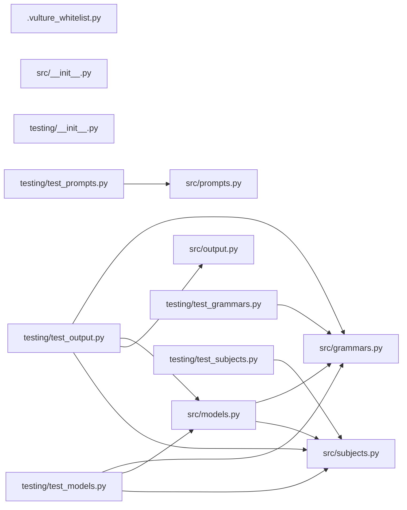

# 🤲 Affirmancy

**Affirmations generated across every grammatical mood a language offers.**

A Python and Jupyter application that generates structured affirmations for
spiritual practices using LangChain, LangGraph, and a locally-hosted
`gemma4:e2b` model via Ollama. A LangGraph ReAct agent researches a subject
through SearxNG metasearch, and the model writes affirmations that are
validated against Pydantic models before being saved.

The interesting part is the grammar. Rather than producing a flat list of "I
am…" sentences, the pipeline enumerates moods, voices, tenses, aspects,
persons, numbers, polarities, and deixis — so a single subject yields
affirmations phrased as imperatives, optatives, subjunctives, and more.

## Requirements

- Python `>=3.11`
- [uv](https://docs.astral.sh/uv/) package manager
- Docker, for Ollama and SearxNG

The devcontainer provides Python 3.14.

## Setup

This application is a member of the uv workspace declared in the root
`pyproject.toml`, sharing the root `uv.lock` and `.venv`. Sync from the
repository root — running `uv sync` inside this directory prunes the other
members out of the shared venv.

```bash
uv sync
```

## Quickstart

```bash
# 1. Start the local services
nx run affirmancy:ollama --configuration=start
nx run affirmancy:searxng --configuration=start
nx run affirmancy:open-webui --configuration=start

# 2. Pull the model (one-time download)
nx run affirmancy:ollama --configuration=pull-small   # gemma4:e2b

# 3. Open src/affirmancy.ipynb in VSCode and run the pipeline
```

## Project Structure

```text
applications/affirmancy/
├── src/
│   ├── affirmancy.ipynb     # Main generation pipeline
│   ├── semantics.ipynb      # Semantic exploration of subjects
│   ├── prices.ipynb         # Token accounting for a single run
│   ├── grammars.py          # Mood, Voice, Tense, Aspect, Person, Number,
│   │                        #   Polarity, Deixis, Form — and the Grammar model
│   ├── models.py            # Affirmation, GrammarAffirmations,
│   │                        #   SubjectAffirmations, ValidationResult
│   ├── prompts.py           # LangChain prompt templates
│   ├── subjects.py          # Subject and SubjectCategory definitions
│   └── output.py            # JSON and markdown writers
├── testing/                 # pytest suites, one per module
├── output/                  # Generated files (gitignored)
├── pyproject.toml
└── searxng.settings.yml
```

## Subjects

Subjects are declared in `src/subjects.py` as a `Subject` with a
`SubjectCategory`. The categories in place span tarot cards, Lenormand cards,
astrological signs, planets, nodes, asteroids, aspects and houses, modalities
and polarities, chakras, runes, sephiroth, Hebrew letters, kabbalistic worlds,
solfeggio frequencies, weekdays, and elements.

Adding a practice means adding its category and its subjects to that file —
nothing else in the pipeline needs to know about it.

## Grammar

`src/grammars.py` defines each grammatical axis as a `DescribedEnum`, so every
value carries its own description into the prompt. `Grammar` composes them into
one combination the model is asked to write in.

| Axis | Examples |
| ---- | -------- |
| `Mood` | indicative, imperative, optative, subjunctive, jussive |
| `Voice` | active, middle, passive |
| `Tense` | past, present, future |
| `Aspect` | perfective, imperfective, progressive, habitual |
| `Person` | first, second, third |
| `Number` | singular, dual, plural |
| `Polarity` | affirmative, negative |
| `Deixis` | proximal, medial, distal |
| `Form` | finite and non-finite forms |

## Nx Targets

| Target | Does |
| ------ | ---- |
| `ruff-lint` | Ruff linting |
| `ruff-format` | Ruff formatting |
| `pyright` / `ty` | Static type checking |
| `pytest` / `test-coverage` | Tests, with and without coverage |
| `vulture` | Dead code analysis |
| `bandit` | Security linting |
| `nbstripout` | Strip notebook outputs before commit |
| `spell-check`, `markdown-lint`, `yaml-lint` | Prose and configuration checks |
| `lint-codebase` | All of the above; `--configuration=write` to auto-fix |
| `ollama` | `start`, `stop`, `pull-small`, `pull-medium`, `pull-large` |
| `searxng` | `start`, `stop`, `open` |
| `open-webui` | `start`, `stop`, `open` |

## Run tests

```bash
cd applications/affirmancy
uv run pytest
```

## Lint / format / typecheck

```bash
cd applications/affirmancy
uv run ruff check .
uv run ruff format .
uv run pyright
uv run ty check
uv run vulture src testing
uv run bandit -r src
```

## Services

| Service | Port | Purpose |
| ------- | ---- | ------- |
| Ollama | `11434` | Local LLM server (`gemma4:e2b`) |
| Open WebUI | `3001` | Browser-based chat interface for Ollama |
| SearxNG | `8889` | Self-hosted metasearch, aggregating 135+ engines |

| Variable | Default | Purpose |
| -------- | ------- | ------- |
| `OLLAMA_HOST` | `http://localhost:11434` | Ollama server URL |
| `SEARXNG_HOST` | `http://localhost:8889` | SearxNG server URL |

## Notes

- **CPU-only inference.** `gemma4:e2b` is the small variant deliberately —
  generation stays interactive without a GPU. `pull-medium` and `pull-large`
  fetch `gemma4:e4b` and `gemma4:e26b` when more capacity is worth the wait.
- **Model keepalive.** `OLLAMA_KEEP_ALIVE=10m` avoids reloading the model
  between cells.
- **Context budget.** `gemma4:e2b` has a 128k-token window, and research
  results are truncated to stay well inside it.
- **Notebook outputs are stripped** on commit by `nbstripout`, so a diff shows
  the code rather than the last run's results.

See [AGENTS.md](AGENTS.md) for the architecture, and the
[write-python skill](../../.agents/skills/write-python/SKILL.md) for the
workspace's Python tooling conventions.

## License

MIT — see [LICENSE](../../LICENSE).

## 👔 Conformetry

This project was generated from the [jupyter-notebook-application](../../configuration/conformetry-templates/jupyter-notebook-application) conformetry template.

## 🕸️ Codependix

Dependency graphs exported by [codependix](https://github.com/Organizzolini/codebase/tree/main/packages/ic-suite/codependix/codependix-cli), regenerated by `nx run codebase:codependix:write`.

### Nx Neighborhood

<!-- codependix:start name="codependix-nx-projects" -->
_This project has no immediate Nx dependencies or dependents._
<!-- codependix:end name="codependix-nx-projects" -->

<!-- codometer:start -->

### Python File Imports

<!-- codependix:start name="codependix-file-imports" -->

<!-- codependix:end name="codependix-file-imports" -->

## ⏲️ Codometer

### Project


### TypeScript


### JavaScript


### Python


### JSON


### YAML


### TOML


### Shell


### SQL


### HCL


### CSS


### Conventions


### Jupyter


### Markdown


<!-- codometer:end -->
