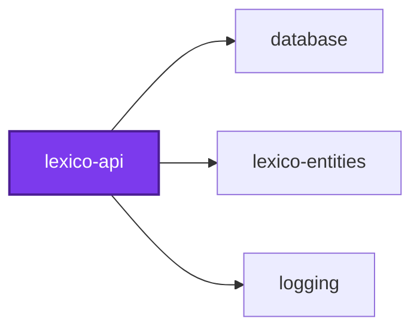

## Start

```bash
nx run lexico-api:start
```

## Test

```bash
nx run lexico-api:vitest
```

## GraphQL types

The API's object types are its own, not lexico-entities' TypeORM entities.
Each one, such as `LexemeType` in `src/modules/lexemes/lexeme.entities.ts`,
implements `GraphQLObjectOf<Entity, Self, DatabaseOnlyField, RelationField>`
from `src/lexico-api.types.ts`, which fails the typecheck when the type and its
entity drift apart:

- **Every entity field is declared or excluded by name.** A column only the
  database needs, such as `Translation.translationFullTextSearch`, is listed
  in the type's `*DatabaseOnlyField` union in the module's `*.types.ts`. A new
  column, or a dropped exclusion, fails until someone decides on it.
- **Every declared field has its column's type.** Retyping a column, or
  making a nullable one non-null in the API, fails.
- **Relations are retyped as GraphQL types.** The fields named in the type's
  `*RelationField` union are declared as GraphQL types, and must keep the
  entity relation's cardinality and nullability.

Resolvers never return an entity. Each module's `*.utilities.ts` maps an
entity to its type, such as `toLexemeType`, copying only the fields the type
declares; a relation the query did not join stays unset. The `Form` and
`Inflection` interfaces resolve by the class a row is mapped to, so their
object types are registered as `ORPHANED_GRAPHQL_TYPES` in
`src/modules/lexemes/lexemes.constants.ts`.

## 👔 Conformetry

This project was generated from the [nestjs-graphql-application](../../configuration/conformetry-templates/nestjs-graphql-application) conformetry template.

## 🕸️ Codependix

Dependency graphs exported by [codependix](https://github.com/Organizzolini/codebase/tree/main/packages/ic-suite/codependix/codependix-cli), regenerated by `nx run codebase:codependix:write`.

### Nx Neighborhood

<!-- codependix:start name="codependix-nx-projects" -->

<!-- codependix:end name="codependix-nx-projects" -->

### File Imports

<!-- codependix:start name="codependix-file-imports" -->
```mermaid
graph LR
  file_callidescope_config_ts["callidescope.config.ts"]
  file_codependix_config_ts["codependix.config.ts"]
  file_codometer_config_ts["codometer.config.ts"]
  file_eslint_config_ts["eslint.config.ts"]
  file_src_deletable_entities_ts["src/deletable.entities.ts"]
  file_src_lexico_api_graphql_end_to_end_test_ts["src/lexico-api-graphql.end-to-end.test.ts"]
  file_src_lexico_api_constants_ts["src/lexico-api.constants.ts"]
  file_src_lexico_api_constants_unit_test_ts["src/lexico-api.constants.unit.test.ts"]
  file_src_lexico_api_end_to_end_test_ts["src/lexico-api.end-to-end.test.ts"]
  file_src_lexico_api_entities_ts["src/lexico-api.entities.ts"]
  file_src_lexico_api_module_ts["src/lexico-api.module.ts"]
  file_src_lexico_api_module_unit_test_ts["src/lexico-api.module.unit.test.ts"]
  file_src_lexico_api_ts["src/lexico-api.ts"]
  file_src_lexico_api_types_ts["src/lexico-api.types.ts"]
  file_src_lexico_api_types_unit_test_ts["src/lexico-api.types.unit.test.ts"]
  file_src_lexico_api_unit_test_ts["src/lexico-api.unit.test.ts"]
  file_src_lexico_api_utilities_ts["src/lexico-api.utilities.ts"]
  file_src_lexico_api_utilities_unit_test_ts["src/lexico-api.utilities.unit.test.ts"]
  file_src_modules_health_health_constants_ts["src/modules/health/health.constants.ts"]
  file_src_modules_health_health_module_ts["src/modules/health/health.module.ts"]
  file_src_modules_health_health_module_unit_test_ts["src/modules/health/health.module.unit.test.ts"]
  file_src_modules_health_health_resolver_ts["src/modules/health/health.resolver.ts"]
  file_src_modules_health_health_resolver_unit_test_ts["src/modules/health/health.resolver.unit.test.ts"]
  file_src_modules_health_health_service_ts["src/modules/health/health.service.ts"]
  file_src_modules_health_health_service_unit_test_ts["src/modules/health/health.service.unit.test.ts"]
  file_src_modules_health_health_types_ts["src/modules/health/health.types.ts"]
  file_src_modules_lexemes_forms_adjectival_form_entities_ts["src/modules/lexemes/forms/adjectival-form.entities.ts"]
  file_src_modules_lexemes_forms_adverb_form_entities_ts["src/modules/lexemes/forms/adverb-form.entities.ts"]
  file_src_modules_lexemes_forms_finite_verb_form_entities_ts["src/modules/lexemes/forms/finite-verb-form.entities.ts"]
  file_src_modules_lexemes_forms_form_entities_ts["src/modules/lexemes/forms/form.entities.ts"]
  file_src_modules_lexemes_forms_forms_types_ts["src/modules/lexemes/forms/forms.types.ts"]
  file_src_modules_lexemes_forms_forms_utilities_ts["src/modules/lexemes/forms/forms.utilities.ts"]
  file_src_modules_lexemes_forms_forms_utilities_unit_test_ts["src/modules/lexemes/forms/forms.utilities.unit.test.ts"]
  file_src_modules_lexemes_forms_gerund_form_entities_ts["src/modules/lexemes/forms/gerund-form.entities.ts"]
  file_src_modules_lexemes_forms_infinitive_form_entities_ts["src/modules/lexemes/forms/infinitive-form.entities.ts"]
  file_src_modules_lexemes_forms_nominal_form_entities_ts["src/modules/lexemes/forms/nominal-form.entities.ts"]
  file_src_modules_lexemes_forms_participle_form_entities_ts["src/modules/lexemes/forms/participle-form.entities.ts"]
  file_src_modules_lexemes_forms_supine_form_entities_ts["src/modules/lexemes/forms/supine-form.entities.ts"]
  file_src_modules_lexemes_inflections_adjective_inflection_entities_ts["src/modules/lexemes/inflections/adjective-inflection.entities.ts"]
  file_src_modules_lexemes_inflections_adverb_inflection_entities_ts["src/modules/lexemes/inflections/adverb-inflection.entities.ts"]
  file_src_modules_lexemes_inflections_inflection_entities_ts["src/modules/lexemes/inflections/inflection.entities.ts"]
  file_src_modules_lexemes_inflections_inflections_types_ts["src/modules/lexemes/inflections/inflections.types.ts"]
  file_src_modules_lexemes_inflections_inflections_utilities_ts["src/modules/lexemes/inflections/inflections.utilities.ts"]
  file_src_modules_lexemes_inflections_inflections_utilities_unit_test_ts["src/modules/lexemes/inflections/inflections.utilities.unit.test.ts"]
  file_src_modules_lexemes_inflections_noun_inflection_entities_ts["src/modules/lexemes/inflections/noun-inflection.entities.ts"]
  file_src_modules_lexemes_inflections_preposition_inflection_entities_ts["src/modules/lexemes/inflections/preposition-inflection.entities.ts"]
  file_src_modules_lexemes_inflections_uninflected_inflection_entities_ts["src/modules/lexemes/inflections/uninflected-inflection.entities.ts"]
  file_src_modules_lexemes_inflections_verb_inflection_entities_ts["src/modules/lexemes/inflections/verb-inflection.entities.ts"]
  file_src_modules_lexemes_lexeme_arguments_entities_ts["src/modules/lexemes/lexeme-arguments.entities.ts"]
  file_src_modules_lexemes_lexeme_entities_ts["src/modules/lexemes/lexeme.entities.ts"]
  file_src_modules_lexemes_lexemes_arguments_entities_ts["src/modules/lexemes/lexemes-arguments.entities.ts"]
  file_src_modules_lexemes_lexemes_constants_ts["src/modules/lexemes/lexemes.constants.ts"]
  file_src_modules_lexemes_lexemes_module_ts["src/modules/lexemes/lexemes.module.ts"]
  file_src_modules_lexemes_lexemes_module_unit_test_ts["src/modules/lexemes/lexemes.module.unit.test.ts"]
  file_src_modules_lexemes_lexemes_resolver_ts["src/modules/lexemes/lexemes.resolver.ts"]
  file_src_modules_lexemes_lexemes_resolver_unit_test_ts["src/modules/lexemes/lexemes.resolver.unit.test.ts"]
  file_src_modules_lexemes_lexemes_service_integration_test_ts["src/modules/lexemes/lexemes.service.integration.test.ts"]
  file_src_modules_lexemes_lexemes_service_ts["src/modules/lexemes/lexemes.service.ts"]
  file_src_modules_lexemes_lexemes_service_unit_test_ts["src/modules/lexemes/lexemes.service.unit.test.ts"]
  file_src_modules_lexemes_lexemes_types_ts["src/modules/lexemes/lexemes.types.ts"]
  file_src_modules_lexemes_lexemes_utilities_ts["src/modules/lexemes/lexemes.utilities.ts"]
  file_src_modules_lexemes_lexemes_utilities_unit_test_ts["src/modules/lexemes/lexemes.utilities.unit.test.ts"]
  file_src_modules_lexemes_principal_part_entities_ts["src/modules/lexemes/principal-part.entities.ts"]
  file_src_modules_lexemes_pronunciation_entities_ts["src/modules/lexemes/pronunciation.entities.ts"]
  file_src_modules_lexemes_translation_entities_ts["src/modules/lexemes/translation.entities.ts"]
  file_src_modules_literature_author_argument_entities_ts["src/modules/literature/author-argument.entities.ts"]
  file_src_modules_literature_author_lookup_input_entities_ts["src/modules/literature/author-lookup-input.entities.ts"]
  file_src_modules_literature_author_entities_ts["src/modules/literature/author.entities.ts"]
  file_src_modules_literature_authors_resolver_end_to_end_test_ts["src/modules/literature/authors.resolver.end-to-end.test.ts"]
  file_src_modules_literature_authors_resolver_integration_test_ts["src/modules/literature/authors.resolver.integration.test.ts"]
  file_src_modules_literature_authors_resolver_ts["src/modules/literature/authors.resolver.ts"]
  file_src_modules_literature_authors_resolver_unit_test_ts["src/modules/literature/authors.resolver.unit.test.ts"]
  file_src_modules_literature_line_arguments_entities_ts["src/modules/literature/line-arguments.entities.ts"]
  file_src_modules_literature_line_entities_ts["src/modules/literature/line.entities.ts"]
  file_src_modules_literature_lines_range_input_entities_ts["src/modules/literature/lines-range-input.entities.ts"]
  file_src_modules_literature_lines_resolver_end_to_end_test_ts["src/modules/literature/lines.resolver.end-to-end.test.ts"]
  file_src_modules_literature_lines_resolver_integration_test_ts["src/modules/literature/lines.resolver.integration.test.ts"]
  file_src_modules_literature_lines_resolver_ts["src/modules/literature/lines.resolver.ts"]
  file_src_modules_literature_lines_resolver_unit_test_ts["src/modules/literature/lines.resolver.unit.test.ts"]
  file_src_modules_literature_literature_arguments_entities_unit_test_ts["src/modules/literature/literature-arguments.entities.unit.test.ts"]
  file_src_modules_literature_literature_connection_entities_ts["src/modules/literature/literature-connection.entities.ts"]
  file_src_modules_literature_literature_search_result_entities_ts["src/modules/literature/literature-search-result.entities.ts"]
  file_src_modules_literature_literature_search_resolver_end_to_end_test_ts["src/modules/literature/literature-search.resolver.end-to-end.test.ts"]
  file_src_modules_literature_literature_search_service_integration_test_ts["src/modules/literature/literature-search.service.integration.test.ts"]
  file_src_modules_literature_literature_constants_ts["src/modules/literature/literature.constants.ts"]
  file_src_modules_literature_literature_module_ts["src/modules/literature/literature.module.ts"]
  file_src_modules_literature_literature_resolver_ts["src/modules/literature/literature.resolver.ts"]
  file_src_modules_literature_literature_resolver_unit_test_ts["src/modules/literature/literature.resolver.unit.test.ts"]
  file_src_modules_literature_literature_service_ts["src/modules/literature/literature.service.ts"]
  file_src_modules_literature_literature_service_unit_test_ts["src/modules/literature/literature.service.unit.test.ts"]
  file_src_modules_literature_literature_types_ts["src/modules/literature/literature.types.ts"]
  file_src_modules_literature_literature_utilities_integration_test_ts["src/modules/literature/literature.utilities.integration.test.ts"]
  file_src_modules_literature_literature_utilities_ts["src/modules/literature/literature.utilities.ts"]
  file_src_modules_literature_literature_utilities_unit_test_ts["src/modules/literature/literature.utilities.unit.test.ts"]
  file_src_modules_literature_search_authors_arguments_entities_ts["src/modules/literature/search-authors-arguments.entities.ts"]
  file_src_modules_literature_search_lines_arguments_entities_ts["src/modules/literature/search-lines-arguments.entities.ts"]
  file_src_modules_literature_search_literature_arguments_entities_ts["src/modules/literature/search-literature-arguments.entities.ts"]
  file_src_modules_literature_search_texts_arguments_entities_ts["src/modules/literature/search-texts-arguments.entities.ts"]
  file_src_modules_literature_text_argument_entities_ts["src/modules/literature/text-argument.entities.ts"]
  file_src_modules_literature_text_lookup_input_entities_ts["src/modules/literature/text-lookup-input.entities.ts"]
  file_src_modules_literature_text_entities_ts["src/modules/literature/text.entities.ts"]
  file_src_modules_literature_texts_arguments_entities_ts["src/modules/literature/texts-arguments.entities.ts"]
  file_src_modules_literature_texts_resolver_end_to_end_test_ts["src/modules/literature/texts.resolver.end-to-end.test.ts"]
  file_src_modules_literature_texts_resolver_integration_test_ts["src/modules/literature/texts.resolver.integration.test.ts"]
  file_src_modules_literature_texts_resolver_ts["src/modules/literature/texts.resolver.ts"]
  file_src_modules_literature_texts_resolver_unit_test_ts["src/modules/literature/texts.resolver.unit.test.ts"]
  file_src_modules_literature_token_word_loader_integration_test_ts["src/modules/literature/token-word.loader.integration.test.ts"]
  file_src_modules_literature_token_word_loader_ts["src/modules/literature/token-word.loader.ts"]
  file_src_modules_literature_token_word_loader_unit_test_ts["src/modules/literature/token-word.loader.unit.test.ts"]
  file_src_modules_literature_token_entities_ts["src/modules/literature/token.entities.ts"]
  file_src_modules_literature_tokens_arguments_entities_ts["src/modules/literature/tokens-arguments.entities.ts"]
  file_src_modules_literature_tokens_resolver_integration_test_ts["src/modules/literature/tokens.resolver.integration.test.ts"]
  file_src_modules_literature_tokens_resolver_ts["src/modules/literature/tokens.resolver.ts"]
  file_src_modules_literature_tokens_resolver_unit_test_ts["src/modules/literature/tokens.resolver.unit.test.ts"]
  file_src_modules_macrons_macrons_constants_ts["src/modules/macrons/macrons.constants.ts"]
  file_src_modules_macrons_macrons_module_ts["src/modules/macrons/macrons.module.ts"]
  file_src_modules_macrons_macrons_service_ts["src/modules/macrons/macrons.service.ts"]
  file_src_modules_macrons_macrons_service_unit_test_ts["src/modules/macrons/macrons.service.unit.test.ts"]
  file_src_modules_macrons_macrons_types_ts["src/modules/macrons/macrons.types.ts"]
  file_src_modules_search_pagination_arguments_entities_ts["src/modules/search/pagination-arguments.entities.ts"]
  file_src_modules_search_pagination_arguments_entities_unit_test_ts["src/modules/search/pagination-arguments.entities.unit.test.ts"]
  file_src_modules_search_search_english_arguments_entities_ts["src/modules/search/search-english-arguments.entities.ts"]
  file_src_modules_search_search_latin_arguments_entities_ts["src/modules/search/search-latin-arguments.entities.ts"]
  file_src_modules_search_search_constants_ts["src/modules/search/search.constants.ts"]
  file_src_modules_search_search_entities_ts["src/modules/search/search.entities.ts"]
  file_src_modules_search_search_entities_unit_test_ts["src/modules/search/search.entities.unit.test.ts"]
  file_src_modules_search_search_module_ts["src/modules/search/search.module.ts"]
  file_src_modules_search_search_module_unit_test_ts["src/modules/search/search.module.unit.test.ts"]
  file_src_modules_search_search_resolver_ts["src/modules/search/search.resolver.ts"]
  file_src_modules_search_search_resolver_unit_test_ts["src/modules/search/search.resolver.unit.test.ts"]
  file_src_modules_search_search_service_integration_test_ts["src/modules/search/search.service.integration.test.ts"]
  file_src_modules_search_search_service_ts["src/modules/search/search.service.ts"]
  file_src_modules_search_search_service_unit_test_ts["src/modules/search/search.service.unit.test.ts"]
  file_src_modules_search_search_types_ts["src/modules/search/search.types.ts"]
  file_src_modules_search_search_utilities_ts["src/modules/search/search.utilities.ts"]
  file_src_modules_search_search_utilities_unit_test_ts["src/modules/search/search.utilities.unit.test.ts"]
  file_src_modules_words_word_arguments_entities_ts["src/modules/words/word-arguments.entities.ts"]
  file_src_modules_words_word_form_entities_ts["src/modules/words/word-form.entities.ts"]
  file_src_modules_words_word_form_resolver_ts["src/modules/words/word-form.resolver.ts"]
  file_src_modules_words_word_form_resolver_unit_test_ts["src/modules/words/word-form.resolver.unit.test.ts"]
  file_src_modules_words_word_lexeme_entities_ts["src/modules/words/word-lexeme.entities.ts"]
  file_src_modules_words_word_lexeme_resolver_ts["src/modules/words/word-lexeme.resolver.ts"]
  file_src_modules_words_word_lexeme_resolver_unit_test_ts["src/modules/words/word-lexeme.resolver.unit.test.ts"]
  file_src_modules_words_word_link_loader_ts["src/modules/words/word-link.loader.ts"]
  file_src_modules_words_word_link_loader_unit_test_ts["src/modules/words/word-link.loader.unit.test.ts"]
  file_src_modules_words_word_entities_ts["src/modules/words/word.entities.ts"]
  file_src_modules_words_words_arguments_entities_ts["src/modules/words/words-arguments.entities.ts"]
  file_src_modules_words_words_constants_ts["src/modules/words/words.constants.ts"]
  file_src_modules_words_words_module_ts["src/modules/words/words.module.ts"]
  file_src_modules_words_words_resolver_end_to_end_test_ts["src/modules/words/words.resolver.end-to-end.test.ts"]
  file_src_modules_words_words_resolver_ts["src/modules/words/words.resolver.ts"]
  file_src_modules_words_words_resolver_unit_test_ts["src/modules/words/words.resolver.unit.test.ts"]
  file_src_modules_words_words_service_integration_test_ts["src/modules/words/words.service.integration.test.ts"]
  file_src_modules_words_words_service_ts["src/modules/words/words.service.ts"]
  file_src_modules_words_words_service_unit_test_ts["src/modules/words/words.service.unit.test.ts"]
  file_src_modules_words_words_types_ts["src/modules/words/words.types.ts"]
  file_src_modules_words_words_utilities_ts["src/modules/words/words.utilities.ts"]
  file_src_modules_words_words_utilities_unit_test_ts["src/modules/words/words.utilities.unit.test.ts"]
  file_testing_author_text_application_ts["testing/author-text-application.ts"]
  file_testing_author_text_catalog_ts["testing/author-text-catalog.ts"]
  file_testing_database_ts["testing/database.ts"]
  file_testing_graphql_application_ts["testing/graphql-application.ts"]
  file_testing_literature_search_corpus_ts["testing/literature-search-corpus.ts"]
  file_testing_literature_search_pagination_ts["testing/literature-search-pagination.ts"]
  file_testing_mocks_ts["testing/mocks.ts"]
  file_testing_pagination_ts["testing/pagination.ts"]
  file_testing_reading_application_ts["testing/reading-application.ts"]
  file_testing_reading_passage_ts["testing/reading-passage.ts"]
  file_testing_relay_connection_walk_ts["testing/relay-connection-walk.ts"]
  file_testing_setup_ts["testing/setup.ts"]
  file_testing_word_lookups_ts["testing/word-lookups.ts"]
  file_vitest_config_ts["vitest.config.ts"]
  file_src_deletable_entities_ts --> file_src_lexico_api_types_ts
  file_src_lexico_api_graphql_end_to_end_test_ts --> file_src_modules_lexemes_lexemes_module_ts
  file_src_lexico_api_graphql_end_to_end_test_ts --> file_src_modules_literature_literature_module_ts
  file_src_lexico_api_graphql_end_to_end_test_ts --> file_src_modules_search_search_module_ts
  file_src_lexico_api_graphql_end_to_end_test_ts --> file_src_modules_words_words_module_ts
  file_src_lexico_api_graphql_end_to_end_test_ts --> file_testing_database_ts
  file_src_lexico_api_graphql_end_to_end_test_ts --> file_testing_graphql_application_ts
  file_src_lexico_api_graphql_end_to_end_test_ts --> file_testing_word_lookups_ts
  file_src_lexico_api_end_to_end_test_ts --> file_src_lexico_api_constants_ts
  file_src_lexico_api_module_ts --> file_src_lexico_api_constants_ts
  file_src_lexico_api_module_ts --> file_src_modules_health_health_module_ts
  file_src_lexico_api_module_ts --> file_src_modules_lexemes_lexemes_constants_ts
  file_src_lexico_api_module_ts --> file_src_modules_lexemes_lexemes_module_ts
  file_src_lexico_api_module_ts --> file_src_modules_literature_literature_module_ts
  file_src_lexico_api_module_ts --> file_src_modules_search_search_module_ts
  file_src_lexico_api_module_ts --> file_src_modules_words_words_module_ts
  file_src_lexico_api_module_unit_test_ts --> file_src_lexico_api_module_ts
  file_src_lexico_api_ts --> file_src_lexico_api_constants_ts
  file_src_lexico_api_ts --> file_src_lexico_api_module_ts
  file_src_lexico_api_types_ts --> file_src_lexico_api_entities_ts
  file_src_lexico_api_types_unit_test_ts --> file_src_lexico_api_types_ts
  file_src_lexico_api_types_unit_test_ts --> file_src_modules_lexemes_forms_form_entities_ts
  file_src_lexico_api_types_unit_test_ts --> file_src_modules_lexemes_inflections_inflection_entities_ts
  file_src_lexico_api_types_unit_test_ts --> file_src_modules_lexemes_lexeme_entities_ts
  file_src_lexico_api_types_unit_test_ts --> file_src_modules_lexemes_lexemes_types_ts
  file_src_lexico_api_types_unit_test_ts --> file_src_modules_lexemes_pronunciation_entities_ts
  file_src_lexico_api_types_unit_test_ts --> file_src_modules_lexemes_translation_entities_ts
  file_src_lexico_api_types_unit_test_ts --> file_src_modules_literature_author_entities_ts
  file_src_lexico_api_types_unit_test_ts --> file_src_modules_literature_literature_types_ts
  file_src_lexico_api_utilities_ts --> file_src_deletable_entities_ts
  file_src_lexico_api_utilities_ts --> file_src_lexico_api_entities_ts
  file_src_lexico_api_utilities_ts --> file_src_lexico_api_types_ts
  file_src_lexico_api_utilities_unit_test_ts --> file_src_lexico_api_entities_ts
  file_src_lexico_api_utilities_unit_test_ts --> file_src_lexico_api_types_ts
  file_src_lexico_api_utilities_unit_test_ts --> file_src_lexico_api_utilities_ts
  file_src_modules_health_health_module_ts --> file_src_modules_health_health_resolver_ts
  file_src_modules_health_health_module_ts --> file_src_modules_health_health_service_ts
  file_src_modules_health_health_module_unit_test_ts --> file_src_modules_health_health_module_ts
  file_src_modules_health_health_resolver_ts --> file_src_modules_health_health_service_ts
  file_src_modules_health_health_resolver_unit_test_ts --> file_src_modules_health_health_resolver_ts
  file_src_modules_health_health_resolver_unit_test_ts --> file_src_modules_health_health_service_ts
  file_src_modules_health_health_service_unit_test_ts --> file_src_modules_health_health_service_ts
  file_src_modules_lexemes_forms_adjectival_form_entities_ts --> file_src_lexico_api_types_ts
  file_src_modules_lexemes_forms_adjectival_form_entities_ts --> file_src_modules_lexemes_forms_form_entities_ts
  file_src_modules_lexemes_forms_adjectival_form_entities_ts --> file_src_modules_lexemes_forms_forms_types_ts
  file_src_modules_lexemes_forms_adverb_form_entities_ts --> file_src_lexico_api_types_ts
  file_src_modules_lexemes_forms_adverb_form_entities_ts --> file_src_modules_lexemes_forms_form_entities_ts
  file_src_modules_lexemes_forms_adverb_form_entities_ts --> file_src_modules_lexemes_forms_forms_types_ts
  file_src_modules_lexemes_forms_finite_verb_form_entities_ts --> file_src_lexico_api_types_ts
  file_src_modules_lexemes_forms_finite_verb_form_entities_ts --> file_src_modules_lexemes_forms_form_entities_ts
  file_src_modules_lexemes_forms_finite_verb_form_entities_ts --> file_src_modules_lexemes_forms_forms_types_ts
  file_src_modules_lexemes_forms_form_entities_ts --> file_src_lexico_api_types_ts
  file_src_modules_lexemes_forms_form_entities_ts --> file_src_modules_lexemes_forms_forms_types_ts
  file_src_modules_lexemes_forms_forms_utilities_ts --> file_src_lexico_api_types_ts
  file_src_modules_lexemes_forms_forms_utilities_ts --> file_src_modules_lexemes_forms_adjectival_form_entities_ts
  file_src_modules_lexemes_forms_forms_utilities_ts --> file_src_modules_lexemes_forms_adverb_form_entities_ts
  file_src_modules_lexemes_forms_forms_utilities_ts --> file_src_modules_lexemes_forms_finite_verb_form_entities_ts
  file_src_modules_lexemes_forms_forms_utilities_ts --> file_src_modules_lexemes_forms_form_entities_ts
  file_src_modules_lexemes_forms_forms_utilities_ts --> file_src_modules_lexemes_forms_gerund_form_entities_ts
  file_src_modules_lexemes_forms_forms_utilities_ts --> file_src_modules_lexemes_forms_infinitive_form_entities_ts
  file_src_modules_lexemes_forms_forms_utilities_ts --> file_src_modules_lexemes_forms_nominal_form_entities_ts
  file_src_modules_lexemes_forms_forms_utilities_ts --> file_src_modules_lexemes_forms_participle_form_entities_ts
  file_src_modules_lexemes_forms_forms_utilities_ts --> file_src_modules_lexemes_forms_supine_form_entities_ts
  file_src_modules_lexemes_forms_forms_utilities_unit_test_ts --> file_src_modules_lexemes_forms_adjectival_form_entities_ts
  file_src_modules_lexemes_forms_forms_utilities_unit_test_ts --> file_src_modules_lexemes_forms_adverb_form_entities_ts
  file_src_modules_lexemes_forms_forms_utilities_unit_test_ts --> file_src_modules_lexemes_forms_finite_verb_form_entities_ts
  file_src_modules_lexemes_forms_forms_utilities_unit_test_ts --> file_src_modules_lexemes_forms_forms_utilities_ts
  file_src_modules_lexemes_forms_forms_utilities_unit_test_ts --> file_src_modules_lexemes_forms_gerund_form_entities_ts
  file_src_modules_lexemes_forms_forms_utilities_unit_test_ts --> file_src_modules_lexemes_forms_infinitive_form_entities_ts
  file_src_modules_lexemes_forms_forms_utilities_unit_test_ts --> file_src_modules_lexemes_forms_nominal_form_entities_ts
  file_src_modules_lexemes_forms_forms_utilities_unit_test_ts --> file_src_modules_lexemes_forms_participle_form_entities_ts
  file_src_modules_lexemes_forms_forms_utilities_unit_test_ts --> file_src_modules_lexemes_forms_supine_form_entities_ts
  file_src_modules_lexemes_forms_gerund_form_entities_ts --> file_src_lexico_api_types_ts
  file_src_modules_lexemes_forms_gerund_form_entities_ts --> file_src_modules_lexemes_forms_form_entities_ts
  file_src_modules_lexemes_forms_gerund_form_entities_ts --> file_src_modules_lexemes_forms_forms_types_ts
  file_src_modules_lexemes_forms_infinitive_form_entities_ts --> file_src_lexico_api_types_ts
  file_src_modules_lexemes_forms_infinitive_form_entities_ts --> file_src_modules_lexemes_forms_form_entities_ts
  file_src_modules_lexemes_forms_infinitive_form_entities_ts --> file_src_modules_lexemes_forms_forms_types_ts
  file_src_modules_lexemes_forms_nominal_form_entities_ts --> file_src_lexico_api_types_ts
  file_src_modules_lexemes_forms_nominal_form_entities_ts --> file_src_modules_lexemes_forms_form_entities_ts
  file_src_modules_lexemes_forms_nominal_form_entities_ts --> file_src_modules_lexemes_forms_forms_types_ts
  file_src_modules_lexemes_forms_participle_form_entities_ts --> file_src_lexico_api_types_ts
  file_src_modules_lexemes_forms_participle_form_entities_ts --> file_src_modules_lexemes_forms_form_entities_ts
  file_src_modules_lexemes_forms_participle_form_entities_ts --> file_src_modules_lexemes_forms_forms_types_ts
  file_src_modules_lexemes_forms_supine_form_entities_ts --> file_src_lexico_api_types_ts
  file_src_modules_lexemes_forms_supine_form_entities_ts --> file_src_modules_lexemes_forms_form_entities_ts
  file_src_modules_lexemes_forms_supine_form_entities_ts --> file_src_modules_lexemes_forms_forms_types_ts
  file_src_modules_lexemes_inflections_adjective_inflection_entities_ts --> file_src_lexico_api_types_ts
  file_src_modules_lexemes_inflections_adjective_inflection_entities_ts --> file_src_modules_lexemes_inflections_inflection_entities_ts
  file_src_modules_lexemes_inflections_adjective_inflection_entities_ts --> file_src_modules_lexemes_inflections_inflections_types_ts
  file_src_modules_lexemes_inflections_adverb_inflection_entities_ts --> file_src_lexico_api_types_ts
  file_src_modules_lexemes_inflections_adverb_inflection_entities_ts --> file_src_modules_lexemes_inflections_inflection_entities_ts
  file_src_modules_lexemes_inflections_adverb_inflection_entities_ts --> file_src_modules_lexemes_inflections_inflections_types_ts
  file_src_modules_lexemes_inflections_inflection_entities_ts --> file_src_lexico_api_types_ts
  file_src_modules_lexemes_inflections_inflection_entities_ts --> file_src_modules_lexemes_inflections_inflections_types_ts
  file_src_modules_lexemes_inflections_inflections_utilities_ts --> file_src_lexico_api_types_ts
  file_src_modules_lexemes_inflections_inflections_utilities_ts --> file_src_modules_lexemes_inflections_adjective_inflection_entities_ts
  file_src_modules_lexemes_inflections_inflections_utilities_ts --> file_src_modules_lexemes_inflections_adverb_inflection_entities_ts
  file_src_modules_lexemes_inflections_inflections_utilities_ts --> file_src_modules_lexemes_inflections_inflection_entities_ts
  file_src_modules_lexemes_inflections_inflections_utilities_ts --> file_src_modules_lexemes_inflections_noun_inflection_entities_ts
  file_src_modules_lexemes_inflections_inflections_utilities_ts --> file_src_modules_lexemes_inflections_preposition_inflection_entities_ts
  file_src_modules_lexemes_inflections_inflections_utilities_ts --> file_src_modules_lexemes_inflections_uninflected_inflection_entities_ts
  file_src_modules_lexemes_inflections_inflections_utilities_ts --> file_src_modules_lexemes_inflections_verb_inflection_entities_ts
  file_src_modules_lexemes_inflections_inflections_utilities_unit_test_ts --> file_src_modules_lexemes_inflections_adjective_inflection_entities_ts
  file_src_modules_lexemes_inflections_inflections_utilities_unit_test_ts --> file_src_modules_lexemes_inflections_adverb_inflection_entities_ts
  file_src_modules_lexemes_inflections_inflections_utilities_unit_test_ts --> file_src_modules_lexemes_inflections_inflections_utilities_ts
  file_src_modules_lexemes_inflections_inflections_utilities_unit_test_ts --> file_src_modules_lexemes_inflections_noun_inflection_entities_ts
  file_src_modules_lexemes_inflections_inflections_utilities_unit_test_ts --> file_src_modules_lexemes_inflections_preposition_inflection_entities_ts
  file_src_modules_lexemes_inflections_inflections_utilities_unit_test_ts --> file_src_modules_lexemes_inflections_uninflected_inflection_entities_ts
  file_src_modules_lexemes_inflections_inflections_utilities_unit_test_ts --> file_src_modules_lexemes_inflections_verb_inflection_entities_ts
  file_src_modules_lexemes_inflections_noun_inflection_entities_ts --> file_src_lexico_api_types_ts
  file_src_modules_lexemes_inflections_noun_inflection_entities_ts --> file_src_modules_lexemes_inflections_inflection_entities_ts
  file_src_modules_lexemes_inflections_noun_inflection_entities_ts --> file_src_modules_lexemes_inflections_inflections_types_ts
  file_src_modules_lexemes_inflections_preposition_inflection_entities_ts --> file_src_lexico_api_types_ts
  file_src_modules_lexemes_inflections_preposition_inflection_entities_ts --> file_src_modules_lexemes_inflections_inflection_entities_ts
  file_src_modules_lexemes_inflections_preposition_inflection_entities_ts --> file_src_modules_lexemes_inflections_inflections_types_ts
  file_src_modules_lexemes_inflections_uninflected_inflection_entities_ts --> file_src_lexico_api_types_ts
  file_src_modules_lexemes_inflections_uninflected_inflection_entities_ts --> file_src_modules_lexemes_inflections_inflection_entities_ts
  file_src_modules_lexemes_inflections_uninflected_inflection_entities_ts --> file_src_modules_lexemes_inflections_inflections_types_ts
  file_src_modules_lexemes_inflections_verb_inflection_entities_ts --> file_src_lexico_api_types_ts
  file_src_modules_lexemes_inflections_verb_inflection_entities_ts --> file_src_modules_lexemes_inflections_inflection_entities_ts
  file_src_modules_lexemes_inflections_verb_inflection_entities_ts --> file_src_modules_lexemes_inflections_inflections_types_ts
  file_src_modules_lexemes_lexeme_entities_ts --> file_src_deletable_entities_ts
  file_src_modules_lexemes_lexeme_entities_ts --> file_src_lexico_api_types_ts
  file_src_modules_lexemes_lexeme_entities_ts --> file_src_modules_lexemes_forms_form_entities_ts
  file_src_modules_lexemes_lexeme_entities_ts --> file_src_modules_lexemes_inflections_inflection_entities_ts
  file_src_modules_lexemes_lexeme_entities_ts --> file_src_modules_lexemes_lexemes_types_ts
  file_src_modules_lexemes_lexeme_entities_ts --> file_src_modules_lexemes_principal_part_entities_ts
  file_src_modules_lexemes_lexeme_entities_ts --> file_src_modules_lexemes_pronunciation_entities_ts
  file_src_modules_lexemes_lexeme_entities_ts --> file_src_modules_lexemes_translation_entities_ts
  file_src_modules_lexemes_lexemes_constants_ts --> file_src_modules_lexemes_forms_adjectival_form_entities_ts
  file_src_modules_lexemes_lexemes_constants_ts --> file_src_modules_lexemes_forms_adverb_form_entities_ts
  file_src_modules_lexemes_lexemes_constants_ts --> file_src_modules_lexemes_forms_finite_verb_form_entities_ts
  file_src_modules_lexemes_lexemes_constants_ts --> file_src_modules_lexemes_forms_gerund_form_entities_ts
  file_src_modules_lexemes_lexemes_constants_ts --> file_src_modules_lexemes_forms_infinitive_form_entities_ts
  file_src_modules_lexemes_lexemes_constants_ts --> file_src_modules_lexemes_forms_nominal_form_entities_ts
  file_src_modules_lexemes_lexemes_constants_ts --> file_src_modules_lexemes_forms_participle_form_entities_ts
  file_src_modules_lexemes_lexemes_constants_ts --> file_src_modules_lexemes_forms_supine_form_entities_ts
  file_src_modules_lexemes_lexemes_constants_ts --> file_src_modules_lexemes_inflections_adjective_inflection_entities_ts
  file_src_modules_lexemes_lexemes_constants_ts --> file_src_modules_lexemes_inflections_adverb_inflection_entities_ts
  file_src_modules_lexemes_lexemes_constants_ts --> file_src_modules_lexemes_inflections_noun_inflection_entities_ts
  file_src_modules_lexemes_lexemes_constants_ts --> file_src_modules_lexemes_inflections_preposition_inflection_entities_ts
  file_src_modules_lexemes_lexemes_constants_ts --> file_src_modules_lexemes_inflections_uninflected_inflection_entities_ts
  file_src_modules_lexemes_lexemes_constants_ts --> file_src_modules_lexemes_inflections_verb_inflection_entities_ts
  file_src_modules_lexemes_lexemes_module_ts --> file_src_modules_lexemes_lexemes_resolver_ts
  file_src_modules_lexemes_lexemes_module_ts --> file_src_modules_lexemes_lexemes_service_ts
  file_src_modules_lexemes_lexemes_module_unit_test_ts --> file_src_modules_lexemes_lexemes_module_ts
  file_src_modules_lexemes_lexemes_resolver_ts --> file_src_modules_lexemes_lexeme_arguments_entities_ts
  file_src_modules_lexemes_lexemes_resolver_ts --> file_src_modules_lexemes_lexeme_entities_ts
  file_src_modules_lexemes_lexemes_resolver_ts --> file_src_modules_lexemes_lexemes_arguments_entities_ts
  file_src_modules_lexemes_lexemes_resolver_ts --> file_src_modules_lexemes_lexemes_service_ts
  file_src_modules_lexemes_lexemes_resolver_ts --> file_src_modules_lexemes_lexemes_utilities_ts
  file_src_modules_lexemes_lexemes_resolver_unit_test_ts --> file_src_modules_lexemes_lexeme_entities_ts
  file_src_modules_lexemes_lexemes_resolver_unit_test_ts --> file_src_modules_lexemes_lexemes_constants_ts
  file_src_modules_lexemes_lexemes_resolver_unit_test_ts --> file_src_modules_lexemes_lexemes_resolver_ts
  file_src_modules_lexemes_lexemes_resolver_unit_test_ts --> file_src_modules_lexemes_lexemes_service_ts
  file_src_modules_lexemes_lexemes_service_integration_test_ts --> file_src_modules_lexemes_lexemes_service_ts
  file_src_modules_lexemes_lexemes_service_integration_test_ts --> file_testing_database_ts
  file_src_modules_lexemes_lexemes_service_unit_test_ts --> file_src_modules_lexemes_lexemes_service_ts
  file_src_modules_lexemes_lexemes_service_unit_test_ts --> file_testing_mocks_ts
  file_src_modules_lexemes_lexemes_utilities_ts --> file_src_lexico_api_types_ts
  file_src_modules_lexemes_lexemes_utilities_ts --> file_src_lexico_api_utilities_ts
  file_src_modules_lexemes_lexemes_utilities_ts --> file_src_modules_lexemes_forms_forms_utilities_ts
  file_src_modules_lexemes_lexemes_utilities_ts --> file_src_modules_lexemes_inflections_inflections_utilities_ts
  file_src_modules_lexemes_lexemes_utilities_ts --> file_src_modules_lexemes_lexeme_entities_ts
  file_src_modules_lexemes_lexemes_utilities_ts --> file_src_modules_lexemes_lexemes_types_ts
  file_src_modules_lexemes_lexemes_utilities_ts --> file_src_modules_lexemes_principal_part_entities_ts
  file_src_modules_lexemes_lexemes_utilities_ts --> file_src_modules_lexemes_pronunciation_entities_ts
  file_src_modules_lexemes_lexemes_utilities_ts --> file_src_modules_lexemes_translation_entities_ts
  file_src_modules_lexemes_lexemes_utilities_unit_test_ts --> file_src_modules_lexemes_forms_nominal_form_entities_ts
  file_src_modules_lexemes_lexemes_utilities_unit_test_ts --> file_src_modules_lexemes_inflections_noun_inflection_entities_ts
  file_src_modules_lexemes_lexemes_utilities_unit_test_ts --> file_src_modules_lexemes_lexeme_entities_ts
  file_src_modules_lexemes_lexemes_utilities_unit_test_ts --> file_src_modules_lexemes_lexemes_utilities_ts
  file_src_modules_lexemes_lexemes_utilities_unit_test_ts --> file_src_modules_lexemes_principal_part_entities_ts
  file_src_modules_lexemes_lexemes_utilities_unit_test_ts --> file_src_modules_lexemes_pronunciation_entities_ts
  file_src_modules_lexemes_lexemes_utilities_unit_test_ts --> file_src_modules_lexemes_translation_entities_ts
  file_src_modules_lexemes_principal_part_entities_ts --> file_src_deletable_entities_ts
  file_src_modules_lexemes_principal_part_entities_ts --> file_src_lexico_api_types_ts
  file_src_modules_lexemes_principal_part_entities_ts --> file_src_modules_lexemes_lexemes_types_ts
  file_src_modules_lexemes_pronunciation_entities_ts --> file_src_deletable_entities_ts
  file_src_modules_lexemes_pronunciation_entities_ts --> file_src_lexico_api_types_ts
  file_src_modules_lexemes_pronunciation_entities_ts --> file_src_modules_lexemes_lexemes_types_ts
  file_src_modules_lexemes_translation_entities_ts --> file_src_deletable_entities_ts
  file_src_modules_lexemes_translation_entities_ts --> file_src_lexico_api_types_ts
  file_src_modules_lexemes_translation_entities_ts --> file_src_modules_lexemes_lexemes_types_ts
  file_src_modules_literature_author_argument_entities_ts --> file_src_modules_literature_author_lookup_input_entities_ts
  file_src_modules_literature_author_entities_ts --> file_src_deletable_entities_ts
  file_src_modules_literature_author_entities_ts --> file_src_lexico_api_types_ts
  file_src_modules_literature_author_entities_ts --> file_src_modules_literature_literature_types_ts
  file_src_modules_literature_authors_resolver_end_to_end_test_ts --> file_testing_author_text_application_ts
  file_src_modules_literature_authors_resolver_end_to_end_test_ts --> file_testing_author_text_catalog_ts
  file_src_modules_literature_authors_resolver_end_to_end_test_ts --> file_testing_database_ts
  file_src_modules_literature_authors_resolver_end_to_end_test_ts --> file_testing_relay_connection_walk_ts
  file_src_modules_literature_authors_resolver_integration_test_ts --> file_src_modules_literature_authors_resolver_ts
  file_src_modules_literature_authors_resolver_integration_test_ts --> file_src_modules_literature_literature_service_ts
  file_src_modules_literature_authors_resolver_integration_test_ts --> file_src_modules_literature_literature_utilities_ts
  file_src_modules_literature_authors_resolver_integration_test_ts --> file_testing_author_text_catalog_ts
  file_src_modules_literature_authors_resolver_integration_test_ts --> file_testing_database_ts
  file_src_modules_literature_authors_resolver_integration_test_ts --> file_testing_relay_connection_walk_ts
  file_src_modules_literature_authors_resolver_ts --> file_src_lexico_api_types_ts
  file_src_modules_literature_authors_resolver_ts --> file_src_lexico_api_utilities_ts
  file_src_modules_literature_authors_resolver_ts --> file_src_modules_literature_author_argument_entities_ts
  file_src_modules_literature_authors_resolver_ts --> file_src_modules_literature_author_entities_ts
  file_src_modules_literature_authors_resolver_ts --> file_src_modules_literature_literature_connection_entities_ts
  file_src_modules_literature_authors_resolver_ts --> file_src_modules_literature_literature_service_ts
  file_src_modules_literature_authors_resolver_ts --> file_src_modules_literature_literature_utilities_ts
  file_src_modules_literature_authors_resolver_ts --> file_src_modules_literature_search_authors_arguments_entities_ts
  file_src_modules_literature_authors_resolver_ts --> file_src_modules_literature_text_entities_ts
  file_src_modules_literature_authors_resolver_ts --> file_src_modules_search_pagination_arguments_entities_ts
  file_src_modules_literature_authors_resolver_unit_test_ts --> file_src_modules_literature_authors_resolver_ts
  file_src_modules_literature_authors_resolver_unit_test_ts --> file_src_modules_literature_literature_service_ts
  file_src_modules_literature_authors_resolver_unit_test_ts --> file_src_modules_literature_literature_utilities_ts
  file_src_modules_literature_authors_resolver_unit_test_ts --> file_src_modules_literature_texts_resolver_ts
  file_src_modules_literature_line_arguments_entities_ts --> file_src_modules_literature_lines_range_input_entities_ts
  file_src_modules_literature_line_entities_ts --> file_src_deletable_entities_ts
  file_src_modules_literature_line_entities_ts --> file_src_lexico_api_types_ts
  file_src_modules_literature_line_entities_ts --> file_src_modules_literature_author_entities_ts
  file_src_modules_literature_line_entities_ts --> file_src_modules_literature_literature_types_ts
  file_src_modules_literature_line_entities_ts --> file_src_modules_literature_text_entities_ts
  file_src_modules_literature_lines_resolver_end_to_end_test_ts --> file_src_modules_literature_literature_service_ts
  file_src_modules_literature_lines_resolver_end_to_end_test_ts --> file_testing_database_ts
  file_src_modules_literature_lines_resolver_end_to_end_test_ts --> file_testing_reading_application_ts
  file_src_modules_literature_lines_resolver_end_to_end_test_ts --> file_testing_reading_passage_ts
  file_src_modules_literature_lines_resolver_integration_test_ts --> file_src_lexico_api_types_ts
  file_src_modules_literature_lines_resolver_integration_test_ts --> file_src_modules_literature_line_arguments_entities_ts
  file_src_modules_literature_lines_resolver_integration_test_ts --> file_src_modules_literature_line_entities_ts
  file_src_modules_literature_lines_resolver_integration_test_ts --> file_src_modules_literature_lines_resolver_ts
  file_src_modules_literature_lines_resolver_integration_test_ts --> file_src_modules_literature_literature_service_ts
  file_src_modules_literature_lines_resolver_integration_test_ts --> file_src_modules_literature_literature_utilities_ts
  file_src_modules_literature_lines_resolver_integration_test_ts --> file_testing_database_ts
  file_src_modules_literature_lines_resolver_integration_test_ts --> file_testing_reading_passage_ts
  file_src_modules_literature_lines_resolver_ts --> file_src_lexico_api_types_ts
  file_src_modules_literature_lines_resolver_ts --> file_src_lexico_api_utilities_ts
  file_src_modules_literature_lines_resolver_ts --> file_src_modules_literature_line_arguments_entities_ts
  file_src_modules_literature_lines_resolver_ts --> file_src_modules_literature_line_entities_ts
  file_src_modules_literature_lines_resolver_ts --> file_src_modules_literature_literature_connection_entities_ts
  file_src_modules_literature_lines_resolver_ts --> file_src_modules_literature_literature_service_ts
  file_src_modules_literature_lines_resolver_ts --> file_src_modules_literature_literature_utilities_ts
  file_src_modules_literature_lines_resolver_ts --> file_src_modules_literature_search_lines_arguments_entities_ts
  file_src_modules_literature_lines_resolver_ts --> file_src_modules_literature_token_entities_ts
  file_src_modules_literature_lines_resolver_unit_test_ts --> file_src_modules_literature_lines_resolver_ts
  file_src_modules_literature_lines_resolver_unit_test_ts --> file_src_modules_literature_literature_service_ts
  file_src_modules_literature_lines_resolver_unit_test_ts --> file_src_modules_literature_literature_utilities_ts
  file_src_modules_literature_literature_arguments_entities_unit_test_ts --> file_src_modules_literature_author_argument_entities_ts
  file_src_modules_literature_literature_arguments_entities_unit_test_ts --> file_src_modules_literature_author_lookup_input_entities_ts
  file_src_modules_literature_literature_arguments_entities_unit_test_ts --> file_src_modules_literature_author_entities_ts
  file_src_modules_literature_literature_arguments_entities_unit_test_ts --> file_src_modules_literature_line_arguments_entities_ts
  file_src_modules_literature_literature_arguments_entities_unit_test_ts --> file_src_modules_literature_line_entities_ts
  file_src_modules_literature_literature_arguments_entities_unit_test_ts --> file_src_modules_literature_lines_range_input_entities_ts
  file_src_modules_literature_literature_arguments_entities_unit_test_ts --> file_src_modules_literature_literature_connection_entities_ts
  file_src_modules_literature_literature_arguments_entities_unit_test_ts --> file_src_modules_literature_literature_search_result_entities_ts
  file_src_modules_literature_literature_arguments_entities_unit_test_ts --> file_src_modules_literature_search_authors_arguments_entities_ts
  file_src_modules_literature_literature_arguments_entities_unit_test_ts --> file_src_modules_literature_search_lines_arguments_entities_ts
  file_src_modules_literature_literature_arguments_entities_unit_test_ts --> file_src_modules_literature_search_literature_arguments_entities_ts
  file_src_modules_literature_literature_arguments_entities_unit_test_ts --> file_src_modules_literature_search_texts_arguments_entities_ts
  file_src_modules_literature_literature_arguments_entities_unit_test_ts --> file_src_modules_literature_text_argument_entities_ts
  file_src_modules_literature_literature_arguments_entities_unit_test_ts --> file_src_modules_literature_text_lookup_input_entities_ts
  file_src_modules_literature_literature_arguments_entities_unit_test_ts --> file_src_modules_literature_text_entities_ts
  file_src_modules_literature_literature_arguments_entities_unit_test_ts --> file_src_modules_literature_texts_arguments_entities_ts
  file_src_modules_literature_literature_arguments_entities_unit_test_ts --> file_src_modules_literature_tokens_arguments_entities_ts
  file_src_modules_literature_literature_connection_entities_ts --> file_src_lexico_api_utilities_ts
  file_src_modules_literature_literature_connection_entities_ts --> file_src_modules_literature_author_entities_ts
  file_src_modules_literature_literature_connection_entities_ts --> file_src_modules_literature_line_entities_ts
  file_src_modules_literature_literature_connection_entities_ts --> file_src_modules_literature_text_entities_ts
  file_src_modules_literature_literature_connection_entities_ts --> file_src_modules_literature_token_entities_ts
  file_src_modules_literature_literature_search_result_entities_ts --> file_src_modules_literature_author_entities_ts
  file_src_modules_literature_literature_search_result_entities_ts --> file_src_modules_literature_line_entities_ts
  file_src_modules_literature_literature_search_result_entities_ts --> file_src_modules_literature_text_entities_ts
  file_src_modules_literature_literature_search_resolver_end_to_end_test_ts --> file_testing_database_ts
  file_src_modules_literature_literature_search_resolver_end_to_end_test_ts --> file_testing_literature_search_corpus_ts
  file_src_modules_literature_literature_search_resolver_end_to_end_test_ts --> file_testing_literature_search_pagination_ts
  file_src_modules_literature_literature_search_service_integration_test_ts --> file_src_lexico_api_types_ts
  file_src_modules_literature_literature_search_service_integration_test_ts --> file_src_modules_literature_literature_service_ts
  file_src_modules_literature_literature_search_service_integration_test_ts --> file_testing_database_ts
  file_src_modules_literature_literature_search_service_integration_test_ts --> file_testing_literature_search_corpus_ts
  file_src_modules_literature_literature_search_service_integration_test_ts --> file_testing_literature_search_pagination_ts
  file_src_modules_literature_literature_module_ts --> file_src_modules_literature_authors_resolver_ts
  file_src_modules_literature_literature_module_ts --> file_src_modules_literature_lines_resolver_ts
  file_src_modules_literature_literature_module_ts --> file_src_modules_literature_literature_resolver_ts
  file_src_modules_literature_literature_module_ts --> file_src_modules_literature_literature_service_ts
  file_src_modules_literature_literature_module_ts --> file_src_modules_literature_texts_resolver_ts
  file_src_modules_literature_literature_module_ts --> file_src_modules_literature_token_word_loader_ts
  file_src_modules_literature_literature_module_ts --> file_src_modules_literature_tokens_resolver_ts
  file_src_modules_literature_literature_resolver_ts --> file_src_modules_literature_literature_search_result_entities_ts
  file_src_modules_literature_literature_resolver_ts --> file_src_modules_literature_literature_service_ts
  file_src_modules_literature_literature_resolver_ts --> file_src_modules_literature_literature_utilities_ts
  file_src_modules_literature_literature_resolver_ts --> file_src_modules_literature_search_literature_arguments_entities_ts
  file_src_modules_literature_literature_resolver_unit_test_ts --> file_src_modules_literature_authors_resolver_ts
  file_src_modules_literature_literature_resolver_unit_test_ts --> file_src_modules_literature_lines_resolver_ts
  file_src_modules_literature_literature_resolver_unit_test_ts --> file_src_modules_literature_literature_resolver_ts
  file_src_modules_literature_literature_resolver_unit_test_ts --> file_src_modules_literature_literature_service_ts
  file_src_modules_literature_literature_resolver_unit_test_ts --> file_src_modules_literature_literature_utilities_ts
  file_src_modules_literature_literature_resolver_unit_test_ts --> file_src_modules_literature_texts_resolver_ts
  file_src_modules_literature_literature_resolver_unit_test_ts --> file_src_modules_literature_token_word_loader_ts
  file_src_modules_literature_literature_resolver_unit_test_ts --> file_src_modules_literature_tokens_resolver_ts
  file_src_modules_literature_literature_service_ts --> file_src_lexico_api_types_ts
  file_src_modules_literature_literature_service_ts --> file_src_modules_literature_literature_utilities_ts
  file_src_modules_literature_literature_service_ts --> file_src_modules_search_pagination_arguments_entities_ts
  file_src_modules_literature_literature_service_unit_test_ts --> file_src_modules_literature_literature_service_ts
  file_src_modules_literature_literature_service_unit_test_ts --> file_testing_mocks_ts
  file_src_modules_literature_literature_utilities_integration_test_ts --> file_src_lexico_api_types_ts
  file_src_modules_literature_literature_utilities_integration_test_ts --> file_src_lexico_api_utilities_ts
  file_src_modules_literature_literature_utilities_integration_test_ts --> file_src_modules_literature_literature_service_ts
  file_src_modules_literature_literature_utilities_integration_test_ts --> file_testing_database_ts
  file_src_modules_literature_literature_utilities_integration_test_ts --> file_testing_pagination_ts
  file_src_modules_literature_literature_utilities_ts --> file_src_lexico_api_types_ts
  file_src_modules_literature_literature_utilities_ts --> file_src_lexico_api_utilities_ts
  file_src_modules_literature_literature_utilities_ts --> file_src_modules_literature_author_entities_ts
  file_src_modules_literature_literature_utilities_ts --> file_src_modules_literature_line_entities_ts
  file_src_modules_literature_literature_utilities_ts --> file_src_modules_literature_literature_constants_ts
  file_src_modules_literature_literature_utilities_ts --> file_src_modules_literature_literature_types_ts
  file_src_modules_literature_literature_utilities_ts --> file_src_modules_literature_text_entities_ts
  file_src_modules_literature_literature_utilities_ts --> file_src_modules_literature_token_entities_ts
  file_src_modules_literature_literature_utilities_ts --> file_src_modules_search_pagination_arguments_entities_ts
  file_src_modules_literature_literature_utilities_ts --> file_src_modules_words_words_utilities_ts
  file_src_modules_literature_literature_utilities_unit_test_ts --> file_src_lexico_api_utilities_ts
  file_src_modules_literature_literature_utilities_unit_test_ts --> file_src_modules_literature_author_entities_ts
  file_src_modules_literature_literature_utilities_unit_test_ts --> file_src_modules_literature_line_entities_ts
  file_src_modules_literature_literature_utilities_unit_test_ts --> file_src_modules_literature_literature_constants_ts
  file_src_modules_literature_literature_utilities_unit_test_ts --> file_src_modules_literature_literature_types_ts
  file_src_modules_literature_literature_utilities_unit_test_ts --> file_src_modules_literature_literature_utilities_ts
  file_src_modules_literature_literature_utilities_unit_test_ts --> file_src_modules_literature_text_entities_ts
  file_src_modules_literature_literature_utilities_unit_test_ts --> file_src_modules_literature_token_entities_ts
  file_src_modules_literature_literature_utilities_unit_test_ts --> file_src_modules_words_word_entities_ts
  file_src_modules_literature_literature_utilities_unit_test_ts --> file_testing_mocks_ts
  file_src_modules_literature_text_argument_entities_ts --> file_src_modules_literature_text_lookup_input_entities_ts
  file_src_modules_literature_text_entities_ts --> file_src_deletable_entities_ts
  file_src_modules_literature_text_entities_ts --> file_src_lexico_api_types_ts
  file_src_modules_literature_text_entities_ts --> file_src_modules_literature_author_entities_ts
  file_src_modules_literature_text_entities_ts --> file_src_modules_literature_literature_types_ts
  file_src_modules_literature_texts_resolver_end_to_end_test_ts --> file_testing_author_text_application_ts
  file_src_modules_literature_texts_resolver_end_to_end_test_ts --> file_testing_author_text_catalog_ts
  file_src_modules_literature_texts_resolver_end_to_end_test_ts --> file_testing_database_ts
  file_src_modules_literature_texts_resolver_end_to_end_test_ts --> file_testing_relay_connection_walk_ts
  file_src_modules_literature_texts_resolver_integration_test_ts --> file_src_modules_literature_literature_service_ts
  file_src_modules_literature_texts_resolver_integration_test_ts --> file_src_modules_literature_literature_utilities_ts
  file_src_modules_literature_texts_resolver_integration_test_ts --> file_src_modules_literature_texts_resolver_ts
  file_src_modules_literature_texts_resolver_integration_test_ts --> file_testing_author_text_catalog_ts
  file_src_modules_literature_texts_resolver_integration_test_ts --> file_testing_database_ts
  file_src_modules_literature_texts_resolver_integration_test_ts --> file_testing_relay_connection_walk_ts
  file_src_modules_literature_texts_resolver_ts --> file_src_lexico_api_types_ts
  file_src_modules_literature_texts_resolver_ts --> file_src_lexico_api_utilities_ts
  file_src_modules_literature_texts_resolver_ts --> file_src_modules_literature_line_entities_ts
  file_src_modules_literature_texts_resolver_ts --> file_src_modules_literature_literature_connection_entities_ts
  file_src_modules_literature_texts_resolver_ts --> file_src_modules_literature_literature_service_ts
  file_src_modules_literature_texts_resolver_ts --> file_src_modules_literature_literature_utilities_ts
  file_src_modules_literature_texts_resolver_ts --> file_src_modules_literature_search_texts_arguments_entities_ts
  file_src_modules_literature_texts_resolver_ts --> file_src_modules_literature_text_argument_entities_ts
  file_src_modules_literature_texts_resolver_ts --> file_src_modules_literature_text_entities_ts
  file_src_modules_literature_texts_resolver_ts --> file_src_modules_literature_texts_arguments_entities_ts
  file_src_modules_literature_texts_resolver_unit_test_ts --> file_src_lexico_api_utilities_ts
  file_src_modules_literature_texts_resolver_unit_test_ts --> file_src_modules_literature_literature_service_ts
  file_src_modules_literature_texts_resolver_unit_test_ts --> file_src_modules_literature_literature_utilities_ts
  file_src_modules_literature_texts_resolver_unit_test_ts --> file_src_modules_literature_texts_resolver_ts
  file_src_modules_literature_token_word_loader_integration_test_ts --> file_src_modules_literature_literature_service_ts
  file_src_modules_literature_token_word_loader_integration_test_ts --> file_src_modules_literature_literature_utilities_ts
  file_src_modules_literature_token_word_loader_integration_test_ts --> file_src_modules_literature_token_word_loader_ts
  file_src_modules_literature_token_word_loader_integration_test_ts --> file_src_modules_literature_tokens_resolver_ts
  file_src_modules_literature_token_word_loader_integration_test_ts --> file_testing_database_ts
  file_src_modules_literature_token_word_loader_ts --> file_src_modules_literature_literature_service_ts
  file_src_modules_literature_token_word_loader_unit_test_ts --> file_src_modules_literature_literature_service_ts
  file_src_modules_literature_token_word_loader_unit_test_ts --> file_src_modules_literature_token_word_loader_ts
  file_src_modules_literature_token_entities_ts --> file_src_deletable_entities_ts
  file_src_modules_literature_token_entities_ts --> file_src_lexico_api_types_ts
  file_src_modules_literature_token_entities_ts --> file_src_modules_literature_author_entities_ts
  file_src_modules_literature_token_entities_ts --> file_src_modules_literature_line_entities_ts
  file_src_modules_literature_token_entities_ts --> file_src_modules_literature_literature_types_ts
  file_src_modules_literature_token_entities_ts --> file_src_modules_literature_text_entities_ts
  file_src_modules_literature_token_entities_ts --> file_src_modules_words_word_entities_ts
  file_src_modules_literature_tokens_resolver_integration_test_ts --> file_src_lexico_api_types_ts
  file_src_modules_literature_tokens_resolver_integration_test_ts --> file_src_modules_literature_literature_service_ts
  file_src_modules_literature_tokens_resolver_integration_test_ts --> file_src_modules_literature_token_word_loader_ts
  file_src_modules_literature_tokens_resolver_integration_test_ts --> file_src_modules_literature_token_entities_ts
  file_src_modules_literature_tokens_resolver_integration_test_ts --> file_src_modules_literature_tokens_arguments_entities_ts
  file_src_modules_literature_tokens_resolver_integration_test_ts --> file_src_modules_literature_tokens_resolver_ts
  file_src_modules_literature_tokens_resolver_integration_test_ts --> file_testing_database_ts
  file_src_modules_literature_tokens_resolver_integration_test_ts --> file_testing_reading_passage_ts
  file_src_modules_literature_tokens_resolver_ts --> file_src_lexico_api_types_ts
  file_src_modules_literature_tokens_resolver_ts --> file_src_lexico_api_utilities_ts
  file_src_modules_literature_tokens_resolver_ts --> file_src_modules_literature_literature_connection_entities_ts
  file_src_modules_literature_tokens_resolver_ts --> file_src_modules_literature_literature_service_ts
  file_src_modules_literature_tokens_resolver_ts --> file_src_modules_literature_literature_utilities_ts
  file_src_modules_literature_tokens_resolver_ts --> file_src_modules_literature_token_word_loader_ts
  file_src_modules_literature_tokens_resolver_ts --> file_src_modules_literature_token_entities_ts
  file_src_modules_literature_tokens_resolver_ts --> file_src_modules_literature_tokens_arguments_entities_ts
  file_src_modules_literature_tokens_resolver_ts --> file_src_modules_words_word_entities_ts
  file_src_modules_literature_tokens_resolver_ts --> file_src_modules_words_words_utilities_ts
  file_src_modules_literature_tokens_resolver_unit_test_ts --> file_src_modules_literature_literature_service_ts
  file_src_modules_literature_tokens_resolver_unit_test_ts --> file_src_modules_literature_literature_utilities_ts
  file_src_modules_literature_tokens_resolver_unit_test_ts --> file_src_modules_literature_token_word_loader_ts
  file_src_modules_literature_tokens_resolver_unit_test_ts --> file_src_modules_literature_tokens_resolver_ts
  file_src_modules_literature_tokens_resolver_unit_test_ts --> file_src_modules_words_words_utilities_ts
  file_src_modules_macrons_macrons_module_ts --> file_src_modules_macrons_macrons_service_ts
  file_src_modules_macrons_macrons_service_ts --> file_src_modules_macrons_macrons_constants_ts
  file_src_modules_macrons_macrons_service_unit_test_ts --> file_src_modules_macrons_macrons_service_ts
  file_src_modules_search_pagination_arguments_entities_unit_test_ts --> file_src_modules_search_pagination_arguments_entities_ts
  file_src_modules_search_pagination_arguments_entities_unit_test_ts --> file_src_modules_search_search_english_arguments_entities_ts
  file_src_modules_search_pagination_arguments_entities_unit_test_ts --> file_src_modules_search_search_latin_arguments_entities_ts
  file_src_modules_search_search_english_arguments_entities_ts --> file_src_modules_search_pagination_arguments_entities_ts
  file_src_modules_search_search_latin_arguments_entities_ts --> file_src_modules_search_pagination_arguments_entities_ts
  file_src_modules_search_search_entities_ts --> file_src_lexico_api_utilities_ts
  file_src_modules_search_search_entities_ts --> file_src_modules_lexemes_lexeme_entities_ts
  file_src_modules_search_search_entities_unit_test_ts --> file_src_modules_lexemes_lexeme_entities_ts
  file_src_modules_search_search_entities_unit_test_ts --> file_src_modules_lexemes_lexemes_constants_ts
  file_src_modules_search_search_entities_unit_test_ts --> file_src_modules_search_search_entities_ts
  file_src_modules_search_search_module_ts --> file_src_modules_macrons_macrons_module_ts
  file_src_modules_search_search_module_ts --> file_src_modules_search_search_resolver_ts
  file_src_modules_search_search_module_ts --> file_src_modules_search_search_service_ts
  file_src_modules_search_search_module_unit_test_ts --> file_src_modules_search_search_module_ts
  file_src_modules_search_search_resolver_ts --> file_src_lexico_api_types_ts
  file_src_modules_search_search_resolver_ts --> file_src_lexico_api_utilities_ts
  file_src_modules_search_search_resolver_ts --> file_src_modules_search_search_english_arguments_entities_ts
  file_src_modules_search_search_resolver_ts --> file_src_modules_search_search_latin_arguments_entities_ts
  file_src_modules_search_search_resolver_ts --> file_src_modules_search_search_constants_ts
  file_src_modules_search_search_resolver_ts --> file_src_modules_search_search_entities_ts
  file_src_modules_search_search_resolver_ts --> file_src_modules_search_search_service_ts
  file_src_modules_search_search_resolver_ts --> file_src_modules_search_search_utilities_ts
  file_src_modules_search_search_resolver_unit_test_ts --> file_src_lexico_api_utilities_ts
  file_src_modules_search_search_resolver_unit_test_ts --> file_src_modules_lexemes_lexeme_entities_ts
  file_src_modules_search_search_resolver_unit_test_ts --> file_src_modules_lexemes_lexemes_constants_ts
  file_src_modules_search_search_resolver_unit_test_ts --> file_src_modules_search_search_entities_ts
  file_src_modules_search_search_resolver_unit_test_ts --> file_src_modules_search_search_resolver_ts
  file_src_modules_search_search_resolver_unit_test_ts --> file_src_modules_search_search_service_ts
  file_src_modules_search_search_resolver_unit_test_ts --> file_src_modules_search_search_types_ts
  file_src_modules_search_search_service_integration_test_ts --> file_src_modules_macrons_macrons_service_ts
  file_src_modules_search_search_service_integration_test_ts --> file_src_modules_search_search_entities_ts
  file_src_modules_search_search_service_integration_test_ts --> file_src_modules_search_search_service_ts
  file_src_modules_search_search_service_integration_test_ts --> file_testing_database_ts
  file_src_modules_search_search_service_ts --> file_src_lexico_api_types_ts
  file_src_modules_search_search_service_ts --> file_src_lexico_api_utilities_ts
  file_src_modules_search_search_service_ts --> file_src_modules_macrons_macrons_service_ts
  file_src_modules_search_search_service_ts --> file_src_modules_search_search_constants_ts
  file_src_modules_search_search_service_ts --> file_src_modules_search_search_entities_ts
  file_src_modules_search_search_service_ts --> file_src_modules_search_search_types_ts
  file_src_modules_search_search_service_ts --> file_src_modules_search_search_utilities_ts
  file_src_modules_search_search_service_unit_test_ts --> file_src_modules_macrons_macrons_service_ts
  file_src_modules_search_search_service_unit_test_ts --> file_src_modules_search_search_constants_ts
  file_src_modules_search_search_service_unit_test_ts --> file_src_modules_search_search_entities_ts
  file_src_modules_search_search_service_unit_test_ts --> file_src_modules_search_search_service_ts
  file_src_modules_search_search_service_unit_test_ts --> file_testing_mocks_ts
  file_src_modules_search_search_types_ts --> file_src_lexico_api_types_ts
  file_src_modules_search_search_types_ts --> file_src_modules_search_search_entities_ts
  file_src_modules_search_search_utilities_ts --> file_src_lexico_api_types_ts
  file_src_modules_search_search_utilities_ts --> file_src_modules_lexemes_lexemes_utilities_ts
  file_src_modules_search_search_utilities_ts --> file_src_modules_search_search_constants_ts
  file_src_modules_search_search_utilities_ts --> file_src_modules_search_search_entities_ts
  file_src_modules_search_search_utilities_ts --> file_src_modules_search_search_types_ts
  file_src_modules_search_search_utilities_unit_test_ts --> file_src_modules_lexemes_lexeme_entities_ts
  file_src_modules_search_search_utilities_unit_test_ts --> file_src_modules_search_search_constants_ts
  file_src_modules_search_search_utilities_unit_test_ts --> file_src_modules_search_search_entities_ts
  file_src_modules_search_search_utilities_unit_test_ts --> file_src_modules_search_search_types_ts
  file_src_modules_search_search_utilities_unit_test_ts --> file_src_modules_search_search_utilities_ts
  file_src_modules_words_word_form_entities_ts --> file_src_deletable_entities_ts
  file_src_modules_words_word_form_entities_ts --> file_src_lexico_api_types_ts
  file_src_modules_words_word_form_entities_ts --> file_src_modules_lexemes_forms_form_entities_ts
  file_src_modules_words_word_form_entities_ts --> file_src_modules_words_words_types_ts
  file_src_modules_words_word_form_resolver_ts --> file_src_modules_words_word_form_entities_ts
  file_src_modules_words_word_form_resolver_ts --> file_src_modules_words_word_link_loader_ts
  file_src_modules_words_word_form_resolver_ts --> file_src_modules_words_word_entities_ts
  file_src_modules_words_word_form_resolver_ts --> file_src_modules_words_words_utilities_ts
  file_src_modules_words_word_form_resolver_unit_test_ts --> file_src_modules_words_word_form_entities_ts
  file_src_modules_words_word_form_resolver_unit_test_ts --> file_src_modules_words_word_form_resolver_ts
  file_src_modules_words_word_form_resolver_unit_test_ts --> file_src_modules_words_word_link_loader_ts
  file_src_modules_words_word_form_resolver_unit_test_ts --> file_src_modules_words_word_entities_ts
  file_src_modules_words_word_form_resolver_unit_test_ts --> file_src_modules_words_words_service_ts
  file_src_modules_words_word_lexeme_entities_ts --> file_src_deletable_entities_ts
  file_src_modules_words_word_lexeme_entities_ts --> file_src_lexico_api_types_ts
  file_src_modules_words_word_lexeme_entities_ts --> file_src_modules_lexemes_lexeme_entities_ts
  file_src_modules_words_word_lexeme_entities_ts --> file_src_modules_words_words_types_ts
  file_src_modules_words_word_lexeme_resolver_ts --> file_src_modules_words_word_lexeme_entities_ts
  file_src_modules_words_word_lexeme_resolver_ts --> file_src_modules_words_word_link_loader_ts
  file_src_modules_words_word_lexeme_resolver_ts --> file_src_modules_words_word_entities_ts
  file_src_modules_words_word_lexeme_resolver_ts --> file_src_modules_words_words_utilities_ts
  file_src_modules_words_word_lexeme_resolver_unit_test_ts --> file_src_modules_words_word_lexeme_entities_ts
  file_src_modules_words_word_lexeme_resolver_unit_test_ts --> file_src_modules_words_word_lexeme_resolver_ts
  file_src_modules_words_word_lexeme_resolver_unit_test_ts --> file_src_modules_words_word_link_loader_ts
  file_src_modules_words_word_lexeme_resolver_unit_test_ts --> file_src_modules_words_word_entities_ts
  file_src_modules_words_word_lexeme_resolver_unit_test_ts --> file_src_modules_words_words_service_ts
  file_src_modules_words_word_link_loader_ts --> file_src_modules_words_words_service_ts
  file_src_modules_words_word_link_loader_unit_test_ts --> file_src_modules_words_word_link_loader_ts
  file_src_modules_words_word_link_loader_unit_test_ts --> file_src_modules_words_words_service_ts
  file_src_modules_words_word_entities_ts --> file_src_deletable_entities_ts
  file_src_modules_words_word_entities_ts --> file_src_lexico_api_types_ts
  file_src_modules_words_word_entities_ts --> file_src_modules_words_word_form_entities_ts
  file_src_modules_words_word_entities_ts --> file_src_modules_words_word_lexeme_entities_ts
  file_src_modules_words_word_entities_ts --> file_src_modules_words_words_types_ts
  file_src_modules_words_words_module_ts --> file_src_modules_words_word_form_resolver_ts
  file_src_modules_words_words_module_ts --> file_src_modules_words_word_lexeme_resolver_ts
  file_src_modules_words_words_module_ts --> file_src_modules_words_word_link_loader_ts
  file_src_modules_words_words_module_ts --> file_src_modules_words_words_resolver_ts
  file_src_modules_words_words_module_ts --> file_src_modules_words_words_service_ts
  file_src_modules_words_words_resolver_end_to_end_test_ts --> file_src_modules_words_words_module_ts
  file_src_modules_words_words_resolver_end_to_end_test_ts --> file_testing_graphql_application_ts
  file_src_modules_words_words_resolver_end_to_end_test_ts --> file_testing_word_lookups_ts
  file_src_modules_words_words_resolver_ts --> file_src_modules_words_word_arguments_entities_ts
  file_src_modules_words_words_resolver_ts --> file_src_modules_words_word_entities_ts
  file_src_modules_words_words_resolver_ts --> file_src_modules_words_words_arguments_entities_ts
  file_src_modules_words_words_resolver_ts --> file_src_modules_words_words_service_ts
  file_src_modules_words_words_resolver_ts --> file_src_modules_words_words_utilities_ts
  file_src_modules_words_words_resolver_unit_test_ts --> file_src_modules_words_word_entities_ts
  file_src_modules_words_words_resolver_unit_test_ts --> file_src_modules_words_words_resolver_ts
  file_src_modules_words_words_resolver_unit_test_ts --> file_src_modules_words_words_service_ts
  file_src_modules_words_words_service_integration_test_ts --> file_src_modules_words_words_service_ts
  file_src_modules_words_words_service_integration_test_ts --> file_testing_database_ts
  file_src_modules_words_words_service_integration_test_ts --> file_testing_word_lookups_ts
  file_src_modules_words_words_service_ts --> file_src_modules_words_words_constants_ts
  file_src_modules_words_words_service_unit_test_ts --> file_src_modules_words_words_constants_ts
  file_src_modules_words_words_service_unit_test_ts --> file_src_modules_words_words_service_ts
  file_src_modules_words_words_service_unit_test_ts --> file_testing_mocks_ts
  file_src_modules_words_words_utilities_ts --> file_src_lexico_api_types_ts
  file_src_modules_words_words_utilities_ts --> file_src_lexico_api_utilities_ts
  file_src_modules_words_words_utilities_ts --> file_src_modules_lexemes_forms_forms_utilities_ts
  file_src_modules_words_words_utilities_ts --> file_src_modules_lexemes_lexemes_utilities_ts
  file_src_modules_words_words_utilities_ts --> file_src_modules_words_word_form_entities_ts
  file_src_modules_words_words_utilities_ts --> file_src_modules_words_word_lexeme_entities_ts
  file_src_modules_words_words_utilities_ts --> file_src_modules_words_word_entities_ts
  file_src_modules_words_words_utilities_ts --> file_src_modules_words_words_types_ts
  file_src_modules_words_words_utilities_unit_test_ts --> file_src_modules_lexemes_forms_nominal_form_entities_ts
  file_src_modules_words_words_utilities_unit_test_ts --> file_src_modules_lexemes_lexeme_entities_ts
  file_src_modules_words_words_utilities_unit_test_ts --> file_src_modules_words_word_form_entities_ts
  file_src_modules_words_words_utilities_unit_test_ts --> file_src_modules_words_word_lexeme_entities_ts
  file_src_modules_words_words_utilities_unit_test_ts --> file_src_modules_words_word_entities_ts
  file_src_modules_words_words_utilities_unit_test_ts --> file_src_modules_words_words_utilities_ts
  file_testing_author_text_application_ts --> file_testing_author_text_catalog_ts
  file_testing_author_text_application_ts --> file_testing_database_ts
  file_testing_database_ts --> file_src_lexico_api_constants_ts
  file_testing_graphql_application_ts --> file_src_lexico_api_constants_ts
  file_testing_graphql_application_ts --> file_src_modules_lexemes_lexemes_constants_ts
  file_testing_graphql_application_ts --> file_testing_word_lookups_ts
  file_testing_pagination_ts --> file_src_lexico_api_types_ts
  file_testing_pagination_ts --> file_src_lexico_api_utilities_ts
  file_testing_reading_application_ts --> file_src_lexico_api_constants_ts
  file_testing_reading_application_ts --> file_src_modules_literature_literature_module_ts
  file_testing_reading_application_ts --> file_testing_database_ts
  file_testing_reading_application_ts --> file_testing_reading_passage_ts
```
<!-- codependix:end name="codependix-file-imports" -->

<!-- callidescope:start -->

### NestJS Module Graph

<!-- codependix:start name="codependix-nestjs-modules" -->


_Rounded modules are global: every module can inject them, so their edges are left out._
<!-- codependix:end name="codependix-nestjs-modules" -->

## 🔭 Callidescope

Call stacks traced through `applications/lexico-api`, deepest first. Each frame shows what it takes, what it returns, and what its documentation says.

| Measure | Value |
| --- | --- |
| Callables | 255 |
| Files | 69 |
| Calls traced | 128 |
| Call stacks | 31 |
| Deepest stack | 7 |
| Stacks through recursion | 0 |
| Unfollowable calls | 11 |

### Limits

What this project is judged against, as declared in its own `callidescope.config.ts`.

| Limit | Value |
| --- | --- |
| `maximumDepth` | 17 |
| `maximumBreadth` | none |

### Call stacks (depth)

**1. `LiteratureResolver.searchLiterature`** — depth ≥ 7 · decorated-method

```text
🚀 LiteratureResolver.searchLiterature(arguments_: SearchLiteratureArguments): Promise<LiteratureSearchResult> [applications/lexico-api/src/modules/literature/literature.resolver.ts:23]
   ↳ Searches authors, texts, and lines together.
  └─> LiteratureService.searchLiterature(…): Promise<{ authors: Author[]; lines: Line[]; texts: Text[]; }> [applications/lexico-api/src/modules/literature/literature.service.ts:355]
     ↳ Aggregates author, text, and line search hits into a single response.
    └─> LiteratureService.searchAuthors(query: string, pagination?: PaginationArguments): Promise<Connection<Author>> [applications/lexico-api/src/modules/literature/literature.service.ts:298]
       ↳ Searches authors by name or slug with a simple substring filter.
      └─> paginateQuery(…): Promise<Connection<Entity>> [applications/lexico-api/src/modules/literature/literature.utilities.ts:38]
         ↳ Pages a filtered query into a Relay connection in SQL: the cursors become keyset bounds on the sort key and id, `first`…
        └─> findCursorPosition(…): Promise<CursorPosition | null> [applications/lexico-api/src/modules/literature/literature.utilities.ts:117]
           ↳ Resolves a cursor to the sort key of the row it names within the filtered set, or null when it is absent, malformed, or…
          └─> fromCursorSafe<T = unknown>(cursor?: null | string, parse?: (value: unknown) => T): null | T [applications/lexico-api/src/lexico-api.utilities.ts:113]
             ↳ Safely decodes a cursor string, returning null if invalid, null, or undefined.
            └─> fromCursor<T = unknown>(cursor: string, parse?: (value: unknown) => T): T [applications/lexico-api/src/lexico-api.utilities.ts:99]
               ↳ Decodes an opaque Base64 cursor string into structured data.
```

**2. `SearchResolver.searchLatin`** — depth ≥ 7 · decorated-method

```text
🚀 SearchResolver.searchLatin(arguments_: SearchLatinArguments): Promise<Connection<LexemeSearchResult>> [applications/lexico-api/src/modules/search/search.resolver.ts:41]
   ↳ Searches Latin lemmas and inflected forms with enclitic parsing and fuzzy matching.
  └─> SearchService.searchLatin(…): Promise<Connection<LexemeSearchResult>> [applications/lexico-api/src/modules/search/search.service.ts:380]
     ↳ Performs tiered Latin dictionary search with enclitic parsing and fuzzy matching.
    └─> SearchService.findWordMatches(…): Promise<void> [applications/lexico-api/src/modules/search/search.service.ts:240]
       ↳ Queries exact inflected word forms and maps their morphological identifiers.
      └─> SearchService.map(…)(wf: WordForm): string | null [applications/lexico-api/src/modules/search/search.service.ts:262]
        └─> formatFormIdentifier(form: Form): null | string [applications/lexico-api/src/modules/search/search.utilities.ts:48]
           ↳ Formats grammatical and morphological description strings from a lexical Form.
          └─> formatDeclinedForm(form: Form): null | string [applications/lexico-api/src/modules/search/search.utilities.ts:107]
             ↳ Formats nominal, adjectival, and participial declined forms.
            └─> formatNonFiniteForm(form: Form): null | string [applications/lexico-api/src/modules/search/search.utilities.ts:123]
               ↳ Formats non-finite verb and uninflected forms like infinitives, gerunds, supines, and adverbs.
```

**3. `AuthorsResolver.authors`** — depth ≥ 6 · decorated-method

```text
🚀 AuthorsResolver.authors(arguments_: PaginationArguments): Promise<Connection<Author>> [applications/lexico-api/src/modules/literature/authors.resolver.ts:55]
   ↳ Lists authors with Relay pagination.
  └─> LiteratureService.listAuthorsConnection(pagination?: PaginationArguments): Promise<Connection<Author>> [applications/lexico-api/src/modules/literature/literature.service.ts:108]
     ↳ Lists authors by name using Relay pagination.
    └─> paginateQuery(…): Promise<Connection<Entity>> [applications/lexico-api/src/modules/literature/literature.utilities.ts:38]
       ↳ Pages a filtered query into a Relay connection in SQL: the cursors become keyset bounds on the sort key and id, `first`…
      └─> findCursorPosition(…): Promise<CursorPosition | null> [applications/lexico-api/src/modules/literature/literature.utilities.ts:117]
         ↳ Resolves a cursor to the sort key of the row it names within the filtered set, or null when it is absent, malformed, or…
        └─> fromCursorSafe<T = unknown>(cursor?: null | string, parse?: (value: unknown) => T): null | T [applications/lexico-api/src/lexico-api.utilities.ts:113]
           ↳ Safely decodes a cursor string, returning null if invalid, null, or undefined.
          └─> fromCursor<T = unknown>(cursor: string, parse?: (value: unknown) => T): T [applications/lexico-api/src/lexico-api.utilities.ts:99]
             ↳ Decodes an opaque Base64 cursor string into structured data.
```

<details>
<summary>28 more call stacks</summary>

**4. `AuthorsResolver.searchAuthors`** — depth ≥ 6 · decorated-method

```text
🚀 AuthorsResolver.searchAuthors(arguments_: SearchAuthorsArguments): Promise<Connection<Author>> [applications/lexico-api/src/modules/literature/authors.resolver.ts:73]
   ↳ Searches authors by name or slug.
  └─> LiteratureService.searchAuthors(query: string, pagination?: PaginationArguments): Promise<Connection<Author>> [applications/lexico-api/src/modules/literature/literature.service.ts:298]
     ↳ Searches authors by name or slug with a simple substring filter.
    └─> paginateQuery(…): Promise<Connection<Entity>> [applications/lexico-api/src/modules/literature/literature.utilities.ts:38]
       ↳ Pages a filtered query into a Relay connection in SQL: the cursors become keyset bounds on the sort key and id, `first`…
      └─> findCursorPosition(…): Promise<CursorPosition | null> [applications/lexico-api/src/modules/literature/literature.utilities.ts:117]
         ↳ Resolves a cursor to the sort key of the row it names within the filtered set, or null when it is absent, malformed, or…
        └─> fromCursorSafe<T = unknown>(cursor?: null | string, parse?: (value: unknown) => T): null | T [applications/lexico-api/src/lexico-api.utilities.ts:113]
           ↳ Safely decodes a cursor string, returning null if invalid, null, or undefined.
          └─> fromCursor<T = unknown>(cursor: string, parse?: (value: unknown) => T): T [applications/lexico-api/src/lexico-api.utilities.ts:99]
             ↳ Decodes an opaque Base64 cursor string into structured data.
```

**5. `LinesResolver.lines`** — depth ≥ 6 · decorated-method

```text
🚀 LinesResolver.lines(arguments_: LinesArguments): Promise<Connection<Line>> [applications/lexico-api/src/modules/literature/lines.resolver.ts:36]
   ↳ Lists lines with optional range bounds.
  └─> LiteratureService.listLinesConnection(…): Promise<Connection<Line>> [applications/lexico-api/src/modules/literature/literature.service.ts:157]
     ↳ Retrieves paginated lines for a text with optional range bounds.
    └─> paginateQuery(…): Promise<Connection<Entity>> [applications/lexico-api/src/modules/literature/literature.utilities.ts:38]
       ↳ Pages a filtered query into a Relay connection in SQL: the cursors become keyset bounds on the sort key and id, `first`…
      └─> findCursorPosition(…): Promise<CursorPosition | null> [applications/lexico-api/src/modules/literature/literature.utilities.ts:117]
         ↳ Resolves a cursor to the sort key of the row it names within the filtered set, or null when it is absent, malformed, or…
        └─> fromCursorSafe<T = unknown>(cursor?: null | string, parse?: (value: unknown) => T): null | T [applications/lexico-api/src/lexico-api.utilities.ts:113]
           ↳ Safely decodes a cursor string, returning null if invalid, null, or undefined.
          └─> fromCursor<T = unknown>(cursor: string, parse?: (value: unknown) => T): T [applications/lexico-api/src/lexico-api.utilities.ts:99]
             ↳ Decodes an opaque Base64 cursor string into structured data.
```

**6. `LinesResolver.searchLines`** — depth ≥ 6 · decorated-method

```text
🚀 LinesResolver.searchLines(arguments_: SearchLinesArguments): Promise<Connection<Line>> [applications/lexico-api/src/modules/literature/lines.resolver.ts:51]
   ↳ Searches lines by content.
  └─> LiteratureService.searchLines(…): Promise<Connection<Line>> [applications/lexico-api/src/modules/literature/literature.service.ts:324]
     ↳ Searches lines by content within a text or globally.
    └─> paginateQuery(…): Promise<Connection<Entity>> [applications/lexico-api/src/modules/literature/literature.utilities.ts:38]
       ↳ Pages a filtered query into a Relay connection in SQL: the cursors become keyset bounds on the sort key and id, `first`…
      └─> findCursorPosition(…): Promise<CursorPosition | null> [applications/lexico-api/src/modules/literature/literature.utilities.ts:117]
         ↳ Resolves a cursor to the sort key of the row it names within the filtered set, or null when it is absent, malformed, or…
        └─> fromCursorSafe<T = unknown>(cursor?: null | string, parse?: (value: unknown) => T): null | T [applications/lexico-api/src/lexico-api.utilities.ts:113]
           ↳ Safely decodes a cursor string, returning null if invalid, null, or undefined.
          └─> fromCursor<T = unknown>(cursor: string, parse?: (value: unknown) => T): T [applications/lexico-api/src/lexico-api.utilities.ts:99]
             ↳ Decodes an opaque Base64 cursor string into structured data.
```

**7. `TextsResolver.searchTexts`** — depth ≥ 6 · decorated-method

```text
🚀 TextsResolver.searchTexts(arguments_: SearchTextsArguments): Promise<Connection<Text>> [applications/lexico-api/src/modules/literature/texts.resolver.ts:72]
   ↳ Searches texts by title or slug.
  └─> LiteratureService.searchTexts(…): Promise<Connection<Text>> [applications/lexico-api/src/modules/literature/literature.service.ts:385]
     ↳ Searches texts by title or slug with optional author filter.
    └─> paginateQuery(…): Promise<Connection<Entity>> [applications/lexico-api/src/modules/literature/literature.utilities.ts:38]
       ↳ Pages a filtered query into a Relay connection in SQL: the cursors become keyset bounds on the sort key and id, `first`…
      └─> findCursorPosition(…): Promise<CursorPosition | null> [applications/lexico-api/src/modules/literature/literature.utilities.ts:117]
         ↳ Resolves a cursor to the sort key of the row it names within the filtered set, or null when it is absent, malformed, or…
        └─> fromCursorSafe<T = unknown>(cursor?: null | string, parse?: (value: unknown) => T): null | T [applications/lexico-api/src/lexico-api.utilities.ts:113]
           ↳ Safely decodes a cursor string, returning null if invalid, null, or undefined.
          └─> fromCursor<T = unknown>(cursor: string, parse?: (value: unknown) => T): T [applications/lexico-api/src/lexico-api.utilities.ts:99]
             ↳ Decodes an opaque Base64 cursor string into structured data.
```

**8. `TextsResolver.texts`** — depth ≥ 6 · decorated-method

```text
🚀 TextsResolver.texts(arguments_: TextsArguments): Promise<Connection<Text>> [applications/lexico-api/src/modules/literature/texts.resolver.ts:101]
   ↳ Lists texts with optional author and parent filters.
  └─> LiteratureService.listTextsConnection(…): Promise<Connection<Text>> [applications/lexico-api/src/modules/literature/literature.service.ts:221]
     ↳ Lists texts using Relay pagination with the same author and parent text filters.
    └─> paginateQuery(…): Promise<Connection<Entity>> [applications/lexico-api/src/modules/literature/literature.utilities.ts:38]
       ↳ Pages a filtered query into a Relay connection in SQL: the cursors become keyset bounds on the sort key and id, `first`…
      └─> findCursorPosition(…): Promise<CursorPosition | null> [applications/lexico-api/src/modules/literature/literature.utilities.ts:117]
         ↳ Resolves a cursor to the sort key of the row it names within the filtered set, or null when it is absent, malformed, or…
        └─> fromCursorSafe<T = unknown>(cursor?: null | string, parse?: (value: unknown) => T): null | T [applications/lexico-api/src/lexico-api.utilities.ts:113]
           ↳ Safely decodes a cursor string, returning null if invalid, null, or undefined.
          └─> fromCursor<T = unknown>(cursor: string, parse?: (value: unknown) => T): T [applications/lexico-api/src/lexico-api.utilities.ts:99]
             ↳ Decodes an opaque Base64 cursor string into structured data.
```

**9. `TokensResolver.tokens`** — depth ≥ 6 · decorated-method

```text
🚀 TokensResolver.tokens(arguments_: TokensArguments): Promise<Connection<Token>> [applications/lexico-api/src/modules/literature/tokens.resolver.ts:52]
   ↳ Lists tokens for a line.
  └─> LiteratureService.listTokensForLineConnection(lineId: string, pagination?: PaginationArguments): Promise<Connection<Token>> [applications/lexico-api/src/modules/literature/literature.service.ts:265]
     ↳ Lists tokens for a line with Relay pagination.
    └─> paginateQuery(…): Promise<Connection<Entity>> [applications/lexico-api/src/modules/literature/literature.utilities.ts:38]
       ↳ Pages a filtered query into a Relay connection in SQL: the cursors become keyset bounds on the sort key and id, `first`…
      └─> findCursorPosition(…): Promise<CursorPosition | null> [applications/lexico-api/src/modules/literature/literature.utilities.ts:117]
         ↳ Resolves a cursor to the sort key of the row it names within the filtered set, or null when it is absent, malformed, or…
        └─> fromCursorSafe<T = unknown>(cursor?: null | string, parse?: (value: unknown) => T): null | T [applications/lexico-api/src/lexico-api.utilities.ts:113]
           ↳ Safely decodes a cursor string, returning null if invalid, null, or undefined.
          └─> fromCursor<T = unknown>(cursor: string, parse?: (value: unknown) => T): T [applications/lexico-api/src/lexico-api.utilities.ts:99]
             ↳ Decodes an opaque Base64 cursor string into structured data.
```

**10. `SearchResolver.searchEnglish`** — depth ≥ 6 · decorated-method

```text
🚀 SearchResolver.searchEnglish(arguments_: SearchEnglishArguments): Promise<Connection<LexemeSearchResult>> [applications/lexico-api/src/modules/search/search.resolver.ts:28]
   ↳ Searches English definitions and translations using full-text and substring matching.
  └─> SearchService.searchEnglish(…): Promise<Connection<LexemeSearchResult>> [applications/lexico-api/src/modules/search/search.service.ts:336]
     ↳ Searches English translations and definitions using full-text and substring matching.
    └─> SearchService.paginateSearchResults(…): Connection<LexemeSearchResult> [applications/lexico-api/src/modules/search/search.service.ts:300]
       ↳ Deterministically orders and paginates aggregated search results.
      └─> paginateArray(…): { edges: Edge<T>[]; hasNextPage: boolean; hasPreviousPage: boolean; } [applications/lexico-api/src/lexico-api.utilities.ts:130]
         ↳ Slices an array of items according to forward (first, after) and backward (last, before) Relay pagination parameters.
        └─> getPaginationBounds(…): { endIndex: number; startIndex: number; } [applications/lexico-api/src/lexico-api.utilities.ts:193]
           ↳ Computes start and end slice indices based on after and before cursors.
          └─> findIndex(…)(item: T): boolean [applications/lexico-api/src/lexico-api.utilities.ts:202]
```

**11. `WordsResolver.words`** — depth 3 · decorated-method

```text
🚀 WordsResolver.words(arguments_: WordsArguments): Promise<Word[]> [applications/lexico-api/src/modules/words/words.resolver.ts:40]
   ↳ Retrieves multiple surface words by a batch of normalized input strings.
  └─> WordsService.findByDataList(data: string[]): Promise<Word[]> [applications/lexico-api/src/modules/words/words.service.ts:63]
     ↳ Returns multiple surface words in the input order, each once, omitting any spelling no word has.
    └─> WordsService.map(…)(word: Word): [string, Word] [applications/lexico-api/src/modules/words/words.service.ts:86]
```

**12. `decodeOffsetCursor`** — depth ≥ 3 · orphan-root

```text
🚀 decodeOffsetCursor(cursor?: null | string, defaultOffset?: number): number [applications/lexico-api/src/lexico-api.utilities.ts:71]
   ↳ Decodes an offset-based cursor, returning the specified default offset if missing or invalid.
  └─> fromCursorSafe<T = unknown>(cursor?: null | string, parse?: (value: unknown) => T): null | T [applications/lexico-api/src/lexico-api.utilities.ts:113]
     ↳ Safely decodes a cursor string, returning null if invalid, null, or undefined.
    └─> fromCursor<T = unknown>(cursor: string, parse?: (value: unknown) => T): T [applications/lexico-api/src/lexico-api.utilities.ts:99]
       ↳ Decodes an opaque Base64 cursor string into structured data.
```

**13. `Paginated`** — depth ≥ 3 · orphan-root

```text
🚀 Paginated<T>(classReference: ClassConstructor<T>): ClassConstructor<Connection<T>> [applications/lexico-api/src/lexico-api.utilities.ts:158]
   ↳ Mixin type factory producing a Relay Connection ObjectType for GraphQL schema generation.
  └─> createEdgeType<T>(classReference: ClassConstructor<T>): ClassConstructor<Edge<T>> [applications/lexico-api/src/lexico-api.utilities.ts:46]
     ↳ Mixin type factory producing a Relay Edge ObjectType for GraphQL schema generation.
    └─> Field(…)(): StringConstructor [applications/lexico-api/src/lexico-api.utilities.ts:56]
```

**14. `TokenWordLoader.anonymous`** — depth 3 · orphan-root

```text
🚀 TokenWordLoader.anonymous(tokenIds: readonly string[]): Promise<(Word | null)[]> [applications/lexico-api/src/modules/literature/token-word.loader.ts:27]
  └─> TokenWordLoader.loadTokenWords(tokenIds: readonly string[]): Promise<(null | Word)[]> [applications/lexico-api/src/modules/literature/token-word.loader.ts:33]
     ↳ Loads token word mappings for a batch of token IDs, in request order.
    └─> LiteratureService.findTokensByIds(tokenIds: string[]): Promise<Token[]> [applications/lexico-api/src/modules/literature/literature.service.ts:94]
       ↳ Loads token rows by ID, preserving their word relation for DataLoader batching.
```

**15. `HealthResolver.health`** — depth 2 · decorated-method

```text
🚀 HealthResolver.health(): boolean [applications/lexico-api/src/modules/health/health.resolver.ts:22]
   ↳ Health check query.
  └─> HealthService.isHealthy(): boolean [applications/lexico-api/src/modules/health/health.service.ts:23]
     ↳ Returns true if the service is operational.
```

**16. `LexemesResolver.lexeme`** — depth 2 · decorated-method

```text
🚀 LexemesResolver.lexeme(arguments_: LexemeArguments): Promise<Lexeme | null> [applications/lexico-api/src/modules/lexemes/lexemes.resolver.ts:26]
   ↳ Retrieves a single dictionary lexeme by ID.
  └─> LexemesService.findById(id: string): Promise<Lexeme | null> [applications/lexico-api/src/modules/lexemes/lexemes.service.ts:33]
     ↳ Finds a single lexeme by its unique identifier, with relations eagerly joined.
```

**17. `LexemesResolver.lexemes`** — depth 2 · decorated-method

```text
🚀 LexemesResolver.lexemes(arguments_: LexemesArguments): Promise<Lexeme[]> [applications/lexico-api/src/modules/lexemes/lexemes.resolver.ts:40]
   ↳ Retrieves multiple dictionary lexemes by ID.
  └─> LexemesService.findByIds(ids: string[]): Promise<Lexeme[]> [applications/lexico-api/src/modules/lexemes/lexemes.service.ts:49]
     ↳ Finds multiple lexemes by their unique identifiers, with relations eagerly joined.
```

**18. `AuthorsResolver.author`** — depth 2 · decorated-method

```text
🚀 AuthorsResolver.author(arguments_: AuthorArguments): Promise<Author | null> [applications/lexico-api/src/modules/literature/authors.resolver.ts:38]
   ↳ Finds an author by ID or slug.
  └─> LiteratureService.findAuthorByLookup(id?: null | string, slug?: null | string): Promise<Author | null> [applications/lexico-api/src/modules/literature/literature.service.ts:48]
     ↳ Finds an author by id or slug.
```

**19. `AuthorsResolver.resolveAuthorTexts`** — depth 2 · decorated-method

```text
🚀 AuthorsResolver.resolveAuthorTexts(author: Author): Promise<Text[]> [applications/lexico-api/src/modules/literature/authors.resolver.ts:63]
   ↳ Resolves the text list associated with an author.
  └─> LiteratureService.listTexts(authorId?: null | string, parentTextId?: null | string): Promise<Text[]> [applications/lexico-api/src/modules/literature/literature.service.ts:201]
     ↳ Lists texts by author with optional parent filter.
```

**20. `LinesResolver.tokensForLine`** — depth 2 · decorated-method

```text
🚀 LinesResolver.tokensForLine(line: Line): Promise<Token[]> [applications/lexico-api/src/modules/literature/lines.resolver.ts:67]
   ↳ Resolves every token attached to a line.
  └─> LiteratureService.listTokensForLine(lineId: string): Promise<Token[]> [applications/lexico-api/src/modules/literature/literature.service.ts:254]
     ↳ Finds tokens for a line with word relations eager-loaded.
```

**21. `TextsResolver.childTexts`** — depth 2 · decorated-method

```text
🚀 TextsResolver.childTexts(text: Text): Promise<Text[]> [applications/lexico-api/src/modules/literature/texts.resolver.ts:38]
   ↳ Lists the child texts under the current text, ordered like the `texts` query.
  └─> LiteratureService.listTexts(authorId?: null | string, parentTextId?: null | string): Promise<Text[]> [applications/lexico-api/src/modules/literature/literature.service.ts:201]
     ↳ Lists texts by author with optional parent filter.
```

**22. `TextsResolver.linesForText`** — depth 2 · decorated-method

```text
🚀 TextsResolver.linesForText(text: Text): Promise<Line[]> [applications/lexico-api/src/modules/literature/texts.resolver.ts:47]
   ↳ Lists the current text's lines in index order.
  └─> LiteratureService.listLines(…): Promise<Line[]> [applications/lexico-api/src/modules/literature/literature.service.ts:128]
     ↳ Retrieves lines for a text, optionally clipped to index bounds.
```

**23. `TextsResolver.parentText`** — depth 2 · decorated-method

```text
🚀 TextsResolver.parentText(text: Text): Promise<null | Text> [applications/lexico-api/src/modules/literature/texts.resolver.ts:57]
   ↳ Resolves the parent text for a nested text.
  └─> LiteratureService.findTextByLookup(id?: null | string, slug?: null | string): Promise<null | Text> [applications/lexico-api/src/modules/literature/literature.service.ts:68]
     ↳ Finds a text by id or slug.
```

**24. `TextsResolver.text`** — depth 2 · decorated-method

```text
🚀 TextsResolver.text(arguments_: TextArguments): Promise<null | Text> [applications/lexico-api/src/modules/literature/texts.resolver.ts:86]
   ↳ Finds a text by ID or slug.
  └─> LiteratureService.findTextByLookup(id?: null | string, slug?: null | string): Promise<null | Text> [applications/lexico-api/src/modules/literature/literature.service.ts:68]
     ↳ Finds a text by id or slug.
```

**25. `WordsResolver.word`** — depth 2 · decorated-method

```text
🚀 WordsResolver.word(arguments_: WordArguments): Promise<null | Word> [applications/lexico-api/src/modules/words/words.resolver.ts:26]
   ↳ Retrieves a single surface word by normalized input string.
  └─> WordsService.findByData(data: string): Promise<null | Word> [applications/lexico-api/src/modules/words/words.service.ts:39]
     ↳ Returns a single surface word and all of its morphological and lexical links.
```

**26. `transform(…)`** — depth 2 · orphan-root

```text
🚀 transform(…)(origins: string): string[] [applications/lexico-api/src/lexico-api.constants.ts:14]
  └─> filter(…)(origin: string): boolean [applications/lexico-api/src/lexico-api.constants.ts:18]
```

**27. `encodeOffsetCursor`** — depth 2 · orphan-root

```text
🚀 encodeOffsetCursor(offset: number): string [applications/lexico-api/src/lexico-api.utilities.ts:92]
   ↳ Encodes an offset-based integer cursor.
  └─> toCursor(data: unknown): string [applications/lexico-api/src/lexico-api.utilities.ts:186]
     ↳ Encodes structured data into an opaque Base64 cursor string.
```

**28. `SearchService.getCursor`** — depth 2 · orphan-root

```text
🚀 SearchService.getCursor(item: LexemeSearchResult): string [applications/lexico-api/src/modules/search/search.service.ts:315]
  └─> toCursor(data: unknown): string [applications/lexico-api/src/lexico-api.utilities.ts:186]
     ↳ Encodes structured data into an opaque Base64 cursor string.
```

**29. `WordsService.findFormsByData`** — depth 2 · orphan-root

```text
🚀 WordsService.findFormsByData(data: string): Promise<WordForm[]> [applications/lexico-api/src/modules/words/words.service.ts:130]
   ↳ Returns every morphological form linked to the given word surface.
  └─> WordsService.findByData(data: string): Promise<null | Word> [applications/lexico-api/src/modules/words/words.service.ts:39]
     ↳ Returns a single surface word and all of its morphological and lexical links.
```

**30. `WordsService.findLexemeLinksByData`** — depth 2 · orphan-root

```text
🚀 WordsService.findLexemeLinksByData(data: string): Promise<WordLexeme[]> [applications/lexico-api/src/modules/words/words.service.ts:138]
   ↳ Returns the word-lexeme junction rows for the given surface word.
  └─> WordsService.findByData(data: string): Promise<null | Word> [applications/lexico-api/src/modules/words/words.service.ts:39]
     ↳ Returns a single surface word and all of its morphological and lexical links.
```

**31. `main`** — depth 2 · orphan-root

```text
🚀 main(): Promise<void> [applications/lexico-api/src/lexico-api.ts:16]
   ↳ Bootstraps the NestJS GraphQL API application.
  └─> registerShutdownHandler(…)(): Promise<void> [applications/lexico-api/src/lexico-api.ts:38]
```

</details>

### Breadth

| Callable | Breadth | Calls directly | Location |
| --- | --- | --- | --- |
| `SearchService.searchLatin` | 10 | `MacronsService.removeMacrons`, `SearchService.paginateSearchResults`, `decomposeEnclitic`, `SearchService.findExactLemmas`, `SearchService.findWordMatches`, `SearchService.findEncliticLexemes`, `SearchService.findPrefixLemmas`, `SearchService.findFuzzyLemmas`, `SearchService.filter(…)`, `SearchService.logSearch` | `applications/lexico-api/src/modules/search/search.service.ts:380` |
| `paginateQuery` | 8 | `readCount`, `findCursorPosition`, `findWindowIds`, `slicePage`, `loadInOrder`, `hasRowBefore`, `createConnection`, `map(…)` | `applications/lexico-api/src/modules/literature/literature.utilities.ts:38` |
| `LiteratureService.searchLiterature` | 7 | `createEmptyConnection`, `LiteratureService.searchAuthors`, `LiteratureService.searchTexts`, `LiteratureService.searchLines`, `LiteratureService.map(…)`, `LiteratureService.map(…)`, `LiteratureService.map(…)` | `applications/lexico-api/src/modules/literature/literature.service.ts:355` |

<details>
<summary>65 more callables</summary>

| Callable | Breadth | Calls directly | Location |
| --- | --- | --- | --- |
| `SearchService.searchEnglish` | 7 | `SearchService.paginateSearchResults`, `SearchService.findEnglishMatches`, `SearchService.createLexemeQuery`, `SearchService.map(…)`, `SearchService.map(…)`, `SearchService.flatMap(…)`, `SearchService.logSearch` | `applications/lexico-api/src/modules/search/search.service.ts:336` |
| `paginateArray` | 3 | `getPaginationBounds`, `sliceWithLimits`, `map(…)` | `applications/lexico-api/src/lexico-api.utilities.ts:130` |
| `loadInOrder` | 3 | `map(…)`, `map(…)`, `flatMap(…)` | `applications/lexico-api/src/modules/literature/literature.utilities.ts:185` |
| `TokenWordLoader.loadTokenWords` | 3 | `LiteratureService.findTokensByIds`, `TokenWordLoader.map(…)`, `TokenWordLoader.map(…)` | `applications/lexico-api/src/modules/literature/token-word.loader.ts:33` |
| `SearchService.findEncliticLexemes` | 3 | `SearchService.some(…)`, `SearchService.createLexemeQuery`, `mergeSearchResult` | `applications/lexico-api/src/modules/search/search.service.ts:93` |
| `SearchService.findWordMatches` | 3 | `SearchService.filter(…)`, `SearchService.map(…)`, `mergeSearchResult` | `applications/lexico-api/src/modules/search/search.service.ts:240` |
| `SearchService.paginateSearchResults` | 3 | `SearchService.toSorted(…)`, `paginateArray`, `createConnection` | `applications/lexico-api/src/modules/search/search.service.ts:300` |
| `transform(…)` | 2 | `filter(…)`, `map(…)` | `applications/lexico-api/src/lexico-api.constants.ts:14` |
| `createEdgeType` | 2 | `Field(…)`, `Field(…)` | `applications/lexico-api/src/lexico-api.utilities.ts:46` |
| `getPaginationBounds` | 2 | `findIndex(…)`, `findIndex(…)` | `applications/lexico-api/src/lexico-api.utilities.ts:193` |
| `map(…)` | 2 | `createEdge`, `toCursor` | `applications/lexico-api/src/modules/literature/literature.utilities.ts:58` |
| `findCursorPosition` | 2 | `fromCursorSafe`, `toCursor` | `applications/lexico-api/src/modules/literature/literature.utilities.ts:117` |
| `findWindowIds` | 2 | `boundWindow`, `map(…)` | `applications/lexico-api/src/modules/literature/literature.utilities.ts:145` |
| `LiteratureService.listLinesConnection` | 2 | `createEmptyConnection`, `paginateQuery` | `applications/lexico-api/src/modules/literature/literature.service.ts:157` |
| `LiteratureService.searchAuthors` | 2 | `createEmptyConnection`, `paginateQuery` | `applications/lexico-api/src/modules/literature/literature.service.ts:298` |
| `LiteratureService.searchLines` | 2 | `createEmptyConnection`, `paginateQuery` | `applications/lexico-api/src/modules/literature/literature.service.ts:324` |
| `LiteratureService.searchTexts` | 2 | `createEmptyConnection`, `paginateQuery` | `applications/lexico-api/src/modules/literature/literature.service.ts:385` |
| `SearchService.findExactLemmas` | 2 | `SearchService.createLexemeQuery`, `mergeSearchResult` | `applications/lexico-api/src/modules/search/search.service.ts:163` |
| `SearchService.findFuzzyLemmas` | 2 | `SearchService.createLexemeQuery`, `mergeSearchResult` | `applications/lexico-api/src/modules/search/search.service.ts:188` |
| `SearchService.findPrefixLemmas` | 2 | `SearchService.createLexemeQuery`, `mergeSearchResult` | `applications/lexico-api/src/modules/search/search.service.ts:215` |
| `WordsService.findByDataList` | 2 | `WordsService.map(…)`, `WordsService.flatMap(…)` | `applications/lexico-api/src/modules/words/words.service.ts:63` |
| `HealthResolver.health` | 1 | `HealthService.isHealthy` | `applications/lexico-api/src/modules/health/health.resolver.ts:22` |
| `LexemesResolver.lexeme` | 1 | `LexemesService.findById` | `applications/lexico-api/src/modules/lexemes/lexemes.resolver.ts:26` |
| `LexemesResolver.lexemes` | 1 | `LexemesService.findByIds` | `applications/lexico-api/src/modules/lexemes/lexemes.resolver.ts:40` |
| `decodeOffsetCursor` | 1 | `fromCursorSafe` | `applications/lexico-api/src/lexico-api.utilities.ts:71` |
| `encodeOffsetCursor` | 1 | `toCursor` | `applications/lexico-api/src/lexico-api.utilities.ts:92` |
| `fromCursorSafe` | 1 | `fromCursor` | `applications/lexico-api/src/lexico-api.utilities.ts:113` |
| `map(…)` | 1 | `createEdge` | `applications/lexico-api/src/lexico-api.utilities.ts:149` |
| `Paginated` | 1 | `createEdgeType` | `applications/lexico-api/src/lexico-api.utilities.ts:158` |
| `createEmptyConnection` | 1 | `createConnection` | `applications/lexico-api/src/modules/literature/literature.utilities.ts:21` |
| `hasRowBefore` | 1 | `boundWindow` | `applications/lexico-api/src/modules/literature/literature.utilities.ts:168` |
| `LiteratureService.listAuthorsConnection` | 1 | `paginateQuery` | `applications/lexico-api/src/modules/literature/literature.service.ts:108` |
| `LiteratureService.listTextsConnection` | 1 | `paginateQuery` | `applications/lexico-api/src/modules/literature/literature.service.ts:221` |
| `LiteratureService.listTokensForLineConnection` | 1 | `paginateQuery` | `applications/lexico-api/src/modules/literature/literature.service.ts:265` |
| `AuthorsResolver.author` | 1 | `LiteratureService.findAuthorByLookup` | `applications/lexico-api/src/modules/literature/authors.resolver.ts:38` |
| `AuthorsResolver.authors` | 1 | `LiteratureService.listAuthorsConnection` | `applications/lexico-api/src/modules/literature/authors.resolver.ts:55` |
| `AuthorsResolver.resolveAuthorTexts` | 1 | `LiteratureService.listTexts` | `applications/lexico-api/src/modules/literature/authors.resolver.ts:63` |
| `AuthorsResolver.searchAuthors` | 1 | `LiteratureService.searchAuthors` | `applications/lexico-api/src/modules/literature/authors.resolver.ts:73` |
| `LinesResolver.lines` | 1 | `LiteratureService.listLinesConnection` | `applications/lexico-api/src/modules/literature/lines.resolver.ts:36` |
| `LinesResolver.searchLines` | 1 | `LiteratureService.searchLines` | `applications/lexico-api/src/modules/literature/lines.resolver.ts:51` |
| `LinesResolver.tokensForLine` | 1 | `LiteratureService.listTokensForLine` | `applications/lexico-api/src/modules/literature/lines.resolver.ts:67` |
| `LiteratureResolver.searchLiterature` | 1 | `LiteratureService.searchLiterature` | `applications/lexico-api/src/modules/literature/literature.resolver.ts:23` |
| `TextsResolver.childTexts` | 1 | `LiteratureService.listTexts` | `applications/lexico-api/src/modules/literature/texts.resolver.ts:38` |
| `TextsResolver.linesForText` | 1 | `LiteratureService.listLines` | `applications/lexico-api/src/modules/literature/texts.resolver.ts:47` |
| `TextsResolver.parentText` | 1 | `LiteratureService.findTextByLookup` | `applications/lexico-api/src/modules/literature/texts.resolver.ts:57` |
| `TextsResolver.searchTexts` | 1 | `LiteratureService.searchTexts` | `applications/lexico-api/src/modules/literature/texts.resolver.ts:72` |
| `TextsResolver.text` | 1 | `LiteratureService.findTextByLookup` | `applications/lexico-api/src/modules/literature/texts.resolver.ts:86` |
| `TextsResolver.texts` | 1 | `LiteratureService.listTextsConnection` | `applications/lexico-api/src/modules/literature/texts.resolver.ts:101` |
| `TokenWordLoader.anonymous` | 1 | `TokenWordLoader.loadTokenWords` | `applications/lexico-api/src/modules/literature/token-word.loader.ts:27` |
| `TokensResolver.tokens` | 1 | `LiteratureService.listTokensForLineConnection` | `applications/lexico-api/src/modules/literature/tokens.resolver.ts:52` |
| `formatFormIdentifier` | 1 | `formatDeclinedForm` | `applications/lexico-api/src/modules/search/search.utilities.ts:48` |
| `formatDeclinedForm` | 1 | `formatNonFiniteForm` | `applications/lexico-api/src/modules/search/search.utilities.ts:107` |
| `SearchService.some(…)` | 1 | `hasTranslations` | `applications/lexico-api/src/modules/search/search.service.ts:103` |
| `SearchService.findEnglishMatches` | 1 | `SearchService.map(…)` | `applications/lexico-api/src/modules/search/search.service.ts:128` |
| `SearchService.map(…)` | 1 | `formatFormIdentifier` | `applications/lexico-api/src/modules/search/search.service.ts:262` |
| `SearchService.logSearch` | 1 | `SearchService.map(…)` | `applications/lexico-api/src/modules/search/search.service.ts:282` |
| `SearchService.getCursor` | 1 | `toCursor` | `applications/lexico-api/src/modules/search/search.service.ts:315` |
| `SearchService.filter(…)` | 1 | `hasTranslations` | `applications/lexico-api/src/modules/search/search.service.ts:405` |
| `SearchResolver.searchEnglish` | 1 | `SearchService.searchEnglish` | `applications/lexico-api/src/modules/search/search.resolver.ts:28` |
| `SearchResolver.searchLatin` | 1 | `SearchService.searchLatin` | `applications/lexico-api/src/modules/search/search.resolver.ts:41` |
| `WordsService.findFormsByData` | 1 | `WordsService.findByData` | `applications/lexico-api/src/modules/words/words.service.ts:130` |
| `WordsService.findLexemeLinksByData` | 1 | `WordsService.findByData` | `applications/lexico-api/src/modules/words/words.service.ts:138` |
| `WordsResolver.word` | 1 | `WordsService.findByData` | `applications/lexico-api/src/modules/words/words.resolver.ts:26` |
| `WordsResolver.words` | 1 | `WordsService.findByDataList` | `applications/lexico-api/src/modules/words/words.resolver.ts:40` |
| `main` | 1 | `registerShutdownHandler(…)` | `applications/lexico-api/src/lexico-api.ts:16` |

</details>
<!-- callidescope:end -->

<!-- codometer:start -->

## ⏲️ Codometer

### Project


### TypeScript


### JavaScript


### Python


### JSON


### YAML


### TOML


### Shell


### SQL


### HCL


### CSS


### Conventions


### Jupyter


### Markdown


<!-- codometer:end -->
