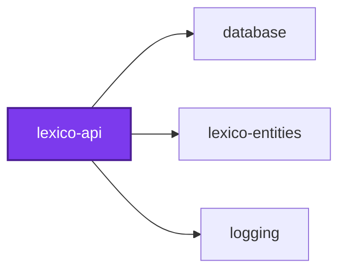
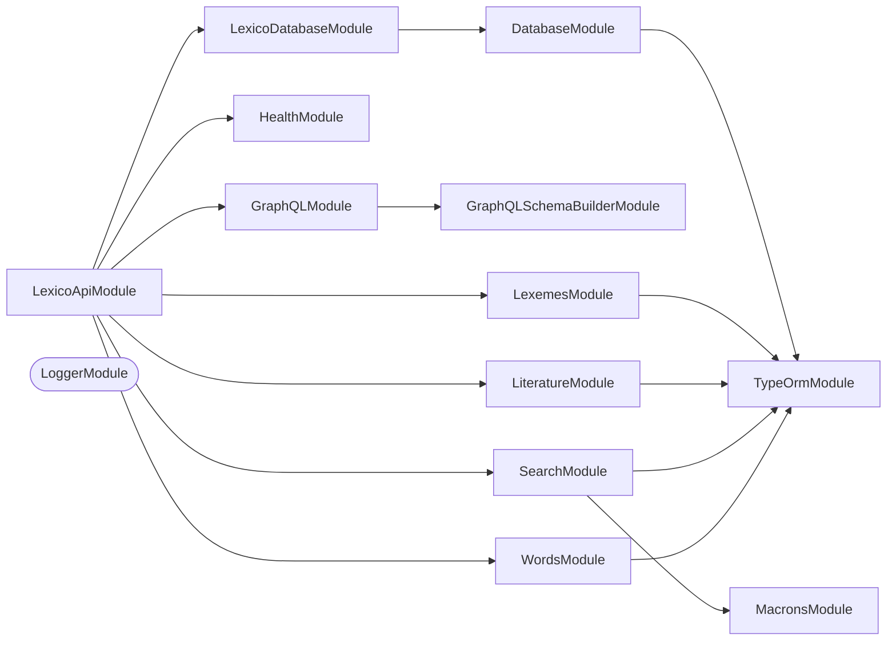

## Start

```bash
nx run lexico-api:start
```

## Test

```bash
nx run lexico-api:vitest
```

## GraphQL types

The API's object types are its own, not lexico-entities' TypeORM entities.
Each one, such as `LexemeType` in `src/modules/lexemes/lexeme.entities.ts`,
implements `GraphQLObjectOf<Entity, Self, DatabaseOnlyField, RelationField>`
from `src/lexico-api.types.ts`, which fails the typecheck when the type and its
entity drift apart:

- **Every entity field is declared or excluded by name.** A column only the
  database needs, such as `Translation.translationFullTextSearch`, is listed
  in the type's `*DatabaseOnlyField` union in the module's `*.types.ts`. A new
  column, or a dropped exclusion, fails until someone decides on it.
- **Every declared field has its column's type.** Retyping a column, or
  making a nullable one non-null in the API, fails.
- **Relations are retyped as GraphQL types.** The fields named in the type's
  `*RelationField` union are declared as GraphQL types, and must keep the
  entity relation's cardinality and nullability.

Resolvers never return an entity. Each module's `*.utilities.ts` maps an
entity to its type, such as `toLexemeType`, copying only the fields the type
declares; a relation the query did not join stays unset. The `Form` and
`Inflection` interfaces resolve by the class a row is mapped to, so their
object types are registered as `ORPHANED_GRAPHQL_TYPES` in
`src/modules/lexemes/lexemes.constants.ts`.

## 👔 Conformetry

This project was generated from the [nestjs-graphql-application](../../configuration/conformetry-templates/nestjs-graphql-application) conformetry template.

## 🕸️ Codependix

Dependency graphs exported by [codependix](https://github.com/Organizzolini/codebase/tree/main/packages/ic-suite/codependix/codependix-cli), regenerated by `nx run codebase:codependix:write`.

### Nx Neighborhood

<!-- codependix:start name="codependix-nx-projects" -->

<!-- codependix:end name="codependix-nx-projects" -->

### File Imports

<!-- codependix:start name="codependix-file-imports" -->
```mermaid
graph LR
  file_callidescope_config_ts["callidescope.config.ts"]
  file_codependix_config_ts["codependix.config.ts"]
  file_codometer_config_ts["codometer.config.ts"]
  file_eslint_config_ts["eslint.config.ts"]
  file_src_deletable_entities_ts["src/deletable.entities.ts"]
  file_src_lexico_api_graphql_end_to_end_test_ts["src/lexico-api-graphql.end-to-end.test.ts"]
  file_src_lexico_api_constants_ts["src/lexico-api.constants.ts"]
  file_src_lexico_api_constants_unit_test_ts["src/lexico-api.constants.unit.test.ts"]
  file_src_lexico_api_end_to_end_test_ts["src/lexico-api.end-to-end.test.ts"]
  file_src_lexico_api_entities_ts["src/lexico-api.entities.ts"]
  file_src_lexico_api_module_ts["src/lexico-api.module.ts"]
  file_src_lexico_api_module_unit_test_ts["src/lexico-api.module.unit.test.ts"]
  file_src_lexico_api_ts["src/lexico-api.ts"]
  file_src_lexico_api_types_ts["src/lexico-api.types.ts"]
  file_src_lexico_api_types_unit_test_ts["src/lexico-api.types.unit.test.ts"]
  file_src_lexico_api_unit_test_ts["src/lexico-api.unit.test.ts"]
  file_src_lexico_api_utilities_ts["src/lexico-api.utilities.ts"]
  file_src_lexico_api_utilities_unit_test_ts["src/lexico-api.utilities.unit.test.ts"]
  file_src_modules_health_health_constants_ts["src/modules/health/health.constants.ts"]
  file_src_modules_health_health_module_ts["src/modules/health/health.module.ts"]
  file_src_modules_health_health_module_unit_test_ts["src/modules/health/health.module.unit.test.ts"]
  file_src_modules_health_health_resolver_ts["src/modules/health/health.resolver.ts"]
  file_src_modules_health_health_resolver_unit_test_ts["src/modules/health/health.resolver.unit.test.ts"]
  file_src_modules_health_health_service_ts["src/modules/health/health.service.ts"]
  file_src_modules_health_health_service_unit_test_ts["src/modules/health/health.service.unit.test.ts"]
  file_src_modules_health_health_types_ts["src/modules/health/health.types.ts"]
  file_src_modules_lexemes_forms_adjectival_form_entities_ts["src/modules/lexemes/forms/adjectival-form.entities.ts"]
  file_src_modules_lexemes_forms_adverb_form_entities_ts["src/modules/lexemes/forms/adverb-form.entities.ts"]
  file_src_modules_lexemes_forms_finite_verb_form_entities_ts["src/modules/lexemes/forms/finite-verb-form.entities.ts"]
  file_src_modules_lexemes_forms_form_entities_ts["src/modules/lexemes/forms/form.entities.ts"]
  file_src_modules_lexemes_forms_forms_types_ts["src/modules/lexemes/forms/forms.types.ts"]
  file_src_modules_lexemes_forms_forms_utilities_ts["src/modules/lexemes/forms/forms.utilities.ts"]
  file_src_modules_lexemes_forms_forms_utilities_unit_test_ts["src/modules/lexemes/forms/forms.utilities.unit.test.ts"]
  file_src_modules_lexemes_forms_gerund_form_entities_ts["src/modules/lexemes/forms/gerund-form.entities.ts"]
  file_src_modules_lexemes_forms_infinitive_form_entities_ts["src/modules/lexemes/forms/infinitive-form.entities.ts"]
  file_src_modules_lexemes_forms_nominal_form_entities_ts["src/modules/lexemes/forms/nominal-form.entities.ts"]
  file_src_modules_lexemes_forms_participle_form_entities_ts["src/modules/lexemes/forms/participle-form.entities.ts"]
  file_src_modules_lexemes_forms_supine_form_entities_ts["src/modules/lexemes/forms/supine-form.entities.ts"]
  file_src_modules_lexemes_inflections_adjective_inflection_entities_ts["src/modules/lexemes/inflections/adjective-inflection.entities.ts"]
  file_src_modules_lexemes_inflections_adverb_inflection_entities_ts["src/modules/lexemes/inflections/adverb-inflection.entities.ts"]
  file_src_modules_lexemes_inflections_inflection_entities_ts["src/modules/lexemes/inflections/inflection.entities.ts"]
  file_src_modules_lexemes_inflections_inflections_types_ts["src/modules/lexemes/inflections/inflections.types.ts"]
  file_src_modules_lexemes_inflections_inflections_utilities_ts["src/modules/lexemes/inflections/inflections.utilities.ts"]
  file_src_modules_lexemes_inflections_inflections_utilities_unit_test_ts["src/modules/lexemes/inflections/inflections.utilities.unit.test.ts"]
  file_src_modules_lexemes_inflections_noun_inflection_entities_ts["src/modules/lexemes/inflections/noun-inflection.entities.ts"]
  file_src_modules_lexemes_inflections_preposition_inflection_entities_ts["src/modules/lexemes/inflections/preposition-inflection.entities.ts"]
  file_src_modules_lexemes_inflections_uninflected_inflection_entities_ts["src/modules/lexemes/inflections/uninflected-inflection.entities.ts"]
  file_src_modules_lexemes_inflections_verb_inflection_entities_ts["src/modules/lexemes/inflections/verb-inflection.entities.ts"]
  file_src_modules_lexemes_lexeme_arguments_entities_ts["src/modules/lexemes/lexeme-arguments.entities.ts"]
  file_src_modules_lexemes_lexeme_entities_ts["src/modules/lexemes/lexeme.entities.ts"]
  file_src_modules_lexemes_lexemes_arguments_entities_ts["src/modules/lexemes/lexemes-arguments.entities.ts"]
  file_src_modules_lexemes_lexemes_constants_ts["src/modules/lexemes/lexemes.constants.ts"]
  file_src_modules_lexemes_lexemes_module_ts["src/modules/lexemes/lexemes.module.ts"]
  file_src_modules_lexemes_lexemes_module_unit_test_ts["src/modules/lexemes/lexemes.module.unit.test.ts"]
  file_src_modules_lexemes_lexemes_resolver_ts["src/modules/lexemes/lexemes.resolver.ts"]
  file_src_modules_lexemes_lexemes_resolver_unit_test_ts["src/modules/lexemes/lexemes.resolver.unit.test.ts"]
  file_src_modules_lexemes_lexemes_service_integration_test_ts["src/modules/lexemes/lexemes.service.integration.test.ts"]
  file_src_modules_lexemes_lexemes_service_ts["src/modules/lexemes/lexemes.service.ts"]
  file_src_modules_lexemes_lexemes_service_unit_test_ts["src/modules/lexemes/lexemes.service.unit.test.ts"]
  file_src_modules_lexemes_lexemes_types_ts["src/modules/lexemes/lexemes.types.ts"]
  file_src_modules_lexemes_lexemes_utilities_ts["src/modules/lexemes/lexemes.utilities.ts"]
  file_src_modules_lexemes_lexemes_utilities_unit_test_ts["src/modules/lexemes/lexemes.utilities.unit.test.ts"]
  file_src_modules_lexemes_principal_part_entities_ts["src/modules/lexemes/principal-part.entities.ts"]
  file_src_modules_lexemes_pronunciation_entities_ts["src/modules/lexemes/pronunciation.entities.ts"]
  file_src_modules_lexemes_translation_entities_ts["src/modules/lexemes/translation.entities.ts"]
  file_src_modules_literature_author_argument_entities_ts["src/modules/literature/author-argument.entities.ts"]
  file_src_modules_literature_author_lookup_input_entities_ts["src/modules/literature/author-lookup-input.entities.ts"]
  file_src_modules_literature_author_entities_ts["src/modules/literature/author.entities.ts"]
  file_src_modules_literature_authors_resolver_end_to_end_test_ts["src/modules/literature/authors.resolver.end-to-end.test.ts"]
  file_src_modules_literature_authors_resolver_integration_test_ts["src/modules/literature/authors.resolver.integration.test.ts"]
  file_src_modules_literature_authors_resolver_ts["src/modules/literature/authors.resolver.ts"]
  file_src_modules_literature_authors_resolver_unit_test_ts["src/modules/literature/authors.resolver.unit.test.ts"]
  file_src_modules_literature_line_arguments_entities_ts["src/modules/literature/line-arguments.entities.ts"]
  file_src_modules_literature_line_entities_ts["src/modules/literature/line.entities.ts"]
  file_src_modules_literature_lines_range_input_entities_ts["src/modules/literature/lines-range-input.entities.ts"]
  file_src_modules_literature_lines_resolver_end_to_end_test_ts["src/modules/literature/lines.resolver.end-to-end.test.ts"]
  file_src_modules_literature_lines_resolver_integration_test_ts["src/modules/literature/lines.resolver.integration.test.ts"]
  file_src_modules_literature_lines_resolver_ts["src/modules/literature/lines.resolver.ts"]
  file_src_modules_literature_lines_resolver_unit_test_ts["src/modules/literature/lines.resolver.unit.test.ts"]
  file_src_modules_literature_literature_arguments_entities_unit_test_ts["src/modules/literature/literature-arguments.entities.unit.test.ts"]
  file_src_modules_literature_literature_connection_entities_ts["src/modules/literature/literature-connection.entities.ts"]
  file_src_modules_literature_literature_relations_loader_ts["src/modules/literature/literature-relations.loader.ts"]
  file_src_modules_literature_literature_relations_loader_unit_test_ts["src/modules/literature/literature-relations.loader.unit.test.ts"]
  file_src_modules_literature_literature_relations_service_integration_test_ts["src/modules/literature/literature-relations.service.integration.test.ts"]
  file_src_modules_literature_literature_relations_service_ts["src/modules/literature/literature-relations.service.ts"]
  file_src_modules_literature_literature_relations_service_unit_test_ts["src/modules/literature/literature-relations.service.unit.test.ts"]
  file_src_modules_literature_literature_relations_utilities_ts["src/modules/literature/literature-relations.utilities.ts"]
  file_src_modules_literature_literature_relations_utilities_unit_test_ts["src/modules/literature/literature-relations.utilities.unit.test.ts"]
  file_src_modules_literature_literature_search_result_entities_ts["src/modules/literature/literature-search-result.entities.ts"]
  file_src_modules_literature_literature_search_resolver_end_to_end_test_ts["src/modules/literature/literature-search.resolver.end-to-end.test.ts"]
  file_src_modules_literature_literature_search_service_integration_test_ts["src/modules/literature/literature-search.service.integration.test.ts"]
  file_src_modules_literature_literature_constants_ts["src/modules/literature/literature.constants.ts"]
  file_src_modules_literature_literature_module_ts["src/modules/literature/literature.module.ts"]
  file_src_modules_literature_literature_resolver_ts["src/modules/literature/literature.resolver.ts"]
  file_src_modules_literature_literature_resolver_unit_test_ts["src/modules/literature/literature.resolver.unit.test.ts"]
  file_src_modules_literature_literature_service_ts["src/modules/literature/literature.service.ts"]
  file_src_modules_literature_literature_service_unit_test_ts["src/modules/literature/literature.service.unit.test.ts"]
  file_src_modules_literature_literature_types_ts["src/modules/literature/literature.types.ts"]
  file_src_modules_literature_literature_utilities_integration_test_ts["src/modules/literature/literature.utilities.integration.test.ts"]
  file_src_modules_literature_literature_utilities_ts["src/modules/literature/literature.utilities.ts"]
  file_src_modules_literature_literature_utilities_unit_test_ts["src/modules/literature/literature.utilities.unit.test.ts"]
  file_src_modules_literature_search_authors_arguments_entities_ts["src/modules/literature/search-authors-arguments.entities.ts"]
  file_src_modules_literature_search_lines_arguments_entities_ts["src/modules/literature/search-lines-arguments.entities.ts"]
  file_src_modules_literature_search_literature_arguments_entities_ts["src/modules/literature/search-literature-arguments.entities.ts"]
  file_src_modules_literature_search_texts_arguments_entities_ts["src/modules/literature/search-texts-arguments.entities.ts"]
  file_src_modules_literature_text_argument_entities_ts["src/modules/literature/text-argument.entities.ts"]
  file_src_modules_literature_text_lookup_input_entities_ts["src/modules/literature/text-lookup-input.entities.ts"]
  file_src_modules_literature_text_entities_ts["src/modules/literature/text.entities.ts"]
  file_src_modules_literature_texts_arguments_entities_ts["src/modules/literature/texts-arguments.entities.ts"]
  file_src_modules_literature_texts_resolver_end_to_end_test_ts["src/modules/literature/texts.resolver.end-to-end.test.ts"]
  file_src_modules_literature_texts_resolver_integration_test_ts["src/modules/literature/texts.resolver.integration.test.ts"]
  file_src_modules_literature_texts_resolver_ts["src/modules/literature/texts.resolver.ts"]
  file_src_modules_literature_texts_resolver_unit_test_ts["src/modules/literature/texts.resolver.unit.test.ts"]
  file_src_modules_literature_token_entities_ts["src/modules/literature/token.entities.ts"]
  file_src_modules_literature_tokens_arguments_entities_ts["src/modules/literature/tokens-arguments.entities.ts"]
  file_src_modules_literature_tokens_resolver_integration_test_ts["src/modules/literature/tokens.resolver.integration.test.ts"]
  file_src_modules_literature_tokens_resolver_ts["src/modules/literature/tokens.resolver.ts"]
  file_src_modules_literature_tokens_resolver_unit_test_ts["src/modules/literature/tokens.resolver.unit.test.ts"]
  file_src_modules_macrons_macrons_constants_ts["src/modules/macrons/macrons.constants.ts"]
  file_src_modules_macrons_macrons_module_ts["src/modules/macrons/macrons.module.ts"]
  file_src_modules_macrons_macrons_service_ts["src/modules/macrons/macrons.service.ts"]
  file_src_modules_macrons_macrons_service_unit_test_ts["src/modules/macrons/macrons.service.unit.test.ts"]
  file_src_modules_macrons_macrons_types_ts["src/modules/macrons/macrons.types.ts"]
  file_src_modules_search_pagination_arguments_entities_ts["src/modules/search/pagination-arguments.entities.ts"]
  file_src_modules_search_pagination_arguments_entities_unit_test_ts["src/modules/search/pagination-arguments.entities.unit.test.ts"]
  file_src_modules_search_search_english_arguments_entities_ts["src/modules/search/search-english-arguments.entities.ts"]
  file_src_modules_search_search_latin_arguments_entities_ts["src/modules/search/search-latin-arguments.entities.ts"]
  file_src_modules_search_search_constants_ts["src/modules/search/search.constants.ts"]
  file_src_modules_search_search_entities_ts["src/modules/search/search.entities.ts"]
  file_src_modules_search_search_entities_unit_test_ts["src/modules/search/search.entities.unit.test.ts"]
  file_src_modules_search_search_module_ts["src/modules/search/search.module.ts"]
  file_src_modules_search_search_module_unit_test_ts["src/modules/search/search.module.unit.test.ts"]
  file_src_modules_search_search_resolver_ts["src/modules/search/search.resolver.ts"]
  file_src_modules_search_search_resolver_unit_test_ts["src/modules/search/search.resolver.unit.test.ts"]
  file_src_modules_search_search_service_integration_test_ts["src/modules/search/search.service.integration.test.ts"]
  file_src_modules_search_search_service_ts["src/modules/search/search.service.ts"]
  file_src_modules_search_search_service_unit_test_ts["src/modules/search/search.service.unit.test.ts"]
  file_src_modules_search_search_types_ts["src/modules/search/search.types.ts"]
  file_src_modules_search_search_utilities_ts["src/modules/search/search.utilities.ts"]
  file_src_modules_search_search_utilities_unit_test_ts["src/modules/search/search.utilities.unit.test.ts"]
  file_src_modules_words_word_arguments_entities_ts["src/modules/words/word-arguments.entities.ts"]
  file_src_modules_words_word_form_entities_ts["src/modules/words/word-form.entities.ts"]
  file_src_modules_words_word_form_resolver_ts["src/modules/words/word-form.resolver.ts"]
  file_src_modules_words_word_form_resolver_unit_test_ts["src/modules/words/word-form.resolver.unit.test.ts"]
  file_src_modules_words_word_lexeme_entities_ts["src/modules/words/word-lexeme.entities.ts"]
  file_src_modules_words_word_lexeme_resolver_ts["src/modules/words/word-lexeme.resolver.ts"]
  file_src_modules_words_word_lexeme_resolver_unit_test_ts["src/modules/words/word-lexeme.resolver.unit.test.ts"]
  file_src_modules_words_word_link_loader_ts["src/modules/words/word-link.loader.ts"]
  file_src_modules_words_word_link_loader_unit_test_ts["src/modules/words/word-link.loader.unit.test.ts"]
  file_src_modules_words_word_entities_ts["src/modules/words/word.entities.ts"]
  file_src_modules_words_words_arguments_entities_ts["src/modules/words/words-arguments.entities.ts"]
  file_src_modules_words_words_constants_ts["src/modules/words/words.constants.ts"]
  file_src_modules_words_words_module_ts["src/modules/words/words.module.ts"]
  file_src_modules_words_words_resolver_end_to_end_test_ts["src/modules/words/words.resolver.end-to-end.test.ts"]
  file_src_modules_words_words_resolver_ts["src/modules/words/words.resolver.ts"]
  file_src_modules_words_words_resolver_unit_test_ts["src/modules/words/words.resolver.unit.test.ts"]
  file_src_modules_words_words_service_integration_test_ts["src/modules/words/words.service.integration.test.ts"]
  file_src_modules_words_words_service_ts["src/modules/words/words.service.ts"]
  file_src_modules_words_words_service_unit_test_ts["src/modules/words/words.service.unit.test.ts"]
  file_src_modules_words_words_types_ts["src/modules/words/words.types.ts"]
  file_src_modules_words_words_utilities_ts["src/modules/words/words.utilities.ts"]
  file_src_modules_words_words_utilities_unit_test_ts["src/modules/words/words.utilities.unit.test.ts"]
  file_testing_author_text_application_ts["testing/author-text-application.ts"]
  file_testing_author_text_catalog_ts["testing/author-text-catalog.ts"]
  file_testing_database_ts["testing/database.ts"]
  file_testing_graphql_application_ts["testing/graphql-application.ts"]
  file_testing_literature_search_corpus_ts["testing/literature-search-corpus.ts"]
  file_testing_literature_search_pagination_ts["testing/literature-search-pagination.ts"]
  file_testing_literature_services_ts["testing/literature-services.ts"]
  file_testing_mocks_ts["testing/mocks.ts"]
  file_testing_pagination_ts["testing/pagination.ts"]
  file_testing_reading_application_ts["testing/reading-application.ts"]
  file_testing_reading_passage_ts["testing/reading-passage.ts"]
  file_testing_relay_connection_walk_ts["testing/relay-connection-walk.ts"]
  file_testing_setup_ts["testing/setup.ts"]
  file_testing_word_lookups_ts["testing/word-lookups.ts"]
  file_vitest_config_ts["vitest.config.ts"]
  file_src_deletable_entities_ts --> file_src_lexico_api_types_ts
  file_src_lexico_api_graphql_end_to_end_test_ts --> file_src_modules_lexemes_lexemes_module_ts
  file_src_lexico_api_graphql_end_to_end_test_ts --> file_src_modules_literature_literature_module_ts
  file_src_lexico_api_graphql_end_to_end_test_ts --> file_src_modules_search_search_module_ts
  file_src_lexico_api_graphql_end_to_end_test_ts --> file_src_modules_words_words_module_ts
  file_src_lexico_api_graphql_end_to_end_test_ts --> file_testing_database_ts
  file_src_lexico_api_graphql_end_to_end_test_ts --> file_testing_graphql_application_ts
  file_src_lexico_api_graphql_end_to_end_test_ts --> file_testing_word_lookups_ts
  file_src_lexico_api_end_to_end_test_ts --> file_src_lexico_api_constants_ts
  file_src_lexico_api_module_ts --> file_src_lexico_api_constants_ts
  file_src_lexico_api_module_ts --> file_src_modules_health_health_module_ts
  file_src_lexico_api_module_ts --> file_src_modules_lexemes_lexemes_constants_ts
  file_src_lexico_api_module_ts --> file_src_modules_lexemes_lexemes_module_ts
  file_src_lexico_api_module_ts --> file_src_modules_literature_literature_module_ts
  file_src_lexico_api_module_ts --> file_src_modules_search_search_module_ts
  file_src_lexico_api_module_ts --> file_src_modules_words_words_module_ts
  file_src_lexico_api_module_unit_test_ts --> file_src_lexico_api_module_ts
  file_src_lexico_api_ts --> file_src_lexico_api_constants_ts
  file_src_lexico_api_ts --> file_src_lexico_api_module_ts
  file_src_lexico_api_types_ts --> file_src_lexico_api_entities_ts
  file_src_lexico_api_types_unit_test_ts --> file_src_lexico_api_types_ts
  file_src_lexico_api_types_unit_test_ts --> file_src_modules_lexemes_forms_form_entities_ts
  file_src_lexico_api_types_unit_test_ts --> file_src_modules_lexemes_inflections_inflection_entities_ts
  file_src_lexico_api_types_unit_test_ts --> file_src_modules_lexemes_lexeme_entities_ts
  file_src_lexico_api_types_unit_test_ts --> file_src_modules_lexemes_lexemes_types_ts
  file_src_lexico_api_types_unit_test_ts --> file_src_modules_lexemes_pronunciation_entities_ts
  file_src_lexico_api_types_unit_test_ts --> file_src_modules_lexemes_translation_entities_ts
  file_src_lexico_api_types_unit_test_ts --> file_src_modules_literature_author_entities_ts
  file_src_lexico_api_types_unit_test_ts --> file_src_modules_literature_literature_types_ts
  file_src_lexico_api_utilities_ts --> file_src_deletable_entities_ts
  file_src_lexico_api_utilities_ts --> file_src_lexico_api_entities_ts
  file_src_lexico_api_utilities_ts --> file_src_lexico_api_types_ts
  file_src_lexico_api_utilities_unit_test_ts --> file_src_lexico_api_entities_ts
  file_src_lexico_api_utilities_unit_test_ts --> file_src_lexico_api_types_ts
  file_src_lexico_api_utilities_unit_test_ts --> file_src_lexico_api_utilities_ts
  file_src_lexico_api_utilities_unit_test_ts --> file_testing_pagination_ts
  file_src_modules_health_health_module_ts --> file_src_modules_health_health_resolver_ts
  file_src_modules_health_health_module_ts --> file_src_modules_health_health_service_ts
  file_src_modules_health_health_module_unit_test_ts --> file_src_modules_health_health_module_ts
  file_src_modules_health_health_resolver_ts --> file_src_modules_health_health_service_ts
  file_src_modules_health_health_resolver_unit_test_ts --> file_src_modules_health_health_resolver_ts
  file_src_modules_health_health_resolver_unit_test_ts --> file_src_modules_health_health_service_ts
  file_src_modules_health_health_service_unit_test_ts --> file_src_modules_health_health_service_ts
  file_src_modules_lexemes_forms_adjectival_form_entities_ts --> file_src_lexico_api_types_ts
  file_src_modules_lexemes_forms_adjectival_form_entities_ts --> file_src_modules_lexemes_forms_form_entities_ts
  file_src_modules_lexemes_forms_adjectival_form_entities_ts --> file_src_modules_lexemes_forms_forms_types_ts
  file_src_modules_lexemes_forms_adverb_form_entities_ts --> file_src_lexico_api_types_ts
  file_src_modules_lexemes_forms_adverb_form_entities_ts --> file_src_modules_lexemes_forms_form_entities_ts
  file_src_modules_lexemes_forms_adverb_form_entities_ts --> file_src_modules_lexemes_forms_forms_types_ts
  file_src_modules_lexemes_forms_finite_verb_form_entities_ts --> file_src_lexico_api_types_ts
  file_src_modules_lexemes_forms_finite_verb_form_entities_ts --> file_src_modules_lexemes_forms_form_entities_ts
  file_src_modules_lexemes_forms_finite_verb_form_entities_ts --> file_src_modules_lexemes_forms_forms_types_ts
  file_src_modules_lexemes_forms_form_entities_ts --> file_src_lexico_api_types_ts
  file_src_modules_lexemes_forms_form_entities_ts --> file_src_modules_lexemes_forms_forms_types_ts
  file_src_modules_lexemes_forms_forms_utilities_ts --> file_src_lexico_api_types_ts
  file_src_modules_lexemes_forms_forms_utilities_ts --> file_src_modules_lexemes_forms_adjectival_form_entities_ts
  file_src_modules_lexemes_forms_forms_utilities_ts --> file_src_modules_lexemes_forms_adverb_form_entities_ts
  file_src_modules_lexemes_forms_forms_utilities_ts --> file_src_modules_lexemes_forms_finite_verb_form_entities_ts
  file_src_modules_lexemes_forms_forms_utilities_ts --> file_src_modules_lexemes_forms_form_entities_ts
  file_src_modules_lexemes_forms_forms_utilities_ts --> file_src_modules_lexemes_forms_gerund_form_entities_ts
  file_src_modules_lexemes_forms_forms_utilities_ts --> file_src_modules_lexemes_forms_infinitive_form_entities_ts
  file_src_modules_lexemes_forms_forms_utilities_ts --> file_src_modules_lexemes_forms_nominal_form_entities_ts
  file_src_modules_lexemes_forms_forms_utilities_ts --> file_src_modules_lexemes_forms_participle_form_entities_ts
  file_src_modules_lexemes_forms_forms_utilities_ts --> file_src_modules_lexemes_forms_supine_form_entities_ts
  file_src_modules_lexemes_forms_forms_utilities_unit_test_ts --> file_src_modules_lexemes_forms_adjectival_form_entities_ts
  file_src_modules_lexemes_forms_forms_utilities_unit_test_ts --> file_src_modules_lexemes_forms_adverb_form_entities_ts
  file_src_modules_lexemes_forms_forms_utilities_unit_test_ts --> file_src_modules_lexemes_forms_finite_verb_form_entities_ts
  file_src_modules_lexemes_forms_forms_utilities_unit_test_ts --> file_src_modules_lexemes_forms_forms_utilities_ts
  file_src_modules_lexemes_forms_forms_utilities_unit_test_ts --> file_src_modules_lexemes_forms_gerund_form_entities_ts
  file_src_modules_lexemes_forms_forms_utilities_unit_test_ts --> file_src_modules_lexemes_forms_infinitive_form_entities_ts
  file_src_modules_lexemes_forms_forms_utilities_unit_test_ts --> file_src_modules_lexemes_forms_nominal_form_entities_ts
  file_src_modules_lexemes_forms_forms_utilities_unit_test_ts --> file_src_modules_lexemes_forms_participle_form_entities_ts
  file_src_modules_lexemes_forms_forms_utilities_unit_test_ts --> file_src_modules_lexemes_forms_supine_form_entities_ts
  file_src_modules_lexemes_forms_gerund_form_entities_ts --> file_src_lexico_api_types_ts
  file_src_modules_lexemes_forms_gerund_form_entities_ts --> file_src_modules_lexemes_forms_form_entities_ts
  file_src_modules_lexemes_forms_gerund_form_entities_ts --> file_src_modules_lexemes_forms_forms_types_ts
  file_src_modules_lexemes_forms_infinitive_form_entities_ts --> file_src_lexico_api_types_ts
  file_src_modules_lexemes_forms_infinitive_form_entities_ts --> file_src_modules_lexemes_forms_form_entities_ts
  file_src_modules_lexemes_forms_infinitive_form_entities_ts --> file_src_modules_lexemes_forms_forms_types_ts
  file_src_modules_lexemes_forms_nominal_form_entities_ts --> file_src_lexico_api_types_ts
  file_src_modules_lexemes_forms_nominal_form_entities_ts --> file_src_modules_lexemes_forms_form_entities_ts
  file_src_modules_lexemes_forms_nominal_form_entities_ts --> file_src_modules_lexemes_forms_forms_types_ts
  file_src_modules_lexemes_forms_participle_form_entities_ts --> file_src_lexico_api_types_ts
  file_src_modules_lexemes_forms_participle_form_entities_ts --> file_src_modules_lexemes_forms_form_entities_ts
  file_src_modules_lexemes_forms_participle_form_entities_ts --> file_src_modules_lexemes_forms_forms_types_ts
  file_src_modules_lexemes_forms_supine_form_entities_ts --> file_src_lexico_api_types_ts
  file_src_modules_lexemes_forms_supine_form_entities_ts --> file_src_modules_lexemes_forms_form_entities_ts
  file_src_modules_lexemes_forms_supine_form_entities_ts --> file_src_modules_lexemes_forms_forms_types_ts
  file_src_modules_lexemes_inflections_adjective_inflection_entities_ts --> file_src_lexico_api_types_ts
  file_src_modules_lexemes_inflections_adjective_inflection_entities_ts --> file_src_modules_lexemes_inflections_inflection_entities_ts
  file_src_modules_lexemes_inflections_adjective_inflection_entities_ts --> file_src_modules_lexemes_inflections_inflections_types_ts
  file_src_modules_lexemes_inflections_adverb_inflection_entities_ts --> file_src_lexico_api_types_ts
  file_src_modules_lexemes_inflections_adverb_inflection_entities_ts --> file_src_modules_lexemes_inflections_inflection_entities_ts
  file_src_modules_lexemes_inflections_adverb_inflection_entities_ts --> file_src_modules_lexemes_inflections_inflections_types_ts
  file_src_modules_lexemes_inflections_inflection_entities_ts --> file_src_lexico_api_types_ts
  file_src_modules_lexemes_inflections_inflection_entities_ts --> file_src_modules_lexemes_inflections_inflections_types_ts
  file_src_modules_lexemes_inflections_inflections_utilities_ts --> file_src_lexico_api_types_ts
  file_src_modules_lexemes_inflections_inflections_utilities_ts --> file_src_modules_lexemes_inflections_adjective_inflection_entities_ts
  file_src_modules_lexemes_inflections_inflections_utilities_ts --> file_src_modules_lexemes_inflections_adverb_inflection_entities_ts
  file_src_modules_lexemes_inflections_inflections_utilities_ts --> file_src_modules_lexemes_inflections_inflection_entities_ts
  file_src_modules_lexemes_inflections_inflections_utilities_ts --> file_src_modules_lexemes_inflections_noun_inflection_entities_ts
  file_src_modules_lexemes_inflections_inflections_utilities_ts --> file_src_modules_lexemes_inflections_preposition_inflection_entities_ts
  file_src_modules_lexemes_inflections_inflections_utilities_ts --> file_src_modules_lexemes_inflections_uninflected_inflection_entities_ts
  file_src_modules_lexemes_inflections_inflections_utilities_ts --> file_src_modules_lexemes_inflections_verb_inflection_entities_ts
  file_src_modules_lexemes_inflections_inflections_utilities_unit_test_ts --> file_src_modules_lexemes_inflections_adjective_inflection_entities_ts
  file_src_modules_lexemes_inflections_inflections_utilities_unit_test_ts --> file_src_modules_lexemes_inflections_adverb_inflection_entities_ts
  file_src_modules_lexemes_inflections_inflections_utilities_unit_test_ts --> file_src_modules_lexemes_inflections_inflections_utilities_ts
  file_src_modules_lexemes_inflections_inflections_utilities_unit_test_ts --> file_src_modules_lexemes_inflections_noun_inflection_entities_ts
  file_src_modules_lexemes_inflections_inflections_utilities_unit_test_ts --> file_src_modules_lexemes_inflections_preposition_inflection_entities_ts
  file_src_modules_lexemes_inflections_inflections_utilities_unit_test_ts --> file_src_modules_lexemes_inflections_uninflected_inflection_entities_ts
  file_src_modules_lexemes_inflections_inflections_utilities_unit_test_ts --> file_src_modules_lexemes_inflections_verb_inflection_entities_ts
  file_src_modules_lexemes_inflections_noun_inflection_entities_ts --> file_src_lexico_api_types_ts
  file_src_modules_lexemes_inflections_noun_inflection_entities_ts --> file_src_modules_lexemes_inflections_inflection_entities_ts
  file_src_modules_lexemes_inflections_noun_inflection_entities_ts --> file_src_modules_lexemes_inflections_inflections_types_ts
  file_src_modules_lexemes_inflections_preposition_inflection_entities_ts --> file_src_lexico_api_types_ts
  file_src_modules_lexemes_inflections_preposition_inflection_entities_ts --> file_src_modules_lexemes_inflections_inflection_entities_ts
  file_src_modules_lexemes_inflections_preposition_inflection_entities_ts --> file_src_modules_lexemes_inflections_inflections_types_ts
  file_src_modules_lexemes_inflections_uninflected_inflection_entities_ts --> file_src_lexico_api_types_ts
  file_src_modules_lexemes_inflections_uninflected_inflection_entities_ts --> file_src_modules_lexemes_inflections_inflection_entities_ts
  file_src_modules_lexemes_inflections_uninflected_inflection_entities_ts --> file_src_modules_lexemes_inflections_inflections_types_ts
  file_src_modules_lexemes_inflections_verb_inflection_entities_ts --> file_src_lexico_api_types_ts
  file_src_modules_lexemes_inflections_verb_inflection_entities_ts --> file_src_modules_lexemes_inflections_inflection_entities_ts
  file_src_modules_lexemes_inflections_verb_inflection_entities_ts --> file_src_modules_lexemes_inflections_inflections_types_ts
  file_src_modules_lexemes_lexeme_entities_ts --> file_src_deletable_entities_ts
  file_src_modules_lexemes_lexeme_entities_ts --> file_src_lexico_api_types_ts
  file_src_modules_lexemes_lexeme_entities_ts --> file_src_modules_lexemes_forms_form_entities_ts
  file_src_modules_lexemes_lexeme_entities_ts --> file_src_modules_lexemes_inflections_inflection_entities_ts
  file_src_modules_lexemes_lexeme_entities_ts --> file_src_modules_lexemes_lexemes_types_ts
  file_src_modules_lexemes_lexeme_entities_ts --> file_src_modules_lexemes_principal_part_entities_ts
  file_src_modules_lexemes_lexeme_entities_ts --> file_src_modules_lexemes_pronunciation_entities_ts
  file_src_modules_lexemes_lexeme_entities_ts --> file_src_modules_lexemes_translation_entities_ts
  file_src_modules_lexemes_lexemes_constants_ts --> file_src_modules_lexemes_forms_adjectival_form_entities_ts
  file_src_modules_lexemes_lexemes_constants_ts --> file_src_modules_lexemes_forms_adverb_form_entities_ts
  file_src_modules_lexemes_lexemes_constants_ts --> file_src_modules_lexemes_forms_finite_verb_form_entities_ts
  file_src_modules_lexemes_lexemes_constants_ts --> file_src_modules_lexemes_forms_gerund_form_entities_ts
  file_src_modules_lexemes_lexemes_constants_ts --> file_src_modules_lexemes_forms_infinitive_form_entities_ts
  file_src_modules_lexemes_lexemes_constants_ts --> file_src_modules_lexemes_forms_nominal_form_entities_ts
  file_src_modules_lexemes_lexemes_constants_ts --> file_src_modules_lexemes_forms_participle_form_entities_ts
  file_src_modules_lexemes_lexemes_constants_ts --> file_src_modules_lexemes_forms_supine_form_entities_ts
  file_src_modules_lexemes_lexemes_constants_ts --> file_src_modules_lexemes_inflections_adjective_inflection_entities_ts
  file_src_modules_lexemes_lexemes_constants_ts --> file_src_modules_lexemes_inflections_adverb_inflection_entities_ts
  file_src_modules_lexemes_lexemes_constants_ts --> file_src_modules_lexemes_inflections_noun_inflection_entities_ts
  file_src_modules_lexemes_lexemes_constants_ts --> file_src_modules_lexemes_inflections_preposition_inflection_entities_ts
  file_src_modules_lexemes_lexemes_constants_ts --> file_src_modules_lexemes_inflections_uninflected_inflection_entities_ts
  file_src_modules_lexemes_lexemes_constants_ts --> file_src_modules_lexemes_inflections_verb_inflection_entities_ts
  file_src_modules_lexemes_lexemes_module_ts --> file_src_modules_lexemes_lexemes_resolver_ts
  file_src_modules_lexemes_lexemes_module_ts --> file_src_modules_lexemes_lexemes_service_ts
  file_src_modules_lexemes_lexemes_module_unit_test_ts --> file_src_modules_lexemes_lexemes_module_ts
  file_src_modules_lexemes_lexemes_resolver_ts --> file_src_modules_lexemes_lexeme_arguments_entities_ts
  file_src_modules_lexemes_lexemes_resolver_ts --> file_src_modules_lexemes_lexeme_entities_ts
  file_src_modules_lexemes_lexemes_resolver_ts --> file_src_modules_lexemes_lexemes_arguments_entities_ts
  file_src_modules_lexemes_lexemes_resolver_ts --> file_src_modules_lexemes_lexemes_service_ts
  file_src_modules_lexemes_lexemes_resolver_ts --> file_src_modules_lexemes_lexemes_utilities_ts
  file_src_modules_lexemes_lexemes_resolver_unit_test_ts --> file_src_modules_lexemes_lexeme_entities_ts
  file_src_modules_lexemes_lexemes_resolver_unit_test_ts --> file_src_modules_lexemes_lexemes_constants_ts
  file_src_modules_lexemes_lexemes_resolver_unit_test_ts --> file_src_modules_lexemes_lexemes_resolver_ts
  file_src_modules_lexemes_lexemes_resolver_unit_test_ts --> file_src_modules_lexemes_lexemes_service_ts
  file_src_modules_lexemes_lexemes_service_integration_test_ts --> file_src_modules_lexemes_lexemes_service_ts
  file_src_modules_lexemes_lexemes_service_integration_test_ts --> file_testing_database_ts
  file_src_modules_lexemes_lexemes_service_unit_test_ts --> file_src_modules_lexemes_lexemes_service_ts
  file_src_modules_lexemes_lexemes_service_unit_test_ts --> file_testing_mocks_ts
  file_src_modules_lexemes_lexemes_utilities_ts --> file_src_lexico_api_types_ts
  file_src_modules_lexemes_lexemes_utilities_ts --> file_src_lexico_api_utilities_ts
  file_src_modules_lexemes_lexemes_utilities_ts --> file_src_modules_lexemes_forms_forms_utilities_ts
  file_src_modules_lexemes_lexemes_utilities_ts --> file_src_modules_lexemes_inflections_inflections_utilities_ts
  file_src_modules_lexemes_lexemes_utilities_ts --> file_src_modules_lexemes_lexeme_entities_ts
  file_src_modules_lexemes_lexemes_utilities_ts --> file_src_modules_lexemes_lexemes_types_ts
  file_src_modules_lexemes_lexemes_utilities_ts --> file_src_modules_lexemes_principal_part_entities_ts
  file_src_modules_lexemes_lexemes_utilities_ts --> file_src_modules_lexemes_pronunciation_entities_ts
  file_src_modules_lexemes_lexemes_utilities_ts --> file_src_modules_lexemes_translation_entities_ts
  file_src_modules_lexemes_lexemes_utilities_unit_test_ts --> file_src_modules_lexemes_forms_nominal_form_entities_ts
  file_src_modules_lexemes_lexemes_utilities_unit_test_ts --> file_src_modules_lexemes_inflections_noun_inflection_entities_ts
  file_src_modules_lexemes_lexemes_utilities_unit_test_ts --> file_src_modules_lexemes_lexeme_entities_ts
  file_src_modules_lexemes_lexemes_utilities_unit_test_ts --> file_src_modules_lexemes_lexemes_utilities_ts
  file_src_modules_lexemes_lexemes_utilities_unit_test_ts --> file_src_modules_lexemes_principal_part_entities_ts
  file_src_modules_lexemes_lexemes_utilities_unit_test_ts --> file_src_modules_lexemes_pronunciation_entities_ts
  file_src_modules_lexemes_lexemes_utilities_unit_test_ts --> file_src_modules_lexemes_translation_entities_ts
  file_src_modules_lexemes_principal_part_entities_ts --> file_src_deletable_entities_ts
  file_src_modules_lexemes_principal_part_entities_ts --> file_src_lexico_api_types_ts
  file_src_modules_lexemes_principal_part_entities_ts --> file_src_modules_lexemes_lexemes_types_ts
  file_src_modules_lexemes_pronunciation_entities_ts --> file_src_deletable_entities_ts
  file_src_modules_lexemes_pronunciation_entities_ts --> file_src_lexico_api_types_ts
  file_src_modules_lexemes_pronunciation_entities_ts --> file_src_modules_lexemes_lexemes_types_ts
  file_src_modules_lexemes_translation_entities_ts --> file_src_deletable_entities_ts
  file_src_modules_lexemes_translation_entities_ts --> file_src_lexico_api_types_ts
  file_src_modules_lexemes_translation_entities_ts --> file_src_modules_lexemes_lexemes_types_ts
  file_src_modules_literature_author_argument_entities_ts --> file_src_modules_literature_author_lookup_input_entities_ts
  file_src_modules_literature_author_entities_ts --> file_src_deletable_entities_ts
  file_src_modules_literature_author_entities_ts --> file_src_lexico_api_types_ts
  file_src_modules_literature_author_entities_ts --> file_src_modules_literature_literature_types_ts
  file_src_modules_literature_authors_resolver_end_to_end_test_ts --> file_testing_author_text_application_ts
  file_src_modules_literature_authors_resolver_end_to_end_test_ts --> file_testing_author_text_catalog_ts
  file_src_modules_literature_authors_resolver_end_to_end_test_ts --> file_testing_database_ts
  file_src_modules_literature_authors_resolver_end_to_end_test_ts --> file_testing_relay_connection_walk_ts
  file_src_modules_literature_authors_resolver_integration_test_ts --> file_src_modules_literature_authors_resolver_ts
  file_src_modules_literature_authors_resolver_integration_test_ts --> file_src_modules_literature_literature_utilities_ts
  file_src_modules_literature_authors_resolver_integration_test_ts --> file_testing_author_text_catalog_ts
  file_src_modules_literature_authors_resolver_integration_test_ts --> file_testing_database_ts
  file_src_modules_literature_authors_resolver_integration_test_ts --> file_testing_literature_services_ts
  file_src_modules_literature_authors_resolver_integration_test_ts --> file_testing_relay_connection_walk_ts
  file_src_modules_literature_authors_resolver_ts --> file_src_lexico_api_types_ts
  file_src_modules_literature_authors_resolver_ts --> file_src_lexico_api_utilities_ts
  file_src_modules_literature_authors_resolver_ts --> file_src_modules_literature_author_argument_entities_ts
  file_src_modules_literature_authors_resolver_ts --> file_src_modules_literature_author_entities_ts
  file_src_modules_literature_authors_resolver_ts --> file_src_modules_literature_literature_connection_entities_ts
  file_src_modules_literature_authors_resolver_ts --> file_src_modules_literature_literature_relations_loader_ts
  file_src_modules_literature_authors_resolver_ts --> file_src_modules_literature_literature_service_ts
  file_src_modules_literature_authors_resolver_ts --> file_src_modules_literature_literature_utilities_ts
  file_src_modules_literature_authors_resolver_ts --> file_src_modules_literature_search_authors_arguments_entities_ts
  file_src_modules_literature_authors_resolver_ts --> file_src_modules_literature_text_entities_ts
  file_src_modules_literature_authors_resolver_ts --> file_src_modules_search_pagination_arguments_entities_ts
  file_src_modules_literature_authors_resolver_unit_test_ts --> file_src_modules_literature_authors_resolver_ts
  file_src_modules_literature_authors_resolver_unit_test_ts --> file_src_modules_literature_literature_relations_loader_ts
  file_src_modules_literature_authors_resolver_unit_test_ts --> file_src_modules_literature_literature_service_ts
  file_src_modules_literature_authors_resolver_unit_test_ts --> file_src_modules_literature_literature_utilities_ts
  file_src_modules_literature_authors_resolver_unit_test_ts --> file_src_modules_literature_texts_resolver_ts
  file_src_modules_literature_line_arguments_entities_ts --> file_src_modules_literature_lines_range_input_entities_ts
  file_src_modules_literature_line_entities_ts --> file_src_deletable_entities_ts
  file_src_modules_literature_line_entities_ts --> file_src_lexico_api_types_ts
  file_src_modules_literature_line_entities_ts --> file_src_modules_literature_author_entities_ts
  file_src_modules_literature_line_entities_ts --> file_src_modules_literature_literature_types_ts
  file_src_modules_literature_line_entities_ts --> file_src_modules_literature_text_entities_ts
  file_src_modules_literature_lines_resolver_end_to_end_test_ts --> file_testing_database_ts
  file_src_modules_literature_lines_resolver_end_to_end_test_ts --> file_testing_reading_application_ts
  file_src_modules_literature_lines_resolver_end_to_end_test_ts --> file_testing_reading_passage_ts
  file_src_modules_literature_lines_resolver_integration_test_ts --> file_src_lexico_api_types_ts
  file_src_modules_literature_lines_resolver_integration_test_ts --> file_src_modules_literature_line_arguments_entities_ts
  file_src_modules_literature_lines_resolver_integration_test_ts --> file_src_modules_literature_line_entities_ts
  file_src_modules_literature_lines_resolver_integration_test_ts --> file_src_modules_literature_lines_resolver_ts
  file_src_modules_literature_lines_resolver_integration_test_ts --> file_src_modules_literature_literature_utilities_ts
  file_src_modules_literature_lines_resolver_integration_test_ts --> file_testing_database_ts
  file_src_modules_literature_lines_resolver_integration_test_ts --> file_testing_literature_services_ts
  file_src_modules_literature_lines_resolver_integration_test_ts --> file_testing_reading_passage_ts
  file_src_modules_literature_lines_resolver_ts --> file_src_lexico_api_types_ts
  file_src_modules_literature_lines_resolver_ts --> file_src_lexico_api_utilities_ts
  file_src_modules_literature_lines_resolver_ts --> file_src_modules_literature_line_arguments_entities_ts
  file_src_modules_literature_lines_resolver_ts --> file_src_modules_literature_line_entities_ts
  file_src_modules_literature_lines_resolver_ts --> file_src_modules_literature_literature_connection_entities_ts
  file_src_modules_literature_lines_resolver_ts --> file_src_modules_literature_literature_relations_loader_ts
  file_src_modules_literature_lines_resolver_ts --> file_src_modules_literature_literature_service_ts
  file_src_modules_literature_lines_resolver_ts --> file_src_modules_literature_literature_utilities_ts
  file_src_modules_literature_lines_resolver_ts --> file_src_modules_literature_search_lines_arguments_entities_ts
  file_src_modules_literature_lines_resolver_ts --> file_src_modules_literature_token_entities_ts
  file_src_modules_literature_lines_resolver_ts --> file_src_modules_search_pagination_arguments_entities_ts
  file_src_modules_literature_lines_resolver_unit_test_ts --> file_src_modules_literature_lines_resolver_ts
  file_src_modules_literature_lines_resolver_unit_test_ts --> file_src_modules_literature_literature_relations_loader_ts
  file_src_modules_literature_lines_resolver_unit_test_ts --> file_src_modules_literature_literature_service_ts
  file_src_modules_literature_lines_resolver_unit_test_ts --> file_src_modules_literature_literature_utilities_ts
  file_src_modules_literature_literature_arguments_entities_unit_test_ts --> file_src_modules_literature_author_argument_entities_ts
  file_src_modules_literature_literature_arguments_entities_unit_test_ts --> file_src_modules_literature_author_lookup_input_entities_ts
  file_src_modules_literature_literature_arguments_entities_unit_test_ts --> file_src_modules_literature_author_entities_ts
  file_src_modules_literature_literature_arguments_entities_unit_test_ts --> file_src_modules_literature_line_arguments_entities_ts
  file_src_modules_literature_literature_arguments_entities_unit_test_ts --> file_src_modules_literature_line_entities_ts
  file_src_modules_literature_literature_arguments_entities_unit_test_ts --> file_src_modules_literature_lines_range_input_entities_ts
  file_src_modules_literature_literature_arguments_entities_unit_test_ts --> file_src_modules_literature_literature_connection_entities_ts
  file_src_modules_literature_literature_arguments_entities_unit_test_ts --> file_src_modules_literature_literature_search_result_entities_ts
  file_src_modules_literature_literature_arguments_entities_unit_test_ts --> file_src_modules_literature_search_authors_arguments_entities_ts
  file_src_modules_literature_literature_arguments_entities_unit_test_ts --> file_src_modules_literature_search_lines_arguments_entities_ts
  file_src_modules_literature_literature_arguments_entities_unit_test_ts --> file_src_modules_literature_search_literature_arguments_entities_ts
  file_src_modules_literature_literature_arguments_entities_unit_test_ts --> file_src_modules_literature_search_texts_arguments_entities_ts
  file_src_modules_literature_literature_arguments_entities_unit_test_ts --> file_src_modules_literature_text_argument_entities_ts
  file_src_modules_literature_literature_arguments_entities_unit_test_ts --> file_src_modules_literature_text_lookup_input_entities_ts
  file_src_modules_literature_literature_arguments_entities_unit_test_ts --> file_src_modules_literature_text_entities_ts
  file_src_modules_literature_literature_arguments_entities_unit_test_ts --> file_src_modules_literature_texts_arguments_entities_ts
  file_src_modules_literature_literature_arguments_entities_unit_test_ts --> file_src_modules_literature_tokens_arguments_entities_ts
  file_src_modules_literature_literature_connection_entities_ts --> file_src_lexico_api_utilities_ts
  file_src_modules_literature_literature_connection_entities_ts --> file_src_modules_literature_author_entities_ts
  file_src_modules_literature_literature_connection_entities_ts --> file_src_modules_literature_line_entities_ts
  file_src_modules_literature_literature_connection_entities_ts --> file_src_modules_literature_text_entities_ts
  file_src_modules_literature_literature_connection_entities_ts --> file_src_modules_literature_token_entities_ts
  file_src_modules_literature_literature_relations_loader_ts --> file_src_modules_literature_literature_relations_service_ts
  file_src_modules_literature_literature_relations_loader_ts --> file_src_modules_literature_literature_relations_utilities_ts
  file_src_modules_literature_literature_relations_loader_ts --> file_src_modules_literature_literature_constants_ts
  file_src_modules_literature_literature_relations_loader_unit_test_ts --> file_src_modules_literature_literature_relations_loader_ts
  file_src_modules_literature_literature_relations_loader_unit_test_ts --> file_src_modules_literature_literature_relations_service_ts
  file_src_modules_literature_literature_relations_loader_unit_test_ts --> file_src_modules_literature_literature_utilities_ts
  file_src_modules_literature_literature_relations_service_integration_test_ts --> file_src_lexico_api_types_ts
  file_src_modules_literature_literature_relations_service_integration_test_ts --> file_src_lexico_api_utilities_ts
  file_src_modules_literature_literature_relations_service_integration_test_ts --> file_src_modules_literature_literature_relations_service_ts
  file_src_modules_literature_literature_relations_service_integration_test_ts --> file_src_modules_literature_literature_utilities_ts
  file_src_modules_literature_literature_relations_service_integration_test_ts --> file_testing_database_ts
  file_src_modules_literature_literature_relations_service_integration_test_ts --> file_testing_pagination_ts
  file_src_modules_literature_literature_relations_service_ts --> file_src_lexico_api_types_ts
  file_src_modules_literature_literature_relations_service_ts --> file_src_modules_literature_literature_relations_utilities_ts
  file_src_modules_literature_literature_relations_service_ts --> file_src_modules_search_pagination_arguments_entities_ts
  file_src_modules_literature_literature_relations_service_unit_test_ts --> file_src_modules_literature_literature_relations_service_ts
  file_src_modules_literature_literature_relations_service_unit_test_ts --> file_testing_mocks_ts
  file_src_modules_literature_literature_relations_utilities_ts --> file_src_lexico_api_types_ts
  file_src_modules_literature_literature_relations_utilities_ts --> file_src_lexico_api_utilities_ts
  file_src_modules_literature_literature_relations_utilities_ts --> file_src_modules_literature_literature_constants_ts
  file_src_modules_literature_literature_relations_utilities_ts --> file_src_modules_literature_literature_types_ts
  file_src_modules_literature_literature_relations_utilities_ts --> file_src_modules_literature_literature_utilities_ts
  file_src_modules_literature_literature_relations_utilities_ts --> file_src_modules_search_pagination_arguments_entities_ts
  file_src_modules_literature_literature_relations_utilities_unit_test_ts --> file_src_lexico_api_types_ts
  file_src_modules_literature_literature_relations_utilities_unit_test_ts --> file_src_lexico_api_utilities_ts
  file_src_modules_literature_literature_relations_utilities_unit_test_ts --> file_src_modules_literature_literature_relations_utilities_ts
  file_src_modules_literature_literature_relations_utilities_unit_test_ts --> file_src_modules_literature_literature_utilities_ts
  file_src_modules_literature_literature_relations_utilities_unit_test_ts --> file_src_modules_search_pagination_arguments_entities_ts
  file_src_modules_literature_literature_relations_utilities_unit_test_ts --> file_testing_mocks_ts
  file_src_modules_literature_literature_search_result_entities_ts --> file_src_modules_literature_author_entities_ts
  file_src_modules_literature_literature_search_result_entities_ts --> file_src_modules_literature_line_entities_ts
  file_src_modules_literature_literature_search_result_entities_ts --> file_src_modules_literature_text_entities_ts
  file_src_modules_literature_literature_search_resolver_end_to_end_test_ts --> file_testing_database_ts
  file_src_modules_literature_literature_search_resolver_end_to_end_test_ts --> file_testing_literature_search_corpus_ts
  file_src_modules_literature_literature_search_resolver_end_to_end_test_ts --> file_testing_literature_search_pagination_ts
  file_src_modules_literature_literature_search_service_integration_test_ts --> file_src_lexico_api_types_ts
  file_src_modules_literature_literature_search_service_integration_test_ts --> file_src_modules_literature_literature_service_ts
  file_src_modules_literature_literature_search_service_integration_test_ts --> file_testing_database_ts
  file_src_modules_literature_literature_search_service_integration_test_ts --> file_testing_literature_search_corpus_ts
  file_src_modules_literature_literature_search_service_integration_test_ts --> file_testing_literature_search_pagination_ts
  file_src_modules_literature_literature_constants_ts --> file_src_modules_literature_literature_types_ts
  file_src_modules_literature_literature_module_ts --> file_src_modules_literature_authors_resolver_ts
  file_src_modules_literature_literature_module_ts --> file_src_modules_literature_lines_resolver_ts
  file_src_modules_literature_literature_module_ts --> file_src_modules_literature_literature_relations_loader_ts
  file_src_modules_literature_literature_module_ts --> file_src_modules_literature_literature_relations_service_ts
  file_src_modules_literature_literature_module_ts --> file_src_modules_literature_literature_resolver_ts
  file_src_modules_literature_literature_module_ts --> file_src_modules_literature_literature_service_ts
  file_src_modules_literature_literature_module_ts --> file_src_modules_literature_texts_resolver_ts
  file_src_modules_literature_literature_module_ts --> file_src_modules_literature_tokens_resolver_ts
  file_src_modules_literature_literature_resolver_ts --> file_src_modules_literature_literature_search_result_entities_ts
  file_src_modules_literature_literature_resolver_ts --> file_src_modules_literature_literature_service_ts
  file_src_modules_literature_literature_resolver_ts --> file_src_modules_literature_literature_utilities_ts
  file_src_modules_literature_literature_resolver_ts --> file_src_modules_literature_search_literature_arguments_entities_ts
  file_src_modules_literature_literature_resolver_unit_test_ts --> file_src_modules_literature_authors_resolver_ts
  file_src_modules_literature_literature_resolver_unit_test_ts --> file_src_modules_literature_lines_resolver_ts
  file_src_modules_literature_literature_resolver_unit_test_ts --> file_src_modules_literature_literature_relations_loader_ts
  file_src_modules_literature_literature_resolver_unit_test_ts --> file_src_modules_literature_literature_resolver_ts
  file_src_modules_literature_literature_resolver_unit_test_ts --> file_src_modules_literature_literature_service_ts
  file_src_modules_literature_literature_resolver_unit_test_ts --> file_src_modules_literature_literature_utilities_ts
  file_src_modules_literature_literature_resolver_unit_test_ts --> file_src_modules_literature_texts_resolver_ts
  file_src_modules_literature_literature_resolver_unit_test_ts --> file_src_modules_literature_tokens_resolver_ts
  file_src_modules_literature_literature_service_ts --> file_src_lexico_api_types_ts
  file_src_modules_literature_literature_service_ts --> file_src_modules_literature_literature_utilities_ts
  file_src_modules_literature_literature_service_ts --> file_src_modules_search_pagination_arguments_entities_ts
  file_src_modules_literature_literature_service_unit_test_ts --> file_src_modules_literature_literature_service_ts
  file_src_modules_literature_literature_service_unit_test_ts --> file_src_modules_literature_literature_types_ts
  file_src_modules_literature_literature_service_unit_test_ts --> file_testing_mocks_ts
  file_src_modules_literature_literature_types_ts --> file_src_modules_search_pagination_arguments_entities_ts
  file_src_modules_literature_literature_utilities_integration_test_ts --> file_src_lexico_api_types_ts
  file_src_modules_literature_literature_utilities_integration_test_ts --> file_src_lexico_api_utilities_ts
  file_src_modules_literature_literature_utilities_integration_test_ts --> file_src_modules_literature_literature_service_ts
  file_src_modules_literature_literature_utilities_integration_test_ts --> file_testing_database_ts
  file_src_modules_literature_literature_utilities_integration_test_ts --> file_testing_pagination_ts
  file_src_modules_literature_literature_utilities_ts --> file_src_lexico_api_types_ts
  file_src_modules_literature_literature_utilities_ts --> file_src_lexico_api_utilities_ts
  file_src_modules_literature_literature_utilities_ts --> file_src_modules_literature_author_entities_ts
  file_src_modules_literature_literature_utilities_ts --> file_src_modules_literature_line_entities_ts
  file_src_modules_literature_literature_utilities_ts --> file_src_modules_literature_literature_constants_ts
  file_src_modules_literature_literature_utilities_ts --> file_src_modules_literature_literature_types_ts
  file_src_modules_literature_literature_utilities_ts --> file_src_modules_literature_text_entities_ts
  file_src_modules_literature_literature_utilities_ts --> file_src_modules_literature_token_entities_ts
  file_src_modules_literature_literature_utilities_ts --> file_src_modules_search_pagination_arguments_entities_ts
  file_src_modules_literature_literature_utilities_ts --> file_src_modules_words_words_utilities_ts
  file_src_modules_literature_literature_utilities_unit_test_ts --> file_src_lexico_api_utilities_ts
  file_src_modules_literature_literature_utilities_unit_test_ts --> file_src_modules_literature_author_entities_ts
  file_src_modules_literature_literature_utilities_unit_test_ts --> file_src_modules_literature_line_entities_ts
  file_src_modules_literature_literature_utilities_unit_test_ts --> file_src_modules_literature_literature_constants_ts
  file_src_modules_literature_literature_utilities_unit_test_ts --> file_src_modules_literature_literature_types_ts
  file_src_modules_literature_literature_utilities_unit_test_ts --> file_src_modules_literature_literature_utilities_ts
  file_src_modules_literature_literature_utilities_unit_test_ts --> file_src_modules_literature_text_entities_ts
  file_src_modules_literature_literature_utilities_unit_test_ts --> file_src_modules_literature_token_entities_ts
  file_src_modules_literature_literature_utilities_unit_test_ts --> file_src_modules_words_word_entities_ts
  file_src_modules_literature_literature_utilities_unit_test_ts --> file_testing_mocks_ts
  file_src_modules_literature_text_argument_entities_ts --> file_src_modules_literature_text_lookup_input_entities_ts
  file_src_modules_literature_text_entities_ts --> file_src_deletable_entities_ts
  file_src_modules_literature_text_entities_ts --> file_src_lexico_api_types_ts
  file_src_modules_literature_text_entities_ts --> file_src_modules_literature_author_entities_ts
  file_src_modules_literature_text_entities_ts --> file_src_modules_literature_literature_types_ts
  file_src_modules_literature_texts_resolver_end_to_end_test_ts --> file_testing_author_text_application_ts
  file_src_modules_literature_texts_resolver_end_to_end_test_ts --> file_testing_author_text_catalog_ts
  file_src_modules_literature_texts_resolver_end_to_end_test_ts --> file_testing_database_ts
  file_src_modules_literature_texts_resolver_end_to_end_test_ts --> file_testing_relay_connection_walk_ts
  file_src_modules_literature_texts_resolver_integration_test_ts --> file_src_lexico_api_types_ts
  file_src_modules_literature_texts_resolver_integration_test_ts --> file_src_modules_literature_line_entities_ts
  file_src_modules_literature_texts_resolver_integration_test_ts --> file_src_modules_literature_literature_utilities_ts
  file_src_modules_literature_texts_resolver_integration_test_ts --> file_src_modules_literature_text_entities_ts
  file_src_modules_literature_texts_resolver_integration_test_ts --> file_src_modules_literature_texts_resolver_ts
  file_src_modules_literature_texts_resolver_integration_test_ts --> file_testing_author_text_catalog_ts
  file_src_modules_literature_texts_resolver_integration_test_ts --> file_testing_database_ts
  file_src_modules_literature_texts_resolver_integration_test_ts --> file_testing_literature_services_ts
  file_src_modules_literature_texts_resolver_integration_test_ts --> file_testing_relay_connection_walk_ts
  file_src_modules_literature_texts_resolver_ts --> file_src_lexico_api_types_ts
  file_src_modules_literature_texts_resolver_ts --> file_src_lexico_api_utilities_ts
  file_src_modules_literature_texts_resolver_ts --> file_src_modules_literature_line_entities_ts
  file_src_modules_literature_texts_resolver_ts --> file_src_modules_literature_literature_connection_entities_ts
  file_src_modules_literature_texts_resolver_ts --> file_src_modules_literature_literature_relations_loader_ts
  file_src_modules_literature_texts_resolver_ts --> file_src_modules_literature_literature_service_ts
  file_src_modules_literature_texts_resolver_ts --> file_src_modules_literature_literature_utilities_ts
  file_src_modules_literature_texts_resolver_ts --> file_src_modules_literature_search_texts_arguments_entities_ts
  file_src_modules_literature_texts_resolver_ts --> file_src_modules_literature_text_argument_entities_ts
  file_src_modules_literature_texts_resolver_ts --> file_src_modules_literature_text_entities_ts
  file_src_modules_literature_texts_resolver_ts --> file_src_modules_literature_texts_arguments_entities_ts
  file_src_modules_literature_texts_resolver_ts --> file_src_modules_search_pagination_arguments_entities_ts
  file_src_modules_literature_texts_resolver_unit_test_ts --> file_src_lexico_api_types_ts
  file_src_modules_literature_texts_resolver_unit_test_ts --> file_src_lexico_api_utilities_ts
  file_src_modules_literature_texts_resolver_unit_test_ts --> file_src_modules_literature_literature_relations_loader_ts
  file_src_modules_literature_texts_resolver_unit_test_ts --> file_src_modules_literature_literature_service_ts
  file_src_modules_literature_texts_resolver_unit_test_ts --> file_src_modules_literature_literature_utilities_ts
  file_src_modules_literature_texts_resolver_unit_test_ts --> file_src_modules_literature_texts_resolver_ts
  file_src_modules_literature_token_entities_ts --> file_src_deletable_entities_ts
  file_src_modules_literature_token_entities_ts --> file_src_lexico_api_types_ts
  file_src_modules_literature_token_entities_ts --> file_src_modules_literature_author_entities_ts
  file_src_modules_literature_token_entities_ts --> file_src_modules_literature_line_entities_ts
  file_src_modules_literature_token_entities_ts --> file_src_modules_literature_literature_types_ts
  file_src_modules_literature_token_entities_ts --> file_src_modules_literature_text_entities_ts
  file_src_modules_literature_token_entities_ts --> file_src_modules_words_word_entities_ts
  file_src_modules_literature_tokens_resolver_integration_test_ts --> file_src_lexico_api_types_ts
  file_src_modules_literature_tokens_resolver_integration_test_ts --> file_src_modules_literature_token_entities_ts
  file_src_modules_literature_tokens_resolver_integration_test_ts --> file_src_modules_literature_tokens_arguments_entities_ts
  file_src_modules_literature_tokens_resolver_integration_test_ts --> file_src_modules_literature_tokens_resolver_ts
  file_src_modules_literature_tokens_resolver_integration_test_ts --> file_testing_database_ts
  file_src_modules_literature_tokens_resolver_integration_test_ts --> file_testing_literature_services_ts
  file_src_modules_literature_tokens_resolver_integration_test_ts --> file_testing_reading_passage_ts
  file_src_modules_literature_tokens_resolver_ts --> file_src_lexico_api_types_ts
  file_src_modules_literature_tokens_resolver_ts --> file_src_lexico_api_utilities_ts
  file_src_modules_literature_tokens_resolver_ts --> file_src_modules_literature_literature_connection_entities_ts
  file_src_modules_literature_tokens_resolver_ts --> file_src_modules_literature_literature_service_ts
  file_src_modules_literature_tokens_resolver_ts --> file_src_modules_literature_literature_utilities_ts
  file_src_modules_literature_tokens_resolver_ts --> file_src_modules_literature_token_entities_ts
  file_src_modules_literature_tokens_resolver_ts --> file_src_modules_literature_tokens_arguments_entities_ts
  file_src_modules_literature_tokens_resolver_unit_test_ts --> file_src_modules_literature_literature_service_ts
  file_src_modules_literature_tokens_resolver_unit_test_ts --> file_src_modules_literature_tokens_resolver_ts
  file_src_modules_macrons_macrons_module_ts --> file_src_modules_macrons_macrons_service_ts
  file_src_modules_macrons_macrons_service_ts --> file_src_modules_macrons_macrons_constants_ts
  file_src_modules_macrons_macrons_service_unit_test_ts --> file_src_modules_macrons_macrons_service_ts
  file_src_modules_search_pagination_arguments_entities_unit_test_ts --> file_src_modules_search_pagination_arguments_entities_ts
  file_src_modules_search_pagination_arguments_entities_unit_test_ts --> file_src_modules_search_search_english_arguments_entities_ts
  file_src_modules_search_pagination_arguments_entities_unit_test_ts --> file_src_modules_search_search_latin_arguments_entities_ts
  file_src_modules_search_search_english_arguments_entities_ts --> file_src_modules_search_pagination_arguments_entities_ts
  file_src_modules_search_search_latin_arguments_entities_ts --> file_src_modules_search_pagination_arguments_entities_ts
  file_src_modules_search_search_constants_ts --> file_src_modules_search_search_entities_ts
  file_src_modules_search_search_entities_ts --> file_src_lexico_api_utilities_ts
  file_src_modules_search_search_entities_ts --> file_src_modules_lexemes_lexeme_entities_ts
  file_src_modules_search_search_entities_unit_test_ts --> file_src_modules_lexemes_lexeme_entities_ts
  file_src_modules_search_search_entities_unit_test_ts --> file_src_modules_lexemes_lexemes_constants_ts
  file_src_modules_search_search_entities_unit_test_ts --> file_src_modules_search_search_entities_ts
  file_src_modules_search_search_module_ts --> file_src_modules_macrons_macrons_module_ts
  file_src_modules_search_search_module_ts --> file_src_modules_search_search_resolver_ts
  file_src_modules_search_search_module_ts --> file_src_modules_search_search_service_ts
  file_src_modules_search_search_module_unit_test_ts --> file_src_modules_search_search_module_ts
  file_src_modules_search_search_resolver_ts --> file_src_lexico_api_types_ts
  file_src_modules_search_search_resolver_ts --> file_src_lexico_api_utilities_ts
  file_src_modules_search_search_resolver_ts --> file_src_modules_search_search_english_arguments_entities_ts
  file_src_modules_search_search_resolver_ts --> file_src_modules_search_search_latin_arguments_entities_ts
  file_src_modules_search_search_resolver_ts --> file_src_modules_search_search_constants_ts
  file_src_modules_search_search_resolver_ts --> file_src_modules_search_search_entities_ts
  file_src_modules_search_search_resolver_ts --> file_src_modules_search_search_service_ts
  file_src_modules_search_search_resolver_ts --> file_src_modules_search_search_utilities_ts
  file_src_modules_search_search_resolver_unit_test_ts --> file_src_lexico_api_utilities_ts
  file_src_modules_search_search_resolver_unit_test_ts --> file_src_modules_lexemes_lexeme_entities_ts
  file_src_modules_search_search_resolver_unit_test_ts --> file_src_modules_lexemes_lexemes_constants_ts
  file_src_modules_search_search_resolver_unit_test_ts --> file_src_modules_search_search_entities_ts
  file_src_modules_search_search_resolver_unit_test_ts --> file_src_modules_search_search_resolver_ts
  file_src_modules_search_search_resolver_unit_test_ts --> file_src_modules_search_search_service_ts
  file_src_modules_search_search_resolver_unit_test_ts --> file_src_modules_search_search_types_ts
  file_src_modules_search_search_service_integration_test_ts --> file_src_lexico_api_types_ts
  file_src_modules_search_search_service_integration_test_ts --> file_src_lexico_api_utilities_ts
  file_src_modules_search_search_service_integration_test_ts --> file_src_modules_macrons_macrons_service_ts
  file_src_modules_search_search_service_integration_test_ts --> file_src_modules_search_search_entities_ts
  file_src_modules_search_search_service_integration_test_ts --> file_src_modules_search_search_service_ts
  file_src_modules_search_search_service_integration_test_ts --> file_src_modules_search_search_types_ts
  file_src_modules_search_search_service_integration_test_ts --> file_testing_database_ts
  file_src_modules_search_search_service_integration_test_ts --> file_testing_pagination_ts
  file_src_modules_search_search_service_ts --> file_src_lexico_api_types_ts
  file_src_modules_search_search_service_ts --> file_src_lexico_api_utilities_ts
  file_src_modules_search_search_service_ts --> file_src_modules_literature_literature_utilities_ts
  file_src_modules_search_search_service_ts --> file_src_modules_macrons_macrons_service_ts
  file_src_modules_search_search_service_ts --> file_src_modules_search_search_constants_ts
  file_src_modules_search_search_service_ts --> file_src_modules_search_search_entities_ts
  file_src_modules_search_search_service_ts --> file_src_modules_search_search_types_ts
  file_src_modules_search_search_service_ts --> file_src_modules_search_search_utilities_ts
  file_src_modules_search_search_service_unit_test_ts --> file_src_modules_macrons_macrons_service_ts
  file_src_modules_search_search_service_unit_test_ts --> file_src_modules_search_search_constants_ts
  file_src_modules_search_search_service_unit_test_ts --> file_src_modules_search_search_service_ts
  file_src_modules_search_search_service_unit_test_ts --> file_testing_mocks_ts
  file_src_modules_search_search_types_ts --> file_src_lexico_api_types_ts
  file_src_modules_search_search_types_ts --> file_src_modules_search_search_entities_ts
  file_src_modules_search_search_utilities_ts --> file_src_lexico_api_types_ts
  file_src_modules_search_search_utilities_ts --> file_src_lexico_api_utilities_ts
  file_src_modules_search_search_utilities_ts --> file_src_modules_lexemes_lexemes_utilities_ts
  file_src_modules_search_search_utilities_ts --> file_src_modules_literature_literature_constants_ts
  file_src_modules_search_search_utilities_ts --> file_src_modules_literature_literature_types_ts
  file_src_modules_search_search_utilities_ts --> file_src_modules_search_search_constants_ts
  file_src_modules_search_search_utilities_ts --> file_src_modules_search_search_entities_ts
  file_src_modules_search_search_utilities_ts --> file_src_modules_search_search_types_ts
  file_src_modules_search_search_utilities_unit_test_ts --> file_src_modules_lexemes_lexeme_entities_ts
  file_src_modules_search_search_utilities_unit_test_ts --> file_src_modules_search_search_entities_ts
  file_src_modules_search_search_utilities_unit_test_ts --> file_src_modules_search_search_utilities_ts
  file_src_modules_words_word_form_entities_ts --> file_src_deletable_entities_ts
  file_src_modules_words_word_form_entities_ts --> file_src_lexico_api_types_ts
  file_src_modules_words_word_form_entities_ts --> file_src_modules_lexemes_forms_form_entities_ts
  file_src_modules_words_word_form_entities_ts --> file_src_modules_words_words_types_ts
  file_src_modules_words_word_form_resolver_ts --> file_src_modules_words_word_form_entities_ts
  file_src_modules_words_word_form_resolver_ts --> file_src_modules_words_word_link_loader_ts
  file_src_modules_words_word_form_resolver_ts --> file_src_modules_words_word_entities_ts
  file_src_modules_words_word_form_resolver_ts --> file_src_modules_words_words_utilities_ts
  file_src_modules_words_word_form_resolver_unit_test_ts --> file_src_modules_words_word_form_entities_ts
  file_src_modules_words_word_form_resolver_unit_test_ts --> file_src_modules_words_word_form_resolver_ts
  file_src_modules_words_word_form_resolver_unit_test_ts --> file_src_modules_words_word_link_loader_ts
  file_src_modules_words_word_form_resolver_unit_test_ts --> file_src_modules_words_word_entities_ts
  file_src_modules_words_word_form_resolver_unit_test_ts --> file_src_modules_words_words_service_ts
  file_src_modules_words_word_lexeme_entities_ts --> file_src_deletable_entities_ts
  file_src_modules_words_word_lexeme_entities_ts --> file_src_lexico_api_types_ts
  file_src_modules_words_word_lexeme_entities_ts --> file_src_modules_lexemes_lexeme_entities_ts
  file_src_modules_words_word_lexeme_entities_ts --> file_src_modules_words_words_types_ts
  file_src_modules_words_word_lexeme_resolver_ts --> file_src_modules_words_word_lexeme_entities_ts
  file_src_modules_words_word_lexeme_resolver_ts --> file_src_modules_words_word_link_loader_ts
  file_src_modules_words_word_lexeme_resolver_ts --> file_src_modules_words_word_entities_ts
  file_src_modules_words_word_lexeme_resolver_ts --> file_src_modules_words_words_utilities_ts
  file_src_modules_words_word_lexeme_resolver_unit_test_ts --> file_src_modules_words_word_lexeme_entities_ts
  file_src_modules_words_word_lexeme_resolver_unit_test_ts --> file_src_modules_words_word_lexeme_resolver_ts
  file_src_modules_words_word_lexeme_resolver_unit_test_ts --> file_src_modules_words_word_link_loader_ts
  file_src_modules_words_word_lexeme_resolver_unit_test_ts --> file_src_modules_words_word_entities_ts
  file_src_modules_words_word_lexeme_resolver_unit_test_ts --> file_src_modules_words_words_service_ts
  file_src_modules_words_word_link_loader_ts --> file_src_modules_words_words_service_ts
  file_src_modules_words_word_link_loader_unit_test_ts --> file_src_modules_words_word_link_loader_ts
  file_src_modules_words_word_link_loader_unit_test_ts --> file_src_modules_words_words_service_ts
  file_src_modules_words_word_entities_ts --> file_src_deletable_entities_ts
  file_src_modules_words_word_entities_ts --> file_src_lexico_api_types_ts
  file_src_modules_words_word_entities_ts --> file_src_modules_words_word_form_entities_ts
  file_src_modules_words_word_entities_ts --> file_src_modules_words_word_lexeme_entities_ts
  file_src_modules_words_word_entities_ts --> file_src_modules_words_words_types_ts
  file_src_modules_words_words_module_ts --> file_src_modules_words_word_form_resolver_ts
  file_src_modules_words_words_module_ts --> file_src_modules_words_word_lexeme_resolver_ts
  file_src_modules_words_words_module_ts --> file_src_modules_words_word_link_loader_ts
  file_src_modules_words_words_module_ts --> file_src_modules_words_words_resolver_ts
  file_src_modules_words_words_module_ts --> file_src_modules_words_words_service_ts
  file_src_modules_words_words_resolver_end_to_end_test_ts --> file_src_modules_words_words_module_ts
  file_src_modules_words_words_resolver_end_to_end_test_ts --> file_testing_graphql_application_ts
  file_src_modules_words_words_resolver_end_to_end_test_ts --> file_testing_word_lookups_ts
  file_src_modules_words_words_resolver_ts --> file_src_modules_words_word_arguments_entities_ts
  file_src_modules_words_words_resolver_ts --> file_src_modules_words_word_entities_ts
  file_src_modules_words_words_resolver_ts --> file_src_modules_words_words_arguments_entities_ts
  file_src_modules_words_words_resolver_ts --> file_src_modules_words_words_service_ts
  file_src_modules_words_words_resolver_ts --> file_src_modules_words_words_utilities_ts
  file_src_modules_words_words_resolver_unit_test_ts --> file_src_modules_words_word_entities_ts
  file_src_modules_words_words_resolver_unit_test_ts --> file_src_modules_words_words_resolver_ts
  file_src_modules_words_words_resolver_unit_test_ts --> file_src_modules_words_words_service_ts
  file_src_modules_words_words_service_integration_test_ts --> file_src_modules_words_words_service_ts
  file_src_modules_words_words_service_integration_test_ts --> file_testing_database_ts
  file_src_modules_words_words_service_integration_test_ts --> file_testing_word_lookups_ts
  file_src_modules_words_words_service_ts --> file_src_modules_words_words_constants_ts
  file_src_modules_words_words_service_unit_test_ts --> file_src_modules_words_words_constants_ts
  file_src_modules_words_words_service_unit_test_ts --> file_src_modules_words_words_service_ts
  file_src_modules_words_words_service_unit_test_ts --> file_testing_mocks_ts
  file_src_modules_words_words_utilities_ts --> file_src_lexico_api_types_ts
  file_src_modules_words_words_utilities_ts --> file_src_lexico_api_utilities_ts
  file_src_modules_words_words_utilities_ts --> file_src_modules_lexemes_forms_forms_utilities_ts
  file_src_modules_words_words_utilities_ts --> file_src_modules_lexemes_lexemes_utilities_ts
  file_src_modules_words_words_utilities_ts --> file_src_modules_words_word_form_entities_ts
  file_src_modules_words_words_utilities_ts --> file_src_modules_words_word_lexeme_entities_ts
  file_src_modules_words_words_utilities_ts --> file_src_modules_words_word_entities_ts
  file_src_modules_words_words_utilities_ts --> file_src_modules_words_words_types_ts
  file_src_modules_words_words_utilities_unit_test_ts --> file_src_modules_lexemes_forms_nominal_form_entities_ts
  file_src_modules_words_words_utilities_unit_test_ts --> file_src_modules_lexemes_lexeme_entities_ts
  file_src_modules_words_words_utilities_unit_test_ts --> file_src_modules_words_word_form_entities_ts
  file_src_modules_words_words_utilities_unit_test_ts --> file_src_modules_words_word_lexeme_entities_ts
  file_src_modules_words_words_utilities_unit_test_ts --> file_src_modules_words_word_entities_ts
  file_src_modules_words_words_utilities_unit_test_ts --> file_src_modules_words_words_utilities_ts
  file_testing_author_text_application_ts --> file_testing_author_text_catalog_ts
  file_testing_author_text_application_ts --> file_testing_database_ts
  file_testing_database_ts --> file_src_lexico_api_constants_ts
  file_testing_graphql_application_ts --> file_src_lexico_api_constants_ts
  file_testing_graphql_application_ts --> file_src_modules_lexemes_lexemes_constants_ts
  file_testing_graphql_application_ts --> file_testing_word_lookups_ts
  file_testing_literature_services_ts --> file_src_modules_literature_literature_relations_loader_ts
  file_testing_literature_services_ts --> file_src_modules_literature_literature_relations_service_ts
  file_testing_literature_services_ts --> file_src_modules_literature_literature_service_ts
  file_testing_pagination_ts --> file_src_lexico_api_types_ts
  file_testing_pagination_ts --> file_src_lexico_api_utilities_ts
  file_testing_reading_application_ts --> file_src_lexico_api_constants_ts
  file_testing_reading_application_ts --> file_src_modules_literature_literature_module_ts
  file_testing_reading_application_ts --> file_testing_database_ts
  file_testing_reading_application_ts --> file_testing_reading_passage_ts
```
<!-- codependix:end name="codependix-file-imports" -->

<!-- callidescope:start -->

### NestJS Module Graph

<!-- codependix:start name="codependix-nestjs-modules" -->


_Rounded modules are global: every module can inject them, so their edges are left out._
<!-- codependix:end name="codependix-nestjs-modules" -->

## 🔭 Callidescope

Call stacks traced through `applications/lexico/lexico-api`, deepest first. Each frame shows what it takes, what it returns, and what its documentation says.

| Measure | Value |
| --- | --- |
| Callables | 400 |
| Files | 108 |
| Calls traced | 234 |
| Call stacks | 54 |
| Deepest stack | 8 |
| Stacks through recursion | 0 |
| Unfollowable calls | 15 |

### Limits

What this project is judged against, as declared in its own `callidescope.config.ts`.

| Limit | Value |
| --- | --- |
| `maximumDepth` | 17 |
| `maximumBreadth` | none |

### Call stacks (depth)

**1. `LiteratureResolver.searchLiterature`** — depth ≥ 8 · decorated-method

```text
🚀 LiteratureResolver.searchLiterature(arguments_: SearchLiteratureArguments): Promise<LiteratureSearchResult> [applications/lexico/lexico-api/src/modules/literature/literature.resolver.ts:24]
   ↳ Searches authors, texts, and lines together.
  └─> LiteratureService.searchLiterature(…): Promise<{ authors: Author[]; lines: Line[]; texts: Text[]; }> [applications/lexico/lexico-api/src/modules/literature/literature.service.ts:259]
     ↳ Aggregates author, text, and line search hits into a single response.
    └─> LiteratureService.searchAuthors(query: string, pagination?: PaginationArguments): Promise<Connection<Author>> [applications/lexico/lexico-api/src/modules/literature/literature.service.ts:202]
       ↳ Searches authors by name or slug with a simple substring filter.
      └─> paginateQuery(…): Promise<Connection<Node>> [applications/lexico/lexico-api/src/modules/literature/literature.utilities.ts:53]
         ↳ Pages a filtered query into a Relay connection in SQL: the cursors become keyset bounds on the sort key and id, `first`…
        └─> decodeCursor(…): CursorClaim | null [applications/lexico/lexico-api/src/modules/literature/literature.utilities.ts:181]
           ↳ Reads the row a cursor claims to name, or null when the cursor is absent or not one the connection hands out.
          └─> readCursorId(cursor: null | string | undefined): null | string [applications/lexico/lexico-api/src/modules/literature/literature.utilities.ts:97]
             ↳ Reads the entity id a cursor names, or null when it is absent, malformed, or not the canonical encoding of that id,…
            └─> fromCursorSafe<T = unknown>(cursor?: null | string, parse?: (value: unknown) => T): null | T [applications/lexico/lexico-api/src/lexico-api.utilities.ts:117]
               ↳ Safely decodes a cursor string, returning null if invalid, null, or undefined.
              └─> fromCursor<T = unknown>(cursor: string, parse?: (value: unknown) => T): T [applications/lexico/lexico-api/src/lexico-api.utilities.ts:103]
                 ↳ Decodes an opaque Base64 cursor string into structured data.
```

**2. `SearchResolver.searchEnglish`** — depth ≥ 8 · decorated-method

```text
🚀 SearchResolver.searchEnglish(arguments_: SearchEnglishArguments): Promise<Connection<LexemeSearchResult>> [applications/lexico/lexico-api/src/modules/search/search.resolver.ts:31]
   ↳ Searches English definitions and translations using full-text and substring matching.
  └─> SearchService.searchEnglish(…): Promise<Connection<LexemeSearchMatch>> [applications/lexico/lexico-api/src/modules/search/search.service.ts:387]
     ↳ Searches English translations and definitions using full-text and substring matching.
    └─> SearchService.paginateRankedLexemes(…): Promise<Connection<LexemeSearchMatch>> [applications/lexico/lexico-api/src/modules/search/search.service.ts:207]
       ↳ Pages ranked lexemes in SQL, best score first and then by id: the ranking is joined to the lexemes, the cursors bound…
      └─> paginateQuery(…): Promise<Connection<Node>> [applications/lexico/lexico-api/src/modules/literature/literature.utilities.ts:53]
         ↳ Pages a filtered query into a Relay connection in SQL: the cursors become keyset bounds on the sort key and id, `first`…
        └─> decodeCursor(…): CursorClaim | null [applications/lexico/lexico-api/src/modules/literature/literature.utilities.ts:181]
           ↳ Reads the row a cursor claims to name, or null when the cursor is absent or not one the connection hands out.
          └─> readCursorId(cursor: null | string | undefined): null | string [applications/lexico/lexico-api/src/modules/literature/literature.utilities.ts:97]
             ↳ Reads the entity id a cursor names, or null when it is absent, malformed, or not the canonical encoding of that id,…
            └─> fromCursorSafe<T = unknown>(cursor?: null | string, parse?: (value: unknown) => T): null | T [applications/lexico/lexico-api/src/lexico-api.utilities.ts:117]
               ↳ Safely decodes a cursor string, returning null if invalid, null, or undefined.
              └─> fromCursor<T = unknown>(cursor: string, parse?: (value: unknown) => T): T [applications/lexico/lexico-api/src/lexico-api.utilities.ts:103]
                 ↳ Decodes an opaque Base64 cursor string into structured data.
```

**3. `SearchResolver.searchLatin`** — depth ≥ 8 · decorated-method

```text
🚀 SearchResolver.searchLatin(arguments_: SearchLatinArguments): Promise<Connection<LexemeSearchResult>> [applications/lexico/lexico-api/src/modules/search/search.resolver.ts:47]
   ↳ Searches Latin lemmas and inflected forms with enclitic parsing and fuzzy matching.
  └─> SearchService.searchLatin(…): Promise<Connection<LexemeSearchMatch>> [applications/lexico/lexico-api/src/modules/search/search.service.ts:416]
     ↳ Performs tiered Latin dictionary search with enclitic parsing and fuzzy matching.
    └─> SearchService.paginateRankedLexemes(…)(scored: ScoredLexeme[]): Promise<LexemeSearchMatch[]> [applications/lexico/lexico-api/src/modules/search/search.service.ts:436]
      └─> SearchService.describeLatinMatches(…): Promise<LexemeSearchMatch[]> [applications/lexico/lexico-api/src/modules/search/search.service.ts:102]
         ↳ Describes each Latin match on a page the way merging its tiers would: the morphological identifiers of every matched…
        └─> SearchService.map(…)(wordForm: WordForm): string | null [applications/lexico/lexico-api/src/modules/search/search.service.ts:133]
          └─> formatFormIdentifier(form: Form): null | string [applications/lexico/lexico-api/src/modules/search/search.utilities.ts:59]
             ↳ Formats grammatical and morphological description strings from a lexical Form.
            └─> formatDeclinedForm(form: Form): null | string [applications/lexico/lexico-api/src/modules/search/search.utilities.ts:127]
               ↳ Formats nominal, adjectival, and participial declined forms.
              └─> formatNonFiniteForm(form: Form): null | string [applications/lexico/lexico-api/src/modules/search/search.utilities.ts:143]
                 ↳ Formats non-finite verb and uninflected forms like infinitives, gerunds, supines, and adverbs.
```

<details>
<summary>51 more call stacks</summary>

**4. `AuthorsResolver.authors`** — depth ≥ 7 · decorated-method

```text
🚀 AuthorsResolver.authors(arguments_: PaginationArguments): Promise<Connection<AuthorType>> [applications/lexico/lexico-api/src/modules/literature/authors.resolver.ts:67]
   ↳ Lists authors with Relay pagination.
  └─> LiteratureService.listAuthorsConnection(pagination?: PaginationArguments): Promise<Connection<Author>> [applications/lexico/lexico-api/src/modules/literature/literature.service.ts:87]
     ↳ Lists authors by name using Relay pagination.
    └─> paginateQuery(…): Promise<Connection<Node>> [applications/lexico/lexico-api/src/modules/literature/literature.utilities.ts:53]
       ↳ Pages a filtered query into a Relay connection in SQL: the cursors become keyset bounds on the sort key and id, `first`…
      └─> decodeCursor(…): CursorClaim | null [applications/lexico/lexico-api/src/modules/literature/literature.utilities.ts:181]
         ↳ Reads the row a cursor claims to name, or null when the cursor is absent or not one the connection hands out.
        └─> readCursorId(cursor: null | string | undefined): null | string [applications/lexico/lexico-api/src/modules/literature/literature.utilities.ts:97]
           ↳ Reads the entity id a cursor names, or null when it is absent, malformed, or not the canonical encoding of that id,…
          └─> fromCursorSafe<T = unknown>(cursor?: null | string, parse?: (value: unknown) => T): null | T [applications/lexico/lexico-api/src/lexico-api.utilities.ts:117]
             ↳ Safely decodes a cursor string, returning null if invalid, null, or undefined.
            └─> fromCursor<T = unknown>(cursor: string, parse?: (value: unknown) => T): T [applications/lexico/lexico-api/src/lexico-api.utilities.ts:103]
               ↳ Decodes an opaque Base64 cursor string into structured data.
```

**5. `AuthorsResolver.searchAuthors`** — depth ≥ 7 · decorated-method

```text
🚀 AuthorsResolver.searchAuthors(arguments_: SearchAuthorsArguments): Promise<Connection<AuthorType>> [applications/lexico/lexico-api/src/modules/literature/authors.resolver.ts:98]
   ↳ Searches authors by name or slug.
  └─> LiteratureService.searchAuthors(query: string, pagination?: PaginationArguments): Promise<Connection<Author>> [applications/lexico/lexico-api/src/modules/literature/literature.service.ts:202]
     ↳ Searches authors by name or slug with a simple substring filter.
    └─> paginateQuery(…): Promise<Connection<Node>> [applications/lexico/lexico-api/src/modules/literature/literature.utilities.ts:53]
       ↳ Pages a filtered query into a Relay connection in SQL: the cursors become keyset bounds on the sort key and id, `first`…
      └─> decodeCursor(…): CursorClaim | null [applications/lexico/lexico-api/src/modules/literature/literature.utilities.ts:181]
         ↳ Reads the row a cursor claims to name, or null when the cursor is absent or not one the connection hands out.
        └─> readCursorId(cursor: null | string | undefined): null | string [applications/lexico/lexico-api/src/modules/literature/literature.utilities.ts:97]
           ↳ Reads the entity id a cursor names, or null when it is absent, malformed, or not the canonical encoding of that id,…
          └─> fromCursorSafe<T = unknown>(cursor?: null | string, parse?: (value: unknown) => T): null | T [applications/lexico/lexico-api/src/lexico-api.utilities.ts:117]
             ↳ Safely decodes a cursor string, returning null if invalid, null, or undefined.
            └─> fromCursor<T = unknown>(cursor: string, parse?: (value: unknown) => T): T [applications/lexico/lexico-api/src/lexico-api.utilities.ts:103]
               ↳ Decodes an opaque Base64 cursor string into structured data.
```

**6. `LinesResolver.lines`** — depth ≥ 7 · decorated-method

```text
🚀 LinesResolver.lines(arguments_: LinesArguments): Promise<Connection<LineType>> [applications/lexico/lexico-api/src/modules/literature/lines.resolver.ts:46]
   ↳ Lists lines with optional range bounds.
  └─> LiteratureService.listLinesConnection(…): Promise<Connection<Line>> [applications/lexico/lexico-api/src/modules/literature/literature.service.ts:103]
     ↳ Retrieves paginated lines for a text with optional range bounds.
    └─> paginateQuery(…): Promise<Connection<Node>> [applications/lexico/lexico-api/src/modules/literature/literature.utilities.ts:53]
       ↳ Pages a filtered query into a Relay connection in SQL: the cursors become keyset bounds on the sort key and id, `first`…
      └─> decodeCursor(…): CursorClaim | null [applications/lexico/lexico-api/src/modules/literature/literature.utilities.ts:181]
         ↳ Reads the row a cursor claims to name, or null when the cursor is absent or not one the connection hands out.
        └─> readCursorId(cursor: null | string | undefined): null | string [applications/lexico/lexico-api/src/modules/literature/literature.utilities.ts:97]
           ↳ Reads the entity id a cursor names, or null when it is absent, malformed, or not the canonical encoding of that id,…
          └─> fromCursorSafe<T = unknown>(cursor?: null | string, parse?: (value: unknown) => T): null | T [applications/lexico/lexico-api/src/lexico-api.utilities.ts:117]
             ↳ Safely decodes a cursor string, returning null if invalid, null, or undefined.
            └─> fromCursor<T = unknown>(cursor: string, parse?: (value: unknown) => T): T [applications/lexico/lexico-api/src/lexico-api.utilities.ts:103]
               ↳ Decodes an opaque Base64 cursor string into structured data.
```

**7. `LinesResolver.searchLines`** — depth ≥ 7 · decorated-method

```text
🚀 LinesResolver.searchLines(arguments_: SearchLinesArguments): Promise<Connection<LineType>> [applications/lexico/lexico-api/src/modules/literature/lines.resolver.ts:62]
   ↳ Searches lines by content.
  └─> LiteratureService.searchLines(…): Promise<Connection<Line>> [applications/lexico/lexico-api/src/modules/literature/literature.service.ts:228]
     ↳ Searches lines by content within a text or globally.
    └─> paginateQuery(…): Promise<Connection<Node>> [applications/lexico/lexico-api/src/modules/literature/literature.utilities.ts:53]
       ↳ Pages a filtered query into a Relay connection in SQL: the cursors become keyset bounds on the sort key and id, `first`…
      └─> decodeCursor(…): CursorClaim | null [applications/lexico/lexico-api/src/modules/literature/literature.utilities.ts:181]
         ↳ Reads the row a cursor claims to name, or null when the cursor is absent or not one the connection hands out.
        └─> readCursorId(cursor: null | string | undefined): null | string [applications/lexico/lexico-api/src/modules/literature/literature.utilities.ts:97]
           ↳ Reads the entity id a cursor names, or null when it is absent, malformed, or not the canonical encoding of that id,…
          └─> fromCursorSafe<T = unknown>(cursor?: null | string, parse?: (value: unknown) => T): null | T [applications/lexico/lexico-api/src/lexico-api.utilities.ts:117]
             ↳ Safely decodes a cursor string, returning null if invalid, null, or undefined.
            └─> fromCursor<T = unknown>(cursor: string, parse?: (value: unknown) => T): T [applications/lexico/lexico-api/src/lexico-api.utilities.ts:103]
               ↳ Decodes an opaque Base64 cursor string into structured data.
```

**8. `TextsResolver.searchTexts`** — depth ≥ 7 · decorated-method

```text
🚀 TextsResolver.searchTexts(arguments_: SearchTextsArguments): Promise<Connection<TextType>> [applications/lexico/lexico-api/src/modules/literature/texts.resolver.ts:101]
   ↳ Searches texts by title or slug.
  └─> LiteratureService.searchTexts(…): Promise<Connection<Text>> [applications/lexico/lexico-api/src/modules/literature/literature.service.ts:289]
     ↳ Searches texts by title or slug with optional author filter.
    └─> paginateQuery(…): Promise<Connection<Node>> [applications/lexico/lexico-api/src/modules/literature/literature.utilities.ts:53]
       ↳ Pages a filtered query into a Relay connection in SQL: the cursors become keyset bounds on the sort key and id, `first`…
      └─> decodeCursor(…): CursorClaim | null [applications/lexico/lexico-api/src/modules/literature/literature.utilities.ts:181]
         ↳ Reads the row a cursor claims to name, or null when the cursor is absent or not one the connection hands out.
        └─> readCursorId(cursor: null | string | undefined): null | string [applications/lexico/lexico-api/src/modules/literature/literature.utilities.ts:97]
           ↳ Reads the entity id a cursor names, or null when it is absent, malformed, or not the canonical encoding of that id,…
          └─> fromCursorSafe<T = unknown>(cursor?: null | string, parse?: (value: unknown) => T): null | T [applications/lexico/lexico-api/src/lexico-api.utilities.ts:117]
             ↳ Safely decodes a cursor string, returning null if invalid, null, or undefined.
            └─> fromCursor<T = unknown>(cursor: string, parse?: (value: unknown) => T): T [applications/lexico/lexico-api/src/lexico-api.utilities.ts:103]
               ↳ Decodes an opaque Base64 cursor string into structured data.
```

**9. `TextsResolver.texts`** — depth ≥ 7 · decorated-method

```text
🚀 TextsResolver.texts(arguments_: TextsArguments): Promise<Connection<TextType>> [applications/lexico/lexico-api/src/modules/literature/texts.resolver.ts:135]
   ↳ Lists texts with optional author and parent filters.
  └─> LiteratureService.listTextsConnection(…): Promise<Connection<Text>> [applications/lexico/lexico-api/src/modules/literature/literature.service.ts:147]
     ↳ Lists texts using Relay pagination with the same author and parent text filters.
    └─> paginateQuery(…): Promise<Connection<Node>> [applications/lexico/lexico-api/src/modules/literature/literature.utilities.ts:53]
       ↳ Pages a filtered query into a Relay connection in SQL: the cursors become keyset bounds on the sort key and id, `first`…
      └─> decodeCursor(…): CursorClaim | null [applications/lexico/lexico-api/src/modules/literature/literature.utilities.ts:181]
         ↳ Reads the row a cursor claims to name, or null when the cursor is absent or not one the connection hands out.
        └─> readCursorId(cursor: null | string | undefined): null | string [applications/lexico/lexico-api/src/modules/literature/literature.utilities.ts:97]
           ↳ Reads the entity id a cursor names, or null when it is absent, malformed, or not the canonical encoding of that id,…
          └─> fromCursorSafe<T = unknown>(cursor?: null | string, parse?: (value: unknown) => T): null | T [applications/lexico/lexico-api/src/lexico-api.utilities.ts:117]
             ↳ Safely decodes a cursor string, returning null if invalid, null, or undefined.
            └─> fromCursor<T = unknown>(cursor: string, parse?: (value: unknown) => T): T [applications/lexico/lexico-api/src/lexico-api.utilities.ts:103]
               ↳ Decodes an opaque Base64 cursor string into structured data.
```

**10. `TokensResolver.tokens`** — depth ≥ 7 · decorated-method

```text
🚀 TokensResolver.tokens(arguments_: TokensArguments): Promise<Connection<TokenType>> [applications/lexico/lexico-api/src/modules/literature/tokens.resolver.ts:29]
   ↳ Lists tokens for a line.
  └─> LiteratureService.listTokensForLineConnection(lineId: string, pagination?: PaginationArguments): Promise<Connection<Token>> [applications/lexico/lexico-api/src/modules/literature/literature.service.ts:180]
     ↳ Lists tokens for a line with Relay pagination.
    └─> paginateQuery(…): Promise<Connection<Node>> [applications/lexico/lexico-api/src/modules/literature/literature.utilities.ts:53]
       ↳ Pages a filtered query into a Relay connection in SQL: the cursors become keyset bounds on the sort key and id, `first`…
      └─> decodeCursor(…): CursorClaim | null [applications/lexico/lexico-api/src/modules/literature/literature.utilities.ts:181]
         ↳ Reads the row a cursor claims to name, or null when the cursor is absent or not one the connection hands out.
        └─> readCursorId(cursor: null | string | undefined): null | string [applications/lexico/lexico-api/src/modules/literature/literature.utilities.ts:97]
           ↳ Reads the entity id a cursor names, or null when it is absent, malformed, or not the canonical encoding of that id,…
          └─> fromCursorSafe<T = unknown>(cursor?: null | string, parse?: (value: unknown) => T): null | T [applications/lexico/lexico-api/src/lexico-api.utilities.ts:117]
             ↳ Safely decodes a cursor string, returning null if invalid, null, or undefined.
            └─> fromCursor<T = unknown>(cursor: string, parse?: (value: unknown) => T): T [applications/lexico/lexico-api/src/lexico-api.utilities.ts:103]
               ↳ Decodes an opaque Base64 cursor string into structured data.
```

**11. `LiteratureRelationsLoader.createConnectionLoader(…)`** — depth ≥ 7 · orphan-root

```text
🚀 LiteratureRelationsLoader.createConnectionLoader(…)(…): Promise<Map<string, Connection<Text>>> [applications/lexico/lexico-api/src/modules/literature/literature-relations.loader.ts:31]
  └─> LiteratureRelationsService.listChildTextsByParent(…): Promise<Map<string, Connection<Text>>> [applications/lexico/lexico-api/src/modules/literature/literature-relations.service.ts:75]
     ↳ Pages the child texts of many parent texts at once, in title order.
    └─> paginateQueryByParent(…): Promise<Map<string, Connection<Entity>>> [applications/lexico/lexico-api/src/modules/literature/literature-relations.utilities.ts:90]
       ↳ Pages the children of many parents at once, each parent's page exactly as `paginateQuery` would page that parent alone.
      └─> findCursorPositions(…): Promise<PartitionBounds> [applications/lexico/lexico-api/src/modules/literature/literature-relations.utilities.ts:208]
         ↳ Resolves the `after` and `before` cursors to the rows they name among the parents' children, in one statement, or to…
        └─> readCursorId(cursor: null | string | undefined): null | string [applications/lexico/lexico-api/src/modules/literature/literature.utilities.ts:97]
           ↳ Reads the entity id a cursor names, or null when it is absent, malformed, or not the canonical encoding of that id,…
          └─> fromCursorSafe<T = unknown>(cursor?: null | string, parse?: (value: unknown) => T): null | T [applications/lexico/lexico-api/src/lexico-api.utilities.ts:117]
             ↳ Safely decodes a cursor string, returning null if invalid, null, or undefined.
            └─> fromCursor<T = unknown>(cursor: string, parse?: (value: unknown) => T): T [applications/lexico/lexico-api/src/lexico-api.utilities.ts:103]
               ↳ Decodes an opaque Base64 cursor string into structured data.
```

**12. `LiteratureRelationsLoader.createConnectionLoader(…)`** — depth ≥ 7 · orphan-root

```text
🚀 LiteratureRelationsLoader.createConnectionLoader(…)(…): Promise<Map<string, Connection<Line>>> [applications/lexico/lexico-api/src/modules/literature/literature-relations.loader.ts:40]
  └─> LiteratureRelationsService.listLinesByText(…): Promise<Map<string, Connection<Line>>> [applications/lexico/lexico-api/src/modules/literature/literature-relations.service.ts:94]
     ↳ Pages the lines of many texts at once, in index order.
    └─> paginateQueryByParent(…): Promise<Map<string, Connection<Entity>>> [applications/lexico/lexico-api/src/modules/literature/literature-relations.utilities.ts:90]
       ↳ Pages the children of many parents at once, each parent's page exactly as `paginateQuery` would page that parent alone.
      └─> findCursorPositions(…): Promise<PartitionBounds> [applications/lexico/lexico-api/src/modules/literature/literature-relations.utilities.ts:208]
         ↳ Resolves the `after` and `before` cursors to the rows they name among the parents' children, in one statement, or to…
        └─> readCursorId(cursor: null | string | undefined): null | string [applications/lexico/lexico-api/src/modules/literature/literature.utilities.ts:97]
           ↳ Reads the entity id a cursor names, or null when it is absent, malformed, or not the canonical encoding of that id,…
          └─> fromCursorSafe<T = unknown>(cursor?: null | string, parse?: (value: unknown) => T): null | T [applications/lexico/lexico-api/src/lexico-api.utilities.ts:117]
             ↳ Safely decodes a cursor string, returning null if invalid, null, or undefined.
            └─> fromCursor<T = unknown>(cursor: string, parse?: (value: unknown) => T): T [applications/lexico/lexico-api/src/lexico-api.utilities.ts:103]
               ↳ Decodes an opaque Base64 cursor string into structured data.
```

**13. `LiteratureRelationsLoader.createConnectionLoader(…)`** — depth ≥ 7 · orphan-root

```text
🚀 LiteratureRelationsLoader.createConnectionLoader(…)(…): Promise<Map<string, Connection<Text>>> [applications/lexico/lexico-api/src/modules/literature/literature-relations.loader.ts:56]
  └─> LiteratureRelationsService.listTextsByAuthor(…): Promise<Map<string, Connection<Text>>> [applications/lexico/lexico-api/src/modules/literature/literature-relations.service.ts:118]
     ↳ Pages the texts of many authors at once, in title order.
    └─> paginateQueryByParent(…): Promise<Map<string, Connection<Entity>>> [applications/lexico/lexico-api/src/modules/literature/literature-relations.utilities.ts:90]
       ↳ Pages the children of many parents at once, each parent's page exactly as `paginateQuery` would page that parent alone.
      └─> findCursorPositions(…): Promise<PartitionBounds> [applications/lexico/lexico-api/src/modules/literature/literature-relations.utilities.ts:208]
         ↳ Resolves the `after` and `before` cursors to the rows they name among the parents' children, in one statement, or to…
        └─> readCursorId(cursor: null | string | undefined): null | string [applications/lexico/lexico-api/src/modules/literature/literature.utilities.ts:97]
           ↳ Reads the entity id a cursor names, or null when it is absent, malformed, or not the canonical encoding of that id,…
          └─> fromCursorSafe<T = unknown>(cursor?: null | string, parse?: (value: unknown) => T): null | T [applications/lexico/lexico-api/src/lexico-api.utilities.ts:117]
             ↳ Safely decodes a cursor string, returning null if invalid, null, or undefined.
            └─> fromCursor<T = unknown>(cursor: string, parse?: (value: unknown) => T): T [applications/lexico/lexico-api/src/lexico-api.utilities.ts:103]
               ↳ Decodes an opaque Base64 cursor string into structured data.
```

**14. `LiteratureRelationsLoader.createConnectionLoader(…)`** — depth ≥ 7 · orphan-root

```text
🚀 LiteratureRelationsLoader.createConnectionLoader(…)(…): Promise<Map<string, Connection<Token>>> [applications/lexico/lexico-api/src/modules/literature/literature-relations.loader.ts:62]
  └─> LiteratureRelationsService.listTokensByLine(…): Promise<Map<string, Connection<Token>>> [applications/lexico/lexico-api/src/modules/literature/literature-relations.service.ts:140]
     ↳ Pages the tokens of many lines at once, in index order, joining each token's dictionary word into the same statement.
    └─> paginateQueryByParent(…): Promise<Map<string, Connection<Entity>>> [applications/lexico/lexico-api/src/modules/literature/literature-relations.utilities.ts:90]
       ↳ Pages the children of many parents at once, each parent's page exactly as `paginateQuery` would page that parent alone.
      └─> findCursorPositions(…): Promise<PartitionBounds> [applications/lexico/lexico-api/src/modules/literature/literature-relations.utilities.ts:208]
         ↳ Resolves the `after` and `before` cursors to the rows they name among the parents' children, in one statement, or to…
        └─> readCursorId(cursor: null | string | undefined): null | string [applications/lexico/lexico-api/src/modules/literature/literature.utilities.ts:97]
           ↳ Reads the entity id a cursor names, or null when it is absent, malformed, or not the canonical encoding of that id,…
          └─> fromCursorSafe<T = unknown>(cursor?: null | string, parse?: (value: unknown) => T): null | T [applications/lexico/lexico-api/src/lexico-api.utilities.ts:117]
             ↳ Safely decodes a cursor string, returning null if invalid, null, or undefined.
            └─> fromCursor<T = unknown>(cursor: string, parse?: (value: unknown) => T): T [applications/lexico/lexico-api/src/lexico-api.utilities.ts:103]
               ↳ Decodes an opaque Base64 cursor string into structured data.
```

**15. `LexemesResolver.lexemes`** — depth ≥ 6 · decorated-method

```text
🚀 LexemesResolver.lexemes(arguments_: LexemesArguments): Promise<LexemeType[]> [applications/lexico/lexico-api/src/modules/lexemes/lexemes.resolver.ts:41]
   ↳ Retrieves multiple dictionary lexemes by ID.
  └─> LexemesResolver.map(…)(lexeme: Lexeme): LexemeType [applications/lexico/lexico-api/src/modules/lexemes/lexemes.resolver.ts:49]
    └─> toLexemeType(lexeme: Lexeme): LexemeType [applications/lexico/lexico-api/src/modules/lexemes/lexemes.utilities.ts:25]
       ↳ Maps a lexeme entity, and each relation it loaded, to its GraphQL type.
      └─> mapNullableRelations(…): Mapped[] | null | undefined [applications/lexico/lexico-api/src/lexico-api.utilities.ts:162]
         ↳ Maps a nullable to-many relation to its GraphQL types, keeping `null`, and leaving one its query did not join unset, as…
        └─> mapRelations(…): Mapped[] | undefined [applications/lexico/lexico-api/src/lexico-api.utilities.ts:186]
           ↳ Maps each row of a to-many relation to its GraphQL type, leaving one its query did not join unset, as {@link…
          └─> map(…)(relation: Entity): Mapped [applications/lexico/lexico-api/src/lexico-api.utilities.ts:190]
```

**16. `LexemesResolver.lexeme`** — depth ≥ 5 · decorated-method

```text
🚀 LexemesResolver.lexeme(arguments_: LexemeArguments): Promise<LexemeType | null> [applications/lexico/lexico-api/src/modules/lexemes/lexemes.resolver.ts:26]
   ↳ Retrieves a single dictionary lexeme by ID.
  └─> toLexemeType(lexeme: Lexeme): LexemeType [applications/lexico/lexico-api/src/modules/lexemes/lexemes.utilities.ts:25]
     ↳ Maps a lexeme entity, and each relation it loaded, to its GraphQL type.
    └─> mapNullableRelations(…): Mapped[] | null | undefined [applications/lexico/lexico-api/src/lexico-api.utilities.ts:162]
       ↳ Maps a nullable to-many relation to its GraphQL types, keeping `null`, and leaving one its query did not join unset, as…
      └─> mapRelations(…): Mapped[] | undefined [applications/lexico/lexico-api/src/lexico-api.utilities.ts:186]
         ↳ Maps each row of a to-many relation to its GraphQL type, leaving one its query did not join unset, as {@link…
        └─> map(…)(relation: Entity): Mapped [applications/lexico/lexico-api/src/lexico-api.utilities.ts:190]
```

**17. `WordsResolver.words`** — depth ≥ 5 · decorated-method

```text
🚀 WordsResolver.words(arguments_: WordsArguments): Promise<WordType[]> [applications/lexico/lexico-api/src/modules/words/words.resolver.ts:41]
   ↳ Retrieves multiple surface words by a batch of normalized input strings.
  └─> WordsResolver.map(…)(word: Word): WordType [applications/lexico/lexico-api/src/modules/words/words.resolver.ts:49]
    └─> toWordType(word: Word): WordType [applications/lexico/lexico-api/src/modules/words/words.utilities.ts:38]
       ↳ Maps a word, and each link it loaded, to its GraphQL type.
      └─> mapRelations(…): Mapped[] | undefined [applications/lexico/lexico-api/src/lexico-api.utilities.ts:186]
         ↳ Maps each row of a to-many relation to its GraphQL type, leaving one its query did not join unset, as {@link…
        └─> map(…)(relation: Entity): Mapped [applications/lexico/lexico-api/src/lexico-api.utilities.ts:190]
```

**18. `createConnectionLoader`** — depth ≥ 5 · orphan-root

```text
🚀 createConnectionLoader(…): DataLoader<ConnectionRequest, Connection<Node>, string> [applications/lexico/lexico-api/src/modules/literature/literature-relations.utilities.ts:38]
   ↳ Batches relation connections into one DataLoader: every request for the same page arguments made in the same tick is…
  └─> anonymous(requests: readonly ConnectionRequest[]): Promise<Connection<Node>[]> [applications/lexico/lexico-api/src/modules/literature/literature-relations.utilities.ts:45]
    └─> map(…)(…): Promise<void> [applications/lexico/lexico-api/src/modules/literature/literature-relations.utilities.ts:65]
      └─> createEmptyConnection<T>(): Connection<T> [applications/lexico/lexico-api/src/modules/literature/literature.utilities.ts:36]
         ↳ Returns a connection holding no edges and counting nothing.
        └─> createConnection(…): Connection<T> [applications/lexico/lexico-api/src/lexico-api.utilities.ts:17]
           ↳ Creates a Relay Connection containing edges, page info, and total count.
```

**19. `toLexemeSearchResult`** — depth ≥ 5 · orphan-root

```text
🚀 toLexemeSearchResult(match: LexemeSearchMatch): LexemeSearchResult [applications/lexico/lexico-api/src/modules/search/search.utilities.ts:104]
   ↳ Maps a search match, and the lexeme it matched, to the result the API returns.
  └─> toLexemeType(lexeme: Lexeme): LexemeType [applications/lexico/lexico-api/src/modules/lexemes/lexemes.utilities.ts:25]
     ↳ Maps a lexeme entity, and each relation it loaded, to its GraphQL type.
    └─> mapNullableRelations(…): Mapped[] | null | undefined [applications/lexico/lexico-api/src/lexico-api.utilities.ts:162]
       ↳ Maps a nullable to-many relation to its GraphQL types, keeping `null`, and leaving one its query did not join unset, as…
      └─> mapRelations(…): Mapped[] | undefined [applications/lexico/lexico-api/src/lexico-api.utilities.ts:186]
         ↳ Maps each row of a to-many relation to its GraphQL type, leaving one its query did not join unset, as {@link…
        └─> map(…)(relation: Entity): Mapped [applications/lexico/lexico-api/src/lexico-api.utilities.ts:190]
```

**20. `AuthorsResolver.resolveAuthorTexts`** — depth ≥ 4 · decorated-method

```text
🚀 AuthorsResolver.resolveAuthorTexts(…): Promise<Connection<TextType>> [applications/lexico/lexico-api/src/modules/literature/authors.resolver.ts:81]
   ↳ Pages an author's texts in title order. The texts of every author in a response are loaded together.
  └─> mapConnection(…): Connection<Mapped> [applications/lexico/lexico-api/src/lexico-api.utilities.ts:134]
     ↳ Maps each node of a connection, keeping its cursors and page information.
    └─> map(…)(edge: Edge<Node>): Edge<Mapped> [applications/lexico/lexico-api/src/lexico-api.utilities.ts:139]
      └─> createEdge<T>(node: T, cursor: string): Edge<T> [applications/lexico/lexico-api/src/lexico-api.utilities.ts:41]
         ↳ Creates a Relay Edge from a node and an encoded cursor string.
```

**21. `LinesResolver.tokensForLine`** — depth ≥ 4 · decorated-method

```text
🚀 LinesResolver.tokensForLine(…): Promise<Connection<TokenType>> [applications/lexico/lexico-api/src/modules/literature/lines.resolver.ts:83]
   ↳ Pages a line's tokens in index order, each with its dictionary word.
  └─> mapConnection(…): Connection<Mapped> [applications/lexico/lexico-api/src/lexico-api.utilities.ts:134]
     ↳ Maps each node of a connection, keeping its cursors and page information.
    └─> map(…)(edge: Edge<Node>): Edge<Mapped> [applications/lexico/lexico-api/src/lexico-api.utilities.ts:139]
      └─> createEdge<T>(node: T, cursor: string): Edge<T> [applications/lexico/lexico-api/src/lexico-api.utilities.ts:41]
         ↳ Creates a Relay Edge from a node and an encoded cursor string.
```

**22. `TextsResolver.childTexts`** — depth ≥ 4 · decorated-method

```text
🚀 TextsResolver.childTexts(text: TextType, arguments_: PaginationArguments): Promise<Connection<TextType>> [applications/lexico/lexico-api/src/modules/literature/texts.resolver.ts:48]
   ↳ Pages the child texts under the current text, ordered like the `texts` query.
  └─> mapConnection(…): Connection<Mapped> [applications/lexico/lexico-api/src/lexico-api.utilities.ts:134]
     ↳ Maps each node of a connection, keeping its cursors and page information.
    └─> map(…)(edge: Edge<Node>): Edge<Mapped> [applications/lexico/lexico-api/src/lexico-api.utilities.ts:139]
      └─> createEdge<T>(node: T, cursor: string): Edge<T> [applications/lexico/lexico-api/src/lexico-api.utilities.ts:41]
         ↳ Creates a Relay Edge from a node and an encoded cursor string.
```

**23. `TextsResolver.linesForText`** — depth ≥ 4 · decorated-method

```text
🚀 TextsResolver.linesForText(text: TextType, arguments_: PaginationArguments): Promise<Connection<LineType>> [applications/lexico/lexico-api/src/modules/literature/texts.resolver.ts:66]
   ↳ Pages the current text's lines in index order.
  └─> mapConnection(…): Connection<Mapped> [applications/lexico/lexico-api/src/lexico-api.utilities.ts:134]
     ↳ Maps each node of a connection, keeping its cursors and page information.
    └─> map(…)(edge: Edge<Node>): Edge<Mapped> [applications/lexico/lexico-api/src/lexico-api.utilities.ts:139]
      └─> createEdge<T>(node: T, cursor: string): Edge<T> [applications/lexico/lexico-api/src/lexico-api.utilities.ts:41]
         ↳ Creates a Relay Edge from a node and an encoded cursor string.
```

**24. `TextsResolver.text`** — depth ≥ 4 · decorated-method

```text
🚀 TextsResolver.text(arguments_: TextArguments): Promise<null | TextType> [applications/lexico/lexico-api/src/modules/literature/texts.resolver.ts:116]
   ↳ Finds a text by ID or slug.
  └─> toTextType(text: Text): TextType [applications/lexico/lexico-api/src/modules/literature/literature.utilities.ts:152]
     ↳ Maps a text, and each relation it loaded, to its GraphQL type.
    └─> mapNullableRelation(…): Mapped | null | undefined [applications/lexico/lexico-api/src/lexico-api.utilities.ts:151]
       ↳ Maps a nullable to-one relation to its GraphQL type, keeping `null`, and leaving one its query did not join unset, as…
      └─> mapRelation(…): Mapped | undefined [applications/lexico/lexico-api/src/lexico-api.utilities.ts:175]
         ↳ Maps a to-one relation to its GraphQL type.
```

**25. `WordFormResolver.word`** — depth ≥ 4 · decorated-method

```text
🚀 WordFormResolver.word(wordForm: WordFormType): Promise<WordType> [applications/lexico/lexico-api/src/modules/words/word-form.resolver.ts:28]
   ↳ Resolves the word side of a word-form link, batched per request.
  └─> toWordType(word: Word): WordType [applications/lexico/lexico-api/src/modules/words/words.utilities.ts:38]
     ↳ Maps a word, and each link it loaded, to its GraphQL type.
    └─> mapRelations(…): Mapped[] | undefined [applications/lexico/lexico-api/src/lexico-api.utilities.ts:186]
       ↳ Maps each row of a to-many relation to its GraphQL type, leaving one its query did not join unset, as {@link…
      └─> map(…)(relation: Entity): Mapped [applications/lexico/lexico-api/src/lexico-api.utilities.ts:190]
```

**26. `WordLexemeResolver.word`** — depth ≥ 4 · decorated-method

```text
🚀 WordLexemeResolver.word(wordLexeme: WordLexemeType): Promise<WordType> [applications/lexico/lexico-api/src/modules/words/word-lexeme.resolver.ts:29]
   ↳ Resolves the word side of a word-lexeme link, batched per request.
  └─> toWordType(word: Word): WordType [applications/lexico/lexico-api/src/modules/words/words.utilities.ts:38]
     ↳ Maps a word, and each link it loaded, to its GraphQL type.
    └─> mapRelations(…): Mapped[] | undefined [applications/lexico/lexico-api/src/lexico-api.utilities.ts:186]
       ↳ Maps each row of a to-many relation to its GraphQL type, leaving one its query did not join unset, as {@link…
      └─> map(…)(relation: Entity): Mapped [applications/lexico/lexico-api/src/lexico-api.utilities.ts:190]
```

**27. `WordsResolver.word`** — depth ≥ 4 · decorated-method

```text
🚀 WordsResolver.word(arguments_: WordArguments): Promise<null | WordType> [applications/lexico/lexico-api/src/modules/words/words.resolver.ts:26]
   ↳ Retrieves a single surface word by normalized input string.
  └─> toWordType(word: Word): WordType [applications/lexico/lexico-api/src/modules/words/words.utilities.ts:38]
     ↳ Maps a word, and each link it loaded, to its GraphQL type.
    └─> mapRelations(…): Mapped[] | undefined [applications/lexico/lexico-api/src/lexico-api.utilities.ts:186]
       ↳ Maps each row of a to-many relation to its GraphQL type, leaving one its query did not join unset, as {@link…
      └─> map(…)(relation: Entity): Mapped [applications/lexico/lexico-api/src/lexico-api.utilities.ts:190]
```

**28. `AuthorsResolver.author`** — depth 3 · decorated-method

```text
🚀 AuthorsResolver.author(arguments_: AuthorArguments): Promise<AuthorType | null> [applications/lexico/lexico-api/src/modules/literature/authors.resolver.ts:46]
   ↳ Finds an author by ID or slug.
  └─> toAuthorType(author: Author): AuthorType [applications/lexico/lexico-api/src/modules/literature/literature.utilities.ts:131]
     ↳ Maps an author to its GraphQL type.
    └─> toDeletableFields(entity: DeletableEntity): GraphQLFields<DeletableType> [applications/lexico/lexico-api/src/lexico-api.utilities.ts:233]
       ↳ Copies the shared base columns every soft-deletable entity exposes.
```

**29. `TextsResolver.parentText`** — depth ≥ 3 · decorated-method

```text
🚀 TextsResolver.parentText(text: TextType): Promise<null | TextType> [applications/lexico/lexico-api/src/modules/literature/texts.resolver.ts:84]
   ↳ Resolves the parent text for a nested text.
  └─> mapNullableRelation(…): Mapped | null | undefined [applications/lexico/lexico-api/src/lexico-api.utilities.ts:151]
     ↳ Maps a nullable to-one relation to its GraphQL type, keeping `null`, and leaving one its query did not join unset, as…
    └─> mapRelation(…): Mapped | undefined [applications/lexico/lexico-api/src/lexico-api.utilities.ts:175]
       ↳ Maps a to-one relation to its GraphQL type.
```

**30. `decodeOffsetCursor`** — depth ≥ 3 · orphan-root

```text
🚀 decodeOffsetCursor(cursor?: null | string, defaultOffset?: number): number [applications/lexico/lexico-api/src/lexico-api.utilities.ts:75]
   ↳ Decodes an offset-based cursor, returning the specified default offset if missing or invalid.
  └─> fromCursorSafe<T = unknown>(cursor?: null | string, parse?: (value: unknown) => T): null | T [applications/lexico/lexico-api/src/lexico-api.utilities.ts:117]
     ↳ Safely decodes a cursor string, returning null if invalid, null, or undefined.
    └─> fromCursor<T = unknown>(cursor: string, parse?: (value: unknown) => T): T [applications/lexico/lexico-api/src/lexico-api.utilities.ts:103]
       ↳ Decodes an opaque Base64 cursor string into structured data.
```

**31. `Paginated`** — depth ≥ 3 · orphan-root

```text
🚀 Paginated(…): ClassConstructor<Connection<T>> [applications/lexico/lexico-api/src/lexico-api.utilities.ts:197]
   ↳ Mixin type factory producing a Relay Connection ObjectType for GraphQL schema generation, named after the node's…
  └─> createEdgeType(…): ClassConstructor<Edge<T>> [applications/lexico/lexico-api/src/lexico-api.utilities.ts:49]
     ↳ Mixin type factory producing a Relay Edge ObjectType for GraphQL schema generation, named after the node's GraphQL type…
    └─> Field(…)(): StringConstructor [applications/lexico/lexico-api/src/lexico-api.utilities.ts:60]
```

**32. `toFormType`** — depth 3 · orphan-root

```text
🚀 toFormType(form: Form): FormType [applications/lexico/lexico-api/src/modules/lexemes/forms/forms.utilities.ts:29]
   ↳ Maps a form entity to the GraphQL type of its own kind, the class the `Form` interface resolves a returned form by.
  └─> toNonFiniteFormType(form: Form): FormType [applications/lexico/lexico-api/src/modules/lexemes/forms/forms.utilities.ts:59]
     ↳ Maps the verbal-noun, participle, infinitive, and adverb forms.
    └─> toVerbalNounFormType(form: Form): FormType [applications/lexico/lexico-api/src/modules/lexemes/forms/forms.utilities.ts:78]
       ↳ Maps the gerund, supine, and adverb forms, the last of the kinds.
```

**33. `toTokenType`** — depth ≥ 3 · orphan-root

```text
🚀 toTokenType(token: Token): TokenType [applications/lexico/lexico-api/src/modules/literature/literature.utilities.ts:164]
   ↳ Maps a token, and each relation it loaded, to its GraphQL type.
  └─> mapNullableRelation(…): Mapped | null | undefined [applications/lexico/lexico-api/src/lexico-api.utilities.ts:151]
     ↳ Maps a nullable to-one relation to its GraphQL type, keeping `null`, and leaving one its query did not join unset, as…
    └─> mapRelation(…): Mapped | undefined [applications/lexico/lexico-api/src/lexico-api.utilities.ts:175]
       ↳ Maps a to-one relation to its GraphQL type.
```

**34. `LiteratureRelationsLoader.anonymous`** — depth 3 · orphan-root

```text
🚀 LiteratureRelationsLoader.anonymous(textIds: readonly string[]): Promise<(Text | null)[]> [applications/lexico/lexico-api/src/modules/literature/literature-relations.loader.ts:46]
  └─> LiteratureRelationsService.findParentTexts(textIds: readonly string[]): Promise<Map<string, null | Text>> [applications/lexico/lexico-api/src/modules/literature/literature-relations.service.ts:60]
     ↳ Finds each text's parent text, with that parent's author, in one statement: null for a top-level text, and absent for…
    └─> LiteratureRelationsService.map(…)(text: Text): [string, Text | null] [applications/lexico/lexico-api/src/modules/literature/literature-relations.service.ts:71]
```

**35. `readSearchCursor`** — depth ≥ 3 · orphan-root

```text
🚀 readSearchCursor(cursor: string): CursorClaim | null [applications/lexico/lexico-api/src/modules/search/search.utilities.ts:79]
   ↳ Reads the lexeme and score a search cursor names, as the row it claims: its id, and its negated score as the sort key…
  └─> fromCursorSafe<T = unknown>(cursor?: null | string, parse?: (value: unknown) => T): null | T [applications/lexico/lexico-api/src/lexico-api.utilities.ts:117]
     ↳ Safely decodes a cursor string, returning null if invalid, null, or undefined.
    └─> fromCursor<T = unknown>(cursor: string, parse?: (value: unknown) => T): T [applications/lexico/lexico-api/src/lexico-api.utilities.ts:103]
       ↳ Decodes an opaque Base64 cursor string into structured data.
```

**36. `SearchService.load`** — depth ≥ 3 · orphan-root

```text
🚀 SearchService.load(…): Promise<{ id: string; enclitic: string | null; identifiers: string[]; lexeme: Lexeme; score: number; source: SearchMatchSource; }[]> [applications/lexico/lexico-api/src/modules/search/search.service.ts:233]
  └─> SearchService.map(…)(lexeme: Lexeme): { lexeme: Lexeme; score: number; } [applications/lexico/lexico-api/src/modules/search/search.service.ts:238]
    └─> toRankedScore(key: unknown): number [applications/lexico/lexico-api/src/modules/search/search.utilities.ts:120]
       ↳ Reads a ranked row's score back from the sort key it pages by, which is the score negated so the best score sorts first.
```

**37. `WordLinkLoader.anonymous`** — depth 3 · orphan-root

```text
🚀 WordLinkLoader.anonymous(wordFormIds: readonly string[]): Promise<(Error | Word)[]> [applications/lexico/lexico-api/src/modules/words/word-link.loader.ts:28]
  └─> WordLinkLoader.loadWords(…): (Error | Word)[] [applications/lexico/lexico-api/src/modules/words/word-link.loader.ts:49]
     ↳ Orders the words of a batch of links by the link IDs requested, with an error in place of a link that no longer…
    └─> WordLinkLoader.map(…)(link: { readonly id: string; readonly word: Word; }): [string, Word] [applications/lexico/lexico-api/src/modules/words/word-link.loader.ts:53]
```

**38. `WordLinkLoader.anonymous`** — depth 3 · orphan-root

```text
🚀 WordLinkLoader.anonymous(wordLexemeIds: readonly string[]): Promise<(Error | Word)[]> [applications/lexico/lexico-api/src/modules/words/word-link.loader.ts:36]
  └─> WordLinkLoader.loadWords(…): (Error | Word)[] [applications/lexico/lexico-api/src/modules/words/word-link.loader.ts:49]
     ↳ Orders the words of a batch of links by the link IDs requested, with an error in place of a link that no longer…
    └─> WordLinkLoader.map(…)(link: { readonly id: string; readonly word: Word; }): [string, Word] [applications/lexico/lexico-api/src/modules/words/word-link.loader.ts:53]
```

**39. `HealthResolver.health`** — depth 2 · decorated-method

```text
🚀 HealthResolver.health(): boolean [applications/lexico/lexico-api/src/modules/health/health.resolver.ts:22]
   ↳ Health check query.
  └─> HealthService.isHealthy(): boolean [applications/lexico/lexico-api/src/modules/health/health.service.ts:23]
     ↳ Returns true if the service is operational.
```

**40. `transform(…)`** — depth 2 · orphan-root

```text
🚀 transform(…)(origins: string): string[] [applications/lexico/lexico-api/src/lexico-api.constants.ts:14]
  └─> filter(…)(origin: string): boolean [applications/lexico/lexico-api/src/lexico-api.constants.ts:18]
```

**41. `encodeOffsetCursor`** — depth 2 · orphan-root

```text
🚀 encodeOffsetCursor(offset: number): string [applications/lexico/lexico-api/src/lexico-api.utilities.ts:96]
   ↳ Encodes an offset-based integer cursor.
  └─> toCursor(data: unknown): string [applications/lexico/lexico-api/src/lexico-api.utilities.ts:226]
     ↳ Encodes structured data into an opaque Base64 cursor string.
```

**42. `toInflectionType`** — depth 2 · orphan-root

```text
🚀 toInflectionType(inflection: Inflection): InflectionType [applications/lexico/lexico-api/src/modules/lexemes/inflections/inflections.utilities.ts:25]
   ↳ Maps an inflection entity to the GraphQL type of its own part of speech, the class the `Inflection` interface resolves…
  └─> toInvariableInflectionType(inflection: Inflection): InflectionType [applications/lexico/lexico-api/src/modules/lexemes/inflections/inflections.utilities.ts:51]
     ↳ Maps the adverb, preposition, and uninflected inflections.
```

**43. `toPrincipalPartType`** — depth 2 · orphan-root

```text
🚀 toPrincipalPartType(principalPart: PrincipalPart): PrincipalPartType [applications/lexico/lexico-api/src/modules/lexemes/lexemes.utilities.ts:44]
   ↳ Maps a principal part entity to its GraphQL type.
  └─> toDeletableFields(entity: DeletableEntity): GraphQLFields<DeletableType> [applications/lexico/lexico-api/src/lexico-api.utilities.ts:233]
     ↳ Copies the shared base columns every soft-deletable entity exposes.
```

**44. `toPronunciationType`** — depth 2 · orphan-root

```text
🚀 toPronunciationType(pronunciation: Pronunciation): PronunciationType [applications/lexico/lexico-api/src/modules/lexemes/lexemes.utilities.ts:55]
   ↳ Maps a pronunciation entity to its GraphQL type.
  └─> toDeletableFields(entity: DeletableEntity): GraphQLFields<DeletableType> [applications/lexico/lexico-api/src/lexico-api.utilities.ts:233]
     ↳ Copies the shared base columns every soft-deletable entity exposes.
```

**45. `toTranslationType`** — depth 2 · orphan-root

```text
🚀 toTranslationType(translation: Translation): TranslationType [applications/lexico/lexico-api/src/modules/lexemes/lexemes.utilities.ts:68]
   ↳ Maps a translation entity to its GraphQL type.
  └─> toDeletableFields(entity: DeletableEntity): GraphQLFields<DeletableType> [applications/lexico/lexico-api/src/lexico-api.utilities.ts:233]
     ↳ Copies the shared base columns every soft-deletable entity exposes.
```

**46. `toWordFormType`** — depth ≥ 2 · orphan-root

```text
🚀 toWordFormType(wordForm: WordForm): WordFormType [applications/lexico/lexico-api/src/modules/words/words.utilities.ts:22]
   ↳ Maps a word-form link, and the form it loaded, to its GraphQL type.
  └─> toDeletableFields(entity: DeletableEntity): GraphQLFields<DeletableType> [applications/lexico/lexico-api/src/lexico-api.utilities.ts:233]
     ↳ Copies the shared base columns every soft-deletable entity exposes.
```

**47. `toWordLexemeType`** — depth ≥ 2 · orphan-root

```text
🚀 toWordLexemeType(wordLexeme: WordLexeme): WordLexemeType [applications/lexico/lexico-api/src/modules/words/words.utilities.ts:30]
   ↳ Maps a word-lexeme link, and the lexeme it loaded, to its GraphQL type.
  └─> toDeletableFields(entity: DeletableEntity): GraphQLFields<DeletableType> [applications/lexico/lexico-api/src/lexico-api.utilities.ts:233]
     ↳ Copies the shared base columns every soft-deletable entity exposes.
```

**48. `toRequestKey`** — depth 2 · orphan-root

```text
🚀 toRequestKey(request: ConnectionRequest): string [applications/lexico/lexico-api/src/modules/literature/literature-relations.utilities.ts:310]
   ↳ Keys one parent's page request, which the loader caches its answer under.
  └─> toPaginationKey(pagination: PaginationArguments): string [applications/lexico/lexico-api/src/modules/literature/literature-relations.utilities.ts:300]
     ↳ Keys one page's arguments, so requests asking the same page share a batch.
```

**49. `LiteratureRelationsService.load`** — depth 2 · orphan-root

```text
🚀 LiteratureRelationsService.load(): SelectQueryBuilder<Text> [applications/lexico/lexico-api/src/modules/literature/literature-relations.service.ts:82]
  └─> LiteratureRelationsService.selectTexts(): ReturnType<Repository<Text>["createQueryBuilder"]> [applications/lexico/lexico-api/src/modules/literature/literature-relations.service.ts:46]
     ↳ Selects texts with the relations a text connection exposes — the author, and the parent text with its own author — as a…
```

**50. `LiteratureRelationsService.load`** — depth 2 · orphan-root

```text
🚀 LiteratureRelationsService.load(): SelectQueryBuilder<Text> [applications/lexico/lexico-api/src/modules/literature/literature-relations.service.ts:125]
  └─> LiteratureRelationsService.selectTexts(): ReturnType<Repository<Text>["createQueryBuilder"]> [applications/lexico/lexico-api/src/modules/literature/literature-relations.service.ts:46]
     ↳ Selects texts with the relations a text connection exposes — the author, and the parent text with its own author — as a…
```

**51. `SearchService.encode`** — depth 2 · orphan-root

```text
🚀 SearchService.encode(position: CursorPosition): string [applications/lexico/lexico-api/src/modules/search/search.service.ts:218]
  └─> toCursor(data: unknown): string [applications/lexico/lexico-api/src/lexico-api.utilities.ts:226]
     ↳ Encodes structured data into an opaque Base64 cursor string.
```

**52. `WordsService.findFormsByData`** — depth 2 · orphan-root

```text
🚀 WordsService.findFormsByData(data: string): Promise<WordForm[]> [applications/lexico/lexico-api/src/modules/words/words.service.ts:93]
   ↳ Returns every morphological form linked to the given word surface.
  └─> WordsService.findByData(data: string): Promise<null | Word> [applications/lexico/lexico-api/src/modules/words/words.service.ts:41]
     ↳ Returns a single surface word and all of its morphological and lexical links.
```

**53. `WordsService.findLexemeLinksByData`** — depth 2 · orphan-root

```text
🚀 WordsService.findLexemeLinksByData(data: string): Promise<WordLexeme[]> [applications/lexico/lexico-api/src/modules/words/words.service.ts:101]
   ↳ Returns the word-lexeme junction rows for the given surface word.
  └─> WordsService.findByData(data: string): Promise<null | Word> [applications/lexico/lexico-api/src/modules/words/words.service.ts:41]
     ↳ Returns a single surface word and all of its morphological and lexical links.
```

**54. `main`** — depth 2 · orphan-root

```text
🚀 main(): Promise<void> [applications/lexico/lexico-api/src/lexico-api.ts:16]
   ↳ Bootstraps the NestJS GraphQL API application.
  └─> registerShutdownHandler(…)(): Promise<void> [applications/lexico/lexico-api/src/lexico-api.ts:38]
```

</details>

### Breadth

| Callable | Breadth | Calls directly | Location |
| --- | --- | --- | --- |
| `SearchService.describeLatinMatches` | 10 | `SearchService.map(…)`, `SearchService.filter(…)`, `SearchService.filter(…)`, `SearchService.map(…)`, `SearchService.forEach(…)`, `SearchService.map(…)`, `SearchService.filter(…)`, `SearchService.flatMap(…)`, `SearchService.filter(…)`, `SearchService.map(…)` | `applications/lexico/lexico-api/src/modules/search/search.service.ts:102` |
| `paginateQuery` | 8 | `readCount`, `readPage`, `decodeCursor`, `slicePage`, `loadInOrder`, `map(…)`, `createConnection`, `map(…)` | `applications/lexico/lexico-api/src/modules/literature/literature.utilities.ts:53` |
| `LiteratureService.searchLiterature` | 7 | `createEmptyConnection`, `LiteratureService.searchAuthors`, `LiteratureService.searchTexts`, `LiteratureService.searchLines`, `LiteratureService.map(…)`, `LiteratureService.map(…)`, `LiteratureService.map(…)` | `applications/lexico/lexico-api/src/modules/literature/literature.service.ts:259` |

<details>
<summary>116 more callables</summary>

| Callable | Breadth | Calls directly | Location |
| --- | --- | --- | --- |
| `SearchService.searchLatin` | 7 | `MacronsService.removeMacrons`, `createEmptyConnection`, `decomposeEnclitic`, `SearchService.paginateRankedLexemes(…)`, `SearchService.paginateRankedLexemes`, `SearchService.rankLatinMatches`, `SearchService.logSearch` | `applications/lexico/lexico-api/src/modules/search/search.service.ts:416` |
| `paginateQueryByParent` | 5 | `readCount`, `findCursorPositions`, `countPartitions`, `loadPartitionPages`, `assembleConnection` | `applications/lexico/lexico-api/src/modules/literature/literature-relations.utilities.ts:90` |
| `SearchService.searchEnglish` | 5 | `createEmptyConnection`, `SearchService.paginateRankedLexemes(…)`, `SearchService.paginateRankedLexemes`, `SearchService.rankEnglishMatches`, `SearchService.logSearch` | `applications/lexico/lexico-api/src/modules/search/search.service.ts:387` |
| `toLexemeType` | 4 | `toDeletableFields`, `mapRelations`, `mapNullableRelation`, `mapNullableRelations` | `applications/lexico/lexico-api/src/modules/lexemes/lexemes.utilities.ts:25` |
| `LiteratureResolver.searchLiterature` | 4 | `LiteratureService.searchLiterature`, `LiteratureResolver.map(…)`, `LiteratureResolver.map(…)`, `LiteratureResolver.map(…)` | `applications/lexico/lexico-api/src/modules/literature/literature.resolver.ts:24` |
| `SearchService.rankLatinMatches` | 4 | `SearchService.headwordOrWordMatches`, `SearchService.translatedCondition`, `SearchService.rankLemmaPattern`, `SearchService.map(…)` | `applications/lexico/lexico-api/src/modules/search/search.service.ts:306` |
| `toTextType` | 3 | `toDeletableFields`, `mapRelation`, `mapNullableRelation` | `applications/lexico/lexico-api/src/modules/literature/literature.utilities.ts:152` |
| `toTokenType` | 3 | `toDeletableFields`, `mapRelation`, `mapNullableRelation` | `applications/lexico/lexico-api/src/modules/literature/literature.utilities.ts:164` |
| `loadInOrder` | 3 | `map(…)`, `map(…)`, `flatMap(…)` | `applications/lexico/lexico-api/src/modules/literature/literature.utilities.ts:209` |
| `countPartitions` | 3 | `windowCondition`, `toRowKey`, `map(…)` | `applications/lexico/lexico-api/src/modules/literature/literature-relations.utilities.ts:168` |
| `findCursorPositions` | 3 | `readCursorId`, `filter(…)`, `map(…)` | `applications/lexico/lexico-api/src/modules/literature/literature-relations.utilities.ts:208` |
| `SearchService.paginateRankedLexemes` | 3 | `paginateQuery`, `SearchService.mapConnection(…)`, `mapConnection` | `applications/lexico/lexico-api/src/modules/search/search.service.ts:207` |
| `SearchService.load` | 3 | `SearchService.createLexemeQuery`, `SearchService.map(…)`, `SearchService.map(…)` | `applications/lexico/lexico-api/src/modules/search/search.service.ts:233` |
| `transform(…)` | 2 | `filter(…)`, `map(…)` | `applications/lexico/lexico-api/src/lexico-api.constants.ts:14` |
| `createEdgeType` | 2 | `Field(…)`, `Field(…)` | `applications/lexico/lexico-api/src/lexico-api.utilities.ts:49` |
| `LexemesResolver.lexeme` | 2 | `LexemesService.findById`, `toLexemeType` | `applications/lexico/lexico-api/src/modules/lexemes/lexemes.resolver.ts:26` |
| `LexemesResolver.lexemes` | 2 | `LexemesService.findByIds`, `LexemesResolver.map(…)` | `applications/lexico/lexico-api/src/modules/lexemes/lexemes.resolver.ts:41` |
| `toWordFormType` | 2 | `toDeletableFields`, `mapRelation` | `applications/lexico/lexico-api/src/modules/words/words.utilities.ts:22` |
| `toWordLexemeType` | 2 | `toDeletableFields`, `mapRelation` | `applications/lexico/lexico-api/src/modules/words/words.utilities.ts:30` |
| `toWordType` | 2 | `toDeletableFields`, `mapRelations` | `applications/lexico/lexico-api/src/modules/words/words.utilities.ts:38` |
| `map(…)` | 2 | `createEdge`, `encodeCursor` | `applications/lexico/lexico-api/src/modules/literature/literature.utilities.ts:76` |
| `readCursorId` | 2 | `fromCursorSafe`, `toCursor` | `applications/lexico/lexico-api/src/modules/literature/literature.utilities.ts:97` |
| `toLineType` | 2 | `toDeletableFields`, `mapRelation` | `applications/lexico/lexico-api/src/modules/literature/literature.utilities.ts:140` |
| `map(…)` | 2 | `map(…)`, `map(…)` | `applications/lexico/lexico-api/src/modules/literature/literature.utilities.ts:225` |
| `anonymous` | 2 | `toPaginationKey`, `map(…)` | `applications/lexico/lexico-api/src/modules/literature/literature-relations.utilities.ts:45` |
| `map(…)` | 2 | `map(…)`, `createEmptyConnection` | `applications/lexico/lexico-api/src/modules/literature/literature-relations.utilities.ts:65` |
| `assembleConnection` | 2 | `createConnection`, `map(…)` | `applications/lexico/lexico-api/src/modules/literature/literature-relations.utilities.ts:138` |
| `map(…)` | 2 | `createEdge`, `toCursor` | `applications/lexico/lexico-api/src/modules/literature/literature-relations.utilities.ts:154` |
| `loadPartitionPages` | 2 | `windowCondition`, `pageCondition` | `applications/lexico/lexico-api/src/modules/literature/literature-relations.utilities.ts:245` |
| `LiteratureRelationsLoader.anonymous` | 2 | `LiteratureRelationsService.findParentTexts`, `LiteratureRelationsLoader.map(…)` | `applications/lexico/lexico-api/src/modules/literature/literature-relations.loader.ts:46` |
| `LiteratureService.listLinesConnection` | 2 | `createEmptyConnection`, `paginateQuery` | `applications/lexico/lexico-api/src/modules/literature/literature.service.ts:103` |
| `LiteratureService.searchAuthors` | 2 | `createEmptyConnection`, `paginateQuery` | `applications/lexico/lexico-api/src/modules/literature/literature.service.ts:202` |
| `LiteratureService.searchLines` | 2 | `createEmptyConnection`, `paginateQuery` | `applications/lexico/lexico-api/src/modules/literature/literature.service.ts:228` |
| `LiteratureService.searchTexts` | 2 | `createEmptyConnection`, `paginateQuery` | `applications/lexico/lexico-api/src/modules/literature/literature.service.ts:289` |
| `AuthorsResolver.author` | 2 | `LiteratureService.findAuthorByLookup`, `toAuthorType` | `applications/lexico/lexico-api/src/modules/literature/authors.resolver.ts:46` |
| `AuthorsResolver.authors` | 2 | `mapConnection`, `LiteratureService.listAuthorsConnection` | `applications/lexico/lexico-api/src/modules/literature/authors.resolver.ts:67` |
| `AuthorsResolver.searchAuthors` | 2 | `mapConnection`, `LiteratureService.searchAuthors` | `applications/lexico/lexico-api/src/modules/literature/authors.resolver.ts:98` |
| `LinesResolver.lines` | 2 | `LiteratureService.listLinesConnection`, `mapConnection` | `applications/lexico/lexico-api/src/modules/literature/lines.resolver.ts:46` |
| `LinesResolver.searchLines` | 2 | `LiteratureService.searchLines`, `mapConnection` | `applications/lexico/lexico-api/src/modules/literature/lines.resolver.ts:62` |
| `TextsResolver.searchTexts` | 2 | `LiteratureService.searchTexts`, `mapConnection` | `applications/lexico/lexico-api/src/modules/literature/texts.resolver.ts:101` |
| `TextsResolver.text` | 2 | `LiteratureService.findTextByLookup`, `toTextType` | `applications/lexico/lexico-api/src/modules/literature/texts.resolver.ts:116` |
| `TextsResolver.texts` | 2 | `LiteratureService.listTextsConnection`, `mapConnection` | `applications/lexico/lexico-api/src/modules/literature/texts.resolver.ts:135` |
| `TokensResolver.tokens` | 2 | `LiteratureService.listTokensForLineConnection`, `mapConnection` | `applications/lexico/lexico-api/src/modules/literature/tokens.resolver.ts:29` |
| `readSearchCursor` | 2 | `fromCursorSafe`, `toCursor` | `applications/lexico/lexico-api/src/modules/search/search.utilities.ts:79` |
| `SearchService.encode` | 2 | `toCursor`, `toRankedScore` | `applications/lexico/lexico-api/src/modules/search/search.service.ts:218` |
| `SearchResolver.searchEnglish` | 2 | `mapConnection`, `SearchService.searchEnglish` | `applications/lexico/lexico-api/src/modules/search/search.resolver.ts:31` |
| `SearchResolver.searchLatin` | 2 | `mapConnection`, `SearchService.searchLatin` | `applications/lexico/lexico-api/src/modules/search/search.resolver.ts:47` |
| `WordsService.findByDataList` | 2 | `WordsService.map(…)`, `WordsService.flatMap(…)` | `applications/lexico/lexico-api/src/modules/words/words.service.ts:52` |
| `WordLinkLoader.anonymous` | 2 | `WordLinkLoader.loadWords`, `WordsService.findWordFormsByIds` | `applications/lexico/lexico-api/src/modules/words/word-link.loader.ts:28` |
| `WordLinkLoader.anonymous` | 2 | `WordLinkLoader.loadWords`, `WordsService.findWordLexemesByIds` | `applications/lexico/lexico-api/src/modules/words/word-link.loader.ts:36` |
| `WordLinkLoader.loadWords` | 2 | `WordLinkLoader.map(…)`, `WordLinkLoader.map(…)` | `applications/lexico/lexico-api/src/modules/words/word-link.loader.ts:49` |
| `WordsResolver.word` | 2 | `WordsService.findByData`, `toWordType` | `applications/lexico/lexico-api/src/modules/words/words.resolver.ts:26` |
| `WordsResolver.words` | 2 | `WordsService.findByDataList`, `WordsResolver.map(…)` | `applications/lexico/lexico-api/src/modules/words/words.resolver.ts:41` |
| `decodeOffsetCursor` | 1 | `fromCursorSafe` | `applications/lexico/lexico-api/src/lexico-api.utilities.ts:75` |
| `encodeOffsetCursor` | 1 | `toCursor` | `applications/lexico/lexico-api/src/lexico-api.utilities.ts:96` |
| `fromCursorSafe` | 1 | `fromCursor` | `applications/lexico/lexico-api/src/lexico-api.utilities.ts:117` |
| `mapConnection` | 1 | `map(…)` | `applications/lexico/lexico-api/src/lexico-api.utilities.ts:134` |
| `map(…)` | 1 | `createEdge` | `applications/lexico/lexico-api/src/lexico-api.utilities.ts:139` |
| `mapNullableRelation` | 1 | `mapRelation` | `applications/lexico/lexico-api/src/lexico-api.utilities.ts:151` |
| `mapNullableRelations` | 1 | `mapRelations` | `applications/lexico/lexico-api/src/lexico-api.utilities.ts:162` |
| `mapRelations` | 1 | `map(…)` | `applications/lexico/lexico-api/src/lexico-api.utilities.ts:186` |
| `Paginated` | 1 | `createEdgeType` | `applications/lexico/lexico-api/src/lexico-api.utilities.ts:197` |
| `toFormType` | 1 | `toNonFiniteFormType` | `applications/lexico/lexico-api/src/modules/lexemes/forms/forms.utilities.ts:29` |
| `toNonFiniteFormType` | 1 | `toVerbalNounFormType` | `applications/lexico/lexico-api/src/modules/lexemes/forms/forms.utilities.ts:59` |
| `toInflectionType` | 1 | `toInvariableInflectionType` | `applications/lexico/lexico-api/src/modules/lexemes/inflections/inflections.utilities.ts:25` |
| `toPrincipalPartType` | 1 | `toDeletableFields` | `applications/lexico/lexico-api/src/modules/lexemes/lexemes.utilities.ts:44` |
| `toPronunciationType` | 1 | `toDeletableFields` | `applications/lexico/lexico-api/src/modules/lexemes/lexemes.utilities.ts:55` |
| `toTranslationType` | 1 | `toDeletableFields` | `applications/lexico/lexico-api/src/modules/lexemes/lexemes.utilities.ts:68` |
| `LexemesResolver.map(…)` | 1 | `toLexemeType` | `applications/lexico/lexico-api/src/modules/lexemes/lexemes.resolver.ts:49` |
| `createEmptyConnection` | 1 | `createConnection` | `applications/lexico/lexico-api/src/modules/literature/literature.utilities.ts:36` |
| `toAuthorType` | 1 | `toDeletableFields` | `applications/lexico/lexico-api/src/modules/literature/literature.utilities.ts:131` |
| `decodeCursor` | 1 | `readCursorId` | `applications/lexico/lexico-api/src/modules/literature/literature.utilities.ts:181` |
| `encodeCursor` | 1 | `toCursor` | `applications/lexico/lexico-api/src/modules/literature/literature.utilities.ts:196` |
| `readPage` | 1 | `selectClaimedRow` | `applications/lexico/lexico-api/src/modules/literature/literature.utilities.ts:247` |
| `createConnectionLoader` | 1 | `anonymous` | `applications/lexico/lexico-api/src/modules/literature/literature-relations.utilities.ts:38` |
| `toRequestKey` | 1 | `toPaginationKey` | `applications/lexico/lexico-api/src/modules/literature/literature-relations.utilities.ts:310` |
| `windowCondition` | 1 | `toRowKey` | `applications/lexico/lexico-api/src/modules/literature/literature-relations.utilities.ts:325` |
| `LiteratureRelationsService.findParentTexts` | 1 | `LiteratureRelationsService.map(…)` | `applications/lexico/lexico-api/src/modules/literature/literature-relations.service.ts:60` |
| `LiteratureRelationsService.listChildTextsByParent` | 1 | `paginateQueryByParent` | `applications/lexico/lexico-api/src/modules/literature/literature-relations.service.ts:75` |
| `LiteratureRelationsService.load` | 1 | `LiteratureRelationsService.selectTexts` | `applications/lexico/lexico-api/src/modules/literature/literature-relations.service.ts:82` |
| `LiteratureRelationsService.listLinesByText` | 1 | `paginateQueryByParent` | `applications/lexico/lexico-api/src/modules/literature/literature-relations.service.ts:94` |
| `LiteratureRelationsService.listTextsByAuthor` | 1 | `paginateQueryByParent` | `applications/lexico/lexico-api/src/modules/literature/literature-relations.service.ts:118` |
| `LiteratureRelationsService.load` | 1 | `LiteratureRelationsService.selectTexts` | `applications/lexico/lexico-api/src/modules/literature/literature-relations.service.ts:125` |
| `LiteratureRelationsService.listTokensByLine` | 1 | `paginateQueryByParent` | `applications/lexico/lexico-api/src/modules/literature/literature-relations.service.ts:140` |
| `LiteratureRelationsLoader.createConnectionLoader(…)` | 1 | `LiteratureRelationsService.listChildTextsByParent` | `applications/lexico/lexico-api/src/modules/literature/literature-relations.loader.ts:31` |
| `LiteratureRelationsLoader.createConnectionLoader(…)` | 1 | `LiteratureRelationsService.listLinesByText` | `applications/lexico/lexico-api/src/modules/literature/literature-relations.loader.ts:40` |
| `LiteratureRelationsLoader.createConnectionLoader(…)` | 1 | `LiteratureRelationsService.listTextsByAuthor` | `applications/lexico/lexico-api/src/modules/literature/literature-relations.loader.ts:56` |
| `LiteratureRelationsLoader.createConnectionLoader(…)` | 1 | `LiteratureRelationsService.listTokensByLine` | `applications/lexico/lexico-api/src/modules/literature/literature-relations.loader.ts:62` |
| `LiteratureService.listAuthorsConnection` | 1 | `paginateQuery` | `applications/lexico/lexico-api/src/modules/literature/literature.service.ts:87` |
| `LiteratureService.listTextsConnection` | 1 | `paginateQuery` | `applications/lexico/lexico-api/src/modules/literature/literature.service.ts:147` |
| `LiteratureService.listTokensForLineConnection` | 1 | `paginateQuery` | `applications/lexico/lexico-api/src/modules/literature/literature.service.ts:180` |
| `AuthorsResolver.resolveAuthorTexts` | 1 | `mapConnection` | `applications/lexico/lexico-api/src/modules/literature/authors.resolver.ts:81` |
| `LinesResolver.tokensForLine` | 1 | `mapConnection` | `applications/lexico/lexico-api/src/modules/literature/lines.resolver.ts:83` |
| `LiteratureResolver.map(…)` | 1 | `toAuthorType` | `applications/lexico/lexico-api/src/modules/literature/literature.resolver.ts:33` |
| `LiteratureResolver.map(…)` | 1 | `toLineType` | `applications/lexico/lexico-api/src/modules/literature/literature.resolver.ts:34` |
| `LiteratureResolver.map(…)` | 1 | `toTextType` | `applications/lexico/lexico-api/src/modules/literature/literature.resolver.ts:35` |
| `TextsResolver.childTexts` | 1 | `mapConnection` | `applications/lexico/lexico-api/src/modules/literature/texts.resolver.ts:48` |
| `TextsResolver.linesForText` | 1 | `mapConnection` | `applications/lexico/lexico-api/src/modules/literature/texts.resolver.ts:66` |
| `TextsResolver.parentText` | 1 | `mapNullableRelation` | `applications/lexico/lexico-api/src/modules/literature/texts.resolver.ts:84` |
| `formatFormIdentifier` | 1 | `formatDeclinedForm` | `applications/lexico/lexico-api/src/modules/search/search.utilities.ts:59` |
| `toLexemeSearchResult` | 1 | `toLexemeType` | `applications/lexico/lexico-api/src/modules/search/search.utilities.ts:104` |
| `formatDeclinedForm` | 1 | `formatNonFiniteForm` | `applications/lexico/lexico-api/src/modules/search/search.utilities.ts:127` |
| `SearchService.map(…)` | 1 | `formatFormIdentifier` | `applications/lexico/lexico-api/src/modules/search/search.service.ts:133` |
| `SearchService.flatMap(…)` | 1 | `SearchService.map(…)` | `applications/lexico/lexico-api/src/modules/search/search.service.ts:148` |
| `SearchService.map(…)` | 1 | `toLatinMatchSource` | `applications/lexico/lexico-api/src/modules/search/search.service.ts:151` |
| `SearchService.logSearch` | 1 | `SearchService.map(…)` | `applications/lexico/lexico-api/src/modules/search/search.service.ts:187` |
| `SearchService.map(…)` | 1 | `toRankedScore` | `applications/lexico/lexico-api/src/modules/search/search.service.ts:238` |
| `SearchService.paginateRankedLexemes(…)` | 1 | `SearchService.map(…)` | `applications/lexico/lexico-api/src/modules/search/search.service.ts:400` |
| `SearchService.paginateRankedLexemes(…)` | 1 | `SearchService.describeLatinMatches` | `applications/lexico/lexico-api/src/modules/search/search.service.ts:436` |
| `WordsService.findFormsByData` | 1 | `WordsService.findByData` | `applications/lexico/lexico-api/src/modules/words/words.service.ts:93` |
| `WordsService.findLexemeLinksByData` | 1 | `WordsService.findByData` | `applications/lexico/lexico-api/src/modules/words/words.service.ts:101` |
| `WordFormResolver.word` | 1 | `toWordType` | `applications/lexico/lexico-api/src/modules/words/word-form.resolver.ts:28` |
| `WordLexemeResolver.word` | 1 | `toWordType` | `applications/lexico/lexico-api/src/modules/words/word-lexeme.resolver.ts:29` |
| `WordsResolver.map(…)` | 1 | `toWordType` | `applications/lexico/lexico-api/src/modules/words/words.resolver.ts:49` |
| `HealthResolver.health` | 1 | `HealthService.isHealthy` | `applications/lexico/lexico-api/src/modules/health/health.resolver.ts:22` |
| `main` | 1 | `registerShutdownHandler(…)` | `applications/lexico/lexico-api/src/lexico-api.ts:16` |

</details>
<!-- callidescope:end -->

<!-- codometer:start -->

## ⏲️ Codometer

### Project


### TypeScript


### JavaScript


### Python


### JSON


### YAML


### TOML


### Shell


### SQL


### HCL


### CSS


### Conventions


### Jupyter


### Markdown


<!-- codometer:end -->
