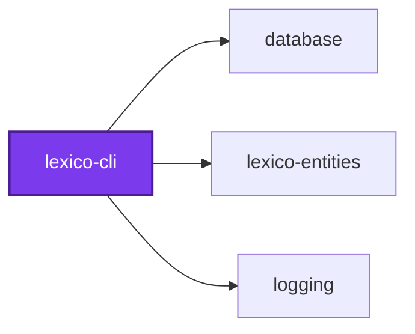
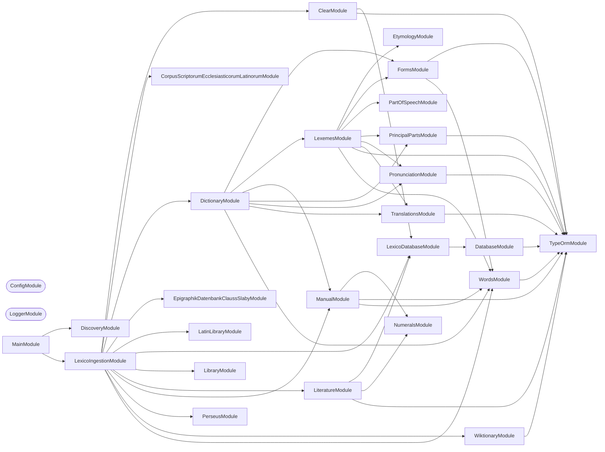

# 🚰 Lexico Ingestion

**Where the dictionary comes from.** A NestJS command-line application that
scrapes, parses, and loads the sources behind
[Lexico](../lexico-web/README.md) into the schema defined by
[lexico-entities](../../../packages/lexico-entities/README.md).

## Quick Start

```bash
cp .env.default .env      # Database connection
nx run lexico-cli:start
```

The default command is the root pipeline, which prompts for any stage flags it
was not given and then runs the selected stages in order.

```bash
nx run lexico-cli:start -- --dictionary --literature
```

| Stage flag | Ingests |
| ---------- | ------- |
| `--dictionary` | Dictionary entries, forms, and inflections |
| `--library` | The library of works |
| `--library-sources` | The upstream sources each work came from |
| `--literature` | Lines and tokens of each text |
| `--wikipedia` | Wiktionary pages |

## Individual stages

Every stage is also its own command, addressable as a `start` configuration:

```bash
nx run lexico-cli:start:dictionary -- --startLemma=a --endLemma=c
nx run lexico-cli:start:wiktionary
nx run lexico-cli:start:clear
```

| Command | Source |
| ------- | ------ |
| `dictionary` | Dictionary entries, resumable with `--startLemma` / `--endLemma` |
| `wiktionary` | Wiktionary page dumps |
| `perseus` | The Perseus Digital Library |
| `latin-library` | The Latin Library |
| `corpus-scriptorum-ecclesiasticorum-latinorum` | CSEL, the ecclesiastical Latin corpus |
| `epigraphik-datenbank-clauss-slaby` | EDCS, the Latin inscription database |
| `library` | Library and work metadata |
| `literature` | Lines and tokens for loaded texts |
| `clear` | Empties ingested tables so a run can start clean |

The lemma range on `dictionary` is what makes a long scrape restartable: a run
that stops partway is resumed by pointing `--startLemma` at where it left off
rather than starting over.

A value given to a flag is validated, and an unknown one fails the run. A
missing value — a bare `--startLemma`, or an omitted `--provider`, `--author`,
or `--text` on `library` and `literature` — is asked for only when standard
input is a terminal; otherwise the command takes its default of no bound or
"All". A cancelled prompt, like any error a command throws, exits non-zero.

## How it works

Each source has its own module under `src/modules/`, holding the fetcher, the
parser for that source's markup, and the mapping into entities. HTML is parsed
with [cheerio](https://cheerio.js.org) and wiki markup through mdast, so a
change to one site's layout is contained to one module.

Nothing here defines the schema. Entities and migrations come from
[`@codebase/lexico-entities`](../../../packages/lexico-entities/README.md), so the
shape ingestion writes and the shape the application reads cannot drift.

## Start

```bash
nx run lexico-cli:start
```

## Test

```bash
nx run lexico-cli:vitest
```

## Development

```bash
nx run lexico-cli:typecheck
nx run lexico-cli:lint-codebase --configuration=write
```

Run migrations before a first ingestion:

```bash
nx run lexico-entities:migration:run
```

## Related

- 🐺 [lexico-web](../lexico-web/README.md) — the web application
- 📖 [lexico-entities](../../../packages/lexico-entities/README.md) — the schema this writes to
- 🎨 [components-web](../../../packages/components-web/README.md) — the interface

## License

MIT — see [LICENSE](../../../LICENSE).

## 👔 Conformetry

This project was generated from the [nestjs-command-project](../../../configuration/conformetry-templates/nestjs-command-project) conformetry template.

<!-- callidescope:start -->

## 🔭 Callidescope

Call stacks traced through `applications/lexico/lexico-cli`, deepest first. Each frame shows what it takes, what it returns, and what its documentation says.

| Measure | Value |
| --- | --- |
| Callables | 577 |
| Files | 111 |
| Calls traced | 642 |
| Call stacks | 26 |
| Deepest stack | 17 |
| Stacks through recursion | 3 |
| Unfollowable calls | 103 |

### Limits

What this project is judged against, as declared in its own `callidescope.config.ts`.

| Limit | Value |
| --- | --- |
| `maximumDepth` | 17 |
| `maximumBreadth` | 8 |

### Call stacks (depth)

**1. `LexicoIngestionCommand.run`** — depth ≥ 17 · decorated-method

```text
🚀 LexicoIngestionCommand.run(…): Promise<void> [applications/lexico/lexico-cli/src/modules/lexico-ingestion/lexico-ingestion.command.ts:219]
   ↳ Executes the selected stage sequence after prompting for any unspecified toggles.
  └─> LexicoIngestionCommand.executeStages(options: LexicoIngestionCommandOptions): Promise<void> [applications/lexico/lexico-cli/src/modules/lexico-ingestion/lexico-ingestion.command.ts:54]
     ↳ Processes one workflow step for root ingestion pipeline execution.
    └─> DictionaryCommand.ingestAll(startLemma?: string, endLemma?: string): Promise<void> [applications/lexico/lexico-cli/src/modules/dictionary/dictionary.command.ts:381]
       ↳ Iterates cached `data/wiktionary/*.json` pages within an optional lemma range and ingests each file into persisted…
      └─> DictionaryCommand.processFile(file: string, current: number, total: number): Promise<void> [applications/lexico/lexico-cli/src/modules/dictionary/dictionary.command.ts:230]
         ↳ Processes one workflow step for dictionary ingestion.
        └─> DictionaryCommand.ingestLexeme(…): Promise<void> (cycle) [applications/lexico/lexico-cli/src/modules/dictionary/dictionary.command.ts:415]
           ↳ Ingests one lemma by parsing its Wiktionary HTML into lexemes, saving relations, and recursively resolving…
          └─> DictionaryCommand.processTranslationReferences(saved: Lexeme): Promise<void> (cycle) [applications/lexico/lexico-cli/src/modules/dictionary/dictionary.command.ts:290]
             ↳ Processes one workflow step for dictionary ingestion.
            └─> LexemesService.parseLexemes(wiktionaryPage: WiktionaryPage): Promise<Lexeme[]> [applications/lexico/lexico-cli/src/modules/lexemes/lexemes.service.ts:307]
               ↳ Parses one Wiktionary page into lexemes by iterating `p:has(strong.Latn.headword)` sections and enriching each accepted…
              └─> LexemesService.parseLexemeFromElement(…): Promise<Lexeme | null> [applications/lexico/lexico-cli/src/modules/lexemes/lexemes.service.ts:146]
                 ↳ Parses and normalizes inputs for lexeme parsing and persistence.
                └─> LexemesService.enrichLexeme(…): Promise<void> [applications/lexico/lexico-cli/src/modules/lexemes/lexemes.service.ts:73]
                   ↳ Handles an internal workflow step for lexeme parsing and persistence.
                  └─> PronunciationService.parse($: cheerio.CheerioAPI, elt: AnyNode, macronizedWord: string): Pronunciation[] [applications/lexico/lexico-cli/src/modules/pronunciation/pronunciation.service.ts:181]
                     ↳ Parses pronunciation data from the Wiktionary HTML element context.
                    └─> PronunciationService.getEcclesiasticalPronunciations(word: string): string[] [applications/lexico/lexico-cli/src/modules/pronunciation/pronunciation.service.ts:150]
                       ↳ Gets ecclesiastical pronunciations used by pronunciation parsing.
                      └─> PronunciationService.getEcclesiasticalPhonemes(wordString: string): PronunciationPhoneme[] [applications/lexico/lexico-cli/src/modules/pronunciation/pronunciation.service.ts:124]
                         ↳ Gets ecclesiastical phonemes used by pronunciation parsing.
                        └─> PronunciationClassifierService.processEcclesiasticalCharacter(args: PronunciationEcclesiasticalCharacterContext): number [applications/lexico/lexico-cli/src/modules/pronunciation/pronunciation-classifier.service.ts:130]
                           ↳ Processes one ecclesiastical-character position and returns the next index.
                          └─> PronunciationEcclesiasticalService.processEcclesiasticalCharacter(args: PronunciationEcclesiasticalCharacterContext): number [applications/lexico/lexico-cli/src/modules/pronunciation/pronunciation-ecclesiastical.service.ts:305]
                             ↳ Processes one ecclesiastical-character position and returns the next index.
                            └─> PronunciationEcclesiasticalService.classifyEcclesiasticalI(…): void [applications/lexico/lexico-cli/src/modules/pronunciation/pronunciation-ecclesiastical.service.ts:188]
                               ↳ Classifies ecclesiastical i for pronunciation parsing.
                              └─> PronunciationEcclesiasticalService.isEcclesiasticalVocalI(index: number, word: string[], isVowel: (letter: string) => boolean): boolean [applications/lexico/lexico-cli/src/modules/pronunciation/pronunciation-ecclesiastical.service.ts:41]
                                 ↳ Checks whether ecclesiastical vocal i in pronunciation parsing logic.
                                └─> PronunciationEcclesiasticalService.isInitialVocalI(index: number, word: string[], isVowel: (letter: string) => boolean): boolean [applications/lexico/lexico-cli/src/modules/pronunciation/pronunciation-ecclesiastical.service.ts:55]
                                   ↳ Checks whether initial vocal i in pronunciation parsing logic.
```

**2. `DictionaryCommand.run`** — depth ≥ 16 · decorated-method

```text
🚀 DictionaryCommand.run(_arguments: string[], options: DictionaryCommandOptions): Promise<void> [applications/lexico/lexico-cli/src/modules/dictionary/dictionary.command.ts:485]
   ↳ Runs full dictionary ingestion for the selected lemma range, then applies manual entries.
  └─> DictionaryCommand.ingestAll(startLemma?: string, endLemma?: string): Promise<void> [applications/lexico/lexico-cli/src/modules/dictionary/dictionary.command.ts:381]
     ↳ Iterates cached `data/wiktionary/*.json` pages within an optional lemma range and ingests each file into persisted…
    └─> DictionaryCommand.processFile(file: string, current: number, total: number): Promise<void> [applications/lexico/lexico-cli/src/modules/dictionary/dictionary.command.ts:230]
       ↳ Processes one workflow step for dictionary ingestion.
      └─> DictionaryCommand.ingestLexeme(…): Promise<void> (cycle) [applications/lexico/lexico-cli/src/modules/dictionary/dictionary.command.ts:415]
         ↳ Ingests one lemma by parsing its Wiktionary HTML into lexemes, saving relations, and recursively resolving…
        └─> DictionaryCommand.processTranslationReferences(saved: Lexeme): Promise<void> (cycle) [applications/lexico/lexico-cli/src/modules/dictionary/dictionary.command.ts:290]
           ↳ Processes one workflow step for dictionary ingestion.
          └─> LexemesService.parseLexemes(wiktionaryPage: WiktionaryPage): Promise<Lexeme[]> [applications/lexico/lexico-cli/src/modules/lexemes/lexemes.service.ts:307]
             ↳ Parses one Wiktionary page into lexemes by iterating `p:has(strong.Latn.headword)` sections and enriching each accepted…
            └─> LexemesService.parseLexemeFromElement(…): Promise<Lexeme | null> [applications/lexico/lexico-cli/src/modules/lexemes/lexemes.service.ts:146]
               ↳ Parses and normalizes inputs for lexeme parsing and persistence.
              └─> LexemesService.enrichLexeme(…): Promise<void> [applications/lexico/lexico-cli/src/modules/lexemes/lexemes.service.ts:73]
                 ↳ Handles an internal workflow step for lexeme parsing and persistence.
                └─> PronunciationService.parse($: cheerio.CheerioAPI, elt: AnyNode, macronizedWord: string): Pronunciation[] [applications/lexico/lexico-cli/src/modules/pronunciation/pronunciation.service.ts:181]
                   ↳ Parses pronunciation data from the Wiktionary HTML element context.
                  └─> PronunciationService.getEcclesiasticalPronunciations(word: string): string[] [applications/lexico/lexico-cli/src/modules/pronunciation/pronunciation.service.ts:150]
                     ↳ Gets ecclesiastical pronunciations used by pronunciation parsing.
                    └─> PronunciationService.getEcclesiasticalPhonemes(wordString: string): PronunciationPhoneme[] [applications/lexico/lexico-cli/src/modules/pronunciation/pronunciation.service.ts:124]
                       ↳ Gets ecclesiastical phonemes used by pronunciation parsing.
                      └─> PronunciationClassifierService.processEcclesiasticalCharacter(args: PronunciationEcclesiasticalCharacterContext): number [applications/lexico/lexico-cli/src/modules/pronunciation/pronunciation-classifier.service.ts:130]
                         ↳ Processes one ecclesiastical-character position and returns the next index.
                        └─> PronunciationEcclesiasticalService.processEcclesiasticalCharacter(args: PronunciationEcclesiasticalCharacterContext): number [applications/lexico/lexico-cli/src/modules/pronunciation/pronunciation-ecclesiastical.service.ts:305]
                           ↳ Processes one ecclesiastical-character position and returns the next index.
                          └─> PronunciationEcclesiasticalService.classifyEcclesiasticalI(…): void [applications/lexico/lexico-cli/src/modules/pronunciation/pronunciation-ecclesiastical.service.ts:188]
                             ↳ Classifies ecclesiastical i for pronunciation parsing.
                            └─> PronunciationEcclesiasticalService.isEcclesiasticalVocalI(index: number, word: string[], isVowel: (letter: string) => boolean): boolean [applications/lexico/lexico-cli/src/modules/pronunciation/pronunciation-ecclesiastical.service.ts:41]
                               ↳ Checks whether ecclesiastical vocal i in pronunciation parsing logic.
                              └─> PronunciationEcclesiasticalService.isInitialVocalI(index: number, word: string[], isVowel: (letter: string) => boolean): boolean [applications/lexico/lexico-cli/src/modules/pronunciation/pronunciation-ecclesiastical.service.ts:55]
                                 ↳ Checks whether initial vocal i in pronunciation parsing logic.
```

**3. `LibraryCommand.run`** — depth ≥ 15 · decorated-method

```text
🚀 LibraryCommand.run(_arguments: string[], options: LibraryCommandOptions): Promise<void> [applications/lexico/lexico-cli/src/modules/library/library.command.ts:428]
   ↳ Orchestrates provider execution with optional author/text scoping and progress logging.
  └─> LibraryCommand.processProvider(…): Promise<void> [applications/lexico/lexico-cli/src/modules/library/library.command.ts:181]
     ↳ Processes one workflow step for library provider orchestration.
    └─> PerseusLibraryProvider.ingest(options?: { author?: string; text?: string; }): Promise<Author[]> [applications/lexico/lexico-cli/src/modules/library/providers/perseus-library.provider.ts:371]
       ↳ Fetch authors, works, and output markdown files to the data directory.
      └─> PerseusLibraryProvider.processPerseusFile(…): Promise<void> [applications/lexico/lexico-cli/src/modules/library/providers/perseus-library.provider.ts:175]
         ↳ Processes one workflow step for Perseus XML ingestion.
        └─> PerseusLibraryProvider.processSourceXmlFile(…): Promise<void> [applications/lexico/lexico-cli/src/modules/library/providers/perseus-library.provider.ts:219]
           ↳ Processes one workflow step for Perseus XML ingestion.
          └─> PerseusLibraryProvider.writeSourceTextForAuthor(…): Promise<void> [applications/lexico/lexico-cli/src/modules/library/providers/perseus-library.provider.ts:311]
             ↳ Persists generated output for Perseus XML ingestion.
            └─> PerseusLibraryProvider.writeSourceMarkdownFiles(…): Promise<void> [applications/lexico/lexico-cli/src/modules/library/providers/perseus-library.provider.ts:263]
               ↳ Persists generated output for Perseus XML ingestion.
              └─> PerseusLibraryTextExtractionProvider.extractTextNodes(…): void (cycle) [applications/lexico/lexico-cli/src/modules/library/providers/perseus-library-text-extraction.provider.ts:206]
                 ↳ Builds markdown file payloads from nested Perseus `textpart` elements.
                └─> PerseusLibraryTextExtractionProvider.processTextPartChildren(…): void (cycle) [applications/lexico/lexico-cli/src/modules/library/providers/perseus-library-text-extraction.provider.ts:150]
                   ↳ Recurses into child text parts and writes direct child paragraphs.
                  └─> PerseusLibraryTextExtractionProvider.extractChildTextParts(…): void (cycle) [applications/lexico/lexico-cli/src/modules/library/providers/perseus-library-text-extraction.provider.ts:57]
                     ↳ Visits nested Perseus `textpart` children and extracts eligible sections.
                    └─> PerseusLibraryTextExtractionProvider.each(…)(_index: number, child: AnyNode): void (cycle) [applications/lexico/lexico-cli/src/modules/library/providers/perseus-library-text-extraction.provider.ts:66]
                      └─> PerseusLibraryTextExtractionProvider.processLeafTextPart(…): void [applications/lexico/lexico-cli/src/modules/library/providers/perseus-library-text-extraction.provider.ts:110]
                         ↳ Handles leaf nodes that write one markdown text file.
                        └─> PerseusLibraryTextExtractionProvider.collectParagraphsFromElements(elements: cheerio.Cheerio<AnyNode>, $: cheerio.CheerioAPI): string[] [applications/lexico/lexico-cli/src/modules/library/providers/perseus-library-text-extraction.provider.ts:26]
                           ↳ Collects normalized paragraph text from Perseus XML elements.
                          └─> PerseusLibraryTextExtractionProvider.each(…)(_index: number, paragraphElement: AnyNode): void [applications/lexico/lexico-cli/src/modules/library/providers/perseus-library-text-extraction.provider.ts:32]
                            └─> formatLineNumber(line: string): string [applications/lexico/lexico-cli/src/modules/library/library.utilities.ts:18]
                               ↳ Format line numbers consistently.
```

<details>
<summary>23 more call stacks</summary>

**4. `LatinLibraryCommand.run`** — depth ≥ 10 · decorated-method

```text
🚀 LatinLibraryCommand.run(): Promise<void> [applications/lexico/lexico-cli/src/modules/latin-library/latin-library.command.ts:381]
   ↳ Crawls The Latin Library and caches discovered HTML pages locally.
  └─> LatinLibraryCommand.from(…)(): Promise<void> [applications/lexico/lexico-cli/src/modules/latin-library/latin-library.command.ts:428]
    └─> LatinLibraryCommand.worker(): Promise<void> [applications/lexico/lexico-cli/src/modules/latin-library/latin-library.command.ts:419]
      └─> LatinLibraryCommand.processQueueUrl(urlString: string, host: string, enqueue: (url: string) => void): Promise<void> [applications/lexico/lexico-cli/src/modules/latin-library/latin-library.command.ts:345]
         ↳ Processes one workflow step for Latin Library source crawling.
        └─> LatinLibraryCommand.parseHtmlForLinks(html: string, baseUrl: string, enqueue: (url: string) => void): void [applications/lexico/lexico-cli/src/modules/latin-library/latin-library.command.ts:272]
           ↳ Parses and normalizes inputs for Latin Library source crawling.
          └─> LatinLibraryCommand.each(…)(this: Element, _index: number, a: Element): void [applications/lexico/lexico-cli/src/modules/latin-library/latin-library.command.ts:279]
            └─> LatinLibraryCommand.processLink(href: string, baseUrl: string, enqueue: (url: string) => void): void [applications/lexico/lexico-cli/src/modules/latin-library/latin-library.command.ts:324]
               ↳ Processes one workflow step for Latin Library source crawling.
              └─> LatinLibraryCommand.shouldSkipLink(href: string): boolean [applications/lexico/lexico-cli/src/modules/latin-library/latin-library.command.ts:370]
                 ↳ Handles an internal workflow step for Latin Library source crawling.
                └─> LatinLibraryCommand.isIgnoredLinkFileName(href: string): boolean [applications/lexico/lexico-cli/src/modules/latin-library/latin-library.command.ts:190]
                   ↳ Returns whether the current input should proceed in Latin Library source crawling.
                  └─> LatinLibraryCommand.some(…)(f: string): boolean [applications/lexico/lexico-cli/src/modules/latin-library/latin-library.command.ts:200]
```

**5. `WiktionaryCommand.run`** — depth ≥ 8 · decorated-method

```text
🚀 WiktionaryCommand.run(): Promise<void> [applications/lexico/lexico-cli/src/modules/wiktionary/wiktionary.command.ts:302]
   ↳ Runs the Wiktionary ingestion pipeline.
  └─> WiktionaryCommand.ingestWiktionary(): Promise<void> [applications/lexico/lexico-cli/src/modules/wiktionary/wiktionary.command.ts:287]
     ↳ Scrapes every configured Latin category from Wiktionary, stores each article's HTML as a JSON file under…
    └─> WiktionaryCommand.ingestCategory(category?: Category, startPath?: string): Promise<void> [applications/lexico/lexico-cli/src/modules/wiktionary/wiktionary.command.ts:139]
       ↳ Ingests category in the Wiktionary ingestion pipeline.
      └─> WiktionaryCommand.processWiktionaryCategoryLink(a: Element, $: cheerio.CheerioAPI, category: string): Promise<void> [applications/lexico/lexico-cli/src/modules/wiktionary/wiktionary.command.ts:233]
         ↳ Processes wiktionary category link during Wiktionary ingestion.
        └─> WiktionaryCommand.ingestWord(word: string, urlPath: string, category: string): Promise<void> [applications/lexico/lexico-cli/src/modules/wiktionary/wiktionary.command.ts:176]
           ↳ Ingests word in the Wiktionary ingestion pipeline.
          └─> WiktionaryCommand.parseLatinSection(…): Promise<{ $: CheerioAPI; section: Cheerio<AnyNode>; } | null> [applications/lexico/lexico-cli/src/modules/wiktionary/wiktionary.command.ts:212]
             ↳ Parses latin section during Wiktionary ingestion.
            └─> WiktionaryCommand.fetchWithRetry(url: string, retries?: number): Promise<Response> [applications/lexico/lexico-cli/src/modules/wiktionary/wiktionary.command.ts:82]
               ↳ Fetch with retry for Wiktionary ingestion.
              └─> WiktionaryCommand.anonymous(resolve: (value: unknown) => void): void [applications/lexico/lexico-cli/src/modules/wiktionary/wiktionary.command.ts:102]
```

**6. `LiteratureService.ingestText`** — depth 8 · orphan-root

```text
🚀 LiteratureService.ingestText(ingestArguments: IngestTextArguments): Promise<void> [applications/lexico/lexico-cli/src/modules/literature/literature.service.ts:313]
  └─> LiteratureService.ingestText(args: IngestTextArguments): Promise<void> [applications/lexico/lexico-cli/src/modules/literature/literature.service.ts:270]
     ↳ Ingests text in the literature ingestion pipeline.
    └─> LiteratureService.ingestLines(text: Text, ast: Root): Promise<void> [applications/lexico/lexico-cli/src/modules/literature/literature.service.ts:241]
       ↳ Ingests lines in the literature ingestion pipeline.
      └─> LiteratureService.map(…)(paragraph: Paragraph, index: number): _QueryDeepPartialEntity<Line> [applications/lexico/lexico-cli/src/modules/literature/literature.service.ts:254]
        └─> LiteratureService.buildLineEntityFromParagraph(paragraph: Paragraph, index: number, text: Text): QueryDeepPartialEntity<Line> [applications/lexico/lexico-cli/src/modules/literature/literature.service.ts:91]
           ↳ Builds line entity from paragraph for literature ingestion.
          └─> LiteratureService.parseLabelFromStrongNode(strongNode: Strong, lineNodes: PhrasingContent[]): ParsedLabelResult [applications/lexico/lexico-cli/src/modules/literature/literature.service.ts:355]
             ↳ Parses label from strong node during literature ingestion.
            └─> LiteratureService.parseStandardLabel(labelMatch: RegExpExecArray, lineNodes: PhrasingContent[]): ParsedLabelResult [applications/lexico/lexico-cli/src/modules/literature/literature.service.ts:391]
               ↳ Parses standard label during literature ingestion.
              └─> NumeralsService.toDecimal(roman: string): number [applications/lexico/lexico-cli/src/modules/numerals/numerals.service.ts:25]
                 ↳ Parses a Roman numeral string into its decimal integer value.
```

**7. `LiteratureCommand.run`** — depth ≥ 6 · decorated-method

```text
🚀 LiteratureCommand.run(_arguments: string[], options: LiteratureCommandOptions): Promise<void> [applications/lexico/lexico-cli/src/modules/literature/literature.command.ts:218]
   ↳ Runs literature ingestion for the selected provider/author/text scope.
  └─> LiteratureService.ingestAllAuthors(textsToIngest: LibraryEntry[]): Promise<void> [applications/lexico/lexico-cli/src/modules/literature/literature.service.ts:489]
     ↳ Ingests all selected texts grouped by author.
    └─> LiteratureService.ingestAuthorGroup(authorSlug: string, texts: LibraryEntry[]): Promise<void> [applications/lexico/lexico-cli/src/modules/literature/literature.service.ts:211]
       ↳ Ingests author group in the literature ingestion pipeline.
      └─> LiteratureService.ingestTextChunks(…): Promise<void> [applications/lexico/lexico-cli/src/modules/literature/literature.service.ts:298]
         ↳ Ingests text chunks in the literature ingestion pipeline.
        └─> LiteratureTextIngestionService.ingestTextWithLogging(…): Promise<void> [applications/lexico/lexico-cli/src/modules/literature/literature-text-ingestion.service.ts:57]
           ↳ Runs ingestion for one text entry with standardized start, error, and completion logs.
          └─> LiteratureTextIngestionService.resolveParentText(…): Text | undefined [applications/lexico/lexico-cli/src/modules/literature/literature-text-ingestion.service.ts:40]
             ↳ Resolves the parent text for the current entry path, if present.
```

**8. `PartOfSpeechService.generic`** — depth ≥ 6 · orphan-root

```text
🚀 PartOfSpeechService.generic(): unknown [applications/lexico/lexico-cli/src/modules/part-of-speech/part-of-speech.service.ts:445]
  └─> PartOfSpeechFormsService.parseGenericForms(args: { $: cheerio.CheerioAPI; elt: AnyNode; lexeme: Lexeme; }): unknown [applications/lexico/lexico-cli/src/modules/part-of-speech/part-of-speech-forms.service.ts:358]
     ↳ Parses non-verb inflection table forms into nested identifiers.
    └─> PartOfSpeechFormsService.findGenericIdentifiers(…): string[] [applications/lexico/lexico-cli/src/modules/part-of-speech/part-of-speech-forms.service.ts:58]
       ↳ Finds generic identifiers for part-of-speech parsing workflows.
      └─> PartOfSpeechFormsService.collectTableIdentifiers(index: number, index_: number, table_: string[][]): Set<string> [applications/lexico/lexico-cli/src/modules/part-of-speech/part-of-speech-forms.service.ts:35]
         ↳ Collects table identifiers required by part-of-speech parsing.
        └─> PartOfSpeechFormsService.scanTableAxis(…): { finalIndex: number; identifiers: Set<string>; } [applications/lexico/lexico-cli/src/modules/part-of-speech/part-of-speech-forms.service.ts:299]
           ↳ Scans table axis for part-of-speech parsing context.
          └─> PartOfSpeechFormsService.isGenericFormCell(cell: string): boolean [applications/lexico/lexico-cli/src/modules/part-of-speech/part-of-speech-forms.service.ts:127]
             ↳ Checks whether generic form cell in part-of-speech parsing logic.
```

**9. `PartOfSpeechService.verb`** — depth ≥ 6 · orphan-root

```text
🚀 PartOfSpeechService.verb(): unknown [applications/lexico/lexico-cli/src/modules/part-of-speech/part-of-speech.service.ts:447]
  └─> PartOfSpeechFormsService.parseVerbForms(args: { $: cheerio.CheerioAPI; elt: AnyNode; }): unknown [applications/lexico/lexico-cli/src/modules/part-of-speech/part-of-speech-forms.service.ts:404]
     ↳ Parses verb inflection table forms into nested identifiers.
    └─> PartOfSpeechFormsService.processVerbFormRow(…): void [applications/lexico/lexico-cli/src/modules/part-of-speech/part-of-speech-forms.service.ts:225]
       ↳ Processes verb form row during part-of-speech parsing.
      └─> PartOfSpeechFormsService.findVerbIdentifiers(index: number, index_: number, table_: string[][]): string[] [applications/lexico/lexico-cli/src/modules/part-of-speech/part-of-speech-forms.service.ts:83]
         ↳ Finds verb identifiers for part-of-speech parsing workflows.
        └─> PartOfSpeechFormsService.scanVerbHeader(…): { finalIndex: number; identifiers: Set<string>; } [applications/lexico/lexico-cli/src/modules/part-of-speech/part-of-speech-forms.service.ts:317]
           ↳ Scans verb header for part-of-speech parsing context.
          └─> PartOfSpeechFormsService.isVerbFormCell(cell: string): boolean [applications/lexico/lexico-cli/src/modules/part-of-speech/part-of-speech-forms.service.ts:146]
             ↳ Checks whether verb form cell in part-of-speech parsing logic.
```

**10. `EpigraphikDatenbankClaussSlabyCommand.run`** — depth 5 · decorated-method

```text
🚀 EpigraphikDatenbankClaussSlabyCommand.run(): Promise<void> [applications/lexico/lexico-cli/src/modules/epigraphik-datenbank-clauss-slaby/epigraphik-datenbank-clauss-slaby.command.ts:137]
   ↳ Runs the ingestion of epigraphs by downloading chunks to the filesystem
  └─> EpigraphikDatenbankClaussSlabyCommand.downloadChunkIfMissing(start: number): Promise<boolean> [applications/lexico/lexico-cli/src/modules/epigraphik-datenbank-clauss-slaby/epigraphik-datenbank-clauss-slaby.command.ts:75]
     ↳ Handles an internal workflow step for EDCS chunk ingestion.
    └─> EpigraphikDatenbankClaussSlabyCommand.downloadChunkData(start: number, chunkFile: string): Promise<boolean> [applications/lexico/lexico-cli/src/modules/epigraphik-datenbank-clauss-slaby/epigraphik-datenbank-clauss-slaby.command.ts:50]
       ↳ Handles an internal workflow step for EDCS chunk ingestion.
      └─> EpigraphikDatenbankClaussSlabyCommand.saveChunkData(start: number, chunkFile: string): Promise<boolean> [applications/lexico/lexico-cli/src/modules/epigraphik-datenbank-clauss-slaby/epigraphik-datenbank-clauss-slaby.command.ts:97]
         ↳ Persists generated output for EDCS chunk ingestion.
        └─> EpigraphikDatenbankClaussSlabyCommand.anonymous(resolve: (value: unknown) => void): void [applications/lexico/lexico-cli/src/modules/epigraphik-datenbank-clauss-slaby/epigraphik-datenbank-clauss-slaby.command.ts:128]
```

**11. `PartOfSpeechService.adjective`** — depth ≥ 5 · orphan-root

```text
🚀 PartOfSpeechService.adjective(): Inflection [applications/lexico/lexico-cli/src/modules/part-of-speech/part-of-speech.service.ts:418]
  └─> PartOfSpeechService.ingestAdjectiveInflection($: cheerio.CheerioAPI, elt: AnyNode): Inflection [applications/lexico/lexico-cli/src/modules/part-of-speech/part-of-speech.service.ts:187]
     ↳ Ingests adjective inflection in the part-of-speech parsing pipeline.
    └─> PartOfSpeechService.buildAdjectiveInflection(declension: string): AdjectiveInflection [applications/lexico/lexico-cli/src/modules/part-of-speech/part-of-speech.service.ts:142]
       ↳ Builds adjective inflection for part-of-speech parsing.
      └─> PartOfSpeechService.findTypedValue(…): ValueType | undefined [applications/lexico/lexico-cli/src/modules/part-of-speech/part-of-speech.service.ts:129]
         ↳ Returns the first matching typed value from the provided candidate list.
        └─> PartOfSpeechService.find(…)(value: ValueType): value is ValueType [applications/lexico/lexico-cli/src/modules/part-of-speech/part-of-speech.service.ts:133]
```

**12. `PartOfSpeechService.noun`** — depth ≥ 5 · orphan-root

```text
🚀 PartOfSpeechService.noun(): Inflection [applications/lexico/lexico-cli/src/modules/part-of-speech/part-of-speech.service.ts:420]
  └─> PartOfSpeechService.ingestNounInflection($: cheerio.CheerioAPI, elt: AnyNode): Inflection [applications/lexico/lexico-cli/src/modules/part-of-speech/part-of-speech.service.ts:249]
     ↳ Ingests noun inflection in the part-of-speech parsing pipeline.
    └─> PartOfSpeechService.buildNounInflection(declension: string, gender: string): NounInflection [applications/lexico/lexico-cli/src/modules/part-of-speech/part-of-speech.service.ts:161]
       ↳ Builds noun inflection for part-of-speech parsing.
      └─> PartOfSpeechService.findTypedValue(…): ValueType | undefined [applications/lexico/lexico-cli/src/modules/part-of-speech/part-of-speech.service.ts:129]
         ↳ Returns the first matching typed value from the provided candidate list.
        └─> PartOfSpeechService.find(…)(value: ValueType): value is ValueType [applications/lexico/lexico-cli/src/modules/part-of-speech/part-of-speech.service.ts:133]
```

**13. `CorpusScriptorumEcclesiasticorumLatinorumCommand.run`** — depth 4 · decorated-method

```text
🚀 CorpusScriptorumEcclesiasticorumLatinorumCommand.run(): Promise<void> [applications/lexico/lexico-cli/src/modules/corpus-scriptorum-ecclesiasticorum-latinorum/corpus-scriptorum-ecclesiasticorum-latinorum.command.ts:127]
   ↳ Downloads all eligible CSEL Latin XML source files into the local cache.
  └─> CorpusScriptorumEcclesiasticorumLatinorumCommand.downloadSourceXmlFileIfMissing(xmlPath: string): Promise<void> [applications/lexico/lexico-cli/src/modules/corpus-scriptorum-ecclesiasticorum-latinorum/corpus-scriptorum-ecclesiasticorum-latinorum.command.ts:47]
     ↳ Downloads one XML file unless it is already present in the local source cache.
    └─> CorpusScriptorumEcclesiasticorumLatinorumCommand.fetchAndWriteXmlFile(fileUrl: string, targetPath: string): Promise<void> [applications/lexico/lexico-cli/src/modules/corpus-scriptorum-ecclesiasticorum-latinorum/corpus-scriptorum-ecclesiasticorum-latinorum.command.ts:76]
       ↳ Loads source data required by CSEL source ingestion.
      └─> CorpusScriptorumEcclesiasticorumLatinorumCommand.anonymous(resolve: (value: unknown) => void): void [applications/lexico/lexico-cli/src/modules/corpus-scriptorum-ecclesiasticorum-latinorum/corpus-scriptorum-ecclesiasticorum-latinorum.command.ts:88]
```

**14. `PerseusCommand.run`** — depth 4 · decorated-method

```text
🚀 PerseusCommand.run(): Promise<void> [applications/lexico/lexico-cli/src/modules/perseus/perseus.command.ts:133]
   ↳ Discovers eligible Perseus XML files and stores missing files in the local cache.
  └─> PerseusCommand.downloadSourceXmlFileIfMissing(xmlPath: string): Promise<void> [applications/lexico/lexico-cli/src/modules/perseus/perseus.command.ts:58]
     ↳ Download source xml file if missing for Perseus source ingestion.
    └─> PerseusCommand.fetchAndWriteXmlFile(fileUrl: string, targetPath: string): Promise<void> [applications/lexico/lexico-cli/src/modules/perseus/perseus.command.ts:81]
       ↳ Fetch and write xml file for Perseus source ingestion.
      └─> PerseusCommand.anonymous(resolve: (value: unknown) => void): void [applications/lexico/lexico-cli/src/modules/perseus/perseus.command.ts:92]
```

**15. `PartOfSpeechService.preposition`** — depth ≥ 4 · orphan-root

```text
🚀 PartOfSpeechService.preposition(): Inflection [applications/lexico/lexico-cli/src/modules/part-of-speech/part-of-speech.service.ts:422]
  └─> PartOfSpeechService.ingestPrepositionInflection($: cheerio.CheerioAPI, elt: AnyNode): Inflection [applications/lexico/lexico-cli/src/modules/part-of-speech/part-of-speech.service.ts:293]
     ↳ Ingests preposition inflection in the part-of-speech parsing pipeline.
    └─> PartOfSpeechService.findTypedValue(…): ValueType | undefined [applications/lexico/lexico-cli/src/modules/part-of-speech/part-of-speech.service.ts:129]
       ↳ Returns the first matching typed value from the provided candidate list.
      └─> PartOfSpeechService.find(…)(value: ValueType): value is ValueType [applications/lexico/lexico-cli/src/modules/part-of-speech/part-of-speech.service.ts:133]
```

**16. `PartOfSpeechService.pronoun`** — depth ≥ 4 · orphan-root

```text
🚀 PartOfSpeechService.pronoun(): Inflection [applications/lexico/lexico-cli/src/modules/part-of-speech/part-of-speech.service.ts:423]
  └─> PartOfSpeechService.ingestPronounInflection($: cheerio.CheerioAPI, elt: AnyNode): Inflection [applications/lexico/lexico-cli/src/modules/part-of-speech/part-of-speech.service.ts:318]
     ↳ Ingests pronoun inflection in the part-of-speech parsing pipeline.
    └─> PartOfSpeechService.findTypedValue(…): ValueType | undefined [applications/lexico/lexico-cli/src/modules/part-of-speech/part-of-speech.service.ts:129]
       ↳ Returns the first matching typed value from the provided candidate list.
      └─> PartOfSpeechService.find(…)(value: ValueType): value is ValueType [applications/lexico/lexico-cli/src/modules/part-of-speech/part-of-speech.service.ts:133]
```

**17. `PartOfSpeechService.verb`** — depth ≥ 4 · orphan-root

```text
🚀 PartOfSpeechService.verb(): Inflection [applications/lexico/lexico-cli/src/modules/part-of-speech/part-of-speech.service.ts:425]
  └─> PartOfSpeechService.ingestVerbInflection($: cheerio.CheerioAPI, elt: AnyNode): Inflection [applications/lexico/lexico-cli/src/modules/part-of-speech/part-of-speech.service.ts:350]
     ↳ Ingests verb inflection in the part-of-speech parsing pipeline.
    └─> PartOfSpeechService.findTypedValue(…): ValueType | undefined [applications/lexico/lexico-cli/src/modules/part-of-speech/part-of-speech.service.ts:129]
       ↳ Returns the first matching typed value from the provided candidate list.
      └─> PartOfSpeechService.find(…)(value: ValueType): value is ValueType [applications/lexico/lexico-cli/src/modules/part-of-speech/part-of-speech.service.ts:133]
```

**18. `PartOfSpeechService.adverb`** — depth 3 · orphan-root

```text
🚀 PartOfSpeechService.adverb(): unknown [applications/lexico/lexico-cli/src/modules/part-of-speech/part-of-speech.service.ts:444]
  └─> PartOfSpeechService.ingestAdverbForms(principalParts: PrincipalPart[]): unknown [applications/lexico/lexico-cli/src/modules/part-of-speech/part-of-speech.service.ts:221]
     ↳ Ingests adverb forms in the part-of-speech parsing pipeline.
    └─> PartOfSpeechService.getTextOrEmpty(part: PrincipalPart | undefined): string[] [applications/lexico/lexico-cli/src/modules/part-of-speech/part-of-speech.service.ts:182]
       ↳ Gets text or empty used by part-of-speech parsing.
```

**19. `ClearCommand.run`** — depth 2 · decorated-method

```text
🚀 ClearCommand.run(_passedParameters: string[], options: ClearCommandOptions): Promise<void> [applications/lexico/lexico-cli/src/modules/clear/clear.command.ts:138]
   ↳ Runs the clear pipeline for the options provided. If no options are specified, it prompts the user.
  └─> ClearCommand.parsePromptResponse(response: unknown): ClearPromptResponse [applications/lexico/lexico-cli/src/modules/clear/clear.command.ts:88]
     ↳ Parses prompt output into strongly typed clear options.
```

**20. `normalizeStringArray`** — depth 2 · orphan-root

```text
🚀 normalizeStringArray(…): string[] [applications/lexico/lexico-cli/src/modules/forms/forms.constants.ts:21]
  └─> isNormalizableStringArray(…): boolean [applications/lexico/lexico-cli/src/modules/forms/forms.constants.ts:17]
```

**21. `FormsService.setTransientWords`** — depth 2 · orphan-root

```text
🚀 FormsService.setTransientWords(form: Form, words: string[]): void [applications/lexico/lexico-cli/src/modules/forms/forms.service.ts:159]
   ↳ Sets transient word strings for a Form instance.
  └─> FormsTransientWordsService.setTransientWords(form: Form, words: string[]): void [applications/lexico/lexico-cli/src/modules/forms/forms-transient-words.service.ts:34]
     ↳ Associates a list of transient words with a given Form entity.
```

**22. `compactStringValues`** — depth 2 · orphan-root

```text
🚀 compactStringValues(…): string[] [applications/lexico/lexico-cli/src/modules/part-of-speech/part-of-speech.constants.ts:17]
  └─> isCompactStringArray(…): boolean [applications/lexico/lexico-cli/src/modules/part-of-speech/part-of-speech.constants.ts:13]
```

**23. `PartOfSpeechService.adverb`** — depth 2 · orphan-root

```text
🚀 PartOfSpeechService.adverb(): Inflection [applications/lexico/lexico-cli/src/modules/part-of-speech/part-of-speech.service.ts:419]
  └─> PartOfSpeechService.ingestAdverbInflection(principalParts: PrincipalPart[]): Inflection [applications/lexico/lexico-cli/src/modules/part-of-speech/part-of-speech.service.ts:235]
     ↳ Ingests adverb inflection in the part-of-speech parsing pipeline.
```

**24. `PartOfSpeechService.prefix`** — depth 2 · orphan-root

```text
🚀 PartOfSpeechService.prefix(): Inflection [applications/lexico/lexico-cli/src/modules/part-of-speech/part-of-speech.service.ts:421]
  └─> PartOfSpeechService.ingestPrefixInflection(): Inflection [applications/lexico/lexico-cli/src/modules/part-of-speech/part-of-speech.service.ts:288]
     ↳ Ingests prefix inflection in the part-of-speech parsing pipeline.
```

**25. `PartOfSpeechService.uninflected`** — depth 2 · orphan-root

```text
🚀 PartOfSpeechService.uninflected(): Inflection [applications/lexico/lexico-cli/src/modules/part-of-speech/part-of-speech.service.ts:424]
  └─> PartOfSpeechService.ingestConjunctionInflection(): Inflection [applications/lexico/lexico-cli/src/modules/part-of-speech/part-of-speech.service.ts:244]
     ↳ Ingests conjunction inflection in the part-of-speech parsing pipeline.
```

**26. `PartOfSpeechService.anonymous`** — depth 2 · orphan-root

```text
🚀 PartOfSpeechService.anonymous(): Inflection [applications/lexico/lexico-cli/src/modules/part-of-speech/part-of-speech.service.ts:427]
  └─> PartOfSpeechService.ingestConjunctionInflection(): Inflection [applications/lexico/lexico-cli/src/modules/part-of-speech/part-of-speech.service.ts:244]
     ↳ Ingests conjunction inflection in the part-of-speech parsing pipeline.
```

</details>

### Breadth

| Callable | Breadth | Calls directly | Location |
| --- | --- | --- | --- |
| `PronunciationEcclesiasticalService.processEcclesiasticalCharacter` | 8 | `PronunciationEcclesiasticalService.classifyEcclesiasticalC`, `PronunciationEcclesiasticalService.classifyEcclesiasticalG`, `PronunciationEcclesiasticalService.classifyEcclesiasticalH`, `PronunciationEcclesiasticalService.classifyEcclesiasticalI`, `PronunciationEcclesiasticalService.classifyEcclesiasticalS`, `PronunciationEcclesiasticalService.classifyEcclesiasticalT`, `PronunciationEcclesiasticalService.classifyEcclesiasticalX`, `PronunciationEcclesiasticalService.lookupMultiCharacterPhoneme` | `applications/lexico/lexico-cli/src/modules/pronunciation/pronunciation-ecclesiastical.service.ts:305` |
| `LatinLibraryProvider.ingest` | 8 | `LatinLibraryProvider.readSourceCacheFile`, `LatinLibraryProvider.buildRootAuthors`, `LatinLibraryProvider.expandCategoryAuthors`, `LatinLibraryProvider.sort(…)`, `LatinLibraryProvider.filter(…)`, `LatinLibraryProvider.processAuthorPage`, `LatinLibraryProvider.writeAuthorTexts`, `LatinLibraryProvider.forEach(…)` | `applications/lexico/lexico-cli/src/modules/library/providers/latin-library.provider.ts:407` |
| `LexemesService.enrichLexeme` | 7 | `PrincipalPartsService.parsePrincipalParts`, `PartOfSpeechService.ingestInflection`, `TranslationsService.parseTranslations`, `EtymologyService.parse`, `PronunciationService.parse`, `PartOfSpeechService.parseForms`, `FormsBuilderService.buildFormsForPartOfSpeech` | `applications/lexico/lexico-cli/src/modules/lexemes/lexemes.service.ts:73` |

<details>
<summary>277 more callables</summary>

| Callable | Breadth | Calls directly | Location |
| --- | --- | --- | --- |
| `ManualService.ingestManual` | 7 | `ManualService.deleteManual`, `ManualService.createManual`, `buildHicTemplate`, `buildIlleTemplate`, `buildOmnisTemplate`, `ManualService.ingestPraenomenAbbreviations`, `ManualService.ingestRomanNumerals` | `applications/lexico/lexico-cli/src/modules/manual/manual.service.ts:191` |
| `LiteratureCommand.run` | 7 | `LiteratureService.scanLibrary`, `LiteratureCommand.resolveFilter`, `LiteratureCommand.getProviderChoices`, `LiteratureCommand.getAuthorChoices`, `LiteratureCommand.getTextChoices`, `LiteratureCommand.selectTextsToIngest`, `LiteratureService.ingestAllAuthors` | `applications/lexico/lexico-cli/src/modules/literature/literature.command.ts:218` |
| `FormsService.ingestLexemeForms` | 6 | `FormsService.findExistingFormsByLexemeId`, `FormsService.preserveMatchingExistingFormIdentity`, `FormsService.map(…)`, `FormsService.saveFormsForLexeme`, `FormsService.buildFormsByNormalizedWordMap`, `WordsService.upsertWordsAndJunctions` | `applications/lexico/lexico-cli/src/modules/forms/forms.service.ts:129` |
| `PronunciationClassicalService.processClassicalCharacter` | 6 | `PronunciationClassicalService.classifyClassicalH`, `PronunciationClassicalService.classifyClassicalI`, `PronunciationClassicalService.classifyClassicalJ`, `PronunciationClassicalService.classifyClassicalN`, `PronunciationClassicalService.lookupClassicalDevocalizeCharacter`, `PronunciationClassicalService.lookupMultiCharacterPhoneme` | `applications/lexico/lexico-cli/src/modules/pronunciation/pronunciation-classical.service.ts:140` |
| `LexemesService.saveLexemeRelations` | 6 | `LexemesService.saveInflection`, `PrincipalPartsService.ingestLexemePrincipalParts`, `PronunciationService.ingestLexemePronunciations`, `LexemesService.saveTranslations`, `FormsService.ingestLexemeForms`, `WordsService.ingestLexemeWords` | `applications/lexico/lexico-cli/src/modules/lexemes/lexemes.service.ts:218` |
| `LibraryCommand.parseIngestOptions` | 6 | `LibraryCommand.getProviderChoices`, `getOptionText`, `requireChoice`, `selectChoice`, `LibraryCommand.getAuthorChoices`, `LibraryCommand.getTextChoices` | `applications/lexico/lexico-cli/src/modules/library/library.command.ts:143` |
| `LatinLibraryProvider.processTextLink` | 6 | `LatinLibraryBuilder.isSkippedHref`, `LatinLibraryBuilder.isTextFileHref`, `LatinLibraryBuilder.isExternalOrSelfLink`, `LatinLibraryBuilder.findRawBookHeading`, `LatinLibraryBuilder.buildTextEntityForLink`, `LatinLibraryProvider.addTextToBook` | `applications/lexico/lexico-cli/src/modules/library/providers/latin-library.provider.ts:211` |
| `LatinLibraryProvider.writeWorkText` | 6 | `LatinLibraryProvider.getMetadataString`, `LatinLibraryProvider.readSourceCacheFile`, `LatinLibraryBuilder.parseWorkParagraphs`, `hasValidTextContent`, `LatinLibraryBuilder.buildWorkMarkdownContent`, `LatinLibraryProvider.saveWorkTextMarkdown` | `applications/lexico/lexico-cli/src/modules/library/providers/latin-library.provider.ts:368` |
| `LiteratureService.ingestLines` | 6 | `LiteratureService.getWordsCache`, `LiteratureService.filter(…)`, `LiteratureService.map(…)`, `LiteratureService.upsertAndFetchLines`, `LiteratureService.extractTokensFromLine`, `LiteratureService.upsertTokens` | `applications/lexico/lexico-cli/src/modules/literature/literature.service.ts:241` |
| `WordsService.ingestLexemeWords` | 5 | `WordsService.getLexemeWords`, `WordsService.filter(…)`, `WordsService.map(…)`, `WordsService.map(…)`, `WordsService.map(…)` | `applications/lexico/lexico-cli/src/modules/words/words.service.ts:127` |
| `WordsService.upsertWordsAndJunctions` | 5 | `WordsService.map(…)`, `WordsService.map(…)`, `WordsService.map(…)`, `WordsService.insertWordFormChunks`, `WordsService.buildWordFormValues` | `applications/lexico/lexico-cli/src/modules/words/words.service.ts:175` |
| `FormsBuilderService.buildVerbFormsFromRaw` | 5 | `FormsBuilderGuardsService.isRecord`, `FormsBuilderGuardsService.isFormMood`, `FormsBuilderService.buildFiniteVoiceForms`, `FormsBuilderService.buildVerbNonFiniteForms`, `FormsBuilderService.buildVerbNounForms` | `applications/lexico/lexico-cli/src/modules/forms/forms-builder.service.ts:394` |
| `DictionaryCommand.processTranslationReferences` | 5 | `TranslationsService.extractTranslationReferences`, `LexemesService.existsByLemma`, `DictionaryCommand.ingestLexeme`, `TranslationsService.findTranslationsWithReferences`, `DictionaryCommand.ingestTranslationReference` | `applications/lexico/lexico-cli/src/modules/dictionary/dictionary.command.ts:290` |
| `DictionaryCommand.resolveEndLemma` | 5 | `DictionaryCommand.filter(…)`, `DictionaryCommand.getLemmaChoices`, `getOptionText`, `requireChoice`, `selectChoice` | `applications/lexico/lexico-cli/src/modules/dictionary/dictionary.command.ts:328` |
| `LatinLibraryCommand.run` | 5 | `LatinLibraryCommand.fetchAndCachePage`, `LatinLibraryCommand.getAuthorUrls`, `LatinLibraryCommand.getFinalAuthorUrls`, `LatinLibraryCommand.enqueueAuthorUrls`, `LatinLibraryCommand.from(…)` | `applications/lexico/lexico-cli/src/modules/latin-library/latin-library.command.ts:381` |
| `LibraryCommand.getTextChoices` | 5 | `LibraryCommand.scanLibrary`, `LibraryCommand.filter(…)`, `LibraryCommand.filter(…)`, `LibraryCommand.map(…)`, `LibraryCommand.map(…)` | `applications/lexico/lexico-cli/src/modules/library/library.command.ts:107` |
| `CorpusScriptorumEcclesiasticorumLatinorumLibraryProvider.processSourceXmlFile` | 5 | `CorpusScriptorumEcclesiasticorumLatinorumLibraryProvider.parseSourceXmlFile`, `CorpusScriptorumEcclesiasticorumLatinorumLibraryProvider.getOrCreateAuthor`, `CorpusScriptorumEcclesiasticorumLatinorumLibraryProvider.writeSourceTextForAuthor`, `CorpusScriptorumEcclesiasticorumLatinorumLibraryProvider.anonymous`, `CorpusScriptorumEcclesiasticorumLatinorumLibraryProvider.logSourceProgress` | `applications/lexico/lexico-cli/src/modules/library/providers/corpus-scriptorum-ecclesiasticorum-latinorum-library.provider.ts:238` |
| `PerseusLibraryProvider.processSourceXmlFile` | 5 | `PerseusLibraryProvider.loadSourceXmlFile`, `PerseusLibraryProvider.isFilteredOut`, `PerseusLibraryProvider.extractPerseusMetadata`, `PerseusLibraryProvider.getOrCreatePerseusAuthor`, `PerseusLibraryProvider.writeSourceTextForAuthor` | `applications/lexico/lexico-cli/src/modules/library/providers/perseus-library.provider.ts:219` |
| `LiteratureCommand.getTextChoices` | 5 | `LiteratureService.scanLibrary`, `LiteratureCommand.filter(…)`, `LiteratureCommand.filter(…)`, `LiteratureCommand.map(…)`, `LiteratureCommand.map(…)` | `applications/lexico/lexico-cli/src/modules/literature/literature.command.ts:109` |
| `LexicoIngestionCommand.executeStages` | 5 | `WiktionaryCommand.run`, `DictionaryCommand.ingestAll`, `LexicoIngestionCommand.runLibrarySourcesStage`, `LibraryCommand.run`, `LiteratureCommand.run` | `applications/lexico/lexico-cli/src/modules/lexico-ingestion/lexico-ingestion.command.ts:54` |
| `CorpusScriptorumEcclesiasticorumLatinorumCommand.run` | 4 | `CorpusScriptorumEcclesiasticorumLatinorumCommand.fetchTree`, `CorpusScriptorumEcclesiasticorumLatinorumCommand.map(…)`, `CorpusScriptorumEcclesiasticorumLatinorumCommand.filter(…)`, `CorpusScriptorumEcclesiasticorumLatinorumCommand.downloadSourceXmlFileIfMissing` | `applications/lexico/lexico-cli/src/modules/corpus-scriptorum-ecclesiasticorum-latinorum/corpus-scriptorum-ecclesiasticorum-latinorum.command.ts:127` |
| `FormsBuilderService.buildAdjectivalNumberForms` | 4 | `FormsBuilderGuardsService.isFormCase`, `FormsBuilderGuardsService.isFormNumber`, `FormsBuilderGuardsService.isStringArray`, `FormsBuilderService.createAdjectivalForm` | `applications/lexico/lexico-cli/src/modules/forms/forms-builder.service.ts:112` |
| `FormsBuilderService.buildNominalNumberForms` | 4 | `FormsBuilderGuardsService.isFormCase`, `FormsBuilderGuardsService.isFormNumber`, `FormsBuilderGuardsService.isStringArray`, `FormsTransientWordsService.setTransientWords` | `applications/lexico/lexico-cli/src/modules/forms/forms-builder.service.ts:330` |
| `FormsBuilderService.buildFormsForPartOfSpeech` | 4 | `FormsBuilderService.buildAdjectivalFormsFromRaw`, `FormsBuilderService.buildAdverbFormsFromRaw`, `FormsBuilderService.buildNominalFormsFromRaw`, `FormsBuilderService.buildVerbFormsFromRaw` | `applications/lexico/lexico-cli/src/modules/forms/forms-builder.service.ts:483` |
| `PartOfSpeechFormsService.findGenericIdentifiers` | 4 | `PartOfSpeechFormsService.collectTableIdentifiers`, `PartOfSpeechFormsService.find(…)`, `PartOfSpeechFormsService.find(…)`, `PartOfSpeechFormsService.find(…)` | `applications/lexico/lexico-cli/src/modules/part-of-speech/part-of-speech-forms.service.ts:58` |
| `PartOfSpeechFormsService.findVerbIdentifiers` | 4 | `PartOfSpeechFormsService.scanVerbHeader(…)`, `PartOfSpeechFormsService.scanVerbHeader`, `PartOfSpeechFormsService.scanVerbHeader(…)`, `PartOfSpeechFormsService.map(…)` | `applications/lexico/lexico-cli/src/modules/part-of-speech/part-of-speech-forms.service.ts:83` |
| `PartOfSpeechFormsService.parseGenericForms` | 4 | `PartOfSpeechFormsService.parseFormTable`, `PartOfSpeechFormsService.map(…)`, `PartOfSpeechFormsService.findGenericIdentifiers`, `PartOfSpeechFormsService.sortIdentifiers` | `applications/lexico/lexico-cli/src/modules/part-of-speech/part-of-speech-forms.service.ts:358` |
| `PronunciationService.parse` | 4 | `PronunciationService.buildDefaultPronunciation`, `PronunciationService.getClassicalPhonemes`, `PronunciationService.getEcclesiasticalPronunciations`, `PronunciationClassifierService.applyWiktionaryPronunciations` | `applications/lexico/lexico-cli/src/modules/pronunciation/pronunciation.service.ts:181` |
| `TranslationsService.parseTranslations` | 4 | `TranslationsService.capitalizeFirstLetter`, `TranslationsService.map(…)`, `Translation.constructor`, `TranslationsService.filter(…)` | `applications/lexico/lexico-cli/src/modules/translations/translations.service.ts:96` |
| `LexemesService.parseLexemeFromElement` | 4 | `PartOfSpeechService.getPartOfSpeech`, `PartOfSpeechService.getFirstPrincipalPartName`, `LexemesService.buildLexeme`, `LexemesService.enrichLexeme` | `applications/lexico/lexico-cli/src/modules/lexemes/lexemes.service.ts:146` |
| `ManualService.ingestRomanNumerals` | 4 | `NumeralsService.toRoman`, `buildRomanNumeralTemplate`, `Translation.constructor`, `ManualService.createManual` | `applications/lexico/lexico-cli/src/modules/manual/manual.service.ts:117` |
| `DictionaryCommand.processTranslationMatch` | 4 | `LexemesService.findLexemesByLemmaWithTranslations`, `DictionaryCommand.normalize`, `DictionaryCommand.find(…)`, `DictionaryCommand.map(…)` | `applications/lexico/lexico-cli/src/modules/dictionary/dictionary.command.ts:255` |
| `DictionaryCommand.resolveStartLemma` | 4 | `DictionaryCommand.getLemmaChoices`, `getOptionText`, `requireChoice`, `selectChoice` | `applications/lexico/lexico-cli/src/modules/dictionary/dictionary.command.ts:356` |
| `DictionaryCommand.ingestLexeme` | 4 | `DictionaryCommand.getPageForLexeme`, `LexemesService.parseLexemes`, `LexemesService.saveParsedLexeme`, `DictionaryCommand.processTranslationReferences` | `applications/lexico/lexico-cli/src/modules/dictionary/dictionary.command.ts:415` |
| `DictionaryCommand.run` | 4 | `DictionaryCommand.resolveStartLemma`, `DictionaryCommand.resolveEndLemma`, `DictionaryCommand.ingestAll`, `ManualService.ingestManual` | `applications/lexico/lexico-cli/src/modules/dictionary/dictionary.command.ts:485` |
| `LatinLibraryCommand.processQueueUrl` | 4 | `LatinLibraryCommand.fetchAndCachePage`, `LatinLibraryCommand.isParsableHtmlExtension`, `LatinLibraryCommand.getBaseUrl`, `LatinLibraryCommand.parseHtmlForLinks` | `applications/lexico/lexico-cli/src/modules/latin-library/latin-library.command.ts:345` |
| `LibraryCommand.getAuthorChoices` | 4 | `LibraryCommand.scanLibrary`, `LibraryCommand.filter(…)`, `LibraryCommand.map(…)`, `LibraryCommand.map(…)` | `applications/lexico/lexico-cli/src/modules/library/library.command.ts:85` |
| `LibraryCommand.processProvider` | 4 | `CorpusScriptorumEcclesiasticorumLatinorumLibraryProvider.ingest`, `EpigraphikDatenbankClaussSlabyLibraryProvider.ingest`, `LatinLibraryProvider.ingest`, `PerseusLibraryProvider.ingest` | `applications/lexico/lexico-cli/src/modules/library/library.command.ts:181` |
| `EpigraphikDatenbankClaussSlabyLibraryProvider.ingest` | 4 | `EpigraphikDatenbankClaussSlabyLibraryProvider.createSourceAuthor`, `EpigraphikDatenbankClaussSlabyLibraryProvider.readSourceChunkFiles`, `EpigraphikDatenbankClaussSlabyLibraryProvider.processSourceChunkPhase`, `EpigraphikDatenbankClaussSlabyLibraryProvider.saveEdcsProvincePhase` | `applications/lexico/lexico-cli/src/modules/library/providers/epigraphik-datenbank-clauss-slaby-library.provider.ts:305` |
| `LatinLibraryProvider.processAuthorPage` | 4 | `LatinLibraryProvider.getMetadataString`, `LatinLibraryProvider.readSourceCacheFile`, `LatinLibraryBuilder.extractAuthorPageMetadata`, `LatinLibraryProvider.collectAuthorTexts` | `applications/lexico/lexico-cli/src/modules/library/providers/latin-library.provider.ts:180` |
| `LiteratureService.ingestText` | 4 | `LiteratureService.parseFrontmatter`, `LiteratureService.getMetadataRecord`, `LiteratureService.saveTextToDatabase`, `LiteratureService.ingestLines` | `applications/lexico/lexico-cli/src/modules/literature/literature.service.ts:270` |
| `LiteratureCommand.getAuthorChoices` | 4 | `LiteratureService.scanLibrary`, `LiteratureCommand.filter(…)`, `LiteratureCommand.map(…)`, `LiteratureCommand.map(…)` | `applications/lexico/lexico-cli/src/modules/literature/literature.command.ts:82` |
| `LiteratureCommand.selectTextsToIngest` | 4 | `LiteratureCommand.filter(…)`, `LiteratureCommand.filter(…)`, `LiteratureCommand.filter(…)`, `LiteratureCommand.deduplicateByProvider` | `applications/lexico/lexico-cli/src/modules/literature/literature.command.ts:155` |
| `LexicoIngestionCommand.runLibrarySourcesStage` | 4 | `PerseusCommand.run`, `LatinLibraryCommand.run`, `CorpusScriptorumEcclesiasticorumLatinorumCommand.run`, `EpigraphikDatenbankClaussSlabyCommand.run` | `applications/lexico/lexico-cli/src/modules/lexico-ingestion/lexico-ingestion.command.ts:149` |
| `ClearCommand.run` | 3 | `ClearCommand.parsePromptResponse`, `ClearCommand.clearLiterature`, `ClearCommand.clearDictionary` | `applications/lexico/lexico-cli/src/modules/clear/clear.command.ts:138` |
| `FormsBuilderVerbService.collectParticipleFormsForTense` | 3 | `FormsBuilderGuardsService.isFormNonFiniteTense`, `FormsBuilderGuardsService.isRecord`, `FormsBuilderGuardsService.isFormGender` | `applications/lexico/lexico-cli/src/modules/forms/forms-builder-verb.service.ts:77` |
| `FormsBuilderVerbService.buildFinitePersonForms` | 3 | `FormsBuilderGuardsService.isFormPerson`, `FormsBuilderGuardsService.isStringArray`, `FormsBuilderVerbService.buildFiniteVerbForm` | `applications/lexico/lexico-cli/src/modules/forms/forms-builder-verb.service.ts:121` |
| `FormsBuilderVerbService.buildParticipleFormsFromRaw` | 3 | `FormsBuilderGuardsService.isFormNonFiniteTense`, `FormsBuilderVerbService.collectParticipleFormsForTense`, `FormsBuilderVerbService.applyTenseToParticipleForms` | `applications/lexico/lexico-cli/src/modules/forms/forms-builder-verb.service.ts:149` |
| `FormsBuilderService.buildAdjectivalCaseForms` | 3 | `FormsBuilderGuardsService.isFormCase`, `FormsBuilderGuardsService.isRecord`, `FormsBuilderService.buildAdjectivalNumberForms` | `applications/lexico/lexico-cli/src/modules/forms/forms-builder.service.ts:62` |
| `FormsBuilderService.buildAdjectivalFormsFromRaw` | 3 | `FormsBuilderGuardsService.isRecord`, `FormsBuilderGuardsService.isFormGender`, `FormsBuilderService.buildAdjectivalCaseForms` | `applications/lexico/lexico-cli/src/modules/forms/forms-builder.service.ts:91` |
| `FormsBuilderService.buildAdverbFormsFromRaw` | 3 | `FormsBuilderGuardsService.isRecord`, `FormsBuilderGuardsService.isStringArray`, `FormsTransientWordsService.setTransientWords` | `applications/lexico/lexico-cli/src/modules/forms/forms-builder.service.ts:146` |
| `FormsBuilderService.buildFiniteNumberForms` | 3 | `FormsBuilderGuardsService.isFormNumber`, `FormsBuilderGuardsService.isRecord`, `FormsBuilderVerbService.buildFinitePersonForms` | `applications/lexico/lexico-cli/src/modules/forms/forms-builder.service.ts:168` |
| `FormsBuilderService.buildFiniteTenseForms` | 3 | `FormsBuilderGuardsService.isFormTense`, `FormsBuilderGuardsService.isRecord`, `FormsBuilderService.buildFiniteNumberForms` | `applications/lexico/lexico-cli/src/modules/forms/forms-builder.service.ts:204` |
| `FormsBuilderService.buildFiniteVoiceForms` | 3 | `FormsBuilderGuardsService.isFormVoice`, `FormsBuilderGuardsService.isRecord`, `FormsBuilderService.buildFiniteTenseForms` | `applications/lexico/lexico-cli/src/modules/forms/forms-builder.service.ts:238` |
| `FormsBuilderService.buildGerundForms` | 3 | `FormsBuilderGuardsService.isGerundCase`, `FormsBuilderGuardsService.isStringArray`, `FormsTransientWordsService.setTransientWords` | `applications/lexico/lexico-cli/src/modules/forms/forms-builder.service.ts:264` |
| `FormsBuilderService.buildInfinitiveForms` | 3 | `FormsBuilderGuardsService.isFormNonFiniteTense`, `FormsBuilderGuardsService.isStringArray`, `FormsTransientWordsService.setTransientWords` | `applications/lexico/lexico-cli/src/modules/forms/forms-builder.service.ts:285` |
| `FormsBuilderService.buildNominalFormsFromRaw` | 3 | `FormsBuilderGuardsService.isRecord`, `FormsBuilderGuardsService.isFormCase`, `FormsBuilderService.buildNominalNumberForms` | `applications/lexico/lexico-cli/src/modules/forms/forms-builder.service.ts:307` |
| `FormsBuilderService.buildSupineForms` | 3 | `FormsBuilderGuardsService.isSupineCase`, `FormsBuilderGuardsService.isStringArray`, `FormsTransientWordsService.setTransientWords` | `applications/lexico/lexico-cli/src/modules/forms/forms-builder.service.ts:373` |
| `FormsBuilderService.buildVerbNonFiniteForms` | 3 | `FormsBuilderGuardsService.isRecord`, `FormsBuilderService.buildInfinitiveForms`, `FormsBuilderService.buildParticipleFormsFromRaw` | `applications/lexico/lexico-cli/src/modules/forms/forms-builder.service.ts:419` |
| `FormsBuilderService.buildVerbNounForms` | 3 | `FormsBuilderGuardsService.isRecord`, `FormsBuilderService.buildGerundForms`, `FormsBuilderService.buildSupineForms` | `applications/lexico/lexico-cli/src/modules/forms/forms-builder.service.ts:439` |
| `PartOfSpeechFormsService.collectTableIdentifiers` | 3 | `PartOfSpeechFormsService.scanTableAxis(…)`, `PartOfSpeechFormsService.scanTableAxis`, `PartOfSpeechFormsService.scanTableAxis(…)` | `applications/lexico/lexico-cli/src/modules/part-of-speech/part-of-speech-forms.service.ts:35` |
| `PartOfSpeechFormsService.parseFormTable` | 3 | `PartOfSpeechFormsService.filter(…)`, `PartOfSpeechFormsService.map(…)`, `PartOfSpeechFormsService.map(…)` | `applications/lexico/lexico-cli/src/modules/part-of-speech/part-of-speech-forms.service.ts:169` |
| `PartOfSpeechFormsService.parseVerbForms` | 3 | `PartOfSpeechFormsService.parseFormTable`, `PartOfSpeechFormsService.processVerbFormRow`, `PartOfSpeechFormsService.sortIdentifiers` | `applications/lexico/lexico-cli/src/modules/part-of-speech/part-of-speech-forms.service.ts:404` |
| `LexemesService.saveParsedLexeme` | 3 | `LexemesService.upsertLexeme`, `LexemesService.fetchSavedLexeme`, `LexemesService.saveLexemeRelations` | `applications/lexico/lexico-cli/src/modules/lexemes/lexemes.service.ts:335` |
| `buildHicTemplate` | 3 | `buildGenderedPrincipalParts`, `Translation.constructor`, `buildAdjectivalForms` | `applications/lexico/lexico-cli/src/modules/manual/manual.utilities.ts:66` |
| `buildIlleTemplate` | 3 | `buildGenderedPrincipalParts`, `Translation.constructor`, `buildAdjectivalForms` | `applications/lexico/lexico-cli/src/modules/manual/manual.utilities.ts:116` |
| `buildOmnisTemplate` | 3 | `buildGenderedPrincipalParts`, `Translation.constructor`, `buildAdjectivalForms` | `applications/lexico/lexico-cli/src/modules/manual/manual.utilities.ts:169` |
| `ManualService.buildPraenomenLexeme` | 3 | `buildPraenomenAbbreviationTemplate`, `ManualService.buildPraenomenTranslations`, `ManualService.resolvePraenomenGender` | `applications/lexico/lexico-cli/src/modules/manual/manual.service.ts:52` |
| `DictionaryCommand.ingestAll` | 3 | `DictionaryCommand.filter(…)`, `DictionaryCommand.getLemmaFileRange`, `DictionaryCommand.processFile` | `applications/lexico/lexico-cli/src/modules/dictionary/dictionary.command.ts:381` |
| `LatinLibraryCommand.shouldSkipLink` | 3 | `LatinLibraryCommand.isIgnoredLinkFileName`, `LatinLibraryCommand.isIgnoredProtocol`, `LatinLibraryCommand.isInvalidExtension` | `applications/lexico/lexico-cli/src/modules/latin-library/latin-library.command.ts:370` |
| `LibraryCommand.run` | 3 | `LibraryCommand.parseIngestOptions`, `LibraryCommand.buildIngestParameters`, `LibraryCommand.processProvider` | `applications/lexico/lexico-cli/src/modules/library/library.command.ts:428` |
| `CorpusScriptorumEcclesiasticorumLatinorumLibraryProvider.writeSourceTextForAuthor` | 3 | `CorpusScriptorumEcclesiasticorumLatinorumLibraryProvider.createCselTextEntity`, `CorpusScriptorumEcclesiasticorumLatinorumLibraryProvider.extractParagraphs`, `CorpusScriptorumEcclesiasticorumLatinorumLibraryProvider.buildCselTextContent` | `applications/lexico/lexico-cli/src/modules/library/providers/corpus-scriptorum-ecclesiasticorum-latinorum-library.provider.ts:341` |
| `LatinLibraryBuilder.extractLinesFromParagraph` | 3 | `cleanBoilerplate`, `LatinLibraryBuilder.parseParagraphHtml`, `LatinLibraryBuilder.extractParagraphLines` | `applications/lexico/lexico-cli/src/modules/library/providers/latin-library.builder.ts:63` |
| `LatinLibraryBuilder.extractParagraphLines` | 3 | `cleanBoilerplate`, `isEnglishBoilerplate`, `formatLineNumber` | `applications/lexico/lexico-cli/src/modules/library/providers/latin-library.builder.ts:87` |
| `LatinLibraryProvider.expandCategoryAuthors` | 3 | `LatinLibraryProvider.getMetadataString`, `LatinLibraryProvider.readSourceCacheFile`, `LatinLibraryProvider.each(…)` | `applications/lexico/lexico-cli/src/modules/library/providers/latin-library.provider.ts:128` |
| `PerseusLibraryTextExtractionProvider.processLeafTextPart` | 3 | `PerseusLibraryTextExtractionProvider.collectParagraphsFromElements`, `formatLineNumber`, `hasValidTextContent` | `applications/lexico/lexico-cli/src/modules/library/providers/perseus-library-text-extraction.provider.ts:110` |
| `PerseusLibraryTextExtractionProvider.processTextPartChildren` | 3 | `PerseusLibraryTextExtractionProvider.extractChildTextParts`, `PerseusLibraryTextExtractionProvider.collectParagraphsFromElements`, `hasValidTextContent` | `applications/lexico/lexico-cli/src/modules/library/providers/perseus-library-text-extraction.provider.ts:150` |
| `PerseusLibraryProvider.writeSourceMarkdownFiles` | 3 | `PerseusLibraryTextExtractionProvider.extractTextNodes`, `PerseusLibraryProvider.writeTextFiles`, `PerseusLibraryProvider.anonymous` | `applications/lexico/lexico-cli/src/modules/library/providers/perseus-library.provider.ts:263` |
| `LiteratureCommand.getProviderChoices` | 3 | `LiteratureService.scanLibrary`, `LiteratureCommand.map(…)`, `LiteratureCommand.map(…)` | `applications/lexico/lexico-cli/src/modules/literature/literature.command.ts:98` |
| `LiteratureCommand.resolveFilter` | 3 | `getOptionText`, `requireChoice`, `selectChoice` | `applications/lexico/lexico-cli/src/modules/literature/literature.command.ts:134` |
| `WiktionaryCommand.ingestCategory` | 3 | `WiktionaryCommand.fetchCategoryPage`, `WiktionaryCommand.processWiktionaryCategoryLink`, `WiktionaryCommand.handleCategoryError` | `applications/lexico/lexico-cli/src/modules/wiktionary/wiktionary.command.ts:139` |
| `WordsService.map(…)` | 2 | `WordsService.escapeCapitals`, `WordsService.normalize` | `applications/lexico/lexico-cli/src/modules/words/words.service.ts:136` |
| `normalizeStringArray` | 2 | `isNormalizableStringArray`, `filter(…)` | `applications/lexico/lexico-cli/src/modules/forms/forms.constants.ts:21` |
| `FormsService.findIndex(…)` | 2 | `FormsService.filter(…)`, `FormsService.every(…)` | `applications/lexico/lexico-cli/src/modules/forms/forms.service.ts:80` |
| `EtymologyService.parse` | 2 | `EtymologyService.filter(…)`, `Translation.constructor` | `applications/lexico/lexico-cli/src/modules/etymology/etymology.service.ts:31` |
| `compactStringValues` | 2 | `isCompactStringArray`, `filter(…)` | `applications/lexico/lexico-cli/src/modules/part-of-speech/part-of-speech.constants.ts:17` |
| `PartOfSpeechFormsService.processVerbFormRow` | 2 | `PartOfSpeechFormsService.findVerbIdentifiers`, `PartOfSpeechFormsService.parseVerbWordCell` | `applications/lexico/lexico-cli/src/modules/part-of-speech/part-of-speech-forms.service.ts:225` |
| `PartOfSpeechFormsService.resolveVerbSumEntry` | 2 | `PartOfSpeechFormsService.lookupSumEsseFuiEntry`, `PartOfSpeechFormsService.map(…)` | `applications/lexico/lexico-cli/src/modules/part-of-speech/part-of-speech-forms.service.ts:251` |
| `PartOfSpeechService.ingestAdjectiveInflection` | 2 | `PartOfSpeechService.filter(…)`, `PartOfSpeechService.buildAdjectiveInflection` | `applications/lexico/lexico-cli/src/modules/part-of-speech/part-of-speech.service.ts:187` |
| `PartOfSpeechService.ingestNounInflection` | 2 | `PartOfSpeechService.filter(…)`, `PartOfSpeechService.buildNounInflection` | `applications/lexico/lexico-cli/src/modules/part-of-speech/part-of-speech.service.ts:249` |
| `PrincipalPartsService.parsePrincipalParts` | 2 | `PrincipalPartsService.map(…)`, `PrincipalPartsService.classifyPrincipalPart` | `applications/lexico/lexico-cli/src/modules/principal-parts/principal-parts.service.ts:84` |
| `PronunciationEcclesiasticalService.isEcclesiasticalVocalI` | 2 | `PronunciationEcclesiasticalService.isInitialVocalI`, `PronunciationEcclesiasticalService.isInterVocalicI` | `applications/lexico/lexico-cli/src/modules/pronunciation/pronunciation-ecclesiastical.service.ts:41` |
| `PronunciationEcclesiasticalService.classifyEcclesiasticalI` | 2 | `PronunciationEcclesiasticalService.isEcclesiasticalVocalI`, `PronunciationPhonemesService.getStringPhoneme` | `applications/lexico/lexico-cli/src/modules/pronunciation/pronunciation-ecclesiastical.service.ts:188` |
| `PronunciationEcclesiasticalService.classifyEcclesiasticalS` | 2 | `PronunciationEcclesiasticalService.isBetweenVowels`, `PronunciationEcclesiasticalService.isScConsonant` | `applications/lexico/lexico-cli/src/modules/pronunciation/pronunciation-ecclesiastical.service.ts:207` |
| `PronunciationEcclesiasticalService.classifyEcclesiasticalX` | 2 | `PronunciationEcclesiasticalService.isBetweenVowels`, `PronunciationEcclesiasticalService.isScConsonant` | `applications/lexico/lexico-cli/src/modules/pronunciation/pronunciation-ecclesiastical.service.ts:242` |
| `PronunciationClassifierService.applyWiktionaryPronunciations` | 2 | `PronunciationClassifierService.filter(…)`, `PronunciationClassifierService.updateVariantPronunciation` | `applications/lexico/lexico-cli/src/modules/pronunciation/pronunciation-classifier.service.ts:87` |
| `PronunciationService.getEcclesiasticalPronunciations` | 2 | `PronunciationService.buildPronunciations`, `PronunciationService.getEcclesiasticalPhonemes` | `applications/lexico/lexico-cli/src/modules/pronunciation/pronunciation.service.ts:150` |
| `LexemesService.parseLexemes` | 2 | `LexemesService.normalize`, `LexemesService.parseLexemeFromElement` | `applications/lexico/lexico-cli/src/modules/lexemes/lexemes.service.ts:307` |
| `ManualService.ingestPraenomenAbbreviations` | 2 | `ManualService.createManual`, `ManualService.buildPraenomenLexeme` | `applications/lexico/lexico-cli/src/modules/manual/manual.service.ts:102` |
| `ManualService.createManual` | 2 | `ManualService.deleteManual`, `WordsService.ingestLexemeWords` | `applications/lexico/lexico-cli/src/modules/manual/manual.service.ts:161` |
| `DictionaryCommand.getLemmaChoices` | 2 | `DictionaryCommand.map(…)`, `DictionaryCommand.filter(…)` | `applications/lexico/lexico-cli/src/modules/dictionary/dictionary.command.ts:83` |
| `DictionaryCommand.getLemmaFileRange` | 2 | `DictionaryCommand.findIndex(…)`, `DictionaryCommand.findIndex(…)` | `applications/lexico/lexico-cli/src/modules/dictionary/dictionary.command.ts:99` |
| `DictionaryCommand.ingestTranslationReference` | 2 | `DictionaryCommand.processTranslationMatch`, `TranslationsService.saveTranslations` | `applications/lexico/lexico-cli/src/modules/dictionary/dictionary.command.ts:174` |
| `DictionaryCommand.loadWiktionaryPageForWord` | 2 | `DictionaryCommand.getWiktionaryFilePathForWord`, `DictionaryCommand.readWiktionaryPageFromFile` | `applications/lexico/lexico-cli/src/modules/dictionary/dictionary.command.ts:202` |
| `DictionaryCommand.processFile` | 2 | `DictionaryCommand.readWiktionaryPageFromFile`, `DictionaryCommand.ingestLexeme` | `applications/lexico/lexico-cli/src/modules/dictionary/dictionary.command.ts:230` |
| `LatinLibraryCommand.fetchAndCachePage` | 2 | `LatinLibraryCommand.getRelativePath`, `LatinLibraryCommand.downloadAndSaveLatinLibraryFile` | `applications/lexico/lexico-cli/src/modules/latin-library/latin-library.command.ts:86` |
| `LatinLibraryCommand.processCategoryHref` | 2 | `LatinLibraryCommand.fetchAndCachePage`, `LatinLibraryCommand.each(…)` | `applications/lexico/lexico-cli/src/modules/latin-library/latin-library.command.ts:290` |
| `LatinLibraryCommand.processLink` | 2 | `LatinLibraryCommand.shouldSkipLink`, `LatinLibraryCommand.isSkipPath` | `applications/lexico/lexico-cli/src/modules/latin-library/latin-library.command.ts:324` |
| `LibraryCommand.getProviderChoices` | 2 | `LibraryCommand.map(…)`, `LibraryCommand.map(…)` | `applications/lexico/lexico-cli/src/modules/library/library.command.ts:99` |
| `LibraryCommand.scanLibrary` | 2 | `LibraryCommand.scanLibraryProvider`, `LibraryCommand.isMissingDirectoryError` | `applications/lexico/lexico-cli/src/modules/library/library.command.ts:251` |
| `CorpusScriptorumEcclesiasticorumLatinorumLibraryProvider.collectSourceXmlPaths` | 2 | `CorpusScriptorumEcclesiasticorumLatinorumLibraryProvider.map(…)`, `CorpusScriptorumEcclesiasticorumLatinorumLibraryProvider.filter(…)` | `applications/lexico/lexico-cli/src/modules/library/providers/corpus-scriptorum-ecclesiasticorum-latinorum-library.provider.ts:70` |
| `CorpusScriptorumEcclesiasticorumLatinorumLibraryProvider.resolveSourceXmlMetadata` | 2 | `CorpusScriptorumEcclesiasticorumLatinorumLibraryProvider.getMetadata`, `CorpusScriptorumEcclesiasticorumLatinorumLibraryProvider.checkTextFilter` | `applications/lexico/lexico-cli/src/modules/library/providers/corpus-scriptorum-ecclesiasticorum-latinorum-library.provider.ts:301` |
| `CorpusScriptorumEcclesiasticorumLatinorumLibraryProvider.ingest` | 2 | `CorpusScriptorumEcclesiasticorumLatinorumLibraryProvider.collectSourceXmlPaths`, `CorpusScriptorumEcclesiasticorumLatinorumLibraryProvider.processSourceXmlFile` | `applications/lexico/lexico-cli/src/modules/library/providers/corpus-scriptorum-ecclesiasticorum-latinorum-library.provider.ts:385` |
| `EpigraphikDatenbankClaussSlabyLibraryProvider.saveEdcsProvince` | 2 | `EpigraphikDatenbankClaussSlabyLibraryProvider.getOrCreateBookText`, `EpigraphikDatenbankClaussSlabyLibraryProvider.saveEdcsChunkFile` | `applications/lexico/lexico-cli/src/modules/library/providers/epigraphik-datenbank-clauss-slaby-library.provider.ts:217` |
| `LatinLibraryBuilder.buildCategoryAuthor` | 2 | `LatinLibraryBuilder.some(…)`, `LatinLibraryBuilder.makeAuthor` | `applications/lexico/lexico-cli/src/modules/library/providers/latin-library.builder.ts:152` |
| `LatinLibraryProvider.collectAuthorTexts` | 2 | `LatinLibraryProvider.processTextLink`, `LatinLibraryProvider.addFallbackText` | `applications/lexico/lexico-cli/src/modules/library/providers/latin-library.provider.ts:111` |
| `LatinLibraryProvider.processWork` | 2 | `LatinLibraryBuilder.getTextSlug`, `LatinLibraryProvider.writeWorkText` | `applications/lexico/lexico-cli/src/modules/library/providers/latin-library.provider.ts:248` |
| `LatinLibraryProvider.writeAuthorTexts` | 2 | `LatinLibraryProvider.flatMap(…)`, `LatinLibraryProvider.processWork` | `applications/lexico/lexico-cli/src/modules/library/providers/latin-library.provider.ts:336` |
| `PerseusLibraryTextExtractionProvider.each(…)` | 2 | `PerseusLibraryTextExtractionProvider.getTextPartDescriptor`, `PerseusLibraryTextExtractionProvider.extractTextNodes` | `applications/lexico/lexico-cli/src/modules/library/providers/perseus-library-text-extraction.provider.ts:66` |
| `PerseusLibraryTextExtractionProvider.extractTextNodes` | 2 | `PerseusLibraryTextExtractionProvider.processTextPartChildren`, `PerseusLibraryTextExtractionProvider.processLeafTextPart` | `applications/lexico/lexico-cli/src/modules/library/providers/perseus-library-text-extraction.provider.ts:206` |
| `PerseusLibraryProvider.collectSourceXmlPaths` | 2 | `PerseusLibraryProvider.map(…)`, `PerseusLibraryProvider.filter(…)` | `applications/lexico/lexico-cli/src/modules/library/providers/perseus-library.provider.ts:53` |
| `PerseusLibraryProvider.writeSourceTextForAuthor` | 2 | `PerseusLibraryProvider.addPerseusTextEntity`, `PerseusLibraryProvider.writeSourceMarkdownFiles` | `applications/lexico/lexico-cli/src/modules/library/providers/perseus-library.provider.ts:311` |
| `PerseusLibraryProvider.ingest` | 2 | `PerseusLibraryProvider.collectSourceXmlPaths`, `PerseusLibraryProvider.processPerseusFile` | `applications/lexico/lexico-cli/src/modules/library/providers/perseus-library.provider.ts:371` |
| `LiteratureLibraryScanService.scanLibrary` | 2 | `LiteratureLibraryScanService.walkLibraryDirectory`, `LiteratureLibraryScanService.isMissingDirectoryError` | `applications/lexico/lexico-cli/src/modules/literature/literature-library-scan.service.ts:84` |
| `LiteratureTextIngestionService.ingestTextWithLogging` | 2 | `LiteratureTextIngestionService.resolveParentText`, `LiteratureTextIngestionService.buildHierarchyPrefix` | `applications/lexico/lexico-cli/src/modules/literature/literature-text-ingestion.service.ts:57` |
| `LiteratureService.map(…)` | 2 | `LiteratureWordNormalizationService.escapeCapitals`, `LiteratureWordNormalizationService.normalize` | `applications/lexico/lexico-cli/src/modules/literature/literature.service.ts:158` |
| `LiteratureService.ingestAuthorGroup` | 2 | `LiteratureService.ensureParentTexts`, `LiteratureService.ingestTextChunks` | `applications/lexico/lexico-cli/src/modules/literature/literature.service.ts:211` |
| `LiteratureService.parseFrontmatter` | 2 | `LiteratureService.find(…)`, `LiteratureService.isRecord` | `applications/lexico/lexico-cli/src/modules/literature/literature.service.ts:338` |
| `LiteratureService.parseLabelFromStrongNode` | 2 | `LiteratureService.parseStandardLabel`, `LiteratureService.parseNonStandardLabel` | `applications/lexico/lexico-cli/src/modules/literature/literature.service.ts:355` |
| `PerseusCommand.downloadSourceXmlFileIfMissing` | 2 | `PerseusCommand.fetchAndWriteXmlFile`, `PerseusCommand.appendSourceDownloadErrorLog` | `applications/lexico/lexico-cli/src/modules/perseus/perseus.command.ts:58` |
| `PerseusCommand.fetchSourceXmlPaths` | 2 | `PerseusCommand.map(…)`, `PerseusCommand.filter(…)` | `applications/lexico/lexico-cli/src/modules/perseus/perseus.command.ts:100` |
| `PerseusCommand.run` | 2 | `PerseusCommand.fetchSourceXmlPaths`, `PerseusCommand.downloadSourceXmlFileIfMissing` | `applications/lexico/lexico-cli/src/modules/perseus/perseus.command.ts:133` |
| `WiktionaryCommand.ingestWord` | 2 | `WiktionaryCommand.parseLatinSection`, `WiktionaryCommand.saveWiktionaryEntry` | `applications/lexico/lexico-cli/src/modules/wiktionary/wiktionary.command.ts:176` |
| `WiktionaryCommand.processWiktionaryCategoryLink` | 2 | `WiktionaryCommand.ingestWord`, `WiktionaryCommand.anonymous` | `applications/lexico/lexico-cli/src/modules/wiktionary/wiktionary.command.ts:233` |
| `WiktionaryCommand.ingestWiktionary` | 2 | `WiktionaryCommand.filter(…)`, `WiktionaryCommand.ingestCategory` | `applications/lexico/lexico-cli/src/modules/wiktionary/wiktionary.command.ts:287` |
| `LexicoIngestionCommand.run` | 2 | `LexicoIngestionCommand.promptForMissingOptions`, `LexicoIngestionCommand.executeStages` | `applications/lexico/lexico-cli/src/modules/lexico-ingestion/lexico-ingestion.command.ts:219` |
| `CorpusScriptorumEcclesiasticorumLatinorumCommand.downloadSourceXmlFileIfMissing` | 1 | `CorpusScriptorumEcclesiasticorumLatinorumCommand.fetchAndWriteXmlFile` | `applications/lexico/lexico-cli/src/modules/corpus-scriptorum-ecclesiasticorum-latinorum/corpus-scriptorum-ecclesiasticorum-latinorum.command.ts:47` |
| `CorpusScriptorumEcclesiasticorumLatinorumCommand.fetchAndWriteXmlFile` | 1 | `CorpusScriptorumEcclesiasticorumLatinorumCommand.anonymous` | `applications/lexico/lexico-cli/src/modules/corpus-scriptorum-ecclesiasticorum-latinorum/corpus-scriptorum-ecclesiasticorum-latinorum.command.ts:76` |
| `WordsService.escapeCapitals` | 1 | `WordsService.replaceAll(…)` | `applications/lexico/lexico-cli/src/modules/words/words.service.ts:67` |
| `WordsService.getLexemeWords` | 1 | `WordsService.forEach(…)` | `applications/lexico/lexico-cli/src/modules/words/words.service.ts:118` |
| `FormsBuilderVerbService.buildFiniteVerbForm` | 1 | `FormsTransientWordsService.setTransientWords` | `applications/lexico/lexico-cli/src/modules/forms/forms-builder-verb.service.ts:55` |
| `FormsBuilderService.buildParticipleFormsFromRaw` | 1 | `FormsBuilderVerbService.buildParticipleFormsFromRaw` | `applications/lexico/lexico-cli/src/modules/forms/forms-builder.service.ts:361` |
| `FormsBuilderService.createAdjectivalForm` | 1 | `FormsTransientWordsService.setTransientWords` | `applications/lexico/lexico-cli/src/modules/forms/forms-builder.service.ts:459` |
| `FormsService.preserveMatchingExistingFormIdentity` | 1 | `FormsService.findIndex(…)` | `applications/lexico/lexico-cli/src/modules/forms/forms.service.ts:75` |
| `FormsService.map(…)` | 1 | `FormsTransientWordsService.getTransientWords` | `applications/lexico/lexico-cli/src/modules/forms/forms.service.ts:138` |
| `FormsService.setTransientWords` | 1 | `FormsTransientWordsService.setTransientWords` | `applications/lexico/lexico-cli/src/modules/forms/forms.service.ts:159` |
| `PartOfSpeechFormsService.find(…)` | 1 | `PartOfSpeechFormsService.isNumber` | `applications/lexico/lexico-cli/src/modules/part-of-speech/part-of-speech-forms.service.ts:72` |
| `PartOfSpeechFormsService.find(…)` | 1 | `PartOfSpeechFormsService.isCase` | `applications/lexico/lexico-cli/src/modules/part-of-speech/part-of-speech-forms.service.ts:73` |
| `PartOfSpeechFormsService.find(…)` | 1 | `PartOfSpeechFormsService.isGender` | `applications/lexico/lexico-cli/src/modules/part-of-speech/part-of-speech-forms.service.ts:74` |
| `PartOfSpeechFormsService.map(…)` | 1 | `PartOfSpeechFormsService.map(…)` | `applications/lexico/lexico-cli/src/modules/part-of-speech/part-of-speech-forms.service.ts:189` |
| `PartOfSpeechFormsService.map(…)` | 1 | `PartOfSpeechFormsService.map(…)` | `applications/lexico/lexico-cli/src/modules/part-of-speech/part-of-speech-forms.service.ts:193` |
| `PartOfSpeechFormsService.parseVerbWordCell` | 1 | `PartOfSpeechFormsService.resolveVerbSumEntry` | `applications/lexico/lexico-cli/src/modules/part-of-speech/part-of-speech-forms.service.ts:207` |
| `PartOfSpeechFormsService.scanTableAxis` | 1 | `PartOfSpeechFormsService.isGenericFormCell` | `applications/lexico/lexico-cli/src/modules/part-of-speech/part-of-speech-forms.service.ts:299` |
| `PartOfSpeechFormsService.scanVerbHeader` | 1 | `PartOfSpeechFormsService.isVerbFormCell` | `applications/lexico/lexico-cli/src/modules/part-of-speech/part-of-speech-forms.service.ts:317` |
| `PartOfSpeechFormsService.sortIdentifiers` | 1 | `PartOfSpeechFormsService.isRecord` | `applications/lexico/lexico-cli/src/modules/part-of-speech/part-of-speech-forms.service.ts:336` |
| `PartOfSpeechService.findTypedValue` | 1 | `PartOfSpeechService.find(…)` | `applications/lexico/lexico-cli/src/modules/part-of-speech/part-of-speech.service.ts:129` |
| `PartOfSpeechService.buildAdjectiveInflection` | 1 | `PartOfSpeechService.findTypedValue` | `applications/lexico/lexico-cli/src/modules/part-of-speech/part-of-speech.service.ts:142` |
| `PartOfSpeechService.buildNounInflection` | 1 | `PartOfSpeechService.findTypedValue` | `applications/lexico/lexico-cli/src/modules/part-of-speech/part-of-speech.service.ts:161` |
| `PartOfSpeechService.ingestAdverbForms` | 1 | `PartOfSpeechService.getTextOrEmpty` | `applications/lexico/lexico-cli/src/modules/part-of-speech/part-of-speech.service.ts:221` |
| `PartOfSpeechService.ingestPrepositionInflection` | 1 | `PartOfSpeechService.findTypedValue` | `applications/lexico/lexico-cli/src/modules/part-of-speech/part-of-speech.service.ts:293` |
| `PartOfSpeechService.ingestPronounInflection` | 1 | `PartOfSpeechService.findTypedValue` | `applications/lexico/lexico-cli/src/modules/part-of-speech/part-of-speech.service.ts:318` |
| `PartOfSpeechService.ingestVerbInflection` | 1 | `PartOfSpeechService.findTypedValue` | `applications/lexico/lexico-cli/src/modules/part-of-speech/part-of-speech.service.ts:350` |
| `PartOfSpeechService.getPartOfSpeech` | 1 | `PartOfSpeechService.isPartOfSpeech` | `applications/lexico/lexico-cli/src/modules/part-of-speech/part-of-speech.service.ts:393` |
| `PartOfSpeechService.adjective` | 1 | `PartOfSpeechService.ingestAdjectiveInflection` | `applications/lexico/lexico-cli/src/modules/part-of-speech/part-of-speech.service.ts:418` |
| `PartOfSpeechService.adverb` | 1 | `PartOfSpeechService.ingestAdverbInflection` | `applications/lexico/lexico-cli/src/modules/part-of-speech/part-of-speech.service.ts:419` |
| `PartOfSpeechService.noun` | 1 | `PartOfSpeechService.ingestNounInflection` | `applications/lexico/lexico-cli/src/modules/part-of-speech/part-of-speech.service.ts:420` |
| `PartOfSpeechService.prefix` | 1 | `PartOfSpeechService.ingestPrefixInflection` | `applications/lexico/lexico-cli/src/modules/part-of-speech/part-of-speech.service.ts:421` |
| `PartOfSpeechService.preposition` | 1 | `PartOfSpeechService.ingestPrepositionInflection` | `applications/lexico/lexico-cli/src/modules/part-of-speech/part-of-speech.service.ts:422` |
| `PartOfSpeechService.pronoun` | 1 | `PartOfSpeechService.ingestPronounInflection` | `applications/lexico/lexico-cli/src/modules/part-of-speech/part-of-speech.service.ts:423` |
| `PartOfSpeechService.uninflected` | 1 | `PartOfSpeechService.ingestConjunctionInflection` | `applications/lexico/lexico-cli/src/modules/part-of-speech/part-of-speech.service.ts:424` |
| `PartOfSpeechService.verb` | 1 | `PartOfSpeechService.ingestVerbInflection` | `applications/lexico/lexico-cli/src/modules/part-of-speech/part-of-speech.service.ts:425` |
| `PartOfSpeechService.anonymous` | 1 | `PartOfSpeechService.ingestConjunctionInflection` | `applications/lexico/lexico-cli/src/modules/part-of-speech/part-of-speech.service.ts:427` |
| `PartOfSpeechService.adverb` | 1 | `PartOfSpeechService.ingestAdverbForms` | `applications/lexico/lexico-cli/src/modules/part-of-speech/part-of-speech.service.ts:444` |
| `PartOfSpeechService.generic` | 1 | `PartOfSpeechFormsService.parseGenericForms` | `applications/lexico/lexico-cli/src/modules/part-of-speech/part-of-speech.service.ts:445` |
| `PartOfSpeechService.verb` | 1 | `PartOfSpeechFormsService.parseVerbForms` | `applications/lexico/lexico-cli/src/modules/part-of-speech/part-of-speech.service.ts:447` |
| `PrincipalPartsService.ingestLexemePrincipalParts` | 1 | `PrincipalPartsService.find(…)` | `applications/lexico/lexico-cli/src/modules/principal-parts/principal-parts.service.ts:65` |
| `PronunciationEcclesiasticalService.classifyEcclesiasticalC` | 1 | `PronunciationEcclesiasticalService.isPalatalizedCConsonant` | `applications/lexico/lexico-cli/src/modules/pronunciation/pronunciation-ecclesiastical.service.ts:120` |
| `PronunciationEcclesiasticalService.classifyEcclesiasticalG` | 1 | `PronunciationEcclesiasticalService.isPalatalizedGConsonant` | `applications/lexico/lexico-cli/src/modules/pronunciation/pronunciation-ecclesiastical.service.ts:143` |
| `PronunciationEcclesiasticalService.lookupMultiCharacterPhoneme` | 1 | `PronunciationPhonemesService.getStringPhoneme` | `applications/lexico/lexico-cli/src/modules/pronunciation/pronunciation-ecclesiastical.service.ts:264` |
| `PronunciationClassifierService.updateVariantPronunciation` | 1 | `PronunciationClassifierService.parsePhonics` | `applications/lexico/lexico-cli/src/modules/pronunciation/pronunciation-classifier.service.ts:63` |
| `PronunciationClassifierService.processClassicalCharacter` | 1 | `PronunciationClassicalService.processClassicalCharacter` | `applications/lexico/lexico-cli/src/modules/pronunciation/pronunciation-classifier.service.ts:119` |
| `PronunciationClassifierService.processEcclesiasticalCharacter` | 1 | `PronunciationEcclesiasticalService.processEcclesiasticalCharacter` | `applications/lexico/lexico-cli/src/modules/pronunciation/pronunciation-classifier.service.ts:130` |
| `PronunciationService.buildPronunciations` | 1 | `PronunciationService.build` | `applications/lexico/lexico-cli/src/modules/pronunciation/pronunciation.service.ts:59` |
| `PronunciationService.getClassicalPhonemes` | 1 | `PronunciationClassifierService.processClassicalCharacter` | `applications/lexico/lexico-cli/src/modules/pronunciation/pronunciation.service.ts:90` |
| `PronunciationService.getEcclesiasticalPhonemes` | 1 | `PronunciationClassifierService.processEcclesiasticalCharacter` | `applications/lexico/lexico-cli/src/modules/pronunciation/pronunciation.service.ts:124` |
| `PronunciationService.ingestLexemePronunciations` | 1 | `PronunciationService.find(…)` | `applications/lexico/lexico-cli/src/modules/pronunciation/pronunciation.service.ts:159` |
| `TranslationsService.map(…)` | 1 | `TranslationsService.normalize` | `applications/lexico/lexico-cli/src/modules/translations/translations.service.ts:125` |
| `TranslationsService.prepareTranslationsForSave` | 1 | `TranslationsService.find(…)` | `applications/lexico/lexico-cli/src/modules/translations/translations.service.ts:140` |
| `LexemesService.buildLexeme` | 1 | `LexemesService.normalize` | `applications/lexico/lexico-cli/src/modules/lexemes/lexemes.service.ts:58` |
| `LexemesService.saveTranslations` | 1 | `TranslationsService.prepareTranslationsForSave` | `applications/lexico/lexico-cli/src/modules/lexemes/lexemes.service.ts:248` |
| `NumeralsService.toRoman` | 1 | `NumeralsService.convertDigit` | `applications/lexico/lexico-cli/src/modules/numerals/numerals.service.ts:44` |
| `buildAdjectivalForms` | 1 | `flatMap(…)` | `applications/lexico/lexico-cli/src/modules/manual/manual.utilities.ts:17` |
| `flatMap(…)` | 1 | `flatMap(…)` | `applications/lexico/lexico-cli/src/modules/manual/manual.utilities.ts:20` |
| `flatMap(…)` | 1 | `flatMap(…)` | `applications/lexico/lexico-cli/src/modules/manual/manual.utilities.ts:21` |
| `flatMap(…)` | 1 | `createAdjectivalForm` | `applications/lexico/lexico-cli/src/modules/manual/manual.utilities.ts:22` |
| `ManualService.buildPraenomenTranslations` | 1 | `Translation.constructor` | `applications/lexico/lexico-cli/src/modules/manual/manual.service.ts:75` |
| `requireChoice` | 1 | `some(…)` | `applications/lexico/lexico-cli/src/modules/lexico-ingestion/lexico-ingestion.utilities.ts:33` |
| `selectChoice` | 1 | `isInteractiveTerminal` | `applications/lexico/lexico-cli/src/modules/lexico-ingestion/lexico-ingestion.utilities.ts:50` |
| `DictionaryCommand.escapeCapitals` | 1 | `DictionaryCommand.replaceAll(…)` | `applications/lexico/lexico-cli/src/modules/dictionary/dictionary.command.ts:73` |
| `DictionaryCommand.getPageForLexeme` | 1 | `DictionaryCommand.loadWiktionaryPageForWord` | `applications/lexico/lexico-cli/src/modules/dictionary/dictionary.command.ts:122` |
| `DictionaryCommand.getWiktionaryFilePathForWord` | 1 | `DictionaryCommand.escapeCapitals` | `applications/lexico/lexico-cli/src/modules/dictionary/dictionary.command.ts:138` |
| `DictionaryCommand.map(…)` | 1 | `Translation.constructor` | `applications/lexico/lexico-cli/src/modules/dictionary/dictionary.command.ts:282` |
| `EpigraphikDatenbankClaussSlabyCommand.downloadChunkData` | 1 | `EpigraphikDatenbankClaussSlabyCommand.saveChunkData` | `applications/lexico/lexico-cli/src/modules/epigraphik-datenbank-clauss-slaby/epigraphik-datenbank-clauss-slaby.command.ts:50` |
| `EpigraphikDatenbankClaussSlabyCommand.downloadChunkIfMissing` | 1 | `EpigraphikDatenbankClaussSlabyCommand.downloadChunkData` | `applications/lexico/lexico-cli/src/modules/epigraphik-datenbank-clauss-slaby/epigraphik-datenbank-clauss-slaby.command.ts:75` |
| `EpigraphikDatenbankClaussSlabyCommand.saveChunkData` | 1 | `EpigraphikDatenbankClaussSlabyCommand.anonymous` | `applications/lexico/lexico-cli/src/modules/epigraphik-datenbank-clauss-slaby/epigraphik-datenbank-clauss-slaby.command.ts:97` |
| `EpigraphikDatenbankClaussSlabyCommand.run` | 1 | `EpigraphikDatenbankClaussSlabyCommand.downloadChunkIfMissing` | `applications/lexico/lexico-cli/src/modules/epigraphik-datenbank-clauss-slaby/epigraphik-datenbank-clauss-slaby.command.ts:137` |
| `LatinLibraryCommand.downloadAndSaveLatinLibraryFile` | 1 | `LatinLibraryCommand.anonymous` | `applications/lexico/lexico-cli/src/modules/latin-library/latin-library.command.ts:46` |
| `LatinLibraryCommand.getAuthorUrls` | 1 | `LatinLibraryCommand.each(…)` | `applications/lexico/lexico-cli/src/modules/latin-library/latin-library.command.ts:114` |
| `LatinLibraryCommand.getFinalAuthorUrls` | 1 | `LatinLibraryCommand.processCategoryHref` | `applications/lexico/lexico-cli/src/modules/latin-library/latin-library.command.ts:149` |
| `LatinLibraryCommand.isIgnoredLinkFileName` | 1 | `LatinLibraryCommand.some(…)` | `applications/lexico/lexico-cli/src/modules/latin-library/latin-library.command.ts:190` |
| `LatinLibraryCommand.isInvalidExtension` | 1 | `LatinLibraryCommand.some(…)` | `applications/lexico/lexico-cli/src/modules/latin-library/latin-library.command.ts:219` |
| `LatinLibraryCommand.isSkipPath` | 1 | `LatinLibraryCommand.some(…)` | `applications/lexico/lexico-cli/src/modules/latin-library/latin-library.command.ts:247` |
| `LatinLibraryCommand.parseHtmlForLinks` | 1 | `LatinLibraryCommand.each(…)` | `applications/lexico/lexico-cli/src/modules/latin-library/latin-library.command.ts:272` |
| `LatinLibraryCommand.each(…)` | 1 | `LatinLibraryCommand.processLink` | `applications/lexico/lexico-cli/src/modules/latin-library/latin-library.command.ts:279` |
| `LatinLibraryCommand.worker` | 1 | `LatinLibraryCommand.processQueueUrl` | `applications/lexico/lexico-cli/src/modules/latin-library/latin-library.command.ts:419` |
| `LatinLibraryCommand.from(…)` | 1 | `LatinLibraryCommand.worker` | `applications/lexico/lexico-cli/src/modules/latin-library/latin-library.command.ts:428` |
| `LibraryCommand.buildIngestParameters` | 1 | `LibraryCommand.filter(…)` | `applications/lexico/lexico-cli/src/modules/library/library.command.ts:65` |
| `LibraryCommand.scanLibraryAuthor` | 1 | `LibraryCommand.walkLibraryDirectory` | `applications/lexico/lexico-cli/src/modules/library/library.command.ts:295` |
| `LibraryCommand.scanLibraryProvider` | 1 | `LibraryCommand.scanLibraryAuthor` | `applications/lexico/lexico-cli/src/modules/library/library.command.ts:321` |
| `LibraryCommand.walkLibraryDirectory` | 1 | `LibraryCommand.pushTextEntry` | `applications/lexico/lexico-cli/src/modules/library/library.command.ts:350` |
| `CorpusScriptorumEcclesiasticorumLatinorumLibraryProvider.buildCselTextContent` | 1 | `hasValidTextContent` | `applications/lexico/lexico-cli/src/modules/library/providers/corpus-scriptorum-ecclesiasticorum-latinorum-library.provider.ts:26` |
| `CorpusScriptorumEcclesiasticorumLatinorumLibraryProvider.extractParagraphs` | 1 | `CorpusScriptorumEcclesiasticorumLatinorumLibraryProvider.each(…)` | `applications/lexico/lexico-cli/src/modules/library/providers/corpus-scriptorum-ecclesiasticorum-latinorum-library.provider.ts:110` |
| `CorpusScriptorumEcclesiasticorumLatinorumLibraryProvider.each(…)` | 1 | `formatLineNumber` | `applications/lexico/lexico-cli/src/modules/library/providers/corpus-scriptorum-ecclesiasticorum-latinorum-library.provider.ts:114` |
| `CorpusScriptorumEcclesiasticorumLatinorumLibraryProvider.getMetadata` | 1 | `CorpusScriptorumEcclesiasticorumLatinorumLibraryProvider.map(…)` | `applications/lexico/lexico-cli/src/modules/library/providers/corpus-scriptorum-ecclesiasticorum-latinorum-library.provider.ts:142` |
| `CorpusScriptorumEcclesiasticorumLatinorumLibraryProvider.parseSourceXmlFile` | 1 | `CorpusScriptorumEcclesiasticorumLatinorumLibraryProvider.resolveSourceXmlMetadata` | `applications/lexico/lexico-cli/src/modules/library/providers/corpus-scriptorum-ecclesiasticorum-latinorum-library.provider.ts:204` |
| `EpigraphikDatenbankClaussSlabyLibraryProvider.processSourceChunkFile` | 1 | `EpigraphikDatenbankClaussSlabyLibraryProvider.processEdcsRecord` | `applications/lexico/lexico-cli/src/modules/library/providers/epigraphik-datenbank-clauss-slaby-library.provider.ts:100` |
| `EpigraphikDatenbankClaussSlabyLibraryProvider.processSourceChunkPhase` | 1 | `EpigraphikDatenbankClaussSlabyLibraryProvider.processSourceChunkFile` | `applications/lexico/lexico-cli/src/modules/library/providers/epigraphik-datenbank-clauss-slaby-library.provider.ts:133` |
| `EpigraphikDatenbankClaussSlabyLibraryProvider.readSourceChunkFiles` | 1 | `EpigraphikDatenbankClaussSlabyLibraryProvider.filter(…)` | `applications/lexico/lexico-cli/src/modules/library/providers/epigraphik-datenbank-clauss-slaby-library.provider.ts:155` |
| `EpigraphikDatenbankClaussSlabyLibraryProvider.saveEdcsProvincePhase` | 1 | `EpigraphikDatenbankClaussSlabyLibraryProvider.saveEdcsProvince` | `applications/lexico/lexico-cli/src/modules/library/providers/epigraphik-datenbank-clauss-slaby-library.provider.ts:268` |
| `LatinLibraryBuilder.extractAuthorDates` | 1 | `LatinLibraryBuilder.computeYear` | `applications/lexico/lexico-cli/src/modules/library/providers/latin-library.builder.ts:42` |
| `LatinLibraryBuilder.parseParagraphHtml` | 1 | `LatinLibraryBuilder.each(…)` | `applications/lexico/lexico-cli/src/modules/library/providers/latin-library.builder.ts:126` |
| `LatinLibraryBuilder.buildRootAuthors` | 1 | `LatinLibraryBuilder.each(…)` | `applications/lexico/lexico-cli/src/modules/library/providers/latin-library.builder.ts:177` |
| `LatinLibraryBuilder.each(…)` | 1 | `LatinLibraryBuilder.makeAuthor` | `applications/lexico/lexico-cli/src/modules/library/providers/latin-library.builder.ts:183` |
| `LatinLibraryBuilder.buildWorkFrontmatter` | 1 | `LatinLibraryBuilder.getMetadataString` | `applications/lexico/lexico-cli/src/modules/library/providers/latin-library.builder.ts:220` |
| `LatinLibraryBuilder.buildWorkMarkdownContent` | 1 | `LatinLibraryBuilder.buildWorkFrontmatter` | `applications/lexico/lexico-cli/src/modules/library/providers/latin-library.builder.ts:245` |
| `LatinLibraryBuilder.extractAuthorPageMetadata` | 1 | `LatinLibraryBuilder.extractAuthorDates` | `applications/lexico/lexico-cli/src/modules/library/providers/latin-library.builder.ts:270` |
| `LatinLibraryBuilder.getTextSlug` | 1 | `LatinLibraryBuilder.getMetadataString` | `applications/lexico/lexico-cli/src/modules/library/providers/latin-library.builder.ts:320` |
| `LatinLibraryBuilder.isSkippedHref` | 1 | `LatinLibraryBuilder.some(…)` | `applications/lexico/lexico-cli/src/modules/library/providers/latin-library.builder.ts:342` |
| `LatinLibraryBuilder.parseWorkParagraphs` | 1 | `LatinLibraryBuilder.each(…)` | `applications/lexico/lexico-cli/src/modules/library/providers/latin-library.builder.ts:386` |
| `LatinLibraryBuilder.each(…)` | 1 | `LatinLibraryBuilder.extractLinesFromParagraph` | `applications/lexico/lexico-cli/src/modules/library/providers/latin-library.builder.ts:393` |
| `LatinLibraryProvider.addFallbackText` | 1 | `LatinLibraryProvider.getMetadataString` | `applications/lexico/lexico-cli/src/modules/library/providers/latin-library.provider.ts:35` |
| `LatinLibraryProvider.buildCategoryAuthor` | 1 | `LatinLibraryBuilder.buildCategoryAuthor` | `applications/lexico/lexico-cli/src/modules/library/providers/latin-library.provider.ts:74` |
| `LatinLibraryProvider.buildRootAuthors` | 1 | `LatinLibraryBuilder.buildRootAuthors` | `applications/lexico/lexico-cli/src/modules/library/providers/latin-library.provider.ts:84` |
| `LatinLibraryProvider.cleanupAuthorMetadata` | 1 | `LatinLibraryProvider.forEach(…)` | `applications/lexico/lexico-cli/src/modules/library/providers/latin-library.provider.ts:91` |
| `LatinLibraryProvider.each(…)` | 1 | `LatinLibraryProvider.buildCategoryAuthor` | `applications/lexico/lexico-cli/src/modules/library/providers/latin-library.provider.ts:156` |
| `LatinLibraryProvider.sort(…)` | 1 | `LatinLibraryProvider.getMetadataString` | `applications/lexico/lexico-cli/src/modules/library/providers/latin-library.provider.ts:416` |
| `LatinLibraryProvider.forEach(…)` | 1 | `LatinLibraryProvider.cleanupAuthorMetadata` | `applications/lexico/lexico-cli/src/modules/library/providers/latin-library.provider.ts:437` |
| `PerseusLibraryTextExtractionProvider.collectParagraphsFromElements` | 1 | `PerseusLibraryTextExtractionProvider.each(…)` | `applications/lexico/lexico-cli/src/modules/library/providers/perseus-library-text-extraction.provider.ts:26` |
| `PerseusLibraryTextExtractionProvider.each(…)` | 1 | `formatLineNumber` | `applications/lexico/lexico-cli/src/modules/library/providers/perseus-library-text-extraction.provider.ts:32` |
| `PerseusLibraryTextExtractionProvider.extractChildTextParts` | 1 | `PerseusLibraryTextExtractionProvider.each(…)` | `applications/lexico/lexico-cli/src/modules/library/providers/perseus-library-text-extraction.provider.ts:57` |
| `PerseusLibraryTextExtractionProvider.getTextPartDescriptor` | 1 | `PerseusLibraryTextExtractionProvider.shouldSkipTextPart` | `applications/lexico/lexico-cli/src/modules/library/providers/perseus-library-text-extraction.provider.ts:86` |
| `PerseusLibraryTextExtractionProvider.shouldSkipTextPart` | 1 | `PerseusLibraryTextExtractionProvider.some(…)` | `applications/lexico/lexico-cli/src/modules/library/providers/perseus-library-text-extraction.provider.ts:186` |
| `PerseusLibraryProvider.extractPerseusMetadata` | 1 | `PerseusLibraryProvider.map(…)` | `applications/lexico/lexico-cli/src/modules/library/providers/perseus-library.provider.ts:81` |
| `PerseusLibraryProvider.loadSourceXmlFile` | 1 | `PerseusLibraryProvider.then(…)` | `applications/lexico/lexico-cli/src/modules/library/providers/perseus-library.provider.ts:158` |
| `PerseusLibraryProvider.processPerseusFile` | 1 | `PerseusLibraryProvider.processSourceXmlFile` | `applications/lexico/lexico-cli/src/modules/library/providers/perseus-library.provider.ts:175` |
| `LiteratureWordNormalizationService.escapeCapitals` | 1 | `LiteratureWordNormalizationService.replaceAll(…)` | `applications/lexico/lexico-cli/src/modules/literature/literature-word-normalization.service.ts:27` |
| `LiteratureService.buildLineEntityFromParagraph` | 1 | `LiteratureService.parseLabelFromStrongNode` | `applications/lexico/lexico-cli/src/modules/literature/literature.service.ts:91` |
| `LiteratureService.extractTokensFromLine` | 1 | `LiteratureService.map(…)` | `applications/lexico/lexico-cli/src/modules/literature/literature.service.ts:152` |
| `LiteratureService.getWordsCache` | 1 | `LiteratureService.map(…)` | `applications/lexico/lexico-cli/src/modules/literature/literature.service.ts:195` |
| `LiteratureService.map(…)` | 1 | `LiteratureService.buildLineEntityFromParagraph` | `applications/lexico/lexico-cli/src/modules/literature/literature.service.ts:254` |
| `LiteratureService.ingestTextChunks` | 1 | `LiteratureTextIngestionService.ingestTextWithLogging` | `applications/lexico/lexico-cli/src/modules/literature/literature.service.ts:298` |
| `LiteratureService.ingestText` | 1 | `LiteratureService.ingestText` | `applications/lexico/lexico-cli/src/modules/literature/literature.service.ts:313` |
| `LiteratureService.parseNonStandardLabel` | 1 | `NumeralsService.toDecimal` | `applications/lexico/lexico-cli/src/modules/literature/literature.service.ts:369` |
| `LiteratureService.parseStandardLabel` | 1 | `NumeralsService.toDecimal` | `applications/lexico/lexico-cli/src/modules/literature/literature.service.ts:391` |
| `LiteratureService.saveTextToDatabase` | 1 | `LiteratureService.isRecord` | `applications/lexico/lexico-cli/src/modules/literature/literature.service.ts:409` |
| `LiteratureService.upsertAndFetchLines` | 1 | `LiteratureService.map(…)` | `applications/lexico/lexico-cli/src/modules/literature/literature.service.ts:445` |
| `LiteratureService.upsertTokens` | 1 | `LiteratureService.map(…)` | `applications/lexico/lexico-cli/src/modules/literature/literature.service.ts:468` |
| `LiteratureService.ingestAllAuthors` | 1 | `LiteratureService.ingestAuthorGroup` | `applications/lexico/lexico-cli/src/modules/literature/literature.service.ts:489` |
| `LiteratureService.scanLibrary` | 1 | `LiteratureLibraryScanService.scanLibrary` | `applications/lexico/lexico-cli/src/modules/literature/literature.service.ts:507` |
| `PerseusCommand.fetchAndWriteXmlFile` | 1 | `PerseusCommand.anonymous` | `applications/lexico/lexico-cli/src/modules/perseus/perseus.command.ts:81` |
| `WiktionaryCommand.escapeCapitals` | 1 | `WiktionaryCommand.replaceAll(…)` | `applications/lexico/lexico-cli/src/modules/wiktionary/wiktionary.command.ts:58` |
| `WiktionaryCommand.fetchCategoryPage` | 1 | `WiktionaryCommand.fetchWithRetry` | `applications/lexico/lexico-cli/src/modules/wiktionary/wiktionary.command.ts:67` |
| `WiktionaryCommand.fetchWithRetry` | 1 | `WiktionaryCommand.anonymous` | `applications/lexico/lexico-cli/src/modules/wiktionary/wiktionary.command.ts:82` |
| `WiktionaryCommand.parseLatinSection` | 1 | `WiktionaryCommand.fetchWithRetry` | `applications/lexico/lexico-cli/src/modules/wiktionary/wiktionary.command.ts:212` |
| `WiktionaryCommand.saveWiktionaryEntry` | 1 | `WiktionaryCommand.escapeCapitals` | `applications/lexico/lexico-cli/src/modules/wiktionary/wiktionary.command.ts:265` |
| `WiktionaryCommand.run` | 1 | `WiktionaryCommand.ingestWiktionary` | `applications/lexico/lexico-cli/src/modules/wiktionary/wiktionary.command.ts:302` |
| `LexicoIngestionCommand.promptForMissingOptions` | 1 | `LexicoIngestionCommand.promptOption` | `applications/lexico/lexico-cli/src/modules/lexico-ingestion/lexico-ingestion.command.ts:96` |

</details>
<!-- callidescope:end -->

## 🕸️ Codependix

Dependency graphs exported by [codependix](https://github.com/Organizzolini/codebase/tree/main/packages/ic-suite/codependix/codependix-cli), regenerated by `nx run codebase:codependix:write`.

### Nx Neighborhood

<!-- codependix:start name="codependix-nx-projects" -->

<!-- codependix:end name="codependix-nx-projects" -->

### NestJS Module Graph

<!-- codependix:start name="codependix-nestjs-modules" -->


_Rounded modules are global: every module can inject them, so their edges are left out._
<!-- codependix:end name="codependix-nestjs-modules" -->

### File Imports

<!-- codependix:start name="codependix-file-imports" -->
```mermaid
graph LR
  file_callidescope_config_ts["callidescope.config.ts"]
  file_codependix_config_ts["codependix.config.ts"]
  file_codometer_config_ts["codometer.config.ts"]
  file_eslint_config_ts["eslint.config.ts"]
  file_src_constants_ts["src/constants.ts"]
  file_src_main_end_to_end_test_ts["src/main.end-to-end.test.ts"]
  file_src_main_module_ts["src/main.module.ts"]
  file_src_main_ts["src/main.ts"]
  file_src_main_unit_test_ts["src/main.unit.test.ts"]
  file_src_modules_clear_clear_command_ts["src/modules/clear/clear.command.ts"]
  file_src_modules_clear_clear_command_unit_test_ts["src/modules/clear/clear.command.unit.test.ts"]
  file_src_modules_clear_clear_constants_ts["src/modules/clear/clear.constants.ts"]
  file_src_modules_clear_clear_module_ts["src/modules/clear/clear.module.ts"]
  file_src_modules_clear_clear_types_ts["src/modules/clear/clear.types.ts"]
  file_src_modules_corpus_scriptorum_ecclesiasticorum_latinorum_corpus_scriptorum_ecclesiasticorum_latinorum_command_ts["src/modules/corpus-scriptorum-ecclesiasticorum-latinorum/corpus-scriptorum-ecclesiasticorum-latinorum.command.ts"]
  file_src_modules_corpus_scriptorum_ecclesiasticorum_latinorum_corpus_scriptorum_ecclesiasticorum_latinorum_command_unit_test_ts["src/modules/corpus-scriptorum-ecclesiasticorum-latinorum/corpus-scriptorum-ecclesiasticorum-latinorum.command.unit.test.ts"]
  file_src_modules_corpus_scriptorum_ecclesiasticorum_latinorum_corpus_scriptorum_ecclesiasticorum_latinorum_constants_ts["src/modules/corpus-scriptorum-ecclesiasticorum-latinorum/corpus-scriptorum-ecclesiasticorum-latinorum.constants.ts"]
  file_src_modules_corpus_scriptorum_ecclesiasticorum_latinorum_corpus_scriptorum_ecclesiasticorum_latinorum_module_ts["src/modules/corpus-scriptorum-ecclesiasticorum-latinorum/corpus-scriptorum-ecclesiasticorum-latinorum.module.ts"]
  file_src_modules_corpus_scriptorum_ecclesiasticorum_latinorum_corpus_scriptorum_ecclesiasticorum_latinorum_types_ts["src/modules/corpus-scriptorum-ecclesiasticorum-latinorum/corpus-scriptorum-ecclesiasticorum-latinorum.types.ts"]
  file_src_modules_dictionary_dictionary_command_ts["src/modules/dictionary/dictionary.command.ts"]
  file_src_modules_dictionary_dictionary_command_unit_test_ts["src/modules/dictionary/dictionary.command.unit.test.ts"]
  file_src_modules_dictionary_dictionary_constants_ts["src/modules/dictionary/dictionary.constants.ts"]
  file_src_modules_dictionary_dictionary_module_ts["src/modules/dictionary/dictionary.module.ts"]
  file_src_modules_dictionary_dictionary_types_ts["src/modules/dictionary/dictionary.types.ts"]
  file_src_modules_epigraphik_datenbank_clauss_slaby_epigraphik_datenbank_clauss_slaby_command_ts["src/modules/epigraphik-datenbank-clauss-slaby/epigraphik-datenbank-clauss-slaby.command.ts"]
  file_src_modules_epigraphik_datenbank_clauss_slaby_epigraphik_datenbank_clauss_slaby_command_unit_test_ts["src/modules/epigraphik-datenbank-clauss-slaby/epigraphik-datenbank-clauss-slaby.command.unit.test.ts"]
  file_src_modules_epigraphik_datenbank_clauss_slaby_epigraphik_datenbank_clauss_slaby_constants_ts["src/modules/epigraphik-datenbank-clauss-slaby/epigraphik-datenbank-clauss-slaby.constants.ts"]
  file_src_modules_epigraphik_datenbank_clauss_slaby_epigraphik_datenbank_clauss_slaby_module_ts["src/modules/epigraphik-datenbank-clauss-slaby/epigraphik-datenbank-clauss-slaby.module.ts"]
  file_src_modules_epigraphik_datenbank_clauss_slaby_epigraphik_datenbank_clauss_slaby_types_ts["src/modules/epigraphik-datenbank-clauss-slaby/epigraphik-datenbank-clauss-slaby.types.ts"]
  file_src_modules_etymology_etymology_constants_ts["src/modules/etymology/etymology.constants.ts"]
  file_src_modules_etymology_etymology_module_ts["src/modules/etymology/etymology.module.ts"]
  file_src_modules_etymology_etymology_service_ts["src/modules/etymology/etymology.service.ts"]
  file_src_modules_etymology_etymology_service_unit_test_ts["src/modules/etymology/etymology.service.unit.test.ts"]
  file_src_modules_etymology_etymology_types_ts["src/modules/etymology/etymology.types.ts"]
  file_src_modules_forms_forms_builder_guards_service_ts["src/modules/forms/forms-builder-guards.service.ts"]
  file_src_modules_forms_forms_builder_guards_service_unit_test_ts["src/modules/forms/forms-builder-guards.service.unit.test.ts"]
  file_src_modules_forms_forms_builder_verb_service_ts["src/modules/forms/forms-builder-verb.service.ts"]
  file_src_modules_forms_forms_builder_verb_service_unit_test_ts["src/modules/forms/forms-builder-verb.service.unit.test.ts"]
  file_src_modules_forms_forms_builder_service_ts["src/modules/forms/forms-builder.service.ts"]
  file_src_modules_forms_forms_builder_service_unit_test_ts["src/modules/forms/forms-builder.service.unit.test.ts"]
  file_src_modules_forms_forms_transient_words_service_ts["src/modules/forms/forms-transient-words.service.ts"]
  file_src_modules_forms_forms_transient_words_service_unit_test_ts["src/modules/forms/forms-transient-words.service.unit.test.ts"]
  file_src_modules_forms_forms_constants_ts["src/modules/forms/forms.constants.ts"]
  file_src_modules_forms_forms_constants_unit_test_ts["src/modules/forms/forms.constants.unit.test.ts"]
  file_src_modules_forms_forms_module_ts["src/modules/forms/forms.module.ts"]
  file_src_modules_forms_forms_service_ts["src/modules/forms/forms.service.ts"]
  file_src_modules_forms_forms_service_unit_test_ts["src/modules/forms/forms.service.unit.test.ts"]
  file_src_modules_forms_forms_types_ts["src/modules/forms/forms.types.ts"]
  file_src_modules_latin_library_latin_library_command_ts["src/modules/latin-library/latin-library.command.ts"]
  file_src_modules_latin_library_latin_library_command_unit_test_ts["src/modules/latin-library/latin-library.command.unit.test.ts"]
  file_src_modules_latin_library_latin_library_constants_ts["src/modules/latin-library/latin-library.constants.ts"]
  file_src_modules_latin_library_latin_library_module_ts["src/modules/latin-library/latin-library.module.ts"]
  file_src_modules_latin_library_latin_library_types_ts["src/modules/latin-library/latin-library.types.ts"]
  file_src_modules_lexemes_lexemes_constants_ts["src/modules/lexemes/lexemes.constants.ts"]
  file_src_modules_lexemes_lexemes_module_ts["src/modules/lexemes/lexemes.module.ts"]
  file_src_modules_lexemes_lexemes_service_ts["src/modules/lexemes/lexemes.service.ts"]
  file_src_modules_lexemes_lexemes_service_unit_test_ts["src/modules/lexemes/lexemes.service.unit.test.ts"]
  file_src_modules_lexemes_lexemes_types_ts["src/modules/lexemes/lexemes.types.ts"]
  file_src_modules_lexico_ingestion_lexico_ingestion_command_ts["src/modules/lexico-ingestion/lexico-ingestion.command.ts"]
  file_src_modules_lexico_ingestion_lexico_ingestion_command_unit_test_ts["src/modules/lexico-ingestion/lexico-ingestion.command.unit.test.ts"]
  file_src_modules_lexico_ingestion_lexico_ingestion_constants_ts["src/modules/lexico-ingestion/lexico-ingestion.constants.ts"]
  file_src_modules_lexico_ingestion_lexico_ingestion_module_ts["src/modules/lexico-ingestion/lexico-ingestion.module.ts"]
  file_src_modules_lexico_ingestion_lexico_ingestion_types_ts["src/modules/lexico-ingestion/lexico-ingestion.types.ts"]
  file_src_modules_lexico_ingestion_lexico_ingestion_utilities_ts["src/modules/lexico-ingestion/lexico-ingestion.utilities.ts"]
  file_src_modules_lexico_ingestion_lexico_ingestion_utilities_unit_test_ts["src/modules/lexico-ingestion/lexico-ingestion.utilities.unit.test.ts"]
  file_src_modules_library_library_command_ts["src/modules/library/library.command.ts"]
  file_src_modules_library_library_command_unit_test_ts["src/modules/library/library.command.unit.test.ts"]
  file_src_modules_library_library_constants_ts["src/modules/library/library.constants.ts"]
  file_src_modules_library_library_module_ts["src/modules/library/library.module.ts"]
  file_src_modules_library_library_types_ts["src/modules/library/library.types.ts"]
  file_src_modules_library_library_utilities_ts["src/modules/library/library.utilities.ts"]
  file_src_modules_library_library_utilities_unit_test_ts["src/modules/library/library.utilities.unit.test.ts"]
  file_src_modules_library_providers_corpus_scriptorum_ecclesiasticorum_latinorum_library_provider_ts["src/modules/library/providers/corpus-scriptorum-ecclesiasticorum-latinorum-library.provider.ts"]
  file_src_modules_library_providers_corpus_scriptorum_ecclesiasticorum_latinorum_library_provider_unit_test_ts["src/modules/library/providers/corpus-scriptorum-ecclesiasticorum-latinorum-library.provider.unit.test.ts"]
  file_src_modules_library_providers_epigraphik_datenbank_clauss_slaby_library_provider_ts["src/modules/library/providers/epigraphik-datenbank-clauss-slaby-library.provider.ts"]
  file_src_modules_library_providers_epigraphik_datenbank_clauss_slaby_library_provider_unit_test_ts["src/modules/library/providers/epigraphik-datenbank-clauss-slaby-library.provider.unit.test.ts"]
  file_src_modules_library_providers_latin_library_builder_ts["src/modules/library/providers/latin-library.builder.ts"]
  file_src_modules_library_providers_latin_library_builder_unit_test_ts["src/modules/library/providers/latin-library.builder.unit.test.ts"]
  file_src_modules_library_providers_latin_library_provider_ts["src/modules/library/providers/latin-library.provider.ts"]
  file_src_modules_library_providers_latin_library_provider_unit_test_ts["src/modules/library/providers/latin-library.provider.unit.test.ts"]
  file_src_modules_library_providers_perseus_library_text_extraction_provider_ts["src/modules/library/providers/perseus-library-text-extraction.provider.ts"]
  file_src_modules_library_providers_perseus_library_text_extraction_provider_unit_test_ts["src/modules/library/providers/perseus-library-text-extraction.provider.unit.test.ts"]
  file_src_modules_library_providers_perseus_library_provider_ts["src/modules/library/providers/perseus-library.provider.ts"]
  file_src_modules_library_providers_perseus_library_provider_unit_test_ts["src/modules/library/providers/perseus-library.provider.unit.test.ts"]
  file_src_modules_literature_literature_library_scan_service_ts["src/modules/literature/literature-library-scan.service.ts"]
  file_src_modules_literature_literature_library_scan_service_unit_test_ts["src/modules/literature/literature-library-scan.service.unit.test.ts"]
  file_src_modules_literature_literature_text_ingestion_service_ts["src/modules/literature/literature-text-ingestion.service.ts"]
  file_src_modules_literature_literature_text_ingestion_service_unit_test_ts["src/modules/literature/literature-text-ingestion.service.unit.test.ts"]
  file_src_modules_literature_literature_word_normalization_service_ts["src/modules/literature/literature-word-normalization.service.ts"]
  file_src_modules_literature_literature_word_normalization_service_unit_test_ts["src/modules/literature/literature-word-normalization.service.unit.test.ts"]
  file_src_modules_literature_literature_command_ts["src/modules/literature/literature.command.ts"]
  file_src_modules_literature_literature_command_unit_test_ts["src/modules/literature/literature.command.unit.test.ts"]
  file_src_modules_literature_literature_constants_ts["src/modules/literature/literature.constants.ts"]
  file_src_modules_literature_literature_module_ts["src/modules/literature/literature.module.ts"]
  file_src_modules_literature_literature_service_ts["src/modules/literature/literature.service.ts"]
  file_src_modules_literature_literature_service_unit_test_ts["src/modules/literature/literature.service.unit.test.ts"]
  file_src_modules_literature_literature_types_ts["src/modules/literature/literature.types.ts"]
  file_src_modules_manual_manual_constants_ts["src/modules/manual/manual.constants.ts"]
  file_src_modules_manual_manual_module_ts["src/modules/manual/manual.module.ts"]
  file_src_modules_manual_manual_service_ts["src/modules/manual/manual.service.ts"]
  file_src_modules_manual_manual_service_unit_test_ts["src/modules/manual/manual.service.unit.test.ts"]
  file_src_modules_manual_manual_types_ts["src/modules/manual/manual.types.ts"]
  file_src_modules_manual_manual_utilities_ts["src/modules/manual/manual.utilities.ts"]
  file_src_modules_numerals_numerals_constants_ts["src/modules/numerals/numerals.constants.ts"]
  file_src_modules_numerals_numerals_module_ts["src/modules/numerals/numerals.module.ts"]
  file_src_modules_numerals_numerals_service_ts["src/modules/numerals/numerals.service.ts"]
  file_src_modules_numerals_numerals_service_unit_test_ts["src/modules/numerals/numerals.service.unit.test.ts"]
  file_src_modules_numerals_numerals_types_ts["src/modules/numerals/numerals.types.ts"]
  file_src_modules_part_of_speech_part_of_speech_forms_service_ts["src/modules/part-of-speech/part-of-speech-forms.service.ts"]
  file_src_modules_part_of_speech_part_of_speech_forms_service_unit_test_ts["src/modules/part-of-speech/part-of-speech-forms.service.unit.test.ts"]
  file_src_modules_part_of_speech_part_of_speech_constants_ts["src/modules/part-of-speech/part-of-speech.constants.ts"]
  file_src_modules_part_of_speech_part_of_speech_module_ts["src/modules/part-of-speech/part-of-speech.module.ts"]
  file_src_modules_part_of_speech_part_of_speech_service_ts["src/modules/part-of-speech/part-of-speech.service.ts"]
  file_src_modules_part_of_speech_part_of_speech_service_unit_test_ts["src/modules/part-of-speech/part-of-speech.service.unit.test.ts"]
  file_src_modules_part_of_speech_part_of_speech_types_ts["src/modules/part-of-speech/part-of-speech.types.ts"]
  file_src_modules_perseus_perseus_command_ts["src/modules/perseus/perseus.command.ts"]
  file_src_modules_perseus_perseus_command_unit_test_ts["src/modules/perseus/perseus.command.unit.test.ts"]
  file_src_modules_perseus_perseus_constants_ts["src/modules/perseus/perseus.constants.ts"]
  file_src_modules_perseus_perseus_module_ts["src/modules/perseus/perseus.module.ts"]
  file_src_modules_perseus_perseus_types_ts["src/modules/perseus/perseus.types.ts"]
  file_src_modules_principal_parts_principal_parts_constants_ts["src/modules/principal-parts/principal-parts.constants.ts"]
  file_src_modules_principal_parts_principal_parts_module_ts["src/modules/principal-parts/principal-parts.module.ts"]
  file_src_modules_principal_parts_principal_parts_service_ts["src/modules/principal-parts/principal-parts.service.ts"]
  file_src_modules_principal_parts_principal_parts_service_unit_test_ts["src/modules/principal-parts/principal-parts.service.unit.test.ts"]
  file_src_modules_principal_parts_principal_parts_types_ts["src/modules/principal-parts/principal-parts.types.ts"]
  file_src_modules_pronunciation_pronunciation_classical_service_ts["src/modules/pronunciation/pronunciation-classical.service.ts"]
  file_src_modules_pronunciation_pronunciation_classical_service_unit_test_ts["src/modules/pronunciation/pronunciation-classical.service.unit.test.ts"]
  file_src_modules_pronunciation_pronunciation_classifier_service_ts["src/modules/pronunciation/pronunciation-classifier.service.ts"]
  file_src_modules_pronunciation_pronunciation_classifier_service_unit_test_ts["src/modules/pronunciation/pronunciation-classifier.service.unit.test.ts"]
  file_src_modules_pronunciation_pronunciation_ecclesiastical_service_ts["src/modules/pronunciation/pronunciation-ecclesiastical.service.ts"]
  file_src_modules_pronunciation_pronunciation_ecclesiastical_service_unit_test_ts["src/modules/pronunciation/pronunciation-ecclesiastical.service.unit.test.ts"]
  file_src_modules_pronunciation_pronunciation_phonemes_service_ts["src/modules/pronunciation/pronunciation-phonemes.service.ts"]
  file_src_modules_pronunciation_pronunciation_phonemes_service_unit_test_ts["src/modules/pronunciation/pronunciation-phonemes.service.unit.test.ts"]
  file_src_modules_pronunciation_pronunciation_constants_ts["src/modules/pronunciation/pronunciation.constants.ts"]
  file_src_modules_pronunciation_pronunciation_module_ts["src/modules/pronunciation/pronunciation.module.ts"]
  file_src_modules_pronunciation_pronunciation_service_ts["src/modules/pronunciation/pronunciation.service.ts"]
  file_src_modules_pronunciation_pronunciation_service_unit_test_ts["src/modules/pronunciation/pronunciation.service.unit.test.ts"]
  file_src_modules_pronunciation_pronunciation_types_ts["src/modules/pronunciation/pronunciation.types.ts"]
  file_src_modules_translations_translations_constants_ts["src/modules/translations/translations.constants.ts"]
  file_src_modules_translations_translations_module_ts["src/modules/translations/translations.module.ts"]
  file_src_modules_translations_translations_service_ts["src/modules/translations/translations.service.ts"]
  file_src_modules_translations_translations_service_unit_test_ts["src/modules/translations/translations.service.unit.test.ts"]
  file_src_modules_translations_translations_types_ts["src/modules/translations/translations.types.ts"]
  file_src_modules_wiktionary_wiktionary_command_ts["src/modules/wiktionary/wiktionary.command.ts"]
  file_src_modules_wiktionary_wiktionary_command_unit_test_ts["src/modules/wiktionary/wiktionary.command.unit.test.ts"]
  file_src_modules_wiktionary_wiktionary_constants_ts["src/modules/wiktionary/wiktionary.constants.ts"]
  file_src_modules_wiktionary_wiktionary_module_ts["src/modules/wiktionary/wiktionary.module.ts"]
  file_src_modules_wiktionary_wiktionary_types_ts["src/modules/wiktionary/wiktionary.types.ts"]
  file_src_modules_words_words_constants_ts["src/modules/words/words.constants.ts"]
  file_src_modules_words_words_module_ts["src/modules/words/words.module.ts"]
  file_src_modules_words_words_service_ts["src/modules/words/words.service.ts"]
  file_src_modules_words_words_service_unit_test_ts["src/modules/words/words.service.unit.test.ts"]
  file_src_modules_words_words_types_ts["src/modules/words/words.types.ts"]
  file_src_repl_ts["src/repl.ts"]
  file_src_repl_unit_test_ts["src/repl.unit.test.ts"]
  file_testing_command_harness_ts["testing/command-harness.ts"]
  file_testing_mocks_ts["testing/mocks.ts"]
  file_testing_setup_ts["testing/setup.ts"]
  file_vitest_config_ts["vitest.config.ts"]
  file_src_main_end_to_end_test_ts --> file_src_constants_ts
  file_src_main_module_ts --> file_src_constants_ts
  file_src_main_module_ts --> file_src_modules_lexico_ingestion_lexico_ingestion_module_ts
  file_src_main_ts --> file_src_main_module_ts
  file_src_modules_clear_clear_command_ts --> file_src_modules_clear_clear_types_ts
  file_src_modules_clear_clear_command_unit_test_ts --> file_src_modules_clear_clear_command_ts
  file_src_modules_clear_clear_command_unit_test_ts --> file_testing_command_harness_ts
  file_src_modules_clear_clear_command_unit_test_ts --> file_testing_mocks_ts
  file_src_modules_clear_clear_module_ts --> file_src_modules_clear_clear_command_ts
  file_src_modules_corpus_scriptorum_ecclesiasticorum_latinorum_corpus_scriptorum_ecclesiasticorum_latinorum_command_ts --> file_src_modules_corpus_scriptorum_ecclesiasticorum_latinorum_corpus_scriptorum_ecclesiasticorum_latinorum_constants_ts
  file_src_modules_corpus_scriptorum_ecclesiasticorum_latinorum_corpus_scriptorum_ecclesiasticorum_latinorum_command_ts --> file_src_modules_corpus_scriptorum_ecclesiasticorum_latinorum_corpus_scriptorum_ecclesiasticorum_latinorum_types_ts
  file_src_modules_corpus_scriptorum_ecclesiasticorum_latinorum_corpus_scriptorum_ecclesiasticorum_latinorum_command_unit_test_ts --> file_src_modules_corpus_scriptorum_ecclesiasticorum_latinorum_corpus_scriptorum_ecclesiasticorum_latinorum_command_ts
  file_src_modules_corpus_scriptorum_ecclesiasticorum_latinorum_corpus_scriptorum_ecclesiasticorum_latinorum_command_unit_test_ts --> file_testing_command_harness_ts
  file_src_modules_corpus_scriptorum_ecclesiasticorum_latinorum_corpus_scriptorum_ecclesiasticorum_latinorum_module_ts --> file_src_modules_corpus_scriptorum_ecclesiasticorum_latinorum_corpus_scriptorum_ecclesiasticorum_latinorum_command_ts
  file_src_modules_dictionary_dictionary_command_ts --> file_src_modules_dictionary_dictionary_types_ts
  file_src_modules_dictionary_dictionary_command_ts --> file_src_modules_lexemes_lexemes_service_ts
  file_src_modules_dictionary_dictionary_command_ts --> file_src_modules_lexico_ingestion_lexico_ingestion_types_ts
  file_src_modules_dictionary_dictionary_command_ts --> file_src_modules_lexico_ingestion_lexico_ingestion_utilities_ts
  file_src_modules_dictionary_dictionary_command_ts --> file_src_modules_manual_manual_service_ts
  file_src_modules_dictionary_dictionary_command_ts --> file_src_modules_translations_translations_service_ts
  file_src_modules_dictionary_dictionary_command_unit_test_ts --> file_src_modules_dictionary_dictionary_command_ts
  file_src_modules_dictionary_dictionary_command_unit_test_ts --> file_src_modules_lexemes_lexemes_service_ts
  file_src_modules_dictionary_dictionary_command_unit_test_ts --> file_src_modules_lexico_ingestion_lexico_ingestion_types_ts
  file_src_modules_dictionary_dictionary_command_unit_test_ts --> file_src_modules_manual_manual_service_ts
  file_src_modules_dictionary_dictionary_command_unit_test_ts --> file_src_modules_translations_translations_service_ts
  file_src_modules_dictionary_dictionary_command_unit_test_ts --> file_testing_command_harness_ts
  file_src_modules_dictionary_dictionary_command_unit_test_ts --> file_testing_mocks_ts
  file_src_modules_dictionary_dictionary_module_ts --> file_src_modules_dictionary_dictionary_command_ts
  file_src_modules_dictionary_dictionary_module_ts --> file_src_modules_forms_forms_module_ts
  file_src_modules_dictionary_dictionary_module_ts --> file_src_modules_lexemes_lexemes_module_ts
  file_src_modules_dictionary_dictionary_module_ts --> file_src_modules_manual_manual_module_ts
  file_src_modules_dictionary_dictionary_module_ts --> file_src_modules_principal_parts_principal_parts_module_ts
  file_src_modules_dictionary_dictionary_module_ts --> file_src_modules_pronunciation_pronunciation_module_ts
  file_src_modules_dictionary_dictionary_module_ts --> file_src_modules_translations_translations_module_ts
  file_src_modules_dictionary_dictionary_module_ts --> file_src_modules_words_words_module_ts
  file_src_modules_dictionary_dictionary_types_ts --> file_src_modules_lexico_ingestion_lexico_ingestion_types_ts
  file_src_modules_epigraphik_datenbank_clauss_slaby_epigraphik_datenbank_clauss_slaby_command_ts --> file_src_modules_epigraphik_datenbank_clauss_slaby_epigraphik_datenbank_clauss_slaby_constants_ts
  file_src_modules_epigraphik_datenbank_clauss_slaby_epigraphik_datenbank_clauss_slaby_command_ts --> file_src_modules_epigraphik_datenbank_clauss_slaby_epigraphik_datenbank_clauss_slaby_types_ts
  file_src_modules_epigraphik_datenbank_clauss_slaby_epigraphik_datenbank_clauss_slaby_command_unit_test_ts --> file_src_modules_epigraphik_datenbank_clauss_slaby_epigraphik_datenbank_clauss_slaby_command_ts
  file_src_modules_epigraphik_datenbank_clauss_slaby_epigraphik_datenbank_clauss_slaby_command_unit_test_ts --> file_testing_command_harness_ts
  file_src_modules_epigraphik_datenbank_clauss_slaby_epigraphik_datenbank_clauss_slaby_module_ts --> file_src_modules_epigraphik_datenbank_clauss_slaby_epigraphik_datenbank_clauss_slaby_command_ts
  file_src_modules_etymology_etymology_module_ts --> file_src_modules_etymology_etymology_service_ts
  file_src_modules_etymology_etymology_service_unit_test_ts --> file_src_modules_etymology_etymology_service_ts
  file_src_modules_forms_forms_builder_guards_service_ts --> file_src_modules_forms_forms_constants_ts
  file_src_modules_forms_forms_builder_guards_service_ts --> file_src_modules_forms_forms_types_ts
  file_src_modules_forms_forms_builder_guards_service_unit_test_ts --> file_src_modules_forms_forms_builder_guards_service_ts
  file_src_modules_forms_forms_builder_verb_service_ts --> file_src_modules_forms_forms_builder_guards_service_ts
  file_src_modules_forms_forms_builder_verb_service_ts --> file_src_modules_forms_forms_transient_words_service_ts
  file_src_modules_forms_forms_builder_verb_service_ts --> file_src_modules_forms_forms_types_ts
  file_src_modules_forms_forms_builder_verb_service_unit_test_ts --> file_src_modules_forms_forms_builder_guards_service_ts
  file_src_modules_forms_forms_builder_verb_service_unit_test_ts --> file_src_modules_forms_forms_builder_verb_service_ts
  file_src_modules_forms_forms_builder_verb_service_unit_test_ts --> file_src_modules_forms_forms_transient_words_service_ts
  file_src_modules_forms_forms_builder_service_ts --> file_src_modules_forms_forms_builder_guards_service_ts
  file_src_modules_forms_forms_builder_service_ts --> file_src_modules_forms_forms_builder_verb_service_ts
  file_src_modules_forms_forms_builder_service_ts --> file_src_modules_forms_forms_transient_words_service_ts
  file_src_modules_forms_forms_builder_service_ts --> file_src_modules_forms_forms_constants_ts
  file_src_modules_forms_forms_builder_service_ts --> file_src_modules_forms_forms_types_ts
  file_src_modules_forms_forms_builder_service_unit_test_ts --> file_src_modules_forms_forms_builder_guards_service_ts
  file_src_modules_forms_forms_builder_service_unit_test_ts --> file_src_modules_forms_forms_builder_verb_service_ts
  file_src_modules_forms_forms_builder_service_unit_test_ts --> file_src_modules_forms_forms_builder_service_ts
  file_src_modules_forms_forms_builder_service_unit_test_ts --> file_src_modules_forms_forms_transient_words_service_ts
  file_src_modules_forms_forms_transient_words_service_unit_test_ts --> file_src_modules_forms_forms_transient_words_service_ts
  file_src_modules_forms_forms_module_ts --> file_src_modules_forms_forms_builder_guards_service_ts
  file_src_modules_forms_forms_module_ts --> file_src_modules_forms_forms_builder_verb_service_ts
  file_src_modules_forms_forms_module_ts --> file_src_modules_forms_forms_builder_service_ts
  file_src_modules_forms_forms_module_ts --> file_src_modules_forms_forms_transient_words_service_ts
  file_src_modules_forms_forms_module_ts --> file_src_modules_forms_forms_service_ts
  file_src_modules_forms_forms_module_ts --> file_src_modules_words_words_module_ts
  file_src_modules_forms_forms_service_ts --> file_src_modules_forms_forms_transient_words_service_ts
  file_src_modules_forms_forms_service_ts --> file_src_modules_words_words_service_ts
  file_src_modules_forms_forms_service_unit_test_ts --> file_src_modules_forms_forms_transient_words_service_ts
  file_src_modules_forms_forms_service_unit_test_ts --> file_src_modules_forms_forms_service_ts
  file_src_modules_forms_forms_service_unit_test_ts --> file_src_modules_words_words_service_ts
  file_src_modules_forms_forms_service_unit_test_ts --> file_testing_mocks_ts
  file_src_modules_latin_library_latin_library_command_unit_test_ts --> file_src_modules_latin_library_latin_library_command_ts
  file_src_modules_latin_library_latin_library_command_unit_test_ts --> file_testing_command_harness_ts
  file_src_modules_latin_library_latin_library_module_ts --> file_src_modules_latin_library_latin_library_command_ts
  file_src_modules_lexemes_lexemes_module_ts --> file_src_modules_etymology_etymology_module_ts
  file_src_modules_lexemes_lexemes_module_ts --> file_src_modules_forms_forms_module_ts
  file_src_modules_lexemes_lexemes_module_ts --> file_src_modules_lexemes_lexemes_service_ts
  file_src_modules_lexemes_lexemes_module_ts --> file_src_modules_part_of_speech_part_of_speech_module_ts
  file_src_modules_lexemes_lexemes_module_ts --> file_src_modules_principal_parts_principal_parts_module_ts
  file_src_modules_lexemes_lexemes_module_ts --> file_src_modules_pronunciation_pronunciation_module_ts
  file_src_modules_lexemes_lexemes_module_ts --> file_src_modules_translations_translations_module_ts
  file_src_modules_lexemes_lexemes_module_ts --> file_src_modules_words_words_module_ts
  file_src_modules_lexemes_lexemes_service_ts --> file_src_modules_etymology_etymology_service_ts
  file_src_modules_lexemes_lexemes_service_ts --> file_src_modules_forms_forms_builder_service_ts
  file_src_modules_lexemes_lexemes_service_ts --> file_src_modules_forms_forms_service_ts
  file_src_modules_lexemes_lexemes_service_ts --> file_src_modules_lexemes_lexemes_constants_ts
  file_src_modules_lexemes_lexemes_service_ts --> file_src_modules_lexico_ingestion_lexico_ingestion_constants_ts
  file_src_modules_lexemes_lexemes_service_ts --> file_src_modules_lexico_ingestion_lexico_ingestion_types_ts
  file_src_modules_lexemes_lexemes_service_ts --> file_src_modules_part_of_speech_part_of_speech_service_ts
  file_src_modules_lexemes_lexemes_service_ts --> file_src_modules_principal_parts_principal_parts_service_ts
  file_src_modules_lexemes_lexemes_service_ts --> file_src_modules_pronunciation_pronunciation_service_ts
  file_src_modules_lexemes_lexemes_service_ts --> file_src_modules_translations_translations_service_ts
  file_src_modules_lexemes_lexemes_service_ts --> file_src_modules_words_words_service_ts
  file_src_modules_lexemes_lexemes_service_unit_test_ts --> file_src_modules_etymology_etymology_service_ts
  file_src_modules_lexemes_lexemes_service_unit_test_ts --> file_src_modules_forms_forms_builder_service_ts
  file_src_modules_lexemes_lexemes_service_unit_test_ts --> file_src_modules_forms_forms_service_ts
  file_src_modules_lexemes_lexemes_service_unit_test_ts --> file_src_modules_lexemes_lexemes_service_ts
  file_src_modules_lexemes_lexemes_service_unit_test_ts --> file_src_modules_lexico_ingestion_lexico_ingestion_types_ts
  file_src_modules_lexemes_lexemes_service_unit_test_ts --> file_src_modules_part_of_speech_part_of_speech_service_ts
  file_src_modules_lexemes_lexemes_service_unit_test_ts --> file_src_modules_principal_parts_principal_parts_service_ts
  file_src_modules_lexemes_lexemes_service_unit_test_ts --> file_src_modules_pronunciation_pronunciation_service_ts
  file_src_modules_lexemes_lexemes_service_unit_test_ts --> file_src_modules_translations_translations_service_ts
  file_src_modules_lexemes_lexemes_service_unit_test_ts --> file_src_modules_words_words_service_ts
  file_src_modules_lexemes_lexemes_service_unit_test_ts --> file_testing_mocks_ts
  file_src_modules_lexico_ingestion_lexico_ingestion_command_ts --> file_src_modules_corpus_scriptorum_ecclesiasticorum_latinorum_corpus_scriptorum_ecclesiasticorum_latinorum_command_ts
  file_src_modules_lexico_ingestion_lexico_ingestion_command_ts --> file_src_modules_dictionary_dictionary_command_ts
  file_src_modules_lexico_ingestion_lexico_ingestion_command_ts --> file_src_modules_epigraphik_datenbank_clauss_slaby_epigraphik_datenbank_clauss_slaby_command_ts
  file_src_modules_lexico_ingestion_lexico_ingestion_command_ts --> file_src_modules_latin_library_latin_library_command_ts
  file_src_modules_lexico_ingestion_lexico_ingestion_command_ts --> file_src_modules_lexico_ingestion_lexico_ingestion_types_ts
  file_src_modules_lexico_ingestion_lexico_ingestion_command_ts --> file_src_modules_library_library_command_ts
  file_src_modules_lexico_ingestion_lexico_ingestion_command_ts --> file_src_modules_literature_literature_command_ts
  file_src_modules_lexico_ingestion_lexico_ingestion_command_ts --> file_src_modules_perseus_perseus_command_ts
  file_src_modules_lexico_ingestion_lexico_ingestion_command_ts --> file_src_modules_wiktionary_wiktionary_command_ts
  file_src_modules_lexico_ingestion_lexico_ingestion_command_unit_test_ts --> file_src_modules_corpus_scriptorum_ecclesiasticorum_latinorum_corpus_scriptorum_ecclesiasticorum_latinorum_command_ts
  file_src_modules_lexico_ingestion_lexico_ingestion_command_unit_test_ts --> file_src_modules_dictionary_dictionary_command_ts
  file_src_modules_lexico_ingestion_lexico_ingestion_command_unit_test_ts --> file_src_modules_epigraphik_datenbank_clauss_slaby_epigraphik_datenbank_clauss_slaby_command_ts
  file_src_modules_lexico_ingestion_lexico_ingestion_command_unit_test_ts --> file_src_modules_latin_library_latin_library_command_ts
  file_src_modules_lexico_ingestion_lexico_ingestion_command_unit_test_ts --> file_src_modules_lexico_ingestion_lexico_ingestion_command_ts
  file_src_modules_lexico_ingestion_lexico_ingestion_command_unit_test_ts --> file_src_modules_lexico_ingestion_lexico_ingestion_types_ts
  file_src_modules_lexico_ingestion_lexico_ingestion_command_unit_test_ts --> file_src_modules_library_library_command_ts
  file_src_modules_lexico_ingestion_lexico_ingestion_command_unit_test_ts --> file_src_modules_literature_literature_command_ts
  file_src_modules_lexico_ingestion_lexico_ingestion_command_unit_test_ts --> file_src_modules_perseus_perseus_command_ts
  file_src_modules_lexico_ingestion_lexico_ingestion_command_unit_test_ts --> file_src_modules_wiktionary_wiktionary_command_ts
  file_src_modules_lexico_ingestion_lexico_ingestion_command_unit_test_ts --> file_testing_mocks_ts
  file_src_modules_lexico_ingestion_lexico_ingestion_module_ts --> file_src_modules_clear_clear_module_ts
  file_src_modules_lexico_ingestion_lexico_ingestion_module_ts --> file_src_modules_corpus_scriptorum_ecclesiasticorum_latinorum_corpus_scriptorum_ecclesiasticorum_latinorum_module_ts
  file_src_modules_lexico_ingestion_lexico_ingestion_module_ts --> file_src_modules_dictionary_dictionary_module_ts
  file_src_modules_lexico_ingestion_lexico_ingestion_module_ts --> file_src_modules_epigraphik_datenbank_clauss_slaby_epigraphik_datenbank_clauss_slaby_module_ts
  file_src_modules_lexico_ingestion_lexico_ingestion_module_ts --> file_src_modules_latin_library_latin_library_module_ts
  file_src_modules_lexico_ingestion_lexico_ingestion_module_ts --> file_src_modules_lexico_ingestion_lexico_ingestion_command_ts
  file_src_modules_lexico_ingestion_lexico_ingestion_module_ts --> file_src_modules_library_library_module_ts
  file_src_modules_lexico_ingestion_lexico_ingestion_module_ts --> file_src_modules_literature_literature_module_ts
  file_src_modules_lexico_ingestion_lexico_ingestion_module_ts --> file_src_modules_manual_manual_module_ts
  file_src_modules_lexico_ingestion_lexico_ingestion_module_ts --> file_src_modules_perseus_perseus_module_ts
  file_src_modules_lexico_ingestion_lexico_ingestion_module_ts --> file_src_modules_wiktionary_wiktionary_module_ts
  file_src_modules_lexico_ingestion_lexico_ingestion_module_ts --> file_src_modules_words_words_module_ts
  file_src_modules_lexico_ingestion_lexico_ingestion_utilities_ts --> file_src_modules_lexico_ingestion_lexico_ingestion_constants_ts
  file_src_modules_lexico_ingestion_lexico_ingestion_utilities_ts --> file_src_modules_lexico_ingestion_lexico_ingestion_types_ts
  file_src_modules_lexico_ingestion_lexico_ingestion_utilities_unit_test_ts --> file_src_modules_lexico_ingestion_lexico_ingestion_constants_ts
  file_src_modules_lexico_ingestion_lexico_ingestion_utilities_unit_test_ts --> file_src_modules_lexico_ingestion_lexico_ingestion_utilities_ts
  file_src_modules_lexico_ingestion_lexico_ingestion_utilities_unit_test_ts --> file_testing_mocks_ts
  file_src_modules_library_library_command_ts --> file_src_modules_lexico_ingestion_lexico_ingestion_types_ts
  file_src_modules_library_library_command_ts --> file_src_modules_lexico_ingestion_lexico_ingestion_utilities_ts
  file_src_modules_library_library_command_ts --> file_src_modules_library_library_constants_ts
  file_src_modules_library_library_command_ts --> file_src_modules_library_library_types_ts
  file_src_modules_library_library_command_unit_test_ts --> file_src_modules_library_library_command_ts
  file_src_modules_library_library_command_unit_test_ts --> file_src_modules_library_library_constants_ts
  file_src_modules_library_library_command_unit_test_ts --> file_src_modules_library_library_types_ts
  file_src_modules_library_library_command_unit_test_ts --> file_testing_command_harness_ts
  file_src_modules_library_library_command_unit_test_ts --> file_testing_mocks_ts
  file_src_modules_library_library_module_ts --> file_src_modules_library_library_command_ts
  file_src_modules_library_library_module_ts --> file_src_modules_library_library_constants_ts
  file_src_modules_library_library_module_ts --> file_src_modules_library_library_types_ts
  file_src_modules_library_library_module_ts --> file_src_modules_library_providers_corpus_scriptorum_ecclesiasticorum_latinorum_library_provider_ts
  file_src_modules_library_library_module_ts --> file_src_modules_library_providers_epigraphik_datenbank_clauss_slaby_library_provider_ts
  file_src_modules_library_library_module_ts --> file_src_modules_library_providers_latin_library_builder_ts
  file_src_modules_library_library_module_ts --> file_src_modules_library_providers_latin_library_provider_ts
  file_src_modules_library_library_module_ts --> file_src_modules_library_providers_perseus_library_text_extraction_provider_ts
  file_src_modules_library_library_module_ts --> file_src_modules_library_providers_perseus_library_provider_ts
  file_src_modules_library_library_types_ts --> file_src_modules_lexico_ingestion_lexico_ingestion_types_ts
  file_src_modules_library_library_utilities_unit_test_ts --> file_src_modules_library_library_utilities_ts
  file_src_modules_library_providers_corpus_scriptorum_ecclesiasticorum_latinorum_library_provider_ts --> file_src_modules_library_library_utilities_ts
  file_src_modules_library_providers_corpus_scriptorum_ecclesiasticorum_latinorum_library_provider_unit_test_ts --> file_src_modules_library_providers_corpus_scriptorum_ecclesiasticorum_latinorum_library_provider_ts
  file_src_modules_library_providers_epigraphik_datenbank_clauss_slaby_library_provider_unit_test_ts --> file_src_modules_library_providers_epigraphik_datenbank_clauss_slaby_library_provider_ts
  file_src_modules_library_providers_latin_library_builder_ts --> file_src_modules_library_library_utilities_ts
  file_src_modules_library_providers_latin_library_builder_ts --> file_src_modules_literature_literature_constants_ts
  file_src_modules_library_providers_latin_library_builder_unit_test_ts --> file_src_modules_library_providers_latin_library_builder_ts
  file_src_modules_library_providers_latin_library_provider_ts --> file_src_modules_library_library_utilities_ts
  file_src_modules_library_providers_latin_library_provider_ts --> file_src_modules_library_providers_latin_library_builder_ts
  file_src_modules_library_providers_latin_library_provider_unit_test_ts --> file_src_modules_library_providers_latin_library_builder_ts
  file_src_modules_library_providers_latin_library_provider_unit_test_ts --> file_src_modules_library_providers_latin_library_provider_ts
  file_src_modules_library_providers_perseus_library_text_extraction_provider_ts --> file_src_modules_library_library_utilities_ts
  file_src_modules_library_providers_perseus_library_text_extraction_provider_unit_test_ts --> file_src_modules_library_providers_perseus_library_text_extraction_provider_ts
  file_src_modules_library_providers_perseus_library_provider_ts --> file_src_modules_library_providers_perseus_library_text_extraction_provider_ts
  file_src_modules_library_providers_perseus_library_provider_unit_test_ts --> file_src_modules_library_providers_perseus_library_text_extraction_provider_ts
  file_src_modules_library_providers_perseus_library_provider_unit_test_ts --> file_src_modules_library_providers_perseus_library_provider_ts
  file_src_modules_literature_literature_library_scan_service_ts --> file_src_modules_literature_literature_types_ts
  file_src_modules_literature_literature_library_scan_service_unit_test_ts --> file_src_modules_literature_literature_library_scan_service_ts
  file_src_modules_literature_literature_text_ingestion_service_ts --> file_src_modules_literature_literature_types_ts
  file_src_modules_literature_literature_text_ingestion_service_unit_test_ts --> file_src_modules_literature_literature_text_ingestion_service_ts
  file_src_modules_literature_literature_text_ingestion_service_unit_test_ts --> file_src_modules_literature_literature_types_ts
  file_src_modules_literature_literature_word_normalization_service_ts --> file_src_modules_literature_literature_constants_ts
  file_src_modules_literature_literature_word_normalization_service_unit_test_ts --> file_src_modules_literature_literature_word_normalization_service_ts
  file_src_modules_literature_literature_command_ts --> file_src_modules_lexico_ingestion_lexico_ingestion_types_ts
  file_src_modules_literature_literature_command_ts --> file_src_modules_lexico_ingestion_lexico_ingestion_utilities_ts
  file_src_modules_literature_literature_command_ts --> file_src_modules_literature_literature_service_ts
  file_src_modules_literature_literature_command_ts --> file_src_modules_literature_literature_types_ts
  file_src_modules_literature_literature_command_unit_test_ts --> file_src_modules_literature_literature_command_ts
  file_src_modules_literature_literature_command_unit_test_ts --> file_src_modules_literature_literature_service_ts
  file_src_modules_literature_literature_command_unit_test_ts --> file_src_modules_literature_literature_types_ts
  file_src_modules_literature_literature_command_unit_test_ts --> file_testing_command_harness_ts
  file_src_modules_literature_literature_command_unit_test_ts --> file_testing_mocks_ts
  file_src_modules_literature_literature_module_ts --> file_src_modules_literature_literature_library_scan_service_ts
  file_src_modules_literature_literature_module_ts --> file_src_modules_literature_literature_text_ingestion_service_ts
  file_src_modules_literature_literature_module_ts --> file_src_modules_literature_literature_word_normalization_service_ts
  file_src_modules_literature_literature_module_ts --> file_src_modules_literature_literature_command_ts
  file_src_modules_literature_literature_module_ts --> file_src_modules_literature_literature_service_ts
  file_src_modules_literature_literature_module_ts --> file_src_modules_numerals_numerals_module_ts
  file_src_modules_literature_literature_service_ts --> file_src_modules_literature_literature_library_scan_service_ts
  file_src_modules_literature_literature_service_ts --> file_src_modules_literature_literature_text_ingestion_service_ts
  file_src_modules_literature_literature_service_ts --> file_src_modules_literature_literature_word_normalization_service_ts
  file_src_modules_literature_literature_service_ts --> file_src_modules_literature_literature_constants_ts
  file_src_modules_literature_literature_service_ts --> file_src_modules_literature_literature_types_ts
  file_src_modules_literature_literature_service_ts --> file_src_modules_numerals_numerals_service_ts
  file_src_modules_literature_literature_service_unit_test_ts --> file_src_modules_literature_literature_library_scan_service_ts
  file_src_modules_literature_literature_service_unit_test_ts --> file_src_modules_literature_literature_text_ingestion_service_ts
  file_src_modules_literature_literature_service_unit_test_ts --> file_src_modules_literature_literature_word_normalization_service_ts
  file_src_modules_literature_literature_service_unit_test_ts --> file_src_modules_literature_literature_service_ts
  file_src_modules_literature_literature_service_unit_test_ts --> file_src_modules_literature_literature_types_ts
  file_src_modules_literature_literature_service_unit_test_ts --> file_src_modules_numerals_numerals_service_ts
  file_src_modules_literature_literature_service_unit_test_ts --> file_testing_mocks_ts
  file_src_modules_literature_literature_types_ts --> file_src_modules_lexico_ingestion_lexico_ingestion_types_ts
  file_src_modules_manual_manual_constants_ts --> file_src_modules_manual_manual_types_ts
  file_src_modules_manual_manual_module_ts --> file_src_modules_manual_manual_service_ts
  file_src_modules_manual_manual_module_ts --> file_src_modules_numerals_numerals_module_ts
  file_src_modules_manual_manual_module_ts --> file_src_modules_words_words_module_ts
  file_src_modules_manual_manual_service_ts --> file_src_modules_manual_manual_constants_ts
  file_src_modules_manual_manual_service_ts --> file_src_modules_manual_manual_types_ts
  file_src_modules_manual_manual_service_ts --> file_src_modules_manual_manual_utilities_ts
  file_src_modules_manual_manual_service_ts --> file_src_modules_numerals_numerals_service_ts
  file_src_modules_manual_manual_service_ts --> file_src_modules_words_words_service_ts
  file_src_modules_manual_manual_service_unit_test_ts --> file_src_modules_manual_manual_constants_ts
  file_src_modules_manual_manual_service_unit_test_ts --> file_src_modules_manual_manual_service_ts
  file_src_modules_manual_manual_service_unit_test_ts --> file_src_modules_manual_manual_types_ts
  file_src_modules_manual_manual_service_unit_test_ts --> file_src_modules_manual_manual_utilities_ts
  file_src_modules_manual_manual_service_unit_test_ts --> file_src_modules_numerals_numerals_service_ts
  file_src_modules_manual_manual_service_unit_test_ts --> file_src_modules_words_words_service_ts
  file_src_modules_manual_manual_service_unit_test_ts --> file_testing_mocks_ts
  file_src_modules_numerals_numerals_module_ts --> file_src_modules_numerals_numerals_service_ts
  file_src_modules_numerals_numerals_service_ts --> file_src_modules_numerals_numerals_constants_ts
  file_src_modules_numerals_numerals_service_unit_test_ts --> file_src_modules_numerals_numerals_service_ts
  file_src_modules_part_of_speech_part_of_speech_forms_service_ts --> file_src_modules_part_of_speech_part_of_speech_constants_ts
  file_src_modules_part_of_speech_part_of_speech_forms_service_unit_test_ts --> file_src_modules_part_of_speech_part_of_speech_forms_service_ts
  file_src_modules_part_of_speech_part_of_speech_forms_service_unit_test_ts --> file_testing_mocks_ts
  file_src_modules_part_of_speech_part_of_speech_module_ts --> file_src_modules_part_of_speech_part_of_speech_forms_service_ts
  file_src_modules_part_of_speech_part_of_speech_module_ts --> file_src_modules_part_of_speech_part_of_speech_service_ts
  file_src_modules_part_of_speech_part_of_speech_service_ts --> file_src_modules_part_of_speech_part_of_speech_forms_service_ts
  file_src_modules_part_of_speech_part_of_speech_service_ts --> file_src_modules_part_of_speech_part_of_speech_constants_ts
  file_src_modules_part_of_speech_part_of_speech_service_unit_test_ts --> file_src_modules_part_of_speech_part_of_speech_forms_service_ts
  file_src_modules_part_of_speech_part_of_speech_service_unit_test_ts --> file_src_modules_part_of_speech_part_of_speech_module_ts
  file_src_modules_part_of_speech_part_of_speech_service_unit_test_ts --> file_src_modules_part_of_speech_part_of_speech_service_ts
  file_src_modules_perseus_perseus_command_ts --> file_src_modules_perseus_perseus_constants_ts
  file_src_modules_perseus_perseus_command_ts --> file_src_modules_perseus_perseus_types_ts
  file_src_modules_perseus_perseus_command_unit_test_ts --> file_src_modules_perseus_perseus_command_ts
  file_src_modules_perseus_perseus_command_unit_test_ts --> file_testing_command_harness_ts
  file_src_modules_perseus_perseus_module_ts --> file_src_modules_perseus_perseus_command_ts
  file_src_modules_principal_parts_principal_parts_module_ts --> file_src_modules_principal_parts_principal_parts_service_ts
  file_src_modules_principal_parts_principal_parts_service_unit_test_ts --> file_src_modules_principal_parts_principal_parts_service_ts
  file_src_modules_principal_parts_principal_parts_service_unit_test_ts --> file_testing_mocks_ts
  file_src_modules_pronunciation_pronunciation_classical_service_ts --> file_src_modules_pronunciation_pronunciation_constants_ts
  file_src_modules_pronunciation_pronunciation_classical_service_ts --> file_src_modules_pronunciation_pronunciation_types_ts
  file_src_modules_pronunciation_pronunciation_classical_service_unit_test_ts --> file_src_modules_pronunciation_pronunciation_classical_service_ts
  file_src_modules_pronunciation_pronunciation_classifier_service_ts --> file_src_modules_pronunciation_pronunciation_classical_service_ts
  file_src_modules_pronunciation_pronunciation_classifier_service_ts --> file_src_modules_pronunciation_pronunciation_ecclesiastical_service_ts
  file_src_modules_pronunciation_pronunciation_classifier_service_ts --> file_src_modules_pronunciation_pronunciation_types_ts
  file_src_modules_pronunciation_pronunciation_classifier_service_unit_test_ts --> file_src_modules_pronunciation_pronunciation_classical_service_ts
  file_src_modules_pronunciation_pronunciation_classifier_service_unit_test_ts --> file_src_modules_pronunciation_pronunciation_classifier_service_ts
  file_src_modules_pronunciation_pronunciation_classifier_service_unit_test_ts --> file_src_modules_pronunciation_pronunciation_ecclesiastical_service_ts
  file_src_modules_pronunciation_pronunciation_classifier_service_unit_test_ts --> file_src_modules_pronunciation_pronunciation_types_ts
  file_src_modules_pronunciation_pronunciation_ecclesiastical_service_ts --> file_src_modules_pronunciation_pronunciation_phonemes_service_ts
  file_src_modules_pronunciation_pronunciation_ecclesiastical_service_ts --> file_src_modules_pronunciation_pronunciation_constants_ts
  file_src_modules_pronunciation_pronunciation_ecclesiastical_service_ts --> file_src_modules_pronunciation_pronunciation_types_ts
  file_src_modules_pronunciation_pronunciation_ecclesiastical_service_unit_test_ts --> file_src_modules_pronunciation_pronunciation_ecclesiastical_service_ts
  file_src_modules_pronunciation_pronunciation_ecclesiastical_service_unit_test_ts --> file_src_modules_pronunciation_pronunciation_phonemes_service_ts
  file_src_modules_pronunciation_pronunciation_ecclesiastical_service_unit_test_ts --> file_src_modules_pronunciation_pronunciation_types_ts
  file_src_modules_pronunciation_pronunciation_phonemes_service_ts --> file_src_modules_pronunciation_pronunciation_types_ts
  file_src_modules_pronunciation_pronunciation_phonemes_service_unit_test_ts --> file_src_modules_pronunciation_pronunciation_phonemes_service_ts
  file_src_modules_pronunciation_pronunciation_constants_ts --> file_src_modules_pronunciation_pronunciation_types_ts
  file_src_modules_pronunciation_pronunciation_module_ts --> file_src_modules_pronunciation_pronunciation_classical_service_ts
  file_src_modules_pronunciation_pronunciation_module_ts --> file_src_modules_pronunciation_pronunciation_classifier_service_ts
  file_src_modules_pronunciation_pronunciation_module_ts --> file_src_modules_pronunciation_pronunciation_ecclesiastical_service_ts
  file_src_modules_pronunciation_pronunciation_module_ts --> file_src_modules_pronunciation_pronunciation_phonemes_service_ts
  file_src_modules_pronunciation_pronunciation_module_ts --> file_src_modules_pronunciation_pronunciation_service_ts
  file_src_modules_pronunciation_pronunciation_service_ts --> file_src_modules_pronunciation_pronunciation_classifier_service_ts
  file_src_modules_pronunciation_pronunciation_service_ts --> file_src_modules_pronunciation_pronunciation_constants_ts
  file_src_modules_pronunciation_pronunciation_service_ts --> file_src_modules_pronunciation_pronunciation_types_ts
  file_src_modules_pronunciation_pronunciation_service_unit_test_ts --> file_src_modules_pronunciation_pronunciation_classical_service_ts
  file_src_modules_pronunciation_pronunciation_service_unit_test_ts --> file_src_modules_pronunciation_pronunciation_classifier_service_ts
  file_src_modules_pronunciation_pronunciation_service_unit_test_ts --> file_src_modules_pronunciation_pronunciation_ecclesiastical_service_ts
  file_src_modules_pronunciation_pronunciation_service_unit_test_ts --> file_src_modules_pronunciation_pronunciation_phonemes_service_ts
  file_src_modules_pronunciation_pronunciation_service_unit_test_ts --> file_src_modules_pronunciation_pronunciation_service_ts
  file_src_modules_pronunciation_pronunciation_service_unit_test_ts --> file_src_modules_pronunciation_pronunciation_types_ts
  file_src_modules_pronunciation_pronunciation_service_unit_test_ts --> file_testing_mocks_ts
  file_src_modules_translations_translations_module_ts --> file_src_modules_translations_translations_service_ts
  file_src_modules_translations_translations_service_ts --> file_src_modules_translations_translations_constants_ts
  file_src_modules_translations_translations_service_unit_test_ts --> file_src_modules_translations_translations_service_ts
  file_src_modules_translations_translations_service_unit_test_ts --> file_testing_mocks_ts
  file_src_modules_wiktionary_wiktionary_command_ts --> file_src_modules_lexico_ingestion_lexico_ingestion_types_ts
  file_src_modules_wiktionary_wiktionary_command_ts --> file_src_modules_wiktionary_wiktionary_constants_ts
  file_src_modules_wiktionary_wiktionary_command_ts --> file_src_modules_wiktionary_wiktionary_types_ts
  file_src_modules_wiktionary_wiktionary_command_unit_test_ts --> file_src_modules_wiktionary_wiktionary_command_ts
  file_src_modules_wiktionary_wiktionary_command_unit_test_ts --> file_testing_command_harness_ts
  file_src_modules_wiktionary_wiktionary_module_ts --> file_src_modules_wiktionary_wiktionary_command_ts
  file_src_modules_wiktionary_wiktionary_types_ts --> file_src_modules_wiktionary_wiktionary_constants_ts
  file_src_modules_words_words_module_ts --> file_src_modules_words_words_service_ts
  file_src_modules_words_words_service_ts --> file_src_modules_lexico_ingestion_lexico_ingestion_constants_ts
  file_src_modules_words_words_service_unit_test_ts --> file_src_modules_lexico_ingestion_lexico_ingestion_constants_ts
  file_src_modules_words_words_service_unit_test_ts --> file_src_modules_words_words_service_ts
  file_src_modules_words_words_service_unit_test_ts --> file_testing_mocks_ts
  file_src_repl_ts --> file_src_main_module_ts
```
<!-- codependix:end name="codependix-file-imports" -->

<!-- codometer:start -->

## ⏲️ Codometer

### Project


### Measured Targets


### TypeScript


### JavaScript


### Python


### JSON


### YAML


### TOML


### Shell


### SQL


### HCL


### CSS


### Conventions


### Jupyter


### Markdown


<!-- codometer:end -->
