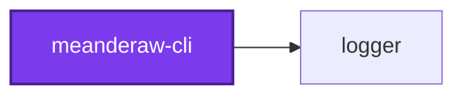
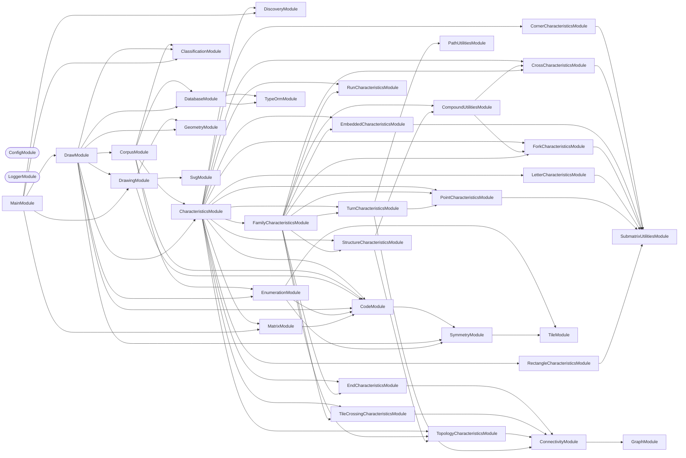

## Start

```bash
nx run codebase:postgres-container:up
nx run meanderaw-cli:start
```

The local Postgres container creates the `meanderaw_development` database, and the schema of
the same name inside it, the first time its volume starts empty; on a volume that predates
that, `nx run codebase:postgres-container:recreate` builds it, discarding what the volume
held. The connection is the `MEANDERAW_POSTGRES_HOST`, `MEANDERAW_POSTGRES_PORT`,
`MEANDERAW_POSTGRES_USER`, `MEANDERAW_POSTGRES_PASSWORD`, `MEANDERAW_POSTGRES_DB`, and
`MEANDERAW_POSTGRES_SCHEMA` variables, set in this project's `.env` (copied from
`.env.default`) and defaulting to the local container — `meanderaw_development` for the last
two. The `MEANDERAW_` prefix keeps them apart from the unprefixed `MEANDERAW_POSTGRES_*` variables the
workspace root's `.env` sets for lexico, which Nx also loads into every task.

## 🖌️ One Command

Meanderaw has one command, `draw`, and it is the default — so `nx run meanderaw-cli:start` runs it.
Both of its modes write the Postgres database `MEANDERAW_POSTGRES_DB` names, and which one runs is
decided by whether a Code was named:

| Invocation | What it does |
| ---------- | ------------ |
| `nx run meanderaw-cli:start` | Regenerates every meander the application can draw, as rows in that database — clearing the rows already there first, so it runs against the database as-is |
| `nx run meanderaw-cli:start --args="--rows <n> --columns <n> --code <code>"` | That one, as a single row in the same database |

The three flags of the single-drawing mode go together: `--code` is what
selects that mode over the draw run, and it is refused without both `--rows` and
`--columns`, since passing none of the three is how the draw run is asked for.

**There is nothing else to pass.** `--type`, `--modifier` and the parameters it carried
(`--strands`, `--branches`, `--direction`, `--flip`, `--offset`), `--sub-family`,
`--repeat-count`, and `--output-directory` are all retired with the per-family procedural
generation they named a drawing in. A meander is addressed by its lattice address — its
Code, its rows, and its columns — and by nothing else.

## Test

```bash
nx run meanderaw-cli:vitest
```

## 🗂️ Output Layout

```text
output/
  index.html        the jump list, one link per family page
  families/*.html   every meander of one family, drawn
```

A draw run commits nothing. The rows live in Postgres rather than in the repository — see
[ADR 0020](../../docs/adr/0020-store-meanders-in-postgres.md) — and the pages are written on
every draw run but gitignored: at the default edge budget's millions of rows they are gigabytes
of HTML, each page streamed to disk a batch of rows at a time because one family's page
outgrows a JavaScript string — see
[ADR 0021](../../docs/adr/0021-stop-committing-the-meander-pages.md).

That is the whole of it, and the shrinking is the point of this design rather than a side
effect of it. `output/` used to hold 9,877 committed SVG files under ten family
directories, plus a 2 MB `index.html` linking them and a 9,883-line
`output/lattice-addresses.md` recording each drawing's Code — because several families'
full Codes run past the 255-byte limit a filesystem imposes on one path component, which
forced six of the ten into a "shape-only" filename that dropped the Code entirely and
left the address table as the only place it survived. A database row has no such limit,
so the constraint is gone rather than worked around.

**Every row is reproducible from its own Code.** No drawing is stored: the generic,
family-agnostic renderer draws a meander from its `code`, `rows`, and `columns` whenever
the index pages are built, so a row holds the Code and what was measured off it.

### What a row holds

A `meanders` row has one column per fact about the row itself, and one JSON map for
everything measured off it:

| Column | Type | Holds |
| ------ | ---- | ----- |
| `id` | uuid | A uuidv7 the database assigns on insert, so ids sort by when their rows were written |
| `code` | text | The formatted Code, such as `02x02y4488` — unique across the table |
| `rows` | integer | The band's row count |
| `columns` | integer | The repeat's column count |
| `lattice` | text | The Code's bare hexadecimal digits |
| `repeats` | integer | How many times the filed Code repeats its unit |
| `family` | enum | The family the meander earns, or `unclassified` |
| `is_hardcoded` | boolean | True for a historical-corpus row or a `--code` drawing, false for an enumerated one |
| `characteristics` | jsonb | Every Characteristic, in one sparse map |

Columns are snake case, so raw SQL never quotes one.

**`characteristics` holds every Characteristic, and leaves out every zero and every
`false`.** A numeric key — a structural count such as `forkCount`, or a letter count such
as `aSoutheastLatinCount` — holds its value only when it is not zero, and a boolean key,
`isReducible` included, holds `true` only when it holds. Two dots in a two-row band,
`01x02y00`, store this and nothing else:

```json
{"bettiNumber0Count":2,"dotCount":2,"isDots":true}
```

So **a missing key means zero or `false`**. Read one as `characteristics.forkCount ?? 0`
in TypeScript, and as `COALESCE((characteristics ->> 'forkCount')::numeric, 0)` in raw
SQL — a bare `->>` is `NULL` for a missing key, and silently drops that row from any filter
on zero or less-than:

```sql
SELECT code FROM meanderaw_development.meanders -- the default MEANDERAW_POSTGRES_SCHEMA
WHERE COALESCE((characteristics ->> 'crossCount')::numeric, 0) = 0
  AND characteristics @> '{"isBars": true}';
```

A Characteristic added, renamed, or removed needs no schema change, which is why every one
of them shares the map rather than taking a column: see
[ADR 0018](../../docs/adr/0018-store-every-characteristic-in-one-sparse-json-map.md).

**Nothing checks the database against a fresh draw run.** A drift check used to
run on every commit, and a `drawingHash` column fed it; both are gone, for now — see
[ADR 0019](../../docs/adr/0019-drop-the-drift-check-and-the-drawing-hash.md). The one
property the schema enforces is that a Code is unique, so after changing the renderer, the
enumerator, or a Characteristic, regenerate the database with `nx run meanderaw-cli:start`.

**Two halves fill the table, told apart by `isHardcoded`, and they partition the corpus
rather than overlapping.**

- **Enumerated** — every structurally distinct repeat the lattice's edge budget admits,
  at each of the fourteen shapes it admits one at: 30,279 meanders, found by walking the
  space rather than by drawing a family. A row's `family` is read off its own structure
  by `MeanderClassificationService`, and is `unclassified` where the structure satisfies
  no family's defining combination.
- **Hardcoded** — the 965 meanders of the historical corpus that lie _beyond_ that
  budget, preserved as Codes extracted once from the retired file tree. Their family and
  sub-family are carried over as trusted metadata rather than re-derived. See
  `HARDCODED_MEANDERS_BY_FAMILY` for exactly where the boundary sits and why the filter
  is by shape rather than by Code.

A duplicate lattice address within either half is a build failure rather than a convention
nobody checks: the formatted Code spells out the lattice, rows, and columns, so the unique
index over `code` refuses the second insert. Across the two, the hardcoded corpus is
ingested first and the draw run skips any Code a hardcoded row already holds, so a hardcoded
meander keeps its row and hand-filed family.

`output/index.html` and the family pages beside it are rebuilt from the database at the
end of every draw run, and are gitignored rather than committed; nothing checks a draw run
against a committed copy. `.codometerignore`, `.prettierignore`, and `cspell` all leave
the directory alone.

## 🏛️ Meander Charter

Ten families of meander are implemented, and they share a set of properties that describe
how a meander looks. Three of them — orthogonality, space-filling channels, and the band
model — are **guaranteed by construction**: no assignment of direction bits to a lattice
can violate them, so no family gates them and none ever could. The other two — branching
and crossing — are **demoted to measured characteristics**, `hasTJunctions` and
`hasXJunctions`, rather than kept as invariants with declared exceptions: whether a
family's ink branches or crosses is measured, never gated, and a family is free to do
either as much as its own structure earns.

The counts below were extracted from the ten families as they stand, by measuring every
committed SVG rather than by reading the code — the method a declared-invariant framework
once formalized and that this section keeps as the record of why each family's ink looks
the way it does. `cross` crosses, and `negative`, `branch`, and `parallel` all branch — in
different shapes, which "The Branching Family" and "The Parallel Family" below are about.
`negative` crosses too, in three of its ten modes, and that is not a second family creeping
in: the survey below found that 3,070 of the 3,179 `mosaic` tiles it measured have a
crossing negative, so a `negative` family that crossed nowhere was drawing the 3.3%
minority of its own source space.

`parallel` was the exception until this corpus was drawn: it branched nowhere. **That
changed.** Ruling both borders of its band — the same closing `branch` takes, though there
the rules stand a lattice row clear of the ink — meets each strand's rising end with west,
east, and south ink at one lattice point, so 642 of its 786 drawings fork. Not every
drawing forks: the other 144 are the `serpentine` drawings whose first and last strips are
each one lattice row deep, where the flat ribbon on such a strip _is_ the rule and nothing
rises to meet it — a **structural condition** rather than a blanket count. See
`docs/adr/0006-close-both-band-borders-in-branch-and-parallel.md` for why both borders were
closed and what it cost.

`mosaic` branches and crosses too, and only in its **enumerated half alone** — which is now
the whole of it. Its unit space is every assignment of direction bits over a lattice, and
most of that space branches and crosses; the four named modes it once had, `plain`,
`split`, `alternated`, and `dot`, did neither, and they are gone. This is still recorded in
`meander-topology.service.integration.test.ts` with a `permutations` flag, measured from
committed output rather than from a generated drawing.

| # | Invariant | Status |
| --- | --- | --- |
| 1 | **Orthogonal only** — horizontal and vertical movement, no diagonals | Guaranteed by construction |
| 2 | **Space-filling** — every interior white channel is exactly one stroke width | Guaranteed by construction |
| 3 | **No branching** — ink contains no T-junctions | Demoted to characteristic `hasTJunctions` — present in `branch` in every mode, in `negative` in every mode but `ruled-closed`, in `parallel` wherever a border strip has depth, in `mosaic` across its enumerated half, and in `chain` and `snake` under `edge` and `edge-flip` |
| 4 | **No crossing** — ink contains no X-junctions | Demoted to characteristic `hasXJunctions` — present in `cross` except under `interrupted`, in `mosaic` across its enumerated half, and in `negative` under `brick-straight`, `brick-upright`, and `grid` |
| 5 | **Band, not field** — fixed canvas height, `rows` is density, tiling is horizontal | Guaranteed by construction |
| 6 | **Flat path model** — unordered paths, no z-order, one stroke width per document | May be relaxed by ADR only |
| 7 | Invariants hold within a band, not at its termination | See [#338](https://github.com/Organizzolini/codebase/issues/338) |

What the measurements found. They were taken across the 114 named patterns and 3,179
enumerated `mosaic` tiles that existed before `cross`; every count below is restated
against the corpus as it now stands, 1,118 named patterns beside 8,759 enumerated tiles.
The named half was 174 until the draw run's row range was raised to the command line's own,
and it has moved with every family that gained a mode or a parameter since — and, when
closing both band borders left four names drawing what another name already drew, with the
four that were deleted, and again with `branch`'s six two-row drawings, which insetting
that family's figure from its own rules put below its structural minimum; the enumerated
half was 3,554 until `mosaic` was capped at 6 rows, 449 after that, and 8,759 once that
family's matching rule was replaced by an edge budget over a lattice. Most of these counts
have moved several times for those reasons alone — see the note under "Meander Charter"
above:

- **Every interior white channel is exactly one stroke width**, in all 9,877 files. The
  channel width equals the stroke width equals half a grid unit, and that single number
  is the same in every document the project has ever written — the stroke is `unit / 2`
  at every row count, in every family, at every ply of `parallel`. #340 and #413 both
  inferred from this that drawing `N` strands would mean `strokeWidth = unit / (2N)`;
  that inference is wrong and is discarded, for the reasons under "The Parallel Family"
  below.
- **Ink never crosses itself, except where a family was added to make it.** Zero
  X-junctions across all 138 named drawings the six original families produce — a stronger
  statement than "non-self-intersecting", and the sharpest single characterization of what
  those six have in common. The `cross` family relaxes it deliberately: 12 X-junctions in
  each of the seven solid documents it commits. `negative` relaxes it too, in three of its
  ten modes and 30 of its 100 documents — `brick-straight` is stack bond, whose mortar runs
  unbroken both ways where running bond's does not, `grid` inverts the `dots` sub-family,
  and `brick-upright` inverts `diamond` — for 705 X-junctions between them. Its permutation
  half crosses in 136 of its 208 drawings, which is the same finding at the scale of a
  whole space rather than of three named modes. Nowhere else in the 9,877-file corpus.
  `cross` carries twelve at every one of its row counts, 6 through 12, so its count is a
  property of the repeat count rather than of `rows`. See "The Crossing Family" and "The
  Negative Space Family" below.
- **Ink branches in four places, and only there.** 22,918 T-junctions across 848 of the
  1,118 named patterns. 360 of them, across 36 patterns, are `chain` and `snake` under
  `edge` and `edge-flip`, ten per document at every row count: the `edge` family widens the
  repeat unit past the zigzag it contains, so the zigzag's terminating vertical lands in
  the _interior_ of the band border rather than at its end, and the border runs on either
  side of it — five such junctions along the top border, five along the bottom. An earlier
  reading of this measurement reported zero everywhere; the reference assets are
  hand-verified ground truth for what these patterns should look like, so the geometry is
  right and the count was wrong. The other 22,558 are the point of three families rather
  than a side effect of anything: 3,054 across the `negative` family's 90 branching
  documents, 2,130 across all 80 of `branch`'s, and 17,374 across 642 of `parallel`'s 786
  — see "The Negative Space Family", "The Branching Family", and "The Parallel Family"
  below.
- **The corpus was a forest with a few trees in it, and now it has none.** Read as a
  graph, a document's ink is lattice points joined by one-pitch steps, and a **tree** is
  the case where those points form one connected piece with `edges = nodes − 1`. Until
  both border rules were closed the corpus held 110 of them — `branch`'s 88, which were
  spanning trees of the band's lattice, and the 22 one-strand `serpentine` drawings, each
  a single ribbon that simply did not end before the band did. Both routes ran through an
  open border, and ruling both borders closed both — but not the same way, which is the
  part worth keeping. A ribbon that meets a rule at each end closes a loop, so it leaves
  the tree set by gaining an edge. `branch` briefly left it that way too, and now leaves
  it by falling apart instead: its figure is inset by a lattice row from every rule beside
  it, so each rule is a piece of its own and the drawing is a forest of two or three. By
  either route, **not one of the 9,877 committed documents is a tree**. 5,817 of the
  9,877 are forests of many components and 4,060 carry a loop, where before the two halves
  stood at 6,390 and 3,418. What was measured is still the
  interesting thing — a corpus this large containing exactly two shapes of ink graph — and
  the trees turn out to have been an artifact of two families having a border left open.
  See "The Branching Family" and "The Parallel Family" below.
- **The negative space branches and crosses freely.** It branches in every family, and it
  genuinely crosses in 203 of the 1,118 named drawings — every one of them `parallel`
  under `serpentine` — and in the `diamond` sub-family, which is the shape the `mosaic
  split` modifier drew before that family stopped drawing motifs. Crossing patterns
  are already generated here; they have only ever been white, never ink.

Invariant 1 is not merely local convention. Fréart's rule for the classical meander is
that returns and intersections "do always fall into right angles", quoted in the
[ICAA's article on the complex Greek meander](https://www.classicist.org/articles/classical-comments-the-complex-greek-meander/).

Invariant 5 is fixed because the intended use is **borders**. Two-dimensional field
ornament is excluded for that reason, not because it is uninteresting.

Wider-than-one-stroke gaps occur only where a band terminates, which is
[#338](https://github.com/Organizzolini/codebase/issues/338) and is not a family
property.

**The named half of the draw run runs to each family's own `FAMILY_MAXIMUM_ROWS`**, which is
the same record the command line validates against — so every drawing the command line can
be asked for is also a drawing this repository commits and the charter gates: 1,118
combinations, each family from its own structural minimum through its own ceiling. That
ceiling is the shared `MAXIMUM_VALUE` of 12 for nine of the ten families, and 6 for
`mosaic`, whose reasons are below.

It stopped at 8 until [#507](https://github.com/Organizzolini/codebase/issues/507), and that
issue lived in the four row counts between — `chain` and `snake` drew self-retracing ink at
9 through 12 rows, reachable from the command line by anybody and covered by nothing,
because the corpus stopped at 8 and the charter swept the corpus. Raising the draw run's range
to the command line's own closed the gap for both at once, which is why neither has a
maximum of its own any more. Most of the counts below moved by that change and nothing else.

**Neither permutation half followed, and `mosaic` as a whole did not either.** Both halves
stop at 6 rows, at 8,551 tiles and 208 sources. They enumerate their spaces exhaustively
rather than sampling them, and `mosaic`'s count grows about 3.4× per row — 23, 68 and 199
at rows 4 through 6, then 660, 2,229, 7,977, 29,002, 108,089 and 406,934 — so following the
other nine families to 12 would mean committing 554,891 more files. `negative`'s own growth
is about 2.4× per row — 8, 18, 40 and 93, then 216, 513, 1,218, 2,920, 7,000 and 16,850.

That cap is why the `mosaic` family stops at 6 rows everywhere rather than only in its
permutation half. A budget that applied to the enumeration alone would leave `mosaic` at 7
through 12 rows reachable from the command line and committed nowhere — which is exactly
the shape of #507. So the cap is `FAMILY_MAXIMUM_ROWS.mosaic`, the named half reads it, and
`--type mosaic --rows 7` is refused rather than drawn outside the corpus the charter gates.
`negative` keeps its ceiling of 12 as a named family; only its enumerated half stops at 6,
and its deepest row count there inverts a seven-row source that is enumerable but no longer
committed — so the corridor-identity gate covers rows 3 through 5 of that half and the
charter sweep covers the rest, exactly as it already does for the named `negative` drawings
above 6 rows.

## 🧬 Families, Sub-families, and Tiles

A **family** is a generator of repeat units — its **unit space**. A **modifier** is a
named constructor into that space; a **sub-family** is a named predicate over it. Both
are views on one underlying space, which is why `mosaic` is the only family whose
sub-families can be **asked for**: [#365](https://github.com/Organizzolini/codebase/pull/365)
materialized its unit space as enumerable tiles, so its regions — `lines`, `dashes`,
`dots`, `diamond` — became nameable at the command line. The other nine families have
latent unit spaces and therefore only modifiers. Evaluating a predicate needs no
enumeration, though, so a drawing from any of those nine can still **earn** a sub-family
name from the tile it draws — 85 of the 1,118 swept combinations do, and the
meander database reports which.

### The mosaic family draws no motif

`mosaic` is the one family with **only** sub-families, and the reason is the sentence
above read the other way round. A modifier constructs a member of a family's unit space;
every member of this family's space is already enumerated and committed; so a modifier
here constructs something the corpus already holds under another name.

That was measured rather than argued. The family had three modifiers — `alternated`,
`dot`, and `split` — producing 24 named drawings across 3 through 6 rows. Decoded back
into tiles and matched against the enumeration up to the symmetry it folds by, **19 of
the 24 were tiles the enumeration already commits**:

| Modifier | 3 rows | 4 rows | 5 rows | 6 rows |
| --- | --- | --- | --- | --- |
| none (`plain`) | `48-bars` | `4c8-bars` | `4cc8-bars` | `4ccc8-bars` |
| `split` | `48-bars` | `4c8-bars` | `4848-diamond` | `4c848-diamond` |
| `dot up` | `48-bars` | `044880` | `044cc880` | 3 columns, past the budget |
| `dot bounce` | `48-bars` | `044880` | `044cc880` | 4 columns, past the budget |
| `alternated period 1` | `48-bars` | `4c8-bars` | 2-column `diamond` | 2 columns, past the budget |
| `alternated period 3` | `48-bars` | `4c8-bars` | 6 columns, past the budget | 6 columns, past the budget |

Read the rows and the redundancy is not marginal. `plain` is the `bars` sub-family under
a name that says nothing about what it draws. `split` is `diamond`. At 3 rows all four of
`plain`, `split`, `dot up`, and `dot bounce` are **byte-identical** to each other, and
`alternated` degenerates to a plain bar at 3 and 4 rows at every period — a modifier
varying a parameter that changes nothing.

The five that were not in the enumeration were not in it for one reason: their column
span is past `MOSAIC_TILE_EDGE_BUDGET`. Two columns at six rows is 18 edges against a
budget of 16, and six columns is 54. Raising the budget to reach them is not an option —
it would admit `2 ** 54` tiles at that shape — so those five drawings are the cost of the
removal, stated rather than glossed: a staircase at 5 and 6 rows and two dot ladders at 6
rows are no longer drawn.

What replaces them at the command line is `--sub-family`. `--type mosaic --rows 5` alone
is refused by `MissingSubFamilyError` rather than defaulting to the bar, and the message
names the eight sub-families to choose from. `MotifRegistryService` holds no entry for the
family at all, which `MotifDrawnType` makes a type error rather than a lookup answering
`undefined`, and `DrawCombinationsService` leaves it out of the named-type draw run entirely
— so the named half is 1,118 rather than 1,142, and every one of this family's 8,551
drawings comes from one enumeration.

### A `mosaic` tile is a lattice of four-direction points

A repeat tile is a `columns` by `rows - 1` grid of **lattice points**, each carrying four
bits: whether ink leaves it north, south, east, or west. `0000` is a dot, `1100` a corner,
`1110` a T-junction, `1111` a crossing. The two border rules at grid levels `0` and `rows`
are the cap ticks rather than tile points, so a point on the first level carries no `north`
and one on the last carries no `south`.

Three things follow, and they are why the family is a family rather than a soup.

**A tile is space-filling for free.** A point on no edge _is_ an inked dot — the same dot
the family has always drawn — so charter invariant 2 holds by construction at every degree
and needs no predicate.

**The bits are twice-redundant, and the redundancy is a checked invariant.** `east` at one
point is `west` at the point to its right, wrapping from the last column into the next
repeat, and `south` is `north` at the point below. `MosaicTileService.assertWellFormed`
refuses a grid that disagrees. That agreement is what makes a tile's bits denote exactly
one drawing — no two assignments draw the same pattern, and no assignment draws none — and
the east–west wrap at the last column **is** what makes a tile join up with its own next
repeat, stated once rather than handled wherever a mark used to reach past the tile's edge.

The alternative reading — each bit draws a half-unit arm, so disagreeing neighbors leave a
stub ending between lattice lines — is rejected. `MeanderLatticeService` refuses a
coordinate that is not on a lattice line, so half-arms would break the whole measurement
stack, and a stub ending in mid-air is not obviously legal under invariant 2 either.

**One budget bounds the space.** A tile's edges are its only degrees of freedom — one
eastward and one southward per point, minus the last level's southward ones, which have
nowhere to reach — so a shape holds exactly `2 ** (columns * (2 * rows - 3))` tiles and
rows and columns are not independent knobs. Capping each alone caps neither: six rows is
fine, six columns is fine, and a six-by-six tile is `2 ** 54` of them. `MOSAIC_TILE_EDGE_BUDGET`
caps the edge count at **16**, which admits eleven shapes and 8,551 distinct tiles after
symmetry folding — a corpus a person can look through. Twenty would admit about 116,000.

| rows × columns | edges | tiles |
| --- | --- | --- |
| 3 × 1 | 3 | 6 |
| 3 × 2 | 6 | 21 |
| 3 × 3 | 9 | 74 |
| 3 × 4 | 12 | 354 |
| 3 × 5 | 15 | 1,884 |
| 4 × 1 | 5 | 20 |
| 4 × 2 | 10 | 204 |
| 4 × 3 | 15 | 3,100 |
| 5 × 1 | 7 | 72 |
| 5 × 2 | 14 | 2,544 |
| 6 × 1 | 9 | 272 |
| **Total** | | **8,551** |

Counts are folded over the tile's symmetry group — horizontal translations, times a
horizontal mirror, times a level flip, order `4 * columns`. Enumeration is a walk over
every subset of the edges, so it is counting in binary rather than searching, and a shape
past the budget is refused rather than enumerated slowly: the walk is `2 ** edges` wide,
so one shape too many is not a long run but an unfinished one.

**The row cap is separate and still 6.** The budget alone admits a one-column tile out to
nine rows, but a family that ran deeper at one column than at any other would describe its
own ceiling with two numbers that disagree.

The glossary for these terms lives in the repository [CONTEXT.md](../../CONTEXT.md).
Note one deliberate divergence: the code says `MeanderType`, `SUPPORTED_TYPES`, and
`--type` where the glossary says **family**. Renaming the flag would be a breaking CLI
change and is not worth making for a vocabulary correction.

### A tile's ink is a graph, read one repeat at a time

The charter reports a **rendered document**'s ink as a graph — nodes, edges, components,
free ends — and two predicates follow from those counts by arithmetic and nothing else: a
**forest** is exactly `edges = nodes − components`, and a **tree** is exactly
`components = 1 && edges = nodes − 1`. `MosaicConnectivityService` asks the same two
questions of a **tile**, and answers them without drawing it.

| Question | Over the 8,551 tiles |
| --- | --- |
| Ink carries no loop (a forest) | **3,352** |
| Ink is one connected figure | **1,947** |
| Both at once (a tree) | **370** |

Nothing is filtered by this. The enumeration is still 8,551 tiles and the corpus is
unchanged; these are three counts over that space, the way the junction counts are counts
over the corpus.

**A tile is read as its own repeating band, divided by the repeat.** A tile's eastward edge
at its last column reaches the first column of the _same_ tile — the wrap above, which is
what makes a tile join up with its own next repeat. So its points and edges already
describe an infinite band, and the graph read here is that band modulo one repeat: nodes
are the tile's points, eastward and westward steps wrap around the column span, and
northward and southward ones do not, because grid levels `0` and `rows` are cap ticks
rather than tile points. Every number above is therefore a property of the tile at no
repeat count at all.

**Why not measure a drawing instead.** Because the answer would be about the drawing.
`bars` at four rows is one unbroken vertical stroke per repeat, so a document of it holds
`repeats + 2` components — one stroke each, plus the band's two cap-tick rules — and a
document of ten repeats reports ten where a document of three reports three. The tile did
not change between those two drawings. Its own count is **one**, because there is one
stroke per repeat, which is the only reading that is about the tile.

**The two readings are the same reading, in this precise sense.** A document of `N` repeats
is the tile's band unrolled `N` times, plus those two cap ticks. So every loop a drawing
carries closes inside some run of repeats, and that run maps back onto the band carrying
the loop with it — therefore **a tile with no loop renders to a drawing with no loop, at
every repeat count**. `bars` is the worked case in both directions: the tile is a tree, one
component and no loop; the drawing is a forest of `repeats + 2` components and no loop.
Both say loop-free, and they differ on the component count by exactly the factor the
drawing chose.

**The converse fails, in one exactly-known way, and the way is the point.** A cycle that
closes _only_ by wrapping is a loop within one repeat and no loop once unrolled: it becomes
a run that leaves at one side and never comes back. `lines` is the smallest case — at one
column every level's eastward edge leaves its own point and arrives back at it from the
west, so the repeat holds one self-loop per level while the drawing is three straight
rules. So the tile-level reading calls some tiles cyclic that every drawing of them shows
loop-free, and that is the honest answer for a repeat unit rather than a defect: within one
repeat the ink really does close on itself, and the distinction it draws — ink that
terminates inside the repeat against ink that runs on through the repeats forever — is one
the drawing cannot state.

Both halves are asserted rather than argued.
`mosaic-connectivity.service.integration.test.ts` renders every tile of three shapes at two
repeat counts, measures each document the way any committed document is measured, and
checks that the implication has no exception and that the set of tiles the two readings
disagree about is the same set once enough repeats are drawn for a wrapping run to show
itself rather than close by coincidence within a narrow drawing — 1,631 tiles disagree at
one repeat and 1,039 at two, against 1,033 from three repeats on, which is where the set
settles into a property of the tile rather than of how much of it was drawn.

The walk that counts the pieces is `MeanderTopologyService.components` and the arithmetic
is its `isAcyclic` and `isOneComponent`, shared with the document-level reading through an
`InkAdjacency` — nodes, neighbors, and an identity for a node. That is the whole of what a
component count needs, and it is the only thing the two readings can share: one lives on a
bounded lattice of `"column,row"` points and the other on a wrapping repeat of
`[level][column]` points, so neither coordinate system is a special case of the other. The
dependency runs mosaic onto topology, which leaves the topology service free of any
knowledge that a `mosaic` exists.

**A component count is not a substitute for looking at the drawing**, and the `zigzag` /
`square` split below is where that bites: two tiles can be the same graph on the quotient
band and still draw as unrelated patterns, because the count cannot see _which_ edge is the
one that wraps. So these numbers answer what they say they answer — how many pieces the
ink falls into, and whether it loops — and no more.

## 🔤 Naming a Mosaic Sub-family

`mosaic`'s unit space is materialized, so a region of it can be **recognized** rather
than listed. Eight regions have names, and they come in four pairs.

| Sub-family | Every point | Smallest tile | Reads as |
| --- | --- | --- | --- |
| `dots` | is on no edge at all | `00` | a field of square marks |
| `mesh` | is on every edge there is | `7b` | the full lattice |
| `lines` | is on a run across the band, unbroken | `33` | unbroken horizontal rules |
| `dashes` | is on a run across the band, broken somewhere | `2121` | broken horizontal rules |
| `bars` | is on a run down the band, unbroken | `4c8` | unbroken vertical rules |
| `diamond` | is on a run down the band, broken somewhere | `4848` | a dashed vertical bar |
| `zigzag` | turns a corner, stepping out of the repeat | `56a9` | a staircase |
| `square` | turns a corner, closing inside the repeat | `65a9` | separated square loops |

**Unbroken or broken is the question**, and it is asked of the edges rather than of the
points. A point in the middle of a rule and a point at the end of a dash both carry ink
running across the band; only the edge that would join it to its neighbor says which it
is. Asking only "is every point reached the same way" cannot tell them apart, which is
how a solid bar came to be called a `diamond` — a `diamond` being a _dashed_ bar — and a
two-column tile of unbroken rules came to be called `dashes`.

`dots` and `mesh` are the ends of the space: the tile with no edge and the tile with every
edge, one of each per shape.

`zigzag` and `square` are the one pair about a point's own **shape** rather than about which
directions a tile uses, and both are empty at a single column, where a point's eastward
edge wraps onto itself and gives it two horizontal bits rather than one. They were **one
name until the drawings were looked at**, and the section below works through what
separates them and why the ink's own component count cannot.

A tile is identified by its **hexadecimal string**: one character per point in reading
order, worth `8` for `north`, `4` for `south`, `2` for `east` and `1` for `west`. So `0`
is a dot, `3` a point on a horizontal run, `c` one on a vertical run, `6` a corner
turning south and east, `e` a T-junction, and `f` a crossing — and a filename can be
decoded point by point without a table.

It names a tile completely, because the points determine every edge: each one owns its
`east` and its `south`. It is deliberately redundant, writing every edge twice — once at
each end — which is the same redundancy `MosaicTileService.assertWellFormed` checks, and
paying it buys a filename whose characters are the tile's own points rather than a packed
edge list nobody can read. The directory a drawing is filed under carries the shape, so
two tiles of different shapes may share a string.

Recognition lives in the `mosaic-naming` module, which is a list of **rules**: a name,
and a predicate over the tile's own direction bits that a tile must satisfy to be called
it. Adding a name to the family is adding one of these, not writing a motif service.

Three consequences, and each is asserted rather than assumed:

- **A name keeps working outside the enumeration.** No rule consults a list of known
  identifiers, so a tile at a row or column count nobody has swept is named exactly as one
  inside it would be.
- **A tile matching no rule keeps its identifier** rather than being forced into the
  nearest name. Most tiles are like this, and that is the point: a name everything has
  says nothing.
- **A tile matching two rules is a defect in the rule set**, not a tie to break. The rules
  are exclusive by construction — each requires the _absence_ of the directions the others
  are about — and `mosaic-naming.service.unit.test.ts` asserts it over the whole
  enumerated space. `zigzag` and `square` are the one pair that cannot separate that way,
  since every point turns a corner in both; they split on a reading whose two halves are
  false together rather than true together whenever a tile is neither.

Across the 8,551 tiles the enumeration admits — every shape the edge budget allows, which
is exactly what the draw run commits:

| Sub-family | Tiles |
| --- | --- |
| `dashes` | 69 |
| `bars` | 11 |
| `dots` | 11 |
| `lines` | 11 |
| `mesh` | 11 |
| `diamond` | 4 |
| `square` | 4 |
| `zigzag` | 4 |
| unnamed | 8,426 |

`bars`, `dots`, `lines` and `mesh` name exactly one tile per shape, which is what makes
them the eleven shapes' landmarks rather than regions: no edge, every edge, every eastward
edge, every southward edge. A region proper holds every tile its predicate accepts, not
only the one it is named after, which is why `dashes` is much the largest — an eastward
edge may be anchored at any column, so every staggered arrangement of them is `dashes`
too.

`diamond` is the smallest because its arrangements are forced rather than chosen:
southward edges cover the bar's interior levels in pairs, so there is one per column span
where the number of levels is even and none at all where it is odd. Asking for a
`diamond` at an even row count is refused rather than approximated.

**A tile carrying a junction earns no name at all**, which is the rule set working rather
than a coincidence: every rule requires the _absence_ of the directions the others are
about, so nothing that branches or crosses satisfies one.

### A corner tile is a staircase or a row of loops, and the split is geometric

`zigzag` and `square` were one name — every point turning a corner — and one look at the
ten drawings it committed shows two unrelated patterns. `56a9` at three rows and two
columns is a continuous staircase marching sideways through every repeat. `65a9`, the only
other tile of that shape, is a **closed square with a gap between it and the next
repeat's** — a row of separated loops, and not a staircase in any reading.

Where each loop closes is the whole of it, and it is forced by two constraints:

- **The southward edges pair the levels up from the top.** A point's `north` is the edge
  above it and its `south` the edge below, so exactly one vertical bit per point makes the
  edges down a column run on, off, on, off; the first level has no `north`, so the run
  starts on. Levels therefore pair `(0, 1)`, `(2, 3)`, … and **no southward edge ever joins
  one pair to another**. Each pair is an independent **lane**.
- **Each level's horizontal runs alternate columns**, and the only freedom is which columns
  they start on. So one lane is two such choices, and there are only two cases.

A lane whose lower level **repeats** the upper level's choice turns the ink back on itself:
it closes into squares inside the repeat, one per pair of columns, with a gap to the
next repeat's. A lane that **offsets** it makes each level's run start where the one above
it ended, so the ink turns the opposite way at every level and walks out of the repeat and
into the next, never closing. `zigzag` is every lane offset; `square` is every lane
repeated.

**A tile can mix them**, closing in one lane and stepping in another, and two of the ten do.
Those earn neither name and keep their bit string — the same answer a tile mixing
horizontal and vertical ink already got, rather than the nearer of the two.

**The ink's own component count cannot make this split**, which is worth stating because it
is the obvious thing to reach for. At two columns a closed square and a step that leaves
the repeat are the **same four-cycle**: four points, four edges, one component. They differ
only in _which_ of those edges is the one that wraps, which is a fact about how the graph
sits in the band and not about the graph. So `65a9` — a proven row of loops — has
`components === 1` exactly as the staircase `56a9` does, and a component count would name it
`zigzag`. It fails the other way too: at five rows and two columns every corner tile has two
lanes and therefore two components, including the two that are a pair of **parallel
staircases**, which a component count would have to call loops — and it has no way to leave a
mixed tile unnamed, since every corner tile has some component count or other. Several of the
ten committed tiles come out wrong by it, in both directions. Comparing the lanes' horizontal
rows is asked of the rows instead, and it is exact.

### Every name is a constructor as well as a predicate

A name is a rule, so recognizing a region costs nothing; building its aligned
representative is the separate job `MosaicSubFamilyService` does, and for a while only
five of the names had one. `mesh` and `zigzag` did not, because the shape table
could say one thing — one direction's edges, anchored in the first column, every
`levelStep` levels — and neither of those two is that. `mesh` uses both directions at
once. `zigzag` needs its eastward edges to start a column further along at every level,
which no single anchor expresses. `square` then cost nothing at all: it is `zigzag`'s two
rules with the phase off, which is the only difference between the two names.

Each sub-family's tile is now **two rules, one per edge grid**, each an edge every
`levelStep` levels and every `columnStep` columns, optionally _phased_ so the column
offset advances by one per level. The family's pairings then fall out one number apart:
`bars` and `diamond` are the same southward rule at `levelStep` 1 and 2, `lines` and
`dashes` the same eastward rule at `columnStep` 1 and 2, `dots` no rule at all, and
`mesh` both rules at every step of one.

`zigzag` and `square` are the only two needing a phase between them, and **the phase is the
entire difference between those two names** — one boolean, which is why it is a field on
the rule rather than a special case wherever the staircase is built. Every point turning a
corner means exactly one horizontal bit and one vertical bit **at every point**, and that
pins both rules down for both names:

- **The southward edges have to alternate level by level.** A point's `north` is the
  edge above it and its `south` the edge below, so a point can have exactly one of them
  only if the edges down a column are on, off, on, off. The first level has no `north`,
  so the run starts on — and the last level has no `south`, so it must end on the level
  above. That happens only when the interior's level count is **even**, which is
  `diamond`'s constraint arriving for a different reason: `zigzag` and `square` exist at
  3, 5, 7 … rows and nowhere else, and are refused rather than approximated at 4 and 6.
- **The eastward edges have to alternate column by column**, since a point's `east` and
  `west` are the edges either side of it. Alternating has to survive the wrap from the
  last column into the next repeat, so the column span must be **even** — two, which is
  why both are empty at a single column rather than merely unaligned there.
- **Whether the alternation shifts by one at every level is the name.** Hold the phase
  fixed and each level's eastward edge sits directly above the next level's, the ink turns
  back on itself, and the tile is a stack of closed squares — every point still a
  corner, but not a staircase. That is `square`. Advance it and each level's horizontal run
  starts where the one above it ended, so the ink turns the other way at every level and
  walks sideways through the repeats. That is `zigzag`.

The smallest of each is two columns and two interior levels: `56a9` for `zigzag` and
`65a9` for `square`, the only two tiles of that shape whose every point turns a corner. The
smallest `mesh` is `7b`, a single column with every edge it has.

**Advancing the phase keeps every lane stepping, at every row count**, which is what makes
one boolean enough rather than a rule that only reads right at the shallowest tile. The
phase is the level index, so consecutive levels always disagree by one, so every lane is
offset — and `mosaic-naming.service.unit.test.ts` names both constructors' tiles back at
every row count each exists at, from 5 through 11, rather than only at the smallest.

Ask for a sub-family by name:

```bash
nx run meanderaw-cli:start --args="--type mosaic --sub-family dots --rows 6"
```

The name lands in the output path — `output/mosaic/6-rows/dots-6-repeats.svg` — and in
the draw run's own, where a tile with a name carries it after its identifier
(`output/mosaic/6-rows/1-columns/00000-dots.svg`) and a tile without one
carries the identifier alone.

### `diamond` outlived `split`, which was the same shape under a modifier's name

The hand-drawn reference set held a `diamond` and a `split` that were byte-identical, and
both names survived for a while because they played different roles — the distinction the
[CONTEXT.md](../../CONTEXT.md) glossary draws:

- **`split` was a modifier**: a named _constructor_ into the unit space. `--modifier
  split` broke the bar into dashes.
- **`diamond` is a sub-family**: a named _predicate_ over the unit space. It recognizes
  any tile every one of whose points is reached by a southward edge and by nothing running
  across the band, whether or not a modifier is what produced it.

The two drew the same bytes, which is what settled it: a constructor into a space whose
every member is already enumerated constructs nothing the predicate cannot name. `split`
is gone with the rest of this family's modifiers — see "The mosaic family draws no motif"
below — and the golden fixture it was verified against is now
`testing/assets/mosaic-5-rows-12-repeats-diamond.svg`, generated through the sub-family
and byte-identical to what the modifier used to write.

The glossary's "some sub-families arise by applying a modifier, others by recognizing a
structural property" still holds; it is just that for `mosaic` no sub-family arises the
first way any more.

One name worth reading twice: the **`dots` sub-family** (plural) and the `dot` modifier
(singular, carrying a `bounce` or `up` shape) were different things one letter apart. The
modifier is gone; the sub-family is not, and `--sub-family dot` is still refused.

## 🕳️ Negative Space Survey

[#340](https://github.com/Organizzolini/codebase/issues/340) found genuine four-way
crossings in the negative space of `mosaic split` and `mosaic alternated period-3`, and
branching in every family's negative — but only across the 114 named patterns. Those two
drawings are no longer committed under those names, and the finding is not lost with them:
`split` drew the `diamond` sub-family's shape, whose negative still carries its nine
crossings in `testing/assets/mosaic-5-rows-12-repeats-diamond.svg`, measured off disk by
the charter suite.

[#412](https://github.com/Organizzolini/codebase/issues/412) runs the same measurement
across all 3,179 tiles of the `mosaic` permutation set at 4 through 8 rows, which the
draw run committed under `output/mosaic/<rows>-rows/permutations/` at the time, before that
level was removed — the only
family with an enumerated unit space, so the only one this measurement can run over every
tile rather than a handful of named modifiers. The space it measured is not the space
the family enumerates today — the matching rule it was taken under has since been
replaced by an edge budget over a lattice of four-direction points — so the figures below
are a record of that survey rather than a description of what is on disk. The `negative`
family still inverts the region that survey measured, and now says so: a source carrying a
junction can wall a cell on every side, and a cell with no corridor leaves the negative
with a lattice point nothing paints, so `NEGATIVE_SOURCE_MAXIMUM_DEGREE` stops its sources
at a corner.

### Method

Every `output/mosaic/<rows>-rows/<columns>-columns/*.svg` file was read from disk — no generation, no motif
service, the same approach the charter test already uses to gate the corpus — and passed
to the existing
[`MeanderTopologyService.measure`](src/modules/meander-topology/meander-topology.service.ts).
A tile is classified from its own `negativeTJunctions`/`negativeXJunctions`:

- **Crosses**: `negativeXJunctions > 0`.
- **Branches only**: `negativeTJunctions > 0` and `negativeXJunctions === 0`.
- **Neither**: both zero.

This measurement adds no committed source: it ran as a temporary test beside
`meander-topology.service.integration.test.ts`, deleted before this section was
committed. It is nothing but a loop calling `measure` on each file and tallying the
result against the two thresholds above — reproducible in a few lines against the
already-committed service.

One further tally needed a small extension beyond what `measure` reports (see
"Is the negative itself space-filling?" below): for each cell of the same lattice graph
`MeanderLatticeService.build` already produces, how many of its corridor-eligible sides
carry no corridor — the same four-arm check `measure` uses to find negative T- and
X-junctions, just also recording degree 0.

### Per-class counts

| Class | Tiles | Share |
| --- | --- | --- |
| Crosses | 3,070 | 96.6% |
| Branches only | 104 | 3.3% |
| Neither | 5 | 0.2% |
| **Total** | **3,179** | 100% |

By row count:

| Rows | Tiles | Crosses | Branches only | Neither |
| --- | --- | --- | --- | --- |
| 4 | 23 | 16 | 6 | 1 |
| 5 | 68 | 58 | 9 | 1 |
| 6 | 199 | 182 | 16 | 1 |
| 7 | 660 | 633 | 26 | 1 |
| 8 | 2,229 | 2,181 | 47 | 1 |

Crossing is the overwhelming majority, and grows with both row count and column span:
2,794 of the 3,070 crossing tiles span 2 columns against 276 at 1 column. Issue #340
already observed that crossing "grows with row count"; this shows it holding far beyond
the two named tiles the spec measured — crossing negatives are the norm across this
family's unit space, not the exception the 114-file measurement suggested. The five
_neither_ tiles are exactly the `lines` sub-family at every swept row count (`lll`
through `lllllll`): a single vertical line's negative is two straight channels that
neither branch nor cross, the simplest case there is and the reason a "neither" class
exists at all.

Every one of the 3,179 tiles still has zero ink T-junctions, zero ink X-junctions, and
full channel-width compliance — unchanged from what the base branch's own disk-based gate
already reports for the whole corpus of the six original families, now 138 named
drawings. This

survey adds the negative-space
breakdown; it does not revisit the ink side.

### Is the negative itself space-filling?

Yes, for all 3,179 tiles, by the measurable criterion available: no cell's corridor
degree is 0. A degree-0 cell is a white cell sealed off from the corridor network on
every side that has a neighbor — the negative-space analogue of an un-inked lattice
point, and the specific failure `channelWidthCompliant` catches on the ink side. If a
tile's negative were drawn as ink by tracing a stroke along every corridor, a sealed cell
would receive no stroke at all.

Across all 3,179 tiles — 264,117 cells in total, at band termination and in the interior
alike — **zero have corridor degree 0**. Every white cell touches at least one neighbor
through a missing ink edge. Drawing any permutation tile's negative as ink would
therefore leave no region unreached, keeping invariant 2.

This is measured, not proven in general: it states that the corridor skeleton reaches
every cell, not that a specific rendered path through that skeleton stays exactly one
stroke width everywhere the family drawn from it eventually decides to run. #415 still
has to measure its own rendered output rather than assume this result transfers
unchanged.

### Shortlist

Three candidates scale cleanly across every row count the permutation draw run covered when
the survey ran (4 through 8; it stops at 6 now), which is what makes each "a family"
rather than one lucky tile. All three
are _branches only_ — **verified `negativeXJunctions === 0` at every one of their five
row counts**, read from the same per-file measurement that produced the per-class counts
above, not asserted separately — so drawing them relaxes invariant 3 and nothing else,
exactly what issues #415 and #416 need. A fourth candidate was cut after review found it
crosses; see below.

1. **The stair** (`mosaic`, columns 2, rows 4–8: `044880`, `04488408`,
   `0448844880`, `044884488408`, `04488448844880`). Negative T-junctions
   38 / 48 / 58 / 68 / 78 (rows 4–8 respectively), X-junctions 0 / 0 / 0 / 0 / 0. The
   highest-branching non-crossing family found, at every row count.
2. **The running bond** (`mosaic`, columns 2, rows 4–8: `211221`, `21122112`,
   `2112211221`, `211221122112`, `21122112211221`). T-junctions 30 / 40 / 50 / 60 / 70,
   X-junctions 0 / 0 / 0 / 0 / 0. Structurally the simplest of the three — one
   eastward edge per level, its column alternating.
3. **The ruled band** (`mosaic`, columns 1, rows 4–8: `030`, `0303`, `03030`,
   `030303`, `0303030`). T-junctions 16 / 16 / 24 / 24 / 32,
   X-junctions 0 / 0 / 0 / 0 / 0. One column alternating bare points with the
   wrapped rule, and the
   highest-branching candidate at the cheaper-to-verify column 1 width — checked
   against every columns-1 branches-only tile in the corpus, not just this family.

**Cut after review, not shortlisted:** all-dots — every point bare, so every bit `0` at
either column width — was drafted as a fourth, lowest-branching candidate on the mistaken belief
that only its columns-2 form crosses. Re-measured against the same data: it crosses **at
every row count and both column widths** — X-junctions 6 / 9 / 12 / 15 / 18 at columns 1
and 18 / 27 / 36 / 45 / 54 at columns 2 (rows 4–8), the columns-2, 8-row tile being the
single most-crossing tile in the whole corpus. All-dots belongs entirely to the
_crosses_ class, not _branches only_, at either width. It is recorded here because it is
still the cleanest-scaling crossing family found, in case whoever works on the crossing
family (#417) wants a starting point — neither #415 nor #416 should draw from it.

### A note for the branching family

Every one of the 104 _branches only_ tiles' corridor graphs contains at least one cycle
at the rendered scale (6 repeats): none is a literal tree. Checked directly — for each
tile, `edges ≠ vertices − components`, the condition for a forest — because the pattern
repeats periodically along the band and each repeat closes a loop through its neighbors.
Both scaling families above are single connected components with 20–40 cycles at 8 rows.
A bounded-tree family cannot adopt one of these corridor graphs unmodified: it would need
to deliberately omit some corridors — every other "rung", for instance — to break the
loops before the shape that inspired it can satisfy the tree test (`edges = vertices −
1`) a bounded-tree charter relaxation needs.

## 🔬 Unit Spaces Beyond Mosaic

`mosaic` is the only family whose unit space is materialized and enumerable, and
[#414](https://github.com/Organizzolini/codebase/issues/414) asked whether that asymmetry
can be removed: is there, for `boxes`, `chain`, `snake`, `swirl`, and `whirl`, a generating
rule producing a finite enumerable unit space the way `mosaic`'s exact-cover rule does?
Only `mosaic` had sub-families when this was measured, and the ticket read that as the
visible half of the same asymmetry; the second blockquote below records why it is no
longer, and why nothing measured here moved when it stopped being.

**A rule exists, it is the same rule for all five, and that is exactly the problem.** The
charter's own invariants already define one. It is family-agnostic, and at the pitch these
five families actually use it generates twelve million tiles at five rows and 3 × 10²² at
eight — of which each family contributes exactly one. Materializing it would not give
`boxes` a unit space; it would dissolve `boxes` into a single point of a space nobody can
look through. The recommendation is to **leave the asymmetry**, and this section records
the measurements behind that.

This was a spike. It changed no code, and everything below is measurement on the draw run
`nx run meanderaw-cli:start` already writes.

> **What changed since, and what did not.** `mosaic` has since moved onto that shared
> degree-bounded lattice rule — its tiles are four direction bits per point, junctions
> included, which is the rule this section measured. The finding **stands**: the rule
> really does generate far too much to be useful, and it is precisely why `mosaic` carries
> an edge budget. The difference is that `mosaic` can clamp the lattice hard enough to stay
> small enough to look through, because its pitch is a free parameter — `columns` — while the five families
> here have no such knob: their pitch is the width of their own motif, and capping it below
> that deletes the family. Adopting the rule at _their_ pitch is what this section rejects,
> and nothing about `mosaic`'s lattice reopens that. The recommendation to leave the
> asymmetry is unchanged.

The verdict per family, with the rest of the section as its evidence:

| Family | A rule of its own? | The shared charter rule? | Tiles it contributes | Tiles the shared rule generates at 5 rows |
| --- | --- | --- | --- | --- |
| `boxes` | none found | yes | 1 per row count and modifier | 12,082,896 |
| `chain` | none found | yes, except under `edge` and `edge-flip` | 1 per row count and modifier | 12,082,896 |
| `snake` | none found | yes, except under `edge` and `edge-flip` | 1 per row count and modifier | 12,082,896 |
| `swirl` | none found | yes | 1 per row count and modifier | 2.46 × 10¹² |
| `whirl` | none found | yes | 1 per row count and modifier | 710,761,599 |

The two exceptions are measured below: `edge` and `edge-flip` put two degree-3 points per
repeat unit on the border rule, so those tiles sit outside the maximum-degree-2 rule and
inside a charter with invariant 3 relaxed.

### The band as a lattice

One model carries every claim here. A meander's ink runs along the edges of a lattice:
`rows + 1` horizontal grid levels one grid unit apart, tiling horizontally at the family's
own **pitch**. A repeat tile is the wrapped `pitch` × `rows - 1` lattice of interior points,
with the two border rules at levels `0` and `rows` above and below it.

Three of the seven charter invariants are properties of that lattice, and restating them
this way is what makes them countable rather than merely checkable:

| Invariant | On the lattice |
| --- | --- |
| 2 — space-filling | every interior lattice point carries ink — as the end of an edge, or as a dot |
| 3 — no branching | no lattice point has ink degree 3 |
| 4 — no crossing | no lattice point has ink degree 4 |

Invariant 2 costs the enumeration nothing, because a lattice point lying on no edge **is**
an inked dot — exactly `mosaic`'s own `dot` piece, which is what keeps this model agreeing
with the family whose 3,179 tiles it reproduces below. So **a charter-legal repeat tile is
any subgraph of the tile's lattice with maximum degree 2**: every point either sits on an
edge or is drawn as a dot, and invariants 3 and 4 are the only constraints the count sees.
That sentence is the generating rule the ticket went looking for, and it is exactly what
every "all charter-legal tiles" figure below counts. It did not have to be invented; it was
already written down, as prose about pictures rather than as a rule about a graph.

### What the six families are, measured

Parsing all 78 non-`mosaic` documents the draw run writes back into that lattice — one
interior repeat unit each, wrapped at its own family's pitch, so band termination never
enters — gives one uniform result:

| Family | Modifier | Pitch | Bare points | Degree 3 | Degree 4 | The tile's ink is |
| --- | --- | --- | --- | --- | --- | --- |
| `boxes` | none, `spin`, `spin-flip` | `rows - 1` | 0 | 0 | 0 | one arc through every point |
| `chain` | none | `rows - 1` | 0 | 0 | 0 | one arc through every point |
| `chain` | `edge`, `edge-flip` | `rows` | 0 | 2 | 0 | two arcs, each meeting a border rule |
| `chain` | `flip` | `2(rows - 2)` | 0 | 0 | 0 | two arcs |
| `snake` | none | `rows - 1` | 0 | 0 | 0 | one closed loop through every point |
| `snake` | `edge`, `edge-flip` | `rows` | 0 | 2 | 0 | one arc, both ends meeting a border rule |
| `snake` | `flip` | `2(rows - 2)` | 0 | 0 | 0 | one closed loop |
| `swirl` | none | `2 rows - 3` | 0 | 0 | 0 | one arc through every point |
| `swirl` | `flip` | `2(2 rows - 3)` | 0 | 0 | 0 | two arcs |
| `whirl` | none | `rows` | 0 | 0 | 0 | one arc through every point |
| `whirl` | `flip` | `2 rows` | 0 | 0 | 0 | two arcs |

Every one of the 78, at every row count from each family's structural minimum through 8:
**no bare lattice point, and no degree-4 point anywhere** — stronger than the rule demands,
since none of the five ever draws a dot. The only degree-3 points in the
whole set are the two per repeat unit that `edge` and `edge-flip` create by joining the
zigzag to the border rule — the same ink T-junctions
[#410](https://github.com/Organizzolini/codebase/issues/410) reports, reached here
independently and from the other direction.

`mosaic` was the same model with one extra bound, and this is where that bound came off.
A `mosaic` tile used to be an exact cover of its cells by dots and one-unit dashes, and a
cell **is** a lattice point: a dot is an isolated point, a dash is a single lattice edge.
So such a tile is exactly a **matching** of the tile's lattice, every unmatched point drawn
as a dot. Re-deriving that enumeration from the one-line description reproduced the draw run
as it then stood tile for tile — 8, 15, 18, 50, 40, 159, 93, 567, 216, and 2,013 per row
count and column span, 3,179 in all — so the two descriptions were the same description.

Recognizing that is what made the matching rule droppable. `mosaic` is now the _whole_
lattice under an edge budget rather than one region of it, and the matching region is still
recoverable exactly: `MosaicTilesService.isMatching` filters the enumeration back down to
it, and `mosaic-tiles.service.unit.test.ts` asserts the result shape by shape. That is what
says the widening is a widening and not a replacement.

### The five sit at the far end of one axis

`mosaic` used to bound every component of the tile to a single edge. The five make the
tile one component as long as it can be. Both were regions of the one space — and `mosaic`
now occupies the whole of it at the shapes its budget admits, which is the far end of the
axis in the other direction rather than a point on it:

| Region | Rule | Who lives there |
| --- | --- | --- |
| matchings | every component has at most one edge | `mosaic`, until its degree ceiling came off |
| simple traversals | at most one horizontal run per level and one vertical run per column | `boxes`, `chain`, `snake`, `whirl` |
| Hamiltonian cycles | one component, every point of degree 2 | `snake` |
| Hamiltonian paths | one component, two loose ends | `boxes`, `chain`, `swirl`, `whirl` |

The size of the whole space, counted exactly on the wrapped lattice each family's own pitch
defines:

| Lattice | Rows | Family | All charter-legal tiles |
| --- | --- | --- | --- |
| 3 × 3 | 4 | `boxes`, `chain`, `snake` | 7,231 |
| 4 × 4 | 5 | `boxes`, `chain`, `snake` | 12,082,896 |
| 5 × 5 | 6 | `boxes`, `chain`, `snake` | 1.83 × 10¹¹ |
| 6 × 6 | 7 | `boxes`, `chain`, `snake` | 2.58 × 10¹⁶ |
| 7 × 7 | 8 | `boxes`, `chain`, `snake` | 3.36 × 10²² |
| 4 × 3 | 4 | `whirl` | 141,421 |
| 5 × 4 | 5 | `whirl` | 710,761,599 |
| 6 × 5 | 6 | `whirl` | 3.29 × 10¹³ |
| 5 × 3 | 4 | `swirl` | 2,738,193 |
| 7 × 4 | 5 | `swirl` | 2.46 × 10¹² |
| 9 × 5 | 6 | `swirl` | 1.88 × 10²⁰ |

Counts are before folding by the tile's symmetry group (translations, horizontal mirror,
level flip), which divides by at most `4 × pitch` and never moves the order of magnitude:
the `mosaic` draw run's folded 2,013 tiles at 8 rows and 2 columns come from 11,275 unfolded,
a factor of 5.6.

The narrower regions are smaller and still far past looking through. On the same 4 × 4
lattice at 5 rows, `snake` is one of **82** Hamiltonian cycles and `boxes` one of **4,016**
Hamiltonian paths; at 6 rows the tightest of the four rules, simple traversals, still
admits **9,304,216** tiles. Those three regions were enumerated only at the smaller
lattices, which is why the table above reports the charter-legal count — exact at every
size — and why the recommendation rests on that column alone.

`swirl` is the family that escapes even the tightest of those rules. Its two arms put two
horizontal runs on its outer levels, so it is not a simple traversal, and no rule narrower
than "Hamiltonian path" covers all five.

### Why `mosaic`'s space is small, and the five cannot borrow it

When this was measured, two independent bounds kept `mosaic` enumerable, and only one of
them was the rule:

- **The rule capped a mark at one grid unit**, which is what turned a tile into a matching.
- **The enumeration capped the tile's column span at 2.**

Both were load-bearing. `mosaic`'s own matching rule, applied at the pitch `boxes`,
`chain`, and `snake` use, gives 21,497 tiles at 5 rows and 4.10 × 10¹³ at 8 rows. The five
have no equivalent cap available: their pitch is not a free parameter, it is the width of
their own motif — `rows - 1`, `rows`, or `2 rows - 3` — and capping it below that deletes
the family.

The first of those two bounds is gone now and the second has become an edge budget, which
does not change the argument — it sharpens it. What kept `mosaic` enumerable was never the
matching rule on its own; it is that the family has a free pitch to clamp. Dropping the
matching rule while keeping the clamp gives 8,551 tiles. Keeping the matching rule at a
pitch that cannot be clamped gives 4.10 × 10¹³.

And a materialized space only earns sub-families when it holds more tiles than it has
names. Each of the five produces **exactly one tile per row count and modifier**: 78
documents for 78 combinations, with no free parameter anywhere in the five motif services
beyond `rows`. A predicate over a one-element set names nothing. That, rather than the
absence of a rule, is why they have no sub-families.

### The property `mosaic` has that the five lack

`mosaic`'s constraint is **local and decomposable**. A tile is an assignment of direction
bits to independent lattice points, and legality is settled per point — do its bits agree
with its neighbors'? Nothing about one point's own two edges depends on a point elsewhere.
That is what makes the enumeration a walk over subsets rather than a search, and what makes
the space's members similar enough to fall into classes worth naming. It was true of the
matching rule this was measured under and it is true of the lattice that replaced it; what
changed is only how much of the space the rule admits.

The five have **no piece decomposition at all**. The tile is one traversal of the whole
lattice, and "is a spiral" or "is a zigzag" is a property of the traversal entire, not of
any cell: every segment of a spiral is fixed by every other segment. There is no alphabet
of local pieces whose exact cover is the set of spirals, so the only rules available are
the global ones above — which admit all five families at once, and a great deal else.

This is an argument, not a proof. No search can establish that a family-specific rule does
not exist; what it can establish is that the shape `mosaic` has is absent, and that every
rule constructible from the measured tiles is either satisfied by one tile (useless as a
space) or by all five and millions of strangers (useless as a family).

### Would the modifiers become recognizable regions?

Yes — each has a distinct structural signature on the lattice, so each is expressible as a
predicate rather than as a transform:

| Modifier | Measured effect on the tile | As a predicate |
| --- | --- | --- |
| `flip` | doubles the pitch, fusing a mirrored twin into one tile | the tile is mirror-symmetric about its own center |
| `spin`, `spin-flip` | leave the pitch alone, but the true repeat is `SPIN_CYCLE_LENGTH` units | over a tile four times as wide: the four quarters are one quarter-turn rotational orbit |
| `edge`, `edge-flip` | widen the pitch by one level and add exactly two degree-3 points | the tile's ink touches a border rule |

Two caveats. Each of these changes the pitch or the true repeat, so "the family's unit
space" would be one space per pitch rather than one space — which is the situation `mosaic`
is already in, with its 1- and 2-column tiles. And `edge` and `edge-flip` sit outside the
maximum-degree-2 rule entirely, since degree 3 is precisely what invariant 3 forbids.

### Recommendation: leave the asymmetry

Three findings, none of them close:

1. **No family-specific generating rule was found**, and the structural reason is named
   above.
2. **The family-agnostic rule generates a space too large to materialize** at these
   pitches — 12 million tiles at 5 rows against `mosaic`'s 3,179 for every row count and
   column span combined, and 3.36 × 10²² at 8 rows.
3. **Materializing it would produce no sub-families anyway**, because each family
   contributes one tile, and a predicate over one tile names nothing.

What is worth keeping from the spike is the lattice model itself rather than any code. It
makes space-filling a local, checkable property of a point rather than a global property of
a picture, and it is the frame in which relaxing invariants 3 and 4 has an exact meaning —
a branching family admits degree 3, a crossing family admits degree 4.

If the decision is ever revisited, a follow-up implementation ticket would have to:

- introduce a lattice tile type and a family-agnostic enumerator over it, plus whatever
  bound keeps the result small enough to be worth looking at — and the `mosaic` column cap
  has no counterpart here;
- re-express all six motif services as producers of a lattice tile, moving path emission to
  one shared renderer, while every one of them keeps producing byte-identical output —
  including border segments, the `isLastUnit` clipping, the `rightEdge` arithmetic, and
  `edge`'s deliberate degree-3 points;
- re-express the modifiers as constructors over lattice tiles, deriving `unitWidth` and
  `rightEdge` from the tile instead of from per-family arithmetic;
- give the space a canonical identifier and a symmetry folding, as
  `MosaicSymmetryService` already does for its own much smaller alphabet.

**It would be a wide refactor and would need expand–contract sequencing.** It touches
`MotifService`, all six motif services, `MeanderGenerationService`'s dispatch,
`COMPATIBLE_MODIFIERS`, `SUB_FAMILIES`, the command-line surface, and the output filename
scheme, and the only safety net is 23 byte-exact reference assets concentrated at 5 rows.
The expand phase would add the tile type and a tile-driven renderer alongside the existing
services and prove byte-equality family by family across the whole 114-file draw run; only
then could the contract phase delete the per-family path emission.

> **What has since been implemented, and what has not.** The fourth bullet is done, and
> only the fourth. Every drawing in every family now carries a **lattice address** —
> `<rows>r<span>c-` and one hexadecimal character per interior lattice point — with its
> canonical symmetry class beside it, spelled and folded by
> `LatticeIdentificationService` in `src/modules/lattice-identification/` and recorded
> for every committed drawing in the meander database. The
> other three bullets are untouched: there is no family-agnostic lattice enumerator, the
> motif services still emit their own path data rather than producing a lattice tile for
> one shared renderer, and the modifiers are still per-family arithmetic rather than
> constructors over tiles. **The recommendation to leave the asymmetry stands, for the
> reason it was given.** That verdict was about _materializing_ a space of 12,082,896
> tiles at five rows and 3.36 × 10²² at eight, and addressing one point of a space
> requires no materialization: identification reads a finished document and names the one
> tile it found there. Nothing about the verdict is reopened. One leg of it reads
> differently now — finding 3 above says a predicate over one tile names nothing, and a
> predicate over one tile does name that tile: 85 of the 1,118 swept combinations earn a
> structural sub-family name, `branch`, `negative`, and `parallel` between them. What the
> five families here lack is not the naming but a space whose regions a name would
> partition, and every one of them still earns no name at any swept row count and
> modifier.

### Measured, and not measured

**Measured**: every pitch, degree histogram, bare-point count, and junction count in the
tables above, over all 78 non-`mosaic` documents; the `mosaic` tile counts, re-derived from
the matching description and checked against the committed draw run as it stood then; every space size marked
with a number, computed exactly (the charter-legal counts by transfer matrix, cross-checked
against brute force at 3 × 3; the Hamiltonian and simple-traversal counts by enumeration,
cross-checked against brute force at 3 × 3, 4 × 3, and 4 × 4).

**Not measured**: the three narrower regions beyond the small lattices — their enumerations
were run only at the sizes quoted, while the charter-legal column is exact at every size in
the table; and the claim that no family-specific rule exists, which is an argument from the
absence of a piece decomposition rather than a result.

## ✚ The Crossing Family

`cross` is the seventh family and the only one whose **ink crosses**. It draws the form
Calder Loth calls the complex Greek meander — two strips of fillet crossing one another at
continuous intervals — and its four-armed `+` junctions are the first degree-4 ink this
project has ever drawn. Because movement is orthogonal, two crossing strands can only ever
meet as a `+`, never an `X`.

```bash
nx run meanderaw-cli:start --args="--type cross --rows 6 --repeat-count 6"
nx run meanderaw-cli:start --args="--type cross --rows 6 --repeat-count 6 --modifier interrupted"
```

### What it draws

Two strips, plus the band's own two borders:

- **The warp** — a crenellated fillet running the length of the band: a vertical bar in
  every interior column, spanning grid levels `1` through `rows - 1`, with consecutive
  bars linked alternately across the top and across the bottom so the whole run is one
  continuous meandering line.
- **The weft** — a straight fillet along the band's middle level, crossing every bar of
  the warp.

The shape is not a free choice, and its plainness is the constraint rather than a lack of
ambition. Space-filling puts ink at every interior lattice point; no branching means a
horizontal run and a vertical run may only cross outright or turn at each other's ends,
never meet in a T. Together those force a bar into every interior column, which leaves a
horizontal fillet nowhere to turn — so the weft runs the full width and only the warp
meanders. This was found by search rather than proved: overlaying each existing family on
a shifted or mirrored copy of itself, at every offset up to six columns and three rows,
produced a T-junction every time and a legal crossing never.

### Solid and interrupted

Both modes are one family, selected per render. The bare family is **solid**: the bar runs
straight through the rail, so four arms of ink meet and no white is added. The
`interrupted` modifier gives up the grid level either side of each junction instead, so
the rail reads as passing over the bar — path data only, no z-order, so the flat path
model survives.

One grid pitch is the smallest break this lattice admits, and it leaves a white gap of
**exactly one stroke width**, since a square line cap gives back a quarter unit at each
end. Invariant 2 is therefore not relaxed. The cost is stated in
[ADR 0004](../../docs/adr/0004-draw-crossings-as-a-one-pitch-interlace-break.md), and it
is not the cost the ticket anticipated: the gap is the same width as every other channel
in the band, so nothing about its size says "under" — and breaking the bar adjacent to the
junction takes the crossing out of the ink graph altogether.

Measured across the fourteen committed documents, at 6 repeats and every swept row count:

| Mode | Ink X-junctions | Ink T-junctions | Space-filling | Negative T-junctions | Negative X-junctions |
| --- | --- | --- | --- | --- | --- |
| solid | 12 | 0 | ✅ | 11 | 0 |
| `interrupted` | 0 | 0 | ✅ | 33 | 0 |

The first three columns are asserted — by this family's own unit tests, by the charter
property test, and by the disk-based gate over every committed document. **The last two
are not.** They are a reading of the fourteen committed files and nothing fails if they
change:
invariants 3 and 4 constrain ink, and no family is failed for what its white space does.

### What it holds and what it relaxes

| Invariant | Solid | `interrupted` |
| --- | --- | --- |
| 1 Orthogonal only | Applies | Applies |
| 2 Space-filling | Applies | Applies |
| 3 No branching | Applies | Applies |
| 4 No crossing | **Relaxed** | Applies |
| 5 Band, not field | Applies | Applies |
| 6 Flat path model | Applies | Applies |

That declaration lives in `RELAXED_INVARIANTS` in
[the charter property test](src/modules/meander-topology/meander-topology.service.integration.test.ts),
which asserts a declared relaxation is _present_ as well as an undeclared one absent — so
neither mode can quietly stop doing what this table says it does.

### Provenance: derived, not attested

The complex Greek meander is real ornament, and Fréart's right-angle rule is why its
junctions are `+`. **This application's rendering of it was checked against nothing.** The
six older families were verified byte-exact against hand-drawn references; no such
reference exists for `cross`, so its committed output is its own baseline — a baseline for
what the code does, not evidence of fidelity to anything.

`cross` also cannot be drawn below **6 rows**, where a solid-only family could go down to
4. The crossing sits at `floor(rows / 2)` and the break gives up the level either side of
it, so below 6 rows the upper remnant has no whole grid level left and collapses to a
zero-length run — a square line cap and nothing else, a dot one stroke wide instead of a
length of strand. At 4 rows both remnants collapse.

That is a **legibility** floor, not a topology one, and nothing measures it: at 4 and 5
rows the drawing is still fully space-filling, so the charter would happily pass a
rendering in which `interrupted` means nothing. The constant is the only thing refusing
it, and the family's unit tests pin both the collapse and the fact that measurement misses
it.

## 🕳️ The Negative Space Family

`negative` is the eighth family and the only one whose **ink is another family's white
space**. The tool has been generating these patterns since the beginning without ever
drawing one; this family draws them.

Nothing here is invented. A `mosaic` drawing divides its band into cells, and the white
between two neighboring cells is a **corridor** wherever the ink wall that would separate
them is missing — which is exactly what `MeanderTopologyService` counts when it reports a
document's negative junctions. `negative` puts one lattice point on every cell and one
stroke along every corridor. The shapes were already produced, already orthogonal, and
already on this grid; what is new is treating white as black.

### The ten it inverts

Ten sources, in three groups. Three come from the shortlist in "Negative Space Survey"
above and are not chosen here. Four invert a named `mosaic` **sub-family**'s own aligned
tile, so the regions the `mosaic` family already recognizes are drawable as negatives
rather than only as mosaics. Three more are further members of `ruled`'s own motif space,
which the next section is about.

| Mode | Source tile | Reads as | Relaxes |
| --- | --- | --- | --- |
| `stair` (no modifier) | the shortlist's stair | the shortlist's highest-branching entry: dots capping a staircase of vertical dashes | 3 |
| `brick-staggered` | the shortlist's running bond | the shortlist's simplest entry: horizontal dashes in running bond | 3 |
| `brick-straight` | the `dashes` sub-family | the same wall in stack bond, every course anchored in one column | 3, 4 |
| `brick-upright` | the `diamond` sub-family | that wall turned upright, bricks set on end | 3, 4 |
| `grid` | the `dots` sub-family | every corridor open at once: the full lattice | 3, 4 |
| `ruled` | the shortlist's ruled band | the shortlist's columns-1 entry: dot levels alternating with the continuous rule | 3 |
| `ruled-raised` | the same band, rule raised | the same, with the rule raised one level | 3 |
| `ruled-spaced` | a wider band of rule | openings every third level, over a wider band of rule | 3 |
| `ruled-tall` | two-level openings | two-level openings: tall windows between the rules | 3 |
| `ruled-closed` | the `lines` sub-family | no opening at all: the band's own rules and nothing between them | none |

`brick-staggered` was called `brick` until the straight bond joined it, and the rename is
the point of the pair: which bond a wall is laid in is the whole difference between a
mortar that branches and one that crosses.

`brick-upright` is the one source that cannot always be a sub-family's tile. `diamond`'s
vertical dashes cover the interior in pairs, so it names no tile over an odd number of
levels; this family closes the stack with a one-level dot there instead, exactly as the
stair caps its own. Where `diamond` exists the two tiles are identical, which
`negative-source.service.unit.test.ts` asserts against `MosaicSubFamilyService.tile`
rather than against an identifier.

A `negative` of `rows` rows inverts a source of `rows + 1`, and that offset is arithmetic
rather than taste: a source of `n` rows has `n` rows of cells, the negative puts a lattice
point on each of them, and `n` lattice lines bound `n - 1` rows. Inverting a source drawn
at the negative's own row count would leave the canvas's bottom lattice row with no ink on
it — invariant 2 broken for a bookkeeping reason rather than a drawn one. It is also why
the family's structural minimum is 3 where `MOSAIC_TILE_MINIMUM_ROWS` is 4.

One consequence of the offset: the draw run draws `negative` at 3 through 12 rows, so
everything from its 8-row drawings up inverts a source of 9 rows or more — past what the
survey enumerated, and past where the `mosaic` permutation half stops committing tiles.
Those fifty drawings have no committed source to be compared against, and are gated by the
charter sweep like every other drawing instead.

### The one-column motif space

Six of the ten sources are a single column of marks repeated down the interior, and they
are one family rather than six patterns. The alphabet has two letters. An **opening**
leaves a corridor for the negative to ink — a `dot` opening one lattice level, a `vertical`
dash opening two — and a **closed rule** walls a level off. `NEGATIVE_COLUMN_MOTIFS` is
that alphabet written down: `ruled` is opening-rule, `ruled-raised` the same pair in the
opposite phase, `ruled-spaced` widens the rule between openings, `ruled-tall` trades a
one-level opening for a two-level one, and the two degenerate members sit at either end —
`ruled-closed` has no opening at all and `grid` nothing else.

**Where the openings fall decides whether the drawing crosses, and the rule is exact.** Two
adjacent openings stack two corridors in one lattice column, and a lattice point with a
corridor above it and below it as well as a rule either side of it has four arms of ink.
So a motif that separates every opening by at least one rule branches without crossing, and
one that does not cannot avoid crossing. `grid` is nothing but openings; `brick-upright`'s
two-level openings are adjacent by construction. Those two cross, and the other four do
not.

The same rule is what limits horizontal staggering to one arrangement. Across a tile of `C`
columns a horizontal dash walls only the column it is anchored on, so at most `C / 2` of
the columns can be walled at any level and at least half are open. For no column to carry
two openings in a row, consecutive levels must open complementary halves — which is running
bond and nothing else. Marching an anchor across three, four or five columns draws
handsome brickwork and every one of those arrangements crosses. That is not a claim about
taste: the survey's own tally of the 3,179 tiles it measured finds exactly two _branches
only_ tiles spanning two columns, and they are `stair` and `brick-staggered`. Every other
non-crossing tile in that space is one column wide.

`ruled-raised` and `ruled` differ in a way worth knowing at the command line. At an even
row count the interior holds a whole number of opening-rule periods, so raising the rule
only re-phases the same symmetry class — the drawing differs, the class does not. At an odd
one the two carry different numbers of openings outright, and their branching counts
diverge. Both halves of that are asserted rather than described.

### The domain, enumerated

Six names is a sample of that space, not the space. **It is enumerated in full** under
`output/negative/<rows>-rows/permutations/1-columns/`, one drawing per symmetry class, the
same way `mosaic` enumerates its own tiles — because it is the same enumeration:
`MosaicTilesService.enumerate(rows + 1, 1)` is every one-column tile there is, and every
one of them is a source this family can invert.

| Negative rows | Sources | Branches only | Crosses | Neither |
| --- | --- | --- | --- | --- |
| 3 | 8 | 4 | 3 | 1 |
| 4 | 18 | 7 | 10 | 1 |
| 5 | 40 | 14 | 25 | 1 |
| 6 | 93 | 24 | 68 | 1 |
| **Total** | **159** | **49** | **106** | **4** |

Three things that table says, none of which the six named modes could have.

- **Crossing is the norm here too.** 106 of 159, which is the same finding the negative
  space survey made across the whole `mosaic` unit space at a different scale. Naming more
  modes by hand would not have turned up many more non-crossing ones to name.
- **The _neither_ column is 1 at every row count, and it is always the same source.** All
  rules and no opening — the `lines` sub-family, which `ruled-closed` draws by name. It is
  the floor of the family, and the survey's own "neither" class is exactly it.
- **49 of them branch without crossing**, against the six this repository names. That is
  the number worth knowing before naming a seventh: they are there to be found by looking
  at the directory rather than by reasoning about motifs.

A source the family has a name for carries that name after its identifier, so
`030303-ruled.svg` sits among the anonymous ones — the same courtesy `mosaic` extends to a
tile belonging to a sub-family. A name marks a **symmetry class**, and one class carries
two names: at an even row count `ruled` and `ruled-raised` is the same class re-phased,
so those drawings are filed under `ruled`. That is the only collision at any swept row
count, and it is asserted rather than trusted.

The half stops at 6 rows, which is where `mosaic`'s stops too. It used to stop at 7, one
row below `mosaic`'s cap of 8, because a negative is one row shorter than the source it
inverts and that was the exact condition under which every drawing here inverted a tile
the repository had already committed. It no longer is: the deepest row count here inverts
a seven-row source that is enumerable but not on disk, so the corridor-identity gate below
covers rows 3 through 5 of this half and the charter sweep covers the rest — the same way
it already covers the named modes above 6 rows, which have never had a committed source.

### What it holds and what it relaxes

| Invariant | Holds? | How it is known |
| --- | --- | --- |
| 1 — orthogonal | Yes | every stroke is a one-pitch step along a lattice line; only `M`, `H`, and `V` are emitted, asserted per drawing |
| 2 — space-filling | Yes | measured, and more strongly than the charter asks — see below |
| 3 — no branching | **Relaxed** | in every mode but `ruled-closed`, which is declared as the one exception rather than forgiven by a blanket entry |
| 4 — no crossing | **Relaxed** | under `brick-straight`, `brick-upright`, and `grid`, named in `RELAXED_INVARIANTS` and measured in both directions |
| 5 — band, not field | Yes | the canvas height is the shared geometry's, identical to a `mosaic` of the same rows; only width grows with `repeatCount` |

**Whether the output stays space-filling was measured, not assumed, and it does.** Every
lattice point of every one of the 308 committed drawings carries ink — the 100 named and
the 208 enumerated alike — including the band's first and last lattice column, which
invariant 7 would have excused. The family needs no termination carve-out at all, where
6,005 of the 9,877 committed documents do have a gap there. The reason is the survey's own
finding that no cell of any of the 3,179
permutation tiles has corridor degree 0: a cell with at least one corridor becomes a
lattice point with at least one arm of ink.

The branching is the point, so it is counted rather than merely permitted. Ink T-junctions
per document, at 3 through 12 rows:

| Mode | 3 | 4 | 5 | 6 | 7 | 8 | 9 | 10 | 11 | 12 |
| --- | --- | --- | --- | --- | --- | --- | --- | --- | --- | --- |
| `stair` | 38 | 48 | 58 | 68 | 78 | 88 | 98 | 108 | 118 | 128 |
| `brick-staggered` | 30 | 40 | 50 | 60 | 70 | 80 | 90 | 100 | 110 | 120 |
| `brick-straight` | 10 | 10 | 10 | 10 | 10 | 10 | 10 | 10 | 10 | 10 |
| `brick-upright` | 10 | 10 | 12 | 12 | 14 | 14 | 16 | 16 | 18 | 18 |
| `grid` | 12 | 14 | 16 | 18 | 20 | 22 | 24 | 26 | 28 | 30 |
| `ruled` | 16 | 16 | 24 | 24 | 32 | 32 | 40 | 40 | 48 | 48 |
| `ruled-raised` | 8 | 16 | 16 | 24 | 24 | 32 | 32 | 40 | 40 | 48 |
| `ruled-spaced` | 8 | 16 | 16 | 16 | 24 | 24 | 24 | 32 | 32 | 32 |
| `ruled-tall` | 8 | 8 | 16 | 16 | 16 | 24 | 24 | 24 | 32 | 32 |
| `ruled-closed` | 0 | 0 | 0 | 0 | 0 | 0 | 0 | 0 | 0 | 0 |

Ten per row for `stair` and `brick-staggered`, a constant ten for `brick-straight` however
deep the band gets, and eight every second or third row for the rest — 3,054 T-junctions
over the hundred documents, across 90 of them.

And the crossing, counted the same way, for the three modes that do it:

| Mode | 3 | 4 | 5 | 6 | 7 | 8 | 9 | 10 | 11 | 12 |
| --- | --- | --- | --- | --- | --- | --- | --- | --- | --- | --- |
| `brick-straight` | 10 | 15 | 20 | 25 | 30 | 35 | 40 | 45 | 50 | 55 |
| `brick-upright` | 4 | 4 | 8 | 8 | 12 | 12 | 16 | 16 | 20 | 20 |
| `grid` | 8 | 12 | 16 | 20 | 24 | 28 | 32 | 36 | 40 | 44 |

705 X-junctions over thirty documents, beside `cross`'s 84 over seven, and none anywhere
else in the corpus.

Thirty of those two hundred numbers have a committed source: the ones at 3 through 5 rows,
whose `mosaic` sources are among the committed permutation tiles. Each of the thirty is
asserted, in `meander-topology.service.integration.test.ts`, to equal the negative T- and
X-junction counts of the committed `output/mosaic/<rows>-rows/<columns>-columns/` document it
inverts — read off disk, from a file that existed before this family did. That assertion is
what makes "the candidates come from the mosaic space" a fact rather than a claim: if a
drawing stopped being that document's complement, it would fail. It was fifty until
`mosaic` was capped at 6 rows and its sources at 7 and 8 stopped being committed; the
twenty it no longer covers are gated by the charter sweep like every other drawing.

Two of the fifty rows compare against a source drawn at five repeats rather than six, and
the reason is invariant 7 rather than a fudge. A `mosaic` canvas ends at its rightmost
mark, so a tile whose marks are all dots or all vertical dashes in one column — which is
what `grid` and `brick-upright` are — declares a canvas one lattice column narrower than a
tile ending in a dash or a rule. The two families agree on the band and disagree on where
it stops. The same edge case is why `NegativeMotifService.reach` has a floor of one:
without it the last repeat unit of those two modes draws nothing at all while the unit
before it has already run its lattice row one column past the canvas.

Its own negative space, reported and not gated: zero T-junctions and zero X-junctions in
every mode at every row count. Inverting a negative twice gets nowhere interesting, which
is worth knowing before anyone tries.

### Provenance: no reference exists, by nature

The geometry is **derived**. The six oldest families have byte-exact reference SVGs in
`testing/assets/` that were checked against hand-drawn originals; `negative` has none, and
neither does `cross`. Its committed output in `output/` is its own baseline, pinned by
measurement rather than by likeness — every count above is asserted, and the drawings
themselves are compared to nothing.

## 🌿 The Branching Family

`branch` inks a **rail-and-tooth figure** over the band's lattice, **inset by one lattice
row from the rules that close the band**. Every lattice point of the band carries ink, and
the ink forks wherever a rail meets a tooth — which is the family's whole point and the
invariant it was added to relax.

**It closes a loop nowhere, and it is not a tree either.** While one of the two borders
was left empty the family's 88 documents were the only trees this repository had drawn: one
connected piece, `edges = nodes − 1`, no loop anywhere. Ruling both borders unconditionally
took that away twice over — it closed a rectangle between every adjacent pair of teeth, and
because a rule then ran along the very row each rail sat on, it swallowed the crenellation
whole and every `stagger` drawing rendered as the plain comb. Insetting the figure one
lattice row from each rule beside it undid both: no rule touches the ink, so nothing is
swallowed and nothing closes. Each of its 80 documents is a **forest** — `edges = nodes −
components`, no loop in any piece — of **two or three components**, the figure and the one
or two rules standing clear of it. Nothing failed when either of those changed; the loop
count was measured and published here, never gated by anything. See
`docs/adr/0006-close-both-band-borders-in-branch-and-parallel.md`.

What the ruling did buy is identifiability, and that is what the inset preserved: with one
border open, `plain`, `comb-upward`, and `stagger-branches-3` drew one pattern under three
names at each of eleven row counts, and the empty border was the only ink telling them
apart. The corpus that resulted has no tree in it at all — `parallel`'s one-strand
`serpentine`, the other route to one, closed against its own new rules at the same time,
and its names were then dropped as duplicates for a separate reason. What is left is the
two-way split the tree was the exception to: 5,817 of the 9,877 committed documents are
forests of many components — `branch`'s 80 among them — and 4,060 carry a loop.
`meander-topology.service.integration.test.ts` reads every committed document off disk and
asserts that.

### What it draws

Three modes over the same lattice, and two of the three carry a parameter of their own.
`rung`'s is a compass direction and reflects the drawing without changing a single count;
`stagger`'s decides how wide the repeat unit is.

- **No modifier at all** — a rail along row `0`, a tooth hanging off it in every lattice
  column down to row `rows − 1`, and **one** rule along row `rows`, a clear lattice row
  below the teeth's free ends. A repeat unit is two lattice columns wide, so six repeats
  span twelve columns. It is committed as `plain-…svg`, and the code names the mode `comb`,
  after the fringe it draws. **`--modifier comb` and its `--upward` direction are gone**,
  and they were removed while both borders were ruled end to end, when neither could change
  a single lattice edge. With the figure inset, an upward comb would put its rail on the
  bottom row and its teeth a row clear of the top, so it would be a drawing of its own
  again; restoring it is a decision about which drawings the corpus commits rather than a
  correction of anything.
- **`stagger --branches <n>`** — the same teeth over a wider repeat unit, and the one mode
  inset from **both** rules. `--branches` is how many teeth one rail run joins before it
  changes side, so the unit is `branches − 1` lattice columns wide. Its teeth span rows `1`
  to `rows − 1` and its rail alternates between those two rows, so both rules — row `0` and
  row `rows` — stand a clear row away and the crenellation the parameter names is drawn
  rather than swallowed. The unit width is what `--branches` varies, over
  `6 × (branches − 1)` columns rather than twelve. Four is the minimum: three makes the
  unit exactly two columns wide, which is the width no modifier already draws at. That
  width coincidence is all that is left of the bound's reason — the collapse it was set
  against is gone, and a three-branch crenel now draws a figure of its own — so the floor
  is retained rather than derived. See `MINIMUM_STAGGER_BRANCHES` and
  [#682](https://github.com/Organizzolini/codebase/issues/682).
- **`rung --direction <northeast|northwest|southeast|southwest>`** — the construction
  turned on its side, and the one mode whose interior is a different figure rather than a
  different width: one vertical stile per repeat unit, a horizontal rung off it at every
  row the stile spans, and a rail along one of the band's two borders carrying on to the
  next unit's stile. It takes one rule, along the other border, a clear lattice row beyond
  the stiles' and rungs' free ends. Each unit reads as an `E`, or as a `Ǝ` mirrored, or as
  either of those turned upside down.

  The direction names both axes at once: **the border the rail runs along**, then **the
  way the rungs face** — where a rung's free end travels, which is the way the stile is
  not. `northeast` is what a bare `--modifier rung` draws, and it is the one drawing the
  mode made before the other three were reachable.

  | Direction | Rail row | Stile column | Rungs reach | Figure rows | Rule row |
  | --- | --- | --- | --- | --- | --- |
  | `northeast` | `0` | the unit's first | east | `0` to `rows − 1` | `rows` |
  | `northwest` | `0` | the unit's last | west | `0` to `rows − 1` | `rows` |
  | `southeast` | `rows` | the unit's first | east | `1` to `rows` | `0` |
  | `southwest` | `rows` | the unit's last | west | `1` to `rows` | `0` |

  Each is one of the others reflected, so the stile moves to the unit's other column or the
  whole figure turns over, and the unit whose rungs run the full two columns moves to the
  other end of the band. Every count below is identical across all four, which is why the
  mirrors themselves are what is asserted.

  Two of the four are also the one place a filename says more than an address can. A
  north-railed drawing and its southern mirror differ in exactly two vertical lattice
  edges, both of them leaving a border row, and a lattice address spells out only the
  interior levels — so `rung-northeast-6-repeats-8r2c-61e1e1e1e1e1a1.svg` and
  `rung-southeast-…` share their address and are declared collisions in
  `EXPECTED_ADDRESS_COLLISIONS`. They are four different drawings all the same, separated
  on the full lattice and on the ink.

At six repeats the figure has `columns × (rows + 1)` lattice points and one step fewer
joining them than that for every piece it falls into — `edges = nodes − components`, which
is exactly a **forest** — in every mode at every row count. Twelve lattice columns
everywhere but `stagger`, whose unit width is its own parameter's. Measured at six repeats,
flat across all ten row counts except where the row says otherwise:

| Mode | Lattice columns | Ink T-junctions | Free ends | Pieces | Cycles |
| --- | --- | --- | --- | --- | --- |
| no modifier | 12 | 10 | 14 | 2 | 0 |
| `stagger`, 4 branches | 18 | 11 | 17 | 3 | 0 |
| `stagger`, 5 branches | 24 | 17 | 23 | 3 | 0 |
| `stagger`, 6 branches | 30 | 23 | 29 | 3 | 0 |
| `rung`, any of the four directions | 12 | `6 × rows − 7` | `6 × rows − 3` | 2 | 0 |

The **pieces** column is what insetting the figure from its rules shows. A rule a clear
lattice row away from the ink touches none of it, so it is a component of its own: `comb`
and `rung` take one rule and fall into two pieces, `stagger` takes both and falls into
three. That is also why the cycle column is zero everywhere — nothing joins a rule to the
figure, so no rectangle closes between a pair of teeth.

Each mode's fork count reads off its own width and nothing else. `comb` has one rail, and
it forks once per interior lattice column, `columns − 2` times, leaving one free end at
every tooth's far end plus one at each end of its rule. `stagger`'s rail changes side once
per crenel, so it forks `branches − 2` times per repeat unit and one fewer where the last
run reaches the band's edge — `(branches − 2) × repeats − 1`, with free ends six more than
that. Those two arithmetics are what "the parameter varies a width" means when it is stated
as a count, and `branch-motif.service.unit.test.ts` measures the three-branch crenel the
floor excludes against them too. `rung`'s stiles stand only every second column, and every
one of its forks sits in a stile's own column — against the rail at the stile's head, and
against a rung at every row strictly inside the stile's span — which is why that row is the
only one that climbs. That suite also asserts the `rung` mirrors themselves, since no count
here could tell the four directions apart.

The family's minimum is **3 rows, and it is `stagger`'s** rather than the lattice's. `comb`
and `rung` are inset at one end only, keeping their rail on a border row where a reader
already sees the band close, so both still draw at two rows — `comb` at the ten forks it holds at
every row count, `rung` at the first step of its own climb, five. `stagger` is inset at
both ends, because its rail moves between the two rows its teeth end at and neither of
those may be a ruled one, so it needs two free rows between the rules. A two-row band gives
it one: every tooth collapses to zero length, no vertical ink is drawn at all, and the
drawing is three parallel rules with not one fork in it. `branch-motif.service.unit.test.ts`
renders all three modes below the minimum and measures every claim in this paragraph, so
the number and its reason cannot drift apart.

**Free ends** — lattice points carrying a single arm of ink, where a stroke stops rather
than turning, forking, or closing — are back in every mode, and they are the other thing
the inset restored. Ruling a border along the row a tooth ended on closed every one of
them; a rule a row clear of that end closes none, so a tooth stops short of the rule below
it and terminates. `rung` also leaves one per rung that stops short of the next stile.
They matter to the write-up below, which judged a figure with none of them not to read as
a meander.

### What it holds and what it relaxes

- **Invariant 1, orthogonal** — every stroke is a run along a lattice line, so only `M`,
  `H`, and `V` are ever emitted. Asserted per mode per row count.
- **Invariant 2, space-filling** — every lattice point carries ink. This family's node
  count is asserted as an absolute number rather than as a boolean, which is stricter
  than `channelWidthCompliant`: that check exempts the band's first and last lattice
  column, and this family inks those too, so it has no band-termination gap at all — one
  of the few in the corpus that does not.
- **Invariant 3, no branching — relaxed, in every mode.** Declared in the charter property
  test's `RELAXED_INVARIANTS`, which asserts the relaxation is _present_ rather than
  merely permitted: a mode that stopped forking would fail. The fewest forks any of the
  family's 80 documents leaves is 10, so the permission is exercised rather than merely
  held — and the row count at which one of its modes stopped forking is exactly what sets
  the family's structural minimum.
- **Invariant 4, no crossing** — held, and the inset is what makes it trivial: a rule
  stands a clear lattice row from the figure and meets no tooth at all, so no lattice
  point in any mode carries four arms. Zero X-junctions at every row count in every mode.
- **Invariant 5, band** — held. The band is `CANVAS_HEIGHT` tall whatever the row count,
  and tiles horizontally; row count is density, not size.

**Closing no loop is not on this list, and never was.** No charter invariant is about a
loop, so the family closing 5 to 29 of them for one commit, and none of them before or
since, is a measurement that moved twice rather than a permission that had to be granted or
taken back. It is measured and published, here and in the charter test; nothing gates it.
The same goes for the component count: falling into two or three pieces is not a
compliance question either.

Its own negative space is reported and not gated, per the ruling that invariants 3 and 4
constrain ink only.

### How it differs from the negative space family

Both relax no-branching, and both trace back to the same shortlist in the negative space
survey above, so the difference is worth stating rather than assuming. **It is the loops
again, and it briefly was not.** `branch` closed none while one of its borders was open;
ruling both put a rectangle between every adjacent pair of teeth and moved it inside the
range `negative` already occupied; insetting the figure from its rules took every one of
those loops back out. So the difference is what it always was — `branch` is acyclic in
every mode at every row count and `negative` is not — with the crossing beside it:
`branch` relaxes invariant 3 and nothing else, where `negative` relaxes invariant 4 as well
in three of its ten modes.

What the loop counts say is about shape rather than about permission. `negative` inks a
whole corridor graph, which closes a loop through each of its own repeats: ninety of its
hundred committed drawings carry up to 65 cycles each, spread over one to thirteen
components. `branch` inks a lattice cut down to a rail, a set of verticals, and one or two
rules standing clear of them, so each of its 80 drawings is a forest of two or three
pieces with no cycle in any of them. The ten `negative` drawings that carry no cycle are
`ruled-closed`'s, whose ink is the band's own rules and nothing joining them: a forest of
one component per lattice row, which is the corner of that family shaped the way this one
now is throughout. Both ends of `negative`'s range are asserted in
`meander-topology.service.integration.test.ts` rather than merely published here.

The survey anticipated the loop-free figure — its "A note for the branching family" found that
every one of the 104 _branches only_ tiles has at least one cycle at the rendered scale,
and that a bounded-tree family would have to **omit corridors** to break them. This family
does omit them, and by construction rather than by search: a rail and teeth reaching for a
rule they never touch have `nodes − components` steps by counting. Ruling both borders put
every one of those loops back for one commit, and the note described this family for
exactly that long.

Put plainly: `negative` is what the white space of an existing pattern already looks
like, and `branch` is a lattice cut down to the least ink that still fills it. Same
relaxation, opposite ends of the same measurement, and one commit in which they were not.

### Unbounded branching: explored, not implemented

Issue [#416](https://github.com/Organizzolini/codebase/issues/416) asks for unbounded
branching — forks plus loops — to be explored and written up rather than built, including
whether the output still reads as a meander. It was, on two constructions, both at six
repeats. **Neither of the two ships**, and for one commit one of them did — which is what
this write-up has to be read against. The two-rail construction it describes is exactly
what every mode drew while a rule ran along the row each rail sat on, measured at 11
cycles, 20 T-junctions, no X-junctions, and no free ends. What the family draws now is the
one-rail figure again, its teeth a lattice row shorter and a rule standing clear below
them: 0 cycles, 10 T-junctions, no X-junctions, 14 free ends, and two components rather
than one. The full-lattice construction still ships nowhere and is described here precisely
enough to rebuild.

| Construction | Cycles | T-junctions | X-junctions | Free ends | Space-filling |
| --- | --- | --- | --- | --- | --- |
| One rail — the family as it was drawn before either border was ruled | 0 | 10 | 0 | 12 | yes |
| Two rails — a rule along both borders, touching the figure, which is what every mode drew for one commit | 11 | 20 | 0 | 0 | yes |
| Inset rail and rule — the one-rail figure with a rule a clear row below it, which is what no modifier draws now | 0 | 10 | 0 | 14 | yes |
| Full lattice — every lattice edge inked | 11 × (`rows` − 1) | 2 × `rows` + 18 | 10 × (`rows` − 1) | 0 | yes |

Three findings, and the middle one was overruled and then reinstated:

1. **Unbounded branching is legal.** The two-rail figure holds invariants 1, 2, 4, and 5
   exactly as the tree did, and relaxes only invariant 3. Nothing in the charter forced the
   tree; the tree was chosen, and has since been unchosen — the family is a forest of two
   or three pieces rather than one connected piece with `nodes − 1` steps.
2. **It reads less as a meander, and the reason is countable — and this is the finding the
   fix was made to honor.** Closing the loops closes the ends: the one-rail figure has
   twelve free ends, one lattice point per column with a single arm of ink, and the
   two-rail figure has none. A meander reads as a line that runs somewhere; a figure in
   which every stroke is enclosed and nothing terminates reads more like a grille. That
   judgment was overruled by a measurement — with one border open, three of this family's
   names drew one pattern, and a family identifiable only by which border it carries is
   worse than a family that reads as a ladder — and then it turned out not to be a choice
   between the two. A rule inset by one lattice row identifies the band without touching
   the ink, so every mode has free ends again while every name stays distinct: 14 with no
   modifier, 17 to 29 under `stagger`, and `6 × rows − 3` under `rung`.
3. **Pushed to its limit it collides with a different invariant.** #416's premise is that
   forks plus loops admit any orthogonal drawing. They do — but only once invariant 4 goes
   too: the full lattice acquires 10 X-junctions per interior row. Crossing is `cross`'s
   relaxation, not this family's, so "any orthogonal drawing" is not reachable from
   invariant 3 alone. Unbounded branching that keeps invariant 4 is a narrow band between
   the tree and the ladder, and this family sits at the tree end of it: it forks freely,
   closes nothing, and keeps its free ends.

### Provenance: derived, not attested

The geometry is **derived**. The six oldest families have byte-exact reference SVGs in
`testing/assets/` that were checked against hand-drawn originals; `branch` has none, and
neither does `negative` or `cross`. Its committed output in `output/` is its own baseline,
pinned by measurement rather than by likeness — every count in this section is the output
of an assertion, the inset row of the exploration table included, since that row is what no
modifier now draws. Three rows there are not: the one-rail figure and the two-rail one,
neither of which anything draws any more, and the full lattice, which nothing ever did. All
three were measured when they were drawn and are gated by nothing.

## 🧵 The Parallel Family

`parallel` draws meanders in which `N` strands run alongside one another, turning
together, one channel apart, between a rule along each of the band's two borders. It is the
tenth family, and it **used to relax no invariant at all**. Closing both of those borders
ended that: a rule meets a strand's rising end with west, east, and south ink at one
lattice point, so 642 of its 786 drawings fork and the family relaxes invariant 3. It is
still space-filling, orthogonal, non-crossing, and a single band, strictly, at every ply.

Its 786 committed drawings are eleven row counts, 2 through 12, crossed with its three
ply-carrying modifiers — `plied`, `aligned`, and `serpentine` — each swept over its whole
range at each row count. That range is the row count itself: a bundle of `N` strands needs
`N` rows, so twelve rows admit a twelve-ply bundle and two rows admit a two-ply one. Its
floor is the modifier's rather than the family's — only `aligned` sweeps a ply of one, for
the reason under "The ply" below.

**The family commits no unmodified drawing, and that is deliberate.** Drawn with no
modifier it is a two-strand `plied` bundle, so the draw run used to write those same bytes as
`plain-…svg` while every sibling was named for its ply — one filename in the family that
could not be read as a ply. `TYPES_WITH_MODIFIER_NAMED_DEFAULT` drops the unmodified entry
for this type and lets `plied` carry the drawing under `plied-strands-2-…svg` instead.
Nothing left the corpus by it; the two documents were always identical, and the command
line still accepts `--type parallel` with no modifier.

### The three shapes

The family has one axis — how many strands run alongside one another — and three shapes
those strands can trace. All three take `--strands`.

| Modifier | Nests | The band reads |
| -------- | ----- | -------------- |
| none, and `plied` | brackets, across the band | ⊔⊓⊔⊓ — units alternate which way they open |
| `aligned` | brackets, across the band | ⊔⊔⊔⊔ — every unit opens the same way |
| `serpentine` | ribbons, down the band | continuous square waves, one per strand |

`serpentine` carries two further axes of its own, `--flip` and `--offset`, described under
"Turning a ribbon over, and moving the flat one" below.

`aligned` is the bundle with the alternation taken away, and nothing else. A bundle's
exact cover is an argument about the inside of one repeat unit, so it holds whichever way
round the unit is drawn — which is why `aligned` costs the charter nothing and changes only
what the eye does with the band.

`serpentine` is the one that stops being brackets. A bracket turns once and stops, so a
`plied` band is a row of ⊔ and ⊓ pieces, each ending where a border rule now catches it —
which is what makes the whole band one connected piece with no free end anywhere. A serpentine
ribbon never stops: it runs down a column, along the bottom of its own strip, up the next
column, along the top, and on — so every two columns it completes one ⊔⊓ pair _joined at
both turns_, which is a square-cornered S lying on its side. The charter admits no curves
(invariant 1 takes `M`, `H`, and `V` and nothing else), so the S has square corners, which
is what every Greek key has anyway.

It also nests on the other axis, and that is the deeper difference. `plied` and `aligned`
nest brackets _across_ the band, so a bundle of `N` is `2N` lattice columns wide and asking
for more strands widens every repeat unit. `serpentine` stacks its strands _down_ the band:
the repeat unit is two columns wide at every ply, and a deeper ply cuts the same band into
more, shallower ribbons. Its `rows + 1` lattice rows are cut into `strands` strips by floor
division, so no two strips differ in depth by more than a single row, and a ribbon puts a
full-height vertical run in every column of its own strip — which is what makes the stack an
exact cover for the same reason a bundle is one.

### Turning a ribbon over, and moving the flat one

Two things about a stack of ribbons were fixed and are now swept, and neither can cost the
family invariant 2 or 4 — a ribbon's exact cover is an argument about its own strip, and
both of these change only the order it visits that strip in, or which strip it is. They do
decide invariant 3, though, and that is the one thing about them worth knowing twice: how
deep the first and last strips end up is exactly what says whether a drawing forks, so
these two axes are what the family's relaxation is conditional on.

**`--flip` turns ribbons upside down.** Every ribbon used to wave in phase, all turning at
the bottom out of an even column. `alternating` flips every other one, so the stack
interlocks; `one` flips only the deepest however many there are. The two agree at one and
two strands and part company at three, which is why both are swept rather than one standing
in for the other.

**`--offset` rotates the strip depths.** Floor division puts the deeper strips last, so the
shallow ones — including any strip with no room to wave at all, which draws as a straight
rule — were pinned to the top of every drawing. Rotating that sequence unpins them: at the
row and strand counts where exactly one strip is flat, the `strands` rotations are exactly
the `strands` positions that rule can sit at.

Rotation rather than an arbitrary rearrangement of the depths, because the depths are a
cyclic sequence and their rotations are a bounded family — `strands` of them. Every
arrangement of the multiset would be a combinatorial explosion: a ten-strand bundle over
twelve rows has 120 of them against ten rotations, and the corpus would have run to five
figures for this one shape.

**The two axes are not a cross product, and `ParallelSerpentineService.variants` is what
says so.** Three collapses hide in `strands × 3`, no two in the same place: rotating a
partition whose depths are all equal changes nothing; `alternating` and `one` name the same
ribbon below three strands; and flipping a flat strip is a no-op, since it turns at the top
and the bottom of the same row. So the draw run asks the geometry which variants are distinct
rather than enumerating the product and committing the same drawing several times over —
`786` across the whole family rather than the `1,199` a naive cross product would have
written, with the difference being duplicates rather than drawings.

### What a bundle draws

One repeat unit is a **bundle**: `strands` brackets nested inside one another, spanning
`2 × strands` lattice columns. Strand `i` runs down the unit's `i`-th lattice column from
the outside, crosses to the mirror column, and runs back — turning exactly one lattice row
inside strand `i − 1`'s turn, which is what makes the bundle read as strands moving
together rather than as unrelated arcs. Even units open upward and odd units downward, so
the band reads as ⊔⊓⊔⊓ at whatever ply is asked for.

Nested brackets are an **exact cover** of the rectangle they span, and every charter
property falls out of that rather than being checked for afterwards. Take any lattice point
of a unit: if it is at or above its own column's turn row it sits on that column's arm, and
if it is below, it is that far in from the unit's edge, so the crossbar of the strand whose
turn row it is reaches it. So every lattice point of the band carries ink — including the
first and last lattice column, which `channelWidthCompliant` exempts and which 6,005
documents in the corpus do leave a gap at. The brackets of a unit are pairwise disjoint and
no unit draws a run outside its own columns, so a point inside a unit carries one arm of
ink or two: never three, never four.

**The border rules are where the third arm comes from.** A rule runs the full width of
each border, and every bracket has an end rising to meet one — so at that end the point
carries the rule reaching west, the rule reaching east, and the bracket's own arm. That is
a T-junction, and it is why this family relaxes invariant 3. It is never a fourth arm: a
border row has no ink beyond it, so nothing can reach the point from outside the band.

A serpentine stack gets there by a different route with the same ending. Its strips are
row-disjoint, so its ribbons are node-disjoint, and a ribbon covers every lattice point of
its own strip; the strips are the whole band, so the stack is. Inside a strip a lattice
point carries the two arms of the run it sits inside, or one arm and one connector at a
turn, and never a third — because the two connectors touching any one column sit at
opposite ends of it, the bottom of the strip from an even column and the top from an odd
one. The rules add the third arm here too, and this is the shape where they sometimes do
not: a strip one lattice row deep has no vertical run of its own, so the flat ribbon on it
_is_ the rule beside it and nothing rises to meet anything. A stack whose first and last
strips are both that shallow therefore forks nowhere.

### What it holds and what it relaxes

**It relaxes invariant 3, and it did not always.** This paragraph used to say the row in
`RELAXED_INVARIANTS` was empty and that the emptiness was the point of the family rather
than an omission. That is reversed. Ruling both borders of the band put a T-junction
wherever a strand rises to meet one, so the family joins `cross`, `negative`, and `branch`
in breaking a negotiable invariant, and no family added since the charter was written
relaxes nothing.

**The row is conditional, and it is the only one that is.** 642 of the 786 drawings fork;
the other 144 are `serpentine` stacks whose first and last strips are each one lattice row
deep, where the flat ribbon _is_ the rule and nothing rises to meet it. No set of modifier
names says that — the same `serpentine` both does and does not fork depending on its ply
and its rotation — so the relaxation carries a `CharterCondition`,
`border-strip-has-depth`, answered from the same `ParallelSerpentineService.strips` the
drawing is cut by. `parallel serpentine-strands-3-offset-1` at three rows is one of the 144,
and the repeat unit it draws is the `mosaic` `zigzag` tile `56a9` — the same lattice edges,
under two families' names. A blanket claim that this family branches would have contradicted
a drawing it commits.

**The loops came with the forks.** The 642 that fork are exactly the 642 that close a loop,
and the 144 that do not are exactly the 144 that stay acyclic. `plied` and `aligned` are
now one connected piece with no free end at all, carrying 11 to 77 cycles; `serpentine`
stays 2 to 12 pieces with 0 to 12. The `serpentine` ply of one that used to be the corpus's
only path — a single ribbon running the whole band without stopping — is gone with the
other one-strand duplicates, so nothing here is a tree any more either.

`parallel-motif.service.unit.test.ts` measures the covering at every swept ply and row
count, as a lattice point count rather than as a boolean — which is the stronger reading,
since it counts the first and last lattice column that `channelWidthCompliant` exempts. The
charter sweep then measures the same 786 drawings again through
`MeanderGenerationService.generate`, against the declaration, in both directions: an
invariant a family does not relax must hold, and one it does relax must actually break. So
the conditional row is a claim that can fail from either side — dropping the condition fails
on those 144, and dropping the row fails on the other 642.

### Nothing gets thinner

**The stroke is `unit / 2`, unchanged from every other family, at every ply.** #413 states
`strokeWidth = unit / (2N)` and #340's candidate table repeats it. That arithmetic is
**discarded**, and the reasoning that produced it is worth recording so it is not
re-derived:

- It assumes `N` strands must be squeezed into the footprint one strand occupied. They must
  not be. Invariant 2 fixes the ratio of ink to channel, not the number of strands a band
  may hold.
- Squeezing them is **redundant**. A uniform lattice at `unit / (2N)` is the lattice
  `--rows rows × N` already produces, so the thinner drawing is a row count under another
  name rather than a new pattern.
- Squeezing them is **unreachable** for most of the space. Drawing at `unit / (2N)` is
  drawing at `rows × N` rows, so at this family's own ply of two every pattern is asked
  for at twice its row count. The space is the **56** family/rows pairs the draw run covers
  across the six original families — `boxes` and `mosaic` at 3 through 12 rows, `chain`,
  `snake`, `swirl` and `whirl` at 4 through 12, so 20 + 36 = 56. **36 of those 56 cannot
  be drawn**: their doubled row count runs past the shared `MAXIMUM_VALUE` of 12, which is
  every pair from 7 rows up in all six families.

  **The space and the count have been 32-and-8, then 32-and-12, and are now 56-and-36, and
  the history is worth keeping**, because the two criteria are easy to conflate and this
  passage once did. The stricter one was degeneracy: `chain` and `snake` share one zigzag
  sequence, and it used to double back on itself above eight effective rows, laying a
  second run of ink over one already drawn. Under the old 32-pair space, eight pairs
  doubled into that range and four of the eight sat **inside** the row-count maximum — so
  degeneracy ruled the proposal out where the ceiling alone would not have. That defect
  was [#507](https://github.com/Organizzolini/codebase/issues/507), and it is **fixed**:
  the zigzag turns at every step at every row count the command line accepts.
  `meander-generation.service.unit.test.ts` measures that off rendered path data, across
  every family rather than the six this passage counts, so the claim fails rather than
  goes stale. What is left is the ceiling on its own — and fixing #507 also took the draw run
  out to 12 rows, which is why the space is 56 rather than 32.
  `draw-combinations.service.unit.test.ts` pins both 56 and 36 against the real
  enumeration.

What makes strands read as a bundle here is not their thickness but the fact that they
**turn together**. That is a property of the drawing, not of the stroke, and it costs the
charter nothing.

### A family, not a modifier

The spec in [#340](https://github.com/Organizzolini/codebase/issues/340) models `parallel`
as "a modifier compatible with every family", and reads that universal compatibility as
"the first concrete evidence for the universal abstraction this spec proposes". **That is
corrected here: `parallel` is a family.**

The reason is not organizational. A modifier is a named constructor into a family's own
unit space — it re-draws that family's repeat unit. `N` strands cannot trace the path one
strand traces: a bundle covers its rectangle by nesting, which is a different construction
from every existing family's, so there is no existing repeat unit for it to construct. Four
attempts at building it as a transform of finished path data all failed on the same wall.
Offsetting an existing family's stroke centres by one lattice pitch breaks invariant 3 in all
six original families and invariant 4 in two of them, because their features are one
lattice unit deep; widening the motif's logical grid repairs those, but is then
space-filling for no combination of scale and count, since coverage needs `count ≥ scale`
while non-degeneracy needs `count < scale / 2 + 1`. That this family now relaxes invariant 3
itself does not revive the offset: the drawing it would break belongs to whichever family
was offset, and those six hold invariant 3 everywhere but `chain`'s and `snake`'s two
`edge` modes. The crossing and the covering rule it out regardless.

So `parallel` cannot be an existing family redrawn with double lines: there is no existing
repeat unit for it to double. What is recorded here is that construction, not a claim about
novelty — nothing measures the corpus for a drawing that coincides with one of these, and
the section says so rather than asserting otherwise. Nothing lists `parallel` in
`COMPATIBLE_MODIFIERS`; the ply is chosen by `plied`, which is a modifier of this family and
of no other.

### The ply, and why `strands` is bounded by `rows`

All three of this family's modifiers carry `strands`, and the command line takes any of them
as `--modifier <name> --strands N`. With no modifier the family draws a `plied` bundle at
its default ply of two, and `plied` naming two is byte-identical to that — asserted, and the
reason the draw run leaves the unmodified entry out rather than committing the same drawing
under a second filename. `aligned` has nothing to collide with at either end, so its range
is swept whole.

`strands` is bounded above by the drawing's own `rows`, not by the shared maximum of 12,
because the bound is the geometry's: the innermost strand's arms are `rows − strands + 1`
lattice steps long, so one ply further collapses them onto its own crossbar and leaves a
bare segment running alongside nothing. `STRUCTURAL_MINIMUM_ROWS` cannot state that — it is
one number per family and this one moves with the modifier — so `InvalidStrandCountError`
does.

Below, it is bounded by **one**, not two, and exactly one modifier reaches that floor. Two
was the original floor, on the argument that a family named for strands running alongside
one another needs two of them to have one. That is an argument about the family's name
rather than about its geometry: a single-strand ply is one bracket per repeat unit, two
lattice columns wide, and it covers both its columns to the full height of the band exactly
as every deeper ply covers its own. It is the shallow end of the same axis, and a range with
no bottom step is one the draw run cannot show the shape of.

**At one strand there is nothing left to ply or serpentine, so only one name survives
there.** `aligned-strands-1`, `plied-strands-1`, `serpentine-strands-1`, and
`serpentine-strands-1-flip-one` used to be four filenames over one drawing at each of eleven
row counts — alternation needs a second unit to alternate against, a stack of one strip is
the whole band, and a flip of one flat ribbon turns it into itself. Their interiors were
already one drawing; what told the four apart was which border each carried, so closing both
made them one drawing outright — the same lattice points and the same lattice edges, drawn
by path data that still differs in direction and grouping and so is not byte-identical. The
three redundant names are no longer swept, and
`NAMES_WITHOUT_A_ONE_STRAND_DRAWING` names the two modifiers whose range starts at two.
`aligned-strands-1` is the survivor: at one strand every unit
opens the same way by having no other unit to differ from, which is the one description of
that drawing that stays true.

The family's structural minimum is **2 rows**, and what sets it is the family's own axis
rather than any one drawing's geometry. It used to be 4: the draw run applied one flat list of
plies to every row count alike, so the list's deepest entry had to be shallow enough for the
shallowest row count to accept, and that entry was 4. The draw run asks per row now, so a ply
deeper than the band is never enumerated and there is no longer a number for the minimum to
agree with.

Two is where the family stops having anything to say. `strands` is bounded above by `rows`,
so a one-row band admits a single ply and nothing else — the ply axis collapses to one
value, and a family whose whole claim is `N` strands running alongside one another has no
room to put a second strand beside the first. A one-row band is still a perfectly good
drawing: its unit test renders one through the motif service and measures it holding every
charter invariant, below the minimum, the same way `branch` measures its own modes below
theirs. The floor is on the family, not on the drawing.

### Provenance: attested in ornament, derived in geometry

Double-lined key patterns are real Greek ornament, which is why #340 marks this candidate
`attested`. The drawings here are not one of them redrawn, for the reason above, so the
**geometry is derived**: there is no hand-drawn reference to check it against, and no
byte-exact reference asset exists for it as one does for the six oldest families. Its
committed output in `output/` is its own baseline, pinned by measurement rather than by
likeness. Every figure in this section is the expected value of an assertion.

## 👔 Conformetry

This project was generated from the [nestjs-command-project](../../configuration/conformetry-templates/nestjs-command-project) conformetry template.

<!-- callidescope:start -->

## 🔭 Callidescope

Call stacks traced through `applications/meanderaw-cli`, deepest first. Each frame shows what it takes, what it returns, and what its documentation says.

| Measure | Value |
| --- | --- |
| Callables | 857 |
| Files | 256 |
| Calls traced | 751 |
| Call stacks | 119 |
| Deepest stack | 16 |
| Stacks through recursion | 0 |
| Unfollowable calls | 26 |

### Limits

What this project is judged against, as declared in its own `callidescope.config.ts`.

| Limit | Value |
| --- | --- |
| `maximumDepth` | 16 |
| `maximumBreadth` | 14 |

### Call stacks (depth)

**1. `DrawCommand.run`** — depth ≥ 16 · decorated-method

```text
🚀 DrawCommand.run(_passedParameters: string[], options: DrawCommandOptions): Promise<void> [applications/meanderaw-cli/src/modules/draw/draw.command.ts:218]
   ↳ Draws every meander into the database when no Code is named, or draws the one `--code` names.
  └─> DrawCommand.drawAll(): Promise<void> [applications/meanderaw-cli/src/modules/draw/draw.command.ts:109]
     ↳ Draws every meander the application can draw, as rows in the local database.
    └─> DrawEnumerationService.drawAll(): Promise<number> [applications/meanderaw-cli/src/modules/draw/draw-enumeration.service.ts:51]
       ↳ Every shape the budget admits, drawn and written — which is what `draw` with no drawing named now does.
      └─> DrawEnumerationService.persist(shapes: readonly MeanderShape[]): Promise<number> [applications/meanderaw-cli/src/modules/draw/draw-enumeration.service.ts:73]
         ↳ Draws the shapes named and writes every meander they hold, a batch of rows at a time as the pool hands them back,…
        └─> DrawPoolService.batches(shape: MeanderShape): AsyncGenerator<readonly MeanderRecord[]> [applications/meanderaw-cli/src/modules/draw/draw-pool.service.ts:186]
           ↳ Every meander of one shape as the rows the database holds for them, a batch at a time, one per symmetry class, in the…
          └─> DrawWorkerService.records(shape: MeanderShape, masks: readonly number[]): MeanderRecord[] [applications/meanderaw-cli/src/modules/draw/draw-worker.service.ts:48]
             ↳ Every mask's meander as an enumerated row, in the order the masks were given.
            └─> DrawWorkerService.map(…)(mask: number): MeanderRecord [applications/meanderaw-cli/src/modules/draw/draw-worker.service.ts:49]
              └─> DrawRecordService.record(…): MeanderRecord [applications/meanderaw-cli/src/modules/draw/draw-record.service.ts:50]
                 ↳ The row one Code describes at one shape, every field of it derived from that Code alone.
                └─> CharacteristicsService.compute(code: Code | CodeObject): Characteristics [applications/meanderaw-cli/src/modules/characteristics/characteristics.service.ts:219]
                   ↳ Every characteristic of a Code's repeating unit, computed by every evaluator from one shared context.
                  └─> CharacteristicContextService.create(code: Code | CodeObject): CharacteristicContext [applications/meanderaw-cli/src/modules/characteristics/characteristic-context.service.ts:66]
                     ↳ Builds the context for the repeating unit of a formatted Code string or an already parsed Code.
                    └─> CharacteristicContextService.build(code: CodeObject): CharacteristicContext [applications/meanderaw-cli/src/modules/characteristics/characteristic-context.service.ts:39]
                       ↳ Builds the context for exactly the Code given, with its digits re-spelled from its decoded matrix.
                      └─> MatrixService.fromCode(code: Code | CodeObject, rows?: number, columns?: number): Matrix [applications/meanderaw-cli/src/modules/matrix/matrix.service.ts:65]
                         ↳ Converts a meander Code string (self-contained formatted or bare hexadecimal digits with dimensions) or a `CodeObject`…
                        └─> CodeService.parse(code: Code, rows?: number, columns?: number): CodeObject [applications/meanderaw-cli/src/modules/code/code.service.ts:215]
                           ↳ Reads `code`, either as a self-contained string formatted as `{columns}x{rows}y{digits}r{repeats}` or as bare…
                          └─> CodeService.parseFormatted(match: RegExpExecArray): CodeObject [applications/meanderaw-cli/src/modules/code/code.service.ts:102]
                             ↳ Parses a self-contained code string match into a `CodeObject`.
                            └─> CodeService.validateDigits(digits: string, rows: number, columns: number): void [applications/meanderaw-cli/src/modules/code/code.service.ts:125]
                               ↳ Validates that digits match expected length for the shape and are valid hexadecimal.
                              └─> InvalidCodeLengthError.constructor(code: string, rows: number, columns: number): InvalidCodeLengthError [applications/meanderaw-cli/src/modules/code/code.constants.ts:50]
```

**2. `AinArabicLetterCharacteristicsService.constructor`** — depth ≥ 14 · orphan-root

```text
🚀 AinArabicLetterCharacteristicsService.constructor(…): AinArabicLetterCharacteristicsService [applications/meanderaw-cli/src/modules/characteristics/submatrix/letter/ain-arabic-letter-characteristics.service.ts:21]
  └─> LetterUtilitiesService.formEvaluators(forms: readonly LetterDefinition[]): readonly CharacteristicEvaluator<number>[] [applications/meanderaw-cli/src/modules/characteristics/submatrix/letter/letter-utilities.service.ts:349]
     ↳ The evaluators of a letter drawn as several base templates — an Arabic letter's positional forms — each form's sixteen…
    └─> LetterUtilitiesService.flatMap(…)(…): readonly CharacteristicEvaluator<number>[] [applications/meanderaw-cli/src/modules/characteristics/submatrix/letter/letter-utilities.service.ts:352]
      └─> LetterUtilitiesService.evaluators(definition: LetterDefinition): readonly CharacteristicEvaluator<number>[] [applications/meanderaw-cli/src/modules/characteristics/submatrix/letter/letter-utilities.service.ts:288]
         ↳ A letter's sixteen evaluators, one per orientation in {@link LetterUtilitiesService.orientationNames} order.
        └─> LetterUtilitiesService.orientations(…): readonly LetterOrientation[] [applications/meanderaw-cli/src/modules/characteristics/submatrix/letter/letter-utilities.service.ts:374]
           ↳ A base template drawn in all sixteen orientations, in {@link LetterUtilitiesService.orientationNames} order.
          └─> LetterUtilitiesService.map(…)(…): LetterOrientation [applications/meanderaw-cli/src/modules/characteristics/submatrix/letter/letter-utilities.service.ts:379]
            └─> LetterUtilitiesService.orientation(…): LetterOrientation [applications/meanderaw-cli/src/modules/characteristics/submatrix/letter/letter-utilities.service.ts:208]
               ↳ A base template facing `base` drawn in the orientation `name`: flipped to its corner, then turned.
              └─> LetterUtilitiesService.turnClockwise(template: readonly string[], rotation: LetterRotation): readonly string[] [applications/meanderaw-cli/src/modules/characteristics/submatrix/letter/letter-utilities.service.ts:388]
                 ↳ Turns a template clockwise by `rotation`, carrying each arm round with it; a quarter or three-quarter turn swaps its…
                └─> LetterUtilitiesService.reduce(…)(turned: readonly string[]): string[] [applications/meanderaw-cli/src/modules/characteristics/submatrix/letter/letter-utilities.service.ts:394]
                  └─> LetterUtilitiesService.turnQuarter(template: readonly string[]): string[] [applications/meanderaw-cli/src/modules/characteristics/submatrix/letter/letter-utilities.service.ts:262]
                     ↳ Turns a template one quarter clockwise: its west column becomes its top row, and each arm moves round — north to east,…
                    └─> LetterUtilitiesService.from(…)(_unused: unknown, column: number): string [applications/meanderaw-cli/src/modules/characteristics/submatrix/letter/letter-utilities.service.ts:265]
                      └─> LetterUtilitiesService.map(…)(line: string): string [applications/meanderaw-cli/src/modules/characteristics/submatrix/letter/letter-utilities.service.ts:267]
                        └─> LetterUtilitiesService.mapArms(character: string, arms: Readonly<Record<number, number>>): string [applications/meanderaw-cli/src/modules/characteristics/submatrix/letter/letter-utilities.service.ts:192]
                           ↳ Rewrites a template digit's arms through `arms`, which maps each arm bit — north 8, south 4, east 2, west 1 — to the…
                          └─> LetterUtilitiesService.reduce(…)(sum: number, arm: number): number [applications/meanderaw-cli/src/modules/characteristics/submatrix/letter/letter-utilities.service.ts:203]
```

**3. `AlefArabicLetterCharacteristicsService.constructor`** — depth ≥ 14 · orphan-root

```text
🚀 AlefArabicLetterCharacteristicsService.constructor(…): AlefArabicLetterCharacteristicsService [applications/meanderaw-cli/src/modules/characteristics/submatrix/letter/alef-arabic-letter-characteristics.service.ts:22]
  └─> LetterUtilitiesService.formEvaluators(forms: readonly LetterDefinition[]): readonly CharacteristicEvaluator<number>[] [applications/meanderaw-cli/src/modules/characteristics/submatrix/letter/letter-utilities.service.ts:349]
     ↳ The evaluators of a letter drawn as several base templates — an Arabic letter's positional forms — each form's sixteen…
    └─> LetterUtilitiesService.flatMap(…)(…): readonly CharacteristicEvaluator<number>[] [applications/meanderaw-cli/src/modules/characteristics/submatrix/letter/letter-utilities.service.ts:352]
      └─> LetterUtilitiesService.evaluators(definition: LetterDefinition): readonly CharacteristicEvaluator<number>[] [applications/meanderaw-cli/src/modules/characteristics/submatrix/letter/letter-utilities.service.ts:288]
         ↳ A letter's sixteen evaluators, one per orientation in {@link LetterUtilitiesService.orientationNames} order.
        └─> LetterUtilitiesService.orientations(…): readonly LetterOrientation[] [applications/meanderaw-cli/src/modules/characteristics/submatrix/letter/letter-utilities.service.ts:374]
           ↳ A base template drawn in all sixteen orientations, in {@link LetterUtilitiesService.orientationNames} order.
          └─> LetterUtilitiesService.map(…)(…): LetterOrientation [applications/meanderaw-cli/src/modules/characteristics/submatrix/letter/letter-utilities.service.ts:379]
            └─> LetterUtilitiesService.orientation(…): LetterOrientation [applications/meanderaw-cli/src/modules/characteristics/submatrix/letter/letter-utilities.service.ts:208]
               ↳ A base template facing `base` drawn in the orientation `name`: flipped to its corner, then turned.
              └─> LetterUtilitiesService.turnClockwise(template: readonly string[], rotation: LetterRotation): readonly string[] [applications/meanderaw-cli/src/modules/characteristics/submatrix/letter/letter-utilities.service.ts:388]
                 ↳ Turns a template clockwise by `rotation`, carrying each arm round with it; a quarter or three-quarter turn swaps its…
                └─> LetterUtilitiesService.reduce(…)(turned: readonly string[]): string[] [applications/meanderaw-cli/src/modules/characteristics/submatrix/letter/letter-utilities.service.ts:394]
                  └─> LetterUtilitiesService.turnQuarter(template: readonly string[]): string[] [applications/meanderaw-cli/src/modules/characteristics/submatrix/letter/letter-utilities.service.ts:262]
                     ↳ Turns a template one quarter clockwise: its west column becomes its top row, and each arm moves round — north to east,…
                    └─> LetterUtilitiesService.from(…)(_unused: unknown, column: number): string [applications/meanderaw-cli/src/modules/characteristics/submatrix/letter/letter-utilities.service.ts:265]
                      └─> LetterUtilitiesService.map(…)(line: string): string [applications/meanderaw-cli/src/modules/characteristics/submatrix/letter/letter-utilities.service.ts:267]
                        └─> LetterUtilitiesService.mapArms(character: string, arms: Readonly<Record<number, number>>): string [applications/meanderaw-cli/src/modules/characteristics/submatrix/letter/letter-utilities.service.ts:192]
                           ↳ Rewrites a template digit's arms through `arms`, which maps each arm bit — north 8, south 4, east 2, west 1 — to the…
                          └─> LetterUtilitiesService.reduce(…)(sum: number, arm: number): number [applications/meanderaw-cli/src/modules/characteristics/submatrix/letter/letter-utilities.service.ts:203]
```

<details>
<summary>116 more call stacks</summary>

**4. `BehArabicLetterCharacteristicsService.constructor`** — depth ≥ 14 · orphan-root

```text
🚀 BehArabicLetterCharacteristicsService.constructor(…): BehArabicLetterCharacteristicsService [applications/meanderaw-cli/src/modules/characteristics/submatrix/letter/beh-arabic-letter-characteristics.service.ts:21]
  └─> LetterUtilitiesService.formEvaluators(forms: readonly LetterDefinition[]): readonly CharacteristicEvaluator<number>[] [applications/meanderaw-cli/src/modules/characteristics/submatrix/letter/letter-utilities.service.ts:349]
     ↳ The evaluators of a letter drawn as several base templates — an Arabic letter's positional forms — each form's sixteen…
    └─> LetterUtilitiesService.flatMap(…)(…): readonly CharacteristicEvaluator<number>[] [applications/meanderaw-cli/src/modules/characteristics/submatrix/letter/letter-utilities.service.ts:352]
      └─> LetterUtilitiesService.evaluators(definition: LetterDefinition): readonly CharacteristicEvaluator<number>[] [applications/meanderaw-cli/src/modules/characteristics/submatrix/letter/letter-utilities.service.ts:288]
         ↳ A letter's sixteen evaluators, one per orientation in {@link LetterUtilitiesService.orientationNames} order.
        └─> LetterUtilitiesService.orientations(…): readonly LetterOrientation[] [applications/meanderaw-cli/src/modules/characteristics/submatrix/letter/letter-utilities.service.ts:374]
           ↳ A base template drawn in all sixteen orientations, in {@link LetterUtilitiesService.orientationNames} order.
          └─> LetterUtilitiesService.map(…)(…): LetterOrientation [applications/meanderaw-cli/src/modules/characteristics/submatrix/letter/letter-utilities.service.ts:379]
            └─> LetterUtilitiesService.orientation(…): LetterOrientation [applications/meanderaw-cli/src/modules/characteristics/submatrix/letter/letter-utilities.service.ts:208]
               ↳ A base template facing `base` drawn in the orientation `name`: flipped to its corner, then turned.
              └─> LetterUtilitiesService.turnClockwise(template: readonly string[], rotation: LetterRotation): readonly string[] [applications/meanderaw-cli/src/modules/characteristics/submatrix/letter/letter-utilities.service.ts:388]
                 ↳ Turns a template clockwise by `rotation`, carrying each arm round with it; a quarter or three-quarter turn swaps its…
                └─> LetterUtilitiesService.reduce(…)(turned: readonly string[]): string[] [applications/meanderaw-cli/src/modules/characteristics/submatrix/letter/letter-utilities.service.ts:394]
                  └─> LetterUtilitiesService.turnQuarter(template: readonly string[]): string[] [applications/meanderaw-cli/src/modules/characteristics/submatrix/letter/letter-utilities.service.ts:262]
                     ↳ Turns a template one quarter clockwise: its west column becomes its top row, and each arm moves round — north to east,…
                    └─> LetterUtilitiesService.from(…)(_unused: unknown, column: number): string [applications/meanderaw-cli/src/modules/characteristics/submatrix/letter/letter-utilities.service.ts:265]
                      └─> LetterUtilitiesService.map(…)(line: string): string [applications/meanderaw-cli/src/modules/characteristics/submatrix/letter/letter-utilities.service.ts:267]
                        └─> LetterUtilitiesService.mapArms(character: string, arms: Readonly<Record<number, number>>): string [applications/meanderaw-cli/src/modules/characteristics/submatrix/letter/letter-utilities.service.ts:192]
                           ↳ Rewrites a template digit's arms through `arms`, which maps each arm bit — north 8, south 4, east 2, west 1 — to the…
                          └─> LetterUtilitiesService.reduce(…)(sum: number, arm: number): number [applications/meanderaw-cli/src/modules/characteristics/submatrix/letter/letter-utilities.service.ts:203]
```

**5. `DalArabicLetterCharacteristicsService.constructor`** — depth ≥ 14 · orphan-root

```text
🚀 DalArabicLetterCharacteristicsService.constructor(…): DalArabicLetterCharacteristicsService [applications/meanderaw-cli/src/modules/characteristics/submatrix/letter/dal-arabic-letter-characteristics.service.ts:21]
  └─> LetterUtilitiesService.formEvaluators(forms: readonly LetterDefinition[]): readonly CharacteristicEvaluator<number>[] [applications/meanderaw-cli/src/modules/characteristics/submatrix/letter/letter-utilities.service.ts:349]
     ↳ The evaluators of a letter drawn as several base templates — an Arabic letter's positional forms — each form's sixteen…
    └─> LetterUtilitiesService.flatMap(…)(…): readonly CharacteristicEvaluator<number>[] [applications/meanderaw-cli/src/modules/characteristics/submatrix/letter/letter-utilities.service.ts:352]
      └─> LetterUtilitiesService.evaluators(definition: LetterDefinition): readonly CharacteristicEvaluator<number>[] [applications/meanderaw-cli/src/modules/characteristics/submatrix/letter/letter-utilities.service.ts:288]
         ↳ A letter's sixteen evaluators, one per orientation in {@link LetterUtilitiesService.orientationNames} order.
        └─> LetterUtilitiesService.orientations(…): readonly LetterOrientation[] [applications/meanderaw-cli/src/modules/characteristics/submatrix/letter/letter-utilities.service.ts:374]
           ↳ A base template drawn in all sixteen orientations, in {@link LetterUtilitiesService.orientationNames} order.
          └─> LetterUtilitiesService.map(…)(…): LetterOrientation [applications/meanderaw-cli/src/modules/characteristics/submatrix/letter/letter-utilities.service.ts:379]
            └─> LetterUtilitiesService.orientation(…): LetterOrientation [applications/meanderaw-cli/src/modules/characteristics/submatrix/letter/letter-utilities.service.ts:208]
               ↳ A base template facing `base` drawn in the orientation `name`: flipped to its corner, then turned.
              └─> LetterUtilitiesService.turnClockwise(template: readonly string[], rotation: LetterRotation): readonly string[] [applications/meanderaw-cli/src/modules/characteristics/submatrix/letter/letter-utilities.service.ts:388]
                 ↳ Turns a template clockwise by `rotation`, carrying each arm round with it; a quarter or three-quarter turn swaps its…
                └─> LetterUtilitiesService.reduce(…)(turned: readonly string[]): string[] [applications/meanderaw-cli/src/modules/characteristics/submatrix/letter/letter-utilities.service.ts:394]
                  └─> LetterUtilitiesService.turnQuarter(template: readonly string[]): string[] [applications/meanderaw-cli/src/modules/characteristics/submatrix/letter/letter-utilities.service.ts:262]
                     ↳ Turns a template one quarter clockwise: its west column becomes its top row, and each arm moves round — north to east,…
                    └─> LetterUtilitiesService.from(…)(_unused: unknown, column: number): string [applications/meanderaw-cli/src/modules/characteristics/submatrix/letter/letter-utilities.service.ts:265]
                      └─> LetterUtilitiesService.map(…)(line: string): string [applications/meanderaw-cli/src/modules/characteristics/submatrix/letter/letter-utilities.service.ts:267]
                        └─> LetterUtilitiesService.mapArms(character: string, arms: Readonly<Record<number, number>>): string [applications/meanderaw-cli/src/modules/characteristics/submatrix/letter/letter-utilities.service.ts:192]
                           ↳ Rewrites a template digit's arms through `arms`, which maps each arm bit — north 8, south 4, east 2, west 1 — to the…
                          └─> LetterUtilitiesService.reduce(…)(sum: number, arm: number): number [applications/meanderaw-cli/src/modules/characteristics/submatrix/letter/letter-utilities.service.ts:203]
```

**6. `FehArabicLetterCharacteristicsService.constructor`** — depth ≥ 14 · orphan-root

```text
🚀 FehArabicLetterCharacteristicsService.constructor(…): FehArabicLetterCharacteristicsService [applications/meanderaw-cli/src/modules/characteristics/submatrix/letter/feh-arabic-letter-characteristics.service.ts:21]
  └─> LetterUtilitiesService.formEvaluators(forms: readonly LetterDefinition[]): readonly CharacteristicEvaluator<number>[] [applications/meanderaw-cli/src/modules/characteristics/submatrix/letter/letter-utilities.service.ts:349]
     ↳ The evaluators of a letter drawn as several base templates — an Arabic letter's positional forms — each form's sixteen…
    └─> LetterUtilitiesService.flatMap(…)(…): readonly CharacteristicEvaluator<number>[] [applications/meanderaw-cli/src/modules/characteristics/submatrix/letter/letter-utilities.service.ts:352]
      └─> LetterUtilitiesService.evaluators(definition: LetterDefinition): readonly CharacteristicEvaluator<number>[] [applications/meanderaw-cli/src/modules/characteristics/submatrix/letter/letter-utilities.service.ts:288]
         ↳ A letter's sixteen evaluators, one per orientation in {@link LetterUtilitiesService.orientationNames} order.
        └─> LetterUtilitiesService.orientations(…): readonly LetterOrientation[] [applications/meanderaw-cli/src/modules/characteristics/submatrix/letter/letter-utilities.service.ts:374]
           ↳ A base template drawn in all sixteen orientations, in {@link LetterUtilitiesService.orientationNames} order.
          └─> LetterUtilitiesService.map(…)(…): LetterOrientation [applications/meanderaw-cli/src/modules/characteristics/submatrix/letter/letter-utilities.service.ts:379]
            └─> LetterUtilitiesService.orientation(…): LetterOrientation [applications/meanderaw-cli/src/modules/characteristics/submatrix/letter/letter-utilities.service.ts:208]
               ↳ A base template facing `base` drawn in the orientation `name`: flipped to its corner, then turned.
              └─> LetterUtilitiesService.turnClockwise(template: readonly string[], rotation: LetterRotation): readonly string[] [applications/meanderaw-cli/src/modules/characteristics/submatrix/letter/letter-utilities.service.ts:388]
                 ↳ Turns a template clockwise by `rotation`, carrying each arm round with it; a quarter or three-quarter turn swaps its…
                └─> LetterUtilitiesService.reduce(…)(turned: readonly string[]): string[] [applications/meanderaw-cli/src/modules/characteristics/submatrix/letter/letter-utilities.service.ts:394]
                  └─> LetterUtilitiesService.turnQuarter(template: readonly string[]): string[] [applications/meanderaw-cli/src/modules/characteristics/submatrix/letter/letter-utilities.service.ts:262]
                     ↳ Turns a template one quarter clockwise: its west column becomes its top row, and each arm moves round — north to east,…
                    └─> LetterUtilitiesService.from(…)(_unused: unknown, column: number): string [applications/meanderaw-cli/src/modules/characteristics/submatrix/letter/letter-utilities.service.ts:265]
                      └─> LetterUtilitiesService.map(…)(line: string): string [applications/meanderaw-cli/src/modules/characteristics/submatrix/letter/letter-utilities.service.ts:267]
                        └─> LetterUtilitiesService.mapArms(character: string, arms: Readonly<Record<number, number>>): string [applications/meanderaw-cli/src/modules/characteristics/submatrix/letter/letter-utilities.service.ts:192]
                           ↳ Rewrites a template digit's arms through `arms`, which maps each arm bit — north 8, south 4, east 2, west 1 — to the…
                          └─> LetterUtilitiesService.reduce(…)(sum: number, arm: number): number [applications/meanderaw-cli/src/modules/characteristics/submatrix/letter/letter-utilities.service.ts:203]
```

**7. `HahArabicLetterCharacteristicsService.constructor`** — depth ≥ 14 · orphan-root

```text
🚀 HahArabicLetterCharacteristicsService.constructor(…): HahArabicLetterCharacteristicsService [applications/meanderaw-cli/src/modules/characteristics/submatrix/letter/hah-arabic-letter-characteristics.service.ts:21]
  └─> LetterUtilitiesService.formEvaluators(forms: readonly LetterDefinition[]): readonly CharacteristicEvaluator<number>[] [applications/meanderaw-cli/src/modules/characteristics/submatrix/letter/letter-utilities.service.ts:349]
     ↳ The evaluators of a letter drawn as several base templates — an Arabic letter's positional forms — each form's sixteen…
    └─> LetterUtilitiesService.flatMap(…)(…): readonly CharacteristicEvaluator<number>[] [applications/meanderaw-cli/src/modules/characteristics/submatrix/letter/letter-utilities.service.ts:352]
      └─> LetterUtilitiesService.evaluators(definition: LetterDefinition): readonly CharacteristicEvaluator<number>[] [applications/meanderaw-cli/src/modules/characteristics/submatrix/letter/letter-utilities.service.ts:288]
         ↳ A letter's sixteen evaluators, one per orientation in {@link LetterUtilitiesService.orientationNames} order.
        └─> LetterUtilitiesService.orientations(…): readonly LetterOrientation[] [applications/meanderaw-cli/src/modules/characteristics/submatrix/letter/letter-utilities.service.ts:374]
           ↳ A base template drawn in all sixteen orientations, in {@link LetterUtilitiesService.orientationNames} order.
          └─> LetterUtilitiesService.map(…)(…): LetterOrientation [applications/meanderaw-cli/src/modules/characteristics/submatrix/letter/letter-utilities.service.ts:379]
            └─> LetterUtilitiesService.orientation(…): LetterOrientation [applications/meanderaw-cli/src/modules/characteristics/submatrix/letter/letter-utilities.service.ts:208]
               ↳ A base template facing `base` drawn in the orientation `name`: flipped to its corner, then turned.
              └─> LetterUtilitiesService.turnClockwise(template: readonly string[], rotation: LetterRotation): readonly string[] [applications/meanderaw-cli/src/modules/characteristics/submatrix/letter/letter-utilities.service.ts:388]
                 ↳ Turns a template clockwise by `rotation`, carrying each arm round with it; a quarter or three-quarter turn swaps its…
                └─> LetterUtilitiesService.reduce(…)(turned: readonly string[]): string[] [applications/meanderaw-cli/src/modules/characteristics/submatrix/letter/letter-utilities.service.ts:394]
                  └─> LetterUtilitiesService.turnQuarter(template: readonly string[]): string[] [applications/meanderaw-cli/src/modules/characteristics/submatrix/letter/letter-utilities.service.ts:262]
                     ↳ Turns a template one quarter clockwise: its west column becomes its top row, and each arm moves round — north to east,…
                    └─> LetterUtilitiesService.from(…)(_unused: unknown, column: number): string [applications/meanderaw-cli/src/modules/characteristics/submatrix/letter/letter-utilities.service.ts:265]
                      └─> LetterUtilitiesService.map(…)(line: string): string [applications/meanderaw-cli/src/modules/characteristics/submatrix/letter/letter-utilities.service.ts:267]
                        └─> LetterUtilitiesService.mapArms(character: string, arms: Readonly<Record<number, number>>): string [applications/meanderaw-cli/src/modules/characteristics/submatrix/letter/letter-utilities.service.ts:192]
                           ↳ Rewrites a template digit's arms through `arms`, which maps each arm bit — north 8, south 4, east 2, west 1 — to the…
                          └─> LetterUtilitiesService.reduce(…)(sum: number, arm: number): number [applications/meanderaw-cli/src/modules/characteristics/submatrix/letter/letter-utilities.service.ts:203]
```

**8. `HehArabicLetterCharacteristicsService.constructor`** — depth ≥ 14 · orphan-root

```text
🚀 HehArabicLetterCharacteristicsService.constructor(…): HehArabicLetterCharacteristicsService [applications/meanderaw-cli/src/modules/characteristics/submatrix/letter/heh-arabic-letter-characteristics.service.ts:23]
  └─> LetterUtilitiesService.formEvaluators(forms: readonly LetterDefinition[]): readonly CharacteristicEvaluator<number>[] [applications/meanderaw-cli/src/modules/characteristics/submatrix/letter/letter-utilities.service.ts:349]
     ↳ The evaluators of a letter drawn as several base templates — an Arabic letter's positional forms — each form's sixteen…
    └─> LetterUtilitiesService.flatMap(…)(…): readonly CharacteristicEvaluator<number>[] [applications/meanderaw-cli/src/modules/characteristics/submatrix/letter/letter-utilities.service.ts:352]
      └─> LetterUtilitiesService.evaluators(definition: LetterDefinition): readonly CharacteristicEvaluator<number>[] [applications/meanderaw-cli/src/modules/characteristics/submatrix/letter/letter-utilities.service.ts:288]
         ↳ A letter's sixteen evaluators, one per orientation in {@link LetterUtilitiesService.orientationNames} order.
        └─> LetterUtilitiesService.orientations(…): readonly LetterOrientation[] [applications/meanderaw-cli/src/modules/characteristics/submatrix/letter/letter-utilities.service.ts:374]
           ↳ A base template drawn in all sixteen orientations, in {@link LetterUtilitiesService.orientationNames} order.
          └─> LetterUtilitiesService.map(…)(…): LetterOrientation [applications/meanderaw-cli/src/modules/characteristics/submatrix/letter/letter-utilities.service.ts:379]
            └─> LetterUtilitiesService.orientation(…): LetterOrientation [applications/meanderaw-cli/src/modules/characteristics/submatrix/letter/letter-utilities.service.ts:208]
               ↳ A base template facing `base` drawn in the orientation `name`: flipped to its corner, then turned.
              └─> LetterUtilitiesService.turnClockwise(template: readonly string[], rotation: LetterRotation): readonly string[] [applications/meanderaw-cli/src/modules/characteristics/submatrix/letter/letter-utilities.service.ts:388]
                 ↳ Turns a template clockwise by `rotation`, carrying each arm round with it; a quarter or three-quarter turn swaps its…
                └─> LetterUtilitiesService.reduce(…)(turned: readonly string[]): string[] [applications/meanderaw-cli/src/modules/characteristics/submatrix/letter/letter-utilities.service.ts:394]
                  └─> LetterUtilitiesService.turnQuarter(template: readonly string[]): string[] [applications/meanderaw-cli/src/modules/characteristics/submatrix/letter/letter-utilities.service.ts:262]
                     ↳ Turns a template one quarter clockwise: its west column becomes its top row, and each arm moves round — north to east,…
                    └─> LetterUtilitiesService.from(…)(_unused: unknown, column: number): string [applications/meanderaw-cli/src/modules/characteristics/submatrix/letter/letter-utilities.service.ts:265]
                      └─> LetterUtilitiesService.map(…)(line: string): string [applications/meanderaw-cli/src/modules/characteristics/submatrix/letter/letter-utilities.service.ts:267]
                        └─> LetterUtilitiesService.mapArms(character: string, arms: Readonly<Record<number, number>>): string [applications/meanderaw-cli/src/modules/characteristics/submatrix/letter/letter-utilities.service.ts:192]
                           ↳ Rewrites a template digit's arms through `arms`, which maps each arm bit — north 8, south 4, east 2, west 1 — to the…
                          └─> LetterUtilitiesService.reduce(…)(sum: number, arm: number): number [applications/meanderaw-cli/src/modules/characteristics/submatrix/letter/letter-utilities.service.ts:203]
```

**9. `KafArabicLetterCharacteristicsService.constructor`** — depth ≥ 14 · orphan-root

```text
🚀 KafArabicLetterCharacteristicsService.constructor(…): KafArabicLetterCharacteristicsService [applications/meanderaw-cli/src/modules/characteristics/submatrix/letter/kaf-arabic-letter-characteristics.service.ts:21]
  └─> LetterUtilitiesService.formEvaluators(forms: readonly LetterDefinition[]): readonly CharacteristicEvaluator<number>[] [applications/meanderaw-cli/src/modules/characteristics/submatrix/letter/letter-utilities.service.ts:349]
     ↳ The evaluators of a letter drawn as several base templates — an Arabic letter's positional forms — each form's sixteen…
    └─> LetterUtilitiesService.flatMap(…)(…): readonly CharacteristicEvaluator<number>[] [applications/meanderaw-cli/src/modules/characteristics/submatrix/letter/letter-utilities.service.ts:352]
      └─> LetterUtilitiesService.evaluators(definition: LetterDefinition): readonly CharacteristicEvaluator<number>[] [applications/meanderaw-cli/src/modules/characteristics/submatrix/letter/letter-utilities.service.ts:288]
         ↳ A letter's sixteen evaluators, one per orientation in {@link LetterUtilitiesService.orientationNames} order.
        └─> LetterUtilitiesService.orientations(…): readonly LetterOrientation[] [applications/meanderaw-cli/src/modules/characteristics/submatrix/letter/letter-utilities.service.ts:374]
           ↳ A base template drawn in all sixteen orientations, in {@link LetterUtilitiesService.orientationNames} order.
          └─> LetterUtilitiesService.map(…)(…): LetterOrientation [applications/meanderaw-cli/src/modules/characteristics/submatrix/letter/letter-utilities.service.ts:379]
            └─> LetterUtilitiesService.orientation(…): LetterOrientation [applications/meanderaw-cli/src/modules/characteristics/submatrix/letter/letter-utilities.service.ts:208]
               ↳ A base template facing `base` drawn in the orientation `name`: flipped to its corner, then turned.
              └─> LetterUtilitiesService.turnClockwise(template: readonly string[], rotation: LetterRotation): readonly string[] [applications/meanderaw-cli/src/modules/characteristics/submatrix/letter/letter-utilities.service.ts:388]
                 ↳ Turns a template clockwise by `rotation`, carrying each arm round with it; a quarter or three-quarter turn swaps its…
                └─> LetterUtilitiesService.reduce(…)(turned: readonly string[]): string[] [applications/meanderaw-cli/src/modules/characteristics/submatrix/letter/letter-utilities.service.ts:394]
                  └─> LetterUtilitiesService.turnQuarter(template: readonly string[]): string[] [applications/meanderaw-cli/src/modules/characteristics/submatrix/letter/letter-utilities.service.ts:262]
                     ↳ Turns a template one quarter clockwise: its west column becomes its top row, and each arm moves round — north to east,…
                    └─> LetterUtilitiesService.from(…)(_unused: unknown, column: number): string [applications/meanderaw-cli/src/modules/characteristics/submatrix/letter/letter-utilities.service.ts:265]
                      └─> LetterUtilitiesService.map(…)(line: string): string [applications/meanderaw-cli/src/modules/characteristics/submatrix/letter/letter-utilities.service.ts:267]
                        └─> LetterUtilitiesService.mapArms(character: string, arms: Readonly<Record<number, number>>): string [applications/meanderaw-cli/src/modules/characteristics/submatrix/letter/letter-utilities.service.ts:192]
                           ↳ Rewrites a template digit's arms through `arms`, which maps each arm bit — north 8, south 4, east 2, west 1 — to the…
                          └─> LetterUtilitiesService.reduce(…)(sum: number, arm: number): number [applications/meanderaw-cli/src/modules/characteristics/submatrix/letter/letter-utilities.service.ts:203]
```

**10. `LamArabicLetterCharacteristicsService.constructor`** — depth ≥ 14 · orphan-root

```text
🚀 LamArabicLetterCharacteristicsService.constructor(…): LamArabicLetterCharacteristicsService [applications/meanderaw-cli/src/modules/characteristics/submatrix/letter/lam-arabic-letter-characteristics.service.ts:21]
  └─> LetterUtilitiesService.formEvaluators(forms: readonly LetterDefinition[]): readonly CharacteristicEvaluator<number>[] [applications/meanderaw-cli/src/modules/characteristics/submatrix/letter/letter-utilities.service.ts:349]
     ↳ The evaluators of a letter drawn as several base templates — an Arabic letter's positional forms — each form's sixteen…
    └─> LetterUtilitiesService.flatMap(…)(…): readonly CharacteristicEvaluator<number>[] [applications/meanderaw-cli/src/modules/characteristics/submatrix/letter/letter-utilities.service.ts:352]
      └─> LetterUtilitiesService.evaluators(definition: LetterDefinition): readonly CharacteristicEvaluator<number>[] [applications/meanderaw-cli/src/modules/characteristics/submatrix/letter/letter-utilities.service.ts:288]
         ↳ A letter's sixteen evaluators, one per orientation in {@link LetterUtilitiesService.orientationNames} order.
        └─> LetterUtilitiesService.orientations(…): readonly LetterOrientation[] [applications/meanderaw-cli/src/modules/characteristics/submatrix/letter/letter-utilities.service.ts:374]
           ↳ A base template drawn in all sixteen orientations, in {@link LetterUtilitiesService.orientationNames} order.
          └─> LetterUtilitiesService.map(…)(…): LetterOrientation [applications/meanderaw-cli/src/modules/characteristics/submatrix/letter/letter-utilities.service.ts:379]
            └─> LetterUtilitiesService.orientation(…): LetterOrientation [applications/meanderaw-cli/src/modules/characteristics/submatrix/letter/letter-utilities.service.ts:208]
               ↳ A base template facing `base` drawn in the orientation `name`: flipped to its corner, then turned.
              └─> LetterUtilitiesService.turnClockwise(template: readonly string[], rotation: LetterRotation): readonly string[] [applications/meanderaw-cli/src/modules/characteristics/submatrix/letter/letter-utilities.service.ts:388]
                 ↳ Turns a template clockwise by `rotation`, carrying each arm round with it; a quarter or three-quarter turn swaps its…
                └─> LetterUtilitiesService.reduce(…)(turned: readonly string[]): string[] [applications/meanderaw-cli/src/modules/characteristics/submatrix/letter/letter-utilities.service.ts:394]
                  └─> LetterUtilitiesService.turnQuarter(template: readonly string[]): string[] [applications/meanderaw-cli/src/modules/characteristics/submatrix/letter/letter-utilities.service.ts:262]
                     ↳ Turns a template one quarter clockwise: its west column becomes its top row, and each arm moves round — north to east,…
                    └─> LetterUtilitiesService.from(…)(_unused: unknown, column: number): string [applications/meanderaw-cli/src/modules/characteristics/submatrix/letter/letter-utilities.service.ts:265]
                      └─> LetterUtilitiesService.map(…)(line: string): string [applications/meanderaw-cli/src/modules/characteristics/submatrix/letter/letter-utilities.service.ts:267]
                        └─> LetterUtilitiesService.mapArms(character: string, arms: Readonly<Record<number, number>>): string [applications/meanderaw-cli/src/modules/characteristics/submatrix/letter/letter-utilities.service.ts:192]
                           ↳ Rewrites a template digit's arms through `arms`, which maps each arm bit — north 8, south 4, east 2, west 1 — to the…
                          └─> LetterUtilitiesService.reduce(…)(sum: number, arm: number): number [applications/meanderaw-cli/src/modules/characteristics/submatrix/letter/letter-utilities.service.ts:203]
```

**11. `MeemArabicLetterCharacteristicsService.constructor`** — depth ≥ 14 · orphan-root

```text
🚀 MeemArabicLetterCharacteristicsService.constructor(…): MeemArabicLetterCharacteristicsService [applications/meanderaw-cli/src/modules/characteristics/submatrix/letter/meem-arabic-letter-characteristics.service.ts:23]
  └─> LetterUtilitiesService.formEvaluators(forms: readonly LetterDefinition[]): readonly CharacteristicEvaluator<number>[] [applications/meanderaw-cli/src/modules/characteristics/submatrix/letter/letter-utilities.service.ts:349]
     ↳ The evaluators of a letter drawn as several base templates — an Arabic letter's positional forms — each form's sixteen…
    └─> LetterUtilitiesService.flatMap(…)(…): readonly CharacteristicEvaluator<number>[] [applications/meanderaw-cli/src/modules/characteristics/submatrix/letter/letter-utilities.service.ts:352]
      └─> LetterUtilitiesService.evaluators(definition: LetterDefinition): readonly CharacteristicEvaluator<number>[] [applications/meanderaw-cli/src/modules/characteristics/submatrix/letter/letter-utilities.service.ts:288]
         ↳ A letter's sixteen evaluators, one per orientation in {@link LetterUtilitiesService.orientationNames} order.
        └─> LetterUtilitiesService.orientations(…): readonly LetterOrientation[] [applications/meanderaw-cli/src/modules/characteristics/submatrix/letter/letter-utilities.service.ts:374]
           ↳ A base template drawn in all sixteen orientations, in {@link LetterUtilitiesService.orientationNames} order.
          └─> LetterUtilitiesService.map(…)(…): LetterOrientation [applications/meanderaw-cli/src/modules/characteristics/submatrix/letter/letter-utilities.service.ts:379]
            └─> LetterUtilitiesService.orientation(…): LetterOrientation [applications/meanderaw-cli/src/modules/characteristics/submatrix/letter/letter-utilities.service.ts:208]
               ↳ A base template facing `base` drawn in the orientation `name`: flipped to its corner, then turned.
              └─> LetterUtilitiesService.turnClockwise(template: readonly string[], rotation: LetterRotation): readonly string[] [applications/meanderaw-cli/src/modules/characteristics/submatrix/letter/letter-utilities.service.ts:388]
                 ↳ Turns a template clockwise by `rotation`, carrying each arm round with it; a quarter or three-quarter turn swaps its…
                └─> LetterUtilitiesService.reduce(…)(turned: readonly string[]): string[] [applications/meanderaw-cli/src/modules/characteristics/submatrix/letter/letter-utilities.service.ts:394]
                  └─> LetterUtilitiesService.turnQuarter(template: readonly string[]): string[] [applications/meanderaw-cli/src/modules/characteristics/submatrix/letter/letter-utilities.service.ts:262]
                     ↳ Turns a template one quarter clockwise: its west column becomes its top row, and each arm moves round — north to east,…
                    └─> LetterUtilitiesService.from(…)(_unused: unknown, column: number): string [applications/meanderaw-cli/src/modules/characteristics/submatrix/letter/letter-utilities.service.ts:265]
                      └─> LetterUtilitiesService.map(…)(line: string): string [applications/meanderaw-cli/src/modules/characteristics/submatrix/letter/letter-utilities.service.ts:267]
                        └─> LetterUtilitiesService.mapArms(character: string, arms: Readonly<Record<number, number>>): string [applications/meanderaw-cli/src/modules/characteristics/submatrix/letter/letter-utilities.service.ts:192]
                           ↳ Rewrites a template digit's arms through `arms`, which maps each arm bit — north 8, south 4, east 2, west 1 — to the…
                          └─> LetterUtilitiesService.reduce(…)(sum: number, arm: number): number [applications/meanderaw-cli/src/modules/characteristics/submatrix/letter/letter-utilities.service.ts:203]
```

**12. `NoonArabicLetterCharacteristicsService.constructor`** — depth ≥ 14 · orphan-root

```text
🚀 NoonArabicLetterCharacteristicsService.constructor(…): NoonArabicLetterCharacteristicsService [applications/meanderaw-cli/src/modules/characteristics/submatrix/letter/noon-arabic-letter-characteristics.service.ts:21]
  └─> LetterUtilitiesService.formEvaluators(forms: readonly LetterDefinition[]): readonly CharacteristicEvaluator<number>[] [applications/meanderaw-cli/src/modules/characteristics/submatrix/letter/letter-utilities.service.ts:349]
     ↳ The evaluators of a letter drawn as several base templates — an Arabic letter's positional forms — each form's sixteen…
    └─> LetterUtilitiesService.flatMap(…)(…): readonly CharacteristicEvaluator<number>[] [applications/meanderaw-cli/src/modules/characteristics/submatrix/letter/letter-utilities.service.ts:352]
      └─> LetterUtilitiesService.evaluators(definition: LetterDefinition): readonly CharacteristicEvaluator<number>[] [applications/meanderaw-cli/src/modules/characteristics/submatrix/letter/letter-utilities.service.ts:288]
         ↳ A letter's sixteen evaluators, one per orientation in {@link LetterUtilitiesService.orientationNames} order.
        └─> LetterUtilitiesService.orientations(…): readonly LetterOrientation[] [applications/meanderaw-cli/src/modules/characteristics/submatrix/letter/letter-utilities.service.ts:374]
           ↳ A base template drawn in all sixteen orientations, in {@link LetterUtilitiesService.orientationNames} order.
          └─> LetterUtilitiesService.map(…)(…): LetterOrientation [applications/meanderaw-cli/src/modules/characteristics/submatrix/letter/letter-utilities.service.ts:379]
            └─> LetterUtilitiesService.orientation(…): LetterOrientation [applications/meanderaw-cli/src/modules/characteristics/submatrix/letter/letter-utilities.service.ts:208]
               ↳ A base template facing `base` drawn in the orientation `name`: flipped to its corner, then turned.
              └─> LetterUtilitiesService.turnClockwise(template: readonly string[], rotation: LetterRotation): readonly string[] [applications/meanderaw-cli/src/modules/characteristics/submatrix/letter/letter-utilities.service.ts:388]
                 ↳ Turns a template clockwise by `rotation`, carrying each arm round with it; a quarter or three-quarter turn swaps its…
                └─> LetterUtilitiesService.reduce(…)(turned: readonly string[]): string[] [applications/meanderaw-cli/src/modules/characteristics/submatrix/letter/letter-utilities.service.ts:394]
                  └─> LetterUtilitiesService.turnQuarter(template: readonly string[]): string[] [applications/meanderaw-cli/src/modules/characteristics/submatrix/letter/letter-utilities.service.ts:262]
                     ↳ Turns a template one quarter clockwise: its west column becomes its top row, and each arm moves round — north to east,…
                    └─> LetterUtilitiesService.from(…)(_unused: unknown, column: number): string [applications/meanderaw-cli/src/modules/characteristics/submatrix/letter/letter-utilities.service.ts:265]
                      └─> LetterUtilitiesService.map(…)(line: string): string [applications/meanderaw-cli/src/modules/characteristics/submatrix/letter/letter-utilities.service.ts:267]
                        └─> LetterUtilitiesService.mapArms(character: string, arms: Readonly<Record<number, number>>): string [applications/meanderaw-cli/src/modules/characteristics/submatrix/letter/letter-utilities.service.ts:192]
                           ↳ Rewrites a template digit's arms through `arms`, which maps each arm bit — north 8, south 4, east 2, west 1 — to the…
                          └─> LetterUtilitiesService.reduce(…)(sum: number, arm: number): number [applications/meanderaw-cli/src/modules/characteristics/submatrix/letter/letter-utilities.service.ts:203]
```

**13. `QafArabicLetterCharacteristicsService.constructor`** — depth ≥ 14 · orphan-root

```text
🚀 QafArabicLetterCharacteristicsService.constructor(…): QafArabicLetterCharacteristicsService [applications/meanderaw-cli/src/modules/characteristics/submatrix/letter/qaf-arabic-letter-characteristics.service.ts:21]
  └─> LetterUtilitiesService.formEvaluators(forms: readonly LetterDefinition[]): readonly CharacteristicEvaluator<number>[] [applications/meanderaw-cli/src/modules/characteristics/submatrix/letter/letter-utilities.service.ts:349]
     ↳ The evaluators of a letter drawn as several base templates — an Arabic letter's positional forms — each form's sixteen…
    └─> LetterUtilitiesService.flatMap(…)(…): readonly CharacteristicEvaluator<number>[] [applications/meanderaw-cli/src/modules/characteristics/submatrix/letter/letter-utilities.service.ts:352]
      └─> LetterUtilitiesService.evaluators(definition: LetterDefinition): readonly CharacteristicEvaluator<number>[] [applications/meanderaw-cli/src/modules/characteristics/submatrix/letter/letter-utilities.service.ts:288]
         ↳ A letter's sixteen evaluators, one per orientation in {@link LetterUtilitiesService.orientationNames} order.
        └─> LetterUtilitiesService.orientations(…): readonly LetterOrientation[] [applications/meanderaw-cli/src/modules/characteristics/submatrix/letter/letter-utilities.service.ts:374]
           ↳ A base template drawn in all sixteen orientations, in {@link LetterUtilitiesService.orientationNames} order.
          └─> LetterUtilitiesService.map(…)(…): LetterOrientation [applications/meanderaw-cli/src/modules/characteristics/submatrix/letter/letter-utilities.service.ts:379]
            └─> LetterUtilitiesService.orientation(…): LetterOrientation [applications/meanderaw-cli/src/modules/characteristics/submatrix/letter/letter-utilities.service.ts:208]
               ↳ A base template facing `base` drawn in the orientation `name`: flipped to its corner, then turned.
              └─> LetterUtilitiesService.turnClockwise(template: readonly string[], rotation: LetterRotation): readonly string[] [applications/meanderaw-cli/src/modules/characteristics/submatrix/letter/letter-utilities.service.ts:388]
                 ↳ Turns a template clockwise by `rotation`, carrying each arm round with it; a quarter or three-quarter turn swaps its…
                └─> LetterUtilitiesService.reduce(…)(turned: readonly string[]): string[] [applications/meanderaw-cli/src/modules/characteristics/submatrix/letter/letter-utilities.service.ts:394]
                  └─> LetterUtilitiesService.turnQuarter(template: readonly string[]): string[] [applications/meanderaw-cli/src/modules/characteristics/submatrix/letter/letter-utilities.service.ts:262]
                     ↳ Turns a template one quarter clockwise: its west column becomes its top row, and each arm moves round — north to east,…
                    └─> LetterUtilitiesService.from(…)(_unused: unknown, column: number): string [applications/meanderaw-cli/src/modules/characteristics/submatrix/letter/letter-utilities.service.ts:265]
                      └─> LetterUtilitiesService.map(…)(line: string): string [applications/meanderaw-cli/src/modules/characteristics/submatrix/letter/letter-utilities.service.ts:267]
                        └─> LetterUtilitiesService.mapArms(character: string, arms: Readonly<Record<number, number>>): string [applications/meanderaw-cli/src/modules/characteristics/submatrix/letter/letter-utilities.service.ts:192]
                           ↳ Rewrites a template digit's arms through `arms`, which maps each arm bit — north 8, south 4, east 2, west 1 — to the…
                          └─> LetterUtilitiesService.reduce(…)(sum: number, arm: number): number [applications/meanderaw-cli/src/modules/characteristics/submatrix/letter/letter-utilities.service.ts:203]
```

**14. `RehArabicLetterCharacteristicsService.constructor`** — depth ≥ 14 · orphan-root

```text
🚀 RehArabicLetterCharacteristicsService.constructor(…): RehArabicLetterCharacteristicsService [applications/meanderaw-cli/src/modules/characteristics/submatrix/letter/reh-arabic-letter-characteristics.service.ts:21]
  └─> LetterUtilitiesService.formEvaluators(forms: readonly LetterDefinition[]): readonly CharacteristicEvaluator<number>[] [applications/meanderaw-cli/src/modules/characteristics/submatrix/letter/letter-utilities.service.ts:349]
     ↳ The evaluators of a letter drawn as several base templates — an Arabic letter's positional forms — each form's sixteen…
    └─> LetterUtilitiesService.flatMap(…)(…): readonly CharacteristicEvaluator<number>[] [applications/meanderaw-cli/src/modules/characteristics/submatrix/letter/letter-utilities.service.ts:352]
      └─> LetterUtilitiesService.evaluators(definition: LetterDefinition): readonly CharacteristicEvaluator<number>[] [applications/meanderaw-cli/src/modules/characteristics/submatrix/letter/letter-utilities.service.ts:288]
         ↳ A letter's sixteen evaluators, one per orientation in {@link LetterUtilitiesService.orientationNames} order.
        └─> LetterUtilitiesService.orientations(…): readonly LetterOrientation[] [applications/meanderaw-cli/src/modules/characteristics/submatrix/letter/letter-utilities.service.ts:374]
           ↳ A base template drawn in all sixteen orientations, in {@link LetterUtilitiesService.orientationNames} order.
          └─> LetterUtilitiesService.map(…)(…): LetterOrientation [applications/meanderaw-cli/src/modules/characteristics/submatrix/letter/letter-utilities.service.ts:379]
            └─> LetterUtilitiesService.orientation(…): LetterOrientation [applications/meanderaw-cli/src/modules/characteristics/submatrix/letter/letter-utilities.service.ts:208]
               ↳ A base template facing `base` drawn in the orientation `name`: flipped to its corner, then turned.
              └─> LetterUtilitiesService.turnClockwise(template: readonly string[], rotation: LetterRotation): readonly string[] [applications/meanderaw-cli/src/modules/characteristics/submatrix/letter/letter-utilities.service.ts:388]
                 ↳ Turns a template clockwise by `rotation`, carrying each arm round with it; a quarter or three-quarter turn swaps its…
                └─> LetterUtilitiesService.reduce(…)(turned: readonly string[]): string[] [applications/meanderaw-cli/src/modules/characteristics/submatrix/letter/letter-utilities.service.ts:394]
                  └─> LetterUtilitiesService.turnQuarter(template: readonly string[]): string[] [applications/meanderaw-cli/src/modules/characteristics/submatrix/letter/letter-utilities.service.ts:262]
                     ↳ Turns a template one quarter clockwise: its west column becomes its top row, and each arm moves round — north to east,…
                    └─> LetterUtilitiesService.from(…)(_unused: unknown, column: number): string [applications/meanderaw-cli/src/modules/characteristics/submatrix/letter/letter-utilities.service.ts:265]
                      └─> LetterUtilitiesService.map(…)(line: string): string [applications/meanderaw-cli/src/modules/characteristics/submatrix/letter/letter-utilities.service.ts:267]
                        └─> LetterUtilitiesService.mapArms(character: string, arms: Readonly<Record<number, number>>): string [applications/meanderaw-cli/src/modules/characteristics/submatrix/letter/letter-utilities.service.ts:192]
                           ↳ Rewrites a template digit's arms through `arms`, which maps each arm bit — north 8, south 4, east 2, west 1 — to the…
                          └─> LetterUtilitiesService.reduce(…)(sum: number, arm: number): number [applications/meanderaw-cli/src/modules/characteristics/submatrix/letter/letter-utilities.service.ts:203]
```

**15. `SadArabicLetterCharacteristicsService.constructor`** — depth ≥ 14 · orphan-root

```text
🚀 SadArabicLetterCharacteristicsService.constructor(…): SadArabicLetterCharacteristicsService [applications/meanderaw-cli/src/modules/characteristics/submatrix/letter/sad-arabic-letter-characteristics.service.ts:21]
  └─> LetterUtilitiesService.formEvaluators(forms: readonly LetterDefinition[]): readonly CharacteristicEvaluator<number>[] [applications/meanderaw-cli/src/modules/characteristics/submatrix/letter/letter-utilities.service.ts:349]
     ↳ The evaluators of a letter drawn as several base templates — an Arabic letter's positional forms — each form's sixteen…
    └─> LetterUtilitiesService.flatMap(…)(…): readonly CharacteristicEvaluator<number>[] [applications/meanderaw-cli/src/modules/characteristics/submatrix/letter/letter-utilities.service.ts:352]
      └─> LetterUtilitiesService.evaluators(definition: LetterDefinition): readonly CharacteristicEvaluator<number>[] [applications/meanderaw-cli/src/modules/characteristics/submatrix/letter/letter-utilities.service.ts:288]
         ↳ A letter's sixteen evaluators, one per orientation in {@link LetterUtilitiesService.orientationNames} order.
        └─> LetterUtilitiesService.orientations(…): readonly LetterOrientation[] [applications/meanderaw-cli/src/modules/characteristics/submatrix/letter/letter-utilities.service.ts:374]
           ↳ A base template drawn in all sixteen orientations, in {@link LetterUtilitiesService.orientationNames} order.
          └─> LetterUtilitiesService.map(…)(…): LetterOrientation [applications/meanderaw-cli/src/modules/characteristics/submatrix/letter/letter-utilities.service.ts:379]
            └─> LetterUtilitiesService.orientation(…): LetterOrientation [applications/meanderaw-cli/src/modules/characteristics/submatrix/letter/letter-utilities.service.ts:208]
               ↳ A base template facing `base` drawn in the orientation `name`: flipped to its corner, then turned.
              └─> LetterUtilitiesService.turnClockwise(template: readonly string[], rotation: LetterRotation): readonly string[] [applications/meanderaw-cli/src/modules/characteristics/submatrix/letter/letter-utilities.service.ts:388]
                 ↳ Turns a template clockwise by `rotation`, carrying each arm round with it; a quarter or three-quarter turn swaps its…
                └─> LetterUtilitiesService.reduce(…)(turned: readonly string[]): string[] [applications/meanderaw-cli/src/modules/characteristics/submatrix/letter/letter-utilities.service.ts:394]
                  └─> LetterUtilitiesService.turnQuarter(template: readonly string[]): string[] [applications/meanderaw-cli/src/modules/characteristics/submatrix/letter/letter-utilities.service.ts:262]
                     ↳ Turns a template one quarter clockwise: its west column becomes its top row, and each arm moves round — north to east,…
                    └─> LetterUtilitiesService.from(…)(_unused: unknown, column: number): string [applications/meanderaw-cli/src/modules/characteristics/submatrix/letter/letter-utilities.service.ts:265]
                      └─> LetterUtilitiesService.map(…)(line: string): string [applications/meanderaw-cli/src/modules/characteristics/submatrix/letter/letter-utilities.service.ts:267]
                        └─> LetterUtilitiesService.mapArms(character: string, arms: Readonly<Record<number, number>>): string [applications/meanderaw-cli/src/modules/characteristics/submatrix/letter/letter-utilities.service.ts:192]
                           ↳ Rewrites a template digit's arms through `arms`, which maps each arm bit — north 8, south 4, east 2, west 1 — to the…
                          └─> LetterUtilitiesService.reduce(…)(sum: number, arm: number): number [applications/meanderaw-cli/src/modules/characteristics/submatrix/letter/letter-utilities.service.ts:203]
```

**16. `SeenArabicLetterCharacteristicsService.constructor`** — depth ≥ 14 · orphan-root

```text
🚀 SeenArabicLetterCharacteristicsService.constructor(…): SeenArabicLetterCharacteristicsService [applications/meanderaw-cli/src/modules/characteristics/submatrix/letter/seen-arabic-letter-characteristics.service.ts:21]
  └─> LetterUtilitiesService.formEvaluators(forms: readonly LetterDefinition[]): readonly CharacteristicEvaluator<number>[] [applications/meanderaw-cli/src/modules/characteristics/submatrix/letter/letter-utilities.service.ts:349]
     ↳ The evaluators of a letter drawn as several base templates — an Arabic letter's positional forms — each form's sixteen…
    └─> LetterUtilitiesService.flatMap(…)(…): readonly CharacteristicEvaluator<number>[] [applications/meanderaw-cli/src/modules/characteristics/submatrix/letter/letter-utilities.service.ts:352]
      └─> LetterUtilitiesService.evaluators(definition: LetterDefinition): readonly CharacteristicEvaluator<number>[] [applications/meanderaw-cli/src/modules/characteristics/submatrix/letter/letter-utilities.service.ts:288]
         ↳ A letter's sixteen evaluators, one per orientation in {@link LetterUtilitiesService.orientationNames} order.
        └─> LetterUtilitiesService.orientations(…): readonly LetterOrientation[] [applications/meanderaw-cli/src/modules/characteristics/submatrix/letter/letter-utilities.service.ts:374]
           ↳ A base template drawn in all sixteen orientations, in {@link LetterUtilitiesService.orientationNames} order.
          └─> LetterUtilitiesService.map(…)(…): LetterOrientation [applications/meanderaw-cli/src/modules/characteristics/submatrix/letter/letter-utilities.service.ts:379]
            └─> LetterUtilitiesService.orientation(…): LetterOrientation [applications/meanderaw-cli/src/modules/characteristics/submatrix/letter/letter-utilities.service.ts:208]
               ↳ A base template facing `base` drawn in the orientation `name`: flipped to its corner, then turned.
              └─> LetterUtilitiesService.turnClockwise(template: readonly string[], rotation: LetterRotation): readonly string[] [applications/meanderaw-cli/src/modules/characteristics/submatrix/letter/letter-utilities.service.ts:388]
                 ↳ Turns a template clockwise by `rotation`, carrying each arm round with it; a quarter or three-quarter turn swaps its…
                └─> LetterUtilitiesService.reduce(…)(turned: readonly string[]): string[] [applications/meanderaw-cli/src/modules/characteristics/submatrix/letter/letter-utilities.service.ts:394]
                  └─> LetterUtilitiesService.turnQuarter(template: readonly string[]): string[] [applications/meanderaw-cli/src/modules/characteristics/submatrix/letter/letter-utilities.service.ts:262]
                     ↳ Turns a template one quarter clockwise: its west column becomes its top row, and each arm moves round — north to east,…
                    └─> LetterUtilitiesService.from(…)(_unused: unknown, column: number): string [applications/meanderaw-cli/src/modules/characteristics/submatrix/letter/letter-utilities.service.ts:265]
                      └─> LetterUtilitiesService.map(…)(line: string): string [applications/meanderaw-cli/src/modules/characteristics/submatrix/letter/letter-utilities.service.ts:267]
                        └─> LetterUtilitiesService.mapArms(character: string, arms: Readonly<Record<number, number>>): string [applications/meanderaw-cli/src/modules/characteristics/submatrix/letter/letter-utilities.service.ts:192]
                           ↳ Rewrites a template digit's arms through `arms`, which maps each arm bit — north 8, south 4, east 2, west 1 — to the…
                          └─> LetterUtilitiesService.reduce(…)(sum: number, arm: number): number [applications/meanderaw-cli/src/modules/characteristics/submatrix/letter/letter-utilities.service.ts:203]
```

**17. `TahArabicLetterCharacteristicsService.constructor`** — depth ≥ 14 · orphan-root

```text
🚀 TahArabicLetterCharacteristicsService.constructor(…): TahArabicLetterCharacteristicsService [applications/meanderaw-cli/src/modules/characteristics/submatrix/letter/tah-arabic-letter-characteristics.service.ts:21]
  └─> LetterUtilitiesService.formEvaluators(forms: readonly LetterDefinition[]): readonly CharacteristicEvaluator<number>[] [applications/meanderaw-cli/src/modules/characteristics/submatrix/letter/letter-utilities.service.ts:349]
     ↳ The evaluators of a letter drawn as several base templates — an Arabic letter's positional forms — each form's sixteen…
    └─> LetterUtilitiesService.flatMap(…)(…): readonly CharacteristicEvaluator<number>[] [applications/meanderaw-cli/src/modules/characteristics/submatrix/letter/letter-utilities.service.ts:352]
      └─> LetterUtilitiesService.evaluators(definition: LetterDefinition): readonly CharacteristicEvaluator<number>[] [applications/meanderaw-cli/src/modules/characteristics/submatrix/letter/letter-utilities.service.ts:288]
         ↳ A letter's sixteen evaluators, one per orientation in {@link LetterUtilitiesService.orientationNames} order.
        └─> LetterUtilitiesService.orientations(…): readonly LetterOrientation[] [applications/meanderaw-cli/src/modules/characteristics/submatrix/letter/letter-utilities.service.ts:374]
           ↳ A base template drawn in all sixteen orientations, in {@link LetterUtilitiesService.orientationNames} order.
          └─> LetterUtilitiesService.map(…)(…): LetterOrientation [applications/meanderaw-cli/src/modules/characteristics/submatrix/letter/letter-utilities.service.ts:379]
            └─> LetterUtilitiesService.orientation(…): LetterOrientation [applications/meanderaw-cli/src/modules/characteristics/submatrix/letter/letter-utilities.service.ts:208]
               ↳ A base template facing `base` drawn in the orientation `name`: flipped to its corner, then turned.
              └─> LetterUtilitiesService.turnClockwise(template: readonly string[], rotation: LetterRotation): readonly string[] [applications/meanderaw-cli/src/modules/characteristics/submatrix/letter/letter-utilities.service.ts:388]
                 ↳ Turns a template clockwise by `rotation`, carrying each arm round with it; a quarter or three-quarter turn swaps its…
                └─> LetterUtilitiesService.reduce(…)(turned: readonly string[]): string[] [applications/meanderaw-cli/src/modules/characteristics/submatrix/letter/letter-utilities.service.ts:394]
                  └─> LetterUtilitiesService.turnQuarter(template: readonly string[]): string[] [applications/meanderaw-cli/src/modules/characteristics/submatrix/letter/letter-utilities.service.ts:262]
                     ↳ Turns a template one quarter clockwise: its west column becomes its top row, and each arm moves round — north to east,…
                    └─> LetterUtilitiesService.from(…)(_unused: unknown, column: number): string [applications/meanderaw-cli/src/modules/characteristics/submatrix/letter/letter-utilities.service.ts:265]
                      └─> LetterUtilitiesService.map(…)(line: string): string [applications/meanderaw-cli/src/modules/characteristics/submatrix/letter/letter-utilities.service.ts:267]
                        └─> LetterUtilitiesService.mapArms(character: string, arms: Readonly<Record<number, number>>): string [applications/meanderaw-cli/src/modules/characteristics/submatrix/letter/letter-utilities.service.ts:192]
                           ↳ Rewrites a template digit's arms through `arms`, which maps each arm bit — north 8, south 4, east 2, west 1 — to the…
                          └─> LetterUtilitiesService.reduce(…)(sum: number, arm: number): number [applications/meanderaw-cli/src/modules/characteristics/submatrix/letter/letter-utilities.service.ts:203]
```

**18. `WawArabicLetterCharacteristicsService.constructor`** — depth ≥ 14 · orphan-root

```text
🚀 WawArabicLetterCharacteristicsService.constructor(…): WawArabicLetterCharacteristicsService [applications/meanderaw-cli/src/modules/characteristics/submatrix/letter/waw-arabic-letter-characteristics.service.ts:21]
  └─> LetterUtilitiesService.formEvaluators(forms: readonly LetterDefinition[]): readonly CharacteristicEvaluator<number>[] [applications/meanderaw-cli/src/modules/characteristics/submatrix/letter/letter-utilities.service.ts:349]
     ↳ The evaluators of a letter drawn as several base templates — an Arabic letter's positional forms — each form's sixteen…
    └─> LetterUtilitiesService.flatMap(…)(…): readonly CharacteristicEvaluator<number>[] [applications/meanderaw-cli/src/modules/characteristics/submatrix/letter/letter-utilities.service.ts:352]
      └─> LetterUtilitiesService.evaluators(definition: LetterDefinition): readonly CharacteristicEvaluator<number>[] [applications/meanderaw-cli/src/modules/characteristics/submatrix/letter/letter-utilities.service.ts:288]
         ↳ A letter's sixteen evaluators, one per orientation in {@link LetterUtilitiesService.orientationNames} order.
        └─> LetterUtilitiesService.orientations(…): readonly LetterOrientation[] [applications/meanderaw-cli/src/modules/characteristics/submatrix/letter/letter-utilities.service.ts:374]
           ↳ A base template drawn in all sixteen orientations, in {@link LetterUtilitiesService.orientationNames} order.
          └─> LetterUtilitiesService.map(…)(…): LetterOrientation [applications/meanderaw-cli/src/modules/characteristics/submatrix/letter/letter-utilities.service.ts:379]
            └─> LetterUtilitiesService.orientation(…): LetterOrientation [applications/meanderaw-cli/src/modules/characteristics/submatrix/letter/letter-utilities.service.ts:208]
               ↳ A base template facing `base` drawn in the orientation `name`: flipped to its corner, then turned.
              └─> LetterUtilitiesService.turnClockwise(template: readonly string[], rotation: LetterRotation): readonly string[] [applications/meanderaw-cli/src/modules/characteristics/submatrix/letter/letter-utilities.service.ts:388]
                 ↳ Turns a template clockwise by `rotation`, carrying each arm round with it; a quarter or three-quarter turn swaps its…
                └─> LetterUtilitiesService.reduce(…)(turned: readonly string[]): string[] [applications/meanderaw-cli/src/modules/characteristics/submatrix/letter/letter-utilities.service.ts:394]
                  └─> LetterUtilitiesService.turnQuarter(template: readonly string[]): string[] [applications/meanderaw-cli/src/modules/characteristics/submatrix/letter/letter-utilities.service.ts:262]
                     ↳ Turns a template one quarter clockwise: its west column becomes its top row, and each arm moves round — north to east,…
                    └─> LetterUtilitiesService.from(…)(_unused: unknown, column: number): string [applications/meanderaw-cli/src/modules/characteristics/submatrix/letter/letter-utilities.service.ts:265]
                      └─> LetterUtilitiesService.map(…)(line: string): string [applications/meanderaw-cli/src/modules/characteristics/submatrix/letter/letter-utilities.service.ts:267]
                        └─> LetterUtilitiesService.mapArms(character: string, arms: Readonly<Record<number, number>>): string [applications/meanderaw-cli/src/modules/characteristics/submatrix/letter/letter-utilities.service.ts:192]
                           ↳ Rewrites a template digit's arms through `arms`, which maps each arm bit — north 8, south 4, east 2, west 1 — to the…
                          └─> LetterUtilitiesService.reduce(…)(sum: number, arm: number): number [applications/meanderaw-cli/src/modules/characteristics/submatrix/letter/letter-utilities.service.ts:203]
```

**19. `YehArabicLetterCharacteristicsService.constructor`** — depth ≥ 14 · orphan-root

```text
🚀 YehArabicLetterCharacteristicsService.constructor(…): YehArabicLetterCharacteristicsService [applications/meanderaw-cli/src/modules/characteristics/submatrix/letter/yeh-arabic-letter-characteristics.service.ts:21]
  └─> LetterUtilitiesService.formEvaluators(forms: readonly LetterDefinition[]): readonly CharacteristicEvaluator<number>[] [applications/meanderaw-cli/src/modules/characteristics/submatrix/letter/letter-utilities.service.ts:349]
     ↳ The evaluators of a letter drawn as several base templates — an Arabic letter's positional forms — each form's sixteen…
    └─> LetterUtilitiesService.flatMap(…)(…): readonly CharacteristicEvaluator<number>[] [applications/meanderaw-cli/src/modules/characteristics/submatrix/letter/letter-utilities.service.ts:352]
      └─> LetterUtilitiesService.evaluators(definition: LetterDefinition): readonly CharacteristicEvaluator<number>[] [applications/meanderaw-cli/src/modules/characteristics/submatrix/letter/letter-utilities.service.ts:288]
         ↳ A letter's sixteen evaluators, one per orientation in {@link LetterUtilitiesService.orientationNames} order.
        └─> LetterUtilitiesService.orientations(…): readonly LetterOrientation[] [applications/meanderaw-cli/src/modules/characteristics/submatrix/letter/letter-utilities.service.ts:374]
           ↳ A base template drawn in all sixteen orientations, in {@link LetterUtilitiesService.orientationNames} order.
          └─> LetterUtilitiesService.map(…)(…): LetterOrientation [applications/meanderaw-cli/src/modules/characteristics/submatrix/letter/letter-utilities.service.ts:379]
            └─> LetterUtilitiesService.orientation(…): LetterOrientation [applications/meanderaw-cli/src/modules/characteristics/submatrix/letter/letter-utilities.service.ts:208]
               ↳ A base template facing `base` drawn in the orientation `name`: flipped to its corner, then turned.
              └─> LetterUtilitiesService.turnClockwise(template: readonly string[], rotation: LetterRotation): readonly string[] [applications/meanderaw-cli/src/modules/characteristics/submatrix/letter/letter-utilities.service.ts:388]
                 ↳ Turns a template clockwise by `rotation`, carrying each arm round with it; a quarter or three-quarter turn swaps its…
                └─> LetterUtilitiesService.reduce(…)(turned: readonly string[]): string[] [applications/meanderaw-cli/src/modules/characteristics/submatrix/letter/letter-utilities.service.ts:394]
                  └─> LetterUtilitiesService.turnQuarter(template: readonly string[]): string[] [applications/meanderaw-cli/src/modules/characteristics/submatrix/letter/letter-utilities.service.ts:262]
                     ↳ Turns a template one quarter clockwise: its west column becomes its top row, and each arm moves round — north to east,…
                    └─> LetterUtilitiesService.from(…)(_unused: unknown, column: number): string [applications/meanderaw-cli/src/modules/characteristics/submatrix/letter/letter-utilities.service.ts:265]
                      └─> LetterUtilitiesService.map(…)(line: string): string [applications/meanderaw-cli/src/modules/characteristics/submatrix/letter/letter-utilities.service.ts:267]
                        └─> LetterUtilitiesService.mapArms(character: string, arms: Readonly<Record<number, number>>): string [applications/meanderaw-cli/src/modules/characteristics/submatrix/letter/letter-utilities.service.ts:192]
                           ↳ Rewrites a template digit's arms through `arms`, which maps each arm bit — north 8, south 4, east 2, west 1 — to the…
                          └─> LetterUtilitiesService.reduce(…)(sum: number, arm: number): number [applications/meanderaw-cli/src/modules/characteristics/submatrix/letter/letter-utilities.service.ts:203]
```

**20. `bootstrap`** — depth ≥ 13 · orphan-root

```text
🚀 bootstrap(): Promise<void> [applications/meanderaw-cli/src/worker.ts:24]
   ↳ The entry point of one draw run worker thread, spawned by `DrawPoolService`: boots `DrawWorkerModule` once, then draws…
  └─> on(…)(task: DrawWorkerTask): void [applications/meanderaw-cli/src/worker.ts:36]
    └─> DrawWorkerService.records(shape: MeanderShape, masks: readonly number[]): MeanderRecord[] [applications/meanderaw-cli/src/modules/draw/draw-worker.service.ts:48]
       ↳ Every mask's meander as an enumerated row, in the order the masks were given.
      └─> DrawWorkerService.map(…)(mask: number): MeanderRecord [applications/meanderaw-cli/src/modules/draw/draw-worker.service.ts:49]
        └─> DrawRecordService.record(…): MeanderRecord [applications/meanderaw-cli/src/modules/draw/draw-record.service.ts:50]
           ↳ The row one Code describes at one shape, every field of it derived from that Code alone.
          └─> CharacteristicsService.compute(code: Code | CodeObject): Characteristics [applications/meanderaw-cli/src/modules/characteristics/characteristics.service.ts:219]
             ↳ Every characteristic of a Code's repeating unit, computed by every evaluator from one shared context.
            └─> CharacteristicContextService.create(code: Code | CodeObject): CharacteristicContext [applications/meanderaw-cli/src/modules/characteristics/characteristic-context.service.ts:66]
               ↳ Builds the context for the repeating unit of a formatted Code string or an already parsed Code.
              └─> CharacteristicContextService.build(code: CodeObject): CharacteristicContext [applications/meanderaw-cli/src/modules/characteristics/characteristic-context.service.ts:39]
                 ↳ Builds the context for exactly the Code given, with its digits re-spelled from its decoded matrix.
                └─> MatrixService.fromCode(code: Code | CodeObject, rows?: number, columns?: number): Matrix [applications/meanderaw-cli/src/modules/matrix/matrix.service.ts:65]
                   ↳ Converts a meander Code string (self-contained formatted or bare hexadecimal digits with dimensions) or a `CodeObject`…
                  └─> CodeService.parse(code: Code, rows?: number, columns?: number): CodeObject [applications/meanderaw-cli/src/modules/code/code.service.ts:215]
                     ↳ Reads `code`, either as a self-contained string formatted as `{columns}x{rows}y{digits}r{repeats}` or as bare…
                    └─> CodeService.parseFormatted(match: RegExpExecArray): CodeObject [applications/meanderaw-cli/src/modules/code/code.service.ts:102]
                       ↳ Parses a self-contained code string match into a `CodeObject`.
                      └─> CodeService.validateDigits(digits: string, rows: number, columns: number): void [applications/meanderaw-cli/src/modules/code/code.service.ts:125]
                         ↳ Validates that digits match expected length for the shape and are valid hexadecimal.
                        └─> InvalidCodeLengthError.constructor(code: string, rows: number, columns: number): InvalidCodeLengthError [applications/meanderaw-cli/src/modules/code/code.constants.ts:50]
```

**21. `ALatinLetterCharacteristicsService.constructor`** — depth ≥ 12 · orphan-root

```text
🚀 ALatinLetterCharacteristicsService.constructor(…): ALatinLetterCharacteristicsService [applications/meanderaw-cli/src/modules/characteristics/submatrix/letter/a-latin-letter-characteristics.service.ts:26]
  └─> LetterUtilitiesService.evaluators(definition: LetterDefinition): readonly CharacteristicEvaluator<number>[] [applications/meanderaw-cli/src/modules/characteristics/submatrix/letter/letter-utilities.service.ts:288]
     ↳ A letter's sixteen evaluators, one per orientation in {@link LetterUtilitiesService.orientationNames} order.
    └─> LetterUtilitiesService.orientations(…): readonly LetterOrientation[] [applications/meanderaw-cli/src/modules/characteristics/submatrix/letter/letter-utilities.service.ts:374]
       ↳ A base template drawn in all sixteen orientations, in {@link LetterUtilitiesService.orientationNames} order.
      └─> LetterUtilitiesService.map(…)(…): LetterOrientation [applications/meanderaw-cli/src/modules/characteristics/submatrix/letter/letter-utilities.service.ts:379]
        └─> LetterUtilitiesService.orientation(…): LetterOrientation [applications/meanderaw-cli/src/modules/characteristics/submatrix/letter/letter-utilities.service.ts:208]
           ↳ A base template facing `base` drawn in the orientation `name`: flipped to its corner, then turned.
          └─> LetterUtilitiesService.turnClockwise(template: readonly string[], rotation: LetterRotation): readonly string[] [applications/meanderaw-cli/src/modules/characteristics/submatrix/letter/letter-utilities.service.ts:388]
             ↳ Turns a template clockwise by `rotation`, carrying each arm round with it; a quarter or three-quarter turn swaps its…
            └─> LetterUtilitiesService.reduce(…)(turned: readonly string[]): string[] [applications/meanderaw-cli/src/modules/characteristics/submatrix/letter/letter-utilities.service.ts:394]
              └─> LetterUtilitiesService.turnQuarter(template: readonly string[]): string[] [applications/meanderaw-cli/src/modules/characteristics/submatrix/letter/letter-utilities.service.ts:262]
                 ↳ Turns a template one quarter clockwise: its west column becomes its top row, and each arm moves round — north to east,…
                └─> LetterUtilitiesService.from(…)(_unused: unknown, column: number): string [applications/meanderaw-cli/src/modules/characteristics/submatrix/letter/letter-utilities.service.ts:265]
                  └─> LetterUtilitiesService.map(…)(line: string): string [applications/meanderaw-cli/src/modules/characteristics/submatrix/letter/letter-utilities.service.ts:267]
                    └─> LetterUtilitiesService.mapArms(character: string, arms: Readonly<Record<number, number>>): string [applications/meanderaw-cli/src/modules/characteristics/submatrix/letter/letter-utilities.service.ts:192]
                       ↳ Rewrites a template digit's arms through `arms`, which maps each arm bit — north 8, south 4, east 2, west 1 — to the…
                      └─> LetterUtilitiesService.reduce(…)(sum: number, arm: number): number [applications/meanderaw-cli/src/modules/characteristics/submatrix/letter/letter-utilities.service.ts:203]
```

**22. `AoHanziLetterCharacteristicsService.constructor`** — depth ≥ 12 · orphan-root

```text
🚀 AoHanziLetterCharacteristicsService.constructor(…): AoHanziLetterCharacteristicsService [applications/meanderaw-cli/src/modules/characteristics/submatrix/letter/ao-hanzi-letter-characteristics.service.ts:26]
  └─> LetterUtilitiesService.evaluators(definition: LetterDefinition): readonly CharacteristicEvaluator<number>[] [applications/meanderaw-cli/src/modules/characteristics/submatrix/letter/letter-utilities.service.ts:288]
     ↳ A letter's sixteen evaluators, one per orientation in {@link LetterUtilitiesService.orientationNames} order.
    └─> LetterUtilitiesService.orientations(…): readonly LetterOrientation[] [applications/meanderaw-cli/src/modules/characteristics/submatrix/letter/letter-utilities.service.ts:374]
       ↳ A base template drawn in all sixteen orientations, in {@link LetterUtilitiesService.orientationNames} order.
      └─> LetterUtilitiesService.map(…)(…): LetterOrientation [applications/meanderaw-cli/src/modules/characteristics/submatrix/letter/letter-utilities.service.ts:379]
        └─> LetterUtilitiesService.orientation(…): LetterOrientation [applications/meanderaw-cli/src/modules/characteristics/submatrix/letter/letter-utilities.service.ts:208]
           ↳ A base template facing `base` drawn in the orientation `name`: flipped to its corner, then turned.
          └─> LetterUtilitiesService.turnClockwise(template: readonly string[], rotation: LetterRotation): readonly string[] [applications/meanderaw-cli/src/modules/characteristics/submatrix/letter/letter-utilities.service.ts:388]
             ↳ Turns a template clockwise by `rotation`, carrying each arm round with it; a quarter or three-quarter turn swaps its…
            └─> LetterUtilitiesService.reduce(…)(turned: readonly string[]): string[] [applications/meanderaw-cli/src/modules/characteristics/submatrix/letter/letter-utilities.service.ts:394]
              └─> LetterUtilitiesService.turnQuarter(template: readonly string[]): string[] [applications/meanderaw-cli/src/modules/characteristics/submatrix/letter/letter-utilities.service.ts:262]
                 ↳ Turns a template one quarter clockwise: its west column becomes its top row, and each arm moves round — north to east,…
                └─> LetterUtilitiesService.from(…)(_unused: unknown, column: number): string [applications/meanderaw-cli/src/modules/characteristics/submatrix/letter/letter-utilities.service.ts:265]
                  └─> LetterUtilitiesService.map(…)(line: string): string [applications/meanderaw-cli/src/modules/characteristics/submatrix/letter/letter-utilities.service.ts:267]
                    └─> LetterUtilitiesService.mapArms(character: string, arms: Readonly<Record<number, number>>): string [applications/meanderaw-cli/src/modules/characteristics/submatrix/letter/letter-utilities.service.ts:192]
                       ↳ Rewrites a template digit's arms through `arms`, which maps each arm bit — north 8, south 4, east 2, west 1 — to the…
                      └─> LetterUtilitiesService.reduce(…)(sum: number, arm: number): number [applications/meanderaw-cli/src/modules/characteristics/submatrix/letter/letter-utilities.service.ts:203]
```

**23. `BLatinLetterCharacteristicsService.constructor`** — depth ≥ 12 · orphan-root

```text
🚀 BLatinLetterCharacteristicsService.constructor(…): BLatinLetterCharacteristicsService [applications/meanderaw-cli/src/modules/characteristics/submatrix/letter/b-latin-letter-characteristics.service.ts:26]
  └─> LetterUtilitiesService.evaluators(definition: LetterDefinition): readonly CharacteristicEvaluator<number>[] [applications/meanderaw-cli/src/modules/characteristics/submatrix/letter/letter-utilities.service.ts:288]
     ↳ A letter's sixteen evaluators, one per orientation in {@link LetterUtilitiesService.orientationNames} order.
    └─> LetterUtilitiesService.orientations(…): readonly LetterOrientation[] [applications/meanderaw-cli/src/modules/characteristics/submatrix/letter/letter-utilities.service.ts:374]
       ↳ A base template drawn in all sixteen orientations, in {@link LetterUtilitiesService.orientationNames} order.
      └─> LetterUtilitiesService.map(…)(…): LetterOrientation [applications/meanderaw-cli/src/modules/characteristics/submatrix/letter/letter-utilities.service.ts:379]
        └─> LetterUtilitiesService.orientation(…): LetterOrientation [applications/meanderaw-cli/src/modules/characteristics/submatrix/letter/letter-utilities.service.ts:208]
           ↳ A base template facing `base` drawn in the orientation `name`: flipped to its corner, then turned.
          └─> LetterUtilitiesService.turnClockwise(template: readonly string[], rotation: LetterRotation): readonly string[] [applications/meanderaw-cli/src/modules/characteristics/submatrix/letter/letter-utilities.service.ts:388]
             ↳ Turns a template clockwise by `rotation`, carrying each arm round with it; a quarter or three-quarter turn swaps its…
            └─> LetterUtilitiesService.reduce(…)(turned: readonly string[]): string[] [applications/meanderaw-cli/src/modules/characteristics/submatrix/letter/letter-utilities.service.ts:394]
              └─> LetterUtilitiesService.turnQuarter(template: readonly string[]): string[] [applications/meanderaw-cli/src/modules/characteristics/submatrix/letter/letter-utilities.service.ts:262]
                 ↳ Turns a template one quarter clockwise: its west column becomes its top row, and each arm moves round — north to east,…
                └─> LetterUtilitiesService.from(…)(_unused: unknown, column: number): string [applications/meanderaw-cli/src/modules/characteristics/submatrix/letter/letter-utilities.service.ts:265]
                  └─> LetterUtilitiesService.map(…)(line: string): string [applications/meanderaw-cli/src/modules/characteristics/submatrix/letter/letter-utilities.service.ts:267]
                    └─> LetterUtilitiesService.mapArms(character: string, arms: Readonly<Record<number, number>>): string [applications/meanderaw-cli/src/modules/characteristics/submatrix/letter/letter-utilities.service.ts:192]
                       ↳ Rewrites a template digit's arms through `arms`, which maps each arm bit — north 8, south 4, east 2, west 1 — to the…
                      └─> LetterUtilitiesService.reduce(…)(sum: number, arm: number): number [applications/meanderaw-cli/src/modules/characteristics/submatrix/letter/letter-utilities.service.ts:203]
```

**24. `CLatinLetterCharacteristicsService.constructor`** — depth ≥ 12 · orphan-root

```text
🚀 CLatinLetterCharacteristicsService.constructor(…): CLatinLetterCharacteristicsService [applications/meanderaw-cli/src/modules/characteristics/submatrix/letter/c-latin-letter-characteristics.service.ts:25]
  └─> LetterUtilitiesService.evaluators(definition: LetterDefinition): readonly CharacteristicEvaluator<number>[] [applications/meanderaw-cli/src/modules/characteristics/submatrix/letter/letter-utilities.service.ts:288]
     ↳ A letter's sixteen evaluators, one per orientation in {@link LetterUtilitiesService.orientationNames} order.
    └─> LetterUtilitiesService.orientations(…): readonly LetterOrientation[] [applications/meanderaw-cli/src/modules/characteristics/submatrix/letter/letter-utilities.service.ts:374]
       ↳ A base template drawn in all sixteen orientations, in {@link LetterUtilitiesService.orientationNames} order.
      └─> LetterUtilitiesService.map(…)(…): LetterOrientation [applications/meanderaw-cli/src/modules/characteristics/submatrix/letter/letter-utilities.service.ts:379]
        └─> LetterUtilitiesService.orientation(…): LetterOrientation [applications/meanderaw-cli/src/modules/characteristics/submatrix/letter/letter-utilities.service.ts:208]
           ↳ A base template facing `base` drawn in the orientation `name`: flipped to its corner, then turned.
          └─> LetterUtilitiesService.turnClockwise(template: readonly string[], rotation: LetterRotation): readonly string[] [applications/meanderaw-cli/src/modules/characteristics/submatrix/letter/letter-utilities.service.ts:388]
             ↳ Turns a template clockwise by `rotation`, carrying each arm round with it; a quarter or three-quarter turn swaps its…
            └─> LetterUtilitiesService.reduce(…)(turned: readonly string[]): string[] [applications/meanderaw-cli/src/modules/characteristics/submatrix/letter/letter-utilities.service.ts:394]
              └─> LetterUtilitiesService.turnQuarter(template: readonly string[]): string[] [applications/meanderaw-cli/src/modules/characteristics/submatrix/letter/letter-utilities.service.ts:262]
                 ↳ Turns a template one quarter clockwise: its west column becomes its top row, and each arm moves round — north to east,…
                └─> LetterUtilitiesService.from(…)(_unused: unknown, column: number): string [applications/meanderaw-cli/src/modules/characteristics/submatrix/letter/letter-utilities.service.ts:265]
                  └─> LetterUtilitiesService.map(…)(line: string): string [applications/meanderaw-cli/src/modules/characteristics/submatrix/letter/letter-utilities.service.ts:267]
                    └─> LetterUtilitiesService.mapArms(character: string, arms: Readonly<Record<number, number>>): string [applications/meanderaw-cli/src/modules/characteristics/submatrix/letter/letter-utilities.service.ts:192]
                       ↳ Rewrites a template digit's arms through `arms`, which maps each arm bit — north 8, south 4, east 2, west 1 — to the…
                      └─> LetterUtilitiesService.reduce(…)(sum: number, arm: number): number [applications/meanderaw-cli/src/modules/characteristics/submatrix/letter/letter-utilities.service.ts:203]
```

**25. `DaletHebrewLetterCharacteristicsService.constructor`** — depth ≥ 12 · orphan-root

```text
🚀 DaletHebrewLetterCharacteristicsService.constructor(…): DaletHebrewLetterCharacteristicsService [applications/meanderaw-cli/src/modules/characteristics/submatrix/letter/dalet-hebrew-letter-characteristics.service.ts:25]
  └─> LetterUtilitiesService.evaluators(definition: LetterDefinition): readonly CharacteristicEvaluator<number>[] [applications/meanderaw-cli/src/modules/characteristics/submatrix/letter/letter-utilities.service.ts:288]
     ↳ A letter's sixteen evaluators, one per orientation in {@link LetterUtilitiesService.orientationNames} order.
    └─> LetterUtilitiesService.orientations(…): readonly LetterOrientation[] [applications/meanderaw-cli/src/modules/characteristics/submatrix/letter/letter-utilities.service.ts:374]
       ↳ A base template drawn in all sixteen orientations, in {@link LetterUtilitiesService.orientationNames} order.
      └─> LetterUtilitiesService.map(…)(…): LetterOrientation [applications/meanderaw-cli/src/modules/characteristics/submatrix/letter/letter-utilities.service.ts:379]
        └─> LetterUtilitiesService.orientation(…): LetterOrientation [applications/meanderaw-cli/src/modules/characteristics/submatrix/letter/letter-utilities.service.ts:208]
           ↳ A base template facing `base` drawn in the orientation `name`: flipped to its corner, then turned.
          └─> LetterUtilitiesService.turnClockwise(template: readonly string[], rotation: LetterRotation): readonly string[] [applications/meanderaw-cli/src/modules/characteristics/submatrix/letter/letter-utilities.service.ts:388]
             ↳ Turns a template clockwise by `rotation`, carrying each arm round with it; a quarter or three-quarter turn swaps its…
            └─> LetterUtilitiesService.reduce(…)(turned: readonly string[]): string[] [applications/meanderaw-cli/src/modules/characteristics/submatrix/letter/letter-utilities.service.ts:394]
              └─> LetterUtilitiesService.turnQuarter(template: readonly string[]): string[] [applications/meanderaw-cli/src/modules/characteristics/submatrix/letter/letter-utilities.service.ts:262]
                 ↳ Turns a template one quarter clockwise: its west column becomes its top row, and each arm moves round — north to east,…
                └─> LetterUtilitiesService.from(…)(_unused: unknown, column: number): string [applications/meanderaw-cli/src/modules/characteristics/submatrix/letter/letter-utilities.service.ts:265]
                  └─> LetterUtilitiesService.map(…)(line: string): string [applications/meanderaw-cli/src/modules/characteristics/submatrix/letter/letter-utilities.service.ts:267]
                    └─> LetterUtilitiesService.mapArms(character: string, arms: Readonly<Record<number, number>>): string [applications/meanderaw-cli/src/modules/characteristics/submatrix/letter/letter-utilities.service.ts:192]
                       ↳ Rewrites a template digit's arms through `arms`, which maps each arm bit — north 8, south 4, east 2, west 1 — to the…
                      └─> LetterUtilitiesService.reduce(…)(sum: number, arm: number): number [applications/meanderaw-cli/src/modules/characteristics/submatrix/letter/letter-utilities.service.ts:203]
```

**26. `DeltaGreekLetterCharacteristicsService.constructor`** — depth ≥ 12 · orphan-root

```text
🚀 DeltaGreekLetterCharacteristicsService.constructor(…): DeltaGreekLetterCharacteristicsService [applications/meanderaw-cli/src/modules/characteristics/submatrix/letter/delta-greek-letter-characteristics.service.ts:28]
  └─> LetterUtilitiesService.evaluators(definition: LetterDefinition): readonly CharacteristicEvaluator<number>[] [applications/meanderaw-cli/src/modules/characteristics/submatrix/letter/letter-utilities.service.ts:288]
     ↳ A letter's sixteen evaluators, one per orientation in {@link LetterUtilitiesService.orientationNames} order.
    └─> LetterUtilitiesService.orientations(…): readonly LetterOrientation[] [applications/meanderaw-cli/src/modules/characteristics/submatrix/letter/letter-utilities.service.ts:374]
       ↳ A base template drawn in all sixteen orientations, in {@link LetterUtilitiesService.orientationNames} order.
      └─> LetterUtilitiesService.map(…)(…): LetterOrientation [applications/meanderaw-cli/src/modules/characteristics/submatrix/letter/letter-utilities.service.ts:379]
        └─> LetterUtilitiesService.orientation(…): LetterOrientation [applications/meanderaw-cli/src/modules/characteristics/submatrix/letter/letter-utilities.service.ts:208]
           ↳ A base template facing `base` drawn in the orientation `name`: flipped to its corner, then turned.
          └─> LetterUtilitiesService.turnClockwise(template: readonly string[], rotation: LetterRotation): readonly string[] [applications/meanderaw-cli/src/modules/characteristics/submatrix/letter/letter-utilities.service.ts:388]
             ↳ Turns a template clockwise by `rotation`, carrying each arm round with it; a quarter or three-quarter turn swaps its…
            └─> LetterUtilitiesService.reduce(…)(turned: readonly string[]): string[] [applications/meanderaw-cli/src/modules/characteristics/submatrix/letter/letter-utilities.service.ts:394]
              └─> LetterUtilitiesService.turnQuarter(template: readonly string[]): string[] [applications/meanderaw-cli/src/modules/characteristics/submatrix/letter/letter-utilities.service.ts:262]
                 ↳ Turns a template one quarter clockwise: its west column becomes its top row, and each arm moves round — north to east,…
                └─> LetterUtilitiesService.from(…)(_unused: unknown, column: number): string [applications/meanderaw-cli/src/modules/characteristics/submatrix/letter/letter-utilities.service.ts:265]
                  └─> LetterUtilitiesService.map(…)(line: string): string [applications/meanderaw-cli/src/modules/characteristics/submatrix/letter/letter-utilities.service.ts:267]
                    └─> LetterUtilitiesService.mapArms(character: string, arms: Readonly<Record<number, number>>): string [applications/meanderaw-cli/src/modules/characteristics/submatrix/letter/letter-utilities.service.ts:192]
                       ↳ Rewrites a template digit's arms through `arms`, which maps each arm bit — north 8, south 4, east 2, west 1 — to the…
                      └─> LetterUtilitiesService.reduce(…)(sum: number, arm: number): number [applications/meanderaw-cli/src/modules/characteristics/submatrix/letter/letter-utilities.service.ts:203]
```

**27. `ELatinLetterCharacteristicsService.constructor`** — depth ≥ 12 · orphan-root

```text
🚀 ELatinLetterCharacteristicsService.constructor(…): ELatinLetterCharacteristicsService [applications/meanderaw-cli/src/modules/characteristics/submatrix/letter/e-latin-letter-characteristics.service.ts:26]
  └─> LetterUtilitiesService.evaluators(definition: LetterDefinition): readonly CharacteristicEvaluator<number>[] [applications/meanderaw-cli/src/modules/characteristics/submatrix/letter/letter-utilities.service.ts:288]
     ↳ A letter's sixteen evaluators, one per orientation in {@link LetterUtilitiesService.orientationNames} order.
    └─> LetterUtilitiesService.orientations(…): readonly LetterOrientation[] [applications/meanderaw-cli/src/modules/characteristics/submatrix/letter/letter-utilities.service.ts:374]
       ↳ A base template drawn in all sixteen orientations, in {@link LetterUtilitiesService.orientationNames} order.
      └─> LetterUtilitiesService.map(…)(…): LetterOrientation [applications/meanderaw-cli/src/modules/characteristics/submatrix/letter/letter-utilities.service.ts:379]
        └─> LetterUtilitiesService.orientation(…): LetterOrientation [applications/meanderaw-cli/src/modules/characteristics/submatrix/letter/letter-utilities.service.ts:208]
           ↳ A base template facing `base` drawn in the orientation `name`: flipped to its corner, then turned.
          └─> LetterUtilitiesService.turnClockwise(template: readonly string[], rotation: LetterRotation): readonly string[] [applications/meanderaw-cli/src/modules/characteristics/submatrix/letter/letter-utilities.service.ts:388]
             ↳ Turns a template clockwise by `rotation`, carrying each arm round with it; a quarter or three-quarter turn swaps its…
            └─> LetterUtilitiesService.reduce(…)(turned: readonly string[]): string[] [applications/meanderaw-cli/src/modules/characteristics/submatrix/letter/letter-utilities.service.ts:394]
              └─> LetterUtilitiesService.turnQuarter(template: readonly string[]): string[] [applications/meanderaw-cli/src/modules/characteristics/submatrix/letter/letter-utilities.service.ts:262]
                 ↳ Turns a template one quarter clockwise: its west column becomes its top row, and each arm moves round — north to east,…
                └─> LetterUtilitiesService.from(…)(_unused: unknown, column: number): string [applications/meanderaw-cli/src/modules/characteristics/submatrix/letter/letter-utilities.service.ts:265]
                  └─> LetterUtilitiesService.map(…)(line: string): string [applications/meanderaw-cli/src/modules/characteristics/submatrix/letter/letter-utilities.service.ts:267]
                    └─> LetterUtilitiesService.mapArms(character: string, arms: Readonly<Record<number, number>>): string [applications/meanderaw-cli/src/modules/characteristics/submatrix/letter/letter-utilities.service.ts:192]
                       ↳ Rewrites a template digit's arms through `arms`, which maps each arm bit — north 8, south 4, east 2, west 1 — to the…
                      └─> LetterUtilitiesService.reduce(…)(sum: number, arm: number): number [applications/meanderaw-cli/src/modules/characteristics/submatrix/letter/letter-utilities.service.ts:203]
```

**28. `FLatinLetterCharacteristicsService.constructor`** — depth ≥ 12 · orphan-root

```text
🚀 FLatinLetterCharacteristicsService.constructor(…): FLatinLetterCharacteristicsService [applications/meanderaw-cli/src/modules/characteristics/submatrix/letter/f-latin-letter-characteristics.service.ts:26]
  └─> LetterUtilitiesService.evaluators(definition: LetterDefinition): readonly CharacteristicEvaluator<number>[] [applications/meanderaw-cli/src/modules/characteristics/submatrix/letter/letter-utilities.service.ts:288]
     ↳ A letter's sixteen evaluators, one per orientation in {@link LetterUtilitiesService.orientationNames} order.
    └─> LetterUtilitiesService.orientations(…): readonly LetterOrientation[] [applications/meanderaw-cli/src/modules/characteristics/submatrix/letter/letter-utilities.service.ts:374]
       ↳ A base template drawn in all sixteen orientations, in {@link LetterUtilitiesService.orientationNames} order.
      └─> LetterUtilitiesService.map(…)(…): LetterOrientation [applications/meanderaw-cli/src/modules/characteristics/submatrix/letter/letter-utilities.service.ts:379]
        └─> LetterUtilitiesService.orientation(…): LetterOrientation [applications/meanderaw-cli/src/modules/characteristics/submatrix/letter/letter-utilities.service.ts:208]
           ↳ A base template facing `base` drawn in the orientation `name`: flipped to its corner, then turned.
          └─> LetterUtilitiesService.turnClockwise(template: readonly string[], rotation: LetterRotation): readonly string[] [applications/meanderaw-cli/src/modules/characteristics/submatrix/letter/letter-utilities.service.ts:388]
             ↳ Turns a template clockwise by `rotation`, carrying each arm round with it; a quarter or three-quarter turn swaps its…
            └─> LetterUtilitiesService.reduce(…)(turned: readonly string[]): string[] [applications/meanderaw-cli/src/modules/characteristics/submatrix/letter/letter-utilities.service.ts:394]
              └─> LetterUtilitiesService.turnQuarter(template: readonly string[]): string[] [applications/meanderaw-cli/src/modules/characteristics/submatrix/letter/letter-utilities.service.ts:262]
                 ↳ Turns a template one quarter clockwise: its west column becomes its top row, and each arm moves round — north to east,…
                └─> LetterUtilitiesService.from(…)(_unused: unknown, column: number): string [applications/meanderaw-cli/src/modules/characteristics/submatrix/letter/letter-utilities.service.ts:265]
                  └─> LetterUtilitiesService.map(…)(line: string): string [applications/meanderaw-cli/src/modules/characteristics/submatrix/letter/letter-utilities.service.ts:267]
                    └─> LetterUtilitiesService.mapArms(character: string, arms: Readonly<Record<number, number>>): string [applications/meanderaw-cli/src/modules/characteristics/submatrix/letter/letter-utilities.service.ts:192]
                       ↳ Rewrites a template digit's arms through `arms`, which maps each arm bit — north 8, south 4, east 2, west 1 — to the…
                      └─> LetterUtilitiesService.reduce(…)(sum: number, arm: number): number [applications/meanderaw-cli/src/modules/characteristics/submatrix/letter/letter-utilities.service.ts:203]
```

**29. `GanHanziLetterCharacteristicsService.constructor`** — depth ≥ 12 · orphan-root

```text
🚀 GanHanziLetterCharacteristicsService.constructor(…): GanHanziLetterCharacteristicsService [applications/meanderaw-cli/src/modules/characteristics/submatrix/letter/gan-hanzi-letter-characteristics.service.ts:26]
  └─> LetterUtilitiesService.evaluators(definition: LetterDefinition): readonly CharacteristicEvaluator<number>[] [applications/meanderaw-cli/src/modules/characteristics/submatrix/letter/letter-utilities.service.ts:288]
     ↳ A letter's sixteen evaluators, one per orientation in {@link LetterUtilitiesService.orientationNames} order.
    └─> LetterUtilitiesService.orientations(…): readonly LetterOrientation[] [applications/meanderaw-cli/src/modules/characteristics/submatrix/letter/letter-utilities.service.ts:374]
       ↳ A base template drawn in all sixteen orientations, in {@link LetterUtilitiesService.orientationNames} order.
      └─> LetterUtilitiesService.map(…)(…): LetterOrientation [applications/meanderaw-cli/src/modules/characteristics/submatrix/letter/letter-utilities.service.ts:379]
        └─> LetterUtilitiesService.orientation(…): LetterOrientation [applications/meanderaw-cli/src/modules/characteristics/submatrix/letter/letter-utilities.service.ts:208]
           ↳ A base template facing `base` drawn in the orientation `name`: flipped to its corner, then turned.
          └─> LetterUtilitiesService.turnClockwise(template: readonly string[], rotation: LetterRotation): readonly string[] [applications/meanderaw-cli/src/modules/characteristics/submatrix/letter/letter-utilities.service.ts:388]
             ↳ Turns a template clockwise by `rotation`, carrying each arm round with it; a quarter or three-quarter turn swaps its…
            └─> LetterUtilitiesService.reduce(…)(turned: readonly string[]): string[] [applications/meanderaw-cli/src/modules/characteristics/submatrix/letter/letter-utilities.service.ts:394]
              └─> LetterUtilitiesService.turnQuarter(template: readonly string[]): string[] [applications/meanderaw-cli/src/modules/characteristics/submatrix/letter/letter-utilities.service.ts:262]
                 ↳ Turns a template one quarter clockwise: its west column becomes its top row, and each arm moves round — north to east,…
                └─> LetterUtilitiesService.from(…)(_unused: unknown, column: number): string [applications/meanderaw-cli/src/modules/characteristics/submatrix/letter/letter-utilities.service.ts:265]
                  └─> LetterUtilitiesService.map(…)(line: string): string [applications/meanderaw-cli/src/modules/characteristics/submatrix/letter/letter-utilities.service.ts:267]
                    └─> LetterUtilitiesService.mapArms(character: string, arms: Readonly<Record<number, number>>): string [applications/meanderaw-cli/src/modules/characteristics/submatrix/letter/letter-utilities.service.ts:192]
                       ↳ Rewrites a template digit's arms through `arms`, which maps each arm bit — north 8, south 4, east 2, west 1 — to the…
                      └─> LetterUtilitiesService.reduce(…)(sum: number, arm: number): number [applications/meanderaw-cli/src/modules/characteristics/submatrix/letter/letter-utilities.service.ts:203]
```

**30. `HLatinLetterCharacteristicsService.constructor`** — depth ≥ 12 · orphan-root

```text
🚀 HLatinLetterCharacteristicsService.constructor(…): HLatinLetterCharacteristicsService [applications/meanderaw-cli/src/modules/characteristics/submatrix/letter/h-latin-letter-characteristics.service.ts:26]
  └─> LetterUtilitiesService.evaluators(definition: LetterDefinition): readonly CharacteristicEvaluator<number>[] [applications/meanderaw-cli/src/modules/characteristics/submatrix/letter/letter-utilities.service.ts:288]
     ↳ A letter's sixteen evaluators, one per orientation in {@link LetterUtilitiesService.orientationNames} order.
    └─> LetterUtilitiesService.orientations(…): readonly LetterOrientation[] [applications/meanderaw-cli/src/modules/characteristics/submatrix/letter/letter-utilities.service.ts:374]
       ↳ A base template drawn in all sixteen orientations, in {@link LetterUtilitiesService.orientationNames} order.
      └─> LetterUtilitiesService.map(…)(…): LetterOrientation [applications/meanderaw-cli/src/modules/characteristics/submatrix/letter/letter-utilities.service.ts:379]
        └─> LetterUtilitiesService.orientation(…): LetterOrientation [applications/meanderaw-cli/src/modules/characteristics/submatrix/letter/letter-utilities.service.ts:208]
           ↳ A base template facing `base` drawn in the orientation `name`: flipped to its corner, then turned.
          └─> LetterUtilitiesService.turnClockwise(template: readonly string[], rotation: LetterRotation): readonly string[] [applications/meanderaw-cli/src/modules/characteristics/submatrix/letter/letter-utilities.service.ts:388]
             ↳ Turns a template clockwise by `rotation`, carrying each arm round with it; a quarter or three-quarter turn swaps its…
            └─> LetterUtilitiesService.reduce(…)(turned: readonly string[]): string[] [applications/meanderaw-cli/src/modules/characteristics/submatrix/letter/letter-utilities.service.ts:394]
              └─> LetterUtilitiesService.turnQuarter(template: readonly string[]): string[] [applications/meanderaw-cli/src/modules/characteristics/submatrix/letter/letter-utilities.service.ts:262]
                 ↳ Turns a template one quarter clockwise: its west column becomes its top row, and each arm moves round — north to east,…
                └─> LetterUtilitiesService.from(…)(_unused: unknown, column: number): string [applications/meanderaw-cli/src/modules/characteristics/submatrix/letter/letter-utilities.service.ts:265]
                  └─> LetterUtilitiesService.map(…)(line: string): string [applications/meanderaw-cli/src/modules/characteristics/submatrix/letter/letter-utilities.service.ts:267]
                    └─> LetterUtilitiesService.mapArms(character: string, arms: Readonly<Record<number, number>>): string [applications/meanderaw-cli/src/modules/characteristics/submatrix/letter/letter-utilities.service.ts:192]
                       ↳ Rewrites a template digit's arms through `arms`, which maps each arm bit — north 8, south 4, east 2, west 1 — to the…
                      └─> LetterUtilitiesService.reduce(…)(sum: number, arm: number): number [applications/meanderaw-cli/src/modules/characteristics/submatrix/letter/letter-utilities.service.ts:203]
```

**31. `ILatinLetterCharacteristicsService.constructor`** — depth ≥ 12 · orphan-root

```text
🚀 ILatinLetterCharacteristicsService.constructor(…): ILatinLetterCharacteristicsService [applications/meanderaw-cli/src/modules/characteristics/submatrix/letter/i-latin-letter-characteristics.service.ts:25]
  └─> LetterUtilitiesService.evaluators(definition: LetterDefinition): readonly CharacteristicEvaluator<number>[] [applications/meanderaw-cli/src/modules/characteristics/submatrix/letter/letter-utilities.service.ts:288]
     ↳ A letter's sixteen evaluators, one per orientation in {@link LetterUtilitiesService.orientationNames} order.
    └─> LetterUtilitiesService.orientations(…): readonly LetterOrientation[] [applications/meanderaw-cli/src/modules/characteristics/submatrix/letter/letter-utilities.service.ts:374]
       ↳ A base template drawn in all sixteen orientations, in {@link LetterUtilitiesService.orientationNames} order.
      └─> LetterUtilitiesService.map(…)(…): LetterOrientation [applications/meanderaw-cli/src/modules/characteristics/submatrix/letter/letter-utilities.service.ts:379]
        └─> LetterUtilitiesService.orientation(…): LetterOrientation [applications/meanderaw-cli/src/modules/characteristics/submatrix/letter/letter-utilities.service.ts:208]
           ↳ A base template facing `base` drawn in the orientation `name`: flipped to its corner, then turned.
          └─> LetterUtilitiesService.turnClockwise(template: readonly string[], rotation: LetterRotation): readonly string[] [applications/meanderaw-cli/src/modules/characteristics/submatrix/letter/letter-utilities.service.ts:388]
             ↳ Turns a template clockwise by `rotation`, carrying each arm round with it; a quarter or three-quarter turn swaps its…
            └─> LetterUtilitiesService.reduce(…)(turned: readonly string[]): string[] [applications/meanderaw-cli/src/modules/characteristics/submatrix/letter/letter-utilities.service.ts:394]
              └─> LetterUtilitiesService.turnQuarter(template: readonly string[]): string[] [applications/meanderaw-cli/src/modules/characteristics/submatrix/letter/letter-utilities.service.ts:262]
                 ↳ Turns a template one quarter clockwise: its west column becomes its top row, and each arm moves round — north to east,…
                └─> LetterUtilitiesService.from(…)(_unused: unknown, column: number): string [applications/meanderaw-cli/src/modules/characteristics/submatrix/letter/letter-utilities.service.ts:265]
                  └─> LetterUtilitiesService.map(…)(line: string): string [applications/meanderaw-cli/src/modules/characteristics/submatrix/letter/letter-utilities.service.ts:267]
                    └─> LetterUtilitiesService.mapArms(character: string, arms: Readonly<Record<number, number>>): string [applications/meanderaw-cli/src/modules/characteristics/submatrix/letter/letter-utilities.service.ts:192]
                       ↳ Rewrites a template digit's arms through `arms`, which maps each arm bit — north 8, south 4, east 2, west 1 — to the…
                      └─> LetterUtilitiesService.reduce(…)(sum: number, arm: number): number [applications/meanderaw-cli/src/modules/characteristics/submatrix/letter/letter-utilities.service.ts:203]
```

**32. `JiaHanziLetterCharacteristicsService.constructor`** — depth ≥ 12 · orphan-root

```text
🚀 JiaHanziLetterCharacteristicsService.constructor(…): JiaHanziLetterCharacteristicsService [applications/meanderaw-cli/src/modules/characteristics/submatrix/letter/jia-hanzi-letter-characteristics.service.ts:27]
  └─> LetterUtilitiesService.evaluators(definition: LetterDefinition): readonly CharacteristicEvaluator<number>[] [applications/meanderaw-cli/src/modules/characteristics/submatrix/letter/letter-utilities.service.ts:288]
     ↳ A letter's sixteen evaluators, one per orientation in {@link LetterUtilitiesService.orientationNames} order.
    └─> LetterUtilitiesService.orientations(…): readonly LetterOrientation[] [applications/meanderaw-cli/src/modules/characteristics/submatrix/letter/letter-utilities.service.ts:374]
       ↳ A base template drawn in all sixteen orientations, in {@link LetterUtilitiesService.orientationNames} order.
      └─> LetterUtilitiesService.map(…)(…): LetterOrientation [applications/meanderaw-cli/src/modules/characteristics/submatrix/letter/letter-utilities.service.ts:379]
        └─> LetterUtilitiesService.orientation(…): LetterOrientation [applications/meanderaw-cli/src/modules/characteristics/submatrix/letter/letter-utilities.service.ts:208]
           ↳ A base template facing `base` drawn in the orientation `name`: flipped to its corner, then turned.
          └─> LetterUtilitiesService.turnClockwise(template: readonly string[], rotation: LetterRotation): readonly string[] [applications/meanderaw-cli/src/modules/characteristics/submatrix/letter/letter-utilities.service.ts:388]
             ↳ Turns a template clockwise by `rotation`, carrying each arm round with it; a quarter or three-quarter turn swaps its…
            └─> LetterUtilitiesService.reduce(…)(turned: readonly string[]): string[] [applications/meanderaw-cli/src/modules/characteristics/submatrix/letter/letter-utilities.service.ts:394]
              └─> LetterUtilitiesService.turnQuarter(template: readonly string[]): string[] [applications/meanderaw-cli/src/modules/characteristics/submatrix/letter/letter-utilities.service.ts:262]
                 ↳ Turns a template one quarter clockwise: its west column becomes its top row, and each arm moves round — north to east,…
                └─> LetterUtilitiesService.from(…)(_unused: unknown, column: number): string [applications/meanderaw-cli/src/modules/characteristics/submatrix/letter/letter-utilities.service.ts:265]
                  └─> LetterUtilitiesService.map(…)(line: string): string [applications/meanderaw-cli/src/modules/characteristics/submatrix/letter/letter-utilities.service.ts:267]
                    └─> LetterUtilitiesService.mapArms(character: string, arms: Readonly<Record<number, number>>): string [applications/meanderaw-cli/src/modules/characteristics/submatrix/letter/letter-utilities.service.ts:192]
                       ↳ Rewrites a template digit's arms through `arms`, which maps each arm bit — north 8, south 4, east 2, west 1 — to the…
                      └─> LetterUtilitiesService.reduce(…)(sum: number, arm: number): number [applications/meanderaw-cli/src/modules/characteristics/submatrix/letter/letter-utilities.service.ts:203]
```

**33. `JingHanziLetterCharacteristicsService.constructor`** — depth ≥ 12 · orphan-root

```text
🚀 JingHanziLetterCharacteristicsService.constructor(…): JingHanziLetterCharacteristicsService [applications/meanderaw-cli/src/modules/characteristics/submatrix/letter/jing-hanzi-letter-characteristics.service.ts:27]
  └─> LetterUtilitiesService.evaluators(definition: LetterDefinition): readonly CharacteristicEvaluator<number>[] [applications/meanderaw-cli/src/modules/characteristics/submatrix/letter/letter-utilities.service.ts:288]
     ↳ A letter's sixteen evaluators, one per orientation in {@link LetterUtilitiesService.orientationNames} order.
    └─> LetterUtilitiesService.orientations(…): readonly LetterOrientation[] [applications/meanderaw-cli/src/modules/characteristics/submatrix/letter/letter-utilities.service.ts:374]
       ↳ A base template drawn in all sixteen orientations, in {@link LetterUtilitiesService.orientationNames} order.
      └─> LetterUtilitiesService.map(…)(…): LetterOrientation [applications/meanderaw-cli/src/modules/characteristics/submatrix/letter/letter-utilities.service.ts:379]
        └─> LetterUtilitiesService.orientation(…): LetterOrientation [applications/meanderaw-cli/src/modules/characteristics/submatrix/letter/letter-utilities.service.ts:208]
           ↳ A base template facing `base` drawn in the orientation `name`: flipped to its corner, then turned.
          └─> LetterUtilitiesService.turnClockwise(template: readonly string[], rotation: LetterRotation): readonly string[] [applications/meanderaw-cli/src/modules/characteristics/submatrix/letter/letter-utilities.service.ts:388]
             ↳ Turns a template clockwise by `rotation`, carrying each arm round with it; a quarter or three-quarter turn swaps its…
            └─> LetterUtilitiesService.reduce(…)(turned: readonly string[]): string[] [applications/meanderaw-cli/src/modules/characteristics/submatrix/letter/letter-utilities.service.ts:394]
              └─> LetterUtilitiesService.turnQuarter(template: readonly string[]): string[] [applications/meanderaw-cli/src/modules/characteristics/submatrix/letter/letter-utilities.service.ts:262]
                 ↳ Turns a template one quarter clockwise: its west column becomes its top row, and each arm moves round — north to east,…
                └─> LetterUtilitiesService.from(…)(_unused: unknown, column: number): string [applications/meanderaw-cli/src/modules/characteristics/submatrix/letter/letter-utilities.service.ts:265]
                  └─> LetterUtilitiesService.map(…)(line: string): string [applications/meanderaw-cli/src/modules/characteristics/submatrix/letter/letter-utilities.service.ts:267]
                    └─> LetterUtilitiesService.mapArms(character: string, arms: Readonly<Record<number, number>>): string [applications/meanderaw-cli/src/modules/characteristics/submatrix/letter/letter-utilities.service.ts:192]
                       ↳ Rewrites a template digit's arms through `arms`, which maps each arm bit — north 8, south 4, east 2, west 1 — to the…
                      └─> LetterUtilitiesService.reduce(…)(sum: number, arm: number): number [applications/meanderaw-cli/src/modules/characteristics/submatrix/letter/letter-utilities.service.ts:203]
```

**34. `KappaGreekLetterCharacteristicsService.constructor`** — depth ≥ 12 · orphan-root

```text
🚀 KappaGreekLetterCharacteristicsService.constructor(…): KappaGreekLetterCharacteristicsService [applications/meanderaw-cli/src/modules/characteristics/submatrix/letter/kappa-greek-letter-characteristics.service.ts:29]
  └─> LetterUtilitiesService.evaluators(definition: LetterDefinition): readonly CharacteristicEvaluator<number>[] [applications/meanderaw-cli/src/modules/characteristics/submatrix/letter/letter-utilities.service.ts:288]
     ↳ A letter's sixteen evaluators, one per orientation in {@link LetterUtilitiesService.orientationNames} order.
    └─> LetterUtilitiesService.orientations(…): readonly LetterOrientation[] [applications/meanderaw-cli/src/modules/characteristics/submatrix/letter/letter-utilities.service.ts:374]
       ↳ A base template drawn in all sixteen orientations, in {@link LetterUtilitiesService.orientationNames} order.
      └─> LetterUtilitiesService.map(…)(…): LetterOrientation [applications/meanderaw-cli/src/modules/characteristics/submatrix/letter/letter-utilities.service.ts:379]
        └─> LetterUtilitiesService.orientation(…): LetterOrientation [applications/meanderaw-cli/src/modules/characteristics/submatrix/letter/letter-utilities.service.ts:208]
           ↳ A base template facing `base` drawn in the orientation `name`: flipped to its corner, then turned.
          └─> LetterUtilitiesService.turnClockwise(template: readonly string[], rotation: LetterRotation): readonly string[] [applications/meanderaw-cli/src/modules/characteristics/submatrix/letter/letter-utilities.service.ts:388]
             ↳ Turns a template clockwise by `rotation`, carrying each arm round with it; a quarter or three-quarter turn swaps its…
            └─> LetterUtilitiesService.reduce(…)(turned: readonly string[]): string[] [applications/meanderaw-cli/src/modules/characteristics/submatrix/letter/letter-utilities.service.ts:394]
              └─> LetterUtilitiesService.turnQuarter(template: readonly string[]): string[] [applications/meanderaw-cli/src/modules/characteristics/submatrix/letter/letter-utilities.service.ts:262]
                 ↳ Turns a template one quarter clockwise: its west column becomes its top row, and each arm moves round — north to east,…
                └─> LetterUtilitiesService.from(…)(_unused: unknown, column: number): string [applications/meanderaw-cli/src/modules/characteristics/submatrix/letter/letter-utilities.service.ts:265]
                  └─> LetterUtilitiesService.map(…)(line: string): string [applications/meanderaw-cli/src/modules/characteristics/submatrix/letter/letter-utilities.service.ts:267]
                    └─> LetterUtilitiesService.mapArms(character: string, arms: Readonly<Record<number, number>>): string [applications/meanderaw-cli/src/modules/characteristics/submatrix/letter/letter-utilities.service.ts:192]
                       ↳ Rewrites a template digit's arms through `arms`, which maps each arm bit — north 8, south 4, east 2, west 1 — to the…
                      └─> LetterUtilitiesService.reduce(…)(sum: number, arm: number): number [applications/meanderaw-cli/src/modules/characteristics/submatrix/letter/letter-utilities.service.ts:203]
```

**35. `KieukHangulLetterCharacteristicsService.constructor`** — depth ≥ 12 · orphan-root

```text
🚀 KieukHangulLetterCharacteristicsService.constructor(…): KieukHangulLetterCharacteristicsService [applications/meanderaw-cli/src/modules/characteristics/submatrix/letter/kieuk-hangul-letter-characteristics.service.ts:26]
  └─> LetterUtilitiesService.evaluators(definition: LetterDefinition): readonly CharacteristicEvaluator<number>[] [applications/meanderaw-cli/src/modules/characteristics/submatrix/letter/letter-utilities.service.ts:288]
     ↳ A letter's sixteen evaluators, one per orientation in {@link LetterUtilitiesService.orientationNames} order.
    └─> LetterUtilitiesService.orientations(…): readonly LetterOrientation[] [applications/meanderaw-cli/src/modules/characteristics/submatrix/letter/letter-utilities.service.ts:374]
       ↳ A base template drawn in all sixteen orientations, in {@link LetterUtilitiesService.orientationNames} order.
      └─> LetterUtilitiesService.map(…)(…): LetterOrientation [applications/meanderaw-cli/src/modules/characteristics/submatrix/letter/letter-utilities.service.ts:379]
        └─> LetterUtilitiesService.orientation(…): LetterOrientation [applications/meanderaw-cli/src/modules/characteristics/submatrix/letter/letter-utilities.service.ts:208]
           ↳ A base template facing `base` drawn in the orientation `name`: flipped to its corner, then turned.
          └─> LetterUtilitiesService.turnClockwise(template: readonly string[], rotation: LetterRotation): readonly string[] [applications/meanderaw-cli/src/modules/characteristics/submatrix/letter/letter-utilities.service.ts:388]
             ↳ Turns a template clockwise by `rotation`, carrying each arm round with it; a quarter or three-quarter turn swaps its…
            └─> LetterUtilitiesService.reduce(…)(turned: readonly string[]): string[] [applications/meanderaw-cli/src/modules/characteristics/submatrix/letter/letter-utilities.service.ts:394]
              └─> LetterUtilitiesService.turnQuarter(template: readonly string[]): string[] [applications/meanderaw-cli/src/modules/characteristics/submatrix/letter/letter-utilities.service.ts:262]
                 ↳ Turns a template one quarter clockwise: its west column becomes its top row, and each arm moves round — north to east,…
                └─> LetterUtilitiesService.from(…)(_unused: unknown, column: number): string [applications/meanderaw-cli/src/modules/characteristics/submatrix/letter/letter-utilities.service.ts:265]
                  └─> LetterUtilitiesService.map(…)(line: string): string [applications/meanderaw-cli/src/modules/characteristics/submatrix/letter/letter-utilities.service.ts:267]
                    └─> LetterUtilitiesService.mapArms(character: string, arms: Readonly<Record<number, number>>): string [applications/meanderaw-cli/src/modules/characteristics/submatrix/letter/letter-utilities.service.ts:192]
                       ↳ Rewrites a template digit's arms through `arms`, which maps each arm bit — north 8, south 4, east 2, west 1 — to the…
                      └─> LetterUtilitiesService.reduce(…)(sum: number, arm: number): number [applications/meanderaw-cli/src/modules/characteristics/submatrix/letter/letter-utilities.service.ts:203]
```

**36. `LLatinLetterCharacteristicsService.constructor`** — depth ≥ 12 · orphan-root

```text
🚀 LLatinLetterCharacteristicsService.constructor(…): LLatinLetterCharacteristicsService [applications/meanderaw-cli/src/modules/characteristics/submatrix/letter/l-latin-letter-characteristics.service.ts:25]
  └─> LetterUtilitiesService.evaluators(definition: LetterDefinition): readonly CharacteristicEvaluator<number>[] [applications/meanderaw-cli/src/modules/characteristics/submatrix/letter/letter-utilities.service.ts:288]
     ↳ A letter's sixteen evaluators, one per orientation in {@link LetterUtilitiesService.orientationNames} order.
    └─> LetterUtilitiesService.orientations(…): readonly LetterOrientation[] [applications/meanderaw-cli/src/modules/characteristics/submatrix/letter/letter-utilities.service.ts:374]
       ↳ A base template drawn in all sixteen orientations, in {@link LetterUtilitiesService.orientationNames} order.
      └─> LetterUtilitiesService.map(…)(…): LetterOrientation [applications/meanderaw-cli/src/modules/characteristics/submatrix/letter/letter-utilities.service.ts:379]
        └─> LetterUtilitiesService.orientation(…): LetterOrientation [applications/meanderaw-cli/src/modules/characteristics/submatrix/letter/letter-utilities.service.ts:208]
           ↳ A base template facing `base` drawn in the orientation `name`: flipped to its corner, then turned.
          └─> LetterUtilitiesService.turnClockwise(template: readonly string[], rotation: LetterRotation): readonly string[] [applications/meanderaw-cli/src/modules/characteristics/submatrix/letter/letter-utilities.service.ts:388]
             ↳ Turns a template clockwise by `rotation`, carrying each arm round with it; a quarter or three-quarter turn swaps its…
            └─> LetterUtilitiesService.reduce(…)(turned: readonly string[]): string[] [applications/meanderaw-cli/src/modules/characteristics/submatrix/letter/letter-utilities.service.ts:394]
              └─> LetterUtilitiesService.turnQuarter(template: readonly string[]): string[] [applications/meanderaw-cli/src/modules/characteristics/submatrix/letter/letter-utilities.service.ts:262]
                 ↳ Turns a template one quarter clockwise: its west column becomes its top row, and each arm moves round — north to east,…
                └─> LetterUtilitiesService.from(…)(_unused: unknown, column: number): string [applications/meanderaw-cli/src/modules/characteristics/submatrix/letter/letter-utilities.service.ts:265]
                  └─> LetterUtilitiesService.map(…)(line: string): string [applications/meanderaw-cli/src/modules/characteristics/submatrix/letter/letter-utilities.service.ts:267]
                    └─> LetterUtilitiesService.mapArms(character: string, arms: Readonly<Record<number, number>>): string [applications/meanderaw-cli/src/modules/characteristics/submatrix/letter/letter-utilities.service.ts:192]
                       ↳ Rewrites a template digit's arms through `arms`, which maps each arm bit — north 8, south 4, east 2, west 1 — to the…
                      └─> LetterUtilitiesService.reduce(…)(sum: number, arm: number): number [applications/meanderaw-cli/src/modules/characteristics/submatrix/letter/letter-utilities.service.ts:203]
```

**37. `LambdaGreekLetterCharacteristicsService.constructor`** — depth ≥ 12 · orphan-root

```text
🚀 LambdaGreekLetterCharacteristicsService.constructor(…): LambdaGreekLetterCharacteristicsService [applications/meanderaw-cli/src/modules/characteristics/submatrix/letter/lambda-greek-letter-characteristics.service.ts:27]
  └─> LetterUtilitiesService.evaluators(definition: LetterDefinition): readonly CharacteristicEvaluator<number>[] [applications/meanderaw-cli/src/modules/characteristics/submatrix/letter/letter-utilities.service.ts:288]
     ↳ A letter's sixteen evaluators, one per orientation in {@link LetterUtilitiesService.orientationNames} order.
    └─> LetterUtilitiesService.orientations(…): readonly LetterOrientation[] [applications/meanderaw-cli/src/modules/characteristics/submatrix/letter/letter-utilities.service.ts:374]
       ↳ A base template drawn in all sixteen orientations, in {@link LetterUtilitiesService.orientationNames} order.
      └─> LetterUtilitiesService.map(…)(…): LetterOrientation [applications/meanderaw-cli/src/modules/characteristics/submatrix/letter/letter-utilities.service.ts:379]
        └─> LetterUtilitiesService.orientation(…): LetterOrientation [applications/meanderaw-cli/src/modules/characteristics/submatrix/letter/letter-utilities.service.ts:208]
           ↳ A base template facing `base` drawn in the orientation `name`: flipped to its corner, then turned.
          └─> LetterUtilitiesService.turnClockwise(template: readonly string[], rotation: LetterRotation): readonly string[] [applications/meanderaw-cli/src/modules/characteristics/submatrix/letter/letter-utilities.service.ts:388]
             ↳ Turns a template clockwise by `rotation`, carrying each arm round with it; a quarter or three-quarter turn swaps its…
            └─> LetterUtilitiesService.reduce(…)(turned: readonly string[]): string[] [applications/meanderaw-cli/src/modules/characteristics/submatrix/letter/letter-utilities.service.ts:394]
              └─> LetterUtilitiesService.turnQuarter(template: readonly string[]): string[] [applications/meanderaw-cli/src/modules/characteristics/submatrix/letter/letter-utilities.service.ts:262]
                 ↳ Turns a template one quarter clockwise: its west column becomes its top row, and each arm moves round — north to east,…
                └─> LetterUtilitiesService.from(…)(_unused: unknown, column: number): string [applications/meanderaw-cli/src/modules/characteristics/submatrix/letter/letter-utilities.service.ts:265]
                  └─> LetterUtilitiesService.map(…)(line: string): string [applications/meanderaw-cli/src/modules/characteristics/submatrix/letter/letter-utilities.service.ts:267]
                    └─> LetterUtilitiesService.mapArms(character: string, arms: Readonly<Record<number, number>>): string [applications/meanderaw-cli/src/modules/characteristics/submatrix/letter/letter-utilities.service.ts:192]
                       ↳ Rewrites a template digit's arms through `arms`, which maps each arm bit — north 8, south 4, east 2, west 1 — to the…
                      └─> LetterUtilitiesService.reduce(…)(sum: number, arm: number): number [applications/meanderaw-cli/src/modules/characteristics/submatrix/letter/letter-utilities.service.ts:203]
```

**38. `LamedHebrewLetterCharacteristicsService.constructor`** — depth ≥ 12 · orphan-root

```text
🚀 LamedHebrewLetterCharacteristicsService.constructor(…): LamedHebrewLetterCharacteristicsService [applications/meanderaw-cli/src/modules/characteristics/submatrix/letter/lamed-hebrew-letter-characteristics.service.ts:27]
  └─> LetterUtilitiesService.evaluators(definition: LetterDefinition): readonly CharacteristicEvaluator<number>[] [applications/meanderaw-cli/src/modules/characteristics/submatrix/letter/letter-utilities.service.ts:288]
     ↳ A letter's sixteen evaluators, one per orientation in {@link LetterUtilitiesService.orientationNames} order.
    └─> LetterUtilitiesService.orientations(…): readonly LetterOrientation[] [applications/meanderaw-cli/src/modules/characteristics/submatrix/letter/letter-utilities.service.ts:374]
       ↳ A base template drawn in all sixteen orientations, in {@link LetterUtilitiesService.orientationNames} order.
      └─> LetterUtilitiesService.map(…)(…): LetterOrientation [applications/meanderaw-cli/src/modules/characteristics/submatrix/letter/letter-utilities.service.ts:379]
        └─> LetterUtilitiesService.orientation(…): LetterOrientation [applications/meanderaw-cli/src/modules/characteristics/submatrix/letter/letter-utilities.service.ts:208]
           ↳ A base template facing `base` drawn in the orientation `name`: flipped to its corner, then turned.
          └─> LetterUtilitiesService.turnClockwise(template: readonly string[], rotation: LetterRotation): readonly string[] [applications/meanderaw-cli/src/modules/characteristics/submatrix/letter/letter-utilities.service.ts:388]
             ↳ Turns a template clockwise by `rotation`, carrying each arm round with it; a quarter or three-quarter turn swaps its…
            └─> LetterUtilitiesService.reduce(…)(turned: readonly string[]): string[] [applications/meanderaw-cli/src/modules/characteristics/submatrix/letter/letter-utilities.service.ts:394]
              └─> LetterUtilitiesService.turnQuarter(template: readonly string[]): string[] [applications/meanderaw-cli/src/modules/characteristics/submatrix/letter/letter-utilities.service.ts:262]
                 ↳ Turns a template one quarter clockwise: its west column becomes its top row, and each arm moves round — north to east,…
                └─> LetterUtilitiesService.from(…)(_unused: unknown, column: number): string [applications/meanderaw-cli/src/modules/characteristics/submatrix/letter/letter-utilities.service.ts:265]
                  └─> LetterUtilitiesService.map(…)(line: string): string [applications/meanderaw-cli/src/modules/characteristics/submatrix/letter/letter-utilities.service.ts:267]
                    └─> LetterUtilitiesService.mapArms(character: string, arms: Readonly<Record<number, number>>): string [applications/meanderaw-cli/src/modules/characteristics/submatrix/letter/letter-utilities.service.ts:192]
                       ↳ Rewrites a template digit's arms through `arms`, which maps each arm bit — north 8, south 4, east 2, west 1 — to the…
                      └─> LetterUtilitiesService.reduce(…)(sum: number, arm: number): number [applications/meanderaw-cli/src/modules/characteristics/submatrix/letter/letter-utilities.service.ts:203]
```

**39. `MLatinLetterCharacteristicsService.constructor`** — depth ≥ 12 · orphan-root

```text
🚀 MLatinLetterCharacteristicsService.constructor(…): MLatinLetterCharacteristicsService [applications/meanderaw-cli/src/modules/characteristics/submatrix/letter/m-latin-letter-characteristics.service.ts:26]
  └─> LetterUtilitiesService.evaluators(definition: LetterDefinition): readonly CharacteristicEvaluator<number>[] [applications/meanderaw-cli/src/modules/characteristics/submatrix/letter/letter-utilities.service.ts:288]
     ↳ A letter's sixteen evaluators, one per orientation in {@link LetterUtilitiesService.orientationNames} order.
    └─> LetterUtilitiesService.orientations(…): readonly LetterOrientation[] [applications/meanderaw-cli/src/modules/characteristics/submatrix/letter/letter-utilities.service.ts:374]
       ↳ A base template drawn in all sixteen orientations, in {@link LetterUtilitiesService.orientationNames} order.
      └─> LetterUtilitiesService.map(…)(…): LetterOrientation [applications/meanderaw-cli/src/modules/characteristics/submatrix/letter/letter-utilities.service.ts:379]
        └─> LetterUtilitiesService.orientation(…): LetterOrientation [applications/meanderaw-cli/src/modules/characteristics/submatrix/letter/letter-utilities.service.ts:208]
           ↳ A base template facing `base` drawn in the orientation `name`: flipped to its corner, then turned.
          └─> LetterUtilitiesService.turnClockwise(template: readonly string[], rotation: LetterRotation): readonly string[] [applications/meanderaw-cli/src/modules/characteristics/submatrix/letter/letter-utilities.service.ts:388]
             ↳ Turns a template clockwise by `rotation`, carrying each arm round with it; a quarter or three-quarter turn swaps its…
            └─> LetterUtilitiesService.reduce(…)(turned: readonly string[]): string[] [applications/meanderaw-cli/src/modules/characteristics/submatrix/letter/letter-utilities.service.ts:394]
              └─> LetterUtilitiesService.turnQuarter(template: readonly string[]): string[] [applications/meanderaw-cli/src/modules/characteristics/submatrix/letter/letter-utilities.service.ts:262]
                 ↳ Turns a template one quarter clockwise: its west column becomes its top row, and each arm moves round — north to east,…
                └─> LetterUtilitiesService.from(…)(_unused: unknown, column: number): string [applications/meanderaw-cli/src/modules/characteristics/submatrix/letter/letter-utilities.service.ts:265]
                  └─> LetterUtilitiesService.map(…)(line: string): string [applications/meanderaw-cli/src/modules/characteristics/submatrix/letter/letter-utilities.service.ts:267]
                    └─> LetterUtilitiesService.mapArms(character: string, arms: Readonly<Record<number, number>>): string [applications/meanderaw-cli/src/modules/characteristics/submatrix/letter/letter-utilities.service.ts:192]
                       ↳ Rewrites a template digit's arms through `arms`, which maps each arm bit — north 8, south 4, east 2, west 1 — to the…
                      └─> LetterUtilitiesService.reduce(…)(sum: number, arm: number): number [applications/meanderaw-cli/src/modules/characteristics/submatrix/letter/letter-utilities.service.ts:203]
```

**40. `MuHanziLetterCharacteristicsService.constructor`** — depth ≥ 12 · orphan-root

```text
🚀 MuHanziLetterCharacteristicsService.constructor(…): MuHanziLetterCharacteristicsService [applications/meanderaw-cli/src/modules/characteristics/submatrix/letter/mu-hanzi-letter-characteristics.service.ts:27]
  └─> LetterUtilitiesService.evaluators(definition: LetterDefinition): readonly CharacteristicEvaluator<number>[] [applications/meanderaw-cli/src/modules/characteristics/submatrix/letter/letter-utilities.service.ts:288]
     ↳ A letter's sixteen evaluators, one per orientation in {@link LetterUtilitiesService.orientationNames} order.
    └─> LetterUtilitiesService.orientations(…): readonly LetterOrientation[] [applications/meanderaw-cli/src/modules/characteristics/submatrix/letter/letter-utilities.service.ts:374]
       ↳ A base template drawn in all sixteen orientations, in {@link LetterUtilitiesService.orientationNames} order.
      └─> LetterUtilitiesService.map(…)(…): LetterOrientation [applications/meanderaw-cli/src/modules/characteristics/submatrix/letter/letter-utilities.service.ts:379]
        └─> LetterUtilitiesService.orientation(…): LetterOrientation [applications/meanderaw-cli/src/modules/characteristics/submatrix/letter/letter-utilities.service.ts:208]
           ↳ A base template facing `base` drawn in the orientation `name`: flipped to its corner, then turned.
          └─> LetterUtilitiesService.turnClockwise(template: readonly string[], rotation: LetterRotation): readonly string[] [applications/meanderaw-cli/src/modules/characteristics/submatrix/letter/letter-utilities.service.ts:388]
             ↳ Turns a template clockwise by `rotation`, carrying each arm round with it; a quarter or three-quarter turn swaps its…
            └─> LetterUtilitiesService.reduce(…)(turned: readonly string[]): string[] [applications/meanderaw-cli/src/modules/characteristics/submatrix/letter/letter-utilities.service.ts:394]
              └─> LetterUtilitiesService.turnQuarter(template: readonly string[]): string[] [applications/meanderaw-cli/src/modules/characteristics/submatrix/letter/letter-utilities.service.ts:262]
                 ↳ Turns a template one quarter clockwise: its west column becomes its top row, and each arm moves round — north to east,…
                └─> LetterUtilitiesService.from(…)(_unused: unknown, column: number): string [applications/meanderaw-cli/src/modules/characteristics/submatrix/letter/letter-utilities.service.ts:265]
                  └─> LetterUtilitiesService.map(…)(line: string): string [applications/meanderaw-cli/src/modules/characteristics/submatrix/letter/letter-utilities.service.ts:267]
                    └─> LetterUtilitiesService.mapArms(character: string, arms: Readonly<Record<number, number>>): string [applications/meanderaw-cli/src/modules/characteristics/submatrix/letter/letter-utilities.service.ts:192]
                       ↳ Rewrites a template digit's arms through `arms`, which maps each arm bit — north 8, south 4, east 2, west 1 — to the…
                      └─> LetterUtilitiesService.reduce(…)(sum: number, arm: number): number [applications/meanderaw-cli/src/modules/characteristics/submatrix/letter/letter-utilities.service.ts:203]
```

**41. `NLatinLetterCharacteristicsService.constructor`** — depth ≥ 12 · orphan-root

```text
🚀 NLatinLetterCharacteristicsService.constructor(…): NLatinLetterCharacteristicsService [applications/meanderaw-cli/src/modules/characteristics/submatrix/letter/n-latin-letter-characteristics.service.ts:26]
  └─> LetterUtilitiesService.evaluators(definition: LetterDefinition): readonly CharacteristicEvaluator<number>[] [applications/meanderaw-cli/src/modules/characteristics/submatrix/letter/letter-utilities.service.ts:288]
     ↳ A letter's sixteen evaluators, one per orientation in {@link LetterUtilitiesService.orientationNames} order.
    └─> LetterUtilitiesService.orientations(…): readonly LetterOrientation[] [applications/meanderaw-cli/src/modules/characteristics/submatrix/letter/letter-utilities.service.ts:374]
       ↳ A base template drawn in all sixteen orientations, in {@link LetterUtilitiesService.orientationNames} order.
      └─> LetterUtilitiesService.map(…)(…): LetterOrientation [applications/meanderaw-cli/src/modules/characteristics/submatrix/letter/letter-utilities.service.ts:379]
        └─> LetterUtilitiesService.orientation(…): LetterOrientation [applications/meanderaw-cli/src/modules/characteristics/submatrix/letter/letter-utilities.service.ts:208]
           ↳ A base template facing `base` drawn in the orientation `name`: flipped to its corner, then turned.
          └─> LetterUtilitiesService.turnClockwise(template: readonly string[], rotation: LetterRotation): readonly string[] [applications/meanderaw-cli/src/modules/characteristics/submatrix/letter/letter-utilities.service.ts:388]
             ↳ Turns a template clockwise by `rotation`, carrying each arm round with it; a quarter or three-quarter turn swaps its…
            └─> LetterUtilitiesService.reduce(…)(turned: readonly string[]): string[] [applications/meanderaw-cli/src/modules/characteristics/submatrix/letter/letter-utilities.service.ts:394]
              └─> LetterUtilitiesService.turnQuarter(template: readonly string[]): string[] [applications/meanderaw-cli/src/modules/characteristics/submatrix/letter/letter-utilities.service.ts:262]
                 ↳ Turns a template one quarter clockwise: its west column becomes its top row, and each arm moves round — north to east,…
                └─> LetterUtilitiesService.from(…)(_unused: unknown, column: number): string [applications/meanderaw-cli/src/modules/characteristics/submatrix/letter/letter-utilities.service.ts:265]
                  └─> LetterUtilitiesService.map(…)(line: string): string [applications/meanderaw-cli/src/modules/characteristics/submatrix/letter/letter-utilities.service.ts:267]
                    └─> LetterUtilitiesService.mapArms(character: string, arms: Readonly<Record<number, number>>): string [applications/meanderaw-cli/src/modules/characteristics/submatrix/letter/letter-utilities.service.ts:192]
                       ↳ Rewrites a template digit's arms through `arms`, which maps each arm bit — north 8, south 4, east 2, west 1 — to the…
                      └─> LetterUtilitiesService.reduce(…)(sum: number, arm: number): number [applications/meanderaw-cli/src/modules/characteristics/submatrix/letter/letter-utilities.service.ts:203]
```

**42. `OLatinLetterCharacteristicsService.constructor`** — depth ≥ 12 · orphan-root

```text
🚀 OLatinLetterCharacteristicsService.constructor(…): OLatinLetterCharacteristicsService [applications/meanderaw-cli/src/modules/characteristics/submatrix/letter/o-latin-letter-characteristics.service.ts:24]
  └─> LetterUtilitiesService.evaluators(definition: LetterDefinition): readonly CharacteristicEvaluator<number>[] [applications/meanderaw-cli/src/modules/characteristics/submatrix/letter/letter-utilities.service.ts:288]
     ↳ A letter's sixteen evaluators, one per orientation in {@link LetterUtilitiesService.orientationNames} order.
    └─> LetterUtilitiesService.orientations(…): readonly LetterOrientation[] [applications/meanderaw-cli/src/modules/characteristics/submatrix/letter/letter-utilities.service.ts:374]
       ↳ A base template drawn in all sixteen orientations, in {@link LetterUtilitiesService.orientationNames} order.
      └─> LetterUtilitiesService.map(…)(…): LetterOrientation [applications/meanderaw-cli/src/modules/characteristics/submatrix/letter/letter-utilities.service.ts:379]
        └─> LetterUtilitiesService.orientation(…): LetterOrientation [applications/meanderaw-cli/src/modules/characteristics/submatrix/letter/letter-utilities.service.ts:208]
           ↳ A base template facing `base` drawn in the orientation `name`: flipped to its corner, then turned.
          └─> LetterUtilitiesService.turnClockwise(template: readonly string[], rotation: LetterRotation): readonly string[] [applications/meanderaw-cli/src/modules/characteristics/submatrix/letter/letter-utilities.service.ts:388]
             ↳ Turns a template clockwise by `rotation`, carrying each arm round with it; a quarter or three-quarter turn swaps its…
            └─> LetterUtilitiesService.reduce(…)(turned: readonly string[]): string[] [applications/meanderaw-cli/src/modules/characteristics/submatrix/letter/letter-utilities.service.ts:394]
              └─> LetterUtilitiesService.turnQuarter(template: readonly string[]): string[] [applications/meanderaw-cli/src/modules/characteristics/submatrix/letter/letter-utilities.service.ts:262]
                 ↳ Turns a template one quarter clockwise: its west column becomes its top row, and each arm moves round — north to east,…
                └─> LetterUtilitiesService.from(…)(_unused: unknown, column: number): string [applications/meanderaw-cli/src/modules/characteristics/submatrix/letter/letter-utilities.service.ts:265]
                  └─> LetterUtilitiesService.map(…)(line: string): string [applications/meanderaw-cli/src/modules/characteristics/submatrix/letter/letter-utilities.service.ts:267]
                    └─> LetterUtilitiesService.mapArms(character: string, arms: Readonly<Record<number, number>>): string [applications/meanderaw-cli/src/modules/characteristics/submatrix/letter/letter-utilities.service.ts:192]
                       ↳ Rewrites a template digit's arms through `arms`, which maps each arm bit — north 8, south 4, east 2, west 1 — to the…
                      └─> LetterUtilitiesService.reduce(…)(sum: number, arm: number): number [applications/meanderaw-cli/src/modules/characteristics/submatrix/letter/letter-utilities.service.ts:203]
```

**43. `OmegaGreekLetterCharacteristicsService.constructor`** — depth ≥ 12 · orphan-root

```text
🚀 OmegaGreekLetterCharacteristicsService.constructor(…): OmegaGreekLetterCharacteristicsService [applications/meanderaw-cli/src/modules/characteristics/submatrix/letter/omega-greek-letter-characteristics.service.ts:26]
  └─> LetterUtilitiesService.evaluators(definition: LetterDefinition): readonly CharacteristicEvaluator<number>[] [applications/meanderaw-cli/src/modules/characteristics/submatrix/letter/letter-utilities.service.ts:288]
     ↳ A letter's sixteen evaluators, one per orientation in {@link LetterUtilitiesService.orientationNames} order.
    └─> LetterUtilitiesService.orientations(…): readonly LetterOrientation[] [applications/meanderaw-cli/src/modules/characteristics/submatrix/letter/letter-utilities.service.ts:374]
       ↳ A base template drawn in all sixteen orientations, in {@link LetterUtilitiesService.orientationNames} order.
      └─> LetterUtilitiesService.map(…)(…): LetterOrientation [applications/meanderaw-cli/src/modules/characteristics/submatrix/letter/letter-utilities.service.ts:379]
        └─> LetterUtilitiesService.orientation(…): LetterOrientation [applications/meanderaw-cli/src/modules/characteristics/submatrix/letter/letter-utilities.service.ts:208]
           ↳ A base template facing `base` drawn in the orientation `name`: flipped to its corner, then turned.
          └─> LetterUtilitiesService.turnClockwise(template: readonly string[], rotation: LetterRotation): readonly string[] [applications/meanderaw-cli/src/modules/characteristics/submatrix/letter/letter-utilities.service.ts:388]
             ↳ Turns a template clockwise by `rotation`, carrying each arm round with it; a quarter or three-quarter turn swaps its…
            └─> LetterUtilitiesService.reduce(…)(turned: readonly string[]): string[] [applications/meanderaw-cli/src/modules/characteristics/submatrix/letter/letter-utilities.service.ts:394]
              └─> LetterUtilitiesService.turnQuarter(template: readonly string[]): string[] [applications/meanderaw-cli/src/modules/characteristics/submatrix/letter/letter-utilities.service.ts:262]
                 ↳ Turns a template one quarter clockwise: its west column becomes its top row, and each arm moves round — north to east,…
                └─> LetterUtilitiesService.from(…)(_unused: unknown, column: number): string [applications/meanderaw-cli/src/modules/characteristics/submatrix/letter/letter-utilities.service.ts:265]
                  └─> LetterUtilitiesService.map(…)(line: string): string [applications/meanderaw-cli/src/modules/characteristics/submatrix/letter/letter-utilities.service.ts:267]
                    └─> LetterUtilitiesService.mapArms(character: string, arms: Readonly<Record<number, number>>): string [applications/meanderaw-cli/src/modules/characteristics/submatrix/letter/letter-utilities.service.ts:192]
                       ↳ Rewrites a template digit's arms through `arms`, which maps each arm bit — north 8, south 4, east 2, west 1 — to the…
                      └─> LetterUtilitiesService.reduce(…)(sum: number, arm: number): number [applications/meanderaw-cli/src/modules/characteristics/submatrix/letter/letter-utilities.service.ts:203]
```

**44. `PhiGreekLetterCharacteristicsService.constructor`** — depth ≥ 12 · orphan-root

```text
🚀 PhiGreekLetterCharacteristicsService.constructor(…): PhiGreekLetterCharacteristicsService [applications/meanderaw-cli/src/modules/characteristics/submatrix/letter/phi-greek-letter-characteristics.service.ts:28]
  └─> LetterUtilitiesService.evaluators(definition: LetterDefinition): readonly CharacteristicEvaluator<number>[] [applications/meanderaw-cli/src/modules/characteristics/submatrix/letter/letter-utilities.service.ts:288]
     ↳ A letter's sixteen evaluators, one per orientation in {@link LetterUtilitiesService.orientationNames} order.
    └─> LetterUtilitiesService.orientations(…): readonly LetterOrientation[] [applications/meanderaw-cli/src/modules/characteristics/submatrix/letter/letter-utilities.service.ts:374]
       ↳ A base template drawn in all sixteen orientations, in {@link LetterUtilitiesService.orientationNames} order.
      └─> LetterUtilitiesService.map(…)(…): LetterOrientation [applications/meanderaw-cli/src/modules/characteristics/submatrix/letter/letter-utilities.service.ts:379]
        └─> LetterUtilitiesService.orientation(…): LetterOrientation [applications/meanderaw-cli/src/modules/characteristics/submatrix/letter/letter-utilities.service.ts:208]
           ↳ A base template facing `base` drawn in the orientation `name`: flipped to its corner, then turned.
          └─> LetterUtilitiesService.turnClockwise(template: readonly string[], rotation: LetterRotation): readonly string[] [applications/meanderaw-cli/src/modules/characteristics/submatrix/letter/letter-utilities.service.ts:388]
             ↳ Turns a template clockwise by `rotation`, carrying each arm round with it; a quarter or three-quarter turn swaps its…
            └─> LetterUtilitiesService.reduce(…)(turned: readonly string[]): string[] [applications/meanderaw-cli/src/modules/characteristics/submatrix/letter/letter-utilities.service.ts:394]
              └─> LetterUtilitiesService.turnQuarter(template: readonly string[]): string[] [applications/meanderaw-cli/src/modules/characteristics/submatrix/letter/letter-utilities.service.ts:262]
                 ↳ Turns a template one quarter clockwise: its west column becomes its top row, and each arm moves round — north to east,…
                └─> LetterUtilitiesService.from(…)(_unused: unknown, column: number): string [applications/meanderaw-cli/src/modules/characteristics/submatrix/letter/letter-utilities.service.ts:265]
                  └─> LetterUtilitiesService.map(…)(line: string): string [applications/meanderaw-cli/src/modules/characteristics/submatrix/letter/letter-utilities.service.ts:267]
                    └─> LetterUtilitiesService.mapArms(character: string, arms: Readonly<Record<number, number>>): string [applications/meanderaw-cli/src/modules/characteristics/submatrix/letter/letter-utilities.service.ts:192]
                       ↳ Rewrites a template digit's arms through `arms`, which maps each arm bit — north 8, south 4, east 2, west 1 — to the…
                      └─> LetterUtilitiesService.reduce(…)(sum: number, arm: number): number [applications/meanderaw-cli/src/modules/characteristics/submatrix/letter/letter-utilities.service.ts:203]
```

**45. `PieupHangulLetterCharacteristicsService.constructor`** — depth ≥ 12 · orphan-root

```text
🚀 PieupHangulLetterCharacteristicsService.constructor(…): PieupHangulLetterCharacteristicsService [applications/meanderaw-cli/src/modules/characteristics/submatrix/letter/pieup-hangul-letter-characteristics.service.ts:25]
  └─> LetterUtilitiesService.evaluators(definition: LetterDefinition): readonly CharacteristicEvaluator<number>[] [applications/meanderaw-cli/src/modules/characteristics/submatrix/letter/letter-utilities.service.ts:288]
     ↳ A letter's sixteen evaluators, one per orientation in {@link LetterUtilitiesService.orientationNames} order.
    └─> LetterUtilitiesService.orientations(…): readonly LetterOrientation[] [applications/meanderaw-cli/src/modules/characteristics/submatrix/letter/letter-utilities.service.ts:374]
       ↳ A base template drawn in all sixteen orientations, in {@link LetterUtilitiesService.orientationNames} order.
      └─> LetterUtilitiesService.map(…)(…): LetterOrientation [applications/meanderaw-cli/src/modules/characteristics/submatrix/letter/letter-utilities.service.ts:379]
        └─> LetterUtilitiesService.orientation(…): LetterOrientation [applications/meanderaw-cli/src/modules/characteristics/submatrix/letter/letter-utilities.service.ts:208]
           ↳ A base template facing `base` drawn in the orientation `name`: flipped to its corner, then turned.
          └─> LetterUtilitiesService.turnClockwise(template: readonly string[], rotation: LetterRotation): readonly string[] [applications/meanderaw-cli/src/modules/characteristics/submatrix/letter/letter-utilities.service.ts:388]
             ↳ Turns a template clockwise by `rotation`, carrying each arm round with it; a quarter or three-quarter turn swaps its…
            └─> LetterUtilitiesService.reduce(…)(turned: readonly string[]): string[] [applications/meanderaw-cli/src/modules/characteristics/submatrix/letter/letter-utilities.service.ts:394]
              └─> LetterUtilitiesService.turnQuarter(template: readonly string[]): string[] [applications/meanderaw-cli/src/modules/characteristics/submatrix/letter/letter-utilities.service.ts:262]
                 ↳ Turns a template one quarter clockwise: its west column becomes its top row, and each arm moves round — north to east,…
                └─> LetterUtilitiesService.from(…)(_unused: unknown, column: number): string [applications/meanderaw-cli/src/modules/characteristics/submatrix/letter/letter-utilities.service.ts:265]
                  └─> LetterUtilitiesService.map(…)(line: string): string [applications/meanderaw-cli/src/modules/characteristics/submatrix/letter/letter-utilities.service.ts:267]
                    └─> LetterUtilitiesService.mapArms(character: string, arms: Readonly<Record<number, number>>): string [applications/meanderaw-cli/src/modules/characteristics/submatrix/letter/letter-utilities.service.ts:192]
                       ↳ Rewrites a template digit's arms through `arms`, which maps each arm bit — north 8, south 4, east 2, west 1 — to the…
                      └─> LetterUtilitiesService.reduce(…)(sum: number, arm: number): number [applications/meanderaw-cli/src/modules/characteristics/submatrix/letter/letter-utilities.service.ts:203]
```

**46. `PsiGreekLetterCharacteristicsService.constructor`** — depth ≥ 12 · orphan-root

```text
🚀 PsiGreekLetterCharacteristicsService.constructor(…): PsiGreekLetterCharacteristicsService [applications/meanderaw-cli/src/modules/characteristics/submatrix/letter/psi-greek-letter-characteristics.service.ts:27]
  └─> LetterUtilitiesService.evaluators(definition: LetterDefinition): readonly CharacteristicEvaluator<number>[] [applications/meanderaw-cli/src/modules/characteristics/submatrix/letter/letter-utilities.service.ts:288]
     ↳ A letter's sixteen evaluators, one per orientation in {@link LetterUtilitiesService.orientationNames} order.
    └─> LetterUtilitiesService.orientations(…): readonly LetterOrientation[] [applications/meanderaw-cli/src/modules/characteristics/submatrix/letter/letter-utilities.service.ts:374]
       ↳ A base template drawn in all sixteen orientations, in {@link LetterUtilitiesService.orientationNames} order.
      └─> LetterUtilitiesService.map(…)(…): LetterOrientation [applications/meanderaw-cli/src/modules/characteristics/submatrix/letter/letter-utilities.service.ts:379]
        └─> LetterUtilitiesService.orientation(…): LetterOrientation [applications/meanderaw-cli/src/modules/characteristics/submatrix/letter/letter-utilities.service.ts:208]
           ↳ A base template facing `base` drawn in the orientation `name`: flipped to its corner, then turned.
          └─> LetterUtilitiesService.turnClockwise(template: readonly string[], rotation: LetterRotation): readonly string[] [applications/meanderaw-cli/src/modules/characteristics/submatrix/letter/letter-utilities.service.ts:388]
             ↳ Turns a template clockwise by `rotation`, carrying each arm round with it; a quarter or three-quarter turn swaps its…
            └─> LetterUtilitiesService.reduce(…)(turned: readonly string[]): string[] [applications/meanderaw-cli/src/modules/characteristics/submatrix/letter/letter-utilities.service.ts:394]
              └─> LetterUtilitiesService.turnQuarter(template: readonly string[]): string[] [applications/meanderaw-cli/src/modules/characteristics/submatrix/letter/letter-utilities.service.ts:262]
                 ↳ Turns a template one quarter clockwise: its west column becomes its top row, and each arm moves round — north to east,…
                └─> LetterUtilitiesService.from(…)(_unused: unknown, column: number): string [applications/meanderaw-cli/src/modules/characteristics/submatrix/letter/letter-utilities.service.ts:265]
                  └─> LetterUtilitiesService.map(…)(line: string): string [applications/meanderaw-cli/src/modules/characteristics/submatrix/letter/letter-utilities.service.ts:267]
                    └─> LetterUtilitiesService.mapArms(character: string, arms: Readonly<Record<number, number>>): string [applications/meanderaw-cli/src/modules/characteristics/submatrix/letter/letter-utilities.service.ts:192]
                       ↳ Rewrites a template digit's arms through `arms`, which maps each arm bit — north 8, south 4, east 2, west 1 — to the…
                      └─> LetterUtilitiesService.reduce(…)(sum: number, arm: number): number [applications/meanderaw-cli/src/modules/characteristics/submatrix/letter/letter-utilities.service.ts:203]
```

**47. `RhoGreekLetterCharacteristicsService.constructor`** — depth ≥ 12 · orphan-root

```text
🚀 RhoGreekLetterCharacteristicsService.constructor(…): RhoGreekLetterCharacteristicsService [applications/meanderaw-cli/src/modules/characteristics/submatrix/letter/rho-greek-letter-characteristics.service.ts:26]
  └─> LetterUtilitiesService.evaluators(definition: LetterDefinition): readonly CharacteristicEvaluator<number>[] [applications/meanderaw-cli/src/modules/characteristics/submatrix/letter/letter-utilities.service.ts:288]
     ↳ A letter's sixteen evaluators, one per orientation in {@link LetterUtilitiesService.orientationNames} order.
    └─> LetterUtilitiesService.orientations(…): readonly LetterOrientation[] [applications/meanderaw-cli/src/modules/characteristics/submatrix/letter/letter-utilities.service.ts:374]
       ↳ A base template drawn in all sixteen orientations, in {@link LetterUtilitiesService.orientationNames} order.
      └─> LetterUtilitiesService.map(…)(…): LetterOrientation [applications/meanderaw-cli/src/modules/characteristics/submatrix/letter/letter-utilities.service.ts:379]
        └─> LetterUtilitiesService.orientation(…): LetterOrientation [applications/meanderaw-cli/src/modules/characteristics/submatrix/letter/letter-utilities.service.ts:208]
           ↳ A base template facing `base` drawn in the orientation `name`: flipped to its corner, then turned.
          └─> LetterUtilitiesService.turnClockwise(template: readonly string[], rotation: LetterRotation): readonly string[] [applications/meanderaw-cli/src/modules/characteristics/submatrix/letter/letter-utilities.service.ts:388]
             ↳ Turns a template clockwise by `rotation`, carrying each arm round with it; a quarter or three-quarter turn swaps its…
            └─> LetterUtilitiesService.reduce(…)(turned: readonly string[]): string[] [applications/meanderaw-cli/src/modules/characteristics/submatrix/letter/letter-utilities.service.ts:394]
              └─> LetterUtilitiesService.turnQuarter(template: readonly string[]): string[] [applications/meanderaw-cli/src/modules/characteristics/submatrix/letter/letter-utilities.service.ts:262]
                 ↳ Turns a template one quarter clockwise: its west column becomes its top row, and each arm moves round — north to east,…
                └─> LetterUtilitiesService.from(…)(_unused: unknown, column: number): string [applications/meanderaw-cli/src/modules/characteristics/submatrix/letter/letter-utilities.service.ts:265]
                  └─> LetterUtilitiesService.map(…)(line: string): string [applications/meanderaw-cli/src/modules/characteristics/submatrix/letter/letter-utilities.service.ts:267]
                    └─> LetterUtilitiesService.mapArms(character: string, arms: Readonly<Record<number, number>>): string [applications/meanderaw-cli/src/modules/characteristics/submatrix/letter/letter-utilities.service.ts:192]
                       ↳ Rewrites a template digit's arms through `arms`, which maps each arm bit — north 8, south 4, east 2, west 1 — to the…
                      └─> LetterUtilitiesService.reduce(…)(sum: number, arm: number): number [applications/meanderaw-cli/src/modules/characteristics/submatrix/letter/letter-utilities.service.ts:203]
```

**48. `SLatinLetterCharacteristicsService.constructor`** — depth ≥ 12 · orphan-root

```text
🚀 SLatinLetterCharacteristicsService.constructor(…): SLatinLetterCharacteristicsService [applications/meanderaw-cli/src/modules/characteristics/submatrix/letter/s-latin-letter-characteristics.service.ts:26]
  └─> LetterUtilitiesService.evaluators(definition: LetterDefinition): readonly CharacteristicEvaluator<number>[] [applications/meanderaw-cli/src/modules/characteristics/submatrix/letter/letter-utilities.service.ts:288]
     ↳ A letter's sixteen evaluators, one per orientation in {@link LetterUtilitiesService.orientationNames} order.
    └─> LetterUtilitiesService.orientations(…): readonly LetterOrientation[] [applications/meanderaw-cli/src/modules/characteristics/submatrix/letter/letter-utilities.service.ts:374]
       ↳ A base template drawn in all sixteen orientations, in {@link LetterUtilitiesService.orientationNames} order.
      └─> LetterUtilitiesService.map(…)(…): LetterOrientation [applications/meanderaw-cli/src/modules/characteristics/submatrix/letter/letter-utilities.service.ts:379]
        └─> LetterUtilitiesService.orientation(…): LetterOrientation [applications/meanderaw-cli/src/modules/characteristics/submatrix/letter/letter-utilities.service.ts:208]
           ↳ A base template facing `base` drawn in the orientation `name`: flipped to its corner, then turned.
          └─> LetterUtilitiesService.turnClockwise(template: readonly string[], rotation: LetterRotation): readonly string[] [applications/meanderaw-cli/src/modules/characteristics/submatrix/letter/letter-utilities.service.ts:388]
             ↳ Turns a template clockwise by `rotation`, carrying each arm round with it; a quarter or three-quarter turn swaps its…
            └─> LetterUtilitiesService.reduce(…)(turned: readonly string[]): string[] [applications/meanderaw-cli/src/modules/characteristics/submatrix/letter/letter-utilities.service.ts:394]
              └─> LetterUtilitiesService.turnQuarter(template: readonly string[]): string[] [applications/meanderaw-cli/src/modules/characteristics/submatrix/letter/letter-utilities.service.ts:262]
                 ↳ Turns a template one quarter clockwise: its west column becomes its top row, and each arm moves round — north to east,…
                └─> LetterUtilitiesService.from(…)(_unused: unknown, column: number): string [applications/meanderaw-cli/src/modules/characteristics/submatrix/letter/letter-utilities.service.ts:265]
                  └─> LetterUtilitiesService.map(…)(line: string): string [applications/meanderaw-cli/src/modules/characteristics/submatrix/letter/letter-utilities.service.ts:267]
                    └─> LetterUtilitiesService.mapArms(character: string, arms: Readonly<Record<number, number>>): string [applications/meanderaw-cli/src/modules/characteristics/submatrix/letter/letter-utilities.service.ts:192]
                       ↳ Rewrites a template digit's arms through `arms`, which maps each arm bit — north 8, south 4, east 2, west 1 — to the…
                      └─> LetterUtilitiesService.reduce(…)(sum: number, arm: number): number [applications/meanderaw-cli/src/modules/characteristics/submatrix/letter/letter-utilities.service.ts:203]
```

**49. `ShangHanziLetterCharacteristicsService.constructor`** — depth ≥ 12 · orphan-root

```text
🚀 ShangHanziLetterCharacteristicsService.constructor(…): ShangHanziLetterCharacteristicsService [applications/meanderaw-cli/src/modules/characteristics/submatrix/letter/shang-hanzi-letter-characteristics.service.ts:27]
  └─> LetterUtilitiesService.evaluators(definition: LetterDefinition): readonly CharacteristicEvaluator<number>[] [applications/meanderaw-cli/src/modules/characteristics/submatrix/letter/letter-utilities.service.ts:288]
     ↳ A letter's sixteen evaluators, one per orientation in {@link LetterUtilitiesService.orientationNames} order.
    └─> LetterUtilitiesService.orientations(…): readonly LetterOrientation[] [applications/meanderaw-cli/src/modules/characteristics/submatrix/letter/letter-utilities.service.ts:374]
       ↳ A base template drawn in all sixteen orientations, in {@link LetterUtilitiesService.orientationNames} order.
      └─> LetterUtilitiesService.map(…)(…): LetterOrientation [applications/meanderaw-cli/src/modules/characteristics/submatrix/letter/letter-utilities.service.ts:379]
        └─> LetterUtilitiesService.orientation(…): LetterOrientation [applications/meanderaw-cli/src/modules/characteristics/submatrix/letter/letter-utilities.service.ts:208]
           ↳ A base template facing `base` drawn in the orientation `name`: flipped to its corner, then turned.
          └─> LetterUtilitiesService.turnClockwise(template: readonly string[], rotation: LetterRotation): readonly string[] [applications/meanderaw-cli/src/modules/characteristics/submatrix/letter/letter-utilities.service.ts:388]
             ↳ Turns a template clockwise by `rotation`, carrying each arm round with it; a quarter or three-quarter turn swaps its…
            └─> LetterUtilitiesService.reduce(…)(turned: readonly string[]): string[] [applications/meanderaw-cli/src/modules/characteristics/submatrix/letter/letter-utilities.service.ts:394]
              └─> LetterUtilitiesService.turnQuarter(template: readonly string[]): string[] [applications/meanderaw-cli/src/modules/characteristics/submatrix/letter/letter-utilities.service.ts:262]
                 ↳ Turns a template one quarter clockwise: its west column becomes its top row, and each arm moves round — north to east,…
                └─> LetterUtilitiesService.from(…)(_unused: unknown, column: number): string [applications/meanderaw-cli/src/modules/characteristics/submatrix/letter/letter-utilities.service.ts:265]
                  └─> LetterUtilitiesService.map(…)(line: string): string [applications/meanderaw-cli/src/modules/characteristics/submatrix/letter/letter-utilities.service.ts:267]
                    └─> LetterUtilitiesService.mapArms(character: string, arms: Readonly<Record<number, number>>): string [applications/meanderaw-cli/src/modules/characteristics/submatrix/letter/letter-utilities.service.ts:192]
                       ↳ Rewrites a template digit's arms through `arms`, which maps each arm bit — north 8, south 4, east 2, west 1 — to the…
                      └─> LetterUtilitiesService.reduce(…)(sum: number, arm: number): number [applications/meanderaw-cli/src/modules/characteristics/submatrix/letter/letter-utilities.service.ts:203]
```

**50. `ShenHanziLetterCharacteristicsService.constructor`** — depth ≥ 12 · orphan-root

```text
🚀 ShenHanziLetterCharacteristicsService.constructor(…): ShenHanziLetterCharacteristicsService [applications/meanderaw-cli/src/modules/characteristics/submatrix/letter/shen-hanzi-letter-characteristics.service.ts:28]
  └─> LetterUtilitiesService.evaluators(definition: LetterDefinition): readonly CharacteristicEvaluator<number>[] [applications/meanderaw-cli/src/modules/characteristics/submatrix/letter/letter-utilities.service.ts:288]
     ↳ A letter's sixteen evaluators, one per orientation in {@link LetterUtilitiesService.orientationNames} order.
    └─> LetterUtilitiesService.orientations(…): readonly LetterOrientation[] [applications/meanderaw-cli/src/modules/characteristics/submatrix/letter/letter-utilities.service.ts:374]
       ↳ A base template drawn in all sixteen orientations, in {@link LetterUtilitiesService.orientationNames} order.
      └─> LetterUtilitiesService.map(…)(…): LetterOrientation [applications/meanderaw-cli/src/modules/characteristics/submatrix/letter/letter-utilities.service.ts:379]
        └─> LetterUtilitiesService.orientation(…): LetterOrientation [applications/meanderaw-cli/src/modules/characteristics/submatrix/letter/letter-utilities.service.ts:208]
           ↳ A base template facing `base` drawn in the orientation `name`: flipped to its corner, then turned.
          └─> LetterUtilitiesService.turnClockwise(template: readonly string[], rotation: LetterRotation): readonly string[] [applications/meanderaw-cli/src/modules/characteristics/submatrix/letter/letter-utilities.service.ts:388]
             ↳ Turns a template clockwise by `rotation`, carrying each arm round with it; a quarter or three-quarter turn swaps its…
            └─> LetterUtilitiesService.reduce(…)(turned: readonly string[]): string[] [applications/meanderaw-cli/src/modules/characteristics/submatrix/letter/letter-utilities.service.ts:394]
              └─> LetterUtilitiesService.turnQuarter(template: readonly string[]): string[] [applications/meanderaw-cli/src/modules/characteristics/submatrix/letter/letter-utilities.service.ts:262]
                 ↳ Turns a template one quarter clockwise: its west column becomes its top row, and each arm moves round — north to east,…
                └─> LetterUtilitiesService.from(…)(_unused: unknown, column: number): string [applications/meanderaw-cli/src/modules/characteristics/submatrix/letter/letter-utilities.service.ts:265]
                  └─> LetterUtilitiesService.map(…)(line: string): string [applications/meanderaw-cli/src/modules/characteristics/submatrix/letter/letter-utilities.service.ts:267]
                    └─> LetterUtilitiesService.mapArms(character: string, arms: Readonly<Record<number, number>>): string [applications/meanderaw-cli/src/modules/characteristics/submatrix/letter/letter-utilities.service.ts:192]
                       ↳ Rewrites a template digit's arms through `arms`, which maps each arm bit — north 8, south 4, east 2, west 1 — to the…
                      └─> LetterUtilitiesService.reduce(…)(sum: number, arm: number): number [applications/meanderaw-cli/src/modules/characteristics/submatrix/letter/letter-utilities.service.ts:203]
```

**51. `SigmaGreekLetterCharacteristicsService.constructor`** — depth ≥ 12 · orphan-root

```text
🚀 SigmaGreekLetterCharacteristicsService.constructor(…): SigmaGreekLetterCharacteristicsService [applications/meanderaw-cli/src/modules/characteristics/submatrix/letter/sigma-greek-letter-characteristics.service.ts:28]
  └─> LetterUtilitiesService.evaluators(definition: LetterDefinition): readonly CharacteristicEvaluator<number>[] [applications/meanderaw-cli/src/modules/characteristics/submatrix/letter/letter-utilities.service.ts:288]
     ↳ A letter's sixteen evaluators, one per orientation in {@link LetterUtilitiesService.orientationNames} order.
    └─> LetterUtilitiesService.orientations(…): readonly LetterOrientation[] [applications/meanderaw-cli/src/modules/characteristics/submatrix/letter/letter-utilities.service.ts:374]
       ↳ A base template drawn in all sixteen orientations, in {@link LetterUtilitiesService.orientationNames} order.
      └─> LetterUtilitiesService.map(…)(…): LetterOrientation [applications/meanderaw-cli/src/modules/characteristics/submatrix/letter/letter-utilities.service.ts:379]
        └─> LetterUtilitiesService.orientation(…): LetterOrientation [applications/meanderaw-cli/src/modules/characteristics/submatrix/letter/letter-utilities.service.ts:208]
           ↳ A base template facing `base` drawn in the orientation `name`: flipped to its corner, then turned.
          └─> LetterUtilitiesService.turnClockwise(template: readonly string[], rotation: LetterRotation): readonly string[] [applications/meanderaw-cli/src/modules/characteristics/submatrix/letter/letter-utilities.service.ts:388]
             ↳ Turns a template clockwise by `rotation`, carrying each arm round with it; a quarter or three-quarter turn swaps its…
            └─> LetterUtilitiesService.reduce(…)(turned: readonly string[]): string[] [applications/meanderaw-cli/src/modules/characteristics/submatrix/letter/letter-utilities.service.ts:394]
              └─> LetterUtilitiesService.turnQuarter(template: readonly string[]): string[] [applications/meanderaw-cli/src/modules/characteristics/submatrix/letter/letter-utilities.service.ts:262]
                 ↳ Turns a template one quarter clockwise: its west column becomes its top row, and each arm moves round — north to east,…
                └─> LetterUtilitiesService.from(…)(_unused: unknown, column: number): string [applications/meanderaw-cli/src/modules/characteristics/submatrix/letter/letter-utilities.service.ts:265]
                  └─> LetterUtilitiesService.map(…)(line: string): string [applications/meanderaw-cli/src/modules/characteristics/submatrix/letter/letter-utilities.service.ts:267]
                    └─> LetterUtilitiesService.mapArms(character: string, arms: Readonly<Record<number, number>>): string [applications/meanderaw-cli/src/modules/characteristics/submatrix/letter/letter-utilities.service.ts:192]
                       ↳ Rewrites a template digit's arms through `arms`, which maps each arm bit — north 8, south 4, east 2, west 1 — to the…
                      └─> LetterUtilitiesService.reduce(…)(sum: number, arm: number): number [applications/meanderaw-cli/src/modules/characteristics/submatrix/letter/letter-utilities.service.ts:203]
```

**52. `TLatinLetterCharacteristicsService.constructor`** — depth ≥ 12 · orphan-root

```text
🚀 TLatinLetterCharacteristicsService.constructor(…): TLatinLetterCharacteristicsService [applications/meanderaw-cli/src/modules/characteristics/submatrix/letter/t-latin-letter-characteristics.service.ts:25]
  └─> LetterUtilitiesService.evaluators(definition: LetterDefinition): readonly CharacteristicEvaluator<number>[] [applications/meanderaw-cli/src/modules/characteristics/submatrix/letter/letter-utilities.service.ts:288]
     ↳ A letter's sixteen evaluators, one per orientation in {@link LetterUtilitiesService.orientationNames} order.
    └─> LetterUtilitiesService.orientations(…): readonly LetterOrientation[] [applications/meanderaw-cli/src/modules/characteristics/submatrix/letter/letter-utilities.service.ts:374]
       ↳ A base template drawn in all sixteen orientations, in {@link LetterUtilitiesService.orientationNames} order.
      └─> LetterUtilitiesService.map(…)(…): LetterOrientation [applications/meanderaw-cli/src/modules/characteristics/submatrix/letter/letter-utilities.service.ts:379]
        └─> LetterUtilitiesService.orientation(…): LetterOrientation [applications/meanderaw-cli/src/modules/characteristics/submatrix/letter/letter-utilities.service.ts:208]
           ↳ A base template facing `base` drawn in the orientation `name`: flipped to its corner, then turned.
          └─> LetterUtilitiesService.turnClockwise(template: readonly string[], rotation: LetterRotation): readonly string[] [applications/meanderaw-cli/src/modules/characteristics/submatrix/letter/letter-utilities.service.ts:388]
             ↳ Turns a template clockwise by `rotation`, carrying each arm round with it; a quarter or three-quarter turn swaps its…
            └─> LetterUtilitiesService.reduce(…)(turned: readonly string[]): string[] [applications/meanderaw-cli/src/modules/characteristics/submatrix/letter/letter-utilities.service.ts:394]
              └─> LetterUtilitiesService.turnQuarter(template: readonly string[]): string[] [applications/meanderaw-cli/src/modules/characteristics/submatrix/letter/letter-utilities.service.ts:262]
                 ↳ Turns a template one quarter clockwise: its west column becomes its top row, and each arm moves round — north to east,…
                └─> LetterUtilitiesService.from(…)(_unused: unknown, column: number): string [applications/meanderaw-cli/src/modules/characteristics/submatrix/letter/letter-utilities.service.ts:265]
                  └─> LetterUtilitiesService.map(…)(line: string): string [applications/meanderaw-cli/src/modules/characteristics/submatrix/letter/letter-utilities.service.ts:267]
                    └─> LetterUtilitiesService.mapArms(character: string, arms: Readonly<Record<number, number>>): string [applications/meanderaw-cli/src/modules/characteristics/submatrix/letter/letter-utilities.service.ts:192]
                       ↳ Rewrites a template digit's arms through `arms`, which maps each arm bit — north 8, south 4, east 2, west 1 — to the…
                      └─> LetterUtilitiesService.reduce(…)(sum: number, arm: number): number [applications/meanderaw-cli/src/modules/characteristics/submatrix/letter/letter-utilities.service.ts:203]
```

**53. `TavHebrewLetterCharacteristicsService.constructor`** — depth ≥ 12 · orphan-root

```text
🚀 TavHebrewLetterCharacteristicsService.constructor(…): TavHebrewLetterCharacteristicsService [applications/meanderaw-cli/src/modules/characteristics/submatrix/letter/tav-hebrew-letter-characteristics.service.ts:25]
  └─> LetterUtilitiesService.evaluators(definition: LetterDefinition): readonly CharacteristicEvaluator<number>[] [applications/meanderaw-cli/src/modules/characteristics/submatrix/letter/letter-utilities.service.ts:288]
     ↳ A letter's sixteen evaluators, one per orientation in {@link LetterUtilitiesService.orientationNames} order.
    └─> LetterUtilitiesService.orientations(…): readonly LetterOrientation[] [applications/meanderaw-cli/src/modules/characteristics/submatrix/letter/letter-utilities.service.ts:374]
       ↳ A base template drawn in all sixteen orientations, in {@link LetterUtilitiesService.orientationNames} order.
      └─> LetterUtilitiesService.map(…)(…): LetterOrientation [applications/meanderaw-cli/src/modules/characteristics/submatrix/letter/letter-utilities.service.ts:379]
        └─> LetterUtilitiesService.orientation(…): LetterOrientation [applications/meanderaw-cli/src/modules/characteristics/submatrix/letter/letter-utilities.service.ts:208]
           ↳ A base template facing `base` drawn in the orientation `name`: flipped to its corner, then turned.
          └─> LetterUtilitiesService.turnClockwise(template: readonly string[], rotation: LetterRotation): readonly string[] [applications/meanderaw-cli/src/modules/characteristics/submatrix/letter/letter-utilities.service.ts:388]
             ↳ Turns a template clockwise by `rotation`, carrying each arm round with it; a quarter or three-quarter turn swaps its…
            └─> LetterUtilitiesService.reduce(…)(turned: readonly string[]): string[] [applications/meanderaw-cli/src/modules/characteristics/submatrix/letter/letter-utilities.service.ts:394]
              └─> LetterUtilitiesService.turnQuarter(template: readonly string[]): string[] [applications/meanderaw-cli/src/modules/characteristics/submatrix/letter/letter-utilities.service.ts:262]
                 ↳ Turns a template one quarter clockwise: its west column becomes its top row, and each arm moves round — north to east,…
                └─> LetterUtilitiesService.from(…)(_unused: unknown, column: number): string [applications/meanderaw-cli/src/modules/characteristics/submatrix/letter/letter-utilities.service.ts:265]
                  └─> LetterUtilitiesService.map(…)(line: string): string [applications/meanderaw-cli/src/modules/characteristics/submatrix/letter/letter-utilities.service.ts:267]
                    └─> LetterUtilitiesService.mapArms(character: string, arms: Readonly<Record<number, number>>): string [applications/meanderaw-cli/src/modules/characteristics/submatrix/letter/letter-utilities.service.ts:192]
                       ↳ Rewrites a template digit's arms through `arms`, which maps each arm bit — north 8, south 4, east 2, west 1 — to the…
                      └─> LetterUtilitiesService.reduce(…)(sum: number, arm: number): number [applications/meanderaw-cli/src/modules/characteristics/submatrix/letter/letter-utilities.service.ts:203]
```

**54. `TianHanziLetterCharacteristicsService.constructor`** — depth ≥ 12 · orphan-root

```text
🚀 TianHanziLetterCharacteristicsService.constructor(…): TianHanziLetterCharacteristicsService [applications/meanderaw-cli/src/modules/characteristics/submatrix/letter/tian-hanzi-letter-characteristics.service.ts:26]
  └─> LetterUtilitiesService.evaluators(definition: LetterDefinition): readonly CharacteristicEvaluator<number>[] [applications/meanderaw-cli/src/modules/characteristics/submatrix/letter/letter-utilities.service.ts:288]
     ↳ A letter's sixteen evaluators, one per orientation in {@link LetterUtilitiesService.orientationNames} order.
    └─> LetterUtilitiesService.orientations(…): readonly LetterOrientation[] [applications/meanderaw-cli/src/modules/characteristics/submatrix/letter/letter-utilities.service.ts:374]
       ↳ A base template drawn in all sixteen orientations, in {@link LetterUtilitiesService.orientationNames} order.
      └─> LetterUtilitiesService.map(…)(…): LetterOrientation [applications/meanderaw-cli/src/modules/characteristics/submatrix/letter/letter-utilities.service.ts:379]
        └─> LetterUtilitiesService.orientation(…): LetterOrientation [applications/meanderaw-cli/src/modules/characteristics/submatrix/letter/letter-utilities.service.ts:208]
           ↳ A base template facing `base` drawn in the orientation `name`: flipped to its corner, then turned.
          └─> LetterUtilitiesService.turnClockwise(template: readonly string[], rotation: LetterRotation): readonly string[] [applications/meanderaw-cli/src/modules/characteristics/submatrix/letter/letter-utilities.service.ts:388]
             ↳ Turns a template clockwise by `rotation`, carrying each arm round with it; a quarter or three-quarter turn swaps its…
            └─> LetterUtilitiesService.reduce(…)(turned: readonly string[]): string[] [applications/meanderaw-cli/src/modules/characteristics/submatrix/letter/letter-utilities.service.ts:394]
              └─> LetterUtilitiesService.turnQuarter(template: readonly string[]): string[] [applications/meanderaw-cli/src/modules/characteristics/submatrix/letter/letter-utilities.service.ts:262]
                 ↳ Turns a template one quarter clockwise: its west column becomes its top row, and each arm moves round — north to east,…
                └─> LetterUtilitiesService.from(…)(_unused: unknown, column: number): string [applications/meanderaw-cli/src/modules/characteristics/submatrix/letter/letter-utilities.service.ts:265]
                  └─> LetterUtilitiesService.map(…)(line: string): string [applications/meanderaw-cli/src/modules/characteristics/submatrix/letter/letter-utilities.service.ts:267]
                    └─> LetterUtilitiesService.mapArms(character: string, arms: Readonly<Record<number, number>>): string [applications/meanderaw-cli/src/modules/characteristics/submatrix/letter/letter-utilities.service.ts:192]
                       ↳ Rewrites a template digit's arms through `arms`, which maps each arm bit — north 8, south 4, east 2, west 1 — to the…
                      └─> LetterUtilitiesService.reduce(…)(sum: number, arm: number): number [applications/meanderaw-cli/src/modules/characteristics/submatrix/letter/letter-utilities.service.ts:203]
```

**55. `TuHanziLetterCharacteristicsService.constructor`** — depth ≥ 12 · orphan-root

```text
🚀 TuHanziLetterCharacteristicsService.constructor(…): TuHanziLetterCharacteristicsService [applications/meanderaw-cli/src/modules/characteristics/submatrix/letter/tu-hanzi-letter-characteristics.service.ts:26]
  └─> LetterUtilitiesService.evaluators(definition: LetterDefinition): readonly CharacteristicEvaluator<number>[] [applications/meanderaw-cli/src/modules/characteristics/submatrix/letter/letter-utilities.service.ts:288]
     ↳ A letter's sixteen evaluators, one per orientation in {@link LetterUtilitiesService.orientationNames} order.
    └─> LetterUtilitiesService.orientations(…): readonly LetterOrientation[] [applications/meanderaw-cli/src/modules/characteristics/submatrix/letter/letter-utilities.service.ts:374]
       ↳ A base template drawn in all sixteen orientations, in {@link LetterUtilitiesService.orientationNames} order.
      └─> LetterUtilitiesService.map(…)(…): LetterOrientation [applications/meanderaw-cli/src/modules/characteristics/submatrix/letter/letter-utilities.service.ts:379]
        └─> LetterUtilitiesService.orientation(…): LetterOrientation [applications/meanderaw-cli/src/modules/characteristics/submatrix/letter/letter-utilities.service.ts:208]
           ↳ A base template facing `base` drawn in the orientation `name`: flipped to its corner, then turned.
          └─> LetterUtilitiesService.turnClockwise(template: readonly string[], rotation: LetterRotation): readonly string[] [applications/meanderaw-cli/src/modules/characteristics/submatrix/letter/letter-utilities.service.ts:388]
             ↳ Turns a template clockwise by `rotation`, carrying each arm round with it; a quarter or three-quarter turn swaps its…
            └─> LetterUtilitiesService.reduce(…)(turned: readonly string[]): string[] [applications/meanderaw-cli/src/modules/characteristics/submatrix/letter/letter-utilities.service.ts:394]
              └─> LetterUtilitiesService.turnQuarter(template: readonly string[]): string[] [applications/meanderaw-cli/src/modules/characteristics/submatrix/letter/letter-utilities.service.ts:262]
                 ↳ Turns a template one quarter clockwise: its west column becomes its top row, and each arm moves round — north to east,…
                └─> LetterUtilitiesService.from(…)(_unused: unknown, column: number): string [applications/meanderaw-cli/src/modules/characteristics/submatrix/letter/letter-utilities.service.ts:265]
                  └─> LetterUtilitiesService.map(…)(line: string): string [applications/meanderaw-cli/src/modules/characteristics/submatrix/letter/letter-utilities.service.ts:267]
                    └─> LetterUtilitiesService.mapArms(character: string, arms: Readonly<Record<number, number>>): string [applications/meanderaw-cli/src/modules/characteristics/submatrix/letter/letter-utilities.service.ts:192]
                       ↳ Rewrites a template digit's arms through `arms`, which maps each arm bit — north 8, south 4, east 2, west 1 — to the…
                      └─> LetterUtilitiesService.reduce(…)(sum: number, arm: number): number [applications/meanderaw-cli/src/modules/characteristics/submatrix/letter/letter-utilities.service.ts:203]
```

**56. `TuSoilHanziLetterCharacteristicsService.constructor`** — depth ≥ 12 · orphan-root

```text
🚀 TuSoilHanziLetterCharacteristicsService.constructor(…): TuSoilHanziLetterCharacteristicsService [applications/meanderaw-cli/src/modules/characteristics/submatrix/letter/tu-soil-hanzi-letter-characteristics.service.ts:27]
  └─> LetterUtilitiesService.evaluators(definition: LetterDefinition): readonly CharacteristicEvaluator<number>[] [applications/meanderaw-cli/src/modules/characteristics/submatrix/letter/letter-utilities.service.ts:288]
     ↳ A letter's sixteen evaluators, one per orientation in {@link LetterUtilitiesService.orientationNames} order.
    └─> LetterUtilitiesService.orientations(…): readonly LetterOrientation[] [applications/meanderaw-cli/src/modules/characteristics/submatrix/letter/letter-utilities.service.ts:374]
       ↳ A base template drawn in all sixteen orientations, in {@link LetterUtilitiesService.orientationNames} order.
      └─> LetterUtilitiesService.map(…)(…): LetterOrientation [applications/meanderaw-cli/src/modules/characteristics/submatrix/letter/letter-utilities.service.ts:379]
        └─> LetterUtilitiesService.orientation(…): LetterOrientation [applications/meanderaw-cli/src/modules/characteristics/submatrix/letter/letter-utilities.service.ts:208]
           ↳ A base template facing `base` drawn in the orientation `name`: flipped to its corner, then turned.
          └─> LetterUtilitiesService.turnClockwise(template: readonly string[], rotation: LetterRotation): readonly string[] [applications/meanderaw-cli/src/modules/characteristics/submatrix/letter/letter-utilities.service.ts:388]
             ↳ Turns a template clockwise by `rotation`, carrying each arm round with it; a quarter or three-quarter turn swaps its…
            └─> LetterUtilitiesService.reduce(…)(turned: readonly string[]): string[] [applications/meanderaw-cli/src/modules/characteristics/submatrix/letter/letter-utilities.service.ts:394]
              └─> LetterUtilitiesService.turnQuarter(template: readonly string[]): string[] [applications/meanderaw-cli/src/modules/characteristics/submatrix/letter/letter-utilities.service.ts:262]
                 ↳ Turns a template one quarter clockwise: its west column becomes its top row, and each arm moves round — north to east,…
                └─> LetterUtilitiesService.from(…)(_unused: unknown, column: number): string [applications/meanderaw-cli/src/modules/characteristics/submatrix/letter/letter-utilities.service.ts:265]
                  └─> LetterUtilitiesService.map(…)(line: string): string [applications/meanderaw-cli/src/modules/characteristics/submatrix/letter/letter-utilities.service.ts:267]
                    └─> LetterUtilitiesService.mapArms(character: string, arms: Readonly<Record<number, number>>): string [applications/meanderaw-cli/src/modules/characteristics/submatrix/letter/letter-utilities.service.ts:192]
                       ↳ Rewrites a template digit's arms through `arms`, which maps each arm bit — north 8, south 4, east 2, west 1 — to the…
                      └─> LetterUtilitiesService.reduce(…)(sum: number, arm: number): number [applications/meanderaw-cli/src/modules/characteristics/submatrix/letter/letter-utilities.service.ts:203]
```

**57. `ULatinLetterCharacteristicsService.constructor`** — depth ≥ 12 · orphan-root

```text
🚀 ULatinLetterCharacteristicsService.constructor(…): ULatinLetterCharacteristicsService [applications/meanderaw-cli/src/modules/characteristics/submatrix/letter/u-latin-letter-characteristics.service.ts:25]
  └─> LetterUtilitiesService.evaluators(definition: LetterDefinition): readonly CharacteristicEvaluator<number>[] [applications/meanderaw-cli/src/modules/characteristics/submatrix/letter/letter-utilities.service.ts:288]
     ↳ A letter's sixteen evaluators, one per orientation in {@link LetterUtilitiesService.orientationNames} order.
    └─> LetterUtilitiesService.orientations(…): readonly LetterOrientation[] [applications/meanderaw-cli/src/modules/characteristics/submatrix/letter/letter-utilities.service.ts:374]
       ↳ A base template drawn in all sixteen orientations, in {@link LetterUtilitiesService.orientationNames} order.
      └─> LetterUtilitiesService.map(…)(…): LetterOrientation [applications/meanderaw-cli/src/modules/characteristics/submatrix/letter/letter-utilities.service.ts:379]
        └─> LetterUtilitiesService.orientation(…): LetterOrientation [applications/meanderaw-cli/src/modules/characteristics/submatrix/letter/letter-utilities.service.ts:208]
           ↳ A base template facing `base` drawn in the orientation `name`: flipped to its corner, then turned.
          └─> LetterUtilitiesService.turnClockwise(template: readonly string[], rotation: LetterRotation): readonly string[] [applications/meanderaw-cli/src/modules/characteristics/submatrix/letter/letter-utilities.service.ts:388]
             ↳ Turns a template clockwise by `rotation`, carrying each arm round with it; a quarter or three-quarter turn swaps its…
            └─> LetterUtilitiesService.reduce(…)(turned: readonly string[]): string[] [applications/meanderaw-cli/src/modules/characteristics/submatrix/letter/letter-utilities.service.ts:394]
              └─> LetterUtilitiesService.turnQuarter(template: readonly string[]): string[] [applications/meanderaw-cli/src/modules/characteristics/submatrix/letter/letter-utilities.service.ts:262]
                 ↳ Turns a template one quarter clockwise: its west column becomes its top row, and each arm moves round — north to east,…
                └─> LetterUtilitiesService.from(…)(_unused: unknown, column: number): string [applications/meanderaw-cli/src/modules/characteristics/submatrix/letter/letter-utilities.service.ts:265]
                  └─> LetterUtilitiesService.map(…)(line: string): string [applications/meanderaw-cli/src/modules/characteristics/submatrix/letter/letter-utilities.service.ts:267]
                    └─> LetterUtilitiesService.mapArms(character: string, arms: Readonly<Record<number, number>>): string [applications/meanderaw-cli/src/modules/characteristics/submatrix/letter/letter-utilities.service.ts:192]
                       ↳ Rewrites a template digit's arms through `arms`, which maps each arm bit — north 8, south 4, east 2, west 1 — to the…
                      └─> LetterUtilitiesService.reduce(…)(sum: number, arm: number): number [applications/meanderaw-cli/src/modules/characteristics/submatrix/letter/letter-utilities.service.ts:203]
```

**58. `WLatinLetterCharacteristicsService.constructor`** — depth ≥ 12 · orphan-root

```text
🚀 WLatinLetterCharacteristicsService.constructor(…): WLatinLetterCharacteristicsService [applications/meanderaw-cli/src/modules/characteristics/submatrix/letter/w-latin-letter-characteristics.service.ts:26]
  └─> LetterUtilitiesService.evaluators(definition: LetterDefinition): readonly CharacteristicEvaluator<number>[] [applications/meanderaw-cli/src/modules/characteristics/submatrix/letter/letter-utilities.service.ts:288]
     ↳ A letter's sixteen evaluators, one per orientation in {@link LetterUtilitiesService.orientationNames} order.
    └─> LetterUtilitiesService.orientations(…): readonly LetterOrientation[] [applications/meanderaw-cli/src/modules/characteristics/submatrix/letter/letter-utilities.service.ts:374]
       ↳ A base template drawn in all sixteen orientations, in {@link LetterUtilitiesService.orientationNames} order.
      └─> LetterUtilitiesService.map(…)(…): LetterOrientation [applications/meanderaw-cli/src/modules/characteristics/submatrix/letter/letter-utilities.service.ts:379]
        └─> LetterUtilitiesService.orientation(…): LetterOrientation [applications/meanderaw-cli/src/modules/characteristics/submatrix/letter/letter-utilities.service.ts:208]
           ↳ A base template facing `base` drawn in the orientation `name`: flipped to its corner, then turned.
          └─> LetterUtilitiesService.turnClockwise(template: readonly string[], rotation: LetterRotation): readonly string[] [applications/meanderaw-cli/src/modules/characteristics/submatrix/letter/letter-utilities.service.ts:388]
             ↳ Turns a template clockwise by `rotation`, carrying each arm round with it; a quarter or three-quarter turn swaps its…
            └─> LetterUtilitiesService.reduce(…)(turned: readonly string[]): string[] [applications/meanderaw-cli/src/modules/characteristics/submatrix/letter/letter-utilities.service.ts:394]
              └─> LetterUtilitiesService.turnQuarter(template: readonly string[]): string[] [applications/meanderaw-cli/src/modules/characteristics/submatrix/letter/letter-utilities.service.ts:262]
                 ↳ Turns a template one quarter clockwise: its west column becomes its top row, and each arm moves round — north to east,…
                └─> LetterUtilitiesService.from(…)(_unused: unknown, column: number): string [applications/meanderaw-cli/src/modules/characteristics/submatrix/letter/letter-utilities.service.ts:265]
                  └─> LetterUtilitiesService.map(…)(line: string): string [applications/meanderaw-cli/src/modules/characteristics/submatrix/letter/letter-utilities.service.ts:267]
                    └─> LetterUtilitiesService.mapArms(character: string, arms: Readonly<Record<number, number>>): string [applications/meanderaw-cli/src/modules/characteristics/submatrix/letter/letter-utilities.service.ts:192]
                       ↳ Rewrites a template digit's arms through `arms`, which maps each arm bit — north 8, south 4, east 2, west 1 — to the…
                      └─> LetterUtilitiesService.reduce(…)(sum: number, arm: number): number [applications/meanderaw-cli/src/modules/characteristics/submatrix/letter/letter-utilities.service.ts:203]
```

**59. `WangHanziLetterCharacteristicsService.constructor`** — depth ≥ 12 · orphan-root

```text
🚀 WangHanziLetterCharacteristicsService.constructor(…): WangHanziLetterCharacteristicsService [applications/meanderaw-cli/src/modules/characteristics/submatrix/letter/wang-hanzi-letter-characteristics.service.ts:26]
  └─> LetterUtilitiesService.evaluators(definition: LetterDefinition): readonly CharacteristicEvaluator<number>[] [applications/meanderaw-cli/src/modules/characteristics/submatrix/letter/letter-utilities.service.ts:288]
     ↳ A letter's sixteen evaluators, one per orientation in {@link LetterUtilitiesService.orientationNames} order.
    └─> LetterUtilitiesService.orientations(…): readonly LetterOrientation[] [applications/meanderaw-cli/src/modules/characteristics/submatrix/letter/letter-utilities.service.ts:374]
       ↳ A base template drawn in all sixteen orientations, in {@link LetterUtilitiesService.orientationNames} order.
      └─> LetterUtilitiesService.map(…)(…): LetterOrientation [applications/meanderaw-cli/src/modules/characteristics/submatrix/letter/letter-utilities.service.ts:379]
        └─> LetterUtilitiesService.orientation(…): LetterOrientation [applications/meanderaw-cli/src/modules/characteristics/submatrix/letter/letter-utilities.service.ts:208]
           ↳ A base template facing `base` drawn in the orientation `name`: flipped to its corner, then turned.
          └─> LetterUtilitiesService.turnClockwise(template: readonly string[], rotation: LetterRotation): readonly string[] [applications/meanderaw-cli/src/modules/characteristics/submatrix/letter/letter-utilities.service.ts:388]
             ↳ Turns a template clockwise by `rotation`, carrying each arm round with it; a quarter or three-quarter turn swaps its…
            └─> LetterUtilitiesService.reduce(…)(turned: readonly string[]): string[] [applications/meanderaw-cli/src/modules/characteristics/submatrix/letter/letter-utilities.service.ts:394]
              └─> LetterUtilitiesService.turnQuarter(template: readonly string[]): string[] [applications/meanderaw-cli/src/modules/characteristics/submatrix/letter/letter-utilities.service.ts:262]
                 ↳ Turns a template one quarter clockwise: its west column becomes its top row, and each arm moves round — north to east,…
                └─> LetterUtilitiesService.from(…)(_unused: unknown, column: number): string [applications/meanderaw-cli/src/modules/characteristics/submatrix/letter/letter-utilities.service.ts:265]
                  └─> LetterUtilitiesService.map(…)(line: string): string [applications/meanderaw-cli/src/modules/characteristics/submatrix/letter/letter-utilities.service.ts:267]
                    └─> LetterUtilitiesService.mapArms(character: string, arms: Readonly<Record<number, number>>): string [applications/meanderaw-cli/src/modules/characteristics/submatrix/letter/letter-utilities.service.ts:192]
                       ↳ Rewrites a template digit's arms through `arms`, which maps each arm bit — north 8, south 4, east 2, west 1 — to the…
                      └─> LetterUtilitiesService.reduce(…)(sum: number, arm: number): number [applications/meanderaw-cli/src/modules/characteristics/submatrix/letter/letter-utilities.service.ts:203]
```

**60. `XLatinLetterCharacteristicsService.constructor`** — depth ≥ 12 · orphan-root

```text
🚀 XLatinLetterCharacteristicsService.constructor(…): XLatinLetterCharacteristicsService [applications/meanderaw-cli/src/modules/characteristics/submatrix/letter/x-latin-letter-characteristics.service.ts:25]
  └─> LetterUtilitiesService.evaluators(definition: LetterDefinition): readonly CharacteristicEvaluator<number>[] [applications/meanderaw-cli/src/modules/characteristics/submatrix/letter/letter-utilities.service.ts:288]
     ↳ A letter's sixteen evaluators, one per orientation in {@link LetterUtilitiesService.orientationNames} order.
    └─> LetterUtilitiesService.orientations(…): readonly LetterOrientation[] [applications/meanderaw-cli/src/modules/characteristics/submatrix/letter/letter-utilities.service.ts:374]
       ↳ A base template drawn in all sixteen orientations, in {@link LetterUtilitiesService.orientationNames} order.
      └─> LetterUtilitiesService.map(…)(…): LetterOrientation [applications/meanderaw-cli/src/modules/characteristics/submatrix/letter/letter-utilities.service.ts:379]
        └─> LetterUtilitiesService.orientation(…): LetterOrientation [applications/meanderaw-cli/src/modules/characteristics/submatrix/letter/letter-utilities.service.ts:208]
           ↳ A base template facing `base` drawn in the orientation `name`: flipped to its corner, then turned.
          └─> LetterUtilitiesService.turnClockwise(template: readonly string[], rotation: LetterRotation): readonly string[] [applications/meanderaw-cli/src/modules/characteristics/submatrix/letter/letter-utilities.service.ts:388]
             ↳ Turns a template clockwise by `rotation`, carrying each arm round with it; a quarter or three-quarter turn swaps its…
            └─> LetterUtilitiesService.reduce(…)(turned: readonly string[]): string[] [applications/meanderaw-cli/src/modules/characteristics/submatrix/letter/letter-utilities.service.ts:394]
              └─> LetterUtilitiesService.turnQuarter(template: readonly string[]): string[] [applications/meanderaw-cli/src/modules/characteristics/submatrix/letter/letter-utilities.service.ts:262]
                 ↳ Turns a template one quarter clockwise: its west column becomes its top row, and each arm moves round — north to east,…
                └─> LetterUtilitiesService.from(…)(_unused: unknown, column: number): string [applications/meanderaw-cli/src/modules/characteristics/submatrix/letter/letter-utilities.service.ts:265]
                  └─> LetterUtilitiesService.map(…)(line: string): string [applications/meanderaw-cli/src/modules/characteristics/submatrix/letter/letter-utilities.service.ts:267]
                    └─> LetterUtilitiesService.mapArms(character: string, arms: Readonly<Record<number, number>>): string [applications/meanderaw-cli/src/modules/characteristics/submatrix/letter/letter-utilities.service.ts:192]
                       ↳ Rewrites a template digit's arms through `arms`, which maps each arm bit — north 8, south 4, east 2, west 1 — to the…
                      └─> LetterUtilitiesService.reduce(…)(sum: number, arm: number): number [applications/meanderaw-cli/src/modules/characteristics/submatrix/letter/letter-utilities.service.ts:203]
```

**61. `YLatinLetterCharacteristicsService.constructor`** — depth ≥ 12 · orphan-root

```text
🚀 YLatinLetterCharacteristicsService.constructor(…): YLatinLetterCharacteristicsService [applications/meanderaw-cli/src/modules/characteristics/submatrix/letter/y-latin-letter-characteristics.service.ts:26]
  └─> LetterUtilitiesService.evaluators(definition: LetterDefinition): readonly CharacteristicEvaluator<number>[] [applications/meanderaw-cli/src/modules/characteristics/submatrix/letter/letter-utilities.service.ts:288]
     ↳ A letter's sixteen evaluators, one per orientation in {@link LetterUtilitiesService.orientationNames} order.
    └─> LetterUtilitiesService.orientations(…): readonly LetterOrientation[] [applications/meanderaw-cli/src/modules/characteristics/submatrix/letter/letter-utilities.service.ts:374]
       ↳ A base template drawn in all sixteen orientations, in {@link LetterUtilitiesService.orientationNames} order.
      └─> LetterUtilitiesService.map(…)(…): LetterOrientation [applications/meanderaw-cli/src/modules/characteristics/submatrix/letter/letter-utilities.service.ts:379]
        └─> LetterUtilitiesService.orientation(…): LetterOrientation [applications/meanderaw-cli/src/modules/characteristics/submatrix/letter/letter-utilities.service.ts:208]
           ↳ A base template facing `base` drawn in the orientation `name`: flipped to its corner, then turned.
          └─> LetterUtilitiesService.turnClockwise(template: readonly string[], rotation: LetterRotation): readonly string[] [applications/meanderaw-cli/src/modules/characteristics/submatrix/letter/letter-utilities.service.ts:388]
             ↳ Turns a template clockwise by `rotation`, carrying each arm round with it; a quarter or three-quarter turn swaps its…
            └─> LetterUtilitiesService.reduce(…)(turned: readonly string[]): string[] [applications/meanderaw-cli/src/modules/characteristics/submatrix/letter/letter-utilities.service.ts:394]
              └─> LetterUtilitiesService.turnQuarter(template: readonly string[]): string[] [applications/meanderaw-cli/src/modules/characteristics/submatrix/letter/letter-utilities.service.ts:262]
                 ↳ Turns a template one quarter clockwise: its west column becomes its top row, and each arm moves round — north to east,…
                └─> LetterUtilitiesService.from(…)(_unused: unknown, column: number): string [applications/meanderaw-cli/src/modules/characteristics/submatrix/letter/letter-utilities.service.ts:265]
                  └─> LetterUtilitiesService.map(…)(line: string): string [applications/meanderaw-cli/src/modules/characteristics/submatrix/letter/letter-utilities.service.ts:267]
                    └─> LetterUtilitiesService.mapArms(character: string, arms: Readonly<Record<number, number>>): string [applications/meanderaw-cli/src/modules/characteristics/submatrix/letter/letter-utilities.service.ts:192]
                       ↳ Rewrites a template digit's arms through `arms`, which maps each arm bit — north 8, south 4, east 2, west 1 — to the…
                      └─> LetterUtilitiesService.reduce(…)(sum: number, arm: number): number [applications/meanderaw-cli/src/modules/characteristics/submatrix/letter/letter-utilities.service.ts:203]
```

**62. `YaHangulLetterCharacteristicsService.constructor`** — depth ≥ 12 · orphan-root

```text
🚀 YaHangulLetterCharacteristicsService.constructor(…): YaHangulLetterCharacteristicsService [applications/meanderaw-cli/src/modules/characteristics/submatrix/letter/ya-hangul-letter-characteristics.service.ts:27]
  └─> LetterUtilitiesService.evaluators(definition: LetterDefinition): readonly CharacteristicEvaluator<number>[] [applications/meanderaw-cli/src/modules/characteristics/submatrix/letter/letter-utilities.service.ts:288]
     ↳ A letter's sixteen evaluators, one per orientation in {@link LetterUtilitiesService.orientationNames} order.
    └─> LetterUtilitiesService.orientations(…): readonly LetterOrientation[] [applications/meanderaw-cli/src/modules/characteristics/submatrix/letter/letter-utilities.service.ts:374]
       ↳ A base template drawn in all sixteen orientations, in {@link LetterUtilitiesService.orientationNames} order.
      └─> LetterUtilitiesService.map(…)(…): LetterOrientation [applications/meanderaw-cli/src/modules/characteristics/submatrix/letter/letter-utilities.service.ts:379]
        └─> LetterUtilitiesService.orientation(…): LetterOrientation [applications/meanderaw-cli/src/modules/characteristics/submatrix/letter/letter-utilities.service.ts:208]
           ↳ A base template facing `base` drawn in the orientation `name`: flipped to its corner, then turned.
          └─> LetterUtilitiesService.turnClockwise(template: readonly string[], rotation: LetterRotation): readonly string[] [applications/meanderaw-cli/src/modules/characteristics/submatrix/letter/letter-utilities.service.ts:388]
             ↳ Turns a template clockwise by `rotation`, carrying each arm round with it; a quarter or three-quarter turn swaps its…
            └─> LetterUtilitiesService.reduce(…)(turned: readonly string[]): string[] [applications/meanderaw-cli/src/modules/characteristics/submatrix/letter/letter-utilities.service.ts:394]
              └─> LetterUtilitiesService.turnQuarter(template: readonly string[]): string[] [applications/meanderaw-cli/src/modules/characteristics/submatrix/letter/letter-utilities.service.ts:262]
                 ↳ Turns a template one quarter clockwise: its west column becomes its top row, and each arm moves round — north to east,…
                └─> LetterUtilitiesService.from(…)(_unused: unknown, column: number): string [applications/meanderaw-cli/src/modules/characteristics/submatrix/letter/letter-utilities.service.ts:265]
                  └─> LetterUtilitiesService.map(…)(line: string): string [applications/meanderaw-cli/src/modules/characteristics/submatrix/letter/letter-utilities.service.ts:267]
                    └─> LetterUtilitiesService.mapArms(character: string, arms: Readonly<Record<number, number>>): string [applications/meanderaw-cli/src/modules/characteristics/submatrix/letter/letter-utilities.service.ts:192]
                       ↳ Rewrites a template digit's arms through `arms`, which maps each arm bit — north 8, south 4, east 2, west 1 — to the…
                      └─> LetterUtilitiesService.reduce(…)(sum: number, arm: number): number [applications/meanderaw-cli/src/modules/characteristics/submatrix/letter/letter-utilities.service.ts:203]
```

**63. `YeoHangulLetterCharacteristicsService.constructor`** — depth ≥ 12 · orphan-root

```text
🚀 YeoHangulLetterCharacteristicsService.constructor(…): YeoHangulLetterCharacteristicsService [applications/meanderaw-cli/src/modules/characteristics/submatrix/letter/yeo-hangul-letter-characteristics.service.ts:27]
  └─> LetterUtilitiesService.evaluators(definition: LetterDefinition): readonly CharacteristicEvaluator<number>[] [applications/meanderaw-cli/src/modules/characteristics/submatrix/letter/letter-utilities.service.ts:288]
     ↳ A letter's sixteen evaluators, one per orientation in {@link LetterUtilitiesService.orientationNames} order.
    └─> LetterUtilitiesService.orientations(…): readonly LetterOrientation[] [applications/meanderaw-cli/src/modules/characteristics/submatrix/letter/letter-utilities.service.ts:374]
       ↳ A base template drawn in all sixteen orientations, in {@link LetterUtilitiesService.orientationNames} order.
      └─> LetterUtilitiesService.map(…)(…): LetterOrientation [applications/meanderaw-cli/src/modules/characteristics/submatrix/letter/letter-utilities.service.ts:379]
        └─> LetterUtilitiesService.orientation(…): LetterOrientation [applications/meanderaw-cli/src/modules/characteristics/submatrix/letter/letter-utilities.service.ts:208]
           ↳ A base template facing `base` drawn in the orientation `name`: flipped to its corner, then turned.
          └─> LetterUtilitiesService.turnClockwise(template: readonly string[], rotation: LetterRotation): readonly string[] [applications/meanderaw-cli/src/modules/characteristics/submatrix/letter/letter-utilities.service.ts:388]
             ↳ Turns a template clockwise by `rotation`, carrying each arm round with it; a quarter or three-quarter turn swaps its…
            └─> LetterUtilitiesService.reduce(…)(turned: readonly string[]): string[] [applications/meanderaw-cli/src/modules/characteristics/submatrix/letter/letter-utilities.service.ts:394]
              └─> LetterUtilitiesService.turnQuarter(template: readonly string[]): string[] [applications/meanderaw-cli/src/modules/characteristics/submatrix/letter/letter-utilities.service.ts:262]
                 ↳ Turns a template one quarter clockwise: its west column becomes its top row, and each arm moves round — north to east,…
                └─> LetterUtilitiesService.from(…)(_unused: unknown, column: number): string [applications/meanderaw-cli/src/modules/characteristics/submatrix/letter/letter-utilities.service.ts:265]
                  └─> LetterUtilitiesService.map(…)(line: string): string [applications/meanderaw-cli/src/modules/characteristics/submatrix/letter/letter-utilities.service.ts:267]
                    └─> LetterUtilitiesService.mapArms(character: string, arms: Readonly<Record<number, number>>): string [applications/meanderaw-cli/src/modules/characteristics/submatrix/letter/letter-utilities.service.ts:192]
                       ↳ Rewrites a template digit's arms through `arms`, which maps each arm bit — north 8, south 4, east 2, west 1 — to the…
                      └─> LetterUtilitiesService.reduce(…)(sum: number, arm: number): number [applications/meanderaw-cli/src/modules/characteristics/submatrix/letter/letter-utilities.service.ts:203]
```

**64. `YoHangulLetterCharacteristicsService.constructor`** — depth ≥ 12 · orphan-root

```text
🚀 YoHangulLetterCharacteristicsService.constructor(…): YoHangulLetterCharacteristicsService [applications/meanderaw-cli/src/modules/characteristics/submatrix/letter/yo-hangul-letter-characteristics.service.ts:25]
  └─> LetterUtilitiesService.evaluators(definition: LetterDefinition): readonly CharacteristicEvaluator<number>[] [applications/meanderaw-cli/src/modules/characteristics/submatrix/letter/letter-utilities.service.ts:288]
     ↳ A letter's sixteen evaluators, one per orientation in {@link LetterUtilitiesService.orientationNames} order.
    └─> LetterUtilitiesService.orientations(…): readonly LetterOrientation[] [applications/meanderaw-cli/src/modules/characteristics/submatrix/letter/letter-utilities.service.ts:374]
       ↳ A base template drawn in all sixteen orientations, in {@link LetterUtilitiesService.orientationNames} order.
      └─> LetterUtilitiesService.map(…)(…): LetterOrientation [applications/meanderaw-cli/src/modules/characteristics/submatrix/letter/letter-utilities.service.ts:379]
        └─> LetterUtilitiesService.orientation(…): LetterOrientation [applications/meanderaw-cli/src/modules/characteristics/submatrix/letter/letter-utilities.service.ts:208]
           ↳ A base template facing `base` drawn in the orientation `name`: flipped to its corner, then turned.
          └─> LetterUtilitiesService.turnClockwise(template: readonly string[], rotation: LetterRotation): readonly string[] [applications/meanderaw-cli/src/modules/characteristics/submatrix/letter/letter-utilities.service.ts:388]
             ↳ Turns a template clockwise by `rotation`, carrying each arm round with it; a quarter or three-quarter turn swaps its…
            └─> LetterUtilitiesService.reduce(…)(turned: readonly string[]): string[] [applications/meanderaw-cli/src/modules/characteristics/submatrix/letter/letter-utilities.service.ts:394]
              └─> LetterUtilitiesService.turnQuarter(template: readonly string[]): string[] [applications/meanderaw-cli/src/modules/characteristics/submatrix/letter/letter-utilities.service.ts:262]
                 ↳ Turns a template one quarter clockwise: its west column becomes its top row, and each arm moves round — north to east,…
                └─> LetterUtilitiesService.from(…)(_unused: unknown, column: number): string [applications/meanderaw-cli/src/modules/characteristics/submatrix/letter/letter-utilities.service.ts:265]
                  └─> LetterUtilitiesService.map(…)(line: string): string [applications/meanderaw-cli/src/modules/characteristics/submatrix/letter/letter-utilities.service.ts:267]
                    └─> LetterUtilitiesService.mapArms(character: string, arms: Readonly<Record<number, number>>): string [applications/meanderaw-cli/src/modules/characteristics/submatrix/letter/letter-utilities.service.ts:192]
                       ↳ Rewrites a template digit's arms through `arms`, which maps each arm bit — north 8, south 4, east 2, west 1 — to the…
                      └─> LetterUtilitiesService.reduce(…)(sum: number, arm: number): number [applications/meanderaw-cli/src/modules/characteristics/submatrix/letter/letter-utilities.service.ts:203]
```

**65. `YouHanziLetterCharacteristicsService.constructor`** — depth ≥ 12 · orphan-root

```text
🚀 YouHanziLetterCharacteristicsService.constructor(…): YouHanziLetterCharacteristicsService [applications/meanderaw-cli/src/modules/characteristics/submatrix/letter/you-hanzi-letter-characteristics.service.ts:27]
  └─> LetterUtilitiesService.evaluators(definition: LetterDefinition): readonly CharacteristicEvaluator<number>[] [applications/meanderaw-cli/src/modules/characteristics/submatrix/letter/letter-utilities.service.ts:288]
     ↳ A letter's sixteen evaluators, one per orientation in {@link LetterUtilitiesService.orientationNames} order.
    └─> LetterUtilitiesService.orientations(…): readonly LetterOrientation[] [applications/meanderaw-cli/src/modules/characteristics/submatrix/letter/letter-utilities.service.ts:374]
       ↳ A base template drawn in all sixteen orientations, in {@link LetterUtilitiesService.orientationNames} order.
      └─> LetterUtilitiesService.map(…)(…): LetterOrientation [applications/meanderaw-cli/src/modules/characteristics/submatrix/letter/letter-utilities.service.ts:379]
        └─> LetterUtilitiesService.orientation(…): LetterOrientation [applications/meanderaw-cli/src/modules/characteristics/submatrix/letter/letter-utilities.service.ts:208]
           ↳ A base template facing `base` drawn in the orientation `name`: flipped to its corner, then turned.
          └─> LetterUtilitiesService.turnClockwise(template: readonly string[], rotation: LetterRotation): readonly string[] [applications/meanderaw-cli/src/modules/characteristics/submatrix/letter/letter-utilities.service.ts:388]
             ↳ Turns a template clockwise by `rotation`, carrying each arm round with it; a quarter or three-quarter turn swaps its…
            └─> LetterUtilitiesService.reduce(…)(turned: readonly string[]): string[] [applications/meanderaw-cli/src/modules/characteristics/submatrix/letter/letter-utilities.service.ts:394]
              └─> LetterUtilitiesService.turnQuarter(template: readonly string[]): string[] [applications/meanderaw-cli/src/modules/characteristics/submatrix/letter/letter-utilities.service.ts:262]
                 ↳ Turns a template one quarter clockwise: its west column becomes its top row, and each arm moves round — north to east,…
                └─> LetterUtilitiesService.from(…)(_unused: unknown, column: number): string [applications/meanderaw-cli/src/modules/characteristics/submatrix/letter/letter-utilities.service.ts:265]
                  └─> LetterUtilitiesService.map(…)(line: string): string [applications/meanderaw-cli/src/modules/characteristics/submatrix/letter/letter-utilities.service.ts:267]
                    └─> LetterUtilitiesService.mapArms(character: string, arms: Readonly<Record<number, number>>): string [applications/meanderaw-cli/src/modules/characteristics/submatrix/letter/letter-utilities.service.ts:192]
                       ↳ Rewrites a template digit's arms through `arms`, which maps each arm bit — north 8, south 4, east 2, west 1 — to the…
                      └─> LetterUtilitiesService.reduce(…)(sum: number, arm: number): number [applications/meanderaw-cli/src/modules/characteristics/submatrix/letter/letter-utilities.service.ts:203]
```

**66. `YuHangulLetterCharacteristicsService.constructor`** — depth ≥ 12 · orphan-root

```text
🚀 YuHangulLetterCharacteristicsService.constructor(…): YuHangulLetterCharacteristicsService [applications/meanderaw-cli/src/modules/characteristics/submatrix/letter/yu-hangul-letter-characteristics.service.ts:25]
  └─> LetterUtilitiesService.evaluators(definition: LetterDefinition): readonly CharacteristicEvaluator<number>[] [applications/meanderaw-cli/src/modules/characteristics/submatrix/letter/letter-utilities.service.ts:288]
     ↳ A letter's sixteen evaluators, one per orientation in {@link LetterUtilitiesService.orientationNames} order.
    └─> LetterUtilitiesService.orientations(…): readonly LetterOrientation[] [applications/meanderaw-cli/src/modules/characteristics/submatrix/letter/letter-utilities.service.ts:374]
       ↳ A base template drawn in all sixteen orientations, in {@link LetterUtilitiesService.orientationNames} order.
      └─> LetterUtilitiesService.map(…)(…): LetterOrientation [applications/meanderaw-cli/src/modules/characteristics/submatrix/letter/letter-utilities.service.ts:379]
        └─> LetterUtilitiesService.orientation(…): LetterOrientation [applications/meanderaw-cli/src/modules/characteristics/submatrix/letter/letter-utilities.service.ts:208]
           ↳ A base template facing `base` drawn in the orientation `name`: flipped to its corner, then turned.
          └─> LetterUtilitiesService.turnClockwise(template: readonly string[], rotation: LetterRotation): readonly string[] [applications/meanderaw-cli/src/modules/characteristics/submatrix/letter/letter-utilities.service.ts:388]
             ↳ Turns a template clockwise by `rotation`, carrying each arm round with it; a quarter or three-quarter turn swaps its…
            └─> LetterUtilitiesService.reduce(…)(turned: readonly string[]): string[] [applications/meanderaw-cli/src/modules/characteristics/submatrix/letter/letter-utilities.service.ts:394]
              └─> LetterUtilitiesService.turnQuarter(template: readonly string[]): string[] [applications/meanderaw-cli/src/modules/characteristics/submatrix/letter/letter-utilities.service.ts:262]
                 ↳ Turns a template one quarter clockwise: its west column becomes its top row, and each arm moves round — north to east,…
                └─> LetterUtilitiesService.from(…)(_unused: unknown, column: number): string [applications/meanderaw-cli/src/modules/characteristics/submatrix/letter/letter-utilities.service.ts:265]
                  └─> LetterUtilitiesService.map(…)(line: string): string [applications/meanderaw-cli/src/modules/characteristics/submatrix/letter/letter-utilities.service.ts:267]
                    └─> LetterUtilitiesService.mapArms(character: string, arms: Readonly<Record<number, number>>): string [applications/meanderaw-cli/src/modules/characteristics/submatrix/letter/letter-utilities.service.ts:192]
                       ↳ Rewrites a template digit's arms through `arms`, which maps each arm bit — north 8, south 4, east 2, west 1 — to the…
                      └─> LetterUtilitiesService.reduce(…)(sum: number, arm: number): number [applications/meanderaw-cli/src/modules/characteristics/submatrix/letter/letter-utilities.service.ts:203]
```

**67. `YuKatakanaLetterCharacteristicsService.constructor`** — depth ≥ 12 · orphan-root

```text
🚀 YuKatakanaLetterCharacteristicsService.constructor(…): YuKatakanaLetterCharacteristicsService [applications/meanderaw-cli/src/modules/characteristics/submatrix/letter/yu-katakana-letter-characteristics.service.ts:25]
  └─> LetterUtilitiesService.evaluators(definition: LetterDefinition): readonly CharacteristicEvaluator<number>[] [applications/meanderaw-cli/src/modules/characteristics/submatrix/letter/letter-utilities.service.ts:288]
     ↳ A letter's sixteen evaluators, one per orientation in {@link LetterUtilitiesService.orientationNames} order.
    └─> LetterUtilitiesService.orientations(…): readonly LetterOrientation[] [applications/meanderaw-cli/src/modules/characteristics/submatrix/letter/letter-utilities.service.ts:374]
       ↳ A base template drawn in all sixteen orientations, in {@link LetterUtilitiesService.orientationNames} order.
      └─> LetterUtilitiesService.map(…)(…): LetterOrientation [applications/meanderaw-cli/src/modules/characteristics/submatrix/letter/letter-utilities.service.ts:379]
        └─> LetterUtilitiesService.orientation(…): LetterOrientation [applications/meanderaw-cli/src/modules/characteristics/submatrix/letter/letter-utilities.service.ts:208]
           ↳ A base template facing `base` drawn in the orientation `name`: flipped to its corner, then turned.
          └─> LetterUtilitiesService.turnClockwise(template: readonly string[], rotation: LetterRotation): readonly string[] [applications/meanderaw-cli/src/modules/characteristics/submatrix/letter/letter-utilities.service.ts:388]
             ↳ Turns a template clockwise by `rotation`, carrying each arm round with it; a quarter or three-quarter turn swaps its…
            └─> LetterUtilitiesService.reduce(…)(turned: readonly string[]): string[] [applications/meanderaw-cli/src/modules/characteristics/submatrix/letter/letter-utilities.service.ts:394]
              └─> LetterUtilitiesService.turnQuarter(template: readonly string[]): string[] [applications/meanderaw-cli/src/modules/characteristics/submatrix/letter/letter-utilities.service.ts:262]
                 ↳ Turns a template one quarter clockwise: its west column becomes its top row, and each arm moves round — north to east,…
                └─> LetterUtilitiesService.from(…)(_unused: unknown, column: number): string [applications/meanderaw-cli/src/modules/characteristics/submatrix/letter/letter-utilities.service.ts:265]
                  └─> LetterUtilitiesService.map(…)(line: string): string [applications/meanderaw-cli/src/modules/characteristics/submatrix/letter/letter-utilities.service.ts:267]
                    └─> LetterUtilitiesService.mapArms(character: string, arms: Readonly<Record<number, number>>): string [applications/meanderaw-cli/src/modules/characteristics/submatrix/letter/letter-utilities.service.ts:192]
                       ↳ Rewrites a template digit's arms through `arms`, which maps each arm bit — north 8, south 4, east 2, west 1 — to the…
                      └─> LetterUtilitiesService.reduce(…)(sum: number, arm: number): number [applications/meanderaw-cli/src/modules/characteristics/submatrix/letter/letter-utilities.service.ts:203]
```

**68. `ZLatinLetterCharacteristicsService.constructor`** — depth ≥ 12 · orphan-root

```text
🚀 ZLatinLetterCharacteristicsService.constructor(…): ZLatinLetterCharacteristicsService [applications/meanderaw-cli/src/modules/characteristics/submatrix/letter/z-latin-letter-characteristics.service.ts:26]
  └─> LetterUtilitiesService.evaluators(definition: LetterDefinition): readonly CharacteristicEvaluator<number>[] [applications/meanderaw-cli/src/modules/characteristics/submatrix/letter/letter-utilities.service.ts:288]
     ↳ A letter's sixteen evaluators, one per orientation in {@link LetterUtilitiesService.orientationNames} order.
    └─> LetterUtilitiesService.orientations(…): readonly LetterOrientation[] [applications/meanderaw-cli/src/modules/characteristics/submatrix/letter/letter-utilities.service.ts:374]
       ↳ A base template drawn in all sixteen orientations, in {@link LetterUtilitiesService.orientationNames} order.
      └─> LetterUtilitiesService.map(…)(…): LetterOrientation [applications/meanderaw-cli/src/modules/characteristics/submatrix/letter/letter-utilities.service.ts:379]
        └─> LetterUtilitiesService.orientation(…): LetterOrientation [applications/meanderaw-cli/src/modules/characteristics/submatrix/letter/letter-utilities.service.ts:208]
           ↳ A base template facing `base` drawn in the orientation `name`: flipped to its corner, then turned.
          └─> LetterUtilitiesService.turnClockwise(template: readonly string[], rotation: LetterRotation): readonly string[] [applications/meanderaw-cli/src/modules/characteristics/submatrix/letter/letter-utilities.service.ts:388]
             ↳ Turns a template clockwise by `rotation`, carrying each arm round with it; a quarter or three-quarter turn swaps its…
            └─> LetterUtilitiesService.reduce(…)(turned: readonly string[]): string[] [applications/meanderaw-cli/src/modules/characteristics/submatrix/letter/letter-utilities.service.ts:394]
              └─> LetterUtilitiesService.turnQuarter(template: readonly string[]): string[] [applications/meanderaw-cli/src/modules/characteristics/submatrix/letter/letter-utilities.service.ts:262]
                 ↳ Turns a template one quarter clockwise: its west column becomes its top row, and each arm moves round — north to east,…
                └─> LetterUtilitiesService.from(…)(_unused: unknown, column: number): string [applications/meanderaw-cli/src/modules/characteristics/submatrix/letter/letter-utilities.service.ts:265]
                  └─> LetterUtilitiesService.map(…)(line: string): string [applications/meanderaw-cli/src/modules/characteristics/submatrix/letter/letter-utilities.service.ts:267]
                    └─> LetterUtilitiesService.mapArms(character: string, arms: Readonly<Record<number, number>>): string [applications/meanderaw-cli/src/modules/characteristics/submatrix/letter/letter-utilities.service.ts:192]
                       ↳ Rewrites a template digit's arms through `arms`, which maps each arm bit — north 8, south 4, east 2, west 1 — to the…
                      └─> LetterUtilitiesService.reduce(…)(sum: number, arm: number): number [applications/meanderaw-cli/src/modules/characteristics/submatrix/letter/letter-utilities.service.ts:203]
```

**69. `DrawIndexService.render`** — depth ≥ 12 · orphan-root

```text
🚀 DrawIndexService.render(meanders: readonly Meander[]): Promise<Record<string, string>> [applications/meanderaw-cli/src/modules/draw/draw-index.service.ts:410]
   ↳ The same pages from rows already in memory, each read into one string — the seam a test renders a handful of meanders…
  └─> DrawIndexService.pages(source: MeanderPageSource): Record<string, MeanderPageContent> [applications/meanderaw-cli/src/modules/draw/draw-index.service.ts:247]
     ↳ Every page `source`'s rows make, each produced lazily as it is read.
    └─> DrawIndexService.familyPage(…): AsyncGenerator<string, any, any> [applications/meanderaw-cli/src/modules/draw/draw-index.service.ts:135]
       ↳ One family's page, a batch of rows at a time.
      └─> DrawIndexService.namedSection(label: string, total: number, rows: MeanderRowBatches): AsyncGenerator<string> [applications/meanderaw-cli/src/modules/draw/draw-index.service.ts:226]
         ↳ A named family's one section: its count, then every figure in one grid.
        └─> DrawIndexService.map(…)(meander: Meander): string [applications/meanderaw-cli/src/modules/draw/draw-index.service.ts:238]
          └─> DrawIndexService.renderFigure(meander: Meander): string [applications/meanderaw-cli/src/modules/draw/draw-index.service.ts:313]
             ↳ Renders one meander's own figure: the band its tile repeats into, and its caption.
            └─> DrawIndexService.renderBand(meander: Meander): string [applications/meanderaw-cli/src/modules/draw/draw-index.service.ts:293]
               ↳ Lays one row's tile out along a band of `BAND_REPEAT_COUNT` repeats.
              └─> DrawingService.render(code: CodeObject): string [applications/meanderaw-cli/src/modules/drawing/drawing.service.ts:125]
                 ↳ Renders a Code to a complete SVG document: `rows` grid units tall — the same fixed canvas height every family draws…
                └─> DrawingService.codeSegments(geometry: Geometry, code: CodeObject): string [applications/meanderaw-cli/src/modules/drawing/drawing.service.ts:54]
                   ↳ The path data every point of the Code draws, in reading order.
                  └─> DrawingService.pointSegments(geometry: Geometry, point: Directions, origin: CanvasPoint): string [applications/meanderaw-cli/src/modules/drawing/drawing.service.ts:95]
                     ↳ The path data one point draws: the edges it owns, or a dot where it owns none.
                    └─> DrawingService.format(value: number): string [applications/meanderaw-cli/src/modules/drawing/drawing.service.ts:85]
                       ↳ Rounds and trims one pixel coordinate for interpolation into path data.
                      └─> GeometryService.formatCoordinate(value: number): string [applications/meanderaw-cli/src/modules/geometry/geometry.service.ts:63]
                         ↳ Rounds a coordinate to five decimal places and trims any trailing zeros.
```

**70. `EnumerationService.enumerate`** — depth ≥ 11 · orphan-root

```text
🚀 EnumerationService.enumerate(shape: MeanderShape): EnumeratedMeander[] [applications/meanderaw-cli/src/modules/enumeration/enumeration.service.ts:99]
   ↳ Every structurally distinct meander of one shape, one per symmetry class, each spelled by the Code of the class's own…
  └─> TileEnumerationService.enumerate(rows: number, columns: number): Tile[] [applications/meanderaw-cli/src/modules/enumeration/tile-enumeration.service.ts:165]
     ↳ Every distinct tile of the given size, one per symmetry class, ordered by canonical edge key so the draw run is stable…
    └─> TileEnumerationService.map(…)(mask: number): { key: string; tile: Tile; } [applications/meanderaw-cli/src/modules/enumeration/tile-enumeration.service.ts:179]
      └─> SymmetryService.canonicalTile(tile: Tile): Tile [applications/meanderaw-cli/src/modules/symmetry/symmetry.service.ts:206]
         ↳ The one tile of a symmetry class the corpus draws.
        └─> SymmetryService.orbit(tile: Tile): Tile[] [applications/meanderaw-cli/src/modules/symmetry/symmetry.service.ts:106]
           ↳ Every tile the symmetry group maps `tile` to, itself included, with duplicates left in.
          └─> SymmetryService.map(…)(element: TransformChoice): Tile [applications/meanderaw-cli/src/modules/symmetry/symmetry.service.ts:107]
            └─> SymmetryService.transform(tile: Tile, options: TransformChoice): Tile [applications/meanderaw-cli/src/modules/symmetry/symmetry.service.ts:177]
               ↳ The tile one group element maps `tile` to.
              └─> TileService.blankEdges(shape: TileShape): EdgesDraft [applications/meanderaw-cli/src/modules/tile/tile.service.ts:143]
                 ↳ A tile's worth of unset edges, ready to be marked one at a time and handed to {@link build}.
                └─> TileService.grid(rowCount: number): boolean[][] [applications/meanderaw-cli/src/modules/tile/tile.service.ts:145]
                  └─> TileService.from(…)(): boolean[] [applications/meanderaw-cli/src/modules/tile/tile.service.ts:146]
                    └─> TileService.from(…)(): boolean [applications/meanderaw-cli/src/modules/tile/tile.service.ts:147]
```

**71. `IsBoxesCharacteristicService.compute`** — depth ≥ 10 · orphan-root

```text
🚀 IsBoxesCharacteristicService.compute(context: CharacteristicContext): boolean [applications/meanderaw-cli/src/modules/characteristics/compound/family/is-boxes-characteristic.service.ts:56]
   ↳ Checks the unit is a tile-crossing open arc at pitch `rows - 1` with its ends apart and no waterfall.
  └─> IsWaterfallsCharacteristicService.compute(context: CharacteristicContext): boolean [applications/meanderaw-cli/src/modules/characteristics/compound/family/is-waterfalls-characteristic.service.ts:84]
     ↳ Checks the unit is dot-free open strands stepping down across the tile edge to the border rules, ends apart, with no…
    └─> IsWaterfallsCharacteristicService.isDotFreeOpenStrandSet(context: CharacteristicContext): boolean [applications/meanderaw-cli/src/modules/characteristics/compound/family/is-waterfalls-characteristic.service.ts:71]
       ↳ Whether the ink is junction-free, dot-free, and acyclic, with two free ends per component.
      └─> BettiNumber1CountCharacteristicService.compute(context: CharacteristicContext): number [applications/meanderaw-cli/src/modules/characteristics/path/topology/betti-number-1-count-characteristic.service.ts:46]
         ↳ Counts the independent loops of the wrapped repeat graph.
        └─> ConnectivityService.connectivity(matrix: Matrix, unwrapped?: boolean): Connectivity [applications/meanderaw-cli/src/modules/characteristics/connectivity/connectivity.service.ts:133]
           ↳ How many pieces one repeat's ink falls into, how many independent loops it closes, and how many of its points…
          └─> ConnectivityService.adjacency(matrix: Matrix, edges: readonly CodeEdge[]): InkAdjacency<string> [applications/meanderaw-cli/src/modules/characteristics/connectivity/connectivity.service.ts:61]
             ↳ The Matrix's edges as an {@link InkAdjacency}, which is all {@link GraphService.components} needs of it.
            └─> ConnectivityService.nodes(matrix: Matrix): string[] [applications/meanderaw-cli/src/modules/characteristics/connectivity/connectivity.service.ts:114]
               ↳ Every point the Matrix spells, inked dots included — a point on no edge at all is a component of its own.
              └─> ConnectivityService.from(…)(_unused: unknown, row: number): string[] [applications/meanderaw-cli/src/modules/characteristics/connectivity/connectivity.service.ts:117]
                └─> ConnectivityService.from(…)(_column: unknown, column: number): string [applications/meanderaw-cli/src/modules/characteristics/connectivity/connectivity.service.ts:118]
                  └─> ConnectivityService.key(row: number, column: number): string [applications/meanderaw-cli/src/modules/characteristics/connectivity/connectivity.service.ts:109]
                     ↳ One point's identity in the graph, which is its position and nothing else.
```

**72. `IsWhirlCharacteristicService.compute`** — depth ≥ 10 · orphan-root

```text
🚀 IsWhirlCharacteristicService.compute(context: CharacteristicContext): boolean [applications/meanderaw-cli/src/modules/characteristics/compound/family/is-whirl-characteristic.service.ts:66]
   ↳ Checks the unit is a tile-bound coil of one or two open strands at a whirl's pitch.
  └─> IsWhirlCharacteristicService.isSingleWhirl(context: CharacteristicContext): boolean [applications/meanderaw-cli/src/modules/characteristics/compound/family/is-whirl-characteristic.service.ts:54]
     ↳ Whether one open strand sits at pitch `rows + 1`, or at `rows` from four rows down.
    └─> StrandUtilitiesService.hasStrandEnds(context: CharacteristicContext, strands: number): boolean [applications/meanderaw-cli/src/modules/characteristics/compound/family/strand-utilities.service.ts:61]
       ↳ Whether the unit has exactly `strands` components and two free ends per component.
      └─> BettiNumber0CountCharacteristicService.compute(context: CharacteristicContext): number [applications/meanderaw-cli/src/modules/characteristics/path/topology/betti-number-0-count-characteristic.service.ts:46]
         ↳ Counts the components of the wrapped repeat graph.
        └─> ConnectivityService.connectivity(matrix: Matrix, unwrapped?: boolean): Connectivity [applications/meanderaw-cli/src/modules/characteristics/connectivity/connectivity.service.ts:133]
           ↳ How many pieces one repeat's ink falls into, how many independent loops it closes, and how many of its points…
          └─> ConnectivityService.adjacency(matrix: Matrix, edges: readonly CodeEdge[]): InkAdjacency<string> [applications/meanderaw-cli/src/modules/characteristics/connectivity/connectivity.service.ts:61]
             ↳ The Matrix's edges as an {@link InkAdjacency}, which is all {@link GraphService.components} needs of it.
            └─> ConnectivityService.nodes(matrix: Matrix): string[] [applications/meanderaw-cli/src/modules/characteristics/connectivity/connectivity.service.ts:114]
               ↳ Every point the Matrix spells, inked dots included — a point on no edge at all is a component of its own.
              └─> ConnectivityService.from(…)(_unused: unknown, row: number): string[] [applications/meanderaw-cli/src/modules/characteristics/connectivity/connectivity.service.ts:117]
                └─> ConnectivityService.from(…)(_column: unknown, column: number): string [applications/meanderaw-cli/src/modules/characteristics/connectivity/connectivity.service.ts:118]
                  └─> ConnectivityService.key(row: number, column: number): string [applications/meanderaw-cli/src/modules/characteristics/connectivity/connectivity.service.ts:109]
                     ↳ One point's identity in the graph, which is its position and nothing else.
```

**73. `CodeService.spellCanonical`** — depth 9 · orphan-root

```text
🚀 CodeService.spellCanonical(tile: Tile, repeats?: number): string [applications/meanderaw-cli/src/modules/code/code.service.ts:303]
   ↳ The Code every tile in a symmetry class shares: {@link spell} of the one member `SymmetryService.canonicalTile` picks.
  └─> SymmetryService.canonicalTile(tile: Tile): Tile [applications/meanderaw-cli/src/modules/symmetry/symmetry.service.ts:206]
     ↳ The one tile of a symmetry class the corpus draws.
    └─> SymmetryService.orbit(tile: Tile): Tile[] [applications/meanderaw-cli/src/modules/symmetry/symmetry.service.ts:106]
       ↳ Every tile the symmetry group maps `tile` to, itself included, with duplicates left in.
      └─> SymmetryService.map(…)(element: TransformChoice): Tile [applications/meanderaw-cli/src/modules/symmetry/symmetry.service.ts:107]
        └─> SymmetryService.transform(tile: Tile, options: TransformChoice): Tile [applications/meanderaw-cli/src/modules/symmetry/symmetry.service.ts:177]
           ↳ The tile one group element maps `tile` to.
          └─> TileService.blankEdges(shape: TileShape): EdgesDraft [applications/meanderaw-cli/src/modules/tile/tile.service.ts:143]
             ↳ A tile's worth of unset edges, ready to be marked one at a time and handed to {@link build}.
            └─> TileService.grid(rowCount: number): boolean[][] [applications/meanderaw-cli/src/modules/tile/tile.service.ts:145]
              └─> TileService.from(…)(): boolean[] [applications/meanderaw-cli/src/modules/tile/tile.service.ts:146]
                └─> TileService.from(…)(): boolean [applications/meanderaw-cli/src/modules/tile/tile.service.ts:147]
```

**74. `IsChainCharacteristicService.compute`** — depth ≥ 9 · orphan-root

```text
🚀 IsChainCharacteristicService.compute(context: CharacteristicContext): boolean [applications/meanderaw-cli/src/modules/characteristics/compound/family/is-chain-characteristic.service.ts:57]
   ↳ Checks the unit is a wrapping, reversing open arc at pitch `rows` with runs of the full width and `rows - 1`.
  └─> IsSingleArcCharacteristicService.compute(context: CharacteristicContext): boolean [applications/meanderaw-cli/src/modules/characteristics/compound/structure/is-single-arc-characteristic.service.ts:53]
     ↳ Checks the unit is one junction-free component with no cycle and two free ends.
    └─> BettiNumber0CountCharacteristicService.compute(context: CharacteristicContext): number [applications/meanderaw-cli/src/modules/characteristics/path/topology/betti-number-0-count-characteristic.service.ts:46]
       ↳ Counts the components of the wrapped repeat graph.
      └─> ConnectivityService.connectivity(matrix: Matrix, unwrapped?: boolean): Connectivity [applications/meanderaw-cli/src/modules/characteristics/connectivity/connectivity.service.ts:133]
         ↳ How many pieces one repeat's ink falls into, how many independent loops it closes, and how many of its points…
        └─> ConnectivityService.adjacency(matrix: Matrix, edges: readonly CodeEdge[]): InkAdjacency<string> [applications/meanderaw-cli/src/modules/characteristics/connectivity/connectivity.service.ts:61]
           ↳ The Matrix's edges as an {@link InkAdjacency}, which is all {@link GraphService.components} needs of it.
          └─> ConnectivityService.nodes(matrix: Matrix): string[] [applications/meanderaw-cli/src/modules/characteristics/connectivity/connectivity.service.ts:114]
             ↳ Every point the Matrix spells, inked dots included — a point on no edge at all is a component of its own.
            └─> ConnectivityService.from(…)(_unused: unknown, row: number): string[] [applications/meanderaw-cli/src/modules/characteristics/connectivity/connectivity.service.ts:117]
              └─> ConnectivityService.from(…)(_column: unknown, column: number): string [applications/meanderaw-cli/src/modules/characteristics/connectivity/connectivity.service.ts:118]
                └─> ConnectivityService.key(row: number, column: number): string [applications/meanderaw-cli/src/modules/characteristics/connectivity/connectivity.service.ts:109]
                   ↳ One point's identity in the graph, which is its position and nothing else.
```

**75. `IsClaspsCharacteristicService.compute`** — depth ≥ 9 · orphan-root

```text
🚀 IsClaspsCharacteristicService.compute(context: CharacteristicContext): boolean [applications/meanderaw-cli/src/modules/characteristics/compound/family/is-clasps-characteristic.service.ts:50]
   ↳ Checks the unit is a reversing tile-bound coil of two or four open strands at a clasp's pitch.
  └─> StrandUtilitiesService.isTileBoundCoil(context: CharacteristicContext): boolean [applications/meanderaw-cli/src/modules/characteristics/compound/family/strand-utilities.service.ts:80]
     ↳ Whether the ink is junction-free, acyclic, fully inked, dot-free, never crosses the tile edge, and runs `rows - 1` both…
    └─> BettiNumber1CountCharacteristicService.compute(context: CharacteristicContext): number [applications/meanderaw-cli/src/modules/characteristics/path/topology/betti-number-1-count-characteristic.service.ts:46]
       ↳ Counts the independent loops of the wrapped repeat graph.
      └─> ConnectivityService.connectivity(matrix: Matrix, unwrapped?: boolean): Connectivity [applications/meanderaw-cli/src/modules/characteristics/connectivity/connectivity.service.ts:133]
         ↳ How many pieces one repeat's ink falls into, how many independent loops it closes, and how many of its points…
        └─> ConnectivityService.adjacency(matrix: Matrix, edges: readonly CodeEdge[]): InkAdjacency<string> [applications/meanderaw-cli/src/modules/characteristics/connectivity/connectivity.service.ts:61]
           ↳ The Matrix's edges as an {@link InkAdjacency}, which is all {@link GraphService.components} needs of it.
          └─> ConnectivityService.nodes(matrix: Matrix): string[] [applications/meanderaw-cli/src/modules/characteristics/connectivity/connectivity.service.ts:114]
             ↳ Every point the Matrix spells, inked dots included — a point on no edge at all is a component of its own.
            └─> ConnectivityService.from(…)(_unused: unknown, row: number): string[] [applications/meanderaw-cli/src/modules/characteristics/connectivity/connectivity.service.ts:117]
              └─> ConnectivityService.from(…)(_column: unknown, column: number): string [applications/meanderaw-cli/src/modules/characteristics/connectivity/connectivity.service.ts:118]
                └─> ConnectivityService.key(row: number, column: number): string [applications/meanderaw-cli/src/modules/characteristics/connectivity/connectivity.service.ts:109]
                   ↳ One point's identity in the graph, which is its position and nothing else.
```

**76. `IsDoubleChainCharacteristicService.compute`** — depth ≥ 9 · orphan-root

```text
🚀 IsDoubleChainCharacteristicService.compute(context: CharacteristicContext): boolean [applications/meanderaw-cli/src/modules/characteristics/compound/family/is-double-chain-characteristic.service.ts:60]
   ↳ Checks the unit is two wrapping, reversing open strands at pitch `2 rows - 2` with runs of `width - 1` and `rows - 2`.
  └─> StrandUtilitiesService.hasStrandEnds(context: CharacteristicContext, strands: number): boolean [applications/meanderaw-cli/src/modules/characteristics/compound/family/strand-utilities.service.ts:61]
     ↳ Whether the unit has exactly `strands` components and two free ends per component.
    └─> BettiNumber0CountCharacteristicService.compute(context: CharacteristicContext): number [applications/meanderaw-cli/src/modules/characteristics/path/topology/betti-number-0-count-characteristic.service.ts:46]
       ↳ Counts the components of the wrapped repeat graph.
      └─> ConnectivityService.connectivity(matrix: Matrix, unwrapped?: boolean): Connectivity [applications/meanderaw-cli/src/modules/characteristics/connectivity/connectivity.service.ts:133]
         ↳ How many pieces one repeat's ink falls into, how many independent loops it closes, and how many of its points…
        └─> ConnectivityService.adjacency(matrix: Matrix, edges: readonly CodeEdge[]): InkAdjacency<string> [applications/meanderaw-cli/src/modules/characteristics/connectivity/connectivity.service.ts:61]
           ↳ The Matrix's edges as an {@link InkAdjacency}, which is all {@link GraphService.components} needs of it.
          └─> ConnectivityService.nodes(matrix: Matrix): string[] [applications/meanderaw-cli/src/modules/characteristics/connectivity/connectivity.service.ts:114]
             ↳ Every point the Matrix spells, inked dots included — a point on no edge at all is a component of its own.
            └─> ConnectivityService.from(…)(_unused: unknown, row: number): string[] [applications/meanderaw-cli/src/modules/characteristics/connectivity/connectivity.service.ts:117]
              └─> ConnectivityService.from(…)(_column: unknown, column: number): string [applications/meanderaw-cli/src/modules/characteristics/connectivity/connectivity.service.ts:118]
                └─> ConnectivityService.key(row: number, column: number): string [applications/meanderaw-cli/src/modules/characteristics/connectivity/connectivity.service.ts:109]
                   ↳ One point's identity in the graph, which is its position and nothing else.
```

**77. `IsSnakeCharacteristicService.compute`** — depth ≥ 9 · orphan-root

```text
🚀 IsSnakeCharacteristicService.compute(context: CharacteristicContext): boolean [applications/meanderaw-cli/src/modules/characteristics/compound/family/is-snake-characteristic.service.ts:45]
   ↳ Checks the unit is one closed loop at pitch `rows - 1`.
  └─> IsClosedLoopCharacteristicService.compute(context: CharacteristicContext): boolean [applications/meanderaw-cli/src/modules/characteristics/compound/structure/is-closed-loop-characteristic.service.ts:53]
     ↳ Checks the unit is one junction-free component closing one cycle with no free ends.
    └─> BettiNumber0CountCharacteristicService.compute(context: CharacteristicContext): number [applications/meanderaw-cli/src/modules/characteristics/path/topology/betti-number-0-count-characteristic.service.ts:46]
       ↳ Counts the components of the wrapped repeat graph.
      └─> ConnectivityService.connectivity(matrix: Matrix, unwrapped?: boolean): Connectivity [applications/meanderaw-cli/src/modules/characteristics/connectivity/connectivity.service.ts:133]
         ↳ How many pieces one repeat's ink falls into, how many independent loops it closes, and how many of its points…
        └─> ConnectivityService.adjacency(matrix: Matrix, edges: readonly CodeEdge[]): InkAdjacency<string> [applications/meanderaw-cli/src/modules/characteristics/connectivity/connectivity.service.ts:61]
           ↳ The Matrix's edges as an {@link InkAdjacency}, which is all {@link GraphService.components} needs of it.
          └─> ConnectivityService.nodes(matrix: Matrix): string[] [applications/meanderaw-cli/src/modules/characteristics/connectivity/connectivity.service.ts:114]
             ↳ Every point the Matrix spells, inked dots included — a point on no edge at all is a component of its own.
            └─> ConnectivityService.from(…)(_unused: unknown, row: number): string[] [applications/meanderaw-cli/src/modules/characteristics/connectivity/connectivity.service.ts:117]
              └─> ConnectivityService.from(…)(_column: unknown, column: number): string [applications/meanderaw-cli/src/modules/characteristics/connectivity/connectivity.service.ts:118]
                └─> ConnectivityService.key(row: number, column: number): string [applications/meanderaw-cli/src/modules/characteristics/connectivity/connectivity.service.ts:109]
                   ↳ One point's identity in the graph, which is its position and nothing else.
```

**78. `IsSwirlCharacteristicService.compute`** — depth ≥ 9 · orphan-root

```text
🚀 IsSwirlCharacteristicService.compute(context: CharacteristicContext): boolean [applications/meanderaw-cli/src/modules/characteristics/compound/family/is-swirl-characteristic.service.ts:50]
   ↳ Checks the unit is a tile-bound coil off the border rules, of one or two open strands at a swirl's pitch.
  └─> StrandUtilitiesService.isTileBoundCoil(context: CharacteristicContext): boolean [applications/meanderaw-cli/src/modules/characteristics/compound/family/strand-utilities.service.ts:80]
     ↳ Whether the ink is junction-free, acyclic, fully inked, dot-free, never crosses the tile edge, and runs `rows - 1` both…
    └─> BettiNumber1CountCharacteristicService.compute(context: CharacteristicContext): number [applications/meanderaw-cli/src/modules/characteristics/path/topology/betti-number-1-count-characteristic.service.ts:46]
       ↳ Counts the independent loops of the wrapped repeat graph.
      └─> ConnectivityService.connectivity(matrix: Matrix, unwrapped?: boolean): Connectivity [applications/meanderaw-cli/src/modules/characteristics/connectivity/connectivity.service.ts:133]
         ↳ How many pieces one repeat's ink falls into, how many independent loops it closes, and how many of its points…
        └─> ConnectivityService.adjacency(matrix: Matrix, edges: readonly CodeEdge[]): InkAdjacency<string> [applications/meanderaw-cli/src/modules/characteristics/connectivity/connectivity.service.ts:61]
           ↳ The Matrix's edges as an {@link InkAdjacency}, which is all {@link GraphService.components} needs of it.
          └─> ConnectivityService.nodes(matrix: Matrix): string[] [applications/meanderaw-cli/src/modules/characteristics/connectivity/connectivity.service.ts:114]
             ↳ Every point the Matrix spells, inked dots included — a point on no edge at all is a component of its own.
            └─> ConnectivityService.from(…)(_unused: unknown, row: number): string[] [applications/meanderaw-cli/src/modules/characteristics/connectivity/connectivity.service.ts:117]
              └─> ConnectivityService.from(…)(_column: unknown, column: number): string [applications/meanderaw-cli/src/modules/characteristics/connectivity/connectivity.service.ts:118]
                └─> ConnectivityService.key(row: number, column: number): string [applications/meanderaw-cli/src/modules/characteristics/connectivity/connectivity.service.ts:109]
                   ↳ One point's identity in the graph, which is its position and nothing else.
```

**79. `DrawRecordService.scoreTileCrossing`** — depth ≥ 9 · orphan-root

```text
🚀 DrawRecordService.scoreTileCrossing(phase: CodeObject): number [applications/meanderaw-cli/src/modules/draw/draw-record.service.ts:62]
  └─> CharacteristicsService.tileCrossingComponentDeltaCount(code: Code | CodeObject): number [applications/meanderaw-cli/src/modules/characteristics/characteristics.service.ts:290]
     ↳ The tile-crossing component delta of the Code exactly as filed, not of its repeating unit — the canonical-phase scorer,…
    └─> TileCrossingComponentDeltaCountCharacteristicService.compute(context: CharacteristicContext): number [applications/meanderaw-cli/src/modules/characteristics/path/tile-crossing/tile-crossing-component-delta-count-characteristic.service.ts:45]
       ↳ Subtracts the band's component count from the lone tile's.
      └─> ConnectivityService.connectivity(matrix: Matrix, unwrapped?: boolean): Connectivity [applications/meanderaw-cli/src/modules/characteristics/connectivity/connectivity.service.ts:133]
         ↳ How many pieces one repeat's ink falls into, how many independent loops it closes, and how many of its points…
        └─> ConnectivityService.adjacency(matrix: Matrix, edges: readonly CodeEdge[]): InkAdjacency<string> [applications/meanderaw-cli/src/modules/characteristics/connectivity/connectivity.service.ts:61]
           ↳ The Matrix's edges as an {@link InkAdjacency}, which is all {@link GraphService.components} needs of it.
          └─> ConnectivityService.nodes(matrix: Matrix): string[] [applications/meanderaw-cli/src/modules/characteristics/connectivity/connectivity.service.ts:114]
             ↳ Every point the Matrix spells, inked dots included — a point on no edge at all is a component of its own.
            └─> ConnectivityService.from(…)(_unused: unknown, row: number): string[] [applications/meanderaw-cli/src/modules/characteristics/connectivity/connectivity.service.ts:117]
              └─> ConnectivityService.from(…)(_column: unknown, column: number): string [applications/meanderaw-cli/src/modules/characteristics/connectivity/connectivity.service.ts:118]
                └─> ConnectivityService.key(row: number, column: number): string [applications/meanderaw-cli/src/modules/characteristics/connectivity/connectivity.service.ts:109]
                   ↳ One point's identity in the graph, which is its position and nothing else.
```

**80. `SymmetryService.variants`** — depth 8 · orphan-root

```text
🚀 SymmetryService.variants(tile: Tile): Tile[] [applications/meanderaw-cli/src/modules/symmetry/symmetry.service.ts:287]
   ↳ Every distinct tile that draws the same pattern as `tile`, itself included — its symmetry class, as tiles rather than…
  └─> SymmetryService.orbit(tile: Tile): Tile[] [applications/meanderaw-cli/src/modules/symmetry/symmetry.service.ts:106]
     ↳ Every tile the symmetry group maps `tile` to, itself included, with duplicates left in.
    └─> SymmetryService.map(…)(element: TransformChoice): Tile [applications/meanderaw-cli/src/modules/symmetry/symmetry.service.ts:107]
      └─> SymmetryService.transform(tile: Tile, options: TransformChoice): Tile [applications/meanderaw-cli/src/modules/symmetry/symmetry.service.ts:177]
         ↳ The tile one group element maps `tile` to.
        └─> TileService.blankEdges(shape: TileShape): EdgesDraft [applications/meanderaw-cli/src/modules/tile/tile.service.ts:143]
           ↳ A tile's worth of unset edges, ready to be marked one at a time and handed to {@link build}.
          └─> TileService.grid(rowCount: number): boolean[][] [applications/meanderaw-cli/src/modules/tile/tile.service.ts:145]
            └─> TileService.from(…)(): boolean[] [applications/meanderaw-cli/src/modules/tile/tile.service.ts:146]
              └─> TileService.from(…)(): boolean [applications/meanderaw-cli/src/modules/tile/tile.service.ts:147]
```

**81. `IsForkCharacteristicService.compute`** — depth ≥ 8 · orphan-root

```text
🚀 IsForkCharacteristicService.compute(context: CharacteristicContext): boolean [applications/meanderaw-cli/src/modules/characteristics/compound/family/is-fork-characteristic.service.ts:64]
   ↳ Checks the unit is one acyclic single-fork component with three free ends, no dots, and no comb.
  └─> BettiNumber0CountCharacteristicService.compute(context: CharacteristicContext): number [applications/meanderaw-cli/src/modules/characteristics/path/topology/betti-number-0-count-characteristic.service.ts:46]
     ↳ Counts the components of the wrapped repeat graph.
    └─> ConnectivityService.connectivity(matrix: Matrix, unwrapped?: boolean): Connectivity [applications/meanderaw-cli/src/modules/characteristics/connectivity/connectivity.service.ts:133]
       ↳ How many pieces one repeat's ink falls into, how many independent loops it closes, and how many of its points…
      └─> ConnectivityService.adjacency(matrix: Matrix, edges: readonly CodeEdge[]): InkAdjacency<string> [applications/meanderaw-cli/src/modules/characteristics/connectivity/connectivity.service.ts:61]
         ↳ The Matrix's edges as an {@link InkAdjacency}, which is all {@link GraphService.components} needs of it.
        └─> ConnectivityService.nodes(matrix: Matrix): string[] [applications/meanderaw-cli/src/modules/characteristics/connectivity/connectivity.service.ts:114]
           ↳ Every point the Matrix spells, inked dots included — a point on no edge at all is a component of its own.
          └─> ConnectivityService.from(…)(_unused: unknown, row: number): string[] [applications/meanderaw-cli/src/modules/characteristics/connectivity/connectivity.service.ts:117]
            └─> ConnectivityService.from(…)(_column: unknown, column: number): string [applications/meanderaw-cli/src/modules/characteristics/connectivity/connectivity.service.ts:118]
              └─> ConnectivityService.key(row: number, column: number): string [applications/meanderaw-cli/src/modules/characteristics/connectivity/connectivity.service.ts:109]
                 ↳ One point's identity in the graph, which is its position and nothing else.
```

**82. `IsParallelCharacteristicService.compute`** — depth ≥ 8 · orphan-root

```text
🚀 IsParallelCharacteristicService.compute(context: CharacteristicContext): boolean [applications/meanderaw-cli/src/modules/characteristics/compound/family/is-parallel-characteristic.service.ts:55]
   ↳ Checks the unit is a junction-free, acyclic bundle of `pitch / 2 + 1` open strands at an even pitch.
  └─> BettiNumber0CountCharacteristicService.compute(context: CharacteristicContext): number [applications/meanderaw-cli/src/modules/characteristics/path/topology/betti-number-0-count-characteristic.service.ts:46]
     ↳ Counts the components of the wrapped repeat graph.
    └─> ConnectivityService.connectivity(matrix: Matrix, unwrapped?: boolean): Connectivity [applications/meanderaw-cli/src/modules/characteristics/connectivity/connectivity.service.ts:133]
       ↳ How many pieces one repeat's ink falls into, how many independent loops it closes, and how many of its points…
      └─> ConnectivityService.adjacency(matrix: Matrix, edges: readonly CodeEdge[]): InkAdjacency<string> [applications/meanderaw-cli/src/modules/characteristics/connectivity/connectivity.service.ts:61]
         ↳ The Matrix's edges as an {@link InkAdjacency}, which is all {@link GraphService.components} needs of it.
        └─> ConnectivityService.nodes(matrix: Matrix): string[] [applications/meanderaw-cli/src/modules/characteristics/connectivity/connectivity.service.ts:114]
           ↳ Every point the Matrix spells, inked dots included — a point on no edge at all is a component of its own.
          └─> ConnectivityService.from(…)(_unused: unknown, row: number): string[] [applications/meanderaw-cli/src/modules/characteristics/connectivity/connectivity.service.ts:117]
            └─> ConnectivityService.from(…)(_column: unknown, column: number): string [applications/meanderaw-cli/src/modules/characteristics/connectivity/connectivity.service.ts:118]
              └─> ConnectivityService.key(row: number, column: number): string [applications/meanderaw-cli/src/modules/characteristics/connectivity/connectivity.service.ts:109]
                 ↳ One point's identity in the graph, which is its position and nothing else.
```

**83. `IsPureTreeCharacteristicService.compute`** — depth ≥ 8 · orphan-root

```text
🚀 IsPureTreeCharacteristicService.compute(context: CharacteristicContext): boolean [applications/meanderaw-cli/src/modules/characteristics/compound/family/is-pure-tree-characteristic.service.ts:64]
   ↳ Checks the unit is one acyclic multi-fork component with no cross, no dots, no comb, and no arcade.
  └─> BettiNumber0CountCharacteristicService.compute(context: CharacteristicContext): number [applications/meanderaw-cli/src/modules/characteristics/path/topology/betti-number-0-count-characteristic.service.ts:46]
     ↳ Counts the components of the wrapped repeat graph.
    └─> ConnectivityService.connectivity(matrix: Matrix, unwrapped?: boolean): Connectivity [applications/meanderaw-cli/src/modules/characteristics/connectivity/connectivity.service.ts:133]
       ↳ How many pieces one repeat's ink falls into, how many independent loops it closes, and how many of its points…
      └─> ConnectivityService.adjacency(matrix: Matrix, edges: readonly CodeEdge[]): InkAdjacency<string> [applications/meanderaw-cli/src/modules/characteristics/connectivity/connectivity.service.ts:61]
         ↳ The Matrix's edges as an {@link InkAdjacency}, which is all {@link GraphService.components} needs of it.
        └─> ConnectivityService.nodes(matrix: Matrix): string[] [applications/meanderaw-cli/src/modules/characteristics/connectivity/connectivity.service.ts:114]
           ↳ Every point the Matrix spells, inked dots included — a point on no edge at all is a component of its own.
          └─> ConnectivityService.from(…)(_unused: unknown, row: number): string[] [applications/meanderaw-cli/src/modules/characteristics/connectivity/connectivity.service.ts:117]
            └─> ConnectivityService.from(…)(_column: unknown, column: number): string [applications/meanderaw-cli/src/modules/characteristics/connectivity/connectivity.service.ts:118]
              └─> ConnectivityService.key(row: number, column: number): string [applications/meanderaw-cli/src/modules/characteristics/connectivity/connectivity.service.ts:109]
                 ↳ One point's identity in the graph, which is its position and nothing else.
```

**84. `IsStippledCharacteristicService.compute`** — depth ≥ 8 · orphan-root

```text
🚀 IsStippledCharacteristicService.compute(context: CharacteristicContext): boolean [applications/meanderaw-cli/src/modules/characteristics/compound/family/is-stippled-characteristic.service.ts:50]
   ↳ Checks the unit has several components, a bare dot, and a fork.
  └─> BettiNumber0CountCharacteristicService.compute(context: CharacteristicContext): number [applications/meanderaw-cli/src/modules/characteristics/path/topology/betti-number-0-count-characteristic.service.ts:46]
     ↳ Counts the components of the wrapped repeat graph.
    └─> ConnectivityService.connectivity(matrix: Matrix, unwrapped?: boolean): Connectivity [applications/meanderaw-cli/src/modules/characteristics/connectivity/connectivity.service.ts:133]
       ↳ How many pieces one repeat's ink falls into, how many independent loops it closes, and how many of its points…
      └─> ConnectivityService.adjacency(matrix: Matrix, edges: readonly CodeEdge[]): InkAdjacency<string> [applications/meanderaw-cli/src/modules/characteristics/connectivity/connectivity.service.ts:61]
         ↳ The Matrix's edges as an {@link InkAdjacency}, which is all {@link GraphService.components} needs of it.
        └─> ConnectivityService.nodes(matrix: Matrix): string[] [applications/meanderaw-cli/src/modules/characteristics/connectivity/connectivity.service.ts:114]
           ↳ Every point the Matrix spells, inked dots included — a point on no edge at all is a component of its own.
          └─> ConnectivityService.from(…)(_unused: unknown, row: number): string[] [applications/meanderaw-cli/src/modules/characteristics/connectivity/connectivity.service.ts:117]
            └─> ConnectivityService.from(…)(_column: unknown, column: number): string [applications/meanderaw-cli/src/modules/characteristics/connectivity/connectivity.service.ts:118]
              └─> ConnectivityService.key(row: number, column: number): string [applications/meanderaw-cli/src/modules/characteristics/connectivity/connectivity.service.ts:109]
                 ↳ One point's identity in the graph, which is its position and nothing else.
```

**85. `CharacteristicsService.onApplicationBootstrap`** — depth ≥ 7 · lifecycle

```text
🚀 CharacteristicsService.onApplicationBootstrap(): void [applications/meanderaw-cli/src/modules/characteristics/characteristics.service.ts:252]
   ↳ Discovers and checks every evaluator as the application boots, so a key with no evaluator, an unknown or doubly claimed…
  └─> CharacteristicsService.evaluators(): readonly CharacteristicEvaluator[] [applications/meanderaw-cli/src/modules/characteristics/characteristics.service.ts:146]
     ↳ Every evaluator in key-list order, discovering them the first time only.
    └─> CharacteristicsService.discover(): readonly CharacteristicEvaluator[] [applications/meanderaw-cli/src/modules/characteristics/characteristics.service.ts:109]
       ↳ Every discovered evaluator, lone or grouped, checked against the key lists and ordered by them.
      └─> CharacteristicsService.flatMap(…)(…): readonly CandidateEvaluator[] [applications/meanderaw-cli/src/modules/characteristics/characteristics.service.ts:114]
        └─> CharacteristicsService.candidates(instance: unknown): readonly CandidateEvaluator[] [applications/meanderaw-cli/src/modules/characteristics/characteristics.service.ts:99]
           ↳ The evaluator candidates one discovered provider holds: itself when it is shaped like an evaluator, every…
          └─> CharacteristicsService.filter(…)(member: unknown): member is CandidateEvaluator [applications/meanderaw-cli/src/modules/characteristics/characteristics.service.ts:103]
            └─> CharacteristicsService.isCandidateEvaluator(value: unknown): value is CandidateEvaluator [applications/meanderaw-cli/src/modules/characteristics/characteristics.service.ts:153]
               ↳ Whether a discovered provider has an evaluator's shape: a `compute` method and metadata naming a string key.
```

**86. `CharacteristicsService.metadata`** — depth ≥ 7 · orphan-root

```text
🚀 CharacteristicsService.metadata(): readonly CharacteristicMetadata[] [applications/meanderaw-cli/src/modules/characteristics/characteristics.service.ts:239]
   ↳ Every registered characteristic's metadata, in key-list order.
  └─> CharacteristicsService.evaluators(): readonly CharacteristicEvaluator[] [applications/meanderaw-cli/src/modules/characteristics/characteristics.service.ts:146]
     ↳ Every evaluator in key-list order, discovering them the first time only.
    └─> CharacteristicsService.discover(): readonly CharacteristicEvaluator[] [applications/meanderaw-cli/src/modules/characteristics/characteristics.service.ts:109]
       ↳ Every discovered evaluator, lone or grouped, checked against the key lists and ordered by them.
      └─> CharacteristicsService.flatMap(…)(…): readonly CandidateEvaluator[] [applications/meanderaw-cli/src/modules/characteristics/characteristics.service.ts:114]
        └─> CharacteristicsService.candidates(instance: unknown): readonly CandidateEvaluator[] [applications/meanderaw-cli/src/modules/characteristics/characteristics.service.ts:99]
           ↳ The evaluator candidates one discovered provider holds: itself when it is shaped like an evaluator, every…
          └─> CharacteristicsService.filter(…)(member: unknown): member is CandidateEvaluator [applications/meanderaw-cli/src/modules/characteristics/characteristics.service.ts:103]
            └─> CharacteristicsService.isCandidateEvaluator(value: unknown): value is CandidateEvaluator [applications/meanderaw-cli/src/modules/characteristics/characteristics.service.ts:153]
               ↳ Whether a discovered provider has an evaluator's shape: a `compute` method and metadata naming a string key.
```

**87. `TileCrossingCycleCountCharacteristicService.compute`** — depth ≥ 7 · orphan-root

```text
🚀 TileCrossingCycleCountCharacteristicService.compute(context: CharacteristicContext): number [applications/meanderaw-cli/src/modules/characteristics/path/tile-crossing/tile-crossing-cycle-count-characteristic.service.ts:45]
   ↳ Subtracts the lone tile's loop count from the band's.
  └─> ConnectivityService.connectivity(matrix: Matrix, unwrapped?: boolean): Connectivity [applications/meanderaw-cli/src/modules/characteristics/connectivity/connectivity.service.ts:133]
     ↳ How many pieces one repeat's ink falls into, how many independent loops it closes, and how many of its points…
    └─> ConnectivityService.adjacency(matrix: Matrix, edges: readonly CodeEdge[]): InkAdjacency<string> [applications/meanderaw-cli/src/modules/characteristics/connectivity/connectivity.service.ts:61]
       ↳ The Matrix's edges as an {@link InkAdjacency}, which is all {@link GraphService.components} needs of it.
      └─> ConnectivityService.nodes(matrix: Matrix): string[] [applications/meanderaw-cli/src/modules/characteristics/connectivity/connectivity.service.ts:114]
         ↳ Every point the Matrix spells, inked dots included — a point on no edge at all is a component of its own.
        └─> ConnectivityService.from(…)(_unused: unknown, row: number): string[] [applications/meanderaw-cli/src/modules/characteristics/connectivity/connectivity.service.ts:117]
          └─> ConnectivityService.from(…)(_column: unknown, column: number): string [applications/meanderaw-cli/src/modules/characteristics/connectivity/connectivity.service.ts:118]
            └─> ConnectivityService.key(row: number, column: number): string [applications/meanderaw-cli/src/modules/characteristics/connectivity/connectivity.service.ts:109]
               ↳ One point's identity in the graph, which is its position and nothing else.
```

**88. `LetterUtilitiesService.compute`** — depth 7 · orphan-root

```text
🚀 LetterUtilitiesService.compute(context: CharacteristicContext): number [applications/meanderaw-cli/src/modules/characteristics/submatrix/letter/letter-utilities.service.ts:151]
  └─> LetterUtilitiesService.count(…): number [applications/meanderaw-cli/src/modules/characteristics/submatrix/letter/letter-utilities.service.ts:85]
     ↳ The count of `template` glyphs in a context, scanned the first time any evaluator asks for it. `ink` is the template's…
    └─> SubmatrixUtilitiesService.countIsolatedGlyphs(matrix: Matrix, template: readonly string[]): number [applications/meanderaw-cli/src/modules/characteristics/submatrix/submatrix-utilities.service.ts:112]
       ↳ Counts the minimal isolated glyphs of a matrix drawn exactly as `template`.
      └─> SubmatrixUtilitiesService.digitGrid(matrix: Matrix): readonly (readonly number[])[] [applications/meanderaw-cli/src/modules/characteristics/submatrix/submatrix-utilities.service.ts:197]
         ↳ Every point's hexadecimal Code digit, row by row, as {@link SubmatrixUtilitiesService.pointDigitAt} spells it.
        └─> SubmatrixUtilitiesService.map(…)(points: readonly MatrixPoint[], row: number): number[] [applications/meanderaw-cli/src/modules/characteristics/submatrix/submatrix-utilities.service.ts:203]
          └─> SubmatrixUtilitiesService.map(…)(_point: MatrixPoint, column: number): number [applications/meanderaw-cli/src/modules/characteristics/submatrix/submatrix-utilities.service.ts:204]
            └─> SubmatrixUtilitiesService.pointDigitAt(matrix: Matrix, row: number, column: number): number [applications/meanderaw-cli/src/modules/characteristics/submatrix/submatrix-utilities.service.ts:246]
               ↳ The hexadecimal Code digit of the point at `(row, column)` — north 8, south 4, east 2, west 1 — with columns wrapping,…
```

**89. `InflectionCountCharacteristicService.compute`** — depth 6 · orphan-root

```text
🚀 InflectionCountCharacteristicService.compute(context: CharacteristicContext): number [applications/meanderaw-cli/src/modules/characteristics/path/turn/inflection-count-characteristic.service.ts:49]
   ↳ Counts neighboring turn pairs of opposite hand across every strand.
  └─> PathUtilitiesService.strands(edges: readonly CodeEdge[]): Strand[] [applications/meanderaw-cli/src/modules/characteristics/path/path-utilities.service.ts:206]
     ↳ Cuts one repeat's ink into strands — maximal runs through degree-two points — over the cyclic band `edges` describes.
    └─> PathUtilitiesService.walk(graph: HalfEdgeGraph, start: HalfEdge, visited: Set<number>): Turn[] [applications/meanderaw-cli/src/modules/characteristics/path/path-utilities.service.ts:108]
       ↳ Walks one strand from `start` until it ends or returns to an edge already walked, marking every edge it crosses.
      └─> PathUtilitiesService.continuation(graph: HalfEdgeGraph, arrival: HalfEdge): HalfEdge | undefined [applications/meanderaw-cli/src/modules/characteristics/path/path-utilities.service.ts:39]
         ↳ The half-edge a strand leaves by after arriving along `arrival`, or `undefined` when it arrives at a free end or a…
        └─> PathUtilitiesService.find(…)(halfEdge: HalfEdge): boolean [applications/meanderaw-cli/src/modules/characteristics/path/path-utilities.service.ts:47]
          └─> PathUtilitiesService.opposite(heading: Heading): Heading [applications/meanderaw-cli/src/modules/characteristics/path/path-utilities.service.ts:78]
             ↳ The heading pointing the other way.
```

**90. `MaxMonotonicTurnLengthCharacteristicService.compute`** — depth 6 · orphan-root

```text
🚀 MaxMonotonicTurnLengthCharacteristicService.compute(context: CharacteristicContext): number [applications/meanderaw-cli/src/modules/characteristics/path/turn/max-monotonic-turn-length-characteristic.service.ts:48]
   ↳ Finds the longest same-handed run of turns over every strand.
  └─> PathUtilitiesService.strands(edges: readonly CodeEdge[]): Strand[] [applications/meanderaw-cli/src/modules/characteristics/path/path-utilities.service.ts:206]
     ↳ Cuts one repeat's ink into strands — maximal runs through degree-two points — over the cyclic band `edges` describes.
    └─> PathUtilitiesService.walk(graph: HalfEdgeGraph, start: HalfEdge, visited: Set<number>): Turn[] [applications/meanderaw-cli/src/modules/characteristics/path/path-utilities.service.ts:108]
       ↳ Walks one strand from `start` until it ends or returns to an edge already walked, marking every edge it crosses.
      └─> PathUtilitiesService.continuation(graph: HalfEdgeGraph, arrival: HalfEdge): HalfEdge | undefined [applications/meanderaw-cli/src/modules/characteristics/path/path-utilities.service.ts:39]
         ↳ The half-edge a strand leaves by after arriving along `arrival`, or `undefined` when it arrives at a free end or a…
        └─> PathUtilitiesService.find(…)(halfEdge: HalfEdge): boolean [applications/meanderaw-cli/src/modules/characteristics/path/path-utilities.service.ts:47]
          └─> PathUtilitiesService.opposite(heading: Heading): Heading [applications/meanderaw-cli/src/modules/characteristics/path/path-utilities.service.ts:78]
             ↳ The heading pointing the other way.
```

**91. `TightestTurnCountCharacteristicService.compute`** — depth 6 · orphan-root

```text
🚀 TightestTurnCountCharacteristicService.compute(context: CharacteristicContext): number [applications/meanderaw-cli/src/modules/characteristics/path/turn/tightest-turn-count-characteristic.service.ts:49]
   ↳ Counts neighboring points that both turn the same way across every strand.
  └─> PathUtilitiesService.strands(edges: readonly CodeEdge[]): Strand[] [applications/meanderaw-cli/src/modules/characteristics/path/path-utilities.service.ts:206]
     ↳ Cuts one repeat's ink into strands — maximal runs through degree-two points — over the cyclic band `edges` describes.
    └─> PathUtilitiesService.walk(graph: HalfEdgeGraph, start: HalfEdge, visited: Set<number>): Turn[] [applications/meanderaw-cli/src/modules/characteristics/path/path-utilities.service.ts:108]
       ↳ Walks one strand from `start` until it ends or returns to an edge already walked, marking every edge it crosses.
      └─> PathUtilitiesService.continuation(graph: HalfEdgeGraph, arrival: HalfEdge): HalfEdge | undefined [applications/meanderaw-cli/src/modules/characteristics/path/path-utilities.service.ts:39]
         ↳ The half-edge a strand leaves by after arriving along `arrival`, or `undefined` when it arrives at a free end or a…
        └─> PathUtilitiesService.find(…)(halfEdge: HalfEdge): boolean [applications/meanderaw-cli/src/modules/characteristics/path/path-utilities.service.ts:47]
          └─> PathUtilitiesService.opposite(heading: Heading): Heading [applications/meanderaw-cli/src/modules/characteristics/path/path-utilities.service.ts:78]
             ↳ The heading pointing the other way.
```

**92. `TotalTurnCountCharacteristicService.compute`** — depth 6 · orphan-root

```text
🚀 TotalTurnCountCharacteristicService.compute(context: CharacteristicContext): number [applications/meanderaw-cli/src/modules/characteristics/path/turn/total-turn-count-characteristic.service.ts:48]
   ↳ Counts the nonzero turns across every strand of the repeat.
  └─> PathUtilitiesService.strands(edges: readonly CodeEdge[]): Strand[] [applications/meanderaw-cli/src/modules/characteristics/path/path-utilities.service.ts:206]
     ↳ Cuts one repeat's ink into strands — maximal runs through degree-two points — over the cyclic band `edges` describes.
    └─> PathUtilitiesService.walk(graph: HalfEdgeGraph, start: HalfEdge, visited: Set<number>): Turn[] [applications/meanderaw-cli/src/modules/characteristics/path/path-utilities.service.ts:108]
       ↳ Walks one strand from `start` until it ends or returns to an edge already walked, marking every edge it crosses.
      └─> PathUtilitiesService.continuation(graph: HalfEdgeGraph, arrival: HalfEdge): HalfEdge | undefined [applications/meanderaw-cli/src/modules/characteristics/path/path-utilities.service.ts:39]
         ↳ The half-edge a strand leaves by after arriving along `arrival`, or `undefined` when it arrives at a free end or a…
        └─> PathUtilitiesService.find(…)(halfEdge: HalfEdge): boolean [applications/meanderaw-cli/src/modules/characteristics/path/path-utilities.service.ts:47]
          └─> PathUtilitiesService.opposite(heading: Heading): Heading [applications/meanderaw-cli/src/modules/characteristics/path/path-utilities.service.ts:78]
             ↳ The heading pointing the other way.
```

**93. `HorizontalRectangleCountCharacteristicService.compute`** — depth ≥ 6 · orphan-root

```text
🚀 HorizontalRectangleCountCharacteristicService.compute(context: CharacteristicContext): number [applications/meanderaw-cli/src/modules/characteristics/submatrix/rectangle/horizontal-rectangle-count-characteristic.service.ts:48]
   ↳ Counts the isolated rings whose width and height compare as `w > h`.
  └─> RectangleUtilitiesService.countIsolatedRectangles(matrix: Matrix, isCounted: (width: number, height: number) => boolean): number [applications/meanderaw-cli/src/modules/characteristics/submatrix/rectangle/rectangle-utilities.service.ts:158]
     ↳ Counts the isolated rectangles of a matrix whose size `isCounted` accepts.
    └─> RectangleUtilitiesService.isIsolatedRectangleAt(…): boolean [applications/meanderaw-cli/src/modules/characteristics/submatrix/rectangle/rectangle-utilities.service.ts:32]
       ↳ Whether an isolated rectangle has its north-west corner at `origin` and a size `isCounted` accepts: the top and left…
      └─> RectangleUtilitiesService.ringCloses(…): boolean [applications/meanderaw-cli/src/modules/characteristics/submatrix/rectangle/rectangle-utilities.service.ts:73]
         ↳ Whether the bottom and right sides of a ring whose top and left sides already reach their corners are exactly straights…
        └─> RectangleUtilitiesService.from(…)(_unused: unknown, offset: number): number [applications/meanderaw-cli/src/modules/characteristics/submatrix/rectangle/rectangle-utilities.service.ts:80]
          └─> SubmatrixUtilitiesService.pointDigitAt(matrix: Matrix, row: number, column: number): number [applications/meanderaw-cli/src/modules/characteristics/submatrix/submatrix-utilities.service.ts:246]
             ↳ The hexadecimal Code digit of the point at `(row, column)` — north 8, south 4, east 2, west 1 — with columns wrapping,…
```

**94. `VerticalRectangleCountCharacteristicService.compute`** — depth ≥ 6 · orphan-root

```text
🚀 VerticalRectangleCountCharacteristicService.compute(context: CharacteristicContext): number [applications/meanderaw-cli/src/modules/characteristics/submatrix/rectangle/vertical-rectangle-count-characteristic.service.ts:48]
   ↳ Counts the isolated rings whose width and height compare as `w < h`.
  └─> RectangleUtilitiesService.countIsolatedRectangles(matrix: Matrix, isCounted: (width: number, height: number) => boolean): number [applications/meanderaw-cli/src/modules/characteristics/submatrix/rectangle/rectangle-utilities.service.ts:158]
     ↳ Counts the isolated rectangles of a matrix whose size `isCounted` accepts.
    └─> RectangleUtilitiesService.isIsolatedRectangleAt(…): boolean [applications/meanderaw-cli/src/modules/characteristics/submatrix/rectangle/rectangle-utilities.service.ts:32]
       ↳ Whether an isolated rectangle has its north-west corner at `origin` and a size `isCounted` accepts: the top and left…
      └─> RectangleUtilitiesService.ringCloses(…): boolean [applications/meanderaw-cli/src/modules/characteristics/submatrix/rectangle/rectangle-utilities.service.ts:73]
         ↳ Whether the bottom and right sides of a ring whose top and left sides already reach their corners are exactly straights…
        └─> RectangleUtilitiesService.from(…)(_unused: unknown, offset: number): number [applications/meanderaw-cli/src/modules/characteristics/submatrix/rectangle/rectangle-utilities.service.ts:80]
          └─> SubmatrixUtilitiesService.pointDigitAt(matrix: Matrix, row: number, column: number): number [applications/meanderaw-cli/src/modules/characteristics/submatrix/submatrix-utilities.service.ts:246]
             ↳ The hexadecimal Code digit of the point at `(row, column)` — north 8, south 4, east 2, west 1 — with columns wrapping,…
```

**95. `TileService.assertWellFormed`** — depth ≥ 4 · orphan-root

```text
🚀 TileService.assertWellFormed(tile: Tile): void [applications/meanderaw-cli/src/modules/tile/tile.service.ts:120]
   ↳ Refuses a grid of direction bits that is not a tile, naming what is wrong with it.
  └─> TileService.assertPointAgrees(tile: Tile, row: number, column: number): void [applications/meanderaw-cli/src/modules/tile/tile.service.ts:50]
     ↳ Refuses one point whose bits disagree with its neighbors'.
    └─> TileService.assertPointJoinsBelow(point: Directions, below: Directions | undefined, at: TilePoint): void [applications/meanderaw-cli/src/modules/tile/tile.service.ts:72]
       ↳ Refuses one point whose southward bit the point below does not answer, or whose north is claimed where the cap tick…
      └─> MalformedTileError.constructor(reason: string): MalformedTileError [applications/meanderaw-cli/src/modules/tile/tile.constants.ts:31]
```

**96. `CodeService.anonymous`** — depth 4 · orphan-root

```text
🚀 CodeService.anonymous(c: CodeObject): CodeObject[] [applications/meanderaw-cli/src/modules/code/code.service.ts:149]
  └─> CodeService.from(…)(_: unknown, index: number): CodeObject [applications/meanderaw-cli/src/modules/code/code.service.ts:150]
    └─> CodeService.rotate(code: CodeObject, shift: number): CodeObject [applications/meanderaw-cli/src/modules/code/code.service.ts:272]
       ↳ The Code shifted `shift` columns west, wrapping each row around its own span — the same band cut at a different place.
      └─> CodeService.from(…)(_unused: unknown, row: number): string [applications/meanderaw-cli/src/modules/code/code.service.ts:275]
```

**97. `MatrixService.submatrices`** — depth 4 · orphan-root

```text
🚀 MatrixService.submatrices(matrix: Matrix, height: number, width: number): Submatrix[] [applications/meanderaw-cli/src/modules/matrix/matrix.service.ts:119]
   ↳ Extracts sliding submatrix kernels of size `height x width` over the matrix with horizontal column wrapping.
  └─> MatrixService.extractSubmatrix(…): MatrixPoint[][] [applications/meanderaw-cli/src/modules/matrix/matrix.service.ts:33]
     ↳ Extracts a 2D submatrix kernel starting at the given origin with the specified size.
    └─> MatrixService.from(…)(_unusedRow: unknown, deltaRow: number): MatrixPoint[] [applications/meanderaw-cli/src/modules/matrix/matrix.service.ts:42]
      └─> MatrixService.from(…)(_unusedColumn: unknown, deltaColumn: number): MatrixPoint [applications/meanderaw-cli/src/modules/matrix/matrix.service.ts:47]
```

**98. `DrawPoolService.onModuleDestroy`** — depth 3 · lifecycle

```text
🚀 DrawPoolService.onModuleDestroy(): Promise<void> [applications/meanderaw-cli/src/modules/draw/draw-pool.service.ts:213]
   ↳ Ends the pool's threads with the application, so none outlives it.
  └─> DrawPoolService.close(): Promise<void> [applications/meanderaw-cli/src/modules/draw/draw-pool.service.ts:205]
     ↳ Ends every thread the pool spawned; the next shape spawns fresh ones.
    └─> DrawPoolService.map(…)(worker: Worker): Promise<number> [applications/meanderaw-cli/src/modules/draw/draw-pool.service.ts:209]
```

**99. `MatrixService.toCode`** — depth 3 · orphan-root

```text
🚀 MatrixService.toCode(matrix: Matrix, repeats?: number): Code [applications/meanderaw-cli/src/modules/matrix/matrix.service.ts:157]
   ↳ Encodes a 2D Matrix back into a formatted meander Code string.
  └─> MatrixService.flatMap(…)(this: undefined, row: readonly MatrixPoint[]): string[] [applications/meanderaw-cli/src/modules/matrix/matrix.service.ts:166]
    └─> MatrixService.map(…)(point: MatrixPoint): string [applications/meanderaw-cli/src/modules/matrix/matrix.service.ts:167]
```

**100. `BottomBorderTouchCountCharacteristicService.compute`** — depth 3 · orphan-root

```text
🚀 BottomBorderTouchCountCharacteristicService.compute(context: CharacteristicContext): number [applications/meanderaw-cli/src/modules/characteristics/path/turn/bottom-border-touch-count-characteristic.service.ts:49]
   ↳ Counts the separate runs of ink on the last row.
  └─> PathUtilitiesService.rowTouchCount(edges: readonly CodeEdge[], row: number): number [applications/meanderaw-cli/src/modules/characteristics/path/path-utilities.service.ts:177]
     ↳ How many separate runs of ink touch `row`: its inked points, grouped by the eastward edges joining neighbors within…
    └─> PathUtilitiesService.position(key: string): { column: number; row: number; } [applications/meanderaw-cli/src/modules/characteristics/path/path-utilities.service.ts:87]
       ↳ The row and column a `row,column` point key names.
```

**101. `TopBorderTouchCountCharacteristicService.compute`** — depth 3 · orphan-root

```text
🚀 TopBorderTouchCountCharacteristicService.compute(context: CharacteristicContext): number [applications/meanderaw-cli/src/modules/characteristics/path/turn/top-border-touch-count-characteristic.service.ts:49]
   ↳ Counts the separate runs of ink on the first row.
  └─> PathUtilitiesService.rowTouchCount(edges: readonly CodeEdge[], row: number): number [applications/meanderaw-cli/src/modules/characteristics/path/path-utilities.service.ts:177]
     ↳ How many separate runs of ink touch `row`: its inked points, grouped by the eastward edges joining neighbors within…
    └─> PathUtilitiesService.position(key: string): { column: number; row: number; } [applications/meanderaw-cli/src/modules/characteristics/path/path-utilities.service.ts:87]
       ↳ The row and column a `row,column` point key names.
```

**102. `IsCrossCharacteristicService.compute`** — depth 3 · orphan-root

```text
🚀 IsCrossCharacteristicService.compute(context: CharacteristicContext): boolean [applications/meanderaw-cli/src/modules/characteristics/compound/family/is-cross-characteristic.service.ts:49]
   ↳ Checks the unit has a cross and is not the mesh template.
  └─> CrossCountCharacteristicService.compute(context: CharacteristicContext): number [applications/meanderaw-cli/src/modules/characteristics/submatrix/cross/cross-count-characteristic.service.ts:45]
     ↳ Counts the points that carry all four arms.
    └─> SubmatrixUtilitiesService.countPointsWithExactArms(matrix: Matrix, arms: readonly MatrixPointArm[]): number [applications/meanderaw-cli/src/modules/characteristics/submatrix/submatrix-utilities.service.ts:161]
       ↳ Counts the points whose ink leaves by exactly `arms` — every named arm set and every other arm clear — which is the…
```

**103. `CornerCountCharacteristicService.compute`** — depth 3 · orphan-root

```text
🚀 CornerCountCharacteristicService.compute(context: CharacteristicContext): number [applications/meanderaw-cli/src/modules/characteristics/submatrix/corner/corner-count-characteristic.service.ts:56]
   ↳ Sums the four directional corner counts over the same context.
  └─> NorthEastCornerCountCharacteristicService.compute(context: CharacteristicContext): number [applications/meanderaw-cli/src/modules/characteristics/submatrix/corner/north-east-corner-count-characteristic.service.ts:46]
     ↳ Counts the points whose only arms are north and east.
    └─> SubmatrixUtilitiesService.countPointsWithExactArms(matrix: Matrix, arms: readonly MatrixPointArm[]): number [applications/meanderaw-cli/src/modules/characteristics/submatrix/submatrix-utilities.service.ts:161]
       ↳ Counts the points whose ink leaves by exactly `arms` — every named arm set and every other arm clear — which is the…
```

**104. `TileEnumerationService.isMatching`** — depth 3 · orphan-root

```text
🚀 TileEnumerationService.isMatching(tile: Tile): boolean [applications/meanderaw-cli/src/modules/enumeration/tile-enumeration.service.ts:213]
   ↳ Whether every point of a tile is touched by at most one edge — the family's original exact-cover rule, restated over…
  └─> TileService.incidentEdges(tile: Tile, row: number, column: number): number [applications/meanderaw-cli/src/modules/tile/tile.service.ts:218]
     ↳ How many distinct edges touch a point, which differs from {@link degree} at one column and nowhere else: there a set…
    └─> TileService.degree(directions: Directions): number [applications/meanderaw-cli/src/modules/tile/tile.service.ts:188]
       ↳ How many of a point's four direction bits are set — the point's degree as the drawing shows it.
```

**105. `DrawIndexService.rows`** — depth 3 · orphan-root

```text
🚀 DrawIndexService.rows(family: MeanderFamily): (readonly Meander[])[] [applications/meanderaw-cli/src/modules/draw/draw-index.service.ts:426]
  └─> DrawIndexService.heldRows(meanders: readonly Meander[], family: MeanderFamily): (readonly Meander[])[] [applications/meanderaw-cli/src/modules/draw/draw-index.service.ts:183]
     ↳ A family's rows already in memory, in the order its page lists them.
    └─> DrawIndexService.toSorted(…)(left: Meander, right: Meander): number [applications/meanderaw-cli/src/modules/draw/draw-index.service.ts:190]
```

**106. `ClassificationService.matches`** — depth 2 · orphan-root

```text
🚀 ClassificationService.matches(structure: MeanderStructure): boolean [applications/meanderaw-cli/src/modules/classification/classification.service.ts:64]
  └─> ClassificationService.holds(…): boolean [applications/meanderaw-cli/src/modules/classification/classification.service.ts:47]
     ↳ Whether a repeat's family predicate holds and its band is deep enough for that family.
```

**107. `ClassificationService.matches`** — depth 2 · orphan-root

```text
🚀 ClassificationService.matches(structure: MeanderStructure): boolean [applications/meanderaw-cli/src/modules/classification/classification.service.ts:75]
  └─> ClassificationService.holds(…): boolean [applications/meanderaw-cli/src/modules/classification/classification.service.ts:47]
     ↳ Whether a repeat's family predicate holds and its band is deep enough for that family.
```

**108. `TileService.isBare`** — depth 2 · orphan-root

```text
🚀 TileService.isBare(directions: Directions): boolean [applications/meanderaw-cli/src/modules/tile/tile.service.ts:231]
   ↳ Whether a point carries no ink at all, and so draws a dot.
  └─> TileService.degree(directions: Directions): number [applications/meanderaw-cli/src/modules/tile/tile.service.ts:188]
     ↳ How many of a point's four direction bits are set — the point's degree as the drawing shows it.
```

**109. `MatrixService.rotate`** — depth 2 · orphan-root

```text
🚀 MatrixService.rotate(matrix: Matrix, step: number): Matrix [applications/meanderaw-cli/src/modules/matrix/matrix.service.ts:101]
   ↳ Shifts/rotates columns of the matrix by `step` positions westward with cyclic column wrapping.
  └─> MatrixService.map(…)(row: readonly MatrixPoint[]): MatrixPoint[] [applications/meanderaw-cli/src/modules/matrix/matrix.service.ts:113]
```

**110. `DoubleHorizontalEdgeCountCharacteristicService.compute`** — depth 2 · orphan-root

```text
🚀 DoubleHorizontalEdgeCountCharacteristicService.compute(context: CharacteristicContext): number [applications/meanderaw-cli/src/modules/characteristics/submatrix/point/double-horizontal-edge-count-characteristic.service.ts:47]
   ↳ Counts the points whose only arms are east and west.
  └─> SubmatrixUtilitiesService.countPointsWithExactArms(matrix: Matrix, arms: readonly MatrixPointArm[]): number [applications/meanderaw-cli/src/modules/characteristics/submatrix/submatrix-utilities.service.ts:161]
     ↳ Counts the points whose ink leaves by exactly `arms` — every named arm set and every other arm clear — which is the…
```

**111. `DoubleVerticalEdgeCountCharacteristicService.compute`** — depth 2 · orphan-root

```text
🚀 DoubleVerticalEdgeCountCharacteristicService.compute(context: CharacteristicContext): number [applications/meanderaw-cli/src/modules/characteristics/submatrix/point/double-vertical-edge-count-characteristic.service.ts:47]
   ↳ Counts the points whose only arms are north and south.
  └─> SubmatrixUtilitiesService.countPointsWithExactArms(matrix: Matrix, arms: readonly MatrixPointArm[]): number [applications/meanderaw-cli/src/modules/characteristics/submatrix/submatrix-utilities.service.ts:161]
     ↳ Counts the points whose ink leaves by exactly `arms` — every named arm set and every other arm clear — which is the…
```

**112. `EastEdgeCountCharacteristicService.compute`** — depth 2 · orphan-root

```text
🚀 EastEdgeCountCharacteristicService.compute(context: CharacteristicContext): number [applications/meanderaw-cli/src/modules/characteristics/submatrix/point/east-edge-count-characteristic.service.ts:46]
   ↳ Counts the points with an east arm.
  └─> SubmatrixUtilitiesService.countPointsWithArm(matrix: Matrix, arm: MatrixPointArm): number [applications/meanderaw-cli/src/modules/characteristics/submatrix/submatrix-utilities.service.ts:141]
     ↳ Counts the points whose ink leaves by `arm`, whatever other arms they carry — a lone arm, a straight edge, a corner, a…
```

**113. `EdgeCountCharacteristicService.compute`** — depth 2 · orphan-root

```text
🚀 EdgeCountCharacteristicService.compute(context: CharacteristicContext): number [applications/meanderaw-cli/src/modules/characteristics/submatrix/point/edge-count-characteristic.service.ts:48]
   ↳ Sums every point's arm count and halves it.
  └─> PointUtilitiesService.armCount(point: MatrixPoint): number [applications/meanderaw-cli/src/modules/characteristics/submatrix/point/point-utilities.service.ts:31]
     ↳ How many of a point's four arms carry ink — its raw digit degree, read directly off the point rather than through the…
```

**114. `NorthEdgeCountCharacteristicService.compute`** — depth 2 · orphan-root

```text
🚀 NorthEdgeCountCharacteristicService.compute(context: CharacteristicContext): number [applications/meanderaw-cli/src/modules/characteristics/submatrix/point/north-edge-count-characteristic.service.ts:46]
   ↳ Counts the points with a north arm.
  └─> SubmatrixUtilitiesService.countPointsWithArm(matrix: Matrix, arm: MatrixPointArm): number [applications/meanderaw-cli/src/modules/characteristics/submatrix/submatrix-utilities.service.ts:141]
     ↳ Counts the points whose ink leaves by `arm`, whatever other arms they carry — a lone arm, a straight edge, a corner, a…
```

**115. `SouthEdgeCountCharacteristicService.compute`** — depth 2 · orphan-root

```text
🚀 SouthEdgeCountCharacteristicService.compute(context: CharacteristicContext): number [applications/meanderaw-cli/src/modules/characteristics/submatrix/point/south-edge-count-characteristic.service.ts:46]
   ↳ Counts the points with a south arm.
  └─> SubmatrixUtilitiesService.countPointsWithArm(matrix: Matrix, arm: MatrixPointArm): number [applications/meanderaw-cli/src/modules/characteristics/submatrix/submatrix-utilities.service.ts:141]
     ↳ Counts the points whose ink leaves by `arm`, whatever other arms they carry — a lone arm, a straight edge, a corner, a…
```

**116. `WestEdgeCountCharacteristicService.compute`** — depth 2 · orphan-root

```text
🚀 WestEdgeCountCharacteristicService.compute(context: CharacteristicContext): number [applications/meanderaw-cli/src/modules/characteristics/submatrix/point/west-edge-count-characteristic.service.ts:46]
   ↳ Counts the points with a west arm.
  └─> SubmatrixUtilitiesService.countPointsWithArm(matrix: Matrix, arm: MatrixPointArm): number [applications/meanderaw-cli/src/modules/characteristics/submatrix/submatrix-utilities.service.ts:141]
     ↳ Counts the points whose ink leaves by `arm`, whatever other arms they carry — a lone arm, a straight edge, a corner, a…
```

**117. `DatabaseModule.useFactory`** — depth 2 · orphan-root

```text
🚀 DatabaseModule.useFactory(configurationService: ConfigService): TypeOrmModuleOptions [applications/meanderaw-cli/src/modules/database/database.module.ts:28]
  └─> meanderDataSourceOptions(connection: MeanderDatabaseConnection): TypeOrmModuleOptions [applications/meanderaw-cli/src/modules/database/database.factories.ts:22]
     ↳ The TypeORM options for the meander database at `connection`, shared by `DatabaseModule` and the integration suites so…
```

**118. `DrawPoolService.onMessage`** — depth ≥ 2 · orphan-root

```text
🚀 DrawPoolService.onMessage(reply: DrawWorkerReply): void [applications/meanderaw-cli/src/modules/draw/draw-pool.service.ts:89]
  └─> DrawWorkerError.constructor(message: string): DrawWorkerError [applications/meanderaw-cli/src/modules/draw/draw.constants.ts:23]
```

**119. `DrawIndexService.rows`** — depth 2 · orphan-root

```text
🚀 DrawIndexService.rows(family: MeanderFamily): AsyncGenerator<Meander[], any, any> [applications/meanderaw-cli/src/modules/draw/draw-index.service.ts:402]
  └─> DatabaseService.familyRows(family: MeanderFamily, batchSize?: number): AsyncGenerator<Meander[]> [applications/meanderaw-cli/src/modules/database/database.service.ts:101]
     ↳ One family's rows in batches of `batchSize`, ordered by rows, then columns, then Code — the order its page lists them…
```

</details>

### Breadth

| Callable | Breadth | Calls directly | Location |
| --- | --- | --- | --- |
| `CorpusService.ingestOne` | 13 | `CodeService.parse`, `CorpusService.canonicalPhase(…)`, `CodeService.canonicalPhase`, `CharacteristicsService.compute`, `CharacteristicsService.isReducible`, `CodeService.format`, `DatabaseService.findOneByCode`, `ClassificationService.classify`, `DatabaseService.save`, `CharacteristicsService.stored`, `CorpusService.symmetricalCodes(…)`, `CodeService.symmetricalCodes`, `DuplicateCorpusCodeError.constructor` | `applications/meanderaw-cli/src/modules/corpus/corpus.service.ts:89` |
| `IsCombCharacteristicService.compute` | 8 | `FamilyUtilitiesService.hasValidDimensions`, `IsBarsCharacteristicService.compute`, `IsLinesCharacteristicService.compute`, `IsMeshCharacteristicService.compute`, `FamilyUtilitiesService.grid`, `IsCombCharacteristicService.isVerticalComb`, `IsCombCharacteristicService.isHorizontalComb`, `IsCombCharacteristicService.isReversingComb` | `applications/meanderaw-cli/src/modules/characteristics/compound/family/is-comb-characteristic.service.ts:161` |
| `DrawRecordService.record` | 8 | `CodeService.parse`, `CodeService.canonicalPhase`, `CharacteristicsService.compute`, `CharacteristicsService.isReducible`, `ClassificationService.classify`, `CharacteristicsService.stored`, `CodeService.format`, `CodeService.symmetricalCodes` | `applications/meanderaw-cli/src/modules/draw/draw-record.service.ts:50` |

<details>
<summary>382 more callables</summary>

| Callable | Breadth | Calls directly | Location |
| --- | --- | --- | --- |
| `IsForkCharacteristicService.compute` | 7 | `BettiNumber0CountCharacteristicService.compute`, `BettiNumber1CountCharacteristicService.compute`, `ForkCountCharacteristicService.compute`, `CrossCountCharacteristicService.compute`, `FreeEndCountCharacteristicService.compute`, `DotCountCharacteristicService.compute`, `IsCombCharacteristicService.compute` | `applications/meanderaw-cli/src/modules/characteristics/compound/family/is-fork-characteristic.service.ts:64` |
| `IsPureTreeCharacteristicService.compute` | 7 | `BettiNumber0CountCharacteristicService.compute`, `BettiNumber1CountCharacteristicService.compute`, `ForkCountCharacteristicService.compute`, `CrossCountCharacteristicService.compute`, `DotCountCharacteristicService.compute`, `IsCombCharacteristicService.compute`, `IsArcadeCharacteristicService.compute` | `applications/meanderaw-cli/src/modules/characteristics/compound/family/is-pure-tree-characteristic.service.ts:64` |
| `TileEnumerationService.enumerate` | 7 | `TileEnumerationService.isAdmitted`, `OversizedTileError.constructor`, `TileEnumerationService.edges`, `TileEnumerationService.map(…)`, `TileEnumerationService.toSorted(…)`, `TileEnumerationService.map(…)`, `TileEnumerationService.orbitMinima` | `applications/meanderaw-cli/src/modules/enumeration/tile-enumeration.service.ts:165` |
| `DrawIndexService.pages` | 7 | `DrawIndexService.group(…)`, `DrawIndexService.group`, `DrawIndexService.map(…)`, `DrawIndexService.toSorted(…)`, `DrawIndexService.map(…)`, `DrawIndexService.indexPage`, `DrawIndexService.familyPage` | `applications/meanderaw-cli/src/modules/draw/draw-index.service.ts:247` |
| `IsArcadeCharacteristicService.compute` | 6 | `FamilyUtilitiesService.hasValidDimensions`, `IsBarsCharacteristicService.compute`, `IsMeshCharacteristicService.compute`, `IsCombCharacteristicService.compute`, `IsArcadeCharacteristicService.countPillars`, `FamilyUtilitiesService.grid` | `applications/meanderaw-cli/src/modules/characteristics/compound/family/is-arcade-characteristic.service.ts:83` |
| `IsWaterfallsCharacteristicService.compute` | 6 | `IsWaterfallsCharacteristicService.isDotFreeOpenStrandSet`, `TileCrossingCountCharacteristicService.compute`, `EndsOnBorderRulesCharacteristicService.compute`, `EndsAreLatticeNeighborsCharacteristicService.compute`, `EmbeddedUCountCharacteristicService.compute`, `LongestVerticalRunLengthCharacteristicService.compute` | `applications/meanderaw-cli/src/modules/characteristics/compound/family/is-waterfalls-characteristic.service.ts:84` |
| `StrandUtilitiesService.isTileBoundCoil` | 6 | `CompoundUtilitiesService.isJunctionFree`, `BettiNumber1CountCharacteristicService.compute`, `TileCrossingCountCharacteristicService.compute`, `StrandUtilitiesService.isFullInkWithoutDots`, `LongestHorizontalRunLengthCharacteristicService.compute`, `LongestVerticalRunLengthCharacteristicService.compute` | `applications/meanderaw-cli/src/modules/characteristics/compound/family/strand-utilities.service.ts:80` |
| `IsDoubleChainCharacteristicService.compute` | 6 | `CompoundUtilitiesService.isJunctionFree`, `StrandUtilitiesService.hasStrandEnds`, `BettiNumber1CountCharacteristicService.compute`, `StrandUtilitiesService.isWrappingReversal`, `LongestHorizontalRunLengthCharacteristicService.compute`, `LongestVerticalRunLengthCharacteristicService.compute` | `applications/meanderaw-cli/src/modules/characteristics/compound/family/is-double-chain-characteristic.service.ts:60` |
| `TileEnumerationService.orbitMinima` | 6 | `TileEnumerationService.edges`, `TileEnumerationService.isAdmitted`, `OversizedTileError.constructor`, `TileEnumerationService.map(…)`, `SymmetryService.edgePermutations`, `TileEnumerationService.every(…)` | `applications/meanderaw-cli/src/modules/enumeration/tile-enumeration.service.ts:254` |
| `DrawIndexService.familyPage` | 6 | `DrawIndexService.escape`, `DrawIndexService.label`, `DrawIndexService.reduce(…)`, `DrawIndexService.documentHead`, `DrawIndexService.unclassifiedSection`, `DrawIndexService.namedSection` | `applications/meanderaw-cli/src/modules/draw/draw-index.service.ts:135` |
| `DrawIndexService.renderBand` | 6 | `GeometryService.compute`, `DrawIndexService.format`, `DrawIndexService.escape`, `CodeService.parse`, `DrawingService.render`, `DrawIndexService.renderRepeats` | `applications/meanderaw-cli/src/modules/draw/draw-index.service.ts:293` |
| `IsWaterfallsCharacteristicService.isDotFreeOpenStrandSet` | 5 | `CompoundUtilitiesService.isJunctionFree`, `DotCountCharacteristicService.compute`, `BettiNumber1CountCharacteristicService.compute`, `FreeEndCountCharacteristicService.compute`, `BettiNumber0CountCharacteristicService.compute` | `applications/meanderaw-cli/src/modules/characteristics/compound/family/is-waterfalls-characteristic.service.ts:71` |
| `LetterUtilitiesService.orientation` | 5 | `LetterUtilitiesService.parse`, `LetterUtilitiesService.flips`, `LetterUtilitiesService.reduce(…)`, `LetterUtilitiesService.turnClockwise`, `SubmatrixUtilitiesService.glyphWindow` | `applications/meanderaw-cli/src/modules/characteristics/submatrix/letter/letter-utilities.service.ts:208` |
| `RectangleUtilitiesService.ringCloses` | 5 | `RectangleUtilitiesService.from(…)`, `RectangleUtilitiesService.from(…)`, `SubmatrixUtilitiesService.pointDigitAt`, `RectangleUtilitiesService.every(…)`, `RectangleUtilitiesService.every(…)` | `applications/meanderaw-cli/src/modules/characteristics/submatrix/rectangle/rectangle-utilities.service.ts:73` |
| `DrawingService.render` | 5 | `GeometryService.compute`, `DrawingService.codeSegments`, `GeometryService.borderPath`, `SvgService.render`, `DrawingService.format` | `applications/meanderaw-cli/src/modules/drawing/drawing.service.ts:125` |
| `DrawEnumerationService.persist` | 5 | `DatabaseService.codes`, `DrawPoolService.batches`, `DatabaseService.saveAll`, `DrawEnumerationService.filter(…)`, `DrawPoolService.close` | `applications/meanderaw-cli/src/modules/draw/draw-enumeration.service.ts:73` |
| `DrawCommand.drawAll` | 5 | `DatabaseService.clear`, `CorpusService.ingest`, `DrawCommand.map(…)`, `DrawEnumerationService.drawAll`, `DrawCommand.writePages` | `applications/meanderaw-cli/src/modules/draw/draw.command.ts:109` |
| `SymmetryService.transform` | 4 | `TileService.edges`, `TileService.blankEdges`, `SymmetryService.place`, `TileService.build` | `applications/meanderaw-cli/src/modules/symmetry/symmetry.service.ts:177` |
| `CodeService.symmetricalCodes` | 4 | `CodeService.format`, `CodeService.map(…)`, `SymmetryService.reflections`, `CodeService.tile` | `applications/meanderaw-cli/src/modules/code/code.service.ts:339` |
| `ConnectivityService.connectivity` | 4 | `ConnectivityService.edges`, `ConnectivityService.adjacency`, `GraphService.components`, `ConnectivityService.freeEnds` | `applications/meanderaw-cli/src/modules/characteristics/connectivity/connectivity.service.ts:133` |
| `CharacteristicsService.discover` | 4 | `CharacteristicsService.flatMap(…)`, `CharacteristicsService.verify`, `CharacteristicRegistryError.constructor`, `CharacteristicsService.map(…)` | `applications/meanderaw-cli/src/modules/characteristics/characteristics.service.ts:109` |
| `CharacteristicsService.verify` | 4 | `CharacteristicsService.isCharacteristicEvaluator`, `CharacteristicsService.isCharacteristicKey`, `CharacteristicRegistryError.constructor`, `CharacteristicsService.valueTypeOf` | `applications/meanderaw-cli/src/modules/characteristics/characteristics.service.ts:201` |
| `CharacteristicsService.compute` | 4 | `CharacteristicContextService.create`, `CharacteristicsService.map(…)`, `CharacteristicsService.evaluators`, `CharacteristicsService.assertCharacteristics` | `applications/meanderaw-cli/src/modules/characteristics/characteristics.service.ts:219` |
| `CharacteristicsService.stored` | 4 | `CharacteristicsService.map(…)`, `CharacteristicsService.filter(…)`, `CharacteristicsService.map(…)`, `CharacteristicsService.filter(…)` | `applications/meanderaw-cli/src/modules/characteristics/characteristics.service.ts:262` |
| `SubmatrixUtilitiesService.countIsolatedGlyphs` | 4 | `SubmatrixUtilitiesService.glyphCells`, `SubmatrixUtilitiesService.map(…)`, `SubmatrixUtilitiesService.digitGrid`, `SubmatrixUtilitiesService.matchesAt` | `applications/meanderaw-cli/src/modules/characteristics/submatrix/submatrix-utilities.service.ts:112` |
| `ReversesAtItsTightestTurnCharacteristicService.traceSinglePath` | 4 | `ReversesAtItsTightestTurnCharacteristicService.findStartNode`, `ReversesAtItsTightestTurnCharacteristicService.findNextNode`, `ReversesAtItsTightestTurnCharacteristicService.advancePath`, `ReversesAtItsTightestTurnCharacteristicService.checkFinalLoopTurn` | `applications/meanderaw-cli/src/modules/characteristics/path/turn/reverses-at-its-tightest-turn-characteristic.service.ts:265` |
| `ReversesAtItsTightestTurnCharacteristicService.compute` | 4 | `ReversesAtItsTightestTurnCharacteristicService.isJunctionFree`, `ConnectivityService.edges`, `ReversesAtItsTightestTurnCharacteristicService.buildAdjacencyGraph`, `ReversesAtItsTightestTurnCharacteristicService.tracePaths` | `applications/meanderaw-cli/src/modules/characteristics/path/turn/reverses-at-its-tightest-turn-characteristic.service.ts:317` |
| `ForkCountCharacteristicService.compute` | 4 | `NorthForkCountCharacteristicService.compute`, `SouthForkCountCharacteristicService.compute`, `EastForkCountCharacteristicService.compute`, `WestForkCountCharacteristicService.compute` | `applications/meanderaw-cli/src/modules/characteristics/submatrix/fork/fork-count-characteristic.service.ts:55` |
| `IsClosedLoopCharacteristicService.compute` | 4 | `BettiNumber0CountCharacteristicService.compute`, `BettiNumber1CountCharacteristicService.compute`, `FreeEndCountCharacteristicService.compute`, `CompoundUtilitiesService.isJunctionFree` | `applications/meanderaw-cli/src/modules/characteristics/compound/structure/is-closed-loop-characteristic.service.ts:53` |
| `IsSingleArcCharacteristicService.compute` | 4 | `BettiNumber0CountCharacteristicService.compute`, `BettiNumber1CountCharacteristicService.compute`, `FreeEndCountCharacteristicService.compute`, `CompoundUtilitiesService.isJunctionFree` | `applications/meanderaw-cli/src/modules/characteristics/compound/structure/is-single-arc-characteristic.service.ts:53` |
| `IsBoxesCharacteristicService.compute` | 4 | `IsSingleArcCharacteristicService.compute`, `TileCrossingCountCharacteristicService.compute`, `EndsAreLatticeNeighborsCharacteristicService.compute`, `IsWaterfallsCharacteristicService.compute` | `applications/meanderaw-cli/src/modules/characteristics/compound/family/is-boxes-characteristic.service.ts:56` |
| `StrandUtilitiesService.isWrappingReversal` | 4 | `TileCrossingCountCharacteristicService.compute`, `ReversesAtItsTightestTurnCharacteristicService.compute`, `EndsOnBorderRulesCharacteristicService.compute`, `StrandUtilitiesService.isFullInkWithoutDots` | `applications/meanderaw-cli/src/modules/characteristics/compound/family/strand-utilities.service.ts:94` |
| `IsChainCharacteristicService.compute` | 4 | `IsSingleArcCharacteristicService.compute`, `StrandUtilitiesService.isWrappingReversal`, `LongestHorizontalRunLengthCharacteristicService.compute`, `LongestVerticalRunLengthCharacteristicService.compute` | `applications/meanderaw-cli/src/modules/characteristics/compound/family/is-chain-characteristic.service.ts:57` |
| `IsParallelCharacteristicService.compute` | 4 | `BettiNumber0CountCharacteristicService.compute`, `CompoundUtilitiesService.isJunctionFree`, `BettiNumber1CountCharacteristicService.compute`, `FreeEndCountCharacteristicService.compute` | `applications/meanderaw-cli/src/modules/characteristics/compound/family/is-parallel-characteristic.service.ts:55` |
| `CornerCountCharacteristicService.compute` | 4 | `NorthEastCornerCountCharacteristicService.compute`, `NorthWestCornerCountCharacteristicService.compute`, `SouthEastCornerCountCharacteristicService.compute`, `SouthWestCornerCountCharacteristicService.compute` | `applications/meanderaw-cli/src/modules/characteristics/submatrix/corner/corner-count-characteristic.service.ts:56` |
| `DatabaseService.saveAll` | 4 | `DatabaseService.filter(…)`, `DatabaseService.map(…)`, `DatabaseService.map(…)`, `DatabaseService.transaction(…)` | `applications/meanderaw-cli/src/modules/database/database.service.ts:221` |
| `TileEnumerationService.tile` | 4 | `TileService.blankEdges`, `TileEnumerationService.edges`, `TileEnumerationService.set`, `TileService.build` | `applications/meanderaw-cli/src/modules/enumeration/tile-enumeration.service.ts:282` |
| `DrawWorkerService.map(…)` | 4 | `DrawRecordService.record`, `CodeService.spell`, `SymmetryService.canonicalTile`, `TileEnumerationService.tile` | `applications/meanderaw-cli/src/modules/draw/draw-worker.service.ts:49` |
| `DrawPoolService.batches` | 4 | `DrawPoolService.batchesOf`, `TileEnumerationService.orbitMinima`, `DrawWorkerService.records`, `DrawPoolService.waves` | `applications/meanderaw-cli/src/modules/draw/draw-pool.service.ts:186` |
| `DrawIndexService.unclassifiedSection` | 4 | `DrawIndexService.map(…)`, `DrawIndexService.sectionHead`, `DrawIndexService.renderFigure`, `DrawIndexService.shapeHead` | `applications/meanderaw-cli/src/modules/draw/draw-index.service.ts:351` |
| `CodeService.parse` | 3 | `CodeService.parseFormatted`, `CodeService.parseBare`, `InvalidCodeFormatError.constructor` | `applications/meanderaw-cli/src/modules/code/code.service.ts:215` |
| `CodeService.map(…)` | 3 | `CodeService.format`, `CodeService.canonicalPhase`, `CodeService.spellDigits` | `applications/meanderaw-cli/src/modules/code/code.service.ts:347` |
| `CharacteristicContextService.create` | 3 | `CharacteristicContextService.build`, `CodeService.reduceToUnit`, `CharacteristicContextService.parse` | `applications/meanderaw-cli/src/modules/characteristics/characteristic-context.service.ts:66` |
| `ConnectivityService.edges` | 3 | `ConnectivityService.key`, `ConnectivityService.joinsEast`, `ConnectivityService.joinsSouth` | `applications/meanderaw-cli/src/modules/characteristics/connectivity/connectivity.service.ts:152` |
| `CharacteristicsService.assertCharacteristics` | 3 | `CharacteristicsService.find(…)`, `CharacteristicRegistryError.constructor`, `CharacteristicsService.valueTypeOf` | `applications/meanderaw-cli/src/modules/characteristics/characteristics.service.ts:80` |
| `CharacteristicsService.candidates` | 3 | `CharacteristicsService.isCandidateEvaluator`, `CharacteristicsService.isCandidateGroup`, `CharacteristicsService.filter(…)` | `applications/meanderaw-cli/src/modules/characteristics/characteristics.service.ts:99` |
| `EndsOnBorderRulesCharacteristicService.compute` | 3 | `EndUtilitiesService.freeEndPoints`, `ConnectivityService.edges`, `EndsOnBorderRulesCharacteristicService.every(…)` | `applications/meanderaw-cli/src/modules/characteristics/path/end/ends-on-border-rules-characteristic.service.ts:50` |
| `SubmatrixUtilitiesService.flatMap(…)` | 3 | `SubmatrixUtilitiesService.map(…)`, `SubmatrixUtilitiesService.filter(…)`, `SubmatrixUtilitiesService.from(…)` | `applications/meanderaw-cli/src/modules/characteristics/submatrix/submatrix-utilities.service.ts:59` |
| `PathUtilitiesService.halfEdgeGraph` | 3 | `PathUtilitiesService.position`, `PathUtilitiesService.attach`, `PathUtilitiesService.opposite` | `applications/meanderaw-cli/src/modules/characteristics/path/path-utilities.service.ts:59` |
| `PathUtilitiesService.strands` | 3 | `PathUtilitiesService.halfEdgeGraph`, `PathUtilitiesService.flatMap(…)`, `PathUtilitiesService.walk` | `applications/meanderaw-cli/src/modules/characteristics/path/path-utilities.service.ts:206` |
| `InflectionCountCharacteristicService.compute` | 3 | `InflectionCountCharacteristicService.reduce(…)`, `PathUtilitiesService.strands`, `ConnectivityService.edges` | `applications/meanderaw-cli/src/modules/characteristics/path/turn/inflection-count-characteristic.service.ts:49` |
| `InflectionCountCharacteristicService.reduce(…)` | 3 | `InflectionCountCharacteristicService.filter(…)`, `PathUtilitiesService.neighborPairs`, `PathUtilitiesService.signedTurns` | `applications/meanderaw-cli/src/modules/characteristics/path/turn/inflection-count-characteristic.service.ts:53` |
| `MaxMonotonicTurnLengthCharacteristicService.compute` | 3 | `MaxMonotonicTurnLengthCharacteristicService.map(…)`, `PathUtilitiesService.strands`, `ConnectivityService.edges` | `applications/meanderaw-cli/src/modules/characteristics/path/turn/max-monotonic-turn-length-characteristic.service.ts:48` |
| `ReversesAtItsTightestTurnCharacteristicService.advancePath` | 3 | `ReversesAtItsTightestTurnCharacteristicService.getDirection`, `ReversesAtItsTightestTurnCharacteristicService.applyTurn`, `ReversesAtItsTightestTurnCharacteristicService.findNextNode` | `applications/meanderaw-cli/src/modules/characteristics/path/turn/reverses-at-its-tightest-turn-characteristic.service.ts:56` |
| `ReversesAtItsTightestTurnCharacteristicService.findNextNode` | 3 | `ReversesAtItsTightestTurnCharacteristicService.getNeighbors`, `ReversesAtItsTightestTurnCharacteristicService.find(…)`, `ReversesAtItsTightestTurnCharacteristicService.find(…)` | `applications/meanderaw-cli/src/modules/characteristics/path/turn/reverses-at-its-tightest-turn-characteristic.service.ts:156` |
| `TightestTurnCountCharacteristicService.compute` | 3 | `TightestTurnCountCharacteristicService.reduce(…)`, `PathUtilitiesService.strands`, `ConnectivityService.edges` | `applications/meanderaw-cli/src/modules/characteristics/path/turn/tightest-turn-count-characteristic.service.ts:49` |
| `TotalTurnCountCharacteristicService.compute` | 3 | `TotalTurnCountCharacteristicService.reduce(…)`, `PathUtilitiesService.strands`, `ConnectivityService.edges` | `applications/meanderaw-cli/src/modules/characteristics/path/turn/total-turn-count-characteristic.service.ts:48` |
| `IsCombCharacteristicService.isVerticalComb` | 3 | `IsCombCharacteristicService.from(…)`, `IsCombCharacteristicService.map(…)`, `IsCombCharacteristicService.map(…)` | `applications/meanderaw-cli/src/modules/characteristics/compound/family/is-comb-characteristic.service.ts:138` |
| `IsClaspsCharacteristicService.compute` | 3 | `StrandUtilitiesService.isTileBoundCoil`, `ReversesAtItsTightestTurnCharacteristicService.compute`, `StrandUtilitiesService.hasStrandEnds` | `applications/meanderaw-cli/src/modules/characteristics/compound/family/is-clasps-characteristic.service.ts:50` |
| `IsStippledCharacteristicService.compute` | 3 | `BettiNumber0CountCharacteristicService.compute`, `DotCountCharacteristicService.compute`, `ForkCountCharacteristicService.compute` | `applications/meanderaw-cli/src/modules/characteristics/compound/family/is-stippled-characteristic.service.ts:50` |
| `IsSwirlCharacteristicService.compute` | 3 | `StrandUtilitiesService.isTileBoundCoil`, `EndsOnBorderRulesCharacteristicService.compute`, `StrandUtilitiesService.hasStrandEnds` | `applications/meanderaw-cli/src/modules/characteristics/compound/family/is-swirl-characteristic.service.ts:50` |
| `IsWhirlCharacteristicService.compute` | 3 | `StrandUtilitiesService.isTileBoundCoil`, `IsWhirlCharacteristicService.isSingleWhirl`, `IsWhirlCharacteristicService.isDoubleWhirl` | `applications/meanderaw-cli/src/modules/characteristics/compound/family/is-whirl-characteristic.service.ts:66` |
| `LetterUtilitiesService.evaluator` | 3 | `LetterUtilitiesService.description`, `SubmatrixUtilitiesService.glyphFormula`, `LetterUtilitiesService.displayName` | `applications/meanderaw-cli/src/modules/characteristics/submatrix/letter/letter-utilities.service.ts:142` |
| `RectangleUtilitiesService.isIsolatedRectangleAt` | 3 | `SubmatrixUtilitiesService.pointDigitAt`, `RectangleUtilitiesService.sideLength`, `RectangleUtilitiesService.ringCloses` | `applications/meanderaw-cli/src/modules/characteristics/submatrix/rectangle/rectangle-utilities.service.ts:32` |
| `TileEnumerationService.map(…)` | 3 | `SymmetryService.canonicalTile`, `TileEnumerationService.tile`, `SymmetryService.edgeKey` | `applications/meanderaw-cli/src/modules/enumeration/tile-enumeration.service.ts:179` |
| `DrawPoolService.waves` | 3 | `DrawPoolService.spawn`, `DrawPoolService.wave`, `DrawPoolService.catch(…)` | `applications/meanderaw-cli/src/modules/draw/draw-pool.service.ts:152` |
| `DrawIndexService.indexPage` | 3 | `DrawIndexService.reduce(…)`, `DrawIndexService.map(…)`, `DrawIndexService.documentHead` | `applications/meanderaw-cli/src/modules/draw/draw-index.service.ts:200` |
| `ClassificationService.rules` | 2 | `ClassificationService.rule`, `ClassificationService.unitRule` | `applications/meanderaw-cli/src/modules/classification/classification.service.ts:107` |
| `TileService.assertPointAgrees` | 2 | `MalformedTileError.constructor`, `TileService.assertPointJoinsBelow` | `applications/meanderaw-cli/src/modules/tile/tile.service.ts:50` |
| `TileService.assertWellFormed` | 2 | `MalformedTileError.constructor`, `TileService.assertPointAgrees` | `applications/meanderaw-cli/src/modules/tile/tile.service.ts:120` |
| `TileService.from(…)` | 2 | `TileService.horizontal`, `TileService.vertical` | `applications/meanderaw-cli/src/modules/tile/tile.service.ts:168` |
| `TileService.edges` | 2 | `TileService.map(…)`, `TileService.map(…)` | `applications/meanderaw-cli/src/modules/tile/tile.service.ts:198` |
| `SymmetryService.edgePermutation` | 2 | `SymmetryService.from(…)`, `SymmetryService.from(…)` | `applications/meanderaw-cli/src/modules/symmetry/symmetry.service.ts:48` |
| `SymmetryService.orbit` | 2 | `SymmetryService.map(…)`, `SymmetryService.elements` | `applications/meanderaw-cli/src/modules/symmetry/symmetry.service.ts:106` |
| `SymmetryService.place` | 2 | `TileService.mark`, `SymmetryService.mapColumn` | `applications/meanderaw-cli/src/modules/symmetry/symmetry.service.ts:120` |
| `SymmetryService.signature` | 2 | `SymmetryService.flatMap(…)`, `SymmetryService.edgeKey` | `applications/meanderaw-cli/src/modules/symmetry/symmetry.service.ts:168` |
| `SymmetryService.canonicalTile` | 2 | `SymmetryService.signature`, `SymmetryService.orbit` | `applications/meanderaw-cli/src/modules/symmetry/symmetry.service.ts:206` |
| `SymmetryService.edgeKey` | 2 | `TileService.edges`, `SymmetryService.flatMap(…)` | `applications/meanderaw-cli/src/modules/symmetry/symmetry.service.ts:234` |
| `SymmetryService.edgePermutations` | 2 | `SymmetryService.map(…)`, `SymmetryService.elements` | `applications/meanderaw-cli/src/modules/symmetry/symmetry.service.ts:255` |
| `SymmetryService.variants` | 2 | `SymmetryService.orbit`, `SymmetryService.edgeKey` | `applications/meanderaw-cli/src/modules/symmetry/symmetry.service.ts:287` |
| `CodeService.validateDigits` | 2 | `InvalidCodeLengthError.constructor`, `InvalidCodeCharacterError.constructor` | `applications/meanderaw-cli/src/modules/code/code.service.ts:125` |
| `CodeService.spell` | 2 | `CodeService.format`, `CodeService.spellDigits` | `applications/meanderaw-cli/src/modules/code/code.service.ts:289` |
| `CodeService.spellCanonical` | 2 | `CodeService.spell`, `SymmetryService.canonicalTile` | `applications/meanderaw-cli/src/modules/code/code.service.ts:303` |
| `MatrixService.fromCode` | 2 | `CodeService.parse`, `MatrixService.from(…)` | `applications/meanderaw-cli/src/modules/matrix/matrix.service.ts:65` |
| `MatrixService.toCode` | 2 | `MatrixService.flatMap(…)`, `CodeService.format` | `applications/meanderaw-cli/src/modules/matrix/matrix.service.ts:157` |
| `CharacteristicContextService.build` | 2 | `MatrixService.fromCode`, `CodeService.spellDigits` | `applications/meanderaw-cli/src/modules/characteristics/characteristic-context.service.ts:39` |
| `CharacteristicContextService.createUnreduced` | 2 | `CharacteristicContextService.build`, `CharacteristicContextService.parse` | `applications/meanderaw-cli/src/modules/characteristics/characteristic-context.service.ts:76` |
| `ConnectivityService.freeEnds` | 2 | `ConnectivityService.bump`, `ConnectivityService.filter(…)` | `applications/meanderaw-cli/src/modules/characteristics/connectivity/connectivity.service.ts:80` |
| `CharacteristicsService.isCharacteristicEvaluator` | 2 | `CharacteristicsService.isCharacteristicKey`, `CharacteristicsService.valueTypeOf` | `applications/meanderaw-cli/src/modules/characteristics/characteristics.service.ts:180` |
| `CharacteristicsService.isReducible` | 2 | `CodeService.parse`, `CodeService.reduceToUnit` | `applications/meanderaw-cli/src/modules/characteristics/characteristics.service.ts:231` |
| `CharacteristicsService.metadata` | 2 | `CharacteristicsService.map(…)`, `CharacteristicsService.evaluators` | `applications/meanderaw-cli/src/modules/characteristics/characteristics.service.ts:239` |
| `CharacteristicsService.tileCrossingComponentDeltaCount` | 2 | `TileCrossingComponentDeltaCountCharacteristicService.compute`, `CharacteristicContextService.createUnreduced` | `applications/meanderaw-cli/src/modules/characteristics/characteristics.service.ts:290` |
| `EndUtilitiesService.freeEndPoints` | 2 | `EndUtilitiesService.bump`, `EndUtilitiesService.position` | `applications/meanderaw-cli/src/modules/characteristics/path/end/end-utilities.service.ts:41` |
| `EndsAreLatticeNeighborsCharacteristicService.compute` | 2 | `EndUtilitiesService.freeEndPoints`, `ConnectivityService.edges` | `applications/meanderaw-cli/src/modules/characteristics/path/end/ends-are-lattice-neighbors-characteristic.service.ts:51` |
| `PathUtilitiesService.walk` | 2 | `PathUtilitiesService.continuation`, `PathUtilitiesService.turnBetween` | `applications/meanderaw-cli/src/modules/characteristics/path/path-utilities.service.ts:108` |
| `PathUtilitiesService.longestRun` | 2 | `PathUtilitiesService.findIndex(…)`, `PathUtilitiesService.neighborPairs` | `applications/meanderaw-cli/src/modules/characteristics/path/path-utilities.service.ts:134` |
| `PathUtilitiesService.rowTouchCount` | 2 | `PathUtilitiesService.position`, `PathUtilitiesService.filter(…)` | `applications/meanderaw-cli/src/modules/characteristics/path/path-utilities.service.ts:177` |
| `BottomBorderTouchCountCharacteristicService.compute` | 2 | `PathUtilitiesService.rowTouchCount`, `ConnectivityService.edges` | `applications/meanderaw-cli/src/modules/characteristics/path/turn/bottom-border-touch-count-characteristic.service.ts:49` |
| `MaxMonotonicTurnLengthCharacteristicService.map(…)` | 2 | `PathUtilitiesService.longestRun`, `PathUtilitiesService.signedTurns` | `applications/meanderaw-cli/src/modules/characteristics/path/turn/max-monotonic-turn-length-characteristic.service.ts:53` |
| `TightestTurnCountCharacteristicService.reduce(…)` | 2 | `TightestTurnCountCharacteristicService.filter(…)`, `PathUtilitiesService.neighborPairs` | `applications/meanderaw-cli/src/modules/characteristics/path/turn/tightest-turn-count-characteristic.service.ts:53` |
| `TopBorderTouchCountCharacteristicService.compute` | 2 | `PathUtilitiesService.rowTouchCount`, `ConnectivityService.edges` | `applications/meanderaw-cli/src/modules/characteristics/path/turn/top-border-touch-count-characteristic.service.ts:49` |
| `EmbeddedUCountCharacteristicService.compute` | 2 | `EmbeddedUCountCharacteristicService.isEmbeddedU`, `EmbeddedUCountCharacteristicService.windowDigits` | `applications/meanderaw-cli/src/modules/characteristics/submatrix/embedded/embedded-u-count-characteristic.service.ts:92` |
| `CompoundUtilitiesService.isJunctionFree` | 2 | `ForkCountCharacteristicService.compute`, `CrossCountCharacteristicService.compute` | `applications/meanderaw-cli/src/modules/characteristics/compound/compound-utilities.service.ts:33` |
| `IsCombCharacteristicService.isHorizontalComb` | 2 | `IsCombCharacteristicService.from(…)`, `IsCombCharacteristicService.filter(…)` | `applications/meanderaw-cli/src/modules/characteristics/compound/family/is-comb-characteristic.service.ts:101` |
| `IsCombCharacteristicService.isReversingComb` | 2 | `IsCombCharacteristicService.hasDownTeeth`, `IsCombCharacteristicService.hasUpTeeth` | `applications/meanderaw-cli/src/modules/characteristics/compound/family/is-comb-characteristic.service.ts:120` |
| `IsArcadeCharacteristicService.countPillars` | 2 | `IsArcadeCharacteristicService.reduce(…)`, `IsArcadeCharacteristicService.from(…)` | `applications/meanderaw-cli/src/modules/characteristics/compound/family/is-arcade-characteristic.service.ts:57` |
| `StrandUtilitiesService.hasStrandEnds` | 2 | `BettiNumber0CountCharacteristicService.compute`, `FreeEndCountCharacteristicService.compute` | `applications/meanderaw-cli/src/modules/characteristics/compound/family/strand-utilities.service.ts:61` |
| `StrandUtilitiesService.isFullInkWithoutDots` | 2 | `DensityCharacteristicService.compute`, `DotCountCharacteristicService.compute` | `applications/meanderaw-cli/src/modules/characteristics/compound/family/strand-utilities.service.ts:72` |
| `IsCrossCharacteristicService.compute` | 2 | `CrossCountCharacteristicService.compute`, `IsMeshCharacteristicService.compute` | `applications/meanderaw-cli/src/modules/characteristics/compound/family/is-cross-characteristic.service.ts:49` |
| `LetterUtilitiesService.count` | 2 | `LetterUtilitiesService.track`, `SubmatrixUtilitiesService.countIsolatedGlyphs` | `applications/meanderaw-cli/src/modules/characteristics/submatrix/letter/letter-utilities.service.ts:85` |
| `LetterUtilitiesService.mapArms` | 2 | `LetterUtilitiesService.reduce(…)`, `LetterUtilitiesService.filter(…)` | `applications/meanderaw-cli/src/modules/characteristics/submatrix/letter/letter-utilities.service.ts:192` |
| `LetterUtilitiesService.reduce(…)` | 2 | `LetterUtilitiesService.flipHorizontally`, `LetterUtilitiesService.flipVertically` | `applications/meanderaw-cli/src/modules/characteristics/submatrix/letter/letter-utilities.service.ts:216` |
| `LetterUtilitiesService.rectangular` | 2 | `LetterUtilitiesService.map(…)`, `LetterUtilitiesService.map(…)` | `applications/meanderaw-cli/src/modules/characteristics/submatrix/letter/letter-utilities.service.ts:245` |
| `LetterUtilitiesService.turnQuarter` | 2 | `LetterUtilitiesService.rectangular`, `LetterUtilitiesService.from(…)` | `applications/meanderaw-cli/src/modules/characteristics/submatrix/letter/letter-utilities.service.ts:262` |
| `LetterUtilitiesService.evaluators` | 2 | `LetterUtilitiesService.orientations`, `LetterUtilitiesService.map(…)` | `applications/meanderaw-cli/src/modules/characteristics/submatrix/letter/letter-utilities.service.ts:288` |
| `LetterUtilitiesService.flipHorizontally` | 2 | `LetterUtilitiesService.map(…)`, `LetterUtilitiesService.rectangular` | `applications/meanderaw-cli/src/modules/characteristics/submatrix/letter/letter-utilities.service.ts:317` |
| `LetterUtilitiesService.map(…)` | 2 | `LetterUtilitiesService.map(…)`, `LetterUtilitiesService.characters` | `applications/meanderaw-cli/src/modules/characteristics/submatrix/letter/letter-utilities.service.ts:318` |
| `LetterUtilitiesService.flipVertically` | 2 | `LetterUtilitiesService.map(…)`, `LetterUtilitiesService.rectangular` | `applications/meanderaw-cli/src/modules/characteristics/submatrix/letter/letter-utilities.service.ts:330` |
| `LetterUtilitiesService.map(…)` | 2 | `LetterUtilitiesService.map(…)`, `LetterUtilitiesService.characters` | `applications/meanderaw-cli/src/modules/characteristics/submatrix/letter/letter-utilities.service.ts:333` |
| `LetterUtilitiesService.orientations` | 2 | `LetterUtilitiesService.baseCorner`, `LetterUtilitiesService.map(…)` | `applications/meanderaw-cli/src/modules/characteristics/submatrix/letter/letter-utilities.service.ts:374` |
| `LetterUtilitiesService.turnClockwise` | 2 | `LetterUtilitiesService.reduce(…)`, `LetterUtilitiesService.rectangular` | `applications/meanderaw-cli/src/modules/characteristics/submatrix/letter/letter-utilities.service.ts:388` |
| `HorizontalRectangleCountCharacteristicService.compute` | 2 | `HorizontalRectangleCountCharacteristicService.countIsolatedRectangles(…)`, `RectangleUtilitiesService.countIsolatedRectangles` | `applications/meanderaw-cli/src/modules/characteristics/submatrix/rectangle/horizontal-rectangle-count-characteristic.service.ts:48` |
| `VerticalRectangleCountCharacteristicService.compute` | 2 | `VerticalRectangleCountCharacteristicService.countIsolatedRectangles(…)`, `RectangleUtilitiesService.countIsolatedRectangles` | `applications/meanderaw-cli/src/modules/characteristics/submatrix/rectangle/vertical-rectangle-count-characteristic.service.ts:48` |
| `DatabaseService.transaction(…)` | 2 | `DatabaseService.flatMap(…)`, `DatabaseService.map(…)` | `applications/meanderaw-cli/src/modules/database/database.service.ts:234` |
| `TileEnumerationService.set` | 2 | `TileEnumerationService.address`, `TileService.mark` | `applications/meanderaw-cli/src/modules/enumeration/tile-enumeration.service.ts:141` |
| `EnumerationService.enumerate` | 2 | `EnumerationService.map(…)`, `TileEnumerationService.enumerate` | `applications/meanderaw-cli/src/modules/enumeration/enumeration.service.ts:99` |
| `EnumerationService.shapes` | 2 | `EnumerationService.isAdmitted`, `TileEnumerationService.maximumColumns` | `applications/meanderaw-cli/src/modules/enumeration/enumeration.service.ts:131` |
| `CorpusService.ingest` | 2 | `CorpusService.filter(…)`, `CorpusService.ingestOne` | `applications/meanderaw-cli/src/modules/corpus/corpus.service.ts:155` |
| `DrawingService.codeSegments` | 2 | `CodeService.directionsAt`, `DrawingService.pointSegments` | `applications/meanderaw-cli/src/modules/drawing/drawing.service.ts:54` |
| `DrawingService.pointSegments` | 2 | `DrawingService.format`, `DrawingService.isBare` | `applications/meanderaw-cli/src/modules/drawing/drawing.service.ts:95` |
| `DrawCodeService.draw` | 2 | `DatabaseService.save`, `DrawRecordService.record` | `applications/meanderaw-cli/src/modules/draw/draw-code.service.ts:43` |
| `DrawPoolService.wave` | 2 | `DrawPoolService.flatMap(…)`, `DrawPoolService.spawn` | `applications/meanderaw-cli/src/modules/draw/draw-pool.service.ts:132` |
| `DrawEnumerationService.drawAll` | 2 | `DrawEnumerationService.persist`, `EnumerationService.shapes` | `applications/meanderaw-cli/src/modules/draw/draw-enumeration.service.ts:51` |
| `DrawIndexService.caption` | 2 | `DrawIndexService.filter(…)`, `DrawIndexService.escape` | `applications/meanderaw-cli/src/modules/draw/draw-index.service.ts:76` |
| `DrawIndexService.heldRows` | 2 | `DrawIndexService.toSorted(…)`, `DrawIndexService.filter(…)` | `applications/meanderaw-cli/src/modules/draw/draw-index.service.ts:183` |
| `DrawIndexService.namedSection` | 2 | `DrawIndexService.sectionHead`, `DrawIndexService.map(…)` | `applications/meanderaw-cli/src/modules/draw/draw-index.service.ts:226` |
| `DrawIndexService.map(…)` | 2 | `DrawIndexService.escape`, `DrawIndexService.reduce(…)` | `applications/meanderaw-cli/src/modules/draw/draw-index.service.ts:256` |
| `DrawIndexService.renderFigure` | 2 | `DrawIndexService.renderBand`, `DrawIndexService.caption` | `applications/meanderaw-cli/src/modules/draw/draw-index.service.ts:313` |
| `DrawIndexService.build` | 2 | `DatabaseService.familyShapeCounts`, `DrawIndexService.pages` | `applications/meanderaw-cli/src/modules/draw/draw-index.service.ts:397` |
| `DrawIndexService.render` | 2 | `DrawIndexService.pages`, `DrawIndexService.collect` | `applications/meanderaw-cli/src/modules/draw/draw-index.service.ts:410` |
| `DrawCommand.runCodeDrawing` | 2 | `IncompleteCodeDrawingError.constructor`, `DrawCodeService.draw` | `applications/meanderaw-cli/src/modules/draw/draw.command.ts:142` |
| `DrawCommand.run` | 2 | `DrawCommand.drawAll`, `DrawCommand.runCodeDrawing` | `applications/meanderaw-cli/src/modules/draw/draw.command.ts:218` |
| `ClassificationService.matches` | 1 | `ClassificationService.holds` | `applications/meanderaw-cli/src/modules/classification/classification.service.ts:64` |
| `ClassificationService.matches` | 1 | `ClassificationService.holds` | `applications/meanderaw-cli/src/modules/classification/classification.service.ts:75` |
| `ClassificationService.classify` | 1 | `ClassificationService.rules` | `applications/meanderaw-cli/src/modules/classification/classification.service.ts:86` |
| `TileService.assertPointJoinsBelow` | 1 | `MalformedTileError.constructor` | `applications/meanderaw-cli/src/modules/tile/tile.service.ts:72` |
| `TileService.blankEdges` | 1 | `TileService.grid` | `applications/meanderaw-cli/src/modules/tile/tile.service.ts:143` |
| `TileService.grid` | 1 | `TileService.from(…)` | `applications/meanderaw-cli/src/modules/tile/tile.service.ts:145` |
| `TileService.from(…)` | 1 | `TileService.from(…)` | `applications/meanderaw-cli/src/modules/tile/tile.service.ts:146` |
| `TileService.build` | 1 | `TileService.from(…)` | `applications/meanderaw-cli/src/modules/tile/tile.service.ts:162` |
| `TileService.from(…)` | 1 | `TileService.from(…)` | `applications/meanderaw-cli/src/modules/tile/tile.service.ts:167` |
| `TileService.map(…)` | 1 | `TileService.map(…)` | `applications/meanderaw-cli/src/modules/tile/tile.service.ts:200` |
| `TileService.map(…)` | 1 | `TileService.map(…)` | `applications/meanderaw-cli/src/modules/tile/tile.service.ts:203` |
| `TileService.incidentEdges` | 1 | `TileService.degree` | `applications/meanderaw-cli/src/modules/tile/tile.service.ts:218` |
| `TileService.isBare` | 1 | `TileService.degree` | `applications/meanderaw-cli/src/modules/tile/tile.service.ts:231` |
| `SymmetryService.image` | 1 | `SymmetryService.mapColumn` | `applications/meanderaw-cli/src/modules/symmetry/symmetry.service.ts:55` |
| `SymmetryService.from(…)` | 1 | `SymmetryService.image` | `applications/meanderaw-cli/src/modules/symmetry/symmetry.service.ts:68` |
| `SymmetryService.from(…)` | 1 | `SymmetryService.image` | `applications/meanderaw-cli/src/modules/symmetry/symmetry.service.ts:71` |
| `SymmetryService.elements` | 1 | `SymmetryService.from(…)` | `applications/meanderaw-cli/src/modules/symmetry/symmetry.service.ts:81` |
| `SymmetryService.from(…)` | 1 | `SymmetryService.flatMap(…)` | `applications/meanderaw-cli/src/modules/symmetry/symmetry.service.ts:82` |
| `SymmetryService.flatMap(…)` | 1 | `SymmetryService.map(…)` | `applications/meanderaw-cli/src/modules/symmetry/symmetry.service.ts:83` |
| `SymmetryService.map(…)` | 1 | `SymmetryService.transform` | `applications/meanderaw-cli/src/modules/symmetry/symmetry.service.ts:107` |
| `SymmetryService.flatMap(…)` | 1 | `SymmetryService.map(…)` | `applications/meanderaw-cli/src/modules/symmetry/symmetry.service.ts:170` |
| `SymmetryService.map(…)` | 1 | `SymmetryService.rank` | `applications/meanderaw-cli/src/modules/symmetry/symmetry.service.ts:170` |
| `SymmetryService.flatMap(…)` | 1 | `SymmetryService.map(…)` | `applications/meanderaw-cli/src/modules/symmetry/symmetry.service.ts:238` |
| `SymmetryService.map(…)` | 1 | `SymmetryService.edgePermutation` | `applications/meanderaw-cli/src/modules/symmetry/symmetry.service.ts:256` |
| `SymmetryService.reflections` | 1 | `SymmetryService.transform` | `applications/meanderaw-cli/src/modules/symmetry/symmetry.service.ts:270` |
| `CodeService.parseBare` | 1 | `CodeService.validateDigits` | `applications/meanderaw-cli/src/modules/code/code.service.ts:90` |
| `CodeService.parseFormatted` | 1 | `CodeService.validateDigits` | `applications/meanderaw-cli/src/modules/code/code.service.ts:102` |
| `CodeService.anonymous` | 1 | `CodeService.from(…)` | `applications/meanderaw-cli/src/modules/code/code.service.ts:149` |
| `CodeService.from(…)` | 1 | `CodeService.rotate` | `applications/meanderaw-cli/src/modules/code/code.service.ts:150` |
| `CodeService.directionsAt` | 1 | `CodeService.decode` | `applications/meanderaw-cli/src/modules/code/code.service.ts:181` |
| `CodeService.reduceToUnit` | 1 | `CodeService.isRepeatingUnit` | `applications/meanderaw-cli/src/modules/code/code.service.ts:232` |
| `CodeService.rotate` | 1 | `CodeService.from(…)` | `applications/meanderaw-cli/src/modules/code/code.service.ts:272` |
| `CodeService.spellDigits` | 1 | `CodeService.flatMap(…)` | `applications/meanderaw-cli/src/modules/code/code.service.ts:313` |
| `CodeService.flatMap(…)` | 1 | `CodeService.map(…)` | `applications/meanderaw-cli/src/modules/code/code.service.ts:315` |
| `CodeService.tile` | 1 | `CodeService.from(…)` | `applications/meanderaw-cli/src/modules/code/code.service.ts:373` |
| `CodeService.from(…)` | 1 | `CodeService.from(…)` | `applications/meanderaw-cli/src/modules/code/code.service.ts:378` |
| `CodeService.from(…)` | 1 | `CodeService.directionsAt` | `applications/meanderaw-cli/src/modules/code/code.service.ts:379` |
| `MatrixService.extractSubmatrix` | 1 | `MatrixService.from(…)` | `applications/meanderaw-cli/src/modules/matrix/matrix.service.ts:33` |
| `MatrixService.from(…)` | 1 | `MatrixService.from(…)` | `applications/meanderaw-cli/src/modules/matrix/matrix.service.ts:42` |
| `MatrixService.from(…)` | 1 | `MatrixService.from(…)` | `applications/meanderaw-cli/src/modules/matrix/matrix.service.ts:73` |
| `MatrixService.from(…)` | 1 | `CodeService.directionsAt` | `applications/meanderaw-cli/src/modules/matrix/matrix.service.ts:74` |
| `MatrixService.rotate` | 1 | `MatrixService.map(…)` | `applications/meanderaw-cli/src/modules/matrix/matrix.service.ts:101` |
| `MatrixService.submatrices` | 1 | `MatrixService.extractSubmatrix` | `applications/meanderaw-cli/src/modules/matrix/matrix.service.ts:119` |
| `MatrixService.flatMap(…)` | 1 | `MatrixService.map(…)` | `applications/meanderaw-cli/src/modules/matrix/matrix.service.ts:166` |
| `CharacteristicContextService.parse` | 1 | `CodeService.parse` | `applications/meanderaw-cli/src/modules/characteristics/characteristic-context.service.ts:56` |
| `GraphService.components` | 1 | `GraphService.walk` | `applications/meanderaw-cli/src/modules/graph/graph.service.ts:67` |
| `ConnectivityService.adjacency` | 1 | `ConnectivityService.nodes` | `applications/meanderaw-cli/src/modules/characteristics/connectivity/connectivity.service.ts:61` |
| `ConnectivityService.nodes` | 1 | `ConnectivityService.from(…)` | `applications/meanderaw-cli/src/modules/characteristics/connectivity/connectivity.service.ts:114` |
| `ConnectivityService.from(…)` | 1 | `ConnectivityService.from(…)` | `applications/meanderaw-cli/src/modules/characteristics/connectivity/connectivity.service.ts:117` |
| `ConnectivityService.from(…)` | 1 | `ConnectivityService.key` | `applications/meanderaw-cli/src/modules/characteristics/connectivity/connectivity.service.ts:118` |
| `TileCrossingComponentDeltaCountCharacteristicService.compute` | 1 | `ConnectivityService.connectivity` | `applications/meanderaw-cli/src/modules/characteristics/path/tile-crossing/tile-crossing-component-delta-count-characteristic.service.ts:45` |
| `CharacteristicsService.find(…)` | 1 | `CharacteristicsService.valueTypeOf` | `applications/meanderaw-cli/src/modules/characteristics/characteristics.service.ts:84` |
| `CharacteristicsService.filter(…)` | 1 | `CharacteristicsService.isCandidateEvaluator` | `applications/meanderaw-cli/src/modules/characteristics/characteristics.service.ts:103` |
| `CharacteristicsService.flatMap(…)` | 1 | `CharacteristicsService.candidates` | `applications/meanderaw-cli/src/modules/characteristics/characteristics.service.ts:114` |
| `CharacteristicsService.map(…)` | 1 | `CharacteristicRegistryError.constructor` | `applications/meanderaw-cli/src/modules/characteristics/characteristics.service.ts:126` |
| `CharacteristicsService.evaluators` | 1 | `CharacteristicsService.discover` | `applications/meanderaw-cli/src/modules/characteristics/characteristics.service.ts:146` |
| `CharacteristicsService.map(…)` | 1 | `CharacteristicsService.entry` | `applications/meanderaw-cli/src/modules/characteristics/characteristics.service.ts:222` |
| `CharacteristicsService.onApplicationBootstrap` | 1 | `CharacteristicsService.evaluators` | `applications/meanderaw-cli/src/modules/characteristics/characteristics.service.ts:252` |
| `TileCrossingCountCharacteristicService.compute` | 1 | `ConnectivityService.edges` | `applications/meanderaw-cli/src/modules/characteristics/path/tile-crossing/tile-crossing-count-characteristic.service.ts:47` |
| `TileCrossingCycleCountCharacteristicService.compute` | 1 | `ConnectivityService.connectivity` | `applications/meanderaw-cli/src/modules/characteristics/path/tile-crossing/tile-crossing-cycle-count-characteristic.service.ts:45` |
| `BettiNumber0CountCharacteristicService.compute` | 1 | `ConnectivityService.connectivity` | `applications/meanderaw-cli/src/modules/characteristics/path/topology/betti-number-0-count-characteristic.service.ts:46` |
| `BettiNumber1CountCharacteristicService.compute` | 1 | `ConnectivityService.connectivity` | `applications/meanderaw-cli/src/modules/characteristics/path/topology/betti-number-1-count-characteristic.service.ts:46` |
| `FreeEndCountCharacteristicService.compute` | 1 | `ConnectivityService.connectivity` | `applications/meanderaw-cli/src/modules/characteristics/path/topology/free-end-count-characteristic.service.ts:46` |
| `SubmatrixUtilitiesService.glyphCells` | 1 | `SubmatrixUtilitiesService.flatMap(…)` | `applications/meanderaw-cli/src/modules/characteristics/submatrix/submatrix-utilities.service.ts:53` |
| `SubmatrixUtilitiesService.digitGrid` | 1 | `SubmatrixUtilitiesService.map(…)` | `applications/meanderaw-cli/src/modules/characteristics/submatrix/submatrix-utilities.service.ts:197` |
| `SubmatrixUtilitiesService.map(…)` | 1 | `SubmatrixUtilitiesService.map(…)` | `applications/meanderaw-cli/src/modules/characteristics/submatrix/submatrix-utilities.service.ts:203` |
| `SubmatrixUtilitiesService.map(…)` | 1 | `SubmatrixUtilitiesService.pointDigitAt` | `applications/meanderaw-cli/src/modules/characteristics/submatrix/submatrix-utilities.service.ts:204` |
| `SubmatrixUtilitiesService.glyphFormula` | 1 | `SubmatrixUtilitiesService.map(…)` | `applications/meanderaw-cli/src/modules/characteristics/submatrix/submatrix-utilities.service.ts:216` |
| `SubmatrixUtilitiesService.map(…)` | 1 | `SubmatrixUtilitiesService.from(…)` | `applications/meanderaw-cli/src/modules/characteristics/submatrix/submatrix-utilities.service.ts:218` |
| `SubmatrixUtilitiesService.glyphWindow` | 1 | `SubmatrixUtilitiesService.map(…)` | `applications/meanderaw-cli/src/modules/characteristics/submatrix/submatrix-utilities.service.ts:234` |
| `InkPointCountCharacteristicService.compute` | 1 | `PointUtilitiesService.armCount` | `applications/meanderaw-cli/src/modules/characteristics/submatrix/point/ink-point-count-characteristic.service.ts:45` |
| `DensityCharacteristicService.compute` | 1 | `InkPointCountCharacteristicService.compute` | `applications/meanderaw-cli/src/modules/characteristics/submatrix/point/density-characteristic.service.ts:46` |
| `DotCountCharacteristicService.compute` | 1 | `SubmatrixUtilitiesService.countPointsWithExactArms` | `applications/meanderaw-cli/src/modules/characteristics/submatrix/point/dot-count-characteristic.service.ts:44` |
| `DoubleHorizontalEdgeCountCharacteristicService.compute` | 1 | `SubmatrixUtilitiesService.countPointsWithExactArms` | `applications/meanderaw-cli/src/modules/characteristics/submatrix/point/double-horizontal-edge-count-characteristic.service.ts:47` |
| `DoubleVerticalEdgeCountCharacteristicService.compute` | 1 | `SubmatrixUtilitiesService.countPointsWithExactArms` | `applications/meanderaw-cli/src/modules/characteristics/submatrix/point/double-vertical-edge-count-characteristic.service.ts:47` |
| `EastEdgeCountCharacteristicService.compute` | 1 | `SubmatrixUtilitiesService.countPointsWithArm` | `applications/meanderaw-cli/src/modules/characteristics/submatrix/point/east-edge-count-characteristic.service.ts:46` |
| `EdgeCountCharacteristicService.compute` | 1 | `PointUtilitiesService.armCount` | `applications/meanderaw-cli/src/modules/characteristics/submatrix/point/edge-count-characteristic.service.ts:48` |
| `NorthEdgeCountCharacteristicService.compute` | 1 | `SubmatrixUtilitiesService.countPointsWithArm` | `applications/meanderaw-cli/src/modules/characteristics/submatrix/point/north-edge-count-characteristic.service.ts:46` |
| `SouthEdgeCountCharacteristicService.compute` | 1 | `SubmatrixUtilitiesService.countPointsWithArm` | `applications/meanderaw-cli/src/modules/characteristics/submatrix/point/south-edge-count-characteristic.service.ts:46` |
| `WestEdgeCountCharacteristicService.compute` | 1 | `SubmatrixUtilitiesService.countPointsWithArm` | `applications/meanderaw-cli/src/modules/characteristics/submatrix/point/west-edge-count-characteristic.service.ts:46` |
| `PathUtilitiesService.continuation` | 1 | `PathUtilitiesService.find(…)` | `applications/meanderaw-cli/src/modules/characteristics/path/path-utilities.service.ts:39` |
| `PathUtilitiesService.find(…)` | 1 | `PathUtilitiesService.opposite` | `applications/meanderaw-cli/src/modules/characteristics/path/path-utilities.service.ts:47` |
| `PathUtilitiesService.neighborPairs` | 1 | `PathUtilitiesService.map(…)` | `applications/meanderaw-cli/src/modules/characteristics/path/path-utilities.service.ts:154` |
| `PathUtilitiesService.signedTurns` | 1 | `PathUtilitiesService.filter(…)` | `applications/meanderaw-cli/src/modules/characteristics/path/path-utilities.service.ts:197` |
| `ReversesAtItsTightestTurnCharacteristicService.checkFinalLoopTurn` | 1 | `ReversesAtItsTightestTurnCharacteristicService.applyTurn` | `applications/meanderaw-cli/src/modules/characteristics/path/turn/reverses-at-its-tightest-turn-characteristic.service.ts:134` |
| `ReversesAtItsTightestTurnCharacteristicService.findStartNode` | 1 | `ReversesAtItsTightestTurnCharacteristicService.getNeighbors` | `applications/meanderaw-cli/src/modules/characteristics/path/turn/reverses-at-its-tightest-turn-characteristic.service.ts:171` |
| `ReversesAtItsTightestTurnCharacteristicService.getDirection` | 1 | `ReversesAtItsTightestTurnCharacteristicService.parseKey` | `applications/meanderaw-cli/src/modules/characteristics/path/turn/reverses-at-its-tightest-turn-characteristic.service.ts:197` |
| `ReversesAtItsTightestTurnCharacteristicService.isJunctionFree` | 1 | `PointUtilitiesService.armCount` | `applications/meanderaw-cli/src/modules/characteristics/path/turn/reverses-at-its-tightest-turn-characteristic.service.ts:223` |
| `ReversesAtItsTightestTurnCharacteristicService.tracePaths` | 1 | `ReversesAtItsTightestTurnCharacteristicService.traceSinglePath` | `applications/meanderaw-cli/src/modules/characteristics/path/turn/reverses-at-its-tightest-turn-characteristic.service.ts:242` |
| `TotalTurnCountCharacteristicService.reduce(…)` | 1 | `PathUtilitiesService.signedTurns` | `applications/meanderaw-cli/src/modules/characteristics/path/turn/total-turn-count-characteristic.service.ts:52` |
| `CrossCountCharacteristicService.compute` | 1 | `SubmatrixUtilitiesService.countPointsWithExactArms` | `applications/meanderaw-cli/src/modules/characteristics/submatrix/cross/cross-count-characteristic.service.ts:45` |
| `EmbeddedUCountCharacteristicService.windowDigits` | 1 | `SubmatrixUtilitiesService.pointDigitAt` | `applications/meanderaw-cli/src/modules/characteristics/submatrix/embedded/embedded-u-count-characteristic.service.ts:72` |
| `EastForkCountCharacteristicService.compute` | 1 | `SubmatrixUtilitiesService.countPointsWithExactArms` | `applications/meanderaw-cli/src/modules/characteristics/submatrix/fork/east-fork-count-characteristic.service.ts:46` |
| `NorthForkCountCharacteristicService.compute` | 1 | `SubmatrixUtilitiesService.countPointsWithExactArms` | `applications/meanderaw-cli/src/modules/characteristics/submatrix/fork/north-fork-count-characteristic.service.ts:46` |
| `SouthForkCountCharacteristicService.compute` | 1 | `SubmatrixUtilitiesService.countPointsWithExactArms` | `applications/meanderaw-cli/src/modules/characteristics/submatrix/fork/south-fork-count-characteristic.service.ts:46` |
| `WestForkCountCharacteristicService.compute` | 1 | `SubmatrixUtilitiesService.countPointsWithExactArms` | `applications/meanderaw-cli/src/modules/characteristics/submatrix/fork/west-fork-count-characteristic.service.ts:46` |
| `RunUtilitiesService.longestHorizontalRunLength` | 1 | `RunUtilitiesService.map(…)` | `applications/meanderaw-cli/src/modules/characteristics/submatrix/run/run-utilities.service.ts:67` |
| `RunUtilitiesService.map(…)` | 1 | `RunUtilitiesService.longestRowRunLength` | `applications/meanderaw-cli/src/modules/characteristics/submatrix/run/run-utilities.service.ts:74` |
| `RunUtilitiesService.longestVerticalRunLength` | 1 | `RunUtilitiesService.from(…)` | `applications/meanderaw-cli/src/modules/characteristics/submatrix/run/run-utilities.service.ts:84` |
| `RunUtilitiesService.from(…)` | 1 | `RunUtilitiesService.longestColumnRunLength` | `applications/meanderaw-cli/src/modules/characteristics/submatrix/run/run-utilities.service.ts:91` |
| `LongestHorizontalRunLengthCharacteristicService.compute` | 1 | `RunUtilitiesService.longestHorizontalRunLength` | `applications/meanderaw-cli/src/modules/characteristics/submatrix/run/longest-horizontal-run-length-characteristic.service.ts:46` |
| `LongestVerticalRunLengthCharacteristicService.compute` | 1 | `RunUtilitiesService.longestVerticalRunLength` | `applications/meanderaw-cli/src/modules/characteristics/submatrix/run/longest-vertical-run-length-characteristic.service.ts:46` |
| `FamilyUtilitiesService.grid` | 1 | `FamilyUtilitiesService.from(…)` | `applications/meanderaw-cli/src/modules/characteristics/compound/family/family-utilities.service.ts:26` |
| `IsBarsCharacteristicService.compute` | 1 | `FamilyUtilitiesService.matchesRails` | `applications/meanderaw-cli/src/modules/characteristics/compound/family/is-bars-characteristic.service.ts:45` |
| `IsMeshCharacteristicService.compute` | 1 | `FamilyUtilitiesService.matchesRails` | `applications/meanderaw-cli/src/modules/characteristics/compound/family/is-mesh-characteristic.service.ts:45` |
| `IsCombCharacteristicService.hasDownTeeth` | 1 | `IsCombCharacteristicService.from(…)` | `applications/meanderaw-cli/src/modules/characteristics/compound/family/is-comb-characteristic.service.ts:53` |
| `IsCombCharacteristicService.hasUpTeeth` | 1 | `IsCombCharacteristicService.from(…)` | `applications/meanderaw-cli/src/modules/characteristics/compound/family/is-comb-characteristic.service.ts:77` |
| `IsArcadeCharacteristicService.from(…)` | 1 | `IsArcadeCharacteristicService.every(…)` | `applications/meanderaw-cli/src/modules/characteristics/compound/family/is-arcade-characteristic.service.ts:67` |
| `IsSnakeCharacteristicService.compute` | 1 | `IsClosedLoopCharacteristicService.compute` | `applications/meanderaw-cli/src/modules/characteristics/compound/family/is-snake-characteristic.service.ts:45` |
| `IsWhirlCharacteristicService.isDoubleWhirl` | 1 | `StrandUtilitiesService.hasStrandEnds` | `applications/meanderaw-cli/src/modules/characteristics/compound/family/is-whirl-characteristic.service.ts:44` |
| `IsWhirlCharacteristicService.isSingleWhirl` | 1 | `StrandUtilitiesService.hasStrandEnds` | `applications/meanderaw-cli/src/modules/characteristics/compound/family/is-whirl-characteristic.service.ts:54` |
| `NorthEastCornerCountCharacteristicService.compute` | 1 | `SubmatrixUtilitiesService.countPointsWithExactArms` | `applications/meanderaw-cli/src/modules/characteristics/submatrix/corner/north-east-corner-count-characteristic.service.ts:46` |
| `NorthWestCornerCountCharacteristicService.compute` | 1 | `SubmatrixUtilitiesService.countPointsWithExactArms` | `applications/meanderaw-cli/src/modules/characteristics/submatrix/corner/north-west-corner-count-characteristic.service.ts:46` |
| `SouthEastCornerCountCharacteristicService.compute` | 1 | `SubmatrixUtilitiesService.countPointsWithExactArms` | `applications/meanderaw-cli/src/modules/characteristics/submatrix/corner/south-east-corner-count-characteristic.service.ts:46` |
| `SouthWestCornerCountCharacteristicService.compute` | 1 | `SubmatrixUtilitiesService.countPointsWithExactArms` | `applications/meanderaw-cli/src/modules/characteristics/submatrix/corner/south-west-corner-count-characteristic.service.ts:46` |
| `LetterUtilitiesService.characters` | 1 | `LetterUtilitiesService.from(…)` | `applications/meanderaw-cli/src/modules/characteristics/submatrix/letter/letter-utilities.service.ts:74` |
| `LetterUtilitiesService.description` | 1 | `LetterUtilitiesService.drawing` | `applications/meanderaw-cli/src/modules/characteristics/submatrix/letter/letter-utilities.service.ts:109` |
| `LetterUtilitiesService.compute` | 1 | `LetterUtilitiesService.count` | `applications/meanderaw-cli/src/modules/characteristics/submatrix/letter/letter-utilities.service.ts:151` |
| `LetterUtilitiesService.parse` | 1 | `LetterUtilitiesService.isTurn` | `applications/meanderaw-cli/src/modules/characteristics/submatrix/letter/letter-utilities.service.ts:234` |
| `LetterUtilitiesService.from(…)` | 1 | `LetterUtilitiesService.map(…)` | `applications/meanderaw-cli/src/modules/characteristics/submatrix/letter/letter-utilities.service.ts:265` |
| `LetterUtilitiesService.map(…)` | 1 | `LetterUtilitiesService.mapArms` | `applications/meanderaw-cli/src/modules/characteristics/submatrix/letter/letter-utilities.service.ts:267` |
| `LetterUtilitiesService.map(…)` | 1 | `LetterUtilitiesService.evaluator` | `applications/meanderaw-cli/src/modules/characteristics/submatrix/letter/letter-utilities.service.ts:304` |
| `LetterUtilitiesService.map(…)` | 1 | `LetterUtilitiesService.mapArms` | `applications/meanderaw-cli/src/modules/characteristics/submatrix/letter/letter-utilities.service.ts:321` |
| `LetterUtilitiesService.map(…)` | 1 | `LetterUtilitiesService.mapArms` | `applications/meanderaw-cli/src/modules/characteristics/submatrix/letter/letter-utilities.service.ts:335` |
| `LetterUtilitiesService.formEvaluators` | 1 | `LetterUtilitiesService.flatMap(…)` | `applications/meanderaw-cli/src/modules/characteristics/submatrix/letter/letter-utilities.service.ts:349` |
| `LetterUtilitiesService.flatMap(…)` | 1 | `LetterUtilitiesService.evaluators` | `applications/meanderaw-cli/src/modules/characteristics/submatrix/letter/letter-utilities.service.ts:352` |
| `LetterUtilitiesService.map(…)` | 1 | `LetterUtilitiesService.orientation` | `applications/meanderaw-cli/src/modules/characteristics/submatrix/letter/letter-utilities.service.ts:379` |
| `LetterUtilitiesService.reduce(…)` | 1 | `LetterUtilitiesService.turnQuarter` | `applications/meanderaw-cli/src/modules/characteristics/submatrix/letter/letter-utilities.service.ts:394` |
| `ALatinLetterCharacteristicsService.constructor` | 1 | `LetterUtilitiesService.evaluators` | `applications/meanderaw-cli/src/modules/characteristics/submatrix/letter/a-latin-letter-characteristics.service.ts:26` |
| `AinArabicLetterCharacteristicsService.constructor` | 1 | `LetterUtilitiesService.formEvaluators` | `applications/meanderaw-cli/src/modules/characteristics/submatrix/letter/ain-arabic-letter-characteristics.service.ts:21` |
| `AlefArabicLetterCharacteristicsService.constructor` | 1 | `LetterUtilitiesService.formEvaluators` | `applications/meanderaw-cli/src/modules/characteristics/submatrix/letter/alef-arabic-letter-characteristics.service.ts:22` |
| `AoHanziLetterCharacteristicsService.constructor` | 1 | `LetterUtilitiesService.evaluators` | `applications/meanderaw-cli/src/modules/characteristics/submatrix/letter/ao-hanzi-letter-characteristics.service.ts:26` |
| `BLatinLetterCharacteristicsService.constructor` | 1 | `LetterUtilitiesService.evaluators` | `applications/meanderaw-cli/src/modules/characteristics/submatrix/letter/b-latin-letter-characteristics.service.ts:26` |
| `BehArabicLetterCharacteristicsService.constructor` | 1 | `LetterUtilitiesService.formEvaluators` | `applications/meanderaw-cli/src/modules/characteristics/submatrix/letter/beh-arabic-letter-characteristics.service.ts:21` |
| `CLatinLetterCharacteristicsService.constructor` | 1 | `LetterUtilitiesService.evaluators` | `applications/meanderaw-cli/src/modules/characteristics/submatrix/letter/c-latin-letter-characteristics.service.ts:25` |
| `DalArabicLetterCharacteristicsService.constructor` | 1 | `LetterUtilitiesService.formEvaluators` | `applications/meanderaw-cli/src/modules/characteristics/submatrix/letter/dal-arabic-letter-characteristics.service.ts:21` |
| `DaletHebrewLetterCharacteristicsService.constructor` | 1 | `LetterUtilitiesService.evaluators` | `applications/meanderaw-cli/src/modules/characteristics/submatrix/letter/dalet-hebrew-letter-characteristics.service.ts:25` |
| `DeltaGreekLetterCharacteristicsService.constructor` | 1 | `LetterUtilitiesService.evaluators` | `applications/meanderaw-cli/src/modules/characteristics/submatrix/letter/delta-greek-letter-characteristics.service.ts:28` |
| `ELatinLetterCharacteristicsService.constructor` | 1 | `LetterUtilitiesService.evaluators` | `applications/meanderaw-cli/src/modules/characteristics/submatrix/letter/e-latin-letter-characteristics.service.ts:26` |
| `FLatinLetterCharacteristicsService.constructor` | 1 | `LetterUtilitiesService.evaluators` | `applications/meanderaw-cli/src/modules/characteristics/submatrix/letter/f-latin-letter-characteristics.service.ts:26` |
| `FehArabicLetterCharacteristicsService.constructor` | 1 | `LetterUtilitiesService.formEvaluators` | `applications/meanderaw-cli/src/modules/characteristics/submatrix/letter/feh-arabic-letter-characteristics.service.ts:21` |
| `GanHanziLetterCharacteristicsService.constructor` | 1 | `LetterUtilitiesService.evaluators` | `applications/meanderaw-cli/src/modules/characteristics/submatrix/letter/gan-hanzi-letter-characteristics.service.ts:26` |
| `HLatinLetterCharacteristicsService.constructor` | 1 | `LetterUtilitiesService.evaluators` | `applications/meanderaw-cli/src/modules/characteristics/submatrix/letter/h-latin-letter-characteristics.service.ts:26` |
| `HahArabicLetterCharacteristicsService.constructor` | 1 | `LetterUtilitiesService.formEvaluators` | `applications/meanderaw-cli/src/modules/characteristics/submatrix/letter/hah-arabic-letter-characteristics.service.ts:21` |
| `HehArabicLetterCharacteristicsService.constructor` | 1 | `LetterUtilitiesService.formEvaluators` | `applications/meanderaw-cli/src/modules/characteristics/submatrix/letter/heh-arabic-letter-characteristics.service.ts:23` |
| `ILatinLetterCharacteristicsService.constructor` | 1 | `LetterUtilitiesService.evaluators` | `applications/meanderaw-cli/src/modules/characteristics/submatrix/letter/i-latin-letter-characteristics.service.ts:25` |
| `JiaHanziLetterCharacteristicsService.constructor` | 1 | `LetterUtilitiesService.evaluators` | `applications/meanderaw-cli/src/modules/characteristics/submatrix/letter/jia-hanzi-letter-characteristics.service.ts:27` |
| `JingHanziLetterCharacteristicsService.constructor` | 1 | `LetterUtilitiesService.evaluators` | `applications/meanderaw-cli/src/modules/characteristics/submatrix/letter/jing-hanzi-letter-characteristics.service.ts:27` |
| `KafArabicLetterCharacteristicsService.constructor` | 1 | `LetterUtilitiesService.formEvaluators` | `applications/meanderaw-cli/src/modules/characteristics/submatrix/letter/kaf-arabic-letter-characteristics.service.ts:21` |
| `KappaGreekLetterCharacteristicsService.constructor` | 1 | `LetterUtilitiesService.evaluators` | `applications/meanderaw-cli/src/modules/characteristics/submatrix/letter/kappa-greek-letter-characteristics.service.ts:29` |
| `KieukHangulLetterCharacteristicsService.constructor` | 1 | `LetterUtilitiesService.evaluators` | `applications/meanderaw-cli/src/modules/characteristics/submatrix/letter/kieuk-hangul-letter-characteristics.service.ts:26` |
| `LLatinLetterCharacteristicsService.constructor` | 1 | `LetterUtilitiesService.evaluators` | `applications/meanderaw-cli/src/modules/characteristics/submatrix/letter/l-latin-letter-characteristics.service.ts:25` |
| `LamArabicLetterCharacteristicsService.constructor` | 1 | `LetterUtilitiesService.formEvaluators` | `applications/meanderaw-cli/src/modules/characteristics/submatrix/letter/lam-arabic-letter-characteristics.service.ts:21` |
| `LambdaGreekLetterCharacteristicsService.constructor` | 1 | `LetterUtilitiesService.evaluators` | `applications/meanderaw-cli/src/modules/characteristics/submatrix/letter/lambda-greek-letter-characteristics.service.ts:27` |
| `LamedHebrewLetterCharacteristicsService.constructor` | 1 | `LetterUtilitiesService.evaluators` | `applications/meanderaw-cli/src/modules/characteristics/submatrix/letter/lamed-hebrew-letter-characteristics.service.ts:27` |
| `MLatinLetterCharacteristicsService.constructor` | 1 | `LetterUtilitiesService.evaluators` | `applications/meanderaw-cli/src/modules/characteristics/submatrix/letter/m-latin-letter-characteristics.service.ts:26` |
| `MeemArabicLetterCharacteristicsService.constructor` | 1 | `LetterUtilitiesService.formEvaluators` | `applications/meanderaw-cli/src/modules/characteristics/submatrix/letter/meem-arabic-letter-characteristics.service.ts:23` |
| `MuHanziLetterCharacteristicsService.constructor` | 1 | `LetterUtilitiesService.evaluators` | `applications/meanderaw-cli/src/modules/characteristics/submatrix/letter/mu-hanzi-letter-characteristics.service.ts:27` |
| `NLatinLetterCharacteristicsService.constructor` | 1 | `LetterUtilitiesService.evaluators` | `applications/meanderaw-cli/src/modules/characteristics/submatrix/letter/n-latin-letter-characteristics.service.ts:26` |
| `NoonArabicLetterCharacteristicsService.constructor` | 1 | `LetterUtilitiesService.formEvaluators` | `applications/meanderaw-cli/src/modules/characteristics/submatrix/letter/noon-arabic-letter-characteristics.service.ts:21` |
| `OLatinLetterCharacteristicsService.constructor` | 1 | `LetterUtilitiesService.evaluators` | `applications/meanderaw-cli/src/modules/characteristics/submatrix/letter/o-latin-letter-characteristics.service.ts:24` |
| `OmegaGreekLetterCharacteristicsService.constructor` | 1 | `LetterUtilitiesService.evaluators` | `applications/meanderaw-cli/src/modules/characteristics/submatrix/letter/omega-greek-letter-characteristics.service.ts:26` |
| `PhiGreekLetterCharacteristicsService.constructor` | 1 | `LetterUtilitiesService.evaluators` | `applications/meanderaw-cli/src/modules/characteristics/submatrix/letter/phi-greek-letter-characteristics.service.ts:28` |
| `PieupHangulLetterCharacteristicsService.constructor` | 1 | `LetterUtilitiesService.evaluators` | `applications/meanderaw-cli/src/modules/characteristics/submatrix/letter/pieup-hangul-letter-characteristics.service.ts:25` |
| `PsiGreekLetterCharacteristicsService.constructor` | 1 | `LetterUtilitiesService.evaluators` | `applications/meanderaw-cli/src/modules/characteristics/submatrix/letter/psi-greek-letter-characteristics.service.ts:27` |
| `QafArabicLetterCharacteristicsService.constructor` | 1 | `LetterUtilitiesService.formEvaluators` | `applications/meanderaw-cli/src/modules/characteristics/submatrix/letter/qaf-arabic-letter-characteristics.service.ts:21` |
| `RehArabicLetterCharacteristicsService.constructor` | 1 | `LetterUtilitiesService.formEvaluators` | `applications/meanderaw-cli/src/modules/characteristics/submatrix/letter/reh-arabic-letter-characteristics.service.ts:21` |
| `RhoGreekLetterCharacteristicsService.constructor` | 1 | `LetterUtilitiesService.evaluators` | `applications/meanderaw-cli/src/modules/characteristics/submatrix/letter/rho-greek-letter-characteristics.service.ts:26` |
| `SLatinLetterCharacteristicsService.constructor` | 1 | `LetterUtilitiesService.evaluators` | `applications/meanderaw-cli/src/modules/characteristics/submatrix/letter/s-latin-letter-characteristics.service.ts:26` |
| `SadArabicLetterCharacteristicsService.constructor` | 1 | `LetterUtilitiesService.formEvaluators` | `applications/meanderaw-cli/src/modules/characteristics/submatrix/letter/sad-arabic-letter-characteristics.service.ts:21` |
| `SeenArabicLetterCharacteristicsService.constructor` | 1 | `LetterUtilitiesService.formEvaluators` | `applications/meanderaw-cli/src/modules/characteristics/submatrix/letter/seen-arabic-letter-characteristics.service.ts:21` |
| `ShangHanziLetterCharacteristicsService.constructor` | 1 | `LetterUtilitiesService.evaluators` | `applications/meanderaw-cli/src/modules/characteristics/submatrix/letter/shang-hanzi-letter-characteristics.service.ts:27` |
| `ShenHanziLetterCharacteristicsService.constructor` | 1 | `LetterUtilitiesService.evaluators` | `applications/meanderaw-cli/src/modules/characteristics/submatrix/letter/shen-hanzi-letter-characteristics.service.ts:28` |
| `SigmaGreekLetterCharacteristicsService.constructor` | 1 | `LetterUtilitiesService.evaluators` | `applications/meanderaw-cli/src/modules/characteristics/submatrix/letter/sigma-greek-letter-characteristics.service.ts:28` |
| `TLatinLetterCharacteristicsService.constructor` | 1 | `LetterUtilitiesService.evaluators` | `applications/meanderaw-cli/src/modules/characteristics/submatrix/letter/t-latin-letter-characteristics.service.ts:25` |
| `TahArabicLetterCharacteristicsService.constructor` | 1 | `LetterUtilitiesService.formEvaluators` | `applications/meanderaw-cli/src/modules/characteristics/submatrix/letter/tah-arabic-letter-characteristics.service.ts:21` |
| `TavHebrewLetterCharacteristicsService.constructor` | 1 | `LetterUtilitiesService.evaluators` | `applications/meanderaw-cli/src/modules/characteristics/submatrix/letter/tav-hebrew-letter-characteristics.service.ts:25` |
| `TianHanziLetterCharacteristicsService.constructor` | 1 | `LetterUtilitiesService.evaluators` | `applications/meanderaw-cli/src/modules/characteristics/submatrix/letter/tian-hanzi-letter-characteristics.service.ts:26` |
| `TuHanziLetterCharacteristicsService.constructor` | 1 | `LetterUtilitiesService.evaluators` | `applications/meanderaw-cli/src/modules/characteristics/submatrix/letter/tu-hanzi-letter-characteristics.service.ts:26` |
| `TuSoilHanziLetterCharacteristicsService.constructor` | 1 | `LetterUtilitiesService.evaluators` | `applications/meanderaw-cli/src/modules/characteristics/submatrix/letter/tu-soil-hanzi-letter-characteristics.service.ts:27` |
| `ULatinLetterCharacteristicsService.constructor` | 1 | `LetterUtilitiesService.evaluators` | `applications/meanderaw-cli/src/modules/characteristics/submatrix/letter/u-latin-letter-characteristics.service.ts:25` |
| `WLatinLetterCharacteristicsService.constructor` | 1 | `LetterUtilitiesService.evaluators` | `applications/meanderaw-cli/src/modules/characteristics/submatrix/letter/w-latin-letter-characteristics.service.ts:26` |
| `WangHanziLetterCharacteristicsService.constructor` | 1 | `LetterUtilitiesService.evaluators` | `applications/meanderaw-cli/src/modules/characteristics/submatrix/letter/wang-hanzi-letter-characteristics.service.ts:26` |
| `WawArabicLetterCharacteristicsService.constructor` | 1 | `LetterUtilitiesService.formEvaluators` | `applications/meanderaw-cli/src/modules/characteristics/submatrix/letter/waw-arabic-letter-characteristics.service.ts:21` |
| `XLatinLetterCharacteristicsService.constructor` | 1 | `LetterUtilitiesService.evaluators` | `applications/meanderaw-cli/src/modules/characteristics/submatrix/letter/x-latin-letter-characteristics.service.ts:25` |
| `YLatinLetterCharacteristicsService.constructor` | 1 | `LetterUtilitiesService.evaluators` | `applications/meanderaw-cli/src/modules/characteristics/submatrix/letter/y-latin-letter-characteristics.service.ts:26` |
| `YaHangulLetterCharacteristicsService.constructor` | 1 | `LetterUtilitiesService.evaluators` | `applications/meanderaw-cli/src/modules/characteristics/submatrix/letter/ya-hangul-letter-characteristics.service.ts:27` |
| `YehArabicLetterCharacteristicsService.constructor` | 1 | `LetterUtilitiesService.formEvaluators` | `applications/meanderaw-cli/src/modules/characteristics/submatrix/letter/yeh-arabic-letter-characteristics.service.ts:21` |
| `YeoHangulLetterCharacteristicsService.constructor` | 1 | `LetterUtilitiesService.evaluators` | `applications/meanderaw-cli/src/modules/characteristics/submatrix/letter/yeo-hangul-letter-characteristics.service.ts:27` |
| `YoHangulLetterCharacteristicsService.constructor` | 1 | `LetterUtilitiesService.evaluators` | `applications/meanderaw-cli/src/modules/characteristics/submatrix/letter/yo-hangul-letter-characteristics.service.ts:25` |
| `YouHanziLetterCharacteristicsService.constructor` | 1 | `LetterUtilitiesService.evaluators` | `applications/meanderaw-cli/src/modules/characteristics/submatrix/letter/you-hanzi-letter-characteristics.service.ts:27` |
| `YuHangulLetterCharacteristicsService.constructor` | 1 | `LetterUtilitiesService.evaluators` | `applications/meanderaw-cli/src/modules/characteristics/submatrix/letter/yu-hangul-letter-characteristics.service.ts:25` |
| `YuKatakanaLetterCharacteristicsService.constructor` | 1 | `LetterUtilitiesService.evaluators` | `applications/meanderaw-cli/src/modules/characteristics/submatrix/letter/yu-katakana-letter-characteristics.service.ts:25` |
| `ZLatinLetterCharacteristicsService.constructor` | 1 | `LetterUtilitiesService.evaluators` | `applications/meanderaw-cli/src/modules/characteristics/submatrix/letter/z-latin-letter-characteristics.service.ts:26` |
| `RectangleUtilitiesService.from(…)` | 1 | `SubmatrixUtilitiesService.pointDigitAt` | `applications/meanderaw-cli/src/modules/characteristics/submatrix/rectangle/rectangle-utilities.service.ts:80` |
| `RectangleUtilitiesService.from(…)` | 1 | `SubmatrixUtilitiesService.pointDigitAt` | `applications/meanderaw-cli/src/modules/characteristics/submatrix/rectangle/rectangle-utilities.service.ts:87` |
| `RectangleUtilitiesService.sideLength` | 1 | `SubmatrixUtilitiesService.pointDigitAt` | `applications/meanderaw-cli/src/modules/characteristics/submatrix/rectangle/rectangle-utilities.service.ts:112` |
| `RectangleUtilitiesService.countIsolatedRectangles` | 1 | `RectangleUtilitiesService.isIsolatedRectangleAt` | `applications/meanderaw-cli/src/modules/characteristics/submatrix/rectangle/rectangle-utilities.service.ts:158` |
| `DatabaseService.codes` | 1 | `DatabaseService.map(…)` | `applications/meanderaw-cli/src/modules/database/database.service.ts:83` |
| `DatabaseService.familyShapeCounts` | 1 | `DatabaseService.map(…)` | `applications/meanderaw-cli/src/modules/database/database.service.ts:141` |
| `DatabaseService.flatMap(…)` | 1 | `DatabaseService.map(…)` | `applications/meanderaw-cli/src/modules/database/database.service.ts:241` |
| `DatabaseService.map(…)` | 1 | `DatabaseService.persistentValue` | `applications/meanderaw-cli/src/modules/database/database.service.ts:242` |
| `DatabaseService.map(…)` | 1 | `DatabaseService.map(…)` | `applications/meanderaw-cli/src/modules/database/database.service.ts:245` |
| `DatabaseModule.useFactory` | 1 | `meanderDataSourceOptions` | `applications/meanderaw-cli/src/modules/database/database.module.ts:28` |
| `TileEnumerationService.byteTables` | 1 | `TileEnumerationService.from(…)` | `applications/meanderaw-cli/src/modules/enumeration/tile-enumeration.service.ts:109` |
| `TileEnumerationService.from(…)` | 1 | `TileEnumerationService.from(…)` | `applications/meanderaw-cli/src/modules/enumeration/tile-enumeration.service.ts:112` |
| `TileEnumerationService.isAdmitted` | 1 | `TileEnumerationService.edges` | `applications/meanderaw-cli/src/modules/enumeration/tile-enumeration.service.ts:193` |
| `TileEnumerationService.isMatching` | 1 | `TileService.incidentEdges` | `applications/meanderaw-cli/src/modules/enumeration/tile-enumeration.service.ts:213` |
| `TileEnumerationService.map(…)` | 1 | `TileEnumerationService.byteTables` | `applications/meanderaw-cli/src/modules/enumeration/tile-enumeration.service.ts:265` |
| `TileEnumerationService.every(…)` | 1 | `TileEnumerationService.image` | `applications/meanderaw-cli/src/modules/enumeration/tile-enumeration.service.ts:269` |
| `EnumerationService.map(…)` | 1 | `CodeService.spell` | `applications/meanderaw-cli/src/modules/enumeration/enumeration.service.ts:102` |
| `EnumerationService.isAdmitted` | 1 | `TileEnumerationService.isAdmitted` | `applications/meanderaw-cli/src/modules/enumeration/enumeration.service.ts:110` |
| `CorpusService.canonicalPhase(…)` | 1 | `CharacteristicsService.tileCrossingComponentDeltaCount` | `applications/meanderaw-cli/src/modules/corpus/corpus.service.ts:95` |
| `CorpusService.symmetricalCodes(…)` | 1 | `CharacteristicsService.tileCrossingComponentDeltaCount` | `applications/meanderaw-cli/src/modules/corpus/corpus.service.ts:134` |
| `CorpusService.filter(…)` | 1 | `CorpusService.isPreserved` | `applications/meanderaw-cli/src/modules/corpus/corpus.service.ts:156` |
| `CorpusService.isPreserved` | 1 | `TileEnumerationService.edges` | `applications/meanderaw-cli/src/modules/corpus/corpus.service.ts:176` |
| `GeometryService.borderPath` | 1 | `GeometryService.formatCoordinate` | `applications/meanderaw-cli/src/modules/geometry/geometry.service.ts:41` |
| `SvgService.render` | 1 | `SvgService.map(…)` | `applications/meanderaw-cli/src/modules/svg/svg.service.ts:27` |
| `DrawingService.format` | 1 | `GeometryService.formatCoordinate` | `applications/meanderaw-cli/src/modules/drawing/drawing.service.ts:85` |
| `DrawRecordService.scoreTileCrossing` | 1 | `CharacteristicsService.tileCrossingComponentDeltaCount` | `applications/meanderaw-cli/src/modules/draw/draw-record.service.ts:62` |
| `DrawWorkerService.records` | 1 | `DrawWorkerService.map(…)` | `applications/meanderaw-cli/src/modules/draw/draw-worker.service.ts:48` |
| `DrawPoolService.draw` | 1 | `DrawPoolService.anonymous` | `applications/meanderaw-cli/src/modules/draw/draw-pool.service.ts:80` |
| `DrawPoolService.onMessage` | 1 | `DrawWorkerError.constructor` | `applications/meanderaw-cli/src/modules/draw/draw-pool.service.ts:89` |
| `DrawPoolService.spawn` | 1 | `DrawPoolService.from(…)` | `applications/meanderaw-cli/src/modules/draw/draw-pool.service.ts:110` |
| `DrawPoolService.flatMap(…)` | 1 | `DrawPoolService.draw` | `applications/meanderaw-cli/src/modules/draw/draw-pool.service.ts:138` |
| `DrawPoolService.close` | 1 | `DrawPoolService.map(…)` | `applications/meanderaw-cli/src/modules/draw/draw-pool.service.ts:205` |
| `DrawPoolService.onModuleDestroy` | 1 | `DrawPoolService.close` | `applications/meanderaw-cli/src/modules/draw/draw-pool.service.ts:213` |
| `DrawIndexService.compareFamilies` | 1 | `DrawIndexService.familyRank` | `applications/meanderaw-cli/src/modules/draw/draw-index.service.ts:103` |
| `DrawIndexService.format` | 1 | `GeometryService.formatCoordinate` | `applications/meanderaw-cli/src/modules/draw/draw-index.service.ts:161` |
| `DrawIndexService.map(…)` | 1 | `DrawIndexService.renderFigure` | `applications/meanderaw-cli/src/modules/draw/draw-index.service.ts:238` |
| `DrawIndexService.toSorted(…)` | 1 | `DrawIndexService.compareFamilies` | `applications/meanderaw-cli/src/modules/draw/draw-index.service.ts:250` |
| `DrawIndexService.map(…)` | 1 | `DrawIndexService.label` | `applications/meanderaw-cli/src/modules/draw/draw-index.service.ts:251` |
| `DrawIndexService.renderRepeats` | 1 | `DrawIndexService.from(…)` | `applications/meanderaw-cli/src/modules/draw/draw-index.service.ts:318` |
| `DrawIndexService.from(…)` | 1 | `DrawIndexService.format` | `applications/meanderaw-cli/src/modules/draw/draw-index.service.ts:321` |
| `DrawIndexService.shapeHead` | 1 | `DrawIndexService.sectionHead` | `applications/meanderaw-cli/src/modules/draw/draw-index.service.ts:335` |
| `DrawIndexService.rows` | 1 | `DatabaseService.familyRows` | `applications/meanderaw-cli/src/modules/draw/draw-index.service.ts:402` |
| `DrawIndexService.rows` | 1 | `DrawIndexService.heldRows` | `applications/meanderaw-cli/src/modules/draw/draw-index.service.ts:426` |
| `DrawCommand.writePages` | 1 | `DrawIndexService.build` | `applications/meanderaw-cli/src/modules/draw/draw.command.ts:168` |
| `bootstrap` | 1 | `on(…)` | `applications/meanderaw-cli/src/worker.ts:24` |
| `on(…)` | 1 | `DrawWorkerService.records` | `applications/meanderaw-cli/src/worker.ts:36` |

</details>
<!-- callidescope:end -->

## 🕸️ Codependix

Dependency graphs exported by [codependix](https://github.com/Organizzolini/codebase/tree/main/packages/ic-suite/codependix/codependix-cli), regenerated by `nx run codebase:codependix:write`.

### Nx Neighborhood

<!-- codependix:start name="codependix-nx-projects" -->

<!-- codependix:end name="codependix-nx-projects" -->

### NestJS Module Graph

<!-- codependix:start name="codependix-nestjs-modules" -->


_Rounded modules are global: every module can inject them, so their edges are left out._
<!-- codependix:end name="codependix-nestjs-modules" -->

### File Imports

<!-- codependix:start name="codependix-file-imports" -->
```mermaid
graph LR
  file_callidescope_config_ts["callidescope.config.ts"]
  file_codependix_config_ts["codependix.config.ts"]
  file_codometer_config_ts["codometer.config.ts"]
  file_eslint_config_ts["eslint.config.ts"]
  file_src_constants_ts["src/constants.ts"]
  file_src_main_end_to_end_test_ts["src/main.end-to-end.test.ts"]
  file_src_main_module_ts["src/main.module.ts"]
  file_src_main_ts["src/main.ts"]
  file_src_main_unit_test_ts["src/main.unit.test.ts"]
  file_src_modules_characteristics_characteristic_context_service_ts["src/modules/characteristics/characteristic-context.service.ts"]
  file_src_modules_characteristics_characteristic_context_service_unit_test_ts["src/modules/characteristics/characteristic-context.service.unit.test.ts"]
  file_src_modules_characteristics_characteristics_constants_ts["src/modules/characteristics/characteristics.constants.ts"]
  file_src_modules_characteristics_characteristics_module_ts["src/modules/characteristics/characteristics.module.ts"]
  file_src_modules_characteristics_characteristics_module_unit_test_ts["src/modules/characteristics/characteristics.module.unit.test.ts"]
  file_src_modules_characteristics_characteristics_service_integration_test_ts["src/modules/characteristics/characteristics.service.integration.test.ts"]
  file_src_modules_characteristics_characteristics_service_ts["src/modules/characteristics/characteristics.service.ts"]
  file_src_modules_characteristics_characteristics_service_unit_test_ts["src/modules/characteristics/characteristics.service.unit.test.ts"]
  file_src_modules_characteristics_characteristics_types_ts["src/modules/characteristics/characteristics.types.ts"]
  file_src_modules_characteristics_compound_compound_utilities_module_ts["src/modules/characteristics/compound/compound-utilities.module.ts"]
  file_src_modules_characteristics_compound_compound_utilities_module_unit_test_ts["src/modules/characteristics/compound/compound-utilities.module.unit.test.ts"]
  file_src_modules_characteristics_compound_compound_utilities_service_ts["src/modules/characteristics/compound/compound-utilities.service.ts"]
  file_src_modules_characteristics_compound_compound_utilities_service_unit_test_ts["src/modules/characteristics/compound/compound-utilities.service.unit.test.ts"]
  file_src_modules_characteristics_compound_family_family_characteristics_module_ts["src/modules/characteristics/compound/family/family-characteristics.module.ts"]
  file_src_modules_characteristics_compound_family_family_utilities_service_ts["src/modules/characteristics/compound/family/family-utilities.service.ts"]
  file_src_modules_characteristics_compound_family_family_utilities_service_unit_test_ts["src/modules/characteristics/compound/family/family-utilities.service.unit.test.ts"]
  file_src_modules_characteristics_compound_family_family_types_ts["src/modules/characteristics/compound/family/family.types.ts"]
  file_src_modules_characteristics_compound_family_is_arcade_characteristic_service_ts["src/modules/characteristics/compound/family/is-arcade-characteristic.service.ts"]
  file_src_modules_characteristics_compound_family_is_arcade_characteristic_service_unit_test_ts["src/modules/characteristics/compound/family/is-arcade-characteristic.service.unit.test.ts"]
  file_src_modules_characteristics_compound_family_is_bars_characteristic_service_ts["src/modules/characteristics/compound/family/is-bars-characteristic.service.ts"]
  file_src_modules_characteristics_compound_family_is_bars_characteristic_service_unit_test_ts["src/modules/characteristics/compound/family/is-bars-characteristic.service.unit.test.ts"]
  file_src_modules_characteristics_compound_family_is_boxes_characteristic_service_ts["src/modules/characteristics/compound/family/is-boxes-characteristic.service.ts"]
  file_src_modules_characteristics_compound_family_is_boxes_characteristic_service_unit_test_ts["src/modules/characteristics/compound/family/is-boxes-characteristic.service.unit.test.ts"]
  file_src_modules_characteristics_compound_family_is_chain_characteristic_service_ts["src/modules/characteristics/compound/family/is-chain-characteristic.service.ts"]
  file_src_modules_characteristics_compound_family_is_chain_characteristic_service_unit_test_ts["src/modules/characteristics/compound/family/is-chain-characteristic.service.unit.test.ts"]
  file_src_modules_characteristics_compound_family_is_clasps_characteristic_service_ts["src/modules/characteristics/compound/family/is-clasps-characteristic.service.ts"]
  file_src_modules_characteristics_compound_family_is_clasps_characteristic_service_unit_test_ts["src/modules/characteristics/compound/family/is-clasps-characteristic.service.unit.test.ts"]
  file_src_modules_characteristics_compound_family_is_comb_characteristic_service_ts["src/modules/characteristics/compound/family/is-comb-characteristic.service.ts"]
  file_src_modules_characteristics_compound_family_is_comb_characteristic_service_unit_test_ts["src/modules/characteristics/compound/family/is-comb-characteristic.service.unit.test.ts"]
  file_src_modules_characteristics_compound_family_is_cross_characteristic_service_ts["src/modules/characteristics/compound/family/is-cross-characteristic.service.ts"]
  file_src_modules_characteristics_compound_family_is_cross_characteristic_service_unit_test_ts["src/modules/characteristics/compound/family/is-cross-characteristic.service.unit.test.ts"]
  file_src_modules_characteristics_compound_family_is_dots_characteristic_service_ts["src/modules/characteristics/compound/family/is-dots-characteristic.service.ts"]
  file_src_modules_characteristics_compound_family_is_dots_characteristic_service_unit_test_ts["src/modules/characteristics/compound/family/is-dots-characteristic.service.unit.test.ts"]
  file_src_modules_characteristics_compound_family_is_double_chain_characteristic_service_ts["src/modules/characteristics/compound/family/is-double-chain-characteristic.service.ts"]
  file_src_modules_characteristics_compound_family_is_double_chain_characteristic_service_unit_test_ts["src/modules/characteristics/compound/family/is-double-chain-characteristic.service.unit.test.ts"]
  file_src_modules_characteristics_compound_family_is_fork_characteristic_service_ts["src/modules/characteristics/compound/family/is-fork-characteristic.service.ts"]
  file_src_modules_characteristics_compound_family_is_fork_characteristic_service_unit_test_ts["src/modules/characteristics/compound/family/is-fork-characteristic.service.unit.test.ts"]
  file_src_modules_characteristics_compound_family_is_lines_characteristic_service_ts["src/modules/characteristics/compound/family/is-lines-characteristic.service.ts"]
  file_src_modules_characteristics_compound_family_is_lines_characteristic_service_unit_test_ts["src/modules/characteristics/compound/family/is-lines-characteristic.service.unit.test.ts"]
  file_src_modules_characteristics_compound_family_is_mesh_characteristic_service_ts["src/modules/characteristics/compound/family/is-mesh-characteristic.service.ts"]
  file_src_modules_characteristics_compound_family_is_mesh_characteristic_service_unit_test_ts["src/modules/characteristics/compound/family/is-mesh-characteristic.service.unit.test.ts"]
  file_src_modules_characteristics_compound_family_is_parallel_characteristic_service_ts["src/modules/characteristics/compound/family/is-parallel-characteristic.service.ts"]
  file_src_modules_characteristics_compound_family_is_parallel_characteristic_service_unit_test_ts["src/modules/characteristics/compound/family/is-parallel-characteristic.service.unit.test.ts"]
  file_src_modules_characteristics_compound_family_is_pure_tree_characteristic_service_ts["src/modules/characteristics/compound/family/is-pure-tree-characteristic.service.ts"]
  file_src_modules_characteristics_compound_family_is_pure_tree_characteristic_service_unit_test_ts["src/modules/characteristics/compound/family/is-pure-tree-characteristic.service.unit.test.ts"]
  file_src_modules_characteristics_compound_family_is_snake_characteristic_service_ts["src/modules/characteristics/compound/family/is-snake-characteristic.service.ts"]
  file_src_modules_characteristics_compound_family_is_snake_characteristic_service_unit_test_ts["src/modules/characteristics/compound/family/is-snake-characteristic.service.unit.test.ts"]
  file_src_modules_characteristics_compound_family_is_stippled_characteristic_service_ts["src/modules/characteristics/compound/family/is-stippled-characteristic.service.ts"]
  file_src_modules_characteristics_compound_family_is_stippled_characteristic_service_unit_test_ts["src/modules/characteristics/compound/family/is-stippled-characteristic.service.unit.test.ts"]
  file_src_modules_characteristics_compound_family_is_swirl_characteristic_service_ts["src/modules/characteristics/compound/family/is-swirl-characteristic.service.ts"]
  file_src_modules_characteristics_compound_family_is_swirl_characteristic_service_unit_test_ts["src/modules/characteristics/compound/family/is-swirl-characteristic.service.unit.test.ts"]
  file_src_modules_characteristics_compound_family_is_waterfalls_characteristic_service_ts["src/modules/characteristics/compound/family/is-waterfalls-characteristic.service.ts"]
  file_src_modules_characteristics_compound_family_is_waterfalls_characteristic_service_unit_test_ts["src/modules/characteristics/compound/family/is-waterfalls-characteristic.service.unit.test.ts"]
  file_src_modules_characteristics_compound_family_is_whirl_characteristic_service_ts["src/modules/characteristics/compound/family/is-whirl-characteristic.service.ts"]
  file_src_modules_characteristics_compound_family_is_whirl_characteristic_service_unit_test_ts["src/modules/characteristics/compound/family/is-whirl-characteristic.service.unit.test.ts"]
  file_src_modules_characteristics_compound_family_strand_utilities_service_ts["src/modules/characteristics/compound/family/strand-utilities.service.ts"]
  file_src_modules_characteristics_compound_family_strand_utilities_service_unit_test_ts["src/modules/characteristics/compound/family/strand-utilities.service.unit.test.ts"]
  file_src_modules_characteristics_compound_structure_is_closed_loop_characteristic_service_ts["src/modules/characteristics/compound/structure/is-closed-loop-characteristic.service.ts"]
  file_src_modules_characteristics_compound_structure_is_closed_loop_characteristic_service_unit_test_ts["src/modules/characteristics/compound/structure/is-closed-loop-characteristic.service.unit.test.ts"]
  file_src_modules_characteristics_compound_structure_is_single_arc_characteristic_service_ts["src/modules/characteristics/compound/structure/is-single-arc-characteristic.service.ts"]
  file_src_modules_characteristics_compound_structure_is_single_arc_characteristic_service_unit_test_ts["src/modules/characteristics/compound/structure/is-single-arc-characteristic.service.unit.test.ts"]
  file_src_modules_characteristics_compound_structure_structure_characteristics_module_ts["src/modules/characteristics/compound/structure/structure-characteristics.module.ts"]
  file_src_modules_characteristics_connectivity_connectivity_module_ts["src/modules/characteristics/connectivity/connectivity.module.ts"]
  file_src_modules_characteristics_connectivity_connectivity_module_unit_test_ts["src/modules/characteristics/connectivity/connectivity.module.unit.test.ts"]
  file_src_modules_characteristics_connectivity_connectivity_service_ts["src/modules/characteristics/connectivity/connectivity.service.ts"]
  file_src_modules_characteristics_connectivity_connectivity_service_unit_test_ts["src/modules/characteristics/connectivity/connectivity.service.unit.test.ts"]
  file_src_modules_characteristics_connectivity_connectivity_types_ts["src/modules/characteristics/connectivity/connectivity.types.ts"]
  file_src_modules_characteristics_path_end_end_characteristics_module_ts["src/modules/characteristics/path/end/end-characteristics.module.ts"]
  file_src_modules_characteristics_path_end_end_utilities_service_ts["src/modules/characteristics/path/end/end-utilities.service.ts"]
  file_src_modules_characteristics_path_end_end_utilities_service_unit_test_ts["src/modules/characteristics/path/end/end-utilities.service.unit.test.ts"]
  file_src_modules_characteristics_path_end_end_types_ts["src/modules/characteristics/path/end/end.types.ts"]
  file_src_modules_characteristics_path_end_ends_are_lattice_neighbors_characteristic_service_ts["src/modules/characteristics/path/end/ends-are-lattice-neighbors-characteristic.service.ts"]
  file_src_modules_characteristics_path_end_ends_are_lattice_neighbors_characteristic_service_unit_test_ts["src/modules/characteristics/path/end/ends-are-lattice-neighbors-characteristic.service.unit.test.ts"]
  file_src_modules_characteristics_path_end_ends_on_border_rules_characteristic_service_ts["src/modules/characteristics/path/end/ends-on-border-rules-characteristic.service.ts"]
  file_src_modules_characteristics_path_end_ends_on_border_rules_characteristic_service_unit_test_ts["src/modules/characteristics/path/end/ends-on-border-rules-characteristic.service.unit.test.ts"]
  file_src_modules_characteristics_path_path_utilities_module_ts["src/modules/characteristics/path/path-utilities.module.ts"]
  file_src_modules_characteristics_path_path_utilities_module_unit_test_ts["src/modules/characteristics/path/path-utilities.module.unit.test.ts"]
  file_src_modules_characteristics_path_path_utilities_service_ts["src/modules/characteristics/path/path-utilities.service.ts"]
  file_src_modules_characteristics_path_path_utilities_service_unit_test_ts["src/modules/characteristics/path/path-utilities.service.unit.test.ts"]
  file_src_modules_characteristics_path_path_types_ts["src/modules/characteristics/path/path.types.ts"]
  file_src_modules_characteristics_path_tile_crossing_tile_crossing_characteristics_module_ts["src/modules/characteristics/path/tile-crossing/tile-crossing-characteristics.module.ts"]
  file_src_modules_characteristics_path_tile_crossing_tile_crossing_component_delta_count_characteristic_service_ts["src/modules/characteristics/path/tile-crossing/tile-crossing-component-delta-count-characteristic.service.ts"]
  file_src_modules_characteristics_path_tile_crossing_tile_crossing_component_delta_count_characteristic_service_unit_test_ts["src/modules/characteristics/path/tile-crossing/tile-crossing-component-delta-count-characteristic.service.unit.test.ts"]
  file_src_modules_characteristics_path_tile_crossing_tile_crossing_count_characteristic_service_ts["src/modules/characteristics/path/tile-crossing/tile-crossing-count-characteristic.service.ts"]
  file_src_modules_characteristics_path_tile_crossing_tile_crossing_count_characteristic_service_unit_test_ts["src/modules/characteristics/path/tile-crossing/tile-crossing-count-characteristic.service.unit.test.ts"]
  file_src_modules_characteristics_path_tile_crossing_tile_crossing_cycle_count_characteristic_service_ts["src/modules/characteristics/path/tile-crossing/tile-crossing-cycle-count-characteristic.service.ts"]
  file_src_modules_characteristics_path_tile_crossing_tile_crossing_cycle_count_characteristic_service_unit_test_ts["src/modules/characteristics/path/tile-crossing/tile-crossing-cycle-count-characteristic.service.unit.test.ts"]
  file_src_modules_characteristics_path_topology_betti_number_0_count_characteristic_service_ts["src/modules/characteristics/path/topology/betti-number-0-count-characteristic.service.ts"]
  file_src_modules_characteristics_path_topology_betti_number_0_count_characteristic_service_unit_test_ts["src/modules/characteristics/path/topology/betti-number-0-count-characteristic.service.unit.test.ts"]
  file_src_modules_characteristics_path_topology_betti_number_1_count_characteristic_service_ts["src/modules/characteristics/path/topology/betti-number-1-count-characteristic.service.ts"]
  file_src_modules_characteristics_path_topology_betti_number_1_count_characteristic_service_unit_test_ts["src/modules/characteristics/path/topology/betti-number-1-count-characteristic.service.unit.test.ts"]
  file_src_modules_characteristics_path_topology_free_end_count_characteristic_service_ts["src/modules/characteristics/path/topology/free-end-count-characteristic.service.ts"]
  file_src_modules_characteristics_path_topology_free_end_count_characteristic_service_unit_test_ts["src/modules/characteristics/path/topology/free-end-count-characteristic.service.unit.test.ts"]
  file_src_modules_characteristics_path_topology_topology_characteristics_module_ts["src/modules/characteristics/path/topology/topology-characteristics.module.ts"]
  file_src_modules_characteristics_path_turn_bottom_border_touch_count_characteristic_service_ts["src/modules/characteristics/path/turn/bottom-border-touch-count-characteristic.service.ts"]
  file_src_modules_characteristics_path_turn_bottom_border_touch_count_characteristic_service_unit_test_ts["src/modules/characteristics/path/turn/bottom-border-touch-count-characteristic.service.unit.test.ts"]
  file_src_modules_characteristics_path_turn_inflection_count_characteristic_service_ts["src/modules/characteristics/path/turn/inflection-count-characteristic.service.ts"]
  file_src_modules_characteristics_path_turn_inflection_count_characteristic_service_unit_test_ts["src/modules/characteristics/path/turn/inflection-count-characteristic.service.unit.test.ts"]
  file_src_modules_characteristics_path_turn_max_monotonic_turn_length_characteristic_service_ts["src/modules/characteristics/path/turn/max-monotonic-turn-length-characteristic.service.ts"]
  file_src_modules_characteristics_path_turn_max_monotonic_turn_length_characteristic_service_unit_test_ts["src/modules/characteristics/path/turn/max-monotonic-turn-length-characteristic.service.unit.test.ts"]
  file_src_modules_characteristics_path_turn_reverses_at_its_tightest_turn_characteristic_service_ts["src/modules/characteristics/path/turn/reverses-at-its-tightest-turn-characteristic.service.ts"]
  file_src_modules_characteristics_path_turn_reverses_at_its_tightest_turn_characteristic_service_unit_test_ts["src/modules/characteristics/path/turn/reverses-at-its-tightest-turn-characteristic.service.unit.test.ts"]
  file_src_modules_characteristics_path_turn_reverses_at_its_tightest_turn_types_ts["src/modules/characteristics/path/turn/reverses-at-its-tightest-turn.types.ts"]
  file_src_modules_characteristics_path_turn_tightest_turn_count_characteristic_service_ts["src/modules/characteristics/path/turn/tightest-turn-count-characteristic.service.ts"]
  file_src_modules_characteristics_path_turn_tightest_turn_count_characteristic_service_unit_test_ts["src/modules/characteristics/path/turn/tightest-turn-count-characteristic.service.unit.test.ts"]
  file_src_modules_characteristics_path_turn_top_border_touch_count_characteristic_service_ts["src/modules/characteristics/path/turn/top-border-touch-count-characteristic.service.ts"]
  file_src_modules_characteristics_path_turn_top_border_touch_count_characteristic_service_unit_test_ts["src/modules/characteristics/path/turn/top-border-touch-count-characteristic.service.unit.test.ts"]
  file_src_modules_characteristics_path_turn_total_turn_count_characteristic_service_ts["src/modules/characteristics/path/turn/total-turn-count-characteristic.service.ts"]
  file_src_modules_characteristics_path_turn_total_turn_count_characteristic_service_unit_test_ts["src/modules/characteristics/path/turn/total-turn-count-characteristic.service.unit.test.ts"]
  file_src_modules_characteristics_path_turn_turn_characteristics_module_ts["src/modules/characteristics/path/turn/turn-characteristics.module.ts"]
  file_src_modules_characteristics_submatrix_corner_corner_characteristics_module_ts["src/modules/characteristics/submatrix/corner/corner-characteristics.module.ts"]
  file_src_modules_characteristics_submatrix_corner_corner_count_characteristic_service_ts["src/modules/characteristics/submatrix/corner/corner-count-characteristic.service.ts"]
  file_src_modules_characteristics_submatrix_corner_corner_count_characteristic_service_unit_test_ts["src/modules/characteristics/submatrix/corner/corner-count-characteristic.service.unit.test.ts"]
  file_src_modules_characteristics_submatrix_corner_north_east_corner_count_characteristic_service_ts["src/modules/characteristics/submatrix/corner/north-east-corner-count-characteristic.service.ts"]
  file_src_modules_characteristics_submatrix_corner_north_east_corner_count_characteristic_service_unit_test_ts["src/modules/characteristics/submatrix/corner/north-east-corner-count-characteristic.service.unit.test.ts"]
  file_src_modules_characteristics_submatrix_corner_north_west_corner_count_characteristic_service_ts["src/modules/characteristics/submatrix/corner/north-west-corner-count-characteristic.service.ts"]
  file_src_modules_characteristics_submatrix_corner_north_west_corner_count_characteristic_service_unit_test_ts["src/modules/characteristics/submatrix/corner/north-west-corner-count-characteristic.service.unit.test.ts"]
  file_src_modules_characteristics_submatrix_corner_south_east_corner_count_characteristic_service_ts["src/modules/characteristics/submatrix/corner/south-east-corner-count-characteristic.service.ts"]
  file_src_modules_characteristics_submatrix_corner_south_east_corner_count_characteristic_service_unit_test_ts["src/modules/characteristics/submatrix/corner/south-east-corner-count-characteristic.service.unit.test.ts"]
  file_src_modules_characteristics_submatrix_corner_south_west_corner_count_characteristic_service_ts["src/modules/characteristics/submatrix/corner/south-west-corner-count-characteristic.service.ts"]
  file_src_modules_characteristics_submatrix_corner_south_west_corner_count_characteristic_service_unit_test_ts["src/modules/characteristics/submatrix/corner/south-west-corner-count-characteristic.service.unit.test.ts"]
  file_src_modules_characteristics_submatrix_cross_cross_characteristics_module_ts["src/modules/characteristics/submatrix/cross/cross-characteristics.module.ts"]
  file_src_modules_characteristics_submatrix_cross_cross_count_characteristic_service_ts["src/modules/characteristics/submatrix/cross/cross-count-characteristic.service.ts"]
  file_src_modules_characteristics_submatrix_cross_cross_count_characteristic_service_unit_test_ts["src/modules/characteristics/submatrix/cross/cross-count-characteristic.service.unit.test.ts"]
  file_src_modules_characteristics_submatrix_embedded_embedded_characteristics_module_ts["src/modules/characteristics/submatrix/embedded/embedded-characteristics.module.ts"]
  file_src_modules_characteristics_submatrix_embedded_embedded_u_count_characteristic_service_ts["src/modules/characteristics/submatrix/embedded/embedded-u-count-characteristic.service.ts"]
  file_src_modules_characteristics_submatrix_embedded_embedded_u_count_characteristic_service_unit_test_ts["src/modules/characteristics/submatrix/embedded/embedded-u-count-characteristic.service.unit.test.ts"]
  file_src_modules_characteristics_submatrix_fork_east_fork_count_characteristic_service_ts["src/modules/characteristics/submatrix/fork/east-fork-count-characteristic.service.ts"]
  file_src_modules_characteristics_submatrix_fork_east_fork_count_characteristic_service_unit_test_ts["src/modules/characteristics/submatrix/fork/east-fork-count-characteristic.service.unit.test.ts"]
  file_src_modules_characteristics_submatrix_fork_fork_characteristics_module_ts["src/modules/characteristics/submatrix/fork/fork-characteristics.module.ts"]
  file_src_modules_characteristics_submatrix_fork_fork_count_characteristic_service_ts["src/modules/characteristics/submatrix/fork/fork-count-characteristic.service.ts"]
  file_src_modules_characteristics_submatrix_fork_fork_count_characteristic_service_unit_test_ts["src/modules/characteristics/submatrix/fork/fork-count-characteristic.service.unit.test.ts"]
  file_src_modules_characteristics_submatrix_fork_north_fork_count_characteristic_service_ts["src/modules/characteristics/submatrix/fork/north-fork-count-characteristic.service.ts"]
  file_src_modules_characteristics_submatrix_fork_north_fork_count_characteristic_service_unit_test_ts["src/modules/characteristics/submatrix/fork/north-fork-count-characteristic.service.unit.test.ts"]
  file_src_modules_characteristics_submatrix_fork_south_fork_count_characteristic_service_ts["src/modules/characteristics/submatrix/fork/south-fork-count-characteristic.service.ts"]
  file_src_modules_characteristics_submatrix_fork_south_fork_count_characteristic_service_unit_test_ts["src/modules/characteristics/submatrix/fork/south-fork-count-characteristic.service.unit.test.ts"]
  file_src_modules_characteristics_submatrix_fork_west_fork_count_characteristic_service_ts["src/modules/characteristics/submatrix/fork/west-fork-count-characteristic.service.ts"]
  file_src_modules_characteristics_submatrix_fork_west_fork_count_characteristic_service_unit_test_ts["src/modules/characteristics/submatrix/fork/west-fork-count-characteristic.service.unit.test.ts"]
  file_src_modules_characteristics_submatrix_letter_a_latin_letter_characteristics_service_ts["src/modules/characteristics/submatrix/letter/a-latin-letter-characteristics.service.ts"]
  file_src_modules_characteristics_submatrix_letter_a_latin_letter_characteristics_service_unit_test_ts["src/modules/characteristics/submatrix/letter/a-latin-letter-characteristics.service.unit.test.ts"]
  file_src_modules_characteristics_submatrix_letter_ain_arabic_letter_characteristics_service_ts["src/modules/characteristics/submatrix/letter/ain-arabic-letter-characteristics.service.ts"]
  file_src_modules_characteristics_submatrix_letter_ain_arabic_letter_characteristics_service_unit_test_ts["src/modules/characteristics/submatrix/letter/ain-arabic-letter-characteristics.service.unit.test.ts"]
  file_src_modules_characteristics_submatrix_letter_alef_arabic_letter_characteristics_service_ts["src/modules/characteristics/submatrix/letter/alef-arabic-letter-characteristics.service.ts"]
  file_src_modules_characteristics_submatrix_letter_alef_arabic_letter_characteristics_service_unit_test_ts["src/modules/characteristics/submatrix/letter/alef-arabic-letter-characteristics.service.unit.test.ts"]
  file_src_modules_characteristics_submatrix_letter_ao_hanzi_letter_characteristics_service_ts["src/modules/characteristics/submatrix/letter/ao-hanzi-letter-characteristics.service.ts"]
  file_src_modules_characteristics_submatrix_letter_ao_hanzi_letter_characteristics_service_unit_test_ts["src/modules/characteristics/submatrix/letter/ao-hanzi-letter-characteristics.service.unit.test.ts"]
  file_src_modules_characteristics_submatrix_letter_b_latin_letter_characteristics_service_ts["src/modules/characteristics/submatrix/letter/b-latin-letter-characteristics.service.ts"]
  file_src_modules_characteristics_submatrix_letter_b_latin_letter_characteristics_service_unit_test_ts["src/modules/characteristics/submatrix/letter/b-latin-letter-characteristics.service.unit.test.ts"]
  file_src_modules_characteristics_submatrix_letter_beh_arabic_letter_characteristics_service_ts["src/modules/characteristics/submatrix/letter/beh-arabic-letter-characteristics.service.ts"]
  file_src_modules_characteristics_submatrix_letter_beh_arabic_letter_characteristics_service_unit_test_ts["src/modules/characteristics/submatrix/letter/beh-arabic-letter-characteristics.service.unit.test.ts"]
  file_src_modules_characteristics_submatrix_letter_c_latin_letter_characteristics_service_ts["src/modules/characteristics/submatrix/letter/c-latin-letter-characteristics.service.ts"]
  file_src_modules_characteristics_submatrix_letter_c_latin_letter_characteristics_service_unit_test_ts["src/modules/characteristics/submatrix/letter/c-latin-letter-characteristics.service.unit.test.ts"]
  file_src_modules_characteristics_submatrix_letter_dal_arabic_letter_characteristics_service_ts["src/modules/characteristics/submatrix/letter/dal-arabic-letter-characteristics.service.ts"]
  file_src_modules_characteristics_submatrix_letter_dal_arabic_letter_characteristics_service_unit_test_ts["src/modules/characteristics/submatrix/letter/dal-arabic-letter-characteristics.service.unit.test.ts"]
  file_src_modules_characteristics_submatrix_letter_dalet_hebrew_letter_characteristics_service_ts["src/modules/characteristics/submatrix/letter/dalet-hebrew-letter-characteristics.service.ts"]
  file_src_modules_characteristics_submatrix_letter_dalet_hebrew_letter_characteristics_service_unit_test_ts["src/modules/characteristics/submatrix/letter/dalet-hebrew-letter-characteristics.service.unit.test.ts"]
  file_src_modules_characteristics_submatrix_letter_delta_greek_letter_characteristics_service_ts["src/modules/characteristics/submatrix/letter/delta-greek-letter-characteristics.service.ts"]
  file_src_modules_characteristics_submatrix_letter_delta_greek_letter_characteristics_service_unit_test_ts["src/modules/characteristics/submatrix/letter/delta-greek-letter-characteristics.service.unit.test.ts"]
  file_src_modules_characteristics_submatrix_letter_e_latin_letter_characteristics_service_ts["src/modules/characteristics/submatrix/letter/e-latin-letter-characteristics.service.ts"]
  file_src_modules_characteristics_submatrix_letter_e_latin_letter_characteristics_service_unit_test_ts["src/modules/characteristics/submatrix/letter/e-latin-letter-characteristics.service.unit.test.ts"]
  file_src_modules_characteristics_submatrix_letter_f_latin_letter_characteristics_service_ts["src/modules/characteristics/submatrix/letter/f-latin-letter-characteristics.service.ts"]
  file_src_modules_characteristics_submatrix_letter_f_latin_letter_characteristics_service_unit_test_ts["src/modules/characteristics/submatrix/letter/f-latin-letter-characteristics.service.unit.test.ts"]
  file_src_modules_characteristics_submatrix_letter_feh_arabic_letter_characteristics_service_ts["src/modules/characteristics/submatrix/letter/feh-arabic-letter-characteristics.service.ts"]
  file_src_modules_characteristics_submatrix_letter_feh_arabic_letter_characteristics_service_unit_test_ts["src/modules/characteristics/submatrix/letter/feh-arabic-letter-characteristics.service.unit.test.ts"]
  file_src_modules_characteristics_submatrix_letter_gan_hanzi_letter_characteristics_service_ts["src/modules/characteristics/submatrix/letter/gan-hanzi-letter-characteristics.service.ts"]
  file_src_modules_characteristics_submatrix_letter_gan_hanzi_letter_characteristics_service_unit_test_ts["src/modules/characteristics/submatrix/letter/gan-hanzi-letter-characteristics.service.unit.test.ts"]
  file_src_modules_characteristics_submatrix_letter_h_latin_letter_characteristics_service_ts["src/modules/characteristics/submatrix/letter/h-latin-letter-characteristics.service.ts"]
  file_src_modules_characteristics_submatrix_letter_h_latin_letter_characteristics_service_unit_test_ts["src/modules/characteristics/submatrix/letter/h-latin-letter-characteristics.service.unit.test.ts"]
  file_src_modules_characteristics_submatrix_letter_hah_arabic_letter_characteristics_service_ts["src/modules/characteristics/submatrix/letter/hah-arabic-letter-characteristics.service.ts"]
  file_src_modules_characteristics_submatrix_letter_hah_arabic_letter_characteristics_service_unit_test_ts["src/modules/characteristics/submatrix/letter/hah-arabic-letter-characteristics.service.unit.test.ts"]
  file_src_modules_characteristics_submatrix_letter_heh_arabic_letter_characteristics_service_ts["src/modules/characteristics/submatrix/letter/heh-arabic-letter-characteristics.service.ts"]
  file_src_modules_characteristics_submatrix_letter_heh_arabic_letter_characteristics_service_unit_test_ts["src/modules/characteristics/submatrix/letter/heh-arabic-letter-characteristics.service.unit.test.ts"]
  file_src_modules_characteristics_submatrix_letter_i_latin_letter_characteristics_service_ts["src/modules/characteristics/submatrix/letter/i-latin-letter-characteristics.service.ts"]
  file_src_modules_characteristics_submatrix_letter_i_latin_letter_characteristics_service_unit_test_ts["src/modules/characteristics/submatrix/letter/i-latin-letter-characteristics.service.unit.test.ts"]
  file_src_modules_characteristics_submatrix_letter_jia_hanzi_letter_characteristics_service_ts["src/modules/characteristics/submatrix/letter/jia-hanzi-letter-characteristics.service.ts"]
  file_src_modules_characteristics_submatrix_letter_jia_hanzi_letter_characteristics_service_unit_test_ts["src/modules/characteristics/submatrix/letter/jia-hanzi-letter-characteristics.service.unit.test.ts"]
  file_src_modules_characteristics_submatrix_letter_jing_hanzi_letter_characteristics_service_ts["src/modules/characteristics/submatrix/letter/jing-hanzi-letter-characteristics.service.ts"]
  file_src_modules_characteristics_submatrix_letter_jing_hanzi_letter_characteristics_service_unit_test_ts["src/modules/characteristics/submatrix/letter/jing-hanzi-letter-characteristics.service.unit.test.ts"]
  file_src_modules_characteristics_submatrix_letter_kaf_arabic_letter_characteristics_service_ts["src/modules/characteristics/submatrix/letter/kaf-arabic-letter-characteristics.service.ts"]
  file_src_modules_characteristics_submatrix_letter_kaf_arabic_letter_characteristics_service_unit_test_ts["src/modules/characteristics/submatrix/letter/kaf-arabic-letter-characteristics.service.unit.test.ts"]
  file_src_modules_characteristics_submatrix_letter_kappa_greek_letter_characteristics_service_ts["src/modules/characteristics/submatrix/letter/kappa-greek-letter-characteristics.service.ts"]
  file_src_modules_characteristics_submatrix_letter_kappa_greek_letter_characteristics_service_unit_test_ts["src/modules/characteristics/submatrix/letter/kappa-greek-letter-characteristics.service.unit.test.ts"]
  file_src_modules_characteristics_submatrix_letter_kieuk_hangul_letter_characteristics_service_ts["src/modules/characteristics/submatrix/letter/kieuk-hangul-letter-characteristics.service.ts"]
  file_src_modules_characteristics_submatrix_letter_kieuk_hangul_letter_characteristics_service_unit_test_ts["src/modules/characteristics/submatrix/letter/kieuk-hangul-letter-characteristics.service.unit.test.ts"]
  file_src_modules_characteristics_submatrix_letter_l_latin_letter_characteristics_service_ts["src/modules/characteristics/submatrix/letter/l-latin-letter-characteristics.service.ts"]
  file_src_modules_characteristics_submatrix_letter_l_latin_letter_characteristics_service_unit_test_ts["src/modules/characteristics/submatrix/letter/l-latin-letter-characteristics.service.unit.test.ts"]
  file_src_modules_characteristics_submatrix_letter_lam_arabic_letter_characteristics_service_ts["src/modules/characteristics/submatrix/letter/lam-arabic-letter-characteristics.service.ts"]
  file_src_modules_characteristics_submatrix_letter_lam_arabic_letter_characteristics_service_unit_test_ts["src/modules/characteristics/submatrix/letter/lam-arabic-letter-characteristics.service.unit.test.ts"]
  file_src_modules_characteristics_submatrix_letter_lambda_greek_letter_characteristics_service_ts["src/modules/characteristics/submatrix/letter/lambda-greek-letter-characteristics.service.ts"]
  file_src_modules_characteristics_submatrix_letter_lambda_greek_letter_characteristics_service_unit_test_ts["src/modules/characteristics/submatrix/letter/lambda-greek-letter-characteristics.service.unit.test.ts"]
  file_src_modules_characteristics_submatrix_letter_lamed_hebrew_letter_characteristics_service_ts["src/modules/characteristics/submatrix/letter/lamed-hebrew-letter-characteristics.service.ts"]
  file_src_modules_characteristics_submatrix_letter_lamed_hebrew_letter_characteristics_service_unit_test_ts["src/modules/characteristics/submatrix/letter/lamed-hebrew-letter-characteristics.service.unit.test.ts"]
  file_src_modules_characteristics_submatrix_letter_letter_characteristics_module_ts["src/modules/characteristics/submatrix/letter/letter-characteristics.module.ts"]
  file_src_modules_characteristics_submatrix_letter_letter_characteristics_module_unit_test_ts["src/modules/characteristics/submatrix/letter/letter-characteristics.module.unit.test.ts"]
  file_src_modules_characteristics_submatrix_letter_letter_utilities_service_ts["src/modules/characteristics/submatrix/letter/letter-utilities.service.ts"]
  file_src_modules_characteristics_submatrix_letter_letter_utilities_service_unit_test_ts["src/modules/characteristics/submatrix/letter/letter-utilities.service.unit.test.ts"]
  file_src_modules_characteristics_submatrix_letter_letter_constants_ts["src/modules/characteristics/submatrix/letter/letter.constants.ts"]
  file_src_modules_characteristics_submatrix_letter_letter_types_ts["src/modules/characteristics/submatrix/letter/letter.types.ts"]
  file_src_modules_characteristics_submatrix_letter_m_latin_letter_characteristics_service_ts["src/modules/characteristics/submatrix/letter/m-latin-letter-characteristics.service.ts"]
  file_src_modules_characteristics_submatrix_letter_m_latin_letter_characteristics_service_unit_test_ts["src/modules/characteristics/submatrix/letter/m-latin-letter-characteristics.service.unit.test.ts"]
  file_src_modules_characteristics_submatrix_letter_meem_arabic_letter_characteristics_service_ts["src/modules/characteristics/submatrix/letter/meem-arabic-letter-characteristics.service.ts"]
  file_src_modules_characteristics_submatrix_letter_meem_arabic_letter_characteristics_service_unit_test_ts["src/modules/characteristics/submatrix/letter/meem-arabic-letter-characteristics.service.unit.test.ts"]
  file_src_modules_characteristics_submatrix_letter_mu_hanzi_letter_characteristics_service_ts["src/modules/characteristics/submatrix/letter/mu-hanzi-letter-characteristics.service.ts"]
  file_src_modules_characteristics_submatrix_letter_mu_hanzi_letter_characteristics_service_unit_test_ts["src/modules/characteristics/submatrix/letter/mu-hanzi-letter-characteristics.service.unit.test.ts"]
  file_src_modules_characteristics_submatrix_letter_n_latin_letter_characteristics_service_ts["src/modules/characteristics/submatrix/letter/n-latin-letter-characteristics.service.ts"]
  file_src_modules_characteristics_submatrix_letter_n_latin_letter_characteristics_service_unit_test_ts["src/modules/characteristics/submatrix/letter/n-latin-letter-characteristics.service.unit.test.ts"]
  file_src_modules_characteristics_submatrix_letter_noon_arabic_letter_characteristics_service_ts["src/modules/characteristics/submatrix/letter/noon-arabic-letter-characteristics.service.ts"]
  file_src_modules_characteristics_submatrix_letter_noon_arabic_letter_characteristics_service_unit_test_ts["src/modules/characteristics/submatrix/letter/noon-arabic-letter-characteristics.service.unit.test.ts"]
  file_src_modules_characteristics_submatrix_letter_o_latin_letter_characteristics_service_ts["src/modules/characteristics/submatrix/letter/o-latin-letter-characteristics.service.ts"]
  file_src_modules_characteristics_submatrix_letter_o_latin_letter_characteristics_service_unit_test_ts["src/modules/characteristics/submatrix/letter/o-latin-letter-characteristics.service.unit.test.ts"]
  file_src_modules_characteristics_submatrix_letter_omega_greek_letter_characteristics_service_ts["src/modules/characteristics/submatrix/letter/omega-greek-letter-characteristics.service.ts"]
  file_src_modules_characteristics_submatrix_letter_omega_greek_letter_characteristics_service_unit_test_ts["src/modules/characteristics/submatrix/letter/omega-greek-letter-characteristics.service.unit.test.ts"]
  file_src_modules_characteristics_submatrix_letter_phi_greek_letter_characteristics_service_ts["src/modules/characteristics/submatrix/letter/phi-greek-letter-characteristics.service.ts"]
  file_src_modules_characteristics_submatrix_letter_phi_greek_letter_characteristics_service_unit_test_ts["src/modules/characteristics/submatrix/letter/phi-greek-letter-characteristics.service.unit.test.ts"]
  file_src_modules_characteristics_submatrix_letter_pieup_hangul_letter_characteristics_service_ts["src/modules/characteristics/submatrix/letter/pieup-hangul-letter-characteristics.service.ts"]
  file_src_modules_characteristics_submatrix_letter_pieup_hangul_letter_characteristics_service_unit_test_ts["src/modules/characteristics/submatrix/letter/pieup-hangul-letter-characteristics.service.unit.test.ts"]
  file_src_modules_characteristics_submatrix_letter_psi_greek_letter_characteristics_service_ts["src/modules/characteristics/submatrix/letter/psi-greek-letter-characteristics.service.ts"]
  file_src_modules_characteristics_submatrix_letter_psi_greek_letter_characteristics_service_unit_test_ts["src/modules/characteristics/submatrix/letter/psi-greek-letter-characteristics.service.unit.test.ts"]
  file_src_modules_characteristics_submatrix_letter_qaf_arabic_letter_characteristics_service_ts["src/modules/characteristics/submatrix/letter/qaf-arabic-letter-characteristics.service.ts"]
  file_src_modules_characteristics_submatrix_letter_qaf_arabic_letter_characteristics_service_unit_test_ts["src/modules/characteristics/submatrix/letter/qaf-arabic-letter-characteristics.service.unit.test.ts"]
  file_src_modules_characteristics_submatrix_letter_reh_arabic_letter_characteristics_service_ts["src/modules/characteristics/submatrix/letter/reh-arabic-letter-characteristics.service.ts"]
  file_src_modules_characteristics_submatrix_letter_reh_arabic_letter_characteristics_service_unit_test_ts["src/modules/characteristics/submatrix/letter/reh-arabic-letter-characteristics.service.unit.test.ts"]
  file_src_modules_characteristics_submatrix_letter_rho_greek_letter_characteristics_service_ts["src/modules/characteristics/submatrix/letter/rho-greek-letter-characteristics.service.ts"]
  file_src_modules_characteristics_submatrix_letter_rho_greek_letter_characteristics_service_unit_test_ts["src/modules/characteristics/submatrix/letter/rho-greek-letter-characteristics.service.unit.test.ts"]
  file_src_modules_characteristics_submatrix_letter_s_latin_letter_characteristics_service_ts["src/modules/characteristics/submatrix/letter/s-latin-letter-characteristics.service.ts"]
  file_src_modules_characteristics_submatrix_letter_s_latin_letter_characteristics_service_unit_test_ts["src/modules/characteristics/submatrix/letter/s-latin-letter-characteristics.service.unit.test.ts"]
  file_src_modules_characteristics_submatrix_letter_sad_arabic_letter_characteristics_service_ts["src/modules/characteristics/submatrix/letter/sad-arabic-letter-characteristics.service.ts"]
  file_src_modules_characteristics_submatrix_letter_sad_arabic_letter_characteristics_service_unit_test_ts["src/modules/characteristics/submatrix/letter/sad-arabic-letter-characteristics.service.unit.test.ts"]
  file_src_modules_characteristics_submatrix_letter_seen_arabic_letter_characteristics_service_ts["src/modules/characteristics/submatrix/letter/seen-arabic-letter-characteristics.service.ts"]
  file_src_modules_characteristics_submatrix_letter_seen_arabic_letter_characteristics_service_unit_test_ts["src/modules/characteristics/submatrix/letter/seen-arabic-letter-characteristics.service.unit.test.ts"]
  file_src_modules_characteristics_submatrix_letter_shang_hanzi_letter_characteristics_service_ts["src/modules/characteristics/submatrix/letter/shang-hanzi-letter-characteristics.service.ts"]
  file_src_modules_characteristics_submatrix_letter_shang_hanzi_letter_characteristics_service_unit_test_ts["src/modules/characteristics/submatrix/letter/shang-hanzi-letter-characteristics.service.unit.test.ts"]
  file_src_modules_characteristics_submatrix_letter_shen_hanzi_letter_characteristics_service_ts["src/modules/characteristics/submatrix/letter/shen-hanzi-letter-characteristics.service.ts"]
  file_src_modules_characteristics_submatrix_letter_shen_hanzi_letter_characteristics_service_unit_test_ts["src/modules/characteristics/submatrix/letter/shen-hanzi-letter-characteristics.service.unit.test.ts"]
  file_src_modules_characteristics_submatrix_letter_sigma_greek_letter_characteristics_service_ts["src/modules/characteristics/submatrix/letter/sigma-greek-letter-characteristics.service.ts"]
  file_src_modules_characteristics_submatrix_letter_sigma_greek_letter_characteristics_service_unit_test_ts["src/modules/characteristics/submatrix/letter/sigma-greek-letter-characteristics.service.unit.test.ts"]
  file_src_modules_characteristics_submatrix_letter_t_latin_letter_characteristics_service_ts["src/modules/characteristics/submatrix/letter/t-latin-letter-characteristics.service.ts"]
  file_src_modules_characteristics_submatrix_letter_t_latin_letter_characteristics_service_unit_test_ts["src/modules/characteristics/submatrix/letter/t-latin-letter-characteristics.service.unit.test.ts"]
  file_src_modules_characteristics_submatrix_letter_tah_arabic_letter_characteristics_service_ts["src/modules/characteristics/submatrix/letter/tah-arabic-letter-characteristics.service.ts"]
  file_src_modules_characteristics_submatrix_letter_tah_arabic_letter_characteristics_service_unit_test_ts["src/modules/characteristics/submatrix/letter/tah-arabic-letter-characteristics.service.unit.test.ts"]
  file_src_modules_characteristics_submatrix_letter_tav_hebrew_letter_characteristics_service_ts["src/modules/characteristics/submatrix/letter/tav-hebrew-letter-characteristics.service.ts"]
  file_src_modules_characteristics_submatrix_letter_tav_hebrew_letter_characteristics_service_unit_test_ts["src/modules/characteristics/submatrix/letter/tav-hebrew-letter-characteristics.service.unit.test.ts"]
  file_src_modules_characteristics_submatrix_letter_tian_hanzi_letter_characteristics_service_ts["src/modules/characteristics/submatrix/letter/tian-hanzi-letter-characteristics.service.ts"]
  file_src_modules_characteristics_submatrix_letter_tian_hanzi_letter_characteristics_service_unit_test_ts["src/modules/characteristics/submatrix/letter/tian-hanzi-letter-characteristics.service.unit.test.ts"]
  file_src_modules_characteristics_submatrix_letter_tu_hanzi_letter_characteristics_service_ts["src/modules/characteristics/submatrix/letter/tu-hanzi-letter-characteristics.service.ts"]
  file_src_modules_characteristics_submatrix_letter_tu_hanzi_letter_characteristics_service_unit_test_ts["src/modules/characteristics/submatrix/letter/tu-hanzi-letter-characteristics.service.unit.test.ts"]
  file_src_modules_characteristics_submatrix_letter_tu_soil_hanzi_letter_characteristics_service_ts["src/modules/characteristics/submatrix/letter/tu-soil-hanzi-letter-characteristics.service.ts"]
  file_src_modules_characteristics_submatrix_letter_tu_soil_hanzi_letter_characteristics_service_unit_test_ts["src/modules/characteristics/submatrix/letter/tu-soil-hanzi-letter-characteristics.service.unit.test.ts"]
  file_src_modules_characteristics_submatrix_letter_u_latin_letter_characteristics_service_ts["src/modules/characteristics/submatrix/letter/u-latin-letter-characteristics.service.ts"]
  file_src_modules_characteristics_submatrix_letter_u_latin_letter_characteristics_service_unit_test_ts["src/modules/characteristics/submatrix/letter/u-latin-letter-characteristics.service.unit.test.ts"]
  file_src_modules_characteristics_submatrix_letter_w_latin_letter_characteristics_service_ts["src/modules/characteristics/submatrix/letter/w-latin-letter-characteristics.service.ts"]
  file_src_modules_characteristics_submatrix_letter_w_latin_letter_characteristics_service_unit_test_ts["src/modules/characteristics/submatrix/letter/w-latin-letter-characteristics.service.unit.test.ts"]
  file_src_modules_characteristics_submatrix_letter_wang_hanzi_letter_characteristics_service_ts["src/modules/characteristics/submatrix/letter/wang-hanzi-letter-characteristics.service.ts"]
  file_src_modules_characteristics_submatrix_letter_wang_hanzi_letter_characteristics_service_unit_test_ts["src/modules/characteristics/submatrix/letter/wang-hanzi-letter-characteristics.service.unit.test.ts"]
  file_src_modules_characteristics_submatrix_letter_waw_arabic_letter_characteristics_service_ts["src/modules/characteristics/submatrix/letter/waw-arabic-letter-characteristics.service.ts"]
  file_src_modules_characteristics_submatrix_letter_waw_arabic_letter_characteristics_service_unit_test_ts["src/modules/characteristics/submatrix/letter/waw-arabic-letter-characteristics.service.unit.test.ts"]
  file_src_modules_characteristics_submatrix_letter_x_latin_letter_characteristics_service_ts["src/modules/characteristics/submatrix/letter/x-latin-letter-characteristics.service.ts"]
  file_src_modules_characteristics_submatrix_letter_x_latin_letter_characteristics_service_unit_test_ts["src/modules/characteristics/submatrix/letter/x-latin-letter-characteristics.service.unit.test.ts"]
  file_src_modules_characteristics_submatrix_letter_y_latin_letter_characteristics_service_ts["src/modules/characteristics/submatrix/letter/y-latin-letter-characteristics.service.ts"]
  file_src_modules_characteristics_submatrix_letter_y_latin_letter_characteristics_service_unit_test_ts["src/modules/characteristics/submatrix/letter/y-latin-letter-characteristics.service.unit.test.ts"]
  file_src_modules_characteristics_submatrix_letter_ya_hangul_letter_characteristics_service_ts["src/modules/characteristics/submatrix/letter/ya-hangul-letter-characteristics.service.ts"]
  file_src_modules_characteristics_submatrix_letter_ya_hangul_letter_characteristics_service_unit_test_ts["src/modules/characteristics/submatrix/letter/ya-hangul-letter-characteristics.service.unit.test.ts"]
  file_src_modules_characteristics_submatrix_letter_yeh_arabic_letter_characteristics_service_ts["src/modules/characteristics/submatrix/letter/yeh-arabic-letter-characteristics.service.ts"]
  file_src_modules_characteristics_submatrix_letter_yeh_arabic_letter_characteristics_service_unit_test_ts["src/modules/characteristics/submatrix/letter/yeh-arabic-letter-characteristics.service.unit.test.ts"]
  file_src_modules_characteristics_submatrix_letter_yeo_hangul_letter_characteristics_service_ts["src/modules/characteristics/submatrix/letter/yeo-hangul-letter-characteristics.service.ts"]
  file_src_modules_characteristics_submatrix_letter_yeo_hangul_letter_characteristics_service_unit_test_ts["src/modules/characteristics/submatrix/letter/yeo-hangul-letter-characteristics.service.unit.test.ts"]
  file_src_modules_characteristics_submatrix_letter_yo_hangul_letter_characteristics_service_ts["src/modules/characteristics/submatrix/letter/yo-hangul-letter-characteristics.service.ts"]
  file_src_modules_characteristics_submatrix_letter_yo_hangul_letter_characteristics_service_unit_test_ts["src/modules/characteristics/submatrix/letter/yo-hangul-letter-characteristics.service.unit.test.ts"]
  file_src_modules_characteristics_submatrix_letter_you_hanzi_letter_characteristics_service_ts["src/modules/characteristics/submatrix/letter/you-hanzi-letter-characteristics.service.ts"]
  file_src_modules_characteristics_submatrix_letter_you_hanzi_letter_characteristics_service_unit_test_ts["src/modules/characteristics/submatrix/letter/you-hanzi-letter-characteristics.service.unit.test.ts"]
  file_src_modules_characteristics_submatrix_letter_yu_hangul_letter_characteristics_service_ts["src/modules/characteristics/submatrix/letter/yu-hangul-letter-characteristics.service.ts"]
  file_src_modules_characteristics_submatrix_letter_yu_hangul_letter_characteristics_service_unit_test_ts["src/modules/characteristics/submatrix/letter/yu-hangul-letter-characteristics.service.unit.test.ts"]
  file_src_modules_characteristics_submatrix_letter_yu_katakana_letter_characteristics_service_ts["src/modules/characteristics/submatrix/letter/yu-katakana-letter-characteristics.service.ts"]
  file_src_modules_characteristics_submatrix_letter_yu_katakana_letter_characteristics_service_unit_test_ts["src/modules/characteristics/submatrix/letter/yu-katakana-letter-characteristics.service.unit.test.ts"]
  file_src_modules_characteristics_submatrix_letter_z_latin_letter_characteristics_service_ts["src/modules/characteristics/submatrix/letter/z-latin-letter-characteristics.service.ts"]
  file_src_modules_characteristics_submatrix_letter_z_latin_letter_characteristics_service_unit_test_ts["src/modules/characteristics/submatrix/letter/z-latin-letter-characteristics.service.unit.test.ts"]
  file_src_modules_characteristics_submatrix_point_density_characteristic_service_ts["src/modules/characteristics/submatrix/point/density-characteristic.service.ts"]
  file_src_modules_characteristics_submatrix_point_density_characteristic_service_unit_test_ts["src/modules/characteristics/submatrix/point/density-characteristic.service.unit.test.ts"]
  file_src_modules_characteristics_submatrix_point_dot_count_characteristic_service_ts["src/modules/characteristics/submatrix/point/dot-count-characteristic.service.ts"]
  file_src_modules_characteristics_submatrix_point_dot_count_characteristic_service_unit_test_ts["src/modules/characteristics/submatrix/point/dot-count-characteristic.service.unit.test.ts"]
  file_src_modules_characteristics_submatrix_point_double_horizontal_edge_count_characteristic_service_ts["src/modules/characteristics/submatrix/point/double-horizontal-edge-count-characteristic.service.ts"]
  file_src_modules_characteristics_submatrix_point_double_horizontal_edge_count_characteristic_service_unit_test_ts["src/modules/characteristics/submatrix/point/double-horizontal-edge-count-characteristic.service.unit.test.ts"]
  file_src_modules_characteristics_submatrix_point_double_vertical_edge_count_characteristic_service_ts["src/modules/characteristics/submatrix/point/double-vertical-edge-count-characteristic.service.ts"]
  file_src_modules_characteristics_submatrix_point_double_vertical_edge_count_characteristic_service_unit_test_ts["src/modules/characteristics/submatrix/point/double-vertical-edge-count-characteristic.service.unit.test.ts"]
  file_src_modules_characteristics_submatrix_point_east_edge_count_characteristic_service_ts["src/modules/characteristics/submatrix/point/east-edge-count-characteristic.service.ts"]
  file_src_modules_characteristics_submatrix_point_east_edge_count_characteristic_service_unit_test_ts["src/modules/characteristics/submatrix/point/east-edge-count-characteristic.service.unit.test.ts"]
  file_src_modules_characteristics_submatrix_point_edge_count_characteristic_service_ts["src/modules/characteristics/submatrix/point/edge-count-characteristic.service.ts"]
  file_src_modules_characteristics_submatrix_point_edge_count_characteristic_service_unit_test_ts["src/modules/characteristics/submatrix/point/edge-count-characteristic.service.unit.test.ts"]
  file_src_modules_characteristics_submatrix_point_ink_point_count_characteristic_service_ts["src/modules/characteristics/submatrix/point/ink-point-count-characteristic.service.ts"]
  file_src_modules_characteristics_submatrix_point_ink_point_count_characteristic_service_unit_test_ts["src/modules/characteristics/submatrix/point/ink-point-count-characteristic.service.unit.test.ts"]
  file_src_modules_characteristics_submatrix_point_north_edge_count_characteristic_service_ts["src/modules/characteristics/submatrix/point/north-edge-count-characteristic.service.ts"]
  file_src_modules_characteristics_submatrix_point_north_edge_count_characteristic_service_unit_test_ts["src/modules/characteristics/submatrix/point/north-edge-count-characteristic.service.unit.test.ts"]
  file_src_modules_characteristics_submatrix_point_point_characteristics_module_ts["src/modules/characteristics/submatrix/point/point-characteristics.module.ts"]
  file_src_modules_characteristics_submatrix_point_point_characteristics_module_unit_test_ts["src/modules/characteristics/submatrix/point/point-characteristics.module.unit.test.ts"]
  file_src_modules_characteristics_submatrix_point_point_utilities_service_ts["src/modules/characteristics/submatrix/point/point-utilities.service.ts"]
  file_src_modules_characteristics_submatrix_point_point_utilities_service_unit_test_ts["src/modules/characteristics/submatrix/point/point-utilities.service.unit.test.ts"]
  file_src_modules_characteristics_submatrix_point_south_edge_count_characteristic_service_ts["src/modules/characteristics/submatrix/point/south-edge-count-characteristic.service.ts"]
  file_src_modules_characteristics_submatrix_point_south_edge_count_characteristic_service_unit_test_ts["src/modules/characteristics/submatrix/point/south-edge-count-characteristic.service.unit.test.ts"]
  file_src_modules_characteristics_submatrix_point_west_edge_count_characteristic_service_ts["src/modules/characteristics/submatrix/point/west-edge-count-characteristic.service.ts"]
  file_src_modules_characteristics_submatrix_point_west_edge_count_characteristic_service_unit_test_ts["src/modules/characteristics/submatrix/point/west-edge-count-characteristic.service.unit.test.ts"]
  file_src_modules_characteristics_submatrix_rectangle_horizontal_rectangle_count_characteristic_service_ts["src/modules/characteristics/submatrix/rectangle/horizontal-rectangle-count-characteristic.service.ts"]
  file_src_modules_characteristics_submatrix_rectangle_horizontal_rectangle_count_characteristic_service_unit_test_ts["src/modules/characteristics/submatrix/rectangle/horizontal-rectangle-count-characteristic.service.unit.test.ts"]
  file_src_modules_characteristics_submatrix_rectangle_rectangle_characteristics_module_ts["src/modules/characteristics/submatrix/rectangle/rectangle-characteristics.module.ts"]
  file_src_modules_characteristics_submatrix_rectangle_rectangle_utilities_service_ts["src/modules/characteristics/submatrix/rectangle/rectangle-utilities.service.ts"]
  file_src_modules_characteristics_submatrix_rectangle_rectangle_utilities_service_unit_test_ts["src/modules/characteristics/submatrix/rectangle/rectangle-utilities.service.unit.test.ts"]
  file_src_modules_characteristics_submatrix_rectangle_vertical_rectangle_count_characteristic_service_ts["src/modules/characteristics/submatrix/rectangle/vertical-rectangle-count-characteristic.service.ts"]
  file_src_modules_characteristics_submatrix_rectangle_vertical_rectangle_count_characteristic_service_unit_test_ts["src/modules/characteristics/submatrix/rectangle/vertical-rectangle-count-characteristic.service.unit.test.ts"]
  file_src_modules_characteristics_submatrix_run_longest_horizontal_run_length_characteristic_service_ts["src/modules/characteristics/submatrix/run/longest-horizontal-run-length-characteristic.service.ts"]
  file_src_modules_characteristics_submatrix_run_longest_horizontal_run_length_characteristic_service_unit_test_ts["src/modules/characteristics/submatrix/run/longest-horizontal-run-length-characteristic.service.unit.test.ts"]
  file_src_modules_characteristics_submatrix_run_longest_vertical_run_length_characteristic_service_ts["src/modules/characteristics/submatrix/run/longest-vertical-run-length-characteristic.service.ts"]
  file_src_modules_characteristics_submatrix_run_longest_vertical_run_length_characteristic_service_unit_test_ts["src/modules/characteristics/submatrix/run/longest-vertical-run-length-characteristic.service.unit.test.ts"]
  file_src_modules_characteristics_submatrix_run_run_characteristics_module_ts["src/modules/characteristics/submatrix/run/run-characteristics.module.ts"]
  file_src_modules_characteristics_submatrix_run_run_utilities_service_ts["src/modules/characteristics/submatrix/run/run-utilities.service.ts"]
  file_src_modules_characteristics_submatrix_run_run_utilities_service_unit_test_ts["src/modules/characteristics/submatrix/run/run-utilities.service.unit.test.ts"]
  file_src_modules_characteristics_submatrix_submatrix_utilities_module_ts["src/modules/characteristics/submatrix/submatrix-utilities.module.ts"]
  file_src_modules_characteristics_submatrix_submatrix_utilities_module_unit_test_ts["src/modules/characteristics/submatrix/submatrix-utilities.module.unit.test.ts"]
  file_src_modules_characteristics_submatrix_submatrix_utilities_service_ts["src/modules/characteristics/submatrix/submatrix-utilities.service.ts"]
  file_src_modules_characteristics_submatrix_submatrix_utilities_service_unit_test_ts["src/modules/characteristics/submatrix/submatrix-utilities.service.unit.test.ts"]
  file_src_modules_characteristics_submatrix_submatrix_types_ts["src/modules/characteristics/submatrix/submatrix.types.ts"]
  file_src_modules_classification_classification_constants_ts["src/modules/classification/classification.constants.ts"]
  file_src_modules_classification_classification_module_ts["src/modules/classification/classification.module.ts"]
  file_src_modules_classification_classification_service_integration_test_ts["src/modules/classification/classification.service.integration.test.ts"]
  file_src_modules_classification_classification_service_ts["src/modules/classification/classification.service.ts"]
  file_src_modules_classification_classification_service_unit_test_ts["src/modules/classification/classification.service.unit.test.ts"]
  file_src_modules_classification_classification_types_ts["src/modules/classification/classification.types.ts"]
  file_src_modules_code_code_constants_ts["src/modules/code/code.constants.ts"]
  file_src_modules_code_code_module_ts["src/modules/code/code.module.ts"]
  file_src_modules_code_code_service_ts["src/modules/code/code.service.ts"]
  file_src_modules_code_code_service_unit_test_ts["src/modules/code/code.service.unit.test.ts"]
  file_src_modules_code_code_types_ts["src/modules/code/code.types.ts"]
  file_src_modules_corpus_corpus_constants_ts["src/modules/corpus/corpus.constants.ts"]
  file_src_modules_corpus_corpus_module_ts["src/modules/corpus/corpus.module.ts"]
  file_src_modules_corpus_corpus_service_ts["src/modules/corpus/corpus.service.ts"]
  file_src_modules_corpus_corpus_service_unit_test_ts["src/modules/corpus/corpus.service.unit.test.ts"]
  file_src_modules_corpus_corpus_types_ts["src/modules/corpus/corpus.types.ts"]
  file_src_modules_corpus_historical_corpus_1_constants_ts["src/modules/corpus/historical-corpus-1.constants.ts"]
  file_src_modules_corpus_historical_corpus_10_constants_ts["src/modules/corpus/historical-corpus-10.constants.ts"]
  file_src_modules_corpus_historical_corpus_11_constants_ts["src/modules/corpus/historical-corpus-11.constants.ts"]
  file_src_modules_corpus_historical_corpus_2_constants_ts["src/modules/corpus/historical-corpus-2.constants.ts"]
  file_src_modules_corpus_historical_corpus_3_constants_ts["src/modules/corpus/historical-corpus-3.constants.ts"]
  file_src_modules_corpus_historical_corpus_4_constants_ts["src/modules/corpus/historical-corpus-4.constants.ts"]
  file_src_modules_corpus_historical_corpus_5_constants_ts["src/modules/corpus/historical-corpus-5.constants.ts"]
  file_src_modules_corpus_historical_corpus_6_constants_ts["src/modules/corpus/historical-corpus-6.constants.ts"]
  file_src_modules_corpus_historical_corpus_7_constants_ts["src/modules/corpus/historical-corpus-7.constants.ts"]
  file_src_modules_corpus_historical_corpus_8_constants_ts["src/modules/corpus/historical-corpus-8.constants.ts"]
  file_src_modules_corpus_historical_corpus_9_constants_ts["src/modules/corpus/historical-corpus-9.constants.ts"]
  file_src_modules_corpus_historical_corpus_constants_ts["src/modules/corpus/historical-corpus.constants.ts"]
  file_src_modules_database_database_constants_ts["src/modules/database/database.constants.ts"]
  file_src_modules_database_database_factories_ts["src/modules/database/database.factories.ts"]
  file_src_modules_database_database_module_integration_test_ts["src/modules/database/database.module.integration.test.ts"]
  file_src_modules_database_database_module_ts["src/modules/database/database.module.ts"]
  file_src_modules_database_database_service_integration_test_ts["src/modules/database/database.service.integration.test.ts"]
  file_src_modules_database_database_service_ts["src/modules/database/database.service.ts"]
  file_src_modules_database_database_service_unit_test_ts["src/modules/database/database.service.unit.test.ts"]
  file_src_modules_database_database_types_ts["src/modules/database/database.types.ts"]
  file_src_modules_database_entities_Meander_entity_ts["src/modules/database/entities/Meander.entity.ts"]
  file_src_modules_draw_draw_code_service_ts["src/modules/draw/draw-code.service.ts"]
  file_src_modules_draw_draw_code_service_unit_test_ts["src/modules/draw/draw-code.service.unit.test.ts"]
  file_src_modules_draw_draw_enumeration_service_integration_test_ts["src/modules/draw/draw-enumeration.service.integration.test.ts"]
  file_src_modules_draw_draw_enumeration_service_ts["src/modules/draw/draw-enumeration.service.ts"]
  file_src_modules_draw_draw_enumeration_service_unit_test_ts["src/modules/draw/draw-enumeration.service.unit.test.ts"]
  file_src_modules_draw_draw_index_constants_ts["src/modules/draw/draw-index.constants.ts"]
  file_src_modules_draw_draw_index_service_integration_test_ts["src/modules/draw/draw-index.service.integration.test.ts"]
  file_src_modules_draw_draw_index_service_ts["src/modules/draw/draw-index.service.ts"]
  file_src_modules_draw_draw_index_service_unit_test_ts["src/modules/draw/draw-index.service.unit.test.ts"]
  file_src_modules_draw_draw_index_types_ts["src/modules/draw/draw-index.types.ts"]
  file_src_modules_draw_draw_pool_service_integration_test_ts["src/modules/draw/draw-pool.service.integration.test.ts"]
  file_src_modules_draw_draw_pool_service_ts["src/modules/draw/draw-pool.service.ts"]
  file_src_modules_draw_draw_pool_service_unit_test_ts["src/modules/draw/draw-pool.service.unit.test.ts"]
  file_src_modules_draw_draw_record_service_ts["src/modules/draw/draw-record.service.ts"]
  file_src_modules_draw_draw_record_service_unit_test_ts["src/modules/draw/draw-record.service.unit.test.ts"]
  file_src_modules_draw_draw_run_collision_command_integration_test_ts["src/modules/draw/draw-run-collision.command.integration.test.ts"]
  file_src_modules_draw_draw_run_regeneration_command_integration_test_ts["src/modules/draw/draw-run-regeneration.command.integration.test.ts"]
  file_src_modules_draw_draw_run_command_integration_test_ts["src/modules/draw/draw-run.command.integration.test.ts"]
  file_src_modules_draw_draw_worker_module_ts["src/modules/draw/draw-worker.module.ts"]
  file_src_modules_draw_draw_worker_service_ts["src/modules/draw/draw-worker.service.ts"]
  file_src_modules_draw_draw_worker_service_unit_test_ts["src/modules/draw/draw-worker.service.unit.test.ts"]
  file_src_modules_draw_draw_command_integration_test_ts["src/modules/draw/draw.command.integration.test.ts"]
  file_src_modules_draw_draw_command_ts["src/modules/draw/draw.command.ts"]
  file_src_modules_draw_draw_command_unit_test_ts["src/modules/draw/draw.command.unit.test.ts"]
  file_src_modules_draw_draw_constants_ts["src/modules/draw/draw.constants.ts"]
  file_src_modules_draw_draw_module_ts["src/modules/draw/draw.module.ts"]
  file_src_modules_draw_draw_types_ts["src/modules/draw/draw.types.ts"]
  file_src_modules_drawing_drawing_constants_ts["src/modules/drawing/drawing.constants.ts"]
  file_src_modules_drawing_drawing_module_ts["src/modules/drawing/drawing.module.ts"]
  file_src_modules_drawing_drawing_service_ts["src/modules/drawing/drawing.service.ts"]
  file_src_modules_drawing_drawing_service_unit_test_ts["src/modules/drawing/drawing.service.unit.test.ts"]
  file_src_modules_drawing_drawing_types_ts["src/modules/drawing/drawing.types.ts"]
  file_src_modules_enumeration_enumeration_constants_ts["src/modules/enumeration/enumeration.constants.ts"]
  file_src_modules_enumeration_enumeration_module_ts["src/modules/enumeration/enumeration.module.ts"]
  file_src_modules_enumeration_enumeration_service_ts["src/modules/enumeration/enumeration.service.ts"]
  file_src_modules_enumeration_enumeration_service_unit_test_ts["src/modules/enumeration/enumeration.service.unit.test.ts"]
  file_src_modules_enumeration_enumeration_types_ts["src/modules/enumeration/enumeration.types.ts"]
  file_src_modules_enumeration_tile_enumeration_service_ts["src/modules/enumeration/tile-enumeration.service.ts"]
  file_src_modules_enumeration_tile_enumeration_service_unit_test_ts["src/modules/enumeration/tile-enumeration.service.unit.test.ts"]
  file_src_modules_geometry_geometry_constants_ts["src/modules/geometry/geometry.constants.ts"]
  file_src_modules_geometry_geometry_module_ts["src/modules/geometry/geometry.module.ts"]
  file_src_modules_geometry_geometry_service_ts["src/modules/geometry/geometry.service.ts"]
  file_src_modules_geometry_geometry_service_unit_test_ts["src/modules/geometry/geometry.service.unit.test.ts"]
  file_src_modules_geometry_geometry_types_ts["src/modules/geometry/geometry.types.ts"]
  file_src_modules_graph_graph_constants_ts["src/modules/graph/graph.constants.ts"]
  file_src_modules_graph_graph_module_ts["src/modules/graph/graph.module.ts"]
  file_src_modules_graph_graph_service_ts["src/modules/graph/graph.service.ts"]
  file_src_modules_graph_graph_service_unit_test_ts["src/modules/graph/graph.service.unit.test.ts"]
  file_src_modules_graph_graph_types_ts["src/modules/graph/graph.types.ts"]
  file_src_modules_matrix_matrix_constants_ts["src/modules/matrix/matrix.constants.ts"]
  file_src_modules_matrix_matrix_module_ts["src/modules/matrix/matrix.module.ts"]
  file_src_modules_matrix_matrix_service_ts["src/modules/matrix/matrix.service.ts"]
  file_src_modules_matrix_matrix_service_unit_test_ts["src/modules/matrix/matrix.service.unit.test.ts"]
  file_src_modules_matrix_matrix_types_ts["src/modules/matrix/matrix.types.ts"]
  file_src_modules_svg_svg_constants_ts["src/modules/svg/svg.constants.ts"]
  file_src_modules_svg_svg_module_ts["src/modules/svg/svg.module.ts"]
  file_src_modules_svg_svg_service_ts["src/modules/svg/svg.service.ts"]
  file_src_modules_svg_svg_service_unit_test_ts["src/modules/svg/svg.service.unit.test.ts"]
  file_src_modules_svg_svg_types_ts["src/modules/svg/svg.types.ts"]
  file_src_modules_symmetry_symmetry_constants_ts["src/modules/symmetry/symmetry.constants.ts"]
  file_src_modules_symmetry_symmetry_module_ts["src/modules/symmetry/symmetry.module.ts"]
  file_src_modules_symmetry_symmetry_service_ts["src/modules/symmetry/symmetry.service.ts"]
  file_src_modules_symmetry_symmetry_service_unit_test_ts["src/modules/symmetry/symmetry.service.unit.test.ts"]
  file_src_modules_symmetry_symmetry_types_ts["src/modules/symmetry/symmetry.types.ts"]
  file_src_modules_tile_tile_constants_ts["src/modules/tile/tile.constants.ts"]
  file_src_modules_tile_tile_module_ts["src/modules/tile/tile.module.ts"]
  file_src_modules_tile_tile_service_ts["src/modules/tile/tile.service.ts"]
  file_src_modules_tile_tile_service_unit_test_ts["src/modules/tile/tile.service.unit.test.ts"]
  file_src_modules_tile_tile_types_ts["src/modules/tile/tile.types.ts"]
  file_src_repl_ts["src/repl.ts"]
  file_src_worker_ts["src/worker.ts"]
  file_src_worker_unit_test_ts["src/worker.unit.test.ts"]
  file_testing_database_ts["testing/database.ts"]
  file_testing_draw_run_budget_ts["testing/draw-run-budget.ts"]
  file_testing_draw_run_ts["testing/draw-run.ts"]
  file_testing_legacy_characteristics_ts["testing/legacy-characteristics.ts"]
  file_testing_letters_ts["testing/letters.ts"]
  file_testing_meanders_ts["testing/meanders.ts"]
  file_testing_mocks_ts["testing/mocks.ts"]
  file_testing_path_data_ts["testing/path-data.ts"]
  file_testing_setup_ts["testing/setup.ts"]
  file_testing_tiles_ts["testing/tiles.ts"]
  file_vitest_config_ts["vitest.config.ts"]
  file_src_constants_ts --> file_src_modules_database_database_constants_ts
  file_src_constants_ts --> file_src_modules_enumeration_enumeration_constants_ts
  file_src_main_end_to_end_test_ts --> file_src_constants_ts
  file_src_main_module_ts --> file_src_constants_ts
  file_src_main_module_ts --> file_src_modules_classification_classification_module_ts
  file_src_main_module_ts --> file_src_modules_draw_draw_module_ts
  file_src_main_module_ts --> file_src_modules_drawing_drawing_module_ts
  file_src_main_module_ts --> file_src_modules_matrix_matrix_module_ts
  file_src_main_ts --> file_src_main_module_ts
  file_src_main_unit_test_ts --> file_src_main_module_ts
  file_src_modules_characteristics_characteristic_context_service_ts --> file_src_modules_characteristics_characteristics_types_ts
  file_src_modules_characteristics_characteristic_context_service_ts --> file_src_modules_code_code_service_ts
  file_src_modules_characteristics_characteristic_context_service_ts --> file_src_modules_code_code_types_ts
  file_src_modules_characteristics_characteristic_context_service_ts --> file_src_modules_matrix_matrix_service_ts
  file_src_modules_characteristics_characteristic_context_service_unit_test_ts --> file_src_modules_characteristics_characteristic_context_service_ts
  file_src_modules_characteristics_characteristic_context_service_unit_test_ts --> file_src_modules_code_code_module_ts
  file_src_modules_characteristics_characteristic_context_service_unit_test_ts --> file_src_modules_matrix_matrix_module_ts
  file_src_modules_characteristics_characteristics_constants_ts --> file_src_modules_characteristics_submatrix_letter_letter_constants_ts
  file_src_modules_characteristics_characteristics_module_ts --> file_src_modules_characteristics_characteristic_context_service_ts
  file_src_modules_characteristics_characteristics_module_ts --> file_src_modules_characteristics_characteristics_service_ts
  file_src_modules_characteristics_characteristics_module_ts --> file_src_modules_characteristics_compound_family_family_characteristics_module_ts
  file_src_modules_characteristics_characteristics_module_ts --> file_src_modules_characteristics_compound_structure_structure_characteristics_module_ts
  file_src_modules_characteristics_characteristics_module_ts --> file_src_modules_characteristics_path_end_end_characteristics_module_ts
  file_src_modules_characteristics_characteristics_module_ts --> file_src_modules_characteristics_path_tile_crossing_tile_crossing_characteristics_module_ts
  file_src_modules_characteristics_characteristics_module_ts --> file_src_modules_characteristics_path_topology_topology_characteristics_module_ts
  file_src_modules_characteristics_characteristics_module_ts --> file_src_modules_characteristics_path_turn_turn_characteristics_module_ts
  file_src_modules_characteristics_characteristics_module_ts --> file_src_modules_characteristics_submatrix_corner_corner_characteristics_module_ts
  file_src_modules_characteristics_characteristics_module_ts --> file_src_modules_characteristics_submatrix_cross_cross_characteristics_module_ts
  file_src_modules_characteristics_characteristics_module_ts --> file_src_modules_characteristics_submatrix_embedded_embedded_characteristics_module_ts
  file_src_modules_characteristics_characteristics_module_ts --> file_src_modules_characteristics_submatrix_fork_fork_characteristics_module_ts
  file_src_modules_characteristics_characteristics_module_ts --> file_src_modules_characteristics_submatrix_letter_letter_characteristics_module_ts
  file_src_modules_characteristics_characteristics_module_ts --> file_src_modules_characteristics_submatrix_point_point_characteristics_module_ts
  file_src_modules_characteristics_characteristics_module_ts --> file_src_modules_characteristics_submatrix_rectangle_rectangle_characteristics_module_ts
  file_src_modules_characteristics_characteristics_module_ts --> file_src_modules_characteristics_submatrix_run_run_characteristics_module_ts
  file_src_modules_characteristics_characteristics_module_ts --> file_src_modules_code_code_module_ts
  file_src_modules_characteristics_characteristics_module_ts --> file_src_modules_matrix_matrix_module_ts
  file_src_modules_characteristics_characteristics_module_unit_test_ts --> file_src_modules_characteristics_characteristics_constants_ts
  file_src_modules_characteristics_characteristics_module_unit_test_ts --> file_src_modules_characteristics_characteristics_module_ts
  file_src_modules_characteristics_characteristics_module_unit_test_ts --> file_src_modules_characteristics_characteristics_types_ts
  file_src_modules_characteristics_characteristics_module_unit_test_ts --> file_src_modules_characteristics_compound_family_is_arcade_characteristic_service_ts
  file_src_modules_characteristics_characteristics_module_unit_test_ts --> file_src_modules_characteristics_compound_family_is_bars_characteristic_service_ts
  file_src_modules_characteristics_characteristics_module_unit_test_ts --> file_src_modules_characteristics_compound_family_is_boxes_characteristic_service_ts
  file_src_modules_characteristics_characteristics_module_unit_test_ts --> file_src_modules_characteristics_compound_family_is_chain_characteristic_service_ts
  file_src_modules_characteristics_characteristics_module_unit_test_ts --> file_src_modules_characteristics_compound_family_is_clasps_characteristic_service_ts
  file_src_modules_characteristics_characteristics_module_unit_test_ts --> file_src_modules_characteristics_compound_family_is_comb_characteristic_service_ts
  file_src_modules_characteristics_characteristics_module_unit_test_ts --> file_src_modules_characteristics_compound_family_is_cross_characteristic_service_ts
  file_src_modules_characteristics_characteristics_module_unit_test_ts --> file_src_modules_characteristics_compound_family_is_dots_characteristic_service_ts
  file_src_modules_characteristics_characteristics_module_unit_test_ts --> file_src_modules_characteristics_compound_family_is_double_chain_characteristic_service_ts
  file_src_modules_characteristics_characteristics_module_unit_test_ts --> file_src_modules_characteristics_compound_family_is_fork_characteristic_service_ts
  file_src_modules_characteristics_characteristics_module_unit_test_ts --> file_src_modules_characteristics_compound_family_is_lines_characteristic_service_ts
  file_src_modules_characteristics_characteristics_module_unit_test_ts --> file_src_modules_characteristics_compound_family_is_mesh_characteristic_service_ts
  file_src_modules_characteristics_characteristics_module_unit_test_ts --> file_src_modules_characteristics_compound_family_is_parallel_characteristic_service_ts
  file_src_modules_characteristics_characteristics_module_unit_test_ts --> file_src_modules_characteristics_compound_family_is_pure_tree_characteristic_service_ts
  file_src_modules_characteristics_characteristics_module_unit_test_ts --> file_src_modules_characteristics_compound_family_is_snake_characteristic_service_ts
  file_src_modules_characteristics_characteristics_module_unit_test_ts --> file_src_modules_characteristics_compound_family_is_stippled_characteristic_service_ts
  file_src_modules_characteristics_characteristics_module_unit_test_ts --> file_src_modules_characteristics_compound_family_is_swirl_characteristic_service_ts
  file_src_modules_characteristics_characteristics_module_unit_test_ts --> file_src_modules_characteristics_compound_family_is_waterfalls_characteristic_service_ts
  file_src_modules_characteristics_characteristics_module_unit_test_ts --> file_src_modules_characteristics_compound_family_is_whirl_characteristic_service_ts
  file_src_modules_characteristics_characteristics_module_unit_test_ts --> file_src_modules_characteristics_compound_structure_is_closed_loop_characteristic_service_ts
  file_src_modules_characteristics_characteristics_module_unit_test_ts --> file_src_modules_characteristics_compound_structure_is_single_arc_characteristic_service_ts
  file_src_modules_characteristics_characteristics_module_unit_test_ts --> file_src_modules_characteristics_path_end_ends_are_lattice_neighbors_characteristic_service_ts
  file_src_modules_characteristics_characteristics_module_unit_test_ts --> file_src_modules_characteristics_path_end_ends_on_border_rules_characteristic_service_ts
  file_src_modules_characteristics_characteristics_module_unit_test_ts --> file_src_modules_characteristics_path_tile_crossing_tile_crossing_component_delta_count_characteristic_service_ts
  file_src_modules_characteristics_characteristics_module_unit_test_ts --> file_src_modules_characteristics_path_tile_crossing_tile_crossing_count_characteristic_service_ts
  file_src_modules_characteristics_characteristics_module_unit_test_ts --> file_src_modules_characteristics_path_tile_crossing_tile_crossing_cycle_count_characteristic_service_ts
  file_src_modules_characteristics_characteristics_module_unit_test_ts --> file_src_modules_characteristics_path_topology_betti_number_0_count_characteristic_service_ts
  file_src_modules_characteristics_characteristics_module_unit_test_ts --> file_src_modules_characteristics_path_topology_betti_number_1_count_characteristic_service_ts
  file_src_modules_characteristics_characteristics_module_unit_test_ts --> file_src_modules_characteristics_path_topology_free_end_count_characteristic_service_ts
  file_src_modules_characteristics_characteristics_module_unit_test_ts --> file_src_modules_characteristics_path_turn_bottom_border_touch_count_characteristic_service_ts
  file_src_modules_characteristics_characteristics_module_unit_test_ts --> file_src_modules_characteristics_path_turn_inflection_count_characteristic_service_ts
  file_src_modules_characteristics_characteristics_module_unit_test_ts --> file_src_modules_characteristics_path_turn_max_monotonic_turn_length_characteristic_service_ts
  file_src_modules_characteristics_characteristics_module_unit_test_ts --> file_src_modules_characteristics_path_turn_reverses_at_its_tightest_turn_characteristic_service_ts
  file_src_modules_characteristics_characteristics_module_unit_test_ts --> file_src_modules_characteristics_path_turn_tightest_turn_count_characteristic_service_ts
  file_src_modules_characteristics_characteristics_module_unit_test_ts --> file_src_modules_characteristics_path_turn_top_border_touch_count_characteristic_service_ts
  file_src_modules_characteristics_characteristics_module_unit_test_ts --> file_src_modules_characteristics_path_turn_total_turn_count_characteristic_service_ts
  file_src_modules_characteristics_characteristics_module_unit_test_ts --> file_src_modules_characteristics_submatrix_corner_corner_count_characteristic_service_ts
  file_src_modules_characteristics_characteristics_module_unit_test_ts --> file_src_modules_characteristics_submatrix_corner_north_east_corner_count_characteristic_service_ts
  file_src_modules_characteristics_characteristics_module_unit_test_ts --> file_src_modules_characteristics_submatrix_corner_north_west_corner_count_characteristic_service_ts
  file_src_modules_characteristics_characteristics_module_unit_test_ts --> file_src_modules_characteristics_submatrix_corner_south_east_corner_count_characteristic_service_ts
  file_src_modules_characteristics_characteristics_module_unit_test_ts --> file_src_modules_characteristics_submatrix_corner_south_west_corner_count_characteristic_service_ts
  file_src_modules_characteristics_characteristics_module_unit_test_ts --> file_src_modules_characteristics_submatrix_cross_cross_count_characteristic_service_ts
  file_src_modules_characteristics_characteristics_module_unit_test_ts --> file_src_modules_characteristics_submatrix_embedded_embedded_u_count_characteristic_service_ts
  file_src_modules_characteristics_characteristics_module_unit_test_ts --> file_src_modules_characteristics_submatrix_fork_east_fork_count_characteristic_service_ts
  file_src_modules_characteristics_characteristics_module_unit_test_ts --> file_src_modules_characteristics_submatrix_fork_fork_count_characteristic_service_ts
  file_src_modules_characteristics_characteristics_module_unit_test_ts --> file_src_modules_characteristics_submatrix_fork_north_fork_count_characteristic_service_ts
  file_src_modules_characteristics_characteristics_module_unit_test_ts --> file_src_modules_characteristics_submatrix_fork_south_fork_count_characteristic_service_ts
  file_src_modules_characteristics_characteristics_module_unit_test_ts --> file_src_modules_characteristics_submatrix_fork_west_fork_count_characteristic_service_ts
  file_src_modules_characteristics_characteristics_module_unit_test_ts --> file_src_modules_characteristics_submatrix_letter_letter_characteristics_module_ts
  file_src_modules_characteristics_characteristics_module_unit_test_ts --> file_src_modules_characteristics_submatrix_letter_letter_constants_ts
  file_src_modules_characteristics_characteristics_module_unit_test_ts --> file_src_modules_characteristics_submatrix_point_density_characteristic_service_ts
  file_src_modules_characteristics_characteristics_module_unit_test_ts --> file_src_modules_characteristics_submatrix_point_dot_count_characteristic_service_ts
  file_src_modules_characteristics_characteristics_module_unit_test_ts --> file_src_modules_characteristics_submatrix_point_double_horizontal_edge_count_characteristic_service_ts
  file_src_modules_characteristics_characteristics_module_unit_test_ts --> file_src_modules_characteristics_submatrix_point_double_vertical_edge_count_characteristic_service_ts
  file_src_modules_characteristics_characteristics_module_unit_test_ts --> file_src_modules_characteristics_submatrix_point_east_edge_count_characteristic_service_ts
  file_src_modules_characteristics_characteristics_module_unit_test_ts --> file_src_modules_characteristics_submatrix_point_edge_count_characteristic_service_ts
  file_src_modules_characteristics_characteristics_module_unit_test_ts --> file_src_modules_characteristics_submatrix_point_ink_point_count_characteristic_service_ts
  file_src_modules_characteristics_characteristics_module_unit_test_ts --> file_src_modules_characteristics_submatrix_point_north_edge_count_characteristic_service_ts
  file_src_modules_characteristics_characteristics_module_unit_test_ts --> file_src_modules_characteristics_submatrix_point_south_edge_count_characteristic_service_ts
  file_src_modules_characteristics_characteristics_module_unit_test_ts --> file_src_modules_characteristics_submatrix_point_west_edge_count_characteristic_service_ts
  file_src_modules_characteristics_characteristics_module_unit_test_ts --> file_src_modules_characteristics_submatrix_rectangle_horizontal_rectangle_count_characteristic_service_ts
  file_src_modules_characteristics_characteristics_module_unit_test_ts --> file_src_modules_characteristics_submatrix_rectangle_vertical_rectangle_count_characteristic_service_ts
  file_src_modules_characteristics_characteristics_module_unit_test_ts --> file_src_modules_characteristics_submatrix_run_longest_horizontal_run_length_characteristic_service_ts
  file_src_modules_characteristics_characteristics_module_unit_test_ts --> file_src_modules_characteristics_submatrix_run_longest_vertical_run_length_characteristic_service_ts
  file_src_modules_characteristics_characteristics_service_integration_test_ts --> file_src_modules_characteristics_characteristics_constants_ts
  file_src_modules_characteristics_characteristics_service_integration_test_ts --> file_src_modules_characteristics_characteristics_module_ts
  file_src_modules_characteristics_characteristics_service_integration_test_ts --> file_src_modules_characteristics_characteristics_service_ts
  file_src_modules_characteristics_characteristics_service_integration_test_ts --> file_src_modules_characteristics_characteristics_types_ts
  file_src_modules_characteristics_characteristics_service_integration_test_ts --> file_src_modules_code_code_service_ts
  file_src_modules_characteristics_characteristics_service_integration_test_ts --> file_src_modules_corpus_historical_corpus_constants_ts
  file_src_modules_characteristics_characteristics_service_integration_test_ts --> file_testing_legacy_characteristics_ts
  file_src_modules_characteristics_characteristics_service_integration_test_ts --> file_testing_meanders_ts
  file_src_modules_characteristics_characteristics_service_ts --> file_src_modules_characteristics_characteristic_context_service_ts
  file_src_modules_characteristics_characteristics_service_ts --> file_src_modules_characteristics_characteristics_constants_ts
  file_src_modules_characteristics_characteristics_service_ts --> file_src_modules_characteristics_characteristics_types_ts
  file_src_modules_characteristics_characteristics_service_ts --> file_src_modules_characteristics_path_tile_crossing_tile_crossing_component_delta_count_characteristic_service_ts
  file_src_modules_characteristics_characteristics_service_ts --> file_src_modules_code_code_service_ts
  file_src_modules_characteristics_characteristics_service_ts --> file_src_modules_code_code_types_ts
  file_src_modules_characteristics_characteristics_service_unit_test_ts --> file_src_modules_characteristics_characteristic_context_service_ts
  file_src_modules_characteristics_characteristics_service_unit_test_ts --> file_src_modules_characteristics_characteristics_constants_ts
  file_src_modules_characteristics_characteristics_service_unit_test_ts --> file_src_modules_characteristics_characteristics_service_ts
  file_src_modules_characteristics_characteristics_service_unit_test_ts --> file_src_modules_characteristics_path_tile_crossing_tile_crossing_component_delta_count_characteristic_service_ts
  file_src_modules_characteristics_characteristics_service_unit_test_ts --> file_src_modules_code_code_module_ts
  file_src_modules_characteristics_characteristics_service_unit_test_ts --> file_src_modules_matrix_matrix_module_ts
  file_src_modules_characteristics_characteristics_types_ts --> file_src_modules_characteristics_characteristics_constants_ts
  file_src_modules_characteristics_characteristics_types_ts --> file_src_modules_code_code_types_ts
  file_src_modules_characteristics_characteristics_types_ts --> file_src_modules_matrix_matrix_types_ts
  file_src_modules_characteristics_compound_compound_utilities_module_ts --> file_src_modules_characteristics_compound_compound_utilities_service_ts
  file_src_modules_characteristics_compound_compound_utilities_module_ts --> file_src_modules_characteristics_submatrix_cross_cross_characteristics_module_ts
  file_src_modules_characteristics_compound_compound_utilities_module_ts --> file_src_modules_characteristics_submatrix_fork_fork_characteristics_module_ts
  file_src_modules_characteristics_compound_compound_utilities_module_unit_test_ts --> file_src_modules_characteristics_characteristics_module_ts
  file_src_modules_characteristics_compound_compound_utilities_module_unit_test_ts --> file_src_modules_characteristics_compound_compound_utilities_module_ts
  file_src_modules_characteristics_compound_compound_utilities_module_unit_test_ts --> file_src_modules_characteristics_compound_compound_utilities_service_ts
  file_src_modules_characteristics_compound_compound_utilities_service_ts --> file_src_modules_characteristics_characteristics_types_ts
  file_src_modules_characteristics_compound_compound_utilities_service_ts --> file_src_modules_characteristics_submatrix_cross_cross_count_characteristic_service_ts
  file_src_modules_characteristics_compound_compound_utilities_service_ts --> file_src_modules_characteristics_submatrix_fork_fork_count_characteristic_service_ts
  file_src_modules_characteristics_compound_compound_utilities_service_unit_test_ts --> file_src_modules_characteristics_characteristics_types_ts
  file_src_modules_characteristics_compound_compound_utilities_service_unit_test_ts --> file_src_modules_characteristics_compound_compound_utilities_service_ts
  file_src_modules_characteristics_compound_compound_utilities_service_unit_test_ts --> file_src_modules_characteristics_submatrix_cross_cross_count_characteristic_service_ts
  file_src_modules_characteristics_compound_compound_utilities_service_unit_test_ts --> file_src_modules_characteristics_submatrix_fork_fork_count_characteristic_service_ts
  file_src_modules_characteristics_compound_family_family_characteristics_module_ts --> file_src_modules_characteristics_compound_compound_utilities_module_ts
  file_src_modules_characteristics_compound_family_family_characteristics_module_ts --> file_src_modules_characteristics_compound_family_family_utilities_service_ts
  file_src_modules_characteristics_compound_family_family_characteristics_module_ts --> file_src_modules_characteristics_compound_family_is_arcade_characteristic_service_ts
  file_src_modules_characteristics_compound_family_family_characteristics_module_ts --> file_src_modules_characteristics_compound_family_is_bars_characteristic_service_ts
  file_src_modules_characteristics_compound_family_family_characteristics_module_ts --> file_src_modules_characteristics_compound_family_is_boxes_characteristic_service_ts
  file_src_modules_characteristics_compound_family_family_characteristics_module_ts --> file_src_modules_characteristics_compound_family_is_chain_characteristic_service_ts
  file_src_modules_characteristics_compound_family_family_characteristics_module_ts --> file_src_modules_characteristics_compound_family_is_clasps_characteristic_service_ts
  file_src_modules_characteristics_compound_family_family_characteristics_module_ts --> file_src_modules_characteristics_compound_family_is_comb_characteristic_service_ts
  file_src_modules_characteristics_compound_family_family_characteristics_module_ts --> file_src_modules_characteristics_compound_family_is_cross_characteristic_service_ts
  file_src_modules_characteristics_compound_family_family_characteristics_module_ts --> file_src_modules_characteristics_compound_family_is_dots_characteristic_service_ts
  file_src_modules_characteristics_compound_family_family_characteristics_module_ts --> file_src_modules_characteristics_compound_family_is_double_chain_characteristic_service_ts
  file_src_modules_characteristics_compound_family_family_characteristics_module_ts --> file_src_modules_characteristics_compound_family_is_fork_characteristic_service_ts
  file_src_modules_characteristics_compound_family_family_characteristics_module_ts --> file_src_modules_characteristics_compound_family_is_lines_characteristic_service_ts
  file_src_modules_characteristics_compound_family_family_characteristics_module_ts --> file_src_modules_characteristics_compound_family_is_mesh_characteristic_service_ts
  file_src_modules_characteristics_compound_family_family_characteristics_module_ts --> file_src_modules_characteristics_compound_family_is_parallel_characteristic_service_ts
  file_src_modules_characteristics_compound_family_family_characteristics_module_ts --> file_src_modules_characteristics_compound_family_is_pure_tree_characteristic_service_ts
  file_src_modules_characteristics_compound_family_family_characteristics_module_ts --> file_src_modules_characteristics_compound_family_is_snake_characteristic_service_ts
  file_src_modules_characteristics_compound_family_family_characteristics_module_ts --> file_src_modules_characteristics_compound_family_is_stippled_characteristic_service_ts
  file_src_modules_characteristics_compound_family_family_characteristics_module_ts --> file_src_modules_characteristics_compound_family_is_swirl_characteristic_service_ts
  file_src_modules_characteristics_compound_family_family_characteristics_module_ts --> file_src_modules_characteristics_compound_family_is_waterfalls_characteristic_service_ts
  file_src_modules_characteristics_compound_family_family_characteristics_module_ts --> file_src_modules_characteristics_compound_family_is_whirl_characteristic_service_ts
  file_src_modules_characteristics_compound_family_family_characteristics_module_ts --> file_src_modules_characteristics_compound_family_strand_utilities_service_ts
  file_src_modules_characteristics_compound_family_family_characteristics_module_ts --> file_src_modules_characteristics_compound_structure_structure_characteristics_module_ts
  file_src_modules_characteristics_compound_family_family_characteristics_module_ts --> file_src_modules_characteristics_path_end_end_characteristics_module_ts
  file_src_modules_characteristics_compound_family_family_characteristics_module_ts --> file_src_modules_characteristics_path_tile_crossing_tile_crossing_characteristics_module_ts
  file_src_modules_characteristics_compound_family_family_characteristics_module_ts --> file_src_modules_characteristics_path_topology_topology_characteristics_module_ts
  file_src_modules_characteristics_compound_family_family_characteristics_module_ts --> file_src_modules_characteristics_path_turn_turn_characteristics_module_ts
  file_src_modules_characteristics_compound_family_family_characteristics_module_ts --> file_src_modules_characteristics_submatrix_cross_cross_characteristics_module_ts
  file_src_modules_characteristics_compound_family_family_characteristics_module_ts --> file_src_modules_characteristics_submatrix_embedded_embedded_characteristics_module_ts
  file_src_modules_characteristics_compound_family_family_characteristics_module_ts --> file_src_modules_characteristics_submatrix_fork_fork_characteristics_module_ts
  file_src_modules_characteristics_compound_family_family_characteristics_module_ts --> file_src_modules_characteristics_submatrix_point_point_characteristics_module_ts
  file_src_modules_characteristics_compound_family_family_characteristics_module_ts --> file_src_modules_characteristics_submatrix_run_run_characteristics_module_ts
  file_src_modules_characteristics_compound_family_family_utilities_service_ts --> file_src_modules_characteristics_compound_family_family_types_ts
  file_src_modules_characteristics_compound_family_family_utilities_service_ts --> file_src_modules_code_code_types_ts
  file_src_modules_characteristics_compound_family_family_utilities_service_unit_test_ts --> file_src_modules_characteristics_compound_family_family_utilities_service_ts
  file_src_modules_characteristics_compound_family_family_utilities_service_unit_test_ts --> file_src_modules_code_code_types_ts
  file_src_modules_characteristics_compound_family_is_arcade_characteristic_service_ts --> file_src_modules_characteristics_characteristics_types_ts
  file_src_modules_characteristics_compound_family_is_arcade_characteristic_service_ts --> file_src_modules_characteristics_compound_family_family_utilities_service_ts
  file_src_modules_characteristics_compound_family_is_arcade_characteristic_service_ts --> file_src_modules_characteristics_compound_family_is_bars_characteristic_service_ts
  file_src_modules_characteristics_compound_family_is_arcade_characteristic_service_ts --> file_src_modules_characteristics_compound_family_is_comb_characteristic_service_ts
  file_src_modules_characteristics_compound_family_is_arcade_characteristic_service_ts --> file_src_modules_characteristics_compound_family_is_mesh_characteristic_service_ts
  file_src_modules_characteristics_compound_family_is_arcade_characteristic_service_unit_test_ts --> file_src_modules_characteristics_characteristic_context_service_ts
  file_src_modules_characteristics_compound_family_is_arcade_characteristic_service_unit_test_ts --> file_src_modules_characteristics_characteristics_types_ts
  file_src_modules_characteristics_compound_family_is_arcade_characteristic_service_unit_test_ts --> file_src_modules_characteristics_compound_family_family_characteristics_module_ts
  file_src_modules_characteristics_compound_family_is_arcade_characteristic_service_unit_test_ts --> file_src_modules_characteristics_compound_family_family_utilities_service_ts
  file_src_modules_characteristics_compound_family_is_arcade_characteristic_service_unit_test_ts --> file_src_modules_characteristics_compound_family_is_arcade_characteristic_service_ts
  file_src_modules_characteristics_compound_family_is_arcade_characteristic_service_unit_test_ts --> file_src_modules_characteristics_compound_family_is_bars_characteristic_service_ts
  file_src_modules_characteristics_compound_family_is_arcade_characteristic_service_unit_test_ts --> file_src_modules_characteristics_compound_family_is_comb_characteristic_service_ts
  file_src_modules_characteristics_compound_family_is_arcade_characteristic_service_unit_test_ts --> file_src_modules_characteristics_compound_family_is_mesh_characteristic_service_ts
  file_src_modules_characteristics_compound_family_is_arcade_characteristic_service_unit_test_ts --> file_src_modules_code_code_module_ts
  file_src_modules_characteristics_compound_family_is_arcade_characteristic_service_unit_test_ts --> file_src_modules_matrix_matrix_module_ts
  file_src_modules_characteristics_compound_family_is_bars_characteristic_service_ts --> file_src_modules_characteristics_characteristics_types_ts
  file_src_modules_characteristics_compound_family_is_bars_characteristic_service_ts --> file_src_modules_characteristics_compound_family_family_utilities_service_ts
  file_src_modules_characteristics_compound_family_is_bars_characteristic_service_unit_test_ts --> file_src_modules_characteristics_characteristic_context_service_ts
  file_src_modules_characteristics_compound_family_is_bars_characteristic_service_unit_test_ts --> file_src_modules_characteristics_characteristics_types_ts
  file_src_modules_characteristics_compound_family_is_bars_characteristic_service_unit_test_ts --> file_src_modules_characteristics_compound_family_family_characteristics_module_ts
  file_src_modules_characteristics_compound_family_is_bars_characteristic_service_unit_test_ts --> file_src_modules_characteristics_compound_family_is_bars_characteristic_service_ts
  file_src_modules_characteristics_compound_family_is_bars_characteristic_service_unit_test_ts --> file_src_modules_code_code_module_ts
  file_src_modules_characteristics_compound_family_is_bars_characteristic_service_unit_test_ts --> file_src_modules_matrix_matrix_module_ts
  file_src_modules_characteristics_compound_family_is_boxes_characteristic_service_ts --> file_src_modules_characteristics_characteristics_types_ts
  file_src_modules_characteristics_compound_family_is_boxes_characteristic_service_ts --> file_src_modules_characteristics_compound_family_is_waterfalls_characteristic_service_ts
  file_src_modules_characteristics_compound_family_is_boxes_characteristic_service_ts --> file_src_modules_characteristics_compound_structure_is_single_arc_characteristic_service_ts
  file_src_modules_characteristics_compound_family_is_boxes_characteristic_service_ts --> file_src_modules_characteristics_path_end_ends_are_lattice_neighbors_characteristic_service_ts
  file_src_modules_characteristics_compound_family_is_boxes_characteristic_service_ts --> file_src_modules_characteristics_path_tile_crossing_tile_crossing_count_characteristic_service_ts
  file_src_modules_characteristics_compound_family_is_boxes_characteristic_service_unit_test_ts --> file_src_modules_characteristics_characteristic_context_service_ts
  file_src_modules_characteristics_compound_family_is_boxes_characteristic_service_unit_test_ts --> file_src_modules_characteristics_characteristics_types_ts
  file_src_modules_characteristics_compound_family_is_boxes_characteristic_service_unit_test_ts --> file_src_modules_characteristics_compound_family_family_characteristics_module_ts
  file_src_modules_characteristics_compound_family_is_boxes_characteristic_service_unit_test_ts --> file_src_modules_characteristics_compound_family_is_boxes_characteristic_service_ts
  file_src_modules_characteristics_compound_family_is_boxes_characteristic_service_unit_test_ts --> file_src_modules_characteristics_compound_family_is_waterfalls_characteristic_service_ts
  file_src_modules_characteristics_compound_family_is_boxes_characteristic_service_unit_test_ts --> file_src_modules_characteristics_compound_structure_is_single_arc_characteristic_service_ts
  file_src_modules_characteristics_compound_family_is_boxes_characteristic_service_unit_test_ts --> file_src_modules_characteristics_path_end_ends_are_lattice_neighbors_characteristic_service_ts
  file_src_modules_characteristics_compound_family_is_boxes_characteristic_service_unit_test_ts --> file_src_modules_characteristics_path_tile_crossing_tile_crossing_count_characteristic_service_ts
  file_src_modules_characteristics_compound_family_is_boxes_characteristic_service_unit_test_ts --> file_src_modules_code_code_module_ts
  file_src_modules_characteristics_compound_family_is_boxes_characteristic_service_unit_test_ts --> file_src_modules_matrix_matrix_module_ts
  file_src_modules_characteristics_compound_family_is_chain_characteristic_service_ts --> file_src_modules_characteristics_characteristics_types_ts
  file_src_modules_characteristics_compound_family_is_chain_characteristic_service_ts --> file_src_modules_characteristics_compound_family_strand_utilities_service_ts
  file_src_modules_characteristics_compound_family_is_chain_characteristic_service_ts --> file_src_modules_characteristics_compound_structure_is_single_arc_characteristic_service_ts
  file_src_modules_characteristics_compound_family_is_chain_characteristic_service_ts --> file_src_modules_characteristics_submatrix_run_longest_horizontal_run_length_characteristic_service_ts
  file_src_modules_characteristics_compound_family_is_chain_characteristic_service_ts --> file_src_modules_characteristics_submatrix_run_longest_vertical_run_length_characteristic_service_ts
  file_src_modules_characteristics_compound_family_is_chain_characteristic_service_unit_test_ts --> file_src_modules_characteristics_characteristic_context_service_ts
  file_src_modules_characteristics_compound_family_is_chain_characteristic_service_unit_test_ts --> file_src_modules_characteristics_characteristics_types_ts
  file_src_modules_characteristics_compound_family_is_chain_characteristic_service_unit_test_ts --> file_src_modules_characteristics_compound_family_family_characteristics_module_ts
  file_src_modules_characteristics_compound_family_is_chain_characteristic_service_unit_test_ts --> file_src_modules_characteristics_compound_family_is_chain_characteristic_service_ts
  file_src_modules_characteristics_compound_family_is_chain_characteristic_service_unit_test_ts --> file_src_modules_characteristics_compound_family_strand_utilities_service_ts
  file_src_modules_characteristics_compound_family_is_chain_characteristic_service_unit_test_ts --> file_src_modules_characteristics_compound_structure_is_single_arc_characteristic_service_ts
  file_src_modules_characteristics_compound_family_is_chain_characteristic_service_unit_test_ts --> file_src_modules_characteristics_submatrix_run_longest_horizontal_run_length_characteristic_service_ts
  file_src_modules_characteristics_compound_family_is_chain_characteristic_service_unit_test_ts --> file_src_modules_characteristics_submatrix_run_longest_vertical_run_length_characteristic_service_ts
  file_src_modules_characteristics_compound_family_is_chain_characteristic_service_unit_test_ts --> file_src_modules_code_code_module_ts
  file_src_modules_characteristics_compound_family_is_chain_characteristic_service_unit_test_ts --> file_src_modules_matrix_matrix_module_ts
  file_src_modules_characteristics_compound_family_is_clasps_characteristic_service_ts --> file_src_modules_characteristics_characteristics_types_ts
  file_src_modules_characteristics_compound_family_is_clasps_characteristic_service_ts --> file_src_modules_characteristics_compound_family_strand_utilities_service_ts
  file_src_modules_characteristics_compound_family_is_clasps_characteristic_service_ts --> file_src_modules_characteristics_path_turn_reverses_at_its_tightest_turn_characteristic_service_ts
  file_src_modules_characteristics_compound_family_is_clasps_characteristic_service_unit_test_ts --> file_src_modules_characteristics_characteristic_context_service_ts
  file_src_modules_characteristics_compound_family_is_clasps_characteristic_service_unit_test_ts --> file_src_modules_characteristics_characteristics_types_ts
  file_src_modules_characteristics_compound_family_is_clasps_characteristic_service_unit_test_ts --> file_src_modules_characteristics_compound_family_family_characteristics_module_ts
  file_src_modules_characteristics_compound_family_is_clasps_characteristic_service_unit_test_ts --> file_src_modules_characteristics_compound_family_is_clasps_characteristic_service_ts
  file_src_modules_characteristics_compound_family_is_clasps_characteristic_service_unit_test_ts --> file_src_modules_characteristics_compound_family_strand_utilities_service_ts
  file_src_modules_characteristics_compound_family_is_clasps_characteristic_service_unit_test_ts --> file_src_modules_characteristics_path_turn_reverses_at_its_tightest_turn_characteristic_service_ts
  file_src_modules_characteristics_compound_family_is_clasps_characteristic_service_unit_test_ts --> file_src_modules_code_code_module_ts
  file_src_modules_characteristics_compound_family_is_clasps_characteristic_service_unit_test_ts --> file_src_modules_matrix_matrix_module_ts
  file_src_modules_characteristics_compound_family_is_comb_characteristic_service_ts --> file_src_modules_characteristics_characteristics_types_ts
  file_src_modules_characteristics_compound_family_is_comb_characteristic_service_ts --> file_src_modules_characteristics_compound_family_family_utilities_service_ts
  file_src_modules_characteristics_compound_family_is_comb_characteristic_service_ts --> file_src_modules_characteristics_compound_family_is_bars_characteristic_service_ts
  file_src_modules_characteristics_compound_family_is_comb_characteristic_service_ts --> file_src_modules_characteristics_compound_family_is_lines_characteristic_service_ts
  file_src_modules_characteristics_compound_family_is_comb_characteristic_service_ts --> file_src_modules_characteristics_compound_family_is_mesh_characteristic_service_ts
  file_src_modules_characteristics_compound_family_is_comb_characteristic_service_unit_test_ts --> file_src_modules_characteristics_characteristic_context_service_ts
  file_src_modules_characteristics_compound_family_is_comb_characteristic_service_unit_test_ts --> file_src_modules_characteristics_characteristics_types_ts
  file_src_modules_characteristics_compound_family_is_comb_characteristic_service_unit_test_ts --> file_src_modules_characteristics_compound_family_family_characteristics_module_ts
  file_src_modules_characteristics_compound_family_is_comb_characteristic_service_unit_test_ts --> file_src_modules_characteristics_compound_family_family_utilities_service_ts
  file_src_modules_characteristics_compound_family_is_comb_characteristic_service_unit_test_ts --> file_src_modules_characteristics_compound_family_is_bars_characteristic_service_ts
  file_src_modules_characteristics_compound_family_is_comb_characteristic_service_unit_test_ts --> file_src_modules_characteristics_compound_family_is_comb_characteristic_service_ts
  file_src_modules_characteristics_compound_family_is_comb_characteristic_service_unit_test_ts --> file_src_modules_characteristics_compound_family_is_lines_characteristic_service_ts
  file_src_modules_characteristics_compound_family_is_comb_characteristic_service_unit_test_ts --> file_src_modules_characteristics_compound_family_is_mesh_characteristic_service_ts
  file_src_modules_characteristics_compound_family_is_comb_characteristic_service_unit_test_ts --> file_src_modules_code_code_module_ts
  file_src_modules_characteristics_compound_family_is_comb_characteristic_service_unit_test_ts --> file_src_modules_matrix_matrix_module_ts
  file_src_modules_characteristics_compound_family_is_cross_characteristic_service_ts --> file_src_modules_characteristics_characteristics_types_ts
  file_src_modules_characteristics_compound_family_is_cross_characteristic_service_ts --> file_src_modules_characteristics_compound_family_is_mesh_characteristic_service_ts
  file_src_modules_characteristics_compound_family_is_cross_characteristic_service_ts --> file_src_modules_characteristics_submatrix_cross_cross_count_characteristic_service_ts
  file_src_modules_characteristics_compound_family_is_cross_characteristic_service_unit_test_ts --> file_src_modules_characteristics_characteristic_context_service_ts
  file_src_modules_characteristics_compound_family_is_cross_characteristic_service_unit_test_ts --> file_src_modules_characteristics_characteristics_types_ts
  file_src_modules_characteristics_compound_family_is_cross_characteristic_service_unit_test_ts --> file_src_modules_characteristics_compound_family_family_characteristics_module_ts
  file_src_modules_characteristics_compound_family_is_cross_characteristic_service_unit_test_ts --> file_src_modules_characteristics_compound_family_is_cross_characteristic_service_ts
  file_src_modules_characteristics_compound_family_is_cross_characteristic_service_unit_test_ts --> file_src_modules_characteristics_compound_family_is_mesh_characteristic_service_ts
  file_src_modules_characteristics_compound_family_is_cross_characteristic_service_unit_test_ts --> file_src_modules_characteristics_submatrix_cross_cross_count_characteristic_service_ts
  file_src_modules_characteristics_compound_family_is_cross_characteristic_service_unit_test_ts --> file_src_modules_code_code_module_ts
  file_src_modules_characteristics_compound_family_is_cross_characteristic_service_unit_test_ts --> file_src_modules_matrix_matrix_module_ts
  file_src_modules_characteristics_compound_family_is_dots_characteristic_service_ts --> file_src_modules_characteristics_characteristics_types_ts
  file_src_modules_characteristics_compound_family_is_dots_characteristic_service_unit_test_ts --> file_src_modules_characteristics_characteristic_context_service_ts
  file_src_modules_characteristics_compound_family_is_dots_characteristic_service_unit_test_ts --> file_src_modules_characteristics_characteristics_types_ts
  file_src_modules_characteristics_compound_family_is_dots_characteristic_service_unit_test_ts --> file_src_modules_characteristics_compound_family_family_characteristics_module_ts
  file_src_modules_characteristics_compound_family_is_dots_characteristic_service_unit_test_ts --> file_src_modules_characteristics_compound_family_is_dots_characteristic_service_ts
  file_src_modules_characteristics_compound_family_is_dots_characteristic_service_unit_test_ts --> file_src_modules_code_code_module_ts
  file_src_modules_characteristics_compound_family_is_dots_characteristic_service_unit_test_ts --> file_src_modules_matrix_matrix_module_ts
  file_src_modules_characteristics_compound_family_is_double_chain_characteristic_service_ts --> file_src_modules_characteristics_characteristics_types_ts
  file_src_modules_characteristics_compound_family_is_double_chain_characteristic_service_ts --> file_src_modules_characteristics_compound_compound_utilities_service_ts
  file_src_modules_characteristics_compound_family_is_double_chain_characteristic_service_ts --> file_src_modules_characteristics_compound_family_strand_utilities_service_ts
  file_src_modules_characteristics_compound_family_is_double_chain_characteristic_service_ts --> file_src_modules_characteristics_path_topology_betti_number_1_count_characteristic_service_ts
  file_src_modules_characteristics_compound_family_is_double_chain_characteristic_service_ts --> file_src_modules_characteristics_submatrix_run_longest_horizontal_run_length_characteristic_service_ts
  file_src_modules_characteristics_compound_family_is_double_chain_characteristic_service_ts --> file_src_modules_characteristics_submatrix_run_longest_vertical_run_length_characteristic_service_ts
  file_src_modules_characteristics_compound_family_is_double_chain_characteristic_service_unit_test_ts --> file_src_modules_characteristics_characteristic_context_service_ts
  file_src_modules_characteristics_compound_family_is_double_chain_characteristic_service_unit_test_ts --> file_src_modules_characteristics_characteristics_types_ts
  file_src_modules_characteristics_compound_family_is_double_chain_characteristic_service_unit_test_ts --> file_src_modules_characteristics_compound_compound_utilities_service_ts
  file_src_modules_characteristics_compound_family_is_double_chain_characteristic_service_unit_test_ts --> file_src_modules_characteristics_compound_family_family_characteristics_module_ts
  file_src_modules_characteristics_compound_family_is_double_chain_characteristic_service_unit_test_ts --> file_src_modules_characteristics_compound_family_is_double_chain_characteristic_service_ts
  file_src_modules_characteristics_compound_family_is_double_chain_characteristic_service_unit_test_ts --> file_src_modules_characteristics_compound_family_strand_utilities_service_ts
  file_src_modules_characteristics_compound_family_is_double_chain_characteristic_service_unit_test_ts --> file_src_modules_characteristics_path_topology_betti_number_1_count_characteristic_service_ts
  file_src_modules_characteristics_compound_family_is_double_chain_characteristic_service_unit_test_ts --> file_src_modules_characteristics_submatrix_cross_cross_count_characteristic_service_ts
  file_src_modules_characteristics_compound_family_is_double_chain_characteristic_service_unit_test_ts --> file_src_modules_characteristics_submatrix_fork_fork_count_characteristic_service_ts
  file_src_modules_characteristics_compound_family_is_double_chain_characteristic_service_unit_test_ts --> file_src_modules_characteristics_submatrix_run_longest_horizontal_run_length_characteristic_service_ts
  file_src_modules_characteristics_compound_family_is_double_chain_characteristic_service_unit_test_ts --> file_src_modules_characteristics_submatrix_run_longest_vertical_run_length_characteristic_service_ts
  file_src_modules_characteristics_compound_family_is_double_chain_characteristic_service_unit_test_ts --> file_src_modules_code_code_module_ts
  file_src_modules_characteristics_compound_family_is_double_chain_characteristic_service_unit_test_ts --> file_src_modules_matrix_matrix_module_ts
  file_src_modules_characteristics_compound_family_is_fork_characteristic_service_ts --> file_src_modules_characteristics_characteristics_types_ts
  file_src_modules_characteristics_compound_family_is_fork_characteristic_service_ts --> file_src_modules_characteristics_compound_family_is_comb_characteristic_service_ts
  file_src_modules_characteristics_compound_family_is_fork_characteristic_service_ts --> file_src_modules_characteristics_path_topology_betti_number_0_count_characteristic_service_ts
  file_src_modules_characteristics_compound_family_is_fork_characteristic_service_ts --> file_src_modules_characteristics_path_topology_betti_number_1_count_characteristic_service_ts
  file_src_modules_characteristics_compound_family_is_fork_characteristic_service_ts --> file_src_modules_characteristics_path_topology_free_end_count_characteristic_service_ts
  file_src_modules_characteristics_compound_family_is_fork_characteristic_service_ts --> file_src_modules_characteristics_submatrix_cross_cross_count_characteristic_service_ts
  file_src_modules_characteristics_compound_family_is_fork_characteristic_service_ts --> file_src_modules_characteristics_submatrix_fork_fork_count_characteristic_service_ts
  file_src_modules_characteristics_compound_family_is_fork_characteristic_service_ts --> file_src_modules_characteristics_submatrix_point_dot_count_characteristic_service_ts
  file_src_modules_characteristics_compound_family_is_fork_characteristic_service_unit_test_ts --> file_src_modules_characteristics_characteristic_context_service_ts
  file_src_modules_characteristics_compound_family_is_fork_characteristic_service_unit_test_ts --> file_src_modules_characteristics_characteristics_types_ts
  file_src_modules_characteristics_compound_family_is_fork_characteristic_service_unit_test_ts --> file_src_modules_characteristics_compound_family_family_characteristics_module_ts
  file_src_modules_characteristics_compound_family_is_fork_characteristic_service_unit_test_ts --> file_src_modules_characteristics_compound_family_is_comb_characteristic_service_ts
  file_src_modules_characteristics_compound_family_is_fork_characteristic_service_unit_test_ts --> file_src_modules_characteristics_compound_family_is_fork_characteristic_service_ts
  file_src_modules_characteristics_compound_family_is_fork_characteristic_service_unit_test_ts --> file_src_modules_characteristics_path_topology_betti_number_0_count_characteristic_service_ts
  file_src_modules_characteristics_compound_family_is_fork_characteristic_service_unit_test_ts --> file_src_modules_characteristics_path_topology_betti_number_1_count_characteristic_service_ts
  file_src_modules_characteristics_compound_family_is_fork_characteristic_service_unit_test_ts --> file_src_modules_characteristics_path_topology_free_end_count_characteristic_service_ts
  file_src_modules_characteristics_compound_family_is_fork_characteristic_service_unit_test_ts --> file_src_modules_characteristics_submatrix_cross_cross_count_characteristic_service_ts
  file_src_modules_characteristics_compound_family_is_fork_characteristic_service_unit_test_ts --> file_src_modules_characteristics_submatrix_fork_fork_count_characteristic_service_ts
  file_src_modules_characteristics_compound_family_is_fork_characteristic_service_unit_test_ts --> file_src_modules_characteristics_submatrix_point_dot_count_characteristic_service_ts
  file_src_modules_characteristics_compound_family_is_fork_characteristic_service_unit_test_ts --> file_src_modules_code_code_module_ts
  file_src_modules_characteristics_compound_family_is_fork_characteristic_service_unit_test_ts --> file_src_modules_matrix_matrix_module_ts
  file_src_modules_characteristics_compound_family_is_lines_characteristic_service_ts --> file_src_modules_characteristics_characteristics_types_ts
  file_src_modules_characteristics_compound_family_is_lines_characteristic_service_unit_test_ts --> file_src_modules_characteristics_characteristic_context_service_ts
  file_src_modules_characteristics_compound_family_is_lines_characteristic_service_unit_test_ts --> file_src_modules_characteristics_characteristics_types_ts
  file_src_modules_characteristics_compound_family_is_lines_characteristic_service_unit_test_ts --> file_src_modules_characteristics_compound_family_family_characteristics_module_ts
  file_src_modules_characteristics_compound_family_is_lines_characteristic_service_unit_test_ts --> file_src_modules_characteristics_compound_family_is_lines_characteristic_service_ts
  file_src_modules_characteristics_compound_family_is_lines_characteristic_service_unit_test_ts --> file_src_modules_code_code_module_ts
  file_src_modules_characteristics_compound_family_is_lines_characteristic_service_unit_test_ts --> file_src_modules_matrix_matrix_module_ts
  file_src_modules_characteristics_compound_family_is_mesh_characteristic_service_ts --> file_src_modules_characteristics_characteristics_types_ts
  file_src_modules_characteristics_compound_family_is_mesh_characteristic_service_ts --> file_src_modules_characteristics_compound_family_family_utilities_service_ts
  file_src_modules_characteristics_compound_family_is_mesh_characteristic_service_unit_test_ts --> file_src_modules_characteristics_characteristic_context_service_ts
  file_src_modules_characteristics_compound_family_is_mesh_characteristic_service_unit_test_ts --> file_src_modules_characteristics_characteristics_types_ts
  file_src_modules_characteristics_compound_family_is_mesh_characteristic_service_unit_test_ts --> file_src_modules_characteristics_compound_family_family_characteristics_module_ts
  file_src_modules_characteristics_compound_family_is_mesh_characteristic_service_unit_test_ts --> file_src_modules_characteristics_compound_family_is_mesh_characteristic_service_ts
  file_src_modules_characteristics_compound_family_is_mesh_characteristic_service_unit_test_ts --> file_src_modules_code_code_module_ts
  file_src_modules_characteristics_compound_family_is_mesh_characteristic_service_unit_test_ts --> file_src_modules_matrix_matrix_module_ts
  file_src_modules_characteristics_compound_family_is_parallel_characteristic_service_ts --> file_src_modules_characteristics_characteristics_types_ts
  file_src_modules_characteristics_compound_family_is_parallel_characteristic_service_ts --> file_src_modules_characteristics_compound_compound_utilities_service_ts
  file_src_modules_characteristics_compound_family_is_parallel_characteristic_service_ts --> file_src_modules_characteristics_path_topology_betti_number_0_count_characteristic_service_ts
  file_src_modules_characteristics_compound_family_is_parallel_characteristic_service_ts --> file_src_modules_characteristics_path_topology_betti_number_1_count_characteristic_service_ts
  file_src_modules_characteristics_compound_family_is_parallel_characteristic_service_ts --> file_src_modules_characteristics_path_topology_free_end_count_characteristic_service_ts
  file_src_modules_characteristics_compound_family_is_parallel_characteristic_service_unit_test_ts --> file_src_modules_characteristics_characteristic_context_service_ts
  file_src_modules_characteristics_compound_family_is_parallel_characteristic_service_unit_test_ts --> file_src_modules_characteristics_characteristics_types_ts
  file_src_modules_characteristics_compound_family_is_parallel_characteristic_service_unit_test_ts --> file_src_modules_characteristics_compound_compound_utilities_service_ts
  file_src_modules_characteristics_compound_family_is_parallel_characteristic_service_unit_test_ts --> file_src_modules_characteristics_compound_family_family_characteristics_module_ts
  file_src_modules_characteristics_compound_family_is_parallel_characteristic_service_unit_test_ts --> file_src_modules_characteristics_compound_family_is_parallel_characteristic_service_ts
  file_src_modules_characteristics_compound_family_is_parallel_characteristic_service_unit_test_ts --> file_src_modules_characteristics_path_topology_betti_number_0_count_characteristic_service_ts
  file_src_modules_characteristics_compound_family_is_parallel_characteristic_service_unit_test_ts --> file_src_modules_characteristics_path_topology_betti_number_1_count_characteristic_service_ts
  file_src_modules_characteristics_compound_family_is_parallel_characteristic_service_unit_test_ts --> file_src_modules_characteristics_path_topology_free_end_count_characteristic_service_ts
  file_src_modules_characteristics_compound_family_is_parallel_characteristic_service_unit_test_ts --> file_src_modules_characteristics_submatrix_cross_cross_count_characteristic_service_ts
  file_src_modules_characteristics_compound_family_is_parallel_characteristic_service_unit_test_ts --> file_src_modules_characteristics_submatrix_fork_fork_count_characteristic_service_ts
  file_src_modules_characteristics_compound_family_is_parallel_characteristic_service_unit_test_ts --> file_src_modules_code_code_module_ts
  file_src_modules_characteristics_compound_family_is_parallel_characteristic_service_unit_test_ts --> file_src_modules_matrix_matrix_module_ts
  file_src_modules_characteristics_compound_family_is_pure_tree_characteristic_service_ts --> file_src_modules_characteristics_characteristics_types_ts
  file_src_modules_characteristics_compound_family_is_pure_tree_characteristic_service_ts --> file_src_modules_characteristics_compound_family_is_arcade_characteristic_service_ts
  file_src_modules_characteristics_compound_family_is_pure_tree_characteristic_service_ts --> file_src_modules_characteristics_compound_family_is_comb_characteristic_service_ts
  file_src_modules_characteristics_compound_family_is_pure_tree_characteristic_service_ts --> file_src_modules_characteristics_path_topology_betti_number_0_count_characteristic_service_ts
  file_src_modules_characteristics_compound_family_is_pure_tree_characteristic_service_ts --> file_src_modules_characteristics_path_topology_betti_number_1_count_characteristic_service_ts
  file_src_modules_characteristics_compound_family_is_pure_tree_characteristic_service_ts --> file_src_modules_characteristics_submatrix_cross_cross_count_characteristic_service_ts
  file_src_modules_characteristics_compound_family_is_pure_tree_characteristic_service_ts --> file_src_modules_characteristics_submatrix_fork_fork_count_characteristic_service_ts
  file_src_modules_characteristics_compound_family_is_pure_tree_characteristic_service_ts --> file_src_modules_characteristics_submatrix_point_dot_count_characteristic_service_ts
  file_src_modules_characteristics_compound_family_is_pure_tree_characteristic_service_unit_test_ts --> file_src_modules_characteristics_characteristic_context_service_ts
  file_src_modules_characteristics_compound_family_is_pure_tree_characteristic_service_unit_test_ts --> file_src_modules_characteristics_characteristics_types_ts
  file_src_modules_characteristics_compound_family_is_pure_tree_characteristic_service_unit_test_ts --> file_src_modules_characteristics_compound_family_family_characteristics_module_ts
  file_src_modules_characteristics_compound_family_is_pure_tree_characteristic_service_unit_test_ts --> file_src_modules_characteristics_compound_family_is_arcade_characteristic_service_ts
  file_src_modules_characteristics_compound_family_is_pure_tree_characteristic_service_unit_test_ts --> file_src_modules_characteristics_compound_family_is_comb_characteristic_service_ts
  file_src_modules_characteristics_compound_family_is_pure_tree_characteristic_service_unit_test_ts --> file_src_modules_characteristics_compound_family_is_pure_tree_characteristic_service_ts
  file_src_modules_characteristics_compound_family_is_pure_tree_characteristic_service_unit_test_ts --> file_src_modules_characteristics_path_topology_betti_number_0_count_characteristic_service_ts
  file_src_modules_characteristics_compound_family_is_pure_tree_characteristic_service_unit_test_ts --> file_src_modules_characteristics_path_topology_betti_number_1_count_characteristic_service_ts
  file_src_modules_characteristics_compound_family_is_pure_tree_characteristic_service_unit_test_ts --> file_src_modules_characteristics_submatrix_cross_cross_count_characteristic_service_ts
  file_src_modules_characteristics_compound_family_is_pure_tree_characteristic_service_unit_test_ts --> file_src_modules_characteristics_submatrix_fork_fork_count_characteristic_service_ts
  file_src_modules_characteristics_compound_family_is_pure_tree_characteristic_service_unit_test_ts --> file_src_modules_characteristics_submatrix_point_dot_count_characteristic_service_ts
  file_src_modules_characteristics_compound_family_is_pure_tree_characteristic_service_unit_test_ts --> file_src_modules_code_code_module_ts
  file_src_modules_characteristics_compound_family_is_pure_tree_characteristic_service_unit_test_ts --> file_src_modules_matrix_matrix_module_ts
  file_src_modules_characteristics_compound_family_is_snake_characteristic_service_ts --> file_src_modules_characteristics_characteristics_types_ts
  file_src_modules_characteristics_compound_family_is_snake_characteristic_service_ts --> file_src_modules_characteristics_compound_structure_is_closed_loop_characteristic_service_ts
  file_src_modules_characteristics_compound_family_is_snake_characteristic_service_unit_test_ts --> file_src_modules_characteristics_characteristic_context_service_ts
  file_src_modules_characteristics_compound_family_is_snake_characteristic_service_unit_test_ts --> file_src_modules_characteristics_characteristics_types_ts
  file_src_modules_characteristics_compound_family_is_snake_characteristic_service_unit_test_ts --> file_src_modules_characteristics_compound_family_family_characteristics_module_ts
  file_src_modules_characteristics_compound_family_is_snake_characteristic_service_unit_test_ts --> file_src_modules_characteristics_compound_family_is_snake_characteristic_service_ts
  file_src_modules_characteristics_compound_family_is_snake_characteristic_service_unit_test_ts --> file_src_modules_characteristics_compound_structure_is_closed_loop_characteristic_service_ts
  file_src_modules_characteristics_compound_family_is_snake_characteristic_service_unit_test_ts --> file_src_modules_code_code_module_ts
  file_src_modules_characteristics_compound_family_is_snake_characteristic_service_unit_test_ts --> file_src_modules_matrix_matrix_module_ts
  file_src_modules_characteristics_compound_family_is_stippled_characteristic_service_ts --> file_src_modules_characteristics_characteristics_types_ts
  file_src_modules_characteristics_compound_family_is_stippled_characteristic_service_ts --> file_src_modules_characteristics_path_topology_betti_number_0_count_characteristic_service_ts
  file_src_modules_characteristics_compound_family_is_stippled_characteristic_service_ts --> file_src_modules_characteristics_submatrix_fork_fork_count_characteristic_service_ts
  file_src_modules_characteristics_compound_family_is_stippled_characteristic_service_ts --> file_src_modules_characteristics_submatrix_point_dot_count_characteristic_service_ts
  file_src_modules_characteristics_compound_family_is_stippled_characteristic_service_unit_test_ts --> file_src_modules_characteristics_characteristic_context_service_ts
  file_src_modules_characteristics_compound_family_is_stippled_characteristic_service_unit_test_ts --> file_src_modules_characteristics_characteristics_types_ts
  file_src_modules_characteristics_compound_family_is_stippled_characteristic_service_unit_test_ts --> file_src_modules_characteristics_compound_family_family_characteristics_module_ts
  file_src_modules_characteristics_compound_family_is_stippled_characteristic_service_unit_test_ts --> file_src_modules_characteristics_compound_family_is_stippled_characteristic_service_ts
  file_src_modules_characteristics_compound_family_is_stippled_characteristic_service_unit_test_ts --> file_src_modules_characteristics_path_topology_betti_number_0_count_characteristic_service_ts
  file_src_modules_characteristics_compound_family_is_stippled_characteristic_service_unit_test_ts --> file_src_modules_characteristics_submatrix_fork_fork_count_characteristic_service_ts
  file_src_modules_characteristics_compound_family_is_stippled_characteristic_service_unit_test_ts --> file_src_modules_characteristics_submatrix_point_dot_count_characteristic_service_ts
  file_src_modules_characteristics_compound_family_is_stippled_characteristic_service_unit_test_ts --> file_src_modules_code_code_module_ts
  file_src_modules_characteristics_compound_family_is_stippled_characteristic_service_unit_test_ts --> file_src_modules_matrix_matrix_module_ts
  file_src_modules_characteristics_compound_family_is_swirl_characteristic_service_ts --> file_src_modules_characteristics_characteristics_types_ts
  file_src_modules_characteristics_compound_family_is_swirl_characteristic_service_ts --> file_src_modules_characteristics_compound_family_strand_utilities_service_ts
  file_src_modules_characteristics_compound_family_is_swirl_characteristic_service_ts --> file_src_modules_characteristics_path_end_ends_on_border_rules_characteristic_service_ts
  file_src_modules_characteristics_compound_family_is_swirl_characteristic_service_unit_test_ts --> file_src_modules_characteristics_characteristic_context_service_ts
  file_src_modules_characteristics_compound_family_is_swirl_characteristic_service_unit_test_ts --> file_src_modules_characteristics_characteristics_types_ts
  file_src_modules_characteristics_compound_family_is_swirl_characteristic_service_unit_test_ts --> file_src_modules_characteristics_compound_family_family_characteristics_module_ts
  file_src_modules_characteristics_compound_family_is_swirl_characteristic_service_unit_test_ts --> file_src_modules_characteristics_compound_family_is_swirl_characteristic_service_ts
  file_src_modules_characteristics_compound_family_is_swirl_characteristic_service_unit_test_ts --> file_src_modules_characteristics_compound_family_strand_utilities_service_ts
  file_src_modules_characteristics_compound_family_is_swirl_characteristic_service_unit_test_ts --> file_src_modules_characteristics_path_end_ends_on_border_rules_characteristic_service_ts
  file_src_modules_characteristics_compound_family_is_swirl_characteristic_service_unit_test_ts --> file_src_modules_code_code_module_ts
  file_src_modules_characteristics_compound_family_is_swirl_characteristic_service_unit_test_ts --> file_src_modules_matrix_matrix_module_ts
  file_src_modules_characteristics_compound_family_is_waterfalls_characteristic_service_ts --> file_src_modules_characteristics_characteristics_types_ts
  file_src_modules_characteristics_compound_family_is_waterfalls_characteristic_service_ts --> file_src_modules_characteristics_compound_compound_utilities_service_ts
  file_src_modules_characteristics_compound_family_is_waterfalls_characteristic_service_ts --> file_src_modules_characteristics_path_end_ends_are_lattice_neighbors_characteristic_service_ts
  file_src_modules_characteristics_compound_family_is_waterfalls_characteristic_service_ts --> file_src_modules_characteristics_path_end_ends_on_border_rules_characteristic_service_ts
  file_src_modules_characteristics_compound_family_is_waterfalls_characteristic_service_ts --> file_src_modules_characteristics_path_tile_crossing_tile_crossing_count_characteristic_service_ts
  file_src_modules_characteristics_compound_family_is_waterfalls_characteristic_service_ts --> file_src_modules_characteristics_path_topology_betti_number_0_count_characteristic_service_ts
  file_src_modules_characteristics_compound_family_is_waterfalls_characteristic_service_ts --> file_src_modules_characteristics_path_topology_betti_number_1_count_characteristic_service_ts
  file_src_modules_characteristics_compound_family_is_waterfalls_characteristic_service_ts --> file_src_modules_characteristics_path_topology_free_end_count_characteristic_service_ts
  file_src_modules_characteristics_compound_family_is_waterfalls_characteristic_service_ts --> file_src_modules_characteristics_submatrix_embedded_embedded_u_count_characteristic_service_ts
  file_src_modules_characteristics_compound_family_is_waterfalls_characteristic_service_ts --> file_src_modules_characteristics_submatrix_point_dot_count_characteristic_service_ts
  file_src_modules_characteristics_compound_family_is_waterfalls_characteristic_service_ts --> file_src_modules_characteristics_submatrix_run_longest_vertical_run_length_characteristic_service_ts
  file_src_modules_characteristics_compound_family_is_waterfalls_characteristic_service_unit_test_ts --> file_src_modules_characteristics_characteristic_context_service_ts
  file_src_modules_characteristics_compound_family_is_waterfalls_characteristic_service_unit_test_ts --> file_src_modules_characteristics_characteristics_types_ts
  file_src_modules_characteristics_compound_family_is_waterfalls_characteristic_service_unit_test_ts --> file_src_modules_characteristics_compound_compound_utilities_service_ts
  file_src_modules_characteristics_compound_family_is_waterfalls_characteristic_service_unit_test_ts --> file_src_modules_characteristics_compound_family_family_characteristics_module_ts
  file_src_modules_characteristics_compound_family_is_waterfalls_characteristic_service_unit_test_ts --> file_src_modules_characteristics_compound_family_is_waterfalls_characteristic_service_ts
  file_src_modules_characteristics_compound_family_is_waterfalls_characteristic_service_unit_test_ts --> file_src_modules_characteristics_path_end_ends_are_lattice_neighbors_characteristic_service_ts
  file_src_modules_characteristics_compound_family_is_waterfalls_characteristic_service_unit_test_ts --> file_src_modules_characteristics_path_end_ends_on_border_rules_characteristic_service_ts
  file_src_modules_characteristics_compound_family_is_waterfalls_characteristic_service_unit_test_ts --> file_src_modules_characteristics_path_tile_crossing_tile_crossing_count_characteristic_service_ts
  file_src_modules_characteristics_compound_family_is_waterfalls_characteristic_service_unit_test_ts --> file_src_modules_characteristics_path_topology_betti_number_0_count_characteristic_service_ts
  file_src_modules_characteristics_compound_family_is_waterfalls_characteristic_service_unit_test_ts --> file_src_modules_characteristics_path_topology_betti_number_1_count_characteristic_service_ts
  file_src_modules_characteristics_compound_family_is_waterfalls_characteristic_service_unit_test_ts --> file_src_modules_characteristics_path_topology_free_end_count_characteristic_service_ts
  file_src_modules_characteristics_compound_family_is_waterfalls_characteristic_service_unit_test_ts --> file_src_modules_characteristics_submatrix_cross_cross_count_characteristic_service_ts
  file_src_modules_characteristics_compound_family_is_waterfalls_characteristic_service_unit_test_ts --> file_src_modules_characteristics_submatrix_embedded_embedded_u_count_characteristic_service_ts
  file_src_modules_characteristics_compound_family_is_waterfalls_characteristic_service_unit_test_ts --> file_src_modules_characteristics_submatrix_fork_fork_count_characteristic_service_ts
  file_src_modules_characteristics_compound_family_is_waterfalls_characteristic_service_unit_test_ts --> file_src_modules_characteristics_submatrix_point_dot_count_characteristic_service_ts
  file_src_modules_characteristics_compound_family_is_waterfalls_characteristic_service_unit_test_ts --> file_src_modules_characteristics_submatrix_run_longest_vertical_run_length_characteristic_service_ts
  file_src_modules_characteristics_compound_family_is_waterfalls_characteristic_service_unit_test_ts --> file_src_modules_code_code_module_ts
  file_src_modules_characteristics_compound_family_is_waterfalls_characteristic_service_unit_test_ts --> file_src_modules_matrix_matrix_module_ts
  file_src_modules_characteristics_compound_family_is_whirl_characteristic_service_ts --> file_src_modules_characteristics_characteristics_types_ts
  file_src_modules_characteristics_compound_family_is_whirl_characteristic_service_ts --> file_src_modules_characteristics_compound_family_strand_utilities_service_ts
  file_src_modules_characteristics_compound_family_is_whirl_characteristic_service_unit_test_ts --> file_src_modules_characteristics_characteristic_context_service_ts
  file_src_modules_characteristics_compound_family_is_whirl_characteristic_service_unit_test_ts --> file_src_modules_characteristics_characteristics_types_ts
  file_src_modules_characteristics_compound_family_is_whirl_characteristic_service_unit_test_ts --> file_src_modules_characteristics_compound_family_family_characteristics_module_ts
  file_src_modules_characteristics_compound_family_is_whirl_characteristic_service_unit_test_ts --> file_src_modules_characteristics_compound_family_is_whirl_characteristic_service_ts
  file_src_modules_characteristics_compound_family_is_whirl_characteristic_service_unit_test_ts --> file_src_modules_characteristics_compound_family_strand_utilities_service_ts
  file_src_modules_characteristics_compound_family_is_whirl_characteristic_service_unit_test_ts --> file_src_modules_code_code_module_ts
  file_src_modules_characteristics_compound_family_is_whirl_characteristic_service_unit_test_ts --> file_src_modules_matrix_matrix_module_ts
  file_src_modules_characteristics_compound_family_strand_utilities_service_ts --> file_src_modules_characteristics_characteristics_types_ts
  file_src_modules_characteristics_compound_family_strand_utilities_service_ts --> file_src_modules_characteristics_compound_compound_utilities_service_ts
  file_src_modules_characteristics_compound_family_strand_utilities_service_ts --> file_src_modules_characteristics_path_end_ends_on_border_rules_characteristic_service_ts
  file_src_modules_characteristics_compound_family_strand_utilities_service_ts --> file_src_modules_characteristics_path_tile_crossing_tile_crossing_count_characteristic_service_ts
  file_src_modules_characteristics_compound_family_strand_utilities_service_ts --> file_src_modules_characteristics_path_topology_betti_number_0_count_characteristic_service_ts
  file_src_modules_characteristics_compound_family_strand_utilities_service_ts --> file_src_modules_characteristics_path_topology_betti_number_1_count_characteristic_service_ts
  file_src_modules_characteristics_compound_family_strand_utilities_service_ts --> file_src_modules_characteristics_path_topology_free_end_count_characteristic_service_ts
  file_src_modules_characteristics_compound_family_strand_utilities_service_ts --> file_src_modules_characteristics_path_turn_reverses_at_its_tightest_turn_characteristic_service_ts
  file_src_modules_characteristics_compound_family_strand_utilities_service_ts --> file_src_modules_characteristics_submatrix_point_density_characteristic_service_ts
  file_src_modules_characteristics_compound_family_strand_utilities_service_ts --> file_src_modules_characteristics_submatrix_point_dot_count_characteristic_service_ts
  file_src_modules_characteristics_compound_family_strand_utilities_service_ts --> file_src_modules_characteristics_submatrix_run_longest_horizontal_run_length_characteristic_service_ts
  file_src_modules_characteristics_compound_family_strand_utilities_service_ts --> file_src_modules_characteristics_submatrix_run_longest_vertical_run_length_characteristic_service_ts
  file_src_modules_characteristics_compound_family_strand_utilities_service_unit_test_ts --> file_src_modules_characteristics_characteristics_types_ts
  file_src_modules_characteristics_compound_family_strand_utilities_service_unit_test_ts --> file_src_modules_characteristics_compound_compound_utilities_service_ts
  file_src_modules_characteristics_compound_family_strand_utilities_service_unit_test_ts --> file_src_modules_characteristics_compound_family_strand_utilities_service_ts
  file_src_modules_characteristics_compound_family_strand_utilities_service_unit_test_ts --> file_src_modules_characteristics_path_end_ends_on_border_rules_characteristic_service_ts
  file_src_modules_characteristics_compound_family_strand_utilities_service_unit_test_ts --> file_src_modules_characteristics_path_tile_crossing_tile_crossing_count_characteristic_service_ts
  file_src_modules_characteristics_compound_family_strand_utilities_service_unit_test_ts --> file_src_modules_characteristics_path_topology_betti_number_0_count_characteristic_service_ts
  file_src_modules_characteristics_compound_family_strand_utilities_service_unit_test_ts --> file_src_modules_characteristics_path_topology_betti_number_1_count_characteristic_service_ts
  file_src_modules_characteristics_compound_family_strand_utilities_service_unit_test_ts --> file_src_modules_characteristics_path_topology_free_end_count_characteristic_service_ts
  file_src_modules_characteristics_compound_family_strand_utilities_service_unit_test_ts --> file_src_modules_characteristics_path_turn_reverses_at_its_tightest_turn_characteristic_service_ts
  file_src_modules_characteristics_compound_family_strand_utilities_service_unit_test_ts --> file_src_modules_characteristics_submatrix_cross_cross_count_characteristic_service_ts
  file_src_modules_characteristics_compound_family_strand_utilities_service_unit_test_ts --> file_src_modules_characteristics_submatrix_fork_fork_count_characteristic_service_ts
  file_src_modules_characteristics_compound_family_strand_utilities_service_unit_test_ts --> file_src_modules_characteristics_submatrix_point_density_characteristic_service_ts
  file_src_modules_characteristics_compound_family_strand_utilities_service_unit_test_ts --> file_src_modules_characteristics_submatrix_point_dot_count_characteristic_service_ts
  file_src_modules_characteristics_compound_family_strand_utilities_service_unit_test_ts --> file_src_modules_characteristics_submatrix_run_longest_horizontal_run_length_characteristic_service_ts
  file_src_modules_characteristics_compound_family_strand_utilities_service_unit_test_ts --> file_src_modules_characteristics_submatrix_run_longest_vertical_run_length_characteristic_service_ts
  file_src_modules_characteristics_compound_structure_is_closed_loop_characteristic_service_ts --> file_src_modules_characteristics_characteristics_types_ts
  file_src_modules_characteristics_compound_structure_is_closed_loop_characteristic_service_ts --> file_src_modules_characteristics_compound_compound_utilities_service_ts
  file_src_modules_characteristics_compound_structure_is_closed_loop_characteristic_service_ts --> file_src_modules_characteristics_path_topology_betti_number_0_count_characteristic_service_ts
  file_src_modules_characteristics_compound_structure_is_closed_loop_characteristic_service_ts --> file_src_modules_characteristics_path_topology_betti_number_1_count_characteristic_service_ts
  file_src_modules_characteristics_compound_structure_is_closed_loop_characteristic_service_ts --> file_src_modules_characteristics_path_topology_free_end_count_characteristic_service_ts
  file_src_modules_characteristics_compound_structure_is_closed_loop_characteristic_service_unit_test_ts --> file_src_modules_characteristics_characteristic_context_service_ts
  file_src_modules_characteristics_compound_structure_is_closed_loop_characteristic_service_unit_test_ts --> file_src_modules_characteristics_characteristics_types_ts
  file_src_modules_characteristics_compound_structure_is_closed_loop_characteristic_service_unit_test_ts --> file_src_modules_characteristics_compound_compound_utilities_service_ts
  file_src_modules_characteristics_compound_structure_is_closed_loop_characteristic_service_unit_test_ts --> file_src_modules_characteristics_compound_structure_is_closed_loop_characteristic_service_ts
  file_src_modules_characteristics_compound_structure_is_closed_loop_characteristic_service_unit_test_ts --> file_src_modules_characteristics_compound_structure_structure_characteristics_module_ts
  file_src_modules_characteristics_compound_structure_is_closed_loop_characteristic_service_unit_test_ts --> file_src_modules_characteristics_path_topology_betti_number_0_count_characteristic_service_ts
  file_src_modules_characteristics_compound_structure_is_closed_loop_characteristic_service_unit_test_ts --> file_src_modules_characteristics_path_topology_betti_number_1_count_characteristic_service_ts
  file_src_modules_characteristics_compound_structure_is_closed_loop_characteristic_service_unit_test_ts --> file_src_modules_characteristics_path_topology_free_end_count_characteristic_service_ts
  file_src_modules_characteristics_compound_structure_is_closed_loop_characteristic_service_unit_test_ts --> file_src_modules_characteristics_submatrix_cross_cross_count_characteristic_service_ts
  file_src_modules_characteristics_compound_structure_is_closed_loop_characteristic_service_unit_test_ts --> file_src_modules_characteristics_submatrix_fork_fork_count_characteristic_service_ts
  file_src_modules_characteristics_compound_structure_is_closed_loop_characteristic_service_unit_test_ts --> file_src_modules_code_code_module_ts
  file_src_modules_characteristics_compound_structure_is_closed_loop_characteristic_service_unit_test_ts --> file_src_modules_matrix_matrix_module_ts
  file_src_modules_characteristics_compound_structure_is_single_arc_characteristic_service_ts --> file_src_modules_characteristics_characteristics_types_ts
  file_src_modules_characteristics_compound_structure_is_single_arc_characteristic_service_ts --> file_src_modules_characteristics_compound_compound_utilities_service_ts
  file_src_modules_characteristics_compound_structure_is_single_arc_characteristic_service_ts --> file_src_modules_characteristics_path_topology_betti_number_0_count_characteristic_service_ts
  file_src_modules_characteristics_compound_structure_is_single_arc_characteristic_service_ts --> file_src_modules_characteristics_path_topology_betti_number_1_count_characteristic_service_ts
  file_src_modules_characteristics_compound_structure_is_single_arc_characteristic_service_ts --> file_src_modules_characteristics_path_topology_free_end_count_characteristic_service_ts
  file_src_modules_characteristics_compound_structure_is_single_arc_characteristic_service_unit_test_ts --> file_src_modules_characteristics_characteristic_context_service_ts
  file_src_modules_characteristics_compound_structure_is_single_arc_characteristic_service_unit_test_ts --> file_src_modules_characteristics_characteristics_types_ts
  file_src_modules_characteristics_compound_structure_is_single_arc_characteristic_service_unit_test_ts --> file_src_modules_characteristics_compound_compound_utilities_service_ts
  file_src_modules_characteristics_compound_structure_is_single_arc_characteristic_service_unit_test_ts --> file_src_modules_characteristics_compound_structure_is_single_arc_characteristic_service_ts
  file_src_modules_characteristics_compound_structure_is_single_arc_characteristic_service_unit_test_ts --> file_src_modules_characteristics_compound_structure_structure_characteristics_module_ts
  file_src_modules_characteristics_compound_structure_is_single_arc_characteristic_service_unit_test_ts --> file_src_modules_characteristics_path_topology_betti_number_0_count_characteristic_service_ts
  file_src_modules_characteristics_compound_structure_is_single_arc_characteristic_service_unit_test_ts --> file_src_modules_characteristics_path_topology_betti_number_1_count_characteristic_service_ts
  file_src_modules_characteristics_compound_structure_is_single_arc_characteristic_service_unit_test_ts --> file_src_modules_characteristics_path_topology_free_end_count_characteristic_service_ts
  file_src_modules_characteristics_compound_structure_is_single_arc_characteristic_service_unit_test_ts --> file_src_modules_characteristics_submatrix_cross_cross_count_characteristic_service_ts
  file_src_modules_characteristics_compound_structure_is_single_arc_characteristic_service_unit_test_ts --> file_src_modules_characteristics_submatrix_fork_fork_count_characteristic_service_ts
  file_src_modules_characteristics_compound_structure_is_single_arc_characteristic_service_unit_test_ts --> file_src_modules_code_code_module_ts
  file_src_modules_characteristics_compound_structure_is_single_arc_characteristic_service_unit_test_ts --> file_src_modules_matrix_matrix_module_ts
  file_src_modules_characteristics_compound_structure_structure_characteristics_module_ts --> file_src_modules_characteristics_compound_compound_utilities_module_ts
  file_src_modules_characteristics_compound_structure_structure_characteristics_module_ts --> file_src_modules_characteristics_compound_structure_is_closed_loop_characteristic_service_ts
  file_src_modules_characteristics_compound_structure_structure_characteristics_module_ts --> file_src_modules_characteristics_compound_structure_is_single_arc_characteristic_service_ts
  file_src_modules_characteristics_compound_structure_structure_characteristics_module_ts --> file_src_modules_characteristics_path_topology_topology_characteristics_module_ts
  file_src_modules_characteristics_connectivity_connectivity_module_ts --> file_src_modules_characteristics_connectivity_connectivity_service_ts
  file_src_modules_characteristics_connectivity_connectivity_module_ts --> file_src_modules_graph_graph_module_ts
  file_src_modules_characteristics_connectivity_connectivity_module_unit_test_ts --> file_src_modules_characteristics_characteristics_module_ts
  file_src_modules_characteristics_connectivity_connectivity_module_unit_test_ts --> file_src_modules_characteristics_connectivity_connectivity_module_ts
  file_src_modules_characteristics_connectivity_connectivity_module_unit_test_ts --> file_src_modules_characteristics_connectivity_connectivity_service_ts
  file_src_modules_characteristics_connectivity_connectivity_service_ts --> file_src_modules_characteristics_connectivity_connectivity_types_ts
  file_src_modules_characteristics_connectivity_connectivity_service_ts --> file_src_modules_graph_graph_service_ts
  file_src_modules_characteristics_connectivity_connectivity_service_ts --> file_src_modules_graph_graph_types_ts
  file_src_modules_characteristics_connectivity_connectivity_service_ts --> file_src_modules_matrix_matrix_constants_ts
  file_src_modules_characteristics_connectivity_connectivity_service_ts --> file_src_modules_matrix_matrix_types_ts
  file_src_modules_characteristics_connectivity_connectivity_service_unit_test_ts --> file_src_modules_characteristics_connectivity_connectivity_service_ts
  file_src_modules_characteristics_connectivity_connectivity_service_unit_test_ts --> file_src_modules_code_code_service_ts
  file_src_modules_characteristics_connectivity_connectivity_service_unit_test_ts --> file_src_modules_graph_graph_service_ts
  file_src_modules_characteristics_connectivity_connectivity_service_unit_test_ts --> file_src_modules_matrix_matrix_service_ts
  file_src_modules_characteristics_connectivity_connectivity_service_unit_test_ts --> file_src_modules_symmetry_symmetry_service_ts
  file_src_modules_characteristics_connectivity_connectivity_service_unit_test_ts --> file_src_modules_tile_tile_service_ts
  file_src_modules_characteristics_path_end_end_characteristics_module_ts --> file_src_modules_characteristics_connectivity_connectivity_module_ts
  file_src_modules_characteristics_path_end_end_characteristics_module_ts --> file_src_modules_characteristics_path_end_end_utilities_service_ts
  file_src_modules_characteristics_path_end_end_characteristics_module_ts --> file_src_modules_characteristics_path_end_ends_are_lattice_neighbors_characteristic_service_ts
  file_src_modules_characteristics_path_end_end_characteristics_module_ts --> file_src_modules_characteristics_path_end_ends_on_border_rules_characteristic_service_ts
  file_src_modules_characteristics_path_end_end_utilities_service_ts --> file_src_modules_characteristics_connectivity_connectivity_types_ts
  file_src_modules_characteristics_path_end_end_utilities_service_ts --> file_src_modules_characteristics_path_end_end_types_ts
  file_src_modules_characteristics_path_end_end_utilities_service_unit_test_ts --> file_src_modules_characteristics_path_end_end_utilities_service_ts
  file_src_modules_characteristics_path_end_ends_are_lattice_neighbors_characteristic_service_ts --> file_src_modules_characteristics_characteristics_types_ts
  file_src_modules_characteristics_path_end_ends_are_lattice_neighbors_characteristic_service_ts --> file_src_modules_characteristics_connectivity_connectivity_service_ts
  file_src_modules_characteristics_path_end_ends_are_lattice_neighbors_characteristic_service_ts --> file_src_modules_characteristics_path_end_end_utilities_service_ts
  file_src_modules_characteristics_path_end_ends_are_lattice_neighbors_characteristic_service_unit_test_ts --> file_src_modules_characteristics_characteristic_context_service_ts
  file_src_modules_characteristics_path_end_ends_are_lattice_neighbors_characteristic_service_unit_test_ts --> file_src_modules_characteristics_connectivity_connectivity_service_ts
  file_src_modules_characteristics_path_end_ends_are_lattice_neighbors_characteristic_service_unit_test_ts --> file_src_modules_characteristics_path_end_end_utilities_service_ts
  file_src_modules_characteristics_path_end_ends_are_lattice_neighbors_characteristic_service_unit_test_ts --> file_src_modules_characteristics_path_end_ends_are_lattice_neighbors_characteristic_service_ts
  file_src_modules_characteristics_path_end_ends_are_lattice_neighbors_characteristic_service_unit_test_ts --> file_src_modules_code_code_module_ts
  file_src_modules_characteristics_path_end_ends_are_lattice_neighbors_characteristic_service_unit_test_ts --> file_src_modules_graph_graph_module_ts
  file_src_modules_characteristics_path_end_ends_are_lattice_neighbors_characteristic_service_unit_test_ts --> file_src_modules_matrix_matrix_module_ts
  file_src_modules_characteristics_path_end_ends_on_border_rules_characteristic_service_ts --> file_src_modules_characteristics_characteristics_types_ts
  file_src_modules_characteristics_path_end_ends_on_border_rules_characteristic_service_ts --> file_src_modules_characteristics_connectivity_connectivity_service_ts
  file_src_modules_characteristics_path_end_ends_on_border_rules_characteristic_service_ts --> file_src_modules_characteristics_path_end_end_utilities_service_ts
  file_src_modules_characteristics_path_end_ends_on_border_rules_characteristic_service_unit_test_ts --> file_src_modules_characteristics_characteristic_context_service_ts
  file_src_modules_characteristics_path_end_ends_on_border_rules_characteristic_service_unit_test_ts --> file_src_modules_characteristics_connectivity_connectivity_service_ts
  file_src_modules_characteristics_path_end_ends_on_border_rules_characteristic_service_unit_test_ts --> file_src_modules_characteristics_path_end_end_utilities_service_ts
  file_src_modules_characteristics_path_end_ends_on_border_rules_characteristic_service_unit_test_ts --> file_src_modules_characteristics_path_end_ends_on_border_rules_characteristic_service_ts
  file_src_modules_characteristics_path_end_ends_on_border_rules_characteristic_service_unit_test_ts --> file_src_modules_code_code_module_ts
  file_src_modules_characteristics_path_end_ends_on_border_rules_characteristic_service_unit_test_ts --> file_src_modules_graph_graph_module_ts
  file_src_modules_characteristics_path_end_ends_on_border_rules_characteristic_service_unit_test_ts --> file_src_modules_matrix_matrix_module_ts
  file_src_modules_characteristics_path_path_utilities_module_ts --> file_src_modules_characteristics_path_path_utilities_service_ts
  file_src_modules_characteristics_path_path_utilities_module_unit_test_ts --> file_src_modules_characteristics_characteristics_module_ts
  file_src_modules_characteristics_path_path_utilities_module_unit_test_ts --> file_src_modules_characteristics_path_path_utilities_module_ts
  file_src_modules_characteristics_path_path_utilities_module_unit_test_ts --> file_src_modules_characteristics_path_path_utilities_service_ts
  file_src_modules_characteristics_path_path_utilities_service_ts --> file_src_modules_characteristics_connectivity_connectivity_types_ts
  file_src_modules_characteristics_path_path_utilities_service_ts --> file_src_modules_characteristics_path_path_types_ts
  file_src_modules_characteristics_path_path_utilities_service_unit_test_ts --> file_src_modules_characteristics_path_path_utilities_service_ts
  file_src_modules_characteristics_path_tile_crossing_tile_crossing_characteristics_module_ts --> file_src_modules_characteristics_connectivity_connectivity_module_ts
  file_src_modules_characteristics_path_tile_crossing_tile_crossing_characteristics_module_ts --> file_src_modules_characteristics_path_tile_crossing_tile_crossing_component_delta_count_characteristic_service_ts
  file_src_modules_characteristics_path_tile_crossing_tile_crossing_characteristics_module_ts --> file_src_modules_characteristics_path_tile_crossing_tile_crossing_count_characteristic_service_ts
  file_src_modules_characteristics_path_tile_crossing_tile_crossing_characteristics_module_ts --> file_src_modules_characteristics_path_tile_crossing_tile_crossing_cycle_count_characteristic_service_ts
  file_src_modules_characteristics_path_tile_crossing_tile_crossing_component_delta_count_characteristic_service_ts --> file_src_modules_characteristics_characteristics_types_ts
  file_src_modules_characteristics_path_tile_crossing_tile_crossing_component_delta_count_characteristic_service_ts --> file_src_modules_characteristics_connectivity_connectivity_service_ts
  file_src_modules_characteristics_path_tile_crossing_tile_crossing_component_delta_count_characteristic_service_unit_test_ts --> file_src_modules_characteristics_characteristic_context_service_ts
  file_src_modules_characteristics_path_tile_crossing_tile_crossing_component_delta_count_characteristic_service_unit_test_ts --> file_src_modules_characteristics_connectivity_connectivity_service_ts
  file_src_modules_characteristics_path_tile_crossing_tile_crossing_component_delta_count_characteristic_service_unit_test_ts --> file_src_modules_characteristics_path_tile_crossing_tile_crossing_component_delta_count_characteristic_service_ts
  file_src_modules_characteristics_path_tile_crossing_tile_crossing_component_delta_count_characteristic_service_unit_test_ts --> file_src_modules_code_code_module_ts
  file_src_modules_characteristics_path_tile_crossing_tile_crossing_component_delta_count_characteristic_service_unit_test_ts --> file_src_modules_graph_graph_module_ts
  file_src_modules_characteristics_path_tile_crossing_tile_crossing_component_delta_count_characteristic_service_unit_test_ts --> file_src_modules_matrix_matrix_module_ts
  file_src_modules_characteristics_path_tile_crossing_tile_crossing_count_characteristic_service_ts --> file_src_modules_characteristics_characteristics_types_ts
  file_src_modules_characteristics_path_tile_crossing_tile_crossing_count_characteristic_service_ts --> file_src_modules_characteristics_connectivity_connectivity_service_ts
  file_src_modules_characteristics_path_tile_crossing_tile_crossing_count_characteristic_service_unit_test_ts --> file_src_modules_characteristics_characteristic_context_service_ts
  file_src_modules_characteristics_path_tile_crossing_tile_crossing_count_characteristic_service_unit_test_ts --> file_src_modules_characteristics_connectivity_connectivity_service_ts
  file_src_modules_characteristics_path_tile_crossing_tile_crossing_count_characteristic_service_unit_test_ts --> file_src_modules_characteristics_path_tile_crossing_tile_crossing_count_characteristic_service_ts
  file_src_modules_characteristics_path_tile_crossing_tile_crossing_count_characteristic_service_unit_test_ts --> file_src_modules_code_code_module_ts
  file_src_modules_characteristics_path_tile_crossing_tile_crossing_count_characteristic_service_unit_test_ts --> file_src_modules_graph_graph_module_ts
  file_src_modules_characteristics_path_tile_crossing_tile_crossing_count_characteristic_service_unit_test_ts --> file_src_modules_matrix_matrix_module_ts
  file_src_modules_characteristics_path_tile_crossing_tile_crossing_cycle_count_characteristic_service_ts --> file_src_modules_characteristics_characteristics_types_ts
  file_src_modules_characteristics_path_tile_crossing_tile_crossing_cycle_count_characteristic_service_ts --> file_src_modules_characteristics_connectivity_connectivity_service_ts
  file_src_modules_characteristics_path_tile_crossing_tile_crossing_cycle_count_characteristic_service_unit_test_ts --> file_src_modules_characteristics_characteristic_context_service_ts
  file_src_modules_characteristics_path_tile_crossing_tile_crossing_cycle_count_characteristic_service_unit_test_ts --> file_src_modules_characteristics_connectivity_connectivity_service_ts
  file_src_modules_characteristics_path_tile_crossing_tile_crossing_cycle_count_characteristic_service_unit_test_ts --> file_src_modules_characteristics_path_tile_crossing_tile_crossing_cycle_count_characteristic_service_ts
  file_src_modules_characteristics_path_tile_crossing_tile_crossing_cycle_count_characteristic_service_unit_test_ts --> file_src_modules_code_code_module_ts
  file_src_modules_characteristics_path_tile_crossing_tile_crossing_cycle_count_characteristic_service_unit_test_ts --> file_src_modules_graph_graph_module_ts
  file_src_modules_characteristics_path_tile_crossing_tile_crossing_cycle_count_characteristic_service_unit_test_ts --> file_src_modules_matrix_matrix_module_ts
  file_src_modules_characteristics_path_topology_betti_number_0_count_characteristic_service_ts --> file_src_modules_characteristics_characteristics_types_ts
  file_src_modules_characteristics_path_topology_betti_number_0_count_characteristic_service_ts --> file_src_modules_characteristics_connectivity_connectivity_service_ts
  file_src_modules_characteristics_path_topology_betti_number_0_count_characteristic_service_unit_test_ts --> file_src_modules_characteristics_characteristic_context_service_ts
  file_src_modules_characteristics_path_topology_betti_number_0_count_characteristic_service_unit_test_ts --> file_src_modules_characteristics_connectivity_connectivity_service_ts
  file_src_modules_characteristics_path_topology_betti_number_0_count_characteristic_service_unit_test_ts --> file_src_modules_characteristics_path_topology_betti_number_0_count_characteristic_service_ts
  file_src_modules_characteristics_path_topology_betti_number_0_count_characteristic_service_unit_test_ts --> file_src_modules_code_code_module_ts
  file_src_modules_characteristics_path_topology_betti_number_0_count_characteristic_service_unit_test_ts --> file_src_modules_graph_graph_module_ts
  file_src_modules_characteristics_path_topology_betti_number_0_count_characteristic_service_unit_test_ts --> file_src_modules_matrix_matrix_module_ts
  file_src_modules_characteristics_path_topology_betti_number_1_count_characteristic_service_ts --> file_src_modules_characteristics_characteristics_types_ts
  file_src_modules_characteristics_path_topology_betti_number_1_count_characteristic_service_ts --> file_src_modules_characteristics_connectivity_connectivity_service_ts
  file_src_modules_characteristics_path_topology_betti_number_1_count_characteristic_service_unit_test_ts --> file_src_modules_characteristics_characteristic_context_service_ts
  file_src_modules_characteristics_path_topology_betti_number_1_count_characteristic_service_unit_test_ts --> file_src_modules_characteristics_connectivity_connectivity_service_ts
  file_src_modules_characteristics_path_topology_betti_number_1_count_characteristic_service_unit_test_ts --> file_src_modules_characteristics_path_topology_betti_number_1_count_characteristic_service_ts
  file_src_modules_characteristics_path_topology_betti_number_1_count_characteristic_service_unit_test_ts --> file_src_modules_code_code_module_ts
  file_src_modules_characteristics_path_topology_betti_number_1_count_characteristic_service_unit_test_ts --> file_src_modules_graph_graph_module_ts
  file_src_modules_characteristics_path_topology_betti_number_1_count_characteristic_service_unit_test_ts --> file_src_modules_matrix_matrix_module_ts
  file_src_modules_characteristics_path_topology_free_end_count_characteristic_service_ts --> file_src_modules_characteristics_characteristics_types_ts
  file_src_modules_characteristics_path_topology_free_end_count_characteristic_service_ts --> file_src_modules_characteristics_connectivity_connectivity_service_ts
  file_src_modules_characteristics_path_topology_free_end_count_characteristic_service_unit_test_ts --> file_src_modules_characteristics_characteristic_context_service_ts
  file_src_modules_characteristics_path_topology_free_end_count_characteristic_service_unit_test_ts --> file_src_modules_characteristics_connectivity_connectivity_service_ts
  file_src_modules_characteristics_path_topology_free_end_count_characteristic_service_unit_test_ts --> file_src_modules_characteristics_path_topology_free_end_count_characteristic_service_ts
  file_src_modules_characteristics_path_topology_free_end_count_characteristic_service_unit_test_ts --> file_src_modules_code_code_module_ts
  file_src_modules_characteristics_path_topology_free_end_count_characteristic_service_unit_test_ts --> file_src_modules_graph_graph_module_ts
  file_src_modules_characteristics_path_topology_free_end_count_characteristic_service_unit_test_ts --> file_src_modules_matrix_matrix_module_ts
  file_src_modules_characteristics_path_topology_topology_characteristics_module_ts --> file_src_modules_characteristics_connectivity_connectivity_module_ts
  file_src_modules_characteristics_path_topology_topology_characteristics_module_ts --> file_src_modules_characteristics_path_topology_betti_number_0_count_characteristic_service_ts
  file_src_modules_characteristics_path_topology_topology_characteristics_module_ts --> file_src_modules_characteristics_path_topology_betti_number_1_count_characteristic_service_ts
  file_src_modules_characteristics_path_topology_topology_characteristics_module_ts --> file_src_modules_characteristics_path_topology_free_end_count_characteristic_service_ts
  file_src_modules_characteristics_path_turn_bottom_border_touch_count_characteristic_service_ts --> file_src_modules_characteristics_characteristics_types_ts
  file_src_modules_characteristics_path_turn_bottom_border_touch_count_characteristic_service_ts --> file_src_modules_characteristics_connectivity_connectivity_service_ts
  file_src_modules_characteristics_path_turn_bottom_border_touch_count_characteristic_service_ts --> file_src_modules_characteristics_path_path_utilities_service_ts
  file_src_modules_characteristics_path_turn_bottom_border_touch_count_characteristic_service_unit_test_ts --> file_src_modules_characteristics_characteristic_context_service_ts
  file_src_modules_characteristics_path_turn_bottom_border_touch_count_characteristic_service_unit_test_ts --> file_src_modules_characteristics_connectivity_connectivity_service_ts
  file_src_modules_characteristics_path_turn_bottom_border_touch_count_characteristic_service_unit_test_ts --> file_src_modules_characteristics_path_path_utilities_service_ts
  file_src_modules_characteristics_path_turn_bottom_border_touch_count_characteristic_service_unit_test_ts --> file_src_modules_characteristics_path_turn_bottom_border_touch_count_characteristic_service_ts
  file_src_modules_characteristics_path_turn_bottom_border_touch_count_characteristic_service_unit_test_ts --> file_src_modules_code_code_module_ts
  file_src_modules_characteristics_path_turn_bottom_border_touch_count_characteristic_service_unit_test_ts --> file_src_modules_graph_graph_module_ts
  file_src_modules_characteristics_path_turn_bottom_border_touch_count_characteristic_service_unit_test_ts --> file_src_modules_matrix_matrix_module_ts
  file_src_modules_characteristics_path_turn_inflection_count_characteristic_service_ts --> file_src_modules_characteristics_characteristics_types_ts
  file_src_modules_characteristics_path_turn_inflection_count_characteristic_service_ts --> file_src_modules_characteristics_connectivity_connectivity_service_ts
  file_src_modules_characteristics_path_turn_inflection_count_characteristic_service_ts --> file_src_modules_characteristics_path_path_utilities_service_ts
  file_src_modules_characteristics_path_turn_inflection_count_characteristic_service_unit_test_ts --> file_src_modules_characteristics_characteristic_context_service_ts
  file_src_modules_characteristics_path_turn_inflection_count_characteristic_service_unit_test_ts --> file_src_modules_characteristics_connectivity_connectivity_service_ts
  file_src_modules_characteristics_path_turn_inflection_count_characteristic_service_unit_test_ts --> file_src_modules_characteristics_path_path_utilities_service_ts
  file_src_modules_characteristics_path_turn_inflection_count_characteristic_service_unit_test_ts --> file_src_modules_characteristics_path_turn_inflection_count_characteristic_service_ts
  file_src_modules_characteristics_path_turn_inflection_count_characteristic_service_unit_test_ts --> file_src_modules_code_code_module_ts
  file_src_modules_characteristics_path_turn_inflection_count_characteristic_service_unit_test_ts --> file_src_modules_graph_graph_module_ts
  file_src_modules_characteristics_path_turn_inflection_count_characteristic_service_unit_test_ts --> file_src_modules_matrix_matrix_module_ts
  file_src_modules_characteristics_path_turn_max_monotonic_turn_length_characteristic_service_ts --> file_src_modules_characteristics_characteristics_types_ts
  file_src_modules_characteristics_path_turn_max_monotonic_turn_length_characteristic_service_ts --> file_src_modules_characteristics_connectivity_connectivity_service_ts
  file_src_modules_characteristics_path_turn_max_monotonic_turn_length_characteristic_service_ts --> file_src_modules_characteristics_path_path_utilities_service_ts
  file_src_modules_characteristics_path_turn_max_monotonic_turn_length_characteristic_service_unit_test_ts --> file_src_modules_characteristics_characteristic_context_service_ts
  file_src_modules_characteristics_path_turn_max_monotonic_turn_length_characteristic_service_unit_test_ts --> file_src_modules_characteristics_connectivity_connectivity_service_ts
  file_src_modules_characteristics_path_turn_max_monotonic_turn_length_characteristic_service_unit_test_ts --> file_src_modules_characteristics_path_path_utilities_service_ts
  file_src_modules_characteristics_path_turn_max_monotonic_turn_length_characteristic_service_unit_test_ts --> file_src_modules_characteristics_path_turn_max_monotonic_turn_length_characteristic_service_ts
  file_src_modules_characteristics_path_turn_max_monotonic_turn_length_characteristic_service_unit_test_ts --> file_src_modules_code_code_module_ts
  file_src_modules_characteristics_path_turn_max_monotonic_turn_length_characteristic_service_unit_test_ts --> file_src_modules_graph_graph_module_ts
  file_src_modules_characteristics_path_turn_max_monotonic_turn_length_characteristic_service_unit_test_ts --> file_src_modules_matrix_matrix_module_ts
  file_src_modules_characteristics_path_turn_reverses_at_its_tightest_turn_characteristic_service_ts --> file_src_modules_characteristics_characteristics_types_ts
  file_src_modules_characteristics_path_turn_reverses_at_its_tightest_turn_characteristic_service_ts --> file_src_modules_characteristics_connectivity_connectivity_service_ts
  file_src_modules_characteristics_path_turn_reverses_at_its_tightest_turn_characteristic_service_ts --> file_src_modules_characteristics_connectivity_connectivity_types_ts
  file_src_modules_characteristics_path_turn_reverses_at_its_tightest_turn_characteristic_service_ts --> file_src_modules_characteristics_path_turn_reverses_at_its_tightest_turn_types_ts
  file_src_modules_characteristics_path_turn_reverses_at_its_tightest_turn_characteristic_service_ts --> file_src_modules_characteristics_submatrix_point_point_utilities_service_ts
  file_src_modules_characteristics_path_turn_reverses_at_its_tightest_turn_characteristic_service_ts --> file_src_modules_matrix_matrix_types_ts
  file_src_modules_characteristics_path_turn_reverses_at_its_tightest_turn_characteristic_service_unit_test_ts --> file_src_modules_characteristics_characteristic_context_service_ts
  file_src_modules_characteristics_path_turn_reverses_at_its_tightest_turn_characteristic_service_unit_test_ts --> file_src_modules_characteristics_connectivity_connectivity_service_ts
  file_src_modules_characteristics_path_turn_reverses_at_its_tightest_turn_characteristic_service_unit_test_ts --> file_src_modules_characteristics_path_turn_reverses_at_its_tightest_turn_characteristic_service_ts
  file_src_modules_characteristics_path_turn_reverses_at_its_tightest_turn_characteristic_service_unit_test_ts --> file_src_modules_characteristics_submatrix_point_point_utilities_service_ts
  file_src_modules_characteristics_path_turn_reverses_at_its_tightest_turn_characteristic_service_unit_test_ts --> file_src_modules_code_code_module_ts
  file_src_modules_characteristics_path_turn_reverses_at_its_tightest_turn_characteristic_service_unit_test_ts --> file_src_modules_graph_graph_module_ts
  file_src_modules_characteristics_path_turn_reverses_at_its_tightest_turn_characteristic_service_unit_test_ts --> file_src_modules_matrix_matrix_module_ts
  file_src_modules_characteristics_path_turn_tightest_turn_count_characteristic_service_ts --> file_src_modules_characteristics_characteristics_types_ts
  file_src_modules_characteristics_path_turn_tightest_turn_count_characteristic_service_ts --> file_src_modules_characteristics_connectivity_connectivity_service_ts
  file_src_modules_characteristics_path_turn_tightest_turn_count_characteristic_service_ts --> file_src_modules_characteristics_path_path_utilities_service_ts
  file_src_modules_characteristics_path_turn_tightest_turn_count_characteristic_service_unit_test_ts --> file_src_modules_characteristics_characteristic_context_service_ts
  file_src_modules_characteristics_path_turn_tightest_turn_count_characteristic_service_unit_test_ts --> file_src_modules_characteristics_connectivity_connectivity_service_ts
  file_src_modules_characteristics_path_turn_tightest_turn_count_characteristic_service_unit_test_ts --> file_src_modules_characteristics_path_path_utilities_service_ts
  file_src_modules_characteristics_path_turn_tightest_turn_count_characteristic_service_unit_test_ts --> file_src_modules_characteristics_path_turn_tightest_turn_count_characteristic_service_ts
  file_src_modules_characteristics_path_turn_tightest_turn_count_characteristic_service_unit_test_ts --> file_src_modules_code_code_module_ts
  file_src_modules_characteristics_path_turn_tightest_turn_count_characteristic_service_unit_test_ts --> file_src_modules_graph_graph_module_ts
  file_src_modules_characteristics_path_turn_tightest_turn_count_characteristic_service_unit_test_ts --> file_src_modules_matrix_matrix_module_ts
  file_src_modules_characteristics_path_turn_top_border_touch_count_characteristic_service_ts --> file_src_modules_characteristics_characteristics_types_ts
  file_src_modules_characteristics_path_turn_top_border_touch_count_characteristic_service_ts --> file_src_modules_characteristics_connectivity_connectivity_service_ts
  file_src_modules_characteristics_path_turn_top_border_touch_count_characteristic_service_ts --> file_src_modules_characteristics_path_path_utilities_service_ts
  file_src_modules_characteristics_path_turn_top_border_touch_count_characteristic_service_unit_test_ts --> file_src_modules_characteristics_characteristic_context_service_ts
  file_src_modules_characteristics_path_turn_top_border_touch_count_characteristic_service_unit_test_ts --> file_src_modules_characteristics_connectivity_connectivity_service_ts
  file_src_modules_characteristics_path_turn_top_border_touch_count_characteristic_service_unit_test_ts --> file_src_modules_characteristics_path_path_utilities_service_ts
  file_src_modules_characteristics_path_turn_top_border_touch_count_characteristic_service_unit_test_ts --> file_src_modules_characteristics_path_turn_top_border_touch_count_characteristic_service_ts
  file_src_modules_characteristics_path_turn_top_border_touch_count_characteristic_service_unit_test_ts --> file_src_modules_code_code_module_ts
  file_src_modules_characteristics_path_turn_top_border_touch_count_characteristic_service_unit_test_ts --> file_src_modules_graph_graph_module_ts
  file_src_modules_characteristics_path_turn_top_border_touch_count_characteristic_service_unit_test_ts --> file_src_modules_matrix_matrix_module_ts
  file_src_modules_characteristics_path_turn_total_turn_count_characteristic_service_ts --> file_src_modules_characteristics_characteristics_types_ts
  file_src_modules_characteristics_path_turn_total_turn_count_characteristic_service_ts --> file_src_modules_characteristics_connectivity_connectivity_service_ts
  file_src_modules_characteristics_path_turn_total_turn_count_characteristic_service_ts --> file_src_modules_characteristics_path_path_utilities_service_ts
  file_src_modules_characteristics_path_turn_total_turn_count_characteristic_service_unit_test_ts --> file_src_modules_characteristics_characteristic_context_service_ts
  file_src_modules_characteristics_path_turn_total_turn_count_characteristic_service_unit_test_ts --> file_src_modules_characteristics_connectivity_connectivity_service_ts
  file_src_modules_characteristics_path_turn_total_turn_count_characteristic_service_unit_test_ts --> file_src_modules_characteristics_path_path_utilities_service_ts
  file_src_modules_characteristics_path_turn_total_turn_count_characteristic_service_unit_test_ts --> file_src_modules_characteristics_path_turn_total_turn_count_characteristic_service_ts
  file_src_modules_characteristics_path_turn_total_turn_count_characteristic_service_unit_test_ts --> file_src_modules_code_code_module_ts
  file_src_modules_characteristics_path_turn_total_turn_count_characteristic_service_unit_test_ts --> file_src_modules_graph_graph_module_ts
  file_src_modules_characteristics_path_turn_total_turn_count_characteristic_service_unit_test_ts --> file_src_modules_matrix_matrix_module_ts
  file_src_modules_characteristics_path_turn_turn_characteristics_module_ts --> file_src_modules_characteristics_connectivity_connectivity_module_ts
  file_src_modules_characteristics_path_turn_turn_characteristics_module_ts --> file_src_modules_characteristics_path_path_utilities_module_ts
  file_src_modules_characteristics_path_turn_turn_characteristics_module_ts --> file_src_modules_characteristics_path_turn_bottom_border_touch_count_characteristic_service_ts
  file_src_modules_characteristics_path_turn_turn_characteristics_module_ts --> file_src_modules_characteristics_path_turn_inflection_count_characteristic_service_ts
  file_src_modules_characteristics_path_turn_turn_characteristics_module_ts --> file_src_modules_characteristics_path_turn_max_monotonic_turn_length_characteristic_service_ts
  file_src_modules_characteristics_path_turn_turn_characteristics_module_ts --> file_src_modules_characteristics_path_turn_reverses_at_its_tightest_turn_characteristic_service_ts
  file_src_modules_characteristics_path_turn_turn_characteristics_module_ts --> file_src_modules_characteristics_path_turn_tightest_turn_count_characteristic_service_ts
  file_src_modules_characteristics_path_turn_turn_characteristics_module_ts --> file_src_modules_characteristics_path_turn_top_border_touch_count_characteristic_service_ts
  file_src_modules_characteristics_path_turn_turn_characteristics_module_ts --> file_src_modules_characteristics_path_turn_total_turn_count_characteristic_service_ts
  file_src_modules_characteristics_path_turn_turn_characteristics_module_ts --> file_src_modules_characteristics_submatrix_point_point_characteristics_module_ts
  file_src_modules_characteristics_submatrix_corner_corner_characteristics_module_ts --> file_src_modules_characteristics_submatrix_corner_corner_count_characteristic_service_ts
  file_src_modules_characteristics_submatrix_corner_corner_characteristics_module_ts --> file_src_modules_characteristics_submatrix_corner_north_east_corner_count_characteristic_service_ts
  file_src_modules_characteristics_submatrix_corner_corner_characteristics_module_ts --> file_src_modules_characteristics_submatrix_corner_north_west_corner_count_characteristic_service_ts
  file_src_modules_characteristics_submatrix_corner_corner_characteristics_module_ts --> file_src_modules_characteristics_submatrix_corner_south_east_corner_count_characteristic_service_ts
  file_src_modules_characteristics_submatrix_corner_corner_characteristics_module_ts --> file_src_modules_characteristics_submatrix_corner_south_west_corner_count_characteristic_service_ts
  file_src_modules_characteristics_submatrix_corner_corner_characteristics_module_ts --> file_src_modules_characteristics_submatrix_submatrix_utilities_module_ts
  file_src_modules_characteristics_submatrix_corner_corner_count_characteristic_service_ts --> file_src_modules_characteristics_characteristics_types_ts
  file_src_modules_characteristics_submatrix_corner_corner_count_characteristic_service_ts --> file_src_modules_characteristics_submatrix_corner_north_east_corner_count_characteristic_service_ts
  file_src_modules_characteristics_submatrix_corner_corner_count_characteristic_service_ts --> file_src_modules_characteristics_submatrix_corner_north_west_corner_count_characteristic_service_ts
  file_src_modules_characteristics_submatrix_corner_corner_count_characteristic_service_ts --> file_src_modules_characteristics_submatrix_corner_south_east_corner_count_characteristic_service_ts
  file_src_modules_characteristics_submatrix_corner_corner_count_characteristic_service_ts --> file_src_modules_characteristics_submatrix_corner_south_west_corner_count_characteristic_service_ts
  file_src_modules_characteristics_submatrix_corner_corner_count_characteristic_service_unit_test_ts --> file_src_modules_characteristics_characteristic_context_service_ts
  file_src_modules_characteristics_submatrix_corner_corner_count_characteristic_service_unit_test_ts --> file_src_modules_characteristics_characteristics_types_ts
  file_src_modules_characteristics_submatrix_corner_corner_count_characteristic_service_unit_test_ts --> file_src_modules_characteristics_submatrix_corner_corner_count_characteristic_service_ts
  file_src_modules_characteristics_submatrix_corner_corner_count_characteristic_service_unit_test_ts --> file_src_modules_characteristics_submatrix_corner_north_east_corner_count_characteristic_service_ts
  file_src_modules_characteristics_submatrix_corner_corner_count_characteristic_service_unit_test_ts --> file_src_modules_characteristics_submatrix_corner_north_west_corner_count_characteristic_service_ts
  file_src_modules_characteristics_submatrix_corner_corner_count_characteristic_service_unit_test_ts --> file_src_modules_characteristics_submatrix_corner_south_east_corner_count_characteristic_service_ts
  file_src_modules_characteristics_submatrix_corner_corner_count_characteristic_service_unit_test_ts --> file_src_modules_characteristics_submatrix_corner_south_west_corner_count_characteristic_service_ts
  file_src_modules_characteristics_submatrix_corner_corner_count_characteristic_service_unit_test_ts --> file_src_modules_characteristics_submatrix_submatrix_utilities_service_ts
  file_src_modules_characteristics_submatrix_corner_corner_count_characteristic_service_unit_test_ts --> file_src_modules_code_code_module_ts
  file_src_modules_characteristics_submatrix_corner_corner_count_characteristic_service_unit_test_ts --> file_src_modules_matrix_matrix_module_ts
  file_src_modules_characteristics_submatrix_corner_north_east_corner_count_characteristic_service_ts --> file_src_modules_characteristics_characteristics_types_ts
  file_src_modules_characteristics_submatrix_corner_north_east_corner_count_characteristic_service_ts --> file_src_modules_characteristics_submatrix_submatrix_utilities_service_ts
  file_src_modules_characteristics_submatrix_corner_north_east_corner_count_characteristic_service_unit_test_ts --> file_src_modules_characteristics_characteristic_context_service_ts
  file_src_modules_characteristics_submatrix_corner_north_east_corner_count_characteristic_service_unit_test_ts --> file_src_modules_characteristics_submatrix_corner_north_east_corner_count_characteristic_service_ts
  file_src_modules_characteristics_submatrix_corner_north_east_corner_count_characteristic_service_unit_test_ts --> file_src_modules_characteristics_submatrix_submatrix_utilities_service_ts
  file_src_modules_characteristics_submatrix_corner_north_east_corner_count_characteristic_service_unit_test_ts --> file_src_modules_code_code_module_ts
  file_src_modules_characteristics_submatrix_corner_north_east_corner_count_characteristic_service_unit_test_ts --> file_src_modules_matrix_matrix_module_ts
  file_src_modules_characteristics_submatrix_corner_north_west_corner_count_characteristic_service_ts --> file_src_modules_characteristics_characteristics_types_ts
  file_src_modules_characteristics_submatrix_corner_north_west_corner_count_characteristic_service_ts --> file_src_modules_characteristics_submatrix_submatrix_utilities_service_ts
  file_src_modules_characteristics_submatrix_corner_north_west_corner_count_characteristic_service_unit_test_ts --> file_src_modules_characteristics_characteristic_context_service_ts
  file_src_modules_characteristics_submatrix_corner_north_west_corner_count_characteristic_service_unit_test_ts --> file_src_modules_characteristics_submatrix_corner_north_west_corner_count_characteristic_service_ts
  file_src_modules_characteristics_submatrix_corner_north_west_corner_count_characteristic_service_unit_test_ts --> file_src_modules_characteristics_submatrix_submatrix_utilities_service_ts
  file_src_modules_characteristics_submatrix_corner_north_west_corner_count_characteristic_service_unit_test_ts --> file_src_modules_code_code_module_ts
  file_src_modules_characteristics_submatrix_corner_north_west_corner_count_characteristic_service_unit_test_ts --> file_src_modules_matrix_matrix_module_ts
  file_src_modules_characteristics_submatrix_corner_south_east_corner_count_characteristic_service_ts --> file_src_modules_characteristics_characteristics_types_ts
  file_src_modules_characteristics_submatrix_corner_south_east_corner_count_characteristic_service_ts --> file_src_modules_characteristics_submatrix_submatrix_utilities_service_ts
  file_src_modules_characteristics_submatrix_corner_south_east_corner_count_characteristic_service_unit_test_ts --> file_src_modules_characteristics_characteristic_context_service_ts
  file_src_modules_characteristics_submatrix_corner_south_east_corner_count_characteristic_service_unit_test_ts --> file_src_modules_characteristics_submatrix_corner_south_east_corner_count_characteristic_service_ts
  file_src_modules_characteristics_submatrix_corner_south_east_corner_count_characteristic_service_unit_test_ts --> file_src_modules_characteristics_submatrix_submatrix_utilities_service_ts
  file_src_modules_characteristics_submatrix_corner_south_east_corner_count_characteristic_service_unit_test_ts --> file_src_modules_code_code_module_ts
  file_src_modules_characteristics_submatrix_corner_south_east_corner_count_characteristic_service_unit_test_ts --> file_src_modules_matrix_matrix_module_ts
  file_src_modules_characteristics_submatrix_corner_south_west_corner_count_characteristic_service_ts --> file_src_modules_characteristics_characteristics_types_ts
  file_src_modules_characteristics_submatrix_corner_south_west_corner_count_characteristic_service_ts --> file_src_modules_characteristics_submatrix_submatrix_utilities_service_ts
  file_src_modules_characteristics_submatrix_corner_south_west_corner_count_characteristic_service_unit_test_ts --> file_src_modules_characteristics_characteristic_context_service_ts
  file_src_modules_characteristics_submatrix_corner_south_west_corner_count_characteristic_service_unit_test_ts --> file_src_modules_characteristics_submatrix_corner_south_west_corner_count_characteristic_service_ts
  file_src_modules_characteristics_submatrix_corner_south_west_corner_count_characteristic_service_unit_test_ts --> file_src_modules_characteristics_submatrix_submatrix_utilities_service_ts
  file_src_modules_characteristics_submatrix_corner_south_west_corner_count_characteristic_service_unit_test_ts --> file_src_modules_code_code_module_ts
  file_src_modules_characteristics_submatrix_corner_south_west_corner_count_characteristic_service_unit_test_ts --> file_src_modules_matrix_matrix_module_ts
  file_src_modules_characteristics_submatrix_cross_cross_characteristics_module_ts --> file_src_modules_characteristics_submatrix_cross_cross_count_characteristic_service_ts
  file_src_modules_characteristics_submatrix_cross_cross_characteristics_module_ts --> file_src_modules_characteristics_submatrix_submatrix_utilities_module_ts
  file_src_modules_characteristics_submatrix_cross_cross_count_characteristic_service_ts --> file_src_modules_characteristics_characteristics_types_ts
  file_src_modules_characteristics_submatrix_cross_cross_count_characteristic_service_ts --> file_src_modules_characteristics_submatrix_submatrix_utilities_service_ts
  file_src_modules_characteristics_submatrix_cross_cross_count_characteristic_service_unit_test_ts --> file_src_modules_characteristics_characteristic_context_service_ts
  file_src_modules_characteristics_submatrix_cross_cross_count_characteristic_service_unit_test_ts --> file_src_modules_characteristics_submatrix_cross_cross_count_characteristic_service_ts
  file_src_modules_characteristics_submatrix_cross_cross_count_characteristic_service_unit_test_ts --> file_src_modules_characteristics_submatrix_submatrix_utilities_service_ts
  file_src_modules_characteristics_submatrix_cross_cross_count_characteristic_service_unit_test_ts --> file_src_modules_code_code_module_ts
  file_src_modules_characteristics_submatrix_cross_cross_count_characteristic_service_unit_test_ts --> file_src_modules_matrix_matrix_module_ts
  file_src_modules_characteristics_submatrix_embedded_embedded_characteristics_module_ts --> file_src_modules_characteristics_submatrix_embedded_embedded_u_count_characteristic_service_ts
  file_src_modules_characteristics_submatrix_embedded_embedded_characteristics_module_ts --> file_src_modules_characteristics_submatrix_submatrix_utilities_module_ts
  file_src_modules_characteristics_submatrix_embedded_embedded_u_count_characteristic_service_ts --> file_src_modules_characteristics_characteristics_types_ts
  file_src_modules_characteristics_submatrix_embedded_embedded_u_count_characteristic_service_ts --> file_src_modules_characteristics_submatrix_submatrix_utilities_service_ts
  file_src_modules_characteristics_submatrix_embedded_embedded_u_count_characteristic_service_ts --> file_src_modules_matrix_matrix_types_ts
  file_src_modules_characteristics_submatrix_embedded_embedded_u_count_characteristic_service_unit_test_ts --> file_src_modules_characteristics_characteristic_context_service_ts
  file_src_modules_characteristics_submatrix_embedded_embedded_u_count_characteristic_service_unit_test_ts --> file_src_modules_characteristics_submatrix_embedded_embedded_u_count_characteristic_service_ts
  file_src_modules_characteristics_submatrix_embedded_embedded_u_count_characteristic_service_unit_test_ts --> file_src_modules_characteristics_submatrix_submatrix_utilities_service_ts
  file_src_modules_characteristics_submatrix_embedded_embedded_u_count_characteristic_service_unit_test_ts --> file_src_modules_code_code_module_ts
  file_src_modules_characteristics_submatrix_embedded_embedded_u_count_characteristic_service_unit_test_ts --> file_src_modules_matrix_matrix_module_ts
  file_src_modules_characteristics_submatrix_fork_east_fork_count_characteristic_service_ts --> file_src_modules_characteristics_characteristics_types_ts
  file_src_modules_characteristics_submatrix_fork_east_fork_count_characteristic_service_ts --> file_src_modules_characteristics_submatrix_submatrix_utilities_service_ts
  file_src_modules_characteristics_submatrix_fork_east_fork_count_characteristic_service_unit_test_ts --> file_src_modules_characteristics_characteristic_context_service_ts
  file_src_modules_characteristics_submatrix_fork_east_fork_count_characteristic_service_unit_test_ts --> file_src_modules_characteristics_submatrix_fork_east_fork_count_characteristic_service_ts
  file_src_modules_characteristics_submatrix_fork_east_fork_count_characteristic_service_unit_test_ts --> file_src_modules_characteristics_submatrix_submatrix_utilities_service_ts
  file_src_modules_characteristics_submatrix_fork_east_fork_count_characteristic_service_unit_test_ts --> file_src_modules_code_code_module_ts
  file_src_modules_characteristics_submatrix_fork_east_fork_count_characteristic_service_unit_test_ts --> file_src_modules_matrix_matrix_module_ts
  file_src_modules_characteristics_submatrix_fork_fork_characteristics_module_ts --> file_src_modules_characteristics_submatrix_fork_east_fork_count_characteristic_service_ts
  file_src_modules_characteristics_submatrix_fork_fork_characteristics_module_ts --> file_src_modules_characteristics_submatrix_fork_fork_count_characteristic_service_ts
  file_src_modules_characteristics_submatrix_fork_fork_characteristics_module_ts --> file_src_modules_characteristics_submatrix_fork_north_fork_count_characteristic_service_ts
  file_src_modules_characteristics_submatrix_fork_fork_characteristics_module_ts --> file_src_modules_characteristics_submatrix_fork_south_fork_count_characteristic_service_ts
  file_src_modules_characteristics_submatrix_fork_fork_characteristics_module_ts --> file_src_modules_characteristics_submatrix_fork_west_fork_count_characteristic_service_ts
  file_src_modules_characteristics_submatrix_fork_fork_characteristics_module_ts --> file_src_modules_characteristics_submatrix_submatrix_utilities_module_ts
  file_src_modules_characteristics_submatrix_fork_fork_count_characteristic_service_ts --> file_src_modules_characteristics_characteristics_types_ts
  file_src_modules_characteristics_submatrix_fork_fork_count_characteristic_service_ts --> file_src_modules_characteristics_submatrix_fork_east_fork_count_characteristic_service_ts
  file_src_modules_characteristics_submatrix_fork_fork_count_characteristic_service_ts --> file_src_modules_characteristics_submatrix_fork_north_fork_count_characteristic_service_ts
  file_src_modules_characteristics_submatrix_fork_fork_count_characteristic_service_ts --> file_src_modules_characteristics_submatrix_fork_south_fork_count_characteristic_service_ts
  file_src_modules_characteristics_submatrix_fork_fork_count_characteristic_service_ts --> file_src_modules_characteristics_submatrix_fork_west_fork_count_characteristic_service_ts
  file_src_modules_characteristics_submatrix_fork_fork_count_characteristic_service_unit_test_ts --> file_src_modules_characteristics_characteristic_context_service_ts
  file_src_modules_characteristics_submatrix_fork_fork_count_characteristic_service_unit_test_ts --> file_src_modules_characteristics_characteristics_types_ts
  file_src_modules_characteristics_submatrix_fork_fork_count_characteristic_service_unit_test_ts --> file_src_modules_characteristics_submatrix_fork_east_fork_count_characteristic_service_ts
  file_src_modules_characteristics_submatrix_fork_fork_count_characteristic_service_unit_test_ts --> file_src_modules_characteristics_submatrix_fork_fork_count_characteristic_service_ts
  file_src_modules_characteristics_submatrix_fork_fork_count_characteristic_service_unit_test_ts --> file_src_modules_characteristics_submatrix_fork_north_fork_count_characteristic_service_ts
  file_src_modules_characteristics_submatrix_fork_fork_count_characteristic_service_unit_test_ts --> file_src_modules_characteristics_submatrix_fork_south_fork_count_characteristic_service_ts
  file_src_modules_characteristics_submatrix_fork_fork_count_characteristic_service_unit_test_ts --> file_src_modules_characteristics_submatrix_fork_west_fork_count_characteristic_service_ts
  file_src_modules_characteristics_submatrix_fork_fork_count_characteristic_service_unit_test_ts --> file_src_modules_characteristics_submatrix_submatrix_utilities_service_ts
  file_src_modules_characteristics_submatrix_fork_fork_count_characteristic_service_unit_test_ts --> file_src_modules_code_code_module_ts
  file_src_modules_characteristics_submatrix_fork_fork_count_characteristic_service_unit_test_ts --> file_src_modules_matrix_matrix_module_ts
  file_src_modules_characteristics_submatrix_fork_north_fork_count_characteristic_service_ts --> file_src_modules_characteristics_characteristics_types_ts
  file_src_modules_characteristics_submatrix_fork_north_fork_count_characteristic_service_ts --> file_src_modules_characteristics_submatrix_submatrix_utilities_service_ts
  file_src_modules_characteristics_submatrix_fork_north_fork_count_characteristic_service_unit_test_ts --> file_src_modules_characteristics_characteristic_context_service_ts
  file_src_modules_characteristics_submatrix_fork_north_fork_count_characteristic_service_unit_test_ts --> file_src_modules_characteristics_submatrix_fork_north_fork_count_characteristic_service_ts
  file_src_modules_characteristics_submatrix_fork_north_fork_count_characteristic_service_unit_test_ts --> file_src_modules_characteristics_submatrix_submatrix_utilities_service_ts
  file_src_modules_characteristics_submatrix_fork_north_fork_count_characteristic_service_unit_test_ts --> file_src_modules_code_code_module_ts
  file_src_modules_characteristics_submatrix_fork_north_fork_count_characteristic_service_unit_test_ts --> file_src_modules_matrix_matrix_module_ts
  file_src_modules_characteristics_submatrix_fork_south_fork_count_characteristic_service_ts --> file_src_modules_characteristics_characteristics_types_ts
  file_src_modules_characteristics_submatrix_fork_south_fork_count_characteristic_service_ts --> file_src_modules_characteristics_submatrix_submatrix_utilities_service_ts
  file_src_modules_characteristics_submatrix_fork_south_fork_count_characteristic_service_unit_test_ts --> file_src_modules_characteristics_characteristic_context_service_ts
  file_src_modules_characteristics_submatrix_fork_south_fork_count_characteristic_service_unit_test_ts --> file_src_modules_characteristics_submatrix_fork_south_fork_count_characteristic_service_ts
  file_src_modules_characteristics_submatrix_fork_south_fork_count_characteristic_service_unit_test_ts --> file_src_modules_characteristics_submatrix_submatrix_utilities_service_ts
  file_src_modules_characteristics_submatrix_fork_south_fork_count_characteristic_service_unit_test_ts --> file_src_modules_code_code_module_ts
  file_src_modules_characteristics_submatrix_fork_south_fork_count_characteristic_service_unit_test_ts --> file_src_modules_matrix_matrix_module_ts
  file_src_modules_characteristics_submatrix_fork_west_fork_count_characteristic_service_ts --> file_src_modules_characteristics_characteristics_types_ts
  file_src_modules_characteristics_submatrix_fork_west_fork_count_characteristic_service_ts --> file_src_modules_characteristics_submatrix_submatrix_utilities_service_ts
  file_src_modules_characteristics_submatrix_fork_west_fork_count_characteristic_service_unit_test_ts --> file_src_modules_characteristics_characteristic_context_service_ts
  file_src_modules_characteristics_submatrix_fork_west_fork_count_characteristic_service_unit_test_ts --> file_src_modules_characteristics_submatrix_fork_west_fork_count_characteristic_service_ts
  file_src_modules_characteristics_submatrix_fork_west_fork_count_characteristic_service_unit_test_ts --> file_src_modules_characteristics_submatrix_submatrix_utilities_service_ts
  file_src_modules_characteristics_submatrix_fork_west_fork_count_characteristic_service_unit_test_ts --> file_src_modules_code_code_module_ts
  file_src_modules_characteristics_submatrix_fork_west_fork_count_characteristic_service_unit_test_ts --> file_src_modules_matrix_matrix_module_ts
  file_src_modules_characteristics_submatrix_letter_a_latin_letter_characteristics_service_ts --> file_src_modules_characteristics_characteristics_types_ts
  file_src_modules_characteristics_submatrix_letter_a_latin_letter_characteristics_service_ts --> file_src_modules_characteristics_submatrix_letter_letter_utilities_service_ts
  file_src_modules_characteristics_submatrix_letter_a_latin_letter_characteristics_service_unit_test_ts --> file_src_modules_characteristics_submatrix_letter_a_latin_letter_characteristics_service_ts
  file_src_modules_characteristics_submatrix_letter_a_latin_letter_characteristics_service_unit_test_ts --> file_src_modules_characteristics_submatrix_letter_letter_constants_ts
  file_src_modules_characteristics_submatrix_letter_a_latin_letter_characteristics_service_unit_test_ts --> file_testing_letters_ts
  file_src_modules_characteristics_submatrix_letter_ain_arabic_letter_characteristics_service_ts --> file_src_modules_characteristics_characteristics_types_ts
  file_src_modules_characteristics_submatrix_letter_ain_arabic_letter_characteristics_service_ts --> file_src_modules_characteristics_submatrix_letter_letter_utilities_service_ts
  file_src_modules_characteristics_submatrix_letter_ain_arabic_letter_characteristics_service_unit_test_ts --> file_src_modules_characteristics_submatrix_letter_ain_arabic_letter_characteristics_service_ts
  file_src_modules_characteristics_submatrix_letter_ain_arabic_letter_characteristics_service_unit_test_ts --> file_src_modules_characteristics_submatrix_letter_letter_constants_ts
  file_src_modules_characteristics_submatrix_letter_ain_arabic_letter_characteristics_service_unit_test_ts --> file_testing_letters_ts
  file_src_modules_characteristics_submatrix_letter_alef_arabic_letter_characteristics_service_ts --> file_src_modules_characteristics_characteristics_types_ts
  file_src_modules_characteristics_submatrix_letter_alef_arabic_letter_characteristics_service_ts --> file_src_modules_characteristics_submatrix_letter_letter_utilities_service_ts
  file_src_modules_characteristics_submatrix_letter_alef_arabic_letter_characteristics_service_unit_test_ts --> file_src_modules_characteristics_submatrix_letter_alef_arabic_letter_characteristics_service_ts
  file_src_modules_characteristics_submatrix_letter_alef_arabic_letter_characteristics_service_unit_test_ts --> file_src_modules_characteristics_submatrix_letter_letter_constants_ts
  file_src_modules_characteristics_submatrix_letter_alef_arabic_letter_characteristics_service_unit_test_ts --> file_testing_letters_ts
  file_src_modules_characteristics_submatrix_letter_ao_hanzi_letter_characteristics_service_ts --> file_src_modules_characteristics_characteristics_types_ts
  file_src_modules_characteristics_submatrix_letter_ao_hanzi_letter_characteristics_service_ts --> file_src_modules_characteristics_submatrix_letter_letter_utilities_service_ts
  file_src_modules_characteristics_submatrix_letter_ao_hanzi_letter_characteristics_service_unit_test_ts --> file_src_modules_characteristics_submatrix_letter_ao_hanzi_letter_characteristics_service_ts
  file_src_modules_characteristics_submatrix_letter_ao_hanzi_letter_characteristics_service_unit_test_ts --> file_src_modules_characteristics_submatrix_letter_letter_constants_ts
  file_src_modules_characteristics_submatrix_letter_ao_hanzi_letter_characteristics_service_unit_test_ts --> file_testing_letters_ts
  file_src_modules_characteristics_submatrix_letter_b_latin_letter_characteristics_service_ts --> file_src_modules_characteristics_characteristics_types_ts
  file_src_modules_characteristics_submatrix_letter_b_latin_letter_characteristics_service_ts --> file_src_modules_characteristics_submatrix_letter_letter_utilities_service_ts
  file_src_modules_characteristics_submatrix_letter_b_latin_letter_characteristics_service_unit_test_ts --> file_src_modules_characteristics_submatrix_letter_b_latin_letter_characteristics_service_ts
  file_src_modules_characteristics_submatrix_letter_b_latin_letter_characteristics_service_unit_test_ts --> file_src_modules_characteristics_submatrix_letter_letter_constants_ts
  file_src_modules_characteristics_submatrix_letter_b_latin_letter_characteristics_service_unit_test_ts --> file_testing_letters_ts
  file_src_modules_characteristics_submatrix_letter_beh_arabic_letter_characteristics_service_ts --> file_src_modules_characteristics_characteristics_types_ts
  file_src_modules_characteristics_submatrix_letter_beh_arabic_letter_characteristics_service_ts --> file_src_modules_characteristics_submatrix_letter_letter_utilities_service_ts
  file_src_modules_characteristics_submatrix_letter_beh_arabic_letter_characteristics_service_unit_test_ts --> file_src_modules_characteristics_submatrix_letter_beh_arabic_letter_characteristics_service_ts
  file_src_modules_characteristics_submatrix_letter_beh_arabic_letter_characteristics_service_unit_test_ts --> file_src_modules_characteristics_submatrix_letter_letter_constants_ts
  file_src_modules_characteristics_submatrix_letter_beh_arabic_letter_characteristics_service_unit_test_ts --> file_testing_letters_ts
  file_src_modules_characteristics_submatrix_letter_c_latin_letter_characteristics_service_ts --> file_src_modules_characteristics_characteristics_types_ts
  file_src_modules_characteristics_submatrix_letter_c_latin_letter_characteristics_service_ts --> file_src_modules_characteristics_submatrix_letter_letter_utilities_service_ts
  file_src_modules_characteristics_submatrix_letter_c_latin_letter_characteristics_service_unit_test_ts --> file_src_modules_characteristics_submatrix_letter_c_latin_letter_characteristics_service_ts
  file_src_modules_characteristics_submatrix_letter_c_latin_letter_characteristics_service_unit_test_ts --> file_src_modules_characteristics_submatrix_letter_letter_constants_ts
  file_src_modules_characteristics_submatrix_letter_c_latin_letter_characteristics_service_unit_test_ts --> file_testing_letters_ts
  file_src_modules_characteristics_submatrix_letter_dal_arabic_letter_characteristics_service_ts --> file_src_modules_characteristics_characteristics_types_ts
  file_src_modules_characteristics_submatrix_letter_dal_arabic_letter_characteristics_service_ts --> file_src_modules_characteristics_submatrix_letter_letter_utilities_service_ts
  file_src_modules_characteristics_submatrix_letter_dal_arabic_letter_characteristics_service_unit_test_ts --> file_src_modules_characteristics_submatrix_letter_dal_arabic_letter_characteristics_service_ts
  file_src_modules_characteristics_submatrix_letter_dal_arabic_letter_characteristics_service_unit_test_ts --> file_src_modules_characteristics_submatrix_letter_letter_constants_ts
  file_src_modules_characteristics_submatrix_letter_dal_arabic_letter_characteristics_service_unit_test_ts --> file_testing_letters_ts
  file_src_modules_characteristics_submatrix_letter_dalet_hebrew_letter_characteristics_service_ts --> file_src_modules_characteristics_characteristics_types_ts
  file_src_modules_characteristics_submatrix_letter_dalet_hebrew_letter_characteristics_service_ts --> file_src_modules_characteristics_submatrix_letter_letter_utilities_service_ts
  file_src_modules_characteristics_submatrix_letter_dalet_hebrew_letter_characteristics_service_unit_test_ts --> file_src_modules_characteristics_submatrix_letter_dalet_hebrew_letter_characteristics_service_ts
  file_src_modules_characteristics_submatrix_letter_dalet_hebrew_letter_characteristics_service_unit_test_ts --> file_src_modules_characteristics_submatrix_letter_letter_constants_ts
  file_src_modules_characteristics_submatrix_letter_dalet_hebrew_letter_characteristics_service_unit_test_ts --> file_testing_letters_ts
  file_src_modules_characteristics_submatrix_letter_delta_greek_letter_characteristics_service_ts --> file_src_modules_characteristics_characteristics_types_ts
  file_src_modules_characteristics_submatrix_letter_delta_greek_letter_characteristics_service_ts --> file_src_modules_characteristics_submatrix_letter_letter_utilities_service_ts
  file_src_modules_characteristics_submatrix_letter_delta_greek_letter_characteristics_service_unit_test_ts --> file_src_modules_characteristics_submatrix_letter_delta_greek_letter_characteristics_service_ts
  file_src_modules_characteristics_submatrix_letter_delta_greek_letter_characteristics_service_unit_test_ts --> file_src_modules_characteristics_submatrix_letter_letter_constants_ts
  file_src_modules_characteristics_submatrix_letter_delta_greek_letter_characteristics_service_unit_test_ts --> file_testing_letters_ts
  file_src_modules_characteristics_submatrix_letter_e_latin_letter_characteristics_service_ts --> file_src_modules_characteristics_characteristics_types_ts
  file_src_modules_characteristics_submatrix_letter_e_latin_letter_characteristics_service_ts --> file_src_modules_characteristics_submatrix_letter_letter_utilities_service_ts
  file_src_modules_characteristics_submatrix_letter_e_latin_letter_characteristics_service_unit_test_ts --> file_src_modules_characteristics_submatrix_letter_e_latin_letter_characteristics_service_ts
  file_src_modules_characteristics_submatrix_letter_e_latin_letter_characteristics_service_unit_test_ts --> file_src_modules_characteristics_submatrix_letter_letter_constants_ts
  file_src_modules_characteristics_submatrix_letter_e_latin_letter_characteristics_service_unit_test_ts --> file_testing_letters_ts
  file_src_modules_characteristics_submatrix_letter_f_latin_letter_characteristics_service_ts --> file_src_modules_characteristics_characteristics_types_ts
  file_src_modules_characteristics_submatrix_letter_f_latin_letter_characteristics_service_ts --> file_src_modules_characteristics_submatrix_letter_letter_utilities_service_ts
  file_src_modules_characteristics_submatrix_letter_f_latin_letter_characteristics_service_unit_test_ts --> file_src_modules_characteristics_submatrix_letter_f_latin_letter_characteristics_service_ts
  file_src_modules_characteristics_submatrix_letter_f_latin_letter_characteristics_service_unit_test_ts --> file_src_modules_characteristics_submatrix_letter_letter_constants_ts
  file_src_modules_characteristics_submatrix_letter_f_latin_letter_characteristics_service_unit_test_ts --> file_testing_letters_ts
  file_src_modules_characteristics_submatrix_letter_feh_arabic_letter_characteristics_service_ts --> file_src_modules_characteristics_characteristics_types_ts
  file_src_modules_characteristics_submatrix_letter_feh_arabic_letter_characteristics_service_ts --> file_src_modules_characteristics_submatrix_letter_letter_utilities_service_ts
  file_src_modules_characteristics_submatrix_letter_feh_arabic_letter_characteristics_service_unit_test_ts --> file_src_modules_characteristics_submatrix_letter_feh_arabic_letter_characteristics_service_ts
  file_src_modules_characteristics_submatrix_letter_feh_arabic_letter_characteristics_service_unit_test_ts --> file_src_modules_characteristics_submatrix_letter_letter_constants_ts
  file_src_modules_characteristics_submatrix_letter_feh_arabic_letter_characteristics_service_unit_test_ts --> file_testing_letters_ts
  file_src_modules_characteristics_submatrix_letter_gan_hanzi_letter_characteristics_service_ts --> file_src_modules_characteristics_characteristics_types_ts
  file_src_modules_characteristics_submatrix_letter_gan_hanzi_letter_characteristics_service_ts --> file_src_modules_characteristics_submatrix_letter_letter_utilities_service_ts
  file_src_modules_characteristics_submatrix_letter_gan_hanzi_letter_characteristics_service_unit_test_ts --> file_src_modules_characteristics_submatrix_letter_gan_hanzi_letter_characteristics_service_ts
  file_src_modules_characteristics_submatrix_letter_gan_hanzi_letter_characteristics_service_unit_test_ts --> file_src_modules_characteristics_submatrix_letter_letter_constants_ts
  file_src_modules_characteristics_submatrix_letter_gan_hanzi_letter_characteristics_service_unit_test_ts --> file_testing_letters_ts
  file_src_modules_characteristics_submatrix_letter_h_latin_letter_characteristics_service_ts --> file_src_modules_characteristics_characteristics_types_ts
  file_src_modules_characteristics_submatrix_letter_h_latin_letter_characteristics_service_ts --> file_src_modules_characteristics_submatrix_letter_letter_utilities_service_ts
  file_src_modules_characteristics_submatrix_letter_h_latin_letter_characteristics_service_unit_test_ts --> file_src_modules_characteristics_submatrix_letter_h_latin_letter_characteristics_service_ts
  file_src_modules_characteristics_submatrix_letter_h_latin_letter_characteristics_service_unit_test_ts --> file_src_modules_characteristics_submatrix_letter_letter_constants_ts
  file_src_modules_characteristics_submatrix_letter_h_latin_letter_characteristics_service_unit_test_ts --> file_testing_letters_ts
  file_src_modules_characteristics_submatrix_letter_hah_arabic_letter_characteristics_service_ts --> file_src_modules_characteristics_characteristics_types_ts
  file_src_modules_characteristics_submatrix_letter_hah_arabic_letter_characteristics_service_ts --> file_src_modules_characteristics_submatrix_letter_letter_utilities_service_ts
  file_src_modules_characteristics_submatrix_letter_hah_arabic_letter_characteristics_service_unit_test_ts --> file_src_modules_characteristics_submatrix_letter_hah_arabic_letter_characteristics_service_ts
  file_src_modules_characteristics_submatrix_letter_hah_arabic_letter_characteristics_service_unit_test_ts --> file_src_modules_characteristics_submatrix_letter_letter_constants_ts
  file_src_modules_characteristics_submatrix_letter_hah_arabic_letter_characteristics_service_unit_test_ts --> file_testing_letters_ts
  file_src_modules_characteristics_submatrix_letter_heh_arabic_letter_characteristics_service_ts --> file_src_modules_characteristics_characteristics_types_ts
  file_src_modules_characteristics_submatrix_letter_heh_arabic_letter_characteristics_service_ts --> file_src_modules_characteristics_submatrix_letter_letter_utilities_service_ts
  file_src_modules_characteristics_submatrix_letter_heh_arabic_letter_characteristics_service_unit_test_ts --> file_src_modules_characteristics_submatrix_letter_heh_arabic_letter_characteristics_service_ts
  file_src_modules_characteristics_submatrix_letter_heh_arabic_letter_characteristics_service_unit_test_ts --> file_src_modules_characteristics_submatrix_letter_letter_constants_ts
  file_src_modules_characteristics_submatrix_letter_heh_arabic_letter_characteristics_service_unit_test_ts --> file_testing_letters_ts
  file_src_modules_characteristics_submatrix_letter_i_latin_letter_characteristics_service_ts --> file_src_modules_characteristics_characteristics_types_ts
  file_src_modules_characteristics_submatrix_letter_i_latin_letter_characteristics_service_ts --> file_src_modules_characteristics_submatrix_letter_letter_utilities_service_ts
  file_src_modules_characteristics_submatrix_letter_i_latin_letter_characteristics_service_unit_test_ts --> file_src_modules_characteristics_submatrix_letter_i_latin_letter_characteristics_service_ts
  file_src_modules_characteristics_submatrix_letter_i_latin_letter_characteristics_service_unit_test_ts --> file_src_modules_characteristics_submatrix_letter_letter_constants_ts
  file_src_modules_characteristics_submatrix_letter_i_latin_letter_characteristics_service_unit_test_ts --> file_testing_letters_ts
  file_src_modules_characteristics_submatrix_letter_jia_hanzi_letter_characteristics_service_ts --> file_src_modules_characteristics_characteristics_types_ts
  file_src_modules_characteristics_submatrix_letter_jia_hanzi_letter_characteristics_service_ts --> file_src_modules_characteristics_submatrix_letter_letter_utilities_service_ts
  file_src_modules_characteristics_submatrix_letter_jia_hanzi_letter_characteristics_service_unit_test_ts --> file_src_modules_characteristics_submatrix_letter_jia_hanzi_letter_characteristics_service_ts
  file_src_modules_characteristics_submatrix_letter_jia_hanzi_letter_characteristics_service_unit_test_ts --> file_src_modules_characteristics_submatrix_letter_letter_constants_ts
  file_src_modules_characteristics_submatrix_letter_jia_hanzi_letter_characteristics_service_unit_test_ts --> file_testing_letters_ts
  file_src_modules_characteristics_submatrix_letter_jing_hanzi_letter_characteristics_service_ts --> file_src_modules_characteristics_characteristics_types_ts
  file_src_modules_characteristics_submatrix_letter_jing_hanzi_letter_characteristics_service_ts --> file_src_modules_characteristics_submatrix_letter_letter_utilities_service_ts
  file_src_modules_characteristics_submatrix_letter_jing_hanzi_letter_characteristics_service_unit_test_ts --> file_src_modules_characteristics_submatrix_letter_jing_hanzi_letter_characteristics_service_ts
  file_src_modules_characteristics_submatrix_letter_jing_hanzi_letter_characteristics_service_unit_test_ts --> file_src_modules_characteristics_submatrix_letter_letter_constants_ts
  file_src_modules_characteristics_submatrix_letter_jing_hanzi_letter_characteristics_service_unit_test_ts --> file_testing_letters_ts
  file_src_modules_characteristics_submatrix_letter_kaf_arabic_letter_characteristics_service_ts --> file_src_modules_characteristics_characteristics_types_ts
  file_src_modules_characteristics_submatrix_letter_kaf_arabic_letter_characteristics_service_ts --> file_src_modules_characteristics_submatrix_letter_letter_utilities_service_ts
  file_src_modules_characteristics_submatrix_letter_kaf_arabic_letter_characteristics_service_unit_test_ts --> file_src_modules_characteristics_submatrix_letter_kaf_arabic_letter_characteristics_service_ts
  file_src_modules_characteristics_submatrix_letter_kaf_arabic_letter_characteristics_service_unit_test_ts --> file_src_modules_characteristics_submatrix_letter_letter_constants_ts
  file_src_modules_characteristics_submatrix_letter_kaf_arabic_letter_characteristics_service_unit_test_ts --> file_testing_letters_ts
  file_src_modules_characteristics_submatrix_letter_kappa_greek_letter_characteristics_service_ts --> file_src_modules_characteristics_characteristics_types_ts
  file_src_modules_characteristics_submatrix_letter_kappa_greek_letter_characteristics_service_ts --> file_src_modules_characteristics_submatrix_letter_letter_utilities_service_ts
  file_src_modules_characteristics_submatrix_letter_kappa_greek_letter_characteristics_service_unit_test_ts --> file_src_modules_characteristics_submatrix_letter_kappa_greek_letter_characteristics_service_ts
  file_src_modules_characteristics_submatrix_letter_kappa_greek_letter_characteristics_service_unit_test_ts --> file_src_modules_characteristics_submatrix_letter_letter_constants_ts
  file_src_modules_characteristics_submatrix_letter_kappa_greek_letter_characteristics_service_unit_test_ts --> file_testing_letters_ts
  file_src_modules_characteristics_submatrix_letter_kieuk_hangul_letter_characteristics_service_ts --> file_src_modules_characteristics_characteristics_types_ts
  file_src_modules_characteristics_submatrix_letter_kieuk_hangul_letter_characteristics_service_ts --> file_src_modules_characteristics_submatrix_letter_letter_utilities_service_ts
  file_src_modules_characteristics_submatrix_letter_kieuk_hangul_letter_characteristics_service_unit_test_ts --> file_src_modules_characteristics_submatrix_letter_kieuk_hangul_letter_characteristics_service_ts
  file_src_modules_characteristics_submatrix_letter_kieuk_hangul_letter_characteristics_service_unit_test_ts --> file_src_modules_characteristics_submatrix_letter_letter_constants_ts
  file_src_modules_characteristics_submatrix_letter_kieuk_hangul_letter_characteristics_service_unit_test_ts --> file_testing_letters_ts
  file_src_modules_characteristics_submatrix_letter_l_latin_letter_characteristics_service_ts --> file_src_modules_characteristics_characteristics_types_ts
  file_src_modules_characteristics_submatrix_letter_l_latin_letter_characteristics_service_ts --> file_src_modules_characteristics_submatrix_letter_letter_utilities_service_ts
  file_src_modules_characteristics_submatrix_letter_l_latin_letter_characteristics_service_unit_test_ts --> file_src_modules_characteristics_submatrix_letter_l_latin_letter_characteristics_service_ts
  file_src_modules_characteristics_submatrix_letter_l_latin_letter_characteristics_service_unit_test_ts --> file_src_modules_characteristics_submatrix_letter_letter_constants_ts
  file_src_modules_characteristics_submatrix_letter_l_latin_letter_characteristics_service_unit_test_ts --> file_testing_letters_ts
  file_src_modules_characteristics_submatrix_letter_lam_arabic_letter_characteristics_service_ts --> file_src_modules_characteristics_characteristics_types_ts
  file_src_modules_characteristics_submatrix_letter_lam_arabic_letter_characteristics_service_ts --> file_src_modules_characteristics_submatrix_letter_letter_utilities_service_ts
  file_src_modules_characteristics_submatrix_letter_lam_arabic_letter_characteristics_service_unit_test_ts --> file_src_modules_characteristics_submatrix_letter_lam_arabic_letter_characteristics_service_ts
  file_src_modules_characteristics_submatrix_letter_lam_arabic_letter_characteristics_service_unit_test_ts --> file_src_modules_characteristics_submatrix_letter_letter_constants_ts
  file_src_modules_characteristics_submatrix_letter_lam_arabic_letter_characteristics_service_unit_test_ts --> file_testing_letters_ts
  file_src_modules_characteristics_submatrix_letter_lambda_greek_letter_characteristics_service_ts --> file_src_modules_characteristics_characteristics_types_ts
  file_src_modules_characteristics_submatrix_letter_lambda_greek_letter_characteristics_service_ts --> file_src_modules_characteristics_submatrix_letter_letter_utilities_service_ts
  file_src_modules_characteristics_submatrix_letter_lambda_greek_letter_characteristics_service_unit_test_ts --> file_src_modules_characteristics_submatrix_letter_lambda_greek_letter_characteristics_service_ts
  file_src_modules_characteristics_submatrix_letter_lambda_greek_letter_characteristics_service_unit_test_ts --> file_src_modules_characteristics_submatrix_letter_letter_constants_ts
  file_src_modules_characteristics_submatrix_letter_lambda_greek_letter_characteristics_service_unit_test_ts --> file_testing_letters_ts
  file_src_modules_characteristics_submatrix_letter_lamed_hebrew_letter_characteristics_service_ts --> file_src_modules_characteristics_characteristics_types_ts
  file_src_modules_characteristics_submatrix_letter_lamed_hebrew_letter_characteristics_service_ts --> file_src_modules_characteristics_submatrix_letter_letter_utilities_service_ts
  file_src_modules_characteristics_submatrix_letter_lamed_hebrew_letter_characteristics_service_unit_test_ts --> file_src_modules_characteristics_submatrix_letter_lamed_hebrew_letter_characteristics_service_ts
  file_src_modules_characteristics_submatrix_letter_lamed_hebrew_letter_characteristics_service_unit_test_ts --> file_src_modules_characteristics_submatrix_letter_letter_constants_ts
  file_src_modules_characteristics_submatrix_letter_lamed_hebrew_letter_characteristics_service_unit_test_ts --> file_testing_letters_ts
  file_src_modules_characteristics_submatrix_letter_letter_characteristics_module_ts --> file_src_modules_characteristics_submatrix_letter_a_latin_letter_characteristics_service_ts
  file_src_modules_characteristics_submatrix_letter_letter_characteristics_module_ts --> file_src_modules_characteristics_submatrix_letter_ain_arabic_letter_characteristics_service_ts
  file_src_modules_characteristics_submatrix_letter_letter_characteristics_module_ts --> file_src_modules_characteristics_submatrix_letter_alef_arabic_letter_characteristics_service_ts
  file_src_modules_characteristics_submatrix_letter_letter_characteristics_module_ts --> file_src_modules_characteristics_submatrix_letter_ao_hanzi_letter_characteristics_service_ts
  file_src_modules_characteristics_submatrix_letter_letter_characteristics_module_ts --> file_src_modules_characteristics_submatrix_letter_b_latin_letter_characteristics_service_ts
  file_src_modules_characteristics_submatrix_letter_letter_characteristics_module_ts --> file_src_modules_characteristics_submatrix_letter_beh_arabic_letter_characteristics_service_ts
  file_src_modules_characteristics_submatrix_letter_letter_characteristics_module_ts --> file_src_modules_characteristics_submatrix_letter_c_latin_letter_characteristics_service_ts
  file_src_modules_characteristics_submatrix_letter_letter_characteristics_module_ts --> file_src_modules_characteristics_submatrix_letter_dal_arabic_letter_characteristics_service_ts
  file_src_modules_characteristics_submatrix_letter_letter_characteristics_module_ts --> file_src_modules_characteristics_submatrix_letter_dalet_hebrew_letter_characteristics_service_ts
  file_src_modules_characteristics_submatrix_letter_letter_characteristics_module_ts --> file_src_modules_characteristics_submatrix_letter_delta_greek_letter_characteristics_service_ts
  file_src_modules_characteristics_submatrix_letter_letter_characteristics_module_ts --> file_src_modules_characteristics_submatrix_letter_e_latin_letter_characteristics_service_ts
  file_src_modules_characteristics_submatrix_letter_letter_characteristics_module_ts --> file_src_modules_characteristics_submatrix_letter_f_latin_letter_characteristics_service_ts
  file_src_modules_characteristics_submatrix_letter_letter_characteristics_module_ts --> file_src_modules_characteristics_submatrix_letter_feh_arabic_letter_characteristics_service_ts
  file_src_modules_characteristics_submatrix_letter_letter_characteristics_module_ts --> file_src_modules_characteristics_submatrix_letter_gan_hanzi_letter_characteristics_service_ts
  file_src_modules_characteristics_submatrix_letter_letter_characteristics_module_ts --> file_src_modules_characteristics_submatrix_letter_h_latin_letter_characteristics_service_ts
  file_src_modules_characteristics_submatrix_letter_letter_characteristics_module_ts --> file_src_modules_characteristics_submatrix_letter_hah_arabic_letter_characteristics_service_ts
  file_src_modules_characteristics_submatrix_letter_letter_characteristics_module_ts --> file_src_modules_characteristics_submatrix_letter_heh_arabic_letter_characteristics_service_ts
  file_src_modules_characteristics_submatrix_letter_letter_characteristics_module_ts --> file_src_modules_characteristics_submatrix_letter_i_latin_letter_characteristics_service_ts
  file_src_modules_characteristics_submatrix_letter_letter_characteristics_module_ts --> file_src_modules_characteristics_submatrix_letter_jia_hanzi_letter_characteristics_service_ts
  file_src_modules_characteristics_submatrix_letter_letter_characteristics_module_ts --> file_src_modules_characteristics_submatrix_letter_jing_hanzi_letter_characteristics_service_ts
  file_src_modules_characteristics_submatrix_letter_letter_characteristics_module_ts --> file_src_modules_characteristics_submatrix_letter_kaf_arabic_letter_characteristics_service_ts
  file_src_modules_characteristics_submatrix_letter_letter_characteristics_module_ts --> file_src_modules_characteristics_submatrix_letter_kappa_greek_letter_characteristics_service_ts
  file_src_modules_characteristics_submatrix_letter_letter_characteristics_module_ts --> file_src_modules_characteristics_submatrix_letter_kieuk_hangul_letter_characteristics_service_ts
  file_src_modules_characteristics_submatrix_letter_letter_characteristics_module_ts --> file_src_modules_characteristics_submatrix_letter_l_latin_letter_characteristics_service_ts
  file_src_modules_characteristics_submatrix_letter_letter_characteristics_module_ts --> file_src_modules_characteristics_submatrix_letter_lam_arabic_letter_characteristics_service_ts
  file_src_modules_characteristics_submatrix_letter_letter_characteristics_module_ts --> file_src_modules_characteristics_submatrix_letter_lambda_greek_letter_characteristics_service_ts
  file_src_modules_characteristics_submatrix_letter_letter_characteristics_module_ts --> file_src_modules_characteristics_submatrix_letter_lamed_hebrew_letter_characteristics_service_ts
  file_src_modules_characteristics_submatrix_letter_letter_characteristics_module_ts --> file_src_modules_characteristics_submatrix_letter_letter_utilities_service_ts
  file_src_modules_characteristics_submatrix_letter_letter_characteristics_module_ts --> file_src_modules_characteristics_submatrix_letter_m_latin_letter_characteristics_service_ts
  file_src_modules_characteristics_submatrix_letter_letter_characteristics_module_ts --> file_src_modules_characteristics_submatrix_letter_meem_arabic_letter_characteristics_service_ts
  file_src_modules_characteristics_submatrix_letter_letter_characteristics_module_ts --> file_src_modules_characteristics_submatrix_letter_mu_hanzi_letter_characteristics_service_ts
  file_src_modules_characteristics_submatrix_letter_letter_characteristics_module_ts --> file_src_modules_characteristics_submatrix_letter_n_latin_letter_characteristics_service_ts
  file_src_modules_characteristics_submatrix_letter_letter_characteristics_module_ts --> file_src_modules_characteristics_submatrix_letter_noon_arabic_letter_characteristics_service_ts
  file_src_modules_characteristics_submatrix_letter_letter_characteristics_module_ts --> file_src_modules_characteristics_submatrix_letter_o_latin_letter_characteristics_service_ts
  file_src_modules_characteristics_submatrix_letter_letter_characteristics_module_ts --> file_src_modules_characteristics_submatrix_letter_omega_greek_letter_characteristics_service_ts
  file_src_modules_characteristics_submatrix_letter_letter_characteristics_module_ts --> file_src_modules_characteristics_submatrix_letter_phi_greek_letter_characteristics_service_ts
  file_src_modules_characteristics_submatrix_letter_letter_characteristics_module_ts --> file_src_modules_characteristics_submatrix_letter_pieup_hangul_letter_characteristics_service_ts
  file_src_modules_characteristics_submatrix_letter_letter_characteristics_module_ts --> file_src_modules_characteristics_submatrix_letter_psi_greek_letter_characteristics_service_ts
  file_src_modules_characteristics_submatrix_letter_letter_characteristics_module_ts --> file_src_modules_characteristics_submatrix_letter_qaf_arabic_letter_characteristics_service_ts
  file_src_modules_characteristics_submatrix_letter_letter_characteristics_module_ts --> file_src_modules_characteristics_submatrix_letter_reh_arabic_letter_characteristics_service_ts
  file_src_modules_characteristics_submatrix_letter_letter_characteristics_module_ts --> file_src_modules_characteristics_submatrix_letter_rho_greek_letter_characteristics_service_ts
  file_src_modules_characteristics_submatrix_letter_letter_characteristics_module_ts --> file_src_modules_characteristics_submatrix_letter_s_latin_letter_characteristics_service_ts
  file_src_modules_characteristics_submatrix_letter_letter_characteristics_module_ts --> file_src_modules_characteristics_submatrix_letter_sad_arabic_letter_characteristics_service_ts
  file_src_modules_characteristics_submatrix_letter_letter_characteristics_module_ts --> file_src_modules_characteristics_submatrix_letter_seen_arabic_letter_characteristics_service_ts
  file_src_modules_characteristics_submatrix_letter_letter_characteristics_module_ts --> file_src_modules_characteristics_submatrix_letter_shang_hanzi_letter_characteristics_service_ts
  file_src_modules_characteristics_submatrix_letter_letter_characteristics_module_ts --> file_src_modules_characteristics_submatrix_letter_shen_hanzi_letter_characteristics_service_ts
  file_src_modules_characteristics_submatrix_letter_letter_characteristics_module_ts --> file_src_modules_characteristics_submatrix_letter_sigma_greek_letter_characteristics_service_ts
  file_src_modules_characteristics_submatrix_letter_letter_characteristics_module_ts --> file_src_modules_characteristics_submatrix_letter_t_latin_letter_characteristics_service_ts
  file_src_modules_characteristics_submatrix_letter_letter_characteristics_module_ts --> file_src_modules_characteristics_submatrix_letter_tah_arabic_letter_characteristics_service_ts
  file_src_modules_characteristics_submatrix_letter_letter_characteristics_module_ts --> file_src_modules_characteristics_submatrix_letter_tav_hebrew_letter_characteristics_service_ts
  file_src_modules_characteristics_submatrix_letter_letter_characteristics_module_ts --> file_src_modules_characteristics_submatrix_letter_tian_hanzi_letter_characteristics_service_ts
  file_src_modules_characteristics_submatrix_letter_letter_characteristics_module_ts --> file_src_modules_characteristics_submatrix_letter_tu_hanzi_letter_characteristics_service_ts
  file_src_modules_characteristics_submatrix_letter_letter_characteristics_module_ts --> file_src_modules_characteristics_submatrix_letter_tu_soil_hanzi_letter_characteristics_service_ts
  file_src_modules_characteristics_submatrix_letter_letter_characteristics_module_ts --> file_src_modules_characteristics_submatrix_letter_u_latin_letter_characteristics_service_ts
  file_src_modules_characteristics_submatrix_letter_letter_characteristics_module_ts --> file_src_modules_characteristics_submatrix_letter_w_latin_letter_characteristics_service_ts
  file_src_modules_characteristics_submatrix_letter_letter_characteristics_module_ts --> file_src_modules_characteristics_submatrix_letter_wang_hanzi_letter_characteristics_service_ts
  file_src_modules_characteristics_submatrix_letter_letter_characteristics_module_ts --> file_src_modules_characteristics_submatrix_letter_waw_arabic_letter_characteristics_service_ts
  file_src_modules_characteristics_submatrix_letter_letter_characteristics_module_ts --> file_src_modules_characteristics_submatrix_letter_x_latin_letter_characteristics_service_ts
  file_src_modules_characteristics_submatrix_letter_letter_characteristics_module_ts --> file_src_modules_characteristics_submatrix_letter_y_latin_letter_characteristics_service_ts
  file_src_modules_characteristics_submatrix_letter_letter_characteristics_module_ts --> file_src_modules_characteristics_submatrix_letter_ya_hangul_letter_characteristics_service_ts
  file_src_modules_characteristics_submatrix_letter_letter_characteristics_module_ts --> file_src_modules_characteristics_submatrix_letter_yeh_arabic_letter_characteristics_service_ts
  file_src_modules_characteristics_submatrix_letter_letter_characteristics_module_ts --> file_src_modules_characteristics_submatrix_letter_yeo_hangul_letter_characteristics_service_ts
  file_src_modules_characteristics_submatrix_letter_letter_characteristics_module_ts --> file_src_modules_characteristics_submatrix_letter_yo_hangul_letter_characteristics_service_ts
  file_src_modules_characteristics_submatrix_letter_letter_characteristics_module_ts --> file_src_modules_characteristics_submatrix_letter_you_hanzi_letter_characteristics_service_ts
  file_src_modules_characteristics_submatrix_letter_letter_characteristics_module_ts --> file_src_modules_characteristics_submatrix_letter_yu_hangul_letter_characteristics_service_ts
  file_src_modules_characteristics_submatrix_letter_letter_characteristics_module_ts --> file_src_modules_characteristics_submatrix_letter_yu_katakana_letter_characteristics_service_ts
  file_src_modules_characteristics_submatrix_letter_letter_characteristics_module_ts --> file_src_modules_characteristics_submatrix_letter_z_latin_letter_characteristics_service_ts
  file_src_modules_characteristics_submatrix_letter_letter_characteristics_module_ts --> file_src_modules_characteristics_submatrix_submatrix_utilities_module_ts
  file_src_modules_characteristics_submatrix_letter_letter_characteristics_module_unit_test_ts --> file_src_modules_characteristics_characteristics_types_ts
  file_src_modules_characteristics_submatrix_letter_letter_characteristics_module_unit_test_ts --> file_src_modules_characteristics_submatrix_letter_a_latin_letter_characteristics_service_ts
  file_src_modules_characteristics_submatrix_letter_letter_characteristics_module_unit_test_ts --> file_src_modules_characteristics_submatrix_letter_ain_arabic_letter_characteristics_service_ts
  file_src_modules_characteristics_submatrix_letter_letter_characteristics_module_unit_test_ts --> file_src_modules_characteristics_submatrix_letter_alef_arabic_letter_characteristics_service_ts
  file_src_modules_characteristics_submatrix_letter_letter_characteristics_module_unit_test_ts --> file_src_modules_characteristics_submatrix_letter_ao_hanzi_letter_characteristics_service_ts
  file_src_modules_characteristics_submatrix_letter_letter_characteristics_module_unit_test_ts --> file_src_modules_characteristics_submatrix_letter_b_latin_letter_characteristics_service_ts
  file_src_modules_characteristics_submatrix_letter_letter_characteristics_module_unit_test_ts --> file_src_modules_characteristics_submatrix_letter_beh_arabic_letter_characteristics_service_ts
  file_src_modules_characteristics_submatrix_letter_letter_characteristics_module_unit_test_ts --> file_src_modules_characteristics_submatrix_letter_c_latin_letter_characteristics_service_ts
  file_src_modules_characteristics_submatrix_letter_letter_characteristics_module_unit_test_ts --> file_src_modules_characteristics_submatrix_letter_dal_arabic_letter_characteristics_service_ts
  file_src_modules_characteristics_submatrix_letter_letter_characteristics_module_unit_test_ts --> file_src_modules_characteristics_submatrix_letter_dalet_hebrew_letter_characteristics_service_ts
  file_src_modules_characteristics_submatrix_letter_letter_characteristics_module_unit_test_ts --> file_src_modules_characteristics_submatrix_letter_delta_greek_letter_characteristics_service_ts
  file_src_modules_characteristics_submatrix_letter_letter_characteristics_module_unit_test_ts --> file_src_modules_characteristics_submatrix_letter_e_latin_letter_characteristics_service_ts
  file_src_modules_characteristics_submatrix_letter_letter_characteristics_module_unit_test_ts --> file_src_modules_characteristics_submatrix_letter_f_latin_letter_characteristics_service_ts
  file_src_modules_characteristics_submatrix_letter_letter_characteristics_module_unit_test_ts --> file_src_modules_characteristics_submatrix_letter_feh_arabic_letter_characteristics_service_ts
  file_src_modules_characteristics_submatrix_letter_letter_characteristics_module_unit_test_ts --> file_src_modules_characteristics_submatrix_letter_gan_hanzi_letter_characteristics_service_ts
  file_src_modules_characteristics_submatrix_letter_letter_characteristics_module_unit_test_ts --> file_src_modules_characteristics_submatrix_letter_h_latin_letter_characteristics_service_ts
  file_src_modules_characteristics_submatrix_letter_letter_characteristics_module_unit_test_ts --> file_src_modules_characteristics_submatrix_letter_hah_arabic_letter_characteristics_service_ts
  file_src_modules_characteristics_submatrix_letter_letter_characteristics_module_unit_test_ts --> file_src_modules_characteristics_submatrix_letter_heh_arabic_letter_characteristics_service_ts
  file_src_modules_characteristics_submatrix_letter_letter_characteristics_module_unit_test_ts --> file_src_modules_characteristics_submatrix_letter_i_latin_letter_characteristics_service_ts
  file_src_modules_characteristics_submatrix_letter_letter_characteristics_module_unit_test_ts --> file_src_modules_characteristics_submatrix_letter_jia_hanzi_letter_characteristics_service_ts
  file_src_modules_characteristics_submatrix_letter_letter_characteristics_module_unit_test_ts --> file_src_modules_characteristics_submatrix_letter_jing_hanzi_letter_characteristics_service_ts
  file_src_modules_characteristics_submatrix_letter_letter_characteristics_module_unit_test_ts --> file_src_modules_characteristics_submatrix_letter_kaf_arabic_letter_characteristics_service_ts
  file_src_modules_characteristics_submatrix_letter_letter_characteristics_module_unit_test_ts --> file_src_modules_characteristics_submatrix_letter_kappa_greek_letter_characteristics_service_ts
  file_src_modules_characteristics_submatrix_letter_letter_characteristics_module_unit_test_ts --> file_src_modules_characteristics_submatrix_letter_kieuk_hangul_letter_characteristics_service_ts
  file_src_modules_characteristics_submatrix_letter_letter_characteristics_module_unit_test_ts --> file_src_modules_characteristics_submatrix_letter_l_latin_letter_characteristics_service_ts
  file_src_modules_characteristics_submatrix_letter_letter_characteristics_module_unit_test_ts --> file_src_modules_characteristics_submatrix_letter_lam_arabic_letter_characteristics_service_ts
  file_src_modules_characteristics_submatrix_letter_letter_characteristics_module_unit_test_ts --> file_src_modules_characteristics_submatrix_letter_lambda_greek_letter_characteristics_service_ts
  file_src_modules_characteristics_submatrix_letter_letter_characteristics_module_unit_test_ts --> file_src_modules_characteristics_submatrix_letter_lamed_hebrew_letter_characteristics_service_ts
  file_src_modules_characteristics_submatrix_letter_letter_characteristics_module_unit_test_ts --> file_src_modules_characteristics_submatrix_letter_letter_characteristics_module_ts
  file_src_modules_characteristics_submatrix_letter_letter_characteristics_module_unit_test_ts --> file_src_modules_characteristics_submatrix_letter_letter_utilities_service_ts
  file_src_modules_characteristics_submatrix_letter_letter_characteristics_module_unit_test_ts --> file_src_modules_characteristics_submatrix_letter_letter_constants_ts
  file_src_modules_characteristics_submatrix_letter_letter_characteristics_module_unit_test_ts --> file_src_modules_characteristics_submatrix_letter_letter_types_ts
  file_src_modules_characteristics_submatrix_letter_letter_characteristics_module_unit_test_ts --> file_src_modules_characteristics_submatrix_letter_m_latin_letter_characteristics_service_ts
  file_src_modules_characteristics_submatrix_letter_letter_characteristics_module_unit_test_ts --> file_src_modules_characteristics_submatrix_letter_meem_arabic_letter_characteristics_service_ts
  file_src_modules_characteristics_submatrix_letter_letter_characteristics_module_unit_test_ts --> file_src_modules_characteristics_submatrix_letter_mu_hanzi_letter_characteristics_service_ts
  file_src_modules_characteristics_submatrix_letter_letter_characteristics_module_unit_test_ts --> file_src_modules_characteristics_submatrix_letter_n_latin_letter_characteristics_service_ts
  file_src_modules_characteristics_submatrix_letter_letter_characteristics_module_unit_test_ts --> file_src_modules_characteristics_submatrix_letter_noon_arabic_letter_characteristics_service_ts
  file_src_modules_characteristics_submatrix_letter_letter_characteristics_module_unit_test_ts --> file_src_modules_characteristics_submatrix_letter_o_latin_letter_characteristics_service_ts
  file_src_modules_characteristics_submatrix_letter_letter_characteristics_module_unit_test_ts --> file_src_modules_characteristics_submatrix_letter_omega_greek_letter_characteristics_service_ts
  file_src_modules_characteristics_submatrix_letter_letter_characteristics_module_unit_test_ts --> file_src_modules_characteristics_submatrix_letter_phi_greek_letter_characteristics_service_ts
  file_src_modules_characteristics_submatrix_letter_letter_characteristics_module_unit_test_ts --> file_src_modules_characteristics_submatrix_letter_pieup_hangul_letter_characteristics_service_ts
  file_src_modules_characteristics_submatrix_letter_letter_characteristics_module_unit_test_ts --> file_src_modules_characteristics_submatrix_letter_psi_greek_letter_characteristics_service_ts
  file_src_modules_characteristics_submatrix_letter_letter_characteristics_module_unit_test_ts --> file_src_modules_characteristics_submatrix_letter_qaf_arabic_letter_characteristics_service_ts
  file_src_modules_characteristics_submatrix_letter_letter_characteristics_module_unit_test_ts --> file_src_modules_characteristics_submatrix_letter_reh_arabic_letter_characteristics_service_ts
  file_src_modules_characteristics_submatrix_letter_letter_characteristics_module_unit_test_ts --> file_src_modules_characteristics_submatrix_letter_rho_greek_letter_characteristics_service_ts
  file_src_modules_characteristics_submatrix_letter_letter_characteristics_module_unit_test_ts --> file_src_modules_characteristics_submatrix_letter_s_latin_letter_characteristics_service_ts
  file_src_modules_characteristics_submatrix_letter_letter_characteristics_module_unit_test_ts --> file_src_modules_characteristics_submatrix_letter_sad_arabic_letter_characteristics_service_ts
  file_src_modules_characteristics_submatrix_letter_letter_characteristics_module_unit_test_ts --> file_src_modules_characteristics_submatrix_letter_seen_arabic_letter_characteristics_service_ts
  file_src_modules_characteristics_submatrix_letter_letter_characteristics_module_unit_test_ts --> file_src_modules_characteristics_submatrix_letter_shang_hanzi_letter_characteristics_service_ts
  file_src_modules_characteristics_submatrix_letter_letter_characteristics_module_unit_test_ts --> file_src_modules_characteristics_submatrix_letter_shen_hanzi_letter_characteristics_service_ts
  file_src_modules_characteristics_submatrix_letter_letter_characteristics_module_unit_test_ts --> file_src_modules_characteristics_submatrix_letter_sigma_greek_letter_characteristics_service_ts
  file_src_modules_characteristics_submatrix_letter_letter_characteristics_module_unit_test_ts --> file_src_modules_characteristics_submatrix_letter_t_latin_letter_characteristics_service_ts
  file_src_modules_characteristics_submatrix_letter_letter_characteristics_module_unit_test_ts --> file_src_modules_characteristics_submatrix_letter_tah_arabic_letter_characteristics_service_ts
  file_src_modules_characteristics_submatrix_letter_letter_characteristics_module_unit_test_ts --> file_src_modules_characteristics_submatrix_letter_tav_hebrew_letter_characteristics_service_ts
  file_src_modules_characteristics_submatrix_letter_letter_characteristics_module_unit_test_ts --> file_src_modules_characteristics_submatrix_letter_tian_hanzi_letter_characteristics_service_ts
  file_src_modules_characteristics_submatrix_letter_letter_characteristics_module_unit_test_ts --> file_src_modules_characteristics_submatrix_letter_tu_hanzi_letter_characteristics_service_ts
  file_src_modules_characteristics_submatrix_letter_letter_characteristics_module_unit_test_ts --> file_src_modules_characteristics_submatrix_letter_tu_soil_hanzi_letter_characteristics_service_ts
  file_src_modules_characteristics_submatrix_letter_letter_characteristics_module_unit_test_ts --> file_src_modules_characteristics_submatrix_letter_u_latin_letter_characteristics_service_ts
  file_src_modules_characteristics_submatrix_letter_letter_characteristics_module_unit_test_ts --> file_src_modules_characteristics_submatrix_letter_w_latin_letter_characteristics_service_ts
  file_src_modules_characteristics_submatrix_letter_letter_characteristics_module_unit_test_ts --> file_src_modules_characteristics_submatrix_letter_wang_hanzi_letter_characteristics_service_ts
  file_src_modules_characteristics_submatrix_letter_letter_characteristics_module_unit_test_ts --> file_src_modules_characteristics_submatrix_letter_waw_arabic_letter_characteristics_service_ts
  file_src_modules_characteristics_submatrix_letter_letter_characteristics_module_unit_test_ts --> file_src_modules_characteristics_submatrix_letter_x_latin_letter_characteristics_service_ts
  file_src_modules_characteristics_submatrix_letter_letter_characteristics_module_unit_test_ts --> file_src_modules_characteristics_submatrix_letter_y_latin_letter_characteristics_service_ts
  file_src_modules_characteristics_submatrix_letter_letter_characteristics_module_unit_test_ts --> file_src_modules_characteristics_submatrix_letter_ya_hangul_letter_characteristics_service_ts
  file_src_modules_characteristics_submatrix_letter_letter_characteristics_module_unit_test_ts --> file_src_modules_characteristics_submatrix_letter_yeh_arabic_letter_characteristics_service_ts
  file_src_modules_characteristics_submatrix_letter_letter_characteristics_module_unit_test_ts --> file_src_modules_characteristics_submatrix_letter_yeo_hangul_letter_characteristics_service_ts
  file_src_modules_characteristics_submatrix_letter_letter_characteristics_module_unit_test_ts --> file_src_modules_characteristics_submatrix_letter_yo_hangul_letter_characteristics_service_ts
  file_src_modules_characteristics_submatrix_letter_letter_characteristics_module_unit_test_ts --> file_src_modules_characteristics_submatrix_letter_you_hanzi_letter_characteristics_service_ts
  file_src_modules_characteristics_submatrix_letter_letter_characteristics_module_unit_test_ts --> file_src_modules_characteristics_submatrix_letter_yu_hangul_letter_characteristics_service_ts
  file_src_modules_characteristics_submatrix_letter_letter_characteristics_module_unit_test_ts --> file_src_modules_characteristics_submatrix_letter_yu_katakana_letter_characteristics_service_ts
  file_src_modules_characteristics_submatrix_letter_letter_characteristics_module_unit_test_ts --> file_src_modules_characteristics_submatrix_letter_z_latin_letter_characteristics_service_ts
  file_src_modules_characteristics_submatrix_letter_letter_characteristics_module_unit_test_ts --> file_src_modules_characteristics_submatrix_submatrix_utilities_service_ts
  file_src_modules_characteristics_submatrix_letter_letter_utilities_service_ts --> file_src_modules_characteristics_characteristics_types_ts
  file_src_modules_characteristics_submatrix_letter_letter_utilities_service_ts --> file_src_modules_characteristics_submatrix_letter_letter_constants_ts
  file_src_modules_characteristics_submatrix_letter_letter_utilities_service_ts --> file_src_modules_characteristics_submatrix_letter_letter_types_ts
  file_src_modules_characteristics_submatrix_letter_letter_utilities_service_ts --> file_src_modules_characteristics_submatrix_submatrix_utilities_service_ts
  file_src_modules_characteristics_submatrix_letter_letter_utilities_service_ts --> file_src_modules_matrix_matrix_types_ts
  file_src_modules_characteristics_submatrix_letter_letter_utilities_service_unit_test_ts --> file_src_modules_characteristics_characteristic_context_service_ts
  file_src_modules_characteristics_submatrix_letter_letter_utilities_service_unit_test_ts --> file_src_modules_characteristics_characteristics_types_ts
  file_src_modules_characteristics_submatrix_letter_letter_utilities_service_unit_test_ts --> file_src_modules_characteristics_submatrix_letter_letter_characteristics_module_ts
  file_src_modules_characteristics_submatrix_letter_letter_utilities_service_unit_test_ts --> file_src_modules_characteristics_submatrix_letter_letter_utilities_service_ts
  file_src_modules_characteristics_submatrix_letter_letter_utilities_service_unit_test_ts --> file_src_modules_characteristics_submatrix_letter_letter_constants_ts
  file_src_modules_characteristics_submatrix_letter_letter_utilities_service_unit_test_ts --> file_src_modules_characteristics_submatrix_letter_letter_types_ts
  file_src_modules_characteristics_submatrix_letter_letter_utilities_service_unit_test_ts --> file_src_modules_characteristics_submatrix_submatrix_utilities_service_ts
  file_src_modules_characteristics_submatrix_letter_letter_utilities_service_unit_test_ts --> file_src_modules_code_code_module_ts
  file_src_modules_characteristics_submatrix_letter_letter_utilities_service_unit_test_ts --> file_src_modules_matrix_matrix_module_ts
  file_src_modules_characteristics_submatrix_letter_letter_types_ts --> file_src_modules_characteristics_characteristics_types_ts
  file_src_modules_characteristics_submatrix_letter_letter_types_ts --> file_src_modules_characteristics_submatrix_letter_letter_constants_ts
  file_src_modules_characteristics_submatrix_letter_m_latin_letter_characteristics_service_ts --> file_src_modules_characteristics_characteristics_types_ts
  file_src_modules_characteristics_submatrix_letter_m_latin_letter_characteristics_service_ts --> file_src_modules_characteristics_submatrix_letter_letter_utilities_service_ts
  file_src_modules_characteristics_submatrix_letter_m_latin_letter_characteristics_service_unit_test_ts --> file_src_modules_characteristics_submatrix_letter_letter_constants_ts
  file_src_modules_characteristics_submatrix_letter_m_latin_letter_characteristics_service_unit_test_ts --> file_src_modules_characteristics_submatrix_letter_m_latin_letter_characteristics_service_ts
  file_src_modules_characteristics_submatrix_letter_m_latin_letter_characteristics_service_unit_test_ts --> file_testing_letters_ts
  file_src_modules_characteristics_submatrix_letter_meem_arabic_letter_characteristics_service_ts --> file_src_modules_characteristics_characteristics_types_ts
  file_src_modules_characteristics_submatrix_letter_meem_arabic_letter_characteristics_service_ts --> file_src_modules_characteristics_submatrix_letter_letter_utilities_service_ts
  file_src_modules_characteristics_submatrix_letter_meem_arabic_letter_characteristics_service_unit_test_ts --> file_src_modules_characteristics_submatrix_letter_letter_constants_ts
  file_src_modules_characteristics_submatrix_letter_meem_arabic_letter_characteristics_service_unit_test_ts --> file_src_modules_characteristics_submatrix_letter_meem_arabic_letter_characteristics_service_ts
  file_src_modules_characteristics_submatrix_letter_meem_arabic_letter_characteristics_service_unit_test_ts --> file_testing_letters_ts
  file_src_modules_characteristics_submatrix_letter_mu_hanzi_letter_characteristics_service_ts --> file_src_modules_characteristics_characteristics_types_ts
  file_src_modules_characteristics_submatrix_letter_mu_hanzi_letter_characteristics_service_ts --> file_src_modules_characteristics_submatrix_letter_letter_utilities_service_ts
  file_src_modules_characteristics_submatrix_letter_mu_hanzi_letter_characteristics_service_unit_test_ts --> file_src_modules_characteristics_submatrix_letter_letter_constants_ts
  file_src_modules_characteristics_submatrix_letter_mu_hanzi_letter_characteristics_service_unit_test_ts --> file_src_modules_characteristics_submatrix_letter_mu_hanzi_letter_characteristics_service_ts
  file_src_modules_characteristics_submatrix_letter_mu_hanzi_letter_characteristics_service_unit_test_ts --> file_testing_letters_ts
  file_src_modules_characteristics_submatrix_letter_n_latin_letter_characteristics_service_ts --> file_src_modules_characteristics_characteristics_types_ts
  file_src_modules_characteristics_submatrix_letter_n_latin_letter_characteristics_service_ts --> file_src_modules_characteristics_submatrix_letter_letter_utilities_service_ts
  file_src_modules_characteristics_submatrix_letter_n_latin_letter_characteristics_service_unit_test_ts --> file_src_modules_characteristics_submatrix_letter_letter_constants_ts
  file_src_modules_characteristics_submatrix_letter_n_latin_letter_characteristics_service_unit_test_ts --> file_src_modules_characteristics_submatrix_letter_n_latin_letter_characteristics_service_ts
  file_src_modules_characteristics_submatrix_letter_n_latin_letter_characteristics_service_unit_test_ts --> file_testing_letters_ts
  file_src_modules_characteristics_submatrix_letter_noon_arabic_letter_characteristics_service_ts --> file_src_modules_characteristics_characteristics_types_ts
  file_src_modules_characteristics_submatrix_letter_noon_arabic_letter_characteristics_service_ts --> file_src_modules_characteristics_submatrix_letter_letter_utilities_service_ts
  file_src_modules_characteristics_submatrix_letter_noon_arabic_letter_characteristics_service_unit_test_ts --> file_src_modules_characteristics_submatrix_letter_letter_constants_ts
  file_src_modules_characteristics_submatrix_letter_noon_arabic_letter_characteristics_service_unit_test_ts --> file_src_modules_characteristics_submatrix_letter_noon_arabic_letter_characteristics_service_ts
  file_src_modules_characteristics_submatrix_letter_noon_arabic_letter_characteristics_service_unit_test_ts --> file_testing_letters_ts
  file_src_modules_characteristics_submatrix_letter_o_latin_letter_characteristics_service_ts --> file_src_modules_characteristics_characteristics_types_ts
  file_src_modules_characteristics_submatrix_letter_o_latin_letter_characteristics_service_ts --> file_src_modules_characteristics_submatrix_letter_letter_utilities_service_ts
  file_src_modules_characteristics_submatrix_letter_o_latin_letter_characteristics_service_unit_test_ts --> file_src_modules_characteristics_submatrix_letter_letter_constants_ts
  file_src_modules_characteristics_submatrix_letter_o_latin_letter_characteristics_service_unit_test_ts --> file_src_modules_characteristics_submatrix_letter_o_latin_letter_characteristics_service_ts
  file_src_modules_characteristics_submatrix_letter_o_latin_letter_characteristics_service_unit_test_ts --> file_testing_letters_ts
  file_src_modules_characteristics_submatrix_letter_omega_greek_letter_characteristics_service_ts --> file_src_modules_characteristics_characteristics_types_ts
  file_src_modules_characteristics_submatrix_letter_omega_greek_letter_characteristics_service_ts --> file_src_modules_characteristics_submatrix_letter_letter_utilities_service_ts
  file_src_modules_characteristics_submatrix_letter_omega_greek_letter_characteristics_service_unit_test_ts --> file_src_modules_characteristics_submatrix_letter_letter_constants_ts
  file_src_modules_characteristics_submatrix_letter_omega_greek_letter_characteristics_service_unit_test_ts --> file_src_modules_characteristics_submatrix_letter_omega_greek_letter_characteristics_service_ts
  file_src_modules_characteristics_submatrix_letter_omega_greek_letter_characteristics_service_unit_test_ts --> file_testing_letters_ts
  file_src_modules_characteristics_submatrix_letter_phi_greek_letter_characteristics_service_ts --> file_src_modules_characteristics_characteristics_types_ts
  file_src_modules_characteristics_submatrix_letter_phi_greek_letter_characteristics_service_ts --> file_src_modules_characteristics_submatrix_letter_letter_utilities_service_ts
  file_src_modules_characteristics_submatrix_letter_phi_greek_letter_characteristics_service_unit_test_ts --> file_src_modules_characteristics_submatrix_letter_letter_constants_ts
  file_src_modules_characteristics_submatrix_letter_phi_greek_letter_characteristics_service_unit_test_ts --> file_src_modules_characteristics_submatrix_letter_phi_greek_letter_characteristics_service_ts
  file_src_modules_characteristics_submatrix_letter_phi_greek_letter_characteristics_service_unit_test_ts --> file_testing_letters_ts
  file_src_modules_characteristics_submatrix_letter_pieup_hangul_letter_characteristics_service_ts --> file_src_modules_characteristics_characteristics_types_ts
  file_src_modules_characteristics_submatrix_letter_pieup_hangul_letter_characteristics_service_ts --> file_src_modules_characteristics_submatrix_letter_letter_utilities_service_ts
  file_src_modules_characteristics_submatrix_letter_pieup_hangul_letter_characteristics_service_unit_test_ts --> file_src_modules_characteristics_submatrix_letter_letter_constants_ts
  file_src_modules_characteristics_submatrix_letter_pieup_hangul_letter_characteristics_service_unit_test_ts --> file_src_modules_characteristics_submatrix_letter_pieup_hangul_letter_characteristics_service_ts
  file_src_modules_characteristics_submatrix_letter_pieup_hangul_letter_characteristics_service_unit_test_ts --> file_testing_letters_ts
  file_src_modules_characteristics_submatrix_letter_psi_greek_letter_characteristics_service_ts --> file_src_modules_characteristics_characteristics_types_ts
  file_src_modules_characteristics_submatrix_letter_psi_greek_letter_characteristics_service_ts --> file_src_modules_characteristics_submatrix_letter_letter_utilities_service_ts
  file_src_modules_characteristics_submatrix_letter_psi_greek_letter_characteristics_service_unit_test_ts --> file_src_modules_characteristics_submatrix_letter_letter_constants_ts
  file_src_modules_characteristics_submatrix_letter_psi_greek_letter_characteristics_service_unit_test_ts --> file_src_modules_characteristics_submatrix_letter_psi_greek_letter_characteristics_service_ts
  file_src_modules_characteristics_submatrix_letter_psi_greek_letter_characteristics_service_unit_test_ts --> file_testing_letters_ts
  file_src_modules_characteristics_submatrix_letter_qaf_arabic_letter_characteristics_service_ts --> file_src_modules_characteristics_characteristics_types_ts
  file_src_modules_characteristics_submatrix_letter_qaf_arabic_letter_characteristics_service_ts --> file_src_modules_characteristics_submatrix_letter_letter_utilities_service_ts
  file_src_modules_characteristics_submatrix_letter_qaf_arabic_letter_characteristics_service_unit_test_ts --> file_src_modules_characteristics_submatrix_letter_letter_constants_ts
  file_src_modules_characteristics_submatrix_letter_qaf_arabic_letter_characteristics_service_unit_test_ts --> file_src_modules_characteristics_submatrix_letter_qaf_arabic_letter_characteristics_service_ts
  file_src_modules_characteristics_submatrix_letter_qaf_arabic_letter_characteristics_service_unit_test_ts --> file_testing_letters_ts
  file_src_modules_characteristics_submatrix_letter_reh_arabic_letter_characteristics_service_ts --> file_src_modules_characteristics_characteristics_types_ts
  file_src_modules_characteristics_submatrix_letter_reh_arabic_letter_characteristics_service_ts --> file_src_modules_characteristics_submatrix_letter_letter_utilities_service_ts
  file_src_modules_characteristics_submatrix_letter_reh_arabic_letter_characteristics_service_unit_test_ts --> file_src_modules_characteristics_submatrix_letter_letter_constants_ts
  file_src_modules_characteristics_submatrix_letter_reh_arabic_letter_characteristics_service_unit_test_ts --> file_src_modules_characteristics_submatrix_letter_reh_arabic_letter_characteristics_service_ts
  file_src_modules_characteristics_submatrix_letter_reh_arabic_letter_characteristics_service_unit_test_ts --> file_testing_letters_ts
  file_src_modules_characteristics_submatrix_letter_rho_greek_letter_characteristics_service_ts --> file_src_modules_characteristics_characteristics_types_ts
  file_src_modules_characteristics_submatrix_letter_rho_greek_letter_characteristics_service_ts --> file_src_modules_characteristics_submatrix_letter_letter_utilities_service_ts
  file_src_modules_characteristics_submatrix_letter_rho_greek_letter_characteristics_service_unit_test_ts --> file_src_modules_characteristics_submatrix_letter_letter_constants_ts
  file_src_modules_characteristics_submatrix_letter_rho_greek_letter_characteristics_service_unit_test_ts --> file_src_modules_characteristics_submatrix_letter_rho_greek_letter_characteristics_service_ts
  file_src_modules_characteristics_submatrix_letter_rho_greek_letter_characteristics_service_unit_test_ts --> file_testing_letters_ts
  file_src_modules_characteristics_submatrix_letter_s_latin_letter_characteristics_service_ts --> file_src_modules_characteristics_characteristics_types_ts
  file_src_modules_characteristics_submatrix_letter_s_latin_letter_characteristics_service_ts --> file_src_modules_characteristics_submatrix_letter_letter_utilities_service_ts
  file_src_modules_characteristics_submatrix_letter_s_latin_letter_characteristics_service_unit_test_ts --> file_src_modules_characteristics_submatrix_letter_letter_constants_ts
  file_src_modules_characteristics_submatrix_letter_s_latin_letter_characteristics_service_unit_test_ts --> file_src_modules_characteristics_submatrix_letter_s_latin_letter_characteristics_service_ts
  file_src_modules_characteristics_submatrix_letter_s_latin_letter_characteristics_service_unit_test_ts --> file_testing_letters_ts
  file_src_modules_characteristics_submatrix_letter_sad_arabic_letter_characteristics_service_ts --> file_src_modules_characteristics_characteristics_types_ts
  file_src_modules_characteristics_submatrix_letter_sad_arabic_letter_characteristics_service_ts --> file_src_modules_characteristics_submatrix_letter_letter_utilities_service_ts
  file_src_modules_characteristics_submatrix_letter_sad_arabic_letter_characteristics_service_unit_test_ts --> file_src_modules_characteristics_submatrix_letter_letter_constants_ts
  file_src_modules_characteristics_submatrix_letter_sad_arabic_letter_characteristics_service_unit_test_ts --> file_src_modules_characteristics_submatrix_letter_sad_arabic_letter_characteristics_service_ts
  file_src_modules_characteristics_submatrix_letter_sad_arabic_letter_characteristics_service_unit_test_ts --> file_testing_letters_ts
  file_src_modules_characteristics_submatrix_letter_seen_arabic_letter_characteristics_service_ts --> file_src_modules_characteristics_characteristics_types_ts
  file_src_modules_characteristics_submatrix_letter_seen_arabic_letter_characteristics_service_ts --> file_src_modules_characteristics_submatrix_letter_letter_utilities_service_ts
  file_src_modules_characteristics_submatrix_letter_seen_arabic_letter_characteristics_service_unit_test_ts --> file_src_modules_characteristics_submatrix_letter_letter_constants_ts
  file_src_modules_characteristics_submatrix_letter_seen_arabic_letter_characteristics_service_unit_test_ts --> file_src_modules_characteristics_submatrix_letter_seen_arabic_letter_characteristics_service_ts
  file_src_modules_characteristics_submatrix_letter_seen_arabic_letter_characteristics_service_unit_test_ts --> file_testing_letters_ts
  file_src_modules_characteristics_submatrix_letter_shang_hanzi_letter_characteristics_service_ts --> file_src_modules_characteristics_characteristics_types_ts
  file_src_modules_characteristics_submatrix_letter_shang_hanzi_letter_characteristics_service_ts --> file_src_modules_characteristics_submatrix_letter_letter_utilities_service_ts
  file_src_modules_characteristics_submatrix_letter_shang_hanzi_letter_characteristics_service_unit_test_ts --> file_src_modules_characteristics_submatrix_letter_letter_constants_ts
  file_src_modules_characteristics_submatrix_letter_shang_hanzi_letter_characteristics_service_unit_test_ts --> file_src_modules_characteristics_submatrix_letter_shang_hanzi_letter_characteristics_service_ts
  file_src_modules_characteristics_submatrix_letter_shang_hanzi_letter_characteristics_service_unit_test_ts --> file_testing_letters_ts
  file_src_modules_characteristics_submatrix_letter_shen_hanzi_letter_characteristics_service_ts --> file_src_modules_characteristics_characteristics_types_ts
  file_src_modules_characteristics_submatrix_letter_shen_hanzi_letter_characteristics_service_ts --> file_src_modules_characteristics_submatrix_letter_letter_utilities_service_ts
  file_src_modules_characteristics_submatrix_letter_shen_hanzi_letter_characteristics_service_unit_test_ts --> file_src_modules_characteristics_submatrix_letter_letter_constants_ts
  file_src_modules_characteristics_submatrix_letter_shen_hanzi_letter_characteristics_service_unit_test_ts --> file_src_modules_characteristics_submatrix_letter_shen_hanzi_letter_characteristics_service_ts
  file_src_modules_characteristics_submatrix_letter_shen_hanzi_letter_characteristics_service_unit_test_ts --> file_testing_letters_ts
  file_src_modules_characteristics_submatrix_letter_sigma_greek_letter_characteristics_service_ts --> file_src_modules_characteristics_characteristics_types_ts
  file_src_modules_characteristics_submatrix_letter_sigma_greek_letter_characteristics_service_ts --> file_src_modules_characteristics_submatrix_letter_letter_utilities_service_ts
  file_src_modules_characteristics_submatrix_letter_sigma_greek_letter_characteristics_service_unit_test_ts --> file_src_modules_characteristics_submatrix_letter_letter_constants_ts
  file_src_modules_characteristics_submatrix_letter_sigma_greek_letter_characteristics_service_unit_test_ts --> file_src_modules_characteristics_submatrix_letter_sigma_greek_letter_characteristics_service_ts
  file_src_modules_characteristics_submatrix_letter_sigma_greek_letter_characteristics_service_unit_test_ts --> file_testing_letters_ts
  file_src_modules_characteristics_submatrix_letter_t_latin_letter_characteristics_service_ts --> file_src_modules_characteristics_characteristics_types_ts
  file_src_modules_characteristics_submatrix_letter_t_latin_letter_characteristics_service_ts --> file_src_modules_characteristics_submatrix_letter_letter_utilities_service_ts
  file_src_modules_characteristics_submatrix_letter_t_latin_letter_characteristics_service_unit_test_ts --> file_src_modules_characteristics_submatrix_letter_letter_constants_ts
  file_src_modules_characteristics_submatrix_letter_t_latin_letter_characteristics_service_unit_test_ts --> file_src_modules_characteristics_submatrix_letter_t_latin_letter_characteristics_service_ts
  file_src_modules_characteristics_submatrix_letter_t_latin_letter_characteristics_service_unit_test_ts --> file_testing_letters_ts
  file_src_modules_characteristics_submatrix_letter_tah_arabic_letter_characteristics_service_ts --> file_src_modules_characteristics_characteristics_types_ts
  file_src_modules_characteristics_submatrix_letter_tah_arabic_letter_characteristics_service_ts --> file_src_modules_characteristics_submatrix_letter_letter_utilities_service_ts
  file_src_modules_characteristics_submatrix_letter_tah_arabic_letter_characteristics_service_unit_test_ts --> file_src_modules_characteristics_submatrix_letter_letter_constants_ts
  file_src_modules_characteristics_submatrix_letter_tah_arabic_letter_characteristics_service_unit_test_ts --> file_src_modules_characteristics_submatrix_letter_tah_arabic_letter_characteristics_service_ts
  file_src_modules_characteristics_submatrix_letter_tah_arabic_letter_characteristics_service_unit_test_ts --> file_testing_letters_ts
  file_src_modules_characteristics_submatrix_letter_tav_hebrew_letter_characteristics_service_ts --> file_src_modules_characteristics_characteristics_types_ts
  file_src_modules_characteristics_submatrix_letter_tav_hebrew_letter_characteristics_service_ts --> file_src_modules_characteristics_submatrix_letter_letter_utilities_service_ts
  file_src_modules_characteristics_submatrix_letter_tav_hebrew_letter_characteristics_service_unit_test_ts --> file_src_modules_characteristics_submatrix_letter_letter_constants_ts
  file_src_modules_characteristics_submatrix_letter_tav_hebrew_letter_characteristics_service_unit_test_ts --> file_src_modules_characteristics_submatrix_letter_tav_hebrew_letter_characteristics_service_ts
  file_src_modules_characteristics_submatrix_letter_tav_hebrew_letter_characteristics_service_unit_test_ts --> file_testing_letters_ts
  file_src_modules_characteristics_submatrix_letter_tian_hanzi_letter_characteristics_service_ts --> file_src_modules_characteristics_characteristics_types_ts
  file_src_modules_characteristics_submatrix_letter_tian_hanzi_letter_characteristics_service_ts --> file_src_modules_characteristics_submatrix_letter_letter_utilities_service_ts
  file_src_modules_characteristics_submatrix_letter_tian_hanzi_letter_characteristics_service_unit_test_ts --> file_src_modules_characteristics_submatrix_letter_letter_constants_ts
  file_src_modules_characteristics_submatrix_letter_tian_hanzi_letter_characteristics_service_unit_test_ts --> file_src_modules_characteristics_submatrix_letter_tian_hanzi_letter_characteristics_service_ts
  file_src_modules_characteristics_submatrix_letter_tian_hanzi_letter_characteristics_service_unit_test_ts --> file_testing_letters_ts
  file_src_modules_characteristics_submatrix_letter_tu_hanzi_letter_characteristics_service_ts --> file_src_modules_characteristics_characteristics_types_ts
  file_src_modules_characteristics_submatrix_letter_tu_hanzi_letter_characteristics_service_ts --> file_src_modules_characteristics_submatrix_letter_letter_utilities_service_ts
  file_src_modules_characteristics_submatrix_letter_tu_hanzi_letter_characteristics_service_unit_test_ts --> file_src_modules_characteristics_submatrix_letter_letter_constants_ts
  file_src_modules_characteristics_submatrix_letter_tu_hanzi_letter_characteristics_service_unit_test_ts --> file_src_modules_characteristics_submatrix_letter_tu_hanzi_letter_characteristics_service_ts
  file_src_modules_characteristics_submatrix_letter_tu_hanzi_letter_characteristics_service_unit_test_ts --> file_testing_letters_ts
  file_src_modules_characteristics_submatrix_letter_tu_soil_hanzi_letter_characteristics_service_ts --> file_src_modules_characteristics_characteristics_types_ts
  file_src_modules_characteristics_submatrix_letter_tu_soil_hanzi_letter_characteristics_service_ts --> file_src_modules_characteristics_submatrix_letter_letter_utilities_service_ts
  file_src_modules_characteristics_submatrix_letter_tu_soil_hanzi_letter_characteristics_service_unit_test_ts --> file_src_modules_characteristics_submatrix_letter_letter_constants_ts
  file_src_modules_characteristics_submatrix_letter_tu_soil_hanzi_letter_characteristics_service_unit_test_ts --> file_src_modules_characteristics_submatrix_letter_tu_soil_hanzi_letter_characteristics_service_ts
  file_src_modules_characteristics_submatrix_letter_tu_soil_hanzi_letter_characteristics_service_unit_test_ts --> file_testing_letters_ts
  file_src_modules_characteristics_submatrix_letter_u_latin_letter_characteristics_service_ts --> file_src_modules_characteristics_characteristics_types_ts
  file_src_modules_characteristics_submatrix_letter_u_latin_letter_characteristics_service_ts --> file_src_modules_characteristics_submatrix_letter_letter_utilities_service_ts
  file_src_modules_characteristics_submatrix_letter_u_latin_letter_characteristics_service_unit_test_ts --> file_src_modules_characteristics_submatrix_letter_letter_constants_ts
  file_src_modules_characteristics_submatrix_letter_u_latin_letter_characteristics_service_unit_test_ts --> file_src_modules_characteristics_submatrix_letter_u_latin_letter_characteristics_service_ts
  file_src_modules_characteristics_submatrix_letter_u_latin_letter_characteristics_service_unit_test_ts --> file_testing_letters_ts
  file_src_modules_characteristics_submatrix_letter_w_latin_letter_characteristics_service_ts --> file_src_modules_characteristics_characteristics_types_ts
  file_src_modules_characteristics_submatrix_letter_w_latin_letter_characteristics_service_ts --> file_src_modules_characteristics_submatrix_letter_letter_utilities_service_ts
  file_src_modules_characteristics_submatrix_letter_w_latin_letter_characteristics_service_unit_test_ts --> file_src_modules_characteristics_submatrix_letter_letter_constants_ts
  file_src_modules_characteristics_submatrix_letter_w_latin_letter_characteristics_service_unit_test_ts --> file_src_modules_characteristics_submatrix_letter_w_latin_letter_characteristics_service_ts
  file_src_modules_characteristics_submatrix_letter_w_latin_letter_characteristics_service_unit_test_ts --> file_testing_letters_ts
  file_src_modules_characteristics_submatrix_letter_wang_hanzi_letter_characteristics_service_ts --> file_src_modules_characteristics_characteristics_types_ts
  file_src_modules_characteristics_submatrix_letter_wang_hanzi_letter_characteristics_service_ts --> file_src_modules_characteristics_submatrix_letter_letter_utilities_service_ts
  file_src_modules_characteristics_submatrix_letter_wang_hanzi_letter_characteristics_service_unit_test_ts --> file_src_modules_characteristics_submatrix_letter_letter_constants_ts
  file_src_modules_characteristics_submatrix_letter_wang_hanzi_letter_characteristics_service_unit_test_ts --> file_src_modules_characteristics_submatrix_letter_wang_hanzi_letter_characteristics_service_ts
  file_src_modules_characteristics_submatrix_letter_wang_hanzi_letter_characteristics_service_unit_test_ts --> file_testing_letters_ts
  file_src_modules_characteristics_submatrix_letter_waw_arabic_letter_characteristics_service_ts --> file_src_modules_characteristics_characteristics_types_ts
  file_src_modules_characteristics_submatrix_letter_waw_arabic_letter_characteristics_service_ts --> file_src_modules_characteristics_submatrix_letter_letter_utilities_service_ts
  file_src_modules_characteristics_submatrix_letter_waw_arabic_letter_characteristics_service_unit_test_ts --> file_src_modules_characteristics_submatrix_letter_letter_constants_ts
  file_src_modules_characteristics_submatrix_letter_waw_arabic_letter_characteristics_service_unit_test_ts --> file_src_modules_characteristics_submatrix_letter_waw_arabic_letter_characteristics_service_ts
  file_src_modules_characteristics_submatrix_letter_waw_arabic_letter_characteristics_service_unit_test_ts --> file_testing_letters_ts
  file_src_modules_characteristics_submatrix_letter_x_latin_letter_characteristics_service_ts --> file_src_modules_characteristics_characteristics_types_ts
  file_src_modules_characteristics_submatrix_letter_x_latin_letter_characteristics_service_ts --> file_src_modules_characteristics_submatrix_letter_letter_utilities_service_ts
  file_src_modules_characteristics_submatrix_letter_x_latin_letter_characteristics_service_unit_test_ts --> file_src_modules_characteristics_submatrix_letter_letter_constants_ts
  file_src_modules_characteristics_submatrix_letter_x_latin_letter_characteristics_service_unit_test_ts --> file_src_modules_characteristics_submatrix_letter_x_latin_letter_characteristics_service_ts
  file_src_modules_characteristics_submatrix_letter_x_latin_letter_characteristics_service_unit_test_ts --> file_testing_letters_ts
  file_src_modules_characteristics_submatrix_letter_y_latin_letter_characteristics_service_ts --> file_src_modules_characteristics_characteristics_types_ts
  file_src_modules_characteristics_submatrix_letter_y_latin_letter_characteristics_service_ts --> file_src_modules_characteristics_submatrix_letter_letter_utilities_service_ts
  file_src_modules_characteristics_submatrix_letter_y_latin_letter_characteristics_service_unit_test_ts --> file_src_modules_characteristics_submatrix_letter_letter_constants_ts
  file_src_modules_characteristics_submatrix_letter_y_latin_letter_characteristics_service_unit_test_ts --> file_src_modules_characteristics_submatrix_letter_y_latin_letter_characteristics_service_ts
  file_src_modules_characteristics_submatrix_letter_y_latin_letter_characteristics_service_unit_test_ts --> file_testing_letters_ts
  file_src_modules_characteristics_submatrix_letter_ya_hangul_letter_characteristics_service_ts --> file_src_modules_characteristics_characteristics_types_ts
  file_src_modules_characteristics_submatrix_letter_ya_hangul_letter_characteristics_service_ts --> file_src_modules_characteristics_submatrix_letter_letter_utilities_service_ts
  file_src_modules_characteristics_submatrix_letter_ya_hangul_letter_characteristics_service_unit_test_ts --> file_src_modules_characteristics_submatrix_letter_letter_constants_ts
  file_src_modules_characteristics_submatrix_letter_ya_hangul_letter_characteristics_service_unit_test_ts --> file_src_modules_characteristics_submatrix_letter_ya_hangul_letter_characteristics_service_ts
  file_src_modules_characteristics_submatrix_letter_ya_hangul_letter_characteristics_service_unit_test_ts --> file_testing_letters_ts
  file_src_modules_characteristics_submatrix_letter_yeh_arabic_letter_characteristics_service_ts --> file_src_modules_characteristics_characteristics_types_ts
  file_src_modules_characteristics_submatrix_letter_yeh_arabic_letter_characteristics_service_ts --> file_src_modules_characteristics_submatrix_letter_letter_utilities_service_ts
  file_src_modules_characteristics_submatrix_letter_yeh_arabic_letter_characteristics_service_unit_test_ts --> file_src_modules_characteristics_submatrix_letter_letter_constants_ts
  file_src_modules_characteristics_submatrix_letter_yeh_arabic_letter_characteristics_service_unit_test_ts --> file_src_modules_characteristics_submatrix_letter_yeh_arabic_letter_characteristics_service_ts
  file_src_modules_characteristics_submatrix_letter_yeh_arabic_letter_characteristics_service_unit_test_ts --> file_testing_letters_ts
  file_src_modules_characteristics_submatrix_letter_yeo_hangul_letter_characteristics_service_ts --> file_src_modules_characteristics_characteristics_types_ts
  file_src_modules_characteristics_submatrix_letter_yeo_hangul_letter_characteristics_service_ts --> file_src_modules_characteristics_submatrix_letter_letter_utilities_service_ts
  file_src_modules_characteristics_submatrix_letter_yeo_hangul_letter_characteristics_service_unit_test_ts --> file_src_modules_characteristics_submatrix_letter_letter_constants_ts
  file_src_modules_characteristics_submatrix_letter_yeo_hangul_letter_characteristics_service_unit_test_ts --> file_src_modules_characteristics_submatrix_letter_yeo_hangul_letter_characteristics_service_ts
  file_src_modules_characteristics_submatrix_letter_yeo_hangul_letter_characteristics_service_unit_test_ts --> file_testing_letters_ts
  file_src_modules_characteristics_submatrix_letter_yo_hangul_letter_characteristics_service_ts --> file_src_modules_characteristics_characteristics_types_ts
  file_src_modules_characteristics_submatrix_letter_yo_hangul_letter_characteristics_service_ts --> file_src_modules_characteristics_submatrix_letter_letter_utilities_service_ts
  file_src_modules_characteristics_submatrix_letter_yo_hangul_letter_characteristics_service_unit_test_ts --> file_src_modules_characteristics_submatrix_letter_letter_constants_ts
  file_src_modules_characteristics_submatrix_letter_yo_hangul_letter_characteristics_service_unit_test_ts --> file_src_modules_characteristics_submatrix_letter_yo_hangul_letter_characteristics_service_ts
  file_src_modules_characteristics_submatrix_letter_yo_hangul_letter_characteristics_service_unit_test_ts --> file_testing_letters_ts
  file_src_modules_characteristics_submatrix_letter_you_hanzi_letter_characteristics_service_ts --> file_src_modules_characteristics_characteristics_types_ts
  file_src_modules_characteristics_submatrix_letter_you_hanzi_letter_characteristics_service_ts --> file_src_modules_characteristics_submatrix_letter_letter_utilities_service_ts
  file_src_modules_characteristics_submatrix_letter_you_hanzi_letter_characteristics_service_unit_test_ts --> file_src_modules_characteristics_submatrix_letter_letter_constants_ts
  file_src_modules_characteristics_submatrix_letter_you_hanzi_letter_characteristics_service_unit_test_ts --> file_src_modules_characteristics_submatrix_letter_you_hanzi_letter_characteristics_service_ts
  file_src_modules_characteristics_submatrix_letter_you_hanzi_letter_characteristics_service_unit_test_ts --> file_testing_letters_ts
  file_src_modules_characteristics_submatrix_letter_yu_hangul_letter_characteristics_service_ts --> file_src_modules_characteristics_characteristics_types_ts
  file_src_modules_characteristics_submatrix_letter_yu_hangul_letter_characteristics_service_ts --> file_src_modules_characteristics_submatrix_letter_letter_utilities_service_ts
  file_src_modules_characteristics_submatrix_letter_yu_hangul_letter_characteristics_service_unit_test_ts --> file_src_modules_characteristics_submatrix_letter_letter_constants_ts
  file_src_modules_characteristics_submatrix_letter_yu_hangul_letter_characteristics_service_unit_test_ts --> file_src_modules_characteristics_submatrix_letter_yu_hangul_letter_characteristics_service_ts
  file_src_modules_characteristics_submatrix_letter_yu_hangul_letter_characteristics_service_unit_test_ts --> file_testing_letters_ts
  file_src_modules_characteristics_submatrix_letter_yu_katakana_letter_characteristics_service_ts --> file_src_modules_characteristics_characteristics_types_ts
  file_src_modules_characteristics_submatrix_letter_yu_katakana_letter_characteristics_service_ts --> file_src_modules_characteristics_submatrix_letter_letter_utilities_service_ts
  file_src_modules_characteristics_submatrix_letter_yu_katakana_letter_characteristics_service_unit_test_ts --> file_src_modules_characteristics_submatrix_letter_letter_constants_ts
  file_src_modules_characteristics_submatrix_letter_yu_katakana_letter_characteristics_service_unit_test_ts --> file_src_modules_characteristics_submatrix_letter_yu_katakana_letter_characteristics_service_ts
  file_src_modules_characteristics_submatrix_letter_yu_katakana_letter_characteristics_service_unit_test_ts --> file_testing_letters_ts
  file_src_modules_characteristics_submatrix_letter_z_latin_letter_characteristics_service_ts --> file_src_modules_characteristics_characteristics_types_ts
  file_src_modules_characteristics_submatrix_letter_z_latin_letter_characteristics_service_ts --> file_src_modules_characteristics_submatrix_letter_letter_utilities_service_ts
  file_src_modules_characteristics_submatrix_letter_z_latin_letter_characteristics_service_unit_test_ts --> file_src_modules_characteristics_submatrix_letter_letter_constants_ts
  file_src_modules_characteristics_submatrix_letter_z_latin_letter_characteristics_service_unit_test_ts --> file_src_modules_characteristics_submatrix_letter_z_latin_letter_characteristics_service_ts
  file_src_modules_characteristics_submatrix_letter_z_latin_letter_characteristics_service_unit_test_ts --> file_testing_letters_ts
  file_src_modules_characteristics_submatrix_point_density_characteristic_service_ts --> file_src_modules_characteristics_characteristics_types_ts
  file_src_modules_characteristics_submatrix_point_density_characteristic_service_ts --> file_src_modules_characteristics_submatrix_point_ink_point_count_characteristic_service_ts
  file_src_modules_characteristics_submatrix_point_density_characteristic_service_unit_test_ts --> file_src_modules_characteristics_characteristic_context_service_ts
  file_src_modules_characteristics_submatrix_point_density_characteristic_service_unit_test_ts --> file_src_modules_characteristics_characteristics_types_ts
  file_src_modules_characteristics_submatrix_point_density_characteristic_service_unit_test_ts --> file_src_modules_characteristics_submatrix_point_density_characteristic_service_ts
  file_src_modules_characteristics_submatrix_point_density_characteristic_service_unit_test_ts --> file_src_modules_characteristics_submatrix_point_ink_point_count_characteristic_service_ts
  file_src_modules_characteristics_submatrix_point_density_characteristic_service_unit_test_ts --> file_src_modules_characteristics_submatrix_point_point_utilities_service_ts
  file_src_modules_characteristics_submatrix_point_density_characteristic_service_unit_test_ts --> file_src_modules_code_code_module_ts
  file_src_modules_characteristics_submatrix_point_density_characteristic_service_unit_test_ts --> file_src_modules_matrix_matrix_module_ts
  file_src_modules_characteristics_submatrix_point_dot_count_characteristic_service_ts --> file_src_modules_characteristics_characteristics_types_ts
  file_src_modules_characteristics_submatrix_point_dot_count_characteristic_service_ts --> file_src_modules_characteristics_submatrix_submatrix_utilities_service_ts
  file_src_modules_characteristics_submatrix_point_dot_count_characteristic_service_unit_test_ts --> file_src_modules_characteristics_characteristic_context_service_ts
  file_src_modules_characteristics_submatrix_point_dot_count_characteristic_service_unit_test_ts --> file_src_modules_characteristics_submatrix_point_dot_count_characteristic_service_ts
  file_src_modules_characteristics_submatrix_point_dot_count_characteristic_service_unit_test_ts --> file_src_modules_characteristics_submatrix_submatrix_utilities_service_ts
  file_src_modules_characteristics_submatrix_point_dot_count_characteristic_service_unit_test_ts --> file_src_modules_code_code_module_ts
  file_src_modules_characteristics_submatrix_point_dot_count_characteristic_service_unit_test_ts --> file_src_modules_matrix_matrix_module_ts
  file_src_modules_characteristics_submatrix_point_double_horizontal_edge_count_characteristic_service_ts --> file_src_modules_characteristics_characteristics_types_ts
  file_src_modules_characteristics_submatrix_point_double_horizontal_edge_count_characteristic_service_ts --> file_src_modules_characteristics_submatrix_submatrix_utilities_service_ts
  file_src_modules_characteristics_submatrix_point_double_horizontal_edge_count_characteristic_service_unit_test_ts --> file_src_modules_characteristics_characteristic_context_service_ts
  file_src_modules_characteristics_submatrix_point_double_horizontal_edge_count_characteristic_service_unit_test_ts --> file_src_modules_characteristics_submatrix_point_double_horizontal_edge_count_characteristic_service_ts
  file_src_modules_characteristics_submatrix_point_double_horizontal_edge_count_characteristic_service_unit_test_ts --> file_src_modules_characteristics_submatrix_submatrix_utilities_service_ts
  file_src_modules_characteristics_submatrix_point_double_horizontal_edge_count_characteristic_service_unit_test_ts --> file_src_modules_code_code_module_ts
  file_src_modules_characteristics_submatrix_point_double_horizontal_edge_count_characteristic_service_unit_test_ts --> file_src_modules_matrix_matrix_module_ts
  file_src_modules_characteristics_submatrix_point_double_vertical_edge_count_characteristic_service_ts --> file_src_modules_characteristics_characteristics_types_ts
  file_src_modules_characteristics_submatrix_point_double_vertical_edge_count_characteristic_service_ts --> file_src_modules_characteristics_submatrix_submatrix_utilities_service_ts
  file_src_modules_characteristics_submatrix_point_double_vertical_edge_count_characteristic_service_unit_test_ts --> file_src_modules_characteristics_characteristic_context_service_ts
  file_src_modules_characteristics_submatrix_point_double_vertical_edge_count_characteristic_service_unit_test_ts --> file_src_modules_characteristics_submatrix_point_double_vertical_edge_count_characteristic_service_ts
  file_src_modules_characteristics_submatrix_point_double_vertical_edge_count_characteristic_service_unit_test_ts --> file_src_modules_characteristics_submatrix_submatrix_utilities_service_ts
  file_src_modules_characteristics_submatrix_point_double_vertical_edge_count_characteristic_service_unit_test_ts --> file_src_modules_code_code_module_ts
  file_src_modules_characteristics_submatrix_point_double_vertical_edge_count_characteristic_service_unit_test_ts --> file_src_modules_matrix_matrix_module_ts
  file_src_modules_characteristics_submatrix_point_east_edge_count_characteristic_service_ts --> file_src_modules_characteristics_characteristics_types_ts
  file_src_modules_characteristics_submatrix_point_east_edge_count_characteristic_service_ts --> file_src_modules_characteristics_submatrix_submatrix_utilities_service_ts
  file_src_modules_characteristics_submatrix_point_east_edge_count_characteristic_service_unit_test_ts --> file_src_modules_characteristics_characteristic_context_service_ts
  file_src_modules_characteristics_submatrix_point_east_edge_count_characteristic_service_unit_test_ts --> file_src_modules_characteristics_submatrix_point_east_edge_count_characteristic_service_ts
  file_src_modules_characteristics_submatrix_point_east_edge_count_characteristic_service_unit_test_ts --> file_src_modules_characteristics_submatrix_submatrix_utilities_service_ts
  file_src_modules_characteristics_submatrix_point_east_edge_count_characteristic_service_unit_test_ts --> file_src_modules_code_code_module_ts
  file_src_modules_characteristics_submatrix_point_east_edge_count_characteristic_service_unit_test_ts --> file_src_modules_matrix_matrix_module_ts
  file_src_modules_characteristics_submatrix_point_edge_count_characteristic_service_ts --> file_src_modules_characteristics_characteristics_types_ts
  file_src_modules_characteristics_submatrix_point_edge_count_characteristic_service_ts --> file_src_modules_characteristics_submatrix_point_point_utilities_service_ts
  file_src_modules_characteristics_submatrix_point_edge_count_characteristic_service_unit_test_ts --> file_src_modules_characteristics_characteristic_context_service_ts
  file_src_modules_characteristics_submatrix_point_edge_count_characteristic_service_unit_test_ts --> file_src_modules_characteristics_submatrix_point_edge_count_characteristic_service_ts
  file_src_modules_characteristics_submatrix_point_edge_count_characteristic_service_unit_test_ts --> file_src_modules_characteristics_submatrix_point_point_utilities_service_ts
  file_src_modules_characteristics_submatrix_point_edge_count_characteristic_service_unit_test_ts --> file_src_modules_code_code_module_ts
  file_src_modules_characteristics_submatrix_point_edge_count_characteristic_service_unit_test_ts --> file_src_modules_matrix_matrix_module_ts
  file_src_modules_characteristics_submatrix_point_ink_point_count_characteristic_service_ts --> file_src_modules_characteristics_characteristics_types_ts
  file_src_modules_characteristics_submatrix_point_ink_point_count_characteristic_service_ts --> file_src_modules_characteristics_submatrix_point_point_utilities_service_ts
  file_src_modules_characteristics_submatrix_point_ink_point_count_characteristic_service_unit_test_ts --> file_src_modules_characteristics_characteristic_context_service_ts
  file_src_modules_characteristics_submatrix_point_ink_point_count_characteristic_service_unit_test_ts --> file_src_modules_characteristics_submatrix_point_ink_point_count_characteristic_service_ts
  file_src_modules_characteristics_submatrix_point_ink_point_count_characteristic_service_unit_test_ts --> file_src_modules_characteristics_submatrix_point_point_utilities_service_ts
  file_src_modules_characteristics_submatrix_point_ink_point_count_characteristic_service_unit_test_ts --> file_src_modules_code_code_module_ts
  file_src_modules_characteristics_submatrix_point_ink_point_count_characteristic_service_unit_test_ts --> file_src_modules_matrix_matrix_module_ts
  file_src_modules_characteristics_submatrix_point_north_edge_count_characteristic_service_ts --> file_src_modules_characteristics_characteristics_types_ts
  file_src_modules_characteristics_submatrix_point_north_edge_count_characteristic_service_ts --> file_src_modules_characteristics_submatrix_submatrix_utilities_service_ts
  file_src_modules_characteristics_submatrix_point_north_edge_count_characteristic_service_unit_test_ts --> file_src_modules_characteristics_characteristic_context_service_ts
  file_src_modules_characteristics_submatrix_point_north_edge_count_characteristic_service_unit_test_ts --> file_src_modules_characteristics_submatrix_point_north_edge_count_characteristic_service_ts
  file_src_modules_characteristics_submatrix_point_north_edge_count_characteristic_service_unit_test_ts --> file_src_modules_characteristics_submatrix_submatrix_utilities_service_ts
  file_src_modules_characteristics_submatrix_point_north_edge_count_characteristic_service_unit_test_ts --> file_src_modules_code_code_module_ts
  file_src_modules_characteristics_submatrix_point_north_edge_count_characteristic_service_unit_test_ts --> file_src_modules_matrix_matrix_module_ts
  file_src_modules_characteristics_submatrix_point_point_characteristics_module_ts --> file_src_modules_characteristics_submatrix_point_density_characteristic_service_ts
  file_src_modules_characteristics_submatrix_point_point_characteristics_module_ts --> file_src_modules_characteristics_submatrix_point_dot_count_characteristic_service_ts
  file_src_modules_characteristics_submatrix_point_point_characteristics_module_ts --> file_src_modules_characteristics_submatrix_point_double_horizontal_edge_count_characteristic_service_ts
  file_src_modules_characteristics_submatrix_point_point_characteristics_module_ts --> file_src_modules_characteristics_submatrix_point_double_vertical_edge_count_characteristic_service_ts
  file_src_modules_characteristics_submatrix_point_point_characteristics_module_ts --> file_src_modules_characteristics_submatrix_point_east_edge_count_characteristic_service_ts
  file_src_modules_characteristics_submatrix_point_point_characteristics_module_ts --> file_src_modules_characteristics_submatrix_point_edge_count_characteristic_service_ts
  file_src_modules_characteristics_submatrix_point_point_characteristics_module_ts --> file_src_modules_characteristics_submatrix_point_ink_point_count_characteristic_service_ts
  file_src_modules_characteristics_submatrix_point_point_characteristics_module_ts --> file_src_modules_characteristics_submatrix_point_north_edge_count_characteristic_service_ts
  file_src_modules_characteristics_submatrix_point_point_characteristics_module_ts --> file_src_modules_characteristics_submatrix_point_point_utilities_service_ts
  file_src_modules_characteristics_submatrix_point_point_characteristics_module_ts --> file_src_modules_characteristics_submatrix_point_south_edge_count_characteristic_service_ts
  file_src_modules_characteristics_submatrix_point_point_characteristics_module_ts --> file_src_modules_characteristics_submatrix_point_west_edge_count_characteristic_service_ts
  file_src_modules_characteristics_submatrix_point_point_characteristics_module_ts --> file_src_modules_characteristics_submatrix_submatrix_utilities_module_ts
  file_src_modules_characteristics_submatrix_point_point_characteristics_module_unit_test_ts --> file_src_modules_characteristics_characteristic_context_service_ts
  file_src_modules_characteristics_submatrix_point_point_characteristics_module_unit_test_ts --> file_src_modules_characteristics_characteristics_types_ts
  file_src_modules_characteristics_submatrix_point_point_characteristics_module_unit_test_ts --> file_src_modules_characteristics_submatrix_point_east_edge_count_characteristic_service_ts
  file_src_modules_characteristics_submatrix_point_point_characteristics_module_unit_test_ts --> file_src_modules_characteristics_submatrix_point_edge_count_characteristic_service_ts
  file_src_modules_characteristics_submatrix_point_point_characteristics_module_unit_test_ts --> file_src_modules_characteristics_submatrix_point_north_edge_count_characteristic_service_ts
  file_src_modules_characteristics_submatrix_point_point_characteristics_module_unit_test_ts --> file_src_modules_characteristics_submatrix_point_point_characteristics_module_ts
  file_src_modules_characteristics_submatrix_point_point_characteristics_module_unit_test_ts --> file_src_modules_characteristics_submatrix_point_south_edge_count_characteristic_service_ts
  file_src_modules_characteristics_submatrix_point_point_characteristics_module_unit_test_ts --> file_src_modules_characteristics_submatrix_point_west_edge_count_characteristic_service_ts
  file_src_modules_characteristics_submatrix_point_point_characteristics_module_unit_test_ts --> file_src_modules_code_code_module_ts
  file_src_modules_characteristics_submatrix_point_point_characteristics_module_unit_test_ts --> file_src_modules_matrix_matrix_module_ts
  file_src_modules_characteristics_submatrix_point_point_utilities_service_ts --> file_src_modules_matrix_matrix_types_ts
  file_src_modules_characteristics_submatrix_point_point_utilities_service_unit_test_ts --> file_src_modules_characteristics_submatrix_point_point_utilities_service_ts
  file_src_modules_characteristics_submatrix_point_south_edge_count_characteristic_service_ts --> file_src_modules_characteristics_characteristics_types_ts
  file_src_modules_characteristics_submatrix_point_south_edge_count_characteristic_service_ts --> file_src_modules_characteristics_submatrix_submatrix_utilities_service_ts
  file_src_modules_characteristics_submatrix_point_south_edge_count_characteristic_service_unit_test_ts --> file_src_modules_characteristics_characteristic_context_service_ts
  file_src_modules_characteristics_submatrix_point_south_edge_count_characteristic_service_unit_test_ts --> file_src_modules_characteristics_submatrix_point_south_edge_count_characteristic_service_ts
  file_src_modules_characteristics_submatrix_point_south_edge_count_characteristic_service_unit_test_ts --> file_src_modules_characteristics_submatrix_submatrix_utilities_service_ts
  file_src_modules_characteristics_submatrix_point_south_edge_count_characteristic_service_unit_test_ts --> file_src_modules_code_code_module_ts
  file_src_modules_characteristics_submatrix_point_south_edge_count_characteristic_service_unit_test_ts --> file_src_modules_matrix_matrix_module_ts
  file_src_modules_characteristics_submatrix_point_west_edge_count_characteristic_service_ts --> file_src_modules_characteristics_characteristics_types_ts
  file_src_modules_characteristics_submatrix_point_west_edge_count_characteristic_service_ts --> file_src_modules_characteristics_submatrix_submatrix_utilities_service_ts
  file_src_modules_characteristics_submatrix_point_west_edge_count_characteristic_service_unit_test_ts --> file_src_modules_characteristics_characteristic_context_service_ts
  file_src_modules_characteristics_submatrix_point_west_edge_count_characteristic_service_unit_test_ts --> file_src_modules_characteristics_submatrix_point_west_edge_count_characteristic_service_ts
  file_src_modules_characteristics_submatrix_point_west_edge_count_characteristic_service_unit_test_ts --> file_src_modules_characteristics_submatrix_submatrix_utilities_service_ts
  file_src_modules_characteristics_submatrix_point_west_edge_count_characteristic_service_unit_test_ts --> file_src_modules_code_code_module_ts
  file_src_modules_characteristics_submatrix_point_west_edge_count_characteristic_service_unit_test_ts --> file_src_modules_matrix_matrix_module_ts
  file_src_modules_characteristics_submatrix_rectangle_horizontal_rectangle_count_characteristic_service_ts --> file_src_modules_characteristics_characteristics_types_ts
  file_src_modules_characteristics_submatrix_rectangle_horizontal_rectangle_count_characteristic_service_ts --> file_src_modules_characteristics_submatrix_rectangle_rectangle_utilities_service_ts
  file_src_modules_characteristics_submatrix_rectangle_horizontal_rectangle_count_characteristic_service_unit_test_ts --> file_src_modules_characteristics_characteristic_context_service_ts
  file_src_modules_characteristics_submatrix_rectangle_horizontal_rectangle_count_characteristic_service_unit_test_ts --> file_src_modules_characteristics_submatrix_rectangle_horizontal_rectangle_count_characteristic_service_ts
  file_src_modules_characteristics_submatrix_rectangle_horizontal_rectangle_count_characteristic_service_unit_test_ts --> file_src_modules_characteristics_submatrix_rectangle_rectangle_utilities_service_ts
  file_src_modules_characteristics_submatrix_rectangle_horizontal_rectangle_count_characteristic_service_unit_test_ts --> file_src_modules_characteristics_submatrix_submatrix_utilities_service_ts
  file_src_modules_characteristics_submatrix_rectangle_horizontal_rectangle_count_characteristic_service_unit_test_ts --> file_src_modules_code_code_module_ts
  file_src_modules_characteristics_submatrix_rectangle_horizontal_rectangle_count_characteristic_service_unit_test_ts --> file_src_modules_matrix_matrix_module_ts
  file_src_modules_characteristics_submatrix_rectangle_rectangle_characteristics_module_ts --> file_src_modules_characteristics_submatrix_rectangle_horizontal_rectangle_count_characteristic_service_ts
  file_src_modules_characteristics_submatrix_rectangle_rectangle_characteristics_module_ts --> file_src_modules_characteristics_submatrix_rectangle_rectangle_utilities_service_ts
  file_src_modules_characteristics_submatrix_rectangle_rectangle_characteristics_module_ts --> file_src_modules_characteristics_submatrix_rectangle_vertical_rectangle_count_characteristic_service_ts
  file_src_modules_characteristics_submatrix_rectangle_rectangle_characteristics_module_ts --> file_src_modules_characteristics_submatrix_submatrix_utilities_module_ts
  file_src_modules_characteristics_submatrix_rectangle_rectangle_utilities_service_ts --> file_src_modules_characteristics_submatrix_submatrix_utilities_service_ts
  file_src_modules_characteristics_submatrix_rectangle_rectangle_utilities_service_ts --> file_src_modules_characteristics_submatrix_submatrix_types_ts
  file_src_modules_characteristics_submatrix_rectangle_rectangle_utilities_service_ts --> file_src_modules_matrix_matrix_types_ts
  file_src_modules_characteristics_submatrix_rectangle_rectangle_utilities_service_unit_test_ts --> file_src_modules_characteristics_submatrix_rectangle_rectangle_utilities_service_ts
  file_src_modules_characteristics_submatrix_rectangle_rectangle_utilities_service_unit_test_ts --> file_src_modules_characteristics_submatrix_submatrix_utilities_service_ts
  file_src_modules_characteristics_submatrix_rectangle_rectangle_utilities_service_unit_test_ts --> file_src_modules_matrix_matrix_types_ts
  file_src_modules_characteristics_submatrix_rectangle_vertical_rectangle_count_characteristic_service_ts --> file_src_modules_characteristics_characteristics_types_ts
  file_src_modules_characteristics_submatrix_rectangle_vertical_rectangle_count_characteristic_service_ts --> file_src_modules_characteristics_submatrix_rectangle_rectangle_utilities_service_ts
  file_src_modules_characteristics_submatrix_rectangle_vertical_rectangle_count_characteristic_service_unit_test_ts --> file_src_modules_characteristics_characteristic_context_service_ts
  file_src_modules_characteristics_submatrix_rectangle_vertical_rectangle_count_characteristic_service_unit_test_ts --> file_src_modules_characteristics_submatrix_rectangle_rectangle_utilities_service_ts
  file_src_modules_characteristics_submatrix_rectangle_vertical_rectangle_count_characteristic_service_unit_test_ts --> file_src_modules_characteristics_submatrix_rectangle_vertical_rectangle_count_characteristic_service_ts
  file_src_modules_characteristics_submatrix_rectangle_vertical_rectangle_count_characteristic_service_unit_test_ts --> file_src_modules_characteristics_submatrix_submatrix_utilities_service_ts
  file_src_modules_characteristics_submatrix_rectangle_vertical_rectangle_count_characteristic_service_unit_test_ts --> file_src_modules_code_code_module_ts
  file_src_modules_characteristics_submatrix_rectangle_vertical_rectangle_count_characteristic_service_unit_test_ts --> file_src_modules_matrix_matrix_module_ts
  file_src_modules_characteristics_submatrix_run_longest_horizontal_run_length_characteristic_service_ts --> file_src_modules_characteristics_characteristics_types_ts
  file_src_modules_characteristics_submatrix_run_longest_horizontal_run_length_characteristic_service_ts --> file_src_modules_characteristics_submatrix_run_run_utilities_service_ts
  file_src_modules_characteristics_submatrix_run_longest_horizontal_run_length_characteristic_service_unit_test_ts --> file_src_modules_characteristics_characteristic_context_service_ts
  file_src_modules_characteristics_submatrix_run_longest_horizontal_run_length_characteristic_service_unit_test_ts --> file_src_modules_characteristics_submatrix_run_longest_horizontal_run_length_characteristic_service_ts
  file_src_modules_characteristics_submatrix_run_longest_horizontal_run_length_characteristic_service_unit_test_ts --> file_src_modules_characteristics_submatrix_run_run_utilities_service_ts
  file_src_modules_characteristics_submatrix_run_longest_horizontal_run_length_characteristic_service_unit_test_ts --> file_src_modules_code_code_module_ts
  file_src_modules_characteristics_submatrix_run_longest_horizontal_run_length_characteristic_service_unit_test_ts --> file_src_modules_matrix_matrix_module_ts
  file_src_modules_characteristics_submatrix_run_longest_vertical_run_length_characteristic_service_ts --> file_src_modules_characteristics_characteristics_types_ts
  file_src_modules_characteristics_submatrix_run_longest_vertical_run_length_characteristic_service_ts --> file_src_modules_characteristics_submatrix_run_run_utilities_service_ts
  file_src_modules_characteristics_submatrix_run_longest_vertical_run_length_characteristic_service_unit_test_ts --> file_src_modules_characteristics_characteristic_context_service_ts
  file_src_modules_characteristics_submatrix_run_longest_vertical_run_length_characteristic_service_unit_test_ts --> file_src_modules_characteristics_submatrix_run_longest_vertical_run_length_characteristic_service_ts
  file_src_modules_characteristics_submatrix_run_longest_vertical_run_length_characteristic_service_unit_test_ts --> file_src_modules_characteristics_submatrix_run_run_utilities_service_ts
  file_src_modules_characteristics_submatrix_run_longest_vertical_run_length_characteristic_service_unit_test_ts --> file_src_modules_code_code_module_ts
  file_src_modules_characteristics_submatrix_run_longest_vertical_run_length_characteristic_service_unit_test_ts --> file_src_modules_matrix_matrix_module_ts
  file_src_modules_characteristics_submatrix_run_run_characteristics_module_ts --> file_src_modules_characteristics_submatrix_run_longest_horizontal_run_length_characteristic_service_ts
  file_src_modules_characteristics_submatrix_run_run_characteristics_module_ts --> file_src_modules_characteristics_submatrix_run_longest_vertical_run_length_characteristic_service_ts
  file_src_modules_characteristics_submatrix_run_run_characteristics_module_ts --> file_src_modules_characteristics_submatrix_run_run_utilities_service_ts
  file_src_modules_characteristics_submatrix_run_run_utilities_service_ts --> file_src_modules_matrix_matrix_constants_ts
  file_src_modules_characteristics_submatrix_run_run_utilities_service_ts --> file_src_modules_matrix_matrix_types_ts
  file_src_modules_characteristics_submatrix_run_run_utilities_service_unit_test_ts --> file_src_modules_characteristics_submatrix_run_run_utilities_service_ts
  file_src_modules_characteristics_submatrix_run_run_utilities_service_unit_test_ts --> file_src_modules_code_code_module_ts
  file_src_modules_characteristics_submatrix_run_run_utilities_service_unit_test_ts --> file_src_modules_matrix_matrix_module_ts
  file_src_modules_characteristics_submatrix_run_run_utilities_service_unit_test_ts --> file_src_modules_matrix_matrix_service_ts
  file_src_modules_characteristics_submatrix_submatrix_utilities_module_ts --> file_src_modules_characteristics_submatrix_submatrix_utilities_service_ts
  file_src_modules_characteristics_submatrix_submatrix_utilities_module_unit_test_ts --> file_src_modules_characteristics_characteristics_module_ts
  file_src_modules_characteristics_submatrix_submatrix_utilities_module_unit_test_ts --> file_src_modules_characteristics_submatrix_submatrix_utilities_module_ts
  file_src_modules_characteristics_submatrix_submatrix_utilities_module_unit_test_ts --> file_src_modules_characteristics_submatrix_submatrix_utilities_service_ts
  file_src_modules_characteristics_submatrix_submatrix_utilities_service_ts --> file_src_modules_characteristics_characteristics_types_ts
  file_src_modules_characteristics_submatrix_submatrix_utilities_service_ts --> file_src_modules_characteristics_submatrix_submatrix_types_ts
  file_src_modules_characteristics_submatrix_submatrix_utilities_service_ts --> file_src_modules_matrix_matrix_types_ts
  file_src_modules_characteristics_submatrix_submatrix_utilities_service_unit_test_ts --> file_src_modules_characteristics_submatrix_submatrix_utilities_service_ts
  file_src_modules_characteristics_submatrix_submatrix_utilities_service_unit_test_ts --> file_src_modules_matrix_matrix_types_ts
  file_src_modules_classification_classification_constants_ts --> file_src_modules_classification_classification_types_ts
  file_src_modules_classification_classification_module_ts --> file_src_modules_classification_classification_service_ts
  file_src_modules_classification_classification_service_integration_test_ts --> file_src_modules_characteristics_characteristics_module_ts
  file_src_modules_classification_classification_service_integration_test_ts --> file_src_modules_characteristics_characteristics_service_ts
  file_src_modules_classification_classification_service_integration_test_ts --> file_src_modules_classification_classification_module_ts
  file_src_modules_classification_classification_service_integration_test_ts --> file_src_modules_classification_classification_service_ts
  file_src_modules_classification_classification_service_integration_test_ts --> file_src_modules_classification_classification_types_ts
  file_src_modules_classification_classification_service_integration_test_ts --> file_src_modules_code_code_module_ts
  file_src_modules_classification_classification_service_integration_test_ts --> file_src_modules_code_code_service_ts
  file_src_modules_classification_classification_service_integration_test_ts --> file_src_modules_code_code_types_ts
  file_src_modules_classification_classification_service_integration_test_ts --> file_testing_legacy_characteristics_ts
  file_src_modules_classification_classification_service_integration_test_ts --> file_testing_meanders_ts
  file_src_modules_classification_classification_service_ts --> file_src_modules_characteristics_characteristics_types_ts
  file_src_modules_classification_classification_service_ts --> file_src_modules_classification_classification_constants_ts
  file_src_modules_classification_classification_service_ts --> file_src_modules_classification_classification_types_ts
  file_src_modules_classification_classification_service_unit_test_ts --> file_src_modules_characteristics_characteristics_types_ts
  file_src_modules_classification_classification_service_unit_test_ts --> file_src_modules_classification_classification_constants_ts
  file_src_modules_classification_classification_service_unit_test_ts --> file_src_modules_classification_classification_service_ts
  file_src_modules_classification_classification_service_unit_test_ts --> file_src_modules_classification_classification_types_ts
  file_src_modules_classification_classification_service_unit_test_ts --> file_testing_meanders_ts
  file_src_modules_classification_classification_types_ts --> file_src_modules_characteristics_characteristics_types_ts
  file_src_modules_code_code_module_ts --> file_src_modules_code_code_service_ts
  file_src_modules_code_code_module_ts --> file_src_modules_symmetry_symmetry_module_ts
  file_src_modules_code_code_service_ts --> file_src_modules_code_code_constants_ts
  file_src_modules_code_code_service_ts --> file_src_modules_code_code_types_ts
  file_src_modules_code_code_service_ts --> file_src_modules_symmetry_symmetry_service_ts
  file_src_modules_code_code_service_ts --> file_src_modules_tile_tile_types_ts
  file_src_modules_code_code_service_unit_test_ts --> file_src_modules_code_code_constants_ts
  file_src_modules_code_code_service_unit_test_ts --> file_src_modules_code_code_service_ts
  file_src_modules_code_code_service_unit_test_ts --> file_src_modules_symmetry_symmetry_service_ts
  file_src_modules_code_code_service_unit_test_ts --> file_src_modules_tile_tile_service_ts
  file_src_modules_code_code_service_unit_test_ts --> file_src_modules_tile_tile_types_ts
  file_src_modules_code_code_service_unit_test_ts --> file_testing_tiles_ts
  file_src_modules_corpus_corpus_constants_ts --> file_src_modules_corpus_corpus_types_ts
  file_src_modules_corpus_corpus_module_ts --> file_src_modules_characteristics_characteristics_module_ts
  file_src_modules_corpus_corpus_module_ts --> file_src_modules_classification_classification_module_ts
  file_src_modules_corpus_corpus_module_ts --> file_src_modules_code_code_module_ts
  file_src_modules_corpus_corpus_module_ts --> file_src_modules_corpus_corpus_service_ts
  file_src_modules_corpus_corpus_module_ts --> file_src_modules_database_database_module_ts
  file_src_modules_corpus_corpus_module_ts --> file_src_modules_enumeration_enumeration_module_ts
  file_src_modules_corpus_corpus_service_ts --> file_src_modules_characteristics_characteristics_service_ts
  file_src_modules_corpus_corpus_service_ts --> file_src_modules_classification_classification_service_ts
  file_src_modules_corpus_corpus_service_ts --> file_src_modules_code_code_service_ts
  file_src_modules_corpus_corpus_service_ts --> file_src_modules_corpus_corpus_constants_ts
  file_src_modules_corpus_corpus_service_ts --> file_src_modules_corpus_corpus_types_ts
  file_src_modules_corpus_corpus_service_ts --> file_src_modules_database_database_service_ts
  file_src_modules_corpus_corpus_service_ts --> file_src_modules_database_entities_Meander_entity_ts
  file_src_modules_corpus_corpus_service_ts --> file_src_modules_enumeration_enumeration_constants_ts
  file_src_modules_corpus_corpus_service_ts --> file_src_modules_enumeration_tile_enumeration_service_ts
  file_src_modules_corpus_corpus_service_unit_test_ts --> file_src_modules_characteristics_characteristics_service_ts
  file_src_modules_corpus_corpus_service_unit_test_ts --> file_src_modules_classification_classification_service_ts
  file_src_modules_corpus_corpus_service_unit_test_ts --> file_src_modules_code_code_service_ts
  file_src_modules_corpus_corpus_service_unit_test_ts --> file_src_modules_corpus_corpus_constants_ts
  file_src_modules_corpus_corpus_service_unit_test_ts --> file_src_modules_corpus_corpus_service_ts
  file_src_modules_corpus_corpus_service_unit_test_ts --> file_src_modules_corpus_corpus_types_ts
  file_src_modules_corpus_corpus_service_unit_test_ts --> file_src_modules_database_database_service_ts
  file_src_modules_corpus_corpus_service_unit_test_ts --> file_src_modules_database_entities_Meander_entity_ts
  file_src_modules_corpus_corpus_service_unit_test_ts --> file_src_modules_enumeration_tile_enumeration_service_ts
  file_src_modules_corpus_corpus_service_unit_test_ts --> file_src_modules_tile_tile_types_ts
  file_src_modules_corpus_corpus_service_unit_test_ts --> file_testing_meanders_ts
  file_src_modules_corpus_historical_corpus_1_constants_ts --> file_src_modules_corpus_corpus_types_ts
  file_src_modules_corpus_historical_corpus_10_constants_ts --> file_src_modules_corpus_corpus_types_ts
  file_src_modules_corpus_historical_corpus_11_constants_ts --> file_src_modules_corpus_corpus_types_ts
  file_src_modules_corpus_historical_corpus_2_constants_ts --> file_src_modules_corpus_corpus_types_ts
  file_src_modules_corpus_historical_corpus_3_constants_ts --> file_src_modules_corpus_corpus_types_ts
  file_src_modules_corpus_historical_corpus_4_constants_ts --> file_src_modules_corpus_corpus_types_ts
  file_src_modules_corpus_historical_corpus_5_constants_ts --> file_src_modules_corpus_corpus_types_ts
  file_src_modules_corpus_historical_corpus_6_constants_ts --> file_src_modules_corpus_corpus_types_ts
  file_src_modules_corpus_historical_corpus_7_constants_ts --> file_src_modules_corpus_corpus_types_ts
  file_src_modules_corpus_historical_corpus_8_constants_ts --> file_src_modules_corpus_corpus_types_ts
  file_src_modules_corpus_historical_corpus_9_constants_ts --> file_src_modules_corpus_corpus_types_ts
  file_src_modules_corpus_historical_corpus_constants_ts --> file_src_modules_corpus_corpus_types_ts
  file_src_modules_corpus_historical_corpus_constants_ts --> file_src_modules_corpus_historical_corpus_1_constants_ts
  file_src_modules_corpus_historical_corpus_constants_ts --> file_src_modules_corpus_historical_corpus_10_constants_ts
  file_src_modules_corpus_historical_corpus_constants_ts --> file_src_modules_corpus_historical_corpus_11_constants_ts
  file_src_modules_corpus_historical_corpus_constants_ts --> file_src_modules_corpus_historical_corpus_2_constants_ts
  file_src_modules_corpus_historical_corpus_constants_ts --> file_src_modules_corpus_historical_corpus_3_constants_ts
  file_src_modules_corpus_historical_corpus_constants_ts --> file_src_modules_corpus_historical_corpus_4_constants_ts
  file_src_modules_corpus_historical_corpus_constants_ts --> file_src_modules_corpus_historical_corpus_5_constants_ts
  file_src_modules_corpus_historical_corpus_constants_ts --> file_src_modules_corpus_historical_corpus_6_constants_ts
  file_src_modules_corpus_historical_corpus_constants_ts --> file_src_modules_corpus_historical_corpus_7_constants_ts
  file_src_modules_corpus_historical_corpus_constants_ts --> file_src_modules_corpus_historical_corpus_8_constants_ts
  file_src_modules_corpus_historical_corpus_constants_ts --> file_src_modules_corpus_historical_corpus_9_constants_ts
  file_src_modules_database_database_factories_ts --> file_src_modules_database_database_types_ts
  file_src_modules_database_database_factories_ts --> file_src_modules_database_entities_Meander_entity_ts
  file_src_modules_database_database_module_integration_test_ts --> file_src_constants_ts
  file_src_modules_database_database_module_integration_test_ts --> file_src_modules_database_database_module_ts
  file_src_modules_database_database_module_integration_test_ts --> file_src_modules_database_database_service_ts
  file_src_modules_database_database_module_integration_test_ts --> file_testing_database_ts
  file_src_modules_database_database_module_integration_test_ts --> file_testing_meanders_ts
  file_src_modules_database_database_module_ts --> file_src_modules_database_database_factories_ts
  file_src_modules_database_database_module_ts --> file_src_modules_database_database_service_ts
  file_src_modules_database_database_module_ts --> file_src_modules_database_entities_Meander_entity_ts
  file_src_modules_database_database_service_integration_test_ts --> file_src_modules_characteristics_characteristics_constants_ts
  file_src_modules_database_database_service_integration_test_ts --> file_src_modules_database_database_constants_ts
  file_src_modules_database_database_service_integration_test_ts --> file_src_modules_database_database_service_ts
  file_src_modules_database_database_service_integration_test_ts --> file_src_modules_database_database_types_ts
  file_src_modules_database_database_service_integration_test_ts --> file_src_modules_database_entities_Meander_entity_ts
  file_src_modules_database_database_service_integration_test_ts --> file_testing_database_ts
  file_src_modules_database_database_service_integration_test_ts --> file_testing_meanders_ts
  file_src_modules_database_database_service_ts --> file_src_modules_classification_classification_types_ts
  file_src_modules_database_database_service_ts --> file_src_modules_database_database_constants_ts
  file_src_modules_database_database_service_ts --> file_src_modules_database_database_types_ts
  file_src_modules_database_database_service_ts --> file_src_modules_database_entities_Meander_entity_ts
  file_src_modules_database_database_service_unit_test_ts --> file_src_modules_database_database_service_ts
  file_src_modules_database_database_service_unit_test_ts --> file_src_modules_database_database_types_ts
  file_src_modules_database_database_service_unit_test_ts --> file_src_modules_database_entities_Meander_entity_ts
  file_src_modules_database_database_service_unit_test_ts --> file_testing_meanders_ts
  file_src_modules_database_database_types_ts --> file_src_modules_classification_classification_types_ts
  file_src_modules_database_database_types_ts --> file_src_modules_database_entities_Meander_entity_ts
  file_src_modules_database_entities_Meander_entity_ts --> file_src_modules_characteristics_characteristics_types_ts
  file_src_modules_database_entities_Meander_entity_ts --> file_src_modules_classification_classification_constants_ts
  file_src_modules_database_entities_Meander_entity_ts --> file_src_modules_classification_classification_types_ts
  file_src_modules_draw_draw_code_service_ts --> file_src_modules_database_database_service_ts
  file_src_modules_draw_draw_code_service_ts --> file_src_modules_database_entities_Meander_entity_ts
  file_src_modules_draw_draw_code_service_ts --> file_src_modules_draw_draw_record_service_ts
  file_src_modules_draw_draw_code_service_ts --> file_src_modules_draw_draw_types_ts
  file_src_modules_draw_draw_code_service_unit_test_ts --> file_src_modules_database_database_service_ts
  file_src_modules_draw_draw_code_service_unit_test_ts --> file_src_modules_database_database_types_ts
  file_src_modules_draw_draw_code_service_unit_test_ts --> file_src_modules_database_entities_Meander_entity_ts
  file_src_modules_draw_draw_code_service_unit_test_ts --> file_src_modules_draw_draw_code_service_ts
  file_src_modules_draw_draw_code_service_unit_test_ts --> file_src_modules_draw_draw_record_service_ts
  file_src_modules_draw_draw_enumeration_service_integration_test_ts --> file_src_constants_ts
  file_src_modules_draw_draw_enumeration_service_integration_test_ts --> file_src_modules_characteristics_characteristics_module_ts
  file_src_modules_draw_draw_enumeration_service_integration_test_ts --> file_src_modules_classification_classification_service_ts
  file_src_modules_draw_draw_enumeration_service_integration_test_ts --> file_src_modules_code_code_service_ts
  file_src_modules_draw_draw_enumeration_service_integration_test_ts --> file_src_modules_database_database_service_ts
  file_src_modules_draw_draw_enumeration_service_integration_test_ts --> file_src_modules_database_entities_Meander_entity_ts
  file_src_modules_draw_draw_enumeration_service_integration_test_ts --> file_src_modules_draw_draw_enumeration_service_ts
  file_src_modules_draw_draw_enumeration_service_integration_test_ts --> file_src_modules_draw_draw_pool_service_ts
  file_src_modules_draw_draw_enumeration_service_integration_test_ts --> file_src_modules_draw_draw_record_service_ts
  file_src_modules_draw_draw_enumeration_service_integration_test_ts --> file_src_modules_draw_draw_worker_service_ts
  file_src_modules_draw_draw_enumeration_service_integration_test_ts --> file_src_modules_drawing_drawing_service_ts
  file_src_modules_draw_draw_enumeration_service_integration_test_ts --> file_src_modules_enumeration_enumeration_service_ts
  file_src_modules_draw_draw_enumeration_service_integration_test_ts --> file_src_modules_enumeration_enumeration_types_ts
  file_src_modules_draw_draw_enumeration_service_integration_test_ts --> file_src_modules_enumeration_tile_enumeration_service_ts
  file_src_modules_draw_draw_enumeration_service_integration_test_ts --> file_src_modules_geometry_geometry_service_ts
  file_src_modules_draw_draw_enumeration_service_integration_test_ts --> file_src_modules_graph_graph_service_ts
  file_src_modules_draw_draw_enumeration_service_integration_test_ts --> file_src_modules_matrix_matrix_service_ts
  file_src_modules_draw_draw_enumeration_service_integration_test_ts --> file_src_modules_svg_svg_service_ts
  file_src_modules_draw_draw_enumeration_service_integration_test_ts --> file_src_modules_symmetry_symmetry_service_ts
  file_src_modules_draw_draw_enumeration_service_integration_test_ts --> file_src_modules_tile_tile_service_ts
  file_src_modules_draw_draw_enumeration_service_integration_test_ts --> file_testing_database_ts
  file_src_modules_draw_draw_enumeration_service_integration_test_ts --> file_testing_draw_run_budget_ts
  file_src_modules_draw_draw_enumeration_service_ts --> file_src_modules_database_database_service_ts
  file_src_modules_draw_draw_enumeration_service_ts --> file_src_modules_database_database_types_ts
  file_src_modules_draw_draw_enumeration_service_ts --> file_src_modules_draw_draw_pool_service_ts
  file_src_modules_draw_draw_enumeration_service_ts --> file_src_modules_enumeration_enumeration_service_ts
  file_src_modules_draw_draw_enumeration_service_unit_test_ts --> file_src_modules_database_database_service_ts
  file_src_modules_draw_draw_enumeration_service_unit_test_ts --> file_src_modules_database_database_types_ts
  file_src_modules_draw_draw_enumeration_service_unit_test_ts --> file_src_modules_draw_draw_enumeration_service_ts
  file_src_modules_draw_draw_enumeration_service_unit_test_ts --> file_src_modules_draw_draw_pool_service_ts
  file_src_modules_draw_draw_enumeration_service_unit_test_ts --> file_src_modules_enumeration_enumeration_service_ts
  file_src_modules_draw_draw_index_service_integration_test_ts --> file_src_modules_code_code_service_ts
  file_src_modules_draw_draw_index_service_integration_test_ts --> file_src_modules_database_database_service_ts
  file_src_modules_draw_draw_index_service_integration_test_ts --> file_src_modules_database_database_types_ts
  file_src_modules_draw_draw_index_service_integration_test_ts --> file_src_modules_database_entities_Meander_entity_ts
  file_src_modules_draw_draw_index_service_integration_test_ts --> file_src_modules_draw_draw_index_service_ts
  file_src_modules_draw_draw_index_service_integration_test_ts --> file_src_modules_drawing_drawing_service_ts
  file_src_modules_draw_draw_index_service_integration_test_ts --> file_src_modules_geometry_geometry_service_ts
  file_src_modules_draw_draw_index_service_integration_test_ts --> file_src_modules_svg_svg_service_ts
  file_src_modules_draw_draw_index_service_integration_test_ts --> file_src_modules_symmetry_symmetry_service_ts
  file_src_modules_draw_draw_index_service_integration_test_ts --> file_src_modules_tile_tile_service_ts
  file_src_modules_draw_draw_index_service_integration_test_ts --> file_testing_database_ts
  file_src_modules_draw_draw_index_service_integration_test_ts --> file_testing_meanders_ts
  file_src_modules_draw_draw_index_service_ts --> file_src_modules_characteristics_characteristics_constants_ts
  file_src_modules_draw_draw_index_service_ts --> file_src_modules_classification_classification_types_ts
  file_src_modules_draw_draw_index_service_ts --> file_src_modules_code_code_service_ts
  file_src_modules_draw_draw_index_service_ts --> file_src_modules_database_database_service_ts
  file_src_modules_draw_draw_index_service_ts --> file_src_modules_database_database_types_ts
  file_src_modules_draw_draw_index_service_ts --> file_src_modules_database_entities_Meander_entity_ts
  file_src_modules_draw_draw_index_service_ts --> file_src_modules_draw_draw_index_constants_ts
  file_src_modules_draw_draw_index_service_ts --> file_src_modules_draw_draw_index_types_ts
  file_src_modules_draw_draw_index_service_ts --> file_src_modules_drawing_drawing_service_ts
  file_src_modules_draw_draw_index_service_ts --> file_src_modules_geometry_geometry_service_ts
  file_src_modules_draw_draw_index_service_unit_test_ts --> file_src_modules_classification_classification_types_ts
  file_src_modules_draw_draw_index_service_unit_test_ts --> file_src_modules_code_code_service_ts
  file_src_modules_draw_draw_index_service_unit_test_ts --> file_src_modules_database_database_service_ts
  file_src_modules_draw_draw_index_service_unit_test_ts --> file_src_modules_database_entities_Meander_entity_ts
  file_src_modules_draw_draw_index_service_unit_test_ts --> file_src_modules_draw_draw_index_service_ts
  file_src_modules_draw_draw_index_service_unit_test_ts --> file_src_modules_draw_draw_index_types_ts
  file_src_modules_draw_draw_index_service_unit_test_ts --> file_src_modules_drawing_drawing_service_ts
  file_src_modules_draw_draw_index_service_unit_test_ts --> file_src_modules_geometry_geometry_service_ts
  file_src_modules_draw_draw_index_service_unit_test_ts --> file_testing_meanders_ts
  file_src_modules_draw_draw_index_types_ts --> file_src_modules_classification_classification_types_ts
  file_src_modules_draw_draw_index_types_ts --> file_src_modules_database_database_types_ts
  file_src_modules_draw_draw_index_types_ts --> file_src_modules_database_entities_Meander_entity_ts
  file_src_modules_draw_draw_pool_service_integration_test_ts --> file_src_constants_ts
  file_src_modules_draw_draw_pool_service_integration_test_ts --> file_src_modules_characteristics_characteristics_module_ts
  file_src_modules_draw_draw_pool_service_integration_test_ts --> file_src_modules_classification_classification_module_ts
  file_src_modules_draw_draw_pool_service_integration_test_ts --> file_src_modules_code_code_module_ts
  file_src_modules_draw_draw_pool_service_integration_test_ts --> file_src_modules_database_database_types_ts
  file_src_modules_draw_draw_pool_service_integration_test_ts --> file_src_modules_draw_draw_pool_service_ts
  file_src_modules_draw_draw_pool_service_integration_test_ts --> file_src_modules_draw_draw_record_service_ts
  file_src_modules_draw_draw_pool_service_integration_test_ts --> file_src_modules_draw_draw_worker_service_ts
  file_src_modules_draw_draw_pool_service_integration_test_ts --> file_src_modules_drawing_drawing_module_ts
  file_src_modules_draw_draw_pool_service_integration_test_ts --> file_src_modules_enumeration_enumeration_module_ts
  file_src_modules_draw_draw_pool_service_integration_test_ts --> file_src_modules_symmetry_symmetry_module_ts
  file_src_modules_draw_draw_pool_service_ts --> file_src_modules_database_database_types_ts
  file_src_modules_draw_draw_pool_service_ts --> file_src_modules_draw_draw_worker_service_ts
  file_src_modules_draw_draw_pool_service_ts --> file_src_modules_draw_draw_constants_ts
  file_src_modules_draw_draw_pool_service_ts --> file_src_modules_draw_draw_types_ts
  file_src_modules_draw_draw_pool_service_ts --> file_src_modules_enumeration_enumeration_types_ts
  file_src_modules_draw_draw_pool_service_ts --> file_src_modules_enumeration_tile_enumeration_service_ts
  file_src_modules_draw_draw_pool_service_unit_test_ts --> file_src_modules_database_database_types_ts
  file_src_modules_draw_draw_pool_service_unit_test_ts --> file_src_modules_draw_draw_pool_service_ts
  file_src_modules_draw_draw_pool_service_unit_test_ts --> file_src_modules_draw_draw_worker_service_ts
  file_src_modules_draw_draw_pool_service_unit_test_ts --> file_src_modules_draw_draw_constants_ts
  file_src_modules_draw_draw_pool_service_unit_test_ts --> file_src_modules_draw_draw_types_ts
  file_src_modules_draw_draw_pool_service_unit_test_ts --> file_src_modules_enumeration_tile_enumeration_service_ts
  file_src_modules_draw_draw_record_service_ts --> file_src_modules_characteristics_characteristics_service_ts
  file_src_modules_draw_draw_record_service_ts --> file_src_modules_classification_classification_service_ts
  file_src_modules_draw_draw_record_service_ts --> file_src_modules_code_code_service_ts
  file_src_modules_draw_draw_record_service_ts --> file_src_modules_code_code_types_ts
  file_src_modules_draw_draw_record_service_ts --> file_src_modules_database_database_types_ts
  file_src_modules_draw_draw_record_service_unit_test_ts --> file_src_modules_characteristics_characteristics_constants_ts
  file_src_modules_draw_draw_record_service_unit_test_ts --> file_src_modules_characteristics_characteristics_module_ts
  file_src_modules_draw_draw_record_service_unit_test_ts --> file_src_modules_characteristics_characteristics_service_ts
  file_src_modules_draw_draw_record_service_unit_test_ts --> file_src_modules_classification_classification_module_ts
  file_src_modules_draw_draw_record_service_unit_test_ts --> file_src_modules_code_code_module_ts
  file_src_modules_draw_draw_record_service_unit_test_ts --> file_src_modules_code_code_service_ts
  file_src_modules_draw_draw_record_service_unit_test_ts --> file_src_modules_draw_draw_record_service_ts
  file_src_modules_draw_draw_record_service_unit_test_ts --> file_src_modules_drawing_drawing_module_ts
  file_src_modules_draw_draw_run_collision_command_integration_test_ts --> file_src_modules_corpus_historical_corpus_constants_ts
  file_src_modules_draw_draw_run_collision_command_integration_test_ts --> file_src_modules_draw_draw_code_service_ts
  file_src_modules_draw_draw_run_collision_command_integration_test_ts --> file_testing_database_ts
  file_src_modules_draw_draw_run_collision_command_integration_test_ts --> file_testing_draw_run_ts
  file_src_modules_draw_draw_run_collision_command_integration_test_ts --> file_testing_meanders_ts
  file_src_modules_draw_draw_run_regeneration_command_integration_test_ts --> file_src_modules_draw_draw_code_service_ts
  file_src_modules_draw_draw_run_regeneration_command_integration_test_ts --> file_testing_database_ts
  file_src_modules_draw_draw_run_regeneration_command_integration_test_ts --> file_testing_draw_run_ts
  file_src_modules_draw_draw_run_command_integration_test_ts --> file_src_modules_classification_classification_constants_ts
  file_src_modules_draw_draw_run_command_integration_test_ts --> file_src_modules_corpus_historical_corpus_constants_ts
  file_src_modules_draw_draw_run_command_integration_test_ts --> file_src_modules_draw_draw_code_service_ts
  file_src_modules_draw_draw_run_command_integration_test_ts --> file_testing_database_ts
  file_src_modules_draw_draw_run_command_integration_test_ts --> file_testing_draw_run_ts
  file_src_modules_draw_draw_worker_module_ts --> file_src_constants_ts
  file_src_modules_draw_draw_worker_module_ts --> file_src_modules_characteristics_characteristics_module_ts
  file_src_modules_draw_draw_worker_module_ts --> file_src_modules_classification_classification_module_ts
  file_src_modules_draw_draw_worker_module_ts --> file_src_modules_code_code_module_ts
  file_src_modules_draw_draw_worker_module_ts --> file_src_modules_draw_draw_record_service_ts
  file_src_modules_draw_draw_worker_module_ts --> file_src_modules_draw_draw_worker_service_ts
  file_src_modules_draw_draw_worker_module_ts --> file_src_modules_drawing_drawing_module_ts
  file_src_modules_draw_draw_worker_module_ts --> file_src_modules_enumeration_enumeration_module_ts
  file_src_modules_draw_draw_worker_module_ts --> file_src_modules_symmetry_symmetry_module_ts
  file_src_modules_draw_draw_worker_service_ts --> file_src_modules_code_code_service_ts
  file_src_modules_draw_draw_worker_service_ts --> file_src_modules_database_database_types_ts
  file_src_modules_draw_draw_worker_service_ts --> file_src_modules_draw_draw_record_service_ts
  file_src_modules_draw_draw_worker_service_ts --> file_src_modules_enumeration_tile_enumeration_service_ts
  file_src_modules_draw_draw_worker_service_ts --> file_src_modules_symmetry_symmetry_service_ts
  file_src_modules_draw_draw_worker_service_unit_test_ts --> file_src_modules_code_code_service_ts
  file_src_modules_draw_draw_worker_service_unit_test_ts --> file_src_modules_database_database_types_ts
  file_src_modules_draw_draw_worker_service_unit_test_ts --> file_src_modules_draw_draw_record_service_ts
  file_src_modules_draw_draw_worker_service_unit_test_ts --> file_src_modules_draw_draw_worker_service_ts
  file_src_modules_draw_draw_worker_service_unit_test_ts --> file_src_modules_enumeration_tile_enumeration_service_ts
  file_src_modules_draw_draw_worker_service_unit_test_ts --> file_src_modules_symmetry_symmetry_service_ts
  file_src_modules_draw_draw_worker_service_unit_test_ts --> file_testing_tiles_ts
  file_src_modules_draw_draw_command_integration_test_ts --> file_src_modules_characteristics_characteristics_module_ts
  file_src_modules_draw_draw_command_integration_test_ts --> file_src_modules_classification_classification_module_ts
  file_src_modules_draw_draw_command_integration_test_ts --> file_src_modules_code_code_module_ts
  file_src_modules_draw_draw_command_integration_test_ts --> file_src_modules_corpus_corpus_service_ts
  file_src_modules_draw_draw_command_integration_test_ts --> file_src_modules_database_database_service_ts
  file_src_modules_draw_draw_command_integration_test_ts --> file_src_modules_database_entities_Meander_entity_ts
  file_src_modules_draw_draw_command_integration_test_ts --> file_src_modules_draw_draw_code_service_ts
  file_src_modules_draw_draw_command_integration_test_ts --> file_src_modules_draw_draw_enumeration_service_ts
  file_src_modules_draw_draw_command_integration_test_ts --> file_src_modules_draw_draw_index_service_ts
  file_src_modules_draw_draw_command_integration_test_ts --> file_src_modules_draw_draw_record_service_ts
  file_src_modules_draw_draw_command_integration_test_ts --> file_src_modules_draw_draw_command_ts
  file_src_modules_draw_draw_command_integration_test_ts --> file_src_modules_drawing_drawing_module_ts
  file_src_modules_draw_draw_command_integration_test_ts --> file_src_modules_geometry_geometry_service_ts
  file_src_modules_draw_draw_command_integration_test_ts --> file_src_modules_graph_graph_service_ts
  file_src_modules_draw_draw_command_integration_test_ts --> file_src_modules_matrix_matrix_module_ts
  file_src_modules_draw_draw_command_integration_test_ts --> file_src_modules_svg_svg_service_ts
  file_src_modules_draw_draw_command_integration_test_ts --> file_src_modules_tile_tile_service_ts
  file_src_modules_draw_draw_command_integration_test_ts --> file_testing_database_ts
  file_src_modules_draw_draw_command_ts --> file_src_modules_code_code_constants_ts
  file_src_modules_draw_draw_command_ts --> file_src_modules_corpus_corpus_service_ts
  file_src_modules_draw_draw_command_ts --> file_src_modules_corpus_historical_corpus_constants_ts
  file_src_modules_draw_draw_command_ts --> file_src_modules_database_database_service_ts
  file_src_modules_draw_draw_command_ts --> file_src_modules_draw_draw_code_service_ts
  file_src_modules_draw_draw_command_ts --> file_src_modules_draw_draw_enumeration_service_ts
  file_src_modules_draw_draw_command_ts --> file_src_modules_draw_draw_index_service_ts
  file_src_modules_draw_draw_command_ts --> file_src_modules_draw_draw_constants_ts
  file_src_modules_draw_draw_command_ts --> file_src_modules_draw_draw_types_ts
  file_src_modules_draw_draw_command_unit_test_ts --> file_src_modules_corpus_corpus_service_ts
  file_src_modules_draw_draw_command_unit_test_ts --> file_src_modules_database_database_service_ts
  file_src_modules_draw_draw_command_unit_test_ts --> file_src_modules_database_entities_Meander_entity_ts
  file_src_modules_draw_draw_command_unit_test_ts --> file_src_modules_draw_draw_code_service_ts
  file_src_modules_draw_draw_command_unit_test_ts --> file_src_modules_draw_draw_enumeration_service_ts
  file_src_modules_draw_draw_command_unit_test_ts --> file_src_modules_draw_draw_index_service_ts
  file_src_modules_draw_draw_command_unit_test_ts --> file_src_modules_draw_draw_index_types_ts
  file_src_modules_draw_draw_command_unit_test_ts --> file_src_modules_draw_draw_command_ts
  file_src_modules_draw_draw_module_ts --> file_src_modules_characteristics_characteristics_module_ts
  file_src_modules_draw_draw_module_ts --> file_src_modules_classification_classification_module_ts
  file_src_modules_draw_draw_module_ts --> file_src_modules_code_code_module_ts
  file_src_modules_draw_draw_module_ts --> file_src_modules_corpus_corpus_module_ts
  file_src_modules_draw_draw_module_ts --> file_src_modules_database_database_module_ts
  file_src_modules_draw_draw_module_ts --> file_src_modules_draw_draw_code_service_ts
  file_src_modules_draw_draw_module_ts --> file_src_modules_draw_draw_enumeration_service_ts
  file_src_modules_draw_draw_module_ts --> file_src_modules_draw_draw_index_service_ts
  file_src_modules_draw_draw_module_ts --> file_src_modules_draw_draw_pool_service_ts
  file_src_modules_draw_draw_module_ts --> file_src_modules_draw_draw_record_service_ts
  file_src_modules_draw_draw_module_ts --> file_src_modules_draw_draw_worker_service_ts
  file_src_modules_draw_draw_module_ts --> file_src_modules_draw_draw_command_ts
  file_src_modules_draw_draw_module_ts --> file_src_modules_drawing_drawing_module_ts
  file_src_modules_draw_draw_module_ts --> file_src_modules_enumeration_enumeration_module_ts
  file_src_modules_draw_draw_module_ts --> file_src_modules_geometry_geometry_module_ts
  file_src_modules_draw_draw_module_ts --> file_src_modules_symmetry_symmetry_module_ts
  file_src_modules_draw_draw_types_ts --> file_src_modules_database_database_types_ts
  file_src_modules_drawing_drawing_module_ts --> file_src_modules_code_code_module_ts
  file_src_modules_drawing_drawing_module_ts --> file_src_modules_drawing_drawing_service_ts
  file_src_modules_drawing_drawing_module_ts --> file_src_modules_geometry_geometry_module_ts
  file_src_modules_drawing_drawing_module_ts --> file_src_modules_svg_svg_module_ts
  file_src_modules_drawing_drawing_service_ts --> file_src_modules_code_code_service_ts
  file_src_modules_drawing_drawing_service_ts --> file_src_modules_code_code_types_ts
  file_src_modules_drawing_drawing_service_ts --> file_src_modules_drawing_drawing_types_ts
  file_src_modules_drawing_drawing_service_ts --> file_src_modules_geometry_geometry_service_ts
  file_src_modules_drawing_drawing_service_ts --> file_src_modules_geometry_geometry_types_ts
  file_src_modules_drawing_drawing_service_ts --> file_src_modules_svg_svg_service_ts
  file_src_modules_drawing_drawing_service_ts --> file_src_modules_tile_tile_types_ts
  file_src_modules_drawing_drawing_service_unit_test_ts --> file_src_modules_code_code_service_ts
  file_src_modules_drawing_drawing_service_unit_test_ts --> file_src_modules_code_code_types_ts
  file_src_modules_drawing_drawing_service_unit_test_ts --> file_src_modules_drawing_drawing_service_ts
  file_src_modules_drawing_drawing_service_unit_test_ts --> file_src_modules_geometry_geometry_service_ts
  file_src_modules_drawing_drawing_service_unit_test_ts --> file_src_modules_svg_svg_service_ts
  file_src_modules_drawing_drawing_service_unit_test_ts --> file_src_modules_symmetry_symmetry_service_ts
  file_src_modules_drawing_drawing_service_unit_test_ts --> file_src_modules_tile_tile_service_ts
  file_src_modules_enumeration_enumeration_module_ts --> file_src_modules_code_code_module_ts
  file_src_modules_enumeration_enumeration_module_ts --> file_src_modules_enumeration_enumeration_service_ts
  file_src_modules_enumeration_enumeration_module_ts --> file_src_modules_enumeration_tile_enumeration_service_ts
  file_src_modules_enumeration_enumeration_module_ts --> file_src_modules_symmetry_symmetry_module_ts
  file_src_modules_enumeration_enumeration_module_ts --> file_src_modules_tile_tile_module_ts
  file_src_modules_enumeration_enumeration_service_ts --> file_src_modules_code_code_service_ts
  file_src_modules_enumeration_enumeration_service_ts --> file_src_modules_database_database_types_ts
  file_src_modules_enumeration_enumeration_service_ts --> file_src_modules_enumeration_enumeration_constants_ts
  file_src_modules_enumeration_enumeration_service_ts --> file_src_modules_enumeration_enumeration_types_ts
  file_src_modules_enumeration_enumeration_service_ts --> file_src_modules_enumeration_tile_enumeration_service_ts
  file_src_modules_enumeration_enumeration_service_unit_test_ts --> file_src_constants_ts
  file_src_modules_enumeration_enumeration_service_unit_test_ts --> file_src_modules_code_code_service_ts
  file_src_modules_enumeration_enumeration_service_unit_test_ts --> file_src_modules_enumeration_enumeration_service_ts
  file_src_modules_enumeration_enumeration_service_unit_test_ts --> file_src_modules_enumeration_enumeration_types_ts
  file_src_modules_enumeration_enumeration_service_unit_test_ts --> file_src_modules_enumeration_tile_enumeration_service_ts
  file_src_modules_enumeration_enumeration_service_unit_test_ts --> file_src_modules_symmetry_symmetry_service_ts
  file_src_modules_enumeration_enumeration_service_unit_test_ts --> file_src_modules_tile_tile_service_ts
  file_src_modules_enumeration_enumeration_types_ts --> file_src_constants_ts
  file_src_modules_enumeration_tile_enumeration_service_ts --> file_src_modules_enumeration_enumeration_constants_ts
  file_src_modules_enumeration_tile_enumeration_service_ts --> file_src_modules_enumeration_enumeration_types_ts
  file_src_modules_enumeration_tile_enumeration_service_ts --> file_src_modules_symmetry_symmetry_service_ts
  file_src_modules_enumeration_tile_enumeration_service_ts --> file_src_modules_tile_tile_service_ts
  file_src_modules_enumeration_tile_enumeration_service_ts --> file_src_modules_tile_tile_types_ts
  file_src_modules_enumeration_tile_enumeration_service_unit_test_ts --> file_src_constants_ts
  file_src_modules_enumeration_tile_enumeration_service_unit_test_ts --> file_src_modules_code_code_service_ts
  file_src_modules_enumeration_tile_enumeration_service_unit_test_ts --> file_src_modules_enumeration_enumeration_constants_ts
  file_src_modules_enumeration_tile_enumeration_service_unit_test_ts --> file_src_modules_enumeration_enumeration_types_ts
  file_src_modules_enumeration_tile_enumeration_service_unit_test_ts --> file_src_modules_enumeration_tile_enumeration_service_ts
  file_src_modules_enumeration_tile_enumeration_service_unit_test_ts --> file_src_modules_symmetry_symmetry_service_ts
  file_src_modules_enumeration_tile_enumeration_service_unit_test_ts --> file_src_modules_tile_tile_service_ts
  file_src_modules_geometry_geometry_module_ts --> file_src_modules_geometry_geometry_service_ts
  file_src_modules_geometry_geometry_service_ts --> file_src_modules_geometry_geometry_constants_ts
  file_src_modules_geometry_geometry_service_ts --> file_src_modules_geometry_geometry_types_ts
  file_src_modules_geometry_geometry_service_unit_test_ts --> file_src_modules_geometry_geometry_service_ts
  file_src_modules_graph_graph_module_ts --> file_src_modules_graph_graph_service_ts
  file_src_modules_graph_graph_service_ts --> file_src_modules_graph_graph_types_ts
  file_src_modules_graph_graph_service_unit_test_ts --> file_src_modules_graph_graph_service_ts
  file_src_modules_graph_graph_service_unit_test_ts --> file_src_modules_graph_graph_types_ts
  file_src_modules_matrix_matrix_constants_ts --> file_src_modules_matrix_matrix_types_ts
  file_src_modules_matrix_matrix_module_ts --> file_src_modules_code_code_module_ts
  file_src_modules_matrix_matrix_module_ts --> file_src_modules_matrix_matrix_service_ts
  file_src_modules_matrix_matrix_service_ts --> file_src_modules_code_code_service_ts
  file_src_modules_matrix_matrix_service_ts --> file_src_modules_code_code_types_ts
  file_src_modules_matrix_matrix_service_ts --> file_src_modules_matrix_matrix_constants_ts
  file_src_modules_matrix_matrix_service_ts --> file_src_modules_matrix_matrix_types_ts
  file_src_modules_matrix_matrix_service_unit_test_ts --> file_src_modules_code_code_service_ts
  file_src_modules_matrix_matrix_service_unit_test_ts --> file_src_modules_matrix_matrix_constants_ts
  file_src_modules_matrix_matrix_service_unit_test_ts --> file_src_modules_matrix_matrix_service_ts
  file_src_modules_matrix_matrix_service_unit_test_ts --> file_src_modules_matrix_matrix_types_ts
  file_src_modules_matrix_matrix_service_unit_test_ts --> file_src_modules_symmetry_symmetry_service_ts
  file_src_modules_matrix_matrix_service_unit_test_ts --> file_src_modules_tile_tile_service_ts
  file_src_modules_svg_svg_module_ts --> file_src_modules_svg_svg_service_ts
  file_src_modules_svg_svg_service_ts --> file_src_modules_svg_svg_constants_ts
  file_src_modules_svg_svg_service_ts --> file_src_modules_svg_svg_types_ts
  file_src_modules_svg_svg_service_unit_test_ts --> file_src_modules_svg_svg_service_ts
  file_src_modules_symmetry_symmetry_module_ts --> file_src_modules_symmetry_symmetry_service_ts
  file_src_modules_symmetry_symmetry_module_ts --> file_src_modules_tile_tile_module_ts
  file_src_modules_symmetry_symmetry_service_ts --> file_src_modules_symmetry_symmetry_types_ts
  file_src_modules_symmetry_symmetry_service_ts --> file_src_modules_tile_tile_service_ts
  file_src_modules_symmetry_symmetry_service_ts --> file_src_modules_tile_tile_types_ts
  file_src_modules_symmetry_symmetry_service_unit_test_ts --> file_src_modules_symmetry_symmetry_service_ts
  file_src_modules_symmetry_symmetry_service_unit_test_ts --> file_src_modules_tile_tile_service_ts
  file_src_modules_symmetry_symmetry_service_unit_test_ts --> file_testing_tiles_ts
  file_src_modules_tile_tile_module_ts --> file_src_modules_tile_tile_service_ts
  file_src_modules_tile_tile_service_ts --> file_src_modules_tile_tile_constants_ts
  file_src_modules_tile_tile_service_ts --> file_src_modules_tile_tile_types_ts
  file_src_modules_tile_tile_service_unit_test_ts --> file_src_modules_tile_tile_constants_ts
  file_src_modules_tile_tile_service_unit_test_ts --> file_src_modules_tile_tile_service_ts
  file_src_modules_tile_tile_service_unit_test_ts --> file_src_modules_tile_tile_types_ts
  file_src_modules_tile_tile_service_unit_test_ts --> file_testing_tiles_ts
  file_src_repl_ts --> file_src_main_module_ts
  file_src_worker_ts --> file_src_modules_draw_draw_worker_module_ts
  file_src_worker_ts --> file_src_modules_draw_draw_worker_service_ts
  file_src_worker_ts --> file_src_modules_draw_draw_types_ts
  file_src_worker_unit_test_ts --> file_src_modules_database_database_types_ts
  file_src_worker_unit_test_ts --> file_src_modules_draw_draw_types_ts
  file_testing_database_ts --> file_src_modules_database_database_factories_ts
  file_testing_draw_run_ts --> file_src_constants_ts
  file_testing_draw_run_ts --> file_src_modules_characteristics_characteristics_module_ts
  file_testing_draw_run_ts --> file_src_modules_classification_classification_module_ts
  file_testing_draw_run_ts --> file_src_modules_code_code_module_ts
  file_testing_draw_run_ts --> file_src_modules_corpus_corpus_service_ts
  file_testing_draw_run_ts --> file_src_modules_database_database_service_ts
  file_testing_draw_run_ts --> file_src_modules_database_entities_Meander_entity_ts
  file_testing_draw_run_ts --> file_src_modules_draw_draw_enumeration_service_ts
  file_testing_draw_run_ts --> file_src_modules_draw_draw_index_service_ts
  file_testing_draw_run_ts --> file_src_modules_draw_draw_pool_service_ts
  file_testing_draw_run_ts --> file_src_modules_draw_draw_record_service_ts
  file_testing_draw_run_ts --> file_src_modules_draw_draw_worker_service_ts
  file_testing_draw_run_ts --> file_src_modules_draw_draw_command_ts
  file_testing_draw_run_ts --> file_src_modules_drawing_drawing_module_ts
  file_testing_draw_run_ts --> file_src_modules_enumeration_enumeration_module_ts
  file_testing_draw_run_ts --> file_src_modules_enumeration_enumeration_service_ts
  file_testing_draw_run_ts --> file_src_modules_geometry_geometry_module_ts
  file_testing_draw_run_ts --> file_src_modules_symmetry_symmetry_module_ts
  file_testing_draw_run_ts --> file_testing_database_ts
  file_testing_draw_run_ts --> file_testing_draw_run_budget_ts
  file_testing_letters_ts --> file_src_modules_characteristics_characteristic_context_service_ts
  file_testing_letters_ts --> file_src_modules_characteristics_characteristics_types_ts
  file_testing_letters_ts --> file_src_modules_characteristics_submatrix_letter_letter_utilities_service_ts
  file_testing_letters_ts --> file_src_modules_characteristics_submatrix_letter_letter_constants_ts
  file_testing_letters_ts --> file_src_modules_characteristics_submatrix_letter_letter_types_ts
  file_testing_letters_ts --> file_src_modules_characteristics_submatrix_submatrix_utilities_service_ts
  file_testing_letters_ts --> file_src_modules_code_code_module_ts
  file_testing_letters_ts --> file_src_modules_matrix_matrix_module_ts
  file_testing_meanders_ts --> file_src_modules_characteristics_characteristics_constants_ts
  file_testing_meanders_ts --> file_src_modules_characteristics_characteristics_types_ts
  file_testing_meanders_ts --> file_src_modules_code_code_types_ts
  file_testing_meanders_ts --> file_src_modules_database_database_types_ts
  file_testing_tiles_ts --> file_src_modules_tile_tile_service_ts
  file_testing_tiles_ts --> file_src_modules_tile_tile_types_ts
```
<!-- codependix:end name="codependix-file-imports" -->

<!-- codometer:start -->

## ⏲️ Codometer

### Project


### Measured Targets


### TypeScript


### JavaScript


### Python


### JSON


### YAML


### TOML


### Shell


### SQL


### HCL


### CSS


### Conventions


### Jupyter


### Markdown


<!-- codometer:end -->
