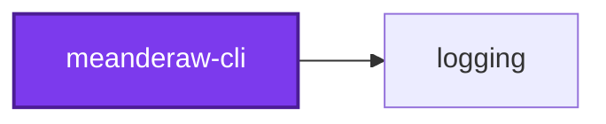
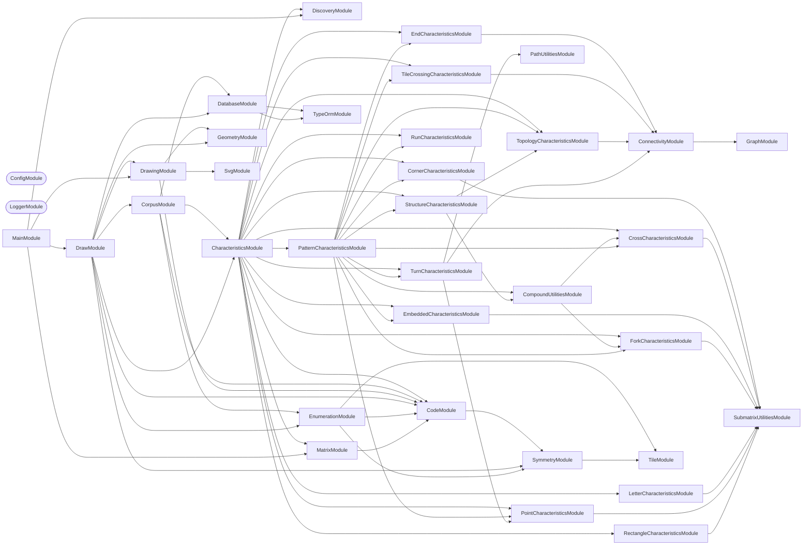

## Start

```bash
nx run codebase:postgres-container:up
nx run meanderaw-cli:start
```

The local Postgres container creates the `meanderaw_development` database, and the schema of
the same name inside it, the first time its volume starts empty; on a volume that predates
that, `nx run codebase:postgres-container:recreate` builds it, discarding what the volume
held. The connection is the `MEANDERAW_POSTGRES_HOST`, `MEANDERAW_POSTGRES_PORT`,
`MEANDERAW_POSTGRES_USER`, `MEANDERAW_POSTGRES_PASSWORD`, `MEANDERAW_POSTGRES_DB`, and
`MEANDERAW_POSTGRES_SCHEMA` variables, set in this project's `.env` (copied from
`.env.default`) and defaulting to the local container — `meanderaw_development` for the last
two. The `MEANDERAW_` prefix keeps them apart from the unprefixed `MEANDERAW_POSTGRES_*` variables the
workspace root's `.env` sets for lexico, which Nx also loads into every task.

## 🖌️ One Command

Meanderaw has one command, `draw`, and it is the default — so `nx run meanderaw-cli:start` runs it.
Both of its modes write the Postgres database `MEANDERAW_POSTGRES_DB` names, and which one runs is
decided by whether a Code was named:

| Invocation | What it does |
| ---------- | ------------ |
| `nx run meanderaw-cli:start` | Regenerates every meander the application can draw, as rows in that database — clearing the rows already there first, so it runs against the database as-is |
| `nx run meanderaw-cli:start --args="--rows <n> --columns <n> --code <code>"` | That one, as a single row in the same database |

The three flags of the single-drawing mode go together: `--code` is what
selects that mode over the draw run, and it is refused without both `--rows` and
`--columns`, since passing none of the three is how the draw run is asked for.

**There is nothing else to pass.** `--type`, `--modifier` and the parameters it carried
(`--strands`, `--branches`, `--direction`, `--flip`, `--offset`), `--sub-family`,
`--repeat-count`, and `--output-directory` are all retired with the procedural
generation they named a drawing in. A meander is addressed by its lattice address — its
Code, its rows, and its columns — and by nothing else.

## Test

```bash
nx run meanderaw-cli:vitest
```

## 🗂️ Output Layout

```text
output/
  index.html        the jump list, one link per pattern page
  patterns/*.html   every meander one pattern characteristic holds for, drawn
```

A draw run commits nothing. The rows live in Postgres rather than in the repository — see
[ADR 0020](../../../docs/adr/0020-store-meanders-in-postgres.md) — and the pages are written on
every draw run but gitignored: at the default edge budget's millions of rows they are gigabytes
of HTML, each page streamed to disk a batch of rows at a time because one pattern's page
outgrows a JavaScript string — see
[ADR 0021](../../../docs/adr/0021-stop-committing-the-meander-pages.md).

That is the whole of it, and the shrinking is the point of this design rather than a side
effect of it. `output/` used to hold 9,877 committed SVG files under ten family
directories, plus a 2 MB `index.html` linking them and a 9,883-line
`output/lattice-addresses.md` recording each drawing's Code — because several of those
directories' full Codes run past the 255-byte limit a filesystem imposes on one path component, which
forced six of the ten into a "shape-only" filename that dropped the Code entirely and
left the address table as the only place it survived. A database row has no such limit,
so the constraint is gone rather than worked around.

**Every row is reproducible from its own Code.** No drawing is stored: the generic
renderer draws a meander from its `code`, `rows`, and `columns` whenever
the index pages are built, so a row holds the Code and what was measured off it.

### What a row holds

A `meanders` row has one column per fact about the row itself, and one JSON map for
everything measured off it:

| Column | Type | Holds |
| ------ | ---- | ----- |
| `id` | uuid | A uuidv7 the database assigns on insert, so ids sort by when their rows were written |
| `code` | text | The formatted Code, such as `02x02y4488` — unique across the table |
| `rows` | integer | The band's row count |
| `columns` | integer | The repeat's column count |
| `lattice` | text | The Code's bare hexadecimal digits |
| `repeats` | integer | How many times the filed Code repeats its unit |
| `is_hardcoded` | boolean | True for a historical-corpus row or a `--code` drawing, false for an enumerated one |
| `characteristics` | jsonb | Every Characteristic, in one sparse map |

Columns are snake case, so raw SQL never quotes one.

**`characteristics` holds every Characteristic, and leaves out every zero and every
`false`.** A numeric key — a structural count such as `forkCount`, or a letter count such
as `aSoutheastLatinCount` — holds its value only when it is not zero, and a boolean key,
`isReducible` included, holds `true` only when it holds. Two dots in a two-row band,
`01x02y00`, store this and nothing else:

```json
{"bettiNumber0Count":2,"dotCount":2,"isDots":true}
```

So **a missing key means zero or `false`**. Read one as `characteristics.forkCount ?? 0`
in TypeScript, and as `COALESCE((characteristics ->> 'forkCount')::numeric, 0)` in raw
SQL — a bare `->>` is `NULL` for a missing key, and silently drops that row from any filter
on zero or less-than:

```sql
SELECT code FROM meanderaw_development.meanders -- the default MEANDERAW_POSTGRES_SCHEMA
WHERE COALESCE((characteristics ->> 'crossCount')::numeric, 0) = 0
  AND characteristics @> '{"isBars": true}';
```

A Characteristic added, renamed, or removed needs no schema change, which is why every one
of them shares the map rather than taking a column: see
[ADR 0018](../../../docs/adr/0018-store-every-characteristic-in-one-sparse-json-map.md).

**Nothing checks the database against a fresh draw run.** A drift check used to
run on every commit, and a `drawingHash` column fed it; both are gone, for now — see
[ADR 0019](../../../docs/adr/0019-drop-the-drift-check-and-the-drawing-hash.md). The one
property the schema enforces is that a Code is unique, so after changing the renderer, the
enumerator, or a Characteristic, regenerate the database with `nx run meanderaw-cli:start`.

**Two halves fill the table, told apart by `isHardcoded`, and they partition the corpus
rather than overlapping.**

- **Enumerated** — every structurally distinct repeat the lattice's edge budget admits,
  at each of the fourteen shapes it admits one at: 30,279 meanders, found by walking the
  space rather than by drawing a named shape. Which pattern characteristics hold for a
  row is measured off its own structure, and most rows hold none.
- **Hardcoded** — the 965 meanders of the historical corpus that lie _beyond_ that
  budget, preserved as Codes extracted once from the retired file tree and measured
  exactly as an enumerated row is. See `CorpusService.isPreserved` for exactly where the
  boundary sits and why the filter is by shape rather than by Code.

A duplicate lattice address within either half is a build failure rather than a convention
nobody checks: the formatted Code spells out the lattice, rows, and columns, so the unique
index over `code` refuses the second insert. Across the two, the hardcoded corpus is
ingested first and the draw run skips any Code a hardcoded row already holds, so a hardcoded
meander keeps its row.

`output/index.html` and the pattern pages beside it are rebuilt from the database at the
end of every draw run, and are gitignored rather than committed; nothing checks a draw run
against a committed copy. `.codometerignore`, `.prettierignore`, and `cspell` all leave
the directory alone.

## 🏛️ Meander Charter

Every meander shares a set of properties that describe how it looks. The charter was
measured over the ten generator families this project once drew, which are retired — see
[ADR 0022](../../../docs/adr/0022-filter-meanders-by-characteristics-alone.md) — so the
family names below record where each measurement came from. Three of those properties — orthogonality, space-filling channels, and the band
model — are **guaranteed by construction**: no assignment of direction bits to a lattice
can violate them, so no family gates them and none ever could. The other two — branching
and crossing — are **demoted to measured characteristics**, `hasTJunctions` and
`hasXJunctions`, rather than kept as invariants with declared exceptions: whether a
family's ink branches or crosses is measured, never gated, and a family is free to do
either as much as its own structure earns.

The counts below were extracted from the ten families as they stand, by measuring every
committed SVG rather than by reading the code — the method a declared-invariant framework
once formalized and that this section keeps as the record of why each family's ink looks
the way it does. `cross` crosses, and `negative`, `branch`, and `parallel` all branch — in
different shapes. `negative` crosses too, in three of its ten modes, and that is not a
second family creeping in: a survey of the retired `mosaic` space found that 3,070 of the 3,179 `mosaic` tiles it measured have a
crossing negative, so a `negative` family that crossed nowhere was drawing the 3.3%
minority of its own source space.

`parallel` was the exception until this corpus was drawn: it branched nowhere. **That
changed.** Ruling both borders of its band — the same closing `branch` takes, though there
the rules stand a lattice row clear of the ink — meets each strand's rising end with west,
east, and south ink at one lattice point, so 642 of its 786 drawings fork. Not every
drawing forks: the other 144 are the `serpentine` drawings whose first and last strips are
each one lattice row deep, where the flat ribbon on such a strip _is_ the rule and nothing
rises to meet it — a **structural condition** rather than a blanket count. See
`docs/adr/0006-close-both-band-borders-in-branch-and-parallel.md` for why both borders were
closed and what it cost.

`mosaic` branches and crosses too, and only in its **enumerated half alone** — which is now
the whole of it. Its unit space is every assignment of direction bits over a lattice, and
most of that space branches and crosses; the four named modes it once had, `plain`,
`split`, `alternated`, and `dot`, did neither, and they are gone. This is still recorded in
`meander-topology.service.integration.test.ts` with a `permutations` flag, measured from
committed output rather than from a generated drawing.

| # | Invariant | Status |
| --- | --- | --- |
| 1 | **Orthogonal only** — horizontal and vertical movement, no diagonals | Guaranteed by construction |
| 2 | **Space-filling** — every interior white channel is exactly one stroke width | Guaranteed by construction |
| 3 | **No branching** — ink contains no T-junctions | Demoted to characteristic `hasTJunctions` — present in `branch` in every mode, in `negative` in every mode but `ruled-closed`, in `parallel` wherever a border strip has depth, in `mosaic` across its enumerated half, and in `chain` and `snake` under `edge` and `edge-flip` |
| 4 | **No crossing** — ink contains no X-junctions | Demoted to characteristic `hasXJunctions` — present in `cross` except under `interrupted`, in `mosaic` across its enumerated half, and in `negative` under `brick-straight`, `brick-upright`, and `grid` |
| 5 | **Band, not field** — fixed canvas height, `rows` is density, tiling is horizontal | Guaranteed by construction |
| 6 | **Flat path model** — unordered paths, no z-order, one stroke width per document | May be relaxed by ADR only |
| 7 | Invariants hold within a band, not at its termination | See [#338](https://github.com/Organizzolini/codebase/issues/338) |

What the measurements found. They were taken across the 114 named patterns and 3,179
enumerated `mosaic` tiles that existed before `cross`; every count below is restated
against the corpus as it now stands, 1,118 named patterns beside 8,759 enumerated tiles.
The named half was 174 until the draw run's row range was raised to the command line's own,
and it has moved with every family that gained a mode or a parameter since — and, when
closing both band borders left four names drawing what another name already drew, with the
four that were deleted, and again with `branch`'s six two-row drawings, which insetting
that family's figure from its own rules put below its structural minimum; the enumerated
half was 3,554 until `mosaic` was capped at 6 rows, 449 after that, and 8,759 once that
family's matching rule was replaced by an edge budget over a lattice. Most of these counts
have moved several times for those reasons alone — see the note under "Meander Charter"
above:

- **Every interior white channel is exactly one stroke width**, in all 9,877 files. The
  channel width equals the stroke width equals half a grid unit, and that single number
  is the same in every document the project has ever written — the stroke is `unit / 2`
  at every row count, in every family, at every ply of `parallel`. #340 and #413 both
  inferred from this that drawing `N` strands would mean `strokeWidth = unit / (2N)`;
  that inference is wrong and is discarded, for the reasons under "The Parallel Family"
  below.
- **Ink never crosses itself, except where a family was added to make it.** Zero
  X-junctions across all 138 named drawings the six original families produce — a stronger
  statement than "non-self-intersecting", and the sharpest single characterization of what
  those six have in common. The `cross` family relaxes it deliberately: 12 X-junctions in
  each of the seven solid documents it commits. `negative` relaxes it too, in three of its
  ten modes and 30 of its 100 documents — `brick-straight` is stack bond, whose mortar runs
  unbroken both ways where running bond's does not, `grid` inverts the `dots` sub-family,
  and `brick-upright` inverts `diamond` — for 705 X-junctions between them. Its permutation
  half crosses in 136 of its 208 drawings, which is the same finding at the scale of a
  whole space rather than of three named modes. Nowhere else in the 9,877-file corpus.
  `cross` carries twelve at every one of its row counts, 6 through 12, so its count is a
  property of the repeat count rather than of `rows`.
- **Ink branches in four places, and only there.** 22,918 T-junctions across 848 of the
  1,118 named patterns. 360 of them, across 36 patterns, are `chain` and `snake` under
  `edge` and `edge-flip`, ten per document at every row count: the `edge` family widens the
  repeat unit past the zigzag it contains, so the zigzag's terminating vertical lands in
  the _interior_ of the band border rather than at its end, and the border runs on either
  side of it — five such junctions along the top border, five along the bottom. An earlier
  reading of this measurement reported zero everywhere; the reference assets are
  hand-verified ground truth for what these patterns should look like, so the geometry is
  right and the count was wrong. The other 22,558 are the point of three families rather
  than a side effect of anything: 3,054 across the `negative` family's 90 branching
  documents, 2,130 across all 80 of `branch`'s, and 17,374 across 642 of `parallel`'s 786
  — see "The Negative Space Family", "The Branching Family", and "The Parallel Family"
  below.
- **The corpus was a forest with a few trees in it, and now it has none.** Read as a
  graph, a document's ink is lattice points joined by one-pitch steps, and a **tree** is
  the case where those points form one connected piece with `edges = nodes − 1`. Until
  both border rules were closed the corpus held 110 of them — `branch`'s 88, which were
  spanning trees of the band's lattice, and the 22 one-strand `serpentine` drawings, each
  a single ribbon that simply did not end before the band did. Both routes ran through an
  open border, and ruling both borders closed both — but not the same way, which is the
  part worth keeping. A ribbon that meets a rule at each end closes a loop, so it leaves
  the tree set by gaining an edge. `branch` briefly left it that way too, and now leaves
  it by falling apart instead: its figure is inset by a lattice row from every rule beside
  it, so each rule is a piece of its own and the drawing is a forest of two or three. By
  either route, **not one of the 9,877 committed documents is a tree**. 5,817 of the
  9,877 are forests of many components and 4,060 carry a loop, where before the two halves
  stood at 6,390 and 3,418. What was measured is still the
  interesting thing — a corpus this large containing exactly two shapes of ink graph — and
  the trees turn out to have been an artifact of two families having a border left open.
- **The negative space branches and crosses freely.** It branches in every family, and it
  genuinely crosses in 203 of the 1,118 named drawings — every one of them `parallel`
  under `serpentine` — and in the `diamond` sub-family, which is the shape the `mosaic
  split` modifier drew before that family stopped drawing motifs. Crossing patterns
  are already generated here; they have only ever been white, never ink.

Invariant 1 is not merely local convention. Fréart's rule for the classical meander is
that returns and intersections "do always fall into right angles", quoted in the
[ICAA's article on the complex Greek meander](https://www.classicist.org/articles/classical-comments-the-complex-greek-meander/).

Invariant 5 is fixed because the intended use is **borders**. Two-dimensional field
ornament is excluded for that reason, not because it is uninteresting.

Wider-than-one-stroke gaps occur only where a band terminates, which is
[#338](https://github.com/Organizzolini/codebase/issues/338) and is not a family
property.

**The named half of the draw run runs to each family's own `FAMILY_MAXIMUM_ROWS`**, which is
the same record the command line validates against — so every drawing the command line can
be asked for is also a drawing this repository commits and the charter gates: 1,118
combinations, each family from its own structural minimum through its own ceiling. That
ceiling is the shared `MAXIMUM_VALUE` of 12 for nine of the ten families, and 6 for
`mosaic`, whose reasons are below.

It stopped at 8 until [#507](https://github.com/Organizzolini/codebase/issues/507), and that
issue lived in the four row counts between — `chain` and `snake` drew self-retracing ink at
9 through 12 rows, reachable from the command line by anybody and covered by nothing,
because the corpus stopped at 8 and the charter swept the corpus. Raising the draw run's range
to the command line's own closed the gap for both at once, which is why neither has a
maximum of its own any more. Most of the counts below moved by that change and nothing else.

**Neither permutation half followed, and `mosaic` as a whole did not either.** Both halves
stop at 6 rows, at 8,551 tiles and 208 sources. They enumerate their spaces exhaustively
rather than sampling them, and `mosaic`'s count grows about 3.4× per row — 23, 68 and 199
at rows 4 through 6, then 660, 2,229, 7,977, 29,002, 108,089 and 406,934 — so following the
other nine families to 12 would mean committing 554,891 more files. `negative`'s own growth
is about 2.4× per row — 8, 18, 40 and 93, then 216, 513, 1,218, 2,920, 7,000 and 16,850.

That cap is why the `mosaic` family stops at 6 rows everywhere rather than only in its
permutation half. A budget that applied to the enumeration alone would leave `mosaic` at 7
through 12 rows reachable from the command line and committed nowhere — which is exactly
the shape of #507. So the cap is `FAMILY_MAXIMUM_ROWS.mosaic`, the named half reads it, and
`--type mosaic --rows 7` is refused rather than drawn outside the corpus the charter gates.
`negative` keeps its ceiling of 12 as a named family; only its enumerated half stops at 6,
and its deepest row count there inverts a seven-row source that is enumerable but no longer
committed — so the corridor-identity gate covers rows 3 through 5 of that half and the
charter sweep covers the rest, exactly as it already does for the named `negative` drawings
above 6 rows.

## 👔 Conformetry

This project was generated from the [nestjs-command-project](../../../configuration/conformetry-templates/nestjs-command-project) conformetry template.

<!-- callidescope:start -->

## 🔭 Callidescope

Call stacks traced through `applications/meanderaw/meanderaw-cli`, deepest first. Each frame shows what it takes, what it returns, and what its documentation says.

| Measure | Value |
| --- | --- |
| Callables | 857 |
| Files | 256 |
| Calls traced | 751 |
| Call stacks | 119 |
| Deepest stack | 16 |
| Stacks through recursion | 0 |
| Unfollowable calls | 26 |

### Limits

What this project is judged against, as declared in its own `callidescope.config.ts`.

| Limit | Value |
| --- | --- |
| `maximumDepth` | 16 |
| `maximumBreadth` | 14 |

### Call stacks (depth)

**1. `DrawCommand.run`** — depth ≥ 16 · decorated-method

```text
🚀 DrawCommand.run(_passedParameters: string[], options: DrawCommandOptions): Promise<void> [applications/meanderaw/meanderaw-cli/src/modules/draw/draw.command.ts:218]
   ↳ Draws every meander into the database when no Code is named, or draws the one `--code` names.
  └─> DrawCommand.drawAll(): Promise<void> [applications/meanderaw/meanderaw-cli/src/modules/draw/draw.command.ts:109]
     ↳ Draws every meander the application can draw, as rows in the local database.
    └─> DrawEnumerationService.drawAll(): Promise<number> [applications/meanderaw/meanderaw-cli/src/modules/draw/draw-enumeration.service.ts:51]
       ↳ Every shape the budget admits, drawn and written — which is what `draw` with no drawing named now does.
      └─> DrawEnumerationService.persist(shapes: readonly MeanderShape[]): Promise<number> [applications/meanderaw/meanderaw-cli/src/modules/draw/draw-enumeration.service.ts:73]
         ↳ Draws the shapes named and writes every meander they hold, a batch of rows at a time as the pool hands them back,…
        └─> DrawPoolService.batches(shape: MeanderShape): AsyncGenerator<readonly MeanderRecord[]> [applications/meanderaw/meanderaw-cli/src/modules/draw/draw-pool.service.ts:186]
           ↳ Every meander of one shape as the rows the database holds for them, a batch at a time, one per symmetry class, in the…
          └─> DrawWorkerService.records(shape: MeanderShape, masks: readonly number[]): MeanderRecord[] [applications/meanderaw/meanderaw-cli/src/modules/draw/draw-worker.service.ts:48]
             ↳ Every mask's meander as an enumerated row, in the order the masks were given.
            └─> DrawWorkerService.map(…)(mask: number): MeanderRecord [applications/meanderaw/meanderaw-cli/src/modules/draw/draw-worker.service.ts:49]
              └─> DrawRecordService.record(…): MeanderRecord [applications/meanderaw/meanderaw-cli/src/modules/draw/draw-record.service.ts:50]
                 ↳ The row one Code describes at one shape, every field of it derived from that Code alone.
                └─> CharacteristicsService.compute(code: Code | CodeObject): Characteristics [applications/meanderaw/meanderaw-cli/src/modules/characteristics/characteristics.service.ts:219]
                   ↳ Every characteristic of a Code's repeating unit, computed by every evaluator from one shared context.
                  └─> CharacteristicContextService.create(code: Code | CodeObject): CharacteristicContext [applications/meanderaw/meanderaw-cli/src/modules/characteristics/characteristic-context.service.ts:66]
                     ↳ Builds the context for the repeating unit of a formatted Code string or an already parsed Code.
                    └─> CharacteristicContextService.build(code: CodeObject): CharacteristicContext [applications/meanderaw/meanderaw-cli/src/modules/characteristics/characteristic-context.service.ts:39]
                       ↳ Builds the context for exactly the Code given, with its digits re-spelled from its decoded matrix.
                      └─> MatrixService.fromCode(code: Code | CodeObject, rows?: number, columns?: number): Matrix [applications/meanderaw/meanderaw-cli/src/modules/matrix/matrix.service.ts:65]
                         ↳ Converts a meander Code string (self-contained formatted or bare hexadecimal digits with dimensions) or a `CodeObject`…
                        └─> CodeService.parse(code: Code, rows?: number, columns?: number): CodeObject [applications/meanderaw/meanderaw-cli/src/modules/code/code.service.ts:215]
                           ↳ Reads `code`, either as a self-contained string formatted as `{columns}x{rows}y{digits}r{repeats}` or as bare…
                          └─> CodeService.parseFormatted(match: RegExpExecArray): CodeObject [applications/meanderaw/meanderaw-cli/src/modules/code/code.service.ts:102]
                             ↳ Parses a self-contained code string match into a `CodeObject`.
                            └─> CodeService.validateDigits(digits: string, rows: number, columns: number): void [applications/meanderaw/meanderaw-cli/src/modules/code/code.service.ts:125]
                               ↳ Validates that digits match expected length for the shape and are valid hexadecimal.
                              └─> InvalidCodeLengthError.constructor(code: string, rows: number, columns: number): InvalidCodeLengthError [applications/meanderaw/meanderaw-cli/src/modules/code/code.constants.ts:50]
```

**2. `AinArabicLetterCharacteristicsService.constructor`** — depth ≥ 14 · orphan-root

```text
🚀 AinArabicLetterCharacteristicsService.constructor(…): AinArabicLetterCharacteristicsService [applications/meanderaw/meanderaw-cli/src/modules/characteristics/submatrix/letter/ain-arabic-letter-characteristics.service.ts:21]
  └─> LetterUtilitiesService.formEvaluators(forms: readonly LetterDefinition[]): readonly CharacteristicEvaluator<number>[] [applications/meanderaw/meanderaw-cli/src/modules/characteristics/submatrix/letter/letter-utilities.service.ts:349]
     ↳ The evaluators of a letter drawn as several base templates — an Arabic letter's positional forms — each form's sixteen…
    └─> LetterUtilitiesService.flatMap(…)(…): readonly CharacteristicEvaluator<number>[] [applications/meanderaw/meanderaw-cli/src/modules/characteristics/submatrix/letter/letter-utilities.service.ts:352]
      └─> LetterUtilitiesService.evaluators(definition: LetterDefinition): readonly CharacteristicEvaluator<number>[] [applications/meanderaw/meanderaw-cli/src/modules/characteristics/submatrix/letter/letter-utilities.service.ts:288]
         ↳ A letter's sixteen evaluators, one per orientation in {@link LetterUtilitiesService.orientationNames} order.
        └─> LetterUtilitiesService.orientations(…): readonly LetterOrientation[] [applications/meanderaw/meanderaw-cli/src/modules/characteristics/submatrix/letter/letter-utilities.service.ts:374]
           ↳ A base template drawn in all sixteen orientations, in {@link LetterUtilitiesService.orientationNames} order.
          └─> LetterUtilitiesService.map(…)(…): LetterOrientation [applications/meanderaw/meanderaw-cli/src/modules/characteristics/submatrix/letter/letter-utilities.service.ts:379]
            └─> LetterUtilitiesService.orientation(…): LetterOrientation [applications/meanderaw/meanderaw-cli/src/modules/characteristics/submatrix/letter/letter-utilities.service.ts:208]
               ↳ A base template facing `base` drawn in the orientation `name`: flipped to its corner, then turned.
              └─> LetterUtilitiesService.turnClockwise(template: readonly string[], rotation: LetterRotation): readonly string[] [applications/meanderaw/meanderaw-cli/src/modules/characteristics/submatrix/letter/letter-utilities.service.ts:388]
                 ↳ Turns a template clockwise by `rotation`, carrying each arm round with it; a quarter or three-quarter turn swaps its…
                └─> LetterUtilitiesService.reduce(…)(turned: readonly string[]): string[] [applications/meanderaw/meanderaw-cli/src/modules/characteristics/submatrix/letter/letter-utilities.service.ts:394]
                  └─> LetterUtilitiesService.turnQuarter(template: readonly string[]): string[] [applications/meanderaw/meanderaw-cli/src/modules/characteristics/submatrix/letter/letter-utilities.service.ts:262]
                     ↳ Turns a template one quarter clockwise: its west column becomes its top row, and each arm moves round — north to east,…
                    └─> LetterUtilitiesService.from(…)(_unused: unknown, column: number): string [applications/meanderaw/meanderaw-cli/src/modules/characteristics/submatrix/letter/letter-utilities.service.ts:265]
                      └─> LetterUtilitiesService.map(…)(line: string): string [applications/meanderaw/meanderaw-cli/src/modules/characteristics/submatrix/letter/letter-utilities.service.ts:267]
                        └─> LetterUtilitiesService.mapArms(character: string, arms: Readonly<Record<number, number>>): string [applications/meanderaw/meanderaw-cli/src/modules/characteristics/submatrix/letter/letter-utilities.service.ts:192]
                           ↳ Rewrites a template digit's arms through `arms`, which maps each arm bit — north 8, south 4, east 2, west 1 — to the…
                          └─> LetterUtilitiesService.reduce(…)(sum: number, arm: number): number [applications/meanderaw/meanderaw-cli/src/modules/characteristics/submatrix/letter/letter-utilities.service.ts:203]
```

**3. `AlefArabicLetterCharacteristicsService.constructor`** — depth ≥ 14 · orphan-root

```text
🚀 AlefArabicLetterCharacteristicsService.constructor(…): AlefArabicLetterCharacteristicsService [applications/meanderaw/meanderaw-cli/src/modules/characteristics/submatrix/letter/alef-arabic-letter-characteristics.service.ts:22]
  └─> LetterUtilitiesService.formEvaluators(forms: readonly LetterDefinition[]): readonly CharacteristicEvaluator<number>[] [applications/meanderaw/meanderaw-cli/src/modules/characteristics/submatrix/letter/letter-utilities.service.ts:349]
     ↳ The evaluators of a letter drawn as several base templates — an Arabic letter's positional forms — each form's sixteen…
    └─> LetterUtilitiesService.flatMap(…)(…): readonly CharacteristicEvaluator<number>[] [applications/meanderaw/meanderaw-cli/src/modules/characteristics/submatrix/letter/letter-utilities.service.ts:352]
      └─> LetterUtilitiesService.evaluators(definition: LetterDefinition): readonly CharacteristicEvaluator<number>[] [applications/meanderaw/meanderaw-cli/src/modules/characteristics/submatrix/letter/letter-utilities.service.ts:288]
         ↳ A letter's sixteen evaluators, one per orientation in {@link LetterUtilitiesService.orientationNames} order.
        └─> LetterUtilitiesService.orientations(…): readonly LetterOrientation[] [applications/meanderaw/meanderaw-cli/src/modules/characteristics/submatrix/letter/letter-utilities.service.ts:374]
           ↳ A base template drawn in all sixteen orientations, in {@link LetterUtilitiesService.orientationNames} order.
          └─> LetterUtilitiesService.map(…)(…): LetterOrientation [applications/meanderaw/meanderaw-cli/src/modules/characteristics/submatrix/letter/letter-utilities.service.ts:379]
            └─> LetterUtilitiesService.orientation(…): LetterOrientation [applications/meanderaw/meanderaw-cli/src/modules/characteristics/submatrix/letter/letter-utilities.service.ts:208]
               ↳ A base template facing `base` drawn in the orientation `name`: flipped to its corner, then turned.
              └─> LetterUtilitiesService.turnClockwise(template: readonly string[], rotation: LetterRotation): readonly string[] [applications/meanderaw/meanderaw-cli/src/modules/characteristics/submatrix/letter/letter-utilities.service.ts:388]
                 ↳ Turns a template clockwise by `rotation`, carrying each arm round with it; a quarter or three-quarter turn swaps its…
                └─> LetterUtilitiesService.reduce(…)(turned: readonly string[]): string[] [applications/meanderaw/meanderaw-cli/src/modules/characteristics/submatrix/letter/letter-utilities.service.ts:394]
                  └─> LetterUtilitiesService.turnQuarter(template: readonly string[]): string[] [applications/meanderaw/meanderaw-cli/src/modules/characteristics/submatrix/letter/letter-utilities.service.ts:262]
                     ↳ Turns a template one quarter clockwise: its west column becomes its top row, and each arm moves round — north to east,…
                    └─> LetterUtilitiesService.from(…)(_unused: unknown, column: number): string [applications/meanderaw/meanderaw-cli/src/modules/characteristics/submatrix/letter/letter-utilities.service.ts:265]
                      └─> LetterUtilitiesService.map(…)(line: string): string [applications/meanderaw/meanderaw-cli/src/modules/characteristics/submatrix/letter/letter-utilities.service.ts:267]
                        └─> LetterUtilitiesService.mapArms(character: string, arms: Readonly<Record<number, number>>): string [applications/meanderaw/meanderaw-cli/src/modules/characteristics/submatrix/letter/letter-utilities.service.ts:192]
                           ↳ Rewrites a template digit's arms through `arms`, which maps each arm bit — north 8, south 4, east 2, west 1 — to the…
                          └─> LetterUtilitiesService.reduce(…)(sum: number, arm: number): number [applications/meanderaw/meanderaw-cli/src/modules/characteristics/submatrix/letter/letter-utilities.service.ts:203]
```

<details>
<summary>116 more call stacks</summary>

**4. `BehArabicLetterCharacteristicsService.constructor`** — depth ≥ 14 · orphan-root

```text
🚀 BehArabicLetterCharacteristicsService.constructor(…): BehArabicLetterCharacteristicsService [applications/meanderaw/meanderaw-cli/src/modules/characteristics/submatrix/letter/beh-arabic-letter-characteristics.service.ts:21]
  └─> LetterUtilitiesService.formEvaluators(forms: readonly LetterDefinition[]): readonly CharacteristicEvaluator<number>[] [applications/meanderaw/meanderaw-cli/src/modules/characteristics/submatrix/letter/letter-utilities.service.ts:349]
     ↳ The evaluators of a letter drawn as several base templates — an Arabic letter's positional forms — each form's sixteen…
    └─> LetterUtilitiesService.flatMap(…)(…): readonly CharacteristicEvaluator<number>[] [applications/meanderaw/meanderaw-cli/src/modules/characteristics/submatrix/letter/letter-utilities.service.ts:352]
      └─> LetterUtilitiesService.evaluators(definition: LetterDefinition): readonly CharacteristicEvaluator<number>[] [applications/meanderaw/meanderaw-cli/src/modules/characteristics/submatrix/letter/letter-utilities.service.ts:288]
         ↳ A letter's sixteen evaluators, one per orientation in {@link LetterUtilitiesService.orientationNames} order.
        └─> LetterUtilitiesService.orientations(…): readonly LetterOrientation[] [applications/meanderaw/meanderaw-cli/src/modules/characteristics/submatrix/letter/letter-utilities.service.ts:374]
           ↳ A base template drawn in all sixteen orientations, in {@link LetterUtilitiesService.orientationNames} order.
          └─> LetterUtilitiesService.map(…)(…): LetterOrientation [applications/meanderaw/meanderaw-cli/src/modules/characteristics/submatrix/letter/letter-utilities.service.ts:379]
            └─> LetterUtilitiesService.orientation(…): LetterOrientation [applications/meanderaw/meanderaw-cli/src/modules/characteristics/submatrix/letter/letter-utilities.service.ts:208]
               ↳ A base template facing `base` drawn in the orientation `name`: flipped to its corner, then turned.
              └─> LetterUtilitiesService.turnClockwise(template: readonly string[], rotation: LetterRotation): readonly string[] [applications/meanderaw/meanderaw-cli/src/modules/characteristics/submatrix/letter/letter-utilities.service.ts:388]
                 ↳ Turns a template clockwise by `rotation`, carrying each arm round with it; a quarter or three-quarter turn swaps its…
                └─> LetterUtilitiesService.reduce(…)(turned: readonly string[]): string[] [applications/meanderaw/meanderaw-cli/src/modules/characteristics/submatrix/letter/letter-utilities.service.ts:394]
                  └─> LetterUtilitiesService.turnQuarter(template: readonly string[]): string[] [applications/meanderaw/meanderaw-cli/src/modules/characteristics/submatrix/letter/letter-utilities.service.ts:262]
                     ↳ Turns a template one quarter clockwise: its west column becomes its top row, and each arm moves round — north to east,…
                    └─> LetterUtilitiesService.from(…)(_unused: unknown, column: number): string [applications/meanderaw/meanderaw-cli/src/modules/characteristics/submatrix/letter/letter-utilities.service.ts:265]
                      └─> LetterUtilitiesService.map(…)(line: string): string [applications/meanderaw/meanderaw-cli/src/modules/characteristics/submatrix/letter/letter-utilities.service.ts:267]
                        └─> LetterUtilitiesService.mapArms(character: string, arms: Readonly<Record<number, number>>): string [applications/meanderaw/meanderaw-cli/src/modules/characteristics/submatrix/letter/letter-utilities.service.ts:192]
                           ↳ Rewrites a template digit's arms through `arms`, which maps each arm bit — north 8, south 4, east 2, west 1 — to the…
                          └─> LetterUtilitiesService.reduce(…)(sum: number, arm: number): number [applications/meanderaw/meanderaw-cli/src/modules/characteristics/submatrix/letter/letter-utilities.service.ts:203]
```

**5. `DalArabicLetterCharacteristicsService.constructor`** — depth ≥ 14 · orphan-root

```text
🚀 DalArabicLetterCharacteristicsService.constructor(…): DalArabicLetterCharacteristicsService [applications/meanderaw/meanderaw-cli/src/modules/characteristics/submatrix/letter/dal-arabic-letter-characteristics.service.ts:21]
  └─> LetterUtilitiesService.formEvaluators(forms: readonly LetterDefinition[]): readonly CharacteristicEvaluator<number>[] [applications/meanderaw/meanderaw-cli/src/modules/characteristics/submatrix/letter/letter-utilities.service.ts:349]
     ↳ The evaluators of a letter drawn as several base templates — an Arabic letter's positional forms — each form's sixteen…
    └─> LetterUtilitiesService.flatMap(…)(…): readonly CharacteristicEvaluator<number>[] [applications/meanderaw/meanderaw-cli/src/modules/characteristics/submatrix/letter/letter-utilities.service.ts:352]
      └─> LetterUtilitiesService.evaluators(definition: LetterDefinition): readonly CharacteristicEvaluator<number>[] [applications/meanderaw/meanderaw-cli/src/modules/characteristics/submatrix/letter/letter-utilities.service.ts:288]
         ↳ A letter's sixteen evaluators, one per orientation in {@link LetterUtilitiesService.orientationNames} order.
        └─> LetterUtilitiesService.orientations(…): readonly LetterOrientation[] [applications/meanderaw/meanderaw-cli/src/modules/characteristics/submatrix/letter/letter-utilities.service.ts:374]
           ↳ A base template drawn in all sixteen orientations, in {@link LetterUtilitiesService.orientationNames} order.
          └─> LetterUtilitiesService.map(…)(…): LetterOrientation [applications/meanderaw/meanderaw-cli/src/modules/characteristics/submatrix/letter/letter-utilities.service.ts:379]
            └─> LetterUtilitiesService.orientation(…): LetterOrientation [applications/meanderaw/meanderaw-cli/src/modules/characteristics/submatrix/letter/letter-utilities.service.ts:208]
               ↳ A base template facing `base` drawn in the orientation `name`: flipped to its corner, then turned.
              └─> LetterUtilitiesService.turnClockwise(template: readonly string[], rotation: LetterRotation): readonly string[] [applications/meanderaw/meanderaw-cli/src/modules/characteristics/submatrix/letter/letter-utilities.service.ts:388]
                 ↳ Turns a template clockwise by `rotation`, carrying each arm round with it; a quarter or three-quarter turn swaps its…
                └─> LetterUtilitiesService.reduce(…)(turned: readonly string[]): string[] [applications/meanderaw/meanderaw-cli/src/modules/characteristics/submatrix/letter/letter-utilities.service.ts:394]
                  └─> LetterUtilitiesService.turnQuarter(template: readonly string[]): string[] [applications/meanderaw/meanderaw-cli/src/modules/characteristics/submatrix/letter/letter-utilities.service.ts:262]
                     ↳ Turns a template one quarter clockwise: its west column becomes its top row, and each arm moves round — north to east,…
                    └─> LetterUtilitiesService.from(…)(_unused: unknown, column: number): string [applications/meanderaw/meanderaw-cli/src/modules/characteristics/submatrix/letter/letter-utilities.service.ts:265]
                      └─> LetterUtilitiesService.map(…)(line: string): string [applications/meanderaw/meanderaw-cli/src/modules/characteristics/submatrix/letter/letter-utilities.service.ts:267]
                        └─> LetterUtilitiesService.mapArms(character: string, arms: Readonly<Record<number, number>>): string [applications/meanderaw/meanderaw-cli/src/modules/characteristics/submatrix/letter/letter-utilities.service.ts:192]
                           ↳ Rewrites a template digit's arms through `arms`, which maps each arm bit — north 8, south 4, east 2, west 1 — to the…
                          └─> LetterUtilitiesService.reduce(…)(sum: number, arm: number): number [applications/meanderaw/meanderaw-cli/src/modules/characteristics/submatrix/letter/letter-utilities.service.ts:203]
```

**6. `FehArabicLetterCharacteristicsService.constructor`** — depth ≥ 14 · orphan-root

```text
🚀 FehArabicLetterCharacteristicsService.constructor(…): FehArabicLetterCharacteristicsService [applications/meanderaw/meanderaw-cli/src/modules/characteristics/submatrix/letter/feh-arabic-letter-characteristics.service.ts:21]
  └─> LetterUtilitiesService.formEvaluators(forms: readonly LetterDefinition[]): readonly CharacteristicEvaluator<number>[] [applications/meanderaw/meanderaw-cli/src/modules/characteristics/submatrix/letter/letter-utilities.service.ts:349]
     ↳ The evaluators of a letter drawn as several base templates — an Arabic letter's positional forms — each form's sixteen…
    └─> LetterUtilitiesService.flatMap(…)(…): readonly CharacteristicEvaluator<number>[] [applications/meanderaw/meanderaw-cli/src/modules/characteristics/submatrix/letter/letter-utilities.service.ts:352]
      └─> LetterUtilitiesService.evaluators(definition: LetterDefinition): readonly CharacteristicEvaluator<number>[] [applications/meanderaw/meanderaw-cli/src/modules/characteristics/submatrix/letter/letter-utilities.service.ts:288]
         ↳ A letter's sixteen evaluators, one per orientation in {@link LetterUtilitiesService.orientationNames} order.
        └─> LetterUtilitiesService.orientations(…): readonly LetterOrientation[] [applications/meanderaw/meanderaw-cli/src/modules/characteristics/submatrix/letter/letter-utilities.service.ts:374]
           ↳ A base template drawn in all sixteen orientations, in {@link LetterUtilitiesService.orientationNames} order.
          └─> LetterUtilitiesService.map(…)(…): LetterOrientation [applications/meanderaw/meanderaw-cli/src/modules/characteristics/submatrix/letter/letter-utilities.service.ts:379]
            └─> LetterUtilitiesService.orientation(…): LetterOrientation [applications/meanderaw/meanderaw-cli/src/modules/characteristics/submatrix/letter/letter-utilities.service.ts:208]
               ↳ A base template facing `base` drawn in the orientation `name`: flipped to its corner, then turned.
              └─> LetterUtilitiesService.turnClockwise(template: readonly string[], rotation: LetterRotation): readonly string[] [applications/meanderaw/meanderaw-cli/src/modules/characteristics/submatrix/letter/letter-utilities.service.ts:388]
                 ↳ Turns a template clockwise by `rotation`, carrying each arm round with it; a quarter or three-quarter turn swaps its…
                └─> LetterUtilitiesService.reduce(…)(turned: readonly string[]): string[] [applications/meanderaw/meanderaw-cli/src/modules/characteristics/submatrix/letter/letter-utilities.service.ts:394]
                  └─> LetterUtilitiesService.turnQuarter(template: readonly string[]): string[] [applications/meanderaw/meanderaw-cli/src/modules/characteristics/submatrix/letter/letter-utilities.service.ts:262]
                     ↳ Turns a template one quarter clockwise: its west column becomes its top row, and each arm moves round — north to east,…
                    └─> LetterUtilitiesService.from(…)(_unused: unknown, column: number): string [applications/meanderaw/meanderaw-cli/src/modules/characteristics/submatrix/letter/letter-utilities.service.ts:265]
                      └─> LetterUtilitiesService.map(…)(line: string): string [applications/meanderaw/meanderaw-cli/src/modules/characteristics/submatrix/letter/letter-utilities.service.ts:267]
                        └─> LetterUtilitiesService.mapArms(character: string, arms: Readonly<Record<number, number>>): string [applications/meanderaw/meanderaw-cli/src/modules/characteristics/submatrix/letter/letter-utilities.service.ts:192]
                           ↳ Rewrites a template digit's arms through `arms`, which maps each arm bit — north 8, south 4, east 2, west 1 — to the…
                          └─> LetterUtilitiesService.reduce(…)(sum: number, arm: number): number [applications/meanderaw/meanderaw-cli/src/modules/characteristics/submatrix/letter/letter-utilities.service.ts:203]
```

**7. `HahArabicLetterCharacteristicsService.constructor`** — depth ≥ 14 · orphan-root

```text
🚀 HahArabicLetterCharacteristicsService.constructor(…): HahArabicLetterCharacteristicsService [applications/meanderaw/meanderaw-cli/src/modules/characteristics/submatrix/letter/hah-arabic-letter-characteristics.service.ts:21]
  └─> LetterUtilitiesService.formEvaluators(forms: readonly LetterDefinition[]): readonly CharacteristicEvaluator<number>[] [applications/meanderaw/meanderaw-cli/src/modules/characteristics/submatrix/letter/letter-utilities.service.ts:349]
     ↳ The evaluators of a letter drawn as several base templates — an Arabic letter's positional forms — each form's sixteen…
    └─> LetterUtilitiesService.flatMap(…)(…): readonly CharacteristicEvaluator<number>[] [applications/meanderaw/meanderaw-cli/src/modules/characteristics/submatrix/letter/letter-utilities.service.ts:352]
      └─> LetterUtilitiesService.evaluators(definition: LetterDefinition): readonly CharacteristicEvaluator<number>[] [applications/meanderaw/meanderaw-cli/src/modules/characteristics/submatrix/letter/letter-utilities.service.ts:288]
         ↳ A letter's sixteen evaluators, one per orientation in {@link LetterUtilitiesService.orientationNames} order.
        └─> LetterUtilitiesService.orientations(…): readonly LetterOrientation[] [applications/meanderaw/meanderaw-cli/src/modules/characteristics/submatrix/letter/letter-utilities.service.ts:374]
           ↳ A base template drawn in all sixteen orientations, in {@link LetterUtilitiesService.orientationNames} order.
          └─> LetterUtilitiesService.map(…)(…): LetterOrientation [applications/meanderaw/meanderaw-cli/src/modules/characteristics/submatrix/letter/letter-utilities.service.ts:379]
            └─> LetterUtilitiesService.orientation(…): LetterOrientation [applications/meanderaw/meanderaw-cli/src/modules/characteristics/submatrix/letter/letter-utilities.service.ts:208]
               ↳ A base template facing `base` drawn in the orientation `name`: flipped to its corner, then turned.
              └─> LetterUtilitiesService.turnClockwise(template: readonly string[], rotation: LetterRotation): readonly string[] [applications/meanderaw/meanderaw-cli/src/modules/characteristics/submatrix/letter/letter-utilities.service.ts:388]
                 ↳ Turns a template clockwise by `rotation`, carrying each arm round with it; a quarter or three-quarter turn swaps its…
                └─> LetterUtilitiesService.reduce(…)(turned: readonly string[]): string[] [applications/meanderaw/meanderaw-cli/src/modules/characteristics/submatrix/letter/letter-utilities.service.ts:394]
                  └─> LetterUtilitiesService.turnQuarter(template: readonly string[]): string[] [applications/meanderaw/meanderaw-cli/src/modules/characteristics/submatrix/letter/letter-utilities.service.ts:262]
                     ↳ Turns a template one quarter clockwise: its west column becomes its top row, and each arm moves round — north to east,…
                    └─> LetterUtilitiesService.from(…)(_unused: unknown, column: number): string [applications/meanderaw/meanderaw-cli/src/modules/characteristics/submatrix/letter/letter-utilities.service.ts:265]
                      └─> LetterUtilitiesService.map(…)(line: string): string [applications/meanderaw/meanderaw-cli/src/modules/characteristics/submatrix/letter/letter-utilities.service.ts:267]
                        └─> LetterUtilitiesService.mapArms(character: string, arms: Readonly<Record<number, number>>): string [applications/meanderaw/meanderaw-cli/src/modules/characteristics/submatrix/letter/letter-utilities.service.ts:192]
                           ↳ Rewrites a template digit's arms through `arms`, which maps each arm bit — north 8, south 4, east 2, west 1 — to the…
                          └─> LetterUtilitiesService.reduce(…)(sum: number, arm: number): number [applications/meanderaw/meanderaw-cli/src/modules/characteristics/submatrix/letter/letter-utilities.service.ts:203]
```

**8. `HehArabicLetterCharacteristicsService.constructor`** — depth ≥ 14 · orphan-root

```text
🚀 HehArabicLetterCharacteristicsService.constructor(…): HehArabicLetterCharacteristicsService [applications/meanderaw/meanderaw-cli/src/modules/characteristics/submatrix/letter/heh-arabic-letter-characteristics.service.ts:23]
  └─> LetterUtilitiesService.formEvaluators(forms: readonly LetterDefinition[]): readonly CharacteristicEvaluator<number>[] [applications/meanderaw/meanderaw-cli/src/modules/characteristics/submatrix/letter/letter-utilities.service.ts:349]
     ↳ The evaluators of a letter drawn as several base templates — an Arabic letter's positional forms — each form's sixteen…
    └─> LetterUtilitiesService.flatMap(…)(…): readonly CharacteristicEvaluator<number>[] [applications/meanderaw/meanderaw-cli/src/modules/characteristics/submatrix/letter/letter-utilities.service.ts:352]
      └─> LetterUtilitiesService.evaluators(definition: LetterDefinition): readonly CharacteristicEvaluator<number>[] [applications/meanderaw/meanderaw-cli/src/modules/characteristics/submatrix/letter/letter-utilities.service.ts:288]
         ↳ A letter's sixteen evaluators, one per orientation in {@link LetterUtilitiesService.orientationNames} order.
        └─> LetterUtilitiesService.orientations(…): readonly LetterOrientation[] [applications/meanderaw/meanderaw-cli/src/modules/characteristics/submatrix/letter/letter-utilities.service.ts:374]
           ↳ A base template drawn in all sixteen orientations, in {@link LetterUtilitiesService.orientationNames} order.
          └─> LetterUtilitiesService.map(…)(…): LetterOrientation [applications/meanderaw/meanderaw-cli/src/modules/characteristics/submatrix/letter/letter-utilities.service.ts:379]
            └─> LetterUtilitiesService.orientation(…): LetterOrientation [applications/meanderaw/meanderaw-cli/src/modules/characteristics/submatrix/letter/letter-utilities.service.ts:208]
               ↳ A base template facing `base` drawn in the orientation `name`: flipped to its corner, then turned.
              └─> LetterUtilitiesService.turnClockwise(template: readonly string[], rotation: LetterRotation): readonly string[] [applications/meanderaw/meanderaw-cli/src/modules/characteristics/submatrix/letter/letter-utilities.service.ts:388]
                 ↳ Turns a template clockwise by `rotation`, carrying each arm round with it; a quarter or three-quarter turn swaps its…
                └─> LetterUtilitiesService.reduce(…)(turned: readonly string[]): string[] [applications/meanderaw/meanderaw-cli/src/modules/characteristics/submatrix/letter/letter-utilities.service.ts:394]
                  └─> LetterUtilitiesService.turnQuarter(template: readonly string[]): string[] [applications/meanderaw/meanderaw-cli/src/modules/characteristics/submatrix/letter/letter-utilities.service.ts:262]
                     ↳ Turns a template one quarter clockwise: its west column becomes its top row, and each arm moves round — north to east,…
                    └─> LetterUtilitiesService.from(…)(_unused: unknown, column: number): string [applications/meanderaw/meanderaw-cli/src/modules/characteristics/submatrix/letter/letter-utilities.service.ts:265]
                      └─> LetterUtilitiesService.map(…)(line: string): string [applications/meanderaw/meanderaw-cli/src/modules/characteristics/submatrix/letter/letter-utilities.service.ts:267]
                        └─> LetterUtilitiesService.mapArms(character: string, arms: Readonly<Record<number, number>>): string [applications/meanderaw/meanderaw-cli/src/modules/characteristics/submatrix/letter/letter-utilities.service.ts:192]
                           ↳ Rewrites a template digit's arms through `arms`, which maps each arm bit — north 8, south 4, east 2, west 1 — to the…
                          └─> LetterUtilitiesService.reduce(…)(sum: number, arm: number): number [applications/meanderaw/meanderaw-cli/src/modules/characteristics/submatrix/letter/letter-utilities.service.ts:203]
```

**9. `KafArabicLetterCharacteristicsService.constructor`** — depth ≥ 14 · orphan-root

```text
🚀 KafArabicLetterCharacteristicsService.constructor(…): KafArabicLetterCharacteristicsService [applications/meanderaw/meanderaw-cli/src/modules/characteristics/submatrix/letter/kaf-arabic-letter-characteristics.service.ts:21]
  └─> LetterUtilitiesService.formEvaluators(forms: readonly LetterDefinition[]): readonly CharacteristicEvaluator<number>[] [applications/meanderaw/meanderaw-cli/src/modules/characteristics/submatrix/letter/letter-utilities.service.ts:349]
     ↳ The evaluators of a letter drawn as several base templates — an Arabic letter's positional forms — each form's sixteen…
    └─> LetterUtilitiesService.flatMap(…)(…): readonly CharacteristicEvaluator<number>[] [applications/meanderaw/meanderaw-cli/src/modules/characteristics/submatrix/letter/letter-utilities.service.ts:352]
      └─> LetterUtilitiesService.evaluators(definition: LetterDefinition): readonly CharacteristicEvaluator<number>[] [applications/meanderaw/meanderaw-cli/src/modules/characteristics/submatrix/letter/letter-utilities.service.ts:288]
         ↳ A letter's sixteen evaluators, one per orientation in {@link LetterUtilitiesService.orientationNames} order.
        └─> LetterUtilitiesService.orientations(…): readonly LetterOrientation[] [applications/meanderaw/meanderaw-cli/src/modules/characteristics/submatrix/letter/letter-utilities.service.ts:374]
           ↳ A base template drawn in all sixteen orientations, in {@link LetterUtilitiesService.orientationNames} order.
          └─> LetterUtilitiesService.map(…)(…): LetterOrientation [applications/meanderaw/meanderaw-cli/src/modules/characteristics/submatrix/letter/letter-utilities.service.ts:379]
            └─> LetterUtilitiesService.orientation(…): LetterOrientation [applications/meanderaw/meanderaw-cli/src/modules/characteristics/submatrix/letter/letter-utilities.service.ts:208]
               ↳ A base template facing `base` drawn in the orientation `name`: flipped to its corner, then turned.
              └─> LetterUtilitiesService.turnClockwise(template: readonly string[], rotation: LetterRotation): readonly string[] [applications/meanderaw/meanderaw-cli/src/modules/characteristics/submatrix/letter/letter-utilities.service.ts:388]
                 ↳ Turns a template clockwise by `rotation`, carrying each arm round with it; a quarter or three-quarter turn swaps its…
                └─> LetterUtilitiesService.reduce(…)(turned: readonly string[]): string[] [applications/meanderaw/meanderaw-cli/src/modules/characteristics/submatrix/letter/letter-utilities.service.ts:394]
                  └─> LetterUtilitiesService.turnQuarter(template: readonly string[]): string[] [applications/meanderaw/meanderaw-cli/src/modules/characteristics/submatrix/letter/letter-utilities.service.ts:262]
                     ↳ Turns a template one quarter clockwise: its west column becomes its top row, and each arm moves round — north to east,…
                    └─> LetterUtilitiesService.from(…)(_unused: unknown, column: number): string [applications/meanderaw/meanderaw-cli/src/modules/characteristics/submatrix/letter/letter-utilities.service.ts:265]
                      └─> LetterUtilitiesService.map(…)(line: string): string [applications/meanderaw/meanderaw-cli/src/modules/characteristics/submatrix/letter/letter-utilities.service.ts:267]
                        └─> LetterUtilitiesService.mapArms(character: string, arms: Readonly<Record<number, number>>): string [applications/meanderaw/meanderaw-cli/src/modules/characteristics/submatrix/letter/letter-utilities.service.ts:192]
                           ↳ Rewrites a template digit's arms through `arms`, which maps each arm bit — north 8, south 4, east 2, west 1 — to the…
                          └─> LetterUtilitiesService.reduce(…)(sum: number, arm: number): number [applications/meanderaw/meanderaw-cli/src/modules/characteristics/submatrix/letter/letter-utilities.service.ts:203]
```

**10. `LamArabicLetterCharacteristicsService.constructor`** — depth ≥ 14 · orphan-root

```text
🚀 LamArabicLetterCharacteristicsService.constructor(…): LamArabicLetterCharacteristicsService [applications/meanderaw/meanderaw-cli/src/modules/characteristics/submatrix/letter/lam-arabic-letter-characteristics.service.ts:21]
  └─> LetterUtilitiesService.formEvaluators(forms: readonly LetterDefinition[]): readonly CharacteristicEvaluator<number>[] [applications/meanderaw/meanderaw-cli/src/modules/characteristics/submatrix/letter/letter-utilities.service.ts:349]
     ↳ The evaluators of a letter drawn as several base templates — an Arabic letter's positional forms — each form's sixteen…
    └─> LetterUtilitiesService.flatMap(…)(…): readonly CharacteristicEvaluator<number>[] [applications/meanderaw/meanderaw-cli/src/modules/characteristics/submatrix/letter/letter-utilities.service.ts:352]
      └─> LetterUtilitiesService.evaluators(definition: LetterDefinition): readonly CharacteristicEvaluator<number>[] [applications/meanderaw/meanderaw-cli/src/modules/characteristics/submatrix/letter/letter-utilities.service.ts:288]
         ↳ A letter's sixteen evaluators, one per orientation in {@link LetterUtilitiesService.orientationNames} order.
        └─> LetterUtilitiesService.orientations(…): readonly LetterOrientation[] [applications/meanderaw/meanderaw-cli/src/modules/characteristics/submatrix/letter/letter-utilities.service.ts:374]
           ↳ A base template drawn in all sixteen orientations, in {@link LetterUtilitiesService.orientationNames} order.
          └─> LetterUtilitiesService.map(…)(…): LetterOrientation [applications/meanderaw/meanderaw-cli/src/modules/characteristics/submatrix/letter/letter-utilities.service.ts:379]
            └─> LetterUtilitiesService.orientation(…): LetterOrientation [applications/meanderaw/meanderaw-cli/src/modules/characteristics/submatrix/letter/letter-utilities.service.ts:208]
               ↳ A base template facing `base` drawn in the orientation `name`: flipped to its corner, then turned.
              └─> LetterUtilitiesService.turnClockwise(template: readonly string[], rotation: LetterRotation): readonly string[] [applications/meanderaw/meanderaw-cli/src/modules/characteristics/submatrix/letter/letter-utilities.service.ts:388]
                 ↳ Turns a template clockwise by `rotation`, carrying each arm round with it; a quarter or three-quarter turn swaps its…
                └─> LetterUtilitiesService.reduce(…)(turned: readonly string[]): string[] [applications/meanderaw/meanderaw-cli/src/modules/characteristics/submatrix/letter/letter-utilities.service.ts:394]
                  └─> LetterUtilitiesService.turnQuarter(template: readonly string[]): string[] [applications/meanderaw/meanderaw-cli/src/modules/characteristics/submatrix/letter/letter-utilities.service.ts:262]
                     ↳ Turns a template one quarter clockwise: its west column becomes its top row, and each arm moves round — north to east,…
                    └─> LetterUtilitiesService.from(…)(_unused: unknown, column: number): string [applications/meanderaw/meanderaw-cli/src/modules/characteristics/submatrix/letter/letter-utilities.service.ts:265]
                      └─> LetterUtilitiesService.map(…)(line: string): string [applications/meanderaw/meanderaw-cli/src/modules/characteristics/submatrix/letter/letter-utilities.service.ts:267]
                        └─> LetterUtilitiesService.mapArms(character: string, arms: Readonly<Record<number, number>>): string [applications/meanderaw/meanderaw-cli/src/modules/characteristics/submatrix/letter/letter-utilities.service.ts:192]
                           ↳ Rewrites a template digit's arms through `arms`, which maps each arm bit — north 8, south 4, east 2, west 1 — to the…
                          └─> LetterUtilitiesService.reduce(…)(sum: number, arm: number): number [applications/meanderaw/meanderaw-cli/src/modules/characteristics/submatrix/letter/letter-utilities.service.ts:203]
```

**11. `MeemArabicLetterCharacteristicsService.constructor`** — depth ≥ 14 · orphan-root

```text
🚀 MeemArabicLetterCharacteristicsService.constructor(…): MeemArabicLetterCharacteristicsService [applications/meanderaw/meanderaw-cli/src/modules/characteristics/submatrix/letter/meem-arabic-letter-characteristics.service.ts:23]
  └─> LetterUtilitiesService.formEvaluators(forms: readonly LetterDefinition[]): readonly CharacteristicEvaluator<number>[] [applications/meanderaw/meanderaw-cli/src/modules/characteristics/submatrix/letter/letter-utilities.service.ts:349]
     ↳ The evaluators of a letter drawn as several base templates — an Arabic letter's positional forms — each form's sixteen…
    └─> LetterUtilitiesService.flatMap(…)(…): readonly CharacteristicEvaluator<number>[] [applications/meanderaw/meanderaw-cli/src/modules/characteristics/submatrix/letter/letter-utilities.service.ts:352]
      └─> LetterUtilitiesService.evaluators(definition: LetterDefinition): readonly CharacteristicEvaluator<number>[] [applications/meanderaw/meanderaw-cli/src/modules/characteristics/submatrix/letter/letter-utilities.service.ts:288]
         ↳ A letter's sixteen evaluators, one per orientation in {@link LetterUtilitiesService.orientationNames} order.
        └─> LetterUtilitiesService.orientations(…): readonly LetterOrientation[] [applications/meanderaw/meanderaw-cli/src/modules/characteristics/submatrix/letter/letter-utilities.service.ts:374]
           ↳ A base template drawn in all sixteen orientations, in {@link LetterUtilitiesService.orientationNames} order.
          └─> LetterUtilitiesService.map(…)(…): LetterOrientation [applications/meanderaw/meanderaw-cli/src/modules/characteristics/submatrix/letter/letter-utilities.service.ts:379]
            └─> LetterUtilitiesService.orientation(…): LetterOrientation [applications/meanderaw/meanderaw-cli/src/modules/characteristics/submatrix/letter/letter-utilities.service.ts:208]
               ↳ A base template facing `base` drawn in the orientation `name`: flipped to its corner, then turned.
              └─> LetterUtilitiesService.turnClockwise(template: readonly string[], rotation: LetterRotation): readonly string[] [applications/meanderaw/meanderaw-cli/src/modules/characteristics/submatrix/letter/letter-utilities.service.ts:388]
                 ↳ Turns a template clockwise by `rotation`, carrying each arm round with it; a quarter or three-quarter turn swaps its…
                └─> LetterUtilitiesService.reduce(…)(turned: readonly string[]): string[] [applications/meanderaw/meanderaw-cli/src/modules/characteristics/submatrix/letter/letter-utilities.service.ts:394]
                  └─> LetterUtilitiesService.turnQuarter(template: readonly string[]): string[] [applications/meanderaw/meanderaw-cli/src/modules/characteristics/submatrix/letter/letter-utilities.service.ts:262]
                     ↳ Turns a template one quarter clockwise: its west column becomes its top row, and each arm moves round — north to east,…
                    └─> LetterUtilitiesService.from(…)(_unused: unknown, column: number): string [applications/meanderaw/meanderaw-cli/src/modules/characteristics/submatrix/letter/letter-utilities.service.ts:265]
                      └─> LetterUtilitiesService.map(…)(line: string): string [applications/meanderaw/meanderaw-cli/src/modules/characteristics/submatrix/letter/letter-utilities.service.ts:267]
                        └─> LetterUtilitiesService.mapArms(character: string, arms: Readonly<Record<number, number>>): string [applications/meanderaw/meanderaw-cli/src/modules/characteristics/submatrix/letter/letter-utilities.service.ts:192]
                           ↳ Rewrites a template digit's arms through `arms`, which maps each arm bit — north 8, south 4, east 2, west 1 — to the…
                          └─> LetterUtilitiesService.reduce(…)(sum: number, arm: number): number [applications/meanderaw/meanderaw-cli/src/modules/characteristics/submatrix/letter/letter-utilities.service.ts:203]
```

**12. `NoonArabicLetterCharacteristicsService.constructor`** — depth ≥ 14 · orphan-root

```text
🚀 NoonArabicLetterCharacteristicsService.constructor(…): NoonArabicLetterCharacteristicsService [applications/meanderaw/meanderaw-cli/src/modules/characteristics/submatrix/letter/noon-arabic-letter-characteristics.service.ts:21]
  └─> LetterUtilitiesService.formEvaluators(forms: readonly LetterDefinition[]): readonly CharacteristicEvaluator<number>[] [applications/meanderaw/meanderaw-cli/src/modules/characteristics/submatrix/letter/letter-utilities.service.ts:349]
     ↳ The evaluators of a letter drawn as several base templates — an Arabic letter's positional forms — each form's sixteen…
    └─> LetterUtilitiesService.flatMap(…)(…): readonly CharacteristicEvaluator<number>[] [applications/meanderaw/meanderaw-cli/src/modules/characteristics/submatrix/letter/letter-utilities.service.ts:352]
      └─> LetterUtilitiesService.evaluators(definition: LetterDefinition): readonly CharacteristicEvaluator<number>[] [applications/meanderaw/meanderaw-cli/src/modules/characteristics/submatrix/letter/letter-utilities.service.ts:288]
         ↳ A letter's sixteen evaluators, one per orientation in {@link LetterUtilitiesService.orientationNames} order.
        └─> LetterUtilitiesService.orientations(…): readonly LetterOrientation[] [applications/meanderaw/meanderaw-cli/src/modules/characteristics/submatrix/letter/letter-utilities.service.ts:374]
           ↳ A base template drawn in all sixteen orientations, in {@link LetterUtilitiesService.orientationNames} order.
          └─> LetterUtilitiesService.map(…)(…): LetterOrientation [applications/meanderaw/meanderaw-cli/src/modules/characteristics/submatrix/letter/letter-utilities.service.ts:379]
            └─> LetterUtilitiesService.orientation(…): LetterOrientation [applications/meanderaw/meanderaw-cli/src/modules/characteristics/submatrix/letter/letter-utilities.service.ts:208]
               ↳ A base template facing `base` drawn in the orientation `name`: flipped to its corner, then turned.
              └─> LetterUtilitiesService.turnClockwise(template: readonly string[], rotation: LetterRotation): readonly string[] [applications/meanderaw/meanderaw-cli/src/modules/characteristics/submatrix/letter/letter-utilities.service.ts:388]
                 ↳ Turns a template clockwise by `rotation`, carrying each arm round with it; a quarter or three-quarter turn swaps its…
                └─> LetterUtilitiesService.reduce(…)(turned: readonly string[]): string[] [applications/meanderaw/meanderaw-cli/src/modules/characteristics/submatrix/letter/letter-utilities.service.ts:394]
                  └─> LetterUtilitiesService.turnQuarter(template: readonly string[]): string[] [applications/meanderaw/meanderaw-cli/src/modules/characteristics/submatrix/letter/letter-utilities.service.ts:262]
                     ↳ Turns a template one quarter clockwise: its west column becomes its top row, and each arm moves round — north to east,…
                    └─> LetterUtilitiesService.from(…)(_unused: unknown, column: number): string [applications/meanderaw/meanderaw-cli/src/modules/characteristics/submatrix/letter/letter-utilities.service.ts:265]
                      └─> LetterUtilitiesService.map(…)(line: string): string [applications/meanderaw/meanderaw-cli/src/modules/characteristics/submatrix/letter/letter-utilities.service.ts:267]
                        └─> LetterUtilitiesService.mapArms(character: string, arms: Readonly<Record<number, number>>): string [applications/meanderaw/meanderaw-cli/src/modules/characteristics/submatrix/letter/letter-utilities.service.ts:192]
                           ↳ Rewrites a template digit's arms through `arms`, which maps each arm bit — north 8, south 4, east 2, west 1 — to the…
                          └─> LetterUtilitiesService.reduce(…)(sum: number, arm: number): number [applications/meanderaw/meanderaw-cli/src/modules/characteristics/submatrix/letter/letter-utilities.service.ts:203]
```

**13. `QafArabicLetterCharacteristicsService.constructor`** — depth ≥ 14 · orphan-root

```text
🚀 QafArabicLetterCharacteristicsService.constructor(…): QafArabicLetterCharacteristicsService [applications/meanderaw/meanderaw-cli/src/modules/characteristics/submatrix/letter/qaf-arabic-letter-characteristics.service.ts:21]
  └─> LetterUtilitiesService.formEvaluators(forms: readonly LetterDefinition[]): readonly CharacteristicEvaluator<number>[] [applications/meanderaw/meanderaw-cli/src/modules/characteristics/submatrix/letter/letter-utilities.service.ts:349]
     ↳ The evaluators of a letter drawn as several base templates — an Arabic letter's positional forms — each form's sixteen…
    └─> LetterUtilitiesService.flatMap(…)(…): readonly CharacteristicEvaluator<number>[] [applications/meanderaw/meanderaw-cli/src/modules/characteristics/submatrix/letter/letter-utilities.service.ts:352]
      └─> LetterUtilitiesService.evaluators(definition: LetterDefinition): readonly CharacteristicEvaluator<number>[] [applications/meanderaw/meanderaw-cli/src/modules/characteristics/submatrix/letter/letter-utilities.service.ts:288]
         ↳ A letter's sixteen evaluators, one per orientation in {@link LetterUtilitiesService.orientationNames} order.
        └─> LetterUtilitiesService.orientations(…): readonly LetterOrientation[] [applications/meanderaw/meanderaw-cli/src/modules/characteristics/submatrix/letter/letter-utilities.service.ts:374]
           ↳ A base template drawn in all sixteen orientations, in {@link LetterUtilitiesService.orientationNames} order.
          └─> LetterUtilitiesService.map(…)(…): LetterOrientation [applications/meanderaw/meanderaw-cli/src/modules/characteristics/submatrix/letter/letter-utilities.service.ts:379]
            └─> LetterUtilitiesService.orientation(…): LetterOrientation [applications/meanderaw/meanderaw-cli/src/modules/characteristics/submatrix/letter/letter-utilities.service.ts:208]
               ↳ A base template facing `base` drawn in the orientation `name`: flipped to its corner, then turned.
              └─> LetterUtilitiesService.turnClockwise(template: readonly string[], rotation: LetterRotation): readonly string[] [applications/meanderaw/meanderaw-cli/src/modules/characteristics/submatrix/letter/letter-utilities.service.ts:388]
                 ↳ Turns a template clockwise by `rotation`, carrying each arm round with it; a quarter or three-quarter turn swaps its…
                └─> LetterUtilitiesService.reduce(…)(turned: readonly string[]): string[] [applications/meanderaw/meanderaw-cli/src/modules/characteristics/submatrix/letter/letter-utilities.service.ts:394]
                  └─> LetterUtilitiesService.turnQuarter(template: readonly string[]): string[] [applications/meanderaw/meanderaw-cli/src/modules/characteristics/submatrix/letter/letter-utilities.service.ts:262]
                     ↳ Turns a template one quarter clockwise: its west column becomes its top row, and each arm moves round — north to east,…
                    └─> LetterUtilitiesService.from(…)(_unused: unknown, column: number): string [applications/meanderaw/meanderaw-cli/src/modules/characteristics/submatrix/letter/letter-utilities.service.ts:265]
                      └─> LetterUtilitiesService.map(…)(line: string): string [applications/meanderaw/meanderaw-cli/src/modules/characteristics/submatrix/letter/letter-utilities.service.ts:267]
                        └─> LetterUtilitiesService.mapArms(character: string, arms: Readonly<Record<number, number>>): string [applications/meanderaw/meanderaw-cli/src/modules/characteristics/submatrix/letter/letter-utilities.service.ts:192]
                           ↳ Rewrites a template digit's arms through `arms`, which maps each arm bit — north 8, south 4, east 2, west 1 — to the…
                          └─> LetterUtilitiesService.reduce(…)(sum: number, arm: number): number [applications/meanderaw/meanderaw-cli/src/modules/characteristics/submatrix/letter/letter-utilities.service.ts:203]
```

**14. `RehArabicLetterCharacteristicsService.constructor`** — depth ≥ 14 · orphan-root

```text
🚀 RehArabicLetterCharacteristicsService.constructor(…): RehArabicLetterCharacteristicsService [applications/meanderaw/meanderaw-cli/src/modules/characteristics/submatrix/letter/reh-arabic-letter-characteristics.service.ts:21]
  └─> LetterUtilitiesService.formEvaluators(forms: readonly LetterDefinition[]): readonly CharacteristicEvaluator<number>[] [applications/meanderaw/meanderaw-cli/src/modules/characteristics/submatrix/letter/letter-utilities.service.ts:349]
     ↳ The evaluators of a letter drawn as several base templates — an Arabic letter's positional forms — each form's sixteen…
    └─> LetterUtilitiesService.flatMap(…)(…): readonly CharacteristicEvaluator<number>[] [applications/meanderaw/meanderaw-cli/src/modules/characteristics/submatrix/letter/letter-utilities.service.ts:352]
      └─> LetterUtilitiesService.evaluators(definition: LetterDefinition): readonly CharacteristicEvaluator<number>[] [applications/meanderaw/meanderaw-cli/src/modules/characteristics/submatrix/letter/letter-utilities.service.ts:288]
         ↳ A letter's sixteen evaluators, one per orientation in {@link LetterUtilitiesService.orientationNames} order.
        └─> LetterUtilitiesService.orientations(…): readonly LetterOrientation[] [applications/meanderaw/meanderaw-cli/src/modules/characteristics/submatrix/letter/letter-utilities.service.ts:374]
           ↳ A base template drawn in all sixteen orientations, in {@link LetterUtilitiesService.orientationNames} order.
          └─> LetterUtilitiesService.map(…)(…): LetterOrientation [applications/meanderaw/meanderaw-cli/src/modules/characteristics/submatrix/letter/letter-utilities.service.ts:379]
            └─> LetterUtilitiesService.orientation(…): LetterOrientation [applications/meanderaw/meanderaw-cli/src/modules/characteristics/submatrix/letter/letter-utilities.service.ts:208]
               ↳ A base template facing `base` drawn in the orientation `name`: flipped to its corner, then turned.
              └─> LetterUtilitiesService.turnClockwise(template: readonly string[], rotation: LetterRotation): readonly string[] [applications/meanderaw/meanderaw-cli/src/modules/characteristics/submatrix/letter/letter-utilities.service.ts:388]
                 ↳ Turns a template clockwise by `rotation`, carrying each arm round with it; a quarter or three-quarter turn swaps its…
                └─> LetterUtilitiesService.reduce(…)(turned: readonly string[]): string[] [applications/meanderaw/meanderaw-cli/src/modules/characteristics/submatrix/letter/letter-utilities.service.ts:394]
                  └─> LetterUtilitiesService.turnQuarter(template: readonly string[]): string[] [applications/meanderaw/meanderaw-cli/src/modules/characteristics/submatrix/letter/letter-utilities.service.ts:262]
                     ↳ Turns a template one quarter clockwise: its west column becomes its top row, and each arm moves round — north to east,…
                    └─> LetterUtilitiesService.from(…)(_unused: unknown, column: number): string [applications/meanderaw/meanderaw-cli/src/modules/characteristics/submatrix/letter/letter-utilities.service.ts:265]
                      └─> LetterUtilitiesService.map(…)(line: string): string [applications/meanderaw/meanderaw-cli/src/modules/characteristics/submatrix/letter/letter-utilities.service.ts:267]
                        └─> LetterUtilitiesService.mapArms(character: string, arms: Readonly<Record<number, number>>): string [applications/meanderaw/meanderaw-cli/src/modules/characteristics/submatrix/letter/letter-utilities.service.ts:192]
                           ↳ Rewrites a template digit's arms through `arms`, which maps each arm bit — north 8, south 4, east 2, west 1 — to the…
                          └─> LetterUtilitiesService.reduce(…)(sum: number, arm: number): number [applications/meanderaw/meanderaw-cli/src/modules/characteristics/submatrix/letter/letter-utilities.service.ts:203]
```

**15. `SadArabicLetterCharacteristicsService.constructor`** — depth ≥ 14 · orphan-root

```text
🚀 SadArabicLetterCharacteristicsService.constructor(…): SadArabicLetterCharacteristicsService [applications/meanderaw/meanderaw-cli/src/modules/characteristics/submatrix/letter/sad-arabic-letter-characteristics.service.ts:21]
  └─> LetterUtilitiesService.formEvaluators(forms: readonly LetterDefinition[]): readonly CharacteristicEvaluator<number>[] [applications/meanderaw/meanderaw-cli/src/modules/characteristics/submatrix/letter/letter-utilities.service.ts:349]
     ↳ The evaluators of a letter drawn as several base templates — an Arabic letter's positional forms — each form's sixteen…
    └─> LetterUtilitiesService.flatMap(…)(…): readonly CharacteristicEvaluator<number>[] [applications/meanderaw/meanderaw-cli/src/modules/characteristics/submatrix/letter/letter-utilities.service.ts:352]
      └─> LetterUtilitiesService.evaluators(definition: LetterDefinition): readonly CharacteristicEvaluator<number>[] [applications/meanderaw/meanderaw-cli/src/modules/characteristics/submatrix/letter/letter-utilities.service.ts:288]
         ↳ A letter's sixteen evaluators, one per orientation in {@link LetterUtilitiesService.orientationNames} order.
        └─> LetterUtilitiesService.orientations(…): readonly LetterOrientation[] [applications/meanderaw/meanderaw-cli/src/modules/characteristics/submatrix/letter/letter-utilities.service.ts:374]
           ↳ A base template drawn in all sixteen orientations, in {@link LetterUtilitiesService.orientationNames} order.
          └─> LetterUtilitiesService.map(…)(…): LetterOrientation [applications/meanderaw/meanderaw-cli/src/modules/characteristics/submatrix/letter/letter-utilities.service.ts:379]
            └─> LetterUtilitiesService.orientation(…): LetterOrientation [applications/meanderaw/meanderaw-cli/src/modules/characteristics/submatrix/letter/letter-utilities.service.ts:208]
               ↳ A base template facing `base` drawn in the orientation `name`: flipped to its corner, then turned.
              └─> LetterUtilitiesService.turnClockwise(template: readonly string[], rotation: LetterRotation): readonly string[] [applications/meanderaw/meanderaw-cli/src/modules/characteristics/submatrix/letter/letter-utilities.service.ts:388]
                 ↳ Turns a template clockwise by `rotation`, carrying each arm round with it; a quarter or three-quarter turn swaps its…
                └─> LetterUtilitiesService.reduce(…)(turned: readonly string[]): string[] [applications/meanderaw/meanderaw-cli/src/modules/characteristics/submatrix/letter/letter-utilities.service.ts:394]
                  └─> LetterUtilitiesService.turnQuarter(template: readonly string[]): string[] [applications/meanderaw/meanderaw-cli/src/modules/characteristics/submatrix/letter/letter-utilities.service.ts:262]
                     ↳ Turns a template one quarter clockwise: its west column becomes its top row, and each arm moves round — north to east,…
                    └─> LetterUtilitiesService.from(…)(_unused: unknown, column: number): string [applications/meanderaw/meanderaw-cli/src/modules/characteristics/submatrix/letter/letter-utilities.service.ts:265]
                      └─> LetterUtilitiesService.map(…)(line: string): string [applications/meanderaw/meanderaw-cli/src/modules/characteristics/submatrix/letter/letter-utilities.service.ts:267]
                        └─> LetterUtilitiesService.mapArms(character: string, arms: Readonly<Record<number, number>>): string [applications/meanderaw/meanderaw-cli/src/modules/characteristics/submatrix/letter/letter-utilities.service.ts:192]
                           ↳ Rewrites a template digit's arms through `arms`, which maps each arm bit — north 8, south 4, east 2, west 1 — to the…
                          └─> LetterUtilitiesService.reduce(…)(sum: number, arm: number): number [applications/meanderaw/meanderaw-cli/src/modules/characteristics/submatrix/letter/letter-utilities.service.ts:203]
```

**16. `SeenArabicLetterCharacteristicsService.constructor`** — depth ≥ 14 · orphan-root

```text
🚀 SeenArabicLetterCharacteristicsService.constructor(…): SeenArabicLetterCharacteristicsService [applications/meanderaw/meanderaw-cli/src/modules/characteristics/submatrix/letter/seen-arabic-letter-characteristics.service.ts:21]
  └─> LetterUtilitiesService.formEvaluators(forms: readonly LetterDefinition[]): readonly CharacteristicEvaluator<number>[] [applications/meanderaw/meanderaw-cli/src/modules/characteristics/submatrix/letter/letter-utilities.service.ts:349]
     ↳ The evaluators of a letter drawn as several base templates — an Arabic letter's positional forms — each form's sixteen…
    └─> LetterUtilitiesService.flatMap(…)(…): readonly CharacteristicEvaluator<number>[] [applications/meanderaw/meanderaw-cli/src/modules/characteristics/submatrix/letter/letter-utilities.service.ts:352]
      └─> LetterUtilitiesService.evaluators(definition: LetterDefinition): readonly CharacteristicEvaluator<number>[] [applications/meanderaw/meanderaw-cli/src/modules/characteristics/submatrix/letter/letter-utilities.service.ts:288]
         ↳ A letter's sixteen evaluators, one per orientation in {@link LetterUtilitiesService.orientationNames} order.
        └─> LetterUtilitiesService.orientations(…): readonly LetterOrientation[] [applications/meanderaw/meanderaw-cli/src/modules/characteristics/submatrix/letter/letter-utilities.service.ts:374]
           ↳ A base template drawn in all sixteen orientations, in {@link LetterUtilitiesService.orientationNames} order.
          └─> LetterUtilitiesService.map(…)(…): LetterOrientation [applications/meanderaw/meanderaw-cli/src/modules/characteristics/submatrix/letter/letter-utilities.service.ts:379]
            └─> LetterUtilitiesService.orientation(…): LetterOrientation [applications/meanderaw/meanderaw-cli/src/modules/characteristics/submatrix/letter/letter-utilities.service.ts:208]
               ↳ A base template facing `base` drawn in the orientation `name`: flipped to its corner, then turned.
              └─> LetterUtilitiesService.turnClockwise(template: readonly string[], rotation: LetterRotation): readonly string[] [applications/meanderaw/meanderaw-cli/src/modules/characteristics/submatrix/letter/letter-utilities.service.ts:388]
                 ↳ Turns a template clockwise by `rotation`, carrying each arm round with it; a quarter or three-quarter turn swaps its…
                └─> LetterUtilitiesService.reduce(…)(turned: readonly string[]): string[] [applications/meanderaw/meanderaw-cli/src/modules/characteristics/submatrix/letter/letter-utilities.service.ts:394]
                  └─> LetterUtilitiesService.turnQuarter(template: readonly string[]): string[] [applications/meanderaw/meanderaw-cli/src/modules/characteristics/submatrix/letter/letter-utilities.service.ts:262]
                     ↳ Turns a template one quarter clockwise: its west column becomes its top row, and each arm moves round — north to east,…
                    └─> LetterUtilitiesService.from(…)(_unused: unknown, column: number): string [applications/meanderaw/meanderaw-cli/src/modules/characteristics/submatrix/letter/letter-utilities.service.ts:265]
                      └─> LetterUtilitiesService.map(…)(line: string): string [applications/meanderaw/meanderaw-cli/src/modules/characteristics/submatrix/letter/letter-utilities.service.ts:267]
                        └─> LetterUtilitiesService.mapArms(character: string, arms: Readonly<Record<number, number>>): string [applications/meanderaw/meanderaw-cli/src/modules/characteristics/submatrix/letter/letter-utilities.service.ts:192]
                           ↳ Rewrites a template digit's arms through `arms`, which maps each arm bit — north 8, south 4, east 2, west 1 — to the…
                          └─> LetterUtilitiesService.reduce(…)(sum: number, arm: number): number [applications/meanderaw/meanderaw-cli/src/modules/characteristics/submatrix/letter/letter-utilities.service.ts:203]
```

**17. `TahArabicLetterCharacteristicsService.constructor`** — depth ≥ 14 · orphan-root

```text
🚀 TahArabicLetterCharacteristicsService.constructor(…): TahArabicLetterCharacteristicsService [applications/meanderaw/meanderaw-cli/src/modules/characteristics/submatrix/letter/tah-arabic-letter-characteristics.service.ts:21]
  └─> LetterUtilitiesService.formEvaluators(forms: readonly LetterDefinition[]): readonly CharacteristicEvaluator<number>[] [applications/meanderaw/meanderaw-cli/src/modules/characteristics/submatrix/letter/letter-utilities.service.ts:349]
     ↳ The evaluators of a letter drawn as several base templates — an Arabic letter's positional forms — each form's sixteen…
    └─> LetterUtilitiesService.flatMap(…)(…): readonly CharacteristicEvaluator<number>[] [applications/meanderaw/meanderaw-cli/src/modules/characteristics/submatrix/letter/letter-utilities.service.ts:352]
      └─> LetterUtilitiesService.evaluators(definition: LetterDefinition): readonly CharacteristicEvaluator<number>[] [applications/meanderaw/meanderaw-cli/src/modules/characteristics/submatrix/letter/letter-utilities.service.ts:288]
         ↳ A letter's sixteen evaluators, one per orientation in {@link LetterUtilitiesService.orientationNames} order.
        └─> LetterUtilitiesService.orientations(…): readonly LetterOrientation[] [applications/meanderaw/meanderaw-cli/src/modules/characteristics/submatrix/letter/letter-utilities.service.ts:374]
           ↳ A base template drawn in all sixteen orientations, in {@link LetterUtilitiesService.orientationNames} order.
          └─> LetterUtilitiesService.map(…)(…): LetterOrientation [applications/meanderaw/meanderaw-cli/src/modules/characteristics/submatrix/letter/letter-utilities.service.ts:379]
            └─> LetterUtilitiesService.orientation(…): LetterOrientation [applications/meanderaw/meanderaw-cli/src/modules/characteristics/submatrix/letter/letter-utilities.service.ts:208]
               ↳ A base template facing `base` drawn in the orientation `name`: flipped to its corner, then turned.
              └─> LetterUtilitiesService.turnClockwise(template: readonly string[], rotation: LetterRotation): readonly string[] [applications/meanderaw/meanderaw-cli/src/modules/characteristics/submatrix/letter/letter-utilities.service.ts:388]
                 ↳ Turns a template clockwise by `rotation`, carrying each arm round with it; a quarter or three-quarter turn swaps its…
                └─> LetterUtilitiesService.reduce(…)(turned: readonly string[]): string[] [applications/meanderaw/meanderaw-cli/src/modules/characteristics/submatrix/letter/letter-utilities.service.ts:394]
                  └─> LetterUtilitiesService.turnQuarter(template: readonly string[]): string[] [applications/meanderaw/meanderaw-cli/src/modules/characteristics/submatrix/letter/letter-utilities.service.ts:262]
                     ↳ Turns a template one quarter clockwise: its west column becomes its top row, and each arm moves round — north to east,…
                    └─> LetterUtilitiesService.from(…)(_unused: unknown, column: number): string [applications/meanderaw/meanderaw-cli/src/modules/characteristics/submatrix/letter/letter-utilities.service.ts:265]
                      └─> LetterUtilitiesService.map(…)(line: string): string [applications/meanderaw/meanderaw-cli/src/modules/characteristics/submatrix/letter/letter-utilities.service.ts:267]
                        └─> LetterUtilitiesService.mapArms(character: string, arms: Readonly<Record<number, number>>): string [applications/meanderaw/meanderaw-cli/src/modules/characteristics/submatrix/letter/letter-utilities.service.ts:192]
                           ↳ Rewrites a template digit's arms through `arms`, which maps each arm bit — north 8, south 4, east 2, west 1 — to the…
                          └─> LetterUtilitiesService.reduce(…)(sum: number, arm: number): number [applications/meanderaw/meanderaw-cli/src/modules/characteristics/submatrix/letter/letter-utilities.service.ts:203]
```

**18. `WawArabicLetterCharacteristicsService.constructor`** — depth ≥ 14 · orphan-root

```text
🚀 WawArabicLetterCharacteristicsService.constructor(…): WawArabicLetterCharacteristicsService [applications/meanderaw/meanderaw-cli/src/modules/characteristics/submatrix/letter/waw-arabic-letter-characteristics.service.ts:21]
  └─> LetterUtilitiesService.formEvaluators(forms: readonly LetterDefinition[]): readonly CharacteristicEvaluator<number>[] [applications/meanderaw/meanderaw-cli/src/modules/characteristics/submatrix/letter/letter-utilities.service.ts:349]
     ↳ The evaluators of a letter drawn as several base templates — an Arabic letter's positional forms — each form's sixteen…
    └─> LetterUtilitiesService.flatMap(…)(…): readonly CharacteristicEvaluator<number>[] [applications/meanderaw/meanderaw-cli/src/modules/characteristics/submatrix/letter/letter-utilities.service.ts:352]
      └─> LetterUtilitiesService.evaluators(definition: LetterDefinition): readonly CharacteristicEvaluator<number>[] [applications/meanderaw/meanderaw-cli/src/modules/characteristics/submatrix/letter/letter-utilities.service.ts:288]
         ↳ A letter's sixteen evaluators, one per orientation in {@link LetterUtilitiesService.orientationNames} order.
        └─> LetterUtilitiesService.orientations(…): readonly LetterOrientation[] [applications/meanderaw/meanderaw-cli/src/modules/characteristics/submatrix/letter/letter-utilities.service.ts:374]
           ↳ A base template drawn in all sixteen orientations, in {@link LetterUtilitiesService.orientationNames} order.
          └─> LetterUtilitiesService.map(…)(…): LetterOrientation [applications/meanderaw/meanderaw-cli/src/modules/characteristics/submatrix/letter/letter-utilities.service.ts:379]
            └─> LetterUtilitiesService.orientation(…): LetterOrientation [applications/meanderaw/meanderaw-cli/src/modules/characteristics/submatrix/letter/letter-utilities.service.ts:208]
               ↳ A base template facing `base` drawn in the orientation `name`: flipped to its corner, then turned.
              └─> LetterUtilitiesService.turnClockwise(template: readonly string[], rotation: LetterRotation): readonly string[] [applications/meanderaw/meanderaw-cli/src/modules/characteristics/submatrix/letter/letter-utilities.service.ts:388]
                 ↳ Turns a template clockwise by `rotation`, carrying each arm round with it; a quarter or three-quarter turn swaps its…
                └─> LetterUtilitiesService.reduce(…)(turned: readonly string[]): string[] [applications/meanderaw/meanderaw-cli/src/modules/characteristics/submatrix/letter/letter-utilities.service.ts:394]
                  └─> LetterUtilitiesService.turnQuarter(template: readonly string[]): string[] [applications/meanderaw/meanderaw-cli/src/modules/characteristics/submatrix/letter/letter-utilities.service.ts:262]
                     ↳ Turns a template one quarter clockwise: its west column becomes its top row, and each arm moves round — north to east,…
                    └─> LetterUtilitiesService.from(…)(_unused: unknown, column: number): string [applications/meanderaw/meanderaw-cli/src/modules/characteristics/submatrix/letter/letter-utilities.service.ts:265]
                      └─> LetterUtilitiesService.map(…)(line: string): string [applications/meanderaw/meanderaw-cli/src/modules/characteristics/submatrix/letter/letter-utilities.service.ts:267]
                        └─> LetterUtilitiesService.mapArms(character: string, arms: Readonly<Record<number, number>>): string [applications/meanderaw/meanderaw-cli/src/modules/characteristics/submatrix/letter/letter-utilities.service.ts:192]
                           ↳ Rewrites a template digit's arms through `arms`, which maps each arm bit — north 8, south 4, east 2, west 1 — to the…
                          └─> LetterUtilitiesService.reduce(…)(sum: number, arm: number): number [applications/meanderaw/meanderaw-cli/src/modules/characteristics/submatrix/letter/letter-utilities.service.ts:203]
```

**19. `YehArabicLetterCharacteristicsService.constructor`** — depth ≥ 14 · orphan-root

```text
🚀 YehArabicLetterCharacteristicsService.constructor(…): YehArabicLetterCharacteristicsService [applications/meanderaw/meanderaw-cli/src/modules/characteristics/submatrix/letter/yeh-arabic-letter-characteristics.service.ts:21]
  └─> LetterUtilitiesService.formEvaluators(forms: readonly LetterDefinition[]): readonly CharacteristicEvaluator<number>[] [applications/meanderaw/meanderaw-cli/src/modules/characteristics/submatrix/letter/letter-utilities.service.ts:349]
     ↳ The evaluators of a letter drawn as several base templates — an Arabic letter's positional forms — each form's sixteen…
    └─> LetterUtilitiesService.flatMap(…)(…): readonly CharacteristicEvaluator<number>[] [applications/meanderaw/meanderaw-cli/src/modules/characteristics/submatrix/letter/letter-utilities.service.ts:352]
      └─> LetterUtilitiesService.evaluators(definition: LetterDefinition): readonly CharacteristicEvaluator<number>[] [applications/meanderaw/meanderaw-cli/src/modules/characteristics/submatrix/letter/letter-utilities.service.ts:288]
         ↳ A letter's sixteen evaluators, one per orientation in {@link LetterUtilitiesService.orientationNames} order.
        └─> LetterUtilitiesService.orientations(…): readonly LetterOrientation[] [applications/meanderaw/meanderaw-cli/src/modules/characteristics/submatrix/letter/letter-utilities.service.ts:374]
           ↳ A base template drawn in all sixteen orientations, in {@link LetterUtilitiesService.orientationNames} order.
          └─> LetterUtilitiesService.map(…)(…): LetterOrientation [applications/meanderaw/meanderaw-cli/src/modules/characteristics/submatrix/letter/letter-utilities.service.ts:379]
            └─> LetterUtilitiesService.orientation(…): LetterOrientation [applications/meanderaw/meanderaw-cli/src/modules/characteristics/submatrix/letter/letter-utilities.service.ts:208]
               ↳ A base template facing `base` drawn in the orientation `name`: flipped to its corner, then turned.
              └─> LetterUtilitiesService.turnClockwise(template: readonly string[], rotation: LetterRotation): readonly string[] [applications/meanderaw/meanderaw-cli/src/modules/characteristics/submatrix/letter/letter-utilities.service.ts:388]
                 ↳ Turns a template clockwise by `rotation`, carrying each arm round with it; a quarter or three-quarter turn swaps its…
                └─> LetterUtilitiesService.reduce(…)(turned: readonly string[]): string[] [applications/meanderaw/meanderaw-cli/src/modules/characteristics/submatrix/letter/letter-utilities.service.ts:394]
                  └─> LetterUtilitiesService.turnQuarter(template: readonly string[]): string[] [applications/meanderaw/meanderaw-cli/src/modules/characteristics/submatrix/letter/letter-utilities.service.ts:262]
                     ↳ Turns a template one quarter clockwise: its west column becomes its top row, and each arm moves round — north to east,…
                    └─> LetterUtilitiesService.from(…)(_unused: unknown, column: number): string [applications/meanderaw/meanderaw-cli/src/modules/characteristics/submatrix/letter/letter-utilities.service.ts:265]
                      └─> LetterUtilitiesService.map(…)(line: string): string [applications/meanderaw/meanderaw-cli/src/modules/characteristics/submatrix/letter/letter-utilities.service.ts:267]
                        └─> LetterUtilitiesService.mapArms(character: string, arms: Readonly<Record<number, number>>): string [applications/meanderaw/meanderaw-cli/src/modules/characteristics/submatrix/letter/letter-utilities.service.ts:192]
                           ↳ Rewrites a template digit's arms through `arms`, which maps each arm bit — north 8, south 4, east 2, west 1 — to the…
                          └─> LetterUtilitiesService.reduce(…)(sum: number, arm: number): number [applications/meanderaw/meanderaw-cli/src/modules/characteristics/submatrix/letter/letter-utilities.service.ts:203]
```

**20. `bootstrap`** — depth ≥ 13 · orphan-root

```text
🚀 bootstrap(): Promise<void> [applications/meanderaw/meanderaw-cli/src/worker.ts:24]
   ↳ The entry point of one draw run worker thread, spawned by `DrawPoolService`: boots `DrawWorkerModule` once, then draws…
  └─> on(…)(task: DrawWorkerTask): void [applications/meanderaw/meanderaw-cli/src/worker.ts:36]
    └─> DrawWorkerService.records(shape: MeanderShape, masks: readonly number[]): MeanderRecord[] [applications/meanderaw/meanderaw-cli/src/modules/draw/draw-worker.service.ts:48]
       ↳ Every mask's meander as an enumerated row, in the order the masks were given.
      └─> DrawWorkerService.map(…)(mask: number): MeanderRecord [applications/meanderaw/meanderaw-cli/src/modules/draw/draw-worker.service.ts:49]
        └─> DrawRecordService.record(…): MeanderRecord [applications/meanderaw/meanderaw-cli/src/modules/draw/draw-record.service.ts:50]
           ↳ The row one Code describes at one shape, every field of it derived from that Code alone.
          └─> CharacteristicsService.compute(code: Code | CodeObject): Characteristics [applications/meanderaw/meanderaw-cli/src/modules/characteristics/characteristics.service.ts:219]
             ↳ Every characteristic of a Code's repeating unit, computed by every evaluator from one shared context.
            └─> CharacteristicContextService.create(code: Code | CodeObject): CharacteristicContext [applications/meanderaw/meanderaw-cli/src/modules/characteristics/characteristic-context.service.ts:66]
               ↳ Builds the context for the repeating unit of a formatted Code string or an already parsed Code.
              └─> CharacteristicContextService.build(code: CodeObject): CharacteristicContext [applications/meanderaw/meanderaw-cli/src/modules/characteristics/characteristic-context.service.ts:39]
                 ↳ Builds the context for exactly the Code given, with its digits re-spelled from its decoded matrix.
                └─> MatrixService.fromCode(code: Code | CodeObject, rows?: number, columns?: number): Matrix [applications/meanderaw/meanderaw-cli/src/modules/matrix/matrix.service.ts:65]
                   ↳ Converts a meander Code string (self-contained formatted or bare hexadecimal digits with dimensions) or a `CodeObject`…
                  └─> CodeService.parse(code: Code, rows?: number, columns?: number): CodeObject [applications/meanderaw/meanderaw-cli/src/modules/code/code.service.ts:215]
                     ↳ Reads `code`, either as a self-contained string formatted as `{columns}x{rows}y{digits}r{repeats}` or as bare…
                    └─> CodeService.parseFormatted(match: RegExpExecArray): CodeObject [applications/meanderaw/meanderaw-cli/src/modules/code/code.service.ts:102]
                       ↳ Parses a self-contained code string match into a `CodeObject`.
                      └─> CodeService.validateDigits(digits: string, rows: number, columns: number): void [applications/meanderaw/meanderaw-cli/src/modules/code/code.service.ts:125]
                         ↳ Validates that digits match expected length for the shape and are valid hexadecimal.
                        └─> InvalidCodeLengthError.constructor(code: string, rows: number, columns: number): InvalidCodeLengthError [applications/meanderaw/meanderaw-cli/src/modules/code/code.constants.ts:50]
```

**21. `ALatinLetterCharacteristicsService.constructor`** — depth ≥ 12 · orphan-root

```text
🚀 ALatinLetterCharacteristicsService.constructor(…): ALatinLetterCharacteristicsService [applications/meanderaw/meanderaw-cli/src/modules/characteristics/submatrix/letter/a-latin-letter-characteristics.service.ts:26]
  └─> LetterUtilitiesService.evaluators(definition: LetterDefinition): readonly CharacteristicEvaluator<number>[] [applications/meanderaw/meanderaw-cli/src/modules/characteristics/submatrix/letter/letter-utilities.service.ts:288]
     ↳ A letter's sixteen evaluators, one per orientation in {@link LetterUtilitiesService.orientationNames} order.
    └─> LetterUtilitiesService.orientations(…): readonly LetterOrientation[] [applications/meanderaw/meanderaw-cli/src/modules/characteristics/submatrix/letter/letter-utilities.service.ts:374]
       ↳ A base template drawn in all sixteen orientations, in {@link LetterUtilitiesService.orientationNames} order.
      └─> LetterUtilitiesService.map(…)(…): LetterOrientation [applications/meanderaw/meanderaw-cli/src/modules/characteristics/submatrix/letter/letter-utilities.service.ts:379]
        └─> LetterUtilitiesService.orientation(…): LetterOrientation [applications/meanderaw/meanderaw-cli/src/modules/characteristics/submatrix/letter/letter-utilities.service.ts:208]
           ↳ A base template facing `base` drawn in the orientation `name`: flipped to its corner, then turned.
          └─> LetterUtilitiesService.turnClockwise(template: readonly string[], rotation: LetterRotation): readonly string[] [applications/meanderaw/meanderaw-cli/src/modules/characteristics/submatrix/letter/letter-utilities.service.ts:388]
             ↳ Turns a template clockwise by `rotation`, carrying each arm round with it; a quarter or three-quarter turn swaps its…
            └─> LetterUtilitiesService.reduce(…)(turned: readonly string[]): string[] [applications/meanderaw/meanderaw-cli/src/modules/characteristics/submatrix/letter/letter-utilities.service.ts:394]
              └─> LetterUtilitiesService.turnQuarter(template: readonly string[]): string[] [applications/meanderaw/meanderaw-cli/src/modules/characteristics/submatrix/letter/letter-utilities.service.ts:262]
                 ↳ Turns a template one quarter clockwise: its west column becomes its top row, and each arm moves round — north to east,…
                └─> LetterUtilitiesService.from(…)(_unused: unknown, column: number): string [applications/meanderaw/meanderaw-cli/src/modules/characteristics/submatrix/letter/letter-utilities.service.ts:265]
                  └─> LetterUtilitiesService.map(…)(line: string): string [applications/meanderaw/meanderaw-cli/src/modules/characteristics/submatrix/letter/letter-utilities.service.ts:267]
                    └─> LetterUtilitiesService.mapArms(character: string, arms: Readonly<Record<number, number>>): string [applications/meanderaw/meanderaw-cli/src/modules/characteristics/submatrix/letter/letter-utilities.service.ts:192]
                       ↳ Rewrites a template digit's arms through `arms`, which maps each arm bit — north 8, south 4, east 2, west 1 — to the…
                      └─> LetterUtilitiesService.reduce(…)(sum: number, arm: number): number [applications/meanderaw/meanderaw-cli/src/modules/characteristics/submatrix/letter/letter-utilities.service.ts:203]
```

**22. `AoHanziLetterCharacteristicsService.constructor`** — depth ≥ 12 · orphan-root

```text
🚀 AoHanziLetterCharacteristicsService.constructor(…): AoHanziLetterCharacteristicsService [applications/meanderaw/meanderaw-cli/src/modules/characteristics/submatrix/letter/ao-hanzi-letter-characteristics.service.ts:26]
  └─> LetterUtilitiesService.evaluators(definition: LetterDefinition): readonly CharacteristicEvaluator<number>[] [applications/meanderaw/meanderaw-cli/src/modules/characteristics/submatrix/letter/letter-utilities.service.ts:288]
     ↳ A letter's sixteen evaluators, one per orientation in {@link LetterUtilitiesService.orientationNames} order.
    └─> LetterUtilitiesService.orientations(…): readonly LetterOrientation[] [applications/meanderaw/meanderaw-cli/src/modules/characteristics/submatrix/letter/letter-utilities.service.ts:374]
       ↳ A base template drawn in all sixteen orientations, in {@link LetterUtilitiesService.orientationNames} order.
      └─> LetterUtilitiesService.map(…)(…): LetterOrientation [applications/meanderaw/meanderaw-cli/src/modules/characteristics/submatrix/letter/letter-utilities.service.ts:379]
        └─> LetterUtilitiesService.orientation(…): LetterOrientation [applications/meanderaw/meanderaw-cli/src/modules/characteristics/submatrix/letter/letter-utilities.service.ts:208]
           ↳ A base template facing `base` drawn in the orientation `name`: flipped to its corner, then turned.
          └─> LetterUtilitiesService.turnClockwise(template: readonly string[], rotation: LetterRotation): readonly string[] [applications/meanderaw/meanderaw-cli/src/modules/characteristics/submatrix/letter/letter-utilities.service.ts:388]
             ↳ Turns a template clockwise by `rotation`, carrying each arm round with it; a quarter or three-quarter turn swaps its…
            └─> LetterUtilitiesService.reduce(…)(turned: readonly string[]): string[] [applications/meanderaw/meanderaw-cli/src/modules/characteristics/submatrix/letter/letter-utilities.service.ts:394]
              └─> LetterUtilitiesService.turnQuarter(template: readonly string[]): string[] [applications/meanderaw/meanderaw-cli/src/modules/characteristics/submatrix/letter/letter-utilities.service.ts:262]
                 ↳ Turns a template one quarter clockwise: its west column becomes its top row, and each arm moves round — north to east,…
                └─> LetterUtilitiesService.from(…)(_unused: unknown, column: number): string [applications/meanderaw/meanderaw-cli/src/modules/characteristics/submatrix/letter/letter-utilities.service.ts:265]
                  └─> LetterUtilitiesService.map(…)(line: string): string [applications/meanderaw/meanderaw-cli/src/modules/characteristics/submatrix/letter/letter-utilities.service.ts:267]
                    └─> LetterUtilitiesService.mapArms(character: string, arms: Readonly<Record<number, number>>): string [applications/meanderaw/meanderaw-cli/src/modules/characteristics/submatrix/letter/letter-utilities.service.ts:192]
                       ↳ Rewrites a template digit's arms through `arms`, which maps each arm bit — north 8, south 4, east 2, west 1 — to the…
                      └─> LetterUtilitiesService.reduce(…)(sum: number, arm: number): number [applications/meanderaw/meanderaw-cli/src/modules/characteristics/submatrix/letter/letter-utilities.service.ts:203]
```

**23. `BLatinLetterCharacteristicsService.constructor`** — depth ≥ 12 · orphan-root

```text
🚀 BLatinLetterCharacteristicsService.constructor(…): BLatinLetterCharacteristicsService [applications/meanderaw/meanderaw-cli/src/modules/characteristics/submatrix/letter/b-latin-letter-characteristics.service.ts:26]
  └─> LetterUtilitiesService.evaluators(definition: LetterDefinition): readonly CharacteristicEvaluator<number>[] [applications/meanderaw/meanderaw-cli/src/modules/characteristics/submatrix/letter/letter-utilities.service.ts:288]
     ↳ A letter's sixteen evaluators, one per orientation in {@link LetterUtilitiesService.orientationNames} order.
    └─> LetterUtilitiesService.orientations(…): readonly LetterOrientation[] [applications/meanderaw/meanderaw-cli/src/modules/characteristics/submatrix/letter/letter-utilities.service.ts:374]
       ↳ A base template drawn in all sixteen orientations, in {@link LetterUtilitiesService.orientationNames} order.
      └─> LetterUtilitiesService.map(…)(…): LetterOrientation [applications/meanderaw/meanderaw-cli/src/modules/characteristics/submatrix/letter/letter-utilities.service.ts:379]
        └─> LetterUtilitiesService.orientation(…): LetterOrientation [applications/meanderaw/meanderaw-cli/src/modules/characteristics/submatrix/letter/letter-utilities.service.ts:208]
           ↳ A base template facing `base` drawn in the orientation `name`: flipped to its corner, then turned.
          └─> LetterUtilitiesService.turnClockwise(template: readonly string[], rotation: LetterRotation): readonly string[] [applications/meanderaw/meanderaw-cli/src/modules/characteristics/submatrix/letter/letter-utilities.service.ts:388]
             ↳ Turns a template clockwise by `rotation`, carrying each arm round with it; a quarter or three-quarter turn swaps its…
            └─> LetterUtilitiesService.reduce(…)(turned: readonly string[]): string[] [applications/meanderaw/meanderaw-cli/src/modules/characteristics/submatrix/letter/letter-utilities.service.ts:394]
              └─> LetterUtilitiesService.turnQuarter(template: readonly string[]): string[] [applications/meanderaw/meanderaw-cli/src/modules/characteristics/submatrix/letter/letter-utilities.service.ts:262]
                 ↳ Turns a template one quarter clockwise: its west column becomes its top row, and each arm moves round — north to east,…
                └─> LetterUtilitiesService.from(…)(_unused: unknown, column: number): string [applications/meanderaw/meanderaw-cli/src/modules/characteristics/submatrix/letter/letter-utilities.service.ts:265]
                  └─> LetterUtilitiesService.map(…)(line: string): string [applications/meanderaw/meanderaw-cli/src/modules/characteristics/submatrix/letter/letter-utilities.service.ts:267]
                    └─> LetterUtilitiesService.mapArms(character: string, arms: Readonly<Record<number, number>>): string [applications/meanderaw/meanderaw-cli/src/modules/characteristics/submatrix/letter/letter-utilities.service.ts:192]
                       ↳ Rewrites a template digit's arms through `arms`, which maps each arm bit — north 8, south 4, east 2, west 1 — to the…
                      └─> LetterUtilitiesService.reduce(…)(sum: number, arm: number): number [applications/meanderaw/meanderaw-cli/src/modules/characteristics/submatrix/letter/letter-utilities.service.ts:203]
```

**24. `CLatinLetterCharacteristicsService.constructor`** — depth ≥ 12 · orphan-root

```text
🚀 CLatinLetterCharacteristicsService.constructor(…): CLatinLetterCharacteristicsService [applications/meanderaw/meanderaw-cli/src/modules/characteristics/submatrix/letter/c-latin-letter-characteristics.service.ts:25]
  └─> LetterUtilitiesService.evaluators(definition: LetterDefinition): readonly CharacteristicEvaluator<number>[] [applications/meanderaw/meanderaw-cli/src/modules/characteristics/submatrix/letter/letter-utilities.service.ts:288]
     ↳ A letter's sixteen evaluators, one per orientation in {@link LetterUtilitiesService.orientationNames} order.
    └─> LetterUtilitiesService.orientations(…): readonly LetterOrientation[] [applications/meanderaw/meanderaw-cli/src/modules/characteristics/submatrix/letter/letter-utilities.service.ts:374]
       ↳ A base template drawn in all sixteen orientations, in {@link LetterUtilitiesService.orientationNames} order.
      └─> LetterUtilitiesService.map(…)(…): LetterOrientation [applications/meanderaw/meanderaw-cli/src/modules/characteristics/submatrix/letter/letter-utilities.service.ts:379]
        └─> LetterUtilitiesService.orientation(…): LetterOrientation [applications/meanderaw/meanderaw-cli/src/modules/characteristics/submatrix/letter/letter-utilities.service.ts:208]
           ↳ A base template facing `base` drawn in the orientation `name`: flipped to its corner, then turned.
          └─> LetterUtilitiesService.turnClockwise(template: readonly string[], rotation: LetterRotation): readonly string[] [applications/meanderaw/meanderaw-cli/src/modules/characteristics/submatrix/letter/letter-utilities.service.ts:388]
             ↳ Turns a template clockwise by `rotation`, carrying each arm round with it; a quarter or three-quarter turn swaps its…
            └─> LetterUtilitiesService.reduce(…)(turned: readonly string[]): string[] [applications/meanderaw/meanderaw-cli/src/modules/characteristics/submatrix/letter/letter-utilities.service.ts:394]
              └─> LetterUtilitiesService.turnQuarter(template: readonly string[]): string[] [applications/meanderaw/meanderaw-cli/src/modules/characteristics/submatrix/letter/letter-utilities.service.ts:262]
                 ↳ Turns a template one quarter clockwise: its west column becomes its top row, and each arm moves round — north to east,…
                └─> LetterUtilitiesService.from(…)(_unused: unknown, column: number): string [applications/meanderaw/meanderaw-cli/src/modules/characteristics/submatrix/letter/letter-utilities.service.ts:265]
                  └─> LetterUtilitiesService.map(…)(line: string): string [applications/meanderaw/meanderaw-cli/src/modules/characteristics/submatrix/letter/letter-utilities.service.ts:267]
                    └─> LetterUtilitiesService.mapArms(character: string, arms: Readonly<Record<number, number>>): string [applications/meanderaw/meanderaw-cli/src/modules/characteristics/submatrix/letter/letter-utilities.service.ts:192]
                       ↳ Rewrites a template digit's arms through `arms`, which maps each arm bit — north 8, south 4, east 2, west 1 — to the…
                      └─> LetterUtilitiesService.reduce(…)(sum: number, arm: number): number [applications/meanderaw/meanderaw-cli/src/modules/characteristics/submatrix/letter/letter-utilities.service.ts:203]
```

**25. `DaletHebrewLetterCharacteristicsService.constructor`** — depth ≥ 12 · orphan-root

```text
🚀 DaletHebrewLetterCharacteristicsService.constructor(…): DaletHebrewLetterCharacteristicsService [applications/meanderaw/meanderaw-cli/src/modules/characteristics/submatrix/letter/dalet-hebrew-letter-characteristics.service.ts:25]
  └─> LetterUtilitiesService.evaluators(definition: LetterDefinition): readonly CharacteristicEvaluator<number>[] [applications/meanderaw/meanderaw-cli/src/modules/characteristics/submatrix/letter/letter-utilities.service.ts:288]
     ↳ A letter's sixteen evaluators, one per orientation in {@link LetterUtilitiesService.orientationNames} order.
    └─> LetterUtilitiesService.orientations(…): readonly LetterOrientation[] [applications/meanderaw/meanderaw-cli/src/modules/characteristics/submatrix/letter/letter-utilities.service.ts:374]
       ↳ A base template drawn in all sixteen orientations, in {@link LetterUtilitiesService.orientationNames} order.
      └─> LetterUtilitiesService.map(…)(…): LetterOrientation [applications/meanderaw/meanderaw-cli/src/modules/characteristics/submatrix/letter/letter-utilities.service.ts:379]
        └─> LetterUtilitiesService.orientation(…): LetterOrientation [applications/meanderaw/meanderaw-cli/src/modules/characteristics/submatrix/letter/letter-utilities.service.ts:208]
           ↳ A base template facing `base` drawn in the orientation `name`: flipped to its corner, then turned.
          └─> LetterUtilitiesService.turnClockwise(template: readonly string[], rotation: LetterRotation): readonly string[] [applications/meanderaw/meanderaw-cli/src/modules/characteristics/submatrix/letter/letter-utilities.service.ts:388]
             ↳ Turns a template clockwise by `rotation`, carrying each arm round with it; a quarter or three-quarter turn swaps its…
            └─> LetterUtilitiesService.reduce(…)(turned: readonly string[]): string[] [applications/meanderaw/meanderaw-cli/src/modules/characteristics/submatrix/letter/letter-utilities.service.ts:394]
              └─> LetterUtilitiesService.turnQuarter(template: readonly string[]): string[] [applications/meanderaw/meanderaw-cli/src/modules/characteristics/submatrix/letter/letter-utilities.service.ts:262]
                 ↳ Turns a template one quarter clockwise: its west column becomes its top row, and each arm moves round — north to east,…
                └─> LetterUtilitiesService.from(…)(_unused: unknown, column: number): string [applications/meanderaw/meanderaw-cli/src/modules/characteristics/submatrix/letter/letter-utilities.service.ts:265]
                  └─> LetterUtilitiesService.map(…)(line: string): string [applications/meanderaw/meanderaw-cli/src/modules/characteristics/submatrix/letter/letter-utilities.service.ts:267]
                    └─> LetterUtilitiesService.mapArms(character: string, arms: Readonly<Record<number, number>>): string [applications/meanderaw/meanderaw-cli/src/modules/characteristics/submatrix/letter/letter-utilities.service.ts:192]
                       ↳ Rewrites a template digit's arms through `arms`, which maps each arm bit — north 8, south 4, east 2, west 1 — to the…
                      └─> LetterUtilitiesService.reduce(…)(sum: number, arm: number): number [applications/meanderaw/meanderaw-cli/src/modules/characteristics/submatrix/letter/letter-utilities.service.ts:203]
```

**26. `DeltaGreekLetterCharacteristicsService.constructor`** — depth ≥ 12 · orphan-root

```text
🚀 DeltaGreekLetterCharacteristicsService.constructor(…): DeltaGreekLetterCharacteristicsService [applications/meanderaw/meanderaw-cli/src/modules/characteristics/submatrix/letter/delta-greek-letter-characteristics.service.ts:28]
  └─> LetterUtilitiesService.evaluators(definition: LetterDefinition): readonly CharacteristicEvaluator<number>[] [applications/meanderaw/meanderaw-cli/src/modules/characteristics/submatrix/letter/letter-utilities.service.ts:288]
     ↳ A letter's sixteen evaluators, one per orientation in {@link LetterUtilitiesService.orientationNames} order.
    └─> LetterUtilitiesService.orientations(…): readonly LetterOrientation[] [applications/meanderaw/meanderaw-cli/src/modules/characteristics/submatrix/letter/letter-utilities.service.ts:374]
       ↳ A base template drawn in all sixteen orientations, in {@link LetterUtilitiesService.orientationNames} order.
      └─> LetterUtilitiesService.map(…)(…): LetterOrientation [applications/meanderaw/meanderaw-cli/src/modules/characteristics/submatrix/letter/letter-utilities.service.ts:379]
        └─> LetterUtilitiesService.orientation(…): LetterOrientation [applications/meanderaw/meanderaw-cli/src/modules/characteristics/submatrix/letter/letter-utilities.service.ts:208]
           ↳ A base template facing `base` drawn in the orientation `name`: flipped to its corner, then turned.
          └─> LetterUtilitiesService.turnClockwise(template: readonly string[], rotation: LetterRotation): readonly string[] [applications/meanderaw/meanderaw-cli/src/modules/characteristics/submatrix/letter/letter-utilities.service.ts:388]
             ↳ Turns a template clockwise by `rotation`, carrying each arm round with it; a quarter or three-quarter turn swaps its…
            └─> LetterUtilitiesService.reduce(…)(turned: readonly string[]): string[] [applications/meanderaw/meanderaw-cli/src/modules/characteristics/submatrix/letter/letter-utilities.service.ts:394]
              └─> LetterUtilitiesService.turnQuarter(template: readonly string[]): string[] [applications/meanderaw/meanderaw-cli/src/modules/characteristics/submatrix/letter/letter-utilities.service.ts:262]
                 ↳ Turns a template one quarter clockwise: its west column becomes its top row, and each arm moves round — north to east,…
                └─> LetterUtilitiesService.from(…)(_unused: unknown, column: number): string [applications/meanderaw/meanderaw-cli/src/modules/characteristics/submatrix/letter/letter-utilities.service.ts:265]
                  └─> LetterUtilitiesService.map(…)(line: string): string [applications/meanderaw/meanderaw-cli/src/modules/characteristics/submatrix/letter/letter-utilities.service.ts:267]
                    └─> LetterUtilitiesService.mapArms(character: string, arms: Readonly<Record<number, number>>): string [applications/meanderaw/meanderaw-cli/src/modules/characteristics/submatrix/letter/letter-utilities.service.ts:192]
                       ↳ Rewrites a template digit's arms through `arms`, which maps each arm bit — north 8, south 4, east 2, west 1 — to the…
                      └─> LetterUtilitiesService.reduce(…)(sum: number, arm: number): number [applications/meanderaw/meanderaw-cli/src/modules/characteristics/submatrix/letter/letter-utilities.service.ts:203]
```

**27. `ELatinLetterCharacteristicsService.constructor`** — depth ≥ 12 · orphan-root

```text
🚀 ELatinLetterCharacteristicsService.constructor(…): ELatinLetterCharacteristicsService [applications/meanderaw/meanderaw-cli/src/modules/characteristics/submatrix/letter/e-latin-letter-characteristics.service.ts:26]
  └─> LetterUtilitiesService.evaluators(definition: LetterDefinition): readonly CharacteristicEvaluator<number>[] [applications/meanderaw/meanderaw-cli/src/modules/characteristics/submatrix/letter/letter-utilities.service.ts:288]
     ↳ A letter's sixteen evaluators, one per orientation in {@link LetterUtilitiesService.orientationNames} order.
    └─> LetterUtilitiesService.orientations(…): readonly LetterOrientation[] [applications/meanderaw/meanderaw-cli/src/modules/characteristics/submatrix/letter/letter-utilities.service.ts:374]
       ↳ A base template drawn in all sixteen orientations, in {@link LetterUtilitiesService.orientationNames} order.
      └─> LetterUtilitiesService.map(…)(…): LetterOrientation [applications/meanderaw/meanderaw-cli/src/modules/characteristics/submatrix/letter/letter-utilities.service.ts:379]
        └─> LetterUtilitiesService.orientation(…): LetterOrientation [applications/meanderaw/meanderaw-cli/src/modules/characteristics/submatrix/letter/letter-utilities.service.ts:208]
           ↳ A base template facing `base` drawn in the orientation `name`: flipped to its corner, then turned.
          └─> LetterUtilitiesService.turnClockwise(template: readonly string[], rotation: LetterRotation): readonly string[] [applications/meanderaw/meanderaw-cli/src/modules/characteristics/submatrix/letter/letter-utilities.service.ts:388]
             ↳ Turns a template clockwise by `rotation`, carrying each arm round with it; a quarter or three-quarter turn swaps its…
            └─> LetterUtilitiesService.reduce(…)(turned: readonly string[]): string[] [applications/meanderaw/meanderaw-cli/src/modules/characteristics/submatrix/letter/letter-utilities.service.ts:394]
              └─> LetterUtilitiesService.turnQuarter(template: readonly string[]): string[] [applications/meanderaw/meanderaw-cli/src/modules/characteristics/submatrix/letter/letter-utilities.service.ts:262]
                 ↳ Turns a template one quarter clockwise: its west column becomes its top row, and each arm moves round — north to east,…
                └─> LetterUtilitiesService.from(…)(_unused: unknown, column: number): string [applications/meanderaw/meanderaw-cli/src/modules/characteristics/submatrix/letter/letter-utilities.service.ts:265]
                  └─> LetterUtilitiesService.map(…)(line: string): string [applications/meanderaw/meanderaw-cli/src/modules/characteristics/submatrix/letter/letter-utilities.service.ts:267]
                    └─> LetterUtilitiesService.mapArms(character: string, arms: Readonly<Record<number, number>>): string [applications/meanderaw/meanderaw-cli/src/modules/characteristics/submatrix/letter/letter-utilities.service.ts:192]
                       ↳ Rewrites a template digit's arms through `arms`, which maps each arm bit — north 8, south 4, east 2, west 1 — to the…
                      └─> LetterUtilitiesService.reduce(…)(sum: number, arm: number): number [applications/meanderaw/meanderaw-cli/src/modules/characteristics/submatrix/letter/letter-utilities.service.ts:203]
```

**28. `FLatinLetterCharacteristicsService.constructor`** — depth ≥ 12 · orphan-root

```text
🚀 FLatinLetterCharacteristicsService.constructor(…): FLatinLetterCharacteristicsService [applications/meanderaw/meanderaw-cli/src/modules/characteristics/submatrix/letter/f-latin-letter-characteristics.service.ts:26]
  └─> LetterUtilitiesService.evaluators(definition: LetterDefinition): readonly CharacteristicEvaluator<number>[] [applications/meanderaw/meanderaw-cli/src/modules/characteristics/submatrix/letter/letter-utilities.service.ts:288]
     ↳ A letter's sixteen evaluators, one per orientation in {@link LetterUtilitiesService.orientationNames} order.
    └─> LetterUtilitiesService.orientations(…): readonly LetterOrientation[] [applications/meanderaw/meanderaw-cli/src/modules/characteristics/submatrix/letter/letter-utilities.service.ts:374]
       ↳ A base template drawn in all sixteen orientations, in {@link LetterUtilitiesService.orientationNames} order.
      └─> LetterUtilitiesService.map(…)(…): LetterOrientation [applications/meanderaw/meanderaw-cli/src/modules/characteristics/submatrix/letter/letter-utilities.service.ts:379]
        └─> LetterUtilitiesService.orientation(…): LetterOrientation [applications/meanderaw/meanderaw-cli/src/modules/characteristics/submatrix/letter/letter-utilities.service.ts:208]
           ↳ A base template facing `base` drawn in the orientation `name`: flipped to its corner, then turned.
          └─> LetterUtilitiesService.turnClockwise(template: readonly string[], rotation: LetterRotation): readonly string[] [applications/meanderaw/meanderaw-cli/src/modules/characteristics/submatrix/letter/letter-utilities.service.ts:388]
             ↳ Turns a template clockwise by `rotation`, carrying each arm round with it; a quarter or three-quarter turn swaps its…
            └─> LetterUtilitiesService.reduce(…)(turned: readonly string[]): string[] [applications/meanderaw/meanderaw-cli/src/modules/characteristics/submatrix/letter/letter-utilities.service.ts:394]
              └─> LetterUtilitiesService.turnQuarter(template: readonly string[]): string[] [applications/meanderaw/meanderaw-cli/src/modules/characteristics/submatrix/letter/letter-utilities.service.ts:262]
                 ↳ Turns a template one quarter clockwise: its west column becomes its top row, and each arm moves round — north to east,…
                └─> LetterUtilitiesService.from(…)(_unused: unknown, column: number): string [applications/meanderaw/meanderaw-cli/src/modules/characteristics/submatrix/letter/letter-utilities.service.ts:265]
                  └─> LetterUtilitiesService.map(…)(line: string): string [applications/meanderaw/meanderaw-cli/src/modules/characteristics/submatrix/letter/letter-utilities.service.ts:267]
                    └─> LetterUtilitiesService.mapArms(character: string, arms: Readonly<Record<number, number>>): string [applications/meanderaw/meanderaw-cli/src/modules/characteristics/submatrix/letter/letter-utilities.service.ts:192]
                       ↳ Rewrites a template digit's arms through `arms`, which maps each arm bit — north 8, south 4, east 2, west 1 — to the…
                      └─> LetterUtilitiesService.reduce(…)(sum: number, arm: number): number [applications/meanderaw/meanderaw-cli/src/modules/characteristics/submatrix/letter/letter-utilities.service.ts:203]
```

**29. `GanHanziLetterCharacteristicsService.constructor`** — depth ≥ 12 · orphan-root

```text
🚀 GanHanziLetterCharacteristicsService.constructor(…): GanHanziLetterCharacteristicsService [applications/meanderaw/meanderaw-cli/src/modules/characteristics/submatrix/letter/gan-hanzi-letter-characteristics.service.ts:26]
  └─> LetterUtilitiesService.evaluators(definition: LetterDefinition): readonly CharacteristicEvaluator<number>[] [applications/meanderaw/meanderaw-cli/src/modules/characteristics/submatrix/letter/letter-utilities.service.ts:288]
     ↳ A letter's sixteen evaluators, one per orientation in {@link LetterUtilitiesService.orientationNames} order.
    └─> LetterUtilitiesService.orientations(…): readonly LetterOrientation[] [applications/meanderaw/meanderaw-cli/src/modules/characteristics/submatrix/letter/letter-utilities.service.ts:374]
       ↳ A base template drawn in all sixteen orientations, in {@link LetterUtilitiesService.orientationNames} order.
      └─> LetterUtilitiesService.map(…)(…): LetterOrientation [applications/meanderaw/meanderaw-cli/src/modules/characteristics/submatrix/letter/letter-utilities.service.ts:379]
        └─> LetterUtilitiesService.orientation(…): LetterOrientation [applications/meanderaw/meanderaw-cli/src/modules/characteristics/submatrix/letter/letter-utilities.service.ts:208]
           ↳ A base template facing `base` drawn in the orientation `name`: flipped to its corner, then turned.
          └─> LetterUtilitiesService.turnClockwise(template: readonly string[], rotation: LetterRotation): readonly string[] [applications/meanderaw/meanderaw-cli/src/modules/characteristics/submatrix/letter/letter-utilities.service.ts:388]
             ↳ Turns a template clockwise by `rotation`, carrying each arm round with it; a quarter or three-quarter turn swaps its…
            └─> LetterUtilitiesService.reduce(…)(turned: readonly string[]): string[] [applications/meanderaw/meanderaw-cli/src/modules/characteristics/submatrix/letter/letter-utilities.service.ts:394]
              └─> LetterUtilitiesService.turnQuarter(template: readonly string[]): string[] [applications/meanderaw/meanderaw-cli/src/modules/characteristics/submatrix/letter/letter-utilities.service.ts:262]
                 ↳ Turns a template one quarter clockwise: its west column becomes its top row, and each arm moves round — north to east,…
                └─> LetterUtilitiesService.from(…)(_unused: unknown, column: number): string [applications/meanderaw/meanderaw-cli/src/modules/characteristics/submatrix/letter/letter-utilities.service.ts:265]
                  └─> LetterUtilitiesService.map(…)(line: string): string [applications/meanderaw/meanderaw-cli/src/modules/characteristics/submatrix/letter/letter-utilities.service.ts:267]
                    └─> LetterUtilitiesService.mapArms(character: string, arms: Readonly<Record<number, number>>): string [applications/meanderaw/meanderaw-cli/src/modules/characteristics/submatrix/letter/letter-utilities.service.ts:192]
                       ↳ Rewrites a template digit's arms through `arms`, which maps each arm bit — north 8, south 4, east 2, west 1 — to the…
                      └─> LetterUtilitiesService.reduce(…)(sum: number, arm: number): number [applications/meanderaw/meanderaw-cli/src/modules/characteristics/submatrix/letter/letter-utilities.service.ts:203]
```

**30. `HLatinLetterCharacteristicsService.constructor`** — depth ≥ 12 · orphan-root

```text
🚀 HLatinLetterCharacteristicsService.constructor(…): HLatinLetterCharacteristicsService [applications/meanderaw/meanderaw-cli/src/modules/characteristics/submatrix/letter/h-latin-letter-characteristics.service.ts:26]
  └─> LetterUtilitiesService.evaluators(definition: LetterDefinition): readonly CharacteristicEvaluator<number>[] [applications/meanderaw/meanderaw-cli/src/modules/characteristics/submatrix/letter/letter-utilities.service.ts:288]
     ↳ A letter's sixteen evaluators, one per orientation in {@link LetterUtilitiesService.orientationNames} order.
    └─> LetterUtilitiesService.orientations(…): readonly LetterOrientation[] [applications/meanderaw/meanderaw-cli/src/modules/characteristics/submatrix/letter/letter-utilities.service.ts:374]
       ↳ A base template drawn in all sixteen orientations, in {@link LetterUtilitiesService.orientationNames} order.
      └─> LetterUtilitiesService.map(…)(…): LetterOrientation [applications/meanderaw/meanderaw-cli/src/modules/characteristics/submatrix/letter/letter-utilities.service.ts:379]
        └─> LetterUtilitiesService.orientation(…): LetterOrientation [applications/meanderaw/meanderaw-cli/src/modules/characteristics/submatrix/letter/letter-utilities.service.ts:208]
           ↳ A base template facing `base` drawn in the orientation `name`: flipped to its corner, then turned.
          └─> LetterUtilitiesService.turnClockwise(template: readonly string[], rotation: LetterRotation): readonly string[] [applications/meanderaw/meanderaw-cli/src/modules/characteristics/submatrix/letter/letter-utilities.service.ts:388]
             ↳ Turns a template clockwise by `rotation`, carrying each arm round with it; a quarter or three-quarter turn swaps its…
            └─> LetterUtilitiesService.reduce(…)(turned: readonly string[]): string[] [applications/meanderaw/meanderaw-cli/src/modules/characteristics/submatrix/letter/letter-utilities.service.ts:394]
              └─> LetterUtilitiesService.turnQuarter(template: readonly string[]): string[] [applications/meanderaw/meanderaw-cli/src/modules/characteristics/submatrix/letter/letter-utilities.service.ts:262]
                 ↳ Turns a template one quarter clockwise: its west column becomes its top row, and each arm moves round — north to east,…
                └─> LetterUtilitiesService.from(…)(_unused: unknown, column: number): string [applications/meanderaw/meanderaw-cli/src/modules/characteristics/submatrix/letter/letter-utilities.service.ts:265]
                  └─> LetterUtilitiesService.map(…)(line: string): string [applications/meanderaw/meanderaw-cli/src/modules/characteristics/submatrix/letter/letter-utilities.service.ts:267]
                    └─> LetterUtilitiesService.mapArms(character: string, arms: Readonly<Record<number, number>>): string [applications/meanderaw/meanderaw-cli/src/modules/characteristics/submatrix/letter/letter-utilities.service.ts:192]
                       ↳ Rewrites a template digit's arms through `arms`, which maps each arm bit — north 8, south 4, east 2, west 1 — to the…
                      └─> LetterUtilitiesService.reduce(…)(sum: number, arm: number): number [applications/meanderaw/meanderaw-cli/src/modules/characteristics/submatrix/letter/letter-utilities.service.ts:203]
```

**31. `ILatinLetterCharacteristicsService.constructor`** — depth ≥ 12 · orphan-root

```text
🚀 ILatinLetterCharacteristicsService.constructor(…): ILatinLetterCharacteristicsService [applications/meanderaw/meanderaw-cli/src/modules/characteristics/submatrix/letter/i-latin-letter-characteristics.service.ts:25]
  └─> LetterUtilitiesService.evaluators(definition: LetterDefinition): readonly CharacteristicEvaluator<number>[] [applications/meanderaw/meanderaw-cli/src/modules/characteristics/submatrix/letter/letter-utilities.service.ts:288]
     ↳ A letter's sixteen evaluators, one per orientation in {@link LetterUtilitiesService.orientationNames} order.
    └─> LetterUtilitiesService.orientations(…): readonly LetterOrientation[] [applications/meanderaw/meanderaw-cli/src/modules/characteristics/submatrix/letter/letter-utilities.service.ts:374]
       ↳ A base template drawn in all sixteen orientations, in {@link LetterUtilitiesService.orientationNames} order.
      └─> LetterUtilitiesService.map(…)(…): LetterOrientation [applications/meanderaw/meanderaw-cli/src/modules/characteristics/submatrix/letter/letter-utilities.service.ts:379]
        └─> LetterUtilitiesService.orientation(…): LetterOrientation [applications/meanderaw/meanderaw-cli/src/modules/characteristics/submatrix/letter/letter-utilities.service.ts:208]
           ↳ A base template facing `base` drawn in the orientation `name`: flipped to its corner, then turned.
          └─> LetterUtilitiesService.turnClockwise(template: readonly string[], rotation: LetterRotation): readonly string[] [applications/meanderaw/meanderaw-cli/src/modules/characteristics/submatrix/letter/letter-utilities.service.ts:388]
             ↳ Turns a template clockwise by `rotation`, carrying each arm round with it; a quarter or three-quarter turn swaps its…
            └─> LetterUtilitiesService.reduce(…)(turned: readonly string[]): string[] [applications/meanderaw/meanderaw-cli/src/modules/characteristics/submatrix/letter/letter-utilities.service.ts:394]
              └─> LetterUtilitiesService.turnQuarter(template: readonly string[]): string[] [applications/meanderaw/meanderaw-cli/src/modules/characteristics/submatrix/letter/letter-utilities.service.ts:262]
                 ↳ Turns a template one quarter clockwise: its west column becomes its top row, and each arm moves round — north to east,…
                └─> LetterUtilitiesService.from(…)(_unused: unknown, column: number): string [applications/meanderaw/meanderaw-cli/src/modules/characteristics/submatrix/letter/letter-utilities.service.ts:265]
                  └─> LetterUtilitiesService.map(…)(line: string): string [applications/meanderaw/meanderaw-cli/src/modules/characteristics/submatrix/letter/letter-utilities.service.ts:267]
                    └─> LetterUtilitiesService.mapArms(character: string, arms: Readonly<Record<number, number>>): string [applications/meanderaw/meanderaw-cli/src/modules/characteristics/submatrix/letter/letter-utilities.service.ts:192]
                       ↳ Rewrites a template digit's arms through `arms`, which maps each arm bit — north 8, south 4, east 2, west 1 — to the…
                      └─> LetterUtilitiesService.reduce(…)(sum: number, arm: number): number [applications/meanderaw/meanderaw-cli/src/modules/characteristics/submatrix/letter/letter-utilities.service.ts:203]
```

**32. `JiaHanziLetterCharacteristicsService.constructor`** — depth ≥ 12 · orphan-root

```text
🚀 JiaHanziLetterCharacteristicsService.constructor(…): JiaHanziLetterCharacteristicsService [applications/meanderaw/meanderaw-cli/src/modules/characteristics/submatrix/letter/jia-hanzi-letter-characteristics.service.ts:27]
  └─> LetterUtilitiesService.evaluators(definition: LetterDefinition): readonly CharacteristicEvaluator<number>[] [applications/meanderaw/meanderaw-cli/src/modules/characteristics/submatrix/letter/letter-utilities.service.ts:288]
     ↳ A letter's sixteen evaluators, one per orientation in {@link LetterUtilitiesService.orientationNames} order.
    └─> LetterUtilitiesService.orientations(…): readonly LetterOrientation[] [applications/meanderaw/meanderaw-cli/src/modules/characteristics/submatrix/letter/letter-utilities.service.ts:374]
       ↳ A base template drawn in all sixteen orientations, in {@link LetterUtilitiesService.orientationNames} order.
      └─> LetterUtilitiesService.map(…)(…): LetterOrientation [applications/meanderaw/meanderaw-cli/src/modules/characteristics/submatrix/letter/letter-utilities.service.ts:379]
        └─> LetterUtilitiesService.orientation(…): LetterOrientation [applications/meanderaw/meanderaw-cli/src/modules/characteristics/submatrix/letter/letter-utilities.service.ts:208]
           ↳ A base template facing `base` drawn in the orientation `name`: flipped to its corner, then turned.
          └─> LetterUtilitiesService.turnClockwise(template: readonly string[], rotation: LetterRotation): readonly string[] [applications/meanderaw/meanderaw-cli/src/modules/characteristics/submatrix/letter/letter-utilities.service.ts:388]
             ↳ Turns a template clockwise by `rotation`, carrying each arm round with it; a quarter or three-quarter turn swaps its…
            └─> LetterUtilitiesService.reduce(…)(turned: readonly string[]): string[] [applications/meanderaw/meanderaw-cli/src/modules/characteristics/submatrix/letter/letter-utilities.service.ts:394]
              └─> LetterUtilitiesService.turnQuarter(template: readonly string[]): string[] [applications/meanderaw/meanderaw-cli/src/modules/characteristics/submatrix/letter/letter-utilities.service.ts:262]
                 ↳ Turns a template one quarter clockwise: its west column becomes its top row, and each arm moves round — north to east,…
                └─> LetterUtilitiesService.from(…)(_unused: unknown, column: number): string [applications/meanderaw/meanderaw-cli/src/modules/characteristics/submatrix/letter/letter-utilities.service.ts:265]
                  └─> LetterUtilitiesService.map(…)(line: string): string [applications/meanderaw/meanderaw-cli/src/modules/characteristics/submatrix/letter/letter-utilities.service.ts:267]
                    └─> LetterUtilitiesService.mapArms(character: string, arms: Readonly<Record<number, number>>): string [applications/meanderaw/meanderaw-cli/src/modules/characteristics/submatrix/letter/letter-utilities.service.ts:192]
                       ↳ Rewrites a template digit's arms through `arms`, which maps each arm bit — north 8, south 4, east 2, west 1 — to the…
                      └─> LetterUtilitiesService.reduce(…)(sum: number, arm: number): number [applications/meanderaw/meanderaw-cli/src/modules/characteristics/submatrix/letter/letter-utilities.service.ts:203]
```

**33. `JingHanziLetterCharacteristicsService.constructor`** — depth ≥ 12 · orphan-root

```text
🚀 JingHanziLetterCharacteristicsService.constructor(…): JingHanziLetterCharacteristicsService [applications/meanderaw/meanderaw-cli/src/modules/characteristics/submatrix/letter/jing-hanzi-letter-characteristics.service.ts:27]
  └─> LetterUtilitiesService.evaluators(definition: LetterDefinition): readonly CharacteristicEvaluator<number>[] [applications/meanderaw/meanderaw-cli/src/modules/characteristics/submatrix/letter/letter-utilities.service.ts:288]
     ↳ A letter's sixteen evaluators, one per orientation in {@link LetterUtilitiesService.orientationNames} order.
    └─> LetterUtilitiesService.orientations(…): readonly LetterOrientation[] [applications/meanderaw/meanderaw-cli/src/modules/characteristics/submatrix/letter/letter-utilities.service.ts:374]
       ↳ A base template drawn in all sixteen orientations, in {@link LetterUtilitiesService.orientationNames} order.
      └─> LetterUtilitiesService.map(…)(…): LetterOrientation [applications/meanderaw/meanderaw-cli/src/modules/characteristics/submatrix/letter/letter-utilities.service.ts:379]
        └─> LetterUtilitiesService.orientation(…): LetterOrientation [applications/meanderaw/meanderaw-cli/src/modules/characteristics/submatrix/letter/letter-utilities.service.ts:208]
           ↳ A base template facing `base` drawn in the orientation `name`: flipped to its corner, then turned.
          └─> LetterUtilitiesService.turnClockwise(template: readonly string[], rotation: LetterRotation): readonly string[] [applications/meanderaw/meanderaw-cli/src/modules/characteristics/submatrix/letter/letter-utilities.service.ts:388]
             ↳ Turns a template clockwise by `rotation`, carrying each arm round with it; a quarter or three-quarter turn swaps its…
            └─> LetterUtilitiesService.reduce(…)(turned: readonly string[]): string[] [applications/meanderaw/meanderaw-cli/src/modules/characteristics/submatrix/letter/letter-utilities.service.ts:394]
              └─> LetterUtilitiesService.turnQuarter(template: readonly string[]): string[] [applications/meanderaw/meanderaw-cli/src/modules/characteristics/submatrix/letter/letter-utilities.service.ts:262]
                 ↳ Turns a template one quarter clockwise: its west column becomes its top row, and each arm moves round — north to east,…
                └─> LetterUtilitiesService.from(…)(_unused: unknown, column: number): string [applications/meanderaw/meanderaw-cli/src/modules/characteristics/submatrix/letter/letter-utilities.service.ts:265]
                  └─> LetterUtilitiesService.map(…)(line: string): string [applications/meanderaw/meanderaw-cli/src/modules/characteristics/submatrix/letter/letter-utilities.service.ts:267]
                    └─> LetterUtilitiesService.mapArms(character: string, arms: Readonly<Record<number, number>>): string [applications/meanderaw/meanderaw-cli/src/modules/characteristics/submatrix/letter/letter-utilities.service.ts:192]
                       ↳ Rewrites a template digit's arms through `arms`, which maps each arm bit — north 8, south 4, east 2, west 1 — to the…
                      └─> LetterUtilitiesService.reduce(…)(sum: number, arm: number): number [applications/meanderaw/meanderaw-cli/src/modules/characteristics/submatrix/letter/letter-utilities.service.ts:203]
```

**34. `KappaGreekLetterCharacteristicsService.constructor`** — depth ≥ 12 · orphan-root

```text
🚀 KappaGreekLetterCharacteristicsService.constructor(…): KappaGreekLetterCharacteristicsService [applications/meanderaw/meanderaw-cli/src/modules/characteristics/submatrix/letter/kappa-greek-letter-characteristics.service.ts:29]
  └─> LetterUtilitiesService.evaluators(definition: LetterDefinition): readonly CharacteristicEvaluator<number>[] [applications/meanderaw/meanderaw-cli/src/modules/characteristics/submatrix/letter/letter-utilities.service.ts:288]
     ↳ A letter's sixteen evaluators, one per orientation in {@link LetterUtilitiesService.orientationNames} order.
    └─> LetterUtilitiesService.orientations(…): readonly LetterOrientation[] [applications/meanderaw/meanderaw-cli/src/modules/characteristics/submatrix/letter/letter-utilities.service.ts:374]
       ↳ A base template drawn in all sixteen orientations, in {@link LetterUtilitiesService.orientationNames} order.
      └─> LetterUtilitiesService.map(…)(…): LetterOrientation [applications/meanderaw/meanderaw-cli/src/modules/characteristics/submatrix/letter/letter-utilities.service.ts:379]
        └─> LetterUtilitiesService.orientation(…): LetterOrientation [applications/meanderaw/meanderaw-cli/src/modules/characteristics/submatrix/letter/letter-utilities.service.ts:208]
           ↳ A base template facing `base` drawn in the orientation `name`: flipped to its corner, then turned.
          └─> LetterUtilitiesService.turnClockwise(template: readonly string[], rotation: LetterRotation): readonly string[] [applications/meanderaw/meanderaw-cli/src/modules/characteristics/submatrix/letter/letter-utilities.service.ts:388]
             ↳ Turns a template clockwise by `rotation`, carrying each arm round with it; a quarter or three-quarter turn swaps its…
            └─> LetterUtilitiesService.reduce(…)(turned: readonly string[]): string[] [applications/meanderaw/meanderaw-cli/src/modules/characteristics/submatrix/letter/letter-utilities.service.ts:394]
              └─> LetterUtilitiesService.turnQuarter(template: readonly string[]): string[] [applications/meanderaw/meanderaw-cli/src/modules/characteristics/submatrix/letter/letter-utilities.service.ts:262]
                 ↳ Turns a template one quarter clockwise: its west column becomes its top row, and each arm moves round — north to east,…
                └─> LetterUtilitiesService.from(…)(_unused: unknown, column: number): string [applications/meanderaw/meanderaw-cli/src/modules/characteristics/submatrix/letter/letter-utilities.service.ts:265]
                  └─> LetterUtilitiesService.map(…)(line: string): string [applications/meanderaw/meanderaw-cli/src/modules/characteristics/submatrix/letter/letter-utilities.service.ts:267]
                    └─> LetterUtilitiesService.mapArms(character: string, arms: Readonly<Record<number, number>>): string [applications/meanderaw/meanderaw-cli/src/modules/characteristics/submatrix/letter/letter-utilities.service.ts:192]
                       ↳ Rewrites a template digit's arms through `arms`, which maps each arm bit — north 8, south 4, east 2, west 1 — to the…
                      └─> LetterUtilitiesService.reduce(…)(sum: number, arm: number): number [applications/meanderaw/meanderaw-cli/src/modules/characteristics/submatrix/letter/letter-utilities.service.ts:203]
```

**35. `KieukHangulLetterCharacteristicsService.constructor`** — depth ≥ 12 · orphan-root

```text
🚀 KieukHangulLetterCharacteristicsService.constructor(…): KieukHangulLetterCharacteristicsService [applications/meanderaw/meanderaw-cli/src/modules/characteristics/submatrix/letter/kieuk-hangul-letter-characteristics.service.ts:26]
  └─> LetterUtilitiesService.evaluators(definition: LetterDefinition): readonly CharacteristicEvaluator<number>[] [applications/meanderaw/meanderaw-cli/src/modules/characteristics/submatrix/letter/letter-utilities.service.ts:288]
     ↳ A letter's sixteen evaluators, one per orientation in {@link LetterUtilitiesService.orientationNames} order.
    └─> LetterUtilitiesService.orientations(…): readonly LetterOrientation[] [applications/meanderaw/meanderaw-cli/src/modules/characteristics/submatrix/letter/letter-utilities.service.ts:374]
       ↳ A base template drawn in all sixteen orientations, in {@link LetterUtilitiesService.orientationNames} order.
      └─> LetterUtilitiesService.map(…)(…): LetterOrientation [applications/meanderaw/meanderaw-cli/src/modules/characteristics/submatrix/letter/letter-utilities.service.ts:379]
        └─> LetterUtilitiesService.orientation(…): LetterOrientation [applications/meanderaw/meanderaw-cli/src/modules/characteristics/submatrix/letter/letter-utilities.service.ts:208]
           ↳ A base template facing `base` drawn in the orientation `name`: flipped to its corner, then turned.
          └─> LetterUtilitiesService.turnClockwise(template: readonly string[], rotation: LetterRotation): readonly string[] [applications/meanderaw/meanderaw-cli/src/modules/characteristics/submatrix/letter/letter-utilities.service.ts:388]
             ↳ Turns a template clockwise by `rotation`, carrying each arm round with it; a quarter or three-quarter turn swaps its…
            └─> LetterUtilitiesService.reduce(…)(turned: readonly string[]): string[] [applications/meanderaw/meanderaw-cli/src/modules/characteristics/submatrix/letter/letter-utilities.service.ts:394]
              └─> LetterUtilitiesService.turnQuarter(template: readonly string[]): string[] [applications/meanderaw/meanderaw-cli/src/modules/characteristics/submatrix/letter/letter-utilities.service.ts:262]
                 ↳ Turns a template one quarter clockwise: its west column becomes its top row, and each arm moves round — north to east,…
                └─> LetterUtilitiesService.from(…)(_unused: unknown, column: number): string [applications/meanderaw/meanderaw-cli/src/modules/characteristics/submatrix/letter/letter-utilities.service.ts:265]
                  └─> LetterUtilitiesService.map(…)(line: string): string [applications/meanderaw/meanderaw-cli/src/modules/characteristics/submatrix/letter/letter-utilities.service.ts:267]
                    └─> LetterUtilitiesService.mapArms(character: string, arms: Readonly<Record<number, number>>): string [applications/meanderaw/meanderaw-cli/src/modules/characteristics/submatrix/letter/letter-utilities.service.ts:192]
                       ↳ Rewrites a template digit's arms through `arms`, which maps each arm bit — north 8, south 4, east 2, west 1 — to the…
                      └─> LetterUtilitiesService.reduce(…)(sum: number, arm: number): number [applications/meanderaw/meanderaw-cli/src/modules/characteristics/submatrix/letter/letter-utilities.service.ts:203]
```

**36. `LLatinLetterCharacteristicsService.constructor`** — depth ≥ 12 · orphan-root

```text
🚀 LLatinLetterCharacteristicsService.constructor(…): LLatinLetterCharacteristicsService [applications/meanderaw/meanderaw-cli/src/modules/characteristics/submatrix/letter/l-latin-letter-characteristics.service.ts:25]
  └─> LetterUtilitiesService.evaluators(definition: LetterDefinition): readonly CharacteristicEvaluator<number>[] [applications/meanderaw/meanderaw-cli/src/modules/characteristics/submatrix/letter/letter-utilities.service.ts:288]
     ↳ A letter's sixteen evaluators, one per orientation in {@link LetterUtilitiesService.orientationNames} order.
    └─> LetterUtilitiesService.orientations(…): readonly LetterOrientation[] [applications/meanderaw/meanderaw-cli/src/modules/characteristics/submatrix/letter/letter-utilities.service.ts:374]
       ↳ A base template drawn in all sixteen orientations, in {@link LetterUtilitiesService.orientationNames} order.
      └─> LetterUtilitiesService.map(…)(…): LetterOrientation [applications/meanderaw/meanderaw-cli/src/modules/characteristics/submatrix/letter/letter-utilities.service.ts:379]
        └─> LetterUtilitiesService.orientation(…): LetterOrientation [applications/meanderaw/meanderaw-cli/src/modules/characteristics/submatrix/letter/letter-utilities.service.ts:208]
           ↳ A base template facing `base` drawn in the orientation `name`: flipped to its corner, then turned.
          └─> LetterUtilitiesService.turnClockwise(template: readonly string[], rotation: LetterRotation): readonly string[] [applications/meanderaw/meanderaw-cli/src/modules/characteristics/submatrix/letter/letter-utilities.service.ts:388]
             ↳ Turns a template clockwise by `rotation`, carrying each arm round with it; a quarter or three-quarter turn swaps its…
            └─> LetterUtilitiesService.reduce(…)(turned: readonly string[]): string[] [applications/meanderaw/meanderaw-cli/src/modules/characteristics/submatrix/letter/letter-utilities.service.ts:394]
              └─> LetterUtilitiesService.turnQuarter(template: readonly string[]): string[] [applications/meanderaw/meanderaw-cli/src/modules/characteristics/submatrix/letter/letter-utilities.service.ts:262]
                 ↳ Turns a template one quarter clockwise: its west column becomes its top row, and each arm moves round — north to east,…
                └─> LetterUtilitiesService.from(…)(_unused: unknown, column: number): string [applications/meanderaw/meanderaw-cli/src/modules/characteristics/submatrix/letter/letter-utilities.service.ts:265]
                  └─> LetterUtilitiesService.map(…)(line: string): string [applications/meanderaw/meanderaw-cli/src/modules/characteristics/submatrix/letter/letter-utilities.service.ts:267]
                    └─> LetterUtilitiesService.mapArms(character: string, arms: Readonly<Record<number, number>>): string [applications/meanderaw/meanderaw-cli/src/modules/characteristics/submatrix/letter/letter-utilities.service.ts:192]
                       ↳ Rewrites a template digit's arms through `arms`, which maps each arm bit — north 8, south 4, east 2, west 1 — to the…
                      └─> LetterUtilitiesService.reduce(…)(sum: number, arm: number): number [applications/meanderaw/meanderaw-cli/src/modules/characteristics/submatrix/letter/letter-utilities.service.ts:203]
```

**37. `LambdaGreekLetterCharacteristicsService.constructor`** — depth ≥ 12 · orphan-root

```text
🚀 LambdaGreekLetterCharacteristicsService.constructor(…): LambdaGreekLetterCharacteristicsService [applications/meanderaw/meanderaw-cli/src/modules/characteristics/submatrix/letter/lambda-greek-letter-characteristics.service.ts:27]
  └─> LetterUtilitiesService.evaluators(definition: LetterDefinition): readonly CharacteristicEvaluator<number>[] [applications/meanderaw/meanderaw-cli/src/modules/characteristics/submatrix/letter/letter-utilities.service.ts:288]
     ↳ A letter's sixteen evaluators, one per orientation in {@link LetterUtilitiesService.orientationNames} order.
    └─> LetterUtilitiesService.orientations(…): readonly LetterOrientation[] [applications/meanderaw/meanderaw-cli/src/modules/characteristics/submatrix/letter/letter-utilities.service.ts:374]
       ↳ A base template drawn in all sixteen orientations, in {@link LetterUtilitiesService.orientationNames} order.
      └─> LetterUtilitiesService.map(…)(…): LetterOrientation [applications/meanderaw/meanderaw-cli/src/modules/characteristics/submatrix/letter/letter-utilities.service.ts:379]
        └─> LetterUtilitiesService.orientation(…): LetterOrientation [applications/meanderaw/meanderaw-cli/src/modules/characteristics/submatrix/letter/letter-utilities.service.ts:208]
           ↳ A base template facing `base` drawn in the orientation `name`: flipped to its corner, then turned.
          └─> LetterUtilitiesService.turnClockwise(template: readonly string[], rotation: LetterRotation): readonly string[] [applications/meanderaw/meanderaw-cli/src/modules/characteristics/submatrix/letter/letter-utilities.service.ts:388]
             ↳ Turns a template clockwise by `rotation`, carrying each arm round with it; a quarter or three-quarter turn swaps its…
            └─> LetterUtilitiesService.reduce(…)(turned: readonly string[]): string[] [applications/meanderaw/meanderaw-cli/src/modules/characteristics/submatrix/letter/letter-utilities.service.ts:394]
              └─> LetterUtilitiesService.turnQuarter(template: readonly string[]): string[] [applications/meanderaw/meanderaw-cli/src/modules/characteristics/submatrix/letter/letter-utilities.service.ts:262]
                 ↳ Turns a template one quarter clockwise: its west column becomes its top row, and each arm moves round — north to east,…
                └─> LetterUtilitiesService.from(…)(_unused: unknown, column: number): string [applications/meanderaw/meanderaw-cli/src/modules/characteristics/submatrix/letter/letter-utilities.service.ts:265]
                  └─> LetterUtilitiesService.map(…)(line: string): string [applications/meanderaw/meanderaw-cli/src/modules/characteristics/submatrix/letter/letter-utilities.service.ts:267]
                    └─> LetterUtilitiesService.mapArms(character: string, arms: Readonly<Record<number, number>>): string [applications/meanderaw/meanderaw-cli/src/modules/characteristics/submatrix/letter/letter-utilities.service.ts:192]
                       ↳ Rewrites a template digit's arms through `arms`, which maps each arm bit — north 8, south 4, east 2, west 1 — to the…
                      └─> LetterUtilitiesService.reduce(…)(sum: number, arm: number): number [applications/meanderaw/meanderaw-cli/src/modules/characteristics/submatrix/letter/letter-utilities.service.ts:203]
```

**38. `LamedHebrewLetterCharacteristicsService.constructor`** — depth ≥ 12 · orphan-root

```text
🚀 LamedHebrewLetterCharacteristicsService.constructor(…): LamedHebrewLetterCharacteristicsService [applications/meanderaw/meanderaw-cli/src/modules/characteristics/submatrix/letter/lamed-hebrew-letter-characteristics.service.ts:27]
  └─> LetterUtilitiesService.evaluators(definition: LetterDefinition): readonly CharacteristicEvaluator<number>[] [applications/meanderaw/meanderaw-cli/src/modules/characteristics/submatrix/letter/letter-utilities.service.ts:288]
     ↳ A letter's sixteen evaluators, one per orientation in {@link LetterUtilitiesService.orientationNames} order.
    └─> LetterUtilitiesService.orientations(…): readonly LetterOrientation[] [applications/meanderaw/meanderaw-cli/src/modules/characteristics/submatrix/letter/letter-utilities.service.ts:374]
       ↳ A base template drawn in all sixteen orientations, in {@link LetterUtilitiesService.orientationNames} order.
      └─> LetterUtilitiesService.map(…)(…): LetterOrientation [applications/meanderaw/meanderaw-cli/src/modules/characteristics/submatrix/letter/letter-utilities.service.ts:379]
        └─> LetterUtilitiesService.orientation(…): LetterOrientation [applications/meanderaw/meanderaw-cli/src/modules/characteristics/submatrix/letter/letter-utilities.service.ts:208]
           ↳ A base template facing `base` drawn in the orientation `name`: flipped to its corner, then turned.
          └─> LetterUtilitiesService.turnClockwise(template: readonly string[], rotation: LetterRotation): readonly string[] [applications/meanderaw/meanderaw-cli/src/modules/characteristics/submatrix/letter/letter-utilities.service.ts:388]
             ↳ Turns a template clockwise by `rotation`, carrying each arm round with it; a quarter or three-quarter turn swaps its…
            └─> LetterUtilitiesService.reduce(…)(turned: readonly string[]): string[] [applications/meanderaw/meanderaw-cli/src/modules/characteristics/submatrix/letter/letter-utilities.service.ts:394]
              └─> LetterUtilitiesService.turnQuarter(template: readonly string[]): string[] [applications/meanderaw/meanderaw-cli/src/modules/characteristics/submatrix/letter/letter-utilities.service.ts:262]
                 ↳ Turns a template one quarter clockwise: its west column becomes its top row, and each arm moves round — north to east,…
                └─> LetterUtilitiesService.from(…)(_unused: unknown, column: number): string [applications/meanderaw/meanderaw-cli/src/modules/characteristics/submatrix/letter/letter-utilities.service.ts:265]
                  └─> LetterUtilitiesService.map(…)(line: string): string [applications/meanderaw/meanderaw-cli/src/modules/characteristics/submatrix/letter/letter-utilities.service.ts:267]
                    └─> LetterUtilitiesService.mapArms(character: string, arms: Readonly<Record<number, number>>): string [applications/meanderaw/meanderaw-cli/src/modules/characteristics/submatrix/letter/letter-utilities.service.ts:192]
                       ↳ Rewrites a template digit's arms through `arms`, which maps each arm bit — north 8, south 4, east 2, west 1 — to the…
                      └─> LetterUtilitiesService.reduce(…)(sum: number, arm: number): number [applications/meanderaw/meanderaw-cli/src/modules/characteristics/submatrix/letter/letter-utilities.service.ts:203]
```

**39. `MLatinLetterCharacteristicsService.constructor`** — depth ≥ 12 · orphan-root

```text
🚀 MLatinLetterCharacteristicsService.constructor(…): MLatinLetterCharacteristicsService [applications/meanderaw/meanderaw-cli/src/modules/characteristics/submatrix/letter/m-latin-letter-characteristics.service.ts:26]
  └─> LetterUtilitiesService.evaluators(definition: LetterDefinition): readonly CharacteristicEvaluator<number>[] [applications/meanderaw/meanderaw-cli/src/modules/characteristics/submatrix/letter/letter-utilities.service.ts:288]
     ↳ A letter's sixteen evaluators, one per orientation in {@link LetterUtilitiesService.orientationNames} order.
    └─> LetterUtilitiesService.orientations(…): readonly LetterOrientation[] [applications/meanderaw/meanderaw-cli/src/modules/characteristics/submatrix/letter/letter-utilities.service.ts:374]
       ↳ A base template drawn in all sixteen orientations, in {@link LetterUtilitiesService.orientationNames} order.
      └─> LetterUtilitiesService.map(…)(…): LetterOrientation [applications/meanderaw/meanderaw-cli/src/modules/characteristics/submatrix/letter/letter-utilities.service.ts:379]
        └─> LetterUtilitiesService.orientation(…): LetterOrientation [applications/meanderaw/meanderaw-cli/src/modules/characteristics/submatrix/letter/letter-utilities.service.ts:208]
           ↳ A base template facing `base` drawn in the orientation `name`: flipped to its corner, then turned.
          └─> LetterUtilitiesService.turnClockwise(template: readonly string[], rotation: LetterRotation): readonly string[] [applications/meanderaw/meanderaw-cli/src/modules/characteristics/submatrix/letter/letter-utilities.service.ts:388]
             ↳ Turns a template clockwise by `rotation`, carrying each arm round with it; a quarter or three-quarter turn swaps its…
            └─> LetterUtilitiesService.reduce(…)(turned: readonly string[]): string[] [applications/meanderaw/meanderaw-cli/src/modules/characteristics/submatrix/letter/letter-utilities.service.ts:394]
              └─> LetterUtilitiesService.turnQuarter(template: readonly string[]): string[] [applications/meanderaw/meanderaw-cli/src/modules/characteristics/submatrix/letter/letter-utilities.service.ts:262]
                 ↳ Turns a template one quarter clockwise: its west column becomes its top row, and each arm moves round — north to east,…
                └─> LetterUtilitiesService.from(…)(_unused: unknown, column: number): string [applications/meanderaw/meanderaw-cli/src/modules/characteristics/submatrix/letter/letter-utilities.service.ts:265]
                  └─> LetterUtilitiesService.map(…)(line: string): string [applications/meanderaw/meanderaw-cli/src/modules/characteristics/submatrix/letter/letter-utilities.service.ts:267]
                    └─> LetterUtilitiesService.mapArms(character: string, arms: Readonly<Record<number, number>>): string [applications/meanderaw/meanderaw-cli/src/modules/characteristics/submatrix/letter/letter-utilities.service.ts:192]
                       ↳ Rewrites a template digit's arms through `arms`, which maps each arm bit — north 8, south 4, east 2, west 1 — to the…
                      └─> LetterUtilitiesService.reduce(…)(sum: number, arm: number): number [applications/meanderaw/meanderaw-cli/src/modules/characteristics/submatrix/letter/letter-utilities.service.ts:203]
```

**40. `MuHanziLetterCharacteristicsService.constructor`** — depth ≥ 12 · orphan-root

```text
🚀 MuHanziLetterCharacteristicsService.constructor(…): MuHanziLetterCharacteristicsService [applications/meanderaw/meanderaw-cli/src/modules/characteristics/submatrix/letter/mu-hanzi-letter-characteristics.service.ts:27]
  └─> LetterUtilitiesService.evaluators(definition: LetterDefinition): readonly CharacteristicEvaluator<number>[] [applications/meanderaw/meanderaw-cli/src/modules/characteristics/submatrix/letter/letter-utilities.service.ts:288]
     ↳ A letter's sixteen evaluators, one per orientation in {@link LetterUtilitiesService.orientationNames} order.
    └─> LetterUtilitiesService.orientations(…): readonly LetterOrientation[] [applications/meanderaw/meanderaw-cli/src/modules/characteristics/submatrix/letter/letter-utilities.service.ts:374]
       ↳ A base template drawn in all sixteen orientations, in {@link LetterUtilitiesService.orientationNames} order.
      └─> LetterUtilitiesService.map(…)(…): LetterOrientation [applications/meanderaw/meanderaw-cli/src/modules/characteristics/submatrix/letter/letter-utilities.service.ts:379]
        └─> LetterUtilitiesService.orientation(…): LetterOrientation [applications/meanderaw/meanderaw-cli/src/modules/characteristics/submatrix/letter/letter-utilities.service.ts:208]
           ↳ A base template facing `base` drawn in the orientation `name`: flipped to its corner, then turned.
          └─> LetterUtilitiesService.turnClockwise(template: readonly string[], rotation: LetterRotation): readonly string[] [applications/meanderaw/meanderaw-cli/src/modules/characteristics/submatrix/letter/letter-utilities.service.ts:388]
             ↳ Turns a template clockwise by `rotation`, carrying each arm round with it; a quarter or three-quarter turn swaps its…
            └─> LetterUtilitiesService.reduce(…)(turned: readonly string[]): string[] [applications/meanderaw/meanderaw-cli/src/modules/characteristics/submatrix/letter/letter-utilities.service.ts:394]
              └─> LetterUtilitiesService.turnQuarter(template: readonly string[]): string[] [applications/meanderaw/meanderaw-cli/src/modules/characteristics/submatrix/letter/letter-utilities.service.ts:262]
                 ↳ Turns a template one quarter clockwise: its west column becomes its top row, and each arm moves round — north to east,…
                └─> LetterUtilitiesService.from(…)(_unused: unknown, column: number): string [applications/meanderaw/meanderaw-cli/src/modules/characteristics/submatrix/letter/letter-utilities.service.ts:265]
                  └─> LetterUtilitiesService.map(…)(line: string): string [applications/meanderaw/meanderaw-cli/src/modules/characteristics/submatrix/letter/letter-utilities.service.ts:267]
                    └─> LetterUtilitiesService.mapArms(character: string, arms: Readonly<Record<number, number>>): string [applications/meanderaw/meanderaw-cli/src/modules/characteristics/submatrix/letter/letter-utilities.service.ts:192]
                       ↳ Rewrites a template digit's arms through `arms`, which maps each arm bit — north 8, south 4, east 2, west 1 — to the…
                      └─> LetterUtilitiesService.reduce(…)(sum: number, arm: number): number [applications/meanderaw/meanderaw-cli/src/modules/characteristics/submatrix/letter/letter-utilities.service.ts:203]
```

**41. `NLatinLetterCharacteristicsService.constructor`** — depth ≥ 12 · orphan-root

```text
🚀 NLatinLetterCharacteristicsService.constructor(…): NLatinLetterCharacteristicsService [applications/meanderaw/meanderaw-cli/src/modules/characteristics/submatrix/letter/n-latin-letter-characteristics.service.ts:26]
  └─> LetterUtilitiesService.evaluators(definition: LetterDefinition): readonly CharacteristicEvaluator<number>[] [applications/meanderaw/meanderaw-cli/src/modules/characteristics/submatrix/letter/letter-utilities.service.ts:288]
     ↳ A letter's sixteen evaluators, one per orientation in {@link LetterUtilitiesService.orientationNames} order.
    └─> LetterUtilitiesService.orientations(…): readonly LetterOrientation[] [applications/meanderaw/meanderaw-cli/src/modules/characteristics/submatrix/letter/letter-utilities.service.ts:374]
       ↳ A base template drawn in all sixteen orientations, in {@link LetterUtilitiesService.orientationNames} order.
      └─> LetterUtilitiesService.map(…)(…): LetterOrientation [applications/meanderaw/meanderaw-cli/src/modules/characteristics/submatrix/letter/letter-utilities.service.ts:379]
        └─> LetterUtilitiesService.orientation(…): LetterOrientation [applications/meanderaw/meanderaw-cli/src/modules/characteristics/submatrix/letter/letter-utilities.service.ts:208]
           ↳ A base template facing `base` drawn in the orientation `name`: flipped to its corner, then turned.
          └─> LetterUtilitiesService.turnClockwise(template: readonly string[], rotation: LetterRotation): readonly string[] [applications/meanderaw/meanderaw-cli/src/modules/characteristics/submatrix/letter/letter-utilities.service.ts:388]
             ↳ Turns a template clockwise by `rotation`, carrying each arm round with it; a quarter or three-quarter turn swaps its…
            └─> LetterUtilitiesService.reduce(…)(turned: readonly string[]): string[] [applications/meanderaw/meanderaw-cli/src/modules/characteristics/submatrix/letter/letter-utilities.service.ts:394]
              └─> LetterUtilitiesService.turnQuarter(template: readonly string[]): string[] [applications/meanderaw/meanderaw-cli/src/modules/characteristics/submatrix/letter/letter-utilities.service.ts:262]
                 ↳ Turns a template one quarter clockwise: its west column becomes its top row, and each arm moves round — north to east,…
                └─> LetterUtilitiesService.from(…)(_unused: unknown, column: number): string [applications/meanderaw/meanderaw-cli/src/modules/characteristics/submatrix/letter/letter-utilities.service.ts:265]
                  └─> LetterUtilitiesService.map(…)(line: string): string [applications/meanderaw/meanderaw-cli/src/modules/characteristics/submatrix/letter/letter-utilities.service.ts:267]
                    └─> LetterUtilitiesService.mapArms(character: string, arms: Readonly<Record<number, number>>): string [applications/meanderaw/meanderaw-cli/src/modules/characteristics/submatrix/letter/letter-utilities.service.ts:192]
                       ↳ Rewrites a template digit's arms through `arms`, which maps each arm bit — north 8, south 4, east 2, west 1 — to the…
                      └─> LetterUtilitiesService.reduce(…)(sum: number, arm: number): number [applications/meanderaw/meanderaw-cli/src/modules/characteristics/submatrix/letter/letter-utilities.service.ts:203]
```

**42. `OLatinLetterCharacteristicsService.constructor`** — depth ≥ 12 · orphan-root

```text
🚀 OLatinLetterCharacteristicsService.constructor(…): OLatinLetterCharacteristicsService [applications/meanderaw/meanderaw-cli/src/modules/characteristics/submatrix/letter/o-latin-letter-characteristics.service.ts:24]
  └─> LetterUtilitiesService.evaluators(definition: LetterDefinition): readonly CharacteristicEvaluator<number>[] [applications/meanderaw/meanderaw-cli/src/modules/characteristics/submatrix/letter/letter-utilities.service.ts:288]
     ↳ A letter's sixteen evaluators, one per orientation in {@link LetterUtilitiesService.orientationNames} order.
    └─> LetterUtilitiesService.orientations(…): readonly LetterOrientation[] [applications/meanderaw/meanderaw-cli/src/modules/characteristics/submatrix/letter/letter-utilities.service.ts:374]
       ↳ A base template drawn in all sixteen orientations, in {@link LetterUtilitiesService.orientationNames} order.
      └─> LetterUtilitiesService.map(…)(…): LetterOrientation [applications/meanderaw/meanderaw-cli/src/modules/characteristics/submatrix/letter/letter-utilities.service.ts:379]
        └─> LetterUtilitiesService.orientation(…): LetterOrientation [applications/meanderaw/meanderaw-cli/src/modules/characteristics/submatrix/letter/letter-utilities.service.ts:208]
           ↳ A base template facing `base` drawn in the orientation `name`: flipped to its corner, then turned.
          └─> LetterUtilitiesService.turnClockwise(template: readonly string[], rotation: LetterRotation): readonly string[] [applications/meanderaw/meanderaw-cli/src/modules/characteristics/submatrix/letter/letter-utilities.service.ts:388]
             ↳ Turns a template clockwise by `rotation`, carrying each arm round with it; a quarter or three-quarter turn swaps its…
            └─> LetterUtilitiesService.reduce(…)(turned: readonly string[]): string[] [applications/meanderaw/meanderaw-cli/src/modules/characteristics/submatrix/letter/letter-utilities.service.ts:394]
              └─> LetterUtilitiesService.turnQuarter(template: readonly string[]): string[] [applications/meanderaw/meanderaw-cli/src/modules/characteristics/submatrix/letter/letter-utilities.service.ts:262]
                 ↳ Turns a template one quarter clockwise: its west column becomes its top row, and each arm moves round — north to east,…
                └─> LetterUtilitiesService.from(…)(_unused: unknown, column: number): string [applications/meanderaw/meanderaw-cli/src/modules/characteristics/submatrix/letter/letter-utilities.service.ts:265]
                  └─> LetterUtilitiesService.map(…)(line: string): string [applications/meanderaw/meanderaw-cli/src/modules/characteristics/submatrix/letter/letter-utilities.service.ts:267]
                    └─> LetterUtilitiesService.mapArms(character: string, arms: Readonly<Record<number, number>>): string [applications/meanderaw/meanderaw-cli/src/modules/characteristics/submatrix/letter/letter-utilities.service.ts:192]
                       ↳ Rewrites a template digit's arms through `arms`, which maps each arm bit — north 8, south 4, east 2, west 1 — to the…
                      └─> LetterUtilitiesService.reduce(…)(sum: number, arm: number): number [applications/meanderaw/meanderaw-cli/src/modules/characteristics/submatrix/letter/letter-utilities.service.ts:203]
```

**43. `OmegaGreekLetterCharacteristicsService.constructor`** — depth ≥ 12 · orphan-root

```text
🚀 OmegaGreekLetterCharacteristicsService.constructor(…): OmegaGreekLetterCharacteristicsService [applications/meanderaw/meanderaw-cli/src/modules/characteristics/submatrix/letter/omega-greek-letter-characteristics.service.ts:26]
  └─> LetterUtilitiesService.evaluators(definition: LetterDefinition): readonly CharacteristicEvaluator<number>[] [applications/meanderaw/meanderaw-cli/src/modules/characteristics/submatrix/letter/letter-utilities.service.ts:288]
     ↳ A letter's sixteen evaluators, one per orientation in {@link LetterUtilitiesService.orientationNames} order.
    └─> LetterUtilitiesService.orientations(…): readonly LetterOrientation[] [applications/meanderaw/meanderaw-cli/src/modules/characteristics/submatrix/letter/letter-utilities.service.ts:374]
       ↳ A base template drawn in all sixteen orientations, in {@link LetterUtilitiesService.orientationNames} order.
      └─> LetterUtilitiesService.map(…)(…): LetterOrientation [applications/meanderaw/meanderaw-cli/src/modules/characteristics/submatrix/letter/letter-utilities.service.ts:379]
        └─> LetterUtilitiesService.orientation(…): LetterOrientation [applications/meanderaw/meanderaw-cli/src/modules/characteristics/submatrix/letter/letter-utilities.service.ts:208]
           ↳ A base template facing `base` drawn in the orientation `name`: flipped to its corner, then turned.
          └─> LetterUtilitiesService.turnClockwise(template: readonly string[], rotation: LetterRotation): readonly string[] [applications/meanderaw/meanderaw-cli/src/modules/characteristics/submatrix/letter/letter-utilities.service.ts:388]
             ↳ Turns a template clockwise by `rotation`, carrying each arm round with it; a quarter or three-quarter turn swaps its…
            └─> LetterUtilitiesService.reduce(…)(turned: readonly string[]): string[] [applications/meanderaw/meanderaw-cli/src/modules/characteristics/submatrix/letter/letter-utilities.service.ts:394]
              └─> LetterUtilitiesService.turnQuarter(template: readonly string[]): string[] [applications/meanderaw/meanderaw-cli/src/modules/characteristics/submatrix/letter/letter-utilities.service.ts:262]
                 ↳ Turns a template one quarter clockwise: its west column becomes its top row, and each arm moves round — north to east,…
                └─> LetterUtilitiesService.from(…)(_unused: unknown, column: number): string [applications/meanderaw/meanderaw-cli/src/modules/characteristics/submatrix/letter/letter-utilities.service.ts:265]
                  └─> LetterUtilitiesService.map(…)(line: string): string [applications/meanderaw/meanderaw-cli/src/modules/characteristics/submatrix/letter/letter-utilities.service.ts:267]
                    └─> LetterUtilitiesService.mapArms(character: string, arms: Readonly<Record<number, number>>): string [applications/meanderaw/meanderaw-cli/src/modules/characteristics/submatrix/letter/letter-utilities.service.ts:192]
                       ↳ Rewrites a template digit's arms through `arms`, which maps each arm bit — north 8, south 4, east 2, west 1 — to the…
                      └─> LetterUtilitiesService.reduce(…)(sum: number, arm: number): number [applications/meanderaw/meanderaw-cli/src/modules/characteristics/submatrix/letter/letter-utilities.service.ts:203]
```

**44. `PhiGreekLetterCharacteristicsService.constructor`** — depth ≥ 12 · orphan-root

```text
🚀 PhiGreekLetterCharacteristicsService.constructor(…): PhiGreekLetterCharacteristicsService [applications/meanderaw/meanderaw-cli/src/modules/characteristics/submatrix/letter/phi-greek-letter-characteristics.service.ts:28]
  └─> LetterUtilitiesService.evaluators(definition: LetterDefinition): readonly CharacteristicEvaluator<number>[] [applications/meanderaw/meanderaw-cli/src/modules/characteristics/submatrix/letter/letter-utilities.service.ts:288]
     ↳ A letter's sixteen evaluators, one per orientation in {@link LetterUtilitiesService.orientationNames} order.
    └─> LetterUtilitiesService.orientations(…): readonly LetterOrientation[] [applications/meanderaw/meanderaw-cli/src/modules/characteristics/submatrix/letter/letter-utilities.service.ts:374]
       ↳ A base template drawn in all sixteen orientations, in {@link LetterUtilitiesService.orientationNames} order.
      └─> LetterUtilitiesService.map(…)(…): LetterOrientation [applications/meanderaw/meanderaw-cli/src/modules/characteristics/submatrix/letter/letter-utilities.service.ts:379]
        └─> LetterUtilitiesService.orientation(…): LetterOrientation [applications/meanderaw/meanderaw-cli/src/modules/characteristics/submatrix/letter/letter-utilities.service.ts:208]
           ↳ A base template facing `base` drawn in the orientation `name`: flipped to its corner, then turned.
          └─> LetterUtilitiesService.turnClockwise(template: readonly string[], rotation: LetterRotation): readonly string[] [applications/meanderaw/meanderaw-cli/src/modules/characteristics/submatrix/letter/letter-utilities.service.ts:388]
             ↳ Turns a template clockwise by `rotation`, carrying each arm round with it; a quarter or three-quarter turn swaps its…
            └─> LetterUtilitiesService.reduce(…)(turned: readonly string[]): string[] [applications/meanderaw/meanderaw-cli/src/modules/characteristics/submatrix/letter/letter-utilities.service.ts:394]
              └─> LetterUtilitiesService.turnQuarter(template: readonly string[]): string[] [applications/meanderaw/meanderaw-cli/src/modules/characteristics/submatrix/letter/letter-utilities.service.ts:262]
                 ↳ Turns a template one quarter clockwise: its west column becomes its top row, and each arm moves round — north to east,…
                └─> LetterUtilitiesService.from(…)(_unused: unknown, column: number): string [applications/meanderaw/meanderaw-cli/src/modules/characteristics/submatrix/letter/letter-utilities.service.ts:265]
                  └─> LetterUtilitiesService.map(…)(line: string): string [applications/meanderaw/meanderaw-cli/src/modules/characteristics/submatrix/letter/letter-utilities.service.ts:267]
                    └─> LetterUtilitiesService.mapArms(character: string, arms: Readonly<Record<number, number>>): string [applications/meanderaw/meanderaw-cli/src/modules/characteristics/submatrix/letter/letter-utilities.service.ts:192]
                       ↳ Rewrites a template digit's arms through `arms`, which maps each arm bit — north 8, south 4, east 2, west 1 — to the…
                      └─> LetterUtilitiesService.reduce(…)(sum: number, arm: number): number [applications/meanderaw/meanderaw-cli/src/modules/characteristics/submatrix/letter/letter-utilities.service.ts:203]
```

**45. `PieupHangulLetterCharacteristicsService.constructor`** — depth ≥ 12 · orphan-root

```text
🚀 PieupHangulLetterCharacteristicsService.constructor(…): PieupHangulLetterCharacteristicsService [applications/meanderaw/meanderaw-cli/src/modules/characteristics/submatrix/letter/pieup-hangul-letter-characteristics.service.ts:25]
  └─> LetterUtilitiesService.evaluators(definition: LetterDefinition): readonly CharacteristicEvaluator<number>[] [applications/meanderaw/meanderaw-cli/src/modules/characteristics/submatrix/letter/letter-utilities.service.ts:288]
     ↳ A letter's sixteen evaluators, one per orientation in {@link LetterUtilitiesService.orientationNames} order.
    └─> LetterUtilitiesService.orientations(…): readonly LetterOrientation[] [applications/meanderaw/meanderaw-cli/src/modules/characteristics/submatrix/letter/letter-utilities.service.ts:374]
       ↳ A base template drawn in all sixteen orientations, in {@link LetterUtilitiesService.orientationNames} order.
      └─> LetterUtilitiesService.map(…)(…): LetterOrientation [applications/meanderaw/meanderaw-cli/src/modules/characteristics/submatrix/letter/letter-utilities.service.ts:379]
        └─> LetterUtilitiesService.orientation(…): LetterOrientation [applications/meanderaw/meanderaw-cli/src/modules/characteristics/submatrix/letter/letter-utilities.service.ts:208]
           ↳ A base template facing `base` drawn in the orientation `name`: flipped to its corner, then turned.
          └─> LetterUtilitiesService.turnClockwise(template: readonly string[], rotation: LetterRotation): readonly string[] [applications/meanderaw/meanderaw-cli/src/modules/characteristics/submatrix/letter/letter-utilities.service.ts:388]
             ↳ Turns a template clockwise by `rotation`, carrying each arm round with it; a quarter or three-quarter turn swaps its…
            └─> LetterUtilitiesService.reduce(…)(turned: readonly string[]): string[] [applications/meanderaw/meanderaw-cli/src/modules/characteristics/submatrix/letter/letter-utilities.service.ts:394]
              └─> LetterUtilitiesService.turnQuarter(template: readonly string[]): string[] [applications/meanderaw/meanderaw-cli/src/modules/characteristics/submatrix/letter/letter-utilities.service.ts:262]
                 ↳ Turns a template one quarter clockwise: its west column becomes its top row, and each arm moves round — north to east,…
                └─> LetterUtilitiesService.from(…)(_unused: unknown, column: number): string [applications/meanderaw/meanderaw-cli/src/modules/characteristics/submatrix/letter/letter-utilities.service.ts:265]
                  └─> LetterUtilitiesService.map(…)(line: string): string [applications/meanderaw/meanderaw-cli/src/modules/characteristics/submatrix/letter/letter-utilities.service.ts:267]
                    └─> LetterUtilitiesService.mapArms(character: string, arms: Readonly<Record<number, number>>): string [applications/meanderaw/meanderaw-cli/src/modules/characteristics/submatrix/letter/letter-utilities.service.ts:192]
                       ↳ Rewrites a template digit's arms through `arms`, which maps each arm bit — north 8, south 4, east 2, west 1 — to the…
                      └─> LetterUtilitiesService.reduce(…)(sum: number, arm: number): number [applications/meanderaw/meanderaw-cli/src/modules/characteristics/submatrix/letter/letter-utilities.service.ts:203]
```

**46. `PsiGreekLetterCharacteristicsService.constructor`** — depth ≥ 12 · orphan-root

```text
🚀 PsiGreekLetterCharacteristicsService.constructor(…): PsiGreekLetterCharacteristicsService [applications/meanderaw/meanderaw-cli/src/modules/characteristics/submatrix/letter/psi-greek-letter-characteristics.service.ts:27]
  └─> LetterUtilitiesService.evaluators(definition: LetterDefinition): readonly CharacteristicEvaluator<number>[] [applications/meanderaw/meanderaw-cli/src/modules/characteristics/submatrix/letter/letter-utilities.service.ts:288]
     ↳ A letter's sixteen evaluators, one per orientation in {@link LetterUtilitiesService.orientationNames} order.
    └─> LetterUtilitiesService.orientations(…): readonly LetterOrientation[] [applications/meanderaw/meanderaw-cli/src/modules/characteristics/submatrix/letter/letter-utilities.service.ts:374]
       ↳ A base template drawn in all sixteen orientations, in {@link LetterUtilitiesService.orientationNames} order.
      └─> LetterUtilitiesService.map(…)(…): LetterOrientation [applications/meanderaw/meanderaw-cli/src/modules/characteristics/submatrix/letter/letter-utilities.service.ts:379]
        └─> LetterUtilitiesService.orientation(…): LetterOrientation [applications/meanderaw/meanderaw-cli/src/modules/characteristics/submatrix/letter/letter-utilities.service.ts:208]
           ↳ A base template facing `base` drawn in the orientation `name`: flipped to its corner, then turned.
          └─> LetterUtilitiesService.turnClockwise(template: readonly string[], rotation: LetterRotation): readonly string[] [applications/meanderaw/meanderaw-cli/src/modules/characteristics/submatrix/letter/letter-utilities.service.ts:388]
             ↳ Turns a template clockwise by `rotation`, carrying each arm round with it; a quarter or three-quarter turn swaps its…
            └─> LetterUtilitiesService.reduce(…)(turned: readonly string[]): string[] [applications/meanderaw/meanderaw-cli/src/modules/characteristics/submatrix/letter/letter-utilities.service.ts:394]
              └─> LetterUtilitiesService.turnQuarter(template: readonly string[]): string[] [applications/meanderaw/meanderaw-cli/src/modules/characteristics/submatrix/letter/letter-utilities.service.ts:262]
                 ↳ Turns a template one quarter clockwise: its west column becomes its top row, and each arm moves round — north to east,…
                └─> LetterUtilitiesService.from(…)(_unused: unknown, column: number): string [applications/meanderaw/meanderaw-cli/src/modules/characteristics/submatrix/letter/letter-utilities.service.ts:265]
                  └─> LetterUtilitiesService.map(…)(line: string): string [applications/meanderaw/meanderaw-cli/src/modules/characteristics/submatrix/letter/letter-utilities.service.ts:267]
                    └─> LetterUtilitiesService.mapArms(character: string, arms: Readonly<Record<number, number>>): string [applications/meanderaw/meanderaw-cli/src/modules/characteristics/submatrix/letter/letter-utilities.service.ts:192]
                       ↳ Rewrites a template digit's arms through `arms`, which maps each arm bit — north 8, south 4, east 2, west 1 — to the…
                      └─> LetterUtilitiesService.reduce(…)(sum: number, arm: number): number [applications/meanderaw/meanderaw-cli/src/modules/characteristics/submatrix/letter/letter-utilities.service.ts:203]
```

**47. `RhoGreekLetterCharacteristicsService.constructor`** — depth ≥ 12 · orphan-root

```text
🚀 RhoGreekLetterCharacteristicsService.constructor(…): RhoGreekLetterCharacteristicsService [applications/meanderaw/meanderaw-cli/src/modules/characteristics/submatrix/letter/rho-greek-letter-characteristics.service.ts:26]
  └─> LetterUtilitiesService.evaluators(definition: LetterDefinition): readonly CharacteristicEvaluator<number>[] [applications/meanderaw/meanderaw-cli/src/modules/characteristics/submatrix/letter/letter-utilities.service.ts:288]
     ↳ A letter's sixteen evaluators, one per orientation in {@link LetterUtilitiesService.orientationNames} order.
    └─> LetterUtilitiesService.orientations(…): readonly LetterOrientation[] [applications/meanderaw/meanderaw-cli/src/modules/characteristics/submatrix/letter/letter-utilities.service.ts:374]
       ↳ A base template drawn in all sixteen orientations, in {@link LetterUtilitiesService.orientationNames} order.
      └─> LetterUtilitiesService.map(…)(…): LetterOrientation [applications/meanderaw/meanderaw-cli/src/modules/characteristics/submatrix/letter/letter-utilities.service.ts:379]
        └─> LetterUtilitiesService.orientation(…): LetterOrientation [applications/meanderaw/meanderaw-cli/src/modules/characteristics/submatrix/letter/letter-utilities.service.ts:208]
           ↳ A base template facing `base` drawn in the orientation `name`: flipped to its corner, then turned.
          └─> LetterUtilitiesService.turnClockwise(template: readonly string[], rotation: LetterRotation): readonly string[] [applications/meanderaw/meanderaw-cli/src/modules/characteristics/submatrix/letter/letter-utilities.service.ts:388]
             ↳ Turns a template clockwise by `rotation`, carrying each arm round with it; a quarter or three-quarter turn swaps its…
            └─> LetterUtilitiesService.reduce(…)(turned: readonly string[]): string[] [applications/meanderaw/meanderaw-cli/src/modules/characteristics/submatrix/letter/letter-utilities.service.ts:394]
              └─> LetterUtilitiesService.turnQuarter(template: readonly string[]): string[] [applications/meanderaw/meanderaw-cli/src/modules/characteristics/submatrix/letter/letter-utilities.service.ts:262]
                 ↳ Turns a template one quarter clockwise: its west column becomes its top row, and each arm moves round — north to east,…
                └─> LetterUtilitiesService.from(…)(_unused: unknown, column: number): string [applications/meanderaw/meanderaw-cli/src/modules/characteristics/submatrix/letter/letter-utilities.service.ts:265]
                  └─> LetterUtilitiesService.map(…)(line: string): string [applications/meanderaw/meanderaw-cli/src/modules/characteristics/submatrix/letter/letter-utilities.service.ts:267]
                    └─> LetterUtilitiesService.mapArms(character: string, arms: Readonly<Record<number, number>>): string [applications/meanderaw/meanderaw-cli/src/modules/characteristics/submatrix/letter/letter-utilities.service.ts:192]
                       ↳ Rewrites a template digit's arms through `arms`, which maps each arm bit — north 8, south 4, east 2, west 1 — to the…
                      └─> LetterUtilitiesService.reduce(…)(sum: number, arm: number): number [applications/meanderaw/meanderaw-cli/src/modules/characteristics/submatrix/letter/letter-utilities.service.ts:203]
```

**48. `SLatinLetterCharacteristicsService.constructor`** — depth ≥ 12 · orphan-root

```text
🚀 SLatinLetterCharacteristicsService.constructor(…): SLatinLetterCharacteristicsService [applications/meanderaw/meanderaw-cli/src/modules/characteristics/submatrix/letter/s-latin-letter-characteristics.service.ts:26]
  └─> LetterUtilitiesService.evaluators(definition: LetterDefinition): readonly CharacteristicEvaluator<number>[] [applications/meanderaw/meanderaw-cli/src/modules/characteristics/submatrix/letter/letter-utilities.service.ts:288]
     ↳ A letter's sixteen evaluators, one per orientation in {@link LetterUtilitiesService.orientationNames} order.
    └─> LetterUtilitiesService.orientations(…): readonly LetterOrientation[] [applications/meanderaw/meanderaw-cli/src/modules/characteristics/submatrix/letter/letter-utilities.service.ts:374]
       ↳ A base template drawn in all sixteen orientations, in {@link LetterUtilitiesService.orientationNames} order.
      └─> LetterUtilitiesService.map(…)(…): LetterOrientation [applications/meanderaw/meanderaw-cli/src/modules/characteristics/submatrix/letter/letter-utilities.service.ts:379]
        └─> LetterUtilitiesService.orientation(…): LetterOrientation [applications/meanderaw/meanderaw-cli/src/modules/characteristics/submatrix/letter/letter-utilities.service.ts:208]
           ↳ A base template facing `base` drawn in the orientation `name`: flipped to its corner, then turned.
          └─> LetterUtilitiesService.turnClockwise(template: readonly string[], rotation: LetterRotation): readonly string[] [applications/meanderaw/meanderaw-cli/src/modules/characteristics/submatrix/letter/letter-utilities.service.ts:388]
             ↳ Turns a template clockwise by `rotation`, carrying each arm round with it; a quarter or three-quarter turn swaps its…
            └─> LetterUtilitiesService.reduce(…)(turned: readonly string[]): string[] [applications/meanderaw/meanderaw-cli/src/modules/characteristics/submatrix/letter/letter-utilities.service.ts:394]
              └─> LetterUtilitiesService.turnQuarter(template: readonly string[]): string[] [applications/meanderaw/meanderaw-cli/src/modules/characteristics/submatrix/letter/letter-utilities.service.ts:262]
                 ↳ Turns a template one quarter clockwise: its west column becomes its top row, and each arm moves round — north to east,…
                └─> LetterUtilitiesService.from(…)(_unused: unknown, column: number): string [applications/meanderaw/meanderaw-cli/src/modules/characteristics/submatrix/letter/letter-utilities.service.ts:265]
                  └─> LetterUtilitiesService.map(…)(line: string): string [applications/meanderaw/meanderaw-cli/src/modules/characteristics/submatrix/letter/letter-utilities.service.ts:267]
                    └─> LetterUtilitiesService.mapArms(character: string, arms: Readonly<Record<number, number>>): string [applications/meanderaw/meanderaw-cli/src/modules/characteristics/submatrix/letter/letter-utilities.service.ts:192]
                       ↳ Rewrites a template digit's arms through `arms`, which maps each arm bit — north 8, south 4, east 2, west 1 — to the…
                      └─> LetterUtilitiesService.reduce(…)(sum: number, arm: number): number [applications/meanderaw/meanderaw-cli/src/modules/characteristics/submatrix/letter/letter-utilities.service.ts:203]
```

**49. `ShangHanziLetterCharacteristicsService.constructor`** — depth ≥ 12 · orphan-root

```text
🚀 ShangHanziLetterCharacteristicsService.constructor(…): ShangHanziLetterCharacteristicsService [applications/meanderaw/meanderaw-cli/src/modules/characteristics/submatrix/letter/shang-hanzi-letter-characteristics.service.ts:27]
  └─> LetterUtilitiesService.evaluators(definition: LetterDefinition): readonly CharacteristicEvaluator<number>[] [applications/meanderaw/meanderaw-cli/src/modules/characteristics/submatrix/letter/letter-utilities.service.ts:288]
     ↳ A letter's sixteen evaluators, one per orientation in {@link LetterUtilitiesService.orientationNames} order.
    └─> LetterUtilitiesService.orientations(…): readonly LetterOrientation[] [applications/meanderaw/meanderaw-cli/src/modules/characteristics/submatrix/letter/letter-utilities.service.ts:374]
       ↳ A base template drawn in all sixteen orientations, in {@link LetterUtilitiesService.orientationNames} order.
      └─> LetterUtilitiesService.map(…)(…): LetterOrientation [applications/meanderaw/meanderaw-cli/src/modules/characteristics/submatrix/letter/letter-utilities.service.ts:379]
        └─> LetterUtilitiesService.orientation(…): LetterOrientation [applications/meanderaw/meanderaw-cli/src/modules/characteristics/submatrix/letter/letter-utilities.service.ts:208]
           ↳ A base template facing `base` drawn in the orientation `name`: flipped to its corner, then turned.
          └─> LetterUtilitiesService.turnClockwise(template: readonly string[], rotation: LetterRotation): readonly string[] [applications/meanderaw/meanderaw-cli/src/modules/characteristics/submatrix/letter/letter-utilities.service.ts:388]
             ↳ Turns a template clockwise by `rotation`, carrying each arm round with it; a quarter or three-quarter turn swaps its…
            └─> LetterUtilitiesService.reduce(…)(turned: readonly string[]): string[] [applications/meanderaw/meanderaw-cli/src/modules/characteristics/submatrix/letter/letter-utilities.service.ts:394]
              └─> LetterUtilitiesService.turnQuarter(template: readonly string[]): string[] [applications/meanderaw/meanderaw-cli/src/modules/characteristics/submatrix/letter/letter-utilities.service.ts:262]
                 ↳ Turns a template one quarter clockwise: its west column becomes its top row, and each arm moves round — north to east,…
                └─> LetterUtilitiesService.from(…)(_unused: unknown, column: number): string [applications/meanderaw/meanderaw-cli/src/modules/characteristics/submatrix/letter/letter-utilities.service.ts:265]
                  └─> LetterUtilitiesService.map(…)(line: string): string [applications/meanderaw/meanderaw-cli/src/modules/characteristics/submatrix/letter/letter-utilities.service.ts:267]
                    └─> LetterUtilitiesService.mapArms(character: string, arms: Readonly<Record<number, number>>): string [applications/meanderaw/meanderaw-cli/src/modules/characteristics/submatrix/letter/letter-utilities.service.ts:192]
                       ↳ Rewrites a template digit's arms through `arms`, which maps each arm bit — north 8, south 4, east 2, west 1 — to the…
                      └─> LetterUtilitiesService.reduce(…)(sum: number, arm: number): number [applications/meanderaw/meanderaw-cli/src/modules/characteristics/submatrix/letter/letter-utilities.service.ts:203]
```

**50. `ShenHanziLetterCharacteristicsService.constructor`** — depth ≥ 12 · orphan-root

```text
🚀 ShenHanziLetterCharacteristicsService.constructor(…): ShenHanziLetterCharacteristicsService [applications/meanderaw/meanderaw-cli/src/modules/characteristics/submatrix/letter/shen-hanzi-letter-characteristics.service.ts:28]
  └─> LetterUtilitiesService.evaluators(definition: LetterDefinition): readonly CharacteristicEvaluator<number>[] [applications/meanderaw/meanderaw-cli/src/modules/characteristics/submatrix/letter/letter-utilities.service.ts:288]
     ↳ A letter's sixteen evaluators, one per orientation in {@link LetterUtilitiesService.orientationNames} order.
    └─> LetterUtilitiesService.orientations(…): readonly LetterOrientation[] [applications/meanderaw/meanderaw-cli/src/modules/characteristics/submatrix/letter/letter-utilities.service.ts:374]
       ↳ A base template drawn in all sixteen orientations, in {@link LetterUtilitiesService.orientationNames} order.
      └─> LetterUtilitiesService.map(…)(…): LetterOrientation [applications/meanderaw/meanderaw-cli/src/modules/characteristics/submatrix/letter/letter-utilities.service.ts:379]
        └─> LetterUtilitiesService.orientation(…): LetterOrientation [applications/meanderaw/meanderaw-cli/src/modules/characteristics/submatrix/letter/letter-utilities.service.ts:208]
           ↳ A base template facing `base` drawn in the orientation `name`: flipped to its corner, then turned.
          └─> LetterUtilitiesService.turnClockwise(template: readonly string[], rotation: LetterRotation): readonly string[] [applications/meanderaw/meanderaw-cli/src/modules/characteristics/submatrix/letter/letter-utilities.service.ts:388]
             ↳ Turns a template clockwise by `rotation`, carrying each arm round with it; a quarter or three-quarter turn swaps its…
            └─> LetterUtilitiesService.reduce(…)(turned: readonly string[]): string[] [applications/meanderaw/meanderaw-cli/src/modules/characteristics/submatrix/letter/letter-utilities.service.ts:394]
              └─> LetterUtilitiesService.turnQuarter(template: readonly string[]): string[] [applications/meanderaw/meanderaw-cli/src/modules/characteristics/submatrix/letter/letter-utilities.service.ts:262]
                 ↳ Turns a template one quarter clockwise: its west column becomes its top row, and each arm moves round — north to east,…
                └─> LetterUtilitiesService.from(…)(_unused: unknown, column: number): string [applications/meanderaw/meanderaw-cli/src/modules/characteristics/submatrix/letter/letter-utilities.service.ts:265]
                  └─> LetterUtilitiesService.map(…)(line: string): string [applications/meanderaw/meanderaw-cli/src/modules/characteristics/submatrix/letter/letter-utilities.service.ts:267]
                    └─> LetterUtilitiesService.mapArms(character: string, arms: Readonly<Record<number, number>>): string [applications/meanderaw/meanderaw-cli/src/modules/characteristics/submatrix/letter/letter-utilities.service.ts:192]
                       ↳ Rewrites a template digit's arms through `arms`, which maps each arm bit — north 8, south 4, east 2, west 1 — to the…
                      └─> LetterUtilitiesService.reduce(…)(sum: number, arm: number): number [applications/meanderaw/meanderaw-cli/src/modules/characteristics/submatrix/letter/letter-utilities.service.ts:203]
```

**51. `SigmaGreekLetterCharacteristicsService.constructor`** — depth ≥ 12 · orphan-root

```text
🚀 SigmaGreekLetterCharacteristicsService.constructor(…): SigmaGreekLetterCharacteristicsService [applications/meanderaw/meanderaw-cli/src/modules/characteristics/submatrix/letter/sigma-greek-letter-characteristics.service.ts:28]
  └─> LetterUtilitiesService.evaluators(definition: LetterDefinition): readonly CharacteristicEvaluator<number>[] [applications/meanderaw/meanderaw-cli/src/modules/characteristics/submatrix/letter/letter-utilities.service.ts:288]
     ↳ A letter's sixteen evaluators, one per orientation in {@link LetterUtilitiesService.orientationNames} order.
    └─> LetterUtilitiesService.orientations(…): readonly LetterOrientation[] [applications/meanderaw/meanderaw-cli/src/modules/characteristics/submatrix/letter/letter-utilities.service.ts:374]
       ↳ A base template drawn in all sixteen orientations, in {@link LetterUtilitiesService.orientationNames} order.
      └─> LetterUtilitiesService.map(…)(…): LetterOrientation [applications/meanderaw/meanderaw-cli/src/modules/characteristics/submatrix/letter/letter-utilities.service.ts:379]
        └─> LetterUtilitiesService.orientation(…): LetterOrientation [applications/meanderaw/meanderaw-cli/src/modules/characteristics/submatrix/letter/letter-utilities.service.ts:208]
           ↳ A base template facing `base` drawn in the orientation `name`: flipped to its corner, then turned.
          └─> LetterUtilitiesService.turnClockwise(template: readonly string[], rotation: LetterRotation): readonly string[] [applications/meanderaw/meanderaw-cli/src/modules/characteristics/submatrix/letter/letter-utilities.service.ts:388]
             ↳ Turns a template clockwise by `rotation`, carrying each arm round with it; a quarter or three-quarter turn swaps its…
            └─> LetterUtilitiesService.reduce(…)(turned: readonly string[]): string[] [applications/meanderaw/meanderaw-cli/src/modules/characteristics/submatrix/letter/letter-utilities.service.ts:394]
              └─> LetterUtilitiesService.turnQuarter(template: readonly string[]): string[] [applications/meanderaw/meanderaw-cli/src/modules/characteristics/submatrix/letter/letter-utilities.service.ts:262]
                 ↳ Turns a template one quarter clockwise: its west column becomes its top row, and each arm moves round — north to east,…
                └─> LetterUtilitiesService.from(…)(_unused: unknown, column: number): string [applications/meanderaw/meanderaw-cli/src/modules/characteristics/submatrix/letter/letter-utilities.service.ts:265]
                  └─> LetterUtilitiesService.map(…)(line: string): string [applications/meanderaw/meanderaw-cli/src/modules/characteristics/submatrix/letter/letter-utilities.service.ts:267]
                    └─> LetterUtilitiesService.mapArms(character: string, arms: Readonly<Record<number, number>>): string [applications/meanderaw/meanderaw-cli/src/modules/characteristics/submatrix/letter/letter-utilities.service.ts:192]
                       ↳ Rewrites a template digit's arms through `arms`, which maps each arm bit — north 8, south 4, east 2, west 1 — to the…
                      └─> LetterUtilitiesService.reduce(…)(sum: number, arm: number): number [applications/meanderaw/meanderaw-cli/src/modules/characteristics/submatrix/letter/letter-utilities.service.ts:203]
```

**52. `TLatinLetterCharacteristicsService.constructor`** — depth ≥ 12 · orphan-root

```text
🚀 TLatinLetterCharacteristicsService.constructor(…): TLatinLetterCharacteristicsService [applications/meanderaw/meanderaw-cli/src/modules/characteristics/submatrix/letter/t-latin-letter-characteristics.service.ts:25]
  └─> LetterUtilitiesService.evaluators(definition: LetterDefinition): readonly CharacteristicEvaluator<number>[] [applications/meanderaw/meanderaw-cli/src/modules/characteristics/submatrix/letter/letter-utilities.service.ts:288]
     ↳ A letter's sixteen evaluators, one per orientation in {@link LetterUtilitiesService.orientationNames} order.
    └─> LetterUtilitiesService.orientations(…): readonly LetterOrientation[] [applications/meanderaw/meanderaw-cli/src/modules/characteristics/submatrix/letter/letter-utilities.service.ts:374]
       ↳ A base template drawn in all sixteen orientations, in {@link LetterUtilitiesService.orientationNames} order.
      └─> LetterUtilitiesService.map(…)(…): LetterOrientation [applications/meanderaw/meanderaw-cli/src/modules/characteristics/submatrix/letter/letter-utilities.service.ts:379]
        └─> LetterUtilitiesService.orientation(…): LetterOrientation [applications/meanderaw/meanderaw-cli/src/modules/characteristics/submatrix/letter/letter-utilities.service.ts:208]
           ↳ A base template facing `base` drawn in the orientation `name`: flipped to its corner, then turned.
          └─> LetterUtilitiesService.turnClockwise(template: readonly string[], rotation: LetterRotation): readonly string[] [applications/meanderaw/meanderaw-cli/src/modules/characteristics/submatrix/letter/letter-utilities.service.ts:388]
             ↳ Turns a template clockwise by `rotation`, carrying each arm round with it; a quarter or three-quarter turn swaps its…
            └─> LetterUtilitiesService.reduce(…)(turned: readonly string[]): string[] [applications/meanderaw/meanderaw-cli/src/modules/characteristics/submatrix/letter/letter-utilities.service.ts:394]
              └─> LetterUtilitiesService.turnQuarter(template: readonly string[]): string[] [applications/meanderaw/meanderaw-cli/src/modules/characteristics/submatrix/letter/letter-utilities.service.ts:262]
                 ↳ Turns a template one quarter clockwise: its west column becomes its top row, and each arm moves round — north to east,…
                └─> LetterUtilitiesService.from(…)(_unused: unknown, column: number): string [applications/meanderaw/meanderaw-cli/src/modules/characteristics/submatrix/letter/letter-utilities.service.ts:265]
                  └─> LetterUtilitiesService.map(…)(line: string): string [applications/meanderaw/meanderaw-cli/src/modules/characteristics/submatrix/letter/letter-utilities.service.ts:267]
                    └─> LetterUtilitiesService.mapArms(character: string, arms: Readonly<Record<number, number>>): string [applications/meanderaw/meanderaw-cli/src/modules/characteristics/submatrix/letter/letter-utilities.service.ts:192]
                       ↳ Rewrites a template digit's arms through `arms`, which maps each arm bit — north 8, south 4, east 2, west 1 — to the…
                      └─> LetterUtilitiesService.reduce(…)(sum: number, arm: number): number [applications/meanderaw/meanderaw-cli/src/modules/characteristics/submatrix/letter/letter-utilities.service.ts:203]
```

**53. `TavHebrewLetterCharacteristicsService.constructor`** — depth ≥ 12 · orphan-root

```text
🚀 TavHebrewLetterCharacteristicsService.constructor(…): TavHebrewLetterCharacteristicsService [applications/meanderaw/meanderaw-cli/src/modules/characteristics/submatrix/letter/tav-hebrew-letter-characteristics.service.ts:25]
  └─> LetterUtilitiesService.evaluators(definition: LetterDefinition): readonly CharacteristicEvaluator<number>[] [applications/meanderaw/meanderaw-cli/src/modules/characteristics/submatrix/letter/letter-utilities.service.ts:288]
     ↳ A letter's sixteen evaluators, one per orientation in {@link LetterUtilitiesService.orientationNames} order.
    └─> LetterUtilitiesService.orientations(…): readonly LetterOrientation[] [applications/meanderaw/meanderaw-cli/src/modules/characteristics/submatrix/letter/letter-utilities.service.ts:374]
       ↳ A base template drawn in all sixteen orientations, in {@link LetterUtilitiesService.orientationNames} order.
      └─> LetterUtilitiesService.map(…)(…): LetterOrientation [applications/meanderaw/meanderaw-cli/src/modules/characteristics/submatrix/letter/letter-utilities.service.ts:379]
        └─> LetterUtilitiesService.orientation(…): LetterOrientation [applications/meanderaw/meanderaw-cli/src/modules/characteristics/submatrix/letter/letter-utilities.service.ts:208]
           ↳ A base template facing `base` drawn in the orientation `name`: flipped to its corner, then turned.
          └─> LetterUtilitiesService.turnClockwise(template: readonly string[], rotation: LetterRotation): readonly string[] [applications/meanderaw/meanderaw-cli/src/modules/characteristics/submatrix/letter/letter-utilities.service.ts:388]
             ↳ Turns a template clockwise by `rotation`, carrying each arm round with it; a quarter or three-quarter turn swaps its…
            └─> LetterUtilitiesService.reduce(…)(turned: readonly string[]): string[] [applications/meanderaw/meanderaw-cli/src/modules/characteristics/submatrix/letter/letter-utilities.service.ts:394]
              └─> LetterUtilitiesService.turnQuarter(template: readonly string[]): string[] [applications/meanderaw/meanderaw-cli/src/modules/characteristics/submatrix/letter/letter-utilities.service.ts:262]
                 ↳ Turns a template one quarter clockwise: its west column becomes its top row, and each arm moves round — north to east,…
                └─> LetterUtilitiesService.from(…)(_unused: unknown, column: number): string [applications/meanderaw/meanderaw-cli/src/modules/characteristics/submatrix/letter/letter-utilities.service.ts:265]
                  └─> LetterUtilitiesService.map(…)(line: string): string [applications/meanderaw/meanderaw-cli/src/modules/characteristics/submatrix/letter/letter-utilities.service.ts:267]
                    └─> LetterUtilitiesService.mapArms(character: string, arms: Readonly<Record<number, number>>): string [applications/meanderaw/meanderaw-cli/src/modules/characteristics/submatrix/letter/letter-utilities.service.ts:192]
                       ↳ Rewrites a template digit's arms through `arms`, which maps each arm bit — north 8, south 4, east 2, west 1 — to the…
                      └─> LetterUtilitiesService.reduce(…)(sum: number, arm: number): number [applications/meanderaw/meanderaw-cli/src/modules/characteristics/submatrix/letter/letter-utilities.service.ts:203]
```

**54. `TianHanziLetterCharacteristicsService.constructor`** — depth ≥ 12 · orphan-root

```text
🚀 TianHanziLetterCharacteristicsService.constructor(…): TianHanziLetterCharacteristicsService [applications/meanderaw/meanderaw-cli/src/modules/characteristics/submatrix/letter/tian-hanzi-letter-characteristics.service.ts:26]
  └─> LetterUtilitiesService.evaluators(definition: LetterDefinition): readonly CharacteristicEvaluator<number>[] [applications/meanderaw/meanderaw-cli/src/modules/characteristics/submatrix/letter/letter-utilities.service.ts:288]
     ↳ A letter's sixteen evaluators, one per orientation in {@link LetterUtilitiesService.orientationNames} order.
    └─> LetterUtilitiesService.orientations(…): readonly LetterOrientation[] [applications/meanderaw/meanderaw-cli/src/modules/characteristics/submatrix/letter/letter-utilities.service.ts:374]
       ↳ A base template drawn in all sixteen orientations, in {@link LetterUtilitiesService.orientationNames} order.
      └─> LetterUtilitiesService.map(…)(…): LetterOrientation [applications/meanderaw/meanderaw-cli/src/modules/characteristics/submatrix/letter/letter-utilities.service.ts:379]
        └─> LetterUtilitiesService.orientation(…): LetterOrientation [applications/meanderaw/meanderaw-cli/src/modules/characteristics/submatrix/letter/letter-utilities.service.ts:208]
           ↳ A base template facing `base` drawn in the orientation `name`: flipped to its corner, then turned.
          └─> LetterUtilitiesService.turnClockwise(template: readonly string[], rotation: LetterRotation): readonly string[] [applications/meanderaw/meanderaw-cli/src/modules/characteristics/submatrix/letter/letter-utilities.service.ts:388]
             ↳ Turns a template clockwise by `rotation`, carrying each arm round with it; a quarter or three-quarter turn swaps its…
            └─> LetterUtilitiesService.reduce(…)(turned: readonly string[]): string[] [applications/meanderaw/meanderaw-cli/src/modules/characteristics/submatrix/letter/letter-utilities.service.ts:394]
              └─> LetterUtilitiesService.turnQuarter(template: readonly string[]): string[] [applications/meanderaw/meanderaw-cli/src/modules/characteristics/submatrix/letter/letter-utilities.service.ts:262]
                 ↳ Turns a template one quarter clockwise: its west column becomes its top row, and each arm moves round — north to east,…
                └─> LetterUtilitiesService.from(…)(_unused: unknown, column: number): string [applications/meanderaw/meanderaw-cli/src/modules/characteristics/submatrix/letter/letter-utilities.service.ts:265]
                  └─> LetterUtilitiesService.map(…)(line: string): string [applications/meanderaw/meanderaw-cli/src/modules/characteristics/submatrix/letter/letter-utilities.service.ts:267]
                    └─> LetterUtilitiesService.mapArms(character: string, arms: Readonly<Record<number, number>>): string [applications/meanderaw/meanderaw-cli/src/modules/characteristics/submatrix/letter/letter-utilities.service.ts:192]
                       ↳ Rewrites a template digit's arms through `arms`, which maps each arm bit — north 8, south 4, east 2, west 1 — to the…
                      └─> LetterUtilitiesService.reduce(…)(sum: number, arm: number): number [applications/meanderaw/meanderaw-cli/src/modules/characteristics/submatrix/letter/letter-utilities.service.ts:203]
```

**55. `TuHanziLetterCharacteristicsService.constructor`** — depth ≥ 12 · orphan-root

```text
🚀 TuHanziLetterCharacteristicsService.constructor(…): TuHanziLetterCharacteristicsService [applications/meanderaw/meanderaw-cli/src/modules/characteristics/submatrix/letter/tu-hanzi-letter-characteristics.service.ts:26]
  └─> LetterUtilitiesService.evaluators(definition: LetterDefinition): readonly CharacteristicEvaluator<number>[] [applications/meanderaw/meanderaw-cli/src/modules/characteristics/submatrix/letter/letter-utilities.service.ts:288]
     ↳ A letter's sixteen evaluators, one per orientation in {@link LetterUtilitiesService.orientationNames} order.
    └─> LetterUtilitiesService.orientations(…): readonly LetterOrientation[] [applications/meanderaw/meanderaw-cli/src/modules/characteristics/submatrix/letter/letter-utilities.service.ts:374]
       ↳ A base template drawn in all sixteen orientations, in {@link LetterUtilitiesService.orientationNames} order.
      └─> LetterUtilitiesService.map(…)(…): LetterOrientation [applications/meanderaw/meanderaw-cli/src/modules/characteristics/submatrix/letter/letter-utilities.service.ts:379]
        └─> LetterUtilitiesService.orientation(…): LetterOrientation [applications/meanderaw/meanderaw-cli/src/modules/characteristics/submatrix/letter/letter-utilities.service.ts:208]
           ↳ A base template facing `base` drawn in the orientation `name`: flipped to its corner, then turned.
          └─> LetterUtilitiesService.turnClockwise(template: readonly string[], rotation: LetterRotation): readonly string[] [applications/meanderaw/meanderaw-cli/src/modules/characteristics/submatrix/letter/letter-utilities.service.ts:388]
             ↳ Turns a template clockwise by `rotation`, carrying each arm round with it; a quarter or three-quarter turn swaps its…
            └─> LetterUtilitiesService.reduce(…)(turned: readonly string[]): string[] [applications/meanderaw/meanderaw-cli/src/modules/characteristics/submatrix/letter/letter-utilities.service.ts:394]
              └─> LetterUtilitiesService.turnQuarter(template: readonly string[]): string[] [applications/meanderaw/meanderaw-cli/src/modules/characteristics/submatrix/letter/letter-utilities.service.ts:262]
                 ↳ Turns a template one quarter clockwise: its west column becomes its top row, and each arm moves round — north to east,…
                └─> LetterUtilitiesService.from(…)(_unused: unknown, column: number): string [applications/meanderaw/meanderaw-cli/src/modules/characteristics/submatrix/letter/letter-utilities.service.ts:265]
                  └─> LetterUtilitiesService.map(…)(line: string): string [applications/meanderaw/meanderaw-cli/src/modules/characteristics/submatrix/letter/letter-utilities.service.ts:267]
                    └─> LetterUtilitiesService.mapArms(character: string, arms: Readonly<Record<number, number>>): string [applications/meanderaw/meanderaw-cli/src/modules/characteristics/submatrix/letter/letter-utilities.service.ts:192]
                       ↳ Rewrites a template digit's arms through `arms`, which maps each arm bit — north 8, south 4, east 2, west 1 — to the…
                      └─> LetterUtilitiesService.reduce(…)(sum: number, arm: number): number [applications/meanderaw/meanderaw-cli/src/modules/characteristics/submatrix/letter/letter-utilities.service.ts:203]
```

**56. `TuSoilHanziLetterCharacteristicsService.constructor`** — depth ≥ 12 · orphan-root

```text
🚀 TuSoilHanziLetterCharacteristicsService.constructor(…): TuSoilHanziLetterCharacteristicsService [applications/meanderaw/meanderaw-cli/src/modules/characteristics/submatrix/letter/tu-soil-hanzi-letter-characteristics.service.ts:27]
  └─> LetterUtilitiesService.evaluators(definition: LetterDefinition): readonly CharacteristicEvaluator<number>[] [applications/meanderaw/meanderaw-cli/src/modules/characteristics/submatrix/letter/letter-utilities.service.ts:288]
     ↳ A letter's sixteen evaluators, one per orientation in {@link LetterUtilitiesService.orientationNames} order.
    └─> LetterUtilitiesService.orientations(…): readonly LetterOrientation[] [applications/meanderaw/meanderaw-cli/src/modules/characteristics/submatrix/letter/letter-utilities.service.ts:374]
       ↳ A base template drawn in all sixteen orientations, in {@link LetterUtilitiesService.orientationNames} order.
      └─> LetterUtilitiesService.map(…)(…): LetterOrientation [applications/meanderaw/meanderaw-cli/src/modules/characteristics/submatrix/letter/letter-utilities.service.ts:379]
        └─> LetterUtilitiesService.orientation(…): LetterOrientation [applications/meanderaw/meanderaw-cli/src/modules/characteristics/submatrix/letter/letter-utilities.service.ts:208]
           ↳ A base template facing `base` drawn in the orientation `name`: flipped to its corner, then turned.
          └─> LetterUtilitiesService.turnClockwise(template: readonly string[], rotation: LetterRotation): readonly string[] [applications/meanderaw/meanderaw-cli/src/modules/characteristics/submatrix/letter/letter-utilities.service.ts:388]
             ↳ Turns a template clockwise by `rotation`, carrying each arm round with it; a quarter or three-quarter turn swaps its…
            └─> LetterUtilitiesService.reduce(…)(turned: readonly string[]): string[] [applications/meanderaw/meanderaw-cli/src/modules/characteristics/submatrix/letter/letter-utilities.service.ts:394]
              └─> LetterUtilitiesService.turnQuarter(template: readonly string[]): string[] [applications/meanderaw/meanderaw-cli/src/modules/characteristics/submatrix/letter/letter-utilities.service.ts:262]
                 ↳ Turns a template one quarter clockwise: its west column becomes its top row, and each arm moves round — north to east,…
                └─> LetterUtilitiesService.from(…)(_unused: unknown, column: number): string [applications/meanderaw/meanderaw-cli/src/modules/characteristics/submatrix/letter/letter-utilities.service.ts:265]
                  └─> LetterUtilitiesService.map(…)(line: string): string [applications/meanderaw/meanderaw-cli/src/modules/characteristics/submatrix/letter/letter-utilities.service.ts:267]
                    └─> LetterUtilitiesService.mapArms(character: string, arms: Readonly<Record<number, number>>): string [applications/meanderaw/meanderaw-cli/src/modules/characteristics/submatrix/letter/letter-utilities.service.ts:192]
                       ↳ Rewrites a template digit's arms through `arms`, which maps each arm bit — north 8, south 4, east 2, west 1 — to the…
                      └─> LetterUtilitiesService.reduce(…)(sum: number, arm: number): number [applications/meanderaw/meanderaw-cli/src/modules/characteristics/submatrix/letter/letter-utilities.service.ts:203]
```

**57. `ULatinLetterCharacteristicsService.constructor`** — depth ≥ 12 · orphan-root

```text
🚀 ULatinLetterCharacteristicsService.constructor(…): ULatinLetterCharacteristicsService [applications/meanderaw/meanderaw-cli/src/modules/characteristics/submatrix/letter/u-latin-letter-characteristics.service.ts:25]
  └─> LetterUtilitiesService.evaluators(definition: LetterDefinition): readonly CharacteristicEvaluator<number>[] [applications/meanderaw/meanderaw-cli/src/modules/characteristics/submatrix/letter/letter-utilities.service.ts:288]
     ↳ A letter's sixteen evaluators, one per orientation in {@link LetterUtilitiesService.orientationNames} order.
    └─> LetterUtilitiesService.orientations(…): readonly LetterOrientation[] [applications/meanderaw/meanderaw-cli/src/modules/characteristics/submatrix/letter/letter-utilities.service.ts:374]
       ↳ A base template drawn in all sixteen orientations, in {@link LetterUtilitiesService.orientationNames} order.
      └─> LetterUtilitiesService.map(…)(…): LetterOrientation [applications/meanderaw/meanderaw-cli/src/modules/characteristics/submatrix/letter/letter-utilities.service.ts:379]
        └─> LetterUtilitiesService.orientation(…): LetterOrientation [applications/meanderaw/meanderaw-cli/src/modules/characteristics/submatrix/letter/letter-utilities.service.ts:208]
           ↳ A base template facing `base` drawn in the orientation `name`: flipped to its corner, then turned.
          └─> LetterUtilitiesService.turnClockwise(template: readonly string[], rotation: LetterRotation): readonly string[] [applications/meanderaw/meanderaw-cli/src/modules/characteristics/submatrix/letter/letter-utilities.service.ts:388]
             ↳ Turns a template clockwise by `rotation`, carrying each arm round with it; a quarter or three-quarter turn swaps its…
            └─> LetterUtilitiesService.reduce(…)(turned: readonly string[]): string[] [applications/meanderaw/meanderaw-cli/src/modules/characteristics/submatrix/letter/letter-utilities.service.ts:394]
              └─> LetterUtilitiesService.turnQuarter(template: readonly string[]): string[] [applications/meanderaw/meanderaw-cli/src/modules/characteristics/submatrix/letter/letter-utilities.service.ts:262]
                 ↳ Turns a template one quarter clockwise: its west column becomes its top row, and each arm moves round — north to east,…
                └─> LetterUtilitiesService.from(…)(_unused: unknown, column: number): string [applications/meanderaw/meanderaw-cli/src/modules/characteristics/submatrix/letter/letter-utilities.service.ts:265]
                  └─> LetterUtilitiesService.map(…)(line: string): string [applications/meanderaw/meanderaw-cli/src/modules/characteristics/submatrix/letter/letter-utilities.service.ts:267]
                    └─> LetterUtilitiesService.mapArms(character: string, arms: Readonly<Record<number, number>>): string [applications/meanderaw/meanderaw-cli/src/modules/characteristics/submatrix/letter/letter-utilities.service.ts:192]
                       ↳ Rewrites a template digit's arms through `arms`, which maps each arm bit — north 8, south 4, east 2, west 1 — to the…
                      └─> LetterUtilitiesService.reduce(…)(sum: number, arm: number): number [applications/meanderaw/meanderaw-cli/src/modules/characteristics/submatrix/letter/letter-utilities.service.ts:203]
```

**58. `WLatinLetterCharacteristicsService.constructor`** — depth ≥ 12 · orphan-root

```text
🚀 WLatinLetterCharacteristicsService.constructor(…): WLatinLetterCharacteristicsService [applications/meanderaw/meanderaw-cli/src/modules/characteristics/submatrix/letter/w-latin-letter-characteristics.service.ts:26]
  └─> LetterUtilitiesService.evaluators(definition: LetterDefinition): readonly CharacteristicEvaluator<number>[] [applications/meanderaw/meanderaw-cli/src/modules/characteristics/submatrix/letter/letter-utilities.service.ts:288]
     ↳ A letter's sixteen evaluators, one per orientation in {@link LetterUtilitiesService.orientationNames} order.
    └─> LetterUtilitiesService.orientations(…): readonly LetterOrientation[] [applications/meanderaw/meanderaw-cli/src/modules/characteristics/submatrix/letter/letter-utilities.service.ts:374]
       ↳ A base template drawn in all sixteen orientations, in {@link LetterUtilitiesService.orientationNames} order.
      └─> LetterUtilitiesService.map(…)(…): LetterOrientation [applications/meanderaw/meanderaw-cli/src/modules/characteristics/submatrix/letter/letter-utilities.service.ts:379]
        └─> LetterUtilitiesService.orientation(…): LetterOrientation [applications/meanderaw/meanderaw-cli/src/modules/characteristics/submatrix/letter/letter-utilities.service.ts:208]
           ↳ A base template facing `base` drawn in the orientation `name`: flipped to its corner, then turned.
          └─> LetterUtilitiesService.turnClockwise(template: readonly string[], rotation: LetterRotation): readonly string[] [applications/meanderaw/meanderaw-cli/src/modules/characteristics/submatrix/letter/letter-utilities.service.ts:388]
             ↳ Turns a template clockwise by `rotation`, carrying each arm round with it; a quarter or three-quarter turn swaps its…
            └─> LetterUtilitiesService.reduce(…)(turned: readonly string[]): string[] [applications/meanderaw/meanderaw-cli/src/modules/characteristics/submatrix/letter/letter-utilities.service.ts:394]
              └─> LetterUtilitiesService.turnQuarter(template: readonly string[]): string[] [applications/meanderaw/meanderaw-cli/src/modules/characteristics/submatrix/letter/letter-utilities.service.ts:262]
                 ↳ Turns a template one quarter clockwise: its west column becomes its top row, and each arm moves round — north to east,…
                └─> LetterUtilitiesService.from(…)(_unused: unknown, column: number): string [applications/meanderaw/meanderaw-cli/src/modules/characteristics/submatrix/letter/letter-utilities.service.ts:265]
                  └─> LetterUtilitiesService.map(…)(line: string): string [applications/meanderaw/meanderaw-cli/src/modules/characteristics/submatrix/letter/letter-utilities.service.ts:267]
                    └─> LetterUtilitiesService.mapArms(character: string, arms: Readonly<Record<number, number>>): string [applications/meanderaw/meanderaw-cli/src/modules/characteristics/submatrix/letter/letter-utilities.service.ts:192]
                       ↳ Rewrites a template digit's arms through `arms`, which maps each arm bit — north 8, south 4, east 2, west 1 — to the…
                      └─> LetterUtilitiesService.reduce(…)(sum: number, arm: number): number [applications/meanderaw/meanderaw-cli/src/modules/characteristics/submatrix/letter/letter-utilities.service.ts:203]
```

**59. `WangHanziLetterCharacteristicsService.constructor`** — depth ≥ 12 · orphan-root

```text
🚀 WangHanziLetterCharacteristicsService.constructor(…): WangHanziLetterCharacteristicsService [applications/meanderaw/meanderaw-cli/src/modules/characteristics/submatrix/letter/wang-hanzi-letter-characteristics.service.ts:26]
  └─> LetterUtilitiesService.evaluators(definition: LetterDefinition): readonly CharacteristicEvaluator<number>[] [applications/meanderaw/meanderaw-cli/src/modules/characteristics/submatrix/letter/letter-utilities.service.ts:288]
     ↳ A letter's sixteen evaluators, one per orientation in {@link LetterUtilitiesService.orientationNames} order.
    └─> LetterUtilitiesService.orientations(…): readonly LetterOrientation[] [applications/meanderaw/meanderaw-cli/src/modules/characteristics/submatrix/letter/letter-utilities.service.ts:374]
       ↳ A base template drawn in all sixteen orientations, in {@link LetterUtilitiesService.orientationNames} order.
      └─> LetterUtilitiesService.map(…)(…): LetterOrientation [applications/meanderaw/meanderaw-cli/src/modules/characteristics/submatrix/letter/letter-utilities.service.ts:379]
        └─> LetterUtilitiesService.orientation(…): LetterOrientation [applications/meanderaw/meanderaw-cli/src/modules/characteristics/submatrix/letter/letter-utilities.service.ts:208]
           ↳ A base template facing `base` drawn in the orientation `name`: flipped to its corner, then turned.
          └─> LetterUtilitiesService.turnClockwise(template: readonly string[], rotation: LetterRotation): readonly string[] [applications/meanderaw/meanderaw-cli/src/modules/characteristics/submatrix/letter/letter-utilities.service.ts:388]
             ↳ Turns a template clockwise by `rotation`, carrying each arm round with it; a quarter or three-quarter turn swaps its…
            └─> LetterUtilitiesService.reduce(…)(turned: readonly string[]): string[] [applications/meanderaw/meanderaw-cli/src/modules/characteristics/submatrix/letter/letter-utilities.service.ts:394]
              └─> LetterUtilitiesService.turnQuarter(template: readonly string[]): string[] [applications/meanderaw/meanderaw-cli/src/modules/characteristics/submatrix/letter/letter-utilities.service.ts:262]
                 ↳ Turns a template one quarter clockwise: its west column becomes its top row, and each arm moves round — north to east,…
                └─> LetterUtilitiesService.from(…)(_unused: unknown, column: number): string [applications/meanderaw/meanderaw-cli/src/modules/characteristics/submatrix/letter/letter-utilities.service.ts:265]
                  └─> LetterUtilitiesService.map(…)(line: string): string [applications/meanderaw/meanderaw-cli/src/modules/characteristics/submatrix/letter/letter-utilities.service.ts:267]
                    └─> LetterUtilitiesService.mapArms(character: string, arms: Readonly<Record<number, number>>): string [applications/meanderaw/meanderaw-cli/src/modules/characteristics/submatrix/letter/letter-utilities.service.ts:192]
                       ↳ Rewrites a template digit's arms through `arms`, which maps each arm bit — north 8, south 4, east 2, west 1 — to the…
                      └─> LetterUtilitiesService.reduce(…)(sum: number, arm: number): number [applications/meanderaw/meanderaw-cli/src/modules/characteristics/submatrix/letter/letter-utilities.service.ts:203]
```

**60. `XLatinLetterCharacteristicsService.constructor`** — depth ≥ 12 · orphan-root

```text
🚀 XLatinLetterCharacteristicsService.constructor(…): XLatinLetterCharacteristicsService [applications/meanderaw/meanderaw-cli/src/modules/characteristics/submatrix/letter/x-latin-letter-characteristics.service.ts:25]
  └─> LetterUtilitiesService.evaluators(definition: LetterDefinition): readonly CharacteristicEvaluator<number>[] [applications/meanderaw/meanderaw-cli/src/modules/characteristics/submatrix/letter/letter-utilities.service.ts:288]
     ↳ A letter's sixteen evaluators, one per orientation in {@link LetterUtilitiesService.orientationNames} order.
    └─> LetterUtilitiesService.orientations(…): readonly LetterOrientation[] [applications/meanderaw/meanderaw-cli/src/modules/characteristics/submatrix/letter/letter-utilities.service.ts:374]
       ↳ A base template drawn in all sixteen orientations, in {@link LetterUtilitiesService.orientationNames} order.
      └─> LetterUtilitiesService.map(…)(…): LetterOrientation [applications/meanderaw/meanderaw-cli/src/modules/characteristics/submatrix/letter/letter-utilities.service.ts:379]
        └─> LetterUtilitiesService.orientation(…): LetterOrientation [applications/meanderaw/meanderaw-cli/src/modules/characteristics/submatrix/letter/letter-utilities.service.ts:208]
           ↳ A base template facing `base` drawn in the orientation `name`: flipped to its corner, then turned.
          └─> LetterUtilitiesService.turnClockwise(template: readonly string[], rotation: LetterRotation): readonly string[] [applications/meanderaw/meanderaw-cli/src/modules/characteristics/submatrix/letter/letter-utilities.service.ts:388]
             ↳ Turns a template clockwise by `rotation`, carrying each arm round with it; a quarter or three-quarter turn swaps its…
            └─> LetterUtilitiesService.reduce(…)(turned: readonly string[]): string[] [applications/meanderaw/meanderaw-cli/src/modules/characteristics/submatrix/letter/letter-utilities.service.ts:394]
              └─> LetterUtilitiesService.turnQuarter(template: readonly string[]): string[] [applications/meanderaw/meanderaw-cli/src/modules/characteristics/submatrix/letter/letter-utilities.service.ts:262]
                 ↳ Turns a template one quarter clockwise: its west column becomes its top row, and each arm moves round — north to east,…
                └─> LetterUtilitiesService.from(…)(_unused: unknown, column: number): string [applications/meanderaw/meanderaw-cli/src/modules/characteristics/submatrix/letter/letter-utilities.service.ts:265]
                  └─> LetterUtilitiesService.map(…)(line: string): string [applications/meanderaw/meanderaw-cli/src/modules/characteristics/submatrix/letter/letter-utilities.service.ts:267]
                    └─> LetterUtilitiesService.mapArms(character: string, arms: Readonly<Record<number, number>>): string [applications/meanderaw/meanderaw-cli/src/modules/characteristics/submatrix/letter/letter-utilities.service.ts:192]
                       ↳ Rewrites a template digit's arms through `arms`, which maps each arm bit — north 8, south 4, east 2, west 1 — to the…
                      └─> LetterUtilitiesService.reduce(…)(sum: number, arm: number): number [applications/meanderaw/meanderaw-cli/src/modules/characteristics/submatrix/letter/letter-utilities.service.ts:203]
```

**61. `YLatinLetterCharacteristicsService.constructor`** — depth ≥ 12 · orphan-root

```text
🚀 YLatinLetterCharacteristicsService.constructor(…): YLatinLetterCharacteristicsService [applications/meanderaw/meanderaw-cli/src/modules/characteristics/submatrix/letter/y-latin-letter-characteristics.service.ts:26]
  └─> LetterUtilitiesService.evaluators(definition: LetterDefinition): readonly CharacteristicEvaluator<number>[] [applications/meanderaw/meanderaw-cli/src/modules/characteristics/submatrix/letter/letter-utilities.service.ts:288]
     ↳ A letter's sixteen evaluators, one per orientation in {@link LetterUtilitiesService.orientationNames} order.
    └─> LetterUtilitiesService.orientations(…): readonly LetterOrientation[] [applications/meanderaw/meanderaw-cli/src/modules/characteristics/submatrix/letter/letter-utilities.service.ts:374]
       ↳ A base template drawn in all sixteen orientations, in {@link LetterUtilitiesService.orientationNames} order.
      └─> LetterUtilitiesService.map(…)(…): LetterOrientation [applications/meanderaw/meanderaw-cli/src/modules/characteristics/submatrix/letter/letter-utilities.service.ts:379]
        └─> LetterUtilitiesService.orientation(…): LetterOrientation [applications/meanderaw/meanderaw-cli/src/modules/characteristics/submatrix/letter/letter-utilities.service.ts:208]
           ↳ A base template facing `base` drawn in the orientation `name`: flipped to its corner, then turned.
          └─> LetterUtilitiesService.turnClockwise(template: readonly string[], rotation: LetterRotation): readonly string[] [applications/meanderaw/meanderaw-cli/src/modules/characteristics/submatrix/letter/letter-utilities.service.ts:388]
             ↳ Turns a template clockwise by `rotation`, carrying each arm round with it; a quarter or three-quarter turn swaps its…
            └─> LetterUtilitiesService.reduce(…)(turned: readonly string[]): string[] [applications/meanderaw/meanderaw-cli/src/modules/characteristics/submatrix/letter/letter-utilities.service.ts:394]
              └─> LetterUtilitiesService.turnQuarter(template: readonly string[]): string[] [applications/meanderaw/meanderaw-cli/src/modules/characteristics/submatrix/letter/letter-utilities.service.ts:262]
                 ↳ Turns a template one quarter clockwise: its west column becomes its top row, and each arm moves round — north to east,…
                └─> LetterUtilitiesService.from(…)(_unused: unknown, column: number): string [applications/meanderaw/meanderaw-cli/src/modules/characteristics/submatrix/letter/letter-utilities.service.ts:265]
                  └─> LetterUtilitiesService.map(…)(line: string): string [applications/meanderaw/meanderaw-cli/src/modules/characteristics/submatrix/letter/letter-utilities.service.ts:267]
                    └─> LetterUtilitiesService.mapArms(character: string, arms: Readonly<Record<number, number>>): string [applications/meanderaw/meanderaw-cli/src/modules/characteristics/submatrix/letter/letter-utilities.service.ts:192]
                       ↳ Rewrites a template digit's arms through `arms`, which maps each arm bit — north 8, south 4, east 2, west 1 — to the…
                      └─> LetterUtilitiesService.reduce(…)(sum: number, arm: number): number [applications/meanderaw/meanderaw-cli/src/modules/characteristics/submatrix/letter/letter-utilities.service.ts:203]
```

**62. `YaHangulLetterCharacteristicsService.constructor`** — depth ≥ 12 · orphan-root

```text
🚀 YaHangulLetterCharacteristicsService.constructor(…): YaHangulLetterCharacteristicsService [applications/meanderaw/meanderaw-cli/src/modules/characteristics/submatrix/letter/ya-hangul-letter-characteristics.service.ts:27]
  └─> LetterUtilitiesService.evaluators(definition: LetterDefinition): readonly CharacteristicEvaluator<number>[] [applications/meanderaw/meanderaw-cli/src/modules/characteristics/submatrix/letter/letter-utilities.service.ts:288]
     ↳ A letter's sixteen evaluators, one per orientation in {@link LetterUtilitiesService.orientationNames} order.
    └─> LetterUtilitiesService.orientations(…): readonly LetterOrientation[] [applications/meanderaw/meanderaw-cli/src/modules/characteristics/submatrix/letter/letter-utilities.service.ts:374]
       ↳ A base template drawn in all sixteen orientations, in {@link LetterUtilitiesService.orientationNames} order.
      └─> LetterUtilitiesService.map(…)(…): LetterOrientation [applications/meanderaw/meanderaw-cli/src/modules/characteristics/submatrix/letter/letter-utilities.service.ts:379]
        └─> LetterUtilitiesService.orientation(…): LetterOrientation [applications/meanderaw/meanderaw-cli/src/modules/characteristics/submatrix/letter/letter-utilities.service.ts:208]
           ↳ A base template facing `base` drawn in the orientation `name`: flipped to its corner, then turned.
          └─> LetterUtilitiesService.turnClockwise(template: readonly string[], rotation: LetterRotation): readonly string[] [applications/meanderaw/meanderaw-cli/src/modules/characteristics/submatrix/letter/letter-utilities.service.ts:388]
             ↳ Turns a template clockwise by `rotation`, carrying each arm round with it; a quarter or three-quarter turn swaps its…
            └─> LetterUtilitiesService.reduce(…)(turned: readonly string[]): string[] [applications/meanderaw/meanderaw-cli/src/modules/characteristics/submatrix/letter/letter-utilities.service.ts:394]
              └─> LetterUtilitiesService.turnQuarter(template: readonly string[]): string[] [applications/meanderaw/meanderaw-cli/src/modules/characteristics/submatrix/letter/letter-utilities.service.ts:262]
                 ↳ Turns a template one quarter clockwise: its west column becomes its top row, and each arm moves round — north to east,…
                └─> LetterUtilitiesService.from(…)(_unused: unknown, column: number): string [applications/meanderaw/meanderaw-cli/src/modules/characteristics/submatrix/letter/letter-utilities.service.ts:265]
                  └─> LetterUtilitiesService.map(…)(line: string): string [applications/meanderaw/meanderaw-cli/src/modules/characteristics/submatrix/letter/letter-utilities.service.ts:267]
                    └─> LetterUtilitiesService.mapArms(character: string, arms: Readonly<Record<number, number>>): string [applications/meanderaw/meanderaw-cli/src/modules/characteristics/submatrix/letter/letter-utilities.service.ts:192]
                       ↳ Rewrites a template digit's arms through `arms`, which maps each arm bit — north 8, south 4, east 2, west 1 — to the…
                      └─> LetterUtilitiesService.reduce(…)(sum: number, arm: number): number [applications/meanderaw/meanderaw-cli/src/modules/characteristics/submatrix/letter/letter-utilities.service.ts:203]
```

**63. `YeoHangulLetterCharacteristicsService.constructor`** — depth ≥ 12 · orphan-root

```text
🚀 YeoHangulLetterCharacteristicsService.constructor(…): YeoHangulLetterCharacteristicsService [applications/meanderaw/meanderaw-cli/src/modules/characteristics/submatrix/letter/yeo-hangul-letter-characteristics.service.ts:27]
  └─> LetterUtilitiesService.evaluators(definition: LetterDefinition): readonly CharacteristicEvaluator<number>[] [applications/meanderaw/meanderaw-cli/src/modules/characteristics/submatrix/letter/letter-utilities.service.ts:288]
     ↳ A letter's sixteen evaluators, one per orientation in {@link LetterUtilitiesService.orientationNames} order.
    └─> LetterUtilitiesService.orientations(…): readonly LetterOrientation[] [applications/meanderaw/meanderaw-cli/src/modules/characteristics/submatrix/letter/letter-utilities.service.ts:374]
       ↳ A base template drawn in all sixteen orientations, in {@link LetterUtilitiesService.orientationNames} order.
      └─> LetterUtilitiesService.map(…)(…): LetterOrientation [applications/meanderaw/meanderaw-cli/src/modules/characteristics/submatrix/letter/letter-utilities.service.ts:379]
        └─> LetterUtilitiesService.orientation(…): LetterOrientation [applications/meanderaw/meanderaw-cli/src/modules/characteristics/submatrix/letter/letter-utilities.service.ts:208]
           ↳ A base template facing `base` drawn in the orientation `name`: flipped to its corner, then turned.
          └─> LetterUtilitiesService.turnClockwise(template: readonly string[], rotation: LetterRotation): readonly string[] [applications/meanderaw/meanderaw-cli/src/modules/characteristics/submatrix/letter/letter-utilities.service.ts:388]
             ↳ Turns a template clockwise by `rotation`, carrying each arm round with it; a quarter or three-quarter turn swaps its…
            └─> LetterUtilitiesService.reduce(…)(turned: readonly string[]): string[] [applications/meanderaw/meanderaw-cli/src/modules/characteristics/submatrix/letter/letter-utilities.service.ts:394]
              └─> LetterUtilitiesService.turnQuarter(template: readonly string[]): string[] [applications/meanderaw/meanderaw-cli/src/modules/characteristics/submatrix/letter/letter-utilities.service.ts:262]
                 ↳ Turns a template one quarter clockwise: its west column becomes its top row, and each arm moves round — north to east,…
                └─> LetterUtilitiesService.from(…)(_unused: unknown, column: number): string [applications/meanderaw/meanderaw-cli/src/modules/characteristics/submatrix/letter/letter-utilities.service.ts:265]
                  └─> LetterUtilitiesService.map(…)(line: string): string [applications/meanderaw/meanderaw-cli/src/modules/characteristics/submatrix/letter/letter-utilities.service.ts:267]
                    └─> LetterUtilitiesService.mapArms(character: string, arms: Readonly<Record<number, number>>): string [applications/meanderaw/meanderaw-cli/src/modules/characteristics/submatrix/letter/letter-utilities.service.ts:192]
                       ↳ Rewrites a template digit's arms through `arms`, which maps each arm bit — north 8, south 4, east 2, west 1 — to the…
                      └─> LetterUtilitiesService.reduce(…)(sum: number, arm: number): number [applications/meanderaw/meanderaw-cli/src/modules/characteristics/submatrix/letter/letter-utilities.service.ts:203]
```

**64. `YoHangulLetterCharacteristicsService.constructor`** — depth ≥ 12 · orphan-root

```text
🚀 YoHangulLetterCharacteristicsService.constructor(…): YoHangulLetterCharacteristicsService [applications/meanderaw/meanderaw-cli/src/modules/characteristics/submatrix/letter/yo-hangul-letter-characteristics.service.ts:25]
  └─> LetterUtilitiesService.evaluators(definition: LetterDefinition): readonly CharacteristicEvaluator<number>[] [applications/meanderaw/meanderaw-cli/src/modules/characteristics/submatrix/letter/letter-utilities.service.ts:288]
     ↳ A letter's sixteen evaluators, one per orientation in {@link LetterUtilitiesService.orientationNames} order.
    └─> LetterUtilitiesService.orientations(…): readonly LetterOrientation[] [applications/meanderaw/meanderaw-cli/src/modules/characteristics/submatrix/letter/letter-utilities.service.ts:374]
       ↳ A base template drawn in all sixteen orientations, in {@link LetterUtilitiesService.orientationNames} order.
      └─> LetterUtilitiesService.map(…)(…): LetterOrientation [applications/meanderaw/meanderaw-cli/src/modules/characteristics/submatrix/letter/letter-utilities.service.ts:379]
        └─> LetterUtilitiesService.orientation(…): LetterOrientation [applications/meanderaw/meanderaw-cli/src/modules/characteristics/submatrix/letter/letter-utilities.service.ts:208]
           ↳ A base template facing `base` drawn in the orientation `name`: flipped to its corner, then turned.
          └─> LetterUtilitiesService.turnClockwise(template: readonly string[], rotation: LetterRotation): readonly string[] [applications/meanderaw/meanderaw-cli/src/modules/characteristics/submatrix/letter/letter-utilities.service.ts:388]
             ↳ Turns a template clockwise by `rotation`, carrying each arm round with it; a quarter or three-quarter turn swaps its…
            └─> LetterUtilitiesService.reduce(…)(turned: readonly string[]): string[] [applications/meanderaw/meanderaw-cli/src/modules/characteristics/submatrix/letter/letter-utilities.service.ts:394]
              └─> LetterUtilitiesService.turnQuarter(template: readonly string[]): string[] [applications/meanderaw/meanderaw-cli/src/modules/characteristics/submatrix/letter/letter-utilities.service.ts:262]
                 ↳ Turns a template one quarter clockwise: its west column becomes its top row, and each arm moves round — north to east,…
                └─> LetterUtilitiesService.from(…)(_unused: unknown, column: number): string [applications/meanderaw/meanderaw-cli/src/modules/characteristics/submatrix/letter/letter-utilities.service.ts:265]
                  └─> LetterUtilitiesService.map(…)(line: string): string [applications/meanderaw/meanderaw-cli/src/modules/characteristics/submatrix/letter/letter-utilities.service.ts:267]
                    └─> LetterUtilitiesService.mapArms(character: string, arms: Readonly<Record<number, number>>): string [applications/meanderaw/meanderaw-cli/src/modules/characteristics/submatrix/letter/letter-utilities.service.ts:192]
                       ↳ Rewrites a template digit's arms through `arms`, which maps each arm bit — north 8, south 4, east 2, west 1 — to the…
                      └─> LetterUtilitiesService.reduce(…)(sum: number, arm: number): number [applications/meanderaw/meanderaw-cli/src/modules/characteristics/submatrix/letter/letter-utilities.service.ts:203]
```

**65. `YouHanziLetterCharacteristicsService.constructor`** — depth ≥ 12 · orphan-root

```text
🚀 YouHanziLetterCharacteristicsService.constructor(…): YouHanziLetterCharacteristicsService [applications/meanderaw/meanderaw-cli/src/modules/characteristics/submatrix/letter/you-hanzi-letter-characteristics.service.ts:27]
  └─> LetterUtilitiesService.evaluators(definition: LetterDefinition): readonly CharacteristicEvaluator<number>[] [applications/meanderaw/meanderaw-cli/src/modules/characteristics/submatrix/letter/letter-utilities.service.ts:288]
     ↳ A letter's sixteen evaluators, one per orientation in {@link LetterUtilitiesService.orientationNames} order.
    └─> LetterUtilitiesService.orientations(…): readonly LetterOrientation[] [applications/meanderaw/meanderaw-cli/src/modules/characteristics/submatrix/letter/letter-utilities.service.ts:374]
       ↳ A base template drawn in all sixteen orientations, in {@link LetterUtilitiesService.orientationNames} order.
      └─> LetterUtilitiesService.map(…)(…): LetterOrientation [applications/meanderaw/meanderaw-cli/src/modules/characteristics/submatrix/letter/letter-utilities.service.ts:379]
        └─> LetterUtilitiesService.orientation(…): LetterOrientation [applications/meanderaw/meanderaw-cli/src/modules/characteristics/submatrix/letter/letter-utilities.service.ts:208]
           ↳ A base template facing `base` drawn in the orientation `name`: flipped to its corner, then turned.
          └─> LetterUtilitiesService.turnClockwise(template: readonly string[], rotation: LetterRotation): readonly string[] [applications/meanderaw/meanderaw-cli/src/modules/characteristics/submatrix/letter/letter-utilities.service.ts:388]
             ↳ Turns a template clockwise by `rotation`, carrying each arm round with it; a quarter or three-quarter turn swaps its…
            └─> LetterUtilitiesService.reduce(…)(turned: readonly string[]): string[] [applications/meanderaw/meanderaw-cli/src/modules/characteristics/submatrix/letter/letter-utilities.service.ts:394]
              └─> LetterUtilitiesService.turnQuarter(template: readonly string[]): string[] [applications/meanderaw/meanderaw-cli/src/modules/characteristics/submatrix/letter/letter-utilities.service.ts:262]
                 ↳ Turns a template one quarter clockwise: its west column becomes its top row, and each arm moves round — north to east,…
                └─> LetterUtilitiesService.from(…)(_unused: unknown, column: number): string [applications/meanderaw/meanderaw-cli/src/modules/characteristics/submatrix/letter/letter-utilities.service.ts:265]
                  └─> LetterUtilitiesService.map(…)(line: string): string [applications/meanderaw/meanderaw-cli/src/modules/characteristics/submatrix/letter/letter-utilities.service.ts:267]
                    └─> LetterUtilitiesService.mapArms(character: string, arms: Readonly<Record<number, number>>): string [applications/meanderaw/meanderaw-cli/src/modules/characteristics/submatrix/letter/letter-utilities.service.ts:192]
                       ↳ Rewrites a template digit's arms through `arms`, which maps each arm bit — north 8, south 4, east 2, west 1 — to the…
                      └─> LetterUtilitiesService.reduce(…)(sum: number, arm: number): number [applications/meanderaw/meanderaw-cli/src/modules/characteristics/submatrix/letter/letter-utilities.service.ts:203]
```

**66. `YuHangulLetterCharacteristicsService.constructor`** — depth ≥ 12 · orphan-root

```text
🚀 YuHangulLetterCharacteristicsService.constructor(…): YuHangulLetterCharacteristicsService [applications/meanderaw/meanderaw-cli/src/modules/characteristics/submatrix/letter/yu-hangul-letter-characteristics.service.ts:25]
  └─> LetterUtilitiesService.evaluators(definition: LetterDefinition): readonly CharacteristicEvaluator<number>[] [applications/meanderaw/meanderaw-cli/src/modules/characteristics/submatrix/letter/letter-utilities.service.ts:288]
     ↳ A letter's sixteen evaluators, one per orientation in {@link LetterUtilitiesService.orientationNames} order.
    └─> LetterUtilitiesService.orientations(…): readonly LetterOrientation[] [applications/meanderaw/meanderaw-cli/src/modules/characteristics/submatrix/letter/letter-utilities.service.ts:374]
       ↳ A base template drawn in all sixteen orientations, in {@link LetterUtilitiesService.orientationNames} order.
      └─> LetterUtilitiesService.map(…)(…): LetterOrientation [applications/meanderaw/meanderaw-cli/src/modules/characteristics/submatrix/letter/letter-utilities.service.ts:379]
        └─> LetterUtilitiesService.orientation(…): LetterOrientation [applications/meanderaw/meanderaw-cli/src/modules/characteristics/submatrix/letter/letter-utilities.service.ts:208]
           ↳ A base template facing `base` drawn in the orientation `name`: flipped to its corner, then turned.
          └─> LetterUtilitiesService.turnClockwise(template: readonly string[], rotation: LetterRotation): readonly string[] [applications/meanderaw/meanderaw-cli/src/modules/characteristics/submatrix/letter/letter-utilities.service.ts:388]
             ↳ Turns a template clockwise by `rotation`, carrying each arm round with it; a quarter or three-quarter turn swaps its…
            └─> LetterUtilitiesService.reduce(…)(turned: readonly string[]): string[] [applications/meanderaw/meanderaw-cli/src/modules/characteristics/submatrix/letter/letter-utilities.service.ts:394]
              └─> LetterUtilitiesService.turnQuarter(template: readonly string[]): string[] [applications/meanderaw/meanderaw-cli/src/modules/characteristics/submatrix/letter/letter-utilities.service.ts:262]
                 ↳ Turns a template one quarter clockwise: its west column becomes its top row, and each arm moves round — north to east,…
                └─> LetterUtilitiesService.from(…)(_unused: unknown, column: number): string [applications/meanderaw/meanderaw-cli/src/modules/characteristics/submatrix/letter/letter-utilities.service.ts:265]
                  └─> LetterUtilitiesService.map(…)(line: string): string [applications/meanderaw/meanderaw-cli/src/modules/characteristics/submatrix/letter/letter-utilities.service.ts:267]
                    └─> LetterUtilitiesService.mapArms(character: string, arms: Readonly<Record<number, number>>): string [applications/meanderaw/meanderaw-cli/src/modules/characteristics/submatrix/letter/letter-utilities.service.ts:192]
                       ↳ Rewrites a template digit's arms through `arms`, which maps each arm bit — north 8, south 4, east 2, west 1 — to the…
                      └─> LetterUtilitiesService.reduce(…)(sum: number, arm: number): number [applications/meanderaw/meanderaw-cli/src/modules/characteristics/submatrix/letter/letter-utilities.service.ts:203]
```

**67. `YuKatakanaLetterCharacteristicsService.constructor`** — depth ≥ 12 · orphan-root

```text
🚀 YuKatakanaLetterCharacteristicsService.constructor(…): YuKatakanaLetterCharacteristicsService [applications/meanderaw/meanderaw-cli/src/modules/characteristics/submatrix/letter/yu-katakana-letter-characteristics.service.ts:25]
  └─> LetterUtilitiesService.evaluators(definition: LetterDefinition): readonly CharacteristicEvaluator<number>[] [applications/meanderaw/meanderaw-cli/src/modules/characteristics/submatrix/letter/letter-utilities.service.ts:288]
     ↳ A letter's sixteen evaluators, one per orientation in {@link LetterUtilitiesService.orientationNames} order.
    └─> LetterUtilitiesService.orientations(…): readonly LetterOrientation[] [applications/meanderaw/meanderaw-cli/src/modules/characteristics/submatrix/letter/letter-utilities.service.ts:374]
       ↳ A base template drawn in all sixteen orientations, in {@link LetterUtilitiesService.orientationNames} order.
      └─> LetterUtilitiesService.map(…)(…): LetterOrientation [applications/meanderaw/meanderaw-cli/src/modules/characteristics/submatrix/letter/letter-utilities.service.ts:379]
        └─> LetterUtilitiesService.orientation(…): LetterOrientation [applications/meanderaw/meanderaw-cli/src/modules/characteristics/submatrix/letter/letter-utilities.service.ts:208]
           ↳ A base template facing `base` drawn in the orientation `name`: flipped to its corner, then turned.
          └─> LetterUtilitiesService.turnClockwise(template: readonly string[], rotation: LetterRotation): readonly string[] [applications/meanderaw/meanderaw-cli/src/modules/characteristics/submatrix/letter/letter-utilities.service.ts:388]
             ↳ Turns a template clockwise by `rotation`, carrying each arm round with it; a quarter or three-quarter turn swaps its…
            └─> LetterUtilitiesService.reduce(…)(turned: readonly string[]): string[] [applications/meanderaw/meanderaw-cli/src/modules/characteristics/submatrix/letter/letter-utilities.service.ts:394]
              └─> LetterUtilitiesService.turnQuarter(template: readonly string[]): string[] [applications/meanderaw/meanderaw-cli/src/modules/characteristics/submatrix/letter/letter-utilities.service.ts:262]
                 ↳ Turns a template one quarter clockwise: its west column becomes its top row, and each arm moves round — north to east,…
                └─> LetterUtilitiesService.from(…)(_unused: unknown, column: number): string [applications/meanderaw/meanderaw-cli/src/modules/characteristics/submatrix/letter/letter-utilities.service.ts:265]
                  └─> LetterUtilitiesService.map(…)(line: string): string [applications/meanderaw/meanderaw-cli/src/modules/characteristics/submatrix/letter/letter-utilities.service.ts:267]
                    └─> LetterUtilitiesService.mapArms(character: string, arms: Readonly<Record<number, number>>): string [applications/meanderaw/meanderaw-cli/src/modules/characteristics/submatrix/letter/letter-utilities.service.ts:192]
                       ↳ Rewrites a template digit's arms through `arms`, which maps each arm bit — north 8, south 4, east 2, west 1 — to the…
                      └─> LetterUtilitiesService.reduce(…)(sum: number, arm: number): number [applications/meanderaw/meanderaw-cli/src/modules/characteristics/submatrix/letter/letter-utilities.service.ts:203]
```

**68. `ZLatinLetterCharacteristicsService.constructor`** — depth ≥ 12 · orphan-root

```text
🚀 ZLatinLetterCharacteristicsService.constructor(…): ZLatinLetterCharacteristicsService [applications/meanderaw/meanderaw-cli/src/modules/characteristics/submatrix/letter/z-latin-letter-characteristics.service.ts:26]
  └─> LetterUtilitiesService.evaluators(definition: LetterDefinition): readonly CharacteristicEvaluator<number>[] [applications/meanderaw/meanderaw-cli/src/modules/characteristics/submatrix/letter/letter-utilities.service.ts:288]
     ↳ A letter's sixteen evaluators, one per orientation in {@link LetterUtilitiesService.orientationNames} order.
    └─> LetterUtilitiesService.orientations(…): readonly LetterOrientation[] [applications/meanderaw/meanderaw-cli/src/modules/characteristics/submatrix/letter/letter-utilities.service.ts:374]
       ↳ A base template drawn in all sixteen orientations, in {@link LetterUtilitiesService.orientationNames} order.
      └─> LetterUtilitiesService.map(…)(…): LetterOrientation [applications/meanderaw/meanderaw-cli/src/modules/characteristics/submatrix/letter/letter-utilities.service.ts:379]
        └─> LetterUtilitiesService.orientation(…): LetterOrientation [applications/meanderaw/meanderaw-cli/src/modules/characteristics/submatrix/letter/letter-utilities.service.ts:208]
           ↳ A base template facing `base` drawn in the orientation `name`: flipped to its corner, then turned.
          └─> LetterUtilitiesService.turnClockwise(template: readonly string[], rotation: LetterRotation): readonly string[] [applications/meanderaw/meanderaw-cli/src/modules/characteristics/submatrix/letter/letter-utilities.service.ts:388]
             ↳ Turns a template clockwise by `rotation`, carrying each arm round with it; a quarter or three-quarter turn swaps its…
            └─> LetterUtilitiesService.reduce(…)(turned: readonly string[]): string[] [applications/meanderaw/meanderaw-cli/src/modules/characteristics/submatrix/letter/letter-utilities.service.ts:394]
              └─> LetterUtilitiesService.turnQuarter(template: readonly string[]): string[] [applications/meanderaw/meanderaw-cli/src/modules/characteristics/submatrix/letter/letter-utilities.service.ts:262]
                 ↳ Turns a template one quarter clockwise: its west column becomes its top row, and each arm moves round — north to east,…
                └─> LetterUtilitiesService.from(…)(_unused: unknown, column: number): string [applications/meanderaw/meanderaw-cli/src/modules/characteristics/submatrix/letter/letter-utilities.service.ts:265]
                  └─> LetterUtilitiesService.map(…)(line: string): string [applications/meanderaw/meanderaw-cli/src/modules/characteristics/submatrix/letter/letter-utilities.service.ts:267]
                    └─> LetterUtilitiesService.mapArms(character: string, arms: Readonly<Record<number, number>>): string [applications/meanderaw/meanderaw-cli/src/modules/characteristics/submatrix/letter/letter-utilities.service.ts:192]
                       ↳ Rewrites a template digit's arms through `arms`, which maps each arm bit — north 8, south 4, east 2, west 1 — to the…
                      └─> LetterUtilitiesService.reduce(…)(sum: number, arm: number): number [applications/meanderaw/meanderaw-cli/src/modules/characteristics/submatrix/letter/letter-utilities.service.ts:203]
```

**69. `DrawIndexService.render`** — depth ≥ 12 · orphan-root

```text
🚀 DrawIndexService.render(meanders: readonly Meander[]): Promise<Record<string, string>> [applications/meanderaw/meanderaw-cli/src/modules/draw/draw-index.service.ts:410]
   ↳ The same pages from rows already in memory, each read into one string — the seam a test renders a handful of meanders…
  └─> DrawIndexService.pages(source: MeanderPageSource): Record<string, MeanderPageContent> [applications/meanderaw/meanderaw-cli/src/modules/draw/draw-index.service.ts:247]
     ↳ Every page `source`'s rows make, each produced lazily as it is read.
    └─> DrawIndexService.familyPage(…): AsyncGenerator<string, any, any> [applications/meanderaw/meanderaw-cli/src/modules/draw/draw-index.service.ts:135]
       ↳ One family's page, a batch of rows at a time.
      └─> DrawIndexService.namedSection(label: string, total: number, rows: MeanderRowBatches): AsyncGenerator<string> [applications/meanderaw/meanderaw-cli/src/modules/draw/draw-index.service.ts:226]
         ↳ A named family's one section: its count, then every figure in one grid.
        └─> DrawIndexService.map(…)(meander: Meander): string [applications/meanderaw/meanderaw-cli/src/modules/draw/draw-index.service.ts:238]
          └─> DrawIndexService.renderFigure(meander: Meander): string [applications/meanderaw/meanderaw-cli/src/modules/draw/draw-index.service.ts:313]
             ↳ Renders one meander's own figure: the band its tile repeats into, and its caption.
            └─> DrawIndexService.renderBand(meander: Meander): string [applications/meanderaw/meanderaw-cli/src/modules/draw/draw-index.service.ts:293]
               ↳ Lays one row's tile out along a band of `BAND_REPEAT_COUNT` repeats.
              └─> DrawingService.render(code: CodeObject): string [applications/meanderaw/meanderaw-cli/src/modules/drawing/drawing.service.ts:125]
                 ↳ Renders a Code to a complete SVG document: `rows` grid units tall — the same fixed canvas height every family draws…
                └─> DrawingService.codeSegments(geometry: Geometry, code: CodeObject): string [applications/meanderaw/meanderaw-cli/src/modules/drawing/drawing.service.ts:54]
                   ↳ The path data every point of the Code draws, in reading order.
                  └─> DrawingService.pointSegments(geometry: Geometry, point: Directions, origin: CanvasPoint): string [applications/meanderaw/meanderaw-cli/src/modules/drawing/drawing.service.ts:95]
                     ↳ The path data one point draws: the edges it owns, or a dot where it owns none.
                    └─> DrawingService.format(value: number): string [applications/meanderaw/meanderaw-cli/src/modules/drawing/drawing.service.ts:85]
                       ↳ Rounds and trims one pixel coordinate for interpolation into path data.
                      └─> GeometryService.formatCoordinate(value: number): string [applications/meanderaw/meanderaw-cli/src/modules/geometry/geometry.service.ts:63]
                         ↳ Rounds a coordinate to five decimal places and trims any trailing zeros.
```

**70. `EnumerationService.enumerate`** — depth ≥ 11 · orphan-root

```text
🚀 EnumerationService.enumerate(shape: MeanderShape): EnumeratedMeander[] [applications/meanderaw/meanderaw-cli/src/modules/enumeration/enumeration.service.ts:99]
   ↳ Every structurally distinct meander of one shape, one per symmetry class, each spelled by the Code of the class's own…
  └─> TileEnumerationService.enumerate(rows: number, columns: number): Tile[] [applications/meanderaw/meanderaw-cli/src/modules/enumeration/tile-enumeration.service.ts:165]
     ↳ Every distinct tile of the given size, one per symmetry class, ordered by canonical edge key so the draw run is stable…
    └─> TileEnumerationService.map(…)(mask: number): { key: string; tile: Tile; } [applications/meanderaw/meanderaw-cli/src/modules/enumeration/tile-enumeration.service.ts:179]
      └─> SymmetryService.canonicalTile(tile: Tile): Tile [applications/meanderaw/meanderaw-cli/src/modules/symmetry/symmetry.service.ts:206]
         ↳ The one tile of a symmetry class the corpus draws.
        └─> SymmetryService.orbit(tile: Tile): Tile[] [applications/meanderaw/meanderaw-cli/src/modules/symmetry/symmetry.service.ts:106]
           ↳ Every tile the symmetry group maps `tile` to, itself included, with duplicates left in.
          └─> SymmetryService.map(…)(element: TransformChoice): Tile [applications/meanderaw/meanderaw-cli/src/modules/symmetry/symmetry.service.ts:107]
            └─> SymmetryService.transform(tile: Tile, options: TransformChoice): Tile [applications/meanderaw/meanderaw-cli/src/modules/symmetry/symmetry.service.ts:177]
               ↳ The tile one group element maps `tile` to.
              └─> TileService.blankEdges(shape: TileShape): EdgesDraft [applications/meanderaw/meanderaw-cli/src/modules/tile/tile.service.ts:143]
                 ↳ A tile's worth of unset edges, ready to be marked one at a time and handed to {@link build}.
                └─> TileService.grid(rowCount: number): boolean[][] [applications/meanderaw/meanderaw-cli/src/modules/tile/tile.service.ts:145]
                  └─> TileService.from(…)(): boolean[] [applications/meanderaw/meanderaw-cli/src/modules/tile/tile.service.ts:146]
                    └─> TileService.from(…)(): boolean [applications/meanderaw/meanderaw-cli/src/modules/tile/tile.service.ts:147]
```

**71. `IsBoxesCharacteristicService.compute`** — depth ≥ 10 · orphan-root

```text
🚀 IsBoxesCharacteristicService.compute(context: CharacteristicContext): boolean [applications/meanderaw/meanderaw-cli/src/modules/characteristics/compound/family/is-boxes-characteristic.service.ts:56]
   ↳ Checks the unit is a tile-crossing open arc at pitch `rows - 1` with its ends apart and no waterfall.
  └─> IsWaterfallsCharacteristicService.compute(context: CharacteristicContext): boolean [applications/meanderaw/meanderaw-cli/src/modules/characteristics/compound/family/is-waterfalls-characteristic.service.ts:84]
     ↳ Checks the unit is dot-free open strands stepping down across the tile edge to the border rules, ends apart, with no…
    └─> IsWaterfallsCharacteristicService.isDotFreeOpenStrandSet(context: CharacteristicContext): boolean [applications/meanderaw/meanderaw-cli/src/modules/characteristics/compound/family/is-waterfalls-characteristic.service.ts:71]
       ↳ Whether the ink is junction-free, dot-free, and acyclic, with two free ends per component.
      └─> BettiNumber1CountCharacteristicService.compute(context: CharacteristicContext): number [applications/meanderaw/meanderaw-cli/src/modules/characteristics/path/topology/betti-number-1-count-characteristic.service.ts:46]
         ↳ Counts the independent loops of the wrapped repeat graph.
        └─> ConnectivityService.connectivity(matrix: Matrix, unwrapped?: boolean): Connectivity [applications/meanderaw/meanderaw-cli/src/modules/characteristics/connectivity/connectivity.service.ts:133]
           ↳ How many pieces one repeat's ink falls into, how many independent loops it closes, and how many of its points…
          └─> ConnectivityService.adjacency(matrix: Matrix, edges: readonly CodeEdge[]): InkAdjacency<string> [applications/meanderaw/meanderaw-cli/src/modules/characteristics/connectivity/connectivity.service.ts:61]
             ↳ The Matrix's edges as an {@link InkAdjacency}, which is all {@link GraphService.components} needs of it.
            └─> ConnectivityService.nodes(matrix: Matrix): string[] [applications/meanderaw/meanderaw-cli/src/modules/characteristics/connectivity/connectivity.service.ts:114]
               ↳ Every point the Matrix spells, inked dots included — a point on no edge at all is a component of its own.
              └─> ConnectivityService.from(…)(_unused: unknown, row: number): string[] [applications/meanderaw/meanderaw-cli/src/modules/characteristics/connectivity/connectivity.service.ts:117]
                └─> ConnectivityService.from(…)(_column: unknown, column: number): string [applications/meanderaw/meanderaw-cli/src/modules/characteristics/connectivity/connectivity.service.ts:118]
                  └─> ConnectivityService.key(row: number, column: number): string [applications/meanderaw/meanderaw-cli/src/modules/characteristics/connectivity/connectivity.service.ts:109]
                     ↳ One point's identity in the graph, which is its position and nothing else.
```

**72. `IsWhirlCharacteristicService.compute`** — depth ≥ 10 · orphan-root

```text
🚀 IsWhirlCharacteristicService.compute(context: CharacteristicContext): boolean [applications/meanderaw/meanderaw-cli/src/modules/characteristics/compound/family/is-whirl-characteristic.service.ts:66]
   ↳ Checks the unit is a tile-bound coil of one or two open strands at a whirl's pitch.
  └─> IsWhirlCharacteristicService.isSingleWhirl(context: CharacteristicContext): boolean [applications/meanderaw/meanderaw-cli/src/modules/characteristics/compound/family/is-whirl-characteristic.service.ts:54]
     ↳ Whether one open strand sits at pitch `rows + 1`, or at `rows` from four rows down.
    └─> StrandUtilitiesService.hasStrandEnds(context: CharacteristicContext, strands: number): boolean [applications/meanderaw/meanderaw-cli/src/modules/characteristics/compound/family/strand-utilities.service.ts:61]
       ↳ Whether the unit has exactly `strands` components and two free ends per component.
      └─> BettiNumber0CountCharacteristicService.compute(context: CharacteristicContext): number [applications/meanderaw/meanderaw-cli/src/modules/characteristics/path/topology/betti-number-0-count-characteristic.service.ts:46]
         ↳ Counts the components of the wrapped repeat graph.
        └─> ConnectivityService.connectivity(matrix: Matrix, unwrapped?: boolean): Connectivity [applications/meanderaw/meanderaw-cli/src/modules/characteristics/connectivity/connectivity.service.ts:133]
           ↳ How many pieces one repeat's ink falls into, how many independent loops it closes, and how many of its points…
          └─> ConnectivityService.adjacency(matrix: Matrix, edges: readonly CodeEdge[]): InkAdjacency<string> [applications/meanderaw/meanderaw-cli/src/modules/characteristics/connectivity/connectivity.service.ts:61]
             ↳ The Matrix's edges as an {@link InkAdjacency}, which is all {@link GraphService.components} needs of it.
            └─> ConnectivityService.nodes(matrix: Matrix): string[] [applications/meanderaw/meanderaw-cli/src/modules/characteristics/connectivity/connectivity.service.ts:114]
               ↳ Every point the Matrix spells, inked dots included — a point on no edge at all is a component of its own.
              └─> ConnectivityService.from(…)(_unused: unknown, row: number): string[] [applications/meanderaw/meanderaw-cli/src/modules/characteristics/connectivity/connectivity.service.ts:117]
                └─> ConnectivityService.from(…)(_column: unknown, column: number): string [applications/meanderaw/meanderaw-cli/src/modules/characteristics/connectivity/connectivity.service.ts:118]
                  └─> ConnectivityService.key(row: number, column: number): string [applications/meanderaw/meanderaw-cli/src/modules/characteristics/connectivity/connectivity.service.ts:109]
                     ↳ One point's identity in the graph, which is its position and nothing else.
```

**73. `CodeService.spellCanonical`** — depth 9 · orphan-root

```text
🚀 CodeService.spellCanonical(tile: Tile, repeats?: number): string [applications/meanderaw/meanderaw-cli/src/modules/code/code.service.ts:303]
   ↳ The Code every tile in a symmetry class shares: {@link spell} of the one member `SymmetryService.canonicalTile` picks.
  └─> SymmetryService.canonicalTile(tile: Tile): Tile [applications/meanderaw/meanderaw-cli/src/modules/symmetry/symmetry.service.ts:206]
     ↳ The one tile of a symmetry class the corpus draws.
    └─> SymmetryService.orbit(tile: Tile): Tile[] [applications/meanderaw/meanderaw-cli/src/modules/symmetry/symmetry.service.ts:106]
       ↳ Every tile the symmetry group maps `tile` to, itself included, with duplicates left in.
      └─> SymmetryService.map(…)(element: TransformChoice): Tile [applications/meanderaw/meanderaw-cli/src/modules/symmetry/symmetry.service.ts:107]
        └─> SymmetryService.transform(tile: Tile, options: TransformChoice): Tile [applications/meanderaw/meanderaw-cli/src/modules/symmetry/symmetry.service.ts:177]
           ↳ The tile one group element maps `tile` to.
          └─> TileService.blankEdges(shape: TileShape): EdgesDraft [applications/meanderaw/meanderaw-cli/src/modules/tile/tile.service.ts:143]
             ↳ A tile's worth of unset edges, ready to be marked one at a time and handed to {@link build}.
            └─> TileService.grid(rowCount: number): boolean[][] [applications/meanderaw/meanderaw-cli/src/modules/tile/tile.service.ts:145]
              └─> TileService.from(…)(): boolean[] [applications/meanderaw/meanderaw-cli/src/modules/tile/tile.service.ts:146]
                └─> TileService.from(…)(): boolean [applications/meanderaw/meanderaw-cli/src/modules/tile/tile.service.ts:147]
```

**74. `IsChainCharacteristicService.compute`** — depth ≥ 9 · orphan-root

```text
🚀 IsChainCharacteristicService.compute(context: CharacteristicContext): boolean [applications/meanderaw/meanderaw-cli/src/modules/characteristics/compound/family/is-chain-characteristic.service.ts:57]
   ↳ Checks the unit is a wrapping, reversing open arc at pitch `rows` with runs of the full width and `rows - 1`.
  └─> IsSingleArcCharacteristicService.compute(context: CharacteristicContext): boolean [applications/meanderaw/meanderaw-cli/src/modules/characteristics/compound/structure/is-single-arc-characteristic.service.ts:53]
     ↳ Checks the unit is one junction-free component with no cycle and two free ends.
    └─> BettiNumber0CountCharacteristicService.compute(context: CharacteristicContext): number [applications/meanderaw/meanderaw-cli/src/modules/characteristics/path/topology/betti-number-0-count-characteristic.service.ts:46]
       ↳ Counts the components of the wrapped repeat graph.
      └─> ConnectivityService.connectivity(matrix: Matrix, unwrapped?: boolean): Connectivity [applications/meanderaw/meanderaw-cli/src/modules/characteristics/connectivity/connectivity.service.ts:133]
         ↳ How many pieces one repeat's ink falls into, how many independent loops it closes, and how many of its points…
        └─> ConnectivityService.adjacency(matrix: Matrix, edges: readonly CodeEdge[]): InkAdjacency<string> [applications/meanderaw/meanderaw-cli/src/modules/characteristics/connectivity/connectivity.service.ts:61]
           ↳ The Matrix's edges as an {@link InkAdjacency}, which is all {@link GraphService.components} needs of it.
          └─> ConnectivityService.nodes(matrix: Matrix): string[] [applications/meanderaw/meanderaw-cli/src/modules/characteristics/connectivity/connectivity.service.ts:114]
             ↳ Every point the Matrix spells, inked dots included — a point on no edge at all is a component of its own.
            └─> ConnectivityService.from(…)(_unused: unknown, row: number): string[] [applications/meanderaw/meanderaw-cli/src/modules/characteristics/connectivity/connectivity.service.ts:117]
              └─> ConnectivityService.from(…)(_column: unknown, column: number): string [applications/meanderaw/meanderaw-cli/src/modules/characteristics/connectivity/connectivity.service.ts:118]
                └─> ConnectivityService.key(row: number, column: number): string [applications/meanderaw/meanderaw-cli/src/modules/characteristics/connectivity/connectivity.service.ts:109]
                   ↳ One point's identity in the graph, which is its position and nothing else.
```

**75. `IsClaspsCharacteristicService.compute`** — depth ≥ 9 · orphan-root

```text
🚀 IsClaspsCharacteristicService.compute(context: CharacteristicContext): boolean [applications/meanderaw/meanderaw-cli/src/modules/characteristics/compound/family/is-clasps-characteristic.service.ts:50]
   ↳ Checks the unit is a reversing tile-bound coil of two or four open strands at a clasp's pitch.
  └─> StrandUtilitiesService.isTileBoundCoil(context: CharacteristicContext): boolean [applications/meanderaw/meanderaw-cli/src/modules/characteristics/compound/family/strand-utilities.service.ts:80]
     ↳ Whether the ink is junction-free, acyclic, fully inked, dot-free, never crosses the tile edge, and runs `rows - 1` both…
    └─> BettiNumber1CountCharacteristicService.compute(context: CharacteristicContext): number [applications/meanderaw/meanderaw-cli/src/modules/characteristics/path/topology/betti-number-1-count-characteristic.service.ts:46]
       ↳ Counts the independent loops of the wrapped repeat graph.
      └─> ConnectivityService.connectivity(matrix: Matrix, unwrapped?: boolean): Connectivity [applications/meanderaw/meanderaw-cli/src/modules/characteristics/connectivity/connectivity.service.ts:133]
         ↳ How many pieces one repeat's ink falls into, how many independent loops it closes, and how many of its points…
        └─> ConnectivityService.adjacency(matrix: Matrix, edges: readonly CodeEdge[]): InkAdjacency<string> [applications/meanderaw/meanderaw-cli/src/modules/characteristics/connectivity/connectivity.service.ts:61]
           ↳ The Matrix's edges as an {@link InkAdjacency}, which is all {@link GraphService.components} needs of it.
          └─> ConnectivityService.nodes(matrix: Matrix): string[] [applications/meanderaw/meanderaw-cli/src/modules/characteristics/connectivity/connectivity.service.ts:114]
             ↳ Every point the Matrix spells, inked dots included — a point on no edge at all is a component of its own.
            └─> ConnectivityService.from(…)(_unused: unknown, row: number): string[] [applications/meanderaw/meanderaw-cli/src/modules/characteristics/connectivity/connectivity.service.ts:117]
              └─> ConnectivityService.from(…)(_column: unknown, column: number): string [applications/meanderaw/meanderaw-cli/src/modules/characteristics/connectivity/connectivity.service.ts:118]
                └─> ConnectivityService.key(row: number, column: number): string [applications/meanderaw/meanderaw-cli/src/modules/characteristics/connectivity/connectivity.service.ts:109]
                   ↳ One point's identity in the graph, which is its position and nothing else.
```

**76. `IsDoubleChainCharacteristicService.compute`** — depth ≥ 9 · orphan-root

```text
🚀 IsDoubleChainCharacteristicService.compute(context: CharacteristicContext): boolean [applications/meanderaw/meanderaw-cli/src/modules/characteristics/compound/family/is-double-chain-characteristic.service.ts:60]
   ↳ Checks the unit is two wrapping, reversing open strands at pitch `2 rows - 2` with runs of `width - 1` and `rows - 2`.
  └─> StrandUtilitiesService.hasStrandEnds(context: CharacteristicContext, strands: number): boolean [applications/meanderaw/meanderaw-cli/src/modules/characteristics/compound/family/strand-utilities.service.ts:61]
     ↳ Whether the unit has exactly `strands` components and two free ends per component.
    └─> BettiNumber0CountCharacteristicService.compute(context: CharacteristicContext): number [applications/meanderaw/meanderaw-cli/src/modules/characteristics/path/topology/betti-number-0-count-characteristic.service.ts:46]
       ↳ Counts the components of the wrapped repeat graph.
      └─> ConnectivityService.connectivity(matrix: Matrix, unwrapped?: boolean): Connectivity [applications/meanderaw/meanderaw-cli/src/modules/characteristics/connectivity/connectivity.service.ts:133]
         ↳ How many pieces one repeat's ink falls into, how many independent loops it closes, and how many of its points…
        └─> ConnectivityService.adjacency(matrix: Matrix, edges: readonly CodeEdge[]): InkAdjacency<string> [applications/meanderaw/meanderaw-cli/src/modules/characteristics/connectivity/connectivity.service.ts:61]
           ↳ The Matrix's edges as an {@link InkAdjacency}, which is all {@link GraphService.components} needs of it.
          └─> ConnectivityService.nodes(matrix: Matrix): string[] [applications/meanderaw/meanderaw-cli/src/modules/characteristics/connectivity/connectivity.service.ts:114]
             ↳ Every point the Matrix spells, inked dots included — a point on no edge at all is a component of its own.
            └─> ConnectivityService.from(…)(_unused: unknown, row: number): string[] [applications/meanderaw/meanderaw-cli/src/modules/characteristics/connectivity/connectivity.service.ts:117]
              └─> ConnectivityService.from(…)(_column: unknown, column: number): string [applications/meanderaw/meanderaw-cli/src/modules/characteristics/connectivity/connectivity.service.ts:118]
                └─> ConnectivityService.key(row: number, column: number): string [applications/meanderaw/meanderaw-cli/src/modules/characteristics/connectivity/connectivity.service.ts:109]
                   ↳ One point's identity in the graph, which is its position and nothing else.
```

**77. `IsSnakeCharacteristicService.compute`** — depth ≥ 9 · orphan-root

```text
🚀 IsSnakeCharacteristicService.compute(context: CharacteristicContext): boolean [applications/meanderaw/meanderaw-cli/src/modules/characteristics/compound/family/is-snake-characteristic.service.ts:45]
   ↳ Checks the unit is one closed loop at pitch `rows - 1`.
  └─> IsClosedLoopCharacteristicService.compute(context: CharacteristicContext): boolean [applications/meanderaw/meanderaw-cli/src/modules/characteristics/compound/structure/is-closed-loop-characteristic.service.ts:53]
     ↳ Checks the unit is one junction-free component closing one cycle with no free ends.
    └─> BettiNumber0CountCharacteristicService.compute(context: CharacteristicContext): number [applications/meanderaw/meanderaw-cli/src/modules/characteristics/path/topology/betti-number-0-count-characteristic.service.ts:46]
       ↳ Counts the components of the wrapped repeat graph.
      └─> ConnectivityService.connectivity(matrix: Matrix, unwrapped?: boolean): Connectivity [applications/meanderaw/meanderaw-cli/src/modules/characteristics/connectivity/connectivity.service.ts:133]
         ↳ How many pieces one repeat's ink falls into, how many independent loops it closes, and how many of its points…
        └─> ConnectivityService.adjacency(matrix: Matrix, edges: readonly CodeEdge[]): InkAdjacency<string> [applications/meanderaw/meanderaw-cli/src/modules/characteristics/connectivity/connectivity.service.ts:61]
           ↳ The Matrix's edges as an {@link InkAdjacency}, which is all {@link GraphService.components} needs of it.
          └─> ConnectivityService.nodes(matrix: Matrix): string[] [applications/meanderaw/meanderaw-cli/src/modules/characteristics/connectivity/connectivity.service.ts:114]
             ↳ Every point the Matrix spells, inked dots included — a point on no edge at all is a component of its own.
            └─> ConnectivityService.from(…)(_unused: unknown, row: number): string[] [applications/meanderaw/meanderaw-cli/src/modules/characteristics/connectivity/connectivity.service.ts:117]
              └─> ConnectivityService.from(…)(_column: unknown, column: number): string [applications/meanderaw/meanderaw-cli/src/modules/characteristics/connectivity/connectivity.service.ts:118]
                └─> ConnectivityService.key(row: number, column: number): string [applications/meanderaw/meanderaw-cli/src/modules/characteristics/connectivity/connectivity.service.ts:109]
                   ↳ One point's identity in the graph, which is its position and nothing else.
```

**78. `IsSwirlCharacteristicService.compute`** — depth ≥ 9 · orphan-root

```text
🚀 IsSwirlCharacteristicService.compute(context: CharacteristicContext): boolean [applications/meanderaw/meanderaw-cli/src/modules/characteristics/compound/family/is-swirl-characteristic.service.ts:50]
   ↳ Checks the unit is a tile-bound coil off the border rules, of one or two open strands at a swirl's pitch.
  └─> StrandUtilitiesService.isTileBoundCoil(context: CharacteristicContext): boolean [applications/meanderaw/meanderaw-cli/src/modules/characteristics/compound/family/strand-utilities.service.ts:80]
     ↳ Whether the ink is junction-free, acyclic, fully inked, dot-free, never crosses the tile edge, and runs `rows - 1` both…
    └─> BettiNumber1CountCharacteristicService.compute(context: CharacteristicContext): number [applications/meanderaw/meanderaw-cli/src/modules/characteristics/path/topology/betti-number-1-count-characteristic.service.ts:46]
       ↳ Counts the independent loops of the wrapped repeat graph.
      └─> ConnectivityService.connectivity(matrix: Matrix, unwrapped?: boolean): Connectivity [applications/meanderaw/meanderaw-cli/src/modules/characteristics/connectivity/connectivity.service.ts:133]
         ↳ How many pieces one repeat's ink falls into, how many independent loops it closes, and how many of its points…
        └─> ConnectivityService.adjacency(matrix: Matrix, edges: readonly CodeEdge[]): InkAdjacency<string> [applications/meanderaw/meanderaw-cli/src/modules/characteristics/connectivity/connectivity.service.ts:61]
           ↳ The Matrix's edges as an {@link InkAdjacency}, which is all {@link GraphService.components} needs of it.
          └─> ConnectivityService.nodes(matrix: Matrix): string[] [applications/meanderaw/meanderaw-cli/src/modules/characteristics/connectivity/connectivity.service.ts:114]
             ↳ Every point the Matrix spells, inked dots included — a point on no edge at all is a component of its own.
            └─> ConnectivityService.from(…)(_unused: unknown, row: number): string[] [applications/meanderaw/meanderaw-cli/src/modules/characteristics/connectivity/connectivity.service.ts:117]
              └─> ConnectivityService.from(…)(_column: unknown, column: number): string [applications/meanderaw/meanderaw-cli/src/modules/characteristics/connectivity/connectivity.service.ts:118]
                └─> ConnectivityService.key(row: number, column: number): string [applications/meanderaw/meanderaw-cli/src/modules/characteristics/connectivity/connectivity.service.ts:109]
                   ↳ One point's identity in the graph, which is its position and nothing else.
```

**79. `DrawRecordService.scoreTileCrossing`** — depth ≥ 9 · orphan-root

```text
🚀 DrawRecordService.scoreTileCrossing(phase: CodeObject): number [applications/meanderaw/meanderaw-cli/src/modules/draw/draw-record.service.ts:62]
  └─> CharacteristicsService.tileCrossingComponentDeltaCount(code: Code | CodeObject): number [applications/meanderaw/meanderaw-cli/src/modules/characteristics/characteristics.service.ts:290]
     ↳ The tile-crossing component delta of the Code exactly as filed, not of its repeating unit — the canonical-phase scorer,…
    └─> TileCrossingComponentDeltaCountCharacteristicService.compute(context: CharacteristicContext): number [applications/meanderaw/meanderaw-cli/src/modules/characteristics/path/tile-crossing/tile-crossing-component-delta-count-characteristic.service.ts:45]
       ↳ Subtracts the band's component count from the lone tile's.
      └─> ConnectivityService.connectivity(matrix: Matrix, unwrapped?: boolean): Connectivity [applications/meanderaw/meanderaw-cli/src/modules/characteristics/connectivity/connectivity.service.ts:133]
         ↳ How many pieces one repeat's ink falls into, how many independent loops it closes, and how many of its points…
        └─> ConnectivityService.adjacency(matrix: Matrix, edges: readonly CodeEdge[]): InkAdjacency<string> [applications/meanderaw/meanderaw-cli/src/modules/characteristics/connectivity/connectivity.service.ts:61]
           ↳ The Matrix's edges as an {@link InkAdjacency}, which is all {@link GraphService.components} needs of it.
          └─> ConnectivityService.nodes(matrix: Matrix): string[] [applications/meanderaw/meanderaw-cli/src/modules/characteristics/connectivity/connectivity.service.ts:114]
             ↳ Every point the Matrix spells, inked dots included — a point on no edge at all is a component of its own.
            └─> ConnectivityService.from(…)(_unused: unknown, row: number): string[] [applications/meanderaw/meanderaw-cli/src/modules/characteristics/connectivity/connectivity.service.ts:117]
              └─> ConnectivityService.from(…)(_column: unknown, column: number): string [applications/meanderaw/meanderaw-cli/src/modules/characteristics/connectivity/connectivity.service.ts:118]
                └─> ConnectivityService.key(row: number, column: number): string [applications/meanderaw/meanderaw-cli/src/modules/characteristics/connectivity/connectivity.service.ts:109]
                   ↳ One point's identity in the graph, which is its position and nothing else.
```

**80. `SymmetryService.variants`** — depth 8 · orphan-root

```text
🚀 SymmetryService.variants(tile: Tile): Tile[] [applications/meanderaw/meanderaw-cli/src/modules/symmetry/symmetry.service.ts:287]
   ↳ Every distinct tile that draws the same pattern as `tile`, itself included — its symmetry class, as tiles rather than…
  └─> SymmetryService.orbit(tile: Tile): Tile[] [applications/meanderaw/meanderaw-cli/src/modules/symmetry/symmetry.service.ts:106]
     ↳ Every tile the symmetry group maps `tile` to, itself included, with duplicates left in.
    └─> SymmetryService.map(…)(element: TransformChoice): Tile [applications/meanderaw/meanderaw-cli/src/modules/symmetry/symmetry.service.ts:107]
      └─> SymmetryService.transform(tile: Tile, options: TransformChoice): Tile [applications/meanderaw/meanderaw-cli/src/modules/symmetry/symmetry.service.ts:177]
         ↳ The tile one group element maps `tile` to.
        └─> TileService.blankEdges(shape: TileShape): EdgesDraft [applications/meanderaw/meanderaw-cli/src/modules/tile/tile.service.ts:143]
           ↳ A tile's worth of unset edges, ready to be marked one at a time and handed to {@link build}.
          └─> TileService.grid(rowCount: number): boolean[][] [applications/meanderaw/meanderaw-cli/src/modules/tile/tile.service.ts:145]
            └─> TileService.from(…)(): boolean[] [applications/meanderaw/meanderaw-cli/src/modules/tile/tile.service.ts:146]
              └─> TileService.from(…)(): boolean [applications/meanderaw/meanderaw-cli/src/modules/tile/tile.service.ts:147]
```

**81. `IsForkCharacteristicService.compute`** — depth ≥ 8 · orphan-root

```text
🚀 IsForkCharacteristicService.compute(context: CharacteristicContext): boolean [applications/meanderaw/meanderaw-cli/src/modules/characteristics/compound/family/is-fork-characteristic.service.ts:64]
   ↳ Checks the unit is one acyclic single-fork component with three free ends, no dots, and no comb.
  └─> BettiNumber0CountCharacteristicService.compute(context: CharacteristicContext): number [applications/meanderaw/meanderaw-cli/src/modules/characteristics/path/topology/betti-number-0-count-characteristic.service.ts:46]
     ↳ Counts the components of the wrapped repeat graph.
    └─> ConnectivityService.connectivity(matrix: Matrix, unwrapped?: boolean): Connectivity [applications/meanderaw/meanderaw-cli/src/modules/characteristics/connectivity/connectivity.service.ts:133]
       ↳ How many pieces one repeat's ink falls into, how many independent loops it closes, and how many of its points…
      └─> ConnectivityService.adjacency(matrix: Matrix, edges: readonly CodeEdge[]): InkAdjacency<string> [applications/meanderaw/meanderaw-cli/src/modules/characteristics/connectivity/connectivity.service.ts:61]
         ↳ The Matrix's edges as an {@link InkAdjacency}, which is all {@link GraphService.components} needs of it.
        └─> ConnectivityService.nodes(matrix: Matrix): string[] [applications/meanderaw/meanderaw-cli/src/modules/characteristics/connectivity/connectivity.service.ts:114]
           ↳ Every point the Matrix spells, inked dots included — a point on no edge at all is a component of its own.
          └─> ConnectivityService.from(…)(_unused: unknown, row: number): string[] [applications/meanderaw/meanderaw-cli/src/modules/characteristics/connectivity/connectivity.service.ts:117]
            └─> ConnectivityService.from(…)(_column: unknown, column: number): string [applications/meanderaw/meanderaw-cli/src/modules/characteristics/connectivity/connectivity.service.ts:118]
              └─> ConnectivityService.key(row: number, column: number): string [applications/meanderaw/meanderaw-cli/src/modules/characteristics/connectivity/connectivity.service.ts:109]
                 ↳ One point's identity in the graph, which is its position and nothing else.
```

**82. `IsParallelCharacteristicService.compute`** — depth ≥ 8 · orphan-root

```text
🚀 IsParallelCharacteristicService.compute(context: CharacteristicContext): boolean [applications/meanderaw/meanderaw-cli/src/modules/characteristics/compound/family/is-parallel-characteristic.service.ts:55]
   ↳ Checks the unit is a junction-free, acyclic bundle of `pitch / 2 + 1` open strands at an even pitch.
  └─> BettiNumber0CountCharacteristicService.compute(context: CharacteristicContext): number [applications/meanderaw/meanderaw-cli/src/modules/characteristics/path/topology/betti-number-0-count-characteristic.service.ts:46]
     ↳ Counts the components of the wrapped repeat graph.
    └─> ConnectivityService.connectivity(matrix: Matrix, unwrapped?: boolean): Connectivity [applications/meanderaw/meanderaw-cli/src/modules/characteristics/connectivity/connectivity.service.ts:133]
       ↳ How many pieces one repeat's ink falls into, how many independent loops it closes, and how many of its points…
      └─> ConnectivityService.adjacency(matrix: Matrix, edges: readonly CodeEdge[]): InkAdjacency<string> [applications/meanderaw/meanderaw-cli/src/modules/characteristics/connectivity/connectivity.service.ts:61]
         ↳ The Matrix's edges as an {@link InkAdjacency}, which is all {@link GraphService.components} needs of it.
        └─> ConnectivityService.nodes(matrix: Matrix): string[] [applications/meanderaw/meanderaw-cli/src/modules/characteristics/connectivity/connectivity.service.ts:114]
           ↳ Every point the Matrix spells, inked dots included — a point on no edge at all is a component of its own.
          └─> ConnectivityService.from(…)(_unused: unknown, row: number): string[] [applications/meanderaw/meanderaw-cli/src/modules/characteristics/connectivity/connectivity.service.ts:117]
            └─> ConnectivityService.from(…)(_column: unknown, column: number): string [applications/meanderaw/meanderaw-cli/src/modules/characteristics/connectivity/connectivity.service.ts:118]
              └─> ConnectivityService.key(row: number, column: number): string [applications/meanderaw/meanderaw-cli/src/modules/characteristics/connectivity/connectivity.service.ts:109]
                 ↳ One point's identity in the graph, which is its position and nothing else.
```

**83. `IsPureTreeCharacteristicService.compute`** — depth ≥ 8 · orphan-root

```text
🚀 IsPureTreeCharacteristicService.compute(context: CharacteristicContext): boolean [applications/meanderaw/meanderaw-cli/src/modules/characteristics/compound/family/is-pure-tree-characteristic.service.ts:64]
   ↳ Checks the unit is one acyclic multi-fork component with no cross, no dots, no comb, and no arcade.
  └─> BettiNumber0CountCharacteristicService.compute(context: CharacteristicContext): number [applications/meanderaw/meanderaw-cli/src/modules/characteristics/path/topology/betti-number-0-count-characteristic.service.ts:46]
     ↳ Counts the components of the wrapped repeat graph.
    └─> ConnectivityService.connectivity(matrix: Matrix, unwrapped?: boolean): Connectivity [applications/meanderaw/meanderaw-cli/src/modules/characteristics/connectivity/connectivity.service.ts:133]
       ↳ How many pieces one repeat's ink falls into, how many independent loops it closes, and how many of its points…
      └─> ConnectivityService.adjacency(matrix: Matrix, edges: readonly CodeEdge[]): InkAdjacency<string> [applications/meanderaw/meanderaw-cli/src/modules/characteristics/connectivity/connectivity.service.ts:61]
         ↳ The Matrix's edges as an {@link InkAdjacency}, which is all {@link GraphService.components} needs of it.
        └─> ConnectivityService.nodes(matrix: Matrix): string[] [applications/meanderaw/meanderaw-cli/src/modules/characteristics/connectivity/connectivity.service.ts:114]
           ↳ Every point the Matrix spells, inked dots included — a point on no edge at all is a component of its own.
          └─> ConnectivityService.from(…)(_unused: unknown, row: number): string[] [applications/meanderaw/meanderaw-cli/src/modules/characteristics/connectivity/connectivity.service.ts:117]
            └─> ConnectivityService.from(…)(_column: unknown, column: number): string [applications/meanderaw/meanderaw-cli/src/modules/characteristics/connectivity/connectivity.service.ts:118]
              └─> ConnectivityService.key(row: number, column: number): string [applications/meanderaw/meanderaw-cli/src/modules/characteristics/connectivity/connectivity.service.ts:109]
                 ↳ One point's identity in the graph, which is its position and nothing else.
```

**84. `IsStippledCharacteristicService.compute`** — depth ≥ 8 · orphan-root

```text
🚀 IsStippledCharacteristicService.compute(context: CharacteristicContext): boolean [applications/meanderaw/meanderaw-cli/src/modules/characteristics/compound/family/is-stippled-characteristic.service.ts:50]
   ↳ Checks the unit has several components, a bare dot, and a fork.
  └─> BettiNumber0CountCharacteristicService.compute(context: CharacteristicContext): number [applications/meanderaw/meanderaw-cli/src/modules/characteristics/path/topology/betti-number-0-count-characteristic.service.ts:46]
     ↳ Counts the components of the wrapped repeat graph.
    └─> ConnectivityService.connectivity(matrix: Matrix, unwrapped?: boolean): Connectivity [applications/meanderaw/meanderaw-cli/src/modules/characteristics/connectivity/connectivity.service.ts:133]
       ↳ How many pieces one repeat's ink falls into, how many independent loops it closes, and how many of its points…
      └─> ConnectivityService.adjacency(matrix: Matrix, edges: readonly CodeEdge[]): InkAdjacency<string> [applications/meanderaw/meanderaw-cli/src/modules/characteristics/connectivity/connectivity.service.ts:61]
         ↳ The Matrix's edges as an {@link InkAdjacency}, which is all {@link GraphService.components} needs of it.
        └─> ConnectivityService.nodes(matrix: Matrix): string[] [applications/meanderaw/meanderaw-cli/src/modules/characteristics/connectivity/connectivity.service.ts:114]
           ↳ Every point the Matrix spells, inked dots included — a point on no edge at all is a component of its own.
          └─> ConnectivityService.from(…)(_unused: unknown, row: number): string[] [applications/meanderaw/meanderaw-cli/src/modules/characteristics/connectivity/connectivity.service.ts:117]
            └─> ConnectivityService.from(…)(_column: unknown, column: number): string [applications/meanderaw/meanderaw-cli/src/modules/characteristics/connectivity/connectivity.service.ts:118]
              └─> ConnectivityService.key(row: number, column: number): string [applications/meanderaw/meanderaw-cli/src/modules/characteristics/connectivity/connectivity.service.ts:109]
                 ↳ One point's identity in the graph, which is its position and nothing else.
```

**85. `CharacteristicsService.onApplicationBootstrap`** — depth ≥ 7 · lifecycle

```text
🚀 CharacteristicsService.onApplicationBootstrap(): void [applications/meanderaw/meanderaw-cli/src/modules/characteristics/characteristics.service.ts:252]
   ↳ Discovers and checks every evaluator as the application boots, so a key with no evaluator, an unknown or doubly claimed…
  └─> CharacteristicsService.evaluators(): readonly CharacteristicEvaluator[] [applications/meanderaw/meanderaw-cli/src/modules/characteristics/characteristics.service.ts:146]
     ↳ Every evaluator in key-list order, discovering them the first time only.
    └─> CharacteristicsService.discover(): readonly CharacteristicEvaluator[] [applications/meanderaw/meanderaw-cli/src/modules/characteristics/characteristics.service.ts:109]
       ↳ Every discovered evaluator, lone or grouped, checked against the key lists and ordered by them.
      └─> CharacteristicsService.flatMap(…)(…): readonly CandidateEvaluator[] [applications/meanderaw/meanderaw-cli/src/modules/characteristics/characteristics.service.ts:114]
        └─> CharacteristicsService.candidates(instance: unknown): readonly CandidateEvaluator[] [applications/meanderaw/meanderaw-cli/src/modules/characteristics/characteristics.service.ts:99]
           ↳ The evaluator candidates one discovered provider holds: itself when it is shaped like an evaluator, every…
          └─> CharacteristicsService.filter(…)(member: unknown): member is CandidateEvaluator [applications/meanderaw/meanderaw-cli/src/modules/characteristics/characteristics.service.ts:103]
            └─> CharacteristicsService.isCandidateEvaluator(value: unknown): value is CandidateEvaluator [applications/meanderaw/meanderaw-cli/src/modules/characteristics/characteristics.service.ts:153]
               ↳ Whether a discovered provider has an evaluator's shape: a `compute` method and metadata naming a string key.
```

**86. `CharacteristicsService.metadata`** — depth ≥ 7 · orphan-root

```text
🚀 CharacteristicsService.metadata(): readonly CharacteristicMetadata[] [applications/meanderaw/meanderaw-cli/src/modules/characteristics/characteristics.service.ts:239]
   ↳ Every registered characteristic's metadata, in key-list order.
  └─> CharacteristicsService.evaluators(): readonly CharacteristicEvaluator[] [applications/meanderaw/meanderaw-cli/src/modules/characteristics/characteristics.service.ts:146]
     ↳ Every evaluator in key-list order, discovering them the first time only.
    └─> CharacteristicsService.discover(): readonly CharacteristicEvaluator[] [applications/meanderaw/meanderaw-cli/src/modules/characteristics/characteristics.service.ts:109]
       ↳ Every discovered evaluator, lone or grouped, checked against the key lists and ordered by them.
      └─> CharacteristicsService.flatMap(…)(…): readonly CandidateEvaluator[] [applications/meanderaw/meanderaw-cli/src/modules/characteristics/characteristics.service.ts:114]
        └─> CharacteristicsService.candidates(instance: unknown): readonly CandidateEvaluator[] [applications/meanderaw/meanderaw-cli/src/modules/characteristics/characteristics.service.ts:99]
           ↳ The evaluator candidates one discovered provider holds: itself when it is shaped like an evaluator, every…
          └─> CharacteristicsService.filter(…)(member: unknown): member is CandidateEvaluator [applications/meanderaw/meanderaw-cli/src/modules/characteristics/characteristics.service.ts:103]
            └─> CharacteristicsService.isCandidateEvaluator(value: unknown): value is CandidateEvaluator [applications/meanderaw/meanderaw-cli/src/modules/characteristics/characteristics.service.ts:153]
               ↳ Whether a discovered provider has an evaluator's shape: a `compute` method and metadata naming a string key.
```

**87. `TileCrossingCycleCountCharacteristicService.compute`** — depth ≥ 7 · orphan-root

```text
🚀 TileCrossingCycleCountCharacteristicService.compute(context: CharacteristicContext): number [applications/meanderaw/meanderaw-cli/src/modules/characteristics/path/tile-crossing/tile-crossing-cycle-count-characteristic.service.ts:45]
   ↳ Subtracts the lone tile's loop count from the band's.
  └─> ConnectivityService.connectivity(matrix: Matrix, unwrapped?: boolean): Connectivity [applications/meanderaw/meanderaw-cli/src/modules/characteristics/connectivity/connectivity.service.ts:133]
     ↳ How many pieces one repeat's ink falls into, how many independent loops it closes, and how many of its points…
    └─> ConnectivityService.adjacency(matrix: Matrix, edges: readonly CodeEdge[]): InkAdjacency<string> [applications/meanderaw/meanderaw-cli/src/modules/characteristics/connectivity/connectivity.service.ts:61]
       ↳ The Matrix's edges as an {@link InkAdjacency}, which is all {@link GraphService.components} needs of it.
      └─> ConnectivityService.nodes(matrix: Matrix): string[] [applications/meanderaw/meanderaw-cli/src/modules/characteristics/connectivity/connectivity.service.ts:114]
         ↳ Every point the Matrix spells, inked dots included — a point on no edge at all is a component of its own.
        └─> ConnectivityService.from(…)(_unused: unknown, row: number): string[] [applications/meanderaw/meanderaw-cli/src/modules/characteristics/connectivity/connectivity.service.ts:117]
          └─> ConnectivityService.from(…)(_column: unknown, column: number): string [applications/meanderaw/meanderaw-cli/src/modules/characteristics/connectivity/connectivity.service.ts:118]
            └─> ConnectivityService.key(row: number, column: number): string [applications/meanderaw/meanderaw-cli/src/modules/characteristics/connectivity/connectivity.service.ts:109]
               ↳ One point's identity in the graph, which is its position and nothing else.
```

**88. `LetterUtilitiesService.compute`** — depth 7 · orphan-root

```text
🚀 LetterUtilitiesService.compute(context: CharacteristicContext): number [applications/meanderaw/meanderaw-cli/src/modules/characteristics/submatrix/letter/letter-utilities.service.ts:151]
  └─> LetterUtilitiesService.count(…): number [applications/meanderaw/meanderaw-cli/src/modules/characteristics/submatrix/letter/letter-utilities.service.ts:85]
     ↳ The count of `template` glyphs in a context, scanned the first time any evaluator asks for it. `ink` is the template's…
    └─> SubmatrixUtilitiesService.countIsolatedGlyphs(matrix: Matrix, template: readonly string[]): number [applications/meanderaw/meanderaw-cli/src/modules/characteristics/submatrix/submatrix-utilities.service.ts:112]
       ↳ Counts the minimal isolated glyphs of a matrix drawn exactly as `template`.
      └─> SubmatrixUtilitiesService.digitGrid(matrix: Matrix): readonly (readonly number[])[] [applications/meanderaw/meanderaw-cli/src/modules/characteristics/submatrix/submatrix-utilities.service.ts:197]
         ↳ Every point's hexadecimal Code digit, row by row, as {@link SubmatrixUtilitiesService.pointDigitAt} spells it.
        └─> SubmatrixUtilitiesService.map(…)(points: readonly MatrixPoint[], row: number): number[] [applications/meanderaw/meanderaw-cli/src/modules/characteristics/submatrix/submatrix-utilities.service.ts:203]
          └─> SubmatrixUtilitiesService.map(…)(_point: MatrixPoint, column: number): number [applications/meanderaw/meanderaw-cli/src/modules/characteristics/submatrix/submatrix-utilities.service.ts:204]
            └─> SubmatrixUtilitiesService.pointDigitAt(matrix: Matrix, row: number, column: number): number [applications/meanderaw/meanderaw-cli/src/modules/characteristics/submatrix/submatrix-utilities.service.ts:246]
               ↳ The hexadecimal Code digit of the point at `(row, column)` — north 8, south 4, east 2, west 1 — with columns wrapping,…
```

**89. `InflectionCountCharacteristicService.compute`** — depth 6 · orphan-root

```text
🚀 InflectionCountCharacteristicService.compute(context: CharacteristicContext): number [applications/meanderaw/meanderaw-cli/src/modules/characteristics/path/turn/inflection-count-characteristic.service.ts:49]
   ↳ Counts neighboring turn pairs of opposite hand across every strand.
  └─> PathUtilitiesService.strands(edges: readonly CodeEdge[]): Strand[] [applications/meanderaw/meanderaw-cli/src/modules/characteristics/path/path-utilities.service.ts:206]
     ↳ Cuts one repeat's ink into strands — maximal runs through degree-two points — over the cyclic band `edges` describes.
    └─> PathUtilitiesService.walk(graph: HalfEdgeGraph, start: HalfEdge, visited: Set<number>): Turn[] [applications/meanderaw/meanderaw-cli/src/modules/characteristics/path/path-utilities.service.ts:108]
       ↳ Walks one strand from `start` until it ends or returns to an edge already walked, marking every edge it crosses.
      └─> PathUtilitiesService.continuation(graph: HalfEdgeGraph, arrival: HalfEdge): HalfEdge | undefined [applications/meanderaw/meanderaw-cli/src/modules/characteristics/path/path-utilities.service.ts:39]
         ↳ The half-edge a strand leaves by after arriving along `arrival`, or `undefined` when it arrives at a free end or a…
        └─> PathUtilitiesService.find(…)(halfEdge: HalfEdge): boolean [applications/meanderaw/meanderaw-cli/src/modules/characteristics/path/path-utilities.service.ts:47]
          └─> PathUtilitiesService.opposite(heading: Heading): Heading [applications/meanderaw/meanderaw-cli/src/modules/characteristics/path/path-utilities.service.ts:78]
             ↳ The heading pointing the other way.
```

**90. `MaxMonotonicTurnLengthCharacteristicService.compute`** — depth 6 · orphan-root

```text
🚀 MaxMonotonicTurnLengthCharacteristicService.compute(context: CharacteristicContext): number [applications/meanderaw/meanderaw-cli/src/modules/characteristics/path/turn/max-monotonic-turn-length-characteristic.service.ts:48]
   ↳ Finds the longest same-handed run of turns over every strand.
  └─> PathUtilitiesService.strands(edges: readonly CodeEdge[]): Strand[] [applications/meanderaw/meanderaw-cli/src/modules/characteristics/path/path-utilities.service.ts:206]
     ↳ Cuts one repeat's ink into strands — maximal runs through degree-two points — over the cyclic band `edges` describes.
    └─> PathUtilitiesService.walk(graph: HalfEdgeGraph, start: HalfEdge, visited: Set<number>): Turn[] [applications/meanderaw/meanderaw-cli/src/modules/characteristics/path/path-utilities.service.ts:108]
       ↳ Walks one strand from `start` until it ends or returns to an edge already walked, marking every edge it crosses.
      └─> PathUtilitiesService.continuation(graph: HalfEdgeGraph, arrival: HalfEdge): HalfEdge | undefined [applications/meanderaw/meanderaw-cli/src/modules/characteristics/path/path-utilities.service.ts:39]
         ↳ The half-edge a strand leaves by after arriving along `arrival`, or `undefined` when it arrives at a free end or a…
        └─> PathUtilitiesService.find(…)(halfEdge: HalfEdge): boolean [applications/meanderaw/meanderaw-cli/src/modules/characteristics/path/path-utilities.service.ts:47]
          └─> PathUtilitiesService.opposite(heading: Heading): Heading [applications/meanderaw/meanderaw-cli/src/modules/characteristics/path/path-utilities.service.ts:78]
             ↳ The heading pointing the other way.
```

**91. `TightestTurnCountCharacteristicService.compute`** — depth 6 · orphan-root

```text
🚀 TightestTurnCountCharacteristicService.compute(context: CharacteristicContext): number [applications/meanderaw/meanderaw-cli/src/modules/characteristics/path/turn/tightest-turn-count-characteristic.service.ts:49]
   ↳ Counts neighboring points that both turn the same way across every strand.
  └─> PathUtilitiesService.strands(edges: readonly CodeEdge[]): Strand[] [applications/meanderaw/meanderaw-cli/src/modules/characteristics/path/path-utilities.service.ts:206]
     ↳ Cuts one repeat's ink into strands — maximal runs through degree-two points — over the cyclic band `edges` describes.
    └─> PathUtilitiesService.walk(graph: HalfEdgeGraph, start: HalfEdge, visited: Set<number>): Turn[] [applications/meanderaw/meanderaw-cli/src/modules/characteristics/path/path-utilities.service.ts:108]
       ↳ Walks one strand from `start` until it ends or returns to an edge already walked, marking every edge it crosses.
      └─> PathUtilitiesService.continuation(graph: HalfEdgeGraph, arrival: HalfEdge): HalfEdge | undefined [applications/meanderaw/meanderaw-cli/src/modules/characteristics/path/path-utilities.service.ts:39]
         ↳ The half-edge a strand leaves by after arriving along `arrival`, or `undefined` when it arrives at a free end or a…
        └─> PathUtilitiesService.find(…)(halfEdge: HalfEdge): boolean [applications/meanderaw/meanderaw-cli/src/modules/characteristics/path/path-utilities.service.ts:47]
          └─> PathUtilitiesService.opposite(heading: Heading): Heading [applications/meanderaw/meanderaw-cli/src/modules/characteristics/path/path-utilities.service.ts:78]
             ↳ The heading pointing the other way.
```

**92. `TotalTurnCountCharacteristicService.compute`** — depth 6 · orphan-root

```text
🚀 TotalTurnCountCharacteristicService.compute(context: CharacteristicContext): number [applications/meanderaw/meanderaw-cli/src/modules/characteristics/path/turn/total-turn-count-characteristic.service.ts:48]
   ↳ Counts the nonzero turns across every strand of the repeat.
  └─> PathUtilitiesService.strands(edges: readonly CodeEdge[]): Strand[] [applications/meanderaw/meanderaw-cli/src/modules/characteristics/path/path-utilities.service.ts:206]
     ↳ Cuts one repeat's ink into strands — maximal runs through degree-two points — over the cyclic band `edges` describes.
    └─> PathUtilitiesService.walk(graph: HalfEdgeGraph, start: HalfEdge, visited: Set<number>): Turn[] [applications/meanderaw/meanderaw-cli/src/modules/characteristics/path/path-utilities.service.ts:108]
       ↳ Walks one strand from `start` until it ends or returns to an edge already walked, marking every edge it crosses.
      └─> PathUtilitiesService.continuation(graph: HalfEdgeGraph, arrival: HalfEdge): HalfEdge | undefined [applications/meanderaw/meanderaw-cli/src/modules/characteristics/path/path-utilities.service.ts:39]
         ↳ The half-edge a strand leaves by after arriving along `arrival`, or `undefined` when it arrives at a free end or a…
        └─> PathUtilitiesService.find(…)(halfEdge: HalfEdge): boolean [applications/meanderaw/meanderaw-cli/src/modules/characteristics/path/path-utilities.service.ts:47]
          └─> PathUtilitiesService.opposite(heading: Heading): Heading [applications/meanderaw/meanderaw-cli/src/modules/characteristics/path/path-utilities.service.ts:78]
             ↳ The heading pointing the other way.
```

**93. `HorizontalRectangleCountCharacteristicService.compute`** — depth ≥ 6 · orphan-root

```text
🚀 HorizontalRectangleCountCharacteristicService.compute(context: CharacteristicContext): number [applications/meanderaw/meanderaw-cli/src/modules/characteristics/submatrix/rectangle/horizontal-rectangle-count-characteristic.service.ts:48]
   ↳ Counts the isolated rings whose width and height compare as `w > h`.
  └─> RectangleUtilitiesService.countIsolatedRectangles(matrix: Matrix, isCounted: (width: number, height: number) => boolean): number [applications/meanderaw/meanderaw-cli/src/modules/characteristics/submatrix/rectangle/rectangle-utilities.service.ts:158]
     ↳ Counts the isolated rectangles of a matrix whose size `isCounted` accepts.
    └─> RectangleUtilitiesService.isIsolatedRectangleAt(…): boolean [applications/meanderaw/meanderaw-cli/src/modules/characteristics/submatrix/rectangle/rectangle-utilities.service.ts:32]
       ↳ Whether an isolated rectangle has its north-west corner at `origin` and a size `isCounted` accepts: the top and left…
      └─> RectangleUtilitiesService.ringCloses(…): boolean [applications/meanderaw/meanderaw-cli/src/modules/characteristics/submatrix/rectangle/rectangle-utilities.service.ts:73]
         ↳ Whether the bottom and right sides of a ring whose top and left sides already reach their corners are exactly straights…
        └─> RectangleUtilitiesService.from(…)(_unused: unknown, offset: number): number [applications/meanderaw/meanderaw-cli/src/modules/characteristics/submatrix/rectangle/rectangle-utilities.service.ts:80]
          └─> SubmatrixUtilitiesService.pointDigitAt(matrix: Matrix, row: number, column: number): number [applications/meanderaw/meanderaw-cli/src/modules/characteristics/submatrix/submatrix-utilities.service.ts:246]
             ↳ The hexadecimal Code digit of the point at `(row, column)` — north 8, south 4, east 2, west 1 — with columns wrapping,…
```

**94. `VerticalRectangleCountCharacteristicService.compute`** — depth ≥ 6 · orphan-root

```text
🚀 VerticalRectangleCountCharacteristicService.compute(context: CharacteristicContext): number [applications/meanderaw/meanderaw-cli/src/modules/characteristics/submatrix/rectangle/vertical-rectangle-count-characteristic.service.ts:48]
   ↳ Counts the isolated rings whose width and height compare as `w < h`.
  └─> RectangleUtilitiesService.countIsolatedRectangles(matrix: Matrix, isCounted: (width: number, height: number) => boolean): number [applications/meanderaw/meanderaw-cli/src/modules/characteristics/submatrix/rectangle/rectangle-utilities.service.ts:158]
     ↳ Counts the isolated rectangles of a matrix whose size `isCounted` accepts.
    └─> RectangleUtilitiesService.isIsolatedRectangleAt(…): boolean [applications/meanderaw/meanderaw-cli/src/modules/characteristics/submatrix/rectangle/rectangle-utilities.service.ts:32]
       ↳ Whether an isolated rectangle has its north-west corner at `origin` and a size `isCounted` accepts: the top and left…
      └─> RectangleUtilitiesService.ringCloses(…): boolean [applications/meanderaw/meanderaw-cli/src/modules/characteristics/submatrix/rectangle/rectangle-utilities.service.ts:73]
         ↳ Whether the bottom and right sides of a ring whose top and left sides already reach their corners are exactly straights…
        └─> RectangleUtilitiesService.from(…)(_unused: unknown, offset: number): number [applications/meanderaw/meanderaw-cli/src/modules/characteristics/submatrix/rectangle/rectangle-utilities.service.ts:80]
          └─> SubmatrixUtilitiesService.pointDigitAt(matrix: Matrix, row: number, column: number): number [applications/meanderaw/meanderaw-cli/src/modules/characteristics/submatrix/submatrix-utilities.service.ts:246]
             ↳ The hexadecimal Code digit of the point at `(row, column)` — north 8, south 4, east 2, west 1 — with columns wrapping,…
```

**95. `TileService.assertWellFormed`** — depth ≥ 4 · orphan-root

```text
🚀 TileService.assertWellFormed(tile: Tile): void [applications/meanderaw/meanderaw-cli/src/modules/tile/tile.service.ts:120]
   ↳ Refuses a grid of direction bits that is not a tile, naming what is wrong with it.
  └─> TileService.assertPointAgrees(tile: Tile, row: number, column: number): void [applications/meanderaw/meanderaw-cli/src/modules/tile/tile.service.ts:50]
     ↳ Refuses one point whose bits disagree with its neighbors'.
    └─> TileService.assertPointJoinsBelow(point: Directions, below: Directions | undefined, at: TilePoint): void [applications/meanderaw/meanderaw-cli/src/modules/tile/tile.service.ts:72]
       ↳ Refuses one point whose southward bit the point below does not answer, or whose north is claimed where the cap tick…
      └─> MalformedTileError.constructor(reason: string): MalformedTileError [applications/meanderaw/meanderaw-cli/src/modules/tile/tile.constants.ts:31]
```

**96. `CodeService.anonymous`** — depth 4 · orphan-root

```text
🚀 CodeService.anonymous(c: CodeObject): CodeObject[] [applications/meanderaw/meanderaw-cli/src/modules/code/code.service.ts:149]
  └─> CodeService.from(…)(_: unknown, index: number): CodeObject [applications/meanderaw/meanderaw-cli/src/modules/code/code.service.ts:150]
    └─> CodeService.rotate(code: CodeObject, shift: number): CodeObject [applications/meanderaw/meanderaw-cli/src/modules/code/code.service.ts:272]
       ↳ The Code shifted `shift` columns west, wrapping each row around its own span — the same band cut at a different place.
      └─> CodeService.from(…)(_unused: unknown, row: number): string [applications/meanderaw/meanderaw-cli/src/modules/code/code.service.ts:275]
```

**97. `MatrixService.submatrices`** — depth 4 · orphan-root

```text
🚀 MatrixService.submatrices(matrix: Matrix, height: number, width: number): Submatrix[] [applications/meanderaw/meanderaw-cli/src/modules/matrix/matrix.service.ts:119]
   ↳ Extracts sliding submatrix kernels of size `height x width` over the matrix with horizontal column wrapping.
  └─> MatrixService.extractSubmatrix(…): MatrixPoint[][] [applications/meanderaw/meanderaw-cli/src/modules/matrix/matrix.service.ts:33]
     ↳ Extracts a 2D submatrix kernel starting at the given origin with the specified size.
    └─> MatrixService.from(…)(_unusedRow: unknown, deltaRow: number): MatrixPoint[] [applications/meanderaw/meanderaw-cli/src/modules/matrix/matrix.service.ts:42]
      └─> MatrixService.from(…)(_unusedColumn: unknown, deltaColumn: number): MatrixPoint [applications/meanderaw/meanderaw-cli/src/modules/matrix/matrix.service.ts:47]
```

**98. `DrawPoolService.onModuleDestroy`** — depth 3 · lifecycle

```text
🚀 DrawPoolService.onModuleDestroy(): Promise<void> [applications/meanderaw/meanderaw-cli/src/modules/draw/draw-pool.service.ts:213]
   ↳ Ends the pool's threads with the application, so none outlives it.
  └─> DrawPoolService.close(): Promise<void> [applications/meanderaw/meanderaw-cli/src/modules/draw/draw-pool.service.ts:205]
     ↳ Ends every thread the pool spawned; the next shape spawns fresh ones.
    └─> DrawPoolService.map(…)(worker: Worker): Promise<number> [applications/meanderaw/meanderaw-cli/src/modules/draw/draw-pool.service.ts:209]
```

**99. `MatrixService.toCode`** — depth 3 · orphan-root

```text
🚀 MatrixService.toCode(matrix: Matrix, repeats?: number): Code [applications/meanderaw/meanderaw-cli/src/modules/matrix/matrix.service.ts:157]
   ↳ Encodes a 2D Matrix back into a formatted meander Code string.
  └─> MatrixService.flatMap(…)(this: undefined, row: readonly MatrixPoint[]): string[] [applications/meanderaw/meanderaw-cli/src/modules/matrix/matrix.service.ts:166]
    └─> MatrixService.map(…)(point: MatrixPoint): string [applications/meanderaw/meanderaw-cli/src/modules/matrix/matrix.service.ts:167]
```

**100. `BottomBorderTouchCountCharacteristicService.compute`** — depth 3 · orphan-root

```text
🚀 BottomBorderTouchCountCharacteristicService.compute(context: CharacteristicContext): number [applications/meanderaw/meanderaw-cli/src/modules/characteristics/path/turn/bottom-border-touch-count-characteristic.service.ts:49]
   ↳ Counts the separate runs of ink on the last row.
  └─> PathUtilitiesService.rowTouchCount(edges: readonly CodeEdge[], row: number): number [applications/meanderaw/meanderaw-cli/src/modules/characteristics/path/path-utilities.service.ts:177]
     ↳ How many separate runs of ink touch `row`: its inked points, grouped by the eastward edges joining neighbors within…
    └─> PathUtilitiesService.position(key: string): { column: number; row: number; } [applications/meanderaw/meanderaw-cli/src/modules/characteristics/path/path-utilities.service.ts:87]
       ↳ The row and column a `row,column` point key names.
```

**101. `TopBorderTouchCountCharacteristicService.compute`** — depth 3 · orphan-root

```text
🚀 TopBorderTouchCountCharacteristicService.compute(context: CharacteristicContext): number [applications/meanderaw/meanderaw-cli/src/modules/characteristics/path/turn/top-border-touch-count-characteristic.service.ts:49]
   ↳ Counts the separate runs of ink on the first row.
  └─> PathUtilitiesService.rowTouchCount(edges: readonly CodeEdge[], row: number): number [applications/meanderaw/meanderaw-cli/src/modules/characteristics/path/path-utilities.service.ts:177]
     ↳ How many separate runs of ink touch `row`: its inked points, grouped by the eastward edges joining neighbors within…
    └─> PathUtilitiesService.position(key: string): { column: number; row: number; } [applications/meanderaw/meanderaw-cli/src/modules/characteristics/path/path-utilities.service.ts:87]
       ↳ The row and column a `row,column` point key names.
```

**102. `IsCrossCharacteristicService.compute`** — depth 3 · orphan-root

```text
🚀 IsCrossCharacteristicService.compute(context: CharacteristicContext): boolean [applications/meanderaw/meanderaw-cli/src/modules/characteristics/compound/family/is-cross-characteristic.service.ts:49]
   ↳ Checks the unit has a cross and is not the mesh template.
  └─> CrossCountCharacteristicService.compute(context: CharacteristicContext): number [applications/meanderaw/meanderaw-cli/src/modules/characteristics/submatrix/cross/cross-count-characteristic.service.ts:45]
     ↳ Counts the points that carry all four arms.
    └─> SubmatrixUtilitiesService.countPointsWithExactArms(matrix: Matrix, arms: readonly MatrixPointArm[]): number [applications/meanderaw/meanderaw-cli/src/modules/characteristics/submatrix/submatrix-utilities.service.ts:161]
       ↳ Counts the points whose ink leaves by exactly `arms` — every named arm set and every other arm clear — which is the…
```

**103. `CornerCountCharacteristicService.compute`** — depth 3 · orphan-root

```text
🚀 CornerCountCharacteristicService.compute(context: CharacteristicContext): number [applications/meanderaw/meanderaw-cli/src/modules/characteristics/submatrix/corner/corner-count-characteristic.service.ts:56]
   ↳ Sums the four directional corner counts over the same context.
  └─> NorthEastCornerCountCharacteristicService.compute(context: CharacteristicContext): number [applications/meanderaw/meanderaw-cli/src/modules/characteristics/submatrix/corner/north-east-corner-count-characteristic.service.ts:46]
     ↳ Counts the points whose only arms are north and east.
    └─> SubmatrixUtilitiesService.countPointsWithExactArms(matrix: Matrix, arms: readonly MatrixPointArm[]): number [applications/meanderaw/meanderaw-cli/src/modules/characteristics/submatrix/submatrix-utilities.service.ts:161]
       ↳ Counts the points whose ink leaves by exactly `arms` — every named arm set and every other arm clear — which is the…
```

**104. `TileEnumerationService.isMatching`** — depth 3 · orphan-root

```text
🚀 TileEnumerationService.isMatching(tile: Tile): boolean [applications/meanderaw/meanderaw-cli/src/modules/enumeration/tile-enumeration.service.ts:213]
   ↳ Whether every point of a tile is touched by at most one edge — the family's original exact-cover rule, restated over…
  └─> TileService.incidentEdges(tile: Tile, row: number, column: number): number [applications/meanderaw/meanderaw-cli/src/modules/tile/tile.service.ts:218]
     ↳ How many distinct edges touch a point, which differs from {@link degree} at one column and nowhere else: there a set…
    └─> TileService.degree(directions: Directions): number [applications/meanderaw/meanderaw-cli/src/modules/tile/tile.service.ts:188]
       ↳ How many of a point's four direction bits are set — the point's degree as the drawing shows it.
```

**105. `DrawIndexService.rows`** — depth 3 · orphan-root

```text
🚀 DrawIndexService.rows(family: MeanderFamily): (readonly Meander[])[] [applications/meanderaw/meanderaw-cli/src/modules/draw/draw-index.service.ts:426]
  └─> DrawIndexService.heldRows(meanders: readonly Meander[], family: MeanderFamily): (readonly Meander[])[] [applications/meanderaw/meanderaw-cli/src/modules/draw/draw-index.service.ts:183]
     ↳ A family's rows already in memory, in the order its page lists them.
    └─> DrawIndexService.toSorted(…)(left: Meander, right: Meander): number [applications/meanderaw/meanderaw-cli/src/modules/draw/draw-index.service.ts:190]
```

**106. `ClassificationService.matches`** — depth 2 · orphan-root

```text
🚀 ClassificationService.matches(structure: MeanderStructure): boolean [applications/meanderaw/meanderaw-cli/src/modules/classification/classification.service.ts:64]
  └─> ClassificationService.holds(…): boolean [applications/meanderaw/meanderaw-cli/src/modules/classification/classification.service.ts:47]
     ↳ Whether a repeat's family predicate holds and its band is deep enough for that family.
```

**107. `ClassificationService.matches`** — depth 2 · orphan-root

```text
🚀 ClassificationService.matches(structure: MeanderStructure): boolean [applications/meanderaw/meanderaw-cli/src/modules/classification/classification.service.ts:75]
  └─> ClassificationService.holds(…): boolean [applications/meanderaw/meanderaw-cli/src/modules/classification/classification.service.ts:47]
     ↳ Whether a repeat's family predicate holds and its band is deep enough for that family.
```

**108. `TileService.isBare`** — depth 2 · orphan-root

```text
🚀 TileService.isBare(directions: Directions): boolean [applications/meanderaw/meanderaw-cli/src/modules/tile/tile.service.ts:231]
   ↳ Whether a point carries no ink at all, and so draws a dot.
  └─> TileService.degree(directions: Directions): number [applications/meanderaw/meanderaw-cli/src/modules/tile/tile.service.ts:188]
     ↳ How many of a point's four direction bits are set — the point's degree as the drawing shows it.
```

**109. `MatrixService.rotate`** — depth 2 · orphan-root

```text
🚀 MatrixService.rotate(matrix: Matrix, step: number): Matrix [applications/meanderaw/meanderaw-cli/src/modules/matrix/matrix.service.ts:101]
   ↳ Shifts/rotates columns of the matrix by `step` positions westward with cyclic column wrapping.
  └─> MatrixService.map(…)(row: readonly MatrixPoint[]): MatrixPoint[] [applications/meanderaw/meanderaw-cli/src/modules/matrix/matrix.service.ts:113]
```

**110. `DoubleHorizontalEdgeCountCharacteristicService.compute`** — depth 2 · orphan-root

```text
🚀 DoubleHorizontalEdgeCountCharacteristicService.compute(context: CharacteristicContext): number [applications/meanderaw/meanderaw-cli/src/modules/characteristics/submatrix/point/double-horizontal-edge-count-characteristic.service.ts:47]
   ↳ Counts the points whose only arms are east and west.
  └─> SubmatrixUtilitiesService.countPointsWithExactArms(matrix: Matrix, arms: readonly MatrixPointArm[]): number [applications/meanderaw/meanderaw-cli/src/modules/characteristics/submatrix/submatrix-utilities.service.ts:161]
     ↳ Counts the points whose ink leaves by exactly `arms` — every named arm set and every other arm clear — which is the…
```

**111. `DoubleVerticalEdgeCountCharacteristicService.compute`** — depth 2 · orphan-root

```text
🚀 DoubleVerticalEdgeCountCharacteristicService.compute(context: CharacteristicContext): number [applications/meanderaw/meanderaw-cli/src/modules/characteristics/submatrix/point/double-vertical-edge-count-characteristic.service.ts:47]
   ↳ Counts the points whose only arms are north and south.
  └─> SubmatrixUtilitiesService.countPointsWithExactArms(matrix: Matrix, arms: readonly MatrixPointArm[]): number [applications/meanderaw/meanderaw-cli/src/modules/characteristics/submatrix/submatrix-utilities.service.ts:161]
     ↳ Counts the points whose ink leaves by exactly `arms` — every named arm set and every other arm clear — which is the…
```

**112. `EastEdgeCountCharacteristicService.compute`** — depth 2 · orphan-root

```text
🚀 EastEdgeCountCharacteristicService.compute(context: CharacteristicContext): number [applications/meanderaw/meanderaw-cli/src/modules/characteristics/submatrix/point/east-edge-count-characteristic.service.ts:46]
   ↳ Counts the points with an east arm.
  └─> SubmatrixUtilitiesService.countPointsWithArm(matrix: Matrix, arm: MatrixPointArm): number [applications/meanderaw/meanderaw-cli/src/modules/characteristics/submatrix/submatrix-utilities.service.ts:141]
     ↳ Counts the points whose ink leaves by `arm`, whatever other arms they carry — a lone arm, a straight edge, a corner, a…
```

**113. `EdgeCountCharacteristicService.compute`** — depth 2 · orphan-root

```text
🚀 EdgeCountCharacteristicService.compute(context: CharacteristicContext): number [applications/meanderaw/meanderaw-cli/src/modules/characteristics/submatrix/point/edge-count-characteristic.service.ts:48]
   ↳ Sums every point's arm count and halves it.
  └─> PointUtilitiesService.armCount(point: MatrixPoint): number [applications/meanderaw/meanderaw-cli/src/modules/characteristics/submatrix/point/point-utilities.service.ts:31]
     ↳ How many of a point's four arms carry ink — its raw digit degree, read directly off the point rather than through the…
```

**114. `NorthEdgeCountCharacteristicService.compute`** — depth 2 · orphan-root

```text
🚀 NorthEdgeCountCharacteristicService.compute(context: CharacteristicContext): number [applications/meanderaw/meanderaw-cli/src/modules/characteristics/submatrix/point/north-edge-count-characteristic.service.ts:46]
   ↳ Counts the points with a north arm.
  └─> SubmatrixUtilitiesService.countPointsWithArm(matrix: Matrix, arm: MatrixPointArm): number [applications/meanderaw/meanderaw-cli/src/modules/characteristics/submatrix/submatrix-utilities.service.ts:141]
     ↳ Counts the points whose ink leaves by `arm`, whatever other arms they carry — a lone arm, a straight edge, a corner, a…
```

**115. `SouthEdgeCountCharacteristicService.compute`** — depth 2 · orphan-root

```text
🚀 SouthEdgeCountCharacteristicService.compute(context: CharacteristicContext): number [applications/meanderaw/meanderaw-cli/src/modules/characteristics/submatrix/point/south-edge-count-characteristic.service.ts:46]
   ↳ Counts the points with a south arm.
  └─> SubmatrixUtilitiesService.countPointsWithArm(matrix: Matrix, arm: MatrixPointArm): number [applications/meanderaw/meanderaw-cli/src/modules/characteristics/submatrix/submatrix-utilities.service.ts:141]
     ↳ Counts the points whose ink leaves by `arm`, whatever other arms they carry — a lone arm, a straight edge, a corner, a…
```

**116. `WestEdgeCountCharacteristicService.compute`** — depth 2 · orphan-root

```text
🚀 WestEdgeCountCharacteristicService.compute(context: CharacteristicContext): number [applications/meanderaw/meanderaw-cli/src/modules/characteristics/submatrix/point/west-edge-count-characteristic.service.ts:46]
   ↳ Counts the points with a west arm.
  └─> SubmatrixUtilitiesService.countPointsWithArm(matrix: Matrix, arm: MatrixPointArm): number [applications/meanderaw/meanderaw-cli/src/modules/characteristics/submatrix/submatrix-utilities.service.ts:141]
     ↳ Counts the points whose ink leaves by `arm`, whatever other arms they carry — a lone arm, a straight edge, a corner, a…
```

**117. `DatabaseModule.useFactory`** — depth 2 · orphan-root

```text
🚀 DatabaseModule.useFactory(configurationService: ConfigService): TypeOrmModuleOptions [applications/meanderaw/meanderaw-cli/src/modules/database/database.module.ts:28]
  └─> meanderDataSourceOptions(connection: MeanderDatabaseConnection): TypeOrmModuleOptions [applications/meanderaw/meanderaw-cli/src/modules/database/database.factories.ts:22]
     ↳ The TypeORM options for the meander database at `connection`, shared by `DatabaseModule` and the integration suites so…
```

**118. `DrawPoolService.onMessage`** — depth ≥ 2 · orphan-root

```text
🚀 DrawPoolService.onMessage(reply: DrawWorkerReply): void [applications/meanderaw/meanderaw-cli/src/modules/draw/draw-pool.service.ts:89]
  └─> DrawWorkerError.constructor(message: string): DrawWorkerError [applications/meanderaw/meanderaw-cli/src/modules/draw/draw.constants.ts:23]
```

**119. `DrawIndexService.rows`** — depth 2 · orphan-root

```text
🚀 DrawIndexService.rows(family: MeanderFamily): AsyncGenerator<Meander[], any, any> [applications/meanderaw/meanderaw-cli/src/modules/draw/draw-index.service.ts:402]
  └─> DatabaseService.familyRows(family: MeanderFamily, batchSize?: number): AsyncGenerator<Meander[]> [applications/meanderaw/meanderaw-cli/src/modules/database/database.service.ts:101]
     ↳ One family's rows in batches of `batchSize`, ordered by rows, then columns, then Code — the order its page lists them…
```

</details>

### Breadth

| Callable | Breadth | Calls directly | Location |
| --- | --- | --- | --- |
| `CorpusService.ingestOne` | 13 | `CodeService.parse`, `CorpusService.canonicalPhase(…)`, `CodeService.canonicalPhase`, `CharacteristicsService.compute`, `CharacteristicsService.isReducible`, `CodeService.format`, `DatabaseService.findOneByCode`, `ClassificationService.classify`, `DatabaseService.save`, `CharacteristicsService.stored`, `CorpusService.symmetricalCodes(…)`, `CodeService.symmetricalCodes`, `DuplicateCorpusCodeError.constructor` | `applications/meanderaw/meanderaw-cli/src/modules/corpus/corpus.service.ts:89` |
| `IsCombCharacteristicService.compute` | 8 | `FamilyUtilitiesService.hasValidDimensions`, `IsBarsCharacteristicService.compute`, `IsLinesCharacteristicService.compute`, `IsMeshCharacteristicService.compute`, `FamilyUtilitiesService.grid`, `IsCombCharacteristicService.isVerticalComb`, `IsCombCharacteristicService.isHorizontalComb`, `IsCombCharacteristicService.isReversingComb` | `applications/meanderaw/meanderaw-cli/src/modules/characteristics/compound/family/is-comb-characteristic.service.ts:161` |
| `DrawRecordService.record` | 8 | `CodeService.parse`, `CodeService.canonicalPhase`, `CharacteristicsService.compute`, `CharacteristicsService.isReducible`, `ClassificationService.classify`, `CharacteristicsService.stored`, `CodeService.format`, `CodeService.symmetricalCodes` | `applications/meanderaw/meanderaw-cli/src/modules/draw/draw-record.service.ts:50` |

<details>
<summary>382 more callables</summary>

| Callable | Breadth | Calls directly | Location |
| --- | --- | --- | --- |
| `IsForkCharacteristicService.compute` | 7 | `BettiNumber0CountCharacteristicService.compute`, `BettiNumber1CountCharacteristicService.compute`, `ForkCountCharacteristicService.compute`, `CrossCountCharacteristicService.compute`, `FreeEndCountCharacteristicService.compute`, `DotCountCharacteristicService.compute`, `IsCombCharacteristicService.compute` | `applications/meanderaw/meanderaw-cli/src/modules/characteristics/compound/family/is-fork-characteristic.service.ts:64` |
| `IsPureTreeCharacteristicService.compute` | 7 | `BettiNumber0CountCharacteristicService.compute`, `BettiNumber1CountCharacteristicService.compute`, `ForkCountCharacteristicService.compute`, `CrossCountCharacteristicService.compute`, `DotCountCharacteristicService.compute`, `IsCombCharacteristicService.compute`, `IsArcadeCharacteristicService.compute` | `applications/meanderaw/meanderaw-cli/src/modules/characteristics/compound/family/is-pure-tree-characteristic.service.ts:64` |
| `TileEnumerationService.enumerate` | 7 | `TileEnumerationService.isAdmitted`, `OversizedTileError.constructor`, `TileEnumerationService.edges`, `TileEnumerationService.map(…)`, `TileEnumerationService.toSorted(…)`, `TileEnumerationService.map(…)`, `TileEnumerationService.orbitMinima` | `applications/meanderaw/meanderaw-cli/src/modules/enumeration/tile-enumeration.service.ts:165` |
| `DrawIndexService.pages` | 7 | `DrawIndexService.group(…)`, `DrawIndexService.group`, `DrawIndexService.map(…)`, `DrawIndexService.toSorted(…)`, `DrawIndexService.map(…)`, `DrawIndexService.indexPage`, `DrawIndexService.familyPage` | `applications/meanderaw/meanderaw-cli/src/modules/draw/draw-index.service.ts:247` |
| `IsArcadeCharacteristicService.compute` | 6 | `FamilyUtilitiesService.hasValidDimensions`, `IsBarsCharacteristicService.compute`, `IsMeshCharacteristicService.compute`, `IsCombCharacteristicService.compute`, `IsArcadeCharacteristicService.countPillars`, `FamilyUtilitiesService.grid` | `applications/meanderaw/meanderaw-cli/src/modules/characteristics/compound/family/is-arcade-characteristic.service.ts:83` |
| `IsWaterfallsCharacteristicService.compute` | 6 | `IsWaterfallsCharacteristicService.isDotFreeOpenStrandSet`, `TileCrossingCountCharacteristicService.compute`, `EndsOnBorderRulesCharacteristicService.compute`, `EndsAreLatticeNeighborsCharacteristicService.compute`, `EmbeddedUCountCharacteristicService.compute`, `LongestVerticalRunLengthCharacteristicService.compute` | `applications/meanderaw/meanderaw-cli/src/modules/characteristics/compound/family/is-waterfalls-characteristic.service.ts:84` |
| `StrandUtilitiesService.isTileBoundCoil` | 6 | `CompoundUtilitiesService.isJunctionFree`, `BettiNumber1CountCharacteristicService.compute`, `TileCrossingCountCharacteristicService.compute`, `StrandUtilitiesService.isFullInkWithoutDots`, `LongestHorizontalRunLengthCharacteristicService.compute`, `LongestVerticalRunLengthCharacteristicService.compute` | `applications/meanderaw/meanderaw-cli/src/modules/characteristics/compound/family/strand-utilities.service.ts:80` |
| `IsDoubleChainCharacteristicService.compute` | 6 | `CompoundUtilitiesService.isJunctionFree`, `StrandUtilitiesService.hasStrandEnds`, `BettiNumber1CountCharacteristicService.compute`, `StrandUtilitiesService.isWrappingReversal`, `LongestHorizontalRunLengthCharacteristicService.compute`, `LongestVerticalRunLengthCharacteristicService.compute` | `applications/meanderaw/meanderaw-cli/src/modules/characteristics/compound/family/is-double-chain-characteristic.service.ts:60` |
| `TileEnumerationService.orbitMinima` | 6 | `TileEnumerationService.edges`, `TileEnumerationService.isAdmitted`, `OversizedTileError.constructor`, `TileEnumerationService.map(…)`, `SymmetryService.edgePermutations`, `TileEnumerationService.every(…)` | `applications/meanderaw/meanderaw-cli/src/modules/enumeration/tile-enumeration.service.ts:254` |
| `DrawIndexService.familyPage` | 6 | `DrawIndexService.escape`, `DrawIndexService.label`, `DrawIndexService.reduce(…)`, `DrawIndexService.documentHead`, `DrawIndexService.unclassifiedSection`, `DrawIndexService.namedSection` | `applications/meanderaw/meanderaw-cli/src/modules/draw/draw-index.service.ts:135` |
| `DrawIndexService.renderBand` | 6 | `GeometryService.compute`, `DrawIndexService.format`, `DrawIndexService.escape`, `CodeService.parse`, `DrawingService.render`, `DrawIndexService.renderRepeats` | `applications/meanderaw/meanderaw-cli/src/modules/draw/draw-index.service.ts:293` |
| `IsWaterfallsCharacteristicService.isDotFreeOpenStrandSet` | 5 | `CompoundUtilitiesService.isJunctionFree`, `DotCountCharacteristicService.compute`, `BettiNumber1CountCharacteristicService.compute`, `FreeEndCountCharacteristicService.compute`, `BettiNumber0CountCharacteristicService.compute` | `applications/meanderaw/meanderaw-cli/src/modules/characteristics/compound/family/is-waterfalls-characteristic.service.ts:71` |
| `LetterUtilitiesService.orientation` | 5 | `LetterUtilitiesService.parse`, `LetterUtilitiesService.flips`, `LetterUtilitiesService.reduce(…)`, `LetterUtilitiesService.turnClockwise`, `SubmatrixUtilitiesService.glyphWindow` | `applications/meanderaw/meanderaw-cli/src/modules/characteristics/submatrix/letter/letter-utilities.service.ts:208` |
| `RectangleUtilitiesService.ringCloses` | 5 | `RectangleUtilitiesService.from(…)`, `RectangleUtilitiesService.from(…)`, `SubmatrixUtilitiesService.pointDigitAt`, `RectangleUtilitiesService.every(…)`, `RectangleUtilitiesService.every(…)` | `applications/meanderaw/meanderaw-cli/src/modules/characteristics/submatrix/rectangle/rectangle-utilities.service.ts:73` |
| `DrawingService.render` | 5 | `GeometryService.compute`, `DrawingService.codeSegments`, `GeometryService.borderPath`, `SvgService.render`, `DrawingService.format` | `applications/meanderaw/meanderaw-cli/src/modules/drawing/drawing.service.ts:125` |
| `DrawEnumerationService.persist` | 5 | `DatabaseService.codes`, `DrawPoolService.batches`, `DatabaseService.saveAll`, `DrawEnumerationService.filter(…)`, `DrawPoolService.close` | `applications/meanderaw/meanderaw-cli/src/modules/draw/draw-enumeration.service.ts:73` |
| `DrawCommand.drawAll` | 5 | `DatabaseService.clear`, `CorpusService.ingest`, `DrawCommand.map(…)`, `DrawEnumerationService.drawAll`, `DrawCommand.writePages` | `applications/meanderaw/meanderaw-cli/src/modules/draw/draw.command.ts:109` |
| `SymmetryService.transform` | 4 | `TileService.edges`, `TileService.blankEdges`, `SymmetryService.place`, `TileService.build` | `applications/meanderaw/meanderaw-cli/src/modules/symmetry/symmetry.service.ts:177` |
| `CodeService.symmetricalCodes` | 4 | `CodeService.format`, `CodeService.map(…)`, `SymmetryService.reflections`, `CodeService.tile` | `applications/meanderaw/meanderaw-cli/src/modules/code/code.service.ts:339` |
| `ConnectivityService.connectivity` | 4 | `ConnectivityService.edges`, `ConnectivityService.adjacency`, `GraphService.components`, `ConnectivityService.freeEnds` | `applications/meanderaw/meanderaw-cli/src/modules/characteristics/connectivity/connectivity.service.ts:133` |
| `CharacteristicsService.discover` | 4 | `CharacteristicsService.flatMap(…)`, `CharacteristicsService.verify`, `CharacteristicRegistryError.constructor`, `CharacteristicsService.map(…)` | `applications/meanderaw/meanderaw-cli/src/modules/characteristics/characteristics.service.ts:109` |
| `CharacteristicsService.verify` | 4 | `CharacteristicsService.isCharacteristicEvaluator`, `CharacteristicsService.isCharacteristicKey`, `CharacteristicRegistryError.constructor`, `CharacteristicsService.valueTypeOf` | `applications/meanderaw/meanderaw-cli/src/modules/characteristics/characteristics.service.ts:201` |
| `CharacteristicsService.compute` | 4 | `CharacteristicContextService.create`, `CharacteristicsService.map(…)`, `CharacteristicsService.evaluators`, `CharacteristicsService.assertCharacteristics` | `applications/meanderaw/meanderaw-cli/src/modules/characteristics/characteristics.service.ts:219` |
| `CharacteristicsService.stored` | 4 | `CharacteristicsService.map(…)`, `CharacteristicsService.filter(…)`, `CharacteristicsService.map(…)`, `CharacteristicsService.filter(…)` | `applications/meanderaw/meanderaw-cli/src/modules/characteristics/characteristics.service.ts:262` |
| `SubmatrixUtilitiesService.countIsolatedGlyphs` | 4 | `SubmatrixUtilitiesService.glyphCells`, `SubmatrixUtilitiesService.map(…)`, `SubmatrixUtilitiesService.digitGrid`, `SubmatrixUtilitiesService.matchesAt` | `applications/meanderaw/meanderaw-cli/src/modules/characteristics/submatrix/submatrix-utilities.service.ts:112` |
| `ReversesAtItsTightestTurnCharacteristicService.traceSinglePath` | 4 | `ReversesAtItsTightestTurnCharacteristicService.findStartNode`, `ReversesAtItsTightestTurnCharacteristicService.findNextNode`, `ReversesAtItsTightestTurnCharacteristicService.advancePath`, `ReversesAtItsTightestTurnCharacteristicService.checkFinalLoopTurn` | `applications/meanderaw/meanderaw-cli/src/modules/characteristics/path/turn/reverses-at-its-tightest-turn-characteristic.service.ts:265` |
| `ReversesAtItsTightestTurnCharacteristicService.compute` | 4 | `ReversesAtItsTightestTurnCharacteristicService.isJunctionFree`, `ConnectivityService.edges`, `ReversesAtItsTightestTurnCharacteristicService.buildAdjacencyGraph`, `ReversesAtItsTightestTurnCharacteristicService.tracePaths` | `applications/meanderaw/meanderaw-cli/src/modules/characteristics/path/turn/reverses-at-its-tightest-turn-characteristic.service.ts:317` |
| `ForkCountCharacteristicService.compute` | 4 | `NorthForkCountCharacteristicService.compute`, `SouthForkCountCharacteristicService.compute`, `EastForkCountCharacteristicService.compute`, `WestForkCountCharacteristicService.compute` | `applications/meanderaw/meanderaw-cli/src/modules/characteristics/submatrix/fork/fork-count-characteristic.service.ts:55` |
| `IsClosedLoopCharacteristicService.compute` | 4 | `BettiNumber0CountCharacteristicService.compute`, `BettiNumber1CountCharacteristicService.compute`, `FreeEndCountCharacteristicService.compute`, `CompoundUtilitiesService.isJunctionFree` | `applications/meanderaw/meanderaw-cli/src/modules/characteristics/compound/structure/is-closed-loop-characteristic.service.ts:53` |
| `IsSingleArcCharacteristicService.compute` | 4 | `BettiNumber0CountCharacteristicService.compute`, `BettiNumber1CountCharacteristicService.compute`, `FreeEndCountCharacteristicService.compute`, `CompoundUtilitiesService.isJunctionFree` | `applications/meanderaw/meanderaw-cli/src/modules/characteristics/compound/structure/is-single-arc-characteristic.service.ts:53` |
| `IsBoxesCharacteristicService.compute` | 4 | `IsSingleArcCharacteristicService.compute`, `TileCrossingCountCharacteristicService.compute`, `EndsAreLatticeNeighborsCharacteristicService.compute`, `IsWaterfallsCharacteristicService.compute` | `applications/meanderaw/meanderaw-cli/src/modules/characteristics/compound/family/is-boxes-characteristic.service.ts:56` |
| `StrandUtilitiesService.isWrappingReversal` | 4 | `TileCrossingCountCharacteristicService.compute`, `ReversesAtItsTightestTurnCharacteristicService.compute`, `EndsOnBorderRulesCharacteristicService.compute`, `StrandUtilitiesService.isFullInkWithoutDots` | `applications/meanderaw/meanderaw-cli/src/modules/characteristics/compound/family/strand-utilities.service.ts:94` |
| `IsChainCharacteristicService.compute` | 4 | `IsSingleArcCharacteristicService.compute`, `StrandUtilitiesService.isWrappingReversal`, `LongestHorizontalRunLengthCharacteristicService.compute`, `LongestVerticalRunLengthCharacteristicService.compute` | `applications/meanderaw/meanderaw-cli/src/modules/characteristics/compound/family/is-chain-characteristic.service.ts:57` |
| `IsParallelCharacteristicService.compute` | 4 | `BettiNumber0CountCharacteristicService.compute`, `CompoundUtilitiesService.isJunctionFree`, `BettiNumber1CountCharacteristicService.compute`, `FreeEndCountCharacteristicService.compute` | `applications/meanderaw/meanderaw-cli/src/modules/characteristics/compound/family/is-parallel-characteristic.service.ts:55` |
| `CornerCountCharacteristicService.compute` | 4 | `NorthEastCornerCountCharacteristicService.compute`, `NorthWestCornerCountCharacteristicService.compute`, `SouthEastCornerCountCharacteristicService.compute`, `SouthWestCornerCountCharacteristicService.compute` | `applications/meanderaw/meanderaw-cli/src/modules/characteristics/submatrix/corner/corner-count-characteristic.service.ts:56` |
| `DatabaseService.saveAll` | 4 | `DatabaseService.filter(…)`, `DatabaseService.map(…)`, `DatabaseService.map(…)`, `DatabaseService.transaction(…)` | `applications/meanderaw/meanderaw-cli/src/modules/database/database.service.ts:221` |
| `TileEnumerationService.tile` | 4 | `TileService.blankEdges`, `TileEnumerationService.edges`, `TileEnumerationService.set`, `TileService.build` | `applications/meanderaw/meanderaw-cli/src/modules/enumeration/tile-enumeration.service.ts:282` |
| `DrawWorkerService.map(…)` | 4 | `DrawRecordService.record`, `CodeService.spell`, `SymmetryService.canonicalTile`, `TileEnumerationService.tile` | `applications/meanderaw/meanderaw-cli/src/modules/draw/draw-worker.service.ts:49` |
| `DrawPoolService.batches` | 4 | `DrawPoolService.batchesOf`, `TileEnumerationService.orbitMinima`, `DrawWorkerService.records`, `DrawPoolService.waves` | `applications/meanderaw/meanderaw-cli/src/modules/draw/draw-pool.service.ts:186` |
| `DrawIndexService.unclassifiedSection` | 4 | `DrawIndexService.map(…)`, `DrawIndexService.sectionHead`, `DrawIndexService.renderFigure`, `DrawIndexService.shapeHead` | `applications/meanderaw/meanderaw-cli/src/modules/draw/draw-index.service.ts:351` |
| `CodeService.parse` | 3 | `CodeService.parseFormatted`, `CodeService.parseBare`, `InvalidCodeFormatError.constructor` | `applications/meanderaw/meanderaw-cli/src/modules/code/code.service.ts:215` |
| `CodeService.map(…)` | 3 | `CodeService.format`, `CodeService.canonicalPhase`, `CodeService.spellDigits` | `applications/meanderaw/meanderaw-cli/src/modules/code/code.service.ts:347` |
| `CharacteristicContextService.create` | 3 | `CharacteristicContextService.build`, `CodeService.reduceToUnit`, `CharacteristicContextService.parse` | `applications/meanderaw/meanderaw-cli/src/modules/characteristics/characteristic-context.service.ts:66` |
| `ConnectivityService.edges` | 3 | `ConnectivityService.key`, `ConnectivityService.joinsEast`, `ConnectivityService.joinsSouth` | `applications/meanderaw/meanderaw-cli/src/modules/characteristics/connectivity/connectivity.service.ts:152` |
| `CharacteristicsService.assertCharacteristics` | 3 | `CharacteristicsService.find(…)`, `CharacteristicRegistryError.constructor`, `CharacteristicsService.valueTypeOf` | `applications/meanderaw/meanderaw-cli/src/modules/characteristics/characteristics.service.ts:80` |
| `CharacteristicsService.candidates` | 3 | `CharacteristicsService.isCandidateEvaluator`, `CharacteristicsService.isCandidateGroup`, `CharacteristicsService.filter(…)` | `applications/meanderaw/meanderaw-cli/src/modules/characteristics/characteristics.service.ts:99` |
| `EndsOnBorderRulesCharacteristicService.compute` | 3 | `EndUtilitiesService.freeEndPoints`, `ConnectivityService.edges`, `EndsOnBorderRulesCharacteristicService.every(…)` | `applications/meanderaw/meanderaw-cli/src/modules/characteristics/path/end/ends-on-border-rules-characteristic.service.ts:50` |
| `SubmatrixUtilitiesService.flatMap(…)` | 3 | `SubmatrixUtilitiesService.map(…)`, `SubmatrixUtilitiesService.filter(…)`, `SubmatrixUtilitiesService.from(…)` | `applications/meanderaw/meanderaw-cli/src/modules/characteristics/submatrix/submatrix-utilities.service.ts:59` |
| `PathUtilitiesService.halfEdgeGraph` | 3 | `PathUtilitiesService.position`, `PathUtilitiesService.attach`, `PathUtilitiesService.opposite` | `applications/meanderaw/meanderaw-cli/src/modules/characteristics/path/path-utilities.service.ts:59` |
| `PathUtilitiesService.strands` | 3 | `PathUtilitiesService.halfEdgeGraph`, `PathUtilitiesService.flatMap(…)`, `PathUtilitiesService.walk` | `applications/meanderaw/meanderaw-cli/src/modules/characteristics/path/path-utilities.service.ts:206` |
| `InflectionCountCharacteristicService.compute` | 3 | `InflectionCountCharacteristicService.reduce(…)`, `PathUtilitiesService.strands`, `ConnectivityService.edges` | `applications/meanderaw/meanderaw-cli/src/modules/characteristics/path/turn/inflection-count-characteristic.service.ts:49` |
| `InflectionCountCharacteristicService.reduce(…)` | 3 | `InflectionCountCharacteristicService.filter(…)`, `PathUtilitiesService.neighborPairs`, `PathUtilitiesService.signedTurns` | `applications/meanderaw/meanderaw-cli/src/modules/characteristics/path/turn/inflection-count-characteristic.service.ts:53` |
| `MaxMonotonicTurnLengthCharacteristicService.compute` | 3 | `MaxMonotonicTurnLengthCharacteristicService.map(…)`, `PathUtilitiesService.strands`, `ConnectivityService.edges` | `applications/meanderaw/meanderaw-cli/src/modules/characteristics/path/turn/max-monotonic-turn-length-characteristic.service.ts:48` |
| `ReversesAtItsTightestTurnCharacteristicService.advancePath` | 3 | `ReversesAtItsTightestTurnCharacteristicService.getDirection`, `ReversesAtItsTightestTurnCharacteristicService.applyTurn`, `ReversesAtItsTightestTurnCharacteristicService.findNextNode` | `applications/meanderaw/meanderaw-cli/src/modules/characteristics/path/turn/reverses-at-its-tightest-turn-characteristic.service.ts:56` |
| `ReversesAtItsTightestTurnCharacteristicService.findNextNode` | 3 | `ReversesAtItsTightestTurnCharacteristicService.getNeighbors`, `ReversesAtItsTightestTurnCharacteristicService.find(…)`, `ReversesAtItsTightestTurnCharacteristicService.find(…)` | `applications/meanderaw/meanderaw-cli/src/modules/characteristics/path/turn/reverses-at-its-tightest-turn-characteristic.service.ts:156` |
| `TightestTurnCountCharacteristicService.compute` | 3 | `TightestTurnCountCharacteristicService.reduce(…)`, `PathUtilitiesService.strands`, `ConnectivityService.edges` | `applications/meanderaw/meanderaw-cli/src/modules/characteristics/path/turn/tightest-turn-count-characteristic.service.ts:49` |
| `TotalTurnCountCharacteristicService.compute` | 3 | `TotalTurnCountCharacteristicService.reduce(…)`, `PathUtilitiesService.strands`, `ConnectivityService.edges` | `applications/meanderaw/meanderaw-cli/src/modules/characteristics/path/turn/total-turn-count-characteristic.service.ts:48` |
| `IsCombCharacteristicService.isVerticalComb` | 3 | `IsCombCharacteristicService.from(…)`, `IsCombCharacteristicService.map(…)`, `IsCombCharacteristicService.map(…)` | `applications/meanderaw/meanderaw-cli/src/modules/characteristics/compound/family/is-comb-characteristic.service.ts:138` |
| `IsClaspsCharacteristicService.compute` | 3 | `StrandUtilitiesService.isTileBoundCoil`, `ReversesAtItsTightestTurnCharacteristicService.compute`, `StrandUtilitiesService.hasStrandEnds` | `applications/meanderaw/meanderaw-cli/src/modules/characteristics/compound/family/is-clasps-characteristic.service.ts:50` |
| `IsStippledCharacteristicService.compute` | 3 | `BettiNumber0CountCharacteristicService.compute`, `DotCountCharacteristicService.compute`, `ForkCountCharacteristicService.compute` | `applications/meanderaw/meanderaw-cli/src/modules/characteristics/compound/family/is-stippled-characteristic.service.ts:50` |
| `IsSwirlCharacteristicService.compute` | 3 | `StrandUtilitiesService.isTileBoundCoil`, `EndsOnBorderRulesCharacteristicService.compute`, `StrandUtilitiesService.hasStrandEnds` | `applications/meanderaw/meanderaw-cli/src/modules/characteristics/compound/family/is-swirl-characteristic.service.ts:50` |
| `IsWhirlCharacteristicService.compute` | 3 | `StrandUtilitiesService.isTileBoundCoil`, `IsWhirlCharacteristicService.isSingleWhirl`, `IsWhirlCharacteristicService.isDoubleWhirl` | `applications/meanderaw/meanderaw-cli/src/modules/characteristics/compound/family/is-whirl-characteristic.service.ts:66` |
| `LetterUtilitiesService.evaluator` | 3 | `LetterUtilitiesService.description`, `SubmatrixUtilitiesService.glyphFormula`, `LetterUtilitiesService.displayName` | `applications/meanderaw/meanderaw-cli/src/modules/characteristics/submatrix/letter/letter-utilities.service.ts:142` |
| `RectangleUtilitiesService.isIsolatedRectangleAt` | 3 | `SubmatrixUtilitiesService.pointDigitAt`, `RectangleUtilitiesService.sideLength`, `RectangleUtilitiesService.ringCloses` | `applications/meanderaw/meanderaw-cli/src/modules/characteristics/submatrix/rectangle/rectangle-utilities.service.ts:32` |
| `TileEnumerationService.map(…)` | 3 | `SymmetryService.canonicalTile`, `TileEnumerationService.tile`, `SymmetryService.edgeKey` | `applications/meanderaw/meanderaw-cli/src/modules/enumeration/tile-enumeration.service.ts:179` |
| `DrawPoolService.waves` | 3 | `DrawPoolService.spawn`, `DrawPoolService.wave`, `DrawPoolService.catch(…)` | `applications/meanderaw/meanderaw-cli/src/modules/draw/draw-pool.service.ts:152` |
| `DrawIndexService.indexPage` | 3 | `DrawIndexService.reduce(…)`, `DrawIndexService.map(…)`, `DrawIndexService.documentHead` | `applications/meanderaw/meanderaw-cli/src/modules/draw/draw-index.service.ts:200` |
| `ClassificationService.rules` | 2 | `ClassificationService.rule`, `ClassificationService.unitRule` | `applications/meanderaw/meanderaw-cli/src/modules/classification/classification.service.ts:107` |
| `TileService.assertPointAgrees` | 2 | `MalformedTileError.constructor`, `TileService.assertPointJoinsBelow` | `applications/meanderaw/meanderaw-cli/src/modules/tile/tile.service.ts:50` |
| `TileService.assertWellFormed` | 2 | `MalformedTileError.constructor`, `TileService.assertPointAgrees` | `applications/meanderaw/meanderaw-cli/src/modules/tile/tile.service.ts:120` |
| `TileService.from(…)` | 2 | `TileService.horizontal`, `TileService.vertical` | `applications/meanderaw/meanderaw-cli/src/modules/tile/tile.service.ts:168` |
| `TileService.edges` | 2 | `TileService.map(…)`, `TileService.map(…)` | `applications/meanderaw/meanderaw-cli/src/modules/tile/tile.service.ts:198` |
| `SymmetryService.edgePermutation` | 2 | `SymmetryService.from(…)`, `SymmetryService.from(…)` | `applications/meanderaw/meanderaw-cli/src/modules/symmetry/symmetry.service.ts:48` |
| `SymmetryService.orbit` | 2 | `SymmetryService.map(…)`, `SymmetryService.elements` | `applications/meanderaw/meanderaw-cli/src/modules/symmetry/symmetry.service.ts:106` |
| `SymmetryService.place` | 2 | `TileService.mark`, `SymmetryService.mapColumn` | `applications/meanderaw/meanderaw-cli/src/modules/symmetry/symmetry.service.ts:120` |
| `SymmetryService.signature` | 2 | `SymmetryService.flatMap(…)`, `SymmetryService.edgeKey` | `applications/meanderaw/meanderaw-cli/src/modules/symmetry/symmetry.service.ts:168` |
| `SymmetryService.canonicalTile` | 2 | `SymmetryService.signature`, `SymmetryService.orbit` | `applications/meanderaw/meanderaw-cli/src/modules/symmetry/symmetry.service.ts:206` |
| `SymmetryService.edgeKey` | 2 | `TileService.edges`, `SymmetryService.flatMap(…)` | `applications/meanderaw/meanderaw-cli/src/modules/symmetry/symmetry.service.ts:234` |
| `SymmetryService.edgePermutations` | 2 | `SymmetryService.map(…)`, `SymmetryService.elements` | `applications/meanderaw/meanderaw-cli/src/modules/symmetry/symmetry.service.ts:255` |
| `SymmetryService.variants` | 2 | `SymmetryService.orbit`, `SymmetryService.edgeKey` | `applications/meanderaw/meanderaw-cli/src/modules/symmetry/symmetry.service.ts:287` |
| `CodeService.validateDigits` | 2 | `InvalidCodeLengthError.constructor`, `InvalidCodeCharacterError.constructor` | `applications/meanderaw/meanderaw-cli/src/modules/code/code.service.ts:125` |
| `CodeService.spell` | 2 | `CodeService.format`, `CodeService.spellDigits` | `applications/meanderaw/meanderaw-cli/src/modules/code/code.service.ts:289` |
| `CodeService.spellCanonical` | 2 | `CodeService.spell`, `SymmetryService.canonicalTile` | `applications/meanderaw/meanderaw-cli/src/modules/code/code.service.ts:303` |
| `MatrixService.fromCode` | 2 | `CodeService.parse`, `MatrixService.from(…)` | `applications/meanderaw/meanderaw-cli/src/modules/matrix/matrix.service.ts:65` |
| `MatrixService.toCode` | 2 | `MatrixService.flatMap(…)`, `CodeService.format` | `applications/meanderaw/meanderaw-cli/src/modules/matrix/matrix.service.ts:157` |
| `CharacteristicContextService.build` | 2 | `MatrixService.fromCode`, `CodeService.spellDigits` | `applications/meanderaw/meanderaw-cli/src/modules/characteristics/characteristic-context.service.ts:39` |
| `CharacteristicContextService.createUnreduced` | 2 | `CharacteristicContextService.build`, `CharacteristicContextService.parse` | `applications/meanderaw/meanderaw-cli/src/modules/characteristics/characteristic-context.service.ts:76` |
| `ConnectivityService.freeEnds` | 2 | `ConnectivityService.bump`, `ConnectivityService.filter(…)` | `applications/meanderaw/meanderaw-cli/src/modules/characteristics/connectivity/connectivity.service.ts:80` |
| `CharacteristicsService.isCharacteristicEvaluator` | 2 | `CharacteristicsService.isCharacteristicKey`, `CharacteristicsService.valueTypeOf` | `applications/meanderaw/meanderaw-cli/src/modules/characteristics/characteristics.service.ts:180` |
| `CharacteristicsService.isReducible` | 2 | `CodeService.parse`, `CodeService.reduceToUnit` | `applications/meanderaw/meanderaw-cli/src/modules/characteristics/characteristics.service.ts:231` |
| `CharacteristicsService.metadata` | 2 | `CharacteristicsService.map(…)`, `CharacteristicsService.evaluators` | `applications/meanderaw/meanderaw-cli/src/modules/characteristics/characteristics.service.ts:239` |
| `CharacteristicsService.tileCrossingComponentDeltaCount` | 2 | `TileCrossingComponentDeltaCountCharacteristicService.compute`, `CharacteristicContextService.createUnreduced` | `applications/meanderaw/meanderaw-cli/src/modules/characteristics/characteristics.service.ts:290` |
| `EndUtilitiesService.freeEndPoints` | 2 | `EndUtilitiesService.bump`, `EndUtilitiesService.position` | `applications/meanderaw/meanderaw-cli/src/modules/characteristics/path/end/end-utilities.service.ts:41` |
| `EndsAreLatticeNeighborsCharacteristicService.compute` | 2 | `EndUtilitiesService.freeEndPoints`, `ConnectivityService.edges` | `applications/meanderaw/meanderaw-cli/src/modules/characteristics/path/end/ends-are-lattice-neighbors-characteristic.service.ts:51` |
| `PathUtilitiesService.walk` | 2 | `PathUtilitiesService.continuation`, `PathUtilitiesService.turnBetween` | `applications/meanderaw/meanderaw-cli/src/modules/characteristics/path/path-utilities.service.ts:108` |
| `PathUtilitiesService.longestRun` | 2 | `PathUtilitiesService.findIndex(…)`, `PathUtilitiesService.neighborPairs` | `applications/meanderaw/meanderaw-cli/src/modules/characteristics/path/path-utilities.service.ts:134` |
| `PathUtilitiesService.rowTouchCount` | 2 | `PathUtilitiesService.position`, `PathUtilitiesService.filter(…)` | `applications/meanderaw/meanderaw-cli/src/modules/characteristics/path/path-utilities.service.ts:177` |
| `BottomBorderTouchCountCharacteristicService.compute` | 2 | `PathUtilitiesService.rowTouchCount`, `ConnectivityService.edges` | `applications/meanderaw/meanderaw-cli/src/modules/characteristics/path/turn/bottom-border-touch-count-characteristic.service.ts:49` |
| `MaxMonotonicTurnLengthCharacteristicService.map(…)` | 2 | `PathUtilitiesService.longestRun`, `PathUtilitiesService.signedTurns` | `applications/meanderaw/meanderaw-cli/src/modules/characteristics/path/turn/max-monotonic-turn-length-characteristic.service.ts:53` |
| `TightestTurnCountCharacteristicService.reduce(…)` | 2 | `TightestTurnCountCharacteristicService.filter(…)`, `PathUtilitiesService.neighborPairs` | `applications/meanderaw/meanderaw-cli/src/modules/characteristics/path/turn/tightest-turn-count-characteristic.service.ts:53` |
| `TopBorderTouchCountCharacteristicService.compute` | 2 | `PathUtilitiesService.rowTouchCount`, `ConnectivityService.edges` | `applications/meanderaw/meanderaw-cli/src/modules/characteristics/path/turn/top-border-touch-count-characteristic.service.ts:49` |
| `EmbeddedUCountCharacteristicService.compute` | 2 | `EmbeddedUCountCharacteristicService.isEmbeddedU`, `EmbeddedUCountCharacteristicService.windowDigits` | `applications/meanderaw/meanderaw-cli/src/modules/characteristics/submatrix/embedded/embedded-u-count-characteristic.service.ts:92` |
| `CompoundUtilitiesService.isJunctionFree` | 2 | `ForkCountCharacteristicService.compute`, `CrossCountCharacteristicService.compute` | `applications/meanderaw/meanderaw-cli/src/modules/characteristics/compound/compound-utilities.service.ts:33` |
| `IsCombCharacteristicService.isHorizontalComb` | 2 | `IsCombCharacteristicService.from(…)`, `IsCombCharacteristicService.filter(…)` | `applications/meanderaw/meanderaw-cli/src/modules/characteristics/compound/family/is-comb-characteristic.service.ts:101` |
| `IsCombCharacteristicService.isReversingComb` | 2 | `IsCombCharacteristicService.hasDownTeeth`, `IsCombCharacteristicService.hasUpTeeth` | `applications/meanderaw/meanderaw-cli/src/modules/characteristics/compound/family/is-comb-characteristic.service.ts:120` |
| `IsArcadeCharacteristicService.countPillars` | 2 | `IsArcadeCharacteristicService.reduce(…)`, `IsArcadeCharacteristicService.from(…)` | `applications/meanderaw/meanderaw-cli/src/modules/characteristics/compound/family/is-arcade-characteristic.service.ts:57` |
| `StrandUtilitiesService.hasStrandEnds` | 2 | `BettiNumber0CountCharacteristicService.compute`, `FreeEndCountCharacteristicService.compute` | `applications/meanderaw/meanderaw-cli/src/modules/characteristics/compound/family/strand-utilities.service.ts:61` |
| `StrandUtilitiesService.isFullInkWithoutDots` | 2 | `DensityCharacteristicService.compute`, `DotCountCharacteristicService.compute` | `applications/meanderaw/meanderaw-cli/src/modules/characteristics/compound/family/strand-utilities.service.ts:72` |
| `IsCrossCharacteristicService.compute` | 2 | `CrossCountCharacteristicService.compute`, `IsMeshCharacteristicService.compute` | `applications/meanderaw/meanderaw-cli/src/modules/characteristics/compound/family/is-cross-characteristic.service.ts:49` |
| `LetterUtilitiesService.count` | 2 | `LetterUtilitiesService.track`, `SubmatrixUtilitiesService.countIsolatedGlyphs` | `applications/meanderaw/meanderaw-cli/src/modules/characteristics/submatrix/letter/letter-utilities.service.ts:85` |
| `LetterUtilitiesService.mapArms` | 2 | `LetterUtilitiesService.reduce(…)`, `LetterUtilitiesService.filter(…)` | `applications/meanderaw/meanderaw-cli/src/modules/characteristics/submatrix/letter/letter-utilities.service.ts:192` |
| `LetterUtilitiesService.reduce(…)` | 2 | `LetterUtilitiesService.flipHorizontally`, `LetterUtilitiesService.flipVertically` | `applications/meanderaw/meanderaw-cli/src/modules/characteristics/submatrix/letter/letter-utilities.service.ts:216` |
| `LetterUtilitiesService.rectangular` | 2 | `LetterUtilitiesService.map(…)`, `LetterUtilitiesService.map(…)` | `applications/meanderaw/meanderaw-cli/src/modules/characteristics/submatrix/letter/letter-utilities.service.ts:245` |
| `LetterUtilitiesService.turnQuarter` | 2 | `LetterUtilitiesService.rectangular`, `LetterUtilitiesService.from(…)` | `applications/meanderaw/meanderaw-cli/src/modules/characteristics/submatrix/letter/letter-utilities.service.ts:262` |
| `LetterUtilitiesService.evaluators` | 2 | `LetterUtilitiesService.orientations`, `LetterUtilitiesService.map(…)` | `applications/meanderaw/meanderaw-cli/src/modules/characteristics/submatrix/letter/letter-utilities.service.ts:288` |
| `LetterUtilitiesService.flipHorizontally` | 2 | `LetterUtilitiesService.map(…)`, `LetterUtilitiesService.rectangular` | `applications/meanderaw/meanderaw-cli/src/modules/characteristics/submatrix/letter/letter-utilities.service.ts:317` |
| `LetterUtilitiesService.map(…)` | 2 | `LetterUtilitiesService.map(…)`, `LetterUtilitiesService.characters` | `applications/meanderaw/meanderaw-cli/src/modules/characteristics/submatrix/letter/letter-utilities.service.ts:318` |
| `LetterUtilitiesService.flipVertically` | 2 | `LetterUtilitiesService.map(…)`, `LetterUtilitiesService.rectangular` | `applications/meanderaw/meanderaw-cli/src/modules/characteristics/submatrix/letter/letter-utilities.service.ts:330` |
| `LetterUtilitiesService.map(…)` | 2 | `LetterUtilitiesService.map(…)`, `LetterUtilitiesService.characters` | `applications/meanderaw/meanderaw-cli/src/modules/characteristics/submatrix/letter/letter-utilities.service.ts:333` |
| `LetterUtilitiesService.orientations` | 2 | `LetterUtilitiesService.baseCorner`, `LetterUtilitiesService.map(…)` | `applications/meanderaw/meanderaw-cli/src/modules/characteristics/submatrix/letter/letter-utilities.service.ts:374` |
| `LetterUtilitiesService.turnClockwise` | 2 | `LetterUtilitiesService.reduce(…)`, `LetterUtilitiesService.rectangular` | `applications/meanderaw/meanderaw-cli/src/modules/characteristics/submatrix/letter/letter-utilities.service.ts:388` |
| `HorizontalRectangleCountCharacteristicService.compute` | 2 | `HorizontalRectangleCountCharacteristicService.countIsolatedRectangles(…)`, `RectangleUtilitiesService.countIsolatedRectangles` | `applications/meanderaw/meanderaw-cli/src/modules/characteristics/submatrix/rectangle/horizontal-rectangle-count-characteristic.service.ts:48` |
| `VerticalRectangleCountCharacteristicService.compute` | 2 | `VerticalRectangleCountCharacteristicService.countIsolatedRectangles(…)`, `RectangleUtilitiesService.countIsolatedRectangles` | `applications/meanderaw/meanderaw-cli/src/modules/characteristics/submatrix/rectangle/vertical-rectangle-count-characteristic.service.ts:48` |
| `DatabaseService.transaction(…)` | 2 | `DatabaseService.flatMap(…)`, `DatabaseService.map(…)` | `applications/meanderaw/meanderaw-cli/src/modules/database/database.service.ts:234` |
| `TileEnumerationService.set` | 2 | `TileEnumerationService.address`, `TileService.mark` | `applications/meanderaw/meanderaw-cli/src/modules/enumeration/tile-enumeration.service.ts:141` |
| `EnumerationService.enumerate` | 2 | `EnumerationService.map(…)`, `TileEnumerationService.enumerate` | `applications/meanderaw/meanderaw-cli/src/modules/enumeration/enumeration.service.ts:99` |
| `EnumerationService.shapes` | 2 | `EnumerationService.isAdmitted`, `TileEnumerationService.maximumColumns` | `applications/meanderaw/meanderaw-cli/src/modules/enumeration/enumeration.service.ts:131` |
| `CorpusService.ingest` | 2 | `CorpusService.filter(…)`, `CorpusService.ingestOne` | `applications/meanderaw/meanderaw-cli/src/modules/corpus/corpus.service.ts:155` |
| `DrawingService.codeSegments` | 2 | `CodeService.directionsAt`, `DrawingService.pointSegments` | `applications/meanderaw/meanderaw-cli/src/modules/drawing/drawing.service.ts:54` |
| `DrawingService.pointSegments` | 2 | `DrawingService.format`, `DrawingService.isBare` | `applications/meanderaw/meanderaw-cli/src/modules/drawing/drawing.service.ts:95` |
| `DrawCodeService.draw` | 2 | `DatabaseService.save`, `DrawRecordService.record` | `applications/meanderaw/meanderaw-cli/src/modules/draw/draw-code.service.ts:43` |
| `DrawPoolService.wave` | 2 | `DrawPoolService.flatMap(…)`, `DrawPoolService.spawn` | `applications/meanderaw/meanderaw-cli/src/modules/draw/draw-pool.service.ts:132` |
| `DrawEnumerationService.drawAll` | 2 | `DrawEnumerationService.persist`, `EnumerationService.shapes` | `applications/meanderaw/meanderaw-cli/src/modules/draw/draw-enumeration.service.ts:51` |
| `DrawIndexService.caption` | 2 | `DrawIndexService.filter(…)`, `DrawIndexService.escape` | `applications/meanderaw/meanderaw-cli/src/modules/draw/draw-index.service.ts:76` |
| `DrawIndexService.heldRows` | 2 | `DrawIndexService.toSorted(…)`, `DrawIndexService.filter(…)` | `applications/meanderaw/meanderaw-cli/src/modules/draw/draw-index.service.ts:183` |
| `DrawIndexService.namedSection` | 2 | `DrawIndexService.sectionHead`, `DrawIndexService.map(…)` | `applications/meanderaw/meanderaw-cli/src/modules/draw/draw-index.service.ts:226` |
| `DrawIndexService.map(…)` | 2 | `DrawIndexService.escape`, `DrawIndexService.reduce(…)` | `applications/meanderaw/meanderaw-cli/src/modules/draw/draw-index.service.ts:256` |
| `DrawIndexService.renderFigure` | 2 | `DrawIndexService.renderBand`, `DrawIndexService.caption` | `applications/meanderaw/meanderaw-cli/src/modules/draw/draw-index.service.ts:313` |
| `DrawIndexService.build` | 2 | `DatabaseService.familyShapeCounts`, `DrawIndexService.pages` | `applications/meanderaw/meanderaw-cli/src/modules/draw/draw-index.service.ts:397` |
| `DrawIndexService.render` | 2 | `DrawIndexService.pages`, `DrawIndexService.collect` | `applications/meanderaw/meanderaw-cli/src/modules/draw/draw-index.service.ts:410` |
| `DrawCommand.runCodeDrawing` | 2 | `IncompleteCodeDrawingError.constructor`, `DrawCodeService.draw` | `applications/meanderaw/meanderaw-cli/src/modules/draw/draw.command.ts:142` |
| `DrawCommand.run` | 2 | `DrawCommand.drawAll`, `DrawCommand.runCodeDrawing` | `applications/meanderaw/meanderaw-cli/src/modules/draw/draw.command.ts:218` |
| `ClassificationService.matches` | 1 | `ClassificationService.holds` | `applications/meanderaw/meanderaw-cli/src/modules/classification/classification.service.ts:64` |
| `ClassificationService.matches` | 1 | `ClassificationService.holds` | `applications/meanderaw/meanderaw-cli/src/modules/classification/classification.service.ts:75` |
| `ClassificationService.classify` | 1 | `ClassificationService.rules` | `applications/meanderaw/meanderaw-cli/src/modules/classification/classification.service.ts:86` |
| `TileService.assertPointJoinsBelow` | 1 | `MalformedTileError.constructor` | `applications/meanderaw/meanderaw-cli/src/modules/tile/tile.service.ts:72` |
| `TileService.blankEdges` | 1 | `TileService.grid` | `applications/meanderaw/meanderaw-cli/src/modules/tile/tile.service.ts:143` |
| `TileService.grid` | 1 | `TileService.from(…)` | `applications/meanderaw/meanderaw-cli/src/modules/tile/tile.service.ts:145` |
| `TileService.from(…)` | 1 | `TileService.from(…)` | `applications/meanderaw/meanderaw-cli/src/modules/tile/tile.service.ts:146` |
| `TileService.build` | 1 | `TileService.from(…)` | `applications/meanderaw/meanderaw-cli/src/modules/tile/tile.service.ts:162` |
| `TileService.from(…)` | 1 | `TileService.from(…)` | `applications/meanderaw/meanderaw-cli/src/modules/tile/tile.service.ts:167` |
| `TileService.map(…)` | 1 | `TileService.map(…)` | `applications/meanderaw/meanderaw-cli/src/modules/tile/tile.service.ts:200` |
| `TileService.map(…)` | 1 | `TileService.map(…)` | `applications/meanderaw/meanderaw-cli/src/modules/tile/tile.service.ts:203` |
| `TileService.incidentEdges` | 1 | `TileService.degree` | `applications/meanderaw/meanderaw-cli/src/modules/tile/tile.service.ts:218` |
| `TileService.isBare` | 1 | `TileService.degree` | `applications/meanderaw/meanderaw-cli/src/modules/tile/tile.service.ts:231` |
| `SymmetryService.image` | 1 | `SymmetryService.mapColumn` | `applications/meanderaw/meanderaw-cli/src/modules/symmetry/symmetry.service.ts:55` |
| `SymmetryService.from(…)` | 1 | `SymmetryService.image` | `applications/meanderaw/meanderaw-cli/src/modules/symmetry/symmetry.service.ts:68` |
| `SymmetryService.from(…)` | 1 | `SymmetryService.image` | `applications/meanderaw/meanderaw-cli/src/modules/symmetry/symmetry.service.ts:71` |
| `SymmetryService.elements` | 1 | `SymmetryService.from(…)` | `applications/meanderaw/meanderaw-cli/src/modules/symmetry/symmetry.service.ts:81` |
| `SymmetryService.from(…)` | 1 | `SymmetryService.flatMap(…)` | `applications/meanderaw/meanderaw-cli/src/modules/symmetry/symmetry.service.ts:82` |
| `SymmetryService.flatMap(…)` | 1 | `SymmetryService.map(…)` | `applications/meanderaw/meanderaw-cli/src/modules/symmetry/symmetry.service.ts:83` |
| `SymmetryService.map(…)` | 1 | `SymmetryService.transform` | `applications/meanderaw/meanderaw-cli/src/modules/symmetry/symmetry.service.ts:107` |
| `SymmetryService.flatMap(…)` | 1 | `SymmetryService.map(…)` | `applications/meanderaw/meanderaw-cli/src/modules/symmetry/symmetry.service.ts:170` |
| `SymmetryService.map(…)` | 1 | `SymmetryService.rank` | `applications/meanderaw/meanderaw-cli/src/modules/symmetry/symmetry.service.ts:170` |
| `SymmetryService.flatMap(…)` | 1 | `SymmetryService.map(…)` | `applications/meanderaw/meanderaw-cli/src/modules/symmetry/symmetry.service.ts:238` |
| `SymmetryService.map(…)` | 1 | `SymmetryService.edgePermutation` | `applications/meanderaw/meanderaw-cli/src/modules/symmetry/symmetry.service.ts:256` |
| `SymmetryService.reflections` | 1 | `SymmetryService.transform` | `applications/meanderaw/meanderaw-cli/src/modules/symmetry/symmetry.service.ts:270` |
| `CodeService.parseBare` | 1 | `CodeService.validateDigits` | `applications/meanderaw/meanderaw-cli/src/modules/code/code.service.ts:90` |
| `CodeService.parseFormatted` | 1 | `CodeService.validateDigits` | `applications/meanderaw/meanderaw-cli/src/modules/code/code.service.ts:102` |
| `CodeService.anonymous` | 1 | `CodeService.from(…)` | `applications/meanderaw/meanderaw-cli/src/modules/code/code.service.ts:149` |
| `CodeService.from(…)` | 1 | `CodeService.rotate` | `applications/meanderaw/meanderaw-cli/src/modules/code/code.service.ts:150` |
| `CodeService.directionsAt` | 1 | `CodeService.decode` | `applications/meanderaw/meanderaw-cli/src/modules/code/code.service.ts:181` |
| `CodeService.reduceToUnit` | 1 | `CodeService.isRepeatingUnit` | `applications/meanderaw/meanderaw-cli/src/modules/code/code.service.ts:232` |
| `CodeService.rotate` | 1 | `CodeService.from(…)` | `applications/meanderaw/meanderaw-cli/src/modules/code/code.service.ts:272` |
| `CodeService.spellDigits` | 1 | `CodeService.flatMap(…)` | `applications/meanderaw/meanderaw-cli/src/modules/code/code.service.ts:313` |
| `CodeService.flatMap(…)` | 1 | `CodeService.map(…)` | `applications/meanderaw/meanderaw-cli/src/modules/code/code.service.ts:315` |
| `CodeService.tile` | 1 | `CodeService.from(…)` | `applications/meanderaw/meanderaw-cli/src/modules/code/code.service.ts:373` |
| `CodeService.from(…)` | 1 | `CodeService.from(…)` | `applications/meanderaw/meanderaw-cli/src/modules/code/code.service.ts:378` |
| `CodeService.from(…)` | 1 | `CodeService.directionsAt` | `applications/meanderaw/meanderaw-cli/src/modules/code/code.service.ts:379` |
| `MatrixService.extractSubmatrix` | 1 | `MatrixService.from(…)` | `applications/meanderaw/meanderaw-cli/src/modules/matrix/matrix.service.ts:33` |
| `MatrixService.from(…)` | 1 | `MatrixService.from(…)` | `applications/meanderaw/meanderaw-cli/src/modules/matrix/matrix.service.ts:42` |
| `MatrixService.from(…)` | 1 | `MatrixService.from(…)` | `applications/meanderaw/meanderaw-cli/src/modules/matrix/matrix.service.ts:73` |
| `MatrixService.from(…)` | 1 | `CodeService.directionsAt` | `applications/meanderaw/meanderaw-cli/src/modules/matrix/matrix.service.ts:74` |
| `MatrixService.rotate` | 1 | `MatrixService.map(…)` | `applications/meanderaw/meanderaw-cli/src/modules/matrix/matrix.service.ts:101` |
| `MatrixService.submatrices` | 1 | `MatrixService.extractSubmatrix` | `applications/meanderaw/meanderaw-cli/src/modules/matrix/matrix.service.ts:119` |
| `MatrixService.flatMap(…)` | 1 | `MatrixService.map(…)` | `applications/meanderaw/meanderaw-cli/src/modules/matrix/matrix.service.ts:166` |
| `CharacteristicContextService.parse` | 1 | `CodeService.parse` | `applications/meanderaw/meanderaw-cli/src/modules/characteristics/characteristic-context.service.ts:56` |
| `GraphService.components` | 1 | `GraphService.walk` | `applications/meanderaw/meanderaw-cli/src/modules/graph/graph.service.ts:67` |
| `ConnectivityService.adjacency` | 1 | `ConnectivityService.nodes` | `applications/meanderaw/meanderaw-cli/src/modules/characteristics/connectivity/connectivity.service.ts:61` |
| `ConnectivityService.nodes` | 1 | `ConnectivityService.from(…)` | `applications/meanderaw/meanderaw-cli/src/modules/characteristics/connectivity/connectivity.service.ts:114` |
| `ConnectivityService.from(…)` | 1 | `ConnectivityService.from(…)` | `applications/meanderaw/meanderaw-cli/src/modules/characteristics/connectivity/connectivity.service.ts:117` |
| `ConnectivityService.from(…)` | 1 | `ConnectivityService.key` | `applications/meanderaw/meanderaw-cli/src/modules/characteristics/connectivity/connectivity.service.ts:118` |
| `TileCrossingComponentDeltaCountCharacteristicService.compute` | 1 | `ConnectivityService.connectivity` | `applications/meanderaw/meanderaw-cli/src/modules/characteristics/path/tile-crossing/tile-crossing-component-delta-count-characteristic.service.ts:45` |
| `CharacteristicsService.find(…)` | 1 | `CharacteristicsService.valueTypeOf` | `applications/meanderaw/meanderaw-cli/src/modules/characteristics/characteristics.service.ts:84` |
| `CharacteristicsService.filter(…)` | 1 | `CharacteristicsService.isCandidateEvaluator` | `applications/meanderaw/meanderaw-cli/src/modules/characteristics/characteristics.service.ts:103` |
| `CharacteristicsService.flatMap(…)` | 1 | `CharacteristicsService.candidates` | `applications/meanderaw/meanderaw-cli/src/modules/characteristics/characteristics.service.ts:114` |
| `CharacteristicsService.map(…)` | 1 | `CharacteristicRegistryError.constructor` | `applications/meanderaw/meanderaw-cli/src/modules/characteristics/characteristics.service.ts:126` |
| `CharacteristicsService.evaluators` | 1 | `CharacteristicsService.discover` | `applications/meanderaw/meanderaw-cli/src/modules/characteristics/characteristics.service.ts:146` |
| `CharacteristicsService.map(…)` | 1 | `CharacteristicsService.entry` | `applications/meanderaw/meanderaw-cli/src/modules/characteristics/characteristics.service.ts:222` |
| `CharacteristicsService.onApplicationBootstrap` | 1 | `CharacteristicsService.evaluators` | `applications/meanderaw/meanderaw-cli/src/modules/characteristics/characteristics.service.ts:252` |
| `TileCrossingCountCharacteristicService.compute` | 1 | `ConnectivityService.edges` | `applications/meanderaw/meanderaw-cli/src/modules/characteristics/path/tile-crossing/tile-crossing-count-characteristic.service.ts:47` |
| `TileCrossingCycleCountCharacteristicService.compute` | 1 | `ConnectivityService.connectivity` | `applications/meanderaw/meanderaw-cli/src/modules/characteristics/path/tile-crossing/tile-crossing-cycle-count-characteristic.service.ts:45` |
| `BettiNumber0CountCharacteristicService.compute` | 1 | `ConnectivityService.connectivity` | `applications/meanderaw/meanderaw-cli/src/modules/characteristics/path/topology/betti-number-0-count-characteristic.service.ts:46` |
| `BettiNumber1CountCharacteristicService.compute` | 1 | `ConnectivityService.connectivity` | `applications/meanderaw/meanderaw-cli/src/modules/characteristics/path/topology/betti-number-1-count-characteristic.service.ts:46` |
| `FreeEndCountCharacteristicService.compute` | 1 | `ConnectivityService.connectivity` | `applications/meanderaw/meanderaw-cli/src/modules/characteristics/path/topology/free-end-count-characteristic.service.ts:46` |
| `SubmatrixUtilitiesService.glyphCells` | 1 | `SubmatrixUtilitiesService.flatMap(…)` | `applications/meanderaw/meanderaw-cli/src/modules/characteristics/submatrix/submatrix-utilities.service.ts:53` |
| `SubmatrixUtilitiesService.digitGrid` | 1 | `SubmatrixUtilitiesService.map(…)` | `applications/meanderaw/meanderaw-cli/src/modules/characteristics/submatrix/submatrix-utilities.service.ts:197` |
| `SubmatrixUtilitiesService.map(…)` | 1 | `SubmatrixUtilitiesService.map(…)` | `applications/meanderaw/meanderaw-cli/src/modules/characteristics/submatrix/submatrix-utilities.service.ts:203` |
| `SubmatrixUtilitiesService.map(…)` | 1 | `SubmatrixUtilitiesService.pointDigitAt` | `applications/meanderaw/meanderaw-cli/src/modules/characteristics/submatrix/submatrix-utilities.service.ts:204` |
| `SubmatrixUtilitiesService.glyphFormula` | 1 | `SubmatrixUtilitiesService.map(…)` | `applications/meanderaw/meanderaw-cli/src/modules/characteristics/submatrix/submatrix-utilities.service.ts:216` |
| `SubmatrixUtilitiesService.map(…)` | 1 | `SubmatrixUtilitiesService.from(…)` | `applications/meanderaw/meanderaw-cli/src/modules/characteristics/submatrix/submatrix-utilities.service.ts:218` |
| `SubmatrixUtilitiesService.glyphWindow` | 1 | `SubmatrixUtilitiesService.map(…)` | `applications/meanderaw/meanderaw-cli/src/modules/characteristics/submatrix/submatrix-utilities.service.ts:234` |
| `InkPointCountCharacteristicService.compute` | 1 | `PointUtilitiesService.armCount` | `applications/meanderaw/meanderaw-cli/src/modules/characteristics/submatrix/point/ink-point-count-characteristic.service.ts:45` |
| `DensityCharacteristicService.compute` | 1 | `InkPointCountCharacteristicService.compute` | `applications/meanderaw/meanderaw-cli/src/modules/characteristics/submatrix/point/density-characteristic.service.ts:46` |
| `DotCountCharacteristicService.compute` | 1 | `SubmatrixUtilitiesService.countPointsWithExactArms` | `applications/meanderaw/meanderaw-cli/src/modules/characteristics/submatrix/point/dot-count-characteristic.service.ts:44` |
| `DoubleHorizontalEdgeCountCharacteristicService.compute` | 1 | `SubmatrixUtilitiesService.countPointsWithExactArms` | `applications/meanderaw/meanderaw-cli/src/modules/characteristics/submatrix/point/double-horizontal-edge-count-characteristic.service.ts:47` |
| `DoubleVerticalEdgeCountCharacteristicService.compute` | 1 | `SubmatrixUtilitiesService.countPointsWithExactArms` | `applications/meanderaw/meanderaw-cli/src/modules/characteristics/submatrix/point/double-vertical-edge-count-characteristic.service.ts:47` |
| `EastEdgeCountCharacteristicService.compute` | 1 | `SubmatrixUtilitiesService.countPointsWithArm` | `applications/meanderaw/meanderaw-cli/src/modules/characteristics/submatrix/point/east-edge-count-characteristic.service.ts:46` |
| `EdgeCountCharacteristicService.compute` | 1 | `PointUtilitiesService.armCount` | `applications/meanderaw/meanderaw-cli/src/modules/characteristics/submatrix/point/edge-count-characteristic.service.ts:48` |
| `NorthEdgeCountCharacteristicService.compute` | 1 | `SubmatrixUtilitiesService.countPointsWithArm` | `applications/meanderaw/meanderaw-cli/src/modules/characteristics/submatrix/point/north-edge-count-characteristic.service.ts:46` |
| `SouthEdgeCountCharacteristicService.compute` | 1 | `SubmatrixUtilitiesService.countPointsWithArm` | `applications/meanderaw/meanderaw-cli/src/modules/characteristics/submatrix/point/south-edge-count-characteristic.service.ts:46` |
| `WestEdgeCountCharacteristicService.compute` | 1 | `SubmatrixUtilitiesService.countPointsWithArm` | `applications/meanderaw/meanderaw-cli/src/modules/characteristics/submatrix/point/west-edge-count-characteristic.service.ts:46` |
| `PathUtilitiesService.continuation` | 1 | `PathUtilitiesService.find(…)` | `applications/meanderaw/meanderaw-cli/src/modules/characteristics/path/path-utilities.service.ts:39` |
| `PathUtilitiesService.find(…)` | 1 | `PathUtilitiesService.opposite` | `applications/meanderaw/meanderaw-cli/src/modules/characteristics/path/path-utilities.service.ts:47` |
| `PathUtilitiesService.neighborPairs` | 1 | `PathUtilitiesService.map(…)` | `applications/meanderaw/meanderaw-cli/src/modules/characteristics/path/path-utilities.service.ts:154` |
| `PathUtilitiesService.signedTurns` | 1 | `PathUtilitiesService.filter(…)` | `applications/meanderaw/meanderaw-cli/src/modules/characteristics/path/path-utilities.service.ts:197` |
| `ReversesAtItsTightestTurnCharacteristicService.checkFinalLoopTurn` | 1 | `ReversesAtItsTightestTurnCharacteristicService.applyTurn` | `applications/meanderaw/meanderaw-cli/src/modules/characteristics/path/turn/reverses-at-its-tightest-turn-characteristic.service.ts:134` |
| `ReversesAtItsTightestTurnCharacteristicService.findStartNode` | 1 | `ReversesAtItsTightestTurnCharacteristicService.getNeighbors` | `applications/meanderaw/meanderaw-cli/src/modules/characteristics/path/turn/reverses-at-its-tightest-turn-characteristic.service.ts:171` |
| `ReversesAtItsTightestTurnCharacteristicService.getDirection` | 1 | `ReversesAtItsTightestTurnCharacteristicService.parseKey` | `applications/meanderaw/meanderaw-cli/src/modules/characteristics/path/turn/reverses-at-its-tightest-turn-characteristic.service.ts:197` |
| `ReversesAtItsTightestTurnCharacteristicService.isJunctionFree` | 1 | `PointUtilitiesService.armCount` | `applications/meanderaw/meanderaw-cli/src/modules/characteristics/path/turn/reverses-at-its-tightest-turn-characteristic.service.ts:223` |
| `ReversesAtItsTightestTurnCharacteristicService.tracePaths` | 1 | `ReversesAtItsTightestTurnCharacteristicService.traceSinglePath` | `applications/meanderaw/meanderaw-cli/src/modules/characteristics/path/turn/reverses-at-its-tightest-turn-characteristic.service.ts:242` |
| `TotalTurnCountCharacteristicService.reduce(…)` | 1 | `PathUtilitiesService.signedTurns` | `applications/meanderaw/meanderaw-cli/src/modules/characteristics/path/turn/total-turn-count-characteristic.service.ts:52` |
| `CrossCountCharacteristicService.compute` | 1 | `SubmatrixUtilitiesService.countPointsWithExactArms` | `applications/meanderaw/meanderaw-cli/src/modules/characteristics/submatrix/cross/cross-count-characteristic.service.ts:45` |
| `EmbeddedUCountCharacteristicService.windowDigits` | 1 | `SubmatrixUtilitiesService.pointDigitAt` | `applications/meanderaw/meanderaw-cli/src/modules/characteristics/submatrix/embedded/embedded-u-count-characteristic.service.ts:72` |
| `EastForkCountCharacteristicService.compute` | 1 | `SubmatrixUtilitiesService.countPointsWithExactArms` | `applications/meanderaw/meanderaw-cli/src/modules/characteristics/submatrix/fork/east-fork-count-characteristic.service.ts:46` |
| `NorthForkCountCharacteristicService.compute` | 1 | `SubmatrixUtilitiesService.countPointsWithExactArms` | `applications/meanderaw/meanderaw-cli/src/modules/characteristics/submatrix/fork/north-fork-count-characteristic.service.ts:46` |
| `SouthForkCountCharacteristicService.compute` | 1 | `SubmatrixUtilitiesService.countPointsWithExactArms` | `applications/meanderaw/meanderaw-cli/src/modules/characteristics/submatrix/fork/south-fork-count-characteristic.service.ts:46` |
| `WestForkCountCharacteristicService.compute` | 1 | `SubmatrixUtilitiesService.countPointsWithExactArms` | `applications/meanderaw/meanderaw-cli/src/modules/characteristics/submatrix/fork/west-fork-count-characteristic.service.ts:46` |
| `RunUtilitiesService.longestHorizontalRunLength` | 1 | `RunUtilitiesService.map(…)` | `applications/meanderaw/meanderaw-cli/src/modules/characteristics/submatrix/run/run-utilities.service.ts:67` |
| `RunUtilitiesService.map(…)` | 1 | `RunUtilitiesService.longestRowRunLength` | `applications/meanderaw/meanderaw-cli/src/modules/characteristics/submatrix/run/run-utilities.service.ts:74` |
| `RunUtilitiesService.longestVerticalRunLength` | 1 | `RunUtilitiesService.from(…)` | `applications/meanderaw/meanderaw-cli/src/modules/characteristics/submatrix/run/run-utilities.service.ts:84` |
| `RunUtilitiesService.from(…)` | 1 | `RunUtilitiesService.longestColumnRunLength` | `applications/meanderaw/meanderaw-cli/src/modules/characteristics/submatrix/run/run-utilities.service.ts:91` |
| `LongestHorizontalRunLengthCharacteristicService.compute` | 1 | `RunUtilitiesService.longestHorizontalRunLength` | `applications/meanderaw/meanderaw-cli/src/modules/characteristics/submatrix/run/longest-horizontal-run-length-characteristic.service.ts:46` |
| `LongestVerticalRunLengthCharacteristicService.compute` | 1 | `RunUtilitiesService.longestVerticalRunLength` | `applications/meanderaw/meanderaw-cli/src/modules/characteristics/submatrix/run/longest-vertical-run-length-characteristic.service.ts:46` |
| `FamilyUtilitiesService.grid` | 1 | `FamilyUtilitiesService.from(…)` | `applications/meanderaw/meanderaw-cli/src/modules/characteristics/compound/family/family-utilities.service.ts:26` |
| `IsBarsCharacteristicService.compute` | 1 | `FamilyUtilitiesService.matchesRails` | `applications/meanderaw/meanderaw-cli/src/modules/characteristics/compound/family/is-bars-characteristic.service.ts:45` |
| `IsMeshCharacteristicService.compute` | 1 | `FamilyUtilitiesService.matchesRails` | `applications/meanderaw/meanderaw-cli/src/modules/characteristics/compound/family/is-mesh-characteristic.service.ts:45` |
| `IsCombCharacteristicService.hasDownTeeth` | 1 | `IsCombCharacteristicService.from(…)` | `applications/meanderaw/meanderaw-cli/src/modules/characteristics/compound/family/is-comb-characteristic.service.ts:53` |
| `IsCombCharacteristicService.hasUpTeeth` | 1 | `IsCombCharacteristicService.from(…)` | `applications/meanderaw/meanderaw-cli/src/modules/characteristics/compound/family/is-comb-characteristic.service.ts:77` |
| `IsArcadeCharacteristicService.from(…)` | 1 | `IsArcadeCharacteristicService.every(…)` | `applications/meanderaw/meanderaw-cli/src/modules/characteristics/compound/family/is-arcade-characteristic.service.ts:67` |
| `IsSnakeCharacteristicService.compute` | 1 | `IsClosedLoopCharacteristicService.compute` | `applications/meanderaw/meanderaw-cli/src/modules/characteristics/compound/family/is-snake-characteristic.service.ts:45` |
| `IsWhirlCharacteristicService.isDoubleWhirl` | 1 | `StrandUtilitiesService.hasStrandEnds` | `applications/meanderaw/meanderaw-cli/src/modules/characteristics/compound/family/is-whirl-characteristic.service.ts:44` |
| `IsWhirlCharacteristicService.isSingleWhirl` | 1 | `StrandUtilitiesService.hasStrandEnds` | `applications/meanderaw/meanderaw-cli/src/modules/characteristics/compound/family/is-whirl-characteristic.service.ts:54` |
| `NorthEastCornerCountCharacteristicService.compute` | 1 | `SubmatrixUtilitiesService.countPointsWithExactArms` | `applications/meanderaw/meanderaw-cli/src/modules/characteristics/submatrix/corner/north-east-corner-count-characteristic.service.ts:46` |
| `NorthWestCornerCountCharacteristicService.compute` | 1 | `SubmatrixUtilitiesService.countPointsWithExactArms` | `applications/meanderaw/meanderaw-cli/src/modules/characteristics/submatrix/corner/north-west-corner-count-characteristic.service.ts:46` |
| `SouthEastCornerCountCharacteristicService.compute` | 1 | `SubmatrixUtilitiesService.countPointsWithExactArms` | `applications/meanderaw/meanderaw-cli/src/modules/characteristics/submatrix/corner/south-east-corner-count-characteristic.service.ts:46` |
| `SouthWestCornerCountCharacteristicService.compute` | 1 | `SubmatrixUtilitiesService.countPointsWithExactArms` | `applications/meanderaw/meanderaw-cli/src/modules/characteristics/submatrix/corner/south-west-corner-count-characteristic.service.ts:46` |
| `LetterUtilitiesService.characters` | 1 | `LetterUtilitiesService.from(…)` | `applications/meanderaw/meanderaw-cli/src/modules/characteristics/submatrix/letter/letter-utilities.service.ts:74` |
| `LetterUtilitiesService.description` | 1 | `LetterUtilitiesService.drawing` | `applications/meanderaw/meanderaw-cli/src/modules/characteristics/submatrix/letter/letter-utilities.service.ts:109` |
| `LetterUtilitiesService.compute` | 1 | `LetterUtilitiesService.count` | `applications/meanderaw/meanderaw-cli/src/modules/characteristics/submatrix/letter/letter-utilities.service.ts:151` |
| `LetterUtilitiesService.parse` | 1 | `LetterUtilitiesService.isTurn` | `applications/meanderaw/meanderaw-cli/src/modules/characteristics/submatrix/letter/letter-utilities.service.ts:234` |
| `LetterUtilitiesService.from(…)` | 1 | `LetterUtilitiesService.map(…)` | `applications/meanderaw/meanderaw-cli/src/modules/characteristics/submatrix/letter/letter-utilities.service.ts:265` |
| `LetterUtilitiesService.map(…)` | 1 | `LetterUtilitiesService.mapArms` | `applications/meanderaw/meanderaw-cli/src/modules/characteristics/submatrix/letter/letter-utilities.service.ts:267` |
| `LetterUtilitiesService.map(…)` | 1 | `LetterUtilitiesService.evaluator` | `applications/meanderaw/meanderaw-cli/src/modules/characteristics/submatrix/letter/letter-utilities.service.ts:304` |
| `LetterUtilitiesService.map(…)` | 1 | `LetterUtilitiesService.mapArms` | `applications/meanderaw/meanderaw-cli/src/modules/characteristics/submatrix/letter/letter-utilities.service.ts:321` |
| `LetterUtilitiesService.map(…)` | 1 | `LetterUtilitiesService.mapArms` | `applications/meanderaw/meanderaw-cli/src/modules/characteristics/submatrix/letter/letter-utilities.service.ts:335` |
| `LetterUtilitiesService.formEvaluators` | 1 | `LetterUtilitiesService.flatMap(…)` | `applications/meanderaw/meanderaw-cli/src/modules/characteristics/submatrix/letter/letter-utilities.service.ts:349` |
| `LetterUtilitiesService.flatMap(…)` | 1 | `LetterUtilitiesService.evaluators` | `applications/meanderaw/meanderaw-cli/src/modules/characteristics/submatrix/letter/letter-utilities.service.ts:352` |
| `LetterUtilitiesService.map(…)` | 1 | `LetterUtilitiesService.orientation` | `applications/meanderaw/meanderaw-cli/src/modules/characteristics/submatrix/letter/letter-utilities.service.ts:379` |
| `LetterUtilitiesService.reduce(…)` | 1 | `LetterUtilitiesService.turnQuarter` | `applications/meanderaw/meanderaw-cli/src/modules/characteristics/submatrix/letter/letter-utilities.service.ts:394` |
| `ALatinLetterCharacteristicsService.constructor` | 1 | `LetterUtilitiesService.evaluators` | `applications/meanderaw/meanderaw-cli/src/modules/characteristics/submatrix/letter/a-latin-letter-characteristics.service.ts:26` |
| `AinArabicLetterCharacteristicsService.constructor` | 1 | `LetterUtilitiesService.formEvaluators` | `applications/meanderaw/meanderaw-cli/src/modules/characteristics/submatrix/letter/ain-arabic-letter-characteristics.service.ts:21` |
| `AlefArabicLetterCharacteristicsService.constructor` | 1 | `LetterUtilitiesService.formEvaluators` | `applications/meanderaw/meanderaw-cli/src/modules/characteristics/submatrix/letter/alef-arabic-letter-characteristics.service.ts:22` |
| `AoHanziLetterCharacteristicsService.constructor` | 1 | `LetterUtilitiesService.evaluators` | `applications/meanderaw/meanderaw-cli/src/modules/characteristics/submatrix/letter/ao-hanzi-letter-characteristics.service.ts:26` |
| `BLatinLetterCharacteristicsService.constructor` | 1 | `LetterUtilitiesService.evaluators` | `applications/meanderaw/meanderaw-cli/src/modules/characteristics/submatrix/letter/b-latin-letter-characteristics.service.ts:26` |
| `BehArabicLetterCharacteristicsService.constructor` | 1 | `LetterUtilitiesService.formEvaluators` | `applications/meanderaw/meanderaw-cli/src/modules/characteristics/submatrix/letter/beh-arabic-letter-characteristics.service.ts:21` |
| `CLatinLetterCharacteristicsService.constructor` | 1 | `LetterUtilitiesService.evaluators` | `applications/meanderaw/meanderaw-cli/src/modules/characteristics/submatrix/letter/c-latin-letter-characteristics.service.ts:25` |
| `DalArabicLetterCharacteristicsService.constructor` | 1 | `LetterUtilitiesService.formEvaluators` | `applications/meanderaw/meanderaw-cli/src/modules/characteristics/submatrix/letter/dal-arabic-letter-characteristics.service.ts:21` |
| `DaletHebrewLetterCharacteristicsService.constructor` | 1 | `LetterUtilitiesService.evaluators` | `applications/meanderaw/meanderaw-cli/src/modules/characteristics/submatrix/letter/dalet-hebrew-letter-characteristics.service.ts:25` |
| `DeltaGreekLetterCharacteristicsService.constructor` | 1 | `LetterUtilitiesService.evaluators` | `applications/meanderaw/meanderaw-cli/src/modules/characteristics/submatrix/letter/delta-greek-letter-characteristics.service.ts:28` |
| `ELatinLetterCharacteristicsService.constructor` | 1 | `LetterUtilitiesService.evaluators` | `applications/meanderaw/meanderaw-cli/src/modules/characteristics/submatrix/letter/e-latin-letter-characteristics.service.ts:26` |
| `FLatinLetterCharacteristicsService.constructor` | 1 | `LetterUtilitiesService.evaluators` | `applications/meanderaw/meanderaw-cli/src/modules/characteristics/submatrix/letter/f-latin-letter-characteristics.service.ts:26` |
| `FehArabicLetterCharacteristicsService.constructor` | 1 | `LetterUtilitiesService.formEvaluators` | `applications/meanderaw/meanderaw-cli/src/modules/characteristics/submatrix/letter/feh-arabic-letter-characteristics.service.ts:21` |
| `GanHanziLetterCharacteristicsService.constructor` | 1 | `LetterUtilitiesService.evaluators` | `applications/meanderaw/meanderaw-cli/src/modules/characteristics/submatrix/letter/gan-hanzi-letter-characteristics.service.ts:26` |
| `HLatinLetterCharacteristicsService.constructor` | 1 | `LetterUtilitiesService.evaluators` | `applications/meanderaw/meanderaw-cli/src/modules/characteristics/submatrix/letter/h-latin-letter-characteristics.service.ts:26` |
| `HahArabicLetterCharacteristicsService.constructor` | 1 | `LetterUtilitiesService.formEvaluators` | `applications/meanderaw/meanderaw-cli/src/modules/characteristics/submatrix/letter/hah-arabic-letter-characteristics.service.ts:21` |
| `HehArabicLetterCharacteristicsService.constructor` | 1 | `LetterUtilitiesService.formEvaluators` | `applications/meanderaw/meanderaw-cli/src/modules/characteristics/submatrix/letter/heh-arabic-letter-characteristics.service.ts:23` |
| `ILatinLetterCharacteristicsService.constructor` | 1 | `LetterUtilitiesService.evaluators` | `applications/meanderaw/meanderaw-cli/src/modules/characteristics/submatrix/letter/i-latin-letter-characteristics.service.ts:25` |
| `JiaHanziLetterCharacteristicsService.constructor` | 1 | `LetterUtilitiesService.evaluators` | `applications/meanderaw/meanderaw-cli/src/modules/characteristics/submatrix/letter/jia-hanzi-letter-characteristics.service.ts:27` |
| `JingHanziLetterCharacteristicsService.constructor` | 1 | `LetterUtilitiesService.evaluators` | `applications/meanderaw/meanderaw-cli/src/modules/characteristics/submatrix/letter/jing-hanzi-letter-characteristics.service.ts:27` |
| `KafArabicLetterCharacteristicsService.constructor` | 1 | `LetterUtilitiesService.formEvaluators` | `applications/meanderaw/meanderaw-cli/src/modules/characteristics/submatrix/letter/kaf-arabic-letter-characteristics.service.ts:21` |
| `KappaGreekLetterCharacteristicsService.constructor` | 1 | `LetterUtilitiesService.evaluators` | `applications/meanderaw/meanderaw-cli/src/modules/characteristics/submatrix/letter/kappa-greek-letter-characteristics.service.ts:29` |
| `KieukHangulLetterCharacteristicsService.constructor` | 1 | `LetterUtilitiesService.evaluators` | `applications/meanderaw/meanderaw-cli/src/modules/characteristics/submatrix/letter/kieuk-hangul-letter-characteristics.service.ts:26` |
| `LLatinLetterCharacteristicsService.constructor` | 1 | `LetterUtilitiesService.evaluators` | `applications/meanderaw/meanderaw-cli/src/modules/characteristics/submatrix/letter/l-latin-letter-characteristics.service.ts:25` |
| `LamArabicLetterCharacteristicsService.constructor` | 1 | `LetterUtilitiesService.formEvaluators` | `applications/meanderaw/meanderaw-cli/src/modules/characteristics/submatrix/letter/lam-arabic-letter-characteristics.service.ts:21` |
| `LambdaGreekLetterCharacteristicsService.constructor` | 1 | `LetterUtilitiesService.evaluators` | `applications/meanderaw/meanderaw-cli/src/modules/characteristics/submatrix/letter/lambda-greek-letter-characteristics.service.ts:27` |
| `LamedHebrewLetterCharacteristicsService.constructor` | 1 | `LetterUtilitiesService.evaluators` | `applications/meanderaw/meanderaw-cli/src/modules/characteristics/submatrix/letter/lamed-hebrew-letter-characteristics.service.ts:27` |
| `MLatinLetterCharacteristicsService.constructor` | 1 | `LetterUtilitiesService.evaluators` | `applications/meanderaw/meanderaw-cli/src/modules/characteristics/submatrix/letter/m-latin-letter-characteristics.service.ts:26` |
| `MeemArabicLetterCharacteristicsService.constructor` | 1 | `LetterUtilitiesService.formEvaluators` | `applications/meanderaw/meanderaw-cli/src/modules/characteristics/submatrix/letter/meem-arabic-letter-characteristics.service.ts:23` |
| `MuHanziLetterCharacteristicsService.constructor` | 1 | `LetterUtilitiesService.evaluators` | `applications/meanderaw/meanderaw-cli/src/modules/characteristics/submatrix/letter/mu-hanzi-letter-characteristics.service.ts:27` |
| `NLatinLetterCharacteristicsService.constructor` | 1 | `LetterUtilitiesService.evaluators` | `applications/meanderaw/meanderaw-cli/src/modules/characteristics/submatrix/letter/n-latin-letter-characteristics.service.ts:26` |
| `NoonArabicLetterCharacteristicsService.constructor` | 1 | `LetterUtilitiesService.formEvaluators` | `applications/meanderaw/meanderaw-cli/src/modules/characteristics/submatrix/letter/noon-arabic-letter-characteristics.service.ts:21` |
| `OLatinLetterCharacteristicsService.constructor` | 1 | `LetterUtilitiesService.evaluators` | `applications/meanderaw/meanderaw-cli/src/modules/characteristics/submatrix/letter/o-latin-letter-characteristics.service.ts:24` |
| `OmegaGreekLetterCharacteristicsService.constructor` | 1 | `LetterUtilitiesService.evaluators` | `applications/meanderaw/meanderaw-cli/src/modules/characteristics/submatrix/letter/omega-greek-letter-characteristics.service.ts:26` |
| `PhiGreekLetterCharacteristicsService.constructor` | 1 | `LetterUtilitiesService.evaluators` | `applications/meanderaw/meanderaw-cli/src/modules/characteristics/submatrix/letter/phi-greek-letter-characteristics.service.ts:28` |
| `PieupHangulLetterCharacteristicsService.constructor` | 1 | `LetterUtilitiesService.evaluators` | `applications/meanderaw/meanderaw-cli/src/modules/characteristics/submatrix/letter/pieup-hangul-letter-characteristics.service.ts:25` |
| `PsiGreekLetterCharacteristicsService.constructor` | 1 | `LetterUtilitiesService.evaluators` | `applications/meanderaw/meanderaw-cli/src/modules/characteristics/submatrix/letter/psi-greek-letter-characteristics.service.ts:27` |
| `QafArabicLetterCharacteristicsService.constructor` | 1 | `LetterUtilitiesService.formEvaluators` | `applications/meanderaw/meanderaw-cli/src/modules/characteristics/submatrix/letter/qaf-arabic-letter-characteristics.service.ts:21` |
| `RehArabicLetterCharacteristicsService.constructor` | 1 | `LetterUtilitiesService.formEvaluators` | `applications/meanderaw/meanderaw-cli/src/modules/characteristics/submatrix/letter/reh-arabic-letter-characteristics.service.ts:21` |
| `RhoGreekLetterCharacteristicsService.constructor` | 1 | `LetterUtilitiesService.evaluators` | `applications/meanderaw/meanderaw-cli/src/modules/characteristics/submatrix/letter/rho-greek-letter-characteristics.service.ts:26` |
| `SLatinLetterCharacteristicsService.constructor` | 1 | `LetterUtilitiesService.evaluators` | `applications/meanderaw/meanderaw-cli/src/modules/characteristics/submatrix/letter/s-latin-letter-characteristics.service.ts:26` |
| `SadArabicLetterCharacteristicsService.constructor` | 1 | `LetterUtilitiesService.formEvaluators` | `applications/meanderaw/meanderaw-cli/src/modules/characteristics/submatrix/letter/sad-arabic-letter-characteristics.service.ts:21` |
| `SeenArabicLetterCharacteristicsService.constructor` | 1 | `LetterUtilitiesService.formEvaluators` | `applications/meanderaw/meanderaw-cli/src/modules/characteristics/submatrix/letter/seen-arabic-letter-characteristics.service.ts:21` |
| `ShangHanziLetterCharacteristicsService.constructor` | 1 | `LetterUtilitiesService.evaluators` | `applications/meanderaw/meanderaw-cli/src/modules/characteristics/submatrix/letter/shang-hanzi-letter-characteristics.service.ts:27` |
| `ShenHanziLetterCharacteristicsService.constructor` | 1 | `LetterUtilitiesService.evaluators` | `applications/meanderaw/meanderaw-cli/src/modules/characteristics/submatrix/letter/shen-hanzi-letter-characteristics.service.ts:28` |
| `SigmaGreekLetterCharacteristicsService.constructor` | 1 | `LetterUtilitiesService.evaluators` | `applications/meanderaw/meanderaw-cli/src/modules/characteristics/submatrix/letter/sigma-greek-letter-characteristics.service.ts:28` |
| `TLatinLetterCharacteristicsService.constructor` | 1 | `LetterUtilitiesService.evaluators` | `applications/meanderaw/meanderaw-cli/src/modules/characteristics/submatrix/letter/t-latin-letter-characteristics.service.ts:25` |
| `TahArabicLetterCharacteristicsService.constructor` | 1 | `LetterUtilitiesService.formEvaluators` | `applications/meanderaw/meanderaw-cli/src/modules/characteristics/submatrix/letter/tah-arabic-letter-characteristics.service.ts:21` |
| `TavHebrewLetterCharacteristicsService.constructor` | 1 | `LetterUtilitiesService.evaluators` | `applications/meanderaw/meanderaw-cli/src/modules/characteristics/submatrix/letter/tav-hebrew-letter-characteristics.service.ts:25` |
| `TianHanziLetterCharacteristicsService.constructor` | 1 | `LetterUtilitiesService.evaluators` | `applications/meanderaw/meanderaw-cli/src/modules/characteristics/submatrix/letter/tian-hanzi-letter-characteristics.service.ts:26` |
| `TuHanziLetterCharacteristicsService.constructor` | 1 | `LetterUtilitiesService.evaluators` | `applications/meanderaw/meanderaw-cli/src/modules/characteristics/submatrix/letter/tu-hanzi-letter-characteristics.service.ts:26` |
| `TuSoilHanziLetterCharacteristicsService.constructor` | 1 | `LetterUtilitiesService.evaluators` | `applications/meanderaw/meanderaw-cli/src/modules/characteristics/submatrix/letter/tu-soil-hanzi-letter-characteristics.service.ts:27` |
| `ULatinLetterCharacteristicsService.constructor` | 1 | `LetterUtilitiesService.evaluators` | `applications/meanderaw/meanderaw-cli/src/modules/characteristics/submatrix/letter/u-latin-letter-characteristics.service.ts:25` |
| `WLatinLetterCharacteristicsService.constructor` | 1 | `LetterUtilitiesService.evaluators` | `applications/meanderaw/meanderaw-cli/src/modules/characteristics/submatrix/letter/w-latin-letter-characteristics.service.ts:26` |
| `WangHanziLetterCharacteristicsService.constructor` | 1 | `LetterUtilitiesService.evaluators` | `applications/meanderaw/meanderaw-cli/src/modules/characteristics/submatrix/letter/wang-hanzi-letter-characteristics.service.ts:26` |
| `WawArabicLetterCharacteristicsService.constructor` | 1 | `LetterUtilitiesService.formEvaluators` | `applications/meanderaw/meanderaw-cli/src/modules/characteristics/submatrix/letter/waw-arabic-letter-characteristics.service.ts:21` |
| `XLatinLetterCharacteristicsService.constructor` | 1 | `LetterUtilitiesService.evaluators` | `applications/meanderaw/meanderaw-cli/src/modules/characteristics/submatrix/letter/x-latin-letter-characteristics.service.ts:25` |
| `YLatinLetterCharacteristicsService.constructor` | 1 | `LetterUtilitiesService.evaluators` | `applications/meanderaw/meanderaw-cli/src/modules/characteristics/submatrix/letter/y-latin-letter-characteristics.service.ts:26` |
| `YaHangulLetterCharacteristicsService.constructor` | 1 | `LetterUtilitiesService.evaluators` | `applications/meanderaw/meanderaw-cli/src/modules/characteristics/submatrix/letter/ya-hangul-letter-characteristics.service.ts:27` |
| `YehArabicLetterCharacteristicsService.constructor` | 1 | `LetterUtilitiesService.formEvaluators` | `applications/meanderaw/meanderaw-cli/src/modules/characteristics/submatrix/letter/yeh-arabic-letter-characteristics.service.ts:21` |
| `YeoHangulLetterCharacteristicsService.constructor` | 1 | `LetterUtilitiesService.evaluators` | `applications/meanderaw/meanderaw-cli/src/modules/characteristics/submatrix/letter/yeo-hangul-letter-characteristics.service.ts:27` |
| `YoHangulLetterCharacteristicsService.constructor` | 1 | `LetterUtilitiesService.evaluators` | `applications/meanderaw/meanderaw-cli/src/modules/characteristics/submatrix/letter/yo-hangul-letter-characteristics.service.ts:25` |
| `YouHanziLetterCharacteristicsService.constructor` | 1 | `LetterUtilitiesService.evaluators` | `applications/meanderaw/meanderaw-cli/src/modules/characteristics/submatrix/letter/you-hanzi-letter-characteristics.service.ts:27` |
| `YuHangulLetterCharacteristicsService.constructor` | 1 | `LetterUtilitiesService.evaluators` | `applications/meanderaw/meanderaw-cli/src/modules/characteristics/submatrix/letter/yu-hangul-letter-characteristics.service.ts:25` |
| `YuKatakanaLetterCharacteristicsService.constructor` | 1 | `LetterUtilitiesService.evaluators` | `applications/meanderaw/meanderaw-cli/src/modules/characteristics/submatrix/letter/yu-katakana-letter-characteristics.service.ts:25` |
| `ZLatinLetterCharacteristicsService.constructor` | 1 | `LetterUtilitiesService.evaluators` | `applications/meanderaw/meanderaw-cli/src/modules/characteristics/submatrix/letter/z-latin-letter-characteristics.service.ts:26` |
| `RectangleUtilitiesService.from(…)` | 1 | `SubmatrixUtilitiesService.pointDigitAt` | `applications/meanderaw/meanderaw-cli/src/modules/characteristics/submatrix/rectangle/rectangle-utilities.service.ts:80` |
| `RectangleUtilitiesService.from(…)` | 1 | `SubmatrixUtilitiesService.pointDigitAt` | `applications/meanderaw/meanderaw-cli/src/modules/characteristics/submatrix/rectangle/rectangle-utilities.service.ts:87` |
| `RectangleUtilitiesService.sideLength` | 1 | `SubmatrixUtilitiesService.pointDigitAt` | `applications/meanderaw/meanderaw-cli/src/modules/characteristics/submatrix/rectangle/rectangle-utilities.service.ts:112` |
| `RectangleUtilitiesService.countIsolatedRectangles` | 1 | `RectangleUtilitiesService.isIsolatedRectangleAt` | `applications/meanderaw/meanderaw-cli/src/modules/characteristics/submatrix/rectangle/rectangle-utilities.service.ts:158` |
| `DatabaseService.codes` | 1 | `DatabaseService.map(…)` | `applications/meanderaw/meanderaw-cli/src/modules/database/database.service.ts:83` |
| `DatabaseService.familyShapeCounts` | 1 | `DatabaseService.map(…)` | `applications/meanderaw/meanderaw-cli/src/modules/database/database.service.ts:141` |
| `DatabaseService.flatMap(…)` | 1 | `DatabaseService.map(…)` | `applications/meanderaw/meanderaw-cli/src/modules/database/database.service.ts:241` |
| `DatabaseService.map(…)` | 1 | `DatabaseService.persistentValue` | `applications/meanderaw/meanderaw-cli/src/modules/database/database.service.ts:242` |
| `DatabaseService.map(…)` | 1 | `DatabaseService.map(…)` | `applications/meanderaw/meanderaw-cli/src/modules/database/database.service.ts:245` |
| `DatabaseModule.useFactory` | 1 | `meanderDataSourceOptions` | `applications/meanderaw/meanderaw-cli/src/modules/database/database.module.ts:28` |
| `TileEnumerationService.byteTables` | 1 | `TileEnumerationService.from(…)` | `applications/meanderaw/meanderaw-cli/src/modules/enumeration/tile-enumeration.service.ts:109` |
| `TileEnumerationService.from(…)` | 1 | `TileEnumerationService.from(…)` | `applications/meanderaw/meanderaw-cli/src/modules/enumeration/tile-enumeration.service.ts:112` |
| `TileEnumerationService.isAdmitted` | 1 | `TileEnumerationService.edges` | `applications/meanderaw/meanderaw-cli/src/modules/enumeration/tile-enumeration.service.ts:193` |
| `TileEnumerationService.isMatching` | 1 | `TileService.incidentEdges` | `applications/meanderaw/meanderaw-cli/src/modules/enumeration/tile-enumeration.service.ts:213` |
| `TileEnumerationService.map(…)` | 1 | `TileEnumerationService.byteTables` | `applications/meanderaw/meanderaw-cli/src/modules/enumeration/tile-enumeration.service.ts:265` |
| `TileEnumerationService.every(…)` | 1 | `TileEnumerationService.image` | `applications/meanderaw/meanderaw-cli/src/modules/enumeration/tile-enumeration.service.ts:269` |
| `EnumerationService.map(…)` | 1 | `CodeService.spell` | `applications/meanderaw/meanderaw-cli/src/modules/enumeration/enumeration.service.ts:102` |
| `EnumerationService.isAdmitted` | 1 | `TileEnumerationService.isAdmitted` | `applications/meanderaw/meanderaw-cli/src/modules/enumeration/enumeration.service.ts:110` |
| `CorpusService.canonicalPhase(…)` | 1 | `CharacteristicsService.tileCrossingComponentDeltaCount` | `applications/meanderaw/meanderaw-cli/src/modules/corpus/corpus.service.ts:95` |
| `CorpusService.symmetricalCodes(…)` | 1 | `CharacteristicsService.tileCrossingComponentDeltaCount` | `applications/meanderaw/meanderaw-cli/src/modules/corpus/corpus.service.ts:134` |
| `CorpusService.filter(…)` | 1 | `CorpusService.isPreserved` | `applications/meanderaw/meanderaw-cli/src/modules/corpus/corpus.service.ts:156` |
| `CorpusService.isPreserved` | 1 | `TileEnumerationService.edges` | `applications/meanderaw/meanderaw-cli/src/modules/corpus/corpus.service.ts:176` |
| `GeometryService.borderPath` | 1 | `GeometryService.formatCoordinate` | `applications/meanderaw/meanderaw-cli/src/modules/geometry/geometry.service.ts:41` |
| `SvgService.render` | 1 | `SvgService.map(…)` | `applications/meanderaw/meanderaw-cli/src/modules/svg/svg.service.ts:27` |
| `DrawingService.format` | 1 | `GeometryService.formatCoordinate` | `applications/meanderaw/meanderaw-cli/src/modules/drawing/drawing.service.ts:85` |
| `DrawRecordService.scoreTileCrossing` | 1 | `CharacteristicsService.tileCrossingComponentDeltaCount` | `applications/meanderaw/meanderaw-cli/src/modules/draw/draw-record.service.ts:62` |
| `DrawWorkerService.records` | 1 | `DrawWorkerService.map(…)` | `applications/meanderaw/meanderaw-cli/src/modules/draw/draw-worker.service.ts:48` |
| `DrawPoolService.draw` | 1 | `DrawPoolService.anonymous` | `applications/meanderaw/meanderaw-cli/src/modules/draw/draw-pool.service.ts:80` |
| `DrawPoolService.onMessage` | 1 | `DrawWorkerError.constructor` | `applications/meanderaw/meanderaw-cli/src/modules/draw/draw-pool.service.ts:89` |
| `DrawPoolService.spawn` | 1 | `DrawPoolService.from(…)` | `applications/meanderaw/meanderaw-cli/src/modules/draw/draw-pool.service.ts:110` |
| `DrawPoolService.flatMap(…)` | 1 | `DrawPoolService.draw` | `applications/meanderaw/meanderaw-cli/src/modules/draw/draw-pool.service.ts:138` |
| `DrawPoolService.close` | 1 | `DrawPoolService.map(…)` | `applications/meanderaw/meanderaw-cli/src/modules/draw/draw-pool.service.ts:205` |
| `DrawPoolService.onModuleDestroy` | 1 | `DrawPoolService.close` | `applications/meanderaw/meanderaw-cli/src/modules/draw/draw-pool.service.ts:213` |
| `DrawIndexService.compareFamilies` | 1 | `DrawIndexService.familyRank` | `applications/meanderaw/meanderaw-cli/src/modules/draw/draw-index.service.ts:103` |
| `DrawIndexService.format` | 1 | `GeometryService.formatCoordinate` | `applications/meanderaw/meanderaw-cli/src/modules/draw/draw-index.service.ts:161` |
| `DrawIndexService.map(…)` | 1 | `DrawIndexService.renderFigure` | `applications/meanderaw/meanderaw-cli/src/modules/draw/draw-index.service.ts:238` |
| `DrawIndexService.toSorted(…)` | 1 | `DrawIndexService.compareFamilies` | `applications/meanderaw/meanderaw-cli/src/modules/draw/draw-index.service.ts:250` |
| `DrawIndexService.map(…)` | 1 | `DrawIndexService.label` | `applications/meanderaw/meanderaw-cli/src/modules/draw/draw-index.service.ts:251` |
| `DrawIndexService.renderRepeats` | 1 | `DrawIndexService.from(…)` | `applications/meanderaw/meanderaw-cli/src/modules/draw/draw-index.service.ts:318` |
| `DrawIndexService.from(…)` | 1 | `DrawIndexService.format` | `applications/meanderaw/meanderaw-cli/src/modules/draw/draw-index.service.ts:321` |
| `DrawIndexService.shapeHead` | 1 | `DrawIndexService.sectionHead` | `applications/meanderaw/meanderaw-cli/src/modules/draw/draw-index.service.ts:335` |
| `DrawIndexService.rows` | 1 | `DatabaseService.familyRows` | `applications/meanderaw/meanderaw-cli/src/modules/draw/draw-index.service.ts:402` |
| `DrawIndexService.rows` | 1 | `DrawIndexService.heldRows` | `applications/meanderaw/meanderaw-cli/src/modules/draw/draw-index.service.ts:426` |
| `DrawCommand.writePages` | 1 | `DrawIndexService.build` | `applications/meanderaw/meanderaw-cli/src/modules/draw/draw.command.ts:168` |
| `bootstrap` | 1 | `on(…)` | `applications/meanderaw/meanderaw-cli/src/worker.ts:24` |
| `on(…)` | 1 | `DrawWorkerService.records` | `applications/meanderaw/meanderaw-cli/src/worker.ts:36` |

</details>
<!-- callidescope:end -->

## 🕸️ Codependix

Dependency graphs exported by [codependix](https://github.com/Organizzolini/codebase/tree/main/packages/ic-suite/codependix/codependix-cli), regenerated by `nx run codebase:codependix:write`.

### Nx Neighborhood

<!-- codependix:start name="codependix-nx-projects" -->

<!-- codependix:end name="codependix-nx-projects" -->

### NestJS Module Graph

<!-- codependix:start name="codependix-nestjs-modules" -->


_Rounded modules are global: every module can inject them, so their edges are left out._
<!-- codependix:end name="codependix-nestjs-modules" -->

### File Imports

<!-- codependix:start name="codependix-file-imports" -->
```mermaid
graph LR
  file_callidescope_config_ts["callidescope.config.ts"]
  file_codependix_config_ts["codependix.config.ts"]
  file_codometer_config_ts["codometer.config.ts"]
  file_eslint_config_ts["eslint.config.ts"]
  file_src_constants_ts["src/constants.ts"]
  file_src_main_end_to_end_test_ts["src/main.end-to-end.test.ts"]
  file_src_main_module_ts["src/main.module.ts"]
  file_src_main_ts["src/main.ts"]
  file_src_main_unit_test_ts["src/main.unit.test.ts"]
  file_src_modules_characteristics_characteristic_context_service_ts["src/modules/characteristics/characteristic-context.service.ts"]
  file_src_modules_characteristics_characteristic_context_service_unit_test_ts["src/modules/characteristics/characteristic-context.service.unit.test.ts"]
  file_src_modules_characteristics_characteristics_constants_ts["src/modules/characteristics/characteristics.constants.ts"]
  file_src_modules_characteristics_characteristics_module_ts["src/modules/characteristics/characteristics.module.ts"]
  file_src_modules_characteristics_characteristics_module_unit_test_ts["src/modules/characteristics/characteristics.module.unit.test.ts"]
  file_src_modules_characteristics_characteristics_service_integration_test_ts["src/modules/characteristics/characteristics.service.integration.test.ts"]
  file_src_modules_characteristics_characteristics_service_ts["src/modules/characteristics/characteristics.service.ts"]
  file_src_modules_characteristics_characteristics_service_unit_test_ts["src/modules/characteristics/characteristics.service.unit.test.ts"]
  file_src_modules_characteristics_characteristics_types_ts["src/modules/characteristics/characteristics.types.ts"]
  file_src_modules_characteristics_compound_compound_utilities_module_ts["src/modules/characteristics/compound/compound-utilities.module.ts"]
  file_src_modules_characteristics_compound_compound_utilities_module_unit_test_ts["src/modules/characteristics/compound/compound-utilities.module.unit.test.ts"]
  file_src_modules_characteristics_compound_compound_utilities_service_ts["src/modules/characteristics/compound/compound-utilities.service.ts"]
  file_src_modules_characteristics_compound_compound_utilities_service_unit_test_ts["src/modules/characteristics/compound/compound-utilities.service.unit.test.ts"]
  file_src_modules_characteristics_compound_pattern_is_arcade_characteristic_service_ts["src/modules/characteristics/compound/pattern/is-arcade-characteristic.service.ts"]
  file_src_modules_characteristics_compound_pattern_is_arcade_characteristic_service_unit_test_ts["src/modules/characteristics/compound/pattern/is-arcade-characteristic.service.unit.test.ts"]
  file_src_modules_characteristics_compound_pattern_is_bars_characteristic_service_ts["src/modules/characteristics/compound/pattern/is-bars-characteristic.service.ts"]
  file_src_modules_characteristics_compound_pattern_is_bars_characteristic_service_unit_test_ts["src/modules/characteristics/compound/pattern/is-bars-characteristic.service.unit.test.ts"]
  file_src_modules_characteristics_compound_pattern_is_boxes_characteristic_service_ts["src/modules/characteristics/compound/pattern/is-boxes-characteristic.service.ts"]
  file_src_modules_characteristics_compound_pattern_is_boxes_characteristic_service_unit_test_ts["src/modules/characteristics/compound/pattern/is-boxes-characteristic.service.unit.test.ts"]
  file_src_modules_characteristics_compound_pattern_is_chain_characteristic_service_ts["src/modules/characteristics/compound/pattern/is-chain-characteristic.service.ts"]
  file_src_modules_characteristics_compound_pattern_is_chain_characteristic_service_unit_test_ts["src/modules/characteristics/compound/pattern/is-chain-characteristic.service.unit.test.ts"]
  file_src_modules_characteristics_compound_pattern_is_clasps_characteristic_service_ts["src/modules/characteristics/compound/pattern/is-clasps-characteristic.service.ts"]
  file_src_modules_characteristics_compound_pattern_is_clasps_characteristic_service_unit_test_ts["src/modules/characteristics/compound/pattern/is-clasps-characteristic.service.unit.test.ts"]
  file_src_modules_characteristics_compound_pattern_is_comb_characteristic_service_ts["src/modules/characteristics/compound/pattern/is-comb-characteristic.service.ts"]
  file_src_modules_characteristics_compound_pattern_is_comb_characteristic_service_unit_test_ts["src/modules/characteristics/compound/pattern/is-comb-characteristic.service.unit.test.ts"]
  file_src_modules_characteristics_compound_pattern_is_cross_characteristic_service_ts["src/modules/characteristics/compound/pattern/is-cross-characteristic.service.ts"]
  file_src_modules_characteristics_compound_pattern_is_cross_characteristic_service_unit_test_ts["src/modules/characteristics/compound/pattern/is-cross-characteristic.service.unit.test.ts"]
  file_src_modules_characteristics_compound_pattern_is_dots_characteristic_service_ts["src/modules/characteristics/compound/pattern/is-dots-characteristic.service.ts"]
  file_src_modules_characteristics_compound_pattern_is_dots_characteristic_service_unit_test_ts["src/modules/characteristics/compound/pattern/is-dots-characteristic.service.unit.test.ts"]
  file_src_modules_characteristics_compound_pattern_is_double_chain_characteristic_service_ts["src/modules/characteristics/compound/pattern/is-double-chain-characteristic.service.ts"]
  file_src_modules_characteristics_compound_pattern_is_double_chain_characteristic_service_unit_test_ts["src/modules/characteristics/compound/pattern/is-double-chain-characteristic.service.unit.test.ts"]
  file_src_modules_characteristics_compound_pattern_is_fork_characteristic_service_ts["src/modules/characteristics/compound/pattern/is-fork-characteristic.service.ts"]
  file_src_modules_characteristics_compound_pattern_is_fork_characteristic_service_unit_test_ts["src/modules/characteristics/compound/pattern/is-fork-characteristic.service.unit.test.ts"]
  file_src_modules_characteristics_compound_pattern_is_lines_characteristic_service_ts["src/modules/characteristics/compound/pattern/is-lines-characteristic.service.ts"]
  file_src_modules_characteristics_compound_pattern_is_lines_characteristic_service_unit_test_ts["src/modules/characteristics/compound/pattern/is-lines-characteristic.service.unit.test.ts"]
  file_src_modules_characteristics_compound_pattern_is_mesh_characteristic_service_ts["src/modules/characteristics/compound/pattern/is-mesh-characteristic.service.ts"]
  file_src_modules_characteristics_compound_pattern_is_mesh_characteristic_service_unit_test_ts["src/modules/characteristics/compound/pattern/is-mesh-characteristic.service.unit.test.ts"]
  file_src_modules_characteristics_compound_pattern_is_parallel_characteristic_service_ts["src/modules/characteristics/compound/pattern/is-parallel-characteristic.service.ts"]
  file_src_modules_characteristics_compound_pattern_is_parallel_characteristic_service_unit_test_ts["src/modules/characteristics/compound/pattern/is-parallel-characteristic.service.unit.test.ts"]
  file_src_modules_characteristics_compound_pattern_is_pure_tree_characteristic_service_ts["src/modules/characteristics/compound/pattern/is-pure-tree-characteristic.service.ts"]
  file_src_modules_characteristics_compound_pattern_is_pure_tree_characteristic_service_unit_test_ts["src/modules/characteristics/compound/pattern/is-pure-tree-characteristic.service.unit.test.ts"]
  file_src_modules_characteristics_compound_pattern_is_snake_characteristic_service_ts["src/modules/characteristics/compound/pattern/is-snake-characteristic.service.ts"]
  file_src_modules_characteristics_compound_pattern_is_snake_characteristic_service_unit_test_ts["src/modules/characteristics/compound/pattern/is-snake-characteristic.service.unit.test.ts"]
  file_src_modules_characteristics_compound_pattern_is_swirl_characteristic_service_ts["src/modules/characteristics/compound/pattern/is-swirl-characteristic.service.ts"]
  file_src_modules_characteristics_compound_pattern_is_swirl_characteristic_service_unit_test_ts["src/modules/characteristics/compound/pattern/is-swirl-characteristic.service.unit.test.ts"]
  file_src_modules_characteristics_compound_pattern_is_waterfalls_characteristic_service_ts["src/modules/characteristics/compound/pattern/is-waterfalls-characteristic.service.ts"]
  file_src_modules_characteristics_compound_pattern_is_waterfalls_characteristic_service_unit_test_ts["src/modules/characteristics/compound/pattern/is-waterfalls-characteristic.service.unit.test.ts"]
  file_src_modules_characteristics_compound_pattern_is_whirl_characteristic_service_ts["src/modules/characteristics/compound/pattern/is-whirl-characteristic.service.ts"]
  file_src_modules_characteristics_compound_pattern_is_whirl_characteristic_service_unit_test_ts["src/modules/characteristics/compound/pattern/is-whirl-characteristic.service.unit.test.ts"]
  file_src_modules_characteristics_compound_pattern_pattern_characteristics_module_ts["src/modules/characteristics/compound/pattern/pattern-characteristics.module.ts"]
  file_src_modules_characteristics_compound_pattern_strand_utilities_service_ts["src/modules/characteristics/compound/pattern/strand-utilities.service.ts"]
  file_src_modules_characteristics_compound_pattern_strand_utilities_service_unit_test_ts["src/modules/characteristics/compound/pattern/strand-utilities.service.unit.test.ts"]
  file_src_modules_characteristics_compound_structure_is_closed_loop_characteristic_service_ts["src/modules/characteristics/compound/structure/is-closed-loop-characteristic.service.ts"]
  file_src_modules_characteristics_compound_structure_is_closed_loop_characteristic_service_unit_test_ts["src/modules/characteristics/compound/structure/is-closed-loop-characteristic.service.unit.test.ts"]
  file_src_modules_characteristics_compound_structure_is_single_arc_characteristic_service_ts["src/modules/characteristics/compound/structure/is-single-arc-characteristic.service.ts"]
  file_src_modules_characteristics_compound_structure_is_single_arc_characteristic_service_unit_test_ts["src/modules/characteristics/compound/structure/is-single-arc-characteristic.service.unit.test.ts"]
  file_src_modules_characteristics_compound_structure_structure_characteristics_module_ts["src/modules/characteristics/compound/structure/structure-characteristics.module.ts"]
  file_src_modules_characteristics_connectivity_connectivity_module_ts["src/modules/characteristics/connectivity/connectivity.module.ts"]
  file_src_modules_characteristics_connectivity_connectivity_module_unit_test_ts["src/modules/characteristics/connectivity/connectivity.module.unit.test.ts"]
  file_src_modules_characteristics_connectivity_connectivity_service_ts["src/modules/characteristics/connectivity/connectivity.service.ts"]
  file_src_modules_characteristics_connectivity_connectivity_service_unit_test_ts["src/modules/characteristics/connectivity/connectivity.service.unit.test.ts"]
  file_src_modules_characteristics_connectivity_connectivity_types_ts["src/modules/characteristics/connectivity/connectivity.types.ts"]
  file_src_modules_characteristics_path_end_end_characteristics_module_ts["src/modules/characteristics/path/end/end-characteristics.module.ts"]
  file_src_modules_characteristics_path_end_end_utilities_service_ts["src/modules/characteristics/path/end/end-utilities.service.ts"]
  file_src_modules_characteristics_path_end_end_utilities_service_unit_test_ts["src/modules/characteristics/path/end/end-utilities.service.unit.test.ts"]
  file_src_modules_characteristics_path_end_end_types_ts["src/modules/characteristics/path/end/end.types.ts"]
  file_src_modules_characteristics_path_end_ends_are_lattice_neighbors_characteristic_service_ts["src/modules/characteristics/path/end/ends-are-lattice-neighbors-characteristic.service.ts"]
  file_src_modules_characteristics_path_end_ends_are_lattice_neighbors_characteristic_service_unit_test_ts["src/modules/characteristics/path/end/ends-are-lattice-neighbors-characteristic.service.unit.test.ts"]
  file_src_modules_characteristics_path_end_ends_on_border_rules_characteristic_service_ts["src/modules/characteristics/path/end/ends-on-border-rules-characteristic.service.ts"]
  file_src_modules_characteristics_path_end_ends_on_border_rules_characteristic_service_unit_test_ts["src/modules/characteristics/path/end/ends-on-border-rules-characteristic.service.unit.test.ts"]
  file_src_modules_characteristics_path_path_utilities_module_ts["src/modules/characteristics/path/path-utilities.module.ts"]
  file_src_modules_characteristics_path_path_utilities_module_unit_test_ts["src/modules/characteristics/path/path-utilities.module.unit.test.ts"]
  file_src_modules_characteristics_path_path_utilities_service_ts["src/modules/characteristics/path/path-utilities.service.ts"]
  file_src_modules_characteristics_path_path_utilities_service_unit_test_ts["src/modules/characteristics/path/path-utilities.service.unit.test.ts"]
  file_src_modules_characteristics_path_path_types_ts["src/modules/characteristics/path/path.types.ts"]
  file_src_modules_characteristics_path_tile_crossing_tile_crossing_characteristics_module_ts["src/modules/characteristics/path/tile-crossing/tile-crossing-characteristics.module.ts"]
  file_src_modules_characteristics_path_tile_crossing_tile_crossing_component_delta_count_characteristic_service_ts["src/modules/characteristics/path/tile-crossing/tile-crossing-component-delta-count-characteristic.service.ts"]
  file_src_modules_characteristics_path_tile_crossing_tile_crossing_component_delta_count_characteristic_service_unit_test_ts["src/modules/characteristics/path/tile-crossing/tile-crossing-component-delta-count-characteristic.service.unit.test.ts"]
  file_src_modules_characteristics_path_tile_crossing_tile_crossing_count_characteristic_service_ts["src/modules/characteristics/path/tile-crossing/tile-crossing-count-characteristic.service.ts"]
  file_src_modules_characteristics_path_tile_crossing_tile_crossing_count_characteristic_service_unit_test_ts["src/modules/characteristics/path/tile-crossing/tile-crossing-count-characteristic.service.unit.test.ts"]
  file_src_modules_characteristics_path_tile_crossing_tile_crossing_cycle_count_characteristic_service_ts["src/modules/characteristics/path/tile-crossing/tile-crossing-cycle-count-characteristic.service.ts"]
  file_src_modules_characteristics_path_tile_crossing_tile_crossing_cycle_count_characteristic_service_unit_test_ts["src/modules/characteristics/path/tile-crossing/tile-crossing-cycle-count-characteristic.service.unit.test.ts"]
  file_src_modules_characteristics_path_topology_betti_number_0_count_characteristic_service_ts["src/modules/characteristics/path/topology/betti-number-0-count-characteristic.service.ts"]
  file_src_modules_characteristics_path_topology_betti_number_0_count_characteristic_service_unit_test_ts["src/modules/characteristics/path/topology/betti-number-0-count-characteristic.service.unit.test.ts"]
  file_src_modules_characteristics_path_topology_betti_number_1_count_characteristic_service_ts["src/modules/characteristics/path/topology/betti-number-1-count-characteristic.service.ts"]
  file_src_modules_characteristics_path_topology_betti_number_1_count_characteristic_service_unit_test_ts["src/modules/characteristics/path/topology/betti-number-1-count-characteristic.service.unit.test.ts"]
  file_src_modules_characteristics_path_topology_free_end_count_characteristic_service_ts["src/modules/characteristics/path/topology/free-end-count-characteristic.service.ts"]
  file_src_modules_characteristics_path_topology_free_end_count_characteristic_service_unit_test_ts["src/modules/characteristics/path/topology/free-end-count-characteristic.service.unit.test.ts"]
  file_src_modules_characteristics_path_topology_topology_characteristics_module_ts["src/modules/characteristics/path/topology/topology-characteristics.module.ts"]
  file_src_modules_characteristics_path_turn_bottom_border_touch_count_characteristic_service_ts["src/modules/characteristics/path/turn/bottom-border-touch-count-characteristic.service.ts"]
  file_src_modules_characteristics_path_turn_bottom_border_touch_count_characteristic_service_unit_test_ts["src/modules/characteristics/path/turn/bottom-border-touch-count-characteristic.service.unit.test.ts"]
  file_src_modules_characteristics_path_turn_inflection_count_characteristic_service_ts["src/modules/characteristics/path/turn/inflection-count-characteristic.service.ts"]
  file_src_modules_characteristics_path_turn_inflection_count_characteristic_service_unit_test_ts["src/modules/characteristics/path/turn/inflection-count-characteristic.service.unit.test.ts"]
  file_src_modules_characteristics_path_turn_max_monotonic_turn_length_characteristic_service_ts["src/modules/characteristics/path/turn/max-monotonic-turn-length-characteristic.service.ts"]
  file_src_modules_characteristics_path_turn_max_monotonic_turn_length_characteristic_service_unit_test_ts["src/modules/characteristics/path/turn/max-monotonic-turn-length-characteristic.service.unit.test.ts"]
  file_src_modules_characteristics_path_turn_reverses_at_its_tightest_turn_characteristic_service_ts["src/modules/characteristics/path/turn/reverses-at-its-tightest-turn-characteristic.service.ts"]
  file_src_modules_characteristics_path_turn_reverses_at_its_tightest_turn_characteristic_service_unit_test_ts["src/modules/characteristics/path/turn/reverses-at-its-tightest-turn-characteristic.service.unit.test.ts"]
  file_src_modules_characteristics_path_turn_reverses_at_its_tightest_turn_types_ts["src/modules/characteristics/path/turn/reverses-at-its-tightest-turn.types.ts"]
  file_src_modules_characteristics_path_turn_tightest_turn_count_characteristic_service_ts["src/modules/characteristics/path/turn/tightest-turn-count-characteristic.service.ts"]
  file_src_modules_characteristics_path_turn_tightest_turn_count_characteristic_service_unit_test_ts["src/modules/characteristics/path/turn/tightest-turn-count-characteristic.service.unit.test.ts"]
  file_src_modules_characteristics_path_turn_top_border_touch_count_characteristic_service_ts["src/modules/characteristics/path/turn/top-border-touch-count-characteristic.service.ts"]
  file_src_modules_characteristics_path_turn_top_border_touch_count_characteristic_service_unit_test_ts["src/modules/characteristics/path/turn/top-border-touch-count-characteristic.service.unit.test.ts"]
  file_src_modules_characteristics_path_turn_total_turn_count_characteristic_service_ts["src/modules/characteristics/path/turn/total-turn-count-characteristic.service.ts"]
  file_src_modules_characteristics_path_turn_total_turn_count_characteristic_service_unit_test_ts["src/modules/characteristics/path/turn/total-turn-count-characteristic.service.unit.test.ts"]
  file_src_modules_characteristics_path_turn_turn_characteristics_module_ts["src/modules/characteristics/path/turn/turn-characteristics.module.ts"]
  file_src_modules_characteristics_submatrix_corner_corner_characteristics_module_ts["src/modules/characteristics/submatrix/corner/corner-characteristics.module.ts"]
  file_src_modules_characteristics_submatrix_corner_corner_count_characteristic_service_ts["src/modules/characteristics/submatrix/corner/corner-count-characteristic.service.ts"]
  file_src_modules_characteristics_submatrix_corner_corner_count_characteristic_service_unit_test_ts["src/modules/characteristics/submatrix/corner/corner-count-characteristic.service.unit.test.ts"]
  file_src_modules_characteristics_submatrix_corner_north_east_corner_count_characteristic_service_ts["src/modules/characteristics/submatrix/corner/north-east-corner-count-characteristic.service.ts"]
  file_src_modules_characteristics_submatrix_corner_north_east_corner_count_characteristic_service_unit_test_ts["src/modules/characteristics/submatrix/corner/north-east-corner-count-characteristic.service.unit.test.ts"]
  file_src_modules_characteristics_submatrix_corner_north_west_corner_count_characteristic_service_ts["src/modules/characteristics/submatrix/corner/north-west-corner-count-characteristic.service.ts"]
  file_src_modules_characteristics_submatrix_corner_north_west_corner_count_characteristic_service_unit_test_ts["src/modules/characteristics/submatrix/corner/north-west-corner-count-characteristic.service.unit.test.ts"]
  file_src_modules_characteristics_submatrix_corner_south_east_corner_count_characteristic_service_ts["src/modules/characteristics/submatrix/corner/south-east-corner-count-characteristic.service.ts"]
  file_src_modules_characteristics_submatrix_corner_south_east_corner_count_characteristic_service_unit_test_ts["src/modules/characteristics/submatrix/corner/south-east-corner-count-characteristic.service.unit.test.ts"]
  file_src_modules_characteristics_submatrix_corner_south_west_corner_count_characteristic_service_ts["src/modules/characteristics/submatrix/corner/south-west-corner-count-characteristic.service.ts"]
  file_src_modules_characteristics_submatrix_corner_south_west_corner_count_characteristic_service_unit_test_ts["src/modules/characteristics/submatrix/corner/south-west-corner-count-characteristic.service.unit.test.ts"]
  file_src_modules_characteristics_submatrix_cross_cross_characteristics_module_ts["src/modules/characteristics/submatrix/cross/cross-characteristics.module.ts"]
  file_src_modules_characteristics_submatrix_cross_cross_count_characteristic_service_ts["src/modules/characteristics/submatrix/cross/cross-count-characteristic.service.ts"]
  file_src_modules_characteristics_submatrix_cross_cross_count_characteristic_service_unit_test_ts["src/modules/characteristics/submatrix/cross/cross-count-characteristic.service.unit.test.ts"]
  file_src_modules_characteristics_submatrix_embedded_embedded_characteristics_module_ts["src/modules/characteristics/submatrix/embedded/embedded-characteristics.module.ts"]
  file_src_modules_characteristics_submatrix_embedded_embedded_u_count_characteristic_service_ts["src/modules/characteristics/submatrix/embedded/embedded-u-count-characteristic.service.ts"]
  file_src_modules_characteristics_submatrix_embedded_embedded_u_count_characteristic_service_unit_test_ts["src/modules/characteristics/submatrix/embedded/embedded-u-count-characteristic.service.unit.test.ts"]
  file_src_modules_characteristics_submatrix_fork_east_fork_count_characteristic_service_ts["src/modules/characteristics/submatrix/fork/east-fork-count-characteristic.service.ts"]
  file_src_modules_characteristics_submatrix_fork_east_fork_count_characteristic_service_unit_test_ts["src/modules/characteristics/submatrix/fork/east-fork-count-characteristic.service.unit.test.ts"]
  file_src_modules_characteristics_submatrix_fork_fork_characteristics_module_ts["src/modules/characteristics/submatrix/fork/fork-characteristics.module.ts"]
  file_src_modules_characteristics_submatrix_fork_fork_count_characteristic_service_ts["src/modules/characteristics/submatrix/fork/fork-count-characteristic.service.ts"]
  file_src_modules_characteristics_submatrix_fork_fork_count_characteristic_service_unit_test_ts["src/modules/characteristics/submatrix/fork/fork-count-characteristic.service.unit.test.ts"]
  file_src_modules_characteristics_submatrix_fork_north_fork_count_characteristic_service_ts["src/modules/characteristics/submatrix/fork/north-fork-count-characteristic.service.ts"]
  file_src_modules_characteristics_submatrix_fork_north_fork_count_characteristic_service_unit_test_ts["src/modules/characteristics/submatrix/fork/north-fork-count-characteristic.service.unit.test.ts"]
  file_src_modules_characteristics_submatrix_fork_south_fork_count_characteristic_service_ts["src/modules/characteristics/submatrix/fork/south-fork-count-characteristic.service.ts"]
  file_src_modules_characteristics_submatrix_fork_south_fork_count_characteristic_service_unit_test_ts["src/modules/characteristics/submatrix/fork/south-fork-count-characteristic.service.unit.test.ts"]
  file_src_modules_characteristics_submatrix_fork_west_fork_count_characteristic_service_ts["src/modules/characteristics/submatrix/fork/west-fork-count-characteristic.service.ts"]
  file_src_modules_characteristics_submatrix_fork_west_fork_count_characteristic_service_unit_test_ts["src/modules/characteristics/submatrix/fork/west-fork-count-characteristic.service.unit.test.ts"]
  file_src_modules_characteristics_submatrix_letter_a_latin_letter_characteristics_service_ts["src/modules/characteristics/submatrix/letter/a-latin-letter-characteristics.service.ts"]
  file_src_modules_characteristics_submatrix_letter_a_latin_letter_characteristics_service_unit_test_ts["src/modules/characteristics/submatrix/letter/a-latin-letter-characteristics.service.unit.test.ts"]
  file_src_modules_characteristics_submatrix_letter_ain_arabic_letter_characteristics_service_ts["src/modules/characteristics/submatrix/letter/ain-arabic-letter-characteristics.service.ts"]
  file_src_modules_characteristics_submatrix_letter_ain_arabic_letter_characteristics_service_unit_test_ts["src/modules/characteristics/submatrix/letter/ain-arabic-letter-characteristics.service.unit.test.ts"]
  file_src_modules_characteristics_submatrix_letter_alef_arabic_letter_characteristics_service_ts["src/modules/characteristics/submatrix/letter/alef-arabic-letter-characteristics.service.ts"]
  file_src_modules_characteristics_submatrix_letter_alef_arabic_letter_characteristics_service_unit_test_ts["src/modules/characteristics/submatrix/letter/alef-arabic-letter-characteristics.service.unit.test.ts"]
  file_src_modules_characteristics_submatrix_letter_ao_hanzi_letter_characteristics_service_ts["src/modules/characteristics/submatrix/letter/ao-hanzi-letter-characteristics.service.ts"]
  file_src_modules_characteristics_submatrix_letter_ao_hanzi_letter_characteristics_service_unit_test_ts["src/modules/characteristics/submatrix/letter/ao-hanzi-letter-characteristics.service.unit.test.ts"]
  file_src_modules_characteristics_submatrix_letter_b_latin_letter_characteristics_service_ts["src/modules/characteristics/submatrix/letter/b-latin-letter-characteristics.service.ts"]
  file_src_modules_characteristics_submatrix_letter_b_latin_letter_characteristics_service_unit_test_ts["src/modules/characteristics/submatrix/letter/b-latin-letter-characteristics.service.unit.test.ts"]
  file_src_modules_characteristics_submatrix_letter_beh_arabic_letter_characteristics_service_ts["src/modules/characteristics/submatrix/letter/beh-arabic-letter-characteristics.service.ts"]
  file_src_modules_characteristics_submatrix_letter_beh_arabic_letter_characteristics_service_unit_test_ts["src/modules/characteristics/submatrix/letter/beh-arabic-letter-characteristics.service.unit.test.ts"]
  file_src_modules_characteristics_submatrix_letter_c_latin_letter_characteristics_service_ts["src/modules/characteristics/submatrix/letter/c-latin-letter-characteristics.service.ts"]
  file_src_modules_characteristics_submatrix_letter_c_latin_letter_characteristics_service_unit_test_ts["src/modules/characteristics/submatrix/letter/c-latin-letter-characteristics.service.unit.test.ts"]
  file_src_modules_characteristics_submatrix_letter_dal_arabic_letter_characteristics_service_ts["src/modules/characteristics/submatrix/letter/dal-arabic-letter-characteristics.service.ts"]
  file_src_modules_characteristics_submatrix_letter_dal_arabic_letter_characteristics_service_unit_test_ts["src/modules/characteristics/submatrix/letter/dal-arabic-letter-characteristics.service.unit.test.ts"]
  file_src_modules_characteristics_submatrix_letter_dalet_hebrew_letter_characteristics_service_ts["src/modules/characteristics/submatrix/letter/dalet-hebrew-letter-characteristics.service.ts"]
  file_src_modules_characteristics_submatrix_letter_dalet_hebrew_letter_characteristics_service_unit_test_ts["src/modules/characteristics/submatrix/letter/dalet-hebrew-letter-characteristics.service.unit.test.ts"]
  file_src_modules_characteristics_submatrix_letter_delta_greek_letter_characteristics_service_ts["src/modules/characteristics/submatrix/letter/delta-greek-letter-characteristics.service.ts"]
  file_src_modules_characteristics_submatrix_letter_delta_greek_letter_characteristics_service_unit_test_ts["src/modules/characteristics/submatrix/letter/delta-greek-letter-characteristics.service.unit.test.ts"]
  file_src_modules_characteristics_submatrix_letter_e_latin_letter_characteristics_service_ts["src/modules/characteristics/submatrix/letter/e-latin-letter-characteristics.service.ts"]
  file_src_modules_characteristics_submatrix_letter_e_latin_letter_characteristics_service_unit_test_ts["src/modules/characteristics/submatrix/letter/e-latin-letter-characteristics.service.unit.test.ts"]
  file_src_modules_characteristics_submatrix_letter_f_latin_letter_characteristics_service_ts["src/modules/characteristics/submatrix/letter/f-latin-letter-characteristics.service.ts"]
  file_src_modules_characteristics_submatrix_letter_f_latin_letter_characteristics_service_unit_test_ts["src/modules/characteristics/submatrix/letter/f-latin-letter-characteristics.service.unit.test.ts"]
  file_src_modules_characteristics_submatrix_letter_feh_arabic_letter_characteristics_service_ts["src/modules/characteristics/submatrix/letter/feh-arabic-letter-characteristics.service.ts"]
  file_src_modules_characteristics_submatrix_letter_feh_arabic_letter_characteristics_service_unit_test_ts["src/modules/characteristics/submatrix/letter/feh-arabic-letter-characteristics.service.unit.test.ts"]
  file_src_modules_characteristics_submatrix_letter_gan_hanzi_letter_characteristics_service_ts["src/modules/characteristics/submatrix/letter/gan-hanzi-letter-characteristics.service.ts"]
  file_src_modules_characteristics_submatrix_letter_gan_hanzi_letter_characteristics_service_unit_test_ts["src/modules/characteristics/submatrix/letter/gan-hanzi-letter-characteristics.service.unit.test.ts"]
  file_src_modules_characteristics_submatrix_letter_h_latin_letter_characteristics_service_ts["src/modules/characteristics/submatrix/letter/h-latin-letter-characteristics.service.ts"]
  file_src_modules_characteristics_submatrix_letter_h_latin_letter_characteristics_service_unit_test_ts["src/modules/characteristics/submatrix/letter/h-latin-letter-characteristics.service.unit.test.ts"]
  file_src_modules_characteristics_submatrix_letter_hah_arabic_letter_characteristics_service_ts["src/modules/characteristics/submatrix/letter/hah-arabic-letter-characteristics.service.ts"]
  file_src_modules_characteristics_submatrix_letter_hah_arabic_letter_characteristics_service_unit_test_ts["src/modules/characteristics/submatrix/letter/hah-arabic-letter-characteristics.service.unit.test.ts"]
  file_src_modules_characteristics_submatrix_letter_heh_arabic_letter_characteristics_service_ts["src/modules/characteristics/submatrix/letter/heh-arabic-letter-characteristics.service.ts"]
  file_src_modules_characteristics_submatrix_letter_heh_arabic_letter_characteristics_service_unit_test_ts["src/modules/characteristics/submatrix/letter/heh-arabic-letter-characteristics.service.unit.test.ts"]
  file_src_modules_characteristics_submatrix_letter_i_latin_letter_characteristics_service_ts["src/modules/characteristics/submatrix/letter/i-latin-letter-characteristics.service.ts"]
  file_src_modules_characteristics_submatrix_letter_i_latin_letter_characteristics_service_unit_test_ts["src/modules/characteristics/submatrix/letter/i-latin-letter-characteristics.service.unit.test.ts"]
  file_src_modules_characteristics_submatrix_letter_jia_hanzi_letter_characteristics_service_ts["src/modules/characteristics/submatrix/letter/jia-hanzi-letter-characteristics.service.ts"]
  file_src_modules_characteristics_submatrix_letter_jia_hanzi_letter_characteristics_service_unit_test_ts["src/modules/characteristics/submatrix/letter/jia-hanzi-letter-characteristics.service.unit.test.ts"]
  file_src_modules_characteristics_submatrix_letter_jing_hanzi_letter_characteristics_service_ts["src/modules/characteristics/submatrix/letter/jing-hanzi-letter-characteristics.service.ts"]
  file_src_modules_characteristics_submatrix_letter_jing_hanzi_letter_characteristics_service_unit_test_ts["src/modules/characteristics/submatrix/letter/jing-hanzi-letter-characteristics.service.unit.test.ts"]
  file_src_modules_characteristics_submatrix_letter_kaf_arabic_letter_characteristics_service_ts["src/modules/characteristics/submatrix/letter/kaf-arabic-letter-characteristics.service.ts"]
  file_src_modules_characteristics_submatrix_letter_kaf_arabic_letter_characteristics_service_unit_test_ts["src/modules/characteristics/submatrix/letter/kaf-arabic-letter-characteristics.service.unit.test.ts"]
  file_src_modules_characteristics_submatrix_letter_kappa_greek_letter_characteristics_service_ts["src/modules/characteristics/submatrix/letter/kappa-greek-letter-characteristics.service.ts"]
  file_src_modules_characteristics_submatrix_letter_kappa_greek_letter_characteristics_service_unit_test_ts["src/modules/characteristics/submatrix/letter/kappa-greek-letter-characteristics.service.unit.test.ts"]
  file_src_modules_characteristics_submatrix_letter_kieuk_hangul_letter_characteristics_service_ts["src/modules/characteristics/submatrix/letter/kieuk-hangul-letter-characteristics.service.ts"]
  file_src_modules_characteristics_submatrix_letter_kieuk_hangul_letter_characteristics_service_unit_test_ts["src/modules/characteristics/submatrix/letter/kieuk-hangul-letter-characteristics.service.unit.test.ts"]
  file_src_modules_characteristics_submatrix_letter_l_latin_letter_characteristics_service_ts["src/modules/characteristics/submatrix/letter/l-latin-letter-characteristics.service.ts"]
  file_src_modules_characteristics_submatrix_letter_l_latin_letter_characteristics_service_unit_test_ts["src/modules/characteristics/submatrix/letter/l-latin-letter-characteristics.service.unit.test.ts"]
  file_src_modules_characteristics_submatrix_letter_lam_arabic_letter_characteristics_service_ts["src/modules/characteristics/submatrix/letter/lam-arabic-letter-characteristics.service.ts"]
  file_src_modules_characteristics_submatrix_letter_lam_arabic_letter_characteristics_service_unit_test_ts["src/modules/characteristics/submatrix/letter/lam-arabic-letter-characteristics.service.unit.test.ts"]
  file_src_modules_characteristics_submatrix_letter_lambda_greek_letter_characteristics_service_ts["src/modules/characteristics/submatrix/letter/lambda-greek-letter-characteristics.service.ts"]
  file_src_modules_characteristics_submatrix_letter_lambda_greek_letter_characteristics_service_unit_test_ts["src/modules/characteristics/submatrix/letter/lambda-greek-letter-characteristics.service.unit.test.ts"]
  file_src_modules_characteristics_submatrix_letter_lamed_hebrew_letter_characteristics_service_ts["src/modules/characteristics/submatrix/letter/lamed-hebrew-letter-characteristics.service.ts"]
  file_src_modules_characteristics_submatrix_letter_lamed_hebrew_letter_characteristics_service_unit_test_ts["src/modules/characteristics/submatrix/letter/lamed-hebrew-letter-characteristics.service.unit.test.ts"]
  file_src_modules_characteristics_submatrix_letter_letter_characteristics_module_ts["src/modules/characteristics/submatrix/letter/letter-characteristics.module.ts"]
  file_src_modules_characteristics_submatrix_letter_letter_characteristics_module_unit_test_ts["src/modules/characteristics/submatrix/letter/letter-characteristics.module.unit.test.ts"]
  file_src_modules_characteristics_submatrix_letter_letter_utilities_service_ts["src/modules/characteristics/submatrix/letter/letter-utilities.service.ts"]
  file_src_modules_characteristics_submatrix_letter_letter_utilities_service_unit_test_ts["src/modules/characteristics/submatrix/letter/letter-utilities.service.unit.test.ts"]
  file_src_modules_characteristics_submatrix_letter_letter_constants_ts["src/modules/characteristics/submatrix/letter/letter.constants.ts"]
  file_src_modules_characteristics_submatrix_letter_letter_types_ts["src/modules/characteristics/submatrix/letter/letter.types.ts"]
  file_src_modules_characteristics_submatrix_letter_m_latin_letter_characteristics_service_ts["src/modules/characteristics/submatrix/letter/m-latin-letter-characteristics.service.ts"]
  file_src_modules_characteristics_submatrix_letter_m_latin_letter_characteristics_service_unit_test_ts["src/modules/characteristics/submatrix/letter/m-latin-letter-characteristics.service.unit.test.ts"]
  file_src_modules_characteristics_submatrix_letter_meem_arabic_letter_characteristics_service_ts["src/modules/characteristics/submatrix/letter/meem-arabic-letter-characteristics.service.ts"]
  file_src_modules_characteristics_submatrix_letter_meem_arabic_letter_characteristics_service_unit_test_ts["src/modules/characteristics/submatrix/letter/meem-arabic-letter-characteristics.service.unit.test.ts"]
  file_src_modules_characteristics_submatrix_letter_mu_hanzi_letter_characteristics_service_ts["src/modules/characteristics/submatrix/letter/mu-hanzi-letter-characteristics.service.ts"]
  file_src_modules_characteristics_submatrix_letter_mu_hanzi_letter_characteristics_service_unit_test_ts["src/modules/characteristics/submatrix/letter/mu-hanzi-letter-characteristics.service.unit.test.ts"]
  file_src_modules_characteristics_submatrix_letter_n_latin_letter_characteristics_service_ts["src/modules/characteristics/submatrix/letter/n-latin-letter-characteristics.service.ts"]
  file_src_modules_characteristics_submatrix_letter_n_latin_letter_characteristics_service_unit_test_ts["src/modules/characteristics/submatrix/letter/n-latin-letter-characteristics.service.unit.test.ts"]
  file_src_modules_characteristics_submatrix_letter_noon_arabic_letter_characteristics_service_ts["src/modules/characteristics/submatrix/letter/noon-arabic-letter-characteristics.service.ts"]
  file_src_modules_characteristics_submatrix_letter_noon_arabic_letter_characteristics_service_unit_test_ts["src/modules/characteristics/submatrix/letter/noon-arabic-letter-characteristics.service.unit.test.ts"]
  file_src_modules_characteristics_submatrix_letter_o_latin_letter_characteristics_service_ts["src/modules/characteristics/submatrix/letter/o-latin-letter-characteristics.service.ts"]
  file_src_modules_characteristics_submatrix_letter_o_latin_letter_characteristics_service_unit_test_ts["src/modules/characteristics/submatrix/letter/o-latin-letter-characteristics.service.unit.test.ts"]
  file_src_modules_characteristics_submatrix_letter_omega_greek_letter_characteristics_service_ts["src/modules/characteristics/submatrix/letter/omega-greek-letter-characteristics.service.ts"]
  file_src_modules_characteristics_submatrix_letter_omega_greek_letter_characteristics_service_unit_test_ts["src/modules/characteristics/submatrix/letter/omega-greek-letter-characteristics.service.unit.test.ts"]
  file_src_modules_characteristics_submatrix_letter_phi_greek_letter_characteristics_service_ts["src/modules/characteristics/submatrix/letter/phi-greek-letter-characteristics.service.ts"]
  file_src_modules_characteristics_submatrix_letter_phi_greek_letter_characteristics_service_unit_test_ts["src/modules/characteristics/submatrix/letter/phi-greek-letter-characteristics.service.unit.test.ts"]
  file_src_modules_characteristics_submatrix_letter_pieup_hangul_letter_characteristics_service_ts["src/modules/characteristics/submatrix/letter/pieup-hangul-letter-characteristics.service.ts"]
  file_src_modules_characteristics_submatrix_letter_pieup_hangul_letter_characteristics_service_unit_test_ts["src/modules/characteristics/submatrix/letter/pieup-hangul-letter-characteristics.service.unit.test.ts"]
  file_src_modules_characteristics_submatrix_letter_psi_greek_letter_characteristics_service_ts["src/modules/characteristics/submatrix/letter/psi-greek-letter-characteristics.service.ts"]
  file_src_modules_characteristics_submatrix_letter_psi_greek_letter_characteristics_service_unit_test_ts["src/modules/characteristics/submatrix/letter/psi-greek-letter-characteristics.service.unit.test.ts"]
  file_src_modules_characteristics_submatrix_letter_qaf_arabic_letter_characteristics_service_ts["src/modules/characteristics/submatrix/letter/qaf-arabic-letter-characteristics.service.ts"]
  file_src_modules_characteristics_submatrix_letter_qaf_arabic_letter_characteristics_service_unit_test_ts["src/modules/characteristics/submatrix/letter/qaf-arabic-letter-characteristics.service.unit.test.ts"]
  file_src_modules_characteristics_submatrix_letter_reh_arabic_letter_characteristics_service_ts["src/modules/characteristics/submatrix/letter/reh-arabic-letter-characteristics.service.ts"]
  file_src_modules_characteristics_submatrix_letter_reh_arabic_letter_characteristics_service_unit_test_ts["src/modules/characteristics/submatrix/letter/reh-arabic-letter-characteristics.service.unit.test.ts"]
  file_src_modules_characteristics_submatrix_letter_rho_greek_letter_characteristics_service_ts["src/modules/characteristics/submatrix/letter/rho-greek-letter-characteristics.service.ts"]
  file_src_modules_characteristics_submatrix_letter_rho_greek_letter_characteristics_service_unit_test_ts["src/modules/characteristics/submatrix/letter/rho-greek-letter-characteristics.service.unit.test.ts"]
  file_src_modules_characteristics_submatrix_letter_s_latin_letter_characteristics_service_ts["src/modules/characteristics/submatrix/letter/s-latin-letter-characteristics.service.ts"]
  file_src_modules_characteristics_submatrix_letter_s_latin_letter_characteristics_service_unit_test_ts["src/modules/characteristics/submatrix/letter/s-latin-letter-characteristics.service.unit.test.ts"]
  file_src_modules_characteristics_submatrix_letter_sad_arabic_letter_characteristics_service_ts["src/modules/characteristics/submatrix/letter/sad-arabic-letter-characteristics.service.ts"]
  file_src_modules_characteristics_submatrix_letter_sad_arabic_letter_characteristics_service_unit_test_ts["src/modules/characteristics/submatrix/letter/sad-arabic-letter-characteristics.service.unit.test.ts"]
  file_src_modules_characteristics_submatrix_letter_seen_arabic_letter_characteristics_service_ts["src/modules/characteristics/submatrix/letter/seen-arabic-letter-characteristics.service.ts"]
  file_src_modules_characteristics_submatrix_letter_seen_arabic_letter_characteristics_service_unit_test_ts["src/modules/characteristics/submatrix/letter/seen-arabic-letter-characteristics.service.unit.test.ts"]
  file_src_modules_characteristics_submatrix_letter_shang_hanzi_letter_characteristics_service_ts["src/modules/characteristics/submatrix/letter/shang-hanzi-letter-characteristics.service.ts"]
  file_src_modules_characteristics_submatrix_letter_shang_hanzi_letter_characteristics_service_unit_test_ts["src/modules/characteristics/submatrix/letter/shang-hanzi-letter-characteristics.service.unit.test.ts"]
  file_src_modules_characteristics_submatrix_letter_shen_hanzi_letter_characteristics_service_ts["src/modules/characteristics/submatrix/letter/shen-hanzi-letter-characteristics.service.ts"]
  file_src_modules_characteristics_submatrix_letter_shen_hanzi_letter_characteristics_service_unit_test_ts["src/modules/characteristics/submatrix/letter/shen-hanzi-letter-characteristics.service.unit.test.ts"]
  file_src_modules_characteristics_submatrix_letter_sigma_greek_letter_characteristics_service_ts["src/modules/characteristics/submatrix/letter/sigma-greek-letter-characteristics.service.ts"]
  file_src_modules_characteristics_submatrix_letter_sigma_greek_letter_characteristics_service_unit_test_ts["src/modules/characteristics/submatrix/letter/sigma-greek-letter-characteristics.service.unit.test.ts"]
  file_src_modules_characteristics_submatrix_letter_t_latin_letter_characteristics_service_ts["src/modules/characteristics/submatrix/letter/t-latin-letter-characteristics.service.ts"]
  file_src_modules_characteristics_submatrix_letter_t_latin_letter_characteristics_service_unit_test_ts["src/modules/characteristics/submatrix/letter/t-latin-letter-characteristics.service.unit.test.ts"]
  file_src_modules_characteristics_submatrix_letter_tah_arabic_letter_characteristics_service_ts["src/modules/characteristics/submatrix/letter/tah-arabic-letter-characteristics.service.ts"]
  file_src_modules_characteristics_submatrix_letter_tah_arabic_letter_characteristics_service_unit_test_ts["src/modules/characteristics/submatrix/letter/tah-arabic-letter-characteristics.service.unit.test.ts"]
  file_src_modules_characteristics_submatrix_letter_tav_hebrew_letter_characteristics_service_ts["src/modules/characteristics/submatrix/letter/tav-hebrew-letter-characteristics.service.ts"]
  file_src_modules_characteristics_submatrix_letter_tav_hebrew_letter_characteristics_service_unit_test_ts["src/modules/characteristics/submatrix/letter/tav-hebrew-letter-characteristics.service.unit.test.ts"]
  file_src_modules_characteristics_submatrix_letter_tian_hanzi_letter_characteristics_service_ts["src/modules/characteristics/submatrix/letter/tian-hanzi-letter-characteristics.service.ts"]
  file_src_modules_characteristics_submatrix_letter_tian_hanzi_letter_characteristics_service_unit_test_ts["src/modules/characteristics/submatrix/letter/tian-hanzi-letter-characteristics.service.unit.test.ts"]
  file_src_modules_characteristics_submatrix_letter_tu_hanzi_letter_characteristics_service_ts["src/modules/characteristics/submatrix/letter/tu-hanzi-letter-characteristics.service.ts"]
  file_src_modules_characteristics_submatrix_letter_tu_hanzi_letter_characteristics_service_unit_test_ts["src/modules/characteristics/submatrix/letter/tu-hanzi-letter-characteristics.service.unit.test.ts"]
  file_src_modules_characteristics_submatrix_letter_tu_soil_hanzi_letter_characteristics_service_ts["src/modules/characteristics/submatrix/letter/tu-soil-hanzi-letter-characteristics.service.ts"]
  file_src_modules_characteristics_submatrix_letter_tu_soil_hanzi_letter_characteristics_service_unit_test_ts["src/modules/characteristics/submatrix/letter/tu-soil-hanzi-letter-characteristics.service.unit.test.ts"]
  file_src_modules_characteristics_submatrix_letter_u_latin_letter_characteristics_service_ts["src/modules/characteristics/submatrix/letter/u-latin-letter-characteristics.service.ts"]
  file_src_modules_characteristics_submatrix_letter_u_latin_letter_characteristics_service_unit_test_ts["src/modules/characteristics/submatrix/letter/u-latin-letter-characteristics.service.unit.test.ts"]
  file_src_modules_characteristics_submatrix_letter_w_latin_letter_characteristics_service_ts["src/modules/characteristics/submatrix/letter/w-latin-letter-characteristics.service.ts"]
  file_src_modules_characteristics_submatrix_letter_w_latin_letter_characteristics_service_unit_test_ts["src/modules/characteristics/submatrix/letter/w-latin-letter-characteristics.service.unit.test.ts"]
  file_src_modules_characteristics_submatrix_letter_wang_hanzi_letter_characteristics_service_ts["src/modules/characteristics/submatrix/letter/wang-hanzi-letter-characteristics.service.ts"]
  file_src_modules_characteristics_submatrix_letter_wang_hanzi_letter_characteristics_service_unit_test_ts["src/modules/characteristics/submatrix/letter/wang-hanzi-letter-characteristics.service.unit.test.ts"]
  file_src_modules_characteristics_submatrix_letter_waw_arabic_letter_characteristics_service_ts["src/modules/characteristics/submatrix/letter/waw-arabic-letter-characteristics.service.ts"]
  file_src_modules_characteristics_submatrix_letter_waw_arabic_letter_characteristics_service_unit_test_ts["src/modules/characteristics/submatrix/letter/waw-arabic-letter-characteristics.service.unit.test.ts"]
  file_src_modules_characteristics_submatrix_letter_x_latin_letter_characteristics_service_ts["src/modules/characteristics/submatrix/letter/x-latin-letter-characteristics.service.ts"]
  file_src_modules_characteristics_submatrix_letter_x_latin_letter_characteristics_service_unit_test_ts["src/modules/characteristics/submatrix/letter/x-latin-letter-characteristics.service.unit.test.ts"]
  file_src_modules_characteristics_submatrix_letter_y_latin_letter_characteristics_service_ts["src/modules/characteristics/submatrix/letter/y-latin-letter-characteristics.service.ts"]
  file_src_modules_characteristics_submatrix_letter_y_latin_letter_characteristics_service_unit_test_ts["src/modules/characteristics/submatrix/letter/y-latin-letter-characteristics.service.unit.test.ts"]
  file_src_modules_characteristics_submatrix_letter_ya_hangul_letter_characteristics_service_ts["src/modules/characteristics/submatrix/letter/ya-hangul-letter-characteristics.service.ts"]
  file_src_modules_characteristics_submatrix_letter_ya_hangul_letter_characteristics_service_unit_test_ts["src/modules/characteristics/submatrix/letter/ya-hangul-letter-characteristics.service.unit.test.ts"]
  file_src_modules_characteristics_submatrix_letter_yeh_arabic_letter_characteristics_service_ts["src/modules/characteristics/submatrix/letter/yeh-arabic-letter-characteristics.service.ts"]
  file_src_modules_characteristics_submatrix_letter_yeh_arabic_letter_characteristics_service_unit_test_ts["src/modules/characteristics/submatrix/letter/yeh-arabic-letter-characteristics.service.unit.test.ts"]
  file_src_modules_characteristics_submatrix_letter_yeo_hangul_letter_characteristics_service_ts["src/modules/characteristics/submatrix/letter/yeo-hangul-letter-characteristics.service.ts"]
  file_src_modules_characteristics_submatrix_letter_yeo_hangul_letter_characteristics_service_unit_test_ts["src/modules/characteristics/submatrix/letter/yeo-hangul-letter-characteristics.service.unit.test.ts"]
  file_src_modules_characteristics_submatrix_letter_yo_hangul_letter_characteristics_service_ts["src/modules/characteristics/submatrix/letter/yo-hangul-letter-characteristics.service.ts"]
  file_src_modules_characteristics_submatrix_letter_yo_hangul_letter_characteristics_service_unit_test_ts["src/modules/characteristics/submatrix/letter/yo-hangul-letter-characteristics.service.unit.test.ts"]
  file_src_modules_characteristics_submatrix_letter_you_hanzi_letter_characteristics_service_ts["src/modules/characteristics/submatrix/letter/you-hanzi-letter-characteristics.service.ts"]
  file_src_modules_characteristics_submatrix_letter_you_hanzi_letter_characteristics_service_unit_test_ts["src/modules/characteristics/submatrix/letter/you-hanzi-letter-characteristics.service.unit.test.ts"]
  file_src_modules_characteristics_submatrix_letter_yu_hangul_letter_characteristics_service_ts["src/modules/characteristics/submatrix/letter/yu-hangul-letter-characteristics.service.ts"]
  file_src_modules_characteristics_submatrix_letter_yu_hangul_letter_characteristics_service_unit_test_ts["src/modules/characteristics/submatrix/letter/yu-hangul-letter-characteristics.service.unit.test.ts"]
  file_src_modules_characteristics_submatrix_letter_yu_katakana_letter_characteristics_service_ts["src/modules/characteristics/submatrix/letter/yu-katakana-letter-characteristics.service.ts"]
  file_src_modules_characteristics_submatrix_letter_yu_katakana_letter_characteristics_service_unit_test_ts["src/modules/characteristics/submatrix/letter/yu-katakana-letter-characteristics.service.unit.test.ts"]
  file_src_modules_characteristics_submatrix_letter_z_latin_letter_characteristics_service_ts["src/modules/characteristics/submatrix/letter/z-latin-letter-characteristics.service.ts"]
  file_src_modules_characteristics_submatrix_letter_z_latin_letter_characteristics_service_unit_test_ts["src/modules/characteristics/submatrix/letter/z-latin-letter-characteristics.service.unit.test.ts"]
  file_src_modules_characteristics_submatrix_point_density_characteristic_service_ts["src/modules/characteristics/submatrix/point/density-characteristic.service.ts"]
  file_src_modules_characteristics_submatrix_point_density_characteristic_service_unit_test_ts["src/modules/characteristics/submatrix/point/density-characteristic.service.unit.test.ts"]
  file_src_modules_characteristics_submatrix_point_dot_count_characteristic_service_ts["src/modules/characteristics/submatrix/point/dot-count-characteristic.service.ts"]
  file_src_modules_characteristics_submatrix_point_dot_count_characteristic_service_unit_test_ts["src/modules/characteristics/submatrix/point/dot-count-characteristic.service.unit.test.ts"]
  file_src_modules_characteristics_submatrix_point_double_horizontal_edge_count_characteristic_service_ts["src/modules/characteristics/submatrix/point/double-horizontal-edge-count-characteristic.service.ts"]
  file_src_modules_characteristics_submatrix_point_double_horizontal_edge_count_characteristic_service_unit_test_ts["src/modules/characteristics/submatrix/point/double-horizontal-edge-count-characteristic.service.unit.test.ts"]
  file_src_modules_characteristics_submatrix_point_double_vertical_edge_count_characteristic_service_ts["src/modules/characteristics/submatrix/point/double-vertical-edge-count-characteristic.service.ts"]
  file_src_modules_characteristics_submatrix_point_double_vertical_edge_count_characteristic_service_unit_test_ts["src/modules/characteristics/submatrix/point/double-vertical-edge-count-characteristic.service.unit.test.ts"]
  file_src_modules_characteristics_submatrix_point_east_edge_count_characteristic_service_ts["src/modules/characteristics/submatrix/point/east-edge-count-characteristic.service.ts"]
  file_src_modules_characteristics_submatrix_point_east_edge_count_characteristic_service_unit_test_ts["src/modules/characteristics/submatrix/point/east-edge-count-characteristic.service.unit.test.ts"]
  file_src_modules_characteristics_submatrix_point_edge_count_characteristic_service_ts["src/modules/characteristics/submatrix/point/edge-count-characteristic.service.ts"]
  file_src_modules_characteristics_submatrix_point_edge_count_characteristic_service_unit_test_ts["src/modules/characteristics/submatrix/point/edge-count-characteristic.service.unit.test.ts"]
  file_src_modules_characteristics_submatrix_point_ink_point_count_characteristic_service_ts["src/modules/characteristics/submatrix/point/ink-point-count-characteristic.service.ts"]
  file_src_modules_characteristics_submatrix_point_ink_point_count_characteristic_service_unit_test_ts["src/modules/characteristics/submatrix/point/ink-point-count-characteristic.service.unit.test.ts"]
  file_src_modules_characteristics_submatrix_point_north_edge_count_characteristic_service_ts["src/modules/characteristics/submatrix/point/north-edge-count-characteristic.service.ts"]
  file_src_modules_characteristics_submatrix_point_north_edge_count_characteristic_service_unit_test_ts["src/modules/characteristics/submatrix/point/north-edge-count-characteristic.service.unit.test.ts"]
  file_src_modules_characteristics_submatrix_point_point_characteristics_module_ts["src/modules/characteristics/submatrix/point/point-characteristics.module.ts"]
  file_src_modules_characteristics_submatrix_point_point_characteristics_module_unit_test_ts["src/modules/characteristics/submatrix/point/point-characteristics.module.unit.test.ts"]
  file_src_modules_characteristics_submatrix_point_point_utilities_service_ts["src/modules/characteristics/submatrix/point/point-utilities.service.ts"]
  file_src_modules_characteristics_submatrix_point_point_utilities_service_unit_test_ts["src/modules/characteristics/submatrix/point/point-utilities.service.unit.test.ts"]
  file_src_modules_characteristics_submatrix_point_south_edge_count_characteristic_service_ts["src/modules/characteristics/submatrix/point/south-edge-count-characteristic.service.ts"]
  file_src_modules_characteristics_submatrix_point_south_edge_count_characteristic_service_unit_test_ts["src/modules/characteristics/submatrix/point/south-edge-count-characteristic.service.unit.test.ts"]
  file_src_modules_characteristics_submatrix_point_west_edge_count_characteristic_service_ts["src/modules/characteristics/submatrix/point/west-edge-count-characteristic.service.ts"]
  file_src_modules_characteristics_submatrix_point_west_edge_count_characteristic_service_unit_test_ts["src/modules/characteristics/submatrix/point/west-edge-count-characteristic.service.unit.test.ts"]
  file_src_modules_characteristics_submatrix_rectangle_horizontal_rectangle_count_characteristic_service_ts["src/modules/characteristics/submatrix/rectangle/horizontal-rectangle-count-characteristic.service.ts"]
  file_src_modules_characteristics_submatrix_rectangle_horizontal_rectangle_count_characteristic_service_unit_test_ts["src/modules/characteristics/submatrix/rectangle/horizontal-rectangle-count-characteristic.service.unit.test.ts"]
  file_src_modules_characteristics_submatrix_rectangle_rectangle_characteristics_module_ts["src/modules/characteristics/submatrix/rectangle/rectangle-characteristics.module.ts"]
  file_src_modules_characteristics_submatrix_rectangle_rectangle_utilities_service_ts["src/modules/characteristics/submatrix/rectangle/rectangle-utilities.service.ts"]
  file_src_modules_characteristics_submatrix_rectangle_rectangle_utilities_service_unit_test_ts["src/modules/characteristics/submatrix/rectangle/rectangle-utilities.service.unit.test.ts"]
  file_src_modules_characteristics_submatrix_rectangle_vertical_rectangle_count_characteristic_service_ts["src/modules/characteristics/submatrix/rectangle/vertical-rectangle-count-characteristic.service.ts"]
  file_src_modules_characteristics_submatrix_rectangle_vertical_rectangle_count_characteristic_service_unit_test_ts["src/modules/characteristics/submatrix/rectangle/vertical-rectangle-count-characteristic.service.unit.test.ts"]
  file_src_modules_characteristics_submatrix_run_longest_horizontal_run_length_characteristic_service_ts["src/modules/characteristics/submatrix/run/longest-horizontal-run-length-characteristic.service.ts"]
  file_src_modules_characteristics_submatrix_run_longest_horizontal_run_length_characteristic_service_unit_test_ts["src/modules/characteristics/submatrix/run/longest-horizontal-run-length-characteristic.service.unit.test.ts"]
  file_src_modules_characteristics_submatrix_run_longest_vertical_run_length_characteristic_service_ts["src/modules/characteristics/submatrix/run/longest-vertical-run-length-characteristic.service.ts"]
  file_src_modules_characteristics_submatrix_run_longest_vertical_run_length_characteristic_service_unit_test_ts["src/modules/characteristics/submatrix/run/longest-vertical-run-length-characteristic.service.unit.test.ts"]
  file_src_modules_characteristics_submatrix_run_run_characteristics_module_ts["src/modules/characteristics/submatrix/run/run-characteristics.module.ts"]
  file_src_modules_characteristics_submatrix_run_run_utilities_service_ts["src/modules/characteristics/submatrix/run/run-utilities.service.ts"]
  file_src_modules_characteristics_submatrix_run_run_utilities_service_unit_test_ts["src/modules/characteristics/submatrix/run/run-utilities.service.unit.test.ts"]
  file_src_modules_characteristics_submatrix_submatrix_utilities_module_ts["src/modules/characteristics/submatrix/submatrix-utilities.module.ts"]
  file_src_modules_characteristics_submatrix_submatrix_utilities_module_unit_test_ts["src/modules/characteristics/submatrix/submatrix-utilities.module.unit.test.ts"]
  file_src_modules_characteristics_submatrix_submatrix_utilities_service_ts["src/modules/characteristics/submatrix/submatrix-utilities.service.ts"]
  file_src_modules_characteristics_submatrix_submatrix_utilities_service_unit_test_ts["src/modules/characteristics/submatrix/submatrix-utilities.service.unit.test.ts"]
  file_src_modules_characteristics_submatrix_submatrix_types_ts["src/modules/characteristics/submatrix/submatrix.types.ts"]
  file_src_modules_code_code_constants_ts["src/modules/code/code.constants.ts"]
  file_src_modules_code_code_module_ts["src/modules/code/code.module.ts"]
  file_src_modules_code_code_service_ts["src/modules/code/code.service.ts"]
  file_src_modules_code_code_service_unit_test_ts["src/modules/code/code.service.unit.test.ts"]
  file_src_modules_code_code_types_ts["src/modules/code/code.types.ts"]
  file_src_modules_corpus_corpus_constants_ts["src/modules/corpus/corpus.constants.ts"]
  file_src_modules_corpus_corpus_module_ts["src/modules/corpus/corpus.module.ts"]
  file_src_modules_corpus_corpus_service_ts["src/modules/corpus/corpus.service.ts"]
  file_src_modules_corpus_corpus_service_unit_test_ts["src/modules/corpus/corpus.service.unit.test.ts"]
  file_src_modules_corpus_corpus_types_ts["src/modules/corpus/corpus.types.ts"]
  file_src_modules_corpus_historical_corpus_1_constants_ts["src/modules/corpus/historical-corpus-1.constants.ts"]
  file_src_modules_corpus_historical_corpus_10_constants_ts["src/modules/corpus/historical-corpus-10.constants.ts"]
  file_src_modules_corpus_historical_corpus_11_constants_ts["src/modules/corpus/historical-corpus-11.constants.ts"]
  file_src_modules_corpus_historical_corpus_2_constants_ts["src/modules/corpus/historical-corpus-2.constants.ts"]
  file_src_modules_corpus_historical_corpus_3_constants_ts["src/modules/corpus/historical-corpus-3.constants.ts"]
  file_src_modules_corpus_historical_corpus_4_constants_ts["src/modules/corpus/historical-corpus-4.constants.ts"]
  file_src_modules_corpus_historical_corpus_5_constants_ts["src/modules/corpus/historical-corpus-5.constants.ts"]
  file_src_modules_corpus_historical_corpus_6_constants_ts["src/modules/corpus/historical-corpus-6.constants.ts"]
  file_src_modules_corpus_historical_corpus_7_constants_ts["src/modules/corpus/historical-corpus-7.constants.ts"]
  file_src_modules_corpus_historical_corpus_8_constants_ts["src/modules/corpus/historical-corpus-8.constants.ts"]
  file_src_modules_corpus_historical_corpus_9_constants_ts["src/modules/corpus/historical-corpus-9.constants.ts"]
  file_src_modules_corpus_historical_corpus_constants_ts["src/modules/corpus/historical-corpus.constants.ts"]
  file_src_modules_database_database_patterns_service_integration_test_ts["src/modules/database/database-patterns.service.integration.test.ts"]
  file_src_modules_database_database_constants_ts["src/modules/database/database.constants.ts"]
  file_src_modules_database_database_factories_ts["src/modules/database/database.factories.ts"]
  file_src_modules_database_database_module_integration_test_ts["src/modules/database/database.module.integration.test.ts"]
  file_src_modules_database_database_module_ts["src/modules/database/database.module.ts"]
  file_src_modules_database_database_service_integration_test_ts["src/modules/database/database.service.integration.test.ts"]
  file_src_modules_database_database_service_ts["src/modules/database/database.service.ts"]
  file_src_modules_database_database_service_unit_test_ts["src/modules/database/database.service.unit.test.ts"]
  file_src_modules_database_database_types_ts["src/modules/database/database.types.ts"]
  file_src_modules_database_entities_Meander_entity_ts["src/modules/database/entities/Meander.entity.ts"]
  file_src_modules_draw_draw_code_service_ts["src/modules/draw/draw-code.service.ts"]
  file_src_modules_draw_draw_code_service_unit_test_ts["src/modules/draw/draw-code.service.unit.test.ts"]
  file_src_modules_draw_draw_enumeration_service_integration_test_ts["src/modules/draw/draw-enumeration.service.integration.test.ts"]
  file_src_modules_draw_draw_enumeration_service_ts["src/modules/draw/draw-enumeration.service.ts"]
  file_src_modules_draw_draw_enumeration_service_unit_test_ts["src/modules/draw/draw-enumeration.service.unit.test.ts"]
  file_src_modules_draw_draw_index_constants_ts["src/modules/draw/draw-index.constants.ts"]
  file_src_modules_draw_draw_index_service_integration_test_ts["src/modules/draw/draw-index.service.integration.test.ts"]
  file_src_modules_draw_draw_index_service_ts["src/modules/draw/draw-index.service.ts"]
  file_src_modules_draw_draw_index_service_unit_test_ts["src/modules/draw/draw-index.service.unit.test.ts"]
  file_src_modules_draw_draw_index_types_ts["src/modules/draw/draw-index.types.ts"]
  file_src_modules_draw_draw_pool_service_integration_test_ts["src/modules/draw/draw-pool.service.integration.test.ts"]
  file_src_modules_draw_draw_pool_service_ts["src/modules/draw/draw-pool.service.ts"]
  file_src_modules_draw_draw_pool_service_unit_test_ts["src/modules/draw/draw-pool.service.unit.test.ts"]
  file_src_modules_draw_draw_record_service_ts["src/modules/draw/draw-record.service.ts"]
  file_src_modules_draw_draw_record_service_unit_test_ts["src/modules/draw/draw-record.service.unit.test.ts"]
  file_src_modules_draw_draw_run_collision_command_integration_test_ts["src/modules/draw/draw-run-collision.command.integration.test.ts"]
  file_src_modules_draw_draw_run_regeneration_command_integration_test_ts["src/modules/draw/draw-run-regeneration.command.integration.test.ts"]
  file_src_modules_draw_draw_run_command_integration_test_ts["src/modules/draw/draw-run.command.integration.test.ts"]
  file_src_modules_draw_draw_worker_module_ts["src/modules/draw/draw-worker.module.ts"]
  file_src_modules_draw_draw_worker_service_ts["src/modules/draw/draw-worker.service.ts"]
  file_src_modules_draw_draw_worker_service_unit_test_ts["src/modules/draw/draw-worker.service.unit.test.ts"]
  file_src_modules_draw_draw_command_integration_test_ts["src/modules/draw/draw.command.integration.test.ts"]
  file_src_modules_draw_draw_command_ts["src/modules/draw/draw.command.ts"]
  file_src_modules_draw_draw_command_unit_test_ts["src/modules/draw/draw.command.unit.test.ts"]
  file_src_modules_draw_draw_constants_ts["src/modules/draw/draw.constants.ts"]
  file_src_modules_draw_draw_module_ts["src/modules/draw/draw.module.ts"]
  file_src_modules_draw_draw_types_ts["src/modules/draw/draw.types.ts"]
  file_src_modules_drawing_drawing_constants_ts["src/modules/drawing/drawing.constants.ts"]
  file_src_modules_drawing_drawing_module_ts["src/modules/drawing/drawing.module.ts"]
  file_src_modules_drawing_drawing_service_ts["src/modules/drawing/drawing.service.ts"]
  file_src_modules_drawing_drawing_service_unit_test_ts["src/modules/drawing/drawing.service.unit.test.ts"]
  file_src_modules_drawing_drawing_types_ts["src/modules/drawing/drawing.types.ts"]
  file_src_modules_enumeration_enumeration_constants_ts["src/modules/enumeration/enumeration.constants.ts"]
  file_src_modules_enumeration_enumeration_module_ts["src/modules/enumeration/enumeration.module.ts"]
  file_src_modules_enumeration_enumeration_service_ts["src/modules/enumeration/enumeration.service.ts"]
  file_src_modules_enumeration_enumeration_service_unit_test_ts["src/modules/enumeration/enumeration.service.unit.test.ts"]
  file_src_modules_enumeration_enumeration_types_ts["src/modules/enumeration/enumeration.types.ts"]
  file_src_modules_enumeration_tile_enumeration_service_ts["src/modules/enumeration/tile-enumeration.service.ts"]
  file_src_modules_enumeration_tile_enumeration_service_unit_test_ts["src/modules/enumeration/tile-enumeration.service.unit.test.ts"]
  file_src_modules_geometry_geometry_constants_ts["src/modules/geometry/geometry.constants.ts"]
  file_src_modules_geometry_geometry_module_ts["src/modules/geometry/geometry.module.ts"]
  file_src_modules_geometry_geometry_service_ts["src/modules/geometry/geometry.service.ts"]
  file_src_modules_geometry_geometry_service_unit_test_ts["src/modules/geometry/geometry.service.unit.test.ts"]
  file_src_modules_geometry_geometry_types_ts["src/modules/geometry/geometry.types.ts"]
  file_src_modules_graph_graph_constants_ts["src/modules/graph/graph.constants.ts"]
  file_src_modules_graph_graph_module_ts["src/modules/graph/graph.module.ts"]
  file_src_modules_graph_graph_service_ts["src/modules/graph/graph.service.ts"]
  file_src_modules_graph_graph_service_unit_test_ts["src/modules/graph/graph.service.unit.test.ts"]
  file_src_modules_graph_graph_types_ts["src/modules/graph/graph.types.ts"]
  file_src_modules_matrix_matrix_constants_ts["src/modules/matrix/matrix.constants.ts"]
  file_src_modules_matrix_matrix_module_ts["src/modules/matrix/matrix.module.ts"]
  file_src_modules_matrix_matrix_service_ts["src/modules/matrix/matrix.service.ts"]
  file_src_modules_matrix_matrix_service_unit_test_ts["src/modules/matrix/matrix.service.unit.test.ts"]
  file_src_modules_matrix_matrix_types_ts["src/modules/matrix/matrix.types.ts"]
  file_src_modules_svg_svg_constants_ts["src/modules/svg/svg.constants.ts"]
  file_src_modules_svg_svg_module_ts["src/modules/svg/svg.module.ts"]
  file_src_modules_svg_svg_service_ts["src/modules/svg/svg.service.ts"]
  file_src_modules_svg_svg_service_unit_test_ts["src/modules/svg/svg.service.unit.test.ts"]
  file_src_modules_svg_svg_types_ts["src/modules/svg/svg.types.ts"]
  file_src_modules_symmetry_symmetry_constants_ts["src/modules/symmetry/symmetry.constants.ts"]
  file_src_modules_symmetry_symmetry_module_ts["src/modules/symmetry/symmetry.module.ts"]
  file_src_modules_symmetry_symmetry_service_ts["src/modules/symmetry/symmetry.service.ts"]
  file_src_modules_symmetry_symmetry_service_unit_test_ts["src/modules/symmetry/symmetry.service.unit.test.ts"]
  file_src_modules_symmetry_symmetry_types_ts["src/modules/symmetry/symmetry.types.ts"]
  file_src_modules_tile_tile_constants_ts["src/modules/tile/tile.constants.ts"]
  file_src_modules_tile_tile_module_ts["src/modules/tile/tile.module.ts"]
  file_src_modules_tile_tile_service_ts["src/modules/tile/tile.service.ts"]
  file_src_modules_tile_tile_service_unit_test_ts["src/modules/tile/tile.service.unit.test.ts"]
  file_src_modules_tile_tile_types_ts["src/modules/tile/tile.types.ts"]
  file_src_repl_ts["src/repl.ts"]
  file_src_worker_ts["src/worker.ts"]
  file_src_worker_unit_test_ts["src/worker.unit.test.ts"]
  file_testing_database_ts["testing/database.ts"]
  file_testing_draw_run_budget_ts["testing/draw-run-budget.ts"]
  file_testing_draw_run_ts["testing/draw-run.ts"]
  file_testing_legacy_characteristics_ts["testing/legacy-characteristics.ts"]
  file_testing_letters_ts["testing/letters.ts"]
  file_testing_meanders_ts["testing/meanders.ts"]
  file_testing_mocks_ts["testing/mocks.ts"]
  file_testing_path_data_ts["testing/path-data.ts"]
  file_testing_setup_ts["testing/setup.ts"]
  file_testing_tiles_ts["testing/tiles.ts"]
  file_vitest_config_ts["vitest.config.ts"]
  file_src_constants_ts --> file_src_modules_database_database_constants_ts
  file_src_constants_ts --> file_src_modules_enumeration_enumeration_constants_ts
  file_src_main_end_to_end_test_ts --> file_src_constants_ts
  file_src_main_module_ts --> file_src_constants_ts
  file_src_main_module_ts --> file_src_modules_draw_draw_module_ts
  file_src_main_module_ts --> file_src_modules_drawing_drawing_module_ts
  file_src_main_module_ts --> file_src_modules_matrix_matrix_module_ts
  file_src_main_ts --> file_src_main_module_ts
  file_src_main_unit_test_ts --> file_src_main_module_ts
  file_src_modules_characteristics_characteristic_context_service_ts --> file_src_modules_characteristics_characteristics_types_ts
  file_src_modules_characteristics_characteristic_context_service_ts --> file_src_modules_code_code_service_ts
  file_src_modules_characteristics_characteristic_context_service_ts --> file_src_modules_code_code_types_ts
  file_src_modules_characteristics_characteristic_context_service_ts --> file_src_modules_matrix_matrix_service_ts
  file_src_modules_characteristics_characteristic_context_service_unit_test_ts --> file_src_modules_characteristics_characteristic_context_service_ts
  file_src_modules_characteristics_characteristic_context_service_unit_test_ts --> file_src_modules_code_code_module_ts
  file_src_modules_characteristics_characteristic_context_service_unit_test_ts --> file_src_modules_matrix_matrix_module_ts
  file_src_modules_characteristics_characteristics_constants_ts --> file_src_modules_characteristics_submatrix_letter_letter_constants_ts
  file_src_modules_characteristics_characteristics_module_ts --> file_src_modules_characteristics_characteristic_context_service_ts
  file_src_modules_characteristics_characteristics_module_ts --> file_src_modules_characteristics_characteristics_service_ts
  file_src_modules_characteristics_characteristics_module_ts --> file_src_modules_characteristics_compound_pattern_pattern_characteristics_module_ts
  file_src_modules_characteristics_characteristics_module_ts --> file_src_modules_characteristics_compound_structure_structure_characteristics_module_ts
  file_src_modules_characteristics_characteristics_module_ts --> file_src_modules_characteristics_path_end_end_characteristics_module_ts
  file_src_modules_characteristics_characteristics_module_ts --> file_src_modules_characteristics_path_tile_crossing_tile_crossing_characteristics_module_ts
  file_src_modules_characteristics_characteristics_module_ts --> file_src_modules_characteristics_path_topology_topology_characteristics_module_ts
  file_src_modules_characteristics_characteristics_module_ts --> file_src_modules_characteristics_path_turn_turn_characteristics_module_ts
  file_src_modules_characteristics_characteristics_module_ts --> file_src_modules_characteristics_submatrix_corner_corner_characteristics_module_ts
  file_src_modules_characteristics_characteristics_module_ts --> file_src_modules_characteristics_submatrix_cross_cross_characteristics_module_ts
  file_src_modules_characteristics_characteristics_module_ts --> file_src_modules_characteristics_submatrix_embedded_embedded_characteristics_module_ts
  file_src_modules_characteristics_characteristics_module_ts --> file_src_modules_characteristics_submatrix_fork_fork_characteristics_module_ts
  file_src_modules_characteristics_characteristics_module_ts --> file_src_modules_characteristics_submatrix_letter_letter_characteristics_module_ts
  file_src_modules_characteristics_characteristics_module_ts --> file_src_modules_characteristics_submatrix_point_point_characteristics_module_ts
  file_src_modules_characteristics_characteristics_module_ts --> file_src_modules_characteristics_submatrix_rectangle_rectangle_characteristics_module_ts
  file_src_modules_characteristics_characteristics_module_ts --> file_src_modules_characteristics_submatrix_run_run_characteristics_module_ts
  file_src_modules_characteristics_characteristics_module_ts --> file_src_modules_code_code_module_ts
  file_src_modules_characteristics_characteristics_module_ts --> file_src_modules_matrix_matrix_module_ts
  file_src_modules_characteristics_characteristics_module_unit_test_ts --> file_src_modules_characteristics_characteristics_constants_ts
  file_src_modules_characteristics_characteristics_module_unit_test_ts --> file_src_modules_characteristics_characteristics_module_ts
  file_src_modules_characteristics_characteristics_module_unit_test_ts --> file_src_modules_characteristics_characteristics_types_ts
  file_src_modules_characteristics_characteristics_module_unit_test_ts --> file_src_modules_characteristics_compound_pattern_is_arcade_characteristic_service_ts
  file_src_modules_characteristics_characteristics_module_unit_test_ts --> file_src_modules_characteristics_compound_pattern_is_bars_characteristic_service_ts
  file_src_modules_characteristics_characteristics_module_unit_test_ts --> file_src_modules_characteristics_compound_pattern_is_boxes_characteristic_service_ts
  file_src_modules_characteristics_characteristics_module_unit_test_ts --> file_src_modules_characteristics_compound_pattern_is_chain_characteristic_service_ts
  file_src_modules_characteristics_characteristics_module_unit_test_ts --> file_src_modules_characteristics_compound_pattern_is_clasps_characteristic_service_ts
  file_src_modules_characteristics_characteristics_module_unit_test_ts --> file_src_modules_characteristics_compound_pattern_is_comb_characteristic_service_ts
  file_src_modules_characteristics_characteristics_module_unit_test_ts --> file_src_modules_characteristics_compound_pattern_is_cross_characteristic_service_ts
  file_src_modules_characteristics_characteristics_module_unit_test_ts --> file_src_modules_characteristics_compound_pattern_is_dots_characteristic_service_ts
  file_src_modules_characteristics_characteristics_module_unit_test_ts --> file_src_modules_characteristics_compound_pattern_is_double_chain_characteristic_service_ts
  file_src_modules_characteristics_characteristics_module_unit_test_ts --> file_src_modules_characteristics_compound_pattern_is_fork_characteristic_service_ts
  file_src_modules_characteristics_characteristics_module_unit_test_ts --> file_src_modules_characteristics_compound_pattern_is_lines_characteristic_service_ts
  file_src_modules_characteristics_characteristics_module_unit_test_ts --> file_src_modules_characteristics_compound_pattern_is_mesh_characteristic_service_ts
  file_src_modules_characteristics_characteristics_module_unit_test_ts --> file_src_modules_characteristics_compound_pattern_is_parallel_characteristic_service_ts
  file_src_modules_characteristics_characteristics_module_unit_test_ts --> file_src_modules_characteristics_compound_pattern_is_pure_tree_characteristic_service_ts
  file_src_modules_characteristics_characteristics_module_unit_test_ts --> file_src_modules_characteristics_compound_pattern_is_snake_characteristic_service_ts
  file_src_modules_characteristics_characteristics_module_unit_test_ts --> file_src_modules_characteristics_compound_pattern_is_swirl_characteristic_service_ts
  file_src_modules_characteristics_characteristics_module_unit_test_ts --> file_src_modules_characteristics_compound_pattern_is_waterfalls_characteristic_service_ts
  file_src_modules_characteristics_characteristics_module_unit_test_ts --> file_src_modules_characteristics_compound_pattern_is_whirl_characteristic_service_ts
  file_src_modules_characteristics_characteristics_module_unit_test_ts --> file_src_modules_characteristics_compound_structure_is_closed_loop_characteristic_service_ts
  file_src_modules_characteristics_characteristics_module_unit_test_ts --> file_src_modules_characteristics_compound_structure_is_single_arc_characteristic_service_ts
  file_src_modules_characteristics_characteristics_module_unit_test_ts --> file_src_modules_characteristics_path_end_ends_are_lattice_neighbors_characteristic_service_ts
  file_src_modules_characteristics_characteristics_module_unit_test_ts --> file_src_modules_characteristics_path_end_ends_on_border_rules_characteristic_service_ts
  file_src_modules_characteristics_characteristics_module_unit_test_ts --> file_src_modules_characteristics_path_tile_crossing_tile_crossing_component_delta_count_characteristic_service_ts
  file_src_modules_characteristics_characteristics_module_unit_test_ts --> file_src_modules_characteristics_path_tile_crossing_tile_crossing_count_characteristic_service_ts
  file_src_modules_characteristics_characteristics_module_unit_test_ts --> file_src_modules_characteristics_path_tile_crossing_tile_crossing_cycle_count_characteristic_service_ts
  file_src_modules_characteristics_characteristics_module_unit_test_ts --> file_src_modules_characteristics_path_topology_betti_number_0_count_characteristic_service_ts
  file_src_modules_characteristics_characteristics_module_unit_test_ts --> file_src_modules_characteristics_path_topology_betti_number_1_count_characteristic_service_ts
  file_src_modules_characteristics_characteristics_module_unit_test_ts --> file_src_modules_characteristics_path_topology_free_end_count_characteristic_service_ts
  file_src_modules_characteristics_characteristics_module_unit_test_ts --> file_src_modules_characteristics_path_turn_bottom_border_touch_count_characteristic_service_ts
  file_src_modules_characteristics_characteristics_module_unit_test_ts --> file_src_modules_characteristics_path_turn_inflection_count_characteristic_service_ts
  file_src_modules_characteristics_characteristics_module_unit_test_ts --> file_src_modules_characteristics_path_turn_max_monotonic_turn_length_characteristic_service_ts
  file_src_modules_characteristics_characteristics_module_unit_test_ts --> file_src_modules_characteristics_path_turn_reverses_at_its_tightest_turn_characteristic_service_ts
  file_src_modules_characteristics_characteristics_module_unit_test_ts --> file_src_modules_characteristics_path_turn_tightest_turn_count_characteristic_service_ts
  file_src_modules_characteristics_characteristics_module_unit_test_ts --> file_src_modules_characteristics_path_turn_top_border_touch_count_characteristic_service_ts
  file_src_modules_characteristics_characteristics_module_unit_test_ts --> file_src_modules_characteristics_path_turn_total_turn_count_characteristic_service_ts
  file_src_modules_characteristics_characteristics_module_unit_test_ts --> file_src_modules_characteristics_submatrix_corner_corner_count_characteristic_service_ts
  file_src_modules_characteristics_characteristics_module_unit_test_ts --> file_src_modules_characteristics_submatrix_corner_north_east_corner_count_characteristic_service_ts
  file_src_modules_characteristics_characteristics_module_unit_test_ts --> file_src_modules_characteristics_submatrix_corner_north_west_corner_count_characteristic_service_ts
  file_src_modules_characteristics_characteristics_module_unit_test_ts --> file_src_modules_characteristics_submatrix_corner_south_east_corner_count_characteristic_service_ts
  file_src_modules_characteristics_characteristics_module_unit_test_ts --> file_src_modules_characteristics_submatrix_corner_south_west_corner_count_characteristic_service_ts
  file_src_modules_characteristics_characteristics_module_unit_test_ts --> file_src_modules_characteristics_submatrix_cross_cross_count_characteristic_service_ts
  file_src_modules_characteristics_characteristics_module_unit_test_ts --> file_src_modules_characteristics_submatrix_embedded_embedded_u_count_characteristic_service_ts
  file_src_modules_characteristics_characteristics_module_unit_test_ts --> file_src_modules_characteristics_submatrix_fork_east_fork_count_characteristic_service_ts
  file_src_modules_characteristics_characteristics_module_unit_test_ts --> file_src_modules_characteristics_submatrix_fork_fork_count_characteristic_service_ts
  file_src_modules_characteristics_characteristics_module_unit_test_ts --> file_src_modules_characteristics_submatrix_fork_north_fork_count_characteristic_service_ts
  file_src_modules_characteristics_characteristics_module_unit_test_ts --> file_src_modules_characteristics_submatrix_fork_south_fork_count_characteristic_service_ts
  file_src_modules_characteristics_characteristics_module_unit_test_ts --> file_src_modules_characteristics_submatrix_fork_west_fork_count_characteristic_service_ts
  file_src_modules_characteristics_characteristics_module_unit_test_ts --> file_src_modules_characteristics_submatrix_letter_letter_characteristics_module_ts
  file_src_modules_characteristics_characteristics_module_unit_test_ts --> file_src_modules_characteristics_submatrix_letter_letter_constants_ts
  file_src_modules_characteristics_characteristics_module_unit_test_ts --> file_src_modules_characteristics_submatrix_point_density_characteristic_service_ts
  file_src_modules_characteristics_characteristics_module_unit_test_ts --> file_src_modules_characteristics_submatrix_point_dot_count_characteristic_service_ts
  file_src_modules_characteristics_characteristics_module_unit_test_ts --> file_src_modules_characteristics_submatrix_point_double_horizontal_edge_count_characteristic_service_ts
  file_src_modules_characteristics_characteristics_module_unit_test_ts --> file_src_modules_characteristics_submatrix_point_double_vertical_edge_count_characteristic_service_ts
  file_src_modules_characteristics_characteristics_module_unit_test_ts --> file_src_modules_characteristics_submatrix_point_east_edge_count_characteristic_service_ts
  file_src_modules_characteristics_characteristics_module_unit_test_ts --> file_src_modules_characteristics_submatrix_point_edge_count_characteristic_service_ts
  file_src_modules_characteristics_characteristics_module_unit_test_ts --> file_src_modules_characteristics_submatrix_point_ink_point_count_characteristic_service_ts
  file_src_modules_characteristics_characteristics_module_unit_test_ts --> file_src_modules_characteristics_submatrix_point_north_edge_count_characteristic_service_ts
  file_src_modules_characteristics_characteristics_module_unit_test_ts --> file_src_modules_characteristics_submatrix_point_south_edge_count_characteristic_service_ts
  file_src_modules_characteristics_characteristics_module_unit_test_ts --> file_src_modules_characteristics_submatrix_point_west_edge_count_characteristic_service_ts
  file_src_modules_characteristics_characteristics_module_unit_test_ts --> file_src_modules_characteristics_submatrix_rectangle_horizontal_rectangle_count_characteristic_service_ts
  file_src_modules_characteristics_characteristics_module_unit_test_ts --> file_src_modules_characteristics_submatrix_rectangle_vertical_rectangle_count_characteristic_service_ts
  file_src_modules_characteristics_characteristics_module_unit_test_ts --> file_src_modules_characteristics_submatrix_run_longest_horizontal_run_length_characteristic_service_ts
  file_src_modules_characteristics_characteristics_module_unit_test_ts --> file_src_modules_characteristics_submatrix_run_longest_vertical_run_length_characteristic_service_ts
  file_src_modules_characteristics_characteristics_service_integration_test_ts --> file_src_modules_characteristics_characteristics_constants_ts
  file_src_modules_characteristics_characteristics_service_integration_test_ts --> file_src_modules_characteristics_characteristics_module_ts
  file_src_modules_characteristics_characteristics_service_integration_test_ts --> file_src_modules_characteristics_characteristics_service_ts
  file_src_modules_characteristics_characteristics_service_integration_test_ts --> file_src_modules_characteristics_characteristics_types_ts
  file_src_modules_characteristics_characteristics_service_integration_test_ts --> file_src_modules_code_code_service_ts
  file_src_modules_characteristics_characteristics_service_integration_test_ts --> file_src_modules_corpus_historical_corpus_constants_ts
  file_src_modules_characteristics_characteristics_service_integration_test_ts --> file_testing_legacy_characteristics_ts
  file_src_modules_characteristics_characteristics_service_integration_test_ts --> file_testing_meanders_ts
  file_src_modules_characteristics_characteristics_service_ts --> file_src_modules_characteristics_characteristic_context_service_ts
  file_src_modules_characteristics_characteristics_service_ts --> file_src_modules_characteristics_characteristics_constants_ts
  file_src_modules_characteristics_characteristics_service_ts --> file_src_modules_characteristics_characteristics_types_ts
  file_src_modules_characteristics_characteristics_service_ts --> file_src_modules_characteristics_path_tile_crossing_tile_crossing_component_delta_count_characteristic_service_ts
  file_src_modules_characteristics_characteristics_service_ts --> file_src_modules_code_code_service_ts
  file_src_modules_characteristics_characteristics_service_ts --> file_src_modules_code_code_types_ts
  file_src_modules_characteristics_characteristics_service_unit_test_ts --> file_src_modules_characteristics_characteristic_context_service_ts
  file_src_modules_characteristics_characteristics_service_unit_test_ts --> file_src_modules_characteristics_characteristics_constants_ts
  file_src_modules_characteristics_characteristics_service_unit_test_ts --> file_src_modules_characteristics_characteristics_service_ts
  file_src_modules_characteristics_characteristics_service_unit_test_ts --> file_src_modules_characteristics_path_tile_crossing_tile_crossing_component_delta_count_characteristic_service_ts
  file_src_modules_characteristics_characteristics_service_unit_test_ts --> file_src_modules_code_code_module_ts
  file_src_modules_characteristics_characteristics_service_unit_test_ts --> file_src_modules_matrix_matrix_module_ts
  file_src_modules_characteristics_characteristics_types_ts --> file_src_modules_characteristics_characteristics_constants_ts
  file_src_modules_characteristics_characteristics_types_ts --> file_src_modules_code_code_types_ts
  file_src_modules_characteristics_characteristics_types_ts --> file_src_modules_matrix_matrix_types_ts
  file_src_modules_characteristics_compound_compound_utilities_module_ts --> file_src_modules_characteristics_compound_compound_utilities_service_ts
  file_src_modules_characteristics_compound_compound_utilities_module_ts --> file_src_modules_characteristics_submatrix_cross_cross_characteristics_module_ts
  file_src_modules_characteristics_compound_compound_utilities_module_ts --> file_src_modules_characteristics_submatrix_fork_fork_characteristics_module_ts
  file_src_modules_characteristics_compound_compound_utilities_module_unit_test_ts --> file_src_modules_characteristics_characteristics_module_ts
  file_src_modules_characteristics_compound_compound_utilities_module_unit_test_ts --> file_src_modules_characteristics_compound_compound_utilities_module_ts
  file_src_modules_characteristics_compound_compound_utilities_module_unit_test_ts --> file_src_modules_characteristics_compound_compound_utilities_service_ts
  file_src_modules_characteristics_compound_compound_utilities_service_ts --> file_src_modules_characteristics_characteristics_types_ts
  file_src_modules_characteristics_compound_compound_utilities_service_ts --> file_src_modules_characteristics_submatrix_cross_cross_count_characteristic_service_ts
  file_src_modules_characteristics_compound_compound_utilities_service_ts --> file_src_modules_characteristics_submatrix_fork_fork_count_characteristic_service_ts
  file_src_modules_characteristics_compound_compound_utilities_service_unit_test_ts --> file_src_modules_characteristics_characteristics_types_ts
  file_src_modules_characteristics_compound_compound_utilities_service_unit_test_ts --> file_src_modules_characteristics_compound_compound_utilities_service_ts
  file_src_modules_characteristics_compound_compound_utilities_service_unit_test_ts --> file_src_modules_characteristics_submatrix_cross_cross_count_characteristic_service_ts
  file_src_modules_characteristics_compound_compound_utilities_service_unit_test_ts --> file_src_modules_characteristics_submatrix_fork_fork_count_characteristic_service_ts
  file_src_modules_characteristics_compound_pattern_is_arcade_characteristic_service_ts --> file_src_modules_characteristics_characteristics_types_ts
  file_src_modules_characteristics_compound_pattern_is_arcade_characteristic_service_ts --> file_src_modules_characteristics_path_topology_betti_number_1_count_characteristic_service_ts
  file_src_modules_characteristics_compound_pattern_is_arcade_characteristic_service_ts --> file_src_modules_characteristics_path_topology_free_end_count_characteristic_service_ts
  file_src_modules_characteristics_compound_pattern_is_arcade_characteristic_service_ts --> file_src_modules_characteristics_submatrix_cross_cross_count_characteristic_service_ts
  file_src_modules_characteristics_compound_pattern_is_arcade_characteristic_service_ts --> file_src_modules_characteristics_submatrix_fork_fork_count_characteristic_service_ts
  file_src_modules_characteristics_compound_pattern_is_arcade_characteristic_service_ts --> file_src_modules_characteristics_submatrix_point_dot_count_characteristic_service_ts
  file_src_modules_characteristics_compound_pattern_is_arcade_characteristic_service_ts --> file_src_modules_characteristics_submatrix_run_longest_vertical_run_length_characteristic_service_ts
  file_src_modules_characteristics_compound_pattern_is_arcade_characteristic_service_unit_test_ts --> file_src_modules_characteristics_characteristic_context_service_ts
  file_src_modules_characteristics_compound_pattern_is_arcade_characteristic_service_unit_test_ts --> file_src_modules_characteristics_characteristics_types_ts
  file_src_modules_characteristics_compound_pattern_is_arcade_characteristic_service_unit_test_ts --> file_src_modules_characteristics_compound_pattern_is_arcade_characteristic_service_ts
  file_src_modules_characteristics_compound_pattern_is_arcade_characteristic_service_unit_test_ts --> file_src_modules_characteristics_compound_pattern_pattern_characteristics_module_ts
  file_src_modules_characteristics_compound_pattern_is_arcade_characteristic_service_unit_test_ts --> file_src_modules_characteristics_path_topology_betti_number_1_count_characteristic_service_ts
  file_src_modules_characteristics_compound_pattern_is_arcade_characteristic_service_unit_test_ts --> file_src_modules_characteristics_path_topology_free_end_count_characteristic_service_ts
  file_src_modules_characteristics_compound_pattern_is_arcade_characteristic_service_unit_test_ts --> file_src_modules_characteristics_submatrix_cross_cross_count_characteristic_service_ts
  file_src_modules_characteristics_compound_pattern_is_arcade_characteristic_service_unit_test_ts --> file_src_modules_characteristics_submatrix_fork_fork_count_characteristic_service_ts
  file_src_modules_characteristics_compound_pattern_is_arcade_characteristic_service_unit_test_ts --> file_src_modules_characteristics_submatrix_point_dot_count_characteristic_service_ts
  file_src_modules_characteristics_compound_pattern_is_arcade_characteristic_service_unit_test_ts --> file_src_modules_characteristics_submatrix_run_longest_vertical_run_length_characteristic_service_ts
  file_src_modules_characteristics_compound_pattern_is_arcade_characteristic_service_unit_test_ts --> file_src_modules_code_code_module_ts
  file_src_modules_characteristics_compound_pattern_is_arcade_characteristic_service_unit_test_ts --> file_src_modules_matrix_matrix_module_ts
  file_src_modules_characteristics_compound_pattern_is_bars_characteristic_service_ts --> file_src_modules_characteristics_characteristics_types_ts
  file_src_modules_characteristics_compound_pattern_is_bars_characteristic_service_ts --> file_src_modules_characteristics_submatrix_point_dot_count_characteristic_service_ts
  file_src_modules_characteristics_compound_pattern_is_bars_characteristic_service_ts --> file_src_modules_characteristics_submatrix_point_east_edge_count_characteristic_service_ts
  file_src_modules_characteristics_compound_pattern_is_bars_characteristic_service_ts --> file_src_modules_characteristics_submatrix_point_edge_count_characteristic_service_ts
  file_src_modules_characteristics_compound_pattern_is_bars_characteristic_service_ts --> file_src_modules_characteristics_submatrix_run_longest_vertical_run_length_characteristic_service_ts
  file_src_modules_characteristics_compound_pattern_is_bars_characteristic_service_unit_test_ts --> file_src_modules_characteristics_characteristic_context_service_ts
  file_src_modules_characteristics_compound_pattern_is_bars_characteristic_service_unit_test_ts --> file_src_modules_characteristics_characteristics_types_ts
  file_src_modules_characteristics_compound_pattern_is_bars_characteristic_service_unit_test_ts --> file_src_modules_characteristics_compound_pattern_is_bars_characteristic_service_ts
  file_src_modules_characteristics_compound_pattern_is_bars_characteristic_service_unit_test_ts --> file_src_modules_characteristics_compound_pattern_pattern_characteristics_module_ts
  file_src_modules_characteristics_compound_pattern_is_bars_characteristic_service_unit_test_ts --> file_src_modules_characteristics_submatrix_point_dot_count_characteristic_service_ts
  file_src_modules_characteristics_compound_pattern_is_bars_characteristic_service_unit_test_ts --> file_src_modules_characteristics_submatrix_point_east_edge_count_characteristic_service_ts
  file_src_modules_characteristics_compound_pattern_is_bars_characteristic_service_unit_test_ts --> file_src_modules_characteristics_submatrix_point_edge_count_characteristic_service_ts
  file_src_modules_characteristics_compound_pattern_is_bars_characteristic_service_unit_test_ts --> file_src_modules_characteristics_submatrix_run_longest_vertical_run_length_characteristic_service_ts
  file_src_modules_characteristics_compound_pattern_is_bars_characteristic_service_unit_test_ts --> file_src_modules_code_code_module_ts
  file_src_modules_characteristics_compound_pattern_is_bars_characteristic_service_unit_test_ts --> file_src_modules_matrix_matrix_module_ts
  file_src_modules_characteristics_compound_pattern_is_boxes_characteristic_service_ts --> file_src_modules_characteristics_characteristics_types_ts
  file_src_modules_characteristics_compound_pattern_is_boxes_characteristic_service_ts --> file_src_modules_characteristics_path_topology_betti_number_0_count_characteristic_service_ts
  file_src_modules_characteristics_compound_pattern_is_boxes_characteristic_service_ts --> file_src_modules_characteristics_path_turn_inflection_count_characteristic_service_ts
  file_src_modules_characteristics_compound_pattern_is_boxes_characteristic_service_ts --> file_src_modules_characteristics_path_turn_max_monotonic_turn_length_characteristic_service_ts
  file_src_modules_characteristics_compound_pattern_is_boxes_characteristic_service_ts --> file_src_modules_characteristics_path_turn_tightest_turn_count_characteristic_service_ts
  file_src_modules_characteristics_compound_pattern_is_boxes_characteristic_service_unit_test_ts --> file_src_modules_characteristics_characteristic_context_service_ts
  file_src_modules_characteristics_compound_pattern_is_boxes_characteristic_service_unit_test_ts --> file_src_modules_characteristics_characteristics_types_ts
  file_src_modules_characteristics_compound_pattern_is_boxes_characteristic_service_unit_test_ts --> file_src_modules_characteristics_compound_pattern_is_boxes_characteristic_service_ts
  file_src_modules_characteristics_compound_pattern_is_boxes_characteristic_service_unit_test_ts --> file_src_modules_characteristics_compound_pattern_pattern_characteristics_module_ts
  file_src_modules_characteristics_compound_pattern_is_boxes_characteristic_service_unit_test_ts --> file_src_modules_characteristics_path_topology_betti_number_0_count_characteristic_service_ts
  file_src_modules_characteristics_compound_pattern_is_boxes_characteristic_service_unit_test_ts --> file_src_modules_characteristics_path_turn_inflection_count_characteristic_service_ts
  file_src_modules_characteristics_compound_pattern_is_boxes_characteristic_service_unit_test_ts --> file_src_modules_characteristics_path_turn_max_monotonic_turn_length_characteristic_service_ts
  file_src_modules_characteristics_compound_pattern_is_boxes_characteristic_service_unit_test_ts --> file_src_modules_characteristics_path_turn_tightest_turn_count_characteristic_service_ts
  file_src_modules_characteristics_compound_pattern_is_boxes_characteristic_service_unit_test_ts --> file_src_modules_code_code_module_ts
  file_src_modules_characteristics_compound_pattern_is_boxes_characteristic_service_unit_test_ts --> file_src_modules_matrix_matrix_module_ts
  file_src_modules_characteristics_compound_pattern_is_chain_characteristic_service_ts --> file_src_modules_characteristics_characteristics_types_ts
  file_src_modules_characteristics_compound_pattern_is_chain_characteristic_service_ts --> file_src_modules_characteristics_path_tile_crossing_tile_crossing_component_delta_count_characteristic_service_ts
  file_src_modules_characteristics_compound_pattern_is_chain_characteristic_service_ts --> file_src_modules_characteristics_path_turn_max_monotonic_turn_length_characteristic_service_ts
  file_src_modules_characteristics_compound_pattern_is_chain_characteristic_service_ts --> file_src_modules_characteristics_path_turn_tightest_turn_count_characteristic_service_ts
  file_src_modules_characteristics_compound_pattern_is_chain_characteristic_service_unit_test_ts --> file_src_modules_characteristics_characteristic_context_service_ts
  file_src_modules_characteristics_compound_pattern_is_chain_characteristic_service_unit_test_ts --> file_src_modules_characteristics_characteristics_types_ts
  file_src_modules_characteristics_compound_pattern_is_chain_characteristic_service_unit_test_ts --> file_src_modules_characteristics_compound_pattern_is_chain_characteristic_service_ts
  file_src_modules_characteristics_compound_pattern_is_chain_characteristic_service_unit_test_ts --> file_src_modules_characteristics_compound_pattern_pattern_characteristics_module_ts
  file_src_modules_characteristics_compound_pattern_is_chain_characteristic_service_unit_test_ts --> file_src_modules_characteristics_path_tile_crossing_tile_crossing_component_delta_count_characteristic_service_ts
  file_src_modules_characteristics_compound_pattern_is_chain_characteristic_service_unit_test_ts --> file_src_modules_characteristics_path_turn_max_monotonic_turn_length_characteristic_service_ts
  file_src_modules_characteristics_compound_pattern_is_chain_characteristic_service_unit_test_ts --> file_src_modules_characteristics_path_turn_tightest_turn_count_characteristic_service_ts
  file_src_modules_characteristics_compound_pattern_is_chain_characteristic_service_unit_test_ts --> file_src_modules_code_code_module_ts
  file_src_modules_characteristics_compound_pattern_is_chain_characteristic_service_unit_test_ts --> file_src_modules_matrix_matrix_module_ts
  file_src_modules_characteristics_compound_pattern_is_clasps_characteristic_service_ts --> file_src_modules_characteristics_characteristics_types_ts
  file_src_modules_characteristics_compound_pattern_is_clasps_characteristic_service_ts --> file_src_modules_characteristics_compound_compound_utilities_service_ts
  file_src_modules_characteristics_compound_pattern_is_clasps_characteristic_service_ts --> file_src_modules_characteristics_path_end_ends_are_lattice_neighbors_characteristic_service_ts
  file_src_modules_characteristics_compound_pattern_is_clasps_characteristic_service_ts --> file_src_modules_characteristics_path_turn_max_monotonic_turn_length_characteristic_service_ts
  file_src_modules_characteristics_compound_pattern_is_clasps_characteristic_service_ts --> file_src_modules_characteristics_path_turn_reverses_at_its_tightest_turn_characteristic_service_ts
  file_src_modules_characteristics_compound_pattern_is_clasps_characteristic_service_ts --> file_src_modules_characteristics_submatrix_run_longest_horizontal_run_length_characteristic_service_ts
  file_src_modules_characteristics_compound_pattern_is_clasps_characteristic_service_unit_test_ts --> file_src_modules_characteristics_characteristic_context_service_ts
  file_src_modules_characteristics_compound_pattern_is_clasps_characteristic_service_unit_test_ts --> file_src_modules_characteristics_characteristics_types_ts
  file_src_modules_characteristics_compound_pattern_is_clasps_characteristic_service_unit_test_ts --> file_src_modules_characteristics_compound_compound_utilities_service_ts
  file_src_modules_characteristics_compound_pattern_is_clasps_characteristic_service_unit_test_ts --> file_src_modules_characteristics_compound_pattern_is_clasps_characteristic_service_ts
  file_src_modules_characteristics_compound_pattern_is_clasps_characteristic_service_unit_test_ts --> file_src_modules_characteristics_compound_pattern_pattern_characteristics_module_ts
  file_src_modules_characteristics_compound_pattern_is_clasps_characteristic_service_unit_test_ts --> file_src_modules_characteristics_path_end_ends_are_lattice_neighbors_characteristic_service_ts
  file_src_modules_characteristics_compound_pattern_is_clasps_characteristic_service_unit_test_ts --> file_src_modules_characteristics_path_turn_max_monotonic_turn_length_characteristic_service_ts
  file_src_modules_characteristics_compound_pattern_is_clasps_characteristic_service_unit_test_ts --> file_src_modules_characteristics_path_turn_reverses_at_its_tightest_turn_characteristic_service_ts
  file_src_modules_characteristics_compound_pattern_is_clasps_characteristic_service_unit_test_ts --> file_src_modules_characteristics_submatrix_cross_cross_count_characteristic_service_ts
  file_src_modules_characteristics_compound_pattern_is_clasps_characteristic_service_unit_test_ts --> file_src_modules_characteristics_submatrix_fork_fork_count_characteristic_service_ts
  file_src_modules_characteristics_compound_pattern_is_clasps_characteristic_service_unit_test_ts --> file_src_modules_characteristics_submatrix_run_longest_horizontal_run_length_characteristic_service_ts
  file_src_modules_characteristics_compound_pattern_is_clasps_characteristic_service_unit_test_ts --> file_src_modules_code_code_module_ts
  file_src_modules_characteristics_compound_pattern_is_clasps_characteristic_service_unit_test_ts --> file_src_modules_matrix_matrix_module_ts
  file_src_modules_characteristics_compound_pattern_is_comb_characteristic_service_ts --> file_src_modules_characteristics_characteristics_types_ts
  file_src_modules_characteristics_compound_pattern_is_comb_characteristic_service_ts --> file_src_modules_characteristics_path_topology_betti_number_0_count_characteristic_service_ts
  file_src_modules_characteristics_compound_pattern_is_comb_characteristic_service_ts --> file_src_modules_characteristics_path_topology_betti_number_1_count_characteristic_service_ts
  file_src_modules_characteristics_compound_pattern_is_comb_characteristic_service_ts --> file_src_modules_characteristics_path_turn_total_turn_count_characteristic_service_ts
  file_src_modules_characteristics_compound_pattern_is_comb_characteristic_service_ts --> file_src_modules_characteristics_submatrix_cross_cross_count_characteristic_service_ts
  file_src_modules_characteristics_compound_pattern_is_comb_characteristic_service_ts --> file_src_modules_characteristics_submatrix_fork_fork_count_characteristic_service_ts
  file_src_modules_characteristics_compound_pattern_is_comb_characteristic_service_unit_test_ts --> file_src_modules_characteristics_characteristic_context_service_ts
  file_src_modules_characteristics_compound_pattern_is_comb_characteristic_service_unit_test_ts --> file_src_modules_characteristics_characteristics_types_ts
  file_src_modules_characteristics_compound_pattern_is_comb_characteristic_service_unit_test_ts --> file_src_modules_characteristics_compound_pattern_is_comb_characteristic_service_ts
  file_src_modules_characteristics_compound_pattern_is_comb_characteristic_service_unit_test_ts --> file_src_modules_characteristics_compound_pattern_pattern_characteristics_module_ts
  file_src_modules_characteristics_compound_pattern_is_comb_characteristic_service_unit_test_ts --> file_src_modules_characteristics_path_topology_betti_number_0_count_characteristic_service_ts
  file_src_modules_characteristics_compound_pattern_is_comb_characteristic_service_unit_test_ts --> file_src_modules_characteristics_path_topology_betti_number_1_count_characteristic_service_ts
  file_src_modules_characteristics_compound_pattern_is_comb_characteristic_service_unit_test_ts --> file_src_modules_characteristics_path_turn_total_turn_count_characteristic_service_ts
  file_src_modules_characteristics_compound_pattern_is_comb_characteristic_service_unit_test_ts --> file_src_modules_characteristics_submatrix_cross_cross_count_characteristic_service_ts
  file_src_modules_characteristics_compound_pattern_is_comb_characteristic_service_unit_test_ts --> file_src_modules_characteristics_submatrix_fork_fork_count_characteristic_service_ts
  file_src_modules_characteristics_compound_pattern_is_comb_characteristic_service_unit_test_ts --> file_src_modules_code_code_module_ts
  file_src_modules_characteristics_compound_pattern_is_comb_characteristic_service_unit_test_ts --> file_src_modules_matrix_matrix_module_ts
  file_src_modules_characteristics_compound_pattern_is_cross_characteristic_service_ts --> file_src_modules_characteristics_characteristics_types_ts
  file_src_modules_characteristics_compound_pattern_is_cross_characteristic_service_ts --> file_src_modules_characteristics_path_topology_free_end_count_characteristic_service_ts
  file_src_modules_characteristics_compound_pattern_is_cross_characteristic_service_ts --> file_src_modules_characteristics_submatrix_cross_cross_count_characteristic_service_ts
  file_src_modules_characteristics_compound_pattern_is_cross_characteristic_service_ts --> file_src_modules_characteristics_submatrix_fork_fork_count_characteristic_service_ts
  file_src_modules_characteristics_compound_pattern_is_cross_characteristic_service_ts --> file_src_modules_characteristics_submatrix_point_dot_count_characteristic_service_ts
  file_src_modules_characteristics_compound_pattern_is_cross_characteristic_service_unit_test_ts --> file_src_modules_characteristics_characteristic_context_service_ts
  file_src_modules_characteristics_compound_pattern_is_cross_characteristic_service_unit_test_ts --> file_src_modules_characteristics_characteristics_types_ts
  file_src_modules_characteristics_compound_pattern_is_cross_characteristic_service_unit_test_ts --> file_src_modules_characteristics_compound_pattern_is_cross_characteristic_service_ts
  file_src_modules_characteristics_compound_pattern_is_cross_characteristic_service_unit_test_ts --> file_src_modules_characteristics_compound_pattern_pattern_characteristics_module_ts
  file_src_modules_characteristics_compound_pattern_is_cross_characteristic_service_unit_test_ts --> file_src_modules_characteristics_path_topology_free_end_count_characteristic_service_ts
  file_src_modules_characteristics_compound_pattern_is_cross_characteristic_service_unit_test_ts --> file_src_modules_characteristics_submatrix_cross_cross_count_characteristic_service_ts
  file_src_modules_characteristics_compound_pattern_is_cross_characteristic_service_unit_test_ts --> file_src_modules_characteristics_submatrix_fork_fork_count_characteristic_service_ts
  file_src_modules_characteristics_compound_pattern_is_cross_characteristic_service_unit_test_ts --> file_src_modules_characteristics_submatrix_point_dot_count_characteristic_service_ts
  file_src_modules_characteristics_compound_pattern_is_cross_characteristic_service_unit_test_ts --> file_src_modules_code_code_module_ts
  file_src_modules_characteristics_compound_pattern_is_cross_characteristic_service_unit_test_ts --> file_src_modules_matrix_matrix_module_ts
  file_src_modules_characteristics_compound_pattern_is_dots_characteristic_service_ts --> file_src_modules_characteristics_characteristics_types_ts
  file_src_modules_characteristics_compound_pattern_is_dots_characteristic_service_ts --> file_src_modules_characteristics_submatrix_point_ink_point_count_characteristic_service_ts
  file_src_modules_characteristics_compound_pattern_is_dots_characteristic_service_unit_test_ts --> file_src_modules_characteristics_characteristic_context_service_ts
  file_src_modules_characteristics_compound_pattern_is_dots_characteristic_service_unit_test_ts --> file_src_modules_characteristics_characteristics_types_ts
  file_src_modules_characteristics_compound_pattern_is_dots_characteristic_service_unit_test_ts --> file_src_modules_characteristics_compound_pattern_is_dots_characteristic_service_ts
  file_src_modules_characteristics_compound_pattern_is_dots_characteristic_service_unit_test_ts --> file_src_modules_characteristics_compound_pattern_pattern_characteristics_module_ts
  file_src_modules_characteristics_compound_pattern_is_dots_characteristic_service_unit_test_ts --> file_src_modules_characteristics_submatrix_point_ink_point_count_characteristic_service_ts
  file_src_modules_characteristics_compound_pattern_is_dots_characteristic_service_unit_test_ts --> file_src_modules_code_code_module_ts
  file_src_modules_characteristics_compound_pattern_is_dots_characteristic_service_unit_test_ts --> file_src_modules_matrix_matrix_module_ts
  file_src_modules_characteristics_compound_pattern_is_double_chain_characteristic_service_ts --> file_src_modules_characteristics_characteristics_types_ts
  file_src_modules_characteristics_compound_pattern_is_double_chain_characteristic_service_ts --> file_src_modules_characteristics_compound_compound_utilities_service_ts
  file_src_modules_characteristics_compound_pattern_is_double_chain_characteristic_service_ts --> file_src_modules_characteristics_compound_pattern_strand_utilities_service_ts
  file_src_modules_characteristics_compound_pattern_is_double_chain_characteristic_service_ts --> file_src_modules_characteristics_path_topology_betti_number_1_count_characteristic_service_ts
  file_src_modules_characteristics_compound_pattern_is_double_chain_characteristic_service_ts --> file_src_modules_characteristics_submatrix_run_longest_horizontal_run_length_characteristic_service_ts
  file_src_modules_characteristics_compound_pattern_is_double_chain_characteristic_service_ts --> file_src_modules_characteristics_submatrix_run_longest_vertical_run_length_characteristic_service_ts
  file_src_modules_characteristics_compound_pattern_is_double_chain_characteristic_service_unit_test_ts --> file_src_modules_characteristics_characteristic_context_service_ts
  file_src_modules_characteristics_compound_pattern_is_double_chain_characteristic_service_unit_test_ts --> file_src_modules_characteristics_characteristics_types_ts
  file_src_modules_characteristics_compound_pattern_is_double_chain_characteristic_service_unit_test_ts --> file_src_modules_characteristics_compound_compound_utilities_service_ts
  file_src_modules_characteristics_compound_pattern_is_double_chain_characteristic_service_unit_test_ts --> file_src_modules_characteristics_compound_pattern_is_double_chain_characteristic_service_ts
  file_src_modules_characteristics_compound_pattern_is_double_chain_characteristic_service_unit_test_ts --> file_src_modules_characteristics_compound_pattern_pattern_characteristics_module_ts
  file_src_modules_characteristics_compound_pattern_is_double_chain_characteristic_service_unit_test_ts --> file_src_modules_characteristics_compound_pattern_strand_utilities_service_ts
  file_src_modules_characteristics_compound_pattern_is_double_chain_characteristic_service_unit_test_ts --> file_src_modules_characteristics_path_topology_betti_number_1_count_characteristic_service_ts
  file_src_modules_characteristics_compound_pattern_is_double_chain_characteristic_service_unit_test_ts --> file_src_modules_characteristics_submatrix_cross_cross_count_characteristic_service_ts
  file_src_modules_characteristics_compound_pattern_is_double_chain_characteristic_service_unit_test_ts --> file_src_modules_characteristics_submatrix_fork_fork_count_characteristic_service_ts
  file_src_modules_characteristics_compound_pattern_is_double_chain_characteristic_service_unit_test_ts --> file_src_modules_characteristics_submatrix_run_longest_horizontal_run_length_characteristic_service_ts
  file_src_modules_characteristics_compound_pattern_is_double_chain_characteristic_service_unit_test_ts --> file_src_modules_characteristics_submatrix_run_longest_vertical_run_length_characteristic_service_ts
  file_src_modules_characteristics_compound_pattern_is_double_chain_characteristic_service_unit_test_ts --> file_src_modules_code_code_module_ts
  file_src_modules_characteristics_compound_pattern_is_double_chain_characteristic_service_unit_test_ts --> file_src_modules_matrix_matrix_module_ts
  file_src_modules_characteristics_compound_pattern_is_fork_characteristic_service_ts --> file_src_modules_characteristics_characteristics_types_ts
  file_src_modules_characteristics_compound_pattern_is_fork_characteristic_service_ts --> file_src_modules_characteristics_compound_pattern_is_comb_characteristic_service_ts
  file_src_modules_characteristics_compound_pattern_is_fork_characteristic_service_ts --> file_src_modules_characteristics_path_topology_betti_number_0_count_characteristic_service_ts
  file_src_modules_characteristics_compound_pattern_is_fork_characteristic_service_ts --> file_src_modules_characteristics_path_topology_betti_number_1_count_characteristic_service_ts
  file_src_modules_characteristics_compound_pattern_is_fork_characteristic_service_ts --> file_src_modules_characteristics_path_topology_free_end_count_characteristic_service_ts
  file_src_modules_characteristics_compound_pattern_is_fork_characteristic_service_ts --> file_src_modules_characteristics_submatrix_cross_cross_count_characteristic_service_ts
  file_src_modules_characteristics_compound_pattern_is_fork_characteristic_service_ts --> file_src_modules_characteristics_submatrix_fork_fork_count_characteristic_service_ts
  file_src_modules_characteristics_compound_pattern_is_fork_characteristic_service_ts --> file_src_modules_characteristics_submatrix_point_dot_count_characteristic_service_ts
  file_src_modules_characteristics_compound_pattern_is_fork_characteristic_service_unit_test_ts --> file_src_modules_characteristics_characteristic_context_service_ts
  file_src_modules_characteristics_compound_pattern_is_fork_characteristic_service_unit_test_ts --> file_src_modules_characteristics_characteristics_types_ts
  file_src_modules_characteristics_compound_pattern_is_fork_characteristic_service_unit_test_ts --> file_src_modules_characteristics_compound_pattern_is_comb_characteristic_service_ts
  file_src_modules_characteristics_compound_pattern_is_fork_characteristic_service_unit_test_ts --> file_src_modules_characteristics_compound_pattern_is_fork_characteristic_service_ts
  file_src_modules_characteristics_compound_pattern_is_fork_characteristic_service_unit_test_ts --> file_src_modules_characteristics_compound_pattern_pattern_characteristics_module_ts
  file_src_modules_characteristics_compound_pattern_is_fork_characteristic_service_unit_test_ts --> file_src_modules_characteristics_path_topology_betti_number_0_count_characteristic_service_ts
  file_src_modules_characteristics_compound_pattern_is_fork_characteristic_service_unit_test_ts --> file_src_modules_characteristics_path_topology_betti_number_1_count_characteristic_service_ts
  file_src_modules_characteristics_compound_pattern_is_fork_characteristic_service_unit_test_ts --> file_src_modules_characteristics_path_topology_free_end_count_characteristic_service_ts
  file_src_modules_characteristics_compound_pattern_is_fork_characteristic_service_unit_test_ts --> file_src_modules_characteristics_submatrix_cross_cross_count_characteristic_service_ts
  file_src_modules_characteristics_compound_pattern_is_fork_characteristic_service_unit_test_ts --> file_src_modules_characteristics_submatrix_fork_fork_count_characteristic_service_ts
  file_src_modules_characteristics_compound_pattern_is_fork_characteristic_service_unit_test_ts --> file_src_modules_characteristics_submatrix_point_dot_count_characteristic_service_ts
  file_src_modules_characteristics_compound_pattern_is_fork_characteristic_service_unit_test_ts --> file_src_modules_code_code_module_ts
  file_src_modules_characteristics_compound_pattern_is_fork_characteristic_service_unit_test_ts --> file_src_modules_matrix_matrix_module_ts
  file_src_modules_characteristics_compound_pattern_is_lines_characteristic_service_ts --> file_src_modules_characteristics_characteristics_types_ts
  file_src_modules_characteristics_compound_pattern_is_lines_characteristic_service_ts --> file_src_modules_characteristics_path_topology_betti_number_1_count_characteristic_service_ts
  file_src_modules_characteristics_compound_pattern_is_lines_characteristic_service_ts --> file_src_modules_characteristics_submatrix_point_north_edge_count_characteristic_service_ts
  file_src_modules_characteristics_compound_pattern_is_lines_characteristic_service_unit_test_ts --> file_src_modules_characteristics_characteristic_context_service_ts
  file_src_modules_characteristics_compound_pattern_is_lines_characteristic_service_unit_test_ts --> file_src_modules_characteristics_characteristics_types_ts
  file_src_modules_characteristics_compound_pattern_is_lines_characteristic_service_unit_test_ts --> file_src_modules_characteristics_compound_pattern_is_lines_characteristic_service_ts
  file_src_modules_characteristics_compound_pattern_is_lines_characteristic_service_unit_test_ts --> file_src_modules_characteristics_compound_pattern_pattern_characteristics_module_ts
  file_src_modules_characteristics_compound_pattern_is_lines_characteristic_service_unit_test_ts --> file_src_modules_characteristics_path_topology_betti_number_1_count_characteristic_service_ts
  file_src_modules_characteristics_compound_pattern_is_lines_characteristic_service_unit_test_ts --> file_src_modules_characteristics_submatrix_point_north_edge_count_characteristic_service_ts
  file_src_modules_characteristics_compound_pattern_is_lines_characteristic_service_unit_test_ts --> file_src_modules_code_code_module_ts
  file_src_modules_characteristics_compound_pattern_is_lines_characteristic_service_unit_test_ts --> file_src_modules_matrix_matrix_module_ts
  file_src_modules_characteristics_compound_pattern_is_mesh_characteristic_service_ts --> file_src_modules_characteristics_characteristics_types_ts
  file_src_modules_characteristics_compound_pattern_is_mesh_characteristic_service_ts --> file_src_modules_characteristics_path_tile_crossing_tile_crossing_count_characteristic_service_ts
  file_src_modules_characteristics_compound_pattern_is_mesh_characteristic_service_ts --> file_src_modules_characteristics_path_topology_free_end_count_characteristic_service_ts
  file_src_modules_characteristics_compound_pattern_is_mesh_characteristic_service_ts --> file_src_modules_characteristics_submatrix_corner_corner_count_characteristic_service_ts
  file_src_modules_characteristics_compound_pattern_is_mesh_characteristic_service_ts --> file_src_modules_characteristics_submatrix_cross_cross_count_characteristic_service_ts
  file_src_modules_characteristics_compound_pattern_is_mesh_characteristic_service_ts --> file_src_modules_characteristics_submatrix_point_dot_count_characteristic_service_ts
  file_src_modules_characteristics_compound_pattern_is_mesh_characteristic_service_ts --> file_src_modules_characteristics_submatrix_run_longest_vertical_run_length_characteristic_service_ts
  file_src_modules_characteristics_compound_pattern_is_mesh_characteristic_service_unit_test_ts --> file_src_modules_characteristics_characteristic_context_service_ts
  file_src_modules_characteristics_compound_pattern_is_mesh_characteristic_service_unit_test_ts --> file_src_modules_characteristics_characteristics_types_ts
  file_src_modules_characteristics_compound_pattern_is_mesh_characteristic_service_unit_test_ts --> file_src_modules_characteristics_compound_pattern_is_mesh_characteristic_service_ts
  file_src_modules_characteristics_compound_pattern_is_mesh_characteristic_service_unit_test_ts --> file_src_modules_characteristics_compound_pattern_pattern_characteristics_module_ts
  file_src_modules_characteristics_compound_pattern_is_mesh_characteristic_service_unit_test_ts --> file_src_modules_characteristics_path_tile_crossing_tile_crossing_count_characteristic_service_ts
  file_src_modules_characteristics_compound_pattern_is_mesh_characteristic_service_unit_test_ts --> file_src_modules_characteristics_path_topology_free_end_count_characteristic_service_ts
  file_src_modules_characteristics_compound_pattern_is_mesh_characteristic_service_unit_test_ts --> file_src_modules_characteristics_submatrix_corner_corner_count_characteristic_service_ts
  file_src_modules_characteristics_compound_pattern_is_mesh_characteristic_service_unit_test_ts --> file_src_modules_characteristics_submatrix_cross_cross_count_characteristic_service_ts
  file_src_modules_characteristics_compound_pattern_is_mesh_characteristic_service_unit_test_ts --> file_src_modules_characteristics_submatrix_point_dot_count_characteristic_service_ts
  file_src_modules_characteristics_compound_pattern_is_mesh_characteristic_service_unit_test_ts --> file_src_modules_characteristics_submatrix_run_longest_vertical_run_length_characteristic_service_ts
  file_src_modules_characteristics_compound_pattern_is_mesh_characteristic_service_unit_test_ts --> file_src_modules_code_code_module_ts
  file_src_modules_characteristics_compound_pattern_is_mesh_characteristic_service_unit_test_ts --> file_src_modules_matrix_matrix_module_ts
  file_src_modules_characteristics_compound_pattern_is_parallel_characteristic_service_ts --> file_src_modules_characteristics_characteristics_types_ts
  file_src_modules_characteristics_compound_pattern_is_parallel_characteristic_service_ts --> file_src_modules_characteristics_compound_compound_utilities_service_ts
  file_src_modules_characteristics_compound_pattern_is_parallel_characteristic_service_ts --> file_src_modules_characteristics_path_turn_max_monotonic_turn_length_characteristic_service_ts
  file_src_modules_characteristics_compound_pattern_is_parallel_characteristic_service_ts --> file_src_modules_characteristics_submatrix_point_dot_count_characteristic_service_ts
  file_src_modules_characteristics_compound_pattern_is_parallel_characteristic_service_ts --> file_src_modules_characteristics_submatrix_point_edge_count_characteristic_service_ts
  file_src_modules_characteristics_compound_pattern_is_parallel_characteristic_service_unit_test_ts --> file_src_modules_characteristics_characteristic_context_service_ts
  file_src_modules_characteristics_compound_pattern_is_parallel_characteristic_service_unit_test_ts --> file_src_modules_characteristics_characteristics_types_ts
  file_src_modules_characteristics_compound_pattern_is_parallel_characteristic_service_unit_test_ts --> file_src_modules_characteristics_compound_compound_utilities_service_ts
  file_src_modules_characteristics_compound_pattern_is_parallel_characteristic_service_unit_test_ts --> file_src_modules_characteristics_compound_pattern_is_parallel_characteristic_service_ts
  file_src_modules_characteristics_compound_pattern_is_parallel_characteristic_service_unit_test_ts --> file_src_modules_characteristics_compound_pattern_pattern_characteristics_module_ts
  file_src_modules_characteristics_compound_pattern_is_parallel_characteristic_service_unit_test_ts --> file_src_modules_characteristics_path_turn_max_monotonic_turn_length_characteristic_service_ts
  file_src_modules_characteristics_compound_pattern_is_parallel_characteristic_service_unit_test_ts --> file_src_modules_characteristics_submatrix_cross_cross_count_characteristic_service_ts
  file_src_modules_characteristics_compound_pattern_is_parallel_characteristic_service_unit_test_ts --> file_src_modules_characteristics_submatrix_fork_fork_count_characteristic_service_ts
  file_src_modules_characteristics_compound_pattern_is_parallel_characteristic_service_unit_test_ts --> file_src_modules_characteristics_submatrix_point_dot_count_characteristic_service_ts
  file_src_modules_characteristics_compound_pattern_is_parallel_characteristic_service_unit_test_ts --> file_src_modules_characteristics_submatrix_point_edge_count_characteristic_service_ts
  file_src_modules_characteristics_compound_pattern_is_parallel_characteristic_service_unit_test_ts --> file_src_modules_code_code_module_ts
  file_src_modules_characteristics_compound_pattern_is_parallel_characteristic_service_unit_test_ts --> file_src_modules_matrix_matrix_module_ts
  file_src_modules_characteristics_compound_pattern_is_pure_tree_characteristic_service_ts --> file_src_modules_characteristics_characteristics_types_ts
  file_src_modules_characteristics_compound_pattern_is_pure_tree_characteristic_service_ts --> file_src_modules_characteristics_compound_pattern_is_arcade_characteristic_service_ts
  file_src_modules_characteristics_compound_pattern_is_pure_tree_characteristic_service_ts --> file_src_modules_characteristics_compound_pattern_is_comb_characteristic_service_ts
  file_src_modules_characteristics_compound_pattern_is_pure_tree_characteristic_service_ts --> file_src_modules_characteristics_path_topology_betti_number_0_count_characteristic_service_ts
  file_src_modules_characteristics_compound_pattern_is_pure_tree_characteristic_service_ts --> file_src_modules_characteristics_path_topology_betti_number_1_count_characteristic_service_ts
  file_src_modules_characteristics_compound_pattern_is_pure_tree_characteristic_service_ts --> file_src_modules_characteristics_submatrix_cross_cross_count_characteristic_service_ts
  file_src_modules_characteristics_compound_pattern_is_pure_tree_characteristic_service_ts --> file_src_modules_characteristics_submatrix_fork_fork_count_characteristic_service_ts
  file_src_modules_characteristics_compound_pattern_is_pure_tree_characteristic_service_ts --> file_src_modules_characteristics_submatrix_point_dot_count_characteristic_service_ts
  file_src_modules_characteristics_compound_pattern_is_pure_tree_characteristic_service_unit_test_ts --> file_src_modules_characteristics_characteristic_context_service_ts
  file_src_modules_characteristics_compound_pattern_is_pure_tree_characteristic_service_unit_test_ts --> file_src_modules_characteristics_characteristics_types_ts
  file_src_modules_characteristics_compound_pattern_is_pure_tree_characteristic_service_unit_test_ts --> file_src_modules_characteristics_compound_pattern_is_arcade_characteristic_service_ts
  file_src_modules_characteristics_compound_pattern_is_pure_tree_characteristic_service_unit_test_ts --> file_src_modules_characteristics_compound_pattern_is_comb_characteristic_service_ts
  file_src_modules_characteristics_compound_pattern_is_pure_tree_characteristic_service_unit_test_ts --> file_src_modules_characteristics_compound_pattern_is_pure_tree_characteristic_service_ts
  file_src_modules_characteristics_compound_pattern_is_pure_tree_characteristic_service_unit_test_ts --> file_src_modules_characteristics_compound_pattern_pattern_characteristics_module_ts
  file_src_modules_characteristics_compound_pattern_is_pure_tree_characteristic_service_unit_test_ts --> file_src_modules_characteristics_path_topology_betti_number_0_count_characteristic_service_ts
  file_src_modules_characteristics_compound_pattern_is_pure_tree_characteristic_service_unit_test_ts --> file_src_modules_characteristics_path_topology_betti_number_1_count_characteristic_service_ts
  file_src_modules_characteristics_compound_pattern_is_pure_tree_characteristic_service_unit_test_ts --> file_src_modules_characteristics_submatrix_cross_cross_count_characteristic_service_ts
  file_src_modules_characteristics_compound_pattern_is_pure_tree_characteristic_service_unit_test_ts --> file_src_modules_characteristics_submatrix_fork_fork_count_characteristic_service_ts
  file_src_modules_characteristics_compound_pattern_is_pure_tree_characteristic_service_unit_test_ts --> file_src_modules_characteristics_submatrix_point_dot_count_characteristic_service_ts
  file_src_modules_characteristics_compound_pattern_is_pure_tree_characteristic_service_unit_test_ts --> file_src_modules_code_code_module_ts
  file_src_modules_characteristics_compound_pattern_is_pure_tree_characteristic_service_unit_test_ts --> file_src_modules_matrix_matrix_module_ts
  file_src_modules_characteristics_compound_pattern_is_snake_characteristic_service_ts --> file_src_modules_characteristics_characteristics_types_ts
  file_src_modules_characteristics_compound_pattern_is_snake_characteristic_service_ts --> file_src_modules_characteristics_compound_structure_is_closed_loop_characteristic_service_ts
  file_src_modules_characteristics_compound_pattern_is_snake_characteristic_service_ts --> file_src_modules_characteristics_submatrix_point_double_horizontal_edge_count_characteristic_service_ts
  file_src_modules_characteristics_compound_pattern_is_snake_characteristic_service_unit_test_ts --> file_src_modules_characteristics_characteristic_context_service_ts
  file_src_modules_characteristics_compound_pattern_is_snake_characteristic_service_unit_test_ts --> file_src_modules_characteristics_characteristics_types_ts
  file_src_modules_characteristics_compound_pattern_is_snake_characteristic_service_unit_test_ts --> file_src_modules_characteristics_compound_pattern_is_snake_characteristic_service_ts
  file_src_modules_characteristics_compound_pattern_is_snake_characteristic_service_unit_test_ts --> file_src_modules_characteristics_compound_pattern_pattern_characteristics_module_ts
  file_src_modules_characteristics_compound_pattern_is_snake_characteristic_service_unit_test_ts --> file_src_modules_characteristics_compound_structure_is_closed_loop_characteristic_service_ts
  file_src_modules_characteristics_compound_pattern_is_snake_characteristic_service_unit_test_ts --> file_src_modules_characteristics_submatrix_point_double_horizontal_edge_count_characteristic_service_ts
  file_src_modules_characteristics_compound_pattern_is_snake_characteristic_service_unit_test_ts --> file_src_modules_code_code_module_ts
  file_src_modules_characteristics_compound_pattern_is_snake_characteristic_service_unit_test_ts --> file_src_modules_matrix_matrix_module_ts
  file_src_modules_characteristics_compound_pattern_is_swirl_characteristic_service_ts --> file_src_modules_characteristics_characteristics_types_ts
  file_src_modules_characteristics_compound_pattern_is_swirl_characteristic_service_ts --> file_src_modules_characteristics_compound_compound_utilities_service_ts
  file_src_modules_characteristics_compound_pattern_is_swirl_characteristic_service_ts --> file_src_modules_characteristics_path_topology_betti_number_1_count_characteristic_service_ts
  file_src_modules_characteristics_compound_pattern_is_swirl_characteristic_service_ts --> file_src_modules_characteristics_path_topology_free_end_count_characteristic_service_ts
  file_src_modules_characteristics_compound_pattern_is_swirl_characteristic_service_ts --> file_src_modules_characteristics_path_turn_max_monotonic_turn_length_characteristic_service_ts
  file_src_modules_characteristics_compound_pattern_is_swirl_characteristic_service_ts --> file_src_modules_characteristics_path_turn_tightest_turn_count_characteristic_service_ts
  file_src_modules_characteristics_compound_pattern_is_swirl_characteristic_service_unit_test_ts --> file_src_modules_characteristics_characteristic_context_service_ts
  file_src_modules_characteristics_compound_pattern_is_swirl_characteristic_service_unit_test_ts --> file_src_modules_characteristics_characteristics_types_ts
  file_src_modules_characteristics_compound_pattern_is_swirl_characteristic_service_unit_test_ts --> file_src_modules_characteristics_compound_compound_utilities_service_ts
  file_src_modules_characteristics_compound_pattern_is_swirl_characteristic_service_unit_test_ts --> file_src_modules_characteristics_compound_pattern_is_swirl_characteristic_service_ts
  file_src_modules_characteristics_compound_pattern_is_swirl_characteristic_service_unit_test_ts --> file_src_modules_characteristics_compound_pattern_pattern_characteristics_module_ts
  file_src_modules_characteristics_compound_pattern_is_swirl_characteristic_service_unit_test_ts --> file_src_modules_characteristics_path_topology_betti_number_1_count_characteristic_service_ts
  file_src_modules_characteristics_compound_pattern_is_swirl_characteristic_service_unit_test_ts --> file_src_modules_characteristics_path_topology_free_end_count_characteristic_service_ts
  file_src_modules_characteristics_compound_pattern_is_swirl_characteristic_service_unit_test_ts --> file_src_modules_characteristics_path_turn_max_monotonic_turn_length_characteristic_service_ts
  file_src_modules_characteristics_compound_pattern_is_swirl_characteristic_service_unit_test_ts --> file_src_modules_characteristics_path_turn_tightest_turn_count_characteristic_service_ts
  file_src_modules_characteristics_compound_pattern_is_swirl_characteristic_service_unit_test_ts --> file_src_modules_characteristics_submatrix_cross_cross_count_characteristic_service_ts
  file_src_modules_characteristics_compound_pattern_is_swirl_characteristic_service_unit_test_ts --> file_src_modules_characteristics_submatrix_fork_fork_count_characteristic_service_ts
  file_src_modules_characteristics_compound_pattern_is_swirl_characteristic_service_unit_test_ts --> file_src_modules_code_code_module_ts
  file_src_modules_characteristics_compound_pattern_is_swirl_characteristic_service_unit_test_ts --> file_src_modules_matrix_matrix_module_ts
  file_src_modules_characteristics_compound_pattern_is_waterfalls_characteristic_service_ts --> file_src_modules_characteristics_characteristics_types_ts
  file_src_modules_characteristics_compound_pattern_is_waterfalls_characteristic_service_ts --> file_src_modules_characteristics_compound_structure_is_single_arc_characteristic_service_ts
  file_src_modules_characteristics_compound_pattern_is_waterfalls_characteristic_service_ts --> file_src_modules_characteristics_path_turn_max_monotonic_turn_length_characteristic_service_ts
  file_src_modules_characteristics_compound_pattern_is_waterfalls_characteristic_service_unit_test_ts --> file_src_modules_characteristics_characteristic_context_service_ts
  file_src_modules_characteristics_compound_pattern_is_waterfalls_characteristic_service_unit_test_ts --> file_src_modules_characteristics_characteristics_types_ts
  file_src_modules_characteristics_compound_pattern_is_waterfalls_characteristic_service_unit_test_ts --> file_src_modules_characteristics_compound_pattern_is_waterfalls_characteristic_service_ts
  file_src_modules_characteristics_compound_pattern_is_waterfalls_characteristic_service_unit_test_ts --> file_src_modules_characteristics_compound_pattern_pattern_characteristics_module_ts
  file_src_modules_characteristics_compound_pattern_is_waterfalls_characteristic_service_unit_test_ts --> file_src_modules_characteristics_compound_structure_is_single_arc_characteristic_service_ts
  file_src_modules_characteristics_compound_pattern_is_waterfalls_characteristic_service_unit_test_ts --> file_src_modules_characteristics_path_turn_max_monotonic_turn_length_characteristic_service_ts
  file_src_modules_characteristics_compound_pattern_is_waterfalls_characteristic_service_unit_test_ts --> file_src_modules_code_code_module_ts
  file_src_modules_characteristics_compound_pattern_is_waterfalls_characteristic_service_unit_test_ts --> file_src_modules_matrix_matrix_module_ts
  file_src_modules_characteristics_compound_pattern_is_whirl_characteristic_service_ts --> file_src_modules_characteristics_characteristics_types_ts
  file_src_modules_characteristics_compound_pattern_is_whirl_characteristic_service_ts --> file_src_modules_characteristics_compound_compound_utilities_service_ts
  file_src_modules_characteristics_compound_pattern_is_whirl_characteristic_service_ts --> file_src_modules_characteristics_path_topology_betti_number_0_count_characteristic_service_ts
  file_src_modules_characteristics_compound_pattern_is_whirl_characteristic_service_ts --> file_src_modules_characteristics_path_topology_betti_number_1_count_characteristic_service_ts
  file_src_modules_characteristics_compound_pattern_is_whirl_characteristic_service_ts --> file_src_modules_characteristics_path_topology_free_end_count_characteristic_service_ts
  file_src_modules_characteristics_compound_pattern_is_whirl_characteristic_service_ts --> file_src_modules_characteristics_path_turn_inflection_count_characteristic_service_ts
  file_src_modules_characteristics_compound_pattern_is_whirl_characteristic_service_ts --> file_src_modules_characteristics_path_turn_max_monotonic_turn_length_characteristic_service_ts
  file_src_modules_characteristics_compound_pattern_is_whirl_characteristic_service_ts --> file_src_modules_characteristics_path_turn_total_turn_count_characteristic_service_ts
  file_src_modules_characteristics_compound_pattern_is_whirl_characteristic_service_ts --> file_src_modules_characteristics_submatrix_point_dot_count_characteristic_service_ts
  file_src_modules_characteristics_compound_pattern_is_whirl_characteristic_service_ts --> file_src_modules_characteristics_submatrix_run_longest_horizontal_run_length_characteristic_service_ts
  file_src_modules_characteristics_compound_pattern_is_whirl_characteristic_service_unit_test_ts --> file_src_modules_characteristics_characteristic_context_service_ts
  file_src_modules_characteristics_compound_pattern_is_whirl_characteristic_service_unit_test_ts --> file_src_modules_characteristics_characteristics_types_ts
  file_src_modules_characteristics_compound_pattern_is_whirl_characteristic_service_unit_test_ts --> file_src_modules_characteristics_compound_compound_utilities_service_ts
  file_src_modules_characteristics_compound_pattern_is_whirl_characteristic_service_unit_test_ts --> file_src_modules_characteristics_compound_pattern_is_whirl_characteristic_service_ts
  file_src_modules_characteristics_compound_pattern_is_whirl_characteristic_service_unit_test_ts --> file_src_modules_characteristics_compound_pattern_pattern_characteristics_module_ts
  file_src_modules_characteristics_compound_pattern_is_whirl_characteristic_service_unit_test_ts --> file_src_modules_characteristics_path_topology_betti_number_0_count_characteristic_service_ts
  file_src_modules_characteristics_compound_pattern_is_whirl_characteristic_service_unit_test_ts --> file_src_modules_characteristics_path_topology_betti_number_1_count_characteristic_service_ts
  file_src_modules_characteristics_compound_pattern_is_whirl_characteristic_service_unit_test_ts --> file_src_modules_characteristics_path_topology_free_end_count_characteristic_service_ts
  file_src_modules_characteristics_compound_pattern_is_whirl_characteristic_service_unit_test_ts --> file_src_modules_characteristics_path_turn_inflection_count_characteristic_service_ts
  file_src_modules_characteristics_compound_pattern_is_whirl_characteristic_service_unit_test_ts --> file_src_modules_characteristics_path_turn_max_monotonic_turn_length_characteristic_service_ts
  file_src_modules_characteristics_compound_pattern_is_whirl_characteristic_service_unit_test_ts --> file_src_modules_characteristics_path_turn_total_turn_count_characteristic_service_ts
  file_src_modules_characteristics_compound_pattern_is_whirl_characteristic_service_unit_test_ts --> file_src_modules_characteristics_submatrix_cross_cross_count_characteristic_service_ts
  file_src_modules_characteristics_compound_pattern_is_whirl_characteristic_service_unit_test_ts --> file_src_modules_characteristics_submatrix_fork_fork_count_characteristic_service_ts
  file_src_modules_characteristics_compound_pattern_is_whirl_characteristic_service_unit_test_ts --> file_src_modules_characteristics_submatrix_point_dot_count_characteristic_service_ts
  file_src_modules_characteristics_compound_pattern_is_whirl_characteristic_service_unit_test_ts --> file_src_modules_characteristics_submatrix_run_longest_horizontal_run_length_characteristic_service_ts
  file_src_modules_characteristics_compound_pattern_is_whirl_characteristic_service_unit_test_ts --> file_src_modules_code_code_module_ts
  file_src_modules_characteristics_compound_pattern_is_whirl_characteristic_service_unit_test_ts --> file_src_modules_matrix_matrix_module_ts
  file_src_modules_characteristics_compound_pattern_pattern_characteristics_module_ts --> file_src_modules_characteristics_compound_compound_utilities_module_ts
  file_src_modules_characteristics_compound_pattern_pattern_characteristics_module_ts --> file_src_modules_characteristics_compound_pattern_is_arcade_characteristic_service_ts
  file_src_modules_characteristics_compound_pattern_pattern_characteristics_module_ts --> file_src_modules_characteristics_compound_pattern_is_bars_characteristic_service_ts
  file_src_modules_characteristics_compound_pattern_pattern_characteristics_module_ts --> file_src_modules_characteristics_compound_pattern_is_boxes_characteristic_service_ts
  file_src_modules_characteristics_compound_pattern_pattern_characteristics_module_ts --> file_src_modules_characteristics_compound_pattern_is_chain_characteristic_service_ts
  file_src_modules_characteristics_compound_pattern_pattern_characteristics_module_ts --> file_src_modules_characteristics_compound_pattern_is_clasps_characteristic_service_ts
  file_src_modules_characteristics_compound_pattern_pattern_characteristics_module_ts --> file_src_modules_characteristics_compound_pattern_is_comb_characteristic_service_ts
  file_src_modules_characteristics_compound_pattern_pattern_characteristics_module_ts --> file_src_modules_characteristics_compound_pattern_is_cross_characteristic_service_ts
  file_src_modules_characteristics_compound_pattern_pattern_characteristics_module_ts --> file_src_modules_characteristics_compound_pattern_is_dots_characteristic_service_ts
  file_src_modules_characteristics_compound_pattern_pattern_characteristics_module_ts --> file_src_modules_characteristics_compound_pattern_is_double_chain_characteristic_service_ts
  file_src_modules_characteristics_compound_pattern_pattern_characteristics_module_ts --> file_src_modules_characteristics_compound_pattern_is_fork_characteristic_service_ts
  file_src_modules_characteristics_compound_pattern_pattern_characteristics_module_ts --> file_src_modules_characteristics_compound_pattern_is_lines_characteristic_service_ts
  file_src_modules_characteristics_compound_pattern_pattern_characteristics_module_ts --> file_src_modules_characteristics_compound_pattern_is_mesh_characteristic_service_ts
  file_src_modules_characteristics_compound_pattern_pattern_characteristics_module_ts --> file_src_modules_characteristics_compound_pattern_is_parallel_characteristic_service_ts
  file_src_modules_characteristics_compound_pattern_pattern_characteristics_module_ts --> file_src_modules_characteristics_compound_pattern_is_pure_tree_characteristic_service_ts
  file_src_modules_characteristics_compound_pattern_pattern_characteristics_module_ts --> file_src_modules_characteristics_compound_pattern_is_snake_characteristic_service_ts
  file_src_modules_characteristics_compound_pattern_pattern_characteristics_module_ts --> file_src_modules_characteristics_compound_pattern_is_swirl_characteristic_service_ts
  file_src_modules_characteristics_compound_pattern_pattern_characteristics_module_ts --> file_src_modules_characteristics_compound_pattern_is_waterfalls_characteristic_service_ts
  file_src_modules_characteristics_compound_pattern_pattern_characteristics_module_ts --> file_src_modules_characteristics_compound_pattern_is_whirl_characteristic_service_ts
  file_src_modules_characteristics_compound_pattern_pattern_characteristics_module_ts --> file_src_modules_characteristics_compound_pattern_strand_utilities_service_ts
  file_src_modules_characteristics_compound_pattern_pattern_characteristics_module_ts --> file_src_modules_characteristics_compound_structure_structure_characteristics_module_ts
  file_src_modules_characteristics_compound_pattern_pattern_characteristics_module_ts --> file_src_modules_characteristics_path_end_end_characteristics_module_ts
  file_src_modules_characteristics_compound_pattern_pattern_characteristics_module_ts --> file_src_modules_characteristics_path_tile_crossing_tile_crossing_characteristics_module_ts
  file_src_modules_characteristics_compound_pattern_pattern_characteristics_module_ts --> file_src_modules_characteristics_path_topology_topology_characteristics_module_ts
  file_src_modules_characteristics_compound_pattern_pattern_characteristics_module_ts --> file_src_modules_characteristics_path_turn_turn_characteristics_module_ts
  file_src_modules_characteristics_compound_pattern_pattern_characteristics_module_ts --> file_src_modules_characteristics_submatrix_corner_corner_characteristics_module_ts
  file_src_modules_characteristics_compound_pattern_pattern_characteristics_module_ts --> file_src_modules_characteristics_submatrix_cross_cross_characteristics_module_ts
  file_src_modules_characteristics_compound_pattern_pattern_characteristics_module_ts --> file_src_modules_characteristics_submatrix_embedded_embedded_characteristics_module_ts
  file_src_modules_characteristics_compound_pattern_pattern_characteristics_module_ts --> file_src_modules_characteristics_submatrix_fork_fork_characteristics_module_ts
  file_src_modules_characteristics_compound_pattern_pattern_characteristics_module_ts --> file_src_modules_characteristics_submatrix_point_point_characteristics_module_ts
  file_src_modules_characteristics_compound_pattern_pattern_characteristics_module_ts --> file_src_modules_characteristics_submatrix_run_run_characteristics_module_ts
  file_src_modules_characteristics_compound_pattern_strand_utilities_service_ts --> file_src_modules_characteristics_characteristics_types_ts
  file_src_modules_characteristics_compound_pattern_strand_utilities_service_ts --> file_src_modules_characteristics_path_end_ends_on_border_rules_characteristic_service_ts
  file_src_modules_characteristics_compound_pattern_strand_utilities_service_ts --> file_src_modules_characteristics_path_tile_crossing_tile_crossing_count_characteristic_service_ts
  file_src_modules_characteristics_compound_pattern_strand_utilities_service_ts --> file_src_modules_characteristics_path_topology_betti_number_0_count_characteristic_service_ts
  file_src_modules_characteristics_compound_pattern_strand_utilities_service_ts --> file_src_modules_characteristics_path_topology_free_end_count_characteristic_service_ts
  file_src_modules_characteristics_compound_pattern_strand_utilities_service_ts --> file_src_modules_characteristics_path_turn_reverses_at_its_tightest_turn_characteristic_service_ts
  file_src_modules_characteristics_compound_pattern_strand_utilities_service_ts --> file_src_modules_characteristics_submatrix_point_density_characteristic_service_ts
  file_src_modules_characteristics_compound_pattern_strand_utilities_service_ts --> file_src_modules_characteristics_submatrix_point_dot_count_characteristic_service_ts
  file_src_modules_characteristics_compound_pattern_strand_utilities_service_unit_test_ts --> file_src_modules_characteristics_characteristics_types_ts
  file_src_modules_characteristics_compound_pattern_strand_utilities_service_unit_test_ts --> file_src_modules_characteristics_compound_pattern_strand_utilities_service_ts
  file_src_modules_characteristics_compound_pattern_strand_utilities_service_unit_test_ts --> file_src_modules_characteristics_path_end_ends_on_border_rules_characteristic_service_ts
  file_src_modules_characteristics_compound_pattern_strand_utilities_service_unit_test_ts --> file_src_modules_characteristics_path_tile_crossing_tile_crossing_count_characteristic_service_ts
  file_src_modules_characteristics_compound_pattern_strand_utilities_service_unit_test_ts --> file_src_modules_characteristics_path_topology_betti_number_0_count_characteristic_service_ts
  file_src_modules_characteristics_compound_pattern_strand_utilities_service_unit_test_ts --> file_src_modules_characteristics_path_topology_free_end_count_characteristic_service_ts
  file_src_modules_characteristics_compound_pattern_strand_utilities_service_unit_test_ts --> file_src_modules_characteristics_path_turn_reverses_at_its_tightest_turn_characteristic_service_ts
  file_src_modules_characteristics_compound_pattern_strand_utilities_service_unit_test_ts --> file_src_modules_characteristics_submatrix_point_density_characteristic_service_ts
  file_src_modules_characteristics_compound_pattern_strand_utilities_service_unit_test_ts --> file_src_modules_characteristics_submatrix_point_dot_count_characteristic_service_ts
  file_src_modules_characteristics_compound_structure_is_closed_loop_characteristic_service_ts --> file_src_modules_characteristics_characteristics_types_ts
  file_src_modules_characteristics_compound_structure_is_closed_loop_characteristic_service_ts --> file_src_modules_characteristics_compound_compound_utilities_service_ts
  file_src_modules_characteristics_compound_structure_is_closed_loop_characteristic_service_ts --> file_src_modules_characteristics_path_topology_betti_number_0_count_characteristic_service_ts
  file_src_modules_characteristics_compound_structure_is_closed_loop_characteristic_service_ts --> file_src_modules_characteristics_path_topology_betti_number_1_count_characteristic_service_ts
  file_src_modules_characteristics_compound_structure_is_closed_loop_characteristic_service_ts --> file_src_modules_characteristics_path_topology_free_end_count_characteristic_service_ts
  file_src_modules_characteristics_compound_structure_is_closed_loop_characteristic_service_unit_test_ts --> file_src_modules_characteristics_characteristic_context_service_ts
  file_src_modules_characteristics_compound_structure_is_closed_loop_characteristic_service_unit_test_ts --> file_src_modules_characteristics_characteristics_types_ts
  file_src_modules_characteristics_compound_structure_is_closed_loop_characteristic_service_unit_test_ts --> file_src_modules_characteristics_compound_compound_utilities_service_ts
  file_src_modules_characteristics_compound_structure_is_closed_loop_characteristic_service_unit_test_ts --> file_src_modules_characteristics_compound_structure_is_closed_loop_characteristic_service_ts
  file_src_modules_characteristics_compound_structure_is_closed_loop_characteristic_service_unit_test_ts --> file_src_modules_characteristics_compound_structure_structure_characteristics_module_ts
  file_src_modules_characteristics_compound_structure_is_closed_loop_characteristic_service_unit_test_ts --> file_src_modules_characteristics_path_topology_betti_number_0_count_characteristic_service_ts
  file_src_modules_characteristics_compound_structure_is_closed_loop_characteristic_service_unit_test_ts --> file_src_modules_characteristics_path_topology_betti_number_1_count_characteristic_service_ts
  file_src_modules_characteristics_compound_structure_is_closed_loop_characteristic_service_unit_test_ts --> file_src_modules_characteristics_path_topology_free_end_count_characteristic_service_ts
  file_src_modules_characteristics_compound_structure_is_closed_loop_characteristic_service_unit_test_ts --> file_src_modules_characteristics_submatrix_cross_cross_count_characteristic_service_ts
  file_src_modules_characteristics_compound_structure_is_closed_loop_characteristic_service_unit_test_ts --> file_src_modules_characteristics_submatrix_fork_fork_count_characteristic_service_ts
  file_src_modules_characteristics_compound_structure_is_closed_loop_characteristic_service_unit_test_ts --> file_src_modules_code_code_module_ts
  file_src_modules_characteristics_compound_structure_is_closed_loop_characteristic_service_unit_test_ts --> file_src_modules_matrix_matrix_module_ts
  file_src_modules_characteristics_compound_structure_is_single_arc_characteristic_service_ts --> file_src_modules_characteristics_characteristics_types_ts
  file_src_modules_characteristics_compound_structure_is_single_arc_characteristic_service_ts --> file_src_modules_characteristics_compound_compound_utilities_service_ts
  file_src_modules_characteristics_compound_structure_is_single_arc_characteristic_service_ts --> file_src_modules_characteristics_path_topology_betti_number_0_count_characteristic_service_ts
  file_src_modules_characteristics_compound_structure_is_single_arc_characteristic_service_ts --> file_src_modules_characteristics_path_topology_betti_number_1_count_characteristic_service_ts
  file_src_modules_characteristics_compound_structure_is_single_arc_characteristic_service_ts --> file_src_modules_characteristics_path_topology_free_end_count_characteristic_service_ts
  file_src_modules_characteristics_compound_structure_is_single_arc_characteristic_service_unit_test_ts --> file_src_modules_characteristics_characteristic_context_service_ts
  file_src_modules_characteristics_compound_structure_is_single_arc_characteristic_service_unit_test_ts --> file_src_modules_characteristics_characteristics_types_ts
  file_src_modules_characteristics_compound_structure_is_single_arc_characteristic_service_unit_test_ts --> file_src_modules_characteristics_compound_compound_utilities_service_ts
  file_src_modules_characteristics_compound_structure_is_single_arc_characteristic_service_unit_test_ts --> file_src_modules_characteristics_compound_structure_is_single_arc_characteristic_service_ts
  file_src_modules_characteristics_compound_structure_is_single_arc_characteristic_service_unit_test_ts --> file_src_modules_characteristics_compound_structure_structure_characteristics_module_ts
  file_src_modules_characteristics_compound_structure_is_single_arc_characteristic_service_unit_test_ts --> file_src_modules_characteristics_path_topology_betti_number_0_count_characteristic_service_ts
  file_src_modules_characteristics_compound_structure_is_single_arc_characteristic_service_unit_test_ts --> file_src_modules_characteristics_path_topology_betti_number_1_count_characteristic_service_ts
  file_src_modules_characteristics_compound_structure_is_single_arc_characteristic_service_unit_test_ts --> file_src_modules_characteristics_path_topology_free_end_count_characteristic_service_ts
  file_src_modules_characteristics_compound_structure_is_single_arc_characteristic_service_unit_test_ts --> file_src_modules_characteristics_submatrix_cross_cross_count_characteristic_service_ts
  file_src_modules_characteristics_compound_structure_is_single_arc_characteristic_service_unit_test_ts --> file_src_modules_characteristics_submatrix_fork_fork_count_characteristic_service_ts
  file_src_modules_characteristics_compound_structure_is_single_arc_characteristic_service_unit_test_ts --> file_src_modules_code_code_module_ts
  file_src_modules_characteristics_compound_structure_is_single_arc_characteristic_service_unit_test_ts --> file_src_modules_matrix_matrix_module_ts
  file_src_modules_characteristics_compound_structure_structure_characteristics_module_ts --> file_src_modules_characteristics_compound_compound_utilities_module_ts
  file_src_modules_characteristics_compound_structure_structure_characteristics_module_ts --> file_src_modules_characteristics_compound_structure_is_closed_loop_characteristic_service_ts
  file_src_modules_characteristics_compound_structure_structure_characteristics_module_ts --> file_src_modules_characteristics_compound_structure_is_single_arc_characteristic_service_ts
  file_src_modules_characteristics_compound_structure_structure_characteristics_module_ts --> file_src_modules_characteristics_path_topology_topology_characteristics_module_ts
  file_src_modules_characteristics_connectivity_connectivity_module_ts --> file_src_modules_characteristics_connectivity_connectivity_service_ts
  file_src_modules_characteristics_connectivity_connectivity_module_ts --> file_src_modules_graph_graph_module_ts
  file_src_modules_characteristics_connectivity_connectivity_module_unit_test_ts --> file_src_modules_characteristics_characteristics_module_ts
  file_src_modules_characteristics_connectivity_connectivity_module_unit_test_ts --> file_src_modules_characteristics_connectivity_connectivity_module_ts
  file_src_modules_characteristics_connectivity_connectivity_module_unit_test_ts --> file_src_modules_characteristics_connectivity_connectivity_service_ts
  file_src_modules_characteristics_connectivity_connectivity_service_ts --> file_src_modules_characteristics_connectivity_connectivity_types_ts
  file_src_modules_characteristics_connectivity_connectivity_service_ts --> file_src_modules_graph_graph_service_ts
  file_src_modules_characteristics_connectivity_connectivity_service_ts --> file_src_modules_graph_graph_types_ts
  file_src_modules_characteristics_connectivity_connectivity_service_ts --> file_src_modules_matrix_matrix_constants_ts
  file_src_modules_characteristics_connectivity_connectivity_service_ts --> file_src_modules_matrix_matrix_types_ts
  file_src_modules_characteristics_connectivity_connectivity_service_unit_test_ts --> file_src_modules_characteristics_connectivity_connectivity_service_ts
  file_src_modules_characteristics_connectivity_connectivity_service_unit_test_ts --> file_src_modules_code_code_service_ts
  file_src_modules_characteristics_connectivity_connectivity_service_unit_test_ts --> file_src_modules_graph_graph_service_ts
  file_src_modules_characteristics_connectivity_connectivity_service_unit_test_ts --> file_src_modules_matrix_matrix_service_ts
  file_src_modules_characteristics_connectivity_connectivity_service_unit_test_ts --> file_src_modules_symmetry_symmetry_service_ts
  file_src_modules_characteristics_connectivity_connectivity_service_unit_test_ts --> file_src_modules_tile_tile_service_ts
  file_src_modules_characteristics_path_end_end_characteristics_module_ts --> file_src_modules_characteristics_connectivity_connectivity_module_ts
  file_src_modules_characteristics_path_end_end_characteristics_module_ts --> file_src_modules_characteristics_path_end_end_utilities_service_ts
  file_src_modules_characteristics_path_end_end_characteristics_module_ts --> file_src_modules_characteristics_path_end_ends_are_lattice_neighbors_characteristic_service_ts
  file_src_modules_characteristics_path_end_end_characteristics_module_ts --> file_src_modules_characteristics_path_end_ends_on_border_rules_characteristic_service_ts
  file_src_modules_characteristics_path_end_end_utilities_service_ts --> file_src_modules_characteristics_connectivity_connectivity_types_ts
  file_src_modules_characteristics_path_end_end_utilities_service_ts --> file_src_modules_characteristics_path_end_end_types_ts
  file_src_modules_characteristics_path_end_end_utilities_service_unit_test_ts --> file_src_modules_characteristics_path_end_end_utilities_service_ts
  file_src_modules_characteristics_path_end_ends_are_lattice_neighbors_characteristic_service_ts --> file_src_modules_characteristics_characteristics_types_ts
  file_src_modules_characteristics_path_end_ends_are_lattice_neighbors_characteristic_service_ts --> file_src_modules_characteristics_connectivity_connectivity_service_ts
  file_src_modules_characteristics_path_end_ends_are_lattice_neighbors_characteristic_service_ts --> file_src_modules_characteristics_path_end_end_utilities_service_ts
  file_src_modules_characteristics_path_end_ends_are_lattice_neighbors_characteristic_service_unit_test_ts --> file_src_modules_characteristics_characteristic_context_service_ts
  file_src_modules_characteristics_path_end_ends_are_lattice_neighbors_characteristic_service_unit_test_ts --> file_src_modules_characteristics_connectivity_connectivity_service_ts
  file_src_modules_characteristics_path_end_ends_are_lattice_neighbors_characteristic_service_unit_test_ts --> file_src_modules_characteristics_path_end_end_utilities_service_ts
  file_src_modules_characteristics_path_end_ends_are_lattice_neighbors_characteristic_service_unit_test_ts --> file_src_modules_characteristics_path_end_ends_are_lattice_neighbors_characteristic_service_ts
  file_src_modules_characteristics_path_end_ends_are_lattice_neighbors_characteristic_service_unit_test_ts --> file_src_modules_code_code_module_ts
  file_src_modules_characteristics_path_end_ends_are_lattice_neighbors_characteristic_service_unit_test_ts --> file_src_modules_graph_graph_module_ts
  file_src_modules_characteristics_path_end_ends_are_lattice_neighbors_characteristic_service_unit_test_ts --> file_src_modules_matrix_matrix_module_ts
  file_src_modules_characteristics_path_end_ends_on_border_rules_characteristic_service_ts --> file_src_modules_characteristics_characteristics_types_ts
  file_src_modules_characteristics_path_end_ends_on_border_rules_characteristic_service_ts --> file_src_modules_characteristics_connectivity_connectivity_service_ts
  file_src_modules_characteristics_path_end_ends_on_border_rules_characteristic_service_ts --> file_src_modules_characteristics_path_end_end_utilities_service_ts
  file_src_modules_characteristics_path_end_ends_on_border_rules_characteristic_service_unit_test_ts --> file_src_modules_characteristics_characteristic_context_service_ts
  file_src_modules_characteristics_path_end_ends_on_border_rules_characteristic_service_unit_test_ts --> file_src_modules_characteristics_connectivity_connectivity_service_ts
  file_src_modules_characteristics_path_end_ends_on_border_rules_characteristic_service_unit_test_ts --> file_src_modules_characteristics_path_end_end_utilities_service_ts
  file_src_modules_characteristics_path_end_ends_on_border_rules_characteristic_service_unit_test_ts --> file_src_modules_characteristics_path_end_ends_on_border_rules_characteristic_service_ts
  file_src_modules_characteristics_path_end_ends_on_border_rules_characteristic_service_unit_test_ts --> file_src_modules_code_code_module_ts
  file_src_modules_characteristics_path_end_ends_on_border_rules_characteristic_service_unit_test_ts --> file_src_modules_graph_graph_module_ts
  file_src_modules_characteristics_path_end_ends_on_border_rules_characteristic_service_unit_test_ts --> file_src_modules_matrix_matrix_module_ts
  file_src_modules_characteristics_path_path_utilities_module_ts --> file_src_modules_characteristics_path_path_utilities_service_ts
  file_src_modules_characteristics_path_path_utilities_module_unit_test_ts --> file_src_modules_characteristics_characteristics_module_ts
  file_src_modules_characteristics_path_path_utilities_module_unit_test_ts --> file_src_modules_characteristics_path_path_utilities_module_ts
  file_src_modules_characteristics_path_path_utilities_module_unit_test_ts --> file_src_modules_characteristics_path_path_utilities_service_ts
  file_src_modules_characteristics_path_path_utilities_service_ts --> file_src_modules_characteristics_connectivity_connectivity_types_ts
  file_src_modules_characteristics_path_path_utilities_service_ts --> file_src_modules_characteristics_path_path_types_ts
  file_src_modules_characteristics_path_path_utilities_service_unit_test_ts --> file_src_modules_characteristics_path_path_utilities_service_ts
  file_src_modules_characteristics_path_tile_crossing_tile_crossing_characteristics_module_ts --> file_src_modules_characteristics_connectivity_connectivity_module_ts
  file_src_modules_characteristics_path_tile_crossing_tile_crossing_characteristics_module_ts --> file_src_modules_characteristics_path_tile_crossing_tile_crossing_component_delta_count_characteristic_service_ts
  file_src_modules_characteristics_path_tile_crossing_tile_crossing_characteristics_module_ts --> file_src_modules_characteristics_path_tile_crossing_tile_crossing_count_characteristic_service_ts
  file_src_modules_characteristics_path_tile_crossing_tile_crossing_characteristics_module_ts --> file_src_modules_characteristics_path_tile_crossing_tile_crossing_cycle_count_characteristic_service_ts
  file_src_modules_characteristics_path_tile_crossing_tile_crossing_component_delta_count_characteristic_service_ts --> file_src_modules_characteristics_characteristics_types_ts
  file_src_modules_characteristics_path_tile_crossing_tile_crossing_component_delta_count_characteristic_service_ts --> file_src_modules_characteristics_connectivity_connectivity_service_ts
  file_src_modules_characteristics_path_tile_crossing_tile_crossing_component_delta_count_characteristic_service_unit_test_ts --> file_src_modules_characteristics_characteristic_context_service_ts
  file_src_modules_characteristics_path_tile_crossing_tile_crossing_component_delta_count_characteristic_service_unit_test_ts --> file_src_modules_characteristics_connectivity_connectivity_service_ts
  file_src_modules_characteristics_path_tile_crossing_tile_crossing_component_delta_count_characteristic_service_unit_test_ts --> file_src_modules_characteristics_path_tile_crossing_tile_crossing_component_delta_count_characteristic_service_ts
  file_src_modules_characteristics_path_tile_crossing_tile_crossing_component_delta_count_characteristic_service_unit_test_ts --> file_src_modules_code_code_module_ts
  file_src_modules_characteristics_path_tile_crossing_tile_crossing_component_delta_count_characteristic_service_unit_test_ts --> file_src_modules_graph_graph_module_ts
  file_src_modules_characteristics_path_tile_crossing_tile_crossing_component_delta_count_characteristic_service_unit_test_ts --> file_src_modules_matrix_matrix_module_ts
  file_src_modules_characteristics_path_tile_crossing_tile_crossing_count_characteristic_service_ts --> file_src_modules_characteristics_characteristics_types_ts
  file_src_modules_characteristics_path_tile_crossing_tile_crossing_count_characteristic_service_ts --> file_src_modules_characteristics_connectivity_connectivity_service_ts
  file_src_modules_characteristics_path_tile_crossing_tile_crossing_count_characteristic_service_unit_test_ts --> file_src_modules_characteristics_characteristic_context_service_ts
  file_src_modules_characteristics_path_tile_crossing_tile_crossing_count_characteristic_service_unit_test_ts --> file_src_modules_characteristics_connectivity_connectivity_service_ts
  file_src_modules_characteristics_path_tile_crossing_tile_crossing_count_characteristic_service_unit_test_ts --> file_src_modules_characteristics_path_tile_crossing_tile_crossing_count_characteristic_service_ts
  file_src_modules_characteristics_path_tile_crossing_tile_crossing_count_characteristic_service_unit_test_ts --> file_src_modules_code_code_module_ts
  file_src_modules_characteristics_path_tile_crossing_tile_crossing_count_characteristic_service_unit_test_ts --> file_src_modules_graph_graph_module_ts
  file_src_modules_characteristics_path_tile_crossing_tile_crossing_count_characteristic_service_unit_test_ts --> file_src_modules_matrix_matrix_module_ts
  file_src_modules_characteristics_path_tile_crossing_tile_crossing_cycle_count_characteristic_service_ts --> file_src_modules_characteristics_characteristics_types_ts
  file_src_modules_characteristics_path_tile_crossing_tile_crossing_cycle_count_characteristic_service_ts --> file_src_modules_characteristics_connectivity_connectivity_service_ts
  file_src_modules_characteristics_path_tile_crossing_tile_crossing_cycle_count_characteristic_service_unit_test_ts --> file_src_modules_characteristics_characteristic_context_service_ts
  file_src_modules_characteristics_path_tile_crossing_tile_crossing_cycle_count_characteristic_service_unit_test_ts --> file_src_modules_characteristics_connectivity_connectivity_service_ts
  file_src_modules_characteristics_path_tile_crossing_tile_crossing_cycle_count_characteristic_service_unit_test_ts --> file_src_modules_characteristics_path_tile_crossing_tile_crossing_cycle_count_characteristic_service_ts
  file_src_modules_characteristics_path_tile_crossing_tile_crossing_cycle_count_characteristic_service_unit_test_ts --> file_src_modules_code_code_module_ts
  file_src_modules_characteristics_path_tile_crossing_tile_crossing_cycle_count_characteristic_service_unit_test_ts --> file_src_modules_graph_graph_module_ts
  file_src_modules_characteristics_path_tile_crossing_tile_crossing_cycle_count_characteristic_service_unit_test_ts --> file_src_modules_matrix_matrix_module_ts
  file_src_modules_characteristics_path_topology_betti_number_0_count_characteristic_service_ts --> file_src_modules_characteristics_characteristics_types_ts
  file_src_modules_characteristics_path_topology_betti_number_0_count_characteristic_service_ts --> file_src_modules_characteristics_connectivity_connectivity_service_ts
  file_src_modules_characteristics_path_topology_betti_number_0_count_characteristic_service_unit_test_ts --> file_src_modules_characteristics_characteristic_context_service_ts
  file_src_modules_characteristics_path_topology_betti_number_0_count_characteristic_service_unit_test_ts --> file_src_modules_characteristics_connectivity_connectivity_service_ts
  file_src_modules_characteristics_path_topology_betti_number_0_count_characteristic_service_unit_test_ts --> file_src_modules_characteristics_path_topology_betti_number_0_count_characteristic_service_ts
  file_src_modules_characteristics_path_topology_betti_number_0_count_characteristic_service_unit_test_ts --> file_src_modules_code_code_module_ts
  file_src_modules_characteristics_path_topology_betti_number_0_count_characteristic_service_unit_test_ts --> file_src_modules_graph_graph_module_ts
  file_src_modules_characteristics_path_topology_betti_number_0_count_characteristic_service_unit_test_ts --> file_src_modules_matrix_matrix_module_ts
  file_src_modules_characteristics_path_topology_betti_number_1_count_characteristic_service_ts --> file_src_modules_characteristics_characteristics_types_ts
  file_src_modules_characteristics_path_topology_betti_number_1_count_characteristic_service_ts --> file_src_modules_characteristics_connectivity_connectivity_service_ts
  file_src_modules_characteristics_path_topology_betti_number_1_count_characteristic_service_unit_test_ts --> file_src_modules_characteristics_characteristic_context_service_ts
  file_src_modules_characteristics_path_topology_betti_number_1_count_characteristic_service_unit_test_ts --> file_src_modules_characteristics_connectivity_connectivity_service_ts
  file_src_modules_characteristics_path_topology_betti_number_1_count_characteristic_service_unit_test_ts --> file_src_modules_characteristics_path_topology_betti_number_1_count_characteristic_service_ts
  file_src_modules_characteristics_path_topology_betti_number_1_count_characteristic_service_unit_test_ts --> file_src_modules_code_code_module_ts
  file_src_modules_characteristics_path_topology_betti_number_1_count_characteristic_service_unit_test_ts --> file_src_modules_graph_graph_module_ts
  file_src_modules_characteristics_path_topology_betti_number_1_count_characteristic_service_unit_test_ts --> file_src_modules_matrix_matrix_module_ts
  file_src_modules_characteristics_path_topology_free_end_count_characteristic_service_ts --> file_src_modules_characteristics_characteristics_types_ts
  file_src_modules_characteristics_path_topology_free_end_count_characteristic_service_ts --> file_src_modules_characteristics_connectivity_connectivity_service_ts
  file_src_modules_characteristics_path_topology_free_end_count_characteristic_service_unit_test_ts --> file_src_modules_characteristics_characteristic_context_service_ts
  file_src_modules_characteristics_path_topology_free_end_count_characteristic_service_unit_test_ts --> file_src_modules_characteristics_connectivity_connectivity_service_ts
  file_src_modules_characteristics_path_topology_free_end_count_characteristic_service_unit_test_ts --> file_src_modules_characteristics_path_topology_free_end_count_characteristic_service_ts
  file_src_modules_characteristics_path_topology_free_end_count_characteristic_service_unit_test_ts --> file_src_modules_code_code_module_ts
  file_src_modules_characteristics_path_topology_free_end_count_characteristic_service_unit_test_ts --> file_src_modules_graph_graph_module_ts
  file_src_modules_characteristics_path_topology_free_end_count_characteristic_service_unit_test_ts --> file_src_modules_matrix_matrix_module_ts
  file_src_modules_characteristics_path_topology_topology_characteristics_module_ts --> file_src_modules_characteristics_connectivity_connectivity_module_ts
  file_src_modules_characteristics_path_topology_topology_characteristics_module_ts --> file_src_modules_characteristics_path_topology_betti_number_0_count_characteristic_service_ts
  file_src_modules_characteristics_path_topology_topology_characteristics_module_ts --> file_src_modules_characteristics_path_topology_betti_number_1_count_characteristic_service_ts
  file_src_modules_characteristics_path_topology_topology_characteristics_module_ts --> file_src_modules_characteristics_path_topology_free_end_count_characteristic_service_ts
  file_src_modules_characteristics_path_turn_bottom_border_touch_count_characteristic_service_ts --> file_src_modules_characteristics_characteristics_types_ts
  file_src_modules_characteristics_path_turn_bottom_border_touch_count_characteristic_service_ts --> file_src_modules_characteristics_connectivity_connectivity_service_ts
  file_src_modules_characteristics_path_turn_bottom_border_touch_count_characteristic_service_ts --> file_src_modules_characteristics_path_path_utilities_service_ts
  file_src_modules_characteristics_path_turn_bottom_border_touch_count_characteristic_service_unit_test_ts --> file_src_modules_characteristics_characteristic_context_service_ts
  file_src_modules_characteristics_path_turn_bottom_border_touch_count_characteristic_service_unit_test_ts --> file_src_modules_characteristics_connectivity_connectivity_service_ts
  file_src_modules_characteristics_path_turn_bottom_border_touch_count_characteristic_service_unit_test_ts --> file_src_modules_characteristics_path_path_utilities_service_ts
  file_src_modules_characteristics_path_turn_bottom_border_touch_count_characteristic_service_unit_test_ts --> file_src_modules_characteristics_path_turn_bottom_border_touch_count_characteristic_service_ts
  file_src_modules_characteristics_path_turn_bottom_border_touch_count_characteristic_service_unit_test_ts --> file_src_modules_code_code_module_ts
  file_src_modules_characteristics_path_turn_bottom_border_touch_count_characteristic_service_unit_test_ts --> file_src_modules_graph_graph_module_ts
  file_src_modules_characteristics_path_turn_bottom_border_touch_count_characteristic_service_unit_test_ts --> file_src_modules_matrix_matrix_module_ts
  file_src_modules_characteristics_path_turn_inflection_count_characteristic_service_ts --> file_src_modules_characteristics_characteristics_types_ts
  file_src_modules_characteristics_path_turn_inflection_count_characteristic_service_ts --> file_src_modules_characteristics_connectivity_connectivity_service_ts
  file_src_modules_characteristics_path_turn_inflection_count_characteristic_service_ts --> file_src_modules_characteristics_path_path_utilities_service_ts
  file_src_modules_characteristics_path_turn_inflection_count_characteristic_service_unit_test_ts --> file_src_modules_characteristics_characteristic_context_service_ts
  file_src_modules_characteristics_path_turn_inflection_count_characteristic_service_unit_test_ts --> file_src_modules_characteristics_connectivity_connectivity_service_ts
  file_src_modules_characteristics_path_turn_inflection_count_characteristic_service_unit_test_ts --> file_src_modules_characteristics_path_path_utilities_service_ts
  file_src_modules_characteristics_path_turn_inflection_count_characteristic_service_unit_test_ts --> file_src_modules_characteristics_path_turn_inflection_count_characteristic_service_ts
  file_src_modules_characteristics_path_turn_inflection_count_characteristic_service_unit_test_ts --> file_src_modules_code_code_module_ts
  file_src_modules_characteristics_path_turn_inflection_count_characteristic_service_unit_test_ts --> file_src_modules_graph_graph_module_ts
  file_src_modules_characteristics_path_turn_inflection_count_characteristic_service_unit_test_ts --> file_src_modules_matrix_matrix_module_ts
  file_src_modules_characteristics_path_turn_max_monotonic_turn_length_characteristic_service_ts --> file_src_modules_characteristics_characteristics_types_ts
  file_src_modules_characteristics_path_turn_max_monotonic_turn_length_characteristic_service_ts --> file_src_modules_characteristics_connectivity_connectivity_service_ts
  file_src_modules_characteristics_path_turn_max_monotonic_turn_length_characteristic_service_ts --> file_src_modules_characteristics_path_path_utilities_service_ts
  file_src_modules_characteristics_path_turn_max_monotonic_turn_length_characteristic_service_unit_test_ts --> file_src_modules_characteristics_characteristic_context_service_ts
  file_src_modules_characteristics_path_turn_max_monotonic_turn_length_characteristic_service_unit_test_ts --> file_src_modules_characteristics_connectivity_connectivity_service_ts
  file_src_modules_characteristics_path_turn_max_monotonic_turn_length_characteristic_service_unit_test_ts --> file_src_modules_characteristics_path_path_utilities_service_ts
  file_src_modules_characteristics_path_turn_max_monotonic_turn_length_characteristic_service_unit_test_ts --> file_src_modules_characteristics_path_turn_max_monotonic_turn_length_characteristic_service_ts
  file_src_modules_characteristics_path_turn_max_monotonic_turn_length_characteristic_service_unit_test_ts --> file_src_modules_code_code_module_ts
  file_src_modules_characteristics_path_turn_max_monotonic_turn_length_characteristic_service_unit_test_ts --> file_src_modules_graph_graph_module_ts
  file_src_modules_characteristics_path_turn_max_monotonic_turn_length_characteristic_service_unit_test_ts --> file_src_modules_matrix_matrix_module_ts
  file_src_modules_characteristics_path_turn_reverses_at_its_tightest_turn_characteristic_service_ts --> file_src_modules_characteristics_characteristics_types_ts
  file_src_modules_characteristics_path_turn_reverses_at_its_tightest_turn_characteristic_service_ts --> file_src_modules_characteristics_connectivity_connectivity_service_ts
  file_src_modules_characteristics_path_turn_reverses_at_its_tightest_turn_characteristic_service_ts --> file_src_modules_characteristics_connectivity_connectivity_types_ts
  file_src_modules_characteristics_path_turn_reverses_at_its_tightest_turn_characteristic_service_ts --> file_src_modules_characteristics_path_turn_reverses_at_its_tightest_turn_types_ts
  file_src_modules_characteristics_path_turn_reverses_at_its_tightest_turn_characteristic_service_ts --> file_src_modules_characteristics_submatrix_point_point_utilities_service_ts
  file_src_modules_characteristics_path_turn_reverses_at_its_tightest_turn_characteristic_service_ts --> file_src_modules_matrix_matrix_types_ts
  file_src_modules_characteristics_path_turn_reverses_at_its_tightest_turn_characteristic_service_unit_test_ts --> file_src_modules_characteristics_characteristic_context_service_ts
  file_src_modules_characteristics_path_turn_reverses_at_its_tightest_turn_characteristic_service_unit_test_ts --> file_src_modules_characteristics_connectivity_connectivity_service_ts
  file_src_modules_characteristics_path_turn_reverses_at_its_tightest_turn_characteristic_service_unit_test_ts --> file_src_modules_characteristics_path_turn_reverses_at_its_tightest_turn_characteristic_service_ts
  file_src_modules_characteristics_path_turn_reverses_at_its_tightest_turn_characteristic_service_unit_test_ts --> file_src_modules_characteristics_submatrix_point_point_utilities_service_ts
  file_src_modules_characteristics_path_turn_reverses_at_its_tightest_turn_characteristic_service_unit_test_ts --> file_src_modules_code_code_module_ts
  file_src_modules_characteristics_path_turn_reverses_at_its_tightest_turn_characteristic_service_unit_test_ts --> file_src_modules_graph_graph_module_ts
  file_src_modules_characteristics_path_turn_reverses_at_its_tightest_turn_characteristic_service_unit_test_ts --> file_src_modules_matrix_matrix_module_ts
  file_src_modules_characteristics_path_turn_tightest_turn_count_characteristic_service_ts --> file_src_modules_characteristics_characteristics_types_ts
  file_src_modules_characteristics_path_turn_tightest_turn_count_characteristic_service_ts --> file_src_modules_characteristics_connectivity_connectivity_service_ts
  file_src_modules_characteristics_path_turn_tightest_turn_count_characteristic_service_ts --> file_src_modules_characteristics_path_path_utilities_service_ts
  file_src_modules_characteristics_path_turn_tightest_turn_count_characteristic_service_unit_test_ts --> file_src_modules_characteristics_characteristic_context_service_ts
  file_src_modules_characteristics_path_turn_tightest_turn_count_characteristic_service_unit_test_ts --> file_src_modules_characteristics_connectivity_connectivity_service_ts
  file_src_modules_characteristics_path_turn_tightest_turn_count_characteristic_service_unit_test_ts --> file_src_modules_characteristics_path_path_utilities_service_ts
  file_src_modules_characteristics_path_turn_tightest_turn_count_characteristic_service_unit_test_ts --> file_src_modules_characteristics_path_turn_tightest_turn_count_characteristic_service_ts
  file_src_modules_characteristics_path_turn_tightest_turn_count_characteristic_service_unit_test_ts --> file_src_modules_code_code_module_ts
  file_src_modules_characteristics_path_turn_tightest_turn_count_characteristic_service_unit_test_ts --> file_src_modules_graph_graph_module_ts
  file_src_modules_characteristics_path_turn_tightest_turn_count_characteristic_service_unit_test_ts --> file_src_modules_matrix_matrix_module_ts
  file_src_modules_characteristics_path_turn_top_border_touch_count_characteristic_service_ts --> file_src_modules_characteristics_characteristics_types_ts
  file_src_modules_characteristics_path_turn_top_border_touch_count_characteristic_service_ts --> file_src_modules_characteristics_connectivity_connectivity_service_ts
  file_src_modules_characteristics_path_turn_top_border_touch_count_characteristic_service_ts --> file_src_modules_characteristics_path_path_utilities_service_ts
  file_src_modules_characteristics_path_turn_top_border_touch_count_characteristic_service_unit_test_ts --> file_src_modules_characteristics_characteristic_context_service_ts
  file_src_modules_characteristics_path_turn_top_border_touch_count_characteristic_service_unit_test_ts --> file_src_modules_characteristics_connectivity_connectivity_service_ts
  file_src_modules_characteristics_path_turn_top_border_touch_count_characteristic_service_unit_test_ts --> file_src_modules_characteristics_path_path_utilities_service_ts
  file_src_modules_characteristics_path_turn_top_border_touch_count_characteristic_service_unit_test_ts --> file_src_modules_characteristics_path_turn_top_border_touch_count_characteristic_service_ts
  file_src_modules_characteristics_path_turn_top_border_touch_count_characteristic_service_unit_test_ts --> file_src_modules_code_code_module_ts
  file_src_modules_characteristics_path_turn_top_border_touch_count_characteristic_service_unit_test_ts --> file_src_modules_graph_graph_module_ts
  file_src_modules_characteristics_path_turn_top_border_touch_count_characteristic_service_unit_test_ts --> file_src_modules_matrix_matrix_module_ts
  file_src_modules_characteristics_path_turn_total_turn_count_characteristic_service_ts --> file_src_modules_characteristics_characteristics_types_ts
  file_src_modules_characteristics_path_turn_total_turn_count_characteristic_service_ts --> file_src_modules_characteristics_connectivity_connectivity_service_ts
  file_src_modules_characteristics_path_turn_total_turn_count_characteristic_service_ts --> file_src_modules_characteristics_path_path_utilities_service_ts
  file_src_modules_characteristics_path_turn_total_turn_count_characteristic_service_unit_test_ts --> file_src_modules_characteristics_characteristic_context_service_ts
  file_src_modules_characteristics_path_turn_total_turn_count_characteristic_service_unit_test_ts --> file_src_modules_characteristics_connectivity_connectivity_service_ts
  file_src_modules_characteristics_path_turn_total_turn_count_characteristic_service_unit_test_ts --> file_src_modules_characteristics_path_path_utilities_service_ts
  file_src_modules_characteristics_path_turn_total_turn_count_characteristic_service_unit_test_ts --> file_src_modules_characteristics_path_turn_total_turn_count_characteristic_service_ts
  file_src_modules_characteristics_path_turn_total_turn_count_characteristic_service_unit_test_ts --> file_src_modules_code_code_module_ts
  file_src_modules_characteristics_path_turn_total_turn_count_characteristic_service_unit_test_ts --> file_src_modules_graph_graph_module_ts
  file_src_modules_characteristics_path_turn_total_turn_count_characteristic_service_unit_test_ts --> file_src_modules_matrix_matrix_module_ts
  file_src_modules_characteristics_path_turn_turn_characteristics_module_ts --> file_src_modules_characteristics_connectivity_connectivity_module_ts
  file_src_modules_characteristics_path_turn_turn_characteristics_module_ts --> file_src_modules_characteristics_path_path_utilities_module_ts
  file_src_modules_characteristics_path_turn_turn_characteristics_module_ts --> file_src_modules_characteristics_path_turn_bottom_border_touch_count_characteristic_service_ts
  file_src_modules_characteristics_path_turn_turn_characteristics_module_ts --> file_src_modules_characteristics_path_turn_inflection_count_characteristic_service_ts
  file_src_modules_characteristics_path_turn_turn_characteristics_module_ts --> file_src_modules_characteristics_path_turn_max_monotonic_turn_length_characteristic_service_ts
  file_src_modules_characteristics_path_turn_turn_characteristics_module_ts --> file_src_modules_characteristics_path_turn_reverses_at_its_tightest_turn_characteristic_service_ts
  file_src_modules_characteristics_path_turn_turn_characteristics_module_ts --> file_src_modules_characteristics_path_turn_tightest_turn_count_characteristic_service_ts
  file_src_modules_characteristics_path_turn_turn_characteristics_module_ts --> file_src_modules_characteristics_path_turn_top_border_touch_count_characteristic_service_ts
  file_src_modules_characteristics_path_turn_turn_characteristics_module_ts --> file_src_modules_characteristics_path_turn_total_turn_count_characteristic_service_ts
  file_src_modules_characteristics_path_turn_turn_characteristics_module_ts --> file_src_modules_characteristics_submatrix_point_point_characteristics_module_ts
  file_src_modules_characteristics_submatrix_corner_corner_characteristics_module_ts --> file_src_modules_characteristics_submatrix_corner_corner_count_characteristic_service_ts
  file_src_modules_characteristics_submatrix_corner_corner_characteristics_module_ts --> file_src_modules_characteristics_submatrix_corner_north_east_corner_count_characteristic_service_ts
  file_src_modules_characteristics_submatrix_corner_corner_characteristics_module_ts --> file_src_modules_characteristics_submatrix_corner_north_west_corner_count_characteristic_service_ts
  file_src_modules_characteristics_submatrix_corner_corner_characteristics_module_ts --> file_src_modules_characteristics_submatrix_corner_south_east_corner_count_characteristic_service_ts
  file_src_modules_characteristics_submatrix_corner_corner_characteristics_module_ts --> file_src_modules_characteristics_submatrix_corner_south_west_corner_count_characteristic_service_ts
  file_src_modules_characteristics_submatrix_corner_corner_characteristics_module_ts --> file_src_modules_characteristics_submatrix_submatrix_utilities_module_ts
  file_src_modules_characteristics_submatrix_corner_corner_count_characteristic_service_ts --> file_src_modules_characteristics_characteristics_types_ts
  file_src_modules_characteristics_submatrix_corner_corner_count_characteristic_service_ts --> file_src_modules_characteristics_submatrix_corner_north_east_corner_count_characteristic_service_ts
  file_src_modules_characteristics_submatrix_corner_corner_count_characteristic_service_ts --> file_src_modules_characteristics_submatrix_corner_north_west_corner_count_characteristic_service_ts
  file_src_modules_characteristics_submatrix_corner_corner_count_characteristic_service_ts --> file_src_modules_characteristics_submatrix_corner_south_east_corner_count_characteristic_service_ts
  file_src_modules_characteristics_submatrix_corner_corner_count_characteristic_service_ts --> file_src_modules_characteristics_submatrix_corner_south_west_corner_count_characteristic_service_ts
  file_src_modules_characteristics_submatrix_corner_corner_count_characteristic_service_unit_test_ts --> file_src_modules_characteristics_characteristic_context_service_ts
  file_src_modules_characteristics_submatrix_corner_corner_count_characteristic_service_unit_test_ts --> file_src_modules_characteristics_characteristics_types_ts
  file_src_modules_characteristics_submatrix_corner_corner_count_characteristic_service_unit_test_ts --> file_src_modules_characteristics_submatrix_corner_corner_count_characteristic_service_ts
  file_src_modules_characteristics_submatrix_corner_corner_count_characteristic_service_unit_test_ts --> file_src_modules_characteristics_submatrix_corner_north_east_corner_count_characteristic_service_ts
  file_src_modules_characteristics_submatrix_corner_corner_count_characteristic_service_unit_test_ts --> file_src_modules_characteristics_submatrix_corner_north_west_corner_count_characteristic_service_ts
  file_src_modules_characteristics_submatrix_corner_corner_count_characteristic_service_unit_test_ts --> file_src_modules_characteristics_submatrix_corner_south_east_corner_count_characteristic_service_ts
  file_src_modules_characteristics_submatrix_corner_corner_count_characteristic_service_unit_test_ts --> file_src_modules_characteristics_submatrix_corner_south_west_corner_count_characteristic_service_ts
  file_src_modules_characteristics_submatrix_corner_corner_count_characteristic_service_unit_test_ts --> file_src_modules_characteristics_submatrix_submatrix_utilities_service_ts
  file_src_modules_characteristics_submatrix_corner_corner_count_characteristic_service_unit_test_ts --> file_src_modules_code_code_module_ts
  file_src_modules_characteristics_submatrix_corner_corner_count_characteristic_service_unit_test_ts --> file_src_modules_matrix_matrix_module_ts
  file_src_modules_characteristics_submatrix_corner_north_east_corner_count_characteristic_service_ts --> file_src_modules_characteristics_characteristics_types_ts
  file_src_modules_characteristics_submatrix_corner_north_east_corner_count_characteristic_service_ts --> file_src_modules_characteristics_submatrix_submatrix_utilities_service_ts
  file_src_modules_characteristics_submatrix_corner_north_east_corner_count_characteristic_service_unit_test_ts --> file_src_modules_characteristics_characteristic_context_service_ts
  file_src_modules_characteristics_submatrix_corner_north_east_corner_count_characteristic_service_unit_test_ts --> file_src_modules_characteristics_submatrix_corner_north_east_corner_count_characteristic_service_ts
  file_src_modules_characteristics_submatrix_corner_north_east_corner_count_characteristic_service_unit_test_ts --> file_src_modules_characteristics_submatrix_submatrix_utilities_service_ts
  file_src_modules_characteristics_submatrix_corner_north_east_corner_count_characteristic_service_unit_test_ts --> file_src_modules_code_code_module_ts
  file_src_modules_characteristics_submatrix_corner_north_east_corner_count_characteristic_service_unit_test_ts --> file_src_modules_matrix_matrix_module_ts
  file_src_modules_characteristics_submatrix_corner_north_west_corner_count_characteristic_service_ts --> file_src_modules_characteristics_characteristics_types_ts
  file_src_modules_characteristics_submatrix_corner_north_west_corner_count_characteristic_service_ts --> file_src_modules_characteristics_submatrix_submatrix_utilities_service_ts
  file_src_modules_characteristics_submatrix_corner_north_west_corner_count_characteristic_service_unit_test_ts --> file_src_modules_characteristics_characteristic_context_service_ts
  file_src_modules_characteristics_submatrix_corner_north_west_corner_count_characteristic_service_unit_test_ts --> file_src_modules_characteristics_submatrix_corner_north_west_corner_count_characteristic_service_ts
  file_src_modules_characteristics_submatrix_corner_north_west_corner_count_characteristic_service_unit_test_ts --> file_src_modules_characteristics_submatrix_submatrix_utilities_service_ts
  file_src_modules_characteristics_submatrix_corner_north_west_corner_count_characteristic_service_unit_test_ts --> file_src_modules_code_code_module_ts
  file_src_modules_characteristics_submatrix_corner_north_west_corner_count_characteristic_service_unit_test_ts --> file_src_modules_matrix_matrix_module_ts
  file_src_modules_characteristics_submatrix_corner_south_east_corner_count_characteristic_service_ts --> file_src_modules_characteristics_characteristics_types_ts
  file_src_modules_characteristics_submatrix_corner_south_east_corner_count_characteristic_service_ts --> file_src_modules_characteristics_submatrix_submatrix_utilities_service_ts
  file_src_modules_characteristics_submatrix_corner_south_east_corner_count_characteristic_service_unit_test_ts --> file_src_modules_characteristics_characteristic_context_service_ts
  file_src_modules_characteristics_submatrix_corner_south_east_corner_count_characteristic_service_unit_test_ts --> file_src_modules_characteristics_submatrix_corner_south_east_corner_count_characteristic_service_ts
  file_src_modules_characteristics_submatrix_corner_south_east_corner_count_characteristic_service_unit_test_ts --> file_src_modules_characteristics_submatrix_submatrix_utilities_service_ts
  file_src_modules_characteristics_submatrix_corner_south_east_corner_count_characteristic_service_unit_test_ts --> file_src_modules_code_code_module_ts
  file_src_modules_characteristics_submatrix_corner_south_east_corner_count_characteristic_service_unit_test_ts --> file_src_modules_matrix_matrix_module_ts
  file_src_modules_characteristics_submatrix_corner_south_west_corner_count_characteristic_service_ts --> file_src_modules_characteristics_characteristics_types_ts
  file_src_modules_characteristics_submatrix_corner_south_west_corner_count_characteristic_service_ts --> file_src_modules_characteristics_submatrix_submatrix_utilities_service_ts
  file_src_modules_characteristics_submatrix_corner_south_west_corner_count_characteristic_service_unit_test_ts --> file_src_modules_characteristics_characteristic_context_service_ts
  file_src_modules_characteristics_submatrix_corner_south_west_corner_count_characteristic_service_unit_test_ts --> file_src_modules_characteristics_submatrix_corner_south_west_corner_count_characteristic_service_ts
  file_src_modules_characteristics_submatrix_corner_south_west_corner_count_characteristic_service_unit_test_ts --> file_src_modules_characteristics_submatrix_submatrix_utilities_service_ts
  file_src_modules_characteristics_submatrix_corner_south_west_corner_count_characteristic_service_unit_test_ts --> file_src_modules_code_code_module_ts
  file_src_modules_characteristics_submatrix_corner_south_west_corner_count_characteristic_service_unit_test_ts --> file_src_modules_matrix_matrix_module_ts
  file_src_modules_characteristics_submatrix_cross_cross_characteristics_module_ts --> file_src_modules_characteristics_submatrix_cross_cross_count_characteristic_service_ts
  file_src_modules_characteristics_submatrix_cross_cross_characteristics_module_ts --> file_src_modules_characteristics_submatrix_submatrix_utilities_module_ts
  file_src_modules_characteristics_submatrix_cross_cross_count_characteristic_service_ts --> file_src_modules_characteristics_characteristics_types_ts
  file_src_modules_characteristics_submatrix_cross_cross_count_characteristic_service_ts --> file_src_modules_characteristics_submatrix_submatrix_utilities_service_ts
  file_src_modules_characteristics_submatrix_cross_cross_count_characteristic_service_unit_test_ts --> file_src_modules_characteristics_characteristic_context_service_ts
  file_src_modules_characteristics_submatrix_cross_cross_count_characteristic_service_unit_test_ts --> file_src_modules_characteristics_submatrix_cross_cross_count_characteristic_service_ts
  file_src_modules_characteristics_submatrix_cross_cross_count_characteristic_service_unit_test_ts --> file_src_modules_characteristics_submatrix_submatrix_utilities_service_ts
  file_src_modules_characteristics_submatrix_cross_cross_count_characteristic_service_unit_test_ts --> file_src_modules_code_code_module_ts
  file_src_modules_characteristics_submatrix_cross_cross_count_characteristic_service_unit_test_ts --> file_src_modules_matrix_matrix_module_ts
  file_src_modules_characteristics_submatrix_embedded_embedded_characteristics_module_ts --> file_src_modules_characteristics_submatrix_embedded_embedded_u_count_characteristic_service_ts
  file_src_modules_characteristics_submatrix_embedded_embedded_characteristics_module_ts --> file_src_modules_characteristics_submatrix_submatrix_utilities_module_ts
  file_src_modules_characteristics_submatrix_embedded_embedded_u_count_characteristic_service_ts --> file_src_modules_characteristics_characteristics_types_ts
  file_src_modules_characteristics_submatrix_embedded_embedded_u_count_characteristic_service_ts --> file_src_modules_characteristics_submatrix_submatrix_utilities_service_ts
  file_src_modules_characteristics_submatrix_embedded_embedded_u_count_characteristic_service_ts --> file_src_modules_matrix_matrix_types_ts
  file_src_modules_characteristics_submatrix_embedded_embedded_u_count_characteristic_service_unit_test_ts --> file_src_modules_characteristics_characteristic_context_service_ts
  file_src_modules_characteristics_submatrix_embedded_embedded_u_count_characteristic_service_unit_test_ts --> file_src_modules_characteristics_submatrix_embedded_embedded_u_count_characteristic_service_ts
  file_src_modules_characteristics_submatrix_embedded_embedded_u_count_characteristic_service_unit_test_ts --> file_src_modules_characteristics_submatrix_submatrix_utilities_service_ts
  file_src_modules_characteristics_submatrix_embedded_embedded_u_count_characteristic_service_unit_test_ts --> file_src_modules_code_code_module_ts
  file_src_modules_characteristics_submatrix_embedded_embedded_u_count_characteristic_service_unit_test_ts --> file_src_modules_matrix_matrix_module_ts
  file_src_modules_characteristics_submatrix_fork_east_fork_count_characteristic_service_ts --> file_src_modules_characteristics_characteristics_types_ts
  file_src_modules_characteristics_submatrix_fork_east_fork_count_characteristic_service_ts --> file_src_modules_characteristics_submatrix_submatrix_utilities_service_ts
  file_src_modules_characteristics_submatrix_fork_east_fork_count_characteristic_service_unit_test_ts --> file_src_modules_characteristics_characteristic_context_service_ts
  file_src_modules_characteristics_submatrix_fork_east_fork_count_characteristic_service_unit_test_ts --> file_src_modules_characteristics_submatrix_fork_east_fork_count_characteristic_service_ts
  file_src_modules_characteristics_submatrix_fork_east_fork_count_characteristic_service_unit_test_ts --> file_src_modules_characteristics_submatrix_submatrix_utilities_service_ts
  file_src_modules_characteristics_submatrix_fork_east_fork_count_characteristic_service_unit_test_ts --> file_src_modules_code_code_module_ts
  file_src_modules_characteristics_submatrix_fork_east_fork_count_characteristic_service_unit_test_ts --> file_src_modules_matrix_matrix_module_ts
  file_src_modules_characteristics_submatrix_fork_fork_characteristics_module_ts --> file_src_modules_characteristics_submatrix_fork_east_fork_count_characteristic_service_ts
  file_src_modules_characteristics_submatrix_fork_fork_characteristics_module_ts --> file_src_modules_characteristics_submatrix_fork_fork_count_characteristic_service_ts
  file_src_modules_characteristics_submatrix_fork_fork_characteristics_module_ts --> file_src_modules_characteristics_submatrix_fork_north_fork_count_characteristic_service_ts
  file_src_modules_characteristics_submatrix_fork_fork_characteristics_module_ts --> file_src_modules_characteristics_submatrix_fork_south_fork_count_characteristic_service_ts
  file_src_modules_characteristics_submatrix_fork_fork_characteristics_module_ts --> file_src_modules_characteristics_submatrix_fork_west_fork_count_characteristic_service_ts
  file_src_modules_characteristics_submatrix_fork_fork_characteristics_module_ts --> file_src_modules_characteristics_submatrix_submatrix_utilities_module_ts
  file_src_modules_characteristics_submatrix_fork_fork_count_characteristic_service_ts --> file_src_modules_characteristics_characteristics_types_ts
  file_src_modules_characteristics_submatrix_fork_fork_count_characteristic_service_ts --> file_src_modules_characteristics_submatrix_fork_east_fork_count_characteristic_service_ts
  file_src_modules_characteristics_submatrix_fork_fork_count_characteristic_service_ts --> file_src_modules_characteristics_submatrix_fork_north_fork_count_characteristic_service_ts
  file_src_modules_characteristics_submatrix_fork_fork_count_characteristic_service_ts --> file_src_modules_characteristics_submatrix_fork_south_fork_count_characteristic_service_ts
  file_src_modules_characteristics_submatrix_fork_fork_count_characteristic_service_ts --> file_src_modules_characteristics_submatrix_fork_west_fork_count_characteristic_service_ts
  file_src_modules_characteristics_submatrix_fork_fork_count_characteristic_service_unit_test_ts --> file_src_modules_characteristics_characteristic_context_service_ts
  file_src_modules_characteristics_submatrix_fork_fork_count_characteristic_service_unit_test_ts --> file_src_modules_characteristics_characteristics_types_ts
  file_src_modules_characteristics_submatrix_fork_fork_count_characteristic_service_unit_test_ts --> file_src_modules_characteristics_submatrix_fork_east_fork_count_characteristic_service_ts
  file_src_modules_characteristics_submatrix_fork_fork_count_characteristic_service_unit_test_ts --> file_src_modules_characteristics_submatrix_fork_fork_count_characteristic_service_ts
  file_src_modules_characteristics_submatrix_fork_fork_count_characteristic_service_unit_test_ts --> file_src_modules_characteristics_submatrix_fork_north_fork_count_characteristic_service_ts
  file_src_modules_characteristics_submatrix_fork_fork_count_characteristic_service_unit_test_ts --> file_src_modules_characteristics_submatrix_fork_south_fork_count_characteristic_service_ts
  file_src_modules_characteristics_submatrix_fork_fork_count_characteristic_service_unit_test_ts --> file_src_modules_characteristics_submatrix_fork_west_fork_count_characteristic_service_ts
  file_src_modules_characteristics_submatrix_fork_fork_count_characteristic_service_unit_test_ts --> file_src_modules_characteristics_submatrix_submatrix_utilities_service_ts
  file_src_modules_characteristics_submatrix_fork_fork_count_characteristic_service_unit_test_ts --> file_src_modules_code_code_module_ts
  file_src_modules_characteristics_submatrix_fork_fork_count_characteristic_service_unit_test_ts --> file_src_modules_matrix_matrix_module_ts
  file_src_modules_characteristics_submatrix_fork_north_fork_count_characteristic_service_ts --> file_src_modules_characteristics_characteristics_types_ts
  file_src_modules_characteristics_submatrix_fork_north_fork_count_characteristic_service_ts --> file_src_modules_characteristics_submatrix_submatrix_utilities_service_ts
  file_src_modules_characteristics_submatrix_fork_north_fork_count_characteristic_service_unit_test_ts --> file_src_modules_characteristics_characteristic_context_service_ts
  file_src_modules_characteristics_submatrix_fork_north_fork_count_characteristic_service_unit_test_ts --> file_src_modules_characteristics_submatrix_fork_north_fork_count_characteristic_service_ts
  file_src_modules_characteristics_submatrix_fork_north_fork_count_characteristic_service_unit_test_ts --> file_src_modules_characteristics_submatrix_submatrix_utilities_service_ts
  file_src_modules_characteristics_submatrix_fork_north_fork_count_characteristic_service_unit_test_ts --> file_src_modules_code_code_module_ts
  file_src_modules_characteristics_submatrix_fork_north_fork_count_characteristic_service_unit_test_ts --> file_src_modules_matrix_matrix_module_ts
  file_src_modules_characteristics_submatrix_fork_south_fork_count_characteristic_service_ts --> file_src_modules_characteristics_characteristics_types_ts
  file_src_modules_characteristics_submatrix_fork_south_fork_count_characteristic_service_ts --> file_src_modules_characteristics_submatrix_submatrix_utilities_service_ts
  file_src_modules_characteristics_submatrix_fork_south_fork_count_characteristic_service_unit_test_ts --> file_src_modules_characteristics_characteristic_context_service_ts
  file_src_modules_characteristics_submatrix_fork_south_fork_count_characteristic_service_unit_test_ts --> file_src_modules_characteristics_submatrix_fork_south_fork_count_characteristic_service_ts
  file_src_modules_characteristics_submatrix_fork_south_fork_count_characteristic_service_unit_test_ts --> file_src_modules_characteristics_submatrix_submatrix_utilities_service_ts
  file_src_modules_characteristics_submatrix_fork_south_fork_count_characteristic_service_unit_test_ts --> file_src_modules_code_code_module_ts
  file_src_modules_characteristics_submatrix_fork_south_fork_count_characteristic_service_unit_test_ts --> file_src_modules_matrix_matrix_module_ts
  file_src_modules_characteristics_submatrix_fork_west_fork_count_characteristic_service_ts --> file_src_modules_characteristics_characteristics_types_ts
  file_src_modules_characteristics_submatrix_fork_west_fork_count_characteristic_service_ts --> file_src_modules_characteristics_submatrix_submatrix_utilities_service_ts
  file_src_modules_characteristics_submatrix_fork_west_fork_count_characteristic_service_unit_test_ts --> file_src_modules_characteristics_characteristic_context_service_ts
  file_src_modules_characteristics_submatrix_fork_west_fork_count_characteristic_service_unit_test_ts --> file_src_modules_characteristics_submatrix_fork_west_fork_count_characteristic_service_ts
  file_src_modules_characteristics_submatrix_fork_west_fork_count_characteristic_service_unit_test_ts --> file_src_modules_characteristics_submatrix_submatrix_utilities_service_ts
  file_src_modules_characteristics_submatrix_fork_west_fork_count_characteristic_service_unit_test_ts --> file_src_modules_code_code_module_ts
  file_src_modules_characteristics_submatrix_fork_west_fork_count_characteristic_service_unit_test_ts --> file_src_modules_matrix_matrix_module_ts
  file_src_modules_characteristics_submatrix_letter_a_latin_letter_characteristics_service_ts --> file_src_modules_characteristics_characteristics_types_ts
  file_src_modules_characteristics_submatrix_letter_a_latin_letter_characteristics_service_ts --> file_src_modules_characteristics_submatrix_letter_letter_utilities_service_ts
  file_src_modules_characteristics_submatrix_letter_a_latin_letter_characteristics_service_unit_test_ts --> file_src_modules_characteristics_submatrix_letter_a_latin_letter_characteristics_service_ts
  file_src_modules_characteristics_submatrix_letter_a_latin_letter_characteristics_service_unit_test_ts --> file_src_modules_characteristics_submatrix_letter_letter_constants_ts
  file_src_modules_characteristics_submatrix_letter_a_latin_letter_characteristics_service_unit_test_ts --> file_testing_letters_ts
  file_src_modules_characteristics_submatrix_letter_ain_arabic_letter_characteristics_service_ts --> file_src_modules_characteristics_characteristics_types_ts
  file_src_modules_characteristics_submatrix_letter_ain_arabic_letter_characteristics_service_ts --> file_src_modules_characteristics_submatrix_letter_letter_utilities_service_ts
  file_src_modules_characteristics_submatrix_letter_ain_arabic_letter_characteristics_service_unit_test_ts --> file_src_modules_characteristics_submatrix_letter_ain_arabic_letter_characteristics_service_ts
  file_src_modules_characteristics_submatrix_letter_ain_arabic_letter_characteristics_service_unit_test_ts --> file_src_modules_characteristics_submatrix_letter_letter_constants_ts
  file_src_modules_characteristics_submatrix_letter_ain_arabic_letter_characteristics_service_unit_test_ts --> file_testing_letters_ts
  file_src_modules_characteristics_submatrix_letter_alef_arabic_letter_characteristics_service_ts --> file_src_modules_characteristics_characteristics_types_ts
  file_src_modules_characteristics_submatrix_letter_alef_arabic_letter_characteristics_service_ts --> file_src_modules_characteristics_submatrix_letter_letter_utilities_service_ts
  file_src_modules_characteristics_submatrix_letter_alef_arabic_letter_characteristics_service_unit_test_ts --> file_src_modules_characteristics_submatrix_letter_alef_arabic_letter_characteristics_service_ts
  file_src_modules_characteristics_submatrix_letter_alef_arabic_letter_characteristics_service_unit_test_ts --> file_src_modules_characteristics_submatrix_letter_letter_constants_ts
  file_src_modules_characteristics_submatrix_letter_alef_arabic_letter_characteristics_service_unit_test_ts --> file_testing_letters_ts
  file_src_modules_characteristics_submatrix_letter_ao_hanzi_letter_characteristics_service_ts --> file_src_modules_characteristics_characteristics_types_ts
  file_src_modules_characteristics_submatrix_letter_ao_hanzi_letter_characteristics_service_ts --> file_src_modules_characteristics_submatrix_letter_letter_utilities_service_ts
  file_src_modules_characteristics_submatrix_letter_ao_hanzi_letter_characteristics_service_unit_test_ts --> file_src_modules_characteristics_submatrix_letter_ao_hanzi_letter_characteristics_service_ts
  file_src_modules_characteristics_submatrix_letter_ao_hanzi_letter_characteristics_service_unit_test_ts --> file_src_modules_characteristics_submatrix_letter_letter_constants_ts
  file_src_modules_characteristics_submatrix_letter_ao_hanzi_letter_characteristics_service_unit_test_ts --> file_testing_letters_ts
  file_src_modules_characteristics_submatrix_letter_b_latin_letter_characteristics_service_ts --> file_src_modules_characteristics_characteristics_types_ts
  file_src_modules_characteristics_submatrix_letter_b_latin_letter_characteristics_service_ts --> file_src_modules_characteristics_submatrix_letter_letter_utilities_service_ts
  file_src_modules_characteristics_submatrix_letter_b_latin_letter_characteristics_service_unit_test_ts --> file_src_modules_characteristics_submatrix_letter_b_latin_letter_characteristics_service_ts
  file_src_modules_characteristics_submatrix_letter_b_latin_letter_characteristics_service_unit_test_ts --> file_src_modules_characteristics_submatrix_letter_letter_constants_ts
  file_src_modules_characteristics_submatrix_letter_b_latin_letter_characteristics_service_unit_test_ts --> file_testing_letters_ts
  file_src_modules_characteristics_submatrix_letter_beh_arabic_letter_characteristics_service_ts --> file_src_modules_characteristics_characteristics_types_ts
  file_src_modules_characteristics_submatrix_letter_beh_arabic_letter_characteristics_service_ts --> file_src_modules_characteristics_submatrix_letter_letter_utilities_service_ts
  file_src_modules_characteristics_submatrix_letter_beh_arabic_letter_characteristics_service_unit_test_ts --> file_src_modules_characteristics_submatrix_letter_beh_arabic_letter_characteristics_service_ts
  file_src_modules_characteristics_submatrix_letter_beh_arabic_letter_characteristics_service_unit_test_ts --> file_src_modules_characteristics_submatrix_letter_letter_constants_ts
  file_src_modules_characteristics_submatrix_letter_beh_arabic_letter_characteristics_service_unit_test_ts --> file_testing_letters_ts
  file_src_modules_characteristics_submatrix_letter_c_latin_letter_characteristics_service_ts --> file_src_modules_characteristics_characteristics_types_ts
  file_src_modules_characteristics_submatrix_letter_c_latin_letter_characteristics_service_ts --> file_src_modules_characteristics_submatrix_letter_letter_utilities_service_ts
  file_src_modules_characteristics_submatrix_letter_c_latin_letter_characteristics_service_unit_test_ts --> file_src_modules_characteristics_submatrix_letter_c_latin_letter_characteristics_service_ts
  file_src_modules_characteristics_submatrix_letter_c_latin_letter_characteristics_service_unit_test_ts --> file_src_modules_characteristics_submatrix_letter_letter_constants_ts
  file_src_modules_characteristics_submatrix_letter_c_latin_letter_characteristics_service_unit_test_ts --> file_testing_letters_ts
  file_src_modules_characteristics_submatrix_letter_dal_arabic_letter_characteristics_service_ts --> file_src_modules_characteristics_characteristics_types_ts
  file_src_modules_characteristics_submatrix_letter_dal_arabic_letter_characteristics_service_ts --> file_src_modules_characteristics_submatrix_letter_letter_utilities_service_ts
  file_src_modules_characteristics_submatrix_letter_dal_arabic_letter_characteristics_service_unit_test_ts --> file_src_modules_characteristics_submatrix_letter_dal_arabic_letter_characteristics_service_ts
  file_src_modules_characteristics_submatrix_letter_dal_arabic_letter_characteristics_service_unit_test_ts --> file_src_modules_characteristics_submatrix_letter_letter_constants_ts
  file_src_modules_characteristics_submatrix_letter_dal_arabic_letter_characteristics_service_unit_test_ts --> file_testing_letters_ts
  file_src_modules_characteristics_submatrix_letter_dalet_hebrew_letter_characteristics_service_ts --> file_src_modules_characteristics_characteristics_types_ts
  file_src_modules_characteristics_submatrix_letter_dalet_hebrew_letter_characteristics_service_ts --> file_src_modules_characteristics_submatrix_letter_letter_utilities_service_ts
  file_src_modules_characteristics_submatrix_letter_dalet_hebrew_letter_characteristics_service_unit_test_ts --> file_src_modules_characteristics_submatrix_letter_dalet_hebrew_letter_characteristics_service_ts
  file_src_modules_characteristics_submatrix_letter_dalet_hebrew_letter_characteristics_service_unit_test_ts --> file_src_modules_characteristics_submatrix_letter_letter_constants_ts
  file_src_modules_characteristics_submatrix_letter_dalet_hebrew_letter_characteristics_service_unit_test_ts --> file_testing_letters_ts
  file_src_modules_characteristics_submatrix_letter_delta_greek_letter_characteristics_service_ts --> file_src_modules_characteristics_characteristics_types_ts
  file_src_modules_characteristics_submatrix_letter_delta_greek_letter_characteristics_service_ts --> file_src_modules_characteristics_submatrix_letter_letter_utilities_service_ts
  file_src_modules_characteristics_submatrix_letter_delta_greek_letter_characteristics_service_unit_test_ts --> file_src_modules_characteristics_submatrix_letter_delta_greek_letter_characteristics_service_ts
  file_src_modules_characteristics_submatrix_letter_delta_greek_letter_characteristics_service_unit_test_ts --> file_src_modules_characteristics_submatrix_letter_letter_constants_ts
  file_src_modules_characteristics_submatrix_letter_delta_greek_letter_characteristics_service_unit_test_ts --> file_testing_letters_ts
  file_src_modules_characteristics_submatrix_letter_e_latin_letter_characteristics_service_ts --> file_src_modules_characteristics_characteristics_types_ts
  file_src_modules_characteristics_submatrix_letter_e_latin_letter_characteristics_service_ts --> file_src_modules_characteristics_submatrix_letter_letter_utilities_service_ts
  file_src_modules_characteristics_submatrix_letter_e_latin_letter_characteristics_service_unit_test_ts --> file_src_modules_characteristics_submatrix_letter_e_latin_letter_characteristics_service_ts
  file_src_modules_characteristics_submatrix_letter_e_latin_letter_characteristics_service_unit_test_ts --> file_src_modules_characteristics_submatrix_letter_letter_constants_ts
  file_src_modules_characteristics_submatrix_letter_e_latin_letter_characteristics_service_unit_test_ts --> file_testing_letters_ts
  file_src_modules_characteristics_submatrix_letter_f_latin_letter_characteristics_service_ts --> file_src_modules_characteristics_characteristics_types_ts
  file_src_modules_characteristics_submatrix_letter_f_latin_letter_characteristics_service_ts --> file_src_modules_characteristics_submatrix_letter_letter_utilities_service_ts
  file_src_modules_characteristics_submatrix_letter_f_latin_letter_characteristics_service_unit_test_ts --> file_src_modules_characteristics_submatrix_letter_f_latin_letter_characteristics_service_ts
  file_src_modules_characteristics_submatrix_letter_f_latin_letter_characteristics_service_unit_test_ts --> file_src_modules_characteristics_submatrix_letter_letter_constants_ts
  file_src_modules_characteristics_submatrix_letter_f_latin_letter_characteristics_service_unit_test_ts --> file_testing_letters_ts
  file_src_modules_characteristics_submatrix_letter_feh_arabic_letter_characteristics_service_ts --> file_src_modules_characteristics_characteristics_types_ts
  file_src_modules_characteristics_submatrix_letter_feh_arabic_letter_characteristics_service_ts --> file_src_modules_characteristics_submatrix_letter_letter_utilities_service_ts
  file_src_modules_characteristics_submatrix_letter_feh_arabic_letter_characteristics_service_unit_test_ts --> file_src_modules_characteristics_submatrix_letter_feh_arabic_letter_characteristics_service_ts
  file_src_modules_characteristics_submatrix_letter_feh_arabic_letter_characteristics_service_unit_test_ts --> file_src_modules_characteristics_submatrix_letter_letter_constants_ts
  file_src_modules_characteristics_submatrix_letter_feh_arabic_letter_characteristics_service_unit_test_ts --> file_testing_letters_ts
  file_src_modules_characteristics_submatrix_letter_gan_hanzi_letter_characteristics_service_ts --> file_src_modules_characteristics_characteristics_types_ts
  file_src_modules_characteristics_submatrix_letter_gan_hanzi_letter_characteristics_service_ts --> file_src_modules_characteristics_submatrix_letter_letter_utilities_service_ts
  file_src_modules_characteristics_submatrix_letter_gan_hanzi_letter_characteristics_service_unit_test_ts --> file_src_modules_characteristics_submatrix_letter_gan_hanzi_letter_characteristics_service_ts
  file_src_modules_characteristics_submatrix_letter_gan_hanzi_letter_characteristics_service_unit_test_ts --> file_src_modules_characteristics_submatrix_letter_letter_constants_ts
  file_src_modules_characteristics_submatrix_letter_gan_hanzi_letter_characteristics_service_unit_test_ts --> file_testing_letters_ts
  file_src_modules_characteristics_submatrix_letter_h_latin_letter_characteristics_service_ts --> file_src_modules_characteristics_characteristics_types_ts
  file_src_modules_characteristics_submatrix_letter_h_latin_letter_characteristics_service_ts --> file_src_modules_characteristics_submatrix_letter_letter_utilities_service_ts
  file_src_modules_characteristics_submatrix_letter_h_latin_letter_characteristics_service_unit_test_ts --> file_src_modules_characteristics_submatrix_letter_h_latin_letter_characteristics_service_ts
  file_src_modules_characteristics_submatrix_letter_h_latin_letter_characteristics_service_unit_test_ts --> file_src_modules_characteristics_submatrix_letter_letter_constants_ts
  file_src_modules_characteristics_submatrix_letter_h_latin_letter_characteristics_service_unit_test_ts --> file_testing_letters_ts
  file_src_modules_characteristics_submatrix_letter_hah_arabic_letter_characteristics_service_ts --> file_src_modules_characteristics_characteristics_types_ts
  file_src_modules_characteristics_submatrix_letter_hah_arabic_letter_characteristics_service_ts --> file_src_modules_characteristics_submatrix_letter_letter_utilities_service_ts
  file_src_modules_characteristics_submatrix_letter_hah_arabic_letter_characteristics_service_unit_test_ts --> file_src_modules_characteristics_submatrix_letter_hah_arabic_letter_characteristics_service_ts
  file_src_modules_characteristics_submatrix_letter_hah_arabic_letter_characteristics_service_unit_test_ts --> file_src_modules_characteristics_submatrix_letter_letter_constants_ts
  file_src_modules_characteristics_submatrix_letter_hah_arabic_letter_characteristics_service_unit_test_ts --> file_testing_letters_ts
  file_src_modules_characteristics_submatrix_letter_heh_arabic_letter_characteristics_service_ts --> file_src_modules_characteristics_characteristics_types_ts
  file_src_modules_characteristics_submatrix_letter_heh_arabic_letter_characteristics_service_ts --> file_src_modules_characteristics_submatrix_letter_letter_utilities_service_ts
  file_src_modules_characteristics_submatrix_letter_heh_arabic_letter_characteristics_service_unit_test_ts --> file_src_modules_characteristics_submatrix_letter_heh_arabic_letter_characteristics_service_ts
  file_src_modules_characteristics_submatrix_letter_heh_arabic_letter_characteristics_service_unit_test_ts --> file_src_modules_characteristics_submatrix_letter_letter_constants_ts
  file_src_modules_characteristics_submatrix_letter_heh_arabic_letter_characteristics_service_unit_test_ts --> file_testing_letters_ts
  file_src_modules_characteristics_submatrix_letter_i_latin_letter_characteristics_service_ts --> file_src_modules_characteristics_characteristics_types_ts
  file_src_modules_characteristics_submatrix_letter_i_latin_letter_characteristics_service_ts --> file_src_modules_characteristics_submatrix_letter_letter_utilities_service_ts
  file_src_modules_characteristics_submatrix_letter_i_latin_letter_characteristics_service_unit_test_ts --> file_src_modules_characteristics_submatrix_letter_i_latin_letter_characteristics_service_ts
  file_src_modules_characteristics_submatrix_letter_i_latin_letter_characteristics_service_unit_test_ts --> file_src_modules_characteristics_submatrix_letter_letter_constants_ts
  file_src_modules_characteristics_submatrix_letter_i_latin_letter_characteristics_service_unit_test_ts --> file_testing_letters_ts
  file_src_modules_characteristics_submatrix_letter_jia_hanzi_letter_characteristics_service_ts --> file_src_modules_characteristics_characteristics_types_ts
  file_src_modules_characteristics_submatrix_letter_jia_hanzi_letter_characteristics_service_ts --> file_src_modules_characteristics_submatrix_letter_letter_utilities_service_ts
  file_src_modules_characteristics_submatrix_letter_jia_hanzi_letter_characteristics_service_unit_test_ts --> file_src_modules_characteristics_submatrix_letter_jia_hanzi_letter_characteristics_service_ts
  file_src_modules_characteristics_submatrix_letter_jia_hanzi_letter_characteristics_service_unit_test_ts --> file_src_modules_characteristics_submatrix_letter_letter_constants_ts
  file_src_modules_characteristics_submatrix_letter_jia_hanzi_letter_characteristics_service_unit_test_ts --> file_testing_letters_ts
  file_src_modules_characteristics_submatrix_letter_jing_hanzi_letter_characteristics_service_ts --> file_src_modules_characteristics_characteristics_types_ts
  file_src_modules_characteristics_submatrix_letter_jing_hanzi_letter_characteristics_service_ts --> file_src_modules_characteristics_submatrix_letter_letter_utilities_service_ts
  file_src_modules_characteristics_submatrix_letter_jing_hanzi_letter_characteristics_service_unit_test_ts --> file_src_modules_characteristics_submatrix_letter_jing_hanzi_letter_characteristics_service_ts
  file_src_modules_characteristics_submatrix_letter_jing_hanzi_letter_characteristics_service_unit_test_ts --> file_src_modules_characteristics_submatrix_letter_letter_constants_ts
  file_src_modules_characteristics_submatrix_letter_jing_hanzi_letter_characteristics_service_unit_test_ts --> file_testing_letters_ts
  file_src_modules_characteristics_submatrix_letter_kaf_arabic_letter_characteristics_service_ts --> file_src_modules_characteristics_characteristics_types_ts
  file_src_modules_characteristics_submatrix_letter_kaf_arabic_letter_characteristics_service_ts --> file_src_modules_characteristics_submatrix_letter_letter_utilities_service_ts
  file_src_modules_characteristics_submatrix_letter_kaf_arabic_letter_characteristics_service_unit_test_ts --> file_src_modules_characteristics_submatrix_letter_kaf_arabic_letter_characteristics_service_ts
  file_src_modules_characteristics_submatrix_letter_kaf_arabic_letter_characteristics_service_unit_test_ts --> file_src_modules_characteristics_submatrix_letter_letter_constants_ts
  file_src_modules_characteristics_submatrix_letter_kaf_arabic_letter_characteristics_service_unit_test_ts --> file_testing_letters_ts
  file_src_modules_characteristics_submatrix_letter_kappa_greek_letter_characteristics_service_ts --> file_src_modules_characteristics_characteristics_types_ts
  file_src_modules_characteristics_submatrix_letter_kappa_greek_letter_characteristics_service_ts --> file_src_modules_characteristics_submatrix_letter_letter_utilities_service_ts
  file_src_modules_characteristics_submatrix_letter_kappa_greek_letter_characteristics_service_unit_test_ts --> file_src_modules_characteristics_submatrix_letter_kappa_greek_letter_characteristics_service_ts
  file_src_modules_characteristics_submatrix_letter_kappa_greek_letter_characteristics_service_unit_test_ts --> file_src_modules_characteristics_submatrix_letter_letter_constants_ts
  file_src_modules_characteristics_submatrix_letter_kappa_greek_letter_characteristics_service_unit_test_ts --> file_testing_letters_ts
  file_src_modules_characteristics_submatrix_letter_kieuk_hangul_letter_characteristics_service_ts --> file_src_modules_characteristics_characteristics_types_ts
  file_src_modules_characteristics_submatrix_letter_kieuk_hangul_letter_characteristics_service_ts --> file_src_modules_characteristics_submatrix_letter_letter_utilities_service_ts
  file_src_modules_characteristics_submatrix_letter_kieuk_hangul_letter_characteristics_service_unit_test_ts --> file_src_modules_characteristics_submatrix_letter_kieuk_hangul_letter_characteristics_service_ts
  file_src_modules_characteristics_submatrix_letter_kieuk_hangul_letter_characteristics_service_unit_test_ts --> file_src_modules_characteristics_submatrix_letter_letter_constants_ts
  file_src_modules_characteristics_submatrix_letter_kieuk_hangul_letter_characteristics_service_unit_test_ts --> file_testing_letters_ts
  file_src_modules_characteristics_submatrix_letter_l_latin_letter_characteristics_service_ts --> file_src_modules_characteristics_characteristics_types_ts
  file_src_modules_characteristics_submatrix_letter_l_latin_letter_characteristics_service_ts --> file_src_modules_characteristics_submatrix_letter_letter_utilities_service_ts
  file_src_modules_characteristics_submatrix_letter_l_latin_letter_characteristics_service_unit_test_ts --> file_src_modules_characteristics_submatrix_letter_l_latin_letter_characteristics_service_ts
  file_src_modules_characteristics_submatrix_letter_l_latin_letter_characteristics_service_unit_test_ts --> file_src_modules_characteristics_submatrix_letter_letter_constants_ts
  file_src_modules_characteristics_submatrix_letter_l_latin_letter_characteristics_service_unit_test_ts --> file_testing_letters_ts
  file_src_modules_characteristics_submatrix_letter_lam_arabic_letter_characteristics_service_ts --> file_src_modules_characteristics_characteristics_types_ts
  file_src_modules_characteristics_submatrix_letter_lam_arabic_letter_characteristics_service_ts --> file_src_modules_characteristics_submatrix_letter_letter_utilities_service_ts
  file_src_modules_characteristics_submatrix_letter_lam_arabic_letter_characteristics_service_unit_test_ts --> file_src_modules_characteristics_submatrix_letter_lam_arabic_letter_characteristics_service_ts
  file_src_modules_characteristics_submatrix_letter_lam_arabic_letter_characteristics_service_unit_test_ts --> file_src_modules_characteristics_submatrix_letter_letter_constants_ts
  file_src_modules_characteristics_submatrix_letter_lam_arabic_letter_characteristics_service_unit_test_ts --> file_testing_letters_ts
  file_src_modules_characteristics_submatrix_letter_lambda_greek_letter_characteristics_service_ts --> file_src_modules_characteristics_characteristics_types_ts
  file_src_modules_characteristics_submatrix_letter_lambda_greek_letter_characteristics_service_ts --> file_src_modules_characteristics_submatrix_letter_letter_utilities_service_ts
  file_src_modules_characteristics_submatrix_letter_lambda_greek_letter_characteristics_service_unit_test_ts --> file_src_modules_characteristics_submatrix_letter_lambda_greek_letter_characteristics_service_ts
  file_src_modules_characteristics_submatrix_letter_lambda_greek_letter_characteristics_service_unit_test_ts --> file_src_modules_characteristics_submatrix_letter_letter_constants_ts
  file_src_modules_characteristics_submatrix_letter_lambda_greek_letter_characteristics_service_unit_test_ts --> file_testing_letters_ts
  file_src_modules_characteristics_submatrix_letter_lamed_hebrew_letter_characteristics_service_ts --> file_src_modules_characteristics_characteristics_types_ts
  file_src_modules_characteristics_submatrix_letter_lamed_hebrew_letter_characteristics_service_ts --> file_src_modules_characteristics_submatrix_letter_letter_utilities_service_ts
  file_src_modules_characteristics_submatrix_letter_lamed_hebrew_letter_characteristics_service_unit_test_ts --> file_src_modules_characteristics_submatrix_letter_lamed_hebrew_letter_characteristics_service_ts
  file_src_modules_characteristics_submatrix_letter_lamed_hebrew_letter_characteristics_service_unit_test_ts --> file_src_modules_characteristics_submatrix_letter_letter_constants_ts
  file_src_modules_characteristics_submatrix_letter_lamed_hebrew_letter_characteristics_service_unit_test_ts --> file_testing_letters_ts
  file_src_modules_characteristics_submatrix_letter_letter_characteristics_module_ts --> file_src_modules_characteristics_submatrix_letter_a_latin_letter_characteristics_service_ts
  file_src_modules_characteristics_submatrix_letter_letter_characteristics_module_ts --> file_src_modules_characteristics_submatrix_letter_ain_arabic_letter_characteristics_service_ts
  file_src_modules_characteristics_submatrix_letter_letter_characteristics_module_ts --> file_src_modules_characteristics_submatrix_letter_alef_arabic_letter_characteristics_service_ts
  file_src_modules_characteristics_submatrix_letter_letter_characteristics_module_ts --> file_src_modules_characteristics_submatrix_letter_ao_hanzi_letter_characteristics_service_ts
  file_src_modules_characteristics_submatrix_letter_letter_characteristics_module_ts --> file_src_modules_characteristics_submatrix_letter_b_latin_letter_characteristics_service_ts
  file_src_modules_characteristics_submatrix_letter_letter_characteristics_module_ts --> file_src_modules_characteristics_submatrix_letter_beh_arabic_letter_characteristics_service_ts
  file_src_modules_characteristics_submatrix_letter_letter_characteristics_module_ts --> file_src_modules_characteristics_submatrix_letter_c_latin_letter_characteristics_service_ts
  file_src_modules_characteristics_submatrix_letter_letter_characteristics_module_ts --> file_src_modules_characteristics_submatrix_letter_dal_arabic_letter_characteristics_service_ts
  file_src_modules_characteristics_submatrix_letter_letter_characteristics_module_ts --> file_src_modules_characteristics_submatrix_letter_dalet_hebrew_letter_characteristics_service_ts
  file_src_modules_characteristics_submatrix_letter_letter_characteristics_module_ts --> file_src_modules_characteristics_submatrix_letter_delta_greek_letter_characteristics_service_ts
  file_src_modules_characteristics_submatrix_letter_letter_characteristics_module_ts --> file_src_modules_characteristics_submatrix_letter_e_latin_letter_characteristics_service_ts
  file_src_modules_characteristics_submatrix_letter_letter_characteristics_module_ts --> file_src_modules_characteristics_submatrix_letter_f_latin_letter_characteristics_service_ts
  file_src_modules_characteristics_submatrix_letter_letter_characteristics_module_ts --> file_src_modules_characteristics_submatrix_letter_feh_arabic_letter_characteristics_service_ts
  file_src_modules_characteristics_submatrix_letter_letter_characteristics_module_ts --> file_src_modules_characteristics_submatrix_letter_gan_hanzi_letter_characteristics_service_ts
  file_src_modules_characteristics_submatrix_letter_letter_characteristics_module_ts --> file_src_modules_characteristics_submatrix_letter_h_latin_letter_characteristics_service_ts
  file_src_modules_characteristics_submatrix_letter_letter_characteristics_module_ts --> file_src_modules_characteristics_submatrix_letter_hah_arabic_letter_characteristics_service_ts
  file_src_modules_characteristics_submatrix_letter_letter_characteristics_module_ts --> file_src_modules_characteristics_submatrix_letter_heh_arabic_letter_characteristics_service_ts
  file_src_modules_characteristics_submatrix_letter_letter_characteristics_module_ts --> file_src_modules_characteristics_submatrix_letter_i_latin_letter_characteristics_service_ts
  file_src_modules_characteristics_submatrix_letter_letter_characteristics_module_ts --> file_src_modules_characteristics_submatrix_letter_jia_hanzi_letter_characteristics_service_ts
  file_src_modules_characteristics_submatrix_letter_letter_characteristics_module_ts --> file_src_modules_characteristics_submatrix_letter_jing_hanzi_letter_characteristics_service_ts
  file_src_modules_characteristics_submatrix_letter_letter_characteristics_module_ts --> file_src_modules_characteristics_submatrix_letter_kaf_arabic_letter_characteristics_service_ts
  file_src_modules_characteristics_submatrix_letter_letter_characteristics_module_ts --> file_src_modules_characteristics_submatrix_letter_kappa_greek_letter_characteristics_service_ts
  file_src_modules_characteristics_submatrix_letter_letter_characteristics_module_ts --> file_src_modules_characteristics_submatrix_letter_kieuk_hangul_letter_characteristics_service_ts
  file_src_modules_characteristics_submatrix_letter_letter_characteristics_module_ts --> file_src_modules_characteristics_submatrix_letter_l_latin_letter_characteristics_service_ts
  file_src_modules_characteristics_submatrix_letter_letter_characteristics_module_ts --> file_src_modules_characteristics_submatrix_letter_lam_arabic_letter_characteristics_service_ts
  file_src_modules_characteristics_submatrix_letter_letter_characteristics_module_ts --> file_src_modules_characteristics_submatrix_letter_lambda_greek_letter_characteristics_service_ts
  file_src_modules_characteristics_submatrix_letter_letter_characteristics_module_ts --> file_src_modules_characteristics_submatrix_letter_lamed_hebrew_letter_characteristics_service_ts
  file_src_modules_characteristics_submatrix_letter_letter_characteristics_module_ts --> file_src_modules_characteristics_submatrix_letter_letter_utilities_service_ts
  file_src_modules_characteristics_submatrix_letter_letter_characteristics_module_ts --> file_src_modules_characteristics_submatrix_letter_m_latin_letter_characteristics_service_ts
  file_src_modules_characteristics_submatrix_letter_letter_characteristics_module_ts --> file_src_modules_characteristics_submatrix_letter_meem_arabic_letter_characteristics_service_ts
  file_src_modules_characteristics_submatrix_letter_letter_characteristics_module_ts --> file_src_modules_characteristics_submatrix_letter_mu_hanzi_letter_characteristics_service_ts
  file_src_modules_characteristics_submatrix_letter_letter_characteristics_module_ts --> file_src_modules_characteristics_submatrix_letter_n_latin_letter_characteristics_service_ts
  file_src_modules_characteristics_submatrix_letter_letter_characteristics_module_ts --> file_src_modules_characteristics_submatrix_letter_noon_arabic_letter_characteristics_service_ts
  file_src_modules_characteristics_submatrix_letter_letter_characteristics_module_ts --> file_src_modules_characteristics_submatrix_letter_o_latin_letter_characteristics_service_ts
  file_src_modules_characteristics_submatrix_letter_letter_characteristics_module_ts --> file_src_modules_characteristics_submatrix_letter_omega_greek_letter_characteristics_service_ts
  file_src_modules_characteristics_submatrix_letter_letter_characteristics_module_ts --> file_src_modules_characteristics_submatrix_letter_phi_greek_letter_characteristics_service_ts
  file_src_modules_characteristics_submatrix_letter_letter_characteristics_module_ts --> file_src_modules_characteristics_submatrix_letter_pieup_hangul_letter_characteristics_service_ts
  file_src_modules_characteristics_submatrix_letter_letter_characteristics_module_ts --> file_src_modules_characteristics_submatrix_letter_psi_greek_letter_characteristics_service_ts
  file_src_modules_characteristics_submatrix_letter_letter_characteristics_module_ts --> file_src_modules_characteristics_submatrix_letter_qaf_arabic_letter_characteristics_service_ts
  file_src_modules_characteristics_submatrix_letter_letter_characteristics_module_ts --> file_src_modules_characteristics_submatrix_letter_reh_arabic_letter_characteristics_service_ts
  file_src_modules_characteristics_submatrix_letter_letter_characteristics_module_ts --> file_src_modules_characteristics_submatrix_letter_rho_greek_letter_characteristics_service_ts
  file_src_modules_characteristics_submatrix_letter_letter_characteristics_module_ts --> file_src_modules_characteristics_submatrix_letter_s_latin_letter_characteristics_service_ts
  file_src_modules_characteristics_submatrix_letter_letter_characteristics_module_ts --> file_src_modules_characteristics_submatrix_letter_sad_arabic_letter_characteristics_service_ts
  file_src_modules_characteristics_submatrix_letter_letter_characteristics_module_ts --> file_src_modules_characteristics_submatrix_letter_seen_arabic_letter_characteristics_service_ts
  file_src_modules_characteristics_submatrix_letter_letter_characteristics_module_ts --> file_src_modules_characteristics_submatrix_letter_shang_hanzi_letter_characteristics_service_ts
  file_src_modules_characteristics_submatrix_letter_letter_characteristics_module_ts --> file_src_modules_characteristics_submatrix_letter_shen_hanzi_letter_characteristics_service_ts
  file_src_modules_characteristics_submatrix_letter_letter_characteristics_module_ts --> file_src_modules_characteristics_submatrix_letter_sigma_greek_letter_characteristics_service_ts
  file_src_modules_characteristics_submatrix_letter_letter_characteristics_module_ts --> file_src_modules_characteristics_submatrix_letter_t_latin_letter_characteristics_service_ts
  file_src_modules_characteristics_submatrix_letter_letter_characteristics_module_ts --> file_src_modules_characteristics_submatrix_letter_tah_arabic_letter_characteristics_service_ts
  file_src_modules_characteristics_submatrix_letter_letter_characteristics_module_ts --> file_src_modules_characteristics_submatrix_letter_tav_hebrew_letter_characteristics_service_ts
  file_src_modules_characteristics_submatrix_letter_letter_characteristics_module_ts --> file_src_modules_characteristics_submatrix_letter_tian_hanzi_letter_characteristics_service_ts
  file_src_modules_characteristics_submatrix_letter_letter_characteristics_module_ts --> file_src_modules_characteristics_submatrix_letter_tu_hanzi_letter_characteristics_service_ts
  file_src_modules_characteristics_submatrix_letter_letter_characteristics_module_ts --> file_src_modules_characteristics_submatrix_letter_tu_soil_hanzi_letter_characteristics_service_ts
  file_src_modules_characteristics_submatrix_letter_letter_characteristics_module_ts --> file_src_modules_characteristics_submatrix_letter_u_latin_letter_characteristics_service_ts
  file_src_modules_characteristics_submatrix_letter_letter_characteristics_module_ts --> file_src_modules_characteristics_submatrix_letter_w_latin_letter_characteristics_service_ts
  file_src_modules_characteristics_submatrix_letter_letter_characteristics_module_ts --> file_src_modules_characteristics_submatrix_letter_wang_hanzi_letter_characteristics_service_ts
  file_src_modules_characteristics_submatrix_letter_letter_characteristics_module_ts --> file_src_modules_characteristics_submatrix_letter_waw_arabic_letter_characteristics_service_ts
  file_src_modules_characteristics_submatrix_letter_letter_characteristics_module_ts --> file_src_modules_characteristics_submatrix_letter_x_latin_letter_characteristics_service_ts
  file_src_modules_characteristics_submatrix_letter_letter_characteristics_module_ts --> file_src_modules_characteristics_submatrix_letter_y_latin_letter_characteristics_service_ts
  file_src_modules_characteristics_submatrix_letter_letter_characteristics_module_ts --> file_src_modules_characteristics_submatrix_letter_ya_hangul_letter_characteristics_service_ts
  file_src_modules_characteristics_submatrix_letter_letter_characteristics_module_ts --> file_src_modules_characteristics_submatrix_letter_yeh_arabic_letter_characteristics_service_ts
  file_src_modules_characteristics_submatrix_letter_letter_characteristics_module_ts --> file_src_modules_characteristics_submatrix_letter_yeo_hangul_letter_characteristics_service_ts
  file_src_modules_characteristics_submatrix_letter_letter_characteristics_module_ts --> file_src_modules_characteristics_submatrix_letter_yo_hangul_letter_characteristics_service_ts
  file_src_modules_characteristics_submatrix_letter_letter_characteristics_module_ts --> file_src_modules_characteristics_submatrix_letter_you_hanzi_letter_characteristics_service_ts
  file_src_modules_characteristics_submatrix_letter_letter_characteristics_module_ts --> file_src_modules_characteristics_submatrix_letter_yu_hangul_letter_characteristics_service_ts
  file_src_modules_characteristics_submatrix_letter_letter_characteristics_module_ts --> file_src_modules_characteristics_submatrix_letter_yu_katakana_letter_characteristics_service_ts
  file_src_modules_characteristics_submatrix_letter_letter_characteristics_module_ts --> file_src_modules_characteristics_submatrix_letter_z_latin_letter_characteristics_service_ts
  file_src_modules_characteristics_submatrix_letter_letter_characteristics_module_ts --> file_src_modules_characteristics_submatrix_submatrix_utilities_module_ts
  file_src_modules_characteristics_submatrix_letter_letter_characteristics_module_unit_test_ts --> file_src_modules_characteristics_characteristics_types_ts
  file_src_modules_characteristics_submatrix_letter_letter_characteristics_module_unit_test_ts --> file_src_modules_characteristics_submatrix_letter_a_latin_letter_characteristics_service_ts
  file_src_modules_characteristics_submatrix_letter_letter_characteristics_module_unit_test_ts --> file_src_modules_characteristics_submatrix_letter_ain_arabic_letter_characteristics_service_ts
  file_src_modules_characteristics_submatrix_letter_letter_characteristics_module_unit_test_ts --> file_src_modules_characteristics_submatrix_letter_alef_arabic_letter_characteristics_service_ts
  file_src_modules_characteristics_submatrix_letter_letter_characteristics_module_unit_test_ts --> file_src_modules_characteristics_submatrix_letter_ao_hanzi_letter_characteristics_service_ts
  file_src_modules_characteristics_submatrix_letter_letter_characteristics_module_unit_test_ts --> file_src_modules_characteristics_submatrix_letter_b_latin_letter_characteristics_service_ts
  file_src_modules_characteristics_submatrix_letter_letter_characteristics_module_unit_test_ts --> file_src_modules_characteristics_submatrix_letter_beh_arabic_letter_characteristics_service_ts
  file_src_modules_characteristics_submatrix_letter_letter_characteristics_module_unit_test_ts --> file_src_modules_characteristics_submatrix_letter_c_latin_letter_characteristics_service_ts
  file_src_modules_characteristics_submatrix_letter_letter_characteristics_module_unit_test_ts --> file_src_modules_characteristics_submatrix_letter_dal_arabic_letter_characteristics_service_ts
  file_src_modules_characteristics_submatrix_letter_letter_characteristics_module_unit_test_ts --> file_src_modules_characteristics_submatrix_letter_dalet_hebrew_letter_characteristics_service_ts
  file_src_modules_characteristics_submatrix_letter_letter_characteristics_module_unit_test_ts --> file_src_modules_characteristics_submatrix_letter_delta_greek_letter_characteristics_service_ts
  file_src_modules_characteristics_submatrix_letter_letter_characteristics_module_unit_test_ts --> file_src_modules_characteristics_submatrix_letter_e_latin_letter_characteristics_service_ts
  file_src_modules_characteristics_submatrix_letter_letter_characteristics_module_unit_test_ts --> file_src_modules_characteristics_submatrix_letter_f_latin_letter_characteristics_service_ts
  file_src_modules_characteristics_submatrix_letter_letter_characteristics_module_unit_test_ts --> file_src_modules_characteristics_submatrix_letter_feh_arabic_letter_characteristics_service_ts
  file_src_modules_characteristics_submatrix_letter_letter_characteristics_module_unit_test_ts --> file_src_modules_characteristics_submatrix_letter_gan_hanzi_letter_characteristics_service_ts
  file_src_modules_characteristics_submatrix_letter_letter_characteristics_module_unit_test_ts --> file_src_modules_characteristics_submatrix_letter_h_latin_letter_characteristics_service_ts
  file_src_modules_characteristics_submatrix_letter_letter_characteristics_module_unit_test_ts --> file_src_modules_characteristics_submatrix_letter_hah_arabic_letter_characteristics_service_ts
  file_src_modules_characteristics_submatrix_letter_letter_characteristics_module_unit_test_ts --> file_src_modules_characteristics_submatrix_letter_heh_arabic_letter_characteristics_service_ts
  file_src_modules_characteristics_submatrix_letter_letter_characteristics_module_unit_test_ts --> file_src_modules_characteristics_submatrix_letter_i_latin_letter_characteristics_service_ts
  file_src_modules_characteristics_submatrix_letter_letter_characteristics_module_unit_test_ts --> file_src_modules_characteristics_submatrix_letter_jia_hanzi_letter_characteristics_service_ts
  file_src_modules_characteristics_submatrix_letter_letter_characteristics_module_unit_test_ts --> file_src_modules_characteristics_submatrix_letter_jing_hanzi_letter_characteristics_service_ts
  file_src_modules_characteristics_submatrix_letter_letter_characteristics_module_unit_test_ts --> file_src_modules_characteristics_submatrix_letter_kaf_arabic_letter_characteristics_service_ts
  file_src_modules_characteristics_submatrix_letter_letter_characteristics_module_unit_test_ts --> file_src_modules_characteristics_submatrix_letter_kappa_greek_letter_characteristics_service_ts
  file_src_modules_characteristics_submatrix_letter_letter_characteristics_module_unit_test_ts --> file_src_modules_characteristics_submatrix_letter_kieuk_hangul_letter_characteristics_service_ts
  file_src_modules_characteristics_submatrix_letter_letter_characteristics_module_unit_test_ts --> file_src_modules_characteristics_submatrix_letter_l_latin_letter_characteristics_service_ts
  file_src_modules_characteristics_submatrix_letter_letter_characteristics_module_unit_test_ts --> file_src_modules_characteristics_submatrix_letter_lam_arabic_letter_characteristics_service_ts
  file_src_modules_characteristics_submatrix_letter_letter_characteristics_module_unit_test_ts --> file_src_modules_characteristics_submatrix_letter_lambda_greek_letter_characteristics_service_ts
  file_src_modules_characteristics_submatrix_letter_letter_characteristics_module_unit_test_ts --> file_src_modules_characteristics_submatrix_letter_lamed_hebrew_letter_characteristics_service_ts
  file_src_modules_characteristics_submatrix_letter_letter_characteristics_module_unit_test_ts --> file_src_modules_characteristics_submatrix_letter_letter_characteristics_module_ts
  file_src_modules_characteristics_submatrix_letter_letter_characteristics_module_unit_test_ts --> file_src_modules_characteristics_submatrix_letter_letter_utilities_service_ts
  file_src_modules_characteristics_submatrix_letter_letter_characteristics_module_unit_test_ts --> file_src_modules_characteristics_submatrix_letter_letter_constants_ts
  file_src_modules_characteristics_submatrix_letter_letter_characteristics_module_unit_test_ts --> file_src_modules_characteristics_submatrix_letter_letter_types_ts
  file_src_modules_characteristics_submatrix_letter_letter_characteristics_module_unit_test_ts --> file_src_modules_characteristics_submatrix_letter_m_latin_letter_characteristics_service_ts
  file_src_modules_characteristics_submatrix_letter_letter_characteristics_module_unit_test_ts --> file_src_modules_characteristics_submatrix_letter_meem_arabic_letter_characteristics_service_ts
  file_src_modules_characteristics_submatrix_letter_letter_characteristics_module_unit_test_ts --> file_src_modules_characteristics_submatrix_letter_mu_hanzi_letter_characteristics_service_ts
  file_src_modules_characteristics_submatrix_letter_letter_characteristics_module_unit_test_ts --> file_src_modules_characteristics_submatrix_letter_n_latin_letter_characteristics_service_ts
  file_src_modules_characteristics_submatrix_letter_letter_characteristics_module_unit_test_ts --> file_src_modules_characteristics_submatrix_letter_noon_arabic_letter_characteristics_service_ts
  file_src_modules_characteristics_submatrix_letter_letter_characteristics_module_unit_test_ts --> file_src_modules_characteristics_submatrix_letter_o_latin_letter_characteristics_service_ts
  file_src_modules_characteristics_submatrix_letter_letter_characteristics_module_unit_test_ts --> file_src_modules_characteristics_submatrix_letter_omega_greek_letter_characteristics_service_ts
  file_src_modules_characteristics_submatrix_letter_letter_characteristics_module_unit_test_ts --> file_src_modules_characteristics_submatrix_letter_phi_greek_letter_characteristics_service_ts
  file_src_modules_characteristics_submatrix_letter_letter_characteristics_module_unit_test_ts --> file_src_modules_characteristics_submatrix_letter_pieup_hangul_letter_characteristics_service_ts
  file_src_modules_characteristics_submatrix_letter_letter_characteristics_module_unit_test_ts --> file_src_modules_characteristics_submatrix_letter_psi_greek_letter_characteristics_service_ts
  file_src_modules_characteristics_submatrix_letter_letter_characteristics_module_unit_test_ts --> file_src_modules_characteristics_submatrix_letter_qaf_arabic_letter_characteristics_service_ts
  file_src_modules_characteristics_submatrix_letter_letter_characteristics_module_unit_test_ts --> file_src_modules_characteristics_submatrix_letter_reh_arabic_letter_characteristics_service_ts
  file_src_modules_characteristics_submatrix_letter_letter_characteristics_module_unit_test_ts --> file_src_modules_characteristics_submatrix_letter_rho_greek_letter_characteristics_service_ts
  file_src_modules_characteristics_submatrix_letter_letter_characteristics_module_unit_test_ts --> file_src_modules_characteristics_submatrix_letter_s_latin_letter_characteristics_service_ts
  file_src_modules_characteristics_submatrix_letter_letter_characteristics_module_unit_test_ts --> file_src_modules_characteristics_submatrix_letter_sad_arabic_letter_characteristics_service_ts
  file_src_modules_characteristics_submatrix_letter_letter_characteristics_module_unit_test_ts --> file_src_modules_characteristics_submatrix_letter_seen_arabic_letter_characteristics_service_ts
  file_src_modules_characteristics_submatrix_letter_letter_characteristics_module_unit_test_ts --> file_src_modules_characteristics_submatrix_letter_shang_hanzi_letter_characteristics_service_ts
  file_src_modules_characteristics_submatrix_letter_letter_characteristics_module_unit_test_ts --> file_src_modules_characteristics_submatrix_letter_shen_hanzi_letter_characteristics_service_ts
  file_src_modules_characteristics_submatrix_letter_letter_characteristics_module_unit_test_ts --> file_src_modules_characteristics_submatrix_letter_sigma_greek_letter_characteristics_service_ts
  file_src_modules_characteristics_submatrix_letter_letter_characteristics_module_unit_test_ts --> file_src_modules_characteristics_submatrix_letter_t_latin_letter_characteristics_service_ts
  file_src_modules_characteristics_submatrix_letter_letter_characteristics_module_unit_test_ts --> file_src_modules_characteristics_submatrix_letter_tah_arabic_letter_characteristics_service_ts
  file_src_modules_characteristics_submatrix_letter_letter_characteristics_module_unit_test_ts --> file_src_modules_characteristics_submatrix_letter_tav_hebrew_letter_characteristics_service_ts
  file_src_modules_characteristics_submatrix_letter_letter_characteristics_module_unit_test_ts --> file_src_modules_characteristics_submatrix_letter_tian_hanzi_letter_characteristics_service_ts
  file_src_modules_characteristics_submatrix_letter_letter_characteristics_module_unit_test_ts --> file_src_modules_characteristics_submatrix_letter_tu_hanzi_letter_characteristics_service_ts
  file_src_modules_characteristics_submatrix_letter_letter_characteristics_module_unit_test_ts --> file_src_modules_characteristics_submatrix_letter_tu_soil_hanzi_letter_characteristics_service_ts
  file_src_modules_characteristics_submatrix_letter_letter_characteristics_module_unit_test_ts --> file_src_modules_characteristics_submatrix_letter_u_latin_letter_characteristics_service_ts
  file_src_modules_characteristics_submatrix_letter_letter_characteristics_module_unit_test_ts --> file_src_modules_characteristics_submatrix_letter_w_latin_letter_characteristics_service_ts
  file_src_modules_characteristics_submatrix_letter_letter_characteristics_module_unit_test_ts --> file_src_modules_characteristics_submatrix_letter_wang_hanzi_letter_characteristics_service_ts
  file_src_modules_characteristics_submatrix_letter_letter_characteristics_module_unit_test_ts --> file_src_modules_characteristics_submatrix_letter_waw_arabic_letter_characteristics_service_ts
  file_src_modules_characteristics_submatrix_letter_letter_characteristics_module_unit_test_ts --> file_src_modules_characteristics_submatrix_letter_x_latin_letter_characteristics_service_ts
  file_src_modules_characteristics_submatrix_letter_letter_characteristics_module_unit_test_ts --> file_src_modules_characteristics_submatrix_letter_y_latin_letter_characteristics_service_ts
  file_src_modules_characteristics_submatrix_letter_letter_characteristics_module_unit_test_ts --> file_src_modules_characteristics_submatrix_letter_ya_hangul_letter_characteristics_service_ts
  file_src_modules_characteristics_submatrix_letter_letter_characteristics_module_unit_test_ts --> file_src_modules_characteristics_submatrix_letter_yeh_arabic_letter_characteristics_service_ts
  file_src_modules_characteristics_submatrix_letter_letter_characteristics_module_unit_test_ts --> file_src_modules_characteristics_submatrix_letter_yeo_hangul_letter_characteristics_service_ts
  file_src_modules_characteristics_submatrix_letter_letter_characteristics_module_unit_test_ts --> file_src_modules_characteristics_submatrix_letter_yo_hangul_letter_characteristics_service_ts
  file_src_modules_characteristics_submatrix_letter_letter_characteristics_module_unit_test_ts --> file_src_modules_characteristics_submatrix_letter_you_hanzi_letter_characteristics_service_ts
  file_src_modules_characteristics_submatrix_letter_letter_characteristics_module_unit_test_ts --> file_src_modules_characteristics_submatrix_letter_yu_hangul_letter_characteristics_service_ts
  file_src_modules_characteristics_submatrix_letter_letter_characteristics_module_unit_test_ts --> file_src_modules_characteristics_submatrix_letter_yu_katakana_letter_characteristics_service_ts
  file_src_modules_characteristics_submatrix_letter_letter_characteristics_module_unit_test_ts --> file_src_modules_characteristics_submatrix_letter_z_latin_letter_characteristics_service_ts
  file_src_modules_characteristics_submatrix_letter_letter_characteristics_module_unit_test_ts --> file_src_modules_characteristics_submatrix_submatrix_utilities_service_ts
  file_src_modules_characteristics_submatrix_letter_letter_utilities_service_ts --> file_src_modules_characteristics_characteristics_types_ts
  file_src_modules_characteristics_submatrix_letter_letter_utilities_service_ts --> file_src_modules_characteristics_submatrix_letter_letter_constants_ts
  file_src_modules_characteristics_submatrix_letter_letter_utilities_service_ts --> file_src_modules_characteristics_submatrix_letter_letter_types_ts
  file_src_modules_characteristics_submatrix_letter_letter_utilities_service_ts --> file_src_modules_characteristics_submatrix_submatrix_utilities_service_ts
  file_src_modules_characteristics_submatrix_letter_letter_utilities_service_ts --> file_src_modules_matrix_matrix_types_ts
  file_src_modules_characteristics_submatrix_letter_letter_utilities_service_unit_test_ts --> file_src_modules_characteristics_characteristic_context_service_ts
  file_src_modules_characteristics_submatrix_letter_letter_utilities_service_unit_test_ts --> file_src_modules_characteristics_characteristics_types_ts
  file_src_modules_characteristics_submatrix_letter_letter_utilities_service_unit_test_ts --> file_src_modules_characteristics_submatrix_letter_letter_characteristics_module_ts
  file_src_modules_characteristics_submatrix_letter_letter_utilities_service_unit_test_ts --> file_src_modules_characteristics_submatrix_letter_letter_utilities_service_ts
  file_src_modules_characteristics_submatrix_letter_letter_utilities_service_unit_test_ts --> file_src_modules_characteristics_submatrix_letter_letter_constants_ts
  file_src_modules_characteristics_submatrix_letter_letter_utilities_service_unit_test_ts --> file_src_modules_characteristics_submatrix_letter_letter_types_ts
  file_src_modules_characteristics_submatrix_letter_letter_utilities_service_unit_test_ts --> file_src_modules_characteristics_submatrix_submatrix_utilities_service_ts
  file_src_modules_characteristics_submatrix_letter_letter_utilities_service_unit_test_ts --> file_src_modules_code_code_module_ts
  file_src_modules_characteristics_submatrix_letter_letter_utilities_service_unit_test_ts --> file_src_modules_matrix_matrix_module_ts
  file_src_modules_characteristics_submatrix_letter_letter_types_ts --> file_src_modules_characteristics_characteristics_types_ts
  file_src_modules_characteristics_submatrix_letter_letter_types_ts --> file_src_modules_characteristics_submatrix_letter_letter_constants_ts
  file_src_modules_characteristics_submatrix_letter_m_latin_letter_characteristics_service_ts --> file_src_modules_characteristics_characteristics_types_ts
  file_src_modules_characteristics_submatrix_letter_m_latin_letter_characteristics_service_ts --> file_src_modules_characteristics_submatrix_letter_letter_utilities_service_ts
  file_src_modules_characteristics_submatrix_letter_m_latin_letter_characteristics_service_unit_test_ts --> file_src_modules_characteristics_submatrix_letter_letter_constants_ts
  file_src_modules_characteristics_submatrix_letter_m_latin_letter_characteristics_service_unit_test_ts --> file_src_modules_characteristics_submatrix_letter_m_latin_letter_characteristics_service_ts
  file_src_modules_characteristics_submatrix_letter_m_latin_letter_characteristics_service_unit_test_ts --> file_testing_letters_ts
  file_src_modules_characteristics_submatrix_letter_meem_arabic_letter_characteristics_service_ts --> file_src_modules_characteristics_characteristics_types_ts
  file_src_modules_characteristics_submatrix_letter_meem_arabic_letter_characteristics_service_ts --> file_src_modules_characteristics_submatrix_letter_letter_utilities_service_ts
  file_src_modules_characteristics_submatrix_letter_meem_arabic_letter_characteristics_service_unit_test_ts --> file_src_modules_characteristics_submatrix_letter_letter_constants_ts
  file_src_modules_characteristics_submatrix_letter_meem_arabic_letter_characteristics_service_unit_test_ts --> file_src_modules_characteristics_submatrix_letter_meem_arabic_letter_characteristics_service_ts
  file_src_modules_characteristics_submatrix_letter_meem_arabic_letter_characteristics_service_unit_test_ts --> file_testing_letters_ts
  file_src_modules_characteristics_submatrix_letter_mu_hanzi_letter_characteristics_service_ts --> file_src_modules_characteristics_characteristics_types_ts
  file_src_modules_characteristics_submatrix_letter_mu_hanzi_letter_characteristics_service_ts --> file_src_modules_characteristics_submatrix_letter_letter_utilities_service_ts
  file_src_modules_characteristics_submatrix_letter_mu_hanzi_letter_characteristics_service_unit_test_ts --> file_src_modules_characteristics_submatrix_letter_letter_constants_ts
  file_src_modules_characteristics_submatrix_letter_mu_hanzi_letter_characteristics_service_unit_test_ts --> file_src_modules_characteristics_submatrix_letter_mu_hanzi_letter_characteristics_service_ts
  file_src_modules_characteristics_submatrix_letter_mu_hanzi_letter_characteristics_service_unit_test_ts --> file_testing_letters_ts
  file_src_modules_characteristics_submatrix_letter_n_latin_letter_characteristics_service_ts --> file_src_modules_characteristics_characteristics_types_ts
  file_src_modules_characteristics_submatrix_letter_n_latin_letter_characteristics_service_ts --> file_src_modules_characteristics_submatrix_letter_letter_utilities_service_ts
  file_src_modules_characteristics_submatrix_letter_n_latin_letter_characteristics_service_unit_test_ts --> file_src_modules_characteristics_submatrix_letter_letter_constants_ts
  file_src_modules_characteristics_submatrix_letter_n_latin_letter_characteristics_service_unit_test_ts --> file_src_modules_characteristics_submatrix_letter_n_latin_letter_characteristics_service_ts
  file_src_modules_characteristics_submatrix_letter_n_latin_letter_characteristics_service_unit_test_ts --> file_testing_letters_ts
  file_src_modules_characteristics_submatrix_letter_noon_arabic_letter_characteristics_service_ts --> file_src_modules_characteristics_characteristics_types_ts
  file_src_modules_characteristics_submatrix_letter_noon_arabic_letter_characteristics_service_ts --> file_src_modules_characteristics_submatrix_letter_letter_utilities_service_ts
  file_src_modules_characteristics_submatrix_letter_noon_arabic_letter_characteristics_service_unit_test_ts --> file_src_modules_characteristics_submatrix_letter_letter_constants_ts
  file_src_modules_characteristics_submatrix_letter_noon_arabic_letter_characteristics_service_unit_test_ts --> file_src_modules_characteristics_submatrix_letter_noon_arabic_letter_characteristics_service_ts
  file_src_modules_characteristics_submatrix_letter_noon_arabic_letter_characteristics_service_unit_test_ts --> file_testing_letters_ts
  file_src_modules_characteristics_submatrix_letter_o_latin_letter_characteristics_service_ts --> file_src_modules_characteristics_characteristics_types_ts
  file_src_modules_characteristics_submatrix_letter_o_latin_letter_characteristics_service_ts --> file_src_modules_characteristics_submatrix_letter_letter_utilities_service_ts
  file_src_modules_characteristics_submatrix_letter_o_latin_letter_characteristics_service_unit_test_ts --> file_src_modules_characteristics_submatrix_letter_letter_constants_ts
  file_src_modules_characteristics_submatrix_letter_o_latin_letter_characteristics_service_unit_test_ts --> file_src_modules_characteristics_submatrix_letter_o_latin_letter_characteristics_service_ts
  file_src_modules_characteristics_submatrix_letter_o_latin_letter_characteristics_service_unit_test_ts --> file_testing_letters_ts
  file_src_modules_characteristics_submatrix_letter_omega_greek_letter_characteristics_service_ts --> file_src_modules_characteristics_characteristics_types_ts
  file_src_modules_characteristics_submatrix_letter_omega_greek_letter_characteristics_service_ts --> file_src_modules_characteristics_submatrix_letter_letter_utilities_service_ts
  file_src_modules_characteristics_submatrix_letter_omega_greek_letter_characteristics_service_unit_test_ts --> file_src_modules_characteristics_submatrix_letter_letter_constants_ts
  file_src_modules_characteristics_submatrix_letter_omega_greek_letter_characteristics_service_unit_test_ts --> file_src_modules_characteristics_submatrix_letter_omega_greek_letter_characteristics_service_ts
  file_src_modules_characteristics_submatrix_letter_omega_greek_letter_characteristics_service_unit_test_ts --> file_testing_letters_ts
  file_src_modules_characteristics_submatrix_letter_phi_greek_letter_characteristics_service_ts --> file_src_modules_characteristics_characteristics_types_ts
  file_src_modules_characteristics_submatrix_letter_phi_greek_letter_characteristics_service_ts --> file_src_modules_characteristics_submatrix_letter_letter_utilities_service_ts
  file_src_modules_characteristics_submatrix_letter_phi_greek_letter_characteristics_service_unit_test_ts --> file_src_modules_characteristics_submatrix_letter_letter_constants_ts
  file_src_modules_characteristics_submatrix_letter_phi_greek_letter_characteristics_service_unit_test_ts --> file_src_modules_characteristics_submatrix_letter_phi_greek_letter_characteristics_service_ts
  file_src_modules_characteristics_submatrix_letter_phi_greek_letter_characteristics_service_unit_test_ts --> file_testing_letters_ts
  file_src_modules_characteristics_submatrix_letter_pieup_hangul_letter_characteristics_service_ts --> file_src_modules_characteristics_characteristics_types_ts
  file_src_modules_characteristics_submatrix_letter_pieup_hangul_letter_characteristics_service_ts --> file_src_modules_characteristics_submatrix_letter_letter_utilities_service_ts
  file_src_modules_characteristics_submatrix_letter_pieup_hangul_letter_characteristics_service_unit_test_ts --> file_src_modules_characteristics_submatrix_letter_letter_constants_ts
  file_src_modules_characteristics_submatrix_letter_pieup_hangul_letter_characteristics_service_unit_test_ts --> file_src_modules_characteristics_submatrix_letter_pieup_hangul_letter_characteristics_service_ts
  file_src_modules_characteristics_submatrix_letter_pieup_hangul_letter_characteristics_service_unit_test_ts --> file_testing_letters_ts
  file_src_modules_characteristics_submatrix_letter_psi_greek_letter_characteristics_service_ts --> file_src_modules_characteristics_characteristics_types_ts
  file_src_modules_characteristics_submatrix_letter_psi_greek_letter_characteristics_service_ts --> file_src_modules_characteristics_submatrix_letter_letter_utilities_service_ts
  file_src_modules_characteristics_submatrix_letter_psi_greek_letter_characteristics_service_unit_test_ts --> file_src_modules_characteristics_submatrix_letter_letter_constants_ts
  file_src_modules_characteristics_submatrix_letter_psi_greek_letter_characteristics_service_unit_test_ts --> file_src_modules_characteristics_submatrix_letter_psi_greek_letter_characteristics_service_ts
  file_src_modules_characteristics_submatrix_letter_psi_greek_letter_characteristics_service_unit_test_ts --> file_testing_letters_ts
  file_src_modules_characteristics_submatrix_letter_qaf_arabic_letter_characteristics_service_ts --> file_src_modules_characteristics_characteristics_types_ts
  file_src_modules_characteristics_submatrix_letter_qaf_arabic_letter_characteristics_service_ts --> file_src_modules_characteristics_submatrix_letter_letter_utilities_service_ts
  file_src_modules_characteristics_submatrix_letter_qaf_arabic_letter_characteristics_service_unit_test_ts --> file_src_modules_characteristics_submatrix_letter_letter_constants_ts
  file_src_modules_characteristics_submatrix_letter_qaf_arabic_letter_characteristics_service_unit_test_ts --> file_src_modules_characteristics_submatrix_letter_qaf_arabic_letter_characteristics_service_ts
  file_src_modules_characteristics_submatrix_letter_qaf_arabic_letter_characteristics_service_unit_test_ts --> file_testing_letters_ts
  file_src_modules_characteristics_submatrix_letter_reh_arabic_letter_characteristics_service_ts --> file_src_modules_characteristics_characteristics_types_ts
  file_src_modules_characteristics_submatrix_letter_reh_arabic_letter_characteristics_service_ts --> file_src_modules_characteristics_submatrix_letter_letter_utilities_service_ts
  file_src_modules_characteristics_submatrix_letter_reh_arabic_letter_characteristics_service_unit_test_ts --> file_src_modules_characteristics_submatrix_letter_letter_constants_ts
  file_src_modules_characteristics_submatrix_letter_reh_arabic_letter_characteristics_service_unit_test_ts --> file_src_modules_characteristics_submatrix_letter_reh_arabic_letter_characteristics_service_ts
  file_src_modules_characteristics_submatrix_letter_reh_arabic_letter_characteristics_service_unit_test_ts --> file_testing_letters_ts
  file_src_modules_characteristics_submatrix_letter_rho_greek_letter_characteristics_service_ts --> file_src_modules_characteristics_characteristics_types_ts
  file_src_modules_characteristics_submatrix_letter_rho_greek_letter_characteristics_service_ts --> file_src_modules_characteristics_submatrix_letter_letter_utilities_service_ts
  file_src_modules_characteristics_submatrix_letter_rho_greek_letter_characteristics_service_unit_test_ts --> file_src_modules_characteristics_submatrix_letter_letter_constants_ts
  file_src_modules_characteristics_submatrix_letter_rho_greek_letter_characteristics_service_unit_test_ts --> file_src_modules_characteristics_submatrix_letter_rho_greek_letter_characteristics_service_ts
  file_src_modules_characteristics_submatrix_letter_rho_greek_letter_characteristics_service_unit_test_ts --> file_testing_letters_ts
  file_src_modules_characteristics_submatrix_letter_s_latin_letter_characteristics_service_ts --> file_src_modules_characteristics_characteristics_types_ts
  file_src_modules_characteristics_submatrix_letter_s_latin_letter_characteristics_service_ts --> file_src_modules_characteristics_submatrix_letter_letter_utilities_service_ts
  file_src_modules_characteristics_submatrix_letter_s_latin_letter_characteristics_service_unit_test_ts --> file_src_modules_characteristics_submatrix_letter_letter_constants_ts
  file_src_modules_characteristics_submatrix_letter_s_latin_letter_characteristics_service_unit_test_ts --> file_src_modules_characteristics_submatrix_letter_s_latin_letter_characteristics_service_ts
  file_src_modules_characteristics_submatrix_letter_s_latin_letter_characteristics_service_unit_test_ts --> file_testing_letters_ts
  file_src_modules_characteristics_submatrix_letter_sad_arabic_letter_characteristics_service_ts --> file_src_modules_characteristics_characteristics_types_ts
  file_src_modules_characteristics_submatrix_letter_sad_arabic_letter_characteristics_service_ts --> file_src_modules_characteristics_submatrix_letter_letter_utilities_service_ts
  file_src_modules_characteristics_submatrix_letter_sad_arabic_letter_characteristics_service_unit_test_ts --> file_src_modules_characteristics_submatrix_letter_letter_constants_ts
  file_src_modules_characteristics_submatrix_letter_sad_arabic_letter_characteristics_service_unit_test_ts --> file_src_modules_characteristics_submatrix_letter_sad_arabic_letter_characteristics_service_ts
  file_src_modules_characteristics_submatrix_letter_sad_arabic_letter_characteristics_service_unit_test_ts --> file_testing_letters_ts
  file_src_modules_characteristics_submatrix_letter_seen_arabic_letter_characteristics_service_ts --> file_src_modules_characteristics_characteristics_types_ts
  file_src_modules_characteristics_submatrix_letter_seen_arabic_letter_characteristics_service_ts --> file_src_modules_characteristics_submatrix_letter_letter_utilities_service_ts
  file_src_modules_characteristics_submatrix_letter_seen_arabic_letter_characteristics_service_unit_test_ts --> file_src_modules_characteristics_submatrix_letter_letter_constants_ts
  file_src_modules_characteristics_submatrix_letter_seen_arabic_letter_characteristics_service_unit_test_ts --> file_src_modules_characteristics_submatrix_letter_seen_arabic_letter_characteristics_service_ts
  file_src_modules_characteristics_submatrix_letter_seen_arabic_letter_characteristics_service_unit_test_ts --> file_testing_letters_ts
  file_src_modules_characteristics_submatrix_letter_shang_hanzi_letter_characteristics_service_ts --> file_src_modules_characteristics_characteristics_types_ts
  file_src_modules_characteristics_submatrix_letter_shang_hanzi_letter_characteristics_service_ts --> file_src_modules_characteristics_submatrix_letter_letter_utilities_service_ts
  file_src_modules_characteristics_submatrix_letter_shang_hanzi_letter_characteristics_service_unit_test_ts --> file_src_modules_characteristics_submatrix_letter_letter_constants_ts
  file_src_modules_characteristics_submatrix_letter_shang_hanzi_letter_characteristics_service_unit_test_ts --> file_src_modules_characteristics_submatrix_letter_shang_hanzi_letter_characteristics_service_ts
  file_src_modules_characteristics_submatrix_letter_shang_hanzi_letter_characteristics_service_unit_test_ts --> file_testing_letters_ts
  file_src_modules_characteristics_submatrix_letter_shen_hanzi_letter_characteristics_service_ts --> file_src_modules_characteristics_characteristics_types_ts
  file_src_modules_characteristics_submatrix_letter_shen_hanzi_letter_characteristics_service_ts --> file_src_modules_characteristics_submatrix_letter_letter_utilities_service_ts
  file_src_modules_characteristics_submatrix_letter_shen_hanzi_letter_characteristics_service_unit_test_ts --> file_src_modules_characteristics_submatrix_letter_letter_constants_ts
  file_src_modules_characteristics_submatrix_letter_shen_hanzi_letter_characteristics_service_unit_test_ts --> file_src_modules_characteristics_submatrix_letter_shen_hanzi_letter_characteristics_service_ts
  file_src_modules_characteristics_submatrix_letter_shen_hanzi_letter_characteristics_service_unit_test_ts --> file_testing_letters_ts
  file_src_modules_characteristics_submatrix_letter_sigma_greek_letter_characteristics_service_ts --> file_src_modules_characteristics_characteristics_types_ts
  file_src_modules_characteristics_submatrix_letter_sigma_greek_letter_characteristics_service_ts --> file_src_modules_characteristics_submatrix_letter_letter_utilities_service_ts
  file_src_modules_characteristics_submatrix_letter_sigma_greek_letter_characteristics_service_unit_test_ts --> file_src_modules_characteristics_submatrix_letter_letter_constants_ts
  file_src_modules_characteristics_submatrix_letter_sigma_greek_letter_characteristics_service_unit_test_ts --> file_src_modules_characteristics_submatrix_letter_sigma_greek_letter_characteristics_service_ts
  file_src_modules_characteristics_submatrix_letter_sigma_greek_letter_characteristics_service_unit_test_ts --> file_testing_letters_ts
  file_src_modules_characteristics_submatrix_letter_t_latin_letter_characteristics_service_ts --> file_src_modules_characteristics_characteristics_types_ts
  file_src_modules_characteristics_submatrix_letter_t_latin_letter_characteristics_service_ts --> file_src_modules_characteristics_submatrix_letter_letter_utilities_service_ts
  file_src_modules_characteristics_submatrix_letter_t_latin_letter_characteristics_service_unit_test_ts --> file_src_modules_characteristics_submatrix_letter_letter_constants_ts
  file_src_modules_characteristics_submatrix_letter_t_latin_letter_characteristics_service_unit_test_ts --> file_src_modules_characteristics_submatrix_letter_t_latin_letter_characteristics_service_ts
  file_src_modules_characteristics_submatrix_letter_t_latin_letter_characteristics_service_unit_test_ts --> file_testing_letters_ts
  file_src_modules_characteristics_submatrix_letter_tah_arabic_letter_characteristics_service_ts --> file_src_modules_characteristics_characteristics_types_ts
  file_src_modules_characteristics_submatrix_letter_tah_arabic_letter_characteristics_service_ts --> file_src_modules_characteristics_submatrix_letter_letter_utilities_service_ts
  file_src_modules_characteristics_submatrix_letter_tah_arabic_letter_characteristics_service_unit_test_ts --> file_src_modules_characteristics_submatrix_letter_letter_constants_ts
  file_src_modules_characteristics_submatrix_letter_tah_arabic_letter_characteristics_service_unit_test_ts --> file_src_modules_characteristics_submatrix_letter_tah_arabic_letter_characteristics_service_ts
  file_src_modules_characteristics_submatrix_letter_tah_arabic_letter_characteristics_service_unit_test_ts --> file_testing_letters_ts
  file_src_modules_characteristics_submatrix_letter_tav_hebrew_letter_characteristics_service_ts --> file_src_modules_characteristics_characteristics_types_ts
  file_src_modules_characteristics_submatrix_letter_tav_hebrew_letter_characteristics_service_ts --> file_src_modules_characteristics_submatrix_letter_letter_utilities_service_ts
  file_src_modules_characteristics_submatrix_letter_tav_hebrew_letter_characteristics_service_unit_test_ts --> file_src_modules_characteristics_submatrix_letter_letter_constants_ts
  file_src_modules_characteristics_submatrix_letter_tav_hebrew_letter_characteristics_service_unit_test_ts --> file_src_modules_characteristics_submatrix_letter_tav_hebrew_letter_characteristics_service_ts
  file_src_modules_characteristics_submatrix_letter_tav_hebrew_letter_characteristics_service_unit_test_ts --> file_testing_letters_ts
  file_src_modules_characteristics_submatrix_letter_tian_hanzi_letter_characteristics_service_ts --> file_src_modules_characteristics_characteristics_types_ts
  file_src_modules_characteristics_submatrix_letter_tian_hanzi_letter_characteristics_service_ts --> file_src_modules_characteristics_submatrix_letter_letter_utilities_service_ts
  file_src_modules_characteristics_submatrix_letter_tian_hanzi_letter_characteristics_service_unit_test_ts --> file_src_modules_characteristics_submatrix_letter_letter_constants_ts
  file_src_modules_characteristics_submatrix_letter_tian_hanzi_letter_characteristics_service_unit_test_ts --> file_src_modules_characteristics_submatrix_letter_tian_hanzi_letter_characteristics_service_ts
  file_src_modules_characteristics_submatrix_letter_tian_hanzi_letter_characteristics_service_unit_test_ts --> file_testing_letters_ts
  file_src_modules_characteristics_submatrix_letter_tu_hanzi_letter_characteristics_service_ts --> file_src_modules_characteristics_characteristics_types_ts
  file_src_modules_characteristics_submatrix_letter_tu_hanzi_letter_characteristics_service_ts --> file_src_modules_characteristics_submatrix_letter_letter_utilities_service_ts
  file_src_modules_characteristics_submatrix_letter_tu_hanzi_letter_characteristics_service_unit_test_ts --> file_src_modules_characteristics_submatrix_letter_letter_constants_ts
  file_src_modules_characteristics_submatrix_letter_tu_hanzi_letter_characteristics_service_unit_test_ts --> file_src_modules_characteristics_submatrix_letter_tu_hanzi_letter_characteristics_service_ts
  file_src_modules_characteristics_submatrix_letter_tu_hanzi_letter_characteristics_service_unit_test_ts --> file_testing_letters_ts
  file_src_modules_characteristics_submatrix_letter_tu_soil_hanzi_letter_characteristics_service_ts --> file_src_modules_characteristics_characteristics_types_ts
  file_src_modules_characteristics_submatrix_letter_tu_soil_hanzi_letter_characteristics_service_ts --> file_src_modules_characteristics_submatrix_letter_letter_utilities_service_ts
  file_src_modules_characteristics_submatrix_letter_tu_soil_hanzi_letter_characteristics_service_unit_test_ts --> file_src_modules_characteristics_submatrix_letter_letter_constants_ts
  file_src_modules_characteristics_submatrix_letter_tu_soil_hanzi_letter_characteristics_service_unit_test_ts --> file_src_modules_characteristics_submatrix_letter_tu_soil_hanzi_letter_characteristics_service_ts
  file_src_modules_characteristics_submatrix_letter_tu_soil_hanzi_letter_characteristics_service_unit_test_ts --> file_testing_letters_ts
  file_src_modules_characteristics_submatrix_letter_u_latin_letter_characteristics_service_ts --> file_src_modules_characteristics_characteristics_types_ts
  file_src_modules_characteristics_submatrix_letter_u_latin_letter_characteristics_service_ts --> file_src_modules_characteristics_submatrix_letter_letter_utilities_service_ts
  file_src_modules_characteristics_submatrix_letter_u_latin_letter_characteristics_service_unit_test_ts --> file_src_modules_characteristics_submatrix_letter_letter_constants_ts
  file_src_modules_characteristics_submatrix_letter_u_latin_letter_characteristics_service_unit_test_ts --> file_src_modules_characteristics_submatrix_letter_u_latin_letter_characteristics_service_ts
  file_src_modules_characteristics_submatrix_letter_u_latin_letter_characteristics_service_unit_test_ts --> file_testing_letters_ts
  file_src_modules_characteristics_submatrix_letter_w_latin_letter_characteristics_service_ts --> file_src_modules_characteristics_characteristics_types_ts
  file_src_modules_characteristics_submatrix_letter_w_latin_letter_characteristics_service_ts --> file_src_modules_characteristics_submatrix_letter_letter_utilities_service_ts
  file_src_modules_characteristics_submatrix_letter_w_latin_letter_characteristics_service_unit_test_ts --> file_src_modules_characteristics_submatrix_letter_letter_constants_ts
  file_src_modules_characteristics_submatrix_letter_w_latin_letter_characteristics_service_unit_test_ts --> file_src_modules_characteristics_submatrix_letter_w_latin_letter_characteristics_service_ts
  file_src_modules_characteristics_submatrix_letter_w_latin_letter_characteristics_service_unit_test_ts --> file_testing_letters_ts
  file_src_modules_characteristics_submatrix_letter_wang_hanzi_letter_characteristics_service_ts --> file_src_modules_characteristics_characteristics_types_ts
  file_src_modules_characteristics_submatrix_letter_wang_hanzi_letter_characteristics_service_ts --> file_src_modules_characteristics_submatrix_letter_letter_utilities_service_ts
  file_src_modules_characteristics_submatrix_letter_wang_hanzi_letter_characteristics_service_unit_test_ts --> file_src_modules_characteristics_submatrix_letter_letter_constants_ts
  file_src_modules_characteristics_submatrix_letter_wang_hanzi_letter_characteristics_service_unit_test_ts --> file_src_modules_characteristics_submatrix_letter_wang_hanzi_letter_characteristics_service_ts
  file_src_modules_characteristics_submatrix_letter_wang_hanzi_letter_characteristics_service_unit_test_ts --> file_testing_letters_ts
  file_src_modules_characteristics_submatrix_letter_waw_arabic_letter_characteristics_service_ts --> file_src_modules_characteristics_characteristics_types_ts
  file_src_modules_characteristics_submatrix_letter_waw_arabic_letter_characteristics_service_ts --> file_src_modules_characteristics_submatrix_letter_letter_utilities_service_ts
  file_src_modules_characteristics_submatrix_letter_waw_arabic_letter_characteristics_service_unit_test_ts --> file_src_modules_characteristics_submatrix_letter_letter_constants_ts
  file_src_modules_characteristics_submatrix_letter_waw_arabic_letter_characteristics_service_unit_test_ts --> file_src_modules_characteristics_submatrix_letter_waw_arabic_letter_characteristics_service_ts
  file_src_modules_characteristics_submatrix_letter_waw_arabic_letter_characteristics_service_unit_test_ts --> file_testing_letters_ts
  file_src_modules_characteristics_submatrix_letter_x_latin_letter_characteristics_service_ts --> file_src_modules_characteristics_characteristics_types_ts
  file_src_modules_characteristics_submatrix_letter_x_latin_letter_characteristics_service_ts --> file_src_modules_characteristics_submatrix_letter_letter_utilities_service_ts
  file_src_modules_characteristics_submatrix_letter_x_latin_letter_characteristics_service_unit_test_ts --> file_src_modules_characteristics_submatrix_letter_letter_constants_ts
  file_src_modules_characteristics_submatrix_letter_x_latin_letter_characteristics_service_unit_test_ts --> file_src_modules_characteristics_submatrix_letter_x_latin_letter_characteristics_service_ts
  file_src_modules_characteristics_submatrix_letter_x_latin_letter_characteristics_service_unit_test_ts --> file_testing_letters_ts
  file_src_modules_characteristics_submatrix_letter_y_latin_letter_characteristics_service_ts --> file_src_modules_characteristics_characteristics_types_ts
  file_src_modules_characteristics_submatrix_letter_y_latin_letter_characteristics_service_ts --> file_src_modules_characteristics_submatrix_letter_letter_utilities_service_ts
  file_src_modules_characteristics_submatrix_letter_y_latin_letter_characteristics_service_unit_test_ts --> file_src_modules_characteristics_submatrix_letter_letter_constants_ts
  file_src_modules_characteristics_submatrix_letter_y_latin_letter_characteristics_service_unit_test_ts --> file_src_modules_characteristics_submatrix_letter_y_latin_letter_characteristics_service_ts
  file_src_modules_characteristics_submatrix_letter_y_latin_letter_characteristics_service_unit_test_ts --> file_testing_letters_ts
  file_src_modules_characteristics_submatrix_letter_ya_hangul_letter_characteristics_service_ts --> file_src_modules_characteristics_characteristics_types_ts
  file_src_modules_characteristics_submatrix_letter_ya_hangul_letter_characteristics_service_ts --> file_src_modules_characteristics_submatrix_letter_letter_utilities_service_ts
  file_src_modules_characteristics_submatrix_letter_ya_hangul_letter_characteristics_service_unit_test_ts --> file_src_modules_characteristics_submatrix_letter_letter_constants_ts
  file_src_modules_characteristics_submatrix_letter_ya_hangul_letter_characteristics_service_unit_test_ts --> file_src_modules_characteristics_submatrix_letter_ya_hangul_letter_characteristics_service_ts
  file_src_modules_characteristics_submatrix_letter_ya_hangul_letter_characteristics_service_unit_test_ts --> file_testing_letters_ts
  file_src_modules_characteristics_submatrix_letter_yeh_arabic_letter_characteristics_service_ts --> file_src_modules_characteristics_characteristics_types_ts
  file_src_modules_characteristics_submatrix_letter_yeh_arabic_letter_characteristics_service_ts --> file_src_modules_characteristics_submatrix_letter_letter_utilities_service_ts
  file_src_modules_characteristics_submatrix_letter_yeh_arabic_letter_characteristics_service_unit_test_ts --> file_src_modules_characteristics_submatrix_letter_letter_constants_ts
  file_src_modules_characteristics_submatrix_letter_yeh_arabic_letter_characteristics_service_unit_test_ts --> file_src_modules_characteristics_submatrix_letter_yeh_arabic_letter_characteristics_service_ts
  file_src_modules_characteristics_submatrix_letter_yeh_arabic_letter_characteristics_service_unit_test_ts --> file_testing_letters_ts
  file_src_modules_characteristics_submatrix_letter_yeo_hangul_letter_characteristics_service_ts --> file_src_modules_characteristics_characteristics_types_ts
  file_src_modules_characteristics_submatrix_letter_yeo_hangul_letter_characteristics_service_ts --> file_src_modules_characteristics_submatrix_letter_letter_utilities_service_ts
  file_src_modules_characteristics_submatrix_letter_yeo_hangul_letter_characteristics_service_unit_test_ts --> file_src_modules_characteristics_submatrix_letter_letter_constants_ts
  file_src_modules_characteristics_submatrix_letter_yeo_hangul_letter_characteristics_service_unit_test_ts --> file_src_modules_characteristics_submatrix_letter_yeo_hangul_letter_characteristics_service_ts
  file_src_modules_characteristics_submatrix_letter_yeo_hangul_letter_characteristics_service_unit_test_ts --> file_testing_letters_ts
  file_src_modules_characteristics_submatrix_letter_yo_hangul_letter_characteristics_service_ts --> file_src_modules_characteristics_characteristics_types_ts
  file_src_modules_characteristics_submatrix_letter_yo_hangul_letter_characteristics_service_ts --> file_src_modules_characteristics_submatrix_letter_letter_utilities_service_ts
  file_src_modules_characteristics_submatrix_letter_yo_hangul_letter_characteristics_service_unit_test_ts --> file_src_modules_characteristics_submatrix_letter_letter_constants_ts
  file_src_modules_characteristics_submatrix_letter_yo_hangul_letter_characteristics_service_unit_test_ts --> file_src_modules_characteristics_submatrix_letter_yo_hangul_letter_characteristics_service_ts
  file_src_modules_characteristics_submatrix_letter_yo_hangul_letter_characteristics_service_unit_test_ts --> file_testing_letters_ts
  file_src_modules_characteristics_submatrix_letter_you_hanzi_letter_characteristics_service_ts --> file_src_modules_characteristics_characteristics_types_ts
  file_src_modules_characteristics_submatrix_letter_you_hanzi_letter_characteristics_service_ts --> file_src_modules_characteristics_submatrix_letter_letter_utilities_service_ts
  file_src_modules_characteristics_submatrix_letter_you_hanzi_letter_characteristics_service_unit_test_ts --> file_src_modules_characteristics_submatrix_letter_letter_constants_ts
  file_src_modules_characteristics_submatrix_letter_you_hanzi_letter_characteristics_service_unit_test_ts --> file_src_modules_characteristics_submatrix_letter_you_hanzi_letter_characteristics_service_ts
  file_src_modules_characteristics_submatrix_letter_you_hanzi_letter_characteristics_service_unit_test_ts --> file_testing_letters_ts
  file_src_modules_characteristics_submatrix_letter_yu_hangul_letter_characteristics_service_ts --> file_src_modules_characteristics_characteristics_types_ts
  file_src_modules_characteristics_submatrix_letter_yu_hangul_letter_characteristics_service_ts --> file_src_modules_characteristics_submatrix_letter_letter_utilities_service_ts
  file_src_modules_characteristics_submatrix_letter_yu_hangul_letter_characteristics_service_unit_test_ts --> file_src_modules_characteristics_submatrix_letter_letter_constants_ts
  file_src_modules_characteristics_submatrix_letter_yu_hangul_letter_characteristics_service_unit_test_ts --> file_src_modules_characteristics_submatrix_letter_yu_hangul_letter_characteristics_service_ts
  file_src_modules_characteristics_submatrix_letter_yu_hangul_letter_characteristics_service_unit_test_ts --> file_testing_letters_ts
  file_src_modules_characteristics_submatrix_letter_yu_katakana_letter_characteristics_service_ts --> file_src_modules_characteristics_characteristics_types_ts
  file_src_modules_characteristics_submatrix_letter_yu_katakana_letter_characteristics_service_ts --> file_src_modules_characteristics_submatrix_letter_letter_utilities_service_ts
  file_src_modules_characteristics_submatrix_letter_yu_katakana_letter_characteristics_service_unit_test_ts --> file_src_modules_characteristics_submatrix_letter_letter_constants_ts
  file_src_modules_characteristics_submatrix_letter_yu_katakana_letter_characteristics_service_unit_test_ts --> file_src_modules_characteristics_submatrix_letter_yu_katakana_letter_characteristics_service_ts
  file_src_modules_characteristics_submatrix_letter_yu_katakana_letter_characteristics_service_unit_test_ts --> file_testing_letters_ts
  file_src_modules_characteristics_submatrix_letter_z_latin_letter_characteristics_service_ts --> file_src_modules_characteristics_characteristics_types_ts
  file_src_modules_characteristics_submatrix_letter_z_latin_letter_characteristics_service_ts --> file_src_modules_characteristics_submatrix_letter_letter_utilities_service_ts
  file_src_modules_characteristics_submatrix_letter_z_latin_letter_characteristics_service_unit_test_ts --> file_src_modules_characteristics_submatrix_letter_letter_constants_ts
  file_src_modules_characteristics_submatrix_letter_z_latin_letter_characteristics_service_unit_test_ts --> file_src_modules_characteristics_submatrix_letter_z_latin_letter_characteristics_service_ts
  file_src_modules_characteristics_submatrix_letter_z_latin_letter_characteristics_service_unit_test_ts --> file_testing_letters_ts
  file_src_modules_characteristics_submatrix_point_density_characteristic_service_ts --> file_src_modules_characteristics_characteristics_types_ts
  file_src_modules_characteristics_submatrix_point_density_characteristic_service_ts --> file_src_modules_characteristics_submatrix_point_ink_point_count_characteristic_service_ts
  file_src_modules_characteristics_submatrix_point_density_characteristic_service_unit_test_ts --> file_src_modules_characteristics_characteristic_context_service_ts
  file_src_modules_characteristics_submatrix_point_density_characteristic_service_unit_test_ts --> file_src_modules_characteristics_characteristics_types_ts
  file_src_modules_characteristics_submatrix_point_density_characteristic_service_unit_test_ts --> file_src_modules_characteristics_submatrix_point_density_characteristic_service_ts
  file_src_modules_characteristics_submatrix_point_density_characteristic_service_unit_test_ts --> file_src_modules_characteristics_submatrix_point_ink_point_count_characteristic_service_ts
  file_src_modules_characteristics_submatrix_point_density_characteristic_service_unit_test_ts --> file_src_modules_characteristics_submatrix_point_point_utilities_service_ts
  file_src_modules_characteristics_submatrix_point_density_characteristic_service_unit_test_ts --> file_src_modules_code_code_module_ts
  file_src_modules_characteristics_submatrix_point_density_characteristic_service_unit_test_ts --> file_src_modules_matrix_matrix_module_ts
  file_src_modules_characteristics_submatrix_point_dot_count_characteristic_service_ts --> file_src_modules_characteristics_characteristics_types_ts
  file_src_modules_characteristics_submatrix_point_dot_count_characteristic_service_ts --> file_src_modules_characteristics_submatrix_submatrix_utilities_service_ts
  file_src_modules_characteristics_submatrix_point_dot_count_characteristic_service_unit_test_ts --> file_src_modules_characteristics_characteristic_context_service_ts
  file_src_modules_characteristics_submatrix_point_dot_count_characteristic_service_unit_test_ts --> file_src_modules_characteristics_submatrix_point_dot_count_characteristic_service_ts
  file_src_modules_characteristics_submatrix_point_dot_count_characteristic_service_unit_test_ts --> file_src_modules_characteristics_submatrix_submatrix_utilities_service_ts
  file_src_modules_characteristics_submatrix_point_dot_count_characteristic_service_unit_test_ts --> file_src_modules_code_code_module_ts
  file_src_modules_characteristics_submatrix_point_dot_count_characteristic_service_unit_test_ts --> file_src_modules_matrix_matrix_module_ts
  file_src_modules_characteristics_submatrix_point_double_horizontal_edge_count_characteristic_service_ts --> file_src_modules_characteristics_characteristics_types_ts
  file_src_modules_characteristics_submatrix_point_double_horizontal_edge_count_characteristic_service_ts --> file_src_modules_characteristics_submatrix_submatrix_utilities_service_ts
  file_src_modules_characteristics_submatrix_point_double_horizontal_edge_count_characteristic_service_unit_test_ts --> file_src_modules_characteristics_characteristic_context_service_ts
  file_src_modules_characteristics_submatrix_point_double_horizontal_edge_count_characteristic_service_unit_test_ts --> file_src_modules_characteristics_submatrix_point_double_horizontal_edge_count_characteristic_service_ts
  file_src_modules_characteristics_submatrix_point_double_horizontal_edge_count_characteristic_service_unit_test_ts --> file_src_modules_characteristics_submatrix_submatrix_utilities_service_ts
  file_src_modules_characteristics_submatrix_point_double_horizontal_edge_count_characteristic_service_unit_test_ts --> file_src_modules_code_code_module_ts
  file_src_modules_characteristics_submatrix_point_double_horizontal_edge_count_characteristic_service_unit_test_ts --> file_src_modules_matrix_matrix_module_ts
  file_src_modules_characteristics_submatrix_point_double_vertical_edge_count_characteristic_service_ts --> file_src_modules_characteristics_characteristics_types_ts
  file_src_modules_characteristics_submatrix_point_double_vertical_edge_count_characteristic_service_ts --> file_src_modules_characteristics_submatrix_submatrix_utilities_service_ts
  file_src_modules_characteristics_submatrix_point_double_vertical_edge_count_characteristic_service_unit_test_ts --> file_src_modules_characteristics_characteristic_context_service_ts
  file_src_modules_characteristics_submatrix_point_double_vertical_edge_count_characteristic_service_unit_test_ts --> file_src_modules_characteristics_submatrix_point_double_vertical_edge_count_characteristic_service_ts
  file_src_modules_characteristics_submatrix_point_double_vertical_edge_count_characteristic_service_unit_test_ts --> file_src_modules_characteristics_submatrix_submatrix_utilities_service_ts
  file_src_modules_characteristics_submatrix_point_double_vertical_edge_count_characteristic_service_unit_test_ts --> file_src_modules_code_code_module_ts
  file_src_modules_characteristics_submatrix_point_double_vertical_edge_count_characteristic_service_unit_test_ts --> file_src_modules_matrix_matrix_module_ts
  file_src_modules_characteristics_submatrix_point_east_edge_count_characteristic_service_ts --> file_src_modules_characteristics_characteristics_types_ts
  file_src_modules_characteristics_submatrix_point_east_edge_count_characteristic_service_ts --> file_src_modules_characteristics_submatrix_submatrix_utilities_service_ts
  file_src_modules_characteristics_submatrix_point_east_edge_count_characteristic_service_unit_test_ts --> file_src_modules_characteristics_characteristic_context_service_ts
  file_src_modules_characteristics_submatrix_point_east_edge_count_characteristic_service_unit_test_ts --> file_src_modules_characteristics_submatrix_point_east_edge_count_characteristic_service_ts
  file_src_modules_characteristics_submatrix_point_east_edge_count_characteristic_service_unit_test_ts --> file_src_modules_characteristics_submatrix_submatrix_utilities_service_ts
  file_src_modules_characteristics_submatrix_point_east_edge_count_characteristic_service_unit_test_ts --> file_src_modules_code_code_module_ts
  file_src_modules_characteristics_submatrix_point_east_edge_count_characteristic_service_unit_test_ts --> file_src_modules_matrix_matrix_module_ts
  file_src_modules_characteristics_submatrix_point_edge_count_characteristic_service_ts --> file_src_modules_characteristics_characteristics_types_ts
  file_src_modules_characteristics_submatrix_point_edge_count_characteristic_service_ts --> file_src_modules_characteristics_submatrix_point_point_utilities_service_ts
  file_src_modules_characteristics_submatrix_point_edge_count_characteristic_service_unit_test_ts --> file_src_modules_characteristics_characteristic_context_service_ts
  file_src_modules_characteristics_submatrix_point_edge_count_characteristic_service_unit_test_ts --> file_src_modules_characteristics_submatrix_point_edge_count_characteristic_service_ts
  file_src_modules_characteristics_submatrix_point_edge_count_characteristic_service_unit_test_ts --> file_src_modules_characteristics_submatrix_point_point_utilities_service_ts
  file_src_modules_characteristics_submatrix_point_edge_count_characteristic_service_unit_test_ts --> file_src_modules_code_code_module_ts
  file_src_modules_characteristics_submatrix_point_edge_count_characteristic_service_unit_test_ts --> file_src_modules_matrix_matrix_module_ts
  file_src_modules_characteristics_submatrix_point_ink_point_count_characteristic_service_ts --> file_src_modules_characteristics_characteristics_types_ts
  file_src_modules_characteristics_submatrix_point_ink_point_count_characteristic_service_ts --> file_src_modules_characteristics_submatrix_point_point_utilities_service_ts
  file_src_modules_characteristics_submatrix_point_ink_point_count_characteristic_service_unit_test_ts --> file_src_modules_characteristics_characteristic_context_service_ts
  file_src_modules_characteristics_submatrix_point_ink_point_count_characteristic_service_unit_test_ts --> file_src_modules_characteristics_submatrix_point_ink_point_count_characteristic_service_ts
  file_src_modules_characteristics_submatrix_point_ink_point_count_characteristic_service_unit_test_ts --> file_src_modules_characteristics_submatrix_point_point_utilities_service_ts
  file_src_modules_characteristics_submatrix_point_ink_point_count_characteristic_service_unit_test_ts --> file_src_modules_code_code_module_ts
  file_src_modules_characteristics_submatrix_point_ink_point_count_characteristic_service_unit_test_ts --> file_src_modules_matrix_matrix_module_ts
  file_src_modules_characteristics_submatrix_point_north_edge_count_characteristic_service_ts --> file_src_modules_characteristics_characteristics_types_ts
  file_src_modules_characteristics_submatrix_point_north_edge_count_characteristic_service_ts --> file_src_modules_characteristics_submatrix_submatrix_utilities_service_ts
  file_src_modules_characteristics_submatrix_point_north_edge_count_characteristic_service_unit_test_ts --> file_src_modules_characteristics_characteristic_context_service_ts
  file_src_modules_characteristics_submatrix_point_north_edge_count_characteristic_service_unit_test_ts --> file_src_modules_characteristics_submatrix_point_north_edge_count_characteristic_service_ts
  file_src_modules_characteristics_submatrix_point_north_edge_count_characteristic_service_unit_test_ts --> file_src_modules_characteristics_submatrix_submatrix_utilities_service_ts
  file_src_modules_characteristics_submatrix_point_north_edge_count_characteristic_service_unit_test_ts --> file_src_modules_code_code_module_ts
  file_src_modules_characteristics_submatrix_point_north_edge_count_characteristic_service_unit_test_ts --> file_src_modules_matrix_matrix_module_ts
  file_src_modules_characteristics_submatrix_point_point_characteristics_module_ts --> file_src_modules_characteristics_submatrix_point_density_characteristic_service_ts
  file_src_modules_characteristics_submatrix_point_point_characteristics_module_ts --> file_src_modules_characteristics_submatrix_point_dot_count_characteristic_service_ts
  file_src_modules_characteristics_submatrix_point_point_characteristics_module_ts --> file_src_modules_characteristics_submatrix_point_double_horizontal_edge_count_characteristic_service_ts
  file_src_modules_characteristics_submatrix_point_point_characteristics_module_ts --> file_src_modules_characteristics_submatrix_point_double_vertical_edge_count_characteristic_service_ts
  file_src_modules_characteristics_submatrix_point_point_characteristics_module_ts --> file_src_modules_characteristics_submatrix_point_east_edge_count_characteristic_service_ts
  file_src_modules_characteristics_submatrix_point_point_characteristics_module_ts --> file_src_modules_characteristics_submatrix_point_edge_count_characteristic_service_ts
  file_src_modules_characteristics_submatrix_point_point_characteristics_module_ts --> file_src_modules_characteristics_submatrix_point_ink_point_count_characteristic_service_ts
  file_src_modules_characteristics_submatrix_point_point_characteristics_module_ts --> file_src_modules_characteristics_submatrix_point_north_edge_count_characteristic_service_ts
  file_src_modules_characteristics_submatrix_point_point_characteristics_module_ts --> file_src_modules_characteristics_submatrix_point_point_utilities_service_ts
  file_src_modules_characteristics_submatrix_point_point_characteristics_module_ts --> file_src_modules_characteristics_submatrix_point_south_edge_count_characteristic_service_ts
  file_src_modules_characteristics_submatrix_point_point_characteristics_module_ts --> file_src_modules_characteristics_submatrix_point_west_edge_count_characteristic_service_ts
  file_src_modules_characteristics_submatrix_point_point_characteristics_module_ts --> file_src_modules_characteristics_submatrix_submatrix_utilities_module_ts
  file_src_modules_characteristics_submatrix_point_point_characteristics_module_unit_test_ts --> file_src_modules_characteristics_characteristic_context_service_ts
  file_src_modules_characteristics_submatrix_point_point_characteristics_module_unit_test_ts --> file_src_modules_characteristics_characteristics_types_ts
  file_src_modules_characteristics_submatrix_point_point_characteristics_module_unit_test_ts --> file_src_modules_characteristics_submatrix_point_east_edge_count_characteristic_service_ts
  file_src_modules_characteristics_submatrix_point_point_characteristics_module_unit_test_ts --> file_src_modules_characteristics_submatrix_point_edge_count_characteristic_service_ts
  file_src_modules_characteristics_submatrix_point_point_characteristics_module_unit_test_ts --> file_src_modules_characteristics_submatrix_point_north_edge_count_characteristic_service_ts
  file_src_modules_characteristics_submatrix_point_point_characteristics_module_unit_test_ts --> file_src_modules_characteristics_submatrix_point_point_characteristics_module_ts
  file_src_modules_characteristics_submatrix_point_point_characteristics_module_unit_test_ts --> file_src_modules_characteristics_submatrix_point_south_edge_count_characteristic_service_ts
  file_src_modules_characteristics_submatrix_point_point_characteristics_module_unit_test_ts --> file_src_modules_characteristics_submatrix_point_west_edge_count_characteristic_service_ts
  file_src_modules_characteristics_submatrix_point_point_characteristics_module_unit_test_ts --> file_src_modules_code_code_module_ts
  file_src_modules_characteristics_submatrix_point_point_characteristics_module_unit_test_ts --> file_src_modules_matrix_matrix_module_ts
  file_src_modules_characteristics_submatrix_point_point_utilities_service_ts --> file_src_modules_matrix_matrix_types_ts
  file_src_modules_characteristics_submatrix_point_point_utilities_service_unit_test_ts --> file_src_modules_characteristics_submatrix_point_point_utilities_service_ts
  file_src_modules_characteristics_submatrix_point_south_edge_count_characteristic_service_ts --> file_src_modules_characteristics_characteristics_types_ts
  file_src_modules_characteristics_submatrix_point_south_edge_count_characteristic_service_ts --> file_src_modules_characteristics_submatrix_submatrix_utilities_service_ts
  file_src_modules_characteristics_submatrix_point_south_edge_count_characteristic_service_unit_test_ts --> file_src_modules_characteristics_characteristic_context_service_ts
  file_src_modules_characteristics_submatrix_point_south_edge_count_characteristic_service_unit_test_ts --> file_src_modules_characteristics_submatrix_point_south_edge_count_characteristic_service_ts
  file_src_modules_characteristics_submatrix_point_south_edge_count_characteristic_service_unit_test_ts --> file_src_modules_characteristics_submatrix_submatrix_utilities_service_ts
  file_src_modules_characteristics_submatrix_point_south_edge_count_characteristic_service_unit_test_ts --> file_src_modules_code_code_module_ts
  file_src_modules_characteristics_submatrix_point_south_edge_count_characteristic_service_unit_test_ts --> file_src_modules_matrix_matrix_module_ts
  file_src_modules_characteristics_submatrix_point_west_edge_count_characteristic_service_ts --> file_src_modules_characteristics_characteristics_types_ts
  file_src_modules_characteristics_submatrix_point_west_edge_count_characteristic_service_ts --> file_src_modules_characteristics_submatrix_submatrix_utilities_service_ts
  file_src_modules_characteristics_submatrix_point_west_edge_count_characteristic_service_unit_test_ts --> file_src_modules_characteristics_characteristic_context_service_ts
  file_src_modules_characteristics_submatrix_point_west_edge_count_characteristic_service_unit_test_ts --> file_src_modules_characteristics_submatrix_point_west_edge_count_characteristic_service_ts
  file_src_modules_characteristics_submatrix_point_west_edge_count_characteristic_service_unit_test_ts --> file_src_modules_characteristics_submatrix_submatrix_utilities_service_ts
  file_src_modules_characteristics_submatrix_point_west_edge_count_characteristic_service_unit_test_ts --> file_src_modules_code_code_module_ts
  file_src_modules_characteristics_submatrix_point_west_edge_count_characteristic_service_unit_test_ts --> file_src_modules_matrix_matrix_module_ts
  file_src_modules_characteristics_submatrix_rectangle_horizontal_rectangle_count_characteristic_service_ts --> file_src_modules_characteristics_characteristics_types_ts
  file_src_modules_characteristics_submatrix_rectangle_horizontal_rectangle_count_characteristic_service_ts --> file_src_modules_characteristics_submatrix_rectangle_rectangle_utilities_service_ts
  file_src_modules_characteristics_submatrix_rectangle_horizontal_rectangle_count_characteristic_service_unit_test_ts --> file_src_modules_characteristics_characteristic_context_service_ts
  file_src_modules_characteristics_submatrix_rectangle_horizontal_rectangle_count_characteristic_service_unit_test_ts --> file_src_modules_characteristics_submatrix_rectangle_horizontal_rectangle_count_characteristic_service_ts
  file_src_modules_characteristics_submatrix_rectangle_horizontal_rectangle_count_characteristic_service_unit_test_ts --> file_src_modules_characteristics_submatrix_rectangle_rectangle_utilities_service_ts
  file_src_modules_characteristics_submatrix_rectangle_horizontal_rectangle_count_characteristic_service_unit_test_ts --> file_src_modules_characteristics_submatrix_submatrix_utilities_service_ts
  file_src_modules_characteristics_submatrix_rectangle_horizontal_rectangle_count_characteristic_service_unit_test_ts --> file_src_modules_code_code_module_ts
  file_src_modules_characteristics_submatrix_rectangle_horizontal_rectangle_count_characteristic_service_unit_test_ts --> file_src_modules_matrix_matrix_module_ts
  file_src_modules_characteristics_submatrix_rectangle_rectangle_characteristics_module_ts --> file_src_modules_characteristics_submatrix_rectangle_horizontal_rectangle_count_characteristic_service_ts
  file_src_modules_characteristics_submatrix_rectangle_rectangle_characteristics_module_ts --> file_src_modules_characteristics_submatrix_rectangle_rectangle_utilities_service_ts
  file_src_modules_characteristics_submatrix_rectangle_rectangle_characteristics_module_ts --> file_src_modules_characteristics_submatrix_rectangle_vertical_rectangle_count_characteristic_service_ts
  file_src_modules_characteristics_submatrix_rectangle_rectangle_characteristics_module_ts --> file_src_modules_characteristics_submatrix_submatrix_utilities_module_ts
  file_src_modules_characteristics_submatrix_rectangle_rectangle_utilities_service_ts --> file_src_modules_characteristics_submatrix_submatrix_utilities_service_ts
  file_src_modules_characteristics_submatrix_rectangle_rectangle_utilities_service_ts --> file_src_modules_characteristics_submatrix_submatrix_types_ts
  file_src_modules_characteristics_submatrix_rectangle_rectangle_utilities_service_ts --> file_src_modules_matrix_matrix_types_ts
  file_src_modules_characteristics_submatrix_rectangle_rectangle_utilities_service_unit_test_ts --> file_src_modules_characteristics_submatrix_rectangle_rectangle_utilities_service_ts
  file_src_modules_characteristics_submatrix_rectangle_rectangle_utilities_service_unit_test_ts --> file_src_modules_characteristics_submatrix_submatrix_utilities_service_ts
  file_src_modules_characteristics_submatrix_rectangle_rectangle_utilities_service_unit_test_ts --> file_src_modules_matrix_matrix_types_ts
  file_src_modules_characteristics_submatrix_rectangle_vertical_rectangle_count_characteristic_service_ts --> file_src_modules_characteristics_characteristics_types_ts
  file_src_modules_characteristics_submatrix_rectangle_vertical_rectangle_count_characteristic_service_ts --> file_src_modules_characteristics_submatrix_rectangle_rectangle_utilities_service_ts
  file_src_modules_characteristics_submatrix_rectangle_vertical_rectangle_count_characteristic_service_unit_test_ts --> file_src_modules_characteristics_characteristic_context_service_ts
  file_src_modules_characteristics_submatrix_rectangle_vertical_rectangle_count_characteristic_service_unit_test_ts --> file_src_modules_characteristics_submatrix_rectangle_rectangle_utilities_service_ts
  file_src_modules_characteristics_submatrix_rectangle_vertical_rectangle_count_characteristic_service_unit_test_ts --> file_src_modules_characteristics_submatrix_rectangle_vertical_rectangle_count_characteristic_service_ts
  file_src_modules_characteristics_submatrix_rectangle_vertical_rectangle_count_characteristic_service_unit_test_ts --> file_src_modules_characteristics_submatrix_submatrix_utilities_service_ts
  file_src_modules_characteristics_submatrix_rectangle_vertical_rectangle_count_characteristic_service_unit_test_ts --> file_src_modules_code_code_module_ts
  file_src_modules_characteristics_submatrix_rectangle_vertical_rectangle_count_characteristic_service_unit_test_ts --> file_src_modules_matrix_matrix_module_ts
  file_src_modules_characteristics_submatrix_run_longest_horizontal_run_length_characteristic_service_ts --> file_src_modules_characteristics_characteristics_types_ts
  file_src_modules_characteristics_submatrix_run_longest_horizontal_run_length_characteristic_service_ts --> file_src_modules_characteristics_submatrix_run_run_utilities_service_ts
  file_src_modules_characteristics_submatrix_run_longest_horizontal_run_length_characteristic_service_unit_test_ts --> file_src_modules_characteristics_characteristic_context_service_ts
  file_src_modules_characteristics_submatrix_run_longest_horizontal_run_length_characteristic_service_unit_test_ts --> file_src_modules_characteristics_submatrix_run_longest_horizontal_run_length_characteristic_service_ts
  file_src_modules_characteristics_submatrix_run_longest_horizontal_run_length_characteristic_service_unit_test_ts --> file_src_modules_characteristics_submatrix_run_run_utilities_service_ts
  file_src_modules_characteristics_submatrix_run_longest_horizontal_run_length_characteristic_service_unit_test_ts --> file_src_modules_code_code_module_ts
  file_src_modules_characteristics_submatrix_run_longest_horizontal_run_length_characteristic_service_unit_test_ts --> file_src_modules_matrix_matrix_module_ts
  file_src_modules_characteristics_submatrix_run_longest_vertical_run_length_characteristic_service_ts --> file_src_modules_characteristics_characteristics_types_ts
  file_src_modules_characteristics_submatrix_run_longest_vertical_run_length_characteristic_service_ts --> file_src_modules_characteristics_submatrix_run_run_utilities_service_ts
  file_src_modules_characteristics_submatrix_run_longest_vertical_run_length_characteristic_service_unit_test_ts --> file_src_modules_characteristics_characteristic_context_service_ts
  file_src_modules_characteristics_submatrix_run_longest_vertical_run_length_characteristic_service_unit_test_ts --> file_src_modules_characteristics_submatrix_run_longest_vertical_run_length_characteristic_service_ts
  file_src_modules_characteristics_submatrix_run_longest_vertical_run_length_characteristic_service_unit_test_ts --> file_src_modules_characteristics_submatrix_run_run_utilities_service_ts
  file_src_modules_characteristics_submatrix_run_longest_vertical_run_length_characteristic_service_unit_test_ts --> file_src_modules_code_code_module_ts
  file_src_modules_characteristics_submatrix_run_longest_vertical_run_length_characteristic_service_unit_test_ts --> file_src_modules_matrix_matrix_module_ts
  file_src_modules_characteristics_submatrix_run_run_characteristics_module_ts --> file_src_modules_characteristics_submatrix_run_longest_horizontal_run_length_characteristic_service_ts
  file_src_modules_characteristics_submatrix_run_run_characteristics_module_ts --> file_src_modules_characteristics_submatrix_run_longest_vertical_run_length_characteristic_service_ts
  file_src_modules_characteristics_submatrix_run_run_characteristics_module_ts --> file_src_modules_characteristics_submatrix_run_run_utilities_service_ts
  file_src_modules_characteristics_submatrix_run_run_utilities_service_ts --> file_src_modules_matrix_matrix_constants_ts
  file_src_modules_characteristics_submatrix_run_run_utilities_service_ts --> file_src_modules_matrix_matrix_types_ts
  file_src_modules_characteristics_submatrix_run_run_utilities_service_unit_test_ts --> file_src_modules_characteristics_submatrix_run_run_utilities_service_ts
  file_src_modules_characteristics_submatrix_run_run_utilities_service_unit_test_ts --> file_src_modules_code_code_module_ts
  file_src_modules_characteristics_submatrix_run_run_utilities_service_unit_test_ts --> file_src_modules_matrix_matrix_module_ts
  file_src_modules_characteristics_submatrix_run_run_utilities_service_unit_test_ts --> file_src_modules_matrix_matrix_service_ts
  file_src_modules_characteristics_submatrix_submatrix_utilities_module_ts --> file_src_modules_characteristics_submatrix_submatrix_utilities_service_ts
  file_src_modules_characteristics_submatrix_submatrix_utilities_module_unit_test_ts --> file_src_modules_characteristics_characteristics_module_ts
  file_src_modules_characteristics_submatrix_submatrix_utilities_module_unit_test_ts --> file_src_modules_characteristics_submatrix_submatrix_utilities_module_ts
  file_src_modules_characteristics_submatrix_submatrix_utilities_module_unit_test_ts --> file_src_modules_characteristics_submatrix_submatrix_utilities_service_ts
  file_src_modules_characteristics_submatrix_submatrix_utilities_service_ts --> file_src_modules_characteristics_characteristics_types_ts
  file_src_modules_characteristics_submatrix_submatrix_utilities_service_ts --> file_src_modules_characteristics_submatrix_submatrix_types_ts
  file_src_modules_characteristics_submatrix_submatrix_utilities_service_ts --> file_src_modules_matrix_matrix_types_ts
  file_src_modules_characteristics_submatrix_submatrix_utilities_service_unit_test_ts --> file_src_modules_characteristics_submatrix_submatrix_utilities_service_ts
  file_src_modules_characteristics_submatrix_submatrix_utilities_service_unit_test_ts --> file_src_modules_matrix_matrix_types_ts
  file_src_modules_code_code_module_ts --> file_src_modules_code_code_service_ts
  file_src_modules_code_code_module_ts --> file_src_modules_symmetry_symmetry_module_ts
  file_src_modules_code_code_service_ts --> file_src_modules_code_code_constants_ts
  file_src_modules_code_code_service_ts --> file_src_modules_code_code_types_ts
  file_src_modules_code_code_service_ts --> file_src_modules_symmetry_symmetry_service_ts
  file_src_modules_code_code_service_ts --> file_src_modules_tile_tile_types_ts
  file_src_modules_code_code_service_unit_test_ts --> file_src_modules_code_code_constants_ts
  file_src_modules_code_code_service_unit_test_ts --> file_src_modules_code_code_service_ts
  file_src_modules_code_code_service_unit_test_ts --> file_src_modules_symmetry_symmetry_service_ts
  file_src_modules_code_code_service_unit_test_ts --> file_src_modules_tile_tile_service_ts
  file_src_modules_code_code_service_unit_test_ts --> file_src_modules_tile_tile_types_ts
  file_src_modules_code_code_service_unit_test_ts --> file_testing_tiles_ts
  file_src_modules_corpus_corpus_module_ts --> file_src_modules_characteristics_characteristics_module_ts
  file_src_modules_corpus_corpus_module_ts --> file_src_modules_code_code_module_ts
  file_src_modules_corpus_corpus_module_ts --> file_src_modules_corpus_corpus_service_ts
  file_src_modules_corpus_corpus_module_ts --> file_src_modules_database_database_module_ts
  file_src_modules_corpus_corpus_module_ts --> file_src_modules_enumeration_enumeration_module_ts
  file_src_modules_corpus_corpus_service_ts --> file_src_modules_characteristics_characteristics_service_ts
  file_src_modules_corpus_corpus_service_ts --> file_src_modules_code_code_service_ts
  file_src_modules_corpus_corpus_service_ts --> file_src_modules_corpus_corpus_constants_ts
  file_src_modules_corpus_corpus_service_ts --> file_src_modules_corpus_corpus_types_ts
  file_src_modules_corpus_corpus_service_ts --> file_src_modules_database_database_service_ts
  file_src_modules_corpus_corpus_service_ts --> file_src_modules_database_entities_Meander_entity_ts
  file_src_modules_corpus_corpus_service_ts --> file_src_modules_enumeration_enumeration_constants_ts
  file_src_modules_corpus_corpus_service_ts --> file_src_modules_enumeration_tile_enumeration_service_ts
  file_src_modules_corpus_corpus_service_unit_test_ts --> file_src_modules_characteristics_characteristics_service_ts
  file_src_modules_corpus_corpus_service_unit_test_ts --> file_src_modules_code_code_service_ts
  file_src_modules_corpus_corpus_service_unit_test_ts --> file_src_modules_corpus_corpus_constants_ts
  file_src_modules_corpus_corpus_service_unit_test_ts --> file_src_modules_corpus_corpus_service_ts
  file_src_modules_corpus_corpus_service_unit_test_ts --> file_src_modules_corpus_corpus_types_ts
  file_src_modules_corpus_corpus_service_unit_test_ts --> file_src_modules_database_database_service_ts
  file_src_modules_corpus_corpus_service_unit_test_ts --> file_src_modules_database_entities_Meander_entity_ts
  file_src_modules_corpus_corpus_service_unit_test_ts --> file_src_modules_enumeration_tile_enumeration_service_ts
  file_src_modules_corpus_corpus_service_unit_test_ts --> file_src_modules_tile_tile_types_ts
  file_src_modules_corpus_corpus_service_unit_test_ts --> file_testing_meanders_ts
  file_src_modules_corpus_historical_corpus_1_constants_ts --> file_src_modules_corpus_corpus_types_ts
  file_src_modules_corpus_historical_corpus_10_constants_ts --> file_src_modules_corpus_corpus_types_ts
  file_src_modules_corpus_historical_corpus_11_constants_ts --> file_src_modules_corpus_corpus_types_ts
  file_src_modules_corpus_historical_corpus_2_constants_ts --> file_src_modules_corpus_corpus_types_ts
  file_src_modules_corpus_historical_corpus_3_constants_ts --> file_src_modules_corpus_corpus_types_ts
  file_src_modules_corpus_historical_corpus_4_constants_ts --> file_src_modules_corpus_corpus_types_ts
  file_src_modules_corpus_historical_corpus_5_constants_ts --> file_src_modules_corpus_corpus_types_ts
  file_src_modules_corpus_historical_corpus_6_constants_ts --> file_src_modules_corpus_corpus_types_ts
  file_src_modules_corpus_historical_corpus_7_constants_ts --> file_src_modules_corpus_corpus_types_ts
  file_src_modules_corpus_historical_corpus_8_constants_ts --> file_src_modules_corpus_corpus_types_ts
  file_src_modules_corpus_historical_corpus_9_constants_ts --> file_src_modules_corpus_corpus_types_ts
  file_src_modules_corpus_historical_corpus_constants_ts --> file_src_modules_corpus_corpus_types_ts
  file_src_modules_corpus_historical_corpus_constants_ts --> file_src_modules_corpus_historical_corpus_1_constants_ts
  file_src_modules_corpus_historical_corpus_constants_ts --> file_src_modules_corpus_historical_corpus_10_constants_ts
  file_src_modules_corpus_historical_corpus_constants_ts --> file_src_modules_corpus_historical_corpus_11_constants_ts
  file_src_modules_corpus_historical_corpus_constants_ts --> file_src_modules_corpus_historical_corpus_2_constants_ts
  file_src_modules_corpus_historical_corpus_constants_ts --> file_src_modules_corpus_historical_corpus_3_constants_ts
  file_src_modules_corpus_historical_corpus_constants_ts --> file_src_modules_corpus_historical_corpus_4_constants_ts
  file_src_modules_corpus_historical_corpus_constants_ts --> file_src_modules_corpus_historical_corpus_5_constants_ts
  file_src_modules_corpus_historical_corpus_constants_ts --> file_src_modules_corpus_historical_corpus_6_constants_ts
  file_src_modules_corpus_historical_corpus_constants_ts --> file_src_modules_corpus_historical_corpus_7_constants_ts
  file_src_modules_corpus_historical_corpus_constants_ts --> file_src_modules_corpus_historical_corpus_8_constants_ts
  file_src_modules_corpus_historical_corpus_constants_ts --> file_src_modules_corpus_historical_corpus_9_constants_ts
  file_src_modules_database_database_patterns_service_integration_test_ts --> file_src_modules_database_database_service_ts
  file_src_modules_database_database_patterns_service_integration_test_ts --> file_src_modules_database_entities_Meander_entity_ts
  file_src_modules_database_database_patterns_service_integration_test_ts --> file_testing_database_ts
  file_src_modules_database_database_patterns_service_integration_test_ts --> file_testing_meanders_ts
  file_src_modules_database_database_factories_ts --> file_src_modules_database_database_types_ts
  file_src_modules_database_database_factories_ts --> file_src_modules_database_entities_Meander_entity_ts
  file_src_modules_database_database_module_integration_test_ts --> file_src_constants_ts
  file_src_modules_database_database_module_integration_test_ts --> file_src_modules_database_database_module_ts
  file_src_modules_database_database_module_integration_test_ts --> file_src_modules_database_database_service_ts
  file_src_modules_database_database_module_integration_test_ts --> file_testing_database_ts
  file_src_modules_database_database_module_integration_test_ts --> file_testing_meanders_ts
  file_src_modules_database_database_module_ts --> file_src_modules_database_database_factories_ts
  file_src_modules_database_database_module_ts --> file_src_modules_database_database_service_ts
  file_src_modules_database_database_module_ts --> file_src_modules_database_entities_Meander_entity_ts
  file_src_modules_database_database_service_integration_test_ts --> file_src_modules_characteristics_characteristics_constants_ts
  file_src_modules_database_database_service_integration_test_ts --> file_src_modules_database_database_constants_ts
  file_src_modules_database_database_service_integration_test_ts --> file_src_modules_database_database_service_ts
  file_src_modules_database_database_service_integration_test_ts --> file_src_modules_database_database_types_ts
  file_src_modules_database_database_service_integration_test_ts --> file_src_modules_database_entities_Meander_entity_ts
  file_src_modules_database_database_service_integration_test_ts --> file_testing_database_ts
  file_src_modules_database_database_service_integration_test_ts --> file_testing_meanders_ts
  file_src_modules_database_database_service_ts --> file_src_modules_characteristics_characteristics_types_ts
  file_src_modules_database_database_service_ts --> file_src_modules_database_database_constants_ts
  file_src_modules_database_database_service_ts --> file_src_modules_database_database_types_ts
  file_src_modules_database_database_service_ts --> file_src_modules_database_entities_Meander_entity_ts
  file_src_modules_database_database_service_unit_test_ts --> file_src_modules_database_database_service_ts
  file_src_modules_database_database_service_unit_test_ts --> file_src_modules_database_database_types_ts
  file_src_modules_database_database_service_unit_test_ts --> file_src_modules_database_entities_Meander_entity_ts
  file_src_modules_database_database_service_unit_test_ts --> file_testing_meanders_ts
  file_src_modules_database_database_types_ts --> file_src_modules_characteristics_characteristics_types_ts
  file_src_modules_database_database_types_ts --> file_src_modules_database_entities_Meander_entity_ts
  file_src_modules_database_entities_Meander_entity_ts --> file_src_modules_characteristics_characteristics_types_ts
  file_src_modules_draw_draw_code_service_ts --> file_src_modules_database_database_service_ts
  file_src_modules_draw_draw_code_service_ts --> file_src_modules_database_entities_Meander_entity_ts
  file_src_modules_draw_draw_code_service_ts --> file_src_modules_draw_draw_record_service_ts
  file_src_modules_draw_draw_code_service_ts --> file_src_modules_draw_draw_types_ts
  file_src_modules_draw_draw_code_service_unit_test_ts --> file_src_modules_database_database_service_ts
  file_src_modules_draw_draw_code_service_unit_test_ts --> file_src_modules_database_database_types_ts
  file_src_modules_draw_draw_code_service_unit_test_ts --> file_src_modules_database_entities_Meander_entity_ts
  file_src_modules_draw_draw_code_service_unit_test_ts --> file_src_modules_draw_draw_code_service_ts
  file_src_modules_draw_draw_code_service_unit_test_ts --> file_src_modules_draw_draw_record_service_ts
  file_src_modules_draw_draw_enumeration_service_integration_test_ts --> file_src_constants_ts
  file_src_modules_draw_draw_enumeration_service_integration_test_ts --> file_src_modules_characteristics_characteristics_module_ts
  file_src_modules_draw_draw_enumeration_service_integration_test_ts --> file_src_modules_code_code_service_ts
  file_src_modules_draw_draw_enumeration_service_integration_test_ts --> file_src_modules_database_database_service_ts
  file_src_modules_draw_draw_enumeration_service_integration_test_ts --> file_src_modules_database_entities_Meander_entity_ts
  file_src_modules_draw_draw_enumeration_service_integration_test_ts --> file_src_modules_draw_draw_enumeration_service_ts
  file_src_modules_draw_draw_enumeration_service_integration_test_ts --> file_src_modules_draw_draw_pool_service_ts
  file_src_modules_draw_draw_enumeration_service_integration_test_ts --> file_src_modules_draw_draw_record_service_ts
  file_src_modules_draw_draw_enumeration_service_integration_test_ts --> file_src_modules_draw_draw_worker_service_ts
  file_src_modules_draw_draw_enumeration_service_integration_test_ts --> file_src_modules_drawing_drawing_service_ts
  file_src_modules_draw_draw_enumeration_service_integration_test_ts --> file_src_modules_enumeration_enumeration_service_ts
  file_src_modules_draw_draw_enumeration_service_integration_test_ts --> file_src_modules_enumeration_enumeration_types_ts
  file_src_modules_draw_draw_enumeration_service_integration_test_ts --> file_src_modules_enumeration_tile_enumeration_service_ts
  file_src_modules_draw_draw_enumeration_service_integration_test_ts --> file_src_modules_geometry_geometry_service_ts
  file_src_modules_draw_draw_enumeration_service_integration_test_ts --> file_src_modules_graph_graph_service_ts
  file_src_modules_draw_draw_enumeration_service_integration_test_ts --> file_src_modules_matrix_matrix_service_ts
  file_src_modules_draw_draw_enumeration_service_integration_test_ts --> file_src_modules_svg_svg_service_ts
  file_src_modules_draw_draw_enumeration_service_integration_test_ts --> file_src_modules_symmetry_symmetry_service_ts
  file_src_modules_draw_draw_enumeration_service_integration_test_ts --> file_src_modules_tile_tile_service_ts
  file_src_modules_draw_draw_enumeration_service_integration_test_ts --> file_testing_database_ts
  file_src_modules_draw_draw_enumeration_service_integration_test_ts --> file_testing_draw_run_budget_ts
  file_src_modules_draw_draw_enumeration_service_ts --> file_src_modules_database_database_service_ts
  file_src_modules_draw_draw_enumeration_service_ts --> file_src_modules_database_database_types_ts
  file_src_modules_draw_draw_enumeration_service_ts --> file_src_modules_draw_draw_pool_service_ts
  file_src_modules_draw_draw_enumeration_service_ts --> file_src_modules_enumeration_enumeration_service_ts
  file_src_modules_draw_draw_enumeration_service_unit_test_ts --> file_src_modules_database_database_service_ts
  file_src_modules_draw_draw_enumeration_service_unit_test_ts --> file_src_modules_database_database_types_ts
  file_src_modules_draw_draw_enumeration_service_unit_test_ts --> file_src_modules_draw_draw_enumeration_service_ts
  file_src_modules_draw_draw_enumeration_service_unit_test_ts --> file_src_modules_draw_draw_pool_service_ts
  file_src_modules_draw_draw_enumeration_service_unit_test_ts --> file_src_modules_enumeration_enumeration_service_ts
  file_src_modules_draw_draw_index_service_integration_test_ts --> file_src_modules_code_code_service_ts
  file_src_modules_draw_draw_index_service_integration_test_ts --> file_src_modules_database_database_service_ts
  file_src_modules_draw_draw_index_service_integration_test_ts --> file_src_modules_database_database_types_ts
  file_src_modules_draw_draw_index_service_integration_test_ts --> file_src_modules_database_entities_Meander_entity_ts
  file_src_modules_draw_draw_index_service_integration_test_ts --> file_src_modules_draw_draw_index_service_ts
  file_src_modules_draw_draw_index_service_integration_test_ts --> file_src_modules_drawing_drawing_service_ts
  file_src_modules_draw_draw_index_service_integration_test_ts --> file_src_modules_geometry_geometry_service_ts
  file_src_modules_draw_draw_index_service_integration_test_ts --> file_src_modules_svg_svg_service_ts
  file_src_modules_draw_draw_index_service_integration_test_ts --> file_src_modules_symmetry_symmetry_service_ts
  file_src_modules_draw_draw_index_service_integration_test_ts --> file_src_modules_tile_tile_service_ts
  file_src_modules_draw_draw_index_service_integration_test_ts --> file_testing_database_ts
  file_src_modules_draw_draw_index_service_integration_test_ts --> file_testing_meanders_ts
  file_src_modules_draw_draw_index_service_ts --> file_src_modules_characteristics_characteristics_constants_ts
  file_src_modules_draw_draw_index_service_ts --> file_src_modules_characteristics_characteristics_types_ts
  file_src_modules_draw_draw_index_service_ts --> file_src_modules_code_code_service_ts
  file_src_modules_draw_draw_index_service_ts --> file_src_modules_database_database_service_ts
  file_src_modules_draw_draw_index_service_ts --> file_src_modules_database_database_types_ts
  file_src_modules_draw_draw_index_service_ts --> file_src_modules_database_entities_Meander_entity_ts
  file_src_modules_draw_draw_index_service_ts --> file_src_modules_draw_draw_index_constants_ts
  file_src_modules_draw_draw_index_service_ts --> file_src_modules_draw_draw_index_types_ts
  file_src_modules_draw_draw_index_service_ts --> file_src_modules_drawing_drawing_service_ts
  file_src_modules_draw_draw_index_service_ts --> file_src_modules_geometry_geometry_service_ts
  file_src_modules_draw_draw_index_service_unit_test_ts --> file_src_modules_characteristics_characteristics_constants_ts
  file_src_modules_draw_draw_index_service_unit_test_ts --> file_src_modules_code_code_service_ts
  file_src_modules_draw_draw_index_service_unit_test_ts --> file_src_modules_database_database_service_ts
  file_src_modules_draw_draw_index_service_unit_test_ts --> file_src_modules_database_entities_Meander_entity_ts
  file_src_modules_draw_draw_index_service_unit_test_ts --> file_src_modules_draw_draw_index_service_ts
  file_src_modules_draw_draw_index_service_unit_test_ts --> file_src_modules_draw_draw_index_types_ts
  file_src_modules_draw_draw_index_service_unit_test_ts --> file_src_modules_drawing_drawing_service_ts
  file_src_modules_draw_draw_index_service_unit_test_ts --> file_src_modules_geometry_geometry_service_ts
  file_src_modules_draw_draw_index_service_unit_test_ts --> file_testing_meanders_ts
  file_src_modules_draw_draw_index_types_ts --> file_src_modules_characteristics_characteristics_types_ts
  file_src_modules_draw_draw_index_types_ts --> file_src_modules_database_database_types_ts
  file_src_modules_draw_draw_index_types_ts --> file_src_modules_database_entities_Meander_entity_ts
  file_src_modules_draw_draw_pool_service_integration_test_ts --> file_src_constants_ts
  file_src_modules_draw_draw_pool_service_integration_test_ts --> file_src_modules_characteristics_characteristics_module_ts
  file_src_modules_draw_draw_pool_service_integration_test_ts --> file_src_modules_code_code_module_ts
  file_src_modules_draw_draw_pool_service_integration_test_ts --> file_src_modules_database_database_types_ts
  file_src_modules_draw_draw_pool_service_integration_test_ts --> file_src_modules_draw_draw_pool_service_ts
  file_src_modules_draw_draw_pool_service_integration_test_ts --> file_src_modules_draw_draw_record_service_ts
  file_src_modules_draw_draw_pool_service_integration_test_ts --> file_src_modules_draw_draw_worker_service_ts
  file_src_modules_draw_draw_pool_service_integration_test_ts --> file_src_modules_drawing_drawing_module_ts
  file_src_modules_draw_draw_pool_service_integration_test_ts --> file_src_modules_enumeration_enumeration_module_ts
  file_src_modules_draw_draw_pool_service_integration_test_ts --> file_src_modules_symmetry_symmetry_module_ts
  file_src_modules_draw_draw_pool_service_ts --> file_src_modules_database_database_types_ts
  file_src_modules_draw_draw_pool_service_ts --> file_src_modules_draw_draw_worker_service_ts
  file_src_modules_draw_draw_pool_service_ts --> file_src_modules_draw_draw_constants_ts
  file_src_modules_draw_draw_pool_service_ts --> file_src_modules_draw_draw_types_ts
  file_src_modules_draw_draw_pool_service_ts --> file_src_modules_enumeration_enumeration_types_ts
  file_src_modules_draw_draw_pool_service_ts --> file_src_modules_enumeration_tile_enumeration_service_ts
  file_src_modules_draw_draw_pool_service_unit_test_ts --> file_src_modules_database_database_types_ts
  file_src_modules_draw_draw_pool_service_unit_test_ts --> file_src_modules_draw_draw_pool_service_ts
  file_src_modules_draw_draw_pool_service_unit_test_ts --> file_src_modules_draw_draw_worker_service_ts
  file_src_modules_draw_draw_pool_service_unit_test_ts --> file_src_modules_draw_draw_constants_ts
  file_src_modules_draw_draw_pool_service_unit_test_ts --> file_src_modules_draw_draw_types_ts
  file_src_modules_draw_draw_pool_service_unit_test_ts --> file_src_modules_enumeration_tile_enumeration_service_ts
  file_src_modules_draw_draw_record_service_ts --> file_src_modules_characteristics_characteristics_service_ts
  file_src_modules_draw_draw_record_service_ts --> file_src_modules_code_code_service_ts
  file_src_modules_draw_draw_record_service_ts --> file_src_modules_code_code_types_ts
  file_src_modules_draw_draw_record_service_ts --> file_src_modules_database_database_types_ts
  file_src_modules_draw_draw_record_service_unit_test_ts --> file_src_modules_characteristics_characteristics_constants_ts
  file_src_modules_draw_draw_record_service_unit_test_ts --> file_src_modules_characteristics_characteristics_module_ts
  file_src_modules_draw_draw_record_service_unit_test_ts --> file_src_modules_characteristics_characteristics_service_ts
  file_src_modules_draw_draw_record_service_unit_test_ts --> file_src_modules_code_code_module_ts
  file_src_modules_draw_draw_record_service_unit_test_ts --> file_src_modules_code_code_service_ts
  file_src_modules_draw_draw_record_service_unit_test_ts --> file_src_modules_draw_draw_record_service_ts
  file_src_modules_draw_draw_record_service_unit_test_ts --> file_src_modules_drawing_drawing_module_ts
  file_src_modules_draw_draw_run_collision_command_integration_test_ts --> file_src_modules_corpus_historical_corpus_constants_ts
  file_src_modules_draw_draw_run_collision_command_integration_test_ts --> file_src_modules_draw_draw_code_service_ts
  file_src_modules_draw_draw_run_collision_command_integration_test_ts --> file_testing_database_ts
  file_src_modules_draw_draw_run_collision_command_integration_test_ts --> file_testing_draw_run_ts
  file_src_modules_draw_draw_run_collision_command_integration_test_ts --> file_testing_meanders_ts
  file_src_modules_draw_draw_run_regeneration_command_integration_test_ts --> file_src_modules_draw_draw_code_service_ts
  file_src_modules_draw_draw_run_regeneration_command_integration_test_ts --> file_testing_database_ts
  file_src_modules_draw_draw_run_regeneration_command_integration_test_ts --> file_testing_draw_run_ts
  file_src_modules_draw_draw_run_command_integration_test_ts --> file_src_modules_corpus_historical_corpus_constants_ts
  file_src_modules_draw_draw_run_command_integration_test_ts --> file_src_modules_draw_draw_code_service_ts
  file_src_modules_draw_draw_run_command_integration_test_ts --> file_testing_database_ts
  file_src_modules_draw_draw_run_command_integration_test_ts --> file_testing_draw_run_ts
  file_src_modules_draw_draw_worker_module_ts --> file_src_constants_ts
  file_src_modules_draw_draw_worker_module_ts --> file_src_modules_characteristics_characteristics_module_ts
  file_src_modules_draw_draw_worker_module_ts --> file_src_modules_code_code_module_ts
  file_src_modules_draw_draw_worker_module_ts --> file_src_modules_draw_draw_record_service_ts
  file_src_modules_draw_draw_worker_module_ts --> file_src_modules_draw_draw_worker_service_ts
  file_src_modules_draw_draw_worker_module_ts --> file_src_modules_drawing_drawing_module_ts
  file_src_modules_draw_draw_worker_module_ts --> file_src_modules_enumeration_enumeration_module_ts
  file_src_modules_draw_draw_worker_module_ts --> file_src_modules_symmetry_symmetry_module_ts
  file_src_modules_draw_draw_worker_service_ts --> file_src_modules_code_code_service_ts
  file_src_modules_draw_draw_worker_service_ts --> file_src_modules_database_database_types_ts
  file_src_modules_draw_draw_worker_service_ts --> file_src_modules_draw_draw_record_service_ts
  file_src_modules_draw_draw_worker_service_ts --> file_src_modules_enumeration_tile_enumeration_service_ts
  file_src_modules_draw_draw_worker_service_ts --> file_src_modules_symmetry_symmetry_service_ts
  file_src_modules_draw_draw_worker_service_unit_test_ts --> file_src_modules_code_code_service_ts
  file_src_modules_draw_draw_worker_service_unit_test_ts --> file_src_modules_database_database_types_ts
  file_src_modules_draw_draw_worker_service_unit_test_ts --> file_src_modules_draw_draw_record_service_ts
  file_src_modules_draw_draw_worker_service_unit_test_ts --> file_src_modules_draw_draw_worker_service_ts
  file_src_modules_draw_draw_worker_service_unit_test_ts --> file_src_modules_enumeration_tile_enumeration_service_ts
  file_src_modules_draw_draw_worker_service_unit_test_ts --> file_src_modules_symmetry_symmetry_service_ts
  file_src_modules_draw_draw_worker_service_unit_test_ts --> file_testing_tiles_ts
  file_src_modules_draw_draw_command_integration_test_ts --> file_src_modules_characteristics_characteristics_module_ts
  file_src_modules_draw_draw_command_integration_test_ts --> file_src_modules_code_code_module_ts
  file_src_modules_draw_draw_command_integration_test_ts --> file_src_modules_corpus_corpus_service_ts
  file_src_modules_draw_draw_command_integration_test_ts --> file_src_modules_database_database_service_ts
  file_src_modules_draw_draw_command_integration_test_ts --> file_src_modules_database_entities_Meander_entity_ts
  file_src_modules_draw_draw_command_integration_test_ts --> file_src_modules_draw_draw_code_service_ts
  file_src_modules_draw_draw_command_integration_test_ts --> file_src_modules_draw_draw_enumeration_service_ts
  file_src_modules_draw_draw_command_integration_test_ts --> file_src_modules_draw_draw_index_service_ts
  file_src_modules_draw_draw_command_integration_test_ts --> file_src_modules_draw_draw_record_service_ts
  file_src_modules_draw_draw_command_integration_test_ts --> file_src_modules_draw_draw_command_ts
  file_src_modules_draw_draw_command_integration_test_ts --> file_src_modules_drawing_drawing_module_ts
  file_src_modules_draw_draw_command_integration_test_ts --> file_src_modules_geometry_geometry_service_ts
  file_src_modules_draw_draw_command_integration_test_ts --> file_src_modules_graph_graph_service_ts
  file_src_modules_draw_draw_command_integration_test_ts --> file_src_modules_matrix_matrix_module_ts
  file_src_modules_draw_draw_command_integration_test_ts --> file_src_modules_svg_svg_service_ts
  file_src_modules_draw_draw_command_integration_test_ts --> file_src_modules_tile_tile_service_ts
  file_src_modules_draw_draw_command_integration_test_ts --> file_testing_database_ts
  file_src_modules_draw_draw_command_ts --> file_src_modules_code_code_constants_ts
  file_src_modules_draw_draw_command_ts --> file_src_modules_corpus_corpus_service_ts
  file_src_modules_draw_draw_command_ts --> file_src_modules_corpus_historical_corpus_constants_ts
  file_src_modules_draw_draw_command_ts --> file_src_modules_database_database_service_ts
  file_src_modules_draw_draw_command_ts --> file_src_modules_draw_draw_code_service_ts
  file_src_modules_draw_draw_command_ts --> file_src_modules_draw_draw_enumeration_service_ts
  file_src_modules_draw_draw_command_ts --> file_src_modules_draw_draw_index_service_ts
  file_src_modules_draw_draw_command_ts --> file_src_modules_draw_draw_constants_ts
  file_src_modules_draw_draw_command_ts --> file_src_modules_draw_draw_types_ts
  file_src_modules_draw_draw_command_unit_test_ts --> file_src_modules_corpus_corpus_service_ts
  file_src_modules_draw_draw_command_unit_test_ts --> file_src_modules_database_database_service_ts
  file_src_modules_draw_draw_command_unit_test_ts --> file_src_modules_database_entities_Meander_entity_ts
  file_src_modules_draw_draw_command_unit_test_ts --> file_src_modules_draw_draw_code_service_ts
  file_src_modules_draw_draw_command_unit_test_ts --> file_src_modules_draw_draw_enumeration_service_ts
  file_src_modules_draw_draw_command_unit_test_ts --> file_src_modules_draw_draw_index_service_ts
  file_src_modules_draw_draw_command_unit_test_ts --> file_src_modules_draw_draw_index_types_ts
  file_src_modules_draw_draw_command_unit_test_ts --> file_src_modules_draw_draw_command_ts
  file_src_modules_draw_draw_module_ts --> file_src_modules_characteristics_characteristics_module_ts
  file_src_modules_draw_draw_module_ts --> file_src_modules_code_code_module_ts
  file_src_modules_draw_draw_module_ts --> file_src_modules_corpus_corpus_module_ts
  file_src_modules_draw_draw_module_ts --> file_src_modules_database_database_module_ts
  file_src_modules_draw_draw_module_ts --> file_src_modules_draw_draw_code_service_ts
  file_src_modules_draw_draw_module_ts --> file_src_modules_draw_draw_enumeration_service_ts
  file_src_modules_draw_draw_module_ts --> file_src_modules_draw_draw_index_service_ts
  file_src_modules_draw_draw_module_ts --> file_src_modules_draw_draw_pool_service_ts
  file_src_modules_draw_draw_module_ts --> file_src_modules_draw_draw_record_service_ts
  file_src_modules_draw_draw_module_ts --> file_src_modules_draw_draw_worker_service_ts
  file_src_modules_draw_draw_module_ts --> file_src_modules_draw_draw_command_ts
  file_src_modules_draw_draw_module_ts --> file_src_modules_drawing_drawing_module_ts
  file_src_modules_draw_draw_module_ts --> file_src_modules_enumeration_enumeration_module_ts
  file_src_modules_draw_draw_module_ts --> file_src_modules_geometry_geometry_module_ts
  file_src_modules_draw_draw_module_ts --> file_src_modules_symmetry_symmetry_module_ts
  file_src_modules_draw_draw_types_ts --> file_src_modules_database_database_types_ts
  file_src_modules_drawing_drawing_module_ts --> file_src_modules_code_code_module_ts
  file_src_modules_drawing_drawing_module_ts --> file_src_modules_drawing_drawing_service_ts
  file_src_modules_drawing_drawing_module_ts --> file_src_modules_geometry_geometry_module_ts
  file_src_modules_drawing_drawing_module_ts --> file_src_modules_svg_svg_module_ts
  file_src_modules_drawing_drawing_service_ts --> file_src_modules_code_code_service_ts
  file_src_modules_drawing_drawing_service_ts --> file_src_modules_code_code_types_ts
  file_src_modules_drawing_drawing_service_ts --> file_src_modules_drawing_drawing_types_ts
  file_src_modules_drawing_drawing_service_ts --> file_src_modules_geometry_geometry_service_ts
  file_src_modules_drawing_drawing_service_ts --> file_src_modules_geometry_geometry_types_ts
  file_src_modules_drawing_drawing_service_ts --> file_src_modules_svg_svg_service_ts
  file_src_modules_drawing_drawing_service_ts --> file_src_modules_tile_tile_types_ts
  file_src_modules_drawing_drawing_service_unit_test_ts --> file_src_modules_code_code_service_ts
  file_src_modules_drawing_drawing_service_unit_test_ts --> file_src_modules_code_code_types_ts
  file_src_modules_drawing_drawing_service_unit_test_ts --> file_src_modules_drawing_drawing_service_ts
  file_src_modules_drawing_drawing_service_unit_test_ts --> file_src_modules_geometry_geometry_service_ts
  file_src_modules_drawing_drawing_service_unit_test_ts --> file_src_modules_svg_svg_service_ts
  file_src_modules_drawing_drawing_service_unit_test_ts --> file_src_modules_symmetry_symmetry_service_ts
  file_src_modules_drawing_drawing_service_unit_test_ts --> file_src_modules_tile_tile_service_ts
  file_src_modules_enumeration_enumeration_module_ts --> file_src_modules_code_code_module_ts
  file_src_modules_enumeration_enumeration_module_ts --> file_src_modules_enumeration_enumeration_service_ts
  file_src_modules_enumeration_enumeration_module_ts --> file_src_modules_enumeration_tile_enumeration_service_ts
  file_src_modules_enumeration_enumeration_module_ts --> file_src_modules_symmetry_symmetry_module_ts
  file_src_modules_enumeration_enumeration_module_ts --> file_src_modules_tile_tile_module_ts
  file_src_modules_enumeration_enumeration_service_ts --> file_src_modules_code_code_service_ts
  file_src_modules_enumeration_enumeration_service_ts --> file_src_modules_database_database_types_ts
  file_src_modules_enumeration_enumeration_service_ts --> file_src_modules_enumeration_enumeration_constants_ts
  file_src_modules_enumeration_enumeration_service_ts --> file_src_modules_enumeration_enumeration_types_ts
  file_src_modules_enumeration_enumeration_service_ts --> file_src_modules_enumeration_tile_enumeration_service_ts
  file_src_modules_enumeration_enumeration_service_unit_test_ts --> file_src_constants_ts
  file_src_modules_enumeration_enumeration_service_unit_test_ts --> file_src_modules_code_code_service_ts
  file_src_modules_enumeration_enumeration_service_unit_test_ts --> file_src_modules_enumeration_enumeration_service_ts
  file_src_modules_enumeration_enumeration_service_unit_test_ts --> file_src_modules_enumeration_enumeration_types_ts
  file_src_modules_enumeration_enumeration_service_unit_test_ts --> file_src_modules_enumeration_tile_enumeration_service_ts
  file_src_modules_enumeration_enumeration_service_unit_test_ts --> file_src_modules_symmetry_symmetry_service_ts
  file_src_modules_enumeration_enumeration_service_unit_test_ts --> file_src_modules_tile_tile_service_ts
  file_src_modules_enumeration_enumeration_types_ts --> file_src_constants_ts
  file_src_modules_enumeration_tile_enumeration_service_ts --> file_src_modules_enumeration_enumeration_constants_ts
  file_src_modules_enumeration_tile_enumeration_service_ts --> file_src_modules_enumeration_enumeration_types_ts
  file_src_modules_enumeration_tile_enumeration_service_ts --> file_src_modules_symmetry_symmetry_service_ts
  file_src_modules_enumeration_tile_enumeration_service_ts --> file_src_modules_tile_tile_service_ts
  file_src_modules_enumeration_tile_enumeration_service_ts --> file_src_modules_tile_tile_types_ts
  file_src_modules_enumeration_tile_enumeration_service_unit_test_ts --> file_src_constants_ts
  file_src_modules_enumeration_tile_enumeration_service_unit_test_ts --> file_src_modules_code_code_service_ts
  file_src_modules_enumeration_tile_enumeration_service_unit_test_ts --> file_src_modules_enumeration_enumeration_constants_ts
  file_src_modules_enumeration_tile_enumeration_service_unit_test_ts --> file_src_modules_enumeration_enumeration_types_ts
  file_src_modules_enumeration_tile_enumeration_service_unit_test_ts --> file_src_modules_enumeration_tile_enumeration_service_ts
  file_src_modules_enumeration_tile_enumeration_service_unit_test_ts --> file_src_modules_symmetry_symmetry_service_ts
  file_src_modules_enumeration_tile_enumeration_service_unit_test_ts --> file_src_modules_tile_tile_service_ts
  file_src_modules_geometry_geometry_module_ts --> file_src_modules_geometry_geometry_service_ts
  file_src_modules_geometry_geometry_service_ts --> file_src_modules_geometry_geometry_constants_ts
  file_src_modules_geometry_geometry_service_ts --> file_src_modules_geometry_geometry_types_ts
  file_src_modules_geometry_geometry_service_unit_test_ts --> file_src_modules_geometry_geometry_service_ts
  file_src_modules_graph_graph_module_ts --> file_src_modules_graph_graph_service_ts
  file_src_modules_graph_graph_service_ts --> file_src_modules_graph_graph_types_ts
  file_src_modules_graph_graph_service_unit_test_ts --> file_src_modules_graph_graph_service_ts
  file_src_modules_graph_graph_service_unit_test_ts --> file_src_modules_graph_graph_types_ts
  file_src_modules_matrix_matrix_constants_ts --> file_src_modules_matrix_matrix_types_ts
  file_src_modules_matrix_matrix_module_ts --> file_src_modules_code_code_module_ts
  file_src_modules_matrix_matrix_module_ts --> file_src_modules_matrix_matrix_service_ts
  file_src_modules_matrix_matrix_service_ts --> file_src_modules_code_code_service_ts
  file_src_modules_matrix_matrix_service_ts --> file_src_modules_code_code_types_ts
  file_src_modules_matrix_matrix_service_ts --> file_src_modules_matrix_matrix_constants_ts
  file_src_modules_matrix_matrix_service_ts --> file_src_modules_matrix_matrix_types_ts
  file_src_modules_matrix_matrix_service_unit_test_ts --> file_src_modules_code_code_service_ts
  file_src_modules_matrix_matrix_service_unit_test_ts --> file_src_modules_matrix_matrix_constants_ts
  file_src_modules_matrix_matrix_service_unit_test_ts --> file_src_modules_matrix_matrix_service_ts
  file_src_modules_matrix_matrix_service_unit_test_ts --> file_src_modules_matrix_matrix_types_ts
  file_src_modules_matrix_matrix_service_unit_test_ts --> file_src_modules_symmetry_symmetry_service_ts
  file_src_modules_matrix_matrix_service_unit_test_ts --> file_src_modules_tile_tile_service_ts
  file_src_modules_svg_svg_module_ts --> file_src_modules_svg_svg_service_ts
  file_src_modules_svg_svg_service_ts --> file_src_modules_svg_svg_constants_ts
  file_src_modules_svg_svg_service_ts --> file_src_modules_svg_svg_types_ts
  file_src_modules_svg_svg_service_unit_test_ts --> file_src_modules_svg_svg_service_ts
  file_src_modules_symmetry_symmetry_module_ts --> file_src_modules_symmetry_symmetry_service_ts
  file_src_modules_symmetry_symmetry_module_ts --> file_src_modules_tile_tile_module_ts
  file_src_modules_symmetry_symmetry_service_ts --> file_src_modules_symmetry_symmetry_types_ts
  file_src_modules_symmetry_symmetry_service_ts --> file_src_modules_tile_tile_service_ts
  file_src_modules_symmetry_symmetry_service_ts --> file_src_modules_tile_tile_types_ts
  file_src_modules_symmetry_symmetry_service_unit_test_ts --> file_src_modules_symmetry_symmetry_service_ts
  file_src_modules_symmetry_symmetry_service_unit_test_ts --> file_src_modules_tile_tile_service_ts
  file_src_modules_symmetry_symmetry_service_unit_test_ts --> file_testing_tiles_ts
  file_src_modules_tile_tile_module_ts --> file_src_modules_tile_tile_service_ts
  file_src_modules_tile_tile_service_ts --> file_src_modules_tile_tile_constants_ts
  file_src_modules_tile_tile_service_ts --> file_src_modules_tile_tile_types_ts
  file_src_modules_tile_tile_service_unit_test_ts --> file_src_modules_tile_tile_constants_ts
  file_src_modules_tile_tile_service_unit_test_ts --> file_src_modules_tile_tile_service_ts
  file_src_modules_tile_tile_service_unit_test_ts --> file_src_modules_tile_tile_types_ts
  file_src_modules_tile_tile_service_unit_test_ts --> file_testing_tiles_ts
  file_src_repl_ts --> file_src_main_module_ts
  file_src_worker_ts --> file_src_modules_draw_draw_worker_module_ts
  file_src_worker_ts --> file_src_modules_draw_draw_worker_service_ts
  file_src_worker_ts --> file_src_modules_draw_draw_types_ts
  file_src_worker_unit_test_ts --> file_src_modules_database_database_types_ts
  file_src_worker_unit_test_ts --> file_src_modules_draw_draw_types_ts
  file_testing_database_ts --> file_src_modules_database_database_factories_ts
  file_testing_draw_run_ts --> file_src_constants_ts
  file_testing_draw_run_ts --> file_src_modules_characteristics_characteristics_module_ts
  file_testing_draw_run_ts --> file_src_modules_code_code_module_ts
  file_testing_draw_run_ts --> file_src_modules_corpus_corpus_service_ts
  file_testing_draw_run_ts --> file_src_modules_database_database_service_ts
  file_testing_draw_run_ts --> file_src_modules_database_entities_Meander_entity_ts
  file_testing_draw_run_ts --> file_src_modules_draw_draw_enumeration_service_ts
  file_testing_draw_run_ts --> file_src_modules_draw_draw_index_service_ts
  file_testing_draw_run_ts --> file_src_modules_draw_draw_pool_service_ts
  file_testing_draw_run_ts --> file_src_modules_draw_draw_record_service_ts
  file_testing_draw_run_ts --> file_src_modules_draw_draw_worker_service_ts
  file_testing_draw_run_ts --> file_src_modules_draw_draw_command_ts
  file_testing_draw_run_ts --> file_src_modules_drawing_drawing_module_ts
  file_testing_draw_run_ts --> file_src_modules_enumeration_enumeration_module_ts
  file_testing_draw_run_ts --> file_src_modules_enumeration_enumeration_service_ts
  file_testing_draw_run_ts --> file_src_modules_geometry_geometry_module_ts
  file_testing_draw_run_ts --> file_src_modules_symmetry_symmetry_module_ts
  file_testing_draw_run_ts --> file_testing_database_ts
  file_testing_draw_run_ts --> file_testing_draw_run_budget_ts
  file_testing_letters_ts --> file_src_modules_characteristics_characteristic_context_service_ts
  file_testing_letters_ts --> file_src_modules_characteristics_characteristics_types_ts
  file_testing_letters_ts --> file_src_modules_characteristics_submatrix_letter_letter_utilities_service_ts
  file_testing_letters_ts --> file_src_modules_characteristics_submatrix_letter_letter_constants_ts
  file_testing_letters_ts --> file_src_modules_characteristics_submatrix_letter_letter_types_ts
  file_testing_letters_ts --> file_src_modules_characteristics_submatrix_submatrix_utilities_service_ts
  file_testing_letters_ts --> file_src_modules_code_code_module_ts
  file_testing_letters_ts --> file_src_modules_matrix_matrix_module_ts
  file_testing_meanders_ts --> file_src_modules_characteristics_characteristics_constants_ts
  file_testing_meanders_ts --> file_src_modules_characteristics_characteristics_types_ts
  file_testing_meanders_ts --> file_src_modules_code_code_types_ts
  file_testing_meanders_ts --> file_src_modules_database_database_types_ts
  file_testing_tiles_ts --> file_src_modules_tile_tile_service_ts
  file_testing_tiles_ts --> file_src_modules_tile_tile_types_ts
```
<!-- codependix:end name="codependix-file-imports" -->

<!-- codometer:start -->

## ⏲️ Codometer

### Project


### Measured Targets


### TypeScript


### JavaScript


### Python


### JSON


### YAML


### TOML


### Shell


### SQL


### HCL


### CSS


### Conventions


### Jupyter


### Markdown


<!-- codometer:end -->
