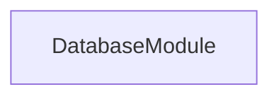
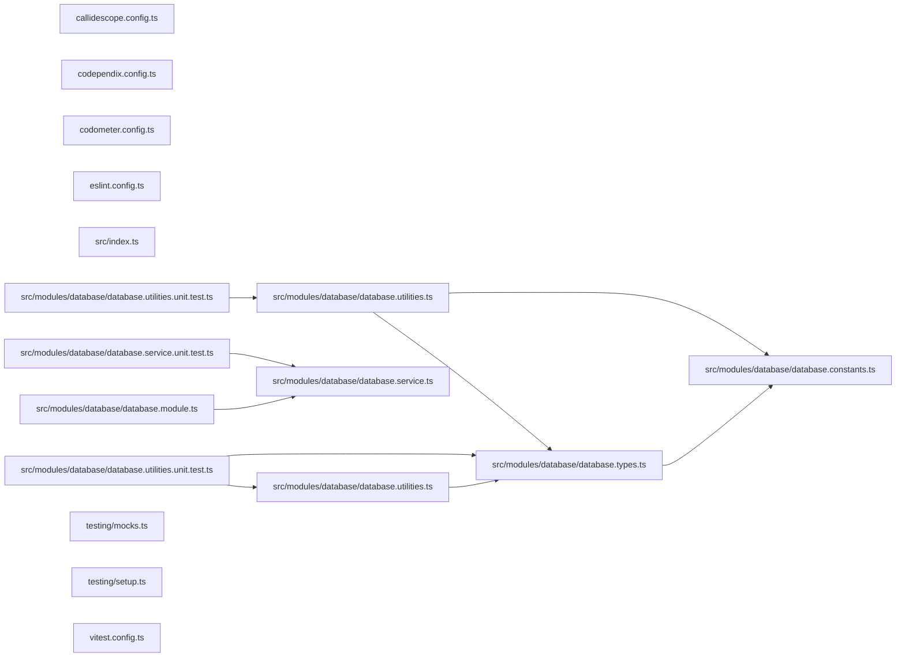

# 🐘 Database

The shared Postgres package every database-backed project connects through.

## Purpose

Lexico, meanderaw, and caelundas each keep their tables in Postgres. This
package holds the one way they do it, so the environment variables, the
connection options, and the naming of each project's database, schema, and
role are written once:

| Context        | Database                | Schema      | Role                                        |
| -------------- | ----------------------- | ----------- | ------------------------------------------- |
| Local Docker   | `<project>_development` | `<project>` | `<project>_username` / `<project>_password` |
| Testcontainers | `<project>_testing`     | `<project>` | the same                                    |

The schema carries no environment, so a migration generated locally applies
anywhere unchanged.

| Export                      | Responsibility                                                                               |
| --------------------------- | -------------------------------------------------------------------------------------------- |
| `postgresEnvironmentSchema` | The zod fragment for a project's six `<PROJECT>_POSTGRES_*` variables, with defaults         |
| `postgresConnection`        | The connection those variables describe, read from any environment record                    |
| `postgresDataSourceOptions` | TypeORM options: snake case, connection-level schema, `synchronize` and `migrationsRun` off  |

## Usage

Spread the fragment into the application's environment schema. Every
variable is prefixed with the project's name, so the root's unprefixed
`POSTGRES_*` — the shared container's admin login — never reach it:

A suite that boots Nest modules against the database uses
`startDatabaseTestingModule`. It starts that container, then compiles a
testing module with a global `ConfigModule` and `DatabaseModule.forRoot`
connected to it, the container's `<PROJECT>_POSTGRES_*` set on `process.env`
over any already there:

```ts
import { startDatabaseTestingModule } from "@codebase/database/testing";

const database = await startDatabaseTestingModule({
  entities: [Meander],
  imports: [DrawingModule],
  migrations: [InitialMigration1767225600000],
  project: "meanderaw",
  providers: [DrawCommand],
  validate: (config) => environmentSchema.parse(config),
});

const meanders = database.repository(Meander);
const command = database.module.get(DrawCommand);
// … database.dataSource, database.container

await database.close();
```

| Option           | Does                                                                                     |
| ---------------- | ---------------------------------------------------------------------------------------- |
| `project`        | Names the role, the `_testing` database, the schema, and the variables                   |
| `entities`       | Registered with `TypeOrmModule.forFeature`, and connected when no `database` is given    |
| `migrations`     | Run by the container before the module boots                                             |
| `imports`        | The modules under test                                                                   |
| `providers`      | The providers under test                                                                 |
| `database`       | The project's own `<Project>DatabaseModule`, imported in place of the helper's `forRoot` |
| `namingStrategy` | Replaces snake case on the helper's own `forRoot`                                        |
| `validate`       | The application's environment validation, usually `environmentSchema.parse`              |
| `images`         | Overrides the images tried, in order                                                     |

When the modules under test import the project's own database module, pass
it as `database` too, or the testing module connects twice. `close` closes
the module, stops the container, and restores `process.env`.

`startPostgresContainer` alone suits a suite that needs no Nest module:

```ts
import { postgresEnvironmentSchema } from "@codebase/database";

export const environmentSchema = z.object({
  ...postgresEnvironmentSchema({ project: "lexico" }),
});
```

| Variable                   | Default              |
| -------------------------- | -------------------- |
| `LEXICO_POSTGRES_HOST`     | `localhost`          |
| `LEXICO_POSTGRES_PORT`     | `5432`               |
| `LEXICO_POSTGRES_USERNAME` | `lexico_username`    |
| `LEXICO_POSTGRES_PASSWORD` | `lexico_password`    |
| `LEXICO_POSTGRES_DATABASE` | `lexico_development` |
| `LEXICO_POSTGRES_SCHEMA`   | `lexico`             |

A project name must be lowercase letters, digits, and underscores, starting
with a letter, so it can prefix a variable and name a database unquoted.

## Test

```bash
nx run database:vitest
```

## 👔 Conformetry

This project was generated from the [nestjs-service-project](../../configuration/conformetry-templates/nestjs-service-project) conformetry template.

## 🕸️ Codependix

Dependency graphs exported by [codependix](https://github.com/Organizzolini/codebase/tree/main/packages/ic-suite/codependix/codependix-cli), regenerated by `nx run codebase:codependix:write`.

### Nx Neighborhood

<!-- codependix:start name="codependix-nx-projects" -->
_This project has no immediate Nx dependencies or dependents._
<!-- codependix:end name="codependix-nx-projects" -->

### NestJS Module Graph

<!-- codependix:start name="codependix-nestjs-modules" -->

<!-- codependix:end name="codependix-nestjs-modules" -->

### File Imports

<!-- codependix:start name="codependix-file-imports" -->

<!-- codependix:end name="codependix-file-imports" -->
