# 🐘 Database

The shared Postgres package every database-backed project connects through.

## Purpose

Lexico, meanderaw, and caelundas each keep their tables in Postgres. This
package holds the one way they do it, so the environment variables, the
connection options, and the naming of each project's database, schema, and
role are written once:

| Context        | Database                | Schema      | Role                                        |
| -------------- | ----------------------- | ----------- | ------------------------------------------- |
| Local Docker   | `<project>_development` | `<project>` | `<project>_username` / `<project>_password` |
| Testcontainers | `<project>_testing`     | `<project>` | the same                                    |

The schema carries no environment, so a migration generated locally applies
anywhere unchanged.

| Export                       | Responsibility                                                                                 |
| ---------------------------- | ---------------------------------------------------------------------------------------------- |
| `postgresEnvironmentSchema`  | The zod fragment for a project's six `<PROJECT>_POSTGRES_*` variables, with defaults           |
| `postgresConnection`         | The connection those variables describe, read from any environment record                      |
| `postgresDataSourceOptions`  | TypeORM options: snake case, connection-level schema, `synchronize` and `migrationsRun` off    |
| `DatabaseModule.forRoot`     | The NestJS module wiring TypeORM from those variables through `ConfigService`                  |
| `createDataSource`           | The `DataSource` a project's TypeORM command-line entry exports, from the same options         |
| `IdentifiableEntity` …       | Base entities: a `uuidv7()` id, then created, updated, and soft-deleted columns                |
| `startPostgresContainer`     | From `@codebase/database/testing`: a migrated Postgres 18 container laid out like local Docker |
| `startDatabaseTestingModule` | From `@codebase/database/testing`: a Nest testing module connected to such a container         |

## Usage

Spread the fragment into the application's environment schema. Every
variable is prefixed with the project's name, so the root's unprefixed
`POSTGRES_*` — the shared container's admin login — never reach it:

```ts
import { postgresEnvironmentSchema } from "@codebase/database";

export const environmentSchema = z.object({
  ...postgresEnvironmentSchema({ project: "lexico" }),
});
```

| Variable                   | Default              |
| -------------------------- | -------------------- |
| `LEXICO_POSTGRES_HOST`     | `localhost`          |
| `LEXICO_POSTGRES_PORT`     | `5432`               |
| `LEXICO_POSTGRES_USERNAME` | `lexico_username`    |
| `LEXICO_POSTGRES_PASSWORD` | `lexico_password`    |
| `LEXICO_POSTGRES_DATABASE` | `lexico_development` |
| `LEXICO_POSTGRES_SCHEMA`   | `lexico`             |

The root `.env`'s unprefixed `POSTGRES_DB`, `POSTGRES_USER`, and
`POSTGRES_PASSWORD` keep the official Postgres image's own names, which the
shared container and its healthcheck read.

Each project keeps its own database module at
`src/modules/<project>-database/`, so the class conformetry derives from the
folder is `<Project>DatabaseModule` and imports `DatabaseModule` with no
alias. It connects through `DatabaseModule.forRoot`, beside a global
`ConfigModule` that validates the same schema:

```ts
@Module({
  exports: [DatabaseModule],
  imports: [
    DatabaseModule.forRoot({
      entities: [Meander],
      project: "meanderaw",
    }),
  ],
})
export class MeanderawDatabaseModule {}
```

And export the command-line data source from the same options, at
`src/modules/database/data-source.constants.ts`:

```ts
export default createDataSource({
  entities: [Meander],
  migrations: ["src/modules/meanderaw-database/migrations/*.ts"],
  project: "meanderaw",
});
```

Neither ever synchronizes or runs migrations on start: the schema changes
only through migrations, run on their own. Pass `namingStrategy` to replace
snake case, as lexico does with its pluralizing strategy.

### Base entities

Each table's entity extends the narrowest base it needs, so a table without
soft deletion carries no `deletedAt`:

| Base                 | Adds                                                                |
| -------------------- | ------------------------------------------------------------------- |
| `IdentifiableEntity` | `id`, a `uuid` the database assigns with Postgres 18's `uuidv7()`   |
| `CreatableEntity`    | `createdAt` (`timestamptz`) and a nullable `createdBy` (`uuid`)     |
| `UpdatableEntity`    | `updatedAt` (`timestamptz`) and a nullable `updatedBy` (`uuid`)     |
| `DeletableEntity`    | `deletedAt` (`timestamptz`, soft delete) and a nullable `deletedBy` |

They are plain TypeORM, with no GraphQL; a project that exposes them over
GraphQL adds its `@Field` decorators in a thin layer of its own. Nothing
fills the `*By` columns but the application, so a command-line writer with
no user identity leaves them empty. No entity names a schema: it comes from
`<PROJECT>_POSTGRES_SCHEMA`.

### Integration tests

`@codebase/database/testing` starts a throwaway `postgres:18-alpine`, falling
back to Google's mirror of Docker Hub, laid out the way the local container
is: a `<project>_username` role owning a `<project>_testing` database with a
`<project>` schema in it. It then builds the schema by running the project's
real migrations, so every integration suite exercises them too.

A suite that boots Nest modules against the database uses
`startDatabaseTestingModule`. It starts that container, then compiles a
testing module with a global `ConfigModule` and `DatabaseModule.forRoot`
connected to it, the container's `<PROJECT>_POSTGRES_*` set on `process.env`
over any already there:

```ts
import { startDatabaseTestingModule } from "@codebase/database/testing";

const database = await startDatabaseTestingModule({
  entities: [Meander],
  imports: [DrawingModule],
  migrations: [InitialMigration1767225600000],
  project: "meanderaw",
  providers: [DrawCommand],
  validate: (config) => environmentSchema.parse(config),
});

const meanders = database.repository(Meander);
const command = database.module.get(DrawCommand);
// … database.dataSource, database.container

await database.close();
```

| Option           | Does                                                                                     |
| ---------------- | ---------------------------------------------------------------------------------------- |
| `project`        | Names the role, the `_testing` database, the schema, and the variables                   |
| `entities`       | Registered with `TypeOrmModule.forFeature`, and connected when no `database` is given    |
| `migrations`     | Run by the container before the module boots                                             |
| `imports`        | The modules under test                                                                   |
| `providers`      | The providers under test                                                                 |
| `database`       | The project's own `<Project>DatabaseModule`, imported in place of the helper's `forRoot` |
| `namingStrategy` | Replaces snake case on the helper's own `forRoot`                                        |
| `validate`       | The application's environment validation, usually `environmentSchema.parse`              |
| `images`         | Overrides the images tried, in order                                                     |

When the modules under test import the project's own database module, pass
it as `database` too, or the testing module connects twice; `database` and
`namingStrategy` cannot be combined, since the project's module sets its own.
`close` closes the module, stops the container, and restores the whole of
`process.env`, removing any default `validate` filled in.

`startPostgresContainer` alone suits a suite that needs no Nest module:

```ts
import { startPostgresContainer } from "@codebase/database/testing";

const container = await startPostgresContainer({
  migrations: [InitialMigration1767225600000],
  project: "meanderaw",
});

// … build a DataSource from postgresDataSourceOptions(container.connection, …)

await container.stop();
```

`connection` is the project's own role, never the container's admin login,
and `environment` is the same connection as `<PROJECT>_POSTGRES_*` variables.
Testcontainers and `@nestjs/testing` are dependencies of this entry, so a
consuming suite imports its types from here rather than redeclaring them.
The entry lives under `testing/` rather than `src/`: dependency-cruiser's
`no-test-imports-in-app` lets only a `testing/` path import test tooling, so
import it only from tests and `testing/` harnesses.
Docker must be running.

A project name must be lowercase letters, digits, and underscores, starting
with a letter, so it can prefix a variable and name a database unquoted.

## Test

```bash
nx run database:vitest
```

## 👔 Conformetry

This project was generated from the [nestjs-service-project](../../configuration/conformetry-templates/nestjs-service-project) conformetry template.

## 🕸️ Codependix

Dependency graphs exported by [codependix](https://github.com/Organizzolini/codebase/tree/main/packages/ic-suite/codependix/codependix-cli), regenerated by `nx run codebase:codependix:write`.

### Nx Neighborhood

<!-- codependix:start name="codependix-nx-projects" -->
_This project has no immediate Nx dependencies or dependents._
<!-- codependix:end name="codependix-nx-projects" -->

### NestJS Module Graph

<!-- codependix:start name="codependix-nestjs-modules" -->

<!-- codependix:end name="codependix-nestjs-modules" -->

### File Imports

```mermaid
graph LR
  file_callidescope_config_ts["callidescope.config.ts"]
  file_codependix_config_ts["codependix.config.ts"]
  file_codometer_config_ts["codometer.config.ts"]
  file_eslint_config_ts["eslint.config.ts"]
  file_src_index_ts["src/index.ts"]
  file_src_modules_database_database_constants_ts["src/modules/database/database.constants.ts"]
  file_src_modules_database_database_factories_ts["src/modules/database/database.utilities.ts"]
  file_src_modules_database_database_factories_unit_test_ts["src/modules/database/database.utilities.unit.test.ts"]
  file_src_modules_database_database_module_integration_test_ts["src/modules/database/database.module.integration.test.ts"]
  file_src_modules_database_database_module_ts["src/modules/database/database.module.ts"]
  file_src_modules_database_database_service_ts["src/modules/database/database.service.ts"]
  file_src_modules_database_database_service_unit_test_ts["src/modules/database/database.service.unit.test.ts"]
  file_src_modules_database_database_types_ts["src/modules/database/database.types.ts"]
  file_src_modules_database_database_utilities_ts["src/modules/database/database.utilities.ts"]
  file_src_modules_database_database_utilities_unit_test_ts["src/modules/database/database.utilities.unit.test.ts"]
  file_src_modules_database_entities_Creatable_entity_ts["src/modules/database/entities/creatable.entity.ts"]
  file_src_modules_database_entities_Deletable_entity_ts["src/modules/database/entities/deletable.entity.ts"]
  file_src_modules_database_entities_Identifiable_entity_ts["src/modules/database/entities/identifiable.entity.ts"]
  file_src_modules_database_entities_Updatable_entity_ts["src/modules/database/entities/updatable.entity.ts"]
  file_src_modules_database_postgres_container_constants_ts["src/modules/database/postgres-container.constants.ts"]
  file_src_modules_database_postgres_container_factories_integration_test_ts["src/modules/database/postgres-container.utilities.integration.test.ts"]
  file_src_modules_database_postgres_container_factories_ts["src/modules/database/postgres-container.utilities.ts"]
  file_src_modules_database_postgres_container_types_ts["src/modules/database/postgres-container.types.ts"]
  file_src_testing_ts["src/testing.ts"]
  file_testing_fixtures_migrations_1767225600000_create_widgets_ts["testing/fixtures/migrations/1767225600000-create-widgets.ts"]
  file_testing_fixtures_Widget_entity_ts["testing/fixtures/widget.entity.ts"]
  file_testing_mocks_ts["testing/mocks.ts"]
  file_testing_setup_ts["testing/setup.ts"]
  file_vitest_config_ts["vitest.config.ts"]
  file_src_modules_database_database_factories_ts --> file_src_modules_database_database_constants_ts
  file_src_modules_database_database_factories_ts --> file_src_modules_database_database_types_ts
  file_src_modules_database_database_factories_ts --> file_src_modules_database_database_utilities_ts
  file_src_modules_database_database_factories_unit_test_ts --> file_src_modules_database_database_factories_ts
  file_src_modules_database_database_factories_unit_test_ts --> file_src_modules_database_database_types_ts
  file_src_modules_database_database_module_integration_test_ts --> file_src_modules_database_database_factories_ts
  file_src_modules_database_database_module_integration_test_ts --> file_src_modules_database_database_module_ts
  file_src_modules_database_database_module_integration_test_ts --> file_src_modules_database_postgres_container_factories_ts
  file_src_modules_database_database_module_integration_test_ts --> file_src_modules_database_postgres_container_types_ts
  file_src_modules_database_database_module_integration_test_ts --> file_testing_fixtures_migrations_1767225600000_create_widgets_ts
  file_src_modules_database_database_module_integration_test_ts --> file_testing_fixtures_Widget_entity_ts
  file_src_modules_database_database_module_ts --> file_src_modules_database_database_constants_ts
  file_src_modules_database_database_module_ts --> file_src_modules_database_database_service_ts
  file_src_modules_database_database_module_ts --> file_src_modules_database_database_types_ts
  file_src_modules_database_database_service_ts --> file_src_modules_database_database_constants_ts
  file_src_modules_database_database_service_ts --> file_src_modules_database_database_factories_ts
  file_src_modules_database_database_service_ts --> file_src_modules_database_database_types_ts
  file_src_modules_database_database_service_ts --> file_src_modules_database_database_utilities_ts
  file_src_modules_database_database_service_unit_test_ts --> file_src_modules_database_database_constants_ts
  file_src_modules_database_database_service_unit_test_ts --> file_src_modules_database_database_service_ts
  file_src_modules_database_database_types_ts --> file_src_modules_database_database_constants_ts
  file_src_modules_database_database_utilities_ts --> file_src_modules_database_database_constants_ts
  file_src_modules_database_database_utilities_ts --> file_src_modules_database_database_types_ts
  file_src_modules_database_database_utilities_unit_test_ts --> file_src_modules_database_database_utilities_ts
  file_src_modules_database_entities_Creatable_entity_ts --> file_src_modules_database_entities_Identifiable_entity_ts
  file_src_modules_database_entities_Deletable_entity_ts --> file_src_modules_database_entities_Updatable_entity_ts
  file_src_modules_database_entities_Updatable_entity_ts --> file_src_modules_database_entities_Creatable_entity_ts
  file_src_modules_database_postgres_container_factories_integration_test_ts --> file_src_modules_database_postgres_container_constants_ts
  file_src_modules_database_postgres_container_factories_integration_test_ts --> file_src_modules_database_postgres_container_factories_ts
  file_src_modules_database_postgres_container_factories_integration_test_ts --> file_testing_fixtures_migrations_1767225600000_create_widgets_ts
  file_src_modules_database_postgres_container_factories_ts --> file_src_modules_database_database_factories_ts
  file_src_modules_database_postgres_container_factories_ts --> file_src_modules_database_database_types_ts
  file_src_modules_database_postgres_container_factories_ts --> file_src_modules_database_database_utilities_ts
  file_src_modules_database_postgres_container_factories_ts --> file_src_modules_database_postgres_container_constants_ts
  file_src_modules_database_postgres_container_factories_ts --> file_src_modules_database_postgres_container_types_ts
  file_src_modules_database_postgres_container_types_ts --> file_src_modules_database_database_types_ts
  file_testing_fixtures_Widget_entity_ts --> file_src_modules_database_entities_Deletable_entity_ts
```

<!-- codependix:start name="codependix-file-imports" -->

<!-- codependix:end name="codependix-file-imports" -->
