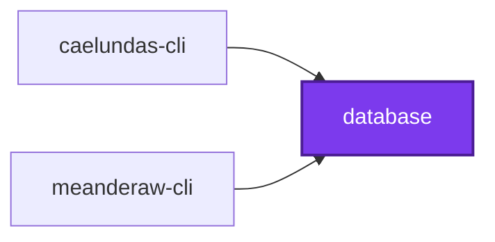

# 🐘 Database

The shared Postgres package every database-backed project connects through.

## Purpose

Lexico, meanderaw, and caelundas each keep their tables in Postgres. This
package holds the one way they do it, so the environment variables, the
connection options, and the naming of each project's database, schema, and
role are written once:

| Context        | Database                | Schema      | Role                                        |
| -------------- | ----------------------- | ----------- | ------------------------------------------- |
| Local Docker   | `<project>_development` | `<project>` | `<project>_username` / `<project>_password` |
| Testcontainers | `<project>_testing`     | `<project>` | the same                                    |

The schema carries no environment, so a migration generated locally applies
anywhere unchanged.

| Export                       | Responsibility                                                                                 |
| ---------------------------- | ---------------------------------------------------------------------------------------------- |
| `postgresEnvironmentSchema`  | The zod fragment for a project's six `<PROJECT>_POSTGRES_*` variables, with defaults           |
| `postgresConnection`         | The connection those variables describe, read from any environment record                      |
| `postgresDataSourceOptions`  | TypeORM options: snake case, schema as search path, `synchronize` and `migrationsRun` off      |
| `DatabaseModule.forRoot`     | The NestJS module wiring TypeORM from those variables through `ConfigService`                  |
| `createDataSource`           | The `DataSource` a project's TypeORM command-line entry exports, from the same options         |
| `IdentifiableEntity` …       | Base entities: a `uuidv7()` id, then created, updated, and soft-deleted columns                |
| `startPostgresContainer`     | From `@codebase/database/testing`: a migrated Postgres 18 container laid out like local Docker |
| `startDatabaseTestingModule` | From `@codebase/database/testing`: a Nest testing module connected to such a container         |

## Usage

Spread the fragment into the application's environment schema. Every
variable is prefixed with the project's name, so the root's unprefixed
`POSTGRES_*` — the shared container's admin login — never reach it:

```ts
import { postgresEnvironmentSchema } from "@codebase/database";

export const environmentSchema = z.object({
  ...postgresEnvironmentSchema({ project: "lexico" }),
});
```

| Variable                   | Default              |
| -------------------------- | -------------------- |
| `LEXICO_POSTGRES_HOST`     | `localhost`          |
| `LEXICO_POSTGRES_PORT`     | `5432`               |
| `LEXICO_POSTGRES_USERNAME` | `lexico_username`    |
| `LEXICO_POSTGRES_PASSWORD` | `lexico_password`    |
| `LEXICO_POSTGRES_DATABASE` | `lexico_development` |
| `LEXICO_POSTGRES_SCHEMA`   | `lexico`             |

The root `.env`'s unprefixed `POSTGRES_DB`, `POSTGRES_USER`, and
`POSTGRES_PASSWORD` keep the official Postgres image's own names, which the
shared container and its healthcheck read.

Each project keeps its own database module at
`src/modules/<project>-database/`, so the class conformetry derives from the
folder is `<Project>DatabaseModule` and imports `DatabaseModule` with no
alias. It connects through `DatabaseModule.forRoot`, beside a global
`ConfigModule` that validates the same schema:

```ts
@Module({
  exports: [DatabaseModule],
  imports: [
    DatabaseModule.forRoot({
      entities: [Meander],
      project: "meanderaw",
    }),
  ],
})
export class MeanderawDatabaseModule {}
```

`forRoot` takes no migrations: the runtime never runs them. Beside the
module, at `src/modules/<project>-database/data-source.constants.ts`, export
the command-line data source from the same options, with the migrations. A
constants file allows no default export, so name it after the project; the
TypeORM command line finds the file's one `DataSource` export by itself:

```ts
export const meanderawDataSource = createDataSource({
  entities: [Meander],
  migrations: ["src/modules/meanderaw-database/migrations/*.ts"],
  project: "meanderaw",
});
```

Neither ever synchronizes or runs migrations on start: the schema changes
only through migrations, run on their own. Pass `namingStrategy` to replace
snake case, as lexico does with its pluralizing strategy.

### Base entities

Each table's entity extends the narrowest base it needs, so a table without
soft deletion carries no `deletedAt`:

| Base                 | Adds                                                                |
| -------------------- | ------------------------------------------------------------------- |
| `IdentifiableEntity` | `id`, a `uuid` the database assigns with Postgres 18's `uuidv7()`   |
| `CreatableEntity`    | `createdAt` (`timestamptz`) and a nullable `createdBy` (`uuid`)     |
| `UpdatableEntity`    | `updatedAt` (`timestamptz`) and a nullable `updatedBy` (`uuid`)     |
| `DeletableEntity`    | `deletedAt` (`timestamptz`, soft delete) and a nullable `deletedBy` |

They are plain TypeORM, with no GraphQL; a project that exposes them over
GraphQL adds its `@Field` decorators in a thin layer of its own. Nothing
fills the `*By` columns but the application, so a command-line writer with
no user identity leaves them empty. No entity names a schema: it comes from
`<PROJECT>_POSTGRES_SCHEMA`.

### Migrations

The `migration` target is defined once, in the root `nx.json` target
defaults. A database project opts in with one option, `module`, naming its
own database module's folder, which every configuration reads its two
conventional paths from:

```jsonc
// project.json
"migration": {
  "options": { "module": "src/modules/meanderaw-database" }
}
```

| Path                                | Holds                                                      |
| ----------------------------------- | ---------------------------------------------------------- |
| `<module>/data-source.constants.ts` | The `createDataSource(...)` the TypeORM command line reads |
| `<module>/migrations/`              | Each generated migration, and its extracted `.sql`         |

| Command                                         | Does                                                            |
| ----------------------------------------------- | --------------------------------------------------------------- |
| `nx run <project>:migration:generate`           | Generates a migration from the entities, extracts it, and lints |
| `nx run <project>:migration:run`                | Applies every pending migration                                 |
| `nx run <project>:migration:revert`             | Reverts the latest migration                                    |
| `nx run <project>:migration:show`               | Lists applied and pending migrations                            |
| `nx run <project>:migration:extract-sql-latest` | Extracts the latest migration's SQL for sqlfluff and squawk     |
| `nx run <project>:migration:extract-sql-all`    | Extracts every migration's SQL                                  |

Migrations never run on application start; running them is its own step.
The extraction script is `scripts/extract-migration-sql.ts`.

The extracted SQL is linted only once the project opts in to it as well: a
`framework:typeorm` tag, and three more empty entries beside `migration`:

```jsonc
// project.json
"tags": ["framework:typeorm"],
"targets": {
  "migration": { "options": { "module": "src/modules/meanderaw-database" } },
  "sqlfluff-format": {},
  "sqlfluff-lint": {},
  "squawk": {}
}
```

`migration:generate` ends by running `lint-code:write`, which fails on the
empty JSDoc blocks TypeORM writes into a new migration. Describe the class
and its `up` and `down` methods, then run `lint-code:write` again.

Every pooled connection pins its session's `search_path` to the project's
schema alone, with no `public` after it. Unqualified SQL lands in the
project's schema, or fails if that schema is missing, and TypeORM's
`current_schema()` fallback names it too, so a generated column's
`typeorm_metadata` row is planned under the project's schema with no edit.
Two hand edits remain after `migration:generate` writes a project's first
generated column or view:

- Create the metadata table before the first `INSERT` into it, with
  `CREATE TABLE IF NOT EXISTS "<project>"."typeorm_metadata" (...)`, and drop
  it in `down`. TypeORM creates it only when it synchronizes, which never
  happens here.
- Replace the generating database's name, a literal
  `<project>_development` among the parameters of the `INSERT` and the
  `DELETE`, with `current_database()` in their SQL. TypeORM matches the row
  by database when it reads the expression back, so a `_testing` or
  production database would otherwise see the column as changed.

### Integration tests

`@codebase/database/testing` starts a throwaway `postgres:18-alpine`, falling
back to Google's mirror of Docker Hub, laid out the way the local container
is: a `<project>_username` role owning a `<project>_testing` database with a
`<project>` schema in it. It then builds the schema by running the project's
real migrations, so every integration suite exercises them too.

A suite that boots Nest modules against the database uses
`startDatabaseTestingModule`. It starts that container, then compiles a
testing module with a global `ConfigModule` and `DatabaseModule.forRoot`
connected to it, the container's `<PROJECT>_POSTGRES_*` set on `process.env`
over any already there:

```ts
import { startDatabaseTestingModule } from "@codebase/database/testing";

const database = await startDatabaseTestingModule({
  entities: [Meander],
  imports: [DrawingModule],
  migrations: [InitialMigration1767225600000],
  project: "meanderaw",
  providers: [DrawCommand],
  validate: (config) => environmentSchema.parse(config),
});

const meanders = database.repository(Meander);
const command = database.module.get(DrawCommand);
// … database.dataSource, database.container

await database.close();
```

| Option           | Does                                                                                     |
| ---------------- | ---------------------------------------------------------------------------------------- |
| `project`        | Names the role, the `_testing` database, the schema, and the variables                   |
| `entities`       | Registered with `TypeOrmModule.forFeature`, and connected when no `database` is given    |
| `migrations`     | Run by the container before the module boots                                             |
| `imports`        | The modules under test                                                                   |
| `providers`      | The providers under test                                                                 |
| `database`       | The project's own `<Project>DatabaseModule`, imported in place of the helper's `forRoot` |
| `namingStrategy` | Replaces snake case on the helper's own `forRoot`                                        |
| `validate`       | The application's environment validation, usually `environmentSchema.parse`              |
| `images`         | Overrides the images tried, in order                                                     |

When the modules under test import the project's own database module, pass
it as `database` too, or the testing module connects twice; `database` and
`namingStrategy` cannot be combined, since the project's module sets its own.
`close` closes the module, stops the container, and restores the whole of
`process.env`, removing any default `validate` filled in.

`startPostgresContainer` alone suits a suite that needs no Nest module:

```ts
import { startPostgresContainer } from "@codebase/database/testing";

const container = await startPostgresContainer({
  migrations: [InitialMigration1767225600000],
  project: "meanderaw",
});

// … build a DataSource from postgresDataSourceOptions(container.connection, …)

await container.stop();
```

`connection` is the project's own role, never the container's admin login,
and `environment` is the same connection as `<PROJECT>_POSTGRES_*` variables.
Testcontainers and `@nestjs/testing` are dependencies of this entry, so a
consuming suite imports its types from here rather than redeclaring them.
The entry lives under `testing/` rather than `src/`: dependency-cruiser's
`no-test-imports-in-app` lets only a `testing/` path import test tooling, so
import it only from tests and `testing/` harnesses.
Docker must be running.

A project name must be lowercase letters, digits, and underscores, starting
with a letter, so it can prefix a variable and name a database unquoted.

## Test

```bash
nx run database:vitest
```

## 👔 Conformetry

This project was generated from the [nestjs-service-project](../../configuration/conformetry-templates/nestjs-service-project) conformetry template.

## 🕸️ Codependix

Dependency graphs exported by [codependix](https://github.com/Organizzolini/codebase/tree/main/packages/ic-suite/codependix/codependix-cli), regenerated by `nx run codebase:codependix:write`.

### Nx Neighborhood

<!-- codependix:start name="codependix-nx-projects" -->

<!-- codependix:end name="codependix-nx-projects" -->

### NestJS Module Graph

<!-- codependix:start name="codependix-nestjs-modules" -->

<!-- codependix:end name="codependix-nestjs-modules" -->

### File Imports

```mermaid
graph LR
  file_callidescope_config_ts["callidescope.config.ts"]
  file_codependix_config_ts["codependix.config.ts"]
  file_codometer_config_ts["codometer.config.ts"]
  file_eslint_config_ts["eslint.config.ts"]
  file_scripts_extract_migration_sql_ts["scripts/extract-migration-sql.ts"]
  file_src_index_ts["src/index.ts"]
  file_src_modules_database_database_testing_utilities_integration_test_ts["src/modules/database/database-testing.utilities.integration.test.ts"]
  file_src_modules_database_database_constants_ts["src/modules/database/database.constants.ts"]
  file_src_modules_database_database_module_integration_test_ts["src/modules/database/database.module.integration.test.ts"]
  file_src_modules_database_database_module_ts["src/modules/database/database.module.ts"]
  file_src_modules_database_database_service_ts["src/modules/database/database.service.ts"]
  file_src_modules_database_database_service_unit_test_ts["src/modules/database/database.service.unit.test.ts"]
  file_src_modules_database_database_types_ts["src/modules/database/database.types.ts"]
  file_src_modules_database_database_utilities_ts["src/modules/database/database.utilities.ts"]
  file_src_modules_database_database_utilities_unit_test_ts["src/modules/database/database.utilities.unit.test.ts"]
  file_src_modules_database_entities_creatable_entity_ts["src/modules/database/entities/creatable.entity.ts"]
  file_src_modules_database_entities_deletable_entity_ts["src/modules/database/entities/deletable.entity.ts"]
  file_src_modules_database_entities_identifiable_entity_ts["src/modules/database/entities/identifiable.entity.ts"]
  file_src_modules_database_entities_updatable_entity_ts["src/modules/database/entities/updatable.entity.ts"]
  file_src_modules_database_postgres_container_constants_ts["src/modules/database/postgres-container.constants.ts"]
  file_src_modules_database_postgres_container_types_ts["src/modules/database/postgres-container.types.ts"]
  file_src_modules_database_postgres_container_utilities_integration_test_ts["src/modules/database/postgres-container.utilities.integration.test.ts"]
  file_src_modules_database_postgres_container_utilities_ts["src/modules/database/postgres-container.utilities.ts"]
  file_testing_database_testing_types_ts["testing/database-testing.types.ts"]
  file_testing_database_testing_utilities_ts["testing/database-testing.utilities.ts"]
  file_testing_fixtures_fixture_database_module_ts["testing/fixtures/fixture-database.module.ts"]
  file_testing_fixtures_gadget_entity_ts["testing/fixtures/gadget.entity.ts"]
  file_testing_fixtures_migrations_1767225600000_create_widgets_ts["testing/fixtures/migrations/1767225600000-create-widgets.ts"]
  file_testing_fixtures_sample_greeting_constants_ts["testing/fixtures/sample-greeting.constants.ts"]
  file_testing_fixtures_sample_greeting_module_ts["testing/fixtures/sample-greeting.module.ts"]
  file_testing_fixtures_sample_widgets_module_ts["testing/fixtures/sample-widgets.module.ts"]
  file_testing_fixtures_sample_widgets_service_ts["testing/fixtures/sample-widgets.service.ts"]
  file_testing_fixtures_widget_entity_ts["testing/fixtures/widget.entity.ts"]
  file_testing_index_ts["testing/index.ts"]
  file_testing_mocks_ts["testing/mocks.ts"]
  file_testing_setup_ts["testing/setup.ts"]
  file_vitest_config_ts["vitest.config.ts"]
  file_src_modules_database_database_testing_utilities_integration_test_ts --> file_src_modules_database_database_utilities_ts
  file_src_modules_database_database_testing_utilities_integration_test_ts --> file_testing_database_testing_types_ts
  file_src_modules_database_database_testing_utilities_integration_test_ts --> file_testing_database_testing_utilities_ts
  file_src_modules_database_database_testing_utilities_integration_test_ts --> file_testing_fixtures_fixture_database_module_ts
  file_src_modules_database_database_testing_utilities_integration_test_ts --> file_testing_fixtures_migrations_1767225600000_create_widgets_ts
  file_src_modules_database_database_testing_utilities_integration_test_ts --> file_testing_fixtures_sample_greeting_constants_ts
  file_src_modules_database_database_testing_utilities_integration_test_ts --> file_testing_fixtures_sample_greeting_module_ts
  file_src_modules_database_database_testing_utilities_integration_test_ts --> file_testing_fixtures_sample_widgets_module_ts
  file_src_modules_database_database_testing_utilities_integration_test_ts --> file_testing_fixtures_sample_widgets_service_ts
  file_src_modules_database_database_testing_utilities_integration_test_ts --> file_testing_fixtures_widget_entity_ts
  file_src_modules_database_database_module_integration_test_ts --> file_src_modules_database_database_module_ts
  file_src_modules_database_database_module_integration_test_ts --> file_src_modules_database_database_utilities_ts
  file_src_modules_database_database_module_integration_test_ts --> file_src_modules_database_postgres_container_types_ts
  file_src_modules_database_database_module_integration_test_ts --> file_src_modules_database_postgres_container_utilities_ts
  file_src_modules_database_database_module_integration_test_ts --> file_testing_fixtures_gadget_entity_ts
  file_src_modules_database_database_module_integration_test_ts --> file_testing_fixtures_migrations_1767225600000_create_widgets_ts
  file_src_modules_database_database_module_integration_test_ts --> file_testing_fixtures_widget_entity_ts
  file_src_modules_database_database_module_ts --> file_src_modules_database_database_constants_ts
  file_src_modules_database_database_module_ts --> file_src_modules_database_database_service_ts
  file_src_modules_database_database_module_ts --> file_src_modules_database_database_types_ts
  file_src_modules_database_database_service_ts --> file_src_modules_database_database_constants_ts
  file_src_modules_database_database_service_ts --> file_src_modules_database_database_types_ts
  file_src_modules_database_database_service_ts --> file_src_modules_database_database_utilities_ts
  file_src_modules_database_database_service_unit_test_ts --> file_src_modules_database_database_constants_ts
  file_src_modules_database_database_service_unit_test_ts --> file_src_modules_database_database_service_ts
  file_src_modules_database_database_types_ts --> file_src_modules_database_database_constants_ts
  file_src_modules_database_database_utilities_ts --> file_src_modules_database_database_constants_ts
  file_src_modules_database_database_utilities_ts --> file_src_modules_database_database_types_ts
  file_src_modules_database_database_utilities_unit_test_ts --> file_src_modules_database_database_types_ts
  file_src_modules_database_database_utilities_unit_test_ts --> file_src_modules_database_database_utilities_ts
  file_src_modules_database_entities_creatable_entity_ts --> file_src_modules_database_entities_identifiable_entity_ts
  file_src_modules_database_entities_deletable_entity_ts --> file_src_modules_database_entities_updatable_entity_ts
  file_src_modules_database_entities_updatable_entity_ts --> file_src_modules_database_entities_creatable_entity_ts
  file_src_modules_database_postgres_container_types_ts --> file_src_modules_database_database_types_ts
  file_src_modules_database_postgres_container_utilities_integration_test_ts --> file_src_modules_database_postgres_container_constants_ts
  file_src_modules_database_postgres_container_utilities_integration_test_ts --> file_src_modules_database_postgres_container_utilities_ts
  file_src_modules_database_postgres_container_utilities_integration_test_ts --> file_testing_fixtures_migrations_1767225600000_create_widgets_ts
  file_src_modules_database_postgres_container_utilities_ts --> file_src_modules_database_database_types_ts
  file_src_modules_database_postgres_container_utilities_ts --> file_src_modules_database_database_utilities_ts
  file_src_modules_database_postgres_container_utilities_ts --> file_src_modules_database_postgres_container_constants_ts
  file_src_modules_database_postgres_container_utilities_ts --> file_src_modules_database_postgres_container_types_ts
  file_testing_database_testing_types_ts --> file_src_modules_database_database_types_ts
  file_testing_database_testing_types_ts --> file_src_modules_database_postgres_container_types_ts
  file_testing_database_testing_utilities_ts --> file_src_modules_database_database_module_ts
  file_testing_database_testing_utilities_ts --> file_src_modules_database_postgres_container_utilities_ts
  file_testing_database_testing_utilities_ts --> file_testing_database_testing_types_ts
  file_testing_fixtures_fixture_database_module_ts --> file_src_modules_database_database_module_ts
  file_testing_fixtures_fixture_database_module_ts --> file_testing_fixtures_widget_entity_ts
  file_testing_fixtures_gadget_entity_ts --> file_src_modules_database_entities_identifiable_entity_ts
  file_testing_fixtures_sample_greeting_module_ts --> file_testing_fixtures_sample_greeting_constants_ts
  file_testing_fixtures_sample_widgets_module_ts --> file_testing_fixtures_fixture_database_module_ts
  file_testing_fixtures_sample_widgets_module_ts --> file_testing_fixtures_sample_widgets_service_ts
  file_testing_fixtures_sample_widgets_module_ts --> file_testing_fixtures_widget_entity_ts
  file_testing_fixtures_sample_widgets_service_ts --> file_testing_fixtures_widget_entity_ts
  file_testing_fixtures_widget_entity_ts --> file_src_modules_database_entities_deletable_entity_ts
```

<!-- codependix:start name="codependix-file-imports" -->

<!-- codependix:end name="codependix-file-imports" -->

<!-- callidescope:start -->

## 🔭 Callidescope

Call stacks traced through `packages/database`, deepest first. Each frame shows what it takes, what it returns, and what its documentation says.

| Measure | Value |
| --- | --- |
| Callables | 35 |
| Files | 19 |
| Calls traced | 34 |
| Call stacks | 7 |
| Deepest stack | 4 |
| Stacks through recursion | 0 |
| Unfollowable calls | 0 |

### Limits

What this project is judged against, as declared in its own `callidescope.config.ts`.

| Limit | Value |
| --- | --- |
| `maximumDepth` | 4 |
| `maximumBreadth` | 4 |

### Call stacks (depth)

**1. `postgresEnvironmentSchema`** — depth 4 · orphan-root

```text
🚀 postgresEnvironmentSchema(…): PostgresEnvironmentShape<Project> [packages/database/src/modules/database/database.utilities.ts:200]
   ↳ The zod fragment for a project's `<PROJECT>_POSTGRES_*` variables, which each application spreads into its own…
  └─> assertPostgresEnvironmentKeys(…): void [packages/database/src/modules/database/database.utilities.ts:35]
     ↳ Holds `shape` to having a key for every one of `project`'s `<PROJECT>_POSTGRES_*` variables, which is what types {@link…
    └─> postgresEnvironmentKeys(project: string): string[] [packages/database/src/modules/database/database.utilities.ts:176]
       ↳ The `<PROJECT>_POSTGRES_*` variable names a project reads.
      └─> postgresEnvironmentKey(project: string, field: PostgresConnectionField): string [packages/database/src/modules/database/database.utilities.ts:162]
         ↳ The variable a project reads `field` from, for example `LEXICO_POSTGRES_DATABASE` for lexico's `database`.
```

**2. `DatabaseService.createTypeOrmOptions`** — depth 4 · orphan-root

```text
🚀 DatabaseService.createTypeOrmOptions(): PostgresDataSourceOptions [packages/database/src/modules/database/database.service.ts:76]
   ↳ TypeORM's options for the project's connection, with no migrations: the runtime never runs them.
  └─> DatabaseService.connection(): PostgresConnection [packages/database/src/modules/database/database.service.ts:61]
     ↳ Where the project's database is, read from its prefixed variables and defaulted from its name.
    └─> postgresConnection({ environment, project, }: PostgresConnectionSource): PostgresConnection [packages/database/src/modules/database/database.utilities.ts:86]
       ↳ The connection a project's prefixed variables describe, defaulted the way `postgresEnvironmentSchema` defaults them.
      └─> postgresEnvironmentKey(project: string, field: PostgresConnectionField): string [packages/database/src/modules/database/database.utilities.ts:162]
         ↳ The variable a project reads `field` from, for example `LEXICO_POSTGRES_DATABASE` for lexico's `database`.
```

**3. `main`** — depth 3 · orphan-root

```text
🚀 main(): Promise<void> [packages/database/scripts/extract-migration-sql.ts:172]
   ↳ Main.
  └─> parseMode(): Mode [packages/database/scripts/extract-migration-sql.ts:211]
     ↳ Parse mode.
    └─> find(…)(argument: string): boolean [packages/database/scripts/extract-migration-sql.ts:212]
```

<details>
<summary>4 more call stacks</summary>

**4. `createDataSource`** — depth 3 · orphan-root

```text
🚀 createDataSource(…): DataSource [packages/database/src/modules/database/database.utilities.ts:69]
   ↳ The `DataSource` a project's TypeORM command-line entry exports, built from the same options as…
  └─> postgresDataSourceOptions(…): PostgresDataSourceOptions [packages/database/src/modules/database/database.utilities.ts:116]
     ↳ The TypeORM options for `connection`, shared by every runtime module and command-line data source so a generated…
    └─> postgresSearchPathOption(schema: string): string [packages/database/src/modules/database/database.utilities.ts:230]
       ↳ The startup parameter pg sends as `options` on each pooled connection, setting the session's `search_path` to `schema`…
```

**5. `startPostgresContainer`** — depth 3 · orphan-root

```text
🚀 startPostgresContainer(…): Promise<StartedPostgresContainer> [packages/database/src/modules/database/postgres-container.utilities.ts:33]
   ↳ Starts a throwaway Postgres 18 laid out the way the local Docker one is — a `<project>_username` role owning a…
  └─> postgresConnection({ environment, project, }: PostgresConnectionSource): PostgresConnection [packages/database/src/modules/database/database.utilities.ts:86]
     ↳ The connection a project's prefixed variables describe, defaulted the way `postgresEnvironmentSchema` defaults them.
    └─> postgresEnvironmentKey(project: string, field: PostgresConnectionField): string [packages/database/src/modules/database/database.utilities.ts:162]
       ↳ The variable a project reads `field` from, for example `LEXICO_POSTGRES_DATABASE` for lexico's `database`.
```

**6. `visit`** — depth 2 · orphan-root

```text
🚀 visit(node: ts.Node): void [packages/database/scripts/extract-migration-sql.ts:71]
   ↳ Visit.
  └─> extractSqlFromLiteral(argument: ts.Expression, sourceFile: ts.SourceFile): string | undefined [packages/database/scripts/extract-migration-sql.ts:42]
     ↳ Extract sql from literal.
```

**7. `visit`** — depth 2 · orphan-root

```text
🚀 visit(node: ts.Node): void [packages/database/scripts/extract-migration-sql.ts:118]
   ↳ Visit.
  └─> extractSqlFromMethod(method: ts.MethodDeclaration, sourceFile: ts.SourceFile): string[] [packages/database/scripts/extract-migration-sql.ts:62]
     ↳ Extract sql from method.
```

</details>

### Breadth

| Callable | Breadth | Calls directly | Location |
| --- | --- | --- | --- |
| `main` | 4 | `parseMode`, `parseDirectory`, `findMigrationFiles`, `processMigrationFile` | `packages/database/scripts/extract-migration-sql.ts:172` |
| `DatabaseService.connection` | 4 | `DatabaseService.databaseOptions`, `postgresConnection`, `DatabaseService.map(…)`, `postgresEnvironmentKeys` | `packages/database/src/modules/database/database.service.ts:61` |
| `startPostgresContainer` | 4 | `postgresConnection`, `startFirstAvailableImage`, `postgresDataSourceOptions`, `postgresEnvironment` | `packages/database/src/modules/database/postgres-container.utilities.ts:33` |

<details>
<summary>15 more callables</summary>

| Callable | Breadth | Calls directly | Location |
| --- | --- | --- | --- |
| `postgresEnvironmentSchema` | 3 | `postgresSettingsSchema`, `postgresEnvironmentKey`, `assertPostgresEnvironmentKeys` | `packages/database/src/modules/database/database.utilities.ts:200` |
| `DatabaseService.createTypeOrmOptions` | 3 | `postgresDataSourceOptions`, `DatabaseService.connection`, `DatabaseService.databaseOptions` | `packages/database/src/modules/database/database.service.ts:76` |
| `findMigrationFiles` | 2 | `filter(…)`, `map(…)` | `packages/database/scripts/extract-migration-sql.ts:147` |
| `createDataSource` | 2 | `postgresDataSourceOptions`, `postgresConnection` | `packages/database/src/modules/database/database.utilities.ts:69` |
| `postgresConnection` | 2 | `postgresEnvironmentKey`, `postgresSettingsSchema` | `packages/database/src/modules/database/database.utilities.ts:86` |
| `visit` | 1 | `extractSqlFromLiteral` | `packages/database/scripts/extract-migration-sql.ts:71` |
| `visit` | 1 | `extractSqlFromMethod` | `packages/database/scripts/extract-migration-sql.ts:118` |
| `parseDirectory` | 1 | `find(…)` | `packages/database/scripts/extract-migration-sql.ts:197` |
| `parseMode` | 1 | `find(…)` | `packages/database/scripts/extract-migration-sql.ts:211` |
| `processMigrationFile` | 1 | `extractSqlFromMigration` | `packages/database/scripts/extract-migration-sql.ts:221` |
| `assertPostgresEnvironmentKeys` | 1 | `postgresEnvironmentKeys` | `packages/database/src/modules/database/database.utilities.ts:35` |
| `postgresDataSourceOptions` | 1 | `postgresSearchPathOption` | `packages/database/src/modules/database/database.utilities.ts:116` |
| `postgresEnvironment` | 1 | `postgresEnvironmentKey` | `packages/database/src/modules/database/database.utilities.ts:142` |
| `postgresEnvironmentKeys` | 1 | `postgresEnvironmentKey` | `packages/database/src/modules/database/database.utilities.ts:176` |
| `startFirstAvailableImage` | 1 | `postgresInitializationSql` | `packages/database/src/modules/database/postgres-container.utilities.ts:104` |

</details>
<!-- callidescope:end -->
