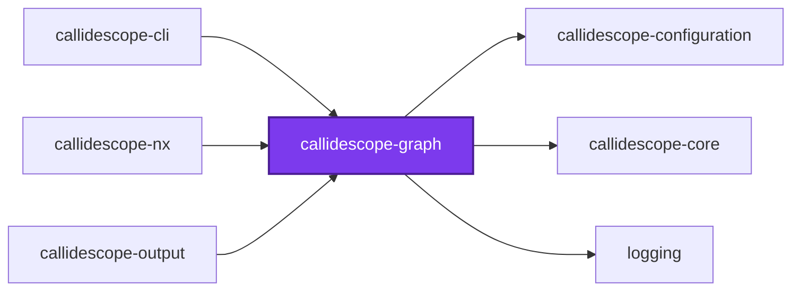
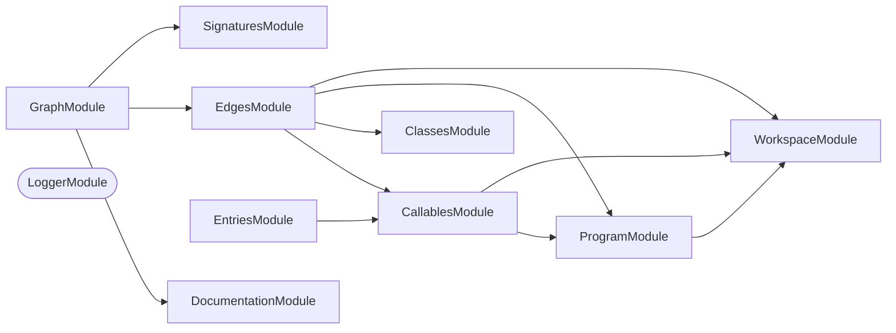

# 🔭 Callidescope Graph

**Builds the call graph from traced TypeScript source and measures its depth and breadth.**

This package is the leaf of the
[`@callidescope/cli`](../callidescope-cli/README.md) package graph: it depends
only on [`@callidescope/configuration`](../callidescope-configuration/README.md)
and `@codebase/logging`, and nothing here reaches into
[`@callidescope/output`](../callidescope-output/README.md).

```bash
npm install --save-dev @callidescope/graph
```

## What This Package Owns

- **`program`** — compiles the traced TypeScript projects
- **`workspace`** — resolves which projects and files are in scope
- **`callables`** — discovers the callable declarations
- **`entry-points`** — resolves configured entry points
- **`class-hierarchy`** — resolves interface members to concrete implementations, capped by `MAXIMUM_IMPLEMENTATION_CANDIDATES`
- **`signatures`** — reads callable signatures
- **`documentation`** — reads a callable's documentation comment
- **`edges`** — resolves call sites to callee declarations
- **`graph`** — assembles the above into `CallGraph`/`CondensedGraph` and measures depth and breadth over it

## Test

```bash
nx run callidescope-graph:vitest
```

## 👔 Conformetry

This project was generated from the [nestjs-service-project](../../../../configuration/conformetry-templates/nestjs-service-project) conformetry template.

<!-- callidescope:start -->

## 🔭 Callidescope

Call stacks traced through `packages/ic-suite/callidescope/callidescope-graph`, deepest first. Each frame shows what it takes, what it returns, and what its documentation says.

| Measure | Value |
| --- | --- |
| Callables | 207 |
| Files | 63 |
| Calls traced | 197 |
| Call stacks | 4 |
| Deepest stack | 5 |
| Stacks through recursion | 0 |
| Unfollowable calls | 5 |

### Limits

What this project is judged against, as declared in its own `callidescope.config.ts`.

| Limit | Value |
| --- | --- |
| `maximumDepth` | 11 |
| `maximumBreadth` | 9 |

### Call stacks (depth)

**1. `ProgramService.resolveProjectFiles`** — depth ≥ 5 · orphan-root

```text
🚀 ProgramService.resolveProjectFiles(project: WorkspaceProject): readonly string[] [packages/ic-suite/callidescope/callidescope-graph/src/modules/program/program.service.ts:262]
  └─> ProgramService.buildProgram(args: { project: WorkspaceProject; workspaceRoot: string; }): ProjectProgram [packages/ic-suite/callidescope/callidescope-graph/src/modules/program/program.service.ts:115]
     ↳ Builds one project's program, checker, and owned-file set.
    └─> CompilerHostService.createHost(args: { options: ts.CompilerOptions; workspaceRoot: string; }): ts.CompilerHost [packages/ic-suite/callidescope/callidescope-graph/src/modules/program/compiler-host.service.ts:76]
       ↳ Creates a compiler host that reuses already-parsed source files. `setParentNodes` is on because the rest of the package…
      └─> CompilerHostService.resolveModuleCache(options: ts.CompilerOptions, workspaceRoot: string): ts.ModuleResolutionCache [packages/ic-suite/callidescope/callidescope-graph/src/modules/program/compiler-host.service.ts:40]
         ↳ Returns the module resolution cache for one working directory.
        └─> CompilerHostService.createModuleResolutionCache(…)(fileName: string): string [packages/ic-suite/callidescope/callidescope-graph/src/modules/program/compiler-host.service.ts:52]
```

**2. `CallablesService.visit`** — depth 5 · orphan-root

```text
🚀 CallablesService.visit(node: ts.Node): void [packages/ic-suite/callidescope/callidescope-graph/src/modules/callables/callables.service.ts:49]
  └─> CallablesService.describe(args: DescribeCallableArguments): DiscoveredCallable [packages/ic-suite/callidescope/callidescope-graph/src/modules/callables/callables.service.ts:122]
     ↳ Turns one declaration into a fully described node.
    └─> CallableIdentityService.readDisplayName(declaration: CallableDeclaration): string [packages/ic-suite/callidescope/callidescope-graph/src/modules/callables/callable-identity.service.ts:131]
       ↳ Builds the qualified name a report prints for a callable.
      └─> CallableIdentityService.readMemberName(declaration: CallableDeclaration): string [packages/ic-suite/callidescope/callidescope-graph/src/modules/callables/callable-identity.service.ts:193]
         ↳ Reads the member name, falling back to the shape it was written in.
        └─> CallableIdentityService.readBindingName(node: ts.Node): string | undefined [packages/ic-suite/callidescope/callidescope-graph/src/modules/callables/callable-identity.service.ts:50]
           ↳ Reads the name a property, variable, or parameter declaration binds.
```

**3. `FileFilterService.isExcluded`** — depth ≥ 4 · orphan-root

```text
🚀 FileFilterService.isExcluded(workspaceRelativePath: string): boolean [packages/ic-suite/callidescope/callidescope-graph/src/modules/workspace/file-filter.service.ts:206]
  └─> FileFilterService.isExcludedByOwningProject(…): boolean [packages/ic-suite/callidescope/callidescope-graph/src/modules/workspace/file-filter.service.ts:60]
     ↳ True when the project owning a file excludes it with a glob of its own.
    └─> WorkspaceService.resolveOwningProject(…): WorkspaceProject | undefined [packages/ic-suite/callidescope/callidescope-graph/src/modules/workspace/workspace.service.ts:271]
       ↳ Names the traced project whose root most narrowly contains a file. "Contains" means the deepest of `args.projects`…
      └─> WorkspaceService.isContainedByRoot(args: { root: string; workspaceRelativePath: string; }): boolean [packages/ic-suite/callidescope/callidescope-graph/src/modules/workspace/workspace.service.ts:115]
         ↳ True when a project's root is a path-segment prefix of a file's path.
```

<details>
<summary>1 more call stacks</summary>

**4. `FileFilterService.isExcluded`** — depth 2 · orphan-root

```text
🚀 FileFilterService.isExcluded(workspaceRelativePath: string): boolean [packages/ic-suite/callidescope/callidescope-graph/src/modules/workspace/file-filter.service.ts:161]
  └─> FileFilterService.some(…)(glob: string): boolean [packages/ic-suite/callidescope/callidescope-graph/src/modules/workspace/file-filter.service.ts:163]
```

</details>

### Breadth

| Callable | Breadth | Calls directly | Location |
| --- | --- | --- | --- |
| `CallablesService.describe` | 8 | `CallableIdentityService.readDisplayName`, `CallableIdentityService.readEnclosingTypeName`, `CallableIdentityService.buildId`, `CallableIdentityService.isExported`, `CallableIdentityService.readKind`, `CallableIdentityService.readLocation`, `CallableIdentityService.readMemberName`, `CallableIdentityService.countStatements` | `packages/ic-suite/callidescope/callidescope-graph/src/modules/callables/callables.service.ts:122` |
| `EdgesService.buildSiteEdges` | 7 | `EdgesService.collectCallbackEdges`, `EdgesService.resolveSite`, `EdgesService.filter(…)`, `EdgesService.filter(…)`, `EdgesService.map(…)`, `EdgesService.filter(…)`, `EdgesService.readLocation` | `packages/ic-suite/callidescope/callidescope-graph/src/modules/edges/edges.service.ts:59` |
| `SymbolResolutionService.resolveSymbol` | 6 | `SymbolResolutionService.unwrapAlias`, `SymbolResolutionService.every(…)`, `SymbolResolutionService.readBodied`, `SymbolResolutionService.readResolution`, `SymbolResolutionService.find(…)`, `SymbolResolutionService.resolveThroughHierarchy` | `packages/ic-suite/callidescope/callidescope-graph/src/modules/edges/symbol-resolution.service.ts:165` |

<details>
<summary>96 more callables</summary>

| Callable | Breadth | Calls directly | Location |
| --- | --- | --- | --- |
| `WorkspaceService.discoverProjects` | 5 | `WorkspaceService.map(…)`, `WorkspaceService.findAllProjectDirectories`, `WorkspaceService.isExcludedProject`, `ProgramConfigurationError.constructor`, `WorkspaceService.toSorted(…)` | `packages/ic-suite/callidescope/callidescope-graph/src/modules/workspace/workspace.service.ts:186` |
| `ProgramService.assignOwnership` | 5 | `ProgramService.toRealPath`, `ProgramService.map(…)`, `WorkspaceService.toWorkspaceRelative`, `WorkspaceService.resolveOwningProject`, `ProgramService.find(…)` | `packages/ic-suite/callidescope/callidescope-graph/src/modules/program/program.service.ts:64` |
| `EntriesService.resolve` | 5 | `EntriesService.toRules`, `EntriesService.map(…)`, `EntriesService.classifyEveryCallable`, `EntriesService.rootDeclaredAddresses`, `EntriesService.promoteOrphans` | `packages/ic-suite/callidescope/callidescope-graph/src/modules/entries/entries.service.ts:312` |
| `GraphAssemblyService.assemble` | 5 | `GraphService.assemble`, `EdgesService.build`, `ComponentsService.condense`, `BreadthService.measure`, `GraphDepthService.measure` | `packages/ic-suite/callidescope/callidescope-graph/src/modules/graph/graph-assembly.service.ts:43` |
| `AddressService.resolve` | 4 | `AddressService.parseAddress`, `AddressService.describeInvalidAddress`, `AddressService.findMatches`, `AddressService.toCandidates` | `packages/ic-suite/callidescope/callidescope-graph/src/modules/callables/address.service.ts:235` |
| `ClassesService.resolveImplementations` | 4 | `ClassesService.collectDerived`, `ClassesService.filter(…)`, `ClassesService.filterAssignable`, `ClassesService.flatMap(…)` | `packages/ic-suite/callidescope/callidescope-graph/src/modules/classes/classes.service.ts:204` |
| `DocumentationService.read` | 4 | `DocumentationService.readSymbol`, `DocumentationService.readSummary`, `DocumentationService.filter(…)`, `DocumentationService.map(…)` | `packages/ic-suite/callidescope/callidescope-graph/src/modules/documentation/documentation.service.ts:78` |
| `AddressService.describeCandidates` | 3 | `AddressService.countCandidatesByLine`, `AddressService.some(…)`, `AddressService.map(…)` | `packages/ic-suite/callidescope/callidescope-graph/src/modules/callables/address.service.ts:181` |
| `AddressService.listAddresses` | 3 | `AddressService.toAddress`, `AddressService.map(…)`, `AddressService.toSorted(…)` | `packages/ic-suite/callidescope/callidescope-graph/src/modules/callables/address.service.ts:212` |
| `ProgramService.buildProgram` | 3 | `ProgramService.parseConfiguration`, `CompilerHostService.createHost`, `ProgramService.map(…)` | `packages/ic-suite/callidescope/callidescope-graph/src/modules/program/program.service.ts:115` |
| `ProgramService.parseConfiguration` | 3 | `ProgramService.readJsonConfigFile(…)`, `ProgramConfigurationError.constructor`, `ProgramService.map(…)` | `packages/ic-suite/callidescope/callidescope-graph/src/modules/program/program.service.ts:147` |
| `ProgramService.buildPrograms` | 3 | `WorkspaceService.walkImportedProjectClosure`, `ProgramService.toSorted(…)`, `ProgramService.assignOwnership` | `packages/ic-suite/callidescope/callidescope-graph/src/modules/program/program.service.ts:254` |
| `CallablesService.collectFromProgram` | 3 | `CallablesService.readOwnedPath`, `WorkspaceService.isTestFile`, `CallablesService.collectFromFile` | `packages/ic-suite/callidescope/callidescope-graph/src/modules/callables/callables.service.ts:77` |
| `ClassesService.indexProgram` | 3 | `ExternalService.isExternal`, `ClassesService.indexMembers`, `ClassesService.indexHeritage` | `packages/ic-suite/callidescope/callidescope-graph/src/modules/classes/classes.service.ts:178` |
| `EdgesService.collectCallbackEdges` | 3 | `EdgesService.map(…)`, `EdgesService.filter(…)`, `EdgesService.map(…)` | `packages/ic-suite/callidescope/callidescope-graph/src/modules/edges/edges.service.ts:127` |
| `EntriesService.classify` | 3 | `EntriesService.hasConfiguredDecorator`, `EntriesService.isCommandRunnerMethod`, `EntriesService.isBootstrapFunction` | `packages/ic-suite/callidescope/callidescope-graph/src/modules/entries/entries.service.ts:67` |
| `ComponentsService.condense` | 3 | `ComponentsService.openNode`, `ComponentsService.step`, `ComponentsService.buildSuccessors` | `packages/ic-suite/callidescope/callidescope-graph/src/modules/graph/components.service.ts:183` |
| `AddressService.parseAddress` | 2 | `AddressService.parseSymbolPath`, `AddressService.toWorkspaceRelative` | `packages/ic-suite/callidescope/callidescope-graph/src/modules/callables/address.service.ts:89` |
| `CallableIdentityService.readDisplayName` | 2 | `CallableIdentityService.readMemberName`, `CallableIdentityService.readEnclosingTypeName` | `packages/ic-suite/callidescope/callidescope-graph/src/modules/callables/callable-identity.service.ts:131` |
| `CallableIdentityService.readMemberName` | 2 | `CallableIdentityService.readBindingName`, `CallableIdentityService.describeCallbackArgument` | `packages/ic-suite/callidescope/callidescope-graph/src/modules/callables/callable-identity.service.ts:193` |
| `WorkspaceService.findProjectDirectories` | 2 | `WorkspaceService.toWorkspaceRelative`, `WorkspaceService.isExcludedFromScan` | `packages/ic-suite/callidescope/callidescope-graph/src/modules/workspace/workspace.service.ts:66` |
| `WorkspaceService.walkImportedProjectClosure` | 2 | `WorkspaceService.resolveOwningProject`, `WorkspaceService.isClosureDestination` | `packages/ic-suite/callidescope/callidescope-graph/src/modules/workspace/workspace.service.ts:342` |
| `FileFilterService.isExcludedByOwningProject` | 2 | `WorkspaceService.resolveOwningProject`, `FileFilterService.some(…)` | `packages/ic-suite/callidescope/callidescope-graph/src/modules/workspace/file-filter.service.ts:60` |
| `ProgramService.readPulledInPaths` | 2 | `ProgramService.toRealPath`, `WorkspaceService.toWorkspaceRelative` | `packages/ic-suite/callidescope/callidescope-graph/src/modules/program/program.service.ts:195` |
| `ProgramService.resolveProjectFiles` | 2 | `ProgramService.buildProgram`, `ProgramService.readPulledInPaths` | `packages/ic-suite/callidescope/callidescope-graph/src/modules/program/program.service.ts:262` |
| `CallablesService.visit` | 2 | `CallablesService.isCallableDeclaration`, `CallablesService.describe` | `packages/ic-suite/callidescope/callidescope-graph/src/modules/callables/callables.service.ts:49` |
| `CallablesService.readOwnedPath` | 2 | `ProgramService.toRealPath`, `WorkspaceService.toWorkspaceRelative` | `packages/ic-suite/callidescope/callidescope-graph/src/modules/callables/callables.service.ts:164` |
| `ClassesService.readMemberDeclarations` | 2 | `ClassesService.filter(…)`, `ClassesService.filter(…)` | `packages/ic-suite/callidescope/callidescope-graph/src/modules/classes/classes.service.ts:148` |
| `CallSitesService.visit` | 2 | `CallSitesService.isNestedBody`, `CallSitesService.readFunctionArguments` | `packages/ic-suite/callidescope/callidescope-graph/src/modules/edges/call-sites.service.ts:62` |
| `SymbolResolutionService.resolveThroughHierarchy` | 2 | `SymbolResolutionService.readOwner`, `ClassesService.resolveImplementations` | `packages/ic-suite/callidescope/callidescope-graph/src/modules/edges/symbol-resolution.service.ts:217` |
| `SymbolResolutionService.resolve` | 2 | `SymbolResolutionService.readCalleeName`, `SymbolResolutionService.resolveSymbol` | `packages/ic-suite/callidescope/callidescope-graph/src/modules/edges/symbol-resolution.service.ts:267` |
| `EdgesService.readLocation` | 2 | `WorkspaceService.toWorkspaceRelative`, `ProgramService.toRealPath` | `packages/ic-suite/callidescope/callidescope-graph/src/modules/edges/edges.service.ts:176` |
| `EdgesService.resolveCallableId` | 2 | `WorkspaceService.toWorkspaceRelative`, `ProgramService.toRealPath` | `packages/ic-suite/callidescope/callidescope-graph/src/modules/edges/edges.service.ts:202` |
| `EdgesService.resolveSite` | 2 | `SymbolResolutionService.resolveConstructor`, `SymbolResolutionService.resolve` | `packages/ic-suite/callidescope/callidescope-graph/src/modules/edges/edges.service.ts:226` |
| `EdgesService.build` | 2 | `CallSitesService.collect`, `EdgesService.buildSiteEdges` | `packages/ic-suite/callidescope/callidescope-graph/src/modules/edges/edges.service.ts:251` |
| `EntriesService.classifyEveryCallable` | 2 | `EntriesService.classify`, `EntriesService.readRules` | `packages/ic-suite/callidescope/callidescope-graph/src/modules/entries/entries.service.ts:102` |
| `EntriesService.hasConfiguredDecorator` | 2 | `EntriesService.some(…)`, `EntriesService.readDecoratorNames` | `packages/ic-suite/callidescope/callidescope-graph/src/modules/entries/entries.service.ts:117` |
| `EntriesService.rootDeclaredAddresses` | 2 | `EntriesService.listDeclaringConfigurations`, `EntriesService.rootDeclaredAddress` | `packages/ic-suite/callidescope/callidescope-graph/src/modules/entries/entries.service.ts:262` |
| `PathsService.buildDeepestPath` | 2 | `PathsService.orderMembers`, `PathsService.buildFrame` | `packages/ic-suite/callidescope/callidescope-graph/src/modules/graph/paths.service.ts:59` |
| `PathsService.buildFrame` | 2 | `DocumentationService.read`, `SignaturesService.read` | `packages/ic-suite/callidescope/callidescope-graph/src/modules/graph/paths.service.ts:103` |
| `AddressDepthService.toStack` | 2 | `PathsService.buildFrame`, `AddressDepthService.isLowerBound` | `packages/ic-suite/callidescope/callidescope-graph/src/modules/graph/address-depth.service.ts:105` |
| `AddressDepthService.buildDownwardStacks` | 2 | `AddressDepthService.traverse`, `AddressDepthService.map(…)` | `packages/ic-suite/callidescope/callidescope-graph/src/modules/graph/address-depth.service.ts:172` |
| `AddressDepthService.buildUpwardStacks` | 2 | `AddressDepthService.traverse`, `AddressDepthService.map(…)` | `packages/ic-suite/callidescope/callidescope-graph/src/modules/graph/address-depth.service.ts:195` |
| `ComponentsService.finishFrame` | 2 | `ComponentsService.closeNode`, `ComponentsService.liftLowLink` | `packages/ic-suite/callidescope/callidescope-graph/src/modules/graph/components.service.ts:72` |
| `ComponentsService.step` | 2 | `ComponentsService.finishFrame`, `ComponentsService.visitSuccessor` | `packages/ic-suite/callidescope/callidescope-graph/src/modules/graph/components.service.ts:116` |
| `ComponentsService.visitSuccessor` | 2 | `ComponentsService.openNode`, `ComponentsService.liftLowLink` | `packages/ic-suite/callidescope/callidescope-graph/src/modules/graph/components.service.ts:139` |
| `GraphDepthService.measure` | 2 | `GraphDepthService.combine`, `GraphDepthService.hasUnresolved` | `packages/ic-suite/callidescope/callidescope-graph/src/modules/graph/graph-depth.service.ts:95` |
| `GraphService.assemble` | 2 | `GraphService.append`, `GraphService.map(…)` | `packages/ic-suite/callidescope/callidescope-graph/src/modules/graph/graph.service.ts:44` |
| `AddressService.toCandidates` | 1 | `AddressService.map(…)` | `packages/ic-suite/callidescope/callidescope-graph/src/modules/callables/address.service.ts:137` |
| `AddressService.map(…)` | 1 | `AddressService.toAddress` | `packages/ic-suite/callidescope/callidescope-graph/src/modules/callables/address.service.ts:223` |
| `CallableIdentityService.isExported` | 1 | `CallableIdentityService.findAncestor(…)` | `packages/ic-suite/callidescope/callidescope-graph/src/modules/callables/callable-identity.service.ts:111` |
| `CallableIdentityService.readEnclosingTypeName` | 1 | `CallableIdentityService.findAncestor(…)` | `packages/ic-suite/callidescope/callidescope-graph/src/modules/callables/callable-identity.service.ts:139` |
| `CallableIdentityService.readKind` | 1 | `CallableIdentityService.readBoundKind` | `packages/ic-suite/callidescope/callidescope-graph/src/modules/callables/callable-identity.service.ts:152` |
| `WorkspaceService.findAllProjectDirectories` | 1 | `WorkspaceService.findProjectDirectories` | `packages/ic-suite/callidescope/callidescope-graph/src/modules/workspace/workspace.service.ts:44` |
| `WorkspaceService.isExcludedProject` | 1 | `WorkspaceService.toWorkspaceRelative` | `packages/ic-suite/callidescope/callidescope-graph/src/modules/workspace/workspace.service.ts:145` |
| `WorkspaceService.map(…)` | 1 | `WorkspaceService.toWorkspaceRelative` | `packages/ic-suite/callidescope/callidescope-graph/src/modules/workspace/workspace.service.ts:189` |
| `WorkspaceService.resolveOwningProject` | 1 | `WorkspaceService.isContainedByRoot` | `packages/ic-suite/callidescope/callidescope-graph/src/modules/workspace/workspace.service.ts:271` |
| `FileFilterService.buildFileFilter` | 1 | `FileFilterService.listIgnoredFiles` | `packages/ic-suite/callidescope/callidescope-graph/src/modules/workspace/file-filter.service.ts:137` |
| `FileFilterService.isExcluded` | 1 | `FileFilterService.some(…)` | `packages/ic-suite/callidescope/callidescope-graph/src/modules/workspace/file-filter.service.ts:161` |
| `FileFilterService.isExcluded` | 1 | `FileFilterService.isExcludedByOwningProject` | `packages/ic-suite/callidescope/callidescope-graph/src/modules/workspace/file-filter.service.ts:206` |
| `CompilerHostService.resolveModuleCache` | 1 | `CompilerHostService.createModuleResolutionCache(…)` | `packages/ic-suite/callidescope/callidescope-graph/src/modules/program/compiler-host.service.ts:40` |
| `CompilerHostService.createHost` | 1 | `CompilerHostService.resolveModuleCache` | `packages/ic-suite/callidescope/callidescope-graph/src/modules/program/compiler-host.service.ts:76` |
| `ProgramService.map(…)` | 1 | `ProgramService.toRealPath` | `packages/ic-suite/callidescope/callidescope-graph/src/modules/program/program.service.ts:133` |
| `CallablesService.collect` | 1 | `CallablesService.collectFromProgram` | `packages/ic-suite/callidescope/callidescope-graph/src/modules/callables/callables.service.ts:191` |
| `ExternalService.isExternal` | 1 | `ExternalService.computeVerdict` | `packages/ic-suite/callidescope/callidescope-graph/src/modules/classes/external.service.ts:64` |
| `ClassesService.filterAssignable` | 1 | `ClassesService.filter(…)` | `packages/ic-suite/callidescope/callidescope-graph/src/modules/classes/classes.service.ts:86` |
| `ClassesService.build` | 1 | `ClassesService.indexProgram` | `packages/ic-suite/callidescope/callidescope-graph/src/modules/classes/classes.service.ts:171` |
| `ClassesService.flatMap(…)` | 1 | `ClassesService.readMemberDeclarations` | `packages/ic-suite/callidescope/callidescope-graph/src/modules/classes/classes.service.ts:232` |
| `CallSitesService.readFunctionArguments` | 1 | `CallSitesService.filter(…)` | `packages/ic-suite/callidescope/callidescope-graph/src/modules/edges/call-sites.service.ts:42` |
| `CallSitesService.collect` | 1 | `CallSitesService.visit` | `packages/ic-suite/callidescope/callidescope-graph/src/modules/edges/call-sites.service.ts:54` |
| `SymbolResolutionService.readBodied` | 1 | `SymbolResolutionService.filter(…)` | `packages/ic-suite/callidescope/callidescope-graph/src/modules/edges/symbol-resolution.service.ts:88` |
| `SymbolResolutionService.filter(…)` | 1 | `SymbolResolutionService.isBodyCarrying` | `packages/ic-suite/callidescope/callidescope-graph/src/modules/edges/symbol-resolution.service.ts:91` |
| `SymbolResolutionService.every(…)` | 1 | `ExternalService.isExternal` | `packages/ic-suite/callidescope/callidescope-graph/src/modules/edges/symbol-resolution.service.ts:183` |
| `SymbolResolutionService.find(…)` | 1 | `SymbolResolutionService.isAbstractMember` | `packages/ic-suite/callidescope/callidescope-graph/src/modules/edges/symbol-resolution.service.ts:203` |
| `EdgesService.filter(…)` | 1 | `ExternalService.isExternal` | `packages/ic-suite/callidescope/callidescope-graph/src/modules/edges/edges.service.ts:77` |
| `EdgesService.map(…)` | 1 | `EdgesService.resolveCallableId` | `packages/ic-suite/callidescope/callidescope-graph/src/modules/edges/edges.service.ts:80` |
| `EdgesService.filter(…)` | 1 | `EdgesService.isExcludedCallee` | `packages/ic-suite/callidescope/callidescope-graph/src/modules/edges/edges.service.ts:89` |
| `EdgesService.map(…)` | 1 | `EdgesService.resolveCallableId` | `packages/ic-suite/callidescope/callidescope-graph/src/modules/edges/edges.service.ts:134` |
| `EdgesService.map(…)` | 1 | `EdgesService.readLocation` | `packages/ic-suite/callidescope/callidescope-graph/src/modules/edges/edges.service.ts:142` |
| `EdgesService.isExcludedCallee` | 1 | `EdgesService.some(…)` | `packages/ic-suite/callidescope/callidescope-graph/src/modules/edges/edges.service.ts:162` |
| `EntriesService.isCommandRunnerMethod` | 1 | `EntriesService.hasConfiguredDecorator` | `packages/ic-suite/callidescope/callidescope-graph/src/modules/entries/entries.service.ts:135` |
| `EntriesService.promoteOrphans` | 1 | `EntriesService.readRules` | `packages/ic-suite/callidescope/callidescope-graph/src/modules/entries/entries.service.ts:171` |
| `EntriesService.readDecoratorNames` | 1 | `EntriesService.map(…)` | `packages/ic-suite/callidescope/callidescope-graph/src/modules/entries/entries.service.ts:192` |
| `EntriesService.rootDeclaredAddress` | 1 | `AddressService.resolve` | `packages/ic-suite/callidescope/callidescope-graph/src/modules/entries/entries.service.ts:233` |
| `EntriesService.map(…)` | 1 | `EntriesService.toRules` | `packages/ic-suite/callidescope/callidescope-graph/src/modules/entries/entries.service.ts:320` |
| `SignaturesService.read` | 1 | `SignaturesService.map(…)` | `packages/ic-suite/callidescope/callidescope-graph/src/modules/signatures/signatures.service.ts:62` |
| `SignaturesService.map(…)` | 1 | `SignaturesService.readParameter` | `packages/ic-suite/callidescope/callidescope-graph/src/modules/signatures/signatures.service.ts:72` |
| `AddressDepthService.isLowerBound` | 1 | `AddressDepthService.some(…)` | `packages/ic-suite/callidescope/callidescope-graph/src/modules/graph/address-depth.service.ts:71` |
| `AddressDepthService.step` | 1 | `AddressDepthService.follow` | `packages/ic-suite/callidescope/callidescope-graph/src/modules/graph/address-depth.service.ts:79` |
| `AddressDepthService.traverse` | 1 | `AddressDepthService.step` | `packages/ic-suite/callidescope/callidescope-graph/src/modules/graph/address-depth.service.ts:143` |
| `AddressDepthService.map(…)` | 1 | `AddressDepthService.toStack` | `packages/ic-suite/callidescope/callidescope-graph/src/modules/graph/address-depth.service.ts:182` |
| `AddressDepthService.map(…)` | 1 | `AddressDepthService.toStack` | `packages/ic-suite/callidescope/callidescope-graph/src/modules/graph/address-depth.service.ts:205` |
| `BreadthService.describeDirectCalls` | 1 | `BreadthService.toReferences` | `packages/ic-suite/callidescope/callidescope-graph/src/modules/graph/breadth.service.ts:59` |
| `ComponentsService.buildSuccessors` | 1 | `ComponentsService.map(…)` | `packages/ic-suite/callidescope/callidescope-graph/src/modules/graph/components.service.ts:160` |
| `GraphDepthService.combine` | 1 | `GraphDepthService.foldSuccessors` | `packages/ic-suite/callidescope/callidescope-graph/src/modules/graph/graph-depth.service.ts:30` |
| `GraphDepthService.hasUnresolved` | 1 | `GraphDepthService.some(…)` | `packages/ic-suite/callidescope/callidescope-graph/src/modules/graph/graph-depth.service.ts:83` |

</details>
<!-- callidescope:end -->

## 🕸️ Codependix

Dependency graphs exported by [codependix](https://github.com/Organizzolini/codebase/tree/main/packages/ic-suite/codependix/codependix-cli), regenerated by `nx run codebase:codependix:write`.

### Nx Neighborhood

<!-- codependix:start name="codependix-nx-projects" -->

<!-- codependix:end name="codependix-nx-projects" -->

### NestJS Module Graph

<!-- codependix:start name="codependix-nestjs-modules" -->


_Rounded modules are global: every module can inject them, so their edges are left out._
<!-- codependix:end name="codependix-nestjs-modules" -->

### File Imports

<!-- codependix:start name="codependix-file-imports" -->
```mermaid
graph LR
  file_callidescope_config_ts["callidescope.config.ts"]
  file_codependix_config_ts["codependix.config.ts"]
  file_codometer_config_ts["codometer.config.ts"]
  file_eslint_config_ts["eslint.config.ts"]
  file_src_index_ts["src/index.ts"]
  file_src_modules_callables_address_constants_ts["src/modules/callables/address.constants.ts"]
  file_src_modules_callables_address_service_ts["src/modules/callables/address.service.ts"]
  file_src_modules_callables_address_service_unit_test_ts["src/modules/callables/address.service.unit.test.ts"]
  file_src_modules_callables_address_types_ts["src/modules/callables/address.types.ts"]
  file_src_modules_callables_callable_identity_service_ts["src/modules/callables/callable-identity.service.ts"]
  file_src_modules_callables_callable_identity_service_unit_test_ts["src/modules/callables/callable-identity.service.unit.test.ts"]
  file_src_modules_callables_callables_constants_ts["src/modules/callables/callables.constants.ts"]
  file_src_modules_callables_callables_module_ts["src/modules/callables/callables.module.ts"]
  file_src_modules_callables_callables_service_ts["src/modules/callables/callables.service.ts"]
  file_src_modules_callables_callables_service_unit_test_ts["src/modules/callables/callables.service.unit.test.ts"]
  file_src_modules_callables_callables_types_ts["src/modules/callables/callables.types.ts"]
  file_src_modules_classes_classes_constants_ts["src/modules/classes/classes.constants.ts"]
  file_src_modules_classes_classes_module_ts["src/modules/classes/classes.module.ts"]
  file_src_modules_classes_classes_service_ts["src/modules/classes/classes.service.ts"]
  file_src_modules_classes_classes_service_unit_test_ts["src/modules/classes/classes.service.unit.test.ts"]
  file_src_modules_classes_classes_types_ts["src/modules/classes/classes.types.ts"]
  file_src_modules_classes_external_service_ts["src/modules/classes/external.service.ts"]
  file_src_modules_classes_external_service_unit_test_ts["src/modules/classes/external.service.unit.test.ts"]
  file_src_modules_documentation_documentation_constants_ts["src/modules/documentation/documentation.constants.ts"]
  file_src_modules_documentation_documentation_module_ts["src/modules/documentation/documentation.module.ts"]
  file_src_modules_documentation_documentation_service_ts["src/modules/documentation/documentation.service.ts"]
  file_src_modules_documentation_documentation_service_unit_test_ts["src/modules/documentation/documentation.service.unit.test.ts"]
  file_src_modules_documentation_documentation_types_ts["src/modules/documentation/documentation.types.ts"]
  file_src_modules_edges_call_sites_service_ts["src/modules/edges/call-sites.service.ts"]
  file_src_modules_edges_call_sites_service_unit_test_ts["src/modules/edges/call-sites.service.unit.test.ts"]
  file_src_modules_edges_edges_constants_ts["src/modules/edges/edges.constants.ts"]
  file_src_modules_edges_edges_module_ts["src/modules/edges/edges.module.ts"]
  file_src_modules_edges_edges_service_ts["src/modules/edges/edges.service.ts"]
  file_src_modules_edges_edges_service_unit_test_ts["src/modules/edges/edges.service.unit.test.ts"]
  file_src_modules_edges_edges_types_ts["src/modules/edges/edges.types.ts"]
  file_src_modules_edges_symbol_resolution_service_ts["src/modules/edges/symbol-resolution.service.ts"]
  file_src_modules_edges_symbol_resolution_service_unit_test_ts["src/modules/edges/symbol-resolution.service.unit.test.ts"]
  file_src_modules_entries_entries_constants_ts["src/modules/entries/entries.constants.ts"]
  file_src_modules_entries_entries_module_ts["src/modules/entries/entries.module.ts"]
  file_src_modules_entries_entries_service_ts["src/modules/entries/entries.service.ts"]
  file_src_modules_entries_entries_service_unit_test_ts["src/modules/entries/entries.service.unit.test.ts"]
  file_src_modules_entries_entries_types_ts["src/modules/entries/entries.types.ts"]
  file_src_modules_graph_address_depth_constants_ts["src/modules/graph/address-depth.constants.ts"]
  file_src_modules_graph_address_depth_service_ts["src/modules/graph/address-depth.service.ts"]
  file_src_modules_graph_address_depth_service_unit_test_ts["src/modules/graph/address-depth.service.unit.test.ts"]
  file_src_modules_graph_address_depth_types_ts["src/modules/graph/address-depth.types.ts"]
  file_src_modules_graph_breadth_service_ts["src/modules/graph/breadth.service.ts"]
  file_src_modules_graph_breadth_service_unit_test_ts["src/modules/graph/breadth.service.unit.test.ts"]
  file_src_modules_graph_components_constants_ts["src/modules/graph/components.constants.ts"]
  file_src_modules_graph_components_service_ts["src/modules/graph/components.service.ts"]
  file_src_modules_graph_components_service_unit_test_ts["src/modules/graph/components.service.unit.test.ts"]
  file_src_modules_graph_components_types_ts["src/modules/graph/components.types.ts"]
  file_src_modules_graph_graph_assembly_service_ts["src/modules/graph/graph-assembly.service.ts"]
  file_src_modules_graph_graph_assembly_service_unit_test_ts["src/modules/graph/graph-assembly.service.unit.test.ts"]
  file_src_modules_graph_graph_assembly_types_ts["src/modules/graph/graph-assembly.types.ts"]
  file_src_modules_graph_graph_depth_service_ts["src/modules/graph/graph-depth.service.ts"]
  file_src_modules_graph_graph_depth_service_unit_test_ts["src/modules/graph/graph-depth.service.unit.test.ts"]
  file_src_modules_graph_graph_constants_ts["src/modules/graph/graph.constants.ts"]
  file_src_modules_graph_graph_module_ts["src/modules/graph/graph.module.ts"]
  file_src_modules_graph_graph_service_ts["src/modules/graph/graph.service.ts"]
  file_src_modules_graph_graph_service_unit_test_ts["src/modules/graph/graph.service.unit.test.ts"]
  file_src_modules_graph_graph_types_ts["src/modules/graph/graph.types.ts"]
  file_src_modules_graph_paths_service_ts["src/modules/graph/paths.service.ts"]
  file_src_modules_graph_paths_service_unit_test_ts["src/modules/graph/paths.service.unit.test.ts"]
  file_src_modules_program_compiler_host_service_ts["src/modules/program/compiler-host.service.ts"]
  file_src_modules_program_compiler_host_service_unit_test_ts["src/modules/program/compiler-host.service.unit.test.ts"]
  file_src_modules_program_program_constants_ts["src/modules/program/program.constants.ts"]
  file_src_modules_program_program_module_ts["src/modules/program/program.module.ts"]
  file_src_modules_program_program_service_ts["src/modules/program/program.service.ts"]
  file_src_modules_program_program_service_unit_test_ts["src/modules/program/program.service.unit.test.ts"]
  file_src_modules_program_program_types_ts["src/modules/program/program.types.ts"]
  file_src_modules_signatures_signatures_constants_ts["src/modules/signatures/signatures.constants.ts"]
  file_src_modules_signatures_signatures_module_ts["src/modules/signatures/signatures.module.ts"]
  file_src_modules_signatures_signatures_service_ts["src/modules/signatures/signatures.service.ts"]
  file_src_modules_signatures_signatures_service_unit_test_ts["src/modules/signatures/signatures.service.unit.test.ts"]
  file_src_modules_signatures_signatures_types_ts["src/modules/signatures/signatures.types.ts"]
  file_src_modules_workspace_file_filter_service_ts["src/modules/workspace/file-filter.service.ts"]
  file_src_modules_workspace_file_filter_service_unit_test_ts["src/modules/workspace/file-filter.service.unit.test.ts"]
  file_src_modules_workspace_workspace_constants_ts["src/modules/workspace/workspace.constants.ts"]
  file_src_modules_workspace_workspace_module_ts["src/modules/workspace/workspace.module.ts"]
  file_src_modules_workspace_workspace_service_ts["src/modules/workspace/workspace.service.ts"]
  file_src_modules_workspace_workspace_service_unit_test_ts["src/modules/workspace/workspace.service.unit.test.ts"]
  file_src_modules_workspace_workspace_types_ts["src/modules/workspace/workspace.types.ts"]
  file_testing_mocks_ts["testing/mocks.ts"]
  file_testing_modules_ts["testing/modules.ts"]
  file_testing_programs_ts["testing/programs.ts"]
  file_testing_setup_ts["testing/setup.ts"]
  file_vite_config_ts["vite.config.ts"]
  file_vitest_config_ts["vitest.config.ts"]
  file_src_modules_callables_address_service_ts --> file_src_modules_callables_address_constants_ts
  file_src_modules_callables_address_service_ts --> file_src_modules_callables_address_types_ts
  file_src_modules_callables_address_service_ts --> file_src_modules_callables_callables_types_ts
  file_src_modules_callables_address_service_unit_test_ts --> file_src_modules_callables_address_service_ts
  file_src_modules_callables_address_service_unit_test_ts --> file_src_modules_callables_callables_types_ts
  file_src_modules_callables_address_service_unit_test_ts --> file_testing_mocks_ts
  file_src_modules_callables_address_service_unit_test_ts --> file_testing_modules_ts
  file_src_modules_callables_address_types_ts --> file_src_modules_callables_callables_types_ts
  file_src_modules_callables_callable_identity_service_ts --> file_src_modules_callables_callables_constants_ts
  file_src_modules_callables_callable_identity_service_ts --> file_src_modules_callables_callables_types_ts
  file_src_modules_callables_callable_identity_service_unit_test_ts --> file_src_modules_callables_callable_identity_service_ts
  file_src_modules_callables_callable_identity_service_unit_test_ts --> file_testing_modules_ts
  file_src_modules_callables_callable_identity_service_unit_test_ts --> file_testing_programs_ts
  file_src_modules_callables_callables_module_ts --> file_src_modules_callables_address_service_ts
  file_src_modules_callables_callables_module_ts --> file_src_modules_callables_callable_identity_service_ts
  file_src_modules_callables_callables_module_ts --> file_src_modules_callables_callables_service_ts
  file_src_modules_callables_callables_module_ts --> file_src_modules_program_program_module_ts
  file_src_modules_callables_callables_module_ts --> file_src_modules_workspace_workspace_module_ts
  file_src_modules_callables_callables_service_ts --> file_src_modules_callables_callable_identity_service_ts
  file_src_modules_callables_callables_service_ts --> file_src_modules_callables_callables_types_ts
  file_src_modules_callables_callables_service_ts --> file_src_modules_program_program_service_ts
  file_src_modules_callables_callables_service_ts --> file_src_modules_program_program_types_ts
  file_src_modules_callables_callables_service_ts --> file_src_modules_workspace_workspace_service_ts
  file_src_modules_callables_callables_service_unit_test_ts --> file_src_modules_callables_callables_service_ts
  file_src_modules_callables_callables_service_unit_test_ts --> file_src_modules_callables_callables_types_ts
  file_src_modules_callables_callables_service_unit_test_ts --> file_testing_modules_ts
  file_src_modules_callables_callables_service_unit_test_ts --> file_testing_programs_ts
  file_src_modules_callables_callables_types_ts --> file_src_modules_program_program_types_ts
  file_src_modules_callables_callables_types_ts --> file_src_modules_workspace_workspace_types_ts
  file_src_modules_classes_classes_module_ts --> file_src_modules_classes_classes_service_ts
  file_src_modules_classes_classes_module_ts --> file_src_modules_classes_external_service_ts
  file_src_modules_classes_classes_service_ts --> file_src_modules_classes_classes_constants_ts
  file_src_modules_classes_classes_service_ts --> file_src_modules_classes_classes_types_ts
  file_src_modules_classes_classes_service_ts --> file_src_modules_classes_external_service_ts
  file_src_modules_classes_classes_service_ts --> file_src_modules_program_program_types_ts
  file_src_modules_classes_classes_service_unit_test_ts --> file_src_modules_classes_classes_constants_ts
  file_src_modules_classes_classes_service_unit_test_ts --> file_src_modules_classes_classes_service_ts
  file_src_modules_classes_classes_service_unit_test_ts --> file_src_modules_classes_classes_types_ts
  file_src_modules_classes_classes_service_unit_test_ts --> file_src_modules_classes_external_service_ts
  file_src_modules_classes_classes_service_unit_test_ts --> file_testing_modules_ts
  file_src_modules_classes_classes_service_unit_test_ts --> file_testing_programs_ts
  file_src_modules_classes_classes_types_ts --> file_src_modules_program_program_types_ts
  file_src_modules_classes_external_service_unit_test_ts --> file_src_modules_classes_external_service_ts
  file_src_modules_classes_external_service_unit_test_ts --> file_testing_modules_ts
  file_src_modules_documentation_documentation_module_ts --> file_src_modules_documentation_documentation_service_ts
  file_src_modules_documentation_documentation_service_ts --> file_src_modules_documentation_documentation_constants_ts
  file_src_modules_documentation_documentation_service_ts --> file_src_modules_documentation_documentation_types_ts
  file_src_modules_documentation_documentation_service_unit_test_ts --> file_src_modules_documentation_documentation_service_ts
  file_src_modules_documentation_documentation_service_unit_test_ts --> file_src_modules_documentation_documentation_types_ts
  file_src_modules_documentation_documentation_service_unit_test_ts --> file_testing_modules_ts
  file_src_modules_documentation_documentation_service_unit_test_ts --> file_testing_programs_ts
  file_src_modules_documentation_documentation_types_ts --> file_src_modules_callables_callables_types_ts
  file_src_modules_edges_call_sites_service_ts --> file_src_modules_callables_callables_types_ts
  file_src_modules_edges_call_sites_service_ts --> file_src_modules_edges_edges_types_ts
  file_src_modules_edges_call_sites_service_unit_test_ts --> file_src_modules_edges_call_sites_service_ts
  file_src_modules_edges_call_sites_service_unit_test_ts --> file_testing_modules_ts
  file_src_modules_edges_call_sites_service_unit_test_ts --> file_testing_programs_ts
  file_src_modules_edges_edges_constants_ts --> file_src_modules_edges_edges_types_ts
  file_src_modules_edges_edges_module_ts --> file_src_modules_callables_callables_module_ts
  file_src_modules_edges_edges_module_ts --> file_src_modules_classes_classes_module_ts
  file_src_modules_edges_edges_module_ts --> file_src_modules_edges_call_sites_service_ts
  file_src_modules_edges_edges_module_ts --> file_src_modules_edges_edges_service_ts
  file_src_modules_edges_edges_module_ts --> file_src_modules_edges_symbol_resolution_service_ts
  file_src_modules_edges_edges_module_ts --> file_src_modules_program_program_module_ts
  file_src_modules_edges_edges_module_ts --> file_src_modules_workspace_workspace_module_ts
  file_src_modules_edges_edges_service_ts --> file_src_modules_callables_callables_types_ts
  file_src_modules_edges_edges_service_ts --> file_src_modules_classes_external_service_ts
  file_src_modules_edges_edges_service_ts --> file_src_modules_edges_call_sites_service_ts
  file_src_modules_edges_edges_service_ts --> file_src_modules_edges_edges_types_ts
  file_src_modules_edges_edges_service_ts --> file_src_modules_edges_symbol_resolution_service_ts
  file_src_modules_edges_edges_service_ts --> file_src_modules_program_program_service_ts
  file_src_modules_edges_edges_service_ts --> file_src_modules_workspace_workspace_service_ts
  file_src_modules_edges_edges_service_unit_test_ts --> file_src_modules_classes_classes_constants_ts
  file_src_modules_edges_edges_service_unit_test_ts --> file_src_modules_edges_call_sites_service_ts
  file_src_modules_edges_edges_service_unit_test_ts --> file_src_modules_edges_edges_service_ts
  file_src_modules_edges_edges_service_unit_test_ts --> file_src_modules_edges_symbol_resolution_service_ts
  file_src_modules_edges_edges_service_unit_test_ts --> file_testing_modules_ts
  file_src_modules_edges_edges_service_unit_test_ts --> file_testing_programs_ts
  file_src_modules_edges_edges_types_ts --> file_src_modules_callables_callables_types_ts
  file_src_modules_edges_symbol_resolution_service_ts --> file_src_modules_classes_classes_service_ts
  file_src_modules_edges_symbol_resolution_service_ts --> file_src_modules_classes_external_service_ts
  file_src_modules_edges_symbol_resolution_service_ts --> file_src_modules_edges_edges_constants_ts
  file_src_modules_edges_symbol_resolution_service_ts --> file_src_modules_edges_edges_types_ts
  file_src_modules_edges_symbol_resolution_service_unit_test_ts --> file_src_modules_classes_classes_service_ts
  file_src_modules_edges_symbol_resolution_service_unit_test_ts --> file_src_modules_classes_external_service_ts
  file_src_modules_edges_symbol_resolution_service_unit_test_ts --> file_src_modules_edges_edges_constants_ts
  file_src_modules_edges_symbol_resolution_service_unit_test_ts --> file_src_modules_edges_edges_types_ts
  file_src_modules_edges_symbol_resolution_service_unit_test_ts --> file_src_modules_edges_symbol_resolution_service_ts
  file_src_modules_edges_symbol_resolution_service_unit_test_ts --> file_testing_modules_ts
  file_src_modules_edges_symbol_resolution_service_unit_test_ts --> file_testing_programs_ts
  file_src_modules_entries_entries_module_ts --> file_src_modules_callables_callables_module_ts
  file_src_modules_entries_entries_module_ts --> file_src_modules_entries_entries_service_ts
  file_src_modules_entries_entries_service_ts --> file_src_modules_callables_address_service_ts
  file_src_modules_entries_entries_service_ts --> file_src_modules_callables_callables_types_ts
  file_src_modules_entries_entries_service_ts --> file_src_modules_entries_entries_constants_ts
  file_src_modules_entries_entries_service_ts --> file_src_modules_entries_entries_types_ts
  file_src_modules_entries_entries_service_unit_test_ts --> file_src_modules_callables_address_service_ts
  file_src_modules_entries_entries_service_unit_test_ts --> file_src_modules_callables_callables_types_ts
  file_src_modules_entries_entries_service_unit_test_ts --> file_src_modules_entries_entries_service_ts
  file_src_modules_entries_entries_service_unit_test_ts --> file_src_modules_entries_entries_types_ts
  file_src_modules_entries_entries_service_unit_test_ts --> file_src_modules_graph_graph_service_ts
  file_src_modules_entries_entries_service_unit_test_ts --> file_src_modules_graph_graph_types_ts
  file_src_modules_entries_entries_service_unit_test_ts --> file_testing_mocks_ts
  file_src_modules_entries_entries_service_unit_test_ts --> file_testing_modules_ts
  file_src_modules_entries_entries_service_unit_test_ts --> file_testing_programs_ts
  file_src_modules_entries_entries_types_ts --> file_src_modules_callables_address_types_ts
  file_src_modules_entries_entries_types_ts --> file_src_modules_callables_callables_types_ts
  file_src_modules_entries_entries_types_ts --> file_src_modules_graph_graph_types_ts
  file_src_modules_graph_address_depth_service_ts --> file_src_modules_callables_callables_types_ts
  file_src_modules_graph_address_depth_service_ts --> file_src_modules_graph_address_depth_constants_ts
  file_src_modules_graph_address_depth_service_ts --> file_src_modules_graph_address_depth_types_ts
  file_src_modules_graph_address_depth_service_ts --> file_src_modules_graph_paths_service_ts
  file_src_modules_graph_address_depth_service_unit_test_ts --> file_src_modules_callables_callables_types_ts
  file_src_modules_graph_address_depth_service_unit_test_ts --> file_src_modules_documentation_documentation_service_ts
  file_src_modules_graph_address_depth_service_unit_test_ts --> file_src_modules_graph_address_depth_service_ts
  file_src_modules_graph_address_depth_service_unit_test_ts --> file_src_modules_graph_graph_service_ts
  file_src_modules_graph_address_depth_service_unit_test_ts --> file_src_modules_graph_paths_service_ts
  file_src_modules_graph_address_depth_service_unit_test_ts --> file_src_modules_signatures_signatures_service_ts
  file_src_modules_graph_address_depth_service_unit_test_ts --> file_testing_mocks_ts
  file_src_modules_graph_address_depth_service_unit_test_ts --> file_testing_modules_ts
  file_src_modules_graph_address_depth_types_ts --> file_src_modules_callables_callables_types_ts
  file_src_modules_graph_address_depth_types_ts --> file_src_modules_graph_graph_types_ts
  file_src_modules_graph_breadth_service_ts --> file_src_modules_callables_callables_types_ts
  file_src_modules_graph_breadth_service_ts --> file_src_modules_graph_graph_types_ts
  file_src_modules_graph_breadth_service_unit_test_ts --> file_src_modules_graph_breadth_service_ts
  file_src_modules_graph_breadth_service_unit_test_ts --> file_src_modules_graph_graph_service_ts
  file_src_modules_graph_breadth_service_unit_test_ts --> file_src_modules_graph_graph_types_ts
  file_src_modules_graph_breadth_service_unit_test_ts --> file_testing_mocks_ts
  file_src_modules_graph_breadth_service_unit_test_ts --> file_testing_modules_ts
  file_src_modules_graph_components_service_ts --> file_src_modules_graph_components_constants_ts
  file_src_modules_graph_components_service_ts --> file_src_modules_graph_components_types_ts
  file_src_modules_graph_components_service_ts --> file_src_modules_graph_graph_types_ts
  file_src_modules_graph_components_service_unit_test_ts --> file_src_modules_graph_components_service_ts
  file_src_modules_graph_components_service_unit_test_ts --> file_src_modules_graph_graph_service_ts
  file_src_modules_graph_components_service_unit_test_ts --> file_src_modules_graph_graph_types_ts
  file_src_modules_graph_components_service_unit_test_ts --> file_testing_modules_ts
  file_src_modules_graph_graph_assembly_service_ts --> file_src_modules_edges_edges_service_ts
  file_src_modules_graph_graph_assembly_service_ts --> file_src_modules_graph_breadth_service_ts
  file_src_modules_graph_graph_assembly_service_ts --> file_src_modules_graph_components_service_ts
  file_src_modules_graph_graph_assembly_service_ts --> file_src_modules_graph_graph_assembly_types_ts
  file_src_modules_graph_graph_assembly_service_ts --> file_src_modules_graph_graph_depth_service_ts
  file_src_modules_graph_graph_assembly_service_ts --> file_src_modules_graph_graph_service_ts
  file_src_modules_graph_graph_assembly_service_unit_test_ts --> file_src_modules_graph_breadth_service_ts
  file_src_modules_graph_graph_assembly_service_unit_test_ts --> file_src_modules_graph_components_service_ts
  file_src_modules_graph_graph_assembly_service_unit_test_ts --> file_src_modules_graph_graph_assembly_service_ts
  file_src_modules_graph_graph_assembly_service_unit_test_ts --> file_src_modules_graph_graph_assembly_types_ts
  file_src_modules_graph_graph_assembly_service_unit_test_ts --> file_src_modules_graph_graph_depth_service_ts
  file_src_modules_graph_graph_assembly_service_unit_test_ts --> file_src_modules_graph_graph_service_ts
  file_src_modules_graph_graph_assembly_service_unit_test_ts --> file_testing_modules_ts
  file_src_modules_graph_graph_assembly_service_unit_test_ts --> file_testing_programs_ts
  file_src_modules_graph_graph_assembly_types_ts --> file_src_modules_callables_callables_types_ts
  file_src_modules_graph_graph_assembly_types_ts --> file_src_modules_graph_graph_types_ts
  file_src_modules_graph_graph_depth_service_ts --> file_src_modules_graph_graph_types_ts
  file_src_modules_graph_graph_depth_service_unit_test_ts --> file_src_modules_graph_components_service_ts
  file_src_modules_graph_graph_depth_service_unit_test_ts --> file_src_modules_graph_graph_depth_service_ts
  file_src_modules_graph_graph_depth_service_unit_test_ts --> file_src_modules_graph_graph_service_ts
  file_src_modules_graph_graph_depth_service_unit_test_ts --> file_src_modules_graph_graph_types_ts
  file_src_modules_graph_graph_depth_service_unit_test_ts --> file_testing_modules_ts
  file_src_modules_graph_graph_module_ts --> file_src_modules_documentation_documentation_module_ts
  file_src_modules_graph_graph_module_ts --> file_src_modules_edges_edges_module_ts
  file_src_modules_graph_graph_module_ts --> file_src_modules_graph_address_depth_service_ts
  file_src_modules_graph_graph_module_ts --> file_src_modules_graph_breadth_service_ts
  file_src_modules_graph_graph_module_ts --> file_src_modules_graph_components_service_ts
  file_src_modules_graph_graph_module_ts --> file_src_modules_graph_graph_assembly_service_ts
  file_src_modules_graph_graph_module_ts --> file_src_modules_graph_graph_depth_service_ts
  file_src_modules_graph_graph_module_ts --> file_src_modules_graph_graph_service_ts
  file_src_modules_graph_graph_module_ts --> file_src_modules_graph_paths_service_ts
  file_src_modules_graph_graph_module_ts --> file_src_modules_signatures_signatures_module_ts
  file_src_modules_graph_graph_service_ts --> file_src_modules_edges_edges_types_ts
  file_src_modules_graph_graph_service_ts --> file_src_modules_graph_graph_types_ts
  file_src_modules_graph_graph_service_unit_test_ts --> file_src_modules_graph_graph_service_ts
  file_src_modules_graph_graph_service_unit_test_ts --> file_testing_modules_ts
  file_src_modules_graph_paths_service_ts --> file_src_modules_callables_callables_types_ts
  file_src_modules_graph_paths_service_ts --> file_src_modules_documentation_documentation_service_ts
  file_src_modules_graph_paths_service_ts --> file_src_modules_graph_graph_types_ts
  file_src_modules_graph_paths_service_ts --> file_src_modules_signatures_signatures_service_ts
  file_src_modules_graph_paths_service_unit_test_ts --> file_src_modules_callables_callables_types_ts
  file_src_modules_graph_paths_service_unit_test_ts --> file_src_modules_documentation_documentation_service_ts
  file_src_modules_graph_paths_service_unit_test_ts --> file_src_modules_graph_components_service_ts
  file_src_modules_graph_paths_service_unit_test_ts --> file_src_modules_graph_graph_depth_service_ts
  file_src_modules_graph_paths_service_unit_test_ts --> file_src_modules_graph_graph_service_ts
  file_src_modules_graph_paths_service_unit_test_ts --> file_src_modules_graph_paths_service_ts
  file_src_modules_graph_paths_service_unit_test_ts --> file_src_modules_signatures_signatures_service_ts
  file_src_modules_graph_paths_service_unit_test_ts --> file_testing_mocks_ts
  file_src_modules_graph_paths_service_unit_test_ts --> file_testing_modules_ts
  file_src_modules_program_compiler_host_service_unit_test_ts --> file_src_modules_program_compiler_host_service_ts
  file_src_modules_program_compiler_host_service_unit_test_ts --> file_testing_modules_ts
  file_src_modules_program_program_module_ts --> file_src_modules_program_compiler_host_service_ts
  file_src_modules_program_program_module_ts --> file_src_modules_program_program_service_ts
  file_src_modules_program_program_module_ts --> file_src_modules_workspace_workspace_module_ts
  file_src_modules_program_program_service_ts --> file_src_modules_program_compiler_host_service_ts
  file_src_modules_program_program_service_ts --> file_src_modules_program_program_constants_ts
  file_src_modules_program_program_service_ts --> file_src_modules_program_program_types_ts
  file_src_modules_program_program_service_ts --> file_src_modules_workspace_workspace_service_ts
  file_src_modules_program_program_service_ts --> file_src_modules_workspace_workspace_types_ts
  file_src_modules_program_program_service_unit_test_ts --> file_src_modules_program_compiler_host_service_ts
  file_src_modules_program_program_service_unit_test_ts --> file_src_modules_program_program_constants_ts
  file_src_modules_program_program_service_unit_test_ts --> file_src_modules_program_program_service_ts
  file_src_modules_program_program_service_unit_test_ts --> file_src_modules_workspace_workspace_service_ts
  file_src_modules_program_program_service_unit_test_ts --> file_src_modules_workspace_workspace_types_ts
  file_src_modules_program_program_service_unit_test_ts --> file_testing_modules_ts
  file_src_modules_program_program_types_ts --> file_src_modules_workspace_workspace_types_ts
  file_src_modules_signatures_signatures_module_ts --> file_src_modules_signatures_signatures_service_ts
  file_src_modules_signatures_signatures_service_ts --> file_src_modules_callables_callables_types_ts
  file_src_modules_signatures_signatures_service_ts --> file_src_modules_signatures_signatures_constants_ts
  file_src_modules_signatures_signatures_service_ts --> file_src_modules_signatures_signatures_types_ts
  file_src_modules_signatures_signatures_service_unit_test_ts --> file_src_modules_signatures_signatures_service_ts
  file_src_modules_signatures_signatures_service_unit_test_ts --> file_src_modules_signatures_signatures_types_ts
  file_src_modules_signatures_signatures_service_unit_test_ts --> file_testing_modules_ts
  file_src_modules_signatures_signatures_service_unit_test_ts --> file_testing_programs_ts
  file_src_modules_signatures_signatures_types_ts --> file_src_modules_callables_callables_types_ts
  file_src_modules_workspace_file_filter_service_ts --> file_src_modules_workspace_workspace_service_ts
  file_src_modules_workspace_file_filter_service_ts --> file_src_modules_workspace_workspace_types_ts
  file_src_modules_workspace_file_filter_service_unit_test_ts --> file_src_modules_workspace_file_filter_service_ts
  file_src_modules_workspace_file_filter_service_unit_test_ts --> file_src_modules_workspace_workspace_service_ts
  file_src_modules_workspace_file_filter_service_unit_test_ts --> file_src_modules_workspace_workspace_types_ts
  file_src_modules_workspace_file_filter_service_unit_test_ts --> file_testing_modules_ts
  file_src_modules_workspace_workspace_module_ts --> file_src_modules_workspace_file_filter_service_ts
  file_src_modules_workspace_workspace_module_ts --> file_src_modules_workspace_workspace_service_ts
  file_src_modules_workspace_workspace_service_ts --> file_src_modules_program_program_constants_ts
  file_src_modules_workspace_workspace_service_ts --> file_src_modules_workspace_workspace_constants_ts
  file_src_modules_workspace_workspace_service_ts --> file_src_modules_workspace_workspace_types_ts
  file_src_modules_workspace_workspace_service_unit_test_ts --> file_src_modules_program_program_constants_ts
  file_src_modules_workspace_workspace_service_unit_test_ts --> file_src_modules_workspace_workspace_service_ts
  file_src_modules_workspace_workspace_service_unit_test_ts --> file_src_modules_workspace_workspace_types_ts
  file_src_modules_workspace_workspace_service_unit_test_ts --> file_testing_modules_ts
  file_testing_mocks_ts --> file_src_modules_callables_callables_types_ts
  file_testing_modules_ts --> file_src_modules_callables_callables_module_ts
  file_testing_modules_ts --> file_src_modules_classes_classes_module_ts
  file_testing_modules_ts --> file_src_modules_documentation_documentation_module_ts
  file_testing_modules_ts --> file_src_modules_edges_edges_module_ts
  file_testing_modules_ts --> file_src_modules_entries_entries_module_ts
  file_testing_modules_ts --> file_src_modules_graph_graph_module_ts
  file_testing_modules_ts --> file_src_modules_program_program_module_ts
  file_testing_modules_ts --> file_src_modules_signatures_signatures_module_ts
  file_testing_modules_ts --> file_src_modules_workspace_workspace_module_ts
  file_testing_programs_ts --> file_src_modules_callables_callable_identity_service_ts
  file_testing_programs_ts --> file_src_modules_callables_callables_service_ts
  file_testing_programs_ts --> file_src_modules_classes_classes_service_ts
  file_testing_programs_ts --> file_src_modules_classes_external_service_ts
  file_testing_programs_ts --> file_src_modules_edges_call_sites_service_ts
  file_testing_programs_ts --> file_src_modules_edges_edges_service_ts
  file_testing_programs_ts --> file_src_modules_edges_symbol_resolution_service_ts
  file_testing_programs_ts --> file_src_modules_program_compiler_host_service_ts
  file_testing_programs_ts --> file_src_modules_program_program_service_ts
  file_testing_programs_ts --> file_src_modules_program_program_types_ts
  file_testing_programs_ts --> file_src_modules_workspace_workspace_service_ts
```
<!-- codependix:end name="codependix-file-imports" -->

<!-- codometer:start -->

## ⏲️ Codometer

### Project


### Measured Targets


### TypeScript


### JavaScript


### Python


### JSON


### YAML


### TOML


### Shell


### SQL


### HCL


### CSS


### Conventions


### Jupyter


### Markdown


<!-- codometer:end -->
