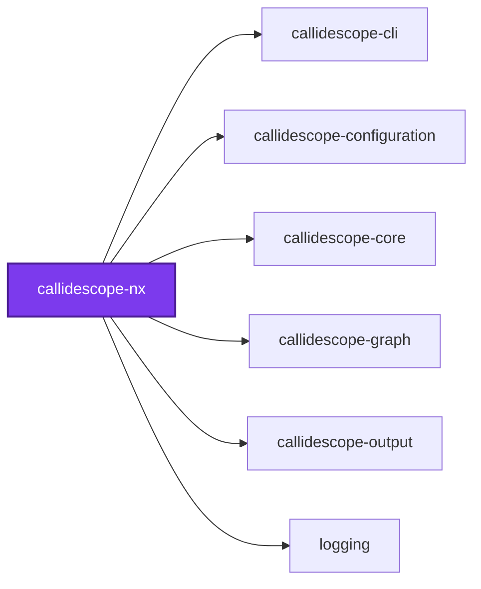
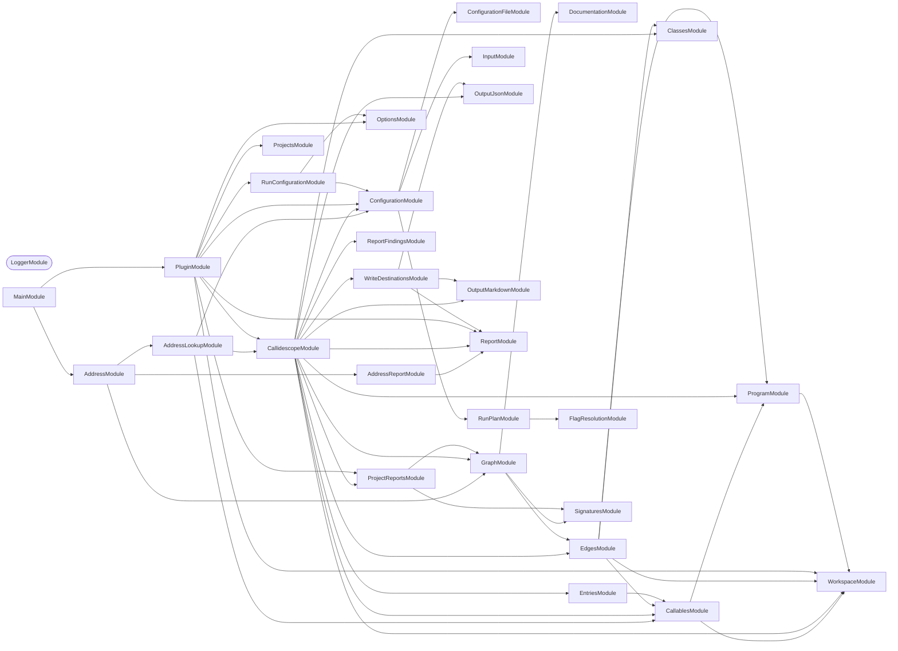

# 🔭🧬 Callidescope Nx

**An Nx plugin that traces call stacks per project, following the Nx dependency graph.**

Canonical documentation for call-stack tracing, configuration, depth and breadth analysis, and report formats is in the
[`@callidescope/cli` README](https://github.com/Organizzolini/codebase/tree/main/packages/ic-suite/callidescope/callidescope-cli#readme).
`@callidescope/cli` is Nx-free on purpose: it takes `--directories`, each one a path holding its own `tsconfig.json`, so it
works in any TypeScript workspace whether or not Nx is anywhere near it. This
package is the one place in the toolchain that knows Nx exists, and the only
one that depends on `@nx/devkit`.

It adds two things the core CLI cannot know about:

- **A target on every project**, so the workspace's task runner does the
  selecting — `nx affected`, `--projects=tag:…`, caching, and all.
- **Dependency-aware scope**, so a run over one project is scoped to everything
  that project depends on rather than to the project alone.

## Install

```bash
npm install --save-dev @callidescope/nx
```

Register it in `nx.json`:

```json
{
  "plugins": [
    {
      "plugin": "@callidescope/nx",
      "options": {
        "configurationPath": "configuration/callidescope.config.ts"
      }
    }
  ]
}
```

| Option | Meaning |
| ------ | ------- |
| `configurationPath` | Where the callidescope configuration lives. The conventional root filenames are searched when omitted |
| `traceTargetName` | Name of the inferred trace target. `trace` when omitted |
| `depthTargetName` | Name of the inferred depth target. `depth` when omitted |
| `breadthTargetName` | Name of the inferred breadth target. `breadth` when omitted |
| `gateTargetName` | Name of the inferred gate target. `gate` when omitted |

The target names are short because they read better on the command line than
repeating the tool's name on both sides of the colon. Rename any of them from
the registration if a workspace already uses one.

## Usage

Four targets are inferred onto every project holding a `tsconfig.json`, so
selection is Nx's job rather than a flag of this package's own:

```bash
nx run callidescope-nx:trace                      # one project, with its dependencies
nx run-many -t trace                              # the workspace
nx run-many -t trace --projects=tag:type:package  # a category
nx affected -t trace                              # only what changed
```

```bash
nx run callidescope-nx:depth --addresses="packages/ic-suite/callidescope/callidescope-nx/src/modules/projects/projects.service.ts#ProjectsService.resolveDependencyClosure"
nx run callidescope-nx:breadth --addresses="src/foo.service.ts#FooService.bar"

# Several at once, which is what a rename spanning a handful of them needs
nx run callidescope-nx:depth --addresses="src/a.service.ts#A.b,src/c.service.ts#C.d"
```

| Target | Answers |
| ------ | ------- |
| `gate` | Whether anything in the project broke the limits it is held to |
| `trace` | Every call stack in the project, and which ones broke a limit |
| `depth` | Every stack above and below each callable — callers up to a root, callees down to a leaf |
| `breadth` | Each callable's direct callers and callees, side by side |

`depth` and `breadth` take the same `<file>#<qualified-name>` addresses the
`callidescope` command does — the form every printed stack already uses — and
the same comma-separated `--addresses` flag it takes them through. Through the
plugin they resolve against the project and its dependencies rather than the
whole workspace, which is both faster and the set the addresses belong to.

**Every address must resolve, or the task prints nothing.** A report covering
only the addresses that were understood, under a task Nx recorded as
successful, is worse than a failed one; each unmatched address is named and
the task fails. Under `--format=json` the report is always an array, whatever
the address count, matching what the command line prints.

Unlike the command line, a missing `--addresses` is **refused rather than
prompted for**: a task runner has nobody to ask.

### The gate

`gate` is the one of the four a pipeline is meant to read an exit code from,
and the only one that prints nothing but its findings — the stacks and callables that
decided the verdict, rather than every stack in the project. `nx affected -t gate`
therefore gates a branch by the projects it changed, and the task that fails is
named after the project that regressed, which one workspace-wide task never
could.

**A dependency's breach is that dependency's gate's business.** The trace
reaches into the projects a gate's project depends on, because a stack that
stops at a package boundary measures the wrong thing — but the verdict covers
only the projects the task was scoped to. This is the line the publishing side
already draws, one step further along: measurement reaches into dependencies,
publishing does not, and judging does not either. Nothing escapes a verdict,
because `nx affected` selects a changed dependency too and its own gate names
it. `trace` narrows its verdict the same way, so the two targets on one project
can never disagree about whose regression it was; its report still shows the
whole closure, since only the verdict narrows.

**Depth is gated always, breadth wherever a limit exists.** Not two modes to be
selected between: `maximumDepth` has a default, so every project has a number
and is judged by it, while `maximumBreadth` has none at any level — so a project
that declared no breadth limit is judged against `Infinity` and can produce no
breadth finding at all.

**A gate that opened none of the judged project's own files fails.** A project
reporting zero files of its own is not a clean project — it is a project
nothing looked at, and a green task there would say the opposite with nothing
in the output to correct it. The `callidescope` command fails the same case for
the same reason.

**`trace` prints that same block and passes on it** — the one rule the two
targets act on differently, and the only place their verdicts part. A project
the configuration excludes reads nothing of its own by definition and is given
no `gate` for exactly that reason, so failing its `trace` as well would leave
the one target it has permanently red for being configured as it was asked to
be, and a red task that is always red is one a reader learns to ignore. It
still prints, because whether a project's own code was read is a fact about the
run either way and a reader has to be able to see it. Everything else — a stack
over a depth limit, a callable over a breadth limit, a run that read nothing at
all — fails both.

**Asked per judged project, not of the whole run**, because narrowing the
verdict made those two different questions. A project with dependencies has a
non-empty run whatever became of its own sources, so an `exclude` that
over-matches — which a project's own `callidescope.config.*` may write — leaves
it owning no report content, owning no finding, and passing green over code
nothing read. Demonstrated: `packages/ic-suite/codometer/codometer-output` given
`{"exclude": ["**"]}` of its own traces its dependency's 102 callables and
contributes none, which is a green gate on the run-wide question and a red one
on this. The projects that went unread are named back, since `--projects` may
judge several.

**Files rather than callables**, which is the weaker question and the right
one. A project can hold files that declare no callable at all — one whose
`tsconfig.json` names only its own configuration files and its tests is the
shape, and this repository has five — and those files were read, so a verdict
on them is a verdict on something. Asking for a callable fails all five for
holding no functions, which is a finding about nothing. The cost, stated
plainly: a project whose sources are excluded while a configuration file of its
own survives counts as read.

Two adjacent cases fail alongside it, each saying what happened rather than
failing mutely: a run that read **nothing at all**, which is what an unread
leaf project looks like, and an Nx selection that resolved to **no directory**.

Its cache key names the project's own `callidescope.config.*` alongside the
workspace configuration, so editing one project's limits re-runs that project's
gate and no other project's. A dependency's sources are covered by `^default`,
because a run measures its dependencies even though it does not judge them.

Two projects are deliberately skipped by all four targets: the **workspace-root
project**, whose targets would trace everything under one uncacheable task, and
any project with **no `tsconfig.json`**, whose targets would be permanently
empty. A project the configuration **excludes** — `exclude` or `excludeFrom` in
the workspace file — additionally gets no `gate`: its own code is never traced,
so a gate there would own no finding at all and report green for code it never
read. It keeps the three that print something, `trace` included, which is what
the unread exemption above is there to preserve: `packages/ic-suite/callidescope/callidescope-examples`
is the case, and its stacks are still a report a reader can open.

### Why the trace follows dependencies

`nx run callidescope-cli:trace` traces `callidescope-cli` **and
everything it depends on**, resolved transitively from the Nx project graph.

A call stack runs downward — a command calls into the service it was injected
with, which lives in a package it depends on — so a trace that stopped at a
project's own boundary would measure the wrong thing.

**A trace does not stop there without this plugin.**
[`@callidescope/cli`](../callidescope-cli/README.md) builds a TypeScript
program for every project the directories it was given transitively import, so
a call into a dependency resolves to a real frame whether or not Nx is
involved. Measured on this package,
`callidescope --directories packages/ic-suite/callidescope/callidescope-nx` and
`nx run callidescope-nx:trace` report the same 575 callables across 185 files
in 7 projects.

What the Nx graph decides is which projects the run is **scoped to** rather
than merely reaches. This executor writes nothing anywhere — it renders one
report and prints it — so the distinction costs nothing here, and widening the
selection changes only which projects seed the closure. It is the command-line
host that acts on it: a `--write` run there publishes a `## 🔭 Callidescope`
section into a scoped project's `README.md` and leaves a reached one's to the
run that is scoped to it. The graph also names dependencies no import closure
can find — an implicit dependency, or an edge that exists only at run time.

The two sets are not the same. The Nx graph gives `callidescope-nx` six
projects; the import closure reaches seven, adding `codometer-configuration`,
which this project's `tsconfig.json` pulls in through its own
`codometer.config.ts` — a file the manifest has no reason to mention.

Dependencies, never dependents: a project's dependents call _into_ it and add
no frames below it.

Pass `--withDependencies=false` to scope the run to the selected projects
alone. The closure below them is built either way, so what changes is which
projects the run calls its own — not how far a stack runs.

### Executor options

```bash
nx run logging:trace --tags=type:package
nx run logging:depth --addresses="a.ts#A.b" --projects=callidescope-cli
```

All three executors take the same scoping options.

| Option | Meaning |
| ------ | ------- |
| `addresses` | `depth` and `breadth` only, and required: the callables to look up, comma-separated |
| `projects` | Nx project names to resolve against, replacing the target's own project |
| `tags` | Nx project tags, selecting every project carrying **any** of them |
| `withDependencies` | Widen along the Nx dependency graph. `true` by default |
| `format` | `markdown`, `mermaid`, or `json` |
| `configurationPath` | Overrides the registered configuration path |

`--projects` and `--tags` union rather than intersect, and a project reached
both ways is still traced once. `--tags` matches **any** of the tags given,
because Nx tag families are mutually exclusive on a single project — nothing is
both `type:application` and `type:package`, so requiring all of them would
select nothing.

Prefer Nx's own `--projects=tag:…` on `run-many` for ordinary selection; these
options exist for a target that wants to declare a fixed scope in its
`project.json`.

### Nothing resolves silently to less

A project name the workspace does not have, or a tag no project carries, fails
the task and names the workspace's actual vocabulary. Narrowing the run instead
would let it pass while measuring less than it was asked to — and a report of
what a run did cover cannot show you what it did not.

## As a library

The Nx-graph reading is a NestJS provider, for a host that would rather import
it than run a task:

```ts
import { resolveProjectsService } from "@callidescope/nx";

const projectsService = await resolveProjectsService();
const graph = await projectsService.readProjectGraph();
const names = projectsService.resolveDependencyClosure({
  graph,
  projectNames: ["callidescope-cli"],
});
const directories = projectsService.toDirectories({ graph, projectNames: names });
```

`readProjectGraph` is the only method that touches Nx at run time; every
resolution rule takes the graph as an argument, so it can be exercised without
a workspace to build one from.

## Packages

| Package | Role |
| ------- | ---- |
| [`@callidescope/nx`](.) | Nx plugin: per-project trace targets, resolved through the Nx graph |
| [`@callidescope/cli`](../callidescope-cli/README.md) | Orchestrates a run: traces the workspace, plans what to check, and reports |
| [`@callidescope/configuration`](../callidescope-configuration/README.md) | Reads `callidescope.config.ts` and resolves the limits |
| [`@callidescope/graph`](../callidescope-graph/README.md) | Builds the call graph from traced source and measures depth and breadth |
| [`@callidescope/output`](../callidescope-output/README.md) | Renders findings into markdown, mermaid, and JSON |

## Test

```bash
nx run callidescope-nx:vitest
```

## Contributing

```bash
nx run callidescope-nx:lint-code --configuration=check
```

## License

MIT — see [LICENSE](../../../../LICENSE).

## 👔 Conformetry

This project was generated from the [nestjs-service-project](../../../../configuration/conformetry-templates/nestjs-service-project) conformetry template.

## 🕸️ Codependix

Dependency graphs exported by [codependix](https://github.com/Organizzolini/codebase/tree/main/packages/ic-suite/codependix/codependix-cli), regenerated by `nx run codebase:codependix:write`.

### Nx Neighborhood

<!-- codependix:start name="codependix-nx-projects" -->

<!-- codependix:end name="codependix-nx-projects" -->

### NestJS Module Graph

<!-- codependix:start name="codependix-nestjs-modules" -->


_Rounded modules are global: every module can inject them, so their edges are left out._
<!-- codependix:end name="codependix-nestjs-modules" -->

### File Imports

```mermaid
graph LR
  file_callidescope_config_ts["callidescope.config.ts"]
  file_codependix_config_ts["codependix.config.ts"]
  file_codometer_config_ts["codometer.config.ts"]
  file_eslint_config_ts["eslint.config.ts"]
  file_src_executors_address_types_ts["src/executors/address.types.ts"]
  file_src_executors_breadth_executor_ts["src/executors/breadth/executor.ts"]
  file_src_executors_breadth_executor_unit_test_ts["src/executors/breadth/executor.unit.test.ts"]
  file_src_executors_depth_executor_ts["src/executors/depth/executor.ts"]
  file_src_executors_depth_executor_unit_test_ts["src/executors/depth/executor.unit.test.ts"]
  file_src_executors_gate_executor_integration_test_ts["src/executors/gate/executor.integration.test.ts"]
  file_src_executors_gate_executor_ts["src/executors/gate/executor.ts"]
  file_src_executors_gate_executor_types_ts["src/executors/gate/executor.types.ts"]
  file_src_executors_gate_executor_unit_test_ts["src/executors/gate/executor.unit.test.ts"]
  file_src_executors_trace_executor_ts["src/executors/trace/executor.ts"]
  file_src_executors_trace_executor_types_ts["src/executors/trace/executor.types.ts"]
  file_src_executors_trace_executor_unit_test_ts["src/executors/trace/executor.unit.test.ts"]
  file_src_index_ts["src/index.ts"]
  file_src_index_unit_test_ts["src/index.unit.test.ts"]
  file_src_main_module_ts["src/main.module.ts"]
  file_src_modules_address_address_constants_ts["src/modules/address/address.constants.ts"]
  file_src_modules_address_address_module_ts["src/modules/address/address.module.ts"]
  file_src_modules_address_address_service_ts["src/modules/address/address.service.ts"]
  file_src_modules_address_address_service_unit_test_ts["src/modules/address/address.service.unit.test.ts"]
  file_src_modules_address_address_types_ts["src/modules/address/address.types.ts"]
  file_src_modules_address_address_utilities_ts["src/modules/address/address.utilities.ts"]
  file_src_modules_address_address_utilities_unit_test_ts["src/modules/address/address.utilities.unit.test.ts"]
  file_src_modules_options_options_constants_ts["src/modules/options/options.constants.ts"]
  file_src_modules_options_options_module_ts["src/modules/options/options.module.ts"]
  file_src_modules_options_options_service_ts["src/modules/options/options.service.ts"]
  file_src_modules_options_options_service_unit_test_ts["src/modules/options/options.service.unit.test.ts"]
  file_src_modules_options_options_types_ts["src/modules/options/options.types.ts"]
  file_src_modules_plugin_plugin_context_utilities_ts["src/modules/plugin/plugin-context.utilities.ts"]
  file_src_modules_plugin_plugin_context_utilities_unit_test_ts["src/modules/plugin/plugin-context.utilities.unit.test.ts"]
  file_src_modules_plugin_plugin_constants_ts["src/modules/plugin/plugin.constants.ts"]
  file_src_modules_plugin_plugin_module_ts["src/modules/plugin/plugin.module.ts"]
  file_src_modules_plugin_plugin_service_ts["src/modules/plugin/plugin.service.ts"]
  file_src_modules_plugin_plugin_service_unit_test_ts["src/modules/plugin/plugin.service.unit.test.ts"]
  file_src_modules_plugin_plugin_types_ts["src/modules/plugin/plugin.types.ts"]
  file_src_modules_plugin_plugin_utilities_ts["src/modules/plugin/plugin.utilities.ts"]
  file_src_modules_projects_projects_constants_ts["src/modules/projects/projects.constants.ts"]
  file_src_modules_projects_projects_module_ts["src/modules/projects/projects.module.ts"]
  file_src_modules_projects_projects_service_ts["src/modules/projects/projects.service.ts"]
  file_src_modules_projects_projects_service_unit_test_ts["src/modules/projects/projects.service.unit.test.ts"]
  file_src_modules_projects_projects_types_ts["src/modules/projects/projects.types.ts"]
  file_src_modules_run_configuration_run_configuration_constants_ts["src/modules/run-configuration/run-configuration.constants.ts"]
  file_src_modules_run_configuration_run_configuration_module_ts["src/modules/run-configuration/run-configuration.module.ts"]
  file_src_modules_run_configuration_run_configuration_service_ts["src/modules/run-configuration/run-configuration.service.ts"]
  file_src_modules_run_configuration_run_configuration_service_unit_test_ts["src/modules/run-configuration/run-configuration.service.unit.test.ts"]
  file_src_modules_run_configuration_run_configuration_types_ts["src/modules/run-configuration/run-configuration.types.ts"]
  file_testing_mocks_ts["testing/mocks.ts"]
  file_testing_setup_ts["testing/setup.ts"]
  file_vite_config_ts["vite.config.ts"]
  file_vitest_config_ts["vitest.config.ts"]
  file_src_executors_breadth_executor_ts --> file_src_executors_address_types_ts
  file_src_executors_breadth_executor_ts --> file_src_modules_address_address_utilities_ts
  file_src_executors_breadth_executor_unit_test_ts --> file_src_executors_breadth_executor_ts
  file_src_executors_breadth_executor_unit_test_ts --> file_src_modules_address_address_utilities_ts
  file_src_executors_depth_executor_ts --> file_src_executors_address_types_ts
  file_src_executors_depth_executor_ts --> file_src_modules_address_address_utilities_ts
  file_src_executors_depth_executor_unit_test_ts --> file_src_executors_depth_executor_ts
  file_src_executors_depth_executor_unit_test_ts --> file_src_modules_address_address_utilities_ts
  file_src_executors_gate_executor_integration_test_ts --> file_src_executors_gate_executor_ts
  file_src_executors_gate_executor_integration_test_ts --> file_src_executors_gate_executor_types_ts
  file_src_executors_gate_executor_integration_test_ts --> file_src_modules_plugin_plugin_constants_ts
  file_src_executors_gate_executor_integration_test_ts --> file_src_modules_projects_projects_service_ts
  file_src_executors_gate_executor_ts --> file_src_executors_gate_executor_types_ts
  file_src_executors_gate_executor_ts --> file_src_modules_plugin_plugin_context_utilities_ts
  file_src_executors_gate_executor_ts --> file_src_modules_plugin_plugin_constants_ts
  file_src_executors_gate_executor_ts --> file_src_modules_plugin_plugin_utilities_ts
  file_src_executors_gate_executor_unit_test_ts --> file_src_executors_gate_executor_ts
  file_src_executors_gate_executor_unit_test_ts --> file_src_modules_options_options_service_ts
  file_src_executors_gate_executor_unit_test_ts --> file_src_modules_plugin_plugin_constants_ts
  file_src_executors_gate_executor_unit_test_ts --> file_src_modules_plugin_plugin_service_ts
  file_src_executors_gate_executor_unit_test_ts --> file_src_modules_plugin_plugin_types_ts
  file_src_executors_trace_executor_ts --> file_src_executors_trace_executor_types_ts
  file_src_executors_trace_executor_ts --> file_src_modules_plugin_plugin_context_utilities_ts
  file_src_executors_trace_executor_ts --> file_src_modules_plugin_plugin_utilities_ts
  file_src_executors_trace_executor_unit_test_ts --> file_src_executors_trace_executor_ts
  file_src_executors_trace_executor_unit_test_ts --> file_src_modules_options_options_service_ts
  file_src_executors_trace_executor_unit_test_ts --> file_src_modules_plugin_plugin_service_ts
  file_src_executors_trace_executor_unit_test_ts --> file_src_modules_plugin_plugin_types_ts
  file_src_index_ts --> file_src_modules_plugin_plugin_context_utilities_ts
  file_src_index_ts --> file_src_modules_plugin_plugin_constants_ts
  file_src_index_unit_test_ts --> file_src_index_ts
  file_src_index_unit_test_ts --> file_src_modules_plugin_plugin_service_ts
  file_src_index_unit_test_ts --> file_src_modules_plugin_plugin_types_ts
  file_src_main_module_ts --> file_src_modules_address_address_module_ts
  file_src_main_module_ts --> file_src_modules_plugin_plugin_module_ts
  file_src_modules_address_address_module_ts --> file_src_modules_address_address_service_ts
  file_src_modules_address_address_service_ts --> file_src_modules_address_address_types_ts
  file_src_modules_address_address_service_unit_test_ts --> file_src_modules_address_address_service_ts
  file_src_modules_address_address_utilities_ts --> file_src_executors_address_types_ts
  file_src_modules_address_address_utilities_ts --> file_src_modules_plugin_plugin_context_utilities_ts
  file_src_modules_address_address_utilities_ts --> file_src_modules_plugin_plugin_utilities_ts
  file_src_modules_address_address_utilities_unit_test_ts --> file_src_modules_address_address_service_ts
  file_src_modules_address_address_utilities_unit_test_ts --> file_src_modules_address_address_utilities_ts
  file_src_modules_address_address_utilities_unit_test_ts --> file_src_modules_options_options_service_ts
  file_src_modules_address_address_utilities_unit_test_ts --> file_src_modules_plugin_plugin_service_ts
  file_src_modules_address_address_utilities_unit_test_ts --> file_src_modules_plugin_plugin_types_ts
  file_src_modules_options_options_module_ts --> file_src_modules_options_options_service_ts
  file_src_modules_options_options_service_ts --> file_src_modules_options_options_constants_ts
  file_src_modules_options_options_service_ts --> file_src_modules_options_options_types_ts
  file_src_modules_options_options_service_unit_test_ts --> file_src_modules_options_options_service_ts
  file_src_modules_plugin_plugin_context_utilities_ts --> file_src_main_module_ts
  file_src_modules_plugin_plugin_context_utilities_ts --> file_src_modules_address_address_service_ts
  file_src_modules_plugin_plugin_context_utilities_ts --> file_src_modules_options_options_service_ts
  file_src_modules_plugin_plugin_context_utilities_ts --> file_src_modules_plugin_plugin_constants_ts
  file_src_modules_plugin_plugin_context_utilities_ts --> file_src_modules_plugin_plugin_service_ts
  file_src_modules_plugin_plugin_context_utilities_ts --> file_src_modules_plugin_plugin_types_ts
  file_src_modules_plugin_plugin_context_utilities_ts --> file_src_modules_projects_projects_service_ts
  file_src_modules_plugin_plugin_context_utilities_unit_test_ts --> file_src_modules_address_address_service_ts
  file_src_modules_plugin_plugin_context_utilities_unit_test_ts --> file_src_modules_options_options_service_ts
  file_src_modules_plugin_plugin_context_utilities_unit_test_ts --> file_src_modules_plugin_plugin_context_utilities_ts
  file_src_modules_plugin_plugin_context_utilities_unit_test_ts --> file_src_modules_plugin_plugin_service_ts
  file_src_modules_plugin_plugin_context_utilities_unit_test_ts --> file_src_modules_projects_projects_service_ts
  file_src_modules_plugin_plugin_module_ts --> file_src_modules_options_options_module_ts
  file_src_modules_plugin_plugin_module_ts --> file_src_modules_plugin_plugin_service_ts
  file_src_modules_plugin_plugin_module_ts --> file_src_modules_projects_projects_module_ts
  file_src_modules_plugin_plugin_module_ts --> file_src_modules_run_configuration_run_configuration_module_ts
  file_src_modules_plugin_plugin_service_ts --> file_src_modules_options_options_constants_ts
  file_src_modules_plugin_plugin_service_ts --> file_src_modules_options_options_service_ts
  file_src_modules_plugin_plugin_service_ts --> file_src_modules_options_options_types_ts
  file_src_modules_plugin_plugin_service_ts --> file_src_modules_plugin_plugin_constants_ts
  file_src_modules_plugin_plugin_service_ts --> file_src_modules_plugin_plugin_types_ts
  file_src_modules_plugin_plugin_service_ts --> file_src_modules_projects_projects_service_ts
  file_src_modules_plugin_plugin_service_ts --> file_src_modules_run_configuration_run_configuration_service_ts
  file_src_modules_plugin_plugin_service_unit_test_ts --> file_src_modules_options_options_service_ts
  file_src_modules_plugin_plugin_service_unit_test_ts --> file_src_modules_plugin_plugin_constants_ts
  file_src_modules_plugin_plugin_service_unit_test_ts --> file_src_modules_plugin_plugin_service_ts
  file_src_modules_plugin_plugin_service_unit_test_ts --> file_src_modules_plugin_plugin_types_ts
  file_src_modules_plugin_plugin_service_unit_test_ts --> file_src_modules_projects_projects_service_ts
  file_src_modules_plugin_plugin_service_unit_test_ts --> file_src_modules_run_configuration_run_configuration_service_ts
  file_src_modules_plugin_plugin_types_ts --> file_src_modules_plugin_plugin_constants_ts
  file_src_modules_plugin_plugin_utilities_ts --> file_src_modules_plugin_plugin_context_utilities_ts
  file_src_modules_plugin_plugin_utilities_ts --> file_src_modules_plugin_plugin_types_ts
  file_src_modules_projects_projects_module_ts --> file_src_modules_projects_projects_service_ts
  file_src_modules_projects_projects_service_ts --> file_src_modules_projects_projects_types_ts
  file_src_modules_projects_projects_service_unit_test_ts --> file_src_modules_projects_projects_service_ts
  file_src_modules_run_configuration_run_configuration_module_ts --> file_src_modules_options_options_module_ts
  file_src_modules_run_configuration_run_configuration_module_ts --> file_src_modules_run_configuration_run_configuration_service_ts
  file_src_modules_run_configuration_run_configuration_service_ts --> file_src_modules_options_options_service_ts
  file_src_modules_run_configuration_run_configuration_service_ts --> file_src_modules_run_configuration_run_configuration_constants_ts
  file_src_modules_run_configuration_run_configuration_service_ts --> file_src_modules_run_configuration_run_configuration_types_ts
  file_src_modules_run_configuration_run_configuration_service_unit_test_ts --> file_src_modules_options_options_service_ts
  file_src_modules_run_configuration_run_configuration_service_unit_test_ts --> file_src_modules_run_configuration_run_configuration_service_ts
```

<!-- codependix:start name="codependix-file-imports" -->

<!-- codependix:end name="codependix-file-imports" -->

<!-- codometer:start -->

## ⏲️ Codometer

### Project


### Measured Targets


### TypeScript


### JavaScript


### Python


### JSON


### YAML


### TOML


### Shell


### SQL


### HCL


### CSS


### Conventions


### Jupyter


### Markdown


<!-- codometer:end -->

<!-- callidescope:start -->

## 🔭 Callidescope

Call stacks traced through `packages/ic-suite/callidescope/callidescope-nx`, deepest first. Each frame shows what it takes, what it returns, and what its documentation says.

| Measure | Value |
| --- | --- |
| Callables | 78 |
| Files | 38 |
| Calls traced | 109 |
| Call stacks | 6 |
| Deepest stack | 17 |
| Stacks through recursion | 0 |
| Unfollowable calls | 2 |

### Limits

What this project is judged against, as declared in its own `callidescope.config.ts`.

| Limit | Value |
| --- | --- |
| `maximumDepth` | 17 |
| `maximumBreadth` | 7 |

### Call stacks (depth)

**1. `breadthExecutor`** — depth ≥ 17 · orphan-root

```text
🚀 breadthExecutor(…): Promise<{ success: boolean; }> [packages/ic-suite/callidescope/callidescope-nx/src/executors/breadth/executor.ts:15]
   ↳ Prints each named callable's direct callers and callees side by side — the two questions a rename or a refactor needs…
  └─> runAddressExecutor(…): Promise<{ success: boolean; }> [packages/ic-suite/callidescope/callidescope-nx/src/modules/address/address.utilities.ts:19]
     ↳ Runs the address lookups on behalf of the `depth` or `breadth` executor.
    └─> AddressService.runDepth(args: LookupArguments): Promise<LookupResult> [packages/ic-suite/callidescope/callidescope-nx/src/modules/address/address.service.ts:154]
       ↳ Prints every call stack above and below each callable.
      └─> AddressService.locate(…): Promise<string | { identified: { address: string; id: string; }[]; workspace: LocatedWorkspace; }> [packages/ic-suite/callidescope/callidescope-nx/src/modules/address/address.service.ts:74]
         ↳ Traces the selection, then matches every address against it.
        └─> AddressLookupService.locate(options: AddressCommandOptions): Promise<LocatedWorkspace> [packages/ic-suite/callidescope/callidescope-cli/src/modules/address-lookup/address-lookup.service.ts:87]
           ↳ Loads the configuration and traces the workspace, matching nothing yet.
          └─> CallidescopeService.locate(args: TraceArguments): Promise<LocateOutcome> [packages/ic-suite/callidescope/callidescope-cli/src/modules/callidescope/callidescope.service.ts:394]
             ↳ Collects every callable and assembles the graph over them, without running the analysis a full trace does.
            └─> GraphAssemblyService.assemble(args: AssembleGraphArguments): AssembledGraph [packages/ic-suite/callidescope/callidescope-graph/src/modules/graph/graph-assembly.service.ts:43]
               ↳ Builds the call graph and everything derived from it.
              └─> EdgesService.build(args: BuildEdgesArguments): EdgeCollection [packages/ic-suite/callidescope/callidescope-graph/src/modules/edges/edges.service.ts:251]
                 ↳ Builds every edge in the graph, and records the calls it could not.
                └─> EdgesService.buildSiteEdges(…): { edges: CallEdge[]; unresolved: UnresolvedCall[]; } [packages/ic-suite/callidescope/callidescope-graph/src/modules/edges/edges.service.ts:59]
                   ↳ Turns one call site into the edges and non-resolutions it produced.
                  └─> EdgesService.resolveSite(…): ResolvedCallSite | undefined [packages/ic-suite/callidescope/callidescope-graph/src/modules/edges/edges.service.ts:226]
                     ↳ Resolves one call site, choosing the right strategy for its shape.
                    └─> SymbolResolutionService.resolve(…): ResolvedCallSite [packages/ic-suite/callidescope/callidescope-graph/src/modules/edges/symbol-resolution.service.ts:267]
                       ↳ Resolves a call expression to every declaration it can reach.
                      └─> SymbolResolutionService.resolveSymbol(…): ResolvedCallSite [packages/ic-suite/callidescope/callidescope-graph/src/modules/edges/symbol-resolution.service.ts:165]
                         ↳ Resolves an already-identified callee symbol to its declarations.
                        └─> SymbolResolutionService.resolveThroughHierarchy(…): ResolvedCallSite [packages/ic-suite/callidescope/callidescope-graph/src/modules/edges/symbol-resolution.service.ts:217]
                           ↳ Expands an interface or abstract member to its implementations.
                          └─> ClassesService.resolveImplementations(…): ImplementationLookup [packages/ic-suite/callidescope/callidescope-graph/src/modules/classes/classes.service.ts:204]
                             ↳ Finds the concrete declarations one interface member resolves to.
                            └─> ClassesService.flatMap(…)(this: undefined, candidate: ts.ClassDeclaration): ts.Declaration[] [packages/ic-suite/callidescope/callidescope-graph/src/modules/classes/classes.service.ts:232]
                              └─> ClassesService.readMemberDeclarations(…): Declaration[] [packages/ic-suite/callidescope/callidescope-graph/src/modules/classes/classes.service.ts:148]
                                 ↳ Reads one member's concrete declarations off a candidate class.
                                └─> ClassesService.filter(…)(member: ts.PropertyDeclaration | ts.MethodDeclaration): boolean [packages/ic-suite/callidescope/callidescope-graph/src/modules/classes/classes.service.ts:162]
```

**2. `depthExecutor`** — depth ≥ 17 · orphan-root

```text
🚀 depthExecutor(…): Promise<{ success: boolean; }> [packages/ic-suite/callidescope/callidescope-nx/src/executors/depth/executor.ts:15]
   ↳ Prints every call stack above and below each named callable — every caller chain up to a root, every callee chain down…
  └─> runAddressExecutor(…): Promise<{ success: boolean; }> [packages/ic-suite/callidescope/callidescope-nx/src/modules/address/address.utilities.ts:19]
     ↳ Runs the address lookups on behalf of the `depth` or `breadth` executor.
    └─> AddressService.runDepth(args: LookupArguments): Promise<LookupResult> [packages/ic-suite/callidescope/callidescope-nx/src/modules/address/address.service.ts:154]
       ↳ Prints every call stack above and below each callable.
      └─> AddressService.locate(…): Promise<string | { identified: { address: string; id: string; }[]; workspace: LocatedWorkspace; }> [packages/ic-suite/callidescope/callidescope-nx/src/modules/address/address.service.ts:74]
         ↳ Traces the selection, then matches every address against it.
        └─> AddressLookupService.locate(options: AddressCommandOptions): Promise<LocatedWorkspace> [packages/ic-suite/callidescope/callidescope-cli/src/modules/address-lookup/address-lookup.service.ts:87]
           ↳ Loads the configuration and traces the workspace, matching nothing yet.
          └─> CallidescopeService.locate(args: TraceArguments): Promise<LocateOutcome> [packages/ic-suite/callidescope/callidescope-cli/src/modules/callidescope/callidescope.service.ts:394]
             ↳ Collects every callable and assembles the graph over them, without running the analysis a full trace does.
            └─> GraphAssemblyService.assemble(args: AssembleGraphArguments): AssembledGraph [packages/ic-suite/callidescope/callidescope-graph/src/modules/graph/graph-assembly.service.ts:43]
               ↳ Builds the call graph and everything derived from it.
              └─> EdgesService.build(args: BuildEdgesArguments): EdgeCollection [packages/ic-suite/callidescope/callidescope-graph/src/modules/edges/edges.service.ts:251]
                 ↳ Builds every edge in the graph, and records the calls it could not.
                └─> EdgesService.buildSiteEdges(…): { edges: CallEdge[]; unresolved: UnresolvedCall[]; } [packages/ic-suite/callidescope/callidescope-graph/src/modules/edges/edges.service.ts:59]
                   ↳ Turns one call site into the edges and non-resolutions it produced.
                  └─> EdgesService.resolveSite(…): ResolvedCallSite | undefined [packages/ic-suite/callidescope/callidescope-graph/src/modules/edges/edges.service.ts:226]
                     ↳ Resolves one call site, choosing the right strategy for its shape.
                    └─> SymbolResolutionService.resolve(…): ResolvedCallSite [packages/ic-suite/callidescope/callidescope-graph/src/modules/edges/symbol-resolution.service.ts:267]
                       ↳ Resolves a call expression to every declaration it can reach.
                      └─> SymbolResolutionService.resolveSymbol(…): ResolvedCallSite [packages/ic-suite/callidescope/callidescope-graph/src/modules/edges/symbol-resolution.service.ts:165]
                         ↳ Resolves an already-identified callee symbol to its declarations.
                        └─> SymbolResolutionService.resolveThroughHierarchy(…): ResolvedCallSite [packages/ic-suite/callidescope/callidescope-graph/src/modules/edges/symbol-resolution.service.ts:217]
                           ↳ Expands an interface or abstract member to its implementations.
                          └─> ClassesService.resolveImplementations(…): ImplementationLookup [packages/ic-suite/callidescope/callidescope-graph/src/modules/classes/classes.service.ts:204]
                             ↳ Finds the concrete declarations one interface member resolves to.
                            └─> ClassesService.flatMap(…)(this: undefined, candidate: ts.ClassDeclaration): ts.Declaration[] [packages/ic-suite/callidescope/callidescope-graph/src/modules/classes/classes.service.ts:232]
                              └─> ClassesService.readMemberDeclarations(…): Declaration[] [packages/ic-suite/callidescope/callidescope-graph/src/modules/classes/classes.service.ts:148]
                                 ↳ Reads one member's concrete declarations off a candidate class.
                                └─> ClassesService.filter(…)(member: ts.PropertyDeclaration | ts.MethodDeclaration): boolean [packages/ic-suite/callidescope/callidescope-graph/src/modules/classes/classes.service.ts:162]
```

**3. `gateExecutor`** — depth ≥ 15 · orphan-root

```text
🚀 gateExecutor(…): Promise<{ success: boolean; }> [packages/ic-suite/callidescope/callidescope-nx/src/executors/gate/executor.ts:28]
   ↳ Fails one project's task when its call stacks broke the limits it is held to.
  └─> PluginService.runGate(args: RunGateArguments): Promise<RunTraceResult> [packages/ic-suite/callidescope/callidescope-nx/src/modules/plugin/plugin.service.ts:427]
     ↳ Traces the resolved directories and judges what it found against the limits every project in scope declared.
    └─> CallidescopeService.trace(args: TraceArguments): Promise<TraceOutcome> [packages/ic-suite/callidescope/callidescope-cli/src/modules/callidescope/callidescope.service.ts:408]
       ↳ Traces a workspace and returns everything the run found.
      └─> CallidescopeService.analyze(…): AnalyzeOutcome [packages/ic-suite/callidescope/callidescope-cli/src/modules/callidescope/callidescope.service.ts:295]
         ↳ Derives every finding from the collected callables.
        └─> GraphAssemblyService.assemble(args: AssembleGraphArguments): AssembledGraph [packages/ic-suite/callidescope/callidescope-graph/src/modules/graph/graph-assembly.service.ts:43]
           ↳ Builds the call graph and everything derived from it.
          └─> EdgesService.build(args: BuildEdgesArguments): EdgeCollection [packages/ic-suite/callidescope/callidescope-graph/src/modules/edges/edges.service.ts:251]
             ↳ Builds every edge in the graph, and records the calls it could not.
            └─> EdgesService.buildSiteEdges(…): { edges: CallEdge[]; unresolved: UnresolvedCall[]; } [packages/ic-suite/callidescope/callidescope-graph/src/modules/edges/edges.service.ts:59]
               ↳ Turns one call site into the edges and non-resolutions it produced.
              └─> EdgesService.resolveSite(…): ResolvedCallSite | undefined [packages/ic-suite/callidescope/callidescope-graph/src/modules/edges/edges.service.ts:226]
                 ↳ Resolves one call site, choosing the right strategy for its shape.
                └─> SymbolResolutionService.resolve(…): ResolvedCallSite [packages/ic-suite/callidescope/callidescope-graph/src/modules/edges/symbol-resolution.service.ts:267]
                   ↳ Resolves a call expression to every declaration it can reach.
                  └─> SymbolResolutionService.resolveSymbol(…): ResolvedCallSite [packages/ic-suite/callidescope/callidescope-graph/src/modules/edges/symbol-resolution.service.ts:165]
                     ↳ Resolves an already-identified callee symbol to its declarations.
                    └─> SymbolResolutionService.resolveThroughHierarchy(…): ResolvedCallSite [packages/ic-suite/callidescope/callidescope-graph/src/modules/edges/symbol-resolution.service.ts:217]
                       ↳ Expands an interface or abstract member to its implementations.
                      └─> ClassesService.resolveImplementations(…): ImplementationLookup [packages/ic-suite/callidescope/callidescope-graph/src/modules/classes/classes.service.ts:204]
                         ↳ Finds the concrete declarations one interface member resolves to.
                        └─> ClassesService.flatMap(…)(this: undefined, candidate: ts.ClassDeclaration): ts.Declaration[] [packages/ic-suite/callidescope/callidescope-graph/src/modules/classes/classes.service.ts:232]
                          └─> ClassesService.readMemberDeclarations(…): Declaration[] [packages/ic-suite/callidescope/callidescope-graph/src/modules/classes/classes.service.ts:148]
                             ↳ Reads one member's concrete declarations off a candidate class.
                            └─> ClassesService.filter(…)(member: ts.PropertyDeclaration | ts.MethodDeclaration): boolean [packages/ic-suite/callidescope/callidescope-graph/src/modules/classes/classes.service.ts:162]
```

<details>
<summary>3 more call stacks</summary>

**4. `traceExecutor`** — depth ≥ 15 · orphan-root

```text
🚀 traceExecutor(…): Promise<{ success: boolean; }> [packages/ic-suite/callidescope/callidescope-nx/src/executors/trace/executor.ts:25]
   ↳ Traces one selection of Nx projects with callidescope.
  └─> PluginService.runTrace(args: RunTraceArguments): Promise<RunTraceResult> [packages/ic-suite/callidescope/callidescope-nx/src/modules/plugin/plugin.service.ts:472]
     ↳ Traces the resolved directories and renders the report.
    └─> CallidescopeService.trace(args: TraceArguments): Promise<TraceOutcome> [packages/ic-suite/callidescope/callidescope-cli/src/modules/callidescope/callidescope.service.ts:408]
       ↳ Traces a workspace and returns everything the run found.
      └─> CallidescopeService.analyze(…): AnalyzeOutcome [packages/ic-suite/callidescope/callidescope-cli/src/modules/callidescope/callidescope.service.ts:295]
         ↳ Derives every finding from the collected callables.
        └─> GraphAssemblyService.assemble(args: AssembleGraphArguments): AssembledGraph [packages/ic-suite/callidescope/callidescope-graph/src/modules/graph/graph-assembly.service.ts:43]
           ↳ Builds the call graph and everything derived from it.
          └─> EdgesService.build(args: BuildEdgesArguments): EdgeCollection [packages/ic-suite/callidescope/callidescope-graph/src/modules/edges/edges.service.ts:251]
             ↳ Builds every edge in the graph, and records the calls it could not.
            └─> EdgesService.buildSiteEdges(…): { edges: CallEdge[]; unresolved: UnresolvedCall[]; } [packages/ic-suite/callidescope/callidescope-graph/src/modules/edges/edges.service.ts:59]
               ↳ Turns one call site into the edges and non-resolutions it produced.
              └─> EdgesService.resolveSite(…): ResolvedCallSite | undefined [packages/ic-suite/callidescope/callidescope-graph/src/modules/edges/edges.service.ts:226]
                 ↳ Resolves one call site, choosing the right strategy for its shape.
                └─> SymbolResolutionService.resolve(…): ResolvedCallSite [packages/ic-suite/callidescope/callidescope-graph/src/modules/edges/symbol-resolution.service.ts:267]
                   ↳ Resolves a call expression to every declaration it can reach.
                  └─> SymbolResolutionService.resolveSymbol(…): ResolvedCallSite [packages/ic-suite/callidescope/callidescope-graph/src/modules/edges/symbol-resolution.service.ts:165]
                     ↳ Resolves an already-identified callee symbol to its declarations.
                    └─> SymbolResolutionService.resolveThroughHierarchy(…): ResolvedCallSite [packages/ic-suite/callidescope/callidescope-graph/src/modules/edges/symbol-resolution.service.ts:217]
                       ↳ Expands an interface or abstract member to its implementations.
                      └─> ClassesService.resolveImplementations(…): ImplementationLookup [packages/ic-suite/callidescope/callidescope-graph/src/modules/classes/classes.service.ts:204]
                         ↳ Finds the concrete declarations one interface member resolves to.
                        └─> ClassesService.flatMap(…)(this: undefined, candidate: ts.ClassDeclaration): ts.Declaration[] [packages/ic-suite/callidescope/callidescope-graph/src/modules/classes/classes.service.ts:232]
                          └─> ClassesService.readMemberDeclarations(…): Declaration[] [packages/ic-suite/callidescope/callidescope-graph/src/modules/classes/classes.service.ts:148]
                             ↳ Reads one member's concrete declarations off a candidate class.
                            └─> ClassesService.filter(…)(member: ts.PropertyDeclaration | ts.MethodDeclaration): boolean [packages/ic-suite/callidescope/callidescope-graph/src/modules/classes/classes.service.ts:162]
```

**5. `anonymous`** — depth ≥ 8 · orphan-root

```text
🚀 anonymous(…): Promise<CreateNodesResultArray> [packages/ic-suite/callidescope/callidescope-nx/src/index.ts:59]
  └─> PluginService.inferTargets(args: InferTargetsArguments): Promise<Map<string, InferredTargets>> [packages/ic-suite/callidescope/callidescope-nx/src/modules/plugin/plugin.service.ts:333]
     ↳ Infers this plugin's targets onto every project holding a `tsconfig.json`.
    └─> PluginService.buildExclusionFilter(…): Promise<FileFilter> [packages/ic-suite/callidescope/callidescope-nx/src/modules/plugin/plugin.service.ts:92]
       ↳ Builds the predicate deciding which projects the workspace configuration keeps out of every trace.
      └─> ConfigurationService.loadConfigurationFile(args?: LoadConfigurationArguments): Promise<LoadedCallidescopeConfiguration> [packages/ic-suite/callidescope/callidescope-configuration/src/modules/configuration/configuration.service.ts:87]
         ↳ Loads a configuration, and says what the file itself declared and which file answered.
        └─> ConfigurationFileService.loadConfigurationFile(args?: LoadConfigurationArguments): Promise<LoadedCallidescopeConfiguration> [packages/ic-suite/callidescope/callidescope-configuration/src/modules/configuration/configuration-file.service.ts:326]
           ↳ Loads a configuration, and says what the file itself declared and which file answered.
          └─> ConfigurationFileService.resolveConfigurationPath(configurationPath: string): string [packages/ic-suite/callidescope/callidescope-configuration/src/modules/configuration/configuration-file.service.ts:158]
             ↳ Resolves a configuration path against the cwd, then the repository root.
            └─> ConfigurationFileService.findRepositoryRoot(): string | undefined [packages/ic-suite/callidescope/callidescope-configuration/src/modules/configuration/configuration-file.service.ts:97]
               ↳ Walks upward from the process cwd looking for the repository root.
              └─> ConfigurationFileService.some(…)(marker: ".git" | "pnpm-workspace.yaml"): boolean [packages/ic-suite/callidescope/callidescope-configuration/src/modules/configuration/configuration-file.service.ts:102]
```

**6. `resolveProjectsService`** — depth 2 · orphan-root

```text
🚀 resolveProjectsService(): Promise<ProjectsService> [packages/ic-suite/callidescope/callidescope-nx/src/modules/plugin/plugin-context.utilities.ts:39]
   ↳ Resolves the service that reads the workspace's Nx project graph.
  └─> resolvePluginContext(): Promise<INestApplicationContext> [packages/ic-suite/callidescope/callidescope-nx/src/modules/plugin/plugin-context.utilities.ts:59]
     ↳ Builds, or returns, this process's application context.
```

</details>

### Breadth

| Callable | Breadth | Calls directly | Location |
| --- | --- | --- | --- |
| `runAddressExecutor` | 7 | `filter(…)`, `resolveExecutorScope`, `resolveOptionsService`, `resolveAddressService`, `OptionsService.readFormat`, `AddressService.runDepth`, `AddressService.runBreadth` | `packages/ic-suite/callidescope/callidescope-nx/src/modules/address/address.utilities.ts:19` |
| `ProjectsService.resolveProjectNames` | 6 | `ProjectsService.readProjects`, `ProjectsService.map(…)`, `ProjectsService.resolveTaggedNames`, `ProjectsService.map(…)`, `ProjectsService.readTags`, `ProjectsService.toSorted(…)` | `packages/ic-suite/callidescope/callidescope-nx/src/modules/projects/projects.service.ts:195` |
| `OptionsService.readStringList` | 5 | `OptionsService.isUnknownArray`, `OptionsService.filter(…)`, `OptionsService.map(…)`, `OptionsService.flatMap(…)`, `OptionsService.filter(…)` | `packages/ic-suite/callidescope/callidescope-nx/src/modules/options/options.service.ts:124` |

<details>
<summary>36 more callables</summary>

| Callable | Breadth | Calls directly | Location |
| --- | --- | --- | --- |
| `PluginService.inferTargets` | 5 | `OptionsService.resolvePluginOptions`, `PluginService.buildExclusionFilter`, `PluginService.holdsProgram`, `PluginService.buildInferredTargets`, `PluginService.isExcludedProject` | `packages/ic-suite/callidescope/callidescope-nx/src/modules/plugin/plugin.service.ts:333` |
| `PluginService.runGate` | 5 | `RunConfigurationService.load`, `CallidescopeService.trace`, `PluginService.judge`, `PluginService.explainVerdict`, `MarkdownReportService.renderFindings` | `packages/ic-suite/callidescope/callidescope-nx/src/modules/plugin/plugin.service.ts:427` |
| `PluginService.runTrace` | 5 | `RunConfigurationService.load`, `CallidescopeService.trace`, `PluginService.judge`, `MarkdownReportService.renderRun`, `PluginService.explainVerdict` | `packages/ic-suite/callidescope/callidescope-nx/src/modules/plugin/plugin.service.ts:472` |
| `resolveExecutorScope` | 5 | `resolveOptionsService`, `OptionsService.readStringList`, `resolvePluginService`, `PluginService.resolveTraceScope`, `PluginService.describeRefusedScope` | `packages/ic-suite/callidescope/callidescope-nx/src/modules/plugin/plugin.utilities.ts:24` |
| `traceExecutor` | 5 | `resolveExecutorScope`, `resolveOptionsService`, `resolvePluginService`, `PluginService.runTrace`, `OptionsService.readFormat` | `packages/ic-suite/callidescope/callidescope-nx/src/executors/trace/executor.ts:25` |
| `PluginService.resolveTraceScope` | 4 | `ProjectsService.readProjectGraph`, `ProjectsService.resolveProjectNames`, `ProjectsService.resolveDependencyClosure`, `ProjectsService.resolveDirectories` | `packages/ic-suite/callidescope/callidescope-nx/src/modules/plugin/plugin.service.ts:383` |
| `anonymous` | 4 | `resolvePluginService`, `PluginService.inferTargets`, `filter(…)`, `map(…)` | `packages/ic-suite/callidescope/callidescope-nx/src/index.ts:59` |
| `AddressService.runBreadth` | 3 | `AddressService.locate`, `BreadthService.describeDirectCalls`, `AddressReportService.renderBreadthReports` | `packages/ic-suite/callidescope/callidescope-nx/src/modules/address/address.service.ts:110` |
| `AddressService.runDepth` | 3 | `AddressService.locate`, `AddressReportService.renderDepthReports`, `AddressService.map(…)` | `packages/ic-suite/callidescope/callidescope-nx/src/modules/address/address.service.ts:154` |
| `ProjectsService.toDirectories` | 3 | `ProjectsService.map(…)`, `ProjectsService.readProjects`, `ProjectsService.toSorted(…)` | `packages/ic-suite/callidescope/callidescope-nx/src/modules/projects/projects.service.ts:233` |
| `RunConfigurationService.load` | 3 | `OptionsService.resolveConfigurationPath`, `RunConfigurationService.readNxConfiguration`, `ConfigurationService.loadConfigurationFile` | `packages/ic-suite/callidescope/callidescope-nx/src/modules/run-configuration/run-configuration.service.ts:69` |
| `gateExecutor` | 3 | `resolveExecutorScope`, `resolvePluginService`, `PluginService.runGate` | `packages/ic-suite/callidescope/callidescope-nx/src/executors/gate/executor.ts:28` |
| `AddressService.identify` | 2 | `AddressLookupService.resolve`, `AddressLookupService.describeProblem` | `packages/ic-suite/callidescope/callidescope-nx/src/modules/address/address.service.ts:47` |
| `AddressService.locate` | 2 | `AddressLookupService.locate`, `AddressService.identify` | `packages/ic-suite/callidescope/callidescope-nx/src/modules/address/address.service.ts:74` |
| `AddressService.map(…)` | 2 | `AddressDepthService.buildDownwardStacks`, `AddressDepthService.buildUpwardStacks` | `packages/ic-suite/callidescope/callidescope-nx/src/modules/address/address.service.ts:167` |
| `OptionsService.readRegisteredConfigurationPath` | 2 | `OptionsService.isUnknownArray`, `OptionsService.readEntryConfigurationPath` | `packages/ic-suite/callidescope/callidescope-nx/src/modules/options/options.service.ts:66` |
| `OptionsService.resolveConfigurationPath` | 2 | `OptionsService.readRegisteredConfigurationPath`, `OptionsService.find(…)` | `packages/ic-suite/callidescope/callidescope-nx/src/modules/options/options.service.ts:145` |
| `ProjectsService.readTags` | 2 | `ProjectsService.toSorted(…)`, `ProjectsService.flatMap(…)` | `packages/ic-suite/callidescope/callidescope-nx/src/modules/projects/projects.service.ts:37` |
| `ProjectsService.resolveTaggedNames` | 2 | `ProjectsService.filter(…)`, `ProjectsService.map(…)` | `packages/ic-suite/callidescope/callidescope-nx/src/modules/projects/projects.service.ts:53` |
| `ProjectsService.readProjects` | 2 | `ProjectsService.toSorted(…)`, `ProjectsService.map(…)` | `packages/ic-suite/callidescope/callidescope-nx/src/modules/projects/projects.service.ts:92` |
| `ProjectsService.resolveDependencyClosure` | 2 | `ProjectsService.filter(…)`, `ProjectsService.toSorted(…)` | `packages/ic-suite/callidescope/callidescope-nx/src/modules/projects/projects.service.ts:122` |
| `ProjectsService.resolveDirectories` | 2 | `ProjectsService.resolveProjectNames`, `ProjectsService.toDirectories` | `packages/ic-suite/callidescope/callidescope-nx/src/modules/projects/projects.service.ts:171` |
| `PluginService.buildExclusionFilter` | 2 | `ConfigurationService.loadConfigurationFile`, `FileFilterService.buildFileFilter` | `packages/ic-suite/callidescope/callidescope-nx/src/modules/plugin/plugin.service.ts:92` |
| `PluginService.judge` | 2 | `ProjectReportsService.findOwnedFindings`, `ProjectReportsService.findUnreadProjects` | `packages/ic-suite/callidescope/callidescope-nx/src/modules/plugin/plugin.service.ts:263` |
| `OptionsService.readEntryConfigurationPath` | 1 | `OptionsService.readString` | `packages/ic-suite/callidescope/callidescope-nx/src/modules/options/options.service.ts:42` |
| `OptionsService.readFormat` | 1 | `OptionsService.find(…)` | `packages/ic-suite/callidescope/callidescope-nx/src/modules/options/options.service.ts:109` |
| `OptionsService.resolvePluginOptions` | 1 | `OptionsService.readString` | `packages/ic-suite/callidescope/callidescope-nx/src/modules/options/options.service.ts:159` |
| `reportUnreadProjects` | 1 | `map(…)` | `packages/ic-suite/callidescope/callidescope-nx/src/modules/plugin/plugin.constants.ts:72` |
| `PluginService.explainVerdict` | 1 | `reportUnreadProjects` | `packages/ic-suite/callidescope/callidescope-nx/src/modules/plugin/plugin.service.ts:185` |
| `PluginService.describeRefusedScope` | 1 | `PluginService.filter(…)` | `packages/ic-suite/callidescope/callidescope-nx/src/modules/plugin/plugin.service.ts:305` |
| `resolveAddressService` | 1 | `resolvePluginContext` | `packages/ic-suite/callidescope/callidescope-nx/src/modules/plugin/plugin-context.utilities.ts:18` |
| `resolveOptionsService` | 1 | `resolvePluginContext` | `packages/ic-suite/callidescope/callidescope-nx/src/modules/plugin/plugin-context.utilities.ts:25` |
| `resolvePluginService` | 1 | `resolvePluginContext` | `packages/ic-suite/callidescope/callidescope-nx/src/modules/plugin/plugin-context.utilities.ts:32` |
| `resolveProjectsService` | 1 | `resolvePluginContext` | `packages/ic-suite/callidescope/callidescope-nx/src/modules/plugin/plugin-context.utilities.ts:39` |
| `breadthExecutor` | 1 | `runAddressExecutor` | `packages/ic-suite/callidescope/callidescope-nx/src/executors/breadth/executor.ts:15` |
| `depthExecutor` | 1 | `runAddressExecutor` | `packages/ic-suite/callidescope/callidescope-nx/src/executors/depth/executor.ts:15` |

</details>
<!-- callidescope:end -->
