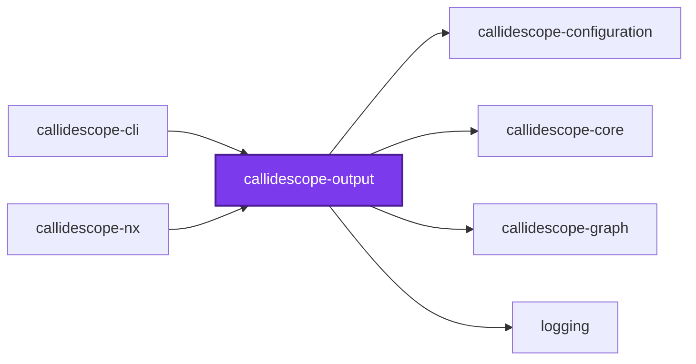
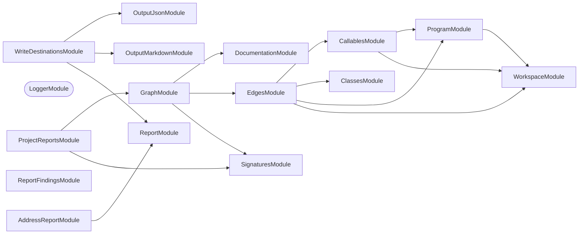

# 🔭 Callidescope Output

[](https://www.npmjs.com/package/@callidescope/output)

**Renders call-graph findings into markdown, mermaid, and JSON output formats.**

This package sits between
[`@callidescope/graph`](../callidescope-graph/README.md), which it depends on
for the shapes it renders, and
[`@callidescope/cli`](../callidescope-cli/README.md), which orchestrates a run
and hands this package the findings.

```bash
npm install --save-dev @callidescope/output
```

## What This Package Owns

- **`output-markdown`** — anchored-block splicing into markdown files
- **`output-json`** — JSON file output
- **`report`** — assembles findings, as markdown or a mermaid diagram, into the reportable shape
- **`project-reports`** — per-project report sections, scoping a run's findings to the project each one came from

## Test

```bash
nx run callidescope-output:vitest
```

## 👔 Conformetry

This project was generated from the [nestjs-service-project](../../../../configuration/conformetry-templates/nestjs-service-project) conformetry template.

<!-- callidescope:start -->

## 🔭 Callidescope

Call stacks traced through `packages/ic-suite/callidescope/callidescope-output`, deepest first. Each frame shows what it takes, what it returns, and what its documentation says.

| Measure | Value |
| --- | --- |
| Callables | 137 |
| Files | 38 |
| Calls traced | 142 |
| Call stacks | 2 |
| Deepest stack | 4 |
| Stacks through recursion | 0 |
| Unfollowable calls | 1 |

### Limits

What this project is judged against, as declared in its own `callidescope.config.ts`.

| Limit | Value |
| --- | --- |
| `maximumDepth` | 13 |
| `maximumBreadth` | 7 |

### Call stacks (depth)

**1. `OutputMarkdownService.syncAnchoredBlock`** — depth ≥ 4 · orphan-root

```text
🚀 OutputMarkdownService.syncAnchoredBlock(…): boolean [packages/ic-suite/callidescope/callidescope-output/src/modules/output-markdown/output-markdown.service.ts:161]
  └─> OutputMarkdownService.syncAnchoredBlock(args: SyncAnchoredBlockArguments): boolean [packages/ic-suite/callidescope/callidescope-output/src/modules/output-markdown/output-markdown.service.ts:206]
     ↳ Splices the anchored block into a file.
    └─> OutputMarkdownService.buildBlockPattern(destination: SyncAnchoredBlockArguments["destination"]): RegExp [packages/ic-suite/callidescope/callidescope-output/src/modules/output-markdown/output-markdown.service.ts:54]
       ↳ Builds the pattern matching everything between the two anchors.
      └─> OutputMarkdownService.escapePattern(value: string): string [packages/ic-suite/callidescope/callidescope-output/src/modules/output-markdown/output-markdown.service.ts:63]
         ↳ Escapes a marker so it can sit inside a pattern.
```

**2. `OutputMarkdownService.wrapInAnchors`** — depth 2 · orphan-root

```text
🚀 OutputMarkdownService.wrapInAnchors(override: string | undefined): string [packages/ic-suite/callidescope/callidescope-output/src/modules/output-markdown/output-markdown.service.ts:168]
  └─> OutputMarkdownService.wrapInAnchors(args: WrapInAnchorsArguments): string [packages/ic-suite/callidescope/callidescope-output/src/modules/output-markdown/output-markdown.service.ts:236]
     ↳ Wraps content in the configured anchors.
```

### Breadth

| Callable | Breadth | Calls directly | Location |
| --- | --- | --- | --- |
| `MarkdownReportService.renderRun` | 7 | `MarkdownReportService.subsectionPrefix`, `WorkspaceReportService.buildRows`, `MarkdownReportService.renderSummaryTable`, `WorkspaceReportService.renderProjectIndex`, `WorkspaceReportService.renderHeadroom`, `MarkdownReportService.renderStacksAs`, `MarkdownReportService.renderCallableBreadths` | `packages/ic-suite/callidescope/callidescope-output/src/modules/report/markdown-report.service.ts:305` |
| `MarkdownReportService.renderProjectSection` | 5 | `MarkdownReportService.renderSummaryTable`, `MarkdownReportService.renderProjectLimits`, `WorkspaceReportService.limitsFor`, `MarkdownReportService.renderStacksAs`, `MarkdownReportService.renderCallableBreadths` | `packages/ic-suite/callidescope/callidescope-output/src/modules/report/markdown-report.service.ts:257` |
| `OutputMarkdownService.syncAnchoredBlock` | 5 | `MissingMarkdownPathError.constructor`, `OutputMarkdownService.readExisting`, `OutputMarkdownService.wrapInAnchors`, `OutputMarkdownService.buildBlockPattern`, `OutputMarkdownService.spliceBlock` | `packages/ic-suite/callidescope/callidescope-output/src/modules/output-markdown/output-markdown.service.ts:206` |

<details>
<summary>68 more callables</summary>

| Callable | Breadth | Calls directly | Location |
| --- | --- | --- | --- |
| `AddressReportService.renderBreadthDiagram` | 4 | `AddressReportService.toFrame`, `AddressReportService.map(…)`, `AddressReportService.map(…)`, `MermaidReportService.renderStacks` | `packages/ic-suite/callidescope/callidescope-output/src/modules/address-report/address-report.service.ts:61` |
| `ProjectReportsService.buildSummary` | 4 | `ProjectReportsService.filter(…)`, `ProjectReportsService.filter(…)`, `ProjectReportsService.reduce(…)`, `ProjectReportsService.filter(…)` | `packages/ic-suite/callidescope/callidescope-output/src/modules/project-reports/project-reports.service.ts:133` |
| `ReportFindingsService.reportFindings` | 4 | `ReportFindingsService.reportStaleness`, `ReportFindingsService.reportDeepStacks`, `ReportFindingsService.reportWideCallables`, `ReportFindingsService.reportEmptyTrace` | `packages/ic-suite/callidescope/callidescope-output/src/modules/report-findings/report-findings.service.ts:127` |
| `WriteDestinationsService.syncDestinations` | 4 | `OutputJsonService.sync`, `OutputMarkdownService.sync`, `MarkdownReportService.renderRun`, `WriteDestinationsService.syncProjectDestinations` | `packages/ic-suite/callidescope/callidescope-output/src/modules/write-destinations/write-destinations.service.ts:121` |
| `MermaidReportService.renderStacks` | 3 | `MermaidReportService.countNewCallables`, `MermaidReportService.addStack`, `MermaidReportService.renderDiagram` | `packages/ic-suite/callidescope/callidescope-output/src/modules/report/mermaid-report.service.ts:139` |
| `ReportService.renderFrame` | 3 | `ReportService.renderSignature`, `ReportService.renderMarkers`, `ReportService.shortenSummary` | `packages/ic-suite/callidescope/callidescope-output/src/modules/report/report.service.ts:44` |
| `MarkdownReportService.renderCallableBreadths` | 3 | `MarkdownReportService.renderTable`, `MarkdownReportService.map(…)`, `MarkdownReportService.map(…)` | `packages/ic-suite/callidescope/callidescope-output/src/modules/report/markdown-report.service.ts:69` |
| `AddressReportService.renderBreadth` | 3 | `AddressReportService.buildBreadthPayload`, `AddressReportService.renderBreadthDiagram`, `AddressReportService.renderReferenceTable` | `packages/ic-suite/callidescope/callidescope-output/src/modules/address-report/address-report.service.ts:153` |
| `AddressReportService.renderDepth` | 3 | `AddressReportService.buildDepthPayload`, `MermaidReportService.renderStacks`, `AddressReportService.renderDepthStacks` | `packages/ic-suite/callidescope/callidescope-output/src/modules/address-report/address-report.service.ts:208` |
| `OutputMarkdownService.spliceBlock` | 3 | `OutputMarkdownService.replace(…)`, `OutputMarkdownService.appendBlock`, `OutputMarkdownService.replaceOrphanedBlock` | `packages/ic-suite/callidescope/callidescope-output/src/modules/output-markdown/output-markdown.service.ts:123` |
| `ProjectReportsService.build` | 3 | `ProjectReportsService.buildStacks`, `ProjectReportsService.buildCallableBreadths`, `ProjectReportsService.map(…)` | `packages/ic-suite/callidescope/callidescope-output/src/modules/project-reports/project-reports.service.ts:229` |
| `ProjectReportsService.map(…)` | 3 | `ProjectReportsService.toSorted(…)`, `ProjectReportsService.toSorted(…)`, `ProjectReportsService.buildSummary` | `packages/ic-suite/callidescope/callidescope-output/src/modules/project-reports/project-reports.service.ts:233` |
| `ProjectReportsService.findOwnedFindings` | 3 | `ProjectReportsService.filter(…)`, `ProjectReportsService.findDeepStacks`, `ProjectReportsService.findWideCallables` | `packages/ic-suite/callidescope/callidescope-output/src/modules/project-reports/project-reports.service.ts:302` |
| `MermaidReportService.countNewCallables` | 2 | `MermaidReportService.filter(…)`, `MermaidReportService.map(…)` | `packages/ic-suite/callidescope/callidescope-output/src/modules/report/mermaid-report.service.ts:90` |
| `WorkspaceReportService.buildRows` | 2 | `WorkspaceReportService.map(…)`, `WorkspaceReportService.toSorted(…)` | `packages/ic-suite/callidescope/callidescope-output/src/modules/report/workspace-report.service.ts:105` |
| `WorkspaceReportService.map(…)` | 2 | `WorkspaceReportService.limitsFor`, `WorkspaceReportService.widestBreadth` | `packages/ic-suite/callidescope/callidescope-output/src/modules/report/workspace-report.service.ts:106` |
| `WorkspaceReportService.renderHeadroom` | 2 | `WorkspaceReportService.map(…)`, `WorkspaceReportService.map(…)` | `packages/ic-suite/callidescope/callidescope-output/src/modules/report/workspace-report.service.ts:150` |
| `WorkspaceReportService.renderProjectIndex` | 2 | `WorkspaceReportService.buildRows`, `WorkspaceReportService.map(…)` | `packages/ic-suite/callidescope/callidescope-output/src/modules/report/workspace-report.service.ts:178` |
| `MarkdownReportService.renderStacksAs` | 2 | `MermaidReportService.renderStacks`, `MarkdownReportService.renderStacks` | `packages/ic-suite/callidescope/callidescope-output/src/modules/report/markdown-report.service.ts:153` |
| `MarkdownReportService.renderFindings` | 2 | `MarkdownReportService.renderStacks`, `MarkdownReportService.renderWideCallableLines` | `packages/ic-suite/callidescope/callidescope-output/src/modules/report/markdown-report.service.ts:239` |
| `AddressReportService.renderBreadthReports` | 2 | `AddressReportService.map(…)`, `AddressReportService.map(…)` | `packages/ic-suite/callidescope/callidescope-output/src/modules/address-report/address-report.service.ts:193` |
| `AddressReportService.renderDepthReports` | 2 | `AddressReportService.map(…)`, `AddressReportService.map(…)` | `packages/ic-suite/callidescope/callidescope-output/src/modules/address-report/address-report.service.ts:256` |
| `OutputJsonService.sync` | 2 | `OutputJsonService.buildReport`, `OutputJsonService.readExisting` | `packages/ic-suite/callidescope/callidescope-output/src/modules/output-json/output-json.service.ts:63` |
| `OutputMarkdownService.sync` | 2 | `OutputMarkdownService.syncAnchoredBlock`, `OutputMarkdownService.buildHelpers` | `packages/ic-suite/callidescope/callidescope-output/src/modules/output-markdown/output-markdown.service.ts:177` |
| `ProjectReportsService.buildCallableBreadths` | 2 | `ProjectReportsService.flatMap(…)`, `SignaturesService.read` | `packages/ic-suite/callidescope/callidescope-output/src/modules/project-reports/project-reports.service.ts:47` |
| `ProjectReportsService.buildStacks` | 2 | `ProjectReportsService.readDepth`, `PathsService.buildDeepestPath` | `packages/ic-suite/callidescope/callidescope-output/src/modules/project-reports/project-reports.service.ts:87` |
| `ProjectReportsService.findProjectDeepStacks` | 2 | `ProjectReportsService.map(…)`, `ProjectReportsService.filter(…)` | `packages/ic-suite/callidescope/callidescope-output/src/modules/project-reports/project-reports.service.ts:169` |
| `ProjectReportsService.findProjectWideCallables` | 2 | `ProjectReportsService.map(…)`, `ProjectReportsService.filter(…)` | `packages/ic-suite/callidescope/callidescope-output/src/modules/project-reports/project-reports.service.ts:179` |
| `ProjectReportsService.findDeepStacks` | 2 | `ProjectReportsService.toSorted(…)`, `ProjectReportsService.flatMap(…)` | `packages/ic-suite/callidescope/callidescope-output/src/modules/project-reports/project-reports.service.ts:271` |
| `ProjectReportsService.flatMap(…)` | 2 | `ProjectReportsService.findProjectDeepStacks`, `ProjectReportsService.readProjectLimits` | `packages/ic-suite/callidescope/callidescope-output/src/modules/project-reports/project-reports.service.ts:276` |
| `ProjectReportsService.findWideCallables` | 2 | `ProjectReportsService.toSorted(…)`, `ProjectReportsService.flatMap(…)` | `packages/ic-suite/callidescope/callidescope-output/src/modules/project-reports/project-reports.service.ts:364` |
| `ProjectReportsService.flatMap(…)` | 2 | `ProjectReportsService.findProjectWideCallables`, `ProjectReportsService.readProjectLimits` | `packages/ic-suite/callidescope/callidescope-output/src/modules/project-reports/project-reports.service.ts:369` |
| `ReportFindingsService.reportDeepStacks` | 2 | `ReportFindingsService.map(…)`, `ReportFindingsService.map(…)` | `packages/ic-suite/callidescope/callidescope-output/src/modules/report-findings/report-findings.service.ts:35` |
| `ReportFindingsService.reportWideCallables` | 2 | `ReportFindingsService.map(…)`, `ReportFindingsService.map(…)` | `packages/ic-suite/callidescope/callidescope-output/src/modules/report-findings/report-findings.service.ts:92` |
| `WriteDestinationsService.syncProjectSections` | 2 | `OutputMarkdownService.sync`, `MarkdownReportService.renderProjectSection` | `packages/ic-suite/callidescope/callidescope-output/src/modules/write-destinations/write-destinations.service.ts:80` |
| `MermaidReportService.addFrame` | 1 | `MermaidReportService.renderLabel` | `packages/ic-suite/callidescope/callidescope-output/src/modules/report/mermaid-report.service.ts:39` |
| `MermaidReportService.addStack` | 1 | `MermaidReportService.addFrame` | `packages/ic-suite/callidescope/callidescope-output/src/modules/report/mermaid-report.service.ts:67` |
| `ReportService.shortenSummary` | 1 | `ReportService.readFirstSentence` | `packages/ic-suite/callidescope/callidescope-output/src/modules/report/report.service.ts:102` |
| `ReportService.renderStackTree` | 1 | `ReportService.map(…)` | `packages/ic-suite/callidescope/callidescope-output/src/modules/report/report.service.ts:130` |
| `ReportService.map(…)` | 1 | `ReportService.renderFrame` | `packages/ic-suite/callidescope/callidescope-output/src/modules/report/report.service.ts:132` |
| `WorkspaceReportService.widestBreadth` | 1 | `WorkspaceReportService.reduce(…)` | `packages/ic-suite/callidescope/callidescope-output/src/modules/report/workspace-report.service.ts:88` |
| `WorkspaceReportService.map(…)` | 1 | `WorkspaceReportService.bucketFor` | `packages/ic-suite/callidescope/callidescope-output/src/modules/report/workspace-report.service.ts:151` |
| `WorkspaceReportService.map(…)` | 1 | `WorkspaceReportService.filter(…)` | `packages/ic-suite/callidescope/callidescope-output/src/modules/report/workspace-report.service.ts:160` |
| `MarkdownReportService.toRow` | 1 | `MarkdownReportService.map(…)` | `packages/ic-suite/callidescope/callidescope-output/src/modules/report/markdown-report.service.ts:73` |
| `MarkdownReportService.map(…)` | 1 | `MarkdownReportService.toRow` | `packages/ic-suite/callidescope/callidescope-output/src/modules/report/markdown-report.service.ts:79` |
| `MarkdownReportService.map(…)` | 1 | `MarkdownReportService.toRow` | `packages/ic-suite/callidescope/callidescope-output/src/modules/report/markdown-report.service.ts:94` |
| `MarkdownReportService.renderProjectLimits` | 1 | `MarkdownReportService.map(…)` | `packages/ic-suite/callidescope/callidescope-output/src/modules/report/markdown-report.service.ts:126` |
| `MarkdownReportService.map(…)` | 1 | `MarkdownReportService.renderLimitCell` | `packages/ic-suite/callidescope/callidescope-output/src/modules/report/markdown-report.service.ts:130` |
| `MarkdownReportService.renderStack` | 1 | `ReportService.renderStackTree` | `packages/ic-suite/callidescope/callidescope-output/src/modules/report/markdown-report.service.ts:136` |
| `MarkdownReportService.renderWideCallableLines` | 1 | `MarkdownReportService.map(…)` | `packages/ic-suite/callidescope/callidescope-output/src/modules/report/markdown-report.service.ts:199` |
| `MarkdownReportService.renderStacks` | 1 | `MarkdownReportService.map(…)` | `packages/ic-suite/callidescope/callidescope-output/src/modules/report/markdown-report.service.ts:355` |
| `MarkdownReportService.map(…)` | 1 | `MarkdownReportService.renderStack` | `packages/ic-suite/callidescope/callidescope-output/src/modules/report/markdown-report.service.ts:360` |
| `AddressReportService.map(…)` | 1 | `AddressReportService.toFrame` | `packages/ic-suite/callidescope/callidescope-output/src/modules/address-report/address-report.service.ts:72` |
| `AddressReportService.map(…)` | 1 | `AddressReportService.toFrame` | `packages/ic-suite/callidescope/callidescope-output/src/modules/address-report/address-report.service.ts:75` |
| `AddressReportService.renderDepthStacks` | 1 | `AddressReportService.map(…)` | `packages/ic-suite/callidescope/callidescope-output/src/modules/address-report/address-report.service.ts:84` |
| `AddressReportService.map(…)` | 1 | `ReportService.renderStackTree` | `packages/ic-suite/callidescope/callidescope-output/src/modules/address-report/address-report.service.ts:95` |
| `AddressReportService.renderReferenceTable` | 1 | `AddressReportService.map(…)` | `packages/ic-suite/callidescope/callidescope-output/src/modules/address-report/address-report.service.ts:116` |
| `AddressReportService.map(…)` | 1 | `AddressReportService.buildBreadthPayload` | `packages/ic-suite/callidescope/callidescope-output/src/modules/address-report/address-report.service.ts:196` |
| `AddressReportService.map(…)` | 1 | `AddressReportService.renderBreadth` | `packages/ic-suite/callidescope/callidescope-output/src/modules/address-report/address-report.service.ts:203` |
| `AddressReportService.map(…)` | 1 | `AddressReportService.buildDepthPayload` | `packages/ic-suite/callidescope/callidescope-output/src/modules/address-report/address-report.service.ts:259` |
| `AddressReportService.map(…)` | 1 | `AddressReportService.renderDepth` | `packages/ic-suite/callidescope/callidescope-output/src/modules/address-report/address-report.service.ts:266` |
| `OutputMarkdownService.buildBlockPattern` | 1 | `OutputMarkdownService.escapePattern` | `packages/ic-suite/callidescope/callidescope-output/src/modules/output-markdown/output-markdown.service.ts:54` |
| `OutputMarkdownService.syncAnchoredBlock` | 1 | `OutputMarkdownService.syncAnchoredBlock` | `packages/ic-suite/callidescope/callidescope-output/src/modules/output-markdown/output-markdown.service.ts:161` |
| `OutputMarkdownService.wrapInAnchors` | 1 | `OutputMarkdownService.wrapInAnchors` | `packages/ic-suite/callidescope/callidescope-output/src/modules/output-markdown/output-markdown.service.ts:168` |
| `ProjectReportsService.filter(…)` | 1 | `ProjectReportsService.some(…)` | `packages/ic-suite/callidescope/callidescope-output/src/modules/project-reports/project-reports.service.ts:150` |
| `ProjectReportsService.findUnreadProjects` | 1 | `ProjectReportsService.filter(…)` | `packages/ic-suite/callidescope/callidescope-output/src/modules/project-reports/project-reports.service.ts:339` |
| `ProjectReportsService.filter(…)` | 1 | `ProjectReportsService.find(…)` | `packages/ic-suite/callidescope/callidescope-output/src/modules/project-reports/project-reports.service.ts:345` |
| `WriteDestinationsService.syncProjectDestinations` | 1 | `WriteDestinationsService.syncProjectSections` | `packages/ic-suite/callidescope/callidescope-output/src/modules/write-destinations/write-destinations.service.ts:53` |

</details>
<!-- callidescope:end -->

## 🕸️ Codependix

Dependency graphs exported by [codependix](https://github.com/Organizzolini/codebase/tree/main/packages/ic-suite/codependix/codependix-cli), regenerated by `nx run codebase:codependix:write`.

### Nx Neighborhood

<!-- codependix:start name="codependix-nx-projects" -->

<!-- codependix:end name="codependix-nx-projects" -->

### NestJS Module Graph

<!-- codependix:start name="codependix-nestjs-modules" -->


_Rounded modules are global: every module can inject them, so their edges are left out._
<!-- codependix:end name="codependix-nestjs-modules" -->

### File Imports

```mermaid
graph LR
  file_callidescope_config_ts["callidescope.config.ts"]
  file_codependix_config_ts["codependix.config.ts"]
  file_codometer_config_ts["codometer.config.ts"]
  file_eslint_config_ts["eslint.config.ts"]
  file_src_index_ts["src/index.ts"]
  file_src_modules_address_report_address_report_constants_ts["src/modules/address-report/address-report.constants.ts"]
  file_src_modules_address_report_address_report_module_ts["src/modules/address-report/address-report.module.ts"]
  file_src_modules_address_report_address_report_service_ts["src/modules/address-report/address-report.service.ts"]
  file_src_modules_address_report_address_report_service_unit_test_ts["src/modules/address-report/address-report.service.unit.test.ts"]
  file_src_modules_address_report_address_report_types_ts["src/modules/address-report/address-report.types.ts"]
  file_src_modules_output_json_output_json_constants_ts["src/modules/output-json/output-json.constants.ts"]
  file_src_modules_output_json_output_json_module_ts["src/modules/output-json/output-json.module.ts"]
  file_src_modules_output_json_output_json_service_ts["src/modules/output-json/output-json.service.ts"]
  file_src_modules_output_json_output_json_service_unit_test_ts["src/modules/output-json/output-json.service.unit.test.ts"]
  file_src_modules_output_json_output_json_types_ts["src/modules/output-json/output-json.types.ts"]
  file_src_modules_output_markdown_output_markdown_constants_ts["src/modules/output-markdown/output-markdown.constants.ts"]
  file_src_modules_output_markdown_output_markdown_module_ts["src/modules/output-markdown/output-markdown.module.ts"]
  file_src_modules_output_markdown_output_markdown_service_ts["src/modules/output-markdown/output-markdown.service.ts"]
  file_src_modules_output_markdown_output_markdown_service_unit_test_ts["src/modules/output-markdown/output-markdown.service.unit.test.ts"]
  file_src_modules_output_markdown_output_markdown_types_ts["src/modules/output-markdown/output-markdown.types.ts"]
  file_src_modules_project_reports_project_reports_constants_ts["src/modules/project-reports/project-reports.constants.ts"]
  file_src_modules_project_reports_project_reports_module_ts["src/modules/project-reports/project-reports.module.ts"]
  file_src_modules_project_reports_project_reports_service_ts["src/modules/project-reports/project-reports.service.ts"]
  file_src_modules_project_reports_project_reports_service_unit_test_ts["src/modules/project-reports/project-reports.service.unit.test.ts"]
  file_src_modules_project_reports_project_reports_types_ts["src/modules/project-reports/project-reports.types.ts"]
  file_src_modules_report_findings_report_findings_constants_ts["src/modules/report-findings/report-findings.constants.ts"]
  file_src_modules_report_findings_report_findings_module_ts["src/modules/report-findings/report-findings.module.ts"]
  file_src_modules_report_findings_report_findings_service_ts["src/modules/report-findings/report-findings.service.ts"]
  file_src_modules_report_findings_report_findings_service_unit_test_ts["src/modules/report-findings/report-findings.service.unit.test.ts"]
  file_src_modules_report_findings_report_findings_types_ts["src/modules/report-findings/report-findings.types.ts"]
  file_src_modules_report_markdown_report_service_ts["src/modules/report/markdown-report.service.ts"]
  file_src_modules_report_markdown_report_service_unit_test_ts["src/modules/report/markdown-report.service.unit.test.ts"]
  file_src_modules_report_mermaid_report_service_ts["src/modules/report/mermaid-report.service.ts"]
  file_src_modules_report_mermaid_report_service_unit_test_ts["src/modules/report/mermaid-report.service.unit.test.ts"]
  file_src_modules_report_report_constants_ts["src/modules/report/report.constants.ts"]
  file_src_modules_report_report_module_ts["src/modules/report/report.module.ts"]
  file_src_modules_report_report_service_ts["src/modules/report/report.service.ts"]
  file_src_modules_report_report_service_unit_test_ts["src/modules/report/report.service.unit.test.ts"]
  file_src_modules_report_report_types_ts["src/modules/report/report.types.ts"]
  file_src_modules_report_workspace_report_service_ts["src/modules/report/workspace-report.service.ts"]
  file_src_modules_report_workspace_report_service_unit_test_ts["src/modules/report/workspace-report.service.unit.test.ts"]
  file_src_modules_write_destinations_write_destinations_constants_ts["src/modules/write-destinations/write-destinations.constants.ts"]
  file_src_modules_write_destinations_write_destinations_module_ts["src/modules/write-destinations/write-destinations.module.ts"]
  file_src_modules_write_destinations_write_destinations_service_ts["src/modules/write-destinations/write-destinations.service.ts"]
  file_src_modules_write_destinations_write_destinations_service_unit_test_ts["src/modules/write-destinations/write-destinations.service.unit.test.ts"]
  file_src_modules_write_destinations_write_destinations_types_ts["src/modules/write-destinations/write-destinations.types.ts"]
  file_testing_mocks_ts["testing/mocks.ts"]
  file_testing_modules_ts["testing/modules.ts"]
  file_testing_setup_ts["testing/setup.ts"]
  file_vite_config_ts["vite.config.ts"]
  file_vitest_config_ts["vitest.config.ts"]
  file_src_modules_address_report_address_report_module_ts --> file_src_modules_address_report_address_report_service_ts
  file_src_modules_address_report_address_report_module_ts --> file_src_modules_report_report_module_ts
  file_src_modules_address_report_address_report_service_ts --> file_src_modules_address_report_address_report_types_ts
  file_src_modules_address_report_address_report_service_ts --> file_src_modules_report_mermaid_report_service_ts
  file_src_modules_address_report_address_report_service_ts --> file_src_modules_report_report_service_ts
  file_src_modules_address_report_address_report_service_ts --> file_src_modules_report_report_types_ts
  file_src_modules_address_report_address_report_service_unit_test_ts --> file_src_modules_address_report_address_report_service_ts
  file_src_modules_address_report_address_report_service_unit_test_ts --> file_src_modules_report_mermaid_report_service_ts
  file_src_modules_address_report_address_report_service_unit_test_ts --> file_src_modules_report_report_service_ts
  file_src_modules_address_report_address_report_service_unit_test_ts --> file_testing_mocks_ts
  file_src_modules_output_json_output_json_module_ts --> file_src_modules_output_json_output_json_service_ts
  file_src_modules_output_json_output_json_service_ts --> file_src_modules_output_json_output_json_types_ts
  file_src_modules_output_json_output_json_service_unit_test_ts --> file_src_modules_output_json_output_json_service_ts
  file_src_modules_output_json_output_json_service_unit_test_ts --> file_testing_mocks_ts
  file_src_modules_output_json_output_json_service_unit_test_ts --> file_testing_modules_ts
  file_src_modules_output_markdown_output_markdown_module_ts --> file_src_modules_output_markdown_output_markdown_service_ts
  file_src_modules_output_markdown_output_markdown_service_ts --> file_src_modules_output_markdown_output_markdown_constants_ts
  file_src_modules_output_markdown_output_markdown_service_ts --> file_src_modules_output_markdown_output_markdown_types_ts
  file_src_modules_output_markdown_output_markdown_service_unit_test_ts --> file_src_modules_output_markdown_output_markdown_constants_ts
  file_src_modules_output_markdown_output_markdown_service_unit_test_ts --> file_src_modules_output_markdown_output_markdown_service_ts
  file_src_modules_output_markdown_output_markdown_service_unit_test_ts --> file_testing_mocks_ts
  file_src_modules_output_markdown_output_markdown_service_unit_test_ts --> file_testing_modules_ts
  file_src_modules_project_reports_project_reports_module_ts --> file_src_modules_project_reports_project_reports_service_ts
  file_src_modules_project_reports_project_reports_service_ts --> file_src_modules_project_reports_project_reports_constants_ts
  file_src_modules_project_reports_project_reports_service_ts --> file_src_modules_project_reports_project_reports_types_ts
  file_src_modules_project_reports_project_reports_service_unit_test_ts --> file_src_modules_project_reports_project_reports_service_ts
  file_src_modules_project_reports_project_reports_service_unit_test_ts --> file_src_modules_project_reports_project_reports_types_ts
  file_src_modules_project_reports_project_reports_service_unit_test_ts --> file_testing_mocks_ts
  file_src_modules_project_reports_project_reports_service_unit_test_ts --> file_testing_modules_ts
  file_src_modules_report_findings_report_findings_module_ts --> file_src_modules_report_findings_report_findings_service_ts
  file_src_modules_report_findings_report_findings_service_ts --> file_src_modules_report_findings_report_findings_types_ts
  file_src_modules_report_findings_report_findings_service_unit_test_ts --> file_src_modules_report_findings_report_findings_service_ts
  file_src_modules_report_findings_report_findings_service_unit_test_ts --> file_src_modules_report_findings_report_findings_types_ts
  file_src_modules_report_findings_report_findings_service_unit_test_ts --> file_testing_mocks_ts
  file_src_modules_report_markdown_report_service_ts --> file_src_modules_report_mermaid_report_service_ts
  file_src_modules_report_markdown_report_service_ts --> file_src_modules_report_report_constants_ts
  file_src_modules_report_markdown_report_service_ts --> file_src_modules_report_report_service_ts
  file_src_modules_report_markdown_report_service_ts --> file_src_modules_report_report_types_ts
  file_src_modules_report_markdown_report_service_ts --> file_src_modules_report_workspace_report_service_ts
  file_src_modules_report_markdown_report_service_unit_test_ts --> file_src_modules_report_markdown_report_service_ts
  file_src_modules_report_markdown_report_service_unit_test_ts --> file_src_modules_report_report_constants_ts
  file_src_modules_report_markdown_report_service_unit_test_ts --> file_testing_mocks_ts
  file_src_modules_report_markdown_report_service_unit_test_ts --> file_testing_modules_ts
  file_src_modules_report_mermaid_report_service_ts --> file_src_modules_report_report_constants_ts
  file_src_modules_report_mermaid_report_service_ts --> file_src_modules_report_report_types_ts
  file_src_modules_report_mermaid_report_service_unit_test_ts --> file_src_modules_report_mermaid_report_service_ts
  file_src_modules_report_mermaid_report_service_unit_test_ts --> file_src_modules_report_report_constants_ts
  file_src_modules_report_mermaid_report_service_unit_test_ts --> file_testing_mocks_ts
  file_src_modules_report_mermaid_report_service_unit_test_ts --> file_testing_modules_ts
  file_src_modules_report_report_module_ts --> file_src_modules_report_markdown_report_service_ts
  file_src_modules_report_report_module_ts --> file_src_modules_report_mermaid_report_service_ts
  file_src_modules_report_report_module_ts --> file_src_modules_report_report_service_ts
  file_src_modules_report_report_module_ts --> file_src_modules_report_workspace_report_service_ts
  file_src_modules_report_report_service_ts --> file_src_modules_report_report_constants_ts
  file_src_modules_report_report_service_unit_test_ts --> file_src_modules_report_report_service_ts
  file_src_modules_report_report_service_unit_test_ts --> file_testing_mocks_ts
  file_src_modules_report_report_service_unit_test_ts --> file_testing_modules_ts
  file_src_modules_report_report_types_ts --> file_src_modules_project_reports_project_reports_types_ts
  file_src_modules_report_workspace_report_service_ts --> file_src_modules_report_report_constants_ts
  file_src_modules_report_workspace_report_service_ts --> file_src_modules_report_report_types_ts
  file_src_modules_report_workspace_report_service_unit_test_ts --> file_src_modules_report_report_constants_ts
  file_src_modules_report_workspace_report_service_unit_test_ts --> file_src_modules_report_workspace_report_service_ts
  file_src_modules_report_workspace_report_service_unit_test_ts --> file_testing_mocks_ts
  file_src_modules_report_workspace_report_service_unit_test_ts --> file_testing_modules_ts
  file_src_modules_write_destinations_write_destinations_module_ts --> file_src_modules_output_json_output_json_module_ts
  file_src_modules_write_destinations_write_destinations_module_ts --> file_src_modules_output_markdown_output_markdown_module_ts
  file_src_modules_write_destinations_write_destinations_module_ts --> file_src_modules_report_report_module_ts
  file_src_modules_write_destinations_write_destinations_module_ts --> file_src_modules_write_destinations_write_destinations_service_ts
  file_src_modules_write_destinations_write_destinations_service_ts --> file_src_modules_output_json_output_json_service_ts
  file_src_modules_write_destinations_write_destinations_service_ts --> file_src_modules_output_markdown_output_markdown_service_ts
  file_src_modules_write_destinations_write_destinations_service_ts --> file_src_modules_report_markdown_report_service_ts
  file_src_modules_write_destinations_write_destinations_service_ts --> file_src_modules_write_destinations_write_destinations_constants_ts
  file_src_modules_write_destinations_write_destinations_service_ts --> file_src_modules_write_destinations_write_destinations_types_ts
  file_src_modules_write_destinations_write_destinations_service_unit_test_ts --> file_src_modules_output_json_output_json_service_ts
  file_src_modules_write_destinations_write_destinations_service_unit_test_ts --> file_src_modules_output_markdown_output_markdown_service_ts
  file_src_modules_write_destinations_write_destinations_service_unit_test_ts --> file_src_modules_report_markdown_report_service_ts
  file_src_modules_write_destinations_write_destinations_service_unit_test_ts --> file_src_modules_report_mermaid_report_service_ts
  file_src_modules_write_destinations_write_destinations_service_unit_test_ts --> file_src_modules_report_report_service_ts
  file_src_modules_write_destinations_write_destinations_service_unit_test_ts --> file_src_modules_report_workspace_report_service_ts
  file_src_modules_write_destinations_write_destinations_service_unit_test_ts --> file_src_modules_write_destinations_write_destinations_service_ts
  file_src_modules_write_destinations_write_destinations_service_unit_test_ts --> file_src_modules_write_destinations_write_destinations_types_ts
  file_src_modules_write_destinations_write_destinations_service_unit_test_ts --> file_testing_mocks_ts
  file_testing_modules_ts --> file_src_modules_output_json_output_json_module_ts
  file_testing_modules_ts --> file_src_modules_output_markdown_output_markdown_module_ts
  file_testing_modules_ts --> file_src_modules_project_reports_project_reports_module_ts
  file_testing_modules_ts --> file_src_modules_report_report_module_ts
```

<!-- codependix:start name="codependix-file-imports" -->

<!-- codependix:end name="codependix-file-imports" -->

<!-- codometer:start -->

## ⏲️ Codometer

### Project


### Measured Targets


### TypeScript


### JavaScript


### Python


### JSON


### YAML


### TOML


### Shell


### SQL


### HCL


### CSS


### Conventions


### Jupyter


### Markdown


<!-- codometer:end -->
