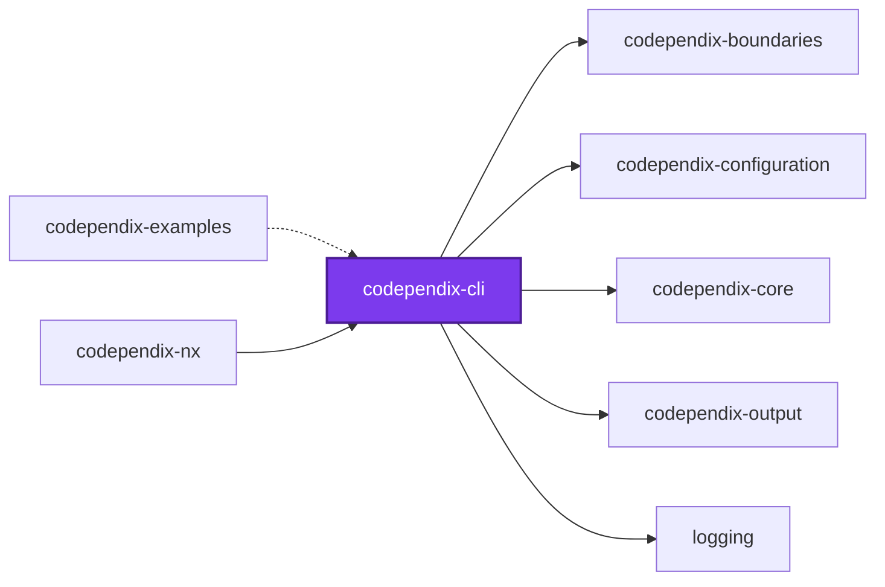
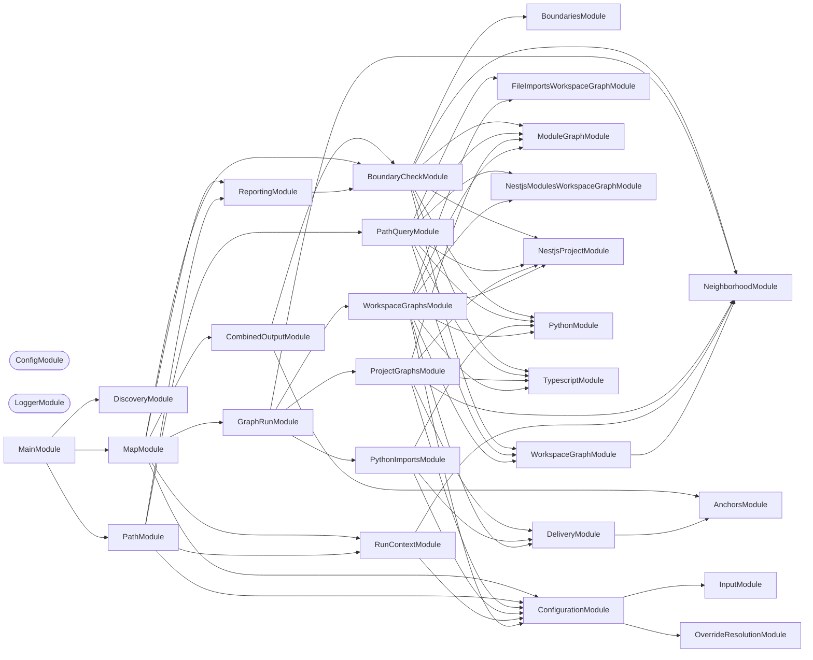
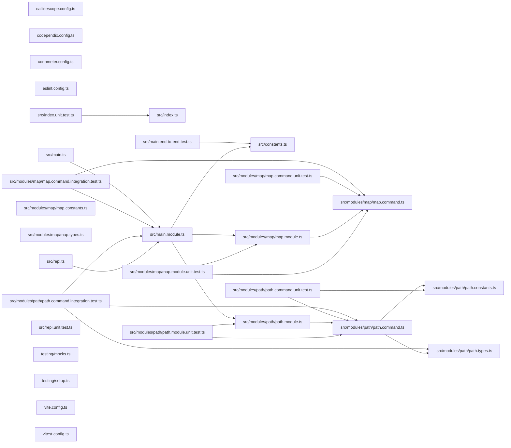

# 🕸️ Codependix CLI

[](https://www.npmjs.com/package/@codependix/cli)

**Exports a project's dependency graphs — Nx, NestJS, and file-level imports — as JSON and Markdown diagrams, and gates the rules those graphs are judged against.**

Codependix reads what each project depends on and renders it four ways: the
Nx project graph, a NestJS project's module graph, a TypeScript project's own
file-level import graph, and a Python project's own file-level import graph.
Each graph is delivered to whichever destinations
`codependix.config.ts` names for that project — a JSON file, a Markdown anchor
block spliced into an existing file such as a `README.md`, or both. The same
built graphs are then judged against whatever rules the configuration
declares — see [`@codependix/boundaries`](../codependix-boundaries/README.md).

```bash
pnpm add --filter <project> --save-dev @codependix/cli
```

```bash
codependix map --write
```

## Usage

One command, `map`, and no per-graph-type subcommand. Which graphs run for a
project, where its export lands, and which rules judge it is entirely a
function of the configuration file; see
[`configuration/codependix.config.ts`](../../configuration/codependix.config.ts)
for this repository's own.

| Flag | Meaning |
| ---- | ------- |
| `--check [check]` | Fail on a comma-separated set drawn from `boundaries` and `reports` |
| `--config [config]` | Path to a `codependix.config.ts`. Searched for upward from `--directory` when omitted |
| `--dependencies` | Build `--check boundaries` over the dependencies of the projects `--projects` or `--tags` named, reporting their findings as notes (default). No effect without `--projects` or `--tags` |
| `--no-dependencies` | Build `--check boundaries` over only the projects `--projects` or `--tags` named, not their dependencies. No effect without `--projects` or `--tags` |
| `-d, --directory [directory]` | Workspace root whose Nx project graph this run reads. Defaults to the working directory |
| `--exclude [exclude]` | Comma-separated globs overriding the configured `exclude`. Refused when `exclude` was never configured |
| `--file-imports` | Build, check, and write the `fileImports` graph type for this run |
| `--no-file-imports` | Skip the `fileImports` graph type for this run |
| `-f, --format [format]` | What to print to standard output, one of `json` and `markdown` (default: `markdown`). A graph type prints only when the run also configured a workspace destination for it, even if its own toggle flag enabled it. A `--check boundaries` run adds its findings, under a `boundaries` key in `json` and a `Boundaries` section in `markdown` |
| `--include [include]` | Comma-separated globs overriding the configured `include`. Refused when `include` was never configured |
| `--json-output [jsonOutput]` | Write every active graph type's data, combined into one JSON file at this path, keyed by graph type name. A type appears only when the run also configured a workspace destination for it. A `--check boundaries` run adds its findings under a `boundaries` key |
| `--markdown-output [markdownOutput]` | Write every active graph type's rendered diagram, combined into one Markdown file at this path. A type appears only when the run also configured a workspace destination for it. A `--check boundaries` run adds its findings as a `Boundaries` section |
| `--nestjs-modules` | Build, check, and write the `nestjsModules` graph type for this run |
| `--no-nestjs-modules` | Skip the `nestjsModules` graph type for this run |
| `--nx-projects` | Build, check, and write the `nxProjects` graph type for this run |
| `--no-nx-projects` | Skip the `nxProjects` graph type for this run |
| `--projects [projects]` | Comma-separated project names or roots to export for, as globs, beyond those `include` already selects. Also narrows the Workspace Graph to the named set, and `--check boundaries` to failing only on findings charged to it |
| `--tags [tags]` | Comma-separated Nx tags to export for, beyond what `include` already selects. Narrows the Workspace Graph and `--check boundaries` to the tagged projects, as `--projects` does |
| `--write` | Writes every configured export |

### The two `--check` names

`--check` names which finding fails the run, because the two findings belong
on opposite sides of a pull request.

| `--check` value | What fails the run |
| --------------- | ------------------ |
| `boundaries` | An edge, or a cycle, breaking a declared rule |
| `reports` | A configured destination no longer holding what a fresh run would write |

A boundary violation is caused by the branch and fixed by the branch, so it
gates every pull request, one project at a time — see
[The per-project gate](#the-per-project-gate). A stale export moves with the
workspace it describes and would fail every branch that changed a project
graph rather than anything the branch itself did, so it is published on the
default branch and gated nowhere. That is the same split
[`callidescope`](../callidescope-cli/README.md) makes between `--check depth`
and `--check reports`, and `reports` is deliberately spelled the same in both:
it is the same finding, and two names for it would make the two reports
unreadable together.

- `--check boundaries` reads no destination and writes nothing, so it leaves
  every committed export exactly as it found it.
- `--write --check boundaries` is legal — a boundary has no destination to be
  stale.
- `--write --check reports` is refused: an export cannot be stale in the run
  that just wrote it.
- A bare `--check`, or one whose value is only separators, is refused. Read as
  "gate nothing" it would be a gate that cannot fail, which is worse than no
  gate at all because it looks like protection.

### Which project a boundary finding fails

Every finding is charged to the project or projects it belongs to: a cycle to
every project owning a node on it, a forbidden edge to the project owning its
source, a file- or NestJS-level finding to the project whose graph it was
found in, and a container that cannot boot to that container's project — its
message naming the project that owns the class it failed on, when the stack
shows another one.

`--projects` and `--tags` name the projects a run judges. Graphs are built
over those projects and everything they transitively depend on, and a finding
fails the run only when it is charged to a named project. One charged only to
a dependency is logged as a note, "in dependency", without failing:
the named project is built on it, but it is not that project's to fix.
`--no-dependencies` builds over the named projects alone. With neither flag
every project is judged. A `--projects`/`--tags` selection that matches no
project at all — a misspelled name, a tag nobody carries, or the workspace
root — is refused as a rejected command line rather than run as a gate that
judges nothing.

### When no mode is named

Naming neither `--check` nor `--write` is asked about, as a three-item menu —
`boundaries`, `reports`, `write`.

There is no flag that turns the prompt off, because there is nothing to turn
off where it cannot be answered: a run whose stdin is not a terminal fails
immediately, naming the flag it wanted, rather than drawing a menu. That
refusal is load-bearing rather than defensive — `prompts` does not fail on a
non-terminal stdin. It renders the menu, never resolves, and lets the process
exit 0, which would turn a scripted run that forgot its mode flag into a
silent success that wrote nothing. Dismissing the menu at a terminal is
reported the same way, as a rejected command line rather than a crash.

No mode is ever inferred, which is the rule `codometer`'s and
`callidescope`'s flags follow too.

In an Nx workspace the gate is a per-project `codependix-gate` target, and
publishing is the one workspace-wide `write` run. This repository's `guard-code`
reaches the first on every pull request, and its release workflow runs the
second on the default branch:

```bash
nx run <project>:codependix-gate
nx run codebase:codependix:write
```

One project failing — a missing anchor, or a NestJS project that fails to
boot its container — is reported and does not stop the rest: `--write` either
fully succeeds or names exactly which projects failed while still completing
every other one.

### The per-project gate

`--check boundaries --projects <name>` is a gate for one project, and needs no
task runner. [`@codependix/nx`](../codependix-nx/README.md) infers it for an
Nx workspace as a cached `codependix-gate` target on every project but the
workspace root, so `nx affected -t codependix-gate` selects the projects a
change touched and a failure names the project it is charged to rather than
one workspace-wide task. The target declares no configurations, so
`guard-code --configuration=check` falls through to its defaults, as
`callidescope-gate` does.

Publishing stays workspace-wide: one `--write` run produces every project's
anchor blocks, which must reflect one commit, so `codebase:codependix` is
`write`-only and is not part of `guard-code`.

### Where the output goes

Printing and delivering are separate. `--format` decides what reaches standard
output; the destinations under `workspace` in the configuration and
`--json-output`/`--markdown-output` decide what reaches a file.

Markdown is the console default because it is the one rendering that reads in a
terminal and pastes into an issue. `--format json` is for a machine reading
standard output, so every diagnostic goes to standard error — keeping standard
output clean and parseable as data.

### The boundary report

`--check boundaries` logs its findings to standard error and, given
`--format`, `--json-output`, or `--markdown-output`, also prints them as a
report: under a `boundaries` key in JSON, and as a `### Boundaries` section in
Markdown. A `--check boundaries`-only run, which exports nothing, prints just
that report; a run that also exports carries both in one document. Without one
of those flags a boundaries-only run prints nothing, and a run that also
exports prints its graphs exactly as it did before.

The JSON holds `judgedProjects` (the projects whose findings fail the run),
`violations` (`level`, `rule`, `message`, `source`, `target`, `cycle`, the
charged `projects`, and a `verdict` of `fail` or `note`) and `failures`
(`level`, `error`, the charged `projects`, an `ownerProject` when the failing
code belongs to another project, and a `verdict`). A `note` is a finding that
lives in a dependency of a judged project and does not fail the run. The
Markdown lists the same findings under each project they are charged to, a
note marked as not failing.

Who a finding is charged to is worked through, with the report each case
prints, in four examples:
[a cycle](../codependix-examples/examples/boundary-cycles/README.md),
[a forbidden edge](../codependix-examples/examples/boundary-forbidden-edges/README.md),
[a dependent of either](../codependix-examples/examples/boundary-dependency-notes/README.md),
and [a container that cannot boot](../codependix-examples/examples/boundary-boot-failures/README.md).

## Packages

| Package | Role |
| ------- | ---- |
| [`@codependix/cli`](.) | Orchestrates the four graph builders and delivers their exports |
| [`@codependix/boundaries`](../codependix-boundaries/README.md) | Builds each level's graph for a workspace, judges it against the declared rules, and reports what breaks them. `--check boundaries` delegates to it wholesale |
| [`@codependix/configuration`](../codependix-configuration/README.md) | Reads `codependix.config.ts` and resolves per-project export destinations and boundary rules |
| [`@codependix/examples`](../codependix-examples/README.md) | Twenty-one subjects built to be graphed, each with the guide codependix renders from it |
| [`@codependix/nx`](../codependix-nx/README.md) | Nx plugin: infers a per-project `codependix-gate` target that runs `--check boundaries` over the project and its Nx dependencies |
| [`@codependix/nx-projects`](../codependix-nx-projects/README.md) | Builds a project's Nx Neighborhood and the whole-workspace Workspace Graph |
| [`@codependix/nestjs-modules`](../codependix-nestjs-modules/README.md) | Explores a NestJS project's container and builds its module graph |
| [`@codependix/file-imports`](../codependix-file-imports/README.md) | Builds a project's file-level import graph — a `typescript` module walking its own `ts.Program`, and a `python` module parsing `import`/`from ... import` statements |

## Agent skills

Agent skills for coding agents working with codependix are published in
[`@codependix/agents`](https://github.com/Organizzolini/codebase/tree/main/packages/ic-suite/codependix/codependix-agents):

| Skill | Description |
| ----- | ----------- |
| [`codependix-export`](https://github.com/Organizzolini/codebase/tree/main/packages/ic-suite/codependix/codependix-agents/skills/codependix-export) | Export dependency graphs and run boundary checks |
| [`codependix-configure`](https://github.com/Organizzolini/codebase/tree/main/packages/ic-suite/codependix/codependix-agents/skills/codependix-configure) | Configure graph types, export destinations, and boundary rules in `codependix.config.ts` |
| [`codependix-navigate`](https://github.com/Organizzolini/codebase/tree/main/packages/ic-suite/codependix/codependix-agents/skills/codependix-navigate) | Query dependency paths and navigate package relationships |
| [`codependix-triage`](https://github.com/Organizzolini/codebase/tree/main/packages/ic-suite/codependix/codependix-agents/skills/codependix-triage) | Triage boundary violations and report drift |

## Examples

Every behavior described above — and every one that is not, because it lived
only in a JSDoc comment until now — has a worked example rendered by the real
tool in
[`@codependix/examples`](https://github.com/Organizzolini/codebase/tree/main/packages/ic-suite/codependix/codependix-examples):

- [README](https://github.com/Organizzolini/codebase/tree/main/packages/ic-suite/codependix/codependix-examples) — one directory per example, each
  readable on its own, plus configuring a first export destination and adopting
  codependix in a workspace with no anchor blocks anywhere yet
- [AGENTS.md](https://github.com/Organizzolini/codebase/tree/main/packages/ic-suite/codependix/codependix-examples/AGENTS.md) — a "codependix said X → open
  this example" table, weighted toward the refusals and toward `--check`
  staleness

## Start

```bash
nx run codependix-cli:start
```

## Test

```bash
nx run codependix-cli:vitest
```

## 👔 Conformetry

This project was generated from the [nestjs-command-project](../../configuration/conformetry-templates/nestjs-command-project) conformetry template.

## 🕸️ Codependix

Dependency graphs exported by [codependix](https://github.com/Organizzolini/codebase/tree/main/packages/ic-suite/codependix/codependix-cli), regenerated by `nx run codebase:codependix:write`.

### Nx Neighborhood

<!-- codependix:start name="codependix-nx-projects" -->


_Dashed edges are dependencies Nx inferred from configuration rather than from code._
<!-- codependix:end name="codependix-nx-projects" -->

### NestJS Module Graph

<!-- codependix:start name="codependix-nestjs-modules" -->


_Rounded modules are global: every module can inject them, so their edges are left out._
<!-- codependix:end name="codependix-nestjs-modules" -->

### File Imports

<!-- codependix:start name="codependix-file-imports" -->

<!-- codependix:end name="codependix-file-imports" -->

<!-- callidescope:start -->

## 🔭 Callidescope

Call stacks traced through `packages/ic-suite/codependix/codependix-cli`, deepest first. Each frame shows what it takes, what it returns, and what its documentation says.

| Measure | Value |
| --- | --- |
| Callables | 42 |
| Files | 19 |
| Calls traced | 37 |
| Call stacks | 19 |
| Deepest stack | 15 |
| Stacks through recursion | 0 |
| Unfollowable calls | 2 |

### Limits

What this project is judged against, as declared in its own `callidescope.config.ts`.

| Limit | Value |
| --- | --- |
| `maximumDepth` | 15 |
| `maximumBreadth` | 7 |

### Call stacks (depth)

**1. `MapCommand.run`** — depth ≥ 15 · decorated-method

```text
🚀 MapCommand.run(_passedParameters: string[], options?: MapCommandOptions): Promise<void> [packages/ic-suite/codependix/codependix-cli/src/modules/map/map.command.ts:377]
   ↳ Runs whatever the command line asked for: exports, boundaries, or both.
  └─> MapCommand.runMode(…): Promise<void> [packages/ic-suite/codependix/codependix-cli/src/modules/map/map.command.ts:125]
     ↳ Runs the passes a resolved mode selected, and reports what they found.
    └─> MapCommand.runExports(context: GraphRunContext): Promise<MapRunResult> [packages/ic-suite/codependix/codependix-cli/src/modules/map/map.command.ts:106]
       ↳ Runs the export pass, warning when nothing was selected.
      └─> GraphRunService.run(context: GraphRunContext): Promise<MapRunResult> [packages/ic-suite/codependix/codependix-output/src/modules/graph-run/graph-run.service.ts:144]
         ↳ Runs every configured graph export against an already-resolved context.
        └─> GraphRunService.runPythonImportGraphs(context: GraphRunContext): GraphRunOutcome [packages/ic-suite/codependix/codependix-output/src/modules/graph-run/graph-run.service.ts:266]
           ↳ Builds and delivers every configured Python file-level import graph export.
          └─> PythonImportsService.runGraphs(context: GraphRunContext): GraphRunOutcome [packages/ic-suite/codependix/codependix-output/src/modules/python-imports/python-imports.service.ts:135]
             ↳ Builds and delivers every configured Python file-level import graph export.
            └─> PythonImportsService.runProject(…): ProjectRunResult [packages/ic-suite/codependix/codependix-output/src/modules/python-imports/python-imports.service.ts:99]
               ↳ Builds, renders, and delivers one project's Python import graph.
              └─> PythonService.buildGraph(project: PythonProject): PythonImportGraph [packages/ic-suite/codependix/codependix-file-imports/src/modules/python/python.service.ts:39]
                 ↳ Builds a Python project's internal file-level import Graph.
                └─> PythonImportGraphService.buildGraph(project: PythonProject): PythonImportGraph [packages/ic-suite/codependix/codependix-file-imports/src/modules/python/python-import-graph.service.ts:180]
                   ↳ Builds a Python project's internal file-level import Graph.
                  └─> PythonImportGraphService.flatMap(…)(this: undefined, sourceFileName: string): PythonImportGraphEdge[] [packages/ic-suite/codependix/codependix-file-imports/src/modules/python/python-import-graph.service.ts:185]
                    └─> PythonImportGraphService.collectEdgesForFile(…): PythonImportGraphEdge[] [packages/ic-suite/codependix/codependix-file-imports/src/modules/python/python-import-graph.service.ts:64]
                       ↳ Collects every internal import edge one source file declares.
                      └─> PythonImportParserService.parseImportSpecifiers(source: string): PythonImportSpecifier[] [packages/ic-suite/codependix/codependix-file-imports/src/modules/python/python-import-parser.service.ts:158]
                         ↳ Parses every module-level import statement in a Python source file.
                        └─> PythonImportParserService.parseStatement(statement: string): PythonImportSpecifier[] [packages/ic-suite/codependix/codependix-file-imports/src/modules/python/python-import-parser.service.ts:126]
                           ↳ Parses one joined statement into the module(s) it names.
                          └─> PythonImportParserService.parseImportStatement(statement: string): PythonImportSpecifier[] [packages/ic-suite/codependix/codependix-file-imports/src/modules/python/python-import-parser.service.ts:105]
                             ↳ Parses a joined `import <specifiers>` statement.
                            └─> PythonImportParserService.map(…)(modulePath: string): { level: number; modulePath: string; } [packages/ic-suite/codependix/codependix-file-imports/src/modules/python/python-import-parser.service.ts:122]
```

**2. `PathCommand.run`** — depth ≥ 12 · decorated-method

```text
🚀 PathCommand.run(passedParameters: string[], options?: PathCommandOptions): Promise<void> [packages/ic-suite/codependix/codependix-cli/src/modules/path/path.command.ts:214]
   ↳ Runs the path query between two nodes across active graph levels.
  └─> PathQueryService.query(args: PathQueryArguments): Promise<CombinedPathResults> [packages/ic-suite/codependix/codependix-output/src/modules/path-query/path-query.service.ts:296]
     ↳ Queries every enabled graph type for a connecting path between two nodes.
    └─> PathQueryService.queryFileImports(args: PathQueryArguments): null | string[] [packages/ic-suite/codependix/codependix-output/src/modules/path-query/path-query.service.ts:115]
       ↳ Queries the file-imports workspace graph for a path between two files.
      └─> PathQueryService.map(…)(project: PythonProject): PythonImportGraph [packages/ic-suite/codependix/codependix-output/src/modules/path-query/path-query.service.ts:118]
        └─> PythonService.buildGraph(project: PythonProject): PythonImportGraph [packages/ic-suite/codependix/codependix-file-imports/src/modules/python/python.service.ts:39]
           ↳ Builds a Python project's internal file-level import Graph.
          └─> PythonImportGraphService.buildGraph(project: PythonProject): PythonImportGraph [packages/ic-suite/codependix/codependix-file-imports/src/modules/python/python-import-graph.service.ts:180]
             ↳ Builds a Python project's internal file-level import Graph.
            └─> PythonImportGraphService.flatMap(…)(this: undefined, sourceFileName: string): PythonImportGraphEdge[] [packages/ic-suite/codependix/codependix-file-imports/src/modules/python/python-import-graph.service.ts:185]
              └─> PythonImportGraphService.collectEdgesForFile(…): PythonImportGraphEdge[] [packages/ic-suite/codependix/codependix-file-imports/src/modules/python/python-import-graph.service.ts:64]
                 ↳ Collects every internal import edge one source file declares.
                └─> PythonImportParserService.parseImportSpecifiers(source: string): PythonImportSpecifier[] [packages/ic-suite/codependix/codependix-file-imports/src/modules/python/python-import-parser.service.ts:158]
                   ↳ Parses every module-level import statement in a Python source file.
                  └─> PythonImportParserService.parseStatement(statement: string): PythonImportSpecifier[] [packages/ic-suite/codependix/codependix-file-imports/src/modules/python/python-import-parser.service.ts:126]
                     ↳ Parses one joined statement into the module(s) it names.
                    └─> PythonImportParserService.parseImportStatement(statement: string): PythonImportSpecifier[] [packages/ic-suite/codependix/codependix-file-imports/src/modules/python/python-import-parser.service.ts:105]
                       ↳ Parses a joined `import <specifiers>` statement.
                      └─> PythonImportParserService.map(…)(modulePath: string): { level: number; modulePath: string; } [packages/ic-suite/codependix/codependix-file-imports/src/modules/python/python-import-parser.service.ts:122]
```

**3. `MapCommand.parseDirectory`** — depth 4 · decorated-method

```text
🚀 MapCommand.parseDirectory(value: string | undefined): string [packages/ic-suite/codependix/codependix-cli/src/modules/map/map.command.ts:191]
   ↳ Parses the directory whose Nx workspace this run reads.
  └─> ConfigurationService.parsePathOption(value: string | undefined): string [packages/ic-suite/codependix/codependix-configuration/src/modules/configuration/configuration.service.ts:294]
     ↳ Parses a path option that falls back to the working directory.
    └─> InputService.parsePathOption(value: string | undefined): string [packages/ic-suite/codependix/codependix-configuration/src/modules/input/input.service.ts:87]
       ↳ Parses a path option that falls back to the working directory.
      └─> InputService.parseOptionalOption(value: string | undefined): string | undefined [packages/ic-suite/codependix/codependix-configuration/src/modules/input/input.service.ts:75]
         ↳ Trims an optional string option, treating blank as absent.
```

<details>
<summary>16 more call stacks</summary>

**4. `MapCommand.parseExclude`** — depth 4 · decorated-method

```text
🚀 MapCommand.parseExclude(value: string | undefined): string[] [packages/ic-suite/codependix/codependix-cli/src/modules/map/map.command.ts:207]
   ↳ Parses `--exclude`, a comma-separated list of globs overriding the configured `exclude`.
  └─> ConfigurationService.parseCommaDelimitedOption(value: string | undefined): string[] [packages/ic-suite/codependix/codependix-configuration/src/modules/configuration/configuration.service.ts:279]
     ↳ Parses a comma-separated list option, dropping blank entries.
    └─> InputService.parseCommaDelimitedOption(value: string | undefined): string[] [packages/ic-suite/codependix/codependix-configuration/src/modules/input/input.service.ts:54]
       ↳ Parses a comma-separated list option, dropping blank entries.
      └─> InputService.map(…)(entry: string): string [packages/ic-suite/codependix/codependix-configuration/src/modules/input/input.service.ts:59]
```

**5. `MapCommand.parseInclude`** — depth 4 · decorated-method

```text
🚀 MapCommand.parseInclude(value: string | undefined): string[] [packages/ic-suite/codependix/codependix-cli/src/modules/map/map.command.ts:246]
   ↳ Parses `--include`, a comma-separated list of globs overriding the configured `include`.
  └─> ConfigurationService.parseCommaDelimitedOption(value: string | undefined): string[] [packages/ic-suite/codependix/codependix-configuration/src/modules/configuration/configuration.service.ts:279]
     ↳ Parses a comma-separated list option, dropping blank entries.
    └─> InputService.parseCommaDelimitedOption(value: string | undefined): string[] [packages/ic-suite/codependix/codependix-configuration/src/modules/input/input.service.ts:54]
       ↳ Parses a comma-separated list option, dropping blank entries.
      └─> InputService.map(…)(entry: string): string [packages/ic-suite/codependix/codependix-configuration/src/modules/input/input.service.ts:59]
```

**6. `PathCommand.parseDirectory`** — depth 4 · decorated-method

```text
🚀 PathCommand.parseDirectory(value: string | undefined): string [packages/ic-suite/codependix/codependix-cli/src/modules/path/path.command.ts:98]
   ↳ Parses the directory whose Nx workspace this run reads.
  └─> ConfigurationService.parsePathOption(value: string | undefined): string [packages/ic-suite/codependix/codependix-configuration/src/modules/configuration/configuration.service.ts:294]
     ↳ Parses a path option that falls back to the working directory.
    └─> InputService.parsePathOption(value: string | undefined): string [packages/ic-suite/codependix/codependix-configuration/src/modules/input/input.service.ts:87]
       ↳ Parses a path option that falls back to the working directory.
      └─> InputService.parseOptionalOption(value: string | undefined): string | undefined [packages/ic-suite/codependix/codependix-configuration/src/modules/input/input.service.ts:75]
         ↳ Trims an optional string option, treating blank as absent.
```

**7. `PathCommand.parseExclude`** — depth 4 · decorated-method

```text
🚀 PathCommand.parseExclude(value: string | undefined): string[] [packages/ic-suite/codependix/codependix-cli/src/modules/path/path.command.ts:107]
   ↳ Parses `--exclude`, a comma-separated list of globs overriding the configured `exclude`.
  └─> ConfigurationService.parseCommaDelimitedOption(value: string | undefined): string[] [packages/ic-suite/codependix/codependix-configuration/src/modules/configuration/configuration.service.ts:279]
     ↳ Parses a comma-separated list option, dropping blank entries.
    └─> InputService.parseCommaDelimitedOption(value: string | undefined): string[] [packages/ic-suite/codependix/codependix-configuration/src/modules/input/input.service.ts:54]
       ↳ Parses a comma-separated list option, dropping blank entries.
      └─> InputService.map(…)(entry: string): string [packages/ic-suite/codependix/codependix-configuration/src/modules/input/input.service.ts:59]
```

**8. `PathCommand.parseInclude`** — depth 4 · decorated-method

```text
🚀 PathCommand.parseInclude(value: string | undefined): string[] [packages/ic-suite/codependix/codependix-cli/src/modules/path/path.command.ts:139]
   ↳ Parses `--include`, a comma-separated list of globs overriding the configured `include`.
  └─> ConfigurationService.parseCommaDelimitedOption(value: string | undefined): string[] [packages/ic-suite/codependix/codependix-configuration/src/modules/configuration/configuration.service.ts:279]
     ↳ Parses a comma-separated list option, dropping blank entries.
    └─> InputService.parseCommaDelimitedOption(value: string | undefined): string[] [packages/ic-suite/codependix/codependix-configuration/src/modules/input/input.service.ts:54]
       ↳ Parses a comma-separated list option, dropping blank entries.
      └─> InputService.map(…)(entry: string): string [packages/ic-suite/codependix/codependix-configuration/src/modules/input/input.service.ts:59]
```

**9. `MapCommand.parseConfig`** — depth 3 · decorated-method

```text
🚀 MapCommand.parseConfig(value: string | undefined): string | undefined [packages/ic-suite/codependix/codependix-cli/src/modules/map/map.command.ts:182]
   ↳ Parses the optional configuration path from command-line input.
  └─> ConfigurationService.parseOptionalOption(value: string | undefined): string | undefined [packages/ic-suite/codependix/codependix-configuration/src/modules/configuration/configuration.service.ts:289]
     ↳ Trims an optional string option, treating blank as absent.
    └─> InputService.parseOptionalOption(value: string | undefined): string | undefined [packages/ic-suite/codependix/codependix-configuration/src/modules/input/input.service.ts:75]
       ↳ Trims an optional string option, treating blank as absent.
```

**10. `MapCommand.parseFormat`** — depth 3 · decorated-method

```text
🚀 MapCommand.parseFormat(value: string | undefined): string | undefined [packages/ic-suite/codependix/codependix-cli/src/modules/map/map.command.ts:231]
   ↳ Parses what `--format` prints to standard output.
  └─> ConfigurationService.parseOptionalOption(value: string | undefined): string | undefined [packages/ic-suite/codependix/codependix-configuration/src/modules/configuration/configuration.service.ts:289]
     ↳ Trims an optional string option, treating blank as absent.
    └─> InputService.parseOptionalOption(value: string | undefined): string | undefined [packages/ic-suite/codependix/codependix-configuration/src/modules/input/input.service.ts:75]
       ↳ Trims an optional string option, treating blank as absent.
```

**11. `MapCommand.parseJsonOutput`** — depth 3 · decorated-method

```text
🚀 MapCommand.parseJsonOutput(value: string | undefined): string | undefined [packages/ic-suite/codependix/codependix-cli/src/modules/map/map.command.ts:259]
   ↳ Parses `--json-output`, the path to write every active graph type's combined JSON data to, keyed by graph type name.
  └─> ConfigurationService.parseOptionalOption(value: string | undefined): string | undefined [packages/ic-suite/codependix/codependix-configuration/src/modules/configuration/configuration.service.ts:289]
     ↳ Trims an optional string option, treating blank as absent.
    └─> InputService.parseOptionalOption(value: string | undefined): string | undefined [packages/ic-suite/codependix/codependix-configuration/src/modules/input/input.service.ts:75]
       ↳ Trims an optional string option, treating blank as absent.
```

**12. `MapCommand.parseMarkdownOutput`** — depth 3 · decorated-method

```text
🚀 MapCommand.parseMarkdownOutput(value: string | undefined): string | undefined [packages/ic-suite/codependix/codependix-cli/src/modules/map/map.command.ts:272]
   ↳ Parses `--markdown-output`, the path to write every active graph type's combined, anchor-spliced Markdown diagram to.
  └─> ConfigurationService.parseOptionalOption(value: string | undefined): string | undefined [packages/ic-suite/codependix/codependix-configuration/src/modules/configuration/configuration.service.ts:289]
     ↳ Trims an optional string option, treating blank as absent.
    └─> InputService.parseOptionalOption(value: string | undefined): string | undefined [packages/ic-suite/codependix/codependix-configuration/src/modules/input/input.service.ts:75]
       ↳ Trims an optional string option, treating blank as absent.
```

**13. `MapCommand.parseProjects`** — depth 3 · decorated-method

```text
🚀 MapCommand.parseProjects(value: string | undefined): string | undefined [packages/ic-suite/codependix/codependix-cli/src/modules/map/map.command.ts:336]
   ↳ Parses the projects a run exports for beyond `include`. **Widening, and narrowing.** A named project is added to…
  └─> ConfigurationService.parseOptionalOption(value: string | undefined): string | undefined [packages/ic-suite/codependix/codependix-configuration/src/modules/configuration/configuration.service.ts:289]
     ↳ Trims an optional string option, treating blank as absent.
    └─> InputService.parseOptionalOption(value: string | undefined): string | undefined [packages/ic-suite/codependix/codependix-configuration/src/modules/input/input.service.ts:75]
       ↳ Trims an optional string option, treating blank as absent.
```

**14. `MapCommand.parseTags`** — depth 3 · decorated-method

```text
🚀 MapCommand.parseTags(value: string | undefined): string | undefined [packages/ic-suite/codependix/codependix-cli/src/modules/map/map.command.ts:349]
   ↳ Parses the Nx tags a run exports for, matched exactly against a project's own tags.
  └─> ConfigurationService.parseOptionalOption(value: string | undefined): string | undefined [packages/ic-suite/codependix/codependix-configuration/src/modules/configuration/configuration.service.ts:289]
     ↳ Trims an optional string option, treating blank as absent.
    └─> InputService.parseOptionalOption(value: string | undefined): string | undefined [packages/ic-suite/codependix/codependix-configuration/src/modules/input/input.service.ts:75]
       ↳ Trims an optional string option, treating blank as absent.
```

**15. `MapCommand.parseWrite`** — depth 3 · decorated-method

```text
🚀 MapCommand.parseWrite(value: boolean | undefined): boolean [packages/ic-suite/codependix/codependix-cli/src/modules/map/map.command.ts:359]
   ↳ Parses the `--write` flag from command-line input.
  └─> ConfigurationService.parseFlagOption(value: boolean | undefined): boolean [packages/ic-suite/codependix/codependix-configuration/src/modules/configuration/configuration.service.ts:284]
     ↳ Parses a valueless boolean flag, which is present or it is not.
    └─> InputService.parseFlagOption(value: boolean | undefined): boolean [packages/ic-suite/codependix/codependix-configuration/src/modules/input/input.service.ts:70]
       ↳ Parses a valueless boolean flag, which is present or it is not.
```

**16. `PathCommand.parseConfig`** — depth 3 · decorated-method

```text
🚀 PathCommand.parseConfig(value: string | undefined): string | undefined [packages/ic-suite/codependix/codependix-cli/src/modules/path/path.command.ts:89]
   ↳ Parses the optional configuration path from command-line input.
  └─> ConfigurationService.parseOptionalOption(value: string | undefined): string | undefined [packages/ic-suite/codependix/codependix-configuration/src/modules/configuration/configuration.service.ts:289]
     ↳ Trims an optional string option, treating blank as absent.
    └─> InputService.parseOptionalOption(value: string | undefined): string | undefined [packages/ic-suite/codependix/codependix-configuration/src/modules/input/input.service.ts:75]
       ↳ Trims an optional string option, treating blank as absent.
```

**17. `PathCommand.parseFormat`** — depth 3 · decorated-method

```text
🚀 PathCommand.parseFormat(value: string | undefined): string | undefined [packages/ic-suite/codependix/codependix-cli/src/modules/path/path.command.ts:130]
   ↳ Parses what `--format` prints to standard output. Defaults to Markdown when the flag was left off entirely.
  └─> ConfigurationService.parseOptionalOption(value: string | undefined): string | undefined [packages/ic-suite/codependix/codependix-configuration/src/modules/configuration/configuration.service.ts:289]
     ↳ Trims an optional string option, treating blank as absent.
    └─> InputService.parseOptionalOption(value: string | undefined): string | undefined [packages/ic-suite/codependix/codependix-configuration/src/modules/input/input.service.ts:75]
       ↳ Trims an optional string option, treating blank as absent.
```

**18. `PathCommand.parseProjects`** — depth 3 · decorated-method

```text
🚀 PathCommand.parseProjects(value: string | undefined): string | undefined [packages/ic-suite/codependix/codependix-cli/src/modules/path/path.command.ts:194]
   ↳ Parses the projects a query searches across beyond `include`.
  └─> ConfigurationService.parseOptionalOption(value: string | undefined): string | undefined [packages/ic-suite/codependix/codependix-configuration/src/modules/configuration/configuration.service.ts:289]
     ↳ Trims an optional string option, treating blank as absent.
    └─> InputService.parseOptionalOption(value: string | undefined): string | undefined [packages/ic-suite/codependix/codependix-configuration/src/modules/input/input.service.ts:75]
       ↳ Trims an optional string option, treating blank as absent.
```

**19. `PathCommand.parseTags`** — depth 3 · decorated-method

```text
🚀 PathCommand.parseTags(value: string | undefined): string | undefined [packages/ic-suite/codependix/codependix-cli/src/modules/path/path.command.ts:204]
   ↳ Parses the Nx tags a query searches across, matched exactly against project tags.
  └─> ConfigurationService.parseOptionalOption(value: string | undefined): string | undefined [packages/ic-suite/codependix/codependix-configuration/src/modules/configuration/configuration.service.ts:289]
     ↳ Trims an optional string option, treating blank as absent.
    └─> InputService.parseOptionalOption(value: string | undefined): string | undefined [packages/ic-suite/codependix/codependix-configuration/src/modules/input/input.service.ts:75]
       ↳ Trims an optional string option, treating blank as absent.
```

</details>

### Breadth

| Callable | Breadth | Calls directly | Location |
| --- | --- | --- | --- |
| `MapCommand.runMode` | 7 | `RunContextService.build`, `ConfigurationService.touchesFiles`, `MapCommand.runExports`, `BoundaryCheckService.run`, `MapCommand.runCombinedOutput`, `ReportingService.reportPassOutcomes`, `ReportingService.reportSuccess` | `packages/ic-suite/codependix/codependix-cli/src/modules/map/map.command.ts:125` |
| `PathCommand.run` | 5 | `PathCommand.validateInputs`, `RunContextService.build`, `PathQueryService.query`, `PathQueryService.render`, `ReportingService.reportFailure` | `packages/ic-suite/codependix/codependix-cli/src/modules/path/path.command.ts:214` |
| `MapCommand.run` | 4 | `ConfigurationService.selectMode`, `CombinedOutputService.resolveFormat`, `MapCommand.runMode`, `ReportingService.reportFailure` | `packages/ic-suite/codependix/codependix-cli/src/modules/map/map.command.ts:377` |

<details>
<summary>20 more callables</summary>

| Callable | Breadth | Calls directly | Location |
| --- | --- | --- | --- |
| `MapCommand.runExports` | 2 | `GraphRunService.run`, `ReportingService.reportEmptySelection` | `packages/ic-suite/codependix/codependix-cli/src/modules/map/map.command.ts:106` |
| `MapCommand.runCombinedOutput` | 1 | `CombinedOutputService.run` | `packages/ic-suite/codependix/codependix-cli/src/modules/map/map.command.ts:82` |
| `MapCommand.parseConfig` | 1 | `ConfigurationService.parseOptionalOption` | `packages/ic-suite/codependix/codependix-cli/src/modules/map/map.command.ts:182` |
| `MapCommand.parseDirectory` | 1 | `ConfigurationService.parsePathOption` | `packages/ic-suite/codependix/codependix-cli/src/modules/map/map.command.ts:191` |
| `MapCommand.parseExclude` | 1 | `ConfigurationService.parseCommaDelimitedOption` | `packages/ic-suite/codependix/codependix-cli/src/modules/map/map.command.ts:207` |
| `MapCommand.parseFormat` | 1 | `ConfigurationService.parseOptionalOption` | `packages/ic-suite/codependix/codependix-cli/src/modules/map/map.command.ts:231` |
| `MapCommand.parseInclude` | 1 | `ConfigurationService.parseCommaDelimitedOption` | `packages/ic-suite/codependix/codependix-cli/src/modules/map/map.command.ts:246` |
| `MapCommand.parseJsonOutput` | 1 | `ConfigurationService.parseOptionalOption` | `packages/ic-suite/codependix/codependix-cli/src/modules/map/map.command.ts:259` |
| `MapCommand.parseMarkdownOutput` | 1 | `ConfigurationService.parseOptionalOption` | `packages/ic-suite/codependix/codependix-cli/src/modules/map/map.command.ts:272` |
| `MapCommand.parseProjects` | 1 | `ConfigurationService.parseOptionalOption` | `packages/ic-suite/codependix/codependix-cli/src/modules/map/map.command.ts:336` |
| `MapCommand.parseTags` | 1 | `ConfigurationService.parseOptionalOption` | `packages/ic-suite/codependix/codependix-cli/src/modules/map/map.command.ts:349` |
| `MapCommand.parseWrite` | 1 | `ConfigurationService.parseFlagOption` | `packages/ic-suite/codependix/codependix-cli/src/modules/map/map.command.ts:359` |
| `PathCommand.validateInputs` | 1 | `PathQueryService.resolveFormat` | `packages/ic-suite/codependix/codependix-cli/src/modules/path/path.command.ts:53` |
| `PathCommand.parseConfig` | 1 | `ConfigurationService.parseOptionalOption` | `packages/ic-suite/codependix/codependix-cli/src/modules/path/path.command.ts:89` |
| `PathCommand.parseDirectory` | 1 | `ConfigurationService.parsePathOption` | `packages/ic-suite/codependix/codependix-cli/src/modules/path/path.command.ts:98` |
| `PathCommand.parseExclude` | 1 | `ConfigurationService.parseCommaDelimitedOption` | `packages/ic-suite/codependix/codependix-cli/src/modules/path/path.command.ts:107` |
| `PathCommand.parseFormat` | 1 | `ConfigurationService.parseOptionalOption` | `packages/ic-suite/codependix/codependix-cli/src/modules/path/path.command.ts:130` |
| `PathCommand.parseInclude` | 1 | `ConfigurationService.parseCommaDelimitedOption` | `packages/ic-suite/codependix/codependix-cli/src/modules/path/path.command.ts:139` |
| `PathCommand.parseProjects` | 1 | `ConfigurationService.parseOptionalOption` | `packages/ic-suite/codependix/codependix-cli/src/modules/path/path.command.ts:194` |
| `PathCommand.parseTags` | 1 | `ConfigurationService.parseOptionalOption` | `packages/ic-suite/codependix/codependix-cli/src/modules/path/path.command.ts:204` |

</details>
<!-- callidescope:end -->

<!-- codometer:start -->

## ⏲️ Codometer

### Project


### Measured Targets


### TypeScript


### JavaScript


### Python


### JSON


### YAML


### TOML


### Shell


### SQL


### HCL


### CSS


### Conventions


### Jupyter


### Markdown


<!-- codometer:end -->
