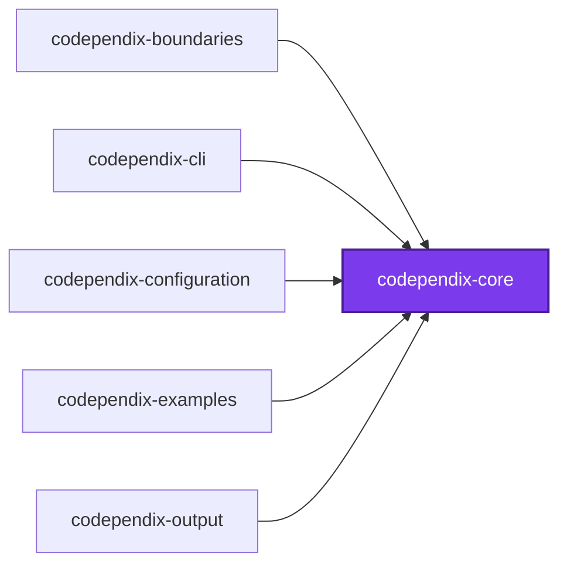
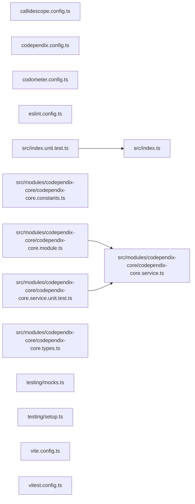

# 🕸️ Codependix Core

[](https://www.npmjs.com/package/@codependix/core)

**Graph models, boundary rule definitions, and traversal contracts for the Codependix toolchain.**

## Test

```bash
nx run codependix-core:vitest
```

## 👔 Conformetry

This project was generated from the [nestjs-service-project](../../configuration/conformetry-templates/nestjs-service-project) conformetry template.

## 🕸️ Codependix

Dependency graphs exported by [codependix](https://github.com/Organizzolini/codebase/tree/main/packages/ic-suite/codependix/codependix-cli), regenerated by `nx run codebase:codependix:write`.

### Nx Neighborhood

<!-- codependix:start name="codependix-nx-projects" -->

<!-- codependix:end name="codependix-nx-projects" -->

### File Imports

<!-- codependix:start name="codependix-file-imports" -->

<!-- codependix:end name="codependix-file-imports" -->

<!-- codependix:start name="codependix-nestjs-modules" -->
<!-- codependix:end name="codependix-nestjs-modules" -->

<!-- callidescope:start -->

## 🔭 Callidescope

Call stacks traced through `packages/ic-suite/codependix/codependix-core`, deepest first. Each frame shows what it takes, what it returns, and what its documentation says.

| Measure | Value |
| --- | --- |
| Callables | 1 |
| Files | 11 |
| Calls traced | 0 |
| Call stacks | 0 |
| Deepest stack | 0 |
| Stacks through recursion | 0 |
| Unfollowable calls | 0 |

### Limits

What this project is judged against, as declared in its own `callidescope.config.ts`.

| Limit | Value |
| --- | --- |
| `maximumDepth` | 1 |
| `maximumBreadth` | 1 |

### Call stacks (depth)

None.

### Breadth

None.
<!-- callidescope:end -->
