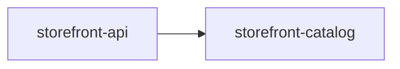

# 💥 A container that cannot boot names who owns the failure

A container boot failure fails the project whose container failed, and names the project that owns the class it failed on when that is a different one.

## Run it

```bash
nx run codependix-examples:examples
```

Everything below is rendered from the subject in this directory by the real
graph builders, so a claim that stops being true fails a check rather than
misleading anybody. The command above fails if what is committed here has
drifted; `:write` regenerates it.

## An application importing a module from another project

Both projects are tagged `framework:nestjs`, so both have a container to boot. `storefront-catalog`'s module file throws as it is evaluated — deliberately, the way [`container-rooting`](../container-rooting/README.md)'s `failing-container` does — and `storefront-api`'s `MainModule` imports it.



## The container that failed is the project that fails

`storefront-api` really cannot boot, so it fails, and its line names `storefront-catalog` as the project that owns the code it died on. The owner is read off the error's stack: the first frame inside the root of a project the charged one depends on. When no frame resolves to one, no owner is named rather than a guessed one. `storefront-catalog`'s own container fails the same way, but it is a dependency and not judged, so it is a `note`.

```text
judged:  storefront-api
built:   storefront-api, storefront-catalog
exit:    1

Judged projects: storefront-api.

#### storefront-api

- **fail** nestjsModules storefront-api: The storefront catalog cannot be loaded. (failed in code owned by storefront-catalog)

#### storefront-catalog

- **note** nestjsModules in dependency storefront-catalog, not failing: The storefront catalog cannot be loaded.
```

## Judging the owner names no other project

With `storefront-catalog` judged, the failing code is its own, so the failure carries no `ownerProject`. Nothing depends on it here, so it is the only container built.

```text
judged:  storefront-catalog
built:   storefront-catalog
exit:    1

Judged projects: storefront-catalog.

#### storefront-catalog

- **fail** nestjsModules storefront-catalog: The storefront catalog cannot be loaded.
```

## The same findings as `--format json` prints them

`ownerProject` appears only on a failure whose code belongs to another project. A failure in the charged project's own code leaves the key out. See [The boundary report](../../../codependix-cli/README.md#the-boundary-report).

```json
{
  "failures": [
    {
      "error": "The storefront catalog cannot be loaded.",
      "level": "nestjsModules",
      "ownerProject": "storefront-catalog",
      "projects": [
        "storefront-api"
      ],
      "verdict": "fail"
    },
    {
      "error": "The storefront catalog cannot be loaded.",
      "level": "nestjsModules",
      "projects": [
        "storefront-catalog"
      ],
      "verdict": "note"
    }
  ],
  "judgedProjects": [
    "storefront-api"
  ],
  "violations": []
}
```

## Next

[refusals](../refusals/README.md).
