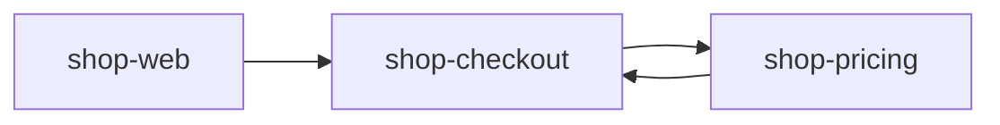

# 🔄 A cycle is charged to every project on it

A cycle is charged to every project that owns a node on it, so a cross-project cycle between `a` and `b` fails both, and naming either one is enough to find it.

## Run it

```bash
nx run codependix-examples:examples
```

Everything below is rendered from the subject in this directory by the real
graph builders, so a claim that stops being true fails a check rather than
misleading anybody. The command above fails if what is committed here has
drifted; `:write` regenerates it.

## A workspace with a cycle between two projects

`shop-checkout` and `shop-pricing` depend on each other, and `shop-web` depends on `shop-checkout`. The one rule is `acyclic`.



## The cycle is charged to every project on it

Both projects own a node on the cycle and neither one is more to blame, so the finding is charged to both and fails both. It is listed once under each. `shop-web` owns no node on the cycle and is charged nothing.

```text
judged:  shop-checkout, shop-pricing, shop-web
built:   shop-checkout, shop-pricing, shop-web
exit:    1

Judged projects: shop-checkout, shop-pricing, shop-web.

#### shop-checkout

- **fail** nxProjects shop-checkout, shop-pricing: no-project-cycles: shop-checkout → shop-pricing → shop-checkout is a cycle. Projects that depend on each other cannot be built apart.

#### shop-pricing

- **fail** nxProjects shop-checkout, shop-pricing: no-project-cycles: shop-checkout → shop-pricing → shop-checkout is a cycle. Projects that depend on each other cannot be built apart.
```

## Judging one project on the cycle still finds it

`--projects shop-pricing` builds `shop-pricing` and everything it depends on, which is `shop-checkout` — so the other half of the cycle is in the graph and the finding is the same, charged to both. `shop-pricing` is judged, so the run fails.

```text
judged:  shop-pricing
built:   shop-checkout, shop-pricing
exit:    1

Judged projects: shop-pricing.

#### shop-checkout

- **fail** nxProjects shop-checkout, shop-pricing: no-project-cycles: shop-checkout → shop-pricing → shop-checkout is a cycle. Projects that depend on each other cannot be built apart.

#### shop-pricing

- **fail** nxProjects shop-checkout, shop-pricing: no-project-cycles: shop-checkout → shop-pricing → shop-checkout is a cycle. Projects that depend on each other cannot be built apart.
```

## A longer cycle is charged to every project on it, and no other

`shop-ledger`, `shop-invoices`, and `shop-payments` form a ring. All three are charged, though only `shop-ledger` was named. `shop-admin` was named too and depends on the ring without being part of it, so it is charged nothing.

```text
judged:  shop-admin, shop-ledger
built:   shop-admin, shop-invoices, shop-ledger, shop-payments
exit:    1

Judged projects: shop-admin, shop-ledger.

#### shop-invoices

- **fail** nxProjects shop-invoices, shop-ledger, shop-payments: no-project-cycles: shop-ledger → shop-invoices → shop-payments → shop-ledger is a cycle. Projects that depend on each other cannot be built apart.

#### shop-ledger

- **fail** nxProjects shop-invoices, shop-ledger, shop-payments: no-project-cycles: shop-ledger → shop-invoices → shop-payments → shop-ledger is a cycle. Projects that depend on each other cannot be built apart.

#### shop-payments

- **fail** nxProjects shop-invoices, shop-ledger, shop-payments: no-project-cycles: shop-ledger → shop-invoices → shop-payments → shop-ledger is a cycle. Projects that depend on each other cannot be built apart.
```

## The same finding as `--format json` prints it

This is the value of the report's `boundaries` key. `projects` is who the finding is charged to, `verdict` is `fail` because a charged project is judged, and `cycle` is the whole path. See [The boundary report](../../../codependix-cli/README.md#the-boundary-report).

```json
{
  "failures": [],
  "judgedProjects": [
    "shop-checkout",
    "shop-pricing",
    "shop-web"
  ],
  "violations": [
    {
      "cycle": [
        "shop-checkout",
        "shop-pricing",
        "shop-checkout"
      ],
      "level": "nxProjects",
      "message": "no-project-cycles: shop-checkout → shop-pricing → shop-checkout is a cycle. Projects that depend on each other cannot be built apart.",
      "projects": [
        "shop-checkout",
        "shop-pricing"
      ],
      "rule": "no-project-cycles",
      "source": "shop-pricing",
      "target": "shop-checkout",
      "verdict": "fail"
    }
  ]
}
```

## Next

[boundary-forbidden-edges](../boundary-forbidden-edges/README.md).
