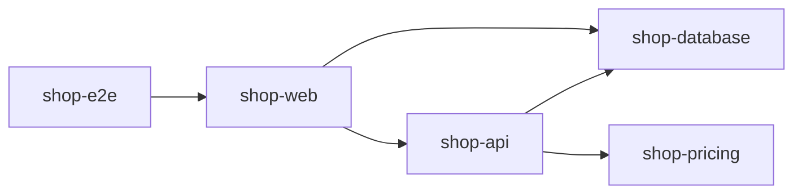

# ⛔ A forbidden edge is charged to its source

A `forbid` violation, or an edge no `allow` rule covers, is charged to the project that owns the edge's source and to no other.

## Run it

```bash
nx run codependix-examples:examples
```

Everything below is rendered from the subject in this directory by the real
graph builders, so a claim that stops being true fails a check rather than
misleading anybody. The command above fails if what is committed here has
drifted; `:write` regenerates it.

## A workspace where an application reaches past the api

`shop-web` depends on `shop-api` and, directly, on `shop-database`. `shop-api` depends on `shop-database` and on `shop-pricing`. `shop-e2e` depends on `shop-web`.



## A `forbid` violation is charged to the edge's source

`web-never-reaches-the-database` condemns the edge `shop-web → shop-database`. The project that wrote the import is `shop-web`, so it is charged `shop-web` and nothing else.

```text
judged:  shop-web
built:   shop-api, shop-database, shop-pricing, shop-web
exit:    1

Judged projects: shop-web.

#### shop-web

- **fail** nxProjects shop-web: web-never-reaches-the-database: shop-web must not depend on shop-database. The web application goes through the api.
```

## The target is not charged, so judging it finds nothing

`shop-database` did nothing wrong, and a dependency closure never includes dependents, so the edge is not even built. Naming the target is a clean run.

```text
judged:  shop-database
built:   shop-database
exit:    0

Judged projects: shop-database.

No boundary findings.
```

## A project depending on the source is noted

`shop-e2e` depends on `shop-web`, so the edge is built and charged to `shop-web` — which is not judged. It is reported as a note against the dependency.

```text
judged:  shop-e2e
built:   shop-api, shop-database, shop-e2e, shop-pricing, shop-web
exit:    0

Judged projects: shop-e2e.

#### shop-web

- **note** nxProjects in dependency shop-web, not failing: web-never-reaches-the-database: shop-web must not depend on shop-database. The web application goes through the api.
```

## An edge no `allow` rule covers is charged to its source too

`api-reaches-database-only` lists the whole surface `shop-api` may reach, so `shop-api → shop-pricing` is uncovered. It is charged to `shop-api`, whose code reaches out, rather than to `shop-pricing`, which is only reached.

```text
judged:  shop-api
built:   shop-api, shop-database, shop-pricing
exit:    1

Judged projects: shop-api.

#### shop-api

- **fail** nxProjects shop-api: api-reaches-database-only: shop-api may not depend on shop-pricing, which the rule's allowed targets do not cover. The api owns the database and nothing else.
```

## Next

[boundary-dependency-notes](../boundary-dependency-notes/README.md).
