# 🕸️🧬 Codependix Nx

[](https://www.npmjs.com/package/@codependix/nx)

**An Nx plugin that checks codependix boundaries per project, built over each project's Nx dependency closure.**

Canonical documentation for graph exports, configuration, boundary rules, and
how a finding is charged to a project is in the
[`@codependix/cli` README](https://github.com/Organizzolini/codebase/tree/main/packages/ic-suite/codependix/codependix-cli#readme).
`@codependix/cli` needs no Nx plugin: `--projects` and `--tags` already
narrow a `--check boundaries` run to the projects it judges, from a plain
shell. This package is the one place in the toolchain that depends on
`@nx/devkit`, and it adds what only a task runner can:

- **A gate on every project**, so `nx affected`, `--projects=tag:…`, and the
  task cache do the selecting.
- **A failure named after the project whose boundary broke**, rather than one
  workspace-wide task that fails for all of them.

## Install

```bash
npm install --save-dev @codependix/nx
```

Register it in `nx.json`:

```json
{
  "plugins": [
    {
      "plugin": "@codependix/nx",
      "options": {
        "configurationPath": "configuration/codependix.config.ts",
        "gateTargetName": "codependix-gate"
      }
    }
  ]
}
```

| Option | Meaning |
| ------ | ------- |
| `configurationPath` | Where the codependix configuration lives. `codependix.config.ts`, then `configuration/codependix.config.ts`, are searched when omitted |
| `gateTargetName` | Name of the inferred gate target. `codependix-gate` when omitted |

The gate runs the command line under `node --import
@swc-node/register/esm-register` from the workspace root, so the root must
resolve `@swc-node/register` and carry a `tsconfig.json` that emits decorator
metadata — the boundary check boots NestJS containers from their TypeScript
sources, and constructor injection reads that metadata.

## Usage

The gate is inferred onto every project except the workspace root, whose
dependency closure is the whole workspace:

```bash
nx run lexico-entities:codependix-gate          # one project
nx run-many -t codependix-gate                  # every project
nx affected -t codependix-gate                  # only what changed
```

### The gate

Each gate runs, from the workspace root:

```bash
node --import @swc-node/register/esm-register <@codependix/cli/main> \
  map --directory <workspaceRoot> --config <configurationPath> \
  --check boundaries --projects <project>
```

The command line's entry is resolved through `@codependix/cli`'s package
exports, so the same gate runs the TypeScript source inside this workspace and
the built `dist/src/main.js` from an installed copy. Its output is streamed to
the task as it arrives, and the task passes only when it exits zero.

**A dependency's broken boundary is that dependency's gate's business.** The
graphs are built over the project and everything it depends on, so a cycle
reaching into a dependency is still seen — but only a finding charged to the
project fails its gate. One charged to a dependency is printed as a note, and
fails the dependency's own gate instead.

The target is cached. Its inputs are the project's own sources and its
dependencies' (`default`, `^default`), the workspace configuration the rules
live in, the project's own `codependix.config.*`, and the codependix command
line itself — because no judged project depends on the code that decides its
verdict, a change to that code would otherwise replay every cached pass:

- When `@codependix/cli` is a package of the same workspace, a
  `{workspaceRoot}/<package>/src/**/*` and `{workspaceRoot}/<package>/package.json`
  input for it and for every workspace package it reaches through
  `workspace:` dependencies. File globs rather than `{ "input", "projects" }`
  inputs, because Nx's affected computation follows `{workspaceRoot}` globs
  and ignores the latter — so a branch that changes the command line selects
  every gate.
- When it is installed from a registry, an `externalDependencies` input naming
  it and the `@codependix/*` packages it depends on, so a version bump
  invalidates the cache.

If the command line cannot be resolved while the graph is built, those inputs
are left out rather than failing the graph. The target declares no
`configurations`, so an aggregator run with `--configuration=check` falls
through to the defaults.

### Executor options

```bash
nx run lexico-api:codependix-gate --projects=lexico-entities,lexico-api
nx run logging:codependix-gate --tags=type:package --dependencies=false
```

| Option | Meaning |
| ------ | ------- |
| `projects` | Nx project names to judge, replacing the target's own project |
| `tags` | Nx project tags, judging every project carrying **any** of them |
| `dependencies` | Build over the judged projects' Nx dependency closure. `true` by default; `false` builds over the judged projects alone |
| `configurationPath` | Overrides the registered configuration path |

Nx hands plugin options to inference and to nothing else, so a gate given no
`configurationPath` reads this plugin's registration back out of `nx.json` —
and resolves it exactly as inference did, so the file a gate reads is the file
its cache inputs named.

## Packages

| Package | Role |
| ------- | ---- |
| [`@codependix/nx`](.) | Nx plugin: a per-project boundary gate, built over the Nx dependency closure |
| [`@codependix/cli`](../codependix-cli/README.md) | Orchestrates the four graph builders, delivers their exports, and runs `--check boundaries` |
| [`@codependix/boundaries`](../codependix-boundaries/README.md) | Builds each level's graph, judges it against the declared rules, and charges each finding to a project |
| [`@codependix/configuration`](../codependix-configuration/README.md) | Reads `codependix.config.ts` and resolves per-project export destinations and boundary rules |

## Test

```bash
nx run codependix-nx:vitest
```

## Contributing

```bash
nx run codependix-nx:lint-code --configuration=check
```

## License

MIT — see [LICENSE](../../../../LICENSE).

## 👔 Conformetry

This project was generated from the [nestjs-service-project](../../../../configuration/conformetry-templates/nestjs-service-project) conformetry template.

## 🕸️ Codependix

Dependency graphs exported by [codependix](https://github.com/Organizzolini/codebase/tree/main/packages/ic-suite/codependix/codependix-cli), regenerated by `nx run codebase:codependix:write`.

### Nx Neighborhood

<!-- codependix:start name="codependix-nx-projects" -->

<!-- codependix:end name="codependix-nx-projects" -->

### NestJS Module Graph

<!-- codependix:start name="codependix-nestjs-modules" -->

<!-- codependix:end name="codependix-nestjs-modules" -->

### File Imports

```mermaid
graph LR
  file_callidescope_config_ts["callidescope.config.ts"]
  file_codependix_config_ts["codependix.config.ts"]
  file_codometer_config_ts["codometer.config.ts"]
  file_eslint_config_ts["eslint.config.ts"]
  file_src_executors_gate_executor_integration_test_ts["src/executors/gate/executor.integration.test.ts"]
  file_src_executors_gate_executor_ts["src/executors/gate/executor.ts"]
  file_src_executors_gate_executor_types_ts["src/executors/gate/executor.types.ts"]
  file_src_executors_gate_executor_unit_test_ts["src/executors/gate/executor.unit.test.ts"]
  file_src_index_ts["src/index.ts"]
  file_src_index_unit_test_ts["src/index.unit.test.ts"]
  file_src_main_module_ts["src/main.module.ts"]
  file_src_modules_gate_gate_constants_ts["src/modules/gate/gate.constants.ts"]
  file_src_modules_gate_gate_module_ts["src/modules/gate/gate.module.ts"]
  file_src_modules_gate_gate_service_ts["src/modules/gate/gate.service.ts"]
  file_src_modules_gate_gate_service_unit_test_ts["src/modules/gate/gate.service.unit.test.ts"]
  file_src_modules_gate_gate_types_ts["src/modules/gate/gate.types.ts"]
  file_src_modules_plugin_plugin_context_utilities_ts["src/modules/plugin/plugin-context.utilities.ts"]
  file_src_modules_plugin_plugin_context_utilities_unit_test_ts["src/modules/plugin/plugin-context.utilities.unit.test.ts"]
  file_src_modules_plugin_plugin_inputs_utilities_ts["src/modules/plugin/plugin-inputs.utilities.ts"]
  file_src_modules_plugin_plugin_inputs_utilities_unit_test_ts["src/modules/plugin/plugin-inputs.utilities.unit.test.ts"]
  file_src_modules_plugin_plugin_constants_ts["src/modules/plugin/plugin.constants.ts"]
  file_src_modules_plugin_plugin_module_ts["src/modules/plugin/plugin.module.ts"]
  file_src_modules_plugin_plugin_service_ts["src/modules/plugin/plugin.service.ts"]
  file_src_modules_plugin_plugin_service_unit_test_ts["src/modules/plugin/plugin.service.unit.test.ts"]
  file_src_modules_plugin_plugin_types_ts["src/modules/plugin/plugin.types.ts"]
  file_testing_mocks_ts["testing/mocks.ts"]
  file_testing_setup_ts["testing/setup.ts"]
  file_vite_config_ts["vite.config.ts"]
  file_vitest_config_ts["vitest.config.ts"]
  file_src_executors_gate_executor_integration_test_ts --> file_src_executors_gate_executor_ts
  file_src_executors_gate_executor_integration_test_ts --> file_src_executors_gate_executor_types_ts
  file_src_executors_gate_executor_ts --> file_src_executors_gate_executor_types_ts
  file_src_executors_gate_executor_ts --> file_src_modules_plugin_plugin_context_utilities_ts
  file_src_executors_gate_executor_types_ts --> file_src_modules_gate_gate_types_ts
  file_src_executors_gate_executor_unit_test_ts --> file_src_executors_gate_executor_ts
  file_src_executors_gate_executor_unit_test_ts --> file_src_modules_gate_gate_service_ts
  file_src_index_ts --> file_src_modules_plugin_plugin_context_utilities_ts
  file_src_index_ts --> file_src_modules_plugin_plugin_inputs_utilities_ts
  file_src_index_ts --> file_src_modules_plugin_plugin_constants_ts
  file_src_index_unit_test_ts --> file_src_index_ts
  file_src_index_unit_test_ts --> file_src_modules_plugin_plugin_service_ts
  file_src_index_unit_test_ts --> file_src_modules_plugin_plugin_types_ts
  file_src_main_module_ts --> file_src_modules_gate_gate_module_ts
  file_src_main_module_ts --> file_src_modules_plugin_plugin_module_ts
  file_src_modules_gate_gate_module_ts --> file_src_modules_gate_gate_service_ts
  file_src_modules_gate_gate_module_ts --> file_src_modules_plugin_plugin_module_ts
  file_src_modules_gate_gate_service_ts --> file_src_modules_gate_gate_constants_ts
  file_src_modules_gate_gate_service_ts --> file_src_modules_gate_gate_types_ts
  file_src_modules_gate_gate_service_ts --> file_src_modules_plugin_plugin_service_ts
  file_src_modules_gate_gate_service_unit_test_ts --> file_src_modules_gate_gate_service_ts
  file_src_modules_gate_gate_service_unit_test_ts --> file_src_modules_plugin_plugin_service_ts
  file_src_modules_plugin_plugin_context_utilities_ts --> file_src_main_module_ts
  file_src_modules_plugin_plugin_context_utilities_ts --> file_src_modules_gate_gate_service_ts
  file_src_modules_plugin_plugin_context_utilities_ts --> file_src_modules_plugin_plugin_constants_ts
  file_src_modules_plugin_plugin_context_utilities_ts --> file_src_modules_plugin_plugin_service_ts
  file_src_modules_plugin_plugin_context_utilities_ts --> file_src_modules_plugin_plugin_types_ts
  file_src_modules_plugin_plugin_context_utilities_unit_test_ts --> file_src_modules_gate_gate_service_ts
  file_src_modules_plugin_plugin_context_utilities_unit_test_ts --> file_src_modules_plugin_plugin_context_utilities_ts
  file_src_modules_plugin_plugin_context_utilities_unit_test_ts --> file_src_modules_plugin_plugin_service_ts
  file_src_modules_plugin_plugin_inputs_utilities_ts --> file_src_modules_plugin_plugin_constants_ts
  file_src_modules_plugin_plugin_inputs_utilities_ts --> file_src_modules_plugin_plugin_types_ts
  file_src_modules_plugin_plugin_inputs_utilities_unit_test_ts --> file_src_modules_plugin_plugin_inputs_utilities_ts
  file_src_modules_plugin_plugin_module_ts --> file_src_modules_plugin_plugin_service_ts
  file_src_modules_plugin_plugin_service_ts --> file_src_modules_plugin_plugin_constants_ts
  file_src_modules_plugin_plugin_service_ts --> file_src_modules_plugin_plugin_types_ts
  file_src_modules_plugin_plugin_service_unit_test_ts --> file_src_modules_plugin_plugin_service_ts
  file_src_modules_plugin_plugin_types_ts --> file_src_modules_plugin_plugin_constants_ts
```

<!-- codependix:start name="codependix-file-imports" -->

<!-- codependix:end name="codependix-file-imports" -->
