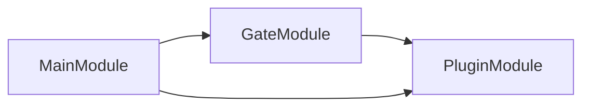

# 🕸️🧬 Codependix Nx

[](https://www.npmjs.com/package/@codependix/nx)

**An Nx plugin that checks codependix boundaries per project, built over each project's Nx dependency closure.**

Canonical documentation for graph exports, configuration, boundary rules, and
how a finding is charged to a project is in the
[`@codependix/cli` README](https://github.com/Organizzolini/codebase/tree/main/packages/ic-suite/codependix/codependix-cli#readme).
`@codependix/cli` needs no Nx plugin: `--projects` and `--tags` already
narrow a `--check boundaries` run to the projects it judges, from a plain
shell. This package is the one place in the toolchain that depends on
`@nx/devkit`, and it adds what only a task runner can:

- **A gate on every project**, so `nx affected`, `--projects=tag:…`, and the
  task cache do the selecting.
- **A failure named after the project whose boundary broke**, rather than one
  workspace-wide task that fails for all of them.

## Install

```bash
npm install --save-dev @codependix/nx
```

Register it in `nx.json`:

```json
{
  "plugins": [
    {
      "plugin": "@codependix/nx",
      "options": {
        "configurationPath": "configuration/codependix.config.ts",
        "gateTargetName": "codependix-gate"
      }
    }
  ]
}
```

| Option | Meaning |
| ------ | ------- |
| `configurationPath` | Where the codependix configuration lives. `codependix.config.ts`, then `configuration/codependix.config.ts`, are searched when omitted |
| `gateTargetName` | Name of the inferred gate target. `codependix-gate` when omitted |

The gate runs the command line under the `@swc-node/register` hooks, which
this plugin depends on and registers itself — the workspace does not need to
install them. The workspace root does need a `tsconfig.json` that emits
decorator metadata: the hooks read it from the working directory, the
boundary check boots NestJS containers from their TypeScript sources, and
constructor injection reads that metadata.

## Usage

The gate is inferred onto every project described by a `project.json`,
except the workspace root, whose dependency closure is the whole workspace. A
project Nx infers from a `package.json` alone gets no gate until it is given
a `project.json` as well.

```bash
nx run lexico-entities:codependix-gate          # one project
nx run-many -t codependix-gate                  # every project
nx affected -t codependix-gate                  # only what changed
```

### The gate

Each gate runs, from the workspace root:

```bash
node --import <file URL of @codependix/nx/loader> <@codependix/cli/main> \
  map --directory <workspaceRoot> --config <configurationPath> \
  --check boundaries --projects <project>
```

`@codependix/nx/loader` registers the `@swc-node/register` hooks resolved from
this plugin's own location. The hook's own `@swc-node/register/esm-register`
would resolve them from the working directory instead — the consumer's root,
where a package manager such as pnpm does not expose this plugin's
dependencies. The loader and the command line's entry are both resolved
through package exports, so the same gate runs the TypeScript sources inside
this workspace and the built `dist/` files from an installed copy. Its output
is streamed to the task as it arrives, and the task passes only when it exits
zero.

**A dependency's broken boundary is that dependency's gate's business.** The
graphs are built over the project and everything it depends on, so a cycle
reaching into a dependency is still seen — but only a finding charged to the
project fails its gate. One charged to a dependency is printed as a note, and
fails the dependency's own gate instead.

The target is cached. Its inputs are the project's own sources and its
dependencies' (`default`, `^default`), the workspace configuration the rules
live in, the project's own `codependix.config.*`, and the codependix command
line itself — because no judged project depends on the code that decides its
verdict, a change to that code would otherwise replay every cached pass:

- When `@codependix/cli` is a package of the same workspace, two
  `{workspaceRoot}` inputs for it and for every workspace package it reaches
  through `workspace:` dependencies: `<package>/package.json` and
  `<package>/src/**/!(*.test.*|*.spec.*)` — the sources without their tests,
  so a test-only edit to the command line invalidates no gate beyond that
  package's own and its dependents'. File globs
  rather than `{ "input", "projects" }` inputs, because Nx's affected
  computation follows `{workspaceRoot}` globs and ignores the latter — so a
  branch that changes the command line's sources selects every gate, and one
  that changes only its tests does not. The tests are excluded inside the
  glob rather than by a `!`-prefixed input, which the affected computation
  ignores.
- When it is installed from a registry, an `externalDependencies` input naming
  it and the `@codependix/*` packages it depends on, so a version bump
  invalidates the cache. Nx hashes an external dependency together with
  everything it depends on, so the `@codependix/*` packages beneath those are
  covered too.
- In either case, `{workspaceRoot}/tsconfig.json` and every tsconfig it
  `extends`. The loader (`@swc-node/register`) takes its compiler options —
  `emitDecoratorMetadata` among them, which decides how NestJS sources
  compile — from `SWC_NODE_PROJECT` or `TS_NODE_PROJECT`, else from the
  `tsconfig.json` in the gate's working directory, the workspace root, and
  never from a package's own. That file reaches its bases through `extends`,
  so inference follows the chain much as TypeScript resolves it — a string
  or an array, through every level, comments and trailing commas allowed,
  `.json` appended to a path naming no file, and a bare package name taken
  to its `tsconfig.json` or its `exports` (not to a `tsconfig` field in its
  manifest, which is rare):
  - A base in the workspace, by relative path or through a package of the
    same workspace, is another `{workspaceRoot}` input. So is one that is
    missing or cannot be parsed — the edit that fixes it invalidates the
    gate — though what it would extend cannot be followed, and Nx's logger
    warns naming it.
  - A base an installed package provides, such as `@tsconfig/node24` —
    named by package or by a path into `node_modules` — is named in an
    `externalDependencies` input, so a version bump invalidates the cache,
    but only when the root `package.json` declares the package from a
    registry. Nx fails every task whose `externalDependencies` names a
    package missing from its graph, so one declared only by another package,
    or through `workspace:`, `file:`, `link:`, or `portal:`, is skipped with
    a warning instead: declare it in the root `package.json` to have it
    hashed.
  - A base outside the workspace, or a package base that resolves to no file,
    cannot be named by any input, and is skipped with a warning.

  A `SWC_NODE_PROJECT` or `TS_NODE_PROJECT` pointing elsewhere is not
  followed: add that file to the target's inputs yourself. Nor does a
  gitignored base, such as a generated framework tsconfig, invalidate
  anything: it is named, but Nx's file map leaves ignored files out.

Each workspace package is resolved on its own, through its entry rather than
its manifest, so one that cannot be resolved costs only its own inputs: Nx's
logger warns naming it, and every other package keeps its inputs. If the
command line itself cannot be resolved while the graph is built, the tool
inputs are left out and the warning names it — never failing the graph. The
tsconfig chain is resolved apart from the command line, so either failing
keeps the other's inputs. The
target declares no `configurations`, so an aggregator run with
`--configuration=check` falls through to the defaults.

**A gate whose `projects` or `tags` select anything other than its own project
is never replayed from the cache.** Its inputs cover its own project and that project's dependencies,
not the projects such a run judges, so a hash built from them could replay a
pass after an edit to the very project that now fails. The executor's hasher
gives such a run a hash no other run shares, whether the selection came from
the command line, the target's options, or a configuration; a gate judging
only its own project — including one whose `projects` names exactly that
project — is hashed from its inputs exactly as Nx would hash it. Because
the target has a hasher, `nx show target inputs` prints a custom-hasher
warning instead of a file list — the inputs above still decide the hash.

### Executor options

```bash
nx run lexico-api:codependix-gate --projects=lexico-entities,lexico-api
nx run logging:codependix-gate --tags=type:package --dependencies=false
```

| Option | Meaning |
| ------ | ------- |
| `projects` | Nx project names to judge, replacing the target's own project |
| `tags` | Nx project tags, judging every project carrying **any** of them |
| `dependencies` | Build over the judged projects' Nx dependency closure. `true` by default; `false` builds over the judged projects alone |
| `configurationPath` | Overrides the registered configuration path |

Nx hands plugin options to inference and to nothing else, so a gate given no
`configurationPath` reads this plugin's registration back out of `nx.json` —
and resolves it exactly as inference did, so the file a gate reads is the file
its cache inputs named.

## Packages

| Package | Role |
| ------- | ---- |
| [`@codependix/nx`](.) | Nx plugin: a per-project boundary gate, built over the Nx dependency closure |
| [`@codependix/cli`](../codependix-cli/README.md) | Orchestrates the four graph builders, delivers their exports, and runs `--check boundaries` |
| [`@codependix/boundaries`](../codependix-boundaries/README.md) | Builds each level's graph, judges it against the declared rules, and charges each finding to a project |
| [`@codependix/configuration`](../codependix-configuration/README.md) | Reads `codependix.config.ts` and resolves per-project export destinations and boundary rules |

## Test

```bash
nx run codependix-nx:vitest
```

## Contributing

```bash
nx run codependix-nx:lint-code --configuration=check
```

## License

MIT — see [LICENSE](../../../../LICENSE).

## 👔 Conformetry

This project was generated from the [nestjs-service-project](../../../../configuration/conformetry-templates/nestjs-service-project) conformetry template.

## 🕸️ Codependix

Dependency graphs exported by [codependix](https://github.com/Organizzolini/codebase/tree/main/packages/ic-suite/codependix/codependix-cli), regenerated by `nx run codebase:codependix:write`.

### Nx Neighborhood

<!-- codependix:start name="codependix-nx-projects" -->

<!-- codependix:end name="codependix-nx-projects" -->

### NestJS Module Graph

<!-- codependix:start name="codependix-nestjs-modules" -->

<!-- codependix:end name="codependix-nestjs-modules" -->

### File Imports

```mermaid
graph LR
  file_callidescope_config_ts["callidescope.config.ts"]
  file_codependix_config_ts["codependix.config.ts"]
  file_codometer_config_ts["codometer.config.ts"]
  file_eslint_config_ts["eslint.config.ts"]
  file_src_executors_gate_executor_integration_test_ts["src/executors/gate/executor.integration.test.ts"]
  file_src_executors_gate_executor_ts["src/executors/gate/executor.ts"]
  file_src_executors_gate_executor_types_ts["src/executors/gate/executor.types.ts"]
  file_src_executors_gate_executor_unit_test_ts["src/executors/gate/executor.unit.test.ts"]
  file_src_index_ts["src/index.ts"]
  file_src_index_unit_test_ts["src/index.unit.test.ts"]
  file_src_main_module_ts["src/main.module.ts"]
  file_src_modules_gate_gate_constants_ts["src/modules/gate/gate.constants.ts"]
  file_src_modules_gate_gate_module_ts["src/modules/gate/gate.module.ts"]
  file_src_modules_gate_gate_service_ts["src/modules/gate/gate.service.ts"]
  file_src_modules_gate_gate_service_unit_test_ts["src/modules/gate/gate.service.unit.test.ts"]
  file_src_modules_gate_gate_types_ts["src/modules/gate/gate.types.ts"]
  file_src_modules_plugin_plugin_context_utilities_ts["src/modules/plugin/plugin-context.utilities.ts"]
  file_src_modules_plugin_plugin_context_utilities_unit_test_ts["src/modules/plugin/plugin-context.utilities.unit.test.ts"]
  file_src_modules_plugin_plugin_inputs_utilities_ts["src/modules/plugin/plugin-inputs.utilities.ts"]
  file_src_modules_plugin_plugin_inputs_utilities_unit_test_ts["src/modules/plugin/plugin-inputs.utilities.unit.test.ts"]
  file_src_modules_plugin_plugin_constants_ts["src/modules/plugin/plugin.constants.ts"]
  file_src_modules_plugin_plugin_module_ts["src/modules/plugin/plugin.module.ts"]
  file_src_modules_plugin_plugin_service_ts["src/modules/plugin/plugin.service.ts"]
  file_src_modules_plugin_plugin_service_unit_test_ts["src/modules/plugin/plugin.service.unit.test.ts"]
  file_src_modules_plugin_plugin_types_ts["src/modules/plugin/plugin.types.ts"]
  file_testing_mocks_ts["testing/mocks.ts"]
  file_testing_setup_ts["testing/setup.ts"]
  file_vite_config_ts["vite.config.ts"]
  file_vitest_config_ts["vitest.config.ts"]
  file_src_executors_gate_executor_integration_test_ts --> file_src_executors_gate_executor_ts
  file_src_executors_gate_executor_integration_test_ts --> file_src_executors_gate_executor_types_ts
  file_src_executors_gate_executor_ts --> file_src_executors_gate_executor_types_ts
  file_src_executors_gate_executor_ts --> file_src_modules_plugin_plugin_context_utilities_ts
  file_src_executors_gate_executor_types_ts --> file_src_modules_gate_gate_types_ts
  file_src_executors_gate_executor_unit_test_ts --> file_src_executors_gate_executor_ts
  file_src_executors_gate_executor_unit_test_ts --> file_src_modules_gate_gate_service_ts
  file_src_index_ts --> file_src_modules_plugin_plugin_context_utilities_ts
  file_src_index_ts --> file_src_modules_plugin_plugin_inputs_utilities_ts
  file_src_index_ts --> file_src_modules_plugin_plugin_constants_ts
  file_src_index_unit_test_ts --> file_src_index_ts
  file_src_index_unit_test_ts --> file_src_modules_plugin_plugin_service_ts
  file_src_index_unit_test_ts --> file_src_modules_plugin_plugin_types_ts
  file_src_main_module_ts --> file_src_modules_gate_gate_module_ts
  file_src_main_module_ts --> file_src_modules_plugin_plugin_module_ts
  file_src_modules_gate_gate_module_ts --> file_src_modules_gate_gate_service_ts
  file_src_modules_gate_gate_module_ts --> file_src_modules_plugin_plugin_module_ts
  file_src_modules_gate_gate_service_ts --> file_src_modules_gate_gate_constants_ts
  file_src_modules_gate_gate_service_ts --> file_src_modules_gate_gate_types_ts
  file_src_modules_gate_gate_service_ts --> file_src_modules_plugin_plugin_service_ts
  file_src_modules_gate_gate_service_unit_test_ts --> file_src_modules_gate_gate_service_ts
  file_src_modules_gate_gate_service_unit_test_ts --> file_src_modules_plugin_plugin_service_ts
  file_src_modules_plugin_plugin_context_utilities_ts --> file_src_main_module_ts
  file_src_modules_plugin_plugin_context_utilities_ts --> file_src_modules_gate_gate_service_ts
  file_src_modules_plugin_plugin_context_utilities_ts --> file_src_modules_plugin_plugin_constants_ts
  file_src_modules_plugin_plugin_context_utilities_ts --> file_src_modules_plugin_plugin_service_ts
  file_src_modules_plugin_plugin_context_utilities_ts --> file_src_modules_plugin_plugin_types_ts
  file_src_modules_plugin_plugin_context_utilities_unit_test_ts --> file_src_modules_gate_gate_service_ts
  file_src_modules_plugin_plugin_context_utilities_unit_test_ts --> file_src_modules_plugin_plugin_context_utilities_ts
  file_src_modules_plugin_plugin_context_utilities_unit_test_ts --> file_src_modules_plugin_plugin_service_ts
  file_src_modules_plugin_plugin_inputs_utilities_ts --> file_src_modules_plugin_plugin_constants_ts
  file_src_modules_plugin_plugin_inputs_utilities_ts --> file_src_modules_plugin_plugin_types_ts
  file_src_modules_plugin_plugin_inputs_utilities_unit_test_ts --> file_src_modules_plugin_plugin_inputs_utilities_ts
  file_src_modules_plugin_plugin_module_ts --> file_src_modules_plugin_plugin_service_ts
  file_src_modules_plugin_plugin_service_ts --> file_src_modules_plugin_plugin_constants_ts
  file_src_modules_plugin_plugin_service_ts --> file_src_modules_plugin_plugin_types_ts
  file_src_modules_plugin_plugin_service_unit_test_ts --> file_src_modules_plugin_plugin_service_ts
  file_src_modules_plugin_plugin_types_ts --> file_src_modules_plugin_plugin_constants_ts
```

<!-- codependix:start name="codependix-file-imports" -->

<!-- codependix:end name="codependix-file-imports" -->
