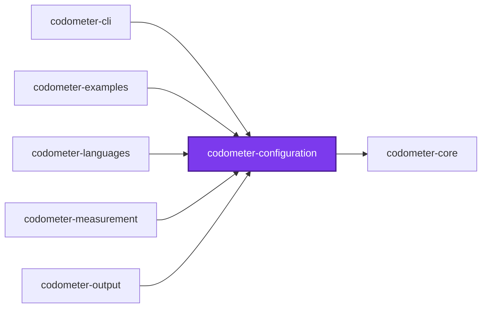

# ⏲️ Codometer Configuration

[](https://www.npmjs.com/package/@codometer/configuration)

**The configuration reference for [Codometer](../codometer-cli/README.md).**

`@codometer/configuration` reads a repository's `codometer.config.ts` and hands
back a fully defaulted configuration object. It is the only package that knows
anything about a particular repository; `@codometer/cli` measures whatever the
configuration describes.

```bash
npm install --save-dev @codometer/configuration
```

Install it directly when you are typing a configuration file. `@codometer/cli`
already depends on it.

## Configuration File

Any of `codometer.config.{ts,mts,cts,js,mjs,cjs,json,jsonc}` is read from the
directory being measured, or from any directory above it. `format` is the one
field every configuration must set — there is no code-level fallback for it —
and every other field is optional.

```ts
import { type CodometerConfiguration } from "@codometer/configuration";

const codometerConfiguration: CodometerConfiguration = {
  // Which report shape this run produces. Required; no default.
  format: "markdown",
  // Appended to the built-in exclusions (node_modules, dist, build, coverage,
  // .nx), matched against repository-relative paths with `path.matchesGlob`.
  exclude: ["notepads/**", "**/templates/**"],
  // Ignore files in gitignore syntax, whose patterns exclude as well.
  excludeFrom: ["configuration/.codometerignore"],
  // Named sets of files measured alongside the codebase itself. The built-in
  // `codebase` whole-tree scan is always present unless one of these entries
  // replaces it by name.
  inputs: [
    {
      analyses: ["size"],
      compression: "gzip",
      include: ["dist/**/*.js", "!dist/**/*.map.js"],
      name: "compiled",
    },
  ],
  // Target an unqualified limit path belongs to.
  defaultInput: "codebase",
  // How high each measured metric may go.
  limits: [
    { metric: "compiled.size", value: "8 KB" },
    { metric: "typescript.interfaces", severity: "warn", value: 500 },
  ],
  // Destinations the measured statistics are written to.
  outputs: [
    { indentation: 2, path: "output/codometer.json", type: "json" },
    {
      description: "Measured on every push.",
      // Named something other than the defaults on purpose: a file holding the
      // default start marker anywhere — a document like this one, explaining
      // it — reads as already carrying the block, and gets no block of its own.
      endMarker: "<!-- STATISTICS_END -->",
      path: "README.md",
      startMarker: "<!-- STATISTICS_START -->",
      type: "markdown",
    },
  ],
  // Interpreter used for Python analysis; defaults to `python3`.
  python: { command: "uv run python" },
};

export default codometerConfiguration;
```

Output paths are resolved relative to the process's working directory, not to
the configuration file, so a configuration kept in a `configuration/` folder
still writes to the repository root.

## Resolution

The search starts at the directory being measured and walks upward, taking the
first configuration file it finds. **The nearest one wins outright**: nothing
from a further ancestor is folded into it. Merging the two would leave a limit
that never applied looking exactly like one that did, and telling them apart
would mean knowing which of several files each field came from.

So a folder carrying no configuration file of its own is measured by the
nearest ancestor that does, and a folder that writes one is measured by that
alone. A configuration file is always read as a plain object — one exported as
a function is not recognized, and falls back to an empty configuration, the
same way a file exporting `42` does.

## What Gets Measured

Discovery walks the directory itself and reads every `.gitignore` it passes, so
**`.gitignore` is already in force**: a build directory or a virtual environment
is pruned where its ignore file names it, and no exclusion has to name it again.
Git is never invoked, so a directory that is not a repository at all is measured
the same way as one that is, and what is measured is the working tree rather
than the index — a file that exists and is not ignored counts, whether or not it
has been committed yet. What the two exclusion options are for is the opposite
case: files that are kept but that nobody wrote.

| Option | Syntax | Use it for |
| ------ | ------ | ---------- |
| `exclude` | Globs, matched with `path.matchesGlob` | A handful of paths named inline, appended to the built-in defaults |
| `excludeFrom` | Paths to ignore files, in gitignore syntax | Lockfiles, vendored bundles, generated documentation — the list a repository would rather keep in a file |

`excludeFrom` files are read as gitignore syntax and matched natively, so
negations, anchoring, and directory patterns behave exactly as they do in a
`.gitignore`, and pointing codometer at a file another tool already reads gives
the same answer that tool gets. Matching is case-sensitive on every platform,
deliberately: git takes that from whichever filesystem it finds itself on, and a
measurement that disagrees with itself between a laptop and CI is worse than a
strict one.

One caution when reusing an existing ignore file: most are written for one
tool's concerns, not for measurement. A `.prettierignore` typically ignores all
markdown because a markdown linter handles it — point codometer at that and the
prose metrics vanish. A dedicated `.codometerignore` is usually the better
answer.

## Inputs

An **input** is a named set of files, declared by include and exclude globs,
together with the analyses run over it. `inputs` is an array — replacing what
used to be called `targets` — and one entry is always there whether or not a
configuration declares any: the built-in `codebase` scan, which measures
everything the ignore files leave behind and runs `language` analysis over it.

```ts
inputs: [
  {
    analyses: ["size"],
    compression: "gzip",
    exclude: ["dist/vendor/**"],
    include: ["dist/**/*.js", "!dist/**/*.map.js"],
    name: "compiled",
  },
],
```

| Field | Required | Default | Meaning |
| ----- | -------- | ------- | ------- |
| `name` | yes | — | What the input is called. Two inputs may not share one |
| `include` | yes | — | Globs that add files. At least one must add rather than remove |
| `exclude` | no | none | Globs that remove files |
| `analyses` | yes | — | `language`, `size`, or both. At least one |
| `compression` | no | `gzip` | `gzip`, `brotli`, or `none` for the bytes on disk |
| `directory` | no | `.` | Where the input's globs start, relative to the process's working directory |

`language` runs the same analyzers the codebase gets. `size` compresses each
matched file **on its own** and sums the results — never all of them together,
which would find matches across file boundaries and report a total no client
ever receives. Gzip compresses at level 9 and brotli at quality 11, both stated
explicitly rather than left to a library default.

A `!` prefix in `include` removes files instead of adding them. Negations are
collected into one set applied to the whole input rather than in the order
they were written, so rearranging the array cannot change which files the
input holds. A `!` in `exclude` is rejected: that list already removes files,
so there is nothing there to negate.

Ignore files are not consulted for a declared input. That is deliberate, and it
is what lets one measure compiled output — a directory every `.gitignore`
claims, which is exactly why no ignore rule may reach it. A file an input
matched but cannot be read fails the run rather than counting as zero bytes: a
total quietly short by one file is worse than no total at all.

### Replacing The Built-In Codebase Input

Declaring an input named `codebase` replaces the built-in whole-tree scan
rather than adding beside it:

```ts
inputs: [
  { analyses: ["language", "size"], compression: "none", include: ["**/*"], name: "codebase" },
],
```

Only its `compression` and `analyses` are read. **Its `include` and `exclude`
globs are not consulted at all** — the whole-tree scan is discovered by
walking the repository's ignore files rather than by matching globs, so the
`include: ["**/*"]` above is a placeholder, and narrowing it to `src/**` would
not narrow anything. To measure a subset of the tree, declare an input under
some other name.

This is the only way to measure the whole tree under a different compression
or set of analyses than the built-in entry runs.

## Limits

A **limit** is how high one measured metric may go. Any metric can carry one — a
compressed size, a line count, a counter for one of the conventions below — and
a metric nothing limits is measured and reported exactly as before, gated by
nothing.

```ts
defaultInput: "codebase",
limits: [
  { metric: "Compiled JavaScript.size", value: "8 KB" },
  { label: "Interfaces", metric: "typescript.interfaces", value: 500 },
  { metric: "linesOfCode", severity: "warn", value: 100_000 },
],
```

| Field | Required | Default | Meaning |
| ----- | -------- | ------- | ------- |
| `metric` | yes | — | Dotted path of the metric this limits |
| `value` | yes | — | How high the metric may go, as a number or a string with a unit |
| `severity` | no | `fail` | `fail` stops the run on a breach; `warn` reports it |
| `label` | no | the path | What to call the limit in a report |

A metric is addressed by the input's name followed by its path within that
input — `codebase.typescript.interfaces`, `codebase.markdown.files`,
`Compiled JavaScript.size`. Every input carries `files`, an input running size
analysis carries `size`, and one running language analysis carries every
counter the codebase measurement lists, with configured counters under `custom.<label>`.
Set `defaultInput` and a path naming no input is read as that input's.

Where a `defaultInput` is set, a path is read as that input's whenever no
input name prefixes it — so with `defaultInput: "codebase"` and an input
called `typescript`, `typescript.interfaces` is the codebase's, because the
`typescript` input has no `interfaces` metric of its own to compete with it.
Write the input name in full wherever an input and a metric group share one.

**Ambiguity is refused, never resolved.** A path that could name two metrics —
an input called `markdown` beside the codebase's own `markdown.files` — fails
the run naming both readings, as does a path naming none, or one naming a
metric from an analysis the input never ran. A limit that quietly bound to the
wrong metric would look exactly like one that works.

A value written as a string carries a **decimal** unit whose trailing `b` is
required: `"8 KB"` is 8000 bytes and `"1 MB"` is 1000000, while `"8 K"` is not
a size and is refused rather than read as anything. A value nothing can read
fails the run instead of being taken as zero.

An input that matched **no files** fails the run if and only if a limit is
written against it. Declaring a limit asserts the files are there, so an empty
match is a glob that stopped matching or a build that never ran — while an
input nobody limited simply measured zero, which is unremarkable.

## Custom Statistics

A repository that names files by convention has a vocabulary no language
analyzer knows about. The top-level `custom` array is what **measures** these
counters, regardless of whether — or where — any output renders them:

```ts
custom: [
  { label: "Service Files", patterns: ["**/*.service.ts"] },
  { label: "Unit Tests", patterns: ["**/*.unit.test.ts"] },
  { color: "16a34a", label: "Migrations", patterns: ["**/migrations/*.sql"] },
],
```

Each entry becomes one badge, in the order it was configured, everywhere it is
selected. Globs are matched against repository-relative paths with
`path.matchesGlob` over the same discovered files everything else measures, so
exclusions apply. A file matching several of one entry's globs counts once.
`color` is a shields.io hexadecimal triplet; entries that omit it take the next
color from a built-in palette, cycling so a counter's color stays the same
between runs.

A counter selects what it counts with one of three fields — `patterns`,
`symbols`, or `comment` — and needs at least one of them, or it is rejected as
counting nothing.

An output's own `custom` array is a separate, later concern: it **selects**,
by label, which of the top-level counters that destination renders — it never
declares a counter of its own. A JSON report and a markdown report may still
select entirely different labels:

```ts
custom: [
  { label: "Service Files", patterns: ["**/*.service.ts"] },
  { label: "Unit Tests", patterns: ["**/*.unit.test.ts"] },
],
outputs: [
  { custom: ["Service Files"], path: "codometer-report.json", type: "json" },
  { custom: ["Unit Tests"], path: "README.md", type: "markdown" },
],
```

A label an output selects that the top-level `custom` never declared is
refused when the configuration loads — selection cannot conjure a counter that
was never measured. A counter the top level declares but no output selects is
still measured and still gates a limit; it simply renders nowhere.

### Counting Declarations

`symbols` counts declarations in TypeScript and JavaScript sources instead of
files. It asks for one or more `kinds`, optionally narrowed to declarations
carrying every named modifier:

```ts
custom: [
  {
    group: "typescript",
    label: "Static Methods",
    symbols: { kinds: ["method"], modifiers: ["static"] },
  },
  { label: "Abstract Classes", symbols: { kinds: ["class"], modifiers: ["abstract"] } },
],
```

`kinds` are `class`, `enum`, `function`, `getter`, `interface`, `method`,
`property`, and `setter`. `modifiers` are `abstract`, `async`, `export`,
`override`, `private`, `protected`, `public`, `readonly`, and `static`.

Both are read literally, from the syntax. A callable written as a class member
is a `method`; one written anywhere else is a `function`, arrow functions
included. A class field holding an arrow function is a `property`, and the
arrow carries none of the field's modifiers — so a `static build = () => {}` is
found by asking for static properties, not static methods. `public` matches
members annotated `public`, not members that are public by omission, and
`private` does not match a `#name` field, which carries no modifier at all.

A symbol counter may also carry `patterns`, which then narrows _which files are
searched_ rather than being what is counted — `patterns: ["packages/**"]` with
a `symbols` matcher counts declarations in `packages/`. Counting happens during
the walk the TypeScript analyzer already makes, so any number of these costs
one pass over the sources.

### Selecting A Comment Budget

`comment` selects a comment budget for a counter to measure, rather than
counting files or declarations:

```ts
custom: [
  { comment: { language: "yaml", maximumWords: 128 }, label: "YAML Comment Budget" },
  { comment: { kind: "class", maximumLines: 24 }, label: "Class Comment Budget" },
],
```

| Field | Required | Default | Meaning |
| ----- | -------- | ------- | ------- |
| `language` | no | every language with comments | Narrows the budget to one of `css`, `hcl`, `python`, `shell`, `sql`, `toml`, `typescript`, `yaml` |
| `kind` | no | a plain comment block | Narrows to a documented declaration's JSDoc-style comment for this declaration kind |
| `maximumCharacters` | no | — | How many characters a block may hold, markers and newlines and all |
| `maximumLines` | no | — | How many lines a block may span |
| `maximumWords` | no | — | How many words of prose a block may hold, once markers are stripped |
| `severity` | no | `fail` | `fail` stops the run on a breach; `warn` reports it |

Its `value` is a count — how many blocks broke the selector's own
`maximumCharacters`/`maximumLines`/`maximumWords` — and its `instances` names
each breaching block's `file` and 1-indexed `line`, plus how much it measured.
A block that stayed within budget contributes to neither.

An entry with none of `patterns`, `symbols`, or `comment` is rejected rather
than reported as a permanent zero.

### Where A Counter Renders

`group` names the badge group a counter is rendered into, after that group's
built-in badges. It defaults to `conventions` — a group that exists only for
these counters and is omitted entirely when none belong to it. Any rendered
group may be named instead: `css`, `hcl`, `json`, `jupyter`, `markdown`,
`python`, `repository`, `shell`, `sql`, `toml`, `typescript`, or `yaml`. A name
outside that set fails the configuration rather than rendering nowhere.

The default palette runs per group over the top-level `custom` array, so
adding a counter to one group never recolors the badges of another. A
counter's color is settled once there — an output selecting it back out by
label renders whichever color that resolution gave it, rather than cycling
its own palette.

## Outputs

`outputs` is an array of typed destinations, replacing what used to be one
fixed-key `output` object. Declare as many as you like, including more than one
of a kind:

```ts
outputs: [
  { indentation: 2, path: "output/codometer.json", type: "json" },
  { path: "README.md", type: "markdown" },
],
```

A JSON entry needs `path`; `indentation` defaults to `2`. A markdown entry
needs a `path`, a `write` function, or both — a destination naming neither is
rejected when the configuration loads.

### Writing Markdown

The default markdown report is a `description` paragraph followed by shields.io
badges under one `###` heading per language, spliced between two anchor
markers. `write` is the whole of the customizable behavior — it both decides
what the report says and where it lands, replacing what used to be two
separate `render` and `write` callbacks:

```ts
{
  path: "README.md",
  type: "markdown",
  write: ({ anchors, renderBadges, statistics }) =>
    anchors.syncAnchoredBlock({
      content: `Lines of code: ${statistics.linesOfCode}\n\n${renderBadges()}`,
    }),
}
```

| Argument | Meaning |
| -------- | ------- |
| `description` | The configured description, for a writer that wants to place it itself |
| `renderBadges()` | The built-in badge rendering of these same statistics — call it to build the default content, or to add to it |
| `statistics` | The measured statistics |
| `check` | True when nothing may be written and the file is only being inspected |
| `path` | The configured path, resolved against the process's working directory |
| `anchors` | The marker mechanics, so choosing a different file does not mean reimplementing the splice |

| Anchor helper | Does |
| ------------- | ---- |
| `anchors.syncAnchoredBlock({ content?, path? })` | Splices the block into a file, appending when the markers are absent and creating the file when it is missing. In check mode it compares instead of writing and returns whether the file is current. |
| `anchors.wrapInAnchors(content?)` | Returns the content wrapped in the markers, for a writer placing it somewhere itself. |
| `anchors.startMarker` / `anchors.endMarker` | The configured markers. |

Leaving `write` unset keeps the built-in rendering and writing. A `write`
function returns `false` to report its destination as stale, which is what
fails a `--check` run; anything else counts as up to date.

## Exports

`ConfigurationService` and `ConfigurationModule`, plus the
`CodometerConfiguration` type you author your config as and the resolved shapes
the CLI reads.

## Test

```bash
nx run codometer-configuration:vitest
```

## License

MIT — see [LICENSE](../../LICENSE).

## 👔 Conformetry

This project was generated from the [nestjs-service-project](../../configuration/conformetry-templates/nestjs-service-project) conformetry template.

<!-- callidescope:start -->

## 🔭 Callidescope

Call stacks traced through `packages/ic-suite/codometer/codometer-configuration`, deepest first. Each frame shows what it takes, what it returns, and what its documentation says.

| Measure | Value |
| --- | --- |
| Callables | 73 |
| Files | 19 |
| Calls traced | 68 |
| Call stacks | 6 |
| Deepest stack | 3 |
| Stacks through recursion | 0 |
| Unfollowable calls | 0 |

### Limits

What this project is judged against, as declared in its own `callidescope.config.ts`.

| Limit | Value |
| --- | --- |
| `maximumDepth` | 9 |
| `maximumBreadth` | 7 |

### Call stacks (depth)

**1. `superRefine(…)`** — depth 3 · orphan-root

```text
🚀 superRefine(…)(…): void [packages/ic-suite/codometer/codometer-configuration/src/modules/configuration/configuration-schema.constants.ts:209]
  └─> find(…)(…): boolean [packages/ic-suite/codometer/codometer-configuration/src/modules/configuration/configuration-schema.constants.ts:211]
    └─> findIndex(…)(…): boolean [packages/ic-suite/codometer/codometer-configuration/src/modules/configuration/configuration-schema.constants.ts:212]
```

**2. `callbackSchema`** — depth 2 · orphan-root

```text
🚀 callbackSchema<CallbackType>(): z.ZodType<CallbackType> [packages/ic-suite/codometer/codometer-configuration/src/modules/configuration/configuration-schema.constants.ts:36]
   ↳ Accepts a configured callback.
  └─> custom(…)(value: unknown): value is Function [packages/ic-suite/codometer/codometer-configuration/src/modules/configuration/configuration-schema.constants.ts:37]
```

**3. `superRefine(…)`** — depth 2 · orphan-root

```text
🚀 superRefine(…)(…): void [packages/ic-suite/codometer/codometer-configuration/src/modules/configuration/configuration-schema.constants.ts:107]
  └─> some(…)(pattern: string): boolean [packages/ic-suite/codometer/codometer-configuration/src/modules/configuration/configuration-schema.constants.ts:109]
```

<details>
<summary>3 more call stacks</summary>

**4. `refine(…)`** — depth 2 · orphan-root

```text
🚀 refine(…)(…): boolean [packages/ic-suite/codometer/codometer-configuration/src/modules/configuration/configuration-schema.constants.ts:166]
  └─> map(…)(…): string [packages/ic-suite/codometer/codometer-configuration/src/modules/configuration/configuration-schema.constants.ts:167]
```

**5. `refine(…)`** — depth 2 · orphan-root

```text
🚀 refine(…)(…): boolean [packages/ic-suite/codometer/codometer-configuration/src/modules/configuration/configuration-schema.constants.ts:182]
  └─> map(…)(…): string [packages/ic-suite/codometer/codometer-configuration/src/modules/configuration/configuration-schema.constants.ts:183]
```

**6. `superRefine(…)`** — depth 2 · orphan-root

```text
🚀 superRefine(…)(…): void [packages/ic-suite/codometer/codometer-configuration/src/modules/configuration/configuration-schema.constants.ts:227]
  └─> map(…)(…): string [packages/ic-suite/codometer/codometer-configuration/src/modules/configuration/configuration-schema.constants.ts:229]
```

</details>

### Breadth

| Callable | Breadth | Calls directly | Location |
| --- | --- | --- | --- |
| `ConfigurationFlagsService.readCheckNames` | 4 | `ConfigurationFlagsService.describeAcceptedCheckNames`, `ConfigurationFlagsService.filter(…)`, `ConfigurationFlagsService.map(…)`, `ConfigurationFlagsService.validateCheckNames` | `packages/ic-suite/codometer/codometer-configuration/src/modules/configuration/configuration-flags.service.ts:57` |
| `ConfigurationLoaderService.load` | 4 | `ConfigurationLoaderService.findConfigurationFile`, `ConfigurationLoaderService.resolveConfigurationPath`, `UnknownConfigurationFileTypeError.constructor`, `ConfigurationLoaderService.loadConfigurationModule` | `packages/ic-suite/codometer/codometer-configuration/src/modules/configuration/configuration-loader.service.ts:190` |
| `ConfigurationResolverService.resolveConfiguration` | 4 | `ConfigurationResolverService.resolveCustomStatistics`, `ConfigurationResolverService.resolveInputs`, `ConfigurationResolverService.resolveLimits`, `ConfigurationResolverService.resolveOutputs` | `packages/ic-suite/codometer/codometer-configuration/src/modules/configuration/configuration-resolver.service.ts:336` |

<details>
<summary>40 more callables</summary>

| Callable | Breadth | Calls directly | Location |
| --- | --- | --- | --- |
| `ConfigurationResolverService.resolveInput` | 3 | `ConfigurationResolverService.map(…)`, `ConfigurationResolverService.filter(…)`, `ConfigurationResolverService.filter(…)` | `packages/ic-suite/codometer/codometer-configuration/src/modules/configuration/configuration-resolver.service.ts:196` |
| `ConfigurationService.loadConfigurationFile` | 3 | `ConfigurationLoaderService.load`, `ConfigurationService.resolveConfiguration`, `ConfigurationService.parseConfiguration` | `packages/ic-suite/codometer/codometer-configuration/src/modules/configuration/configuration.service.ts:85` |
| `ConfigurationFlagsService.resolveFormat` | 2 | `ConfigurationFlagsService.find(…)`, `ConfigurationFlagsService.map(…)` | `packages/ic-suite/codometer/codometer-configuration/src/modules/configuration/configuration-flags.service.ts:154` |
| `ConfigurationLoaderService.loadConfigurationModule` | 2 | `ConfigurationLoaderService.loadJsonConfiguration`, `ConfigurationLoaderService.readDefaultExport` | `packages/ic-suite/codometer/codometer-configuration/src/modules/configuration/configuration-loader.service.ts:105` |
| `ConfigurationLoaderService.resolveConfigurationPath` | 2 | `ConfigurationLoaderService.findRepositoryRoot`, `ConfigurationFileNotFoundError.constructor` | `packages/ic-suite/codometer/codometer-configuration/src/modules/configuration/configuration-loader.service.ts:156` |
| `ConfigurationResolverService.parseLimitValue` | 2 | `ConfigurationResolverService.parseLimitValueText`, `InvalidLimitValueError.constructor` | `packages/ic-suite/codometer/codometer-configuration/src/modules/configuration/configuration-resolver.service.ts:94` |
| `ConfigurationResolverService.resolveInputs` | 2 | `ConfigurationResolverService.some(…)`, `ConfigurationResolverService.map(…)` | `packages/ic-suite/codometer/codometer-configuration/src/modules/configuration/configuration-resolver.service.ts:224` |
| `ConfigurationResolverService.map(…)` | 2 | `ConfigurationResolverService.resolveJsonOutput`, `ConfigurationResolverService.resolveMarkdownOutput` | `packages/ic-suite/codometer/codometer-configuration/src/modules/configuration/configuration-resolver.service.ts:292` |
| `ConfigurationResolverService.selectCustomStatistics` | 2 | `ConfigurationResolverService.map(…)`, `ConfigurationResolverService.flatMap(…)` | `packages/ic-suite/codometer/codometer-configuration/src/modules/configuration/configuration-resolver.service.ts:308` |
| `callbackSchema` | 1 | `custom(…)` | `packages/ic-suite/codometer/codometer-configuration/src/modules/configuration/configuration-schema.constants.ts:36` |
| `superRefine(…)` | 1 | `some(…)` | `packages/ic-suite/codometer/codometer-configuration/src/modules/configuration/configuration-schema.constants.ts:107` |
| `refine(…)` | 1 | `map(…)` | `packages/ic-suite/codometer/codometer-configuration/src/modules/configuration/configuration-schema.constants.ts:166` |
| `refine(…)` | 1 | `map(…)` | `packages/ic-suite/codometer/codometer-configuration/src/modules/configuration/configuration-schema.constants.ts:182` |
| `superRefine(…)` | 1 | `find(…)` | `packages/ic-suite/codometer/codometer-configuration/src/modules/configuration/configuration-schema.constants.ts:209` |
| `find(…)` | 1 | `findIndex(…)` | `packages/ic-suite/codometer/codometer-configuration/src/modules/configuration/configuration-schema.constants.ts:211` |
| `superRefine(…)` | 1 | `map(…)` | `packages/ic-suite/codometer/codometer-configuration/src/modules/configuration/configuration-schema.constants.ts:227` |
| `ConfigurationFlagsService.describeAcceptedCheckNames` | 1 | `ConfigurationFlagsService.map(…)` | `packages/ic-suite/codometer/codometer-configuration/src/modules/configuration/configuration-flags.service.ts:46` |
| `ConfigurationFlagsService.validateCheckNames` | 1 | `ConfigurationFlagsService.describeAcceptedCheckNames` | `packages/ic-suite/codometer/codometer-configuration/src/modules/configuration/configuration-flags.service.ts:89` |
| `ConfigurationFlagsService.parseDefaultedOption` | 1 | `ConfigurationFlagsService.parseOptionalOption` | `packages/ic-suite/codometer/codometer-configuration/src/modules/configuration/configuration-flags.service.ts:115` |
| `ConfigurationFlagsService.parseDirectoryOption` | 1 | `ConfigurationFlagsService.parseDefaultedOption` | `packages/ic-suite/codometer/codometer-configuration/src/modules/configuration/configuration-flags.service.ts:126` |
| `ConfigurationFlagsService.selectMode` | 1 | `ConfigurationFlagsService.readCheckNames` | `packages/ic-suite/codometer/codometer-configuration/src/modules/configuration/configuration-flags.service.ts:184` |
| `ConfigurationLoaderService.findRepositoryRoot` | 1 | `ConfigurationLoaderService.some(…)` | `packages/ic-suite/codometer/codometer-configuration/src/modules/configuration/configuration-loader.service.ts:81` |
| `ConfigurationResolverService.parseConfigurationInternal` | 1 | `InvalidConfigurationError.constructor` | `packages/ic-suite/codometer/codometer-configuration/src/modules/configuration/configuration-resolver.service.ts:75` |
| `ConfigurationResolverService.parseLimitValueText` | 1 | `InvalidLimitValueError.constructor` | `packages/ic-suite/codometer/codometer-configuration/src/modules/configuration/configuration-resolver.service.ts:114` |
| `ConfigurationResolverService.resolveCustomStatistics` | 1 | `ConfigurationResolverService.map(…)` | `packages/ic-suite/codometer/codometer-configuration/src/modules/configuration/configuration-resolver.service.ts:150` |
| `ConfigurationResolverService.map(…)` | 1 | `ConfigurationResolverService.resolveInput` | `packages/ic-suite/codometer/codometer-configuration/src/modules/configuration/configuration-resolver.service.ts:235` |
| `ConfigurationResolverService.resolveJsonOutput` | 1 | `ConfigurationResolverService.selectCustomStatistics` | `packages/ic-suite/codometer/codometer-configuration/src/modules/configuration/configuration-resolver.service.ts:239` |
| `ConfigurationResolverService.resolveLimits` | 1 | `ConfigurationResolverService.map(…)` | `packages/ic-suite/codometer/codometer-configuration/src/modules/configuration/configuration-resolver.service.ts:258` |
| `ConfigurationResolverService.map(…)` | 1 | `ConfigurationResolverService.parseLimitValue` | `packages/ic-suite/codometer/codometer-configuration/src/modules/configuration/configuration-resolver.service.ts:261` |
| `ConfigurationResolverService.resolveMarkdownOutput` | 1 | `ConfigurationResolverService.selectCustomStatistics` | `packages/ic-suite/codometer/codometer-configuration/src/modules/configuration/configuration-resolver.service.ts:270` |
| `ConfigurationResolverService.resolveOutputs` | 1 | `ConfigurationResolverService.map(…)` | `packages/ic-suite/codometer/codometer-configuration/src/modules/configuration/configuration-resolver.service.ts:288` |
| `ConfigurationResolverService.parseConfiguration` | 1 | `ConfigurationResolverService.parseConfigurationInternal` | `packages/ic-suite/codometer/codometer-configuration/src/modules/configuration/configuration-resolver.service.ts:326` |
| `ConfigurationService.loadConfiguration` | 1 | `ConfigurationService.loadConfigurationFile` | `packages/ic-suite/codometer/codometer-configuration/src/modules/configuration/configuration.service.ts:68` |
| `ConfigurationService.parseConfiguration` | 1 | `ConfigurationResolverService.parseConfiguration` | `packages/ic-suite/codometer/codometer-configuration/src/modules/configuration/configuration.service.ts:110` |
| `ConfigurationService.parseDefaultedOption` | 1 | `ConfigurationFlagsService.parseDefaultedOption` | `packages/ic-suite/codometer/codometer-configuration/src/modules/configuration/configuration.service.ts:115` |
| `ConfigurationService.parseDirectoryOption` | 1 | `ConfigurationFlagsService.parseDirectoryOption` | `packages/ic-suite/codometer/codometer-configuration/src/modules/configuration/configuration.service.ts:120` |
| `ConfigurationService.parseOptionalOption` | 1 | `ConfigurationFlagsService.parseOptionalOption` | `packages/ic-suite/codometer/codometer-configuration/src/modules/configuration/configuration.service.ts:125` |
| `ConfigurationService.resolveConfiguration` | 1 | `ConfigurationResolverService.resolveConfiguration` | `packages/ic-suite/codometer/codometer-configuration/src/modules/configuration/configuration.service.ts:130` |
| `ConfigurationService.resolveFormat` | 1 | `ConfigurationFlagsService.resolveFormat` | `packages/ic-suite/codometer/codometer-configuration/src/modules/configuration/configuration.service.ts:139` |
| `ConfigurationService.selectMode` | 1 | `ConfigurationFlagsService.selectMode` | `packages/ic-suite/codometer/codometer-configuration/src/modules/configuration/configuration.service.ts:152` |

</details>
<!-- callidescope:end -->

## 🕸️ Codependix

Dependency graphs exported by [codependix](https://github.com/Organizzolini/codebase/tree/main/packages/ic-suite/codependix/codependix-cli), regenerated by `nx run codebase:codependix:write`.

### Nx Neighborhood

<!-- codependix:start name="codependix-nx-projects" -->

<!-- codependix:end name="codependix-nx-projects" -->

### NestJS Module Graph

<!-- codependix:start name="codependix-nestjs-modules" -->

<!-- codependix:end name="codependix-nestjs-modules" -->

### File Imports

```mermaid
graph LR
  file_callidescope_config_ts["callidescope.config.ts"]
  file_codependix_config_ts["codependix.config.ts"]
  file_codometer_config_ts["codometer.config.ts"]
  file_eslint_config_ts["eslint.config.ts"]
  file_src_index_ts["src/index.ts"]
  file_src_index_unit_test_ts["src/index.unit.test.ts"]
  file_src_modules_configuration_configuration_flags_constants_ts["src/modules/configuration/configuration-flags.constants.ts"]
  file_src_modules_configuration_configuration_flags_service_ts["src/modules/configuration/configuration-flags.service.ts"]
  file_src_modules_configuration_configuration_flags_service_unit_test_ts["src/modules/configuration/configuration-flags.service.unit.test.ts"]
  file_src_modules_configuration_configuration_loader_service_ts["src/modules/configuration/configuration-loader.service.ts"]
  file_src_modules_configuration_configuration_loader_service_unit_test_ts["src/modules/configuration/configuration-loader.service.unit.test.ts"]
  file_src_modules_configuration_configuration_loader_types_ts["src/modules/configuration/configuration-loader.types.ts"]
  file_src_modules_configuration_configuration_resolver_service_ts["src/modules/configuration/configuration-resolver.service.ts"]
  file_src_modules_configuration_configuration_resolver_service_unit_test_ts["src/modules/configuration/configuration-resolver.service.unit.test.ts"]
  file_src_modules_configuration_configuration_schema_constants_ts["src/modules/configuration/configuration-schema.constants.ts"]
  file_src_modules_configuration_configuration_constants_ts["src/modules/configuration/configuration.constants.ts"]
  file_src_modules_configuration_configuration_module_ts["src/modules/configuration/configuration.module.ts"]
  file_src_modules_configuration_configuration_module_unit_test_ts["src/modules/configuration/configuration.module.unit.test.ts"]
  file_src_modules_configuration_configuration_service_ts["src/modules/configuration/configuration.service.ts"]
  file_src_modules_configuration_configuration_service_unit_test_ts["src/modules/configuration/configuration.service.unit.test.ts"]
  file_src_modules_configuration_configuration_types_ts["src/modules/configuration/configuration.types.ts"]
  file_src_modules_configuration_output_types_ts["src/modules/configuration/output.types.ts"]
  file_src_modules_configuration_resolved_types_ts["src/modules/configuration/resolved.types.ts"]
  file_testing_mocks_ts["testing/mocks.ts"]
  file_testing_setup_ts["testing/setup.ts"]
  file_vite_config_ts["vite.config.ts"]
  file_vitest_config_ts["vitest.config.ts"]
  file_src_index_unit_test_ts --> file_src_index_ts
  file_src_modules_configuration_configuration_flags_service_ts --> file_src_modules_configuration_configuration_flags_constants_ts
  file_src_modules_configuration_configuration_flags_service_ts --> file_src_modules_configuration_configuration_types_ts
  file_src_modules_configuration_configuration_flags_service_unit_test_ts --> file_src_modules_configuration_configuration_flags_service_ts
  file_src_modules_configuration_configuration_flags_service_unit_test_ts --> file_src_modules_configuration_configuration_types_ts
  file_src_modules_configuration_configuration_loader_service_ts --> file_src_modules_configuration_configuration_loader_types_ts
  file_src_modules_configuration_configuration_loader_service_ts --> file_src_modules_configuration_configuration_constants_ts
  file_src_modules_configuration_configuration_loader_service_ts --> file_src_modules_configuration_configuration_types_ts
  file_src_modules_configuration_configuration_loader_service_unit_test_ts --> file_src_modules_configuration_configuration_loader_service_ts
  file_src_modules_configuration_configuration_resolver_service_ts --> file_src_modules_configuration_configuration_schema_constants_ts
  file_src_modules_configuration_configuration_resolver_service_ts --> file_src_modules_configuration_configuration_constants_ts
  file_src_modules_configuration_configuration_resolver_service_ts --> file_src_modules_configuration_configuration_types_ts
  file_src_modules_configuration_configuration_resolver_service_ts --> file_src_modules_configuration_resolved_types_ts
  file_src_modules_configuration_configuration_resolver_service_unit_test_ts --> file_src_modules_configuration_configuration_resolver_service_ts
  file_src_modules_configuration_configuration_schema_constants_ts --> file_src_modules_configuration_configuration_constants_ts
  file_src_modules_configuration_configuration_schema_constants_ts --> file_src_modules_configuration_output_types_ts
  file_src_modules_configuration_configuration_constants_ts --> file_src_modules_configuration_configuration_types_ts
  file_src_modules_configuration_configuration_module_ts --> file_src_modules_configuration_configuration_flags_service_ts
  file_src_modules_configuration_configuration_module_ts --> file_src_modules_configuration_configuration_loader_service_ts
  file_src_modules_configuration_configuration_module_ts --> file_src_modules_configuration_configuration_resolver_service_ts
  file_src_modules_configuration_configuration_module_ts --> file_src_modules_configuration_configuration_service_ts
  file_src_modules_configuration_configuration_module_unit_test_ts --> file_src_modules_configuration_configuration_loader_service_ts
  file_src_modules_configuration_configuration_module_unit_test_ts --> file_src_modules_configuration_configuration_module_ts
  file_src_modules_configuration_configuration_module_unit_test_ts --> file_src_modules_configuration_configuration_service_ts
  file_src_modules_configuration_configuration_service_ts --> file_src_modules_configuration_configuration_flags_service_ts
  file_src_modules_configuration_configuration_service_ts --> file_src_modules_configuration_configuration_loader_service_ts
  file_src_modules_configuration_configuration_service_ts --> file_src_modules_configuration_configuration_resolver_service_ts
  file_src_modules_configuration_configuration_service_ts --> file_src_modules_configuration_configuration_types_ts
  file_src_modules_configuration_configuration_service_ts --> file_src_modules_configuration_resolved_types_ts
  file_src_modules_configuration_configuration_service_unit_test_ts --> file_src_modules_configuration_configuration_flags_service_ts
  file_src_modules_configuration_configuration_service_unit_test_ts --> file_src_modules_configuration_configuration_loader_service_ts
  file_src_modules_configuration_configuration_service_unit_test_ts --> file_src_modules_configuration_configuration_resolver_service_ts
  file_src_modules_configuration_configuration_service_unit_test_ts --> file_src_modules_configuration_configuration_constants_ts
  file_src_modules_configuration_configuration_service_unit_test_ts --> file_src_modules_configuration_configuration_service_ts
  file_src_modules_configuration_configuration_service_unit_test_ts --> file_src_modules_configuration_configuration_types_ts
  file_src_modules_configuration_configuration_types_ts --> file_src_modules_configuration_configuration_flags_constants_ts
  file_src_modules_configuration_configuration_types_ts --> file_src_modules_configuration_output_types_ts
  file_src_modules_configuration_resolved_types_ts --> file_src_modules_configuration_configuration_types_ts
  file_src_modules_configuration_resolved_types_ts --> file_src_modules_configuration_output_types_ts
```

<!-- codependix:start name="codependix-file-imports" -->

<!-- codependix:end name="codependix-file-imports" -->

<!-- codometer:start -->

## ⏲️ Codometer

### Project


### Measured Targets


### TypeScript


### JavaScript


### Python


### JSON


### YAML


### TOML


### Shell


### SQL


### HCL


### CSS


### Conventions


### Jupyter


### Markdown


<!-- codometer:end -->
