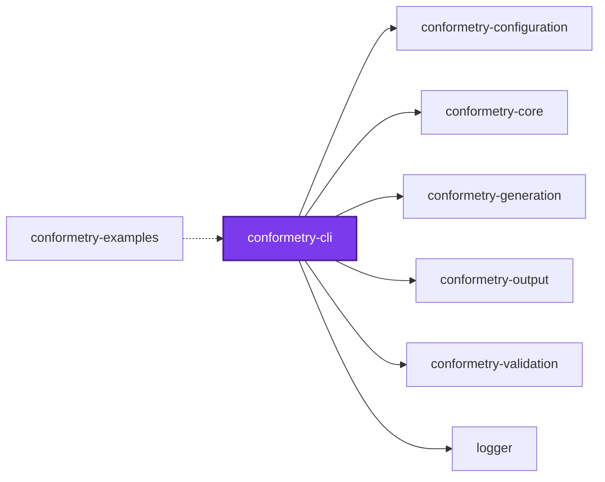
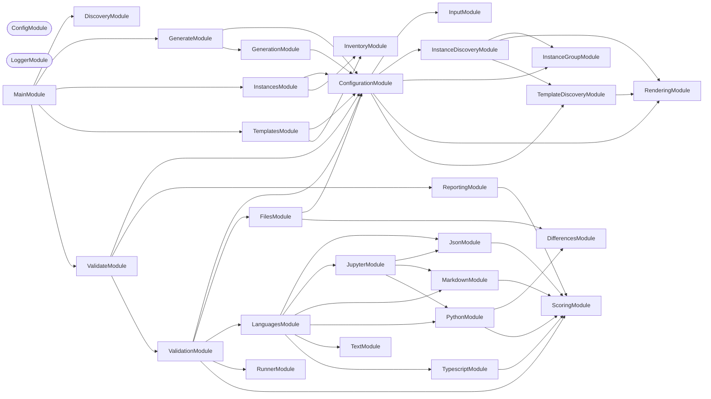
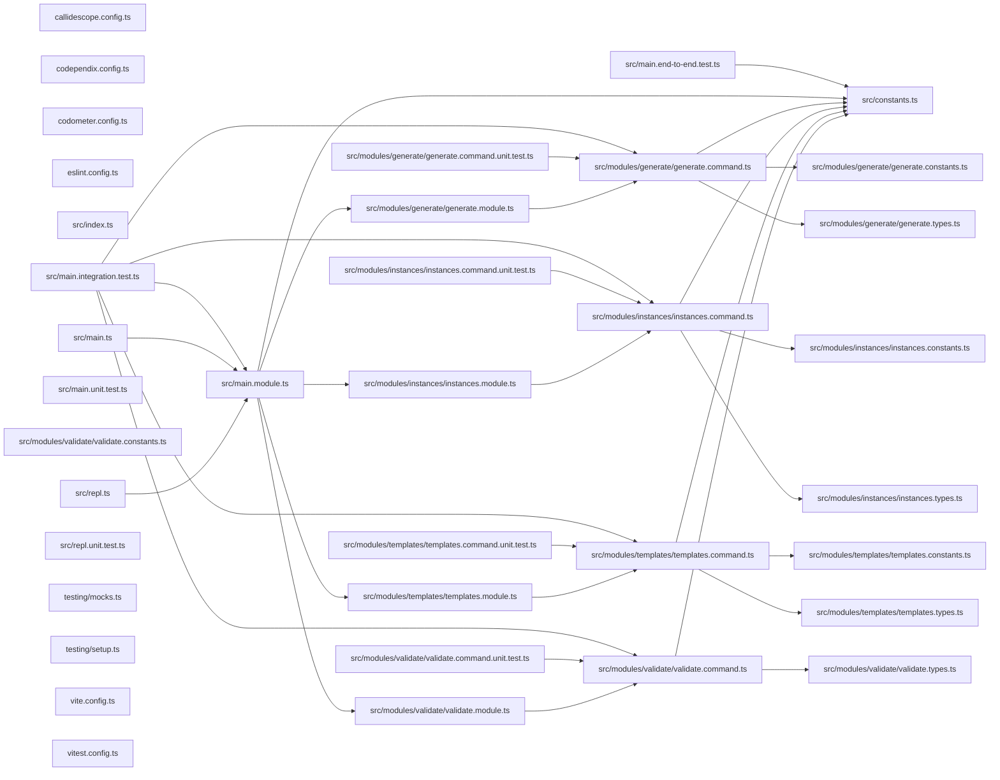

# 👔 Conformetry

**Scaffold from a template, then hold the result to it.**

Conformetry is a code generation toolchain whose templates keep working after
generation. The same template folder that produces a new module is the
specification that module is later checked against, so scaffolding conventions
and enforcing them are one artifact instead of two that drift apart.

```bash
npm install --save-dev @conformetry/cli
```

```bash
# Scaffold a new module from the `nestjs-service-module` template
conformetry generate --template nestjs-service-module --name billing

# Check every existing instance still matches the template it came from
conformetry validate
```

## Why

Scaffolding tools stop caring the moment the files are written. A month later
a module has lost its `constants.ts`, a service dropped its section comments,
and nobody notices until someone reads it. Linters can't help — the convention
isn't a rule about syntax, it's a rule about the shape of a template that only
exists in a generator's output directory.

Conformetry closes the loop. Templates are rendered twice: once to create
files, and again — with the same substitutions, by the same renderer — to
compare against the files that already exist. A file that would not be
regenerated the way it is written today is a finding.

Comparison is **structural, not textual**. A TypeScript instance is compared as
a syntax tree, markdown as an mdast tree, Python through Python's own `ast`
module. Reformatting a file, renaming a local, or adding a method does not fail
validation; deleting a required export, dropping a declared file, or losing a
section comment does.

## Install

| Package | Install when |
| ------- | ------------ |
| `@conformetry/cli` | You want the `conformetry` command |
| `@conformetry/nx` | Your workspace is an Nx monorepo |
| `@conformetry/generation` + `@conformetry/validation` | You are embedding conformetry in your own tool |

```bash
npm install --save-dev @conformetry/cli
# or
pnpm add --save-dev @conformetry/cli
```

Node.js 20 or newer. Validating Python or Jupyter instances additionally needs
`python3` on `PATH` — the Python validator compares through the interpreter's
own `ast` module rather than reimplementing a parser.

## Commands

### `conformetry generate`

Renders one template folder into a target directory.

| Flag | Purpose |
| ---- | ------- |
| `--template [name]` | Which template from the registry to render. Asked for when omitted |
| `--config [path]` | Configuration file to read. Defaults to `configuration/conformetry.config.ts` |
| `--directory [path]` | Where to write the rendered files |

A template's own inputs are passed as flags alongside these:

```bash
conformetry generate --template react-component --name search-bar
```

**Omitting `--template` at a terminal offers a picker** — an autocomplete over
every configured template, each shown with its description, filtering as you
type. A name like `nestjs-service-module` is long by design, and typing
`service` is what makes it cheap to reach; nobody has to break off and run
`conformetry templates` to look one up. Passing `--template` skips the picker
entirely, because supplying a value is itself how a caller opts out of being
asked.

With no terminal, a missing template is **refused** — listing every available
name — rather than waited on, so a CI job fails immediately instead of hanging
until it times out.

**`--generator` was removed rather than kept as an alias**, and passing it is
refused by name. Unknown flags are accepted here so a template's own inputs can
be passed as flags, which means commander would otherwise read `--generator` as
an input nothing declares and drop it silently — the "appears to work" the
rename set out to avoid.

Unknown flags are accepted deliberately. Which inputs exist is not known until
the template is chosen, so they are matched against that template's schema
rather than declared ahead of time. This is also why the template is selected
with `--template` and not `--name`: almost every template takes a `name`, and
reserving that flag would leave no way to supply it.

**Missing inputs are prompted for whenever stdin is a terminal**, and there is
no flag to turn that off — an attached terminal is the whole condition, so a
script, a hook, or a CI job is never prompted.

**Every input a template declares is required.** A template substitutes each
of its placeholders, and mustache renders a missing one as an empty string
rather than failing, so an optional input would quietly produce a hole in the
generated file. `nx g conformetry:<template>` has always taken that line; this
command now does too, so the same template asks for the same values whichever
way it is run.

With no terminal, a missing input is therefore **refused** — naming the flag to
pass — and the run exits non-zero. That refusal is the load-bearing half.
`prompts` does not fail on a non-terminal stdin: it draws its menu, never
resolves, and lets the process **exit 0 having generated nothing**, which is how
this command used to hang in CI. It now asserts a terminal before prompting at
all and reports a rejected command line instead.

### `conformetry templates`

Names every template the loaded configuration declares, with its description
and folder. `generate` and `validate` both offer that list as a picker now, so
this command is for reading it rather than for looking a name up before typing
one.

| Flag | Purpose |
| ---- | ------- |
| `--config [path]` | Configuration file to read |
| `--instances [globs]` | Comma-separated paths or globs; report only the templates that explain them |
| `--json` | Write the listing as JSON |

With `--instances` it answers the other direction — which templates explain a
given path:

```bash
conformetry templates --instances packages/billing/src/modules/billing
```

```text
  nestjs-service-module (nsm)
    Generate a NestJS service module
    Template: configuration/conformetry-templates/nestjs-service-module
    Instances:
      packages/billing/src/modules/billing 5/5 files 100%
  nestjs-command-module (ncm)
    Generate a NestJS command module
    Template: configuration/conformetry-templates/nestjs-command-module
    Instances:
      packages/billing/src/modules/billing 3/5 files 60%
```

**Every template that explains the path is listed**, because a path can belong
to more than one. Nothing records where an instance came from — attribution is
inferred from how much of a template's structure the path already has — so a
single verdict would hide the tie that makes an ambiguous instance ambiguous.

A bare listing omits the instances; they appear only when you narrow by path, so
the registry stays readable.

### `conformetry instances`

Lists every instance the configured globs find, and which templates explain each
one. The complement of the command above: that one asks what standard a path
answers to, this one asks what generated code exists.

```bash
conformetry instances --templates nestjs-service-module
```

```text
  packages/billing/src/modules/billing
    Templates:
      nestjs-service-module 5/5 files 100%
```

| Flag | Purpose |
| ---- | ------- |
| `--config [path]` | Configuration file to read |
| `--json` | Write the listing as JSON |
| `--templates [names]` | Comma-separated template names; report only the instances they explain |

Each path printed is usable as the `--instances` argument above, so the two
compose without reformatting. `--templates` is how you find every instance a
template change would affect.

Note that instances located by **project tags** rather than globs are invisible
here: tag resolution belongs to the Nx plugin, and the command-line host locates
instances by glob alone.

### `conformetry validate`

Expands the configured instance globs and compares everything it finds against
the template it was generated from.

| Flag | Purpose |
| ---- | ------- |
| `--config [path]` | Configuration file to read |
| `--instances [globs]` | Comma-separated globs to validate, overriding the configuration |
| `--languages [names]` | Comma-separated languages to run — `typescript`, `markdown`, `python`, `json`, `jupyter`, `text` |
| `--templates [names]` | Comma-separated template names to narrow the run to, or `all` for every one |
| `--threshold [ratio]` | Lowest conformance score an instance may have, 0 to 1. The weakest of the three threshold levels |

Every flag is optional; an absent filter means "everything". The command exits
non-zero when any instance scores below its threshold, which is what makes it
usable as a pre-merge gate.

**`--templates` and `--instances` are two independent filters**, and a run
is their intersection — each removes candidates from one side before templates
and instances are paired:

| `--instances` | `--templates` | What is validated |
| ------------- | ------------- | ----------------- |
| absent | `all`, or absent with no terminal | Every template against every configured instance |
| present | `all`, or absent with no terminal | The globbed instances against every applicable template |
| absent | named | Every instance belonging to those templates, against them |
| present | named | The globbed instances narrowed to those templates' instances |

Omitting `--templates` at a terminal offers the same picker `generate` does,
ticking more than one, with `all` offered alongside the names. With no terminal
it falls back to every template rather than asking — which is exactly what an
invocation predating this flag already did, so scripts and CI jobs are
unaffected. `all` is reserved: a configuration cannot declare a template of
that name.

**A template whose instances are scoped by project tags cannot be located by
this host**, and a narrowed run says so rather than reporting nothing found. A
group carrying `tags` reads its globs _inside each project the tags select_, so
`src/modules/*` has no meaning until a project root is joined to it — which
only a host with a project graph can do. Such a group is left out rather than
expanded from the working directory, where it would match whatever happened to
sit at the same relative path and measure it against a template scoped to other
projects. Run those through [`@conformetry/nx`](../conformetry-nx/README.md),
or pass `--instances` with the paths to check.

Naming a template that does not exist is **refused**, listing the real names,
rather than silently narrowing to nothing. A selection that matches no
instances is reported as _"no instances belong to …"_ rather than as a clean
report, so "nothing to check" can be told apart from "everything checks out".

## Scoring

Validation reports **how much** of its template an instance honours, not just
whether it does. Every template element the comparison weighs is one
requirement, and a missing element costs the whole subtree it stood for — so
deleting a class costs far more than dropping an import, without anyone
maintaining a table of weights.

The same three numbers — met, total, percentage — are reported at every level:

```text
Conformance scores:
  ✗ packages/logging/src/modules/logger (nestjs-service-module) — 149/151 requirements met (98.7%), below threshold 100.0%
  ✗ packages/logging/src/modules/logger/logger (nestjs-service-file) — 108/109 requirements met (99.1%), below threshold 100.0%
  Total — 257/260 requirements met (98.8%) across 2 instance(s), 2 below threshold

  1. file: logger.types.ts — 1/2 requirements met (50.0%)
     Instance: packages/logging/src/modules/logger/logger.types.ts
     Template: configuration/conformetry-templates/nestjs-service-module/{{nameKebabCase}}/{{nameKebabCase}}.types.ts

     1. Missing comment // 🏷️ Types
        Template: Line 1, Column 1
        Expected: `// 🏷️ Types`
        Weight  : 1 of the 2 requirements in this file
        Fix     : Add the comment // 🏷️ Types to the instance file.
```

| Level | Answers |
| ----- | ------- |
| File | How much of _this file_ drifted — a small file can lose half of itself to one finding |
| Instance | Whether this instance clears its threshold; this is the level thresholds apply to |
| Total | How the whole run did, across every instance/template pair |

The fraction is printed alongside the percentage because a percentage hides its
own scale: 99.3% reads the same whether one requirement of 151 went missing or
thirty of four thousand did, and only the first is a five-minute fix.

The total is counted in instance/template pairs rather than files. A file
governed by two templates owes both of them, so its requirements genuinely
count once per template.

A finding that stands in for more than itself says so, which is what tells the
expensive drift from the trivial — a missing class carries the weight of every
member it held.

An instance must score at or above its **threshold** to pass. The default is
`1` — a perfect match, which is what conformetry has always demanded — so
adding scoring changes nothing until a threshold is lowered deliberately.

Three levels set it, narrowest first:

| Level | Where | Applies to |
| ----- | ----- | ---------- |
| Instance group | `instances[].threshold` | Only the paths that group's globs locate |
| Generator | `threshold` on the generator | Every instance of that template |
| Run | `--threshold` | Every instance the run touches |

That is what makes introducing a template bearable. A new template can be
adopted with the directory still being migrated held to `0.75` while every
other instance of it stays strict, instead of having to bring the whole
workspace over in one change.

Findings print either way. A lowered threshold is permission to ship the drift,
not a reason to stop showing it.

Differences are grouped by file and each one carries the location on **both**
sides — where the instance is wrong and where the template says so — plus the
expected value and a concrete fix:

```text
1. file: billing.service.ts
   Instance: packages/billing/src/modules/billing/billing.service.ts
   Template: configuration/conformetry-templates/nestjs-service-module/…

   1. Missing required comment
      Instance: line 24
      Template: line 31
      Expected: `// 🌎 Public Methods`
      Fix     : Add the `// 🌎 Public Methods` section comment above the first public method.
```

The `fix` field is the point of the format: reports are meant to be actionable
by whoever — or whatever — has to make the file conform.

## Configuration

A single `conformetry.config.ts` declares every generator: the template folder
it renders, the inputs it takes, and the paths its output already occupies.

```ts
import { type ConformetryConfiguration } from "@conformetry/configuration";

const conformetryConfiguration: ConformetryConfiguration = [
  {
    description: "Generate a NestJS service module",
    inputs: {
      name: { description: "Module name in kebab-case", type: "string" },
    },
    instances: [{ patterns: ["packages/*/src/modules/*"] }],
    name: "nestjs-service-module",
    templatePath: "templates/nestjs-service-module",
  },
];

export default conformetryConfiguration;
```

`instances` is what makes validation possible: it says where this generator's
output already lives, so validation knows what to check without being told
twice. The full field reference — instance groups, tag selectors, input
schemas, discovery, and the supported file formats — is in
[**@conformetry/configuration**](../conformetry-configuration/README.md).

## Templates

A template is an ordinary folder of ordinary files. Both file contents and file
_paths_ are rendered with [mustache](https://mustache.github.io), so a folder
named `{{nameKebabCase}}` becomes `billing` and a file named
`{{namePascalCase}}.tsx` becomes `SearchBar.tsx`:

```text
templates/nestjs-service-module/
└── {{nameKebabCase}}/
    ├── {{nameKebabCase}}.constants.ts
    ├── {{nameKebabCase}}.module.ts
    ├── {{nameKebabCase}}.service.ts
    ├── {{nameKebabCase}}.service.unit.test.ts
    └── {{nameKebabCase}}.types.ts
```

Every generator's `name` input is expanded into four case variants
automatically, so a template never has to case-convert by hand:

| Placeholder | `search bar` becomes |
| ----------- | -------------------- |
| `{{nameCamelCase}}` | `searchBar` |
| `{{nameKebabCase}}` | `search-bar` |
| `{{namePascalCase}}` | `SearchBar` |
| `{{nameSnakeCase}}` | `search_bar` |

An explicit input of the same name always wins over the derived variant. Full
mustache is available — sections, inverted sections, partials — with HTML
escaping disabled so substituted values cannot corrupt source code.

> **Supply every placeholder a template uses.** An interpolated placeholder
> nobody supplied fails the run with `MissingSubstitutionError`, naming the
> placeholder and the template file. Mustache would otherwise render it as an
> empty string, and since validation renders exactly as generation does, both
> sides would lose the same value and report nothing.
>
> Sections are the exception, and are how a template asks for something
> optional: `{{#owner}}Owner: {{owner}}{{/owner}}` renders nothing when `owner`
> is absent, rather than refusing.

## Validators

Which validator handles a file is decided by its extension, and only the
packages a run actually needs are loaded.

| Validator | Extensions | Compares |
| --------- | ---------- | -------- |
| `typescript` | `.ts`, `.tsx` | Syntax tree structure and required section comments |
| `markdown` | `.md` | mdast structure — headings, lists, tables — rather than prose |
| `python` | `.py` | Structure via Python's own `ast` module |
| `json` | `.json`, `.jsonc` | Key structure and values |
| `jupyter` | `.ipynb` | Notebook envelope, delegating cells to the markdown and Python validators |
| `text` | everything else | Duplicate-aware line conformance — the floor, so no extension goes unchecked |

Before any of them runs, every file the template declares is checked to
**exist**. That pass covers extensions no validator claims — `.gitignore`,
`.env.default`, `pyproject.toml` — which would otherwise be deletable without
failing anything. A missing directory is reported once rather than as twenty
missing files.

A template comment containing `TODO` is treated as a prompt rather than text to
copy, so any instance comment satisfies it.

## Nx workspaces

[`@conformetry/nx`](../conformetry-nx/README.md) is a second host over the same
runtime. It adds two things the standalone CLI cannot offer:

- **A `conformetry-validate` target inferred onto every project** that holds
  instances, so validation is cached and participates in `nx affected`.
- **Generators addressed by name** — `nx g conformetry:nestjs-service-module` —
  with Nx prompting for inputs and writing through its virtual `Tree`.

Because which generators exist is a property of _your_ configuration rather
than of the package, the plugin exposing them is emitted at install time rather
than shipped:

```json
{ "scripts": { "postinstall": "conformetry-nx-bootstrap-generators" } }
```

Instance groups may additionally select projects by Nx tag, with their globs
read inside each matching project:

```ts
instances: [{ patterns: ["src/modules/*"], tags: ["framework:nestjs"] }];
```

## Packages

Conformetry is deliberately split so that embedding it does not mean depending
on a CLI. `@conformetry/core` is the leaf — it depends on nothing else in the
graph — and every other package declares exactly which siblings it may import.

### Hosts

| Package | Role |
| ------- | ---- |
| [`@conformetry/cli`](README.md) | The `conformetry` command: expands globs, prompts for inputs, prints reports |
| [`@conformetry/nx`](../conformetry-nx/README.md) | Nx plugin: inferred validation targets, tag-scoped instances, emitted generators |

### Runtime

| Package | Role |
| ------- | ---- |
| [`@conformetry/core`](../conformetry-core/README.md) | Contracts leaf: the structured difference shape, the score, the inventory, and the language validator contract |
| [`@conformetry/configuration`](../conformetry-configuration/README.md) | Config loading, template discovery, instance matching, input resolution, placeholder rendering |
| [`@conformetry/generation`](../conformetry-generation/README.md) | The generator lifecycle, rendering each template through the configuration layer |
| [`@conformetry/validation`](../conformetry-validation/README.md) | Validation orchestration, language routing, finding deduplication |
| [`@conformetry/languages`](../conformetry-languages/README.md) | Every Language module, the facade that resolves extensions to them, the existence check for every declared file, and the difference and scoring primitives they share |
| [`@conformetry/output`](../conformetry-output/README.md) | Every render target: the validation report and the template and instance inventory |

### Languages

`@conformetry/languages` holds one module per Language, all reached through its
single `LanguagesModule` facade rather than as separate packages.

| Module | Extensions |
| ------ | ---------- |
| `typescript` | `.ts`, `.tsx` |
| `markdown` | `.md` |
| `python` | `.py` |
| `json` | `.json`, `.jsonc` |
| `jupyter` | `.ipynb` |
| `text` | the fallback for everything else |

Nothing depends on `@conformetry/cli`. Embedding conformetry means depending on
the runtime packages directly — the CLI is one host among others, and holds no
logic of its own.

## Embedding

Both runtimes are NestJS providers, so a host wires them the way it wires
anything else:

```ts
import { GenerationService } from "@conformetry/generation";

const result = await generationService.runGenerator({
  definition: {
    name: "nestjs-service-module",
    templateDirectoryPath: "templates/nestjs-service-module",
  },
  inputs: { name: "billing" },
  instancePath: "packages/billing/src/modules",
});
```

Filesystem and formatter access go through adapters, which is how
`@conformetry/nx` reuses this runtime unchanged against a virtual `Tree`.
Rendering deliberately is _not_ an adapter: validation must substitute exactly
as generation does, or validation would flag the files the generator itself
produced.

## Agent skills

Agent skills for coding agents working with conformetry are published in
[`@conformetry/agents`](https://github.com/Organizzolini/codebase/tree/main/packages/ic-suite/conformetry/conformetry-agents):

| Skill | Description |
| ----- | ----------- |
| [`conformetry-generate`](https://github.com/Organizzolini/codebase/tree/main/packages/ic-suite/conformetry/conformetry-agents/skills/conformetry-generate) | Scaffold code from templates using conformetry generators |
| [`conformetry-configure`](https://github.com/Organizzolini/codebase/tree/main/packages/ic-suite/conformetry/conformetry-agents/skills/conformetry-configure) | Configure generators, templates, and validation rules in `conformetry.config.ts` |
| [`conformetry-validate`](https://github.com/Organizzolini/codebase/tree/main/packages/ic-suite/conformetry/conformetry-agents/skills/conformetry-validate) | Run structural conformance checks against templates |

## Examples

Worked examples and sandboxes are in
[`@conformetry/examples`](https://github.com/Organizzolini/codebase/tree/main/packages/ic-suite/conformetry/conformetry-examples) — eleven self-contained
examples covering template authoring, case variants, structural comparison, drift detection, and Nx integration. An agent arriving from a conformance report can use
[`AGENTS.md`](https://github.com/Organizzolini/codebase/tree/main/packages/ic-suite/conformetry/conformetry-examples/AGENTS.md) to find the example that explains each finding.

## Start

Run the CLI from source:

```bash
nx run conformetry-cli:start
```

Pass a subcommand and its flags after `--`:

```bash
nx run conformetry-cli:start -- validate --languages typescript
```

## Test

```bash
nx run conformetry-cli:vitest
```

## Build

```bash
nx run conformetry-cli:build
```

## License

MIT — see [LICENSE](../../../../LICENSE).

## 👔 Conformetry

This project was generated from the [nestjs-command-project](../../../../configuration/conformetry-templates/nestjs-command-project) conformetry template.

<!-- callidescope:start -->

## 🔭 Callidescope

Call stacks traced through `packages/ic-suite/conformetry/conformetry-cli`, deepest first. Each frame shows what it takes, what it returns, and what its documentation says.

| Measure | Value |
| --- | --- |
| Callables | 59 |
| Files | 27 |
| Calls traced | 72 |
| Call stacks | 16 |
| Deepest stack | 15 |
| Stacks through recursion | 0 |
| Unfollowable calls | 4 |

### Limits

What this project is judged against, as declared in its own `callidescope.config.ts`.

| Limit | Value |
| --- | --- |
| `maximumDepth` | 15 |
| `maximumBreadth` | 9 |

### Call stacks (depth)

**1. `InstancesCommand.run`** — depth ≥ 15 · decorated-method

```text
🚀 InstancesCommand.run(_passedParameters: string[], options: InstancesCommandOptions): Promise<void> [packages/ic-suite/conformetry/conformetry-cli/src/modules/instances/instances.command.ts:84]
   ↳ Writes every instance found, filtered to the given templates.
  └─> ConfigurationService.resolveInventoriedInstances(…): InventoriedInstance[] [packages/ic-suite/conformetry/conformetry-configuration/src/modules/configuration/configuration.service.ts:345]
     ↳ Lists every instance found, paired with the templates that explain it.
    └─> InstanceDiscoveryService.resolveInventoriedInstances(args: ResolveInventoryArguments): InventoriedInstance[] [packages/ic-suite/conformetry/conformetry-configuration/src/modules/instance-discovery/instance-discovery.service.ts:191]
       ↳ Lists every instance found, paired with the templates that explain it. `templateNames` narrows the pairing rather than…
      └─> InstanceDiscoveryService.takeInventory(…): { templates: TemplateDefinition[]; weighed: { instance: Instance; pairings: InventoriedPairing[]; }[]; } [packages/ic-suite/conformetry/conformetry-configuration/src/modules/instance-discovery/instance-discovery.service.ts:255]
         ↳ Weighs every instance the globs find against every declared template.
        └─> InstanceDiscoveryService.map(…)(instance: Instance): { instance: Instance; pairings: InventoriedPairing[]; } [packages/ic-suite/conformetry/conformetry-configuration/src/modules/instance-discovery/instance-discovery.service.ts:277]
          └─> InstanceDiscoveryService.weighInstance(…): { instance: Instance; pairings: InventoriedPairing[]; } [packages/ic-suite/conformetry/conformetry-configuration/src/modules/instance-discovery/instance-discovery.service.ts:56]
             ↳ Weighs one instance against every template, best fit first.
            └─> InstanceDiscoveryMatchingService.matchTemplates(…): TemplateMatch[] [packages/ic-suite/conformetry/conformetry-configuration/src/modules/instance-discovery/instance-discovery-matching.service.ts:154]
               ↳ Weighs every template that shares at least one file with the instance, best-first.
              └─> InstanceDiscoveryMatchingService.map(…)(…): { matchedFileCount: number; matchRatio: number; template: TemplateDefinition; } [packages/ic-suite/conformetry/conformetry-configuration/src/modules/instance-discovery/instance-discovery-matching.service.ts:160]
                └─> TemplateDiscoveryService.countMatchingFiles(…): number [packages/ic-suite/conformetry/conformetry-configuration/src/modules/template-discovery/template-discovery.service.ts:121]
                   ↳ Counts how many of a template's files the instance path already has.
                  └─> TemplateDiscoveryService.filter(…)(templateFilePath: string): boolean [packages/ic-suite/conformetry/conformetry-configuration/src/modules/template-discovery/template-discovery.service.ts:130]
                    └─> TemplateDiscoveryService.resolveInstanceFilePath(…): string [packages/ic-suite/conformetry/conformetry-configuration/src/modules/template-discovery/template-discovery.service.ts:179]
                       ↳ Maps a template file path to the instance file path it governs.
                      └─> RenderingService.renderPath(…): string [packages/ic-suite/conformetry/conformetry-configuration/src/modules/rendering/rendering.service.ts:142]
                         ↳ Renders a template path with mustache, the same way contents are rendered.
                        └─> RenderingService.assertEverySubstitutionSupplied(…): void [packages/ic-suite/conformetry/conformetry-configuration/src/modules/rendering/rendering.service.ts:35]
                           ↳ Refuses to render a template asking for a value nobody supplied.
                          └─> RenderingService.collectInterpolatedNames(template: string): string[] [packages/ic-suite/conformetry/conformetry-configuration/src/modules/rendering/rendering.service.ts:61]
                             ↳ Every placeholder a template interpolates, deduplicated.
                            └─> RenderingService.walk(spans: TemplateSpans): void [packages/ic-suite/conformetry/conformetry-configuration/src/modules/rendering/rendering.service.ts:63]
```

**2. `TemplatesCommand.run`** — depth ≥ 15 · decorated-method

```text
🚀 TemplatesCommand.run(_passedParameters: string[], options: TemplatesCommandOptions): Promise<void> [packages/ic-suite/conformetry/conformetry-cli/src/modules/templates/templates.command.ts:85]
   ↳ Writes every declared template, filtered to the given instances.
  └─> ConfigurationService.resolveInventoriedTemplates(…): InventoriedTemplate[] [packages/ic-suite/conformetry/conformetry-configuration/src/modules/configuration/configuration.service.ts:352]
     ↳ Lists every template declared, paired with the instances it explains.
    └─> InstanceDiscoveryService.resolveInventoriedTemplates(args: ResolveInventoryArguments): InventoriedTemplate[] [packages/ic-suite/conformetry/conformetry-configuration/src/modules/instance-discovery/instance-discovery.service.ts:216]
       ↳ Lists every template declared, paired with the instances it explains. `instancePatterns` narrows which instances are…
      └─> InstanceDiscoveryService.takeInventory(…): { templates: TemplateDefinition[]; weighed: { instance: Instance; pairings: InventoriedPairing[]; }[]; } [packages/ic-suite/conformetry/conformetry-configuration/src/modules/instance-discovery/instance-discovery.service.ts:255]
         ↳ Weighs every instance the globs find against every declared template.
        └─> InstanceDiscoveryService.map(…)(instance: Instance): { instance: Instance; pairings: InventoriedPairing[]; } [packages/ic-suite/conformetry/conformetry-configuration/src/modules/instance-discovery/instance-discovery.service.ts:277]
          └─> InstanceDiscoveryService.weighInstance(…): { instance: Instance; pairings: InventoriedPairing[]; } [packages/ic-suite/conformetry/conformetry-configuration/src/modules/instance-discovery/instance-discovery.service.ts:56]
             ↳ Weighs one instance against every template, best fit first.
            └─> InstanceDiscoveryMatchingService.matchTemplates(…): TemplateMatch[] [packages/ic-suite/conformetry/conformetry-configuration/src/modules/instance-discovery/instance-discovery-matching.service.ts:154]
               ↳ Weighs every template that shares at least one file with the instance, best-first.
              └─> InstanceDiscoveryMatchingService.map(…)(…): { matchedFileCount: number; matchRatio: number; template: TemplateDefinition; } [packages/ic-suite/conformetry/conformetry-configuration/src/modules/instance-discovery/instance-discovery-matching.service.ts:160]
                └─> TemplateDiscoveryService.countMatchingFiles(…): number [packages/ic-suite/conformetry/conformetry-configuration/src/modules/template-discovery/template-discovery.service.ts:121]
                   ↳ Counts how many of a template's files the instance path already has.
                  └─> TemplateDiscoveryService.filter(…)(templateFilePath: string): boolean [packages/ic-suite/conformetry/conformetry-configuration/src/modules/template-discovery/template-discovery.service.ts:130]
                    └─> TemplateDiscoveryService.resolveInstanceFilePath(…): string [packages/ic-suite/conformetry/conformetry-configuration/src/modules/template-discovery/template-discovery.service.ts:179]
                       ↳ Maps a template file path to the instance file path it governs.
                      └─> RenderingService.renderPath(…): string [packages/ic-suite/conformetry/conformetry-configuration/src/modules/rendering/rendering.service.ts:142]
                         ↳ Renders a template path with mustache, the same way contents are rendered.
                        └─> RenderingService.assertEverySubstitutionSupplied(…): void [packages/ic-suite/conformetry/conformetry-configuration/src/modules/rendering/rendering.service.ts:35]
                           ↳ Refuses to render a template asking for a value nobody supplied.
                          └─> RenderingService.collectInterpolatedNames(template: string): string[] [packages/ic-suite/conformetry/conformetry-configuration/src/modules/rendering/rendering.service.ts:61]
                             ↳ Every placeholder a template interpolates, deduplicated.
                            └─> RenderingService.walk(spans: TemplateSpans): void [packages/ic-suite/conformetry/conformetry-configuration/src/modules/rendering/rendering.service.ts:63]
```

**3. `ValidateCommand.run`** — depth ≥ 14 · decorated-method

```text
🚀 ValidateCommand.run(_passedParameters: string[], options: ValidateCommandOptions): Promise<void> [packages/ic-suite/conformetry/conformetry-cli/src/modules/validate/validate.command.ts:364]
   ↳ Runs validation and reports every difference found.
  └─> ValidationService.validate(args: RunValidationArguments): RunValidationResult [packages/ic-suite/conformetry/conformetry-validation/src/modules/validation/validation.service.ts:136]
     ↳ Validates every instance and returns the differences found.
    └─> ConfigurationService.matchInstances(…): ResolvedInstances [packages/ic-suite/conformetry/conformetry-configuration/src/modules/configuration/configuration.service.ts:263]
       ↳ Resolves every instance to the template, or templates, that explain it.
      └─> InstanceDiscoveryService.matchInstances(…): ResolvedInstances [packages/ic-suite/conformetry/conformetry-configuration/src/modules/instance-discovery/instance-discovery.service.ts:95]
         ↳ Resolves every instance to the template, or templates, that explain it.
        └─> InstanceDiscoveryMatchingService.matchInstances(…): ResolvedInstances [packages/ic-suite/conformetry/conformetry-configuration/src/modules/instance-discovery/instance-discovery-matching.service.ts:93]
           ↳ Resolves every instance to the template — or templates — that explain it.
          └─> InstanceDiscoveryMatchingService.matchTemplates(…): TemplateMatch[] [packages/ic-suite/conformetry/conformetry-configuration/src/modules/instance-discovery/instance-discovery-matching.service.ts:154]
             ↳ Weighs every template that shares at least one file with the instance, best-first.
            └─> InstanceDiscoveryMatchingService.map(…)(…): { matchedFileCount: number; matchRatio: number; template: TemplateDefinition; } [packages/ic-suite/conformetry/conformetry-configuration/src/modules/instance-discovery/instance-discovery-matching.service.ts:160]
              └─> TemplateDiscoveryService.countMatchingFiles(…): number [packages/ic-suite/conformetry/conformetry-configuration/src/modules/template-discovery/template-discovery.service.ts:121]
                 ↳ Counts how many of a template's files the instance path already has.
                └─> TemplateDiscoveryService.filter(…)(templateFilePath: string): boolean [packages/ic-suite/conformetry/conformetry-configuration/src/modules/template-discovery/template-discovery.service.ts:130]
                  └─> TemplateDiscoveryService.resolveInstanceFilePath(…): string [packages/ic-suite/conformetry/conformetry-configuration/src/modules/template-discovery/template-discovery.service.ts:179]
                     ↳ Maps a template file path to the instance file path it governs.
                    └─> RenderingService.renderPath(…): string [packages/ic-suite/conformetry/conformetry-configuration/src/modules/rendering/rendering.service.ts:142]
                       ↳ Renders a template path with mustache, the same way contents are rendered.
                      └─> RenderingService.assertEverySubstitutionSupplied(…): void [packages/ic-suite/conformetry/conformetry-configuration/src/modules/rendering/rendering.service.ts:35]
                         ↳ Refuses to render a template asking for a value nobody supplied.
                        └─> RenderingService.collectInterpolatedNames(template: string): string[] [packages/ic-suite/conformetry/conformetry-configuration/src/modules/rendering/rendering.service.ts:61]
                           ↳ Every placeholder a template interpolates, deduplicated.
                          └─> RenderingService.walk(spans: TemplateSpans): void [packages/ic-suite/conformetry/conformetry-configuration/src/modules/rendering/rendering.service.ts:63]
```

<details>
<summary>13 more call stacks</summary>

**4. `GenerateCommand.run`** — depth ≥ 11 · decorated-method

```text
🚀 GenerateCommand.run(passedParameters: string[], options: GenerateCommandOptions): Promise<void> [packages/ic-suite/conformetry/conformetry-cli/src/modules/generate/generate.command.ts:254]
   ↳ Renders the template, reporting a refused command line as one.
  └─> GenerateCommand.generate(…): Promise<void> [packages/ic-suite/conformetry/conformetry-cli/src/modules/generate/generate.command.ts:64]
     ↳ Resolves the template's inputs and writes its files.
    └─> ConfigurationService.resolveGeneratorInputs(args: ResolveGeneratorInputsArguments): Promise<Record<string, string>> [packages/ic-suite/conformetry/conformetry-configuration/src/modules/configuration/configuration.service.ts:333]
       ↳ Resolves generator inputs from raw command-line arguments.
      └─> InputService.resolveGeneratorInputs(args: ResolveGeneratorInputsArguments): Promise<Record<string, string>> [packages/ic-suite/conformetry/conformetry-configuration/src/modules/input/input.service.ts:180]
         ↳ Resolves generator inputs from raw command-line arguments.
        └─> InputService.resolveInputs(…): Promise<Record<string, string>> [packages/ic-suite/conformetry/conformetry-configuration/src/modules/input/input.service.ts:53]
           ↳ Walks a schema, taking each value from the resolver or a prompt.
          └─> InputService.acceptProvidedValue(args: { input: SchemaInput; value: string; }): string [packages/ic-suite/conformetry/conformetry-configuration/src/modules/input/input.service.ts:39]
             ↳ Validates a value the caller already had, throwing if it is invalid.
            └─> InputSchemaService.validateValue(args: { input: SchemaInput; value: unknown; }): string | true [packages/ic-suite/conformetry/conformetry-configuration/src/modules/input/input-schema.service.ts:158]
               ↳ Validates a value, returning `true` or the reason it failed.
              └─> InputSchemaService.validateEnum(args: { input: SchemaInput; value: string; }): string | true [packages/ic-suite/conformetry/conformetry-configuration/src/modules/input/input-schema.service.ts:39]
                 ↳ Validates a value against a schema `enum`, when one is declared.
                └─> InputSchemaService.readEnumValues(propertySchema: unknown): string[] [packages/ic-suite/conformetry/conformetry-configuration/src/modules/input/input-schema.service.ts:123]
                   ↳ Reads the string members of a schema `enum`.
                  └─> InputSchemaService.readSchemaProperty(propertySchema: unknown, key: string): unknown [packages/ic-suite/conformetry/conformetry-configuration/src/modules/input/input-schema.service.ts:26]
                     ↳ Reads one property off a schema fragment when it is an object.
                    └─> InputSchemaService.find(…)([entryKey]: [string, any]): boolean [packages/ic-suite/conformetry/conformetry-configuration/src/modules/input/input-schema.service.ts:31]
```

**5. `InstancesCommand.parseTemplates`** — depth 4 · decorated-method

```text
🚀 InstancesCommand.parseTemplates(value: string | undefined): string[] | undefined [packages/ic-suite/conformetry/conformetry-cli/src/modules/instances/instances.command.ts:74]
   ↳ Parses the optional template filter.
  └─> ConfigurationService.parseCommaDelimitedOption(value: string | undefined): string[] | undefined [packages/ic-suite/conformetry/conformetry-configuration/src/modules/configuration/configuration.service.ts:271]
     ↳ Splits a comma-delimited filter option into its values.
    └─> InputService.parseCommaDelimitedOption(value: string | undefined): string[] | undefined [packages/ic-suite/conformetry/conformetry-configuration/src/modules/input/input.service.ts:118]
       ↳ Splits a comma-delimited filter option into its values.
      └─> InputService.filter(…)(item: string): boolean [packages/ic-suite/conformetry/conformetry-configuration/src/modules/input/input.service.ts:128]
```

**6. `TemplatesCommand.parseInstances`** — depth 4 · decorated-method

```text
🚀 TemplatesCommand.parseInstances(value: string | undefined): string[] | undefined [packages/ic-suite/conformetry/conformetry-cli/src/modules/templates/templates.command.ts:66]
   ↳ Parses the optional instance filter.
  └─> ConfigurationService.parseCommaDelimitedOption(value: string | undefined): string[] | undefined [packages/ic-suite/conformetry/conformetry-configuration/src/modules/configuration/configuration.service.ts:271]
     ↳ Splits a comma-delimited filter option into its values.
    └─> InputService.parseCommaDelimitedOption(value: string | undefined): string[] | undefined [packages/ic-suite/conformetry/conformetry-configuration/src/modules/input/input.service.ts:118]
       ↳ Splits a comma-delimited filter option into its values.
      └─> InputService.filter(…)(item: string): boolean [packages/ic-suite/conformetry/conformetry-configuration/src/modules/input/input.service.ts:128]
```

**7. `ValidateCommand.parseInstances`** — depth 4 · decorated-method

```text
🚀 ValidateCommand.parseInstances(value: string | undefined): string[] | undefined [packages/ic-suite/conformetry/conformetry-cli/src/modules/validate/validate.command.ts:321]
   ↳ Parses the optional instance glob override.
  └─> ConfigurationService.parseCommaDelimitedOption(value: string | undefined): string[] | undefined [packages/ic-suite/conformetry/conformetry-configuration/src/modules/configuration/configuration.service.ts:271]
     ↳ Splits a comma-delimited filter option into its values.
    └─> InputService.parseCommaDelimitedOption(value: string | undefined): string[] | undefined [packages/ic-suite/conformetry/conformetry-configuration/src/modules/input/input.service.ts:118]
       ↳ Splits a comma-delimited filter option into its values.
      └─> InputService.filter(…)(item: string): boolean [packages/ic-suite/conformetry/conformetry-configuration/src/modules/input/input.service.ts:128]
```

**8. `ValidateCommand.parseLanguages`** — depth 4 · decorated-method

```text
🚀 ValidateCommand.parseLanguages(value: string | undefined): string[] | undefined [packages/ic-suite/conformetry/conformetry-cli/src/modules/validate/validate.command.ts:331]
   ↳ Parses the optional language filter.
  └─> ConfigurationService.parseCommaDelimitedOption(value: string | undefined): string[] | undefined [packages/ic-suite/conformetry/conformetry-configuration/src/modules/configuration/configuration.service.ts:271]
     ↳ Splits a comma-delimited filter option into its values.
    └─> InputService.parseCommaDelimitedOption(value: string | undefined): string[] | undefined [packages/ic-suite/conformetry/conformetry-configuration/src/modules/input/input.service.ts:118]
       ↳ Splits a comma-delimited filter option into its values.
      └─> InputService.filter(…)(item: string): boolean [packages/ic-suite/conformetry/conformetry-configuration/src/modules/input/input.service.ts:128]
```

**9. `ValidateCommand.parseTemplates`** — depth 4 · decorated-method

```text
🚀 ValidateCommand.parseTemplates(value: string | undefined): string[] | undefined [packages/ic-suite/conformetry/conformetry-cli/src/modules/validate/validate.command.ts:345]
   ↳ Parses the optional template filter.
  └─> ConfigurationService.parseCommaDelimitedOption(value: string | undefined): string[] | undefined [packages/ic-suite/conformetry/conformetry-configuration/src/modules/configuration/configuration.service.ts:271]
     ↳ Splits a comma-delimited filter option into its values.
    └─> InputService.parseCommaDelimitedOption(value: string | undefined): string[] | undefined [packages/ic-suite/conformetry/conformetry-configuration/src/modules/input/input.service.ts:118]
       ↳ Splits a comma-delimited filter option into its values.
      └─> InputService.filter(…)(item: string): boolean [packages/ic-suite/conformetry/conformetry-configuration/src/modules/input/input.service.ts:128]
```

**10. `ValidateCommand.parseThreshold`** — depth 4 · decorated-method

```text
🚀 ValidateCommand.parseThreshold(value: string | undefined): number | undefined [packages/ic-suite/conformetry/conformetry-cli/src/modules/validate/validate.command.ts:354]
   ↳ Parses the optional run-level conformance threshold.
  └─> ConfigurationService.parseThresholdOption(value: string | undefined): number | undefined [packages/ic-suite/conformetry/conformetry-configuration/src/modules/configuration/configuration.service.ts:283]
     ↳ Parses a threshold option as a ratio from 0 to 1.
    └─> InputService.parseThresholdOption(value: string | undefined): number | undefined [packages/ic-suite/conformetry/conformetry-configuration/src/modules/input/input.service.ts:161]
       ↳ Parses a threshold option as a ratio from 0 to 1.
      └─> InputService.parseOptionalOption(value: string | undefined): string | undefined [packages/ic-suite/conformetry/conformetry-configuration/src/modules/input/input.service.ts:134]
         ↳ Trims an optional string option, treating blank as absent.
```

**11. `GenerateCommand.parseConfig`** — depth 3 · decorated-method

```text
🚀 GenerateCommand.parseConfig(value: string | undefined): string | undefined [packages/ic-suite/conformetry/conformetry-cli/src/modules/generate/generate.command.ts:216]
   ↳ Parses the optional configuration path.
  └─> ConfigurationService.parseOptionalOption(value: string | undefined): string | undefined [packages/ic-suite/conformetry/conformetry-configuration/src/modules/configuration/configuration.service.ts:278]
     ↳ Trims an optional string option, treating blank as absent.
    └─> InputService.parseOptionalOption(value: string | undefined): string | undefined [packages/ic-suite/conformetry/conformetry-configuration/src/modules/input/input.service.ts:134]
       ↳ Trims an optional string option, treating blank as absent.
```

**12. `GenerateCommand.parseDirectory`** — depth 3 · decorated-method

```text
🚀 GenerateCommand.parseDirectory(value: string | undefined): string | undefined [packages/ic-suite/conformetry/conformetry-cli/src/modules/generate/generate.command.ts:225]
   ↳ Parses the output directory override.
  └─> ConfigurationService.parseOptionalOption(value: string | undefined): string | undefined [packages/ic-suite/conformetry/conformetry-configuration/src/modules/configuration/configuration.service.ts:278]
     ↳ Trims an optional string option, treating blank as absent.
    └─> InputService.parseOptionalOption(value: string | undefined): string | undefined [packages/ic-suite/conformetry/conformetry-configuration/src/modules/input/input.service.ts:134]
       ↳ Trims an optional string option, treating blank as absent.
```

**13. `GenerateCommand.parseTemplate`** — depth 3 · decorated-method

```text
🚀 GenerateCommand.parseTemplate(value: string | undefined): string | undefined [packages/ic-suite/conformetry/conformetry-cli/src/modules/generate/generate.command.ts:239]
   ↳ Parses the name of the template to render.
  └─> ConfigurationService.parseOptionalOption(value: string | undefined): string | undefined [packages/ic-suite/conformetry/conformetry-configuration/src/modules/configuration/configuration.service.ts:278]
     ↳ Trims an optional string option, treating blank as absent.
    └─> InputService.parseOptionalOption(value: string | undefined): string | undefined [packages/ic-suite/conformetry/conformetry-configuration/src/modules/input/input.service.ts:134]
       ↳ Trims an optional string option, treating blank as absent.
```

**14. `InstancesCommand.parseConfig`** — depth 3 · decorated-method

```text
🚀 InstancesCommand.parseConfig(value: string | undefined): string | undefined [packages/ic-suite/conformetry/conformetry-cli/src/modules/instances/instances.command.ts:56]
   ↳ Parses the optional configuration path.
  └─> ConfigurationService.parseOptionalOption(value: string | undefined): string | undefined [packages/ic-suite/conformetry/conformetry-configuration/src/modules/configuration/configuration.service.ts:278]
     ↳ Trims an optional string option, treating blank as absent.
    └─> InputService.parseOptionalOption(value: string | undefined): string | undefined [packages/ic-suite/conformetry/conformetry-configuration/src/modules/input/input.service.ts:134]
       ↳ Trims an optional string option, treating blank as absent.
```

**15. `TemplatesCommand.parseConfig`** — depth 3 · decorated-method

```text
🚀 TemplatesCommand.parseConfig(value: string | undefined): string | undefined [packages/ic-suite/conformetry/conformetry-cli/src/modules/templates/templates.command.ts:57]
   ↳ Parses the optional configuration path.
  └─> ConfigurationService.parseOptionalOption(value: string | undefined): string | undefined [packages/ic-suite/conformetry/conformetry-configuration/src/modules/configuration/configuration.service.ts:278]
     ↳ Trims an optional string option, treating blank as absent.
    └─> InputService.parseOptionalOption(value: string | undefined): string | undefined [packages/ic-suite/conformetry/conformetry-configuration/src/modules/input/input.service.ts:134]
       ↳ Trims an optional string option, treating blank as absent.
```

**16. `ValidateCommand.parseConfig`** — depth 3 · decorated-method

```text
🚀 ValidateCommand.parseConfig(value: string | undefined): string | undefined [packages/ic-suite/conformetry/conformetry-cli/src/modules/validate/validate.command.ts:312]
   ↳ Parses the optional configuration path.
  └─> ConfigurationService.parseOptionalOption(value: string | undefined): string | undefined [packages/ic-suite/conformetry/conformetry-configuration/src/modules/configuration/configuration.service.ts:278]
     ↳ Trims an optional string option, treating blank as absent.
    └─> InputService.parseOptionalOption(value: string | undefined): string | undefined [packages/ic-suite/conformetry/conformetry-configuration/src/modules/input/input.service.ts:134]
       ↳ Trims an optional string option, treating blank as absent.
```

</details>

### Breadth

| Callable | Breadth | Calls directly | Location |
| --- | --- | --- | --- |
| `GenerateCommand.generate` | 9 | `GenerateCommand.rejectRemovedGeneratorOption`, `ConfigurationService.loadConformetryConfiguration`, `GenerateCommand.resolveTemplateName`, `GenerateCommand.find(…)`, `unknownTemplateError`, `GenerateCommand.map(…)`, `ConfigurationService.resolveGeneratorInputs`, `GenerationService.runGenerator`, `GenerateCommand.map(…)` | `packages/ic-suite/conformetry/conformetry-cli/src/modules/generate/generate.command.ts:64` |
| `ValidateCommand.run` | 7 | `ConfigurationService.loadConformetryConfiguration`, `ValidateCommand.selectTemplates`, `ValidateCommand.selectInstances`, `ValidateCommand.reportEmptySelection`, `ValidationService.validate`, `ConfigurationService.collectTemplates`, `ValidateCommand.reportResult` | `packages/ic-suite/conformetry/conformetry-cli/src/modules/validate/validate.command.ts:364` |
| `GenerateCommand.resolveTemplateName` | 4 | `GenerateCommand.map(…)`, `ConfigurationService.isAtTerminal`, `missingTemplateError`, `ConfigurationService.promptForTemplate` | `packages/ic-suite/conformetry/conformetry-cli/src/modules/generate/generate.command.ts:183` |

<details>
<summary>28 more callables</summary>

| Callable | Breadth | Calls directly | Location |
| --- | --- | --- | --- |
| `InstancesCommand.run` | 4 | `ConfigurationService.loadConformetryConfiguration`, `InventoryService.shortenInstancePaths`, `ConfigurationService.resolveInventoriedInstances`, `InventoryService.describeInstances` | `packages/ic-suite/conformetry/conformetry-cli/src/modules/instances/instances.command.ts:84` |
| `TemplatesCommand.run` | 4 | `ConfigurationService.loadConformetryConfiguration`, `InventoryService.shortenTemplatePairings`, `ConfigurationService.resolveInventoriedTemplates`, `InventoryService.describeTemplates` | `packages/ic-suite/conformetry/conformetry-cli/src/modules/templates/templates.command.ts:85` |
| `ValidateCommand.selectInstances` | 4 | `ValidateCommand.findInstances`, `ValidateCommand.flatMap(…)`, `ValidateCommand.map(…)`, `ValidateCommand.filter(…)` | `packages/ic-suite/conformetry/conformetry-cli/src/modules/validate/validate.command.ts:230` |
| `ValidateCommand.reportEmptySelection` | 3 | `ValidateCommand.map(…)`, `ValidateCommand.map(…)`, `ValidateCommand.filter(…)` | `packages/ic-suite/conformetry/conformetry-cli/src/modules/validate/validate.command.ts:151` |
| `ValidateCommand.reportResult` | 3 | `ReportingService.formatReport`, `ValidateCommand.filter(…)`, `ValidateCommand.describeFailure` | `packages/ic-suite/conformetry/conformetry-cli/src/modules/validate/validate.command.ts:192` |
| `ValidateCommand.map(…)` | 3 | `ValidateCommand.find(…)`, `unknownTemplateError`, `ValidateCommand.map(…)` | `packages/ic-suite/conformetry/conformetry-cli/src/modules/validate/validate.command.ts:288` |
| `GenerateCommand.rejectRemovedGeneratorOption` | 2 | `GenerateCommand.some(…)`, `removedGeneratorOptionError` | `packages/ic-suite/conformetry/conformetry-cli/src/modules/generate/generate.command.ts:161` |
| `GenerateCommand.run` | 2 | `GenerateCommand.generate`, `GenerateCommand.rejectCommandLine` | `packages/ic-suite/conformetry/conformetry-cli/src/modules/generate/generate.command.ts:254` |
| `ValidateCommand.describeFailure` | 2 | `ValidateCommand.filter(…)`, `ValidateCommand.map(…)` | `packages/ic-suite/conformetry/conformetry-cli/src/modules/validate/validate.command.ts:73` |
| `ValidateCommand.findInstances` | 2 | `ValidateCommand.flatMap(…)`, `ConfigurationService.readWorkspaceGroups` | `packages/ic-suite/conformetry/conformetry-cli/src/modules/validate/validate.command.ts:97` |
| `ValidateCommand.promptForTemplateNames` | 2 | `ConfigurationService.isAtTerminal`, `ConfigurationService.promptForTemplates` | `packages/ic-suite/conformetry/conformetry-cli/src/modules/validate/validate.command.ts:133` |
| `ValidateCommand.selectTemplates` | 2 | `ValidateCommand.promptForTemplateNames`, `ValidateCommand.map(…)` | `packages/ic-suite/conformetry/conformetry-cli/src/modules/validate/validate.command.ts:273` |
| `missingTemplateError` | 1 | `InputError.constructor` | `packages/ic-suite/conformetry/conformetry-cli/src/modules/generate/generate.constants.ts:15` |
| `GenerateCommand.parseConfig` | 1 | `ConfigurationService.parseOptionalOption` | `packages/ic-suite/conformetry/conformetry-cli/src/modules/generate/generate.command.ts:216` |
| `GenerateCommand.parseDirectory` | 1 | `ConfigurationService.parseOptionalOption` | `packages/ic-suite/conformetry/conformetry-cli/src/modules/generate/generate.command.ts:225` |
| `GenerateCommand.parseTemplate` | 1 | `ConfigurationService.parseOptionalOption` | `packages/ic-suite/conformetry/conformetry-cli/src/modules/generate/generate.command.ts:239` |
| `InstancesCommand.parseConfig` | 1 | `ConfigurationService.parseOptionalOption` | `packages/ic-suite/conformetry/conformetry-cli/src/modules/instances/instances.command.ts:56` |
| `InstancesCommand.parseTemplates` | 1 | `ConfigurationService.parseCommaDelimitedOption` | `packages/ic-suite/conformetry/conformetry-cli/src/modules/instances/instances.command.ts:74` |
| `TemplatesCommand.parseConfig` | 1 | `ConfigurationService.parseOptionalOption` | `packages/ic-suite/conformetry/conformetry-cli/src/modules/templates/templates.command.ts:57` |
| `TemplatesCommand.parseInstances` | 1 | `ConfigurationService.parseCommaDelimitedOption` | `packages/ic-suite/conformetry/conformetry-cli/src/modules/templates/templates.command.ts:66` |
| `ValidateCommand.map(…)` | 1 | `ReportingService.formatPercentage` | `packages/ic-suite/conformetry/conformetry-cli/src/modules/validate/validate.command.ts:76` |
| `ValidateCommand.flatMap(…)` | 1 | `ConfigurationService.findInstances` | `packages/ic-suite/conformetry/conformetry-cli/src/modules/validate/validate.command.ts:105` |
| `ValidateCommand.filter(…)` | 1 | `ConfigurationService.readWorkspaceGroups` | `packages/ic-suite/conformetry/conformetry-cli/src/modules/validate/validate.command.ts:159` |
| `ValidateCommand.parseConfig` | 1 | `ConfigurationService.parseOptionalOption` | `packages/ic-suite/conformetry/conformetry-cli/src/modules/validate/validate.command.ts:312` |
| `ValidateCommand.parseInstances` | 1 | `ConfigurationService.parseCommaDelimitedOption` | `packages/ic-suite/conformetry/conformetry-cli/src/modules/validate/validate.command.ts:321` |
| `ValidateCommand.parseLanguages` | 1 | `ConfigurationService.parseCommaDelimitedOption` | `packages/ic-suite/conformetry/conformetry-cli/src/modules/validate/validate.command.ts:331` |
| `ValidateCommand.parseTemplates` | 1 | `ConfigurationService.parseCommaDelimitedOption` | `packages/ic-suite/conformetry/conformetry-cli/src/modules/validate/validate.command.ts:345` |
| `ValidateCommand.parseThreshold` | 1 | `ConfigurationService.parseThresholdOption` | `packages/ic-suite/conformetry/conformetry-cli/src/modules/validate/validate.command.ts:354` |

</details>
<!-- callidescope:end -->

## 🕸️ Codependix

Dependency graphs exported by [codependix](https://github.com/Organizzolini/codebase/tree/main/packages/ic-suite/codependix/codependix-cli), regenerated by `nx run codebase:codependix:write`.

### Nx Neighborhood

<!-- codependix:start name="codependix-nx-projects" -->


_Dashed edges are dependencies Nx inferred from configuration rather than from code._
<!-- codependix:end name="codependix-nx-projects" -->

### NestJS Module Graph

<!-- codependix:start name="codependix-nestjs-modules" -->


_Rounded modules are global: every module can inject them, so their edges are left out._
<!-- codependix:end name="codependix-nestjs-modules" -->

### File Imports

<!-- codependix:start name="codependix-file-imports" -->

<!-- codependix:end name="codependix-file-imports" -->

<!-- codometer:start -->

## ⏲️ Codometer

### Project


### Measured Targets


### TypeScript


### JavaScript


### Python


### JSON


### YAML


### TOML


### Shell


### SQL


### HCL


### CSS


### Conventions


### Jupyter


### Markdown


<!-- codometer:end -->
