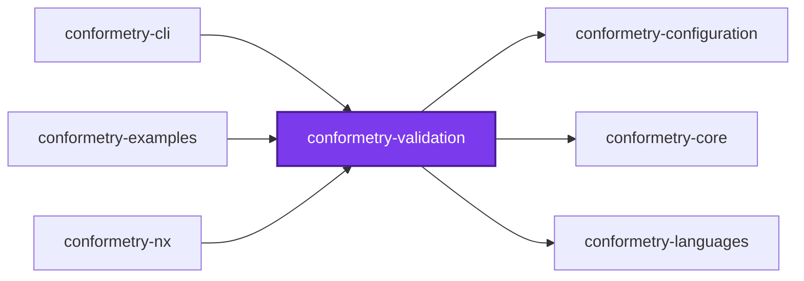
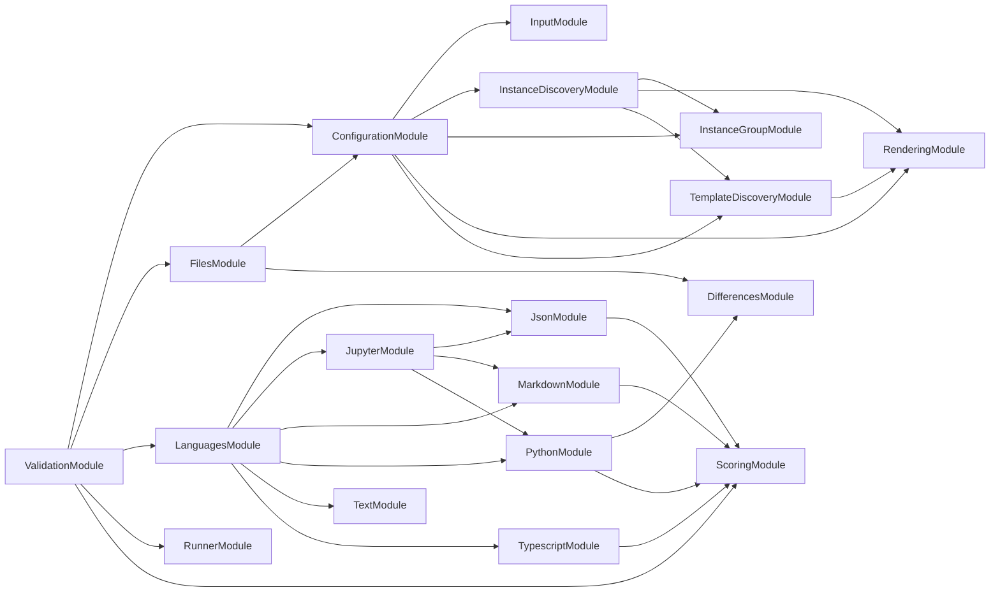
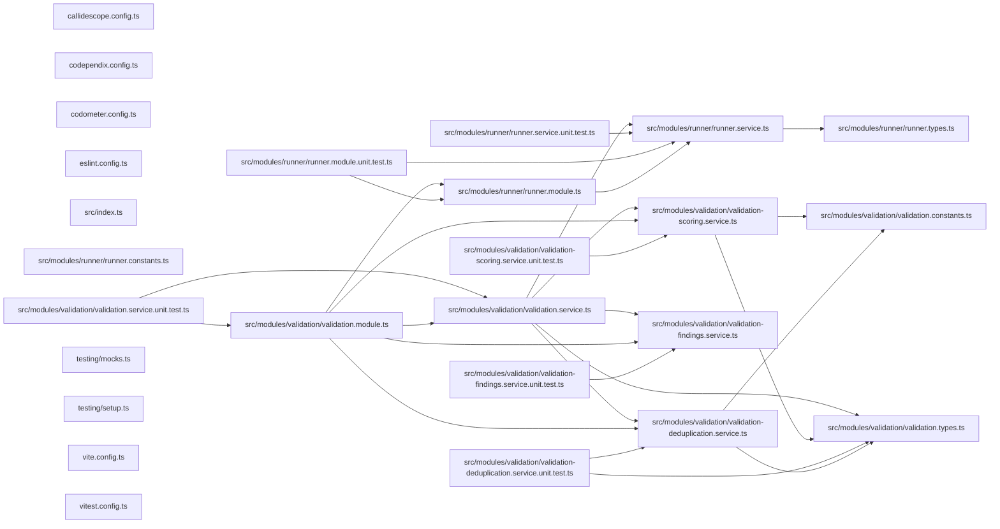

# 👔 Conformetry Validation

[](https://www.npmjs.com/package/@conformetry/validation)

The validation orchestrator for [Conformetry](../conformetry-cli/README.md):
it matches instances to templates, checks the declared files exist, routes
each document to the validator that claims its extension, and deduplicates
what comes back.

```bash
npm install --save-dev @conformetry/validation
```

## Usage

```ts
import { ValidationService } from "@conformetry/validation";

const result = validationService.validate({
  instances, // from DiscoveryService.findInstances
  templates, // from DiscoveryService.collectTemplate
  languageNames: ["typescript"], // optional filter
  threshold: 0.9, // optional run-level conformance floor
});
// → { ok, fileResults, checkedPaths, scores, unmatched }
```

Instances arrive from the caller. This package used to scan the workspace for
`project.json` files and infer scope from generator name suffixes, which made a
generic package depend on one repository's layout.

## Order of checks

1. **Files exist.** Every file the matched template declares is checked first,
   whatever its extension. A missing file cannot be compared, and reporting it
   once is clearer than every language reporting it in turn. See
   [`@conformetry/languages`](../conformetry-languages/README.md), whose
   `FilesService` owns that pass.
2. **Documents compare.** Each validator sees only the documents whose
   extensions it claims.

Instances that matched no template are reported alongside the content
differences rather than skipped, so one report covers both "this file is wrong"
and "conformetry cannot tell what this path was generated from".

## Scoring

Each matched instance is scored by how much of its template it honours, and
passes when that reaches the threshold resolved for it — the instance group's,
else the generator's, else the run's, else a perfect `1`.

Scores are taken **before** deduplication. Deduplication decides which template
gets to _print_ a shared file's finding, which is a reporting concern; a score
answers how well one instance honours its own template, so collapsing the
report must not change it.

`ok` is `false` when any instance falls below its threshold, or when any
instance matched no template at all — an unmatched path has no template to be
held to, so no threshold could excuse it.

## Language resolution

Which languages a run needs is
[`@conformetry/languages`](../conformetry-languages/README.md)'s question, not
this package's. `LanguagesService` is injected, asked which engines claim the
extensions the run's templates declare, and its answer is what `validate`
dispatches over. An extension no language claims is compared line by line by
the text fallback, so no template file goes unchecked.

Nothing is imported on demand any more. That mechanism bought install-time
optionality nobody was spending — the fallback makes every run need the
package regardless — so the specifier registry, the module loader, and the
`loadLanguageModule` option went with it. The trade-off, and the three
alternatives weighed against it, are recorded in
[ADR 0006](../../../../docs/adr/0006-hold-every-conformetry-language-in-one-package.md).

## Exports

`ValidationService`, `ValidationDeduplicationService`,
`ValidationFindingsService`, `ValidationScoringService`, `ValidationModule`,
and the `RunValidationArguments`, `RunValidationResult`, and
`InstanceFileResults` types.

## Test

```bash
nx run conformetry-validation:vitest
```

## License

MIT — see [LICENSE](../../../../LICENSE).

## 👔 Conformetry

This project was generated from the [nestjs-service-project](../../../../configuration/conformetry-templates/nestjs-service-project) conformetry template.

<!-- callidescope:start -->

## 🔭 Callidescope

Call stacks traced through `packages/ic-suite/conformetry/conformetry-validation`, deepest first. Each frame shows what it takes, what it returns, and what its documentation says.

| Measure | Value |
| --- | --- |
| Callables | 43 |
| Files | 18 |
| Calls traced | 43 |
| Call stacks | 0 |
| Deepest stack | 0 |
| Stacks through recursion | 0 |
| Unfollowable calls | 1 |

### Limits

What this project is judged against, as declared in its own `callidescope.config.ts`.

| Limit | Value |
| --- | --- |
| `maximumDepth` | 13 |
| `maximumBreadth` | 10 |

### Call stacks (depth)

None.

### Breadth

| Callable | Breadth | Calls directly | Location |
| --- | --- | --- | --- |
| `ValidationService.validate` | 10 | `ConfigurationService.matchInstances`, `ValidationService.selectValidators`, `LanguagesService.resolveValidators`, `ValidationService.readTemplateExtensions`, `ValidationService.map(…)`, `ValidationScoringService.scoreInstances`, `ValidationDeduplicationService.deduplicate`, `ValidationFindingsService.buildUnmatchedResults`, `ValidationService.map(…)`, `ValidationService.every(…)` | `packages/ic-suite/conformetry/conformetry-validation/src/modules/validation/validation.service.ts:136` |
| `ValidationService.validateInstance` | 6 | `ConfigurationService.prepareDocuments`, `ValidationService.flatMap(…)`, `FilesService.checkInstanceFiles`, `ValidationService.map(…)`, `ValidationService.flatMap(…)`, `ValidationService.reduce(…)` | `packages/ic-suite/conformetry/conformetry-validation/src/modules/validation/validation.service.ts:87` |
| `RunnerService.runValidator` | 4 | `RunnerService.map(…)`, `RunnerService.filter(…)`, `RunnerService.filter(…)`, `RunnerService.reduce(…)` | `packages/ic-suite/conformetry/conformetry-validation/src/modules/runner/runner.service.ts:81` |

<details>
<summary>17 more callables</summary>

| Callable | Breadth | Calls directly | Location |
| --- | --- | --- | --- |
| `ValidationScoringService.scoreInstance` | 4 | `ValidationScoringService.reduce(…)`, `ScoringService.calculateScore`, `ValidationScoringService.resolveThreshold`, `ValidationScoringService.resolveInstancePath` | `packages/ic-suite/conformetry/conformetry-validation/src/modules/validation/validation-scoring.service.ts:74` |
| `ValidationDeduplicationService.deduplicate` | 2 | `ValidationDeduplicationService.selectOwners`, `ValidationDeduplicationService.flatMap(…)` | `packages/ic-suite/conformetry/conformetry-validation/src/modules/validation/validation-deduplication.service.ts:90` |
| `ValidationFindingsService.buildUnmatchedResults` | 2 | `ValidationFindingsService.resolveTemplatesRootPath`, `ValidationFindingsService.map(…)` | `packages/ic-suite/conformetry/conformetry-validation/src/modules/validation/validation-findings.service.ts:68` |
| `ValidationScoringService.scoreInstances` | 2 | `ValidationScoringService.scoreInstance`, `ValidationScoringService.resolveScoreKey` | `packages/ic-suite/conformetry/conformetry-validation/src/modules/validation/validation-scoring.service.ts:111` |
| `RunnerService.filter(…)` | 1 | `RunnerService.claimsDocument` | `packages/ic-suite/conformetry/conformetry-validation/src/modules/runner/runner.service.ts:85` |
| `RunnerService.map(…)` | 1 | `RunnerService.validateDocument` | `packages/ic-suite/conformetry/conformetry-validation/src/modules/runner/runner.service.ts:88` |
| `ValidationDeduplicationService.selectOwners` | 1 | `ValidationDeduplicationService.compareInstances` | `packages/ic-suite/conformetry/conformetry-validation/src/modules/validation/validation-deduplication.service.ts:57` |
| `ValidationDeduplicationService.flatMap(…)` | 1 | `ValidationDeduplicationService.filter(…)` | `packages/ic-suite/conformetry/conformetry-validation/src/modules/validation/validation-deduplication.service.ts:94` |
| `ValidationDeduplicationService.filter(…)` | 1 | `ValidationDeduplicationService.resolveFindingKey` | `packages/ic-suite/conformetry/conformetry-validation/src/modules/validation/validation-deduplication.service.ts:95` |
| `ValidationFindingsService.resolveTemplatesRootPath` | 1 | `ValidationFindingsService.map(…)` | `packages/ic-suite/conformetry/conformetry-validation/src/modules/validation/validation-findings.service.ts:57` |
| `ValidationFindingsService.map(…)` | 1 | `ValidationFindingsService.describeReason` | `packages/ic-suite/conformetry/conformetry-validation/src/modules/validation/validation-findings.service.ts:74` |
| `ValidationScoringService.reduce(…)` | 1 | `ScoringService.sumWeights` | `packages/ic-suite/conformetry/conformetry-validation/src/modules/validation/validation-scoring.service.ts:75` |
| `ValidationService.readTemplateExtensions` | 1 | `ValidationService.flatMap(…)` | `packages/ic-suite/conformetry/conformetry-validation/src/modules/validation/validation.service.ts:50` |
| `ValidationService.flatMap(…)` | 1 | `ValidationService.map(…)` | `packages/ic-suite/conformetry/conformetry-validation/src/modules/validation/validation.service.ts:53` |
| `ValidationService.selectValidators` | 1 | `ValidationService.filter(…)` | `packages/ic-suite/conformetry/conformetry-validation/src/modules/validation/validation.service.ts:63` |
| `ValidationService.map(…)` | 1 | `RunnerService.runValidator` | `packages/ic-suite/conformetry/conformetry-validation/src/modules/validation/validation.service.ts:100` |
| `ValidationService.map(…)` | 1 | `ValidationService.validateInstance` | `packages/ic-suite/conformetry/conformetry-validation/src/modules/validation/validation.service.ts:147` |

</details>
<!-- callidescope:end -->

## 🕸️ Codependix

Dependency graphs exported by [codependix](https://github.com/Organizzolini/codebase/tree/main/packages/ic-suite/codependix/codependix-cli), regenerated by `nx run codebase:codependix:write`.

### Nx Neighborhood

<!-- codependix:start name="codependix-nx-projects" -->

<!-- codependix:end name="codependix-nx-projects" -->

### NestJS Module Graph

<!-- codependix:start name="codependix-nestjs-modules" -->

<!-- codependix:end name="codependix-nestjs-modules" -->

### File Imports

<!-- codependix:start name="codependix-file-imports" -->

<!-- codependix:end name="codependix-file-imports" -->

<!-- codometer:start -->

## ⏲️ Codometer

### Project


### Measured Targets


### TypeScript


### JavaScript


### Python


### JSON


### YAML


### TOML


### Shell


### SQL


### HCL


### CSS


### Conventions


### Jupyter


### Markdown


<!-- codometer:end -->
