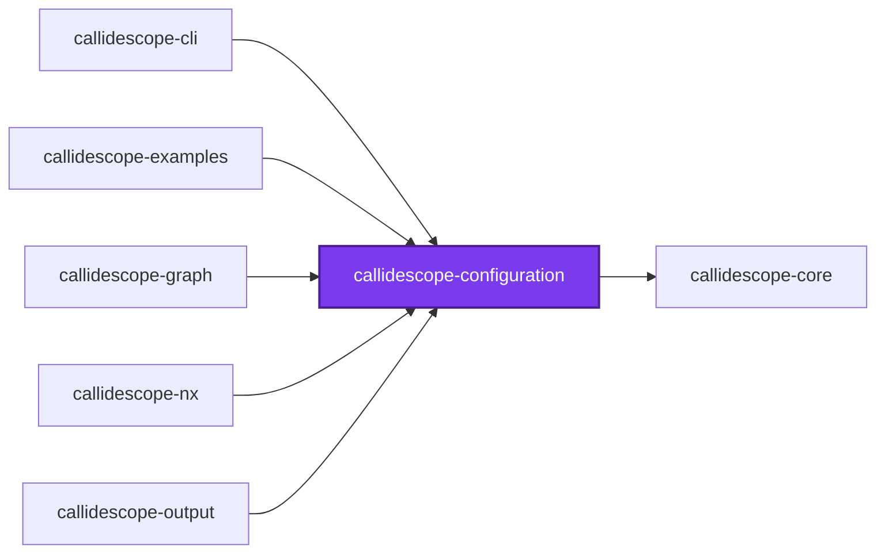
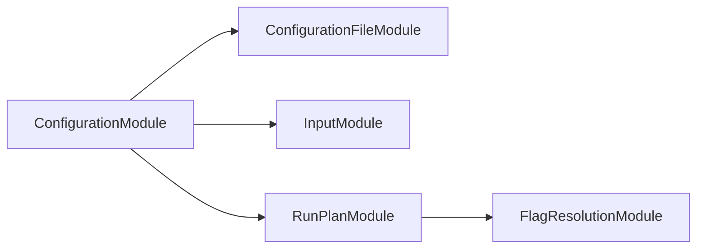

# 🔭 Callidescope Configuration

[](https://www.npmjs.com/package/@callidescope/configuration)

**Reads `callidescope.config.ts` and resolves the limits callidescope enforces.**

This package is the configuration reader for
[`@callidescope/cli`](../callidescope-cli/README.md). It finds a configuration
file, validates it, and fills in every field the file left out, so that no
analyzer has to know which options are optional.

It knows nothing about call graphs. What a threshold means, and which decorator
marks a stack root, live in the CLI. This package only answers "what did the repository ask for".

```bash
npm install --save-dev @callidescope/configuration
```

## Configuration File

Any of `callidescope.config.{ts,mts,cts,js,mjs,cjs,json,jsonc}`, searched for
upward from the working directory. TypeScript is tried first, because that is
the form that gets type checking. A repository with no configuration file is
traced with the defaults rather than told to write one.

```ts
import { type CallidescopeConfiguration } from "@callidescope/configuration";

const callidescopeConfiguration: CallidescopeConfiguration = {
  excludeFrom: ["configuration/.callidescopeignore"],
  limits: { maximumBreadth: 5, maximumDepth: 6 },
};

export default callidescopeConfiguration;
```

That file is the **workspace** configuration, and every section below describes
it. A project may also configure itself, from a much smaller surface —
see [Project Configuration](#project-configuration).

## Limits

There are two, both per project, both gated. A limit the schema does not name is
refused rather than ignored, so a number nothing reads cannot sit in a file
looking as though it were in force.

| Limit | Default | Meaning |
| ----- | ------- | ------- |
| `maximumDepth` | `6` | Frames a call stack may hold, entry point inclusive |
| `maximumBreadth` | **none** | Callables one callable may call directly |

`maximumBreadth` is the one limit with no default — a project that wants it
gated has to declare its own measured number, since a workspace-wide guess
would either gate nothing or fail on the first callable that happens to be
widest. Every traced project now does: see
[Project Configuration](#project-configuration).

The **implementation-candidate cap** is deliberately not here. It decides where
structural interface resolution stops guessing rather than what a run judges, so
it is a constant in [`@callidescope/graph`](../callidescope-graph/README.md)
instead — see [the decision record](../../../../docs/adr/0006-narrow-callidescope-to-depth-and-breadth.md).

## Entry Points

A depth measurement is only as meaningful as its roots, so which callables count
as roots is configurable.

| Option | Default | Meaning |
| ------ | ------- | ------- |
| `addresses` | none | Callables named outright as roots, each `<file>#<qualified-name>` |
| `decorators` | 13 framework decorators | Decorators whose methods a framework invokes |
| `includeExportedFunctions` | `true` | Treat every `src/index.ts` export as a root |
| `includeOrphans` | `true` | Promote callables nothing in the repository calls |
| `includeTests` | `false` | Trace test files too |

`addresses` takes the same `<file>#<qualified-name>` form the `depth` and
`breadth` commands accept and every stack frame prints, so an address can be
copied out of a report straight into a configuration. A trailing `:<line>`
disambiguates a file holding two declarations under one qualified name.
Declared addresses are **additive**: the rules below keep running, orphan
promotion still catches whatever nobody named, and an address landing on a
callable a rule already rooted is one root rather than two. An address that
resolves to nothing, to more than one declaration, or to nothing parseable
fails the run — see [Refusals](#refusals).

`includeOrphans` is a safety net rather than a feature. Without it, a missing
entry-point rule silently removes whole subtrees from every measurement; with
it, they surface as orphan roots — which is itself worth knowing, since an
orphan is either dead code or a rule that needs adding.

## Exclusions

`exclude` globs are **additive** to the built-in defaults (`node_modules`,
`dist`, `coverage`, `output`, `.nx`, `.conformetry`), so a configuration naming
its own noise does not have to restate them.

`excludeFrom` names gitignore-syntax files, which is how a long exclusion list
stays out of the configuration file itself.

### An exclusion drops the callables, not the file

`exclude` decides what is **collected**, and nothing else. The file is still in
the `ts.Program`, so it is still compiled and still type-checked — what changes
is that its callables are never collected, and a call reaching into it becomes
an unfollowable call rather than disappearing. A stack therefore stops at the
excluded boundary instead of routing around it.

Two consequences worth knowing before reaching for `exclude`:

- **It cannot un-project a directory.** A project is the directory holding a
  `tsconfig.json`, and discovery has already happened by the time collection is
  filtered — so a project cannot exclude its own `tsconfig.json`, and excluding
  every file it holds leaves it a project that traced nothing rather than no
  project at all.
- **A `tsconfig.json` that will not parse still ends the run**, because it is
  opened before any of this. Use the run's `exclude` to drop such a project,
  which is settled early enough to keep discovery from opening it at all.

### Excluding callees

`excludeCallees` is a different filter from `exclude`: it names globs matched
against a callable's display name (`Type.member`) rather than against a file
path. A call landing on a match is dropped from the graph entirely, counting
toward neither the caller's depth nor its breadth — the shape a cross-cutting
callable like a logger needs, since every call site into it is a fact about
instrumentation rather than about how deep or wide the code around it is.

## Write

Every destination is optional, and unconfigured is the normal case: a run that
names no destination reports to the console and exits non-zero on violations, so
nothing it writes can go stale.

| Destination | Purpose |
| ----------- | ------- |
| `write.json` | A machine-readable report at `path`, indented by `indentation` |
| `write.markdown` | A marker-delimited block spliced into `path` |
| `write.mermaid` | The same block with its call stacks drawn as one mermaid flowchart |

`write.mermaid` takes the same keys as `write.markdown` — they differ in what
goes between the anchors, not in how a block is placed or overridden — and is a
separate destination so a repository can publish the printed trees and the
diagram from one run.

The console format — `markdown`, `mermaid`, or `json`, defaulting to `markdown`
— is a command-line concern rather than a configuration field: it decides what
one invocation prints, never what a run writes to a file, so it is selected
only by the CLI's own `--format` flag. Writing to a file and printing to a
terminal are independent, so both can be on at once.

`write.markdown` and `write.mermaid` each take a `description`, placed under
the heading, and a `heading`, which defaults to `# 🔭 Callidescope`. Set it
whenever the block is spliced into a file that already has a title: a second
first-level heading is something most markdown linters reject. The block's
subsections follow the level down on their own, so an `##` heading writes
`###` subsections.

Each also takes `previewCount`, how many stacks are shown before the rest go
behind a disclosure. It belongs to the destination rather than to the run
because it is a fact about the document the block lands in: a project's README
wants three and a whole-workspace report file wants all of them, and one number
for both could only ever be wrong for one of them. A run that only prints to a
terminal uses the tool's own default of three, that being nobody's document.

**There is no fan-out that writes a section into every project's readme.** Each
project declares its own `write.markdown` in its own file, so a project decides
where its section lands, whether it publishes one at all, and whether it wants
a diagram beside it — see [What a project may set](#what-a-project-may-set).
The workspace's own `write.markdown` is the block that really is about the
workspace: it carries the summary counts, one row per project against that
project's own depth limit, and a scoreboard of how many sit over, on, or clear
of theirs.

A markdown destination may supply `render` to replace the built-in tables, or
`writeBlock` to place the block itself. A `writeBlock` function is handed
`syncAnchoredBlock` and `wrapInAnchors`, so a custom writer reuses the same
splice rather than reimplementing it. Returning `false` reports the destination
as stale; anything else, `undefined` included, counts as current.

## Flags and Precedence

Every combination of a command-line value with a configured one happens in this
package, in `FlagResolutionService`, under one rule:

> A flag that changes **what a run judges or writes** may only override a value
> the configuration already declares. A flag that selects **mode or
> presentation** is command-line only, because neither can make an
> under-configured run legal.

| Flag | Role | What resolution does with it |
| ---- | ---- | ---------------------------- |
| `--check` | Mode | Command-line only. Nothing in the configuration corresponds to it |
| `--write` | Mode | Command-line only, for the same reason |
| `--format` | Presentation | Command-line only, and validated. It is returned beside the configuration rather than written into it |
| `--directories` | Override | Replaces `directories` when it named any. An empty value is absent, not a scope |
| `--entry-point-addresses` | Override | Replaces `entryPoints.addresses` when it named any |
| `--entry-point-decorators` | Override | Replaces `entryPoints.decorators` when it named any |
| `--exclude` | Override | Replaces the **authored** `exclude` when it named any, and the default globs are folded back in — resolution adds them to a configured `exclude` too, so a flag that dropped them would start tracing `node_modules` |
| `--exclude-callees` | Override | Replaces `excludeCallees` when it named any |
| `--include-exported-functions` | Override | Replaces `entryPoints.includeExportedFunctions`. Takes `true` or `false`, or the flag alone for `true` |
| `--include-orphans` | Override | Replaces `entryPoints.includeOrphans`, the same way |
| `--include-tests` | Override | Replaces `entryPoints.includeTests`, the same way |
| `--maximum-depth` | Override | Replaces `limits.maximumDepth`, in the run's own configuration and in every project's. A value that is not a positive whole number is refused |
| `--maximum-breadth` | Override | Replaces `limits.maximumBreadth` the same way — and is refused when the run's configuration declares none, there being nothing to override |
| `--json` | Override | Replaces `write.json.path`, and no other property of that destination |
| `--markdown` | Override | Replaces `write.markdown.path`, and no other property of that destination |
| `--mermaid` | Override | Replaces `write.mermaid.path`, and no other property of that destination |
| `--config` | Neither | It chooses the file everything else is resolved against, so it has already done its whole job by the time resolution runs |

**Every configured field has an overriding flag, save one.** `excludeFrom`
names the ignore files a run reads, which is what the run _is_ rather than a
value it judges by — and it is workspace-only for that same reason, a project
being no more able to redirect it than a command line is.

**A limit override reaches the number each project is really gated by.** A
limit is enforced per project, out of that project's own file, so an override
left in the run's copy alone would be a flag no gate ever looks at — the
`--format mermiad` failure in a different costume. It is applied to every
project that declared the limit being overridden, and to no project that
declared none: `--maximum-breadth` cannot gate a project that wrote
`maximumBreadth: undefined`, because overriding a decision and reversing one
are not the same act. The file each project's row names is still that project's
own — an override changes a number for one invocation, not where it was
written.

Which flags a command accepts follows from what that command does.
`callidescope` accepts every row above. `depth` and `breadth` accept the ones
that shape the graph — the scope, the entry-point rules, and the two exclusion
lists — and none of the limits or destinations, because a lookup gates nothing
and writes nothing, so there is no number it reads and no file it touches for
one of those to change.

Four consequences are worth stating outright, because each replaced an
ad-hoc merge that got them wrong:

- **An empty `--directories` is absent.** `--directories ""` and a
  `--directories` nobody typed are the same value, and reading either as
  "every project" silently overrode a configured scope.
- **A path override keeps its siblings.** A destination carries a heading, a
  description, its anchors, its indentation, and its render and write hooks;
  re-resolving it from a path alone replaced every one of them with a default.
- **A path override cannot invent a destination.** `--json` against a
  configuration declaring no `write.json` is refused, because a flag that could
  conjure one would let any command line write a report the configuration never
  asked for. `--maximum-breadth` is refused the same way and for the same
  reason: it is the one judged value resolution supplies no default for, so a
  flag that could supply one would gate a workspace on a number no
  configuration ever chose — which is exactly what `--check breadth` refuses to
  do.
- **An unrecognized `--format` is refused.** A run that quietly printed
  markdown for `--format mermiad` exited 0 having taught its reader that the
  flag does nothing.

Every complaint is collected rather than thrown at the first one, so a command
line with two mistakes in it is two mistakes to fix rather than two runs.
Nothing has been traced or written by the time resolution returns.

## Project Configuration

Everything above describes the file a run is pointed at — the **workspace**
configuration. A second `callidescope.config.ts` may also sit at any traced
project's own root, the directory holding the `tsconfig.json` that makes it a
project. It is found by name in that directory alone, with no upward walk, and
may use any of the same eight extensions.

**Every traced project has one, and every one of them is complete.** A traced
project with no file at all is refused by name, and so is a file that leaves a
field out. A project's file is meant to be readable as the whole statement of
how that project is traced and judged, which a shape with optional fields
cannot be: an absent field and a field set to the value it would have defaulted
to look identical in a diff, and only one of them was a decision. Completeness
costs one line rather than twenty, because a project spreads the workspace's
`projectDefaults` and overrides what it means to — see
[Spread the defaults, then override](#spread-the-defaults-then-override) and
[ADR 0007](../../../../docs/adr/0007-complete-project-configurations.md).

One file, one role per run: the file a run was pointed at is never also read as
a project's. A package whose task names its own configuration and then traces
itself would otherwise have that file judged as a project's — a refusal for the
workspace-only fields it legitimately sets.

### What a project may set

| Field | What it does |
| ----- | ------------ |
| `entryPoints` | Which of that project's callables root a stack, `addresses` included |
| `limits.maximumDepth` | The depth every stack rooted in that project is judged against |
| `limits.maximumBreadth` | The breadth every callable that project declares is judged against |
| `exclude` | Globs naming that project's own files to leave untraced |
| `write.markdown` | Where that project's own published section goes |
| `write.mermaid` | Where that project's own diagram goes, when it wants one |

**A project's written destinations are anchored to its root** the same way its
`exclude` globs are: `write: { markdown: { path: "docs/CALLS.md" } }` in
`packages/thing`'s own file writes `packages/thing/docs/CALLS.md`, and there is
no spelling of it that reaches a sibling. A destination left `undefined`
publishes nothing.

Nothing else writes into a project's documents. There is no workspace-level
fan-out to be left out of or reached by: a project publishes what its own file
says it publishes, and `undefined` is how it says nothing.

`write.json` stays workspace-only: it is the run's single report, not a
project's to redirect.

**A project's `exclude` globs are anchored to that project's root**, never to
the workspace: `exclude: ["src/generated/**"]` in `packages/thing`'s own file
names `packages/thing/src/generated/**`, and there is no spelling of it that
reaches a sibling. Write the path as the project sees it — a workspace-relative
glob here matches nothing, and the files it meant to drop stay traced.

The run's own `exclude` keeps its workspace-relative meaning and is layered
underneath, so a project can leave more out and can never put back what the run
left out. Noise spanning several projects still belongs in the workspace file.

It also filters **collection** and nothing else, exactly as the run's own does —
see [An exclusion drops the callables, not the file](#an-exclusion-drops-the-callables-not-the-file).
A project cannot exclude its own `tsconfig.json`, and a call into a file it
excluded becomes an unfollowable call rather than vanishing.

Every other field is refused by name before anything is traced.

### Spread the defaults, then override

A workspace configuration exports `projectDefaults` beside its default export.
A project spreads it and overrides what it means to, which is what makes a
complete file cost one line:

```ts
import { projectDefaults } from "../../configuration/callidescope.config.js";

export default {
  ...projectDefaults,
  limits: { maximumBreadth: undefined, maximumDepth: 10 },
};
```

Both limits are named even though only one is a real number. `maximumBreadth:
undefined` is this project saying outright that it gates depth and not breadth
— the one statement an absent field could never distinguish from a project that
forgot. The same holds for `write.mermaid: undefined` and publishing no
diagram.

**Spread `projectDefaults`, never the workspace's default export.** The two are
different objects on purpose: the default export carries `directories`,
`excludeFrom`, `write.json`, and the rest of what only a run may set, so
spreading it earns a refusal naming the first such field. `projectDefaults`
holds exactly the surface a project is entitled to, so a project spreading it
cannot adopt an output destination or an ignore file by accident, because none
of them is in there to adopt.

Nothing is resolved across two files. Every number a project is judged by is
written in that project's own file — there is no per-field fallback to the
workspace, and no record of whether a limit was declared here or handed down,
because the spread already put it here where a reader can see it.

The workspace number is a **default rather than a ceiling**. A project declaring
a higher limit than the workspace keeps its own — a workspace number pinned by
the single worst stack anywhere in it gates nothing for the projects nowhere
near it, which is the whole reason a project gets to say.

`entryPoints` is replaced whole rather than merged member by member: a project
writing an `entryPoints` object of its own replaces the spread one outright, so
a project that declares `addresses` and wants the workspace's decorator list has
to carry it across — `...projectDefaults.entryPoints` inside its own object is
the one line that does it.

`includeTests` is the one field in that set that decides which of a project's
files are **collected** rather than which of its callables root a stack, so it
takes effect at the same layer `exclude` does: a project that asks for its test
files gets them walked in a run that left every other project's out, and a
project that refuses them keeps them out of a run that asked for everyone's.

### Why the workspace-only fields cannot vary per project

`maximumDepth` and `maximumBreadth` **judge** a call graph: the graph is built
once, and each project asks a different question of the same edges. Two answers
are two opinions about one artifact, which is coherent.

`excludeCallees`, `directories`, `excludeFrom`, and `write.json` are
different. They name what a run reads, where the
run's own report lands, or how it partitions the workspace, and a project
cannot answer those differently from the run tracing it — so they stay in the
workspace file. `<field>` in the refusal above is the name as it has to be
typed to fix the file, dot path and all, so a project setting `write.json`
alongside a destination it is entitled to keep is told which half to move.

### Reading the resolved set

A ratchet written one file per project is no longer reviewable in the single
file it used to live in. `@callidescope/cli`'s `limits` command is where it is
reviewable as a set instead — every project in scope, the number it is judged
against, and the file that number is written in. There is nothing to say
beyond that: every traced project's configuration is complete, so a limit has
exactly one reachable value rather than a declared-or-inherited pair, and the
listing names only the file it came from. It resolves configuration and
measures nothing, so it costs milliseconds rather than a trace.

It is also the answer to a limit that seems not to have taken effect. A
misspelled `limits.maxDepth` is refused outright — the schema is strict, so an
unrecognized field never loads cleanly in the first place — and the listing's
`Value` column is where a number that took hold but reads wrong shows itself.

### Refusals

Each of these ends the run before anything is printed or written, so a checkout
is left exactly as the run found it. `<project>` is the workspace-relative
project root; the workspace configuration's own declared addresses are labelled
`the workspace configuration` instead.

Five of them. Each is shown under the headline it is logged with — four of the
five share one — and quoted as the tool writes it.

**`🔭 Rejected a project configuration` — the file could not be read.**

```text
Failed to read the callidescope configuration for <project> at <path>: <reason>
```

The read failed or the shape did not pass the schema. `<reason>` is the
underlying failure, which is also kept as the error's `cause`. Fix the named
file; nothing else was traced.

**`🔭 Rejected a project configuration` — a workspace-only field.**

```text
<project> sets <field>, which only the workspace configuration may set. A project configuration may set entryPoints, exclude, limits, write.markdown, and write.mermaid.
```

Move that field to the workspace file. A retired limit is a different refusal:
the schema names it, because `limits` accepts `maximumDepth` and
`maximumBreadth` and nothing else.

**`🔭 Rejected a project configuration` — a declared address resolved to
nothing.**

```text
<project> declares an entryPoints.addresses entry that resolves to nothing: "<address>". Check the file path and the qualified name callidescope prints for it in a stack.
```

The callable was renamed, moved, or excluded from the run. Correct the address
or drop it. This refusal is the point of the field rather than an
inconvenience: a rename that silently dropped a declared root would lower the
project's measured depth with nothing in the output to say so, and loosen a gate
in the one commit nobody would think to check it in.

**`🔭 Rejected a project configuration` — a declared address was ambiguous.**

```text
<project> declares an entryPoints.addresses entry that matches more than one declaration: "<address>". Candidates: <address>:<line>, <address>:<line>. Add ":<line>" to the address to pick one.
```

Every candidate is rendered as an address that would have picked it, so the fix
is a copy rather than a file location to translate back. Two declarations on one
line are the case no address can separate; those name their column instead and
the advice changes to `Two declarations on one line cannot be told apart by
":<line>" — rename one, or name a different callable.`

**`🔭 Rejected a project configuration` — a declared address was malformed.**

```text
<project> declares an invalid entryPoints.addresses entry. "<address>" is not a callable address. It needs a file path and a qualified name joined by "#", as in "src/foo.service.ts#FooService.bar", optionally followed by ":<line>" to disambiguate.
```

A run collects **every** unresolved address before it refuses, so several
mistakes are fixed from one message rather than one refusal at a time. More
than one arrives numbered, behind
`<count> declared entry points did not resolve.`

The headlines belong to the command rather than to the message. The first two
reach the `limits` command as well, where they are printed under
`🔭 Rejected a configuration`; a listing that quietly skipped the one project
whose configuration is wrong would be at its least trustworthy exactly when it
is most wanted. The three address refusals need a resolved call graph, so only
a trace raises those.

### Worked examples

Three runnable examples in
[`@callidescope/examples`](../callidescope-examples/README.md) demonstrate the
whole of this, each against real traced code:

| Example | What it shows |
| ------- | ------------- |
| [`declared-entry-points`](../callidescope-examples/examples/declared-entry-points/README.md) | `entryPoints.addresses`, what declaring adds, and the refusals |
| [`project-depth-limit`](../callidescope-examples/examples/project-depth-limit/README.md) | One run, two depth limits, and why the two files at that package's root are separate |
| [`gated-leaf`](../callidescope-examples/examples/gated-leaf/README.md) | A leaf gated at three, and both halves of the `--check breadth` rule side by side |

## Call Graph Types

The result types define the JSON report's shape, so a consumer types against
this package rather than reverse-engineering the output. Each reported
`StackFrame` carries a `CallableSignature` (parameter names, types, optional and
rest flags, return type, and the one-line rendering) and a
`CallableDocumentation` (the whole comment as its summary, tag names, and a
deprecation flag — shortening belongs to whatever renders it). Both are
`undefined` when the callable has neither — and `undefined` fields are absent
from the JSON entirely rather than present and null.

## Exports

`ConfigurationModule` and `ConfigurationService` for NestJS consumers, the zod
schema and every default constant, and the type surface — both the configuration
types and the `CallGraphResult` types that define the JSON report's shape.

`loadConfiguration` does the file I/O; `resolveConfiguration` is pure
defaulting. They are split so that a host embedding callidescope can hand over a
configuration object it assembled itself and get the same resolved shape a file
produces, without touching the disk.

`ProjectConfigurationService` is the second service, and the only place a
per-project refusal is raised: `loadProjectConfigurations` reads the file beside
each traced project and rejects the ones setting a workspace-only field, and
`resolveLimits` says what every project is judged against, each number carrying
the file it was written in. One resolver rather than one per reader — a gate
and a listing that each read a flag override its own way could disagree about
the same number, and a limit two answers can be given for is worse than no
limit.

## Test

```bash
nx run callidescope-configuration:vitest
```

## License

MIT — see [LICENSE](../../../../LICENSE).

## 👔 Conformetry

This project was generated from the [nestjs-service-project](../../../../configuration/conformetry-templates/nestjs-service-project) conformetry template.

<!-- callidescope:start -->

## 🔭 Callidescope

Call stacks traced through `projects/ic-suite/callidescope/callidescope-configuration`, deepest first. Each frame shows what it takes, what it returns, and what its documentation says.

| Measure | Value |
| --- | --- |
| Callables | 112 |
| Files | 27 |
| Calls traced | 112 |
| Call stacks | 6 |
| Deepest stack | 5 |
| Stacks through recursion | 0 |
| Unfollowable calls | 11 |

### Limits

What this project is judged against, as declared in its own `callidescope.config.ts`.

| Limit | Value |
| --- | --- |
| `maximumDepth` | 8 |
| `maximumBreadth` | 8 |

### Call stacks (depth)

**1. `ConfigurationFileService.loadConfiguration`** — depth ≥ 5 · orphan-root

```text
🚀 ConfigurationFileService.loadConfiguration(args?: LoadConfigurationArguments): Promise<ResolvedCallidescopeConfiguration> [projects/ic-suite/callidescope/callidescope-configuration/src/modules/configuration/configuration-file.service.ts:298]
   ↳ Loads and validates a callidescope configuration file.
  └─> ConfigurationFileService.loadConfigurationFile(args?: LoadConfigurationArguments): Promise<LoadedCallidescopeConfiguration> [projects/ic-suite/callidescope/callidescope-configuration/src/modules/configuration/configuration-file.service.ts:326]
     ↳ Loads a configuration, and says what the file itself declared and which file answered.
    └─> ConfigurationFileService.resolveConfigurationPath(configurationPath: string): string [projects/ic-suite/callidescope/callidescope-configuration/src/modules/configuration/configuration-file.service.ts:158]
       ↳ Resolves a configuration path against the cwd, then the repository root.
      └─> ConfigurationFileService.findRepositoryRoot(): string | undefined [projects/ic-suite/callidescope/callidescope-configuration/src/modules/configuration/configuration-file.service.ts:97]
         ↳ Walks upward from the process cwd looking for the repository root.
        └─> ConfigurationFileService.some(…)(marker: ".git" | "pnpm-workspace.yaml"): boolean [projects/ic-suite/callidescope/callidescope-configuration/src/modules/configuration/configuration-file.service.ts:102]
```

**2. `flatMap(…)`** — depth 3 · orphan-root

```text
🚀 flatMap(…)(…): string[] [projects/ic-suite/callidescope/callidescope-configuration/src/modules/configuration/configuration.constants.ts:227]
  └─> readPermittedNames(…): string[] [projects/ic-suite/callidescope/callidescope-configuration/src/modules/configuration/configuration.constants.ts:146]
     ↳ Reads the names one classified field contributes to the permitted set.
    └─> map(…)([member]: [string, ProjectFieldPermission]): string [projects/ic-suite/callidescope/callidescope-configuration/src/modules/configuration/configuration.constants.ts:156]
```

**3. `InputService.suggest`** — depth 3 · orphan-root

```text
🚀 InputService.suggest(input: string): Promise<{ title: string; value: string; }[]> [projects/ic-suite/callidescope/callidescope-configuration/src/modules/input/input.service.ts:137]
  └─> InputService.completeSuggestions(args: { input: string; suggestions: readonly string[]; }): string[] [projects/ic-suite/callidescope/callidescope-configuration/src/modules/input/input.service.ts:55]
     ↳ Narrows a suggestion list to what has been typed so far.
    └─> InputService.filter(…)(suggestion: string): boolean [projects/ic-suite/callidescope/callidescope-configuration/src/modules/input/input.service.ts:60]
```

<details>
<summary>3 more call stacks</summary>

**4. `ConfigurationService.resolveConfiguration`** — depth 3 · orphan-root

```text
🚀 ConfigurationService.resolveConfiguration(configuration: CallidescopeConfiguration): ResolvedCallidescopeConfiguration [projects/ic-suite/callidescope/callidescope-configuration/src/modules/configuration/configuration.service.ts:146]
   ↳ Fills in every field a configuration file may leave out.
  └─> ConfigurationFileService.resolveConfiguration(configuration: CallidescopeConfiguration): ResolvedCallidescopeConfiguration [projects/ic-suite/callidescope/callidescope-configuration/src/modules/configuration/configuration-file.service.ts:369]
     ↳ Fills in every field a configuration file may leave out.
    └─> ConfigurationFileService.resolveEntryPoints(…): ResolvedCallidescopeEntryPoints [projects/ic-suite/callidescope/callidescope-configuration/src/modules/configuration/configuration-file.service.ts:190]
       ↳ Applies defaults to the entry-point rules.
```

**5. `callbackSchema`** — depth 2 · orphan-root

```text
🚀 callbackSchema<TCallback>(): z.ZodType<TCallback> [projects/ic-suite/callidescope/callidescope-configuration/src/modules/configuration/configuration.constants.ts:296]
   ↳ Accepts a function-valued option without inspecting its signature.
  └─> custom(…)(value: unknown): value is Function [projects/ic-suite/callidescope/callidescope-configuration/src/modules/configuration/configuration.constants.ts:297]
```

**6. `ConfigurationService.findConfigurationFileAt`** — depth 2 · orphan-root

```text
🚀 ConfigurationService.findConfigurationFileAt(directory: string): string | undefined [projects/ic-suite/callidescope/callidescope-configuration/src/modules/configuration/configuration.service.ts:73]
   ↳ Finds a configuration file sitting directly at one directory.
  └─> ConfigurationFileService.findConfigurationFileAt(directory: string): string | undefined [projects/ic-suite/callidescope/callidescope-configuration/src/modules/configuration/configuration-file.service.ts:278]
     ↳ Finds a configuration file sitting directly at one directory.
```

</details>

### Breadth

| Callable | Breadth | Calls directly | Location |
| --- | --- | --- | --- |
| `FlagResolutionService.resolveRunFlags` | 7 | `FlagResolutionService.resolveFormat`, `FlagResolutionService.resolveLimitOverrides`, `FlagResolutionService.resolveList`, `FlagResolutionService.resolveEntryPoints`, `FlagResolutionService.resolveExclude`, `FlagResolutionService.resolveLimits`, `FlagResolutionService.resolveWrite` | `projects/ic-suite/callidescope/callidescope-configuration/src/modules/flag-resolution/flag-resolution.service.ts:426` |
| `ConfigurationFileService.loadConfigurationFile` | 5 | `ConfigurationFileService.findConfigurationFile`, `ConfigurationFileService.resolveConfigurationPath`, `ConfigurationFileService.resolveConfiguration`, `UnknownConfigurationFileTypeError.constructor`, `ConfigurationFileService.loadConfigurationModule` | `projects/ic-suite/callidescope/callidescope-configuration/src/modules/configuration/configuration-file.service.ts:326` |
| `ConfigurationFileService.resolveConfiguration` | 5 | `ConfigurationFileService.resolveEntryPoints`, `ConfigurationFileService.resolveExclude`, `ConfigurationFileService.resolveLimits`, `ConfigurationFileService.resolveJsonOutput`, `ConfigurationFileService.resolveMarkdownDestination` | `projects/ic-suite/callidescope/callidescope-configuration/src/modules/configuration/configuration-file.service.ts:369` |

<details>
<summary>53 more callables</summary>

| Callable | Breadth | Calls directly | Location |
| --- | --- | --- | --- |
| `InputService.promptForAutocompleteMultiselect` | 4 | `InputService.assertCanPrompt`, `InputService.map(…)`, `promptCancelledError`, `InputService.filter(…)` | `projects/ic-suite/callidescope/callidescope-configuration/src/modules/input/input.service.ts:126` |
| `InputService.promptForSelect` | 4 | `InputService.assertCanPrompt`, `InputService.map(…)`, `promptCancelledError`, `InputService.find(…)` | `projects/ic-suite/callidescope/callidescope-configuration/src/modules/input/input.service.ts:175` |
| `RunPlanService.readCheckNames` | 4 | `RunPlanService.describeAcceptedCheckNames`, `RunPlanService.filter(…)`, `RunPlanService.map(…)`, `RunPlanService.validateCheckNames` | `projects/ic-suite/callidescope/callidescope-configuration/src/modules/run-plan/run-plan.service.ts:68` |
| `ProjectConfigurationService.loadProjectConfigurations` | 4 | `ProjectConfigurationMissingError.constructor`, `ProjectConfigurationService.loadProjectConfiguration`, `ProjectConfigurationService.assertNoForbiddenFields`, `ProjectConfigurationService.assertComplete` | `projects/ic-suite/callidescope/callidescope-configuration/src/modules/configuration/project-configuration.service.ts:362` |
| `RunPlanService.selectMode` | 3 | `RunPlanService.readCheckNames`, `RunPlanService.filter(…)`, `RunPlanService.map(…)` | `projects/ic-suite/callidescope/callidescope-configuration/src/modules/run-plan/run-plan.service.ts:271` |
| `ProjectConfigurationService.resolveLimits` | 3 | `ProjectConfigurationService.buildWorkspaceLimits`, `ProjectConfigurationService.map(…)`, `ProjectConfigurationService.map(…)` | `projects/ic-suite/callidescope/callidescope-configuration/src/modules/configuration/project-configuration.service.ts:417` |
| `readPermittedNames` | 2 | `map(…)`, `filter(…)` | `projects/ic-suite/callidescope/callidescope-configuration/src/modules/configuration/configuration.constants.ts:146` |
| `InputService.assertCanPrompt` | 2 | `InputService.isAtTerminal`, `missingInputError` | `projects/ic-suite/callidescope/callidescope-configuration/src/modules/input/input.service.ts:38` |
| `InputService.suggest` | 2 | `InputService.map(…)`, `InputService.completeSuggestions` | `projects/ic-suite/callidescope/callidescope-configuration/src/modules/input/input.service.ts:137` |
| `FlagResolutionService.resolveCount` | 2 | `buildUndeclaredValueMessage`, `buildUnreadableCountMessage` | `projects/ic-suite/callidescope/callidescope-configuration/src/modules/flag-resolution/flag-resolution.service.ts:93` |
| `FlagResolutionService.resolveEntryPoints` | 2 | `FlagResolutionService.resolveList`, `FlagResolutionService.resolveSwitch` | `projects/ic-suite/callidescope/callidescope-configuration/src/modules/flag-resolution/flag-resolution.service.ts:168` |
| `FlagResolutionService.resolveFormat` | 2 | `FlagResolutionService.find(…)`, `buildUnknownFormatMessage` | `projects/ic-suite/callidescope/callidescope-configuration/src/modules/flag-resolution/flag-resolution.service.ts:240` |
| `RunPlanService.prepareLookup` | 2 | `FlagResolutionService.resolveRunFlags`, `flagResolutionError` | `projects/ic-suite/callidescope/callidescope-configuration/src/modules/run-plan/run-plan.service.ts:133` |
| `RunPlanService.prepareRun` | 2 | `RunPlanService.selectMode`, `FlagResolutionService.resolveRunFlags` | `projects/ic-suite/callidescope/callidescope-configuration/src/modules/run-plan/run-plan.service.ts:194` |
| `ConfigurationFileService.resolveConfigurationPath` | 2 | `ConfigurationFileService.findRepositoryRoot`, `ConfigurationFileNotFoundError.constructor` | `projects/ic-suite/callidescope/callidescope-configuration/src/modules/configuration/configuration-file.service.ts:158` |
| `ProjectConfigurationService.assertComplete` | 2 | `ProjectConfigurationService.findMissingField`, `ProjectConfigurationIncompleteError.constructor` | `projects/ic-suite/callidescope/callidescope-configuration/src/modules/configuration/project-configuration.service.ts:55` |
| `ProjectConfigurationService.assertNoForbiddenFields` | 2 | `ProjectConfigurationService.findForbiddenField`, `ProjectConfigurationFieldNotPermittedError.constructor` | `projects/ic-suite/callidescope/callidescope-configuration/src/modules/configuration/project-configuration.service.ts:74` |
| `ProjectConfigurationService.findForbiddenField` | 2 | `ProjectConfigurationService.findForbiddenMember`, `ProjectConfigurationService.readForbiddenField` | `projects/ic-suite/callidescope/callidescope-configuration/src/modules/configuration/project-configuration.service.ts:163` |
| `ConfigurationService.resolveFormatOption` | 2 | `InputService.isAtTerminal`, `ConfigurationService.promptForSelect` | `projects/ic-suite/callidescope/callidescope-configuration/src/modules/configuration/configuration.service.ts:165` |
| `flatMap(…)` | 1 | `readPermittedNames` | `projects/ic-suite/callidescope/callidescope-configuration/src/modules/configuration/configuration.constants.ts:227` |
| `callbackSchema` | 1 | `custom(…)` | `projects/ic-suite/callidescope/callidescope-configuration/src/modules/configuration/configuration.constants.ts:296` |
| `missingInputError` | 1 | `InputError.constructor` | `projects/ic-suite/callidescope/callidescope-configuration/src/modules/input/input.constants.ts:27` |
| `promptCancelledError` | 1 | `InputError.constructor` | `projects/ic-suite/callidescope/callidescope-configuration/src/modules/input/input.constants.ts:39` |
| `InputService.completeSuggestions` | 1 | `InputService.filter(…)` | `projects/ic-suite/callidescope/callidescope-configuration/src/modules/input/input.service.ts:55` |
| `InputService.parseCommaDelimitedOption` | 1 | `InputService.map(…)` | `projects/ic-suite/callidescope/callidescope-configuration/src/modules/input/input.service.ts:98` |
| `buildUnknownFormatMessage` | 1 | `map(…)` | `projects/ic-suite/callidescope/callidescope-configuration/src/modules/flag-resolution/flag-resolution.constants.ts:19` |
| `flagResolutionError` | 1 | `InputError.constructor` | `projects/ic-suite/callidescope/callidescope-configuration/src/modules/flag-resolution/flag-resolution.constants.ts:87` |
| `FlagResolutionService.resolveDestination` | 1 | `buildUndeclaredDestinationMessage` | `projects/ic-suite/callidescope/callidescope-configuration/src/modules/flag-resolution/flag-resolution.service.ts:137` |
| `FlagResolutionService.resolveLimitOverrides` | 1 | `FlagResolutionService.resolveCount` | `projects/ic-suite/callidescope/callidescope-configuration/src/modules/flag-resolution/flag-resolution.service.ts:271` |
| `FlagResolutionService.resolveSwitch` | 1 | `buildUnknownSwitchMessage` | `projects/ic-suite/callidescope/callidescope-configuration/src/modules/flag-resolution/flag-resolution.service.ts:354` |
| `FlagResolutionService.resolveWrite` | 1 | `FlagResolutionService.resolveDestination` | `projects/ic-suite/callidescope/callidescope-configuration/src/modules/flag-resolution/flag-resolution.service.ts:383` |
| `RunPlanService.describeAcceptedCheckNames` | 1 | `RunPlanService.map(…)` | `projects/ic-suite/callidescope/callidescope-configuration/src/modules/run-plan/run-plan.service.ts:56` |
| `RunPlanService.validateCheckNames` | 1 | `RunPlanService.describeAcceptedCheckNames` | `projects/ic-suite/callidescope/callidescope-configuration/src/modules/run-plan/run-plan.service.ts:100` |
| `ConfigurationFileService.findConfigurationFile` | 1 | `ConfigurationFileService.findConfigurationFileAt` | `projects/ic-suite/callidescope/callidescope-configuration/src/modules/configuration/configuration-file.service.ts:70` |
| `ConfigurationFileService.findRepositoryRoot` | 1 | `ConfigurationFileService.some(…)` | `projects/ic-suite/callidescope/callidescope-configuration/src/modules/configuration/configuration-file.service.ts:97` |
| `ConfigurationFileService.loadConfigurationModule` | 1 | `ConfigurationFileService.loadJsonConfiguration` | `projects/ic-suite/callidescope/callidescope-configuration/src/modules/configuration/configuration-file.service.ts:121` |
| `ConfigurationFileService.loadConfiguration` | 1 | `ConfigurationFileService.loadConfigurationFile` | `projects/ic-suite/callidescope/callidescope-configuration/src/modules/configuration/configuration-file.service.ts:298` |
| `ProjectConfigurationService.buildProjectLimits` | 1 | `ProjectConfigurationService.overrideLimit` | `projects/ic-suite/callidescope/callidescope-configuration/src/modules/configuration/project-configuration.service.ts:97` |
| `ProjectConfigurationService.findMissingField` | 1 | `ProjectConfigurationService.find(…)` | `projects/ic-suite/callidescope/callidescope-configuration/src/modules/configuration/project-configuration.service.ts:239` |
| `ProjectConfigurationService.loadProjectConfiguration` | 1 | `ProjectConfigurationError.constructor` | `projects/ic-suite/callidescope/callidescope-configuration/src/modules/configuration/project-configuration.service.ts:281` |
| `ProjectConfigurationService.map(…)` | 1 | `ProjectConfigurationService.buildProjectLimits` | `projects/ic-suite/callidescope/callidescope-configuration/src/modules/configuration/project-configuration.service.ts:422` |
| `ConfigurationService.findConfigurationFileAt` | 1 | `ConfigurationFileService.findConfigurationFileAt` | `projects/ic-suite/callidescope/callidescope-configuration/src/modules/configuration/configuration.service.ts:73` |
| `ConfigurationService.loadConfigurationFile` | 1 | `ConfigurationFileService.loadConfigurationFile` | `projects/ic-suite/callidescope/callidescope-configuration/src/modules/configuration/configuration.service.ts:87` |
| `ConfigurationService.loadProjectConfigurations` | 1 | `ProjectConfigurationService.loadProjectConfigurations` | `projects/ic-suite/callidescope/callidescope-configuration/src/modules/configuration/configuration.service.ts:94` |
| `ConfigurationService.parseCommaDelimitedOption` | 1 | `InputService.parseCommaDelimitedOption` | `projects/ic-suite/callidescope/callidescope-configuration/src/modules/configuration/configuration.service.ts:104` |
| `ConfigurationService.parseOptionalOption` | 1 | `InputService.parseOptionalOption` | `projects/ic-suite/callidescope/callidescope-configuration/src/modules/configuration/configuration.service.ts:109` |
| `ConfigurationService.prepareLookup` | 1 | `RunPlanService.prepareLookup` | `projects/ic-suite/callidescope/callidescope-configuration/src/modules/configuration/configuration.service.ts:114` |
| `ConfigurationService.prepareRun` | 1 | `RunPlanService.prepareRun` | `projects/ic-suite/callidescope/callidescope-configuration/src/modules/configuration/configuration.service.ts:121` |
| `ConfigurationService.promptForAutocompleteMultiselect` | 1 | `InputService.promptForAutocompleteMultiselect` | `projects/ic-suite/callidescope/callidescope-configuration/src/modules/configuration/configuration.service.ts:128` |
| `ConfigurationService.promptForSelect` | 1 | `InputService.promptForSelect` | `projects/ic-suite/callidescope/callidescope-configuration/src/modules/configuration/configuration.service.ts:137` |
| `ConfigurationService.resolveConfiguration` | 1 | `ConfigurationFileService.resolveConfiguration` | `projects/ic-suite/callidescope/callidescope-configuration/src/modules/configuration/configuration.service.ts:146` |
| `ConfigurationService.resolveLimits` | 1 | `ProjectConfigurationService.resolveLimits` | `projects/ic-suite/callidescope/callidescope-configuration/src/modules/configuration/configuration.service.ts:182` |
| `ConfigurationService.touchesFiles` | 1 | `RunPlanService.touchesFiles` | `projects/ic-suite/callidescope/callidescope-configuration/src/modules/configuration/configuration.service.ts:189` |

</details>
<!-- callidescope:end -->

## 🕸️ Codependix

Dependency graphs exported by [codependix](https://github.com/Organizzolini/codebase/tree/main/projects/ic-suite/codependix/codependix-cli), regenerated by `nx run codebase:codependix:write`.

### Nx Neighborhood

<!-- codependix:start name="codependix-nx-projects" -->

<!-- codependix:end name="codependix-nx-projects" -->

### NestJS Module Graph

<!-- codependix:start name="codependix-nestjs-modules" -->

<!-- codependix:end name="codependix-nestjs-modules" -->

### File Imports

```mermaid
graph LR
  file_callidescope_config_ts["callidescope.config.ts"]
  file_codependix_config_ts["codependix.config.ts"]
  file_codometer_config_ts["codometer.config.ts"]
  file_eslint_config_ts["eslint.config.ts"]
  file_src_index_ts["src/index.ts"]
  file_src_index_unit_test_ts["src/index.unit.test.ts"]
  file_src_modules_configuration_configuration_file_module_ts["src/modules/configuration/configuration-file.module.ts"]
  file_src_modules_configuration_configuration_file_service_ts["src/modules/configuration/configuration-file.service.ts"]
  file_src_modules_configuration_configuration_file_service_unit_test_ts["src/modules/configuration/configuration-file.service.unit.test.ts"]
  file_src_modules_configuration_configuration_file_types_ts["src/modules/configuration/configuration-file.types.ts"]
  file_src_modules_configuration_configuration_constants_ts["src/modules/configuration/configuration.constants.ts"]
  file_src_modules_configuration_configuration_module_ts["src/modules/configuration/configuration.module.ts"]
  file_src_modules_configuration_configuration_module_unit_test_ts["src/modules/configuration/configuration.module.unit.test.ts"]
  file_src_modules_configuration_configuration_service_ts["src/modules/configuration/configuration.service.ts"]
  file_src_modules_configuration_configuration_service_unit_test_ts["src/modules/configuration/configuration.service.unit.test.ts"]
  file_src_modules_configuration_configuration_types_ts["src/modules/configuration/configuration.types.ts"]
  file_src_modules_configuration_project_configuration_service_ts["src/modules/configuration/project-configuration.service.ts"]
  file_src_modules_configuration_project_configuration_service_unit_test_ts["src/modules/configuration/project-configuration.service.unit.test.ts"]
  file_src_modules_flag_resolution_flag_resolution_constants_ts["src/modules/flag-resolution/flag-resolution.constants.ts"]
  file_src_modules_flag_resolution_flag_resolution_module_ts["src/modules/flag-resolution/flag-resolution.module.ts"]
  file_src_modules_flag_resolution_flag_resolution_service_ts["src/modules/flag-resolution/flag-resolution.service.ts"]
  file_src_modules_flag_resolution_flag_resolution_service_unit_test_ts["src/modules/flag-resolution/flag-resolution.service.unit.test.ts"]
  file_src_modules_flag_resolution_flag_resolution_types_ts["src/modules/flag-resolution/flag-resolution.types.ts"]
  file_src_modules_input_input_constants_ts["src/modules/input/input.constants.ts"]
  file_src_modules_input_input_module_ts["src/modules/input/input.module.ts"]
  file_src_modules_input_input_service_ts["src/modules/input/input.service.ts"]
  file_src_modules_input_input_service_unit_test_ts["src/modules/input/input.service.unit.test.ts"]
  file_src_modules_input_input_types_ts["src/modules/input/input.types.ts"]
  file_src_modules_run_plan_run_plan_constants_ts["src/modules/run-plan/run-plan.constants.ts"]
  file_src_modules_run_plan_run_plan_module_ts["src/modules/run-plan/run-plan.module.ts"]
  file_src_modules_run_plan_run_plan_service_ts["src/modules/run-plan/run-plan.service.ts"]
  file_src_modules_run_plan_run_plan_service_unit_test_ts["src/modules/run-plan/run-plan.service.unit.test.ts"]
  file_src_modules_run_plan_run_plan_types_ts["src/modules/run-plan/run-plan.types.ts"]
  file_testing_mocks_ts["testing/mocks.ts"]
  file_testing_setup_ts["testing/setup.ts"]
  file_vite_config_ts["vite.config.ts"]
  file_vitest_config_ts["vitest.config.ts"]
  file_src_index_unit_test_ts --> file_src_index_ts
  file_src_modules_configuration_configuration_file_module_ts --> file_src_modules_configuration_configuration_file_service_ts
  file_src_modules_configuration_configuration_file_service_ts --> file_src_modules_configuration_configuration_constants_ts
  file_src_modules_configuration_configuration_file_service_ts --> file_src_modules_configuration_configuration_types_ts
  file_src_modules_configuration_configuration_file_service_unit_test_ts --> file_src_modules_configuration_configuration_file_service_ts
  file_src_modules_configuration_configuration_file_service_unit_test_ts --> file_src_modules_configuration_configuration_constants_ts
  file_src_modules_configuration_configuration_file_types_ts --> file_src_modules_configuration_configuration_types_ts
  file_src_modules_configuration_configuration_constants_ts --> file_src_modules_configuration_configuration_types_ts
  file_src_modules_configuration_configuration_module_ts --> file_src_modules_configuration_configuration_file_module_ts
  file_src_modules_configuration_configuration_module_ts --> file_src_modules_configuration_configuration_service_ts
  file_src_modules_configuration_configuration_module_ts --> file_src_modules_configuration_project_configuration_service_ts
  file_src_modules_configuration_configuration_module_ts --> file_src_modules_input_input_module_ts
  file_src_modules_configuration_configuration_module_ts --> file_src_modules_run_plan_run_plan_module_ts
  file_src_modules_configuration_configuration_module_unit_test_ts --> file_src_modules_configuration_configuration_module_ts
  file_src_modules_configuration_configuration_module_unit_test_ts --> file_src_modules_configuration_configuration_service_ts
  file_src_modules_configuration_configuration_module_unit_test_ts --> file_src_modules_configuration_project_configuration_service_ts
  file_src_modules_configuration_configuration_service_ts --> file_src_modules_configuration_configuration_file_service_ts
  file_src_modules_configuration_configuration_service_ts --> file_src_modules_configuration_configuration_file_types_ts
  file_src_modules_configuration_configuration_service_ts --> file_src_modules_configuration_configuration_constants_ts
  file_src_modules_configuration_configuration_service_ts --> file_src_modules_configuration_configuration_types_ts
  file_src_modules_configuration_configuration_service_ts --> file_src_modules_configuration_project_configuration_service_ts
  file_src_modules_configuration_configuration_service_ts --> file_src_modules_input_input_service_ts
  file_src_modules_configuration_configuration_service_ts --> file_src_modules_input_input_types_ts
  file_src_modules_configuration_configuration_service_ts --> file_src_modules_run_plan_run_plan_service_ts
  file_src_modules_configuration_configuration_service_ts --> file_src_modules_run_plan_run_plan_types_ts
  file_src_modules_configuration_configuration_service_unit_test_ts --> file_src_modules_configuration_configuration_file_service_ts
  file_src_modules_configuration_configuration_service_unit_test_ts --> file_src_modules_configuration_configuration_service_ts
  file_src_modules_configuration_configuration_service_unit_test_ts --> file_src_modules_configuration_configuration_types_ts
  file_src_modules_configuration_configuration_service_unit_test_ts --> file_src_modules_configuration_project_configuration_service_ts
  file_src_modules_configuration_configuration_service_unit_test_ts --> file_src_modules_input_input_service_ts
  file_src_modules_configuration_configuration_service_unit_test_ts --> file_src_modules_input_input_types_ts
  file_src_modules_configuration_configuration_service_unit_test_ts --> file_src_modules_run_plan_run_plan_service_ts
  file_src_modules_configuration_project_configuration_service_ts --> file_src_modules_configuration_configuration_file_types_ts
  file_src_modules_configuration_project_configuration_service_ts --> file_src_modules_configuration_configuration_constants_ts
  file_src_modules_configuration_project_configuration_service_ts --> file_src_modules_configuration_configuration_types_ts
  file_src_modules_configuration_project_configuration_service_unit_test_ts --> file_src_modules_configuration_configuration_file_service_ts
  file_src_modules_configuration_project_configuration_service_unit_test_ts --> file_src_modules_configuration_configuration_constants_ts
  file_src_modules_configuration_project_configuration_service_unit_test_ts --> file_src_modules_configuration_configuration_types_ts
  file_src_modules_configuration_project_configuration_service_unit_test_ts --> file_src_modules_configuration_project_configuration_service_ts
  file_src_modules_flag_resolution_flag_resolution_constants_ts --> file_src_modules_configuration_configuration_constants_ts
  file_src_modules_flag_resolution_flag_resolution_constants_ts --> file_src_modules_input_input_constants_ts
  file_src_modules_flag_resolution_flag_resolution_module_ts --> file_src_modules_flag_resolution_flag_resolution_service_ts
  file_src_modules_flag_resolution_flag_resolution_service_ts --> file_src_modules_configuration_configuration_constants_ts
  file_src_modules_flag_resolution_flag_resolution_service_ts --> file_src_modules_configuration_configuration_types_ts
  file_src_modules_flag_resolution_flag_resolution_service_ts --> file_src_modules_flag_resolution_flag_resolution_constants_ts
  file_src_modules_flag_resolution_flag_resolution_service_ts --> file_src_modules_flag_resolution_flag_resolution_types_ts
  file_src_modules_flag_resolution_flag_resolution_service_unit_test_ts --> file_src_modules_configuration_configuration_file_service_ts
  file_src_modules_flag_resolution_flag_resolution_service_unit_test_ts --> file_src_modules_configuration_configuration_constants_ts
  file_src_modules_flag_resolution_flag_resolution_service_unit_test_ts --> file_src_modules_configuration_configuration_types_ts
  file_src_modules_flag_resolution_flag_resolution_service_unit_test_ts --> file_src_modules_flag_resolution_flag_resolution_service_ts
  file_src_modules_flag_resolution_flag_resolution_service_unit_test_ts --> file_src_modules_flag_resolution_flag_resolution_types_ts
  file_src_modules_flag_resolution_flag_resolution_types_ts --> file_src_modules_configuration_configuration_types_ts
  file_src_modules_input_input_module_ts --> file_src_modules_input_input_service_ts
  file_src_modules_input_input_service_ts --> file_src_modules_input_input_constants_ts
  file_src_modules_input_input_service_ts --> file_src_modules_input_input_types_ts
  file_src_modules_input_input_service_unit_test_ts --> file_src_modules_input_input_service_ts
  file_src_modules_run_plan_run_plan_module_ts --> file_src_modules_flag_resolution_flag_resolution_module_ts
  file_src_modules_run_plan_run_plan_module_ts --> file_src_modules_run_plan_run_plan_service_ts
  file_src_modules_run_plan_run_plan_service_ts --> file_src_modules_configuration_configuration_file_types_ts
  file_src_modules_run_plan_run_plan_service_ts --> file_src_modules_flag_resolution_flag_resolution_constants_ts
  file_src_modules_run_plan_run_plan_service_ts --> file_src_modules_flag_resolution_flag_resolution_service_ts
  file_src_modules_run_plan_run_plan_service_ts --> file_src_modules_run_plan_run_plan_constants_ts
  file_src_modules_run_plan_run_plan_service_ts --> file_src_modules_run_plan_run_plan_types_ts
  file_src_modules_run_plan_run_plan_service_unit_test_ts --> file_src_modules_configuration_configuration_file_service_ts
  file_src_modules_run_plan_run_plan_service_unit_test_ts --> file_src_modules_configuration_configuration_types_ts
  file_src_modules_run_plan_run_plan_service_unit_test_ts --> file_src_modules_flag_resolution_flag_resolution_service_ts
  file_src_modules_run_plan_run_plan_service_unit_test_ts --> file_src_modules_run_plan_run_plan_service_ts
  file_src_modules_run_plan_run_plan_types_ts --> file_src_modules_configuration_configuration_types_ts
```

<!-- codependix:start name="codependix-file-imports" -->

<!-- codependix:end name="codependix-file-imports" -->

<!-- codometer:start -->

## ⏲️ Codometer

### Project


### Measured Targets


### TypeScript


### JavaScript


### Python


### JSON


### YAML


### TOML


### Shell


### SQL


### HCL


### CSS


### Conventions


### Jupyter


### Markdown


<!-- codometer:end -->

<!-- A deliberate misspelling: the example of a `--format` value nobody
recognizes, which is exactly what this refusal is about.
cspell:ignore mermiad -->
