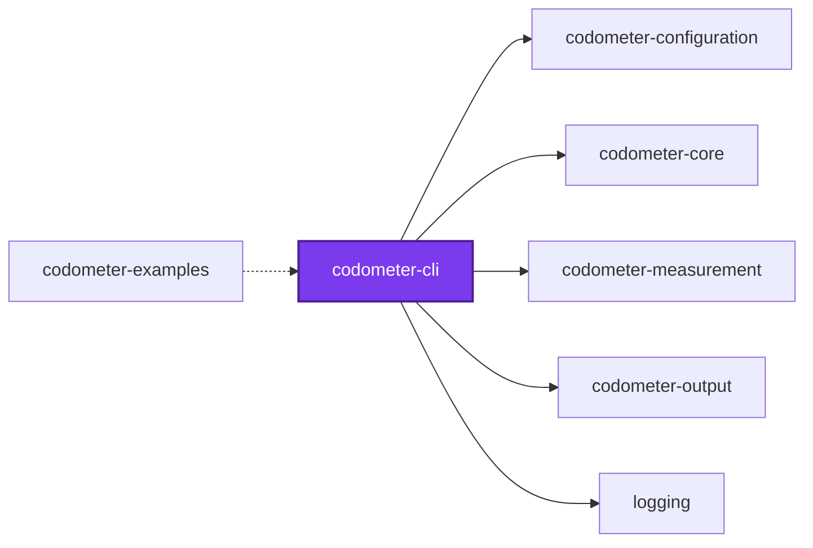
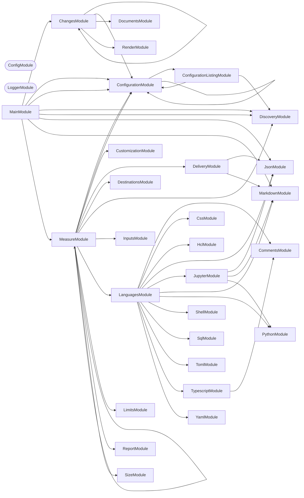
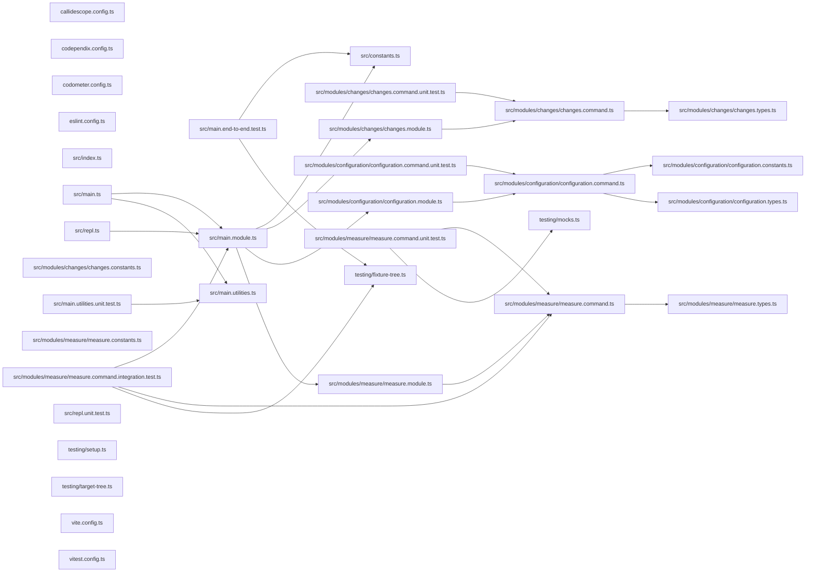

# ⏲️ Codometer

[](https://www.npmjs.com/package/@codometer/cli)

**Measure a repository and report what it found.**

Codometer walks a directory, parses everything it recognizes, and writes
what it counted as a markdown badge block, a JSON report, or both. It counts
languages the way you would expect — files, lines, classes, functions — and it
also counts the conventions a repository holds _itself_ to, which is usually
the more interesting number.

```bash
npm install --save-dev @codometer/cli
```

```bash
codometer
```

<!-- The badge block below this README's own Codometer section is produced by exactly this. -->

```markdown
### TypeScript & JavaScript


```

## Why

"1,034 source files" tells you almost nothing. "159 of them are services and
226 are the unit tests for them" tells you what the repository is actually made
of, and watching that ratio move tells you where it is going.

No language analyzer can produce the second number, because what a
`*.service.ts` means is a property of your repository rather than of
TypeScript. Codometer measures both halves: the built-in language counters, and
the ones you declare.

## Usage

Measuring the repository is codometer's default command, so `codometer` on its
own is `codometer measure`:

```bash
codometer --config configuration/codometer.config.ts --check limits
```

| Flag | Purpose |
| ---- | ------- |
| `--check [set]` | Fail on a comma-separated set drawn from `reports` and `limits` |
| `--config [path]` | Configuration file to read; searched for when omitted |
| `-f, --format <format>` | What to print to standard output, one of `json` and `markdown` |
| `--inputs [globs...]` | Glob array measured in place of every configured input, with no configured input — not even the built-in `codebase` one — active |
| `--output-json [path]` | Write the JSON report, at the given path or the configured one |
| `--output-markdown [path]` | Write the markdown badge block, at the given path or the configured one |

There is no `--directory`: a run always measures the process's working
directory, with no per-invocation override. `cd` into what you want measured,
or narrow it with `--inputs`.

**Every flag is independent.** `--output-json`/`--output-markdown` each write
their own destination, `--check limits` fails on a breached limit, `--check
reports` fails on a stale one, `--format` prints, and none of them turns
another on:

| Invocation | Writes | Fails on staleness | Fails on a breach |
| ---------- | ------ | ------------------ | ----------------- |
| `codometer` | no | no | no |
| `codometer --check limits` | no | no | yes |
| `codometer --check reports` | no | yes | no |
| `codometer --check limits,reports` | no | yes | yes |
| `codometer --output-json --output-markdown` | yes, both | no | no |
| `codometer --output-json --check limits` | yes | no | yes, after writing |

`--output-json`/`--output-markdown` passed **bare** write to whatever the
resolved configuration's own `json`/`markdown` output declares, and are
refused before anything is measured when the configuration names no such
output — there is then nowhere to write it. Passed **with a path**, that path
is used for this run alone, whether or not the configuration declares an
output of that kind.

A run that both writes and gates produces **every** output before it fails, so
the report is on disk even when the gate trips. Combining an `--output-*` flag
with `--check reports` is refused rather than obeyed: nothing can be stale in
the run that just wrote it. So is a `--check` value the tool does not know, or
one passed with no value at all — a valueless `--check` used to mean "check
everything", and a set with nothing in it looks exactly like the flag having
been left off. Every complaint about one command line is reported together
rather than one run at a time.

A **breach** and **staleness** are different findings and are never reported as
one. A `warn` breach is printed and leaves the exit code alone; a `fail` breach
exits 1, but only where `--check limits` asked for a gate.

`--check reports` compares a committed report against a fresh measurement, so it
is only as stable as the numbers it re-measures. Compressed sizes are
Node-version dependent — the bundled zlib differs between releases — so a report
written on one runtime and checked on another reads as stale when nothing
changed at all. Check on the runtime the repository pins, or expect false
staleness rather than a real finding.

```yaml
- run: npx @codometer/cli --check reports,limits
```

## One folder at a time

Codometer measures **one directory**, and knows nothing about workspaces, task
runners, or project graphs. Run it in a project and that project is what gets
measured — its own sources, and whatever inputs the configuration declares for
it:

```bash
cd projects/logging && codometer --check limits
```

With no `--config`, the configuration is found by walking upward from that
folder and taking the **first** file found. The nearest one wins outright:
nothing from a further ancestor is folded into it, because a merged
configuration leaves a limit that never applied looking exactly like one that
did.

A configuration file is always read as a plain object — one exported as a
function is not recognized, and falls back to an empty configuration, the
same way a file exporting `42` does. So a project answering for itself writes
its own `codometer.config.ts`, typically by importing and spreading a shared
object a workspace root exports, the way this repository's own projects each
spread [`configuration/codometer.config.ts`](../../configuration/codometer.config.ts).

## What gets measured

Discovery walks the directory itself and reads every `.gitignore` it passes,
so **`.gitignore` is already in force** — a build directory or a virtual
environment is pruned where its ignore file names it, and no exclusion has to
name it again. Git is never invoked, so a directory that is not a repository
at all is measured the same way as one that is.

What is measured is the working tree rather than the index: a file that exists
and is not ignored counts, whether or not it has been committed yet.

| Group | Counts |
| ----- | ------ |
| Repository | Lines of code, repository size, folders, source files |
| TypeScript & JavaScript | Files, tests, classes, functions, methods, interfaces, generics, enums, constants, imports, decorators, exported symbols, doc comments, TODOs |
| Python | Files, lines, classes, functions, protocols, constants, imports, decorators, docstrings |
| Jupyter | Notebooks, cells by kind, executions, outputs, plus the code and prose inside them |
| JSON | Files, objects, arrays, properties, scalars by type, node count, max depth |
| YAML | Documents, mappings, sequences, keys, scalars, anchors, aliases, max depth |
| Markdown | Headings by level, paragraphs, lists, tables, links, images, code blocks, block quotes |
| SQL | Statements by kind — selects, inserts, updates, deletes, creates, joins, CTEs |
| Shell | Functions, variables, exports, conditionals, loops, pipelines, shebangs |
| TOML | Tables, array tables, keys, arrays |
| HCL | Blocks, resources, variables, outputs, attributes, interpolations |
| CSS | Rules, selectors, declarations, at-rules, media queries, custom properties |
| Conventions | Whatever you declare — see below |

Notebooks are measured by composition rather than by a fourth parser: the
document is handed to the JSON analyzer, its code cells to the Python analyzer,
and its markdown cells to the markdown analyzer, leaving only cells, outputs,
and executions for the notebook analyzer itself.

Python analysis runs through an interpreter, `python3` by default. Point it
elsewhere with `python: { command: "uv run python" }` when Python lives in a
virtual environment.

## Inputs

An **input** is a named set of files, declared by include and exclude globs
together with the analyses run over it. `inputs` is an array, and one entry is
always there whether or not a configuration declares any: the built-in
`codebase` scan, which measures everything the ignore files leave behind and
runs `language` analysis over it. Declaring an input named `codebase`
replaces that built-in entry outright rather than adding beside it.

An input names its files by glob, which is what lets one measure compiled
output: a directory every `.gitignore` claims, and therefore the one place
ignore rules must not reach — ignore files are never consulted for a declared
input.

```ts
inputs: [
  {
    analyses: ["size"],
    compression: "gzip",
    exclude: ["dist/vendor/**"],
    include: ["dist/**/*.js", "!dist/**/*.map.js"],
    name: "compiled",
  },
],
```

| Field | Required | Default | Meaning |
| ----- | -------- | ------- | ------- |
| `name` | yes | — | What the input is called. Two inputs may not share one |
| `include` | yes | — | Globs that add files. At least one must add rather than remove |
| `exclude` | no | none | Globs that remove files |
| `analyses` | yes | — | `language`, `size`, or both. At least one |
| `compression` | no | `gzip` | `gzip`, `brotli`, or `none` for the bytes on disk |
| `directory` | no | `.` | Where the input's globs start, relative to the process's working directory |

`language` runs the analyzers above over the input's files. `size` compresses
each matched file on its own and sums the results — never all of them together
— at gzip level 9 or brotli quality 11, both stated rather than defaulted.

A `!` prefix in `include` removes files. Negations form one set applied to the
whole input rather than being read in order, so rearranging the array cannot
change what the input holds. Dot files are excluded unless a glob spells one
out, directories never match, and a file that was matched but cannot be read
fails the run rather than counting as zero bytes.

`--inputs [globs...]` on the command line replaces every configured input for
that one run, running only `language` analysis over exactly the globs given —
with no other input, not even the built-in `codebase` one, active.

## Limits

A **limit** is how high one measured metric may go. Any metric can carry one — a
compressed size, a line count, a counter for one of the conventions below — and
a metric nothing limits is measured and reported exactly as before, gated by
nothing.

```ts
defaultInput: "codebase",
limits: [
  { metric: "Compiled JavaScript.size", value: "8 KB" },
  { label: "Interfaces", metric: "typescript.interfaces", value: 500 },
  { metric: "linesOfCode", severity: "warn", value: 100_000 },
],
```

| Field | Required | Default | Meaning |
| ----- | -------- | ------- | ------- |
| `metric` | yes | — | Dotted path of the metric this limits |
| `value` | yes | — | How high the metric may go, as a number or a string with a unit |
| `severity` | no | `fail` | `fail` stops the run on a breach; `warn` reports it |
| `label` | no | the path | What to call the limit in a report |

A metric is addressed by the input's name followed by its path within that
input — `codebase.typescript.interfaces`, `codebase.markdown.files`,
`Compiled JavaScript.size`. Every input carries `files`, an input running size
analysis carries `size`, and one running language analysis carries every
counter the tables above list, with configured counters under `custom.<label>`.
Set `defaultInput` and a path naming no input is read as that input's.

Where a `defaultInput` is set, a path is read as that input's whenever no
input name prefixes it — so with `defaultInput: "codebase"` and an input
called `typescript`, `typescript.interfaces` is the codebase's, because the
`typescript` input has no `interfaces` metric of its own to compete with it.
Write the input name in full wherever an input and a metric group share one.

**Ambiguity is refused, never resolved.** A path that could name two metrics —
an input called `markdown` beside the codebase's own `markdown.files` — fails
the run naming both readings, as does a path naming none, or one naming a
metric from an analysis the input never ran. A limit that quietly bound to the
wrong metric would look exactly like one that works.

A value written as a string carries a **decimal** unit whose trailing `b` is
required: `"8 KB"` is 8000 bytes and `"1 MB"` is 1000000, while `"8 K"` is not
a size and is refused rather than read as anything. A value nothing can read
fails the run instead of being taken as zero.

An input that matched **no files** fails the run if and only if a limit is
written against it. Declaring a limit asserts the files are there, so an empty
match is a glob that stopped matching or a build that never ran — while an
input nobody limited simply measured zero, which is unremarkable.

### Reading every limit at once

A repository that declares its limits one per project has no single file left
to read them from. `codometer configuration` is that reading:

```bash
codometer configuration --limits
```

```text
| Directory        | Metric                    | Label | Severity | Value   | Declared in                          |
| ---              | ---                       | ---   | ---      | ---     | ---                                  |
| projects/logging  | `Compiled JavaScript.size`| —     | fail     | 12.00 kB | `projects/logging/codometer.config.ts`|
```

It walks for every configuration file beneath the directory it is given — in
any of the formats codometer accepts — and resolves each one **for its own
folder**, so what it reports is what a per-project run actually sees. The walk
honors the exclusions of whatever configuration answers for the directory being
listed, so a configuration inside a dependency or a generator template is never
listed as something the repository configures.

**Name that configuration with `--config` where the directory has none of its
own.** A workspace often states its shared configuration in a file every
project spreads rather than at its own root, and the upward search then finds
nothing:

```bash
codometer configuration --limits --config configuration/codometer.config.ts
```

Drop `--limits` to list everything each configuration resolved to: its inputs,
outputs and their custom statistics, exclusions, and Python command. Add
`--format json` for a machine-readable listing.

It reports configuration and never measurement. No build is required and no
limit is evaluated, so it runs in milliseconds — and no single unreadable file
takes it down. A configuration file that cannot be loaded is listed as
unreadable, and a walk root nothing answers for falls back to the built-in
exclusions, says so at the top of the listing, and still reports every limit
the tree declares. That last case exits 1 rather than 0: the listing is real,
but the exclusions the repository declares were never consulted, and a clean
exit would claim otherwise.

## Custom statistics

A repository that names files by convention has a vocabulary no analyzer knows
about. Each output destination carries its own `custom` list to count them —
there is no longer one shared `statistics` array, so a JSON report and a
markdown report may count entirely different things:

```ts
outputs: [
  {
    custom: [
      { label: "Service Files", patterns: ["**/*.service.ts"] },
      { label: "Unit Tests", patterns: ["**/*.unit.test.ts"] },
      { color: "16a34a", label: "Migrations", patterns: ["**/migrations/*.sql"] },
    ],
    path: "codometer-report.json",
    type: "json",
  },
],
```

Counters can also match _declarations_ rather than files, by shape:

```ts
custom: [
  {
    group: "typescript",
    label: "Static Methods",
    symbols: { kinds: ["method"], modifiers: ["static"] },
  },
];
```

Or select a **comment budget** — how much prose one comment block may hold —
rather than counting files or declarations at all:

```ts
custom: [
  { comment: { language: "yaml", maximumWords: 128 }, label: "YAML Comment Budget" },
  { comment: { kind: "class", maximumLines: 24 }, label: "Class Comment Budget" },
];
```

A `comment` entry's `value` is how many blocks breached the selector's own
`maximumCharacters`/`maximumLines`/`maximumWords`, and its `instances` name
each one's file and line — the same shape any other custom counter reports, so
a comment-budget breach gates through an ordinary `limits[]` entry addressing
its `custom.<label>` metric path exactly the way a file or symbol counter's
limit does. There is no separate flag for it, and no inheritance between
`comment` selectors: a selector naming no `language` covers every language
codometer measures comments in, so expressing "every language at one budget,
except one language at another" means writing the general budget once per
covered language rather than once for all of them, leaving the exception for
its own, narrower selector. See
[`configuration/codometer.config.ts`](../../configuration/codometer.config.ts)
for how this repository derives one selector per language from its own list of
comment-bearing languages.

Each entry becomes one badge, in the order configured, rendered into the group
it names — `conventions` by default. Symbol counting happens during the walk
the TypeScript analyzer already makes, so any number of these costs one pass
over the sources.

The full reference — kinds, modifiers, colors, groups, the comment-selector
fields, and how `patterns` narrows a symbol counter rather than being what it
counts — is in
[**@codometer/configuration**](../codometer-configuration/README.md#custom-statistics).

## Output

What a run prints and what it writes are asked for separately, and neither
implies the other:

| Sink | Flag | What lands there |
| ---- | ---- | ---------------- |
| Console | `-f, --format <format>` | The report as `json`, or the rendered badges as `markdown` |
| Report | `--output-json [path]` | The structured report below |
| Markdown | `--output-markdown [path]` | The badge block, in a markdown file |

**One markdown sink, not two.** `--output-markdown` splices the badge block
between its markers when the file already carries them, appends it with them
when it does not, and creates the file when it is not there. A README somebody
else wrote the rest of and a file holding nothing but badges are the same case,
so neither needs a flag of its own.

**Each `--output-*` flag's value is optional, and the two meanings differ.**
Passed bare, the flag writes wherever the resolved configuration's own output
of that kind declares — refused before anything is measured when the
configuration names no such output, since there is then nowhere to write it.
Passed with a path, that path is used for this run alone, whether or not the
configuration declares an output of that kind:

```bash
codometer --output-json                    # writes the configured json output's path
codometer --output-json report.json        # writes report.json instead, even with no json output configured
```

**`--format` falls back to the resolved configuration's own `format` field**
when the flag is left off — never inferred from which other flags are present,
so omitting it prints the same thing whether or not the run also writes a
file. `format` is required in every configuration, so this fallback is never
undefined.

**A named destination stands for all of them.** `--output-json` on its own asks
for the report and nothing else, whatever the configuration file also describes;
`--output-markdown` on its own writes only the badge block. Each flag governs
its own destination and never turns another on.

**Standard output carries the result; every diagnostic goes to standard error.**
`codometer --format json > report.json` has to produce a file something can
parse, so a log line never shares that stream — including the exclusion notice
below, which is still on the console and still in front of a human, just not
inside the data. Only `--format` ever writes to that stream: a file sink that
could also print is how one run put two documents on it.

The rendered badges are a description paragraph followed by shields.io badges
under one `###` heading per language. A run scoped to one project puts its own
`##` section heading above all of it, inside the markers, because that block
lands in a document somebody else wrote the rest of and `###` groups with
nothing above them would read as a continuation of whatever section came
before. A run measuring a whole repository renders none: that README titles the
section above the markers itself. Beyond the language groups there is also —
for a run that measured a declared input's size — a `Measured Targets` group
carrying each input's size under the compression it was measured with. That
group is how a project's README reports the size of what it ships; a run that
declared no such input renders no such group, which is why the whole-repository
report carries only its own `Repository Size`.

Spliced, the badges sit between two markers,
named `<!-- codometer:start -->` and `<!-- codometer:end -->` unless a configuration
renames them — as this example does, so that documenting the markers does not
make this document splice its own badges into the example:

```markdown
<!-- STATISTICS_START -->
<!-- STATISTICS_END -->
```

The block is appended when the markers are absent, and the file is created when
it does not exist. A markdown output's `write` function is the whole of that
customizable behavior — it both decides what the report says and where it
lands, in place of what used to be two separate `render` and `write`
callbacks — and leaving it unset keeps the built-in rendering and writing. See
[writing markdown](../codometer-configuration/README.md#writing-markdown).

### What codometer writes, it does not measure

Every file a run would write is left out of what it measures, and the run says
so on the console. No configuration, and no ignore-file entry: codometer knows
its own destinations.

A badge is an image inside a link, so a spliced block moves `markdown.images`,
`markdown.links`, and `markdown.lines`, which moves the badges, which moves the
counts. Left in, a written report would be stale the moment it landed. The
exclusion is applied identically whatever the flags say, so a run that writes
and a `--check reports` run always measure the same tree.

### The report

Codometer's own shape rather than any other tool's. Every metric carries its
value, and where something limits it, that limit's value, severity, and whether
it was breached — a limit that held is written out exactly like one that did
not, so a consumer can render the headroom rather than only the failures.

```json
{
  "failures": [
    {
      "kind": "limit",
      "reason": "Cannot bind the limit written against \"nowhere.at.all\": nothing measured answers to it.",
      "subject": "nowhere.at.all"
    }
  ],
  "targets": [
    {
      "empty": false,
      "files": 1,
      "metrics": [
        {
          "instances": null,
          "limits": [],
          "name": "compiled.files",
          "path": "files",
          "unit": null,
          "value": 1
        },
        {
          "instances": null,
          "limits": [
            { "breached": true, "label": null, "severity": "warn", "value": 900 },
            { "breached": true, "label": "Bundle", "severity": "fail", "value": 1000 }
          ],
          "name": "compiled.size",
          "path": "size",
          "unit": "bytes",
          "value": 5195
        },
        {
          "instances": [
            { "file": "src/modules/codometer/codometer.service.ts", "line": 32, "measured": 9 }
          ],
          "limits": [
            { "breached": true, "label": null, "severity": "fail", "value": 0 }
          ],
          "name": "compiled.custom.Class Comment Budget",
          "path": "custom.Class Comment Budget",
          "unit": null,
          "value": 1
        }
      ],
      "name": "compiled"
    }
  ]
}
```

| Field | Meaning |
| ----- | ------- |
| `name` | The metric's name across runs — its target, then its path. The join key a later run is compared on |
| `path` | The metric's path within its target, with no target name on the front |
| `unit` | `"bytes"` where the value counts bytes, `null` for a plain count |
| `limits` | Every limit declared on the metric, in the order written. Empty where nothing limits it — never an absent key |
| `instances` | Where each instance a per-instance selector produced was found — a `comment` selector's breaches today. `null` for a metric that only counts, never an empty array standing in for it |
| `empty` | Said outright when a target's globs matched nothing |
| `failures` | Whatever the run could not do: a target that would not measure, a limit that bound to nothing |

**A `comment` selector's metric reports every breaching block, not the whole
selector's activity.** `value` is the count of blocks that broke the
selector's own `maximumCharacters`/`maximumLines`/`maximumWords`, and
`instances` names each one's `file` and 1-indexed `line` plus how much it
`measured`. A block that stayed within budget contributes to neither.

**A metric may carry more than one limit.** The configuration accepts a `warn`
short of a `fail` on a single metric on purpose — that is how a repository sees
a number coming before it stops a change — and the gate enforces all of them, so
the report lists all of them. A consumer deciding what to show picks
deliberately: the `fail` limit is what stops a change, and a
breached `warn` beneath it is advice, not a failure.

**Byte values are raw and decimal.** A renderer showing kilobytes divides by
1000, the same units a limit written `"8 KB"` is read in.

**Nothing is signalled by a missing field.** A target that matched nothing says
`"empty": true` and any limit written against it joins `failures`, rather than
leaving a consumer to infer an empty match from an absent limit beside a
passing verdict.

A failure is neither a breach nor staleness: it is the run not having finished.
Every one of them is collected and reported together, so a configuration with
three broken limits is one run to diagnose rather than three. A failure fails
any run that writes or gates; a bare run reports it and exits clean, exactly as
the flag table promises.

## Packages

| Package | Role |
| ------- | ---- |
| [`@codometer/cli`](README.md) | Measures the repository and writes the reports. Knows nothing about any particular repository |
| [`@codometer/configuration`](../codometer-configuration/README.md) | Reads `codometer.config.ts` and resolves exclusions, output destinations, custom statistics, and the Python interpreter |
| [`@codometer/examples`](../codometer-examples/README.md) | A sample corpus with known contents and one runnable example per behavior above, each asserted by a test |

Which paths to skip, where the output goes, and how Python is reached are all
configuration. That split is what lets the CLI be a general tool rather than
one repository's script.

## Agent skills

Agent skills for coding agents working with codometer are published in
[`@codometer/agents`](https://github.com/Organizzolini/codebase/tree/main/projects/ic-suite/codometer/codometer-agents):

| Skill | Description |
| ----- | ----------- |
| [`codometer-measure`](https://github.com/Organizzolini/codebase/tree/main/projects/ic-suite/codometer/codometer-agents/skills/codometer-measure) | Run code measurements and produce markdown or JSON reports |
| [`codometer-configure`](https://github.com/Organizzolini/codebase/tree/main/projects/ic-suite/codometer/codometer-agents/skills/codometer-configure) | Configure measurement inputs, custom metrics, and limits in `codometer.config.ts` |
| [`codometer-triage`](https://github.com/Organizzolini/codebase/tree/main/projects/ic-suite/codometer/codometer-agents/skills/codometer-triage) | Triage limit breaches and measurement failures |

## Examples

Everything above has a runnable example in
[`@codometer/examples`](https://github.com/Organizzolini/codebase/tree/main/projects/ic-suite/codometer/codometer-examples), measured against a
sample corpus whose counts are stated and checked — including a reproduction of
each refusal, which is where a reader is most likely to be stuck. An agent that
has already been handed a refusal and needs the fix should start from that
package's [AGENTS.md](https://github.com/Organizzolini/codebase/tree/main/projects/ic-suite/codometer/codometer-examples/AGENTS.md), which maps each message
codometer prints to the example that reproduces it.

## Start

```bash
nx run codometer-cli:start
```

Pass the flags from [Usage](#usage) after `--`, so
`nx run codometer-cli:start -- --check limits` gates the current directory
from source.

## Test

```bash
nx run codometer-cli:vitest
```

## Contributing

```bash
nx run codometer-cli:build   # Compile
```

## License

MIT — see [LICENSE](../../LICENSE).

## 👔 Conformetry

This project was generated from the [nestjs-command-project](../../configuration/conformetry-templates/nestjs-command-project) conformetry template.

<!-- callidescope:start -->

## 🔭 Callidescope

Call stacks traced through `projects/ic-suite/codometer/codometer-cli`, deepest first. Each frame shows what it takes, what it returns, and what its documentation says.

| Measure | Value |
| --- | --- |
| Callables | 40 |
| Files | 24 |
| Calls traced | 45 |
| Call stacks | 11 |
| Deepest stack | 15 |
| Stacks through recursion | 0 |
| Unfollowable calls | 3 |

### Limits

What this project is judged against, as declared in its own `callidescope.config.ts`.

| Limit | Value |
| --- | --- |
| `maximumDepth` | 15 |
| `maximumBreadth` | 9 |

### Call stacks (depth)

**1. `MeasureCommand.run`** — depth ≥ 15 · decorated-method

```text
🚀 MeasureCommand.run(_passedParameters: string[], options: MeasureCommandOptions): Promise<void> [projects/ic-suite/codometer/codometer-cli/src/modules/measure/measure.command.ts:398]
   ↳ Measure the repository and produce every resolved output.
  └─> MeasureService.measure(args: MeasureArguments): MeasurementResult [projects/ic-suite/codometer/codometer-measurement/src/modules/measure/measure.service.ts:312]
     ↳ Measure every input the configuration declares.
    └─> MeasureService.measureInput(args: MeasureInputArguments): InputMeasurement [projects/ic-suite/codometer/codometer-measurement/src/modules/measure/measure.service.ts:253]
       ↳ Measure one declared input with whichever analyses it asked for.
      └─> MeasureService.analyzeFiles(args: AnalyzeFilesArguments): CodeStatisticsResult [projects/ic-suite/codometer/codometer-measurement/src/modules/measure/measure.service.ts:75]
         ↳ Run every analyzer over one set of files and shape the result.
        └─> LanguagesService.analyze(args: AnalyzeLanguagesArguments): LanguageResults [projects/ic-suite/codometer/codometer-languages/src/modules/languages/languages.service.ts:56]
           ↳ Analyze every language present in the discovered files.
          └─> LanguageCommentsService.measure(args: MeasureLanguageCommentsArguments): Record<string, CommentMeasurement[]> [projects/ic-suite/codometer/codometer-languages/src/modules/comments/language-comments.service.ts:212]
             ↳ Measures every counter that names no declaration kind, keyed by the custom statistic's label.
            └─> LanguageCommentsService.flatMap(…)(…): CodometerCommentMeasurement[] [projects/ic-suite/codometer/codometer-languages/src/modules/comments/language-comments.service.ts:234]
              └─> LanguageCommentsService.measureOneLanguage(…): CodometerCommentMeasurement[] [projects/ic-suite/codometer/codometer-languages/src/modules/comments/language-comments.service.ts:96]
                 ↳ Measures one counter's budget against one language's discovered files.
                └─> LanguageCommentsService.measurePython(…): CodometerCommentMeasurement[] [projects/ic-suite/codometer/codometer-languages/src/modules/comments/language-comments.service.ts:162]
                   ↳ Measures Python's comments, which its own analyzer already found.
                  └─> LanguageCommentsService.flatMap(…)(…): CodometerCommentMeasurement[] [projects/ic-suite/codometer/codometer-languages/src/modules/comments/language-comments.service.ts:175]
                    └─> CommentsService.measure(args: MeasureCommentsArguments): CommentMeasurement[] [projects/ic-suite/codometer/codometer-languages/src/modules/comments/comments.service.ts:164]
                       ↳ Measures every block a file's comment tokens form, breached or not.
                      └─> CommentsService.flatMap(…)(this: undefined, block: CommentBlock): CodometerCommentMeasurement[] [projects/ic-suite/codometer/codometer-languages/src/modules/comments/comments.service.ts:165]
                        └─> CommentsService.measureText(args: MeasureCommentTextArguments): CommentMeasurement[] [projects/ic-suite/codometer/codometer-languages/src/modules/comments/comments.service.ts:187]
                           ↳ Measures one comment's text against every maximum declared for it.
                          └─> CommentsService.declaredLimits(…): { limit: number; measured: number; unit: CodometerDocumentationUnit; }[] [projects/ic-suite/codometer/codometer-languages/src/modules/comments/comments.service.ts:64]
                             ↳ Every declared maximum, paired with what this comment measured.
                            └─> CommentsService.countWords(prose: string): number [projects/ic-suite/codometer/codometer-languages/src/modules/comments/comments.service.ts:50]
                               ↳ Counts the words in a comment's prose, markers already stripped.
```

**2. `ConfigurationCommand.run`** — depth ≥ 12 · decorated-method

```text
🚀 ConfigurationCommand.run(…): Promise<void> [projects/ic-suite/codometer/codometer-cli/src/modules/configuration/configuration.command.ts:110]
   ↳ Lists what the tree beneath the given directory configures.
  └─> ConfigurationListingService.describeConfigurations(args: DescribeConfigurationsArguments): Promise<ConfiguredTree> [projects/ic-suite/codometer/codometer-output/src/modules/configuration-listing/configuration-listing.service.ts:155]
     ↳ Resolves the configuration each file in a tree answers with.
    └─> ConfigurationListingService.findConfigurationFiles(args: DescribeConfigurationsArguments): Promise<DiscoveredConfigurationFiles> [projects/ic-suite/codometer/codometer-output/src/modules/configuration-listing/configuration-listing.service.ts:188]
       ↳ Finds every configuration file beneath a directory.
      └─> ConfigurationListingService.resolveWalkExclusions(args: DescribeConfigurationsArguments): Promise<WalkExclusions> [projects/ic-suite/codometer/codometer-output/src/modules/configuration-listing/configuration-listing.service.ts:120]
         ↳ Resolves the exclusions the walk uses, reporting rather than throwing.
        └─> ConfigurationService.loadConfigurationFile(args?: LoadConfigurationArguments): Promise<LoadedConfiguration> [projects/ic-suite/codometer/codometer-configuration/src/modules/configuration/configuration.service.ts:85]
           ↳ Loads a configuration and says which file answered.
          └─> ConfigurationService.resolveConfiguration(configuration: CodometerConfiguration): ResolvedCodometerConfiguration [projects/ic-suite/codometer/codometer-configuration/src/modules/configuration/configuration.service.ts:130]
             ↳ Fills in every field a configuration file may leave out.
            └─> ConfigurationResolverService.resolveConfiguration(configuration: CodometerConfiguration): ResolvedCodometerConfiguration [projects/ic-suite/codometer/codometer-configuration/src/modules/configuration/configuration-resolver.service.ts:336]
               ↳ Fills in every field a configuration file may leave out.
              └─> ConfigurationResolverService.resolveLimits(limits: CodometerLimit[] | undefined): ResolvedCodometerLimit[] [projects/ic-suite/codometer/codometer-configuration/src/modules/configuration/configuration-resolver.service.ts:258]
                 ↳ Gives every limit its severity and a value read as a number.
                └─> ConfigurationResolverService.map(…)(…): { label: string | undefined; metric: string; severity: CodometerSeverity; value: number; } [projects/ic-suite/codometer/codometer-configuration/src/modules/configuration/configuration-resolver.service.ts:261]
                  └─> ConfigurationResolverService.parseLimitValue(limit: CodometerLimit): number [projects/ic-suite/codometer/codometer-configuration/src/modules/configuration/configuration-resolver.service.ts:94]
                     ↳ Reads a limit's value, in decimal units when it was written as a string.
                    └─> ConfigurationResolverService.parseLimitValueText(metric: string, text: string): number [projects/ic-suite/codometer/codometer-configuration/src/modules/configuration/configuration-resolver.service.ts:114]
                       ↳ Reads a limit written as a string, unit and all.
                      └─> InvalidLimitValueError.constructor(metric: string, value: string): InvalidLimitValueError [projects/ic-suite/codometer/codometer-core/src/modules/codometer-core/codometer-core.constants.ts:35]
```

**3. `ChangesCommand.run`** — depth ≥ 11 · decorated-method

```text
🚀 ChangesCommand.run(_passedParameters: string[], options: ChangesCommandOptions): Promise<void> [projects/ic-suite/codometer/codometer-cli/src/modules/changes/changes.command.ts:97]
   ↳ Diffs every project's report against the baseline, and emits the result.
  └─> ChangesService.collect(args: CollectRowsArguments): MetricCollection [projects/ic-suite/codometer/codometer-output/src/modules/changes/changes.service.ts:292]
     ↳ Joins every current report to the baseline snapshot.
    └─> ChangesService.map(…)(reportPath: string): MetricCollection [projects/ic-suite/codometer/codometer-output/src/modules/changes/changes.service.ts:293]
      └─> ChangesService.collectProjectRows(args: CollectProjectRowsArguments): MetricCollection [projects/ic-suite/codometer/codometer-output/src/modules/changes/changes.service.ts:110]
         ↳ Joins one project's current report to its baseline.
        └─> ChangesService.readBaseline(args: CollectProjectRowsArguments): Map<string, ReportMetric> [projects/ic-suite/codometer/codometer-output/src/modules/changes/changes.service.ts:154]
           ↳ Reads a baseline report into a name-to-metric lookup.
          └─> ChangesService.readReport(workingDirectory: string, reportPath: string): ProjectReport [projects/ic-suite/codometer/codometer-output/src/modules/changes/changes.service.ts:243]
             ↳ Parses a codometer report, tolerating an absent or malformed file.
            └─> ChangesService.flatMap(…)(…): ReportMetric[] [projects/ic-suite/codometer/codometer-output/src/modules/changes/changes.service.ts:259]
              └─> ChangesService.readMetrics(target: ReportTarget): ReportMetric[] [projects/ic-suite/codometer/codometer-output/src/modules/changes/changes.service.ts:222]
                 ↳ Pulls every metric a target produced out of the report.
                └─> ChangesService.map(…)(…): { breach: MetricSeverity | undefined; empty: boolean; label: string; limit: number | undefined; name: string; unit: "bytes" | null; value: number; } [projects/ic-suite/codometer/codometer-output/src/modules/changes/changes.service.ts:223]
                  └─> ChangesService.readBreach(limits: readonly ReportLimit[]): MetricSeverity | undefined [projects/ic-suite/codometer/codometer-output/src/modules/changes/changes.service.ts:175]
                     ↳ The severity of the worst limit a metric breached, if it breached one.
                    └─> ChangesService.filter(…)(…): boolean [projects/ic-suite/codometer/codometer-output/src/modules/changes/changes.service.ts:178]
```

<details>
<summary>8 more call stacks</summary>

**4. `ChangesCommand.parseDirectory`** — depth 5 · decorated-method

```text
🚀 ChangesCommand.parseDirectory(value: unknown): string [projects/ic-suite/codometer/codometer-cli/src/modules/changes/changes.command.ts:70]
   ↳ Parse the directory to look for codometer reports in.
  └─> ConfigurationService.parseDirectoryOption(value: unknown): string [projects/ic-suite/codometer/codometer-configuration/src/modules/configuration/configuration.service.ts:120]
     ↳ Reads a directory option, falling back to the working directory.
    └─> ConfigurationFlagsService.parseDirectoryOption(value: unknown): string [projects/ic-suite/codometer/codometer-configuration/src/modules/configuration/configuration-flags.service.ts:126]
       ↳ Reads a directory option, falling back to the working directory.
      └─> ConfigurationFlagsService.parseDefaultedOption(value: unknown, fallback: string): string [projects/ic-suite/codometer/codometer-configuration/src/modules/configuration/configuration-flags.service.ts:115]
         ↳ Reads an option that carries a default when it was left off.
        └─> ConfigurationFlagsService.parseOptionalOption(value: unknown): string | undefined [projects/ic-suite/codometer/codometer-configuration/src/modules/configuration/configuration-flags.service.ts:142]
           ↳ Reads an option that carries text, or nothing at all.
```

**5. `ConfigurationCommand.parseDirectory`** — depth 5 · decorated-method

```text
🚀 ConfigurationCommand.parseDirectory(value: unknown): string [projects/ic-suite/codometer/codometer-cli/src/modules/configuration/configuration.command.ts:74]
   ↳ Parse the directory to look for configuration files beneath.
  └─> ConfigurationService.parseDirectoryOption(value: unknown): string [projects/ic-suite/codometer/codometer-configuration/src/modules/configuration/configuration.service.ts:120]
     ↳ Reads a directory option, falling back to the working directory.
    └─> ConfigurationFlagsService.parseDirectoryOption(value: unknown): string [projects/ic-suite/codometer/codometer-configuration/src/modules/configuration/configuration-flags.service.ts:126]
       ↳ Reads a directory option, falling back to the working directory.
      └─> ConfigurationFlagsService.parseDefaultedOption(value: unknown, fallback: string): string [projects/ic-suite/codometer/codometer-configuration/src/modules/configuration/configuration-flags.service.ts:115]
         ↳ Reads an option that carries a default when it was left off.
        └─> ConfigurationFlagsService.parseOptionalOption(value: unknown): string | undefined [projects/ic-suite/codometer/codometer-configuration/src/modules/configuration/configuration-flags.service.ts:142]
           ↳ Reads an option that carries text, or nothing at all.
```

**6. `ConfigurationCommand.parseFormat`** — depth 4 · decorated-method

```text
🚀 ConfigurationCommand.parseFormat(value: unknown): string [projects/ic-suite/codometer/codometer-cli/src/modules/configuration/configuration.command.ts:83]
   ↳ Parse the output format the listing is rendered in.
  └─> ConfigurationService.parseDefaultedOption(value: unknown, fallback: string): string [projects/ic-suite/codometer/codometer-configuration/src/modules/configuration/configuration.service.ts:115]
     ↳ Reads an option that carries a default when it was left off.
    └─> ConfigurationFlagsService.parseDefaultedOption(value: unknown, fallback: string): string [projects/ic-suite/codometer/codometer-configuration/src/modules/configuration/configuration-flags.service.ts:115]
       ↳ Reads an option that carries a default when it was left off.
      └─> ConfigurationFlagsService.parseOptionalOption(value: unknown): string | undefined [projects/ic-suite/codometer/codometer-configuration/src/modules/configuration/configuration-flags.service.ts:142]
         ↳ Reads an option that carries text, or nothing at all.
```

**7. `ChangesCommand.parseBaseline`** — depth 3 · decorated-method

```text
🚀 ChangesCommand.parseBaseline(value: unknown): string | undefined [projects/ic-suite/codometer/codometer-cli/src/modules/changes/changes.command.ts:52]
   ↳ Parse the baseline directory holding a snapshot of the reports.
  └─> ConfigurationService.parseOptionalOption(value: unknown): string | undefined [projects/ic-suite/codometer/codometer-configuration/src/modules/configuration/configuration.service.ts:125]
     ↳ Reads an option that carries text, or nothing at all.
    └─> ConfigurationFlagsService.parseOptionalOption(value: unknown): string | undefined [projects/ic-suite/codometer/codometer-configuration/src/modules/configuration/configuration-flags.service.ts:142]
       ↳ Reads an option that carries text, or nothing at all.
```

**8. `ChangesCommand.parseBaselineUrl`** — depth 3 · decorated-method

```text
🚀 ChangesCommand.parseBaselineUrl(value: unknown): string | undefined [projects/ic-suite/codometer/codometer-cli/src/modules/changes/changes.command.ts:61]
   ↳ Parse the run URL the baseline came from, linked from the summary.
  └─> ConfigurationService.parseOptionalOption(value: unknown): string | undefined [projects/ic-suite/codometer/codometer-configuration/src/modules/configuration/configuration.service.ts:125]
     ↳ Reads an option that carries text, or nothing at all.
    └─> ConfigurationFlagsService.parseOptionalOption(value: unknown): string | undefined [projects/ic-suite/codometer/codometer-configuration/src/modules/configuration/configuration-flags.service.ts:142]
       ↳ Reads an option that carries text, or nothing at all.
```

**9. `ChangesCommand.parseMarkdown`** — depth 3 · decorated-method

```text
🚀 ChangesCommand.parseMarkdown(value: unknown): string | undefined [projects/ic-suite/codometer/codometer-cli/src/modules/changes/changes.command.ts:79]
   ↳ Parse the markdown document the report is spliced into.
  └─> ConfigurationService.parseOptionalOption(value: unknown): string | undefined [projects/ic-suite/codometer/codometer-configuration/src/modules/configuration/configuration.service.ts:125]
     ↳ Reads an option that carries text, or nothing at all.
    └─> ConfigurationFlagsService.parseOptionalOption(value: unknown): string | undefined [projects/ic-suite/codometer/codometer-configuration/src/modules/configuration/configuration-flags.service.ts:142]
       ↳ Reads an option that carries text, or nothing at all.
```

**10. `ChangesCommand.parseOutput`** — depth 3 · decorated-method

```text
🚀 ChangesCommand.parseOutput(value: unknown): string | undefined [projects/ic-suite/codometer/codometer-cli/src/modules/changes/changes.command.ts:88]
   ↳ Parse the file the report is written to on its own.
  └─> ConfigurationService.parseOptionalOption(value: unknown): string | undefined [projects/ic-suite/codometer/codometer-configuration/src/modules/configuration/configuration.service.ts:125]
     ↳ Reads an option that carries text, or nothing at all.
    └─> ConfigurationFlagsService.parseOptionalOption(value: unknown): string | undefined [projects/ic-suite/codometer/codometer-configuration/src/modules/configuration/configuration-flags.service.ts:142]
       ↳ Reads an option that carries text, or nothing at all.
```

**11. `main`** — depth 2 · module-bootstrap

```text
🚀 main(): Promise<void> [projects/ic-suite/codometer/codometer-cli/src/main.ts:26]
   ↳ Bootstraps the codometer CLI command application.
  └─> withDefaultCommand(argv: readonly string[]): string[] [projects/ic-suite/codometer/codometer-cli/src/main.utilities.ts:14]
     ↳ Inserts the default `measure` subcommand when the command line names no registered command.
```

</details>

### Breadth

| Callable | Breadth | Calls directly | Location |
| --- | --- | --- | --- |
| `MeasureCommand.run` | 9 | `MeasureCommand.resolveWorkingDirectory`, `MeasureCommand.resolveRunPlan`, `DestinationsService.listOutputPaths`, `MeasureCommand.announceOutputPaths`, `MeasureService.measure`, `ReportService.build`, `DeliveryService.deliver`, `DestinationsService.selectScope`, `MeasureCommand.reportFindings` | `projects/ic-suite/codometer/codometer-cli/src/modules/measure/measure.command.ts:398` |
| `MeasureCommand.resolveRunPlan` | 7 | `ConfigurationService.selectMode`, `MeasureCommand.rejectCommandLine`, `MeasureCommand.readConfiguration`, `MeasureCommand.applyInputsOverride`, `ConfigurationService.resolveFormat`, `DestinationsService.resolveDestinations`, `DestinationsService.resolveConsoleMarkdown` | `projects/ic-suite/codometer/codometer-cli/src/modules/measure/measure.command.ts:226` |
| `ChangesCommand.run` | 5 | `ConfigurationService.parseOptionalOption`, `ConfigurationService.parseDirectoryOption`, `ChangesService.collect`, `RenderService.renderSection`, `DocumentsService.emit` | `projects/ic-suite/codometer/codometer-cli/src/modules/changes/changes.command.ts:97` |

<details>
<summary>12 more callables</summary>

| Callable | Breadth | Calls directly | Location |
| --- | --- | --- | --- |
| `ConfigurationCommand.run` | 4 | `ConfigurationListingService.describeConfigurations`, `ConfigurationCommand.filter(…)`, `RenderConfigurationService.render`, `ConfigurationListingService.toLimitRows` | `projects/ic-suite/codometer/codometer-cli/src/modules/configuration/configuration.command.ts:110` |
| `MeasureCommand.reportFindings` | 4 | `MeasureCommand.reportFailures`, `MeasureCommand.reportStaleness`, `MeasureCommand.reportBreaches`, `MeasureCommand.filter(…)` | `projects/ic-suite/codometer/codometer-cli/src/modules/measure/measure.command.ts:189` |
| `MeasureCommand.reportBreaches` | 3 | `MeasureCommand.filter(…)`, `MeasureCommand.filter(…)`, `MeasureCommand.filter(…)` | `projects/ic-suite/codometer/codometer-cli/src/modules/measure/measure.command.ts:142` |
| `ChangesCommand.parseBaseline` | 1 | `ConfigurationService.parseOptionalOption` | `projects/ic-suite/codometer/codometer-cli/src/modules/changes/changes.command.ts:52` |
| `ChangesCommand.parseBaselineUrl` | 1 | `ConfigurationService.parseOptionalOption` | `projects/ic-suite/codometer/codometer-cli/src/modules/changes/changes.command.ts:61` |
| `ChangesCommand.parseDirectory` | 1 | `ConfigurationService.parseDirectoryOption` | `projects/ic-suite/codometer/codometer-cli/src/modules/changes/changes.command.ts:70` |
| `ChangesCommand.parseMarkdown` | 1 | `ConfigurationService.parseOptionalOption` | `projects/ic-suite/codometer/codometer-cli/src/modules/changes/changes.command.ts:79` |
| `ChangesCommand.parseOutput` | 1 | `ConfigurationService.parseOptionalOption` | `projects/ic-suite/codometer/codometer-cli/src/modules/changes/changes.command.ts:88` |
| `ConfigurationCommand.parseDirectory` | 1 | `ConfigurationService.parseDirectoryOption` | `projects/ic-suite/codometer/codometer-cli/src/modules/configuration/configuration.command.ts:74` |
| `ConfigurationCommand.parseFormat` | 1 | `ConfigurationService.parseDefaultedOption` | `projects/ic-suite/codometer/codometer-cli/src/modules/configuration/configuration.command.ts:83` |
| `MeasureCommand.readConfiguration` | 1 | `ConfigurationService.loadConfiguration` | `projects/ic-suite/codometer/codometer-cli/src/modules/measure/measure.command.ts:111` |
| `main` | 1 | `withDefaultCommand` | `projects/ic-suite/codometer/codometer-cli/src/main.ts:26` |

</details>
<!-- callidescope:end -->

## 🕸️ Codependix

Dependency graphs exported by [codependix](https://github.com/Organizzolini/codebase/tree/main/projects/ic-suite/codependix/codependix-cli), regenerated by `nx run codebase:codependix:write`.

### Nx Neighborhood

<!-- codependix:start name="codependix-nx-projects" -->


_Dashed edges are dependencies Nx inferred from configuration rather than from code._
<!-- codependix:end name="codependix-nx-projects" -->

### NestJS Module Graph

<!-- codependix:start name="codependix-nestjs-modules" -->


_Rounded modules are global: every module can inject them, so their edges are left out._
<!-- codependix:end name="codependix-nestjs-modules" -->

### File Imports

<!-- codependix:start name="codependix-file-imports" -->

<!-- codependix:end name="codependix-file-imports" -->

<!-- codometer:start -->

## ⏲️ Codometer Output

### Project


### Measured Targets


### TypeScript


### JavaScript


### Python


### JSON


### YAML


### TOML


### Shell


### SQL


### HCL


### CSS


### Conventions


### Jupyter


### Markdown


<!-- codometer:end -->
