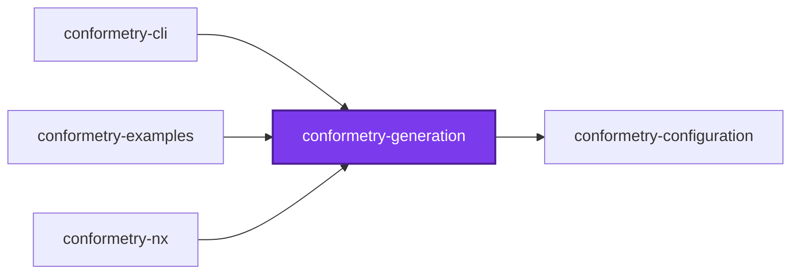
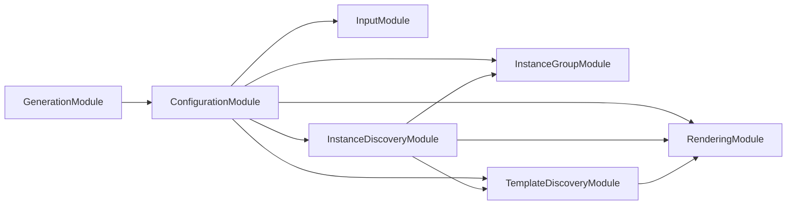
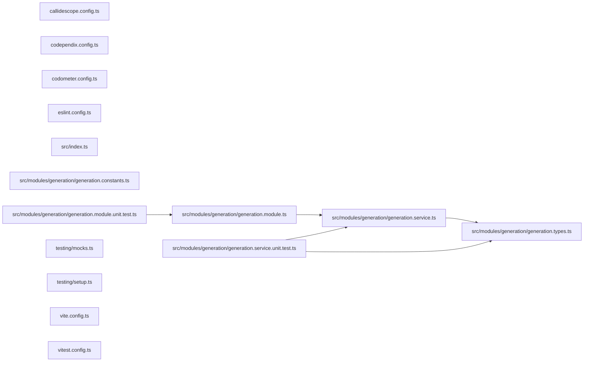

# 👔 Conformetry Generation

[](https://www.npmjs.com/package/@conformetry/generation)

The generation runtime for [Conformetry](../conformetry-cli/README.md): it
walks a template tree, renders every path and every file, and writes the
result.

```bash
npm install --save-dev @conformetry/generation
```

## Usage

```ts
import { GenerationService } from "@conformetry/generation";

const result = await generationService.runGenerator({
  definition: {
    name: "nestjs-service-module",
    templateDirectoryPath: "templates/nestjs-service-module",
  },
  inputs: { name: "billing" },
  instancePath: "packages/billing/src/modules",
});
// → { generatedFilePaths: [...], outputDirectoryPath: "..." }
```

The lifecycle is `preGenerate` → render → `postGenerate` → format, and the
returned file paths are sorted.

## Rendering

`RenderingService` is the single owner of template substitution across the
whole toolchain. Generation renders templates to create files; validation
renders the _same_ templates to compare against files that already exist. Both
must substitute identically or validation would flag the files the generator
itself produced — which is why neither reimplements this.

Contents and paths are both rendered with
[mustache](https://mustache.github.io), HTML escaping disabled so substituted
values cannot corrupt source code. `buildNameSubstitutions` derives
`nameCamelCase`, `nameKebabCase`, `namePascalCase`, and `nameSnakeCase` from a
single name; callers merge their own inputs over the result, so an explicit
input of the same key always wins.

> **An interpolated placeholder nobody supplied raises
> `MissingSubstitutionError`.** Mustache would otherwise render it as an empty
> string rather than leaving the token visible, and because generation and
> validation render identically, both halves of the loop lost the same value and
> agreed that nothing was wrong. A hole rendered into both sides of a comparison
> is not something that comparison can report, so the renderer refuses instead.
> Validation never renders the hole either: it reads the missing value from the
> instance, and reports when it cannot.
>
> Section tags are exempt, deliberately: `{{#field}}` and `{{^field}}` are
> conditionals, so an absent name is how a template asks for a block to be
> skipped or taken. A supplied value that is the empty string is an answer too —
> only an absent key is a hole. Together those are how a template says
> "optional": ask with a section, interpolate inside it.

Paths once used a `__field__` syntax of their own, on the assumption that
braces were not portable across filesystems. They are — and the separate syntax
could not tell a placeholder from a Python dunder, so a template shipping
`__init__.py` depended on `init` never being a substitution.

## Adapters

Filesystem and formatter access go through `FileSystemAdapter` and
`FormatterAdapter`, defaulting to disk and a no-op. That is how
[`@conformetry/nx`](../conformetry-nx/README.md) reuses this runtime unchanged
against an Nx generator `Tree`. Rendering deliberately is _not_ an adapter, for
the reason above.

## Exports

`GenerationService`, `RenderingService`, their modules, and the
`FileSystemAdapter`, `FormatterAdapter`, `GeneratorDefinition`, and
`Substitutions` types.

## Test

```bash
nx run conformetry-generation:vitest
```

## License

MIT — see [LICENSE](../../../../LICENSE).

## 👔 Conformetry

This project was generated from the [nestjs-service-project](../../../../configuration/conformetry-templates/nestjs-service-project) conformetry template.

<!-- callidescope:start -->

## 🔭 Callidescope

Call stacks traced through `projects/ic-suite/conformetry/conformetry-generation`, deepest first. Each frame shows what it takes, what it returns, and what its documentation says.

| Measure | Value |
| --- | --- |
| Callables | 13 |
| Files | 11 |
| Calls traced | 10 |
| Call stacks | 1 |
| Deepest stack | 2 |
| Stacks through recursion | 0 |
| Unfollowable calls | 2 |

### Limits

What this project is judged against, as declared in its own `callidescope.config.ts`.

| Limit | Value |
| --- | --- |
| `maximumDepth` | 8 |
| `maximumBreadth` | 4 |

### Call stacks (depth)

**1. `GenerationService.listDirectory`** — depth 2 · orphan-root

```text
🚀 GenerationService.listDirectory(directoryPath: string): Promise<DirectoryEntry[]> [projects/ic-suite/conformetry/conformetry-generation/src/modules/generation/generation.service.ts:38]
  └─> GenerationService.map(…)(entry: Dirent<string>): { isDirectory: boolean; name: string; } [projects/ic-suite/conformetry/conformetry-generation/src/modules/generation/generation.service.ts:41]
```

### Breadth

| Callable | Breadth | Calls directly | Location |
| --- | --- | --- | --- |
| `GenerationService.runGenerator` | 4 | `GenerationService.resolveAdapters`, `GenerationService.normalizeInputs`, `GenerationService.buildSubstitutions`, `GenerationService.renderDirectory` | `projects/ic-suite/conformetry/conformetry-generation/src/modules/generation/generation.service.ts:190` |
| `GenerationService.renderDirectory` | 2 | `ConfigurationService.renderPath`, `GenerationService.renderFile` | `projects/ic-suite/conformetry/conformetry-generation/src/modules/generation/generation.service.ts:104` |
| `GenerationService.listDirectory` | 1 | `GenerationService.map(…)` | `projects/ic-suite/conformetry/conformetry-generation/src/modules/generation/generation.service.ts:38` |

<details>
<summary>2 more callables</summary>

| Callable | Breadth | Calls directly | Location |
| --- | --- | --- | --- |
| `GenerationService.buildSubstitutions` | 1 | `ConfigurationService.buildNameSubstitutions` | `projects/ic-suite/conformetry/conformetry-generation/src/modules/generation/generation.service.ts:74` |
| `GenerationService.renderFile` | 1 | `ConfigurationService.renderContent` | `projects/ic-suite/conformetry/conformetry-generation/src/modules/generation/generation.service.ts:153` |

</details>
<!-- callidescope:end -->

## 🕸️ Codependix

Dependency graphs exported by [codependix](https://github.com/Organizzolini/codebase/tree/main/projects/ic-suite/codependix/codependix-cli), regenerated by `nx run codebase:codependix:write`.

### Nx Neighborhood

<!-- codependix:start name="codependix-nx-projects" -->

<!-- codependix:end name="codependix-nx-projects" -->

### NestJS Module Graph

<!-- codependix:start name="codependix-nestjs-modules" -->

<!-- codependix:end name="codependix-nestjs-modules" -->

### File Imports

<!-- codependix:start name="codependix-file-imports" -->

<!-- codependix:end name="codependix-file-imports" -->

<!-- codometer:start -->

## ⏲️ Codometer

### Project


### Measured Targets


### TypeScript


### JavaScript


### Python


### JSON


### YAML


### TOML


### Shell


### SQL


### HCL


### CSS


### Conventions


### Jupyter


### Markdown


<!-- codometer:end -->
